| 대분류/19 전기·전자 | 중분류/03 전자기기개발 | 소분류/06 |        |         |
|-----------------|------------------|--------|--------|---------|
|                 |                  | 반도체개발  | 세분류/01 |         |
|                 |                  |        | 반도체개발  | 능력단위/01 |
|                 |                  |        |        |         |

# NCS학습모듈 반도체 제품기획

LM1903060101\_23v6

## [NCS학습모듈 활용 시 유의 사항]

- 1. NCS학습모듈은 교육훈련기관에서 출처를 명시하고 교육적 목적으로 활용할 수 있습니다. 다 만, NCS학습모듈에는 국가(교육부)가 저작재산권 일체를 보유하지 않은 저작물(출처가 표기된 도표‧사진‧삽화‧도면 등)이 포함되어 있으므로, 이러한 저작물의 변형‧각색‧복제‧공연‧ 배포 및 공중 송신 등과 이러한 저작물을 활용한 2차적 저작물을 작성하려면 반드시 원작자 의 동의를 받아야 합니다.
- 2. NCS학습모듈은 개발 당시의 산업 및 교육 현장을 반영하여 집필하였으므로, 현재 적용되는 법령‧지침‧표준 및 교과 내용 등과 차이가 있을 수 있습니다. NCS학습모듈 활용 시 법령 ‧지침‧표준 및 교과 내용의 개정 사항과 통계의 최신성 등을 확인하시기를 바랍니다.
- 3. NCS학습모듈은 산업 현장에서 요구되는 능력을 교육훈련기관에서 학습할 수 있게 구성한 자 료입니다. 다만, NCS학습모듈 지면의 한계상 대표적 예시(예: 활용도 또는 범용성이 높은 제 품, 서비스) 중심으로 집필하였음을 이해하시기를 바랍니다.

## NCS학습모듈의 이해

※ 본 NCS학습모듈은 「NCS 국가직무능력표준」사이트(http://www.ncs.go.kr) 에서 확인 및 다운로드할 수 있습니다.

## Ⅰ NCS학습모듈이란?

- 국가직무능력표준(NCS: National Competency Standards)이란 산업현장에서 직무를 수행하기 위해 요구되는 지식·기술·소양 등의 내용을 국가가 산업부문별·수준별로 체계 화한 것으로 산업현장의 직무를 성공적으로 수행하기 위해 필요한 능력(지식, 기술, 태도) 을 국가적 차원에서 표준화한 것을 의미합니다.
- 국가직무능력표준(이하 NCS)이 현장의 '직무 요구서'라고 한다면, NCS학습모듈은 NCS
  의 능력단위를 교육훈련에서 학습할 수 있도록 구성한 '교수·학습 자료'입니다. NCS학습
  모듈은 구체적 직무를 학습할 수 있도록 이론 및 실습과 관련된 내용을 상세하게 제시하
  고 있습니다.

## ○ NCS학습모듈은 다음과 같은 특징을 가지고 있습니다.

- 첫째, NCS학습모듈은 산업계에서 요구하는 직무능력을 교육훈련 현장에 활용할 수 있도 록 성취목표와 학습의 방향을 명확히 제시하는 가이드라인의 역할을 합니다.
- 둘째, NCS학습모듈은 특성화고, 마이스터고, 전문대학, 4년제 대학교의 교육기관 및 훈 련기관, 직장교육기관 등에서 표준교재로 활용할 수 있으며 교육과정 개편 시에도 유용하게 참고할 수 있습니다.

○ NCS와 NCS학습모듈 간의 연결 체계를 살펴보면 아래 그림과 같습니다.

O NCS학습모듈의 위치는 NCS 분류 체계에서 해당 학습모듈이 어디에 위치하는지를 한 눈에 볼 수 있도록 그림으로 제시한 것입니다.

| [NCS-학          | 습모듈     | 의 위치]    |          |  |
|-----------------|---------|----------|----------|--|
|                 |         |          |          |  |
| 대분류             | 문화·예술   | ··디자인·방송 |          |  |
| 중분류             | 문화콘텐츠   |          |          |  |
| 소분류             | 문화콘텐츠제작 |          |          |  |
|                 |         |          |          |  |
| 세분류             |         |          |          |  |
| 방송콘텐츠제작         |         | 능력단위     | 학습모듈명    |  |
| 영화콘텐츠제작         |         | 프로그램 기획  | 프로그램 기획  |  |
| 음악콘텐츠제작         |         | 아이템 선정   | 아이템 선정   |  |
| 광고콘텐츠제작         |         | 자료 조사    | 자료 조사    |  |
| 게임콘텐츠제작         |         | 프로그램 구성  | 프로그램 구성  |  |
| 애니메이션 콘텐츠제작  |         | 캐스팅      | 캐스팅      |  |
| 만화콘텐츠제작         |         | 제작계획     | 제작계획     |  |
| 캐릭터제작           |         | 방송 미술 준비 | 방송 미술 준비 |  |
| 스마트문화앱 콘텐츠제작 |         | 방송 리허설   | 방송 리허설   |  |
| 영사              |         | 야외촬영     | 야외촬영     |  |
|                 |         | 스튜디오 제작  | 스튜디오 제작  |  |
|                 |         |          |          |  |

학습모듈은

NCS 능력단위 1개당 1개의 학습모듈 개발 을 원칙으로 합니다. 그러나 필요에 따라 고용단위 및 교과단위를 고려하여 능력단위 몇 개를 묶어 1개 학습모듈로 개발할 수 있으며, NCS 능력단위 1개를 여러 개의 학습모듈로 나누어 개발할 수도 있습니다.

## 2. NCS학습모듈의 개요

## ○ NCS학습모듈의 개요는 학습모듈이 포함하고 있는 내용을 개략적으로 설명한 것으로

| 학습모듈의 목표 , 선수학습 , 학습모듈의 내용 체계 , 핵심 용어 로 구성되어 있습니다. |                                                                              |  |
|----------------------------------------------------|------------------------------------------------------------------------------|--|
| 학습모듈의 목표                                           | 해당 NCS 능력단위의 정의를 토대로 학습 목표를 작성한 것입니다.                                        |  |
| 선수학습                                               | 해당 학습모듈에 대한 효과적인 교수·학습을 위하여 사전에 이수해야 하는 학습모 듈, 학습 내용, 관련 교과목 등을 기술한 것입니다. |  |
| 학습모듈의 내용 체계                                     | 해당 NCS 능력단위요소가 학습모듈에서 구조화된 체계를 제시한 것입니다.                                     |  |
| 핵심 용어                                              | 해당 학습모듈의 학습 내용, 수행 내용, 설비·기자재 등 가운데 핵심적인 용어를 제 시한 것입니다.                   |  |

## 제작계획 학습모듈의 개요

#### 학습모듈의 목표

본격적인 촬영을 준비하는 단계로서, 촬영 대본을 획정하고 제작 스태프를 조직하며 촬영 장비와 촬영 소품을 준비할 수 있다.

#### 선수학습

제작 준비(LM0803020105\_13v1), 섭외 및 제작스태프 구성(LM0803020104\_13v1), 촬영 제작(LM0803020106\_13v1), 촬영 장비 준비(LM0803040204\_13v1.4), 미술 디자인 협의하기(LM0803040203\_13v1.4)

### 학습모듈의 내용체계

| 하스                | 하는 데이                                              | NCS 능력단위 요소       |                |
|-------------------|----------------------------------------------------|-------------------|----------------|
| 학습                | 학습 내용                                              | 코드번호              | 요소 명칭          |
| 1. 촬영 대본 확정하기  | 1-1. 촬영 구성안 검 토와 수정                             | 0803020114_16/3.1 | 촬영 대본 확정하기  |
| 2. 제작 스태프 조직하기 | 2-1. 기술 스태프 조직 2-2. 미술 스태프 조직 2-3. 전문 스태프 조직 | 0803020114_16v3.2 | 제작 스태프 조직하기 |
| 3. 촬영 장비 계획하기  | 3-1. 촬영 장비 점검 과 준비                              | 0803020114_16/3.3 | 촬영 장비 계획하기  |
| 4. 촬영 소품 계획하기  | 4-1. 촬영 소품 목록 작성 4-2. 촬영 소품 제작 의뢰         | 0803020114_16\3.4 | 촬영 소품 계획하기  |

## 핵심 용어

촬영 구성안, 제작 스태프, 촬영 장비, 촬영 소품

## 학습모듈의 목표는

학습자가 해당 학습모듈을 통해 성취해야 할 목표를 제시한 것으로, 교수자는 학습자 가 학습모듈의 전체적인 내용흐름을 파악하 도록 지도할 수 있습니다.

**6** • •

61

## 선수학습은

교수자 또는 학습자가 해당 학습모듈을 교 수·학습하기 이전에 이수해야 하는 교과목 또는 학습모듈(NCS 능력단위) 등을 표기한 것입니다. 따라서 교수자는 학습자가 개별 학습, 자기 주도 학습, 방과 후 활동 등 다 양한 방법을 통해 이수할 수 있도록 지도하 는 것을 권장합니다.

|            | 핵심 용어는              |
|------------|---------------------|
|            | 률을 대표하는 주요 용어입니     |
|            | · 해당 학습모듈을 통해 학습    |
|            | 게될 주요 내용을 알 수 있습    |
|            | 5 국가직무능력표준」 사이트     |
| (www.ncs.g | jo.kr)의 색인 (찾아보기) 중 |
| 하나로 이용할    | 할 수 있습니다            |

## 3. NCS학습모듈의 내용 체계

○ NCS학습모듈의 내용은 크게 학습, 학습 내용, 교수·학습 방법, 평가 로 구성되어 있습니다.

| 학습       | 해당 NCS 능력단위요소 명칭을 사용하여 제시한 것입니다. 학습은 크게 학습 내용, 교수·학습 방법, 평가로 구성되며 해당 NCS 능력단위의 능력단위 요소별 지식, 기술, 태도 등을 토대로 내용을 제시한 것입니다.                                                    |
|----------|----------------------------------------------------------------------------------------------------------------------------------------------------------------------------------|
| 학습 내용    | 학습 내용은 학습 목표, 필요 지식, 수행 내용으로 구성되며, 수행 내용은 재료·자 료, 기기(장비·공구), 안전·유의 사항, 수행 순서, 수행 tip으로 구성한 것입니다. 학습모듈의 학습 내용은 실제 산업현장에서 이루어지는 업무활동을 표준화된 프로세 스에 기반하여 다양한 방식으로 반영한 것입니다. |
| 교수·학습 방법 | 학습 목표를 성취하기 위한 교수자와 학습자 간, 학습자와 학습자 간 상호 작용이 활발하게 일어날 수 있도록 교수자의 활동 및 교수 전략, 학습자의 활동을 제시한 것입니다.                                                                            |
| 평가       | 평가는 해당 학습모듈의 학습 정도를 확인할 수 있는 평가 준거 및 평가 방법, 평 가 결과의 피드백 방법을 제시한 것입니다.                                                                                                         |

## [NCS-학습모듈의 위치]

| 대분류 | 전기·전자 |        |  |  |
|-----|-------|--------|--|--|
| 중분류 |       | 전자기기개발 |  |  |
| 소분류 |       | 반도체개발  |  |  |

| 세분류   |                  |                  |
|-------|------------------|------------------|
| 반도체개발 | 능력단위             | 학습모듈명            |
| 반도체제조 | 반도체 제품기획         | 반도체 제품기획         |
| 반도체장비 | 반도체 아키텍처 설계      | 반도체 아키텍처 설계      |
| 반도체재료 | 아날로그 회로 아키텍처 설계  | 아날로그 회로 아키텍처 설계  |
|       | 아날로그 회로 소자레벨 설계  | 아날로그 회로 소자레벨 설계  |
|       | 아날로그 회로 시스템 설계   | 아날로그 회로 시스템 설계   |
|       | 디지털 회로 설계        | 디지털 회로 설계        |
|       | 커스텀 레이아웃 적용공정 분석 | 커스텀 레이아웃 적용공정 분석 |
|       | 커스텀 레이아웃 설계      | 커스텀 레이아웃 설계      |
|       | 커스텀 레이아웃 검증      | 커스텀 레이아웃 검증      |
|       | 자동 배치배선 레이아웃 설계  | 자동 배치배선 레이아웃 설계  |
|       | 반도체 설계 검증        | 반도체 설계 검증        |
|       | 반도체 펌웨어 개발       | 반도체 펌웨어 개발       |
|       | 메모리 반도체 제조공정개발   | 메모리 반도체 제조공정개발   |

| 시스템 반도체 제조공정개발   | 시스템 반도체 제조공정개발   |  |
|------------------|------------------|--|
| 반도체 제조 단위공정개발    | 반도체 제조 단위공정개발    |  |
| 와이어본딩 패키지 개발     | 와이어본딩 패키지 개발     |  |
| 플립칩 패키지 개발       | 플립칩 패키지 개발       |  |
| 웨이퍼레벨 패키지 개발     | 웨이퍼레벨 패키지 개발     |  |
| 어드밴스드 팬아웃 패키지 개발 | 어드밴스드 팬아웃 패키지 개발 |  |
| 이종접합 패키지 개발      | 이종접합 패키지 개발      |  |
| 어드밴스드 언더필 패키지 개발 | 어드밴스드 언더필 패키지 개발 |  |
| 패키지 조립 공정 개발     | 패키지 조립 공정 개발     |  |
| 반도체 제품 기능·성능 검증  | 반도체 제품 기능·성능 검증  |  |
| 반도체 환경시험         | 반도체 환경시험         |  |
| 반도체 수명시험         | 반도체 수명시험         |  |
| 반도체 내성시험         | 반도체 내성시험         |  |

| 학습모듈의 개요               | 1  |
|------------------------|----|
| 학습 1. 제품 시장 조사하기       |    |
| 1-1. 시장 동향 분석          | 3  |
| • 교수・학습 방법             | 22 |
| • 평가                   | 23 |
| 학습 2. 기술 동향 조사하기       |    |
| 2-1. 기술 동향 분석          | 25 |
| 2-2. 제품 핵심 기능 및 장단점 파악 | 53 |
| • 교수・학습 방법             | 61 |
| • 평가                   | 62 |
| 학습 3. 제품 사양 수립하기       |    |
| 3-1. 개발 제품 기능 정의       | 64 |
| 3-2. 기능 및 성능 목표명세서 작성  | 74 |
| • 교수・학습 방법             | 81 |
| • 평가                   | 82 |
| 학습 4. 비용 분석하기          |    |
| 4-1. 개발 일정 수립          | 84 |
| 4-2. 개발 및 생산 비용 도출     | 91 |
| 4-3. 손익분기점 도출          | 99 |
|                        |    |

• 교수・학습 방법 109

| • 평가                    | 110 |
|-------------------------|-----|
| 학습 5. 개발계획 수립하기         |     |
| 5-1. 개략적 개발계획 수립        | 112 |
| 5-2. 개발 역량 분석 및 협력업체 선정 | 122 |
| 5-3. 개발계획 확정            | 133 |
| • 교수・학습 방법              | 142 |
| • 평가                    | 143 |
| 참고 자료                   | 146 |
| 활용 서식                   | 147 |

## 반도체 제품 기획 학습모듈의 개요

## 학습모듈의 목표

시장 및 고객의 다양한 요구조건에 맞는 제품을 구현하기 위해 필요한 제반사항 분석을 통해 개발 사양을 확정, 개발일정을 포함한 제품 개발계획을 수립할 수 있다.

## 선수학습

반도체 제조 공정 개발(LM1903060106\_15v4), 반도체 제품 기능·성능 검증(LM1903060109\_14v3), 반 도체 신뢰성 평가(LM1903060110\_14v3), 반도체 공학, 전자공학

## 학습모듈의 내용체계

|               | 학습 내용                   | NCS 능력단위 요소       |               |
|---------------|-------------------------|-------------------|---------------|
| 학습            |                         | 코드번호              | 요소 명칭         |
| 1. 제품 시장 조사하기 | 1-1. 시장 동향 분석           | 1903060101_23v6.1 | 제품 시장 조사하기 |
|               | 2-1. 기술 동향 분석           | 1903060101_23v6.2 | 기술 동향         |
| 2. 기술 동향 조사하기 | 2-2. 제품 핵심 기능 및 장단점 파악  |                   | 조사하기          |
|               | 3-1. 개발 제품 기능 정의        | 1903060101_23v6.3 | 제품 사양         |
| 3. 제품 사양 수립하기 | 3-2. 기능 및 성능 목표명세서 작성   |                   | 수립하기          |
|               | 4-1. 개발 일정 수립           | 1903060101_23v6.4 | 비용 분석하기       |
| 4. 비용 분석하기    | 4-2. 개발 및 생산 비용 도출      |                   |               |
|               | 4-3. 손익분기점 도출           |                   |               |
|               | 5-1. 개략적 개발계획 수립        |                   |               |
| 5. 개발계획 수립하기  | 5-2. 개발 역량 분석 및 협력업체 선정 | 1903060101_23v6.5 | 개발계획 수립하기     |
|               | 5-3. 개발계획 확정            |                   |               |

## 핵심 용어

반도체 산업 동향, 시장, 제품, 기술, 고객 요구 조건, 사양, 특허권, 제조 기술, 비용 분석, 제품 개발계획

| 학습 1 | 제품 시장 조사하기 |
|------|------------|
| 학습 2 | 기술 동향 조사하기 |
| 학습 3 | 제품 사양 수립하기 |
| 학습 4 | 비용 분석하기    |
| 학습 5 | 개발계획 수립하기  |

## 1-1. 시장 동향 분석

| 학습 목표 | • 고객의 요구 사항과 진입 시장의 규모를 파악할 수 있다.                 |
|-------|---------------------------------------------------|
|       | • 파악된 시장규모에 대한 자료와 시장조사기관의 분석자료를 통해 개발제품에 대한 전반적인 |
|       | 시장동향을 분석할 수 있다.                                   |
|       | • 시장 동향 분석 결과를 바탕으로 분석보고서를 작성할 수 있다.              |

## 필요 지식 /

숔 반도체 산업 현황

반도체에 대한 정의와 발전사, 구분 방법, 특징 등을 조사하여 반도체 산업 현황을 파악한다.

1. 반도체 정의

일반적으로 반도체(半導體, semiconductor)란 물질의 분류 가운데 하나로 전기가 잘 통하 는 도체(conductor)와 통하지 않는 절연체(또는 부도체, insulator)의 중간적인 성질을 나 타내는 물질을 말하며 어원에서 볼 수 있듯이 半 + 導體 또는 SEMI + CONDUCTOR 라 는 뜻을 지니고 있다.

(1) 물질의 분류

고체를 전기 전도율(electrical conductivity)이나 전기 저항률에 따라 도체, 반도체, 절연체로 분류하는데 학자마다 약간의 차이는 있지만 전기 저항률이 10-4[ῼm] 이하인 물질을 도체, 106 [ῼm] 이상인 물질을 절연체라 하며, 그 도체와 절연체의 중간 값을 가지는 물질을 반도체로 구분한다.

순수 반도체는 절연체와 같이 전기가 거의 통하지 않지만, 어떤 인공적인 조작을 가하면 도 체처럼 전기가 흐르는 특징을 가진다. 이를 활용해 현대 전자기기에 널리 사용되는 반도 체들은 열, 빛, 자장, 전압, 전류 등의 영향으로 그 성질이 크게 바뀌며 이 특징에 의해 매우 다양한 용도로 응용할 수 있다.

하지만 반도체의 복잡한 구조와 성질 때문에 단순히 전기 저항률만으로는 반도체를 간 단히 정의하기는 어려운 것이 현실이다.

반도체를 이해하기 위해서는 물질의 구조와 반도체의 성질, 반도체의 에너지대 이론 등 의 학습이 필요하나 내용이 방대해 여기에서 논하기는 적절치 않아 생략하며 선수 학습 에서 언급한 반도체 공학, 전자공학 등의 내용에서 전자기학 및 전자공학의 기초 지식을 학습했다는 것을 전제로 진행하기로 한다.

[그림 1-1]은 반도체를 포함한 주요 물질의 전기 저항률을 나타낸 것이다. 초순수(DIW: de-ionized water)는 고체 물질은 아니지만 반도체 산업 현장에서 세정 및 절단 공정 등에 광범위하게 사용되는 것으로 제품의 품질이나 공정 관리에 커다란 영향을 미치기 때문에 포함시켰다.

[그림 1-1] 반도체 및 주요 물질의 전기 저항률

#### (2) 반도체 주요 물질

대표적인 반도체는 주기율표에서 4족 원소인 게르마늄(Ge: germanium, 저마늄), 실리 콘(Si: silicon, 규소) 등이 이에 속한다. 반도체 초창기에는 게르마늄이 사용되었으나 오 늘날에는 대부분 실리콘을 주 원료로 사용하고 있다. 고속소자 및 통신용으로 사용되는 GaAs(gallium arsenide, 갈륨비소)와 LED(light emitting diode, 발광 다이오드) 용 인 사파이어(sapphire, Al2O3), 고전력용으로 부상하고 있는 SiC(silicon carbide, 탄화 규소)등의 화합물 반도체의 설명을 여기에서는 생략하고 학습 2.의 '기술 동향 조사하기' 에서 언급하고자 한다.

[그림 1-2]에 주기율표상에서 활용되는 주요 반도체 원소와 물질에 대해 주요 성질을 포함해 표시하였는데 4족 원소 물질에 전기적 특성(p-type, n-type)을 나타내기 위해 도판트로 쓰이는 3족(B: boron), 5족(P: phosphorous, As: arsenic) 물질들을 확인할

수 있다. MOSFET(metal oxide semiconductor field-effect transistor, 금속 산화물 반도체 전계효과 트랜지스터)의 게이트 채널 절연을 위해 극히 얇은 층으로 사용되는 SiO2(silicon dioxide, silica, 이산화규소)에 대해서도 관심을 기울이기를 바란다.

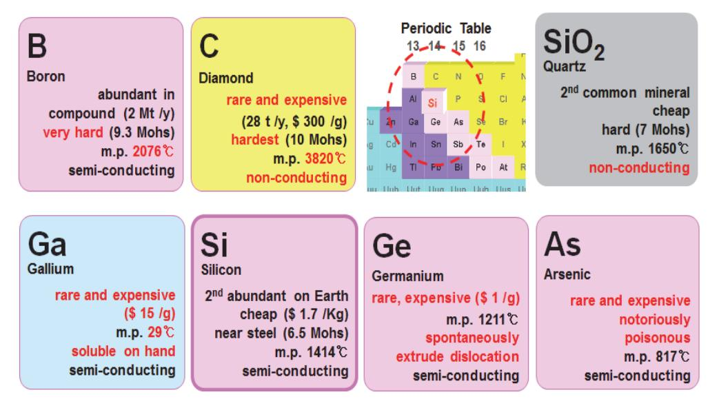

[그림 1-2] 주요 반도체 물질 및 그 특성

(3) 반도체 응용 분야

현재 반도체는 PC를 비롯하여 TV, DVD 등 디지털 가전제품뿐만 아니라 통신 기기, 자동차, 산업용 기계, 로봇, 시계 등 다양한 분야에 걸쳐 이용되고 있다. 그 중에서도 휴대전화와 개인 휴대단말기(PDA: personal digital assistant)의 장점을 결합한 스마 트폰은 휴대전화의 기능은 물론이며 일정 관리, 팩스 송수신 및 인터넷 접속 등의 데이 터 통신 기능을 갖추고 있어 이메일, 웹브라우징, 인터넷 쇼핑이나 뱅킹 등이 가능하다. TV와 라디오 시·청취 등의 방송 서비스와 카메라, 캠코더, MP3 기능, 무전기 기능까지 갖추고 있으며 워드프로세서나 엑셀 등과 같은 문서 작성도 가능하다. Wi-Fi 기능을 활 용해 음성 패킷망(VoIP: voice over internet protocol)을 사용하여 인터넷을 통한 전 화 통화도 할 수 있어'다기능 복합단말기'라고도 불리며 거대한 시장을 형성하고 있다. 또한 최근에 새로운 시장으로 부상하며 각국에서 개발 경쟁을 치열하게 벌이고 있는 전 기 자동차와 인공지능 자동차를 포함한 차세대 자동차는 달리는 전자제품이라고 할 정 도로 많은 반도체가 사용되고 있다. 현재도 마이크로컨트롤러(microcontroller) 또는 MCU(micro controller unit)의 경우 일반 승용차에 약 80개 정도, 고급 승용차에 약 250개나 사용되고 있을 정도로 반도체와 다른 산업 간의 융합은 상상을 초월하고 있다.

## (1) 트랜지스터의 발명

1900년대 초에 전자 신호를 증폭하는 소자로 발명된 진공관은 제2차 세계대전 때까지 모든 전자장비에서 사용되었지만 전력 소모가 크고 유지하는 데 어려움이 많았다. 그러 던 중 1947년, 미국 벨연구소의 윌리엄 쇼클리(William Bradford Shockley Jr.) 연구 진인 존 바딘(John Bardeen, 1908~1991)과 월터 브래튼(Walter Houser Brattain, 1902~1987)에 의해 빛을 쪼이거나 전자를 주입하면 전도도가 달라지는 소자인 트랜지 스터(transistor)가 개발되었다. 트랜지스터라는 이름은 transfer(전송) + resistor(저항) 의 두 단어를 합친 것이다.

전자 산업의 역사에서 매우 중요한 사건인 트랜지스터의 발명으로 쇼클리와 바딘, 브래 튼은 트랜지스터 개발자로 1956년 노벨 물리학상을 3인 공동 수상했으며 오늘날과 같 은 전자 문명을 이룩하는 밑거름이 되었다.

(2) 집적회로(IC: integrated circuit) 개발

트랜지스터로 인해 전자 제품의 크기는 점점 작아지고, 보다 정확하고 다양한 기능을 실현 시킬 수 있게 되었다. 그러나 트랜지스터도 단점이 있었는데 수많은 트랜지스터와 전자 부 품을 서로 연결해야만 다양한 기능을 가진 하나의 제품을 만들 수 있어, 제품이 점점 복잡 해질수록 연결해 주어야 하는 부분이 기하급수적으로 증가하게 되고, 이런 연결점들이 제품 을 고장 내는 주요 원인이 되었다.

이에 1958년 텍사스 인스트루먼트(TI: Texas Instruments)의 잭 킬비(Jack St. Clair Kilby, 1923~2005)와 페어차일드 반도체(Fairchild Semiconductor)의 로버트 노이스 (Robert Norton Noyce, 1927~1990)가 하나의 실리콘 반도체 조각 위에 트랜지스터뿐만 아니라 저항, 다이오드, 커패시터 등의 여러 소자를 배치하고 연결하는 집적회로(IC: integrated circuit)를 개발하였다. 이 IC는 소자뿐 아니라 연결선까지 회로 전체를 반도체 웨이퍼 위에 구현하여 얇고 가벼우며 수명도 길다는 장점과 함께 대량 생산의 시대를 열었 다. 잭 킬비는 2000년에 집적 회로를 발명한 공로로 노벨 물리학상을 수상했다.

그 이후 소자의 집적도를 증가시킨 CMOS(complementary metal–oxide– semiconductor, 상보성 금속 산화막 반도체)를 거쳐 오늘날은 프로세서, 메모리, 프로 그램 가능 로직과 아날로그, RF 등 모든 요소들을 하나의 칩 안에 집적하는 시스템 온 칩(SoC: system–on-chip)의 시대가 되었다.

3. 반도체 구분

반도체는 장난감에서부터 바이오·우주·항공 산업에 이르기까지 다양하게 사용되고 있으며, 4차 산 업의 키워드인 산업 융합화 및 유비쿼터스 사회 구축을 뒷받침하는 핵심 부품으로 자리매 김하고 있다.

(1) 제조공정에 따른 분류

반도체 기업들은 자사의 기술 역량, 자금, 반도체 경기 등에 따라 전략적으로 생산에 참

6

여하고 있으며 제조공정에 따라 전공정(front-end process)업체와 후공정(back-end process)의 어셈블리 및 테스트 전문업체로 구분한다. 전공정업체는 일관공정업체(IDM: integrated device manufacturer, 종합반도체회사), 설계전문업체(fabless), 수탁제조 업체(foundry)로 Intellectual Property 개발 업체(IP, chipless)등으로 구분할 수 있는 데 메모리 분야는 대부분 일관공정업제(IDM)이며, 시스템 IC 분야는 부가가치 체인별 분업화가 잘 이루어져 있다. 특히 IP 전문 업체(chipless 비즈니스)는 새로운 수익 모델 기업으로 등장하고 있으며 이는 반도체 칩을 완제품으로 설계하지 않고 칩의 아키텍처 설계, 규격 설정, IP 개발 등 R&D 부문에 가까운 분야를 특화한 기업들이다.

설계 전문(fabless) 비즈니스도 고속 성장하고 있으며, 이는 반도체 칩을 직접 생산하지 않고 특정 용도 IC의 설계 및 마케팅에 특화한 기업이다. 또한 이들 기업을 뒷받침하는 파운드리(foundry) 비즈니스도 활발히 성장하고 있다. 생산 기술 및 생산 원가의 우위 를 바탕으로 설계 업체의 위탁에 의해 제조만을 전문하며 대만, 한국, 중국이 치열한 경 쟁을 벌이고 있다.

국가별로 보면 일본과 한국은 대체로 수직 계열화된 종합기업들이 대부분이기 때문에 여전히 자신들이 사용할 반도체를 생산하는 설비를 보유하고 있으며, 미국과 유럽은 반 도체 전문업체가 많은 편이다. 대만의 경우 세계 선두권의 파운드리 업체를 보유한 반도 체 제조 강국이다. <표 1-1>에 반도체 제조 공정별 특성 및 주요 업체 현황을 표기하였 다 .

#### <표 1-1> 반도체 제조공정별 주요 업체 현황

| 구분                           | 공정                  | 특성                                                                                                                         | 주요업체                                                                    |
|------------------------------|---------------------|----------------------------------------------------------------------------------------------------------------------------|-------------------------------------------------------------------------|
| 전(前) 공정 (Front End) | 일관 공정 (IDM)      | - 칩 설계에서 제조 및 테스트까지 직접 수 행(메모리 제조 성공 모델) - 기술력과 규모의 경제를 통한 경쟁 확보 - 거대 투자의 고위험 고수익 형태                              | Intel, Micron, TI, STMicro, Infineon, 삼성전자, Toshiba, SK hynix, |
|                              | 설계 전문 (fabless)  | - 칩 설계만 전문으로 하는 업체 - 고위험의 거대 투자는 회피하나, 위탁 제 조비용 부담 필요 - 고도의 시장 예측 능력 필요(주문 생산의 최소 물량 예측)                       | Broadcom, Qualcomm, Nvidia, 코어로직, 엠택비젼                         |
|                              | 제조 전문 (foundry)  | - 주문에 의해 칩 생산만 전문 - 자체 칩 설계하지 않고, 설계 전문 업체로 부터 위탁받아 제조                                                               | TSMC, UMC, SMIC, IBM, Chartered Semi, DB하이텍                    |
| 후(後) 공정 (Back End)  | 패키지 및 테스트     | - 메모리: 자체 조립 - 시스템IC: 외부 위탁(다양한 제품) - 테스트: 조립 업체 수행(전수 검사)                                                           | ASE Test, Amkor, Siliconware Prescision,                       |
| 설계 및 장비                | IP 전문 (chipless) | - 설계 기술 R&D 전문 - IDM이나 Fabless에 IP제공(칩 설계용 architecture IP, chip 생산용 physical IP, system IP, 일반 기술 IP 등) | ARM, Rambus, Artisan, TTCom,                                         |
|                              | 공정 장비               | - 반도체 제조 장비 개발 및 생산 - 제조공정 기술개발 주도                                                                                      | AMAT, ASML, TEL, Nikon, Advantest,                                |

### (2) 재료에 따른 분류

반도체 재료 업체를 크게 분류하면 일반적으로 전공정 재료와 후공정 재료로 구분한다. 전공정 재료는 다시 기능 재료와 공정 재료로 나누어지는데 기능 재료란 반도체의 기판 이 되는 웨이퍼를 말하고, 공정 재료란 웨이퍼를 가공하여 칩을 제조하는 데 사용되는 소재로 포토마스크, 포토레지스트, 반도체용 고순도 화공약품 및 가스류, 페리클 (pellicle, particle 또는 외부적인 defect로부터 감광원판(mask)을 보호할 목적으로 감 광원판 가장자리에 형상이 없는 곳에 부착하는 물질), 배선재료 등을 말한다. 후공정 재 료에는 구조 재료가 있는데 리드프레임, 본딩 와이어, 봉지재 등이 있다.

(3) 장비에 따른 분류

반도체 장비 업체는 일반적으로 전공정 장비 및 후공정 장비로 구분한다. 전공정 장비는 다

시 main 장비와 주변 장비로 구분하는데 main 장비는 CVD(화학증착장비, chemical vapor deposition), Asher, 식각 장비, Track 장비 등이 포함되고 주변 장비는 세정 장비, 가스, 캐비닛, Chiller, Scrubber 클린룸 설비, 반도체 배관 설비 등을 말한다.

후공정 장비는 검사 장비와 기타 장비로 나뉘는데 검사 장비는 Test Handler, Chip Mounter, Burn-in System 등이 있고 기타 장비에는 패키징 장비(몰딩, 트리밍, 포밍 장비, Wire Bonder, Die Bonder), 레이저 마킹 장비 등으로 구분한다.

이해를 돕기 위해 [그림 1-3]에 현재 silicon을 사용하는 반도체 산업의 value chain 흐름을 간단히 표시하였다. 세부적인 전후방 산업 내용에 대해서는 생략하였다.

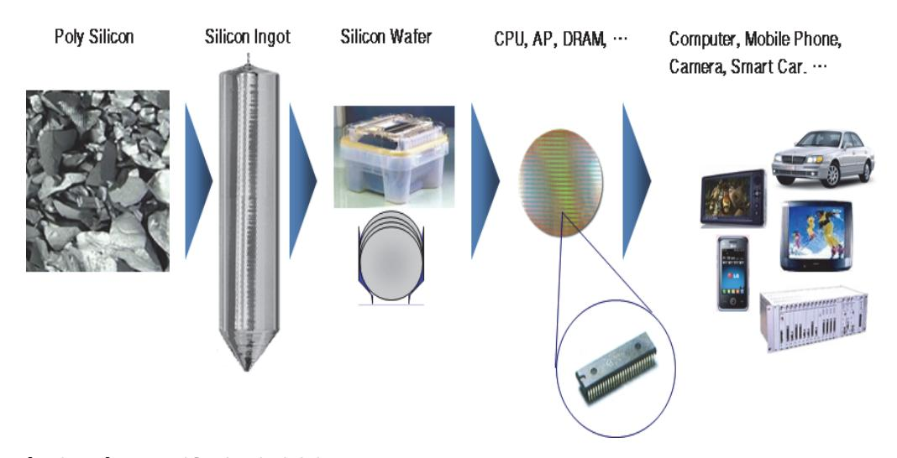

[그림 1-3] silicon사용 반도체 산업의 value chain

4. 반도체 산업 특징

반도체 산업은 현재의 전자 및 정보화 사회를 주도하고 있는 산업으로서 1960년대 집적회 로가 개발된 이래 지속적으로 비약적인 성장을 거듭하였다. 소자(device)의 성능은 획기적 으로 향상되어 더욱 작으면서도 값이 저렴하고, 전력 소모도 낮은 새로운 소자가 계속 등장 하여 신산업의 발전을 견인하고 있다.

(1) 산업의 특징

반도체 산업은 첨단 ICT 수요에 연동된 고효율, 고성장, 고부가가치의 미래 유망 산업 으로 고도의 하드웨어 및 소프트웨어 기술이 복합적으로 요구되며 전자공학, 기계, 화 학, 물리 등의 다양한 과학 기술이 융합된 산업의 성격을 가지고 있다. 특히 모바일 환경의 확산과 스마트폰·태블릿 PC·스마트 가전·자동차·항공·우주산업 등 수요처의 다변화 및 고도화, 4차 산업혁명으로의 패러다임 전환이 가속화하면서 빅데이 터, 인공지능, IoT(internet of things, 사물인터넷) 등의 분야에 대한 투자가 확대됨에 따라 이와 같은 신기술 분야의 발전에 가장 중요한 하드웨어 부품인 반도체 산업은 지 속적으로 발전하고 있는 추세이다.

가격 등락과 경기 부침이 심하고 분야별 세계 소수 기업이 지배하는 특성이 있어 치열 한 경쟁에서 우위를 차지하기 위해서는 끊임없는 기술 개발, 적기 선행 투자, 시장 예측 등이 필수적이다.

(가) 시스템 반도체

시스템 반도체 산업은 높은 초기 투자 비용, 수준 높은 기술력과 고급 인력 필요, 긴 개발 기간 등 영세 기업의 독립적인 창업으로 제품 출시에 어려움이 많다. 그리고 다양한 기능을 처리하기 위한 다품종의 제품을 생산하는 산업으로 대규모의 시설 투 자 없이 기술 아이디어와 설계 인프라만 있으면 진입할 수 있는 팹리스 산업의 특성 과 그 반대 개념으로 설계 디자인을 위탁받아 생산하는 파운드리 산업의 특성을 가 지고 있다.

제품 개발 방향으로는 저전력화, 고속화, 고집적화와 더불어 고기능·다기능의 SoC(system on a chip)화와 다층칩의 패키지인 SIP(system in package)화가 진 행 중이며 제품의 수명주기가 짧아 적기 시장 선점이 중요하다.

또한 설계의 복잡성 증가로 설계의 효율성 확보가 핵심 경쟁력으로 IT 산업과 전통 산업 간의 융복합화 요구를 충족시키기 위한 수단으로 사용되며, 고성능이면서도 다 양한 기능의 확장성을 위해 하드웨어와 소프트웨어가 결합된 통합 SoC로 진화하며 그 중요성이 더욱 부각되고 있다.

(나) 메모리 반도체

메모리 반도체는 제조 경쟁력이 중요한 대규모 장치 산업이며, 기업별로 제조공정의 미세화 정도에 따라 사업의 생산성이 결정된다. 또 대규모 설비투자 및 선행 공정기 술이 핵심 경쟁력으로 선두 글로벌 기업 간의 나노 기술 및 설비 투자 경쟁 구도로 재편되고 있다.

차세대 메모리는 초고속으로 정보를 처리할 수 있는 DRAM의 특성과 전원을 꺼도 정보가 지워지지 않는 플래시 메모리의 특성을 결합한 메모리로 고집적·초고속·대용 량, 3차원 구조의 특성을 보유한 제품으로 진화하고 있으며 현재의 메모리 반도체 양산 기술은 반도체 집적의 한계에 근접하고 있어 기술적 한계를 극복할 수 있는 PCRAM(phase change RAM, 상변화 램), ReRAM(또는 RRAM, resistive RAM, 저항 램), FRAM(또는 FeRAM, ferroelectric RAM, 강유전체 램) 등 차세대 메모리 의 원천기술 선점이 요구되고 있다.

#### 차세대 메모리(next-generation memory)

컴퓨팅 정보(데이터) 기억장치(메모리)인 DRAM을 대체할 소자를 말하며 DRAM 미세 설계 체계가 기술 적 한계인 10나노미터(nm)에 근접하면서 산업계의 큰 관심을 끌고 있다. 데이터의 비휘발성, 빠른 처리 속도, 데이터의 무작위적 접근(random access), 최소 전력 소비, 초소 형, 안전성, 저렴한 가격 등 요구되는 장점들을 고루 갖춘 이상적인 메모리를 말한다. 현재 연구되고 있는 차세대 메모리들은 반도체 메모리가 주축을 이루며 기본 단위인 셀을 구조나 물질 에 따라 작동 원리와 성능이 달라지는데 FeRAM(Ferroelectric RAM: 강유전체 램), MRAM(Magnetic RAM: 강자성 램), PRAM(Phase Change RAM: 상변화 램), ReRAM(Resistance RAM: 저항 램), PoRAM(Polymer RAM: 폴리머 램), NFGM(Nano Floating Gate Memory: 나노튜브 램), 홀로그래픽 메모리, 분자 전자 소자, 모듈러 메모리 등이 있다.

## (2) 국내 반도체 산업의 위치

(가) 수출 주력 산업

우리나라 반도체 산업은 1982년 일괄 양산체제를 갖춘 후 국가 경제를 주도하는 주 력 산업으로 전체 산업에서 커다란 수출 비중을 차지하며 2017년 우리나라 반도체 수출액은 세계 IT 및 반도체 산업의 활황과 메모리 가격 상승으로 2016년보다 57.4% 늘어난 979억4000만 달러를 기록했다. 반도체는 단일 품목으로는 처음으로 연간 수출액이 900만 달러를 돌파한 품목으로 기록됐다. 이로서 전체 수출액 (5,738.7억 달러)중 반도체가 차지하는 비중은 17.1%로 상승하였다. 이는 2010년부 터 진행된 모바일 인터넷 기반의 스마트폰과 AI 등 스마트 기기들이 급속히 보급되 면서 수요가 급상승하였기 때문이다.

## (나) 세계 속의 대한민국 반도체 산업

2017년 기준 세계 반도체 시장 규모는 4,122억 달러로 시스템 반도체 매출은 2,882억 달러(308조 2300억 원)로 전체 반도체 시장의 69.9%를 차지하며 같은 기 간 메모리 반도체 매출은 1,240억 달러(132조6200억원)로 나머지 30.1%를 차지했 다.

국내 반도체 산업의 규모는 미국에 이어 세계 2위로 세계시장 점유율 20.7%를 기록 하고 있으며 그 중 메모리는 55.0%를 점유 중이고, 특히 메모리 반도체중 DRAM은 세계 1위(73.1%)를 점유함으로서 가장 경쟁력 있는 산업으로 발전하였다.

전체 반도체 시장에서도 우리나라는 삼성전자가 14.6%(612.15억불)로 1위, SK하이 닉스는 6.3%(263.09억불)로 3위를 기록하고 있으나, 시스템 반도체 분야에서는 미국 70.0%, 일본 6.3%, 대만 8.2% 대비 한국은 3.1% 수준에 불과하여 중국의 4.0%에 도 뒤지며 선진국과의 생산 기술 격차가 큰 실정이다.

그러나 최근 국내 반도체 시장 구조가 기존에 강점을 가지고 있던 메모리 분야뿐만 아니라, 시스템 반도체 분야에서도 지속적인 투자와 연구 개발로 경쟁력을 나타내면 서 향후 메모리와 시스템 반도체 부문 모두에서 세계 강국이 될 수 있기를 희망한

숕 반도체 시장 동향

반도체 시장 동향은 전문 시장 조사기관의 분석 자료와 인터넷 정보, 주요 전시회 참관 등을 통해 시장, 경쟁사, 설치 환경, 유통 및 디자인 trend 등 개발 제품의 시장 동향을 조사·파악한 다.

1. 주요 반도체 업체 현황

2017년 전 세계 반도체 시장은 전년대비 22.2% 증가한 4,122억 달러(한화 약 440조 8500억 원) 규모를 형성했으며, 삼성전자가 인텔을 제치고 이 시장의 1위를 차지한 것으로 나타났다.

반도체 전문 시장 조사기관인 가트너와 IHS의 예비 조사 결과에 따르면 2017년 전체 반도 체 시장은 메모리 분야가 64% 성장한 것에 힘입어 이처럼 높은 성장률을 기록했으며, 특히 전 세계 최대 메모리 공급 업체인 삼성전자는 1992년 이후 1위 자리를 놓치지 않았던 인 텔을 밀어내고 1위를 차지했다.

(1) 메모리 업체 현황

메모리 분야의 매출 호조를 이끈 일등 공신은 공급 부족으로 인한 가격 상승으로 낸드 (NAND) 플래시 가격이 2016년 대비 17% 상승했으며, DRAM 가격도 44% 증가했다. 장비 업체들은 가격 인상분을 흡수할 수 없어 소비자가에 반영했고 이로 인해 PC부터 스마트폰에 이르는 소비자 제품 가격이 2017년에 대부분 인상됐다. 한편, SK하이닉스 와 마이크론 테크놀로지의 약진도 두드러졌다.

그러나 중국이 자체 메모리 생산 능력 확대를 꾀하고 있어 메모리 가격이 2018년 NAND 플래시부터 시작해 2019년 DRAM까지 서서히 약화될 것으로 보이며, 그렇게 될 경우 삼성은 현재의 매출 강세를 잃게 될 것으로 전망된다.

(2) 시스템 IC 업체 현황

인텔의 PC 프로세서 매출 수익은 1.9%로 다소 낮은 성장세를 보였다. 반도체 전체 시 장에서 2위를 차지한 인텔의 2017년 매출은 클라우드와 통신 서비스 제공 업체의 데이 터센터 프로세서 매출이 6% 증가한 데 힘입어 6.7% 상승했다.

다만, 평균 PC 가격은 기존 데스크톱에서 투인원(two-in-one)과 울트라 모바일(ultra mobile) 기기로 옮겨가는 시장의 변화에 따라 잠시 하향세를 그리던 시기를 벗어나 다 시 반등하고 있다.

2017년 전 세계 반도체 업계의 인수합병 움직임은 예년에 비해 저조했다. 퀄컴의 엔엑 스피 인수가 2017년 마무리될 것으로 예상됐으나 브로드컴이 퀄컴 인수를 시도하고 있 어 상황이 다소 복잡해졌다. 브로드컴, 퀄컴, 엔엑스피(NXP)의 2017년 총 합산 매출은 412억 달러로, 삼성과 인텔의 매출에 한참 못 미치나 브로드컴이 이번 인수 건을 끝내 고 예상대로 삼성의 메모리 매출이 하락한다면, 향후 삼성은 자칫 3위로 밀려날 수도 있을 것으로 예측된다.

2. 인터넷 정보

반도체 시장에 대한 전문 지식을 갖춘 연구원 또는 제품 기획 엔지니어의 도움을 받아 인 터넷을 통해 개발 제품의 시장 동향을 파악한다. 전문 검색자는 국내외 시장 경제 흐름과 더불어 반도체 전문 잡지, 전문 연구 기관, 특집 기사, 전문가, 반도체 시장 분석가 등 기존의 확보 가능한 채널과 신규 채널 발굴에도 노력 을 기울여야한다. 또한 검색어 선정은 주요 변동과 흐름을 놓치지 않기 위해 크로스로 체크

3. 반도체 시장 전문 조사기관 분석 자료

하고 파악해 분석한다.

반도체시장 전문 조사기관이나 관련 특정 기관, 컨설팅 업체가 조사한 최신의 분석 보고서 를 통해 개발 제품의 시장 동향을 파악하는데 이때 세계 경제 상황, 사회적 큰 변화 흐름, 법적 요소(환경적 요인 포함) 등의 큰 흐름(mega trend)등도 반드시 고려해야 한다. 이때 통계적인 분석뿐만 아니라 시장 및 고객의 변화 등에도 관심을 기울여야 한다.

## 수행 내용 / 시장 동향 분석하기

## 재료·자료

- 세계 경제보고서, ICT산업 분석 보고서, 반도체 시장 동향 분석 보고서
- 반도체 선도 업체 경영층 인터뷰 자료, 전문가 인터뷰 자료
- 회사 소개 팸플릿, 반도체 시장 조사기관 자료, 해당 제품 출시 정보 및 판매 현황 자료, 인터넷 홈페이지, 국가별 전자공시시스템 자료(국내의 경우 금융감독원, 미국의 경우 증권거 래위원회 등) 등

기기(장비 ・ 공구)

• PC 또는 노트북, PDA, 통계 프로그램, 프로젝터, 프린터, 복사기, 인터넷 장비, 칠판(화이 트보드) 등

## 안전 ・ 유의 사항

• 반도체 산업 자체의 시장 조사뿐만 아니라 기존 시장의 변혁을 가져오는 와해성 제품 정보 를 파악하는 데 주력해야 한다.

#### 와해성 기술·제품(disruptive technologies·product: riding the wave)

와해성 기술·제품 또는 와해성 혁신은 기존 산업계를 완전히 재편하고 해당 시장 대부분을 점유하게 될 신 제품이나 서비스를 말한다. 초기에 핵심 시장이 요구하는 성능 조건을 만족시킬 정도로 우수하지 않거나 값이 비싸 니치마켓을 형성하지만, 파괴적 혁신 기업들은 더욱 매력적인 수익 마진을 추구하면서 지속적인 개선 경로를 따라 공격적으로 고급 시장에 진출한다. 결국 시장 성숙에 따라 기존 기업의 제품들에 비해 저렴하며 사용이 간편해 짧은 시간에 기존 시장을 잠식한다. 실례로 PC나 노트북의 데이터 보조기억장치를 들 수 있는데 최초 테이프에서 플로피디스크, CD를 거쳐 SSD(solid state drive)로의 변화를 들 수 있다. 기능은 동일하나 성능과 사용 편이성, 가격 등에서 기존 제품이 도저히 따라갈 수 없는 신제품으로 대체 된 것을 알 수 있고 현재 notebook의 경우 SSD는 하드

디스크를 대체하는 수준에 이르고 있다.

• 일반적으로 시장 조사를 위해서는 통계적인 방법과 Tool이 필요하나 반도체 제품의 경우 일반 제품과는 다른 매우 큰 규모의 시장이기 때문에 전문 시장 조사기관의 정보 등을 활 용하여 객관성을 확보하고 시장 투입 시기나 투자 규모 등의 의사 결정을 위해 업체 스스 로 시장 예측을 결정해야 한다.

수행 순서

숔 시장 정보를 수집한다.

반도체 시장 규모에 대한 조사는 인터넷 검색 및 전문 시장 조사기관 등 다양한 방법을 통해 가능하고 관련 업체의 팸플릿, 전시회(semicon show), 학회 등 다양한 방법으로 수집이 가능 하므로 다각도로 조사하며, 가능하다면 시장 분석보고서를 구매하거나 시장 전문 조사기관에 의뢰해 요구에 맞는 보고서를 확보한다.

- 1. 검색 전 담당자는 자료 검색 및 분석 작업을 체계적으로 할 수 있도록 계획한다. 자료 검색 및 분석을 위해서는 반도체 산업에 대한 지식, 진입 시장에 대한 지식, 시장 조 사 및 분석 방법론, 제품 시장 검색 및 해석 방법을 숙지한다.
- 2. 반도체 시장 관련 기관을 체크리스트를 통해 구체적으로 확인하도록 한다. 대표적인 반도체 시장 조사기관 및 관련 조직, 반도체 관련 시장 정보 포털 등 반도체 시장 정보 를 검색할 수 있는 대표적인 사이트를 <표 1-2>에 정리하였으니 이를 토대로 반도체 시장 정보 검색에 적합한 사이트를 확장 검색하고 정리해 추후에도 지속적으로 활용한다.

|  |  |  |  | <표 1-2> 반도체 시장 조사기관 사이트 |  |
|--|--|--|--|-------------------------|--|
|--|--|--|--|-------------------------|--|

| 기관명               | 내용                                  | 사이트 주소(URL)                        |
|-------------------|-------------------------------------|------------------------------------|
| 전자정보센터            | - 전자산업동향, IT통계 자료, 정 책 및 예산      | http://www.eic.re.kr               |
| 국제반도체장비재료협회       | - 세계 반도체 장비·재료 산업 동 향            | http://www.semi.org/en/            |
| 한국반도체산업협회         | - 국내 반도체 산업 동향                      | http://www.ksia.or.kr              |
| 세계반도체통계           | - 세계 반도체 산업 동향                      | http://www.wsts.org/               |
| 미국반도체산업협회         | - 세계 반도체 산업 동향                      | http://www.semiconductors. org/ |
| 한국전자정보통신산업진흥 회 | - 전자·IT 산업 정보망                      | http://www.eiak.org/kor/           |
| Dramexchange      | - 메모리 반도체 가격                        | http://www.dramexchange.c om/   |
| 국가기술표준원           | - 국내외 국가 표준                         | http://www.kats.go.kr/             |
| ZDNet             | - IT·전자·통신 산업 현황 - 기술 동향, 산업 뉴스  | http://www.zdnet.co.kr/            |
| KIET              | - 해외 시장 동향 전문 조사                    | http://www.kiet.go.kr/             |
| ICT통계포탈           | - ICT 산업 정보                         | http://www.itstat.go.kr/           |
| 과학기술정보포털서비스       | - 논문·기술 분석보고서, 국가연구 개발보고서, 특허 검색 | http://www.yeskisti.net/           |
| 팹 테크              | - 반도체 생산 팹 동향                       | http://www.technomaps.com /     |

3. 시장 정보는 반도체 산업, 제품 시장에 국한하지 말고 인터넷을 활용해 거시적인 세계 시장 경제 정보를 포함해 검색한다. 반도체 시장 정보 검색과 함께 거시 경제 정보도 중요한 요소이기 때문에 세계 거시 경제

와 동향에 대해 조사하는 것도 반드시 병행해야 한다. <표 1-3>에 대표적인 세계 경제 동 향을 확인할 수 있는 기관을 표기했으니 검색에 활용한다.

<표 1-3> 세계 경제 동향 관련 기관 사이트

| 기관명                                     | 내용                                             | 사이트 주소(URL)                                 |
|-----------------------------------------|------------------------------------------------|---------------------------------------------|
| National Bureau of Economic Research | - 경제 정책 평가 - 경제 현상 계량적 분석                   | http://www.nber.org/                        |
| EIU Country Report                      | - 세계 국가별 경제 동향 - 주요 산업별 분석/전망               | http://www.eiu.com/                         |
| KDI 경제정보센터                              | - 국내외 경제 정보 제공                                 | http://epic.kdi.re.kr/                      |
| 한국은행                                    | - 기업경영분석, 재정 통계                                | http://www.bok.or.kr/                       |
| GrobalWindow                            | - KOTRA 무역투자 정보포털                              | http://www.globalwindow. org/            |
| 한국무역협회                                  | - 무역 통상 통계 정보                                  | http://www.kita.net/                        |
| 기획재정부                                   | - 국민소득계정(GDP, GNI, 경제성 장률 등) - 실물 경제(소비) | http://www.mofe.go.kr/lib/ lib_06_12.php |
| 대한상공회의소                                 | - 기업 경영 정보, 경제 정보                              | http://www.korcham.net/                     |

아래 <표 1-4>에 2017년 전 세계 매출별 상위 10개 반도체 업체를 표시하였다. 반도체 시장 자 료 조사를 통해 하기 빈 괄호( )를 완성하도록 한다. 여기에서는 확인을 위해 빈 괄호 내 용을 모두 표기하였다.

| 순위 2017 | 순위 2016 | 공급업체명      | 매출 2017  | 매출 2016  | 성장률 (%) | 2017 시장 점유율(%) |
|------------|------------|------------|-------------|-------------|------------|-------------------|
| 1          | 2          | 삼성전자       | (61,215)    | 40,104      | (52.6)     | 14.6              |
| 2          | 1          | 인텔         | 57,721      | 54,091      | 6.7        | 13.8              |
| 3          | 4          | (SK하이닉스)   | 26,309      | 14,700      | (79.0)     | 6.3               |
| 4          | 6          | 마이크론테크놀로지  | 23,062      | 12,950      | 78.1       | 5.5               |
| 5          | 3          | 퀄컴         | 17,063      | 15,415      | 10.7       | 4.1               |
| 6          | 5          | 브로드컴       | 15,490      | 13,223      | 17.1       | 3.7               |
| 7          | 7          | 텍사스 인스트루먼트 | 13,806      | 11,901      | 16.0       | 3.3               |
| 8          | 8          | 도시바        | 12,813      | 9,918       | 29.2       | 3.1               |
| 9          | 17         | (웨스턴 디지털)  | 9,181       | 4,170       | 120.2      | 2.2               |
| 10         | 9          | 엔엑스피       | 8,651       | 9,306       | -7.0       | 2.1               |
|            |            | 기타업체       | 174,418     | 157,73 6 | 10.6       | 41.6              |
|            |            | 종합         | 419,72 0 | 343, 514 | 22.2       | 100               |

〈표 1-4〉 2017년 전 세계 매출별 상위 10개 반도체 공급 업체(단위: 백만 달러)

출처: IHS Market Q1 2018 Report & Gartner Market Q1 2018 Report 재정리

## 4. 반도체 시장 관련 기관, 조직 또는 업체로부터 다양한 자료를 확보한다.

인터넷을 통한 검색을 통해 반도체 시장 정보를 조사하고, 필요에 맞는 세부적인 자료가 필 요시 시장 조사 전문 업체에 의뢰하며 대표적인 사이트는 (표 1-5)와 같다.

〈표 1-5〉 시장 조사 전문 기관 사이트

| 구분 | 기 관 명             | 사이트 주소(URL)                     |  |  |
|----|-------------------|---------------------------------|--|--|
|    | 야노경제연구소           | http://www.yano.co.kr/          |  |  |
| 국네 | 글로벌인포메이션          | http://www.giikorea.co.kr/      |  |  |
|    | Frost & Sullivan  | https://ww2.frost.com/          |  |  |
|    | Gartner           | https://www.gartner.com/en      |  |  |
| 해외 | ヤノデータバンク(YDB)     | https://www.yano.co.jp/         |  |  |
| 에퍼 | bccResearch       | https://www.bccresearch.com/    |  |  |
|    | Profound          | https://www.profound.com/       |  |  |
|    | MarketReseach.com | https://www.marketresearch.com/ |  |  |

- 5. 정보의 확보 방법은 인터넷뿐만 아니라 전문 시장 조사기관의 분석 자료, 주요 전시회, 인터뷰, 설문조사, 출장 보고서 등 가능한 모든 수단을 통해 극대화한다.
- 숕 시장 정보를 분석한다.

반도체 시장 전문 조사기관의 보고서나 인터넷 검색을 통한 자료, 각종 매체, 설문지, 전시회 등을 통한 제품 시장에 대해 수집된 자료를 통계적 방법에 의해 분석한다.

1. 반도체 시장 규모를 도출하고 개발 제품의 규모를 예측한다.

세계 반도체 업체의 시장 변화를 통해 개발 제품의 시장 규모를 예측한다. 기존 시장과 전 혀 다른 경우 최종 응용 제품 시장의 규모를 파악해 그 규모를 예측하고 기준을 명확히 표 기한다. 아래에 제시된 세계 반도체 시장의 연평균 성장률을 구해 본다.

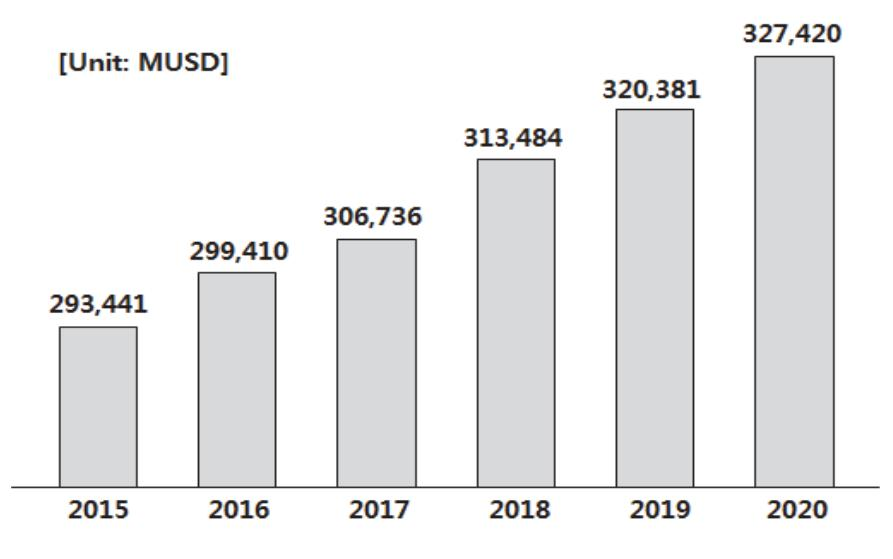

[그림 1-4] 세계 반도체 시장 규모 및 전망

#### 연평균 성장률(CAGR: compound annual growth rate)

수년 동안의 성장률을 매년 일정한 성장률을 지속한다고 가정하여(즉 기하 평균), 평균 성장률을 환산한 것이다. 중간 연도별의 증가율 등은 고려치 않고 첫해 지표에서 최종년도 지표만을 가지고 해당 년도 기간 동안의 연평균 증가율을 구할 때 사용하는 개념으로 아래 식으로 구할 수 있다. CAGR(t0, tn)=(V(tn)/V(t0))^(1/tn-t0)-1 (V(t0): 첫해 지표 값, V(tn): 최종년도 지표 값, tn-t0: number of years, ^n: n제곱)

2. 거시 경제를 포함한 시장 정보 분석을 통해 개발 제품의 시장을 검토한다. 개발 제품에 대한 시장 분석의 간단한 사례는 다음과 같다. "제품 P1. 시장은 같은 메모리 제품군 중 가장 큰 성장 추세에 있으나 경쟁사인 미국 A사 에 비해 품질 수준이 낮고, 주요 고객인 유럽 고객의 요구 사항을 만족시키지 못해 시장 점유율 확대의 벽에 부딪히고 있다."

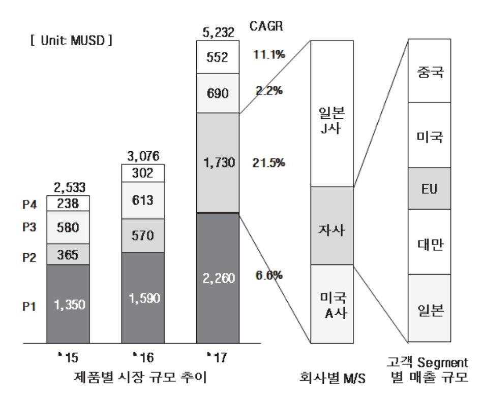

[그림 1-5] 개발 제품 시장 분석 사례

3. 분석은 내부 조직 또는 전문 업체와 제한적인 협업을 통해 상호 교차해 점검하고 실시해 정확성 을 기한다.

#### 숖 시장보고서를 작성한다.

- 1. 주요 목차를 선정하고 주요 내용을 도출해 보고서를 작성한다. 이때 보고서의 내용은 크게 아래와 같은 항목으로 구성한다.
  - (1) 보고서 제목: 제출 날짜를 포함한다.
  - (2) 목차: 논리적 흐름이 일관되게 작성한다.
  - (3) 조사 결과의 요약: 핵심 내용을 제시한다.
  - (4) 서론 부분: 조사 배경으로 현재 문제점과 반도체 산업 환경의 변화 등을 설명한다.

- (5) 조사 방법: 조사 진행 절차를 구체적으로 표기하며, 전문 용어는 주석을 활용한다.
- (6) 분석 결과: 조사 결과로부터 향후 전략적 대안 도출 과정을 설명한다.
- (7) 전략적 제안점: 분석 결과에서 논의되어 향후 고려할 대안들을 주제별로 제시한다.
- (8) 표 및 도표: 결과 분석 부분에 활용된 표·도표들을 첨부한다.
- 2. 내용은 단순한 사실의 나열이 아닌 의사 결정을 할 수 있는 수준이 되어야 하며, 기술적 검토를 통해 개발 및 생산을 위한 전략 도출에 도움이 되어야 한다.
- 3. 주요 내용에 대해서는 첨부 자료를 준비하고 인용 자료의 경우 종류와 출처를 반드시 표기한다.
- 4. 보고서는 반도체 전체 시장과 개발 제품 시장 규모 등 주요 항목에 대해 단위 등을 정확히 표기 하고 성장률, 예측치는 그 근거를 반드시 제시한다.
- 5. 작성한 보고서는 최종 승인 전 반드시 절차에 따른 검토를 거친다.

시장분석 보고서의 구성 항목을 1.에서 나열하였으나 실제로는 발표 형태의 보고로 이루어 지는 경우가 많고 조사 분석 결과 및 전략적 제안점을 위주로 작성되며 심층 토론을 통해 의사 결정한다.

<표 1-6>에 발표 형태의 보고 시 사용하는 시장 분석보고서 구성 항목을 예시하였고 실제 발표 형태의 보고 시 사용했던 양식 중 일부를 [그림 1-6]에 표기하였다.

| <표 1-6> 시장 분석보고서 예시(발표 형태) |  |  |
|----------------------------|--|--|
|----------------------------|--|--|

| 구분                                                                      | 항목                  | 세부 내용                                                |  |  |
|-------------------------------------------------------------------------|---------------------|------------------------------------------------------|--|--|
| 표지                                                                      | 보고서 제목              | 보고 날짜 및 보고자(부서)를 포함                                  |  |  |
| 보고에 앞서                                                               | 조사 배경·목적            | 현재 문제점과 시장 분석의 당위성 설명                                |  |  |
|                                                                         | 조사 방법               | 구체적 절차와 정확성에 대해 언급                                   |  |  |
| 목차                                                                      | 목차, 내용, contents 등  | 일관된 논리적 흐름을 갖도록 구성                                   |  |  |
|                                                                         | 세계 경제 동향 등          | 세계 경제 환경 변화(사회·문화적 변화 포함)                            |  |  |
| 분석 결과                                                                | 반도체 산업 동향           | 반도체 산업 환경 변화                                         |  |  |
|                                                                         | 타깃 제품의 응용 시장 동 향 | 타깃 제품이 활용되는 특정 반도체 시장 동향(예: 노트 북용 SSD 시장 등)       |  |  |
|                                                                         | 타깃 제품 시장 동향         | 타깃 제품 시장(예: 고용량 NAND 플래시 메모리시장 등)                 |  |  |
| 결론                                                                      | 전략적 제안/대응 방안        | 분석 결과에 대해 항목별 대응 방안에 대해 제시하고 의사 결정이 필요한 사항에 대해 정리 |  |  |
| * 표 및 도표는 분석 결과를 쉽게 파악할 수 있도록 배치한다. * 발표 자료의 헤드라인은 2줄 이내로 간략하게 표기한다. |                     |                                                      |  |  |

\* 그림 및 표는 색깔을 단순화 해 의미의 왜곡이 없도록 유의한다.

\* 인용 자료는 출처를 정확히 표기한다.

\* 예측 자료는 긍정적, 소극적 측면을 모두 언급한다.

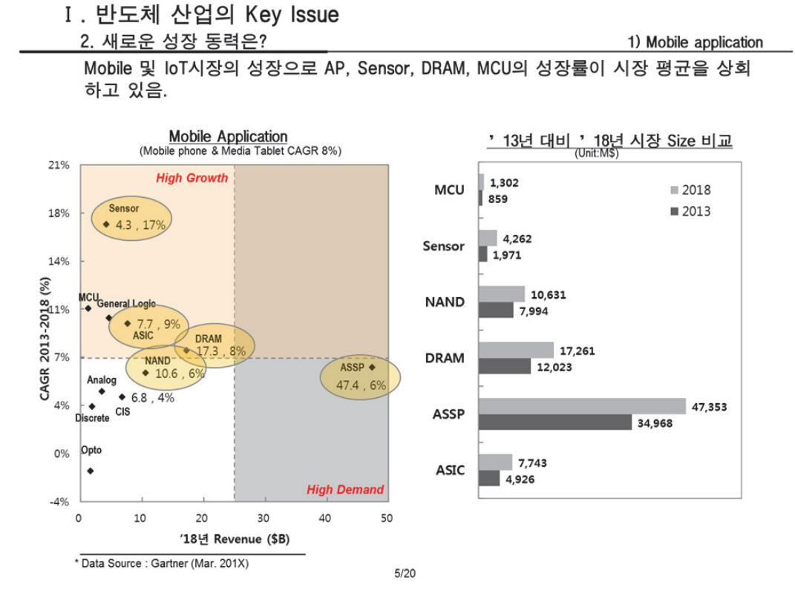

[그림 1-6] 시장 분석보고서 발표 자료 (예시)

수행 tip

- 대부분의 전문 시장 조사기관은 홈페이지에서 직접 보고서 를 검색하고 구매할 수 있으므로 인터넷 결제를 포함한 인터 넷 활용 방법을 익히도록 한다.
- 인터넷 주문 전에 보고서 가격 및 구성, 내용 등 세부 정보 를 파악해 구매 여부에 대한 사전 승인을 득한다.
- 인터넷 검색은 전문가의 도움을 받아 진행하고 검색된 결 과에 대해서는 통계적 tool을 통해 전략적 판단을 할 수 있 는 데이터로 가공한다.

## 학습 1 교수·학습 방법

## 교수 방법

- 시장 분석 전문 세미나, 전시회, 학회 등의 정보를 제공하여 학습자가 최근의 시장 환경 및 산업 동향을 비교 분석할 수 있도록 수업을 진행한다.
- 관련 시장 동향 분석 시 일지, 저널 등을 활용할 수 있도록 안내하고, 수집된 자료의 적합 성 및 정확성 정도를 분별할 수 있도록 지도한다.
- 반도체 제품 기획 보고서 작성 시 필요한 기본 양식 및 중요 내용을 전달하고, 학습자가 스 스로 시장 동향 분석보고서를 작성해 보도록 유도한다.

## 학습 방법

- 반도체 제품 기획 시 사용되는 양식에 맞추어 시장 분석보고서를 작성해 본 후 여기에 첨부 되는 자료의 종류와 기록 내용 전반을 숙지하고 종류에 따라 분류한다.
- 반도체 시장 조사 관련 기관을 구체적으로 확인하도록 하고, 이 기관과 관련된 다양한 자료 를 인터넷으로 검색하고 분류하여 문서로 정리한다.
- 개발 제품에 대한 시장 조사, 수집 및 분석을 통해 개발 목표를 설정하고, 이를 구현하기 위한 보고서를 작성하여 발표한다.
- 시장 동향 파악을 위한'체크리스트'를 작성해보고, 동료 학습자와 비교해 본다.

## 학습 1 평 가

## 평가 준거

• 평가자는 학습자가 학습 목표를 성공적으로 달성하였는지를 평가해야 한다.

### • 평가자는 다음 사항을 평가해야 한다.

|          | 학습 목표                                                                         |  | 성취수준 |   |  |
|----------|-------------------------------------------------------------------------------|--|------|---|--|
| 학습 내용    |                                                                               |  | 중    | 하 |  |
|          | - 고객의 요구 사항과 진입 시장의 규모를 파악할 수 있다.                                             |  |      |   |  |
| 시장 동향 분석 | - 파악된 자료, 시장 조사기관의 분석 자료 및 인터넷의 정보 를 통해 개발 제품에 대한 전반적인 시장 동향을 분석할 수 있다. |  |      |   |  |
|          | - 시장 동향 분석 결과를 바탕으로 분석 보고서를 작성할 수 있다.                                      |  |      |   |  |

## 평가 방법

• 평가자 체크리스트

|          | 평가 항목                     |  | 성취수준 |   |  |
|----------|---------------------------|--|------|---|--|
| 학습 내용    |                           |  | 중    | 하 |  |
|          | - 시장 자료 분석을 위한 기준안 작성 능력  |  |      |   |  |
| 시장 동향 분석 | - 수집된 시장 자료 기준안에 따라 분류 여부 |  |      |   |  |
|          | - 분류된 시장을 토대로 시장 자료 분석 능력 |  |      |   |  |

### • 일지/저널

| 학습 내용    | 평가 항목                          | 성취수준 |   |   |
|----------|--------------------------------|------|---|---|
|          |                                | 상    | 중 | 하 |
| 시장 동향 분석 | - 시장 자료 분석을 위한 기준안 도출 여부       |      |   |   |
|          | - 수집된 시장 자료의 분량과 질(정확성)의 수준 여부 |      |   |   |
|          | - 수집된 자료의 기준안에 따라 분류 여부        |      |   |   |

• 구두 발표

| 학습 내용    | 평가 항목                         | 성취수준 |   |   |
|----------|-------------------------------|------|---|---|
|          |                               | 상    | 중 | 하 |
| 시장 동향 분석 | - 시장 자료 분석을 위한 기준안의 정합성 일치 여부 |      |   |   |
|          | - 기준안에 따라 분류된 자료의 정확성 일치 여부   |      |   |   |
|          | - 분류된 시장을 토대로 시장 자료 분석 시행 여부  |      |   |   |
|          | - 발표자 역량(태도 포함)               |      |   |   |

피드백

| 1. 평가자 체크리스트                                           |
|--------------------------------------------------------|
| - 반도체 시장 관련 정보를 수집·분석하고 이를 토대로 보고서를 작성하는 과정에서 관찰된 문제 해 |
| 결 능력을 평가한 후 주요 사항을 표시해 돌려준다.                           |
| 2. 일지/저널                                               |
| - 제출한 반도체 시장 정보 내용을 평가하고 기준에 미달한 학생들에게는 수준별로 학습 내용을 보  |
| 충하고 스스로 복습한 후 그 결과를 제출하도록 한다.                          |
| 3. 구두 발표                                               |
| - 반도체 시장 분석 관련 발표 시 질의·응답을 통해 작성한 보고서에 대해 숙지 여부를 판단하고  |
| 개선 사항 및 추가로 보완해야 할 사항에 대해 제시한다.                        |
|                                                        |

| 학습 1 | 제품 시장 조사하기 |
|------|------------|
| 학습 2 | 기술 동향 조사하기 |
| 학습 3 | 제품 사양 수립하기 |
| 학습 4 | 비용 분석하기    |
| 학습 5 | 개발계획 수립하기  |

## 2-1. 기술 동향 분석

학습 목표 • 전문 세미나, 전시회, 학회 및 시장조사 기관의 정보를 통해 관련 제품의 기술동향을 수집·분 석할 수 있다. • 개발 기술 관련 특허 분석을 통해 특허 침해 위험을 분석할 수 있다.

## 필요 지식 /

숔 반도체 종류

반도체는 전자 부품이므로 용도별, 기술별, 집적도별, 제조공정별 등에 따라 각각 분류체계를 달리하고, 또한 국가별로도 자국 특성에 따라 다르게 분류하기 때문에 여기에서는 국내 산업분 류 표준기준에 따라 설명하고자 한다.

1. 반도체 분류

반도체를 사용 원소에 따라 분류하면 실리콘 반도체(silicon semiconductor)와 화합물 반 도체(compound semiconductor)로 구분된다. 단원소인 실리콘 반도체는 일반적으로 말하 는 반도체를 의미하며, 다원소인 화합물 반도체는 결정이 두 종류 이상의 원소 화합물로 구 성되어 있는 반도체를 말한다.

(1) 실리콘 반도체

실리콘 반도체는 개별소자(discrete)와 집적회로로 나누어진다. 개별소자는 트랜지스터, 다이오드 등과 같이 하나의 칩에 하나의 소자가 구현된 제품을 말하며 집적회로는 단일 칩에 다수의 소자가 구현된 제품으로 흔히 반도체라고 지칭하는 것이다. 집적회로(IC)는 전자 또는 정공 중 하나를 이용하는 MOS(metal oxide semiconductor, 단극성)형과 양쪽 모두를 이용하는 bipolar(양극성)형으로 대별된다. bipolar형은 속도가 빠르고 고주파, 저 잡음의 특성을 보이는 반면, 소비전력이 높고, 구조가 복잡해 고집적화가 어려우며, 가격이 비싸 극히 제한적으로만 사용된다. MOS(metal oxide silicon)형은 실리콘 기판 표면에 산화 막을 형성하고, 그 위에 금속 전극을 붙인 구조로 구조가 간단하여 집적도를 높이기 쉽고, 제조 원가가 저렴하며, 소 비전력도 낮아 현재 집적회로(IC)의 주류를 이루고 있다. 집적회로(IC)는 모두 디지털 반도체로 생각할 수 있지만 취급하는 신호의 종류에 따라

아날로그 반도체와 디지털 반도체로 나누어지며, 가장 흔히 사용되고 있는 반도체는 실 리콘 반도체 중에서 MOS형이다.

(2) 화합물 반도체

화합물 반도체는 실리콘 반도체로는 불가능한 특유한 성능을 바탕으로 고속, 고주파, 고 온, 고전력용 특수목적 반도체 소자의 제품군을 생산하며, LED와 같은 광소자, 통신 및 제어용 전자소자의 응용이 각종 통신, 자동차, 항공/우주 분야의 고부가가치 시스템에 활용된다. 종류로는 갈륨-비소(GaAs), 인듐-인(InP), 갈륨-인(GaP) 등의 Ⅲ-Ⅴ족 화합물 (주기표의 Ⅲ족과 Ⅴ족의 화합물) 반도체, 황화카드뮴(CdS), 텔루르화 아연(ZnTe) 등의 Ⅱ-Ⅵ족, 황화연(PbS) 등의 Ⅳ-Ⅵ족 화합물 반도체 등이 있다.

화합물 반도체는 발광소자(전류를 흘리면 빛이 나는 소자)와 레이저를 만들 수 있으며, 전자 이동도가 커(실리콘 반도체 대비 약 5배) 화합물 반도체로 만든 트랜지스터는 실리 콘 반도체보다 몇 배나 신속히 동작하는 장점을 가지고 있다.

(가) 질화갈륨(GaN)

질화갈륨(GaN)은 우수한 전자 이동성과 보다 강한 파괴 전압, 우수한 열전도 성질의 특징을 지니므로 높은 스위칭 주파수 효율성을 필요로 하는 전력과 라디오 주파수 (RF) 소자에 이상적이며, 질화갈륨(GaN) 파워 소자는 대량 생산에 너무 많은 비용을 소모하므로 비표준 생산 공정에 사용되는 소구경 웨이퍼로 가공 및 사용되고 있다.

(나) 탄화규소(SiC: silicon carbide)

탄화규소(silicon carbide, SiC)는 전기적, 열적 특성이 우수하여 전력용 반도체 소 자에서 실리콘을 대체할 수 있는 적합한 소재로 여겨지고 있다. 특히 실리콘에 비해 3∼10배가량 큰 밴드 갭(bandgap)과 임계전계(critical electric field) 특성은 탄화 규소를 이용한 전력반도체소자가 높은 항복전압을 가질 수 있도록 해주며, 뛰어난 포화 전자속도(saturation velocity)와 열전도(thermal conductivity) 특성은 낮은 손실과 더불어 300℃ 이상의 고온에서도 소자의 동작이 가능하게 함으로 써 실리콘 소자의 적용이 힘든 군사, 항공 및 우주 분야에서의 사용을 가능하게 해준다.

그러나 2000℃를 상회하는 고온에서 양질의 단결정을 제조하기 어렵고, 소자를 만들 기 위해서는 고온 공정이나 이온주입과 같은 고도의 기술이 필요하다는 기술적인 난 점들로 인해 그동안 소자의 개발 및 양산에 많은 어려움을 겪어왔다.

최근에는 탄화규소 반도체를 연구하는 세계 각 국의 다양한 대학, 기업 및 연구기관 들의 노력에 힘입어 문제점들이 해결되고 있으며, 이에 따라 탄화규소 반도체를 이 용한 전력 반도체 소자의 양산 및 적용에 가속도가 붙고 있다. 특히 웨이퍼 제조 기 술의 발전에 따른 가격 하락은 그동안 일부 기업에서 소규모로만 진행되어오던 연구· 개발에 다수의 업체가 참여하게 되는 원동력이 되고 있다.

[그림 2-1]에 단원소 및 화합물 반도체를 포함해 전체 반도체를 분류하였고, 용어 및 기능에 대한 세부 설명은 다음 장에서 진행하고자 한다.

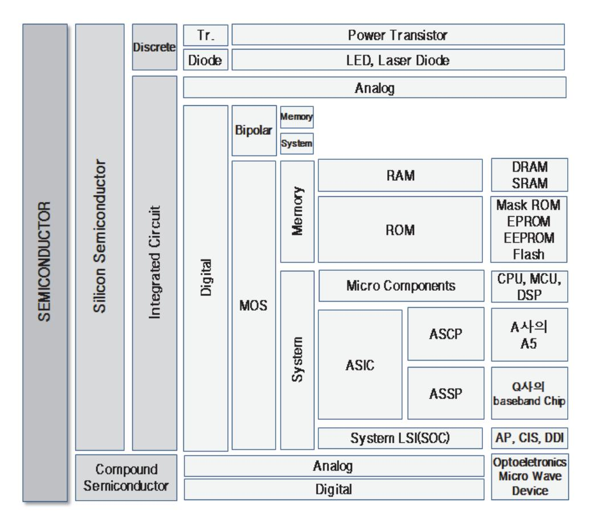

[그림 2-1] 전체 반도체 분류

## 숕 반도체 집적회로(IC: integrated circuits)

반도체 집적회로(IC)는 기능에 따라 정보를 저장할 수 있는 메모리 반도체(memory semiconductor)와 정보 저장 없이 연산이나 제어 기능을 하는 시스템 반도체로 나누어진다. 메모리 반도체는 기억(memory)소자로 데이터의 휘발성 여부에 따라 RAM(random access memory)과 ROM(read only memory)으로 구분되고, 연산소자인 시스템 반도체는 범용성에 따라 Microprocessor와 ASIC, 시스템 LSI 등으로 분류된다.

[그림 2-2]에 반도체의 IC기능에 따른 분류를 표기하였다.

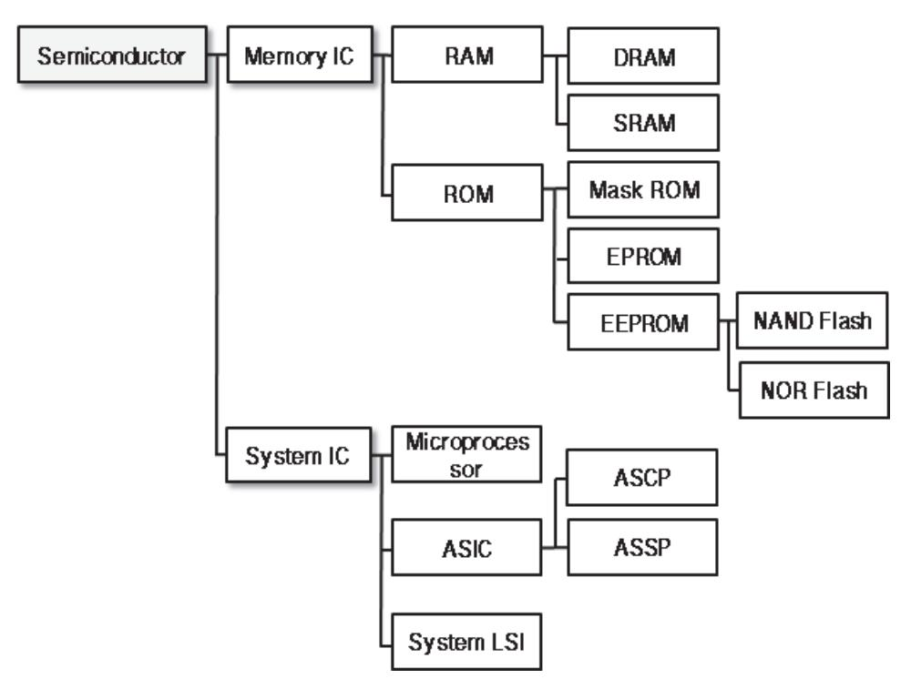

[그림 2-2] IC 기능에 따른 반도체 분류

1. 메모리 IC

메모리 IC는 정보를 기록하고 저장해 둔 정보를 읽거나 내용을 바꿔 다시 넣을 수 있으나 전력 공급이 차단되면 데이터가 소실되는 휘발성 메모리인 RAM(random access memory)과 전력 공급과는 무관하게 데이터가 보존되어 기록된 정보를 읽을 수만 있고 바 꿀 수 없는 비휘발성 메모리 ROM(read only memory)이 있다.

(1) 휘발성 메모리(RAM: random access memory)

RAM은 고속의 읽기/쓰기가 가능해 컴퓨터의 주기억장치로 이용되며, 모든 셀이 일정한 순서 없이 읽기/쓰기를 실행할 수 있다. RAM에는 전원이 켜진 상태에서도 일정시간이 지나면 저장된 내용이 소실되어 일정 시간마다 다시 기억시키는 재생(refresh) 동작이 반복적으로 필요한 DRAM(dynamic RAM)과 전원을 끄지 않는 한 기록된 정보를 계속 기억하고 있어 재생(refresh) 동작이 필요 없는 SRAM(static RAM)이 있다. DRAM은 다시 기억시킬 필요가 없어 사용하기 쉽고, 속도가 빠른 특징이 있으며, SRAM에 비해 고용량의 LSI(large scale integrated circuit)를 만들기 쉬어 비트당 가격이 저렴하여 훨씬 많이 사용되고 있다.

(2) 비휘발성 메모리(ROM: read only memory)

전원 공급이 중단되어도 정보가 유지되는 비휘발성 메모리인 ROM은 고속 읽기는 가능 하나 쓰기가 제한적이어서 컴퓨터의 판독전용 기억장치로 이용되고 있다. ROM은 보통 Mask ROM을 말하며, Mask ROM은 IC 제조 시 기억된 내용을 다시 변경할 수 없다. EPROM은 IC 제조 시 정보가 기록되어 있지 않지만, 사용 시 필요한 정보를 기억시킬 수 있으며, 자외선을 조사시키면 기억된 정보를 제거할 수 있다.

하지만 DRAM에 비해 속도가 매우 느리고, 제거시킬 경우 모든 정보가 동시에 소실되 는 단점이 있다. EEPROM은 전기적으로 제거시킬 수 있지만, 구조가 더욱 복잡하므로 집적도가 낮아진다. 읽기/쓰기가 가능한 EEPROM이 발전된 형태가 Flash Memory이 며, Flash Memory는 메모리 셀이 직렬로 배치된 NAND와 병렬로 배치된 NOR로 구 분된다.

이와 같은 메모리 IC를 소자 기억을 유지하기 위한 정기적인 자극(리플래시 동작)의 필 요 여부에 따라 휘발성, 비휘발성으로 나누면 [그림 2-3]과 같이 분류할 수 있다.

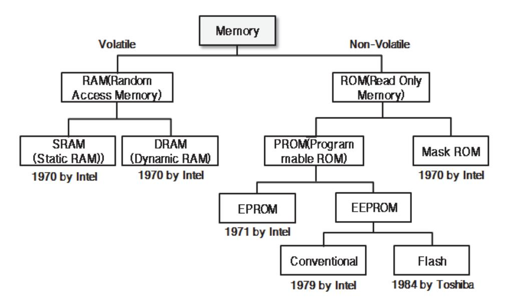

출처: 교육부(2015). 반도체 제품 기획(LM1903060101\_14v3). 한국직업능력개발원. p.7. [그림 2-3] 메모리 소자의 분류

플래시 메모리(flash memory)는 D램이나 S램과 달리 전원이 끊긴 뒤에도 정보가 계속 남아 있는 반도체로 플래시 메모리를 쓰면 램과 같이 빠른 속도로 정보를 읽고 쓸 수 있고, 하드디스크처럼 전원과 무관하게 정보도 저장할 수 있다.

이러한 플래시 메모리는 전원이 꺼지더라도 정보가 지워지지 않는 비휘발성 메모리로서 휴대폰, 캠코더, 디지털카메라, MP3플레이어, PDA 등 모바일 제품에 널리 사용되고 있 다. 대표적인 메모리 소자 종류와 기능 및 용도에 대해 <표 2-1>에 정리하였다.

<표 2-1> 메모리 소자의 종류와 기능 및 용도

| 종류                    | 기능 및 용도                                                                                                                                                                                                               |
|-----------------------|-----------------------------------------------------------------------------------------------------------------------------------------------------------------------------------------------------------------------|
| RAM                   | - 고속으로 주소를 읽어 쓸 수 있음. 단위 용량(1비트) 당 가격이 비싸기 때문 에 대량으로 사용하기는 힘들며 일시적 기억 소자로써 사용함. - 전원을 OFF했을 때 내용이 지워지나 전원 백업을 통해 대응 가능                                                                                          |
| SRAM                  | - RAM의 한 종류로 플립 블록 회로를 사용하고 있기 때문에 한 번 쓰면 정보 가 안정적으로 유지되어 기억 유지를 위한 동작이 필요 없음. - 1비트를 기억하는 데 4~6개의 Tr.가 필요하며, 회로가 복잡하여 집적도를 올 리기 힘듦. - DRAM만큼 용량은 구성하지 못하며 비트 단가가 높음. - 고속으로 동작하지만 저소비전력으로 액세스하기가 용이함. |
| DRAM                  | - 기억을 유지하기 위해 정기적인 자극(리플래시 동작)이 필요하고, - 1비트 당1개의 Tr.로 구성하여 대용량이면서 비트 단가는 낮음, 리플래시 동 작이 필요하기 때문에 셀에 액세스하는데 다소 시간이 걸림.                                                                                            |
| SDRAM (동기DRAM)     | - 대용량, 고속이라는 특징이 있으며 PC용 메모리로써 폭넓게 사용되고 있음.                                                                                                                                                                           |
| D D R SDRAM  | - SDRAM의 동기 타이밍을 강화하고 전송 레이트를 기존의 2개로 개선한 것 으로 PC용 메모리로써 폭넓게 사용 - 플래시메모리를 전기적으로 일괄 또는 블록 단위로 정보를 삭제하거나 새롭게 정보를 쓸 수 있음.                                                                                       |
| FRAM (강유전체 메모리) | - 전압을 걸어 물질의 자발분극에 의해 전하를 축적해 전압을 걸지 않고 그 분 극방향을 지속시킬 수 있는 유전체를 이용한 비휘발성 메모리로 구조는 DRAM과 비슷하며 플래시 메모리의 10배 이상 고속쓰기가 가능                                                                                           |
| ROM                   | - 제조 라인에서 정보 패턴을 읽는 마스크 ROM처럼 읽기 전용 메모리 소자로 대용량 제어 프로그램이나 정보를 축적할 수 있음.                                                                                                                                            |
| PROM                  | - 전기적으로 읽기 전용기를 이용해 한 번만 정보를 읽을 수 있는 소자                                                                                                                                                                               |
| EPROM                 | - 전기적으로 읽기를 하며 자외선으로 정보를 일괄 삭제하거나 다시 읽을 수 있는 소자                                                                                                                                                                    |
| EEPROM                | - 전기적으로 1바이트씩 정보를 삭제하고 읽을 수 있는 소자                                                                                                                                                                                     |

31

## 2. 시스템 IC

시스템 IC에는 마이크로프로세서(MPU), 마이크로컨트롤러(MCU), 디지털신호처리(DSP) 등 컴퓨터를 제어하는 핵심 부품인 마이크로칩과 논리 소자(Logic IC), 아날로그 IC, 개별 소 자(discrete), 광반도체 및 센서 등 다양하다.

시스템 IC는 활용 분야가 다양하여 공급이 급격히 증가하더라도 수요 측에서 이를 흡수할 여지가 있는 반면, 메모리 IC는 수요가 특정 기기에 한정되어 있기 때문에 공급 급증이 수 급 불균형으로 직결되고 있다.

시스템 IC는 정보를 제어하기 위한 논리 회로로 구성되어 있으며, 내부 회로의 종류로 구분 되어 <표 2-2>와 같이 나누고 있다.

<표 2-2> 시스템 IC 종류와 기능 및 용도

| 종류                                                  | 기능 및 용도                                                                                                                                                                                                             |  |
|-----------------------------------------------------|---------------------------------------------------------------------------------------------------------------------------------------------------------------------------------------------------------------------|--|
| 로직 IC                                               | - 논리 회로 소자, 논리 연산 처리에 이용                                                                                                                                                                                            |  |
| MPU                                                 | - 마이크로프로세서(초소형 연산 처리 장치)로 부르며 PC의 연산 소자로 명령을 구성하는 방식에 따라 CISC형, RISC형으로 나뉨. - PC의 CPU(중앙처리장치)를 포함한 집적회로이기 때문에 CPU와 같은 의미로 사용되며, 마이크로컴퓨터도 이 소자의 한 종류임.                                                      |  |
| ASIC                                                | - 고객 전용의 논리 회로를 커스터마이즈한 커스터머 IC                                                                                                                                                                                     |  |
| PLD (programmabl e logic device )          | - 소자 제조 후 유저가 내부 논리 회로를 정의, 변경할 수 있는 집적 회로를 말하며, 소규모 프로그래머블 로직 소자인 PAL(Programmable Array Logic)과 GAL(Generic Array Logic)을 총칭하여 PLD로 표현하고 광의의 PLD는 하기의 PLD, CPLD 및 FPGA까지를 포함하여 표현                     |  |
| CPLD (complex prog rammable logi c device) | - PAL이나 GAL보다 규모가 큰 PLD로 수백 개 로직 엘리먼트로 이루어져 있으며 거의 대부분이 EEPROM 아키텍처로 구성됨. - 내부 구조는 PLD(1마이크로 셀)를 복수 집적하여 그것들을 내부 버스로 접속한 구성                                                                                |  |
| FPGA (field program mable gate ar ray)     | - 유저가 독자의 논리 회로를 쓸 수 있는 게이트 어레이 - 임의의 논리를 구성 가능한 4입력 정도의 조합 회로와 순서 회로로 이루어진 논리 블록이 격자 형태로 수10 X 수10 정도로 배치되어 있고, 그 사이의 배선이 간단한 크로스바 스위치로 접속된 구조 - 회로 규모가 약 100로직 엘리먼트(약 20,000게이트) 이상인 것을 FPGA라고 부름. |  |

숖 반도체 기술

반도체 제조회사들이 반도체의 집적도를 더욱 높이고 한계를 극복하기 위해 사용하거나 연구하 는 기술들에 대해 살펴보고자 한다.

1. 반도체 기술의 발전 방향

편리성 및 접근성 등의 니즈로 인해 전자 기기들의 소형화되고 있는 추세에 따라, 반도체의 소형화 역시 반도체 산업의 중요 트렌드로 지속될 것이며 또한 기기의 다기능화, 적용 영역 의 광범위화에 따른 반도체의 고성능화는 필연적 발전으로 연결될 것이다. 이처럼 반도체의 고성능화 및 소형화 요구에 따른 고집적화, 미세화 기술 등이 향후 반도체 산업의 중요한 기술적 방향성으로 진행되고 있다.

그 중 반도체 미세화 기술은 그 중요성이 지속되고 있으나 점차 물리적, 특성적 한계에 봉 착할 것으로 예측되어 이에 대한 대안으로 제시되고 있는 새로운 기술과 신소재 역시 적극 적으로 개발 중이며 미세화 기술의 한계를 극복하기 위한 시도가 진행 중이다. 아래 [그림 2-4]는 반도체 기술의 발전 모습을 도식화한 것이다.

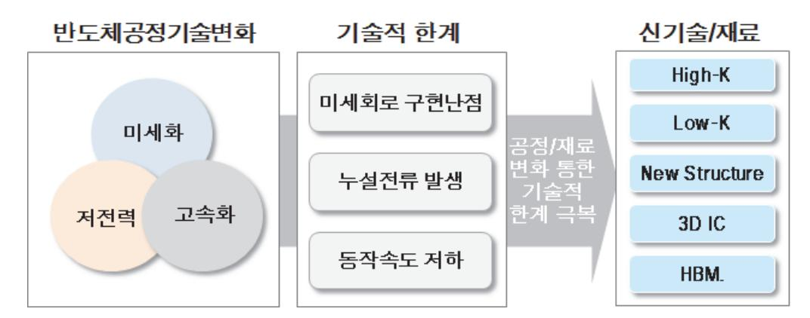

[그림 2-4] 반도체 기술의 발전 모습

#### 2. 반도체의 고성능화

인류가 향유할 수 있는 면적은 제한적이다. 처음에는 개인 주택과 같은 여유로운 주거 환경 에서 점점 인구가 증가함에 따라 밀집 지역이 생겨나고 연립주택과 20층 안팎의 대규모 아 파트 단지가 출현하더니 이제는 50층 이상의 초고층 아파트가 등장하기에 이르렀다. 하지 만 기술의 한계로 무한정 높게 쌓을 수는 없고, 언젠가는 그 높이도 한계에 다다르게 될 것 이며, 그때는 아마도 영화처럼 심해나 우주와 같은 또 다른 공간을 찾는 시도를 할지도 모 르겠다.

반도체도 이와 비슷한데 제한된 면적에 트랜지스터의 크기를 작게 만들어 집적도를 높이는 방법은 그동안 매우 효과적인 방법이었으나, 현재에 이르러서는 그 한계에 봉착하였다.

(1) 고집적화

1940년대에 반도체가 처음 발명되고 1960년대에 IC 반도체가 처음으로 상용화된 이후, 반도체는 실로 눈부시고 숨 가쁘게 발전되어 왔다. 인텔사의 공동 설립자이자 반도체 과 학자였던 고든 무어(Gordon E. Moore)는 IC 용량이 18개월마다 2배가 될 것으로 예 측하였다. 이는 컴퓨터의 처리 속도와 메모리의 양이 2배로 증가하고, 비용은 상대적으 로 떨어지는 효과를 가져와 마이크로칩에 저장할 수 있는 데이터의 양이 24개월마다 2 배씩 증가한다는'무어의 법칙(Moore's Law)'으로 불리었으며, 실제로 약 30년 동안 법 칙으로 지켜지는 듯했다.

그러나 2002년 국제반도체회로학술회의(International Solid Sate Circuits Conference; ISSCC)에서 당시 삼성전자 반도체 총괄 겸 메모리 사업부장이었던 황창 규 사장은 '메모리 신성장론'에서 non-PC 분야(모바일, 디지털 가전)에서 반도체 메모 리의 용량을 1년마다 두 배로 개선하겠다는 발표를 했다. 이를 반도체 업계에서는 황창 규 사장의 성을 따 '황의 법칙'이라고 이름 지었고, 이것을 실제로 실현함으로써 결국 삼성은 세계 반도체 시장 메모리 분야에서 세계 1위의 독보적 위치를 차지하게 되었다. 어쩌면 1년 6개월 혹은 1년이라는 이런 규칙 때문에 반도체가 필연적으로 스스로 발전 했다기보다는 목표를 세우고 이를 위해 부단하게 노력해온 우리 반도체 업계 종사자들 이 흘린 땀 덕분에 발전할 수 있었다고 보는 것이 옳다.

이렇게 오늘날까지 반도체의 발전은 트랜지스터 크기를 줄여 제한된 면적에 더욱 많은 트랜지스터를 집어넣어 집적도를 높이는 방법(고집적화)으로 발전되어 왔다. 이와 같은 개발 방법은 지금까지 매우 효과적이었고, 그래서 무어의 법칙이든 황의 법칙이든 가능 했었다.

(가) 트랜지스터 구조

반도체의 집적도를 이해하기 위해서는 트랜지스터 구조를 이해해야 한다. 반도체, 즉 트랜지스터에는 [그림 2-5] 반도체 CMOS 단면 구조와 같이 실리콘에 전자 흐름의 입구라 할 수 있는'소스(source)'와 전자 흐름의 출구라 할 수 있는 '드레인drain)' 이 있다. 습기가 있는 곳에 철을 두면 그 표면에 녹슬어 산화철이 만들어지는 것처 럼, 실리콘을 고온으로 가열하면 표면이 녹슬어 산화실리콘이라는 물질로 바뀐다. 이 산화실리콘은 반도체의 특성을 잃어버리고, 전혀 전기가 흐르지 못하는 절연체가 된 다.

반도체의 가장 중요한 기능 중의 하나가 스위치 기능이다. 좋은 스위치는 먼저 스위 치를 켜고 끌 때 그 전류의 흐름을 빠르게 연결하고 빠르게 끊어야 할 것이고, 스위 치를 켰을 때 전류가 끊임없이 잘 흘러야 하며, 껐을 때는 전류가 전혀 흐르지 않아 야 한다. 마지막으로 그 스위치를 켜고 끌 때 적은 힘으로도 부드럽게 켜고 끌 수 있어야 한다는 것이다.

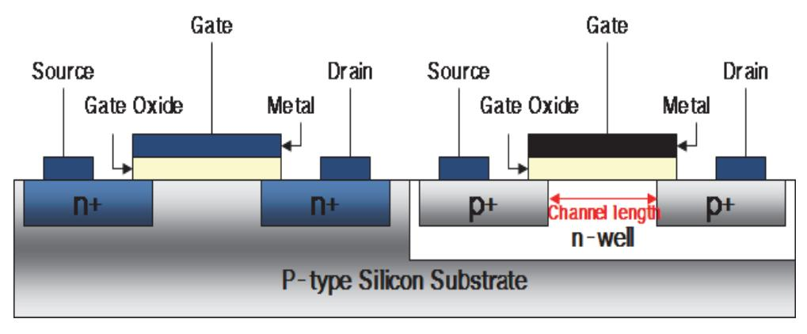

[그림 2-5] 반도체 CMOS 단면 구조

(나) 소자의 고성능화

반도체의 성능을 높이는 가장 일반적인 방법은 두 가지가 있다. 첫 번째는 전자 입 구인 소스에서 전자 출구인 드레인까지, 물리적 전류 통과 길이인 게이트 렝스(gate length)를 줄이는 방법과 두 번째는 [그림 2-5]에서 노란색으로 칠해진 절연체(gate oxide)의 두께를 줄이는 것이다.

이 두 가지 방법을 통해 트랜지스터 스위치를 조절하면서 게이트에 아주 작은 전류 자극을 걸어도 소스와 드레인 간의 적은 전류 흐름까지도 매우 빠르게 조절할 수 있 게 된다. 만약에 이 반도체가 휴대전화에 사용된다면, 적은 전류로 트랜지스터들이 작동하기 때문에 결과적으로 배터리 소모를 줄여 한 번의 충전으로 더욱 오랫동안 사용할 수 있게 한다. 그리고 게이트 렝스를 줄이면 트랜지스터 스위치의 성능을 높 이는 것은 물론, 앞서 말한 반도체의 집적도를 높이는 방법이기도 해서 일거양득이 된다. 그래서 반도체 업계들이 끊임없이 게이트 렝스를 줄이고자 노력해 왔다. 이와 같은 미세 공정은 같은 다이 크기에 더 많은 회로를 구성할 수 있어서 성능을 높일 수 있고 트랜지스터 내 전자의 이동거리가 짧아져 전력소비도 줄어들기 때문에 고성능, 저전력 구현에 핵심인데 점차 물리적, 특성적 한계에 봉착되어 이에 대한 현 실적 대안으로 제시되고 있는 3D IC 기술을 들 수 있다.

#### 3차원 트랜지스터 (3D IC) 기술

최근 20㎚급 공정에 근접하면서 무어의 법칙에 따라가는 트랜지스터의 집적도 향상은 기술적 어려움과 경제 성 한계로 사실상 어려워지고 있다. 소형화, 즉 신호 배선 단면적의 감소는 저항을 증가시키고, 좁아진 배선 간 거리는 단위면적당 소화해야하는 전기용량(트랜지스터 간 신호 전달 지연 증가)을 증가시켜 결국 RC delay 값이 증가하게 되는데 이는 소자 성능의 향상을 방해하는 요소가 된다.

이를 해결하기 위한 수단으로 3차원 트랜지스터 기술이 주목받고 있는데 이는 트랜지스터를 3차원으로 만드 는 방법과, 2차원 트랜지스터나 반도체 칩을 쌓아올리는 방법을 들 수 있다. 그 중 2차원 구조의 반도체를 쌓아올려 3차원 구조로 전환하여 제작한 집적회로는 신호선의 간격이 좁아져서 생기는 리소그래피를 포함한 제조 기술 문제, 전기적 절연 문제, 신호 지연 시간 증가 문제, 그리고 신호 간섭 등의 문제 해결이 가능해 공정에서 새롭게 채택되고 있으며 이를 3차원 IC 기술이라 말한다.

대표적인 상용화된 3차원 IC 기술로는 지난 2012년 출시된 인텔 아이비브릿지에 적용된 3D 트라이게이트 (Tri-Gate) 기술을 들 수 있다.

3D 트라이게이트는 반도체 제품의 기본이 되는 트랜지스터 구현에 적용된 기술로, 기존 2D 방식 트랜지스 터와 비교해 저전압에서 37% 성능 향상, 동일 성능에서 50% 전력 감소를 이뤄냈으며, 이후 인텔 CPU의 기본이 되고 있다.

이와 같이 3차원 반도체 기술은 가까운 미래에 특정 약물과 단백질, 부패 정도 등을 감지할 수 있는 각종 센서에 응용 가능할 것으로 예측되며 지능형 로봇, 무인 항공기, 무인 자동차, 장난감 등에도 이용될 것으로 보인다.

또한 새로운 패키지 기술인 TSV(through silicon via, 실리콘 관통 전극)는 기존 칩 제작기술과 패키지 기 술의 융합을 통해 다양한 기능의 칩들을 단일 패키지에 적층해 고집적 다기능의 패키지 구현도 가능하게 된 다.

3D IC는 패키지 집적도 및 성능 향상, 아날로그 및 디지털을 포함한 시스템 융합, 생산비 절감 등의 다각적 인 효과를 극대화하려는 패키지 방식으로 중요성이 커지고 있다.

## (2) HIGH-K와 FIN-FET(누설 전류를 해결하는 기술)

1960년대 반도체가 상용화된 후 40년이 지난 현재까지도 끊임없이 줄이다 보니 이젠 너무 작아진 게이트 렝스가 다른 문제점을 유발하는 부작용이 나타나기 시작했다. 즉, 고집적화로 소스와 드레인 간의 서로 거리가 너무 가까워지다 보니, 게이트에 전류 자극 을 주지도 않았는데도 이들 사이에 조금씩 전류가 흐르는'누설 전류'가 나타나기 시작한 것이다. 게다가 그 반도체에는 수억 개의 트랜지스터가 집적되다 보니, 그 누설 전류들 역시 무시할 수 없는 수준이 되었다.

반도체 제조업체들은 게이트 렝스를 줄이고 게이트 절연체 두께를 얇게 만들어도 누설 전류가 최소화되는 방법을 연구하기 시작했다. 이들 문제에 대항하고자 하는 대표적 기 술들이'High-K'와'Fin-FET'다.

(가) High-K

지금까지 많이 들어본'Low-K'는 반도체의 트랜지스터 부분이 아닌, 트랜지스터에 입력되거나 출력되어 나온 전류 혹은 신호들이 전달되는 일반 금속 배선들에 사용되 는 절연 물질을 말한다. 즉, High-K는 스위치 역할을 하는 게이트에 사용되는 절연 물질이고, Low-K는 그 스위치에 입력 혹은 출력되는 배선에 사용되는 물질이다. High-K 게이트 아래에 있는 절연 물질을 일반적으로 게이트 산화물(gate oxide)이 라고 하는데 실리콘을 고온으로 높여 산화실리콘을 형성함으로써 만든다. 그런데 이 산화실리콘을 점점 얇게 하면 그만큼 적은 게이트 전류에도 트랜지스터 스위치를 작 동하게 할 수 있다는 이점이 있고, 그만큼 게이트 조절 전류 값을 낮출 수 있어서 트랜지스터에서 소비되는 전력을 아낄 수 있었다. 하지만 산화실리콘이 너무 얇으면, 이를 통해 누설 전류가 발생하는 부작용이 나타나 그 두께 일정 이하로 얇게 만들 수가 없었다. 그래서 더 이상 누설 전류가 증가하지 않도록 절연층 두께를 기존과 같이 그대로 두고, 대신 게이트 조절 전류 값이 낮아도 전류 자극이 잘 전달이 될 수 있는 물질을 개발하게 되었는데, 이와 같은 물질이'High-K'다.

(나) Fin-FET

기존 평면 FET에 비해 새롭게 개발된 FET의 모양이 물고기 지느러미를 닮았다고 해서 Fin-FET이라고 불리게 되었다. 이제 아래 그림을 보자. <그림 2-4>은 인텔 기 술 세미나에서 발표된 자료에서 인용된 것으로, 기존의 평면 FET와 Fin-FET 트랜지 스터의 차이를 보여준다.

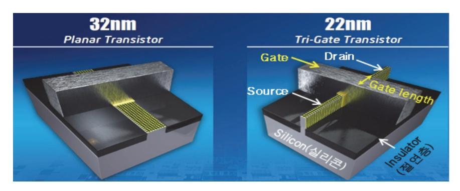

[그림 2-6] 평면 FET와 FIN-FET의 구조 비교

[그림 2-6]에서 보면, 소스(source) 위에 찍힌 노란색 점들은 각각 그 트랜지스터에 서 흐를 수 있는 면적을 의미하고 이는 흐를 수 있는 전류의 양과 비례한다. 구조적 으로 왼쪽 평면 FET는 2차원적으로 평면에서 한 면으로만 전류가 흐르지만, 오른쪽 Fin-FET은 앞면, 뒷면, 그리고 적게나마 윗면까지 3차원적으로 입체적인 3개 면을 통해 훨씬 많은 양의 전류를 보낼 수 있다.

하지만 Fin-FET이 실리콘 위에서 차지하는 면적은 오히려 적기 때문에 또다시

Fin-FET 기술을 통해 그동안 반도체 집적도 개발을 주도해 왔던 전형적인 방법인, 트랜지스터 면적을 줄여 집적도를 높이는 것과 같은 효과를 가져 올 수 있다. 게다 가 Fin-FET은 게이트가 누설 전류 없이 좀 더 효과적으로 전류의 흐름을 조절할 수 있어서 더욱 더 게이트 렝스를 감소시킬 수 있는 가능성을 내포한다.

이와 같은 Fin-FET 기술은 이미 실용화 단계에 있으나, 아직 생산 비용이 비싼 이 유로 인텔과 같은 몇몇 반도체 선두 기업에 의해 고가의 반도체에만 실제 적용되어 일부만 상업 생산하고 있다.

(3) 대구경화

반도체 산업의 생산성 향상은 소자의 크기를 미세화 하여 동일 면적에서 더 많은 칩을 확보하려는 기술 전략과 함께, 가능하면 더 큰 구경의 실리콘 웨이퍼를 사용하여 한 번 에 생산 가능한 칩수를 늘리려는 전략이 동시에 진행되어 왔다.

(가) 450mm 웨이퍼의 장점

2001년부터 생산이 개시된 300mm 웨이퍼는 현재 주요 반도체 생산 시설의 주류를 차지하고 있으나 전자 부품 산업의 전체적인 경향이 소품종 대량 생산에서 다품종 소량 생산으로 이행 하면서, 웨이퍼 대구경화에 따른 생산성 향상 효과는 이전보다 크게 둔화되었다.

450mm 웨이퍼를 사용하면 300mm 웨이퍼를 사용하는 것에 비해 웨이퍼의 면적이 2.25배로 늘어나기 때문에 웨이퍼 한 장에서 얻을 수 있는 칩의 수를 두 배 이상 늘 릴 수 있다. 가령 450mm 공장의 총 비용을 300mm 공장의 1.5배만큼 줄일 수 있 다면 칩의 제조비용을 30% 정도 절감할 수 있다고 한다.

[그림 2-7]에 300mm 웨이퍼와 450mm 웨이퍼의 실제 크기를 비교할 수 있는 사진을 나타내었고, 각각의 웨이퍼에 22nm D/R의 소자를 제작했을 경우 시뮬레이션 한 결과 소 자 Die수를 비교하면, 300mm 웨이퍼의 경우 1,460개, 450mm 웨이퍼의 경우 3,400개 가 제작된다. 면적은 2.25배 증가하나 실제 생산 소자 가능 수는 2.33배에 달한다.

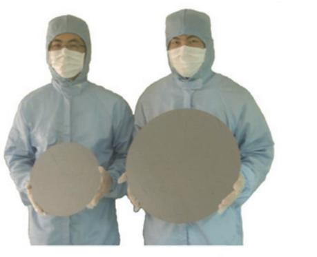

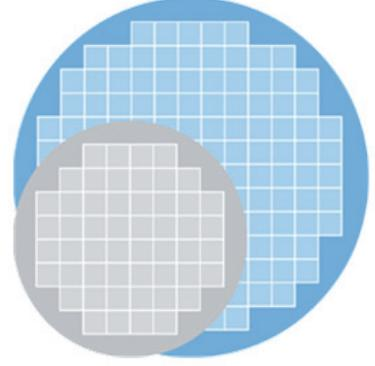

[그림 2-7] 300mm/450mm 웨이퍼 실제 크기와 면적 비교

## (나) G450C(global 450 consortium)

2011년 9월, Intel과 TSMC, IBM, 삼성전자, 뉴욕주립공대(SUNY Polytechnic Institute)는 450mm 웨이퍼로의 이행을 목표로 둔 공동 연구 개발 프로그램 (G450C: global 450 consortium)을 발족하였다. 1단계로 단위 공정 개발, 제조 장치의 평가가 이루어져 기술적 문제가 없음이 증명되었고 각사의 생산 적용인 2단 계를 앞두고 있다. 그러나 현재는 2단계로 이행되지 않고 있으며, 2016년 말부터 이 프로그램을 단계적으로 축소하고 있다.

반도체와 재료 관련의 단체인 SEMI(semiconductor equipment and materials in ternational)가 캘리포니아에서 개최한 ISS(industry strategy symposium)에서는 450mm 웨이퍼에 관한 이슈는 거의 다뤄지지 않았다.

(다) 450mm 웨이퍼로의 전환

이런 면적 증가에 따른 장점에도 불구하고 생산 장비의 교체를 위한 거액의 초기 설 비 투자 금액 등 여러 사항을 고려하면 450m 웨이퍼로의 전환은 매우 어렵지만 이 러한 상황에도 불구하고, 실리콘 웨이퍼의 구경을 한 단계 더 크게 하려는 450mm 웨이퍼 취급을 위한 기술적인 논의 이외에도, 신규 시설 구축 및 전환 과정의 리스 크를 최소화하기 위한 실무적 논의가 여전히 활발하다.

이 과정에서는 450mm 관련 업체들의 동참을 유도할 수 있는 환경의 마련과 당초 목적인 생산성의 향상을 제고할 수 있는 신규 제품 아이템의 창출에 이르기까지 다 양한 의견이 제안되고 있다. 하지만 최근에는 경제적인 이유로 450mm 전환에 대해 긍정적이지만은 않다.

"반도체 업계는 몇 년 전만해도 450mm 웨이퍼로의 이행에 대해 적극적이었다. 하 지만 현재 그 기세는 완전히 꺾였다. 미국 시장조사 회사 VLSI 리서치의 CEO이자 반도체 애널리스트인 댄 허치슨(G. Dan Hutcheson)은 "450mm 웨이퍼 상용화는 아마 향후 5~10년 간 실행되지 않을 것이다. 다만 반도체 제조사 간 합의한 대로 관련 프로젝트가 부활할 가능성은 남아 있다."고 말했다.

(출처: 우예진(2017-01-18). 당분간 450mm 웨이퍼로의 이행 어렵다, 업계 소극적 행보 이어져. http://www.betanews.net/article/671589에서 2018. 06.20 검색.) 대형 반도체 제조사인 어플라이드 머티리얼즈(AMAT: Applied MATerials) 역시 지 난 몇 년 동안 450mm 웨이퍼에 대한 업계의 관심이 줄어든 것을 확인한 이후 450mm 관련 프로젝트를 보류 중인 것으로 알려져 가까운 미래에 450mm 웨이퍼 를 사용한 반도체 제품을 보는 것은 어려울 듯하다.

## 3. 차세대 반도체 기술

실리콘을 기반으로 트랜지스터 크기를 줄여 반도체의 성능을 높이는 방법은 결국 궁극에는 한계에 도달하기 마련이다. 그래서 과학자들은 실리콘이 아닌 다른 물질들을 연구하기 시작 했는데 여기에서는 논의가 많이 되는 두 가지인, 실리콘보다 성능이 좋다는'그래핀 (Graphene)'과 획기적으로 연산 속도가 빠르다는'양자 컴퓨터(quantum computer)'에 대 해 간단히 설명하고자 한다.

(1) 그래핀(graphene)

탄소가 주성분이고 연필심을 만드는 원료인 흑연을 의미하는 그래핀은 그라파이트(graphite) 에서 유래되었으며, 원자 구조도 연필심과 같아 벌집 같은 육각형 형태의 면이다. 이 육각형 구조의 면 그래핀을 여러 층으로 쌓아 놓으면 연필심 구조인 흑연이 된다.

(가) 그래핀의 발견

처음 이 그래핀이 발견된 방법도 매우 단순했는데 스카치테이프에 흑연을 붙이고, 이렇게 붙은 흑연에 또 다른 테이프로 붙였다가 떼어 내기를 반복하다 보면 여러 층 이었던 흑연 탄소 구조가 어느 순간 한쪽 테이프에 한 층짜리 흑연 구조로 남는데, 이것이 바로 그래핀이다.

(나) 그래핀의 구조 및 형상

그래핀의 두께는 약 0.2nm(nanometer, 나노미터)로, 사람이 인공적으로 만든 물질 중에 가장 얇은 두께라 한다. 그래서 이것을 백만 장 쌓아도 그 두께는 겨우 0.2mm밖에 되지 않는다. 우리가 사용하는 A4 용지 한 장의 두께가 약 0.1mm라고 하니, 겨우 A4 용지 두 장 두께밖에 안 된다는 말이다.

탄소는 결정 구조 및 형상에 따라 여러 이름을 가지는데, 탄소들이 넓게 펼쳐진 한 장의 구조를 그래핀이라 하고, 그 그래핀을 돌돌 말아 원통으로 만들면 탄소나노 튜 브(carbone nano tube)가 되며, 공처럼 둥글게 말려 있으면 풀러렌(fullerene)이라 고 한다. 우리가 알고 있는 값비싼 보석인 다이아몬드는 탄소가 흑연처럼 면으로 된 2차원 구조가 아닌 3차원 구조로 형성된 것을 말한다.

(다) 그래핀의 성질

이처럼 얇은 두께의 흑연이라 할 수 있는 그래핀이 왜 주목을 받는 이유는 지구상에 서 두 번째로 전기가 잘 통하는 금속인 그래핀은 구리보다 10배 이상 전기가 잘 통 하기 때문에 실리콘보다 전자 이동 속도가 100배 이상 빠르다.

하지만 그래핀은 위 설명에서처럼 전기적 특성이 거의 금속 성질과 비슷해 재료 자 체는 전기가 매우 잘 흐르는 도체에 비슷해 실리콘과는 달리 오히려 특정 조건에서 전기를 흐르지 못하게 하는 기술이 필요하다.

게다가 다이아몬드보다 열 전도성이 2배 이상 높고 강도는 강철보다 200배 이상 강 하지만, 두께가 매우 얇아 부러지지 않고 180도 휠 수 있으며 빛을 98% 통과시킬 정도로 거의 투명하다.

(라) 그래핀의 응용

이와 같은 성질들을 이용하면 휘어지는 화면이 가능해지기 때문에 현재 우리나라에서는 반도체 제작 회사보다 LCD 제작 회사들이 그래핀에 더 많은 연구와 투자를 한다. 덕분에 우리나라는 세계에서 가장 많은 그래핀 기술 관련 원천 특허를 보유하고 있 으며, 가장 앞선 기술을 보유하게 되었고 근래 들어 구글 안경이나 갤럭시 기어와 같은 입는 전자 제품(wearable device)이라는 말과 함께 휘어지는 디스플레이 (flexible display)를 채용한 제품이 출시됐다는 뉴스를 보기도 하는데, 이들 대부분 이 그래핀을 이용한 제품들이다.

(2) 양자 컴퓨터(quantum computer)

양자(量子, quantum)란 더 나눌 수 없는 물질 혹은 물리량의 최소량 단위를 말한다. 이해를 돕기 위해, 물질의 기본 입자 단위인 원자(原子, atom)를 예로 들면, 원자는 물 질의 가장 최소 기본 물질로 이 원자들이 합쳐져 분자가 되고, 분자들이 모여 손에 잡 히는 물질이 된다. 원자 크기는 너무 작아 학교에 있는 고배율 현미경이나 전자 현미경 으로도 관찰할 수 없고 결정 분석과 물질 단면을 연구하는 특별한 분석 장비인 TEM(transmission electron microscope, 투과 전자현미경)으로만 관찰 가능하다. 이렇게 작은 소립자 세계에서는 우리가 일상적으로 겪는 자연 현상과는 다른 현상을 보

인다. 이를 물리학에서는 일상적인 거시적 세계를 설명하는'고전역학'과 소립자 세계를 설명하는'양자역학'으로 구분하는데, 양자의 이해하기 어려운 많은 현상 중에 양자 컴퓨 터는'중첩(또는 겹침, quantum superposition)'현상과'얽힘(entanglement)'현상을 이 용한다.

어려운 현대 물리학은 접고, 양자를 반도체 소자로 사용한 컴퓨터가 우리에게 제공하는 성능을 간단히 언급하면 이론적으로 엄청난 저장 용량과 획기적인 연산 속도를 들 수 있다. 특히 양자 컴퓨터의 계산 속도는 양자 현상을 이용해 기존의 실리콘 반도체 컴퓨 터와는 비교가 안 될 정도로 빠르게 계산할 수 있다.

실리콘 반도체의 최소 저장 단위는 비트(bit)로, 0(off) 또는 1(on)로 표현되는 2진수다. 양자 반도체도 1 또는 0의 2진수로 표현되는 값을 갖지만, 최소 저장 단위는 양자를 의 미하는 영어'quantum'의 첫 글자를 앞에 붙여 쿼비트(qua-bit) 또는 큐비트(q-bit)라고 한다. 실리콘 반도체 컴퓨터는 8비트라 해도 비트별로 차례로 계산하지만, 양자 반도체 컴퓨터는 8쿼비트를 양자 현상을 이용해 한 번에 계산해 낸다. 양자 컴퓨터는 실리콘 반도체 컴퓨터보다 2의 비트 수 제곱만큼 계산이 빨라지게 된다.

8쿼비트의 경우 2의 8제곱 배, 즉 256배만큼 빨라지며, 32쿼비트면 2의 32제곱 배로 43억 배 빠른 계산이 가능하다는 것을 의미하고, 지금 시중에 판매되는 64비트 펜티엄 컴퓨터와 같은 64쿼비트 양자 컴퓨터라면, 이론적으로 1,800경(180만 조) 배만큼 빠른 계산을 할 수 있다.

양자 컴퓨터의 계산 속도를 이해하기 위해 32쿼비트 양자 컴퓨터를 예를 들면 32쿼비 트 양자 컴퓨터 한 대가 전 세계에 있는 약 30억 개의 펜티엄 컴퓨터를 다 합쳐 계산하 는 속도보다 빠른 것이니 양자 컴퓨터의 성능이 가늠되는지 모르겠다.

현재 양자 컴퓨터의 제작 수준은 2011년 캐나다의 한 벤처 기업에서'D-Wave'라는 최 초의 양자 컴퓨터를 개발하였고 미국 군수업체인 록히드마틴이 이를 1,000만 달러에 구 매했다고 한다. 하지만 그 양자 컴퓨터는 아직 완벽하다곤 할 수 없어서, 아쉽지만 아직 도 개발 단계라고 해야 옳을 것이다. 또한 양자 컴퓨터는 기존 실리콘 반도체와 다른 컴퓨터 언어 체계를 가질 수밖에 없으므로 이에 걸맞은 프로그램도 개발해야 하는 숙제 가 남아있다.

세계 각국은 양자 컴퓨터 개발에 많은 돈과 인력을 투자하고 있는데 개발만 된다면, 양 자 컴퓨터는 세상의 그 어떤 복잡한 암호나 비밀번호도 단 몇 분 만에 풀어낼 수 있게 된다. 결국 이를 만들어 낸 나라가 가장 먼저 세계 어디에서나 전산 시스템도 해킹할 수 있고, 원하는 나라의 모든 정보를 다 들여다볼 수 있다는 것을 의미하므로 그 영향 력은 상상을 초월한다.

숗 특허(IP: intellectual property)

특히 비제조활동 비즈니스 기업인 특허관리전문기업(NPEs)은 전 세계적으로 약 560개사가 활 동하면서, 최근 들어 수많은 특허소송이 제기된 바 있으며, 최근 삼성과 애플사 간의 특허 전 쟁으로 지식재산 관리의 중요성이 부각되고 있다.

1. 특허란?

특허란 발명을 한 자에게 그 발명의 대가로 일정 기간 동안 배타적인 권리를 주는 행정 행 위를 말한다.

#### 특허(IP: intellectual property), 특허권 정의

Wikipedia에 따르면 특허란"A patent is a set of exclusive rights granted by a state to an inventor or his assignee for a fixed period of time in exchange for a disclosure of an invention."로 정의하고 있다.

또한 한국 특허법에서는"자연법칙을 이용한 기술적 사항의 창작으로서 고도한 것"으로 정의하고 있으 며, 발명이 아닌 것으로는 자연 현상, 자연적으로 발생한 물건 또는 물질, 자연법칙 그 자체(열역학 법 칙) 자연법칙에 위배되는 것(영구 기관), 자연법칙을 이용하지 않는 것(수학 공식, 약속) 등으로 설명한 다.

특허를 주는 절차 및 특허권자가 되기 위한 주체적 요건, 특허권에 대한 배타적 효력의 범위는 나라마 다 각각 법률에 규정한 바가 다르다.

특허권이란 특허권의 설정 등록 시 발생하며, 특허 출원일로부터 20년까지 그 권리(존속 기간)를 보장 받는다.

특허권의 침해란"정당한 권한을 갖지 않은 제3자가 특허 발명을 업으로서 실시하는 행위"로 물건을 생 산, 사용, 양도, 대여, 수입, 양도 및 대여의 청약을 하는 행위나 방법 발명인 경우 그 방법을 사용하는 행위, 생산 방법의 경우 그 방법에 의하여 생산된 물건의 사용, 양도, 대여 등이다. 이때 가정적이나 개인적으로만 실시 건은 제외한다.

- 2. 특허의 구성 및 분석 방법
  - (1) 특허 명세서의 구성
    - (가) 서지사항
    - (나) 발명의 명칭
    - (다) 요약서
    - (라) 발명의 상세한 설명(발명의 공개)
      - 1) 발명의 목적
        - 발명이 속하는 기술 및 그 분야의 종래 기술
      - 발명이 이루고자 하는 기술적 과제
      - 2) 발명의 구성 및 작용
      - 3) 발명의 효과
        - 해결하고자 하는 과제
        - 과제 해결 수단
        - 효과
        - 발명의 실시를 위한 구체적 내용
    - (마) 특허 청구 범위(배타적 보호 범위)
    - (바) 도면

실제 등록된 국내 특허 표지를 [활용 서식]에 표시하니 참고바랍니다.

(2) 특허 분석 방법

반도체 제품 개발 특허 분석 방법으로는 양적인 통계를 의미하는 정량 분석과 각 특허 가 갖는 기술적인 내용을 의미하는 정성 분석으로 나누어 분석한다.

(가) 정량 분석 방법

특허를 출원 연도별, 국가별, 기술별 및 출원인별로 분류하여 각 부문별 특허 건수, 점유율 및 증가율 등으로 구분하여 분석을 수행하는 것을 말한다.

이를 통해 세계의 특허 동향과 우리의 수준을 비교하고 개발하고자 하는 차세대 반 도체 소자 기술 분야에서 세부 기술 분야별 연구 개발 현황과 주요 경쟁사 및 기업 을 살펴봄으로써 제품 개발 방향 및 개발 전략, 외부 협력의 필요성 등에 대한 기초 자료를 제시한다.

(나) 정성 분석 방법

특허 분석 전문가 집단에서 도출된 특정 제품·기술 분야에 대하여 특허망(patent map) 구축을 하고 있는 경쟁사 및 주요 기업을 살펴보고, 그 사례를 몇 가지로 심층 분 석한다. 핵심 분야에 대한 기술의 흐름을 파악하고, 핵심 특허는 별도로 심층적인 권리 분석을 수행하여 권리 범위 현황 파악 및 이를 통해 공백기술을 도출할 수 있도록 한다. 전문가들과 협의하여 핵심 원천특허에 대한 회피 설계 방안을 마련한다.

(3) 특허 분석 지표

효율적인 지식재산 정보의 활용을 위하여 분석 목적에 맞는 특허 분석 지표의 선정 및 활용이 필요한데 기존 지표들은 특허 정보에 기인한 양적 위주의 지표들이 주를 이루고 있으며, 질적 지표들의 대부분은 미국 특허 위주의 인용정보 기반정보를 이용한 지표들 로 구성되어 있다. 여기에서는 IP(intellectual property)포트폴리오가 지니는 다양한 속성을 파악할 수 있도록 하는 특성 지표를 양적과 질적 측면을 모두 포함해 <표 2-3> 에 정리하였다.

〈표 2-3〉 특허 분석 지표

| 구분       | 지표                               | 의미             | 정의                                                                          |
|----------|----------------------------------|----------------|-----------------------------------------------------------------------------|
|          | 특허 건수                            | 특허 활동          |                                                                             |
| 양적 측면 | 특허 활동 지수 (activity index)     | 상대적 특허 활동   | Al.= {(특정 기술 분야의 특정 출원인 건 수/특정 기술 분야 전체 출원 건수)/(특정 출원인 총 건수/전체 총 건수)} |
|          | 인용도 지수 (cites per patent)     | 영향력            | CPP = 피인용수 / 특허 건수                                                          |
|          | 영향력 지수 (patent impact index)  | 상대적 영향력     | PII = 해당 국가의 피인용비 / 전체 피인 용비                                             |
| 질적 측면 | 기술력 지수 (technology strength)  | 기술력            | TS = 특허건수 X 영향력 지수                                                          |
|          | 시장 확보 지수 (patent family size) | 시장 크기          | PFS = 해당 출원인 평균 특허 family 수 / 전체 평균 특허 family 수                          |
|          | 과학적 연계성 (science linkage)     | 기초과학과 의 연계성 | SL(NPR) = 인용 비특허 문헌 수 / 특허 건 수                                           |

(가) 특허 활동 지수(AL: activity index)

상대적 집중도를 살펴보기 위한 지표로 그 값이 1보다 큰 경우에는 상대적 특허 활 동이 활발함을 나타낸다.

(나) 분석 인용도 지수(CPP: cites per patent)

특정 특허권자의 특허들이 이후 등록되는 특허들에 의해 인용되는 횟수의 평균값으 로, 이 값이 클수록 주요 특허 또는 원천 특허를 많이 가지고 있다는 것을 의미하며 많이 인용되는 특허를 가진 특허권자는 경쟁에서 유리한 위치를 점할 수 있음을 의 미한다.

(다) 영향력 지수(PII: patent impact index)

한 시점을 기준으로 삼아 과거의 기술적 활동을 반영하는 지표로 특정 출원인(특허 권자)이 소유한 기술의 질적 수준을 측정하는 지수이다. PII가 1이면 평균 인용 빈도임을 나타내고, 2이면 평균보다 2배 많은 빈도로 인용됨 을 나타낸다.

(라) 기술력 지수(TS: technology strength) 기술력 지수가 클수록 해당 기관기업(또는 연구 주체)의 기술력이 높음을 의미한다.

(마) 시장 확보 지수(PFS: patent family size)

한 발명에 대해 각 국가마다 출원된 특허를 Family Patent라 지칭하는데 해당 국가 에서 상업적인 이익 또는 기술 경쟁 관계에 있을 때에만 해외에 특허를 출원하므로 family patent 수가 많을 때에는 특허를 통한 시장성이 크다고 판단되어 이를 시장 확보력의 지표로 사용하고 있다.

(바) 과학적 연계성(SL: science linkage)

과학과 기술과의 연계성을 알아보는 지표로 미국 특허에서 인용된 문헌 중에 비특허 문헌이 많은 경우 기초 과학(basic science)과의 연계성이 깊은 것으로 해석되며, 특허 문헌이 많은 경우 응용 기술(applied technology)과의 연계성이 깊은 것으로 해석된다.

(4) 특허 출원 및 등록

국내 기업의 경우 개발자가 국내 특허 출원부터 등록까지의 절차는 크게 직무발명 신고 서 접수 직무발명신고서 검토 국내 출원 품의 가명세서 검토 국내 출원 완 료 의견 제출 통지서 접수 및 제출 설정 등록으로 이루어지고, 해외 출원의 경우 는 일반적으로 국내 출원 후 진행하나 전략 특허의 경우 국내 출원과 해외 출원을 동시 에 진행하기도 한다.

반도체 전문기업의 경우 대부분 특허 출원을 위한 전담부서를 보유하고 있거나 외부 전 문 특허사무소의 연계해 진행하는데 해외 출원의 경우 특허 전문가에 의해 고려할 내용 이 많아 여기서는 고려치 않았다. 아래 [그림 2-8]에 국내 특허 출원부터 등록에 이르는 절차를 표현하였다.

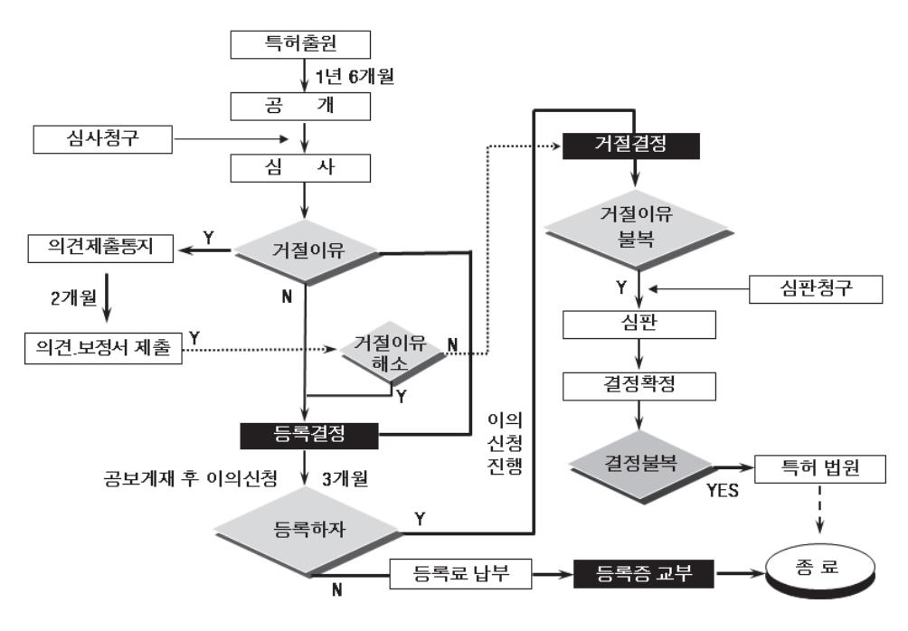

[그림 2-8] 국내 특허 출원 및 등록 절차

## 수행 내용 / 기술 동향 분석하기

## 재료·자료

• 기술 동향 분석보고서, 주요 반도체 업체 경영층 인터뷰 자료, 전문가 인터뷰, 출장보고서, 전문 기술 자료(논문, 특허, 학회 발표자료, 서적 등), 회사 소개 팸플릿, 국가별 전자공시시 스템 자료(국내의 경우 금융감독원, 미국의 경우 증권거래위원회 등) 등

## 기기(장비 ・ 공구)

• PC 또는 노트북, 프로젝터, 프린터, 복사기, 인터넷 장비, 칠판(화이트보드) 등

## 안전 ・ 유의 사항

- 기존 제품의 특허를 회피할 수 있는 방법을 확보하는 데 주력해야 한다.
- 실제 보고서 작성 시에는 시장과 기술 내용이 밀접한 관계에 있기 때문에 정보 수집부터 보 고서 작성까지 시장과 기술은 함께 언급되니 유의한다.

#### 수행 순서

숔 기술 정보를 수집한다.

외부의 반도체 기술 전문 조사기관을 통해 적합한 보고서를 구매하거나 반도체 기술 전문 조사 업체에 의뢰해 요구에 맞는 보고서를 확보한다.

내부적으로는 반도체에 대한 전문 지식을 갖춘 연구원 또는 제품 기획 엔지니어가 인터넷을 통 해 개발 제품의 기술 동향을 파악하며 개발 제품의 계획 수립에 앞서 경영층을 만나 중장기 제 품, 기술전략에 대해 검토할 수 있는 경영층 인터뷰도 빼 놓으면 안 된다.

제품의 전개방향, platform 개발계획, platform별 제품 전략, generation별 개발에 필요한 핵심요소 기술, 핵심 부품, 생산 기술·생산 시스템 등을 선행 개발이 되도록 검토하고 제품 개 발지도(PRM: product road map), 기술 개발지도(TRM: technology road map), 설계 개발 지도(DRM: design road map)를 점검해야하기 때문이다.

1. 검색 전 담당자는 자료 검색 및 분석 작업을 체계적으로 할 수 있도록 계획한다.

자료 검색 및 분석을 위해서는 제품 정보 기술서 해독 지식, 성능 지침서 해독 지식, 반도 체 기술 조사 및 분석 방법론, 특허 검색 및 해석 방법을 숙지한다.

2. 반도체 기술 관련 기관을 체크리스트를 통해 구체적으로 확인하도록 한다.

대표적인 연구기관과 각 분야별 조직과 전문기관, 특허 정보 검색을 할 수 있는 사이트를 <표 2-4>에 정리하였다. 이를 토대로 검색에 적합한 사이트를 확장 검색한다.

반도체 기술 관련 기관 중 일부는 홈페이지에서 직접 보고서를 검색하고 구매할 수 있으므

로 인터넷 결제를 포함한 인터넷 활용 방법을 익히도록 하며, 인터넷 주문 전에 보고서 가 격 및 구성, 내용 등 세부 정보를 파악해 필요성에 대해 검토하고 필요시 구매 여부에 대한 사전 승인을 득한다.

<표 2-4> 반도체 기술 연구기관 사이트

| 구분             | 사이트 주소(URL)                       | 내용                        |
|----------------|-----------------------------------|---------------------------|
|                | http://www2.imec.be/              | Imec Technology Forum     |
|                | http://www.itrs.net/              | ITRS(국제 반도체 기술로드맵)        |
|                | http://www.isuppli.com/           | iSuppli(업계 동향)            |
| 연구 기관       | https://www.vlsiresearch.co m/ | VLSI Research(업계·기술 동향)   |
|                | http://www.semi.org/              | SEMICON Show              |
|                | http://www.nanokorea.or.kr/       | 나노기술 관련 최신 정보 및 지식 공유     |
|                | http://www.kcs.cosar.or.kr        | 한국반도체 학술대회                |
|                | http://www.mrs.org/               | 재료학회(차세대 재료 연구)           |
|                | http://www.electrochem.org /   | 화공학회(고체 재료 및 전기화학 재료 연구)  |
|                | http://www.gadest.org/            | 반도체 Gettering과 결함 연구 전문학회 |
|                | http://www.epm2017.cn             | 국제적인 전자재료 공정 연구학회         |
| 기술             | http://www.itstat.go.kr/          | ICT 산업 정보, 과학기술정보 포털 서비스  |
| 학회 포탈 특허 | http://www.yeskisti.net/          | 논문∙기술 분석보고서, 국가연구개발보고서    |
|                | http://www.kipo.go.kr/            | 한국 특허청                    |
|                | http://www.uspto.gov/             | 미국 특허청                    |
|                | http://www.kipris.or.kr/          | 한국 특허정보원(특허 정보넷)          |
|                | http://www.jpo.go.jp/             | 일본 특허청                    |
|                | http://www.sipo.gov.cn/           | 중화인민공화국 국가지식산권국           |
|                | http://www.epo.org/               | 유럽 특허청                    |

3. 기술 정보는 해당 제품에 국한치 말고 메가트렌드를 포함해 인터넷 등을 활용해 검색한다.

- 4. 관련 기관, 조직 또는 업체로부터 다양한 기술 정보 및 자료를 확보한다.
  - 특히 특허 정보의 경우 좋은 정보원이기는 하나 꼭 필요한 정보를 담고 있는 특허를 찾는 일은 쉬운 일이 아니기 때문에 준비 없이 단순 검색하는 것은 바닷가에서 바늘 찾기가 되 기 때문에 체계적인 검색 방법에 대해 사전 학습이 필요하다. 특허 정보 검색 방법은 주제 분석 및 검색 항목의 선택, 검색식 작성, 예비 검색을 거쳐 본 검색을 수행하여 결과를 얻 을 때까지 반복한다. 제품 기획 같은 주요 프로젝트의 경우 특허 전문가가 전문기관의 도움 을 받아 정확하고 목적에 맞는 특허정보를 확보하여야 한다. 특허 정보의 일반적인 검색 절 차를 아래에 나타내었다. 간단한 내용은 한국 특허정보원 홈페이지(<표 2-4>참조)를 방문하 면 도움을 받을 수 있다.

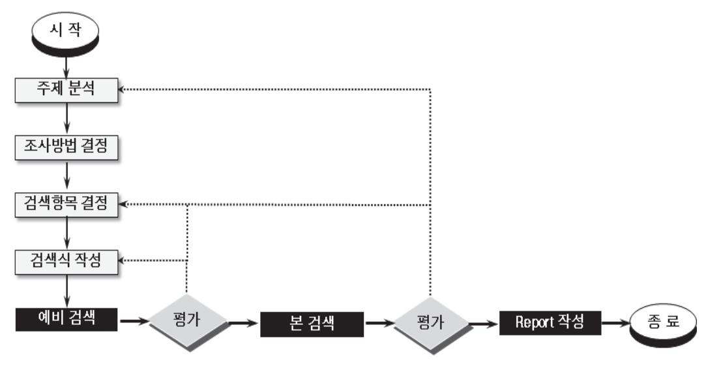

[그림 2-9] 특허 정보의 검색절차

5. 기술 정보의 확보 방법은 인터넷뿐만 아니라 전문 연구기관, 반도체 전문 컨설팅 기관의 분석 자 료, 주요 전시회, 출장보고서 등 가능한 모든 수단을 통해 극대화한다. 반도체 관련 학회나 전시회 등에 직접 참여하거나 반도체 전문 조사기관이나 연구기관, 컨 설팅 업체 등을 통해 조사된 분석 보고서를 통해 개발 제품의 기술 동향을 파악한다. 또한 산업체, 학교, 연구소 등 개발 제품의 기술 전문가 그룹을 사전 조사해 방문 또는 서 면, 이메일(전자 우편) 등을 통해 인터뷰를 실시하고 그 결과를 보고서로 정리해 개발 제품 의 기술 동향을 파악한다. 전문가 그룹에 대해서는 사전에 파악하고 네트워크를 형성하는 것이 필요하다. <표 2-5>에 반도체 분야별 주요 제조업체 사이트를 정리하였다. 주요 전문 조사기관이나 연구기관, 컨설팅 업체를 활용해 맞춤형 자료를 원할 경우 막대한 비용이 요구되기 때문에 비용 대비 효과에 대해 사전 검토가 필요하다.

| 구분 | 사이트 주소(URL)                          | 내용                        |
|----|--------------------------------------|---------------------------|
|    | http://www.vlsisymposium.or g/    | VLSI Technology symposium |
|    | http://www.ssdm.jp/                  | 국제 반도체 소자 및 재료 컨퍼런스       |
|    | http://www.his.com/~iedm/            | 전자산업계 기술미팅                |
| 소자 | http://www.intel.com/                | 미국의 시스템 IC업체(인텔)          |
|    | http://www.ibm.com/                  | 미국의 설계회사(IBM)             |
|    | http://www.samsung.com/sec /      | 한국의 메모리 업체(삼성전자)          |
|    | http://www.tsmc.com/                 | 대만의 파운드리 업체(TSMC)         |
|    | http://www.appliedmaterials.c om/ | 세계 최대 반도체 장비 업체           |
| 장비 | http://www.asml.com/asml/            | Lithography 장비 전문 업체      |
|    | http://www.tel.com/                  | 도쿄일렉트론, 열처리 장비 전문 업체      |
|    | http://www.kla-tencor.com/           | 측정기 전문 업체                 |
|    | http://www.shinetsu.co.jp/           | 일본 반도체 재료 업체(신에츠)         |
|    | http://www.siltronic.com/            | 독일 반도체 재료 업체(바커 실트로닉)     |
| 재료 | http://www.sunedisonsemi.co m/    | 미국 반도체 재료 업체(선에디슨)        |
|    | http://www.sksiltron.com/            | 한국 반도체 재료 업체              |
|    | http://www.amkor.com/                | 미국의 패키징 업체                |
|    | http://www.jsr.co.jp/jsr_e/          | 일본의 화학용액 업체(포토레지스트 등)     |

#### <표 2-5> 반도체 분야별 주요 제조업체 사이트

숕 기술 정보를 분석한다.

전문 기술 정보보고서, 각종 매체, 설문지, 전시회, 고객 인터뷰 등을 통한 고객 요구 사항에 대한 수집된 자료를 기능별, 성능별로 분류한다.

1. 반도체 주요 기능 항목을 도출하고 경쟁사별 비교표를 만들어 확인하도록 한다. 최근 모바일 기기의 대표 격인 스마트 폰의 사양 비교표를 예로 든다.

|                     | A사                      |               |                    |                      |               |                    |
|---------------------|-------------------------|---------------|--------------------|----------------------|---------------|--------------------|
| 품 목                 | Components              | Cost (USD) | Portio n (%) | Components           | Cost (USD) | Portio n (%) |
| Momon               | 16G eMMC                | 33            | 15                 | 16G eMMC             | 15            | 8                  |
| Memory              | 2GB LPDDR3              |               |                    | 1GB LPDDR3           |               | 0                  |
| Display & Touch     | 5.1 " AMOLED            | 65            | 28                 | 4.7" LTSP LCD        | 45            | 23                 |
| Processor           | MSM8974AC Snapdragon | 35            | 15                 | A8 Processor         | 20            | 10                 |
| Camera              | 16MP+2MP                | 19            | 8                  | 8MP+2.1MP            | 11            | 5                  |
| Wireless Section    | MSM8974 + WTR1625L   | 16            | 7                  | Qualcomm             | 33            | 17                 |
| UI & Sensors        |                         | 22            | 10                 |                      | 22            | 11                 |
| WLAN/BT/FM/G PS  | Combo(Wi–Fi/ BT)     | 11            | 5                  | Broadcom BCM4345  | 5             | 2                  |
| Power Management | Qualcomm                | 8             | 3                  | Dialog + Qualcomm | 7             | 4                  |
| Battery             | 3.8V 2800mAh            | 6             | 3                  | 3.8V 1810mAh         | 4             | 2                  |
| Others              |                         | 14            | 6                  |                      | 35            | 18                 |
| 반도체 제조원가            |                         | 144           | 63                 |                      | 113           | 57                 |
| 총 제조원가              |                         | 229           |                    |                      | 197           |                    |

### 〈표 2-6〉 스마트폰 대표 제조 기업 A사와 B사의 비교

출처: 한국반도체산업협회(KSIA) 발표('15. 5. 27.)

## 2. 와해성 기술 동향을 포함한 기술 정보 분석을 통해 개발 제품의 진행을 검토한다.

- 3. 분석은 내부 조직 또는 전문 업체와 제한적인 협업을 실시해 정확성을 기한다.
  - 기술의 핵심 정보 중 하나인 특허는 지식재산관리의 필수 요소로 특히 기업에서 경쟁사의 기술 및 제품 트렌드를 예측하여 다양한 경영 전략을 모색하고 혁신 기술·혁신 제품의 창출 에 기여한다.

숖 기술보고서를 작성한다.

- 1. 주요 목차를 선정하고 주요 내용을 도출해 기술보고서를 작성한다.
- 2. 내용은 단순한 사실의 나열이 아닌 의사 결정을 할 수 있는 수준이 되어야 한다.
- 3. 주요 내용에 대해서는 붙임 자료를 준비하고 질문에 대비해 인용 자료의 종류와 출처를 반드시 표기한다.
- 4. 보고서는 제품 성능, 용량, 크기 등 주요 항목에 대한 단위 등을 정확히 표기한다.
- 5. 작성한 보고서는 최종 승인 전 반드시 절차에 따른 검토를 거친다. 기술보고서는 목적에 따라 다양하게 작성할 수 있으며 실제로 발표 형태의 보고로 이루어 지며 기술 전문가의 검토를 거쳐 의사 결정을 위한 자료로 활용된다. <표 2-7>에 발표 형태의 보고 시 사용하는 기술보고서 구성 항목을 예시하였고 실제 발표 형태의 양식 중 일부를 [그림 2-10]에 표기하였다.

<표 2-7> 기술보고서 예시(발표 형태)

| 구분                                                                                                          | 항목                 | 세부 내용                                                            |  |  |  |
|-------------------------------------------------------------------------------------------------------------|--------------------|------------------------------------------------------------------|--|--|--|
| 표지                                                                                                          | 보고서 제목             | 보고 날짜 및 보고자(부서)를 포함                                              |  |  |  |
| 보고에                                                                                                         | 조사 배경·목적           | 기술적 제한점과 문제점과 기술 분석의 당위성 설명                                      |  |  |  |
| 앞서                                                                                                          | 조사 방법              | 기술 분석의 방법, 절차와 정확성에 대해 언급                                        |  |  |  |
| 목차                                                                                                          | 목차, 내용, contents 등 | 일관된 논리적 흐름을 갖도록 구성                                               |  |  |  |
| 분석 결과                                                                                                    | 세계 반도체 기술 동향 등     | 세계 반도체 기술적 도전(예: 10nm이하 D/R대응 기술 개발, 450mm 대구경화 등)            |  |  |  |
|                                                                                                             | 반도체 기술 동향          | 해당 산업 기술 변화(예: NAND 플래시 메모리의 3D-IC 기술 등)    |  |  |  |
|                                                                                                             | 타깃 제품 기술 동향        | 타깃 제품의 경쟁사 및 기술 정보 분석 결과(예: 경쟁사 3D-Cell Staking 기술 및 양산 수준등 ) |  |  |  |
| 결론                                                                                                          | 전략적 제안/대응 방안       | 분석 결과에 대해 항목별 대응 방안에 대해 제시하고 의 사 결정이 필요한 사항에 대해 정리            |  |  |  |
| - 표 및 도표는 분석 결과를 쉽게 파악할 수 있도록 배치한다. - 발표 자료의 헤드라인은 2줄 이내로 간략하게 표기한다. - 사진, 그림 및 도표는 의미의 왜곡이 없도록 유의한다. |                    |                                                                  |  |  |  |

- 외부 보고서나 출력물을 인용해 작성한 문서는 저작권을 침해하지 않도록 하며, 인용 자료는 출처를 정확히 표기한다.

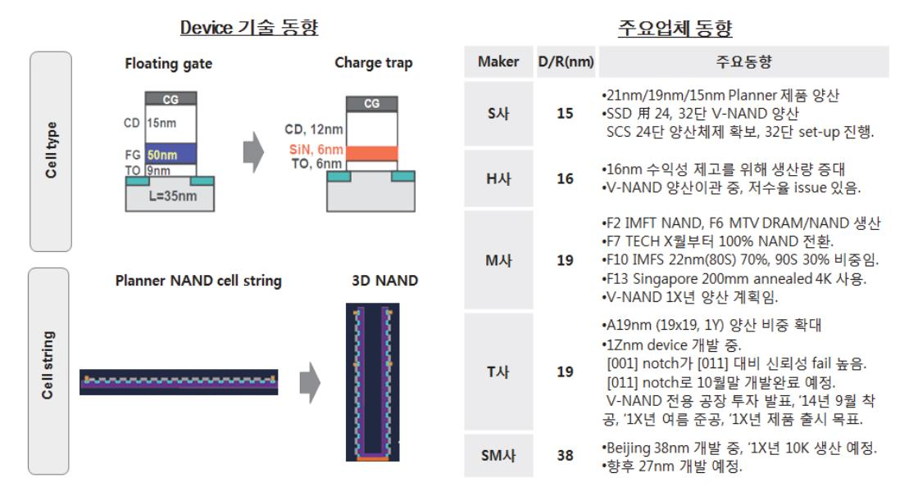

[그림 2-10] 기술보고서 발표 자료 예시

## 2-2. 제품 핵심 기능 및 장단점 파악

학습 목표 • 경쟁사 제품의 데이터시트를 통해 제품의 핵심 기능 및 장·단점을 분석할 수 있다.

## 필요 지식 /

#### 숔 반도체 제품 핵심 기능

개발 제품과 관련 있는 경쟁사를 파악하고 그 기술 동향을 파악함으로써 개발 제품의 핵심 기 능을 파악한다.

1. 반도체 주요업체 기술개발 현황

반도체 개발에 가장 중요 요소 중의 하나인 칩 설계 주요 기업의 기술 개발은 미국 내 업 체들을 주축으로 활발하다. 실리콘밸리 소재의 기업인 Nvidia는 자사의 프로세서인 Tegra 4가 72GPU 속도에 이르고 있고 Intel과 CPU 경쟁상대인 AMD(advance micro devices) 는 2013년 하반기에 28㎚ 공정의 APU를 발표(코드명뺳Kaveri뺴)하였고 차세대 제품 개발 중에 있 다.

AMD의 최신형 칩은 다양한 HP 형태의 Sleekbooks 및 Vizio의 11.6인치 APU 구동 태 블릿, Vizio 울트라씬 랩톱, 24인치 AIO 데스크톱 등에 적용될 것으로 예측된다. 우리에게 친숙한 Qualcomm은 CES에서 AMD에 대응해 쿼드코어 Snapdragon 800을 발표했으며, 이 칩은 기대 이하의 성능을 보였던 S4 프로세서 대비 75%의 성능 향상을 보이고 있다. S4 프로세서는 2012년 출시됐던 고급 사양 칩으로 Windows RT 및 Android 디바이스의 가장 인기 있는 모델이다.

일반 PC의 CPU시장을 독점하고 있는 Intel은 경쟁 관계에 있는 ARM에 대응해 쿼드코어 칩인 Bay Trail을 발표했는데 Bay Trail은 x86 기술로 더 효율적인 모바일 SoC 생산이 가능하다는 것을 증명하였다. 2012년 9월 Intel Developer Forum에서 처음 발표된 인텔 의 Haswel 프로세서는 울트라북용 디자인을 갖춘 4세대 코어 i 프로세서로, 2013년 하반 기부터 양산되고 있으며 Haswel을 통해 스마트 폰, 태블릿 PC, 노트북 등 소형 전자 기기 의 배터리 사용 시간이 지금보다 늘어나고 제품 크기 및 두께는 줄어들었다.

Haswel은 현재 주요 반도체 공정인 22~28나노 공정에서 한층 진보한 14나노 공정으로 제 조되어 기존 프로세서보다 전력 소모와 발열을 최대 2배 이상 감소시킬 것으로 예상된다. Haswel ULV(Ultra Low Voltage) 프로세서의 전력 소모량은 10W에 불과해 기존 ULV 프로세서의 전력 소모량인 17W와 비교했을 때 전력 소모량이 2/3 수준으로 감소한 것으로 발열 및 전력 소모 문제로 아톰 프로세서를 장착했던 7~10인치 노트북에 Haswel을 2014

년 중반부터 탑재하고 있다.

숕 반도체 제품 장단점 파악

경쟁사 개발 제품의 핵심 기능과 성능지침서(spec. sheet)에 대한 분석을 통해 장단점을 파악 해 개략적인 제품을 선정한다.

1. 반도체 소자 종류별 핵심 기술

주요 반도체 소자별 핵심기술을 전문 학회나, 연구기관, 관련 조직을 통해 파악하고 지속적 으로 세미나, 워크숍, 기술 조사기관을 통해 최신 정보로 갱신한다.

(1) 메모리

D/R(design rule)은 25nm에서 20nm로 진행하였고 Cell FET은 RCAT(recessed cha nnel array transistor) with b-WL에서 VCAT(vertical channel array transistor, 기존에 단층으로 배열된 셀을 3차원 수직으로 적층한 낸드플래시 메모리) with 4F2 진 행되고 있으나 기술적 문제로 지연 중이다.

삼성전자는 20nm급 기술이 적용된 PC용 4Gb DDR3 '14년 상반기부터 생산 중이며 채산성이 높은 모바일용 4Gb LPDDR3 비중을 확대하고 있다.

SK hynix는 AMD와 공동 개발로 20nm 128GB/s HBM(TSV I/O)'13년 12월 개발 완 료하여 상용화하였다.

(가) 플래시 메모리

NAND로 불리는 플래시 메모리는 D/R은 21nm에서 15nm로 진행해 생산되고 있 으며 cell 구조는 planar with FG(floating gate)에서 3D with CT(charge trap) 구조로 변경이 예상되고 있다.

삼성전자의 경우 모바일용 저장매체로 사용되고 있는 SSD(solid state drive)용 24, 32단 3D NAND가 양산 중에 있고 향후 24/32 64 128 256 392 512로 적층 수 증가가 예상되고 있다.

(나) 플래시 메모리의 응용 – SSD(solid state device)

SSD란 메모리 반도체를 저장매체로 사용하는 차세대 대용량 저장장치로 HDD(hard disk drive)를 대체해 컴퓨터의 운영체제(OS)와 데이터를 저장하는 보조기억장치로, 반도체 칩에 정보가 저장된다고 하여 SSD로 불린다.

SSD는 모터와 같은 기계적인 장치 없이 낸드 플래시 메모리에 정보를 저장하기 때 문에 빠른 속도와 높은 안전성을 가지고 있다. 또한 발열, 소음 및 전력소모가 적고 소형화, 경량화할 수 있다는 것이 장점이다.

SSD는 크게 데이터 저장용 메모리인 낸드 플래시, 인터페이스와 메모리 사이의 데이 터 교환 작업을 제어하는 컨트롤러(controller), 외부 장치와 캐시메모리 역할을 하 는 DRAM으로 구성된다. 특히 낸드 플래시 메모리는 전원이 꺼지더라도 기록된 데 이터가 사라지지 않는 비휘발성 메모리이기 때문에 데이터의 영속성을 보장한다. 최근 고성능 보급형 SSD가 출시되면서 노트북이나 데스크톱 PC에 사용되고 있으며, 빅데이터 시대에 급증하는 데이터를 저장 및 관리하기 위한 데이터 센터의 핵심 저 장 장치로 이용되고 있다.

(2) 시스템 IC

주로 컴퓨터 연산용으로 사용하는 MPU는 D/R이 20/14nm에서 14/10nm로 미세화되 고 있으며 게이트(Gate) 구조는 Planar bulk with HKMG(high-k, metal gate)에서 Multi gate with FINFET 적용이 예상된다.

극자외선(EUV: extreme ultra violet) 노광(photo lithography)은 2017년 7nm급부 터 적용 계획이지만, 향후 multi-patterning과 극자외선(EUV) 중 1가지 기술이 선정될 것으로 예상되고 있다.

(3) CIS(CMOS image sensor)

이미지센서(image sensor)는 사람의 눈과 같은 역할을 하는 반도체로 휴대폰용 카메라 는 물론이고 디지털카메라, CCTV, 블랙박스 등 다양한 곳에서 시각적 신호를 받아들여 디지털 신호로 변환하는 기능을 한다. CIS(complementary metal-oxide image sens or)와 CCD 이미지센서(charge coupled device image sensor: 전하결합소자)로 나누 어진다.

(가) CIS의 장점

CIS는 상보성 금속산화물 반도체(CMOS: complementary metal oxide semicond uctor) 구조를 가진 저소비 전력형의 촬상 소자이다. CCD 이미지센서에 비해 약 1/10의 소비 전력을 가지고 있으며 3.3V의 단일 전원, 주변 회로와의 일체화도 가 능하다. CCD보다 감도는 떨어지지만, 최근에는 화질이 많이 개선되어 휴대폰은 물 론 고해상도 디지털 카메라나 자동차 후방 감시카메라 등에도 광범위하게 사용되고 있다. CIS는 상보형 금속산화반도체(CMOS) 구조를 가진 저전력 촬상 소자를 말하 며, 이미지 센서는 피사체 정보를 읽어 전기적인 영상신호로 변환해주는 장치이다. 빛에너지를 전기적에너지로 변환해 영상으로 만드는데 카메라의 필름과 같은 역할을 한다.

(나) 이미지 센서의 종류

이미지 센서는 응용방식과 제조 공정에 따라 CCD 이미지 센서와 CMOS 이미지센 서로 나뉘는데 CMOS 이미지 센서는 신호를 전압 형태로 변환해 전송하는 방식으 로, 일반 반도체 공정인 CMOS 공정을 사용하기 때문에 가격 경쟁력이 있다. 또한 이미지 센서와 주변 회로를 원칩화할 수 있어 소형화 및 관리가 용이하고 집적 도가 높고 전력 소비량이 적어 배터리 수명이 중요한 스마트기기 시장에서 많이 적 용되고 있다.

카메라 모듈에 사용하는 화상소자인 CIS는 pixel size가 1.2um 이하로 미세화됨에 따라 cross talk(잡음)가 감소하고 Low-light performance 향상을 위해 3D pixel 이 개발되었다.

최근에는 CIS Si과 ISP die를 vertically 적용하는 3D stacked CIS가 적용되고 있 다.

(4) 전력용 IC(power management IC: BCD)

BCD 공정으로 저가, 단위 소자 면적의 축소 등 다양한 기능이 통합된 LSI를 구현하는 것이 목적이다.

DMOS Rsp(Ron X area) 감소를 위해 VDMOS(V-grooved double diffused MOS) LDMOS(Lateral DMOS) TB-MOS(Trench based DMOS)로 변화하고 있으며 s caling 향상을 위해 isolation 기술이 junction isolation에서 deep trench isolation 으로 전환될 것으로 예측되고 있다.

(5) 통신용 IC

Inductor Q factor 확보와 electrical isolation을 구현하기 위해 high res 기판을 요 구하고 있으며 Si 외에도 GaAs, SiGe 기판이 일부 사용되고 있다. 기존 CMOS 공정과 유사하여 base band와 원칩화가 유리하고 미세공정기술 발달로 고성능의 능동소자 개 발가능하고 package가 용이하기 때문에 silicon 기판 위주의 기술 개발이 주류를 이루 고 있다.

기술적으로는 BEOL(back end of line, 350~500℃) 중 비저항 변동을 제어하는 기술 과 D/R 감소로 사용 기판의 크기가 150mm에서 200, 300mm로의 전환이 예상된다.

## 수행 내용 / 제품 핵심 기능 및 장단점 파악하기

## 재료·자료

• 경쟁사 기술개발 동향보고서, 전문 조사기관 보고서, 제품에 대한 기술보고서, 기술 서적, 기술 논문, 경쟁사 제품 성능지침서(spec. sheet), 보고서 템플릿(template), 제품 개발 사 양서, 국가별 전자공시시스템 자료(국내의 경우 금융감독원, 미국의 경우 증권거래위원회 등), A4 용지 등

## 기기(장비 ・ 공구)

• PC 또는 노트북, 스크린, 빔 프로젝터, 프린터, 복사기, 인터넷 장비, 칠판(화이트보드), 문 서 작성프로그램 등

## 안전 ・ 유의 사항

• 제품 핵심 기능 및 장단점 파악 시에 항상 디자인을 염두에 두어야한다.

### 수행 순서

### 숔 핵심 기능을 파악한다.

경쟁사 및 수집된 자료를 분석하여 개발 제품의 핵심 기능을 파악한다. 특히 고객의 소리 (voice of customer)를 구체적이고, 측정 가능한 고객 핵심 요구 사항(critical customer req uirement)으로 변환하는 것은 정확한 process 척도(indicator)를 정의하는데 필요하다.

1. 핵심 기능을 파악하기 위해서는 우선 다양한 정보의 원천으로부터 정보를 수집해야 하며 고객 요 구 사항에 대한 정확한 이해와 우선순위에 대한 평가를 위해 고객을 면밀하게 조사한다. 여기서 고객이란 최종 소비자만을 뜻하지는 않는다. 어떤 제품이나 서비스의 고객이란 제품 의 수명이 다할 때까지 어느 단계에서나 사용하는 모든 관련자들을 말한다. 즉 제품을 소비 하는 사람, 생산하는 사람, 그리고 제품이 소비되는 동안 이에 대한 애프터 서비스를 담당 하는 사람까지 모두 고객이랄 수 있다. 다만 물리적으로 모든 고객을 조사할 수 없기 때문 에 대표성을 가진 가능성 있는 고객을 정리해 조사하는 것이 중요하다.

## 2. 고객 중심 마인드로 고객의 요구 사항을 기록하고, 핵심 요구 사항을 구체화, 정량화 한다. 고객은 요구 사항에 대해 애매하고 감정적인 발언을 하기 때문에 구체화해야 하며, 유사하 고 공통적인 내용은 그룹핑한다. 그리고 구체적인 고객의 주요 관심사항 및 기대치를 정한 후, 고객 요구 사항을 명확히 한다. 특히 고객의 소리를 구체적이고, 측정 가능한 고객 핵 심 요구 사항(critical customer requirement)으로 변환하는 것은 정확한 process 척도 (indicator)를 정의하는데 필요하다.

- (1) 다양하고 정확한 정보 수집
- (2) 고객 요구 사항의 구체화, 정량화
- (3) 정확한 분석을 위해 내부 조직 또는 전문 업체와 제한적인 협업 실시
- 3. 실제 핵심 기능 파악하는 방법으로 특성 요인도를 작성한다.

특성 요인도는 1953년에 동경대학 이시가와 교수가 고안한 기법으로 fish-bone, cause-ef fect diagrams 등으로도 불리며, 아래와 같은 순서로 작성한다.

- (1) 특성(문제점)을 명확하게 설정한다.
- (2) 특성에 영향을 미치는 원인을 파악(큰 가지)한다.

주로 4M 혹은 5M1E로 분류하는데 4M은 작업자(man), 기계·설비(machine), 재료 (material), 작업 방식(method)을 말하고 5M1E란 4M에 측정(measure)과 환경 (environment) 두 요소를 추가한 것을 말한다.

- (3) 원인마다 작은 요인을 층별하여 추정(작은 가지)한다.
- (4) 특성에 미치는 요인의 영향도를 결정한다.

영향도는 수치로 파악하여 파레토 그림 등으로 표현하고 영향도가 수치로 표시되지 않 을 때에는 영향을 미친다고 생각되는 것을 브레인스토밍 방식으로 검토한다.

브레인스토밍(brainstorming)

1930년에 미국 광고회사의 알렉스 오스본(Alex Faickney Osborn)이 광고 아이디어를 끄집어내기 위해 사용한 방법으로 아이디어를 혼자 생각하는 것보다 여러 사람의 생각을 합치면 더 좋은 아이디 어가 나온다는 데에서 출발한 창의적 아이디어를 생산하기 위한 학습 도구이자 회의 기법이다. [브레인스토밍 4대 기본 규칙]

1.질(質)보다 양(量):'양이 질을 낳는다(quantity breeds quality).'는 격언을 따라 문제 해결을 위해 많은 숫자의 아이디어가 제시될수록 효과적인 아이디어가 나올 확률이 올라간다는 것을 전제로 함.

- 2.비판, 비난 자제: 브레인스토밍 중에는 제시된 아이디어에 대한 비판은 추후의 비판적 단계까지 보류하고 계속해서 아이디어를 확장하고 더하는 데에 초점을 둬 참여자들은 자유로운 분위기 속에 서 독특한 생각들을 꺼낼 수 있음.
- 3.자유분방: 많고 좋은 아이디어 목록을 얻기 위해서 엉뚱하거나, 새로운 지각을 통해서 혹은 당연 하다고 생각해오던 가정을 의심하는 것으로부터 더 나은 답을 줄 수 있는 새로운 방법이 떠오를 수 있음.

4.아이디어 결합 및 개선: 1+1이 3이 될 수도 있다는 시너지 효과를 인정해 아이디어들을 연계시켜 더 뛰어난 성과를 얻을 수 있음.

(5) 특성 요인도를 최종적으로 정리한다.

핵심 기능을 파악하기 위해 5M1E 분류에 의해 작성된 특성 요인도를 [그림 2-11]에 예 시한다.

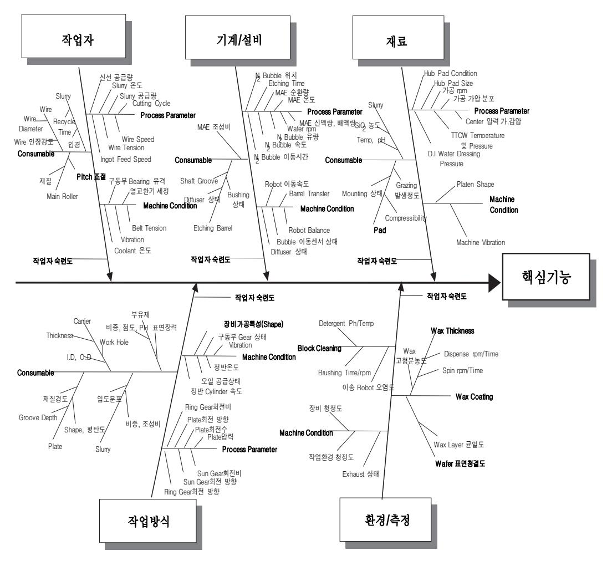

[그림 2-11] 특성 요인도 작성 사례

2 장단점을 파악한다.

경쟁사 개발 제품의 성능지침서(spec. sheet)에 대한 분석을 통해 장단점을 파악한다.

- 1. 각종 매체, 설문지, 전시회 등을 통한 고객 요구 사항에 대한 자료를 수집한다.
- 2. 수집된 경쟁사 성능 지침서를 가능별, 성능별로 분류한다.
- 분류된 개발 제품의 장단점과 당사의 여건을 고려한 개발 제품을 선정한다.
  개발 제품의 개념을 결정 시에는 전문가 그룹에 의한 브레인스토밍 방법이 좋다.

③ 보고서를 작성한다.

- 1. 주요 목차를 선정하고 주요 내용을 정리해 보고서를 작성한다.
- 2. 내용은 단순한 사실의 나열이 아닌 의사 결정을 할 수 있는 수준이 되어야 한다.

- 3. 주요 내용에 대해서는 붙임 자료를 준비하고 질문에 대비해 인용 자료의 종류와 출처를 반드시 표기한다.
- 4. 보고서는 제품 성능, 용량, 크기 등 주요 항목에 대한 단위 등을 정확히 표기한다.
- 5. 작성한 보고서는 최종 승인 전 반드시 절차에 따른 검토를 거친다.

#### 수행 tip

- 제품 핵심 기능 및 장단점 파악을 진행할 때에는 필요하다 면 전문 연구원이나 개발팀의 지원을 받아 협업으로 진행 한다.
- 제품 핵심 기능 및 장단점 파악하고 기록하며 확정 시에는 숙련된 연구원이나 개발팀 엔지니어 집단에 의한 검토를 통해 오류를 최소화한다.
- 외부 보고서의 경우 출처 등을 반드시 확인하고 제품 성 능, 용량, 크기 등 주요 항목에 대한 단위 등을 정확히 표 기한다.
- 작성한 문서는 최종 승인 전 반드시 절차에 따른 검토를 거친다.

## 학습 2 교수·학습 방법

## 교수 방법

- 전문세미나, 전시회, 학회 등의 정보를 제공하여 학습자가 최근의 기술 동향을 파악하고 상 호 비교 분석할 수 있도록 수업을 진행한다.
- 기술 동향 분석 시 일지, 저널 등을 활용할 수 있도록 안내하고, 수집된 기술 자료의 정확 성 유무를 분별할 수 있도록 지도한다.
- 제품의 핵심 기능 및 장단점을 학습자가 파악할 수 있도록 기능별, 성능별로 분리하여 지도 한다.
- 반도체 제품 기획보고서 작성 시 필요한 기본 양식 및 중요 내용을 전달하고, 학습자가 스 스로 작성해 보도록 유도한다.

## 학습 방법

- 반도체 제품 기획 시 필요한 사항에 대해 사전에 파악하고, 사용되는 양식(예제)에 맞추어 작성해 본 후 여기에 첨부되는 자료의 종류와 기록 내용 전반을 숙지해 종류에 따라 분류해 본다.
- 학습자 상호 간 조사한 내용을 비교해 반도체 기술 관련 기관을 검색하고 해당 제품 기술 정보를 구체적으로 확인하도록 하고 이 기관의 해당 제품 기술정보와 관련된 다양한 연관 자료를 인터넷으로 검색하고 분류하여 문서로 정리한다.
- 기술 동향 분석 및 제품 핵심 기능 장단점 파악을 위한'체크리스트'를 작성해보고, 동료 학 습자와 비교해 본다.
- 개발 제품에 대한 기술 정보, 실현 가능성, 수집 및 분석을 통해 개발 목표를 설정하고, 이 를 구현하기 위한 보고서를 작성하여 발표한다.

## 학습 2 평 가

## 평가 준거

• 평가자는 학습자가 학습 목표를 성공적으로 달성하였는지를 평가해야 한다.

#### • 평가자는 다음 사항을 평가해야 한다.

|                      | 학습 목표                                                       |  | 성취수준 |   |  |
|----------------------|-------------------------------------------------------------|--|------|---|--|
| 학습 내용                |                                                             |  | 중    | 하 |  |
|                      | - 전문 세미나, 전시회, 학회 등의 정보를 통해 관련 제품의 기술 동향을 수집 · 분석할 수 있다. |  |      |   |  |
| 기술 동향 분석             | - 개발 기술 관련 특허 분석을 통해 특허 침해 위험을 분석할 수 있다.                 |  |      |   |  |
| 제품 핵심 기능 및 장단점 파악 | - 경쟁사 제품의 데이터시트를 통해 제품의 핵심 기능 및 장· 단점을 분석할 수 있다.         |  |      |   |  |

## 평가 방법

• 평가자 체크리스트

| 학습 내용                | 평가 항목                                             |  | 성취수준 |   |  |
|----------------------|---------------------------------------------------|--|------|---|--|
|                      |                                                   |  | 중    | 하 |  |
| 기술 동향 분석             | - 기술 자료 분석을 위한 기준안 작성 능력                          |  |      |   |  |
|                      | - 수집된 기술 자료 기준안에 따라 분류 여부                         |  |      |   |  |
|                      | - 분류된 기술을 토대로 기술 자료 분석 능력                         |  |      |   |  |
| 제품 핵심 기능 및 장단점 파악 | - 각종 매체, 설문지, 전시회 등을 통한 고객 요구 사항에 대 한 자료 수집 능력 |  |      |   |  |
|                      | - 수집된 자료를 기능별, 성능별 분류 여부                          |  |      |   |  |
|                      | - 분류된 자료를 활용하여 기술 실현 가능성에 대한 보고서 작성 능력         |  |      |   |  |

• 일지/저널

| 학습 내용                | 평가 항목                                                          |  | 성취수준 |   |  |
|----------------------|----------------------------------------------------------------|--|------|---|--|
|                      |                                                                |  | 중    | 하 |  |
| 기술 동향 분석             | - 기술 자료 분석을 위한 기준안 도출 여부                                       |  |      |   |  |
|                      | - 수집된 기술 자료의 분량과 질(정확성)의 수준                                    |  |      |   |  |
|                      | - 수집된 기술 자료의 기준안에 따라 분류 여부                                     |  |      |   |  |
| 제품 핵심 기능 및 장단점 파악 | - 각종 매체, 설문지, 전시회 등을 통한 고객 요구 사항 에 대한 자료의 분량과 질(정확성)의 수준 |  |      |   |  |
|                      | - 수집된 자료에 대한 기능별, 성능별 분류 여부                                    |  |      |   |  |
|                      | - 분류된 자료를 활용하여 기술 실현 가능성 검토 여부                                 |  |      |   |  |

### • 구두 발표

| 학습 내용                | 평가 항목                        |  | 성취수준 상 중 하 |  |
|----------------------|------------------------------|--|---------------------|--|
| 기술 동향 분석             | - 기술 자료 분석을 위한 기준안 정합성 파악 여부 |  |                     |  |
|                      | - 기준안에 따라 분류된 자료의 정확성 여부     |  |                     |  |
|                      | - 분류된 기술을 토대로 기술 자료 분석 능력    |  |                     |  |
| 제품 핵심 기능 및 장단점 파악 | - 도출된 고객 요구 사항에 대한 객관성 여부    |  |                     |  |
|                      | - 기능별, 성능별 분류된 자료의 정확성 여부    |  |                     |  |
|                      | - 작성된 기술보고서의 실현가능성에 대한 수준 여부 |  |                     |  |

## 피드백

| 1. 평가자 체크리스트                                           |
|--------------------------------------------------------|
| - 반도체 기술 동향을 파악하기 위한 정보수집·분석, 보고서를 작성하는 과정 중에 발생한 문제 해 |
| 결 능력을 평가한 후 주요 사항을 표시해 돌려준다.                           |
| 2. 일지/저널                                               |
| - 제출한 반도체 기술 동향보고서의 내용을 평가하고 기준에 미달한 학생들에게는 수준별로 학습    |
| 내용을 보충하고 스스로 복습한 후 그 결과를 제출하도록 한다.                     |
| 3. 구두 발표                                               |
| - 반도체 기술 동향 보고서 발표 시 질의·응답을 통해 작성한 보고서에 대해 숙지 여부를 판단하고 |
| 개선 사항 및 추가로 보완해야 할 사항에 대해 제시한다.                        |

| 학습 1 | 제품 시장 조사하기 |
|------|------------|
| 학습 2 | 기술 동향 조사하기 |
|      |            |
| 학습 3 | 제품 사양 수립하기 |
| 학습 4 | 비용 분석하기    |

## 3-1. 개발 제품 기능 정의

학습 목표 • 시장 및 기술 분석 결과에 따라 개발하고자 하는 제품의 기능을 정의할 수 있다.

## 필요 지식 /

## 숔 시장 및 기술 분석법

내부 자료뿐만 아니라 전문 조사기관과 인터넷 정보, 주요 전시회 등을 통해 파악된 제품 시장 및 기술 정보에 대해 정밀 분석하고 고객의 요구 사항(needs)을 개발 제품의 기능으로 전환해 제품 개념을 도출한다. 시장조사에서 문제 해결까지의 흐름을 도식화하면 아래와 같다.

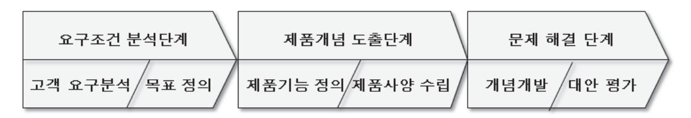

[그림 3-1] 시장 조사하기에서 제품 설계단계까지의 흐름도

1. 시장 분석

시장 분석은 제품 기획과 관련하여 문제점과 기회를 발견하기 위한 시장 상황의 리뷰이다. 또한 업계의 전반 동향이나 업계에 영향을 미칠 만한 환경 요인 등 시장의 일반적인 경향 등을 파악하고, 개발하려는 대상 제품군이 어디에서 어떻게 팔리고 있는 지를 제대로 살펴 시장의 큰 흐름이 어떤 방향으로 전개될 것인가를 분석하는 기초 자료다.

(1) 고객 분석

고객 분석은 고객과 제품, 고객과 가격, 고객과 유통 등 시장의 제반 여건에서 우리가 앞으로 주 타깃으로 설정할 제품의 소비층이 어떤 계층이며, 그 계층은 어떤 소비 행동 을 하는지 소비 행동을 하기까지 의사 결정 과정은 어떤 형태이며, 그러한 소비 행동에 영향을 미치는 요소는 무엇인가 등을 파악해 내는 작업이다.

(가) 고객 파악

'제품을 움직이려면 마음을 움직여라.'라는 헬 스테빈즈(Hal Stebbins)의 말처럼 고 객의 입장에서 생각하고 해결하려면 우선 고객을 알아야 한다. 즉, 마음을 움직이려 면 상대를 알아야 한다.

고객을 알기 위해서는 제품과 관련된 고객의 욕구와 지리적, 인구 통계적, 사회경제 적, 심리학적(라이프 스타일) 특성을 분석하여 고객 세분화에 따른 세분 시장 및 시 장의 움직임을 예측해야 한다.

(나) 고객 행태 분석

고객 행태 분석은 자사 제품과 관련된 구매 준거와 구매 행태, 변화 과정, 주사용 제 품과 선택 이유, 불만 이유, 실현되지 못한 고객 욕구의 발견, 향후 구매 의향과 권 유 정도, 이용 환경 등을 분석한다.

즉, 우리 제품과 경쟁 제품의 주 사용자 특성의 차이는 무엇인가? 고객들은 왜 자사 제품을 필요로 하고 왜 좋아하는가? 고객들은 왜 자사 제품을 싫어하고 경쟁 제품을 구매하는가? 고객들의 인구통계학적 분석 외에 심리학적 분석과 구매 행동 요인 분 석 등 고객에 대한 심층 분석이 뒷받침되어야 설득력이 있다.

(2) 경쟁 분석

동종 업계의 범주에서 핵심 경쟁자와 비슷한 상품 군에서 위협적인 존재는 없는지를 분 석한다.

제품 인지도, 제품 지명도, 제품 선호도, 제품 충성도, 제품 전략, 가격 전략, 유통 전략, 소통 전략, 매체 전략, 브랜드 자산, 기업 문화, 고객 커뮤니티, 사업 영역, 연구 개발력 등을 비교·분석한다. 이를 통해 자사 제품이 내세워야 할 경쟁적 우위점이 무엇인지를 파악할 수 있으며, 경쟁 제품들 사이를 비집고 자사 제품이 들어설 수 있는 빈틈을 발 견할 수 있다.

(가) 경쟁 제품을 분석한다.

경쟁 제품에는 우리 제품과 직접적인 경쟁 관계에 있는 제품은 물론이고 같은 제품 군에 속해 있지는 않지만 우리 제품과 같은 편익을 공유하는 다른 제품군의 제품도 포함해서 분석한다.

(나) 제품별 강점과 약점을 분석한다.

경쟁 제품별로 강점과 약점을 비교해 보면 경쟁 제품 속에서 자사 제품을 어떻게 위 치시켜야 하는지를 판단할 수 있으며 상대적으로 우리 제품이 다른 제품에 비해 강 점은 무엇인지, 취약점은 무엇인지를 한눈에 알 수 있다.

(다) 경쟁 구도를 분석한다.

어떤 제품이 경쟁자이며, 어떤 구도로 경쟁이 벌어지고 있는지를 분석한다. 예를 들 면 경쟁 제품들을 몇 개의 갈래로 나누어 현재 경쟁이 어떤 양상으로 벌어지고 있는 지, 차후에는 어떻게 변할 것인지, 앞으로 경쟁 상대가 될 가능성은 없는지 잠재적 경쟁자까지 분석해야 한다.

(라) 시장 점유율을 분석한다.

시장 점유율에 따라 전략이 달라질 수 있다. 예를 들면 시장 점유율이 지배적이라면 시장 자체를 키우는 전략을 선택해야 제품 판매를 늘릴 수 있고, 시장 점유율이 낮 다면 시장을 키우기보다는 시장 점유율을 높이는 전략을 구사해야 한다.

(마) 제품 포지셔닝을 분석한다.

고객의 머릿속에 제품이 차지하고 있는 위치를 말한다. 경쟁 제품들이 어떤 위치를 차지하고 있는지를 파악하는 것은 그들과 대응해서 자사 제품이 상대적으로 유리한 위치를 차지할 수 있을 것인가를 판단하는 데 중요하다.

(3) 시장 분석의 정리

시장 환경을 분석하는 방법은 SWOT[강점(strength), 약점(weakness), 기회 (opportunity), 위협(threat)] 분석 방법과 문제점과 기회(problem opportunity)에 의 한 분석 방법, 이 두 가지가 일반적으로 많이 활용되고 있는데 이 내용은'학습 5.2 개발 역량 분석 및 협력업체 선정'에서 세부적으로 다루고자 한다.

2. 기술 분류 및 분석

기술은 제품 개발에 있어 중요성과 관련 기술들 간의 관련성이 나타나도록 분류하고 분석 한다.

- (1) 기술 분류
  - (가) 고객의 관점

기술을 시즈(seeds)측면에서 학술적으로 분류하지 않고 사용자의 관점에서 그 기술 이 제공하는 기능을 중심으로 분류한다.

(나) 사업의 관점

사업 전략(현재 사업뿐만 아니라 장래의 사업 전개까지 고려)과의 대응성을 고려하여 사업에 대한 중요성 또는 impact를 중심으로 분류한다.

67

(다) 기업의 관점

전사(또는 대상 조직)의 기술을 거시적으로 바라보고, 지나치게 세분화하지 않고 관 리 가능한 범위 내로 기술 요소를 분류한다.

(라) 경영자의 관점

정밀함에 너무 지나치게 구애받지 않고 각각의 요소에 대해 지나치게 구체적인 정의 를 하지 않고 분류가 곤란한 경우에는'기타'로 분류한다.

- (2) 기술 분석 항목
  - (가) 기술 성숙도

미래의 기술 진보 가능성을 판단할 수 있는 척도로 반도체 산업에서의 기술개발 환 경을 조사하여 평가한다. 기술을 기술적 진보의 연속선상에서 파악하여 부가적 기술 진보의 가능성 정도로 정의하고 요람기, 성장기, 성숙기, 쇠퇴기로 나눈다.

요람기는 기술의 실제 응용 분야에 대한 가능성은 있지만 상업적 제품화는 거의 불 확실한 상태이고, 성장기는 많은 양의 지식이 축적되고 전파되어 기술적 달성 목표 가 구체화된 상태이다.

성숙기는 지식 축적 및 개발 속도가 점차 완만해지며 기술진보가 점진적으로 예측 가능한 형태로 나타나는 상태이고 쇠퇴기란 진보는 미미하고 예측이 가능할 뿐 아니 라 경쟁기업이 쉽게 모방하는 상태이다.

(나) 기술 중요도

기술의 중요도는 기술이 제품의 경쟁력에 미치는 영향을 파악하는 것으로 성숙도와 는 달리 조사·분석 대상 제품에 따라 달라진다.'사업에 있어 경쟁 관계에 영향을 미 치는 impact의 정도'와'사업에 이용할 수 있는 구체성의 정도'의 두 관점으로부터 기술의 중요도를 정의하고 원천(태동) 기술, 도상 기술, key 기술, 기반 기술로 나눈 다.

원천(태동) 기술이란 실현의 구체성 및 경쟁에 미치는 영향이 불확실한 기술을 말하고, 도상 기술이란 제품이나 공정으로 구체화되진 않았으나 전반적인 경쟁의 기반을 변화시 킬 가능성이 기술을 말한다. 넓게는 도상 기술에 포함되지만 보다 실현의 가능성이 불명 확한 기술도 원천기술로 부른다.

 key 기술은 제품이나 프로세스의 차별화에 결정적인 요인이 되는 기술로 경쟁 우위의 근간이 되는 기술이다. 마지막으로 기반기술은 꼭 필요한 기술이지만 일반적으로 널리 알려지고 공유된 기술로 경쟁 우위에는 거의 영향이 없는 기술을 말한다.

(다) 기술 수준

기술 수준은 세계 수준과의 비교를 말하는데 통상 세계 최고 수준으로 기술 선도자 를 뜻하는'dominant'(매우 강함), 세계 경쟁 수준을 뜻하는'strong'(매우 강함), 사 업의 기술적 경쟁력 유지수준으로 니치마켓 이외에서는 지도자가 되지 못하는 'favorable'(보통)과'tenable'(약간 약함),'week'(약함)의 다섯 수준으로 나눈다.

(3) 특허 및 환경 규제 검토

타사 특허를 파악하고, 회피설계 방향, 신기술의 특허 출원 계획 등을 수립하며, 환경 규제 사항(환경유해물질 규제: RoHS, REACH 등)을 검토한다.

숕 개발 제품 기능

모든 고객(내·외부 고객)의 소리로부터 핵심 요구 사항(제품 및 공정)을 파악해 개발 제품의 기 능 지표로 변환하는 작업으로 비즈니스 프로세스 전개법(business process deployment)과 품질 기능 전개법(QFD: quality function deployment)등이 있다.

1. 비즈니스 프로세스 전개법

조직의 업무 프로세스 전개를 통해 프로세스 상에서 고객의 요구 사항을 파악하고 개발제 품의 기능지표로 변환해 제품 개념을 만드는 방법이다.

(1) 핵심 프로세스 전개 방법

business process를 분석하여, 핵심 프로세스(기능의 경계를 넘어 외부고객에게 전달되 는 최종 제품과 서비스를 창출해 내는 활동)와 지원 프로세스(기업의 내부에서 이루어지 며 핵심 프로세스의 성과에 영향을 미치는 일련의 활동)를 찾아내고 핵심 프로세스의 결 과물에서 가치 있는 결과물을 도출한다. 여기서 프로세스(process)란 한 종류 혹은 그 이상의 투입 요소(input)를 받아서 고객 (customer)에게 가치(value)있는 성과(output) 를 창출하는 활동(activities)을 의미한다.

(2) 중점 개선 항목 선정

또한 고객은 사업을 구성하는 기능과 부서를 보는 것이 아니라, 기업이 제공하는 제품과 서비스를 사용한 경험에 의거하여 사업을 본다. 따라서 개선하고자 하는 사업은 고객에 게 제품과 서비스를 제공하는 프로세스의 관점에서 파악되어야 한다. 핵심 process의 전개는 사업전략/ 사업개선기회와 관련이 있는 중요 성과지표(process output indicat or)가 파악될 때까지 충분히 하위 수준까지 전개한다.

사업 목표 달성을 위해 고객에게 가치를 전달할 수 있는 핵심 process 및 관련 성과지 표를 파악하고. 핵심 process와 사업 핵심 성과지표를 대비시켜 중점 개선 항목을 선정 한다.

## 2. 품질 기능 전개법

(1) QFD의 개념 및 응용

QFD의 기본 개념은 고객의 요구 사항을 제품의 기술 특성으로 변환하고, 이를 다시 부 품 특성과 공정 특성, 그리고 생산에서의 구체적인 사양과 활동으로까지 변환하는 것이 며 QFD의 주요 목적은 신제품의 기획 및 설계 단계에서부터 고객의 욕구를 반영함과 동시에 개발 기간을 단축하는 것이다.

1972년 일본에서 태동한 품질 시스템인 QFD는 고객을 만족시킬 수 있는 서비스와 제 품을 생산하는 데에 그 목적을 두었으며, Mizuno와 Akao를 비롯한 여러 품질 분야 전 문가들이 모여 이러한 개념의 시스템인 QFD를 만들게 되었다.

QFD는 2가지 기본 가정을 갖고 출발하는데'시장 조사결과는 정확하다.' 와'고객의 니즈는 파 악되고 문서화될 수 있으며 모든 프로세스에서 안정적인 상태로 남아있다.'이다.

이 때문에 역설적이게도 QFD의 단점은 시장 조사가 잘못 수행되면 오히려 분석 결과가 조 직에 해롭게 작용될 수 있으며, 고객의 니즈가 매우 급속하게 변화하는 환경에서는 포괄 적인 시스템과 방법론이 오히려 시장 니즈를 인식을 더디게 하거나 제때 인식하지 못할 가 능성도 있다.

(2) QFD의 품질의 집 구성요소

QFD 단계를 적용하는 것을 흔히'품질의 집'을 세우는 것으로 설명하는데 품질의 집은 아래와 같은 요소로 구성 [그림 3-2]되어 있으며 실제 작성 사례를 [그림 3-3]에 표시하였다.

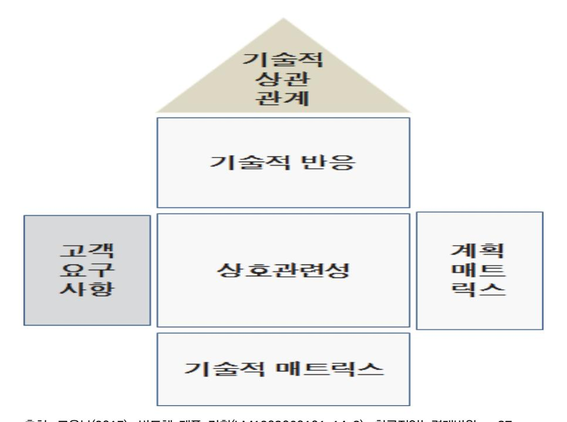

출처: 교육부(2015). 반도체 제품 기획(LM1903060101\_14v3). 한국직업능력개발원. p.37. [그림 3-2] QFD에서 품질의 집 구성요소

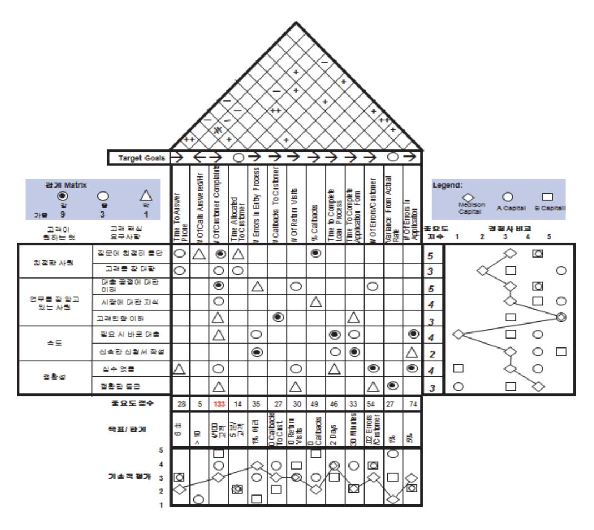

[그림 3-3] QFD에서 품질의 집 작성 사례

(가) 고객 요구 사항

여러 방법을 통해 얻은 고객 니즈 정보와 일상 업무를 통해 축적된 자료를 분석하여 요 구품질 수준을 도출하고 이것을 정리해 품질표를 작성한다.

(나) 기술적 반응

고객의 언어인 요구 품질을 기술적 언어인 품질 특성으로 전환하고 주요 품질 특성 을 추출한다.

(다) 상호 관련성

품질 특성을 통해 고객의 요구를 만족할 수 있는지 그 정도를 4가지로 평가한다.

(라) 계획 매트릭스

요구 품질의 중요도 산출 및 경쟁사 분석, 기획 품질 등을 산출한다.

(마) 기술적 매트릭스

설계 품질을 설정한다.

(바) 기술적 상관 관계

기술적 상관 관계를 5가지 범주로 나누어 정리한다.

## 수행 내용 / 개발 제품 기능 정의하기

### 재료·자료

• 시장 및 기술 분석보고서, 고객 및 내부 구성원 인터뷰 자료, 성능 지침서(spec.. sheet), 제품 기능분석 자료, 품질지표 소개서, 기타 자료 등

## 기기(장비 ・ 공구)

• PC 또는 노트북, 프로젝터, 프린터, 복사기, 인터넷 장비, 칠판(화이트보드) 등

안전 ・ 유의 사항

• 개발 제품의 목표 성능은 시장과 소비자의 요구 사항을 반영하고, 기술 동향 분석을 통해 자사가 개발 가능한 제품 사양을 결정하는 것이다.

수행 순서

숔 시장 및 기술을 분석한다.

- 1. 시장 분석을 위해 목표 시장에 대해 정의하고 현황에 대해 정리하여, 잠재 고객에 대한 정의 및 고객의 니즈를 파악한다.
- 2. 시장 규모 및 성장성, 전체적인 수요에 대해 예측하고, 경쟁사를 분석하여 그 내용을 문서로 작성 한다. 경쟁 제품의 특징, 가격 정책, 기술력, 영업력, 자금력에 대한 분석과 경쟁사별 시장 점유율 및 브랜드 인지도 등에 대해 분석하여 문서에 작성한다.
- 3. 표적 시장 및 해당 제품에 대한 포지셔닝을 실시하고, 해당 제품의 예상되는 시장 점유율에 대해 예측하여 문서에 작성한다.
- 4. 제품 개발에 필요한 기술 내용에 대해 분석하고 필요한 기술의 확보 방안에 대해 문서에 작성한 다.
- 5. 필요 생산 설비의 내용 및 제품 생산 소요 기간에 대해 예측하여 생산을 위한 원재료 확보 방안 에 대해 조사한다.
- 6. 원재료 구매 및 생산 원가, 기타 제 비용을 예측하고, 제품 생산을 위한 투자 규모를 예측하여 기술부서 및 생산 부서와 협의를 할 수 있도록 예측한 내용을 정리한다.

숕 개발 제품의 주요 기능을 선정한다.

- 1. 고객의 요구 품질과 프로세스의 단계(또는 품질 특성)는 가능한 MECE(mutually exclusive, coll ectively exhaustive, 누락과 중복 없이 전체를 다룸.) 형태로 정리한다.
  - (1) 대상 고객(내부 & 외부)을 명확히 정의한다.
  - (2) 다양한 방법으로 고객의 소리(VOC: voice of customers)를 수집하여 준비한다.
  - (3) VOC를 QFD(quality function development) sheet의 좌측에 기입한다.
  - (4) SIPOC를 통해 분석된 프로세스의 주요 단계(function)을 QFD sheet 위쪽에 기입한다. SIPOC(S: supplier, 공급자, I: input, 투입, P: process, 과정, O: output, 산출, C: customer, 고객)
  - (5) 개별 VOC와 프로세스 단계 간의 관계를 분석해 그 등급을 정한다.
  - (6) 분석 결과와 VOC 항목의 가중치를 이용하여 프로세스 단계 또는 품질 특성의 가중 합으로 중요도를 파악한다.
  - (7) 분석된 결과를 이용하여 프로세스 단계의 우선순위를 설정한다.

MECE(mutually exclusive, collectively exhaustive, 상호 배제와 전체 포괄)

MECE적 사고란 서로 중복되지 않으면서 각각의 합이 전체가 되게 하는 분석적 사고를 말하는데, 분석 활동에 있어서 대상 항목들이 상호 배타적이면서 모였을 때는 완전히 전체를 이루는 것을 의미하는 것으 로 이를테면'겹치지 않으면서 빠짐없이 나눈 것'을 말한다. MECE를 활용하면 품질은 높고 가격은 낮은 제품을 만들어야하는 제조 분야에서는 다음과 같이 아이디어를 창출할 수 있다.

- 제품 기능: 제품에 필요한 성질인지, 없어야 할 성질인지 빠짐없이 검토.
- 공정 시간: 제품 제조의 전 과정에서 시간을 기준으로 빠짐없이 검토.
- 고장 원인: 제품의 고장 제거와 생산성 향상을 위해 공간을 기준으로 빠짐없이 검토.
- 고장률: 과학적 측면(예: 중력, 자기력, 고체, 액체, 기체 등)에서 빠짐없이 검토.
- 2. 품질 기능 전개법(QFD)은 정성적인 방법이기 때문에 기법의 숙달보다는 업무 프로세스에 대한 이해와 숙달을 목적으로 하며, 최초 QFD 작성 시에는 다양한 영역과 부문의 전문가를 참가시켜 진행하는 것이 좋다. 품질기능 전개는 다음과 같이 총 8단계로 하여 도표를 작성한다.
  - (1) 1단계: 고객이 누구인지 확인한다.
  - (2) 2단계: 고객의 요구 사항을 결정한다.
  - (3) 3단계: 요구 조건에 대한 상대적 중요도를 결정한다.
  - (4) 4단계: 경쟁사 제품 확인 및 평가를 통해 만족도를 조사한다.

특히 첨단 ICT 기술로 무장한 전자산업에서는 제품의 기능 못지않게 디자인과 인간 감 성과의 공유가 중요 요소이기 때문에 제품 기획단계에서 디자인과 감성공학 전문가의 참여가 반드시 필요하다.

- (5) 5단계: 고객 요구 조건을 제품의 설계 변수로 작성한다.
- (6) 6단계: 고객요구 조건과 설계 변수 사이의 관계 정도를 표현한다.
- (7) 7단계: 설계 변수의 목표값을 설정한다.
- (8) 8단계: 설계 변수들 사이의 관계를 규명한다.

# 3-2. 기능 및 성능 목표명세서 작성

학습 목표 • 정의된 제품의 기능들에 대하여 개발 가능한 수준여부를 판단할 수 있다. • 개발제품의 설계목표와 성능목표를 수립하여 제품사양서를 작성할 수 있다.

## 필요 지식 /

#### 숔 반도체 제품 핵심 기능

개발 제반에 해당하는 경쟁사의 기술 개발 현황을 파악하거나 기능설계 방법을 통해 제품의 정 의된 기능을 파악하고 개발 가능한 수준 여부를 판단해 기능 목표명세서를 작성한다.

1. 반도체 주요 업체 기술 개발 현황

2-2. 제품 핵심 기능 및 장단점 파악의 필요 지식 숔 반도체 제품 핵심 기능 참조.

- 2. 제품 기능 설계 방법
  - (1) 기술 트리 분석

시장 니즈로부터 이를 해결하기 위한 기본 기능, 그 기본 기능을 해결하는 원리 기능을 탐색하는 방식으로 상위 수준에서 하위 수준으로 점차 해결 방안을 찾아가는 top-down 방식으로 전개하는 데 밝혀진 기능별로 필요한 기술을 체계화하고 그룹화하 여 요소 기술을 도출한다.

(가) 트리 도출 방법

먼저 우선시되는 성능지표/목표를 만족시키기 위한 핵심기술을 브레인스토밍 등으로 도출·나열하고 기술 분야에 따라 분류 및 그룹화하여 기술 영역을 구분·설정 (clustering)한다. 필요에 따라, 요소 기술들을 보다 세분화하여 기술 체계를 도출할 수도 있다.

기술 분류는 MECE(mutually exclusive, collectively exhaustive, 누락과 중복 없 이 전체를 다룸)와 로직 트리(logic tree, 줄기에서 가지로 항목을 나열하여 주요 항 목의 누락이나 중복 여부 점검)를 사용하여 설정한다. 로직 트리 구조를 반드시 말단 까지 완성시킬 필요는 없으며, 3~4단계 이후에 MECE가 되지 않는 경우도 있다.

(나) 기트리 응용

이를 통해 기술 개발 참여자의 합의를 형성하고 개발 프로젝트 관리에 활용하며 장 래의 연구 개발 방향 및 목표를 예측할 수 있다. 또한 기술 DB화를 위한 지표 (index)로 활용 가능하고 논문 및 특허 연계를 통해 지적자산 관리 및 특허 전략으 로 활용 가능한 효과가 있다.

특히 로직 트리는 경영 전략 및 사업 계획 수립에도 유용한 tool이 될 뿐만 아니라 현실에서도 겪게 되는 문제점 해결에도 활용 가능하다.

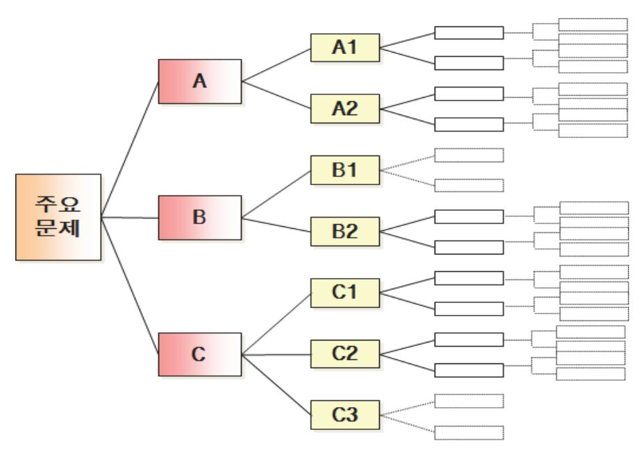

[그림 3-3] 기술 트리 구조도

## (2) 기능분석(FAST: function analysis system technique)

기능 분석을 확실하고 논리적으로 접근하기 위한 방법으로 기능의 관련도를 도표화 한 것이다.

기능 분석 방법의 종류로는 논리적 관계가 강조된 기존의 기능 분석법과 기술이 강조된 technical FAST diagram이 있고, 계층적 분류의 성격이 강한 customer(TASK) FAST diagram과 function hierarchy model이 있다.

## (3) 품질 기능 전개법(QFD: quality function deployment)

1966년 일본의 아까오 요지(Akao Yoji) 박사가 가치공학(value engineering)에 사용 되었던 기능 전개(function deployment)방법을 자신이 일하던 품질 관리와 결합하여 만든 분석법으로 고객 요구 사항을 설계 품질로 변환하는 방법이다. 즉 제품 품질에 고 객의 여러 가지 요구 사항을 제품의 사양으로 변환시키는 체계적인 방법이다.

또한 제품 수명 주기 관리(PLM: product lifecycle management) 시스템 도입 시 시 스템 개발의 첫 단계에서도 QFD 방법론을 사용한다.

(4) KANO 분석

이 방법은 제품 기획 단계에서 고객의 요구 조건을 제품에 반영하기 위해 사용하는데 시스템 공학과 동시 공학에서 주로 사용한다.

1980년대에 일본 도쿄 리카대학의 교수인 카노 노리아키에 의해 제시된 제품 개발에 관련된 제품 기획 이론으로 어떤 제품을 기획할 때 각각의 구성요소에 대해 고객이 기 대하는 것과 충족시키는 것 사이의 주관적 관계 그리고 요구되는 사항의 만족, 불만족에 의한 객관적 관계를 설정하여 설명하고 있다.

고객들은 제품의 여러 가지 세세한 부분에 대해서 불만을 가지고 있음에도 불구하고 어 느 정도 충분한 경우에는 그것을 당연하다고 느끼고 다시 새로운 것에 대한 만족감을 느끼지 못하는'한계효용의 법칙'을 따른다.

이런 상황을 설명하기 위해 카노는 제품의 품질에 대한 이원적인 인식방법의 모델을 제 시하게 되었다. 만족하는 것 또는 불만족하는 것이라는 주관적 측면과 함께 물리적 충족 혹은 불충족이라는 객관적 측면을 함께 고려하여 모델로 만들었다. 카노 모델은 5가지 요소로 분류한다.

(가) 매력적 품질요소(attractive quality element)

충족되는 경우 만족을 주지만 충족이 안 되더라도 크게 불만족 없는 품질 요소를 말 한다. 고객이 미처 기대하지 못했던 것 혹은 기대를 초과하는 만족을 주는 품질요소 가 될 수 있다. 이는 단순한 만족에서 고객감동(customer delight)의 수준을 달성할 수 있게 한다. 한편 이러한 요소의 존재는 고객들은 모르거나 기대하지 않았기 때문 에, 충족이 되지 않더라도 불만을 느끼지 않는다.

(나) 일차원적 품질요소(one-dimensional quality element)

충족이 되면 만족하고 충족되지 않으면 고객들의 불만을 일으키는 품질요소이다. 가 장 일반적인 품질인식요소이다.

- (다) 당연한 품질요소(must-be quality element) 반드시 있어야만 만족하는 품질요소이다.
- (라) 무차별 품질요소(indifferent quality element) 만족하는 것과 만족하지 못하는 것 사이에 품질의 차이가 느껴지지 않는 요소이다.
- (마) 역 품질요소(reverse quality element)

충족되면 불만족을 일으키고 충족되지 못하면 만족되는 거꾸로 된 요소이다. 이러한 카노 모델은 각종 고객 조사 방법과 연구를 통해 얻어진'고객의 목소리(voice of co nsumer)'를 분석하는 틀로 이용되는데 고객이 직접적으로 혹은 간접적으로 말하는 내용과 이를 바탕으로 얻어진 배경적, 환경적 이해를 분석하여 고객이 원하는 것을 알아낼 수 있다.

(5) 컨조인트 분석(Conjoint Analysis)

컨조인트 분석은 제품 대안들에 대한 고객의 선호 정도로부터 고객이 각 속성에 부여하 는 상대적 중요도와 각 속성 수준의 효용을 추정하는 분석 방법이다.

특히 이미 경쟁자가 존재하는 시장에서 기대되는 성과를 최대화시키기 위해서 신제품에 어떤 특성들이 고려되어야 하는지 어느 세분시장에 진입하는 것이 가장 효과적인지를 결정하는 데 유용한 분석기법이다.

컨조인트 분석은 신제품 콘셉트 평가, 포지셔닝, 경쟁 분석, 가격 설정, 시장 세분화 등 의 문제들에 주로 이용되고 있으며, 최근에는 마케팅 전략 수립 등에까지 그 응용범위가 확대되고 있다.

컨조인트 분석에서는 고객들이 제품 선택 시 고려하는 여러 속성들의 상대적 중요성과 각 속성수준의 효용값을 알려주어 가장 이상적인 제품조합을 제시해 줌으로써 기업의 제품전략수립을 용이하게 하며, 세분 집단별 제품의 중요속성을 파악하여 시장세분화 전 략과 광고 전략을 효율적으로 수립할 수 있게 해준다.

숕 성능 목표명세서

설정된 기능 목표명세서를 기준으로 경쟁사의 spec. sheet 등을 분석해 개발 제품의 성능 목 표명세서를 작성한다.

1. 성능 목표 기준은 정량화하여 정의

성능 목표의 정의는 정량적 데이터를 기준으로 명확하게 정의해야 한다. 고객 요구 사항 분 석 시 대부분의 고객들은 성능 목표를 빠른 동작 속도, 많이 처리 가능한 시스템 등의 애매 모호한 요구 사항을 원하지만 이 애매모호한 목표를 그대로 정의하게 되면 개발의 성공 실 패를 알 수 없게 되어 제품 개발을 종료할 수 없는 상황이 발생되기 때문이다.

2. 경쟁사 기준은 최소한의 기준

시장을 지배하고 있는 제품 개발이 아닌 경우 경쟁사의 기준이 매우 중요한 요소이며 그 이상을 구현하기 위한 성능 목표를 가져가야 한다. 또한 성능 목표뿐만 아니라 당사 제품의 소구점이 될 수 있는 성능 목표를 도출하고 기획부터 판매 및 홍보 전략에까지 일관성을 가져야 한다. 소구점이란 고객 측의 구매욕을 자극시키기 위해 제품이나 서비스의 특성이나 우월성을 호소하여 공감을 구하기 위한 특징을 말하는 것으로 본질 소구, 이성 소구, 특유 소구 등이 있다.

## 수행 내용 / 기능 및 성능 목표명세서 작성하기

## 재료·자료

• 시장 및 기술 분석 보고서, 고객 및 내부 구성원 인터뷰 자료, 성능 지침서(spec. sheet), 제품 기능분석 자료, 제품 개발사양서, A4 용지 등

기기(장비 ・ 공구)

• PC 또는 노트북, 스크린, 빔 프로젝터, 프린터, 복사기, 인터넷 장비, 칠판(화이트보드), 문 서 작성프로그램 등

안전 ・ 유의 사항

• 제품의 개발 기간을 고려하여 제품이 완성되었을 때 그 성능이 시장의 수요를 반영할 수 있 도록 예측하여 개발 제품의 사양을 결정한다.

수행 순서

숔 기능 목표명세서를 작성한다.

여러 방법을 활용해 기능 목표를 설정해본다 여기서는 기술트리 분석법을 이용한 기능 목표명 세서 작성 순서를 기술하였다.

- 1. 목적 기능에 따른 기본 기능을 작성한다.
- 2, 기본 기능에 따른 2차 기능을 작성한다.
- 3. 기술트리 분석법을 활용하여 주요 기능을 밝히고, 필요 기술을 체계화하고 그룹화함으로써 요소기 술을 도출한다.
- 4. 기술트리를 통해 전략적 중요성에 따라 기반기술, 핵심기술, 미래기술로 분류하고, 상대적인 기술 능력을 분석한다.
- 5. 선정된 주요 기능 항목에 대해 설계자와 품질 평가자와 함께 목표 수준을 결정한다. 기술트리 분석법에 의한 기능 목표 선정 흐름을 아래에 표시하였다.

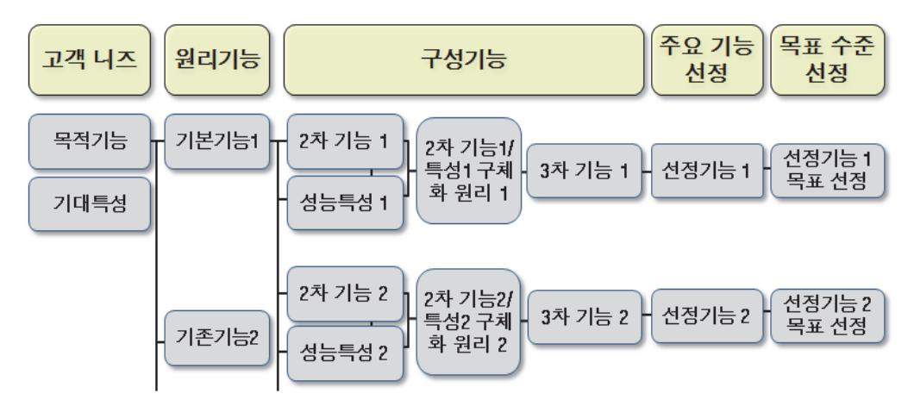

[그림 3-4] 기술트리 분석법에 의한 기능 목표 선정 흐름도

숕 성능 목표명세서를 작성한다.

제품의 기능 목표로부터 성능 목표를 정하고 개발제품의 개념을 전개한다.

- 1. 각 기능에 대해 개념들을 전개한다.
  - (1) 먼저 주어진 기능에 대해 후보 기능들을 많이 도출한다.
  - (2) 구체적인 개념 설계를 실시한다.

고객사나 설계 spec.으로부터 시작하는데 이때는 다양한 아이디어를 도출하고 검토하며 제품 기능을 설명하는 문서 기록 또는 스케치를 확인해 각 아이디어를 분석하고 설계 사양과 비교한다.

- (3) 개발 제품에 대한 많은 수의 다양한 개념을 제시한다. 설계란 창의적 사고와 연역적 사고의 반복 적용되는 과정을 말하는데 이를 달성하기 위 해서는 창의적 사고를 필요로 한다.
- 2. 각 기능들에 대하여 사용될 수 있는 방법이나 수단들을 열거한다.
  - (1) 각 세부기능에 대해 그 기능을 달성할 수 있는 많은 수단·방법을 개발한다.
  - (2) 설계 방법의 수단은 3가지로 구분한다.
    - (가) 고유 설계

제품의 신세대를 위한 개념 설계로 완전히 새로운 제품/개념을 창조한다.

(나) 변형 설계

크기나 형상은 바뀌지만 작동원리는 바뀌지 않는 개념 설계를 의미한다.

(다) 적응 설계

달라진 사양을 만족시키기 위해 원래의 작동 원리에는 변화가 없지만 다른 문제의 해결을 위해 제품에 가벼운 변화를 주는 개념 설계를 말한다.

- 3. 모든 가능한 해법들을 포함하는 차트를 작성한다.
- 4. 가능한 조합들을 찾아내 성능 목표를 선정하고 개발 제품의 개념을 전개한다.

일례로 비휘발성 메모리인 낸드(NAND)플래시용 기판 재료의 성능 목표와 개발 제품의 개 넘에 대해 제시한다.

낸드플래시란 메모리의 한 형태로 전원이 없는 상태에서도 데이터를 자유롭게 계속 저장·삭 제할 수 있으며, 기술적으로 저장 단위인 셀을 수직으로 배열해 좁은 면적에 많은 셀을 만 들 수 있도록 돼 있어 대용량이 가능하다. 디지털카메라, 휴대용저장장치, 컴퓨터 등에 폭넓 게 쓰인다.

| 성능 항목                                      | 성능 정의                                         | 평가 장비     | 단위                        | 성능 목표 | 기준 근거        |
|--------------------------------------------|-----------------------------------------------|-----------|---------------------------|-------|--------------|
| DZ 깊이 (denuded zone)                    | 화학 식각 후 표면에서 부터 제일 가까운 내부 결함까지의 거리      | M/O       | um                        | >10   | 경쟁사 spec. |
| BMD 농도 (bulk micro defe ct)          | 열처리 후 기판 내부에 나타나는 결함                       | M/O       | 개수/ cm 2    | )8E7  | 고객 요구 사항  |
| NSMD 농도 (near surface mi cro Defect) | 열처리를 거치는 동안 표면 0~5μm 내에 생성되 는 작은 산소 석출물 | MO 601 | 개수/ cm 2    | 〈 10  | 고객 요구 사항  |
| Slip(전위 결함)                                | 소성변형 과정에서 결정 의 일부에 발생한 전단 변위            | XRT       | mm                        | Free  | 경쟁사 spec. |
| 금속 오염                                      | 열처리 과정에서 기판의 내부 오염 정도                      | SPV       | atoms /cm 3 | >1E10 | 소구점          |

〈표 3-1〉 비휘발성 메모리용 실리콘 기판 재료의 성능 목표와 개발 제품의 개념(예시)

개발 제품의 개념: 비휘발성 메모리용 실리콘 기판재료로 성능은 경쟁사 대비 동일 이상이 고 오염이 철저히 제어되어 내구성이 강화된 제품

## 수행 tip

•제품 기능 목표 및 성능 목표 도출 시에는 경험 많은 연 구원(설계자)이나 개발팀 엔지니어(성능 평가자)의 지원을 받아 협업으로 진행한다.

## 학습 3 교수·학습 방법

## 교수 방법

- 시장과 기술의 분류, 분석 기법에 따른 개발 제품별 구체적 사례를 제시한다.
- 고객의 요구 사항에 따른 제품의 기능 지표변화 및 품질 기능 전개법을 소개하고 학생들이 실제 활용할 수 있도록 지도한다.
- 대표적인 반도체 제품 기능 설계 방법과 성능 목표 도출 방법에 대해 학생들에게 설명하고 이를 숙지할 수 있도록 특정 사례를 제시하여 실제 기능 및 성능 목표명세서를 작성해 보 도록 지도한다.
- 학습자가 일지, 저널을 활용하여 개발제품 기능의 정의와 기능 및 성능 목표명세서 작성을 스스로 작성한 후, 발표하도록 지도한다.

## 학습 방법

- 수집된 정보 내용 전반을 숙지하고 시장 및 기술 분석 기법에 의해 시장 및 기술을 분류해 분석보고서를 작성하며, 이와 같은 과정이 숙달되도록 반복 학습한다.
- 품질 기능 전개법에 대해 체계적으로 학습하여 부정확한 고객의 요구 사항을 제품의 기능 지표로 바꿀 수 있도록 주요 내용별로 분류하여 작성한다.
- 특정 사례에 대해 제품 기능 설계 방법과 성능 목표 도출 방법을 활용해 기능 및 성능 목표 명세서를 작성한다.
- 일지, 저널을 활용하여 주요사항에 대해 정리해 보고, 비교·분석한다.

## 학습 3 평 가

## 평가 준거

• 평가자는 학습자가 학습 목표를 성공적으로 달성하였는지를 평가해야 한다.

### • 평가자는 다음 사항을 평가해야 한다.

|                 |                                                   |   | 성취수준 |   |
|-----------------|---------------------------------------------------|---|------|---|
| 학습 내용           | 학습 목표                                             | 상 | 중    | 하 |
| 개발 제품 기능 정 의 | - 시장 및 기술 분석결과에 따라 개발하고자 하는 제품의 기 능을 정의할 수 있다. |   |      |   |
| 기능 및 성능 목표      | - 정의된 제품의 기능들에 대하여 개발 가능한 수준여부를 판 단할 수 있다.     |   |      |   |
| 명세서 작성          | - 개발제품의 설계목표와 성능목표를 수립하여 제품사양서를 작성할 수 있다.      |   |      |   |

## 평가 방법

• 평가자 체크리스트

|                      |                                                        |   | 성취수준 |   |
|----------------------|--------------------------------------------------------|---|------|---|
| 학습 내용                | 평가 항목                                                  | 상 | 중    | 하 |
| 개발 제품 기능 정 의      | - 시장 및 기술 분석 결과에 따른 개발할 제품의 기능 정의 가능 여부             |   |      |   |
|                      | - 정의된 제품 기능의 개발 가능 수준 판단 여부                            |   |      |   |
| 기능 및 성능 목표 명세서 작성 | - 설계자와 협의를 통한 개발 제품 기능 목표 수립 및 기능 목표명세서 작성 여부       |   |      |   |
|                      | - 성능 평가자와 협의를 통한 개발 제품 품질 목표 수립 및 성능 목표명세서 작성 여부 |   |      |   |

• 일지/저널

|                      |                                                      |   | 성취수준 |   |
|----------------------|------------------------------------------------------|---|------|---|
| 학습 내용                | 평가 항목                                                | 상 | 중    | 하 |
| 개발 제품 기능 정 의      | - 개발하고자 하는 제품에 대한 기능 분석 자료의 정확성 수 준 여부            |   |      |   |
|                      | - 정의된 제품의 기능들에 대한 개발 수준 제시의 연계 정확 성 수준 여부         |   |      |   |
| 기능 및 성능 목표 명세서 작성 | - 설계자와 협의된 개발 제품 기능 목표와 기능 목표명세서 연계 정확성 수준 여부     |   |      |   |
|                      | - 성능 평가자와 협의된 개발 제품 품질 목표와 성능 목표명 세서 연계 정확성 수준 여부 |   |      |   |

• 구두 발표

|                      |                                                 | 성취수준 |   |   |
|----------------------|-------------------------------------------------|------|---|---|
| 학습 내용                | 평가 항목                                           | 상    | 중 | 하 |
| 개발 제품 기능 정 의      | - 개발하고자 하는 제품의 기능 정의 이해도 수준                     |      |   |   |
|                      | - 정의된 제품의 기능들과 개발 수준의 정합성 수준                    |      |   |   |
| 기능 및 성능 목표 명세서 작성 | - 설계자와 협의된 개발 제품 기능 목표와 기능 목표명세서의 정합성 수준     |      |   |   |
|                      | - 성능 평가자와 협의된 개발 제품 품질 목표와 성능 목표명 세서의 정합성 수준 |      |   |   |

## 피드백

| 1. 평가자 체크리스트                                           |
|--------------------------------------------------------|
| - 개발하고자 하는 제품의 기능 정의 이해도와 기능 및 성능 목표명세서 작성 과정을 체크리스트를  |
| 활용해 평가한 후 주요 사항을 표시하여 돌려준다.                            |
| 2. 일지/저널                                               |
| - 개발 제품의 기능 정의와 기능 및 성능 목표명세서의 주어진 작성된 내용을 검토하고 기준에 미  |
| 달한 학생들에게는 수준별로 학습 내용을 보충하고 스스로 복습한 후 그 결과를 제출하도록 한     |
| 다.                                                     |
| 3. 구두 발표                                               |
| - 기능 및 성능 목표명세서의 발표 시 질의·응답을 통해 작성한 명세서에 대해 숙지 여부를 판단하 |
| 고 개선 사항 및 추가로 보완해야 할 사항에 대해 제시한다.                      |

| 학습 1 | 제품 시장 조사하기 |  |
|------|------------|--|
| 학습 2 | 기술 동향 조사하기 |  |
| 학습 3 | 제품 사양 수립하기 |  |
|      |            |  |
| 학습 4 | 비용 분석하기    |  |

## 4-1. 개발 일정 수립

학습 목표 • 제품의 전체 개발 기간과 각 개발 단계별 세부 일정을 수립할 수 있다.

## 필요 지식 /

숔 제품 개발 일정 수립 방법

반도체 제품 개발 일정을 수립하기 위해서는 개발하고자 하는 소자의 주요 특성과 소자 제조 공정, 공정 장비, 시설 등 전반적인 개발 및 생산시스템에 대한 이해가 필요하다.(반도체 소자 의 주요 특성은 '학습 2.2 제품 핵심 기능 및 장단점 파악'참조)

1. 반도체 소자 제조 공정 개요

반도체 집적회로는 손톱만큼이나 작고 얇은 실리콘 칩에 지나지 않지만 그 안에는 수만 개 에서 천만 개 이상의 전자 부품들(트랜지스터, 다이오드, 저항, 커패시터)이 가득 들어있다. 이러한 전자 부품들이 서로 정확하게 연결되어 논리 게이트와 기억 소자 역할을 하게 되는 것이다.

반도체 소자 제조는 크게 웨이퍼 상에 구현될 전자회로를 회로설계 프로그램을 이용하여 설계하는 공정, 설계된 전자회로를 전자빔 등의 설비를 이용하여 각 층별로 나누어 유리판 에 그리는 마스크 제작 공정(제작된 마스크는 포토공정에서 웨이퍼에 회로를 형성할 때 사용됨), 실리콘을 고순도로 정제하여 기둥 모양의 잉곳(ingot)을 만든 후, 얇게 잘라서 원 판모양으로 만드는 공정, 웨이퍼의 표면에 여러 종류의 막을 형성시켜 이미 만든 마스크를 사용하여 특정부분을 선택적으로 제거하는 작업을 반복함으로써 회로를 구성하는 웨이퍼 가 공(fabrication)공정, 웨이퍼 상의 칩을 개개로 잘라서 리드 프레임과 결합해 완제품으로 조립(assembly)하는 칩 조립공정, 완성된 제품이 제대로 동작하는지를 검사(test)하는 공정 으로 이루어진다.

웨이퍼 제조 공정을 좀 더 살펴보면 다결정인 폴리 실리콘을 단결정으로 만드는 단결정성 장과 그 단결정의 평가, 잉곳 상태의 단결정을 낱장인 웨이퍼로 만드는 웨이퍼링 가공공정 으로 나뉘고 고기능 기판의 경우 제조된 웨이퍼 표면에 CVD(chemical vapor deposition : 기판 상에 원료 가스를 흘리고, 외부 에너지를 부여함으로써 원료 가스를 분해하여 기상 반응으로 박막을 형성하는 기술)방법으로 고품질의 단결정 층을 증착하는 에피텍시얼 성장 (epitaxial growth) 공정이 추가된다. 웨이퍼 제조의 세부 내용은'반도체용 웨이퍼 재료 제 조(LM1903060401\_14.1)'를 참조하도록 한다.

일반적인 반도체 소자 제조 공정은 [그림 4-1]과 같고 그 세부 내용은 '반도체 제조 공정 개발(LM1903060106\_15v3)'를 참조한다.

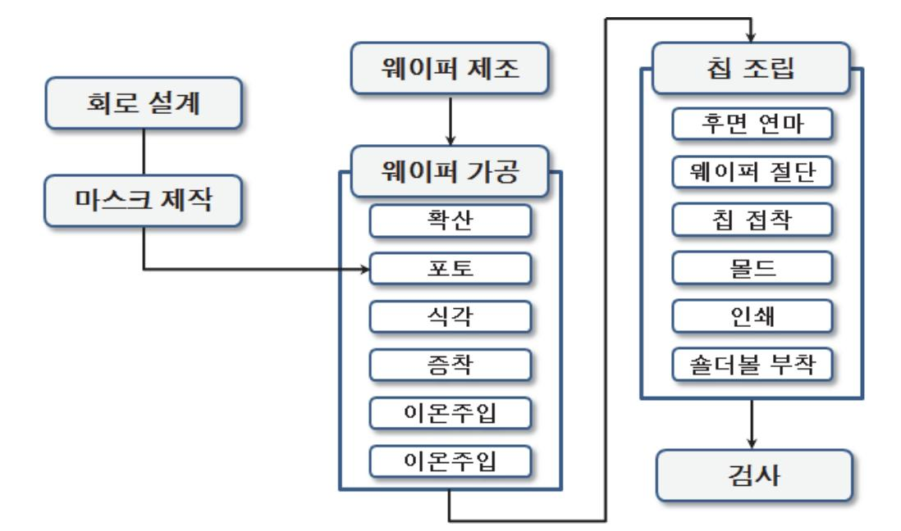

[그림 4-1] 반도체 제조 공정도

여기에서는 전체 공정 과정 중에서 웨이퍼 가공부터 검사까지 이루어지는 반도체 소자의 제조 과정에 대해 간단히 소개하였다.

(1) 회로 설계

회로 설계 프로그램을 사용하여 실제 실리콘 웨이퍼 위에 그려질 전자회로 패턴을 설계 한다.

(2) 마스크(mask, reticle) 제작

설계된 회로 패턴을 E-beam 등을 설비를 사용해 유리판 위에 그려서 마스크를 만드는 공정으로 여기에서 제작된 마스크는 포토공정에서 웨이퍼에 회로를 형성할 때 사용한다.

(3) 산화(oxidation)

웨이퍼에 회로를 구성하기 위한 첫 번째 공정으로 고온(800~1,200℃)에서 산소나 수증

기를 실리콘 웨이퍼 표면과 화학 반응시켜 얇고 균일한 실리콘 산화막(SiO2)을 형성시 키며 건식과 습식 방법이 있다.

## (4) 감광제(PR: photo-resist)도포

웨이퍼 표면에 감광 성질을 가지고 있는 물질인 PR(photo-resist)을 고르게 도포시킨 다.

(5) 노광(exposure)

stepper를 사용하여 mask에 그려진 회로 패턴에 빛을 통과시켜 감광제 막이 형성된 웨이퍼 위에 기하학적인 회로 패턴을 전사시킨다. 원하는 패턴의 전사에 따라 양성 감광 제와 음성 감광제를 사용하고 노광 공정 시 일반적으로 클래스 10을 유지한다.

(6) 현상(development)

웨이퍼 표면에서 빛을 받은 부분의 막을 현상시킨다(일반 사진 현상과 동일).

(7) 식각(etching)

회로 패턴을 형성시켜 주기 위해 특수한 화학 물질이나 반응성 가스를 사용하여 웨이퍼 위에 형성된 필요 없는 얇은 막질을 선택적으로 제거시키는 공정으로 이러한 패턴 형성 과정은 각 패턴 층에 대해 계속적으로 반복한다. 화학 용액에 의한 습식 식각과 플라즈 마를 사용하는 건식 식각으로 나뉜다.

(8) 이온주입(ion implantation)

회로 패턴과 연결된 부분에 불순물을 미세한 이온 주입기(ion implanter)를 사용해 가 스입자 형태로 가속하여 웨이퍼의 내부에 침투시킴으로써 전자 소자의 전기적 특성을 만들어준다. 이때 결정구조가 바뀌거나 데미지를 입어 이를 치유할 수 있는 열처리 공정 이 추가된다. 예전에 불순물 주입은 고온의 석영 튜브 노(furnace)에서 불순물 입자를 웨이퍼 내부로 확산시켜 주입하는 확산(diffusion) 공정에 의해서도 이루어졌으나 미세 하고 고정도 공정에서는 이온주입기를 사용한다.

(9) 증착(deposition)

화학기상증착 장비(CVD reactor: chemical vapor deposition reactor)를 사용해 작 업 공간 내(chamber)에서 특수한 화학 가스들을 전기적 에너지를 통해 서로 분해 또는 결합시킨 새로운 형태의 입자들을 웨이퍼 표면에 증착하여 절연막이나 전도성막을 형성 시킨다.

(10) 금속배선(metallization)

웨이퍼 위에 형성된 반도체 소자 간에 전기적 신호전달을 위한 금속 배선을 형성하는 공정으로 각 회로를 알루미늄 또는 구리선같이 얇은 금속성 막질을 형성함으로써 연결 시킨다.

(11) 웨이퍼 자동 선별(EDS test)

웨이퍼에 형성된 IC칩들의 전기적 동작 여부를 자동화된 테스터로 검사하여 불량품을 자동 선별 한다.

(12) 웨이퍼 절단(sawing)

웨이퍼 상에 형성된 수많은 칩들을 단위 소자로 분리하기 위해 다이아몬드 톱을 사용하 여 웨이퍼를 절단한다. 이때 계면활성제 등이 함유된 절삭 액이 사용된다.

(13) 금속 연결(wire bonding)

칩 내부의 외부 연결단자와 리드프레임을 가는 금속선(통상 gold wire)으로 연결한다.

(14) 성형(molding)

칩을 외부환경으로부터 보호하기 위하여 수지로 감싸주는 공정으로 칩과 연결된 금선 부분을 화학수지로 밀봉해 보호한다.

(15) 최종검사(final test)

성형된 칩의 전기적 특성 및 기능을 컴퓨터로 최종 검사하는 공정으로 최종 합격된 제 품들은 제품명과 제조사명을 표기한 후 입고 검사를 거쳐 완제품을 만든다.

2. 제품 개발 단계

반도체 제품 개발은 각 사별 체계화된 절차와 방식을 가지고 있으나 내용을 살펴보면 기업 의 이윤 창출을 목적으로 하고 공학적인 성능보다 사업적인 고려를 중시하고 있으며 개발 비용을 효과적으로 사용하기 위한 시스템을 운영하고 있고 이를 단계별 과정(stage-gate process)이라 말하며 일반적으로 아래와 같이 5단계로 분류한다.

(1) 기획 단계

초기 평가로 1개월 이내의 짧은 기간에 걸쳐 시장에서의 가능성과 회사의 전략과 일치하는지 의 경영·정책적 평가와 기술성과 생산 가능성을 결정하는 공학적 평가를 실시한다. 그 후 사업적 평가로 사업 수행에 필요한 마케팅, 설계, 제조, 자금과 관련 법률을 검토 하고 마케팅 분야의 시장 세분화, 시장에서 제품의 위치, 제품의 수익성과 제품설계 관 점의 기술적 가능성, 개념 설계의 분석, 설계개념을 증명하기 위한 시험, 제조공정의 제 한조건 등을 조사하는 과정이다.

또한 판매와 기획에서 제품 개발 이득의 회수까지의 비용도 예측하는 과정을 진행한다.

(2) 개념 정립(개념 설계) 단계

제품 및 관련된 하부 요소들을 여러 방법으로 고안해 제품 설계 사양(PDS: product d esign specification)을 작성하고 고객의 요구 조건을 파악하는 과정이다. 고객 그룹의 선정, 설문, 벤치마킹, 품질기능전개 등의 방법을 통해 개발제품에 대한 새 로운 개념들을 창출하고 가장 적합한 개념을 선정한다.

(3) 시스템 수준의 설계(상세 설계) 단계

제품의 기능을 분석 평가하고 여러 개의 세부 하위 시스템을 구분하여 상호연결성을 검

토하는 과정으로 재료와 제조 공정의 선정, 부품의 형상과 치수작업, 설계의 강인성, 인 간공학적 설계, 산업디자인(스타일) 점검과 모형 제작과 시험, 조립공정 고려, 법규 및 특허권 검토를 진행한다.

일반적으로 제품의 시험 및 생산 가능성이 포함된 종합시방서(CAD 파일)를 작성하는 상세 설계를 포함한다.

(4) 시험 및 개량 단계

사전 시험품의 제작과 시험을 하는 단계로 주로 양산 가능 제품을 대상으로 한다. 최종 제품의 동일한 크기와 재료로 만들지만 제조 도구나 절차는 다를 수 있다. 시험(테스트) 이란 시장 출하 전에 제품의 성능 및 신뢰성을 검사하는 것으로 내부 작동시험을 말한 다. 이 단계에서 마케팅 부서는 홍보물을 준비하고 생산부서에서는 제조 공정 재조정, 생산인력 훈련 등을 진행한다.

(5) 초도 생산(production ramp-up) 단계

준비된 생산 시스템에 의해서 제품의 생산 및 조립을 진행하는 단계로 학습 곡선을 따 라 가면서 생산의 수율과 품질이 향상된다. 초기 제품은 우호적 고객에게 의뢰해서 사용 상의 문제점을 검토하고 보완 후 제품을 출시하여 판매점과 대리점 등 공급선을 위한 생산을 시작한다. 이때 고객을 유치하기 위한 광고를 통해 판매를 극대화한다. 출시 후 일정기간(일반적으로 6~12개월 사이) 내에 제품에 대한 회계 자료, 제조 원가, 이익, 개발 비용, 기간 등을 검토함으로써 다음 제품의 개발을 위한 자료로 활용한다.

## 수행 내용 / 개발 일정 수립하기

### 재료·자료

• 반도체 소자 공정도, 필요 장비 및 설비 현황표, 단계별 개발계획서, 기타 자료 등

기기(장비 ・ 공구)

• PC 또는 노트북, 프로젝터, 프린터, 복사기, 인터넷 장비, 칠판(화이트보드) 등

## 안전 ・ 유의 사항

• 개발 일정 수립 시 목표의 난이도 및 각 부문의 검토 의견을 고려한다.

#### 수행 순서

- 숔 개발 일정 관리 계획을 수립한다. 개발 제품의 특성과 제품 개발 단계별 제조 공정 등을 고려해 개발 일정 관리계획을 수립하고, 특히 신제품 경우 개략적 개발 일정 수립 후, 실제 제품 개발 시 세부 개발 일정을 산출한다.
  - 1. 개발 제품의 주요 과제에 대해 도출한다. 제품 사양 및 고객 요구 사항 분석을 통해 개발 목표에 대해 난이도를 파악한다.
  - 2. 각 과제별 실행 과제에 대해 파악한다. 개발계획서 및 공정도 등을 통해 개발 제품에 필요한 개발 제품의 성격(사양 변경 제품, 개 선 제품, 신제품 등)을 선정한다.
  - 3. 각 실행 과제의 소요 일정을 산출한다. 개발 단계별 투입되는 자원과, 인력, 개발 난이도 등을 고려한 계획을 수립한다.
  - 4. 각 실행 과제의 업무 순서를 고려해 전체 개발 일정 관리 계획을 정리한다.
- 숕 수립된 개발 일정 관리 계획을 검토·수정하고 개발 일정 관리 계획서를 작성한다.
  - 1. 작성된 개발 일정 관리 계획에 대해 팀 내부 검토를 진행한다.
  - 2. 일정의 중복, 누락 및 개서 방안 등에 대한 검토 의견을 반영하여 일정 관리 계획을 수정한다.
  - 3. 도출된 개발 일정 관리 계획을 개발 일정 관리 계획서로 작성한다.
  - 일정과 관련된 주요 정보, 주의사항 등은 개발 일정 관리 계획서의 비고 또는 별첨란에 기 입한다.
  - 4. 작성된 전체 개발 일정 관리 계획서에 대해 담당자에게 검토를 요청하고 검토 의견을 반영해 일 정을 수정한다.

실제 기업에서 사용하는 반도체 제품 개발 일정 관리 계획서는 제품 단계별, 공정별로 모듈 화 되어있어 매우 복잡하고 사내 IT 시스템 상에 운용되는 경우가 많기 때문에 여기에서는 간단히 그 내용 파악을 위해 개발단계의 소자개발을 위한 개발 일정 관리계획서(통상 개발 일정계획서로 부르며, 이하 개발 일정계획서라 한다.)를 예시하였다. [그림 4-2] 참조.

|                | 개발 제품명                                                              | 1테라급 NAND플래쉬메모리 소자 |  |  |        |     |     | 작성일 |  |   |  |     |            |             | 2018.03.25 |  |  |  |  |
|----------------|---------------------------------------------------------------------|--------------------|--|--|--------|-----|-----|-----|--|---|--|-----|------------|-------------|------------|--|--|--|--|
|                | 관리번호 NCSLM2018-01                                                   |                    |  |  |        |     | 작성자 |     |  |   |  |     |            | S프로젝트팀, 000 |            |  |  |  |  |
|                | 시작일 2018.05.01                                                      |                    |  |  |        | 승인자 |     |     |  |   |  |     | M연구소장, 000 |             |            |  |  |  |  |
| 종료일 2018.10.30 |                                                                     |                    |  |  | 총 개발기간 |     |     |     |  | 간 |  | 6개월 |            |             |            |  |  |  |  |
|                |                                                                     |                    |  |  |        |     |     |     |  |   |  |     |            |             |            |  |  |  |  |
| No.            | <u> </u>                                                            | 항목 소요기간 일정         |  |  |        | 설   |     |     |  |   |  |     |            | 비고          |            |  |  |  |  |
| 1              | 요구사항 분석                                                             | 1                  |  |  |        |     |     |     |  |   |  |     |            |             |            |  |  |  |  |
| 2              | 경쟁사 기술 분석                                                           | 1                  |  |  |        |     |     |     |  |   |  |     |            |             |            |  |  |  |  |
| 3              | 개발 사양 도출                                                            | 1                  |  |  |        |     |     |     |  |   |  |     |            |             |            |  |  |  |  |
| 4              | 공정1개발                                                               | 2                  |  |  |        |     |     |     |  |   |  |     |            |             |            |  |  |  |  |
| 5              | 공정1 테스트                                                             | 2                  |  |  |        |     |     |     |  |   |  |     |            |             |            |  |  |  |  |
| ~              |                                                                     |                    |  |  | Π      |     |     |     |  |   |  |     |            |             |            |  |  |  |  |
| ~              |                                                                     |                    |  |  |        |     |     |     |  |   |  |     |            |             |            |  |  |  |  |
| 9              | 공정n 개발                                                              | 2                  |  |  |        |     |     |     |  |   |  |     |            |             |            |  |  |  |  |
| 10             | 공정n 테스트                                                             | 2                  |  |  |        |     |     |     |  |   |  |     |            |             |            |  |  |  |  |
| 11             | 시제품제조                                                               | 3                  |  |  |        |     |     |     |  |   |  |     |            |             |            |  |  |  |  |
| 12             | Probe 테스트                                                           | 1                  |  |  |        |     |     |     |  |   |  |     |            |             |            |  |  |  |  |
| 13             | 결과 분석                                                               | 1                  |  |  |        |     |     |     |  |   |  |     |            |             |            |  |  |  |  |
| 14             | 보고서 작성                                                              | 1                  |  |  |        |     |     |     |  |   |  |     |            |             |            |  |  |  |  |
|                |                                                                     |                    |  |  |        |     |     |     |  |   |  |     |            |             |            |  |  |  |  |
|                |                                                                     |                    |  |  |        |     |     |     |  |   |  |     |            |             |            |  |  |  |  |
|                | 참고사항    • 일정 변경시 즉시 S PJT팀장 보고      • 각 공정별 개발 책임자는 각 항목별 세부 일정표 참고 |                    |  |  |        |     |     |     |  |   |  |     |            |             |            |  |  |  |  |

[그림 4-2] 개발 일정 관리계획서(예시)

수행 tip

- 단계별 개발계획서는 제품 기획에서 생산에 이르기까지 전 체 일정에 대해 준비한다.
- 제품제조 공정이나 설비, 장비 등에 대해서는 관련 담당부 서나 생산부서와 협의하고 법률적, 환경적 이슈에 대해서 는 해당 부문과 사전 협의한다.

# 4-2. 개발 및 생산 비용 도출

학습 목표 • 개발 공정에 따른 개발 제품의 크기를 예측하여, 생산 비용을 산정할 수 있다. • 각 개발 단계별 필요 인력과 장비, 업체별 도입 IP(intellectual property)에 따른 개발 비용 을 도출할 수 있다.

## 필요 지식 /

## 숔 비용과 원가

비용 분석에서는 제품을 구성하고 있는 원가 행태를 이해하는 것이 중요하며, 비용 분석 과정 에서 원가 동인의 변화와 원가 발생액 변화 사이의 차이점을 인지한다.

## 1. 비용의 개념

비용은 수익을 창출하기 위하여 지불하는 모든 비용을 말하며 통상 세 가지로 분류한다. 첫 째, 수익 창출을 위해 소비된 제품이나 서비스에 대한 비용, 둘째, 제품 생산과 관련이 없 는 판매와 관리를 위해 지불된 비용, 셋째, 기업의 수익성과 무관하게 기업 운영에 소요되 는 비용으로 예컨대 세금, 자선 기부금, 재해로 인한 자산 폐기 등이 좋은 예이다. 그러나 회계학에서의 원가는 경영 수익과 관련하여 지불된 재화와 용역의 양을 화폐 가치로 표시 한 것이며 수익을 창출하기 위해 투입된 원료, 노동력, 자본, 기술 등의 비용에 들어가는 화폐적 가치이다.

(1) 기회비용

제한된 자원으로 하나의 대안을 선택하여 소비하게 되면 다른 수익창출과 비용절약 가 능성의 대안을 포기함으로써 발생되는 비용이다.

(2) 전 과정 비용

설비나 시스템이 설계․생산되어 유지되고 폐기되어지는 모든 과정에 필요한 비용으로구 입 비용과 보수 유지비를 포함한 모든 운영비를 총칭한다.

(3) 한계비용과 총비용

한계비용은 생산량의 한 단위가 증가할 때, 추가로 증가되는 비용인데 생산량 결정에 중 요한 비용이고 총비용은 회사가 지불한 모든 비용의 총계이다.

2. 원가

원가는 발생형태에 따라 재료비, 노무비, 경비로 구분되고, 추적 가능성에 따라서 직접비와 간접비로 구분된다. 원가 계산에 있어서 직접비를 원가 대상으로 부과하는 것을 원가추적 (cost tracing)이라 하며, 간접비를 원가 대상으로 부과하는 것을 원가 배분(cost allocatio n)이라 한다.

원가 부과는 원가 추적과 원가 배분을 다 포함하는 것으로 특정 원가 대상에 부과된 원가 는 추적된 직접비에 원가 대상으로 배분된 간접비를 합한 금액이다.

간접비의 배분은 원가 동인을 식별하여 이를 기준으로 이루어지는데, 원가 동인은 회계시스 템에서 발견할 수 있는 재무적인 측정치일 수도 있고 비재무적인 변수일 수도 있기 때문에 원가가 원가 동인에 따라 변동되는 정도를 고려해야 한다.

(1) 재료비

제품을 생산하는 데 사용된 물품의 가치로서 제품의 제조를 위하여 소모된 자재의 원가 를 재료비라고 한다. 원가 대상의 추적 가능성에 따라 직접 재료비, 간접 재료비로 구분 한다. 재료는 제조할 때 단순히 물리적인 변화만으로 제품이 되는 것을 말하고 원료는 화학적인 변화로 제품이 되는 것을 의미한다.

(가) 주요 재료비(직접 재료)

제품의 생산에 직접 소비되며 주요한 구성 요소가 되는 재료를 말한다.

(나) 보조 재료비(부재료 혹은 간접 재료)

제품 생산에 직/간접으로 소비되지만 중요성 정도가 낮아 가격 구성의 중요 요소가 되지 않는 경우로서, 원가 산출의 난이도와 가격의 중요도에 따라 제조 경비로도 취 급한다.

(다) 부분품비(외주 구입 부품비)

물품 자체가 완제품으로서의 성격을 지니는 동시에 추가적인 가공을 하지 않고 그대 로 조립 또는 사용되어 직접 생산에 사용할 수 있는 재료를 말한다.

(2) 노무비

노무비란 제품을 제조하기 위하여 소비된 노동력의 대가로서 직접노무비와 간접노무비 로 구성된다. 직접노무비란 노무비 중에서 현장에 직접 투입된 인력에 대한 급여를 뜻하 며 개별적으로 집계 추적이 가능하다. 간접노무비란 현장에 직접적으로 종사하는 인력은 아니지만 현장에서 일하는 사무원, 경비원, 청소원, 복리후생 종사자, 감독관 등의 간접 적인 인력에 대해 지불하는 노무비를 뜻한다.

(가) 급료

정신적 노동을 주로 하는 감독자, 관리자, 기술자, 사무원에 대해 지급하는 급여를 말한다.

(나) 임금

현장에서 제조 작업에 직접 종사하는 일급제(혹은 성과급제) 기능직 사원에 대해 지 급하는 급여를 말한다.

(다) 잡급

임시로 채용한 일용공 등 사외의 근로자에게 지급되는 임금을 말한다.

93

(라) 상여금

임금 이외에 종업원의 사기진작을 위해 추가로 지급되는 급여로서 기업별로 지급기 준의 차이가 있으며 계산 방법도 차이가 있다.

(마) 퇴직급여 충당금

종업원의 퇴직 시 지급하는 퇴직금을 미리 적립해두는 돈으로서 급여액의 일정비율 을 설정하여 적립하고 있다.

(3) 제조경비

제조경비란 제품의 제조를 위하여 소비된 원가요소 중 재료비, 노무비를 제외한 일체의 원가요소를 말한다. 경비에는 재료비, 노무비와 같이 특정의 대상이 없으며 따라서 그 내용은 일정하지 않다. 재료비, 노무비의 범위에 따라 경비의 구성 내용이 달라질 수 있 으며, 성질상 노무비인 것 혹은 재료비에 가까운 것도 포함하게 된다.

(가) 복리후생비

생산과 관련된 전 종업원의 복리 후생을 위하여 지출된 제 경비를 말하며 종업원의 의료, 위생, 보건, 오락, 수양, 급식비 등 작업자의 복리 후생에 직접 관련되는 비용 을 말한다.

(나) 전력비

제조 부문에서 소비되는 전력비를 말한다(전력 수용 규모에 따라 회사별 KWh당 단 가 상이). 기계 설비별 전력비를 구하기 위해서는 기계 설비별 사용 전력 용량을 파 악해야 한다.

전력비 = 기계장치의 정격 전력 용량 × 부하율(%) × 전력 단가

(다) 감가상각비

제품 생산과 관련 사용되는 건물, 구축물, 기계 장치, 공구 등의 유형 고정 자산에 대해 세법에서 정한 내용 년 수 및 감가상각 방법에 준하여 계산한다.

[내용 연수의 예]

- 건물: 40년, 기계장치: 7년, 비품: 7년, 구축물: 15년, 차량 운반구: 5년

- (4) 일반관리비 및 판매비용
  - (가) 일반관리비 성격

일반 관리비는 기업 전체에 관한 영업 관리에 관련되어 발생하는 비용으로 고정비적 인 성격인 것이 많다.

(나) 판매비용 성격

판매비는 광고, 선전비와 같이 경영자의 방침을 반영한 정책적인 판매 유지비와 하 역비, 운반비 등과 같은 생산 수량에 따라 변하는 판매 수행비로 구분할 수 있다. 판 매 유지비는 고정비, 판매 수행비는 변동비 성격을 가지고 있다. 일반 관리비와 판매 관리비를 구분하는 것은 업무 특성상 매우 곤란하므로 통상적, 일괄적으로 파악하여 동일한 계정으로 비용을 처리한다.

(다) 일반관리비 및 판매비용의 구성요소

그 구성요소는 임원 급료 수당, 일반관리비 사무원 급료 수당, 일반관리비 사무원 퇴 직금 준비금, 일반관리비 사무원 법정 복리 후생비, 복지 시설 부담금(진료소, 식당, 사택, 운동시설 등), 일반관리비 부문의 감가상각비(건물, 비품, 그 밖의 고정자산), 접대비(내빈 접대비, 회식비, 축의금, 조의금, 선물 등), 운반비(제품을 운송하는 데 발생된 비용), 대손상각(영업 활동과 연관된 매출 채권 회수 불능 추산액), 일반 관리 부문(영업, 인사, 총무, 노무, 홍보, 기획 등)에서 발생된 각종 비용(수선비, 보험료, 통신료, 교통여비, 견본비, 포장비, 지급 임차료 등)을 말한다.

판매 가격을 산정할 때 고려하는 구성 요소를 도식화하면 다음과 같다.

|     |           |           |     | 이익 |    |
|-----|-----------|-----------|-----|----|----|
|     |           |           | 판매비 |    |    |
|     |           | 일반 관리비 |     |    |    |
|     | 간접 제조비 |           | 索口  | 素口 | 판매 |
| 재료비 |           | 제조        | 제조  | 비용 | 가격 |
|     | 직접        | 원가        | 원가  |    |    |
| 노무비 | 제조비       |           |     |    |    |

출처: 교육부(2015). 반도체 제품 기획(LM1903060101\_14v3). 한국직업능력개발원. p.58. [그림 4-3] 판매가격의 구성 요소

## 숕 개발 비용

생산비용이 산정되면 각 개발 단계별 필요 인력과 장비, 업체별 도입 IP(intellectual propert y)에 따른 비용을 예상해 개발 비용을 도출한다.

1. 개발 단계별 비용

개발 단계에 대해서는'학습 4.1 개발 일정 수립'을 참고하여 각 단계별 규모에 맞는 비용을 산출한다.

- 2. IP(intellectual property) 도입 비용
  - (1) 보편적인 수수료는 없으며 계약에 의해 결정된다. 특허권은 형체나 시세가 없는 지적재산권으로 그 정확한 금전적 가치를 판단하는 것은 기술신용보증기금 등 전문가들이 모여 있는 전문기관에서도 판단하기 어려운 문제이다.
  - (2) 계약서는 구체적인 것까지 기재하여 서로 오해의 여지가 없도록 계약서를 작성해야 한다. 계약자, 대상 특허, 실시권의 종류(통상 실시건, 전용 실시건), 계약 금액, 계약금 지불 일시, 계약금 지불상태(현금 또는 주식 등), 수수료의 지불 의무자 등 이행하지 않을 경 우 해결 절차 즉, 법정 소송으로 갈지 아니면 손해 배상을 청구할 지를 명확히 기재해 야 한다.
  - (3) 실시권이란 특허권자가 아닌 자(특허를 필요로 하는 자)가 특허권자와 약정 또는 특허권자의 허락을 받아 그 특허 발명을 실시할 수 있는 권리를 말하는데 크게 통상 실시권과 전용 실시 권으로 나눈다.
  - (4) 통상 실시권이란 타인의 특허발명을 일정 조건 하에서 업으로 실시할 수 있는 권리를 말하 고, 전용 실시권은 일정 범위 내에서 타인의 특허 발명을 업으로서 독점 실시할 수 있는 권 리이다. 따라서뺳독점적 실시가 가능하냐 아니냐?뺴에 따라 큰 차이가 있으며, 전용 실시권자의 경우 전용 실시권자가 경고 및 손해배상 청구 등 적극적으로 권리행사가 가능하다.
  - (5) IP 도입은 검토할 사항과 권리의 범위, 비용 산정에 이르기까지 검토해야 할 법 규정과 전문 적인 내용이 많아 통상 특허 담당부서에서 진행하거나 외부 전문 업체의 도움을 받기도 한 다.
- 3. 비용 분석

비용 분석은 미래에 발생할 비용을 정확히 맞추고자 하는 것이 아니라 발생 범위와 그에 대한 확률 분포를 추정하기 위한 것으로 발생한 비용에 대한 정당성을 입증하기 위한 원가 정산과는 다르며, 그 대상은 총사업비로 그 범위가 제한되는 것이 아니라 운영유지 비용을 포함한 전 주기에 걸쳐 발생하는 비용이 그 대상이 된다.

(1) 프로젝트 관리 지식체계 지침서

프로젝트 관리 지식체계 지침서(PMBOK: project management book of knowledge 의 약자로 프로젝트관리 전문기관인 project management institute사에서 발간)에서 는 비용분석의 절차를 원가산정을 위한 투입물 구체화, 원가산정을 위한 도구 및 기법의 활용, 원가산정결과 도출로 구분하고 이러한 비용 분석절차는 R&D를 포함하여 일반적 인 사업관리에 참고적으로 활용될 수 있다.

(2) 비용분석을 위한 투입물

비용분석을 위한 투입물로는 범위기준선, 사업 일정, 인적자원계획서, 위험요인 등록부,

원가에 영향을 주는 환경요인, 조직 프로세스 자산으로 구성된다.

비용 분석을 위한 투입물 중에서 범위기준선을 제시하기 위해서는 그 근거인 범위기술 서, 작업분류체계(WBS: work breakdown structure), WBS 사전이 필요하다.

(가) 범위 기술서

범위 기술서는 프로젝트의 제품 설명, 투입인력 기준, 주요 결과물, 프로젝트의 경계 범위, 프로젝트 실행과 관련된 가정, 외부 제약요인 등의 정보가 포함되어 있다.

(나) 작업분류 체계

작업분류체계는 프로젝트의 모든 구성요소와 프로젝트의 결과물 사이의 관계를 보여 준다.

(다) WBS 사전

WBS 사전은 상세한 작업기술서에서 각 결과물을 식별하고, 각 결과물을 산출하는 데 필요한 작업분류체계 구성요소인 작업에 대한 설명을 제공한다.

(3) 비용분석 기법

비용분석을 위한 도구 및 기법에는 전문가 판단, 유사산정, 모수산정, 상향식 산정, 3점 산정 등이 있는데 비용분석의 결과로 도출되는 산출물로는 활동원가 산정치, 산정기준이 대표적이다.

이중 3점 산정은 산정의 불확실성 및 리스크를 고려하여 단일 지점 활동원가 산정치의 정확도를 높일 수 있는데, 이러한 개념은 퍼트 차트(PERT: program evaluation and review technique)에서 비롯된 것으로 퍼트 차트에서는 최빈치, 낙관치, 비관치를 사용 하여 비용의 대략적인 범위를 정의해줄 수 있다.

의무적 작업과 예상비용에 대한 실질적인 업무 평가 자료에 기초한 비용을 최빈치 비용 (most likely)으로 정의하는데, 최선의 시나리오에 대한 분석에 기초한 비용을 낙관치 비용(optimistic)으로, 최악의 활동 시나리오에 대한 분석에 기초한 비용을 비관치 비용 (pessimistic)으로 정의한다.

비용 산출의 불확실성을 고려하여 예비비(우발사태 대비비)를 비용 산정 값에 포함시킬 수 있으며, 예비비는 산정한 원가에 대한 백분율이나 수정한 수치나 정량적 분석법을 사 용하여 추정할 수 있다.

활동비용의 산정 값, 산정 기준 외로 활동비용의 산정 값을 보완해주는 정보에는 분석에 대한 가정을 기술한 문서, 제약조건을 기술한 문서, 가능한 산정 값의 범위를 표시하는 문서, 최종 산정 값의 신뢰도 수준에 대한 표시가 포함될 수 있다.

재료·자료

• 개발제품 공정도, 개발제품 생산계획서, 원가분석표(재료비, 제조비, 노무비, 일반관리비 및 판매 제비용), A4 용지 등

기기(장비 ・ 공구)

• PC 또는 노트북, 스크린, 빔 프로젝터, 프린터, 복사기, 공학용 계산기, 인터넷 장비, 칠판 (화이트보드), 통계 소프트웨어, 문서작성 프로그램, 일정 관리 프로그램 등

안전 ・ 유의 사항

• 제품 개발에 소요되는 비용은 개발 기간, 개발 공정, 인력구성, 도입 IP, 단계별 재료비, 수 율 등을 포함한다.

수행 순서

숔 개발 및 생산 비용을 도출한다.

개발 및 생산에 관련된 각 세부 항목에 대한 원가 조사 후 규모를 고려한 개발 및 비용을 계 산하고 각 단계별 IP 비용 등 추가되는 비용을 합산해 총 비용을 도출한다.

- 1. 개발 비용은 아래의 단계를 거쳐 도출한다.
  - (1) 개발 제품의 개발 단계를 규정하고, 각 단계별 개발 규모를 파악한다.
  - (2) 각 단계별 규모에 맞는 개발 비용을 파악한다.
    - (가) 개발 시 사용하는 재료 종류 및 비용을 파악한다.
    - (나) 개발을 위한 노무비를 파악한다.
    - (다) 개발 시 샘플 제조경비를 파악한다.

제품 개발 시 운용 장비는 생산과 동일할 필요는 없다.

(라) IP(intellectual property) 도입 또는 외주 연구개발 비용을 파악한다.

필요시 특허 전담부서와 제품 개발팀의 협조를 얻어 특허 실시권에 대한 비용 및 외 주 연구개발 비용에 대해 확인한다. 개발부문에서는 (2)항목을 크게 연구개발비로 구 분하여 운영하는 경우도 있으나 실제 회계처리는 상법에 정한 지침에 따라 정산한다.

- 2. 생산 비용은 아래의 단계를 거쳐 도출한다.
  - (1) 생산 시 사용하는 재료 종류 및 비용을 파악한다.

주요 재료비(직접 재료), 보조 재료비(부재료 혹은 간접재료), 부분품비(외주구입 부품비)

로 구성된다.

(2) 생산을 위한 노무비를 파악한다.

제품을 생산하기 위하여 소비된 노동력의 대가로 급료, 임금, 잡금, 상여금, 퇴직급여충 당금 등으로 구성된다.

(3) 제조 경비를 파악한다.

제품의 생산을 위하여 소비된 원가요소 중 재료비, 노무비를 제외한 일체의 원가요소를 말하며 복리후생비, 전력비, 감가상각비 등으로 구성된다.

(가) 제조 경비 세부 내용

chip 설계 검토를 통한 chip size 추정, 추정된 chip size를 통한 웨이퍼 tech별 원가 산출 (8인치, 12인치 FAB tech별 웨이퍼 가격), EDS time에 따른 test price 및 test 수율의 반영, packaging (assembly) 가격의 추정 (PKG size, ball or pin out 수량, lead frame type or Substrate PCB type tech별 원가 추정), assembl y 수율에 따른 반영, final test(test time 및 test 수율의 반영), 최종 출하를 위한 packing (포장방법 및 labeling) 가격 추정 등도 고려대상이다.

(나) 기타 제조 경비

기타 제조 경비는 복리후생비, 전력비 감가상각비 등을 말한다.

(4) 일반 관리비 및 판매비용을 파악한다.

수행 tip

- 개발 및 생산 비용 파악을 진행할 때에는 관련 부서(재경, 구매, 생산, 시설, 장비 등)의 지원을 받아 협업으로 진행 한다.
- 이를 통해 실제와 가장 근접한 원가 산출이 가능하고 이는 차후 제품 판매 시 경제적 성과에 대한 정확한 예측을 가 능하게 한다.
- 정확한 생산 및 개발 비용 산출을 위해 개발 제품에 대한 공정 설계와 주요 원부재료 및 필요 장비 등을 정확히 파 악하고 가능한 실제 원가를 산출해야 하며, 이를 위해 관 련 부서의 실무자들과 긴밀한 협의를 통해 비용을 산출하 고 원가를 분석한다.

# 4-3. 손익분기점 도출

학습 목표 • 개발 제품의 공정 수율을 예측하고, 개발 비용 결과와 비교하여 손익 분기점을 도출할 수 있 다.

## 필요 지식 /

## 숔 공정 수율

일반적으로 공정 수율은 제품생산 시 결함이 없는 합격품(양품)의 비율을 말하는데 반도체에서 공정 수율은 웨이퍼 한 장에 설계된 최대 칩(IC)의 개수 대비 실제 생산된 정상 칩의 개수를 백분율로 나타낸 것으로, 불량률의 반대말이다.

즉 투입한 양 대비 제조되어 나온 양의 비율을 수율이라고 할 수 있는데, 수율이 높을수록 생 산성이 향상됨을 의미하므로 반도체 산업에서는 수율을 높이는 것이 중요하다.

이때 전체 공정의 각 단계에서의 결함들은 상호 독립적이다.

특히 반도체는 미세 회로로 구성되기 때문에 공정 중 어느 한 부분의 결함이나 문제점이 제품 에 치명적인 영향을 미칠 수 있기 때문에 높은 수율을 얻기 위해서는 공정장비의 정확도와 클 린룸의 청정도, 공정 조건 등 여러 제반 사항이 뒷받침 되어야 한다. 수율은 초기수율, 누적수 율, 평균수율로 구분한다.

- 1. 초기수율(YFT: first-time yield) 프로세스의 각 단계에서 재작업 없이 통과할 수율을 말하며, 개별 공정의 개별 품질 수준을 결정하는데 사용한다.
- 2. 누적수율(YRT: rolled throughput yield) 하나의 제품/서비스가 전체 프로세스에서 단 한 번의 결함도 없이 통과될 수율을 말하며, 순차적인 공정의 어떤 단계에서 누적하여 품질 수준을 평가 하는데 사용한다.
- 3. 평균수율(YNA: normalized yield)

연속하는 공정의 평균 수율로 누적 수율이 계산 가능한 프로세스에서 단계별 평균 수율을 말한다. 완성된 제품의 품질 수준을 평가하는데 사용한다.

 YNA = (YRT) 1/k

여기서 k는 YRT를 계산한 프로세스의 단계 수를 말한다.

숕 손익분기점

1. 손익분기점 (B.E.P: break-even point) 정의 손익분기점이란 기간의 매출액이 당해 기간의 총비용과 일치하는 점으로 매출액이 그 이하 로 감소하면 손실이 나며, 그 이상으로 증대하면 이익을 가져오는 기점을 말한다. 손익분기점 분석에서는 보통 비용을 고정비와 변동비(또는 비례비)로 분해하여 매출액과의 관계를 검토하는데 판매 계획의 입안에 있어서 이 분석 방법은 중요한 실마리가 된다. 또한 그들 상호의 인과관계를 추구하는 것에 의하여 생산계획·조업도 정책·제품 결정 등 각 분야에 걸쳐 다각적으로 이용된다. 손익분기점은 일정한 기간의 매출액과 그것을 위하여 지 출된 총 비용이 일치되는 매출액을 말하는데, 그 점 이상으로 매출을 올리게 되면 점차 이 익이 발생하고, 반면 그 점 이하의 매출이 나타나면 손실이 발생하게 된다.

손익 분기점 = 고정비 / [1- (변동비/매출액) ]

- 변동비: 매출액이 증가함에 따라 변동하는 비용으로 직접 재료비, 원가 등이 해당된다.

- 고정비: 매출액의 변동에 관계없이 고정적으로 발생하는 비용으로 임대료, 감가상각비, 관리비, 이자 비용 등을 의미한다.

그러나 비용을 고정비와 변동비(비례비)로 이분하는 것은 편의적 방법이므로 그 논리의 유 효 범위는 국한 적이라 손익분기점의 정밀한 분석은 유효범위마다 구분하여 별개로 분석해 야 한다.

2. 손익액

어떤 일정한 매출액에서 매출원가를 공제하여 매출 총 이익을 산출하고, 여기서 판매비 및 관리비를 공제하여 영업 손익을 산출하는 계산과정을 말한다. 영업 손익계산의 결과 산출된 손익 액을 영업 손익이라고 하는데 이것은 주 영업활동의 결과이기 때문에, 이 손익의 비교 나 매출액에 대한 비율은 경영자나 재무제표의 이용자에게 유익한 판단자료가 된다.

\* 손익액 = 매출액 × [1-(변동비/매출액)] - 고정비

3. 필요 매출액

특정의 목표이익을 얻기 위하여 필요로 하는 매출액을 산출하는 말한다. \* 필요 매출액 = (고정비 + 목표이익) + [1-(변동비/매출액)] - 고정비 이런 개념을 도식화하면 아래와 같다.

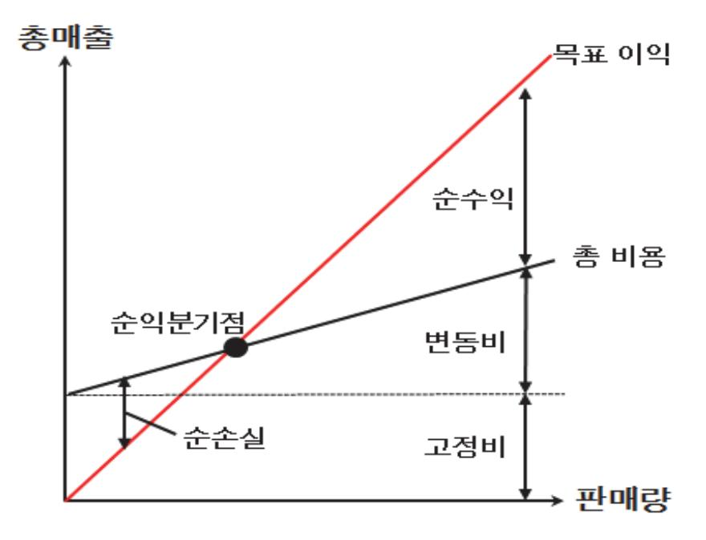

[그림 4-4] 손익분기점 개념도

숖 사업성 분석

제품 개발을 위한 비용 분석을 위해 원가산정도 중요하나 실제 제품 개발을 통해 이익을 달성 할 수 있는 지 또한 중요하다.

이를 위해 사업성 분석을 하는데 그를 위해 필요한 내용은 추정 매출액, 소요 생산 설비 및 고 정 자산 투자, 개발 소요기간, 투자비 규모, 각종 비용 요소 예측, 자금수지 분석(cash flow p rojection), 수익성 분석(순이익 구조, 원가구조, BEP, IRR, payback period, ROI) 등을 고 려해야 한다.

1. 순현재 가치(NPV: net present value)

평가 기준으로 여러 가지를 꼽을 수 있으나 여기서는 일반적으로 사용하는 순현재 가치, 편 익 비용비, 그리고 내부 수익률 등 세 가지에 대해 살펴보고자 한다.

비용편익 분석에서 순현재 가치는 편익의 현재 가치에서 비용의 현재 가치를 뺀 것을 의미 한다. 이를 식으로 나타내면 다음과 같다.

NPV = ∑(Bt – Ct)/(1 + r)t

단일 공공사업인 경우에는 NPV가 0보다 큰 경우 이 프로젝트가 비용보다 더 많은 편익을 생산하는 것을 의미하므로 타당한 것으로 인정된다. 그러나 2개의 상호배타적인 경쟁적 프 로젝트가 있을 경우에는 보다 높은 NPV를 갖는 프로젝트를 선택하게 된다.

흔히 NPV에 의한 평가기준을 Kaldor-Hicks 기준이라고 부른다. Kaldor-Hicks 기준은 파렛트 기준의 비현실성을 극복하기 위한 대안으로 제시된 기준으로, 어떤 변화를 통해 이득을 보 는 사람에 의해 평가된 이득의 가치가 손해를 보는 사람에 의해 평가된 손해의 가치보다 클 때 그 변화를 개선이라고 평가할 수 있는 기준을 말한다. 즉, Kaldor-Hicks 기준은 이득을 보 는 사람이 손해를 보는 사람에게 그 손해에 해당하는 보상을 해주고도 남는 것이 있을 때, 그 변화를 개선이라고 보는 것이다. 그러나 Klador-Hicks 기준에서의 보상은 실제로 일어나 는 보상이 아니라 잠재적인 보상을 의미하기 때문에, 정책변화로 인한 소득 분배적인 결과 를 고려하는 것은 아니라고 할 수 있다.

2. 편익 비용비(B/C 또는 BCR: benefit-cost ratio)

편익 비용비는 편익의 현재가치를 비용의 현재 가치로 나눈 비율을 의미하며, 이를 식으로 나타내면 다음과 같다.

BCR =  $[\Sigma B_t/(1 + r)^t] / [\Sigma C_t(1 + r)^t]$ 

(1) 편익 비용비 해석

편익 비용비의 기준은 어떤 프로젝트의 BCR이 1보다 크면 그 프로젝트는 타당한 것으 로 간주하는 것이다. BCR이 1보다 크다는 것은 분자가 분모보다 크다는 것이고, 결국 NPV가 0보다 크다는 것을 의미하게 되어 전술한 Kaldor-Hicks 기준과 동일한 분석 결과를 초래한다고 생각할 수 있다. 그러나 편익과 비용은 각각 부(負)의 비용 또는 부 (負)의 편익으로 계산될 수 있기 때문에 BCR의 값은 편익과 비용의 정의에 따라 달라질 수 있지만 NPV는 그렇지 않으므로 반드시 동일한 결과를 가져온다고 말할 수는 없다. 따라서 BCR의 기준은 Kaldor-Hicks 기준과는 달리 자의성이 개입될 소지가 있다.

(2) 프로젝트의 선정 방법

여러 가지 대안들이 있을 때 BCR의 판단기준에 의하면 가장 높은 BCR의 값을 갖는 대 안이 선택되지만, BCR의 값이 최대인 대안과 NPV의 값이 최대인 대안이 다른 경우에 문제가 생긴다. 이러한 경우에는 BCR을 사용할 때 주의가 필요하며, 특히 예산제약이 있을 때에는 BCR와 NPV의 기준을 동시에 적용하여 NPV의 값을 최대로 하는 프로젝 트를 선정하는 것이 올바른 방법이다.

3. 내부수익률(IRR: internal rate of return)

프로젝트의 내부수익률이란 NPV를 0으로 만드는 할인율을 의미한다. 어떤 프로젝트의 IRR 이 적정한 할인율보다 높은 경우에 그 프로젝트는 타당성이 높으므로 선택되며, 여러 가지 경쟁적인 프로젝트들 중에서 하나를 선택하는 경우에는 그 중에서 가장 높은 IRR을 갖는 프로젝트가 선택된다. 대부분의 경우 IRR은 올바른 선택기준을 제공하고 NPV와 동일한 결 과를 가져온다. 특히, NPV와 BCR은 미리 어떤 할인율을 가정해야 구해지지만, IRR은 할 인율을 가정하지 않은 상태에서 구해지기 때문에 편리한 점도 있다. 그러나 다음과 같은 세 가지 이유 때문에 NPV를 사용하는 것이 더 바람직하다.

- (1) IRR을 도출하는 데 사용한 방정식은 몇 개의 해를 가질 수 있는데, 그와 같은 경우에는 어 떻게 해야할지 알 수 없다.
- (2) 서로 다른 수명을 가진 프로젝트를 비교할 경우에도 애매함이 발생할 수 있다.
- (3) 경우에 따라서 정부의 의사결정자들은 1년 동안만 존속하는 투자 프로젝트를 비교할 수 있는 데, 이 경우에 IRR은 계산 자체가 불가능하다. 세 가지 경제성 분석 방법에 대해 장단점을 정 리하면 다음과 같다.

<표 4-1> 경제성 분석기법의 비교

| 분석기법                | 장점                                                                                    | 단점                                                                                                                          |
|---------------------|---------------------------------------------------------------------------------------|-----------------------------------------------------------------------------------------------------------------------------|
| 순 현재 가치 (NPV) | -대안 선택 시 명확한 기준 제시 -장래 발생 편익의 현재 가치 제시. -한계순 현재 가치 고려 -타 분석에 이용 가능           | -이해의 어려움. -대안 우선순위 결정 시 사업 규모에 대 한 표준화가 되어 있지 않아 오류 발생 가능                                                          |
| 편익 비용비 (BCR)  | -이해가 용이하고 사업규모 고려 가 능함                                                             | -사업의 우선순위 결정에 의미 없음.                                                                                                        |
| 내부 수익률 (IRR)  | -사업의 수익성 측정 가능 -타 대안과 비교가 용이 -평가 과정과 결과 이해가 용이 -사회적 할인율을 사전에 몰랐어도 계 산이 가능 | -사업의 절대적 규모 고려하지 않음. -동시에 몇 개의 내부수익률이 도출될 가능성 내재 -예산상의 제약이 있는 사업 또는 상호 경 쟁적(상호 배타적)인 사업 간에 내부수 익률 기준 적용 불가함. |

## 수행 내용 / 손익분기점 도출하기

### 재료·자료

• 개발 제품 제조 공정도, 단위 공정별 수율, 제품 제조 수율 예측보고서, A4 용지 등

기기(장비 ・ 공구)

• PC 또는 노트북, 스크린, 빔 프로젝터, 프린터, 복사기, 인터넷 장비, 칠판(화이트보드), 공 학용 계산기, 문서 작성프로그램, 일정 관리 프로그램 등

안전 ・ 유의 사항

• 손익분기점에 큰 영향을 미치는 수율 및 매출액 등이 객관적이고 합리적으로 도출되었는지 에 대해 세밀하게 검증한다.

수행 순서

숔 통계 및 공정수율을 계산한다. 기본적인 산업통계를 바탕으로 공학에 필요한 통계지식(수율의 경우)을 평가하기 위한 문제를 예시한다.

아래 실습용 공정도를 보고 공정 수율을 계산한다.

1. 사례1.에서 YF, YFT를 계산한다.

YF = 85/100 = 0.85, 85% YFT = 80/100 = 0.80, 80%

2. 사례2.에서 YF, YF(1,2,3)와 YRT, YNA를 계산한다.

YF = 85/100 = 0.85, 85% YF1 = 85/100 = 0.85, 85% YF2 = 80/95 = 0.842, 84.2% YF3 = 80/90 = 0.889, 88.9% YRT = YF1 \* YF2 \* YF3 = 0.636, 63.6% YNA = ∛YRT = ∛0.636 = 0.859, 85.9%

### 수율(yield)

- \* YF(final yield): 최종 수율,
- YF = S/U (S: 합격된 제품 수, U: 검사 제품 수)
- \* YFT(first time yield): 재작업하여 수리하지 않은 수율로 개별 공정 수준 평가 시 사용 YFT = S-R-D/U (S: 합격된 제품 수, R: 재작업 제품수, D: 불량 제품 수 U : 검사 제품 수)
- \* YRT(rolled throughput yield): 누적 수율로 하나의 제품이 전 공정을 단 한 개의 불량도 없이 합격 될 확률

$$Y_{RT} = Y_1 * Y_2 * \dots * Y_n$$

\* YNA(normalized yield): 연속하는 공정의 평균 수율

YNA= *n YRT* (n=공정수), 공학용 계산기나 엑셀 연산식을 이용해 구한다.

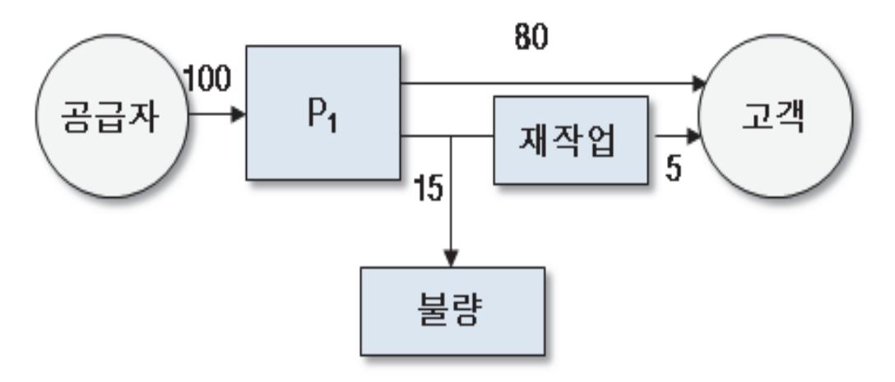

출처: 교육부(2015). 반도체 제품 기획(LM1903060101\_14v3). 한국직업능력개발원. p.69. [그림 4-5] 실습용 공정도 사례 1

출처: 교육부(2015). 반도체 제품 기획(LM1903060101\_14v3). 한국직업능력개발원. p.70. [그림 4-6] 실습용 공정도 사례 2

## 숕 손익분기점을 계산한다.

경제성 분석을 위한 실습 과제로"슬러리"를 예시한다.

1. <표 4-3>의 00기업의 현황을 참고하여 다음 아래 도표의 빈 괄호를 계산한다.

적용 기준을 활용해 슬러리의 연도별 재료비, 제조경비, 제조원가, 판매 관리비 및 제품의 총원가를 산출한다. 1번 일부와 2, 3, 4를 계산하기 위해서는 별도의 엑셀 함수나 프로그램 을 활용하여 계산하며 풀이 과정은 생략한다.)

<표 4-2> 00기업 슬러리 연도별 제조원가 및 제품의 총원가 예시

| 단위(백만원)          | 2019    | 2020     | 2021     | 2022     | 2023     |
|------------------|---------|----------|----------|----------|----------|
| 인건비(인력)          | 475     | 520      | 565      | 610      | 655      |
| 감가상각비 (설비투자비) | 5,500   | 2,500    |          |          |          |
| 재료비              | (7,530) | (13,149) | (20,263) | (29.264) | (39,640) |
| 제조 경비            | (1,130) | (2,016)  | (3,039)  | (4,390)  | (5,946)  |
| 제조 원가            | (8,660) | (15,455) | (23,302) | (33,654) | (45,586) |
| 판매 관리비           | (866)   | (1,545)  | (2,330)  | (3,365)  | (4,559)  |
| 제품 총원가           | (9,525) | (17,000) | (25,633) | (37,019) | (50,145) |
|                  |         |          |          |          |          |

2. 이 사업의 내부수익률(IRR: internal rate of return)이 –4%인지 확인한다.

3. 최종적인 슬러리의 사업가치(NPV)가 150,193백만 원인지 확인한다.

4. 이 사업의 투자에 대한 회수기간(pay-back)이 3년인지 확인한다.

<표 4-3> 00기업의 현황

| 항목           | 세부 내용 및 적용 기준                                                                                                                                                                           |
|--------------|-----------------------------------------------------------------------------------------------------------------------------------------------------------------------------------------|
| 일반 현황     | 00기업은 반도체 및 태양광 기판 재료의 절단 공정 시 사용되는 슬러리 개발을 완 료하고, 이를 사업화하기 위해 원가분석을 하였다. 슬러리사업은 2018년 말까지 준비를 완료, 2019년부터 사업을 전개하기로 하였으 며 제품 원가산정을 위한 비목별 기준은 아래와 같이 설정하였다.                   |
| 제조 공정     | 슬러리 제조 공정은 분말 제조 후에 화학용액과 혼합해 사용하는 것이며, 사용된 슬러리는 정제 가공 후에 재사용된다.                                                                                                                     |
| 시장 상황     | 슬러리 시장은 반도체 산업의 지속적인 성장과 태양광의 급격한 보급 확대에 힘 입어 연평균 성장률(CAGR)이 물량 기준 15%로 전망되며, 2018년의 시장 규모는 2,250억 원에 사용량 150만 Liter(ℓ)로 분석되었다. 현재는 일본의 Exes 등 4개 사가 세계시장의 95%를 독과점하는 상황이다. |
| 매출 전망     | 00기업은 자사가 개발한 슬러리의 원가경쟁력을 바탕으로 사업 첫 해인 2019년에 M/S 5%를 차지하고 매년 3%p씩 M/S를 늘려나가 2023년에는 17%의 M/S를 차지할 것으로 전망하였다.                                                                     |
| 가격 동향     | 슬러리의 가격은 15만원/Liter이며, 이 가격은 향후 5년간 매년 전년 대비 3%씩 하락할 것으로 전망된다.                                                                                                                       |
| 할인율          | 사업 가치를 산정하기 위한 할인율은 CAPM을 적용하기로 하였는데 Rf는 4.2%, Risk Premium은 4%,00기업의β는 1로 평가되었으며, Size Premium은 고려하 지 않기로 하였다.                                                                   |
| 기타           | 사업성 분석 기간은 PLC를 고려하여 5년간으로 하였다.                                                                                                                                                         |
| 인건비          | 슬러리사업을 추진하기 위해서는 사업팀장과 팀원 등 10명이 필요하며, 사업 규모 확장에 따라 매년 1명씩 충원하여 13명까지 확보 예정이다. 인건비는 팀장이 7,000만 원/년, 팀원이 4,500만 원/년으로 책정하였다.                                                       |
| 감가 상각비    | 설비투자비는 총 80억 원이 소요되며, 초기에 55억 원을 우선 집행하고, 나머지 25억 원은 1년 후에 집행하기로 하였다. 감가상각기간은 5년으로 하되, 정액법을 적용하기로 하였다.                                                                            |
| 재료비          | 판매 목표에 의해 연도별 생산량을 도출한다. 즉, 판매량만큼 생산을 하기로 하였 다. 필요한 재료 중에서 60%는 15만원/L인 원재료(new)를 사용하고, 나머지 40%는 recycle한 슬러리를 사용할 수 있다.                                                          |
| 제조경비         | 제품생산에 필요한 제조 경비는 재료비의 15% 적용함                                                                                                                                                           |
| 판매/일반 관리비 | 제조원가의 10% 적용함                                                                                                                                                                           |
| 법인세율         | 25%                                                                                                                                                                                     |

#### 수행 tip

- 손익에 영향을 미치는 주요 인자에 대해서는 가정을 명확 히 하고 반드시 근거를 준비한다.
- 공정 수율이 손익의 주요 인자가 되는 제품의 경우에는 비 교되는 제품의 기존 경험치를 활용하고 새로운 제품의 경우 에는 다소 보수적인 케이스를 적용한다.
- 생산 및 개발 비용 산정 시 기본 가정에 속하는 생산량, 초기 수율 및 생산성 향상 기준 등에 의해 연관 비용, 즉 재료비, 노무비 등 다른 제 비용이 연동되므로 가정에 대 한 정확한 근거를 제시하고 여러 경우에 대한 시뮬레이션 을 통해 실제와 근접한 비용 산출을 할 수 있도록 고려해 야 한다.
- 개발 제품의 생산 및 개발 비용은 원가가 알려진 재료비, 노무비나 제조비용의 일정 비율을 산정하는 일반 관리비 및 판매 제비용이 아닌 제조비에 의해 결정되는 경우가 많 기 때문에 제조비용의 산정 시 주의를 기울여야 한다.

## 학습 4 교수·학습 방법

## 교수 방법

- 개발 일정 수립에 도움이 되도록 제품 개발 단계에 대해 정의해 주고, 동일 또는 유사 제품 의 제조 공정에 대해서, 동영상이나 시청각 자료를 활용해 지도한다.
- 학습자 수준에 맞는 산업통계 이론을 확인하여 학습자의 수준에 맞는 이론과 실습을 병행한 다.
- 학습자가 쉽게 이해할 수 있도록 사례를 안내해주고, 비용분석에 대한 예제를 통해 학습자가 스스로 계산해 보도록 유도한다.
- 학습자가 일지, 저널의 자료를 활용할 때 정보의 정확성 유무를 분별할 수 있도록 지도한다.

## 학습 방법

- 반도체 제품 개발 단계에 대해 숙지하고, 각 단계별 일정 수립을 위해 제품 제조에 대한 이 론과 실제 공정 진행에 대해 인터넷을 활용한 동영상 시청이나 전문가 세미나 등을 통해 학 습한다.
- 개발 일정에 대한 단계별 중요 사항을 정리하여 보고서를 작성한 후 다른 학습자와 비교한다.
- 개발 비용 산출을 위한 구성요소에 대해 항목별 분류가 가능하도록 사전 확인하고 공학용 회 계 이론에 대해 충분히 학습하여 주어진 조건에 따라 통계프로그램을 활용해 사업성 분석 등 을 수행한다.
- 개발 일정의 중요 사항과 개발 및 생산 비용에 대해 분석하고, 평가자 체크리스트를 작성하면 서 내용을 정리한다.

## 학습 4 평 가

## 평가 준거

• 평가자는 학습자가 학습 목표를 성공적으로 달성하였는지를 평가해야 한다.

### • 평가자는 다음 사항을 평가해야 한다.

|            |                                                                                 | 성취수준 |   |   |  |
|------------|---------------------------------------------------------------------------------|------|---|---|--|
| 학습 내용      | 학습 목표                                                                           | 상    | 중 | 하 |  |
| 개발 일정 수립   | - 제품의 전체 개발기간과 각 개발 단계별 세부 일정을 수립 할 수 있다.                                    |      |   |   |  |
| 개발 및 생산 비용 | - 개발 공정에 따른 개발 칩의 원가를 산정할 수 있다.                                                 |      |   |   |  |
| 도출         | - 각 개발 단계별 필요 인력과 장비, 업체별 도입 IP(Intellect ual Property)에 따른 개발 비용을 도출할 수 있다. |      |   |   |  |
| 손익분기점 도출   | - 개발 제품의 수율과 개발 비용 결과를 비교하여 손익분기점 을 도출할 수 있다.                                |      |   |   |  |

## 평가 방법

• 평가자 체크리스트

|                  |                                                       | 성취수준 |   |   |
|------------------|-------------------------------------------------------|------|---|---|
| 학습 내용            | 평가 항목                                                 |      | 중 | 하 |
| 개발 일정 수립         | - 제품의 전체 개발기간과 각 개발 단계별 세부 일정 수립 여 부               |      |   |   |
| 개발 및 생산 비용 도출 | - 개발 공정에 따른 개발 제품의 크기를 예측하여, 생산 비용 산정 가능 여부        |      |   |   |
|                  | - 각 개발 단계별 필요 인력과 장비, 업체별 도입 IP에 따른 개발 비용 도출 가능 여부 |      |   |   |
| 손익분기점 도출         | - 개발 제품의 공정 수율을 예측하고, 개발 비용 결과와 비교 하여 손익분기점 도출 여부  |      |   |   |

• 일지/저널

|                  |                                                                  | 성취수준 |   |   |
|------------------|------------------------------------------------------------------|------|---|---|
| 학습 내용            | 평가 항목                                                            |      | 중 | 하 |
| 개발 일정 수립         | - 각 개발 단계별 세부 일정 수립의 정확성과 전체 개발기간 산정간의 연계 정확성 파악 여부           |      |   |   |
| 개발 및 생산 비용 도출 | - 개발제품 공정에 따른 개발 제품의 크기를 예측하여, 생산 비용 산정간의 연계 정확성 파악 여부        |      |   |   |
|                  | - 각 개발제품 단계별 필요 인력과 장비, 업체별 도입 IP에 따 른 개발 비용 도출의 연계 정확성 파악 여부 |      |   |   |
| 손익분기점 도출         | - 개발제품의 공정 수율을 예측하고, 개발 비용 결과와 비교하 여 손익분기점 도출의 연계 정확성 파악 여부   |      |   |   |

• 구두 발표

|                  |                                                         | 성취수준 |   |   |
|------------------|---------------------------------------------------------|------|---|---|
| 학습 내용            | 평가 항목                                                   |      | 중 | 하 |
| 개발 일정 수립         | - 개발제품의 전체 개발기간과 각 개발 단계별 세부 일정 수 립의 정합성 파악 여부       |      |   |   |
| 개발 및 생산 비용 도출 | - 개발 제품의 생산량 예측과 생산 비용 산정의 정합성 수준                       |      |   |   |
|                  | - 각 단계별 필요 인력과 장비, 업체별 도입 IP에 따른 개발 비용 도출의 정합성 파악 여부 |      |   |   |
| 손익분기점 도출         | - 공정 수율의 예측과 개발 비용 산정을 통한 손익분기점 도 출 과정에 대한 정합성 수준    |      |   |   |

피드백

| 1. 평가자 체크리스트 - 개발 일정을 수립하고, 개발 및 생산 비용, 손익분기점을 도출하는 각각의 과정에서 체크리스트 를 통해 평가한 후 주요 사항을 표시하여 돌려준다. |
|-------------------------------------------------------------------------------------------------------|
| 2. 일지/저널                                                                                              |
| - 비용 분석을 위해 각 과정별 제출된 일지/저널(과제물)을 평가하고 기준에 미달한 학생들에게는 수 준별로 학습 내용을 보충하고 스스로 복습한 후 그 결과를 제출하도록 한다.  |
| 3. 구두 발표                                                                                              |
| - 학습자가 비용분석을 위해 각 과정별 작성한 보고서 발표 내용 중 미흡한 부분에 대해 알려주고                                                 |
| 개선 및 보완 사항에 대해 자세히 설명해 준다.                                                                            |
|                                                                                                       |

| 학습 1 | 제품 시장 조사하기 |
|------|------------|
| 학습 2 | 기술 동향 조사하기 |
| 학습 3 | 제품 사양 수립하기 |
| 학습 4 | 비용 분석하기    |
|      |            |

## 학습 5 개발계획 수립하기

## 5-1. 개략적 개발계획 수립

학습 목표 • 개발 전반에 필요한 기술 및 물적, 인적 자원에 대한 개략적인 계획을 수립할 수 있다.

## 필요 지식 /

## 숔 개발계획 수립

성공적인 제품 개발을 위해서는 사전에 개발하고자 하는 제품에 대한 고객의 요구 사항을 정밀 하게 분석하고, 이를 기반으로 구체화된 개발 목표를 달성하기 위한 효과적인 제품 개발 방법 과 체계적인 투입 예산 및 개발 일정 등을 수립하는 것이 중요하다. 여기에서는 고객의 요구 사항 정밀 분석 후의 일에 대해 살펴보고자 한다.

1. 제품 개발 방법 결정

반도체 제품 개발에 필요한 기술의 내용과 그 기술의 확보 방안(자체 기술의 확보, 사용권 라이센싱, 기술의 구매, M&A, 기술인력 스카우트 등)에 대해 검토한다.

(1) 자체 개발(in-house development)

개발 제품의 목표를 달성하기 위한 기술 내용이 분석된 후 기술 확보 방안을 결정하는 일은 매우 중요한데 일반적으로 자체 개발을 하면 비용 절감과 기술 축적을 기대할 수 있지만, 개발 기간이 오래 걸리고, 개발 실패의 위험성이 존재한다.

(2) 외주 개발(아웃소싱: outsourcing development) 반면에 외주 개발은 개발 비용과 시간을 단축시킬 수 있으며 개발 장비구입과 전문 인 력 영입에 따른 위험(리스크)을 줄이고 개발 제품에 대한 품질을 향상할 수 있다. 그러 나 기술 축적 및 향후 수정 보완 과정에서 많은 어려움들이 발생할 수 있다. 최근 다원화된 사업 환경 하에서 많은 관심을 받고 있는 외주 개발 방법과 형태별 운영 방식은 아래와 같다.

<표 5-1> 외주 개발 방식에 따른 운영 방식

| 외주 방식명                                           | 운영 방식                                                                                |
|--------------------------------------------------|--------------------------------------------------------------------------------------|
| 공동 개발(joint venture) or 컨소시엄(consortium)      | 한시적으로 조직을 구축하여 기술 개발 후 해체                                                            |
| 위탁개발(R&D contract)                               | 연구 결과물(기술)의 소유권 획득                                                                   |
| 기술 교류 협약(technology exchange agreement) | 양해 각서(MOU: memorandum of understanding)를 맺어 진 행하는 비공식적 비강제적인 기술 획득 방법으로 언제든 중단 가능 |
| 사용자-공급자 협약 (user-supplier relations)          | 생산자가 공급자로부터 (직접적 기술 제공 없이) 부품을 제공받아 생산                                            |
| 기술 공여 계약 (라이센싱: licensing)                    | 배타적과 비배타적으로 나누고, 상호 교차 라이센싱은 상호보완적 기술 보유 기업간 기술 공여를 계약                            |
| 2차 소싱                                            | 기술개발자(1차 소스)가 기술 일체의 내용과 권리를 여러 기업(2차 소스)에 제공 동맹 기업을 활용한 기술 확산과 표준화 확보 가능      |
| 지분 보유 및 직접 투자                                    | 기술 보유 기업에 직접 투자하거나 지분을 확보하여 연구개발 자원 이나 경영권을 확보.                                   |

#### 2. 제품 개발 예산 수립

개발에 소요될 예산을 추정하여 예산 계획을 수립하는데 고려할 사항으로는 필요 생산설비 의 내용 및 제품 생산 소요기간, 생산을 위한 원재료 확보 방안, 원재료 구매 및 생산원가, 기타 제 비용 예측, 제품 생산을 위한 투자 규모 예측 등이 필요하다.

각 각의 항목에 대해 검토할 사항이 많고 기업 운영 전반에 대한 기초 자료가 필요하기 때 문에 진행 과정에 경험 많은 숙련가의 도움을 받거나 사전에 기술부서, 지원부서 및 생산부 서와 1차적인 협의를 통해 정확하고 구체적인 예산 규모를 예측할 필요가 있다.

3. 제품 개발 일정 수립

개발에 소요되는 시간을 추정하여 개발 일정을 수립하는데 이를 위해서는 제품 개발 절차, 제조 공정, 장비 운영, 시설 및 유틸리티 등 제반 사항에 대한 지식을 사전에 습득해야 한 다. 또한 제품 개발 단계별 주요 목표 및 결과물에 대해서도 규정해야 한다.

숕 일정 관리 기법

대기업에서 사용하는 일정 관리 시스템은 일반 공개된 프로그램에 비해 복잡하고 사용 회사에 최적화 되어있다. 여기에서는 이런 일정관리의 기반이 되고 단위 제품 개발 일정계획에 사용할 수 있는 몇 가지 일정 관리 기법에 대해 설명코자 한다.

1. 간트 차트(gantt chart)

간트 차트는 프로젝트 일정관리를 위한 바(bar)형태의 도구로서, 각 업무별로 일정의 시작 과 끝을 그래픽으로 표시하여 전체 일정을 한눈에 볼 수 있다. 또한 각 업무(activities) 사 이의 관계를 보여줄 수도 있다.

최초의 간트 차트는 카롤 아다미키(Karol Adamiecki)가 하모노그램(Harmonogram)이라 는 이름으로 고안했으나 이것을 발표하지 않았고 1919년 헨리 간트가 엔지니어링 매거진 (The Engineering Magazine)에 "Work, Wages and Profit"이라는 제목으로 자신이 고 안한 차트를 발표함에 따라 결국 헨리 간트(Henry Gantt)의 이름이 붙게 되었다.

(1) 간트 차트의 종류

이 차트는 생산관리·재고관리·원가관리 등에 응용되고 있으며, 사용 목적에 따라 다음 4 가지 유형이 있다.

- (가) 작업자 및 기계 기록도표(man and machine record chart) 작업 실적의 기록을 위한 작업자 및 기계 기록도표는 각 기계나 작업자별로 계획 작 업량과 실제 작업량의 관계를 표시하는 것으로 작업자나 기계의 유휴 상태와 그 원 인을 알 수 있다.
- (나) 작업할당 도표(layout chart)

작업 계획을 위한 작업할당 도표는 각 작업의 현재 상태를 보여주는 도표이다. 즉, 작업의 실제 상황을 기록함과 동시에 신규 작업 계획을 작업자와 기계설비에 할당할 수 있게 하는 도표이다.

(다) 작업부하 도표(load chart)

능력 활용을 위한 작업부하 도표는 작업자 특히 기계별로 현재 능력에 대해 어느 정 도의 작업량이 부하되어 있는가를 보여주는 도표이다.

(라) 작업 진도도표(progress chart)

마지막으로 진도 관리를 위한 작업 진도도표(progress chart)이다. 작업 공정이나 제품별로 계획된 작업이 실제로 어떻게 진행되고 있는가를 보여주는 도표이다. 즉, 계획과 실적을 비교하여 작업의 진도 상태를 나타냄으로써 시간적 일정 관리를 가능 하게 하는 도표이다.

(2) 간트 차트의 활용

이처럼 사용 목적에 따라 분류한 간트 차트는 기계설비로 제품을 생산하는 생산 공정에 서의 관리에 많이 이용되었으며, 계획과 실적을 도표 상에 동시에 기록하여 간단명료하 게 나타낼 수 있어 1950년까지 간단한 사업이나 생산계획에 널리 이용되었다.

1980년대에 들어서 개인용 컴퓨터가 보급됨에 따라 간트 차트를 쉽게 만들 수 있어 이 런 장점으로 프로젝트 일정 관리에 주로 사용되었고 1990년대 후반에서 2000년대까지 간트 차트는 가장 흔한 일정 관리 방법이 되었다.

그러나 현대적 제조기업의 등장과 함께 그 용도가 점차 줄어들게 되었다. (출처: 두산백 과 ,

http://terms.naver.com/entry.nhn?docId=1201114&cid=40942&categoryId=3191 2)

(3) 간트 차트의 장단점

단점으로는 진행 중 변화 또는 변경에 대처가 약하며, 일정 계획에 있어서 정밀성을 기 대하기 어렵다는 점과 작업 상호간의 유기적인 관계가 명확치 못하다는 것이다.

간트 차트는 일반적 스케줄링에 사용되며 사람, 자원, 시간의 사용에 관한 계획을 할 때 채택된 초기의 계획 일정 수립 기법이다. 수평적인 차원에서 시간을 나타내고 수직적인 차원에서 업무와 작업을 나타내는 표로 수평적 막대는 계획된 스케줄과 각 업무가 요구 된 시간을 표시하였고 각각의 수평적 막대 위에 부과된 표시들은 실제 업무성과를 표시 하여 모든 것이 시간에 의해 기입되었다.

따라서 간트 차트는 항목별 작업 또는 활동계획과 실적을 일목요연하게 알 수 있게 해 준다.

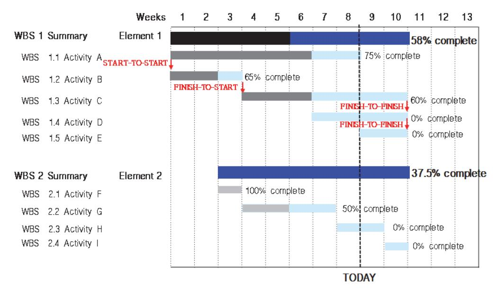

[그림 5-1] 간트 차트의 작성 사례

2. 퍼트(PERT: project evaluation and review technique)

제조 공정이 복잡해지면 어느 작업이 전체 공정을 좌우하는지 판단이 대단히 어렵게 하는 데 이럴 경우 공정관리의 중점을 어디에 두어야 하는지 갈피잡지 못하여 전체 일정 관리는 소홀하게 되어 제품생산 지연이란 사태를 초래할 위험성이 커진다.

기존의 간트 차트법은 단위 작업별 전후 관계 및 공정 여유를 표시하기 어렵다는 것과 관 리 가능한 단위 작업수가 한정되어 있다는 결점을 가지고 있어서 이것을 보완하는 방법으 로서 고안된 것이 PER퍼트법이다.

(1) 퍼트의 개발

퍼트는 주어진 프로젝트가 얼마나 완성되었는지 분석하는 방법으로, 특히 각각의 작업에 필요한 시간을 계산함으로써 모든 프로젝트를 끝내는 최소 시간이 어느 정도인지 알 수 있다.

이 모델은 1958년 부즈 엘렌 해밀턴과 계약한 미국 국방부 펜타곤의 특수프로그램인 폴라리스 잠수함 발사 탄도미사일 프로젝트 팀에서 조속한 시일 내에 필요한 모든 활동 의 통제와 자원의 효율적 배분을 위해 개발되었으며, 그 후 다양한 공공부문과 산업 현 장에서 경영관리 측면으로 애용되고 있다.

퍼트는 1950년대에 발전되어, 일정의 단순화와 커다랗고 복잡한 문제에 사용되었다. 퍼 트는 프로젝트의 일정 중, 정확하게 알려지지 않은 세부요인과 지속기간에 대해 모든 프 로젝트의 일정을 만들 수 있게 되어, 불확정한 일을 통합하는 것이 가능하였다. 이것은 여러 부문에서 사건 지향적 기술을 시작 ~ 완성 지향형보다 선호하게 하는 계기가 되었 다.

(2) 퍼트의 장단점

퍼트 차트의 장점은 프로젝트의 완료시간을 예측하고 전체 프로세스를 관리할 수 있다 는 점에 있다. 또한 확률적으로 계산한 것이기 때문에 예측한 시간보다 더 빨리 프로젝 트를 완료할 수도 있으며 활동을 완료한 이후에 남는 시간이나 자원을 주 공정에 투입 함으로써 실제 프로젝트 완료기간을 단축시킬 수도 있다는 장점을 가지고 있다.

하지만 주관적 판단에 의해 결정된 활동 예상 시간을 바탕으로 프로젝트 완료 예상 시 점 혹은 기간을 결정하기 때문에 예측 결과가 크게 달라질 수도 있다.

그리고 활동에 소요되는 예상 시간이 적절하게 예측되었다 하더라도 퍼트 차트에서는 소요시간을 확률적으로 고려하게 되는데 실제 확률분포와 베타분포의 correlation이 낮 을수록 퍼트 차트에서 예측한 결과와 실제 소요시간의 오차는 더 커질 수 있다.

(3) 퍼트 차트 구성

퍼트 차트에서 숫자는 사건을 나타내며 10단위 숫자의 연결은 나중에 추가적인 사건을 집어넣을 수 있으며, 두 개의 연속적인 사건은 자원이 들어가는 활동으로 연결시키는데, 전통적으로 다이어그램 안에 화살표를 그려 넣으며, 관계를 나타낼 경우엔 실선으로 나

타낸다. 당면한 사건은 논리적인 순서와 활동에 제시된 그 바로 앞의 사건이 완료될 때 시작할 수 있는데, 당면한 문제 안의 논리적인 순서는, 이전 문제가 끝났을 때 시작할 수 있기 때문에 계획자는 퍼트에 이정표를 결정할 수 있고, 또한 적당한 결과를 결정할 수 있으며, 많은 하위 일에 대한 다수의 페이지를 가질 수 있다. 퍼트 차트는 과제의 인과 관계를 알 수 있어, 과제별 소요시간과 전체 개발 일정을 예

측 가능하고 또한 주력해야 할 과제를 쉽게 파악할 수 있어 자원의 효율적인 운영을 통 해 개발 일정을 단축시키는 등 조직 운용의 개선점을 얻을 수 있다.

(4) 퍼트 차트 작성법

퍼트 차트는 다음의 순서에 따라 작성한다.

- (가) 과제를 분석하여 수행 시 필수적인 과정과 활동을 결정한다.
- (나) 과제의 상호의존과 그들의 작업 순서를 결정한다.
- (다) 결정된 순서의 선행관계를 고려하여 네트워크 개략도를 작성한다.
- (라) 각 과정에 소요되는 시간을 예측한다.
- (마) 소요시간 정보를 고려하여 주 공정(critical path)을 결정한다.
- (바) 과제 진행에 따라 퍼트 차트를 업데이트한다.

아래에 실제 공정 개발을 위해 작성된 퍼트 차트를 예시한다.

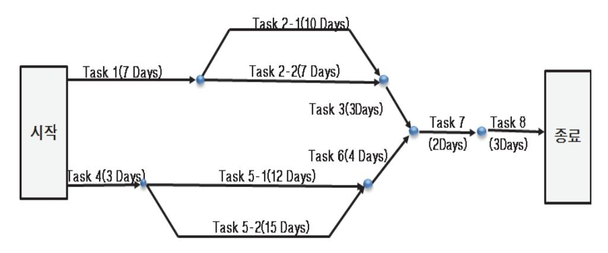

[그림 5-2] 퍼트 차트의 작성 사례

- 3. 크리티컬 패스법(CPM: critical pass method)
  - (1) 크리티컬 패스법 개요

CPM은 1957년에 듀폰트(Dupont)사가 화공 플랜트의 정비를 위한 가동 중단 시간과 정비, 정비 후 재가동 시간을 효율적으로 관리하기 위해 개발한 일정 관리 방법으로 일 련의 프로젝트 활동의 스케줄을 짜기 위해 수학적인 알고리즘을 활용해 효과적인 프로 젝트 관리에 중요한 도구이다.

오늘날 이것은 퍼트방법과 함께 건축, 소프트웨어 개발, 연구 프로젝트, 제품 개발, 공학 을 비롯한 일반적인 모든 형태의 프로젝트에 쓰인다. 상호 활동을 하는 모든 프로젝트는 이러한 스케줄링 방식을 적용할 수 있다.

과제를 완료하는데 소요하는 시간만을 예측하는 퍼트 차트와 달리 크리티컬 패스법은 소요시간 분석의 결과를 활용하여 비용 분석도 함께 진행한다.

(2) 크리티컬 패스법 활용

 CPM의 프로젝트의 진행 상황을 시각적으로 표현할 수 있으며 과제를 완수하는 데 필 요한 시간을 비교적 정확하게 예측하고, 어떤 활동이 과제 진행 일정 및 다른 활동의 완수에 영향을 미치는 지 분석할 수 있는 장점이 있다.

CPM은 복잡하지만 변화의 가능성이 적은 과제를 수행할 때 과제 완수 시간의 불확실성 을 해소하기 위해 개발되었기 때문에 과제 수행방법이나 과정이 달라지기 쉬운 경우에 는 CPM을 통한 예측의 활용성은 제한적일 수밖에 없다.

(3) 퍼트 차트와 크리티컬 패스법의 비교

퍼트 차트와 CPM은 과제를 분석하는 관점이 매우 유사하면서도 다르다. 퍼트 차트와 CPM 모두 과제를 수행하기 위한 세부 활동과 그 세부 활동들의 연관성을 분석하고 그 를 통해 과제에 요구되는 사항들을 예측하는데, 퍼트 차트는 시간의 불확실성을 고려하 기 위해 확률적 분포를 사용하고, CPM은 경험적인 예측을 통해 결정된 확정적 시간을 사용하는 것이 가장 큰 차이점이라 할 수 있다.

퍼트 차트와 크리티컬 패스법의 차이점에 대해 아래와 같이 정리하였다.

| 구분         | 퍼트 차트                         | 크리티컬 패스법                 |  |  |
|------------|-------------------------------|--------------------------|--|--|
| 주목적        | 개발 기간 단축                      | 비용 절감                    |  |  |
| 대상 과제      | 신규 사업, 비반복적인 사 업 경험이 없는 사업 | 반복성이 있는 사업, 경험이 있는 사업 |  |  |
| 소요시간 예측 방법 | 확률적                           | 확정적                      |  |  |
| 일정 계산      | Event 중심의 계산(복잡)              | 활동 중심의 계산(간단)            |  |  |
| 최소 비용      | 특정 이론 없음.                     | 크리티컬 패스법 이론              |  |  |

<표 5-2> 퍼트 차트와 크리티컬 패스법의 비교

## 수행 내용 / 개략적 개발계획 수립하기

#### 재료·자료

• 제품 개발 방법 검토보고서, 제품 개발 예산검토서, 제품 개발절차서, 제조 공정도, 장비 운 영지침, 시설 및 유틸리티 운영계획서, 제품 개발 단계별 목표검토서, 기타 자료 등

기기(장비 ・ 공구)

• PC 또는 노트북, 프로젝터, 프린터, 인터넷 장비, 칠판(화이트보드), 일정 관리 프로그램 등

안전 ・ 유의 사항

• 개발 제품에 대한 시장 및 기술, 비용의 조사, 수집 및 분석을 통해 개발 목표를 설정하고, 이를 구현하기 위한 전반적인 계획을 수립하는 것을 포함한다.

### 수행 순서

#### 숔 개발계획을 수립한다.

1. 제품 개발 방법에 대해 검토한다. 개발하려는 제품의 성격에 대해 규정하고 그에 필요한 기술의 내용과 확보 방안(자체 기술 의 확보, 외주업체 활용 등)에 대해 장·단점을 검토한다.

<표 5-3> 기술 개발 방향 결정 체크리스트

| 기술 개발 방향을 결정하기 위한 질문 |                                                                         | 답변              |       |  |
|----------------------|-------------------------------------------------------------------------|-----------------|-------|--|
|                      |                                                                         | 예               | 아니오   |  |
| 기술 중요도            | 성능과 가격 면에서 제품을 차별화하는데 효과가 큰 기술인가?                                    | 자체 개발           | 아웃소싱  |  |
| 기술 시너지            | 외부에는 잘 알려진 기술이나 우리에게 신기술일 경우, 우리 기술과 함께 개발하면 더욱 많은 이 득을 얻을 수 있는가? | 아웃소싱            | -     |  |
| 개발 비용             | 필요 기술에 대한 개발 비용이 너무 커서 협력 업체와 개발 비용을 분담하는 것이 효과적인가?                  | 아웃소싱 (규모 고려) | 자체 개발 |  |
| 아웃 소싱의 용이성     | 필요 기술을 우리보다 기술력이 뛰어난 협력업체 로부터 얻을 수 있는가?                              | 아웃소싱            | 자체 개발 |  |

- 2. 제품 개발에 필요한 기술 및 물적, 인적 자원에 대해 파악한다.
  - 제품 개발에 필요한 기술·인적 자원이란 자원 투입량(해당 연구원 수), 기술 성숙도, 기술 중요도, 기술수준, 자원 충족도, 선행도(경쟁사 또는 세계 최고 대비 당사 수준) 등을 말하 며, 개발 및 생산에 필요한 공간, 운영 장비 및 필요 수량, 유틸리티 설비의 내용 및 사용 량, 제품 생산 소요기간 등 개발 및 생산을 위한 투자 규모 예측 등을 산출한다.
- 3. 일정 관리 기법을 활용해 개발 일정을 수립한다.

개발 일정 수립은 간트나 퍼트 차트, 크리티컬 패스법 등을 활용하고 적합한 방법을 결정해 수립한다.

아래에 6개의 경로와 각 각의 과제 시간(Task1~12)을 갖는 예를 크리티컬 패스 diagram 으로 표시하였는데 이 과제의 경로와 소요기간을 다음 순서에 따라 계산한다.

- (1) 개별 활동을 명시한다.
- (2) 각 활동의 순서를 결정한다.
- (3) 결정된 순서를 고려하여 네트워크 개략 도를 작성한다.

소요시간을 아크(화살표)에 표시하는 Activity-on-Arc(AOA) 방식을 택했던 퍼트 차트 와는 달리 크리티컬 패스 diagram을 그릴 때는 주로 활동을 노드(마디)에 표시하는 act ivity-on-node(AON) 방식을 택하여 그린다.

(4) 각 과정에 소요되는 시간을 예측한다.

diagram의 활동 소요시간을 계산하기 위해서 이전의 사례나 경험이 많은 전문가의 도 움을 받는다.

(5) 소요시간 정보를 고려하여 주 공정(critical path)을 결정한다.

주 공정은 활동 네트워크에서 가장 오랜 시간이 걸리는 공정으로 이 시간이 증가하게 되면 전체 과제의 소요시간이 증가하기 때문에 주 공정과 주 공정에 포함된 활동, 해당 활동들의 소요시간을 정확하게 파악하고 예측하는 것이 중요하다.

(6) 과제 진행에 따라 크리티컬 패스 diagram을 업데이트한다.

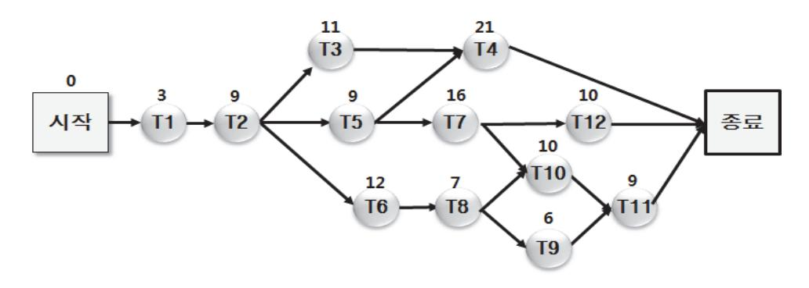

출처: 교육부(2015). 반도체 제품 기획(LM1903060101\_14v3). 한국직업능력개발원. p.82. [그림 5-3] 크리티컬 패스법의 작성 사례

각 경로별 계산된 소요 시간은 아래와 같다. 만약 소요시간이 같다면 경로가 간단하거나 기 존 장비나 공정을 이용할 수 있는 경로를 선택할 수 있다.

<표 5-4> 크리티컬 패스법의 경로와 소요 시간 계산

| 경로(path)            | 소요 시간(length) |          |
|---------------------|---------------|----------|
| 시작-1-2-3-4-종료       | 3+9+11+21     | 44 Weeks |
| 시작-1-2-5-4-종료       | 3+9+9+21      | 42 Weeks |
| 시작-1-2-5-7-10-11-종료 | 3+9+9+16+10+9 | 56 Weeks |
| 시작-1-2-5-7-12-종료    | 3+9+9+16+10   | 47 Weeks |
| 시작-1-2-6-8-10-11-종료 | 3+9+12+7+10+9 | 50 Weeks |
| 시작-1-2-6-8-9-11-종료  | 3+9+12+7+6+9  | 46 Weeks |

#### 수행 tip

• 완벽한 제품 개발계획 수립은 없다. 그러나 제품 기획 단 계에서의 노력이 향후 제품 개발, 생산, 시장 출시 등으로 이어지는 제품사업화에서의 많은 낭비를 줄여주고 시간과 자원을 효율적으로 운영할 수 있는 최선의 방법임을 항상 염두에 두고 일을 진행한다.

## 5-2. 개발 역량 분석 및 협력업체 선정

학습 목표 • 자사의 보유 기술 및 개발 환경 분석을 통한 자체 개발 역량을 분석할 수 있다. • 개발 관련 단위 기능의 업무를 수행할 수 있는 협력 업체들과 협업할 수 있는 업무범위를 설 정할 수 있다.

## 필요 지식 /

숔 개발 역량 분석

내부 역량 분석의 목적은 회사의 현재 및 미래 경영 능력을 분석하여 기업의 강약점 도출하고 지속적인 경쟁 우위를 창출하기 위함이다.

## 1. 외부 환경 분석

제품 개발 활동에 큰 영향을 주는 동인(drivers)들이 어떻게 자사의 현재와 미래의 기회와 위협 요인으로 작용하는가를 분석하여, 제품 개발 전략 수립의 기본 자료로 활용한다. 외부 환경 분석은 크게 시장 분석, 경쟁사 분석, 고객 분석으로 나눌 수 있고 시장 분석은 거시 환경과 해당 산업 환경으로 분류 가능하며 거시경제, 시장 전망, 트렌드, 가격, 소비 관여도 등도 이에 포함된다. 특히 반도체에 있어 산업분석은 잠재적 기업의 진출, 대체 제 품의 위협, 구매자들의 교섭력, 공급자들의 교섭력 및 현존 기업들 간의 경쟁, 이 다섯 가 지를 산업의 매력을 결정하는 중요한 요소라 할 수 있다. 경쟁사 분석은 경쟁 상황, 경쟁 브랜드 분석을 말하고, 고객 분석이란 주 타깃, 구매 패턴, 고객 니즈 파악 등을 말한다. 앞서'학습 1. 제품 시장 조사하기' 및 '학습 2. 기술 동향 조사하기'에서 시장 동향과 기술 동향 분석, 제품 핵심 기능 및 장단점을 파악하며 세부 내용에 대한 조사와 분석방법 등이 이미 다루어졌기 때문에 여기에서는 생략한다.

2. 자사 기술 보유 현황 파악

내부 역량분석이란 기업 고유의 독특한 자원이나 능력, 핵심역량을 찾아내거나 개발하여 그 곳에다 집중적으로 자원을 투자하고 그것을 최대한 효과를 내도록 이용(leverage)하여 지속 적인 경쟁우위를 만들어 내는 것을 말한다. 또한 외부에서 주어지는 기회를 이용할 수 있기 위해서 혹은 외부의 위협으로부터 스스로를 지키기 위해서는 기업내부의 능력과 자원, 그리 고 그의 적절한 운용이 필요하다.

내부 역량분석은 크게 가치사슬 분석, 조직문화 진단, 핵심역량 분석, 재무 분석, SWOT 분석, 문제점과 기회(problem opportunity)에 의한 분석 방법으로 나눌 수 있으나 제품 기획을 위한 요소만 국한해 살펴보면 SWOT 분석이 가장 간단하고 유용한 수단이다.

(1) SWOT

외부 요인이 파악되면 현재의 핵심역량에 대한 냉철하고 객관적인 이해와 향후 개발할 제품이 요구하는 핵심역량에 대한 명확한 이해, 또한 미래 핵심역량을 효율적으로 구축 하기 위한 방법이 필요하다.

강점(strength), 약점(weakness), 기회(opportunity), 위협(threat)의 머리글자를 따서 SWOT분석 이라고 불리는 상황 분석은, 외부의 기회와 내부의 강점 간에 전략적인 적 합성을 찾아내는 동시에 외부적인 위협에 대처하고 내부적인 약점을 보완하는 길을 모 색하는 것이다.

즉 제품 개발에 앞서 자사의 강점과 약점을 비교·분석하고 기업이 보유하고 있는 인적 물적 자원을 살펴 이를 토대로 기업의 업무 수행 능력을 점검하는 것이다.

자사의 기술보유 능력은 어느 정도 되는가? 경쟁사와 비교했을 때 현재 기업의 능력은 어떠한가? 등을 살펴보는 것이 중요한데 조직의 외부 환경과 내부 자원에 대한 현상 분

석과정은 제품 기획의 실질적인 출발점이자 의사 결정을 위한 근거라고 할 수 있다. 기업의 현상 분석을 효율적으로 할 수 있는 도구로, 외부 환경에서의 기회위협 요인과 내부 환경에서의 강점과 약점을 결합하고, 이를 통해 제품 기획 과제를 선택할 수 있는 것이다.

<표 5-5> SWOT 분석의 구성

| 내부환경              | 강점(Strengths)  | 약점(Weaknesses)  |  |  |
|-------------------|----------------|-----------------|--|--|
| 외부환경              |                |                 |  |  |
|                   | SO전략           | ₩O전략            |  |  |
| 기회(Opportunities) | 내부 강점과 외부 기회를  | 내부 약점을 최소화하고, 외 |  |  |
|                   | 결합해 이용하는 가장 유리 | 부 기회를 최대한 활용하는  |  |  |
|                   | 한 상황의 전략       | 전략              |  |  |
|                   | ST전략           | ₩T전략            |  |  |
| 위협(Treats)        | 내부 강점으로 외부의    | 외부 위협과 기업의 약점을  |  |  |
|                   | 위협에 대응하는 전략    | 최소화하는 전략,       |  |  |
|                   | (다각화 전략)       | (현상유지 또는 회피전략)  |  |  |

출처: 교육부(2015). 반도체 제품 기획(LM1903060101\_14v3). 한국직업능력개발원. p.86.

(2) 문제점과 기회(problem opportunity)에 의한 분석 방법 문제점과 기회에 의한 분석 방법은 SWOT 분석법에 비해 포괄적이고 거시적 관점에서 사실을 분석하는 작업을 말하며, 문제점과 기회를 살피는데 초점이 맞춰져 있다. 그 기술방법을 살펴보면 다음과 같다.

- (가) 문제점 및 기회 요소는 고객의 시각에서 작성해야 하며, 상황 분석에 나타난 제반 사항 들을 잘 요약해서 정리해야 한다.
- (나) 문제점 및 기회 요소에 기술된 각 항목은 소통을 통하여 해결될 수 있는 사항들이어야 한다.
- (다) 여러 문제점 및 기회 요소는 중요도에 따라 캠페인 전략을 통해 해결되어야 할 우선순위 가 정해져 있어야 한다.
- (라) 여러 가지 요소를 종합하여 하나의 핵심적인 문제점 및 기회 요소로 정리한다.

숕 협력업체 선정

제품 개발 관련 단위 기능의 업무를 수행할 수 있는 협력업체를 도출하고, 협업할 수 있는 기 준을 파악할 수 있다.

1. 협력업체 도출·운용 기준

협력업체는 원사업자의 제조·건설·용역 위탁거래 등의 대상 업체로 예정되거나 거래 중인 사업자(업체)로서 법에서 규정하는 수급 사업자뿐만 아니라 일반적인 수탁 사업자도 포함되 며, 원사업자가 일정한 기준에 의하여 등록하여 관리·운용하는 협력업체 그룹을 협력업체 풀(pool)이라 한다.

원사업자란 하청을 주는 사업자를 말하며 항상 대기업인 것은 아닌데 중소기업 간에도 하 청을 주고받는 경우가 많기 때문이다.

협력업체 선정이라 함은 원사업자의 협력업체 풀에 등록하는 것을 의미하며, 협력업체 운용 이라 함은 원사업자가 협력업체로 선정·등록된 업체에 대한 거래 개시 기회 부여, 등록 취 소 등 협력업체 풀을 일정한 기준에 따라 관리하는 것이다.

협력업체 도출·운용 기준은 원사업자의 협력업체 선정 및 협력업체 풀 운용에 대한 자율성, 투명성 및 공정성이 확보될 수 있도록 필요 최소한의 일반적 사항만을 제시한 것으로 여기 에서는 공정거래위원회의 기준을 예시한다.

(1) 협력업체 선정기준, 절차 및 결과의 공개

협력업체 선정기준 및 절차에 관한 사항은 협력업체 등록 유효 기간 만료 30일 전 또는 등록(갱신등록 포함)심사 개시 30일 전에 사업장, 전자 매체(원사업자의 웹사이트,

이하 같음) 등에 15일 이상 공개해야 한다.

협력업체 선정기준을 변경할 경우에는 갱신 등록 대상 업체에 대하여 45일 전에 그 사 항을 서면(전자문서 포함, 이하 같음)으로 개별 통지해야 한다.

협력업체 선정일로부터 15일 이내에 그 결과를 서면으로 개별 통지해야 하며, 미선정 업체에 대하여는 그 사유를 명기하여 서면 통지해야 한다.

[그림 5-4]에 신규 협력업체의 선정 절차에 대해 도식화하였다.

125

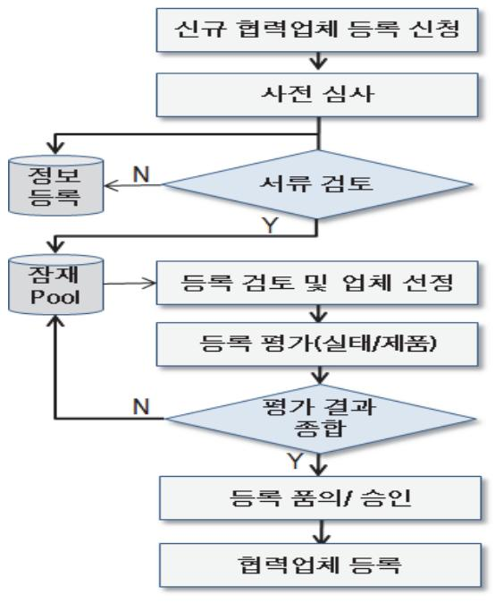

[그림 5-4] 신규 협력업체 선정 절차

(2) 선정 기준의 구체성 및 명확성

원사업자는 협력업체 선정 기준을 구체적이고 명확하게 하여 자의적으로 해석할 우려가 없도록 해야 한다.

- (가) 회사가 요구하는 제품 및 서비스의 품질을 적합하게 제조 또는 제공할 수 있어야 하고, 이에 필요한 면허, 인허가, 특허 등을 보유해야 한다.
- (나) 회사의 협력업체 등록평가 결과 60점 이상을 획득해야 한다.
- (다) 회사가 지정한 신용평가기관으로부터 신용등급 B-이상 등급을 취득해야 한다.
- (라) 회사가 요구하는 유효한 품질인증서(예시: TL9000, ISO9001)를 보유하여야 한다. 단, 품질인증서를 보유하고 있지 않은 경우 실사평가를 할 수 있으며, 실사평가 결과 60점 이상을 취득하여야 한다.

제품(부품이나 서비스)이 아닌 기술적 협력업체 선정 기준은 더욱 복잡한데 대표 사례로 는 영국기업을 대상으로 개발한'케임브릿지 모델'을 들 수 있으며 그 기준을 활용 서식 에 예시한다.(활용서식.'케임브릿지 모델의 상세 체크리스트'참조)

(3) 선정기준 및 절차의 공정성

협력업체 선정 기준은 위탁할 거래내용과 관련성이 있어야 하며, 세부 선정기준별 반영 비중의 배분이 적절하여야 하며, 협력업체 등록을 위한 신청 및 접수 기간은 15일 이상 이어야 한다.

원사업자의 귀책사유로 협력업체 선정에서 제외되었다고 판단하는 업체에 대하여는 미 선정 통지를 받은 날로부터 15일 이상의 기간 동안 이의 신청 기회를 부여하고, 정당한 이유 없이 기존 등록업체와 신규 등록 업체 간의 선정 기준에 차별을 두지 않아야 한다.

(4) 공평한 거래 개시 기회 부여

협력업체로 선정·등록된 사업자에 대해서는 정당한 이유 없이 거래 개시를 위한 입찰 참 가기회 등이 제한되거나 차별받지 않아야 한다.

(5) 협력업체 등록 취소 기준 및 절차의 공개성

원사업자는 협력업체 선정 기준 및 절차를 공개함과 동시에 등록 취소 기준 및 절차에 관한 사항도 사업장, 전자 매체 등에 15일 이상 공개하여야 한다.

(6) 협력업체 등록 취소 기준의 구체성 및 명확성

원사업자는 협력업체 등록 취소 기준은 객관적이고 적절한 사유에 근거하여야 하며 구 체적이고 명확하게 하여 자의적으로 해석할 우려가 없도록 하여야 한다.

- (가) 협력업체 자격심사 불합격 업체
- (나) 자격심사 서류 허위 제출 업체
- (다) 공급능력이 없다고 인정되는 업체(심각한 품질문제 제기업체, 부도발생 등)
- (라) 당사에 재정적 손실 또는 명예를 손상시킨 업체
- (마) 계약 중도 해제 또는 정산업체
- (바) 업체 간 담합하여 품질저하 및 단가를 조정한 업체
- (7) 협력업체 등록 취소 기준 및 절차의 공정성

협력업체 등록 취소 기준은 객관적이고 적절한 사유에 근거하여 설정되어야 하며, 협력 업체 등록을 취소할 경우에는 서면으로 그 사유를 기재하여 통지하여야 한다. 해당 사업 자는 통지를 받은 날로부터 15일 이상의 정해진 기간 내에 이의를 제기할 수 있도록 하 여야 하며, 원사업자의 귀책사유로 등록이 취소된 경우에는 즉시 재등록 조치를 취하여 야 한다.

- (8) 원사업자는 임직원이 고의 또는 중대한 과실로 정해진 가이드라인을 준수하지 않은 경우에는 그 위반 정도에 상응하는 제재 조치(예시: 인사상 불이익 등)를 취하여야 하며 이의 기준은 회사의 취업 규칙이 정한 바에 따른다.
- 2. 협업 기준 파악

기술적 협력업체의 선정 기준 중 평가 항목은 크게 3가지를 고려해 선정한다. 세 항목의 세부 내용 및 기준은 업체의 현황 등에 따라 변경 가능하다.

- T(Technology) 항목

- Q(Quality), E(Environment) 항목

- R(Responsiveness), D(Delivery), C(Cost), M(Management) 항목
- 기술적 아웃소싱의 항목·방법 등 구체적인 내용에 대해서는 수행내용에서 언급하고자 한다.

## 수행 내용 / 개발 역량 분석 및 협력업체 선정하기

## 재료·자료

외부 환경 분석보고서(경쟁사 기술, 전문 조사기관, 개발 제품 동향보고서 등), 자사 기술 자원 분석보고서, SWOT 보고서 및 세부 기술서, 협력업체 평가 준서, 협력업체 평가결과 서, A4 용지 등

## 기기(장비 ・ 공구)

PC 또는 노트북, 스크린, 빔 프로젝터, 프린터, 복사기, 인터넷 장비, 칠판(화이트보드), 통 계 소프트웨어, 문서 작성 프로그램, 일정 관리 프로그램 등

안전 ・ 유의사항

- 협력업체는 반도체 개발을 위해 필요한 반도체 지식 보유 여부를 확인한다.
- 협력업체 선정 시 개발자와의 의사소통 능력이 가능한지 유의한다.

#### 수행 순서

- 숔 개발 제품에 필요한 개발 역량을 파악한다.
  - 1. 개발 제품에 필요한 기술 환경에 대한 분석 작업을 실시한다.
    - (1) 일반 외부 환경 및 장래 요구되는 기능 요건을 분석한다. 거시적인 환경변화 요인(사회적, 정치적, 경제적, 기술적 요인)을 검토해 개발 제품에 영 향을 미칠 수 있는 요인을 도출한다. 특히 life cycle변화나 무역 환경의 변화, 산업간 기술 이전 등 주요 변동에 대해서도 분석을 실시하여야 한다.
    - (2) 개발 제품에 대한 경쟁 환경에 대한 분석을 실시한다.
      - 먼저 경쟁 대상을 명확화하고 연구 개발 현황(중점 연구개발 분야, 규모, 차별화 기술 등)과 신규 참여 기업의 동향을 분석한다. 이때 분석할 내용을 예시하면 다음과 같다. 여기서 니치 마켓이란 수요가 비어있는 틈새시장을 말하며, 가치 사슬은 기업 활동에서 부가가치 창출에 직접 또는 간접적으로 관련된 일련의 활동·기능·프로세스의 연계를 의 미한다.

| 구분       | 시장  |          | 연구                    | 세부 내용      |             |                               |                          |                       |
|----------|-----|----------|-----------------------|------------|-------------|-------------------------------|--------------------------|-----------------------|
|          | 명칭  | 성격       | 소구점                   | 개발 분야   | 기술          | 목적                            | 목표                       | 비고                    |
|          | A사  |          |                       | 제품 내용 등 | 중점 기술    | 성능 개선, 원가 절감, 신기능 | 개념,                      | 기술 수준, 투자비 등 |
| 기존       | B사  | 전체,      | QCD, 가치            |            |             |                               | 재료, 과정, 분석·평 가법 |                       |
| 경쟁사      | C사  | 니치 마켓 | 사슬 등               |            |             |                               |                          |                       |
|          | D사  |          |                       |            |             |                               |                          |                       |
|          | N1사 |          | QCD, 가치 사슬 등 | 제품 내용 등 | 강점 기술 분야 내용 |                               |                          | 기술 수준, 투자비 등 |
| 신규 업체 | N2사 | 전체,      |                       |            |             |                               |                          |                       |
|          | N3사 | 니치 마켓 |                       |            |             |                               |                          |                       |
|          | N4사 |          |                       |            |             |                               |                          |                       |

<표 5-6> 개발 제품의 경쟁 동향 분석 항목 (예시)

- (3) 기술별 배분 현황과 평가 기준별 배분 현황, 기술 맵 작성 등 기술 자원 배분 현황에 대해 분석을 실시한다.
- 2. 개발 제품에 필요한 기술 자원에 대한 분석 작업을 실시한다.
  - (1) 기술 분해, 기술 분류를 통해 기술 분류 체계를 수립한다.
  - (2) 기술 자원 투입량, 기술 성숙도, 기술 중요도, 기술 수준 등의 항목에 대해 기술 자원을 평가 한다.
  - (3) 기술별 배분 현황과 평가 기준별 배분 현황, 기술 맵 작성 등 기술 자원 배분 현황에 대해 분석을 실시한다.
  - (4) 평가 결과를 바탕으로 활용 목적 및 조직 규모 등에 따라 정보를 정리 분석하여 기술 전략 수립에 반영한다.
- 3. 개발 제품과 관련된 기술의 변화를 관찰하여 영향이 큰 요소 기술 및 신기술·대체 기술에 대해 그 트렌드 및 적용 가능성을 분석한다. 기술 변화에 대한 관찰 항목은 활용 제품 및 범위 변화, 연구 기관의 변화, 특허·논문상의 변화, 경쟁사 동향 등이며 가능하다면 technology timeline base의 기술 예측을 통해 작 성된 제품 및 기술 동향 자료를 보유해야 한다.

숕 개발 협력업체를 선정한다.

1. 기술적 아웃소싱을 수행한다.

기술 변화의 가속화 및 기술개발의 거대화·복잡화, 개발 비용 증대, 내부 기술 자원의 한계 등으로 내부 기술 자원의 효율적 활용이 중요하고 이를 위해 기술 아웃소싱은 전략적인 의 사 결정이 필요하다. 외부 기술의 확보를 위한 단계적인 활동을 아래 [그림 5-5]와 같이 나 타내었다.

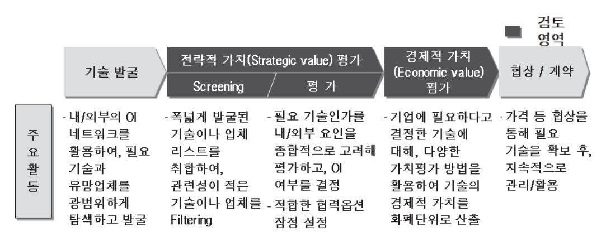

[그림 5-5] 기술 아웃소싱의 단계별 활동

- (1) 기술이 제품에 미치는 효과와 비용, 개발 시기를 고려한다.
- (2) 자체 개발 대상 기술의 경우도 자체 개발할 필요성이 있는지 각 항목을 검토 후 결정한다.
  - (가) 현재 충분한 내부 역량이 있는가?
  - (나) 제품 요구 시기에 비용을 맞출 수 있도록 내부 역량을 강화할 수 있는가?
  - (다) 현재의 내부 역량을 미래에도 유지할 수 있는가?
  - (라) 자체 개발이 가능해도 아웃소싱이 더욱 경제적이지 않은가?
- (3) 아웃소싱은 어떤 기술을 누구와 어떤 방법으로 확보할 것인가 검토한다.

<표 5-7> 기술 아웃소싱의 주요 항목

| 항 목              | 내 용                                                                                     |
|------------------|-----------------------------------------------------------------------------------------|
| 기술의 종류           | 기술 성숙도, 기술 중요도, 자사 기술 수준                                                                |
| 기술 파트너 (협력업체) | 학술 연구기관(대학), 공공연구기관(국공립 연구기관) 상업적 연구기관, 기존 원부재료 제공 업체, 고객, 타 기업                      |
| 아웃소싱 방법          | 기업 매수(M&A), 자본투자, 공동 개발(joint venture), 컨`소시움, 위탁 연구개발, 연구개발 지원(sponsored R&D), 라이센싱 |

(4) 기술 보유 형태 및 기술의 특성과 관계 등을 고려해 협력업체를 최종 선정한다.

협력 방식은 기업이 기술보유자나 기술보유 기업에 대가를 지불하고 제공 받는 형태인 라이센싱, 협력 방법(수직적 또는 수평적)에 따른 공동 개발, 특정기술 개발 또는 사업 기회 창출 등 공통의 관심을 가지고 있는 2개 이상의 조직으로 구성되는 컨소시움을 들 수 있다.

기술적 협력업체 선정은 기술의 적정성과 기술 성격 및 내부 역량을 종합적으로 고려해 선정해야 하며, 세부 내용을 아래 <표 5-8>과 [그림 5-6]에 나타내었다. 내부 역량 기 준은'5.2 개발 역량 분석 및 협력업체 선정'에서 설명한 SWOT 결과를 활용한다.

| 협력업체 검토 항목 | 공공 연구기관 | 상업적 연구기관 | 원부재료제 공업체 | 고객 | 타 기업 |
|---------------|------------|-------------|--------------|----|------|
| 기술의 종류        |            |             |              |    |      |
| -기술 정보·노하우    | O          | O           |              | O  | O    |
| -적용 제품        |            | O           | O            | O  | O    |
| 기술의 특징        |            |             |              |    |      |
| -차별화 기술       |            | O           | O            | O  | O    |
| -비차별화 기술      |            | O           | O            | O  | O    |
| -개선 기술        | O          | O           | O            |    |      |
| -원천 기술        | O          | O           |              |    |      |
| 관계 형태         |            |             |              |    |      |
| -파트너십         |            |             | O            | O  | O    |
| -일시적 계약       | O          | O           | O            | O  | O    |

<표 5-8> 기술적 협력업체의 선정방법-적절성 관점

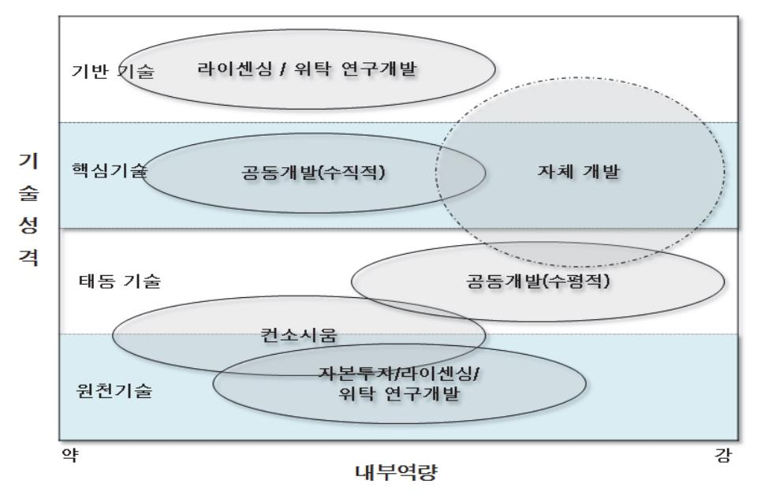

출처: 교육부(2015). 반도체 제품 기획(LM1903060101\_14v3). 한국직업능력개발원. p.93. [그림 5-6] 기술적 협력업체의 선정 방법-기술 성격 및 내부 역량 관점

대부분 대기업의 경우 협력업체 등록 절차는 전자매체(웹사이트 전용 시스템)상에서 이루어 지는 경우가 많은데, 등록 신청서 등 양식지와 선정 기준 및 결과 통보 등이 정해진 절차에 따라 실시간으로 제공된다.

- (1) 거래를 희망하는 기업이 원사업자에게 스스로 정보를 등록한다.
- (2) 심사 기준에 의해 심사가 진행되며 협력업체 pool에 등록한다.

| 심사 항목  |    | 세부 기준                                                                     |  |  |
|--------|----|---------------------------------------------------------------------------|--|--|
| 필수 조건  |    | 품질 인증(ISO9000/QS9000/TS16949) 획득업체                                        |  |  |
|        |    | 종업원 수 7명 이상                                                               |  |  |
|        |    | Screen 평가 항목의 평가결과 1,000점 만점 중 600점 이상 획득                                 |  |  |
|        | 품질 | (400점)                                                                    |  |  |
|        | 납기 | (50점)                                                                     |  |  |
| 평      | 기술 | (100점)                                                                    |  |  |
| 가 항 | 환경 | (100점)                                                                    |  |  |
| 목      | 경영 | (350점)                                                                    |  |  |
|        | 기타 | - 안전보건경영시스템(KOSHA/OSHAS 18001) 인증 업체는 20점 가산 단, 총점이 만점(1,000점)을 넘지 못함. |  |  |

<표 5-9> 심사기준(예시)

2. 일반적인 협력업체 선정 기준 및 절차를 숙지하고 이에 따른다.

(3) 협력업체로 선정되면 정해진 양식에 따라 등록 절차를 진행한다.

<표 5-10> 협력업체 선정 항목(예시)

|       | 협력업체 등록 항목 | 세부 내용                                                                             |  |  |
|-------|------------|-----------------------------------------------------------------------------------|--|--|
| 필수 조건 |            | 잠재 업체로 등록                                                                         |  |  |
|       |            | 신용인증평가기관으로 부터 신용등급 B이상 취득                                                         |  |  |
|       |            | 평가 기준에 의한 평가결과 1,000점 만점 중 750점 이상 획득                                             |  |  |
|       | 경영관리       | (300점)                                                                            |  |  |
|       | 원가관리       | (100점)                                                                            |  |  |
| 평가    | 품질관리       | (500점)                                                                            |  |  |
| 항목    | 환경관리       | (100점)                                                                            |  |  |
|       | 기타         | -경영 관리 부문에서 global 능력도 20점 가산 -고객 만족도 관리에서 20점 가산 단, 총점이 만점(1,000점)을 넘지 못함. |  |  |

(4) 등록된 협력업체 중 제품 개발에 가장 필요하고 적합한 협력업체를 최종 선정한다.

#### 수행 tip

- 협력업체는 제품 개발 및 생산에도 큰 영향을 미칠 뿐만 아니라 기업의 동반성장 파트너로서 큰 역할을 한다.
- 원천 기술의 개발 등 기술 개발을 위한 협력업체의 경우 '학습 5.1 개략적 개발계획 수립'에서 언급한 외주 협력 중의 한 방법을 이용하는 것이 바람직하다.
- 협력업체 선정 기준 및 평가는 공정거래위원회기준에 적합 하고 정해진 규정에 근거해 철저하고 공명정대하게 진행해 야 한다.

# 5-3. 개발계획 확정

학습 목표 • 활용 가능한 자원의 운용을 포함한 개발 전반의 일정을 토대로 주요 단계별 점검 계획, 소요 비용, 중요 산출물에 따른 부서 간 협업 계획을 수립할 수 있다.

## 필요 지식 /

## 숔 개발 일정 점검

가용 자원의 운용을 포함한 제품 개발 전반의 일정을 점검하고, 주요 단계별 점검 계획, 소요 비용, 중요 산출물에 따른 부서 간 협업 계획을 수립한다.

## 1. 개발계획서의 주요 정보 점검

제품 개발계획서에 사용된 시장, 경쟁사, 기술, 내부 자원 등 관련 정보를 명확히 분류하고 각 정보별 담당자의 역할과 책임을 명확히 한다.

특히 개발 제품의 성격 규정도 중요한데 개발 제품의 개발 기술이 타 제품 개발이나 타 기 술에 적용되는 경우에 얼마나 유용하게 활용되는가도 중요한 판단 기준이 되기 때문이다.

2. 성과 평가에 대한 체제 점검

제품 개발에 대한 성과 평가(진행, 완료 등)시 제품 품질(guality), 개발비용(cost), 개발 기 간(delivery)과 기준에 대해 적정한지에 관해 확인하며, 소요된 모든 자원(인력, 원부재료, 투자 등)에 대해 정확히 검증함으로써 실제 진행 시의 결과와의 정합성을 높인다. 특히 성과 평가시점을 인적·물적 자원 투입 과정부터 개발 제품이 매출 이익 등 사업화에 기여하는 시점까지로 보는데 사업화 시점에 가까울수록 공정하고 타당한 평가가 가능하기 때문이다.

3. 관련 기능 간 협력 사항 점검

개발 부문만의 노력으로는 제품 개발이 성공적인 사업화로 연결되기가 어려우며 관련 기능 간 협력 체제를 구축해야 한다. 기능 간 협력 체제를 강화하기 위해서는 명확한 협력 원칙 을 설정하고 이를 철저히 준수토록 명시한다.

4. 제품 개발 단계별 프로세스 점검

제품 개발 관리 프로세스와 관련 활동에 활용할 수 있는 분석 도구나 응용 프로그램을 통 해 작성된 단계별 목표 및 평가 지표, 일정 등을 반복적으로 검토한다. 이때의 평가 요소는 기술적인 관점에서 기술의 강점, 기술 인력, 경쟁 요소, 투입 자원, 생 산 요소, 성공 확률 등을 평가하고, 사업성 관점에서는 예측 가능한 재무성과, 자사의 경쟁 포지션, 마케팅 성공확률 등을 들 수 있고, 전반적인 관점에서는 전사 전략과의 정합성, 과

제 간 균형, 조정·상호 작용 가능성 등을 각 단계별로 점검한다. 작성된 개발계획서에 대한 일반적인 점검 항목 및 기준을 정리하면 다음과 같다.

<표 5-11> 점검항목 및 기준

| 항 목             | 기준                                                                                       |
|-----------------|------------------------------------------------------------------------------------------|
| 기본 사항           | 제품 개발 유형 구분의 타당성 성과목표·지표 설정 시 이해관계자 참여 및 설정 절차 준수 전략 목표-성과목표의 논리적 연계성              |
| 단계별 목표          | 단계별 성과 목표의 적절성 단계별 성과 목표의 구체성 단계별 성과 목표와 개발 기간과의 부합성 단계별 성과 목표와 개발 추진 방식과의 부합성  |
| 단계별 목표 평가 지표 | 단계별 성과 목표와의 연계성 제품 개발 유형 및 이력과의 부합성 질적 지표 중심 설정 여부 측정 방법의 타당성 가중치 및 목표치의 합리성 |

출처: 교육부(2015). 반도체 제품 기획(LM1903060101\_14v3). 한국직업능력개발원. p.100.

숕 리스크 관리

개발계획서에 의한 개발 활동 시 실행 시나리오에 의한 리스크를 파악하고 발생 가능성과 심각 성으로 평가하여 감소 방안 및 해소 대책을 수립한다.

1. 리스크 정의

리스크란 손해의 가능성이 현실화 되는 일련의 과정에 밀접한 관계가 이어지는 것을 말하며 크 게 위태, 사고, 손해로 구분한다.

- 위태(hazard): 사고에 관한 각종의 기여적인 요인

- 사고(peril): 위태의 구체적인 실현

- 손해(loss): 손실, 손상, 훼손, 멸실, 감소 등 여러 형태로 실현됨

"리스크 분석은 리스크 발생원의 원인, 긍정적·부정적 결과 및 결과 발생 가능성에 대한 고 려를 포함한다. 결과와 발생 가능성에 영향을 미치는 인자를 파악하여야 한다. 리스크는 리 스크의 결과, 발생가능성 및 다른 속성에 대한 결정에 의해 분석된다. 사건은 다수의 결과 와 다수의 목적에 영향을 미치기 때문에 현재 적용되는 관리와 효과성 및 효율성도 고려해 야 한다.

결과와 발생 가능성의 표현 방법과 리스크의 수준을 결정하기 위한 결합 방법에는 리스크의 형 태, 가용 정보, 리스크 진단 결과 출력물의 사용 방법이 반영되어야 한다.

이들 방법들은 리스크 평가 기준과 일관성을 가져야 한다. 다른 종류의 리스크와 리스크 발 생원의 상호 의존성도 고려하는 것이 중요하다.

리스크 수준의 결정과 리스크 수준의 민감성에 대한 전제 조건과 가정에 대한 신뢰는 분석 과정 중, 의사결정자 및 해당되는 경우 다른 이해 관계자와 효과적 의사소통에 대해 고려하 여야 한다. 전문가 간의 의견의 다양성, 불확실성, 가용성, 품질, 양적 크기, 정보의 지속적 인 관련성 또는 제한과 같은 요소는 기술되어야 하고 강조되어야 한다.

리스크의 종류, 분석의 목적 및 정보, 데이터 및 자원의 가용성에 따라 리스크 분석의 깊이는 다양 하다. 분석은 상황에 따라 정성적 및 정량적으로 실시되며 경우에 따라 두 가지가 복합적으 로 이루어 질 수 있다.

결과와 발생 가능성은 가능한 자료, 시험에 의한 추정, 사건의 조합 또는 하나의 사건의 출 력물의 모델링에 결정된다. 결과는 유형 및 무형 영향으로 표현된다. 어떤 경우 다른 시간, 장소, 그룹 및 상황에 따라 결과와 발생 가능성을 규정하기 위해 하나의 계수치 또는 숫자가 필 요하다."(출처: 한국표준협회, 기업의 리스크 관리지원을 위한 정책방향 연구보고서, 26페이 지, 2011년)

2. 리스크 관리 프로세스

리스크 관리 프로세스는 리스크를 사전적으로 예방하는 관리 프로세스로서 리스크 식별, 평 가, 대응 및 모니터링의 4단계로 구성된다.

| 식별    | 평가         | 대응                | 모니터링                                            | $\rangle$ |
|-------|------------|-------------------|-------------------------------------------------|-----------|
| 목표 확인 | •핵심 리스크 도출 | • 리스크 대음 방안 마련 | •대응 과제 모니터링 •리스크 지표 모니 터링 •대응 현황 보고 |           |

출처: 교육부(2015). 반도체 제품 기획(LM1903060101\_14v3). 한국직업능력개발원. p.97. [그림 5-7] 제품 개발 리스크 관리 프로세스

(1) 리스크 식별 단계

리스크 식별은 발생 시 제품 개발에 영향을 끼칠 수 있는 잠재적 사건을 식별하고, 그 것이 기회를 의미하는 것인지 혹은 부정적인 영향을 주는 것인지를 판단하는 단계이다. 사건 식별 기법으로는 사건 목록 이용, 워크숍, 인터뷰, 질문서, 설문조사, 프로세스 흐 름 분석, 선행 사건 지표 등이 있다.

(2) 리스크 평가 단계

리스크 평가는 제품 개발 중에 발생할 수 있는 미래 사건이 목표 달성에 있어 어느 정 도의 영향을 미칠 것인가를 파악하는 단계이다.

리스크를 평가할 때 평가자는 "발생 가능성"과 "영향도"의 두 가지 관점에서 사건을 평 가하는데 영향도는 사건이 미치는 효과를 의미하는 반면, 발생 가능성은 어떤 사건이 발 생할 수 있는 확률을 의미한다.

이러한 평가는 일반적으로 어떤 사건의 발생 가능성이"높음, 보통, 낮음"과 같은 정성적 인 기법과"퍼센트, 발생 빈도, 수치"와 같은 정량적인 기법으로 구분한다.

정성적 평가 방법은 측정한 사건의 발생가능성 및 영향에 대한 의견 일치를 이끌어 내 기 위해 인터뷰와 워크숍과 같은 방법을 활용하고, 정량적 평가 방법은 고도의 노력과 정확성을 요구되어 때때로 수학적 모델을 사용하기도 한다.

따라서 보조 정보 및 가정의 질적인 요소에 의존하여 신뢰성 있는 예측을 가능하게 하 여야 한다.

(3) 리스크 대응 단계

리스크 대응은 식별된 리스크를 제거하거나, 축소하기 위해 적절한 대응 방안을 수립하 고 실행하는 단계이며, 대응 활동은 크게 리스크 회피, 감소, 공유, 수용의 네 가지 방 식으로 이루어진다.

(가) 리스크 회피(avoidance)

리스크가 발생 가능한 활동을 중단하는 것으로 개발 제품라인 철회, 신공정 적용 축 소 등을 포함한다.

(나) 리스크 감소(reduction)

리스크의 발생 가능성이나 영향력 중 하나 또는 모두를 동시에 감소시키는 활동이며, 일상적으로 이루어지는 다수의 결정들이 이에 속한다.

(다) 리스크 공유(sharing)

리스크의 일부를 이동시키거나 공유함으로써 리스크의 발생 가능성 또는 영향도를 감소시키는 것을 의미하며, 일반적인 방법으로는 2개 팀에 의한 제품 개발, 상이한 공정 개발, 아웃소싱 등이 있다.

(라) 리스크 수용(acceptance)

리스크의 발생 가능성 또는 영향도를 줄이는 어떤 행동도 취하지 않는 소극적인 태 도이다.

(4) 리스크 모니터링 단계

리스크 모니터링은 관리 대상 리스크에 대한 이상 징후를 도출하기 위해 일정한 기준에 따라 검토, 감독, 관찰하고 실행을 관리하는 일련의 활동을 수행하는 단계이다.

(가) 모니터링 방법

모니터링은 상시적인 활동(ongoing activities) 또는 독립 평가(separate evaluatio n)의 두 가지 방법이 있는데, 상시 모니터링은 제품 개발의 일반적이고 반복적인 활 동으로 구현되며, 실시간 원칙으로 수행되고, 변화된 조건에 동적으로 반응하여 제품 개발 전반에 적용된다.

(나) 모니터링의 범위와 빈도

독립 평가의 범위와 빈도는 주로 상시 모니터링 절차의 효과성에 의해 결정되기 때 문에, 제품 개발 리스크 관리의 효과성에 직접적으로 초점을 맞추면서 때때로 새로 운 시각을 얻는데 유용하다.

## 수행 내용 / 개발계획 확정하기

#### 재료·자료

제품 개발사양서, 제품 제조 공정도, 시작품 관리계획서, 개발계획서, 양산 선행 관리계획서, 양산 관리계획서, 리스크 관리 계획서, A4 용지 등

기기(장비 ・ 공구)

PC 또는 노트북, 스크린, 빔 프로젝터, 프린터, 복사기, 인터넷 장비, 칠판(화이트보드), 통 계 소프트웨어, 문서 작성프로그램, 일정 관리 프로그램 등

안전 ・ 유의사항

개발계획은 기반 인프라, 설계, 반도체 제조 공정, 그리고 인력 운용에 이르는 전 과정에 대 한 종합적인 사고와 지식을 필요로 하므로 각 단계별 체크리스트를 통해 확인하고 필요시 관련 부문과 사전 협업해 진행한다.

수행 순서

숔 수립된 개발 일정 및 단계별 점검 계획을 검토한다.

작성된 제품 개발계획서의 성공을 위해서는 먼저 계획서의 점검을 통한 성공적인 계획서의 작 성이 중요하고 제품 개발 활동 시 개발 활동에 대한 효율적인 관리가 중요하다.

- 1. 가용 자원의 운용을 포함한 개발계획을 수립한다.
  - (1) 효율적인 개발 업무에 도움이 되도록 목적과 방향을 설정하고 계획한다.

- (2) 개발 일정계획표를 짤 때는 요일, 시간에 맞도록 할 수 있는 양만큼의 일정만 계획한다.
- (3) 각 개발 과정에는 단계별 산출물(결과물)과 단계별 프로그램 완료일을 정한다. 또한 진행 상 황을 점검하고, 문제점을 파악하면서 보완, 개선해 나갈 수 있도록 필요하다면 중간 점검 과 정도 준비한다.
- (4) 각 단계별 목표치(성과 항목)에 대해서 미리 명시하고, 정해진 순서에 맞게 순차적으로 업무 를 진행할 수 있도록 계획을 수립한다.
- (5) 성능 목표치에 대한 결과 및 분석방법은 spec. 관리표를 사용하여 정확하게 작성한다.
- (6) 수율은 반드시 해당 이벤트 실적뿐만 아니라 차기 이벤트의 목표 수율까지 기입한다. 예를 들 면 워킹샘플(W/S: working sample) 이벤트 완료 이후(혹은 제작 완료 이후) 엔지니어링 샘 플(E/S: engineering sample)의 목표수율을 작성하는 것인데 이는 단계별 과정의 연계성과 진행상황을 보여주기 위함이다.
- (7) 개발된 제품에 대해서는 기능·성능 검증을 통해 양산성을 검증해야하고 및 전기적 가속, 물리 적 파괴 등의 평가 기법을 이용하여 평가하고 수명시간 예측과 고장 유형별 개선 대책을 수 립하는 신뢰성이 확보하여야 한다. 세부내용은 선수 학습인 반도체 제품 기능·성능 검증 (LM1903060109\_14v3), 반도체 신뢰성 평가(LM1903060110\_14v3)를 참조한다.
- (8) 각 단계별 품평회 기본 양식을 준비하고 이외에 객관적인 검증이 필요할 경우, spec. 관리 sheet, 관리계획서 및 QC flow 등 필요 문서에 대해 규정한다.
- (9) 각 단계별 품평회 기본양식은 워킹샘플에서 시제품(P/P: pre-production sample)까지 누적 관리가 가능하게 구성해야 하고, 이벤트 시 지시 사항에 대해서 차기 이벤트 시 반드시 후속 조치(follow-up)된 결과를 보고토록 준비한다.
- 2. 개발 일정 및 단계별 계획을 점검한다. 개발계획서 초안이 완료되면 개발에 참여하는 기획팀 등 관련 팀과 공유가 필요하며, 원활 한 커뮤니케이션을 위해 미리 협의하는 과정이 필요하다.
- 숕 리스크 대책을 점검하고 관련 부서와 협업한다.

단계별 리스크 항목 및 해결 방안에 대해 문서화하고 관리한다.

- 1. 리스크 평가 기준을 규정한다. 리스크 측정 기준과 평가 지표에 대해 구체적으로 정의한다.
- 2. 리스크 평가 기준에 대한 내부 동의를 얻도록 한다.
- 3. 리스크 상황을 개발하고 논리 위험 범주로 결합한다.

기존 제품 개발 시 빈번하게 일어나는 구체적인 사건을 제시해 놓은 리스트를 활용하거나 워크숍이나 인터뷰 등을 통해 축적된 지식 및 관련자들의 토의를 통해 얻은 경험을 기반으

로 리스크 사건을 식별해 정리한다.

4. 리스크 상황을 기준에 의해 정량화한다.

위험도는 발생 가능성과 영향도의 두 가지 관점에서 사건을 평가하는데 실제 정량적인 리 스크 평가 방법으로는 벤치마킹, 확률모형, 비확률 모형이 있다.

- (1) 벤치마킹은 특정한 사건이나 과정에 중점을 두고 측정과 결과를 비교해보면서 개선의 기회를 찾 는데 사건, 과정, 측정에 관한 정보는 성과를 비교·평가하는 데 이용한다.
- (2) 확률모형은 특정 가정을 바탕으로 사건의 발생가능성을 사건의 범위 및 영향과 연관시켜 발 생가능성과 영향도를 도출하는데 확률모형의 예는 value at risk, cash flow at risk, devel opment of credit, operational loss distribution이 있다.
- (3) 비확률 모형은 사건들의 영향을 추정하는데 사건의 발생가능성을 계량화하지 않고 주관적인 가정을 사용하는 것으로 비확률 모형의 예로는 민감도 분석, 스트레스 테스트, 시나리오 분석 이 있다.
- 5. 감소를 필요로 하는 리스크를 선택한다.
- 6. 모든 필요한 리스크 감소를 정의하고 문서화한다.

제품 개발과 관련 리스크 관리에 대한 각 부문의 권한과 책임이 명시되어야 하는데 이는 리스크 관리가 효율적으로 수행되기 위해서는 다른 부서의 협조가 절대적으로 필요하기 때 문이다.

- 7. 리스크 관리 요약보고서를 준비한다.
- 8. 리스크 저감 계획에 대해 승인을 받도록 한다. 승인을 통해 설정된 리스크 대응 방향에 대해 원인을 분석하고 대응 방안을 마련하며 대응 담당 조직을 선정해 개선안을 실행토록 한다.
- 9. 리스크 감소를 추적하고 모니터링 한다. 선택된 리스크 관리를 실행한 후에는 그 결과를 평가하고 원래 목표한 대로 계획이 진행되 지 않은 경우 적극적인 수정을 필요로 한다.
- 10. 추가 리스크를 확인하고 평가한다.
- 11. 리스크 관리 상태를 보고하고 내부 구성원에게 전달한다.

보고 시 반드시 포함되어야 할 내용으로는 주요 리스크 지표의 모니터링 결과, 도출된 리스 크의 개선 효과 분석, 리스크 관리현황 점검, 리스크 처리 실행 결과에 대해 보고하고 내부 공유를 통해 그 효과를 전개한다.

숖 제품 기획 보고서를 확정한다.

제품 기획 시 고려하여야하는 사항을 충분히 검토하였고, 제품 기획을 목적으로 하는 구체적인 주제나 과제가 선정되었다면, 다음의 목차에 따라 제품 기획 보고서(예시)를 작성한다.

<표 5-12> 제품 기획서(예시)

| 제품 기획서 항목            | 주요 내용                                                                                                                               |
|----------------------|-------------------------------------------------------------------------------------------------------------------------------------|
| 검토 배경 및 목적           |                                                                                                                                     |
| 목표 제품 설명             | 형상, 기능, 성능, 판매 예상 가격, 제품 예상 원가 등                                                                                                    |
| 시장/기술/제품/경쟁사 동향      |                                                                                                                                     |
| 목표 시장, 예상 매출, 매출 이익  | 예상 매출(+24개월 또는 +36개월)                                                                                                               |
| 투자 내역                | 기간, 인력, 비용 등                                                                                                                        |
| ROI 분석               |                                                                                                                                     |
| 전략적 가치, 기여 이익 등 기대효과 | 이때 검토 배경 및 목적, 전략적 가치, 기여 이익, 기대효 과 등은 생략 가능하나, 목표 제품 설명은 제품의 유일한 가치를 구체적으로 명시하는 것이 필수적이다. 목표 시장 의 경우에는 시장 현황에 포함되어도 무난하다. |

- 1. 검토 배경 및 목적에는 제품 개발 추진의 필요성에 대해 언급한다.
- 2. 목표 제품의 설명에서는 개발 제품의 주요 내용과 특징, 예를 들면 성능, 판매 예상가격, 제품 예 상 원가 등을 정의한다.
- 3. 시장/기술/제품/경쟁사 현황을 작성한다.

시장 현황에는 목표 시장의 정의 및 현황, 잠재 고객 정의 및 고객 니즈, 시장 규모 및 성 장성, 전체적인 수요 예측, 경쟁사 분석, 표적 시장 및 자사 제품의 포지셔닝, 자사의 예상 시장 점유율 순으로 작성한다.

이때 경쟁사 분석에는 경쟁제품의 특징, 가격 정책, 기술력, 영업력, 자금력과 경쟁사별 시 장 점유율 및 브랜드 인지도 등에 대해서 반드시 표시한다.

4. 제품 개발 항목의 주요 내용을 작성한다.

제품 개발 항목에는 필요 기술의 내용과 기술의 확보 방안(자체기술의 확보, 사용권 라이센 싱, 기술의 구매, M&A, 기술 인력 스카우트 등), 필요 개발 및 생산 설비의 내용, 제품 생 산 소요기간, 생산을 위한 원재료 확보 방안, 원재료 구매 및 생산원가, 기타 제 비용 예측, 제품 생산을 위한 투자 규모 예측에 대해 설명한다.

이와 같은 내용은 사전에 반드시 기술 부서 및 생산부서와 1차적인 협의가 절대 필요하다.

- 5. 마케팅 전략은 관련부서 도움을 받아 제품 전략과 가격 전략, 유통 전략, 판촉·홍보·광고 전략을 작성한다.
  - (1) 제품 전략은 개발 제품의 속성과 기능, 디자인 아이디어를 정확히 명시하고 각 경쟁 제품과 비 교하는 것을 의미하는데 장·단점 분석 및 표적시장 선정 및 포지셔닝, 제품명 제시 및 브랜드 전략을 포함한다.
  - (2) 가격 전략은 원가 중심, 구매자 중심, 경쟁 중심의 비교 분석을 통해 가격을 제시한다.
  - (3) 유통 전략은 기존 유통망 활용 및 신규 유통망 구축 방안과 제품 특성에 따른 유통 전략을 제시하고 영업 인력 및 조직 가동 방안에 대해 언급한다.
  - (4) 판촉·홍보·광고 전략은 할인정책, 경품, 전시회 등 가능한 홍보, 광고 매체 수단 및 방법에 대해 제시한다.
- 6. 수익성 분석은 연도별 수요 및 매출, 투자(자금조달 규모) 금액, 연도별 원가 및 제비용에 대해 논리적으로 예측하고 이에 따른 연도별 수익성을 제시한다.
- 7. 추진 일정에는 단계별 목표와 주요 성과 지표에 대해 제시한다.
- 8. 결론 부분에서는 제품 개발의 추진 당위성에 대해 다시 한 번 주장하고 제품 개발 추진 시 risk fact or 및 주의 사항에 대해 요약정리하고 특히 회사 내 각 관련 부서의 협조사항을 정리한다.

#### 수행 tip

- 반도체 제품 기획보고서 작성 후에는 주요 사항을 정리한 ONE page 기획서를 반드시 작성하고 요약 내용도 숙지 해야 한다.
- 반도체 제품 개발계획의 확정이란 수립된 단계별 일정과 결과물, 그에 대한 검증 방법에 대한 내부 관련 부서 간의 권한과 책임에 대해 인지하고 그 실행에 대해 동의와 협조 를 약속하는 일이다.

## 학습 5 교수·학습 방법

## 교수 방법

- 다양한 제품 개발 방법의 장·단점에 대해 충분히 인지하고, 학생들이 이를 이해할 수 있도록 사례 중심의 수업을 진행한다.
- 통계 소프트웨어, 문서 작성 프로그램과 일정 관리 프로그램 등의 활용은 현장에서 직접 작 성하도록 하여 문제가 되는 내용이 무엇인지를 파악하고, 적용할 수 있도록 지도한다.
- 협력업체에 대한 개념과 기술적 협력업체의 선정 방법에 대해 상세히 설명한다.
- 반도체 제품 기획 보고서 작성 절차에 대해 설명하고, 이에 필요한 양식을 확보하여 학생들 에게 제시해 실제 작성해 보도록 유도하고, 모둠별로 작성된 기획보고서 결과를 발표하여 내 용을 공유하도록 지도한다.

## 학습 방법

- 반도체 제품 개발 방법들에 대해 각각의 장·단점에 대해 숙지하고 개발 환경 분석이나 개발 목적 등이 제시될 경우 적합한 방법을 연계할 수 있도록 학습한다.
- 주요 프로그램(통계 소프트웨어, 문서 작성 프로그램, 일정 관리 프로그램 등)은 체계적으로 학습하여 현장에서 즉시 적용할 수 있도록 훈련하고, 주요 내용은 사례 위주로 사진, 체계도 등과 함께 노트에 정리한다.
- 협력업체에 대한 정의를 정확히 알고 기술적 협력업체 선정을 위한 조건에 대해 제시하고 분류할 수 있으며, 관련 내용을 검색할 수 있도록 학습한다.
- 반도체 제품 기획 보고서 작성 시 필요한 내용을 확인하고, 주어진 양식에 따라 제시된 제 품의 제품 기획보고서를 작성 후 그 결과물에 대해 발표해 보고 다른 학습자와 그 구성의 적합성과 완성도에 대해 토론하고 궁금한 점을 질문한다.

## 학습 5 평 가

## 평가 준거

• 평가자는 학습자가 학습 목표를 성공적으로 달성하였는지를 평가해야 한다.

#### • 평가자는 다음 사항을 평가해야 한다.

| 학습 내용                 | 평가 항목                                                                                            | 성취수준 |   |   |
|-----------------------|--------------------------------------------------------------------------------------------------|------|---|---|
|                       |                                                                                                  | 상    | 중 | 하 |
| 개략적 개발계획 수 립       | - 개발 전반에 필요한 기술 및 물적, 인적 자원에 대한 개략적 인 계획을 수립할 수 있다.                                           |      |   |   |
| 개발 역량 분석 및 협력업체 선정 | - 자사의 보유 기술 및 개발 환경 분석을 통한 자체 개발 역 량을 분석할 수 있다.                                               |      |   |   |
|                       | - 개발 관련 단위 기능의 업무를 수행할 수 있는 협력 업체들 과 협업할 수 있는 업무범위를 설정할 수 있다.                                 |      |   |   |
| 개발계획 확정               | - 활용 가능한 자원의 운용을 포함한 개발 전반의 일정을 토대 로 주요 단계별 점검 계획, 소요 비용, 중요 산출물에 따른 부서 간 협업 계획을 수립할 수 있다. |      |   |   |

## 평가 방법

• 평가자 체크리스트

|                       |                                                                                               | 성취수준 |   |   |
|-----------------------|-----------------------------------------------------------------------------------------------|------|---|---|
| 학습 내용                 | 평가 항목                                                                                         |      | 중 | 하 |
| 개략적 개발계획 수 립       | - 개발 전반에 필요한 기술 및 물적, 인적 자원에 대한 개략적 계획 수립 여부                                               |      |   |   |
| 개발 역량 분석 및 협력업체 선정 | - 자체 개발 역량 분석이 작성된 자사 보유 기술과 개발 환경 분석 결과를 통해 실제로 분석 가능한지 여부                                |      |   |   |
|                       | - 개발 관련 단위 기능의 업무를 수행할 수 있는 협력업체 도 출과 협업 기준이 파악 가능한지 여부                                    |      |   |   |
| 개발계획 확정               | - 활용 가능한 자원의 운용을 포함한 개발 전반의 일정 수립 여부와 주요 단계별 점검 계획, 소요 비용, 중요 산출물에 따른 부서 간 협업 계획의 수립 여부 |      |   |   |

• 일지/저널

| 학습 내용                 | 평가 항목                                                     | 성취수준 |   |   |
|-----------------------|-----------------------------------------------------------|------|---|---|
|                       |                                                           | 상    | 중 | 하 |
| 개략적 개발계획 수 립       | - 개발 전반에 필요한 기술 및 물적, 인적 자원에 대한 개략적 계획 수립 시 근거의 정확성 수준 |      |   |   |
| 개발 역량 분석 및 협력업체 선정 | - 자체 개발 역량 분석 근거 자료의 정확성과 적합성 수준                          |      |   |   |
|                       | - 협력업체 도출과, 협업 기준에 대한 근거의 적합성 수준                          |      |   |   |
| 개발계획 확정               | - 개발 전반의 일정 수립 여부와, 주요 단계별 부서 간 협업 계획 수립 계획의 적합성 수준    |      |   |   |

• 구두 발표

|                       | 평가 항목                                            | 성취수준 |   |   |
|-----------------------|--------------------------------------------------|------|---|---|
| 학습 내용                 |                                                  | 상    | 중 | 하 |
| 개략적 개발계획 수 립       | - 개략적 개발계획 수립 근거의 정합성과 리스크 관리방안의 적정성 수준       |      |   |   |
| 개발 역량 분석 및 협력업체 선정 | - 자체 개발 역량 분석과 실제 역량간의 정합성 수준                    |      |   |   |
|                       | - 협력업체와 협업 기준에 대한 정합성 파악 여부                      |      |   |   |
| 개발계획 확정               | - 개발 일정 및 주요 단계별 부서 간 협업 계획의 수립 계획 수준의 적절성 수준 |      |   |   |

피드백

| 1. 평가자 체크리스트 - 개발계획을 수립하기 위해 각 단계별 활동 내용을 관찰하는 과정에서 평가한 후 주요 사항을 표 시하여 돌려준다. |
|------------------------------------------------------------------------------------|
| 2. 일지/저널 - 개발계획을 수립하기 위해 각 단계별로 작성된 일지/저널에 대해 평가하고 기준에 미달한 학생들                  |
| 에게는 수준별로 학습 내용을 보충하고 스스로 복습한 후 그 결과를 제출하도록 한다.                                     |
| 3. 구두 발표                                                                           |
| - 개발계획을 확정하기 위해 작성된 보고서 발표 시 질의·응답을 통해 작성한 보고서의 숙지 여부를                             |
| 판단하고 개선 사항 및 추가로 보완해야 할 사항에 대해 제시한다.                                               |

- 교육부(2015). 반도체 신뢰성 평가(LM1903060110\_14v3). 한국직업능력개발원.
- 교육부(2015). 반도체 제품 기능·성능 검증(LM1903060109\_14v3). 한국직업능력개발원.
- 교육부(2015). 반도체 제품 기획(LM1903060101\_14v3). 한국직업능력개발원.
- 김동명(2017). 『반도체공학』. 한빛아카데미.
- 김종식·박상후·박성훈 외(2016).『창의공학설계』. ㈜도서출판 북스힐.
- 김학동·이선우·이세현(2012). 『반도체 공정과 장비의 기초』. 홍릉과학출판사.
- 김현후·김한수·이창재(2014). 『반도체 공학기술』. 내하출판사.
- 박용현(2017). 『2017산업기술백서』. 한국산업기술진흥협회.
- 백장선·정윤경(2011). 『SPSS를 이용한 기술경영 통계학』. 자유아카데미.
- 시장자료(n.d). https://www.ksia.or.kr/infomationKSIA.php?data\_tab=4. 2018년 6월 9일 검 색.
- 신영수·장성근(2011). 『양손잡이 R&D경영』. 새로운 제안.
- 안광호·임병훈(2008). 『마케팅 조사원론』. 학현사.
- 우예진(2017-01-18). "당분간 450mm 웨이퍼로의 이행 어렵다, 업계 소극적 행보 이어져". 베타뉴스. http://www.betanews.net/article/671589 에서 2018년 6월 11일 검색.
- 이순철(1999). 『신제품 개발 성공전략』. 삼성경제연구소.
- 이재철·김시호·오용호(1999). 『반도체와 정보화 사회』. 시그마프레스.
- 이훈영(2014). 『마케팅 조사론』. 청람.
- 조형식·류용효(2008). 『PLM지식』. 비비미디어.
- 특허출원가이드(n.d). http://www.patent.go.kr/jsp/ka/menu/guide/main/GuideMain0207.j sp. 2018년 6월 23일 검색
- 한국반도체산업협회(2015). 『반도체산업 현황과 전망』. 대홍기획.
- 한국반도체연구조합(2012). 『반도체 용어사전』. 대홍기획.
- 한국표준협회(2011). 『기업의 리스크 관리지원을 위한 정책방향 연구보고서』. p.26.
- 황호정(2014). 『반도체공학』. 생능출판사.
- Ben G. Streetman & Sanjay Kumar Banerjee. (2017) 『Solid State Electronic Devices(7th

Edition)』. Pearson Education Ltd.

- Brian Krzanich. (2012). Big or small. Intel Investor Meeting 2012. p9.
- Charles Kittel([2004] 2007). 『고체물리학(Introduction to Solid State Physics, 8th Edition)』. 우종천·신성철·유건호(공역). 범한서적
- Gary S. May, Simon M. Sze([2004] 2010). 『반도체 집적공정(Fundamentals of semiconductor fabrication)』. 곽계달·김태환·박재근 외(공역). 학술정보.
- Giorgio Rizzoni. (2015). 『Principles and Applications of Electrical Engineering(6th Edition )』. McGraw Hill Education.
- Global 450 Consortium (2014). 『Update to the 450mm Equipment Performance Metrics v7.0』, G450C Publications.
- Jim C. Collins and William C. Lazier([1992]. 2004)『경영전략 (Beyond entrepreneurship)』. 임정재(역). 위즈덤하우스.
- Melissa A. Schilling([2016] 2017). 『기술경영과 혁신전략(Strategic Management of Technological Innovation. 5th Edition)』. 김길선(역). 한경사.
- Ohmsha([1997] 1997). 『전자공학입문(電子工學入門)』. 박한종(역). 성안당.
- R&D정보센터(2014). 『유망소재 부품산업 기술/시장 경쟁력 분석』. 지식산업정보원.
- Rudolph J. Eggert([2005] 2010). 『공학설계(Engineering Design. 1st Edition)』. 강남철·김대현·김 정배 외(공역). ㈜시그마프레스.
- Safa O. Kasap. (2017). 『Principles of Electronic Materials and Devices(4th Edition)』. McGraw-Hill Education.
- Yo Tanaka([2003] 2003).『상품기획을 위한 시나리오 씽킹(商品企画のシナリオ発想術)』. 양영철(역). 엔터스코리아.
- 山谷正明(2011). 『シリコーン: 広がる応用分野と技術動向』. 化学工業日報社.
- 松本信雄(2004). 『シリコンの 科學』. 電子情報通信学会.
- 齋藤 嘉則([1997] 2002). 『問題解決プロフェッショナル-思考と技術(맥킨지식 사고와 기술)』. 서한섭·이 정훈(공역). 기획출판거름.
- 早稲田大学ビジネススクール([2004] 2005).『Management of Technology Advanced』. 허영섭(역). 한국산업기술진흥협회.

## SWOT 분석(실습)

다음에 주어진 2개 분야의 분석 결과를 활용해 아래의 서식에 각각의 SWOT 전략을 수립하라.

| 1.한국의 메모리 분야에 대한 SWOT 분석 결과(예시) |                                                                                                                                                                                                                                               |  |
|---------------------------------|-----------------------------------------------------------------------------------------------------------------------------------------------------------------------------------------------------------------------------------------------|--|
| 강점 (strength)                | - 앞선 공정 기술을 바탕으로 시장 점유율과 영업 이익률 우위, 표준화 경쟁력 강화 - 공정 노하우 및 관련 지적재산권의 우위 - 미세화에 따른 Fab. 투자 비용 증가로 후발업체에 높은 문턱                                                                                                                             |  |
| 약점 (weakness)                | - 소자 사이즈 축소의 기술적 한계로 공정 단가 상승 가능 - Si(실리콘) 소재 기반 기술 개발의 한계 - 커패시터로 인한 단위 셀(unit cell)의 구조적 미세화 어려움 - 공정 난이도 상승에 따른 기술 개발 정체 - 반도체 장비 산업(특히, 노광 부분)의 상대적 약점 - 반도체 전공 연구개발 고급 인력 배출 감소                                           |  |
| 기회 (opportunity)             | - IT산업 패러다임 변화에 따른 DRAM 수요 확대 추세 - 주요 3개 업체로 재편된 DRAM 반도체 상황으로 생산량 조절 가능 및 공급자 협상력 강화                                                                                                                                                      |  |
| 위협 (threat)                  | - Set 산업 포화에 따른 반도체 수요 부진 - 반도체 고급 인력 해외유출 - Micron 발 포트폴리오 다양화로 Fab.증설 및 생산량 증가 경쟁 가능성 - 중국 업체의 난입으로 향후 공급과잉 우려 - 보호무역주의 확산으로 Set 산업 공급 제한에 따른 반도체 수요 축소 - 대기업 오너 리스크에 따른 적시 투자 타이밍 상실 위험 - 정치적 목적에 편승한 영업비밀 경쟁사·경쟁국 유출 우려 |  |

| 2.한국의 NAND Flash 분야에 대한 SWOT 분석 결과(예시) |                                                                                                                                                                                                                                                                                  |  |  |
|----------------------------------------|----------------------------------------------------------------------------------------------------------------------------------------------------------------------------------------------------------------------------------------------------------------------------------|--|--|
| 강점 (strength)                       | - 앞선 공정 기술로 우세한 3D 기술 전환 - 3D NAND Flash 기술 라이선스 경쟁력 보유 - 경쟁력 있는 Set 산업과 반도체, 디스플레이 등의 부품 산업 공유 - 빠른 time to market 대응 능력 보유                                                                                                                                            |  |  |
| 약점 (weakness)                       | - 국내 반도체 기반 산업(장비 및 소재) 분야 경쟁력 취약 - 반도체 관련 고급 인력 배출 감소 - SK하이닉스의 NAND Flash 개발 부진                                                                                                                                                                                          |  |  |
| 기회 (opportunity)                    | - IT및 인접 산업의 환경 변화로 꾸준한 NAND Flash 수요 증가 - 비트당 가격 하락으로 HDD를 대체할 SSD 수요 증가 - DRAM을 상회하는 시장 성장률 - 트럼프 행정부의 기조로 중국의 M&A 및 기술제휴 부정적                                                                                                                                         |  |  |
| 위협 (threat)                         | - Set 산업 포화에 따른 수요 부진 - 다수 업체의 진입 및 시장경쟁 - 반도체 고급 인력 해외 유출 - 대기업 오너 리스크에 따른 적시 투자 타이밍 상실 위험 - 정치적 목적에 편승한 영업비밀 경쟁사·경쟁국 유출 우려 - Intel + Micron의 차세대 메모리(3D X-point) 등장 - 중국의 NAND Flash 산업 진입 및 대규모 투자 경쟁으로 향후 공급과잉 - 보호무역주의 확산으로 Set 산업 공급 제한에 따른 반도체 수요 축소 |  |  |

|                     | 실습 일시          | 년            | 월 일 | 소속     | 이름                                                                                              |
|---------------------|----------------|--------------|--------|--------|-------------------------------------------------------------------------------------------------|
| 과제                  |                |              |        |        | 1.한국의 메모리 분야에 대해 SWOT 분석 결과를 활용해 전략을 수립하라. 2.한국의 NAND Flash 분야에 대해 SWOT 분석 결과를 활용해 전략을 수립하라. |
| 내부 외부            |                | 강점(strength) |        |        | 약점(weakness)                                                                                    |
| 기회 (opportunity) | SO전략(강점-기회 전략) |              |        |        | WO전략(약점-기회 전략)                                                                                  |
| 위협 (threat)      | ST전략(강점-위협 전략) |              |        |        | WT전략(약점-위협 전략)                                                                                  |
|                     |                |              |        | 교수자 확인 |                                                                                                 |

※ 서식 내용은 돋움체로 작성

## OOOOO 모델의 상세 평가 체크리스트(사례)

| 항목                                | 체크리스트                                               | 평가 |
|-----------------------------------|-----------------------------------------------------|----|
|                                   | 해당 기술과 관련된 내부의 기술 지식 수준은?                           |    |
| 조직 내부 (absorptive capacity) | 확보하고자 하는 외부 기술에 대한 기술 지식과 전문성 수준은?                  |    |
|                                   | 해당 기술과 관련된 IP를 얼마나 보유하고 있는가?                        |    |
|                                   | 신기술에 대한 내부 조직의 수용 정도는?                              |    |
|                                   | 새로운 절차나 방법(routines)을 적용하는 내부 조직의 유연성은?             |    |
|                                   | 확보하고자 하는 외부 기술에 대한 내부의 적극적인 지원 정도는?                 |    |
|                                   | 외부의 파트너들과 지식을 공유할 수 있는 내부의 역량 수준은?                  |    |
|                                   | 신기술을 자사의 제품에 적용할 수 있는 내부의 역량 수준은?                   |    |
|                                   | 외부에서 확보한 기술 지식을 활용하는 내부의 역량 수준은?                    |    |
|                                   | 파트너에 대한 사전 지식 수준은?                                  |    |
|                                   | 서로의 거래 동기와 전략적 목표를 잘 이해하고 있는가?                      |    |
|                                   | 각 회사의 전략은 서로 양립할 수 있는가?                             |    |
|                                   | 두 회사 모두에게 전략적으로 중요한 거래인가?                           |    |
|                                   | 공동 목표 달성을 위한 상대 회사에 대한 의존 정도는?                      |    |
| 파트너 (compatibility)            | 상호 협력을 통해 고객이나 이해관계자에게 부가가치를 제공하는가?                 |    |
|                                   | 시장(고객, 경쟁사, 정부 등)은 파트너십에 대해서 수용적인가?                 |    |
|                                   | 파트너의 기술 역량 수준은?                                     |    |
|                                   | 파트너의 워킹 스타일은 조화를 이룰만한가? (유연성, 프로젝트 일정 준수, 신뢰감 등) |    |
|                                   | 파트너의 이전 제휴 경험은?                                     |    |
|                                   | 해당 기술이 우리의 전략적 목표에 부합되는가?                           |    |
|                                   | 해당 기술의 잠재적인 상업적 가치가 높은가?                            |    |
|                                   | 해당 기술을 통해 강력한 IP를 구축할 수 있는가?                        |    |
|                                   | 기술 개발에 위협요소가 있는 경우, 쉽게 극복할 수 있는가?                   |    |
| 기술 (suitability)               | know-how(스킬과 기술 응용)에 대한 접근 가능성은?                    |    |
|                                   | know-what(기능을 뒷받침하는 매뉴얼, 절차 등)에 대한 접근 가능성은?         |    |
|                                   | know-who(기술 지원 담당자)에 대한 접근 가능성은?                    |    |
|                                   | 기술 이전비용(transfer fees)은 합리적인가?                      |    |
|                                   | 기타 거래비용(transaction costs)은 합리적인가?                  |    |

## 특허 평가보고서 양식(사례)

| 관리번호                                                                                                                                                                                                                                                                                                     |                            | 000000                                                                                                                                                                                                                                                                                                                                     | 출원인         | 000000000                                                                                                                                                                     |  |
|----------------------------------------------------------------------------------------------------------------------------------------------------------------------------------------------------------------------------------------------------------------------------------------------------------|----------------------------|--------------------------------------------------------------------------------------------------------------------------------------------------------------------------------------------------------------------------------------------------------------------------------------------------------------------------------------------|-------------|-------------------------------------------------------------------------------------------------------------------------------------------------------------------------------|--|
| 명                                                                                                                                                                                                                                                                                                        | 영 문                     | Apparatus for redundant interconnection between multiple hosts and raid                                                                                                                                                                                                                                                                    |             |                                                                                                                                                                               |  |
| 칭                                                                                                                                                                                                                                                                                                        | 국 문                     | 다중 호스트 컴퓨터와 레이드 사이의 중복 연결을 위한 장치                                                                                                                                                                                                                                                                                                           |             |                                                                                                                                                                               |  |
|                                                                                                                                                                                                                                                                                                          | 지적재산권                      | US000000                                                                                                                                                                                                                                                                                                                                   | 우선권번호       | KR2000-00000                                                                                                                                                                  |  |
| 다중 호스트 컴퓨터와 레이드(RAID: redundant array of inexpensive disks) 사이의 중 복 연결 장치에 있어서 산업 표준 통신망을 통하여 연결된 다수의 호스트 컴퓨터들의 요구 를 처리하고 결함 허용 기능을 수행하기 위한 다수 개의 레이드 제어 수단 청구항 상기 다수의 레이드 제어 수단과 상기 다수의 호스트 컴퓨터 사이를 연결하기 위한 다수 개 의 연결 수단 및 상기 각 다수의 레이드 제어 수단 내에 포함되어 상기 다수의 연결 수단을 통하여 ~ 구현하는 장치. |                            |                                                                                                                                                                                                                                                                                                                                            |             |                                                                                                                                                                               |  |
| 검 토                                                                                                                                                                                                                                                                                                   | 기 술 내 용 요 약 | 본 발명은 다중 호스트 컴퓨터와 레이드(RAID: redundant array of inexpensive disks) 사이의 중복 연결 장치에 있어서 표준 통신망을 통하여 연결된 다수의 호스트 컴퓨터들의 요구를 처리하고 결함 허용 기능을 수행하기 위한 다수 개의 레이드 제어 수단 그 다수의 RAID 제어 수단과 그 다수의 호스트 컴퓨터 사이를 연결하기 위한 다수 개의 연 결 수단 및 그 각 다수의 RAID 제어 수단 내에 포함되어 그 다수의 연결 수단을 통하여 다수의 호스트 컴퓨터 및 상대 RAID 제어 수단 내의 상대 망 정합 제어 수단과 ~ ~ ~ ~ . |             |                                                                                                                                                                               |  |
|                                                                                                                                                                                                                                                                                                          | 검 토 결 과           | 본 발명은 RAID 제어기의 오류 발생 시에도 두 개의 독립된 망과 두 개의 망 정합 제어기 가 존재하므로 단일 망 대역폭의 두 배를 유지할 수 있어 대역폭의 저하 없이 두 RAID 제 어기 사이의 결함허용 기능을 구성할 수 있는 기술로써, 기술 이전을 고려할 만한 가치 있 는 기술임.                                                                                                                                                                  |             |                                                                                                                                                                               |  |
| 분석 결과                                                                                                                                                                                                                                                                                                    |                            |                                                                                                                                                                                                                                                                                                                                            |             | 응용분야                                                                                                                                                                          |  |
| claim 1항에서 RAID 제어 수단과 망 정합 제어 수 단과 연결 수단이 각각 쌍으로 이루어지되, 첫째 RAID 제어 수단의 첫째 망 정합 제어 수단이 첫째 연결 수단에 연결되고, 첫째 RAID 제어 수단의 둘 째 망 정합 제어 수단이 둘째 연결 수단에 연결되 고, 둘째 RAID 제어 수단의 첫째 망 정합 제어 수 단이 그 둘째 연결 수단에 연결되고, 그 둘째 RAID 제어 수단의 둘째 망 정합 제어 수단이 그 첫째 연 결 수단에 연결된 것을 특징으로 하는 것이 특징임.      |                            |                                                                                                                                                                                                                                                                                                                                            | 시스템 등에 적용됨. | 고속의 SAN(storage area network) 에 분산된 호 스트 시스템들이 다중의 RAID 제어기를 통하여 데 이터를 공유할 수 있는 병렬 RAID 시스템 기술이고 clustering 시스템의 SAN 기반 공유 RAID 시스템, 이 기종 호스트 시스템들이 공유하는 대용량 RAID |  |

## 유사 특허 비교분석보고서(사례)

| 특허번호               | 제 목    |          |  |
|--------------------|--------|----------|--|
|                    |        |          |  |
| 출원인                | 발명자    |          |  |
| 우선권                | Family |          |  |
| 주장                 | Patent |          |  |
| 법적상태               |        |          |  |
|                    |        | 대상 특허 분석 |  |
| 기술 요지              |        |          |  |
| 청구항 분석 (독립항) |        |          |  |
|                    |        | 유사도 분석   |  |
| 기술                 |        |          |  |
| 유사도                |        |          |  |
| 제안 기술              |        |          |  |
| 비교 분석              |        |          |  |

## 등록 특허 표지(사례)

공개특허 특2003-0032703

## (19) 대한민국특허청(KR)(12) 공개특허공보(A)

| (51) 。Int. Cl. 7 | (11) 공개번호 | 특2003-0032703 |
|------------------|-----------|---------------|
| H01L 21/20       | (43) 공개일자 | 2003년04월26일   |

| (21) 출원번호 (22) 출원일자 | 10-2001-0064748 2001년10원19일                   |
|------------------------|--------------------------------------------------|
| (71) 출원인               | 주식회사 실트론 경북 구미시 입수동 274번지                     |
| (72) 발명자               | 홍진균 경상북도구미시입수동283번지 이재춘 경상북도구미시입수동283번지 |
| (74) 대리인               | 양순석                                              |
| 심사청구 : 있음              |                                                  |

(54) 고품질 웨이퍼 및 그의 제조방법

#### 요약

본 발명은 고품질 반도체 웨이퍼 제조방법은 표면에 요철이 형성된 웨이퍼를 급속가열 및 급속냉각 반응기에 장착하는 단계와; 상기 급속가열 및 급속냉각 반응기에 HCl 가스를 주입하여 상기 웨이퍼 표면의 불순물을 제거하는 세정단계와 ; 상기 급속가열 및 급속냉각 반응기내에서 상기 세정단계가 끝난 웨이퍼상에 에피택설층을 형성하여 상기 웨이퍼의 H F결함을 제거하는 단계와; 상기 급속가열 및 급속냉각 반응기내에서 상기 HF 결함이 제거된 웨이퍼를 수소분위기하에 서 열처리하여 상기 웨이퍼를 경면화하는 단계가 연속적으로 이루어진다.

따라서, 상압의 레미널 플로우를 갖는 급속가열 및 급속냉각의 반응기에서 세정, 결함제거,표면 경면화를 일련의 공정 으로 표면 미소거칠기를 감소시켜 기존의 화학용액에 의한 세정, 기계적 연마를 하지 않고 웨이퍼 경면화 공정들을 일 관화할수 있다. 이는 가공 시간을 단축하여 생산성 및 경제성이 향상된 고품질의 반도체 웨이퍼를 기대할 수 있다.

대표도

도 5

색인어 SOI, 경면화

## 특허 요지 리스트(사례)

| 출원국가 : 한국                                                            | lnt Cl : H01L‐021/00      |  |  |  |
|----------------------------------------------------------------------|---------------------------|--|--|--|
| 출원번호 : 2003‐7012430                                                  | 등록(공개)번호 : (2003‐0085572) |  |  |  |
| 출원일자 : 2003‐09‐24                                                    | 등록(공개)일자 : (2003‐11‐05)   |  |  |  |
| 우선권주장번호 : US2001‐817162 출원인 : 램 리서치 코포레이션 우선권주장일자 : 2001‐03‐27 |                           |  |  |  |
| 발명의 명칭 : 디척킹에 대한 음향 검출 및 그를 위한 장치                                    |                           |  |  |  |

## 목적 및 효과 :

## 발명의 요약 :

 진공 처리 챔버에서 기판이 핀 리프터와 같은 전달 메카니즘에 의해 그에 대한 안전한 이동을 허용하도록 정전기적 클램프에 의해 충분히 디척킹된 때를 검출하기 위한 모니터링 설비가 개시됨. 상기 모니터링 설비 는 기판의 공명 주파수에서 음향파를 출력하는 음향 발생기를 포함하며, 디척킹 조건은 음향파가 기판에 의 해 흡수될 때 검출됨, 상기 설비는 플라즈마 식각 또는 화학 기상 증착과 같은 웨이퍼의 처리 동안에 사용 될 수 있음.

#### 대표 청구항 :

 (청구항 1항) 그 지지대 표면상에 반도체 기판을 정전기적으로 클램프하기에 적합한 정전척을 포함하는 기 판 지지대; 상기 반도체 기판에 음향 신호를 전달하기에 적합한 음향 신호 발생기: 상기 반도체 기판의 제1 및 제2 조건을 검출하기에 적합한 검출 소자로서, 상기 제1 조건은 상기 반도체 기판이 정전기적으로 클램 프된 때 검출되며, 상기 제2 조건은 상기 반도체 기판의 모두가 정전기적으로 클램프되지 않은 때 상기 검 출 소자에 의해 검출되는, 상기 검출 소자를 포함하는 정전척의 디척킹 검출 장치.

## 대표 도면

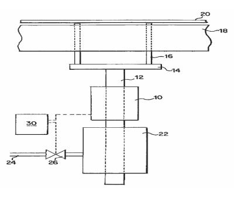

## 제품 기획보고서(사례)

| 제품 기획서                                         |       | 팀 명 작성자 일 자                          |                        | 년 월 | 일     |       |
|------------------------------------------------|-------|--------------------------------------------|------------------------|--------|-------|-------|
| 제품명                                            |       | 개발 제품이나 프로젝트명                              |                        |        |       |       |
| 검토 배경                                          |       | 제품 기획 목적 설명                                |                        |        |       |       |
| 제품 개요                                          |       | 목표 제품 설명(형상, 기능, 성능, 판매 예상 가격, 제품 예상 원가 등) |                        |        |       |       |
|                                                |       |                                            | 시장 분석                  |        |       |       |
|                                                | 목표 시장 | 필요 기술                                      |                        | 제품     |       | 경쟁사   |
|                                                |       |                                            |                        |        |       |       |
|                                                |       |                                            | 경제성 분석                 |        |       |       |
|                                                | 전체시장  | 예상 매출                                      |                        | 투자 내역  |       | ROI분석 |
| +24개월 또는 +36개월 전세계 시장 규모 매출액             |       |                                            | 기간, 인력, 설비 투자, 비용 등 |        | 이익 분석 |       |
| 기대 효과 전략적 가치, 기여 이익 등 기대 효과                 |       |                                            |                        |        |       |       |
| 제품 기획/프로젝트 성공을 위한 경영층 지원 요청 사항에 대해 정리 요청 사항 |       |                                            |                        |        |       |       |

| NCS학습모듈 개발이력 |                                      |     |                 |  |
|--------------|--------------------------------------|-----|-----------------|--|
| 발행일          | 2015년 12월 31일                        |     |                 |  |
| 세분류명         | 반도체개발(19030601)                      |     |                 |  |
| 개발기관         | 한국반도체산업협회, 한국직업능력개발원                 |     |                 |  |
|              | 이병철(㈜비드앤마이크로)*                       |     | 권태우(극동대학교)      |  |
|              | 김경섭(여주대학교)                           |     | 김병윤(전. 삼성전자㈜)   |  |
|              | 김문호(씨지아이파트너즈)                        |     | 민종수(엠텍비젼㈜)      |  |
|              | 안태원(동양미래대학교)                         |     | 이준성(인덕대학교)      |  |
|              | 유광동(전 동부하이텍)                         |     | 이호덕(㈜에이치디테크놀로지) |  |
|              | 이승은(서울과학기술대학교)                       |     |                 |  |
|              | 이제현(동양미래대학교)                         | 검토진 |                 |  |
| 집필진          | 이혁(㈜플렉스컴)                            |     |                 |  |
|              | 임종철(LG전자㈜)                           |     |                 |  |
|              | 임황규(성결대학교)                           |     |                 |  |
|              | 정종식(㈜e-wbm연구소)                       |     |                 |  |
|              | 천형용(충북반도체고등학교)                       |     |                 |  |
|              | 홍상진(명지대학교)                           |     |                 |  |
|              | 홍진균(전 ㈜LG실트론)                        |     | *표시는 대표집필자임     |  |
| 발행일          | 2018년 12월 31일                        |     |                 |  |
| 학습모듈명        | 반도체 제품 기획(LM1903060101_15v4)         |     |                 |  |
| 개발기관         | 한국직업능력개발원                            |     |                 |  |
| 집필진          | 홍진균(T2B파트너스)*                        |     | 김학동(대중금속공업고등학교) |  |
|              | 김상용(한국폴리텍대학)                         | 검토진 | 진종문(충북반도체고등학교)  |  |
|              |                                      |     | *표시는 대표집필자임     |  |
| 발행일          | 2024년 12월 31일                        |     |                 |  |
| 학습모듈명        | 반도체 제품 기획(LM1903060101_23v6)         |     |                 |  |
| 개발기관         | 수원과학대학교 산학협력단(개발책임자: 윤창용), 한국직업능력연구원 |     |                 |  |

| 반도체 제품 기획(LM1903060101_23v6)                                                                             |               |  |
|----------------------------------------------------------------------------------------------------------|---------------|--|
| 저작권자                                                                                                     | 교육부           |  |
| 연구기관                                                                                                     | 한국직업능력연구원     |  |
| 발행일                                                                                                      | 2024. 12. 31. |  |
| ※ 이 학습모듈은 자격기본법 시행령(제8조 국가직무능력표준의 활용)에 의거하여 개발하였으며, NCS통합포털사이트(http://www.ncs.go.kr)에서 다운로드 할 수 있습니다. |               |  |

