## LM1903060102\_23v5

# NCS학습모듈 반도체 아키텍처 설계

| 대분류/19 전기·전자 | 중분류/03 전자기기개발 | 소분류/06 반도체개발 | 세분류/01 반도체개발 |         |
|-----------------|------------------|-----------------|-----------------|---------|
|                 |                  |                 |                 | 능력단위/02 |

## [NCS학습모듈 활용 시 유의 사항]

- 1. NCS학습모듈은 교육훈련기관에서 출처를 명시하고 교육적 목적으로 활용할 수 있습니다. 다 만, NCS학습모듈에는 국가(교육부)가 저작재산권 일체를 보유하지 않은 저작물(출처가 표기된 도표‧사진‧삽화‧도면 등)이 포함되어 있으므로, 이러한 저작물의 변형‧각색‧복제‧공연‧ 배포 및 공중 송신 등과 이러한 저작물을 활용한 2차적 저작물을 작성하려면 반드시 원작자 의 동의를 받아야 합니다.
- 2. NCS학습모듈은 개발 당시의 산업 및 교육 현장을 반영하여 집필하였으므로, 현재 적용되는 법령‧지침‧표준 및 교과 내용 등과 차이가 있을 수 있습니다. NCS학습모듈 활용 시 법령 ‧지침‧표준 및 교과 내용의 개정 사항과 통계의 최신성 등을 확인하시기를 바랍니다.
- 3. NCS학습모듈은 산업 현장에서 요구되는 능력을 교육훈련기관에서 학습할 수 있게 구성한 자 료입니다. 다만, NCS학습모듈 지면의 한계상 대표적 예시(예: 활용도 또는 범용성이 높은 제 품, 서비스) 중심으로 집필하였음을 이해하시기를 바랍니다.

## NCS학습모듈의 이해

※ 본 NCS학습모듈은 「NCS 국가직무능력표준」사이트(http://www.ncs.go.kr) 에서 확인 및 다운로드할 수 있습니다.

## Ⅰ NCS학습모듈이란?

- 국가직무능력표준(NCS: National Competency Standards)이란 산업현장에서 직무를 수행하기 위해 요구되는 지식·기술·소양 등의 내용을 국가가 산업부문별·수준별로 체계 화한 것으로 산업현장의 직무를 성공적으로 수행하기 위해 필요한 능력(지식, 기술, 태도) 을 국가적 차원에서 표준화한 것을 의미합니다.
- 국가직무능력표준(이하 NCS)이 현장의 '직무 요구서'라고 한다면, NCS학습모듈은 NCS
  의 능력단위를 교육훈련에서 학습할 수 있도록 구성한 '교수·학습 자료'입니다. NCS학습
  모듈은 구체적 직무를 학습할 수 있도록 이론 및 실습과 관련된 내용을 상세하게 제시하
  고 있습니다.

## ○ NCS학습모듈은 다음과 같은 특징을 가지고 있습니다.

- 첫째, NCS학습모듈은 산업계에서 요구하는 직무능력을 교육훈련 현장에 활용할 수 있도 록 성취목표와 학습의 방향을 명확히 제시하는 가이드라인의 역할을 합니다.
- 둘째, NCS학습모듈은 특성화고, 마이스터고, 전문대학, 4년제 대학교의 교육기관 및 훈 련기관, 직장교육기관 등에서 표준교재로 활용할 수 있으며 교육과정 개편 시에도 유용하게 참고할 수 있습니다.

○ NCS와 NCS학습모듈 간의 연결 체계를 살펴보면 아래 그림과 같습니다.

O NCS학습모듈의 위치는 NCS 분류 체계에서 해당 학습모듈이 어디에 위치하는지를 한 눈에 볼 수 있도록 그림으로 제시한 것입니다.

| [NCS-학          | 습모듈              | 의 위치]    |          |  |
|-----------------|------------------|----------|----------|--|
|                 |                  |          |          |  |
| 대분류             | l분류 문화·예술·디자인·방송 |          |          |  |
| 중분류             | 문화콘텐츠            |          |          |  |
| 소분류             | 문화콘텐츠제작          |          |          |  |
|                 |                  |          |          |  |
| 세분류             |                  |          |          |  |
| 방송콘텐츠제작         |                  | 능력단위     | 학습모듈명    |  |
| 영화콘텐츠제작         |                  | 프로그램 기획  | 프로그램 기획  |  |
| 음악콘텐츠제작         |                  | 아이템 선정   | 아이템 선정   |  |
| 광고콘텐츠제작         |                  | 자료 조사    | 자료 조사    |  |
| 게임콘텐츠제작         |                  | 프로그램 구성  | 프로그램 구성  |  |
| 애니메이션 콘텐츠제작  |                  | 캐스팅      | 캐스팅      |  |
| 만화콘텐츠제작         |                  | 제작계획     | 제작계획     |  |
| 캐릭터제작           |                  | 방송 미술 준비 | 방송 미술 준비 |  |
| 스마트문화앱 콘텐츠제작 |                  | 방송 리허설   | 방송 리허설   |  |
| 영사              |                  | 야외촬영     | 야외촬영     |  |
|                 |                  | 스튜디오 제작  | 스튜디오 제작  |  |
|                 |                  |          |          |  |

학습모듈은

NCS 능력단위 1개당 1개의 학습모듈 개발 을 원칙으로 합니다. 그러나 필요에 따라 고용단위 및 교과단위를 고려하여 능력단위 몇 개를 묶어 1개 학습모듈로 개발할 수 있으며, NCS 능력단위 1개를 여러 개의 학습모듈로 나누어 개발할 수도 있습니다.

## 2. NCS학습모듈의 개요

## ○ NCS학습모듈의 개요는 학습모듈이 포함하고 있는 내용을 개략적으로 설명한 것으로

| 학습모듈의 목표 , 선수학습 , 학습모듈의 내용 체계 , 핵심 용어 로 구성되어 있습니다. |                                                                              |  |
|----------------------------------------------------|------------------------------------------------------------------------------|--|
| 학습모듈의 목표                                           | 해당 NCS 능력단위의 정의를 토대로 학습 목표를 작성한 것입니다.                                        |  |
| 선수학습                                               | 해당 학습모듈에 대한 효과적인 교수·학습을 위하여 사전에 이수해야 하는 학습모 듈, 학습 내용, 관련 교과목 등을 기술한 것입니다. |  |
| 학습모듈의 내용 체계                                     | 해당 NCS 능력단위요소가 학습모듈에서 구조화된 체계를 제시한 것입니다.                                     |  |
| 핵심 용어                                              | 해당 학습모듈의 학습 내용, 수행 내용, 설비·기자재 등 가운데 핵심적인 용어를 제 시한 것입니다.                   |  |

## 제작계획 학습모듈의 개요

#### 학습모듈의 목표

본격적인 촬영을 준비하는 단계로서, 촬영 대본을 획정하고 제작 스태프를 조직하며 촬영 장비와 촬영 소품을 준비할 수 있다.

#### 선수학습

제작 준비(LM0803020105\_13v1), 섭외 및 제작스태프 구성(LM0803020104\_13v1), 촬영 제작(LM0803020106\_13v1), 촬영 장비 준비(LM0803040204\_13v1.4), 미술 디자인 협의하기(LM0803040203\_13v1.4)

### 학습모듈의 내용체계

| 하스                | 하는 데이                                              | NCS 능력단위 요소       |                |  |
|-------------------|----------------------------------------------------|-------------------|----------------|--|
| 학습                | 학습 내용                                              | 코드번호              | 요소 명칭          |  |
| 1. 촬영 대본 확정하기  | 1-1. 촬영 구성안 검 토와 수정                             | 0803020114_16/3.1 | 촬영 대본 확정하기  |  |
| 2. 제작 스태프 조직하기 | 2-1. 기술 스태프 조직 2-2. 미술 스태프 조직 2-3. 전문 스태프 조직 | 0803020114_16v3.2 | 제작 스태프 조직하기 |  |
| 3. 촬영 장비 계획하기  | 3-1. 촬영 장비 점검 과 준비                              | 0803020114_16/3.3 | 촬영 장비 계획하기  |  |
| 4. 촬영 소품 계획하기  | 4-1. 촬영 소품 목록 작성 4-2. 촬영 소품 제작 의뢰         | 0803020114_16\3.4 | 촬영 소품 계획하기  |  |

## 핵심 용어

촬영 구성안, 제작 스태프, 촬영 장비, 촬영 소품

## 학습모듈의 목표는

학습자가 해당 학습모듈을 통해 성취해야 할 목표를 제시한 것으로, 교수자는 학습자 가 학습모듈의 전체적인 내용흐름을 파악하 도록 지도할 수 있습니다.

**6** • •

61

### 선수학습은

교수자 또는 학습자가 해당 학습모듈을 교 수·학습하기 이전에 이수해야 하는 교과목 또는 학습모듈(NCS 능력단위) 등을 표기한 것입니다. 따라서 교수자는 학습자가 개별 학습, 자기 주도 학습, 방과 후 활동 등 다 양한 방법을 통해 이수할 수 있도록 지도하 는 것을 권장합니다.

|            | 핵심 용어는              |
|------------|---------------------|
|            | 률을 대표하는 주요 용어입니     |
|            | · 해당 학습모듈을 통해 학습    |
|            | 게될 주요 내용을 알 수 있습    |
|            | 5 국가직무능력표준」 사이트     |
| (www.ncs.g | jo.kr)의 색인 (찾아보기) 중 |
| 하나로 이용할    | 할 수 있습니다            |

## 3. NCS학습모듈의 내용 체계

○ NCS학습모듈의 내용은 크게 학습, 학습 내용, 교수·학습 방법, 평가 로 구성되어 있습니다.

| 학습       | 해당 NCS 능력단위요소 명칭을 사용하여 제시한 것입니다. 학습은 크게 학습 내용, 교수·학습 방법, 평가로 구성되며 해당 NCS 능력단위의 능력단위 요소별 지식, 기술, 태도 등을 토대로 내용을 제시한 것입니다.                                                    |
|----------|----------------------------------------------------------------------------------------------------------------------------------------------------------------------------------|
| 학습 내용    | 학습 내용은 학습 목표, 필요 지식, 수행 내용으로 구성되며, 수행 내용은 재료·자 료, 기기(장비·공구), 안전·유의 사항, 수행 순서, 수행 tip으로 구성한 것입니다. 학습모듈의 학습 내용은 실제 산업현장에서 이루어지는 업무활동을 표준화된 프로세 스에 기반하여 다양한 방식으로 반영한 것입니다. |
| 교수·학습 방법 | 학습 목표를 성취하기 위한 교수자와 학습자 간, 학습자와 학습자 간 상호 작용이 활발하게 일어날 수 있도록 교수자의 활동 및 교수 전략, 학습자의 활동을 제시한 것입니다.                                                                            |
| 평가       | 평가는 해당 학습모듈의 학습 정도를 확인할 수 있는 평가 준거 및 평가 방법, 평 가 결과의 피드백 방법을 제시한 것입니다.                                                                                                         |

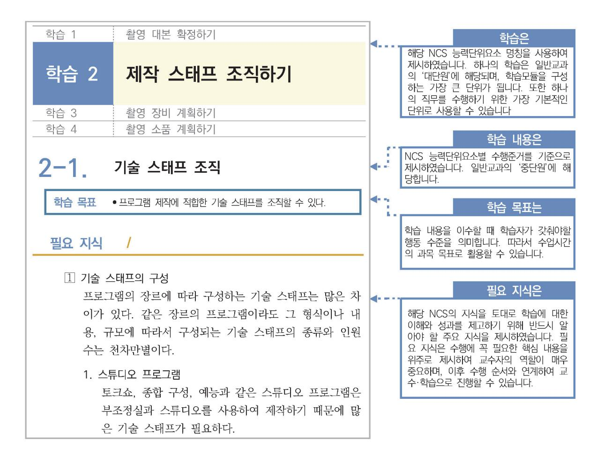

## [NCS-학습모듈의 위치]

| 대분류 | 전기전자 |        |       |
|-----|------|--------|-------|
| 중분류 |      | 전자기기개발 |       |
| 소분류 |      |        | 반도체개발 |

| 세분류 |  |
|-----|--|
|     |  |

| 반도체개발 |
|-------|
|-------|

| 반도체개발 | 능력단위             | 학습모듈명            |
|-------|------------------|------------------|
| 반도체제조 | 반도체 제품기획         | 반도체 제품기획         |
| 반도체장비 | 반도체 아키텍처 설계      | 반도체 아키텍처 설계      |
| 반도체재료 | 아날로그 회로 아키텍처 설계  | 아날로그 회로 아키텍처 설계  |
|       | 아날로그 회로 소자레벨 설계  | 아날로그 회로 소자레벨 설계  |
|       | 아날로그 회로 시스템 설계   | 아날로그 회로 시스템 설계   |
|       | 디지털 회로 설계        | 디지털 회로 설계        |
|       | 커스텀 레이아웃 적용공정 분석 | 커스텀 레이아웃 적용공정 분석 |
|       | 커스텀 레이아웃 설계      | 커스텀 레이아웃 설계      |
|       | 커스텀 레이아웃 검증      | 커스텀 레이아웃 검증      |
|       | 자동 배치배선 레이아웃 설계  | 자동 배치배선 레이아웃 설계  |
|       | 반도체 설계 검증        | 반도체 설계 검증        |
|       | 반도체 펌웨어 개발       | 반도체 펌웨어 개발       |
|       | 메모리 반도체 제조공정개발   | 메모리 반도체 제조공정개발   |
|       | 시스템 반도체 제조공정개발   | 시스템 반도체 제조공정개발   |
|       | 반도체 제조 단위공정개발    | 반도체 제조 단위공정개발    |
|       | 와이어본딩 패키지 개발     | 와이어본딩 패키지 개발     |

| 플립칩 패키지 개발       | 플립칩 패키지 개발       |
|------------------|------------------|
| 웨이퍼레벨 패키지 개발     | 웨이퍼레벨 패키지 개발     |
| 어드밴스드 팬아웃 패키지 개발 | 어드밴스드 팬아웃 패키지 개발 |
| 이종접합 패키지 개발      | 이종접합 패키지 개발      |
| 어드밴스드 언더필 패키지 개발 | 어드밴스드 언더필 패키지 개발 |
| 패키지 조립 공정 개발     | 패키지 조립 공정 개발     |
| 반도체 제품 기능·성능 검증  | 반도체 제품 기능·성능 검증  |
| 반도체 환경시험         | 반도체 환경시험         |
| 반도체 수명시험         | 반도체 수명시험         |
| 반도체 내성시험         | 반도체 내성시험         |

| 학습모듈의 개요              | 1  |  |  |
|-----------------------|----|--|--|
| 학습 1. 설계 사양 결정하기      |    |  |  |
| 1-1. 경쟁제품 분석 및 사양 결정  | 3  |  |  |
| 1-2. 반도체 공정 결정        | 15 |  |  |
| • 교수・학습 방법            | 28 |  |  |
| • 평가                  | 29 |  |  |
| 학습 2. 개발 절차 결정하기      |    |  |  |
| 2-1. 개발 계획 및 개발 방법 설정 | 31 |  |  |
| 2-2. 개발 일정 및 인원 계획 수립 | 41 |  |  |
| • 교수・학습 방법            | 45 |  |  |
| • 평가                  | 46 |  |  |
| 학습 3. 아키텍처 결정하기       |    |  |  |
| 3-1. 아키텍처 결정          | 48 |  |  |
| • 교수・학습 방법            | 59 |  |  |
| • 평가                  | 60 |  |  |
| 학습 4. 시스템 검증 계획 수립하기  |    |  |  |
| 4-1. 시스템 레벨 사양서 작성    | 62 |  |  |
| 4-2. 검증 시스템 결정        | 68 |  |  |
| 4-3. 동작 시나리오 확정       | 73 |  |  |
| • 교수・학습 방법            | 80 |  |  |
|                       |    |  |  |

|       |   | • 평가 | 81 |
|-------|---|------|----|
|       |   |      |    |
| 참고 자료 |   |      | 83 |
| 활용 서식 |   |      | 84 |
| 부     | 록 |      | 85 |

## 반도체 아키텍처 설계 학습모듈의 개요

## 학습모듈의 목표

고객의 요구 기능을 만족하는 반도체 제품을 설계하기 위해 상위수준의 모델을 구성하고 분석하여 설계 사 양을 정의하고, 이를 달성하기 위한 개발 절차와 반도체 공정을 고려한 시스템 레벨 디자인을 할 수 있다.

## 선수학습

아날로그 회로 설계(1903060103\_14v3), 디지털 회로 설계(1903060104\_14v3), 패키지 제품 설계 (1903060107\_14v3)

## 학습모듈의 내용체계

|                      |                       | NCS 능력단위 요소       |                   |
|----------------------|-----------------------|-------------------|-------------------|
| 학습                   | 학습 내용                 | 코드번호              | 요소 명칭             |
| 1. 설계 사양 결정하         | 1-1. 경쟁 제품 분석 및 사양 결정 | 1903060102_23v5.1 | 설계 사양             |
| 기                    | 1-2. 반도체 공정 결정        |                   | 결정하기              |
| 2. 개발 절차 결정하         | 2-1. 개발 계획 및 개발 방법 설정 | 1903060102_23v5.2 | 개발 절차 및 방법        |
| 기                    | 2-2. 개발 일정 및 인원 계획 수립 |                   | 결정하기              |
| 3. 아키텍처 결정하기         | 3-1. 아키텍처 결정          | 1903060102_23v5.3 | 아키텍처 결정하기         |
|                      | 4-1. 시스템 레벨 사양서 작성    |                   |                   |
| 4. 시스템 검증 계획 수립하기 | 4-2. 검증 시스템 결정        | 1903060102_23v5.4 | 시스템 레벨 사양 결정하기 |
|                      | 4-3. 동작 시나리오 확정       |                   |                   |

### 핵심 용어

설계 사양, 아키텍처(Architecture), 반도체 공정, 웨이퍼, 검증 시스템, 소프트웨어, 동작 시나리오, 데이터 시트

## 학습 1 설계 사양 결정하기

| 학습 2 | 개발 절차 결정하기     |
|------|----------------|
| 학습 3 | 아키텍처 결정하기      |
| 학습 4 | 시스템 검증 계획 수립하기 |

## 1-1. 경쟁제품 분석 및 사양 결정

|       | • 응용처의 사용 방법에 따라 반도체의 주요 규격을 분석할 수 있다.         |
|-------|------------------------------------------------|
| 학습 목표 | • 기존 반도체 제품의 규격을 통해 사양을 분석 및 비교할 수 있다.         |
|       | • 요구 사항에 따라 설계 하고자 하는 반도체 제품의 설계 사양을 결정할 수 있다. |

## 필요 지식 /

숔 반도체 제품 규격에 대한 이해

반도체 제품의 규격에는 필요한 역할을 하는 기능에 대한 부분과, 동작을 시키기 위한 조건인 전기적인 특성, 그리고 패키지 규격 등의 물리적인 특성으로 구분을 할 수 있다. 이 모든 정보 를 모두 포함하고 있는 것이 제품의 데이터시트이며, 반도체 제품 규격에 대한 정보를 얻기 위 해서는 데이터시트의 내용을 충분히 숙지해야 한다.

1. 기능에 대한 규격

기능에 대한 규격은 개발하려는 반도체 제품이 가지고 있는 각 기능들이 가지고 있는 역할 과 기능을 정량적으로 표현한 것을 의미하며, 이 규격이 모아지면 응용처에서 필요로 하는 기능에 대한 규격이 된다. 기능에 대한 규격에는 다음과 같은 내용이 포함된다.

(1) 전체 블록도

반도체 제품이 가지고 있는 여러 가지 기능들에 대해 전체를 정리해서 그림으로 표현한 것이며 전체 기능 블록에 대해서 쉽게 이해 할 수 있다.

(2) 내장된 프로세서와 메모리에 대한 규격 프로세서가 내장되어 있는 제품에는 프로세서의 이름, 동작 속도, 프로세서의 개수, 프로세서 의 내부 구조와 이 프로세서와 연결되는 메모리에 대한 상세 규격에 대한 내용이다.

(3) 내장된 메모리에 대한 규격

반도체 칩 내부에서 사용하는 메모리의 크기, 제어하는 방법 그리고 동작 속도 등에 대 한 규격으로 반도체 칩의 크기와 가격을 결정하는 중요한 항목이다.

(4) 기능 블록의 정의와 구현된 기능 블록의 표준 규격에 대한 호환성

각 기능 블록이 처리해야 하는 구체적인 기능 역할에 대한 내용으로 이것을 보면 각 기 능 블록이 처리하는 내용을 알 수 있다. 그리고 설계 기능들이 국내외 표준안에 따라 구현이 된 것이라고 하면, 그 표준안과 호환성에 대한 부분도 알 수 있다.

(5) 외부 부품과 통신할 수 있는 규격들

개발할 반도체 제품과 연결해서 동작하는 주변 부품들과 통신하기 위한 신호들의 규격 에 대한 정의를 포함하는 내용이다. 이것을 기준으로 외부 부품들과 어떤 신호들이 연결 되는지를 알 수 있다.

(6) 아날로그 IP의 규격

아날로그 IP(Intellectual Property, 반도체설계자산)가 내장 되어 있는 경우에는 아날 로그 IP의 기능에 대한 정의와 내부 또는 외부와 연결되는 신호선들의 규격이다. 아날로 그 IP의 신호가 패키지 핀을 통해 입력과 출력이 필요한 경우 그 신호선의 기능 및 특 성에 대한 내용을 확인할 수 있다.

2. 전기적인 규격

전기적인 특성에 대한 규격은 반도체 제품을 사용할 때 입력 전압, 동작 주파수, 소비 전 력, 출력 신호의 전압, 주변 온도에 대한 특성 등 전기적인 특성들을 의미한다. 전기적 규 격에 대해서는 다음과 같이 두 가지로 구분이 된다.

- (1) 동작 조건의 최대 허용 범위 (Absolute Maximum Ratings) 동작 조건에 대해서 반도체 제품이 견딜 수 있는 최대 범위에 대한 내용으로 이 값보다 큰 신호가 입력되거나 조건이 범위를 벗어나면 제품이 손상될 수 있다.
  - (가) 최대 입력 전압 : 최대 전압보다 높은 전압이 인가되면 제품이 파괴되므로 이를 방지하 기 위한 최대 입력 전압에 대한 규격
  - (나) 신호 입력 전압 : 반도체 칩이 견딜 수 있는 입력 신호들의 최대 크기 및 최소 크기에 대한 규격
  - (다) 출력 신호 규격 : 최대로 출력을 할 수 있는 신호의 크기와 속도에 대한 범위
  - (라) 보관 온도 조건 : 제품 보관할 때 제품에 자체에 영향을 주지 않는 최저, 최고 온도 범 위
- (2) 추천 동작 조건 (Recommended Operating Conditions) 반도체 제품이 정상적인 동작을 할 수 있는 범위를 규정한 것으로 이 범위를 벗어나는 경우 비정상적인 동작을 하므로 정상적인 결과를 얻을 수 없다.

- (가) 동작 입력 전압 : 정상 동작을 위한 전원의 전압 범위에 대한 규격
- (나) 입력 신호 규격 : 정상적인 동작을 하기 위한 입력 신호들의 최대 전압 레벨, 최소 전압 레벨과 최대 입력 가능한 동작 주파수에 대한 규격
- (다) 출력 신호 규격 : 추천 동작 조건에서 출력되는 신호들의 크기 및 속도에 대한 규격
- (라) 동작 온도 조건 : 정상적인 동작을 위한 최저 온도와 최고 온도에 대한 규격
- 3. 물리적인 규격

반도체 제품의 패키지 규격에 대한 내용과 제품 납품할 때 포장하는 규격 등에 대한 내용 이다. 한 개의 반도체 제품이라고 하더라도 최종 제품 사양에 따라 패키지 모양과 핀 개수 등을 다르게 만들 수 있으므로 이것에 대한 내용을 확인할 수 있다.

## 숕 반도체 제품의 사양

반도체 제품의 설계 사양은 개발하고자 하는 제품의 전체 기능과 세부 블록의 기능 및 전기적 인 특성에 대해서 정의를 하는 것이다. 따라서 설계 사양은 가능한 문서로 작성을 해서 그 내 용을 개발 담당자와 공유되어야 한다. 사양서는 가능한 명확하게 표현해서 아키텍처 설계 작업 을 할 때 오류가 발생하지 않도록 정확히 작성되어야 하며, 필요시 그림이나 사진을 추가하면 더 쉽게 이해할 수 있다. 아키텍처 설계에는 기능 블록에 대한 사양을 최대한 반영을 해주어야 한다. 반도체 제품의 사양을 좀 더 이해하기 쉽도록 노트북제품의 사양을 예를 들어서 설명 및 표현을 하면 다음과 같다.

1. 제품 설계 사양

제품이 가지고 있는 고유한 기능들에 대한 사양을 의미한다. 노트북을 예로 들어서 사양을 구분하여 작성하면 다음과 같다.

- (1) 프로세서 : 사용 프로세서 이름, 개수, 동작 속도(4 core, 2.5GHz)
- (2) 디스플레이 해상도 : 화면 해상도(1280x720 또는 1920x1080)
- (3) 저장 장치 : 하드 디스크 크기, SSD크기(500GB)
- (4) 시스템 메모리 : 메모리 종류 및 크기 (DDR3, 4GB)
- (5) 입력, 출력 단자 : 외부 인터페이스 단자(USB, HDMI, SD card)
- (6) 네트워크 : 무선 랜 규격 및 속도(802.11, 1Gbps)
- (7) 배터리 : 배터리 용량 및 전압
- 2. 기능 블록 사양

노트북 제품의 내부 기능들이 가지고 있는 기능 블록의 사양을 말한다.

(1) 프로세서 자체의 내부 구조 및 와 주변 연결 신호

- (2) 디스플레이 장치의 내부 상세 블록 및 외부 연결 신호
- (3) 디스플레이 데이터의 입력 신호의 규격
- (4) 저장장치의 인터페이스 신호
- (5) 시스템 메모리의 신호선 및 이와 연결되는 프로세서의 연결 신호
- (6) 입력, 출력 단자의 신호선 및 전기적인 규격
- (7) 네트워크 연결을 해주는 부품의 입력 출력 신호와 제어 신호들의 규격
- (8) 배터리와 연결되는 전원 신호
- 3. 전기적 사양
  - 전기적인 사양은 제품을 사용할 때 필요한 입력 전압, 동작 주파수, 소비 전력, 출력 신호 의 전압, 주변 온도에 대한 것을 의미하며, 예를 들어 표기를 하면 다음과 같다.
  - (1) 정격 전압 : 100 ~ 240V
  - (2) 동작 온도 조건 : 10도 ~ 35도
  - (3) 보관 온도 조건 : -25도 ~ 45도
  - (4) 소비전력 : 3KWh
  - (5) 배터리로 동작 가능한 시간 : 2시간
- 4. 물리적 사양
  - 물리적인 사양은 노트북 제품의 무게, 크기에 대한 내용이다.
  - (1) 무게 : 2Kg
  - (2) 크기 : 가로 x 세로 = 350mm x 260mm등

#### 숖 설계 요구 사항 파악

아키텍처 설계에 있어 설계 요구 사항의 파악은 매우 중요하다. 아키텍처 설계에 개발하고자 하는 제품에 대한 요구사항이 정확하게 반영이 되어야 하기 때문이다. 따라서 아키텍처 설계 담당자는 적용하고자 하는 응용처 및 제품 기획의 요구 사항들에 대해서 지속적으로 파악을 하 여야 한다. 아키텍처 설계 시점에 설계 요구 사항을 반영하여 진행하였더라도 제품 응용처의 상황에 따라 중간에 변경이 될 수도 있기 때문이다. 설계 요구 사항이 아키텍처 설계 진행 도 중에 변경이 되더라도 아키텍처 설계에 최대한 반영하여 진행하여야 한다.

1. 개발 제품에 대한 요구 내용 파악

반도체 제품을 필요로 하는 수요자 또는 제품 기획의 요구 사항에 대해 기능적인 내용을 파악하여 중요한 요구 사항부터 아키텍처 설계에 반영을 하여야 한다. 개발 제품에 대한 요 구 사항을 파악하기 위해서는 많은 조사와 정보가 필요하지만 일반적으로 다음과 같은 요

구 사항들에서부터 출발한다.

- (1) 기존에 없는 새로운 기능을 내장한 반도체 제품 개발 요구
- (2) 반도체 칩과 외부 부품 또는 다른 반도체 칩과 연결하는 신호선의 전기적인 규격과 이 신호 선을 통해서 송수신하는 데이터의 형식에 대한 새로운 규격 또는 표준을 내장한 반도체 제품 개발 요구
- (3) 기존 반도체 제품의 기능 및 성능을 개선하여 보다 많은 응용처에 적용할 수 있도록 하는 제 품 경쟁력 확보 요구
- (4) 응용보드에서 여러 개의 부품의 조합으로 기능 구성이 되어 있는 것을 주변 부품의 기능 전 부 또는 일부를 개발할 반도체 제품에 내장하여 필요한 부품의 개수를 줄이는 개발 요구
- (5) 기존 제품에서 불필요거나 사용하지 않는 부분을 제거하고, 기능 블록의 설계 회로의 크기를 줄여서 가격 경쟁력을 확보 할 수 있는 반도체 제품 개발 요구
- (6) 생산성 또는 신뢰성 향상을 위한 제품 개발 요구
- 2. 응용처에 대한 지식

제품 기획에서 결정된 사양에 따른 반도체 제품의 다양한 응용처에 대해서 이해하고, 응용 처 별로 기능을 정리하면, 경쟁제품과 비교 평가를 쉽게 할 수 있으며, 요구 사항 및 필요 기능들에 대한 사양을 결정하는데 도움이 된다.

- (1) 응용처 별로 필요한 기능, 불필요한 기능을 구분 한다.
- (2) 응용처 별로 요구되는 아날로그 기능에 대해서도 정리 한다.
- (3) 외부 부품과 연결되는 신호선 규격 및 송수신하는 데이터의의 표준 규격에 대해서도 정리 한 다.

## 수행 내용 / 경쟁제품 분석 및 사양 결정하기

재료·자료

- 설계 제품의 사양서
- 경쟁제품과 설계 제품의 사양 비교표
- 기능, 성능, 전기적 특성에 대한 기본 자료

기기(장비 ・ 공구)

해당 없음

안전 ・ 유의사항

설계할 반도체 제품이 사용되는 응용처에 대한 지식이 필요하다.

수행 순서

- 숔 응용처에서의 사용에 따른 반도체의 주요 규격을 분석한다.
  - 1. 응용처에 따른 기능을 정리한다.
    - (1) 응용처별로 사용하는 기능의 파악

응용처에서 사용하는 기능들을 파악하려면, 각 응용처별로 사용하는 기능에 대해서 조사 를 해야 한다, 조사를 하는 방법은 각 응용처에 직접 확인하여 조사를 하거나, 기존 제 품 또는 경쟁제품이 있다면 어떤 기능을 사용하는지 파악하여 그 내용을 분석하는 방법 이 가능하다. 어떤 방법을 사용하던지 가능한 정확한 정보를 가지고 파악을 해야 한다.

(2) 응용처별로 사용 기능 항목별 정리

제품 기획에서 완료된 기능 목표 명세서의 기능 항목을 참고하여 기능 항목별로 응용처 에서 사용하는 주요 기능을 정리한다. 응용처가 여러 개인 경우 각 응용처 별로 주요 기능을 정리하여, 공통적으로 필요한 기능, 각각의 응용처별로 필요한 기능과 불필요한 기능을 구분하여 정리한다. <표 1-1> 과 같이 정리를 하여 각 기능별로 "필수", "선택", "삭제"로 구분하여 아키텍처 설계에 반영 여부를 결정한다. 여기서 CPU(Central Processing Unit)는 중앙 처리 장치로 사용자 프로그램에 따라서 동작하는 유닛으로 칩 내부 다른 기능 블록을 제어 하는 기능을 포함하는 프로세서이다.

<표 1-1> 응용처별 기능 정리

| 주요기능       | 응용처 1 | 응용처 2 | 설계 반영 결정 |
|------------|-------|-------|----------|
| CPU        | 필요    | 필요    | 필수       |
| 기능 블록 1    | 필요    | 불필요   | 선택       |
| 기능 블록 2    | 불필요   | 필요    | 선택       |
| 기능 블록 3    | 필요    | 필요    | 필수       |
| 기능 블록 4    | 불필요   | 불필요   | 삭제       |
| 아날로그 IP 1  | 필요    | 필요    | 필수       |
| 아날로그 IP 2  | 불필요   | 필요    | 선택       |
| 아날로그 IP 3  | 필요    | 필요    | 필수       |
| 외부 연결 방법 1 | 필요    | 필요    | 필수       |
| 외부 연결 방법 2 | 필요    | 불필요   | 선택       |

2. 경쟁제품에 대한 사양 분석을 통해 비교표를 작성한다.

경쟁제품 또는 기존 제품과의 사양 분석을 하려면, 관련 자료를 입수해야 하는데 그 방법은 다음과 같으며, 입수된 사양, 데이터시트, 정보를 취합하여 비교표를 작성한다.

- (1) 제품 기획에서 작성된 기능 목표 명세서를 보고, 유사한 반도체 제품 또는 경쟁 제품이 있는 지를 조사하거나 제품 기획으로부터 정보를 전달받는다.
- (2) 경쟁제품 또는 유사한 반도체 제품의 사양서 및 데이터시트를 입수한다.
- (3) 인터넷 검색, 전시회, 세미나 등을 통해서 관련 제품의 정보를 입수한다.
- (4) 경쟁제품을 직접 시장에서 구입하여 분석한다.
- (5) 조사된 제품 사양서 또는 데이터시트를 참조하여 주요 기능 항목 정의한다.
- (6) 각 사양 항목별로 개발하고자 하는 제품과 경쟁제품을 비교하는 표를 작성한다. 작성한 예는 <표 1-2>와 같다.

<표 1-2> 제품 비교표

| 비교 항목                   | 설계할 제품          | 경쟁제품 A                 | 경쟁제품 B           |
|-------------------------|-----------------|------------------------|------------------|
| CPU                     | CPU_A           | CPU_B                  | CPU_A            |
| 최대 주파수                  | 96MHz           | 48MHz                  | 100MHz           |
| 내부메모리크기                 | 192KB           | 128KB                  | 128KB            |
| 저장 메모리크기                | 1MB             | 1MB                    | 1MB              |
| ROM                     | Boot ROM (8KB)  | -                      | -                |
| 외부메모리 I/F               | Yes (SRAM)      | Yes (SRAM/FLASH)       | Yes (SRAM/LCD)   |
| 시스템 버스                  | 32bit 시스템 버스    | 32bit 시스템 버스           | 32bit 시스템 버스     |
| DMA기능                   | 2개              | 1개                     | 1개               |
| Timer기능                 | 4개              | 2개                     | 4개               |
| PWM기능                   | 2개              | 2개                     | 2개               |
| RTC기능                   | 1개              | 1개                     | 2개               |
| Watchdog기능              | 1개              | 1개                     | 1개               |
| I2C기능                   | 3개              | 3개                     | 3개               |
| UART기능                  | 3개              | 2개                     | 3개               |
| USB2.0기능                | 1개              | 1개                     | 1개               |
| 저장장치                    | eMMC/SD/SDIO    | eMMC/SD/SDIO           | eMMC/SD/SDIO     |
| 인터넷 연결                  | 없음              | 없음                     | 1개               |
| 일반 입출력신호선            | 56개             | 50~93개                 | 51개              |
| Analog to Digital변환기 | 1개 (12bit, 8ch) | 1개 (12bit)             | 3개 (12bit, 24ch) |
| Digital to Analog변환기 | 없음              | 2개 (12bit)             | 2개 (12bit)       |
| LCD출력                   | 없음              | LCD                    | LCD              |
| 동작 전압                   | 1.08 ~ 1.32V    | 1.62 ~ 1.98V           | 1.08 ~ 1.32V     |
| 반도체 공정                  | 65nm            | 65nm                   | 90nm             |
| 패키지 종류                  | BGA-120         | QFP-64/100, BGA-120 | QFP64, BGA216    |

숕 사양 결정 및 사양서 작성하기

- 1. 요구 사항에 따른 주요 기능을 정리하고 블록도를 작성한다.
  - (1) 개발하고자 하는 반도체 제품의 주요 기능별로 정리를 한다.
  - (2) 주요 기능별로 정리된 내용을 반영하여 개발할 반도체 제품의 전체 블록도를 [그림 1-1]과 같이 작성한다.
  - (3) 전체 블록 도에는 주요 기능 블록 단위로 모두 표시가 되어야 하고, 각 기능 블록의 연결 상

- (4) 입력 데이터가 내부에서 처리되어 최종 출력이 되는 과정이 최대한 표시될 수 있도록 작성한 다.
- (5) 칩 내부에 있는 메모리는 각 메모리별로 연결되는 부분과 각 메모리의 크기가 표시 되어야
- 한다.
- (6) 외부에 연결되는 메모리가 있는 경우에는 그 메모리가 시스템 버스에 어떤 방법으로 연결이 되는지 표시 되어야 한다.
- (7) CPU가 내장되는 경우에는 CPU의 주요 사양과 함께 내부 시스템 버스에 연결되는 방법과 CPU가 사용하는 메모리가 표시 되어야 한다.

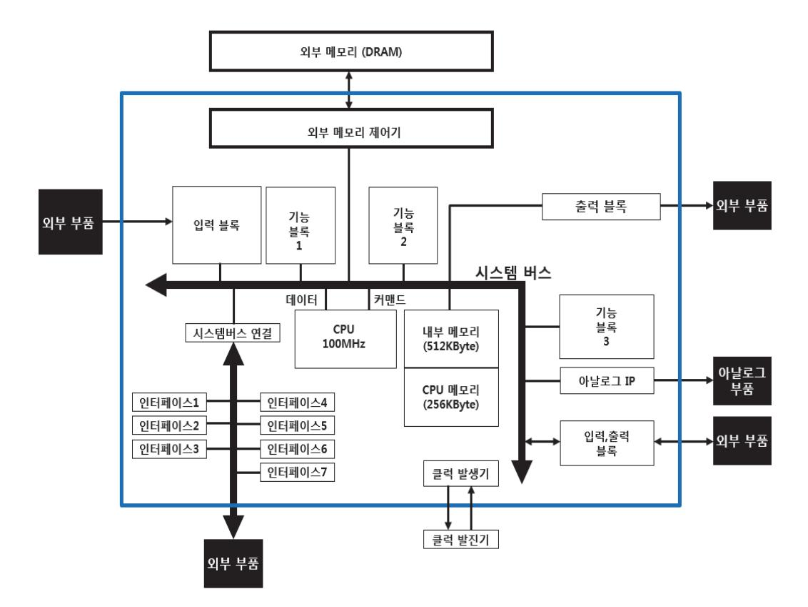

출처: 교육부(2018). 반도체 아키텍처 설계(LM1903060102\_14v3). 한국직업능력개발원. p.11 [그림 1-1] 전체 블록도의 예

- 2. 제작할 칩의 내부 배치 안을 작성한다.
  - (1) 각 블록의 배치는 데이터의 처리 순서 또는 흐름에 맞도록 배치를 한다.
  - (2) 내부 블록의 크기를 조사하여, 가능한 물리적인 크기에 비례하도록 작성한다.
  - (3) 아날로그 IP들은 전기적 노이즈의 영향을 최소화하기 위해 빠른 동작을 하는 블록과 분리해 서 배치한다.

11

(4) 외부 연결을 고려하여 기능 블록의 신호가 외부와 바로 연결이 될 수 있도록 배치한다. (5) [그림 1-2]와 같이 작성된 배치 안은 추후 회로 배치(layout) 작업에 참고 자료로 활용한다.

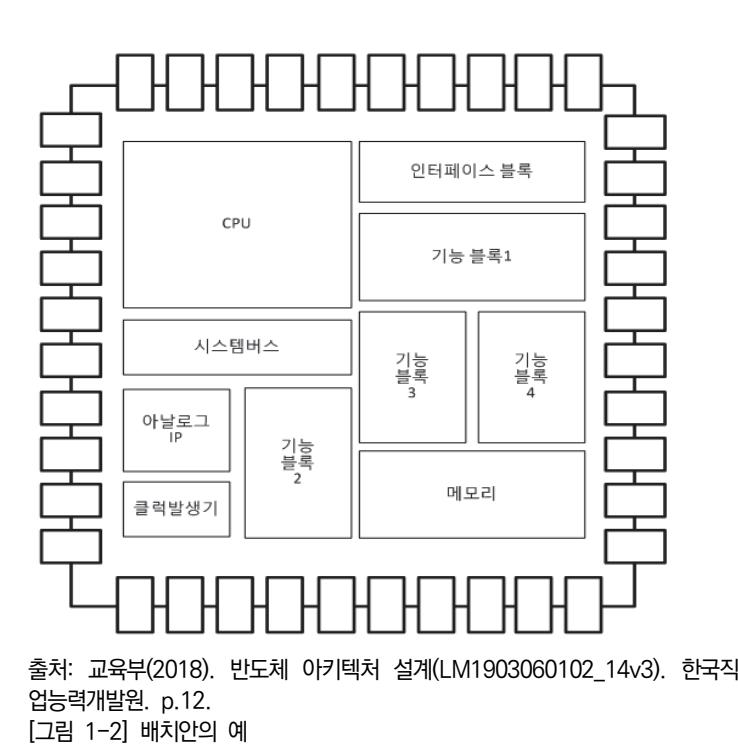

- 3. 물리적인 규격을 작성한다.
  - (1) 최종적으로 만들어지는 모양은 패키지이므로 패키지 사양에 대한 내용을 작성한다. 패키지의 가로, 세로의 크기와 핀의 개수 그리고 핀이 배치되는 형태에 대한 내용이 포 함된다. 핀 개수는 외부와 연결되는 신호선의 개수와 전원 공급을 위한 핀 개수를 포함 해서 결정을 해야 하며, 핀의 위치에 대해서는 내부 배치 안을 참고하여 작성한다. 패키 지에 대한 규격의 예로 [그림 1-3]을 참고한다.

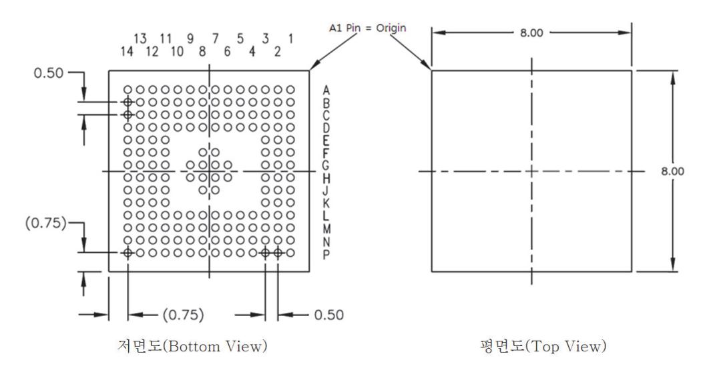

출처: 교육부(2018). 반도체 아키텍처 설계(LM1903060102\_14v3). 한국직업능력개발원. p.12. [그림 1-3] 패키지 규격에 대한 저면도와 평면도

4. 개발할 반도체 제품의 사양서를 작성한다.

제품의 사양서는 개요, 주요 기능 및 블록도, 경쟁제품 비교 그리고 물리적인 사양에 대한 내용이 포함된다. (부록 참조)

(1) 개요

아키텍처 설계에 대한 내용으로 기능 블록 설계자가 이해하기 쉽도록 작성하는데 어떤 기능들이 포함이 되는지 기능 블록도를 작성한다.

(2) 주요 기능 및 블록도

개발하는 칩의 기능 블록을 구분하고, 각 기능 블록의 상세 내용을 작성한다. 그리고 아 키텍처 설계한 것을 반영한 전체 블록도를 포함한다.

(3) 전기적 사양

동작을 시키기 위해 필요한 전원전압의 종류와 그 레벨을 인터페이스, 칩 내부를 구분해 서 작성한다.

(4) 물리적 사양

패키지의 형태에 대한 내용과 핀의 개수를 정의한 내용이다.

(5) 경쟁제품 비교

경쟁제품과 비교한 테이블을 작성하는데, 학습 1에서 기술한 내용과 같이 주요 항목에 대해서 비교하여 작성한다.

수행 tip

- 반도체 제품의 사양의 결정은 제품기획에서 작성된 기능 목표 명세서를 기준으로 하여 진행한다.
- 주요 경쟁제품의 분석은 비교 테이블 작성을 통해서 진행 한다.

## 1-2. 반도체 공정 결정

학습 목표 • 설계 사양에 따라 반도체 공정에 대한 타당성을 확인할 수 있다.

## 필요 지식 /

숔 반도체 공정의 종류

반도체 공정은 제조 장비의 발달과 회로의 집적도화 기술 그리고 반도체 재료에 대한 기술이 발달함에 따라 다양한 공정이 개발되었다.

1. 반도체 집적도에 따른 공정

반도체의 집적도는 [그림 1-4]과 같이 CMOS 회로 소자의 게이트(Gate) 역할을 하는 메탈 게이트(metal-gate)의 선폭(width)에 따라 구분을 한다. CMOS는 'Complementary Metal Oxide Semiconductor'의 약자로 서로 반대되는 특성을 가진 NMOS와 PMOS의 2개의 소자로 이루어진 회로 소자이고, 게이트(Gate)는 CMOS의 기본신호 중 하나로 Source와 Drain간의 연결을 On/Off하는 제어를 한다.

- (1) 메탈 게이트의 선폭이 0.35um, 0.25um과 같이 집적도가 낮은 공정도 개발되어 양산을 하 였지만, 현재는 특수한 경우를 제외하고는 0.13um이하의 공정을 많이 사용한다. 마이크로미 터(um)는 (1/1,000,000)미터로 10E-6m 또는 um로 표기한다.
- (2) 0.13um이하의 공정에는 90/80nm, 65nm, 45/40nm, 32nm/28nm, 22/20nm, 16/14nm가 있으며, 각 공정을 제공하는 회사에 따라서 각 공정의 선폭이 조금씩 다르다. 나노미(nm)는 (1/1000)마이크로미터로 10E-9m 또는 nm로 표기한다.
- (3) [그림 1-4]와 같이 메탈게이드(Metal Gate)의 폭(width)을 기준으로 공정의 집적도를 구분 한다.

### 숕 반도체 공정 제공 회사별 비교

반도체 공정을 제공하는 회사는 설계부터 공정, 생산, 판매까지 모든 과정을 독자적으로 수행 하는 종합 반도체 회사와 팹리스(Fabless) 업체에서 주문을 받아 자체 공정을 사용하여 반도체 제품만 위탁 생산해주는 파운드리 회사로 구분이 된다. 팹리스(Fabless)업체는 반도체 공정 (Fab)을 가지고 있지 않고, 반도체 회로 설계를 전문으로 하고, 만들어진 반도체 제품을 판매 를 전문으로 하는 업체를 말한다. 파운드리 산업 규모는 매출액 기준으로 2013년 400억 달러, 2014년에는 440억 달러 수준이었고, 2018년에는 520억 달러로 예상이 되고 있다. (출처: 파 운드리 산업분석, 시스템반도체 part 1, 5page 메리츠종금증권 리서치센터, ,2014.5.15.).

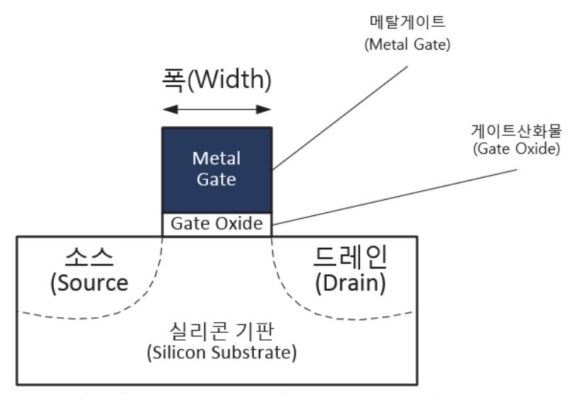

출처: 교육부(2018). 반도체 아키텍처 설계(LM1903060102\_14v3). 한국직업능력개발원. p.15. [그림 1-4] CMOS의 구조

- 1. 종합 반도체 회사(IDM: Integrated Device Manufacturer)의 특징
  - (1) 칩 설계에서 제조 및 테스트까지 일관공정체제 구축
  - (2) 메모리 제조를 하는 형태에서는 가장 성숙한 모델
  - (3) 기술력과 규모의 경제를 통한 경쟁 확보 가능
  - (4) 거대투자의 고위험 고수익 형태
  - (5) 대표적인 회사: Intel, 삼성전자, SK하이닉스, TI, STMicro, Infineon 등
- 2. 파운드리(Foundry) 회사의 특징
  - (1) 반도체 공정과 제조 설비를 가지고 위탁 생산을 전문으로 하는 회사
  - (2) 반도체 공정(Fab)을 가지고 있지 않고, 반도체 회로 설계를 전문으로 하고, 만들어진 반도체 제품을 판매를 전문으로 하는 회사인 팹리스 업체의 주문에 의한 생산을 위탁 받아서 반도체 칩을 생산하는 회사
  - (3) 대표적인 회사: TSMC, UMC, SMIC, Global Foundries, TowerJazz, Vangard, 동부하이 텍, 매그나칩 등

숖 반도체 공정 선정

반도체 공정의 선정을 위해 개발하고자 하는 반도체 제품의 특성 중에서 반도체 공정에 관련되

는 항목에 대하여 조사를 한다. 반도체 공정은 그 집적도에 따라서 성능 및 특성이 다르므로 목표 성능을 구현할 수 있는 반도체 공정을 선정하는 것이 매우 중요하다.

1. 공정 선택을 위한 사전 조사

개발하려는 제품의 특성에 맞는 반도체 공정을 선택하기 위해 사전 조사를 한다.

- (1) 사전 조사 내용
  - (가) 필요한 공정의 집적 수준 확인

개발하는 반도체 제품의 성능 목표를 달성하기 위한 공정의 집적도가 어느 수준으로 필요한지 확인한다. 이를 위해서 성능 목표에 대한 확인을 하고, 이를 바탕으로 공정 의 집적도를 결정한다. 또한 경쟁제품이 주로 사용하는 공정의 집적도에 대해서도 조사를 한다. 사용할 공정의 집적도(예, 45nm, 65nm, 90nm등)가 결정되면, 결정된 공정을 가지고 있는 반도체 제조업체들을 조사한다.

(나) 공정별 단위 소자의 특성 확인

(가)에서 조사한 반도체 제조업체들을 대상으로 각 공정별로 단위 소자의 특성에 대 해 조사를 한다.

(다) 아날로그 IP의 지원 여부 확인

개발 제품에 아날로그 IP(Intellectual Property, 반도체설계자산)가 필요하다면, 아 날로그 IP를 제공하는 반도체 공정을 확인해야 한다. 아날로그 IP는 공정에 따라서 그 회로 및 구조가 다르므로 각 공정별로 준비가 되어 있어야 한다. 또한 양산 검증 이 되어 있어야 바로 사용 가능하다.

(라) 파운드리 회사의 공정과 종합 반도체 회사의 비교

파운드리 반도체 회사의 공정과 종합 반도체 회사의 공정에서 지원이 되는 내용을 비교하여 파악을 한다.

2. 공정 결정의 기준

공정을 결정하는데 다음과 같은 항목을 기준으로 하여 결정한다.

(1) 개발 제품의 특성 반영

개발하려는 반도체 제품의 예상되는 회로의 크기와 최대 동작 주파수를 맞출 수 있는 공정으로 결정한다. 집적도가 높은 공정일수록 동작 주파수는 높아지고, 같은 면적에 많 은 회로를 넣을 수 있으나, 투자비용은 많아진다.

(2) 아날로그 IP의 양산 여부

사용할 예정인 아날로그 IP(Intellectual Property, 반도체설계자산)들이 공정에서 제공 이 가능한지 여부와 양산에 적용한 IP인지 확인한다. 아날로그 IP는 같은 기능을 가지 고 있더라도 반도체 공정별로 그 특성이 차이가 있으므로 양산 적용 여부를 확인하여 반도체 공정에서 검증된 아날로그 IP인지를 확인해야 한다.

(3) 웨이퍼 당 칩의 개수

웨이퍼(Wafer)는 반도체 칩을 제조하는데 기본 판이 되는 것으로 실리콘기판이라고도 하며, 설계된 반도체 회로가 웨이퍼 위에 구현된다. 원판형태로 만들어지며, 지름의 길 이에 따라 8인치(200mm), 12인치(300mm)등으로 구분된다. 정해진 크기의 웨이퍼를 사용하므로 개발하는 반도체 칩의 회로의 크기에 따라서 1장의 웨이퍼에서 생산되는 개 수가 달라진다. 이것을 확인하기 위해 1장의 웨이퍼에서 몇 개의 제품이 만들어질 수 있는지 필요한 정보를 수집하여 예측을 한다.

(4) 개발 일정

각 회사별 공정 또는 집적도에 따라 반도체 칩의 제조 기간이 다르므로 전체 제품 개발 일정을 최대한 맞출 수 있는 공정을 선택한다.

(5) 반도체 공정 사용 비용

각 회사별 공정 또는 집적도에 따라 투자하는 비용이 다르므로 개발 비용을 고려한 결 정을 한다.

(6) 종합반도체 회사와 파운드리 회사

사용할 공정 및 사용할 IP의 제공 조건에 따라 종합 반도체 회사를 이용하는 방법과 파 운드리 회사를 이용하는 방법이 있으므로 장단점을 비교한다.

### 숗 웨이퍼상의 배치 및 면적의 구성요소

개발할 반도체 제품의 원가 계산 및 설계 회로의 크기와 면적을 확인하기 위해 웨이퍼상에서 설계 회로의 면적을 확인하는 것이 필요하다. 웨이퍼상에서 면적의 구분은 크게 회로소자들의 면적, 메모리의 면적, 아날로그 IP(Intellectual Property, 반도체설계자산)들의 면적, 단위 회 로 소자들 간의 연결을 위한 면적과 외부 신호선을 연결해주는 입력, 출력을 위한 PAD면적으 로 구분이 된다. 설계 단계에서부터 회로의 크기를 줄이는 노력을 해서 웨이퍼상에서의 면적이 최소화 되도록 해야 한다.

- (1) 웨이퍼상에서의 차지하는 면적 항목
  - (가) 기능 블록 회로의 면적

기능 구현을 위해 RTL설계로 만들어진 회로 자체의 전체 면적으로 각 기능 블록별 로 모아서 배치를 하게 되므로 기능 블록별로 회로의 크기를 구분하여 정리하는 것 이 필요하다. 실제로 웨이퍼 위에 회로들을 배치할 때는 그림 1-5와 같이 기능 블록 별로 모아서 배치하는 것이 효율적이다.

(나) 메모리 면적

기능 블록 내부의 메모리들이 차지하는 면적을 확인하기 위해서 각 기능 블록에서 사용하는 메모리를 정리해서 반도체 공정에서 제공하는 크기를 사용한다.

(다) 아날로그 IP의 면적

개발 제품에서 사용하는 아날로그 IP(Intellectual Property, 반도체설계자산)들의 면적의 합으로 반도체 공정에서 제공하는 정보를 확인하면 알 수 있다.

(라) 단위 소자들을 연결하는 신호선 면적

기능 구현에 필요한 단위 회로 소자들을 연결하는 신호선이 차지하는 면적의 합으로 각 기능 블록내부 단위 소자 사이의 연결과 기능 블록 간의 연결 그리고 PAD와 연 결하기 위한 면적 등이 포함된다.

(마) 외부 신호선을 연결하는 입력/출력 PAD의 면적

내부 회로와 외부 부품 간에 연결되는 신호선들은 반도체 칩의 내부와 외부를 연결 해주는 PAD소자를 통해서 패키지 핀과 연결된다. 즉, 외부와 연결되는 신호 선들은 모두 PAD를 통해서 입력, 출력이 되므로 이 PAD들의 전체 면적도 포함이 되어야 한다. PAD면적은 반도체 공정별로 다르므로 반도체 공정 정보에서 확인한다.

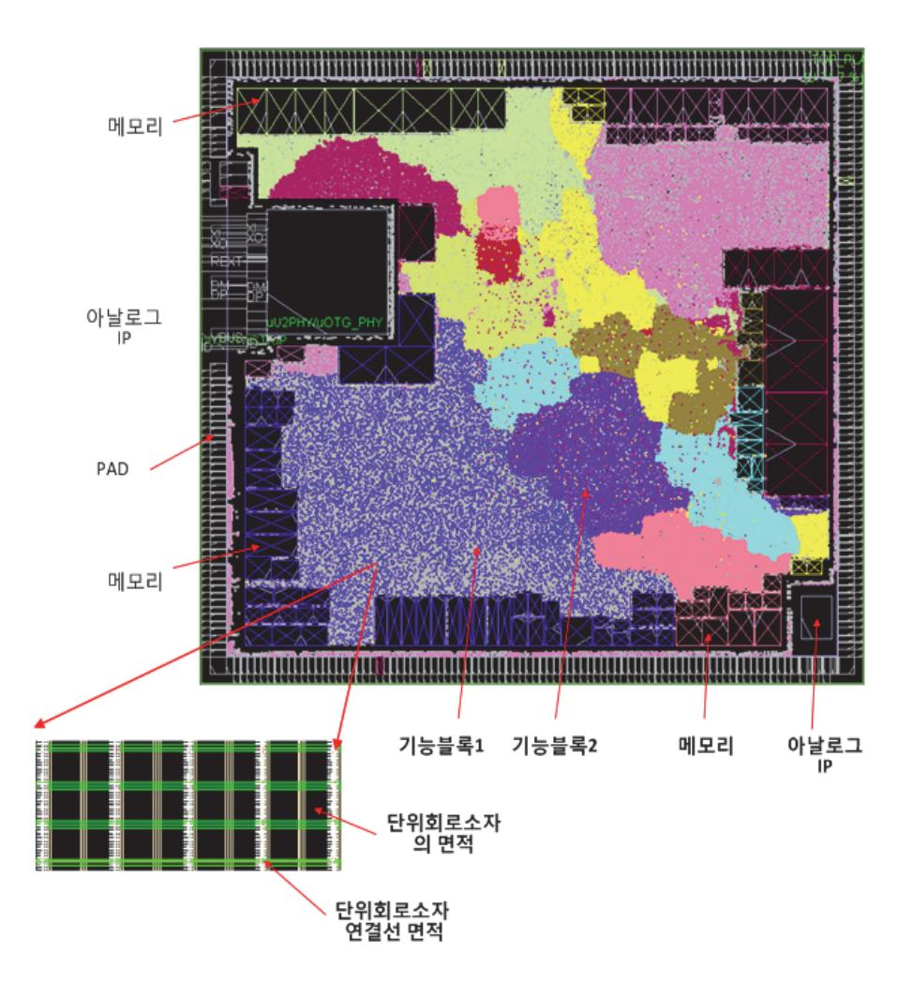

출처: 교육부(2018). 반도체 아키텍처 설계(LM1903060102\_14v3). 한국직업능력개발원. p.18. [그림 1-5] 칩 면적의 구성 요소

(2) 웨이퍼상의 제품 개수 확인

[그림 1-5]는 웨이퍼상에서의 칩 하나의 면적에 해당하는 것이다. 즉, 웨이퍼에서 칩 1 개의 영역만을 보여준 것이며, 칩 1개의 면적이 어떤 부분들로 구성이 되어 있는지를 알 수 있다. 각 항목의 면적을 전부 더한 값이 칩 1개의 면적이 되며, 이 값으로 웨이 퍼의 전체 면적을 나누기를 하면 웨이퍼 1장에서 몇 개의 반도체 제품이 만들어지는지 확인이 가능하다. 이것을 식으로 표현하면 다음과 같다.

제품의 개수 = 웨이퍼의 면적 / 개발 제품의 1개의 면적

여기서 웨이퍼의 면적은 지름의 길이에 따라 8인치(=200mm), 12인치(=300mm)등으로 구분된다.

## 수행 내용 / 반도체 공정 결정하기

#### 재료·자료

- 반도체 공정별 기초 데이터 (단위 소자 크기, 소비전력, 아날로그 IP등)
- 설계 블록별 사용 IP(Intellectual Property, 반도체설계자산) 및 기능 설명서 및 특성에 대 한 정보
- 각 기능 블록에서 필요로 하는 메모리의 종류와 각각의 면적에 대한 정보

기기(장비 ・ 공구)

해당 없음

안전 ・ 유의사항

반도체 설계 툴(tool)과 반도체 공정에 대한 기본적인 지식을 필요로 한다.

수행 순서

숔 개발 제품의 제조 원가 및 제조 일정을 고려하여 사용할 공정 후보 선정하기

- 1. 각 후보 공정에서 반도체 칩을 제작하는데 필요한 일정을 확인한다.
- 2. 공정별 필요비용을 파악한다.
- 3. 제작될 반도체 제품의 원가에 대한 기준을 관련 부서와 협의한다.
- 4. 제품 원가는 반도체 공정을 사용하는 비용, 반도체 웨이퍼 가격, 패키지 제작 비용, 기타 비용이 포함된다.
- 5. 반도체 공정 사용 비용, 웨이퍼 가격, 패키지 제작 비용은 반도체 공정별로 그 가격범위가 어느 정도 정해져 있으므로 평균적인 비용을 참고 한다. 웨이퍼의 가격은 웨이퍼의 크기가 8인치, 12 인치인지에 따라 편차가 많이 있으므로 어느 것으로 할지 결정이 필요하다.
- 6. 반도체 제품은 개발하는 칩의 크기에 따라서 1장의 웨이퍼에 수백 개 또는 수천 개가 생산 될 수 있다. 따라서 개발하는 제품 자체의 원가를 알기 위해서는 웨이퍼 1장당 생산가능한 칩의 개 수가 몇 개인지 예측이 필요하다. 웨이퍼 1장의 가격을 생산되는 제품의 개수로 나누어 주면 칩 1개의 원가를 알 수 있다. 이것을 계산하려면 개발하려는 반도체 칩의 면적을 예측할 수 있어야 하므로 이것에 필요한 자료를 수집한다.
- 7. 반도체 공정에서 제작 일정 및 제작비용도 고려하여 결정한다.

숕 사용 가능한 후보 공정들의 특성 파악하기

- 1. 반도체 제조 공정의 현재 상태를 파악한다. 현재 양산을 하고 있는 상태인지, 제조 공정상의 문제점은 무엇이 있었는지 등에 대해서 공 정의 현재 상황을 파악한다.
- 2. 공정별 단위 소자의 특성을 <표 1-3>과 같이 작성한다.
  - (1) 각 공정에서의 단위 소자의 물리적인 실제 크기를 파악하여 비교한다.
  - (2) 각 공정에서의 단위 소자의 동작 속도에 대해서 파악하여 비교한다.
  - (3) 단위 소자의 동작 전압, 입력/출력 속도에 대해서 파악하여 비교한다.

<표 1-3> 공정별 단위 소자의 특성(예시)

| 구 분       | 공정  | 면적 (um^2) | 동작전압      | 전달속도          | 동작 속도  |
|-----------|-----|-----------|-----------|---------------|--------|
| 2 input   | 공정A | 1.6 x 0.8 | 1.2V      | 0.023nse c | 200MHz |
| NAND      | 공정B | 1.4 x 0.8 | 1.2V      | 0.035nse c | 200MHz |
| I/O (PAD) | 공정A | 50 x 120  | 1.2V/3.3V | 1.93nsec      | 100MHz |
|           | 공정B | 55 x 75   | 1.2V/3.3V | 1.48nsec      | 100MHz |

- 3. 각 공정에서 제공하는 메모리 생성기의 특징을 파악하여 원하는 형태의 메모리가 생성이 가능한 지 여부와 그 면적을 파악한다.
- 4. 각 공정에서의 반도체 칩의 제작 기간을 파악하여 비교한다.
- 5. 외부와 연결이 되는 IO에 대한 특성을 파악한다.
- 6. PAD의 크기, 입력 전압, PAD의 전달 속도 등 대해서도 파악하여 비교를 한다.
- 7. 각 공정에서의 반도체 공정의 사용 비용 및 웨이퍼 가격을 비교한다.

숖 사용되는 아날로그 IP들의 특성 및 반도체 공정에서 양산 이력 여부 확인하기

- 1. 개발에 필요한 아날로그 IP(Intellectual Property, 반도체설계자산)가 사용하고자 하는 공정에서 양산한 제품에 사용되었는지를 확인한다. 이것을 확인하는 목적은 아날로그 IP의 특성이 기능은 똑같더라도 공정별로 그 특성에 차 이가 있어서 각 공정에서 아날로그 IP가 검증이 되어 양산을 했는지를 파악하여 공정 결정 에 참고 하려는 것이다.
- 2. 사용할 아날로그 IP의 종류와 주요 특징을 파악한다. <표 1-4>와 같이 파악할 내용은 면적, 동작 전압, 소비 전류, 동작 속도 등이 있다.

| 아날로그 IP   | 공정  | 면적 (um^2) | 동작전압          | 소비 전류 | 동작 속도  | 양 산 |
|-----------|-----|--------------|---------------|----------|-----------|--------|
|           | 공정A | 498,000      | 1.2V          | 40mA     | 50M Hz | 0      |
| 아날로그 IP_1 | 공정B | 490,000      | 1.1V          | 30mA     | 70M Hz | 0      |
|           | 공정A | 340,000      | 1.2V/3 .3V | 35mA     | 50M Hz | Х      |
| 아날로그 IP_2 | 공정B | 300,000      | 1.1V/3 .3V | 30mA     | 60M Hz | 0      |

〈표 1-4〉 공정별로 아날로그 IP의 특성 비교(예시)

- ④ 설계할 회로의 예상 면적을 계산하여 확인하기
  - 1. 설계할 회로와 도입 IP의 예상되는 크기를 파악한다.
    - (1) 개발할 회로의 크기(면적)를 예측하기 위하여 면적에 관련된 설계 데이터를 수집한다.
      - (가) 예상되는 회로의 크기와 최대 동작 속도에 대해서 각 설계 담당자와 IP제공 업체로부터 수집한다.
      - (나) 예상되는 회로의 크기는 설계 진행 중이므로 최종 회로가 아니더라도 예측되는 크기로 진행한다.
      - (다) 수집된 각 설계 블록의 회로의 크기를 〈표 1-5〉와 같이 정리하는데, 단위 소자 개수 (Gate Count)기준으로 예상되는 회로의 크기를 표시한다. 회로의 단위 소자는 2개의 입력을 가지고 있는 NAND2 셀 1개를 단위 소자로 하여 Gate 1개로 한다. 각 설계 블록 회로의 크기를 NAND2의 개수로 환산하여 몇 개 Gate Count로 표시한다.
      - (라) 전체 회로의 예상 단위 소자의 개수인 gate count가 수집이 되었으면 각 후보 공정에서 제공하는 단위 소자의 면적을 이용하여 면적으로 환산하여 〈표 1-6〉과 같이 비교한다. 즉, 단위 소자가 차지하는 면적이 1.6um x 0.8um라고 한다면, 이 면적에 단위 소자의 개수를 곱하면 회로가 차지하는 면적이 된다.

| 구 분             | 설계 블록 이름 | 회로 크기(Gate) | 최대 동작 속도 |  |
|-----------------|----------|-------------|----------|--|
|                 | 설계 블록_1  | 10,000      | 100MHz   |  |
|                 | 설계 블록_2  | 100,000     | 100MHz   |  |
| 설계 블록 및         | 설계 블록_3  | 135,000     | 50MHz    |  |
| 도입 IP           | 설계 블록_4  | 200,000     | 25MHz    |  |
|                 | 도입 IP_1  | 200,000     | 100MHz   |  |
|                 | 도입 IP_2  | 300,000     | 48MHz    |  |
| 합계 (gate count) |          |             |          |  |

〈표 1-5〉 예상되는 각 블록별 회로의 크기(예시)

〈표 1-6〉 공정별로 회로 면적 계산(예시)

| 공 정  | 단위 소자의 면적 (um) | 전체 면적(um ^2 ) | 최대 동작 주파수 |
|------|-------------------|--------------------------|-----------|
|      |                   | 945,000 x 1.6 x          |           |
| 공정 A | 1.6 × 0.8         | 0.8                      | 100MHz    |
|      |                   | = 1,209,600              |           |
|      |                   | 945,000 x 1.4 x          |           |
| 공정 B | 1.4 × 0.8         | 0.8                      | 100MHz    |
|      |                   | = 1,058,400              |           |

- 2. 설계에서 사용되는 내부 메모리의 종류와 크기를 확인한다.
  - (1) 반도체 공정에서 제공하는 메모리 생성기를 이용하여 실제 메모리의 면적에 대한 정보를 (표 1-7)과 같이 공정별로 수집한다.
  - (2) 가능하면 집적도가 동일한 공정에서 비교를 실시한다. 즉, 65nm공정이면 A사의 65nm공정 과 B사의 65nm공정을 비교를 한다는 의미이다. 공정 집적도가 다른 경우에는 좀 더 미세 공정으로 그 면적을 환산을 해서 비교하면 된다.
  - (3) 전체 메모리의 면적을 공정별로 계산을 하여 비교 테이블을 (표 1-8)과 같이 만들어서 비교 한다. 공정 A와 공정 B를 비교한 결과 공정 B에서 메모리 면적이 작음을 확인할 수 있다.

| 메모리      | 공정      | 면적 (um^2) | 개수 | 전체크기    | 동작 속 도  | 양산 |
|----------|---------|--------------|----|---------|------------|----|
| SRAM_1   | 공정 A | 157,500      | 2  | 315,000 | 100M Hz | 0  |
|          | 공정 B | 141,800      | 2  | 283,500 | 90MH z  | 0  |
| 00.000   | 공정 A | 420,000      | 2  | 840,000 | 100M Hz | 0  |
| SRAM_2   | 공정 B | 378,000      | 2  | 756,000 | 90MH z  | 0  |
| Buffer_1 | 공정 A | 50,000       | 3  | 150,000 | 100M Hz | 0  |
|          | 공정 B | 55,000       | 3  | 165,000 | 90MH z  | 0  |
| Duffer 2 | 공정 A | 30,000       | 2  | 60,000  | 100M Hz | 0  |
| Buffer_2 | 공정 B | 40,000       | 2  | 80,000  | 90MH z  | 0  |
| Buffer_3 | 공정 A | 80,000       | 3  | 240,000 | 100M Hz | 0  |
|          | 공정 B | 90,000       | 3  | 270,000 | 90MH z  | 0  |
| SRAM_3   | 공정 A | 300,000      | 1  | 300,000 | 100M Hz | 0  |
|          | 공정 B | 350,000      | 1  | 350,000 | 90MH z  | 0  |

〈표 1-7〉 공정별로 메모리의 면적(예시)

〈표 1-8〉 공정별로 메모리 전체 면적 비교(예시)

| 공정   | 전체 메모리 면적 | 최대 동작 주파수 |  |
|------|-----------|-----------|--|
| 공정 A | 1.905,000 | 100MHz    |  |
| 공정 B | 1,904,500 | 100MHz    |  |

- 3. 기능구현에 필요한 회로, 메모리, IP를 포함한 전체 면적을 구한다.
  - (1) 〈표 1-9〉와 같이 회로의 면적, 메모리의 면적, 아날로그 IP의 면적을 모두 합해서 공정 별로 소자 전체의 면적을 비교한다. 이 면적은 설계된 기능 구현 전체 회로의 크기이다.
- 4. 각 회로 소자 사이를 연결하는데 필요한 연결선이 차지하는 면적을 계산한다.
  - (1) 반도체 단위 소자들이 배치가 되면, 동작을 위해서는 각 소자를 연결을 하여야 한다. 이때 연결하는 신호 선들이 지나가는데 필요한 영역이다.

25

| 〈표 1-9〉 공정별로 소자전체 면적 계산(예/ |
|----------------------------|
|----------------------------|

| 공 정  | 회로의 면적    | 메모리의 면적   | 아날로그 IP의 면 적 | 소자전체면적 (um ^ 2) |
|------|-----------|-----------|-----------------|-------------------------------|
| 공정 A | 1,209,600 | 1,905,000 | 838,000         | 3,952,600                     |
| 공정 B | 1,058,400 | 1,904,500 | 790,000         | 3,752,900                     |

(2) 각 단위 소자들을 연결하는데 필요한 면적은 설계된 회로의 특성과 밀접한 관계가 있다. 즉, 연결되는 신호선이 많으면 연결 면적이 늘어나고, 단위 소자간 연결선이 적으면 연결 면적이 줄어든다. 연결에 필요한 면적은 가상의 웨이퍼상에 회로 배치 단계까지 진행을 해야 정확하 게 알 수 있으나, 예측을 위해서 단위 소자 전체 면적 (아날로그 IP 면적 + 메모리 면적 + 회로의 물리적인 면적)의 30% ~ 40%정도를 추가해서 계산한다. 〈표1-10〉과 같이 두 공정 에서 전체 면적을 계산한 결과를 확인할 수 있다. 계산한 결과는 공정 B가 웨이퍼상에서의 면적이 적으므로 같은 웨이퍼 면적이라면 공정 B에서 좀 더 많은 제품을 얻을 수 있다.

〈표 1-10〉 공정별로 연결 면적을 포함한 전체 면적 계산(예시)

| 공 정  | 소자 전체 면적 | 연결 면적 비 율 | 연결 면적     | 전체 면적 (um ^ 2) |
|------|-------------|--------------|-----------|------------------------------|
| 공정 A | 3,952,600   | 35%          | 1,383,410 | 5,336,010                    |
| 공정 B | 3,752,900   | 35%          | 1,313,515 | 5,066,415                    |

- 5. 반도체 공정을 결정한다.
  - (1) 검토된 반도체 공정에 대해서 주요 항목별로 (표1-11)과 같이 비교표를 작성한다.
  - (2) 공정의 비교 항목은 제품의 특성에 따라 변경이 가능하다.
  - (3) 비교 항목 중 전기적인 특성, 아날로그 IP의 양산 여부는 생산의 품질에 영향을 주는 항목이 므로 가능한 정확한 정보를 사용하여 비교를 하여야 한다.
  - (4) 아키텍처 설계에서는 회로의 크기가 작게 하는 것이 유리하고, 메모리도 가능한 최소로 사용 할 수 있도록 해야 한다.
  - (5) 비용과 개발 일정에 대해서는 아키텍처 설계와는 관련이 작지만, 전체 개발 일정에 영향을 주는 항목이므로 비교를 해야 한다.
  - (6) 양산 수율(Yield)은 제작된 반도체 제품 전체 중에서 양품의 비율을 의미하며 통상 %로 표시

하는데, 이 값이 큰 것을 선택한다.

(7) 각 항목별로 비교 결과를 반영하여, 우위 항목이 가장 많이 있는 반도체 공정을 최종으로 결 정한다.

| <표 1-11> 조사된 항목을 공정별로 비교(예시) |  |  |  |  |
|------------------------------|--|--|--|--|
|------------------------------|--|--|--|--|

| 구 분            | 반도체 공정A      | 반도체 공정B      | 비교 결과   |
|----------------|--------------|--------------|---------|
| 공정명            | A사 65nm      | B사 65nm      | 동등      |
| 입,출력 전압범위      | 2.7~3.6V     | 2.7~3.6V     | 동등      |
| 내부 회로 동작 전압 | 1.2V         | 1.2V         | 동등      |
| Fab. 비용        | 7억 원         | 5억 원         | 반도체 공정B |
| 아날로그 IP        | 양산가능         | 양산가능         | 동등      |
| 단위 소자 면적       | 1.12um2      | 1.28um2      | 반도체 공정A |
| 메모리 생성         | 모두 가능        | 모두 가능        | 동등      |
| 칩 면적           | 5,336,010um2 | 5,066,415um2 | 반도체 공정B |
| 양산 공정 여부       | 양산 공정        | 양산 공정        | 동등      |
| 제조 기간          | 47일          | 50일          | 반도체 공정A |
| 양산 수율(Yield)   | 90%          | 85%          | 반도체 공정A |
| 웨이퍼 단가         | \$4,400      | \$3,600      | 반도체 공정B |

#### 수행 tip

- 반도체 공정 개발 속도가 빨라지면서 180nm, 130nm부 터 28nm, 14nm까지 개발되어 양산 진행이 되고 있어서 공정의 선택 범위가 넓어졌으므로 개발 제품의 특성 및 기 능 목표를 반영한 선택을 한다.
- 여러 반도체 공정 후보 중에서 제품 성능 목표를 달성하기 위하여, 소비 전력, 아날로그/디지털 IP, 회의로의 크기, 양산성 등을 항목별로 비교하여 결정 한다.

## 학습 1 교수‧학습 방법

## 교수 방법

- 반도체 제품의 주요 규격이 응용처에 따라 적용하는 방법이 달라지는 경우를 설명한다.
- 반도체 제품의 규격 및 사양의 항목에 대해 이해도를 높이기 위해 현재 상용되는 반도체 제 품의 데이터시트를 이용 등 사례를 활용한다.
- 경쟁제품 분석 및 사양 결정과 반도체 공정 결정에 대한 사례 분석을 통하여, 학습자가 실 무 관점으로 적용할 수 있도록 지도한다.
- 파운드리 업체와 종합 반도체 회사에 대한 자료를 이용하여 반도체 공정의 종류와 개발 제 작 방법을 설명하고, 공정 선택의 중요성과 고려해야 할 항목들에 대해 설명한다.
- 개발하려는 반도체 제품의 기능을 정의하고 각 기능별로 회로의 크기를 예측하여 그 면적을 계산하는 방법에 대해 설명한다.

## 학습 방법

- 반도체 제품의 주요 규격이 응용처에 따라 다르게 사용되는 경우에 대한 내용을 조사해서 그 차이점을 응용처별로 정리하여 비교표를 작성해 본다.
- 현재 상용 반도체 제품의 데이터시트를 인터넷 또는 서적 등을 이용하여 입수하고, 반도체 제품의 규격 및 사양의 항목들이 무엇이 있고, 그 항목에 대해서 어떻게 설명이 되어 있는 지 몇 가지 제품을 선정하여 그 내용에 대해서 정리를 해본다.
- 현재 반도체를 생산하고 있는 회사들에 대한 자료를 조사하여, 어떤 공정들이 있는지와 각 공정별 특징에 대해 비교분석해 본다.
- 개발하려는 반도체 제품의 기능을 정의하고 각 기능별로 회로의 크기에 대해서 학습자가 가 정을 하여 각 기능 블록 회로의 면적을 정의하고, 전체 면적을 계산하여 공정별 면적을 환 산 하여 전체 반도체 칩의 면적을 계산해본다.

## 학습 1 평 가

평가 준거

- 평가자는 학습자가 학습 목표를 성공적으로 달성하였는지를 평가해야 한다.
- 평가자는 다음 사항을 평가해야 한다.

|                    |                                                    |   | 성취수준 |   |  |
|--------------------|----------------------------------------------------|---|------|---|--|
| 학습 내용              | 학습 목표                                              | 상 | 중    | 하 |  |
|                    | - 응용처의 사용 방법에 따라 반도체의 주요 규격을 분석 할 수 있다.         |   |      |   |  |
| 경쟁제품 분석 및 사양 결정 | - 기존 반도체 제품의 규격을 통해 사양을 분석 및 비교 할 수 있다.         |   |      |   |  |
|                    | - 요구 사항에 따라 설계 하고자 하는 반도체 제품의 설 계 사양을 결정할 수 있다. |   |      |   |  |
| 반도체 공정 결 정      | - 설계 사양에 따라 반도체 공정에 대한 타당성을 확인할 수 있다.           |   |      |   |  |

## 평가 방법

• 서술형 시험

| 학습 내용              | 평가 항목                                             | 성취수준 |   |   |
|--------------------|---------------------------------------------------|------|---|---|
|                    |                                                   | 상    | 중 | 하 |
| 경쟁제품 분석 및 사양 결정 | - 반도체 제품 개발이 요구되는 요인 작성                           |      |   |   |
|                    | - 반도체 제품 규격 3가지로 구분하여 설명 및 각 항목 별 포함 내용에 대한 작성 |      |   |   |
|                    | - 개발하고자 하는 반도체 제품 사양서 작성 시 포함 항 목과 각 항목에 대한 작성 |      |   |   |
| 반도체 공정 결 정      | - 반도체 공정 결정 시 필요한 사전 정보작성                         |      |   |   |

• 사례 연구

| 학습 내용              | 평가 항목                                                           | 성취수준 |   |   |  |
|--------------------|-----------------------------------------------------------------|------|---|---|--|
|                    |                                                                 | 상    | 중 | 하 |  |
| 경쟁제품 분석 및 사양 결정 | - 기존 반도체 제품 중 1가지 선정하여 응용되는 분야 조 사 및 각 응용처 주요 규격 적용 분석 사례 작성 |      |   |   |  |
|                    | - 기존 반도체 제품 중 유사한 기능 제품의 데이터시트를 이용한 사양 분석 및 비교 사례 작성         |      |   |   |  |
|                    | - 반도체 제품 설계 사양 결정 사례 작성                                         |      |   |   |  |
| 반도체 공정 결 정      | - 칩 면적 구성 항목 및 각 항목별 면적 계산 방법 사례 작성                          |      |   |   |  |

• 평가자 질문

|                    | 평가 항목                       | 성취수준 |   |   |
|--------------------|-----------------------------|------|---|---|
| 학습 내용              |                             | 상    | 중 | 하 |
| 경쟁제품 분석 및 사양 결정 | - 개발하고자 하는 반도체 제품 설계 사양서 작성 |      |   |   |
|                    | - 기존 반도체 제품 사양 분석 및 비교      |      |   |   |
|                    | - 반도체 제품 설계 사양 결정 방법        |      |   |   |
| 반도체 공정 결 정      | - 반도체 공정 집적도 구분 기준          |      |   |   |

피드백

#### 1. 서술형 시험

- 반도체 설계를 위한 사양 결정과 공정 결정을 하는 과정에 필요한 사항들에 대한 숙지 여부를 정 확히 체크한 후, 설계 사양 결정과 이에 따른 반도체 공정 선정을 잘 할 수 있도록 평가 결과를 피드백 한다.
- 2. 사례 연구
- 기존 반도체 제품의 데이터 시트를 분석하여 사양 분석 및 비교 평가한 내용이 미흡할 경우, 다 른 제품의 데이터 시트를 통해 분석 및 평가를 잘 수행할 수 있도록 지도한다.
- 3. 평가자 질문
- 설계 사양서에 작성하는 내용과 제품 사양을 분석 및 비교하는 방법 등에 대해 숙지 여부를 질문 을 통해 판단하고 미흡한 부분은 재교육할 수 있도록 한다.

| 학습 1 | 설계 사양 결정하기     |
|------|----------------|
| 학습 2 | 개발 절차 결정하기     |
| 학습 3 | 아키텍처 결정하기      |
| 학습 4 | 시스템 검증 계획 수립하기 |

## 2-1. 개발 계획 및 개발 방법 설정

|       | • 전체 개발 계획에서 각 단계별 설계의 주요 내용을 작성할 수 있다. |
|-------|-----------------------------------------|
| 학습 목표 | • 개발 단계별로 설계 방법을 설정할 수 있다.              |
|       | • 각 개발 단계별로 위험 요소 예측 및 대응 방안을 제시할 수 있다. |

## 필요 지식 /

## 숔 아키텍처 설계를 포함한 개발 계획 및 방법

반도체 아키텍처 설계가 포함된 제품의 개발 계획 및 개발 방법을 수립하려면, 각 개발 단계의 구분이 어떻게 되어야 하는지와, 각 단계에서 작업을 해야 하는 내용들이 무엇인지 파악이 되 어야 한다. 그리고 각 단계에서 완성되어야 하는 결과물들이 최종적으로 아키텍처 설계에서 목 표로 하는 내용과 가능한 일치가 되도록 해야 한다.

1. 반도체 제품의 개발 단계의 구분

개발 단계의 구분은 개발하려는 제품의 특성에 따라 많은 방법이 있으나, 반도체 설계 단계 의 구분은 일반적인 반도체 개발 순서를 기준으로 구분하는 방법과 중요 포인트를 이용하 여 구분하는 것이 대표적인 구분 방법이다.

- (1) 반도체 개발 순서에 의한 개발 단계 구분
  - 반도체 제품 개발의 일반적인 개발 순서를 기준으로 개발 단계를 구분하면 다음과 같다.
  - 설계 사양 확정 및 개발 일정 수립 단계
  - 아키텍처 설계 및 필요한 IP(Intellectual Property, 반도체설계자산) 의 결정 단계
  - 사용할 반도체 공정의 결정 단계
  - 기능 블록 간 연결을 포함한 아키텍처 설계 단계
  - 기능 블록 내부 구조 설계 단계
  - 외부 인터페이스 신호 정의 단계
  - RTL(Register Transistor Logic) 설계 단계

- 설계된 RTL을 FPGA(Field Programmable Gate Array)적용 보드를 이용하여 검증 하는 단계
- 설계된 RTL을 단위 소자(gate level)로 합성(synthesis) 단계
- 합성된 회로의 시뮬레이션 결과에 대한 타이밍(timing)분석 및 디버그(debug) 단계
- 회로 배치(layout) 및 연결(routing) 단계
- 배치 및 연결 완료된 회로에 대한 물리적 특성 추출 및 timing분석 단계
- 반도체 공정진행 및 패키지 제작 단계
- 제작된 제품에 대한 기능 검증 단계
- 제품 테스트 방법의 검증 단계
- 사용할 소프트웨어와 통합 검증 단계
- 신뢰성 검증 단계
- 양산 준비 단계
- (2) 중요 포인트 중심의 개발 단계 구분

개발 단계의 중요 포인트는 각각의 개발 단계에서 만들어지는 중요 결과물을 기준으로 구분하 는 것이 일반적이다. 개발 결과물에 따라 반도체 제품 개발 단계를 구분하면 다음과 같다.

- 설계 사양서 작성 : 설계 사양 확정 및 개발 일정 단계
- 전체 블록도 및 각 기능 블록 간의 연결도 작성: 아키텍처 설계 및 필요한 IP의 결정 단계
- 사용할 IP의 결정 및 반도체 공정 결정: 사용할 반도체 공정의 결정 및 공정에서 제 공하는 IP결정 단계
- 블록별 상세 구조도 및 기능 항목 작성: 기능 블록 내부 구조 설계
- 외부 인터페이스 신호들의 이름 및 기능 작성: 외부 인터페이스 신호들의 정의 단계
- 블록별 RTL 설계 및 시뮬레이션 결과 작성: 하드웨어 설계 언어(Verilog, VHDL등) 를 사용하여 설계하는 RTL(Register Transistor Logic) 작성하고, 시뮬레이션을 통해 서 설계한 결과를 확인하는 단계
- FPGA를 이용한 검증 리포트: FPGA(Field Programmable Gate Array)는 내부에 단위 소자와 기본 연결 패턴이 존재하여, RTL설계의 내용을 program하면 설계한 회 로가 실제로 수행 가능하도록 만든 부품으로 설계 검증용 부품이다. 이 FPGA에 설계 된 RTL을 프로그램하여 기능 검증하는 단계로 여러 가지 동작 시나리오에 대해서 실 시간으로 검증을 실시하고, 그 결과를 리포트 하는 단계
- 단위 소자들로 합성(synthesis)된 네트리스트(netlist) 생성 및 시뮬레이션 결과: 설계 된 RTL을 공정에서 제공되는 단위 소자들과 그 단위 소자간의 연결을 포함하는 변환 과정인 합성(synthesis)의 결과로 생성되는 netlist파일을 이용하여 시뮬레이션을 하는 단계

- 합성된 netlist의 timing분석 리포트 작성: 합성된 회로의 시뮬레이션 결과에 대한 timing분석 및 비정상적인 동작등 문제가 발생하면 문제의 원인을 찾아 분석하는 디 버그(debug)작업하고, 오류가 있는 부분은 수정하여 동작 검증을 하는 단계
- 단위 소자의 배치(placement) 및 단위 소자간의 연결(routing)완성: 회로 배치 (layout) 및 연결(routing) 단계
- timing시뮬레이션 리포트 작성: 배치 및 연결 완료된 회로에 대한 물리적 특성 추출 및 timing분석 단계
- 테이프아웃(Tape out), 웨이퍼 제작 및 패키지제작: 반도체 공정을 진행하기 위해 최 종 데이터를 전달하는 Tape out을 하여 반도체 공정진행을 하여 웨이퍼를 제작하고, 이후 패키지를 제작 단계
- 기능 검증 리포트 작성: 제작된 제품에 대한 기능 검증 및 사용할 소프트웨어와 통합 검증을 포함
- 웨이퍼 및 패키지 테스트 리포트 작성: 제품 테스트 방법 검증 단계
- 신뢰성 리포트 작성: 신뢰성 검증 단계
- 데이터시트 작성 및 승인원 준비: 양산 준비 단계

## 숕 개발 방법의 설정

반도체 개발 방법의 설정은 각 개발 단계에서 완성되어야 하는 결과를 어떤 방법을 통해서 얻 을 것인지에 대한 결정이다. 각 설계 단계의 특성에 따라 여러 가지 개발 방법 중에서 가장 효 율적인 방법을 선택해야 한다. 즉, 반도체 제품의 개발 방법은 요구 사항을 어떻게 하면 정확 하게 할 수 있으며, 개발 기간을 최소화 할 수 있는지를 고려해서 결정한다. 아키텍처 설계에 도 설계 목표를 달성하기 위한 구체적인 방법이 제시 되도록 한다.

1. 개발 방법 설정을 위해 고려할 사항

개발 방법은 자체 개발, 외주 용역 개발, 기능 블록의 도입 등 여러 가지 방법이 있다. 어 떤 방법으로 진행할지에 대해 고려할 사항은 자체 개발 능력, 개발 일정, 외주 용역의 비 용, 기능 블록의 도입 조건 등이 있다. 개발할 항목에 따라서 위의 내용을 비교 평가하여 결정을 하여야 한다.

숖 반도체 개발 단계별 위험 요소

반도체 아키텍처 설계 진행시 각 단계별 개발 계획이 수립이 되면, 각 단계별로 위험 요소가 무엇인지 예측을 하고, 이에 대한 대응 방안을 수립하는 것이 필요하다. 대응 방안이 필요한 이유는 아키텍처의 설계에서 위험 요소를 최소화 할 수 있는 구조로 진행을 함에도 불구하고, 설계상의 오류나 개발 사양의 변경등 발생 할 수 있는 위험 요소에 대응 방안이 준비 되어 있 어야 전체 개발에 주는 영향을 최소화 시킬 수 있기 때문이다.

1. 위험 요소의 종류

개발 진행 과정에서 발생할 수 있는 위험 요소로는 개발 단계별, 상황별로 여러 가지가 존 재를 하는데, 예측되는 위험 요소들을 정리하여 그 항목에 따라 대응 방안을 만드는 작업을 한다. 그러나 예측이 불가능한 항목에 대한 대응 방안은 별도로 준비해서 대응을 해야한다.

2. 위험 요소의 구분

발생할 수 있는 위험 요소의 종류는 개발 단계별로 여러 가지가 존재를 하는데, 모든 위험 요소를 대응하기 위한 방안을 수립하는 것은 불가능하지만, 각 단계별로 예측되는 위험 요 소들을 먼저 정리하면 위험 요소의 종류를 파악할 수 있다.

(1) 설계 오류

설계 담당자가 기능 설계할 때 여러 상세 기능에 대해서 시뮬레이션을 진행하지 못하여 숨어 있는 문제점을 찾지 못해서 발생하거나, 목적하는 상세 기능의 동작에 대해서 정확 하게 구현하지 못해서 발생한다.

(2) 기능에 대한 오해

설계 사양 및 아키텍처 설계에 기술 되어 있는 기능에 대한 이해를 잘못해서 발생 하는 오류이며, 나중에 복구가 매우 어려우므로 반드시 설계 담당자와 지속적으로 확인을 해야 한다.

(3) 검증 미흡

설계한 기능 블록에 대해서 완벽하게 검증을 하지 못해서 설계상의 잘못을 수정하 지 못해서 발생한 것이다.

(4) 반도체 공정의 특성 변동

반도체 공정은 항상 그 특성을 유지하고 있어야 하나, 반도체 공정상의 여러 요인 으로 인해 그 특성이 변동이 되면, 반도체 제품의 물리적 특성이 바뀌어져서 생기는 문제이다.

(5) 패키지 설계 오류

패키지는 반도체 Bare-Chip과 외부 부품을 연결해주는 역할을 하는데, 이 부분에서 오 류가 생기면 신호선 연결이 정상적으로 되지 못해서 제품이 정상 동작을 못하게 된다.

3. 위험 요소의 대응

예측되는 위험 요소에 대한 대응은 사전에 작성이 가능하므로 이것을 기본으로 대응을 하 면 쉽게 극복이 가능하다. 예측이 불가능한 위험 요소 또는 갑자기 발생한 위험 요소에 대 해서는 개발 일정, 설계 변경, 인력 등을 고려하여 그 발생 당시 상황에서 영향이 최소로 되도록 결정을 하여야 한다.

## 수행 내용 / 개발 계획 및 개발 방법 설정하기

재료·자료

- 제품 계획서
- 개발하고자 하는 반도체 제품의 주요 기능
- 기능, 성능, 전기적 특성에 대한 기본 자료
- 개발 방법 결정을 하기 위한 기능 블록의 사양서
- 개발 단계별 결과물 리스트

기기(장비 ・ 공구)

- 해당 없음
- 안전 ・ 유의사항
  - 개발할 반도체 제품에 대한 목표 사양을 정의하고 이를 구현하기 위한 구조 설계를 포함한 다.

#### 수행 순서

- 숔 아키텍처 설계를 위한 개발 계획서 작성하기
  - 1. 전체 개발 계획서를 작성한다.

아키텍처 설계에는 제품의 전체 개발 계획에 대한 내용도 반영이 된다. 개발 일정이 반영 되어야 하는 이유는 여러 가지 개발 방안 중에서 개발 일정에 맞는 방법이 아키텍처 설계 에 반영이 되어야 제품 기획 단계에서 요구하는 개발 일정에 대응이 가능하기 때문이다.

- 2. 개발 계획을 위한 개발 단계를 구분한다. 전체 개발 단계를 구분하고, 각 개발 단계별로 완성해야 하는 개발 내용을 정리한다. 주요 개발 단계는 그 결과물을 중심으로 구분하면 편리하다.
  - (1) 설계 사양서 작성

설계 사양서 작성은 제품 기획에서 작성된 기능 목표 명세서를 기준으로 작성을 한다. 포함되어야 할 내용은 제품의 중요 기능들의 항목과 외부 입력, 출력 신호, 전원 전압의 사양, 그리고 패키지에 대한 내용이 포함되어야 한다.

(2) 전체 블록도 작성

전체 블록도의 작성은 아키텍처 설계에서 중요한 단계이다. 전체 블록도는 아키텍처 설

35

계의 중요 내용이 포함된다. 각 기능 블록들의 대표적인 기능들이 표시되고, 각 기능 블 록 간의 연결에 대한 내용도 포함된다.

(3) 블록별 상세 구조도 및 기능 리스트 작성

기능 블록 내부 구조 설계를 위한 구조도와 기능 블록이 수행해야 하는 기능 리스트가 정리되어 작성이 된다.

(4) 기능 블록의 구현 방안

요구하는 기능 블록을 개발하기 위해 검토할 내용은 기능 블록의 목표를 명확히 설정을 하여야 한다. 아키텍처 설계를 효율적으로 완료하기 위해서는 각 기능 블록의 목표 설정 이 명확하게 표현 되어야 한다. 목표가 명확히 설정이 되면, 그 내용을 중심으로 자체 개발 능력과 개발 일정을 고려하여 자체적으로 개발을 해야 하는 블록과 외부에서 도입 을 해야 하는 블록을 구분하는 것도 필요하다.

(가) 자체 개발 기능 블록

자체 개발하는 것으로 구분이 된 기능 블록에 대해서는 개발 부서, 개발인원에 대한 지정을 해야 하고, 개발 담당자가 개발 계획서를 작성하고, 아키텍처 설계에 반영 되 도록 한다.

(나) 외부 도입 기능 블록

개발 일정과 자체 개발 일정을 고려하여 특정 기능 블록은 외부에서 도입하는 것으 로 결정이 가능하다. 도입하기로 결정된 블록에 대해서는 도입 가능한 후보들을 비 교 평가하는 것이 필요하다. 각 후보 블록의 장점, 단점을 비교 평가하고, 그 결과를 바탕으로 선정하여 도입한다.

(5) 반도체 공정 결정 및 사용할 IP의 선정

사용할 반도체 공정을 결정하는 것으로 사용할 아날로그, 디지털 IP(Intellectual Property, 반도체설계자산) 들의 결정과 밀접한 관련이 있으므로 기능 블록별 개발 방 안을 수립할 때 반도체 공정에 대한 내용도 고려를 해야 한다.

(6) 외부 인터페이스 신호 리스트 작성

외부 인터페이스 신호 정의 단계로 개발하려는 반도체 제품과 연결 되는 외부 부품들의 기본적인 신호선의 종류 및 개수에 대한 리스트이다.

- (7) 블록별 RTL 설계 및 시뮬레이션 결과 작성 기능 블록별로 자체적으로 RTL을 설계하고, 컴퓨터를 사용한 시뮬레이션으로 설계 검증 하는 단계이다. 자체 설계는 개발 담당자가 RTL 설계를 하면 되고, 외부에서 도입하는 기능 블록은 구현된 기능에 대해 검증 리포트 및 검증 결과를 받아서 사용한다.
- (8) FPGA 및 하드웨어 보드를 통한 설계 검증

기능 블록별로 설계된 RTL을 FPGA(Field Programmable Gate Array)에 프로그램 하

여 그 기능을 검증하는 단계이다. 컴퓨터를 사용한 시뮬레이션에서는 여러 기능 블록이 연결된 상태에서 동작하는 시나리오를 검증하는데 많은 시간이 필요하고, 모든 동작시나 리오를 검증하기 불가능하므로 하드웨어 보드를 만들어서 실시간으로 동작 검증을 한다.

(9) 단위 소자로 합성된 netlist 생성 및 시뮬레이션 결과

단위 소자(gate level)로 합성(synthesis)하여 netlist를 생성하고, 생성된 netlist를 이용 한 시뮬레이션을 진행하여 설계된 RTL에서 진행한 시뮬레이션과 동일한 결과를 얻어야 된다.

(10) 단위 소자의 배치(placement) 및 단위 소자간 연결(routing)완성

단위 소자들로 구성된 netlist를 사용하여 단위 소자를 배치하고, 각 단위 소자를 연결 하는 단계로서 반도체 공정에서 제공하는 규격에 맞추어서 진행한다. 이것의 결과물이 실제 웨이퍼위에 물리적으로 구현이 된다.

(11) 배치 및 연결 완료된 회로에 대한 물리적 특성 추출 및 timing 분석 단계

단위 소자들로 구성된 netlist의 정보를 이용하여 웨이퍼상에 배치된 각 단위 소자 자체 의 timing특성 및 단위 소자간 연결 패턴 형태에 따른 timing특성을 추출하여 시뮬레 이션을 진행하고, 그 결과를 분석하는 단계이다. timing특성의 내용은 단위 소자간 연 결하는 신호선이 웨이퍼상에 물리적인 연결로 구성되므로 출발점과 도착점간의 시간 지 연이 생기는데, 이 시간 지연정보에 대한 것이 대부분이다. 각 기능 회로내부에서 동일 한 시간 지연 특성을 가지도록 연결이 되어 있는지를 확인 하는 과정이 timing분석 단 계이다.

(12) tape out 및 웨이퍼 제작 및 패키지제작

웨이퍼상에 배치된 단위 소자 및 그 단위 소자간 연결 특성을 반영한 시뮬레이션 결과 가 기능 목적과 동일하게 검증이 되면, 이 정보를 반도체 공정에 전달을 해서 실제 베 어 칩(Bare-chip)을 만드는 작업을 하도록 tape out을 한다. Tape out이후 반도체 공 정이 진행이 되고, 만들어진 Bare-chip을 붙일 패키지 PCB도 같이 제작하여 Fab. Out이후에 패키지제작을 한다. [그림 2-1]과 같이 Bare-Chip을 패키지 PCB에 붙이고, wire를 PAD와 패키지 Pin사이를 연결해주면 연결은 완성이 된다. 다음으로 플라스틱 재질의 합성 물질로 전체를 감싸주는 공정을 진행하면 패키지가 완성된다.

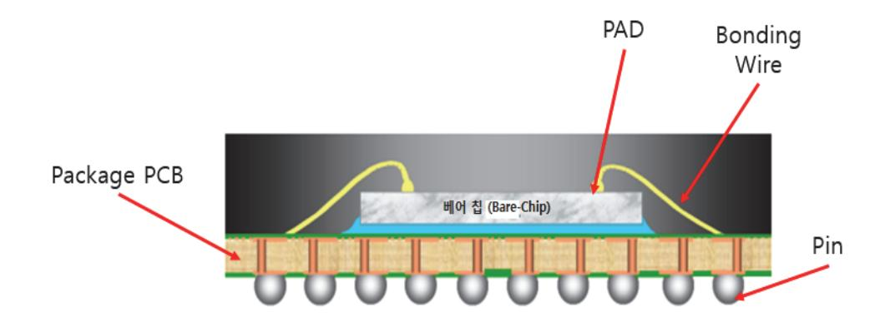

출처: 교육부(2018). 반도체 아키텍처 설계(LM1903060102\_14v3). 한국직업능력개발원. p.37. [그림 2-1] 패키지의 구조

(13) 기능 검증 리포트 작성

패키지가 제작되어 입고되면, 실제 보드상에 패키지를 장착하여 기능 검증을 실시하고, 그 결과를 리포트 한다. 제품의 특성상 소프트웨어와 연동하여 통합 검증이 필요한 경우 도 있다.

(14) 웨이퍼 및 패키지 테스트 리포트 작성

제작된 패키지에 대한 기능 검증이 진행이 되는 것과 동시에 웨이퍼와 패키지에 대해서 불량 상태인지를 판별하기 위한 테스트 방법을 적용하여 그 결과를 리포트 한다. 웨이퍼 와 패키지를 테스트 하는 이유는 기본적인 기능에 대해서 문제가 없는 제품을 선별하기 위한 목적이다. 기능 검증단계 수준으로 제품의 기능이 문제없는지 확인하는 데는 많은 시간과 인원이 필요한데 비해서 기계적인 방법으로 테스트를 하는 방법을 마련하면, 제 품 양산시 기계적인 테스트를 하여 불량 제품을 선별 할 수 있다. 테스트를 통과한 제 품만 출하를 한다.

(15) 신뢰성 리포트

양산된 제품을 실제 응용처에서 사용하게 되면, 사용처의 온도, 전압 등의 전기적 특성 과 지속적인 동작으로 인한 특성의 열화 등의 문제가 발생하게 되는데, 신뢰성 검증을 통해서 제품에서 요구하는 신뢰성 기준을 만족하는지에 대한 테스트이다. 기능적으로 문 제가 없다고 해도 실제 연속적인 동작, 환경적인 변화에 얼마나 견딜 수 있는지에 대한 테스트이며, 신뢰성 기준을 통과해야 양산이 가능하다.

(16) 데이터시트 작성 및 승인원 준비

개발한 제품에 대해 설명하는 문서인 데이터시트를 작성한다. 데이터시트는 응용처에서 제품에 적용 개발을 할 때 기준이 되는 문서이다. 응용처에서 제조 공정관리, 테스트, 신뢰성 등에 대한 확인 문서로 승인원을 요구하므로 준비를 해야 한다. 이 승인원상에 있는 것을 기준으로 반도체 제품의 사용 승인을 받는 것이다.

- 3. 반도체 개발 단계별 위험 요소를 파악하여 정리한다.
  - 전체 블록도가 작성이 되면, 다음으로 각 단계별로 위험 요소가 무엇이 있는지 예측을 하 고, 이에 대한 대응 방안을 수립하는 것이 필요하다. 그리고 예측되는 위험 요소에 대한 대 응은 종류별로 대응 방안을 미리 준비 하면 쉽게 극복이 가능하다. 다만, 예측이 불가능한 위험 요소 또는 갑자기 발생한 위험 요소에 대해서는 개발 일정, 설계 변경, 인력 등을 고 려하여 그 발생 시점에서 최선의 결정을 하여야 한다.
- 4. 개발 계획서를 다음의 내용이 포함되도록 하여 작성한다.
  - (1) 제품의 주요 사양
  - (2) 전체 블록도
  - (3) 설계에 필요한 IP(Intellectual Property, 반도체설계자산) 들의 확보 방안 개발 능력과 개발 일정을 고려한 자체 개발할지 또는 외부에서 도입을 할지에 대한 결 정을 포함한다.
  - (4) 단계별 개발 일정

제품 개발 단계별로 일정을 작성한다. 개발 일정을 작성할 때 다음과 같이 구분하여 작 성하는 것이 이해가 쉽다.

- (가) 전체 블록도 및 각 기능 블록간의 연결도 확정 일정
- (나) 블록별 상세 구조도 확정 일정
- (다) 기능 블록별 RTL설계 및 시뮬레이션 일정
- (라) FPGA 부품 및 하드웨어 보드를 이용한 실시간 검증 일정
- (마) 단위 소자로 변환을 위한 합성 일정
- (바) 배치(placement) 와 연결(routing) 완성 일정
- (사) timing시뮬레이션 완료 일정
- (아) 웨이퍼 투입 제작 및 패키지 제작 일정
- (자) 제작된 제품 기능 검증 일정
- (차) 웨이퍼 및 패키지 테스트 일정
- (카) 신뢰성 일정

숕 개발 방법 설정하기

1. 개발 계획서를 참조해서 개발 방법을 설정한다.

개발 방법의 설정은 개발 계획서를 참조해서 각 기능 블록별로 개발 방법을 설정한다. 개발 방법에는 자체 설계를 하는 방법과 외부에서 도입하는 방법이 가능하며, 어느 방법으로 진

행할지 대해서는 다음과 같이 검토를 하여 결정한다.

(1) 자체 개발 방법

자체 개발하는 방법을 선택하는 기준은 자체 개발 인력이 있어야 하고, 관련 기능 블록 을 설계한 경험을 가지고 있는지 여부가 중요한 항목이다. 기능 블록설계 인력이 충분하 고, 개발 일정을 준수하는데 문제가 없다고 판단되면, 자체 개발 방법을 선택한다. 개발 담당자가 자체 개발 계획서를 작성할 때 아키텍처 설계의 내용을 반영하여 개발 방법을 작성한다.

(2) 외부 도입 방법

외부에서 도입하여 설계에 반영하는 방법을 선택하는 기준은 자체 개발 인력이 부족하 거나 개발 일정을 맞추기 어려운 것으로 예상이 되고, 외부에서 도입하는 기능 블록의 성능이 우수하다고 판단될 경우이다. 도입하기로 결정된 기능 블록에 대해서는 기능/성 능이 비슷한 후보들을 조사하여 비교 평가를 실시하고, 그 결과를 바탕으로 선정한 다음 도입을 한다.

#### 수행 tip

- 개발 계획은 제품 출시 시기 및 개발 능력을 고려하여 결 정한다.
- 설계에 필요한 아날로그 IP, 디지털 IP의 확보 방안에 대 해 계획을 수립한다.
- 예측되는 위험 요소와 돌발 상황에 대한 대응 방안을 수립한다.

## 2-2. 개발 일정 및 인원 계획 수립

학습 목표 • 개발 부서별 또는 인원별 업무 분장을 할 수 있다. • 개발 부서와 인원의 개발 계획 및 일정을 수립할 수 있다.

## 필요 지식 /

#### 숔 개발 업무 분장

반도체 아키텍처 설계 사양이 완성이 되고 나면, 각 기능 블록별로 개발 부서 및 인원에 대한 계획을 수립하여야 한다. 기능 블록별로 투입 부서 및 인원에 대한 계획을 수립하는 것은 개발 목표 달성을 위한 중요 항목이므로 개발 부서와 협의를 하여 결정을 해야 한다.

### 1. 업무 분장의 구분

설계 사양이 결정이 되면, 각 사양 별로 개발 부서와 인원의 할당이 필요하다. 아키텍처 설 계를 진행하는 단계에서 기능 블록별 설계 부서와 인원을 지정하고, 내부 개발로 진행이 어 려운 부분은 외부에서 도입하거나 개발 용역에 대해서도 고려를 해야 한다.

#### (1) 부서별 업무 분장

부서별 업무 분장은 각 개발 부서의 개발 능력과 그 구성원의 개발 능력을 고려하여 결 정한다. 부서별로 업무가 중복되지 않도록 하고, 최대한 부서의 특성을 고려하여 업무를 할당하도록 하며, 최종 결정은 각 부서의 책임자와 협의하여 결정한다.

(2) 인원별 업무 분장

인원별 업무 분장은 각 개발 인원의 개발 경험을 파악하여 설계 블록을 충분히 이해하 고, 자체적으로 개발할 수 있는 능력을 가진 인원으로 할당을 해야 한다. 설계 블록의 크기에 따라 개발자 1명으로 충분한 경우와 여러 명이 협력하여 개발하는 경우로 구분 해서 업무 분장을 하여야 한다.

### 숕 개발 인원 계획 수립

개발 단계별 설계 내용을 참고하여, 개발에 참여할 인원에 대한 계획을 수립한다. 개발 업무 분장이 완료되면, 참여할 인원이 결정이 되었다고 볼 수 있다. 각 개발 인원이 결정이 되면, 인 원 계획을 반영한 제품 개발 일정을 수립한다.

1. 개발 인원을 반영한 개발 일정 수립

각 단계별 일정이 확정이 되면, 각 설계 단계 업무를 담당하는 개발 인력을 지정을 한다. 개발 업무 분장이 된 각 개발 인력의 정보를 확인하여 이를 반영한 개발 일정을 수립한다. 설계할 기능 블록의 업무량에 비례하여 개발 인원을 지정하거나 개발 인원이 부족하면 개 발 일정을 늘려서 일정을 수립해야 문제가 없다.

2. 개발 인원 변동에 대비

개발이 진행되는 중간에 여러 요인에 의해서 개발 인원이 변동이 될 수도 있으므로 대체 인원으로 개발이 계속 진행 될 수 있도록 예비 인원에 대한 내용도 포함을 해서 작성한다. 가장 좋은 대응 방안은 개발 시작할 때의 개발 인원이 개발 완료시까지 변동이 없도록 사 전에 개발 담당자 또는 부서와 협의를 충분히 하는 것이다.

## 수행 내용 / 개발 일정 수립 및 인원 계획 수립하기

재료·자료

- 제품 계획서
- 개발 일정별 인원 계획
- 개발 인원의 정보

### 기기(장비 ・ 공구)

해당 없음

안전 ・ 유의사항

개발 단계별로 설계에 필요한 개발 툴을 정의하고, 사양을 고려한 반도체 공정을 선정하기 위한 기본 지식이 필요하다.

#### 수행 순서

숔 개발 일정 수립하기

1. 각 개발 단계별로 개발 일정을 작성한다. 개발 일정 작성할 때 다음과 같이 구분하여 작성을 하고, 참여 개발 인원에 대한 내용도 포 함한다.

(1) 전체 블록도 및 각 기능 블록 간의 연결도 확정 일정

제품 사양에 따른 필요 블록의 정의, 개발 담당자 확정 및 아키텍처 설계의 내용이 포 함되어야 하고, 각 기능 블록 간의 연결에 대해서도 정의가 되어야 하며 외부 인터페이 스 신호 및 방법도 확정이 되어야 한다.

(2) 블록별 상세 구조도 확정 일정

기능 블록 설계를 위한 내부 상세 구조도 확정 일정 및 각 기능별 담당자

- (3) 블록별 RTL 설계 및 시뮬레이션 일정
  - 기능 블록별로 RTL설계 일정과 개발 툴을 이용한 시뮬레이션 일정을 작성하고 가장 늦 게 완료될 것으로 예측되는 기능 블록에 대해서 파악한다.
- (4) 설계 검증 일정

설계 및 시뮬레이션을 진행한 RTL을 실제 하드웨어로 검증하는 검증 일정을 작성한다.

- (5) 단위 소자로 변환을 위한 합성 일정
  - RTL설계 이후 단위 소자들로 구성하는 회로로 변환(합성)하기 위해 필요한 자료 입수 일정까지 포함해서 단위 소자로 변환을 위한 합성 작업 일정을 수립한다.
- (6) placement & routing 완성 일정
  - 단위 소자들로 변환된 회로를 이용하여 단위 소자들의 배치(placement)와 각 단위 소 자들 사이의 연결(routing)완성 일정을 작성하는데, 배치(placement)와 연결 (routing)은 외부 전문 용역 업체를 이용하는 것이 대부분이므로 용역 업체의 일정 을 반영한다.
- (7) timing 시뮬레이션 완료 일정
  - 배치(placement)와 연결(routing)이 완료되면, 각 단위 소자들 사이의 timing 정보를 추출하여 각 설계 담당자들이 timing 분석 및 개발 툴을 이용한 timing시뮬레이션 결과를 확인하여 동작이 문제 없는 것을 파악하는 일정을 반영한다.
- (8) 웨이퍼 투입 제작 및 패키지제작 일정
  - timing시뮬레이션으로 동작 확인이 되면, 반도체 공정투입을 위한 tape out작업을 하 고, 반도체 공정 일정과 패키지 제작 내용 포함한 일정을 작성한다.
- (9) 제작된 웨이퍼(Wafer) 와 패키지의 기능 검증 일정
  - 실제 제작된 웨이퍼와 패키지가 입고되면, 각 기능 블록별 설계한 기능들이 정상적으로 동작하는지 검증하는 보드 제작 및 검증 일정을 검증 담당자 포함하여 작성한다.
- (10) 웨이퍼 및 패키지 테스트 일정
  - 불량제품 선별 및 양산을 위한 제품 테스트 방법을 적용하여 확인하는 일정을 포함하여 작성하는데, 통상 외부 장비를 빌려서 하거나 테스트 전문 용역 업체를 이용하는 경

우가 많으므로 업체와 장비 사용 일정을 고려하여 작성한다.

- (11) 신뢰성 일정
  - 제작된 반도체 제품의 신뢰성을 검증하는 데 필요한 일정으로 전기적, 물리적 특성들을 검증하는데 필요한 일정을 반영한다.
- 숕 개발 기능 블록별 인원 계획 수립하기
  - 1. 개발 계획서 중 개발 사양, 기능 블록의 정의, 개발 방법 등이 결정이 되면, 개발 인원의 계획 수 립을 진행한다.

기능 블록별로 개발 인원을 지정하고, 내부 개발로 진행이 어려운 부분은 외부에서 도입하 거나 개발 용역으로 해야 하는데, 이것을 담당하는 인원도 계획에 포함한다. 다음으로 개발 진행 중에 여러 요인에 의해서 개발 인원이 변동이 될 수도 있으므로 이것에 대한 대응 계 획도 포함해야 한다.

(1) 기능 블록별 인원 계획

각 기능 블록별로 참여 인력의 개발 능력을 고려하여 인원 계획을 수립한다. 각 개발 인력의 업무가 중복 또는 특정 인원에게 많은 업무가 할당되지 않도록 기능 블록 설계 를 담당할 인원의 계획을 수립한다.

(2) 도입하는 블록의 인원 계획

자체 개발 보다는 도입하는 것이 효율적이라고 판단한 기능 블록에 대해서는 도입한 블 록을 다른 기능과 연결하여 검증할 수 있는 인원으로 계획을 수립한다. 즉, 외부에서 도 입하는 기능 블록이지만 관련 지식을 많이 가지고 있는 인원으로 계획을 수립한다.

(3) 인원 변동에 대비한 인원 계획

개발 진행 중간에 개발 인원이 변경될 가능성에 대비해서 예비 인원 또는 대체 인원을 투입할 수 있도록 계획을 수립하는 것이 필요하다.

수행 tip

 블록별 자체 개발 인력이 확보되었는지 파악하고, 개발 인 원을 반영한 개발 계획을 수립한다.

## 학습 2 교수‧학습 방법

## 교수 방법

- 개발 단계에 대한 설명과 각 단계별로 예측 가능한 위험 요소와 예측이 불가능한 위험 요소 에 대해서 설명을 하고, 위험 요소에 대한 대응 방안을 수립해야 하는 필요성에 대해서 설 명한다.
- 개발 계획 중에서 중요한 항목의 일정 관리 방안을 설명을 하는데 있어서 반도체 제품 개발 단계를 기준으로 항목을 정의하고, 각 항목별로 필요한 일정을 작성하여 설명한다.
- 다양한 기능 블록별 개발 방법 및 각각의 장점과 단점에 대해서 설명하면서 학습자가 관심 을 갖고 질의 하도록 유도한다.
- 기능 블록의 확보 방안을 자체 개발 방법과 외부에서 도입하는 방법의 선택할 때 고려해야 하는 내용과 장점 및 단점을 설명하여 개발 방법의 선택을 효율적으로 할 수 있도록 설명을 한다.
- 개발 계획서 작성 방법과 그 항목들의 용어에 대한 이해도 확인 및 다양한 사례를 제시한 다.

학습 방법

- 반도체 제품의 개발 계획 수립할 때 고려할 항목들에 대해서 학습을 하고 그 항목들의 내용 에 대해서 정리를 한다.
- 개발 단계에 대한 정의를 학습하고, 각 단계별 위험 요소들이 무엇이 있는지 확인하여 위험 요소에 따른 대응 방안을 작성해본다.
- 개발 계획 중에서 중요한 항목의 일정 관리 방안이 무엇들이 있는지 학습한 내용을 바탕으 로 추가 방안을 생각하여 정리를 한다.
- 기능 블록별 개발 방법에는 여러 가지 방법들이 있는데, 주로 많이 사용하는 방법이 어떤 것들이 있는지 조사하고 수행해 본다.
- 기능 블록의 확보 방안을 자체 개발 방법과 외부에서 도입하는 방법의 선택할 때 고려해야 하는 내용과 장점 및 단점을 비교하는 실습을 해본다.
- 개발 계획서 작성 방법에 필요한 항목들에 대해 학습 및 조사를 해서 개발 계획서를 직접 작성해 본다.

45

## 학습 2 평 가

## 평가 준거

• 평가자는 학습자가 학습 목표를 성공적으로 달성하였는지를 평가해야 한다.

#### • 평가자는 다음 사항을 평가해야 한다.

| 학습 내용               | 학습 목표                                       | 성취수준 |   |   |  |
|---------------------|---------------------------------------------|------|---|---|--|
|                     |                                             | 상    | 중 | 하 |  |
| 개발 계획 및 개발 방법 설정 | - 전체 개발 계획에서 각 단계별 설계의 주요 내용을 작 성할 수 있다. |      |   |   |  |
|                     | - 개발 단계별로 설계 방법을 설정할 수 있다.                  |      |   |   |  |
|                     | - 각 개발 단계별로 위험 요소 예측 및 대응 방안을 제시 할 수 있다. |      |   |   |  |
| 개발 일정 및 인원 계획 수립 | - 개발 부서별 또는 인원별 업무 분장을 할 수 있다.              |      |   |   |  |
|                     | - 개발 부서와 인원의 개발 계획 및 일정을 수립할 수 있 다.      |      |   |   |  |

### 평가 방법

• 서술형 시험

|                        |                                      | 성취수준 |   |   |  |  |
|------------------------|--------------------------------------|------|---|---|--|--|
| 학습 내용                  | 평가 항목                                | 상    | 중 | 하 |  |  |
|                        | - 반도체 설계 개발 단계                       |      |   |   |  |  |
| 개발 계획 및 개발 방법 설정 | - 개발 계획서 작성                          |      |   |   |  |  |
|                        | - 각 개발 단계별 위험 요소 및 대응 방안 작성          |      |   |   |  |  |
|                        | - 개발 부서별 또는 인원별 업무 분장 시 고려 사항        |      |   |   |  |  |
| 개발 일정 및 인원 계획 수립    | - 개발 부서와 인원의 개발 계획 및 일정 수립 시 고려사항 |      |   |   |  |  |

• 평가자 질문

|                        |                                         | 성취수준 |   |   |  |
|------------------------|-----------------------------------------|------|---|---|--|
| 학습 내용                  | 평가 항목                                   | 상    | 중 | 하 |  |
| 개발 계획 및 개발 방법 설정 | - 반도체 개발 단계에 대한 질문                      |      |   |   |  |
|                        | - 기능 블록 구현 방법에 대한 질문                    |      |   |   |  |
|                        | - 각 개발 단계별 위험 요소 예측 및 대응 방안             |      |   |   |  |
| 개발 일정 및 인원 계획 수립    | - 기능 블록별 개발 인원 계획에서 개발 방법에 따른 인 원 계획 |      |   |   |  |

## 피드백

## 1. 서술형 시험 - 반도체 개발 단계를 이해하고 이에 따른 개발 계획 및 개발 방법 설정에 있어 필요한 사 항들에 대한 숙지 여부를 정확히 체크한 후, 설계 방법 설정 및 위험 요소에 대한 대응 방안을 잘 설 정할 수 있도록 평가 결과를 피드백 한다. 2. 평가자 질문 - 개발 방법을 설정하고 개발 일정 및 인원 계획을 수립하는데 있어 필요한 사항들을 질문하여 체 크한 후, 미흡한 부분은 재교육하여 체계적인 개발 계획을 수립할 수 있도록 한다.

| 학습 1 | 설계 사양 결정하기 |
|------|------------|
| 학습 2 | 개발 절차 결정하기 |
|      |            |
| 학습 3 | 아키텍처 결정하기  |

## 3-1. 아키텍처 결정

|  |  |  |  |  |  |  | • 설계 사양에 따라 반도체 제품의 전체 블록도를 결정할 수 있다. |  |  |  |
|--|--|--|--|--|--|--|---------------------------------------|--|--|--|
|--|--|--|--|--|--|--|---------------------------------------|--|--|--|

• 설계 사양에 따라 사용할 반도체 공정을 결정할 수 있다.

학습 목표

- 적용할 설계 알고리즘 및 IP 확보 방안을 결정할 수 있다. • 설정된 아키텍처를 분석하여 장/단점을 결정할 수 있다.
- 각 세부 설계 블록간의 인터페이스를 결정할 수 있다.

## 필요 지식 /

숔 전체 블록도의 구성

결정된 설계 사양을 아키텍처 설계 과정을 통해서 좀 더 상세하게 구체화 하는 작업이 필요하 다. 이 과정의 중심에 있는 것이 제품의 전체 블록도를 작성하는 과정이다. 작성된 전체 블록 도를 기반으로 필요한 기능 블록들을 파악하고, 각 기능 블록에서 처리해야 하는 내용이 아키 텍처 설계 관점에서 명확하게 구분이 되어야 한다.

1. 전체 블록도 구성 요소

전체 블록도의 구성 요소들은 개발 담당자들이 전체 블록도를 보고 쉽게 이해 할 수 있도 록 만들어져야 한다. 전체 블록도가 작성이 되어야 아키텍처 설계를 하는데 도움이 되므로 가능한 상세하게 작성을 한다. 작성할 때 다음 항목을 중심으로 작성한다.

- (1) 기능 블록들의 역할
- (2) 데이터 처리 과정의 흐름
- (3) 내부 메모리의 구성 및 사용
- (4) CPU가 내장되는 경우에는 CPU에 대한 정보
- (5) 각 블록별 최대 동작 주파수에 대한 내용
- (6) 기능 블록을 구현하기 위한 내부 상세 블록들의 상세 내용

숕 반도체 공정 결정

1. 공정 결정의 요소

전체 블록도를 기준으로 설계에 필요한 IP(Intellectual Property, 반도체설계자산)와 기능 블록들이 정리가 되었으면 다음과 같이 공정 결정의 요소들을 정리하여 반도체 공정 결정 을 한다. 아키텍처 결정 관점에서 공정 결정은 설계와 개발 일정에 대한 내용을 중심으로 진행을 한다.

(1) 사용할 아날로그 IP의 종류와 주요 특징

면적, 동작 전압, 소비 전류, 동작 속도 등을 정리한다,

- (2) 반도체 제조 공정이 현재 양산을 하고 있는 상태인지, 제조 공정상의 문제점이 있는지등 현 재 상태의 공정 현황을 파악
- (3) 공정의 단위 소자의 물리적인 크기를 파악
- (4) 공정에서 제공하는 메모리 생성기의 특징을 파악하여 설계에서 원하는 형태의 메모리가 생성 이 가능한지 여부와 그 면적을 파악
- (5) 공정에서의 반도체 웨이퍼 제작 기간 파악
- (6) 공정에서의 단위 소자의 동작 속도에 대해서 파악
- 숖 설계 알고리즘(Algorithm) 및 IP(Intellectual Property, 반도체설계자산) 확보 방안
  - 1. 설계 알고리즘 확보 방안

전체 블록도를 기준으로 설계에 필요한 기능 블록들, 그리고 반도체 공정이 결정이 되었으 면, 자체 설계하려는 블록의 설계 알고리즘의 확보 방안을 수립한다.

(1) 기존에 확보되어 있는 경우

기존에 개발했던 기능 블록이 있으면, 개발하고자 하는 제품에 바로 적용이 가능한지 여부를 파악하여, 재사용하는 방법과 일부 수정을 해서 사용하는 방법 중에서 선택을 한다.

- (2) 새로 개발을 해야 하는 경우 보유하고 있지 않는 설계 알고리즘이면, 자체적으로 개발하는 방법과 외부에서 도입하는 방안을 비교 검토하여 결정한다.
- 2. IP((Intellectual Property, 반도체설계자산) 확보 방안

전체 블록도를 기준으로 설계에 필요한 기능 블록들, 그리고 반도체 공정이 결정이 되었으 면, 도입하려는 블록의 IP 확보 방안을 수립한다.

(1) 라이선스를 통한 확보

개발 일정이나 자체 개발이 어려운 기능 블록의 경우 외부에서 이미 개발 완료된 IP가

있는 경우 직접 라이선스를 해서 도입하여 사용하는 방법으로 확보를 한다.

(2) 새로 개발해야 하는 IP의 확보

완전히 새로 만들어져야 하는 기능 블록의 경우 외부에서 도입할 IP가 없는 경우에는 관련 IP를 확보하고 있는 업체에 용역 개발을 하는 방안과 자체 개발하는 방안 중에서 선택하여 결정한다.

#### 숗 다양한 구조의 아키텍처 설계

반도체 아키텍처 설계는 한 가지 형태로 구현을 할 수도 있지만, 구현 방법 및 기능 블록의 분 배에 따라서 여러 가지 형태로 설계가 가능하다. 그러므로 아키텍처 설계 담당은 각 기능 블록 의 연결 상태와 사용하는 CPU, 메모리의 형태에 따라서 가능한 아키텍처의 구조를 설계해서 각각의 아키텍처에 대한 비교를 하여 최적의 아키텍처를 선정한다.

수 각 세부 블록 간의 인터페이스

1. 기능 블록 내부의 세부 구조도 작성

기능 블록의 주요 기능이 정리가 되면, 각 기능 블록 내부 상세 구조도를 작성한다. 기능 블록별 상세 구조도는 설계 담당자가 작성을 하며, 상세 설계 단계에서 사용을 하여 설계의 효율성을 높인다.

(1) 기능 블록의 구조도

개발하고자 하는 기능 블록의 상세 구조도를 작성하는데 다음의 내용이 포함 되어야 한다.

- (가) 입력 신호, 출력 신호 정의
- (나) 세부 기능 블록 간 연결
- (다) 내부 메모리의 종류와 크기
- (라) 사용할 주파수의 크기 및 내부 클럭의 종류
- 2. 상세 기능 명세서 작성
  - 각 세부 블록의 기능 명세서를 작성해서 구체적이 기능들의 사양 및 외부 인터페이스 신호
  - 에 대한 내용을 작성한다. 기능 명세서에 들어가야 할 내용은 다음과 같다.
  - (1) 입력 신호

입력 신호의 신호 이름, 비트수, 입력 형식 등을 작성한다.

(2) 출력 신호

출력 신호의 신호 이름 비트수, 출력 형식 등을 작성한다.

(3) 상세 기능 블록에서 처리하는 내용

상세 기능 블록에서 처리하는 내용에 대해서 작성하고, 표준화와 관련이 있다면, 표준화 문서의 제목과 버전을 포함하여 작성한다.

(4) 상세 기능 블록의 제어 방법 상세 기능 블록을 제어하는 방법과 동작시키는 방법에 대한 내용을 작성한다.

## 수행 내용 / 아키텍처 결정하기

## 재료·자료

- 제품 계획서
- 아키텍처(Architecture)를 반영한 전체 블록도
- 설계 블록별 사용 IP 및 기능 설명서
- 기능, 성능, 전기적 특성에 대한 기본 자료

## 기기(장비 ・ 공구)

해당 없음

## 안전 ・ 유의사항

개발 제품의 목표 성능을 달성하기 위해 사용할 설계 알고리즘과 IP들의 특성을 이해하는 능력이 요구된다.

#### 수행 순서

숔 아키텍처 결정하기

1. 아키텍처 결정을 위한 사전 작업을 수행한다.

아키텍처를 결정하기 위해 필요한 정보나 자료는 사전에 작성이 되어야 한다. 사전 자료는 제품 기술에서 작성된 제품 사양서, 전체 블록도, 각 기능 블록별 상세 블록도, 사용할 공 정의 결정 및 개발 일정과 개발 인원의 내용이 필요하다.

2. 아키텍처 설계를 단계별로 진행한다.

아키텍처 설계를 하는 순서에 대해서 그림으로 표현하면 [그림 3-1]과 같다.

출처: 교육부(2018). 반도체 아키텍처 설계(LM1903060102\_14v3). 한국직업능력개발원. p.51. [그림 3-1] 아키텍처 설계의 순서

(1) 제품 사양 명세서 작성

제품 사양 명세서는 개발할 반도체 제품의 사양에 대해서 정리한 문서이고, 다음의 내용 이 포함되어야 한다.

- (가) 사양서는 제품의 주요 기능, 전체 블록도, 응용처에서의 사용 목적을 종합하여 작성한다.
- (나) 기능 블록별 중요 항목의 사양을 작성한다.

(다) 제품의 전압 사양, 동작 주파수, 패키지의 규격에 대해서도 작성한다.

(2) 전체 블록도

전체 블록도는 개발할 반도체 제품의 내부에 대한 블록도이며, 전체 블록도가 완성이 되 어야 아키텍처 설계에 도움이 된다.

- (가) 기능 블록들의 핵심적인 기능에 대한 내용
- (나) 각 기능 블록들의 중요 입력과 출력 신호들의 내용
- (다) 데이터 처리 과정을 이해하기 쉽게 입력 데이터가 내부에서 처리되어 최종 출력이 되는 과정이 표시될 수 있도록 작성
- (라) 내부 메모리는 각 메모리별로 사용이 되는 기능 블록과 연결이 되도록 작성
- (마) 각 메모리의 크기와 메모리를 엑세스할 수 있는 어드레스와 데이터비트 수를 표시한다.
- (바) CPU가 내장되는 경우에는 CPU가 연결되어 동작 하는 내부 시스템 버스에 연결되는 기 능 블록을 표기해야 하고, CPU가 동작할 수 있는 최대 주파수도 표시한다.
- (사) 각 블록별 동작 속도를 최대 주파수를 기준으로 작성한다.
- (아) 기능 블록을 구현하기 위한 내부 상세 블록들의 상세 내용

(3) 반도체 공정 결정

사용 가능한 공정들을 먼저 조사를 해서 사용가능한 공정들이 어떤 것이 있는지 파악을 하고, 각 공정들의 특성에 대해서 조사를 한다. 조사된 특성과 개발하는 제품에서 요구 하는 특성을 만족할 수 있는 공정을 선택 한다.

- (가) 반도체 제조 공정이 현재 양산을 하고 있는 상태인지, 제조 공정상의 문제점이 무엇이 있는지 등 현재 현황을 파악한다.
- (나) 공정의 단위 소자의 물리적인 실제 크기를 파악하여 비교한다.
- (다) 공정에서 제공하는 메모리 생성기의 특징을 파악하여 설계에서 원하는 형태의 메모리가 생성이 가능한지 여부와 그 면적을 파악한다.
- (라) 공정에서의 단위 소자의 동작 속도 및 소비 전력에 대해서 파악하여 비교한다.
- (4) 기능 블록 명세서

전체 블록도와 반도체 공정이 결정 되면, 각 기능 블록별 기능 명세서와 내부 상세 구 조도를 작성하여 RTL 설계 단계에서 사용한다. RTL단계에서 내부 상세 구조가 변경이 필요한 경우 이것을 반영하여 상세 구조도를 수정해야 한다. 또한 상세 구조도는 상세 설계 단계에서 여러 가지 설계 요소들을 미리 고려하여 작성 하였으므로 RTL설계의 효 율을 높여주는 역할을 한다. 작성해야 할 내용들은 구체적인 기능들의 사양 및 외부 인 터페이스 신호에 대한 내용을 작성한다. 기능 명세서에 들어가야 할 내용은 다음과 같 다.

(가) 기능의 개요

어떤 기능을 하는 블록인지에 대한 설명을 작성한다.

(나) 입력 신호

입력 신호의 신호 이름, 비트수, 입력 형식 등을 작성하며, 표준화된 규격이 있으면 그 규격도 작성한다.

(다) 출력 신호

출력 신호의 신호이름, 비트수, 출력 형식 등을 작성하며, 표준화된 규격이 있으면 그 규격도 작성한다.

(라) 상세 기능 블록에서 처리하는 기능의 내용

상세 기능 블록에서 처리하는 기능들에 대해서 작성하고, 기능이 표준화와 관련이 있다면, 표준화 문서의 제목과 버전을 포함하여 작성한다.

- (마) 내부 메모리의 종류와 크기
- (바) 사용할 클럭의 주파수 크기 및 종류

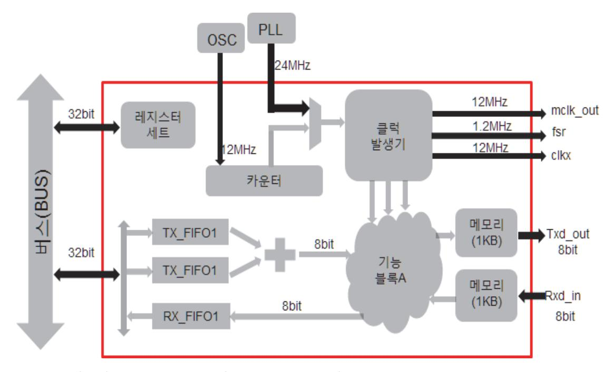

출처: 교육부(2018). 반도체 아키텍처 설계(LM1903060102\_14v3). 한국직업능력개발원. p.53. [그림 3-2] 기능 블록의 상세 구조도의 작성 예

(5) 개발 일정 및 개발 인원

각 개발 단계별로 개발 일정을 작성하고, 참여 개발 인원에 대한 내용도 포함한다.

(가) 전체 블록도 및 각 기능 블록 간의 연결도 확정 일정

전체 블록의 정의 및 아키텍처 설계의 내용 포함되고, 기능 블록 간의 연결이 표시 되어야 한다.

(나) 블록별 상세 구조도 확정 일정

기능 블록의 설계 담당자가 설계를 위한 내부 상세 구조도 작성하고, 확정하는 일정 도 작성한다.

(다) 블록별 RTL 설계 및 시뮬레이션 일정

기능 블록의 구현을 위한 RTL 설계과 개발 툴을 이용한 시뮬레이션 일정을 작성한 다.

(라) FPGA 및 하드웨어 보드를 이용한 설계 검증 일정

RTL로 설계한 것에 대해 검증을 실시간으로 진행하기 위해 FPGA 및 검증 보드를 사용한다.

- (마) 단위 소자로 변환을 위한 합성 일정 RTL로 설계된 회로를 반도체 공정에 규격에 따른 단위 소자들의 구성 회로로 변환 하기 위한 합성 작업 일정을 작성한다.
- (바) 배치(placement)와 연결(routing) 완성 일정

단위 소자들로 구성된 회로에 대해서 단위 소자들의 배치와 각 단위 소자들 사이의 연결(routing)완성을 위한 일정을 작성한다.

(사) timing시뮬레이션 완료 일정

연결된 전체 단위 소자들 사이의 timing정보를 추출하여 각 설계 담당자들이 timing 분석 및 설계 툴을 이용한 시뮬레이션 결과를 확인하는 일정을 작성한다.

(아) 웨이퍼 투입 제작 및 패키지 제작 일정

반도체 공정 투입 시작 일정, 공정 진행 일정과 패키지 제작을 포함한 일정을 작성 한다.

(자) 제작된 웨이퍼와 패키지의 기능 검증 일정

반도체 공정이 진행이 되는 기간 동안 동작 검증을 위한 검증 보드 제작 일정과 검 증 일정을 검증 담당자 포함하여 작성한다.

(차) 웨이퍼 및 패키지 테스트 일정

양산을 위한 제품 테스트 방법을 적용하여 확인하는 일정을 포함하여 작성한다.

(카) 신뢰성 일정

제작된 반도체 제품의 신뢰성을 검증하는 데 필요한 일정을 작성한다.

3. 아키텍처 결정

아키텍처의 결정은 앞에서 기술한 제품 사양 명세서, 전체 블록도, 반도체 공정 결정, 가능 블록 명세서, 상세 블록도, 개발 일정 및 개발 인원의 내용이 파악된 것을 종합적으로 검토 하여 결정을 한다.

(1) 결정된 아키텍처의 예

[그림 3-3], [그림 3-4] 그리고 [표 3-1]은 결정된 아키텍처를 표현한 사례이다. 각 기 능 블록의 이름이 표시되고, 각 기능 블록 간의 연결이 어떤 형태로 되어 있는지에 대 해서 표시가 되어 있다. [그림 3-3]은 시스템버스와 기능 블록간의 연결을 포함하여 최 대 동작 주파수가 100MHz로 되는 시스템이고, 외부 인터페이스까지 포함이 되어 있으 나, CPU가 어떤 메모리를 어떻게 사용할것인지, 레지스터 어드레스맵에 대한 내용이 부 족하다. [그림 3-4]는 64bit CPU가 최대 400MHz로 동작이 된다는 것과 시스템버스가 200MHz로 동작이 된다는 것이 파악되고, 주요 기능 블록과 몇 비트(bit)로 통신하는지 그리고 동작 주파수가 표시 되어 있으며, 특히 어드레스와 레지스터 이름이 표기 되어 있어서 내부 동작을 이해하기 쉽게 구성되어 있으나 외부 부품과의 인터페이스 방법은 표시되어 있지 않다. 아키텍처의 표기는 예제로 보여준 그림에서 부족한 부분들을 보완 해서 가능한 상세하게 표기하여 관련 엔지니어가 쉽게 파악이 되도록 해야 한다. 즉, CPU와 각 기능 블록, 시스템 버스 및 주변 버스에 대한 동작 주파수를 표시하고, 외부 부품과 연결되는 인터페이스가 어떻게 구성되어 있는지와 시스템을 제어하는 레지스터

의 어드레스가 표현되어야 한다. [표3-1]은 주요 기능 블록에 대한 사양이 구체적으로 표기되어 있다. 멀티미디어 기능, 인터페이스 기능, CPU와 전원의 사양에 대해결정이 된다.

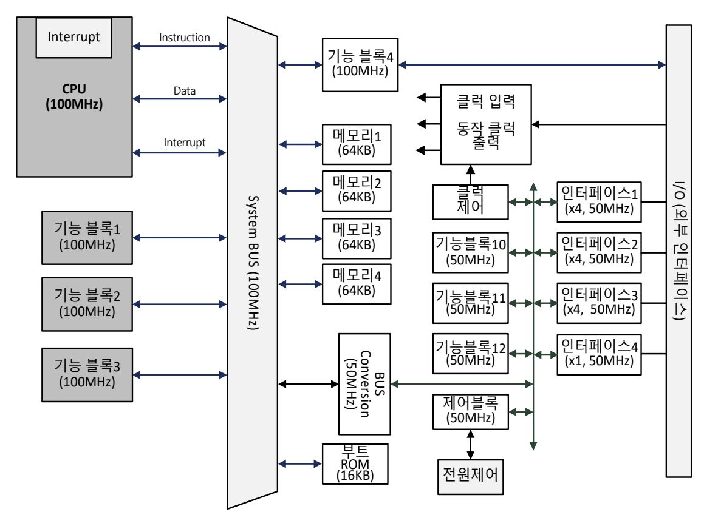

출처: 교육부(2018). 반도체 아키텍처 설계(LM1903060102\_14v3). 한국직업능력개발원. p.55. [그림 3-3] 아키텍처 설계 예1

#### <표 3-1> 기능 블록의 사양 예

| 기능 블록    |          | 주요 사양                                                                             |  |  |  |
|----------|----------|-----------------------------------------------------------------------------------|--|--|--|
|          | 비디오      | H.264 포맷 인코더 : VGA@30frame/sec 디코더 : VGA@30frame/sec                        |  |  |  |
| 멀티미디어 기능 |          | MPEG4 포맷 인코더 : VGA@30frame/sec 디코더 : VGA@30frame/sec                        |  |  |  |
|          | 오디오      | 인코딩 / 디코딩 포맷 AMR, WAV, AAC                                                     |  |  |  |
|          |          | 디코딩 포맷 AMR, AAC, MP3, AAC+                                                     |  |  |  |
|          | 직력 방식    | 직렬 인터페이스 및 개수 2 pin(Clock, Data), 4개 4 pin(Clock, Data, Request, Clear), 4개 |  |  |  |
| 인터페이스 기능 | 병렬방식     | 병렬 인터페이스 및 개수 9 pin(Clock, Data x8), 4개 17 pin(Clock, Data x16), 1개         |  |  |  |
|          | 동작 속도    | 10MHz ~ 200MHz                                                                    |  |  |  |
| CPU      | 외부 포트    | Instruction Port(32bit) Data Port(32bit) Interrupt Port                     |  |  |  |
|          | CPU core | 32bit operation                                                                   |  |  |  |
| 전원       | 내부       | 내부 동작 전압 : 1.2V 내부 동작 전류 : 300mA                                               |  |  |  |
|          | 외부       | 외부 인터페이스 전압 3.3V 또는 1.8V                                                          |  |  |  |

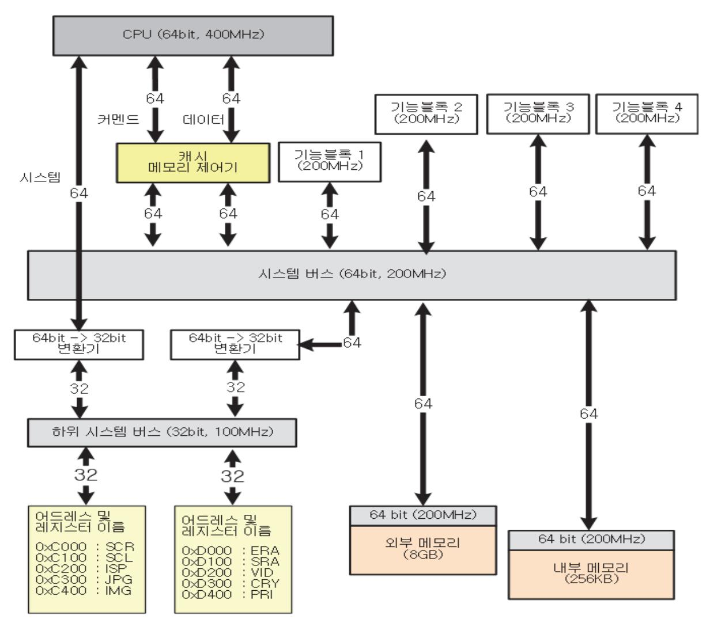

출처: 교육부(2018). 반도체 아키텍처 설계(LM1903060102\_14v3). 한국직업능력개발원. p.56. [그림 3-4] 아키텍처 설계 예 2

## 학습 3 교수·학습 방법

### 교수 방법

- 반도체 제품의 전체 블록도를 작성할 때 포함되어야 하는 항목들에 대해서 설명한다.
- 전체 블록도 작성할 때 고려해야 할 사항들의 우선 순위 및 세부 설계 블록간의 인터페이스 결정 요인에 대해 자세히 설명한다.
- 제품 개발에 필요한 IP(Intellectual Property, 반도체설계자산)들의 확보 방안에 대해 학습 자에게 현장의 사례를 제시한다.
- 적용할 설계 IP(특히 아날로그 IP)가 반도체 공정의 결정과 어떠한 관련이 있는지 설명한다.
- 작성된 전체 블록도를 기준으로 주요 데이터의 흐름에 대해서 예시를 가지고 설명한다.
- 비슷한 규격을 가지고 있는 반도체 제품들의 아키텍처를 이용하여 각 아키텍처 간의 장단점 을 학습자가 직접 작성해보도록 지도한다.

## 학습 방법

- 반도체 제품의 전체 블록도를 작성할 때 포함되어야 하는 항목들을 정리하고 그 의미를 파 악한다.
- 전체 블록도 작성할 때 고려해야 할 사항들의 우선순위를 생각하면서 작성해본다.
- 작성된 전체 블록도를 기준으로 주요 데이터의 흐름에 대해서 예시를 가지고 학습하고 블록 도를 작성해 본다.
- 제품 개발에 필요한 IP(Intellectual Property, 반도체설계자산)들의 확보 방안에 대해서 조 사한다.
- 적용할 설계 IP(특히 아날로그 IP)가 반도체 공정의 결정과 관련이 큰 이유에 대해서 분석 하여 정리해 본다.
- 비슷한 규격을 가지고 있는 반도체 제품들의 아키텍처 예제를 구해서 각 아키텍처 간의 장 점, 단점을 알 수 있도록 비교 정리하는 방법을 실습해 본다.

## 학습 3 평 가

## 평가 준거

- 평가자는 학습자가 학습 목표를 성공적으로 달성하였는지를 평가해야 한다.
- 평가자는 다음 사항을 평가해야 한다.

|         |                                          | 성취수준 |   |   |  |
|---------|------------------------------------------|------|---|---|--|
| 학습 내용   | 학습 목표                                    | 상    | 중 | 하 |  |
| 아키텍처 결정 | - 설계 사양에 따라 반도체 제품의 전체 블록도를 결정할 수 있다. |      |   |   |  |
|         | - 설계 사양에 따라 사용할 반도체 공정을 결정할 수 있 다.    |      |   |   |  |
|         | - 적용할 설계 알고리즘 및 IP 확보 방안을 결정할 수 있 다.  |      |   |   |  |
|         | - 설정된 아키텍처를 분석하여 장/단점을 결정할 수 있다.         |      |   |   |  |
|         | - 각 세부 설계 블록간의 인터페이스를 결정할 수 있다.          |      |   |   |  |

## 평가 방법

• 서술형 시험

| 학습 내용   | 평가 항목                                                        | 성취수준 |   |   |  |
|---------|--------------------------------------------------------------|------|---|---|--|
|         |                                                              | 상    | 중 | 하 |  |
| 아키텍처 결정 | - 아키텍처 설계 순서                                                 |      |   |   |  |
|         | - 필요한 설계 알고리즘(Algorithm) 및 IP(Intellectual Property)확보 방안 |      |   |   |  |
|         | - 기능 블록 명세서 내용                                               |      |   |   |  |

• 평가자 질문

| 학습 내용   | 평가 항목                       | 성취수준 |   |   |  |
|---------|-----------------------------|------|---|---|--|
|         |                             | 상    | 중 | 하 |  |
| 아키텍처 결정 | - 전체 블록도와 상세 블록도의 공통점과 차이점  |      |   |   |  |
|         | - 설계 사양에 따라 반도체 공정이 달라지는 이유 |      |   |   |  |
|         | - 아키텍처 결정시 검토 항목            |      |   |   |  |

## 피드백

| 1. 서술형 시험                                                |
|----------------------------------------------------------|
| - 반도체 개발 단계를 이해하고 이에 따른 개발 계획 및 개발 방법 설정에 있어 필요한 사       |
| 항들에 대한 숙지 여부를 정확히 체크한 후, 설계 방법 설정 및 위험 요소에 대한 대응 방안을 잘 설 |
| 정할 수 있도록 평가 결과를 피드백 한다.                                  |
|                                                          |
| 2. 평가자 질문                                                |
| - 개발 방법을 설정하고 개발 일정 및 인원 계획을 수립하는데 있어 필요한 사항들을 질문하여 체    |
| 크한 후, 미흡한 부분은 재교육하여 체계적인 개발 계획을 수립할 수 있도록 한다.            |

| 학습 1 | 설계 사양 결정하기 |
|------|------------|
| 학습 2 | 개발 절차 결정하기 |
| 학습 3 | 아키텍처 결정하기  |
|      |            |

## 학습 4 시스템 검증 계획 수립하기

## 4-1. 시스템 레벨 사양서 작성

학습 목표 • 하드웨어로 설계하는 블록과 연계되는 소프트웨어 운영 안을 결정할 수 있다.

## 필요 지식 /

숔 시스템 레벨 사양

시스템 레벨 사양은 설계된 기능 블록과 기능 블록의 동작과 연관된 소프트웨어까지 포함한다. 제품의 전체 기능구현 방안이 아키텍처 설계에서 결정되면, 각 기능 블록을 하드웨어로 설계할 때 이에 연관된 소프트웨어를 같이 검토를 해야 한다. 기능 구현을 위해 소프트웨어가 세팅해 야 하는 레지스터에 대해서 정의를 해야 하고, 소프트웨어로 구현을 해야 하는 기능이 있다면 같이 검토를 해야 한다. 다시 설명하면, 기능 블록의 특성이 소프트웨어와 같이 연동하여 기능 구현을 해야 하는 것이라면, 단순히 하드웨어 블록을 설계하는 것이 아니라, 소프트웨어로 처 리를 해야 하는 기능과 연결해서 같이 검토를 해야 한다는 것이다. 이렇게 소프트웨어와 하드 웨어가 같이 동작을 해서 목표하는 기능이 구현 되도록 만드는 것이 시스템 레벨 사양이다. 소 프트웨어로 기능 구현을 하거나 기능 블록을 제어 하려면, 기능 블록의 상세 설계 내용과 기능 블록 내부에 사용하는 IP(Intellectual Property, 반도체설계자산)에 대해서도 제어 방법을 확 인해야 한다. 이러한 과정을 통해서 기능 설계 블록과 소프트웨어가 연동하여 동작을 하는 시 스템 레벨의 사양이 만들어 진다.

1. 시스템 레벨 사양의 구성

시스템 레벨 사양은 RTL설계로 구현하는 하드웨어 블록과 이것을 제어하는 소프트웨어 또 는 소프트웨어로 구현된 기능의 내용, 그리고 이 두 개의 블록이 어떻게 연동이 되어 동작 을 하는지의 내용으로 구성이 된다.

- (1) RTL설계로 구현하는 기능 블록 하드웨어의 내용
- (2) RTL설계로 구현된 하드웨어 블록을 제어 하는 소프트웨어 또는 소프트웨어로 구현된 기능의 내용
- (3) 하드웨어와 소프트웨어의 연결 동작 및 제어 방법
- 2. 시스템 레벨 사양의 적용 검토

시스템 레벨 사양은 소프트웨어의 제어 또는 소프트웨어로 기능 구현이 필요로 하는 기능 블록 또는 IP에 대해서 적용을 한다. 기능 블록이 자체적으로 특정 기능을 수행할 수 있도 록 설계된 블록에 대해서는 소프트웨어를 포함한 사양을 검토하지 않아도 문제는 없다. 다 음 2가지 경우로 구분해서 시스템 레벨 사양 적용 검토를 한다.

- (1) 소프트웨어의 제어 또는 소프트웨어적인 기능 수행을 필요로 하는 경우
  - 기능 블록 또는 IP의 제어하는 소프트웨어가 포함된 시스템 레벨 사양 적용을 해야 한 다.
- (2) 기능 블록 또는 IP가 자체적으로 기능을 수행하는 경우 시스템 레벨 사양 적용을 하지 않아도 되지만, 여러 기능 블록과 같이 동작하는 경우에 는 포함이 된다.

#### 숕 기능 설계 블록에 대한 소프트웨어 운영 및 설계

기능 블록에서 소프트웨어의 운영은 설계 진행 중이거나 설계가 완료된 기능 블록의 제어를 소 프트웨어를 통해서 진행할 때 필요하다. 그리고 소프트웨어의 설계는 기능 구현을 RTL설계와 소프트웨어 기능 구현의 조합으로 구성해야 할 때 필요하다. 어느 방향이든지 소프트웨어 개발 담당자에게 필요한 정보를 제공해야 한다. 제공해야 할 내용은 기능 블록 설계할 때 작성된 상 세 설계 명세서, 기능 블록에서 사용하는 레지스터와 그 세팅 방법 그리고, 소프트웨어 연결 동작을 하는 경우 통신하는 신호선들에 대한 내용이다.

1. 소프트웨어 운영 방법

소프트웨어의 운영은 기능 블록을 운영하는데 최적화가 되도록 하여야 한다. 최적화하는 방 법은 기능 블록이 최소한의 제어를 받아서 그 기능을 수행할 수 있도록 제어하는 것이다. 이것을 위해 소프트웨어 개발 담당자는 제어를 하는 대상이 되는 기능 블록의 상세 내용에 대해서 파악하면서 소프트웨어를 운영한다.

2. 소프트웨어 설계

소프트웨어 설계는 목적에 따라 두 가지로 구분이 된다. 첫 번째는 기능 블록을 제어하여 원하는 기능을 구현하는 것이고, 두 번째는 소프트웨어로 일부 기능이 구현이 되어서 하드 웨어 기능 블록과 연동하여 동작이 되도록 하는 것이다. 목적에 맞게 소프트웨어 설계를 한

숖 시스템 레벨 사양서 작성 및 활용

시스템 레벨 사양서 작성은 기능 블록을 동작시키기 위해 연관된 소프트웨어까지 포함해서 작 성을 한다. 작성에 포함되어야 하는 내용은 기능 설계 블록의 상세 설계 내용과 제어하는 방 법, 소프트웨어로 제어 및 기능 구현하는 방법 그리고 RTL설계로 구현된 기능 블록의 하드웨 어 내용과 소프트웨어가 어떻게 연결이 되어야 하며 어떻게 제어 신호가 전달이 되는지에 대한 것이 포함되어야 한다. 그리고 시스템 레벨 사양서를 이용하면 다음과 같이 여러 분야에서 사 용할 수 있다.

- 1. 시스템 레벨 사양서 포함 내용
  - (1) RTL설계로 구현되는 기능 블록의 제어 방법
  - (2) 소프트웨어로 구현되는 기능 블록의 내용
  - (3) 소프트웨어로 제어하는 방법 및 연결 신호선에 대한 내용
- 2. 시스템 레벨 사양서의 활용
  - (1) 검증 시스템에서 사용
  - (2) 동작 시나리오의 작성할 때 사용
  - (3) 소프트웨어 개발용으로 사용

## 수행 내용 / 시스템 레벨 사양서 작성하기

#### 재료·자료

- 아키텍처(Architecture)를 반영한 전체 블록도
- 설계 블록별 사용 IP 및 기능 설명서
- 세부 설계 블록들의 입력, 출력 신호들에 대한 자료
- 소프트웨어 제어에 필요한 기능 블록의 제어 방법에 대한 자료
- 소프트웨어로 기능 구현이 필요한 경우 설계 블록과의 연결 방법에 대한 자료

기기(장비 ・ 공구)

해당 없음

## 안전 ・ 유의사항

해당 없음

#### 수행 순서

숔 시스템 레벨 사양 정하기

1. 시스템 레벨 사양을 정하는데 필요한 내용을 정리한다.

시스템 레벨 사양은 RTL설계 방법으로 구현되는 하드웨어 블록의 내용과 이것을 구동하는 소프트웨어의 내용 또는 소프트웨어로 구현된 기능의 내용, 그리고 하드웨어와 소프트웨어 가 연동하여 동작하는데 필요한 내용이다. 각각에 대해서 설명을 하면 다음과 같다.

(1) 기능 블록 하드웨어

RTL설계 방법으로 구현하는 기능 블록의 상세 설계 내용과 내부 제어 레지스터에 대한 내용이다. 소프트웨어는 기능 블록을 제어하기 위해 기능 블록 내부 레지스터의 종류와 세팅하는 방법을 알아야 한다.

(2) 기능 블록 제어 소프트웨어와 소프트웨어를 이용한 기능 구현

기능 블록 제어 소프트웨어는 하드웨어 기능 블록을 제어하는 소프트웨어를 말하고. 소 프트웨어를 이용한 기능 구현은 기능 블록의 특성에 따라 소프트웨어로 기능 구현을 하 는 것을 말한다.

(3) 하드웨어와 소프트웨어의 연결 신호선

기능 블록 하드웨어와 소프트웨어간의 연결이 되어야 제어가 가능 하고, 기타 필요한 정 보를 주고받을 수 있으므로 연결되는 신호선들에 대한 내용이 파악이 되어야 한다.

2. 시스템 레벨 사양을 결정한다.

시스템 레벨 사양 결정은 기능 블록이 소프트웨어의 제어 또는 소프트웨어로 구현된 기능 이 필요로 하는 부분에 대해서 필요하다. 결정된 내용을 기준으로 소프트웨어와 기능블록 하드웨어가 연동이 되어 목표하는 동작이 완성이 되도록 사양을 만들어야 한다. 사양 결정 을 위한 고려 사항을 정리하면 다음과 같다.

(1) 기능 블록의 상세 구조

기능 블록의 상세 구조를 하드웨어 자체로만 동작이 되는 것인지, 소프트웨어의 제어 또 는 소프트웨어로 일부 기능 구현을 해서 동작을 해야 하는 것인지를 검토하여 결정한다.

(2) 소프트웨어의 구조

소프트웨어의 구조는 기능 블록과 연동하여 동작을 하는 것을 포함하며, 소프트웨어 자 체의 구조는 각 응용처에서 요구하는 내용도 포함이 되어 개발이 되어야 개발한 반도체 칩을 응용처에서 쉽게 제어를 할 수 있게 된다.

(3) 소프트웨어 구동 구조

소프트웨어는 내장되는 CPU에서 구동이 되거나, 외부 별도의 칩에서 구동이 되는 경우 로 구분을 할 수 있다. 따라서 각각에 맞는 소프트웨어 개발 환경을 만들어서 사용해야 한다. 내부 CPU를 이용한 제어를 하려면, CPU에서 제어해야 할 기능 블록의 내부 레 지스터를 확인하고, 그 내용을 파악해야 한다. 외부 칩에서 구동하는 소프트웨어를 사용 하는 경우에는 설계된 칩과 통신하는 방법에 대해서도 확인을 해야 하고, 외부 칩에서 사용하는 소프트웨어와 효율적으로 합쳐질 수 있는 구조로 만들어야 한다.

## 숕 시스템 레벨에서의 소프트웨어 운영하기

1. 소프트웨어의 운영을 위해 버전 관리를 하고, 운영할 수 있는 환경을 만든다.

기능 블록 RTL 설계에서 만들어지는 제어 방법과 내부 블록과의 연결을 참고하여 소프트 웨어를 개발하고, 기능 블록의 설계 진행 중에 내용이 변경된 것이 있으면 소프트웨어 개발 에도 반영이 되어야 한다. 이러한 목적을 위해서 소프트웨어 운영은 소프트웨어 버전 관리 를 하여야 하고, 각 버전에 따라 운영할 수 있는 환경을 만들어야 한다.

### 숖 시스템 레벨 사양서 활용하기

1. 검증 시스템에서 시스템 레벨 사양서를 사용한다.

단순한 동작에 대해서는 쉽게 완료를 할 수 있지만, 복잡한 동작에 대해서는 기능 블록과 소프트웨어가 동시에 작용을 해야 원하는 결과를 얻을 수 있고 또한 검증이 가능하다. 시스 템 레벨 사양서를 참조하면 복잡한 검증 진행을 효율적으로 할 수 있다.

2. 소프트웨어 개발 시 시스템 레벨 사양서를 사용한다.

소프트웨어 개발은 각 기능 블록이 어떻게 제어를 받는지와 소프트웨어와 어떤 연결성을 가지는지에 대한 이해를 해야 가능하다. 기능 블록에 대한 자료는 기능 블록 담당자에게 받 으면 되지만, 소프트웨어와 연결성에 대해서는 상호 협의해서 결정을 해야 한다.

3. 동작 시나리오의 작성 시 시스템 레벨 사양서를 사용한다. 동작 시나리오 작성할 때 시스템 레벨 사양서를 참조 하면 각 동작 시나리오에서 필요한 하드웨어 기능 블록과 소프트웨어의 관계를 쉽게 파악할 수 있으므로 도움이 된다.

수행 tip

기능 블록 또는 IP에서 소프트웨어의 제어가 필요한지 또 는 소프트웨어로 기능 블록을 설계하는 것이 필요한지에 대한 검토를 기능 블록 설계 담당자와 소프트웨어 담당자 가 협의하여 결정한다.

## 4-2. 검증 시스템 결정

학습 목표 • 설계 검증에 필요한 검증 시스템을 결정할 수 있다.

## 필요 지식 /

숔 설계 검증 시스템

설계 담당자가 설계한 기능 블록이 목표로 하였던 기능들이 모두 정상적으로 동작하는지에 대 한 검증을 반도체 제조 공정을 실시하기 전에 진행해야 한다. 반도체 제조 공정은 그 비용이 많이 들고, 제조 일정이 길기 때문에 반도체 공정에 들어가기 전에 최대한 많은 기능들이 정상 적으로 동작하는지 검증하여 기능 불량이 날 확률을 최소화해야 제품을 성공적으로 완성 할 수 있다. 따라서 설계 검증은 매우 중요한 단계이며 최대한 설계에서 목적으로 한 결과가 나오는 지 확인해야 한다. 이러한 검증은 설계 검증 시스템을 별도로 구축하여 진행을 하는 것이 효율 적이다. 아키텍처 설계진행할 때 검증을 위해 추가해야 하는 블록이 있거나 설계 블록 검증에 필요한 인터페이스가 필요하다고 판단이 되면 추가를 해야 한다. 이 경우 기능 블록 설계와는 별도로 검증 회로를 설계 하여야 한다. 기능 블록 및 각 기능 블록을 연결하여 원하는 동작이 정상적으로 진행되는지 검증하기 위한 검증 시스템은 대부분 FPGA부품을 이용하며, FPGA부 품과 주변 부품이 실장 되는 하드웨어 보드를 제작하여 구축한다.

1. 검증 시스템의 목적

검증 시스템을 구축하는 목적은 설계한 기능 블록들이 설계 목표대로 정상적으로 동작하는 지, 동작상에 문제는 없는지 등에 대한 확인을 실시간으로 할 수 있는 검증 환경을 제공하 는데 있다.

2. 검증 시스템의 개요

검증 시스템을 만드는 목적은 설계한 기능블록들이 정상적으로 원하는 결과를 출력하는지, 입력 출력을 포함한 내부 동작상에 문제는 없는지 등에 대한 확인을 실시간으로 하려는 것 이 목적이다. 시뮬레이션으로 기능 블록의 모든 동작에 대해 확인하려면 많은 시간이 필요 한데, 실시간으로 검증을 할 수 있는 시스템을 구축하면, 다양한 동작모드를 설정하여 빠르 게 검증할 수 있다. 검증 시스템을 구축하는데 필요한 기본 정보 및 자료는 다음과 같다.

- (1) 전체 블록도와 아키텍처 설계 문서
- (2) 기능 블록별 사양서
- (3) 각 기능 블록별 회로의 크기에 대한 정보
- (4) 각 기능 블록별 사용하는 메모리의 크기에 대한 정보
- (5) 각 기능 블록을 제어하는 방법에 대한 문서
- (6) 소프트웨어와 연결되는 제어 신호선들에 대한 정보 위의 정보를 바탕으로 검증 보드와 FPGA의 구성 방안을 만들어서 검증 시스템에 적용 한다.
- 3. 검증시스템 구성을 위한 자료

검증 시스템을 구축하기 위해서는 어떤 기능을 검증할지를 정해야 하고, 결정된 검증 목표 를 달성하는데 필요한 검증 시스템을 만들어야 한다. 검증 시스템을 구성하는데 필요한 자 료는 다음과 같다.

- (1) 전체 블록도와 아키텍처 설계 문서
- (2) 기능 블록별 사양서
- (3) 각 기능 블록별 회로의 크기에 대한 정보
- (4) 각 기능 블록별 사용하는 메모리의 크기에 대한 정보
- (5) 각 기능 블록의 동작 제어 방법에 대한 정보
- (6) 소프트웨어와 연동하여 동작하는 부분에 대한 정보

4. 검증 시스템의 결정

검증 시스템을 구축하는 방법은 여러 가지 방법이 있으며, 검증이 반드시 필요한 부분을 우 선적으로 고려하여 검증 시스템을 만들어야 한다. 검증해야 할 목표가 정해지면, 그 목적을 위해서 최적화된 검증 시스템을 결정하면 되는데, 여러 가지 항목을 검증하기 위한 목적이 라면, 다양한 검증을 위한 설정이 가능하도록 검증 시스템의 설정이 변경 가능하도록 결정 해야 한다. 검증 시스템의 목적은 다음과 같이 구분이 가능하며, 각 목적에 적합하도록 검 증 시스템을 결정한다.

- (1) 단순 기능 검증을 위한 검증 시스템 구축
- (2) 동작 시나리오를 포함한 기능 검증을 위한 검증 시스템 구축

## 수행 내용 / 검증 시스템 결정하기

### 재료·자료

- 개발 제품의 사양서
- 기능 블록별 상세 구조도
- 기능 블록별 상세 기능 명세서
- 설계 블록별 사용 IP 및 기능 설명서
- 검증 또는 제어를 위한 소프트웨어 연결 신호선의 사양
- 기능 설계 회로의 크기

### 기기(장비 ・ 공구)

- 해당 없음
- 안전 ・ 유의사항
  - 개발할 반도체의 기능별 블록을 포함한 시스템 구성 방법에 대한 지식이 요구된다.

### 수행 순서

숔 검증 시스템 구성하기

검증 시스템의 구성은 FPGA부품 및 주변 부품들이 장착될 하드웨어 보드와 FPGA부품에 프로 그램 되는 설계 코드로 이루어진다.

1. 설계된 회로의 크기에 맞도록 FPGA부품을 선정한다.

FPGA((Field Programmable Gate Array)부품에는 설계된 코드를 프로그램 할 수 있는데, 프로그램 할 수 있는 용량이 FPGA부품의 사양에 따라 다르게 되어 있다. 따라서 FPGA부 품은 RTL설계된 코드의 크기에 맞추어서 선택할 수 있으므로 설계된 회로와 그 내부에서 사용하는 메모리의 크기를 확인하여 FPGA부품을 선정한다. 이때 추가될 수 있는 회로가 있을 수 있으므로 예상되는 회로의 크기보다는 여유를 두고 용량이 큰 FPGA부품을 선정한 다.

2. 기능 블록별 외부 연결 신호의 내용을 파악한다.

설계된 전체 회로가 FPGA 1개에 모두 프로그램이 가능하면 외부와 연결되는 신호에 대해 서면 고려를 하면 된다. 설계된 전체 회로가 FPGA 1개의 용량을 초과하는 경우에는 FPGA를 2개 이상 사용을 하여야 하므로 각 기능 블록의 연결성과 데이터의 흐름을 파악하 여 전체 회로를 FPGA별로 분리하여 각각의 FPGA에 프로그램을 해야 한다.

3. 하드웨어 보드를 제작하여 검증에 사용한다.

FPGA부품과 동작에 필요한 주변 부품이 장착될 보드를 제작하여 검증에 사용을 하는데, FPGA로 입력되는 신호와 FPGA에서 출력되는 신호를 측정할 수 있도록 신호선들을 효율 적으로 연결해야 한다. 그리고 소프트웨어 디버깅을 쉽게 할 수 있도록 관련 소프트웨어 관 련 신호선들도 외부 핀으로 뽑아야 한다. [그림 4-1]은 FPGA를 사용한 검증 시스템용 보 드의 예로서 FPGA가 2개가 사용되고 있고, 외부 연결 핀과 디버깅을 할 수 있는 핀들이 보드에 장착되어 있다.

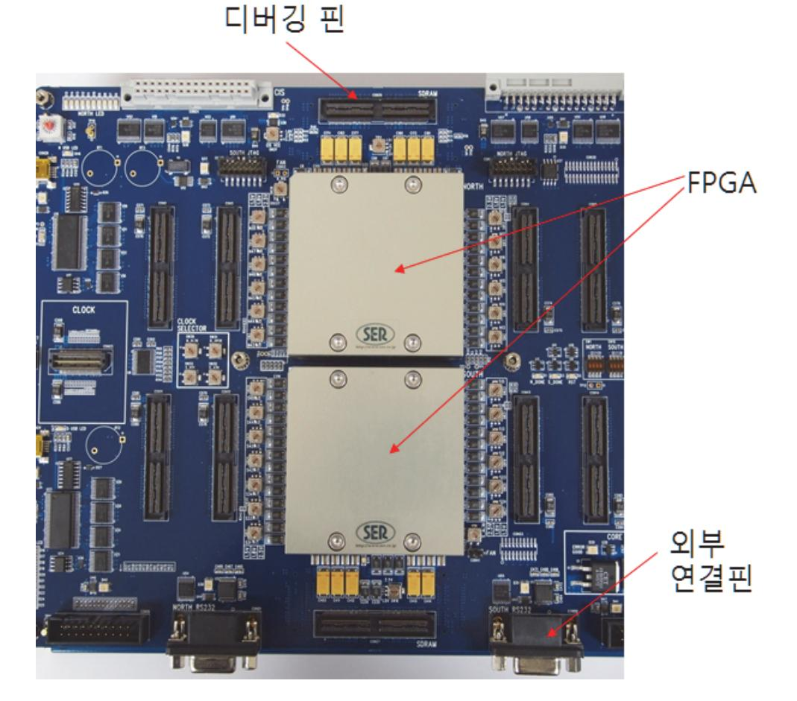

출처: 교육부(2018). 반도체 아키텍처 설계(LM1903060102\_14v3). 한국직업능력개발원. p.69. [그림 4-1] FPGA를 이용한 검증 보드 예

71

숕 검증 시스템 결정하기

1. 검증 시스템에 대해서 결정한다.

검증 시스템의 결정은 단순히 설계된 기능 검증을 목적으로 하는 것과, 설계 검증을 포함해 서 소프트웨어를 개발하는 목적으로 하는 것으로 구분할 수 있다. 소프트웨어 개발을 목적 까지 포함해서 검증 시스템을 만드는 이유는 반도체 공정 완료하는데 기간이 많이 필요하 므로, 검증 시스템을 이용하여 소프트웨어를 먼저 개발 진행하여 전체 개발 기간을 단축시 키려는 목적이다. 검증 시스템을 구축할 때 어떤 목적으로 할 것인지에 따라서 검증 시스템 을 결정하면 된다.

(1) 단순 기능 검증

하나의 기능 블록에 대해서 입력 신호를 넣었을 때 원하는 출력이 나오는지 확인하는 검증이다. 하나의 블록에 대해 기능 검증하는 것이므로 비교적 쉽게 동작 검증이 가능하 다. 이것에 맞는 검증 시스템은 비교적 간단히 구성을 할 수 있다. 단순 기능 검증별로 검증 시스템을 구분해서 구축하는 것은 비효율적이므로 단순 검증을 하는 여러 기능 블 록을 하나의 검증 시스템에서 할 수 있도록 결정한다. 또한 동작 시나리오를 포함한 검 증도 동일한 검증 시스템에서 운영이 되도록 만드는 것이 효율적이다.

- (2) 동작 시나리오를 포함한 기능 검증
  - 동작 시나리오를 포함한 검증은 여러 개의 기능 블록이 동시 또는 기능 블록간 연결하 여 동작하는 것에 대해 검증을 하는 것이다. 각 기능 블록에서 처리하는 데이터뿐만 아니라 여러 기능 블록을 통과해서 출력되는 데이터에 대해서 검증을 하는 것이다. 이러한 검증을 위한 검증 시스템은 기능 블록 및 주변 인터페이스에 대해서도 고려 를 해서 제작을 하여야 하고, 단순 기능 검증 기능도 포함을 하도록 제작하여야 한 다.
- (3) 소프트웨어 개발을 포함한 기능 검증
  - 소프트웨어 개발을 포함한 검증은 구축된 검증 시스템을 이용하여 소프트웨어의 개발을 진행하기 위한 것이다. 단순 기능 검증과 동작 시나리오를 포함한 검증이 완료되면, 동일한 검증 시스템을 이용하여 소프트웨어 개발을 할 수 있도록 검증 시스템의 역 할을 바꿔서 진행한다는 의미이다.

## 4-3. 동작 시나리오 확정

학습 목표 • 구현 가능에 따른 각 세부 블록 간의 동작 시나리오를 확정할 수 있다.

## 필요 지식 /

숔 동작 시나리오

동작 시나리오는 기능 블록 자체의 동작을 확인하는 것을 포함해서 각 기능 블록간의 연동되는 동작 또는 실제로 응용처에서 사용하려는 동작 목적을 반영한 시나리오로 설계 검증을 할 때 사용한다. 응용처에서 사용할 때는 단순히 하나의 기능 블록만 동작시키는 것보다는 여러 기능 블록이 동시에 동작하는 경우가 많으므로 이것을 반영한 시나리오를 검증시스템에서 사용하여 검증의 수준을 높여야 한다. 그리고 전체 개발 일정에서 동작 시나리오를 검증하는데 필요한 일정을 고려하여 어떤 검증 시나리오를 사용할지 결정한다.

1. 동작 시나리오의 구분

동작 시나리오는 실제 응용처에서 사용하려는 목적에 최대한 맞추어서 만들어야 한다. 동작 시나리오는 검증하려는 내용에 따라서 다음과 같이 구분이 된다.

(1) 블록 제어 동작 시나리오

각 기능 블록을 제어하는 신호를 생성하여 각 기능 블록들이 입력되는 제어 신호에 따 라 제어가 되는지를 확인하는 동작 시나리오이다. 설계된 제어 블록 또는 내장된 CPU 에서 각 블록에 제어 신호를 보내면, 각 기능 블록은 이 제어 신호가 원하는 동작을 하 는지 검증을 하면 된다.

(2) 데이터 흐름 중심의 동작 시나리오

데이터 흐름 중심의 동작 시나리오는 입력되는 데이터가 하나의 기능 블록에서 처리되 어 출력되고 다음의 기능 블록으로 입력되는 것과 같이 데이터의 흐름을 중심으로 만드 는 동작 시나리오 이다. 기능 블록별로 검증을 하는 것은 각 기능 블록 단위로 입력, 출 력을 확인하여 목적하는 값이 출력이 되는지를 확인하는 것이라고 하면, 데이터의 처리 순서에 맞추어서 각 기능 블록이 연동하여 동작한 결과를 확인하는 것이 데이터 흐름 중심의 검증 동작 시나리오이다. 데이터 흐름 중심의 동작시나리오를 그림으로 표시하면 [그림 4-2]와 같다. 이 동작 시나리오는 CPU에서 인터페이스 7을 세팅하여 외부에서 입력되는 데이터를 어떤 형태로 받을 것인지를 정의 하고, 인터페이스 7에서 받은 데이

터는 Bus Bridge(시스템 버스와 Peripheral BUS를 연결해주는 중간 역할을 하는 회 로)와 기능 블록 6을 통해서 DRAM을 제어하여 기록을 한다. 다음으로 CPU가 기능 블 록 6을 통해서 DRAM에 저장되어 있던 데이터를 읽어서 정해진 처리를 하여 그 처리 결과를 기능블록 6을 통해서 DRAM에 다시 저장하는 동작을 하는 것이다. 본 동작 시 나리오가 정상적으로 수행이 되어 목적하는 결과를 얻으면, 이 동작 시나리오는 검증이 완료된 것이다.

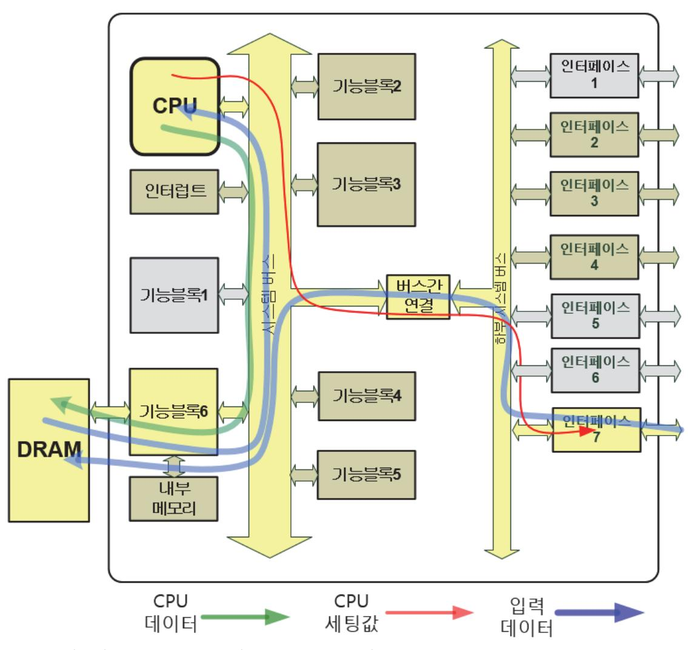

출처: 교육부(2018). 반도체 아키텍처 설계(LM1903060102\_14v3). 한국직업능력개발원. p.72. [그림 4-2] 데이터 흐름 중심의 동작 시나리오 예

숕 동작 시나리오의 작성

동작 시나리오를 작성하는 목적은 개발 단계에서 설계한 기능 블록들이 연동하여 원하는 동작 을 하는지 확인하는데 사용을 하려는 것이다. 많은 경우의 동작 시나리오 중에서 반드시 검증 을 해야 하는 동작 시나리오를 정의하고, 그 동작을 위한 각 기능 블록 간의 연결 및 제어 방 법에 대해서 작성을 해야 한다. 동작 시나리오에는 시뮬레이션을 이용하여 검증하는 방법과 검 증 시스템을 이용한 검증 방법이 있다.

- 1. 시뮬레이션으로 동작 확인 가능한 동작 시나리오 설계 담당자가 시뮬레이션 툴을 이용하여 동작 검증을 하는 방법으로 간단한 동작 시나리 오를 중심으로 만든다. 내부 신호선을 시뮬레이션에서 확인할 수 있으므로 외부에서 확인하 기 어려운 신호선을 볼 필요가 있을 때 유용하다.
- 2. 검증 시스템을 사용한 동작 시나리오

검증 시스템을 사용하면, 여러 기능 블록이 포함된 동작 시나리오를 실시간으로 동작 시키 는 것이 가능하므로 복합적인 동작 시나리오를 만들 수 있다.

## 숖 동작 시나리오 확정

동작 시나리오들이 작성이 되었으면, 어떤 동작 시나리오를 사용할지를 결정해야 한다. 모든 시나리오를 검증하는 것보다는 핵심적인 동작 시나리오를 선택해서 집중적으로 검증하는 것이 효율적이다. 동작 시나리오를 확정하는 기준을 수립하여 선정을 한다.

### 숗 확정된 동작 시나리오를 이용한 검증

개발하려는 반도체 제품이 응용처에서 원하는 기능 동작을 할 수 있는지에 대한 확인은 동작 시나리오를 이용한 검증을 통해서 간접적으로 할 수 있다. 응용처에서 사용가능한 시나리오 중 에서 검증 시스템에 적용 가능한 동작 시나리오가 결정이 되면, 필요한 정보를 취합한다. 취합 하는 정보는 검증하려는 동작 시나리오와 관련된 기능 블록들의 상세 구조 및 입력, 출력 신호 선에 대한 내용과, 기능 블록을 제어하는 신호들이다. 제어 신호들을 입력하는 방법은 소프트 웨어로 제어 신호를 만들어서 제공하는 것이 일반적인 방법이다. 데이터의 흐름이 어떤 경로를 통과해서 이동하는지를 파악하고, 그 경로를 통과한 최종 결과를 확인하여야 한다. 최종 결과 값을 예측하였던 결과와 비교를 해서 똑같은 결과를 얻으면 검증이 완료된 것이다. 단순 기능 검증 보다는 좀 더 실제적인 동작에 근접하여 설계 검증을 하는 것이므로 그 검증 효과는 매우 크다. 검증 동작 시나리오를 선택하고, 그 결과를 확인하는 것 차제가 설계 검증의 핵심이라고 보면 된다. 동작 시나리오 검증은 반도체 공정을 시작하기 전에 완료를 하는 것이 바람직하다.

## 수행 내용 / 동작 시나리오 확정하기

#### 재료·자료

- 개발 단계별 수행 목록
- 기능블록의 동작에 대한 정의
- 개발하고자 하는 반도체 제품의 동작 시나리오
- 검증할 동작 시나리오의 종류 및 그 상세 내용

## 기기(장비 ・ 공구)

- 해당 없음
- 안전 ・ 유의사항
  - 구현 기능에 따른 각 세부 블록간의 동작 시나리오를 이해하는 능력이 요구된다.

수행 순서

- 숔 동작 시나리오 작성하기
  - 1. 상황에 따른 여러 동작 시나리오를 작성한다.

사용처에서 주로 사용하는 기능들을 조사해서 가능한 많은 기능 블록이 동시 또는 순차적 으로 진행하는 동작과 입력된 데이터가 처리되는 순서에 맞는 동작 등에 맞추어서 동작하 는 동작 시나리오들을 작성한다. 동작 시나리오 작성할 때 들어가야 하는 내용은 다음과 같 다.

- (1) 동작 시나리오 이름 어떤 동작을 검증하기 위한 것인지 동작 시나리오 이름을 보면 쉽게 이해를 할 수 있게 이름을 선정한다.
- (2) 시나리오에서 동작 시키는 기능 블록들의 이름 각 동작 시나리오에 따라서 동작해야 하는 기능 블록들이 어떤 것이 포함이 되는지 확 인해서 그 기능 블록의 이름을 포함시킨다.

(3) 제어 신호

각 동작 시나리오에 따라서 각 기능 블록들에 필요한 제어 신호가 어떤 것들이 있는지 를 확인하고, 제어 신호 입력, 출력에 대한 사양도 확인하여야 한다.

(4) 입력 데이터

기능 블록에 입력되는 데이터는 기능 블록의 최종 결과 값을 예측할 수 있는 데이터로 준비를 한다. 최종 결과를 예측할 수 없는 입력 데이터는 정상 동작 여부를 확인하는데 어려움이 있다.

(5) 출력 데이터의 비교

동작 시나리오의 최종 결과에 대해서는 미리 어떤 결과가 예상되는지 확보를 해야 한다. 이것이 필요한 이유는 검증시스템을 통해서 최종 결과를 얻은 후 정상적인 결과인지를 확인하기 위해서이다. 예상 결과를 확보를 하는 방법은 시뮬레이션을 각 기능 블록별로 단계적으로 "기능 블록1 -> 기능 블록2 -> 기능 블록3 -> 최종 결과"와 같이 진행하여 얻는 방법이 있고, 각 기능 블록의 기능을 프로그램으로 작성 후 프로그램을 실행하여 얻는 방법이 있다. 각 동작 시나리오가 완료 되었을 때 최종 결과를 확인해서 예상되는 결과와 동일한지 비교한다. 두 개의 결과를 비교해서 동일하게 나오면, 그 동작 시나리 오는 정상적으로 동작을 한다고 볼 수 있다.

숕 동작 시나리오 확정하기

- 1. 작성된 동작 시나리오 중 어떤 동작 시나리오를 사용할지 선택한다. 동작 시나리오들이 작성이 되었으면, 어떤 동작 시나리오를 사용할지를 결정해야 한다. 모 든 시나리오를 검증하는 것보다는 핵심적인 동작 시나리오를 선택해서 집중적으로 검증하는 것이 효율적이다. 동작 시나리오를 확정하는 기준을 수립하여 선정을 한다.
- 2. 동작 시나리오는 다음의 항목을 검토해서 확정한다.
  - (1) 가능한 여러 기능 블록이 동시에 동작을 하는 시나리오 동작 시나리오는 최대한 많은 기능 블록이 동작하도록 만들어서 많은 기능들이 하나의
    - 시나리오로 검증이 가능하도록 하는 것이 효율적이다.
  - (2) 데이터의 흐름을 고려한 시나리오

데이터를 처리하는 순서에 따라서 시나리오를 만들면 검증 결과를 예측하기 쉽고, 문제 발생 시 원인 분석을 빨리 할 수 있다는 장점이 있다.

(3) 소프트웨어 제어 관점에서 각 기능 블록들의 동작을 확인할 수 있는 시나리오 RTL설계로 구현된 기능 블록들이 소프트웨어의 제어가 필요한 부분이 있다고 하면 소 프트웨어와 같이 동작 확인을 할 수 있는 시나리오를 사용해야 한다.

77

- (4) 최종 결과를 쉽게 확인할 수 있는 시나리오 동작 시나리오가 완료되었을 때 얻는 최종 결과가 어떤 형태로 출력이 되는지 쉽게 확 인할 수 있도록 만들어져야 한다.
- (5) 예측되는 결과 값을 RTL설계 단계에서 사용하는 시뮬레이션에서도 확인할 수 있는 시나리오 예측했던 결과를 얻지 못했을 때 그 원인 분석을 하려면 동작 시나리오의 단계별로 입 력, 출력 데이터를 각각 확인하여야 한다. 따라서 시뮬레이션으로 확인이 가능한 시나리 오를 사용하여야 한다.

숖 동작 시나리오를 사용한 설계 검증하기

- 1. 선택된 동작 시나리오에 따라 설계된 내용을 검증한다. 동작 시나리오의 선택이 완료되었으면, 동작 시나리오에 따라 설계된 내용을 검증 한다. 동 작 시나리오를 구현하는데 필요한 기능 블록들을 확인하고, 필요한 데이터와 제어 신호를 입력하여 동작 시나리오에 따른 설계 검증을 실시한다.
  - (1) 동작 시나리오 기준 동작 검증

동작 시나리오 기준으로 검증하는 순서를 플로차트로 표현을 하면 그림 [4-3]와 같다. 동작 검증할 시나리오가 결정이 되면, 동작에 연관된 기능 블록들이 어떤 것들이 있는지 파악을 한다. 시뮬레이션 등의 방법으로 예측되는 최종 데이터를 확보하고, 검증 시스템 에서 동작 검증 시나리오 순서대로 동작을 시켜서 검증시스템의 최종 출력을 얻는다. 예 측되는 최종 데이터와 검증 시스템의 최종 출력을 비교하여 동일한 결과를 확인하면 검 증이 완료된 것이다. 만일 비교 결과 결과물이 다르면, 다르게 나오는 원인을 설계 담당 자와 소프트웨어 담당자들과 같이 분석하여 원인을 찾는다. 원인 분석이 완료되면, 수정 한 후에 다시 처음부터 동작 시나리오를 검증 시스템을 사용하여 설계 검증한다.

2. 설계 검증한 결과에 따라 설계 수정을 진행하고 다시 검증 과정을 거쳐 검증을 완료한다. 동작 시나리오를 사용하여 설계 검증한 결과가 예측되었던 결과와 다르면 설계 담당자와 원인 분석을 하고, 기능 설계의 오류를 수정하고 다시 동작 시나리오 검증을 실시한다. 이 런 과정을 반복해서 진행하여 최종 결과가 예측한 결과와 동일하게 되면 그 동작 시나리오 는 검증이 완료된 것으로 한다.

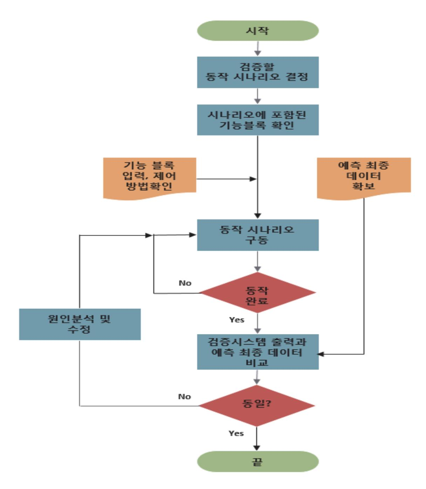

출처: 교육부(2018). 반도체 아키텍처 설계(LM1903060102\_14v3). 한국직업능력개발원. p.77. [그림 4-3] 동작 시나리오 검증 순서

#### 수행 tip

- 검증시스템에서 진행 가능한 검증 동작 시나리오를 설계 담당자와 협의를 한다.
- 동작 시나리오에 따른 검증 방법은 시뮬레이션을 통한 확 인 방법과 검증 시스템을 통한 실시간 검증 방법이 있다.

## 학습 4 교수·학습 방법

## 교수 방법

- 시스템 레벨 설계 관점에서 다양한 기능 블록 구현하는 방법에 따른 기술 특성에 대해 설명 하고 질의응답이 되도록 유도한다.
- 시스템 레벨 설계는 하드웨어로 구현되는 부분과 이와 연계된 소프트웨어도 같이 개발하는 것이 필요함을 설명한다.
- 설계된 기능 블록의 검증의 중요성과 그 효과에 대해서 설명한다.
- 설계된 기능 블록의 검증하는 방법에 대해서 설명한다.
- 설계 검증을 위한 검증 시스템을 구성하고 실제적으로 사용하는 방법에 대해서 설명한다.
- 설계된 기능 블록을 검증하는 방안 중에서 기능 블록간 연계되어 동작하는 시나리오의 중요 성을 설명하고, 시나리오를 결정하고 작성하는 방법에 대해서 설명한다.

## 학습 방법

- 시스템 레벨 관점에서 필요한 기능 블록의 설계 및 필요한 IP를 조사하여 구현하는 방법에 대해 학습하고, 실습을 통해 충분히 숙지한다.
- 시스템 레벨로 구현하는 기능 블록이 하드웨어와 이와 연계된 소프트웨어도 같이 개발이 필 요한 이유에 대해서 학습하여 그 이유를 명확히 이해하도록 한다.
- 설계된 기능 블록의 검증의 중요성과 그 효과에 대해서 정리하고 학습한다.
- 설계된 기능 블록의 검증하는 방법에 대해 학습하기 위해서 특정 기능 블록을 사례로 하여 입력과 출력 데이터를 이용하여 어떤 방법으로 검증할 수 있는지에 대해서 학습하고, 실습을 통해 충분히 숙지한다.
- 검증 시스템을 구성하는 방법에 대해서 학습하고 실제 검증 시스템들에 대해서도 조사를 한 다.
- 설계된 여러 기능 블록을 검증하는 동작 시나리오의 중요성에 대해서 학습하고, 기능 블록 의 사양들을 정의하고, 그 기능 블록간 연동하여 검증하는 시나리오를 작성하는 실습을 수행 한다.

## 학습 4 평 가

## 평가 준거

• 평가자는 학습자가 학습 목표를 성공적으로 달성하였는지를 평가해야 한다.

#### • 평가자는 다음 사항을 평가해야 한다.

| 학습 내용         | 학습 목표                                        | 성취수준 |   |   |  |
|---------------|----------------------------------------------|------|---|---|--|
|               |                                              | 상    | 중 | 하 |  |
| 시스템 레벨        | - 하드웨어로 설계하는 블록과 연계되는 소프트웨어 운영               |      |   |   |  |
| 사양서 작성        | 안을 결정할 수 있다.                                 |      |   |   |  |
| 검증 시스템 결정  | - 설계 검증에 필요한 검증 시스템을 결정할 수 있다.               |      |   |   |  |
| 동작 시나리오 확정 | - 구현 기능에 따른 각 세부 블록 간의 동작 시나리오를 확정할 수 있다. |      |   |   |  |

### 평가 방법

• 서술형 시험

| 학습 내용            | 평가 항목                                      | 성취수준 |   |   |
|------------------|--------------------------------------------|------|---|---|
|                  |                                            | 상    | 중 | 하 |
| 시스템 레벨 사양서 작성 | - 시스템 레벨 사양의 의미 및 일반적인 사양서 와의 차이점       |      |   |   |
| 검증 시스템 결정     | - 설계 검증에 필요한 검증 시스템 결정을 위한 사전조사 항목 및 내용 |      |   |   |
| 동작 시나리오 확정    | - 동작 시나리오 작성 시 필요 내용                       |      |   |   |

• 평가자 질문

|                  |                                     |   | 성취수준 |   |  |
|------------------|-------------------------------------|---|------|---|--|
| 학습 내용            | 평가 항목                               | 상 | 중    | 하 |  |
| 시스템 레벨 사양서 작성 | - 시스템 레벨 사양의 의미 및 일반적인 사양서와의 차이점 |   |      |   |  |
| 검증 시스템 결정     | - 검증 시스템 결정을 결정하는 검증 목적 종류          |   |      |   |  |
| 동작 시나리오 확정    | - 동작 시나리오 작성을 통한 시나리오 시뮬레이션         |   |      |   |  |

## 피드백

#### 1. 서술형 시험

 - 시스템 레벨 사양서 작성 및 검증 시스템을 결정하는 과정, 동작시나리오 확정 과정에 대한 숙지 여부를 정확히 체크한 후, 검증 시스템을 결정하고 동작시나리오 작성에 필요한 내용들을 잘 이해할 수 있도록 평가 결과를 피드백 한다.

#### 2. 평가자 질문

 - 각 단계별 의미 및 목적을 명확히 이해하고 있는지 질문하여 체크한 후, 미흡한 부분은 재교육하 여 동작 시나리오를 확정하는 단계까지 잘 이해할 수 있도록 한다.

- ∙ 교육부(2018). 반도체 아키텍처 설계(LM1903060102\_14v3). 한국직업능력개발원.
- ∙ 경종민 외(2008).『반도체로 움직이는 세상』. 한국반도체산업협회.
- ∙ 한국반도체연구조합(2012).『반도체 용어 사전』. 한국반도체산업협회.

## 활용서식 1 아키텍처 사양서

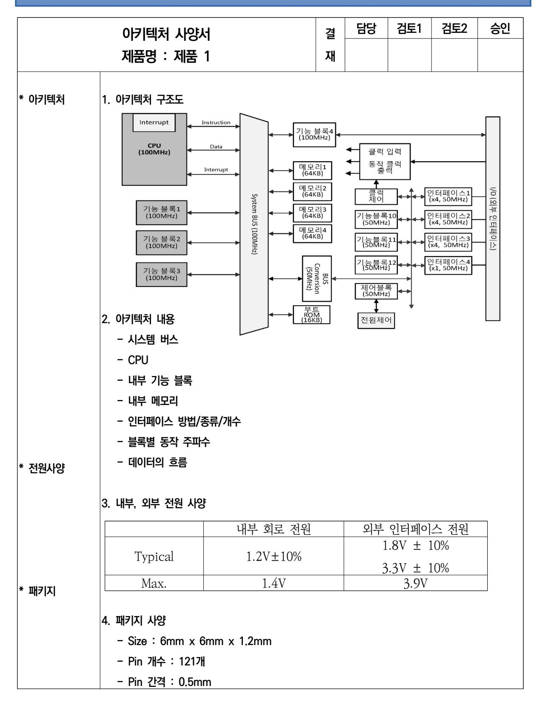

|                        |                                         |       |        | 업무코드   |        |     | 승인권자 |
|------------------------|-----------------------------------------|-------|--------|--------|--------|-----|------|
|                        | 제품 사양서                                  |       | 결      | 기 안 | 검토1    | 검토2 | 승인   |
|                        |                                         |       | 재      |        |        |     |      |
|                        | 제품명 : 제품 1                              |       | 직위/성명  | /      | /      | /   | /    |
|                        |                                         |       | 일 자 | /      | /      | /   | /    |
| ⦁개 요                | 1. 아키텍처 주요 내용                           |       |        |        |        |     |      |
| ⦁주요 기능 및               | 1. 기능 1                                 |       |        |        |        |     |      |
| ⦁블록도                   | ⦁상세 기능 1-1                              |       |        |        |        |     |      |
|                        | 2. 기능 2                                 |       |        |        |        |     |      |
|                        | ⦁상세 기능 2-1                              |       |        |        |        |     |      |
|                        | ⦁상세 기능 2-2                              |       |        |        |        |     |      |
|                        |                                         |       |        |        |        |     |      |
|                        | 3. 기능 3                                 |       |        |        |        |     |      |
|                        | ⦁상세 기능 3-1                              |       |        |        |        |     |      |
|                        | ⦁상세 기능 3-2                              |       |        |        |        |     |      |
|                        | ⦁상세 기능 3-3                              |       |        |        |        |     |      |
|                        | 4. 차별점                                  |       |        |        |        |     |      |
|                        | ⦁상세 기능 3-1                              |       |        |        |        |     |      |
|                        | ⦁상세 기능 3-2                              |       |        |        |        |     |      |
| ⦁전기적인 사양               | 1. 정격 동작 전압 ⦁인터페이스 전압 ⦁칩 내부 동작 전압 |       |        |        |        |     |      |
| ⦁물리적인 사양               | 1. 패키지                                  |       |        |        |        |     |      |
|                        | ⦁가로 x 세로 x 높이, 핀 개수                     |       |        |        |        |     |      |
|                        |                                         |       |        |        |        |     |      |
| ⦁경쟁제품 비교               | 항목                                      | 제품 1  | 경쟁사 A  |        | 경쟁사 B  |     | 차별점  |
|                        | CPU                                     | CPU_A | CPU_B  |        | CPU_A  |     | 동등   |
|                        | 주파수                                     | 96MHz | 48MHz  |        | 100MHz |     | 동등   |
|                        |                                         |       |        |        |        |     |      |
|                        |                                         |       |        |        |        |     |      |
|                        |                                         |       |        |        |        |     |      |
|                        |                                         |       |        |        |        |     |      |
| 주) 1. 목표 사양은 기능중심으로 작성 |                                         |       |        |        |        |     |      |
| 2. 경쟁사 대비 비교 우위점 표시    |                                         |       |        |        |        |     |      |

| NCS학습모듈 개발이력 |                                      |     |                 |
|--------------|--------------------------------------|-----|-----------------|
| 발행일          | 2015년 12월 31일                        |     |                 |
| 세분류명         | 반도체개발(19030601)                      |     |                 |
| 개발기관         | 한국반도체산업협회, 한국직업능력개발원                 |     |                 |
|              | 이병철(㈜비드앤마이크로)*                       |     | 권태우(극동대학교)      |
|              | 김경섭(여주대학교)                           |     | 김병윤(전. 삼성전자㈜)   |
|              | 김문호(씨지아이파트너즈)                        |     | 민종수(엠텍비젼㈜)      |
|              | 안태원(동양미래대학교)                         |     | 이준성(인덕대학교)      |
|              | 유광동(전 동부하이텍)                         |     | 이호덕(㈜에이치디테크놀로지) |
|              | 이승은(서울과학기술대학교)                       |     |                 |
| 집필진          | 이제현(동양미래대학교)                         |     |                 |
|              | 이혁(㈜플렉스컴)                            | 검토진 |                 |
|              | 임종철(LG전자㈜)                           |     |                 |
|              | 임황규(성결대학교)                           |     |                 |
|              | 정종식(㈜e-wbm연구소)                       |     |                 |
|              | 천형용(충북반도체고등학교)                       |     |                 |
|              | 홍상진(명지대학교)                           |     |                 |
|              | 홍진균(전 ㈜LG실트론)                        |     | *표시는 대표집필자임     |
| 발행일          | 2018년 12월 31일                        |     |                 |
| 학습모듈명        | 반도체 아키텍처 설계(LM1903060102_14v3)       |     |                 |
| 개발기관         | 한국직업능력개발원                            |     |                 |
| 발행일          | 2024년 12월 31일                        |     |                 |
| 학습모듈명        | 반도체 아키텍처 설계(LM1903060102_23v5)       |     |                 |
| 개발기관         | 수원과학대학교 산학협력단(개발책임자: 윤창용), 한국직업능력연구원 |     |                 |

| 반도체 아키텍처 설계(LM1903060102_23v5)                                                                           |               |  |
|----------------------------------------------------------------------------------------------------------|---------------|--|
| 저작권자                                                                                                     | 교육부           |  |
| 연구기관                                                                                                     | 한국직업능력연구원     |  |
| 발행일                                                                                                      | 2024. 12. 31. |  |
| ※ 이 학습모듈은 자격기본법 시행령(제8조 국가직무능력표준의 활용)에 의거하여 개발하였으며, NCS통합포털사이트(http://www.ncs.go.kr)에서 다운로드 할 수 있습니다. |               |  |

