| 대분류/19 |                  |                 |                 |         |
|--------|------------------|-----------------|-----------------|---------|
| 전기·전자  | 중분류/03<br>전자기기개발 | 소분류/06<br>반도체개발 |                 |         |
|        |                  |                 | 세분류/01<br>반도체개발 | 능력단위/03 |

# NCS학습모듈 아날로그 회로 설계

### LM1903060103\_14v3

NCS 학습모듈은 교육훈련기관에서 출처를 명시하고 교육적 목적으로 활용할 수 있습니다. 다만 NCS 학습모듈에는 국가(교육부)가 저작재산권 일체를 보유하지 않은 저작물들(출처가 표기되어 있는 도표, 사진, 삽화, 도면 등)이 포함되어 있으므로 이러한 저작물들의 변형, 복제, 공연, 배포, 공중 송신 등과 이러한 저작물들을 활용한 2차 저작물의 생성을 위해서는 반드시 원작자의 동의를 받아야 합니다.

## NCS 학습모듈의 이해

※ 본 학습모듈은 「NCS 국가직무능력표준」사이트(http://www.ncs.go.kr) 에서 확인 및 다운로드 할 수 있습니다.

### (1) NCS 학습모듈이란?

- 국가직무능력표준(NCS: National Competency Standards)이란 산업현장에서 직무를 수행하기 위해 요구되는 지식·기술·소양 등의 내용을 국가가 산업부문별·수준별로 체계화한 것으로 산업현장의 직무를 성공적으로 수행하기 위해 필요한 능력(지식, 기술, 태도)을 국가적 차원에서 표준화한 것을 의미합니다.
- 국가직무능력표준(이하 NCS)이 현장의 '직무 요구서'라고 한다면, NCS 학습모듈은 NCS의 능력단위를 교육훈련에서 학습할 수 있도록 구성한 '교수·학습 자료'입니다. NCS 학습모듈은 구체적 직무를 학습할 수 있도록 이론 및 실습과 관련된 내용을 상세하게 제시하고 있습니다.


● NCS 학습모듈은 다음과 같은 특징을 가지고 있습니다.

첫째, NCS 학습모듈은 산업계에서 요구하는 직무능력을 교육훈련 현장에 활용할 수 있도록 성취목표와 학습의 방향을 명확히 제시하는 가이드라인의 역할을 합니다. 둘째, NCS 학습모듈은 특성화고, 마이스터고, 전문대학, 4년제 대학교의 교육기관 및 훈련기관, 직장교육기관 등에서 표준교재로 활용할 수 있으며 교육과정 개편 시에도 유용하게 참고할 수 있습니다. ● NCS와 NCS 학습모듈 간의 연결 체제를 살펴보면 아래 그림과 같습니다.


### (2) NCS 학습모듈의 체계

NCS 학습모듈은 1.학습모듈의 위치 , 2.학습모듈의 개요 , 3.학습모듈의 내용 체계 , 4.참고 자료 ,
 5.활용 서식/부록 으로 구성되어 있습니다.

### 1. NCS 학습모듈의 위치

NCS 학습모듈의 위치는 NCS 분류 체계에서 해당 학습모듈이 어디에 위치하는지를 한 눈에
 볼 수 있도록 그림으로 제시한 것입니다.

예시 : 이 · 미용 서비스 분야 중 네일미용 세분류

NCS-학습모듈의 위치

| 대분류 | 이용·숙박·여행·오락·스포츠 |          |  |
|-----|-----------------|----------|--|
| 중분류 | 이・미용            |          |  |
| 소분류 |                 | 이 미용 서비스 |  |

| 세 <del>분류</del> |             |           |
|-----------------|-------------|-----------|
| 헤어미용            | 능력단위        | 학습모듈명     |
| 피부미용            | 네일 샵 위생 서비스 | 네일숍 위생서비스 |
| 메이크업            | 네일 화장물 제거   | 네일 화장물 제거 |
| 네일미용            | 네일 기본 관리    | 네일 기본관리   |
| 이용              | 네일 랩        | 네일 랩      |
|                 | 네일 팁        | 네일 팁      |
|                 | 젤 네일        | 젤 네일      |
|                 | 아크릴릭 네일     | 아크릴 네일    |
|                 | 평면 네일아트     | 평면 네일아트   |
|                 | 융합 네일아트     | 융합 네일아트   |
|                 | 네일 샵 운영관리   | 네일숍 운영관리  |

### 학습모듈은

NCS 능력단위 1개당 1개의 학습모듈 개발을 원칙으로 합니다. 그러나 필요에 따라 고용 단위 및 교과단위를 고려하여 능력단위 몇 개를 묶어서 1개의 학습모듈로 개발할 수 있으며, NCS 능력단위 1개를 여러 개의 학습 모듈로 나누어 개발할 수도 있습니다.


- 🔾 활용안내

예시 : 네일미용 세분류의 '네일 기본관리' 학습모듈


프리에지, 니퍼, 퓨셔, 폴리시, 네일 파일, 스퀘어형, 스퀘어 오프형, 라운드형, 오발형, 포인트형

### 3. NCS 학습모듈의 내용 체계

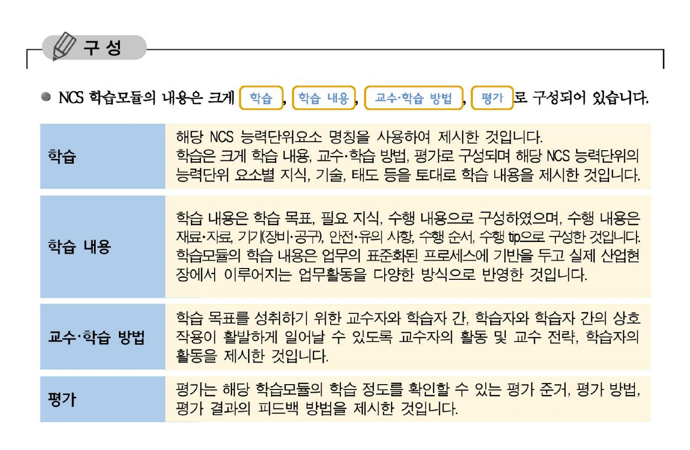

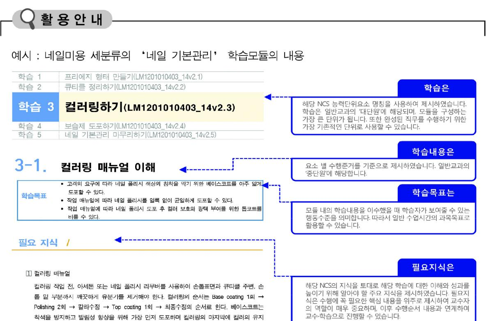

와 광택을 위해 톱코트를 도포하다. 네일 보강제(Nail Strengthner)를 바를 시에는 베이스코

트를 도포하기 전에 사용한다


|                                                                                                          | 교수·학습 방법은                                                                                            |
|----------------------------------------------------------------------------------------------------------|------------------------------------------------------------------------------------------------------|
| 학습3 교수·학습 방법 ◀                                                                                           | 학습목표를 성취하는데 필요한 교수 방법과 학습 방법<br>을 제시하였습니다.                                                           |
| 교수 방법 🚽                                                                                                  | 교수 방법은                                                                                               |
| <ul> <li>컬러링 제품의 성분과 칼라별 점도의 차이, 베이스코트와 톱코트의 역할, 폴리시 잡는 방법,<br/>큐어링 시간 등의 내용을 화면 자료와 함께 설명한다.</li> </ul> | 해당 학습활동에 필요한 학습내용, 학습내용과 관련된 학습<br>자료명, 자료 형태, 수행내용의 진행 방식 등에 대하여 제시                                 |
| <ul> <li>서식지를 활용하여 네일 컬러링 방법을 그림으로 그려 보게 한 뒤, 다양한 컬러링의 매뉴얼을<br/>그려서 숙지하도록 한다.</li> </ul>                 | 하였습니다. 또한 학습자의 수업참여도를 제고하기 위한 방<br>법 및 수업진행상 유의사항 등도 제시하였습니다. 선수학습<br>이 필요한 학습을 학습자가 숙지하였는지 교수자가 확인하 |
| • 젤 컬러링 시 주의사항을 계속 숙지시키도록 하며, 큐어링 시간에 대해 작성하도록 한다.                                                       | 는 과정으로 활용할 수도 있습니다.                                                                                  |
| 학습 방법                                                                                                    | 학습 방법은                                                                                               |
| • 컬러링을 위한 재료의 필요성과 사용방법을 숙지하고 컬러링 메뉴얼 과정에 맞추어 작업 내용을<br>이해한다.                                            | 해당 학습활동에 필요한 학습자의 자기주도적 학습 방법<br>을 제시하였습니다. 또한 학습자가 숙달해야 할 실기능력<br>과 학습과정에서 주의해야 할 사항 등으로 제시하였습니     |
| • 컬러링의 다양성에 대한 용어를 숙지하고 진행과정에 맞추어 내용을 작업한다.                                                              | 다. 학습자가 학습을 이수하기 전에 반드시 숙지해야 할<br>기본 지식을 학습하였는지 스스로 확인하는 과정으로 활                                      |
| • 곌 컬러링 시 적합한 큐어링 시간을 선택해서 큐어링 해본다.                                                                      | 용할 수 있습니다.                                                                                           |


## [NCS-학습모듈의 위치]

| 대분류 | 전기전자 |        |       |
|-----|------|--------|-------|
| 중분류 |      | 전자기기개발 |       |
| 소분류 |      |        | 반도체개발 |

| 세분류   |                 |                 |
|-------|-----------------|-----------------|
| 반도체개발 | 능력단위            | 학습모듈명           |
| 반도체제조 | 반도체 제품 기획       | 반도체 제품 기획       |
| 반도체장비 | 반도체 아키텍처 설계     | 반도체 아키텍처 설계     |
| 반도체재료 | 아날로그 회로 설계      | 아날로그 회로 설계      |
|       | 디지털 회로 설계       | 디지털 회로 설계       |
|       | 레이아웃 설계         | 레이아웃 설계         |
|       | 반도체 제조 공정 개발    | 반도체 제조 공정 개발    |
|       | 패키지 제품 설계       | 패키지 제품 설계       |
|       | 패키지 조립 공정 개발    | 패키지 조립 공정 개발    |
|       | 반도체 제품 기능·성능 검증 | 반도체 제품 기능·성능 검증 |
|       | 반도체 신뢰성 평가      | 반도체 신뢰성 평가      |

## 차 례

| 학습모듈의 개요             | 1  |
|----------------------|----|
| 학습 1. 적용 공정 분석하기     |    |
| 1-1. 회로 설계 환경 선정     | 3  |
| 1-2. 단위 소자 특성 분석     | 11 |
| • 교수・학습 방법           | 16 |
| • 평가                 | 17 |
| 학습 2. 회로 구성하기        |    |
| 2-1. 블록 단위 회로 구성     | 19 |
| 2-2. 블록별 상세 회로 구성    | 24 |
| • 교수・학습 방법           | 29 |
| • 평가                 | 30 |
| 학습 3. 시뮬레이션하기        |    |
| 3-1. 시뮬레이션 환경 구성     | 32 |
| 3-2. 시뮬레이션 결과 분석     | 37 |
| • 교수・학습 방법           | 43 |
| • 평가                 | 45 |
| 학습 4. 포스트 시뮬레이션하기    |    |
| 4-1. 포스트 시뮬레이션 환경 구성 | 47 |
| 4-2. 포스트 시뮬레이션 결과 분석 | 51 |
| • 교수・학습 방법           | 55 |
| • 평가                 | 57 |

### **학습 5. 구현 회로 검증하기**

| 5-1. 구현 회로 검증 환경 구축 및 측정 | 59 |
|--------------------------|----|
| 5-2. 구현 회로 분석 및 개선       | 65 |
| • 교수・학습 방법               | 71 |
| • 평가                     | 73 |
|                          |    |

| 참고 자료 |  | 75 |  |
|-------|--|----|--|
|       |  |    |  |

## 아날로그 회로 설계 학습모듈의 개요

### 학습모듈의 목표

바이폴라(Bipolar)와 MOSFET 소자의 공정 특성과 패키지 특성을 분석하여 아날로그 회로를 구성한 후 시뮬레 이션으로 검증하고 제작된 시제품의 측정을 통하여 아날로그 집적회로를 설계할 수 있다.

### 선수학습

전자 회로, 디지털 논리 회로, 전자통신 기초, 고급 물리

### 학습모듈의 내용체계

|               |                            |                   | NCS 능력단위요소 |  |
|---------------|----------------------------|-------------------|------------|--|
| 학습            | 학습 내용                      | 코드번호              | 요소명칭       |  |
| 1. 적용 공정 분석하기 | 1-1. 회로 설계 환경 선정           |                   |            |  |
|               | 1-2. 단위 소자 특성 분석           | 1903060103_14v3.1 | 적용 공정 분석하기 |  |
|               | 2-1. 블록 단위 회로 구성           |                   |            |  |
| 2. 회로 구성하기    | 2-2. 블록별 상세 회로 구성          | 1903060103_14v3.2 | 회로 구성하기    |  |
|               | 3-1. 시뮬레이션 환경 구성           |                   |            |  |
| 3. 시뮬레이션하기    | 3-2. 시뮬레이션 결과 분석           | 1903060103_14v3.3 | 시뮬레이션하기    |  |
|               | 4-1. 포스트 시뮬레이션 환경 구성       |                   | 포스트        |  |
| 4. 포스트시뮬레이션하기 | 4-2. 포스트 시뮬레이션 결과 분석       | 1903060103_14v3.5 | 시뮬레이션하기    |  |
| 5. 구현 회로 검증하기 | 5-1. 구현회로 검증 환경 구축<br>및 측정 | 1903060103_14v3.4 | 구현된 회로     |  |
|               | 5-2. 구현 회로 분석 및 개선         |                   | 검증하기       |  |

### 핵심 용어

트랜지스터, 설계 사양, 회로도, 테스트벤치, 레이아웃, 출력파형, 시뮬레이션, 기생성분, 포스트 시뮬레이션

## 학습 1 적용 공정 분석하기

| 학습 2 | 회로 구성하기     |
|------|-------------|
| 학습 3 | 시뮬레이션하기     |
| 학습 4 | 포스트 시뮬레이션하기 |
| 학습 5 | 구현 회로 검증하기  |

# **1-1.** 회로 설계 환경 선정

|       | • 수립된 설계 규격서에 따라 회로를 설계 할 수 있도록 적절한 공정을 선정할 수 있다. |
|-------|---------------------------------------------------|
| 학습 목표 | • 개발된 칩을 탑재할 수 있도록 전기 기계적 특성을 고려하여 적합한 패키지 형식을    |
|       | 선택할 수 있다.                                         |

### 필요 지식 /

트랜지스터

아날로그 회로 설계의 가장 기본이 되는 소자로써, 가장 일반적인 종류로는 접합형 트랜지 스터(BJTs: Bipolar Junction Transistors)와 전계 효과 트랜지스터(FETs: Field Effect Transistors)로 구분할 수 있다. 현재 개발하는 수많은 반도체 칩은 이러한 수천만 ~ 수억 개의 트랜지스터를 조합하여 우리가 원하는 기능을 구현할 수 있다.

1. 트랜지스터 기능

트랜지스터의 중요한 기능은 구성 회로에 흐르는 전류의 크기를 증폭하거나 전류의 흐름 을 연결하고 끊는 스위치 역할을 통해 제어할 수 있다. 또한 논리 회로의 구현을 통해 논 리적 연산이 가능하며, 정보를 저장하는 메모리로 활용할 수 있다.

2. 트랜지스터 종류

트랜지스터는 스위치와 유사한 원리로 동작한다. 이 때 연결을 하는 양쪽 단자 사이에 형 성되는 연결 채널의 형태, 양쪽 단자를 구성하는 물질 그리고 그 흐름을 조절하는 단자를 만드는 물질에 따라서 트랜지스터의 종류가 구분된다. 가장 일반적인 구조는 트랜지스터 개발 초기에 사용한 접합형 트랜지스터(BJT)와 동작 속도가 느린 단점에도 불구하고 집적 도가 높은 특징으로 활용도가 높은 전계 효과 트랜지스터(FET)가 있다. 그 중 현재 가장 많이 사용되는 전계 효과 트랜지스터는 실리콘을 사용한 금속 산화물 반도체(MOS : Metal Oxide Semiconductor) 형태이다.

### 3. 트랜지스터 구조

일반적으로는 반도체는 내부를 구성하고 있는 원자와 전자의 수가 4개로 같은 실리콘(Si) 을 사용해 제작한다. 이렇게 원자와 전자의 수가 서로 같을 때 전기적으로는 중성을 띠게 되며 중성의 반도체에 전기적인 흐름을 원활하도록 불순물을 주입하게 되는데, 이때 주입 하는 불순물의 성분에 따라서 P형과 N형 반도체로 구분할 수 있다. P형 반도체는 3가 원 자(붕소, 알루미늄, 인듐, 갈륨 등)를 주입하게 되는데, 이로 인해 홀의 개수가 전자의 개 수보다 많아지게 된다. N형 반도체는 5가 원자(인, 비소, 안티모니, 비수무트 등)를 주입하 게 되는데, 이로 인해 홀의 개수보다 전자의 개수가 많아지게 된다.

이렇게 만들어진 P형, N형 반도체를 다음 [그림 1-1]과 같이 N형 반도체 기반에 2개의 P 형 반도체 단자를 사용하는 형태를 PMOS(P-type MOS) 트랜지스터라 부르며, P형 반도체 기반에 N형 반도체 단자를 사용하는 형태를 NMOS(N-type MOS) 트랜지스터라 부른다. 그 림의 PMOS 트랜지스터에서 두 개의 P형 반도체 부를 각각 드레인 단자, 소스 단자라고 부르며, 이러한 반도체 위에 옥사이드 물질을 쌓고 그 위에 금속 층을 두어 드레인과 소 스 사이의 전기적 흐름을 조절하는 부분을 게이트라고 한다.

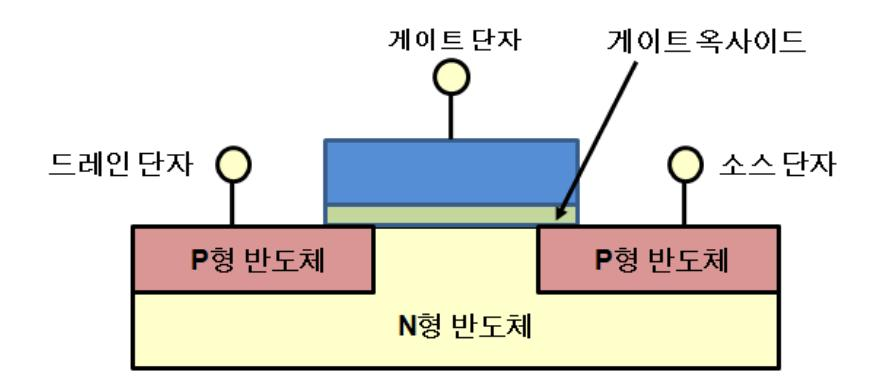

[그림 1-1] PMOS 트랜지스터 구조

### 4. 트랜지스터 동작 원리

게이트 단자에 전압이 인가되지 않을 경우에는 N형 반도체인 드레인과 소스 단자 사이에 P형 반도체인 substrate가 막혀 있는 형태로, 전류가 흐르지 않는다. 그러나 게이트 단자에 특정 값 이상으로 전압이 인가되면, 게이트 단자에 전하가 증가하게 되어 드레인과 소스 사이의 P형 반도체에 N형 반도체 특성의 N-채널이 만들어진다. 따라서 드레인과 소스가 연결되어 전류 흐름이 가능해진다. 이렇게 채널을 만들 수 있도록 게이트에 인가되는 전 압 값을 문턱 전압(Threshold Voltage)이라 부른다.

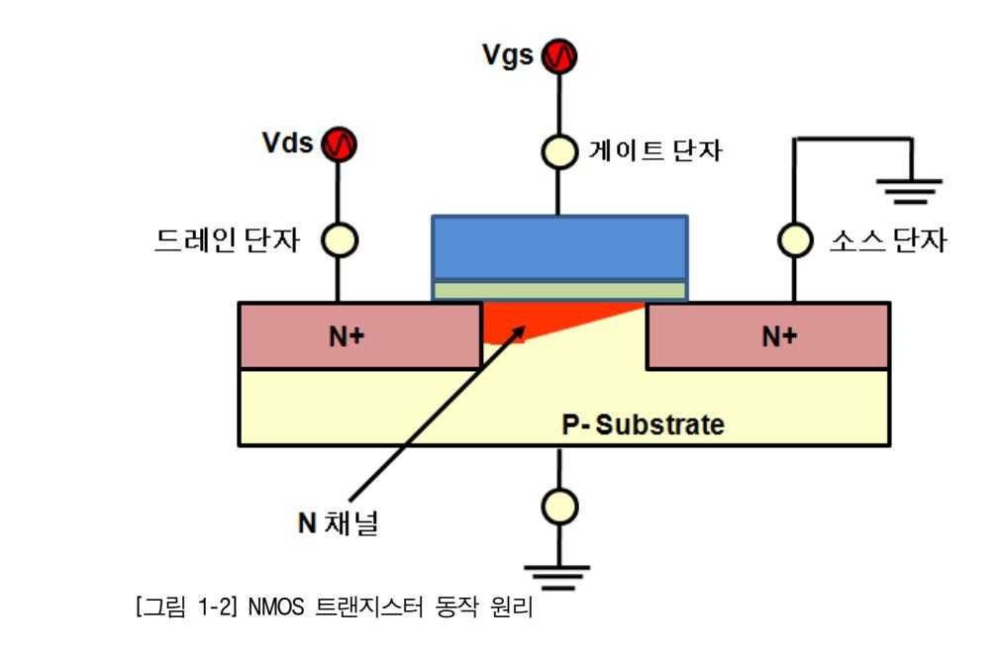

반도체 최소 공정

반도체의 최소 공정은 트랜지스터의 동작을 결정하는 채널의 길이를 얼마나 작게 설계할 수 있는지에 따라 결정된다. 채널의 길이가 짧으면 동일한 기능의 회로를 더 작은 면적에 구현할 수 있으므로, 제조 공정의 경쟁력을 가질 수 있다. 또한 채널 길이의 감소에 따라 이를 제어하는 게이트 부의 옥사이드 두께도 더불어 감소하게 되므로, 스위치 성능이 좋아 져서 더욱 빠른 동작속도를 갖게 된다. 더불어 동일한 동작을 위한 전압 값도 작아지게 되 는데 이로 인해 소모되는 전력 값이 작아지게 된다. 이러한 장점으로 인해 미세선폭을 갖 는 반도체 제조 공정의 개발은 지속적으로 이루어지고 있으며, 2000년대 초에는 130nm 수 준의 um 단위의 설계에서 현재는 20nm 전후의 nm 단위의 개발이 활발히 이루어지고 있다.

설계 권장 문서(Design Guide Document)

설계 권장 문서는 설계를 하는데 필요한 여러 가지 문서를 가리킨다. 다양한 형태와 이름 의 문서들이 존재하지만, 아날로그 설계를 하는데 사용하는 가장 대표적인 문서로는 설계 규격서(Design Specification), 모의실험 모델 특성 문서(Spice Model Parameter), 도면 설계 규칙서(Design Rule)가 있다.

1. 설계 규격서(Design Specification)

개발할 제품에 대한 제반의 성능 기준과 개발 목표를 기술한 문서이다. 설계 규격서는 개 발 칩을 기준으로 각각 필요한 주요 기능을 정의한다. 또한 정의한 기능 구현을 위해 각 단위 블록별로 필요한 성능 기준을 나열한다. 아날로그 회로 역시 하나의 단위 블록으로 필요한 성능 기준뿐만 아니라 가격, 일정에 대한 목표를 포함하여 해당 수치를 공통의 설 계 담당자가 검토한다. 이렇게 검토를 마친 최종 협의 결과를 문서로 정리하고, 향후 이 문서의 수치를 기준하여 모든 설계를 진행한다.

2. 모의실험 모델 특성 문서(Spice Model Parameter)

아날로그 회로 설계에 사용하는 Mosfet, 저항, 커패시터, 다이오드 등과 같은 단위 소자들 의 다양한 항목(폭, 길이 등) 변화에 따른 특성을 기술한 문서이다. 반도체 제조업체에서 는 해당 공정을 활용한 회로 설계를 위해, 각 개별 소자들의 다양한 조건 및 크기 변화에 따라 특성이 어떻게 변하는지 직접 실험을 진행한다. 이러한 실험 결과를 정리하여 각 소 자들의 성능 변화를 문서로 기술하고 이를 설계자들에게 제공하며, 시뮬레이션을 위한 모 델 파라미터의 개발에 활용한다. 회로 설계자는 공정업체에서 제공하는 이러한 문서를 활 용하여 본격적인 설계를 시작하기 전에, 사용 가능한 소자들이 어떠한 형태가 있는지 그 리고 조건 변화에 따른 소자들의 특성이 어떻게 변화하는지를 파악하고 설계 회로의 성능 목표를 만족할 수 있을지 사전에 개략적인 판단을 하게 된다.

3. 도면 설계 규칙서(Design Rule)

설계 규칙서는 레이아웃 설계를 하는데 필요한 필수 규칙을 기술한 문서이다. 공정에서 제공하는 소자의 크기를 가변할 수 있는 최대 최소 기준 및 소자의 연결을 위한 메탈 선 들의 최대 최소 선폭 기준, 그리고 메탈 선들 사이의 이격 거리 기준을 그림과 함께 정의 하고 있다. 회로 설계자는 이러한 설계 규칙서를 통해서 레이아웃 설계를 진행할 때의 제 약 조건 및 주의 사항을 사전에 파악하고, 레이아웃 시 이러한 문제가 발생하지 않도록 설계를 진행한다.

패키지

설계한 회로가 반도체 제조 공정의 각 단계를 거쳐 하나의 완성된 웨이퍼로 나오게 되면, 이러한 웨이퍼는 외부 자극과 충격에 매우 쉽게 파손되는 위험 요소를 가지고 있다. 따라 서 이러한 외부 충격으로부터 개발한 칩을 보호하기 위해서, 개별 분리된 칩들을 패키지를 통해 감싸게 된다. 또한 칩은 보통 보드에 연결하여 전원을 공급 받고 다른 칩들과 신호를 주고받게 되는데, 이러한 배선을 위해서도 패키지 공정은 반드시 필요하다. 최근에는 보다 많은 수의 핀들을 배치하면서 더욱 얇고 작은 크기로 패키지를 만들되, 방열 기능 등의 추 가 기능을 갖도록 패키지가 개발 되고 있다.

패키지의 기본 구조는 [그림 1-3]과 같이 설계한 집적회로(IC) 칩, 칩 내부의 입출력 신호 와 패키지의 핀을 연결하는 (IO)패드, 마지막으로 칩의 패드와 PCB 보드를 연결하는 패키 지 다리와 같은 모양의 리드 프레임으로 구분할 수 있다.

아날로그 회로 설계를 진행할 때는 회로 내부의 설계뿐 만 아니라, 개발 칩 전체 관점에서 선정한 패키지의 물리적 특성 및 볼의 위치에 따른 신호의 감쇄 여부를 사전에 확인해

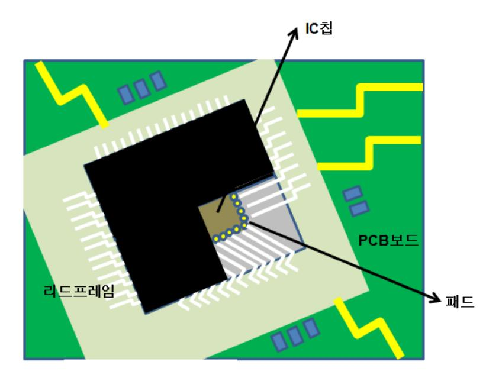

[그림1-3] 패키지 기본 구조

야 한다. 리드 프레임과 본딩 와이어의 길이가 길어질수록 의도하지 않은 저항, 리액턴스, 커패시턴스와 같은 기생 성분들이 만들어지는데, 이러한 성분들을 입력 조건 또는 출력 조 건으로 잘 모델링하여 설계 회로의 조건으로 사전 반영을 하는 것이 개발하는 회로의 최 적화 된 성능을 위해 매우 중요하다.

### 수행 내용 / 회로설계 환경 선정하기

### 재료·자료

- 설계 규격서(Design Specification)
- 모의실험 모델 특성 문서(Spice Model Parameter)
- 도면 설계 규칙서(Design Rule)
- 패키지 특성 문서

### 기기(장비 ・ 공구)

- 컴퓨터, 프린터, 워크스테이션, 인터넷
- 시뮬레이션 툴
- 레이아웃 툴

### 안전 ・ 유의사항

반도체 소자 및 공정에 대한 기본적인 지식을 필요로 한다.

#### 수행 순서

- 설계 규격서(Design Specification)의 주요 목표를 도출한다.
  - 1. 시스템 설계 규격을 이해한다.
    - (1) 개발 칩을 사용하는 시스템의 구조 및 주요 기능을 확인한다.
    - (2) 시스템의 요구 기능을 만족하기 위한 칩의 설계 기준을 확인한다.
    - (3) 칩의 설계 기준이 적합한지 검토하고, 개발을 요구하는 고객과 협의한다.
  - 2. 개발 블록의 주요 설계 목표를 수립한다.
    - (1) 칩 설계자로부터 1차 개발 의뢰서를 받는다.
    - (2) 개발하는 블록의 성능 지표 및 주요 개발 일정을 확인한다.
    - (3) 개발 블록과 주변의 구성 블록들의 연결도를 확인한다.
    - (4) 개발 블록의 성능 지표에 대한 적절성을 검토하고, 이를 칩 설계자와 협의한다.
    - (5) 개발 블록의 크기에 대한 목표를 확인하고, 구현 가능성을 검토한다.
    - (6) 주요 개발 일정에 따른 Design Kit의 전달 시점 및 각 전달 시점에 포함해야 하는 설계 정보와 관련 문서의 완성도를 칩 설계자와 협의한다.
    - (7) 수립한 성능, 가격, 일정에 대한 목표를 상호 확인하고, 개발 중간에도 이러한 개발 목표가 시장 환경 및 개발을 요구하는 고객의 요청에 따른 변경사항이 있는지 수시 로 확인한다.

- 모의실험 모델 특성 문서(Spice Model Parameter)를 통해 주요 사용 소자의 특성을 확인하 고, 사용 소자의 종류를 선택한다.
  - 1. 공정 개발 부서에서 전달하는 모의실험 모델 특성 문서의 버전을 확인한다.
  - 2. 업데이트 기록을 확인하고, 일자와 버전별 주요 변경 사항을 확인한다.
  - 3. 설계에 사용하는 트랜지스터의 종류를 확인한다.

최근에는 인가하는 전압 및 누설전류, 동작 속도에 따른 다양한 종류의 PMOS, NMOS를 만들고 있으며, 설계자는 개발 회로의 성능 지표에 따라 이러한 최상의 성능을 만족할 수 있는 소자를 선택적으로 사용한다. 해당 문서에는 방대한 양의 트랜지스터 종류별 특성이 기록되어 있으므로, 사용하는 트랜지스터를 먼저 확인하는 것이 중요 정보의 가독성을 높 이는데 중요한 방법이 된다.

- 4. 사용하는 트랜지스터의 너비(W) 변화에 따른 주요 전압 값 및 전류량 변화를 확인한다.
- 5. IO 패드의 너비(W) 및 공정 변화에 따른 주요 전압 값 및 전류량 변화를 확인한다.
- 6. 바이폴라 트랜지스터의 종류, 크기별 변화에 따른 전류, 전압 값을 확인한다.
- 7. 저항 값을 만드는 다양한 물성 형태에 따른 최대, 최소 값과 크기 변화에 따른 변화량 확인한다.
- 8. 선택한 공정에서 제공하는 커패시터의 종류를 확인하고, 구현 가능한 최소, 최대 값을 확인한다.
- 도면 설계 규칙서(Design Rule)를 통해 설계한 소자들을 물리적인 도면으로 구현 시 발생하 는 제약 조건 및 민감한 성능 변화에 따른 사전 반영 항목을 확인한다.
  - 1. 공정 개발 부서에서 전달하는 도면 설계 규칙서(Design Rule)의 버전을 확인한다.
  - 2. 업데이트 기록을 확인하고, 일자와 버전별 주요 변경 사항을 확인한다.
  - 3. 선택한 공정에서의 전원 전압 특성 및 온도 변화의 범위를 확인한다.
  - 4. 표준 셀로 제공하는 중요 소자들의 구현 형태를 확인하고, 사용자 옵션으로 가변하는 항목에 따른 주요 특성 변화를 인지한다.
  - 5. 저항과 커패시터와 같은 특수한 형태로 제작하는 소자들의 구현 방법 및 사용 재질에 따른 특성 변화와 연결선 관련 제약 조건 여부를 확인한다.
  - 6. 주요 메탈 선들의 최소 선폭 및 이격 거리 정보를 확인한다.
  - 7. 소자와 연결선들을 상하로 연결하는 Contact과 Via 관련 크기 및 메탈 선과의 설계 규격 을 확인한다.

9

8. 대 물량 양산 수율 관련 공정에서 권장하는 규칙을 숙지한다.

DFM(Design For Manufacturing) 룰이라 부르는 규칙으로써 2개 이상의 Via 사용 및 Via 상판, 하판 메탈의 중첩 폭, 사용하는 메탈 선들의 밀도 등 수율 특성에 영향을 미치는 항 목을 확인해야 한다.

9. 레이아웃 시 발생하는 기생 성분에 따른 설계 약화 부분을 파악하고, 더미 블록과 같은 방지 대책의 사용 방법을 찾을 수 있다.

#### 수행 tip

- 대규모 분업화된 설계에서는 일정 단축을 위해 파 이프라인 방식의 설계가 이루어지고 있으며, 대부 분의 경우 Initial, Stable, Final의 3단계로 구분하여 설계 일정을 수립한다. 상위 설계자가 각 단계별로 요구한 설계 자료에 대해, 적절한 설계 지표를 협 의하고 정확한 목표 일정에 해당 정보를 전달하는 것이 매우 중요한 설계 능력이 되고 있다.
- 반도체 공정의 기술 흐름에 대해 관심을 갖고, 공 정 변화에 따른 개발 환경 변화를 숙지한다.
- 시스템의 설계 조건을 충분히 이해하고, 전체 칩의 설계 담당자와 의사 소통이 필수적이다.
- 개발 블록의 연결 부에 대한 정보는 수시로 상위 설계자 및 주변 블록 설계자와 공유 및 확인해야 한다.

# **1-2.** 단위 소자 특성 분석

학습 목표 • 공정에서 제공하는 소자들의 전기적 특성을 분석하여 설계 시에 제약사항의 발생여 부를 사전에 예측할 수 있다. • 적용 공정이 정전기에 대한 내성을 갖출 수 있는지를 분석하여 적절한 입/출력 구조 를 구성할 수 있다.

### 필요 지식 /

### 소자의 전기적 특성

모의실험 모델 특성 문서를 통해 개략적인 소자들이 갖는 설계 공정에서의 특성을 1차로 파악했다면, 보다 정확한 값들을 확인하기 위한 추가 실험을 진행해야 한다. 주요 확인 값 으로는 I-V 특성, 문턱(Threshold) 전압, 게이트 커패시터, 기생 커패시터, 시트 저항과 같 은 항목이 있다.

1. I-V 특성

새로운 공정에서 설계를 시작할 때 가장 기본이 되고 확인해야 할 항목이다. 인가하는 전 압 값의 변화에 따라 흐르는 전류 값이 어떻게 변하는 지 측정하여 얻은 결과를 통해 NMOS, PMOS 트랜지스터의 동작점, 포화 속도 등 다양한 특성을 확인한다.

2. 문턱(Threshold) 전압

사전적 정의로는 어떤 장치나 부품이 동작을 시작하는 전압이라 할 수 있다. 트랜지스터 역시 스위치로서의 기능을 수행하게 되는데, 이 때 스위치를 켜고 끄는 경계가 되는 전압 값을 문턱 전압이라고 한다. 이상적으로는 이러한 문턱 전압 값에서 순간적으로 켜지고 꺼지는 현상이 일어나야 하지만, 실제로는 이러한 동작도 기울기를 가지고 변화된다. 따라 서 이러한 트랜지스터의 동작 상태가 변하는 문턱 전압 값 주변에서의 트랜지스터 특성을 충분히 이해하는 것이 필요하다.

3. 게이트 커패시터

트랜지스터의 기본 구조에서 설명했듯이 게이트와 반도체부(드레인, 소스, 바디) 사이에는 게이트 옥사이드(Oxide)라는 층이 존재한다. 이러한 층이 커패시터의 역할을 하게 되고 우 리는 이러한 값을 게이트 커패시터라고 부른다. 일반적으로 회로 설계 시에는 PMOS와 NMOS의 게이트와 드레인을 서로 연결한 인버터를 사용하게 되는데, 특정 신호들(주로 클 럭, 리셋 등)을 우리가 원하는 시간에 동작할 수 있도록 임의의 지연 시간을 만든다. 이러 한 지연 시간을 만들기 위해서 서로 다른 값을 갖는 게이트 커패시터를 만들게 된다. 이

러한 커패시터의 변화는 인버터를 구성하는 PMOS, NMOS의 너비(W)와 길이(L)를 변화시 킴으로써 구현할 수 있다.

4. 기생 커패시터

우리가 알고 있는 수치는 설계를 위한 활용 도구가 될 수 있으나, 예측할 수 없는 또는 모르는 값은 설계를 하는데 제약 사항이 된다. 기생 커패시터는 실제로 트랜지스터를 구 현하게 될 경우 구조적으로 발생하게 되는데, 게이트와 드레인, 소스, 바디 사이에 중첩되 는 구조적 특성으로 인해 발생하게 된다. 따라서 이러한 사전 예측하기 어려운 값을 본격 적인 설계 전에 확인할 필요가 있으며, 인버터 고리의 사이즈 변화에 따른 지연 속도를 확인해서 이러한 기생 커패시터 값을 확인할 수 있다.

5. 시트 저항

전기 회로에서 각 소자들 외에 도선으로 연결된 부분은 저항값이 0이라 생각하고, 해당 회로를 해석한다. 그러나 실제는 이러한 도선의 재질과 크기에 따라 저항 값이 달라진다. 반도체 설계에서는 칩 내부의 소자들을 메탈을 통해서 서로 연결하게 되는데, 직사각형 형태의 이러한 메탈 선에 대해 저항 값은 두께(t), 너비(w), 길이(l), 저항율(ρ)의 관계식으 로 구할 수 있다.

저항 값(R) = [길이(l) X 저항율(ρ)] / [두께(t) X 너비(w)]

따라서 내가 공급 받을 수 있는 신호나 전원 값은 항상 이러한 연결선의 길이나 너비에 의해서 영향을 받을 수 있음을 고려하고, 최대한 짧은 거리에서 연결이 될 수 있도록 배 치를 하거나, 연결하는 선을 가능한 넓게 그리는 것이 원하지 않는 저항 값에 의한 특성 소모를 막을 수 있다.

정전기(ESD) 특성

우리가 설계하는 대부분의 전압 값은 3.3V 또는 1.0V 이하의 작은 전압에서 동작하는 회 로를 구현한다. 그러나 외부 전원의 갑작스런 변화나 사람 또는 장비 등에서 발생하는 정 전기의 전압이 순간적으로 회로에 인가될 수 있다. 이러한 전기적 충격은 MOS 트랜지스터 의 절연막을 파괴함으로써 회로에 치명적인 충격을 입힐 수 있는데, 이러한 충격을 방지하 고자 외부와 연결하는 입력 핀, 전원 핀에는 다이오드를 이용한 정전기 보호회로를 사용한 IO 패드를 제공하게 되는데, 설계자는 여러 종류의 IO 패드에 대해 각각 그 특성을 파악하 여 적절한 IO를 선택해야 한다.

### 수행 내용 / 단위 소자 특성 분석하기

### 재료·자료

- Process Design Kit
- 설계 규격서(Design Specification)
- 소자별 모델 특성 문서(Device Model Parameter)
- 시스템/제품 규격서
- IO 패드 특성 문서

### 기기(장비 ・ 공구)

- 컴퓨터, 프린터, 워크스테이션, 인터넷
- 시뮬레이션 툴

### 안전 ・ 유의사항

해당 없음

#### 수행 순서

소자의 전기적 특성을 분석하고, 제약사항을 사전에 예측한다.

1. 공정 개발자로부터 개발 공정의 Process Design Kit를 받는다.

공정 별로 SPICE 툴에서 활용 가능한 소자들의 심볼을 제공한다.

2. 개발 공정의 시뮬레이션 모델 파일을 설치한다.

시뮬레이션 모델 파일은 각각의 소자별로 크기 변화에 대해 어떻게 특성이 달라지는지 특 성 변화 값을 수식을 통해 기록하였다.

3. 시뮬레이션을 위한 배치 파일을 작성한다.

SPICE 시뮬레이션을 진행할 경우 실험 조건들에 대한 정보가 담긴 파일을 배치파일이라 하며, 보통 Vi 에디터를 통해서 각각의 전원 정보 및 시뮬레이션의 조건, 입력 수치, 출력 방법 등을 기록한다.

- 4. 회로도면 작성 창에서 사용할 소자를 불러온다.
- 5. 소자에 크기 정보를 입력하고 전원을 연결하여 회로도를 작성을 완료한다.
- 6. 회로도면 창에서 Netlist를 추출한다.

회로도면 창은 가시적인 형태로 각각의 소자들의 연결되어 있는 모습과 배치 상태를 표현 한다. 시뮬레이션을 위해서는 이러한 소자들의 연결 정보를 문서 형태로 표현해야 하며, Netlist는 이렇게 가시적으로 표현되어 있는 도면을 개별 소자마다 연결선에 별도의 이름 을 부여해 연결 상태를 문서적으로 표현한다.

- 7. 작성한 시뮬레이션 배치파일에서 추출한 Netlist 정보와 사용하는 공정의 시뮬레이션 모 델 파일을 불러올 수 있도록 연결한다.
- 8. 시뮬레이션을 수행하고, 이를 통해 출력하는 수치적 결과와 그래프 적으로 표현되는 출 력 파형의 모양을 확인하다.
- 9. I-V 특성 변화를 확인하기 위해서는 하나의 NMOS 또는 PMOS에 대해서 게이트의 전압, 드레인의 전압을 가변하면서 이 때 흐르는 전류량의 변화 및 그래프를 통한 동작 영역 을 파악한다. [그림 1-4]는 인가하는 게이트, 드레인의 전압 값에 따른 전류 변화와 이 에 따른 트랜지스터의 동작 영역을 보여 준다.

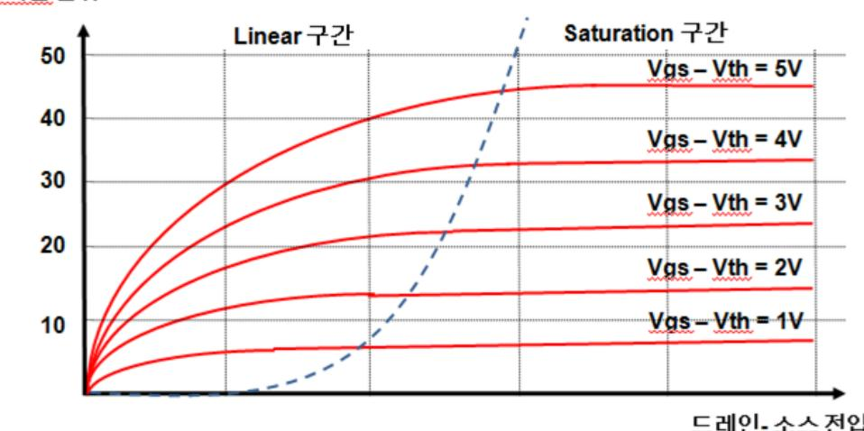

[그림 1-4] NMOS 트랜지스터 I-V 특성 곡선

10. NMOS, PMOS의 문턱 전압 값을 그래프를 통해서 확인한다.

11. 게이트 커패시터는 인버터를 구성하는 PMOS와 NMOS의 크기를 가변해서 회로를 구성 한 후 인가한 신호의 지연 시간을 측정하여 커패시터의 값을 계산한다.

12. 시트 저항 값은 설계 규격서를 통해서 각각의 메탈층 별로 얼마 값을 갖는지 확인하 고, 이로 인해 소모 전류량이 많은 회로를 사전 예측하고 관련하여 주의해서 레이아웃 을 설계를 진행해야 하는 선들의 표현 방법에 대해 레이아웃 설계자와 사전 협의한다.

### 수행 tip

- Spice 툴의 기본 사용 방법을 사전에 숙지해야 한다.
- 트랜지스터의 전압과 전류에 관련한 특성 변화를 이해 해야 한다.
- 공정 담당자로부터 Process Design Kit를 사전에 제공 받아야 한다.
- 시뮬레이션에 필요한 소자별 Device Model Parameter를 설치해야 한다.
- 공동의 개발자와 개발 전 사용하는 Design kit의 버전을 확인하는 것은 반드시 필요하다.
- 시뮬레이션을 위한 배치 파일 작성법을 숙지해야 한다.
- 사용하는 공정에 대한 확인을 사전에 칩 설계자와 확인 을 해야 한다.
- 기생 성분에 대한 정보 및 이에 따른 설계 시 유의 사항, 레이아웃 시 유의 사항을 레이아웃 설계자와 사전 정보 공유해야 한다.

### 학습 1 교수·학습 방법

### 교수 방법

- MOSFET 트랜지스터의 기능, 종류 및 구조를 설명할 때 수시로 학습자의 이해도를 확인하고, 이해도가 낮을 경우 사례 등을 제시하면서 설명한다.
- Process Design Kit을 통해 소자를 불러오고, 이를 연결하여 회로를 구성하는 방법을 빔 프로젝트 를 통해 사전 시연 후 개별 실습을 통해 사용법을 지도한다.
- Schematic 회로도로부터 netlist를 추출하는 과정을 빔 프로젝트를 통해 사전 시연 후 개별 실습을 통해 사용법을 지도한다.
- 회로설계 환경 선정 및 단위소자 특성 분성을 위한 주요 구조 및 동작원리에 대한 중요사항을 학습자가 직접 체크리스트로 작성할 수 있도록 지도 한다.
- 회로 설계 환경 선정과 단위 소자 특성에 대한 주요사항을 학습자가 구두발표 할 수 있도록 개별 발표 및 조별 상호 경합이 되도록 지원한다.

### 학습 방법

- SPICE 툴은 기초 사용법을 실습을 통해, 동료 학습자와 중요사항에 대해 토론한다.
- Process Design Kit을 통해 소자를 불러오고, 회로 구성을 위한 실습을 통해 중요 사항 및 문제점 등을 발표한다.
- Schematic 회로도로부터 netlist를 추출하는 과정을 이해하고 개별 실습을 통해 사용법을 충분히 숙지한다.
- 시뮬레이션 진행 방법 및 출력 결과물에 대해 문서와 그래프에서 각각 중요하게 확인해야 하는 항목을 이해하고 개별 실습을 통해 사용법을 숙지하도록 한다.
- 회로 설계 환경 선정과 단위 소자 특성에 대한 주요사항 및 절차를 작성해본다.

## 학습 1 평 가

### 평가 준거

- 평가자는 학습자가 학습 목표 및 평가 항목에 제시되어 있는 내용을 성공적으로 수행하였는지 평가해야 한다.
- 평가자는 다음 사항을 평가해야 한다.

| 학습내용           | 평가항목                                                                 | 성취수준 |   |   |
|----------------|----------------------------------------------------------------------|------|---|---|
|                |                                                                      | 상    | 중 | 하 |
| 회로 설계 환경<br>선정 | - 수립된 설계 규격서에 따라 회로를 설계할 수 있도<br>록 적절한 공정을 선정할 수 있다.                 |      |   |   |
|                | - 개발된 칩을 탑재할 수 있도록 전기·기계적 특성을<br>고려하여 적합한 패키지 형식을 선택할 수 있다.          |      |   |   |
| 단위 소자 특성<br>분석 | - 공정에서 제공하는 소자들의 전기적 특성을 분석하<br>여 설계 시에 제약사항 발생 여부를 사전에 예측할<br>수 있다. |      |   |   |
|                | - 적용 공정이 정전기에 대한 내성을 갖출 수 있는지<br>를 분석하여 적절한 입/출력 구조를 구성할 수 있다.       |      |   |   |

### 평가 방법

• 논술형 시험

| 학습내용           | 평가항목                      | 성취수준 |   |   |
|----------------|---------------------------|------|---|---|
|                |                           | 상    | 중 | 하 |
| 회로 설계 환경<br>선정 | - 트랜지스터 구조 및 동작 원리        |      |   |   |
|                | - 설계 권장 문서 주요 특성 숙지 능력    |      |   |   |
|                | - 개발 회로 주요 목표 도출 능력       |      |   |   |
|                | - 주어진 공정에서의 소자 특성 분석 능력   |      |   |   |
|                | - 패키지 구조 및 사용 목적          |      |   |   |
| 단위 소자 특성<br>분석 | - 소자의 전기적 특성 분석 방법        |      |   |   |
|                | - 소자 특성 분석을 위한 Tool 사용 방법 |      |   |   |
|                | - 입출력 신호 특성 및 ESD 영향 분석   |      |   |   |

• 평가자 체크리스트

| 학습내용           | 평가항목                      | 성취수준 |   |   |  |
|----------------|---------------------------|------|---|---|--|
|                |                           | 상    | 중 | 하 |  |
| 회로 설계 환경<br>선정 | - 트랜지스터 구조 및 동작 원리        |      |   |   |  |
|                | - 설계 권장 문서 주요 특성 숙지 능력    |      |   |   |  |
|                | - 개발 회로 주요 목표 도출 능력       |      |   |   |  |
|                | - 주어진 공정에서의 소자 특성 분석 능력   |      |   |   |  |
|                | - 패키지 구조 및 사용 목적          |      |   |   |  |
| 단위 소자 특성<br>분석 | - 소자의 전기적 특성 분석 방법        |      |   |   |  |
|                | - 소자 특성 분석을 위한 Tool 사용 방법 |      |   |   |  |
|                | - 입출력 신호 특성 및 ESD 영향 분석   |      |   |   |  |

#### • 구두발표

| 학습내용           | 평가항목                    | 성취수준 |   |   |
|----------------|-------------------------|------|---|---|
|                |                         | 상    | 중 | 하 |
| 회로 설계 환경       | - 트랜지스터 구조 및 동작 원리      |      |   |   |
| 선정             | - 개발 회로 주요 목표 도출 능력     |      |   |   |
| 단위 소자 특성<br>분석 | - 소자의 전기적 특성 분석 방법      |      |   |   |
|                | - 활용 Tool을 사용한 소자 특성 결과 |      |   |   |

### 피 드 백

| 1. 논술형 시험                                         |
|---------------------------------------------------|
| - 설계 환경 수립을 위한 주요 문서별 해석을 위한 주의사항 및 필요 목적을 정확히 숙  |
| 지하고 있는지 확인하고, 선정된 공정의 중요 소자 특성 분석을 위한 지표의 나열 및    |
| 이를 실험하는 절차를 평가한다.                                 |
| 2. 평가자 체크리스트                                      |
| - 평가항목별 수행 목적에 대해 충분한 숙지가 되었는지 평가자 질문을 통해 확인한 후   |
| 주요 사항을 표시하여 돌려준다.                                 |
| 3. 구두발표                                           |
| - 소규모 조별 또는 개인별 서로 다른 설계 자료를 전달하여 이를 해석하고, 이에 필요한 |
| 기본 소자 특성 확인 절차를 구두 발표로 확인하되 빠진 절차별로 차등 평가하여, 개선   |
| 사항 및 추가로 보완해야 할 사항에 대해 제시한다.                      |
|                                                   |

| 학습 1 | 적용 공정 분석하기  |
|------|-------------|
| 학습 2 | 회로 구성하기     |
| 학습 3 | 시뮬레이션하기     |
| 학습 4 | 포스트 시뮬레이션하기 |
| 학습 5 | 구현 회로 검증하기  |

# **2-1.** 블록 단위 회로 구성

|       | • 설계하고자 하는 전체 칩의 시스템을 파악할 수 있고, 전체 회로에 대한 기능을    |
|-------|--------------------------------------------------|
| 학습 목표 | 적절한 블록 다이어그램으로 표현할 수 있다.                         |
|       | • 설계 회로에 대하여 기능별로 모델링을 할 수 있으며 모델링 특성을 분석할 수 있다. |

### 필요 지식 /

계층적(Hierachy) 설계

대규모 설계를 단기간에 달성하기 위해 가장 일반적으로 사용하는 협업 방법으로, 전체 관 점에서 블록 단위의 개략적인 설계 방향 및 타당성 확인 후 각 상세 블록의 실제 상세 구 현은 공도의 설계자가 나누어 진행한다.

1. 블랙박스 수준 설계

가장 상위 단계의 설계 형태로써 전체 구성 회로를 몇 개의 블랙박스로 구분한다. 기능 및 입력 신호 특성에 따라 구분한 블랙박스를 각각 별도의 이름으로 정의하고(내부 기능 및 입출력 포트가 동일한 블록은 동일 이름을 사용) 해당 블랙박스의 포트를 결정한다. 결 정한 블랙박스의 포트를 중심으로, 블랙박스 단위의 기본 동작을 Text 형식으로 기술한다. 원하는 전체 회로의 구성을 위해 정의한 블랙박스들을 배치한 후, 각 블랙박스의 포트들 을 서로 연결하여, 각 블랙박스 단위 또는 전체 구현 회로에 대해 원하는 성능 기준과 비 교하여 성능을 만족할 수 있을지 개략적인 시뮬레이션을 진행하여 설계의 기본 방향을 설 정한다. 다음의 [그림 2-1]은 블랙박스 단위로 정의를 완료한 블록들을 서로 연결한 블록 다이어그램 형태의 회로 구성 예시이다. 블록 다이어그램 형태로 1차 작성한 도면을 기초 로 schematic 활용 툴을 이용하여 직접 심볼의 생성 및 설계도면을 그려볼 수 있다.(블록 다이어그램에서는 전원전압과 조절 신호등의 상세 포트들에 대한 기술을 생략함)

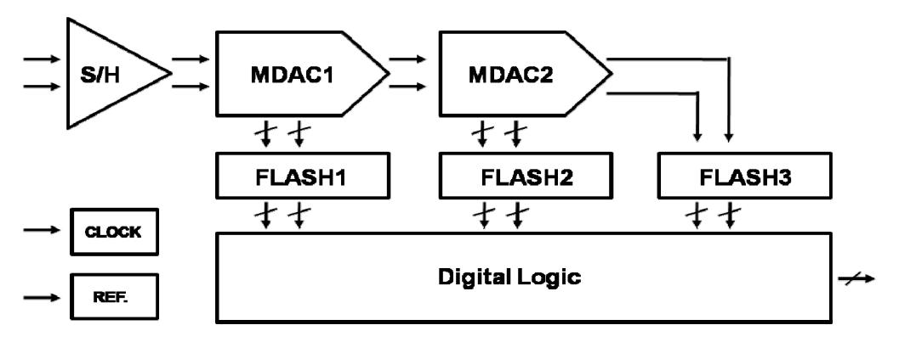

[그림 2-1] 블랙박스 단위 블록 다이어그램 작성

2. 게이트 수준 설계

논리 회로 등에서 주로 사용하는 설계 단위로 심볼 단위로 설계를 진행한다. 주로 사용되 는 심볼은 인버터, 낸드, 노어를 포함한 여러 개의 심볼이 있고, 각각의 심볼은 여러 개의 입력 신호가 하이 값인지 로우 값인지의 여부에 따른 논리적 연산을 통해 출력 결과를 만 들게 된다. 각 심볼의 종류는 제한적 범위에서 선택적 사용이 가능하고, 기능을 기술할 수 있으며, 성능(Fan-in, Fan-out)도 표현이 가능하다.

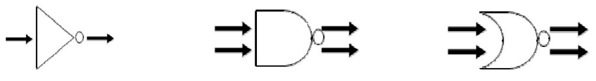

[그림 2-2] 게이트 수준의 회로 구현 방법 예시

3. 트랜지스터 수준 설계

가장 하위 단계의 설계 형태로써 트랜지스터를 포함한 단위 소자의 상세 정보를 직접 조 절하는 설계 방법이다. 각 소자의 사이즈를 결정하고, 소자의 내부 노드 간 연결이 필요하 다. 기능의 기술이 자유롭고, W/L을 포함한 소자의 가변 파라미터 조정 및 가변 신호의 크기를 정의하는 방법에 따라 성능을 무한대로 조절할 수 있다. [그림 2-3]는 2개의 PMOS와 1개의 NMOS 트랜지스터를 전원 전압과 입출력 신호를 통해 연결한 간략한 트랜 지스터 수준의 회로 구현 방법이다. 트랜지스터 각각의 소자를 열어서 원하는 W/L의 값을 입력하고, 전원 및 신호는 통일된 이름을 사용하여 시뮬레이션을 위한 벤치파일에서 크기 및 특성을 정의한다.

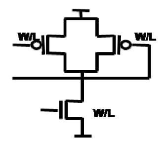

[그림 2-3] 트랜지스터 수준의 회로 구현 방법 예시

### 수행 내용 / 블록 단위 회로 구성하기

#### 재료·자료

- 공정 규격서(Process Specification)
- 시스템/제품 규격서
- 회도도 작성 툴 매뉴얼
- 보드 환경 기술서
- 핀 목록 기술서
- 블록 성능 기술 툴 매뉴얼
- IP(Intellectual Property)/셀 라이브러리(Cell Library)

### 기기(장비 ・ 공구)

- 컴퓨터, 프린터, 워크스테이션, 인터넷
- 회로도 작성 툴
- 블록 성능 기술 툴

### 안전 ・ 유의사항

툴은 설계용 프로그램을 지칭하며, 설계자가 익숙할 수 있고 반도체 산업현장에서 일반적으로 사용하는 프로그램에 적용 가능한 것을 말한다.

#### 수행 순서

- 설계하는 칩의 시스템을 파악하고, 개발 회로에 대해 기능 블록 단위의 블록 다이어그램으 로 표현한다.
  - 1. 설계하는 전체 칩에서 개발하는 회로의 위치를 확인한다.
  - 2. 개발하는 회로의 전체 핀 목록을 뽑는다.

- 3. 개발 핀 목록에 대해 칩 내부에 연결이 될 경우는 핀으로 칩 외부로 연결이 될 경우는 패드로 핀을 구분한다.
- 4. 각각의 핀 중 입력 신호와 출력 신호 핀을 먼저 확인한다.

입력 신호가 신호원으로부터 전달되는 경로 및 신호 감쇠 여부를 파악하고, 출력 신호가 연결되는 부하 조건을 확인하여 특정 신호에 따라서 부하 조건이 변하는지, 고정의 값을 갖게 되면 어떠한 값을 갖게 되는지 파악한다.

- 5. 전원 핀을 확인하고, 몇 볼트(V)의 전압이 사용 가능한지, 아날로그 전원과 디지털 전원 의 분리가 가능한지 여부를 확인한다.
- 6. 클럭 신호 관련 신호를 어디에서 전달 받는지, 신호를 전달 받는 경로가 어떻게 구성 되는지 확인한다. 클럭 신호가 다른 설계 회로에서 공급 받을 경우, 클럭의 성능 지표인 지터(Jitter) 특성이
- 7. 개발하는 회로의 주요 성능 지표를 재확인한다.

얼마나 나빠질 수 있는지 확인한다.

- 8. 기능적으로 목표하는 성능 지표를 만족할 수 있도록 기본 구성 블록을 배치한다.
- 9. 사용하는 전원과 클럭, 조절 신호 및 각 단위 기능들의 종류에 따라서 구성 블록을 구 분하여 배치한다.
- 10. 설계자가 원하는 단위로 개발 회로를 분리하였다면, 분리한 블록별 핀 목록 및 추가로 생성한 핀들의 연결 정보를 확인한다.
- 11. 회로도 작성 툴(Schematic 에디터)을 활용하여 각각의 블록을 생성한다.
- 12. 원하는 라이브러리를 생성 후 각각의 블록 명을 셀 이름으로 생성한다. 생성한 블록들은 빈 상자 형태에 핀 정보만 기술되어 있으며, 이 때 핀이 입력 또는 출력 기능을 가지고 있는지 구분하여 해당 블록을 생성한다.
- 13. 생성한 블록 심볼을 전체 개발 회로의 셀에서 불러 들여 각 블록들을 연결한다. 다음의 [그림 2-4]은 Schematic 에디터 툴을 활용하여 심볼을 부르는 방법이다.
- 각 블록 다이어그램에 대해 특성을 파악하여 기능별로 모델링을 진행한다.
  - 1. 설계 회로에서 블록을 구분하는 기준은 기능과 핀 정보에 의해 달라짐을 상기한다.
  - 2. 블록의 핀에 대한 입력 조건 및 조절 신호의 가변 조건을 기술한다.
  - 3. 해당 블록의 출력 신호에 대해서 입력 신호 및 가변 조건의 변화에 따라 어떻게 변하는지 기술한다.

4. 구성되어 있는 모든 판에 대해서 해당 조건의 기술이 빠져 있는지 확인한다.

| Library Terminal |            |           | OK Cancel Defaults |  |  |  |
|------------------|------------|-----------|--------------------|--|--|--|
| File Edit        | View       |           | Library Name       |  |  |  |
| Library 명        | Cell 명     | View 형태   | <b>Cell Name</b>   |  |  |  |
| _                | comparator | schematic | <b>View Name</b>   |  |  |  |
| Dig. Logic       |            |           |                    |  |  |  |
| Tsmc <b>N65</b>  |            |           |                    |  |  |  |
|                  |            |           |                    |  |  |  |
|                  |            |           |                    |  |  |  |
|                  |            |           |                    |  |  |  |
|                  |            |           |                    |  |  |  |
|                  |            |           |                    |  |  |  |
|                  |            | J         |                    |  |  |  |

[그림 2-4] Schematic 회로도 작성법

수행 tip

- 설계하는 회로의 정확한 성능 목표를 칩 설계자와 사전 협의해야 한다.
- 설계하는 회로의 핀 목록에 대해 정확히 확인해야 한다.
- 설계 회로의 핀이 연결되는 조건을 확인하되, 칩 내 부 연결 시에는 인접 블록의 동작 조건을 확인하고 외부 연결 시에는 보드 환경 조건을 숙지해야 한다.
- 블록 단위 회로 설계를 위한 툴의 사용 방법을 사 전에 숙지해야 한다.
- 블록 단위 회로 설계를 위한 툴의 사용 방법을 사 전에 숙지해야 한다.
- 사용 공정에서 제공하는 라이브러리를 버전 확인 및 해당 자료를 설계 시작 전에 설치해야 한다.
- 블록을 구분하여 공동으로 설계를 진행할 때, 하나 의 블록이 다른 블록의 특성에 영향을 주는지 확인 해야 하며, 모드 변화에 관련하여 공동의 개발자와 협의를 진행해야 한다.
- 생성하는 심볼의 모양은 일반적으로 잘 알려진 형 태를 활용하여, 작업자 간 의사소통이 쉽게 이루어 질 수 있도록 해야 한다.

# **2-2.** 블록별 상세 회로 구성

• 각 세부 블록에 대해서 주어진 설계 목표에 따라 기능 및 특성을 만족하는 회로를 설계할 수 있다.

- 학습 목표 • 설계된 회로를 단위 소자의 매칭 특성, 온도 특성 등을 고려하여 단위 회로 및 전체 블록에 대한 배치도를 설계할 수 있다.
  - 기존에 설계된 회로를 해석하고 분석하여 설계 사양에 맞게 변경 및 적용할 수 있다.

### 필요 지식 /

회로도 작성 툴(Schematic 에디터)

수많은 산업 분야에서 다양한 CAD 툴을 활용한 도면의 작성이 이루어지고 있다. 그 중 아 날로그 회로 설계를 위해서도 별도의 툴을 사용하며, 전자 회로 설계를 위한 소자들을 심 볼 형태로 정의하고 있다. 정의한 소자를 그리고자 하는 도면에 하나씩 불러와서, 원하는 위치에 배치한 후, 전원의 연결 및 입출력 단의 연결 그리고 소자들 사이도 상호 연결하여 회로도를 완성한다. 각각의 소자는 모델 파라미터에서 정의하고 있는 범위 내에서 소자별 로 가변이 가능한 항목을 변화시킴으로써 각각의 소자가 갖는 고유한 특성 값을 변경할 수 있다.

- 1. 활용 방법에 따른 구분
  - (1) 학습용 활용 툴

일반적으로 학습용 툴의 라이브러리에서 정의하고 있는 소자들의 심볼은 공정 파라미 터를 구체적으로 반영하는데 한계가 있다. 따라서 소자들의 일반적인 기능을 이해하고 회로도 작성을 위한 기초 지식 습득을 위해 활용하고 있다. 가장 많이 사용하고 있는 툴은 Cadence사의 OrCAD에서 제공하는 Schematic Editor이다.

(2) 산업용 활용 툴

산업용으로 사용 중인 툴은 보다 구체적인 모델 파라미터들을 통한 설계의 진행이 요 구되는데, 가장 많이 사용하고 있는 툴은 Cadence사의 Virtuso Schematic Editor이다. 각 공정 업체 및 공정에 따라 제공하는 별도의 회로도 심볼과 공정 파라미터를 등록하 고 사용하며, 해당 모델을 활용한 구체적인 특성 변화를 반영하여 시뮬레이션을 위한 Netlist를 추출하게 된다.

2. 소자에 따른 파라미터 변경 방법

소자들의 특성 값의 변경은 각 소자들을 제작을 위한 중요 변수에 따라 가변 항목이 달라진다.

(1) 트랜지스터

트랜지스터는 폭(W)과 길이(L) 그리고 Finger수(m)를 변경하여 트랜지스터 크기를 가변 한다.

(2) 저항

저항은 제작하는 재료의 종류에 따라 서로 다른 단위 저항 값을 가지고 있으며, 길이 (L)와 폭(W)을 가변하여 저항 값을 만드는데, 길이가 길어질수록, 폭이 좁아질수록 큰 저항 값을 만들 수 있다.

(3) 커패시터

커패시터는 종류에 따라 만드는 방법이 차이가 많아서 가변 하는 파라미터들이 차이가 있다. 커패시터는 상측 메탈층과 하측 메탈층의 겹쳐지는 면적이 커질수록, 두 층의 거 리가 짧을수록 값이 커지는데, 주로 메탈층간의 거리는 공정에서 고정해서 사용하므로 면적을 조정하여 파라미터들을 변경한다. MIM 커패시터는 커패시터 제작을 위한 별도 의 메탈층을 사용하여 제작하며, 메탈층의 가로, 세로 폭을 가변해서 값을 조절한다. MOS 커패시터는 기본 소자인 트랜지스터의 드레인과 소스를 묶어서 게이트 단자와 양 쪽 노드로 연결하여 사용하며, 트랜지스터의 폭(W)과 길이(L)를 가변하여 값을 조절한 다. 특별히 MoM 커패시터와 같이 메탈 라인 사이의 기생 커패시터 값으로 커패시터를 만드는 경우는 메탈라인의 숫자와 몇 개의 메탈층을 사용하여 커패시터를 만들지 조절 하여 커패시터 값을 만들게 된다.

3. 매칭 특성

우리가 흔히 접하는 매칭 특성은 신호의 주파수 특성에 따른 입사파와 반사파의 특성을 조절하는 임피던스 매칭을 들 수 있다. 고주파 회로의 보드 설계에서는 이러한 임피던스 매칭이 중요한 설계 요소가 된다.

반면 수십에서 수백 MHz 단위의 아날로그 설계에서는 임피던스 매칭 외에 두 개의 신호 사이에서 발생하는 위상 차이를 최소화하기 위한 매칭 특성이 중요한 설계 요소이다. 이 러한 크기가 같고 위상이 반대인 differential signal은 주변 잡음 신호에 대한 영향을 서로 상쇄할 수 있어 잡음 영향을 줄일 수 있으나, 두 신호 사이의 위상차가 동일해야만 이러 한 잡음 영향이 서로 상쇄된다. 따라서 위상 차이를 줄이기 위해 입력 단부터 최종 출력 단까지 거칠 수 있는 모든 신호선의 길이를 최대한 동일하게 만들 뿐 아니라 연결되는 소 자들의 조건까지 최대한 동일할 수 있도록 구성해야 한다. 따라서 필요에 따라서는 더미 패턴을 만들어 연결 조건을 일치시켜 주기도 한다.

또한 신호의 매칭 특성 외에 소자의 매칭 특성이 중요한 설계 요소가 된다. 소자 중에서 는 쌍으로 구성되어 있는 입력 트랜지스터나 부하 트랜지스터가 회로의 성능에 크게 영향 을 미치며, 마주보고 있는 이러한 트랜지스터 소자에 더미 패턴을 추가함으로서 반도체 제조 공정에서 발생할 수 있는 소자간의 차이를 최소화 할 수 있다.

25

### 수행 내용 / 블록별 상세 회로 구성하기

### 재료·자료

- 공정 규격서(Process Specification)
- 시스템/제품 규격서
- 회도도 작성 툴 매뉴얼
- 블록 성능 기술 툴 매뉴얼
- IP(Intellectual Property)/셀 라이브러리(Cell Library)

### 기기(장비 ・ 공구)

- 컴퓨터, 프린터, 워크스테이션, 인터넷
- 회로도 작성 툴
- 블록 성능 기술 툴

### 안전 ・ 유의사항

해당 없음

#### 수행 순서

- 각 세부 블록의 설계 목표에 따라 기능 및 성능을 만족할 수 있도록 회로도를 설계한다. 세부 블록 단위로 핀과 해당 기능만 기술되어 있는 상위 레벨의 설계에 실제 구현하기 위 한 트랜지스터 레벨의 소자를 배치한다. 아날로그 회로 설계는 상위 레벨의 로직 심볼을 가지고 설계하는 디지털 설계와 다르게, 가장 기본이 되는 소자 레벨의 트랜지스터, 저항, 커패시터, 다이오드의 사이즈까지 가변하면서 설계를 진행한다.
  - 1. 공정에서 제공하는 기본 소자들을 정의하고 있는 라이브러리를 회로도 작성 툴에 세팅 한다.
  - 2. 설계하는 세부 블록에서 사용되는 디지털 로직을 위한 라이브러리 및 기본 셀을 생성 한다.

- 3. 기본 셀 외에 서로 다른 지연 효과를 만들기 위해 PMOS, NMOS의 폭(width)과 길이(length) 를 가변하여 서로 다른 지연 효과를 갖는 다른 이름의 디지털 로직 셀을 생성한다.
- 4. 설계 블록의 회로 구현을 위해 공정에서 제공하는 라이브러리에서 필요한 수동 소자를 불러오고, 생성한 디지털 로직의 라이브러리에서 필요한 디지털 로직을 불러온다.
- 5. 불러온 소자들은 각각 매칭, 동작 특성에 영향을 미치는 레이아웃 설계를 고려하여 회 로도에 배치한다. 레이아웃 설계자는 특별한 주석이 없는 한 회로도의 배치와 유사한 형태로 레이아웃의 배 치를 하고자 한다. 따라서 회로도를 그릴 경우에는 최종 물리적인 소자들의 배치까지 고

려하여 사전에 신중하게 그리는 것이 레이아웃의 재작업을 피할 수 있으며, 안정적인 설 계를 위한 중요한 사전 약속이라고 할 수 있다.

6. 구현 회로의 성능을 만족하기 위해 불러온 소자들의 폭(width)과 길이(length)를 가변 하 여 입력한다.

길이(length)는 공정에서 제공하는 최소 선폭보다는 더 큰 값을 입력해야 하며, 일반적으로 트랜지스터의 폭(width)은 공정에서의 제작 성능 및 전류 흐름을 원활히 하기 위해서 여러 개의 손가락 형태로 접은 모양으로 입력한다. 따라서 트랜지스터는 W, L과 m의 세 가지 값을 입력하는 형태로 각각의 트랜지스터 소자들의 크기를 가변한다.

이전 상위 공정에서 설계한 자료가 있을 경우에는 최소 선폭이 더 줄어들 수 있는 설계 변수를 고려하되, 유사한 폭과 길이의 비율을 가지고 초기 설계를 진행하면 설계 시간을 줄일 수 있게 된다.

- 7. 불러온 소자들을 전원 신호에 연결한다.
- 8. 각각의 소자들을 구현하고자 하는 방향에 따라 서로 연결한다.
- 9. 입력과 출력 핀을 연결한다.
- 10. 주석을 기재하여 레이아웃 설계 시 고려해야 할 사항들을 기재한다.

가장 빈번히 사용하는 주석은 입력 트랜지스터의 매칭 특성을 위해 어떻게 배치할지, 전 원의 전류를 충분히 크게 흘리기 위해 폭을 어떻게 할지, 몇 개의 메탈 층을 적층할지, 특 정 라인(일반적으로 출력 단)의 소모 전류가 과도하게 클 경우 이 라인의 메탈 폭과 형태 를 어떻게 구현할지, 특정 소자가 주변의 잡음 신호에서 보호받기 위해 최소 얼마 이상의 공간을 유지할지 등을 기술한다.

11. 중요하게 보호되어야 하는 트랜지스터나 저항, 커패시터에 대해서는 더미(Dummy) 소자 를 양옆에 배치하여, 공정에서의 틀어짐을 사전에 회로에서 예방한다. 더미(Dummy) 소자의 노드들은 전원이나 그라운드 한쪽으로 연결하면 특정 소자로 인식하 지 않는다.

27

### 수행 tip

- 사용하는 전원 전압 및 공정 특성에 따라 사용할 수 있는 트랜지스터의 종류 및 개별 소자들의 종류 를 설계 시작 전에 주의 깊게 선정해야 한다.
- 회로 내부의 잡음 특성을 고려하여 아날로그 전원 에 연결해야 하는 소자와 디지털 전원에 연결해야 하는 소자를 구분하여 배치한다.
- 공정 특성 및 파라미터 변경을 반영할 수 없는 sehematic 심볼 소자의 사용은 가급적 지양하고, 공정 변경 시 해당 공정에서 제공하는 심볼을 사용 하도록 한다.
- 수동 소자 사용 시 칩 설계 전체에 사용되는 레이 어 종류를 확인하고, 소자 사용에 따라 추가 레이 어가 필요한지를 확인하여 사용 가능한 소자를 사 전에 구분한다.
- 소자들의 배치는 최대한 레이아웃과 유사하게 배치 한다.

### 학습 2 교수·학습 방법

### 교수 방법

- 계층적 설계법인 블록 단위 설계와 상세 회로 단위 설계 방법의 개요에 대해 설명한다.
- 블록의 구분 기준 및 주요 포트들의 정의 방법에 대해 설명한다.
- 회로도면 작성 툴을 위한 기본 환경 설정 및 활용 소자들을 정의한 라이브러리 파일을 사전에 실습 기자재 별로 준비한다.
- 회로도면 작성 툴의 블록 생성 과정에 대해 프로젝트를 통해 사전 시연 후 개별 실습을 통해 사용법을 지도한다.
- 회로도면 작성 툴의 라이브러리와 셀의 생성 방법에 대해 프로젝트를 통해 사전 시연 후 개별 실습을 통해 사용법을 지도한다.
- 기본적인 소자들을 불러들이고, 각 소자의 연결을 통한 회로 구성 방법에 대해 프로젝트를 통한 사전 시연 후 개별 실습을 통해 사용법을 지도한다.

### 학습 방법

- 계층적 설계법인 블록 단위 설계와 상세 회로 단위 설계 방법의 개요에 대해 학습한다.
- 블록의 구분 기준 및 주요 포트들의 정의 방법에 대해 학습하여 이해를 높인다.
- 회로도면 작성 툴의 블록 생성 과정에 대해 프로젝트를 통해 사전 숙지 후 개별 실습을 통해 사용법을 숙지한다.
- 회로도면 작성 툴의 라이브러리와 셀의 생성 방법에 대해 프로젝트를 통해 사전 숙지 후 개별 실습을 통해 사용법을 숙지한다.
- 기본적인 소자들을 불러들이고, 각 소자의 연결을 통한 회로 구성 방법에 대해 프로젝트를 통한 사전 숙지 후 개별 실습을 통해 사용법을 숙지한다.

## 학습 2 평 가

### 평가 준거

- 평가자는 학습자가 학습 목표 및 평가 항목에 제시되어 있는 내용을 성공적으로 수행하였는지 평가해야 한다.
- 평가자는 다음 사항을 평가해야 한다.

| 학습내용            |                                                                                | 성취수준 |   |   |
|-----------------|--------------------------------------------------------------------------------|------|---|---|
|                 | 평가항목                                                                           |      | 중 | 하 |
| 블록 단위 회로<br>구성  | - 설계하고자 하는 전체 칩의 시스템을 파악할 수 있<br>고, 전체 회로에 대한 기능을 적절한 블록 다이어그<br>램으로 표현할 수 있다. |      |   |   |
|                 | - 설계 회로에 대하여 가능별로 모델링을 할 수 있으<br>며 모델링 특성을 분석할 수 있다.                           |      |   |   |
| 블록별 상세<br>회로 구성 | - 각 세부 블록에 대해서 주어진 설계 목표에 따라 기<br>능 및 특성을 만족하는 회로를 설계할 수 있다.                   |      |   |   |
|                 | - 설계된 회로를 단위 소자의 매칭 특성, 온도 특성<br>등을 고려하여 단위 회로 및 전체 블록에 대한 배치<br>도를 설계할 수 있다.  |      |   |   |
|                 | - 기존에 설계된 회로를 해석하고 분석하여 설계 사양<br>에 맞게 변경 및 적용할 수 있다.                           |      |   |   |

### 평가 방법

• 논술형 시험

| 학습내용            |                           | 성취수준 |   |   |
|-----------------|---------------------------|------|---|---|
|                 | 평가항목                      |      | 중 | 하 |
| 블록 단위 회로<br>구성  | - 개발 회로 주요 블록 다이어그램 정의 능력 |      |   |   |
|                 | - 주요 블록 기능 및 동작 조건 기술 능력  |      |   |   |
| 블록별 상세<br>회로 구성 | - 단위 소자 배치 선정 기준          |      |   |   |
|                 | - 단위 소자 크기 선정 기준          |      |   |   |
|                 | - 기존 회로 분석 능력             |      |   |   |

### • 평가자 체크리스트

|                 |                           | 성취수준 |   |   |  |
|-----------------|---------------------------|------|---|---|--|
| 학습내용            | 평가항목                      |      | 중 | 하 |  |
| 블록 단위 회로<br>구성  | - 개발 회로 주요 블록 다이어그램 정의 능력 |      |   |   |  |
|                 | - 주요 블록 기능 및 동작 조건 기술 능력  |      |   |   |  |
| 블록별 상세<br>회로 구성 | - 단위 소자 배치 선정 기준          |      |   |   |  |
|                 | - 단위 소자 크기 선정 기준          |      |   |   |  |
|                 | - 기존 회로 분석 능력             |      |   |   |  |

### • 구두발표

|                 |                           | 성취수준 |   |   |  |
|-----------------|---------------------------|------|---|---|--|
| 학습내용            | 평가항목                      |      | 중 | 하 |  |
| 블록 단위 회로<br>구성  | - 개발 회로 주요 블록 다이어그램 정의 능력 |      |   |   |  |
|                 | - 주요 블록 기능 및 동작 조건 기술 능력  |      |   |   |  |
| 블록별 상세<br>회로 구성 | - 단위 소자 배치 선정 기준          |      |   |   |  |
|                 | - 단위 소자 크기 선정 기준          |      |   |   |  |
|                 | - 기존 회로 분석 능력             |      |   |   |  |

### 피 드 백

- 1. 논술형 시험
- 주요 개발 회로별 구성 블록을 나열하고, 해당 블록들의 기능을 기술하도록 하고, 기본 적인 회로도면을 보고 입력 신호 및 조절 신호의 흐름에 따른 출력 신호를 예측하여 동 작 특성을 알 수 있는지 평가한다.

#### 2. 평가자 체크리스트

 - 주요 블록들의 구분하는 기준 및 구분한 블록들의 기능 및 동작 조건을 숙지하고 있는 지 점검하고, 소자를 나열하고 배치의 적절성 및 크기 변경이 필요한지 질문을 통해 확 인한 후 주요 사항을 표시하여 알려준다.

#### 3. 구두발표

 - 기존의 다양한 평가 회로도면을 통해 소자들의 블록 구분과 배치, 크기를 적절히 입력하 여 회로를 구성하였는지 구두 발표를 통해 설계 기준과 방향 설정 가능 여부를 확인하 고, 추가로 보완해야할 사항에 대해 제시한다.

| 학습 1 | 적용공정 분석하기   |
|------|-------------|
| 학습 2 | 회로 구성하기     |
| 학습 3 | 시뮬레이션하기     |
|      |             |
| 학습 4 | 포스트 시뮬레이션하기 |

# **3-1.** 시뮬레이션 환경 구성

학습 목표 • 설계된 단위 블록 및 시스템을 시뮬레이션으로 검증할 수 있도록 시뮬레이션 회로 (테스트 벤치, Test Bench)를 구성할 수 있다.

### 필요 지식 /

아날로그 회로 시뮬레이션 툴

Full Custom 형태의 트랜지스터 레벨로 설계한 회로들의 성능을 확인하기 위한 툴로써, 가 장 많이 사용하고 있는 툴은 Synopsis사의 Hspice를 들 수 있다. 해당 툴은 가장 오래 사용 되어서 보급률이 높고, 다른 신규 시뮬레이션 툴의 성능 평가를 위한 기준으로 사용되고 있다.

1. 회로도 기술 문서

회로도 설계 툴을 통해 그림 형태로 구현한 설계 회로를 문서 형태로 변환한 자료를 Netlist라 부른다. Netlist는 우리가 회로도에서 사용한 소자(트랜지스터, 다이오드, 저항, 커 패시터, 인덕터 등)와 전원, 입출력 핀들을 연결한 선들에 대해 각각의 소자는 별도의 이 름 규칙을 통해 기술하고, 이를 연결하는 선들은 각각의 노드에 별도의 이름을 부여하여 이를 통해 연결 정보를 기술한다.

(1) 트랜지스터

트랜지스터는 Mosfet의 M을 소자를 구분하는 값으로 사용한다. Mx1 out in x gnd nfet W=10u L=1u M2 y g1 d2 vdd pfet W=8u L=0.6u

### (2) 다이오드

다이오드는 Diode의 D를 소자를 구분하는 값으로 사용한다. Dxx n+ n- modelname

(3) 저항

저항은 Resistor의 R을 소자를 구분하는 값으로 사용한다.

R1 n1 n2 10K

(4) 커패시터

커패시터는 Capacitor의 C를 소자를 구분하는 값으로 사용한다.

C1 n1 n2 1P

(5) 인덕터

인덕터는 L을 소자를 구분하는 값으로 사용한다.

L1 n1 n2 1F

2. 모델 파라미터

모델 파라미터는 웨이퍼를 제작하는 파운드리(Foundry) 업체에서 각 소자의 특성 정보를 기술하여 전달하는 문서로, 업체별 사전 샘플들에 대한 실험을 통해 각각의 환경 조건 및 공정의 변동에 대한 소자들의 특성 변화에 대해 기술하고 있는 파일이다. 기본적으로는 Typical, Worst, Best 등으로 정의되어 있는 코너 조건별로 소자의 특성을 구분하여 기술 하고 있으며, 각각 NMOS와 PMOS를 정의하고 있는 3개의 조건으로 변화 시켰을 때 소자 들의 특성이 어떻게 달라지는지 측정한다. 따라서 파라미터의 소자를 다음의 [표3-1]과 같 이 구분할 수 있으며, 이와 같은 공정 변동을 파라미터에 기술할 때는 다음과 같은 5개의 코너 조건(TT, SS, FF, SF, FS) 또는 3개의 코너 조건(TT, SS, FF)을 주로 사용한다.

<표 3-1> 코너 조건별 트랜지스터 동작모드

| TT             | SS           | FF          | SF           | FS           |
|----------------|--------------|-------------|--------------|--------------|
| NMOS : Typical | NMOS : Worst | NMOS : Best | NMOS : Worst | NMOS : Best  |
| PMOS : Typical | PMOS : Worst | PMOS : Best | PMOS : Best  | PMOS : Worst |

테스트 벤치에서는 원하는 코너 조건을 선택하여, 소자들의 코너 조건을 선언한다. 예) .lib "./CLN65GPPLUS\_2d5\_lk\_v1d3p1.l" TT : Typical 조건의 코어 전압 트랜지스터

3. 테스트 벤치

테스트 벤치는 작성한 회로도의 모의실험을 진행하기 위한 테스트 조건을 기술한 문서이다. 테스트 벤치의 구성은 크게 초기 선언, 회로 정보, 분석 방법, 출력 형태로 구분할 수 있다.

### (1) 초기 선언

파일의 기초 정보 포함 기타 주석 처리할 모든 내용들은 "\*"를 맨 앞에 붙여서 라인 전체의 내용을 주석 처리하여 기술할 수 있다. 상기 모델 파라미터 파일이 있는 경로 지정 및 사용한 소자 정보를 기술해준다. 마지막으로 시뮬레이션 관련 옵션을 기술할 수 있다. 옵션 관련하여 별도의 기술을 하지 않으면 툴에서 제공하는 기본 옵션으로 설정된다.

(2) 회로 정보

회로 정보는 회로도를 통해 그린 소자들의 연결 정보를 파일 형태로 출력한 Netlist가 저장되어 있는 경로 및 해당 파일명을 링크해서 사용한다. 사전에 별도의 회로도를 그 리지 않은 경우 문서 형태로 회로를 구현하여 시뮬레이션을 진행할 수 있으나, 아주 간단한 회로를 제외하면 이러한 문서를 기반으로 직접 기술하는 방법은 수많은 노드들 의 이름을 일일이 나열해야 하는 연결 오류의 위험을 가지고 있다. 따라서 회로도를 그린 후 Netlist를 뽑아내는 방법이 가장 일반적으로 사용된다.

(3) 분석 방법

분석 방법은 크게 3가지가 있으며, 직류 전압의 조건 변화에 따라 결과를 확인하는 DC 분석, 교류 전압의 조건 변화에 따라 결과를 확인하는 AC 분석 마지막으로 시간의 흐 름에 따라 응답 결과를 확인하는 Transient 분석이 있다.

(4) 출력 방법

출력 방법은 크게 전압과 전류 두 개의 값을 확인하게 되며, 원하는 핀 또는 소자의 값을 측정하게 된다.

### 수행 내용 / 시뮬레이션 환경 구성하기

#### 재료·자료

- 공정 규격서(Process Specification)
- 시스템/제품 규격서
- Netlist 추출 매뉴얼
- Vi 에디터 사용 매뉴얼
- 공정 파라미터 기술서 / 파일

### 기기(장비 ・ 공구)

- 컴퓨터, 프린터, 워크스테이션, 인터넷
- 시뮬레이션 툴
- 출력 파형 분석 툴

#### 안전 ・ 유의사항

공정의 설계권고사항(Design Guide)을 숙지하고 공정의 설계 매개변수에 따라 아날로그 회로에 대한 시뮬레이션을 할 수 있도록 해야 한다.

### 수행 순서

- 설계한 회로 및 단위 블록을 검증할 수 있도록 시뮬레이션 회로(테스트 벤치)를 구성한다.
  - 1. 공정업체나 공정 부서에서 전달 받은 모델 파라미터 파일을 원하는 경로로 가져온다.
  - 2. Vi 에디터를 활용해 테스트 벤치 작성을 위해 해당 파일의 파일명을 생성하다.
  - 3. 해당 파일명의 테스트 벤치를 열어서 내용을 작성하기 시작한다.
  - 4. 초기 선언 부분을 작성하되, 주석 처리를 통해 어느 블록의 검증을 위한 테스트 벤치인 지 기술한다.
  - 5. 모델 파라미터가 있는 경로를 지정하고, 회로도에 사용한 소자들을 기술한다.
    - 예) .lib "./CLN65GP\_2d5\_lk\_v1d3p1.l" TT: Typical 조건의 코어 전압 트랜지스터 .lib "./CLN65GP\_2d5\_lk\_v1d3p1.l" TT\_25: Typical 조건의 2.5V 트랜지스터 .lib "./CLN65GP\_2d5\_lk\_v1d3p1.l" TT\_RES: Typical 조건의 저항 .lib "./CLN65GP\_2d5\_lk\_v1d3p1.l" TT\_BIP: Typical 조건의 바이폴라 트랜지스터
  - 6. 시뮬레이션 옵션을 기술한다.

출력 형태, 툴의 속도 및 정확도의 선택, Convergence의 방식 등을 기술한다. 별도의 기술 이 없을 경우 기본 선택 값을 사용한다.

예) .options nomod ingold=2 post=2 acout=0 list accurate

- 7. 시뮬레이션 하고자 하는 회로의 Netlist를 추출하거나 직접 기술한다.
- 8. Netlist의 추출은 회로도 작성 툴의 파일 부분에서 Netlist 추출 버튼을 누른 후, 출력하고 자 하는 회로의 라이브러리와 셀을 선택하고 파일명과 출력하고자 하는 경로를 입력한다.
- 9. 출력한 Netlist를 테스트 벤치에서 불러 들여서 회로의 정보를 가져온다.

- 10. 설계한 블록에 필요한 분석 방법을 기술한다.
  - (1) DC 시뮬레이션

소자의 정적 동작 영역에서의 상태나 특정 노드의 동작점을 확인하는데 사용한다. 예) .DC Vin 0 2.5 0.05: Vin 전압을 0V에서 2.5V까지 0.05V 간격으로 입력 조건을 변경하면서 측정 결과를 확인한다.

(2) AC 시뮬레이션

회로의 주파수 특성을 확인하는데 사용한다.

- 예) .AC DEC 100 10K 1G: 1GHz까지 Dec 당 100개로 나누어 신호 주파수를 연속 적으로 변화시켜 가면서 측정 결과를 확인한다.
- (3) Transient 시뮬레이션

회로의 시간 변화에 따른 특성을 확인하는데 사용한다.

- 예) .TRAN 0.1n 100n: 0ns부터 100ns까지 최소 단위 0.1ns 간격으로 측정결과를 관측 하여 출력한다.
- 11. 확인하고자 하는 노드의 전압 또는 전류 값을 출력 값으로 기재한다.
  - (1) 전압 출력 값
    - 예) .probe v(Vin) v(Vout): Vin과 Vout의 전압 값을 출력한다. .probe v(outp, outn): outp와 outn 노드의 전압 차이 값을 출력한다. .probe v(XA.out): A라는 Sub 블록 내부에 있는 out 노드의 전압 값을 출력한다.
  - (2) 전류 출력 값
    - 예) .probe ix(M1): M1 Mosfet 트랜지스터에 흐르는 전류 값을 출력한다. .probe i(R1): R1 저항에 흐르는 전류 값을 출력한다. .probe I(VDD): VDD 전압 원에 흐르는 전류 값을 출력한다.

### 수행 tip

- 설계한 회로도에서 Netlist를 추출하는 방법을 사전에 숙지해야 한다.
- 공정에서 제공하는 공정 파라미터 정보를 사전에 준비해야 하 며, 제공 받은 파라미터의 버전 정보를 확인해야 한다.
- 신규 미세 공정의 개발 시 공정 파라미터의 버전이 1.0 이하인 경우에는 개발 위험을 고려하여 설계한 칩의 신규 제작 여부를 사전 계획해야 한다.
- Vi 에디터의 사용 매뉴얼을 숙지하고, 주요 사용 단축키를 숙지 해야 한다.
- 칩 전체 설계 담당자와 개발 칩에서 사용 가능한 레이어 층을 확인해야 한다.

# **3-2.** 시뮬레이션 결과 분석

학습 목표 • 시뮬레이션 툴(Tool)을 이용하여 적용 공정의 단위소자와 설계된 회로에 대하여 전기 적 특성 및 기능을 검증할 수 있다. • 공정 매개변수 코너 값을 적용하여 시뮬레이션을 수행하고 결과를 통하여 제품의 성 능과 품질, 양산성을 확보할 수 있다. • 시뮬레이션 결과를 활용하여 설계의 타당성을 분석할 수 있다. • 시뮬레이션 결과를 회로의 레이아웃 설계 시 소자나 블록의 최적 배치에 적용할 수 있다.

### 필요 지식 /

시뮬레이션 결과 분석 방법

### 1. 출력 파형 viewer를 활용한 결과 분석

전체적인 결과를 한눈에 확인하기 위한 분석 방법이다. 설계한 회로의 성능을 평가할 수 있는 지표를 수립한 후 수립한 지표가 원하는 조건(전압 또는 동작 주파수)에서 목표하는 수치보다 큰지 작은지 확인하여 성능의 개선 여부를 판단한다. 고속으로 동작하는 인터페 이스 회로의 경우 주어진 입력 주파수 신호에 따라 출력 결과가 얼마만큼 잘 인식되는지 를 확인하는 eye-pattern을 확인하고, 가장 일반적인 OP-AMP 회로에서는 이득 특성과 주 파수 특성의 출력파형 모양을 확인함으로써 전반적인 설계의 방향을 어떻게 변경할지 확 인 할 수 있다.

또한 회로의 노드들의 출력 파형을 확인해 봄으로써 어느 단에서 원하지 않는 동작을 하 고 있는지를 한눈에 볼 수 있는 결과 분석 방법이 출력 파형 분석 방법이다.

2. lis 파일을 활용한 결과 분석

그래프 분석 방법은 전체적인 분석의 방향을 결정하기에 유용하지만, 정상적으로 동작하 고 있지 않은 소자 단위의 상세 분석을 위해서는 .lis 파일의 출력 결과를 통해 분석한다. 파일에는 사용한 모든 소자의 동작 조건과 소모 전류, 전압 조건 등의 상세한 정보가 개 별 소자 단위로 계층화되어 기술되어 있다.

따라서 원하는 성능이 나오지 않는 단위 블록을 출력파형을 통해 확인하였다면, 해당 블록 내부에 있는 개별 소자 값을 중심으로 동작 모드 및 소모되는 전류량이 정상적이지 않은 소자를 파악하여 해당 소자의 사이즈 변경 또는 해당 소자의 동작 조건을 변경시켜 줄 수 있는 주변부의 소자 값을 변경하여 회로를 변경하여 성능 개선 여부를 확인할 수 있다.

시뮬레이션 코너 조건

회로 설계 시 시뮬레이션을 위한 환경 조건을 정의하게 되어 있다. 일반적으로 사용하는 환경 조건을 우리는 PVT 조건이라 부르며, 이는 각각 프로세스, 전압, 온도에 해당하는 영 문 첫 글자를 조합하여 표현한다. 일반적으로 설계한 회로를 실제 제조 공정을 통해 생산 하게 되면, 서로 다른 PVT 조건에 따른 산포의 영향으로 제품 간의 성능 차이를 갖게 되 고 이러한 영향을 설계 단계에서 미리 반영하기 위하여 환경조건 변경 실험을 수행한다. 시뮬레이션 시에 인가하는 변동 조건의 범위는 개발 성능과 환경 조건의 안정성 사이에서 적절한 값을 만족하도록 설정한다.

PVT 세 가지 인자들에 대해 각각 3가지의 서로 다른 수준을 정의하고 있으므로, 총 9가지 의 실험 조건 설정이 가능하나, 하위 기술한 3가지 대표적인 조건으로 설계하는 것이 일반 적이다.

1. TT모드: Typical 공정 조건, 기본 공급 전압, 25도

설계의 시작이 되는 조건으로써 개발 칩들의 평균값이 존재는 구간이다. 대부분 개발 칩 들의 분포가 해당 조건을 중심 가장 우수한 성능을 갖도록 설계한다.

2. SS모드: Worst 공정 조건, 기본 공급 전압 -10% 전압, 70도

설계 진행 시 각 소자들의 전자 이동도가 가장 낮아서, 동작 특성이 안 좋게 나타나는 모 드이다. 따라서 설계 기준 중에서 클수록 좋은 특성 기준들은 반드시 SS모드 기준으로 임 계값 이상의 값을 갖는지 확인하면서 설계 최적화를 진행해야 한다.

3. FF모드: Best 공정 조건, 기본 공급 전압 +10% 전압, -40도

각 소자들의 전자 이동도가 빨라서 동작 특성은 좋아 좋아지지만 전압 조건의 변경에 따 른 소자들의 동작 모드에 문제가 없는지, 로직 회로의 동작에 문제가 없는지, 출력 파형에 원하지 않는 갑작스러운 튐 현상은 없는지 확인해야 한다.

### 수행 내용 / 시뮬레이션 결과 분석하기

### 재료·자료

- 공정 규격서(Process Specification)
- 시스템/제품 규격서
- Vi 에디터 사용 매뉴얼

- 공정 파라미터 기술서 / 파일
- 출력 파형 viewer 사용 매뉴얼

### 기기(장비 ・ 공구)

- 컴퓨터, 프린터, 워크스테이션, 인터넷
- 시뮬레이션 툴
- 출력 파형 분석 툴

### 안전 ・ 유의사항

해당 없음

### 수행 순서

- 설계한 회로 및 단위 블록에 대하여 시뮬레이션 툴을 이용하여 전기적 특성 및 기능을 검 증하고 설계의 타당성을 분석한다.
  - 1. 설계 회로의 출력단 조건이 회로도면에 정의되어 있는지 확인한다.
  - 2. 출력단의 조건이 회로도면에 정의되지 않은 경우에는, 테스트 벤치를 활용하여 출력단 의 조건을 이상적인 소자의 값으로 정의한다.
  - 3. 작성한 테스트 벤치를 활용해 시뮬레이션을 실행한다.

```
예) Hspice -i 테스트벤치명 -o 출력파일명
```

4. 시뮬레이션 완료 후 출력 파일을 통해 주요 소자의 소모 전류량과 트랜지스터의 동작영 역 등의 정보를 확인한다.

출력파일명.lis: 문서 형태로 출력 결과를 뽑아 주는 파일로써 각 소자의 동작 영역 및 다 양한 기본 정보가 기술되어 있다.

5. 출력 결과의 파형을 통한 분석을 위해 그래프 분석 툴을 실행한다.

DC 시뮬레이션은 sw0, AC 시뮬레이션은 ac0, Transient 시뮬레이션은 tr0 형태로 출력 결 과가 분리된다. 출력 파형을 확인할 수 있는 출력 파형 viewer를 실행하고, 각각의 입력 조건에 대한 출력 결과 중 확인하고자 하는 파일을 선택한다.

6. 선택한 파일에서, 주요 측정 노드의 파형을 동시에 띄우고 각각의 결과 값들이 원하는 형태로 출력되는지 확인한다.

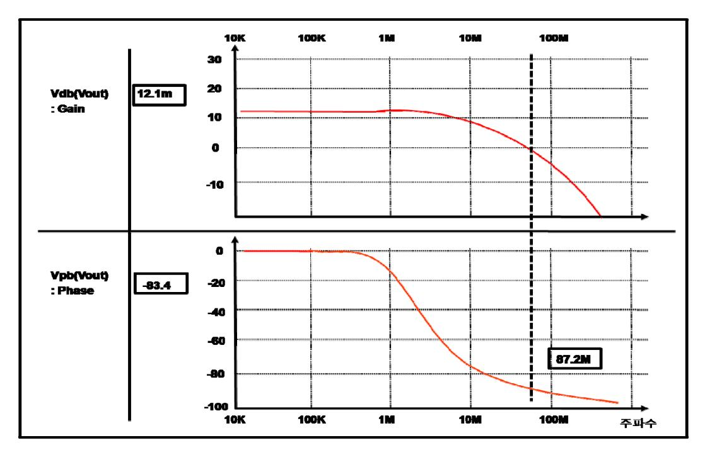

[그림 3-1] 앰프 회로의 이득, 주파수 특성 및 위상 안정도 분석

- 7. Viewer에서 활용할 수 있는 커서 등의 기능을 활용해 확대 및 축소 기능을 통해 출력 파형을 자세히 분석한다. 설계 회로의 주요 성능 지표에 대해 출력 결과를 수치로 확인 한다. 다음의 [그림3-1]는 아날로그 회로 설계에서 가장 빈번히 사용하는 앰프 회로의 성능을 보여주는 그래프 결과이다. 중요 성능 지표인 이득 특성 및 주파수 특성과 이에 따른 위상 안정도를 확인할 수 있다.
- 8. 설계 회로의 특성이 원하는 성능 지표를 만족하지 못할 경우에는 설계한 회로의 소자 중에서 성능에 크게 영향을 미치는 소자를 중심으로 크기 정보를 변경한 후 Netlist를 다시 추출하여 출력 결과의 변화를 확인한다.
- 9. 소자들의 크기 변화에 따른 주요 성능 결과를 확인하여, 최적 값을 갖도록 소자의 크기 를 선정한다.
- 공정 파라미터의 코너 조건을 적용하여 시뮬레이션을 수행하고 결과를 통하여 제품의 성 능과 품질, 양산성을 확보한다.
  - 1. Typical 조건에서의 설계가 어느 정도 최적화 되었다면, 제품의 품질과 양산성을 설계 단계에서 사전 반영하기 위하여 Worst와 Best 공정 조건에서의 코너 조건에 대한 시뮬 레이션을 진행한다.

- 2. 회로도면 내부에 있는 커패시터나 저항 소자들이 이상적인 모델로 정의되어 있는지 코 너 조건을 반영할 수 있는 모델로 정의되어 있는지 확인한다.
- 3. 이상적인 모델로 정의되어 있을 경우, Netlist에서 레이아웃 설계 시에 사용하고자 하는 소자 형태로 모델을 변경 기술하고, 테스트 벤치에서 불러오는 모델 파라미터 소자 항 목에 해당 모델을 추가로 정의한다.

회로도를 그릴 때 사용하는 심볼이 코너 조건을 다 반영할 수 있는지 확인해야만 모든 소 자들에 대해서 정확한 코너 조건의 변동을 확인할 수 있으므로 사용 소자들의 라이브러리 를 사전에 꼼꼼히 확인해야 한다.

- 4. 부하 조건으로 정의하고 있는 소자도 마찬가지로 코너 조건의 변동에 영향이 있는지를 검토하여 시뮬레이션을 진행한다.
- 5. 코너 조건이 프로세스, 온도, 전압에 대한 설계 마진을 확인했다면, 대표 값에 대한 설 계 특성 외에 대물량 양산 시의 설계 특성도 고려를 해야 한다. 이 같은 특성을 고려한 설계를 위해서는 이전 개발 제품의 실제 측정 결과를 통해 변동량의 범위와 주요 변동 의 항목에 따른 영향을 파악한다.

입력 신호나 인가하는 전압 등의 값이 실제 시뮬레이션에서 인가하는 고정 값으로 공급되 지 않고, 장비나 보드 기타 변동 요인으로 인해 변동이 발생하며 이러한 변동 특성으로 인해 실제 제작하는 제품 중에는 기능을 만족하지 못하는 불량 칩들이 발생한다.

- 6. 각 변동 항목과 변동 항목별 적절한 범위를 선정하여, 시뮬레이션의 변동 조건으로 반 영하고 이를 수행할 계획을 수립한다.
- 7. 변동 조건을 통해 확인한 시뮬레이션 결과 값을 산포량으로 반영하고, 평균값과 설계 기준을 통해 대 물량 양산 시 발생할 수 있는 불량률을 확인한다.
- 8. 해당 불량률이 목표로 선정한 수치를 만족하지 못할 경우, 평균 특성을 추가로 개선하 거나 산포 요인들을 최대한 줄임으로써 만족하는 수율 특성을 갖을 수 있도록 추가 개 선을 진행한다.
- 시뮬레이션 결과를 반영하여 레이아웃 설계 시 소자나 블록의 최적 배치에 적용한다.

레이아웃 설계 후에는 원하지 않는 기생 성분 및 소자들의 미스 매치 현상으로 인해 프리 시뮬레이션 결과 보다 성능 열화가 발생한다. 따라서 레이아웃에 따른 성능 열화가 발생할 수 있는 주요 설계 부에 대해서 시뮬레이션을 진행하면서 사전에 배치 및 보완 방법을 반 영한다.

1. 시뮬레이션 진행 시 전체 성능에 중요한 영향을 미치는 트랜지스터 소자를 중심으로 쌍 (differential)으로 마주보고 있는 대칭 형태의 소자들의 특성이 최대한 동일하게 만들어

41

### 질 수 있도록 더미 패턴을 회로도에 반영한다.

웨이퍼에서 각 층을 패턴에 따라 제작할 때 해당 층을 채우는 물질을 비스듬히 주입하게 된다. 이러한 제조 공정의 방법으로 인해 대칭 형태의 두 소자에 주입되는 물질의 양이 다르게 되며, 이러한 서로 다른 도핑 농도는 같은 특성을 갖는 두 소자가 서로 다른 특성 을 갖게하는 원인이 된다. 따라서 이러한 차이를 최소화하기 위해서는 더미 회로를 중요 매칭 특성이 필요한 소자 양옆에 배치한다.

2. 가급적 쌍으로 구성한 모든 신호선들의 길이를 최대한 동일하게 맞출 수 있는 방향으로 핀들의 위치 및 소자들의 위치를 조정한다. 공간적인 제약 조건으로 인해 배치가 제한 될 경우, 시뮬레이션 결과에 미치는 영향의 크기에 따라 배치 우선 순위를 결정한다.

두 신호선이 동일한 지연 효과를 갖도록 설계를 해야 외부 잡음에 대한 영향을 상쇄할 수 있다. 신호선의 지연 효과가 서로 다를 경우는 이러한 상쇄 효과가 오히려 상대 신호의 잡음이 될 수 있으므로, 회로 도면을 구성할 때부터 쌍으로 구현되어 있는 신호선들을 어 떻게 연결할지 방향을 고려하면서 소자를 배치한다.

### 수행 tip

- 테스트 벤치를 각각의 코너 조건으로 수행할 경우 파일명을 셀이름\_코너 조건과 같이 각각의 코너 조 건에 대해 별도의 테스트 벤치 파일을 만든 후 시 뮬레이션을 진행하여 출력 결과를 상대적으로 비교 하는 것이 서로 다른 코너 조건 결과를 동시에 확 인하면서 최적점을 찾기에 편리하다.
- 출력 파형 viewer 사용 매뉴얼을 사전에 숙지하여야 한다.
- 개발하고자 하는 회로 구현 시 동일 회로에 성능의 변동이 발생함을 고려해야 한다.
- 제품 규격서의 성능 지표 중 성능 상한과 하한 목 표를 확인하고, 변동 요인을 고려하여 평균과 산포 에 대한 목표치를 추가로 수립해야 한다.
- Vi 에디터의 사용 매뉴얼을 숙지하고, 주요 사용 단 축키를 숙지해야 한다.
- 시뮬레이션의 수행은 수없이 반복되는 회로의 수정 과 시뮬레이션을 통해 설계의 최적점을 찾게 되므 로, 목표 성능을 만족하기 위한 끊임없는 노력이 필요하다.
- 초기 시뮬레이션 결과 확인 시, 개발 성능 지표 중 에서 Trade-off 가 되는 주요 성능을 정의하고 회로 의 변경 시 중점적으로 확인해야 하는 지표를 사전 에 선정한다.

### 학습 3 교수·학습 방법

### 교수 방법

- 작성한 회로도에서 Netlist를 추출하는 방법을 사전 설명 후 실습을 통해 사용법을 지도한다.
- 추출한 Netlist에서 문서로 각 소자의 연결 정보를 기술하고 있는 방법에 대해 설명한다.
- 모델 파라미터 파일을 열어 각 소자들의 입력 크기에 따라 반영되는 값의 변화를 설명한다.
- 코너 모델에 따라 동일 소자에 적용되는 값의 변화에 대해서 설명한다.
- 테스트 벤치의 파일명 작성법 및 각 코너별 테스트 벤치에 따른 모델 파라미터의 정의 방법에 대해 설명한다.
- 테스트 벤치의 초기 선언, 회로 정보, 분석 방법, 출력 방법 등의 주요 입력 정보에 대한 기술 방법을 설명한 후, Vi 에디터를 활용한 실습을 통해 직접 작성할 수 있도록 지도한다.
- Spice 툴을 활용한 시뮬레이션 실행 방법을 설명한 후 실습을 통해 사용법을 지도한다.
- 출력 결과물에 대해 출력 파일별 확인하는 방법 및 중요하게 확인해야 하는 항목을 설명하고, Viewer를 통한 출력 파형은 실습을 통해 사용법을 지도한다.
- 코너 조건에 대한 시뮬레이션 진행 및 출력 결과를 상대적으로 비교하는 방법을 설명하고, 이를 통해 최적점을 찾아가는 과정을 설명한다.

### 학습 방법

- 작성한 회로도에서 Netlist를 추출하는 방법을 사전 학습 후 실습을 통해 사용법을 익힌다.
- 추출한 Netlist에서 문서로 각 소자의 연결 정보를 기술하고 있는 방법에 대해 학습한다.
- 모델 파라미터 파일을 열어 각 소자들의 입력 크기에 따라 반영되는 값의 변화를 학습한다.
- 코너 모델에 따라 동일 소자에 적용되는 값의 변화에 대해서 학습한다.
- 테스트 벤치의 파일명 작성법 및 각 코너별 테스트 벤치에 따른 모델 파라미터의 정의 방법에 대해 학습한다.
- 테스트 벤치의 초기 선언, 회로 정보, 분석 방법, 출력 방법 등의 주요 입력 정보에 대한 기술 방법을 학습한 후, Vi 에디터를 활용한 실습을 통해 직접 작성할 수 있도록 한다.
- Spice 툴을 활용한 시뮬레이션 실행 방법을 학습한 후 실습을 통해 사용법을 익힌다.
- 출력 결과물에 대해 출력 파일별 확인하는 방법 및 중요하게 확인해야 하는 항목을 학습하고, Viewer를 통한 출력 파형은 실습을 통해 사용법을 익힌다.
- 코너 조건에 대한 시뮬레이션 진행 및 출력 결과를 상대적으로 비교하는 방법을 학습하고, 이를 통해 최적점을 찾아가는 과정을 이해한다.
- 시뮬레이션 결과를 확인하면서, 레이아웃에 영향을 미칠 수 있는 소자들에 대해 사전 이해하고 블록의 배치 및 주의 사항의 기술 방법에 대해 학습한다.

## 학습 3 평 가

### 평가 준거

- 평가자는 학습자가 학습 목표 및 평가 항목에 제시되어 있는 내용을 성공적으로 수행하였는지 평가해야 한다.
- 평가자는 다음 사항을 평가해야 한다.

| 학습내용           | 평가항목                                                                                | 성취수준 |   |   |
|----------------|-------------------------------------------------------------------------------------|------|---|---|
|                |                                                                                     |      | 중 | 하 |
| 시뮬레이션 환경<br>구성 | - 설계된 단위 블록 및 시스템을 시뮬레이션으로 검증<br>할 수 있도록 시뮬레이션 회로(테스트 벤치, Test<br>Bench)를 구성할 수 있다. |      |   |   |
| 시뮬레이션 결과<br>분석 | - 시뮬레이션 툴(Tool)을 이용하여 적용 공정의 단위소<br>자와 설계된 회로에 대하여 전기적 특성 및 기능을<br>검증할 수 있다.        |      |   |   |
|                | - 공정 매개변수 코너 값을 적용하여 시뮬레이션을 수<br>행하고 결과를 통하여 제품의 성능과 품질, 양산성<br>을 확보할 수 있다.         |      |   |   |
|                | - 시뮬레이션 결과를 활용하여 설계의 타당성을 분석<br>할 수 있다.                                             |      |   |   |
|                | - 시뮬레이션 결과를 회로의 레이아웃 설계 시 소자나<br>블록의 최적 배치에 적용할 수 있다.                               |      |   |   |

### 평가 방법

### • 논술형 시험

|                |                          | 성취수준 |   |   |  |
|----------------|--------------------------|------|---|---|--|
| 학습내용           | 평가항목                     |      | 중 | 하 |  |
| 시뮬레이션 환경<br>구성 | - 테스트 벤치 해석              |      |   |   |  |
|                | - 테스트 벤치 작성              |      |   |   |  |
| 시뮬레이션 결과<br>분석 | - 시뮬레이션 오류에 대한 대처        |      |   |   |  |
|                | - 출력 파형 해석               |      |   |   |  |
|                | - 소자들의 동작모드 해석을 통한 설계 변경 |      |   |   |  |
|                | - 코너 조건을 반영한 시뮬레이션       |      |   |   |  |
|                | - 시뮬레이션을 통한 소자의 레이아웃 배치  |      |   |   |  |

• 평가자 체크리스트

|                | 평가항목                     |  | 성취수준 |   |  |
|----------------|--------------------------|--|------|---|--|
| 학습내용           |                          |  | 중    | 하 |  |
| 시뮬레이션 환경<br>구성 | - 테스트 벤치 해석              |  |      |   |  |
|                | - 테스트 벤치 작성              |  |      |   |  |
| 시뮬레이션 결과<br>분석 | - 시뮬레이션 오류에 대한 대처        |  |      |   |  |
|                | - 출력 파형 해석               |  |      |   |  |
|                | - 소자들의 동작모드 해석을 통한 설계 변경 |  |      |   |  |
|                | - 코너 조건을 반영한 시뮬레이션       |  |      |   |  |
|                | - 시뮬레이션을 통한 소자의 레이아웃 배치  |  |      |   |  |

• 구두 평가

|                |                          | 성취수준 |   |   |  |
|----------------|--------------------------|------|---|---|--|
| 학습내용           | 평가항목                     |      | 중 | 하 |  |
| 시뮬레이션 환경<br>구성 | - 테스트 벤치 해석              |      |   |   |  |
|                | - 테스트 벤치 작성              |      |   |   |  |
| 시뮬레이션 결과<br>분석 | - 시뮬레이션 오류에 대한 대처        |      |   |   |  |
|                | - 출력 파형 해석               |      |   |   |  |
|                | - 소자들의 동작모드 해석을 통한 설계 변경 |      |   |   |  |
|                | - 코너 조건을 반영한 시뮬레이션       |      |   |   |  |
|                | - 시뮬레이션을 통한 소자의 레이아웃 배치  |      |   |   |  |

### 피 드 백

1. 논술형 시험

- 논술형 평가를 통해 테스트 벤치의 작성 방법 및 주어진 Netlist 회로를 해석하여, 입력 조 건에 따른 출력파형의 예측 여부를 평가한다.
- 2. 평가자 체크리스트
- 평가자는 주요 블록별 시뮬레이션 항목과 절차, 주의사항을 충분히 숙지하고 있는지 점검 항목을 사전에 준비하여 평가한 후 주요 사항을 표시하여 돌려준다.
- 3. 구두 발표
- 주어진 출력 결과를 보고, 이를 적절히 해석할 수 있는지, 설계의 변경 부분을 찾아 회로 변경 여부를 확인하고 추가로 보완해야 할 사항에 대해 제시한다.

| 학습 1 | 적용 공정 분석하기  |
|------|-------------|
| 학습 2 | 회로 구성하기     |
| 학습 3 | 시뮬레이션하기     |
| 학습 4 | 포스트 시뮬레이션하기 |

# **4-1.** 포스트 시뮬레이션 환경 구성

학습 목표 • 레이아웃이 완료된 회로의 검증을 위한 시뮬레이션 환경을 구축할 수 있다.

### 필요 지식 /

포스트 시뮬레이션 구성 요소

학습 5 구현 회로 검증하기

포스트 시뮬레이션은 프리 시뮬레이션과의 성능 차이가 있는지를 확인하는 단계이므로 기 본적으로 프리 시뮬레이션 환경과 동일한 방법으로 시뮬레이션을 진행한다. 가장 큰 차이 점은 시뮬레이션을 위한 기본 구성 요소인 회로도 기술 문서(Netlist), 모델 파라미터, 테스 트 벤치 중에서 회로도 기술문서를 레이아웃이 끝난 도면으로부터 회로 정보를 추출하여 시뮬레이션을 진행한다.

1. Schematic 설계와 layout 설계 비교

Schematic 에디터를 통해 구현한 회로도면은 설계 회로의 라이브러리를 하나로 묶는 방법 으로 파일을 전달하게 되며, 회로 연결의 이상 유무는 연결하는 소자들의 포트들이 비어 있는 곳은 없는지를 확인하는 유일한 검증 방법이다.

layout 에디터를 통해 설계한 회로도면은 설계 블록의 라이브러리와 관계없이 GDS라는 파 일로 최종 결과물을 출력하고 이를 다시 불러들이는 방법으로 설계 자료를 전달한다. 따 라서 여러 개의 라이브러리에서 사용한 셀들의 상호 충돌 없이 새로운 라이브러리로의 변 경이 용이하다. layout의 검증 방법은 schematic 보다는 여러 단계의 검증 방법이 필요하 며, schematic 회로와의 일치 여부를 판단하는 LVS, 구현한 layout의 설계가 제조 공정의 룰에 적절한지를 확인하는 DRC 등의 중요 검증 방법을 통해 설계 적절성을 확인한다.

- 2. Schematic Netlist와 Layout Netlist 비교
  - (1) 프리 Netlist

Schematic 에디터를 통해서 심볼 형태 소자들로 구성한 회로도 정보를 프리 Netlist라 고 한다. Schematic 회로도는 2차원을 기반으로 하고 있기 때문에 소자와 소자들 사이 의 연결 정보, 그리고 소자별 특성을 가변할 수 있는 크기 정보 그리고 각각의 크기 변경에 따른 특성을 만들기 위한 단위 값들에 대한 정보를 가지고 있다.

(2) 포스트 Netlist

Layout 에디터를 통해서 물리적인 형태의 표준 셀들로 구성한 회로도 정보를 포스트 Netlist라 한다. Layout 회로도는 3차원을 기반으로 하고 있기 때문에 프리 Netlist가 가 지고 있는 기본 소자들의 정보 외에도 기생 성분의 저항과 커패시터 정보를 포함하게 된다. 추출하고자 하는 기생 성분을 옵션 조절을 통해 C, R, R+C의 값으로 추출이 가 능하다. 일반적으로 R+C 모드의 모든 기생 성분을 추출하는 방식을 사용한다. Schematic 회로에서는 크게 의미가 없던 소자들의 위치와 연결선의 길이에 따라서 이러 한 기생 성분은 값들이 다르게 추출되며, 프리 시뮬레이션 시에 고려할 수 없는 성분이 발생하는 것이므로 가급적이면 기생 성분이 최소가 되도록 layout 설계를 진행한다.

### 수행 내용 / 포스트 시뮬레이션 환경 구성하기

### 재료·자료

- 공정 규격서(Process Specification)
- 시스템/제품 규격서
- Vi 에디터 사용 매뉴얼
- 공정 파라미터 기술서 / 파일
- 출력 파형 viewer 사용 매뉴얼
- DRC(Design Rule Check) 룰 파일
- LVS(Layout vs. Schematic) 룰 파일
- LPE(Layout Parastic Extraction) 룰 파일

### 기기(장비 ・ 공구)

- 컴퓨터, 프린터, 워크스테이션, 인터넷
- 시뮬레이션 툴
- 출력 파형 분석 툴
- 레이아웃 설계 툴
- 레이아웃 검증 툴

### 안전 ・ 유의사항

해당 없음

#### 수행 순서

- 레이아웃이 완료된 회로의 검증을 위한 시뮬레이션 환경을 구축할 수 있다.
  - 1. 레이아웃 설계자에게 GDS 형태의 완성된 설계 자료와 Techfile을 전달 받는다.
    - GDS 파일은 레이아웃을 완료한 후에 해당 결과물을 파일형태로 출력하는 양식이다. 이때 해당 레이아웃의 설계에 사용한 레이어들의 기본 정보를 정의해놓은 Techfile을 같이 전달 받아 해당 설계 자료를 회로 설계자가 불러들인다.
  - 2. GDS 파일과 Techfile을 갖고 레이아웃 설계 툴의 Import 기능을 사용하여, 설계 정보를 확인할 수 있도록 설치한다.
  - 3. 설치한 레이아웃 설계 자료에 대해 원하는 방향으로 배치가 되었는지, 연결선들의 연결 상태 및 폭들이 적절한지 검토한다.
  - 4. 눈으로 1차 수정 부분에 대해 검토한 후, 변경 부분을 레이아웃 설계자에게 의뢰한다.
  - 5. 수정한 GDS 파일을 받아서 1~3의 과정을 통해 육안 검사를 통한 1차 설계 검토를 완료 한다.
  - 6. 본격적인 포스트 시뮬레이션을 진행하기 위해, 검토 완료한 레이아웃 설계 자료에서 GDS 파일을 추출한다.
  - 7. 프리 시뮬레이션을 진행한 최종 회로도면에서 Netlist를 추출한다.

최종 회로도면에서 Netlist를 다시 추출하는 것은 레이아웃 설계자에게 전달한 Netlist 회로

가 향후 추가 시뮬레이션 과정 중 업데이트 항목이 발생할 수 있기 때문이다. 이러한 업 데이트 항목이 버전별로 누락 없이 잘 전달되면 문제가 없으나, 수정 사항의 반영 과정에 서 서로 다른 Netlist를 가지고 있는 사례가 발생할 수 있다. 따라서 이러한 오류를 사전에 예방하고자 최종 회로도면에서 다시 Netlist를 추출하는 것이 안전하다.

8. LVS 검증을 진행한다.

사용하는 룰 파일은 설계자가 생각하는 가장 최신 버전을 사용하고 옵션은 없는 상태로 검증을 진행한다. 검증 결과에 따라서 에러와 경고의 항목들을 검토하면서, 레이아웃 설계 자가 사용한 옵션 기능을 확인하고 해당 옵션의 사용이 전체 개발 칩 관점에서 문제가 없 는지 확인한다.

9. DRC 검증을 진행한다.

LVS 검증과 마찬가지로 룰 파일은 설계자가 생각하는 가장 최신 버전을 사용하고, 옵션은 없는 상태로 검증을 진행한다.

10. 레이아웃 설계 자료의 검증이 완료되면, 파라스틱 값을 추출하기 위해 LPE 룰 파일을 열고 필요 정보를 입력한다.

사용한 Techfile 정보 및 사용한 전원 이름 그리고 출력할 포스트 Netlist의 출력 경로와 출력파일명 등을 기술한다.

- 11. 검증 툴에서 파라스틱 Netlist를 추출 한다
- 12. 추출 로그 파일을 확인하여, 파라스틱 값의 추출 시 에러 또는 경고 항목이 있는지 확 인하고 해당 내용을 통해 추출 회로의 적절성을 판단한다.
- 13. 추출 로그 파일을 확인하여, 추출한 Netlist의 포맷에 대한 에러 또는 경고 항목을 확인한다.

### 수행 tip

- 설계된 레이아웃 회로에 대해 회로 설계자는 더 많 은 지식을 가지고 패턴을 분석해야 한다.
- 직접 레이아웃을 진행하지 않더라도 레이아웃 설계 툴을 충분히 숙지하여, 설계 패턴을 스스로 분석해 야 한다.
- 룰 검증 시 발생하는 에러 뿐만 아니라 경고로 발 생하는 모든 문구에 대해서는 개별 확인을 통해 무 시할 수 있는 항목인지, 추가 수정이 필요한 항목 인지 분류해서 조치를 해야 한다.
- 포스트 시뮬레이션은 한번 진행하면 많은 시간이 요구되므로, 시뮬레이션을 진행하기 전에 레이아웃 패턴이 원하는 방향으로 잘 진행되었는지 사전에 충분히 다 활용하였는지 확인한다.

# **4-2.** 포스트 시뮬레이션 결과 분석

• 레이아웃으로부터 추출된 물리적 특성을 반영하여 시뮬레이션을 수행할 수 있다.

- 학습 목표 • 기술 규격서에 의거하여 회로의 성능을 검증할 수 있다.
  - 시뮬레이션 결과를 분석하여 오류를 수정하고 설계에 반영할 수 있다.

### 필요 지식 /

### 포스트 시뮬레이션 방법

포스트 시뮬레이션 결과 분석을 위한 기본 항목은 3-2 시뮬레이션 결과 분석과 동일하다. 차이점은 프리 Netlist 대신 포스트 Netlist를 테스트 벤치에서 잘 인식하도록 확인해야 하 며, 분석 결과에 대한 조치 사항으로 schematic 회로의 수정이 아닌 레인아웃 패턴의 수정 및 필요에 따라서는 Schematic 회로까지도 다시 수정해야 한다.

시뮬레이션에 필요한 3가지 구성 요소 중 변경된 포스트 Netlist의 준비가 끝났으면, 동일 한 테스트 벤치를 활용해 시뮬레이션을 통한 성능을 확인한다. 테스트 벤치에서 출력한 포 스트 Netlist의 저장 경로와 파일명을 지정해 주고 시뮬레이션은 동일한 명령어를 통해 수 행한다.

빈번히 발생하는 오류로는 파운더리 업체마다 프리 Netlist와 포스트 Netlist의 트랜지스터 소자 이름을 다르게 주는 경우가 있다. 따라서 모델 파라미터에서 정의하고 있는 이름을 기준으로 Netlist의 소자 이름을 변경해야 하는지 확인이 필요하다.

시뮬레이션의 완료 또는 진행 중인 경우에도 시간 축에 따른 출력 파형은 분석이 가능하 기 때문에 프리 Netlist의 결과와 중첩하여 포스트 Netlist의 결과를 수시로 비교한다. 최종 적으로는 설계 규격서 기준 대비 수용 가능한 성능 인지 확인을 통해 레이아웃의 변경 여 부를 결정한다.

#### 발생하기 쉬운 성능 열화 항목

가장 발생하기 쉬운 성능 열화는 Differential 신호 라인의 신호 왜곡 현상이다. 프리 시뮬 레이션 시에는 대칭인 소자들의 크기 정보만으로 대칭 조건을 만족하게 되며, 주변의 잡음 성분에 대한 영향도 반영되지 않기 때문에 상대적으로 설계 특성이 좋다.

그러나 레이아웃에서는 그려진 패턴에 따라서 수많은 기생 성분을 뽑아 주게 되므로 대칭 인 소자와 신호선 주변으로 기생 소자들이 발생한다. 레이아웃에서 이러한 대칭 구조의 배 치를 최대한 동일하게 만들기 위해서는 세로축을 중심으로 절반의 회로만을 배치한 하위 셀을 만든 뒤 이 셀을 대칭으로 배치하여 연결한다. 이러한 설계 방법을 통해 설계자가 의

도하지 않게 비대칭으로 배치할 수 있는 요소를 사전에 제거한다.

그러나 아무리 대칭으로 소자와 신호선을 동일하게 배치하여도 인접한 블록까지 대칭이 될 수는 없기 때문에 이로 인한 열화를 최소화하기 위해서는 일정 간격을 띄워서 주변 신 호의 영향을 최소가 되도록 해야 한다.

다음으로 전류 공급이 순간적으로 많이 요구되는 회로에서 전원 배선의 폭이 충분히 넓지 않을 경우 지연 효과가 크게 나타난다. 따라서 프리 시뮬레이션을 진행하면서 전류 소모가 큰 출력 단에는 필요한 전류량을 주석으로 기재하고 레이아웃 설계 시에도 메탈 폭을 충 분히 키워서 설계를 진행한다. 또한 전체 설계 회로의 소모 전류량을 파악하여, 순간 전류 량은 평균 전류량 보다 3~4배 큰 값이 요구될 수 있으므로, 레이아웃 설계를 진행할 때 주 요 전원 선의 메탈 폭에 대한 사전 정책을 수립한다.

이러한 사전 예측과 대비가 불충분할 경우, 특정 노드의 지연 현상에 따른 성능 열화는 메 탈 선을 추가로 보강해주고, 잡음에 따른 성능 열화는 중요 신호선과 소자를 중심으로 비 대칭 항목을 찾거나 주변의 잡음원과의 거리를 더 넓게 조정함으로써 성능 열화를 개선해 야 한다.

### 수행 내용 / 포스트 시뮬레이션 결과 분석하기

#### 재료·자료

- 공정 규격서(Process Specification)
- 시스템/제품 규격서
- Vi 에디터 사용 매뉴얼
- 공정 파라미터 기술서 / 파일
- 출력 파형 viewer 사용 매뉴얼
- DRC(Design Rule Check) 룰 파일
- LVS(Layout vs. Schematic) 룰 파일
- LPE(Layout Parastic Extraction) 룰 파일

### 기기(장비 ・ 공구)

- 컴퓨터, 프린터, 워크스테이션, 인터넷
- 시뮬레이션 툴
- 출력 파형 분석 툴
- 레이아웃 설계 툴
- 레이아웃 검증 툴

### 안전 ・ 유의사항

해당 없음

#### 수행 순서

- 레이아웃 설계를 통해 구현한 회로의 물리적 특성을 반영하여 시뮬레이션을 진행한다.
  - 1. 최종 수정 완료한 레이아웃 설계 자료에서 추출한 포스트 Netlist 파일을 원하는 경로에 저장한다.
  - 2. 프리 시뮬레이션의 결과와 상대적인 설계 성능 비교를 위해, 동일한 테스트 벤치 파일을 복사해서 가져온다.
  - 3. 테스트 벤치 파일명을 수정하고, 파일을 열어 불러오는 Netlist의 경로 및 파일명을 포스트 Netlist로 변경한다.
  - 4. 수정한 테스트 벤치 파일을 가지고 시뮬레이션을 진행한다.
  - 5. 시뮬레이션 중간에 각 노드들의 결과 및 최종 출력 결과가 정상적인 형태로 실행되고 있는지, 개략적인 그래프의 모양을 통한 분석을 진행한다.
  - 6. 출력 파형에 이상이 있을 경우, 1차로는 테스트 벤치의 적절성 여부를 확인하고 두 번 째로 포스트 Netlist 파일이 정상적으로 뽑혔는지 재검토한다.
  - 7. 시간 축에 따른 시뮬레이션을 수행할 경우 진행 중인 분석 시간을 확인하여, 전체 완료를 위해 필요한 전체 시간을 예측한다.
  - 8. 전체 설계 일정 기준으로 설계 전체 블록에 대한 포스트 시뮬레이션이 가능한지 파악하고, 불가능한 경우에는 블록 단위의 포스트 시뮬레이션 진행 여부를 의사 결정한다.
  - 9. 최종 시뮬레이션이 출력 결과를 프리 시뮬레이션과 마찬가지로 파형 분석 툴의 실행을

통해 확인한다.

프리 시뮬레이션에서 설계한 성능과의 상대 비교를 통해 성능 열화 여부를 확인하게 되므 로 사전 진행 완료한 프리 시뮬레이션 결과를 출력 파형으로 띄운 후 포스트 시뮬레이션 결과를 중첩해서 띄워서 성능 열화를 확인한다.

- 설계 규격서의 성능 기준을 만족하는지 확인하고, 개선 부분에 대한 분석 및 수정을 설계에 반영한다.
  - 1. 포스트 시뮬레이션 결과가 프리 시뮬레이션 결과와 차이가 크게 발생하거나 원하는 설 계 기준을 만족하지 못할 경우에는, 출력 결과의 노드별 분석을 통해 레이아웃 설계 패 턴 중 수정해야할 부분을 찾는다.
  - 2. 레이아웃 설계자에게 해당 수정 부분의 문제점을 설명하고, 수정해야 하는 방향에 대해 명확하게 설명한다.
  - 3. 레이아웃 수정을 통해 재설계한 GDS 파일에 대해 포스트 Netlist 추출까지의 수행 순서 를 다시 진행하고 수정한 포스트 Netlist를 저장한다.
  - 4. 시뮬레이션을 다시 진행한 후 목표한 성능 지표를 만족하는지 확인한다. 만족하지 않을 경우에는 이전 진행한 시뮬레이션 결과와 비교를 통해 개선이 방향이 맞는지 확인한다.
  - 5. 목표 성능 지표를 만족할 경우에는 코너 조건의 시뮬레이션을 추가로 진행하여, 나머지 산포 조건하에서도 충분한 양산성을 갖도록 설계한다.

### 수행 tip

- 포스트 시뮬레이션은 프리 시뮬레이션 대비 수 십 배의 시간이 소요되므로 민감한 주요 단위 블록의 시뮬레이션을 선별적으로 진행한 후에 최종 확인 시에만 전체 블록에 대한 시뮬레이션을 진행하는 방향으로 설계를 진행한다.
- 포스트 시뮬레이션은 결과의 확인까지 많은 시간이 소요되므로, 시뮬레이션을 진행하기 전에 입력 파 일의 적절성 및 테스트 벤치의 측정 항목과 측정하 고자 하는 지점들이 정확하게 기술되어 있는지 충 분히 검토한다.
- 시뮬레이션이 진행되는 중간에도 중간 결과를 출력 파형 분석 툴을 통해 확인하는 것이 필요하다. 중 간 결과만으로도 시뮬레이션 조건 및 환경 설정 오 류에 대한 부분은 확인이 가능하므로 수시로 확인 가능한 항목들을 미리 점검하는 습관이 필요하다

### 학습 4 교수·학습 방법

### 교수 방법

- GDS 및 Techfile을 통한 레이아웃 import 방법을 설명하고, 실습을 통해 사용법을 지도한다.
- 설계한 레이아웃 자료의 주요 점검 항목을 이론으로 설명하고, 레이아웃 툴을 활용한 다양한 viewing 기능에 대해 사용법을 지도한다.
- LVS(Layout vs. Schematic) 수행 방법을 순차적으로 설명하고, 검증 툴을 통한 사용법을 지도한다.
- DRC(Design Rule Check) 수행 방법을 순차적으로 설명하고, 검증 툴을 통한 사용법을 지도한다.
- LPE(Layout Parastic Extraction)을 위해 Rule 파일의 기재 항목에 대해 설명하고, 포스트 Netlist를 추출하는 과정을 툴을 활용해 사용법을 지도한다.
- 포스트 Netlist 추출 시 발생할 수 있는 에러 및 경고 항목에 대해 설명하고, 각각의 경우에 따른 대처 방법을 지도한다.
- 포스트 시뮬레이션에 필요한 각 파일을 설명하고, 포스트 시뮬레이션 수행 방법을 툴을 활용해 지도한다.
- 시뮬레이션 결과에 대해 문서 파일 및 출력 파형을 통한 해석 방법을 설명한다.
- 잘못된 레이아웃에 따른 프리 시뮬레이션과 포스트 시뮬레이션의 결과 차이 사례를 보여주고, 이러한 경우 수정해야 할 레이아웃 패턴을 찾는 방법에 대해 설명한다.

### 학습 방법

- GDS 및 Techfile을 통한 레이아웃 import 방법을 학습하고, 실습을 통해 사용법을 익힌다.
- 설계한 레이아웃 자료의 주요 점검 항목을 학습하고, 레이아웃 툴을 활용한 다양한 viewing 기능에 대해 사용법을 익힌다.
- LVS(Layout vs. Schematic) 수행 방법을 학습하고, 검증 툴을 통한 사용법을 익힌다.
- DRC(Design Rule Check) 수행 방법을 학습하고, 검증 툴을 통한 사용법을 익힌다.
- LPE(Layout Parastic Extraction)을 위해 Rule 파일의 기재 항목에 대해 학습하고, 포스트 Netlist를 추출하는 과정을 툴을 활용해 사용법을 익힌다.
- 포스트 Netlist 추출 시 발생할 수 있는 에러 및 경고 항목에 대해 학습하고, 각각의 경우에 따른 대처 방법을 이해한다.
- 포스트 시뮬레이션에 필요한 각 파일을 학습하고, 포스트 시뮬레이션 수행 방법을 툴을 활용해 익힌다.
- 시뮬레이션 결과에 대해 문서 파일 및 출력 파형을 통한 해석 방법을 이해한다.
- 잘못된 레이아웃에 따른 프리 시뮬레이션과 포스트 시뮬레이션의 결과 차이를 확인하고, 이러한 경우 수정해야할 레이아웃 패턴을 찾는 방법에 대해 학습한다.

## 학습 4 평 가

### 평가 준거

- 평가자는 학습자가 학습 목표 및 평가항목에 제시되어 있는 내용을 성공적으로 수행하였는지 평가해야 한다.
- 평가자는 다음 사항을 평가해야 한다.

|                     |                                                 | 성취수준 |   |   |
|---------------------|-------------------------------------------------|------|---|---|
| 학습내용                | 평가항목                                            |      | 중 | 하 |
| 포스트 시뮬레이<br>션 환경 구성 | - 레이아웃이 완료된 회로의 검증을 위한 시뮬레이션<br>환경을 구출할 수 있다.   |      |   |   |
| 포스트 시뮬레이<br>션 결과 분석 | - 레이아웃으로부터 추출된 물리적 특성을 반영하여<br>시뮬레이션을 수행할 수 있다. |      |   |   |
|                     | - 기술 규격서에 의거하여 회로의 성능을 검증할 수<br>있다.             |      |   |   |
|                     | - 시뮬레이션 결과를 분석하여 오류를 수정하고 설계<br>에 반영할 수 있다.     |      |   |   |

### 평가 방법

• 논술형 시험

|                     |                               | 성취수준 |   |   |
|---------------------|-------------------------------|------|---|---|
| 학습내용                | 평가항목                          | 상    | 중 | 하 |
|                     | - 레이아웃 패턴 해석 능력               |      |   |   |
| 포스트 시뮬레이<br>션 환경 구성 | - 레이아웃 검증 툴 사용 능력             |      |   |   |
|                     | - 포스트 Netlist / 테스트 벤치 구성 능력  |      |   |   |
| 포스트 시뮬레이<br>션 결과 분석 | - 포스트 시뮬레이션 오류에 대한 대처 능력      |      |   |   |
|                     | - 출력 파형 해석 능력                 |      |   |   |
|                     | - 코너 조건을 반영한 시뮬레이션 능력         |      |   |   |
|                     | - 시뮬레이션을 결과에 따른 레이아웃 배치 변경 능력 |      |   |   |

• 구두발표

|                     |                               | 성취수준 |   |   |  |
|---------------------|-------------------------------|------|---|---|--|
| 학습내용                | 평가항목                          | 상    | 중 | 하 |  |
|                     | - 레이아웃 패턴 해석 능력               |      |   |   |  |
| 포스트 시뮬레이<br>션 환경 구성 | - 레이아웃 검증 툴 사용 능력             |      |   |   |  |
|                     | - 포스트 Netlist / 테스트 벤치 구성 능력  |      |   |   |  |
| 포스트 시뮬레이<br>션 결과 분석 | - 포스트 시뮬레이션 오류에 대한 대처 능력      |      |   |   |  |
|                     | - 출력 파형 해석 능력                 |      |   |   |  |
|                     | - 코너 조건을 반영한 시뮬레이션 능력         |      |   |   |  |
|                     | - 시뮬레이션을 결과에 따른 레이아웃 배치 변경 능력 |      |   |   |  |

• 평가자 체크리스트

|                     | 평가항목                         | 성취수준 |   |   |  |
|---------------------|------------------------------|------|---|---|--|
| 학습내용                |                              | 상    | 중 | 하 |  |
| 포스트 시뮬레이            | - 레이아웃 검증 툴 사용 능력            |      |   |   |  |
| 션 환경 구성             | - 포스트 Netlist / 테스트 벤치 구성 능력 |      |   |   |  |
| 포스트 시뮬레이<br>션 결과 분석 | - 출력 파형 해석 능력                |      |   |   |  |
|                     | - 코너 조건을 반영한 시뮬레이션 능력        |      |   |   |  |

### 피 드 백

- 1. 논술형 시험
- 테스트 포스트 시뮬레이션의 절차 및 각 단계별 주의 사항을 숙지하고 있는지 서술형으 로 평가하고 미흡한 부분은 재교육할 수 있도록 한다.
- 2. 구두 발표
- 프리와 포스트 시뮬레이션 결과를 비교하여 결과의 차이에 대한 해석을 할 수 있는지, 기준 이상의 결과 차이에 대해 레이아웃의 설계 변경 진해하는 방향을 수립할 수 있는 지 확인한 후, 개선 사항 및 추가로 보완해야할 사항에 대해 제시한다.
- 3. 평가자 체크리스트
- 평가자는 레이아웃 설계 자료를 확인하기 위한 각 단계별 수행 방법과 검증 툴의 사용 방법 숙지 여부를 확인하고, 테스트 벤치의 작성의 주의 사항을 알고 있는지 평가한다.

| 학습 1<br>적용 공정 분석하기<br>학습 2<br>회로 구성하기<br>학습 3<br>시뮬레이션하기<br>학습 4<br>포스트 시뮬레이션하기 | 학습 5 | 구현 회로 검증하기 |
|---------------------------------------------------------------------------------|------|------------|
|                                                                                 |      |            |
|                                                                                 |      |            |
|                                                                                 |      |            |
|                                                                                 |      |            |

# **5-1.** 구현 회로 검증환경 구축 및 측정

학습 목표 • 전자계측기를 사용하여 설계된 회로의 전기적 특성을 측정하고 결과를 분석할 수 있다.

### 필요 지식 /

인쇄 회로 기판(PCB)

우리가 흔히 전자 제품의 내부를 볼 경우, 녹색의 기판에 여러 개의 칩들이 붙어 있는 모 습을 볼 수 있는데, 이러한 기판을 인쇄 회로 기판이라 부른다. 비전도 특성의 기판에 습 식 식각을 통해 신호선을 만들고 전자 부품을 연결한다.

우리가 개발한 칩은 단일 칩으로는 신호의 입력 및 출력 단자와의 연결조차 불가능하므로, 이렇게 신호의 연결 및 다른 기능을 수행하는 칩과의 연결 그리고 수동 소자들과 연결을 위해서 인쇄 회로 기판의 제작한다. 인쇄 회로 기판은 칩 설계 과정과 유사하게 보드 제작 을 위한 설계 도면을 1차로 작성한 후, 이런 도면을 기초로 물리적인 실제 구조로 배치하 는 Artwork의 설계 단계를 통해 기판을 제작하게 된다.

계측 장비 활용법 \_ 오실로스코프

아날로그 신호의 계측을 위해 가장 많이 활용되는 장비이다. 장비 왼쪽에 측정되는 파형의 모양과 계측을 위해 사용하고 있는 측정 단위를 보여 주며, 오른쪽의 버튼을 조절하여 계 측하는 파형의 모양을 보다 잘 관측할 수 있도록 조절한다.

1. 수직 축 조절 단자

보통 2~4개의 입력 채널을 가지고 있어서 여러 개의 측정 지점 결과를 동시에 화면에 볼 수 있다. 서로 다른 색깔로 구분한 각 채널은 측정을 위한 프루브를 연결함으로써 측정 지점을 계측하게 되며, 수직 축(Y축)의 전압 값을 자세히 관측하기 위하여 한 눈금이 의미 하는 단위를 조절할 수 있다. 각 채널에 입력되는 신호의 크기 차이가 많이 날 경우는 서 로 다른 기준 단위를 갖고 하나의 화면에 신호가 들어올 수 있도록 조절한다.

2. 수평 축 조절 단자

화면의 수평 축(X축)의 시간 값을 조절하기 위한 단자이다. 측정하는 파형의 폭에 따라 시 간 축의 기준 단위를 조절하여 화면에 나타난 파형의 모양을 최대로 자세히 관측할 수 있 도록 조절한다.

3. 트리거

전체 화면에서 인가되는 파형의 어느 지점을 포착할지 결정할 수 있는 스위치이다. X, Y 축에서 변화가 일어나는 부분을 기준으로 트리거의 위치를 조절하면, 확실하게 바뀌는 출 력 결과를 관측하게 된다. 초기에 트리거 위치를 쉽게 찾지 못하면 Auto set 버튼을 통해 장비에서 파형 변화가 일어나는 지점으로 트리거 위치를 잡아 준다.

4. 부가 기능 부

출력 파형이 시간에 따라 시간과 크기가 계속 변화됨에 따라 값을 읽기 불편할 경우 start/stop 버튼을 통해서 파형을 잠시 정지시켰다가 다시 움직이게 할 수 있다.

### 수행 내용 / 구현 회로 검증환경 구축 및 측정하기

### 재료·자료

- 패드 정보 기술서
- 패드 좌표 기술서
- 패키지 성능 기술서
- 캐드 툴 사용 매뉴얼
- ArtWork 사용 매뉴얼
- 계측기 매뉴얼
- 실험 계획서

### 기기(장비 ・ 공구)

- 전원 및 신호 공급용 장비
- 전원발생기(Power Supply)
- 신호발생기(Signal Generator, Pattern Generator, TMDS 등)
- 오실로스코프
- 측정 결과 계측용 장비
- 파형 분석 계측 장비(Oscilloscope, Logic Analyzer, Spectrum Analyzer, J-bert 등)
- LRC값 측정 장비(LCR 미터)
- 캐드 툴
- Artwork 툴
- 컴퓨터, 프린터, 워크스테이션, 인터넷

#### 안전 ・ 유의사항

시제품(Prototype)으로 생산된 샘플을 설계규격서에 맞게 측정하여 설계 성공여부를 판단하고 개선 절차를 진행하는 과정이 포함된다.

#### 수행 순서

구현한 회로의 성능 검증을 위한 패키지를 선정한다.

설계 회로가 요구하는 핀 개수와 핀 위치에 따른 특성 열화, 소모 전력, 발열 특성 등을 고려하여 가장 경재적인 패키지 종류를 선정한다.

1. 설계 회로의 패드(PAD) 정보를 확인한다.

패드의 개수와 종류를 구분하여 파악하고, 개별 패드의 좌표 정보를 파악한다. 파워와 신 호 패드는 각각의 전기적 특성에 따라 더욱 상세한 구분이 가능하지만, 대표적으로 다음 의 8가지 종류로 구분할 수 있다.

2. 칩에 필요한 핀 개수를 파악한다.

<표 5-1> 설계 회로의 패드 종류

| 아날로그 패드  |            |          |          |          | 디지털 패드     |          |          |  |
|----------|------------|----------|----------|----------|------------|----------|----------|--|
|          | 파워 패드      |          | 신호 패드    |          | 전원 패드      |          | 신호 패드    |  |
| 전원<br>패드 | 그라운드<br>패드 | 입력<br>패드 | 출력<br>패드 | 전원<br>패드 | 그라운드<br>패드 | 입력<br>패드 | 출력<br>패드 |  |

가장 기본적으로는 하나의 패드에 하나의 핀을 연결하지만, 필요에 따라서 하나의 핀에 여러 개의 패드 전원 또는 신호를 연결할 수 있다.

3. 핀 개수와 칩의 크기에 따른 적절한 패키지 형태를 선정한다.

패키지의 크기를 결정하는 중요한 두 가지 요소가 핀 개수와 칩의 크기로써 두 가지 항목 중 제약 조건이 더 큰 항목을 기준으로 크기를 결정한다. 그 외에 구성 물질 및 구조 관 련해서는 소모 전력 및 발열 특성을 고려하여 패키지의 구조를 결정한다.

- 4. 선정한 패키지의 개별 핀과 연결하려는 패드(PAD) 사이에 연결 조건을 확인한다. 핀과 패드를 연결하는데 연결 각도 및 물리적인 제약 조건이 있는지 검토한다.
- 5. 중요 신호선의 기생 성분에 의한 성능 열화를 확인한다. 핀과 패드의 연결 길이에 따른 기생 저항, 리액턴스, 커패시턴스 성분으로 인해 발생하는 성능 열화가 있는지 검토한다.
- 구현한 회로의 성능 검증을 위한 PCB 보드의 회로도를 설계한다.

PCB 보드의 회로 설계는 개발한 칩의 성능 검증 또는 제품 적용을 위해 전반적인 동작을 할 수 있는 기판의 설계를 의미한다. 따라서 개발 칩 뿐만 아니라 원하는 기능 구현을 위 한 다른 칩과 수동 소자들을 회로 기판에 배치하고, 전기적인 흐름에 따라 서로 연결하여 회로도면을 완성한다.

- 1. 회로도에 사용하는 개발 칩, 성능 검증을 위한 부가 칩, 수동소자(저항, 커패시터, 인덕 터, 다이오드 등)의 부품에 대한 크기와 핀 위치 정보를 개별 부품 명으로 등록한다.
- 2. 설계 회로의 칩을 가장 중앙으로 배치한다.
- 3. 설계 회로의 핀과 연결되는 방향을 기준으로 사용하는 소자들을 사분면에 배치한다.
- 4. 배치한 부품들에 필요한 각각의 값들을 표기한다.
- 5. 배치한 소자들이 연결되는 전원의 종류와 전압 값에 따라 부품의 위치를 조정한다.
- 6. 입출력 신호의 흐름에 따라 등록한 부품들을 서로 연결한다.

7. 물리적인 배치(Art Work)시에 주의 사항을 도면에 기재한다.

- 구현한 회로의 성능 검증을 위한 PCB 보드의 물리적인 설계를 한다. PCB 보드의 설계도 칩을 설계할 때와 마찬가지로 심볼을 이용한 회로도면의 작성을 완료 한 후에는 물리적인 형태의 레이아웃 설계가 필요하다. PCB 보드의 레이아웃 설계 과정은 Art Work라 부른다.
  - 1. 몇 층 기판을 활용하여 Art Work를 설계할지 목표를 수립한다.
  - 2. 소켓 사용 유무에 따라서 중앙에 배치하는 개발 칩과 소자간의 최소 거리를 별도의 보 드로 제작할지 단일 보드로 제작할지 결정한다.
  - 3. 개발 칩을 중심으로 검증을 위한 부가 칩과 수동 소자, 전원 공급을 위한 소자들의 기 본 배치를 상층 또는 하층에 진행한다.
  - 4. 4층 기판 PCB의 경우, 일반적으로 가장 안정적인 전원 신호와 그라운드 신호를 2층과 3 층에 면으로 구성한다.
  - 5. 중요 입력 신호선의 배치를 먼저 진행하여, 연결 길이가 최단 거리가 되도록, 꺾이는 부 분이 최소가 되도록 위치를 잡는다.
  - 6. 공급 전원(아날로그/디지털 및 인가전압)의 영역에 따라 개발 칩의 핀과 구성 소자들의 위치를 상세하게 조정한다.
  - 7. 중요 신호선을 따라 잡음이 심한 부품들 간의 거치가 충분한지 검토한다.
  - 8. 신호선들은 상층과 하층 사이의 연결에 대해서도 신호 왜곡이 발생할 수 있으므로, 불 필요한 층의 변경이 있는지 검토한다.
  - 9. 여백의 공간은 Via를 뚫어 그라운드 전원으로 채워 넣는다.
  - 10. 소켓을 사용할 경우, 개발 칩의 패키지 모양과 핀 정보를 전달하여 소켓 제작에 대한 발주를 낸다.
- 제작한 PCB 보드에 부품을 연결하고, 계측 장비를 준비한다.

실험 방법에 따라 적절한 수량의 PCB 보드를 예측하고, 이에 필요한 장비들을 사전 준비한다. 1. 칩과 수동 소자, 전원 공급을 위한 부품들을 조립하려는 보드 수량에 맞추어 준비한다. 2. 자삽 또는 수삽을 통해서 개발 칩을 포함한 주요 부품들을 보드에 붙인다.

- 3. 핀 사이에 원하지 않는 연결이 있는지, 연결이 안 되어 떨어져 있는 곳은 없는지 확인한다.
- 4. 계측 장비를 준비한다.

주요 계측 장비로는 전원을 인가하는 전원발생기(Power Supply), 신호를 전달하는 신호발

생기(Signal Generator, Pattern Generator, TMDS 등), 측정 파형을 분석하는 계측 장비 (Oscilloscope, Logic Analyzer, Spectrum Analyzer, J-bert 등), LRC 값을 측정하는 LCR 미 터 등의 장비가 있다.

- 5. 계측기의 안정성 및 반복성, 계측자에 대한 실험 오차가 측정 결과를 왜곡시키지 않을 정도의 수준인지 계측기에 대한 평가를 진행한다.
- 6. 실험을 하기 위한 실험 계획을 수립한다.

측정할 샘플 개수, 반복 측정 회수, 측정자 선정, 조절해야 하는 인자 선정, 인자별 실험 수준 등을 계획하여 총 몇 회의 실험을 진행할지, 측정 순서를 어떻게 진행할 지에 대한 실험 계획을 수립한다.

- 7. 개발 칩의 전체 특성을 적절히 반영할 수 있는 샘플을 랜덤하게 선택한다.
- 8. 회로의 초기 세팅 값을 조절하는 소자들을 원하는 값으로 조정한다.
- 9. 전원 공급기를 통해 테스트 보드에 전원을 인가한다.
- 10. 신호 발생기를 통해 테스트 보드에 입력 신호를 인가한다.
- 11. 계측 장비를 통해 출력 단자에 원하는 출력 파형이 나오는지 확인한다.

### 수행 tip

- 입력 신호는 보통 차동(differential) 구조로 설계를 하되, 두 신호선의 길이를 최대한 일치시키고, 꺾이 거나 층을 바꿀 경우도 동일 조건을 적용한다. 최 단거리로 설계하는 것보다 두 신호선의 조건을 동 일하게 만드는 것이 보다 중요한 잡음 신호에 대한 내구성을 갖는다.
- 주요 신호선의 보호 방법으로는 아날로그 그라운드 선으로 보호벽을 만들거나, 잡음 신호를 최대한 멀 리 배치하는 방식 등이 있다.
- 개별 패드의 기본 좌표는 물론 패드의 신호 특성 및 요구되는 전류 특성, 잡음에 대한 내구성의 정 보를 알아야 한다.
- 아날로그 전원과 디지털 전원의 잡음에 대한 특성 및 패드, 패키지, 보드에서의 연결에 따른 잡음 전 달 관계를 확인해야 한다.
- 칩 전체의 신호 중요도에 따라 칩과 가까운 곳에 배치하는 수동 소자의 우선순위를 선정해야 한다.
- ArtWork 설계자가 충분한 의사 소통을 통해 최소한 의 면적에 중요 신호선들이 잡음원으로부터 안정적 으로 보호 받을 수 있도록 검토해야 한다.
- ArtWork 설계자가 사전 설계를 충실히 진행할 수 있도록, 중요한 패턴의 경우에 충분히 주석을 통한 주의 사항을 기재한다.

# **5-2.** 구현 회로 분석 및 개선

학습 목표 • 측정 결과를 분석하여 불량 발생 원인이 공정 문제인지 설계 문제인지를 파악 할 수 있다.

• 측정 결과를 통하여 문제가 발생된 부위를 추출해 낸 후 설계를 변경할 수 있다.

• 측정 결과는 통계적인 자료 분석 기법을 통하여 개선 대책을 수립할 수 있다.

### 필요 지식 /

측정 결과에 따른 불량 원인 분석

제작한 칩의 성능 검증을 할 때, 제작한 칩의 전수 검사를 할 수 없을 경우, 샘플링 한 칩 으로 전체 칩의 특성을 파악하게 된다. 실험의 목적에 따라 샘플링 시료들을 적절하게 선 정할 필요가 있다. 먼저 계측기의 정확도와 정밀도를 평가하기 위해서는 측정하고자 하는 지표의 전 범위에서 골고루 시료를 선정하여 계측 장비 뿐 만 아니라 측정하는 사람이나 방법에 따른 측정 오차 여부를 사전에 확인해야 한다.

계측기에 대한 측정 오차가 충분히 작은 값으로 나타나서, 이제 칩이 특성을 평가하기 위 해서는 샘플들의 산포 특성을 고려하여, 적절한 시료의 개수를 선정하고, 랜덤하게 시료를 뽑아낸다.

각각의 시료에 대해 측정 결과를 확인 하면서 측정 결과를 기재한다. 모든 제조업의 제품 들은 계측하는 특성에 대해 각각의 분포를 가지고 있으므로 측정 결과를 성능 기준과 대 배하여 분포 특성을 확인한다. 성능을 만족하지 못하는 시료가 있을 경우, 성능을 만족하 지 못하는 시료의 개수 및 분포의 위치에 따라서 추가 분석 및 개선의 방향이 달라진다.

1. 평균 불량 분석

평균의 문제가 발생하는 경우는 샘플 시료의 측정값 평균이 성능 기준을 벗어나서 불량 시료가 다수 발생하는 상황으로, 대 물량 양산 시 수율에 큰 영향을 미칠 수 있으므로 즉시 개선이 필요하다.

[그림5-1]와 같이 샘플링하여 측정한 시료에서 성능 평가 기준 대비 성능 열화 현상이 발 생한다.

샘플 시료의 측정 결과가 이러한 분포 모양을 나타낼 경우는 바로 개선을 진행해야 한다. 따라서 설계 회로의 오류 문제인지, 제작 공정에서의 문제인지 원인을 즉시 찾아야 하고, 칩의 재제작 여부를 판단해야 한다.

원인을 분석할 경우에는 계측을 통한 측정 결과는 제한된 핀을 통해 이루어지므로 현상의 확인은 가능하지만, 회로 내부에 대한 분석이 제한적이므로 최종 결과에 대한 기준으로 활용한다. 또한 최대한 영향을 줄 수 있는 조절 핀을 가변하여 출력 결과가 어떻게 변하 는지를 꼼꼼히 확인한다.

이런 변화를 기준으로 상세 분석은 회로도면을 기준으로 시뮬레이션의 환경 조건을 가변 하면서 실제 측정한 결과와 유사한 패턴의 변화가 나타날 수 있도록 재현 실험을 진행한 다. 이러한 조건 변화를 통해 회로에서 성능 열화를 일으키는 부분을 선별할 수 있어야 한다.

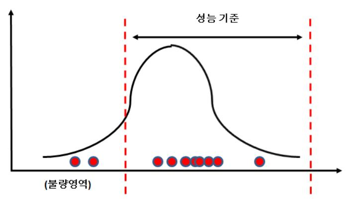

 <sup>[</sup>그림 5-1] 평균 불량 분포

### 2. 산포 불량 분석

산포의 문제가 발생하는 경우는 샘플 시료의 측정값 모두 성능 기준을 만족하고 있지만, 측정값의 분포를 확인해 보니 대 물량 양산 상황에서 수율이 떨어질 수 있는 상황이다. 아래의 [그림5-2]과 같이 측정한 시료의 특성은 성능 평가 기준 대비 모두 성능을 만족하 고 있지만 분포를 확인해 보면 좌측 꼬리 부분에서 발생하는 불량 시료의 양이 문제가 될 수 있으므로, 이의 원인 확인 및 불량 개선 여부에 대한 의사 결정이 필요하다. 이와 같은 상황에서는 즉시 재설계가 필요하지는 않지만, 생산 물량과 수율을 고려하여 관리적인 면으로 불량 관리를 할지 칩의 재설계를 할지 결정해야 한다. 이와 같은 경우 불량의 원인을 찾는 것이 평균 불량에 비해 더 어려운 특징을 가지고 있다.

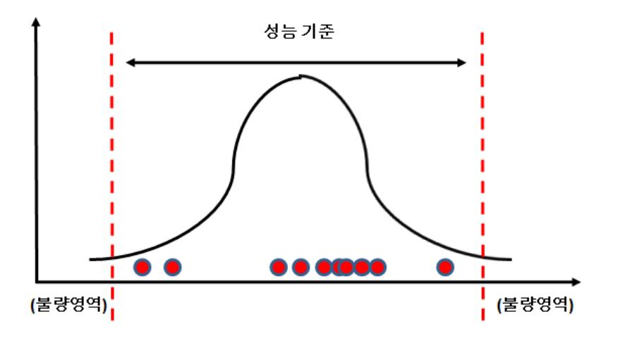

[그림 5-2] 산포 불량 분포

### 재료·자료

- 패드 정보 기술서
- 계측기 매뉴얼
- 실험 계획서
- 샘플 제조 정보서
- 파라스틱 Netlist
- 테스트 벤치

### 기기(장비 ・ 공구)

- 전원 및 신호 공급용 장비
- 전원발생기(Power Supply)
- 신호발생기(Signal Generator, Pattern Generator, TMDS 등)
- 오실로스코프
- 측정 결과 계측용 장비
- 파형 분석 계측 장비(Oscilloscope, Logic Analyzer, Spectrum Analyzer, J-bert 등)
- LRC값 측정 장비(LCR 미터)
- 분석용 장비
- 컴퓨터, 프린터, 워크스테이션, 인터넷

### 안전 ・ 유의사항

해당 없음

### 수행 순서

측정 결과를 분석하여 불량 원인을 확인한다.

1. 측정 결과 이상 현상이 발생할 경우, 다른 샘플 칩에도 동일한 현상이 발생하는지 칩을 바꾸어 측정한다.

모든 칩에서 동일한 이상 현상이 발생할 경우, 칩의 설계 과정에서 기능 오류를 가지고 있거나, 현재 제조과정의 공정 능력 대비 설계 마진이 부족할 수 있으므로 다음의 순차적 검증을 통해 이상 원인을 파악한다.

- 2. 전원 공급기 및 신호 발생기의 신호가 정상적으로 출력되고 있는지 확인하고, 입력 단자 단에서 직접 계측기로 계측한다.
- 3. 조절하는 단자들의 세팅하고자 하는 값들이 맞게 설정이 되어 있는지 확인한다.
- 4. 입력 신호 단부터 측정 가능한 모든 지점의 출력 파형의 모양을 확인하여 보드에서 발 생하는 문제인지 확인한다.
- 5. 환경 구축의 역순으로 보드에서 발생할 수 있는 조건들에 대한 검사를 마친 후에 이상 현상이 없을 경우, 칩의 핀 정보와 패키지와의 연결이 정확한지 확인한다.
- 6. 조절 핀들을 가변하여 출력 모양이 바뀌는 패턴을 확인한다.
- 7. 시뮬레이션을 통해 실제 측정값에서 패턴 변화에 따른 출력 파형의 변화와 유사한 형태의 파형 변화 패턴이 있는지 확인한다.
- 8. 단위 기능 검사의 시뮬레이션 항목 추가를 통해 문제의 발생 원인이 설계 오류에 기인 하여 발생했는지 확인한다.
- 9. 설계 오류가 아닌 경우, 설계 마진 즉 공정 오류에 따른 문제로 원인을 변경하여 코너 시뮬레이션 조건의 경우의 수를 늘린다.

초기 설계 시 3개의 코너 조건에 대해 확인 후 설계를 완료하였다면, 설계 당시 예측하지 못한 부분에서 문제가 발생하였으므로, 추가 변동 요인까지 환경 조건의 확장을 위해서 5 개나 7개의 코너 조건까지 확장하여 시뮬레이션을 진행한다.

- 10. 코너 조건을 확대하여 진행한 시뮬레이션에서도 문제의 현상을 확인할 수 없다면, 포스 트 시뮬레이션을 위한 파라스틱 추출 조건을 변경하면서 보다 정교한 파라스틱 값까지 순차적으로 추출하여, 코너 영역의 시뮬레이션을 수행한다.
- 11. 측정 결과의 현상과 비교 분석을 통해 문제의 원인이 설계 오류인지, 공정 오류인지 최종 의사 결정 한다.

통계적인 자료 분석 기법을 통하여, 개선 대책을 수립한다.

통계적 분석 기법은 측정 결과에서 이상 현상 발생 시, 동일하게 샘플의 변경을 통해 일차 재현성 여부를 확인한다. 재현성 확인 결과 칩마다 해당 특성의 차이가 발생할 경우 통계 적 실험 계획을 통한 개선 대책을 마련한다.

- 1. 통계적 의사 결정을 위해 실험을 위한 대표성을 갖는 샘플을 랜덤하게 선정한다. 샘플 개수는 최소 30개 이상으로 선정한다.
- 2. 선정한 샘플들의 측정값을 통해 설계 기준 대비 평균값과 산포 값을 구한다.
- 3. 해당 결과를 통해 Z값을 구하고, 전체 생산량 대배 해당 불량의 발생 수량을 예측한다.
- 4. 불량 시료의 발생 빈도 및 설계 수정에 따른 비용 차이를 확인한다.
- 5. 불량 시료의 발생 빈도가 적을 경우는 불량 시료를 걸러낼 수 있는 검출 방법의 대책을 수립한다.
- 6. 설계 수정의 비용이 적을 경우에는 불량의 원인을 분석한 후 개선 대책을 수립한다.
- 문제 발생의 부위가 확인되면, 이의 개선 대책을 수립하고 이를 반영하여 설계를 변경한다.
  - 1. 불량 원인에 따라 설계 오류 시에는 논리적인 연결의 변경을 위해 로직의 추가 및 연결 의 변경을 통해 기능을 변경한다.
  - 2. 마진 부족 시에는 추가한 코너 조건의 확인을 통해 트랜지스터의 크기 변경 및 전류량 변화 등의 소자 특성 변경을 통해 회로를 수정한다.
  - 3. 회로의 연결 및 소자의 값을 변경한 후에는 이에 따른 side effect가 없는지 설계 블록 의 추가 검증 조건을 수립한다.
  - 4. 변경된 회로의 영향을 일차 확인 후, 연결되어 있는 앞뒤 주변 블록과의 영향까지 검토 해야 하므로 변경 사항을 주변 블록 설계자에게 전파한다.
  - 5. 변경한 회로를 레이아웃으로 구현 시에는 변경 사항이 최소가 될 수 있도록 검토해야 한다.

반도체 공정에서 실제 회로를 구현할 때는 각 층의 레이아웃 패턴과 이 층을 연결하는 연 결부의 패턴으로 층별 제작을 진행한다. 따라서 Revision을 통한 설계 변경 시에는 변경한 패턴이 몇 개의 층에서 바뀌는지에 따라 비용이 산정된다. 따라서 동일한 설계 변경에 대 해서도 최소한의 층별 패턴 변화가 이루어질 수 있도록 신중한 검토가 필요하다.

6. 변경 완료한 레이아웃 구조에 대해 포스트 시뮬레이션을 진행하여, 최종 결과를 확인한 후 변경한 설계 정보를 공정에 전달한다.

69

### 수행 tip

- 일반적으로 3개의 코너 조건은 TT, SS, FF의 이름으 로 공정 조건(소자들의 특성 분포 중 어느 한쪽 영 역으로 제작이 되었을 경우), 전압 조건, 온도 조건 에 대해 각각 지정되어 있는 설계 한계 조건에서 칩이 정상 동작하는지를 확인한다.
- Revision 층의 최소 변경을 위해 초기 설계 시에 빈 공간을 활용한 Dummy 형태의 잉여 소자를 배치할 수 있다.
- 불량의 재현성 확인을 위한 꼼꼼함이 필요하다.
- 문제의 근본 원인을 파악하기 위한 꾸준함과 성실함 이 요구된다.
- 사전 실험 조건들은 모델링에 근거한 결과로 최악 의 추가 조건을 가정하고, 이를 확인하고자 하는 창의적인 접근이 필요하다.
- 희박한 가능성과 예외 조건을 간과하지 않고, 차분히 검토할 수 있어야 한다.
- 변경 결과를 공동의 설계자에게 가감 없이 전달할 수 있어야 한다.
- side effect에 대한 충분한 검토를 모든 주변 블록 설계자와 함께 검토해야 한다.

### 학습 5 교수·학습 방법

### 교수 방법

- 설계 회로의 성능 특성 및 패드 개수에 따른 패키지 선정 기준에 대해 설명하고, 패키지의 주요 성능 열화를 고려한 설계 방법에 대해 지도한다.
- PCB 보드 설계를 위한 사용 툴의 기능을 설명하고, 소자의 등록 및 주요 부품 배치에 대한 방법을 설명한 후 실습을 통해 회로도 구현 방법을 지도한다.
- PCB 보드의 회로도에 기초한 Artwork 설계 방법에 대해 설명하고, Artwork 설계 시 주의해야 하는 주요 설계 항목을 지도한다.
- PCB 보드의 주요 소자 준비 시 주의 사항 및 이를 연결하는 방법에 대해 실물을 통한 설명으로 학습자의 이해를 높인다.
- 주요 계측 장비에 대한 사진 또는 실물을 통한 기능 설명 및 사용 방법에 대해 설명하고, 설계 회로의 성능 특성을 기준으로 사용해야 하는 계측 장비의 다양한 세트에 대해 사례별로 지도한다.
- 계측을 진행하기 전 계측의 오차 발생 원인 및 이를 고려한 측정의 방법에 대해 지도한다.
- 측정을 진행하기 위한 샘플의 선정 방법 및 측정 항목에 대한 실험 계획 수립 방법에 대해 설명한다.
- 테스트 보드와 측정 장비의 연결 방법·측정을 위한 칩의 세팅 값 확인 및 이를 조절하는 방법에 대해 설명하고, 실습을 통해 해당 과정을 지도한다.
- 계측 장비를 통한 출력 결과의 확인 방법 및 해상도의 조절 방법에 대해 설명하고, 실습을 통해 해당 과정을 지도한다.
- 측정 결과 이상 현상이 발생할 경우, 해당 조치 방법 및 수행 순서에 대해 순차적으로 설명한 후 해당 조치 사항을 장비를 통해 직접 시범을 보이며 수행 과정을 지도한다.
- 오류의 원인을 추적하는 방법에 대해 실측 방법과 시뮬레이션을 통해 찾아가는 과정을 설명하고, 이에 대한 의사 판단 기준을 지도한다.
- 오류에 따른 개선 대책 수립 및 이를 반영한 설계 회로의 수정과 조치 방법에 대해 설명하고, 수정 시 기 발생한 사고 사례를 중심으로 주의 사항 준수의 중요성에 대해 지도한다.

71

### 학습 방법

- 설계 회로의 성능 특성 및 패드 개수에 따른 패키지 선정 기준에 대해 이해하고, 패키지의 주요 성능 열화를 고려한 설계 방법에 대해 학습한다.
- PCB 보드 설계를 위한 사용 툴의 기능을 이해하고, 소자의 등록 및 주요 부품 배치에 대한 방법을 숙지한 후 실습을 통해 회로도 구현 방법을 익힌다.
- PCB 보드의 회로도에 기초한 Artwork 설계 방법에 대해 학습하고, Artwork 설계 시 주의해야 하는 주요 설계 항목을 이해한다.
- PCB 보드의 주요 소자 준비 시 주의 사항 및 이를 연결하는 방법에 대해 실물을 통해 충분히 이해한다.
- 주요 계측 장비에 대한 사진 또는 실물을 통한 기능 및 사용 방법에 대해 학습하고, 설계 회로의 성능 특성을 기준으로 사용해야 하는 계측 장비의 다양한 세트에 대해 사례별로 이해한다.
- 계측을 진행하기 전 계측의 오차 발생 원인 및 이를 고려한 측정의 방법에 대해 학습한다.
- 측정을 진행하기 위한 샘플의 선정 방법 및 측정 항목에 대한 실험 계획 수립 방법에 대해 학습한다.
- 테스트 보드와 측정 장비의 연결 방법·측정을 위한 칩의 세팅 값 확인 및 이를 조절하는 방법에 대해 학습하고, 실습을 통해 해당 과정을 익힌다.
- 계측 장비를 통한 출력 결과의 확인 방법 및 해상도의 조절 방법에 대해 학습하고, 실습을 통해 해당 과정을 익힌다.
- 측정 결과 이상 현상이 발생할 경우, 해당 조치 방법 및 수행 순서에 대해 순차적으로 학습한 후 해당 조치 사항을 장비를 통해 직접 수행 과정을 확인한다.
- 오류의 원인을 추적하는 방법에 대해 실측 방법과 시뮬레이션을 통해 찾아가는 과정을 학습하고, 이에 대한 의사 판단 기준을 이해한다.
- 오류에 따른 개선 대책 수립 및 이를 반영한 설계 회로의 수정과 조치 방법에 대해 학습하고, 수정 시 기 발생한 사고 사례를 중심으로 주의 사항 준수의 중요성을 충분히 숙지한다.

## 학습 5 평 가

### 평가 준거

- 평가자는 학습자가 학습 목표 및 평가 항목에 제시되어 있는 내용을 성공적으로 수행하였는지 평가해야 한다.
- 평가자는 다음 사항을 평가해야 한다.

|                           |                                                         | 성취수준 |   |   |  |
|---------------------------|---------------------------------------------------------|------|---|---|--|
| 학습내용                      | 평가항목                                                    | 상    | 중 | 하 |  |
| 구현 회로 검증<br>환경 구축 및<br>측정 | - 전자계측기를 사용하여 설계된 회로의 전기적 특성<br>을 측정하고 결과를 분석할 수 있다.    |      |   |   |  |
|                           | - 측정 결과를 분석하여 불량 발생 원인이 공정 문제<br>인지 설계 문제인지를 파악 할 수 있다. |      |   |   |  |
| 구현 회로 분석<br>및 개선          | - 측정 결과를 통하여 문제가 발생된 부위를 추출해<br>낸 후 설계를 변경할 수 있다.       |      |   |   |  |
|                           | - 측정 결과는 통계적인 자료 분석 기법을 통하여 개<br>선 대책을 수립할 수 있다.        |      |   |   |  |

### 평가 방법

• 논술형 시험

|                  |                                 | 성취수준 |   |   |
|------------------|---------------------------------|------|---|---|
| 학습내용             | 평가항목                            | 상    | 중 | 하 |
|                  | - 설계 회로 특성에 따른 패키지 선정 능력        |      |   |   |
| 구현 회로 검증         | - PCB 보드 회로도 구성 및 Artwork 해석 능력 |      |   |   |
| 환경 구축 및          | - 계측 장비 사용 및 측정 결과 확인 능력        |      |   |   |
| 측정               | - 측정 장비 및 설계 회로별 계측 환경 구축 능력    |      |   |   |
|                  | - 측정 목표에 따른 실험 계획법 수립 능력        |      |   |   |
|                  | - 측정 결과 해석 능력                   |      |   |   |
| 구현 회로 분석<br>및 개선 | - 시뮬레이션을 통한 상세 원인 분석 능력         |      |   |   |
|                  | - 이상 원인에 따른 대책 수립 및 파급 효과 분석 능력 |      |   |   |

• 평가자 체크리스트

| 학습내용             | 평가항목                            |   | 성취수준 |   |  |
|------------------|---------------------------------|---|------|---|--|
|                  |                                 | 상 | 중    | 하 |  |
| 구현 회로 검증         | - PCB 보드 회로도 구성 능력              |   |      |   |  |
| 환경 구축 및<br>측정    | - 계측 장비 사용 및 측정 결과 확인 능력        |   |      |   |  |
|                  | - 측정 장비 및 설계 회로별 계측 환경 구축 능력    |   |      |   |  |
|                  | - 측정 결과 해석 능력                   |   |      |   |  |
| 구현 회로 분석<br>및 개선 | - 시뮬레이션을 통한 상세 원인 분석 능력         |   |      |   |  |
|                  | - 이상 원인에 따른 대책 수립 및 파급 효과 분석 능력 |   |      |   |  |

#### • 구두발표

| 학습내용             | 평가항목                            |   | 성취수준 |   |
|------------------|---------------------------------|---|------|---|
|                  |                                 | 상 | 중    | 하 |
|                  | - 설계 회로 특성에 따른 패키지 선정 능력        |   |      |   |
| 구현 회로 검증         | - PCB 보드 회로도 구성 및 Artwork 해석 능력 |   |      |   |
| 환경 구축 및          | - 계측 장비 사용 및 측정 결과 확인 능력        |   |      |   |
| 측정               | - 측정 장비 및 설계 회로별 계측 환경 구축 능력    |   |      |   |
|                  | - 측정 목표에 따른 실험 계획법 수립 능력        |   |      |   |
|                  | - 측정 결과 해석 능력                   |   |      |   |
| 구현 회로 분석<br>및 개선 | - 시뮬레이션을 통한 상세 원인 분석 능력         |   |      |   |
|                  | - 이상 원인에 따른 대책 수립 및 파급 효과 분석능력  |   |      |   |

### 피 드 백

- 1. 논술형 시험
- 칩 설계 이후 검증에 필요한 주요 단계를 기술하고, 각 단계별 주요 설계 요소 및 주의 사항을 숙지하고 있는지 평가한다.
- 2. 평가자 체크리스트
- 주요 계측 장비에 대한 사용 방법을 체크리스트를 통해 점검하고, 성능 이상 시 확인 및 설계 변경을 위한 주요 활동을 주어진 리스트를 통해 확인한 후 보완사항을 제시한다.
- 설계 변경에 대한 평가를 진행할 경우에는 동일한 설계 변경 항목에 대해 평가 기준보다 변경한 메탈 레이어의 수가 적을 경우 가점을 부여한다.
- 3. 구두발표
- 측정 결과에 대해 성능의 만족도를 평가할 수 있는 평가 기준의 수립 및 측정 결과의 분 포에 따른 직접 또는 간접 위험의 원인을 파악하고 대처하는 방법에 대해 구두 발표를 진행하고 추가로 보완해야 할 사항에 대해 제시한다.

- ∙ Behzad Razavi(2000). Design of Analog CMOS Integrated Circuit. New York City: McGraw-Hill Education.
- ∙ David Johns, Kenneth W. Martin(2007). Analog Integrated Circuit Design. New Jersey: John Wiley & Sons.
- ∙ Neil H. E. Weste, David Money Harris(2005). CMOS VLSI Design: A Circuits and Systems Perspective. Noida(INDIA): Pearson Education India.

| NCS학습모듈 개발이력 |                               |     |                 |  |  |
|--------------|-------------------------------|-----|-----------------|--|--|
| 발행일          | 2015년 12월 31일                 |     |                 |  |  |
| 세분류명         | 반도체개발(19030601)               |     |                 |  |  |
| 개발기관         | 한국반도체산업협회, 한국직업능력개발원          |     |                 |  |  |
|              | 이병철(㈜비드앤마이크로)*                |     | 권태우(극동대학교)      |  |  |
|              | 김경섭(여주대학교)                    |     | 김병윤(전. 삼성전자㈜)   |  |  |
|              | 김문호(씨지아이파트너즈)                 |     | 민종수(엠텍비젼㈜)      |  |  |
|              | 안태원(동양미래대학교)                  |     | 이준성(인덕대학교)      |  |  |
|              | 유광동(전 동부하이텍)                  |     | 이호덕(㈜에이치디테크놀로지) |  |  |
|              | 이승은(서울과학기술대학교)                |     |                 |  |  |
|              | 이제현(동양미래대학교)                  |     |                 |  |  |
| 집필진          | 이혁(㈜플렉스컴)                     | 검토진 |                 |  |  |
|              | 임종철(LG전자㈜)                    |     |                 |  |  |
|              | 임황규(성결대학교)                    |     |                 |  |  |
|              | 정종식(㈜e-wbm연구소)                |     |                 |  |  |
|              | 천형용(충북반도체고등학교)                |     |                 |  |  |
|              | 홍상진(명지대학교)                    |     |                 |  |  |
|              | 홍진균(전 ㈜LG실트론)                 |     | *표시는 대표집필자임     |  |  |
| 발행일          | 2018년 12월 31일                 |     |                 |  |  |
| 학습모듈명        | 아날로그 회로 설계(LM1903060103_14v3) |     |                 |  |  |
| 개발기관         | 한국직업능력개발원                     |     |                 |  |  |

| 아날로그 회로 설계(LM1903060103_14v3)                           |                                                |
|---------------------------------------------------------|------------------------------------------------|
| 저작권자                                                    | 교육부                                            |
| 연구기관                                                    | 한국직업능력개발원                                      |
| 발행일                                                     | 2018. 12. 31.                                  |
|                                                         | ※ 이 학습모듈은 자격기본법 시행령(제8조 국가직무능력표준의 활용)에 의거하여 개발 |
| 하였으며, NCS통합포털사이트(http://www.ncs.go.kr)에서 다운로드 할 수 있습니다. |                                                |

