| 대분류/19<br>전기·전자 | 중분류/03 |                 |                 |         |
|-----------------|--------|-----------------|-----------------|---------|
|                 | 전자기기개발 | 소분류/06<br>반도체개발 | 세분류/01<br>반도체개발 | 능력단위/04 |

# NCS학습모듈 디지털회로 설계

## LM1903060104\_23v5


#### [NCS학습모듈 활용 시 유의 사항]

- 1. NCS학습모듈은 교육훈련기관에서 출처를 명시하고 교육적 목적으로 활용할 수 있습니다. 다 만, NCS학습모듈에는 국가(교육부)가 저작재산권 일체를 보유하지 않은 저작물(출처가 표기된 도표‧사진‧삽화‧도면 등)이 포함되어 있으므로, 이러한 저작물의 변형‧각색‧복제‧공연‧ 배포 및 공중 송신 등과 이러한 저작물을 활용한 2차적 저작물을 작성하려면 반드시 원작자 의 동의를 받아야 합니다.
- 2. NCS학습모듈은 개발 당시의 산업 및 교육 현장을 반영하여 집필하였으므로, 현재 적용되는 법령‧지침‧표준 및 교과 내용 등과 차이가 있을 수 있습니다. NCS학습모듈 활용 시 법령 ‧지침‧표준 및 교과 내용의 개정 사항과 통계의 최신성 등을 확인하시기를 바랍니다.
- 3. NCS학습모듈은 산업 현장에서 요구되는 능력을 교육훈련기관에서 학습할 수 있게 구성한 자 료입니다. 다만, NCS학습모듈 지면의 한계상 대표적 예시(예: 활용도 또는 범용성이 높은 제 품, 서비스) 중심으로 집필하였음을 이해하시기를 바랍니다.

## NCS학습모듈의 이해

※ 본 NCS학습모듈은 「NCS 국가직무능력표준」사이트(http://www.ncs.go.kr) 에서 확인 및 다운로드할 수 있습니다.

### Ⅰ NCS학습모듈이란?

- 국가직무능력표준(NCS: National Competency Standards)이란 산업현장에서 직무를 수행하기 위해 요구되는 지식·기술·소양 등의 내용을 국가가 산업부문별·수준별로 체계 화한 것으로 산업현장의 직무를 성공적으로 수행하기 위해 필요한 능력(지식, 기술, 태도) 을 국가적 차원에서 표준화한 것을 의미합니다.
- 국가직무능력표준(이하 NCS)이 현장의 '직무 요구서'라고 한다면, NCS학습모듈은 NCS
   의 능력단위를 교육훈련에서 학습할 수 있도록 구성한 '교수·학습 자료'입니다. NCS학습
   모듈은 구체적 직무를 학습할 수 있도록 이론 및 실습과 관련된 내용을 상세하게 제시하
   고 있습니다.


#### ○ NCS학습모듈은 다음과 같은 특징을 가지고 있습니다.

- 첫째, NCS학습모듈은 산업계에서 요구하는 직무능력을 교육훈련 현장에 활용할 수 있도 록 성취목표와 학습의 방향을 명확히 제시하는 가이드라인의 역할을 합니다.
- 둘째, NCS학습모듈은 특성화고, 마이스터고, 전문대학, 4년제 대학교의 교육기관 및 훈 련기관, 직장교육기관 등에서 표준교재로 활용할 수 있으며 교육과정 개편 시에도 유용하게 참고할 수 있습니다.


○ NCS와 NCS학습모듈 간의 연결 체계를 살펴보면 아래 그림과 같습니다.


O NCS학습모듈의 위치는 NCS 분류 체계에서 해당 학습모듈이 어디에 위치하는지를 한 눈에 볼 수 있도록 그림으로 제시한 것입니다.

| [NCS-학          | 습모듈     | 의 위치]    |          |  |
|-----------------|---------|----------|----------|--|
|                 |         |          |          |  |
| 대분류             | 문화·예술   | ··디자인·방송 |          |  |
| 중분류             | 문화콘텐츠   |          |          |  |
| 소분류             | 문화콘텐츠제작 |          |          |  |
|                 |         |          |          |  |
| 세분류             |         |          |          |  |
| 방송콘텐츠제작         |         | 능력단위     | 학습모듈명    |  |
| 영화콘텐츠제작         |         | 프로그램 기획  | 프로그램 기획  |  |
| 음악콘텐츠제작         |         | 아이템 선정   | 아이템 선정   |  |
| 광고콘텐츠제작         |         | 자료 조사    | 자료 조사    |  |
| 게임콘텐츠제작         |         | 프로그램 구성  | 프로그램 구성  |  |
| 애니메이션<br>콘텐츠제작  |         | 캐스팅      | 캐스팅      |  |
| 만화콘텐츠제작         |         | 제작계획     | 제작계획     |  |
| 캐릭터제작           |         | 방송 미술 준비 | 방송 미술 준비 |  |
| 스마트문화앱<br>콘텐츠제작 |         | 방송 리허설   | 방송 리허설   |  |
| 영사              |         | 야외촬영     | 야외촬영     |  |
|                 |         | 스튜디오 제작  | 스튜디오 제작  |  |
|                 |         |          |          |  |

학습모듈은

NCS 능력단위 1개당 1개의 학습모듈 개발 을 원칙으로 합니다. 그러나 필요에 따라 고용단위 및 교과단위를 고려하여 능력단위 몇 개를 묶어 1개 학습모듈로 개발할 수 있으며, NCS 능력단위 1개를 여러 개의 학습모듈로 나누어 개발할 수도 있습니다.

### 2. NCS학습모듈의 개요

#### ○ NCS학습모듈의 개요는 학습모듈이 포함하고 있는 내용을 개략적으로 설명한 것으로

| 학습모듈의 목표, 선수학습, 학습모듈의 내용 체계, 핵심 용어 로 구성되어 있습니다. |                                                                              |  |
|-------------------------------------------------|------------------------------------------------------------------------------|--|
| 학습모듈의 목표                                        | 해당 NCS 능력단위의 정의를 토대로 학습 목표를 작성한 것입니다.                                        |  |
| 선수학습                                            | 해당 학습모듈에 대한 효과적인 교수·학습을 위하여 사전에 이수해야 하는 학습모<br>듈, 학습 내용, 관련 교과목 등을 기술한 것입니다. |  |
| 학습모듈의<br>내용 체계                                  | 해당 NCS 능력단위요소가 학습모듈에서 구조화된 체계를 제시한 것입니다.                                     |  |
| 핵심 용어                                           | 해당 학습모듈의 학습 내용, 수행 내용, 설비·기자재 등 가운데 핵심적인 용어를 제<br>시한 것입니다.                   |  |

### 제작계획 학습모듈의 개요

#### 학습모듈의 목표

본격적인 촬영을 준비하는 단계로서, 촬영 대본을 획정하고 제작 스태프를 조직하며 촬영 장비와 촬영 소품을 준비할 수 있다.

#### 선수학습

제작 준비(LM0803020105\_13v1), 섭외 및 제작스태프 구성(LM0803020104\_13v1), 촬영 제작(LM0803020106\_13v1), 촬영 장비 준비(LM0803040204\_13v1.4), 미술 디자인 협의하기(LM0803040203\_13v1.4)

#### 학습모듈의 내용체계

| 하스                | 하는 데이                                              | NCS 능력단위 요소       |                |
|-------------------|----------------------------------------------------|-------------------|----------------|
| 학습                | 학습 내용                                              | 코드번호              | 요소 명칭          |
| 1. 촬영 대본<br>확정하기  | 1-1. 촬영 구성안 검<br>토와 수정                             | 0803020114_16/3.1 | 촬영 대본<br>확정하기  |
| 2. 제작 스태프<br>조직하기 | 2-1. 기술 스태프 조직<br>2-2. 미술 스태프 조직<br>2-3. 전문 스태프 조직 | 0803020114_16v3.2 | 제작 스태프<br>조직하기 |
| 3. 촬영 장비<br>계획하기  | 3-1. 촬영 장비 점검<br>과 준비                              | 0803020114_16/3.3 | 촬영 장비<br>계획하기  |
| 4. 촬영 소품<br>계획하기  | 4-1. 촬영 소품 목록<br>작성<br>4-2. 촬영 소품 제작<br>의뢰         | 0803020114_16\3.4 | 촬영 소품<br>계획하기  |

#### 핵심 용어

촬영 구성안, 제작 스태프, 촬영 장비, 촬영 소품

#### 학습모듈의 목표는

학습자가 해당 학습모듈을 통해 성취해야 할 목표를 제시한 것으로, 교수자는 학습자 가 학습모듈의 전체적인 내용흐름을 파악하 도록 지도할 수 있습니다.

**6** • •

61

#### 선수학습은

교수자 또는 학습자가 해당 학습모듈을 교 수·학습하기 이전에 이수해야 하는 교과목 또는 학습모듈(NCS 능력단위) 등을 표기한 것입니다. 따라서 교수자는 학습자가 개별 학습, 자기 주도 학습, 방과 후 활동 등 다 양한 방법을 통해 이수할 수 있도록 지도하 는 것을 권장합니다.

|            | 핵심 용어는              |
|------------|---------------------|
|            | 률을 대표하는 주요 용어입니     |
|            | · 해당 학습모듈을 통해 학습    |
|            | 게될 주요 내용을 알 수 있습    |
|            | 5 국가직무능력표준」 사이트     |
| (www.ncs.g | jo.kr)의 색인 (찾아보기) 중 |
| 하나로 이용할    | 할 수 있습니다            |

#### 3. NCS학습모듈의 내용 체계

○ NCS학습모듈의 내용은 크게 학습, 학습 내용, 교수·학습 방법, 평가 로 구성되어 있습니다.

| 학습       | 해당 NCS 능력단위요소 명칭을 사용하여 제시한 것입니다.<br>학습은 크게 학습 내용, 교수·학습 방법, 평가로 구성되며 해당 NCS 능력단위의<br>능력단위 요소별 지식, 기술, 태도 등을 토대로 내용을 제시한 것입니다.                                                    |
|----------|----------------------------------------------------------------------------------------------------------------------------------------------------------------------------------|
| 학습 내용    | 학습 내용은 학습 목표, 필요 지식, 수행 내용으로 구성되며, 수행 내용은 재료·자<br>료, 기기(장비·공구), 안전·유의 사항, 수행 순서, 수행 tip으로 구성한 것입니다.<br>학습모듈의 학습 내용은 실제 산업현장에서 이루어지는 업무활동을 표준화된 프로세<br>스에 기반하여 다양한 방식으로 반영한 것입니다. |
| 교수·학습 방법 | 학습 목표를 성취하기 위한 교수자와 학습자 간, 학습자와 학습자 간 상호 작용이<br>활발하게 일어날 수 있도록 교수자의 활동 및 교수 전략, 학습자의 활동을 제시한<br>것입니다.                                                                            |
| 평가       | 평가는 해당 학습모듈의 학습 정도를 확인할 수 있는 평가 준거 및 평가 방법, 평<br>가 결과의 피드백 방법을 제시한 것입니다.                                                                                                         |


| 소분류   | 반도체개발            |                  |  |
|-------|------------------|------------------|--|
|       |                  |                  |  |
| 세분류   |                  |                  |  |
| 반도체개발 | 능력단위             | 학습모듈명            |  |
| 반도체제조 | 반도체 제품기획         | 반도체 제품기획         |  |
| 반도체장비 | 반도체 아키텍처 설계      | 반도체 아키텍처 설계      |  |
| 반도체재료 | 아날로그 회로 아키텍처 설계  | 아날로그 회로 아키텍처 설계  |  |
|       | 아날로그 회로 소자레벨 설계  | 아날로그 회로 소자레벨 설계  |  |
|       | 아날로그 회로 시스템 설계   | 아날로그 회로 시스템 설계   |  |
|       | 디지털 회로 설계        | 디지털 회로 설계        |  |
|       | 커스텀 레이아웃 적용공정 분석 | 커스텀 레이아웃 적용공정 분석 |  |
|       | 커스텀 레이아웃 설계      | 커스텀 레이아웃 설계      |  |
|       | 커스텀 레이아웃 검증      | 커스텀 레이아웃 검증      |  |
|       | 자동 배치배선 레이아웃 설계  | 자동 배치배선 레이아웃 설계  |  |

반도체 설계 검증 반도체 설계 검증

반도체 펌웨어 개발 반도체 펌웨어 개발

메모리 반도체 제조공정개발 메모리 반도체 제조공정개발

| 대분류 | 전기전자 |        |       |
|-----|------|--------|-------|
| 중분류 |      | 전자기기개발 |       |
| 소분류 |      |        | 반도체개발 |

## [NCS-학습모듈의 위치]

| 시스템 반도체 제조공정개발   | 시스템 반도체 제조공정개발   |
|------------------|------------------|
| 반도체 제조 단위공정개발    | 반도체 제조 단위공정개발    |
| 와이어본딩 패키지 개발     | 와이어본딩 패키지 개발     |
| 플립칩 패키지 개발       | 플립칩 패키지 개발       |
| 웨이퍼레벨 패키지 개발     | 웨이퍼레벨 패키지 개발     |
| 어드밴스드 팬아웃 패키지 개발 | 어드밴스드 팬아웃 패키지 개발 |
| 이종접합 패키지 개발      | 이종접합 패키지 개발      |
| 어드밴스드 언더필 패키지 개발 | 어드밴스드 언더필 패키지 개발 |
| 패키지 조립 공정 개발     | 패키지 조립 공정 개발     |
| 반도체 제품 기능·성능 검증  | 반도체 제품 기능·성능 검증  |
| 반도체 환경시험         | 반도체 환경시험         |
| 반도체 수명시험         | 반도체 수명시험         |
| 반도체 내성시험         | 반도체 내성시험         |

| 학습모듈의 개요 |                      | 1  |
|----------|----------------------|----|
|          | 학습 1. HDL 코딩하기       |    |
|          | 1-1. 조합회로 설계         | 3  |
|          | 1-2. 순차회로 설계         | 16 |
|          | • 교수・학습 방법           | 27 |
|          | • 평가                 | 28 |
|          | 학습 2. 시뮬레이션하기        |    |
|          | 2-1. 시뮬레이션 환경 구성     | 30 |
|          | 2-2. 시뮬레이션 결과 분석     | 38 |
|          | • 교수・학습 방법           | 39 |
|          | • 평가                 | 40 |
|          | 학습 3. 디지털 회로 합성하기    |    |
|          | 3-1. 합성 환경 구성        | 43 |
|          | 3-2. 합성 결과 분석        | 46 |
|          | • 교수・학습 방법           | 49 |
|          | • 평가                 | 50 |
|          | 학습 4. 포스트 시뮬레이션하기    |    |
|          | 4-1. 포스트 시뮬레이션 환경 구축 | 52 |
|          | 4-2. 포스트 시뮬레이션 결과 분석 | 54 |
|          | • 교수・학습 방법           | 56 |
|          |                      |    |

|       | • 평가              | 57 |
|-------|-------------------|----|
|       | 학습 5. 시스템 레벨 검증하기 |    |
|       | 5-1. 모델 검증        | 59 |
|       | 5-2. FPGA 검증      | 62 |
|       | • 교수・학습 방법        | 66 |
|       | • 평가              | 67 |
| 참고 자료 |                   | 69 |

## 디지털 회로 설계 학습모듈의 개요

#### 학습모듈의 목표

반도체 설계 과정 중 하드웨어 기술 언어(HDL, Hardware Description Language)와 관련 설계 툴을 활 용하여, HDL 코딩, 시뮬레이션, 게이트 레벨 합성, 포스트 시뮬레이션을 통한 회로의 동작, 특성 확인 및 검증과 같은 반도체 설계 과정을 수행할 수 있다.

#### 선수학습

컴퓨터 구조, 디지털 논리회로

#### 학습모듈의 내용체계

|                    |                                                    | NCS 능력단위 요소       |                |
|--------------------|----------------------------------------------------|-------------------|----------------|
| 학습                 | 학습 내용                                              | 코드 번호             | 요소 명칭          |
|                    | 1-1. 조합회로 설계                                       | 1903060104_23v5.1 | HDL 코딩하기       |
| 1. HDL 코딩하기        | 1-2. 순차회로 설계                                       |                   |                |
|                    | 2-1. 시뮬레이션 환경 구성                                   |                   |                |
| 2. 시뮬레이션하기         | 2-2. 시뮬레이션 결과 분석                                   | 1903060104_23v5.2 | 시뮬레이션하기        |
| 3. 디지털회로 합성하       | 3-1. 합성 환경 구성                                      | 1903060104_23v5.3 | 디지털 회로         |
| 기                  | 3-2. 합성 결과 분석                                      |                   | 합성하기           |
| 4. 포스트 시뮬레이션<br>하기 | 4-1. 포스트 시뮬레이션 환경구<br>축<br>4-2. 포스트 시뮬레이션 결과<br>분석 | 1903060104_23v5.5 | 포스트<br>시뮬레이션하기 |
| 5. 시스템 레벨 검증하      | 5-1. 모델 검증                                         |                   | 시스템 레벨         |
| 기                  | 5-2. FPGA 검증                                       | 1903060104_23v5.4 | 검증하기           |

#### 핵심 용어

조합회로 설계, 순차회로 설계, HDL 코딩, 시뮬레이션, 합성, 포스트 시뮬레이션, 모델 검증, FPGA 검증

| 학습 1 | HDL 코딩하기    |  |  |  |
|------|-------------|--|--|--|
| 학습 2 | 시뮬레이션하기     |  |  |  |
| 학습 3 | 디지털회로 합성하기  |  |  |  |
| 학습 4 | 포스트 시뮬레이션하기 |  |  |  |
| 학습 5 | 시스템 레벨 검증하기 |  |  |  |

## 1-1. 조합회로 설계

|       | • 주어진 기술 규격에 따라 HDL을 사용할 수 있다.                |
|-------|-----------------------------------------------|
| 학습 목표 | • 기술 규격의 기능에 따라 시스템과 호환되도록 입/출력 회로를 선정할 수 있다. |
|       | • 주어진 기술 규격을 조합회로 HDL로 기술할 수 있다.              |

## 필요 지식 /

숔 Verilog HDL 소개

1990년대, 하드웨어의 개발을 위해서는 부울대수를 기반으로 로직 게이트의 회로도를 그려야 했다.

2006년에 출시된 인텔사의 Core 2 Duo는, 약 3억 개의 트랜지스터로 구성되어 있다. 통상적 으로 하드웨어 구현에 사용된 게이트 수를 계산할 때 사용하는 4개의 트랜지스터로 구성되는 2개의 입력을 갖는 NAND 게이트를 기준으로 7천 5백만 개의 게이트가 사용되었다. 이를 회 로도를 그려서 개발하는 것은 실질적으로 불가능하다.

학부 과정의 논리회로 중간고사에서 간단한 FSM(Finite State Machine)을 설계하는 문제를 풀이하는 데도 20여 분 이상 소요되며, 정답이 아닌 경우도 많다. 즉, 하드웨어의 복잡도가 증 가하면서 새로운 방식의 효율적인 설계 방법이 요구되었고, 이에 HDL(Hardware Description Language)가 개발되었다. 하드웨어 설계자는 HDL을 이용하여 회로의 기능을 기 술하고, CAD(Computer-Aided Design) 툴을 이용하여 회로의 설계 및 검증을 수행한다.

Verilog HDL은 1984년 Gateway Design Automation사에 의해 개발되었으며, IEEE-1076 VHDL과 비교하여 문법이 간결하고 편리하여 산업 현장에서 널리 사용되고 있다. CAD툴 회사 들은 하드웨어 디자인의 검증을 위하여 시뮬레이터를 제공한다. 설계자는 시뮬레이션을 통해 신호들의 웨이브 폼을 확인하여 설계 검증을 수행한다. [그림 1-1]는 디지털 회로 설계 과정을 나타낸다.

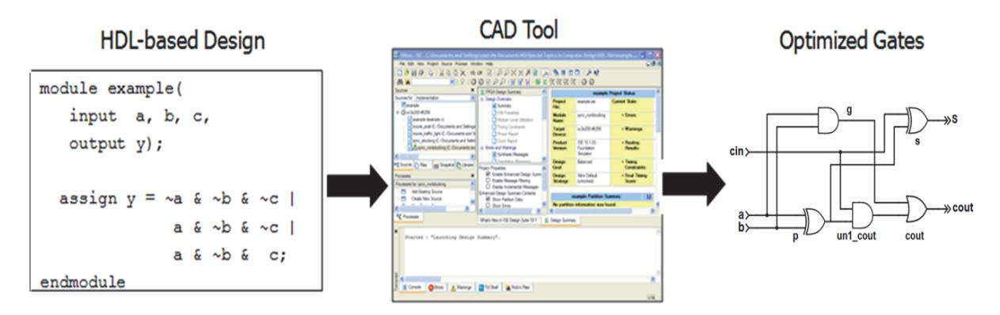

출처: 교육부(2018). 디지털 회로 설계(LM1903060104\_14v3). 한국직업능력개발원. p.4. [그림 1-1] 디지털회로 설계 과정

숕 조합회로

논리회로는 입출력 포트와 입력과 출력 포트의 관계를 나타내는 기능 규격 및 타이밍 정보를 포함한 타이밍 규격으로 나타낼 수 있다. 또 물리적 규격은 전압, 전류 등 물리적 특성을 포함 한다.

회로는 [그림 1-3]과 같이 입력 (A, B, C), 출력 (Y, Z) 노드와 내부 노드 (n1)를 이용하여 구 성 요소 (E1, E2, E3)의 연결망으로 표현된다.

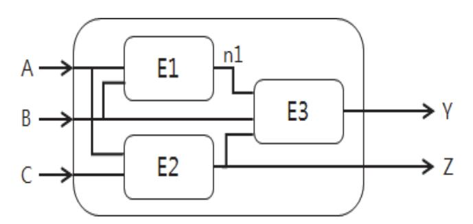

출처: 교육부(2018). 디지털 회로 설계(LM1903060104\_14v3). 한국직 업능력개발원. p.4. [그림 1-2] 논리회로의 표현

| Α | в | Y | minterm |                                    |
|---|---|---|---------|------------------------------------|
| 0 | 0 | 0 | ĀĒ      | -                                  |
| 0 | 1 | 1 | ĀВ      | $Y = F(A, B) = \overline{A}B + AB$ |
| 1 | 0 | 0 | AĒ      |                                    |
| 1 | 1 | 1 | AB      |                                    |

출처: 교육부(2018). 디지털 회로 설계(LM1903060104\_14v3). 한국직업능력개발원. p.4. [그림 1-3] Minterm을 이용한 SOP논리식 표현

입력에 따른 출력 값을 결정함에 있어, 출력이 현재의 입력에 의해 결정되는 기억소자가 없는 회로를 조합회로라 하며, 출력이 현재의 입력과 과거의 입력 정보를 포함하여 결정되는 기억소 자를 포함하는 회로를 순차회로라 한다.

조합회로의 기능 규격은 진리표나 부울대수에 있는 논리식을 써서 나타낼 수 있다. 진리표로 표현된 조합회로의 기능 규격을 논리식으로 표현하기 위하여 SOP(Sum-of-Products)나 POS(Product-of-Sums)으로 나타낼 수 있다. SOP는 [그림 1-4]에 표시된 바와 같이 Minterm들의 합으로 논리식을 표현한다.

| Α | В | Y | minterm             |                                 |
|---|---|---|---------------------|---------------------------------|
| 0 | 0 | 0 | A + B               |                                 |
| 0 | 1 | 1 | $A + \overline{B}$  | $Y = F(A,B) = (A+B)(\bar{A}+B)$ |
| 1 | 0 | 0 | $\bar{A} + B$       |                                 |
| 1 | 1 | 1 | $\bar{A} + \bar{B}$ |                                 |

출처: 교육부(2018). 디지털 회로 설계(LM1903060104\_14v3). 한국직업능력개발원. p.5. [그림 1-4] Maxterm을 이용한 POS 논리식 표현

POS는 [그림 1-5]에 표시된 바와 같이 Maxterm들의 곱으로 논리식을 표현한다. 다음 주어진 진리표는 POS 형식으로 표현될 수 있다.

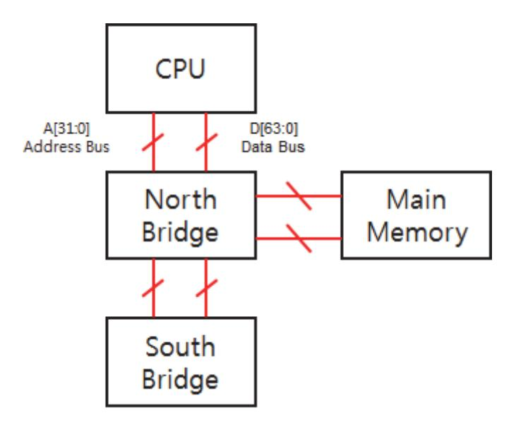

출처: 교육부(2018). 디지털 회로 설계(LM1903060104\_14v3). 한국직업능 력개발원. p.5. [그림 1-5] 프로세서에서의 BUS 예

회로의 입출력 관계를 표현하는 논리식은 부울대수를 이용하여 간단하게 나타낼 수 있다. 간단 한 논리식이 항상 가장 작은 규모의 회로를 표현하지는 않으나, 작은 규모의 회로로 구현될 개 연성이 높기 때문에 부울대수를 이용하여 논리식을 간단하게 표현한다. 또 카노맵(Karnaugh Map)을 이용하여 수식을 간단하게 표현할 수 있다.

## 수행 내용 / 조합회로 설계하기

재료·자료

- 회로 설계 규격서
- 회로도

#### 기기(장비 ・ 공구)

- 설계 서버
- 데이터 저장 장치

#### 안전 ・ 유의 사항

해당 없음

#### 수행 순서

숔 Verilog HDL을 이용한 조합회로 설계

Verilog에서 입력과 출력을 가지고 있는 단위 블록을 모듈이라고 하며, 입력과 출력의 리스트 와 기능을 기술하고 있다. 3개의 입력 (a, b, c)와 하나의 출력 (y)을 포함하는 모듈을 Verilog 로 표현하면 다음과 같다.

```
module ex(a, b, c, y);
input a, b, c;
output y;
 assign y = ~a & ~b & ~c | a & ~b & ~c | a & ~b & c;
endmodule
```

Verilog의 모듈은 다음의 두 가지 방법으로 기술된다.

1. Behavioral 모델: 모듈의 기능을 기술하듯이 표현한다.

2. Structural 모델: 모듈의 기능을 간단한 모듈들의 조합으로 구조적으로 표현한다.

Verilog HDL은 프로그램 언어이면서, 최종 목적은 하드웨어의 구현이므로 Structural 모델로 표현하는 스타일을 지향한다.

앞에서 표현된 ex Verilog 모듈을 간단한 모듈의 조합인 Structural 모델로 표현하면, 구성 요소인 NOT, AND, OR 게이트를 하위 모듈로 하는 모듈을 표현할 수 있다. Structural 모델 에서의 하위 모듈의 복잡성은 설계자의 관점에 따라 다르게 결정될 수 있으며, 절대적인 기준 이 존재하지 않는다. ex 모듈을 구성하는 NOT, 3입력 AND, 3입력 OR 게이트의 하위 모듈 을 기술하면 다음과 같다.

```
module inv(a, y);
input a;
output y;
       assign y = ~a ;
endmodule
module and3( a, b, c, y);
input a, b, c;
output y;
assign y = a & b & c;
endmodule
module or3(a, b, c, y);
input a, b, c;
output y;
       assign y = a | b | c;
endmodule
```

3개의 하위 모듈을 포함하고, 연결하여 표현한 Structural 모델은 다음과 같다. Structural 모 델은 모듈을 구성하는 하위 기능 블록 및 연결 구조를 이해하기 쉽게 표현할 수 있다.

```
module ex_structure(a, b, c, y);
input a, b, c;
output y;
      wire inv_a, inv_b, inv_c
      wire and3_0, and3_1, and3_2;
      inv inva (a, inv_a);
      inv invb (b, inv_b);
      inv invc (c, inv_c);
      and3 and3_y0 (inv_a, inv_b, inv_c, and3_0);
      and3 and3_y1 (a, inv_b, inv_c, and3_1);
      and3 and3_y2 (a, inv_b, c, and3_2);
      or3 or3_y (and3_0, and3_1, and3_2, y);
endmodule
```

조합회로의 출력은 always 블록을 사용할 수도 있고 assign 구문을 사용하여 출력을 할당할 수도 있다. 간단한 조합회로를 기술하기 위하여 assign 구문이 사용되며, 복잡한 조합회로를 기술하기 위하여 always 구문이 사용된다. assign을 이용하여 AND와 XOR 게이트를 기술하 면 다음과 같다.

assign y = a & b; // AND gate assign y = a ^ b; // XOR gate

assign은 조합회로를 나타내기 위하여 사용되며, '='의 오른쪽에 기술된 입력 값이 변화하면 왼쪽의 출력 값이 결정된다. assign 구문은 always 구문 내부에 사용될 수 없다. assign 구문 을 이용하여 게이트들을 표현하면 다음과 같다.

```
module gates(a, b,
 y1, y2, y3, y4, y5);
input [3:0] a, b;
output [3:0] y1, y2, y3, y4, y5;
 /* Five different two-input logic 
 gates acting on 4 bit busses */
 assign y1 = a & b; // AND
 assign y2 = ~(a & b); // NAND
 assign y3 = a | b; // OR
 assign y4 = ~(a | b); // NOR
 assign y5 = a ^ b; // XOR
endmodule
```

여러 비트의 묶음으로 표현된 신호를 버스라고 하며, 각각 구성 블록들의 데이터 통신을 위하 여 사용된다.

4비트 버스를 표현하기 위하여, gates 모듈에서는 a[3:0]을 사용하였으나, 4비트를 표현하기 위하여 a[0:3], a[1:4], 또는 a[4:1]을 사용할 수도 있다. 디지털 수 체계에서는 1보다는 0부터 시작하는 것이 일반적으로 사용되고 있어 a[0:3], a[3:0]으로 표현하는 것이 일반적인 표현 방 법이다.

또 a[0:3]으로 표현하면, a[0]이 MSB가 되고 a[3]이 LSB가 된다. a[3:0]으로 표현하면 a[3]이 MSB가 되고 a[0]이 LSB가 된다. 따라서 많은 설계자들이 4비트의 신호 a를 표현하기 위하여 a[3:0]을 사용한다.

assign 구문에서 조건문을 기술하기 위하여 A : B : C가 사용된다. A는 조건이 되고, A가 참 일 때는 B, 거짓일 때는 C가 선택된다. 두 개의 입력 중에 하나를 선택하는 멀티플렉서를 표 현하면 다음과 같다.

module mux (d0, d1, s, y); input [3:0] d0, d1; input s; output [3:0] y; assign y = s ? d1 : d0; // if s is 1, y = d1 // if s is 0, y = d0 endmodule

Structural 모델에서 보인 바와 같이 복잡한 설계는 간단한 모듈의 연결망으로 표현하고 내부 노드를 선언하여 설계하는 것이 유용하다. 이때 내부 노드를 표현하기 위하여 wire가 사용되 고, wire로 선언된 신호는 꼭 assign 구문을 사용하여 기술되어야 한다.

예를 들면, 다음의 전가산기 회로에서 내부 노드인 p와 g 신호를 wire로 선언하여 기술할 수 있다. 이러한 기술의 목적은 설계상 중요한 신호인 p와 g의 신호가 합성한 후 같은 이름을 가 지고 있어 설계 검증 시 가독성을 향상시키기 위하여 사용된다.


출처: 교육부(2018). 디지털 회로 설계(LM1903060104\_14v3). 한국직업능력개발원. p.9. [그림 1-6] 내부 노드를 가지는 전가산기 회로

전가산기에서의 p와 g를 내부 신호로 선언하여 기술하면 다음과 같다.

module fa (a, b, cin, s, cout); input a, b, cin; output s, cout; wire p, g; // internal nodes assign p = a ^ b; assign g = a & b; assign s = p ^ cin assign cout = g | (p & cin); endmodule

Verilog에서의 시간 지연은 다음과 같이 표현한다. timescale은 구문은 `timescale unit/precision의 형태로 사용되며 unit은 시간의 단위, precision은 정밀도를 표시한다. 예를 들면, `timescale 1ns/1ps는 시간 단위가 1ns로 표시되며, 시뮬레이션은 1ps의 단위로 진행 됨을 의미한다. '# '심벌은 시간 지연을 나타내기 위하여 사용된다. 다음코드는 a, b, c의 입력과 y의 출력을 갖는 조합회로를 구성하는 게이트의 지연 시간 (NOT: 1ns, AND: 2ns, OR: 4ns)을 포함한 기술이다.

```
`timescale 1ns/1ps
module ex_delay(a, b, c, y);
input a, b, c;
output y;
 wire ab, bb, cb, n1, n2, n3;
 assign #1 {ab, bb, cb} = {a, b, c };
 assign #2 n1 = ab & bb & cb
 assign #2 n2 = a & bb & cb
 assign #2 n3 = a & bb & c;
 assign #4 y = n1 | n2 | n3;
endmodule
```

숕 Simple 테스트벤치 작성하기

Verilog HDL에서의 테스트벤치는 다른 HDL 모듈을 검증하기 위하여 사용된다. 일반적으로 테스트벤치는 합성하지 않으며 검증하고자 하는 모듈에 입력을 인가하고 결과를 보여준다. 테스트벤치에서 검증하고자 하는 HDL 모듈(funt)의 입력 신호는 reg로 선언하고, 출력은 wire 로 선언한다. 검증하고자 하는 모듈(funt)을 instantiate하고, initial구문을 이용하여 입력 형 을 결정한다. 다음 코드는 간단한 funt 모듈을 테스트하는 테스트벤치 코드이다.

```
`timescale 1ns/1ps
module funt (a, 
 b, 
 c, 
 y);
input a, b, c; 
output y;
 assign y = ~b & ~c | a & ~b;
endmodule
module tb();
 reg a, b, c;
 wire y;
 // instantiate device under test
 funt dut(.a(a), 
 .b(b), 
 .c(c),
 .y(y));
 // apply inputs one at a time
 initial begin
 a = 0; b = 0; c = 0; #10;
 c = 1; #10;
 b = 1; c = 0; #10;
 c = 1; #10;
 a = 1; b = 0; c = 0; #10;
 c = 1; #10;
 b = 1; c = 0; #10;
 c = 1; #10;
 end
endmodule
```

숖 Self-checking 테스트벤치 작성하기

Self-checking 테스트벤치는 테스트벤치가 입력에 따라 예상되는 출력 값의 정보를 포함하고 있어, 오류 발생 여부를 사람의 육안이 아닌 시뮬레이터가 검증하도록 하는 방법이다. 같은 모듈(funt)에 대하여 self-checking 테스트벤치를 작성하면 다음과 같다.

```
`timescale 1ns/1ps
module tb();
 reg a, b, c;
 wire y;
 // instantiate device under test
 funt dut(.a(a), 
 .b(b), 
 .c(c), 
 .y(y));
 // apply inputs one at a time
 // checking results
 initial begin
 a = 0; b = 0; c = 0; #10;
 if (y !== 1) $display("000 failed.");
 c = 1; #10;
 if (y !== 0) $display("001 failed.");
 b = 1; c = 0; #10;
 if (y !== 0) $display("010 failed.");
 c = 1; #10;
 if (y !== 0) $display("011 failed.");
 end
endmodule
```

숗 조합회로 논리식 표현하기

점심 식사를 위하여 학생회관에 방문하였다. 식당이 닫혀 있으면 식사를 하지 못하고, 카레 요 리만 있으면 점심을 먹지 않을 생각이다. 이 상황을 논리식으로 표현해 보자.

1. 입출력 포트를 결정한다.

먼저 입출력 포트를 결정한다. 첫째 입력으로 식당의 영업 여부를 표현하기 위한 입력(O: open)의 이름을 결정하고 '0'일 때 닫힘으로 표현하자. 카레 요리만을 판매하고 있는 경우 를 입력 (C: curry)로 나타내고, '1'일 때 카레만 판매하는 것으로 하자. 이때 출력을 (E: eat)이 '1'일 때 점심 식사를 하는 것으로 결정하자.

2. 진리표를 작성한다.

입출력 정보를 이용하여, 주어진 기능 "식당이 닫혀 있으면 식사를 하지 못하고, 카레 요리 만 있으면 점심을 먹지 않을 생각"을 진리표로 나타낸다.

3. 논리식을 표현한다.

진리표를 이용하여 SOP 및 POS로 조합회로 논리식을 표현한다. 게이트를 이용하여 회로도

를 그린다.

4. 조합회로 논리식을 HDL을 이용하여 표현한다.

수 7 세그먼트 구동 회로 설계하기

[그림 1-7]은 7 세그먼트 디스플레이 장치이다. 7 세그먼트는 회로의 출력을 숫자로 표현하기 위하여 사용된다. 7 세그먼트 디스플레이를 이용하여 데이터를 표현하기 위해서는 [그림 1-8] 과 같이 입력(D0, D1, D2, D3)으로 4비트를 받아들여 0에서 F까지의 숫자를 표현하는 7-segment 드라이버가 필요하다.

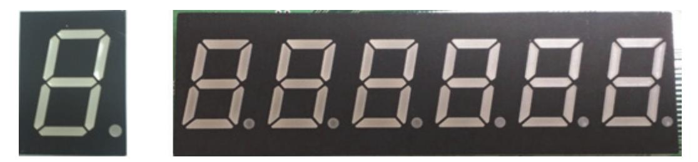

출처: 교육부(2018). 디지털 회로 설계(LM1903060104\_14v3). 한국직업능력개발원. p.13. [그림 1-7] 7세그먼트 디스플레이

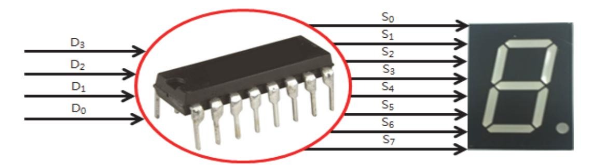

[그림 1-8] 7세그먼트 구동 회로 출처: 교육부(2018). 디지털 회로 설계(LM1903060104\_14v3). 한국직업능력개발원. p.13.

#### 1. 입출력 포트를 결정한다.

[그림 1-8]에 보인 바와 같이 입력은 D0, D1, D2, D3으로 4비트이며 출력은 S0, S1, S2, S3, S4, S5, S6, S7로 8비트이다.

2. 진리표를 작성한다.

7-segment의 입력으로 들어가는 segment 드라이버의 출력(S0, S1, S2, S3, S4, S5, S6, S7)이 0에서 F까지의 숫자를 표현하기 위한 데이터 표현은 [그림1-9]와 같이 결정할 수 있 으며, 이를 입출력 진리표로 작성하면 다음 [그림 1-10]과 같다.

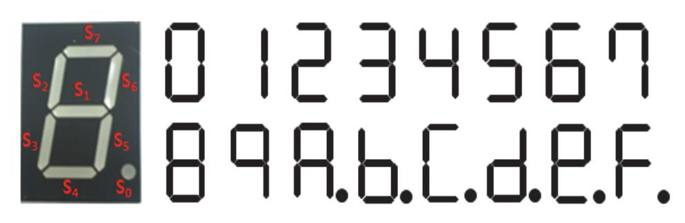

출처: 교육부(2018). 디지털 회로 설계(LM1903060104\_14v3). 한국직업능력개발원. p.14. [그림 1-9] 7 세그먼트 디스플레이를 이용한 데이터 표현

| $D_3 D_2 D_1 D_0$ | S <sub>0</sub> | S <sub>1</sub> | S <sub>2</sub> | S <sub>3</sub> | S <sub>4</sub> | S <sub>5</sub> | S <sub>6</sub> | <b>S</b> <sub>7</sub> |
|-------------------|----------------|----------------|----------------|----------------|----------------|----------------|----------------|-----------------------|
| 0000 (0)          | 0              | 0              | 1              | 1              | 1              | 1              | 1              | 1                     |
| 0001 (1)          | 0              | 0              | 0              | 0              | 0              | 1              | 1              | 0                     |
| 0010 (2)          | 0              | 1              | 0              | 1              | 1              | 0              | 1              | 1                     |
| 0011 (3)          | 0              | 1              | 0              | 0              | 1              | 1              | 1              | 1                     |
| 0100 (4)          | 0              | 1              | 1              | 0              | 0              | 1              | 1              | 0                     |
| 0101 (5)          | 0              | 1              | 1              | 0              | 1              | 1              | 0              | 1                     |
| 0110 (6)          | 0              | 1              | 1              | 1              | 1              | 1              | 0              | 1                     |
| 0111 (7)          | 0              | 0              | 1              | 0              | 0              | 1              | 1              | 1                     |
| 1000 (8)          | 0              | 1              | 1              | 1              | 1              | 1              | 1              | 1                     |
| 1001 (9)          | 0              | 1              | 1              | 0              | 0              | 1              | 1              | 1                     |
| 1010 (A)          | 1              | 1              | 1              | 1              | 0              | 1              | 1              | 1                     |
| 1011 (B)          | 1              | 1              | 1              | 1              | 1              | 1              | 0              | 0                     |
| 1100 (C)          | 1              | 0              | 1              | 1              | 1              | 0              | 0              | 1                     |
| 1101 (D)          | 1              | 1              | 0              | 1              | 1              | 1              | 1              | 0                     |
| 1110 (E)          | 1              | 1              | 1              | 1              | 1              | 0              | 1              | 1                     |
| 1111 (F)          | 1              | 1              | 1              | 1              | 0              | 0              | 0              | 1                     |

출처: 교육부(2018). 디지털 회로 설계(LM1903060104\_14v3). 한국직업능력개발원. p.14. [그림 1-10] 7 세그먼트 구동 조합회로의 진리표

3. Verilog HDL을 이용하여 HDL 코드를 작성한다.

## 1-2. 순차회로 설계

학습 목표 • 주어진 기술 규격을 동기/비동기, 순차회로, HDL로 기술할 수 있다.

## 필요 지식 /

#### 숔 순차회로

출력이 현재의 입력과 과거의 입력 정보를 포함하여 결정되는, 기억소자를 포함하는 회로를 '순차회로'라 한다. 과거의 입력 정보 중에 출력에 영향을 미치는 중요한 정보를 state라 한다. 예를 들면, 자판기의 경우 입력 받은 돈의 액수가 중요하다. 이를 state에 저장하고, 입력된 돈 의 순서는 저장할 필요가 없다. 이러한 state는 비트 세트로 나타내어지며 기억 소자에 저장된 다.

D 플립플롭은 클럭의 상승 또는 하강 에지에 입력 값을 출력에 전달하고, 그 외에는 출력 값 을 유지하는 기억 소자로써, 출력이 한 주기 동안 유지되는 특성을 가지고 있다. D 플립플롭을 여러 개 사용하여 N개의 비트를 저장하는 메모리를 레지스터라 한다. 레지스터는 순차회로를 구성하는 핵심 블록으로 state를 저장하는 데 사용된다.

모든 디지털 시스템은 클럭에 동기화 되어 동작한다. 디지털 회로는 다수의 D 플립플롭을 내 장하고 있으며, 오실레이터로부터 클럭 신호를 입력 받는다. 회로에 포함된 플립플롭의 모든 클럭 포트는 하나의 클럭 신호와 연결되어야 한다. 즉 시스템의 클럭 신호의 개수는 하나이다. 다수의 클럭 신호를 이용하여 회로의 설계를 수행해야 할 때에는 주의가 요구된다.

동기식 순차회로의 출력은 현재 입력과 과거 입력에 대한 연산 결과이며, 클럭 신호에 동기화 되어 동작한다. 현재 사용되는 모든 디지털 시스템은 동기식 순차회로이다. 동기식 순차회로를 구성하는 모든 요소는 레지스터이거나 조합회로이다.

또 적어도 하나의 기억 소자인 레지스터를 포함해야 한다. 모든 레지스터는 같은 클럭 신호를 사용한다. 회로의 연결망에서 순환하는 연결은 적어도 하나 이상의 레지스터를 포함해야 한다. 대표적인 동기식 순차회로는 FSM(Finite State Machine)과 파이프라인이다.

숕 FSM (Finite State Machine)

FSM은 레지스터와 조합회로로 구성되어 있으며, 동기식 순차회로의 대표적인 회로이다. 레지 스터는 유한개의 상태를 표현하며, 리셋 후에 초기화된다. 현재 상태의 정보와 입력 값에 따라 조합회로의 연산을 통하여 출력이 결정된다. Moore FSM은 출력이 현재 상태에 따라 결정되 며, Mealy FSM은 현재 상태와 입력 값이 연동되어 출력이 결정된다. [그림1-11]는 Moore와 Mealy FSM의 블록 다이어그램을 나타낸다.

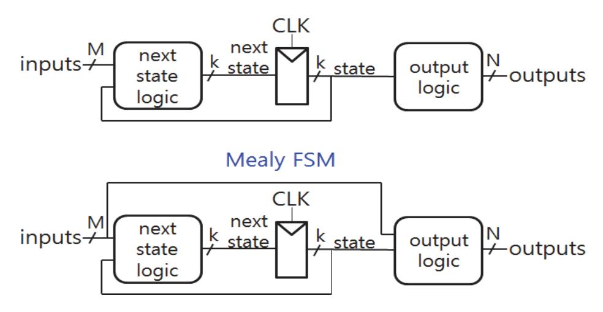

출처: 교육부(2018). 디지털 회로 설계(LM1903060104\_14v3). 한국직업능력개발원. p.16. [그림 1-11] Moore와 Mealy FSM

## 수행 내용 / 순차회로 설계하기

재료 · 자료

- 회로 설계 규격서
- 회로도

#### 기기(장비 ・ 공구)

- 설계 서버
- 데이터 저장 장치
- 안전 ・ 유의 사항
  - 해당 없음

#### 수행 순서

숔 Verilog HDL을 이용한 순차회로 설계

Verilog HDL에서 순차회로를 기술하기 위하여 always 구문을 사용할 수 있다. always에서 결정되는 출력 신호는 sensitivity list의 신호의 값이 변할 때까지 이전의 값을 유지한다. 즉, always 구문은 sensitivity list에 기술된 이벤트가 발생해야지만 실행된다고 생각해도 된다. always 구문에서 결정되는 신호는 reg 형태로 선언되어야 한다.

always는 이미 소개된 바와 같이 조합회로를 기술하기 위해서도 사용되며, 결과 회로는 HDL 코딩 스타일에 의해 결정된다.

always @ (sensitivity list) begin statement; statement; statement; . . . .. end

플립플롭은 클럭의 에지에 입력을 저장한다. always @ (posedge clock)은 입력을 클럭의 상 승 에지에 샘플하며, always @ (negedge clock)은 클럭의 하강 에지에 입력을 샘플한다. 이 때, 플립플롭의 출력은 reg 형태로 선언되어야 한다.

module flipflop(clk, d, q); input clk; input [3:0] d; output reg [3:0] q; always @ (posedge clk) begin q <= d; // pronounced "q gets d" end endmodule

기술된 flipflop 모듈을 다음 코드의 테스트벤치 안에 dut로 선언하고, 각 입력에 테스트벤치 에 존재하는 신호를 연결한다. 클럭 신호를 인가하기 위하여 반주기마다 토글하는 클럭 신호를 기술한다. 그리고 dut의 clk 입력에 연결한다. clk(clock)는 클럭 신호를 모듈의 clk 입력에 연결하는 의미이다.

D 플립플롭의 입력 값을 0, 3, 5, A, C의 순서로 입력하는데, 3ns 뒤에 클럭의 배수에 동기 시켜 인가하는 것은, 플립플롭의 입력 D가 클럭의 에지에 근처에서 변화하지 않도록 하기 위 함이다. 클럭 신호와 같이 .d(data)로 인가되는 data 값을 플립플롭 모듈의 D 입력에 연결한 다.

```
`timescale 1ns / 1ps
module tb_flipflop();
       reg clock;
       reg [3:0] data;
       wire [3:0] q;
       parameter clk_period = 10;
       flipflop dut(.clk(clock), .d(data), .q (q) );
       always
       begin
       clock = 1;
 forever #(clk_period/2) clock = ~clock;
       end
       initial
       begin
       data = 4'h0; #3;
       data = 4'h3; #(clk_period*2);
       data = 4'h5; #(clk_period*3);
       data = 4'hA; #(clk_period*3);
       data = 4'hC; #(clk_period*2);
       end
endmodule
```

Verilog에는 결과 값을 기술하기 위하여 blocking과 non-blocking의 두 가지 표현이 있다. '=' 는 blocking을 기술하기 위하여 사용된다. blocking으로 표현되면 HDL 코드에 표시된 순 서대로 값들이 계산된다. 즉 C 언어에서와 같다.

'<=' 는 non-blocking을 기술하기 위하여 사용된다. non-blocking으로 표현된 값들은 모두 동시에 <= 왼쪽 결과가 오른쪽 신호 값이 된다. 순차회로에서의 blocking과 non-blocking은 전혀 다른 회로를 기술한다. 이에 적절한 표현의 사용 및 주의가 요구된다.

다음 코드는 non-blocking 기술의 예를 보인다. non-blocking의 경우 n1은 d가 되고, q는 n1이 되는 것이 동시에 수행된다. 즉 [그림 1-12]의 회로가 기술된다.

```
module sync_nonblocking(clk, d, q);
input clk; 
input d; 
output reg q;
reg n1;
 always @(posedge clk)
 begin
 n1 <= d; // nonblocking
 q <= n1; // nonblocking
 end
endmodule
```

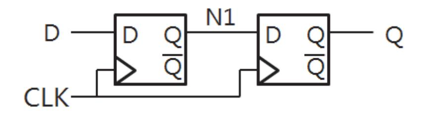

출처: 교육부(2018). 디지털 회로 설계(LM1903060104\_14v3). 한국직업능력개발원. p.19. [그림 1-12] nonblocking 회로

다음 코드는 blocking 기술의 예를 보인다. blocking의 경우 n1은 d가 되고, 그 다음에 q는 n1이 되어 결국 q는 d가 되는 결과가 된다.

```
module sync_blocking(clk, d, q);
input clk; 
input d; 
output reg q;
reg n1;
 always @(posedge clk)
 begin
 n1 = d; // blocking
 q = n1; // blocking
 end
endmodule
```

즉, 다음 그림의 회로를 구현한다.

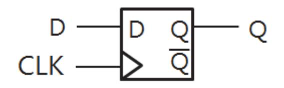

출처: 교육부(2018). 디지털 회로 설계(LM1903060104\_14 v3). 한국직업능력개발원. p.19. [그림 1-13] blocking 회로

숕 자판기 설계하기

한 가지 종류의 음료수를 판매하며, 음료수의 가격은 300원이며, 100원 동전만 사용 가능하다.

1. 입출력 포트를 결정한다.

먼저 입출력 포트를 결정한다. 100원 동전을 입력으로 하고, 300원을 입력으로 받았을 때 음료수를 출력하는 신호를 출력으로 결정한다.

2. State Diagram을 작성한다.

음료수 자판기를 설계하기 위한 Moore FSM의 state diagram을 작성하면 [그림 1-14]와 같다. 리셋 후에, 초기 상태인 State0으로 이동한다. 이 상태는 0원의 동전을 입력받은 상 태이다. 100원을 입력받은 후에, State1로 이동한다. 이 상태는 100원의 동전을 입력받은 상태이다. 추가로 100원을 입력받은 후에, State2로 이동한다. 이 상태는 200원의 동전을 입력받은 상태이다. 추가로 100원을 입력받은 후에, State3으로 이동한다. 이 상태는 300 원의 동전을 입력받은 상태이므로 음료수 하나를 출력하고 State0 즉, 초기 상태로 이동한 다.

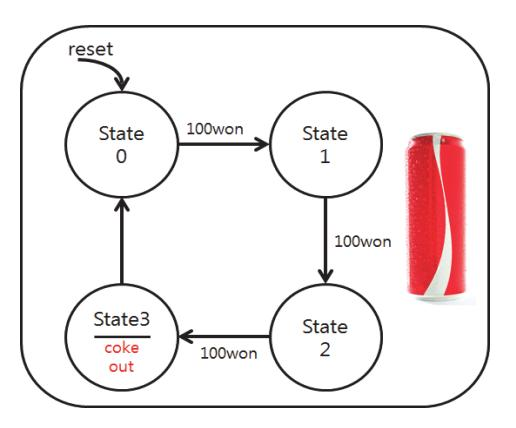

출처: 교육부(2018). 디지털 회로 설계(LM190306 0104\_14v3). 한국직업능력개발원. p.20. [그림 1-14] 음료수 자판기의 State Diagram

3. 순차회로 HDL 코딩을 진행한다.

State Diagram을 HDL로 나타내고, 테스트벤치를 작성한다.

숖 카운터 설계하기

카운터는 클럭의 상승 에지마다 1씩 값을 증가시키는 기본 블록이다. 예를 들면 2비트 카운터 는 0-1-2-3-0-1...의 순서로 카운트 한다. [그림 1-15]는 N 비트 카운터의 블록도이다. 1씩 증가시키는 덧셈기와, 리셋 시 초기화 되며 결과를 저장하는 레지스터로 구성되어 있다. 디지 털시계 등에 사용되며, 통신, 디스플레이 등 많은 응용 제품에서 타이밍을 컨트롤하기 위하여 사용된다. 또한 컴퓨터에서 다음 수행하고자 하는 명령어의 주소를 계산하기 위해서도 사용된 다.

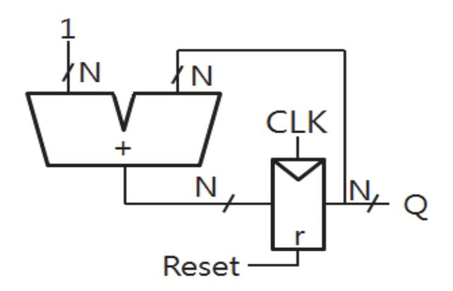

출처: 교육부(2018). 디지털 회로 설계(LM1903060104\_14v3). 한국직업능력개발원. p.21. [그림 1-15] N비트 카운터 블록 다이어그램

1. 카운터 HDL 코딩을 진행한다. 카운터를 Verilog HDL로 코딩하면 다음과 같다.

```
module counter(clk,
 reset,
 q);
input clk;
input reset;
output reg [N-1:0] q;
 always @(posedge clk or posedge reset)
 begin
 if (reset) q <= 0;
 else q <= q + 1;
 end
endmodule
```

#### 2. 카운터 테스트벤치를 작성한다.

카운터를 Verilog HDL로 코딩하면 다음과 같다.

```
`timescale 1ns / 1ns
module tb_counter( );
 reg clk;
 reg reset;
 wire [7:0] q;
 parameter clk_period = 5;
 counter counter_u0(.clk(clk), 
 .reset(reset)
 .q(q));
 always
 begin
       clk = 1;
 forever #(clk_period/2) clk = ~clk
 end
 initial
 begin
 reset = 1'b1; #13;
 reset = 1'b0;
 end
endmodule
```

#### 숗 Shift Register 설계하기

Shift register는 매 클럭 입력되는 하나의 직렬 입력과, 하나의 직렬 출력, 그리고 N 비트의 병렬 출력을 가지고 있다. 즉, Sin의 입력은 N 클럭 후에 Sout으로 나오게 된다. 쉬프트레지 스터는 직병렬 변화를 위하여 사용된다. [그림 1-16]의 블록도와 같이 병렬 입력을 추가하여, 직병렬, 병직렬 변화를 위하여 사용할 수 있다.


출처: 교육부(2018). 디지털 회로 설계(LM1903060104\_14v3). 한국직업능력개발원. p.22. [그림 1-16] 직병렬 혼합의 Shift Register 블록 다이어그램

1. Shift Register HDL 코딩을 진행한다.

Shift Register를 Verilog HDL로 코딩하면 다음과 같다.

```
module shift_reg (clk,
 reset,
 load, // load parallel input
 sin, // serial input
 d, // parallel data in
 q, // parallel data out
 sout); // serial out
input clk,;
input reset;
input load;
input sin;
input [N-1:0] d;
output reg [N-1:0] q;
output sout;
parameter N = 8
 always @(posedge clk or posedge reset)
 begin
 if (reset) q <= 0;
 else if (load) q <= d;
 else q <= {q[N-2:0], sin };
 end
 assign sout = q[N-1];
endmodule
```

### 2. 테스트 벤치를 작성한다.

Shift Register를 Verilog HDL로 코딩하면 다음과 같다.

```
`timescale 1ns / 1ns
module tb_shift_reg();
 reg clk, reset, load, sin,
 reg [7:0] d;
 wire [7:0] q;
 wire sout
 parameter clk_period = 10;
 shiftreg shiftreg_u0(.clk(clk), 
 .reset(reset), 
 .load(reset),
 .sin(sin),
 .d(d), 
 .q(q), 
 .sout(sout));
 always
 begin
 clk = 1;
 forever #(clk_period/2) clk = ~clk
 end
 initial
 begin
 load = 1'b0; d = 8'h00; #3;
 load = 1'b1; d = 8'h5A; #10;
 load = 1'b0; d = 8'h00;
 end
 initial
 begin
 sin = 1'b0; #3;
 sin = 1'b1; #(clk_period);
 sin = 1'b1; #(clk_period);
 sin = 1'b0; #(clk_period);
 sin = 1'b1; #(clk_period);
 sin = 1'b1; #(clk_period);
 end
endmodule
```

### 학습 1 교수·학습 방법

#### 교수 방법

- 부울논리, 부울대수, 데이터시트, 회로도를 학습자가 쉽게 이해할 수 있도록 실습을 병행한 다.
- 시스템 인터페이스를 이해하고 설계할 수 있도록 인터페이스 방법 등을 소개하고, 응용 부 분별 특징을 설명한다.
- FSM(Finite State Machine)의 구조를 이해하고 해석할 수 있도록 설명하고, 자판기, 엘리 베이터 제어기 설계 예를 이용하여 실제 설계 예를 들어 설명한다.
- HDL을 이용하여 설계할 수 있도록 실습지도 한다.
- 기술 규격의 기능에 따라 시스템과 호환되도록 입/출력 회로를 선정할 수 있도록 실제 인터 페이스 시스템을 예를 들어 설명한다.
- 주어진 기술 규격을 동기/비동기 순차회로 HDL로 기술할 수 있도록 설명하고, 실습을 지도 한다.

#### 학습 방법

- 데이터 시트, 회로도롤 이해하고 해석할 수 있도록 교수로부터 주어진 회로도 분석을 수행 하고 토론한다.
- 시스템 인터페이스, 동기, 비동기 시스템의 차이를 이해하고 설계할 수 있도록 학습하고, 실 습을 통해 충분히 숙지한다.
- FSM(Finite State Machine)의 구조를 이해하고 해석할 수 있도록 자판기 제어기 등을 설 계하며 설계 능력을 함양한다.
- 주어진 기술 규격에 따라 HDL을 사용할 수 있도록 자주 사용되는 회로의 HDL 코딩 스타 일을 학습한다.
- 기술 규격의 기능에 따라 시스템과 호환되도록 입/출력 회로를 선정할 수 있도록 시스템 인 터페이스 방법을 이해한다.

## 학습 1 평 가

#### 평가 준거

• 평가자는 학습자가 학습 목표를 성공적으로 달성하였는지를 평가해야 한다.

#### • 평가자는 다음 사항을 평가해야 한다.

|         |                                                  | 성취수준 |   |   |  |
|---------|--------------------------------------------------|------|---|---|--|
| 학습 내용   | 학습 목표                                            | 상    | 중 | 하 |  |
|         | - 주어진 기술 규격에 따라 HDL을 사용할 수 있다.                   |      |   |   |  |
| 조합회로 설계 | - 기술 규격의 기능에 따라 시스템과 호환되도록 입/출력<br>회로를 선정할 수 있다. |      |   |   |  |
|         | - 주어진 기술 규격을 조합 회로 HDL로 기술 할 수 있<br>다.           |      |   |   |  |
| 순차회로 설계 | - 주어진 기술 규격을 동기/비동기 순차회로 HDL로 기<br>술 할 수 있다.     |      |   |   |  |

#### 평가 방법

• 문제 해결 시나리오

|         | 평가 항목                         | 성취수준 |   |   |
|---------|-------------------------------|------|---|---|
| 학습 내용   |                               | 상    | 중 | 하 |
| 조합회로 설계 | - 주어진 기능 규격 진리표               |      |   |   |
| 순차회로 설계 | - 주어진 기능 규격의 state diagram 작성 |      |   |   |

#### • 사례 연구

| 학습 내용   | 평가 항목                |   | 성취수준 |   |  |
|---------|----------------------|---|------|---|--|
|         |                      | 상 | 중    | 하 |  |
| 조합회로 설계 | - 주어진 기능 규격을 HDL로 기술 |   |      |   |  |
| 순차회로 설계 | - 주어진 기능 규격을 HDL로 기술 |   |      |   |  |

• 구두 발표

|         | 평가 항목                      | 성취수준 |   |   |
|---------|----------------------------|------|---|---|
| 학습 내용   |                            | 상    | 중 | 하 |
| 조합회로 설계 | - 주어진 기능 규격의 HDL의 테스트벤치 작성 |      |   |   |
| 순차회로 설계 | - 주어진 기능 규격의 HDL의 테스트벤치 작성 |      |   |   |

피드백

- 1. 문제 해결 시나리오
  - 주어진 문제를 이해하고, 이를 해결해 나가는 과정 및 해결 방법을 재확인한 후, 미흡한 부분은 재교육할 수 있도록 한다.

2. 사례 연구

- 해당 결과를 도출할 수 있는 능력뿐만 아니라, 결과물에 대한 해석 방법에 대해서도 확인하고 평 가한 후, 미진한 부분을 보완할 수 있도록 지도한다.
- 3. 구두 발표
  - 평가 항목과 학습 목표를 이해하고, 문제 해결 및 해결 방법을 논리적으로 표현할 수 있는지 평가 한 후, 추가로 보완해야 할 사항에 대해 제시한다.

| 학습 1 | HDL 코딩하기    |
|------|-------------|
| 학습 2 | 시뮬레이션하기     |
| 학습 3 | 디지털 회로 합성하기 |
| 학습 4 | 포스트 시뮬레이션하기 |
| 학습 5 | 시스템 레벨 검증하기 |

## 2-1. 시뮬레이션 환경 구성

학습 목표 • 시뮬레이션 환경을 구축할 수 있다. • 설계사양서에 의거하여 기술된 HDL 코딩을 시뮬레이션할 수 있다.

## 필요 지식 /

숔 회로 검증 과정

반도체 설계를 진행해 나갈 때 다음 단계로 설계를 진행하기 위해서는 시뮬레이션을 통한 검증 이 필요하다. 시뮬레이션 결과가 원하는 수준을 충족하지 못한다면 다음 단계로 진행하지 않고 현재 단계에서의 디자인의 수정이 필요하다. [그림 2-1]은 반도체 설계 과정이다. HDL 코딩이 끝나면 디자인된 회로가 원하는 동작을 수행하는지 검증하는 RTL 시뮬레이션을 수행한다. (Functional 시뮬레이션이라 부르기도 한다). 시뮬레이션 검증이 완료되면 하드웨어 합성을 수 행한다. 합성은 컴파일러가 RTL 코드를 게이트로 대치하는 작업을 의미한다.

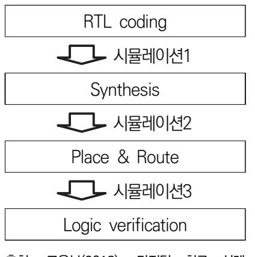

출처: 교육부(2018). 디지털 회로 설계 (LM1903060104\_14v3). 한국직업능력개 발원. p.28. [그림 2-1] 반도체 설계 과정

하지만 아직 합성 및 레이아웃을 진행하지 않았기 때문에 클럭에 대한 정보를 알 수 없다. 시 뮬레이션은 시스템 클럭을 기준으로 신호의 타이밍을 살피는 것이기 때문에 클럭에 대한 정보 가 중요하다. 클럭을 skew나 jitter가 없는 ideal한 상태로 놓고 pre-레이아웃 시뮬레이션을 진행한다. pre-레이아웃 시뮬레이션이 완료되면 게이트들과 전력선, 신호선, 매크로 등을 칩의 공간에 실질적으로 위치시키고 연결하는 P&R 작업을 수행하고 클럭 트리를 구성한다. 레이아웃이 완료되면 클럭에 대한 실질적인 정보와 레이아웃 정보를 포함하여 post-레이아웃 시뮬레이션을 수행한다. 시뮬레이션 결과 violation이 생기지 않으면 최종적으로 설계된 회로 를 검증한다. 회로 검증은 모델링한 RTL 코드와 레이아웃 작업이 완료된 네트리스트가 같은 기능을 수행하는지 검증하는 것이다. 검증이 완료되면 디자인을 tape out 시킬 수 있다.

## 수행 내용 / 시뮬레이션 환경 구축하기

재료·자료

- 회로 설계 규격서
- 회로도
- 디자인
- 툴 설명서

기기(장비 ・ 공구)

설계 서버

- 데이터 저장 장치
- HDL 시뮬레이션 툴

#### 안전 ・ 유의 사항

해당 없음

수행 순서

숔 테스트벤치 수행하기

HDL을 사용하여 하드웨어 설계를 수행하면 실제 칩으로 만들어지기 전에 하드웨어의 기능을 검증할 수 있다는 이점이 있다. Verilog HDL은 소스코드 및 네트리스트 상태로 하드웨어의 기능을 검증할 수 있다. 하드웨어의 복잡도가 증가할수록 개발 기간 중 검증이 차지하는 비율 도 증가한다.

- 1. 테스트벤치는 가상의 검증 환경으로, 검증하고자 하는 디자인에 적절한 입력신호(stimulus)를 인 가하고 그에 따른 출력을 통해 디자인을 검증한다. [그림 2-2]는 테스트벤치의 개념을 표현한다. tb\_top\_module은 HDL로 작성된 테스트벤치이고, top\_module은 검증하고자 하는 디자인의 최 상위 모듈이다.
- 2. 테스트벤치와 최상위 모듈 간에 포트 연결을 하고 최상위 모듈에 기능 검증을 위한 적절한 stimulus를 인가한다.

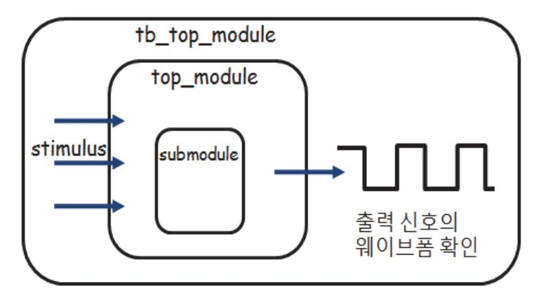

출처: 교육부(2018). 디지털 회로 설계(LM1903060104\_14v3). 한국직업능력 개발원. p.30. [그림 2-2] 테스트벤치의 개념

- 3. 회로의 동작 검증은 top\_module의 출력 파형을 확인하여 수행한다.
- 4. 시뮬레이션은 Verilog HDL을 통해 테스트벤치 코드를 작성하고 컴퓨터상에서 직접 실행하는 과

정이다. 테스트벤치의 신호는 하드웨어로 합성되지 않으며 시뮬레이터에서만 사용된다.

- 5. 테스트벤치는 하드웨어 설계 과정의 전 단계에서 동일한 stimulus에 대하여 회로는 일관된 출력 을 보여야 한다. 즉, HDL 코드와 게이트 레벨의 네트리스트는 같은 테스트벤치로 검증할 수 있 다.
- 6. [그림 2-3]은 테스트벤치의 작성 플로우이다. 일반적인 테스트벤치의 작성 플로우는 먼저 `timescale 키워드를 이용하여 시간 관련 선언을 하고, 테스트벤치의 최상위 모듈을 정의한다.

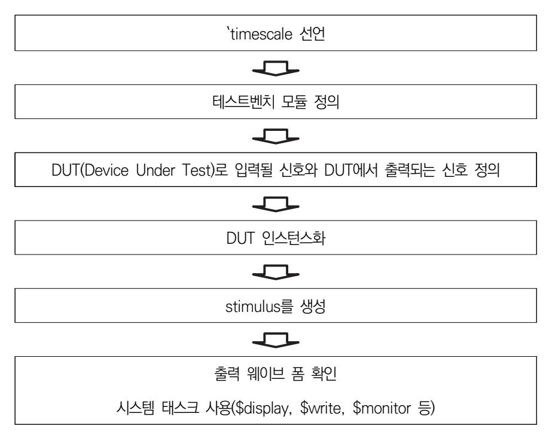

출처: 교육부(2018). 디지털 회로 설계(LM1903060104\_14v3). 한국직업능력개발원. p.31. [그림 2-3] 테스트벤치의 작성 플로우

- 7. 테스트할 대상인 DUT의 입력과 출력을 정의한 후에는 DUT의 기능 및 성능 검증을 위한 적절한 stimulus를 인가한다. DUT의 출력을 웨이브폼을 통해 확인하며 시스템을 검증한다. 웨이브 폼으 로의 성능 검증이 힘들 경우에는 시스템 태스크를 사용하여 self-checking 테스트벤치를 작성한 다.
- 8. timescale은 타임 유닛 및 시뮬레이션의 precision을 정의하는 데 사용한다.

다음은 테스트벤치에서 `timescale의 사용 예시이다. initial 블록에서 rst\_n은 시뮬레이션 시간 0에서 1'b1로 초기화 되어 있다. #25는 딜레이를 의미하는데 일종의 tick과 같다. `timescale 1ns/10ps로 선언되어 있기 때문에 25 tick \* 1ns = 25ns 딜레이를 의미한다. 따라서 25ns인 순간에 rst\_n은 1'b0이 된다. 블로킹 할당과 함께 다음과 같은 스타일로 코 딩을 하면 순차적으로 딜레이가 걸리게 된다. 25ns 지연된 시간으로부터 50ns 지연이 추

가되어 시뮬레이션 시간이 75ns인 순간 rst\_n은 다시 1'b1이 된다. 만약 해당 회로가 50MHz 시스템 클럭으로 동작한다면 클럭의 한 주기는 20ns가 될 것이다. 디자인에서 비 동기 리셋으로 always 블록을 구동시킨다면 20ns의 배수를 피해서 비동기 리셋을 걸어주 는 것이 좋다.

`timescale <time unit> / <simulation precision>

9. 대부분의 테스트벤치에서는 시뮬레이션을 위하여 클럭이 필요하다.

아래 코드는 듀티비(Duty Ratio)가 50%인 클럭을 생성하는 예시이다. 생성하려는 클럭의 반주기마다 클럭이 반전되게 하여 생성하면 된다.

| reg clk;                          | reg clk;                         |
|-----------------------------------|----------------------------------|
| always begin                      |                                  |
| clk = 1'b0;                       | initial clk = 1'b0;              |
| forever #(클럭 주기의 1/2) clk = ~clk; | always #(클럭 주기의 1/2) clk = ~clk; |
| end                               |                                  |

10. 다음은 test 모듈에 대한 테스트벤치의 작성 예이다. 대부분의 테스트벤치의 경우에는 입출력 포트가 필요 없다.

[DUT (Device Under Test)인 test 모듈로 연결할 신호들은 procedural 블록에서 드라이 빙 해야 하므로 reg 데이터 타입으로 선언하고 DUT의 출력과 연결할 신호는 wire 데이터 타입으로 선언한다. 비동기 리셋을 인가하기 위하여 initial 블록을 두 개 사용하였다. 첫 번째 initial 블록에서는 7ns에서 low-active 리셋을 인가한다. 두 번째 initial 블록에서는 DUT에 인가할 stimulus를 생성한다. test 모듈에 100ns동안 1'b1인 신호 in\_a를 인가하 면 out\_b로 클럭의 한 주기인 20ns동안 1'b1인 신호가 출력된다.

숕 시뮬레이션

- 1. 테스트벤치 작성 전에 설계 검증 전략 또는 검증 계획을 문서로 정리할 필요가 있다. 코드의 재사용 및 가독성 등을 고려하여 작성한다. 다음은 검증 방안 문서가 포함하고 있어 야 할 최소 항목이다.
  - 하드웨어 기능 요약
  - 주요 기능에 대한 상세 설명
  - 시뮬레이션 목표
  - 입력 stimulus에 대한 특성 및 출력
  - 컴파일러 특성에 대한 기술
- 2. 설계한 회로가 의도한 대로 동작하는지 확인하기 위하여 시뮬레이션을 수행한다.

구현하기 전에 수행하는 시뮬레이션은 설계의 디버깅 시간과 전체 개발 기간을 단축할 수 있다. 이러한 시뮬레이션을 Functional 시뮬레이션이라고 한다. Functional 시뮬레이션은 소자의 시간적인 지연 개념 없이 수행한다.

```
`timescale 1ns/10ps
module tb_test();
reg clk;
reg rst_n;
reg in_a;
wire out_b;
initial clk = 1'b0;
always #10 clk = ~clk;
initial begin
 rst_n = 1'b1;
 #7 rst_n = 1'b0;
 #20 rst_n = 1'b1;
end
initial begin
in_a = 1'b0;
#30 in_a = 1'b1;
#100 in_a = 1'b0;
end
test DUT (.clk(clk),
 .rst_n(rst_n),
 .in_a(in_a),
 .out_b(out_b));
endmodule
```

숖 시뮬레이션하기

- 1. 새로운 프로젝트 만들기를 아래와 같이 진행한다.
  - (1)'File'탭을 클릭한다.
  - (2)'New' → 'Project...'을 클릭한다.
  - (3) Project Name에는 프로젝트 이름을 쓴다.
  - (4) Project Location에는 생성하는 프로젝트가 저장될 경로를 지정한다.
- 2. 기존에 작성된 파일을 새로운 프로젝트에 추가하기 위하여 다음과 같이 진행한다.

(1) Add items to the Project 창이 나타나면, 'Add Existing File'을 클릭한다.

(2)'Browser'버튼을 클릭한다.

- (3) 시뮬레이션을 진행할 파일과 테스트벤치 파일을 불러온다.
- 3. 추가한 '.v'파일을 수정하기 위해서 다음과 같이 진행한다.
  - (1) 프로젝트 창에서 추가한 파일을 확인할 수 있다.
  - (2)'.v'파일을 선택하고 마우스 오른쪽 버튼을 누른다.
  - (3)'Edit'을 누르면 '.v'파일 코드를 확인하고 수정할 수 있다.
- 4. HDL 파일을 컴파일하기 위해서 Transcript 창에 <vlog 'file\_name.v'>을 입력한다.
- 5. 컴파일이 완료된 후 모듈을 읽어오기 위해서 Transcript 창에 <vsim 'module\_name'>을 입력한 다.
  - (1) 모듈의 구조를 보기 위하여 <view structure>를 실행한다.
  - (2) 신호를 보기 위하여 <view signals>를 실행한다.
  - (3) 웨이브 폼을 보는 창을 생성하기 위하여 <view wave>를 실행한다.
  - (4) 신호를 추가하기 위해서 sim 창에 있는 파일을 선택 후 마우스 오른쪽 버튼을 클릭한다.
  - (5)'Add to' → 'Wave' → 'All items in region'을 클릭한다.
  - (6) Transcript 창에 <run times> 명령어를 입력한다. times에는 시뮬레이션 하고자 하는 시간 을 입력한다. (예: run 1000ns)
- 6. 시뮬레이션을 실행 한 후, 웨이브폼 창에서 Zoom 기능을 이용해서 웨이브폼을 관찰할 수 있다.

# 2-2. 시뮬레이션 결과 분석

학습 목표 • 시뮬레이션 결과를 설계사양서와 비교할 수 있다. • 시뮬레이션 결과를 분석하여 HDL 코드를 수정할 수 있다.

## 필요 지식 /

#### 숔 시뮬레이션 결과 분석하기

HDL로 기술된 회로의 구체적인 동작을 검증하기 위하여 시뮬레이션을 수행한다. 시뮬레이션 환경 구축에서 학습한 바와 같이 검증하고자 하는 회로의 기능을 검증할 수 있는 회로의 입출 력 정보를 이용하여, HDL로 구현된 회로의 기능 동작을 검증하는 것을 목표로 한다. 또 이때 작성한 테스트벤치는 포스트 시뮬레이션에서 동일하게 사용될 수 있어, 알고리즘이나 기능을 HDL로 기술하여 회로로 구현하는 과정에서의 오류를 쉽게 찾아낼 수 있다. 클럭과 타이밍뿐만 아니라, 출력의 결과를 검증하고, 기능상 오류를 찾아내어 HDL을 수정하여 기술 규격서에 기술된 기능을 회로가 수행할 수 있도록 한다.

### 수행 내용 / 시뮬레이션 결과 분석하기

#### 재료·자료

- 회로 설계 규격서
- 회로도
- 디자인
- 툴 설명서

#### 기기(장비 ・ 공구)

- 설계 서버
- 데이터 저장 장치
- HDL 시뮬레이션 툴

안전 ・ 유의 사항

해당 없음

#### 수행 순서

숔 시뮬레이션 결과 분석하기

- 1. 논리회로의 동작 검증을 시뮬레이션을 통하여 확인하기 위해 테스트벤치를 작성한다. 설계된 논리회로의 정확한 동작을 시뮬레이션하기 위해서는 특정 시간에 어떤 입력을 넣어 줄 것인가를 정해야 하며, 이러한 내용이 기술된 것을 테스트벤치라고 한다. 테스트벤치는 시뮬레이션 단계에서 시험하고자 하는 논리회로에 입력을 주었을 때 정확한 출력이 나오는 지 확인하기 위하여 작성한다. 테스트벤치는 논리회로의 동작 검증을 목적으로만 사용되며, 일반적으로 하드웨어로 합성하지 않는다.
  - (1) 학습 1-1 조합회로 설계에서 작성한 7 세그먼트 구동회로를 검증하기 위한 테스트벤치를 작 성한다. 4-bit 입력에 해당하는 d의 값을 4'b1씩 증가시키면서 출력에서 오류가 발생하는지 확 인하는 테스트벤치를 작성한다. 예를 들어 d[3:0] = 4'b1111일 때 7-세그먼트는 'F.' 을 나타내야 한다.
  - (2) 학습 2-1 시뮬레이션 환경구성을 참고하여 시뮬레이션을 수행한다.
  - (3) seg[0]부터 seg[7]까지 하나라도 원하지 않는 값이라면 "1111 failed."를 출력하면서 error 의 값을 1'bx로 할당한다. seg[7:0]의 값이 모두 알맞게 들어온다면 "1111 succeed."를 출 력하고, error의 값을 1'b0으로 만든다. 위와 같이 작성된 테스트벤치는 self-checking 테스트벤치이며, self-checking 테스트 벤치는 입력에 따라 예상되는 출력의 정보를 포함하고 있어서 출력에서 발생하는 오류 를 시뮬레이터를 통하여 확인하는 방법이다.
  - (4) [그림 2-14]는 self-checking 테스트벤치를 이용하여 \$display로 기술한 메시지가 출력되 는 것을 보이게 한다. 출력된 메시지는 특정 시간의 입력들에 대하여 모든 출력이 정확하다 는 것을 보인다.
  - (5) 시뮬레이션 결과 출력 파형과 메시지를 확인하여 기술 규격의 출력과 다르면 HDL을 수정하 고 시뮬레이션을 다시 수행하여 기능 오류를 정정한다.

### 학습 2 교수·학습 방법

#### 교수 방법

- 부울논리, 부울대수를 이해할 수 있도록 설명하고 실습을 진행한다.
- 데이터시트, 회로도롤 이해하고 해석할 수 있도록 설명하고, 실제 설계 예를 들어 설명한다.
- 시스템 인터페이스를 이해하고 설계할 수 있도록 인터페이스 방법 등을 소개하고, 응용 부 분별 특징을 설명한다.
- 주어진 기술 규격을 HDL로 기술할 수 있도록 실습을 포함하여 교수한다.
- 주어진 HDL을 이해할 수 있도록 실습을 포함하여 수업을 진행한다.
- 시뮬레이션 환경을 구축할 수 있도록 실습을 포함하여 수업을 진행한다.

#### 학습 방법

- 데이터 시트, 회로도롤 이해하고 해석할 수 있도록 교수로부터 주어진 회로도 분석을 수행 하고 토론한다.
- 시스템 인터페이스를 이해하고 설계할 수 있도록 학습하고, 실습을 통해 충분히 숙지한다.
- 주어진 기술 규격을 HDL로 기술할 수 있도록 학습하고, 실습을 통해 충분히 숙지한다.
- 주어진 HDL을 이해할 수 있도록 자주 사용되는 회로의 HDL 코딩 스타일을 학습한다.
- 시뮬레이션 환경을 구축할 수 있도록 학습하고, 실습을 통해 충분히 숙지한다.
- 기술 규격서에 의거하여 기술된 HDL 코딩 시뮬레이션을 수행할 수 있도록 학습하고, 실습 을 통해 충분히 숙지한다.
- 시뮬레이션 결과를 규격서와 비교할 수 있도록 학습하고, 실습을 통해 충분히 숙지한다.
- 시뮬레이션 결과 분석 정보를 이용하여 HDL 코드를 수정할 수 있도록 학습하고, 실습을 통 해 충분히 숙지한다.
- 시뮬레이션 결과 분석 정보를 이용하여 HDL 코드를 수정할 수 있도록 설명하고, 실습을 통 하여 설계 능력을 함양하도록 한다.

## 학습 2 평 가

#### 평가 준거

• 평가자는 학습자가 학습 목표를 성공적으로 달성하였는지를 평가해야 한다.

#### • 평가자는 다음 사항을 평가해야 한다.

|                |                                            | 성취수준 |   |   |  |
|----------------|--------------------------------------------|------|---|---|--|
| 학습 내용          | 학습 목표                                      |      | 중 | 하 |  |
| 시뮬레이션<br>환경 구성 | - 시뮬레이션 환경을 구축할 수 있다.                      |      |   |   |  |
|                | - 설계사양서에 의거하여 기술된 HDL 코딩을 시뮬레이션<br>할 수 있다. |      |   |   |  |
| 시뮬레이션<br>결과 분석 | - 시뮬레이션 결과를 설계사양서와 비교할 수 있다.               |      |   |   |  |
|                | - 시뮬레이션 결과를 분석하여 HDL 코드를 수정할 수 있<br>다.     |      |   |   |  |

#### 평가 방법

• 문제 해결 시나리오

|                |                                 |             | 성취수준 |  |  |
|----------------|---------------------------------|-------------|------|--|--|
| 학습 내용          | 평가 항목                           | 상<br>중<br>하 |      |  |  |
| 시뮬레이션<br>환경 구성 | - 시뮬레이션 환경 구축                   |             |      |  |  |
| 시뮬레이션<br>결과 분석 | - 시뮬레이션 결과 분석 정보를 이용한 HDL 코드 수정 |             |      |  |  |

#### • 사례 연구

|                | 평가 항목                                 |  | 성취수준 |   |  |
|----------------|---------------------------------------|--|------|---|--|
| 학습 내용          |                                       |  | 중    | 하 |  |
| 시뮬레이션<br>환경 구성 | - 기술 규격서에 의거하여 기술된 HDL 코딩 시뮬레이션<br>수행 |  |      |   |  |
| 시뮬레이션<br>결과 분석 | - 시뮬레이션 결과와 규격서 비교                    |  |      |   |  |

• 구두 발표

|                |                                            |   | 성취수준 |  |  |
|----------------|--------------------------------------------|---|------|--|--|
| 학습 내용          | 평가 항목                                      | 상 | 하    |  |  |
| 시뮬레이션<br>환경 구성 | - 기술 규격서에 의거하여 기술된 HDL 코딩 시뮬레이션<br>수행 및 분석 |   |      |  |  |
| 시뮬레이션<br>결과 분석 | - 시뮬레이션 결과와 규격서 비교 및 발표력                   |   |      |  |  |

#### 피드백

- 1. 문제 해결 시나리오
  - 주어진 문제를 이해하고, 이를 해결해 나가는 과정 및 해결 방법을 재확인한 후, 미흡한 부분은 재교육할 수 있도록 한다.
- 2. 사례 연구
- 해당 결과를 도출할 수 있는 능력뿐만 아니라, 결과물에 대한 해석 방법에 대해서도 확인하고 평 가한 후, 미진한 부분을 보완할 수 있도록 지도한다.
- 3. 구두 발표
- 평가 항목과 학습 목표를 이해하고, 문제 해결 및 해결 방법을 논리적으로 표현할 수 있는지 평가 한 후, 추가로 보완해야 할 사항에 대해 제시한다.

| 학습 1 | HDL 코딩하기    |
|------|-------------|
| 학습 2 | 시뮬레이션하기     |
| 학습 3 | 디지털 회로 합성하기 |
| 학습 4 | 포스트 시뮬레이션하기 |
| 학습 5 | 시스템 레벨 검증하기 |

## 3-1. 합성 환경 구성

| 학습 목표 | • 합성 환경을 구축할 수 있다.                                           |
|-------|--------------------------------------------------------------|
|       | • 합성 툴을 이용하여 HDL 코드를 게이트 레벨 네트리스트(Gate Level Netlist)로 변환할 수 |
|       | 있다.                                                          |
|       | • 합성 툴의 스크립트를 설계 제약 조건을 포함하여 작성할 수 있다.                       |

## 필요 지식 /

숔 논리합성

논리합성은 RTL수준으로 모델링 된 HDL을 게이트 수준의 연결망인 네트리스트로 변환하는 것이다. 제조사의 제조 공정에 따라 특성화된 라이브러리를 이용한 설계가 이루어지며, 이를 위하여 사용하고자 하는 공정에 적합한 합성 환경을 구축하고, 라이브러리를 포함한 합성 환경 구축이 요구된다.

설계 규격서에 명시된 설계 제약 조건에는 목표 동작 주파수, 면적 등의 합성에 사용되는 조건 들을 포함하며, 이들 제약 조건을 포함하여 합성을 수행할 수 있는 합성 툴의 스크립트를 작성 한다.

## 수행 내용 / 합성하기

재료·자료

- 회로 설계 규격서
- 회로도
- IP/셀 라이브러리

- 디자인
- 툴 설명서

기기(장비 ・ 공구)

- 설계 서버
- 데이터 저장 장치
- HDL 합성 툴

#### 안전 ・ 유의 사항

해당 없음

#### 수행 순서

- 숔 합성 환경 구축하기
  - 1. 합성을 수행할 수 있는 합성 툴을 실행한다.
  - 2. 제조사의 제조 공정 라이브러리를 설정한다.
  - 3. 설계 규격서에 의거하여 설계 제약 조건을 포함하는 합성 스크립트를 [그림 3-1]과 같이 작성하 고, 합성을 수행한다.

출처: 교육부(2018). 디지털 회로 설계(LM1903060104\_14v3). 한국직업능력개 발원. p.41. [그림 3-1] 설계 제약 조건을 포함하는 합성 스크립트 예

4. RTL 수준의 HDL을 [그림 3-2]의 게이트 수준의 네트리스트로 합성한다.

출처: 교육부(2018). 디지털 회로 설계(LM1903060104\_14v3). 한국직업능력개발원. p.42. [그림 3-2] 합성 결과 게이트레벨 네트리스트

## 3-2. 합성 결과 분석

학습 목표 • 설계 제약 조건을 고려하여 위반 여부를 검사할 수 있다. • 설계 검증을 위한 표준 지연 시간 등의 물리적 특성을 추출할 수 있다.

## 필요 지식 /

#### 숔 합성 결과 분석

이 단계에서는 합성된 회로의 타이밍 및 회로 크기 등 물리적인 분석을 수행한다. 합성 결과 분석에서의 타이밍 분석은 테스트 벡터 없이 critical path등의 정보를 이용한 합성 툴이 제공 해 주는 정보를 이해하는 것이다. 회로의 넓이, 전력 소모, 타이밍 등 설계 제약 조건을 이해하 고, 합성 결과로부터 제약 조건의 위반 여부를 결정할 수 있어야 한다. 또 게이트 시뮬레이션 을 위한 회로의 물리적인 특성을 추출한다.

설계 제약 조건을 분석하여 위반되었을 시, 회로 설계자에게 의뢰하거나 직접 수정하여 위반된 제약 조건을 만족할 수 있도록 조치를 해야 한다. 경우에 따라서는 설계의 변경이 아닌, 시스 템 구조 또는 공정의 변경이 요구되기도 한다.

## 수행 내용 / 합성 결과 분석하기

#### 재료·자료

- 회로 설계 규격서
- 회로도
- IP/셀 라이브러리
- 디자인
- 툴 설명서

#### 기기(장비 ・ 공구)

- 설계 서버
- 데이터 저장 장치
- HDL 합성 툴

#### 안전 ・ 유의 사항

해당 없음

#### 수행 순서

숔 합성 결과 분석하기

합성 결과 분석을 위해서 구축된 합성 환경에서 논리 합성을 수행하고 합성 결과 리포트를 확 인한다.

1. [그림 3-3]에 보인 예와 같이 critical path 정보를 검증할 수 있는 합성 결과를 분석하고, 설계 에 반영한다.

| cdw/temp_write/U50/Y (INVX3)<br>cdw/temp_write/U607/Y (A0I22X1)<br>cdw/temp_write/U514/Y (AND4X2)<br>cdw/temp_write/U753/Y (AND4X1)<br>cdw/temp_write/U752/Y (A0I22X1)<br>cdw/temp_write/U751/Y (INVX1)<br>cdw/temp_write/buff_wdata_reg[9]/D (DFFRHQX1)<br>data arrival time | 1.07<br>0.40<br>0.35<br>0.13<br>0.19<br>0.14<br>0.00 |                                                    |
|-------------------------------------------------------------------------------------------------------------------------------------------------------------------------------------------------------------------------------------------------------------------------------|------------------------------------------------------|----------------------------------------------------|
| clock clk (rise edge)<br>clock network delay (ideal)<br>clock uncertainty<br>cdw/temp_write/buff_wdata_reg[9]/CK (DFFRHQX1)<br>library setup time<br>data required time                                                                                                       | 20.00<br>3.00<br>-1.00<br>0.00<br>-0.24              | 20.00<br>23.00<br>22.00<br>22.00<br>21.76<br>21.76 |
| data required time<br>data arrival time                                                                                                                                                                                                                                       |                                                      | 21.76<br>-21.64                                    |
| slack (MET)                                                                                                                                                                                                                                                                   |                                                      | 0,13                                               |

출처: 교육부(2018). 디지털 회로 설계(LM1903060104\_14v3). 한국직업능력개발원. p.44. [그림 3-3] Critical Path 합성 결과 예

출처: 교육부(2018). 디지털 회로 설계(LM1903060104\_14v3). 한국직업능력개발원. p.45. [그림 3-4] 전력 소모 합성 결과 예

| Number of macros:                                                                   | 0                                                                   |
|-------------------------------------------------------------------------------------|---------------------------------------------------------------------|
| Number of buf/inv:                                                                  | 14548                                                               |
| Number of references:                                                               | 151                                                                 |
| Noncombinational area: 9298<br>Net Interconnect area: 1611<br>Total cell area: 3394 | 4799,201883<br>351,884613<br>L,124373<br>4651,086496<br>5262,210869 |

출처: 교육부(2018). 디지털 회로 설계(LM1903060104\_14v3). 한국직업능력개발원. p.45. [그림 3-5] 면적 합성 결과 예

- 2. [그림 3-4]에 보인 바와 같이 회로의 정적, 동적 전력 소모를 확인한다. 정밀한 전력 소모를 확 인하기 위해서는 테스트벤치와 연동되는 전력 소모 측정 툴을 사용할 수도 있다.
- 3. [그림 3-5]와 같이 전체 회로의 크기를 확인하고, 기술 규격서와 비교한다.

### 학습 3 교수·학습 방법

#### 교수 방법

- 주어진 HDL을 이해할 수 있도록 실습을 포함하여 교수한다.
- 합성 환경을 구축할 수 있도록 실습을 포함하여 교수한다.
- 기술 규격서에 의거하여 기술된 HDL 합성을 수행할 수 있도록 실제 설계 예를 들어 설명 한다.
- 합성 툴을 이용하여 HDL 코드를 게이트 수준의 네트리스트로 변환할 수 있도록 실제 설계 예를 제시한다.
- 합성 툴의 스크립트를 설계 제약 조건을 포함하여 작성할 수 있도록 실습을 진행한다.
- 설계 제약 조건을 고려하여 위반 여부를 검사할 수 있도록 실제 설계 예를 들어 교수한다.
- 설계 검증을 위한 표준 지연 시간 등의 물리적 특성을 추출할 수 있도록 실습을 포함하여 교수한다.
- 표준 지연 시간 등의 물리적 특성을 이해할 수 있도록 실습을 포함하여 문제 해결 식 수업 을 진행한다.

#### 학습 방법

- 주어진 HDL을 이해할 수 있도록 자주 사용되는 회로의 HDL 코딩 스타일을 학습한다.
- 합성 환경을 구축할 수 있도록 실습을 통해 충분히 숙지한다.
- 기술 규격서에 의거하여 기술된 HDL 합성을 수행할 수 있도록 한다.
- 합성 툴을 이용하여 HDL 코드를 게이트 수준의 네트리스트로 변환할 수 있도록 학습하고, 실습을 통해 숙지한다.
- 합성 툴의 스크립트를 설계 제약 조건을 포함하여 작성하고, 설계 제약 조건을 고려하여 위 반 여부를 검사할 수 있도록 설계 예를 이용하여 학습한다.
- 설계 검증을 위한 표준 지연 시간 등의 물리적 특성을 추출하고, 표준 지연 시간 등의 물리 적 특성을 이해할 수 있도록 실습을 통해 충분히 숙지한다.

49

## 학습 3 평 가

#### 평가 준거

• 평가자는 학습자가 학습 목표를 성공적으로 달성하였는지를 평가해야 한다.

#### • 평가자는 다음 사항을 평가해야 한다.

|          |                                                                      |   | 성취수준 |   |
|----------|----------------------------------------------------------------------|---|------|---|
| 학습 내용    | 학습 목표                                                                | 상 | 중    | 하 |
|          | - 합성 환경을 구축할 수 있다.                                                   |   |      |   |
| 합성 환경 구성 | - 합성 툴을 이용하여 HDL 코드를 게이트 레벨 네트리스<br>트(Gate Level Netlist)로 변환할 수 있다. |   |      |   |
|          | - 합성 툴의 스크립트를 설계 제약 조건을 포함하여 작성<br>할 수 있다.                           |   |      |   |
|          | - 설계 제약 조건을 고려하여 위반 여부를 검사할 수 있<br>다.                                |   |      |   |
| 합성 결과 분석 | - 설계 검증을 위한 표준 지연 시간 등의 물리적 특성을<br>추출할 수 있다.                         |   |      |   |

#### 평가 방법

• 문제 해결 시나리오

|          |                                       |   | 성취수준 |   |
|----------|---------------------------------------|---|------|---|
| 학습 내용    | 평가 항목                                 | 상 | 중    | 하 |
| 합성 환경 구성 | - 합성 환경을 구축                           |   |      |   |
| 합성 결과 분석 | - 설계 검증을 위한 표준 지연 시간 등의 물리적 특성 추<br>출 |   |      |   |

• 사례 연구

|          |                              |   | 성취수준 |   |
|----------|------------------------------|---|------|---|
| 학습 내용    | 평가 항목                        | 상 | 중    | 하 |
| 합성 환경 구성 | - 설계 제약 조건을 포함한 합성 툴 스크립트 작성 |   |      |   |
| 합성 결과 분석 | - 설계 제약 조건을 고려하여 위반 여부 검사    |   |      |   |

• 구두 발표

|          |                                                           |   | 성취수준 |   |
|----------|-----------------------------------------------------------|---|------|---|
| 학습 내용    | 평가 항목                                                     | 상 | 중    | 하 |
| 합성 환경 구성 | - 합성 툴을 이용하여 HDL 코드를 게이트(Gate) 수준<br>의 네트리스트(Netlist)로 변환 |   |      |   |
| 합성 결과 분석 | - 게이트 레벨 네트리스트의 합성 방법                                     |   |      |   |

#### 피드백

- 1. 문제 해결 시나리오
- 주어진 문제를 이해하고, 이를 해결해 나가는 과정 및 해결 방법을 재확인한 후, 미흡한 부분은 재교육할 수 있도록 한다.
- 2. 사례 연구
- 해당 결과를 도출할 수 있는 능력뿐만 아니라, 결과물에 대한 해석 방법에 대해서도 확인하고 평 가한 후, 미진한 부분을 보완할 수 있도록 지도한다.
- 3. 구두 발표
  - 평가 항목과 학습 목표를 이해하고, 문제 해결 및 해결 방법을 논리적으로 표현할 수 있는지 평가 한 후, 추가로 보완해야 할 사항에 대해 제시한다.

| 학습 1 | HDL 코딩하기    |
|------|-------------|
| 학습 2 | 시뮬레이션하기     |
| 학습 3 | 디지털 회로 합성하기 |
|      |             |
| 학습 4 | 포스트 시뮬레이션하기 |

## 4-1. 포스트 시뮬레이션 환경 구축

학습 목표 • 레이아웃이 완료된 회로의 검증을 위한 시뮬레이션 환경을 구축할 수 있다. • 합성 및 레이아웃으로부터 추출된 물리적 특성을 반영하여 시뮬레이션을 수행할 수 있다.

## 필요 지식 /

숔 포스트시뮬레이션 환경 구성하기

시뮬레이션의 수행 절차에서 레이아웃 전에 수행하는 시뮬레이션을 프리 시뮬레이션이라 하고, 레이아웃 후에 수행하는 시뮬레이션을 포스트 시뮬레이션이라 한다.

포스트 시뮬레이션은 일반적으로 기능 검증을 위해 사용한 테스트벤치를 재사용하여 합성된 회 로의 네트리스트를 시뮬레이션 하여 회로의 기능 및 타이밍 검증을 목표로 한다. 일반적으로 포스트 시뮬레이션은 시뮬레이션에 소요되는 시간이 길다.

레이아웃 설계가 완료되면, 제조사의 공정 라이브러리에 포함된 게이트의 시간 지연 모델 뿐만 아니라, 배선에 의한 시간 지연 등을 고려하여 시뮬레이션을 수행한다. 이 단계에서 기술 규격 서의 물리적 제약 조건 및 기능의 요구 사항을 만족하면 회로 설계는 완료된다.

## 수행 내용 / 포스트 시뮬레이션하기

#### 재료·자료

- 회로 설계 규격서
- 회로도

- IP/셀 라이브러리
- 디자인
- 툴 설명서

기기(장비 ・ 공구)

- 설계 서버
- 데이터 저장 장치
- 시뮬레이션 툴
- 안전 ・ 유의 사항
  - 해당 없음
- 수행 순서
- 숔 포스트 시뮬레이션하기
  - 1. 포스트 시뮬레이션을 수행할 수 있는 시뮬레이션 툴을 실행한다.
  - 2. 테스트벤치에 레이아웃 완료 후 추출한 시간 지연 파일을 추가한다.
  - 3. 설계 규격서에 의거하여 동작 주파수 등 설계 제약 조건을 포함하여 시뮬레이션 환경을 구축한다.
  - 4. 시뮬레이션을 수행하여 다음 그림과 같은 출력 파형을 확인한다.
  - 5. Self-checking 테스트벤치를 작성하여 회로의 정상 동작 여부를 자동으로 검증할 수 있다.

## 4-2. 포스트 시뮬레이션 결과 분석

학습 목표 • 설계사양서에 의거하여 회로의 성능을 검증할 수 있다. • 시뮬레이션 결과를 분석하여 오류를 수정하고 설계에 반영할 수 있다.

## 필요 지식 /

#### 숔 포스트 시뮬레이션 결과 분석

레이아웃 설계가 완료되면, 제조사의 공정 라이브러리에 포함된 게이트의 시간 지연 모델뿐만 아니라, 배선에 의한 시간 지연 등을 고려하여 시뮬레이션을 수행한다. 이 단계에서 기술 규격 서의 물리적 제약 조건 및 기능의 요구 사항을 만족하면 회로 설계는 완료된다.

## 수행 내용 / 포스트 시뮬레이션 결과 분석하기

#### 재료·자료

- 회로 설계 규격서
- 회로도
- IP/셀 라이브러리
- 디자인
- 툴 설명서

기기(장비 ・ 공구)

- 설계 서버
- 데이터 저장 장치
- 시뮬레이션 툴

안전 ・ 유의 사항

해당 없음

수행 순서

숔 포스트 시뮬레이션 결과 분석하기

- 1. 포스트 시뮬레이션 결과를 분석하여 기술 규격서에 의거한 회로 동작을 검증한다.
- 2. 또한 오류를 분석하고 수정하여 결과에 반영한다.

일반적으로 대부분의 기능적 오류는 학습 2-2 시뮬레이션 결과 분석 단계에서 수정되며, 포스트 시뮬레이션에서 발생하는 오류는 대부분 타이밍 오류이다.

동기 순차회로의 동작 속도는, 연산을 수행하는 조합회로의 시간 지연에 의해 결정된다. 순 차회로의 시간 지연을 자세히 알아보기 위하여 먼저 D 플립플롭의 시간 지연을 이해해야 한다.

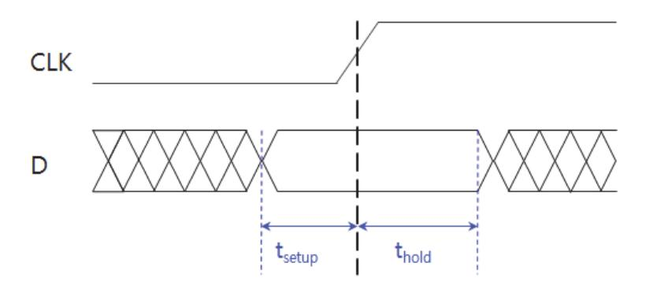

출처: 교육부(2018). 디지털 회로 설계(LM1903060104\_14v3). 한국직업능력개발 원. p.52. [그림 4-1] D 플립플롭의 Setup/Hold 시간

Setup 시간 은 [그림 4-1]와 같이 클럭의 상승 에지 이전에 입력 D가 일정해야 하는 최소 시간이다. 는 클럭의 상승 에지 이후에 입력 D가 일정해야 하는 최소 시간이다. 즉, 사진을 찍을 때와 같이, 클럭의 상승 에지에서 입력 D는 일정해야 한다. 이때 D 값이 일정하지 않고 변하게 되면 Setup/Hold time violation이 발생한다.

- 3. 포스트 시뮬레이션 결과 Setup/Hold violation이 발생하면 이를 수정하고 학습 2 시뮬레이션, 학습 3 합성의 절차를 다시 수행한다.
- 4. 또 소자의 시간 지연에 의해 프리 시뮬레이션과 다른 시간에 출력이 발생하는 타이밍 오류가 발 생할 수 있으니, 출력 결과를 확인하고 검증한다.

### 학습 4 교수·학습 방법

#### 교수 방법

- 데이터 시트, 회로도롤 이해하고 해석할 수 있도록 설명하고, 자주 사용되는 회로의 예를 들 어 설명한다.
- 입출력 시스템 인터페이스를 이해할 수 있도록 인터페이스 방법 등을 소개하고, 응용 부분 별 특징을 설명한다.
- 주어진 HDL을 이해할 수 있도록 실습을 진행한다.
- 레이아웃이 완료된 회로의 검증을 위한 시뮬레이션 환경을 구축할 수 있도록 실습을 포함하 여 교수하고, 합성 및 레이아웃으로부터 추출된 물리적 특성을 반영하여 시뮬레이션을 수행 할 수 있도록 한다.
- 기술 규격서에 의거하여 회로의 성능을 검증할 수 있도록 시뮬레이션 결과를 분석하여 오류 를 수정하고 설계에 반영하는 수업을 진행한다.

#### 학습 방법

- 데이터 시트, 회로도롤 이해하고 해석할 수 있도록 주어진 회로도 분석을 수행하고 토론한 다.
- 입출력 시스템 인터페이스를 이해할 수 있도록 실습을 한다.
- 주어진 HDL을 이해할 수 있도록 자주 사용되는 회로의 HDL 코딩 스타일을 숙지한다.
- 레이아웃이 완료된 회로의 검증을 위한 시뮬레이션 환경을 구축할 수 있도록 학습하고, 반 복 연습한다.
- 합성 및 레이아웃으로부터 추출된 물리적 특성을 반영하여 시뮬레이션을 수행할 수 있도록 실습을 통해 충분히 숙지한다.
- 기술 규격서에 의거하여 회로의 성능을 검증할 수 있도록 학습하고, 실습을 통해 충분히 숙 지한다.
- 포스트 시뮬레이션 결과를 분석하여 오류를 수정하고 설계에 반영할 수 있도록 학습한 후, 실습을 통해 충분히 숙지한다.

## 학습 4 평 가

#### 평가 준거

• 평가자는 학습자가 학습 목표를 성공적으로 달성하였는지를 평가해야 한다.

#### • 평가자는 다음 사항을 평가해야 한다.

| 학습 내용                  | 학습 목표                                                 | 성취수준 |   |   |
|------------------------|-------------------------------------------------------|------|---|---|
|                        |                                                       | 상    | 중 | 하 |
| 포스트<br>시뮬레<br>이션 환경 구축 | - 레이아웃이 완료된 회로의 검증을 위한 시뮬레이션 환경<br>을 구축할 수 있다.        |      |   |   |
|                        | - 합성 및 레이아웃으로부터 추출된 물리적 특성을 반영하<br>여 시뮬레이션을 수행할 수 있다. |      |   |   |
| 포스트<br>시뮬레<br>이션 결과 분석 | - 설계사양서에 의거하여 회로의 성능을 검증할 수 있다.                       |      |   |   |
|                        | - 시뮬레이션 결과를 분석하여 오류를 수정하고 설계에 반<br>영할 수 있다.           |      |   |   |

#### 평가 방법

• 문제 해결 시나리오

|                        |                                   | 성취수준 |   |   |
|------------------------|-----------------------------------|------|---|---|
| 학습 내용                  | 평가 항목                             |      | 중 | 하 |
| 포스트<br>시뮬레<br>이션 환경 구축 | - 레이아웃이 완료된 회로 검증을 위한 시뮬레이션 환경 구축 |      |   |   |
| 포스트<br>시뮬레<br>이션 결과 분석 | - 기술 규격서에 의거한 회로 성능 검증            |      |   |   |

#### • 사례 연구

|                        | 평가 항목                                       | 성취수준 |   |   |
|------------------------|---------------------------------------------|------|---|---|
| 학습 내용                  |                                             | 상    | 중 | 하 |
| 포스트<br>시뮬레<br>이션 환경 구축 | - 합성 및 레이아웃으로부터 추출된 물리적 특성을 반영한<br>시뮬레이션 수행 |      |   |   |
| 포스트<br>시뮬레<br>이션 결과 분석 | - 규격서를 기준으로 설계 제약 사항 적용                     |      |   |   |

• 구두 발표

|                        | 평가 항목                          | 성취수준 |   |   |
|------------------------|--------------------------------|------|---|---|
| 학습 내용                  |                                | 상    | 중 | 하 |
| 포스트<br>시뮬레<br>이션 환경 구축 | - 합성 및 레이아웃으로부터 추출된 물리적 특성 적용  |      |   |   |
| 포스트<br>시뮬레<br>이션 결과 분석 | - 시뮬레이션 결과를 분석하여 오류 수정 및 설계 반영 |      |   |   |

#### 피드백

- 1. 문제 해결 시나리오
- 주어진 문제를 이해하고, 이를 해결해 나가는 과정 및 해결 방법을 재확인한 후, 미흡한 부분은 재 교육할 수 있도록 한다.
- 2. 사례 연구
- 해당 결과를 도출할 수 있는 능력뿐만 아니라, 결과물에 대한 해석 방법에 대해서도 확인하고 평 가한 후, 미진한 부분을 보완할 수 있도록 지도한다.
- 3. 구두 발표
- 평가 항목과 학습 목표를 이해하고, 문제 해결 및 해결 방법을 논리적으로 표현할 수 있는지 평가 한 후, 추가로 보완해야 할 사항에 대해 제시한다.

| 학습 1 | HDL 코딩하기    |
|------|-------------|
| 학습 2 | 시뮬레이션하기     |
| 학습 3 | 디지털 회로 합성하기 |
| 학습 4 | 포스트 시뮬레이션하기 |
|      |             |

학습 5 시스템 레벨 검증하기

## 5-1. 모델 검증

|       | • System C로 하드웨어 모델링을 함으로써 IP(Intellectual Property) 재사용률을 높이고 검증 |
|-------|-------------------------------------------------------------------|
| 학습 목표 | 시간을 단축할 수 있다.                                                     |
|       | • 시스템 설계의 계층화를 통해 설계의 복잡도 증가에 대응하고, 반도체 설계의 생산성 향상을               |
|       | 기할 수 있다.                                                          |
|       | • 시스템 레벨의 설계 변경이 있을 때 하위 레벨의 기존 설계와 기능상 같은지를 동치검사                 |
|       | (Equivalence Checking)하는 데 사용할 수 있다.                              |
|       |                                                                   |

필요 지식 /

#### 숔 모델 검증

점점 복잡해지는 시스템의 설계를 수행하기 위하여, 시스템 설계의 계층화를 통해 설계의 복잡 도 증가에 대응하고, 목표하는 시스템의 알고리즘을 검증하기 위해 C언어와 같은 상위 수준의 언어가 사용된다. 또 RTL로 기술된 HDL을 시뮬레이션 하여 설계된 회로를 검증한다. 이때, 상위 수준의 기능 검증과, 회로 레벨에서의 기능 검증이 독립되는 단점을 극복하고 시스템 설 계 및 검증의 시간을 단축하기 위하여 모델 검증을 수행한다.

SystemC는 이벤트에 기반 한 시뮬레이션을 수행할 수 있는 C++ 라이브러리이며, 설계하고자 하는 시스템을 C++로 기술하여 시스템 설계와 모델링 작업을 단일 언어로 수행할 수 있는 장점이 있다. SystemC의 목표는 RTL을 포함하여 높은 수준의 추상화로 시스템을 모델링하기 위한 설계 방법론으로 기존의 HDL을 대체하기 위한 것은 아니며 반도체의 설계 생산성 향상 을 목표로 하고 있다.

## 수행 내용 / 모델 검증하기

재료·자료

- 회로 설계 규격서
- 회로도
- IP/셀 라이브러리
- 디자인
- 툴 설명서
- 기기(장비 ・ 공구)
  - 설계 서버
  - 데이터 저장 장치
  - HDL 시뮬레이션 툴, 합성 툴
  - System C 검증 툴

#### 안전 ・ 유의 사항

해당 없음

#### 수행 순서

- 숔 모델 검증하기
  - 1. 모델 검증을 위한 시스템 검증 계획을 수립한다.
  - 2. SystemC로 모델링이 요구되는 IP를 모델링한다.
  - 3. 모델링 된 모듈과 테스트 모듈을 연결한다.
  - 4. SystemC를 컴파일 하여 실행하고, 출력 파형을 확인한다.
  - 5. HDL로 기술된 IP와 통합 검증을 위해서는 HDL 시뮬레이터와 인터페이스 하여 설계 검증을 수 행한다.

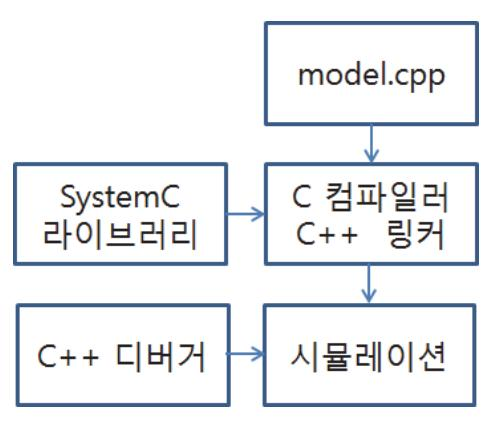

출처: 교육부(2018). 디지털 회로 설계(LM190306 0104\_14v3). 한국직업능력개발원. p.58 [그림 5-1] 모델검증 흐름도

## 5-2. FPGA 검증

|       | • FPGA를 사용해서 반도체 설계의 사전 검증과 소프트웨어 개발을 선행해서 할 수 있다.   |
|-------|------------------------------------------------------|
| 학습 목표 | • 응용 보드를 제작하여 반도체 칩이 제작되기 전에 FPGA를 사용하여 하드웨어/소프트웨어 통 |
|       | 합 에뮬레이션을 하여 시스템 전체 개발 기간을 줄일 수 있다.                   |

## 필요 지식 /

#### 숔 FPGA 검증

FPGA는 프로그래밍 가능한 논리 소자와 내부선이 포함된 반도체 소자이다. 프로그래밍 가능한 논리 요소는 AND, OR, NAND, XOR, NOT 등의 논리 게이트들이며, 데이터 저장을 위한 블록으로 플립플롭이나 메모리를 내장하고 있다. FPGA의 근원은 1980년대 초의 CPLD(Complex Programmable Logic Device)이며, 자일링스의 공동 창립자인 로스 프리맨 (Ross Freeman)은 1984년에 FPGA를 발명하였다. FPGA는 CPLD보다 상대적으로 프로그래 밍 할 수 있는 논리 요소가 많다. 자일링스와 알테라는 두 개의 FPGA 선도회사이며 래티스, 액텔, 아트멜 등의 FPGA 제조사도 특화된 FPGA를 제조하고 있다.

게이트 수준의 기능 검증이 완료된 HDL을 FPGA에 구현하여 실제 하드웨어에서의 기증 검증 을 수행한다. 목표 시스템의 동작을 검증할 수 있는 FPGA 보드를 제작하고, 하드웨어/소프트 웨어 통합 에뮬레이션을 수행하여 시스템 개발 기간을 단축한다. FPGA를 목표로 합성을 수행 하면 합성 결과로부터 기술 규격서에 의거하여 설계 제약 조건을 고려하여 위반 여부를 검사하 고, 설계 검증을 위한 동작 주파수 등의 물리적 특성을 추출할 수 있다.

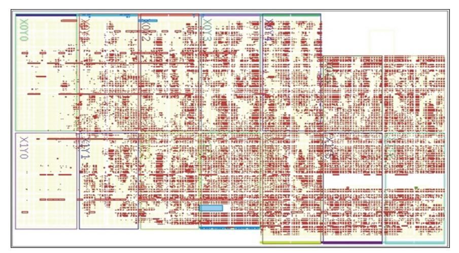

출처: 교육부(2018). 디지털 회로 설계(LM1903060104\_14v3). 한국직업능력개발원. p.60. [그림 5-2] FPGA 배치배선 결과

합성을 진행한 후 Pin Planner에서 입출력 포트를 할당하고 I/O Standard 전압을 결정할 수 있으며 어떤 포트로 할당해야 하는지 Board Manual을 참고하여 확인할 수 있다. Pin 할당 작업이 완료된 후 합성을 진행하여 로직을 배치하고 배선을 완료하면 [그림 5-1]의 결과를 얻 을 수 있다. 마지막으로 생성된 다운로드 파일을 FPGA에 다운로드 하여 기능 검증을 완료한 다.

## 수행 내용 / FPGA 검증하기

#### 재료·자료

- 회로 설계 규격서
- 회로도
- IP/셀 라이브러리
- 디자인
- 툴 설명서

기기(장비 ・ 공구)

- 설계 서버
- 데이터 저장 장치
- HDL 시뮬레이션 툴
- HDL 합성 툴
- System C 검증 툴
- FPGA 합성, 배선 툴
- 안전 ・ 유의 사항
  - 해당 없음

수행 순서

- 숔 FPGA 프로젝트 생성하기 새로운 프로젝트 만들기는 다음과 같이 진행한다.
  - 1. 'File'탭을 누른다.
  - 2. 'New Project Wizard.'를 클릭한다.
  - 3. 생성할 프로젝트가 저장되는 위치를 지정한다.
  - 4. 두 번째 항목에 생성할 프로젝트의 이름을 입력한다.
  - 5. 세 번째 항목에 top-level 디자인의 이름을 입력한다. 두 번째 항목을 진행하면 자동으로 입력된 다.
  - 6.'.v' 파일을 추가할 수 있는 창이 있다. 만약 기존에 만든 '.v' 파일이 있고, 새로 만든 프로젝트에 서도 필요한 경우 기존의 파일 이름을 입력하고 추가할 수 있다. 추가할 파일이 없으면 Next를 누른다.
  - 7. 패밀리 탭에서 디바이스의 패밀리를 선택하고, Package, Pin count, Speed grade를 선택하여 디바이스 종류를 정렬시키고 해당하는 디바이스를 선택한다. 만약 위의 3가지를 모를 경우 Avaliable devices에서 사용하려는 디바이스를 선택한다. 디바이스를 선택하고 Next를 누른다.
  - 8. 시뮬레이션을 실행할 툴과 저장할 포맷을 지정하면 시뮬레이션 파일을 만들 수 있다.
  - 9. 앞에서 진행한 결과를 확인할 수 있는 Summary 창에서 프로젝트가 저장되는 경로, 프로젝트 이 름, FPGA의 이름과 종류 등 설정을 제대로 했는지 확인할 수 있다. 설정된 것을 확인 한 후에, Finish를 누른다.
- 숕 FPGA를 위한 HDL 합성 및 레이아웃하기

HDL 파일을 컴파일 하는 과정은 다음과 같이 진행한다.

- 1. 'Processing' → 'Start Compilation'을 클릭한다.
- 2. 작성한 코드에 오류가 발생하지 않는다면 컴파일이 정상적으로 완료될 것이다. 만약 오류가 발생 하여 컴파일이 되지 않으면 오류를 수정하고 다시 컴파일을 진행한다. 컴파일이 완료된 후 포트에 해당하는 FPGA의 핀을 할당하는 과정은 다음과 같다.
  - (1) 설계한 모듈을 FPGA에 다운로드 하기 전에 입력, 출력, 입출력 포트를 FPGA의 해당하는 핀에 설정한다.

(2)'Assignments' → 'Pin Planner'를 클릭한다.

(3) 핀 설정을 하기 위해서는 Location과 I/O Standard를 지정한다. 각 핀의 Location과 I/O

Standard는 각 개발 보드의 유저 매뉴얼을 통해 확인할 수 있다.

(4) 핀 설정 이후에 컴파일을 진행한다.

#### 숖 FPGA에 설계 다운로드하기

핀 설정과 컴파일이 모두 완료된 후, 개발 보드에 '.sof'파일을 다운로드 하는 과정은 다음과 같다.

- 1. 컴파일이 완료된 후 'Program Device'를 더블클릭한다.
- 2. 오른쪽 Programmer 창이 나오면, USB 드라이버를 설정한다.
- 3. '제어판' → '장치관리자'에서 USB-Blaster 드라이버를 확인한다.
- 4. USB-Blaster 드라이버가 설치되어 있지 않다면, '드라이버 소프트웨어 업데이트'를 클릭한다.
- 5. FPGA 설계 툴이 설치된 곳에서 USB-Blaster의 경로를 지정한다.
- 6. USB-Blaster가 설치가 된 후, 'Hardware Setup..' → 'USB-Blaster'를 선택하고 Close를 클 릭한다.
- 7. 'Start'버튼을 클릭한다.
- 8. 만약 '.sof'파일이 없다면, 'Add File...'을 클릭하여 '.sof'파일을 불러온다. ('.sof'파일의 기본 경 로는 <project\_dir>/output\_files/이다.)

#### 숗 7 세그먼트 구동회로 동작 검증하기

1. 학습 5-2에서 합성 완료된 7 세그먼트 구동 회로를 다운로드 하여 동작 검증을 수행한다. [그림 5-2]는 7-세그먼트 디코더의 동작 검증 결과를 보인다. 핀 맵 지정을 통해서 설정한 4개의 스위치를 차례대로 ON, OFF 시키면서 7-세그먼트에서 0부터 F까지 16진수 숫자가 출력되는 것을 확인할 수 있다.

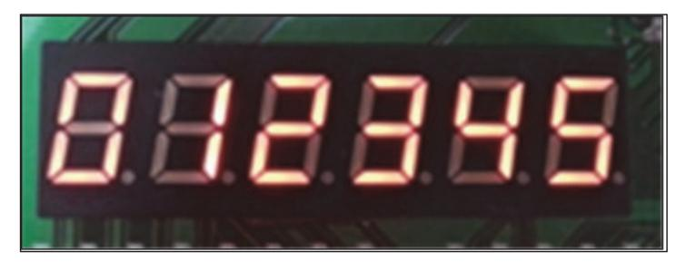

출처: 교육부(2018). 디지털 회로 설계(LM1903060104\_14v3). 한국직업능 력개발원. p.63. [그림 5-3] 7 세그먼트 드라이버 동작 검증 결과

### 학습 5 교수·학습 방법

#### 교수 방법

- System C로 하드웨어 모델링을 함으로써 IP 재사용률을 높일 수 있도록 설명하고, 자주 사용되는 IP를 포함하여 설명한다.
- 디지털 회로의 검증 시간을 단축할 수 있는 방법론을 포함하여 시스템 설계의 계층화를 통 해 설계 복잡도 증가에 대응하도록 교수한다. 실제 설계 예를 제시한다.
- 시스템 레벨의 설계 변경이 있을 때, 하위 레벨의 기존 설계와 기능상 같은지 동치검사를 할 수 있도록 예를 들어 중요성을 설명한다.
- FPGA를 사용해서 반도체 설계의 사전 검증과 소프트웨어 개발을 선행하는 설계 밥법론의 장점을 이해하고, 설계 시 고려해야 하는 사항을 포함하여 안내한다.
- 응용 보드를 제작하여 반도체 칩이 제작되기 전에 FPGA를 사용하여 하드웨어/소프트웨어 통합 에뮬레이션을 하여 시스템 전체 개발 기간을 줄일 수 있도록 설명하고, 실습을 설계 능력을 함양 할 수 있도록 지도한다.

#### 학습 방법

- 시스템 설계의 계층화를 통해 설계 복잡도 증가에 대응하도록 학습하고, 실습을 통해 충분 히 숙지한다.
- 계층화된 설계를 이해할 수 있도록 모델 검증을 통해 반도체 설계의 생산성 향상을 기할 수 있도록 실습을 한다.
- 시스템 레벨의 설계 변경이 있을 때 하위 레벨의 기존 설계와 기능상 같은지 동치검사를 할 수 있도록 실습을 통해 충분히 숙지한다.
- FPGA를 사용해서 반도체 설계의 사전 검증과 소프트웨어 개발을 선행해서 할 수 있도록 실습을 통해 충분히 숙지한다.
- 응용 보드를 제작하여 반도체 칩이 제작되기 전에 FPGA를 사용하여 하드웨어/소프트웨어 통합 에뮬레이션을 하여 시스템 전체 개발 기간을 줄일 수 있도록 학습하여 본 학습의 이해 도를 높인다.

## 학습 5 평 가

#### 평가 준거

• 평가자는 학습자가 학습 목표를 성공적으로 달성하였는지를 평가해야 한다.

#### • 평가자는 다음 사항을 평가해야 한다.

|         | 학습 목표                                                                                          | 성취수준 |   |   |
|---------|------------------------------------------------------------------------------------------------|------|---|---|
| 학습 내용   |                                                                                                | 상    | 중 | 하 |
|         | - System C로 하드웨어 모델링을 함으로써 IP(Intellectu<br>al Property) 재사용률을 높이고 검증 시간을 단축할 수<br>있다.         |      |   |   |
| 모델 검증   | - 시스템 설계의 계층화를 통해 설계의 복잡도 증가에 대응<br>하고, 반도체 설계의 생산성 향상을 기할 수 있다.                               |      |   |   |
|         | - 시스템 레벨의 설계 변경이 있을 때 하위 레벨의 기존 설<br>계와 기능상 같은지를 동치검사 (Equivalence Checkin<br>g)하는 데 사용할 수 있다. |      |   |   |
|         | - FPGA를 사용해서 반도체 설계의 사전 검증과 소프트웨<br>어 개발을 선행해서 할 수 있다.                                         |      |   |   |
| FPGA 검증 | - 응용 보드를 제작하여 반도체 칩이 제작되기 전에 FPGA<br>를 사용하여 하드웨어/소프트웨어 통합 에뮬레이션을 하<br>여 시스템 전체 개발 기간을 줄일 수 있다. |      |   |   |

#### 평가 방법

#### • 문제 해결 시나리오

|         |                                                                              | 성취수준 |   |   |  |
|---------|------------------------------------------------------------------------------|------|---|---|--|
| 학습 내용   | 평가 항목                                                                        | 상    | 중 | 하 |  |
| 모델 검증   | - System C로 하드웨어 모델링을 함으로써 IP(Intellectu<br>al Property) 재 사용률을 높이고 검증 시간 단축 |      |   |   |  |
| FPGA 검증 | - FPGA를 사용해서 반도체 설계의 사전 검증과 소프트웨<br>어 개발                                     |      |   |   |  |

• 사례 연구

|         |                                                                                        |  | 성취수준 |   |
|---------|----------------------------------------------------------------------------------------|--|------|---|
| 학습 내용   | 평가 항목                                                                                  |  | 중    | 하 |
| 모델 검증   | - 시스템 설계의 계층화를 통해 설계의 복잡도 증가에 대<br>응하고, 반도체 설계의 생산성 향상                                 |  |      |   |
| FPGA 검증 | - 응용 보드를 제작하여 반도체 칩이 제작되기 전에<br>FPGA를 사용하여 하드웨어/소프트웨어 통합 에뮬레이<br>션을 하여 시스템 전체 개발 기간 단축 |  |      |   |

#### • 구두 발표

|         | 평가 항목                                                                   | 성취수준 |   |   |
|---------|-------------------------------------------------------------------------|------|---|---|
| 학습 내용   |                                                                         | 상    | 중 | 하 |
| 모델 검증   | - 시스템 레벨의 설계 변경 시 하위 레벨의 기존 설계와<br>기능상 같은지를 동치검사 (Equivalence Checking) |      |   |   |
| FPGA 검증 | - FPGA를 사용한 검증방법 숙지                                                     |      |   |   |

#### 피드백

| 1. 문제 해결 시나리오<br>- 주어진 문제를 이해하고, 이를 해결해 나가는 과정 및 해결 방법을 재확인한 후, 미흡한 부분은<br>재교육할 수 있도록 한다.           |
|-----------------------------------------------------------------------------------------------------|
| 2. 사례 연구<br>- 해당 결과를 도출할 수 있는 능력뿐만 아니라, 결과물에 대한 해석 방법에 대해서도 확인하고 평<br>가한 후, 미진한 부분을 보완할 수 있도록 지도한다. |
| 3. 구두 발표<br>- 평가 항목과 학습 목표를 이해하고, 문제 해결 및 해결 방법을 논리적으로 표현할 수 있는지 평가                                 |

한 후, 추가로 보완해야 할 사항에 대해 제시한다.

- ∙ 교육부(2018). 디지털 회로 설계(LM1903060104\_14v3). 한국직업능력개발원.
- ∙ 김재철(2006). 『ISE를 이용한 VERILOG HDL 및 FPGA 실습』. 홍릉과학출판사.
- ∙ 김혁(2003). 『Real Xilinx FPGA WORLD』. 엔트미디어.
- ∙ 김혁, 정면진 공저(2008). 『Real Xilinx Embedded World 2008』. 앤트미디어.
- ∙ 노명래(1999). 『XILINX FPGA를 이용한 DIGITAL SYSTEM 설계 실습 및 PROGRAMMABLE ASIC DESIGN』. OHM사.
- ∙ 노명래(2002). 『ALTERA CPLD를 이용한 디지털 시스템 설계실습 및 PROGRAMMABLE ASIC DESIGN』. OHM사.
- ∙ 박군종, 정성순, 김용규 공저(2014). 『ALTERA QUARTUS II를 이용한 디지털 시스템 설계 (comboll-SE)』. 생능출판사.
- ∙ 박군종, 정성순, 김용규 공저(2014). 『ALTERA QUARTUS II와 디지털 응용회로 설계』. 생능출판사.
- ∙ 박인학, 양세양, 정연모, 문대철 공저(2010). 『Verilog 디지털 논리 회로 설계 실험』. 한산.
- ∙ 박인학(2013). 『Flowrian을 이용한 Verilog HDL 논리 회로 설계 및 검증 실험』. 좋은땅.
- ∙ 박인한(2005). 『VERILOG HDL 기초 및 응용 설계』. 홍릉과학출판사.
- ∙ 백주기, 이상훈 공저(2008). 『디지털 논리 회로와 집적 회로 설계 : ALTERA QUARTUS II & MAX+PLUS II를 이용한』. 성안당.
- ∙ 신경욱(2013). 『Verilog HDL을 이용한 디지털 시스템 설계 실습』. 카오스북.
- ∙ 이강 장경선 공저(2009). 『VHDL 사용자를 배려한 VERILOG 2001 디지털시스템 설계 : XILINX ISE와 MODELSIM 실습으로 배우는 VERILOG HDL 자습서』. 홍릉과학출판사.
- ∙ 이승호(2009). 『XILINX ISE WEBPACK을 사용한 디지털 논리회로 설계』. 한티미디어.
- ∙ 이승호(2011). 『ALTERA Quartus II와 ModelSim을 사용한 VERILOG HDL 논리회로 설계』. 한티미 디어.
- ∙ 이승호, 박용순, 박군종, 이주현 공저(2013). 『ALTERA MAX+PLUS II를 사용한 디지털 논리회로 설계 : 기초와 활용편』. 생능출판사.
- ∙ 이제현, 한승수 공저(2005). 『VHDL 및 Verilog를 이용한 FPGA 로봇 설계 실습』. 홍릉과학출판사.
- ∙ 이행우(2010). 『Verilog HDL 회로 설계 실습』. 21세기사.
- ∙ 차영배(2013). 『Verilog HDL』. 다다미디어.

69

- ∙ 홍춘표, 양진모, 박철영 공저(2006). 『디지털 시스템 설계 및 활용 : Xilinx FPGA를 이용한』. 북스힐.
- ∙ Palnitkar([2003] 2005). 『Verilog HDL 디지털 설계와 합성의 길잡이(Verilog HDL : a guide to digital design and synthesis)』. 장훈(역) 홍릉과학출판사.
- ∙ Altera Software Installation and Licensing Manual (PDF)(2015.11.2.) http://www.altera.com/literature/manual/quartus\_install.pdf. 2015. 11. 2 인출
- ∙ Getting Started with Quartus II Simulation Using the Modelsim Altera Software(2011. 6).

http://www.altera.com/literature/ug/ug\_gs\_msa\_qii.pdf. 2015. 9. 1 인출

- ∙ Introduction to the Quartus II Software Altera(n.d). http://www.altera.com/literature/manual/archives/intro\_to\_quartus2.pdf. 2015. 9. 1 인출
- ∙ Terasic All FPGA Main Boards Cyclone IV Altera DE2-115 Development and Education Board(2013.11.21.)http://www.terasic.com.tw/cgi-bin/page/archive.pl?Language=Englis h&CategoryNo=139&No=502&PartNo=4. 2015. 8. 20 인출
- ∙ Terasic All FPGA Main Boards Cyclone IV DE0-Nano Development and Education Board(2012. 12. 5.) http://www.terasic.com.tw/cgi-bin/page/archive.pl?Language=English&CategoryNo=13 9&No=593&PartNo=4

| NCS학습모듈 개발이력 |                                      |     |                 |  |
|--------------|--------------------------------------|-----|-----------------|--|
| 발행일          | 2015년 12월 31일                        |     |                 |  |
| 세분류명         | 반도체개발(19030601)                      |     |                 |  |
| 개발기관         | 한국반도체산업협회, 한국직업능력개발원                 |     |                 |  |
|              | 이병철(㈜비드앤마이크로)*                       |     | 권태우(극동대학교)      |  |
|              | 김경섭(여주대학교)                           |     | 김병윤(전. 삼성전자㈜)   |  |
|              | 김문호(씨지아이파트너즈)                        |     | 민종수(엠텍비젼㈜)      |  |
|              | 안태원(동양미래대학교)                         |     | 이준성(인덕대학교)      |  |
|              | 유광동(전 동부하이텍)                         |     | 이호덕(㈜에이치디테크놀로지) |  |
|              | 이승은(서울과학기술대학교)                       |     |                 |  |
|              | 이제현(동양미래대학교)                         |     |                 |  |
| 집필진          | 이혁(㈜플렉스컴)                            | 검토진 |                 |  |
|              | 임종철(LG전자㈜)                           |     |                 |  |
|              | 임황규(성결대학교)                           |     |                 |  |
|              | 정종식(㈜e-wbm연구소)                       |     |                 |  |
|              | 천형용(충북반도체고등학교)                       |     |                 |  |
|              | 홍상진(명지대학교)                           |     |                 |  |
|              | 홍진균(전 ㈜LG실트론)                        |     | *표시는 대표집필자임     |  |
| 발행일          | 2018년 12월 31일                        |     |                 |  |
| 학습모듈명        | 디지털 회로 설계(LM1903060104_14v3)         |     |                 |  |
| 개발기관         | 한국직업능력개발원                            |     |                 |  |
| 발행일          | 2024년 12월 31일                        |     |                 |  |
| 학습모듈명        | 디지털 회로 설계(LM1903060104_23v5)         |     |                 |  |
| 개발기관         | 수원과학대학교 산학협력단(개발책임자: 윤창용), 한국직업능력연구원 |     |                 |  |

| 디지털 회로 설계(LM1903060104_23v5)                                                                             |               |  |
|----------------------------------------------------------------------------------------------------------|---------------|--|
| 저작권자                                                                                                     | 교육부           |  |
| 연구기관                                                                                                     | 한국직업능력연구원     |  |
| 발행일                                                                                                      | 2024. 12. 31. |  |
| ※ 이 학습모듈은 자격기본법 시행령(제8조 국가직무능력표준의 활용)에 의거하여 개발하였으며,<br>NCS통합포털사이트(http://www.ncs.go.kr)에서 다운로드 할 수 있습니다. |               |  |

