# NCS학습모듈 반도체 제조 공정 개발

# LM1903060106\_15v4

NCS 학습모듈은 교육훈련기관에서 출처를 명시하고 교육적 목적으로 활용할 수 있습니다. 다만 NCS 학습모듈에는 국가(교육부)가 저작재산권 일체를 보유하지 않은 저작물들(출처가 표기되어 있는 도표, 사진, 삽화, 도면 등)이 포함되어 있으므로 이러한 저작물들의 변형, 복제, 공연, 배포, 공중 송신 등과 이러한 저작물들을 활용한 2차 저작물의 생성을 위해서는 반드시 원작자의 동의를 받아야 합니다.

# NCS 학습모듈의 이해

※ 본 학습모듈은 「NCS 국가직무능력표준」사이트(http://www.ncs.go.kr) 에서 확인 및 다운로드 할 수 있습니다.

### (1) NCS 학습모듈이란?

- 국가직무능력표준(NCS: National Competency Standards)이란 산업현장에서 직무를 수행하기 위해 요구되는 지식·기술·소양 등의 내용을 국가가 산업부문별·수준별로 체계화한 것으로 산업현장의 직무를 성공적으로 수행하기 위해 필요한 능력(지식, 기술, 태도)을 국가적 차원에서 표준화한 것을 의미합니다.
- 국가직무능력표준(이하 NCS)이 현장의 '직무 요구서'라고 한다면, NCS 학습모듈은 NCS의 능력단위를 교육훈련에서 학습할 수 있도록 구성한 '교수·학습 자료'입니다. NCS 학습모듈은 구체적 직무를 학습할 수 있도록 이론 및 실습과 관련된 내용을 상세하게 제시하고 있습니다.

● NCS 학습모듈은 다음과 같은 특징을 가지고 있습니다.

첫째, NCS 학습모듈은 산업계에서 요구하는 직무능력을 교육훈련 현장에 활용할 수 있도록 성취목표와 학습의 방향을 명확히 제시하는 가이드라인의 역할을 합니다. 둘째, NCS 학습모듈은 특성화고, 마이스터고, 전문대학, 4년제 대학교의 교육기관 및 훈련기관, 직장교육기관 등에서 표준교재로 활용할 수 있으며 교육과정 개편 시에도 유용하게 참고할 수 있습니다. ● NCS와 NCS 학습모듈 간의 연결 체제를 살펴보면 아래 그림과 같습니다.

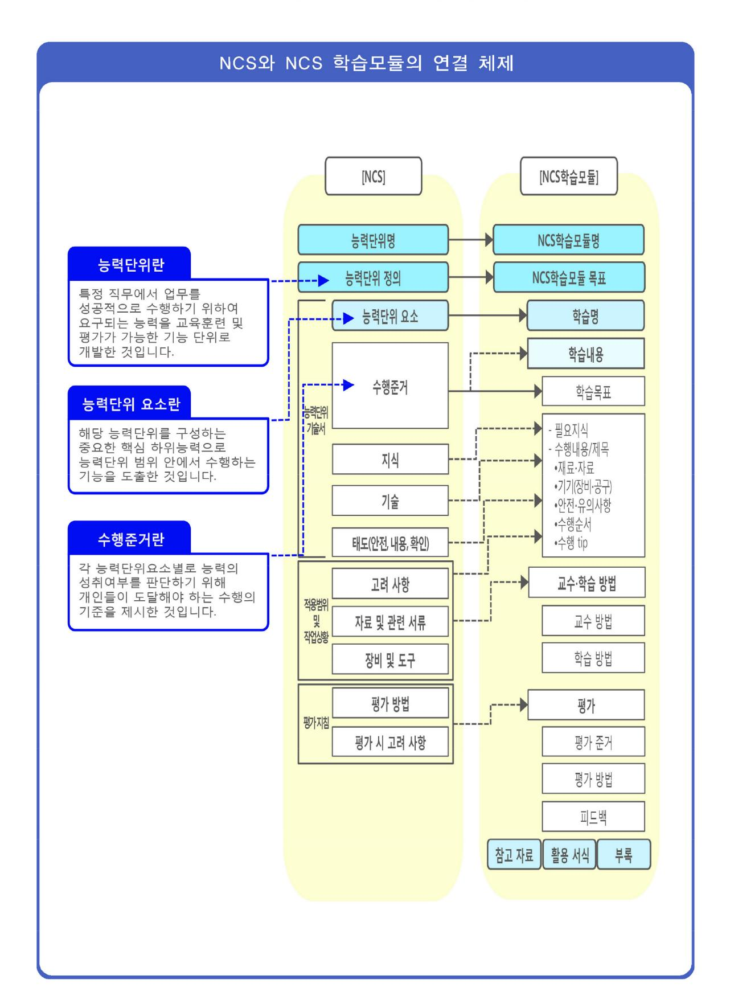

### (2) NCS 학습모듈의 체계

NCS 학습모듈은 1.학습모듈의 위치 , 2.학습모듈의 개요 , 3.학습모듈의 내용 체계 , 4.참고 자료 ,
 5.활용 서식/부록 으로 구성되어 있습니다.

### 1. NCS 학습모듈의 위치

NCS 학습모듈의 위치는 NCS 분류 체계에서 해당 학습모듈이 어디에 위치하는지를 한 눈에
 볼 수 있도록 그림으로 제시한 것입니다.

예시 : 이 · 미용 서비스 분야 중 네일미용 세분류

NCS-학습모듈의 위치

| 대분류 | 이용 · 숙박 · 여행 · 오락 · 스포츠 |          |  |
|-----|-------------------------|----------|--|
| 중분류 | 이・미용                    |          |  |
| 소분류 |                         | 이 미용 서비스 |  |

| 세 <del>분류</del> |             |           |
|-----------------|-------------|-----------|
| 헤어미용            | 능력단위        | 학습모듈명     |
| 피부미용            | 네일 샵 위생 서비스 | 네일숍 위생서비스 |
| 메이크업            | 네일 화장물 제거   | 네일 화장물 제거 |
| 네일미용            | 네일 기본 관리    | 네일 기본관리   |
| 이용              | 네일 랩        | 네일 랩      |
|                 | 네일 팁        | 네일 팁      |
|                 | 젤 네일        | 젤 네일      |
|                 | 아크릴릭 네일     | 아크릴 네일    |
|                 | 평면 네일아트     | 평면 네일아트   |
|                 | 융합 네일아트     | 융합 네일아트   |
|                 | 네일 샵 운영관리   | 네일숍 운영관리  |

### 학습모듈은

NCS 능력단위 1개당 1개의 학습모듈 개발을 원칙으로 합니다. 그러나 필요에 따라 고용 단위 및 교과단위를 고려하여 능력단위 몇 개를 묶어서 1개의 학습모듈로 개발할 수 있으며, NCS 능력단위 1개를 여러 개의 학습 모듈로 나누어 개발할 수도 있습니다.

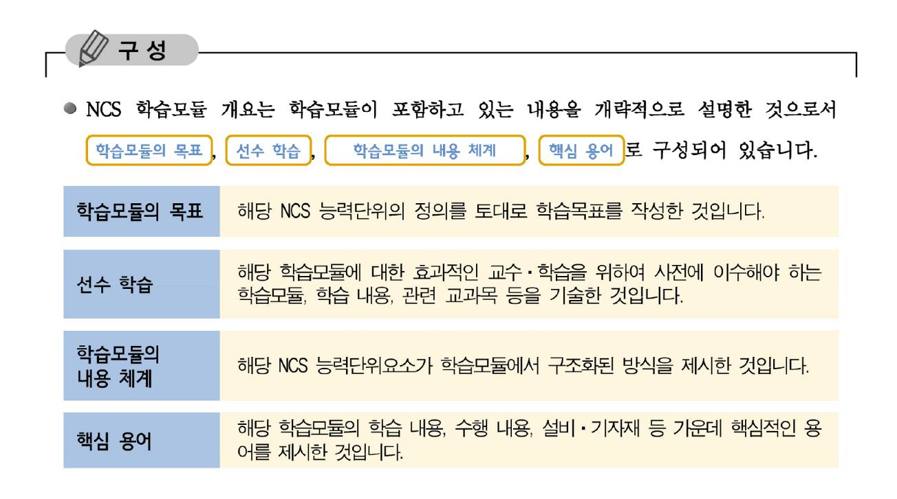

- 🔾 활용안내

예시 : 네일미용 세분류의 '네일 기본관리' 학습모듈

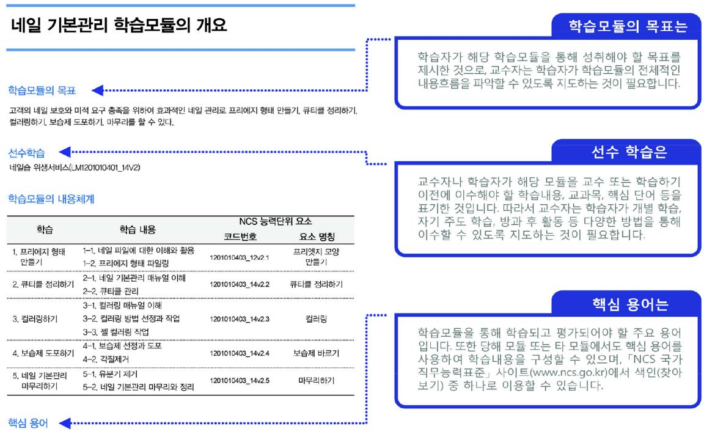

프리에지, 니퍼, 퓨셔, 폴리시, 네일 파일, 스퀘어형, 스퀘어 오프형, 라운드형, 오발형, 포인트형

### 3. NCS 학습모듈의 내용 체계

와 광택을 위해 톱코트를 도포하다. 네일 보강제(Nail Strengthner)를 바를 시에는 베이스코

트를 도포하기 전에 사용한다

|                                                                                                          | 교수·학습 방법은                                                                                            |
|----------------------------------------------------------------------------------------------------------|------------------------------------------------------------------------------------------------------|
| 학습3 교수·학습 방법 ◀                                                                                           | 학습목표를 성취하는데 필요한 교수 방법과 학습 방법 을 제시하였습니다.                                                           |
| 교수 방법 🚽                                                                                                  | 교수 방법은                                                                                               |
| <ul> <li>컬러링 제품의 성분과 칼라별 점도의 차이, 베이스코트와 톱코트의 역할, 폴리시 잡는 방법, 큐어링 시간 등의 내용을 화면 자료와 함께 설명한다.</li> </ul> | 해당 학습활동에 필요한 학습내용, 학습내용과 관련된 학습 자료명, 자료 형태, 수행내용의 진행 방식 등에 대하여 제시                                 |
| <ul> <li>서식지를 활용하여 네일 컬러링 방법을 그림으로 그려 보게 한 뒤, 다양한 컬러링의 매뉴얼을 그려서 숙지하도록 한다.</li> </ul>                 | 하였습니다. 또한 학습자의 수업참여도를 제고하기 위한 방 법 및 수업진행상 유의사항 등도 제시하였습니다. 선수학습 이 필요한 학습을 학습자가 숙지하였는지 교수자가 확인하 |
| • 젤 컬러링 시 주의사항을 계속 숙지시키도록 하며, 큐어링 시간에 대해 작성하도록 한다.                                                       | 는 과정으로 활용할 수도 있습니다.                                                                                  |
| 학습 방법                                                                                                    | 학습 방법은                                                                                               |
| • 컬러링을 위한 재료의 필요성과 사용방법을 숙지하고 컬러링 메뉴얼 과정에 맞추어 작업 내용을 이해한다.                                            | 해당 학습활동에 필요한 학습자의 자기주도적 학습 방법 을 제시하였습니다. 또한 학습자가 숙달해야 할 실기능력 과 학습과정에서 주의해야 할 사항 등으로 제시하였습니     |
| • 컬러링의 다양성에 대한 용어를 숙지하고 진행과정에 맞추어 내용을 작업한다.                                                              | 다. 학습자가 학습을 이수하기 전에 반드시 숙지해야 할 기본 지식을 학습하였는지 스스로 확인하는 과정으로 활                                      |
| • 곌 컬러링 시 적합한 큐어링 시간을 선택해서 큐어링 해본다.                                                                      | 용할 수 있습니다.                                                                                           |

# [NCS-학습모듈의 위치]

| 대분류 | 전기·전자 |        |       |
|-----|-------|--------|-------|
| 중분류 |       | 전자기기개발 |       |
| 소분류 |       |        | 반도체개발 |

| 세분류   |                 |                 |
|-------|-----------------|-----------------|
| 반도체개발 | 능력단위            | 학습모듈명           |
| 반도체제조 | 반도체 제품 기획       | 반도체 제품 기획       |
| 반도체장비 | 반도체 아키텍처 설계     | 반도체 아키텍처 설계     |
| 반도체재료 | 아날로그 회로 설계      | 아날로그 회로 설계      |
|       | 디지털 회로 설계       | 디지털 회로 설계       |
|       | 레이아웃 설계         | 레이아웃 설계         |
|       | 반도체 제조 공정 개발    | 반도체 제조 공정 개발    |
|       | 패키지 제품 설계       | 패키지 제품 설계       |
|       | 패키지 조립 공정 개발    | 패키지 조립 공정 개발    |
|       | 반도체 제품 기능·성능 검증 | 반도체 제품 기능·성능 검증 |
|       | 반도체 신뢰성 평가      | 반도체 신뢰성 평가      |

| 학습모듈의 개요                       | 1   |
|--------------------------------|-----|
| 학습 1. 공정 흐름도 해석하기              |     |
| 1-1. 웨이퍼 종류와 특성 해석             | 3   |
| 1-2. MOSFET 구조 해석              | 10  |
| 1-3. 반도체 제조 공정 흐름도 파악          | 18  |
| • 교수・학습 방법                     | 43  |
| • 평가                           | 44  |
| 학습 2. 단위 소자 개발하기               |     |
| 2-1. 소자 측정 및 특성 데이터 평가 해석      | 46  |
| 2-2. 소자 측정 장비 파악               | 52  |
| • 교수・학습 방법                     | 55  |
| • 평가                           | 56  |
| 학습 3. 공정 소재 평가하기               |     |
| 3-1. 공정 소재 측정 및 특성 평가          | 58  |
| 3-2. 공정 소재 평가 장비 구성 및 동작 원리 파악 | 86  |
| • 교수・학습 방법                     | 94  |
| • 평가                           | 95  |
| 학습 4. 공정 장비 운용하기               |     |
| 4-1. 단위 공정, 장비 확인              | 98  |
| 4-2. 각 공정 장비 구성 및 동작 원리 파악     | 121 |

| • 교수・학습 방법                   | 141 |
|------------------------------|-----|
| • 평가                         | 143 |
| 학습 5. 계측 운용 및 평가하기           |     |
| 5-1. 표준 계측 및 분석 수행           | 145 |
| 5-2. 데이터 특성 평가 및 문서 작성       | 153 |
| • 교수・학습 방법                   | 157 |
| • 평가                         | 159 |
| 학습 6. 단위 공정 최적화하기            |     |
| 6-1. 공정 개선 요구 사항별 특성 분류      | 161 |
| 6-2. 공정 특성 평가                | 167 |
| 6-3. 공정 최적화 방법 설계 및 각종 센서 활용 | 172 |
| • 교수・학습 방법                   | 179 |
| • 평가                         | 181 |
|                              |     |
|                              |     |

**참고 자료 184**

# 반도체 제조 공정 개발 학습모듈의 개요

### 학습모듈의 목표

설계된 반도체 회로를 웨이퍼에 구현하기 위하여 공정 흐름도 해석 및 단위 소자 개발을 통해 공정 장비 운용, 계측 운용 및 평가, 단위 공정 최적화를 할 수 있다.

### 선수학습

반도체 테스트 장비 운영(1903060206\_14v3), 반도체 장비시설 운영(1903060208\_14v3), 반도체 장 비 시제품 성능 평가(1903060311\_14v1), 반도체 장비 전장 조립(1903060310\_14v1), 반도체 재료 안전관리(1903060411\_14v1)

### 학습모듈의 내용체계

|                 |                                                 | NCS 능력단위 요소       |              |  |
|-----------------|-------------------------------------------------|-------------------|--------------|--|
| 학습              | 학습 내용                                           | 코드번호              | 요소 명칭        |  |
|                 | 1-1. 웨이퍼 종류와 특성 해석                              |                   |              |  |
| 1. 공정 흐름도 해석하기  | 1-2. MOSFET 구조 해석                               | 1903060106_15v4.1 | 공정 흐름도 해석하기  |  |
|                 | 1-3. 반도체 제조 공정 흐름도 파악                           |                   |              |  |
|                 | 2-1. 소자 측정 및 특성 데이터 평가                          |                   |              |  |
| 2. 단위 소자 개발하기   | 해석                                              | 1903060106_15v4.2 | 단위 소자 개발하기   |  |
|                 | 2-2. 소자 측정 장비 파악                                |                   |              |  |
|                 | 3-1. 공정 소재 측정 및 특성 평가                           |                   |              |  |
| 3. 공정 소재 평가하기   | 3-2. 공정 소재 평가 장비 구성 및 1903060106_15v4.3         |                   | 공정 소재 평가하기   |  |
|                 | 동작 원리 파악                                        |                   |              |  |
|                 | 4-1. 단위 공정, 장비 확인                               |                   |              |  |
| 4. 공정 장비 운용하기   | 4-2. 각 공정 장비 구성 및 동작 1903060106_15v4.4 원리 파악 |                   | 공정 장비 운용하기   |  |
|                 | 5-1. 표준 계측 및 분석 수행                              |                   |              |  |
| 5. 계측 운용 및 평가하기 | 5-2. 데이터 특성 평가 및 문서 작성                          | 1903060106_15v4.5 | 계측 운용 및 평가하기 |  |
| 6. 단위 공정 최적화하기  | 6-1. 공정 개선 요구 사항별 특성 분류                      |                   |              |  |
|                 | 6-2. 공정 특성 평가                                   | 1903060106_15v4.6 | 단위 공정 최적화하기  |  |
|                 | 6-3. 공정 최적화 방법 설계 및 각 종 센서 활용                |                   |              |  |

### 핵심 용어

반도체 공정, 반도체 소자, 반도체 계측, 반도체 공정 흐름도, 반도체 장비, 공정 소재, MOSFET

# 학습 1 공정 흐름도 해석하기

| 학습 2 | 단위 소자 개발하기   |
|------|--------------|
| 학습 3 | 공정 소재 평가하기   |
| 학습 4 | 공정 장비 운용하기   |
| 학습 5 | 계측 운용 및 평가하기 |
| 학습 6 | 단위 공정 최적화하기  |
|      |              |

# **1-1.** 웨이퍼 종류와 특성 해석

학습 목표 • 웨이퍼 종류와 특성을 해석하고 설명할 수 있다.

## 필요 지식 /

실리콘 웨이퍼(silicon wafer) 개요

반도체에 사용되는 실리콘은 지구에 풍부한 원소이고, 지구 지각의 약 25%를 구성하고 있 다. 일반적으로 산화물실리콘(SiO₂)으로 모래, 암석, 광물 등의 형태로 존재하며 반도체 산업에 매우 안정적으로 공급할 수 있는 재료일 뿐만 아니라 독성이 전혀 없어 환경적으 로 매우 우수한 재료이다.

또 실리콘으로 만들어진 실리콘 웨이퍼는 넓은 에너지 밴드(energy band-gap:1.2eV)를 가 지고 있기 때문에 비교적 고온(약 200℃ 정도까지)에서도 소자가 동작할 수 있는 장점이 있다.

실리콘의 녹는점은 1412℃로 실리콘이 높은 온도의 공정을 견딜 수 있어 응용성과 신뢰도 가 높은 상태에서 반도체가 작동할 수 있다는 장점이 있다. 반도체 재료로 실리콘을 이용 하는 중요한 이유는 실리콘 표면 위의 실리콘 산화막이 자연적으로 성장할 수 있는 능력 을 갖고 있기 때문이다. SiO₂는 외부의 오염으로부터 실리콘을 보호하기 위해서 우수한 화학 장벽으로 동작하는 양질의 안정적인 절연체이다. 전기적인 안정도는 직접 회로에서 인접한 도체 사이의 누설이 발생하지 않도록 해주기 때문에 대단히 중요하다.

암석에서 추출된 실리콘은 정제 과정을 거쳐 고순도 다결정 실리콘으로 형성되고 이를 단 결정 실리콘 웨이퍼로 제조하는 장비는 오늘날 전체 산업 분야에서 없어서는 안 될 중요 한 부품이 되었다. 특히 각종 전자 제품, 사업 자동화 기계, 컴퓨터, 인공위성 등 오늘날

### 전 산업 분야에 영향을 미치고 있다.

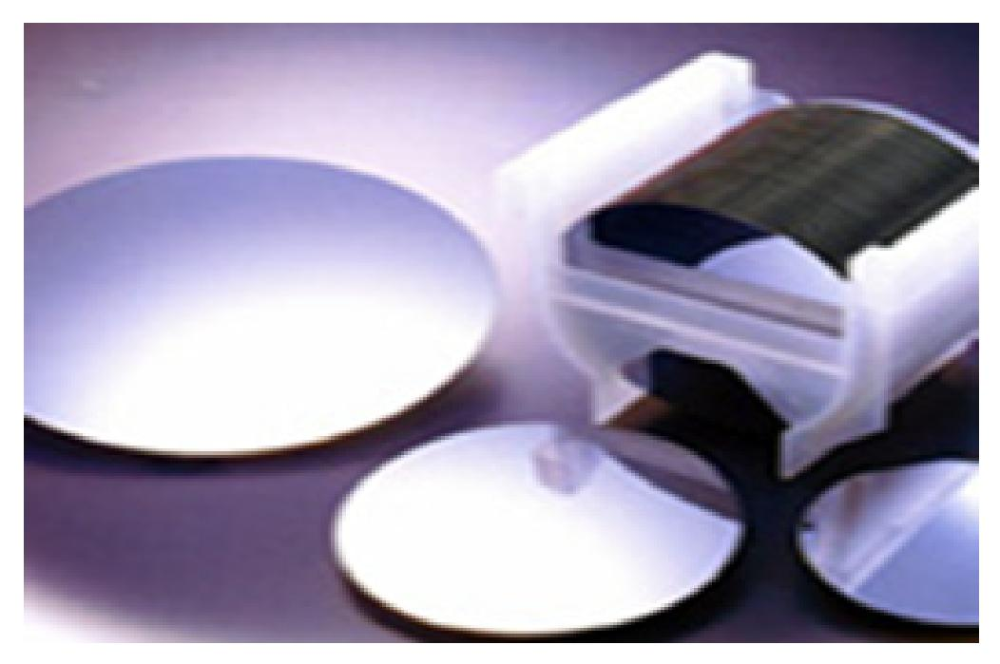

[그림 1-1] 실리콘 웨이퍼

웨이퍼의 종류

웨이퍼 종류는 여러 가지로 분류할 수 있는데, 첨가 불순물 종류에 따른 분류, 웨이퍼 직 경의 크기에 따른 분류, 추가적인 공정에 의한 분류, 웨이퍼 결정 성장 방향에 따른 분류 등을 할 수 있다.

1. 웨이퍼의 종류

- (1) 반도체 첨가되는 불순물 재료에 따라 분류
  - (가) N-형 실리콘(n-type silicon): 5가 원소 --> 인(P). 안티몬(Sb) , 비소(As) 도펀트 (dopant) 사용
  - (나) P 형 실리콘 (P-type silicon) : 3가 원소 --> 붕소 (B) 도펀트(dopant) 사용
- (2) 결정 성장 방향에 따른 분류
  - (가) 결정 성장 방향에 따라 <100>, <111>로 나눌 수 있다.
  - (나) 웨이퍼가 장비 안에서의 자동화된 조작과 방향 표시를 위해 편평한 모양과 넛 치(notch) 모양으로 가공된다.

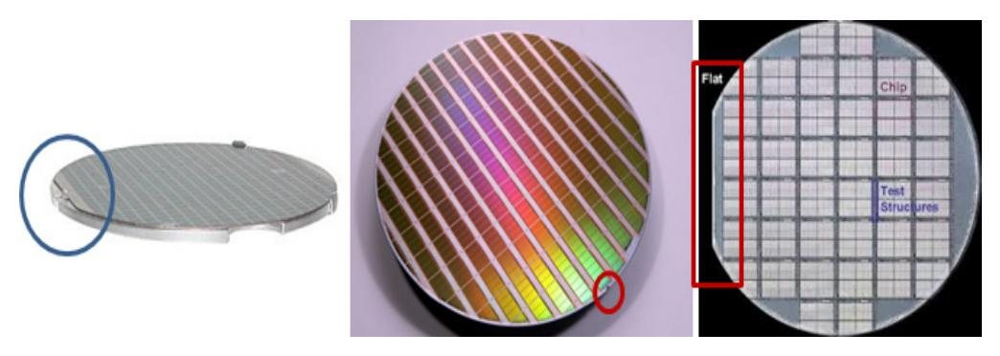

[그림 1-2] 실리콘 웨이퍼 편평한 모양과 넛치(notch) 모양

(3) 웨이퍼 직경에 따른 분류

웨이퍼 직경의 크기에 따라 4인치(100mm), 5인치(125mm), 6인치(150mm), 8인치 (200mm), 12인치(300mm) 등으로 나눈다. 생산성 향상을 위하여 대구경화 되어가는 추 세이다.

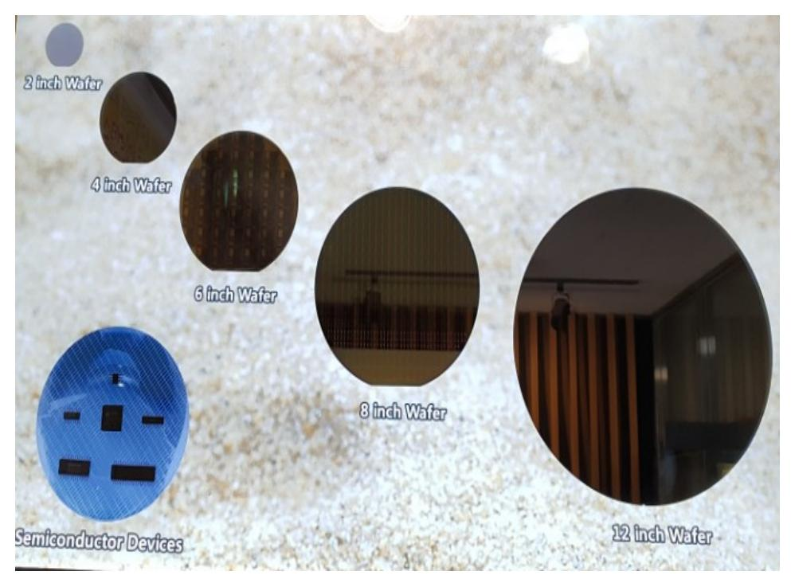

[그림 1-3] 실리콘 웨이퍼 직경의 크기

### (4) 추가적인 공정에 따른 분류

추가적인 공정을 통해 폴리시드(polished) 웨이퍼, 에피텍시얼(epitaxial) 웨이퍼, SOI 웨 이퍼 등으로 나눌 수 있다. 또한 웨이퍼는 원재료에 따라 실리콘 웨이퍼, 게르마늄(Ge) 웨이퍼, 갈륨비소(GaAs) 웨이퍼 등으로 구분한다. 이중 상업적으로 실리콘 웨이퍼가 가 장 널리 쓰이며, 실리콘 웨이퍼는 다음과 같이 구분할 수 있다.

### (가) 에피 (EPI) 공정: 규소 에피텍셜 필름(Si epitaxial film)

규소 에피텍셜(Si epitaxial) 공정은 기존 실리콘 기판에 동일한 결정구조를 유지하 면서 화학적 증착법을 이용해 또 다른 단결정 실리콘을 증착시키는 것을 말한다. 에피(EPI) 공정의 장점으로는 에피(EPI) 실리콘 내의 불순물 농도 조절이 용이하여 실리콘 기판과는 다른 불순물 농도(비저항)를 갖는 에피(EPI) 실리콘을 성장시킬 수 가 있다는 점이다. 또한 일반 실리콘 웨이퍼에서 산소나 탄소가 포함되어 있지만 에피(EPI) 공정에서는 이들이 전혀 포함되지 않은 에피(EPI) 실리콘을 증착시킬 수 있으며, 이런 장점들로 인하여 소자의 특성을 향상시킬 수가 있다.

최근에는 트랜지스터의 소스/드레인(source/drain) 영역에 에피(EPI) 실리콘을 증착하 여 소자의 특성 (속도)을 향상시키는 쪽으로 활용 범위를 넓혀가고 있다.

현재의 에피 웨이퍼 시장은 소구경 및 비메모리 분야에 걸쳐 중점적으로 형성되어 있으나, 웨이퍼의 대구경화 및 메모리의 고집적화에 따라 에피 웨이퍼 사용이 더욱 늘어날 전망이다.

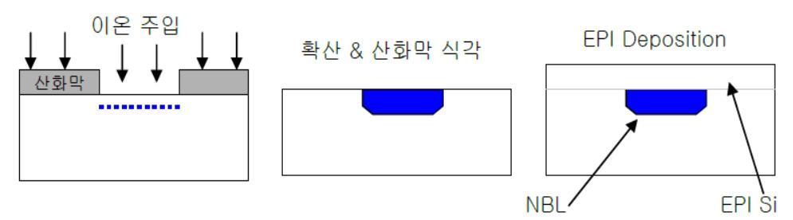

[그림 1-4] 에피 공정

### (나) SOI(silicon on insulator) 웨이퍼

웨이퍼는 앞으로 대구경화의 추세와 더불어 새로운 형태의 웨이퍼의 상용화가 예 상된다. 새로운 형태의 웨이퍼로 예상되는 것은 실리콘 단결정으로만 이루어진 일 반적인 실리콘 웨이퍼와 달리 실리콘 단결정층 사이에 절연층이 형성되어 있는 실 리콘 2중막 구조의 SOI(silicon on insulator) 웨이퍼이다.

실리콘 반도체를 만드는 데 실제로 이용되는 실리콘 웨이퍼 표면은 그 밑 부분인 기층부에 여러 가지 결함이나 불순물들이 있을 경우 초미세 회로 가공 및 완성된 반도체의 성능에 좋지 않은 영향을 주게 된다.

SOI 웨이퍼는 표면과 기층부 사이에 절연층을 인위적으로 형성시켜 기층부로부터 의 영향을 제거하여 절연체 위에 형성된 고순도 실리콘층을 가공하여 효율 및 특 성을 대폭 향상시킨 웨이퍼이다.

SOI 웨이퍼는 절연체(열산화막)로 차단된 얇은 무결점 실리콘층을 제공하기 때문에 절연벽이나 웰(well) 형성 공정 등을 줄일 수 있다. 이로 인해 반도체 업체는 제품 개발 및 생산 기간과 비용을 줄일 수 있고 또한 현재의 장비를 그대로 사용하거나 오히려 줄일 수 있어 설비 투자에 대한 부담이 없다. 따라서 SOI 웨이퍼의 가격이 기존 실리콘 웨이퍼에 비해 다소 비싸더라도 전체적 인 생산 비용이 줄어들기 때문에 오히려 이익을 얻을 수 있다. 특히 SOI 기술은 트랜지스터의 저항을 줄여 저전력 고속 칩을 생산할 수 있도록 함으로써 1기가급 이상의 메모리 반도체는 물론 저전력과 저전압 특성이 요구되는 휴대형 정보통신기기용 반도체 소자 생산에 폭넓게 사용될 것으로 보인다. SOI 웨 이퍼는 기존 웨이퍼에 비해 매우 높은 가격을 형성하고 있어 아직까지 그 적용 분 야가 매우 제한적이지만 향후 반도체의 고집적화가 급진전될 경우 이 제품을 채용 할 수밖에 없을 것으로 예상된다. 또한 당분간 폴리시드 제품이 주력 웨이퍼의 자 리를 계속 고수하고 에피 웨이퍼는 일부 분야에서만 사용될 것이나 기가급 반도체 가 양산될 시점부터 SOI 웨이퍼의 채택도 본격화될 것으로 예상된다.

- 웨이퍼 특성
  - 1. 웨이퍼의 특성
    - (1) 전기적 특성

단결정으로 성장시킨 실리콘 결정에는 전기 전도도를 위해 의도적으로 첨가한 불순물 (B, P, Sb) 이외에는 가능한 한 불순물을 억제시켜야 한다. 그리고 결정 성장(crystal growing) 시 인위적으로 주입되는 도펀트(dopant)에 의해 도체(conductor)와 부도체 (insulator) 사이의 전기 전도도를 갖게 되는데, 이를 반도체(Semiconductor)라고 한다.

(2) 결정 특성

실리콘 웨이퍼는 고순도의 다결정 실리콘을 용융시켜 특정 방향으로 성장시킨 단결정 실리콘으로서 이 성장 방향은 디바이스 프로세스(device process)에 기계적 특징 (mechanical properties), 확산(diffusion), 이온 주입(ion implantation), 식각(etching) 등에 영향을 끼친다.

(3) 가공 특성

실리콘 웨이퍼의 표면은 디바이스 프로세스(device process)의 원활함과 고품질 회로를 구성하기 위해, 회로 제조 시 치명적인 영향을 주는 표면 데미지(particle, scratch)나 미량의 화학적 성분이 표면에 잔존해서는 안 되며, 극도의 평탄도(flatness)가 요구된다. 따라서 슬라이싱(slicing), 래핑(lapping), 폴리싱(polishing) 작업 시 미세한 진동 (vibration)도 억제되어야 하며, 웨이퍼를 손으로 만져서도 안 된다. 또 전기적 특성이 없는 물(deionized water)로 세척하여 표면 정전기를 방지하고, 청정 실(cleanroom)에서 작업하여 고도의 청결을 유지해야 한다.

### 수행 내용 / 웨이퍼 종류 파악하기

### 재료·자료

6인치 및 8인치 베어 웨이퍼

### 기기(장비 ・ 공구)

해당 사항 없음.

### 안전 ・ 유의 사항

- 반도체 회로를 웨이퍼 상에 가공하는 공정 업무에 적용한다.
- 웨이퍼는 깨지기 쉬워서 취급을 각별히 조심해야 하며 오염이 되지 않도록 취급해야 한다.

### 수행 순서

- 반도체 제조 공정에 사용되는 웨이퍼에 대하여 그 종류를 파악하고 또한 구별 방법을 알 아본다.
  - 1. 반도체 제조 공정에 사용되는 웨이퍼는 반도체 응용 제품군에 따라, 또는 반도체 사용 용도에 따라 기본 웨이퍼 사용을 구별할 수 있다.
    - (1) 낮은 전압을 갖고 수많은 로직이 집적된 단일 칩 시스템(SoC) 제품인 경우 낮은 손 실 전류와 적은 전력 손실을 위해 정제된 웨이퍼를 선택하게 되며 특히 실리콘 내 불순물을 조절한 웨이퍼를 주문하여 사용한다.
    - (2) 높은 전압을 갖는 제품에 사용되는 웨이퍼는 소자 분리에 효과적인 SOI 웨이퍼를 사용하거나 또는 레치업 등 소자 간의 간섭을 최소화하기 위해 기판에 고이온이 주입된 서브 웨이퍼를 사용하게 된다.
    - (3) 고전압을 갖는 전력 소자용 웨이퍼는 서브 기판 위에 에피층을 한 번 더 올린 에피 웨이퍼를 사용하여 고전력, 고전류에 유용하도록 웨이퍼를 구성하여 반도체 제조에 사용한다.
    - (4) 웨이퍼는 크기에 따라서도 구분할 수 있다. 2~3인치부터 웨이퍼 제조가 시작되며 4 인치, 5인치, 6인치, 8인치(200mm), 12인치(300mm)까지 반도체 제조에 사용되고 있 으며 향후에는 18인치(450mm)까지 고려되고 있다.
  - 2. 반도체에 첨가되는 불순물 재료에 따라 구별할 수 있다.
    - (1) N-형 실리콘(n-type silicon) : 5가 원소 --> 인(P). 안티몬(Sb) , 비소(As) 도펀트 (dopant)를 사용하는 웨이퍼이다.

- (2) P 형 실리콘(P-type silicon) : 3가 원소 --> 붕소 (B) 도펀트(dopant)를 사용하는 웨이 퍼이다.
- 3. 결정 성장 방향에 따라 구별할 수 있다.
  - (1) 결정 성장 방향에 따라 <100>, <111>로 나눌 수 있다.
  - (2) 웨이퍼가 장비 안에서의 자동화된 조작과 방향표시를 위해 평편한 모양과 넛치 (notch) 모양으로 가공된다.
- 4. 웨이퍼 직경에 따라 구별할 수 있다.
  - (1) 웨이퍼 직경의 크기에 따라 4인치(100mm), 5인치(125mm), 6인치(150mm), 8인치 (200mm), 12인치(300mm) 등으로 구별할 수 있다.
- 5. [그림 1-5] 웨이퍼 사양서를 참조하여 <표 1-1> 반도체 웨이퍼 종류 체크 리스트 양식에 작성한다.

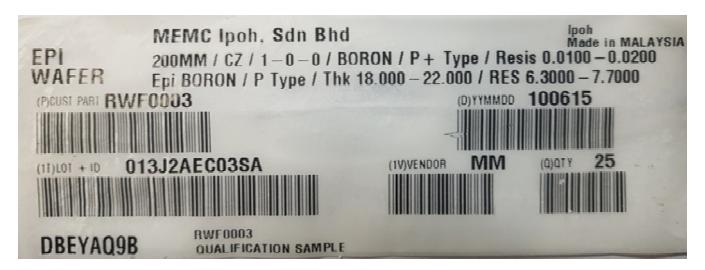

[그림 1-5] 웨이퍼 구별 사양서(예)

<표 1-1> 반도체 웨이퍼 종류 체크리스트

| 웨이퍼 종류 체크 리스트 |  |
|---------------|--|
| 제조 회사         |  |
| 웨이퍼 직경(mm)    |  |
| 웨이퍼 종류        |  |
| 결정 성장 방향      |  |
| 첨가 불순물 종류     |  |
| 웨이퍼 유형(type)  |  |
| 비저항(Ω-cm)     |  |
| 두께(mm)        |  |
| 성장 방법         |  |

# **1-2.** MOSFET 구조 해석

학습 목표 • MOSFET 제작 구조를 해석하고 설명할 수 있다.

# 필요 지식 /

시모스(CMOS) 트랜지스터 구조

1. 전계 효과 트렌지스터(FET: field effect transistor)

전계 효과 트랜지스터(FET)는 전류 증폭용 소자인 쌍극성 트랜지스터(BJT)와는 달리 전압 증폭용 소자이다. 쌍극성 트렌지스터와의 유사점은 트랜지스터를 구성하는 재료와 3개의 전극이 있다는 것이다. 전계 효과 트렌지스터가 갖는 장점은 낮은 전압과 낮은 전력 소비 에 있다.

쌍극성 트렌지스터의 경우 트랜지스터 동작은 베이스 전류의 인가에서 시작되지만 전계 효과 트렌지스터의 경우는 전기장을 형성하기 위해 게이트에 전압을 가함으로써 소자가 동작한다. 이렇게 전기장을 형성하여 그 효과에 의해 소자 동작을 시작한다는 의미로 FET(field effect transistor)이라고 부른다.

전계 효과 트렌지스터는 크게 두 가지 형태로 구별되는데 하나는 제이펫(JFET)로 피엔(pn) 접합 구조를 이용한 트랜지스터이고, 다른 하나는 두 전극 사이에 얇은 유전체로 절연되 는 구조를 갖는 MOSFET이다. 이 MOSFET는 선형/아날로그 회로 증폭기와 디지털 회로에 서 스위칭 부품 소자로 활용된다.

2. 모스페트(MOSFET: metal oxide semiconductor FET)

논리회로(logic circuit) 응용에 널리 이용하고 있고, IC 구성 부품에 주요한 소자이다. MOSFET는 NMOS(n-채널)과 PMOS(p-채널)의 두 가지 형태를 갖는데 각 소자에 흐르는 다 수 전류 캐리어(carrier)에 의해 결정된다. [그림 1-6]에 두 종류 MOSFET의 기하학적 단면 구조가 도시되어 있다.

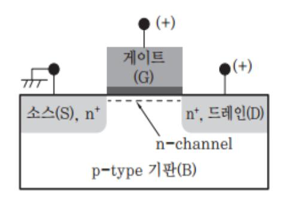

[그림 1-6] NMOS와 PMOS의 기하학적 단면도

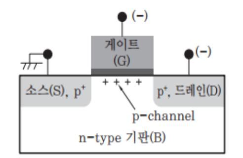

### 3. CMOSFET(complementary MOSFET)

MOSFET의 초기 사용은 NMOS 트랜지스터가 주류를 이루었다. PMOS 트랜지스터는 특정 한 전자 응용에 사용되지만 NOMS 트랜지스터 IC 장치들이 PMOS 장치들과 비교해 우수 한 성능을 보였기 때문이다. 현재는 이 두 종류의 MOSFET의 장점을 이용하는 시모스 (CMOS) 트랜지스터를 활용하여 소비 전력 효율의 결합, 설계 스케일링(scaling) 기술 제조 공정의 발전에 힘입어 각광받는 트랜지스터로 발전해 가고 있다. 시모스(CMOS)는 NMOS 와 PMOS를 동일한 공정 안에서 동시에 만들 수 있다. 그 기하학적 구조가 [그림 1-7]에 도시되어 있다.

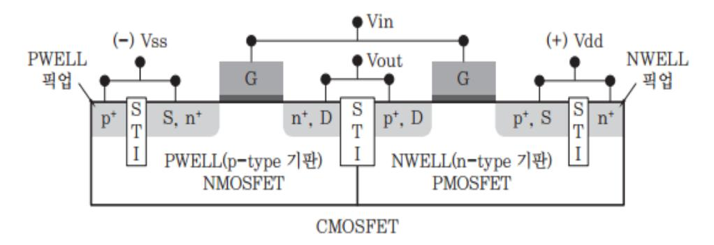

[그림 1-7] 시모스(CMOS) 트랜지스터의 기하학적 단면도

시모스(CMOS) 트랜지스터 작동 원리

1. NMOS 트랜지스터 작동 원리

[그림 1-8]은 NMOSFET의 기본 동작 원리를 회로도에 램프를 첨가하여 설명한 것이다. 동 작 원리를 정리하면 다음과 같다.

(1) [그림 1-8]의 (a)는 게이트로의 입력 전압이 없기 때문에 게이트 산화막 아래로 채

널이 형성되지 않아 소스와 드레인이 개방 상태이므로 소스와 드레인 사이에 전류 가 흐르지 않는다. 이는 p-n 접합 다이오드의 상태와 같다.

- (2) 이 상태에서 [그림 1-8]의 (b)처럼 스위치가 닫히면 플러스 0.7V의 작은 바이어스 전압이 게이트와 소스 양단에 동일하게 공급된다.
- (3) 이로 인해 게이트에 플러스 정전하가 생기고, 산화막 하단에 음전하가 생성되어 소 스와 드레인 간의 기판 상부에 채널이 형성된다.
- (4) 동시에 전기장이 게이트의 플러스 전하에 의해 생성되고, p-타입(p-type) 기판의 상 층 정공을 아래쪽으로 밀어내고 전자를 채널 안으로 끌어당긴다.
- (5) 이때 드레인에 걸려 있는 플러스 3V 전원에 의해 전자들은 자유롭게 흘러서 마이 너스(-) 단자로부터 소스를 통해서 n 채널과 드레인, 플러스(+) 전원 쪽의 램프를 통 해서 흐르게 된다.
- (6) 전자의 흐름은 드레인과 소스 간 전류(Ids)에 흐름이 되고, 램프는 점등된다.

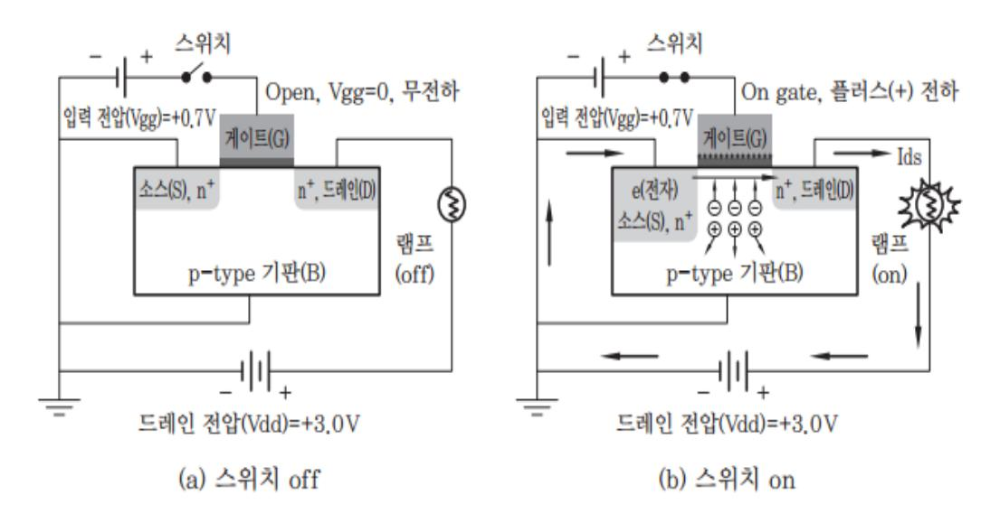

[그림 1-8] NMOSFET의 동작 원리도

2. PMOS 트랜지스터 작동 원리

[그림 1-9]는 PMOSFET의 기본 동작 원리를 회로도에 램프를 첨가하여 설명하고 있다. 동 작 원리를 정리하면 다음과 같다.

- (1) [그림 1-9]의 (a)는 게이트로의 입력 전압이 없기 때문에 게이트 산화막 아래로 채 널이 형성되지 않아 소스와 드레인이 개방 상태이므로 소스와 드레인 사이에 전류 가 흐르지 않는다. 이는 p-n 접합 다이오드의 상태와 같다.
- (2) 이 상태에서 [그림 1-9]의 (b)처럼 스위치가 닫히면 마이너스 0.7V의 작은 바이어스 전압이 게이트와 소스 양단에 동일하게 공급된다.

- (3) 이로 인해 게이트에 마이너스 정전하가 생기고 산화막 하단에 양전하가 생성되어 소스와 드레인 간의 기판 상부에 채널이 형성된다.
- (4) 동시에 전기장이 게이트의 마이너스 전하에 의해 생성되고 n-타입(n-type) 기판의 상층 전자를 아래쪽으로 밀어내어 정공을 채널 안으로 끌어당긴다.
- (5) 이때 드레인에 걸려 있는 마이너스 3V 전원에 의해 정공들이 자유롭게 흘러서 플 러스(+) 단자로부터 소스를 통해 p 채널과 드레인, 플러스(+) 전원 쪽의 램프를 통해 흐르게 된다.
- (6) 전자의 흐름은 드레인과 소스 간 전류(Ids)의 흐름이 되고 램프는 점등된다.

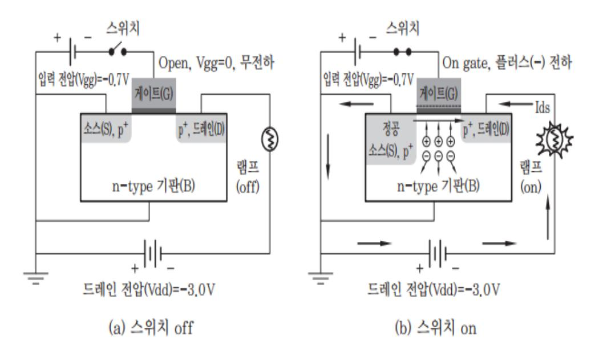

[그림 1-9] PMOSFET의 동작 원리도

### 3. 시모스(CMOS) 인버터(invertor) 작동 원리

시모스(CMOS)는 동일한 직접회로 안에 NMOS와 PMOS를 조합한 구조이다. 이 시모스 (CMOS)는 소비 전력 효율의 결합과 설계 스케일링(scaling) 기술, 제조 공정의 향상을 가 져왔다. 소비 전력 효율과 관련하여, 게이트의 입력 신호가 없을 때에는 전력 소비가 없 다. 스케일링 측면에서는 소형화뿐만 아니라 동작 수행에 필요한 전압까지 낮출 수 있는 장점을 가지고 있는데, 그 간단한 보기로 시모스(CMOS) 인버터(invertor)가 있다. 인버터는 입력단의 신호가 출력단에서 반전되는 특징이 있다. 디지털의 경우 영(0)의 신호 가 일(1)로 바뀐다. NMOS와 PMOS 게이트들은 단일 입력으로 사용되고, 드레인들은 서로 결합되어 단일 출력단으로 사용된다. NMOS의 소스는 접지되고 PMOS의 소스는 바이어스 전압(Vdd)에 연결된다. [그림 1-10]에 CMOSFET의 공정 단면도(a)와 설계 평면도(b)가 도시 되어 있다.

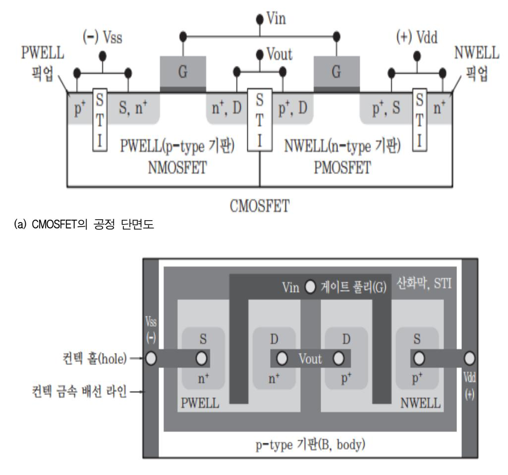

[그림 1-10] CMOSFET의 공정 단면도와 설계 평면도

시모스(CMOS) 인버터(invertor)는 시모스(CMOS)에 입력된 신호가 출력에서 반전된 형태로 나타난다. 정상 동작은 입력 신호가 플러스인 동안 n-채널(n-channel) 동작을 하고 입력 신호가 마이너스인 동안 p-채널(p-channel)로 동작한다. 시모스(CMOS) 인버터 회로의 효율은 입력 신호 영(0)에서 과도기 동안 발생한다. 입력 신호가 영(0)이면 트랜지스터의 전력 소모가 없다. [그림 1-11]에 인버터의 회로도(a)와 사용되는 회로 심벌이 도시되어 있다.

- 입력된 신호의 위상이 출력에서 반전되는 소자
- 디지털 신호: 0 → 1, 1 → 0

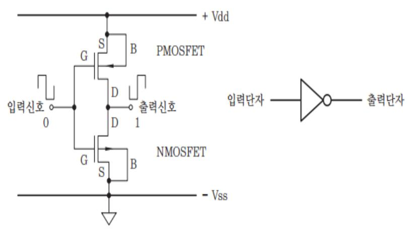

[그림 1-11] 인버터의 회로도와 회로 심벌

### 수행 내용 / 시모스(CMOS) 트랜지스터 작동 원리 해석하기

### 재료·자료

NMOS 트랜지스터, PMOS 트랜지스터

### 기기(장비 ・ 공구)

해당 사항 없음.

### 안전・유의 사항

- 반도체 제조 공정된 웨이퍼 취급에 오염이나 파손에 주의해야한다.
- 반도체 제조 공정된 웨이퍼 측정 시에는 장비 사용에 주의해야한다.

### 수행 순서

- NMOSFET의 기본 작동 순서를 회로도에 램프를 첨가하여 설명한 것이다. 작동 순서대로 수행해야 한다.
  - 1. NMOS 트랜지스터 작동 순서

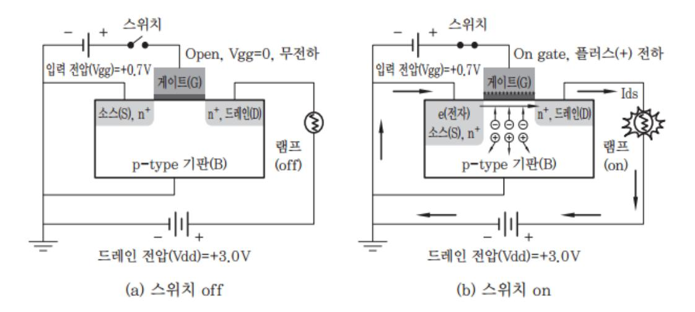

[그림 1-12] NMOSFET의 작동 원리도

- (1) [그림 1-12]의 (a)는 게이트로의 입력 전압이 없기 때문에 게이트 산화막 아래로 채널이 형성되지 않아 소스와 드레인이 개방 상태이므로 소스와 드레인 사이에 전류가 흐르지 않는다. 이는 피-엔(p-n) 접합 다이오드의 상태와 같다.
- (2) 이 상태에서 [그림 1-12]의 (b)처럼 스위치가 닫히면 플러스 0.7V의 작은 바이어스 전압이 게이트와 소스 양단에 동일하게 공급된다.
- (3) 이로 인해 게이트에 플러스 정전하가 생기고, 산화막 하단에 음전하가 생성되어 소스와 드레인 간의 기판 상부에 채널이 형성된다.
- (4) 동시에 전기장이 게이트의 플러스 전하에 의해 생성되고, p-타입(p-type) 기판의 상층 정공을 아래쪽으로 밀어내고 전자를 채널 안으로 끌어당긴다.
- (5) 이때 드레인에 걸려 있는 플러스 3V 전원에 의해 전자들은 자유롭게 흘러서 마이 너스(-) 단자로부터 소스를 통해서 n 채널과 드레인, 플러스(+) 전원 쪽의 램프를 통 해서 흐르게 된다.
- (6) 전자의 흐름은 드레인과 소스 간 전류(Ids)에 흐름이 되고, 램프는 점등된다.
- 2. PMOS 트랜지스터 작동 순서

[그림 1-13]는 PMOSFET의 기본 동작 원리를 회로도에 램프를 첨가하여 설명하고 있다. 작동을 순서대로 수행한다.

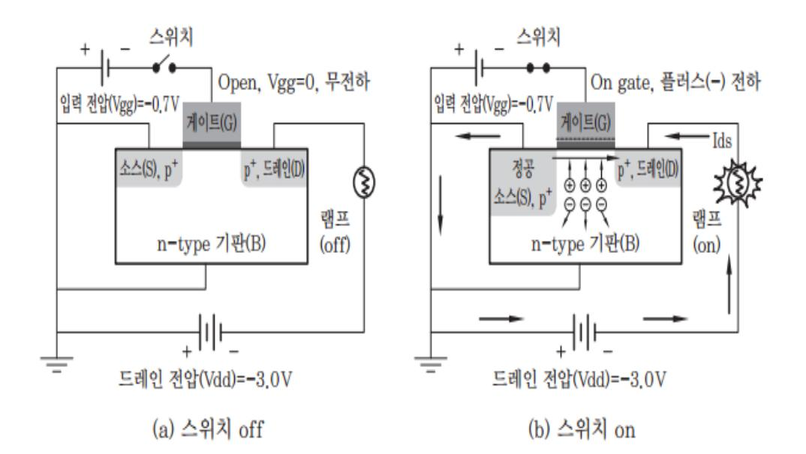

[그림 1-13] PMOSFET의 작동 원리도

- (1) [그림 1-13]의 (a)는 게이트로의 입력 전압이 없기 때문에 게이트 산화막 아래로 채 널이 형성되지 않아 소스와 드레인이 개방 상태이므로 소스와 드레인 사이에 전류 가 흐르지 않는다. 이는 피-엔(p-n) 접합 다이오드의 상태와 같다.
- (2) 이 상태에서 [그림 1-13]의 (b)처럼 스위치가 닫히면 마이너스 0.7V의 작은 바이어 스 전압이 게이트와 소스 양단에 동일하게 공급된다.
- (3) 이로 인해 게이트에 마이너스 정전하가 생기고 산화막 하단에 양전하가 생성되어 소스와 드레인 간의 기판 상부에 채널이 형성된다.
- (4) 동시에 전기장이 게이트의 마이너스 전하에 의해 생성되고 n-타입(n-type) 기판의 상층 전자를 아래쪽으로 밀어내어 정공을 채널 안으로 끌어당긴다.
- (5) 이때 드레인에 걸려 있는 마이너스 3V 전원에 의해 정공들이 자유롭게 흘러서 플 러스(+) 단자로부터 소스를 통해 p 채널과 드레인, 플러스(+) 전원 쪽의 램프를 통 해 흐르게 된다.
- (6) 전자의 흐름은 드레인과 소스 간 전류(Ids)의 흐름이 되고 램프는 점등된다.

# **1-3.** 반도체 제조 공정 흐름도 파악

• 메탈 배선의 적층 구조를 해석하고 설명할 수 있다. • 패드(pad) 및 보호막(passivation layer)의 구조를 해석하고 설명할 수 있다. • 공정 흐름도로부터 필요한 단위 공정을 파악할 수 있다.

# 필요 지식 /

학습 목표

### 시모스(CMOS) 제작 공정 흐름도

1. 소자 분리 단계

시모스(CMOS) 제조 공정의 첫 번째 단계인 소자 분리 공정에서는 시모스(CMOS)를 구성하 는 NMOS, PMOS가 형성될 부분을 트렌치(trench) 공정 기술을 이용하여 분할한다. 도랑처 럼 형성된 부분이 트렌치 부분으로 이 부분은 옥사이드(oxide)로 채워진다. 이 옥사이드는 절연체로 NMOS 트랜지스터와 PMOS 트랜지스터의 전기적 연결을 차단한다. [그림 1-14] 에 소자 분리를 위한 공정 단면도가 도시되어 있다.

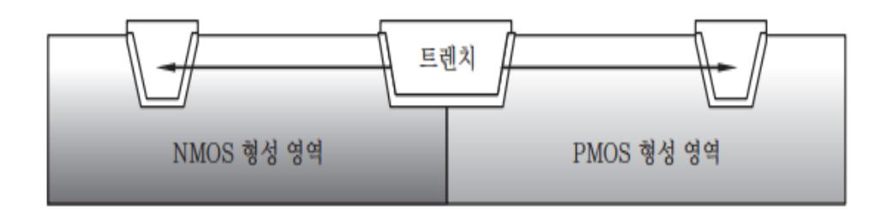

[그림 1-14] 소자 분리를 위한 공정 단면도

### 2. 소자 형성 단계

두 번째 단계인 소자 형성 단계에서는 이 분리된 소자 형성 영역에 NMOS와 PMOS 각각의 소스(source, S), 게이트(gate, G), 드레인(drain, D) 부분을 형성한다. 이때 웰(well)과 소스, 드레인 부분의 도핑(doping)을 위하여 이온 주입 공정 기술이 사용되고, 게이트는 포토, 에칭 공정 기술을 이용하여 폴리 실리콘(poly-silicon)을 형성한다. 소스, 드레인, 게이트 세 부분의 형성으로 트랜지스터 소자 형성이 완성된다. [그림 1-15]은 소자 형성을 위한 공정 단면도를 나타낸 것이다.

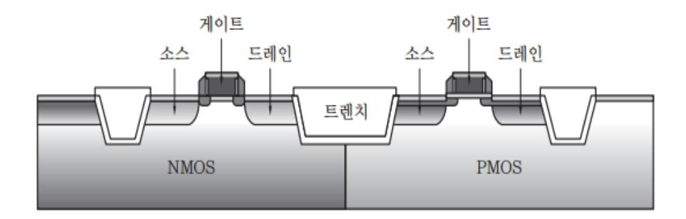

[그림 1-15] 소자 형성을 위한 공정 단면도

3. 소자 배선 단계

마지막으로 소자 배선 공정을 통하여 소자 형성 과정에서 생성된 소스(source), 드레인 (drain), 게이트(gate) 부분에 금속 전극들을 형성한다. [그림 1-16]은 금속 배선 과정에 대한 공정 단면도이다. 이 배선 공정에서는 최종 메탈 전극에서 외부 신호 입력과 전원 입가를 위한 패드(pad) 및 소자를 외부의 환경으로부터 보호하는 보호막 공정을 포함한다.

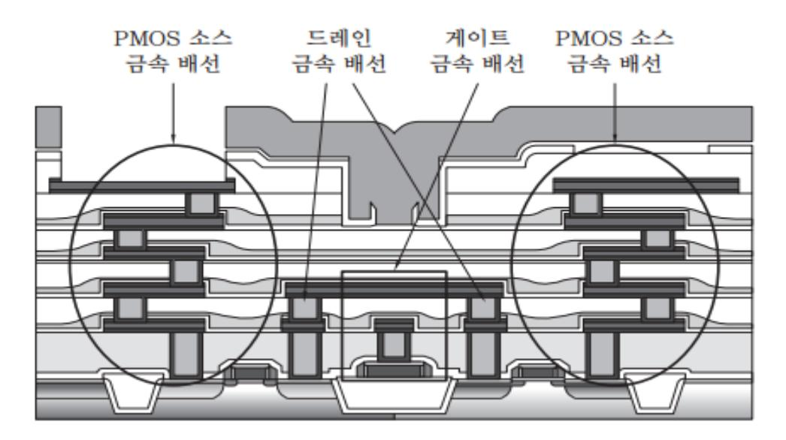

[그림 1-16] 소자 배선을 위한 공정 단면도

### 수행 내용 / 공정 흐름도 파악하기

### 재료·자료

- 소자 제작 공정 순서 흐름도 설명서
- MOS 단면 분석 사진

### 기기(장비 ・ 공구)

해당 사항 없음.

### 유의 사항

- 반도체 제조 웨이퍼 취급에 오염이나 파손에 주의해야한다.
- 반도체 제조 공정된 웨이퍼를 측정 시에는 장비 사용에 주의해야한다.

### 수행 순서

- 수행하고자 하는 목표를 설정한다.
  - 1. 모스(MOS) 소자 형성을 위해 사용된 마스크(mask) 레이어를 포함하여 각 공정 순서대로 학습을 진행한다. 각 마스크에 의해 형성되는 소자 각각의 영역을 확인하고 필요한 해당 단위 공정을 파악한다. 또 결과적으로 제작된 소자의 각 터미널 의미를 이해하는 것을 목표로 한다.
- 소자 분리 세부 공정을 진행한다.
  - 1. 웨이퍼에 산화막과 질화막을 증착한다.

시모스(CMOS) 제조 공정의 실리콘 기판은 3족 원소인 보론(boron, B)이 도핑된 p-타입 (p-type) 단결정 실리콘 웨이퍼이며, 결정 방향은 <100>이고 저항은 일반적으로 1.6~2.2Ω -cm이다.

- (1) 준비된 실리콘 웨이퍼는 각 장마다 제조 공정의 이력을 위하여 레이저를 이용하여 마킹(marking)을 실시한다.
- (2) 그 다음 세정을 실시하고, 그 위에 퍼니스(furnace) 장비를 이용하여 분리를 위한 패드 (pad) 옥사이드층을 증착한다.
- (3) 그 위에 LPCVD 장비를 이용하여 질화(nitride)층을 적층한다. [그림 1-17]에 분리층의 구조가 도시되어 있다.

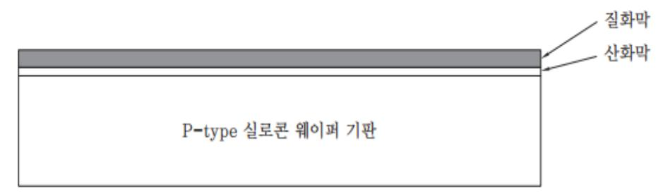

[그림 1-17] 산화막과 질화막을 적층한 분리층의 구조도

2. 트랜치 (TRENCH) 패턴을 형성한다.

산화막과 질화막이 형성되면 소자가 형성될 층과 이 소자들을 분리할 트렌치(trench)의 모습을 기하학적으로 형성하여야 한다. 패턴과 식각 공정이 이 부분을 담당하는 공정이다.

- (1) 트랜치 패턴 공정은 먼저 트랙 장비에서 감광액을 도포하여 감광막을 만든다.
- (2) 스테퍼나 스캐너와 같은 노광기를 이용하여 준비된 마스크에 패턴을 웨이퍼에 전사 한다.
- (3) 전사가 끝나면 다시 트랙 장비에서 현상을 하게 되고, 감광막에는 기하학적 식각을 위한 패턴이 완성된다.

[그림 1-18]에 포토 공정에 의한 패턴 형성 후 식각한 모습이 도시되어 있다. 공정 순서는 다음과 같다.

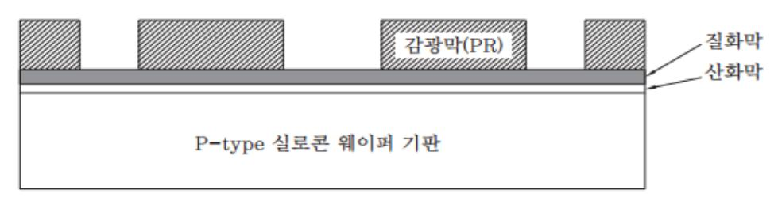

[그림 1-18] STI(shallow trench isolation)가 건식 식각된 모습

### 3. STI 형성을 확인한다.

렌치 식각이 이루어진 웨이퍼는 시각된 트렌치 안에 산화막을 채워 소자들 간의 분리를 마치게 된다.

- (1) 먼저 산화막을 채우기 위하여 먼저 트렌치 벽면에 얇고 순도가 높은 산화막을 확산 로(furnace) 안에서 성장시킨다.
- (2) 그다음 APCVD 방법으로 산화막을 형성시킨다. APCVD는 상압 상태에서 산화막을 기 르기 때문에 성장 속도가 매우 빠르므로 깊은 트렌치를 채우기에 합리적인 CVD 방 법이다.

- (3) 트렌치가 채워지면 후면에 이전 공정에서 수행된 질화막을 화학적으로 식각하여 제 거한다.
- (4) 마지막으로 격자간의 결합이 느슨한 상태에서 원자의 재정렬을 위하여 확산로 (furnace)에서 열 확산으로 재결정화를 실시한다. [그림 1-19]에 STI 형성 공정도가 도시되어 있다.

[그림 1-19] STI 형성 공정도

4. STI CMP 공정을 한다.

산화막 CMP가 완료되면 산화막 이면에 있던 질화막을 인산혼합용액인 SC1을 사용하여 상온인 메가소닉(megasonic) 상태에서 완전히 제거시킨다. [그림 1-20]에 공정도가 도시되 어 있다.

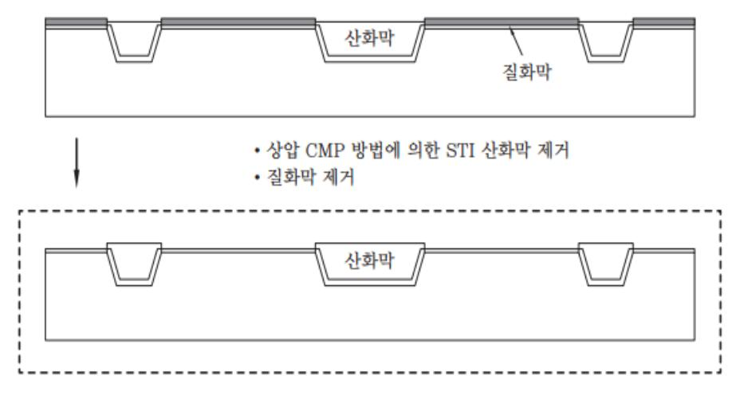

[그림 1-20] STI CMP 공정도

### 5. NWELL과 PWELL을 형성한다.

### (1) PWELL 이온 주입 공정을 실시한다.

이후 마스크로 사용되었던 감광막을 플라즈마를 이용한 애시(ash) 건식과 표준 혼합용 액인 SC1, SC2로 습식 세정을 혼용하여 완전히 제거한다. [그림 1-21]에 PWELL 형성 공정도가 도시되어 있다.

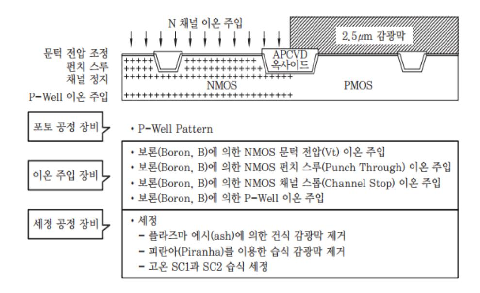

[그림 1-21] PWELL 형성 공정도

### (2) NWELL 이온 주입 공정을 실시한다.

웰 형성을 위한 이온 주입 과정: 마지막으로 웰 형성을 위한 이온 주입이 실행되고, 이때 사용되는 이온 주입 에너지는 830keV 정도이다. 이후 마스크로 사용되었던 감광 막을 플라즈마를 이용한 애시(ash) 건식과 표준 혼합용액인 SC1, SC2로 습식 세정을 혼용하여 완전히 제거한다. [그림 1-22]에 NWELL 형성 공정도가 도식되어 있다.

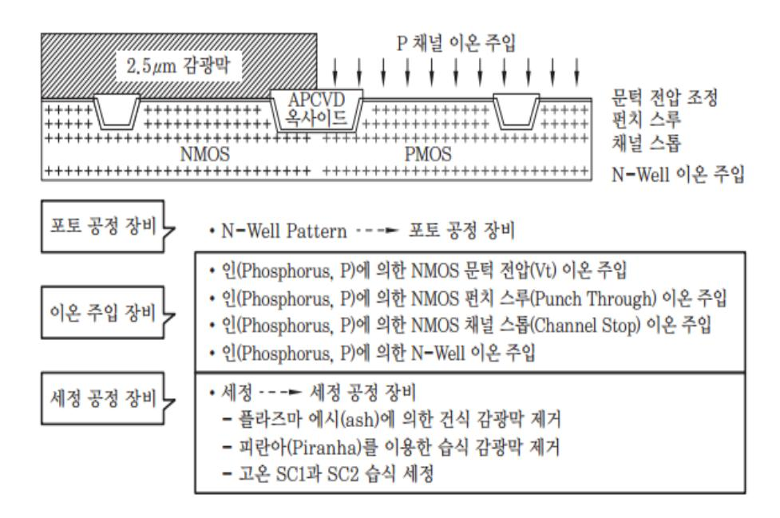

[그림 1-22] NWELL 형성 공정도

소자 형성 세부 공정을 진행한다.

- 1. 게이트 패턴을 형성한다.
  - (1) 게이트 공정 흐름도

게이트(gate) 전극 형성은 크게 다섯 단계로 나누어 공정이 진행된다. [그림 1-23]에 게 이트 공정 흐름도가 도시되어 있다.

- (가) 첫번째 단계는 소자분리 형성이 끝난 상태에서 게이트 산화막을 성장시킨다.
- (나) 두 번째 단계는 폴리 실리콘을 게이트 산화막 위에 성장시킨다.
- (다) 세 번째 단계는 성장된 폴리 실리콘에 PMOS 영역을 감광막으로 마스킹하고 N+ 폴리 이온 주입을 실시한다. 이온 주입이 끝나면 감광막을 제거하고 세정 과정 을 거친다.
- (라) 네 번째는 세정된 표면 위에 포토 공정을 통하여 식각될 부분을 개방한다.
- (마) 마지막 다섯 번째 단계는 개방된 영역을 건식 플라즈마 식각한다. 이후 감광막 제거 세정 과정을 통하여 최종적으로 폴리 실리콘으로 형성된 게이트 전극을 완성한다.

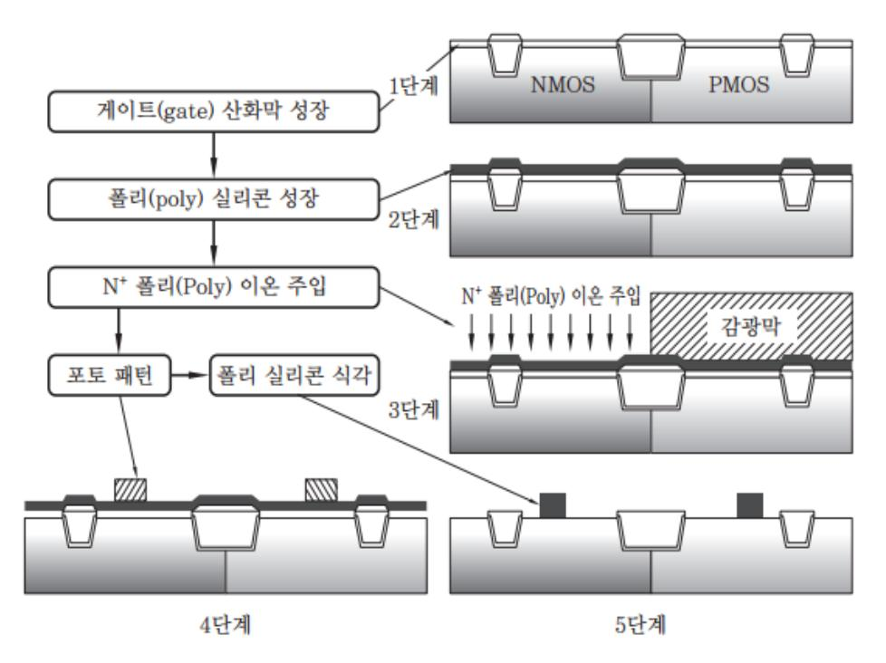

[그림 1-23] 게이트 공정 흐름도

### (2) N+ 폴리 열처리

앞선 웰 이온 주입 후 재결정화를 위해 열처리 과정을 거친 것처럼 N+ 폴리 실리콘도 동일한 목적으로 열처리 과정을 다음과 같이 수행한다. [그림 1-24]에 폴리 실리콘 열 처리 공정도가 도시되어 있다.

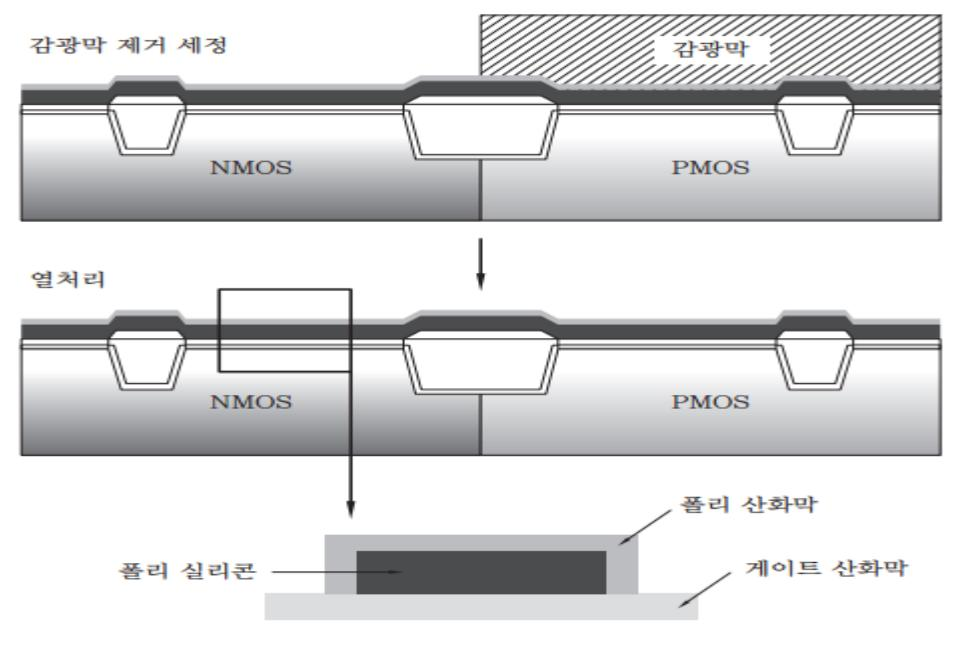

[그림 1-24] 폴리 실리콘 열처리 공정도

### (3) 게이트 패턴과 식각 공정

게이트 패턴과 식각 공정은 게이트 전극이 되는 폴리 실리콘의 기하학적 구조 형성 과정이다. 세부 공정 진행은 다음과 같은 순서로 진행한다. [그림 1-25]에 패턴과 식각 공정의 흐름도가 도시되어 있다.

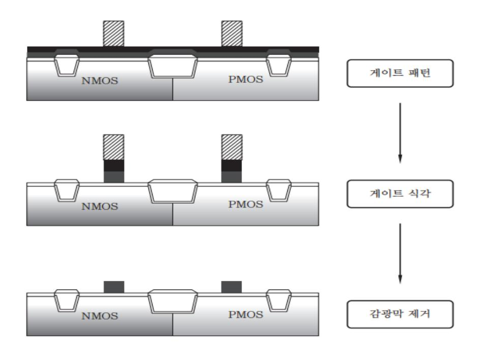

[그림 1-25] 게이트 패턴과 식각 공정의 흐름도

2. LDD(lightly doped drain) 형성 공정을 진행한다.

시모스(CMOS) 엘디디(LDD, lightly doped drain) 공정은 크게 두 부분으로 나누어 연속적으 로 진행한다.

- (1) NMOS 지역의 LDD 공정: NLDD
  - (가) 게이트 폴리 형성 구조에서 이온 주입에서의 폴리막 손상을 방지하기 위해 폴 리막 위에 열 산화막을 성장시킨다.
  - (나) 이후 포토의 감광막 도포, 노광, 현상을 통하여 NLDD 패턴을 완성한다.
  - (다) 패턴이 완성되면 아세닉(As) 이온으로 NLDD 이온 주입 영역과 NWELL 컨텍 지 역에 이온 주입을 실시한다.
  - (라) 이온 주입이 완료되면 세정을 실시하여 감광막과 산화막을 제거하고 격자 손상 의 회복을 위한 열처리를 실행한다.
- (2) PMOS 지역의 LDD 공정: PLDD

NLDD 공정 완료 후 덮개 폴리 산화막 증착을 시작으로 PLDD 공정이 시작된다.

- (가) 산화막 위에 포토의 일련 과정(감광막 도포, 노광, 현상)을 되풀이하여 PMOS 영역의 PLDD 패턴을 완성한다.
- (나) 보론(B) 이온으로 PLDD 이온 주입 영역과 PWELL 컨텍 지역에 이온 주입을 실 시한다.
- (다) 이온 주입이 끝나면 세정을 마지막으로 LDD 공정이 완료된다. [그림 1-26]에 LDD 공정 흐름도가 도시되어 있다.

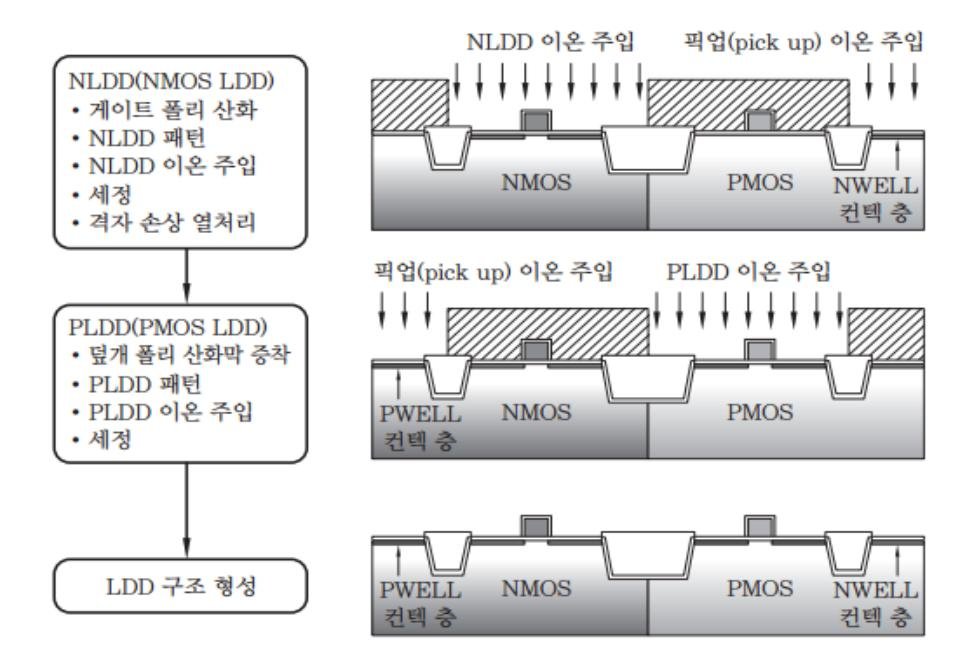

[그림 1-26] LDD 공정 흐름도

- 3. S/D(source/drain) 형성 공정
  - (1) S/D(source/drain) 공정 흐름

소스와 드레인(S/D, source/drain) 공정은 NSD와 PSD 두 부분의 공정으로 나누어 연속 적으로 진행되며, 소스와 드레인 형성은 한 공정에서 동시에 이루어진다. 소스와 드레 인 공정을 하기 위해 먼저 게이트 측면 공간막이라 불리는 게이트 질화 공간막(nitride spacer)을 형성한다.

[그림 1-27]에 소스와 드레인 형성 공정 흐름이 도시되어 있다.

(2) NSD 세부 공정하기

NSD 공정은 NMOS의 소스와 드레인 정션 형성과 NWELL의 전극 형성 공정이다. 공정은 다음과 같은 내용을 가지고 수행된다. [그림 1-28]에 NMOS 형성 공정 흐름이 도시되어 있다.

- (가) 게이트 측벽 공간막이 형성된 웨이퍼에 포토의 감광막 도포, 노광, 현상을 통하 여 NSD 패턴을 완성한다.
- (나) 패턴이 완성되면 1차 이온 주입을 실시한다. 1차 이온 주입은 아세닉(As) 이온 으로 NSD 이온 주입 영역과 NWELL 컨텍 지역에 이온 주입을 실시한다. 이온 주입은 고전류를 사용하여 1.5×1015(이온수/cm2)의 도즈량과 70keV로 실시한다.
- (다) 1차 아세닉 이온 주입이 끝나면 부가하여 2차로 인(P) 이온을 주입한다. 이온 w 주입은 중전류를 사용하여 1.5×1014(이온수/cm2)의 도즈량과 60keV로 실시한다.
- (라) 이온 주입이 완료되면 플라즈마 에싱, 황산 계열 화학세정, 메가소닉을 동반한 SC1 세정을 실시하여 감광막을 제거한다.

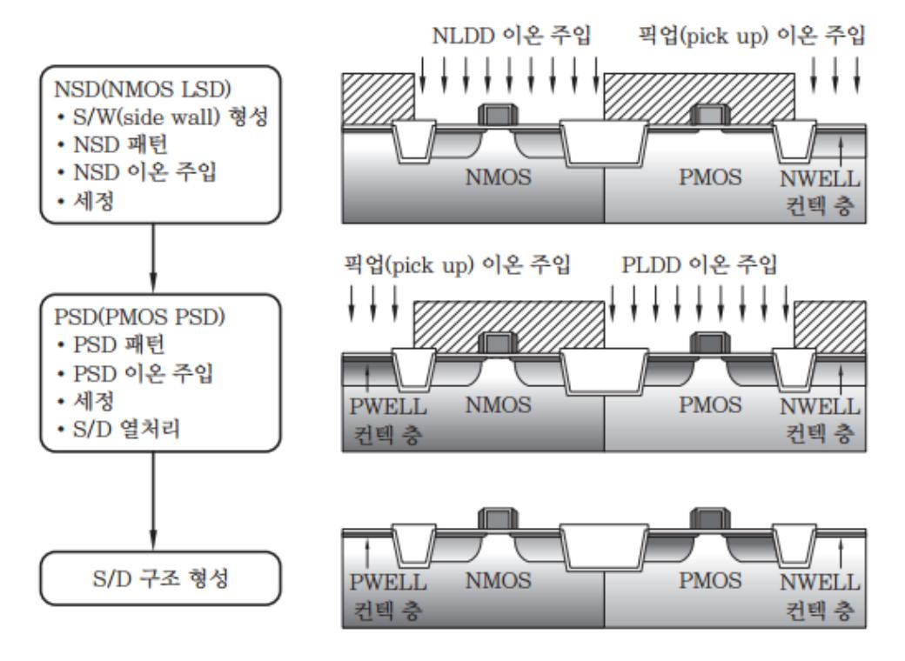

[그림 1-27] 소스와 드레인 형성 공정 흐름

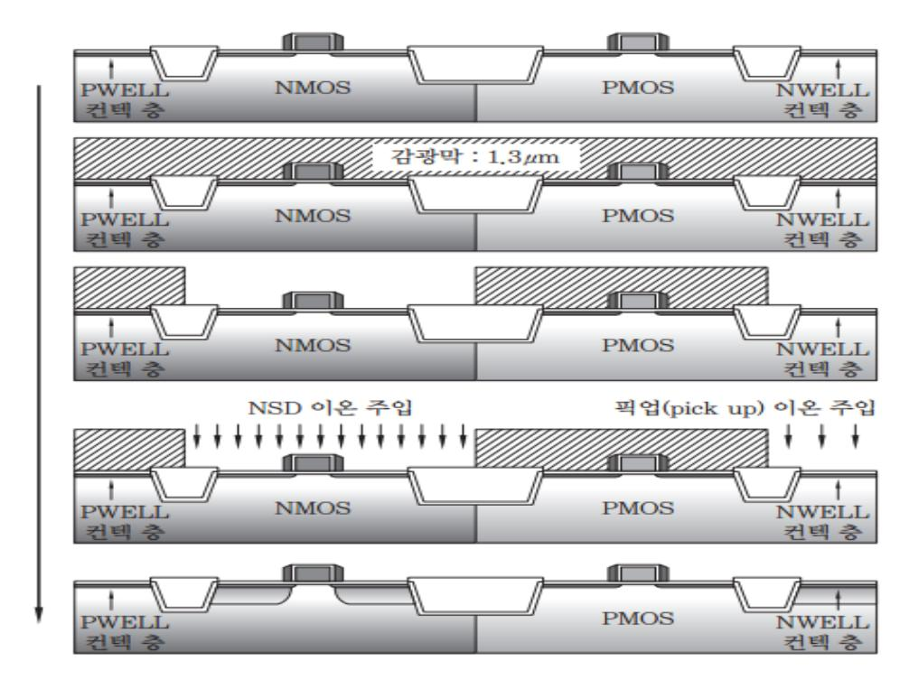

[그림 1-28] NMOS 형성 공정 흐름

(3) PSD 공정하기

PSD 공정은 PMOS의 소스와 드레인 정션 형성과 PWELL의 전극 형성 공정이다. 공정은 다음과 같은 내용을 가지고 수행된다.

- (가) NSD가 형성된 웨이퍼에 포토의 감광막 도포, 노광, 현상을 통하여 PSD 패턴을 완성한다.
- (나) 패턴이 완성되면 이온 주입을 실시한다. 이온 주입은 보론(B) 이온으로 PSD 이 주입 영역과 PWELL 컨텍 지역에 이온 주입을 실시한다. 고전류를 사용하여 1.5×1015(이온수/cm2)의 도즈량과 10keV로 아세닉 이온 주입을 실시한다.
- (다) 이온 주입이 완료되면 플라즈마 에싱, 황산계열 화학 세정, 메가소닉을 동반 SC1 세정을 실시하여 감광막을 제거한다.
- (라) 감광막을 제거한 후 RTP 장비에서 1000℃에서 15초 동안 열처리 한다. 이 열처리 과정은 소스, 드레인 정션 구조가 퍼지는 것을 방지하고, 소스, 드레인 영역 내의 불순물의 확산을 막기 위해서이다. 열처리 공정을 마지막으로 소스와 드레인 정션 형성 공정은 완료된다. [그림 1-29]에 PMOS 형성 공정 흐름이 도시되어 있다.

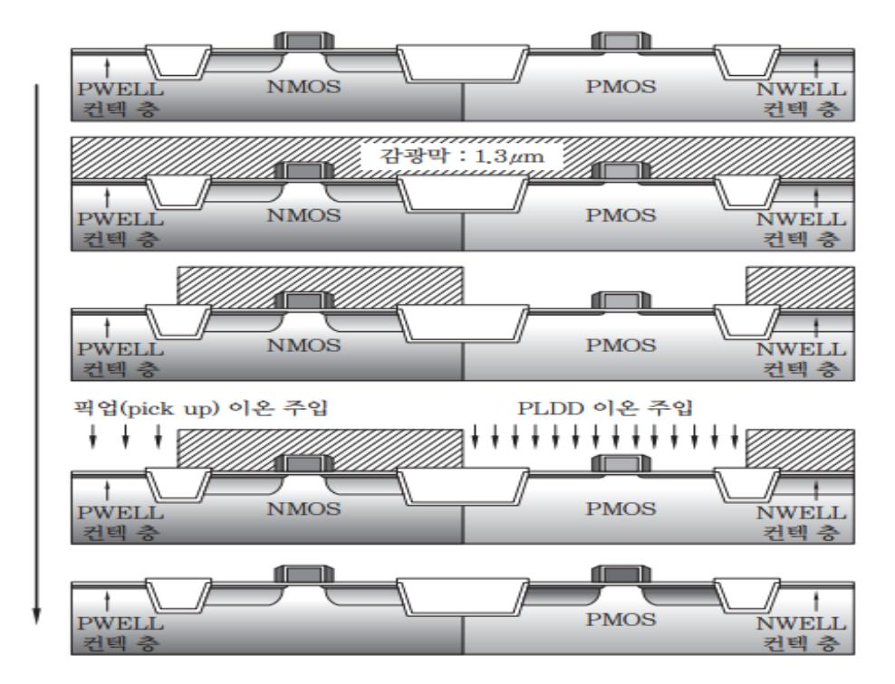

[그림 1-29] PMOS 형성 공정 흐름

- 소자배선 세부 공정을 실시한다.
  - 1. 컨택 홀 공정하기
    - (1) 1단계(살리사이데이션~PMD 평탄화)

컨택 홀 형성 과정의 첫 번째는 실리콘 표면과 폴리 표면층의 금속화 공정부터 시작 된다. 공정 순서는 다음과 같다.

- (가) 먼저 웨이퍼 전면에 이전 공정에서 형성된 산화막을 제거한다.
- (나) 산화막이 제거되면 웨이퍼 전면에 살리사이데이션을 형성할 금속을 스퍼터링 (sputtering) 한다. 보통 티타늄(Ti) 금속을 사용한다.
- (다) 스퍼터링 된 금속과 실리콘, 폴리 실리콘과의 결합을 위하여 급속 열처리 (RTA,rapid thermal annealing) 방법을 통하여 실리사이드와 폴리사이드를 형성한다.
- (라) 이후 실리콘이 아닌 다른 부분 즉 금속과 결합되지 않는 부분은 습식 식각으로 제거한다.
- (마) 이후 PMD 형성 시 열처리 공정에서 오는 PMD 막과 소스, 드레인, 게이트로 부 터의 이온들의 이동을 막으며, 컨택 홀 식각 시 소스, 드레인, 게이트 표면에 직접 이르러 과도 식각이 이루어지지 않도록 종말점 물질로 사용되는 PMD 라이너(liner)를 증착한다.
- (바) 이후 BPSG PMD 막을 증착한다.

(사) 이후 선 공정에서 게이트와 트렌치 구성에 따른 기하학적 단차 문제 때문에 발 생되는 PMD 막의 높이를 평탄화하는 CMP 공정이 이루어진다. [그림 1-30]에 컨택 홀 1단계 공정도가 도시되어 있다.

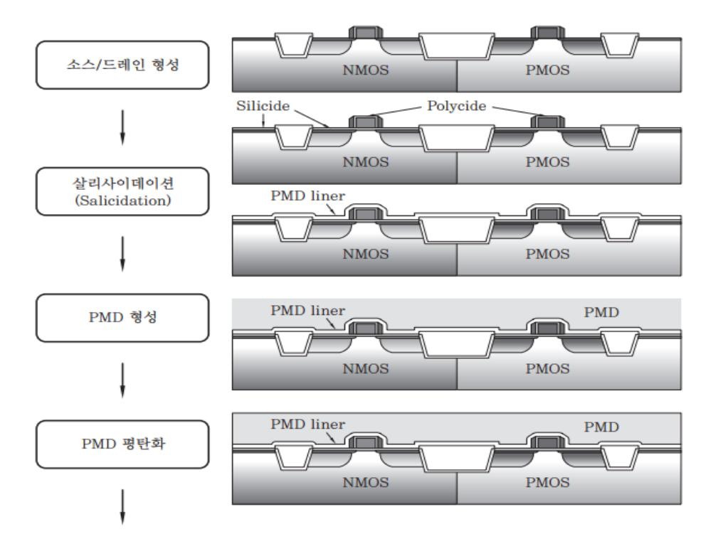

[그림 1-30] 컨택 홀 1단계 공정

(2) 2단계(포토 패턴~감광막) 제거/세정을 한다.

CMP 공정이 끝나면 포토의 감광막 도포, 노광, 현상 공정을 거쳐 식각될 부분의 패턴 을 개방한다. 이후 이 개방 영역을 건식 플라즈마로 식각한다. 식각 후 감광막과 홀 안의 잔류물 제거를 위한 세정 공정이 이루어진다. [그림 1-31]에 컨택 홀 2단계 공정 도가 도시되어 있다.

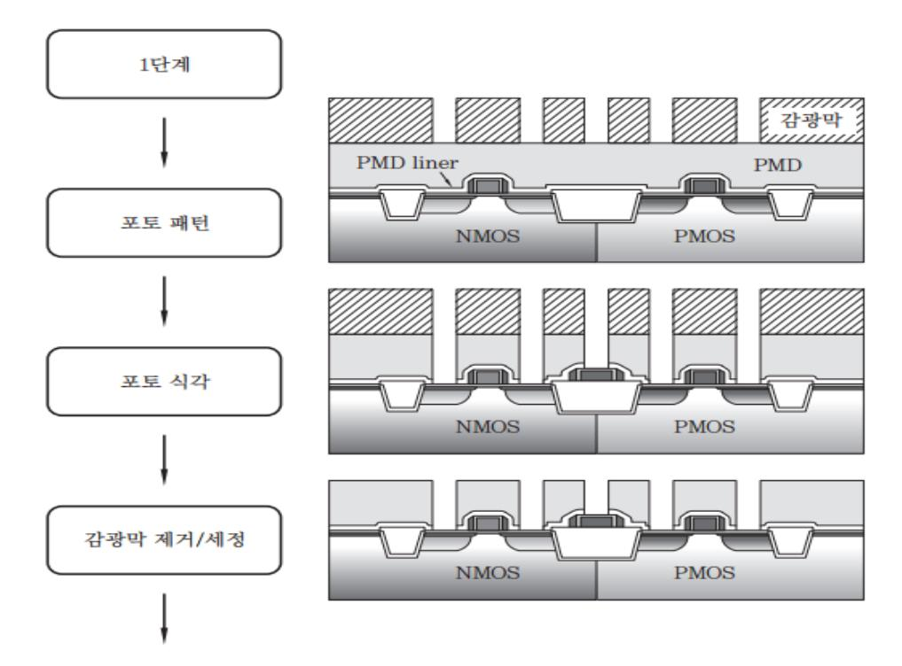

[그림 1-31] 컨택 홀 2단계 공정도

(3) 3단계(장막 채우기~세정)

식각 세정 공정이 완료되면 홀을 금속으로 채우는 공정이 시작되는데 마치 모양이 전 기 플러그와 같다 하여 꽉 찬 홀 기둥을 플러그(plug)라 칭하고, 이 홀을 채우는 공정 을 플러그 필(fill)한다고 표현한다. 다음 순서와 같이 공정이 수행된다.

- (가) 장막 금속 벽을 배리어 메탈(barrier metal)을 증착한다.
- (나) 주 금속을 채워간다.
- (다) 평탄화 작업인 CMP 공정이 수행된다.
- (라) 세정 공정을 수행한다.

[그림 1-32]에 컨택 홀 3단계 공정도가 도시되어 있다.

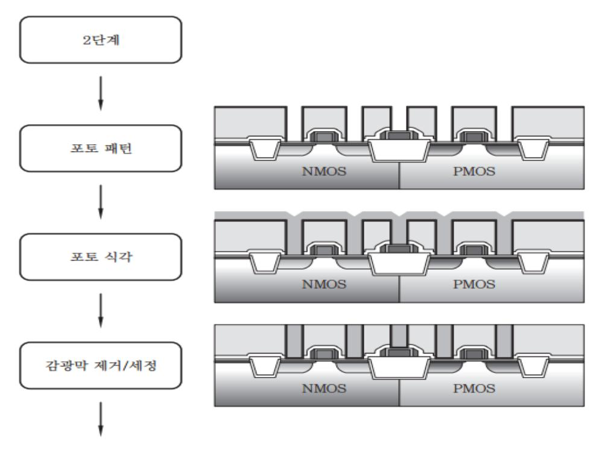

[그림 1-32] 컨택 홀 3단계 공정도

- (4) 컨택 홀 포토 패턴과 식각 공정
  - (가) 컨텍 포토 공정: CMP 공정이 끝난 웨이퍼 위에 딥(deep) UV 감광액을 이용하여 두께 0-97μm로 감광막을 도포한다. 감광막 도포가 끝나면 마스크를 이용하여 패턴 노광을 진행하고, 현상 공정을 거쳐 식각될 부분의 패턴을 개방한다.
  - (나) 식각 공정: 컨텍 포토 공정이 완료되면 포토의 감광막을 마스크로 하여 RIE 플 라즈마 건식 식각으로 BPSG 산화막을 식각한다. 식각은 PMD 라이너(PMD liner) 막까지 이루어진다. 이후 완전히 산화막을 제거하기 위해 식각 시간만큼 더 식 각을 한다.
  - (다) 세정 공정: 식각이 완료되면 감광막을 제거하기 위하여 피라나 황산 계열 습식 세정을 하고 홀 안의 입자들을 완전히 제거하기 위하여 SC1 습식 세정과 메가 소닉을 가하여 세정한다.
    - [그림 1-33]에 포토 패턴과 식각에 대한 공정도가 도시되어 있다.

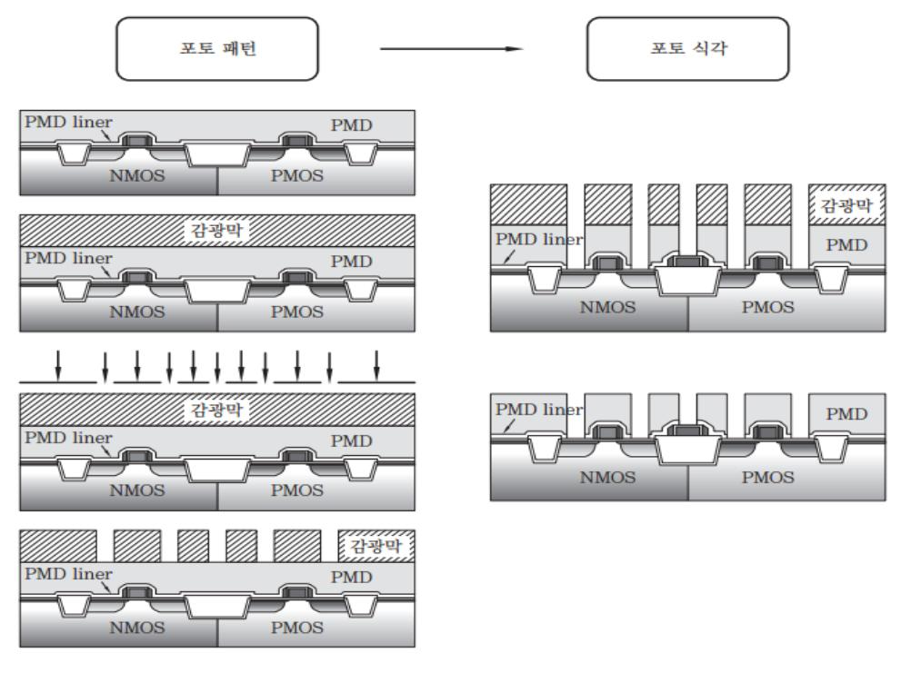

[그림 1-33] 포토 패턴과 식각에 대한 공정도

(5) 컨택 홀 장막 금속 채우기

식각 세정 공정이 완료되면 홀을 금속으로 채우는 공정이 시작된다. 세부 공정과 조건 은 다음과 같이 수행된다.

- (가) 장막 금속(brrier metal) 증착 은 타이타늄(Ti) 금속을 재료로 두께 50Å정도가 되도록 이온화된 금속 플라즈마 PVD(IMP PVD) 방법으로 증착한다.
- (나) 이후 급속 열처리 공정(RTP)을 이용하여 타이실리사이드(TiSiO₂)를 형성한다. 이때 열처리 온도는 725℃, 시간은 30초 정도이다.
- (다) 타이실리사이드가 형성되면 텅스텐 확산 장벽인 타이타늄 질화막을 MOCVD 방 법으로 두께 100Å정도로 증착한다. 이 과정이 완료되면 주 금속을 채울 수 있다. [그림 1-34]에 배리어 메탈 증착 공정도가 도시되어 있다.

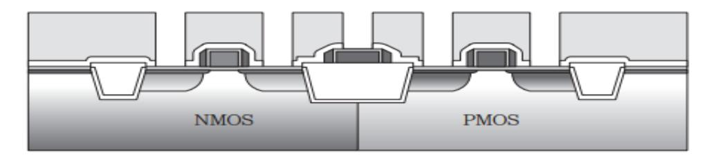

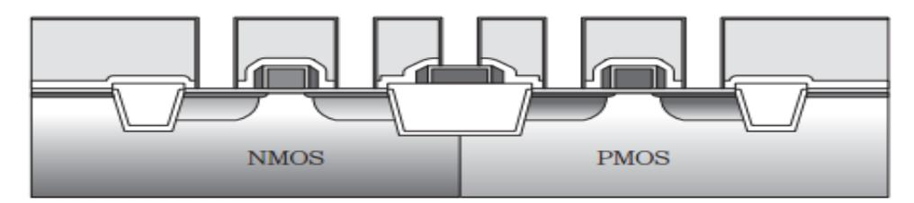

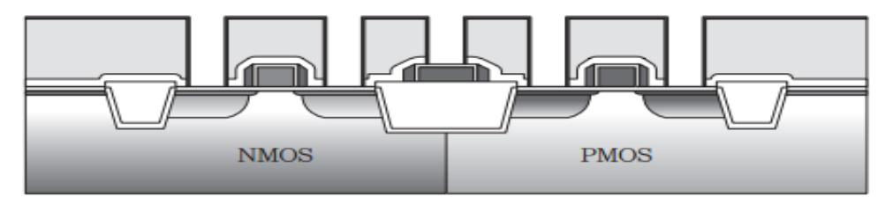

[그림 1-34] 배리어 메탈 증착 공정도

- (6) 컨택 홀 주 금속 채우기와 CMP 공정
  - (가) 장막 금속이 완성되면 이제 주 금속을 CVD 방법으로 여러 번 되풀이하며 홀 안을 채워간다.
  - (나) 홀이 다 채워지면 평평한 면과 홀 모양의 굴곡에서 오는 차이 때문에 단차가 발생한다. 이 단차의 문제도 후에 진행될 금속 배선 공정에서 포토 공정에 어 려움을 주기 때문에 평탄화 작업인 CMP 공정이 다시 수행된다. 이전 PMD는 산 화막 CMP이지만 컨택 홀 평탄화는 금속 CMP 공정이다.
  - (다) 이후 세정 공정을 거치면서 컨택 홀 공정이 완료된다.

[그림 1-35]에 컨택 홀 주 금속 채우기와 CMP 후 모습이 도시되어 있다.

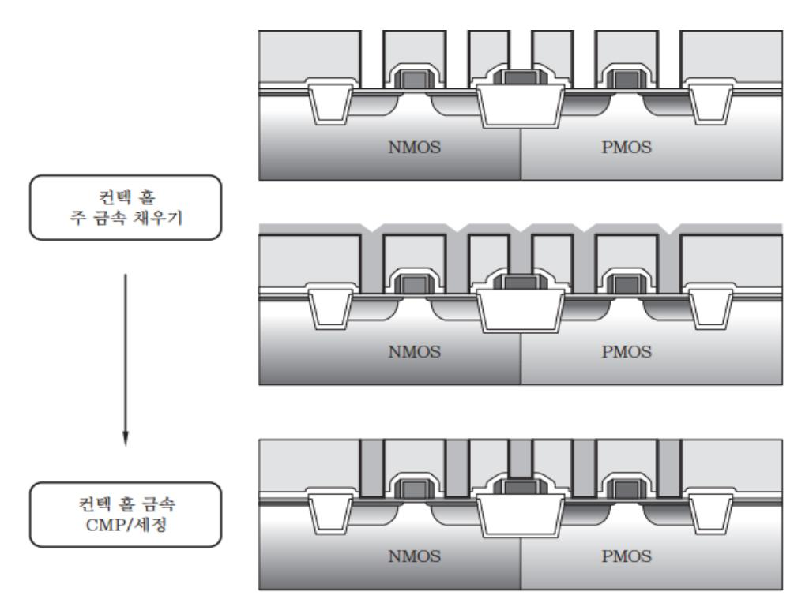

[그림 1-35] 컨택 홀 주 금속 채우기와 CMP 후 모습

### 2. 금속 배선 공정 흐름

- (1) 1단계 금속 배선 공정 흐름 금속 배선 첫 번째 층을 일반적으로 메탈-1(metal-1)층으로 표기한다. 공정 전체 흐름 도를 살펴보면 다음과 같다.
  - (가) 우선 컨택 홀 공정이 완료된 웨이퍼 위에 금속 배선의 주 구조가 되는 질화티 타늄-알루미늄-질화티타늄의 금속막을 스퍼터 장비를 이용하여 증착한다. 먼저 하층 질화티타늄을 50Å두께로 증착하고, 그 위에 알루미늄을 6000Å, 그 위에 다시 상층 질화티타늄을 50Å두께로 증착한다. 이 세 가지 증착은 동일 장비에 서 연속적으로 이루어진다.
  - (나) 이후 포토 공정의 정상파 효과를 제거하기 위한 질화산화막과 캡(cap) 산화막 이 연속적으로 증착된다. 이 산화막들은 알루미늄의 낮은 융점으로 열 산화 방 법으로는 증착할 수 없어 온도가 낮은 플라즈마를 이용한 CVD 방법으로 증착 한다. 이때 빛의 반사율이 30% 이하가 되도록 질화산화막과 캡 산화막의 두께 와 성분비를 조정한다.

[그림 1-36]에 금속 배선 공정의 1단계(하층 질화티타늄 막 증착~cap 산화막 증착) 가 도시되어 있다.

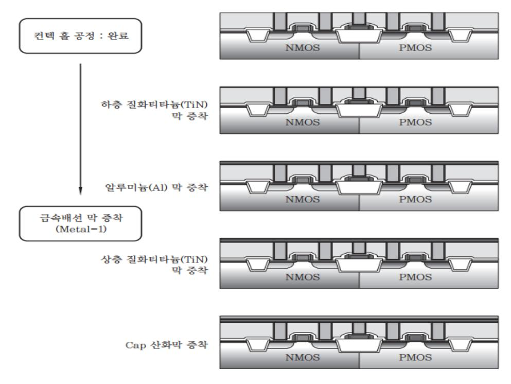

[그림 1-36] 금속 배선 공정의 1단계(하층 질화티타늄 막 증착~cap 산화막 증착)

- (2) 2단계 금속 배선 공정 흐름
  - (가) 금속 배선 공정에 소요되는 막이 증착이 완료되면 포토의 일련 공정 감광막 도 포, 노광, 현상의 순으로 패터닝 한다.
  - (나) 이후 금속 배선의 기하학적 구조 형성을 위해 플라즈마 건식 식각을 수행한다.
  - (다) 마지막으로 세정을 실시하며 금속 배선 일 공정(metal-1)을 완료한다.

[그림 1-37]에 금속 배선 공정의 2단계(포토 패턴~식각/세정)가 도시되어 있다.

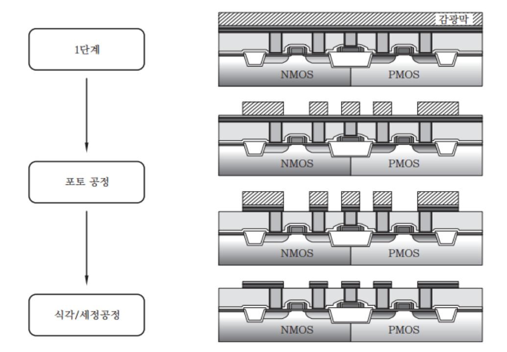

[그림 1-37] 금속 배선 공정의 2단계(포토 패턴~식각/세정)

- 3. 비아(via) 배선막 형성 공정을 실시한다.
  - (1) 비아 홀(via hole) 층의 형성
    - (가) 금속 1층(M1)으로부터 식각된 작고 큰 간격(틈)을 완전히 채우는 IMD(inter metal dielectric) 절연 박막(IMD-1) 증착
    - (나) (IMD-1 위에 평탄화를 위한 IMD-2 산화막 증착
    - (다) 포토 공정 시 웨이퍼 내 홀의 사이즈가 균일하도록 도와주는 IMD-2층의 평탄화
    - (라) 상층과 하층의 동일 사이즈 원기둥 포토 패턴과 식각
    - (마) IMD 층과 홀에 채워질 금속과의 스트레스(stress) 완화
    - (바) IMD 층으로부터 불순물 확산 방지막 형성
    - (사) 비아 홀을 틈이 없는 원기둥 형태로 채우는 금속 증착
    - (아) 비아 홀 형성 후 금속 배선 공정 시 포토 패턴의 균일도 향상을 위한 평탄화 [그림 1-38]에 비아 공정의 전체 흐름도를 도시하였다. [그림 1-39~41]에 1~ 3단계 비아 공정을 도시하였다.

[그림 1-39] 1단계 비아 공정도

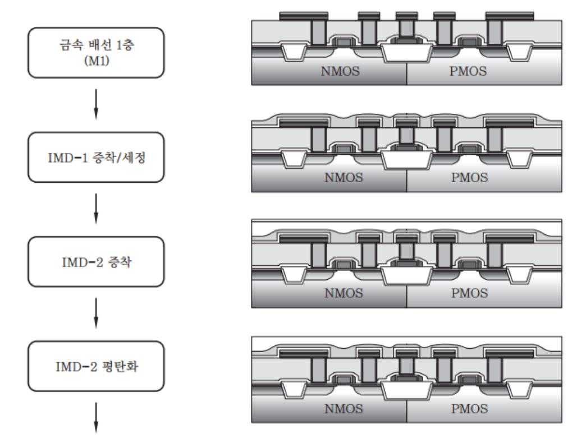

[그림 1-38] 비아 공정의 전체 흐름도

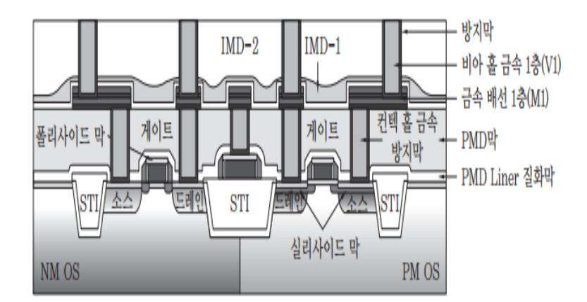

[그림 1-41] 3단계 비아 공정도

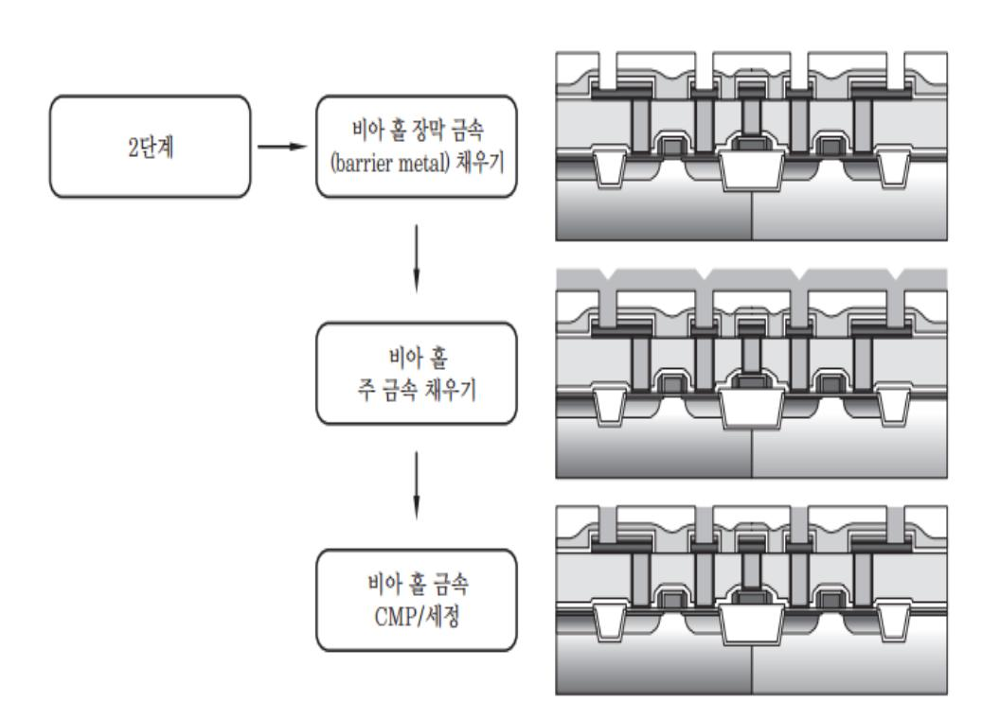

[그림 1-40] 2단계 비아 공정도

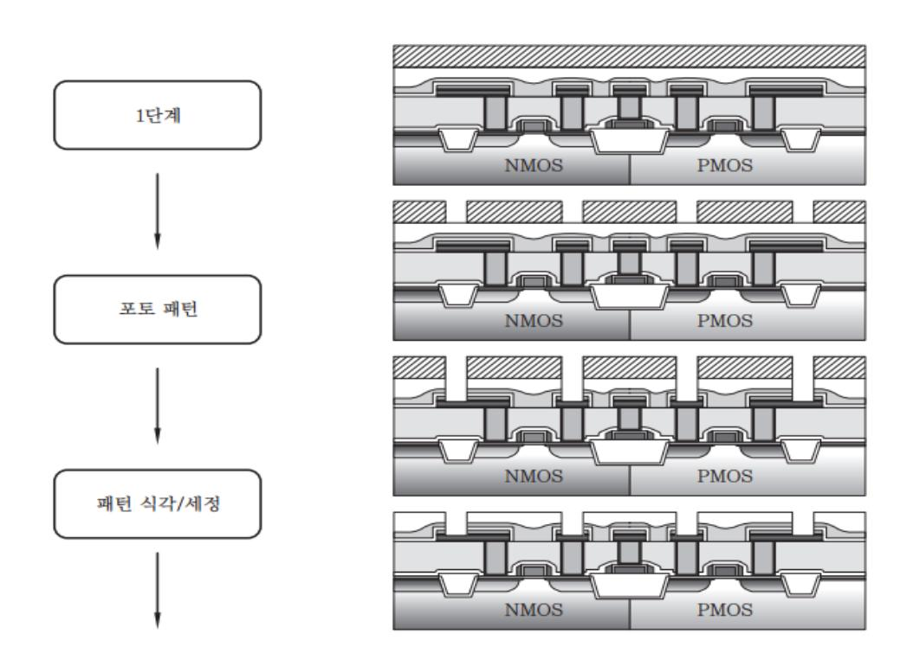

소자 완성 세부 공정을 한다.

1. 배선층 적층

(1) 다층 금속 배선(M2~M4)과 비아 배선(V2~V4) 공정한다.

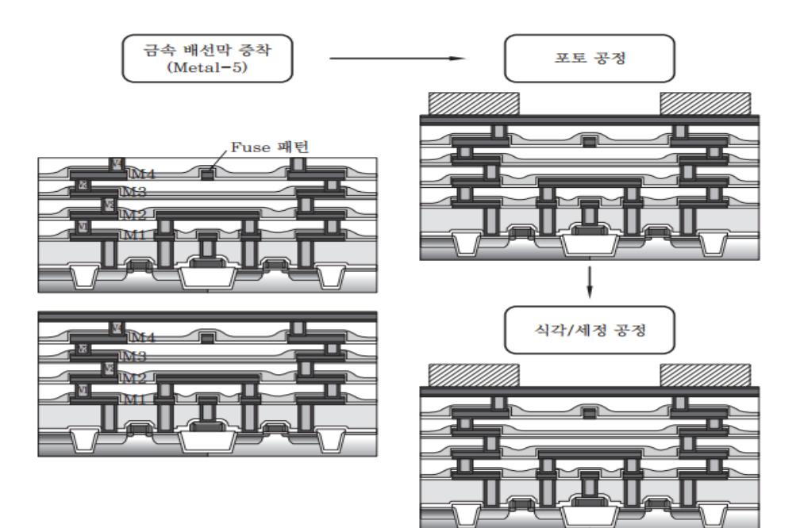

[그림 1-42] 최상층 금속 배선(M5) 공정 흐름

2. 퓨즈 연결 공정과 P/O 공정

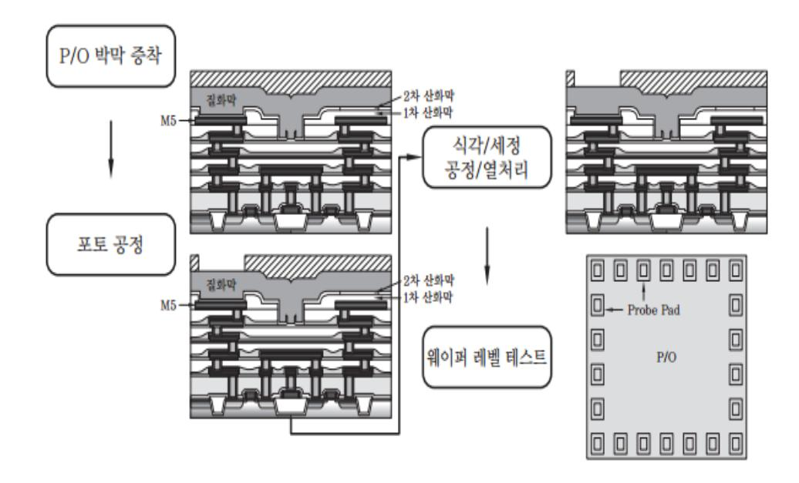

수행 완료 후 보고서를 작성한다.

- 1. 보고서에는 다음의 내용이 포함된다.
  - (1) 성명
  - (2) 작업자 연락처
  - (3) 작업 일시
  - (4) 수행한 내용 요약 (출처가 있는 경우 꼭 기입하도록 한다)
  - (5) 공정 흐름도 순서대로 진행한 공정 내용

## 학습1 교수·학습 방법

### 교수 방법

- 반도체 제조 공정 중에 해당 각 단위 제조 공정별로 충분히 이해 할 수 있도록 수업을 진 행한다.
- 반도체 제조 공정 중에 해당 각 단위 제조 공정별로 장비 구조와 역할을 충분히 이해할 수 있도록 해당 장비를 활용하여 수업을 진행한다.
- 반도체 단위 제조 공정 흐름도가 반도체 칩에서 어떤 역할을 하는지에 대해 원리를 토대로 설명한다.
- 학습자가 데이터 특성 평가 및 문서 작성법에 맞게 실습할 수 있도록 지속적인 관심을 갖도록 지도한다.
- 학습자가 준비한 보고서의 내용 및 발표 태도와 참관하는 다른 학습자의 태도도 유심히 살펴보고 피드백 해준다.

### 학습 방법

- 각 단위 공정별 공정, 장비 및 용어에 대한 이해를 높이기 위해서 런 시트(run sheet) 및 현장 일지 등의 대한 자료를 찾아본다.
- 반도체 공정 순서 흐름도에 따른 수행 순서에 맞추어 중요 사항들을 정리한다.
- 학습한 내용을 문서화 하여 발표해보고, 타 학습자의 내용과 비교한다.
- 다른 학습자의 발표 내용을 주의 깊게 듣고, 자신이 정리한 내용과 비교 하면서 수정한다.

# 학습1 평 가

### 평가 준거

- 평가자는 학습자가 학습 목표를 성공적으로 달성하였는지를 평가해야 한다.
- 평가자는 다음 사항을 평가해야 한다.

| 학습 내용           | 학습 목표                                                      |  | 성취수준 |   |
|-----------------|------------------------------------------------------------|--|------|---|
|                 |                                                            |  | 중    | 하 |
| 웨이퍼 종류와 특성      | - 웨이퍼 종류와 특성을 해석하고 설명할 수 있다.                               |  |      |   |
| MOSFET 구조       | - MOSFET 제작 구조를 해석하고 설명할 수 있다.                             |  |      |   |
|                 | - 메탈 배선의 적층 구조를 해석하고 설명할 수 있다.                             |  |      |   |
| 반도체 제조 공정 흐름 | - 패드(pad) 및 보호막(passivation layer)의 구조를 해석 하고 설명할 수 있다. |  |      |   |
|                 | - 공정 흐름도로부터 필요한 단위 공정을 파악할 수 있다.                           |  |      |   |

### 평가 방법

• 일지/저널

|                 | 평가 항목                                                   |  | 성취수준 |   |
|-----------------|---------------------------------------------------------|--|------|---|
| 학습 내용           |                                                         |  | 중    | 하 |
|                 | 웨이퍼 종류와 특성 - 웨이퍼 종류와 특성 해석 및 웨이퍼 종류에 대해 설 명할 수 있는 능력 |  |      |   |
| MOSFET 구조       | - MOSFET 제작 구조를 해석하고 설명할 수 있는 능력                        |  |      |   |
|                 | - 메탈 배선의 적층 구조를 해석하고 설명할 수 있는 능력                     |  |      |   |
| 반도체 제조 공정 흐름 | - 공정 흐름도로부터 필요한 단위 공정을 파악하고 설 명할 수 있는 능력             |  |      |   |
|                 | - 패드(pad) 및 보호막(passivation layer)의 구조를 해석 할 수 있는 능력 |  |      |   |

### • 서술형시험

| 학습 내용           | 평가 항목                                                   | 성취수준 |   |   |
|-----------------|---------------------------------------------------------|------|---|---|
|                 |                                                         | 상    | 중 | 하 |
|                 | 웨이퍼 종류와 특성 - 웨이퍼 종류와 특성을 해석하고 웨이퍼 종류 설명할 수 있는 능력     |      |   |   |
| MOSFET 구조       | - MOSFET 제작 구조를 해석하고 설명할 수 있는 능력                        |      |   |   |
| 반도체 제조 공정 흐름 | - 메탈 배선의 적층 구조를 해석하고 설명할 수 있는 능력                     |      |   |   |
|                 | - 공정 흐름도로부터 필요한 단위 공정을 파악하고 설 명할 수 있는 능력             |      |   |   |
|                 | - 패드(pad) 및 보호막(passivation layer)의 구조를 해석 할 수 있는 능력 |      |   |   |

• 구두 발표

| 학습 내용           | 평가 항목                                                   | 성취수준 |   |   |
|-----------------|---------------------------------------------------------|------|---|---|
|                 |                                                         | 상    | 중 | 하 |
|                 | 웨이퍼 종류와 특성 - 웨이퍼 종류와 특성을 해석하고 웨이퍼 종류를 설명 할 수 있는 능력   |      |   |   |
| MOSFET 구조       | - MOSFET 제작 구조를 해석하고 설명할 수 있는 능력                        |      |   |   |
| 반도체 제조 공정 흐름 | - 메탈 배선의 적층 구조를 해석하고 설명할 수 있는 능력                     |      |   |   |
|                 | - 공정 흐름도로부터 필요한 단위 공정을 파악하고 설 명할 수 있는 능력             |      |   |   |
|                 | - 패드(pad) 및 보호막(passivation layer)의 구조를 해석 할 수 있는 능력 |      |   |   |

### 피드백

1. 일지/저널 - 반도체 제조 공정을 단위별 진행 후 수행 보고서 평가 후 주요 사항을 표시하여 설명 하며, 평가 결과 일정 점수 이하는 추가 학습 후 재평가한다. 2. 서술형시험 - 반도체 공정 흐름도 나 MOSFET 구조 등 이론 시험 평가 후 각 문제에 대한 풀이를 시 행하며, 평가 결과 일정 점수 이하는 추가 학습 후 재평가한다. 3. 구두 발표

 - 발표 평가 후 해당 발표에 포함되어야 할 주요 내용에 대하여 설명하며, 발표 시 측정 장비 운영 매뉴얼 및 운용 방법 숙지 여부, 수행 및 평가 방법 파악 여부, 반도체 제조 공정이 환경이 미치는 영향 파악 능력 여부 등을 고려하여 평가한다.

| 학습 1 | 공정 흐름도 해석하기  |
|------|--------------|
| 학습 2 | 단위 소자 개발하기   |
| 학습 3 | 공정 소재 평가하기   |
| 학습 4 | 공정 장비 운용하기   |
| 학습 5 | 계측 운용 및 평가하기 |
| 학습 6 | 단위 공정 최적화하기  |

# **2-1.** 소자 측정 및 특성 데이터 평가 해석

| 학습 목표 | • 소자들의 특성 항목과 기준을 해석할 수 있다. • 소자들의 검증 패턴을 해석하고 적용할 수 있다. • 소자 특성 측정 데이터의 불량 여부를 파악할 수 있다. • 측정 데이터를 근거로 표준화된 기법에 의거, 장/단기 공정 특성 산포를 예측하고 문서화할 수 있다. |
|-------|-----------------------------------------------------------------------------------------------------------------------------------------------------------------|
|-------|-----------------------------------------------------------------------------------------------------------------------------------------------------------------|

필요 지식 /

소자 측정

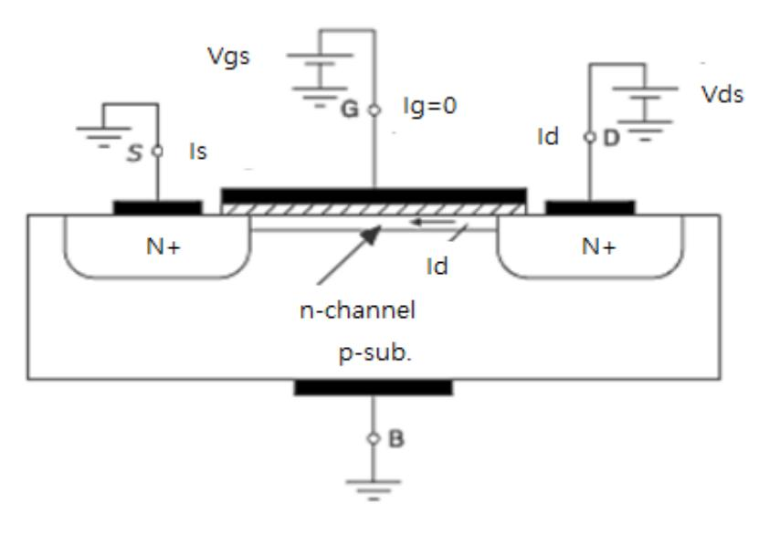

출처: 교육부(2015). 반도체 제조 공정개발(LM1903060106\_14v3). 한국직업능력개발원. p.18. [그림 2-1] 모스 소자의 각 측정 단자

반도체 소자의 소자 측정은 반도체 공정을 진행한 웨이퍼의 완성도 검증을 위해 반드시

필요한 평가 방법이다. 수백 가지가 넘는 반도체 공정 모든 스텝이 하나의 오류도 없이 진행되었는지를 판단하고 또한 이 소자를 사용한 제품의 평가에 중요한 구성 요소이기도 하기 때문에 단위 소자 평가는 매우 중요한 반도체 검증 방법이다.

소자 평가를 위해 공정 시작 전 단위 소자를 레이아웃하여 제품이 실리는 마스크에 포함 시키는데, 측정할 소자가 포함된 영역을 테스트 패턴이라고 한다. 이 테스트 패턴에는 여러 가지 단위 소자 즉 모스 소자, 바이폴라 소자, 커패시터, 저항 등 반도체 평가에 필요한 소자들을 모아서 단위 소자별로 측정할 수 있도록 한다.

이 단원에서는 반도체 소자의 가장 기본적인 모스 소자의 전압-전류 측정 커브를 중심으로 테스트 조건, 테스트 방법 및 테스트 결과 확인 등에 대하여 학습하기로 한다.

모스 소자 측정 개요

모스 소자는 그림과 같이 게이트, 소스, 드레인, 서브 등 4개의 단자로 구성되어 있으며 이 각 단자에 전압을 가해 주고 또한 각 단자의 전류를 측정하여 모스 소자의 특성 확인을 진행할 수 있다.

1. 모스 소자 출력 특성 Ids - Vds 커브

출력 특성을 나타내는 Ids - Vds 커브는 모스 소자의 드레인에 0부터 5V의 전압을 가하여 드레인의 전류를 확인하는 테스트이다. Vds의 ds는 소스에 대하여 드레인에 전압을 가한 다는 표시 방법으로 항상 전압 인가 시에는 상대적인 기준 단자에 대하여 전압을 가하는 단자가 존재하여 이렇게 표시한다. 또한 Ids 표현도 소스 단자에 대한 드레인 단자에서 전 류를 측정한다는 의미이다.

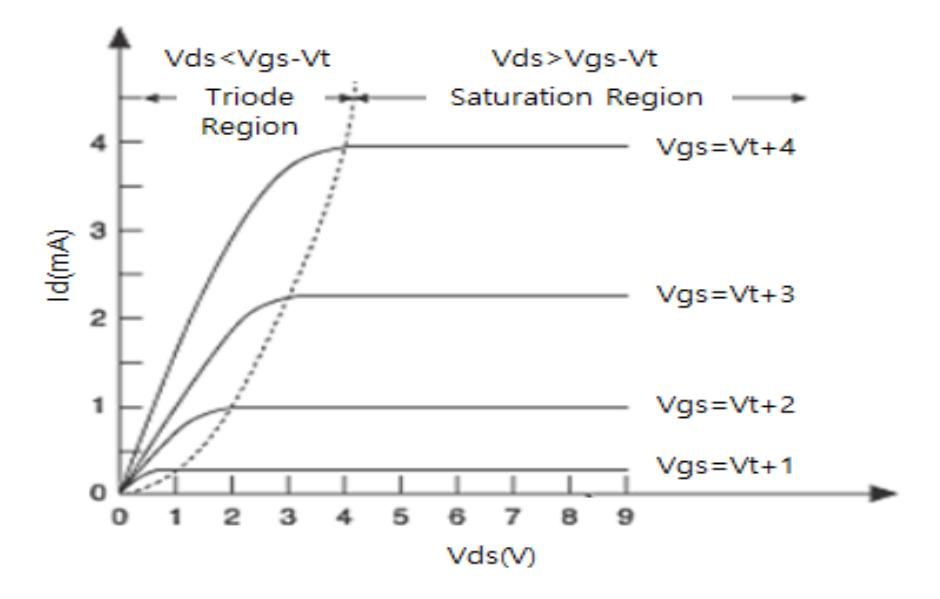

출처: 교육부(2015). 반도체 제조 공정개발(LM1903060106\_14v3). 한국직업능력개발원. p.19. [그림 2-2] 모스 소자의 출력 특성 Ids –Vds 커브

출력 특성 측정은 다른 단자에 대하여 상대적인 기준이 되는 소자 단자에 0V를 가하고, 서브 단자도 0V 이며, 게이트에는 Var1으로 1V, 2V, 3V, 4V, 5V를 각각 가하면서 드레인 단자에 0V부터 5V까지 전압을 증가시키면서 드레인 단자에서 전류를 측정한다(5V 소자 기준으로 설명). 측정 결과는 [그림 2-2]와 같은 커브 모양을 보이며 각 커브의 변곡점을 이어서 그려보면 포물선 모양이 보이는데 이것은 리니어(선형) 영역과 새처레이션(포화) 영역을 구분하는 경계를 표시한다. 게이트 전압과 드레인 전압이 5V일 때의 드레인 전류 값을 새처레이션 전류라고 하며 이 값이 반도체 소자에서 중요한 파라미터로 읽힌다. 또 게이트 전압 5V이고 드레인 전압 0.1V일 때의 전류값을 읽어 전류와 전압의 관계에서 저 항값을 구하면 이것이 측정한 모스 소자의 온(on) 상태에서의 저항값이 되는데, 이 또한 중요한 파라미터이다.

### 2. 모스 소자 전달 특성 Ids - Vgs 커브

다음은 드레인 단자에 0.1V 만큼의 적은 전압을 가해 주고 게이트 단자에 0V부터 5V까지 전압을 증가시키며 드레인 단자에서 전류를 읽는 측정을 Ids –Vgs 전달 특성 커브 측정이 라고 한다. 이 측정에서는 모스 소자의 한계 수준(threshold) 전합, 즉 Vth 값을 측정하는 커브 확인 방법으로 드레인 전류가 어느 일정값 이상으로 흐르는 순간의 전압을 Vth라고 지정한다. 또한 이 파라미터도 반도체 소자에서 매우 중요하다. Vth를 판단하는 드레인 전류값은 단순히 1uA로 정하는 방법과 드레인 전류의 순간 미분값(즉 각 전류의 상대적인 증가분을 계산한 값)을 같이 확인하여 그 미분값이 가장 큰 점일 때의 게이트 전압을 Vth 라고 정하는 방법 등 몇 가지 방법이 존재한다.

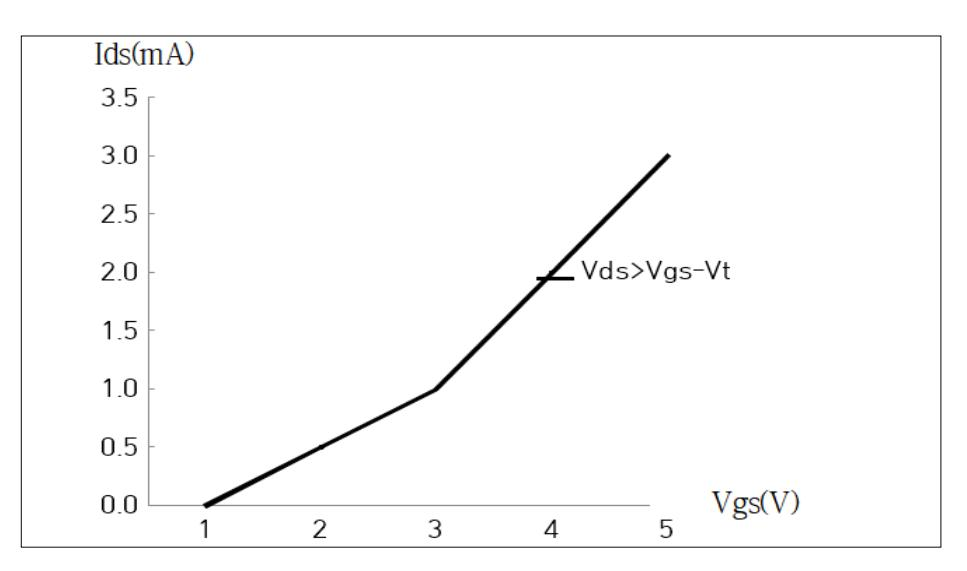

출처: 교육부(2015). 반도체 제조 공정개발(LM1903060106\_14v3). 한국직업능력개발원. p.20. [그림 2-3] 모스 소자 Ids - Vgs 커브

### 3. 모스 소자 브레이크 다운 특성 커브

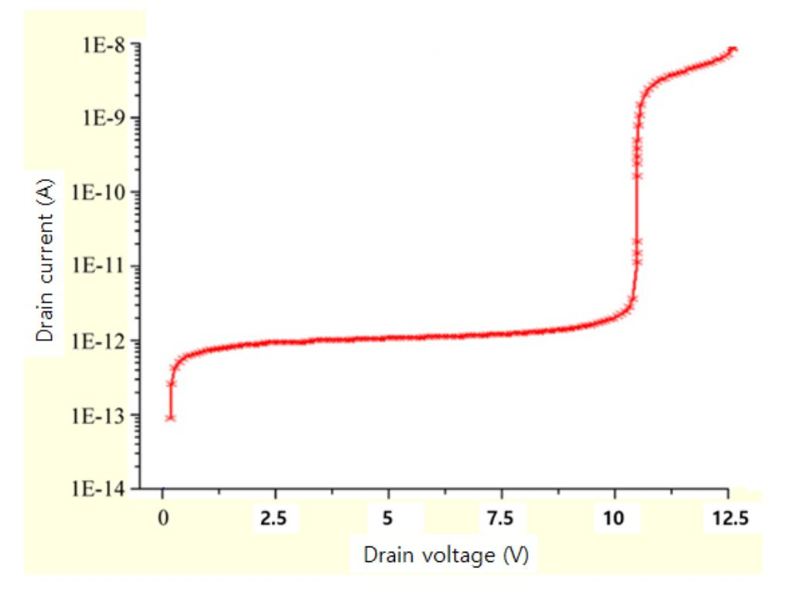

출처: 교육부(2015). 반도체 제조 공정개발(LM1903060106\_14v3). 한국직업능력개발원. p.21. [그림 2-4] 모스 소자의 브레이크다운 특성 커브

Ids - Vds 커브 반도체 소자는 동작 전압을 넘는 브레이크다운(소자 파괴) 전압을 가져야 하며 일반적으로 동작 전압의 130% ~ 150% 정도의 소자 파괴 전압을 갖는다. 측정의 경우, 나머지 단자는 0V를 가하고 드레인 단자에 0V부터 5V 이상의 전압을 가하면서 드레인 전류를 확인하여 1uA 이상 넘는 드레인 전압을 소자 파괴 전압이라고 한다. 소자 파괴 전압까지 보이는 드레인 전류는 리키지(유실) 전류라고 하며 보통 수 nA 수준의 전류값을 갖는다.

### 수행 내용 / 단위 소자 측정 및 특성 평가하기

### 재료·자료

- 반도체 모스 소자 측정 웨이퍼
- 소자 측정 패턴 설명서
- 소자 측정 장비 사용 설명서

### 기기(장비 ・ 공구)

- 소자 측정 프루브 장비
- 소자 측정 장비

### 안전·유의 사항

- 단위 소자 측정하고 특성을 파악하기 위해서는 사용 환경에 대해 적절한 파악 및 조치가 있어야 한다.
- 측정 장비에 대한 충분한 숙지를 통해 안전사고 방지를 위한 사전 조치가 선행되어야 한다.

### 수행 순서

목표를 설정한다.

모스 소자의 출력 특성 Ids - Vds, 전달 특성 Ids - Vgs, 브레이크다운 커브(breakdown curve) 및 리키지 커브(leakage curve)를 측정하여 반도체 소자가 정상인지를 판단하는 것을 목표로 한다.

- 모스 소자를 측정한다.
  - 1. Ids Vds 커브를 확인한다.
    - (1) 기준 전압인 소스 단자에 0V를 세팅한다.
    - (2) 서브 단자에 0V를 세팅한다.
    - (3) 게이트 단자에 1V부터 5V까지 1V 단위로 전압을 가하도록 세팅한다.
    - (4) 드레인 단자에 1V부터 5V까지 전압을 스윕(sweep)하도록 세팅한다.
    - (5) 시작 버튼을 눌러 모든 단자에 전압이 가하여 전류를 읽도록 진행시킨다.

- (6) 화면에 측정되는 각 단자의 전류값 중 드레인 단자의 전류값을 Y축에, 드레인 단자 의 전압값을 X축에 표시한 커브를 확인한다.
- (7) 가해진 전압 또는 측정된 전류값에 이상이 있는지 확인한다.
- 2. Ids Vgs 커브를 확인한다.
  - (1) 기준 전압인 소스 단자에 0V를 세팅한다.
  - (2) 서브 단자에 0V를 세팅한다.
  - (3) 드레인 단자에 0.1V를 세팅한다.
  - (4) 게이트 단자에 1V부터 5V까지 전압을 스윕(sweep)하도록 세팅한다.
  - (5) 시작 버튼을 눌러 모든 단자에 전압을 가하여 전류를 읽도록 진행시킨다.
  - (6) 화면에 측정되는 각 단자의 전류값 중 드레인 단자의 전류값을 Y축에, 게이트 단자 의 전압값을 X축에 표시한 커브를 확인한다.
  - (7) 가해진 전압 또는 측정된 전류값에 이상이 있는지 확인한다.
  - (8) 드레인 전류가 1uA 또는 드레인 전류값의 미분값이 최대인 점의 게이트 전압값을 읽어 스레시홀드 전압(Vth)을 확인한다.
- 3. 브레이크다운 커브를 확인하고 리키지 전류를 측정한다.
  - (1) 기준 전압인 소스 단자에 0V를 세팅한다.
  - (2) 서브 단자에 0V를 세팅한다.
  - (3) 게이트 단자에 0V를 세팅한다.
  - (4) 드레인 단자에 1V부터 5V까지 전압을 스윕(sweep)하도록 세팅한다.
  - (5) 시작 버튼을 눌러 모든 단자에 전압을 가하여 전류를 읽도록 진행시킨다.
  - (6) 화면에 측정되는 각 단자의 전류값 중 드레인 단자의 전류값을 Y축에(로그 스케일), 드레인 단자의 전압값을 X축에 표시한 커브를 확인한다.
  - (7) 가해진 전압 또는 측정된 전류값에 이상이 있는지 확인한다.
  - (8) 드레인 전류가 1uA일 때의 드레인 전압값을 읽어 브레이크다운 전압을 확인한다.
  - (9) 드레인 전압 5V일 때의 드레인 전류값을 읽어 드레인 리키지 전류를 확인한다.

# **2-2.** 소자 측정 장비 파악

학습 목표 • 소자 분석 장비의 사용법을 해석하고 적용할 수 있다.

## 필요 지식 /

반도체 소자 측정 장비 종류

반도체 소자 측정 장비는 일반적으로 파라미터 애널라이저라는 장비를 사용하며 일일이 손으로 전압을 입력하고 측정하는 매뉴얼 방법과 베이직 프로그램과 비슷한 프로그래밍을 이용한 자동 측정 방법이 있다. 측정 장비 안에 전압, 전류를 가하는 소스 장비와 전압, 전류를 모니터링 하는 감지 장비가 같이 포함되어 있으며 또한 이들을 컨트롤하기 위한 입력키, 디스플레이 장치가 하나의 장비에 구성되어 있다.

이 장비는 웨이퍼에 포함되어 있는 반도체 측정 소자 패턴과 연결하기 위해 프로브(probe) 핀 또는 프로브 카드와 케이블로 연결되어 있으며 이 케이블의 저항 및 커패시터의 관리도 장비 운영상 또한 중요한 항목이다.

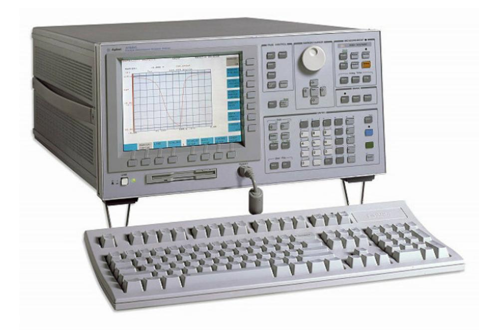

출처: 교육부(2015). 반도체 제조 공정개발(LM1903060106\_14v3). 한국직업능력개발원. p.24. [그림 2-5] 파라미터 애널라이저

일반적인 소자 측정을 위한 파라미터 애널라이저 이외에 반도체 커패시터 측정을 위한

C-V 측정 장비가 있으며 또한 RF 특성 파악을 위해 측정 프리컨시를 가변할 수 있는 RF 애널라이저도 측정 장비에 포함된다.

반도체 소자 측정 장비 운영 중 오류 발생은 일반적으로 커먼 그라운드 불량이 많다. 이 것은 장비들의 그라운드 단자가 서로 일치하지 않아 기준점이 다른 상태에서 전압을 가하고 측정값을 읽게 되는 경우 발생할 수 있다. 이 때 측정값이 상이한 결과가 나타나서 소자 평가가 올바르지 않게 될 수 있기 때문이다. 이를 방지하기 위해서는 항상 커먼 그라운드를 점검해야 하며 골든 기준 소자를 준비하여 주기적으로 이를 확인하여야 한다.

### 수행 내용 / 소자 측정 장비 파악하기

### 재료·자료

- 반도체 모스 소자 측정 웨이퍼
- 소자 측정 패턴 설명서
- 소자 측정 장비 사용 설명서

### 기기(장비 ・ 공구)

- 소자 측정 프로브 장비
- 소자 측정 장비

### 안전·유의 사항

- 단위 소자 측정하고 특성을 파악하기 위해서는 사용 환경에 대한 적절한 파악 및 조치가 있어야 한다.
- 측정 장비에 대한 충분한 숙지를 통해 안전사고 방지를 위한 사전 조치가 선행되어야 한다.

### 수행 순서

목표를 설정한다.

모스 소자의 출력특성 Ids - Vds, 전달 특성 Ids - Vgs, 브레이크다운 커브 및 리키지 커브를 측정하여 반도체 소자가 정상인지를 판단하는 것을 목표로 한다.

모스 소자를 측정한다.

1. Ids - Vds 커브를 확인한다.

- (1) 기준 전압인 소스 단자에 0V를 세팅한다.
- (2) 서브 단자에 0V를 세팅한다.
- (3) 게이트 단자에 1V부터 5V까지 1V 단위로 전압을 가하도록 세팅한다.
- (4) 드레인 단자에 1V부터 5V까지 전압을 스윕(sweep)하도록 세팅한다.
- (5) 시작 버튼을 눌러 모든 단자에 전압을 가하여 전류를 읽도록 진행시킨다.
- (6) 화면에 측정되는 각 단자의 전류값 중 드레인 단자의 전류값을 Y축에, 드레인 단자 의 전압값을 X축에 표시한 커브를 확인한다.
- (7) 가해진 전압 또는 측정된 전류값에 이상이 있는지 확인한다.

2. Ids - Vgs 커브를 확인한다.

- (1) 기준 전압인 소스 단자에 0V를 세팅한다.
- (2) 서브 단자에 0V를 세팅한다.
- (3) 드레인 단자에 0.1V를 세팅한다.
- (4) 게이트 단자에 1V부터 5V까지 전압을 스윕(sweep)하도록 세팅한다.
- (5) 시작 버튼을 눌러 모든 단자에 전압을 가하여 전류를 읽도록 진행시킨다.
- (6) 화면에 측정되는 각 단자의 전류값 중 드레인 단자의 전류값을 Y축에, 게이트 단자 의 전압값을 X축에 표시한 커브를 확인한다.
- (7) 가해진 전압 또는 측정된 전류값에 이상이 있는지 확인한다.
- (8) 드레인 전류가 1uA 또는 드레인 전류값의 미분 값이 최대인 점의 게이트 전압값을 읽어 스레시홀드 전압(Vth)을 확인한다.
- 3. 브레이크다운 커브를 확인하고 리키지 전류를 측정한다.
  - (1) 기준 전압인 소스 단자에 0V를 세팅한다.
  - (2) 서브 단자에 0V를 세팅한다.
  - (3) 게이트 단자에 0V를 세팅한다.
  - (4) 드레인 단자에 1V부터 5V까지 전압을 스윕(sweep)하도록 세팅한다.
  - (5) 시작 버튼을 눌러 모든 단자에 전압을 가하여 전류를 읽도록 진행시킨다.
  - (6) 화면에 측정되는 각 단자의 전류값 중 드레인 단자의 전류값을 Y축에(로그 스케일), 드레인 단자의 전압값을 X축에 표시한 커브를 확인한다.
  - (7) 가해진 전압 또는 측정된 전류값에 이상이 있는지 확인한다.
  - (8) 드레인 전류가 1uA일 때의 드레인 전압값을 읽어 브레이크다운 전압을 확인한다.
  - (9) 드레인 전압 5V일 때의 드레인 전류값을 읽어 드레인 리키지 전류를 확인한다.

## 학습2 교수·학습 방법

### 교수 방법

- 반도체 소자들의 특성 항목과 기준에 대해 설명한 후 검증 패턴의 사례를 토대로 해석하는 방법을 안내한다.
- 반도체 소자 측정 프로세스 및 파라미터 종류에 따른 측정 장비에 대하여 설명한다.
- 단위 소자 측정 및 특성 데이터 평가 및 소자 측정 장비에 대한 이해를 높이기 위하여 현장 일지 및 저널 등의 자료를 통해 사례를 제시한다.
- 소자 측정 특성 데이터의 불량 유무에 대한 사례를 구체적으로 제시하고 대처 방법을 안내한다.
- 반도체 단위 소자 측정 및 특성 데이터 평가 및 장비에 대한 사항에 대한 시나리오를 제시하여 학습자가 이에 대해 순차적으로 이해하고 있는지 질문법을 이용해 계속적으로 확인한다.

### 학습 방법

- 반도체 소자 측정 개념 및 소자 종류에 대해 문서화하여 정리한다.
- 반도체 소자 측정 프로세스에 대하여 인지하고 확인한다.
- 반도체 소자 측정 파라미터 종류를 확인한다.
- 반도체 소자 측정에 필요한 주요 측정 장비를 확인한다.
- 반도체 소자 측정 결과 커브에 대하여 인지하고, 실습을 통해 커브를 분석하여 보고서를 작성한다.
- 반도체 소자 측정 장비 운영에 대하여 인지하고, 실습을 통해 충분히 파악한다.

# 학습2 평 가

### 평가 준거

- 평가자는 학습자가 학습 목표를 성공적으로 달성하였는지를 평가해야 한다.
- 평가자는 다음 사항을 평가해야 한다.

| 학습 내용                         | 학습 목표                                                        | 성취수준 |   |   |  |
|-------------------------------|--------------------------------------------------------------|------|---|---|--|
|                               |                                                              | 상    | 중 | 하 |  |
| 단위 소자 측정 및 특성 데이터 평가 해석 | - 소자들의 특성 항목과 기준을 해석할 수 있다.                                  |      |   |   |  |
|                               | - 소자들의 검증 패턴을 해석하고 적용할 수 있다.                                 |      |   |   |  |
|                               | - 소자 특성 측정 데이터의 불량 여부를 파악할 수 있다.                             |      |   |   |  |
|                               | - 측정 데이터를 근거로 표준화된 기법에 의거, 장/단기 공정 특성 산포를 예측하고 문서화할 수 있다. |      |   |   |  |
| 소자 측정 장비 파악                | - 소자 분석 장비의 사용법을 해석하고 적용할 수 있다.                              |      |   |   |  |

### 평가 방법

• 일지/저널

| 학습 내용                         | 평가 항목                        | 성취수준 |   |   |
|-------------------------------|------------------------------|------|---|---|
|                               |                              | 상    | 중 | 하 |
| 단위 소자 측정 및 특성 데이터 평가 해석 | - 소자들의 특성 항목과 기준 파악 및 해석 능력  |      |   |   |
| 소자 측정 장비 파악                | - 소자 측정 장비 측정 및 커브 확인과 분석 능력 |      |   |   |

• 서술형시험

| 학습 내용                         | 평가 항목                        | 성취수준 |   |   |
|-------------------------------|------------------------------|------|---|---|
|                               |                              | 상    | 중 | 하 |
| 단위 소자 측정 및 특성 데이터 평가 해석 | - 소자들의 특성 항목과 기준 파악 및 해석 능력  |      |   |   |
| 소자 측정 장비 파악                | - 소자 측정 장비 측정 및 커브 확인과 분석 능력 |      |   |   |

### 피드백

1. 일지/저널

 - 반도체 단위 소자 측정 및 특성 데이터 평가에 있어서 수행 보고서 평가 후 주요 사항 을 표시하여 설명하며, 평가 결과 일정 점수 이하는 추가 학습 후 재평가한다.

- 단위 소자 측정 및 특성 데이터 평가 항목이나 소자 측정하는 장비에 대해 설명을 충 분히 하도록 하고 이해하고 있는지 체크하여 재수행한다.
- 2. 서술형시험
- 단위 소자 측정 및 특성 데이터 평가에 대해 이론 시험 평가 후 각 문제에 대한 풀이 를 시행하며, 평가 결과 일정 점수 이하는 추가 학습 후 재평가한다.
- 단위 소자 측정 및 특성 데이터 평가 항목이나 소자 측정하는 장비에 대해 설명하게 하고 부족한 부분의 재수행을 통해 이해할 수 있도록 한다.

| 학습 1 | 공정 흐름도 해석하기  |
|------|--------------|
| 학습 2 | 단위 소자 개발하기   |
| 학습 3 | 공정 소재 평가하기   |
| 학습 4 | 공정 장비 운용하기   |
| 학습 5 | 계측 운용 및 평가하기 |
| 학습 6 | 단위 공정 최적화하기  |

# **3-1.** 공정 소재 측정 및 특성 평가

| • 공정 소재들의 검증 패턴을 해석하고 적용할 수 있다. 학습 목표 • 공정 소재 특성 평가 데이터의 불량 여부를 파악할 수 있다. • 평가 데이터를 근거로 표준화된 기법에 의거, 장/단기 공정 특성 산포를 예측하고 평가하여 보고서를 작성할 수 있다. |
|----------------------------------------------------------------------------------------------------------------------------------------------------------|
|----------------------------------------------------------------------------------------------------------------------------------------------------------|

필요 지식 /

반도체 공정 재료 개요

반도체 제품의 제조 공정 시 소요되는 물질들을 통칭하여 반도체 재료라 한다. 반도체 웨이퍼 제조 공정에서 사용되는 통상적인 주요 재료는 기판, 노광 재료, 가스 재료, 금속 재료, 습식 화공 약품으로 분류할 수 있다. 상기 재료와 더불어 반도체 공정 기술을 이용 하여 제조되는 응용(바이오, 환경, 기능성)소자 제조 시 나노 소재와 같은 새로운 신소재들도 반도체 재료로 사용되고 있다.

반도체 공정 재료의 선택은 각 공정에서 요구되는 순도, 불순물 종류와 함량, 제품에 미치는 영향 등을 고려하여 이루어져야 한다. 특히 공정 후 주어진 공정 규격을 만족하는 수준과 성능을 지니는 것을 의미한다. 기판은 무결점과 정확한 방향성, 노광 재료는 선폭과 두께, 가스 재료는 크게 화학 증착, 건식 식각, 세정 세 가지로 구분되는데 건식 식각 가스는 패턴 프로파일(profile)과 잔류 패턴이 남지 않는 기능, 화학 증착과 세정은 결합 반응에서 불순물 입자를 부산물로 생성하지 않는 특성을 가져야한다. 금속 재료의 경우 공정 규격을 만족 하는 반사율과 면 저항값을 가져야하고, 나노 소재의 경우 불순물이 포함되지 않는 높은 순도를 가져야한다. <표 3-1>에 재료와 종류가 정리되어있다.

<표 3-1> 반도체 공정 재료

| 재료     | 종류                                                                                                                                                                                                                                           |
|--------|----------------------------------------------------------------------------------------------------------------------------------------------------------------------------------------------------------------------------------------------|
| 반도체 기판 | - 순수 반도체 기판(Si, Ge 등) - 화합물 반도체 기판(SiC, Sn, SnO₂, PbS, GaAsP, InGaAsP 등)                                                                                                                                                                  |
| 노광 재료  | - 감광액(PR), 현상액, 감광막 제거액, 표면 처리액                                                                                                                                                                                                              |
| 가스 재료  | - 증착 가스 (SiH4, SiH2Cl2, SiHCl3, SiCl4, AsH3, B2H6, BBr3, BCl3, CH4, Cl2, GeH4, PH3, TeH2, SnCl4, GeCl4, WF6, NH3, MoF6 등) - 식각 가스 (HCl, HF, HBr, SF6, Cl2, SiF4, CF4, C3F8,C2F6,C4F6, CClF3, CF4 등) - 세정 가스(NF3, CF4, C4F8 등) |
| 금속 재료  | - Al, Cu, Mo, Pt, Ta, Ti, W, Au, Ag 등                                                                                                                                                                                                        |
| 나노 소재  | - 그래핀(graphine), 탄소 나노 튜브, 나노 와이어, 금속 나노 입자                                                                                                                                                                                                  |

### 반도체 기판

반도체 기판은 전기전자 소자와 태양전지, MEMS 제작에 사용되는 단결정 실리콘 웨이퍼, 전력 소자에 사용되는 고저항 에피 웨이퍼, 광 방사 다이오드(LED)소자에 사용되는 사파 이어 웨이퍼 등이 있다. 웨이퍼 종류는 여러 가지로 분류할 수 있는데, 첨가 불순물 종류 에 따른 분류, 웨이퍼 직경의 크기에 따른 분류, 추가적인 공정에 의한 분류, 웨이퍼 결정 성장 방향에 따른 분류 등을 할 수 있다. 이 중 가장 널리 사용되는 실리콘 웨이퍼에 대 하여 살펴본다. 웨이퍼 직경에 따른 기판용 단결정 실리콘 잉곳(ingot)과 사이즈별 웨이퍼 의 모습이 [그림 3-1]에 나타나있다. 웨이퍼 방향을 표시하기에 따라 노치(notch)와 플랫 (flat)형이 존재하고 플랫형에 대한 웨이퍼 결정방향 정보를 [그림 3-2]와 같이 구분한다.

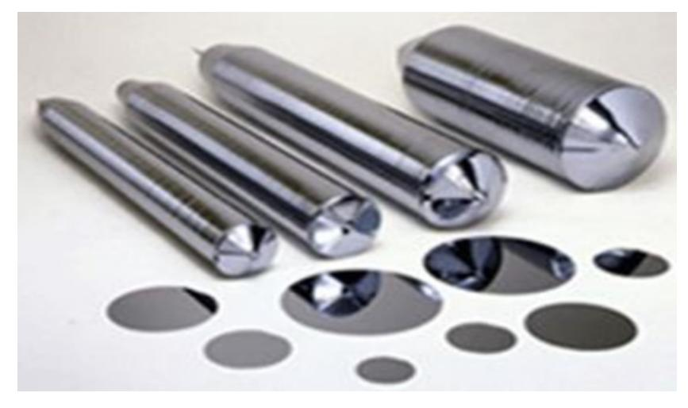

[그림 3-1] 실리콘 웨이퍼 직경의 크기

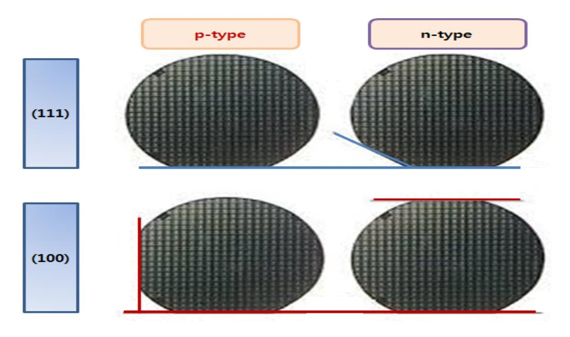

[그림 3-2] 실리콘 웨이퍼 플랫(Flat)한 모양으로 알 수 있는 결정 특성

1. 특성과 기준

실리콘 웨이퍼는 1412 ℃의 높은 녹는점을 갖고 있다 이 특성은 실리콘 웨이퍼가 고온의 온도에서 공정을 견딜 수 있어 반도체의 응용성과 신뢰도가 높은 상태에서 작동할 수 있는 장점이 된다. 대기 환경에서 자연 산화막(SiO₂)이 형성되어 외부의 오염을 방지 하고, 실 리콘 웨이퍼 제조에서 사용되는 절연막, 유전막을 큰 계면 결함 없이 성장시킬 수 있다는 것이다. 또한 다결정 실리콘인 폴리실리콘(poly-silicon)을 쉽게 성장시킬 수 있어 전도도가 양호한 게이트 배선으로 사용한다. 특성 파악 시 가장 주요 항목은 유형(type), 두께, 비저 항이다. 웨이퍼는 주입되는 불순물에 따라 전자가 다수 운반자인 n-타입(n-type)과 정공이 다수운반자인 p-타입(p-type)으로 구분된다. <표 3-2>에 8인치 단결정 실리콘 웨이퍼의 특성 항목과 기준값이 표시되었다.

| 특성 항목              | 기준값                                                |
|--------------------|----------------------------------------------------|
| 지름                 | 8 인치(200 밀리미터)                                     |
| 결정 성장법             | CZ, FZ                                             |
| 등급(grade)          | 프라임(prime), 테스트, 더미(dummy)                         |
| 유형과 방향성            | notch/flat, 111/100                                |
| n-type 도펀트(dopant) | 농도                                                 |
| p-type 도펀트(dopant) | 농도                                                 |
| 비저항(ohm-cm)        | 저저항: 0.001 ~ 0.1 중저항: 1 ~ 30 고저항: 100 ~ 1000 |
| 두께                 | 725 um 또는 고객 요구 사양                                 |
| 표면 경면 상태           | 한쪽 면, 양쪽 면                                         |

<표 3-2> 웨이퍼 주요 특성 기준

### 2. 원재료 웨이퍼(bare wafer)에 추가적 공정을 거친 응용기판

반도체 소자 제조에 추가적인 공정을 통해 새로운 응용 기판을 제작하는데 연마된 (polished) 웨이퍼, 에피텍시얼(epitaxial) 웨이퍼, SOI(silicon on insulator) 웨이퍼 등이 있다. 응용 기판은 메모리 소자 제조에 사용되는 원재료 실리콘 웨이퍼와는 달리 다양한 응용 소자 제작을 위해 기판에 일련의 공정을 거쳐 새로운 기능을 갖도록 할 수 있다는 특성이 있다.

(1) 에피 (EPI) 기판

실리콘 에피 기판은 실리콘 기판위에 화학적 증착법을 이용해 새로운 전기적 특성을 갖는 단결정 실리콘 층이 증착된 응용 기판이다. 전력 소자 제작에 많이 사용된다. 에 피(EPI) 웨이퍼의 특성은 에피(EPI) 실리콘 내의 불순물 농도를 조절하여 실리콘 기판 과는 다른 불순물 농도(비저항)를 갖는 것이다. 원재료 실리콘 기판 위에 에피층을 성 장시키면 실리콘 기판이 갖고 있는 불순물을 포함하지 않는 순수한 단결정층을 얻을 수 있어 소자의 특성을 향상시킬 수 있다. 일반적으로 소구경 및 비메모리 분야에 사 용되고 있고, 실리콘 기판의 대구경화 및 메모리의 고집적화를 위해서 사용되고 있다. 전력 소자용 p-채널 LDMOS 전력 소자 에피 기판 구조가 [그림 3-3]에 나타나 있다.

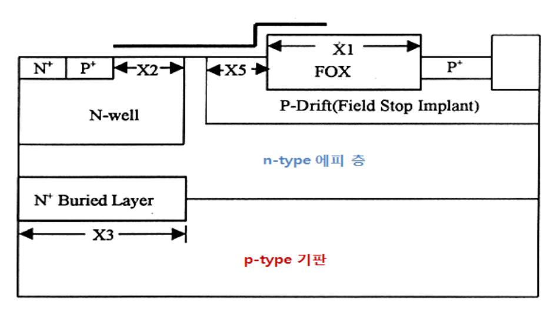

[그림 3-3] p-채널 LDMOS 전력 소자 에피 기판 구조

(2) SOI(silicon on insulator) 기판

SOI 기판은 원재료 실리콘 단결정층 사이에 절연층이 형성되어 있는 실리콘 2중 막 구 조를 갖고 있다. 특징은 실리콘 웨이퍼 표면 아래의 기층부에 존재하는 결함이나 불순 물을 표면과 기층부 사이에 절연층을 형성시킨 것이다. 이로써 기층부로부터의 영향을 제거하여 절연체 위에 형성된 고순도 실리콘 층의 가공, 효율 및 특성을 향상시킨 웨 이퍼라고 할 수 있다. SOI 기판을 사용할 경우 트랜지스터의 저항을 줄여 저전력 고속 칩을 생산할 수 있어 1G급 이상의 메모리 반도체와 휴대형 정보통신기기용 반도체 소 자 생산에 사용된다.

SOI 기판 웨이퍼는 원재료 웨이퍼에 비해 매우 높은 가격을 형성하고 있어 아직까지 그 적용 분야가 제한적이지만 향후 반도체의 고집적화가 급진전될 경우 필수적으로 요구되는 기판 웨이퍼가 될 것이다. [그림 3-4]에 기본적 구조가 도시되어있다.

### 3. 검증 패턴 및 특성 평가 불량 처리

기판은 패턴이 없는 상태이므로 비저항의 경우 4-프로브 방법을 이용하여 저항을 측정한 다. 두께는 마이크로미터, 지름은 자, 표면 경면 상태는 유관으로 측정하고 사양과 비교한 다. 상기 항목에서 제시한 사양서와 비교하여 기준값을 벗어나면 불량으로 처리한다.

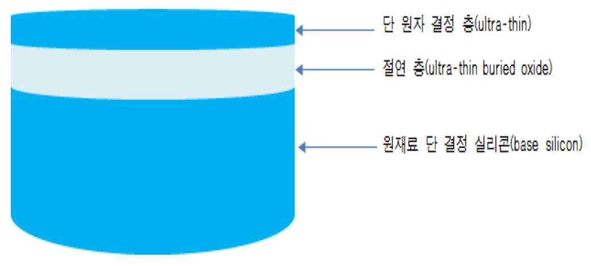

[그림 3-4] SOI 기판 웨이퍼 구조

- 노광 재료
  - 1. 감광제(photoresist)
    - (1) 특성과 기준

감광제는 빛, 방사, 열 등 다양한 형태의 에너지에 노출되었을 때 내부 구조가 재구성 되는 특성을 가진 고분자 화합물이다. 통상적으로 반도체 산업 분야에서는 포토레지스 트라고 부른다. 반도체 제조 공정 중의 하나인 사진식각 공정(lithography)에서 쓰이고, 이미 설계된 회로도가 그려진 마스크를 통해 웨이퍼로 전사할 때 사용하는 감광성 고 분자 재료로 반도체 사진 공정에서 핵심 소재이다. KrF나 ArF 레이저 및 기타 미세 가공 기술공정에서 적합한 감광제 재료는 기본적으로 물성적인 측면에서 무결점의 박 막형성, 웨이퍼 기판에 대한 접착력 등이 요구되며, 물성 외에 주어진 노광 파장에서 50% 이상 높은 광투과도와 플라즈마 반응성 건식 식각(reactive ion etching: RIE)에 대 한 내성이 기존의 노볼락 레진 수준이 되어야 하고, 현재 통상적으로 사용 중인 기존 의 2.38% TMAH 알칼리 용액으로 현상되어야 한다.

### (가) 해상력 (resolution)

감광제(PR)가 주어진 패턴 사이즈와 모양을 노광 후 정확하게 분리하여 구현할 수 있는지를 나타내는 성능 지표이다. 193nm에 감응하는 감광제의 경우에는 80nm 이 하의 해상력이 요구된다. 해상력의 증진은 감광제 특성, 노광과 현상 기술에 의존 한다. 노광 기술과 현상 기술이 한계에 이르렀을 때 감광제의 해상력 향상은 필수 적이다. 향상되어야 하는 감광제가 가져야할 특성은 노광 시 광효율, 감광제 내부 의 산의 확산도 및 현상액에 대한 용해도 차이가 결정한다. 상기 언급한 3가지 특 성에 대한 개선을 위해 다양한 형태와 특성을 갖는 고분자와 광산 발생제 등을 개 발하고 있다.

(나) 내식각성(etch resistance)

건식 식각 시 형성된 감광막 패턴은 식각 시 변형이나 분해 현상이 발생되지 않아 야한다. 내식각성이라고 하고, 이 내식각성은 주로 감광제에 사용되는 고분자의 내 열성 및 기계적 성질에 의해 영향을 받는다. 감광제를 이용한 패턴의 크기가 줄어 들면 감광막의 두께도 낮아져야 한다. 패턴의 종횡비(aspect ratio: 패턴의 높이/패 턴의 폭) 가 커지면 스피너(spinner) 회전 중에 패턴이 쓰러져 버리는 현상이 일어 난다. 그래서 안정된 패턴을 위해 두께를 낮추어야 하는데 낮은 두께에서도 식각 공정을 견딜 수 있도록 강화된 내식각성이 강한, 고해상력 특성을 지닌 감광제가 필요하다.

(다) 광감응성(photosensitivity)

감광막이 일정한 크기의 패턴을 구현하기 적절한 노광 에너지가 필요하다. 노광되 는 에너지의 양이 커지면 빠른 공정이 가능하여 생산성이 향상되는데, 과도할 경우 공정의 안정성이 떨어져 수율이 감소하게 된다. 적절한 광감음성 특성을 가진 감광 제의 선택이 중요하다.

(2) 검증 패턴

감광제의 성능은 노광 장비의 의존성이 크다, 각 회사마다 각기 다른 노광 장비를 사 용하고 있어 회사마다 감광제의 특성 요구치가 동일하지 않다. 감광제의 평가는 노광 장비 회사에서 제공하는 시험 마스크를 가지고 평가한다. 이 마스크에는 다양한 형상 과 크기의 패턴이 실려있다. 감광제의 평가는 되도록 다양한 패턴 중에서 공정에 충분 한 여유도를 주는 조건을 결정한다. 이 중 기본적인 패턴은 선과 공간의 해상도를 검 증하는 패턴과 배선 구조에서 사용되는 컨택 홀(contact hole)과 독립적으로 존재하는 독립 패턴(island pattern)이 있다. 검증은 CD(critical dimension)와 패턴 프로파일의 공 정 마진폭으로 이루어진다.

(가) 선폭과 공간(line & space)

메모리 소자의 경우 단순한 구조로 이루어지지만 로직 소자의 경우는 상황이 복잡 하다. 즉 다양한 패턴이 존재하고, 광학적 간섭과 회절 현상 때문에 같은 크기의 패턴이라도 노광기의 조건에 따라 패턴 형성의 결과가 달라진다. 물론 감광제의 역 할도 매우 중요하다. 해상도는 노광기의 능력과 감광제의 광화학 특성에 좌우된다. 감광제의 특성 평가 시 동일한 노광기를 사용하여 특성검증이 이루어져야한다. 특성 평가에 사용되는 대표적인 선과 공간 평가 패턴이 [그림 3-5]에 도시되어 있는데 크게 홀로 존재하는 ISO 패턴, 여러 선들이 주기적인 거리를 두고 존재하는 고밀도 (dense) 패턴으로 구분된다. 측정은 CD SEM 장비를 이용한다.

(나) 접촉 홀과 독립(contact hole & island) 패턴

다층 배선 구조에서는 하층 메탈 배선과 상부 메탈 배선을 연결하기 위해서 홀 (hole) 구조를 이용한다. 광학적 간섭과 회절현상 때문에 마스크 상에서는 사각형으로 설계 및 제작되고, 실질적으로 웨이퍼 상에서는 원형의 패턴을 구성한다. 이 부분도 선폭과 선 공간처럼 다양한 패턴이 존재한다. 또한 배선의 길이를 짧게 하는 설계 구조에서는 선형 구조가 아닌 독립된 패턴을 사용한다. 패턴들의 예시가 [그림 3-6]에 도시되어 있다.

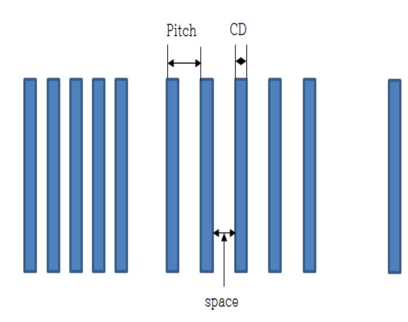

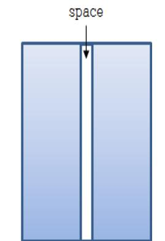

[그림 3-5] 로직 회로의 다양한 선폭과 공간(space) 패턴

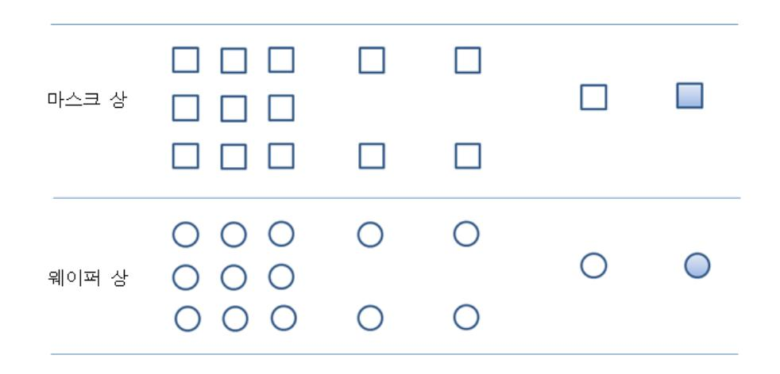

[그림 3-6] 로직회로의 다양한 접촉 홀(contact hole) 패턴

#### 2. 현상액(developer)

감광막을 도포하고 마스크와 노광기를 통해서 패턴을 웨이퍼에 전사한 후 감광막을 선택 적으로 제거함으로써 현상액 속에서 패턴을 현상한다. 현상액은 대부분 수용성 알칼리 용 액이 사용되며, 주된 성분으로는 지방족 탄화수소(헥산, 헵탄 등), PGMEA(프로필아세테이 트), 자일렌(Xylene), KOH(potassium hycroxide, 수산화칼륨) 와 TMAH(T M A H, 수산화테 트라메틸암모늄) 수용액이 사용된다. 현상액은 주어진 시간에 패턴의 무너짐과 잔류 감광 막이 존재하지 않는 특성을 가져야한다. 최종 하드 베이크(hard bake) 공정 후 광학현미경 으로 패턴의 형상을 관측하는 검증을 한다.

### 3. 박리액(striper)

사진 공정은 현상 후 공정 규격에 따라 합격 혹은 불합격으로 판정한다. 이 때 불합격 판 정이 결정되면 패턴을 모두 다 제거하고 다시 작업을 수행한다. 사용하는 재료는 박리액 으로 이미 형성된 감광막을 깨끗하게 제거하여 잔류물이 없는 상태로 만들어 주어야한다. 패턴 형성 과정에서 고온이나 플라즈마와 같은 높은 에너지에 장시간 노출된 감광막은 화 학적으로 변성되어 위와 같은 일반적인 제거 방법으로는 깨끗하게 제거되지 않기도 하며, 경우에 따라서 두꺼운 포토레지스트의 경우 제거에 오랜 시간이 걸리기도 한다. 이 경우 플라즈마 장치(asher)를 이용한 건식 방법과 아세톤과 같은 용매를 이용한 습식 방법을 통 해서 제거한다. 검증은 유관이나 광학현미경을 통해서 수행된다.

### 가스 재료

가스는 반도체 소자 제조 공정에서 반도체 기판에 새로운 층을 형성하기 위하여 특정 물 질을 증착, 식각, 표면처리, 특성 변화가 필요할 때 사용되는 기체 상태의 재료이다. 반도 체 제조에 쓰이는 가스의 순도는 99.99% 이상의 고순도여야 한다. 결국 사용되는 가스의 특성 중에 불순물 함유가 최소화된 특성을 요구한다. 반도체 가스 재료는 독성과 부식성, 폭발성이 강해 세심하게 관리해야 하는 재료 중의 하나이다. 반도체 제조 공정에 사용되 는 가스는 크게 산업용 가스와 특수 가스 두 부분으로 나누어 구분할 수 있다. 산업용 가 스는 산소, 질소, 헬륨, 아르곤, 이산화탄소, 수소 등이고, 특화된 특수 가스는 공정에 따라 서 수십 종에 이른다. 가스가 사용되는 공정은 용도에 따라 증착용, 식각용, 세정용, 도핑 용 등으로 구분한다. <표 3-3>에 용도별로 사용되는 가스가 정리되어있다.

|  | <표 3-3> 용도별 가스 분류 |  |
|--|-------------------|--|

| 용도          |                 | 종 류                                                                                                                                                                           |  |  |  |
|-------------|-----------------|-------------------------------------------------------------------------------------------------------------------------------------------------------------------------------|--|--|--|
| 도우핑         |                 | AsH3, H2S, GeH3, SbH3, AsCl3, AsF2, PH3, PCl3, B3H6, BF3, (CH3)2Te, (CH3)2Cd, (C3H5)2Cd 등                                                                                  |  |  |  |
| 에피텍셜        |                 | SiH4, SiH2Cl2, SiHCl3, SiCl4, B2H6, BBR3, BCl3, AsH3, PH3, GeH4, TeH2(CH3)3Al, (C2H5)3Al, (CH3)3SB, (C2H5)3Sb, (CH3)3Ga, (C2H5)3Ga, (CH3)3As, (C2H5)3As, SnCl4, GeCl4 등 |  |  |  |
| 이온 주입       |                 | AsF5, PH5, PH3, BF3, BCl3, SF6 등                                                                                                                                              |  |  |  |
|             | 기상 식각           | Cl2, HCl, HF, HBr, SF6 등                                                                                                                                                      |  |  |  |
| 식각          | 플라즈마 식 각  | SiF4, CF4, C3F8, C2F6, CHF3, CClF3, O₂등                                                                                                                                       |  |  |  |
|             | 이온 빔 식각         | C3F8, CHF3, CClF3, CF4등                                                                                                                                                       |  |  |  |
|             | 반응성 스퍼 터링 | O₂등                                                                                                                                                                           |  |  |  |
| 화학 증착용(CVD) |                 | SiH2, SiH2, Cl2, SiCl4, NH3, NO, O₂등                                                                                                                                          |  |  |  |
| 밸런스         |                 | N₂, Ar, He, H2, CO2, N2, O 등                                                                                                                                                  |  |  |  |

### 1. 특성과 기준

반도체 재료가스란 반도체 및 유사 공정(다이오드, 트렌지스터, IC, LSI, VLSI, LCD 등)에 사용되는 가스를 말하며, 실리콘 계 가스와 비소 계 가스등을 비롯해 캐리어(carrier) 가스 에 이르기까지 많은 종류의 가스가 사용되고 있다. 가스의 특성을 보면 가연성, 폭발성, 유독성인 것들이 많으므로 취급에 특히 주의해야 한다.

반도체 공정에 사용되는 가스는 산소, 질소, 헬륨, 아르곤, 이산화탄소, 수소 등 기본적인 산업용 가스, 반도체 공정에 특화된 특수 가스 등이 있다. 이 특수 가스는 공정 및 장비에 따라서 다양한 가스를 사용해 그 종류가 수십 종에 이른다. 반도체용 가스는 그 용도에 따라서 나누어볼 수 있다. <표 3-4>에 주요 가스들에 대한 물리적, 화학적 특성과 <표 3-5>에 허용 기준이 정리되어있다.

<표 3-4> 물리화학적 특성

| 가스명              | 화학식      | 냄새  | 폭발성  | 독성(ppm) |      | 부식성 |
|------------------|----------|-----|------|---------|------|-----|
| 실란               | SiH4     | 불쾌  | 자연발화 | O       | 5    | ×   |
| 알곤               | Ar       | 무취  | 비가연성 | ×       |      | ×   |
| 아르신              | AsH3     | 마늘  | 가연성  |         |      |     |
| 삼플루오르화붕소         | BF2      | 자극적 | 비연소성 | O       | 0.3  | O   |
| 사플루오르화탄소         | CF4      | 무취  |      |         |      |     |
| 3플루오르화 메탄        | CHF3     | 불쾌  | 지연성  | O       | 0.1  | O   |
| 메탄               | CH4      | 무취  | 가연성  |         |      |     |
| 염소               | Cl2      | 자극적 |      |         | 1    |     |
| 사불화규소            | SiF4     | 자극적 | 비연소성 | O       |      | O   |
| 육불화황             | SF6      | 무취  | 비연소성 | ×       | 1000 | ×   |
| 3플루오르화 메탄        | CHF2     | 불쾌  | 지연성  | O       | 0.1  | O   |
| 암모니아             | NH3      | 자극적 | 지연성  | O       | 25   | O   |
| 플루오르화염화물         | ClF3     | 자극적 |      |         | 0.14 |     |
| 이산화탄소            | CO₂      | 무취  |      |         | 5000 |     |
| 과플루오르화에탄         | C2F6     | 무취  |      |         |      |     |
| 과플루오르화프로판        | C3F8     | 무취  |      |         |      |     |
| 트리메틸알루미늄         | (CH3)3Al |     |      |         | 1    |     |
| 옥타플루오르싸이클로부 탄 | C4F8     | 불쾌  |      |         |      |     |
| 브롬화수소            | HBr      | 자극적 | 비가연성 |         | 3    |     |
| 염화수소             | HCl      | 자극적 | 비연소성 | O       | 5    | O   |
| 수소               | H2       | 무취  | 가연성  |         |      |     |
| 헬륨               | He       | 무취  | 비가연성 |         |      |     |
| 암모니아             | NH3      | 무취  |      | O       | 25   | O   |
| 일산화질소            | NO       | 무취  | 비가연성 |         | 25   |     |
| 질소               | N₂       | 무취  |      |         |      |     |
| 아산화질소            | N₂O      | 무취  |      |         | 50   |     |
| 산소               | O₂       | 자극적 |      |         |      |     |
| 포스핀              | PH3      | 자극적 | 자연발화 | O       | 0.3  | ×   |

#### <표 3-5> 반도체 공정별 가스와 기준 허용도

| 공정       | 가스 명     | 분자식       | 허용 농도 (TLV)*(가) | 노출 기준 (TWA)*(나),(다) |
|----------|----------|-----------|--------------------|------------------------|
|          | 염소       | Cl2       | 1                  | 1 (노동부고시)              |
|          | 염화수소     | HCl       | 5                  | C5 (노동부고시)             |
|          | 3염화붕소    | BCl3      | 5                  |                        |
|          | 불소       | F2        | 0.1                | 0.1 (노동부고시)            |
|          | 4염화규소    | SiCI4     | 5                  |                        |
|          | 브롬수소 HBr | HBr       | 3                  | C3 (노동부고시)             |
|          | 6 불화유황   | SF6       | 1000               | 1000 (노동부고시)           |
|          | 불화메탄     | CHF3      | 3                  |                        |
| 건식 식각 | 4염화탄소    | CClF4     | 10                 |                        |
|          | 3불화염소    | ClF3      | 3                  |                        |
|          | 3불화질소    | NF3       | 10                 |                        |
|          | 불화수소     | HF        | 3                  | C3 (노동부고시)             |
|          | 4 불화규소   | SiF4      | 3                  |                        |
|          | 프레온12    | CCL2F2    | 3                  |                        |
|          | 4브롬규소    | SiBr4     | 3                  |                        |
|          | 브롬불화탄소   | CF3 Br | 3                  |                        |
|          | 8불화프로판   | C3F8      | 3                  |                        |
|          | 시란       | SiH4      | 0.5                |                        |
|          | 디시란      | Si2H6     | 0.5                |                        |
|          | 포스핀      | PH3       | 0.3                | 0.3 (노동부고시)            |
| PECVD    | 티오스      | TEOS      | 10                 |                        |
| LPCVD    | 디클로로시란   | SiH2Cl2   | 5                  |                        |
|          | 4불화탄소산소  | CF4/O2    | 3                  |                        |
|          | 6불화에탄산소  | C2F6/O2   | 3                  |                        |
|          | 불화텅스텐    | WF6       | 0.75               |                        |
|          | 아르신      | ASH3      | 0.05               | 0.05 (노동부고시)           |
| 이온 주입    | 포스핀      | PH3       | 0.3                | 0.3 (노동부고시)            |
|          | 3 불화붕소   | BF3       | 1                  | C1 (노동부고시)             |

출처: 한자은(2000). 월간 『반도체』. 2 월호. p.7

- (가) TLV(tolerance limit value)는 ACGIH-1978(American Conference of Governmental Industrial Hygienists 1978)에서 제정된 시간 가중 평균 농도이며 하루 8시간의 평균 허용 농도이다. 가스의 경우 ppm, 먼지형인 때 공기 1㎥ 중 의 수치로 표 현 한다.
- (나) TWA(time weighted average): 1일 8시간 작업을 기준으로 하여 유해 요인의 측 정치에 발생 시간을 곱하여 8시간으로 나눈 값을 말한다.
- (다) 최고노출 기준(C)은 근로자가 1일 작업 시간 동안 잠시라도 노출되어서는 안 되는 기준을 말하며 노출 기준 앞에 'C'를 붙여 표시한다.
- 2. 검증 패턴

반도체 가스의 적용 여부는 공정결과에 따라 해당공정의 적합성을 판단하게 된다. 건식 식각의 경우 식각률, 잔류막, 패턴 프로파일의 계측 결과로 가스의 특성을 파악할 수 있 다. 공정 후 칩으로 분리하기 위해 주어진, 즉 웨이퍼를 절단하여 개별 칩으로 분할할 수 있도록 만들어진 공간(scribe lane)에서 공정 상태를 점검하고 데이터를 얻을 수 있다. 또 한 세밀한 분석을 위하여 공정이 완전히 진행된 후 불량으로 판정된 웨이퍼를 수직 절단 하여 주사형 전자현미경으로 관찰한다. 공정에 변동을 주는 변수들이 많지만 통계적 데이 터 분석 방법을 통해 검증할 수 있다. 다른 공정들도 스크리브 레인(scribe lane) 안에 실 려 있는 테스트 패턴을 통하여 간접적으로 가스의 공정 접합성을 판단할 수 있다. 스퍼터 링(sputtering) 공정의 경우는 막 두께, 감광막 제거에는 잔류막, 챔버 세정에는 진공도를 측정함으로써 가스의 고정 적합성을 판단할 수 있다. <표 3-6>에 가스가 사용되는 공정과 사용 가스 및 검증 방법에 대하여 정리되어있다.

| 사용 구분            | 공정                                             | 사용 가스                                                                        | 검증                    |
|------------------|------------------------------------------------|------------------------------------------------------------------------------|-----------------------|
| 플라즈마 화학기상증착   | 게이트 절연막 무결정 실리콘 채널보호막 무결정 N+Si 보호막 | SiH4, NH3, N2 SiH4, H2 SiH4, NH3, N2 SiH4, PH3, N2 SiH4, NH3, N2 | 식각률 패턴 프로파일 잔류막 |
| 스퍼터링(sputtering) | 금속막 ITO 막                                   | Ar Ar, O2                                                                 | 막 두께                  |
| 건식 식각            | 게이트 무결정 N+Si 소오스-드레인 공급 막 보호막         | CF4, O2, SF6, CF4, O2, SF6, Cl2 CF4, O2, CF4, SF6, He               | 식각률 패턴 프로파일 잔류막 |
| 산소 애슁(ashing)    | 감광막제거                                          | O2                                                                           | 잔류막                   |
| 배기,퍼지 캐리어        | -                                              | N2                                                                           |                       |
| 플라즈마 CVD 세정      | -                                              | NF3                                                                          | 진공도                   |
| 챔버(chambe) 세정    | 플라즈마 CVD LPCVD, 메탈 CVD                      | NF3, C2F6, SF4 ClF3, CF4                                                  |                       |

<표 3-6> 공정에 사용되는 가스의 특성 검증

### 금속 재료

반도체 칩 제조 공정은 크게 두 부분으로 나누어진다. 한 부분은 트랜지스터, 다이오드, 축전기 등을 형성하는 소자형성 부분이고 다른 한 부분은 일련의 소자들을 조합하여 소자 를 전자기 소자로 완성해 주는 소자 금속 배선 부분이다. 소자의 동작 속도는 소자의 성 능을 평가하는 중요한 특성 인자 중의 하나인데 배선 구조와 사용되는 금속 재료에 좌우 된다. 금속 재료를 무엇을 선택하느냐에 따라 소자의 신호 전달 속도의 성능이 결정된다. 고 성능, 고속소자에 구리 배선을 사용하는 이유이다. 금속 배선 공정은 세 부분으로 나뉜 다. 1단계는 소자와 금속 배선을 위해 기판 실리콘과 옴성 접촉(ohmic contact)을 형성하는 실리사이드 형성이다. 2단계는 이후 각기 다른 소자들을 연결하여 다층 배선과 연결하는 컨택 홀(contact hole)과 비아 홀(via hole)이다. 3단계는 평면 다층 상에서 컨택과 비아 홀 을 연결하는 메탈(metal) 배선 공정이 이루어진다. 3단계 모두 금속 재료를 사용하게 된다. 금속 배선의 특성은 신호 전달 속도뿐만 아니라 제품의 신뢰성을 좌우한다. 컨텍과 비아 배선공정은 통상적으로 플러그(plug) 공정이라 불리며 화학기상증착법(CVD, chemical vapor deposition)을 사용한다. 메탈 공정은 이와는 달리 금속 타깃(target) 재료를 사용하여 스퍼터링(sputtering) 방법을 이용하는 물리적기상증착(PVD, phsical vapor deposition)에 의 해 증착된다. 통상적으로 컨택 홀과 비아 홀은 텅스텐(W)으로 채우고, 장벽(barrier)은 타이 타늄(Ti), 메탈은 알루미늄을 사용한다. 다마신 공정의 경우 모두 구리(Cu)를 사용한다.

1. 특성

비철금속은 기계적, 물리적, 화학적 특성 때문에 중요한 역할을 수행할 수 있다. 공정에 사용되는 대표적인 금속의 기본 특성은 아래와 같다.

(1) 알루미늄(Al)

높은 비강도, 내부식성은, 열 및 전기전도도, 무독성, 성형성, 비자기성이 우수하다.

(2) 마그네슘(Mg)

공업용 금속중 가장 가볍고, 진동감쇄 특성이 우수하다.

(3) 구리(Cu)

알루미늄과 유사한 성질. 열 및 전기전도도, 내부식성 우수하고, 전기적, 기계적, 내부 식성, 비자기성, 열전도, 내마모성 등의 복합적인 특징이 필요한 부분에 매우 유용하다. 다마신 공정에서 사용된다.

(4) 니켈(Ni)

강도, 인성, 내부식성이 양호. 특히 고온에서 높은 강도, 내부식성, 고온에서의 양호한 성질이 필요할 때 합금 성분으로 사용한다.

(5) 초합금

고온용 재료로 내열합금 또는 고온합금이라고도 부르며 철기, 코발트기, 니켈기로 분 류되고, 부식, 기계적 및 열적 피로, 충격, 크립(creep), 고온 마모 등에 강한 특성을 나 타낸다. 구조용으로는 최고 1000℃에서 사용 가능하고, 비구조용으로는 최고 1200℃에 서까지 사용 가능하다.

(6) 타이타늄(Ti)

고가이나 비강도가 높고 상온, 고온에서의 내부식성이 우수하고, 조성의 작은 변화에 도 매우 민감하여 조성의 조절과 공정이 대단히 중요하다.

(7) 몰리브덴(Mo), 코발트(Co), 텅스텐(W), Ta(탄탈늄) 용융점이 매우 높은 내열 금속이다.

2. 기준

금속 배선 재료는 공정 규격을 만족하는 기본적인 특성값이 요구된다. <표 3-7>에 항목과 요구값이 나타나있다. 또한 오염원으로 작용하지 않고 세정 시 문제가 발생되지 않아야한 다. 전기적으로는 낮은 접촉 저항, 실리콘과 한정적 반응, 높은 전도도를 가져야 하고, 공 정적으로는 상하 박막과 접착성이 양호하고, 패턴 형성이 쉽게 되며, 열 특성, 타 금속과 의 접촉성이 양호해야한다.

| 메탈 또는 합금 | 비저항(ρ) (μΩcm) | 녹는점 (℃) | 열팽창계수 (10-6℃) | Si와 반응 온도 (degree℃) |
|----------|------------------|------------|------------------|------------------------|
| Al       | 2.7~3.0          | 660        | 24               | 250                    |
| MO       | 6~15             | 2620       | 5                | 400                    |
| W        | 6~15             | 3410       | 4.4              | 600                    |
| Cu       | <2.0             | 1083       | 16.5             | -                      |
| Ti       | 42               | 1667       | 8.9              | -                      |
| MoSi2    | 40~100           | 1980       | 8.25             | 1000                   |
| TaSi2    | 35~50            | 2200       | 8.8~10           | 1000                   |
| TiSi2    | 13~16            | 1540       | 12.5             | 900                    |
| WSi2     | 30~70            | 2165       | 6.25~7.9         | 1000                   |
| CoSi2    | 10~18            | 1326       | 10.04            | 950                    |
| PtSi     | 28~35            | 1229       | -                | 750                    |
| TiN      | 25~200           | 2880       | 9.35             | -                      |

<표 3-7> 반도체 소자의 금속 배선 재료의 물리적 특성

### 3. 검증 패턴

공정상에서는 크게 두 가지 특성을 검증할 수 있다. 면 저항과 반사율이다. 광학현미경 관 측으로부터 메탈 표면의 힐 락(hill lock)과 표면 거칠기를 관찰할 수 있다. 힐 락의 경우 금속의 EM(전자이동), SM(스트레스 이동) 특성을 저하시키는 원인으로 작용한다.

(1) 면 저항(sheet resistance)

박막의 저항을 측정하는 방법이다, 금속 박막의 저항은 4점 프로브(four point probe) 방법을 이용하여 측정한다. 측정 방법이 [그림 3-7]에 도시되어 있다. 바깥쪽 두개 프 로브(probe)로 전류 I가 흐르고, 안쪽 두개 프로브에서 전압 V를 측정한다. 직경 d에 비하여 매우 작은 값의 두께 W를 가지는 반도체의 저항(ρ)은 아래 관계식과 같다. 여 기서 C는 보정 인자로 d/s의 비에 따라 다르다. d/s>20일 때, 보정 인자는 4.54로 접근 한다.

$$\rho = WC(V/I), \Omega - cm$$

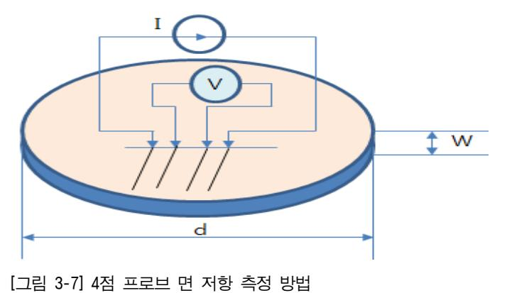

(2) 반사도 (RI, reflectivity intensity, %)

금속막 표면의 반사도는 나노 스펙(nano spec.) 계측 장비로 측정한다. 금속막의 표면에 파장 λ = 480nm의 광을 조사한 후 수직 반사 되는 빛의 양을 수치화하여 입사광의 양과 반사광의 양을 퍼센트 비율로 구하여 반사도를 계산한다. 금속의 증착 온도가 낮을수록, 증착 속도는 빠를수록 반사도가 증가한다. 막 두께가 500Å이상이면 반사율이 높아지는 경향이 있다. <표 3-8>에 각종 금속에 대한 반사도가 나타나있다. 레이저 광원이 다르면 반사도가 달라진다.

|  |  |  |  | <표 3-8> 금속의 표면 반사율(%) |
|--|--|--|--|-----------------------|
|--|--|--|--|-----------------------|

| 금속 | YAG 레이저 (파장: 0.9 um~1.1 um) | CO₂ 레이저 (파장: 0.9 um~1.1 um) |
|----|--------------------------------|--------------------------------|
| Au | 94.70                          | 97.70                          |
| Pt | 72.90                          | 95.60                          |
| Ag | 96.40                          | 99.00                          |
| Al | 73.30                          | 96.90                          |
| Cu | 90.10                          | 98.40                          |
| Fe | 65.00                          | 93.80                          |
| Ni | 72.00                          | 95.60                          |
| Zn | 49.00                          | 98.10                          |
| Mg | 74.00                          | 93.00                          |
| Cr | 57.00                          | 93.00                          |
| Mo | 58.20                          | 94.50                          |
| W  | 62.30                          | 95.50                          |

### (3) 전자이동(EM, electro migration)

금속 배선에 전류를 인가하면 배선의 내부로 전자가 이동하게 된다. 이런 전자의 이동 은 금속의 그레인 경계(grain boundary)로 집중되고 전자가 이동된 빈자리는 상대적으 로 약해 결정이 깨어져 미세 기공(micro void)로 이루어진 불안전한 상태에 이른다. 이 현상은 알루미늄에서 발생하고, 상대적으로 텅스텐은 전자이동 저항성이 강하여 텅스 텐 내부에서는 전자이동이 발생하지 않는다. 그레인 사이의 크기 차이가 클수록 전자 이동에 취약하다. 알루미늄에 비해 구리는 전자이동 특성에 강하다. 본 검증은 공정 중에는 어렵고 공정이 끝난 후 스크리브 레인(scribe lane) 안에 설계된 전자이동 테스 트 모듈을 통해 검증할 수 있다.

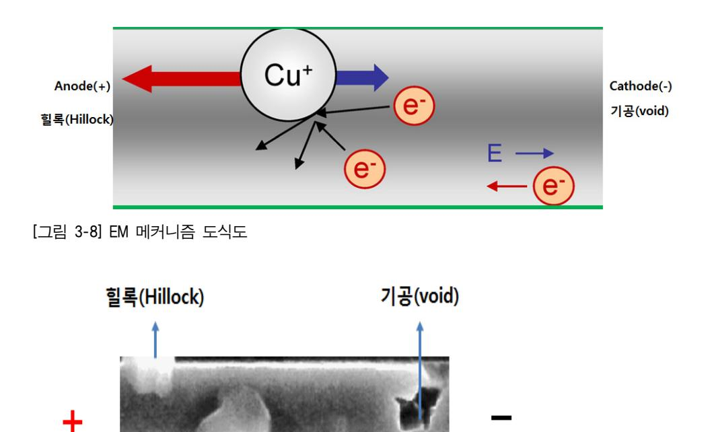

[그림 3-9] 기공(void)과 힐 락(hillock) 형성 SEM 사진 모습

### (4) 응력 이동(SM, stress migration)

응력 이동은 [그림 3-10]에 도시된 것처럼 메탈 라인들 사이에 응력(stress)이 작용할 때 메탈 구성 원자가 이동하는 고장 현상이다. 이 원자의 이동은 메탈 라인의 저항 증가와 단선을 유도하는 기공(void)들을 형성한다. 이 현상은 제조 공정, 소자 사용 환경의 온도 변화, 특히 제조 공정에서는 열처리 과정의 온도 변화에 의해서 응력이 발생하여 메탈 (Al, Cu)들 사이에 작용하여 발생한다. 발생된 응력은 메탈 라인 안의 공공(vacancy)들을 이동시키고, 기공(void)을 형성하며 어떤 특정 장소에 집중하게 한다. 응력 이동은 상하 두 메탈 라인 사이에 작용하여 발생된다. 메탈 원자의 이동 속도는 고온일수록 증가하는 반면 메탈 라인에 작용된 응력은 고온에서 감소한다. [그림 3-11]에 응력 이동 현상에 의해 발생되는 모습이 나타나있다. 본 검증은 공정 중에는 어렵고 공정이 끝난 후 스크리브 레인(scribe lane) 안에 설계된 응력 이동 테스트 모듈을 통해 검증할 수 있다.

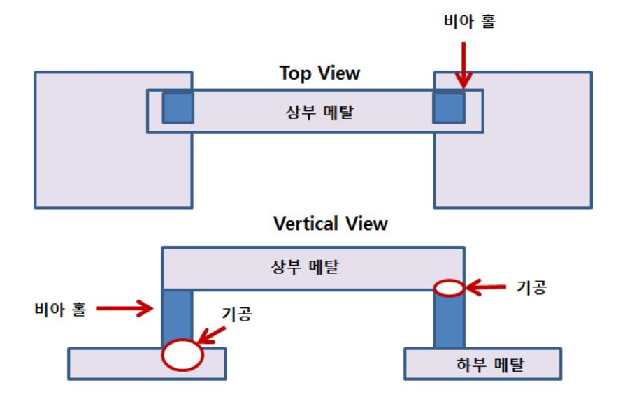

[그림 3-10] 응력 이동 현상 메커니즘

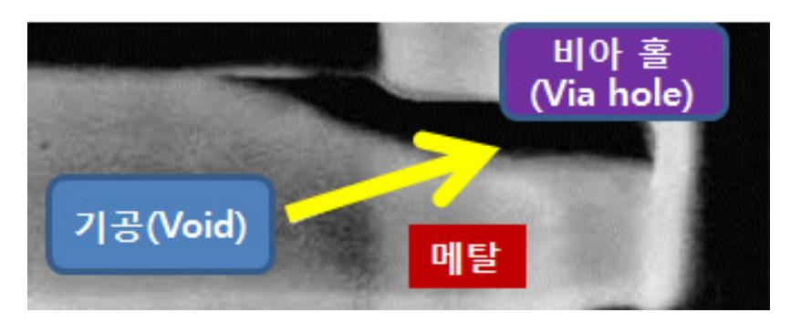

[그림 3-11] 응력에 의해 상하 메탈 사이에 발생되는 기공(void)

습식 화공 약품 재료

습식 화공 약품은 세정, 식각, 표면 처리 등에 사용하는 액상 재료이다. 화학적 특성에 따 라서 산, 염기, 유기로 분류한다.

산성 화공 약품은 PH 농도가 7보다 낮은 액체이며 물에 녹았을 때 수소이온(H+)을 발생시 킨다. 반응성과 부식성이 강하며, 산성도가 높을수록 더 강한 반응성을 보인다. 식각이나 세정 공정 등에 사용하며 공정에 황산(H2SO4), 염산(HCl), 질산(HNO3), 불산(HF), 인산 (H3PO4) 등이 있다.

염기성 화공 약품은 PH 농도가 7보다 큰 액체를 말하며, 수용액 상태에서 수산화이온 (OH-)을 발생시킨다. 산에 반대되는 성질의 액체이며, 산과 중화반응을 일으켜 염과 물을 만든다. 염기성 습식화공 약품에는 수산화나트륨(NaOH), 수산화칼륨(KOH), 암모니아 (NH4OH) 등이 있다.

유기용매는 용질을 녹일 수 있는 액체 상태의 유기 화합물이다. 감광막과 같은 고분자 물 질을 녹이거나 희석, 세척하는 용도로 사용된다. 유기용매들에는 알코올 계열인 메탄올, 에탄올, 이소프로필알콜(IPA), 아세톤과 벤젠 계열인 벤젠, 톨루엔, 자일렌 등이 있다. [그림 3-12]에 pH 농도별 해당 물질이 예시되어있다.

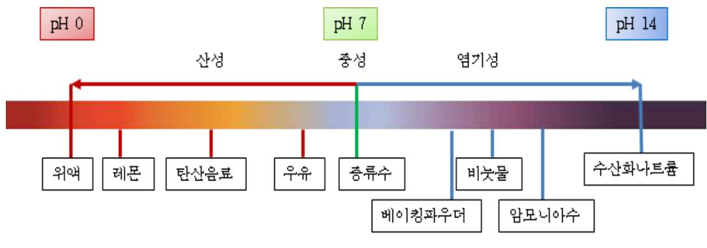

[그림 3-12] pH 농도별 해당 물질의 예시

1. 특성

화학약품의 종류가 다양해지고 사용량이 계속 증가하는 추세는 기존 사용해왔던 화학약품 도 사용방법의 개선 및 사용 순서의 변경을 요구하고 있다. 화공 약품의 특성을 고려하여 적절한 방법을 모색해야함을 의미한다.

(1) 액체로 보관하고 기체로 사용하는 경우

보관 시에는 액체, 사용 시에는 기체로 사용하는 경우이다. 분자량이 큰 메탈계 재료, 분자량이 큰 가스에 해당된다. 물질의 보관은 액체 상태인데 관련된 특성 인자는 증기 압, 보관 압력, 보관 온도이다.

(2) 액체로 보관하고 액체로 사용하는 경우

일반적인 액체 재료에 해당되며 보관 용기와 사용 용기가 동일하다. 이는 독성 약품의 강한 특성을 갖고 있거나 고압 또는 저압에서 사용되는 경우도 해당된다. 또한 사용 시 희석 및 배합하는 경우인데 사용 조건을 조정할 필요가 있다. 세정 조건의 변경되 거나 웨이퍼의 세정 조건이 변경되어 희석률이나 배합률이 달라질 수 있다. 점도 상태 에 따라 보관 특성이 달라지는데 순수한 물의 경우 통상적으로 액체 상태, 고점도 상 태인 감광액의 경우는 점도가 있어서 계량과 계측에 전용 지그를 사용한다. 웨이퍼 연 마 공정에 사용되는 슬러리는 고체 분말을 포함한 액체의 특성을 가지고 있다.

(3) 유기용제

카본 계열로 구분되며 화재 위험이 크다. 감광액이 대표적인 물질로서 벤젠, 카본 체 인의 다양한 조합으로 되어있다.

(가) 알코올 계열

메탄올(CH3OH), 에탄올(C2H5OH), 이소프로필알콜(IPA, C3H7OH) 등이 속한다. 카본 체인 구조의 유기물을 제어하기 위한 배합 물질이다. 감광액 등의 유기물을 제어하 기 위한 용도로 사용된다. 또한 벤젠 등의 유기물과도 혼합이 가능하고 순수한 물 (H2O)과 혼합이 가능하다.

(4) 벤젠 계열

카본과 수소의 육각형 구조로 카본 계열의 물질의 기본 구조이다. 대부분이 인화성이 거나 열에 민감한 특성을 가지고 있다.

(5) 산 및 알칼리 계열

염산(HCl), 불소(HF), 과산화수소(H2O2), 암모늄(NH4OH) 등이 속한다. 강산과 강알칼리 가 직접 섞이면 폭발적인 반응을 한다. 두 가지 약품 모두 인체에 치명적인 위해를 가 하고, 금속 등의 구조물에 심각한 상해를 가할 수 있으므로 보관과 취급에 주의를 해 야 한다. 기본 특성 정보는 MSDS와 제조사에서 제공하는 자료를 통해 반드시 확인해 야 한다. 산(Acid)과 알칼리의 기본 특성은 강한 부식성과 반응성이다.

(6) 중성 계열

초순수물이 속하며, 중성 특성을 가지고 있다. 산과 알칼리의 반응 생성물, 또는 산과 금속의 반응 생성물은 물에 녹는 수용성이다. 염산, 불소 등의 물질을 희석하거나, 반 도체를 직접 세정하는 용도로 사용된다. 불순물의 함유량 제어가 중요하고, 107 Ohm 이상의 전기저항을 확보해야 한다.

2. 기준

반도체 공정에 사용하는 화학물질은 불순물의 함유량, 보존 기간 동안의 안정성, 반응의 정확성, 반응 생성물의 안정성 등의 설정 기준에 부합하는 것이어야 한다. 불순물 함유량 과 더불어 중요한 기준은 불순물 종류이다. 칼륨(K), 칼슘(Ca), 나트륨(Na), 철(Fe) 등의 금 속들은 반도체의 소자 내에 잔류하여 전기적 특성을 저하시킨다. 알루미늄(Al), 니켈(Ni), 은(Ag), 텅스텐(W) 등은 공정에 따라서 사용이 허용되는 금속이고, 구리(Cu)는 사용되는 경우와 제한되는 경우가 존재한다. 또한 비메탈계 물질도 경우에 따라서 제한을 받는다. RoHS에서 정하는 사용을 금지하는 물질은 반도체 공정에서의 사용이 제한되어야한다. 기 본적으로 MSDS를 만족하는 특성을 가져야하고, RoHS에서 금지한 물질을 함유하지 않아 야한다.

3. 검증 패턴

공정상에서 검증하는 방법은 식각의 경우 세정 후 불순물 입자 관찰과 식각률을 측정이 있다. 세정의 경우 잔류물들의 상태를 파악한다.

### 특성 평가 데이터 처리

반도체 제조 공정에는 공정 조건, 소자의 종류, 장비, 재료 등의 수많은 변수들이 관여한 다. 결국 단위 공정에서 분석도 가능하지만 재료 평가 시에는 모든 조건을 고정해 놓고 재료만 변수로 하여 최종 웨이퍼 수율과 신뢰성의 관계성을 분석해야한다. 물론 양산에 적용하기 위해서는 재료의 공정 적합성이 최적화되는 조건을 찾고 선행하는 몇 개의 로트 (lot)에 적용한 후 신뢰성 평가를 한다. 최종 수율과 신뢰성에 문제가 없으면 양산에 전면 적용한다.

### 1. 불량 결정

(1) 제조 공정과의 부합성에 의한 불량 결정

재료의 불량은 공급하는 회사들의 재료 평가의 상대적 차이로 결정되는 것이 아니다. 물론 비교 평가를 통해 각자 제조 공정과 장비에 부합되는 최적의 재료를 선택할 수 있다. 동일한 재료를 사용하여 여러 회사들이 제품을 제조해도 제조 환경 특성상 결과 가 다르게 나올 수 있기 때문이다. 여기서 불량은 재료를 제조 공정에 투입해서 기존 사용했던 재료보다 동등 이상의 제품 특성이 확보되지 않은 경우를 말한다. 이 경우 그 제조 공정에서는 불량이라고 할 수 있다. 결국 새로운 재료를 적용했을 때 평가 결 과를 기존 수율과 비교해 보고 분석하는 것이 중요하다. 또한 신뢰성 평가를 통해 제 품 특성에 영향을 주는지 여부도 파악해야 한다.

(2) 재료 규격서 불일치에 의한 불량 결정

재료 구매 시 제시한 규격서와 상이한 평가 결과가 도출되면 이 재료는 불량이다. 이 런 경우 불량 결정은 해당 공정 단위 평가에서 결정할 수 있다.

(3) 불량 결정 시 유의 사항

불량 결정 전에 다른 공정변수가 개입되었는지 분석을 철저히 해야 한다. 반도체 제조 용 재료는 다양해서 각기 주어진 재료에 대하여 패턴이 없는 웨이퍼에 단위 평가를 먼저 해야 한다. 왜냐하면 여러 단계의 공정을 거치는 동안 다른 공정에서 불량의 원 인을 제공할 수도 있기 때문이다.

2. 산포도 분석

산포의 문제는 테스트 재료들이 모두 규격서 기준 대비 성능을 만족하고 있지만, 분포를 확인해 보니 대물량 양산 상황에서 수율이 떨어질 수 있는 상황에서 발생한다. [그림 3-13]와 같이 샘플링 하여 측정한 시료의 특성은 성능 평가 기준 대비 모두 성능을 만족 하고 있다. 그러나 분포를 확인해 보면 우측 꼬리 부분에서 불량이 발생하게 되므로 이러 한 불량 시료의 수량에 대한 정밀한 분석이 필요하다.

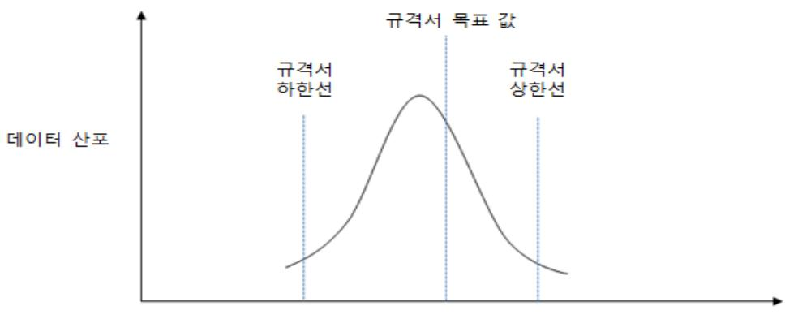

[그림 3-13] 데이터 산포도 곡선

## 수행 내용 / 공정 재료 측정 및 특성 파악하기

### 재료·자료

- 기술 보고서, 전문 조사 기관 보고서, 신제품 보고서
- 측정 기기의 매뉴얼 및 사용 설명서
- 재료의 규격서(spec. sheet)
- 통계 기법 자료
- MSDS, RoHS, WEEE(waste electrical and electronic equipment)
- 시험 성적서 및 평가/분석/검증 결과 보고서
- 평가 재료(웨이퍼, 가스, 화공 약품, 금속 타킷, 감광액)

### 기기(장비 ・ 공구)

- 샘플 특성 평가를 위한 시료 제작 장비
- 평가, 분석 및 계측 장비

### 안전・유의 사항

- 재료에 대한 규격서를 공급 업체로부터 정확히 파악해야 한다.
- 재료에 대한 평가는 특정 공급 회사 제품에 국한해서는 안 된다.

### 수행 순서

- 반도체 공정 재료의 개념을 파악한다.
  - 1. 반도체 웨이퍼 제조 공정에서 사용되는 통상적인 주요 재료를 파악한다.
    - (1) 기판
    - (2) 노광 재료
    - (3) 가스 재료
    - (4) 금속 재료
    - (5) 습식화공 약품
  - 2. 반도체 공정 기술을 이용하여 제조되는 응용(바이오, 환경, 기능성) 소자 제조 시 나노 소재와 같은 새로운 신소재들도 반도체 재료 현황을 파악한다.
  - 3. 반도체 공정 재료의 선택 시에는 각 공정에서 요구되는 순도, 불순물 종류와 함량, 제 품에 미치는 영향을 파악한다.
  - 4. 공정 후 주어진 공정 규격을 만족하는 수준과 성능을 파악한다.
    - (1) 기판(무결점과 정확한 방향성)
    - (2) 노광 재료(선폭과 두께)
    - (3) 가스 재료
      - (가) 화학 증착, 건식 식각, 세정 세 가지로 구분한다.
      - (나) 건식 식각 가스는 패턴 프로파일(profile)과 잔류 패턴이 남지 않는 기능이다.
      - (다) 화학 증착과 세정은 결합 반응에서 불순물 입자를 부산물로 생성하지 않는 특 성을 가져야한다.
      - (라) 금속 재료의 경우 공정 규격을 만족하는 반사율과 면 저항값을 가져야한다.
      - (마) 나노 소재의 경우 불순물이 포함되지 않는 높은 순도를 가져야한다.
- 반도체 기판에 대해 파악한다.
  - 1. 반도체 기판 재료를 파악한다.
    - (1) 전기전자소자와 태양전지, MEMS 제작에 사용되는 단결정 실리콘 웨이퍼에 대하여 파악한다.
    - (2) 전력 소자에 사용되는 고저항 에피 웨이퍼에 대하여 파악하다.
    - (3) 광 방사 다이오드(LED) 소자에 사용되는 사파이어 웨이퍼, 실리콘카바이드 기판에 대하여 파악한다.

- (4). 첨가 불순물 종류에 따라 분류한다.
- (5) 웨이퍼 직경의 크기에 따라 분류한다.
- (6) 추가적인 공정에 의한 분류, 웨이퍼 결정 성장 방향에 따라 분류한다.
- (7) 웨이퍼 방향을 표시하기에 따라 노치(notch)와 플랫(flat)형으로 구분한다.
- 2. 특성과 기준에 대하여 파악한다.
  - (1) 실리콘 웨이퍼는 1412℃의 높은 녹는점을 갖고 있다.
  - (2) 대기 환경에서 자연 산화막(SiO2)이 형성되어 외부의 오염을 방지 하고,실리콘 웨이 퍼 제조에서 사용되는 절연막, 유전막을 큰 계면 결함없이 성장시킬 수 있다.
  - (3) 다결정 실리콘인 폴리실리콘(poly-silicon)을 쉽게 성장시킬 수 있어 전도도가 양호한 게이트 배선으로 사용한다.
  - (4) 특성 파악 시 가장 주요 항목은 유형(type), 두께, 비저항이다.
- 3. 원재료 웨이퍼에 추가적 공정을 거친 응용 기판에 대하여 파악한다.
  - (1) 에피(EPI) 기판
    - (가) 실리콘 에피 기판은 실리콘 기판위에 화학적 증착법을 이용해 새로운 전기적 특성을 갖는 단결정 실리콘 층이 증착된 응용 기판이다.
    - (나) 전력 소자 제작에 많이 사용된다.
  - (2) SOI(silicon on insulator) 기판
    - (가) SOI 기판은 원재료 실리콘 단결정층 사이에 절연층이 형성되어 있는 실리콘 2 중막 구조를 갖고 있다.
    - (나) 트랜지스터의 저항을 줄여 저전력 고속칩을 생산할 수 있어 1G급 이상의 메모 리 반도체와 휴대형 정보통신기기용 반도체 소자 생산에 사용된다.
- 4. 검증 패턴 및 특성 평가 불량 처리 절차를 파악한다.
  - (1) 특정한 검증 패턴이 없다.
  - (2) 4-프로브 방법을 이용하여 저항을 측정하고, 사양과 비교한다.
  - (3) 상기 항목에서 제시한 사양서와 비교하여 기준값을 벗어나면 불량으로 처리한다.

- 노광 재료에 대해 파악한다.
  - 1. 감광제(photoresist) 특성과 기준에 대하여 파악한다.
    - (1) 해상력(resolution)
      - (가) 해상력의 증진은 감광제 특성, 노광과 현상 기술에 의존한다.
      - (나) 감광제가 가져야할 특성은 노광 시 광효율, 감광제 내부의 산의 확산도 및 현 상액에 대한 용해도 차이가 결정한다.
    - (2) 내식각성(ttch resistance)
      - 건식 식각 시 형성된 감광막 패턴은 식각 시 변형이나 분해 현상이 발생하지 않아 야한다.
    - (3) 광감응성(photosensitivity)
      - 감광막이 일정한 크기의 패턴을 구현하기 적절한 노광 에너지가 필요하다.
  - 2. 검증 패턴에 대하여 파악한다.
    - (1) 감광제의 평가는 노광 장비 회사에서 제공하는 시험 마스크를 가지고 평가한다.
    - (2) 이 마스크에는 다양한 형상과 크기의 패턴이 실려 있다.
    - (3) 감광제의 평가는 되도록이면 다양한 패턴에서 공정에 충분한 여유도를 주는 조건으 로 결정한다.
      - (가) 선폭과 공간(line & space)에 대한 개념을 파악한다.
      - (나) 접촉 홀과 독립(contact hole & island) 패턴에 대한 개념을 파악한다.
  - 3. 현상액(developer)
    - (1) 현상액의 주성분을 파악한다.
    - (2) 다양한 패턴의 공통 공정을 파악한다.
    - (3) 최종 하드 베이크(hard bake) 공정 후 광학현미경으로 패턴의 형상을 관측하는 검증을 한다.
  - 4. 박리액(striper)
    - (1) 화학용품을 이용한 제 작업 공정을 파악한다.
    - (2) 플라즈마를 이용한 감광막 조건을 설정한다.
    - (3) 검증은 유관이나 광학현미경을 통해서 수행한다.

- 가스 재료의 종류와 공정 특성을 파악한다.
  - 1. n-타입(n-type), p-타입(p-type) 반도체를 형성하는 도펀트용 가스의 종류와 특성에 대하 여 파악한다.
  - 2. 에피텍셜용 유기화합물 가스에 대하여 파악한다.
  - 3. 식각에 사용되는 가스 재료를 구분한다.
    - (1) 기상 식각 사용 공정과 특성에 대하여 파악한다.
    - (2) 플라즈마 식각 사용 공정과 특성에 대하여 파악한다.
    - (3) 이온빔 식각 사용 공정과 특성에 대하여 파악한다.
    - (4) 반응성 스퍼터링 사용 공정과 특성에 대하여 파악한다.
  - 4. 가스 재료의 특성과 기준에 대하여 공정별로 구분한다.
    - (1) 실리콘계 가스의 사용 공정과 특성에 대하여 파악한다.
    - (2) 비소계 가스의 사용 공정과 특성에 대하여 파악한다.
    - (3) 캐리어(carrier)가스의 사용 공정과 특성에 대하여 파악한다.
    - (4) 가스의 공정상 영향력 상태를 점검하는 패턴을 파악한다.
- 금속 재료에 대해 파악한다.
  - 1. 주요 금속들의 종류와 특성에 대하여 파악한다.
    - (1) 알루미늄(Al)의 기계적, 물리적, 화학적 특성에 대하여 파악한다.
    - (2) 마그네슘(Mg)의 기계적, 물리적, 화학적 특성에 대하여 파악한다.
    - (3) 구리(Cu)의 기계적, 물리적, 화학적 특성에 대하여 파악한다.
    - (4) 니켈(Ni)의 기계적, 물리적, 화학적 특성에 대하여 파악한다.
    - (5) 초합금의 기계적, 물리적, 화학적 특성에 대하여 파악한다.
    - (6) 타이타늄(Ti)의 기계적, 물리적, 화학적 특성에 대하여 파악한다.
    - (7) 몰리브덴(Mo), 코발트(Co), 텅스텐(W), Ta(탄탈늄)의 기계적, 물리적, 화학적 특성에 대하여 파악한다.
  - 2. 선정 기준이 되는 물성 인자들을 파악한다.
    - (1) 비저항(ρ) 특성을 조사한다.
    - (2) 녹는점을 확인한다.
    - (3) 열팽창계수를 확인한다.
    - (4) 실리콘과의 반응 온도를 확인한다.

- 3. 검증 패턴을 구성한다.
  - (1) 면 저항(sheet resistance) 측정 패턴과 원리를 파악한다.
  - (2) 반사도(RI, reflectivity intensity, %) 개념과 측정 원리를 파악한다.
    - (가) 금속막 표면의 반사도는 나노스펙(nano spec.) 계측 장비로 측정한다.
    - (나) 금속막의 표면에 파장 λ = 480nm의 광을 조사한 후 수직 반사되는 빛의 양을 수치화하여 입사 광량과 반사광양의 퍼센트 비율로 반사도를 계산한다.
  - (3) 금속의 전기적 신뢰성 문제와 관련하여 전자이동(EM, electro migration) 특성을 확인 한다.
  - (4) 금속의 물리적 신뢰성 문제와 관련하여 응력 이동(SM, stress migration) 특성을 확 인한다.
- 습식화공 약품 재료를 분류한다.
  - 1. PH 농도에 따라 산, 염기, 유기로 분류한다.
  - 2. 식각과 세정 공정에 사용되는 화공 약품을 분류한다.
  - 3. 유기용매의 구조와 특성을 파악할 수 있다.
  - 4. 화공 약품의 특성을 고려하여 적절한 방법을 모색한다.
    - (1) 액체로 보관하고 기체로 사용하는 경우
    - (2) 액체로 보관하고 액체로 사용되는 경우
    - (3) 유기용제: 알코올 계열, 벤젠 계열, 산 및 알칼리 계열, 중성 계열
  - 5. 화공 약품에 부여되는 검사 기준에 따라 취급한다.
    - (1) 반도체 공정에서 화학물질은 불순물의 함유량, 보존 기간 동안의 안정성, 반응의 정 확성, 반응 생성물의 안정성 등과 같은 기준을 설정한다.
    - (2) 불순물 함유량과 더불어 중요한 기준은 불순물 종류임을 파악한다.
    - (3) 반도체에서 칼륨(K), 칼슘(Ca), 나트륨(Na), 철(Fe) 등의 금속들이 소자 내에 잔류하 여 전기적 특성을 저하시키는 이유를 파악한다.
    - (4) 기본적으로 MSDS를 만족하는 특성을 가져야하고, RoHS에 금지된 물질을 함유하지 않아야 한다.
  - 6. 검증 패턴

공정상에서 검증하는 방법은 식각의 경우 세정 후 불순물 입자를 관찰하고 식각률을 측정 한다. 세정의 경우 잔류물들의 상태를 파악한다.

특성 평가 데이터를 처리한다.

- 1. 제조 공정에는 공정조건, 소자의 종류, 장비, 재료 등의 수많은 변수들이 관여한다.
- 2. 재료 평가 시에는 모든 조건은 고정해 놓고 재료만 변수로 하여 최종 웨이퍼 수율과 신 뢰성의 관계성을 분석한다.
- 3. 앞선 몇 개의 로트(lot)에 적용 후 최종 수율과 신뢰성에 문제가 없으면 양산에 전면 적 용한다.
- 4. 불량 분석은 공정, 장비, 재료를 다각적으로 검토하여 이루어져야한다.
  - (1) 제조 공정과의 부합성에 의한 불량을 결정한다.
  - (2) 재료 규격서 불일치에 의한 불량을 결정한다.
  - (3) 불량 결정 시 유의 사항은 불량 결정 전에 다른 공정변수가 개입되었는지 분석을 철저히 해야 한다.
  - (4) 산포도 분석을 통한 테스트 재료들이 모두 규격서 기준 대비 성능 불량인 시료의 수량에 대한 정밀한 분석이 필요하다.

# **3-2.** 공정 소재 평가 장비 구성 및 동작 원리 파악

학습 목표 • 공정 소재 평가 장비의 사용법을 해석하고 적용할 수 있다.

### 필요 지식 /

### 개요

반도체 소자 제작 시 사용되는 재료의 특성을 단위 공정 진행 후 검증된 평가 장비를 활 용하여 주어진 재료 규격(spec)과의 일치성을 검증한다. 재료의 특성을 파악하기 위해 여 러 가지 계측 장비를 이용하여 측정 및 분석을 실시한다. 계측 장비들은 대부분 광학적 원리를 기본으로 모듈이 구성된다. 반도체 주요 공정에서 수행하는 계측에서는 수, 양, 길 이, 모양, 성분, 전기적 특성 등을 측정한다. 재료별로 측정해야 하는 요소와 계측 장비가 <표 3-9>에 정리되어있다.

| 재료         | 검사 항목                                                                                                      | 계측 장비      |
|------------|------------------------------------------------------------------------------------------------------------|------------|
|            | 패턴 CD 및 프로파일                                                                                               | 전자현미경(SEM) |
| 노광 재료      | 감광막 두께                                                                                                     | 굴절 광학 시스템  |
| 가스 재료      | 패턴 CD 및 프로파일                                                                                               | 전자현미경(SEM) |
|            | 전기적 CD                                                                                                     | 전기 측정기     |
|            | 막 두께                                                                                                       | 굴절광학시스템    |
| 습식화공 약품 재료 | 시트 저항                                                                                                      | 전기 측정기     |
|            | 성분 분석 SIMS, XRF, FTIR 두께 굴절광학시스템 시트 저항 전기 측정기 반사도 굴절광학시스템 오염 입자 자동 광학 산란 분석 시스템 |            |
|            |                                                                                                            |            |
| 금속 재료      |                                                                                                            |            |
|            |                                                                                                            |            |
| 공통         |                                                                                                            |            |

<표 3-9> 재료 공정 적용 평가 항목과 해당 계측 장비

장비 구성 및 측정 원리

1. 전자현미경(SEM, scanning electron microscope)

광학현미경의 미세 사이즈 관측 한계 문제는 전자의 운동을 이용하여 관측할 수 있는 전 자현미경을 사용하여 해결할 수 있다. 전자현미경은 일반 광학현미경과는 달리 자계 렌즈 를 이용하고, 광원으로는 가시광선 대신에 파장이 짧은 전자선을 이용한다. 이런 이유 때 문에 작은 사이즈까지 형태와 크기는 구분할 수 있으나 컬러 상은 관찰할 수 없고 흑백 상으로만 관찰할 수 있다. 반도체 공정에서는 사진과 식각 공정 이후에 패턴의 CD(critical dimension) 측정이 필수적이다. CD는 평면상에서 측정하는데, 이 기능을 장착한 길이 측정 용 특수 전자현미경을 CD-SEM이라 부른다. 공정 평가에 사용되는 CD-SEM의 경우는 평면 상에서 길이를 측정하기 위하여 특수 제작된 전자현미경이다. 구성은 [그림 3-14]와 같다.

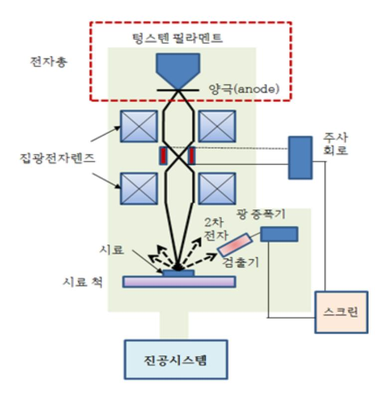

[그림 3-14] 전자현미경 구성도

(1) CD-SEM 측정

실제로 CD-SEM을 이용하여 측정한 사진이 [그림 3-15] 나타나있다. 그림에서 보는바 와 같이 CD-SEM 프로그램 안에 내재되어 화면에 표출되는 바(bar)를 음직여서 선의 가장자리에 두 바를 맞추면 자동적으로 길이가 화면에 표시되고 데이터로 출력된다. 스펙트럼(spectrum)의 강도를 보면서 패턴의 3차원적 형성 모습을 예상할 수 있다. [그림 3-15]과 같이 강도가 낮은 부분은 패턴의 상면, 높은 부분은 하부를 나타낸다.

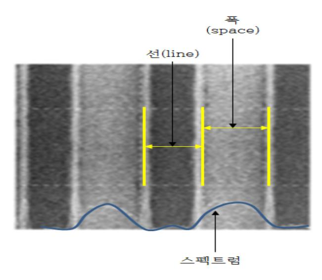

[그림 3-15] CD-SEM으로 측정한 선폭의 화면 모습

2. 입자 측정 계수기

재료 사용 시 웨이퍼 상에 잔존하는 입자들은 크기와 모양, 성분이 여러 가지 형태로 나 타난다. 웨이퍼 상에 입자의 존재 여부는 광산란 현상을 이용한다. 측정 방법은 레이저 빔 을 웨이퍼에 조사하여 광산란 분포를 분석하는 것이다. 입자의 존재 여부에 따라 산란 단 면적이 달라진다. 광이 매질과 만나면 산란이 일어나고 산란된 빛의 세기는 그 매질의 크 기와 성분에 비례한다. 매질(입자)마다 굴절률과 흡수계수가 다르기 때문이다. [그림 3-16] 에 광학계의 구성과 측정 모습이 도시되어있다.

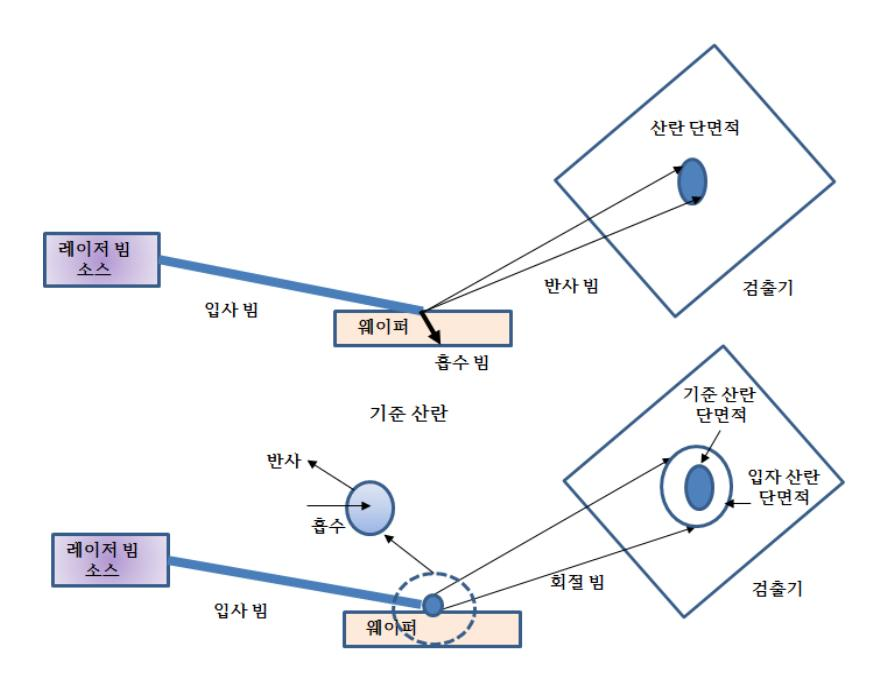

[그림 3-16] 광학적 산란 계측기 구성과 측정 개념도

### 3. 박막 두께 측정

박막(thin film)은 기판 표면에 형성시킨 10Å 이하에서 100㎛ 두께범위의 얇은 막을 말한 다. 박막의 종류는 유전체 박막, 반도체 박막, 금속 박막 등 다양하다. 계측 장비는 대표 적으로 엘립소미터(ellipsometer)이다. 원리는 편광된 빛을 재료의 표면에 경사지게 반사시 켜 박막의 물리적 상태에 따라 변화하는 빛의 편광 상태를 측정하여 분석하는 방법이다. 엘립소미터 계측기의 측정 구성도가 [그림 3-17]에 나타나있다.

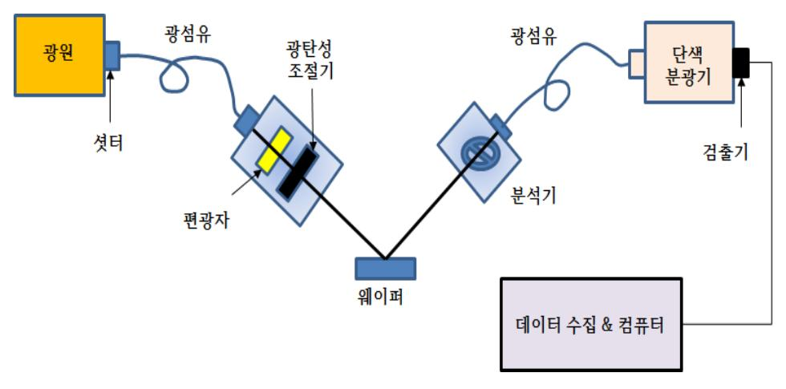

[그림 3-17] 엘립소미터 계측기 측정 구성도

4. 성분분석 SIMS 장비

 SIMS 장비는 2차 이온 질량분석법으로써 시료의 표면 분석을 통해 표면 정보를 얻을 수 있는 분석법을 기초로 한다. 이들의 양을 검출하고 분석함으로써 주 원자와 분리된 주입 된 이온들의 양과 깊이에 따른 불순물 분포를 얻을 수 있다. [그림 3-18]에 기본적인 측정 원리도가 도시되어있다.

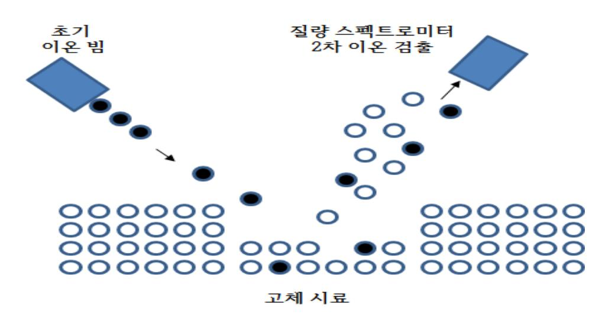

[그림 3-18] SIMS 측정 기본 원리도

### 5. 전기적 방법에 의한 계측

공정 중 테스트 모듈을 통상적으로 공정 모니터링의 입장에서 PCM(process control module)이라 부른다. 소자의 전기적 특성과 두께 등을 관측하고 분석하는 패턴은 [그림 3-19]에서와 같이 웨이퍼 상에서 스크리브 레인(scribe lane) 안에서 형성된다. 그리고 이 곳에 있는 패턴 검사를 기준으로 공정을 조율한다.

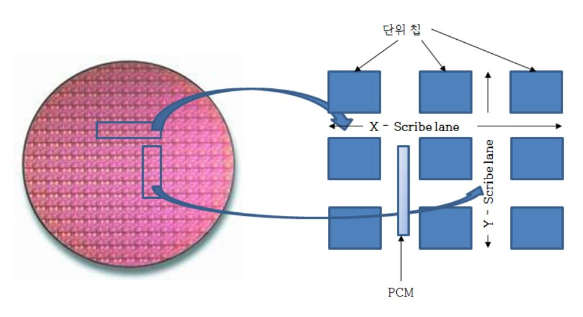

[그림 3-19] PCM 의 웨이퍼상의 위치

### 수행 내용 / 공정 소재 평가 장비 구성 및 동작 원리 파악하기

### 재료·자료

계측 장비 매뉴얼

### 기기(장비 ・ 공구)

- 전자현미경
- 전기 특성 측정기, 두께 측정기, 성분 분석기

### 안전・유의 사항

- 반도체 제조 공정된 웨이퍼 취급에 오염이나 파손에 주의해야한다.
- 측정 장비 사용 시 매뉴얼대로 따라 진행한다.
- 고전압, 고전류, 고자기장에 주의한다.

### 수행 순서

- 실리콘 웨이퍼의 특성을 파악한다.
  - 1. 단결정 성장 방법에 대하여 파악한다.
  - 2. 웨이퍼의 방향성을 측정하고 판단한다.
  - 3. 웨이퍼 두께를 측정한다.
  - 4. 웨이퍼의 휘어짐 정도를 측정한다.
  - 5, 웨이퍼의 저항을 측정한다.
- 공정 재료 평가와 관련된 계측 장비의 기능, 구성을 파악하고 측정한다.
  - 1. 통상적 재료 특성 검증 절차에 따라 수행한다.

### (1) 장비의 사양과 매뉴얼을 확인한다.

- 장비의 매뉴얼을 숙지하고, 작업 순서를 작성한다.
- (가) 기계적 사양을 확인한다.
- (나) 측정 성능 사양을 확인한다.
- (다) 측정 방법과 장비 사용 방법에 대하여 확인한다.

- (라) 샘플 제작과 샘플 장착에 대해서 확인한다.
- (마) 측정 결과 생성 방법을 확인한다.
- (2) 전원을 투입하고 측정을 진행 한다.

측정 과정에 대해서 진행 순서를 정하고 과정을 진행 시킨다.

(3) 검증을 실시한다.

측정의 정확성을 확보하기 위해서 다음과 같은 확인을 거친다.

- (가) 추가 샘플을 확인한다.
  - 샘플을 복수로 확보한 경우 샘플의 추가 검사를 통해서 재현성을 확보한다.
- (나) 측정 장치의 기초 특성을 재확인한다.
  - 측정 장비의 검교정 주기 등을 확인한다.
- 2. 감광막 재료의 광화학적 특성을 측정하고 분석한다.
  - (1) 주사형 현미경을 이용해 CD(critical dimension)을 측정한다.
  - (2) 주사형 현미경을 이용해 패턴 프로파일을 관측한다.
  - (3) 광학현미경으로 불순물의 분포를 관측한다.
  - (4) 감광막의 두께를 굴절광학계를 이용하여 측정한다.
  - (5) 표면을 분석하기 위해 사용되는 분석방법은 NEXAFS(nearedgeX-ray absorption fine structure spectroscopy) 방법이 있다. 전자의 빈 분자 오비탈로의 여기로 인한 X-ray 흡광 혹은 투과를 측정하여 시료 표면의 원소의 종류와 결합 상태를 확인한다.
- 3. 건식 식각 가스의 종류와 물리적, 화학적 특성을 측정하고 분석한다.
  - (1) 주사형 현미경을 이용해 패턴 CD(critical dimension)을 측정한다.
  - (2) 주사형 현미경을 이용해 패턴 프로파일을 관측한다.
  - (3) 광학현미경으로 불순물의 분포를 관측한다.
  - (4) 전기특성은 PCM의 ECD(Elctrcal CD) 모듈을 통해 측정한다.
- 4. 습식 화공 약품의 종류와 화학적 특성을 측정하고 분석한다.
  - (1) 유기고분자화합물의 구성과 특성을 측정한다,
  - (2) 공정별 세정액의 구성과 레시피를 작성한다.
  - (3) 공정별 습식 식각액의 구성과 레시피를 작성한다.
- 5. 금속 재료의 전기적, 광학적, 물리적, 화학적 특성을 측정하고 분석한다.
  - (1) 주사형 현미경을 이용해 금속 패턴 CD(critical dimension)을 측정한다.
  - (2) 주사형 현미경을 이용해 금속 패턴 프로파일을 관측한다.

- (3) 광학현미경으로 불순물의 분포를 관측한다.
- (4) 전기특성은 PCM(process control module)의 저항 테스트 모듈을 통해 측정한다.
- (5) EM(electro migration) 신뢰성을 평가한다.
- (6) SM(stress migration) 신뢰성을 평가한다.
- (7) 박막의 시트 저항(sheet resistance)을 측정한다.
- (8) 반사도(RI, reflectivity intensity, %)를 측정한다.
- (9) 반도체 금속 재료에 대한 표준 시험(인장, 압축, 전단)을 파악하고 측정한다.
- 6. 세정 공정 진행 후 불순물 입자들을 측정한다.

## 학습3 교수·학습 방법

### 교수 방법

- 반도체 공정에 실제 사용되는 웨이퍼들 전시하고 차이점을 발견토록 유도한다.
- 반도체 리소그래피 재료 요구 사항에 필요한 내용과 관련 자료를 확보해 학생들에게 제시 후 파악 여부를 확인한다.
- 반도체 건식 식각 재료 요구 사항에 필요한 내용과 관련 자료를 확보해 학생들에게 제시 후 파악 여부를 확인한다.
- 반도체 습식화공 약품 재료 요구 사항에 필요한 내용과 관련 자료를 확보해 학생들에게 제시 후 파악 여부를 확인한다.
- 반도체 금속 재료 요구 사항에 필요한 내용과 관련 자료를 확보해 학생들에게 제시 후 파악 여부를 확인한다.
- 통계적 공정관리의 개념을 설명한다.
- 런 시트와 단위 공정 데이터를 활용하여 설명한다.

### 학습 방법

- 전시된 웨이퍼들을 통해 반도체용 종류와 차이점에 대해 확인하거나, 웨이퍼 제조 업체에서 제공하는 자료를 활용한다.
- 반도체용 리소그래피 재료 요구 사항 항목이 선정된 양식에 맞추어 자료를 작성한다.
- 반도체용 건식 식각 재료 요구 사항 항목이 선정된 양식에 맞추어 자료를 작성한다.
- 반도체용 습식 화공 약품 재료 요구 사항 항목이 선정된 양식에 맞추어 자료를 작성한다.
- 반도체용 금속 재료 요구 사항 항목이 선정된 양식에 맞추어 자료를 작성한다.
- 통계적 공정관리도를 작성한다.
- 런 시트 및 공정관리도를 토대로 우선 최소(예: 10개)의 런 제품의 이력 관리 샘플을 작성 한다.

# 학습3 평 가

### 평가 준거

- 평가자는 학습자가 학습 목표를 성공적으로 달성하였는지를 평가해야 한다.
- 평가자는 다음 사항을 평가해야 한다.

|                                 | 학습 목표                                                                     |  | 성취수준 |   |
|---------------------------------|---------------------------------------------------------------------------|--|------|---|
| 학습 내용                           |                                                                           |  | 중    | 하 |
| 공정 소재 측정 및 특성 평가             | - 공정 소재들의 특성 항목과 기준을 해석할 수 있다.                                            |  |      |   |
|                                 | - 공정 소재들의 검증 패턴을 해석하고 적용할 수 있다.                                           |  |      |   |
|                                 | - 공정 소재 특성 평가 데이터의 불량 여부를 파악할 수 있다.                                    |  |      |   |
|                                 | - 평가 데이터를 근거로 표준화된 기법에 의거, 장/단기 공정 특성 산포를 예측하고 평가하여 보고서를 작성 할 수 있다. |  |      |   |
| 공정 소재 평가 장비 구성 및 동작 원리 파악 | - 공정 소재 평가 장비의 사용법을 해석하고 적용할 수 있다.                                     |  |      |   |

### 평가 방법

• 평가자체크리스트

|                                 | 평가 항목                                                                     |  | 성취수준 |   |  |
|---------------------------------|---------------------------------------------------------------------------|--|------|---|--|
| 학습 내용                           |                                                                           |  | 중    | 하 |  |
| 공정 소재 측정 및 특성 평가             | - 공정 소재들의 특성 항목과 기준을 해석할 수 있는 능력                                       |  |      |   |  |
|                                 | - 공정 소재들의 검증 패턴을 해석하고 적용할 수 있는 능력                                      |  |      |   |  |
|                                 | - 공정 소재 특성 평가 데이터의 불량 여부 파악 능력                                            |  |      |   |  |
|                                 | - 평가 데이터를 근거로 표준화된 기법에 의거, 장/단기 공정 특성 산포를 예측, 평가하여 보고서를 작성할 수 있는 능력 |  |      |   |  |
| 공정 소재 평가 장비 구성 및 동작 원리 파악 | - 공정 소재 평가 장비의 사용법을 해석하고 적용하는 능력                                       |  |      |   |  |

### • 일지/저널

|                                 |                                                                            | 성취수준 |   |   |
|---------------------------------|----------------------------------------------------------------------------|------|---|---|
| 학습 내용                           | 평가 항목                                                                      |      | 중 | 하 |
| 공정 소재 측정 및 특성 평가             | - 공정 소재들의 특성 항목과 기준을 해석할 수 있는 능력                                        |      |   |   |
|                                 | - 공정 소재들의 검증 패턴을 해석하고 적용할 수 있는 능력                                       |      |   |   |
|                                 | - 공정 소재 특성 평가 데이터의 불량 여부 파악 능력                                             |      |   |   |
|                                 | - 평가 데이터를 근거로 표준화된 기법에 의거, 장/단기 공정 특성 산포를 예측, 평가하여 보고서를 작성할 수 있는 능력. |      |   |   |
| 공정 소재 평가 장비 구성 및 동작 원리 파악 | - 공정 소재 평가 장비의 사용법을 해석하고 적용하는 능력                                        |      |   |   |

• 구두 발표

|                                 | 평가 항목                                                                      |  | 성취수준 |   |  |
|---------------------------------|----------------------------------------------------------------------------|--|------|---|--|
| 학습 내용                           |                                                                            |  | 중    | 하 |  |
| 공정 소재 측정 및 특성 평가             | - 공정 소재들의 특성 항목과 기준을 해석할 수 있는 능 력                                       |  |      |   |  |
|                                 | - 공정 소재들의 검증 패턴을 해석하고 적용할 수 있는 능력                                       |  |      |   |  |
|                                 | - 공정 소재 특성 평가 데이터의 불량 여부 파악 능력                                             |  |      |   |  |
|                                 | - 평가 데이터를 근거로 표준화된 기법에 의거, 장/단기 공정 특성 산포를 예측, 평가하여 보고서를 작성할 수 있는 능력. |  |      |   |  |
| 공정 소재 평가 장비 구성 및 동작 원리 파악 | - 공정 소재 평가 장비의 사용법을 해석하고 적용하는 능력                                        |  |      |   |  |

피드백

- 1. 평가자 체크리스트
- 반도체 공정 소재 측정 및 특성 평가에서 문제 해결 능력을 관찰하는 과정을 평가한 후 주요 사항을 표시하여 돌려준다.
- 반도체 공정 소재 평가 장비의 사용법을 해석하고 적용하는 능력을 충분히 이해하고 있는지 확 인하고 체크리스트 중심으로 피드백한다.
- 2. 일지/저널
- 반도체 공정 소재 측정 및 특성 평가에서 주어진 주제나 요구에 대해 작성된 일지/저널 에 대해 평가하고 기준에 미달한 학생들에게는 수준별로 학습 내용을 보충하고 스스로 복습한 후 그 결과를 제출하도록 한다.
- 반도체 공정 소재 평가 장비의 사용법을 해석하고 적용하는 능력을 충분히 이해하고 있는지 사 례 중심으로 확인하고 피드백한다.
- 3. 구두 발표
- 반도체 공정 소재 측정 및 특성 평가 발표 시 질의·응답을 통해 작성한 보고서의 숙 지 여부를 판단하고 개선 사항 및 추가로 보완해야 할 사항에 대해 제시한다.

| 학습 1 | 공정 흐름도 해석하기  |
|------|--------------|
| 학습 2 | 단위 소자 개발하기   |
| 학습 3 | 공정 소재 평가하기   |
| 학습 4 | 공정 장비 운용하기   |
| 학습 5 | 계측 운용 및 평가하기 |
| 학습 6 | 단위 공정 최적화하기  |

# **4-1.** 단위 공정, 장비 확인

|       |  | • 작업 지시서에 의해 정해진 공정 장비를 조작하여 단위 공정을 수행할 수 있다.  |
|-------|--|------------------------------------------------|
| 학습 목표 |  | • 공정의 작업 순서와 절차를 파악하여 수행 중인 단위 공정의 특성을 확인할 수 있 |
|       |  | 다.                                             |

# 필요 지식 /

 반도체 주요 공정 및 장비 운용 반도체 회로를 웨이퍼 상에 가공하기 위한 공정 업무 능력을 위해 장비 운용에 사용되는 용어, 필요한 공정 이론 및 장비를 파악한다. 이를 위해 사용 용어에 대한 상세한 내용은 '반도체 용어 정리' 및 선수 학습을 참조하며 단위 공정 및 장비 운용 용어를 이해한다.

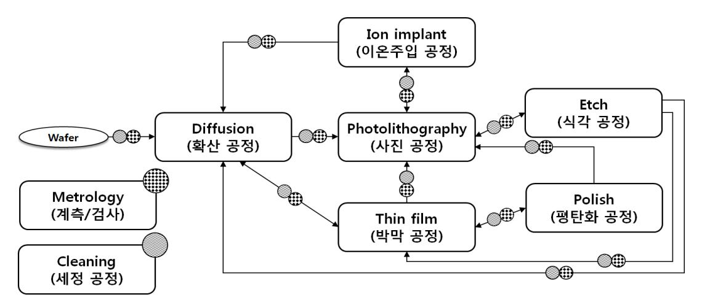

출처: 교육부(2015). 반도체 제조 공정개발(LM1903060106\_14v3). 한국직업능력개발원. p.30. [그림 4-1] 반도체 공정 단계 중 시모스(CMOS)(complementary metal-oxide semiconductor) 공정 중 공정별 웨이퍼 이동

### 1. 사진(photo) 공정

사진 공정은 photolithography 공정의 줄임말로 웨이퍼 위에 회로 패턴을 형성하는 것을 말한다. 아래에서는 8단계(step)로 구성에 대하여 학습한다.

- (1) 증기 프라임(vapor prime) 표면과 포토 레지스트(PR)의 계면 접착력(adhesion) 향상에 대하여 학습한다.
- (2) 스핀 코팅(spin coat)

PR의 두께(thickness)와 균일도(tniformity)를 결정하는 단계로 PR의 타입과 양, 회전 시 간, 회전 속도, 및 점도에 대하여 학습한다.

(3) 소프트 건조(soft bake)

솔벤트의 제거가 목적이며 레지스트의 부착력(adhesion) 및 균일도(uniformity)에 대하 여 학습한다.

(4) 정렬 및 노광(alignment & exposure)

포토 마스크의 패턴이 웨이퍼 상에 설계된 부분에 위치하도록 정렬하는 단계로 특정 파장의 광원 및 방식에 대하여 학습한다.

(5) 노광 후 건조(post exposure bake, PEB)

해상도의 향상 및 잔여 솔벤트의 제거가 목적으로 열 균일도에 대하여 학습한다.

(6) 현상(develop)

상대적으로 결합이 약한 레지스트를 녹여 목표한 패턴만을 남기는 단계로 화학 반응 에 대하여 학습한다.

(7) 검사(inspection)

목표치와 비교 확인하는 단계로 광학 및 표준 검사 방법에 대하여 학습한다.

(8) 하드 건조(hard bake)

잔여 용매를 증발시켜 튼튼하게 만드는 단계로 열 균일도에 대하여 학습한다. 반도체 공정에서는 웨이퍼 당 공정 비용이 칩(chip)의 개수에 비례하지 않으므로 높은 수율 (yield)을 위하여 많은 칩을 하나의 웨이퍼에 구현하는 것이 목표가 된다. 포토 레지스 트(photo resist), 임계 차원(critical dimension), 광 스펙트럼(light spectrum), 해상도 (resolution), 오버레이 정확도(overlay accuracy), 및 공정 범위(process latitude; 최종 공 정 목표를 위한 각 변수 및 그 상호 관계에 따른 변수 편차의 한계)를 학습한다.

2. 식각(etching) 공정

식각(etching) 공정이란 노광 공정에서 형성된 회로 패턴을 이용하여 불필요한 부분을 제 거하는 공정으로 건식/습식 식각을 수행하고 결과를 예상하는 것을 포함한다.

식각 공정에서는 보통 사진(photo) 공정에서 이루어진 패턴 중 열린 부분(open area)에 대 한 제거를 진행하게 되므로 식각(etch) 공정에서 식각률(etch rate), 식각 프로파일(etch profile), 식각 바이어스(etch bias), 선택도(selectivity), 균일도(uniformity), 잔여물(residues) 및 입자 오염과 결함(particle contamination & defects)에 대하여 학습한다.

습식 식각(wet etch)은 공정이 단순하고 비용이 건식 식각(dry etch)보다 상대적으로 싸다. 하지만 등방성으로 식각이 진행되고, 제어가 어려운 점에서 상대적으로 임계 차원(CD)이 크고 공정 범위가 제한적이지 않은 분야에 사용된다. 농도(concentration), 시간(time), 온도 (temperature), 교반(agitation) 및 공정 횟수(number of runs)에 대하여 학습한다.

건식 식각(dry etch)은 공정 및 장비가 비교적 복잡하고 비용이 습식 식각(wet etch)보다 는 비싸지만 원하는 형태의 식각이 가능하고, 제어가 비교적 쉬운 점에서 상대적으로 임 계 차원(CD)이 작고 공정 범위가 매우 제한적인 분야에 사용된다. 폴리머 포메이션 (polymer formation), 플라즈마 유도 손상(plasma-induced damage) 및 입자 오염과 결함 (particle contamination & defects)에 대하여 학습한다.

### 3. 확산(diffusion) 공정

확산(diffusion) 공정이란 고온의 튜브(tube)에 필요한 박막(산화막/질화막)을 형성하는 공정 으로 물질의 입자들이 농도(밀도)가 높은 쪽에서 낮은 쪽으로 퍼져나가는 현상을 이용하 며 평형 상태(equilibrium)가 되는 지점에서 확산이 멈추게 된다. 온도(temperature), 압력 제어(pressure control), 가스(gas) 및 반응(reaction)에 대하여 학습한다.

### 4. 평탄화(chemical mechanical planarization, CMP) 공정

평탄화 공정이란 웨이퍼 상에서 기준면보다 높은 부위를 갈아내는 공정을 말한다. 임계 차원(CD)이 작아지고 집적화가 요구되면서 다층 배선 구조의 형성이 필요함과 동시에 더 욱 미세한 정밀도가 필요해지고 있다. 연마 시간(ㅔolish time), 압력(ㅔressure on wafer carrier; downforce), 회전 속도(platen speed & carrier speed), 슬러리 화학 조성(slurry chemistry), 슬러리 유량(slurry flow rate), 패드 상태(pad conditioning), 온도(wafer/slurry temperature) 및 웨이퍼 뒷면 압력(wafer back pressure)에 대하여 학습한다.

### 5. 세정(cleaning) 공정

세정(cleaning) 공정이란 오염 물질 혹은 원하지 않는 박막을 제거하는 공정으로 임계 차 원(CD)의 감소 및 고집적화로 인해 세정 공정도 더욱 정밀해지고 있다. 주 오염원인 공기, 사람, 시설, 물, 공정 화학 물질, 장비 및 클린룸 디자인에 대하여 학습하며, 공정 방법인 습식/건식 세정, 스크러빙(scrubbing), 웨이퍼(wafer) 건조 공정에 대하여 학습한다. 산업 표준 습식 세정 과정은 미국의 RCA사에서 개발한 방법을 사용한다. SC-1(standard cleaning 1)은 미립자와 유기물질을 제거하며, SC-2(standard cleaning 2)는 금속 오염을 제 거하기 위해 사용한다. 일반적인 웨이퍼의 습식 세정 순서는 아래 <표 4-1>과 같다.

| 세정 단계(cleaning step)       | 목적(purpose)       |
|----------------------------|-------------------|
| H2SO4 / H2O₂ (Piranha)     | Organics & metals |
| (황산/과산화수소)(피라냐 세정)         | (유기물질과 금속)        |
| UPW rinse (Ultrpure water) | Rinse             |
| (순수 세정)                    | (세정)              |
| HF / H2O (Diluted HF)      | Native oxide      |
| (불산/순수)(희석된 불산 세정)         | (자연산화막)           |
| UPW rinse (Ultrpure water) | Rinse             |
| (순수 세정)                    | (세정)              |
| NH4OH / H2O₂ / H2O (SC-1)  | Particles         |
| (암모니아/과산화수소/순수)            | (미립자)             |
| UPW rinse (Ultrpure water) | Rinse             |
| (순수 세정)                    | (세정)              |
| HF / H2O (Diluted HF)      | Native oxide      |
| (불산/순수)(희석된 불산 세정)         | (자연 산화막)          |
| UPW rinse (Ultrpure water) | Rinse             |
| (순수 세정)                    | (세정)              |
| HCl / H2O₂ / H2O (SC-2)    | metals            |
| (염산/과산화수소/순수)              | (금속)              |
| UPW rinse (Ultrpure water) | Rinse             |
| (순수 세정)                    | (세정)              |
| HF / H2O (Diluted HF)      | Native oxide      |
| (불산/순수)(희석된 불산 세정)         | (자연 산화막)          |
| UPW rinse (Ultrpure water) | Rinse             |
| (순수 세정)                    | (세정)              |
| Drying                     | Dry               |
| (건조)                       | (건조)              |

<표 4-1> Step of typical wafer cleaning in FAB (웨이퍼 습식 세정 단계별 목적)

출처: Semiconductor Manufacturing Technology (Michael Quirk & Julian Serda)

건식 세정은 좁은 틈(gap) 사이의 오염 잔류 이슈, 수율 향상을 위한 속도 이슈 및 환경오염 이슈 등으로 주로 플라즈마 환경을 이용한다. 염소 기반의 화학제나 아르곤(Ar sputtering) 및 수소(H2-prebake) 등을 사용하고 있는 건식 세정에 대하여 학습한다.

### 6. 이온 주입(ion implant) 공정

이온 주입(ion-implanting) 공정이란 이온 불순물(dopant)을 웨이퍼 내부에 침투시켜 원하는 전기적 특성을 만들어주는 공정을 말하며, 도핑하려는 원소를 이온화시킨 후 장비를 통해 가속시켜 표면에 충돌시키는 방식이다. 이온 주입 공정 이후 확산 공정을 통하여 원하는 깊이(junction depth)만큼 확산시키고, 어닐링(annealing) 공정으로 분자 재배열을 통해 안 정화(curing) 시키는 방법에 대하여 학습한다.

### 7. 박막(thinfilm) CVD/PVD 공정

박막(thinfilm) 공정은 가스 간 화학반응을 통해서 절연막/전도성막을 형성하는 화학 기상 증착 CVD(chemical vapor deposition) 공정과 금속 타깃을 물리적으로 분해하여 웨이퍼 표 면에 금속막을 형성시켜 각각의 회로를 연결시켜 주거나 챔버 내에서 화학반응을 이용하 여 절연막을 형성하여 증착시키는 물리 기상 증착 PVD(physical vapor deposition) 공정을 포함한다. 단차 피복(step coverage), 높은 종횡비의 틈을 채우는 능력(ability to fill high aspect ratio gaps), 균일도(uniformity), 순도와 밀도(purity & density), 화학적 제어 (controlled stoichiometry), 구조적 완성도 및 낮은 스트레스(degree of structural perfection with low film stress), 전기적 특성(electrical property) 및 부착력(adhesion)에 대하여 학습 한다.

### (1) 화학 기상 증착(CVD) 공정과 물리 기상 증착(PVD) 공정 비교

박막 증착 공정에서 사용되는 재료의 상태 및 반응시키는 방식에 따라 크게 아래 <표 4-2>와 같이 나눌 수 있으며 이에 대하여 학습한다. 자세한 설명은 '4-2. 각 공정 장 비 구성 및 동작 원리 이해하기'에서 참조할 수 있다.

| Chemical Processes (화학적 공정)                                                                            |                                                             |                                                                | Physical Processes (물리적 공정)         |                                           |
|-----------------------------------------------------------------------------------------------------------|-------------------------------------------------------------|----------------------------------------------------------------|----------------------------------------|-------------------------------------------|
| Chemical Vapor Deposition(CVD) (화학적기상증착)                                                            | Plating (도금)                                             | Physical Vapor Deposition(PVD) (물리적기상증착) (Sputtering) | Evaporation (증발)                    | Spin On Methods (회전방식)              |
| Atmospheric Pressure CVD (대기압 CVD)                                                                  | Electrochemical deposition (전해도금) (Electroplating) | DC Diode (직류 다이오드)                                          | Filament and Electron Beam (전자빔) | Spin on glass (유리회전 도포)          |
| Low Pressure CVD (저기압 CVD)                                                                          | Electroless Plating (무전해도금)                           | Radio Frequency (주파수)                                    | Molecular Beam Epitaxy (분자빔)     | Spin on dielectric ( 절 연 막 회전도포) |
| Plasma Enhanced CVD (PECVD) ( 플 라 즈 마 강 화 CVD) High Density Plasma CVD (고밀도플라즈마 CVD) |                                                             | DC Magnetron (직류 자기장)                                       |                                        |                                           |
| Vapor Phase Epitaxy & Metal-Organic CVD (기상결정&금속 유기 CVD)                                      |                                                             | Ionized Metal plasma (이온화 금속 플 라즈마)                   |                                        |                                           |

<표 4-2> Techniques of Film deposition (박막 증착 공정 기술)

출처: Semiconductor Manufacturing Technology (Michael Quirk & Julian Serda)

### 반도체 제조 공정 프로세스 및 공정별 공정 장비 특성

다양한 반도체 제조 공정 프로세스 중 반도체에서 스위치로 사용되는 트랜지스터의 게이 트 구조 및 배선 연결 공정에 대하여 알아보고 각각의 경우에 사용되는 장비에 대하여 이 해하고 그 운용 기술을 확인한다.

### 1. 공정 단계(process step) 및 장비 특성에 따른 운용

아래의 <표4-3>은 공정 단계별 장비 및 용도를 기술하고 있으며 이에 대하여 학습한다.

<표 4-3> 시모스(CMOS) manufacturing process steps (CMOS 공정 프로세스)

| # | Process step                          | Equipment                                  | Purpose                                    |
|---|---------------------------------------|--------------------------------------------|--------------------------------------------|
| 1 | wafer preparation (웨이퍼 준비)         | wet station (웻 스테이션)                    | RCA & Piranha cleaning (RCA와 피라냐 세정 공정) |
| 2 | Twin well (이중 우물)                  | Furnace (퍼니스)                           | Epitaxial layer growth (에피텍셜층 성장)       |
|   |                                       | Furnace (퍼니스)                           | Initial oxide growth (첫번째 산화막 성장)       |
|   |                                       | photo equipment (사진 공정 장비)              | 1st mask Patterning (첫번째 마스크 패터닝)       |
|   |                                       | Ion implant (이온 임플란트)                   | n-well formation (n형 우물)                |
|   |                                       | RTP(Rapid thermal process) (고속 열 공정 장비) | Annealing (풀림)                          |
|   |                                       | photo equipment (사진 공정 장비)              | 2nd mask Patterning (두번째 마스크 패터닝)       |
|   |                                       | Ion implant (이온 임플란트)                   | p-well formation (p형 우물)                |
|   |                                       | Furnace (퍼니스)                           | Annealing (풀림)                          |
| 3 | Shallow trench isolation (좁은 틈 분리) | Furnace (퍼니스)                           | barrier oxide growing (격벽 산화막 성장)       |
|   |                                       | CVD (화학기상증착)                            | Nitride deposition (질화막 증착)             |
|   |                                       | photo equipment (사진 공정 장비)              | 3rd mask as STI (세번째 마스크 패터닝)           |
|   |                                       | Dry etcher (plasma) (건식 식각 장비(플라즈마))    | STI trench etching (STI 패턴 식각)          |
|   |                                       | Furnace (퍼니스)                           | Trench liner oxide (덧대는 산화막 성장)         |

| # | Process step                                           | Equipment                                         | Purpose                                              |
|---|--------------------------------------------------------|---------------------------------------------------|------------------------------------------------------|
|   |                                                        | CVD (화학기상증착)                                   | Trench fill with oxide (STI에 산화막 증착)              |
|   |                                                        | CMP (화학/기계적 평탄화)                               | Trench oxide polish (산화막 평탄화)                     |
|   |                                                        | Furnace (퍼니스)                                  | Nitride strip (질화막 제거) (with hot phosphoric acid) |
| 4 | Poly gate structural (폴리게이트구조)                      | Furnace (퍼니스)                                  | Gate oxide growth (게이트 산화막 성장)                    |
|   |                                                        | CVD (저압화학기상증착)                                 | Poly silicon deposition (폴리실리콘 증착)                |
|   |                                                        | photo equipment (사진 공정 장비)                     | 4th mask patterning (네번째 마스크 패터닝)                 |
|   |                                                        | Dry etcher (plasma) (건식 식각 장비(플라즈 마)) | Poly gate etch (폴리 게이트 패턴 식각)                     |
| 5 | Lightly doped drain (LDD) implants (적은 도펀트 임플란트) | photo equipment (사진 공정 장비)                     | 5th mask patterning (다섯번째 마스크 패터닝)                |
|   |                                                        | Ion implant (이온 임플란트)                          | n- LDD implant (적은 n형 도펀트 임플란트)                   |
|   |                                                        | photo equipment (사진 공정 장비)                     | 6th mask patterning (여섯번째 마스크 패터닝)                |
|   |                                                        | Ion implant (이온 임플란트)                          | p- LDD implant (적은 p형 도펀트 임플란트)                   |
| 6 | Sidewall spacer formation (격벽구조)                    | CVD (화학기상증착)                                   | Spacer oxide deposition (절연 산화막 증착)               |
|   |                                                        | Dry etcher (plasma) (건식 식각 장비(플라즈 마)) | Spacer oxide etchback (절연 산화막 식각)                 |
| 7 | Source/Drain implant (소스/드레인 임플란트)                  | photo equipment (사진 공정 장비)                     | 7th mask patterning (일곱번째 마스크 패터닝)                |
|   |                                                        | Ion implant (이온 임플란트)                          | n+ Source/Drain implant (많은 n형 도펀트 임플란트)          |
|   |                                                        | photo equipment (사진 공정 장비)                     | 8th mask patterning (여덟번째 마스크 패터닝)                |
|   |                                                        | Ion implant (이온 임플란트)                          | p+ Source/Drain implant (많은 p형 도펀트 임플란트)          |
|   |                                                        | RTP(Rapid thermal process) (고속 열 공정 장비)        | Annealing (풀림)                                    |
|   |                                                        |                                                   |                                                      |

| #  | Process step                             | Equipment                                  | Purpose                                                       |
|----|------------------------------------------|--------------------------------------------|---------------------------------------------------------------|
| 8  | Contact formation (접촉부분)              | PVD (Sputtering) (물리기상증착)               | Titanium deposition (타이타늄 증착)                              |
|    |                                          | RTP(Rapid thermal process) (고속 열 공정 장비) | Annealing (풀림)                                             |
|    |                                          | wet etcher (chemical) (습식 식각)           | Titanium etching (타이타늄 식각)                                 |
| 9  | Local interconnect(LI) (부분연결)         | CVD (화학기상증착)                            | Nitride deposition (질화막 증착)                                |
|    |                                          | CVD (화학기상증착)                            | Doped oxide deposition (도핑된 산화막 증착)                        |
|    |                                          | CMP (화학/기계적 평탄화)                        | Oxide polishing (산화막 평탄화)                                  |
|    |                                          | photo equipment (사진 공정 장비)              | 9th mask patterning (아홉번째 마스크 패터닝)                         |
|    |                                          | Dry etcher (plasma) (건식 식각 장비(플라즈마))    | LI etch (부분연결 패턴 식각)                                       |
|    |                                          | PVD (물리기상증착)                            | Titanium deposition (타이타늄 증착)                              |
|    |                                          | CVD (화학기상증착)                            | Titanium nitride deposition (타이나이트라이드 증착)                  |
|    |                                          | CVD (화학기상증착)                            | Tungsten deposition (텅스텐 증착)                               |
|    |                                          | CMP (화학/기계적 평탄화)                        | Tungsten polish (텅스텐 평탄화)                                  |
| 10 | Via-1 & Plug-1 formation (비아와 플러그) | CVD (화학기상증착)                            | ILD-1 oxide deposition (부분연결-1 산화막 증착)                     |
|    |                                          | CMP (화학/기계적 평탄화)                        | Oxide polish (산화막 평탄화)                                     |
|    |                                          | photo equipment (사진 공정 장비)              | 10th mask patterning (열번째 마스크 패터닝)                         |
|    |                                          | Dry etcher (plasma) (건식 식각 장비(플라즈마))    | ILD-1 etching (부분연결-1 식각)                                  |
|    |                                          | PVD (물리기상증착)                            | Titanium barrier metal deposition (타이타늄(격벽용도) 증착) |
|    |                                          | CVD (화학기상증착)                            | Titanium nitride deposition (타이나이트라이드 증착)                  |

| #  | Process step                                                         | Equipment                               | Purpose                                                       |
|----|----------------------------------------------------------------------|-----------------------------------------|---------------------------------------------------------------|
|    |                                                                      | CVD (화학기상증착)                         | Tungsten deposition (텅스텐 증착)                               |
|    |                                                                      | CMP (화학/기계적 평탄화)                     | Tungsten polish (텅스텐 평탄화)                                  |
| 11 | Metal-1 interconnect formation (금속연결)                          | PVD (물리기상증착)                         | Titanium barrier metal deposition (타이타늄(격벽용도) 증착) |
|    |                                                                      | PVD (물리기상증착)                         | Aluminium-copper deposition (알루미늄-구리 합금 증착)                |
|    |                                                                      | CVD (화학기상증착)                         | Titanium nitride deposition (타이나이트라이드 증착)                  |
|    |                                                                      | photo equipment (사진 공정 장비)           | 11th mask patterning (열한번째 마스크 패터닝)                        |
|    |                                                                      | Dry etcher (plasma) (건식 식각 장비(플라즈마)) | Metal etching (금속 식각)                                      |
| 12 | And repeat Via-x, Plug-x, and Metal-x (비아, 플러그, 및 금속 공정 반복) | Repeat (반복)                          | -                                                             |
| 13 | Passivation (보호층)                                                 | CVD (화학기상증착)                         | Passivation layer deposition (보호층 증착)                      |

출처: Semiconductor Manufacturing Technology (Michael Quirk & Julian Serda, )

각 공정 장비의 세부적인 특성은 '4-2. 각 공정 장비 구성 및 동작 원리 이해하기'에서 참조할 수 있으며 여기서는 단계별 공정 장비의 특성을 학습한다.

### (1) 웨이퍼 준비 단계 공정 장비의 특성

웨이퍼 표면 세정 장비의 오염도 관리 특성에 대하여 학습한다. 자세한 내용은 '4-2. 각 공정 장비 구성 및 동작 원리 이해하기'를 참조할 수 있다.

(2) #2 Twin well ~ #7 S/D implant 공정 장비의 특성

열에 의한 공정이 계속적으로 반복되지만 아직 금속 재료가 배치되기 전의 공정으로 전공정(front end of line, FEOL)으로도 정의되는 구간이며 이온 임플란트의 표면 파괴 가 반복되므로 공정 범위의 확보에 대하여 학습한다. 자세한 내용은 '4-2. 각 공정 장비 구성 및 동작 원리 이해하기'를 참조할 수 있다.

(3) #8 Contact formation ~ #13 Passivation 공정 장비의 특성

금속 재료가 배치된 이후의 공정이 진행되므로 후공정(back end of line, BEOL)으로도 정의되는 구간이며 각 장비 특성에서 열 범위(thermal budget)에 대하여 학습한다. 자 세한 내용은 '4-2. 각 공정 장비 구성 및 동작 원리 이해하기'를 참조할 수 있다.

### 반도체용 화학약품의 종류 및 특성

반도체 제조 공정은 대부분 화학적 반응에 의한 공정으로 정의된다. 물질의 기본적인 성 질을 이해하고 그 특성을 확인하며 물질 안전 보건 자료(MSDS)에 대하여 학습한다.

1. 물질의 상태 및 특성

물질은 고체, 액체, 기체, 및 플라즈마의 네 가지의 상태로 각자가 가지고 있는 에너지 상 태 및 환경(압력, 온도 등)에 따라 구분되며 이에 대하여 학습한다.

- (1) 물질의 특성
  - (가) 물리적 특성

다른 물질과의 상호 반응 없이 스스로의 특성으로 물질을 대표하는 것으로 녹는점 (melting point), 끓는점(boiling point), 저항성(resistivity), 밀도(density) 등에 대하여 학습한다.

(나) 화학적 특성

다른 물질과의 반응(변환)으로 가연성(flammability), 반응성(reactivity), 부식성 (corrosiveness) 등이 있으며 이러한 변화가 일어나기 위한 조건으로 온도 (temperature), 압력과 진공(pressure & vacuum), 액화와 기화(condensation), 증기 압력(vapor pressure), 승화와 증착(sublimation & deposition), 밀도(density), 표면 장 력(surface tension), 열 팽창(thermal expansion) 및 응력(stress)에 대하여 학습한다.

### (2) 공정 화학 물질(process chemical)

(가) 액체

1) 산(acid)과 염기(base)

산은 수소(–H)를 포함하며 탄소(–C)의 포함 유무에 따라 유기산(organic acid)과 무기산(inorganic acid)으로 나뉜다. 염기는 수산화기(–OH)를 포함한다. 위의 산과 염기의 척도로 0~14(중심점 7)로 나눈 pH 기준, 산과 염기의 반응을 학습한다.

2) 솔벤트(solvent)

솔벤트는 다른 물질을 녹이는 능력을 가진 물질 전체를 통칭하며 그 특성(가연 성, 휘발성 등)에 대하여 학습한다.

### (나) 기체

1) 대량 생산 가스(bulk gas)와 특수 가스(specialty gas)

제조가 비교적 간단하고 공정에서 대량으로 사용되는 가스로 질소, 아르곤, 헬 륨, 수소, 및 산소 등에 대하여 학습하고, 특수 가스는 상대적으로 환경오염이 심하거나 인체에 위험한 가스를 통칭하며 라인 설비, 순도 측정, 정화 및 안전 장치와 각각의 제어에 대하여 학습한다.

### 2. 물질 안전 보건 자료(MSDS)의 이해

물질 안전 보건 자료(material safety data sheet)는 물질에 대한 여러 정보를 총괄하는 자 료이며 포함되는 정보에 대하여 학습한다.

<표 4-4> 물질 안전 보건 자료 정보

| 구분              | 정보                                           |
|-----------------|----------------------------------------------|
| 화학제품과 회사에 관한 정보 | 제품명, 제품의 권고 용도와 사용상의 제한 등                    |
| 유해·위험성 정보       | 유해·위험성 분류, 예방 조치 문구를 포함한 경고 표지 항목 등          |
| 구성 성분의 명칭 및 함유량 | 화학물질명, 관용명 및 이명, CAS 번호 또는 식별 번호, 함유량        |
| 응급조치 요령         | 눈에 들어갔을 때, 피부에 접촉했을 때, 흡입했을 때 등              |
| 폭발·화재 시 대처 방법   | 적절한 소화제, 화재 진압 시 착용할 보호구 및 예방 조치 등           |
| 누출 사고 시 대처 방법   | 인체 보호를 위한 조치 사항 및 보호구, 정화 또는 제거 방법 등         |
| 취급 및 저장 방법      | 안전 취급 요령, 안전한 저장 방법                          |
| 노출 방지 및 개인 보호구  | 노출 기준, 적절한 공학적 관리, 개인 보호구 등                  |
| 물리 화학적 특성       | 외관, 냄새, 인화점, 인화 또는 폭발 한계 상·하한, 자연 발화 온도 등 |
| 안정성 및 반응성       | 화학적 안정성, 유해 반응의 가능성, 피해야 할 조건 등              |
| 독성에 관한 정보       | 가능성이 높은 노출 경로에 대한 정보, 단기 및 장기 노출에 의한 영향 등 |
| 환경에 미치는 영향      | 수생·육생 생태 독성, 잔류성과 분해성, 생물 농축성 등              |
| 폐기 시 주의 사항      | 폐기 방법, 폐기 시 주의 사항                            |
| 운송에 필요한 정보      | 유엔 번호(UN No.), 유엔 적정 운송명, 운송 시의 위험 등급 등      |
| 법적 규제 현황        | 산업 안전 보건법에 의한 규제, 유해화학물질관리법에 의한 규제 등      |
| 기타 참고 사항        | 자료의 출처, 최초 작성 일자, 개정 횟수 및 최종 개정 일자 등         |

출처: 한국산업안전보건공단 화학 물질 정보(http://msds.kosha.or.kr/)

이외에 세계 조화 기준(globally harmonized system of classification and labelling of chemicals, GHS)에 따른 GHS-MSDS 정보에 대하여 학습한다. 자세한 정보는 한국산업안전 보건공단의 화학 물질 정보(http://msds.kosha.or.kr/)를 참조할 수 있다.

### 수행 내용 / 단위 공정 장비 및 용어 파악하기

### 재료·자료

- MSDS 설명 자료, 안전 교육 자료
- 작업 지시서(공정 계획서), 장비 및 설비 사용 설명서
- 웨이퍼, 포토 마스크, 포토 레지스트, 가스, 금속 타깃, 고분자 물질, 화공 약품, 순수 (DI-Water)

### 기기(장비 ・ 공구)

- 공정 장비(wet station, furnace, sputter, PECVD, photolithography equipment)
- 계측 장비(microscope, a-step, probe-station)

### 안전 ・ 유의 사항

- 물질 안전 보건 자료(MSDS)에 따른 화학물질의 보관, 관리, 주의 사항 준수한다.
- 취급 화학물질에 따른 알맞은 보호장구 선택, 사용 규정 준수한다.
- 안전관련 작업 안전장치(소방시설 배치, 작업자 안전, 비상 샤워부스, 아이 워시, 심장충격 기) 사용 능력을 파악한다.
- 반도체 제조 공정이 환경에 미치는 영향을 파악한다.
- 장비 취급사항 준수한다.

### 수행 순서

목표를 설정한다.

단위 공정 각각의 설계 및 공정상 이슈 확인, 공정 장비의 운용 및 자료의 문서화를 수행 하는 것을 목표로 한다.

단위 공정을 파악한다.

장비 보유 여부에 따라 일부 혹은 각 단위 공정에 대하여 진행 가능하며 단위 공정 및 장 비에 대한 확인과 공정 이슈 파악 및 그 결과를 확인할 수 있도록 한다.

단위 공정을 진행한다.

각 단위별 공정에 대한 작업 지시서는 아래와 같으며 매 공정 종료 후 단위 공정별 보고 서를 작성하도록 한다.

- 1. 각 단위 공정 일람
  - (1) 세정 공정(wafer cleaning)

세정 공정 중 DHF(dIlluted HF, 희석된 불산 사용) 공정 수행

공정 장비: 웻 스테이션(wet station)

도구: 플라스틱 용기 2개 (500ml), 실린더 (100ml), 트위저(twizzer)

재료: 초순수(DI-water), 불산용액(HF)

(가) 공정 순서

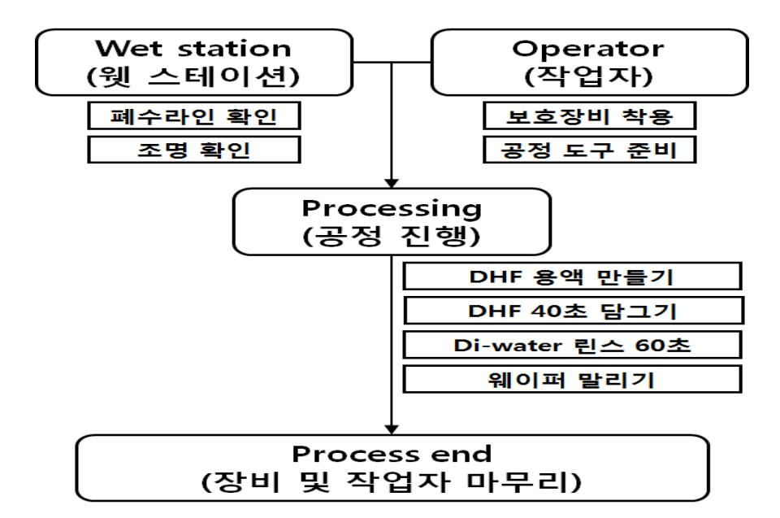

출처: 교육부(2015). 반도체 제조 공정개발(LM1903060106\_14v3). 한국직업능력개발원. p.41. [그림 4-2] 웨이퍼 세정(wafer cleaning)의 공정 순서

- 1) 웻 스테이션(wet station) 조명 켜기 / 폐수통 확인하기
- 2) 시계(스톱워치) 준비하기
- 3) 공정용(플라스틱) & 린스용(플라스틱) 용기 및 실린더 준비하기
- 4) 세정할 웨이퍼 & 트위저(tweezer) 준비하기
- 5) 화학 창고(chemical bay)에서 초순수(DI-water)(1 bottle & 린스용) 준비하기
- 6) 화학 창고(chemical bay)에서 실린더에 초순수(DI-water) 98㎖ 준비하기
- 7) 압축기(compressor) 켜기 / 블로우 건 확인하기
- 8) 보호 장비(장갑, 보안경, 앞치마) 착용하기
- 9) 화학 창고(chemical bay)에서 HF(bottle) 가져오기

- 10) HF 2㎖를 준비된 실린더(06)에 천천히 넣기 ( )
- 11) 실린더 내 혼합용액을 공정 용기에 붓기 (용액 미사용 중에는 밀봉)
- 12) 실린더를 개수대 안쪽으로 놓고 30초 동안 흐르는 물에 씻기
- 13) HF(bottle) 화학 창고로 원위치 시키기
- 14) 실린더를 비우고 물기 제거 후 옆 건조대에 걸기
- 15) 트위저(twizzer)로 웨이퍼를 공정 용기 안에 넣고 완전히 담가 40초 진행하기
- 16) 트위저(twizzer)로 웨이퍼를 린스 용기 안에 넣고 완전히 담가 60초 진행하기
- 17) 트위저(twizzer) 끝부분을 초순수(DI-water)로 세정하기 후 웨이퍼를 블로우 건 으로 말리기
- 18) 세정된 웨이퍼를 캐리어에 넣기
- 19) 공정/린스 용기 내부의 용액을 폐수 라인으로 폐기하기
- 20) 공정/린스 용기를 개수대 안쪽으로 놓고 로 헹군 후 폐수 라인으로 폐기하기
- 21) 공정/린스 용기를 30초 이상 흐르는 물에 씻은 후 건조시켜 정리하기
- 22) 보호 장비(장갑, 보안경, 앞치마), 웻 스테이션 정리 및 물기 제거하기
- (2) 확산 공정(oxidation)
  - 확산 공정 중 습식 산화막(wet oxidation) 공정 수행
  - 공정 장비: 퍼니스(furnace)
  - 도구: 트위저(twizzer), 웨이퍼 캐리어(wafer carrier), 석영 재질(quartz)
  - 재료: N₂, O₂ 가스
  - (가) 공정 순서

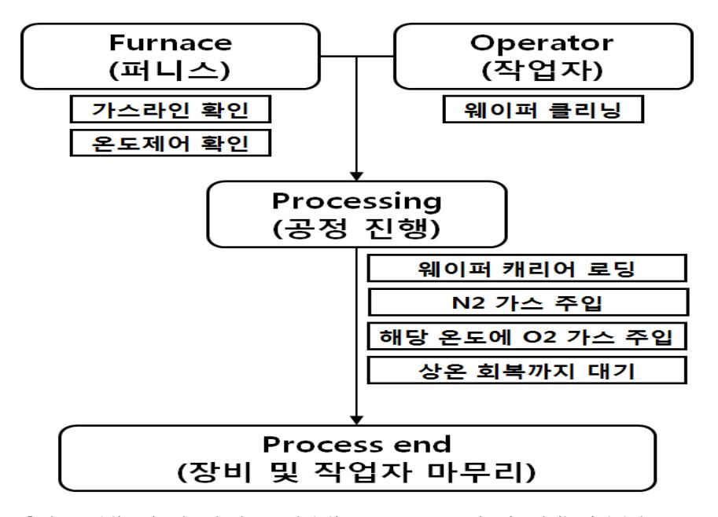

출처: 교육부(2015). 반도체 제조 공정개발(LM1903060106\_14v3). 한국직업능력개발원. p.43. [그림 4-3] 확산 공정(Oxidation)의 공정 순서

- 1) 가스 밸브(gas valve) on (N₂, O₂)하기
- 2) 퍼니스 버블로 체크(furnace bubbler check)

(DI-water를 버블러에 절반 정도 차도록 함)하기

- 3) 웨이퍼 세정(DHF clean)하기
- 4) 퍼니스 캐리어를 튜브에서 꺼내어 웨이퍼들을 탑재하기(맨 앞뒤 dummy wafer)
- 5) 캐리어를 석영로(furnace) 튜브 안의 가운데 넣고 튜브 도어 잠그기
- 6) 전력 공급(power on) 및 컨트롤러 매뉴얼 참조하여 동작 진행하기
- 7) 퍼니스 공정 시작(furnace process star)하기
- 8) N₂가스 밸브 열기 [순서: 1) FAB 내부, 2) 장비단]
- 9) 튜브에 연결된 가스 라인 열고 N₂가스 주입 (튜브의 1/10 용량)하기
- 10) N₂가스 유입이 끝나면 N₂가스 밸브 잠그기
- 11) 공정 시작(process start) 3시간 20분 후 버블러 켜기
- 12) 공정 시작 3시간 45분경과 후 O₂가스 밸브 열기
  - (300℃/1시간 + 10분대기 = 약 3시간 50분 후 1,000℃ 준비 완료)
- 13) 튜브 컨트롤러 온도 표시가 1,000℃로 변하는 순간 확인하기
- 14) 1,000℃ 상태에서 버블러를 통하여 1시간 O₂가스 주입하기
- 15) 공정 (1시간) 후 온도가 떨어지기 시작하면 O₂가스 밸브 잠그기
- 16) 장비단 N₂가스 밸브 열고 N₂가스 주입 (튜브의 1/10 용량)하기
- 17) N₂가스 유입이 끝나면 N₂가스 밸브 잠그기
- 18) FAB 내부 N₂, O₂가스 밸브 잠그기
- 19) 상온까지 대기(6시간 이상 경과) 후 메인 전원 인가(main power on), 퍼니스 전원 끄기(furnace power on)
- 20) 튜브 컨트롤러에서 온도 100℃ 이하 확인 후 석영 캐리어 꺼내기
- 21) 석영 캐리어의 웨이퍼를 일반 웨이퍼 캐리어로 옮기기
- 22) 석영 캐리어를 튜브 안에 넣고 장비 정리하기

### 수행 tip

- 세정 공정은 RCA 방식을 따라도 되며 보유 화공 약 품 및 장비에 따라 달라질 수 있다.
- 세정 공정 이후에도 자연 산화막은 성장하므로 연속 공정으로 가는 것이 이슈를 줄일 수 있다.

- (3) 금속 박막 공정(metallization)
  - 금속 박막 공정 중 스퍼터(sputter) 공정 수행
  - 공정 장비: 스퍼터(sputter)
  - 도구: 트위저(twizzer)
  - 재료: 아르곤 가스(Ar gas), 금속(Al, Cu 등) 타깃
  - (가) 공정 순서

출처: 교육부(2015). 반도체 제조 공정개발(LM1903060106\_14v3). 한국직업능력개발원. p.44. [그림 4-4] 금속 박막 공정(metallization)의 공정 순서

- 1) 팹(FAB) 외부 아르곤가스 밸브 인가(Ar gas valve on) /칠러(Chiller) #3 on 하기
- 2) 스퍼터(sputter) 장비 준비: 컴프레서 스위치 켜기 / 장비 파워 스위치 켜기
- 3) 디퓨전 펌프(혹은 고진공 펌프) 예열하기
- 4) 가스 흐름 조절기(MFC:Mass flow controller) 공정 아르곤 가스량(50 sccm) 조정 하기
- 5) 웨이퍼 로딩(wafer loading)하기(준비)
- 6) 스퍼터(sputter) 챔버 열기(챔버 내의 진공이 완전히 풀린 것 확인 후 열기)
- 7) 웨이퍼를 홀더에 장착하기(트위저 혹은 진공 트위저 사용)
- 8) 스퍼터 챔버 닫기(챔버 진공 밸브가 완전히 잠긴 것 확인)
- 9) 디퓨전 펌프 예열 완료 후 다음 단계(step) 진행하기
- 10) 러핑 펌프로 챔버 진공 잡기(챔버 압력 10E-3)
- 11) 챔버 압력 40mTorr까지 완료 후 디퓨전 펌프로 챔버 진공 잡기

- 12) 챔버 압력 10E-6에서 공정 가스(Ar) 챔버로 주입하기
- 13) 최종 압력 10E-4에서 DC 전원 켜기(금속 타깃(target)과 연결된 건(gun)으로 인가)
- 14) 전원 공급기 –400V(조건마다 다름) (초반 플라즈마 안정화 대기 필요)
- 15) 금속 타깃 셔터 열고 웨이퍼 쪽 개방하기(공정 장비 수율에 맞추어 시간 조정)
- 16) 금속 박막 스퍼터링 공정 종료하기
- 17) 웨이퍼 쪽 셔터 닫고 타깃 쪽 셔터 닫기
- 18) 전류 스위치 0으로 원위치 후 DC 전원 공급(power supply) 전원 끄기
- 19) 전체 공정 종료: 공정 가스 잠그고 로테이션 끄기
  - 벤팅 시작 후 챔버 압력 10E-1까지 대기 후 다음 단계 진행하기
- 20) 스퍼터(sputter) 챔버 열기(챔버 내의 진공이 완전히 풀린 것 확인 후 열기)
- 21) 웨이퍼(wafer) 꺼내기(트위저 혹은 진공 트위저 사용)
- 22) 스퍼터(Sputter) 챔버 닫기(챔버 진공 밸브가 완전히 잠긴 것 확인)
- 23) 챔버 저진공 잡고 터보 펌프 종료까지 20분 러핑 펌프 대기 후 전체 종료하기

 구리 타깃(Cu target)이 있는 경우 똑같이 공정할 수 있으며 구리의 산화 및 확산 이슈를 더 확인할 수 있다.

### (4) 사진 공정(photolithography)

- 사진 공정 중 포지티브 포토레지스트(positive photo-resist) 사용 공정 수행
- 공정 장비: 스핀코터(spin coater), 핫플레이트(hot plate), 박스 오븐(boxoven), 노광기 (exposure), 웻 스테이션(wet station)
- 도구: 트위저(twizzer), 유리 용기 2개 (500ml), 스포이트
- 재료: 아세톤, 에탄올, 순수, 현상액(developer), 마스크. 포지티브 포토레지스트 (positive photo-resist)

(가) 공정 순서

- 포토 룸 내부에서는 웨이퍼 윗면이 위를 보도록 캐리어에 보관하기
- 공정 진행 중 웨이퍼 상의 감광막(PR) 및 패턴(pattern)에 문제 시 감광막(PR) 제 거하고 재공정하기
- 감광막(PR) 제거 = 아세톤(acetone) -> 에탄올(ethanole) -> 초순수 린즈(DI-water rinse) 순으로 감광막(PR) 지우기
  - 1) 포토 룸(photo-room) 전체 장비 전원 켜기
  - 2) 스핀 코터(spin coater)에 웨이퍼 세팅하기

- 웨이퍼 로딩 후 진공 잡고 목표 속도에서 흔들리거나 떨어지지 않는지 확인 하기
- 감광막(photo resist:PR, GXR 601= positive)를 스포이트로 2.5cc 웨이퍼 중앙에 도포하기
- 덮개를 닫은 상태에서 30초 공정 진행하기
- 감광막(PR)이 잘 퍼지도록 5초 간 500rpm, 25초 3,000rpm (목표 두께 1.2㎛)
- 공정 전후 감광막(PR) 보관 용기는 잘 밀폐하기(1. Spin coating)
- 3) 진공 풀고 웨이퍼를 열판(hot plate)에 70초 구워주기 (2. soft bake)
- 4) 웨이퍼를 노광(exposure) 장비로 이동하기
- 노광(exposure) 장비 위에 웨이퍼를 올려놓은 후 진공(vacuum) 켜기
- 마스크와 접촉(contact) 후 노광(exposure)(UV light ON) 35초 진행하기 (3. exposure)
- 5) 웨이퍼를 건조 오븐(dry oven)으로 이동하기
- 건조 오븐(dry oven) 120 ℃에서 90초 구워주기(4. post exposure bake)
- 6) 웨이퍼를 웻 스테이션(wet station)으로 이동하기
- 용액에 25초 공정 진행 (5. Develop)
- 초순수(DI-water)로 린즈(rinse) 후 건조기로 잘 말려주기
- 7) 목표대로 현상(develop)되었는지 확인하기 (6. inspect)
- 8) 웨이퍼를 건조 오븐(dry oven)으로 이동하기
- 건조 오븐(dry oven) 120 ℃에서 100초 구워주기 (7. hard bake)
- 9) 모든 공정 완료 후 다시 웨이퍼 윗면이 캐리어 안쪽을 보도록 보관하여 포토 공정실 바깥으로 나옴

 해당 공정은 포지티브(positive) 타입의 포토레지스트 (photo-resist)를 사용한 것으로 네거티브 타입 사용 시에는 작업 지시서 상의 조건이 온도, 시간, 등이 달라진다.

(5) 식각 공정(etch)

- 식각 공정 중 습식 식각(wet etch) 공정 수행
- 공정 장비: 웻 스테이션
- 도구: 트위저(twizzer), 비커 1개 (500ml), 온도계, 시계(스톱워치)
- 재료: 순수, 금속 에천트(etchant) 용액

- (가) 습식 식각 공정 순서
  - 1) 웻 스테이션 준비하기(wet station setting)
  - 린스용 DI-워터(water) 준비하기
  - 비커에 Al 에천트 40㎖ 준비하기
  - 히터 준비 및 비커를 올리고 온도 가열하기(70℃)
  - 2) 사진(photolithography) 공정을 통하여 패턴을 올린 웨이퍼(wafer)를 비커에 담그기
  - 3) 웨이퍼 상에서 습식 식각(wet etching)이 진행되는 것을 확인하기
    - 스퍼터링(sputtering) 된 두께에 따라 식각 공정 시간 다르다.
    - 전체적으로 완료되었을 때 1차로 린스(rinse)하고 건조시킨 후 진행 상태를 확인하기
    - 식각이 더 필요한 경우 다시 한 번 비커에 담그고 짧게 식각 진행하기
  - 두께(thickness) 자체가 얇으므로 식각 타이밍 주의하기
- (나) 포토레지스트 제거(PR strip) 공정 순서
  - 습식 식각(wet etching) 공정 완료 후 포토레지스트 제거(PR strip)하기
    - 1) 아세톤(acetone)으로 PR 제거하기
    - 2) 에탄올(ethanole)로 중화하기
    - 3) 순수(DI-water)로 세정하기
    - 4) 블로우 건(blow gun)으로 말리기

 사용 금속에 따라 에천트(etchant)도 달라지며 매뉴 얼 상의 반응 속도는 순도 5N을 기준으로 한다.

(6) 박막 증착 공정(deposition)

PECVD (plasma enhanced chemical vapor deposition) 사용 산화막 증착 공정

공정 장비: PECVD

도구: 트위저(twizzer),

재료: NO₂, SiH,₄ N,₂ 및 NF(₃클리닝용)

(가) 공정 순서

출처: 교육부(2015). 반도체 제조 공정개발(LM1903060106\_14v3). 한국직업능력개발원. p.47. [그림 4-5] 박막 증착 공정(deposition)의 공정 순서

- 1) 장비 준비하기(PECVD setting)
- 냉각기(chiller) 및 공정 가스 라인 개방하기
- 압축기(compressor) 압력 확인하기
- 척(chuck) 300℃ 가열하기(공정에 따라 다름)
- 라인(line) 75℃ 가열하기(SiH4 라인 파우더 방지)
- 2) 웨이퍼 세정(cleaning) 후 척(chuck) 중심에 올리기
- 3) 펌프 밸브 개방(roughing valve open) 진공 (10E-3 Torr) 확인하기
- 4) 가스유량계 준비하기(MFC setting: mass flow controller setting)
- SiH4 9 sccm, NO₂25 sccm(SiO₂deposition process, 산화막 증착 공정)
- 5) N₂O 가스 밸브 열기(valve open)
- 6) SiH4가스 밸브 열기(valve open)
- 7) 압력 조정하기(pressure setting)
- 0.6 Torr(세팅 값 유지 어려울 시 스로틀 밸브 수동 조정)
- 8) 공정 파워 조정(RF power 300W)
- 9) 장비 종료는 시행 순서의 역순으로 진행하기
- 가스 배기 후 N₂50 sccm, 120초
- 10) 상압 벤팅 후 웨이퍼 꺼내기(unloading)

- 11) 챔버 화학적 세정하기(chamber cleaning)
- PECVD NF3 15 sccm, 1 Torr, RF power 300W, 300초
- 반사파 반드시 확인 및 기록(reflect power check)
- NF₃가스 클리닝 후 N₂가스로 퍼지 300초
- 12) 퍼지 후(after purging), R.V open -> 10E-3 Torr 상태에서 장비 끄기

 사용 장비 및 재료에 따라 다양한 절연층에 대한 공 정이 가능하다.

(7) 식각 공정(etch)

- 식각 공정 중 건식 식각(dry etch) 공정 수행
- 공정 장비: 에처(etcher)
- 도구: 트위저(twizzer)

재료: CF4, SF₆, N2 및 ON2 (클리닝용)

(가) 건식 식각 공정 순서

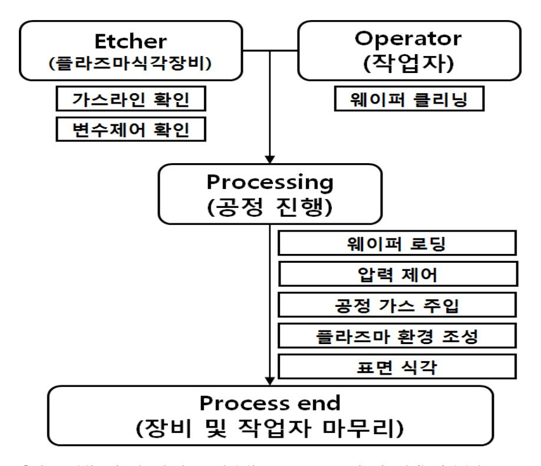

출처: 교육부(2015). 반도체 제조 공정개발(LM1903060106\_14v3). 한국직업능력개발원. p.49. [그림 4-6] 건식 식각 공정(dry etch)의 공정 순서

- 1) FAB 외부 및 내부 가스 라인 열기
- 2) FAB 내부 에처(etcher)와 연결된 압축기(compressor) 및 칠러(chiller) 켜기
- 3) 식각장치(etcher) 전원 켜기(1.장비 뒷단, 2.장비 전면)
- 4) 패널상에서 러핑 펌프(R/P: Roughing pump) 켜기
- 5) 웨이퍼를 챔버(chamber) 안에 놓기(wafer loading)
- 6) 챔버 도어 닫기
- 7) 러핑 밸브(R/V: Roughing valve) 켜기
- 8) 패널상에서 공정 조건 (파워 및 공정 시간) 입력하기
- 9) 진공이 50 mTorr정도 되었을 때 T/V(Throttle valve) 값 입력하기 (공정 압력)
- 10) 패널 상에서 가스 라인 열기 (챔버에서 가까운 쪽부터)
- 11) 패널 상에서 압력이 입력 값 근처에서 안정될 때 까지 대기
- 12) RF 파워 인가(공정 시간 종료 후 파워는 자동 off)
- 13) 가스라인 잠그기(챔버에서 먼 쪽부터)
- 14) 러핑 밸브(R/V: Roughing valve) 잠그고 밸브 열기
- 15) 패널 상에서 정상 상태가 되면 밸브 끄기
- 16) 챔버 도어를 열고 웨이퍼 꺼내기
- 17) 챔버 도어를 닫고 다시 러핑 밸브(R/V: Roughing valve) 열어 챔버 내 100 mTorr 정도가 되도록 진행하기
- 18) 러핑 밸브(R/V: Roughing valve) 잠그고 러핑 펌프(R/P) 끄고 장비 전원 끄기(1. 장비 전면, 2.장비 뒷단)
- 19) 전체 가스라인 잠그고 칠러 끄고 압축기(compressor) 끄기

 사용된 절연층의 종류에 따라 식각 장비 및 가스 등 공정 레시피가 달라질 수 있다.

(8) 각 단위 공정 완료 후 리포트 작성

아래의 내용을 포함하여 리포트를 작성한다. 공정 보고서 예시(사진 공정)는 아래 내용을 중심으로 작업 현장에 적합하게 작성하면 된다.

- (가) 성명
- (나) 작업자 연락처
- (다) 작업 일시
- (라) 공정에 관련된 이론적인 내용(출처가 있는 경우 꼭 기입한다.)

(마) 작업 지시서대로 진행한 수행 내용(사진 자료 첨부도 가능하며, 요약 기술 시 아래 순서를 따른다.)

1) 공정 목적: 왜 하는가?

2) 공정 진행: 어떻게 하는가?

- 3) 공정 이슈: 어떤 이슈가 나타날 수 있고 그 해결 방안은 무엇인가?
- (바) 공정 데이터

공정 진행 중 수집된 모든 데이터를 표 등으로 만들어 한 눈에 볼 수 있도록 한다.

#### 수행 tip

 정해진 양식을 제공하면 차후 보고서 확인 및 일괄 적인 평가 시 수월하다.

# **4-2.** 각 공정 장비 구성 및 동작 원리 파악

|       | • 공정 장비 핵심 구성 부품 동작 원리를 숙지하여 이상 상황 발생 시 문제를 해결할 |
|-------|-------------------------------------------------|
| 학습 목표 | 수 있다.                                           |
|       | • 공정 장비의 효율적인 운영을 위해 장비에 연결된 설비 시설의 인자를 확인할 수   |
|       | 있다.                                             |

# 필요 지식 /

제조 공정 장비의 특성 분석 및 문제 해결

반도체 제조 공정에서 각 공정별 특성은 '4-1. 단위 공정, 장비 확인'에서 확인한 바와 같다. 이 장에서는 공정별 장비의 주요 변수 및 시설의 특성 파악 및 분석할 수 있는 능 력을 학습하여 이상 상황 발생 시 해결할 수 있도록 한다.

### 1. 장비 공통 변수

공정 장비는 크게 전공정(front end of line, FEOL) 장비, 후공정(back end of line, BEOL) 장비 및 패키징(packaging) 장비로 분류하기도 하였으나 이제는 기술의 발달로 후공정과 패키징이 같은 분류에 속하기도 하며 새로운 기술들이 기존 개발된 장비에 다르게 적용됨 에 따라 장비를 공정에 따라 분류하기 어렵다. 여기에서는 챔버(chamber)에 전달되는 에 너지와 환경 조건에 대해 학습하고 열, 플라즈마, 및 기타 장비로 나누어 학습한다.

(1) 에너지(energy)와 환경 조건(environmental condition)

에너지의 사전적인 정의와 반도체 공정에서 사용되는 재료의 관점에서 에너지란 물질 을 고체, 액체, 기체, 혹은 플라즈마 상태로 존재할 수 있는 환경을 만드는 조건임을 학습하고 상변화에 대하여 학습한다. 에너지의 형태는 열, 빛, 파동 등으로 다양하다는 점과, 그 전달 방식인 전도, 대류, 및 복사 세 가지에 대하여 학습한다.

(2) 열 장비

에너지의 형태를 열로 전달하는 장비로 퍼니스(furnace), 상압 기상 증착 장비(APCVD), 저압 기상 증착 장비(LPCVD) 등에 대하여 학습한다.

(3) 플라즈마 장비

에너지의 전달이 플라즈마 환경 조건 내에서 이루어지는 장비로 플라즈마 기상 증착 장비(PECVD), 스퍼터(sputter), 식각 장비(etcher) 등에 대하여 학습한다.

(4) 기타 장비

위 두 가지 분류와는 다르게 에너지를 전달하여 공정을 진행하는 장비에 대하여 학습 한다. 예를 들어 단순히 화학적인 반응만으로 공정하는 웻 장비(wet-station: cleaning or wet-etching), 전기적인 반응을 이용하는 전해/무전해 도금 장비, 기계적으로 누르는 힘과 화학 반응을 이용하여 재료의 면을 평탄하게 만드는 화학적 기계적 평탄화 장비 (chemical mechanical planarization, CMP) 등이 있다.

위 3가지로 분류된 장비에 다양한 형태의 에너지 기술 및 환경 조건이 도입되어 있는 부분을 학습한다.

(5) 장비 구성 요소

최종 결과물을 위하여 에너지가 전달되는 환경 조건, 사용되는 공정 재료 및 전체적인 공정의 조건(recipe) 등의 조합이 필요하며 공정이 진행되는 챔버(chamber)의 환경을 결정하는 요소로 물리적으로 설계된 모양(chamber geometry)과 여기에 투입되는 공정 관련 변수(variable)에 대하여 학습한다. 크게 세 가지의 공통적인 장비 요소로 진공 (vacuum), 가스(gas) 및 에너지(power) 전달 방식에 대하여 학습한다.

(가) 진공(vacuum)

진공이 필요한 이유는 i) 오염도가 적은 환경 조성, ii) 낮은 분자 밀도 유지, iii) 분 자 간 충돌 거리 확장으로 에너지 전달률 증가, iv) 반응 속도를 촉진 v) 진공의 힘을 이용한 웨이퍼 안정성 확보 등이다. 단위 및 건조 방식 펌프의 종류를 학습한 다.

- 1) 러핑 펌프(roughing pump) 혹은 저진공 펌프(low vacuum pump)로 대표되는 건식 메카니컬 펌프(dry mechanical pump)와 송풍기/부스터 펌프(blower/booster pump)
- 2) 고진공 펌프(high vacuum pump)인 터보 분자 펌프(turbo molecular pump), 크라이오 펌프(cryo pump) 및 디퓨전 펌프(diffusion pump)
- 3) 챔버에 가해지는 급격한 진공 상태의 변화가 발생시키는 챔버 자체의 손상, 내부에 있는 부품 및 웨이퍼의 손상
- 4) 스로틀 밸브(throttle valve) 및 제어
- (나) 가스(gas)

가스의 정확한 챔버 유입, 반응 제어 및 안전한 배출과 MFC(mass flow controller), 잔류 가스 분석기(residual gas analyzer, RGA) 및 스크러버(scrubber)에 대하여 학습 한다.

(다) 에너지 전달

다양한 형태의 에너지 중 열(heat) 에너지와 관련된 튜브(tube), 가열 대역(heat zone), 가열 요소(heat element) 및 온도 제어(temperature control)에 대하여 학습 하고, 플라즈마(plasma) 에너지와 관련된 환경(environment), 직류(direct current), RF(radio frequency), 제너레이터(generator) 및 메처(matcher)에 대하여 학습한다.

2. 사진(photo) 공정 장비

### (1) 공정 과정별 사용 장비 및 특성

[그림 4-7]와 같은 예시의 공정 트랙 시스템에 대하여 학습한다.

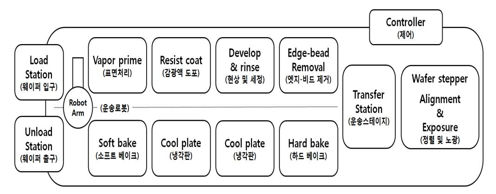

출처: 교육부(2015). 반도체 제조 공정개발(LM1903060106\_14v3). 한국직업능력개발원. p.53. [그림 4-7] 사진 공정에서 사용되는 웨이퍼 자동 시스템(automated wafer track system for photolithography)

- (가) 증기 프라임(vapor prime): 열 건조 장비(box oven), 탈수 건조(dehydration bake) 과정과 제어, HMDS 물질, 뒤섞기, 스프레이 및 증발법
- (나) 스핀 코팅(spin coat): 고속 회전 장비 및 제어
- (다) 소프트 건조(soft bake): 열판 장비(hot plate) 및 제어
- (라) 정렬 및 노광(alignment & exposure): 레티클(reticle) 사용에 따른 렌즈, 모터 제 어 기술, 및 오염 제어 기술, 온도, 습도, 진동, 대기압 압력 상태 및 제어
- (마) 노광 후 건조(post exposure bake, PEB): 열 건조 장비(box oven), 스탠딩 웨이브 효과(standing wave effect) 감소 이슈, 대기 시간의 최소화 이슈
- (바) 현상(develop): 연속 스프레이(continuous spray) 방식 혹은 퍼들(puddle) 방식 현 상액의 온도, 시간, 사용량, 농도 제어세정 및 건조 과정 중 헹굼(rinse), 열판 장비 및 모듈에서의 배기 흐름
- (사) 검사(inspection): 현상 완성도, 패턴의 무너짐 및 정렬 일치, 광학현미경 및 보 다 자동화된 검사 장비 및 제어
- (아) 하드 건조(hard bake): 열 건조 장비 및 고자외선(DUV) 장비 및 제어

### 3. 식각(etching) 공정 장비

(1) 습식 식각(wet etch) 공정 장비 담금(immersion) 혹은 스프레이(spray) 방식과 베이(bay) 내부의 유체 흐름, 식각액 (etchant)의 농도(concentration), 공정 시간(time) 및 온도의 균일성(temperature) 제어에 대하여 학습한다.

### (2) 건식 식각(dry etch) 공정 장비

CCP(capacitively coupled plasma) 타입(type), ICP(inductively coupled plasma) 타입 (type), RIE(reactive ion etching), 축전 전기장 및 유도전기장 및 식각 장비의 개요와 공정 과정 제어에 대하여 학습한다.

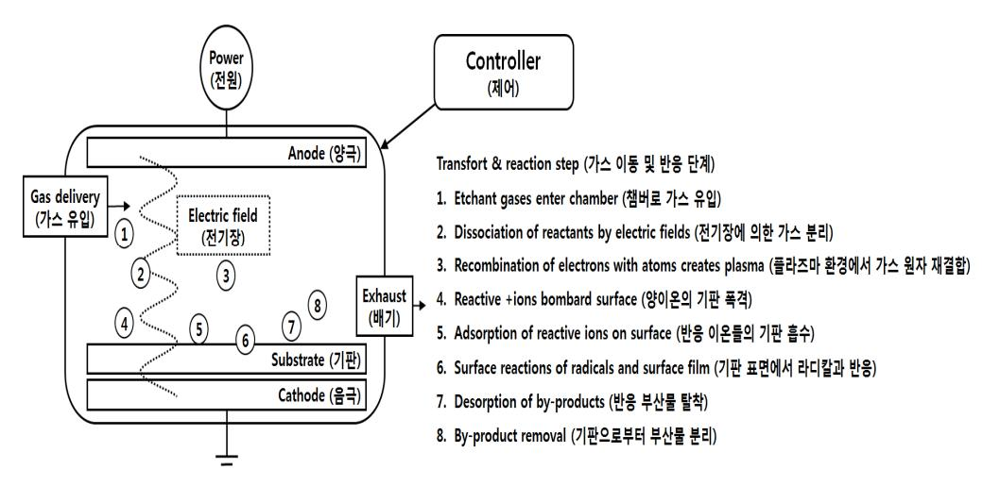

출처: 교육부(2015). 반도체 제조 공정개발(LM1903060106\_14v3). 한국직업능력개발원. p.54. [그림 4-8] 건식 식각 장비 내에서의 가스 이동 및 반응 단계

### 4. 확산(diffusion) 공정 장비

고온에 견딜 수 있도록 설계된 튜브(tube), 공정 온도(temperature)의 균일성, 공정 압력 제어(pressure control) 및 공정 가스(gas)의 유체 제어, 확산 장비의 개요와 공정 과정 제 어에 대하여 학습한다.

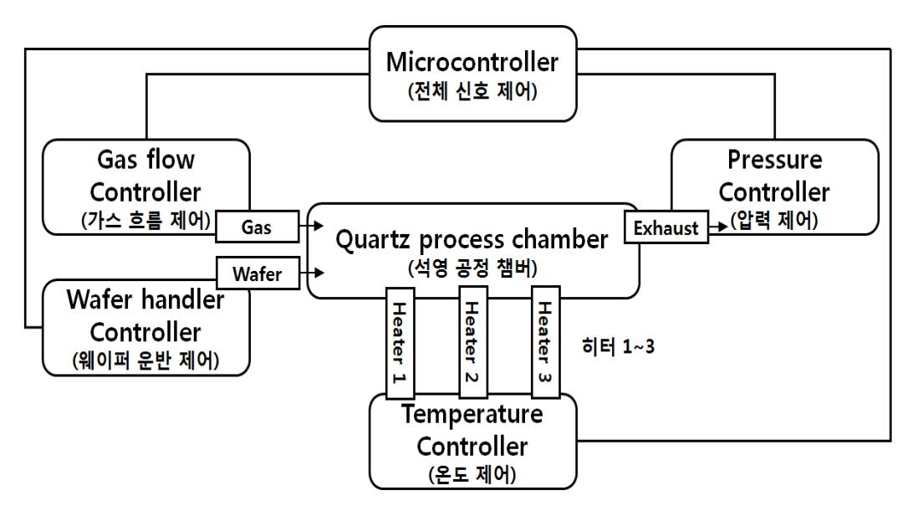

출처: 교육부(2015). 반도체 제조 공정개발(LM1903060106\_14v3). 한국직업능력개발원. p.54. [그림 4-9] furnace(퍼니스)

### 5. 평탄화(chemical mechanical planarization, CMP) 공정 장비

연마 시간(polish time) 제어, 공정 압력(pressure on wafer carrier; downforce) 제어, 회전 속도(platen speed & carrier speed) 제어, 슬러리 유량(slurry flow rate) 제어, 패드 상태 (pad conditioning) 확인, 공정 온도(wafer/slurry temperature) 제어, 및 웨이퍼 뒷면 압력 (wafer back pressure) 제어 및 평탄화 장비의 개요와 공정 과정 제어에 대하여 학습한다.

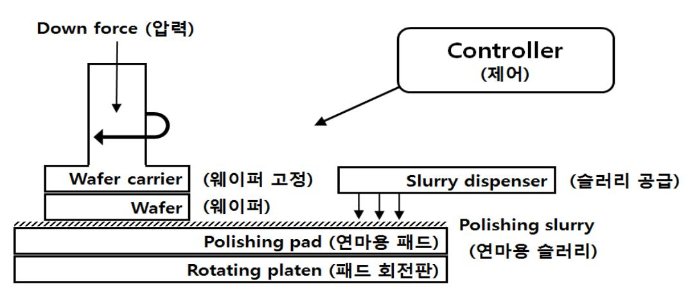

출처: 교육부(2015). 반도체 제조 공정개발(LM1903060106\_14v3). 한국직업능력개발원. p.55. [그림 4-10] 화학적 기계적 평탄화(CMP: chemical mechanical planarization)

### 6. 세정(cleaning) 공정 장비

(1) 습식 세정(wet cleaning) 공정 장비

웻 스테이션(wet station) 장비, 담금(immersion) 혹은 스프레이(spray) 방식, 베이(bay) 내부의 유체 흐름, 세정액의 농도(concentration), 공정 시간(time) 및 온도의 균일성 (temperature) 및 세정 장비의 개요와 공정 과정 제어에 대하여 학습한다.

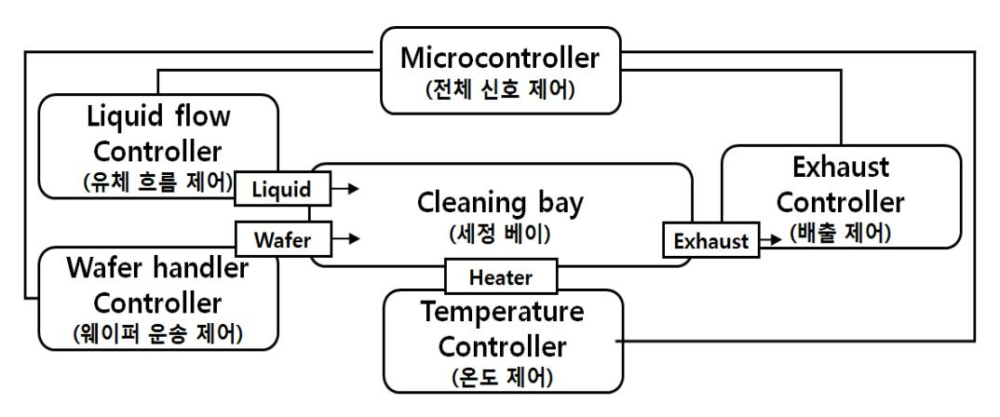

출처: 교육부(2015). 반도체 제조 공정개발(LM1903060106\_14v3). 한국직업능력개발원. p.55. [그림 4-11] 습식 세정(wet cleaning)

(2) 건식 세정(dry cleaning) 공정 장비

건식 세정(dry cleaning) 장비는 건식 식각 장비와 같은 구조 및 원리([그림 4-3] 참조) 를 따르지만 최종 목표인 세정에 맞춰 공정이 운용되는 부분에 대하여 학습한다.

7. 이온 주입(ion implant) 공정 장비

이온 소스(ion source), 추출 및 이온 분석기(extraction & ion analyzer), 질량 분석기(mass analyzer), 가속기(accelation column) 및 스캐닝 시스템(scanning system) 및 이온 주입 장비의 개요와 공정 과정 제어에 대하여 학습한다.

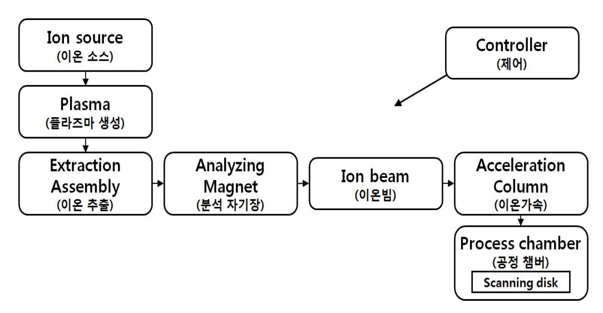

출처: 교육부(2015). 반도체 제조 공정개발(LM1903060106\_14v3). 한국직업능력개발원. p.56. [그림 4-12] 이온 임플란트(ion implant)

- 8. 박막(thinfilm) CVD/PVD 공정 장비
  - (1) 화학 기상 증착(CVD) 공정 장비

공정 가스 유량, 진공도, 플라즈마 환경을 위한 에너지 전달 및 효율을 높이기 위한 부가적인 변수(inert 가스 유량, 바이어스 등) 및 CVD 장비의 개요와 공정 과정 제어에 대하여 학습한다.

(2) 기타 화학적 증착(CVD process) 공정 장비

구리(Cu)의 사용이 증가함에 따른 도금법 중 전해도금(electrochemical deposition, ECD)과 무전해도금(electroless Plating)에 대하여 학습한다.

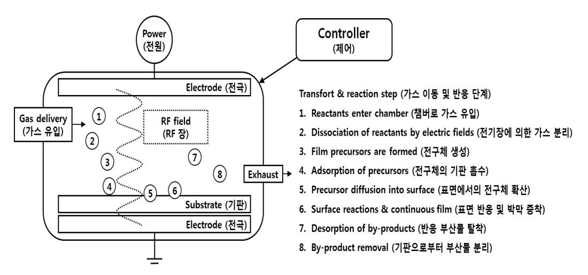

출처: 교육부(2015). 반도체 제조 공정개발(LM1903060106\_14v3). 한국직업능력개발원. p.57. [그림 4-13] PECVD에서의 가스 이동 및 반응 단계(PECVD transport & reaction steps)

(3) 물리 기상 증착(PVD) 공정 장비

(가) 스퍼터(sputter)

공정 가스 유량, 진공도, 플라즈마 환경을 위한 에너지 전달, 및 효율을 높이기 위 한 부가적인 변수(inert 가스 유량, 바이어스 등), 및 스퍼터 장비의 개요와 공정 과 정 제어에 대하여 학습한다.

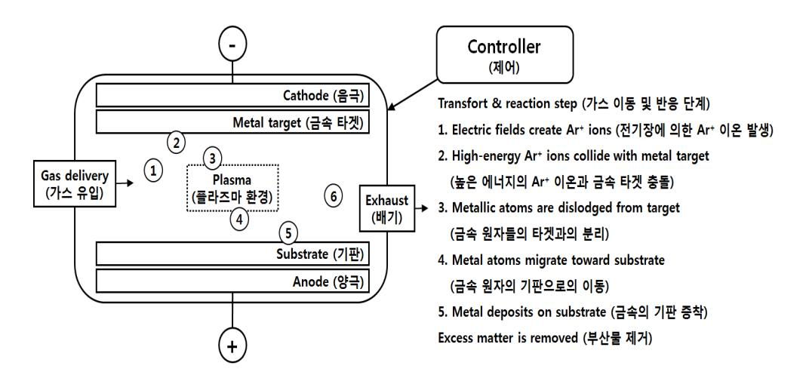

출처: 교육부(2015). 반도체 제조 공정개발(LM1903060106\_14v3). 한국직업능력개발원. p.57. [그림 4-14] 스퍼터에서의 가스 이동 및 반응 단계(sputter transport & reaction steps)

### (나) 이베퍼레이터(evaporator)

공정 가스 유량, 진공도, 에너지 전달 및 효율을 높이기 위한 부가적인 변수(inert 가스 유량, 바이어스 등)에 대하여 학습한다.

(다) 회전 공정 방법(spin on method)

사진 공정에서의 스핀 코터 장비를 참조할 수 있으며, 사용되는 재료 및 화학 성분 에 대하여 학습한다.

제조 공정 설비 시설 확인

반도체 제조 공정 장비가 배치되어 작업할 수 있도록 만든 공간을 설비(facility) 시설이라고 하며 보통 팹(FAB, fabrication의 줄임말) 혹은 클린룸(clean room)이라고 한다.

1. 설비 시설(facility)

반도체 제조 공정 공간에서 오염(contamination)의 통제, 미립자(paticle), 금속 불순물 (metallic impurity), 유기 오염물질(organic contamination), 자연 산화막(native oxide) 및 정 전기 방전(electrostatic discharge, ESD)에 대하여 학습하고 공정이 진행될수록 오염도 같이 증가함을 이해한다.

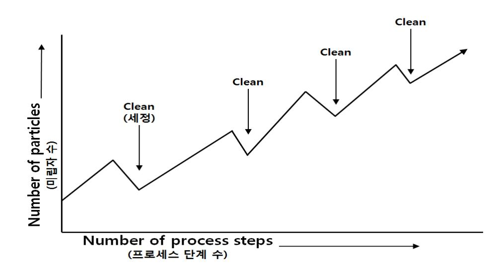

출처: 교육부(2015). 반도체 제조 공정개발(LM1903060106\_14v3). 한국직업능력개발원. p.58. [그림 4-15] 오염과 세정의 상관관계(contamination and cleaning)

반도체 제조 공정 설비에 대한 오염원의 정의 및 방지 방법에 대하여 학습한다.

- (1) 공기(air filtering): 설비 시설의 밀폐, 헤파(HEPA) 필터, 울파(ULPA) 필터, 외부 기압 과의 차이, 시설 내부 반입 전 에어 샤워 장비(air shower)
- (2) 작업자(human): 방진복(cleanroom garment) 착용 및 내부 규정
- (3) 배치(layout): 공정 장비 배치(production bay)와 유틸리티 및 작업자 배치(service chase)의 구분, 기체 흐름(airflow) 고려 및 불규칙한 움직임에 대한 와류(turbulence) 제어

- (4) 온도와 습도(temperature & humidity): 해당 청정도에 대한 온도/습도 규격화 및 항온 항습기(thermo-hygrostat) 제어
- (5) 정전기 방전(electrostatic discharge, ESD): 설비 재료의 선택, 접지 및 공기의 이온화 (air ionization) 제어
- (6) 물(water): 순수(deionized water, DI-water) 필터링, 및 수질 모니터링
- (7) 공정 화학물질 및 가스(process chemical &gas): 이송 시스템, 다양한 필터 및 라인 관리 모니터링
- (8) 생산 설비(production equipment): 장비의 자동화의 장점 및 단점
- (9) 워크스테이션 설계(workstation design): 오염 허용 수준, 오염 방출 최소화 방법, 재료, 클러스터 장비 설계/배치, 핸들링(handling) 자동화 및 소규모 환경(mini environment)

#### 2. 유틸리티(utility)

설비 시설(facility)이 효율적으로 운용될 수 있도록 보조하는 장비를 통틀어 유틸리티 (utility)라고 한다. 설명된 오염 방지 장비 외에 배전 시설 장비, 수도 시설 장비, 배수 시 설 장비, 및 가스 시설 장비와 각각의 제어에 대하여 학습한다.

### 수행 내용 / 각종 공정 장비 구성 및 동작 원리 파악하기

### 재료·자료

- MSDS 설명 자료, 안전 교육 자료
- 작업 지시서(공정 계획서), 장비 및 설비 사용 설명서
- 웨이퍼, 포토 마스크, 포토레지스트, 가스, 금속 타깃, 고분자 물질, 화공 약품, 순수 (DI-water)

### 기기(장비 ・ 공구)

- 공정 장비(wet station, furnace, sputter, PECVD, photolithography equipment)
- 계측 장비(microscope, a-step, probe-station)

### 안전 ・ 유의 사항

물질 안전 보건 자료(MSDS)에 따른 화학물질의 보관, 관리, 주의 사항에 대해 숙지하고 절 차에 따라 화학물질을 취급하여야 한다.

• 취급 화학물질에 따른 알맞은 보호 장구를 선택할 수 있어야 한다.

### 수행 순서

- 1 목표를 설정한다.
  - 1. 소자 내부에서 전기적인 신호가 지나갈 수 있도록 한다.
  - 주어진 설계 및 작업 지시서를 따라 웨이퍼 상에 구현하며 이 과정 중에 설계 및 공정상의 이슈를 확인하고, 공정 장비를 운용하며 자료의 문서화를 수행하는 것을 목표로 한다.
  - 각 단위 공정에서의 공정 장비 사용법에 기초하여 공정 장비의 이슈를 확인하고, 공정 장비를 운용하며 자료의 문서화를 수행하는 것을 목표로 한다.
- 2 공정 흐름을 파악하고 단위 공정을 진행한다.

전체적인 구성은 아래와 같으며 장비 보유 여부에 따라 전체 혹은 부분으로 나누어 진행 가능하다. 부분적으로 진행 시에는 해당 공정에 필요한 공정을 확인하고 공정 이슈를 파 악하며 그 결과를 추가적으로 학습한다.

| Process step                                               | Equipment                           | Description                                          | Remarks                            |
|------------------------------------------------------------|-------------------------------------|------------------------------------------------------|------------------------------------|
| (공정 단계)                                                    | (공정 장비)                             | (공정 내용)                                              | (공정 단면도)                           |
| wafer preparation 01 (cleaning) 웨이퍼 준비 (세정 공정) | wet station (웻 스테이션)             | BOE cleaning (희석된 용액으로 자연 산화막 제거)              | Si-wafer                           |
| 02 Oxidation (산화막 공정)                                   | Furnace (퍼니스)                    | SiO₂ thin film growing (산화막 성장)                |                                    |
| 03 Metrology (계측)                            | Elipsometer (엘립소미터)              | SiO₂ thin film thickness measuring (산화막 두께 계측) | <i>sios</i> Si-wafer |
| Metal deposition 04 (금속 증착 공 정)                      | Sputter (스퍼터)                    | Al sputtering (알루미늄 스퍼터링)                         | Al Sio, Si-wafer             |
| 05 photolithography (사진 공정)                             | photo equipment (사진 공정 장비) | Patterning (패턴 남기기)                               |                                    |
| 06 Metrology (계측)                                       | Alpha step (알파 스텝)               | PR thickness measuring (포토레지스트 두께계측)     | PR A/ Sio_ Si-wafer       |
|                                                            |                                     |                                                      |                                    |

<표 4-5> 수동소자 알루미늄 배선 공정 흐름도(passive device Al line process flow)

| Process step (공정 단계)           | Equipment (공정 장비)                   | Description (공정 내용)                        | Remarks (공정 단면도)                      |
|-----------------------------------|----------------------------------------|-----------------------------------------------|------------------------------------------|
| 07 wet etch (습식 식각 공정)         | wet station () 스테이션)                | Al wet etching (알루미늄 습식 식각)                | PR A/ SiO, Si-wafer             |
| 08 Metrology (계측)   | Alpha step (알파 스텝)                  | Al thickness measuring (알루미늄 두께계측)      | AI SiO 2 Si-wafer       |
| 09 ILD (층간절연공정)     | PECVD (플라즈마강 화 화학기 상증착장비)     | SiO₂ thin film deposition (산화막 증착)      | sio, Al Sio; Si-wafer           |
| 10 photolithography (사진 공정)    | photo equipment ( 사 진 공 정 장비) | Patterning (패턴 남기기)                        | PR A/ SiO, Si-wafer             |
| 11 Dry etch 11 (건식 식각 공정)      | etcher (에처)                         | SiO₂ thin film etching (산화막 식각)            | PR A/                                 |
| 12 Metrology (계측)              | Multimeter (멀티미터)                   | Pad etching quality check (패드 품질 측정)    | SiO2 Si-wafer                         |
| 13 Metrology (계측)              | Alpha step (알파 스텝)                  | Depth of via measuring (비아 깊이 측정)       | AI SIO2 Si-wafer                   |
| 14 (금속 증착 공정)                     | Sputter (스퍼터)                       | Al sputtering (알루미늄 스퍼터링)                  | Ai Ai SiO Si-wafer              |
| 15 photolithography (사진 공정)    | photo equipment (사진 공정 장비)    | Patterning (패턴 남기기)                        | PR Al SiO, Si-wafer             |
| 16 wet etch (습식 식각 공정)         | wet station ()에스테이션)                | Al wet etching (알루미늄 습식 식각)                | PR A/ S/O 2 Si-wafer |
| 17 <mark>Metrology</mark> (계측) | Alpha step (알파 스텝)                  | Al pad thickness measuring (알루미늄 패드 두께) | Al sio; Si-wafer                   |
| - Passivation - (보호층 증착)       | PECVD (플라즈마강 화 화학기 상증착장비)     | Si3N4 thin film deposition (질화막 증착)     | SijNj Al SiOj Si-wafer          |

출처: 교육부(2015). 반도체 제조 공정개발(LM1903060106\_14v3). 한국직업능력개발원. p.61.

### ③ 단위 공정을 종료한 후 보고서를 작성한다.

각 단위별 공정에 대한 작업 지시서는 아래와 같으며 매 공정 종료 후 공정 보고서를 작성한다.

- 1. 각 단위별 공정 일람
  - (1) 세정 공정(wafer cleaning) / 웻 스테이션(wet station) 장비

- BOE(Buffered oxide etch, 희석된 산화막 에칭용액)로 자연 산화막 제거 공정 수행

- 도구: 플라스틱 용기 2개 (500ml), 실린더 (100ml), 트위저(twizzer)
- 재료: 초순수(DI-water), BOE (6:1 CMOS grade)
- (가) 공정 순서
  - 1) 웻 스테이션 장비 준비하기(wet station ready)
  - 2) 시계(스톱워치), 공정용(플라스틱) & 린스용(플라스틱) 용기 및 실린더 준비하기
  - 3) 세정할 웨이퍼 & 트위저(twizzer) 준비하기
  - 4) 화학 창고(chemical bay)에서 초순수(DI-water)(1 bottle & 린스용) 준비하기
  - 5) 압축기(compressor) 켜기 / 블로우 건 확인하기
  - 6) 보호 장비(장갑, 보안경, 앞치마) 착용하기
  - 7) 화학물 창고(chemical bay)에서 BOE(buffered oxide etchant) 가져오기
  - 8) BOE(buffered oxide etchant) 100㎖를 준비된 실린더에 천천히 넣고 공정 용기로 이동시키기
  - 9) 실린더 내 용액을 공정 용기에 붓고 뚜껑 닫기
  - 10) 트위저로 웨이퍼를 공정 용기 안에 넣고 완전히 담가 1분 30초 진행하기
  - 11) 트위저로 웨이퍼를 린스 용기 안에 넣고 완전히 담가 1분 진행하기
  - 12) 트위저 끝부분을 순수(DI-water)로 세정하기
  - 13) 트위저로 웨이퍼를 꺼내어 블로우 건으로 말리기
  - 14) 세정된 웨이퍼를 캐리어에 넣기
  - 15) 공정 용기 내부의 용액을 폐수 라인으로 폐기하기
  - 16) 공정 용기를 개수대 안쪽으로 놓고 수돗물로 헹군 후 폐수 라인으로 폐기하기
  - 17) 린스 용기 내부의 사용액을 폐수 라인으로 폐기하기
  - 18) 린스 용기를 개수대 안쪽으로 놓고 수돗물로 헹군 후 폐수 라인으로 폐기하기
  - 19) 공정 및 린스 용기를 개수대 안쪽으로 놓고 30초 이상 오버플로우(overflow) 시킨 후 건조시켜 정리하기
  - 20) 보호 장비(장갑, 보안경, 앞치마), 웻 스테이션(wet station) 정리 및 물기 제거하기
  - 21) 웻 스테이션(wet station) 장비 종료하기
- (나) 제어 가능 공정 변수
  - 아래 제시된 변수 전체 혹은 일부를 제어하여 그 결과를 공정 보고서에 기록한다.
    - 1) 베이(bay) 내부의 유체 흐름
    - 2) 세정액의 농도(concentration)
    - 3) 공정 시간(time)
    - 4) 온도의 균일성(temperature)

 세정 공정은 RCA 방식을 따라도 되며 보유 화공 약 품 및 장비에 따라 달라질 수 있다.

#### (2) 확산 공정(oxidation) / 퍼니스(furnace) 장비

- 건식 산화막(dry oxidation)으로 웨이퍼와 금속층간 절연 공정 수행
- 도구: 트위저(twizzer), 웨이퍼 캐리어(wafer carrier), 석영 재질(quartz)
- 재료: N2, O2 gas(가스)
- (가) 공정 순서
  - 1) 밀봉 정도 및 라인 확인하기(furnace check)
  - 2) 웨이퍼(wafer) 세정하기(황산 세정: piranha clean)
  - 3) 석영 캐리어를 튜브에서 꺼내어 웨이퍼 탑재하기(맨 앞뒤 dummy wafer)
  - 4) 캐리어를 퍼니스(furnace) 튜브 안의 가운데 넣고 튜브 도어 잠금하기
  - 5) 전력 공급(power on) 및 컨트롤러 매뉴얼 참조하여 동작 진행하기
  - 6) N₂가스 밸브 열기 [순서: 1) FAB 내부, 2) 장비단]
  - 7) 튜브에 연결된 가스 라인 열고 N₂가스 주입하기 (튜브의 1/10 용량)
  - 8) N₂가스 유입이 끝나면 N₂가스 밸브 잠그기
  - 9) 공정 시작(process start) 3시간 20분 후 버블러 켜기(on)
  - 10) 공정 시작(process start) 3시간 45분경과 후 O₂가스 밸브 열기 (300℃/1시간 + 10분대기 = 약 3시간 50분 후 1,000℃ 준비 완료)
  - 11) 1,000℃ 상태에서 1시간 O₂가스 주입하기
  - 12) 공정 (1시간) 후 온도가 떨어지기 시작하면 O₂가스 밸브 잠그기
  - 13) 장비단 N₂가스 밸브 열고 N₂가스 주입하기 (튜브의 1/10 용량)
  - 14) N₂가스 유입이 끝나면 N₂가스 밸브 잠그기
  - 15) 상온까지 대기(6시간 이상 경과) 후 메인 전원 인가(main power on), 퍼니스 전원 인가(furnace power on)
  - 16) 튜브 컨트롤러에서 온도 100℃ 이하 확인 후 석영 캐리어 꺼내기
  - 17) 석영 캐리어의 웨이퍼를 일반 웨이퍼 캐리어로 옮기기
- (나) 제어 가능 공정 변수
  - 아래 제시된 변수 전체 혹은 일부를 제어하여 그 결과를 공정 보고서에 기록한다.
    - 1) 공정 온도(temperature)의 균일성
    - 2) 공정 압력(pressure control)
    - 3) 공정 가스(gas)의 유체량

 세정 공정 이후에도 자연 산화막은 성장되므로 연속 공정으로 가는 것이 이슈를 줄일 수 있다.

(3) 박막 공정(metallization) 중 PVD / RF 스퍼터(sputter) 장비

- 스퍼터(sputter)로 금속 1층(metal-1 layer) 박막 공정 수행
- 도구: 트위저(twizzer),
- 재료: 아르곤 가스(Ar gas), 금속 타깃
- (가) 공정 순서
  - 1) 스퍼터(sputter) 장비 준비하기
  - 2) 혹은 고진공 펌프 예열하기
  - 3) MFC(mass flow controller) 공정 Ar 가스량 조정하기
  - 4) 스퍼터(sputter) 챔버 열기 (챔버 내의 진공이 완전히 풀린 것 확인 후 열기)
  - 5) 웨이퍼(wafer)를 홀더에 장착하기 (트위저 혹은 진공 트위저 사용, wafer 로딩)
  - 6) 스퍼터(sputter) 챔버 닫기 (챔버 진공 밸브가 완전히 잠긴 것 확인)
  - 7) 디퓨전 펌프 예열 완료 후 다음 단계(step) 진행하기
  - 8) 러핑 펌프로 챔버 진공 잡기(챔버 압력 10E-3)
  - 9) 챔버 압력 40mTorr까지 완료 후 고진공 펌프로 챔버 진공 잡기
  - 10) 챔버 압력 10E-6에서 공정가스(Ar) 챔버로 주입하기
  - 11) 최종 압력 10E-4에서 RF power 켜기(금속 target과 연결된 건으로 인가)
  - 12) 전원 공급기(조건마다 다름) 파워 맞추기(초반 플라즈마 안정화 대기 필요)
  - 13) 금속 타깃(target) 셔터 열고 웨이퍼(wafer)쪽 개방하기 (공정 장비 수율에 맞 추어 시간 조정)
  - 14) 금속 박막 스퍼터링 공정 종료하기
  - 15) 전체 공정 종료: 공정 가스 잠그고 로테이션 끄기
  - 16) 스퍼터(sputter) 챔버 열기(챔버 내의 진공이 완전히 풀린 것 확인 후 열기)
  - 17) 웨이퍼(wafer) 꺼내기(트위저 혹은 진공 트위저 사용)
  - 18) 스퍼터(sputter) 챔버 닫기 챔버 진공 밸브가 완전히 잠긴 것 확인)
  - 19) 챔버 저진공 잡고 터보 펌프 종료까지 20분 러핑 펌프 대기 후 전체 종료하기
- (나) 제어 가능 공정 변수
  - 아래 제시된 변수 전체 혹은 일부를 제어하여 그 결과를 공정 보고서에 기록한다.
    - 1) 공정 가스 유량
    - 2) 진공도

3) 플라즈마 환경

4) 부가적인 변수(Inert 가스 유량, 바이어스 등) 확인 및 제어

### 수행 tip

 다른 타깃(target)이 있는 경우 똑같이 공정할 수 있 으며 각 금속 재료의 이슈를 확인할 수 있다.

- (4) 사진 공정(photolithography) Mask #1: Metal-1 layer / 사진 공정(photolithography) 장비
  - Metal-1 패턴 형성을 위한 사진 공정 수행
  - 도구: 트위저(twizzer), 유리 용기 2개 (500ml), 스포이트
  - 재료: 아세톤, 에탄올, 순수, 디벨로퍼 용액, 마스크. 포지티브 포토레지스트
  - (가) 공정 순서
    - 1) 포토 룸(photo-room) 전체 장비 전원 켜기
    - 2) 스핀 코터(spin coater)에 웨이퍼 세팅하기 (1. spin coating)
      - 웨이퍼 로딩 후 진공 잡고 목표 속도에서 흔들리거나 떨어지지 않는지 확인
    - 감광액(photo resist)(PR, GXR 601= positive)을 스포이트로 2.5cc 웨이퍼 중앙에 도포
    - PR이 잘 퍼지도록 5초 간 500rpm, 25초 3,000rpm(목표 두께 1.2㎛)
    - 3) 열판(hot plate)에 70초 구워주기(2. soft bake)
    - 4) 노광(exposure) 장비로 이동하여 공정 조건에 따라 노광하기(3. exposure)
    - 5) 건식오븐(dry oven)으로 이동하여 공정 조건에 따라 구워주기(4. post exposure bake)
    - 6) 웨이퍼를 웻 스테이션으로 이동하기
    - 디벨로퍼 용액에 공정 조건에 따라 진행(5. develop)
    - 순수(DI-water)로 세척 후 블로우 건(blow gun)으로 잘 말려주기
    - 7) 목표대로 현상(develop)되었는지 현미경으로 확인하기(6. inspect)
    - 8) 웨이퍼를 드라이 오븐(dry oven)으로 이동하여 공정 조건에 따라 구워주기(7. hard bake)
    - 9) 모든 공정 완료 후 포토 룸(photo-room) 나가기(포토 공정실 바깥으로 나옴)
  - (나) 제어 가능 공정 변수
    - 아래 제시된 변수 전체 혹은 일부를 제어하여 그 결과를 공정 보고서에 기록한다.
      - 1) 증기 프라임(vapor prime) 장비 및 해당 변수
      - 2) 스핀 코팅(spin coat) 장비 및 해당 변수

- 3) 소프트 건조(soft bake) 장비 및 해당 변수
- 4) 정렬 및 노광(alignment & exposure) 장비 및 해당 변수
- 5) 노광 후 건조(post exposure bake, PEB) 장비 및 해당 변수
- 6) 현상(develop) 장비 및 해당 변수
- 7) 검사(inspection) 장비 및 해당 변수
- 8) 하드 건조(hard bake) 및 해당 변수

 네거티브 타입의 PR 사용 시에는 작업 지시서 상의 조건이 달라진다.

- (5) 식각 공정(etch) 중 습식 식각(wet etch) / 웻 스테이션(wet station) 장비
  - 습식 식각(wet etch)로 Metal-1 패턴을 남기는 식각 공정 수행
  - 도구: 트위저(twizzer), 비커 1개(500ml), 온도계, 시계(스톱워치)
  - 재료: 순수, 금속 에천트 용액
  - (가) 습식 식각 공정 순서
    - 1) 웻 스테이션 준비하기(wet station setting)
    - 린스(rinse)용 순수(DI-water) 준비하기
    - 비커(beaker)에 해당 금속 에천트(etchant) 50㎖ 준비하기
    - 히터(heater) 준비 및 비커(beaker)를 올리고 온도 가열하기(70℃)
    - 2) 사진(photolithography) 공정을 통하여 패턴을 올린 웨이퍼(wafer)를 비커 (beaker)에 담그기
    - 3) 웨이퍼 상에서 습식 공정(wet etching)이 진행되는 것을 확인하기
      - 스퍼터링(sputtering)된 두께 및 금속 재료에 따라 식각 공정 시간이 다름
      - 식각률(etch rate) 제어가 어려우므로 식각 타이밍 주의하기
  - (나) 포토레지스트 제거(PR strip) 공정 순서
    - 습식 공정(wet etching) 공정 완료 후 포토레지스트 제거(PR strip)
      - 1) 아세톤(acetone)으로 PR 제거하기
      - 2) 에탄올(ethanole)로 중화하기
      - 3) 순수(DI-water)로 세정하기
      - 4) 블로우 건(blow gun)으로 말리기
  - (다) 제어 가능 공정 변수
    - 아래 제시된 변수 전체 혹은 일부를 제어하여 그 결과를 공정 보고서에 기록한다.
      - 1) 베이(bay) 내부의 유체 흐름

- 2) 식각액(etchant)의 농도(concentration)
- 3) 공정 시간(time)
- 4) 온도의 균일성(temperature)

 사용 금속에 따라 에천트(etchant)도 달라지며 매뉴얼 상의 반응 속도는 보통 순도 5N(99.999%)을 기준으로 한다.

(6) 박막 공정(deposition) 중 CVD / PECVD 장비

- PECVD(플라즈마 강화 화학기상 증착장비)로 금속층간 절연용도의 산화막 증착 공정
- 도구: 트위저(twizzer)
- 재료: N2O, SiH4, N2, 및 NF3 (클리닝용)
- (가) 공정 순서
  - 1) 장비 준비하기(PECVD setting)
  - 칠러(chiller) 및 공정 가스 라인 개방, 컴프레서(compressor) 압력 확인하기
  - 척(chuck) 300℃ 가열하기(공정에 따라 다름)
  - 2) 웨이퍼 세정(cleaning) 후 척(chuck) 중심에 올리기
  - 3) 러핑 밸브(R/V: roughing valve) 열고 진공(10E-3 Torr) 확인하기
  - 4) MFC setting (mass flow controller, 가스유량계 준비) 공정 조건에 따라 다름
  - 5) N₂O, SiH4 가스 밸브 열기
  - 6) 압력 조정(pressure setting) 공정 조건에 따라 다름
  - 7) 공정 파워 조정(RF power) 공정 조건에 따라 다름
  - 8) 장비 종료는 시행 순서의 역순으로 진행하기
  - 9) 상압 벤팅 후 웨이퍼 꺼내기
  - 10) 챔버 진공 잡고 전원 끄기
- (나) 제어 가능 공정 변수
  - 아래 제시된 변수 전체 혹은 일부를 제어하여 그 결과를 공정 보고서에 기록한다.
    - 1) 공정 가스 유량
    - 2) 진공도
    - 3) 플라즈마 환경
    - 4) 부가적인 변수(비활성화가스(Inert gas) )유량, 바이어스 등) 확인 및 제어

 사용 장비 및 재료에 따라 다양한 절연층에 대한 공 정이 가능하다.

(7) 사진(photolithography) 공정 Mask #2 / 사진(photolithography) 장비 비아, 층간 연결 통로(Via) 패턴 형성을 위한 사진 공정 수행 ※ 도구, 재료, 공정 순서, 및 제어 확인 공정 변수는 (4) 사진 공정과 동일하며 마스크 (mask)의 형태만 다르다.

- (8) 식각 공정(etch) 중 건식 식각(dry etch) / 플라즈마 식각(plasma etcher) 장비
  - 건식 식각(dry etch)로 Via 패턴 플라즈마(건식) 식각 공정 수행
  - 도구: 트위저(twizzer)
  - 재료: CF4, SF6, N2, 및 O2 (클리닝용)
  - (가) 건식 식각 공정 순서
    - 1) 식각(etcher) 전원 및 장비 세팅하기(1.장비 뒷단, 2.장비 전면)
    - 2) 패널상에서 러핑 펌프(R/P: roughing pump) 켜기
    - 3) 웨이퍼를 챔버 안에 놓기(wafer loading)
    - 4) 챔버 도어 닫기
    - 5) 러핑 밸브(R/V: roughing valve) 켜기
    - 6) 패널 상에서 공정 조건(파워, 압력, 및 공정 시간) 입력하기
    - 7) 패널 상에서 가스 라인 열기(챔버에서 가까운 쪽부터)
    - 8) 패널 상에서 압력이 입력 값 근처에서 안정될 때 까지 대기하기
    - 9) RF 파워 인가(공정 시간 종료 후 파워는 자동 off)
    - 10) 가스라인 잠그기(챔버에서 먼 쪽부터)
    - 11) 러핑 밸브(R/V: roughing valve) 잠그고 V/V(vanting valve 벤팅 밸브) 열기
    - 12) 패널 상에서 정상(normal) 상태가 되면 V/V 끄기
    - 13) 챔버 도어를 열고 웨이퍼 꺼내기
    - 14) 챔버 도어를 닫고 진공 잡은 후 장비 끄기
  - (나) 제어 가능 공정 변수
    - 아래 제시된 변수 전체 혹은 일부를 제어하여 그 결과를 공정 보고서에 기록한다.
      - 1) 공정 가스 유량
      - 2) 진공도
      - 3) 플라즈마 환경
      - 4) 부가적인 변수(비활성화가스(Inert gas) ), 바이어스 등) 확인 및 제어

 사용된 절연층의 종류에 따라 식각 장비 및 가스 등 공정 레시피가 달라질 수 있다.

- (9) 박막 공정(metallization) 중 PVD, Via & pad / 스푸터(sputter) 장비 비아, 층간 연결 통로(Via) 및 패드(pad) 금속 패턴 형성을 위한 금속 증착 공정 수행 ※ 도구, 재료, 공정 순서, 및 제어 확인 공정 변수는 (3) 금속 공정과 동일하다.
- (10) 사진(photolithography) 공정 Mask #3 / 사진(photolithography) 장비 패드, 금속연결부분(Pad) 패턴 형성을 위한 사진 공정 수행 ※ 도구, 재료, 공정 순서, 및 제어 확인 공정 변수는 (4) 사진 공정과 동일하며 마스크 (mask)의 형태만 다르다.
- (11) 식각 공정(etch) 중 습식 식각(wet etch) / 웻 스테이션(wet station) 장비 습식 식각(wet etch)으로 패드(Metal-2) 패턴을 남기는 식각 공정 수행 ※ 도구, 재료, 공정 순서, 및 제어 확인 공정 변수는 (5) 습식 식각 공정과 동일하다.
- (12) 박막 공정(passivation) 중 CVD / PECVD 장비 PECVD(플라즈마화학기상증착장비)로 보호층 용도의 질화막 증착 공정 ※ 도구, 재료, 공정 순서, 및 제어 확인 공정 변수는 (5) 습식 식각 공정과 동일하며 공정 가스 중 N2O 가스 대신 NH3 가스를 사용하는 것만 다르다.
- (13) 각 장비 수행 완료 후 리포트 작성하기
  - 워드 프로그램을 사용하거나 수기로 작성하고, 아래의 내용을 포함한 현장에서 적절한 공정 보고서를 작성한다.
  - (가) 성명
  - (나) 작업자 연락처
  - (다) 작업 일시
  - (라) 장비와 관련된 이론적인 내용(출처가 있는 경우 꼭 기입하도록 한다.)
  - (마) 작업 지시서대로 진행한 수행 내용(사진 자료 첨부 및 기술 순서를 따른다.)
    - 1) 공정 목적: 왜 하는가?
    - 2) 공정 진행: 어떻게 하는가?
    - 3) 장비 변수: 어떠한 변수를 어떻게 제어하는가?
    - 4) 장비 이슈: 어떤 이슈가 있으며 해결 방안(새로운 기술 및 장비)은 무엇인가?
  - (바) 공정 데이터

공정 진행 중 수집된 모든 데이터를 표 등으로 만들어 한 눈에 볼 수 있도록 한다.

 정해진 양식을 제공하면 차후 보고서 확인 및 일괄 적인 평가 시 수월하다.

## 학습4 교수·학습 방법

### 교수 방법

- 반도체 제조 공정 개발에 관련된 필요 지식을 기준으로 개념을 설명한다.
- 공정별 공정 장비 특성, 반도체 제조 공정 프로세스, 반도체용 화학약품 종류 및 특성, 반도체 주요 공정 및 장비 운용 용어, 제조 공정 장비 운용 기술, 제조 공정 특성 분석, 제조 공정 장비의 문제 해결, 및 제조 공정 설비 시설에 대하여 실제 장비, 그림, 및 사진 등을 활용하여 설명한다.
- 연구 노트 등의 정해진 양식을 활용하여 교수자의 강의 내용 및 학습자의 실제 활동 내역을 서술형시험 및 구두 발표 시 학습자가 활용할 수 있도록 지도한다.
- 학습자가 각자의 역할 분담이 주어진 상태에서 팀을 구성하여 교육에 참여하는 조별 활동을 활용한다.
- 교육 중 브레인스토밍 등을 통하여 문제를 해결하고 새로운 아이디어를 도출한다.
- 인터넷 자료 조사 등을 통한 로드맵, 외부 학술 자료 등을 교육에 활용한다.
- 반도체 공정, 장비, 설계, 및 응용 분야에 대한 다양한 전시회 및 학술대회에 참가하여 현장에서 실물을 직접 접하게 하며 다양한 방식의 설명을 학습자에게 제공한다.

### 학습 방법

- 공정별 공정 장비 특성에 대하여 학습하고 공정에 맞는 장비를 선택한다.
- 반도체 제조 공정 프로세스에 대하여 학습하고 결과물에 최적화되도록 프로세스를 연결한다.
- 반도체용 화학약품 종류 및 특성에 대하여 학습하고 공정에 적합한 화학약품을 선택한다.
- 반도체 주요 공정 및 장비 운용 용어에 대하여 학습하고 단위 공정 혹은 공정 프로세스에 적합한 작업 지시서를 작성한다.
- 제조 공정 장비 운용 기술에 대하여 학습하고 해당 장비를 공정에 적합하도록 운용한다.
- 제조 공정 특성 분석에 대하여 학습하고 해당 특성에 맞는 분석 장비를 선택한다.
- 제조 공정 장비의 문제 해결에 대하여 학습하고 문제 해결 방법을 도출하여 적용한다.

- 제조 공정 설비 시설에 대하여 학습하고 해당 제조 공정에 적합한 설비 시설을 선택한다.
- 매뉴얼 및 환경안전 기준에 따라 필요지식 학습 및 수행 중의 문제점을 도출한 다음, 수정 및 보완 계획을 수립할 수 있도록 학습 및 실습한다.

# 학습4 평 가

### 평가 준거

- 평가자는 학습자가 학습 목표를 성공적으로 달성하였는지를 평가해야 한다.
- 평가자는 다음 사항을 평가해야 한다.

| 학습 내용                       | 학습 목표                                                      | 성취수준 |   |   |
|-----------------------------|------------------------------------------------------------|------|---|---|
|                             |                                                            | 상    | 중 | 하 |
| 단위 공정, 장비 확인             | - 작업 지시서에 의해 정해진 공정 장비를 조작하여 단 위 공정을 수행할 수 있다           |      |   |   |
|                             | - 공정의 작업 순서와 절차를 파악하여 수행 중인 단위 공정의 특성을 확인할 수 있다.        |      |   |   |
| 각 공정 장비 구성 및 동작 원리 파악 | - 공정 장비의 핵심 구성 부품의 동작 원리를 숙지하여 이상 상황 발생 시 문제를 해결할 수 있다. |      |   |   |
|                             | - 공정 장비의 효율적인 운영을 위하여 장비에 연결된 설비 시설의 인자를 확인할 수 있다.      |      |   |   |

### 평가 방법

• 일지/저널

| 학습 내용                        | 평가 항목                        | 성취수준 |   |   |
|------------------------------|------------------------------|------|---|---|
|                              |                              | 상    | 중 | 하 |
| 단위 공정, 장비 확인              | - 작업 지시서 및 용어 이해 정도          |      |   |   |
|                              | - 장비 운용 순서 파악 여부             |      |   |   |
|                              | - 수행중인 단위 공정 특성 구분 여부        |      |   |   |
| 각 공정 장비 구 성 및 동작 원리 파악 | - 공정 장비 핵심 구성부품의 동작 원리 이해 정도 |      |   |   |
|                              | - 공정 중 이상 상황에 대한 문제 해결 능력    |      |   |   |
|                              | - 장비에 연결된 설비 시설의 인자 확인 가능 여부 |      |   |   |

### • 서술형시험

| 학습 내용                       | 평가 항목                     | 상 | 성취수준 중 | 하 |
|-----------------------------|---------------------------|---|-----------|---|
| 단위 공정, 장비확인              | - 작업 지시서 용어 이해 및 작성 수준    |   |           |   |
|                             | - 장비 운용 가능 여부             |   |           |   |
|                             | - 단위 공정 수행 여부             |   |           |   |
|                             | - 공정의 순서와 절차 파악 능력        |   |           |   |
| 각 공정 장비 구성 및 동작 원리 파악 | - 공정 장비의 동작 원리에 대한 논리적 기술 |   |           |   |
|                             | - 이상 상황 발생 시 논리적 대안 제시 능력 |   |           |   |
|                             | - 설비 시설의 구성에 대한 체계적 기술 능력 |   |           |   |

• 구두 발표

|                             | 학습 내용 평가 항목                           |   | 성취수준 |   |  |
|-----------------------------|------------------------------------------|---|------|---|--|
|                             |                                          | 상 | 중    | 하 |  |
| 단위 공정, 장비확인              | - 발표 시 적합한 용어 사용 여부                      |   |      |   |  |
|                             | - 단위 공정의 특성 이해 정도                        |   |      |   |  |
| 각 공정 장비 구성 및 동작 원리 파악 | - 이상 상황 시 논리적 해결 방법 제시 여부                |   |      |   |  |
|                             | - 이상 상황 해결 방법의 적합성                       |   |      |   |  |
|                             | - 추가된 장비 혹은 시설에 대해 구체적으로 설명할 수 있는지 여부 |   |      |   |  |

### 피드백

1. 일지/저널

- 반도체 각 공정과 장비 특성과 활용에 이해하고 있는지 수행 보고서 평가 후 주요 사 항을 표시하여 설명하며, 평가 결과 일정 점수 이하는 추가 학습 후 재평가한다.
- 반도체 각 공정 장비 구성 및 동작 원리 수행 보고서 평가 후 주요 사항을 표시하여 설명하며, 평가 결과 일정 점수 이하는 추가 학습 후 재평가한다.

#### 2. 서술형시험

 - 반도체 각 공정 장비 구성 및 동작 원리 와 각 공정과 장비 특성과 활용에 이해하고 있는지 이론 시험 평가 후 각 문제에 대한 풀이를 시행하며, 평가 결과 일정 점수 이 하는 추가 학습 후 재평가한다.

#### 3. 구두 발표

 - 반도체 각 공정 장비 구성 및 동작 원리 와 각 공정과 장비 특성과 활용에 이해하고 있는지 구두 발표 시 질의·응답을 통해 작성한 보고서에 대해 숙지 여부를 판단하고 개선 사항 및 추가로 보완해야 할 사항에 대해 제시한다.

| 학습 1 | 공정 흐름도 해석하기  |
|------|--------------|
| 학습 2 | 단위 소자 개발하기   |
| 학습 3 | 공정 소재 평가하기   |
| 학습 4 | 공정 장비 운용하기   |
| 학습 5 | 계측 운용 및 평가하기 |

# 5-1. 표준 계측 및 분석 수행

학습 6 단위 공정 최적화하기

| 학습 목표 | ●표준 계측 방법에 따라서 도구를 사용하여 계측 작업을 수행할 수 있다. |
|-------|------------------------------------------|
|       | ●분석 장치를 이용하여 정밀한 성분, 특성을 측정할 수 있다.       |

# 필요 지식 /

1 반도체 품질 측정

반도체 제조 공정에서 품질 관리는 설계 단계에서 정해진 목표치와 허용 오차 내에 존재 할 수 있도록 특성을 유지하는 것으로 각 단위 공정 및 전체 공정 흐름에서 확인되어야 한다. 각 제조 공정별로 더욱 다양한 품질 측정이 이루어지며 여기서는 기본적인 공정에 대한 품질 측정 장비와 용어를 학습한다.

<표 5-1> 품질 측정(quality measures)

| Quality measures                   | Implant | Implant Diffusion |              |                   | Polish | etch | photo |
|------------------------------------|---------|-------------------|--------------|-------------------|--------|------|-------|
| 품질 측정                              | 임플란트    | 확산                | Metals 금속 | Dielectric 절연층 | 평탄화    | 식각   | 사진    |
| Film thickness (막 두께)           |         | ~                 | v            | •                 | ~      | ~    | ~     |
| Sheet resistance (면 저항)         | V       | V                 | v            |                   |        |      |       |
| Film stress (막 응력)              |         | V                 | ~            | ~                 |        |      |       |
| Refractive index (굴절률)          |         | V                 |              | ~                 |        |      |       |
| Dopant concentration (도핑 농도) | V       | V                 |              |                   |        |      |       |

|                                                   | Thin films      |                 |                   |                         |               |            |             |
|---------------------------------------------------|-----------------|-----------------|-------------------|-------------------------|---------------|------------|-------------|
| Quality measures 품질 측정                         | lmplant 임플란트 | Diffusion 확산 | · Metals 금속 | 박막 Dielectric 절연층 | Polish 평탄화 | etch 식각 | photo 사진 |
| Unpatterned surface defects (패턴 없는 표면검사) | v               | V               | V                 | V                       | V             | ~          |             |
| Patterned surface defects (패턴 있는 표면검사)   |                 |                 |                   |                         |               | r          | ~           |
| Critical dimensions (CDs) (임계치수)            |                 |                 |                   |                         |               | V          | V           |
| Step coverage (단차 피복)                          |                 |                 |                   |                         |               | ~          |             |
| Overlay registration (오버레이 처리)              |                 |                 |                   |                         |               |            | ~           |
| Capacitance-volta ge (C-V 상관관계)             |                 | V               |                   |                         |               |            |             |
| Contact angle (접촉각)                            |                 |                 |                   |                         |               |            | ~           |

출처: Michael Quirk & Julian Serda(2009) .Semiconductor Manufacturing Technology.

### 1. 박막 두께(film thickness)

웨이퍼 제조 공정은 여러 개의 충(multy layers)을 만들게 되며 전도성 박막, 절연성 박막 이외에도 포토레지스트, 폴리실리콘 등의 박막이 존재하게 된다. 이러한 막은 투명 혹은 불투명한 막의 성질에 따라 다른 계측 장비가 사용되며 파괴와 비파괴 계측으로 나누기도 한다. 박막의 주요 변수로는 표면 거칠기(surface roughness), 굴절률(reflectivity), 밀도 (density) 및 핀홀/보이드(pinhole/void)의 포함 상태를 학습한다.

### 2. 저항률과 시트 저항(resistivity & sheet resistance)

박막의 두께에 따라 저항값이 달라지므로 두께를 역을 산출해 낼 수 있으며 시트 저항은 박막의 크기와는 무관하게 막의 저항률과 두께로만 결정됨을 학습한다. 이러한 시트 저항을 측정하는 방법으로 4 탐침법(four-point probe), 면저항 측정법(van der pauw), 타원편광 분석(ellipsometry), 반사 측정법(reflection spectroscopy), 엑스레이 측정법(X-ray fluorescence, XRF), 전반사 엑스레이 측정법(total reflection XRF, TRXRF), 및 광음향 기술 (photoacoustic technology)에 대하여 학습한다. 또 측정의 결과물로 외형도(contour map) 작성 및 활용에 대하여 학습한다.

### 3. 막 응력(film stress)

서로 다른 스트레스(stress)를 가진 박막의 다층 구조 상태에서 기판 자체의 변형이 일어 나게 되며 곡률 반지름의 변화를 측정하거나, 웨이퍼의 반지름 변화를 측정(scanning laser-beam technic)하거나, 또는 기판 전체의 스트레스 개요도를 확인(split-beam laser technic)하는 방법에 대하여 학습한다.

### 4. 굴절률(refractive index)

박막이 투명할 경우 박막의 성분에 따라 굴절률이 다르며 편광 분석 방법으로 두께 및 박막의 조성 변화 정도를 확인할 수 있음을 학습한다.

### 5. 도핑 농도(dopant concentration)

반도체는 도핑된 정도에 따라 특성이 달라지며 4 탐침법, 복사파 측정법(thermal-wave system), 2차 이온 질량 분광계(secondary-ion mass spectroscopy, SIMS) 및 분포 저항 프로브 (spreading resistance probe)에 대하여 학습한다.

### 6. 패턴 없는 표면의 결함(unpatterned surface defects)

박막이 기판 전체에 걸쳐 패턴 없이 존재하는 경우 표면의 미립자(paticles), 긁힘 (scratches), 미끄러짐(slip lines) 및 재료의 결함(material defects)을 확인할 수 있고 주요 변수로는 대조(contrast)가 존재한다. 광학 현미경(optical microscopy), 광학 시스템(optical system) 및 광산란 결함 검출(light scattering defect detection) 장비를 학습하고 다크 필드 (dark field)와 브라이트 필드(bright field)의 적용 방법에 대하여 학습한다.

### 7. 패턴 있는 표면의 결함(patterned surface defects)

일반적으로 반도체 제조 공정 중에는 패턴이 존재하게 되며 결함과 패턴을 구분 짓는 기준이 중요하며 광산란 기술(light scattering detection)의 적용 방법에 대하여 학습한다.

### 8. 임계 치수(critical dimension, CD)

반도체 제조 공정에서 가장 작은 부분을 제어할 수 있다면 다른 결과 특성도 오차 범위에 들어오게 되며 매우 정확한 정밀도를 요구하게 된다. 주사 전자 현미경(scanning electron microscope, SEM)과 에너지 분산 엑스레이 분석기(energy dispersive X-ray spectroscope, EDX), 집속 이온 빔(focused ion beam, FIB)과의 연결에 대하여 학습하고 투과 주사 현미경 (transmission electron microscope, TEM)과 FE-SEM(field emission SEM)에 대하여 학습한다.

9. 단차 피복(step coverage)

반도체 제조 공정에서 표면의 형태(topography)로 인하여 단차가 생기게 되며 표면 프로파일러 (surface profiler) 장비에 대하여 학습한다.

### 10. 오버레이 처리(overlay registration)

반도체 제조 공정 중 포토리소그래피(photolithography) 공정에서 기판 상에 패턴을 정렬시 키는 것은 평탄화 공정(chemical mechanical planarization, CMP) 등으로 더욱 어려워지고 있다. 결합 조사 현미경(coherence probe microscopy, CPM)에 대하여 학습한다.

### 11. 정전-전압 용량 테스트(capacitance-voltage(C-V) test)

절연층 혹은 게이트 산화막 공정 이후 박막의 특성을 확인하기 위해 박막의 두께, 유전 상수, 다수 캐리어의 농도, 저항성, 및 오차 범위 확인을 테스트하게 되며 프로브 스테이 션, C-V 측정모듈, 및 테스트 구조(metal-insulator-silicon(MIS) 등)에 대하여 학습한다.

12. 접촉 각(contact angle)

반도체 제조 공정에서 기판의 표면 유체의 부착력, 표면 에너지, 또는 부착 응력을 확인하는 용도이며 주요 변수로는 습윤성(wettability), 청결성(cleanliness), 마무리(finish), 및 부착력 (adhesion)이 있다.

13. 기타

위에서 언급된 계측 장비 이외에 더욱 다양한 장비 및 용어는 '4-3. 공정 최적화 방법 및 각종 센서 이해하기'를 참조할 수 있다.

### 반도체 품질 분석

반도체 제조 공정에서 측정 이후 분석을 위한 장비가 필요하며 여기서는 기본적인 공정에 대한 품질 분석 장비와 용어를 학습한다.

1. 분석 장비

2차 이온 질량 분광 광도 측정(secondary-ion mass spectrometry, SIMS), 2차 이온 질량 분 광 광도 측정 경과 시간(time of flight secondary-ion mass spectrometry, TOF-SIMS), 원자 력 현미경(atonic force microscope, AFM), 오거 전자 분광학(auger electron spectroscopy, AES), 엑스레이 광전자 분광학(X-ray photoelectron spectroscopy, XPS), 투과 전자 현미경 (transmission electron microscope, TEM), 에너지/파장 분산 분광계(energy- and wavelength-dispersive spectrometer, EDX & WDX) 및 집속 이온 빔(focused ion beam, FIB)에 대하여 학습한다.

### 수행 내용 / 표준 계측 및 분석 방법, 장비 및 용어 파악하기

### 재료·자료

- 안전 교육 자료, 통계 기법 자료
- 장비 및 설비 사용 설명서, 장비/공정 특성 평가서, 분석 결과 보고서

### 기기(장비 ・ 공구)

- 컴퓨터, 프린터, 통계 분석 프로그램
- 계측 장비

### 안전 ・ 유의 사항

- 반도체 제조 공정이 환경에 미치는 영향을 사전에 파악하여 문제가 되지 않도록 한다.
- 안전장치 사용 방법을 숙지하여 비상시에 대처가 가능해야 한다.

### 수행 순서

목표를 설정한다.

- 1. 주어진 특성 평가서 혹은 분석 결과 보고서를 이해하는 것을 목표로 한다.
- 2. 분석 결과 보고서의 각 데이터 특성을 파악하고 분류할 수 있으며, 해당 데이터를 취득 하기 위한 계측 장비를 이해하는 것을 목표로 한다.

분석 결과 보고서를 작성한다.

분석 결과 보고서는 워드 프로그램을 사용하거나 수기로 작성하고, 현장에서 적절한 분석 결과 보고서를 작성한다.

분석 장비를 사용한다.

- 1. 여러 분석 장비 중 가장 기본적인 저울의 검․교정 및 성능 점검을 수행하고 점검 요령을 익혀 시험을 수행 하였을 때의 오차를 줄이는 방법에 대하여 파악한다.
- 2. 장비의 작동은 정해진 위치에서 진행하며 해당 분석이 사용되는 공정에 대한 확인과 공정 이슈 파악 및 그 결과를 추가적으로 학습한다.

(1) 점검 주기 및 교정

(가) 외부 교정: 2년 주기로 감도 및 성능 교정이 포함된다.

- (나) 내부 교정: 1개월 주기의 5종류(100g, 50g, 10g, 1g, 0.2g) 분동 무게 측정 및 6 개월 주기의 일정 무게 10회 측정이 포함된다. 저울을 옮긴 후에는 반드시 성 능 점검을 수행하여야 하고 이들 점검은 다음 과정에 의해 수행되어야 한다.
- (2) 설비의 교정

저울의 교정은 사용자 필요시, 장비의 이동 후, 장기간 사용을 안했을 때, 중요한 시험을 할 경우에는 교정을 한다.

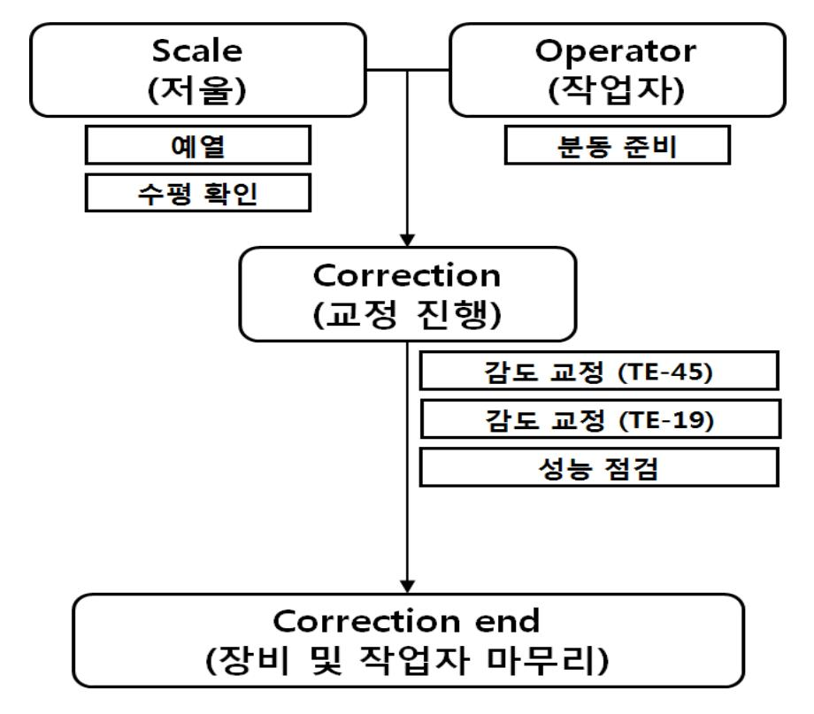

출처: 교육부(2015). 반도체 제조 공정개발(LM1903060106\_14v3). 한국직업능력개발원. p.80.

[그림 5-1] 설비의 교정

- (가) 감도 교정(TE-45)
  - 1) 저울의 [ON/OFF]키를 누르고 충분히 워밍업 시킨다.
  - 2) 수평을 확인한다.
  - 3) 접시 위에 아무것도 올리지 말고 [TARE] 키를 눌러서 표시 값을 0으로 만든다.
  - 4) [CAL] 버튼을 누른다.
  - 5) 모니터 화면상에 200.0000g이 뜨면, 교정된 분동을 올려놓는다.
  - 6) 분동을 올려놓으면 교정은 자동으로 이루어지며, 'g'가 표시되면 완료된다.

- (나) 감도 교정(TE-19)
  - 1) 저울의 [ON/OFF] 키를 누르고 충분히 워밍업 시킨다.
  - 2) 수평을 확인한다.
  - 3) 표시 값을 0을 만들 필요 없이 작동시킨다.
  - 4) [1/10d CAL] 버튼을 누른다.
  - 5) CAL이라는 글씨가 화면상에 뜬다.
  - 6) 내장 분동이 올라가면서 자동적으로 교정을 시작한다.
  - 7) 내장 분동이 올라가면서 자동적으로 교정을 시작한다.
  - 8) 위 순서로 실행하면 감도 교정이 끝난다.
- (다) 성능 정검
  - 1) 감도 교정에 따라 교정 후 실행한다.
  - 2) 저울의 접시 중앙에 100g 분동을 10회 반복하여 무게를 측정한다(6개월 내부 교정).
  - 3) 저울의 접시중앙에 5종류의 분동을 사용하여 측정한다(1개월 내부 교정).
  - 4) 무게를 측정한 후 저울 점검 기록서에 기록한다.
- (3) 설비 작동 방법
  - (가) 감도 교정에 따라 감도 교정 후 사용한다.
  - (나) 저울 내부에 물이나 이물질이 들어가지 않도록 한다.
  - (다) 접시 위에 물체를 올려놓은 채로 두지 않는다.
  - (라) 자력을 띤 물체와 가까이 두지 않는다.
  - (마) 접시에 충격을 주지 않는다.
  - (바) 접시 위에 계량 한도를 초과하는 물체를 올리지 않는다.
  - (사) 진동이 있는 곳에서 사용하지 않는다.
  - (아) 온도 변화가 심한 곳에서 사용하지 않는다.
  - (자) 항상 수평 조정을 확인하고 사용한다.
- (4) 수행 완료 후 리포트 작성하기
  - 워드 프로그램을 사용하거나 수기로 작성하고, 아래의 내용을 포함한다. 공정 보고서 예시는 활용서식 중 '공정 보고서'를 참조할 수 있다.
  - (가) 성명
  - (나) 작업자 연락처
  - (다) 작업 일시
  - (라) 장비와 관련된 이론적인 내용(출처가 있는 경우 꼭 기입하도록 한다.)

- (마) 작업 지시서대로 진행한 수행 내용(사진 자료 첨부 및 기술 순서를 따른다.)
  - 1) 공정 목적: 왜 하는가?
  - 2) 공정 진행: 어떻게 하는가?
  - 3) 장비 변수: 어떠한 변수를 어떻게 제어하는가?
  - 4) 장비 이슈: 어떤 이슈가 있으며 해결 방안(새로운 기술 및 장비)은 무엇인가?
- (바) 공정 데이터

공정 진행 중 수집된 모든 데이터를 표 등으로 만들어 한 눈에 볼 수 있도록 한다.

### 수행 tip

 보고서 양식은 계측 분야에 따라 다를 수 있으나 보 고서 작성 시 필수적인 요소가 들어가도록 미리 만 들어 피교육자에게 제공하는 것이 좋다.

# **5-2.** 데이터 특성 평가 및 문서 작성

학습 목표 • 단위 공정에서 수행된 결과를 계측하고 도식화, 문서화 할 수 있다.

• 계측 장비의 특성을 숙지하고 웨이퍼 계측 결과에 대한 물리적 의미를 부여할 수 있다.

# 필요 지식 /

### 도량형학(metrology)

반도체 제조 공정에서 기판을 포함한 모든 사용 재료의 특성을 명확히 구분하고 합격/불 합격 여부를 판단하기 위한 기준으로 수치 및 단위화된 기준을 사용한다. 여기서는 '5-1. 표준 계측 및 분석 방법, 장비 및 용어 이해하기'를 참조하여 그 결과에 대한 물리적인 의미를 부여할 수 있도록 학습한다.

### 1. 단위(measure)

반도체 제조 공정에서 전체 혹은 부분적인 결과물의 특성을 파악하기 위하여 길이(length), 넓이(area), 무게(weight), 부피(volume), 온도(temperature), 압력(pressure), 속도(velocity), 양(quantity) 및 시간(time) 등 다양한 단위가 사용되며 같은 단위 내에서도 환산이 필요한 경우가 있음을 학습한다.

### 2. 수율(yield)

반도체 제조 공정에서 전체 혹은 부분적인 결과물의 제조 능력을 나타내는 지표로 일정 기간 동안 생산된 부분에 대한 수율 측정, 단위 공정 수율 측정 및 실시간(in-situ) 수율 측정 등 다양한 방법에 대하여 학습한다.

3. 데이터 관리(data management)

반도체 제조 공정 중 취합(gathering)할 수 있는 무수한 데이터 중에서 허용 범위 이상의 오차를 만들어 내는 변수(variable)와 그에 해당하는 데이터만을 분류하여 분석할 수 있도 록 자동 결함 분류시스템(automatic defect classification, ADC)의 역할에 대하여 학습하고, 더욱 진보된 기술로 '6-3. 공정 최적화 방법 및 각종 센서'를 참조할 수 있다.

### 보고서 작성(document)

반도체 제조 공정 중에서 발생하는 다양한 측정과 분석의 결과는 상호 의사소통을 위하여 객관적으로 정리해야 하며 기본적인 문서 이해 및 작성 방법은 '직업기초능력'을 참조 할 수 있다. 여기서는 보고서 작성 시 고려되어야 할 내용을 학습한다.

### 1. 기술성(technic)

보고서의 주제, 목적, 작성 배경에 대한 부분으로 보는 사람의 입장에서 "왜 작성했는 가?"라는 의문에 답을 줄 수 있는 관점에서 서술될 수 있도록 학습한다.

### 2. 성실성(sincerity)

보고서의 내용은 계측 값 분석, 및 분석 결과가 포함(때로는 해결 방안의 제시까지도 포 함)되어야 하며 다양한 통계 기법 등이 활용될 수 있다. 결과에 맞춘 분석이 아닌 객관적 이고 공정한 기준이 적용되어야 하며 이 부분은 보는 사람의 입장에서 "어떻게 진행되었 는가?"라는 의문에 답을 줄 수 있는 관점에서 서술될 수 있도록 학습한다.

### 3. 표현력(expression)

보고서 작성 시 실재하는 사실(fact)만이 포함되어야 하며 해석의 오해가 없도록 간결하게 구성되어야 한다. 이 부분은 보는 사람의 입장에서 "그래서 어떠한 정보를 전달하려고 하는가?"라는 의문에 답을 줄 수 있는 관점에서 서술될 수 있도록 학습한다.

### 4. 문서화(documentation)

보고서의 기준 양식을 지키면서도 기-승-전-결에 맞추어 논리적으로 구성되며 수치, 단위, 그래프 및 표 등이 객관적으로도 합당하게 배치되어야 한다. 이 부분은 보는 사람에게 기 술성, 성실성 및 표현력의 전달이라는 관점에서 작성될 수 있도록 학습한다.

### 수행 내용 / 데이터 특성 평가 및 문서 작성하기

### 재료·자료

- 안전 교육 자료, 통계 기법 자료
- 장비 및 설비 사용 설명서, 장비/공정 특성 평가서, 분석 결과 보고서

### 기기(장비 ・ 공구)

- 컴퓨터, 프린터, 통계 분석 프로그램
- 계측 장비

### 안전 ・ 유의 사항

- 반도체 제조 공정이 환경에 미치는 영향을 사전에 파악하여 문제가 되지 않도록 한다.
- 안전장치 사용 방법을 숙지하여 비상시에 대처가 가능해야 한다.

### 수행 순서

목표를 설정한다.

- 1. 주어진 특성 평가서 혹은 분석 결과 보고서를 이해하는 과정 중에 설계 및 공정상의 이슈 확인, 공정 및 장비의 개선, 다양한 계측 방법 도출 및 자료의 문서화 등을 수행하는 것을 목표로 한다.
- 2. 분석 결과 보고서의 각 데이터 특성을 파악하고 분류할 수 있으며, 해당 데이터를 취득 하기 위한 계측 장비를 이해하는 것을 목표로 한다.
- 분석 결과 보고서를 작성한다.

분석 결과 보고서는 워드 프로그램을 사용하거나 수기로 작성하고, 현장에서 적절한 분석 결과 보고서를 작성한다.

### 계측 장비를 사용한다.

여러 계측 장비 중 하나인 단차 측정을 위한 알파 스텝 장비를 이해하고 수행 요령을 익 혀 시험을 수행하였을 때의 오차를 줄이는 방법에 대하여 이해한다. 장비의 작동은 정해 진 위치에서 진행하며 해당 계측이 사용되는 공정을 확인하고 공정 이슈 파악 및 그 결과 를 추가적으로 학습할 수 있도록 한다.

1. 알파 스텝(Alpha-step) 장비

얇은 바늘(stylus, 스타일러스)을 패턴 위에 이동시켜 이때 계측되는 단차를 전기적인 신호 로 변환 후 샘플 표면의 단차를 측정하는 장비이다.

- 2. 사용 시 주의 사항
  - (1) 측정 중 계측 장비가 올려져 있는 테이블이 흔들리지 않도록 주의한다.
  - (2) 계측 바늘이 샘플에 닿은 채로 스테이지가 움직이지 않도록 한다.
  - (3) 높은 곳에서 낮은 곳으로 단차를 측정하도록 한다.
- 3. 사용법
  - (1) 웨이퍼 로딩(wafer loading)
    - (가) 스테이지 위에 wafer(웨이퍼)를 로딩(loading)한다.
    - (나) 장비단의 스테이지 제어부를 통하여 앞-뒤-좌-우로 이동할 수 있다.
  - (2) 측정 준비
    - (가) 계측 바늘과 샘플 표면이 만나도록 조정 후 바늘만 대기 상태로 올린다.
    - (나) 바늘이 내려와 있을 때는 스테이지를 움직이지 않도록 주의한다.
    - (다) 환경 설정 등을 통하여 측정 거리, 샘플링 속도 등을 조절한다.
  - (3) 측정
    - (가) 측정하고 싶은 부분에 화면의 십자 점선이 위치하도록 한다.
    - (나) 십자선 가운데부터 측정이 시작된다.
  - (4) 측정값 보정(leveling, 레벨링)
    - (가) 측정이 끝난 후 그래프의 수평화(레벨링)를 통하여 측정값을 보정한다.
    - (나) 같은 높이라고 생각되는 기준점을 설정한다.
  - (5) 측정 결과 확인
    - 프로그램을 활용하여 보고자 하는 위치의 단차를 수치 및 그래프로 확인한다.
- 4. 데이터 특성 평가
  - (1) 주어진 특성 데이터를 통하여 수치 및 주어진 단위 기준을 활용하여 보고서를 작성 한다.
  - (2) 이 때, 장비가 가지는 기본적인 오차 범위 및 측정 한계치를 이해한다.

## 학습5 교수·학습 방법

### 교수 방법

- 반도체 제조 공정 개발에 관련된 필요 지식을 기준으로 개념을 설명한다.
- 광학적 종류 및 특성, 물리/화학적 특성, 웨이퍼 파괴/비파괴 분석 기술, 용도별, 공정별 계 측기의 종류, 분석 결과 보고서 작성 기술, 계측 장비 측정, 운영, 및 관리 기술, 분석 및 통계 프로그램 운영 기술, 및 특성 측정과 결과 평가 기술에 대하여 실제 장비, 그림, 및 사진 등을 활용하여 설명한다.
- 연구 노트 등의 정해진 양식을 활용하고 교수자의 강의 내용 및 학습자의 실제 활동 내역을 형식에 맞게 기술하도록 하여 서술형시험 및 구두 발표 시 활용할 수 있도록 지도한다.
- 학습자가 각자의 역할 분담이 주어진 상태에서 팀을 구성하여 교육에 참여하는 조별 활동을 주도할 수 있도록 지도한다.
- 교육 중 브레인스토밍 등을 통하여 문제를 해결하고 새로운 아이디어를 도출한다.
- 인터넷 자료 조사 등을 통한 로드맵, 외부 학술 자료 등을 교육에 활용한다.
- 반도체 공정, 장비, 설계, 및 응용 분야에 대한 전시회 및 학술대회에 참가하여 현장에서 실물을 직접 접하게 하며 다양한 방식의 설명을 학습자에게 제공한다.

### 학습 방법

- 계측 방식 중 광학적 종류 및 특성에 대하여 학습하고 실제 적용될 수 있는 장비와 그 한계에 대하여 파악한다.
- 계측 대상의 물리/화학적 특성에 대하여 학습하고 그 적용 범위 및 한계에 대하여 파악한다.
- 웨이퍼 파괴/비파괴 분석 기술에 대하여 학습하고 그 적용 범위 및 한계에 대하여 파악한다.
- 용도별, 공정별 계측기의 종류에 대하여 학습하고 다양한 계측 대상의 종류에 따라 각 적용 범위에 대하여 파악한다.
- 분석 결과 보고서 작성 기술에 대하여 학습하고 이를 통하여 보는 사람 입장에서 쉽게 이해할 수 있는 작성 방법을 습득한다.

157

- 계측 장비 측정, 운영, 및 관리 기술에 대하여 학습하고 실제 장비 운용을 통하여 측정, 운영 및 관리 부분에 대한 한계를 파악한다.
- 분석 및 통계 프로그램 운영 기술에 대하여 학습하고 데이터의 종류에 따라 다양한 분석 방법 및 프로그램 활용이 가능하도록 한다.
- 특성 측정 및 결과 평가 기술에 대하여 학습하고 이를 다양한 계측 방법 및 분석 방법과 접목할 수 있는 방안을 도출한다.
- 매뉴얼 및 환경 안전 기준에 따라 필요한 지식 학습 및 수행 중의 문제점을 도출한 다음, 수정 및 보완 계획을 수립하도록 학습하고 실습한다.

# 학습5 평 가

### 평가 준거

- 평가자는 학습자가 학습 목표를 성공적으로 달성하였는지를 평가해야 한다.
- 평가자는 다음 사항을 평가해야 한다.

|                      |                                                      |   | 성취수준 |   |  |
|----------------------|------------------------------------------------------|---|------|---|--|
| 학습 내용                | 학습 목표                                                | 상 | 중    | 하 |  |
| 표준 계측 및 분석 수행     | - 표준 계측 방법에 따라서 도구를 사용하여 계측 작업을 수행할 수 있다.         |   |      |   |  |
|                      | - 분석 장치를 이용하여 정밀한 성분, 특성을 측정할 수 있다.               |   |      |   |  |
| 데이터 특성 평가 및 문서 작성 | - 단위 공정에서 수행된 결과를 계측하고 도식화, 문서 화할 수 있다.           |   |      |   |  |
|                      | - 계측 장비의 특성을 숙지하고 웨이퍼 계측 결과에 대한 물리적 의미를 부여할 수 있다. |   |      |   |  |

### 평가 방법

• 일지/저널

|                      | 평가 항목                       |  | 성취수준 |   |  |
|----------------------|-----------------------------|--|------|---|--|
| 학습 내용                |                             |  | 중    | 하 |  |
| 표준 계측 및 분석 수행     | - 표준 계측 방법 파악 능력            |  |      |   |  |
|                      | - 계측 작업 수행 순서 파악 능력         |  |      |   |  |
|                      | - 적절한 분석 장치 선정에 대한 파악 능력    |  |      |   |  |
|                      | - 정밀한 성분/특성에 대한 측정 방식 파악 능력 |  |      |   |  |
| 데이터 특성 평가 및 문서 작성 | - 계측 장비의 특성 파악 능력           |  |      |   |  |
|                      | - 계측결과에 대한 물리적 의미 연결 파악 능력  |  |      |   |  |
|                      | - 단위 공정 수행 결과 계측 능력         |  |      |   |  |
|                      | - 다양한 형태의 데이터 도식화, 문서화 능력   |  |      |   |  |

### • 서술형시험

|                      |                               |   | 성취수준 |   |  |
|----------------------|-------------------------------|---|------|---|--|
| 학습 내용                | 평가 항목                         | 상 | 중    | 하 |  |
| 표준 계측 및 분석 수행     | - 표준 계측 방법을 논리적으로 서술하는 능력     |   |      |   |  |
|                      | - 계측 작업 수행 순서를 순차적으로 서술하는 능력  |   |      |   |  |
| 데이터 특성 평가 및 문서 작성 | - 계측 장비의 특성에 대해 논리적으로 서술하는 능력 |   |      |   |  |
|                      | - 다양한 형태의 데이터를 도식화하는 능력       |   |      |   |  |
|                      | - 논리적인 문서화 능력                 |   |      |   |  |

• 구두 발표

|                      | 평가 항목                                      |  | 성취수준 |   |  |
|----------------------|--------------------------------------------|--|------|---|--|
| 학습 내용                |                                            |  | 중    | 하 |  |
| 표준 계측 및 분석 수행     | - 표준 계측 및 분석 방법 중 주어진 특성에 적합한 장 비 선정 능력 |  |      |   |  |
|                      | - 적합한 용어를 사용한 데이터 설명 능력                    |  |      |   |  |
| 데이터 특성 평가 및 문서 작성 | - 계측 결과에 대한 물리적 의미 파악 능력                   |  |      |   |  |
|                      | - 데이터 특성 평가서 구두 설명 능력                      |  |      |   |  |

피드백

### 1. 일지/저널

- 표준 계측 및 분석 수행 보고서 평가 후 주요 사항을 표시하여 설명하며, 평가 결과 일정 점수 이하는 추가 학습 후 재평가한다.
- 데이터 특성 평가 및 문서 작성에 대해 계측기 수행 능력과 결과 해석이 가능한지 확인하고 사례를 들어 피드백을 제공한다.
- 2. 서술형시험
- 표준 계측 및 분석에 이론 시험 평가 후 각 문제에 대한 풀이를 시행하며, 평가 결과 일정 점수 이하는 추가 학습 후 재평가한다.
- 데이터 특성 평가 및 문서 작성에 대해 계측기 수행 능력과 결과 해석이 가능한지 확 인하고 사례를 들어 피드백을 제공한다.
- 3. 구두 발표
- 표준 계측 및 분석 수행과 데이터 특성 평가, 문서 작성 및 구두 발표 시 질의·응답을 통해 작성한 보고서에 대해 숙지 여부를 판단하고 개선 사항 및 추가로 보완해야 할 사항에 대해 제시한다.

| 학습 1 | 공정 흐름도 해석하기 |
|------|-------------|
| 학습 2 | 단위 소자 개발하기  |
| 학습 3 | 공정 소재 평가하기  |
| 학습 4 | 공정 장비 운용하기  |
| 학습 5 | 계측운용 및 평가하기 |
|      |             |

# 학습 6 단위 공정 최적화하기

# **6-1.** 공정 개선 요구 사항별 특성 분류

| 학습 목표 | • 공정 개선 요구 사항을 확인하여 성능 개선을 위한 재료 선택 및 공정 방법을 도출 할 수 있다. |
|-------|------------------------------------------------------------|
|       | • 성능 개선의 요구에 따라 전·후 공정을 고려하여 단위 공정을 효율적으로 재구성할 수 있다.    |

### 필요 지식 /

### 특성의 분류

반도체 제조 공정 중 단위 공정별 결과물에 대한 특성들은 아래와 같이 분류될 수 있으며 재료의 성질, 공정 조건의 변화, 공정 환경 등 다양한 변수에 의해 서로 다른 특성값을 나 타내고 서로 상호 작용(interaction)하면서 존재한다. 이러한 특성들의 개별 분류에 대하여 학습한다.

### 1. 전기적 특성

반도체의 특성은 전기적인 관점에서 크게 절연 특성과 전도 특성으로 접근할 수 있다는 점에 대하여 학습한다.

(1) 유전율(dielectric constant or permittivity)

유전속 밀도(dielectric flux density, D)와 전기장(electric field)의 비 의 형태 로 표현된다는 점과 진공 () 및 물질() 상태에 대하여 학습한다.

(2) 고유저항 및 전도율(electrical resistivity and conductivity) 물질은 단위 길이 당 고유의 저항값을 가지고 있으며 마찬가지로 고유의 전도율울 가 지고 있다는 점을 학습한다.

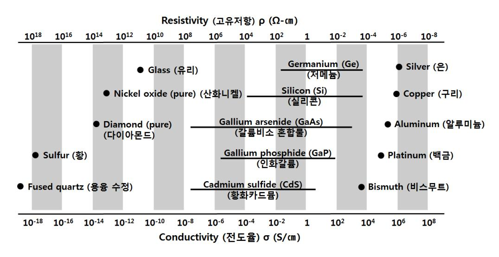

출처: 교육부(2015). 반도체 제조 공정개발(LM1903060106\_14v3). 한국직업능력개발원. p.90. [그림 6-1] 물질에 따른 전도율 및 고유저항(conductivity & resistivity of materials)

(3) 절연 내력(dielectric strength)

물질에 가하는 전압이 어느 정도 크기에 이르게 되면 저항률의 급격한 저하로 절연 파괴가 일어나는 값을 의미한다는 점을 학습한다.

2. 화학적 특성

반도체의 특성은 화학적인 관점에서 부식성(corrosion), 가습성(hygroscopy, the ability of a substance to attract and hold water molecules from the surrounding environment), 반응성 (reactivity), 표면 에너지(surface energy) 및 표면 장력(surface tension)으로 접근할 수 있 으며 이에 대하여 학습한다.

3. 기계적 특성

반도체의 특성은 기계적인 관점에서 체적 탄성률(bulk modulus), 마찰 계수(coefficient of friction), 반발 계수(coefficient of restitution), 압축/인장 강도(compressive/tensile strength), 항복 강도(yield strength), 변형(creep), 연성(ductility), 피로 한계(fatigue limit), 굽힘 강도 (flexural modulus), 파괴 인성(fracture toughness), 경도(hardness), 가소성(plasticity), 포아 송비(poisson's ratio), 탄성(resilience), 비탄성률(specific modulus), 강성(shear modulus), 표 면의 거칠기(surface roughness) 및 영률(young's modulus)로 접근할 수 있으며 이에 대하 여 학습한다.

4. 물리적 특성

물질에 존재하는 여러 특성 간의 상호작용으로 인하여 구분하기 어려운 경우보다 거시적 으로 물리적인 관점에서 흡수/방출(adsorption/emission), 충전/방전(charge/discharge), 구조 (structure), 반사율(reflectivity) 및 굴절률(refractive index) 등으로 접근할 수 있으며 자기 적, 광학적, 및 열역학적 특성 등으로 반도체 제조 공정 결과물의 목적에 따라 다양하게 정의할 수 있다는 점에 대하여 학습한다.

### 공정 결과의 확인, 개선 및 제어

위에서 언급된 여러 특성을 확인하기 위한 다양한 계측 장비는 '6-1. 표준 계측 및 분석 방법, 장비 및 용어 이해하기'를 참조할 수 있다. 확인된 특성을 개선하기 위하여 공정별 장비의 개선, 공정 레시피 개선 및 단위 공정을 재구성할 수 있는 능력이 필요하며 이는 '3. 공정 장비 운용하기'를 참조할 수 있다. 여기서는 결과물의 특성()을 만들기 위한 다양한 변수()로 이루어진 방정식이 간단해질수록 (혹은 선형에 가까울수록) 제어가 간편 해질 수 있고 결과물에 대한 재연성 확보 및 오차 범위를 줄일 수 있음을 학습한다.

1. 공정 결과의 확인

반도체 제조 공정의 결과물은 설계 단계에서 정해진 특성에 대한 목표치에서 허용 범위 내의 오차를 가지고 만들어졌는가를 각 공정 및 최종 단계에서 확인하게 되며 이 때 사용 되는 계측 장비 및 결과에 대한 문서화 방법 등은 '6-1. 표준 계측 및 분석 방법, 장비 및 용어 이해하기'를 참조할 수 있다.

2. 공정 결과의 개선 및 제어

반도체 제조 공정에서 결과물에 대한 개선은 결국 설계 단계에서 정해진 특성에 대한 목 표치의 오차를 더욱 줄여 나가는 데에 중점을 두게 되며 이는 방정식의 노이즈(에러) 항 을 얼마나 효율적으로 줄일 수 있는가에 대한 방법론이 된다. 자세한 내용은 '5-2. 데이 터 특성 평가 및 문서 작성하기'를 참조할 수 있다.

3. 단위 공정의 재구성

공정 결과 확인 및 개선에서 단위 공정의 순서를 변경하여 전체 혹은 부분 결과물의 오차 가 줄어들 수도 있다. 아래 그림은 적층 구조에서 금속 배선을 연결하기 위한 TSV (through silicon via) 공정에서 가능한 단위 공정의 재구성을 통해 각 단위 공정 결과물의 특성이 목표치에 부합하도록 구현될 수 있음을 보여준다.

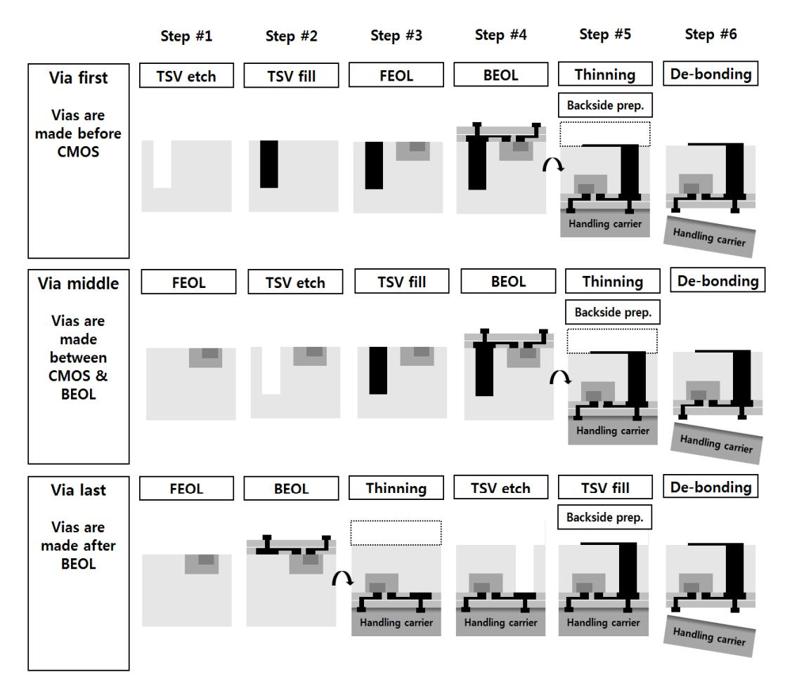

Via first: CMOS 공정 전에 Via 공정을 진행

Via middle: CMOS 공정과 BEOL 공정 사이에 Via 공정을 진행

Via last: BEOL 공정 후에 Via 공정을 진행

CMOS: Complementary metal-oxide semiconductor, 채널이 다른 두개의 금속산화반도체의 조합

FEOL: Front end of line, 배선 공정 이전 단계

BEOL: Back end of line, 배선 공정 이후 단계

TSV: Through silicon via, 실리콘 내부에 Via를 식각하는 공정

Thinning: CMP 공정을 통하여 실리콘 웨이퍼 자체를 얇게 만드는 공정

Backside prep.: 뒷면 세정 및 배선 연결 단계

De-bonding: 웨이퍼에 스트레스가 가해지지 않도록 붙여둔 Handling carrier를 제거하는 단계

출처: 교육부(2015). 반도체 제조 공정개발(LM1903060106\_14v3). 한국직업능력개발원. p.92. [그림 6-2] 3D TSV via integration scenarios(TSV 공정을 위한 시나리오)

### 수행 내용 / 공정 개선 요구 사항별 특성 분류하기

### 재료·자료

- 안전 교육 자료, 통계 기법 자료
- 작업 지시서(공정 계획서), 장비 및 설비 사용 설명서, 장비/공정 특성 평가서

### 기기(장비 ・ 공구)

- 특성 계측 장비
- 컴퓨터, 프린터, 통계 분석 프로그램

### 안전 ・ 유의 사항

- 반도체 제조 공정이 환경에 미치는 영향을 사전에 파악하여 문제가 되지 않도록 한다.
- 안전장치 사용 방법을 숙지하여 비상시에 대처가 가능해야 한다.

### 수행 순서

목표를 설정한다.

- 1. 주어진 장비 혹은 공정 특성 평가서를 이해하고 개선을 위해 통계 기법을 적용하며 이 과정 중에 설계 및 공정상의 이슈 확인, 공정 장비의 개선, 공정 최적화 방법 도출 및 자료의 문서화를 수행하는 것을 목표로 한다.
- 2. 평가서의 각 데이터 특성을 파악하고 분류할 수 있으며, 해당 데이터를 취득하기 위한 계측 장비의 종류를 이해하는 것을 목표로 한다.
- 특성 평가서 파악하고 통계 기법을 적용한다.

평가서는 계측 장비 및 통계 분석 프로그램의 종류에 따라 데이터의 다양한 분류 및 그래프 첨부도 가능하다. 특성 평가서는 워드 프로그램을 사용하거나 수기로 작성하고, 현장에서 적절한 분석 결과 보고서를 작성한다.

공정 데이터를 분류하고 해석한다.

계측 장비의 하드웨어적인 구성 및 사용 프로그램의 종류에 따라 다양한 평가 방법의 이 해 및 보고서 작성이 가능하다. 전체 혹은 부분적인 공정 최적화 이후 보고서를 작성한다.

- 1. 전기적 특성
  - (1) 금속 재료 혹은 배선 재료에 대한 특성 평가서를 바탕으로 학습한다.
  - (2) 각 특성을 정의하고 차이점에 대하여 설명한다.
- 2. 화학적 특성
  - (1) 화학 특성 평가서를 바탕으로 학습한다.
  - (2) 각 특성을 정의하고 차이점에 대하여 설명한다.
- 3. 기계적 특성
  - (1) 기계적 특성 평가서를 바탕으로 학습한다.
  - (2) 각 특성을 정의하고 차이점에 대하여 설명할 수 있도록 한다.
- 4. 물리적 특성
  - (1) 물리적 특성 평가서를 바탕으로 학습한다.
  - (2) 각 특성을 정의하고 차이점에 대하여 설명할 수 있도록 한다.
- 5. 기타 특성

자기적, 광학적, 및 열역학적 특성 등으로 위와 다른 관점에서 분석된 특성 평가서를 바탕 으로 반도체 제조 공정 결과물의 목적에 따라 다양하게 정의된 특성을 학습한다. 그리고 각 특성을 정의해보고 차이점에 대하여 설명한다.

#### 수행 tip

 통계 프로그램의 경우 대부분 유료이나 일정 기간 무료로 제공되는 프로그램 사용도 가능하다.

# **6-2.** 공정 특성 평가

학습 목표 • 공정의 특성을 객관적으로 평가하여 개발된 공정의 적합성을 판별할 수 있다.

## 필요 지식 /

통계 프로그램 운영 및 분석

반도체 제조 공정에서 공정 변수와 결과는 데이터의 형태로 취합이 되며 그 상관관계까지 확인하기 위해서는 객관적인 통계 기법의 응용이 필요하다. 반도체 제조 공정의 목적에 맞고 수집된 데이터의 확인 및 분석이 가능하도록 기본적인 통계의 개념 및 용어를 학습한다.

1. 기본적인 통계 용어

통계란 모여진 데이터로 수학 기법을 통하여 수치상의 규칙성 혹은 불규칙성을 찾아내는 것으로 이를 통하여 일부의 데이터만으로 전체의 현상을 신뢰성 있게 확인할 수 있도록 하는 것이다. 여기서는 통계 기법에 사용되는 용어 및 각각의 정의에 대하여 학습한다. 보 다 자세한 용어는 한국통계학회(www.kss.or.kr) 자료실의 통계 용어를 참조할 수 있다.

(1) 기초 통계

관측치 수, 중심 위치(평균, 중위수), 산포(표준 편차, 평균의 표준오차, 최솟값 및 최댓 값, 사분위수), 그래프(히스토그램, 정규곡선 등), 검정 방식, 분산 및 정규성 평가에 대 하여 학습한다.

(2) 회귀분석

회귀방정식, P-값, S, R-제곱 (R-제곱(수정)), 표준화 잔차, 예측 변수, 신뢰구간, 예측 구간, 잔차 히스토그램, 잔차 정규 확률도, 잔차 대 적합치 및 통계적 유의성에 대하여 학습한다.

(3) 다양한 회귀분석

일반적 회귀분석, 단계적 회귀분석, 최량 부분 집합 회귀분석, 직교 회귀분석, 부분 최 소 제곱 회귀분석, 이항 로지스틱 회귀분석, 순서형 로지스틱 회귀분석 및 명목형 로 지스틱 회귀분석에 대하여 학습한다.

(4) 분산분석

개별 통계량, 개별 신뢰구간, 다중 비교, 일원 분산분석, 이원 분산분석, 평균 분석, 주 효과와 교호 작용, 균형 분산분석, 일반 선형 모형, 완전 내포 분산분석, 균형 다변량 분산분석, 일반 다변량 분산분석 및 등분산 검정에 대하여 학습한다.

(5) 실험 계획법

완전/부분 요인 설계와 분석 방법, Plackett-Burman 설계와 분석 방법, 반응 표면 설계 와 분석 방법, 혼합물 설계와 분석 방법, 다구찌(Taguchi) 설계와 분석 방법, 최적 설계 방법 및 반응 최적화 방법에 대하여 학습한다.

(6) 관리도

박스 앤 콕스(box-cox) 변환, 부분군 계량형 관리도(Xbar-R, Xbar-S, I-MR-R/S (군간/ 군내)), 개별값 계량형 관리도(I-MR, Z-MR, 개체, 이동 범위), 계수형 관리도, 시간 가 중 관리도, 다변량 관리도 및 희귀 사건 관리도에 대하여 학습한다.

(7) 품질 관리

품질 계획(런 차트, 파레토 차트, 특성요인도, 대칭도, 다변량 차트), 존슨(Johnson) 변 환, 공정 능력 분석(다중 정규/비정규 분포, 이항 분포, 포아송 분포), 식스시그마 및 게이지(gage) 분석에 대하여 학습한다.

(8) 신뢰성/생존 분석

검사 계획, 분포 분석, 성장 곡선, 가속 수명 검사, 수명 데이터 분석 및 프로빗(스트레 스) 분석에 대하여 학습한다.

(9) 다변량 분석

주성분 분석, 인자 분석, 항목 분석, 관측 개체 군집 분석, 변수 군집, K-평균 군집, 및 판별 분석에 대하여 학습한다.

(10) 시계열 분석

시계열 분석, 추세 분석, 분해, 이동 평균, 단일/이중 지수 평활, 자기 상관, 편자기 상 관, 교차 상관 및 아리마(ARIMA)에 대하여 학습한다.

(11) 구조 방정식

독립 변수, 종속 변수, 직접/간접 효과, 카이 제곱, 및 베타(ϐ) 값에 대하여 학습한다.

2. 데이터의 특성

반도체 제조 공정에서 결과물에 대한 개선은 결국 설계 단계에서 정해진 특성에 대한 목 표를 얼마나 정확히 구현하는가에 중점을 두게 되며 이는 통계 기법을 통한 변동(산포)과 노이즈(에러) 부분을 얼마나 효율적으로 줄일 수 있는가에 대한 방법론으로 이어진다. 여 기서는 적절한 통계 기법을 적용할 수 있도록 데이터의 특성에 대하여 학습한다.

(1) 적합성(relevance)

데이터가 목표 해결에 적합하며, 통계 기법의 적용이 가능한가?

(2) 명확성(clarity)

모인 데이터 간에 상관관계가 뚜렷한가?

(3) 일관성(consistency)

두 개 이상의 계측 장비로부터 동일한 데이터가 수집되었는가?

(4) 시기 적절성(timeliness)

시기적으로 가치있는 데이터인가?

(5) 정확성(accuracy)

데이터가 실제 상황을 반영하고 있는가?

(6) 완전성(completeness)

데이터가 목표 해결에 충분할 만큼 존재하는가?

(7) 접근성(accessibility)

데이터의 활용이 100% 가능한가? (예를 들어 보안사항에 위배되지는 않는가?)

(8) 비용(cost)

데이터의 취득 및 활용 시 예상 범위 내에서 비용이 발생하는가?

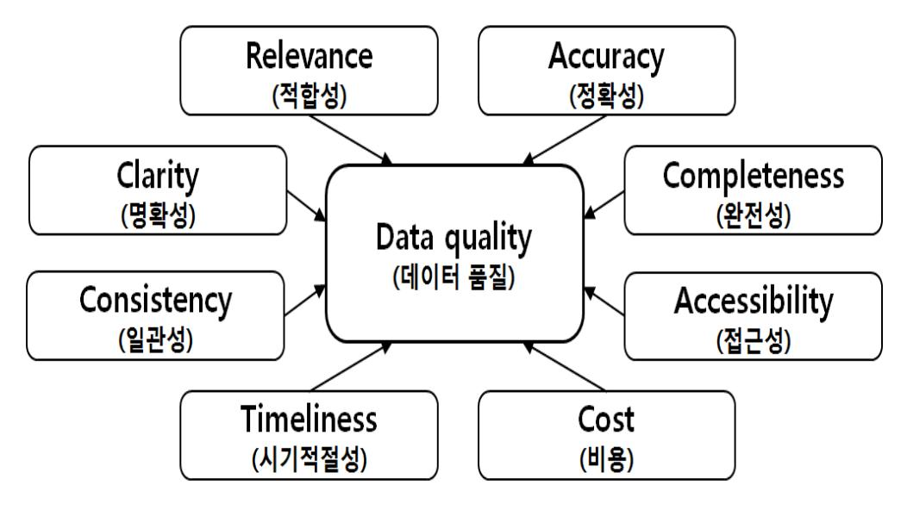

출처: 교육부(2015). 반도체 제조 공정개발(LM1903060106\_14v3). 한국직업능력개발원. p.97. [그림 6-3] 데이터 품질(data quality)

## 수행 내용 / 공정 특성 평가하기

### 재료·자료

- 안전 교육 자료, 통계 기법 자료
- 작업 지시서(공정 계획서), 장비 및 설비 사용 설명서, 장비/공정 특성 평가서

### 기기(장비 ・ 공구)

- 컴퓨터, 프린터, 통계 분석 프로그램
- 실시간 공정 모니터링 센서 혹은 특성 계측 장비

### 안전 ・ 유의 사항

- 반도체 제조 공정이 환경에 미치는 영향을 사전에 파악하여 문제가 되지 않도록 한다.
- 안전장치 사용 방법을 숙지하여 비상시에 대처가 가능해야 한다.

### 수행 순서

목표를 설정한다.

- 1. 주어진 장비 혹은 공정 특성 평가서를 이해하고 개선을 위해 통계 기법을 적용하며 이 과정 중에 설계 및 공정상의 이슈 확인, 공정 장비의 개선, 공정 최적화 방법 도출, 및 자료의 문서화를 수행하는 것을 목표로 한다.
- 2. 평가서의 각 데이터 특성을 파악하고 분류할 수 있으며, 해당 데이터를 취득하기 위한 계측 장비의 종류를 이해하는 것을 목표로 한다.
- 3. 실시간 모니터링 센서의 이해 및 취합된 데이터의 활용으로 실시간(in-situ) 공정 진단을 수행하는 것을 목표로 한다.

특성 평가서 파악하고 통계기법을 적용한다.

평가서는 계측 장비 및 통계 분석 프로그램의 종류에 따라 데이터의 다양한 분류 및 그래프 첨부도 가능하다. 특성 평가서는 워드 프로그램을 사용하거나 수기로 작성하고, 현장에서 적절한 분석 결과 보고서를 작성한다.

모니터링을 통해 공정 진단을 수행한다.

계측된 특성값 혹은 실시간 공정 모니터링 센서를 활용하여 공정 진단을 수행한다. 계측 장비 혹은 센서의 하드웨어적인 구성 및 사용 프로그램의 종류에 따라 다양한 평가 방법 이 있을 수 있으며 이와 관련된 보고서 작성이 가능하다.

전체 혹은 부분적인 공정 최적화 이후 보고서를 작성하도록 한다.

1. 광학발광분석(OES: optical emission spectroscopy) 활용을 통한 공정 특성 평가

OES 장비는 플라즈마 환경에서 발생되는 빛을 분석하여 해당 플라즈마 내부의 조성 등을 실시간으로 확인할 수 있는 공정 모니터링 센서로, 장비에 부하가 걸리지 않고 뷰포트 (Viewport: 장비 점검용 유리창)를 통하여 데이터를 취득할 수 있으며 실시간으로 데이터 를 확인하거나 도표화할 수 있는 장점이 있다. 개략적인 데이터 취득부터 특성 평가 방법 은 아래와 같다.

- (1) 공정 장비 단의 뷰포트에 OES 연결
- (2) 플라즈마 환경 조성
- (3) 광케이블을 통한 데이터 취득
- (4) 분석 프로그램을 통한 시간별 혹은 주파수별 플라즈마 조성 파악(실시간)
- (5) 보고자 하는 시간 간격에 맞춘 샘플링 주기(sampling rate) 지정 및 데이터 저장
- (6) 다양한 통계 프로그램을 활용한 데이터 분석
- (7) 분석 결과에 따른 플라즈마 공정 특성 평가

### 수행 tip

 통계 프로그램의 경우 대부분 유료이나 일정 기간 무료로 제공되는 프로그램 사용도 가능하다.

# **6-3.** 공정 최적화 방법 설계 및 각종 센서 활용

학습 목표 • 공정 최적화를 통해 효율적인 공정을 설계하고 검증할 수 있다. • 실시간 공정 모니터링 센서를 활용하여 실시간 공정 진단을 수행할 수 있다.

## 필요 지식 /

통계적 품질 관리(SPC: statistical process control)

통계적 품질 관리는 통계적 자료와 분석 기법의 도움을 받아 주어진 규격과 공정의 능력 상태를 파악하여 변동의 유발 원인을 확인하고, 적절한 조치를 통해 변동(산포)을 줄임으 로써 원하는 상태로 공정이 가능하도록 지속적으로 조치/관리하는 방법론을 의미한다.

출처: 교육부(2015). 반도체 제조 공정개발(LM1903060106\_14v3). 한국직업능력개발원. p.100. [그림 6-4] 통계적 공정관리 흐름도(statistical process control logic)

### 1. 품질

품질이란 설계된 목표를 만족시키는지에 대해 평가의 대상이 되는 고유의 성질 혹은 성능 을 의미하는 것으로 설계 품질, 제조 품질, 시장 품질 및 요구 품질에 대하여 학습한다.

(1) 설계 품질(quality of design)

요구 품질을 실현하기 위한 제품 기획, 사양 정리 및 도면화에 대하여 학습한다.

(2) 제조 품질(quality of manufacture)

완성된 설계 품질에 대하여 제조 공정을 통하여 실재화하는 단계에서의 목표이며 단 위 공정별 특성 목표치로 정의할 수 있다.

### (3) 시장 및 요구 품질(quality of market & requirement of quality)

시장에서 사용자의 평가를 받고 다시 소비자에 의해 요구되는 품질을 의미한다.

### 2. 품질 관리

품질 관리란 설계된 목표를 만족시키기 위해 계획을 세우고 달성하기 위해 행하는 모든 활동을 의미하는 것으로 품질에 존재하는 변동(산포)을 줄이는 것이 목적이다. 변동의 원 인인 5M1E(사람(Man), 설비(machine), 재료(material), 방법(method), 계측(measure), 환경 (environment))에 대하여 학습한다.

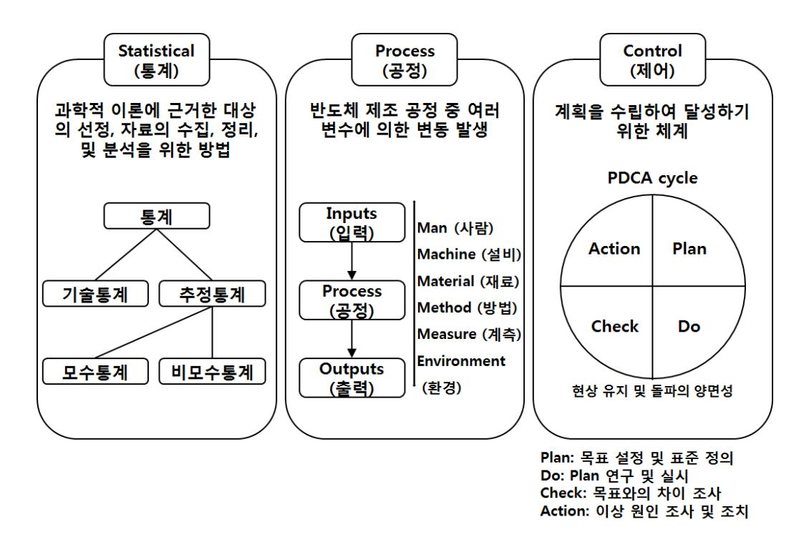

출처: 교육부(2015). 반도체 제조 공정개발(LM1903060106\_14v3). 한국직업능력개발원. p.101. [그림 6-5] 통계적 공정관리(statistical process control)

### 3. 통계적 품질 관리의 발전

품질 관리는 결국 불량을 줄이고 수율을 높이는데 그 목적이 있으며 반도체의 소형화 및 집적도로 인하여 더욱 발전된 기술을 필요로 한다. R2R(run to run), FDC(fault detection classification), APC(advanced process control) 및 VM(virtual metrology)에 대하여 학습한다.

### 공정 모니터링

반도체 제조 공정 중 품질 관리를 위하여 오프라인 단계에서부터 실시간(in-situ) 단계에 이르기까지 다양한 모니터링 및 데이터 취합이 이루어지며 실시간 확인을 위하여 장비에 바로 연결되는 다양한 센서를 사용하고 있다. 여기서는 공정 모니터링 및 실시간 센서에 대하여 학습한다.

### 1. 반도체 제조 공정의 기준

반도체 제조 공정의 생산품인 최종 결과물까지 여러 다양한 기준이 필요하며 여기서는 공 통적으로 제시되는 다섯 가지 기준에 대하여 학습한다.

(1) 비용(cost)

수율과 각 단계별 소요 비용, 및 직접(labor cost, facility cost, raw-wafer cost, material cost, and so on) / 간접(equipment and facility depreciation, facility operating cost, engineering support, production control, and so on) 비용에 대하여 학습한다.

(2) 품질(quality)

품질은 결국 사용자가 필요로 하는 모든 부분을 이야기하게 되며 얼마나 일치시키느 냐에 따라 수율이 달라진다. 여기서는 품질 만족을 위한 필요 요소로 장비(equipment performance), 작업자(competence of workforce), 품질 관리 절차(quality control procedures) 및 공정 프로세스(manufacturing process)에 대하여 학습한다.

(3) 변동성(variability)

품질 개선은 각 변수들의 변동(산포)을 줄여 나가는 과정이며, 정확치 않은 공정 (misprocessing), 재공정(rework) 및 낭비(waste)만 줄여도 제조 공정의 비용을 낮출 수 있다.

(4) 수율(yield)

제조 비용에 직접적인 영향을 주는 기준이며 수율 개선을 위한 목표 설정(establish targets), 측정(measure actuals), 원인 확인(determine root causes) 및 해결 노력 (action plans)에 대하여 학습한다.

(5) 신뢰성(reliability)

광범위한 테스트와 데이터에 대한 분석을 통한 신뢰성 확보에 대하여 학습한다.

2. 공정 모니터링

반도체 제조 공정에서 위와 같은 기준이 포함된 품질을 만족시키기 위한 활동으로 여러 단계에서 모니터링이 이루어지며 여기서는 불량의 가장 큰 원인인 오염과 순도 모니터링 의 관점에서 바라본 계측 장비에 대하여 학습한다. 분석 및 계측 장비는 '5-1. 표준 계측 및 분석 방법, 장비 및 용어 이해하기'를 참조할 수 있다.

| Stand alone Tools (장비와 별도로 구성되는 모니터링 시스템) |  |  |  |  |
|-------------------------------------------|--|--|--|--|
|-------------------------------------------|--|--|--|--|

| Off-line (오프 라인) | Available only outside fab(FAB 외부에서만 가능) (usually destructive or contaminating)(보통 파괴되거나 오염됨)                                                  |
|------------------------|---------------------------------------------------------------------------------------------------------------------------------------------------|
| At-line (엣라 인)   | Available in the fab(FAB 내부에서도 가능) (measures monitor wafers. destructive, contaminating or unpatterned) (계측용 혹은 패턴 없는 웨이퍼 측정, 보통 파괴되거나 오염됨) |
| In-line (인라 인)   | Tool is used during production(계측이 공정 진행 중에 따로 이루어짐) (can measure patterned wafers)(패턴 있는 웨이퍼 측정 가능)                                           |

#### Integrated Tools (장비와 함께 구성되는 모니터링 시스템)

| On-line | Available at the process workstation to measure patterned wafers but not |
|---------|--------------------------------------------------------------------------|
| (온라     | able to measure during wafer processing                                  |
| 인)      | (계측이 공정 진행 중에 이루어지나 공정 장비 기동 중에는 계측 불가능)                                 |

| In situ   | Measurement tool that measures wafer, process or equipment during   |  |  |  |  |
|-----------|---------------------------------------------------------------------|--|--|--|--|
| (인시 츄) | processing (real-time measurement) (계측이 공정 장비가 기동 중에 가능; 실시간 계측) |  |  |  |  |

출처: Michael Quirk & Julian Serda(2009). Semiconductor Manufacturing Technology.

- (1) 오염 모니터링 계측 장비 Surface SIMS, TOF-SIMS, TXRF, Conventional SIMS, SPV, VPD-AAS, VPD-TXRF, 및 VPD-ICP/MS에 대하여 학습한다.
- (2) 순도 모니터링 계측 장비 AFM, SIMS, SEM, SEM-EDS, FE-AES, XPS, AES, GDMS, FTIR, RBS, 및 TXRF에 대하 여 학습한다.
- 3. 센서

반도체 제조 공정에서 수율 향상을 위하여 실시간 모니터링 및 품질 관리의 필요성은 더 욱 커지고 있으며 여기서는 센서의 종류 중 질량분석기(mass spectrometer), 간섭계 (interferometer), 광학 분광 분석기(optical emission spectrometer), 랭미어 프로브(langmuir probe) 및 RF 센서에 대하여 학습한다.

출처: 교육부(2015). 반도체 제조 공정개발(LM1903060106\_14v3). 한국직업능력개발원. p.104. [그림 6-6] 실시간 모니터링 센서(real time monitoring sensors)

이외에도 장비 운용 시 기본적으로 사용되는 압력 센서, 가스 유량 센서 등에 대하여 학 습하며 더욱 자세한 설명은 '반도체 장비'를 참조할 수 있다.

4. 공정 상태의 구분

공정 상태 구분 시 안정 상태와 이상 상태의 차이점에 대하여 학습하고, 원인 분류 시 우 연 원인과 이상 원인에 대하여 학습한다.

### 수행 내용 / 공정 최적화 방법 및 각종 센서 파악하기

### 재료·자료

- 안전 교육 자료, 통계 기법 자료
- 작업 지시서(공정 계획서), 장비 및 설비 사용 설명서, 장비/공정 특성 평가서

### 기기(장비 ・ 공구)

- 컴퓨터, 프린터, 통계 분석 프로그램
- 공정 모니터링 센서 및 공정 장비

### 안전 ・ 유의 사항

- 반도체 제조 공정이 환경에 미치는 영향을 사전에 파악하여 문제가 되지 않도록 한다.
- 안전장치 사용 방법을 숙지하여 비상시에 대처가 가능해야 한다.

### 수행 순서

목표를 설정한다.

- 1. 주어진 장비 혹은 공정 특성 평가서를 이해하고 개선을 위해 통계 기법을 적용하며 이 과정 중에 설계 및 공정상의 이슈 확인, 공정 장비의 개선, 공정 최적화 방법 도출 및 자료의 문서화를 수행하는 것을 목표로 한다.
- 2. 평가서의 각 데이터 특성을 파악하고 분류할 수 있으며, 해당 데이터를 취득하기 위한 센서의 종류를 이해하는 것을 목표로 한다.
- 3. 실시간 모니터링 센서의 이해 및 활용으로 실시간 공정 진단을 수행하는 것을 목표로 한다.

### 특성 평가서를 파악하고 기법을 적용한다.

평가서는 공정 특성 평가 항목을 선정하여 현장에서 적절하고 중요한 요소을 선정하고, 워드 프로그램을 사용하거나 수기로 작성하며, 현장에서 적절한 분석 결과 보고서를 작성 한다.

모니터링하여 공정을 진단한다.

- 1. 공정 모니터링 센서를 활용하여 공정 진단을 수행한다.
- 2. 센서의 하드웨어적인 구성, 보유 장비의 기동 형태, 데이터 취득 방식, 및 분석 프로그 램의 종류에 따라 다양한 평가 방법을 이해할 수 있으며 보고서 작성도 가능하다.
- 3. 전체 혹은 부분적인 공정 최적화 이후 보고서를 작성하도록 한다.
- 4. 아래의 센서 종류 중 준비된 센서를 직접 장비에 연결하거나 가상 시뮬레이션을 통하여 데이터 취득 및 분석하는 방법에 대하여 학습한다.
  - (1) 질량분석기(mass spectrometer)
  - (2) 간섭계(interferometer)
  - (3) 광학 분광 분석기(optical emission spectrometer)
  - (4) 랭미어 프로브(langmuir probe)
  - (5) RF 센서
  - (6) 압력 센서(고진공, 저진공 등 측정 범위에 따라 다양하다.)
  - (7) 가스 유량 센서(mass flow controller, MFC)

### 수행 tip

 센서의 경우 다양한 형태로 존재하며 보유 장비 혹 은 센서의 종류에 따라 데이터 취득 방식 등에 한계 가 있음을 학습한다.

## 학습6 교수·학습 방법

### 교수 방법

- 반도체 제조 공정 개발에 관련된 필요 지식을 기준으로 개념을 설명한다.
- 단위 공정별 공정 및 장비 특성과 제어, 반도체 제조 공정 프로세스와 공정관리 기술, 반 도체용 화학약품의 종류 및 특성, 반도체 주요 공정 및 장비 운용 용어, 제조 공정 장비 운용 및 결과 평가 기술, 측정 및 평가기술, 오류 공정 검출/분류(FDC), 및 불량과 수율의 상관성에 대하여 실제 장비, 그림, 및 사진 등을 활용하여 설명한다.
- 연구 노트 등의 정해진 양식을 활용하여 교수자의 강의 내용 및 학습자의 실제 활동 내역을 형식에 맞게 기술하도록 하여 서술형시험 및 구두 발표 시 활용할 수 있도록 한다.
- 학습자가 각자의 역할 분담이 주어진 상태에서 팀을 구성하여 교육에 참여하는 조별 활동을 활용할 수 있다.
- 교육 중 브레인스토밍 등을 통하여 문제를 해결하고 새로운 아이디어를 도출한다.

### 학습 방법

- 단위 공정별 공정 및 장비 특성과 제어에 대하여 학습하고 실제 장비 혹은 시뮬레이션을 통하여 각 특성 및 제어 방식에 대하여 파악한다.
- 반도체 제조 공정 프로세스와 공정관리기술에 대하여 학습하고 실제 장비 혹은 시뮬레이션을 통하여 이를 수행한다.
- 반도체용 화학약품 종류 및 특성에 대하여 학습하고 공정에 적합한 화학약품을 선택한다.
- 반도체 주요 공정 및 장비 운용 용어에 대하여 학습하고 단위 공정 혹은 공정 프로세스를 최적화한 작업 지시서를 작성한다.
- 제조 공정 장비 운용 및 결과 평가 기술에 대하여 학습하고 해당 장비를 결과 평가 이후 새롭게 도출된 공정에 적합하도록 운용한다.
- 측정 및 평가기술에 대하여 학습하고 이를 적용할 수 있는 분야 및 한계에 대하여 파악한다.
- 오류 공정 검출/분류(FDC)에 대하여 학습하고 해당 공정에 적합한 기술 및 분류를 적용한다.

- 불량과 수율의 상관성에 대하여 학습하고 수율을 높일 수 있는 방법과 불량을 줄일 수 있는 방안을 도출하여 적용한다.
- 매뉴얼 및 환경안전 기준에 따라 필요한 지식을 학습하고 수행 중의 문제점을 도출한 다음, 수정 및 보완 계획을 수립할 수 있도록 학습 및 실습한다.

# 학습6 평 가

### 평가 준거

- 평가자는 학습자가 학습 목표를 성공적으로 달성하였는지를 평가해야 한다.
- 평가자는 다음 사항을 평가해야 한다.

|                              | 학습 목표                                                     |  | 성취수준 |   |  |
|------------------------------|-----------------------------------------------------------|--|------|---|--|
| 학습 내용                        |                                                           |  | 중    | 하 |  |
| 공정 개선 요구 사항별 특성 분류        | - 공정 개선 요구 사항을 확인하여 성능 개선을 위한 재료 선택 및 공정 방법을 도출할 수 있다. |  |      |   |  |
|                              | - 성능 개선의 요구에 따라 전·후 공정을 고려하여 단 위 공정을 효율적으로 재구성할 수 있다.  |  |      |   |  |
| 공정 특성 평가                     | - 공정의 특성을 객관적으로 평가하여 개발된 공정의 적합성을 판별할 수 있다.            |  |      |   |  |
| 공정 최적화 방법설계 및 각종 센서 활용 | - 공정 최적화를 통한 효율적인 공정을 설계하고 검증 할 수 있다.                  |  |      |   |  |
|                              | - 실시간 공정 모니터링 센서를 활용하여 실시간 공정 진단을 수행할 수 있다.            |  |      |   |  |

### 평가 방법

• 일지/저널

|                              | 평가 항목                         |  | 성취수준 |   |  |
|------------------------------|-------------------------------|--|------|---|--|
| 학습 내용                        |                               |  | 중    | 하 |  |
| 공정 개선 요구 사항별 특성 분류        | - 공정 개선 요구 사항의 우선순위 이해 정도     |  |      |   |  |
|                              | - 개선을 위한 재료 및 공정 방법의 선택 여부    |  |      |   |  |
|                              | - 전후 공정 고려한 단위 공정의 효율적 재구성 능력 |  |      |   |  |
| 공정 특성 평가                     | - 공정 특성을 객관적으로 판단하는 능력        |  |      |   |  |
|                              | - 개발된 공정의 적합성을 판단하는 능력        |  |      |   |  |
| 공정 최적화 방법설계 및 각종 센서 활용 | - 공정 최적화를 위한 논리적 접근성          |  |      |   |  |
|                              | - 효율적 공정 설계 및 검증 능력           |  |      |   |  |
|                              | - 실시간 공정 모니터링 센서에 대한 이해 정도    |  |      |   |  |

### • 서술형시험

|                              | 평가 항목                        |  | 성취수준 |   |  |
|------------------------------|------------------------------|--|------|---|--|
| 학습 내용                        |                              |  | 중    | 하 |  |
| 공정 개선 요구 사항별 특성 분류        | - 공정 개선 요구 사항의 분야별 구분 여부     |  |      |   |  |
|                              | - 선택한 재료 및 공정 방법의 논리적인 서술 능력 |  |      |   |  |
|                              | - 주어진 단위 공정의 효율적인 배치와 진행 능력  |  |      |   |  |
| 공정 특성 평가                     | - 공정 특성에 대한 객관적 기준 제시 여부     |  |      |   |  |
|                              | - 주어진 공정의 적합성에 대한 서술 능력      |  |      |   |  |
| 공정 최적화 방법설계 및 각종 센서 활용 | - 공정 최적화를 위한 논리적 서술 능력       |  |      |   |  |
|                              | - 공정 모니터링 전반에 대한 파악 정도       |  |      |   |  |
|                              | - 실시간 공정 진단 구성에 대한 파악 정도     |  |      |   |  |

• 구두 발표

|                              | 평가 항목                           |  | 성취수준 |   |  |
|------------------------------|---------------------------------|--|------|---|--|
| 학습 내용                        |                                 |  | 중    | 하 |  |
| 공정 개선 요구 사항별 특성 분류        | - 논리적인 공정 개선 필요성 설명 능력          |  |      |   |  |
|                              | - 공정 개선 필요 시 특성 중 우선순위 선택 여부    |  |      |   |  |
| 공정 특성 평가                     | - 공정 특성 평가 방식의 논리적 설명 능력        |  |      |   |  |
| 공정 최적화 방법설계 및 각종 센서 활용 | - 공정 최적화 대한 설명과 근거 제시 여부        |  |      |   |  |
|                              | - 실시간 공정 모니터링 센서를 활용한 데이터 분석 능력 |  |      |   |  |

피드백

1. 일지/저널

- 반도체 공정 개선 필요성을 파악하고 있는지, 공정 개선 특성 중 우선순위 선택을 적절 히 하는지에 대해 보고서 평가 후 주요 사항을 표시하여 설명한다.
- 반도체 현장에서 개선 사례를 제시하며 이해하도록 피드백을 제공한다.
- 반도체 공정 최적화 방법에 대해 이해하는지 데이터 활용 측면에서 능력을 파악하고 부족하면 사례를 들어 피드백을 제공한다.
- 2. 서술형시험
- 반도체 공정 개선 필요성을 파악하고 있는지, 공정 개선 특성 중 우선순위 선택을 적절 히 하는지에 대해 서술형시험 평가 후 각 문제에 대한 풀이를 시행한다.
- 반도체 현장에서 개선 사례를 제시하여 이해하도록 피드백을 제공한다.
- 반도체 공정 최적화 방법에 대해 이해하고 데이터 활용 측면에서 능력을 파악하여 부 족하면 사례를 들어 피드백을 제공한다.
- 3. 구두 발표
- 반도체 공정 개선 측면에서 발표 평가 후 해당 발표에 포함되어야 할 주요 내용에 대 하여 설명하며, 공정 장비 운영 매뉴얼, 장비 운용 방법 숙지, 공정 수행 및 평가 방법 파악 여부, 반도체 제조 공정이 환경에 미치는 영향 파악 능력에 대해서도 파악 후 미 흡한 부분에 대해서 설명해 준다.
- 반도체 현장에서 개선 사례를 제시하며 이해하도록 피드백을 제공한다.
- 반도체 공정 최적화 방법에 대해 이해하고 데이터 활용 측면에서 능력을 파악하여 부 족하면 사례를 들어 피드백을 제공한다.

- ∙ 교육부(2015). 반도체 제조 공정 개발(LM1903060106\_14v3). 한국직업능력개발원.
- ∙ 김상용, 강명헌, 『반도체 장비유지보수 기능사』크라운출판사, 2018.01.10.
- ∙ 김상용, 이병철, 『반도체 CMOS 제조기술』일진사, 2016.06.25.
- ∙ Doohyung Cho, and Kwangsoo Kim (2014). Extended Trench Gate Superjunction Lateral Power MOSFET for on-Resistance and High Breakdown Voltage. ETRI Journal, Vol. 36, No. 5, pp. 829-834.
- ∙ Michael Quirk / Julian Serda(2000). Semiconductor Manufacturing Technology. U.S.A: Prentice Hall
- ∙ Wolf, Stanley/ Tauber, Richard N.(2000). Silicon processing for the VLSI era. United States: Lattice press.

| NCS학습모듈 개발이력 |                                 |     |                 |
|--------------|---------------------------------|-----|-----------------|
| 발행일          | 2015년 12월 31일                   |     |                 |
| 세분류명         | 반도체개발(19030601)                 |     |                 |
| 개발기관         | 한국반도체산업협회, 한국직업능력개발원            |     |                 |
|              | 이병철(㈜비드앤마이크로)*                  |     | 권태우(극동대학교)      |
|              | 김경섭(여주대학교)                      |     | 김병윤(전 삼성전자㈜)    |
|              | 김문호(씨지아이파트너즈)                   |     | 민종수(엠텍비젼㈜)      |
|              | 안태원(동양미래대학교)                    |     | 이준성(인덕대학교)      |
|              | 유광동(전 동부하이텍)                    |     | 이호덕(㈜에이치디테크놀로지) |
|              | 이승은(서울과학기술대학교)                  |     |                 |
|              | 이제현(동양미래대학교)                    |     |                 |
| 집필진          | 이혁(㈜플렉스컴)                       | 검토진 |                 |
|              | 임종철(LG전자㈜)                      |     |                 |
|              | 임황규(성결대학교)                      |     |                 |
|              | 정종식(㈜e-wbm연구소)                  |     |                 |
|              | 천형용(충북반도체고등학교)                  |     |                 |
|              | 홍상진(명지대학교)                      |     |                 |
|              | 홍진균(전 ㈜LG실트론)                   |     | *표시는 대표집필자임     |
| 발행일          | 2018년 12월 31일                   |     |                 |
| 학습모듈명        | 반도체 제조 공정 개발(LM1903060106_15v4) |     |                 |
| 개발기관         | 한국직업능력개발원                       |     |                 |
|              | 홍진균(T2B파트너스)*                   |     | 김학동(대중금속공업고등학교) |
| 집필진          | 김상용(한국폴리텍대학)                    | 검토진 | 진종문(충북반도체고등학교)  |
|              |                                 |     | *표시는 대표집필자임     |

|                                                         | 반도체 제조 공정 개발(LM1903060106_15v4)                |  |
|---------------------------------------------------------|------------------------------------------------|--|
| 저작권자                                                    | 교육부                                            |  |
| 연구기관                                                    | 한국직업능력개발원                                      |  |
| 발행일                                                     | 2018. 12. 31.                                  |  |
|                                                         | ※ 이 학습모듈은 자격기본법 시행령(제8조 국가직무능력표준의 활용)에 의거하여 개발 |  |
| 하였으며, NCS통합포털사이트(http://www.ncs.go.kr)에서 다운로드 할 수 있습니다. |                                                |  |

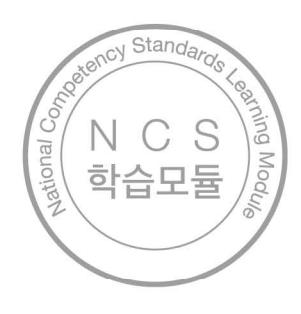

www.ncs.go.kr