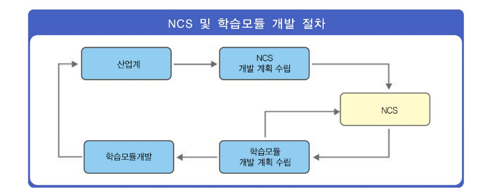
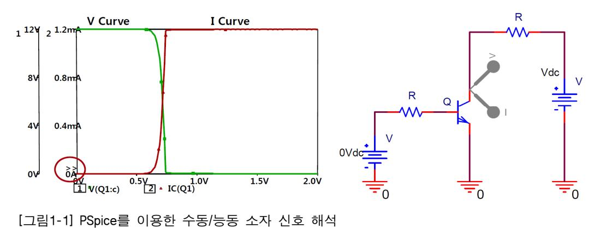
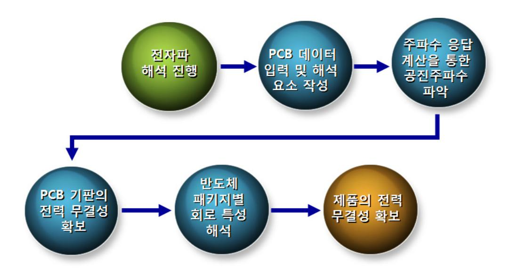
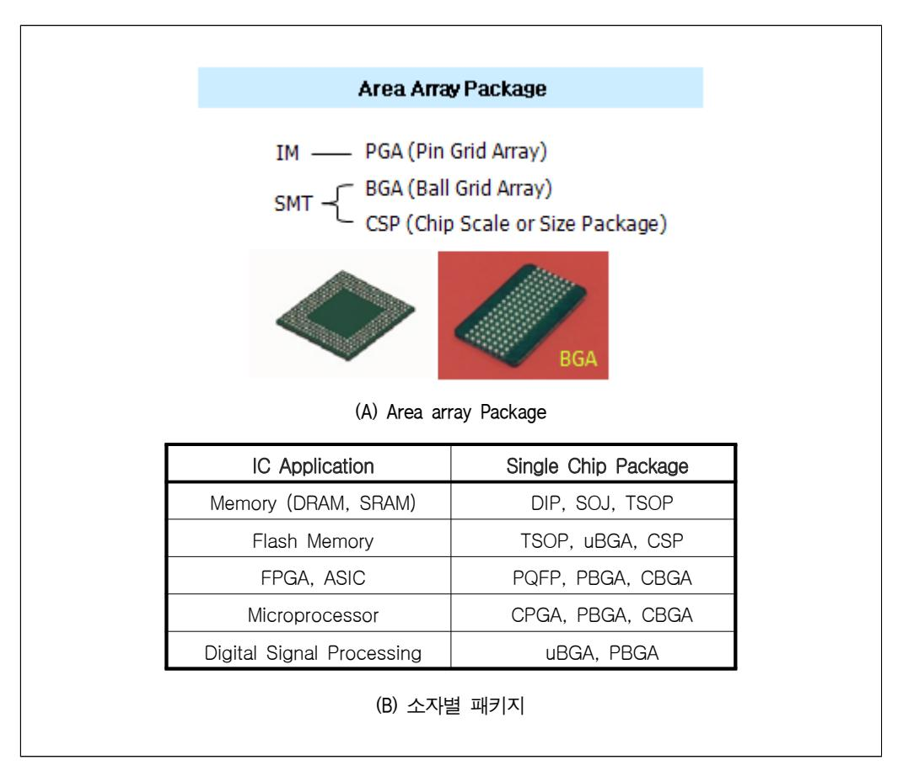
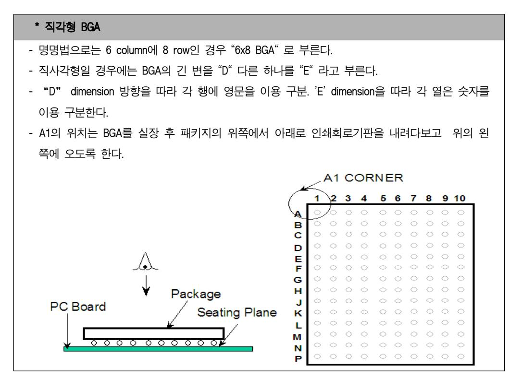
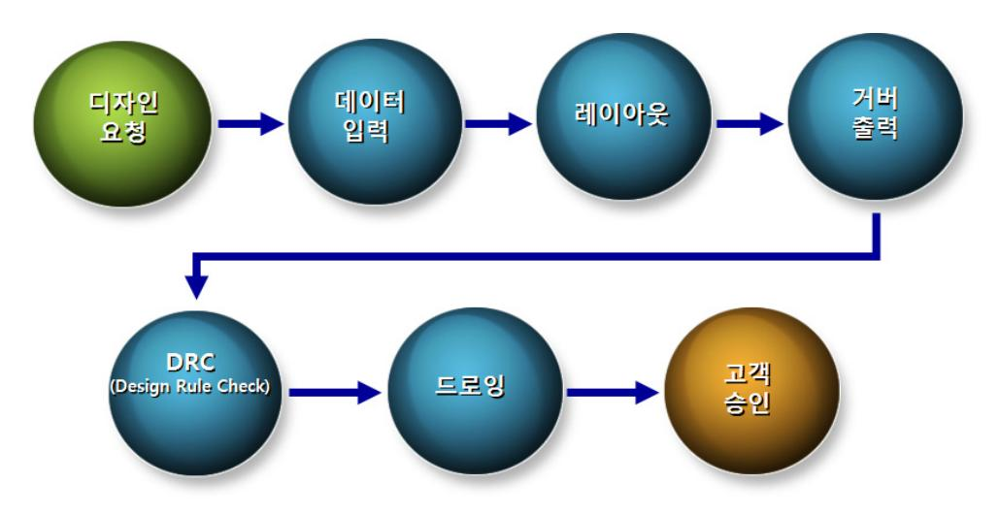

### LM1903060107\_14v3

# NCS학습모듈 패키지 제품설계

| 대분류/19 전기·전자 |  | 중분류/03 |                 |        |         |
|-----------------|--|--------|-----------------|--------|---------|
|                 |  | 전자기기개발 | 소분류/06 반도체개발 | 세분류/01 |         |
|                 |  |        |                 | 반도체개발  | 능력단위/07 |

NCS 학습모듈은 교육훈련기관에서 출처를 명시하고 교육적 목적으로 활용할 수 있습니다. 다만 NCS 학습모듈에는 국가(교육부)가 저작재산권 일체를 보유하지 않은 저작물들(출처가 표기되어 있는 도표, 사진, 삽화, 도면 등)이 포함되어 있으므로 이러한 저작물들의 변형, 복제, 공연, 배포, 공중 송신 등과 이러한 저작물들을 활용한 2차 저작물의 생성을 위해서는 반드시 원작자의 동의를 받아야 합니다.

### NCS 학습모듈의 이해

※ 본 학습모듈은 「NCS 국가직무능력표준」사이트(http://www.ncs.go.kr) 에서 확인 및 다운로드 할 수 있습니다.

### (1) NCS 학습모듈이란?

- 국가직무능력표준(NCS: National Competency Standards)이란 산업현장에서 직무를 수행하기 위해 요구되는 지식·기술·소양 등의 내용을 국가가 산업부문별·수준별로 체계화한 것으로 산업현장의 직무를 성공적으로 수행하기 위해 필요한 능력(지식, 기술, 태도)을 국가적 차원에서 표준화한 것을 의미합니다.
- 국가직무능력표준(이하 NCS)이 현장의 '직무 요구서'라고 한다면, NCS 학습모듈은 NCS의 능력단위를 교육훈련에서 학습할 수 있도록 구성한 '교수·학습 자료'입니다. NCS 학습모듈은 구체적 직무를 학습할 수 있도록 이론 및 실습과 관련된 내용을 상세하게 제시하고 있습니다.

● NCS 학습모듈은 다음과 같은 특징을 가지고 있습니다.

첫째, NCS 학습모듈은 산업계에서 요구하는 직무능력을 교육훈련 현장에 활용할 수 있도록 성취목표와 학습의 방향을 명확히 제시하는 가이드라인의 역할을 합니다. 둘째, NCS 학습모듈은 특성화고, 마이스터고, 전문대학, 4년제 대학교의 교육기관 및 훈련기관, 직장교육기관 등에서 표준교재로 활용할 수 있으며 교육과정 개편 시에도 유용하게 참고할 수 있습니다. ● NCS와 NCS 학습모듈 간의 연결 체제를 살펴보면 아래 그림과 같습니다.

### (2) NCS 학습모듈의 체계

NCS 학습모듈은 1.학습모듈의 위치 , 2.학습모듈의 개요 , 3.학습모듈의 내용 체계 , 4.참고 자료 ,
 5.활용 서식/부록 으로 구성되어 있습니다.

### 1. NCS 학습모듈의 위치

NCS 학습모듈의 위치는 NCS 분류 체계에서 해당 학습모듈이 어디에 위치하는지를 한 눈에
 볼 수 있도록 그림으로 제시한 것입니다.

예시 : 이 · 미용 서비스 분야 중 네일미용 세분류

NCS-학습모듈의 위치

| 대분류 | 이용·숙박·여행·오락·스포츠 |          |
|-----|-----------------|----------|
| 중분류 | 이・미용            |          |
| 소분류 |                 | 이 미용 서비스 |

| 세 <del>분류</del> |             |           |
|-----------------|-------------|-----------|
| 헤어미용            | 능력단위        | 학습모듈명     |
| 피부미용            | 네일 샵 위생 서비스 | 네일숍 위생서비스 |
| 메이크업            | 네일 화장물 제거   | 네일 화장물 제거 |
| 네일미용            | 네일 기본 관리    | 네일 기본관리   |
| 이용              | 네일 랩        | 네일 랩      |
|                 | 네일 팁        | 네일 팁      |
|                 | 젤 네일        | 젤 네일      |
|                 | 아크릴릭 네일     | 아크릴 네일    |
|                 | 평면 네일아트     | 평면 네일아트   |
|                 | 융합 네일아트     | 융합 네일아트   |
|                 | 네일 샵 운영관리   | 네일숍 운영관리  |

### 학습모듈은

NCS 능력단위 1개당 1개의 학습모듈 개발을 원칙으로 합니다. 그러나 필요에 따라 고용 단위 및 교과단위를 고려하여 능력단위 몇 개를 묶어서 1개의 학습모듈로 개발할 수 있으며, NCS 능력단위 1개를 여러 개의 학습 모듈로 나누어 개발할 수도 있습니다.

- 🔾 활용안내

예시 : 네일미용 세분류의 '네일 기본관리' 학습모듈

프리에지, 니퍼, 퓨셔, 폴리시, 네일 파일, 스퀘어형, 스퀘어 오프형, 라운드형, 오발형, 포인트형

### 3. NCS 학습모듈의 내용 체계

와 광택을 위해 톱코트를 도포하다. 네일 보강제(Nail Strengthner)를 바를 시에는 베이스코

트를 도포하기 전에 사용한다

|                                                                                                          | 교수·학습 방법은                                                                                            |
|----------------------------------------------------------------------------------------------------------|------------------------------------------------------------------------------------------------------|
| 학습3 교수·학습 방법 ◀                                                                                           | 학습목표를 성취하는데 필요한 교수 방법과 학습 방법 을 제시하였습니다.                                                           |
| 교수 방법 🚽                                                                                                  | 교수 방법은                                                                                               |
| <ul> <li>컬러링 제품의 성분과 칼라별 점도의 차이, 베이스코트와 톱코트의 역할, 폴리시 잡는 방법, 큐어링 시간 등의 내용을 화면 자료와 함께 설명한다.</li> </ul> | 해당 학습활동에 필요한 학습내용, 학습내용과 관련된 학습 자료명, 자료 형태, 수행내용의 진행 방식 등에 대하여 제시                                 |
| <ul> <li>서식지를 활용하여 네일 컬러링 방법을 그림으로 그려 보게 한 뒤, 다양한 컬러링의 매뉴얼을 그려서 숙지하도록 한다.</li> </ul>                 | 하였습니다. 또한 학습자의 수업참여도를 제고하기 위한 방 법 및 수업진행상 유의사항 등도 제시하였습니다. 선수학습 이 필요한 학습을 학습자가 숙지하였는지 교수자가 확인하 |
| • 젤 컬러링 시 주의사항을 계속 숙지시키도록 하며, 큐어링 시간에 대해 작성하도록 한다.                                                       | 는 과정으로 활용할 수도 있습니다.                                                                                  |
| 학습 방법                                                                                                    | 학습 방법은                                                                                               |
| • 컬러링을 위한 재료의 필요성과 사용방법을 숙지하고 컬러링 메뉴얼 과정에 맞추어 작업 내용을 이해한다.                                            | 해당 학습활동에 필요한 학습자의 자기주도적 학습 방법 을 제시하였습니다. 또한 학습자가 숙달해야 할 실기능력 과 학습과정에서 주의해야 할 사항 등으로 제시하였습니     |
| • 컬러링의 다양성에 대한 용어를 숙지하고 진행과정에 맞추어 내용을 작업한다.                                                              | 다. 학습자가 학습을 이수하기 전에 반드시 숙지해야 할 기본 지식을 학습하였는지 스스로 확인하는 과정으로 활                                      |
| • 곌 컬러링 시 적합한 큐어링 시간을 선택해서 큐어링 해본다.                                                                      | 용할 수 있습니다.                                                                                           |

### [NCS-학습모듈의 위치]

| 대분류 | 전기전자 |        |       |
|-----|------|--------|-------|
| 중분류 |      | 전자기기개발 |       |
| 소분류 |      |        | 반도체개발 |

| 세분류   |                 |                 |
|-------|-----------------|-----------------|
| 반도체개발 | 능력단위            | 학습모듈명           |
| 반도체제조 | 반도체 제품 기획       | 반도체 제품 기획       |
| 반도체장비 | 반도체 아키텍처 설계     | 반도체 아키텍처 설계     |
| 반도체재료 | 아날로그 회로 설계      | 아날로그 회로 설계      |
|       | 디지털 회로 설계       | 디지털 회로 설계       |
|       | 레이아웃 설계         | 레이아웃 설계         |
|       | 반도체 제조 공정 개발    | 반도체 제조 공정 개발    |
|       | 패키지 제품 설계       | 패키지 제품 설계       |
|       | 패키지 조립 공정 개발    | 패키지 조립 공정 개발    |
|       | 반도체 제품 기능·성능 검증 | 반도체 제품 기능·성능 검증 |
|       | 반도체 신뢰성 평가      | 반도체 신뢰성 평가      |

### 차 례

| 학습모듈의 개요 |  |  | 1 |
|----------|--|--|---|
|----------|--|--|---|

### **학습 1. 패키지 특성 해석하기**

| 1-1. 능동소자의 전기적 매개변수 분석과 수동소자 값 최적화    | 3  |
|---------------------------------------|----|
| 1-2. 신호연결과 전도체의 기생성분 분석 및 최적화         | 7  |
| 1-3. 신호· 전력 무결성, 전자파 간섭, 신호왜곡 및 지연 해석 | 11 |
| 1-4. 신호라인과 접지신호의 피드백 루프를 고려한 회로기판 설계  | 14 |
| • 교수・학습 방법                            | 17 |
| • 평가                                  | 18 |
|                                       |    |

### **학습 2. 패키지 시뮬레이션하기**

| 2-1 시뮬레이션에 필요한 전기적/기계적 물성 계수 값 설정     | 20 |
|---------------------------------------|----|
| 2-2 시뮬레이션 툴을 사용하여 전자파 해석              | 23 |
| 2-3 SI, PI, 신호 왜곡, 신호 지연에 대한 시뮬레이션 수행 | 28 |
| 2-4 시뮬레이션 결과 분석 후 패키지 설계 반영           | 33 |
| • 교수・학습 방법                            | 38 |
| • 평가                                  | 39 |

**학습 3. 패키지타입 설계하기**

| 3-1 패키지 형태 및 구조 설계                 | 42 |
|------------------------------------|----|
| 3-2 패키지 모듈 기판 설계에 따른 재질 결정         | 50 |
| 3-3 패키지 형태에 따른 재료, 비용, 사이즈, 신호핀 설계 | 54 |
| 3-4 신호 연결에 수반되는 RLC 기생성분 고려한 설계    | 58 |
| 3-5 전기적 기계적 특성을 고려한 패키지 신뢰성 확보 설계  | 61 |
| • 교수・학습 방법                         | 64 |
| • 평가                               | 65 |
|                                    |    |

|  | 참고 자료 |  | 67 |  |
|--|-------|--|----|--|
|--|-------|--|----|--|

### 패키지 제품 설계 학습모듈의 개요

### 학습모듈의 목표

반도체를 외부 환경으로부터 보호하고 전력 공급, 신호 전달 등의 기능을 부여하기 위한 반도 체 패키지 제품특성을 해석하고 설계할 수 있다.

### 선수학습

전자회로

### 학습모듈의 내용체계

|                    |                                                                                                                                                                                | NCS 능력단위요소        |                 |
|--------------------|--------------------------------------------------------------------------------------------------------------------------------------------------------------------------------|-------------------|-----------------|
| 학습                 | 학습내용                                                                                                                                                                           | 코드번호              | 요소명칭            |
| 1. 패키지 특성 해석하기  | 1-1. 능동소자의 전기적 매개변수 분석과 수동소자 값 최적화 1-2. 신호연결과 전도체의 기생성분 분석 및 최적화 1-3. 신호· 전력 무결성, 전자파 간섭, 신 호 왜곡 및 지연 해석 1-4. 신호라인과 접지신호의 피드백 루프를 고려한 회로 기판 설계            | 1903060107_14v3.1 | 패키지 특성 해석하기  |
| 2. 패키지 시뮬 레이션하기 | 2-1. 시뮬레이션에 필요한 전기적/기계적 물 성 계수 값 설정 2-2. 시뮬레이션 툴을 사용하여 전자파 해석 2-3. SI, PI, 신호 왜곡, 신호 지연에 대한 시뮬레이션 수행 2-4. 시뮬레이션 결과 분석 후 패키지 설계 반영                            | 1903060107_14v3.2 | 패키지 시뮬레이션 하기 |
| 3. 패키지 타입 설계하기  | 3-1. 패키지 형태 및 구조 설계 32. 패키지 모듈 기판 설계에 따른 재질 결정 3-3. 패키지 형태에 따른 재료, 비용, 사이 즈, 신호핀 설계 3-4. 신호연결에 수반되는 RLC 기생성분 고 려한 설계 3-5. 전기적기계적 특성을 고려한 패키지 신뢰성 확보 설계 | 1903060107_14v3.3 | 패키지 타입 설계하기  |

### 핵심 용어

패키지 특성 해석, 능동소자, 수동소자, 신호 연결, 기판 설계, 패키지 시뮬레이션, 패키지 설계, 반도잡음, 패키지 구조

## 학습 1 패키지 특성 해석하기

| 학습 2 | 패키지 시뮬레이션하기 |
|------|-------------|
| 학습 3 | 패키지 타입 설계하기 |

### **1-1.** 능동소자의 전기적 매개변수 분석과 수동소자 값 최적화

학습 목표 • 각종 능동소자의 전기적 매개변수(Parameter)를 분석하고 수동소자의 값을 최적화할 수 있다.

### 필요 지식 /

### 능동 소자와 수동 소자 파라미터

능동 소자는 입력과 출력을 갖추고 있으며 전원으로부터의 에너지를 사용하여 에너지를 발생시키거나 에너지를 변환시킨다. 에너지 보존법칙에 의해 더 큰 에너지를 발생시키기 위해서 신호단자 말고도 다른 전력의 공급이 필요하다. 다이오드, 트랜지스터 등이 능동소 자이다. 전기에너지를 발생할 수 있는 능력을 갖추고 있다고 생각되는 전기회로의 구성요 소이다. 전원 공급 장치는 포함되지 않고, 트랜지스터 등이 이에 해당된다. 능동소자의 예 로는 부하저항과 전원을 포함한 전자관이나 트랜지스터 등이 있다.

회로를 완성하기 위해서는 능동소자에 몇 개의 수동소자를 부속시켜야 한다. 능동소자를 포함하는 회로를 능동회로라고 한다. 진공관이나 트랜지스터 같은 능동소자는 에너지 공 급능력을 가지고 있기 때문에, 입력신호보다 큰 출력신호를 얻을 수 있다. 일반 증폭기나 발진기가 그 대표적인 보기이다.

수동소자는 에너지를 단지 소비, 축적 혹은 그대로 통과시키는 수동적인 작용을 하는 소 자이다. 증폭이나 전기에너지의 변환과 같은 능동적 기능을 가지지 않는 소자로 저항, 인 덕터, 콘덴서 등이 있다.

#### 신호연결과 전도체의 기생성분(RLC) 분석 및 최적화

PCB 기판 자체는 각각의 회로소자들을 연결하는 선로와, 전원공급을 위한 plane들의 조합 이다. 모두 passive한 구조물이지만, 신호의 주파수가 올라가면서 PCB의 모든 trace들이 하나의 R,L,C와 같은 소자처럼 동작하기 시작하고, VDD/GND plane은 고주파 공진판으로 동작하기 시작하여 PCB의 물리적인 형상과 구조 자체가 본래의 신호 특성에 점점 더 큰 영향을 주게 된다. 이러한 의도치 않은 기생성분(parasitic)들은 각각 하나의 R,L,C 수동소 자들로 모델링이 가능하며, 이를 조합하면 PCB 기판을 하나의 거대한 회로처럼 다룰 수 있게 된다. 이러한 기생 R,L,C 값은 상대적으로 작은 값이지만, 주파수가 올라갈수록 이러 한 parasitic들이 크게 보이기 때문에, 결코 무시할 수 없는 요소가 된다. 밀집된 선로들의 동작주파수가 올라가면, 그 parasitic으로 인해 발생하는 coupling도 기하급수적으로 증가하 므로 이러한 구조적인 문제를 얼마나 정확히 모델링 하느냐가 중요해진다. 이 때 필요한 것이 바로 PCB 기판의 전기적 동작을 모델링한 모델이며, 이는 SIwave, HFSS, Q3D Extractor와 같은 전자기장 구조해석(EM) S/W를 이용하여 추출할 수 있다.

#### PCB 기판의 잡음 문제 해결

전자회로/시스템이 점점 더 고속으로 발전할수록, PCB 기판의 잡음 문제가 더 중요해지고 있다. 갈수록 복잡해지는 PCB 기판 잡음 문제를 해결하기 위해서는, 우선 PCB 기판에 잡 음이 유입되는 경로와 그것의 이론적인 원리를 이해하는 것이 중요하다. PCB에서 잡음이 커지는 경우에 대해 공진과 임피던스의 개념에 기반하여 이해하고 잡음을 억제하기 위해 서는 어떤 대책을 취해야 하는지 이해할 필요가 있다.

### 신호라인과 접지신호의 피드백 루프를 고려한 회로기판 설계. 접지편의 임피던스를 최소 화하는 설계

PCB 기판의 SPICE file을 회로 시뮬레이터 상의 component 사용함으로써,PCB 기판 전체 를 하나의 복합적인 RLC 수동소자처럼 사용할 수 있다. PCB SPICE 심볼의 각각의 pin에 신호원을 인가하거나 각종 다른 능동 수동 소자를 연결한 시스템적인 회로도를 구성하고 Transient나 선형/비선형 회로해석을 수행할 수 있다. PCB Layout을 EM해석에 기반한 등 가회로로 추출하고 활용하여 회로해석만으로는 알아낼 수 없었던 PCB 기판의 구조적인 SI (Signal Integrity) 문제를 풀 수 있다.

### 수행 내용 / 능동소자의 전기적 매개변수 분석과 수동소자 값 최적화하기

#### 재료·자료

- 능동소자, 수동소자, 트랜지스터, 다이오드, 저항, 인덕터
- 능동소자 이론, 수동소자 이론,

#### 기기(장비 ・ 공구)

회로설계 S/W, 수동소자 최적화 S/W, 회로분석 계측기, 전압전류저항 측정기

### 안전 ・ 유의사항

해당 없음

 능동 소자의 수동 소자의 종류와 특성, 동작원리에 대해 이해하여 반도체 제품의 특성을 만 족시킬 수 있도록 전기적 매개변수를 분석하여 최적화된 제품을 설계할 수 있도록 한다.

다이오드와 트랜지스터 같은 능동 소자는 전기에너지를 발생할 수 있는 능력을 갖추고 있 으며 전체 회로를 구성하면서 일정한 특성을 나타내게 된다. 수동소자는 증폭이나 전기에 너지의 변환과 같은 능동적 기능을 가지지 않는 소자로 에너지를 소비, 축적하거나 그대 로 통과시키는 작용을 하며 저항, 인덕터, 콘덴서 등이 있다. 전체 회로가 원하는 특성을 나타내기 위해서는 각각의 능동소자의 특성이 주위의 잡음에 영향을 받지 않고 발휘될 수 있도록 수동 소자 여러 개를 적절하게 연결하여야 한다. 능동소자의 특성을 유지하기 위 해 수동 소자를 어떻게 연결하는지에 대해 학습하도록 한다.

 신호연결과 전도체의 기생성분(RLC)을 분석하고 발생 가능한 잡음을 예측하고 이를 방지 할 수 있는 방법을 찾는다.

PCB 기판은 회로소자를 연결하는 선로 역할과 전원 공급을 하는 역할을 한다. PCB를 구 성하는 선로는 신호의 주파수가 올라가면 R, L, C 소자의 역할을 하게 되면서 PCB를 구성 하는 재료와 구조 자체가 회로의 신호 특성에 영향을 주게 된다.

의도치 않은 이러한 기생성분 들은 각각 하나의 R,L,C 수동소자들로 모델링이 가능하여 PCB 기판을 하나의 거대한 회로처럼 다룰 수 있다.

신호의 주파수가 올라가게 되면 PCB 기판을 구성하는 성분이 기생 R,L,C 역할을 하여 신 호를 교란시키기 때문에 PCB 구성 성분을 정확하게 모델링 하는 것이 매우 중요해진다. 회로에 발생할 수 있는 기생성분 들을 각각 하나의 R,L,C 수동소자들로 모델링을 하여 전 자기장 구조해석(EM) S/W를 이용하여 추출한다. 이 때 필요한 것이 바로 PCB 기판의 전 기적 동작을 모델링한 모델이며, 이는 전자기장 구조해석 S/W를 이용하여 추출할 수 있다.

 전기적 특성에 영향을 주는 주요 인자를 파악하고 PCB 기판에 발생할 수 있는 잡음을 해석하고 문제를 해결한다.

PCB 기판에서 잡음이 커지는 경우에 대해 공진과 임피던스의 개념에 기반하여 이해하고 잡음을 억제할 수 있는 대책을 찾는다. 전자소자의 동작 속도가 고속으로 발전할수록 그 중요성이 커지는 PCB 기판의 잡음 문제를 해결하기 위해서는 PCB 기판에 잡음이 유입되는 경로와 해결할 수 있는 이론을 이해하는 것이 중요하다. 잡음이 커지는 경우에 대해 공진 과 임피던스의 개념을 이해하고 잡음을 억제하기 위해서는 필요한 조치를 이해해야 한다.

 신호라인과 접지신호의 피드백 루프를 고려한 회로기판 설계를 하고 접지편의 임피던스 를 최소화할 수 있는 방법을 찾는다.

PCB 기판 전체를 하나의 복합적인 RLC 수동소자처럼 사용하여 각종 능동 수동 소자를 연 결한 시스템적인 회로도를 구성하고 회로해석을 수행한다. PCB 전체를 대체할 수 있는 등 가회로로 추출하고 활용하여 PCB 기판의 구조적인 SI (Signal Integrity) 문제를 풀 수 있도 록 한다.

#### 수행 tip

- 반도체 제품에서 요구하는 성능 특성을 파악할 수 있어야 한다.
- 능동소자의 전기적 매개변수와 수동소자의 관계를 잘 이해할 수 있어야 한다.

# **1-2.** 신호연결과 전도체의 기생성분 분석 및 최적화

학습 목표 • 신호연결과 전도체의 기생성분(RLC)을 분석·최적화할 수 있다.

### 필요 지식 /

### 신호 연결

각각의 블록이 하나의 정보 블록으로 구분되어 저장되어 있으며 전달되어 온 신호를 받는 것보다 신호를 만들어서 내보내는 것에 더 정보가 많이 필요하기 때문에 입력 모델보다 출력 모델이 더 복잡한 정보를 갖고 있을 수밖에 없다.

### 전도체의 기생 성분(RLC)

IC Package의 기생(Parasitic) RLC는 주로 Package의 Wire Bonding 에 의해 발생하며, Wire의 등가회로에서 다음과 같은 값을 갖는다. R\_pkg는 Bonding Wire에 직렬로 발생하는 저항으로 통상 수십 mOhm 대의 값을 갖는다. L\_pkg는 Bonding Wire 자체가 가진 직렬 인덕턴스로 통상 수 nH 대의 값을 갖는다. C\_pkg는 Bonding Wire와 바닥의 GND 사이에 발생하는 캐패시턴스로 통상 0.X pF 대의 값을 갖는다. Package에 의한 기생 RLC는,RLC Extraction 전문 S/W를 이용하여 추출할 수 있다.

기생 RLC 값들은 주파수가 낮은 경우에는 크게 문제가 되지 않는 경우가 많은데, 주파수 가 수백 MHz가 넘어가는 고속 디지털에서는 이러한 작은 RLC값도 큰 영향을 주기 때문 에 신호의 변형이 점점 더 심해진다. IGbps 이상의 회로에서는 이 기생 RLC 값의 영향이 너무 커져서 이것들을 어떻게 모델링하느냐에 따라 SI 해석결과에 큰 영향을 미치기도 한 다. 최근에는 초고속의 SI 해석에 기생 RLC 모델 대신 Package의 S parameter를 추출하여 사용하는 경우도 있다. 단순히 개별 wire의 RLC 기생성분만으로는 wire 간의 coupling이 고려되지 않기 때문에,DDR3/4와 같이 Gbps급 디지털 IC에서는 고주파현상을 보다 정확 히 반영하고자 S parameter를 사용하기도 한다.

실제 기생 RLC는 Bonding Wire외에 Package 내의 Trace의 기생성분까지 포함된 값 이지 만 일반적인 Bond wire 구조의 Chip Scale Package에서는 Wire의 기생성분이 대부분을 차 지한다. BGA나 Flipchip처럼 Bonding Wire가 없는 형태의 Package에서는 Ball joint와 trace 의 기생성분이 R/L/C\_pkg 값을 좌우한다. 형상만 다를 뿐 등가회로는 같으므로 이런 식으 로 IC core와 실제 IC 칩 외부 pin 까지 의 기생 성분이 하나의 수동소자처럼 동작한다는 점이 중요하다. Pin의 양이 많은 BGA 패키지의 경우는 RLC 데이터량이 너무 많아서 IBIS file 내에는 pin별 RLC값을 생략하는 경우가 있다. 정확성이 다소 감소되지만,R\_PKG, L\_PKG,C\_PKG 값이 모든 ibis 내의 모든 pin에 공통으로 적용된다.

선로간 간섭 (Cross talk)

SI나 EMI를 다룰 때 crosstalk의 개념을 이해해야 한다. RF적인 관점에서는 이 crosstalk를 coupling이라고 부를 수도 있겠지만, SI에서는 모든 선로들이 서로 간섭한다고 볼 수 있다. 이렇게 떨어져 있는 선로간의 간섭(crosstalk) 현상에 대해서는 크게 두 가지 관점에서 설 명이 가능하다. 모든 선로는 inductor라고 볼 수 있다. 선로가 길어지면 그 주변을 회전하 는 자기장이 생성되고, 이렇게 생성된 자기장 때문에 교류성분의 흐름을 막는 것이 바로 inductor이다. 또한 두 개의 선로 사이에는 mutual inductance라고 불리 우는, 각각의 자기 장에 담긴 정보가 서로 교환되어 버리는 현상이 존재한다. 모든 금속과 금속 사이는 capacitor이다. Capacitance는, 도체와 도체 사이에 유전체가 존재하면 발생하는 개념으로 써, 직류는 전달이 안되지만 교류(특히 고주파일수록)는 전달하는 특성이 있다. 그러다 보 니 선로가 위아래로 겹치는 것은 물론이고, 옆으로 지나가는 경우에도 두 선로 사이에 존 재하는 capacitance로 인해 신호가 서로 섞이게 된다.

EMIC / EMC

EMI 문제는 설계단계에서 부터 제조, 양 산과 테스트 방법론에 이르기까지 영향을 주는 매우 어려운 문제이다. EMI (Electro-Magnetic Interference)는 전자파 장애이고, 전자파 간 섭 EMS (Electro-Magnetic Susceptibility)는 외부 전자파에 대한 내성을 의미한다. EMC (Electro-Magnetic Compatibility)는 EMI가 잘 제어되고, EMS가 잘 되어 전파환경이 쾌적한 상태를 의미한다. 결국 전자장비의 불요 전자파 방출량을 일정 수준 이하로 제어하고, 외 부에서 강한 전자파가 오더라도 오동작하지 않는 그러한 쾌적한 EMC 환경을 만드는 것이 중요하다.

### 수행 내용 / 신호연결과 전도체의 기생성분 분석 및 최적화하기

#### 재료·자료

- 반도체 신호 연결 원리
- 기생성분 특성 이론

### 기기(장비 ・ 공구)

기생성분 분석 S/W와 PC, 잡음 분석 계측기, 전압전류저항 측정기

### 안전 ・ 유의사항

해당 없음

#### 수행 순서

전도체의 기생 성분(RLC)을 분석한다.

와이어 본딩을 하는 패키지에서 기생 RLC는 본딩 와이어 외에 패키지내의 Trace의 기생 성분까지 포함된 값이지만 와이어의 기생 성분이 대부분을 차지한다. 와이어 자체에서 발생하는 저항과 직렬 인덕턴스, 와이어와 패드의 접지에 발생하는 캐패시턴스를 전문 S/W를 이용하여 추출할 수 있도록 한다. 기생 RLC 값들은 주파수가 낮을 때는 문제가 되 지 않지만 주파수가 수백 MHz가 넘어가는 고속 디지털에서는 작은 RLC값도 신호에 큰 영향을 주게 된다. IGbps 이상의 회로에서는 기생 RLC 값의 영향이 매우 크므로 SI 해석 을 하여 문제를 해결하여야 한다.

BGA나 플립 칩과 같은 솔더 볼을 사용하는 패키지는 볼 연결 부분의 기생성분이 대부분 을 차지한다. 패키지 형태에 따라 형상은 다르지만 등가회로는 같으므로 유사하게 모델링 하여 전문 S/W를 이용하여 분석할 수 있도록 한다.

선로 간 간섭을 분석한다.

반도체 패키지를 구성하는 모든 선로를 통과하는 전기신호들이 가지고 있는 자기장이 교 류 성분이 서로 영향을 주면서 흐름을 방해하는 cross talk이라고 하는 간섭현상이 발생한 다. 모든 금속과 금속 사이는 캐퍼시터 역할을 하며, 직류는 전달이 안되지만 교류는 전달 하는 특성이 있으며, 특히 고주파일수록 그 간섭하는 정도가 심하다. 인근에 있는 두 선로 사이에 존재하는 캐퍼시턴스로 인해 신호가 서로 섞이게 된다. 두 개의 선로 사이에는 발 생하는 인덕턴스와 캐퍼시턴스를 분석하여 그 영향을 최소화할 수 있도록 해야 한다.

### 전자파 장애와 전자파 간섭을 조절하여 최적의 전파 환경을 만든다.

전자파 간섭으로 인한 장애 문제는 제품의 사용 중에 성능에 매우 큰 영향을 줄 수 있으 므로 설계단계에서 잘 조절할 수 있어야 한다. 전자장비에서 발생하는 전자파를 일정 수 준 이하로 제어하고, 외부에서 발생하는 전자파의 영향을 받지 않도록 하는 것이 매우 중 요하다. 전자파 장애, 전자파 간섭을 잘 조절하여 전자파에 대한 내성을 갖도록 한다.

### 수행 tip

- 반도체 제품에서 요구하는 성능을 낼 수 있도록 신 호에 발생할 수 있는 기생성분을 분석하고 해결할 수 있어야 한다.
- 회로에 발생할 수 있는 잡음 문제를 해석하고 최적 화 할 수 있는 방법을 찾아야 한다.

# **1-3.** 신호·전력 무결성, 전자파 간섭, 신호왜곡 및 지연 해석

학습 목표 • 신호 무결성(SI, Signal Integrity), 전력 무결성(PI, Power Integrity), 전자파 간섭 등 신 호의 왜곡 및 지연 등을 고려하여 해석할 수 있다.

### 필요 지식 /

### 신호 무결성

일반적으로 IC 업체에서 IC의 동작을 모델링할 수 있는 회로파일을 제공하기 위해서는 회 로도 전체를 내보내야 하는데 IC 개발업체가 그런 핵심 IP 유출을 감행할 리가 없어서 현 실적으로 어렵다. 이런 문제 때문에 IBIS 라는 개념을 도입하였다. 대부분의 경우 디지털 PCB 설계자 입장에서 필요한 것은 C 내부의 정확한 동작 특성이 아니라,C의 각 pin에서 어떤 모양의 전기적 파형이 나오느냐이다. 디지털 C의 경우는 결국 1,0과 같은 클력 형태 의 신호가 출력되는데 그것의 rising/falling time 과 기타 파형정보만 있다면 최소한 IC 외 부의 패턴/소자의 영향으로 신호가 얼마나 잘 전달될지를 해석할 수 있게 된다. IBIS는 정 확히 그런 용도로 만들어진 것으로서,C 내부의 정보는 하나도 없이 그저 각 pin별로 들 고 나는 아날로그 파형정보만 담고 있다. 따라서 IC 개발에 관한 기밀이 유지되면서,IC 사용자에게 IC의 특성을 알려주는 역할을 하게 된다. 또한 회로도 없이 단순히 파형만을 다루기 때문에 시뮬레이션에서의 해석시간을 크게 단축시키는 장점이 있다.

### 전력 무결성

PI(Power Integrity)는 전력 무결성이라고 해석할 수 있으며 깨끗한 전원 공급을 위한 모든 과정을 의미하는데, 시뮬레이션 기술의 발달로 나타난 개념이다. PCB 기판은 반도체에 전 원을 제대로 공급해 줄 수 있어야 하는데, 전력 무결성은 PCB의 전력공급 체계를 안정화 시켜 전자회로들에게 전원을 공급해주는 작업을 의미한다. PCB에서의 전원공급에서 전원 에 불필요한 잡음이 있다면, 그 전원을 사용하는 모든 전자회로의 성능에 광범위하게 문 제를 일으킬 것이다. 전원의 잡음은 전원 그 자체를 깨끗하게 만드는 것 보다는 전원을 공급하는 선로와 체계를 효율적으로 만드는 것이 중요하며, 이런 모든 작업과정을 전력 무결성이라고 한다.

#### 신호의 왜곡 및 지연

특정 주파수에서 에너지가 집중되는 현상을 공진이라고 한다. 신호의 반사계수와 입력 임 피던스의 관계는 그래프 모양은 똑같은데 가로축을 기준 으로 반전시킨 듯 한 모양으로 정반대의 형상으로 나타난다. S11에서 밑으로 빠지는 부분이 공진 점이고 임피던스는 그 반대의 경향을 보인다. 공진이 발생하는 주파수에서는 입력 임피던스가 커지게 된다. 공진 이란 특정 주파수의 에너지가 집중되는 현상이고, 그로 인해 해당 주파수에서는 임피던스 (부하)가 크게 걸리기 때문에 그 주파수에서의 신호가 더욱 크게 보이게 되는 것이다. 공진과 임피던스의 관계를 잡음의 관점에서 보면 공진은 높은 임피던스를 의미하고, 높은 잡음 전압은 잡음 전류와 높은 임피던스의 곱으로 나타난다. 입력 임피던스가 높다는 사 실은, 작은 전류성분의 잡음이 발생하더라도 다른 주파수보다 큰 전압 잡음 성분으로 나 타난다는 점이다. 그래서 PCB 기판 상에서 원치 않는 공진, 즉 특정 주파수에서 불필요하 게 높은 임피던스는 그 주파수에서 잡음이 쉽게 생기게 된다는 의미가 된다.

### 수행 내용 / 신호·전력 무결성, 전자파 간섭, 신호왜곡 및 지연 해석하기

#### 재료·자료

- 신호 무결성 개념, 전력 무결성 개념 이론
- 전자파 간섭 이론
- 신호 왜곡 및 지연 이론

### 기기(장비 ・ 공구)

전자파 간섭 분석 S/W와 PC, 전압전류저항 측정기

### 안전 ・ 유의사항

해당 없음

### 수행 순서

신호 무결성을 확보할 수 있는 해석 방법을 습득한다.

반도체의 동작을 모델링할 수 있는 회로파일을 제공하기 위해서는 회로도 전체가 필요하 다. IC 외부의 패턴/소자의 영향으로 신호가 얼마나 잘 전달될지를 해석할 수 있도록 한 다. 패키지의 각 pin에서 나오는 아날로그 파형정보를 알고 있으며 반도체의 특성을 알 수 가 있다. 회로도 없이 단순히 파형만을 다루기 때문에 시뮬레이션에서의 해석시간을 크게 단축시킬 수 있다.

전력 무결성을 확보할 수 있도록 한다.

 PCB 기판은 반도체에 전원을 제대로 공급해 줄 수 있어야 하는데, 전력 무결성은 PCB의 전력공급 체계를 안정화시켜 전자회로들에게 전원을 공급해주는 특성을 의미한다. PCB에 불필요한 잡음이 있다면, 그 전원을 사용하는 모든 전자회로의 성능에 광범위하게 문제를 일으킬 수 있다. 전원을 공급하는 선로와 체계를 효율적으로 만들어야 전력 무결성이 유 지될 수 있으므로 이를 확보할 수 있는 방법을 이해해야 한다.

#### 신호의 왜곡 및 지연현상을 해석할 수 있도록 한다.

특정 주파수에서 에너지가 집중되는 공진 현상이 발생하는 주파수에서는 입력 임피던스가 커지게 되면 그 주파수에서의 신호가 더욱 크게 보이게 된다. 공진 현상이 발생할 때 잡 음 전압은 잡음 전류와 높은 임피던스의 곱으로 나타나므로 그 주파수에서 잡음이 쉽게 생기게 된다. PCB 기판의 전력 무결성이 확보된 상태로 전력을 공급할 수 있는 체계가 가 능하도록 설계를 해야 한다. 공진 해석의 개념을 이해하고 PCB 기판에서 특정 주파수에서 원치 않는 공진으로 인한 높은 임피던스로 인한 잡음이 생기지 않도록 한다.

#### 수행 tip

- 반도체 제품의 신호 무결성과 전력 무결성을 확보 할 수 있도록 전자파 간섭에 내성을 가지는 제품을 설계해야 한다.
- 회로에 발생할 수 있는 신호 왜곡과 지연현상을 해 결할 수 있는 능력을 확보해야 한다.

# **1-4.** 신호라인과 접지신호의 피드백 루프를 고려한 회로 기판 설계

학습 목표 • 신호라인과 접지신호의 피드백 루프를 고려하여 회로기판을 설계하여 접지면의 임 피던스를 최소화하는 설계를 할 수 있다.

### 필요 지식 /

### 신호라인과 접지신호의 구성

공진해석은 다층 PCB 기판에서의 Power plane과 Ground plane간의 공진을 계산한 것이다. 이렇게 찾아진 공진주파수(=공진모드)가 PCB의 어느 위치에서 발생하느냐를 찾기 위해서 는 보고자 하는 VDD 층과 GND 층을 지정하고 다시 공진플롯을 계산해줄 필요가 있다. 층이 많은 PCB의 경우는 VDD/GND 층이 여러 개가 있을 수 있으므로 관심있는 VDD/GND 를 적절히 선택해주어야 한다.

접지면의 임피던스 최소화를 통한 회로 기판 설계

PCB 기판의 회로를 설계하기 위해서는 특정 지역의 공진에너지를 모두 GND로 보내버려 전원잡음을 제거할 수 있도록 한다. Decap을 이용한 전원잡음 제거는 전자회로 시스템의 기본이라 할 수 있으며,PCB 기판의 공진해석과 플롯을 통해 PCB의 어느 부위를 어떻게 개선해야 공진특성을 개선할 수 있는지에 대한 정보를 얻을 수 있다. Decap은 cap 자체의 공진주파수 근처에서만 공진을 완화시켜줄 뿐, 실제로 넓은 범위에서 공진을 완화시키려 면 더욱 많은 Decap과 공진파형 분석이 필요하다. 공진해석은 공진발생 위치를 찾는데 도 움을 주며, 이를 토대로 임피던스 분석을 하여 정량적으로 공진과 잡음을 제거할 수 있다.

임피던스

임피던스는 교류 저항이며 주파수에 따라 달라지는 저항이라고 할 수 있다. 임피던스는 전압과 전류의 비를 의미한다. Impedance(임피던스)라는 말은 결국 정해진 전압에서 얼마 나 전류의 흐름을 방해하는가의 역할을 한다. 전압은 전류와 임피던스를 곱한 값으로 생 성되므로 임피던스는 부하 (Load)라는 개념으로 사용되어 임피던스가 높을 경우 전압이 더 커지게 된다는 의미를 갖는다.

### 수행 내용 / 신호라인과 접지신호의 피드백 루프를 고려한 회로 기판 설계하기

#### 재료·자료

- 임피던스 이론, 최적설계를 위한 접지 이론
- 회로기판 설계 이론

### 기기(장비 ・ 공구)

회로 기판 설계 S/W와 PC, 전압전류저항 측정기

#### 안전 ・ 유의사항

기판 설계에 정의된 디자인 룰(Design Rule)을 적용한다.

### 수행 순서

- 공진 주파수의 발생 위치를 찾아내고 신호라인과 접지신호의 구성을 위한 설계를 한다. PCB 기판에서의 파워 평면과 접지 평면을 반영하여 공진 주파수를 계산하고 PCB에서 발 생하는 위치에 전력과 접지 층을 반영하여 공진 현상을 계산할 필요가 있다. 다층 PCB의 경우는 접지와 파워 층이 여러 개가 있을 수 있으므로 영향을 주는 층을 적절히 선택하여 공진주파수의 발생위치를 계산하고 접지를 적절하게 지정하여 공진 문제를 해결한다.
- PCB 기판의 임피던스를 해석하고 최소화할 수 있도록 접지를 고려한 회로 기판 설계를 한다.

특정 지역의 공진에너지를 접지로 보내면 전원잡음을 제거한 PCB 기판의 회로 설계가 가 능하다. 전원잡음 제거는 전자회로 시스템의 기본이라 할 수 있으므로 PCB 기판의 공진해 석과 분포를 파악하면 PCB의 어느 부위를 어떻게 개선하면 공진특성을 개선할 수 있는지 에 대한 정보를 얻을 수 있다. 넓은 범위에서 공진을 완화시키려면 전체 PCB에서의 공진 파형 분석이 필요하다. 공진해석은 공진발생 위치를 찾는데 도움을 주며, 이를 토대로 임 피던스 분석을 하여 정량적으로 공진과 잡음을 제거할 수 있다. PCB 기판의 회로를 설계 하기 위해서 특정지역에 발생할 수 있는 공진에너지를 접지로 보내서 전원잡음을 제거할 수 있도록 한다. PCB에 발생할 수 있는 임피던스를 분석하여 정량적으로 공진과 잡음을 제거할 수 있도록 한다.

임피던스를 파악한다.

임피던스는 주파수에 따라 달라지는 교류 저항이다. 임피던스는 전압과 전류의 비를 의미 한다. Impedance(임피던스)라는 말은 결국 정해진 전압에서 얼마나 전류의 흐름을 방해하 는가의 역할을 한다. 전압은 전류와 임피던스를 곱한 값으로 생성되므로 임피던스는 부하 (Load)라는 개념으로 사용되어 임피던스가 높을 경우 전압이 더 커지게 된다는 의미를 갖 는다.

수행 tip

- 임피던스를 최소화할 수 있도록 접지를 설정하여 접지를 해야 한다.
- 외부의 임피던스에 지장을 받지 않도록 회로를 설 계할 수 있어야 한다.

### 학습 1 교수·학습 방법

### 교수 방법

- 반도체 패키지의 최신 동향, 종류와 특성에 대해 소개하고 보다 자세한 특성 해석을 위해 사진, 삽화 및 필요한 기본 개념에 대해 설명한다.
- 반도체의 특성을 확보하기 위해 필요한 개념과 설계 방법에 대한 내용을 실제 PCB와 패키지 제품을 선정하여 설명한다.
- 능동소자의 전기적 매개변수 분석, 수동 소자 최적화, 신호 무결성, 전력 무결성, 전자파 간섭, 신호왜곡, 신호 지연의 개념을 설명하고 특성을 확보하기 위해 해석하는 방법에 대해 설명한다.
- 반도체 패키지의 구조와 PCB 기판의 특성을 해석하고 설계에 반영하는 방법에 대해 설명하고 문제 상황에 대한 시나리오를 학습자에 제시하여 실제 설계를 실습지도 한다.
- 반도체 패키지 제품에서 발생할 수 있는 불량 현상과 이를 해결하기 위한 다양한 방안에 대해 설명한다.

### 학습 방법

- 반도체를 구성하는 능동소자와 수동소자의 역할에 대해 학습하고, 간단한 회로도를 구성하고 제품을 만들어 보면서 개념을 이해하도록 한다.
- 반도체의 특성을 확보하기 위해 필요한 개념과 설계 방법에 대한 내용을 학습하고 실제 PCB와 패키지 제품을 설계해 보도록 한다.
- 능동소자의 전기적 매개변수 분석, 수동 소자 최적화, 신호 무결성, 전력 무결성, 전자파 간섭, 신호왜곡, 신호 지연의 개념 등에 대해 동료학습자와 문제상황을 연상하면서 토론해본다.
- 반도체 패키지의 구조와 PCB 기판의 특성을 해석하고 설계에 반영하는 방법에 대해 이해할 수 있도록 학습하고 실제 제품 설계를 진행해 보도록 한다.
- 반도체 패키지 제품에서 발생할 수 있는 다양한 불량 현상과 해결하 방안에 대해 학습하여 설계시 반영할 수 있도록 한다.

### 학습 1 평 가

### 평가 준거

- 평가자는 학습자가 학습 목표 및 평가항목에 제시되어 있는 내용을 성공적으로 수행하였는지 평가해야 한다.
- 평가자는 다음 사항을 평가해야 한다.

|                                                |                                                                                                           |   | 성취수준 |   |  |
|------------------------------------------------|-----------------------------------------------------------------------------------------------------------|---|------|---|--|
| 학습내용                                           | 평가항목                                                                                                      | 상 | 중    | 하 |  |
| 능동소자의 전기 적 매개변수 분석 과 수동소자 값 최적화    | - 각종 능동소자의 전기적 매개변수를 분석하고 수동 소자의 값을 최적화할 수 있다.                                                         |   |      |   |  |
| 신호 연결과 전도 체의 기생성분 분 석 및 최적화              | - 신호연결과 전도체의 기생성분을 분석하고 최적화 할 수 있다.                                                                    |   |      |   |  |
| 신호 전력 무결성, 전자파 간섭, 신호 왜곡 및 지연해석          | - 신호 무결성(SI, Signal Integrity), 전력 무결성(PI, Power Integrity), 전자파 간섭 등 신호의 왜곡 및 지연 등을 고려하여 해석할 수 있다. |   |      |   |  |
| 신호라인과 접지 신호의 피드백 루 프를 고려한 회로 기판 설계 | - 신호라인과 접지신호의 피드백 루프를 고려하여 회 로기판을 설계하여 접지면의 임피던스를 최소화하 는 설계를 할 수 있다.                                |   |      |   |  |

### 평가 방법

• 문제해결시나리오

| 학습내용                                         |                                              |   | 성취수준 |   |  |
|----------------------------------------------|----------------------------------------------|---|------|---|--|
|                                              | 평가항목                                         | 상 | 중    | 하 |  |
| 능동소자의 전기적 매개변수 분석과 수 동소자 값 최적화         | - 능동소자의 전기적 매개변수 분석과 수동 소자 최적화에 대한 개념과 해석 |   |      |   |  |
| 신호 연결과 전도 체의 기생성분분석 및 최적화              | - 신호 연결 개념, 전도체의 기생성분 최적화                    |   |      |   |  |
| 신호라인과 접지신 호의 피드백 루프 를 고려한 회로 기 판 설계 | - 임피던스 최소화를 위한 해석과 설계                        |   |      |   |  |

• 논술형시험

| 학습내용                                           | 평가항목                                               | 성취수준 |   |   |
|------------------------------------------------|----------------------------------------------------|------|---|---|
|                                                |                                                    | 상    | 중 | 하 |
| 능동소자의 전기 적 매개변수 분석 과 수동소자 값 최적화    | - 능동소자의 전기적 매개변수 분석과 수동 소자 최 적화에 대한 개념과 해석 가능여부 |      |   |   |
| 신호 연결과 전도 체의 기생성분분 석 및 최적화            | - 신호 연결 개념, 전도체의 기생성분 최적화를 위 한 해석               |      |   |   |
| 신호 전력 무결성, 전자파 간섭, 신호 왜곡 및 지연해석          | - 임피던스 최소화를 위해 필요한 개념 이해 여부                        |      |   |   |
| 신호라인과 접지 신호의 피드백 루 프를 고려한 회로 기판 설계 | - 임피던스 최소화를 위한 해석과 설계 가능 여부                        |      |   |   |

### 피 드 백

| 1. 문제해결 시나리오 - 교수자는 반도체 패키지의 회로 특성에 대해 설명하고 중요한 인자와 각각의 용어와 대 해 설명해준다.   |
|--------------------------------------------------------------------------------|
| - 수동소자 값 최적화, 신호 연결과 기생 성분 최적화에 대해 학습자와 교수자가 이해 여부                             |
| 를 점검하고 해석을 수행하고 해석결과를 분석하는 것을 같이 진행하면서 완벽하게 이해 할 수 있도록 한다.                  |
| - 특성 반도체 패키지를 선정하여 실제로 데이터를 받아서 해석한 후 결과를 바탕으로 분 석하고 최적의 패키지를 설계할 수 있도록 한다. |
| - 설계된 반도체 패키지의 특성에 대해 각각의 항목에 대해 요약하게 한다.                                      |
| 2. 논술형 시험                                                                      |
| - 결과물을 확인 후 부족한 부분은 다시 설명을 해 주고 Report를 작성하도록 한다.                              |

### **2-1.** 시뮬레이션에 필요한 전기적/기계적 물성 계수 값 설정

학습 목표 • 시뮬레이션에 필요한 기판, 접착제, 와이어본드, 몰딩컴파운드, 솔더볼(범프) 등의 각 종 전기적/기계적 물성 계수 값을 설정할 수 있다.

### 필요 지식 /

기판

리드프레임 패키지에서는 칩이 위치하고 있고, 칩과 전기적 통로가 되어 줄 리드 프레임이 있으며, 이 리드 프레임은 Alloy 42나 Cu와 같은 전기적 도전성이 우수한 재질로 만들어져 있다. 리드프레임 형태의 패키지는 삽입 실장형과 표면 실장형의 두 가지 종류가 있다. 표 면 실장형은 PCB 기판의 양면에 실장이 가능하기 때문에 실장밀도가 높고, 또한 패키지의 크기와 무게를 감소시킬 수 있기 때문에 비용이 감소되고, I/O 수가 많아지는 장점이 있다.

접착제

칩과 리드프레임을 붙이는 재료는 다이 접착제라고 하며, 주로 은(Ag)이 들어가 있는 에폭 시(Epoxy)인데 사진에서 보이는 Die Adhesive의 하얀 부분이 은(Ag)이다.

와이어 본드

칩과 리드프레임을 연결하는 것이 본딩 와이어(Bonding Wire)인데, 와이어(Wire)의 재질은 주로 금(Au)이나 알루미늄(Al) 혹은 구리(Cu) 등도 사용한다. 기존에 많이 사용하던 방식은 Wire Bond 방식으로 Au나 Al, Cu등의 재료를 선으로 길게 뽑아 기판과 패드를 연결해주 는 방식이며, 와이어 본딩은 크게 볼 본딩(Ball Bonding)과 웨지 본딩(Wedge Bonding)으로 구분한다.

### 몰딩 컴파운드

본딩 와이어 공정이 완료되면 본딩 된 와이어를 보호하고 외부의 물리적, 기계적, 화학적 환경으로부터 칩을 보호하기 위하여 밀봉작업을 통하여 하우징을 하는데 이 공정을 몰딩 (Molding)이라고 한다. 재료는 에폭시 몰딩 컴파운드(Epoxy Molding Compound)라 부르는 매우 복잡한 복합 물질을 사용한다. 패키지 외부에 전기신호와 전압을 연결하는 I/O, 즉 Input 과 Output 리드가 있다.

솔더 볼

반도체는 완성이 되더라도 그대로 사용하지 않고 충격이나 습기로부터 보호하기 위해 포 장을 해 사용한다. 이 포장 작업을 패키징이라고 하는데 패키징 과정에서 반도체는 기판 과 전기적으로 연결이 돼야 한다. 솔더볼은 반도체를 패키징 할 때 반도체 칩과 기판을 연결해 전기신호를 전달하는 아주 작은 공 모양의 부품이다.

### 수행 내용 / 시뮬레이션에 필요한 전기적/기계적 물성계수 값 설정하기

### 재료·자료

패지지 구성 재료의 전기적, 기계적 물성 자료

### 기기(장비 ・ 공구)

회로 시뮬레이션 S/W, 열 시뮬레이션 S/W, 구조 시뮬레이션 S/W

### 안전 ・ 유의사항

패키지 구성의 주요 요소로는 칩 접착, 와이어본드, 몰드, 솔더볼, 기판 등이 있다.

### 수행 순서

기판을 구성하는 다양한 재료의 물성치를 확보해서 입력한다.

접착제의 종류에 따른 물성치 차이를 이해하고 적절한 물성치를 확보해서 입력한다.

- 소자와 PCB 기판 연결을 위해 사용되는 와이어의 종류를 파악하고 적절한 물성치를 입력 할 수 있도록 한다. 와이어는 금, 알루미늄, 은, 구리와 다양한 재료의 합금이 경우에 따라 사용되므로 사용되 는 와이어의 종류를 파악하여 적절한 물성치를 입력하여야 한다.
- 몰딩 컴파운드의 물성치를 확보한다.

몰딩 컴파운드는 다양한 재료로 구성되어 있으므로 시뮬레이션을 하기 위해서는 대표성을 가 지는 재료, 또는 복합체의 특성을 잘 확보하여 입력하여야 정확한 결과값을 얻을 수 있다.

 반도체 소자와 PCB 기판을 연결하는 솔더 볼의 특성을 잘 고려해야 반도체 전체의 신뢰 성을 확보할 수 있다. 솔더볼의 구조 특성과 피로 특성을 잘 파악해야 한다.

#### 수행 tip

- 시뮬레이션을 수행하기 위해 필요한 전기적 물성, 기계적 물성을 파악하고 필요한 부분에 입력할 수 있어야 한다.
- 물성치가 잘못 입력될 경우 시뮬레이션 결과가 아 무런 의미가 없을 수 있으므로 적절한 값을 입력해 야 하고, 특히 단위가 일관성을 가질 수 있도록 주 의해야 한다.

# **2-2.** 시뮬레이션 툴을 사용한 전자파 해석

학습 목표 • 시뮬레이션 툴을 사용하여 제품 사양서에 따라 전자파 해석을 할 수 있다.

### 필요 지식 /

### PCB 기판 해석

PCB 기판의 구조를 해석하기 위해서는 실제 제작될 PCB 구조를 그대로 해석해야 의미가 있으므로 기존의 Layout S/W에서 PCB 데이터를 가져와야 한다. 이 과정에서 다양한 PCB Layout CAD들의 data를 문제없이 가져올 수 있도록 호환성을 확보해야 한다. 그러기 위해 서는 Simulation용으로 최적화된 Layout Data가 필요하다. CAD Layout 자체는 그냥 그림으 로서의 데이터일 뿐이라서,PCB 제작에는 문제가 없더라도 구조해석용으로는 부적합한 Drawing이 발견될 수 있다. 특히 CAD S/W 마다특성이 다르므로 Layout data가 잘 변환되 었는지 확인할 필요가 있다.

### 공진주파수 해석

PCB 기판의 Power plane과 Ground plane간에 발생하는 구조적인 공진을 찾아내는 것으로 각 plane의 형상과 크기 및 위치에 의존하는 물리적인 값이기 때문에 Layout data 이외에 별도의 설정이 필요하지 않다. PCB 기판에서 공진이 발생하는 경우는 해당 주파수에서 잡 음에 취약하다는 뜻이 된다. 모든 공진주파수가 문제되는 것이 아니라 특정한 주파수범위 내에서의 공진이 주로 문제가 된다. 특히 시스템의 동작주파수 근방의 공진주파수는 매우 치명적일 수 있으며,저주파대역의 공진에 의한 잡음을 잘 관찰하는 것이 중요하다. 공진 주파수에서의 값은 공진 범위가 얼마나 넓고 큰가를 나타내는 지표이다. 공진이 샤프하면 Q값이 높고 공진이 넓게 퍼져있으면 Q값이 낮다는 뜻이다. Q는 공진의 샤프함을 나타내는 기준이며, 실제로 어느 공진이 더 크고 작은가를 나타내는 크기를 나타내는 것은 아니다.

#### 공진문제 해결

공진파형이 크게 발생한다는 것은 해당 부분에 특정 주파수의 에너지가 쉽게 몰리므로 전 원잡음에 취약하다는 의미이다. 이 경우 공진발생 지점의 VDD/GND 층의 구조를 바꾸거 나,VDD와 GND를 연결하는 Decoupling Capacitor(Decap)을 추가/변경함으로써 해당 주파 수에서의 공진을 줄이는 것이 필요해진다. Decap은 VCC와 GND를 연결하는 Capacitor로 자기공진주파수(SRF)에 해당하는 주파수를 GND로 접지시키는 역할을 한다.

### 주파수 응답 계산

Frequency Sweep를 통해 voltage source에서 인가된 sine파형의 주파수를 바꾸어가면서 probe에서 검출되는 전압을 계산하는 과정을 통해 각 주파수 별로 주파수 응답을 계산하 여 일정한 전압입력에 따른 출력전압의 변화를 관찰하여 특정 주파수에 에너지가 모이는 공진점을 찾아낼 수 있게 된다. Frequency Sweep이 완료되면 자동으로 probe에 감지된 Voltage가 plot된다. 해당 trace를 통과한 주파수응답을 보면 하나의 전압 값으로 입력된 신호가 주파수 별로 높낮이가 다르게 출력되는 것을 알 수 있다. 전압이 높아진 지점이 바로 trace 상에서 공진이 발생하는 주파수가 된다. 신호선 혹은 전원선에서의 공진이 직 접적으로 잡음의 증가를 가져오기 때문에,Trace의 공진을 잘 잡는 것이 매우 중요하다. Trace의 공진 주파수는 plane에서의 공진주파수가 trace에 거의 그대로 실리기 때문에 Power plane의 공진과 직접적인 관련이 있다. Trace의 공진을 잡으려면 trace의 주변 환경 을 잘 튜닝하는 것도 중요하지만 우선적으로 plane 설계 단계에서 공진문제를 최대한 해 결하는 것이 필요하다. 결과적으로 Trace 공진파형의 의미는 plane 공진 문제가 얼마나 잘 해결되어 신호선을 안정화시키고 있는지를 판단하는 기준이 된다.

PI와 EMI의 연관성

PCB PI 과정은 전원단의 잡음 자체를 해결하는 것이 아니라, 전원선로의 임피던스를 낮춤 으로써 외부에서 잡음 전류가 유도되더라도 그로 인한 잡음 전압의 발생을 최소화하도록 내성을 갖게 하는 과정이다.

이 방법이 EMI 문제 해결에서도 그대로 통할 수 있다고 볼 수 있다. PCB 기판의 중요 주 파수 대역에서의 임피던스가 충분히 낮아서 잡음이 나타나지 못한다면, EMI로써 외부로 날아가는 잡음이 줄어들 것이다. 실제로 실무상에서 발생하는 불필요한 전파(spurious)의 원인을 몰라서 고생하다가 PI 과정을 수행하고 불필요하게 높은 임피던스들을 잡아 주다 가 문제가 해결되는 경우가 많이 있다.

반도체 패키지 시뮬레이션

IBIS에서 Component는 관련 IC의 Package 형태를 의미한다. 동일한 반도체 IC core라 해 도, 목적에 따라 TSOP, MLF, BGA 등등 다양한 형태의 Package로 만들어질 수 있다. 물론 내부 IC core가 같기 때문에 기본적인 회로특성은 같으나,package에 따라 기생 RLC 성 분이 각기 다르기 때문에 결과적으로는 입출력 파형 정보가 바뀌게 된다. IBIS file 내에는 해당 IC core에서 제품화된 Package 이름정보와 각 Package별로 기생 RLC 정보를 담고 있으며 부수적으로 해당 Package에서의 각 Pin name과 model이 정의되어 있다. 그래서 BIS file을 분석할 때 제일 먼저 사용하려는 IC의 Package가 무엇인가를 정확히 알아야 해 당 pin의 실제이름과 mode을 확인할 수 있다. 사용 중인 IC의 Package의 이름을 알았다면 아래와 같이 Package의 상세 정보가 담긴 줄을 찾아서 기생 RLC 정보를 얻을 수 있다.

### 수행 내용 / 시뮬레이션 툴을 사용하여 전자파 해석하기

### 재료·자료

- 전자파 해석 매뉴얼
- 전자파 특성 이론

### 기기(장비 ・ 공구)

- 설계 S/W와 PC
- 전압파형을 감지하는 Probe
- 오실로스코우프

### 안전 ・ 유의사항

전자파 잡은 대책을 고려하는 기술을 포함한다.

### 수행 순서

PCB 기판 해석을 수행한다.

PCB 기판의 구조를 해석하기 위해서는 실제 제작될 PCB 구조를 그대로 해석해야 의미가 있으므로 기존의 Layout S/W에서 PCB의 레이아웃 데이터를 가져올 수 있도록 호환성을 확보해야 한다. CAD Layout 데이터는 단지 그림일 뿐이므로 해석하기 위해서는 모든 점이 서로 연결되어 있는 자료가 필요하다.

[그림2-1] 시뮬레이션 툴을 사용한 전자파 해석 구조도

공진주파수를 해석한다.

PCB 기판에서 발생하는 공진주파수 중에서 특정 주파수범위 내에서의 공진이 크게 문제 가 될 수 있다. 시스템의 동작주파수 부근의 공진주파수는 매우 치명적으로 작용할 수 있 으므로 공진에 의한 잡음을 잘 분석하는 것이 매우 중요하다. 공진주파수의 분포는 공진 범위가 얼마나 넓고 큰가를 나타내는 지표이다. 공진파형이 크게 발생하는 주파수에서는 전원잡음에 취약하다는 의미가 되므로 공진발생 지점의 전력과 접지층의 구조를 바꾸거나 캐퍼시터를 변경하여 해당 주파수에서의 공진을 줄일 수 있도록 한다.

주파수 응답을 계산한다.

전압 소스의 프루브에서 검출되는 전압을 주파수를 변경하면서 주파수 응답을 계산하면 일정 전압입력에 따른 출력전압의 변화를 알 수 있어서 특정 주파수에 에너지가 모이는 공진 주파수를 찾아낼 수 있게 된다. 일정 경로를 통과한 주파수응답을 보면 하나의 전압 값으로 입력된 신호가 주파수 별로 높낮이가 다르게 출력되는 것을 알 수 있으며 전압이 높아진 지점이 공진이 발생하는 주파수가 된다. 신호선 혹은 전원선에서의 공진이 직접적 으로 잡음의 증가를 가져오기 때문에 공진을 잘 잡아내는 것이 매우 중요하다. 공진 파형은 공진 문제가 얼마나 잘 해결되어 신호선을 안정화시키고 있는지를 판단하는 기준이 된다.

PCB 기판의 전력 무결성을 확보한다.

PCB의 전력 무결성을 확보하기 위해서는 전원선로의 임피던스를 낮추어 외부에서 잡음 전류가 유도되더라도 그로 인한 잡음 전압이 발생하여 전력에 문제가 생기지 않도록 내성 을 갖게 하는 과정이다. PCB 기판의 중요 주파수 대역에서의 임피던스가 충분히 낮아지도 록 해서 잡음이 나타나지 못하도록 한다. 전력 무결성을 확보하는 것은 전원단의 잡음 자 체를 해결하는 것이 아니라 임피던스를 낮추어 외부에서 잡음 전류가 유도되더라도 잡음 전압의 발생이 최소화 될 수 있도록 한다.

### 반도체 패키지 형태에 따른 특성을 시뮬레이션한다.

반도체는 같은 소자라도 와이어 본딩을 하는 패키지와 솔더 볼을 사용하는 패치지의 경우 패키지 형태에 따라 기생 RLC 성분이 각기 다르기 때문에 결과적으로는 입출력 파형 정보 가 바뀌게 된다. 패키지의 형태에 따라 달라지는 특성을 해석해서 반영할 수 있도록 한다.

### 수행 tip

- 반도체 패키지 구조와 재료 물성치에 대한 이해 능 력이 있어야 한다.
- 패키지의 구조를 파악하고 적절하게 설계할 수 있 어야 한다.

### **2-3.** SI, PI, 신호 왜곡, 신호 지연에 대한 시뮬레이션 수행

학습 목표 • SI, PI, 신호의 왜곡, 그리고 신호 지연 등에 대한 시뮬레이션을 수행하여 결과를 도 출할 수 있다.

### 필요 지식 /

신호 무결성 (Signal Integrity, SI) 해석

SI를 위해선 회로적 해석법이 반드시 필요하다. 전자장 해석을 통 해 얻을 수 있는 것은, 결국 실제 신호를 인가하고 그 전달과 왜곡 과정 을 관찰할 수 있는 SPICE 등가회로 모델 이며, 이 등가회로 모델에 기반하여 신호의 왜곡과 변형의 정도를 가늠하는 것이 바로 SI 과정의 핵심 이라 할 수 있다. PCB SI 해석의 완성을 위해서는, 레이아웃을 전자장 해석하 여 추출한 SPICE 형태의 등가회로에, IBIS 모델 등에 기반한 실제 전기적 신호 파형 올 인 가하고 그 신호의 변형 과정을 해석해야 한다. 이렇게 임의의 전기적 신호를 인가하고 시 간적 파형 해석를 하려면 반드시 SPICE에 기반한 회로해석이 적용되어야 한다.

SI 해석올 위해 PCB기판의 IC 동작 파형올 모델링할 때 가장 많이 사용되는 개념이 IBIS 이다. IBIS를 이용하면 내부의 정보 없이도 외부 pin에서 나오는 실제적인 전압 파형올 활 용할 수 있다. IBIS는 Input/Output Buffer Information Specification 의 약자로서,C 의 여 러 입출력 pin의 전기적 파형정보를 제공하는 규격 또는 file이다.

OS는 1993년 인텔이 펜티엄 CPU를 공급하면서, CPU의 입출력 신호 정보를 제공하기 위 해 사용되기 시작하였다. 이때를 시작으로 여러 차례 규격이 발전하여 C 파형정보 를 모 델링한 현재의 旧IS 모델 규격이 만들어지게 되었다. IBIS file은 주로 회로 시뮬레이션을 위해 존재하며,Output Buffer의 경우 해당 C의 출력 pin에서 나오는 디지털 파형을 모델 링하거나,off-chip Interconnect를 설계하기 위해 사용한다. IBIS는 디지털 IC에 관해 디지 털 클력 신호의 전압/전류 변화를 제공하는 파일이기 때문에,RF/Analog IC에서는 적용할 수 없는 디지털 전용 규격입이다. 많은 디지털 시스템에서의 잡음은 디지털 클릭 잡음과 깊은 관련이 있기 때문에,IBS 파일은 EMI의 근원이 되는 신호원을 담은 중요한 정보 file 이라 볼 수 있다. SI 시뮬레이션을 위해서는 IBIS의 이해와 활용이 필수적이다.

PCB 기판의 공진해석을 통해 어떤 주파수가 어느 부위에서 공진하는지를 알 수 있다. 이 러한 공진을 잡으려면, 보다 객관적이고 명확한 지표를 갖고 접근하기 위해 S parameter 해석 을 통해 PCB의 임피던스를 계산해야 한다. 특정 주파수에서 공진이 크다는 것은 임

피던스가 높게 걸린다는 의미이므로, 보다 명확한 숫자로 표시되는 "임피던스"를 지표로 하는 것이 유리하다. PCB의 특정 주파수의 임피던스를 낮추어 잡음을 개선하려면, 목표하 는 임피던스 값인 Target Impedance가 정해지고 이를 목표로 decap 추가. Via/패턴 변경 등을 수행하게 된다.

주파수가 올라가면 고주파 입장에서 직렬 인덕턴스는 치명적으로 선로의 임피던스를 변화 시키기 때문에 기생 L의 성분이 가장 특성에 영향을 주게 된다. 해석주파수가 높아질 수 록 pin의 L값 변화에 신경을 써야 한다. Pin별로 RLC를 입력하는 것이 가장 정확하겠지 만,pin별 RLC 값이 존재하지 않는 경우는 어쩔 수 없이 우의 R/ L/C\_pkg 중 하나를 입 력해야 한다. 통상적으로는 typ값을 입력하면 되지만 최소값과 최대값의 차이가 크고, 동 작주파수가 높다면 어느 정도 최대에 가까운 값으로 임의로 조정해야 한다.

### 전자장 해석

불필요한 공진 주파수 에너지는 잡음을 더욱 키우는 효과를 일으키기 때문에, PCB의 공진 을 분석한다면 이렇게 잡음에 취약한 주파수를 찾아낼 수 있게 된다. 일반적인 회로 해석 으로는 정해진 모델 값에만 의존하여 답을 구하기 때문에, 구조물의 형상을 정확히 반영 할 수 없다. 따라서 PCB의 잡음 해석에는 전자장 해석이 필요해진다. 전자장 해석은 입체 형상의 구조/크기와 재질을 이용하므로 전자기 수식인 맥스웰 방정식으로 풀어낼 수 있으 므로, 특정 형상의 구조물에서의 공진 주파수를 찾아낼 수 있다.

전자장 해석은, 전자 관련 해석법 중 가장 근원적이고 원초적인 해석방법으로써 해석대상 을 작은 요소 단위로 분할하고 각 분할구역에 대해 맥스웰 방정식을 적용하여 방법이다. 이 방법은 전압,전류,전자기파 등 모든 것을 정의하고 모델링할 수 있는 맥스웰 방정식 을 풀기 때문에 해석 구조에 제약이 없고 해석 대상 내의 모든 대상을 한꺼번에 고려한 전자기 분석 결과를 얻을 수 있다. 어떤 형태의 대상에 대해서도 해석이 가능하므로 SI 해 석에 있어서는 가장 필수적인 해석방법으로 평가되고 있다. 회로 해석방법은, 각 선로간의 간섭에 대해 정해진 계수 만큼만을 계산하기 때문에 제약이 있지만, 전자장 해석은 선로 와 구조물과의 관계를 있는 그대로 계산하고 그 간섭량을 추출할 수 있는 장점이 있다. 복수개의 선로가 특별한 규칙 없이 배치된 복잡한 선로에서는, 실제 구조 전체를 그대로 해석하는 전자장 해석법이 가장 정확하고 효과적이라고 볼 수 있다.

PCB 기판 공진 해석

PCB 기판의 구조적 공진이 잡음과 직접적으로 연관이 있으므로 PCB 잡음 문제를 해결하려 면 공진해석이 필요하다. PI 과정은 PCB 기판의 VDD와 GND면의 구조적인 공진을 찾기 위 한 공진해석부터 시작하며, 구조 해석을 위하여 전자장 해석법을 이용한다. 간단한 공진해 석을 통하여, PCB 기판의 어느 부위에 어떤 주파수 성분이 얼마만한 크기로 공진하고 있는

29

지 알 수 있고, 결과적으로 문제가 발생할 수 있는 부위를 육안으로 쉽게 찾을 수 있다.

### EMIC / EMC 해석

EMC가 어려운 이유는, 문제를 예측하기도 어렵고, 발견된다 하더라도 그 원인과 해결점을 찾기가 막연한 경우가 많기 때문이다. 시스템은 점점 더 빨라지고, 구조는 복잡해지고, 규 격은 더 엄격해 지고 있다. 그 동안 EMI 문제는 현장에서 측정과 경험으로 잡아야 한다는 경향이 대세였지만, 최근에는 시뮬레이션 기술의 발전으로 다양한 예측과 해결법이 제시 되어지고 있다.

EMI는 결국 전자파(Electromagnetic Wave)에 대한 문제이므로 EMI 문제 해결을 위해 전자 장 해석 방법의 도입이 시도되어 왔다. 전자장 해석법의 Field simulation을 이용하면, 전자 기기의 외부로 방출되는 전자파 (E field, H field) 의 분포와 그 양을 예측할 수 있다. 따라서 EMI/EMC를 이론적으로 분석하고자 한다면, Field Simulation을 반드시 고려해아 한 다. Field simulation 결과 자체로는 문제 발생의 수준과 그에 대한 해결법을 직관적으로 알아내기 힘든 경우도 많지만 field 분포를 통해 불필요하게 에너지가 집중되는 부위를 담 색하며 문제의 근원을 찾거나, 그에 기반하여 해결의 중요한 단서를 얻고, 문제해결의 목 표점과 기준을 설정할 수 있다.

### 수행 내용 / SI, PI, 신호 왜곡, 신호 지연에 대한 시뮬레이션 수행하기

### 재료·자료

- 패키지 표준 규정
- 반도체 패키지 종류 소개
- 패키지 구조 및 재료 물성치

### 기기(장비 ・ 공구)

- 설계 S/W와 PC
- 전압파형을 감지하는 Probe
- 오실로스코우프

### 안전 ・ 유의사항

해당 없음

### 수행 순서

신호 무결성의 개념을 이해하고 해석할 수 있도록 한다.

실제 신호를 인가하고 그 전달과 왜곡 과정을 파악할 수 있는 등가회로 모델을 확보하면 이에 기반하여 신호의 왜곡과 변형의 정도를 가늠하는 것이 신호 무결성 개념이다. PCB의 신호 무결성 해석을 위해서는, 레이아웃을 전자장 해석하여 추출한 등가회로에 실제 전기 적 신호 파형 올 인가하고 그 신호의 변형 과정을 해석해야 한다. 이렇게 임의의 전기적 신호를 인가하고 시간적 파형 해석을 해야 한다.

PCB 기판의 공진해석을 통해 어떤 주파수가 어느 부위에서 공진하는지를 알 수 있다. 이 러한 공진을 잡으려면, 보다 객관적이고 명확한 지표를 갖고 접근하기 위해 PCB의 임피던 스를 계산해야 한다. 동작주파수가 높을 경우에는 예상가능한 주파수를 최대로 잡고 조정 할 필요가 있다.

PCB 기판의 잡음을 해석하기 위해 전자장 해석을 진행한다.

PCB의 공진 주파수를 해석하면 잡음에 취약한 주파수를 찾아낼 수 있다. 일반적인 회로 해석에서는 구조물의 형상을 정확히 반영하기가 어려워서 계산된 결과도 오차가 어느 정 도 있게 된다. 전자장 해석은 입체형상의 구조/크기와 재질을 이용하므로 전자기 수식인 맥스웰 방정식으로 풀어낼 수 있으므로, PCB에서의 공진 주파수를 찾아내기 위해서 전자 장 해석을 수행한다.

전자장 해석은 전자 관련 해석법 중 가장 근원적이고 원초적인 해석방법으로 해석 대상을 작은 요소 단위로 분할하고 각 분할구역에 대해 맥스웰 방정식을 적용하여 푸는 방법으로 어떤 형태의 대상에 대해서도 해석이 가능하므로 SI 해석에 있어서는 가장 필수적인 해석 방법이다. 전자장 해석은 선로와 구조물과의 관계를 그대로 계산하고 그 간섭량을 추출할 수 있으므로 여러 개의 선로가 배치된 복잡한 선로를 가진 PCB를 해석하는 경우는 전자 장 해석법이 가장 정확하고 효과적이라고 볼 수 있다.

PCB 기판 공진 해석을 수행한다.

PCB 기판의 구조적 공진이 잡음과 직접적으로 연관이 있으므로 PCB 잡음 문제를 해결하기 위해 공진해석을 수행한다. 공진해석을 통하여 PCB 기판의 어느 부위에 어떤 주파수 성분 이 어느 정도 있는지 알 수 있으므로 문제가 발생할 수 있는 부위를 쉽게 찾을 수 있다.

### 수행 tip

- 반도체 패키지 구조와 재료 물성치에 대한 이해 능 력이 있어야 한다.
- 패키지의 구조를 파악하고 적절하게 설계할 수 있 어야 한다.

### **2-4.** 시뮬레이션 결과 분석 후 패키지 설계 반영

학습 목표 • 시뮬레이션의 출력 결과를 기술적으로 분석 후 패키지 설계에 반영할 수 있다.

### 필요 지식 /

### 회로 시뮬레이션

공진 해석올 통해 공진주파수와 그 발생 위치를 찾아도, 모든 공진문제를 동시에 해결하 는 것 어려우므로 PCB 기판의 동작에 영향을 주는 주파수의 공진들만 잡아내면 된다. 이 를 위해 산발적으로 발생하는 공진의 주파수와 크기를 가늠할 필요가 있다. 공진해석을 하고 나면 공진 차트가 만들어지는데, 이 차트를 통해 공진주파수와 그 Q값을 표시해준다. Q값은 공진주파수를 공진대 역폭으로 나눈 값으로 주파수 별로 공진이 얼마나 날카롭게 발생하느냐를 의미하는 값이다. 이 Q값은 절대적인 지표는 아니지만, 주파수 별 공진의 크 기 분포를 가늠하는 지표가 될 수 있다.

### 전자장 시뮬레이션

공진 해석올 통하여 PCB 기판에서 공진이 크게 발생하는 지점을 찾은 후에는 그 위치에 측정용 Port를 추가한 후 전자장 해석올 수행하여 각 위치에서의 주파수 별 임피던스 변 화를 그래프로 확인할 필요가 있다. 임피던스가 높다는 것은 공진이 크게 발생하는 지점 을 의미하며, 작은 전류 잡음이라도 큰 임피던스와 작용하여 큰 전압 잡음이 나타나므로 임피던스 분석을 통해 임피던스가 높게 나타나는 주파수에서 잡음에 취약하다는 것을 알 수 있다. 이러한 임피던스 분석 결과ᅡ를 통해 목표 임피던스를 설정할 수 있으며, 이는 PI 분석과정을 수행함에 있어 수치적으로 정량화가 가능한 명확한 목표점을 갖고 개선에 임 할 수 있다는데 의미가 있다.

기계 시뮬레이션

기계적 시뮬레이션은 패키지의 외관 설계를 위해 수행한다. 패키지의 외관 설계는 표준화 된 규격을 따르며 설계에 사용되는 툴을 이용하여 진행한다. 기계적 응력에 의한 패키지 구조의 스트레스나 변형 등을 제품을 실제 제작하기 전에 검토하기 위하여 기계적 시뮬레 이션 설계는 반드시 필요하다.

### 1. 솔더 조인트의 피로 특성 확보를 위한 시뮬레이션

PCB 기판을 사용하는 패키지에서 기계적인 응력에 가장 취약한 부분이 칩과 PCB를 연결 하는 부분인 솔더 조인트이다. 스마트폰을 추운 겨울에 사용하면서 온도가 올라간다면 반 도체 제품은 낮은 온도와 높은 온도에 번갈아 가면서 노출이 되므로 반도체를 구성하는 재료의 열팽창 계수 차이에 의해 열응력이 발생하는데, 칩은 열팽창 계수가 작고, PCB는 열팽창계수가 크기 때문에 칩과 PCB를 연결하는 솔더 조인트에 큰 응력이 걸리게 되므로 이를 감안한 설계를 하는 것이 매우 중요하다. 플립칩의 경우에는 칩의 크기에 따라 솔더 와 PCB가 접촉하는 패드의 크기를 조절하거나 칩과 PCB가 접촉 부분에 걸리는 응력을 줄 여주기 위해 솔더 범프 사이를 에폭시와 같은 재료로 채워주는 언더필 공정을 진행한다.

2. 패키지 휨(warpage) 시뮬레이션

패키지를 구성하는 칩과 PCB 기판의 크기와 두께, EMC의 특성에 따라서 패키지가 휘어지 는 Warpage 문제가 발생할 수 있다. Warpage가 과도하게 발생하면 패키지에 있는 솔더 조인트의 일부 부분이 PCB 기판과 접합되지 않는 현상이 발생할 수 있으므로 주의해야 한 다. 최근에는 패키지와 패키지를 적층하는 POP(Package On Package) 구조를 채택하는 경 우가 많이 있는데, 패키지의 Warpage가 과도하게 발생할 경우 두 개 패키지의 신호 연결 부분이 서로 접합되지 않아 문제가 될 수 있으므로 패키지 조립 전에 Warpage특성을 시뮬 레이션해 보는 것이 매우 중요하다.

반도체 패키지에 발생하는 Warpage를 정량적으로 측정하기 위해서 모아레 방법이 적용된 다. 모아레를 이용한 Warpage 측정은 패키지 표면에 줄무늬 판을 통하여 빛을 쪼여 물체 에 줄무늬 그림자를 만든 후 패키지가 변형할 때 패키지의 위치에 따른 표면의 높낮이가 등고선과 같은 모양으로 나타나 패키지의 휘는 정도를 측정할 수 있다.

열 시뮬레이션

일반적으로 시스템에 사용되는 부품을 비교한다면, 40℃의 사용 조건에서 발생하는 고장 발생빈도에 비하여 80℃의 경우에는 약 4배 정도가 더 높다. 반도체의 경우에는 적어도 3 배 이상 차이가 난다. 열에 의한 고장 비율은 전체 전자 제품에서 발생하는 고장율의 약 55%를 차지한다. 반도체 칩의 클록(Clock) 속도가 올라가고 집적도가 향상될수록 칩에서 소모되는 전력 소모량이 커지게 되는데 발생한 열이 외부로 잘 방출되지 않으면 칩의 온 도가 올라가면서 칩은 정상 동작을 하지 않고 수명이 짧아지게 된다. 반도체의 열적 시뮬 레이션은 칩의 온도를 방열 설계로 감소시켜 열적 신뢰성을 확보하기 위한 목적으로 실시 된다. 방열 설계를 위해서는 열전도성이 좋은 재료를 열 발생 부위에 두어 열전도가 잘되 도록 하고, 패키지 외부에서는 패키지에서 발생한 열이 외부로 잘 발상되도록 패키지 구 조를 팬 형태로 만들어 표면적을 넓히는 방법이 적용되고 있다.

반도체 패키지에서의 열해석은 반도체가 동작할 때 발생하는 열이 전도(conduction)와 대 류(convection) 방식으로 열에너지 얼마나 전달되는지 계산하게 된다. 반도체에서 발생하는 열이 전도성이 좋은 재료를 통해 빠르게 패키지 표면으로 전달된 후 바로 외부로 전달된 다면 패키지 자체의 온도는 많이 올라가지 않을 것이다. 전도에 의한 열전달은 열전도율 이 열전달 면적(A)과 온도 구배에 비례하는 다음의 식을 이용하여 구한다.

Q conduction= - k A ( Th - Tc )/L

여기서 k는 물질의 열전달계수, A는 면적, Th는 높은 온도, Tc는 낮은 온도, L은 온도 구 간의 거리를 의미한다.

대류(Convection)에 의한 열전달은 패키지 표면과 주위 온도의 차이에 의해 발생하게 된다. 이 경우 패키지 표면의 온도와 주위 온도를 실제 상태로 설정해주는 것이 중요하다. 대류 에 의한 열에너지 전달은 다음과 같은 수식으로 구할 수 있다.

Q convection = h A (Tj - Ta)

여기서 Ta는 패키지 주위 온도, Tj는 패키지 표면의 온도를 나타내며, A는 패키지 전체 면 적을 나타낸다. h는 대류 열전달 계수이며, 유체의 운동 상태, 전체 환경에 따라 결정된다. 팬이 있는 경우와 팬이 없는 자연대류의 경우 열전달 계수는 달라진다.

### 수행 내용 / 시뮬레이션 결과 분석 후 패키지 설계 반영하기

### 재료·자료

- 패키지 표준 규정
- 반도체 패키지 종류 소개
- 패키지 구조 및 재료 물성치

### 기기(장비 ・ 공구)

설계 S/W와 PC

- 전압파형을 감지하는 Probe
- 오실로스코우프
- 안전 ・ 유의사항
  - 해당 없음

### 수행 순서

공진 주파수와 크기를 알아내기 위해 회로 시뮬레이션을 수행한다.

공진 해석올 통해 PCB 기판의 동작에 영향을 주는 공진주파수와 그 발생 위치를 찾아야 한다. 모든 공진문제를 동시에 해결하는 것 어려우므로 이를 위해 산발적으로 발생하는 공진의 주파수와 크기를 찾아내야 한다. 공진해석을 통해 공진 차트를 만들어 분석하게 된다.

- 전자장 시뮬레이션올 수행하여 각 위치에서의 주파수 별 임피던스 변화를 그래프로 확인 한다. 공진 해석올 통하여 PCB 기판에서 공진이 크게 발생하는 지점을 찾은 후에는 전자장해석 올 수행하여 각 위치에서의 주파수 별 임피던스 변화를 찾아낸다. 임피던스가 높아 공진 이 크게 발생할 수 있는 부분은 작은 전류 잡음이라도 큰 임피던스와 작용하여 전압 잡음 이 크게 나타나므로 임피던스 분석을 통해 임피던스가 높게 나타나는 주파수를 찾아낸 후 개선할 필요가 있다.
- 기계적 시뮬레이션을 수행한다.

패키지의 외관과 구조를 설계하기 위해 기계적 시뮬레이션을 수행한다. 패키지의 외관 설 계는 표준화된 규격을 따르며 구조해석 소프트웨어를 통해 해석된 결과를 활용하여 전체 부분을 설계한다. 패키지의 전체 구조를 반영하고 패키지에 가해질 수 있는 외부 하중에 의해 패키지 내부에 발생할 수 있는 기계적인 응력이나 온도 차이에 의해 발생할 수 있는 열응력을 계산한다. 기계적 응력에 의한 패키지 구조의 스트레스나 변형 등을 제품을 실 제 제작하기 전에 검토하기 위하여 기계적 시뮬레이션 설계는 반드시 필요하다.

### 1. 솔더 조인트의 피로 특성 확보를 위한 시뮬레이션

PCB 기판을 사용하는 패키지에서 응력에 가장 취약한 부분이 칩과 PCB를 연결하는 부분 인 솔더 조인트이다. 외부 온도 변화에 의해 솔더 조인트에 발생하는 열응력을 최소화하기 위해서는 솔더의 연결부분의 형상을 조절하거나 전체적인 구조를 변경하여 발생 가능한 응력을 최소화할 필요가 있다.

2. 패키지 휨(warpage) 시뮬레이션

패키지를 구성하는 여러 가지 소재의 형상과 특성에 따라 패키지가 휘어지는 문제가 발생 할 수 있다. 패키지의 형상이 과도하게 휘어지면 솔더 조인트와 PCB 기판이 접합되지 않 는 부분이 발생할 수 있으며 이 경우 반도체 소자를 폐기해야 하는 심각한 문제가 발생할 수 있으므로 패키지 구조와 구성 재료의 특성에 따른 휨의 정도를 조립 전에 시뮬레이션 해 보는 것이 매우 중요하다.

### 열적 시뮬레이션을 수행한다.

반도체 소자가 동작할 때 발생하는 열에 의한 반도체 패키지 내부의 온도를 예측하고 대 응하기 위해 열적 시뮬레이션을 수행한다. 문제가 발생할 수 있다면 방열판 등을 설치하 는 방법으로 이상 고온 현상을 해결할 수 있다.

반도체의 열적 시뮬레이션은 칩의 온도를 방열 설계로 감소시켜 열적 신뢰성을 확보하기 위한 목적으로 실시된다. 방열 설계를 위해서는 열전도성이 좋은 재료를 열 발생 부위에 두어 열전도가 잘되도록 하고, 패키지 외부에서는 패키지에서 발생한 열이 외부로 잘 발 상되도록 패키지 구조를 팬 형태로 만들어 표면적을 넓히는 방법이 적용되고 있다. 반도체 패키지에서의 열해석은 반도체가 동작할 때 발생하는 열이 전도와 대류에 의해 전

달되는 에너지를 계산하는 과정으로 진행된다.

수행 tip

- 반도체 패키지 구조와 재료 물성치에 대한 이해 능 력이 있어야 한다.
- 패키지의 구조를 파악하고 적절하게 설계할 수 있 어야 한다.

### 학습 2 교수·학습 방법

### 교수 방법

- 시뮬레이션에 필요한 기판, 접착제, 와이어 본디, 몰딩컴파운드, 솔더 볼에 대해서 설명한다.
- 시뮬레이션에 필요한 전기적/기계적 물성계수 값을 설정하는 방법에 대해 예시를 들어 설명한다.
- 시뮬레이션 툴을 사용한 전자파 해석에 있어 필요한 PCB 기판 해석, 공진주파수 해석, 공진 문제 해결, 주파수 응답 계산, PI와 EMI의 연관성, 반도체 패키지 시뮬레이션등에 대한 문제해결 시나리오를 학습자에게 제시하고 문제해결식 학습을 진행한다.
- 신호의 연결, 신호의 왜곡, 신호 지연 등에 대한 이해를 돕기 위해 패키지 불량 현상에 대한 사례를 들어 설명한 후 학습자가 중요한 내용을 정리할 시간을 준다.
- 시뮬레이션 툴을 사용하여 전자파를 해석하는 방법 및 Signal integrity, Power integrity에 대한 개념을 설명한다.
- SI, PI, 신호 왜곡, 신호 지연에 대한 시뮬레이션을 수행하는 방법에 대해 설명한다.

### 학습 방법

- 시뮬레이션에 필요한 기판, 접착제, 와이어 본디, 몰딩컴파운드, 솔더 볼에 대해서 이해한다.
- 시뮬레이션에 필요한 전기적/기계적 물성계수 값을 설정하는 방법을 이해하기 위해, 반복적으로 실습을 해본다.
- 시뮬레이션 툴을 사용한 전자파 해석에 있어 필요한 PCB 기판 해석, 공진주파수 해석, 공진 문제 해결, 주파수 응답 계산, PI와 EMI의 연관성, 반도체 패키지 시뮬레이션등에 대한 문제해결 시나리오에 맞추어 동료학습자와 토론 및 발표를 나눈다.
- 신호의 연결, 신호의 왜곡, 신호 지연에 대한 내용을 주요 내용등을 작성해본다.
- 시뮬레이션 툴을 사용하여 전자파를 해석하는 방법에 대해 이해하고, 실습을 통해 숙지한다.
- SI, PI, 신호 왜곡, 신호 지연에 대한 시뮬레이션을 수행하는 방법에 대해 이해하고, 실습을 통해 숙지한다.

### 학습 2 평 가

### 평가 준거

- 평가자는 학습자가 학습 목표 및 평가항목에 제시되어 있는 내용을 성공적으로 수행하였는지 평가해야 한다.
- 평가자는 다음 사항을 평가해야 한다.

| 학습내용                                            |                                                                                      | 성취수준 |   |   |
|-------------------------------------------------|--------------------------------------------------------------------------------------|------|---|---|
|                                                 | 평가항목                                                                                 | 상    | 중 | 하 |
| 시 뮬 레 이 션 에 필요한 전기적/ 기계적 물성계 수 값 설정 | - 시뮬레이션에 필요한 기판, 접착제, 와이어본드, 몰 딩컴파운드, 솔더볼(범프) 등의 각종 전기적/기계적 물성 계수 값을 설정할 수 있다. |      |   |   |
| 시뮬레이션툴을 사용한 전자파 해석                     | - 시뮬레이션 툴을 사용하여 제품 사양서에 따라 전자파 해석을 할 수 있다.                                        |      |   |   |
| SI, PI, 신호왜곡, 신호 지연에 대 한 시뮬레이션 수행   | - SI, PI, 신호의 왜곡, 그리고 신호 지연 등에 대한 시뮬레이션을 수행하여 결과를 도출할 수 있다.                       |      |   |   |
| 시뮬레이션 결과 분석 후 패키지 결과 반영                   | - 시뮬레이션의 출력 결과를 기술적으로 분석 후 패키지 설계에 반영할 수 있다.                                      |      |   |   |

### 평가 방법

• 문제해결시나리오]

| 학습내용                                   | 평가항목                                 |  | 성취수준 |   |  |
|----------------------------------------|--------------------------------------|--|------|---|--|
|                                        |                                      |  | 중    | 하 |  |
| 시뮬레이션에 필요한                             | - 회로 시뮬레이션에 필요한 개념                   |  |      |   |  |
| 전기적/기계적 물성 계수 값 설정                  | - 공진주파수와 위치 파악을 위한 회로 시뮬레이션          |  |      |   |  |
| 시뮬레이션툴을                                | - 임피던스 개념과 영향을 주는 인자 파악              |  |      |   |  |
| 사용한 전자파 해석                          | - 주파수별 임피던스 변화 시뮬레이션                 |  |      |   |  |
| SI, PI, 신호왜곡, 신호 지연에 대한 시뮬레이션 수행 | - 반도체 패키지 불량 현상                      |  |      |   |  |
|                                        | - 기계적 시뮬레이션 가능 여부와 관련지식              |  |      |   |  |
| 시뮬레이션결과 분석 후 패키지 결 과 반영          | - 패키지 열적 시뮬레이션                       |  |      |   |  |
|                                        | - 패키지에 발생하는 열적 문제를 해결할 수 있는 방안 제시 |  |      |   |  |

• 논술형시험

|                                        | 평가항목                                  |  | 성취수준 |   |  |
|----------------------------------------|---------------------------------------|--|------|---|--|
| 학습내용                                   |                                       |  | 중    | 하 |  |
| 시뮬레이션에 필요한                             | - 회로 시뮬레이션에 필요한 개념                    |  |      |   |  |
| 전기적/기계적 물성 계수 값 설정                  | - 공진주파수와 위치 파악을 위한 회로 시뮬레이션 이론과 방법 |  |      |   |  |
| 시뮬레이션 툴을 사용한 전자파 해석                 | - 임피던스의 개념과 영향을 주는 인자                 |  |      |   |  |
|                                        | - 주파수별 임피던스 변화 시뮬레이션 이론과 방법           |  |      |   |  |
| SI, PI, 신호왜곡, 신호 지연에 대한 시뮬레이션 수행 | - 반도체 패키지 불량 현상                       |  |      |   |  |
|                                        | - 기계적 시뮬레이션 이론과 방법                    |  |      |   |  |
| 시뮬레이션 결과 분석 후 패키지 결 과 반영         | - 패키지 열적 시뮬레이션 가능 여부                  |  |      |   |  |

피 드 백

1. 문제해결 시나리오

- 교수자는 반도체 패키지 회로 해석, 전자파 해석, 전력 정합성, 신호 정합성, 신호왜곡과 지연에 대한 이해와 시뮬레이션 방법을 설명하고 직접 수행하면서 익숙해지도록 한다.
- 기계적 특성에 대한 주요 내용에 대한 내용을 학습자가 제대로 이해하고 있는지 파악하 고, 기계적 시뮬레이션을 같이 수행하면서 방법을 이해하고 해석결과를 분석하면서 개념 과 방법에 대해 완벽하게 이해할 수 있도록 한다.
- 특정 반도체 패키지를 선정하여 실제로 데이터를 받아서 열적시뮬레이션을 수행한 후 결 과를 바탕으로 분석하고 최적의 열적특성을 가진 패키지를 설계할 수 있도록 한다.
- 설계된 반도체 패키지의 특성에 대해 각각의 항목에 대해 요약하게 한다.
- 2. 논술형 시험
- 결과물을 확인 후 부족한 부분은 다시 설명을 해 주고 Report를 작성하도록 한다.

| 학습 1 | 패키지 특성 해석하기 |
|------|-------------|
| 학습 2 | 패키지 시뮬레이션하기 |
|      |             |

학습 3 패키지 타입 설계하기

## **3-1.** 패키지 형태 및 구조 설계

학습 목표 • 2차원/3차원 구조 등 패키지의 다양한 형태 및 기본구조를 구분하여 설계(모델링) 할 수 있다.

### 필요 지식 /

반도체 패키지의 기능

반도체 패키지는 반도체 칩을 외부 환경으로부터 안전하게 보호하는 기능, 칩과 기판 또 는 리드 프레임의 회로 연결을 제공하는 기능, 전원을 필요한 칩에 연결하는 기능, 칩이 동작할 때 발산하는 열을 외부로 자연스럽게 배출해 주는 기능을 제공한다.

1. 신호 연결

반도체 제품이 제 기능을 발휘하기 위해서는 반도체 소자 간에 신호를 주고 받을 수 있 는 연결 부분이 매우 중요하다. 패키징 공정은 반도체 소자간 신호를 연결하는 기능을 갖는다.

2. 전력 공급(Power Distribution)

반도체 소자를 작동하기 위하여 전력이 필요하며, 전류가 공급되는 동안에는 전압이 안정 화 되어야 한다. 저 잡음 전력설계, 접지 설계 등을 통해 안정적인 성능이 발휘될 수 있도 록 한다.

3. 열 방출 (Heat Transfer)

반도체소자가 작동하면서 발생하는 열은 소자의 성능을 저하시키고 신뢰성에 큰 영향을 미치므로 발생하는 열이 잘 방출될 수 있도록 재료 및 구조를 선택해야 한다.

4. 외부 환경으로부터 패키지 보호 (Protection)

반도체 칩과 연결부분을 기계적, 화학적, 열적인 외부 환경의 영향에서 안정적으로 동작하 도록 하기 위해 패키지의 각 부분에 대한 구조와 재료를 잘 선택할 필요가 있다. 특정 형태의 패키지가 제안되고 사용되기 위해서는 제대로 성능이 발휘되는 품질, 사용되 는 외부 환경에서 안정적으로 동작할 수 있도록 신뢰성이 확보 되어야 하지만 무엇보다도 저렴하게 제품을 공급할 수 있도록 가격 면에서 경쟁력을 가지는 것이 중요하다. 패키지의 생산성, 높은 제품 수율, 단순한 공정체계가 확보되면 꾸준하게 사용될 수 있다.

### 반도체 패키지의 종류

반도체 패키징 공정은 반도체 칩을 리드프레임(Lead Frame)에 부착하고 금선(Au Wire)으 로 반도체 칩의 회로단자와 리드프레임의 리드와 전기적으로 연결을 한 다음에 외부의 환 경으로부터 보호하기 위하여 에폭시 몰딩 컴파운드(Epoxy Molding Compound : EMC)로 몰 딩(Molding)하고 기판에 부착(Mount)할 때, 납땜이 잘 되도록 패키지의 리드(Lead)부분을 주석이나 납으로 표면처리 한다.

### 1. 리드프레임 패키지

리드프레임을 이용하는 패키지 형태로 패키지의 주변으로 리드가 나오는 형태를 가지므로 패리패럴 패키지라고 한다. 패키지의 형태는 물리적 형태의 규격으로 정의하며 폼 팩터라 고 한다. DIP (Dual Inline Package), TSOP (Thin Small Outline Package), QFP (Quad Flat Package) 등이 리드프레임을 사용하는 대표적인 패키지이다.

2. PCB 패키지

PCB 기판을 사용하는 패키지는 PCB 아래의 전체 면적에 I/O 게이트를 만들 수 있어서 리 드프레임 패키지에 비해 많은 수의 I/O를 가질 수 있는 장점이 있다. BGA(Ball Grid Array), PGA(Pin Grid Array), LGA(Land Grid Array) 등이 PCB 기판을 사용하는 에리어 어레이 패 키지 (Area Array Package)이며, 경박단소화 구현이 가능하여 휴대용 전자기기에는 대부분 사용 되고 있다.

3. 플립칩 패키지

플립칩 패키지는 와이어 본드 대신 솔더 볼을 이용하여 반도체 소자와 PCB 기판을 연결하 는 형태의 BGA이며, FCBGA(Flipchip Ball Grid Array)라고 한다. 플립이라는 의미는 뒤집는 다는 의미를 가지며, 와이어 본딩을 하는 경우 반도체 소자의 패드가 위를 향하는 것과 다 르게 플립칩의 범프가 있는 부분이 아래를 향하도록 하고 기판에 접착을 하여 붙여진 이 름이다. PCB 기판과 연결하기 위해 칩에는 범프를 만들고 범프의 레이아웃에 맞추어 설계 된 PCB 기판에 접착을 한다. PCB 기판위에 올려진 플립칩은 리플로우 로(Reflow Furnace) 를 통과할 때 솔더가 녹으면서 접합이 된다.

[그림 3-1] 반도체 소자별 채택하는 패키지 형태

### 4. MCP(Multi-Chip Package)와 SIP (System in Package)

하나의 패키지에 여러 개의 칩이 탑재된 패키지를 MCP(Multi Chip Package)라고 한다. SIP (System In Package : from 1 Level)는 하나의 패키지 혹은 여러 개의 패키지에 많은 칩들 을 적층 탑재하여 하나의 독립된 기능을 가진 패키지이다. 패키지 자체가 Logic IC를 포함 하여 별개의 기능을 갖고 있으면 SIP, 단순히 동일기능의 칩을 많이 적층한 경우에는 MCP 라고 할 수 있다.

### 5. WLP(Wafer Level Package)

WLP는 웨이퍼를 대상으로 패키징 공정을 진행하고 웨이퍼 쏘잉을 하면 그대로 패키지가 되는 형태이므로 칩의 크기가 가장 작아진다. 일반 형태의 패키지 보다 공정이 많이 줄어 들기 때문에 저렴하게 반도체 제품을 만들 수 있다. 최근에는 가격 경쟁력을 높이기 위해 WLP 공정을 적용하는 사례가 늘어나고 있다. 사용되는 PCB기판의 선폭이 WLP에 있는 회 로의 선폭을 따라오지 못하는 경우 중간 매개체 역할을 하는 인터포우저(Interposer)를 사 용하기도 한다.

### 반도체 패키지 설계 표준

반도체 패키지의 설계 표준에 대해 이해한다.

### 1. 패키지 설계 표준

반도체는 전 세계적으로 공통적으로 사용하므로 패키지 설계 표준은 전 세계가 공통적으 로 (Specification)이라는 것은 업무나 사물에 대한 정의, 설명을 의미한다. 표준은 대량 생 산되는 제품의 균일 품질을 유지하기 위하여 필요한 제반의 관리요소들에 대한 변경을 관 리하는 일련의 문서화 활동을 하여 관리한다. 표준은 크게 규정(Procedure)과 규격 (Specification : SPEC)으로 분류할 수 있다.

- 2. 반도체 표준기관
  - (1) JEDEC과 EIA

EDEC(Joint Electron Device Engineering Council)은 JC-11이라는 조직협의체를 가지고 있다. 집적회로가 나오기 이전인 1944년 JETEC (Joint Electron Tube Engineering Council)으로 진공관에 대한 규격을 제정하기 위하여 시작되었다. 반도체가 등장하고 기존의 협회 및 위원회와 이합집산을 통하여 오늘날의 JEDEC Solid State 기술협회가 생기게 되었다. JEDEC은 이사회 산하 48개의 위원회를 통하여 활동하며 현재 반도체 제조업체와 사용업체 그리고 그 밖의 연합업체로 구성되어 있다. EIA(Electronic Industries Alliance)는 반도체 분야의 표준화 기구이며, 전자산업의 전 분야를 대표하는 위원회이다.

JEDEC에는 Registered Outline과 Standard Outline이 있으며, 관련 업계가 광범위 하게 수락할 수 있는 새로운 패키지나 관련부품들은 Registered Outline에 등록한다다. JC-11의 설계핸드북을 보면, 미터 단위를 사용하고 수치의 끝자리가 .50 또는 .00으로 끝나야 하며, 기존의 인치 단위로 설계 되어있는 Outline을 기존 등록에 추가, 변경 시 에는 인치 단위를 사용 할 수 있다고 규정되어 있다. JEDEC이 규정하고 있는 설계핸 드북에서 사용하고 있는 한 가지 예로서 직사각형의 BGA 호명법과 솔더볼 이름 명명 법을 보여준다.

(2) JEITA

일본의 (사)전자정보기술산업협회는 JEITA(Japan Electronics and Information Technology Industries Association)는 컴퓨터 분야를 전문으로 1958년 설립된 JEIDA (Japan Electronic Industry Development Association)가 1948년에 설립된 EIAJ (Electronic Industries Association of Japan)와 업무 중복(컴퓨터의 대중화 및 전자기기 와 부품 등의 분야를 망라하는 협회)으로 업계의 합병 요구가 증가하자, 2000년 11월 1일 JEITA라는 이름으로 합병하였다.

설립 목적은 사회 환경의 변화와 새로운 융합분야에 기민하게 대처하고 전자산업 전 반의 정책을 수립하거나 건의하기 위함이며, 협회 내에는 전자정보기술 종합위원회내 의 전자시스템 실장기술위원회에 실장기술 로드맵 전문위원회를 두고 기기 세트, 반도 체 패키지, 전자부품, 표면실장분야, 빌트인 기판분야, 인쇄회로기판 등 6개의 워킹그 룹을 두고 JISSO라는 실장기술 로드맵을 2년마다 발표한다. EIAJ에 진행하던 제품 표 준규격과 실험 인증규격 등을 지속적으로 발간하고 있다.

JEDEC에서는 MCP를 다음과 같이 정의한다. MCP는 메모리와 메모리, 로직과 로직, 혹 은 수동소자를 포함한 여러 개의 칩이 하나의 패키지로 만들어진 패키지라는 의미이 다. MCP의 기능에 로직(Logic)개념을 넣어서 메모리와 융합시킨 제품이 SIP이다.

[그림3-2] 패키지 도면 규칙

반도체 패키지 설계 절차

반도체 패키지 설계는 고객으로부터 디자인 요청으로 시작이 된다. 데이터를 입력하고 레 이아웃을 설계한 후 거버 파일을 출력한 후 디자인 룰을 점검하게 된다. 전체 패키지 디 자인을 마치고 고객 승인을 받으면 설계가 완료된다. 디자인 툴은 마스터 파일을 생성하 고 커버 파일을 만들어 낸 후 디자인 룰을 점검하는 소프트웨어, 거버 파일을 보고, 라인/ 스페이스 점검, 메탈 보완, 디자인 룰을 점검하는 소프트웨어, 기판과 본딩 다이어그램을 그리고 서류 작업을 진행하는 소프트웨어로 구분되어 있다.

 [그림 3-3] 패키지 설계 프로세스

### 수행 내용 / 패키지 형태 및 구조 설계하기

### 재료·자료

- 패키지 표준 규정
- 반도체 패키지 종류 소개
- 패키지 구조 및 디자인 룰

### 기기(장비 ・ 공구)

패키지 설계 S/W, PCB 기판설계 S/W와 PC

#### 안전 ・ 유의사항

해당 없음

### 수행 순서

반도체 패키지의 구조별 특성을 파악하고 패키지를 설계한다.

반도체 패키지는 반도체 칩을 외부 환경으로부터 안전하게 보호하는 기능, 칩과 기판 또 는 리드 프레임의 회로 연결을 제공하는 기능, 전원을 필요한 칩에 연결하는 기능, 칩이 동작할 때 발산하는 열을 외부로 자연스럽게 배출해 주는 기능을 제공한다. 칩과 기판의 신호 연결, 전력 공급, 저 잡음 전력설계, 접지 설계를 통한 안정적인 성능 확보, 열적 특 성 확보, 패키지의 신뢰성을 확보할 수 있는 패키지를 설계하여야 한다.

1. 신호 연결

반도체 소자를 구성하는 부품들이 서로 정해진 신호를 전달할 수 있도록 회로도대로 설계하는 것이 매우 중요하다. 회로 배선에 문제가 있을 경우 주어진 성능에 문제가 있게 되므로 설계가 매우 중요하다.

2. 전력 공급

반도체 소자가 동작하기 위한 전력이 제대로 공급되고 전류가 공급되는 동안에는 전압 이 안정화 되어야 하므로 저 잡음 전력설계, 접지 설계를 제대로 하여 안정적인 성능 이 발휘될 수 있도록 한다.

#### 3. 열 방출 (Heat Transfer)

반도체소자가 작동하면서 발생하는 열이 제대로 방출되지 않을 경우 소자의 성능이 저 하되거나 오동작을 일으킬 수 있으므로 회로가 동작하면서 발생하는 열을 예측하고, 온도가 높아질 경우 열이 잘 방출될 수 있도록 재료 및 구조를 잘 설계해야 한다.

### 반도체 패키지의 종류에 따른 구조와 특성을 이해한다.

리드프레임을 이용하는 패키지, PCB 기판을 이용하는 패키지, 플립칩 패키지, 여러 개의 칩을 한 번에 패키지하는 MCP와 SIP, WLP에 따라 그 특성이 달라지고 취약한 부분이 달 라지게 된다. 리드프레임 형태 패키지와 PCB 형태 패키지는 구조가 다르므로 제조공정, 특 성, 신뢰성 문제 등이 모두 다르게 되므로 각 패키지가 가지고 있는 특성을 잘 이해해야 설계가 가능하다. 각 형태별로 표준 규격을 잘 이해하고 이에 따라 설계할 필요가 있다.

반도체 표준을 이해하고 설계 절차에 따라 설계를 진행한다.

반도체는 세계 어디서나 사용할 수 있어야 하므로 전 세계에서 통용되는 표준을 잘 따라 야 한다. 반도체 표준 기관이 지정하는 표준에 의하여 반도체를 설계해야 한다.

반도체 패키지 설계는 고객이 제공하는 디자인 내용을 진행하며 실제 데이터를 입력하고 레이아웃을 설계한 후 거버 파일을 출력한 후 디자인 룰을 점검하면서 진행한다. 전체 패 키지 디자인을 마치고 고객 승인을 받으면 설계가 완료된다. 디자인 툴은 마스터 파일을 생성하고 커버 파일을 만들어 낸 후 디자인 룰을 점검하는 소프트웨어, 거버 파일을 보고, 라인/스페이스 점검, 메탈 보완, 디자인 룰을 점검하는 소프트웨어, 기판과 본딩 다이어그 램을 그리고 서류 작업을 진행하는 소프트웨어로 구분되어 있다. 반도체 패키지 설계 표 준을 이해하고 표준을 고려해 반도체 패키지와 PCB/리드프레임을 설계할 수 있도록 설계 툴 사용법을 익히도록 한다.

### 수행 tip

- 반도체 패키지 구조와 동작원리에 대한 지식을 바 탕으로 패키지를 설계한다.
- 패키지의 종류에 따른 특성을 고려한 설계를 할 수 있어야 한다.

## **3-2.** 패키지 모듈 기판 설계에 따른 재질 결정

학습 목표 • 패키지 모듈 기판설계의 경우 빌드업 스택(Stack)과 비아(Via)의 구조에 따라 코어 (Core) 및 프리프래그(Prepreg) 등의 재질을 결정할 수 있다.

### 필요 지식 /

### PCB 기판 구조의 이해

PCB 기판 설계를 위해서는 PCB 기판 각 부분에 대한 이해가 필요하다. 칩 패드와 기판의 랜드는 와이어 본딩 기술을 통해 연결되며, 알루미늄이나 구리와 같은 금속 소재로 이루어 진 금속 트레이스를 통하여 랜드와 볼 또는 비아로 연결된다. 최종적으로 비아는 BGA 볼 의 패드와 연결되며, 솔더볼 부착단계를 통하여 외부기판과 기계적, 전기적으로 연결한다.

#### Gerber Format의 이해

PCB 기판을 만들기 위해서는 거버 포맷으로 출력하여 필름 출력하는 과정을 거쳐야 한다. Gerber사가 plotter 제작을 하고 생산을 하여 Gerver 파일이라고 부르게 되었다. CAD (PCB designer)와 CAM(photoplot editor)사이의 관계를 이해하는 것이 매우 중요하며, photoplot 파일에 대한 이해는 매우 중요하다. 거버 포맷을 이해하기 위해서는 photoplotter의 작동 원리를 이해해야 거버 포맷의 파일 내용을 파악할 수 있다. Photoplotter는 수치제어가 가능한 X-Y 테이블이 있으며, 셔터로 조절이 가능한 광원과 원 본 필름에 제도가 가능한 aperture wheel로 구성되어 있다. 거버 명령에 의한 컨트롤러는 테이블 이동과 셔터의 개폐, aperture tool 변경등을 제어하며, 원본 필름에 제도를 한다. 셔터가 열리면 형태와 크기를 가진 aperture에 노광이 되어 필름에 이미지가 감광된다. 셔 터가 열리고 닫히면 flash(pad)가 되고, 셔터가 오픈이 되고 테이블이 이동을 하면 라인이 된다. 이와 같이 명령에 의해 aperture의 선택과 광원의 이동은원하는 형태의 패턴을 필름 상에 얻을 수 있다. Photoplotter는 정밀한 수치를 가지는 패턴을 생산할 수 있으나 다음과 같은 단점을 가지고 있다. 벡터 플로터로 제도 시간이 많이 걸리고 데이터의 용량에 매우 민감하다. Aperture wheel은 휠당 한정된 Aperture로 플롯팅 해야 하므로 설계의 시작 단 계에서 특별 단계를 해야 한다.

EIA(미국전자협회)에서 권장하는 규격이 부분마다 있는데, RS-232C도 여기에 해당된다. RS-274는 G 코드와 M 코드를 주로 사용하는 NC 코드 계열이다. 뒷자리에 D와 X를 추가 하여 코드를 분리하였다. RS-232D는 거버 파일과 Aperture 리스트가 분리되어 있으며, RS-274X는 거버 파일과 Aperture 리스트가 한 파일로 되어 있어 사용이 편리해졌으며, 특 수 aperture의 형태 및 크기를 aperture 상태로 정의할 수 있고, 폴리곤 기능으로 데이터 를 효율적으로 다룰 수 있게 되었다. RS-274D에 따르면 거버 파일은 어느 정도 표준화 되어 있으나 Aperture 리스트는 소프트 웨어에 따라 다르게 되어 있어 표준화가 덜 되어 있다. Aperture는 카메라의 조리개와 같은 것으로 photo plotter는 aperture에 원하는 형태와 크 기를 갖춘 고정형 aperture를 사용하고 있다. 따라서 휠에 지정된 aperture를 넣기 위한

PCB 기판 전기적 특성 개선

리스트가 필요하다.

위험한 공진 주파수를 찾아내고, 그에 따른 임피던스를 분석하고 난 후에는 여러 가지 방 법으로 PCB 기판을 개선해야 한다. 개선올 위해서는 특정한 주파수 대역에서 얼마 이하의 임피던스를 구현하겠다는 목표인 "Target Impedance" 가 설정되어야 한다.

1. Decap 튜닝

임피던스가 높은 지역의 decap 값을 바꾸어 보거나, 새로운 decap을 추가하여 임피던 스 변화를 관찰한다. 가장 1차적으로 취할 수 있는 PI 개선 작업이며, 많은 경우 적절 한 decap을 설정하는 것으로 임피던스를 충분히 안정화시킬 수 있다.

2. Via 조절

VDD나 GND의 via 위치나 개수는 전원의 안정화에 매우 중요한 역할을 한다. 임피던스 가 높은 지역 주변의 GND via를 증가시키거나, via의 종류를 바꿈으로써 임피던스를 낮출 수 있는 조합을 찾아내고 레이아웃에 반영한다.

3. Pattern 수정

Decap과 비아 튜닝으로 임피던스의 개선이 어렵다면, VDD plane과 GND plane의 형상 과 밀도를 조절하여 PI를 개선해아 한다. 경우에 따라 VDD/GND를 각각 하나의 층 전 체로 사용하기 어려운 경우 수도 있으므로, Analog와 Digital의 GND를 분리한다던지 각 각의 GND 형상을 최적화 하는 다양한 방법으로 임피던스를 안정화시켜야 한다.

### 수행 내용 / 패키지 모듈 기판 설계에 따른 재질 결정하기

#### 재료·자료

- 패키지 표준 규정
- 반도체 패키지 종류 소개
- 패키지 모듈 구조 및 디자인 룰

#### 기기(장비 ・ 공구)

패키지 모듈 설계 S/W, PCB 기판설계 S/W와 PC

### 안전 ・ 유의사항

해당 없음

#### 수행 순서

 패키지의 특성을 파악한 후 PCB 기판 구조를 이해하고, 패키지 모듈 기판을 설계할 수 있 도록 한다.

PCB 기판 설계를 위해서는 PCB 기판 각 부분에 대한 이해가 필요하다. 칩 패드와 기판의 랜드는 와이어 본딩 기술을 통해 연결되며, 알루미늄이나 구리와 같은 금속 소재로 이루 어진 금속 트레이스를 통하여 랜드와 볼 또는 비아로 연결된다. 최종적으로 비아는 BGA 볼의 패드와 연결되며, 솔더볼 부착단계를 통하여 외부기판과 기계적, 전기적으로 연결한 다. 각각의 신호가 제대로 전달될 수 있는 경로를 확보할 수 있도록 설계하고 반도체 특 성이 제대로 나올 수 있도록 신호 무결성과 전력 무결성을 확보할 수 있어야 한다.

 PCB 기판 구성 요소의 종류와 역할, PCB의 특성을 이해하고 안정적인 PCB 특성을 확보할 수 있는 최적의 패키지 모듈 기판 설계를 할 수 있도록 한다. PCB 기판을 만들기 위해서는 거버 포맷으로 출력하여 필름 출력하는 과정을 거쳐야 한다. 거버 포맷을 이해하고 거버 포맷의 파일 내용을 파악할 수 있어야 한다.

### 안정적인 전기적 특성을 확보할 수 있도록 PCB 기판의 특성을 개선한다.

위험한 공진 주파수를 찾아내고, 그에 따른 임피던스를 분석하고 난 후에 튜닝, 비아 조절, 패턴 수정 등의 방법을 통해 안정적인 특성을 확보하는 PCB 기판을 설계할 수 있도록 한 다. 개선올 위해서는 특정한 주파수 대역에서 임피던스의 목표치를 정해서 확보해야 한다. 안정적인 전기적 특성을 확보하기 위해서는 임피던스가 높은 부분의 값을 안정화시키는 방법을 찾아야 한다. 또한 전력과 그라운드의 비아의 위치와 개수가 전원 안정화에 중요 한 역할을 하므로 임피던스를 낮출 수 있는 조합을 찾아내고 레이아웃에 반영해야 한다. 또 다른 방법으로는 전력 레이어와 그라운드 레이어의 형상과 밀도를 개선하여 전력 무결 성을 확보할 수 있도록 한다.

### 수행 tip

- 반도체 패키지 모듈 구조와 동작원리에 대한 지식 을 바탕으로 패키지 모듈을 설계한다.
- 패키지의 종류에 따른 모듈 특성을 고려한 설계를 할 수 있어야 한다.

### **3-3.** 패키지 형태에 따른 재료, 비용, 사이즈, 신호핀 설계

학습 목표 • 패키지의 형태에 따라 재료 및 비용, 사이즈, 신호핀의 숫자 등을 고려하여 설계할 수 있다

### 필요 지식 /

#### 패키지 설계를 위한 고려사항

1. 반도체 특성

반도체 성능이 향상되고, 연결 경로가 단축되고, 사용되는 재료의 특성이 좋아지면서 전체 반도체의 신뢰성도 향상되고 있다. 이러한 패키지 구조와 재료 특성을 고려한 패 키지 설계를 할 필요가 있다.

2. 패키지 크기

스마트폰과 같이 휴대폰 전자기기의 사용이 보편화 되면서 반도체 부품은 얇고 작으면 서도 고성능이 요구되면서 칩을 적층화하고, 패키지의 크기를 줄이기 위해 플립칩 패 키지나 칩 크기 패키지인 CSP(Chip Scale Package) 사용, 팬 아웃 칩 크기 패키지 등의 구조가 채택되고 있다. 최적의 구조를 가진 패키지를 설계하는 것이 매우 중요하다.

3. 패키지 가격

최소 비용의 반도체 패키지를 생산하기 위해서는 경쟁력 있는 패키지 구조, 저렴하면 서도 신뢰성 있는 재료 선정, 효율적인 생산 공정, 생산성을 확보해야 한다. 경쟁력 있 는 패키지 구조를 설계하는 것이 매우 중요하다.

4. 신뢰성 확보

패키지의 신뢰성은 안정적인 전기적 성능, 열적 안정성, 기계적 안정성에 의해 결정되 므로 각각의 특성을 고려한 설계를 해야 한다.

비아의 결정

칩 패드와 기판의 랜드는 와이어 본딩 기술을 통해 연결되며, 알루미늄이나 구리와 같은 금속 소재로 이루어진 금속 트레이스를 통하여 랜드와 볼 또는 비아로 연결된다. 최종적 으로 비아는 BGA 볼의 패드와 연결되며, 솔더볼 부착단계를 통하여 외부기판과 기계적, 전기적으로 연결한다.

### 반도체 패지키 신호핀 연결

설계와 관련된 데이터를 고객으로부터 받으면 디자인을 하는 과정에서 문제가 발생할 수 있는 여지를 점검해야 한다. 다이와 볼을 연결하는 다이의 패드의 좌표, 이름, 특성, 크기 를 고려하고 신호를 연결하는 라인을 그리게 된다. 제품의 사용을 고려하여 재료, 제품의 크기, 볼 패드 크기, 피치, 본드 핑거 피치 등을 고려하여 설계를 한다.

### 반도체 패지키 설계

기판에 대한 드로잉과 POD(Package Outline Design)을 진행한다. 고객으로부터 받은 규격 과 데이터를 소프트웨어에 입력하고, 소프트에어 내부에 확보되어 있는 데이터는 활용하 도록 한다. 다이패드의 좌표, 다이 패드와 볼의 연결 조건 등을 확보하고, 라인/스페이스, 비아 패드, 솔더/레지스트 등의 디자인 룰 구성을 입력한다. 그리고 볼 패드, 드릴, 본딩 핑거와 수동 소자 등을 입력한다.

|  |  | <표 3-1> 제품규격의 예 |  |
|--|--|-----------------|--|
|--|--|-----------------|--|

| Item                | spec      | comments |
|---------------------|-----------|----------|
| Package body size   | 9x12mm    |          |
| Unit aray           | 3x4       |          |
| Layer               | 2         |          |
| Ball pitch          | 0.8mm     |          |
| Cie size(bottom)    | 8.22x7.85 |          |
| core thickness      | 0.10mm    |          |
| substrate thickness | 0.190mm   |          |

### 수행 내용 / 패키지 형태에 따른 재료, 비용, 사이즈, 신호핀 설계하기

#### 재료·자료

- 패키지 표준
- 반도체 패키지 종류와 구조
- 패키지 데이터 정보, 규격, 디자인 룰

### 기기(장비 ・ 공구)

패키지 설계 S/W, PCB 기판설계 S/W와 PC

#### 안전 ・ 유의사항

기판 비용이 가장 큰 요소임을 인식하고 설계에 포함한다.

### 수행 순서

 패키지를 설계하기 위해 고려해야 하는 반도체 특성, 패키지 크기, 가격을 최소화하면서도 신뢰성을 확보 할 수 있는 재료를 선택하도록 한다. 반도체는 성능이 향상되고, 연결 경로가 단축되고, 사용되는 재료의 특성이 신뢰성을 최대 한 확보할 수 있도록 패키지 구조와 재료 특성을 결정하여야 한다. 또한 패키지 두께와 크기를 최대한 얇게 할 필요가 있으며 최소 비용의 반도체 패키지를 생산하기 위해서는 경쟁력 있는 패키지 구조, 저렴하면서도 신뢰성 있는 재료 선정, 효율적인 생산 공정, 생 산성을 확보해야 한다. 패키지는 안정적인 전기적 성능, 열적 안정성, 기계적 안정성을 확 보할 수 있는 형태로 설계를 해야 한다.

### 비아를 결정한다.

반도체 소자는 알루미늄이나 구리와 같은 금속 소재로 이루어진 금속 트레이스를 통하여 랜드와 볼 또는 비아로 연결된다. 비아는 BGA 볼의 패드와 연결되며, 솔더볼 부착단계를 통하여 외부기판과 기계적, 전기적으로 연결한다. 칩 패드와 PCB의 볼을 연결하는 설계를 하면서 PCB 기판의 전기적 특성을 최적화하기 위해 잡음 특성을 최소화할 수 있도록 비 아를 결정한다.

반도체 소자의 패드와 PCB 기판의 신호핀을 연결한다.

설계와 관련된 데이터를 고객으로부터 받으면 디자인 과정에서 문제가 발생할 수 있는 여 지를 점검해야 한다. 다이와 볼을 연결하는 다이의 패드의 좌표, 이름, 특성, 크기를 고려 하고 신호를 연결하는 라인을 고객의 요청과 제품의 특성을 반영하여 설계한다. 제품의 사용을 고려하여 재료, 제품의 크기, 볼 패드 크기, 피치, 본드 핑거 피치 등을 고려한다.

 패키지 규격과 데이터를 이용하여 기판 드로잉과 POD(Package Outline Design)를 전문 소 프트웨어를 이용하여 설계를 진행한다.

기판에 대한 드로잉과 POD(Package Outline Design)을 진행한다. 고객으로부터 받은 규격 과 데이터를 소프트웨어에 입력하고, 소프트에어 내부에 확보되어 있는 데이터는 활용하 도록 한다. 디자인 룰에 따라 다이패드의 좌표, 다이 패드와 볼의 연결 조건, 라인/스페이 스, 비아 패드, 솔더/레지스트 등을 입력한다. 다이패드의 좌표, 다이 패드와 볼의 연결 조 건 등을 확보하고, 라인/스페이스, 비아 패드, 솔더/레지스트 등의 디자인 룰 구성을 입력 한다. 볼 패드, 드릴, 본딩 핑거와 수동 소자 등을 입력한다.

#### 수행 tip

- 반도체 패키지 구조와 입력 데이터, 설계 소프트웨 어에 대한 이해 능력이 있어야 한다.
- 패키지의 구조에 대한 이해를 바탕으로 패키지와 기판을 설계할 수 있어야 한다.

### **3-4.** 신호 연결에 수반되는 RLC 기생성분 고려한 설계

학습 목표 • 신호연결에 수반되는 RLC(저항, 인덕턴스, 커패시턴스) 기생성분을 고려하여 설계할 수 있다.

### 필요 지식 /

신호 연결과 전도체의 기생 성분(RLC)

 IC Package의 기생 RLC는 주로 패키지의 신호전달 경로에 의해 결정된다. 기생 RLC 값 은 일반적으로 주파수가 낮은 경우에는 크게 문제가 되지 않지만 주파수가 수백 MHz를 넘어가면 작은 값도 신호의 변형을 크게 발생시킬 수 있으므로 영향을 최소화할 수 있도 록 해야 한다. 특히 핀의 수가 많은 BGA 형태의 패키지 RLC 데이터 양이 많으므로 이를 고려하는데 유의해야 한다.

임피던스 최적 설계

선로가 길어지면 주변에 생성되는 자기장이 교류성분의 흐름을 막는 인덕턴스 현상이 발 생한다. 도체와 도체 사이에 유전체가 존재하면 발생하는 컨덕턴스는 직류는 전달이 안되 지만 고주파 교류에는 잘 전달되는 특성이 있다. 전력 정합성 과정에서는 PCB 기판의 레 이아웃에 가상으로 Decap을 장착하고 바꾸어 가면서 임피던스 분석을 수행은 과정에서 공 진을 완화시킬 수 있는 적절한 캐퍼시티 값과 그 위치를 결정하게 된다.

전력 안정성 (PI) 최적설계

PCB 기판을 제작하기 전 단계에서 전원공급을 안정화시키는 과정이 전력 안정성 과정이 다. PCB 레이아웃의 공진해석을 통해 공진주파수와 위치를 찾아내고, 공진 발생 위치 및 주요한 선로 주변의 임피던스를 분석하여 decap과 레이아웃 수정을 통해 목표한 임피던스 값보다 낮아지도록 수정과 해석을 반복하는 과정에서 전력안정성의 최적 설계가 가능하다. 전력 안정성 과정을 통해 잡음에 취약한 전원부위를 보강함으로써 깨끗한 전원 신호를 구 성하는 것이 가능하여 불필요한 재설계를 최소화하여 개발시간 단축 및 원가 절감 효과를 거두는 것이 가능하다.

### 수행 내용 / 신호연결에 수반되는 RLC 기생성분 고려한 설계하기

#### 재료·자료

- 패키지 설계 데이터
- 패키지 데이터 정보, 규격, 디자인 룰
- 패키지 표준 규정

### 기기(장비 ・ 공구)

패키지 설계 S/W, PCB 기판설계 S/W와 PC

#### 안전 ・ 유의사항

해당 없음

#### 수행 순서

- 신호 연결 체계에서 발생할 수 있는 전도체의 기생 성분(RLC)을 예측한다. 반도체 패키지 기생 RLC는 패키지의 신호전달 경로에 의해 결정된다. 기생 RLC 값은 주 파수가 낮은 경우에는 크게 문제가 되지 않지만 주파수가 수백 MHz를 넘어가면 작은 값 도 신호의 변형을 크게 발생시킬 수 있으므로 영향을 최소화할 수 있도록 해야 한다. 특 히 핀의 수가 많은 BGA 형태의 패키지 RLC 데이터량이 많으므로 제대로 해석할 수 있도 록 한다.
- 임피던스를 최소화 할 수 있도록 적절한 캐퍼시티 값과 그 위치를 결정한다.

선로가 길어지면 주변에 생성되는 자기장이 교류성분의 흐름을 막는 인덕턴스 현상이 발 생한다. 도체와 도체 사이에 유전체가 존재하면 발생하는 컨덕턴스는 직류는 전달이 안되 지만 고주파 교류에는 잘 전달되는 특성이 있다. 전력 정합성 과정에서는 PCB 기판의 레 이아웃에 가상으로 Decap을 장착하고 바꾸어 가면서 임피던스 분석을 수행하는 과정에서 공진을 완화시킬 수 있는 적절한 캐퍼시티 값과 그 위치를 결정하게 된다. PCB 레이아웃 의 공진해석을 통해 공진주파수와 위치를 찾아내고, 공진 발생 위치 및 주요한 선로 주변

의 임피던스를 분석하여 decap과 레이아웃 수정을 통해 목표한 임피던스 값보다 낮아지도 록 수정과 해석을 반복하는 과정에서 전력안정성을 확보할 수 있도록 최적설계를 한다.

전력 안정성 (PI)을 확보할 수 있도록 최적설계를 수행한다.

PCB에서 전원 공급이 안정적으로 이루어질 수 있도록 PCB 레이아웃의 공진해석을 해야 한다. 공진주파수와 위치를 찾아내고, 공진 발생 위치 및 주요한 선로 주변의 임피던스를 분석하여 decap과 레이아웃 수정을 통해 목표한 임피던스 값보다 낮아지도록 수정과 해석 을 반복하는 과정에서 전력안정성의 최적 설계가 가능하다. 전력 안정성 과정을 통해 잡 음에 취약한 전원부위를 보강하여 깨끗한 전원 신호를 확보할 수 있도록 한다.

수행 tip

- 반도체 패키지 신호연결 체계에 수반되는 RLC 기 생성분을 해석할 수 있어야 한다
- 반도체 패키지 신호연결에 의해 발생할 수 있는 RLC 기생성분을 분석하고 이를 최소화 할 수 있는 설계를 할 수 있는 능력이 있어야 한다.

### **3-5.** 전기적 기계적 특성을 고려한 패키지 신뢰성 확보 설계

학습 목표 • 열 변형 및 응력, 전기적․기계적인 특성 등의 패키지 신뢰성을 고려하여 설계할 수 있다.

### 필요 지식 /

### 패키지의 전기적 특성

패키지 내에서 신호를 전달하는 과정에서 발생하는 기생 성분 RLC를 최소화하는 기판 설 계, 선로 간 간섭현상을 최소화 하여 신호가 제대로 전달될 수 있도록 하는 것이 중요하 다. 전자장 해석올 수행하여 각 위치에서의 주파수 별 임피던스 변화를 그래프로 확인하 여 전자파 장애, 전자파 간섭을 최소화해서 외부 전자파에 대한 내성을 가질 수 있도록 한다.

### 패키지의 기계적 특성

패키지에는 다양한 패키지 공정에서 다양한 형태의 기계적 문제가 발생할 수 있으며, 조 립 공정 완료 후에 진행하는 온도 사이클을 포함하는 다양한 신뢰성 테스트에서 다양한 불량 현상이 발생할 수 있다. 반도체 패키지에 발생할 수 있는 열적 기계 응력에 의한 계 면의 박리 현상, 균열 현상을 방지하기 위해서는 패키지를 구성하는 재료의 물성치를 최 적화해서 적용할 필요가 있다. PCB 기판과 패키지 리드나 솔더볼의 계면에서는 피로 현상 에 의한 불량이 발생할 수 있으므로 열팽창 계수 등을 조절하거나 구조적으로 문제가 발 생하지 않도록 진행할 필요가 있다.

### 패키지의 열적 특성

반도체 제품은 사용하는 온도 환경에 따라 성능의 차이가 심하게 나타난다. 반도체는 8 0℃ 이상의 고온에서는 제대로 동작을 하지 않거나 고장이 발생할 수 있으므로 반도체 칩 의 클럭 속도가 올라가고 집적도가 향상될수록 칩에서 소모되는 전력 소모량이 커지게 되 어 칩에서 많은 열이 발생하므로 이러한 반도체를 설계할 때는 열 발산이 원활하게 이루 어질 수 있도록 설계를 해주어야 한다. 칩 동작 중에 발생하는 열을 외부로 원활하게 발 산시킬 수 있도록 방열 설계로 적절하게 수행하여 열적 신뢰성을 확보할 필요가 있다.

### 수행 내용 / 전기적 기계적 특성을 고려한 패키지 신뢰성 확보 설계하기

#### 재료·자료

- 패키지 전기적 특성 해석 자료
- 패키지 기계적 특성 해석 자료
- 패키지 열적 특성 해석 자료

### 기기(장비 ・ 공구)

패키지 설계 S/W, PCB 기판 설계 S/W와 PC

#### 안전 ・ 유의사항

기판에서 발생되는 신뢰성 요소에는 열 분산, 휨(warpage), 회로의 오픈, 쇼트 등이 있다.

### 수행 순서

패키지의 전기적 특성을 해석하여 최적화된 PCB 기판 구조를 확보한다.

패키지 내에서 신호를 전달하는 과정에서 발생하는 기생 성분 RLC를 최소화하는 기판 설 계, 선로 간 간섭현상을 최소화 하여 신호가 제대로 전달될 수 있도록 하는 것이 중요하 다. 설계하는 패키지를 대상으로 전자장 해석올 수행하여 각 위치에서의 주파수 별 임피 던스 변화를 그래프로 확인하여 전자파 장애, 전자파 간섭을 최소화해서 외부 전자파에 대한 내성을 가질 수 있도록 한다.

 반도체 패키지의 기계적 특성을 확보할 수 있도록 구조를 설계하고 재료를 선정한다. 패키지에는 각각의 패키지 공정에서 다양한 형태의 기계적 문제가 발생할 수 있으며, 패 키지 공정 완료 후에 진행하는 온도 사이클을 포함하는 신뢰성 테스트에서 불량이 발생할 수 있다. 반도체 패키지에 발생할 수 불량 현상을 파악하고 이러한 불량의 원인과 대책에 대한 내용을 파악하여 신뢰성을 확보하는 패키지를 설계할 수 있도록 한다. 패키지 내의 계면의 박리 현상, 균열 현상, PCB 기판과 패키지 리드나 솔더볼의 계면에서의 피로에 의

한 불량이 발생하지 않을 수 있도록 한다. 패키지에 진행되는 신뢰성 테스트에서의 하중 을 조건에서의 해석을 통해 최적의 구조와 재료를 선정할 수 있도록 한다.

 반도체 패키지의 열적 특성을 확보할 수 있도록 구조를 설계하여 반도체 소자가 동작할 때 발생하는 열이 외부로 잘 빠져나갈 수 있도록 한다. 반도체 칩의 클럭 속도가 올라가고 집적도가 향상될수록 칩에서 소모되는 전력 소모량이 커지게 되어 칩에서 많은 열이 발생하므로 이러한 반도체를 설계할 때는 열 발산이 원활 하게 이루어질 수 있도록 설계를 해주어야 한다. 칩 동작 중에 발생하는 열을 외부로 원 활하게 발산시킬 수 있도록 방열 설계로 적절하게 수행하여 열적 신뢰성을 확보할 필요가 있다. 반도체 소자가 동작할 때 발생할 수 있는 온도를 기준으로 반도체 구조를 반영하 여 열적 특성을 해석하여 온도를 예측한 후, 실험을 통해 해석 결과를 보완할 수 있도록 한다.

#### 수행 tip

- 반도체 패키지의 전기적 특성, 기계적 특성, 열적 특성에 대한 이해 능력이 있어야 한다.
- 패키지의 특성을 반영하여 전기적, 기계적, 열적으 로 안정한 패키지를 설계할 수 있어야 한다.

### 학습 3 교수·학습 방법

### 교수 방법

- 2차원/3차원 구조 등 패키지의 다양한 형태 및 기본구조를 구분하여 설계(모델링) 할 수 있도록 학습자에게 문제해결 시나오를 제시하여 문제해결식 학습을 진행한다.
- 반도체 패키지의 전기적 특성을 고려한 설계를 직접 진행하면서 최적의 전기적 특성을 가진 패키지를 설계할 수 있도록 한다.
- 반도체 패키지의 기계적 열적 특성을 고려한 설계를 직접 진행하면서 최적의 기계적 열적 특성을 가진 패키지를 설계할 수 있도록 지도한다.
- 문제해결 시나리오 평가를 위해, 학습자에게 문제 상황을 제시하여 문제해결을 위한 동료학습자 간에 토론 및 발표를 진행한다.
- 특정 상황에 대한 예시를 통해 학습자가 학습한 내용을 서술하여 작성할 수 있도록 마인드 맵을 활용하게 한다.

### 학습 방법

- 2차원/3차원 구조 등 패키지의 다양한 형태 및 기본구조를 구분하여 설계(모델링) 하는 방법을 이해한다.
- 반도체 패키지의 설계 표준을 이해하고 반도체 패키지 설계 방법을 충분한 실습을 통해 숙지한다.
- 패키지 형태 및 구조를 이해하고 설계할 수 있도록 충분한 실습을 수행한다.
- 패키지 모듈 기판 설계에 따른 재질을 결정할 수 있는 방법을 이해하고 충분한 실습을 통해 숙지한다.
- 패키지의 형태에 따라 재료 및 비용, 사이즈, 신호핀의 숫자, 신호연결에 수반되는 RLC(저항, 인덕턴스, 커패시턴스) 기생성분등을 고려하여 설계할 수 있도록 실습을 반복한다.
- 패키지 설계를 위해 문제상황을 연상하면서 주요 사항에 대해 나열해 보고 순차적으로 작성해본다.

### 학습 3 평 가

### 평가 준거

- 평가자는 학습자가 학습 목표 및 평가항목에 제시되어 있는 내용을 성공적으로 수행하였는지 평가해야 한다.
- 평가자는 다음 사항을 평가해야 한다.

|                                        | 평가항목                                                                                                |  | 성취수준 |   |  |
|----------------------------------------|-----------------------------------------------------------------------------------------------------|--|------|---|--|
| 학습내용                                   |                                                                                                     |  | 중    | 하 |  |
| 패키지 형태 및 구 조 설계                     | - 2차원/3차원 구조 등 패키지의 다양한 형태 및 기본구조를 구분하여 설계(모델링)할 수 있다.                                           |  |      |   |  |
| 패키지 모듈 기판 설계에 따른 재질 결정           | - 패키지 모듈 기판설계의 경우 빌드업 스택(Stack) 과 비아(Via)의 구조에 따라 코어(Core) 및 프리 프래그(Prepreg) 등의 재질을 결정할 수 있다. |  |      |   |  |
| 패키지 형태에 따 른 재료, 비용, 사 이즈, 신호핀 설계 | - 패키지의 형태에 따라 재료 및 비용, 사이즈, 신호핀의 숫자 등을 고려하여 설계할 수 있다                                             |  |      |   |  |
| 신호 연결에 수반 되는 RLC기생성분 고려한 설계      | - 신호연결에 수반되는 RLC(저항, 인덕턴스, 커패 시턴스) 기생성분을 고려하여 설계할 수 있다.                                          |  |      |   |  |
| 전기적 기계적 특성 을 고려한 패키지 신뢰성 확보 설계   | - 열 변형 및 응력, 전기적․기계적인 특성 등의 패키지 신뢰성을 고려하여 설계할 수 있다.                                              |  |      |   |  |

### 평가 방법

• 문제해결시나리오

|                                        | 평가항목                                      |  | 성취수준 |   |  |
|----------------------------------------|-------------------------------------------|--|------|---|--|
| 학습내용                                   |                                           |  | 중    | 하 |  |
| 패키지 형태 및 구조 설계                      | - 반도체 패키지의 종류에 따른 형태                      |  |      |   |  |
| 패키지 형태에 따 른 재료, 비용, 사 이즈, 신호핀 설계 | - 패키지의 형태에 따른 재료 및 비용, 사이즈, 신 호핀의 숫자 등 |  |      |   |  |
| 전기적 기계적 특성 을 고려한 패키지 신뢰성 확보 설계   | - 반도체 패키지의 전기적 특성에 대한 이해와 해석 결과 분석 능력  |  |      |   |  |

### • 논술형시험

|                                         | 평가항목                                           |  | 성취수준 |   |  |
|-----------------------------------------|------------------------------------------------|--|------|---|--|
| 학습내용                                    |                                                |  | 중    | 하 |  |
| 패키지 형태 및 구조 설계                       | - 반도체 패키지의 전기적, 기계적, 열적 특성에 대 한 이해 여부       |  |      |   |  |
| 패키지 모듈 기판 설계에 따 른 재질 결정           | - 기판의 전기 특성을 확보하기 위해 필요한 개념과 설계방법에 대한 이해 여부 |  |      |   |  |
| 패키지 형태에 따른 재료, 비용, 사이즈, 신호핀 설계    | - 패키지 구성 재료에 대한 이해 여부                          |  |      |   |  |
| 신호 연결에 수반 되는 RLC기생성분 고려한 설계       | - 전자파 및 잡음 대책 이해 여부                            |  |      |   |  |
| 전기적 기계적 특성을 고려한 패키지 신뢰성 확 보 설계 | - 반도체 패키지의 기계적 열적인 내용에 대한 이해 및 설계 능력        |  |      |   |  |

### 피 드 백

1. 문제해결시나리오

- 학습자가 문제를 해결하는 과정에서 학습자의 수준에 맞추어 문제해결을 위한 힌트를 제시한다.
- 문제해결 시나리오 수업 진행시 동료학습자간의 협동학습 중 잘못된 정보(오류)를 선별 하는 방법을 안내한다.

2. 논술형시험

- 결과물의 내용 중 부족한 부분에 대해 추가적인 피드백을 제시한다.

- ∙ APDS 100 TIPS: PCB PI/SI/EMI Design guide(n.d),https://www.ansys.kr/Support/100+Tips+Series/, ANSOFT, 2015. 9. 1 인출
- ∙ Allegro/ OrCAD PCB Editor Training Guide(n.d), https://www.google.co.kr/url?sa=t&rct=j&q=&esrc =s&source=web&cd=1&ved=0ahUKEwj\_6f3r6a3JAhUCnZQKHXb5BE8QFggkMAA&url=http%3A %2F%2Fcfile28.uf.tistory.com%2Fattach%2F256EEC395334BC540D8C59&usg=AFQjCNH\_0fmyH RkqcdxXMmGfFWP3zewOhg&bvm=bv.108194040,d.dGo, (주)베리티테크 EDA 사업부, 2015. 8. 27 인출

| NCS학습모듈 개발이력 |                             |     |                 |
|--------------|-----------------------------|-----|-----------------|
| 발행일          | 2015년 12월 31일               |     |                 |
| 세분류명         | 반도체개발(19030601)             |     |                 |
| 개발기관         | 한국반도체산업협회, 한국직업능력개발원        |     |                 |
|              | 이병철(㈜비드앤마이크로)*              |     | 권태우(극동대학교)      |
|              | 김경섭(여주대학교)                  |     | 김병윤(전. 삼성전자㈜)   |
|              | 김문호(씨지아이파트너즈)               |     | 민종수(엠텍비젼㈜)      |
|              | 안태원(동양미래대학교)                |     | 이준성(인덕대학교)      |
|              | 유광동(전 동부하이텍)                |     | 이호덕(㈜에이치디테크놀로지) |
|              | 이승은(서울과학기술대학교)              |     |                 |
|              | 이제현(동양미래대학교)                |     |                 |
| 집필진          | 이혁(㈜플렉스컴)                   | 검토진 |                 |
|              | 임종철(LG전자㈜)                  |     |                 |
|              | 임황규(성결대학교)                  |     |                 |
|              | 정종식(㈜e-wbm연구소)              |     |                 |
|              | 천형용(충북반도체고등학교)              |     |                 |
|              | 홍상진(명지대학교)                  |     |                 |
|              | 홍진균(전 ㈜LG실트론)               |     | *표시는 대표집필자임     |
| 발행일          | 2018년 12월 31일               |     |                 |
| 학습모듈명        | 패키지 제품설계(LM1903060107_14v3) |     |                 |
| 개발기관         | 한국직업능력개발원                   |     |                 |

| 패키지 제품설계(LM1903060107_14v3)                             |                                                |  |  |
|---------------------------------------------------------|------------------------------------------------|--|--|
| 저작권자                                                    | 교육부                                            |  |  |
| 연구기관                                                    | 한국직업능력개발원                                      |  |  |
| 발행일                                                     | 2018. 12. 31.                                  |  |  |
|                                                         | ※ 이 학습모듈은 자격기본법 시행령(제8조 국가직무능력표준의 활용)에 의거하여 개발 |  |  |
| 하였으며, NCS통합포털사이트(http://www.ncs.go.kr)에서 다운로드 할 수 있습니다. |                                                |  |  |

