| 대분류/19 전기·전자 | 중분류/03 전자기기개발 | 소분류/06 |        |         |
|-----------------|------------------|--------|--------|---------|
|                 |                  | 반도체개발  | 세분류/01 |         |
|                 |                  |        | 반도체개발  | 능력단위/08 |

# NCS학습모듈 패키지 조립공정 개발

LM1903060108\_23v4

#### [NCS학습모듈 활용 시 유의 사항]

- 1. NCS학습모듈은 교육훈련기관에서 출처를 명시하고 교육적 목적으로 활용할 수 있습니다. 다 만, NCS학습모듈에는 국가(교육부)가 저작재산권 일체를 보유하지 않은 저작물(출처가 표기된 도표‧사진‧삽화‧도면 등)이 포함되어 있으므로, 이러한 저작물의 변형‧각색‧복제‧공연‧ 배포 및 공중 송신 등과 이러한 저작물을 활용한 2차적 저작물을 작성하려면 반드시 원작자 의 동의를 받아야 합니다.
- 2. NCS학습모듈은 개발 당시의 산업 및 교육 현장을 반영하여 집필하였으므로, 현재 적용되는 법령‧지침‧표준 및 교과 내용 등과 차이가 있을 수 있습니다. NCS학습모듈 활용 시 법령 ‧지침‧표준 및 교과 내용의 개정 사항과 통계의 최신성 등을 확인하시기를 바랍니다.
- 3. NCS학습모듈은 산업 현장에서 요구되는 능력을 교육훈련기관에서 학습할 수 있게 구성한 자 료입니다. 다만, NCS학습모듈 지면의 한계상 대표적 예시(예: 활용도 또는 범용성이 높은 제 품, 서비스) 중심으로 집필하였음을 이해하시기를 바랍니다.

## NCS학습모듈의 이해

※ 본 NCS학습모듈은 「NCS 국가직무능력표준」사이트(http://www.ncs.go.kr) 에서 확인 및 다운로드할 수 있습니다.

### Ⅰ NCS학습모듈이란?

- 국가직무능력표준(NCS: National Competency Standards)이란 산업현장에서 직무를 수행하기 위해 요구되는 지식·기술·소양 등의 내용을 국가가 산업부문별·수준별로 체계 화한 것으로 산업현장의 직무를 성공적으로 수행하기 위해 필요한 능력(지식, 기술, 태도) 을 국가적 차원에서 표준화한 것을 의미합니다.
- 국가직무능력표준(이하 NCS)이 현장의 '직무 요구서'라고 한다면, NCS학습모듈은 NCS
  의 능력단위를 교육훈련에서 학습할 수 있도록 구성한 '교수·학습 자료'입니다. NCS학습
  모듈은 구체적 직무를 학습할 수 있도록 이론 및 실습과 관련된 내용을 상세하게 제시하
  고 있습니다.

#### ○ NCS학습모듈은 다음과 같은 특징을 가지고 있습니다.

- 첫째, NCS학습모듈은 산업계에서 요구하는 직무능력을 교육훈련 현장에 활용할 수 있도 록 성취목표와 학습의 방향을 명확히 제시하는 가이드라인의 역할을 합니다.
- 둘째, NCS학습모듈은 특성화고, 마이스터고, 전문대학, 4년제 대학교의 교육기관 및 훈 련기관, 직장교육기관 등에서 표준교재로 활용할 수 있으며 교육과정 개편 시에도 유용하게 참고할 수 있습니다.

○ NCS와 NCS학습모듈 간의 연결 체계를 살펴보면 아래 그림과 같습니다.

O NCS학습모듈의 위치는 NCS 분류 체계에서 해당 학습모듈이 어디에 위치하는지를 한 눈에 볼 수 있도록 그림으로 제시한 것입니다.

| [NCS-학          | 습모듈     | 의 위치]    |          |  |
|-----------------|---------|----------|----------|--|
|                 |         |          |          |  |
| 대분류             | 문화·예술   | ··디자인·방송 |          |  |
| 중분류             | 문화콘텐츠   |          |          |  |
| 소분류             | 문화콘텐츠제작 |          |          |  |
|                 |         |          |          |  |
| 세분류             |         |          |          |  |
| 방송콘텐츠제작         |         | 능력단위     | 학습모듈명    |  |
| 영화콘텐츠제작         |         | 프로그램 기획  | 프로그램 기획  |  |
| 음악콘텐츠제작         |         | 아이템 선정   | 아이템 선정   |  |
| 광고콘텐츠제작         |         | 자료 조사    | 자료 조사    |  |
| 게임콘텐츠제작         |         | 프로그램 구성  | 프로그램 구성  |  |
| 애니메이션 콘텐츠제작  |         | 캐스팅      | 캐스팅      |  |
| 만화콘텐츠제작         |         | 제작계획     | 제작계획     |  |
| 캐릭터제작           |         | 방송 미술 준비 | 방송 미술 준비 |  |
| 스마트문화앱 콘텐츠제작 |         | 방송 리허설   | 방송 리허설   |  |
| 영사              |         | 야외촬영     | 야외촬영     |  |
|                 |         | 스튜디오 제작  | 스튜디오 제작  |  |
|                 |         |          |          |  |

학습모듈은

NCS 능력단위 1개당 1개의 학습모듈 개발 을 원칙으로 합니다. 그러나 필요에 따라 고용단위 및 교과단위를 고려하여 능력단위 몇 개를 묶어 1개 학습모듈로 개발할 수 있으며, NCS 능력단위 1개를 여러 개의 학습모듈로 나누어 개발할 수도 있습니다.

### 2. NCS학습모듈의 개요

#### ○ NCS학습모듈의 개요는 학습모듈이 포함하고 있는 내용을 개략적으로 설명한 것으로

| 학습모듈의 목표 , 선수학습 , 학습모듈의 내용 체계 , 핵심 용어 로 구성되어 있습니다. |                                                                              |  |
|----------------------------------------------------|------------------------------------------------------------------------------|--|
| 학습모듈의 목표                                           | 해당 NCS 능력단위의 정의를 토대로 학습 목표를 작성한 것입니다.                                        |  |
| 선수학습                                               | 해당 학습모듈에 대한 효과적인 교수·학습을 위하여 사전에 이수해야 하는 학습모 듈, 학습 내용, 관련 교과목 등을 기술한 것입니다. |  |
| 학습모듈의 내용 체계                                     | 해당 NCS 능력단위요소가 학습모듈에서 구조화된 체계를 제시한 것입니다.                                     |  |
| 핵심 용어                                              | 해당 학습모듈의 학습 내용, 수행 내용, 설비·기자재 등 가운데 핵심적인 용어를 제 시한 것입니다.                   |  |

### 제작계획 학습모듈의 개요

#### 학습모듈의 목표

본격적인 촬영을 준비하는 단계로서, 촬영 대본을 획정하고 제작 스태프를 조직하며 촬영 장비와 촬영 소품을 준비할 수 있다.

#### 선수학습

제작 준비(LM0803020105\_13v1), 섭외 및 제작스태프 구성(LM0803020104\_13v1), 촬영 제작(LM0803020106\_13v1), 촬영 장비 준비(LM0803040204\_13v1.4), 미술 디자인 협의하기(LM0803040203\_13v1.4)

#### 학습모듈의 내용체계

| 하스                | 하는 네이                                              | NCS 능력단위 요소       |                |
|-------------------|----------------------------------------------------|-------------------|----------------|
| 학습                | 학습 내용                                              | 코드번호              | 요소 명칭          |
| 1. 촬영 대본 확정하기  | 1-1. 촬영 구성안 검 토와 수정                             | 0803020114_16/3.1 | 촬영 대본 확정하기  |
| 2. 제작 스태프 조직하기 | 2-1. 기술 스태프 조직 2-2. 미술 스태프 조직 2-3. 전문 스태프 조직 | 0803020114_16v3.2 | 제작 스태프 조직하기 |
| 3. 촬영 장비 계획하기  | 3-1. 촬영 장비 점검 과 준비                              | 0803020114_16/3.3 | 촬영 장비 계획하기  |
| 4. 촬영 소품 계획하기  | 4-1. 촬영 소품 목록 작성 4-2. 촬영 소품 제작 의뢰         | 0803020114_16\3.4 | 촬영 소품 계획하기  |

#### 핵심 용어

촬영 구성안, 제작 스태프, 촬영 장비, 촬영 소품

#### 학습모듈의 목표는

학습자가 해당 학습모듈을 통해 성취해야 할 목표를 제시한 것으로, 교수자는 학습자 가 학습모듈의 전체적인 내용흐름을 파악하 도록 지도할 수 있습니다.

**6** • •

61

#### 선수학습은

교수자 또는 학습자가 해당 학습모듈을 교 수·학습하기 이전에 이수해야 하는 교과목 또는 학습모듈(NCS 능력단위) 등을 표기한 것입니다. 따라서 교수자는 학습자가 개별 학습, 자기 주도 학습, 방과 후 활동 등 다 양한 방법을 통해 이수할 수 있도록 지도하 는 것을 권장합니다.

|            | 핵심 용어는              |
|------------|---------------------|
|            | 률을 대표하는 주요 용어입니     |
|            | · 해당 학습모듈을 통해 학습    |
|            | 게될 주요 내용을 알 수 있습    |
|            | 5 국가직무능력표준」 사이트     |
| (www.ncs.g | jo.kr)의 색인 (찾아보기) 중 |
| 하나로 이용할    | 할 수 있습니다            |

#### 3. NCS학습모듈의 내용 체계

○ NCS학습모듈의 내용은 크게 학습, 학습 내용, 교수·학습 방법, 평가 로 구성되어 있습니다.

| 학습       | 해당 NCS 능력단위요소 명칭을 사용하여 제시한 것입니다. 학습은 크게 학습 내용, 교수·학습 방법, 평가로 구성되며 해당 NCS 능력단위의 능력단위 요소별 지식, 기술, 태도 등을 토대로 내용을 제시한 것입니다.                                                    |
|----------|----------------------------------------------------------------------------------------------------------------------------------------------------------------------------------|
| 학습 내용    | 학습 내용은 학습 목표, 필요 지식, 수행 내용으로 구성되며, 수행 내용은 재료·자 료, 기기(장비·공구), 안전·유의 사항, 수행 순서, 수행 tip으로 구성한 것입니다. 학습모듈의 학습 내용은 실제 산업현장에서 이루어지는 업무활동을 표준화된 프로세 스에 기반하여 다양한 방식으로 반영한 것입니다. |
| 교수·학습 방법 | 학습 목표를 성취하기 위한 교수자와 학습자 간, 학습자와 학습자 간 상호 작용이 활발하게 일어날 수 있도록 교수자의 활동 및 교수 전략, 학습자의 활동을 제시한 것입니다.                                                                            |
| 평가       | 평가는 해당 학습모듈의 학습 정도를 확인할 수 있는 평가 준거 및 평가 방법, 평 가 결과의 피드백 방법을 제시한 것입니다.                                                                                                         |

| 세분류   |                  |                  |
|-------|------------------|------------------|
| 반도체개발 | 능력단위             | 학습모듈명            |
| 반도체제조 | 반도체 제품기획         | 반도체 제품기획         |
| 반도체장비 | 반도체 아키텍처 설계      | 반도체 아키텍처 설계      |
| 반도체재료 | 아날로그 회로 아키텍처 설계  | 아날로그 회로 아키텍처 설계  |
|       | 아날로그 회로 소자레벨 설계  | 아날로그 회로 소자레벨 설계  |
|       | 아날로그 회로 시스템 설계   | 아날로그 회로 시스템 설계   |
|       | 디지털 회로 설계        | 디지털 회로 설계        |
|       | 커스텀 레이아웃 적용공정 분석 | 커스텀 레이아웃 적용공정 분석 |
|       | 커스텀 레이아웃 설계      | 커스텀 레이아웃 설계      |
|       | 커스텀 레이아웃 검증      | 커스텀 레이아웃 검증      |
|       | 자동 배치배선 레이아웃 설계  | 자동 배치배선 레이아웃 설계  |
|       | 반도체 설계 검증        | 반도체 설계 검증        |
|       | 반도체 펌웨어 개발       | 반도체 펌웨어 개발       |
|       | 메모리 반도체 제조공정개발   | 메모리 반도체 제조공정개발   |

| 대분류 | 전기전자 |        |       |
|-----|------|--------|-------|
| 중분류 |      | 전자기기개발 |       |
| 소분류 |      |        | 반도체개발 |

## [NCS-학습모듈의 위치]

| 시스템 반도체 제조공정개발   | 시스템 반도체 제조공정개발   |
|------------------|------------------|
| 반도체 제조 단위공정개발    | 반도체 제조 단위공정개발    |
| 와이어본딩 패키지 개발     | 와이어본딩 패키지 개발     |
| 플립칩 패키지 개발       | 플립칩 패키지 개발       |
| 웨이퍼레벨 패키지 개발     | 웨이퍼레벨 패키지 개발     |
| 어드밴스드 팬아웃 패키지 개발 | 어드밴스드 팬아웃 패키지 개발 |
| 이종접합 패키지 개발      | 이종접합 패키지 개발      |
| 어드밴스드 언더필 패키지 개발 | 어드밴스드 언더필 패키지 개발 |
| 패키지 조립 공정 개발     | 패키지 조립 공정 개발     |
| 반도체 제품 기능·성능 검증  | 반도체 제품 기능·성능 검증  |
| 반도체 환경시험         | 반도체 환경시험         |
| 반도체 수명시험         | 반도체 수명시험         |
| 반도체 내성시험         | 반도체 내성시험         |

| 학습모듈의 개요             | 1  |
|----------------------|----|
| 학습 1. 패키지 전 공정 개발하기  |    |
| 1-1. 패키지 전 공정 개발     | 3  |
| • 교수・학습 방법           | 23 |
| • 평가                 | 24 |
| 학습 2. 웨이퍼 범핑 공정 개발하기 |    |
| 2-1. 웨이퍼 범핑 공정 개발    | 27 |
| • 교수・학습 방법           | 42 |
| • 평가                 | 43 |
| 학습 3. 패키지 후 공정 개발하기  |    |
| 3-1. 패키지 후 공정 개발     | 45 |
| • 교수・학습 방법           | 73 |
| • 평가                 | 74 |
| 참고 자료                | 76 |

## 패키지 조립 공정 개발 학습모듈의 개요

#### 학습모듈의 목표

생산된 반도체 칩을 보호하는 기능과 칩을 전기적으로 연결하기 위하여, 설계된 패키지 제품의 요구 사항에 따라 반도체 조립 공정을 수행할 수 있다.

#### 선수학습

전자회로

#### 학습모듈의 내용체계

| 히스                   | 학습 내용             | NCS 능력단위 요소       |                   |
|----------------------|-------------------|-------------------|-------------------|
| 학습                | 익답 네당             | 코드번호              | 요소 명칭             |
| 1. 패키지 전공정 개발 하기  | 1-1. 패키지 전공정 개발   | 1903060108_23v4.1 | 패키지 전공정 개발하기   |
| 2. 웨이퍼 범핑 공정 개발하기 | 2-1. 웨이퍼 범핑 공정 개발 | 1903060108_23v4.2 | 웨이퍼 범핑 공정 개발하기 |
| 3. 패키지 후공정 개발 하기  | 3-1. 패키지 후공정 개발   | 1903060108_23v4.3 | 패키지 후공정 개발하기   |

#### 핵심 용어

후면 연마, 웨이퍼 소잉, 다이 접착, 실리콘관통전극(TSV), 플라즈마 클리닝, 와이어 본드, 재배열, 웨이퍼 범핑, 유리전이화 온도(Tg), 전처리

| 학습 1 | 패키지 전 공정 개발하기  |
|------|----------------|
| 학습 2 | 웨이퍼 범핑 공정 개발하기 |
| 학습 3 | 패키지 후공정 개발하기   |

# 1-1. 패키지 전 공정 개발

|       | • 후면연마 공정을 통해 규정되어 있는 제품별 패키지 높이를 맞추기 위해 웨이퍼의 뒷면을 기 계적 또는 화학적 방법으로 연마할 수 있다. • 웨이퍼 소잉(Sawing) 공정을 통해 칩(Chip)을 개별적으로 분리할 수 있다. • 다이 접착 공정을 통해 리드 프레임이나 반도체 기판 등의 패키지 재료에 다이를 고정시킬 수 있고, 스페이서(Spacer) 테이프를 이용하여 추가로 반도체 칩을 적층할 수 있다. 또한 제품에                                                                                 |
|-------|---------------------------------------------------------------------------------------------------------------------------------------------------------------------------------------------------------------------------------------------------------------------------------------------------------------------------------------|
| 학습 목표 | 따라서 다양한 접합공정이 사용될 수 있다. • TSV(Through Silicon Via) 공정을 통해 웨이퍼에 관통 홀을 형성하여 칩과 칩 또는 웨이퍼 와 웨이퍼 간의 접합으로 3차원 적층을 할 수 있다. • 플라즈마 클리닝(Plasma Cleaning) 공정을 통해 반도체 기판의 표면에 증착된 유기물을 물 리, 화학적 방법으로 제거할 수 있다. • 본드 공정을 통해 다이의 전극과 리드 프레임 또는 반도체 기판의 전극을 금속 세선(Wire), TAB(Tape Automated Bonding), 플립 칩 방식으로 전기적 신호를 연결할 수 있다. |

## 필요 지식 /

숔 후면 연마

후면 연마는 백그라인딩(B/G: Back Grinding)이라 하며, 회로소자가 완성된 웨이퍼를 패키지 공정 및 특성에 적합한 두께로 만들기 위해 웨이퍼의 후면을 연삭하는 과정으로이다. 박형화, 다층화되고 있는 패키지 추세에 따라 중요한 공정이라 할 수 있다. 전통적인(conventional) 공 정과 후면 연마 이전 다이싱(DBG: Dicing Before Grinding) 공정이 있다.

1. 칩 준비(D/P: Die Preparation) 후면 연마 공정의 방식

전통적인 공정은 웨이퍼 후면 연마 후 각 단위별로 칩을 절단하는 순서로 진행하여 공정이 단순하다는 장점이 있으나, 칩 강도가 감소하고와 얇은 칩은 공정이 불가능하다. 후면 연마 이전 다이싱은 주로 얇은 웨이퍼에 적용하는 공정이며 웨이퍼를 절단 후 후면 연마를 통해 각 단위별로 칩을 절단하는 과정으로 공정이 복잡하다는 단점이 있으나, 칩의 강도가 높으

며, 칩이 분리된 상태로 핸들링하기 때문에 웨이퍼의 파손 불량이 없다.

2. 주요 공정

공정은 크게 라미네이션, 후면 연마, 웨이퍼 마운트의 세 가지 공정으로 이루어져 있다.

3. 라미네이션

반도체 웨이퍼의 뒷면을 연삭하는 후면 연마 공정을 하기 전에 웨이퍼 상면(회로가 형성된 면)의 물리적, 화학적 손상을 막고 보호를 위해 테이프를 붙이는 공정이다. 테이프 구조는 기재 필름층(웨이퍼를 보호) + 접착제층(웨이퍼 표면과 접착) + 보호 필름층(접착제층을 보 호)으로 되어 있다.

#### 4. 기술개발 동향

칩이 얇아지면서 기계적 강도의 확보가 과제이며,가 되고 있다. 건식/습식 연마(Dry/Wet polish), 건식/습식 식각(Wet/Dry etch) 공정 적용 등에 의한 응력 완화 기술이 필요하다. 또한 웨이퍼의 박형화에 의해 그라인딩 중이나 핸들링 제조 공정 중에서 웨이퍼 파손 가능 성이 높아진다. 그라인딩 공정에서 응력 완화 공정까지 웨이퍼를 탈착하지 않고 가공하는 장비의 개발과 적용이 늘고 있다.

#### 숕 웨이퍼 소잉(Sawing)

다이싱(dicing)이라고도 하며 회로가 형성된 웨이퍼를 개별 칩으로 분리하기 위해 소잉 라인을 따라서 다이아몬드 톱(blade)으로 자르는 공정이다. 물리적인 다이싱 톱과 레이저를 이용하는 방법이 쓰이고 있다. 웨이퍼의 박형화에 따라 소잉의 난이도가 상승되고 있다.

1. 절단 방식

웨이퍼 뒷면에 소잉 테이프가 부착된 상태에서 다이아몬드가 촘촘히 박혀있는 톱을 이용하 여 칩을 절단하는 과정으로 완전 분리(full cut), 스텝 분리(step cut), 이중 분리(double cut)가 있다. 소잉 테이프는 웨이퍼 절삭 공정 진행 시 개별로 분리된 칩들이 떨어지지 않 도록 지지해 주는 역할을 한다. 테이프를 이용하면 소잉 후의 칩이 흩어지지 않아서 반송이 용이하다는 장점이 있지만, 칩 뒷면에 찌꺼기가 발생한다는 단점도 있다.

2. 주요 공정

다이 접착 공정 시 픽업(pick-up)성, 다이싱 테이프 잔사(tape burr), 칩 가장자리 깨짐 (chipping), 칩 깨짐(crack) 등의이 작업성 및 품질에 영향을 미친다. 테이프 잔사는 웨이 퍼 이송 속도가 느리고 톱의 높이가 높을수록 양호하다. 또한 칩 가장자리 깨짐은 톱 의 수 와 웨이퍼 이송 속도가 높을수록 양호하다. 웨이퍼 소잉 공정 변수의 경우 칩 접착공정의 칩 픽업성, 칩 가장자리 깨짐, 칩 깨짐 등에 종합적으로 영향을 미치므로 종합적인 검토가 필요하다.

#### 3. 자외선 조사(UV Irradiation)

웨이퍼 소잉 작업 후 다이싱 테이프를 자외선에 반응시켜 웨이퍼와 다이싱 테이프 사이의 접착력을 제거해 주어 다이 접착 공정의 효율성을 높이는 공정이다. 일반적인 경우 자외선 조사 후의 접착력은 차이는조사 전에 비해 1/10 이하로 감소한다.

4. 기술 개발 동향

패키지의 박형화 및 다층화로 비기계적 가공 및 응력 완화 기술 개발이 필요하다.

#### 숖 다이 접착(D/A: Die Attach)

다이 마운트(mount) 또는 다이 보본드(bond)라고도 하며, 소잉이 완료되어 개별로 분리된 칩 (다이)를을 픽업한 후 접착제를 사용하여 리드 프레임의 패드 또는 기판(substrate)에 부착하는 공정이다. 액상 접착제는 리드 프레임이나 기판 위에 칩을 붙이는데 사용되는 열경화성 접착제 이다. 스페이스(공간) 테이프는 칩과 칩을 다단으로 적층하거나, 칩 적층 시 단락되는 현상을 막아주기 위해 적사용한다.

1. 도포 방식

접착제를 도포하는 방식은 대량으로 한꺼번에 토출하는 대표적인 방식으로 대표적인 방법은 스텐실 프린팅, 스템핑, 핀 타입 등이 있으며, 각각의 접착 지점에 하나하나 토출하는 개별 방식으로는 자동 디스펜싱(접촉식)과 제팅 방식(비접촉식)이 대표적이다.

2. 주요 공정

공정은 접착제(adhesive) 방식과 유테틱(eutectic) 방식으로 나눌 수 있다. 접착제 방식은 폴리이미드, 에폭시(액상의 열경화성 접착제) 같은 접착 물질을 사용하고, 유테틱 방식은 용 접 합금으로 두 물질을 합금시켜 낮은 온도에서 녹아 접합되도록 하며 Au-Si 합금이 많이 쓰인다. 칩의 윗면에 리드 프레임의 인이너 리드(Inner Lead)가 있는 패키지 구조의 LOC(Lead On Chip) 타입은 리드 프레임의 인이너 리드에 폴리이미드 테이프가 붙어있는 LOC 테이프를 사용한다.

3. 칩 적층

리드 프레임이나 반도체 기판을 이용한 칩 적층 다이 접착 공정은 반도체 칩을 WBL(Wafer Back-side Lamination) 테이프를 이용하여 리드 프레임 또는 반도체 기판에 첫 번째 칩을 접착한 후 스페이스 테이프를 이용하여 추가로 칩을 2단, 3단으로 쌓아 작업 하는 방식과 WBL 테이프가 붙어 있는 두 번째 칩을 첫 번째 칩 위에 접착시키는 다이 접 착방식이 있다.

#### 4. 기술 개발 동향

다이 접착은 큰 칩 크기 적용(메모리 경우), 얇은 칩(< 50㎛) 기술, 웨이퍼 접착은 본드 패

5

드 피치(pad pitch)가 30㎛ 이하를 기준으로 초고속∙고정밀 기술의 개발이 필요하다.

숗 실리콘 관통 전극(TSV: Through Si Via)

반도체 칩에 관통 전극을 형성하여 칩을 적층하는 기술로 와이어 본딩을 위한 추가 공간을 필 요로 하지 않으므로 작은 크기의 제품 구현이 가능하다. 칩과 칩 사이의 연결 길이의 최소화에 의한를 통해 제품의 동작 속도를 향상시킬 수 있다.

1. 개발

반도체 칩과 칩(C2C: Chip to Chip) 또는 칩과 웨이퍼(C2W: Chip to Wafer), 웨이퍼와 웨이퍼 간(W2W, Wafer)의 접합으로 3차원 적층하는 기술로서 많은 저장 용량과 작은 크 기의 패키지를 제작할 수 있다. 전기적 신호 전달 경로가 짧아져서 고속 반도체에 유리한 기술이다. TSV DRIE(Deep Reactive Ion Etcher) 또는 건식 에칭 기술은 로버트보쉬(R. Bosch Gmbh)에 의해 1994년 특허출원이 되었다. 홀 가공에는 DRIE와 레이저 드릴을 이 용한 방법이 있는데, DRIE는 가공 시간이 많이 소요되고, 레이저 드릴링은 고가의 장비 투 자가 필요하다.

2. 구조

TSV는 실리콘 웨이퍼의 상하를 직접 관통하는 전극으로 적층된 웨이퍼 간에 최적화된 신호 의 전송 경로를 제공하며, 와이어 본딩 영역이 필요 없어 패키지의 경박․단소화에 유리하다. TSV는 카메라 모듈용 CMOS 이미지 센서를 시작으로 MEMS 센서, 적층 DRAM 모듈 등 에 적용되고 있다.

3. 공정 조건

식각 공정은 식각 반응을 일으키는 물질의 상태에 따라 습식과 건식으로 나뉜다. 에칭에 의 해 형성되는 홀의 모양은 에칭 및 보호층 형성 작업 조건에 따라 변화될 수 있다. 즉, 표면 의 곡률 반경, 에칭 속도, 표면의 상태는 육플루오린화황(SF6), 플루오로시클로부탄(C4F8) 의 유속이나 챔버 내부의 압력, 전극의 파워, 에칭 시간 등의 영향을 받는다.

반도체 디바이스에서 구리 배선의 제작은 화학기상증착(CVD)이나 물리기상증착(PVD), 전 기도금법(electroplating) 등이 활용되고 있다. 이중에서 전기도금법은 장치 비용과 제조단 가가 낮고, 품질 측면에서는 대면적을 신뢰도 높게 구현할 수 있어 활발하게 활사용되고 있 다. 반도체 소자의 집적도가 증가함에 따라 패턴의 크기가 작아지고 종횡비(aspect ratio) 가 증가하게 되어 비아 홀이나 배선홈(트렌치, trench: 실리콘 기판에 깊은 홈을 파서 커패 시터를 기판 내부에 형성시키는 방법) 내부를 균일하게 충진하는 것이 어렵다.

4. 관통 홀 충진(Via hole filling)

일반적으로 관통 홀 충진에 사용되는 도금용 전해액으로는 황산구리 용액이 사용된다. 그러 나 순수한 황산구리 용액만을 사용하는 경우에는 도금된 구리의 단결정이 너무 크기 때문 에 현재는 도금 용액에 여러 가지 유기화합물(유기 첨가제)을 추가하여 도금된 금속의 단결 정 크기를 조절하고 동공(void)을 방지하고 있다.

#### 5. TSV 효과

TSV를 이용한 3차원 칩 적층 기술은 같은 종류의 반도체 칩을 쌓는 경우에는 고집적 제품 구현이 가능하고, 다른 종류의 반도체 칩을 쌓는 경우에는 SIP(System In Package)를 구 현할 수 있다. 반도체 칩의 실장 면적이 감소함에 따라 반도체 제품군들의 소형, 다기능화 가 가능하고, 개발 기간이 단축되며, 비용의 절감을 통해 소량, 다품종 제품군에 대응이 용 이해져서 빠른 시장대응이 가능하다. 또한 최종 제품의 다양성, 설계의 자율성에 기여할 수 있어서 고부가가치 제품을 창출할 수 있다.

#### 6. 기술개발 동향

TSV는 미세 관통 전극 및 마이크로 범프 기술의 재연성, 열 방출 문제, 열/전기/응력 마이 그레이션, 칩 뒤틀림, 기계적 취약성에 대한 기술개발이 필요하다.

#### 수 플라즈마 클리닝(Plasma Cleaning)

물이나 유기용매를 사용하지 않는 세척 공정으로 공정이 간단하여 반도체나 LED 패키징 공정 에 많이 사용되고 있다. 다이 접착이나 와이어 접합 시 계면 접착력을 증가시킨다.

#### 1. 클리닝 메커니즘

패키지 표면에 남아 있는 유기잔사 물질을 아르곤과 같은 불활성 가스 분위기상의 챔버 내 에서 RF 에너지 소스를 이용하여 산화시키거나 휘발시켜 세척한다. 즉, 플라즈마 상태에서 발생하는 가스의 이온이나 라디칼이 패키지 또는 기판 표면에 충돌하여 보이지 않는 유기 막을 제거하거나, 거칠기를 변화시키는 등 물리적, 화학적 변화를 일으킨다.

#### 2. 표면 세척 테스트

시료의 표면에 물방울을 떨어뜨리고, 떨어진 물방울의 응집 정도를 측정함으로써 표면의 형 태를 간접적으로 추정할 수 있는 측정법이다.

#### 숙 와이어 본드(W/B: Wire Bond)

금(Au), 구리(Cu), 알루미늄(Al) 등의 금속 와이어(세선)를 이용하여 칩의 전극(패드)와과 리드 프레임을 전기적으로 연결한다. 와이어가 주입되는 가는 바늘 모양을 캐필러리라 하며, 바느질 의 바늘처럼 금선을 끼워 고압을 걸어주어 볼 접합 형상을 만들어준다. 금 와이어의 직경은 0.8mil ~ 1.2mil, 순도는 99.99%(4N)을를 주로 사용한다. 0.01%는 사용자가 원하는 특성에 맞게 불순물(베릴륨, 칼슘, 세륨)을 첨가하며, 불순물의 종류 및 첨가량은 물리적 특성을 변화 시키는 역할을 한다.

#### 1. 접합 방식

와이어(wire) 본딩, 탭(TAB: Tape Automated Bonding) 본딩, 플립 칩(flip chip) 본딩, TSV 방식이 있다.

2. 와이어 본딩 방식

볼 본딩과 웨지 본딩 방식이 있다. 볼 본딩은 열, 압력, 초음파 에너지를 이용하여 와이어 끝부분에 용접점을 형성시켜 본딩하고, 웨지 본딩은 웨지 도구가 사용되며 와이어를 일정한 힘으로 기판 위로 누르고 있는 동안 초음파 에너지로 본딩하는 방식이다.

3. TAB 방식

사진의 필름(폴리머 계열의 유연성 테이프)과 같은 부분으로, 연속으로 연결된 보내기식의 긴 필름을 붙여 조합한 얇은 동박의 핑거 리드를 반도체 칩의 전극 상에 형성한 볼록부에 열 압착시켜 접합, 외부단자로 쓰는 방식이다. 현재 디스플레이 구동 IC에 주로 사용된다.

4. 플립 칩 방식

플립 칩은 반도체 웨이퍼의 칩 패드에 범프를 형성시켜 패키징하지 않고 바로 PCB에 실장 하는 형태로 고밀도화를 할 수 있는 실장 방식이다. 칩에 형성된 범프가 뒤집어서 실장되기 때문에 플립 칩이라고 한다.

5. 와이어 본딩 기술개발 동향

와이어 본딩 기술에서 플립 칩 본딩 기술로 전환 중이며, 금 와이어 대비 재료 원가를 약 90% 절감할 수 있는 구리 와이어의 변경이 시도되고 있다. 산화가 잘되는 구리 와이어의 개선책으로 팔라듐으로 표면을 코팅한 구리 와이어, 은 합금 와이어의 개발 및 상품화 적용 이 시도되고 있다. 궁극적으로 저가형 본딩 와이어 소재의 개발이 필요하다.

6. 플립 칩 기술개발 동향

플립 칩 본딩은 열 압착, 초음파 본드, 금속과 금속 기술 등의 새로운 장비의 개발이 진행 되고 있다. 특히 플립 칩의 협피치화에 대응하고, 원가 경쟁력을 확보하기 위한 초미세 피 치 고속용 열 압착 접합 기술이 필요하다.

| 대분류           | 중분류     | 세부 분류                                      |
|---------------|---------|--------------------------------------------|
|               | 패키지용 소재 | 웨이퍼, 테이프, 리드 프레임, 기판, Au/Cu/Al 와이어, 접착제 |
| 조립 전 공정 | 패키지용 부품 | wheel, blade, 캐필러리, 니들                     |
|               | 패키지용 모듈 | Transfer 모듈, Process 모듈, Sub system 모듈  |

<표 1-1> 공급망 단계별 주요 제품 분류

## 수행 내용 / 패키지 전공정 개발하기

#### 재료·자료

리드 프레임 및 반도체 기판, 접착제, 테이프, 금속 와이어, 기타 자료, 필기도구, 메모장 기기(장비 ・ 공구)

- 백 그라인더, 소어, 다이본더, 와이어 본더, 플라즈마 장비, 탭 본더, 에쳐, 레이저 장비
- 접합 강도 시험기, 광학현미경, 비파괴 X-RAY 분석 장비

#### 안전 ・ 유의사항

- 장비의 전원코드가 손상됐거나 전원플러그가 헐거울 때에는 사용하지 않는다.
- 패키지 공정별로 정의된 디자인 룰(Design Rule)에 따라 작성한다.
- 제조 공정 설비의 상태에 따라 제품의 양산 능력, 불량률이 달라진다.
- TB/DB는 TSV공정에서 Temporary Bonding과 Debonding을 말한다.

수행 순서

- 숔 규정되어 있는 제품별 패키지 높이를 맞추기 위해 웨이퍼의 뒷면을 기계적 또는 화학적 방법으로 연 마를 수행한다.
  - 1. 백 그라인더, 테이프, 연마 휠(wheel), 관련 재료 및 부품 등의 준비 상태를 확인한다. 후면 연마 의 주요 공정 변수는 웨이퍼 거칠기, 웨이퍼 가장자리 미세 깨짐 등 품질에 직접적인 영향을 미 치기 때문에 작업 조건을 사전에 확인한다.
  - 2. 사용되는 재료의 특징과 기초 물성들을 파악한다. 연마 휠은 다이아몬드 알갱이가 붙어있고, 일정 기간 이상 사용하면 교환이 필요한 소모성 재료이다.
  - 3. 웨이퍼 크기, 칩의 목표 두께, 후면 연마 테이프, 적용 패키지 구조 등 개발에 필요한 요소를 확 인한다.
  - 4. 후면 연마 이전에 수행하는 라미네이션 과정으로 웨이퍼 상면(회로가 형성된 면)을 보호하기 위해 테이프를 붙이는 과정을 진행한다.
  - 5. 라미네이션 공정에 적용되는 장비는 200㎜ 웨이퍼용, 300㎜ 웨이퍼용의 두 종류가 사용되며, 현 재는 300㎜용 장비가 주종을 이루고 있다.
  - 6. 후면 연마 장비는 독립형(stand-alone)과 인라인(in-line) 타입의 두 가지 종류가 있다. 독립형은

후면 연마, 후면 연마 테이프 제거, 웨이퍼 마운트 작업이 각각 독립적인 장비에서 이루어지며, 인라인 타입은 한 장비에서 동시에 작업할 수 있는 장비 형태를 말한다. 독립형은 웨이퍼 이송으 로 인한 불량 발생으로 웨이퍼 두께가 200㎛ 이상의 제품에서 주로 적용한다. 현재는 두께가 얇 은 웨이퍼의 채택이 증가하고, 300㎜ 웨이퍼가 주종을 이루기 때문에 인라인 타입의 비중이 점점 커지고 있는 추세이다.

- 7. 본 과정으로 거친 연삭(rough grinding), 미세 연삭(fine grinding), 연마(polishing) 3단계 과정 을 순차적으로 진행한다.
  - (1) 거친 연삭(#300 ~ 500)은 입자의 크기가 큰 휠을 이용하여 칩의 목표 두께 근처까지 빠른 속도로 연삭하는 과정으로 연삭된 표면의 거칠기가 크다.
  - (2) 미세 연삭(#2000 ~ 2500)은 고운 입자를 가진 휠을 이용하여 거친 연마 이후 칩의 목표 두께까지 연마하는 과정으로 표면의 거칠기가 작다.
  - (3) 연마는 초미세 연삭 과정으로 입자가 고운 패드를 이용해 표면의 거칠기가 거의 없게 가공한 다. 연마 후 칩 표면에 손상을 받은 부분을 제거해 칩 강도 및 휨 향상을 하기 위한 목적이 다. 연마의 경우 웨이퍼의 거칠기를 좋게 하고 응력 층을 제거하여 웨이퍼의 강도를 강하게 하기 때문에 얇은 웨이퍼로 갈수록 필수 사항으로 적용되고 있다. 이때 물리적, 화학적 미세 연마를 하도록 연마 패드와 함께 슬러리 용액이 사용된다.
- 8. 완료된 웨이퍼를 후 공정에 용이하도록 웨이퍼 뒷면에 절삭 테이프를 붙여 원형 틀(링 프레임)에 부착한다. 절삭 테이프는 웨이퍼 소잉 공정에서 칩이 떨어지지 않도록 지지하고, 다이 접착 공정 에서는 칩이 테이프에서 쉽게 떨어지도록 적절한 접착력 특성이 요구된다.
- 9. 후면 연마가 진행된 웨이퍼 회로면을 보호하기 위해 붙인 테이프를 제거한다. 제거 테이프는 후면 연마 과정을 마친 후 후면 연마 테이프를 제거하는 데 사용된다.
- 10. 목표 두께에 대한 가공 달성도 여부를 측정 장비를 사용하여 확인한다.

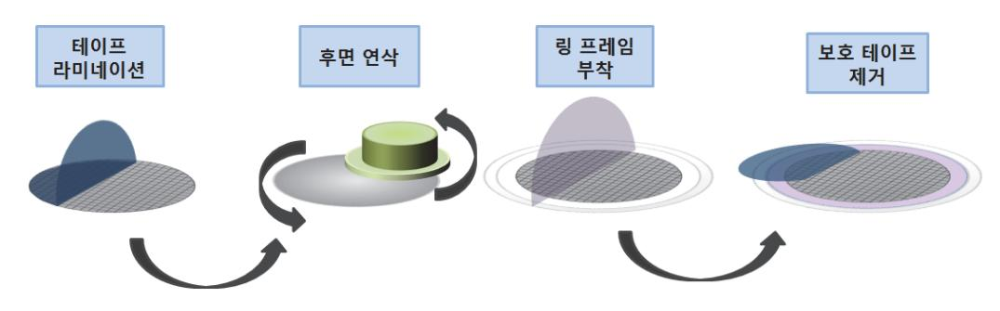

출처: 교육부(2018). 패키지 조립 공정 개발(LM1903060108\_14v3). 한국직업능력개발원. p.10. [그림 1-1] 후면 연마 공정도

숕 웨이퍼 소잉(sawing) 공정을 통해 칩(die)을 개별적으로 분리한다.

- 1. 소잉 장비, 다이아몬드 톱(blade), 관련 재료 및 부품 등의 준비 상태를 확인한다. 웨이퍼 소잉의 주요 공정 변수는 웨이퍼 이송 속도(웨이퍼가 절삭되는 속도), 톱의 높이(잘리는 깊이), 톱의 회전 수(분당 회전수, RPM) 등으로 작업 조건을 사전에 확인한다.
- 2. 사용되는 재료의 특징과 기초 물성들을 파악한다. 다이아몬드 톱은 일정기간 이상 사용하면 교환 이 필요한 소모성 재료이다.
- 3. 소잉 테이프의 특성, 소잉 라인의 폭과 방법 등 개발에 필요한 요소를 확인한다. 무엇(소잉 테이 프)을 붙일 것인가? 어떤 방법(다이아몬드 톱 또는 레이저)을 사용하고 어떠한 조건으로 소잉할 것인가를 설계한다.
- 4. 종래의 다이아몬드 톱을 이용하는 기계적 소잉 방법, 레이저로 표면을 녹이는 레이저 어블레이션 방법, 웨이퍼의 내부를 중심으로 하여 절단을 진행하는 스텔스 소잉 방법이 있다.
- 5. 테이프 부착 공정으로 회로가 형성되지 않은 웨이퍼의 뒷면에 테이프로 부착한다. 이 공정으로 웨 이퍼는 웨이퍼 원형 틀과 소잉 테이프가 동시에 붙여지게 된다. 웨이퍼 프레임은 금속이나 플라스 틱 재질이 사용되며 휘거나 구부러짐, 오염이나 열을 견딜 수 있어야 한다.
- 6. 소잉 라인(또는 스크라이브 라인)을 따라 개별 칩으로 분리하는 작업을 수행한다. 다이아몬드 소 잉은 접촉식 가공으로, 웨이퍼는 고속으로 회전하는 톱에 의해 두께에 따라 사전에 프로그램된 크 기로 으로 절단된다. 다이아몬드 톱 설계 시에는 접착제 및 다이아몬드 입자 크기와 집중도가 고 려되어야 한다. 범용 웨이퍼에는 4~6㎛, 얇은 웨이퍼용에는 2~6㎛ 다이아몬드 입자가 사용되며, 접착제의 경우 단단한 접착제는 접착제의 지탱력이 강하기 때문에 마모가 적으나 품질이 나빠질 수 있다. 집중도가 높으면 다이아몬드 입자 1개에 주는 부하가 작아서 마모량은 적으나 품질이 나빠질 수 있다. 웨이퍼 특성 및 두께에 따라 다이아몬드 입자 크기나 집중도를 다르게 적용할 수 있다.
- 7. 소잉 작업 중에는 고압의 초순수 물(DI water)을 뿌려 절단 과정에서 발생하는 잔유물을 제거하 고, 분사 구멍의 고압과 웨이퍼 사이에 발생하는 정전기에 의한 칩 손상을 방지하기 위해 CO2 버블러(bubbler)로 CO2를 주입한다.
- 8. 제품에 따라 완전 분리, 스텝 분리, 이중 분리의 3개 과정으로 진행한다.
  - (1) 완전 분리는 웨이퍼를 한 번에 자르는 방법이며, 주로 두꺼운 다이에 적용된다.
  - (2) 스텝 분리는 두께가 다른 두 개의 톱을 이용해 절반씩 나눠 자르는 방법이다. 즉, 첫 번째 톱은 배선층이나 표면 막 등의 이종 소재를 제거하고, 두 번째 톱은 실리콘 웨이퍼를 완전 절단한다.

- (3) 이중 분리는 동일한 두 개의 톱을 이용해 절반씩 나눠 자르는 방법으로 소잉 시간을 대폭 단 축한다.
- 9. 레이저 소잉은 비접촉식 가공으로 소재의 표면에 높은 에너지 강도를 얻기 위해 렌즈를 이용해 집속된 상태로 표면에 조사시켜 고체를 기화시키는 방법이다. 웨이퍼 두께가 40㎛ 이하인 경우 다이아몬드 톱에서는 저속 가공에 따른 낮은 생산성이나 웨이퍼 깨짐 현상이 발생하여 레이저 어 블레이션(laser ablation) 방법을 채택하고 있다.
- 10. 저유전(Low-K) 웨이퍼의 경우, 다이아몬드 톱으로 소잉 작업을 하기 이전에 선행 작업으로 소 잉 라인에 있는 배선층(금속 층과 저유전 층)을 비교적 약한 에너지의 레이저로 먼저 절단하는 공 정을 수행하며,한다. 이를 레이저 그루빙 또는 레이저 스크라이빙이라 칭한다. 이 공정에 적용되 는 레이저는 355nm 파장의 자외선 계열의 레이저인 UV 레이저와 10,640nm 파장의 원적외선 (Far-IR) 레이저이며, 현재는 상용화되어 있는 장비를 사용한다.
- 11. 스텔스 소잉은 특정 파장대역의 레이저로, 웨이퍼의 소잉 라인을 조사하면 레이저는가 실리콘 내부로 침투하여 외부에서는 보이지 않으나 내부에 절단이 가능한 변형층을 만든다. 이후 웨이퍼 접착 테이프에 붙이고 이 테이프를 강한 힘으로 늘려주면 소잉 라인을 따라 절단이 된다. 최근에 개발된 스텔스 소잉은 일반적인 다이아몬드 톱의 절단에 의해 발생하는 오염원을 최소화시키고 세 정 과정 등의 공정을 없앨 수 있어 효율성이 좋다. 특히 50㎛ 이하의 박막 웨이퍼에 적합하고, 실리콘 웨이퍼의 가공 시간을 다이아몬드 톱 대비 약 70% 정도 절감시킬 수 있다.
- 12. 자외선을 다이싱 테이프에 조사하여 웨이퍼와의 접착력 저하 상태를 확인한다.
- 13. 개별 칩으로 절단된 상태에 대한 달성도 여부를 측정 장비를 사용하여 확인한다.

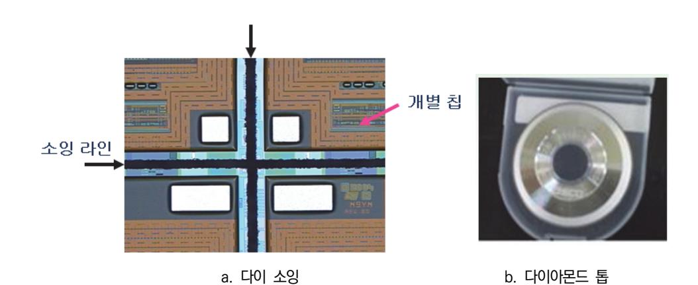

출처: 교육부(2018). 패키지 조립 공정 개발(LM1903060108\_14v3). 한국직업능력개발원. p.12. [그림 1-2] 소잉 상태와 다이아몬드 톱

- 숖 다이 접착 공정을 통해 리드 프레임이나 반도체 기판 등의 패키지 재료에 다이를 고정시킬 수 있고, 스페이스(공간) 테이프를 이용하여 추가로 반도체 칩을 적층한다.
  - 1. 다이 본더, 리드 프레임 또는 반도체 기판, 니들, 관련 재료 및 부품 등의 준비 상태를 사전에 확 인한다.
  - 2. 사용되는 재료의 특징과 기초 물성들을 파악한다. 리드 프레임은 반도체 칩을 올려 부착하는 금속 기판, 반도체 칩과 외부 회로를 연결시켜 주는 전선(lead) 역할과 반도체 패키지를 전자회로 기판 에 고정시켜 주는 버팀대 역할을 동시에 수행한다. 제조 방법은 스탬핑과 에칭방식을 사용한다.
  - 3. 테이프, 접착제와 도포 두께, 접합 방법 등 개발에 필요한 요소를 확인한다. 무엇(접착제 또는 테 이프)을 붙일 것인가? 어디에(접착 기판), 어떻게(패키지 구조) 붙일 것인가를 설계한다. 패키지 구 조는 주어진 칩, 패키지 크기, 패키지 설계 규칙 등을 고려하여 결정한다.
  - 4. 니들은 표면에 도포되는 접착제(에폭시)의 도포 양을 결정하는 인자로 다이패드의 크기를 고려하 여 알맞은 니들의 모양을 설계한다. 접착제의 도포 양은 칩의 크기를 고려하여 적당량 도포된 것 을 확인한다. 접착제의 양이 과다하면 패드 외각으로 흘러내려 신뢰성 불량의 원인이 되고, 부족 하면 낮은 접착 강도로 인해 열순환 충격 시험에서 칩이 패드에서 떨어질 수 있다.
  - 5. 리드 프레임(기판)은 패키지 내부의 칩과 외부 리드를 전기적으로 연결해 주는 역할을 하며, 반도 체 칩을 지지해 주는 핵심 재료이다.
    - (1) 기판에는 PCB, 세라믹, TAB 테이프 등이 있으며, 리드 프레임의 경우 구리와 니켈계 합금 으로 Alloy-42(42Ni-Fe)가 주로 사용된다.
    - (2) 리드 프레임을 사용한 경우에는 일반 패키지와 LOC 구조로 구분된다.
    - (3) 기판을 사용한 FBGA 패키지는 Face-up(모서리 또는 센터 패드)과 Face-down(센터 패드) 구조로 구분된다. Face-up은 WBL, PWBL, 스페이스 테이프, 에폭시를 사용하며, 낸드 플 래시, 모바일 DRAM, MCP에 적용하며,한다. Face-down 구조는 에폭시, 실리콘 접착제를 사용하며, DRAM, 그래픽 메모리에 주로 적용한다.
  - 6. 외관 검사를 통해 육안으로 오염 여부를 검사하고, 리드 프레임 다이 패드(기판) 위에 에폭시 페 이스트 또는 실리콘 타입의 접착제를 일정한 모양으로 도포한 상태를 확인한다. 은 페이스트에는 전기 및 열 전도 특성을 향상시키기 위해 은을 약 70% 첨가하여 칩을 접착시키는 물질이다. 테 이프는 스페이스 테이프, 웨이퍼 소잉 전에 뒷면에 테이프를 붙이는 WBL(Wafer Backside Lamination), 와이어 관통(penetration) 기능이 추가된 PWBL이 있다. LOC 타입은 고내열의 양면 LOC 테이프를 접착제로 이용하여 칩을 리드 프레임에 접착시킨다.
  - 7. 다이(칩)의 접착을 위해서는 칩을 테이프로부터 분리하여 들어 올리는 과정이 필요하다. 이젝터 핀(ejection pin)이 올라오면서 칩을 살짝 들어 올려 칩과 테이프의 접착력을 약화시킨 후 진공펌 프에 연결된 픽업(pick up) 도구를 이용하여 칩과 테이프를 완전히 분리하여 들어 올리게 된다.

- 8. 스테이지를 이동하여 리드 프레임 패드 위에 정위치시키고 픽업 도구를 내려서 칩을 접착시키는 공정을 수행한다. 에폭시 다이 접착의 경우 다이와 리드 프레임의 기울어짐(tilt)는은 75㎛(3mil)이 내, 다이 접착 후 다이와 리드 프레임의 경사는 2°이내에 있어야 한다.
- 9. 다이 접착 픽업 방법에는 두꺼운 칩에 적용하는 니들 핀, 칩 두께가 얇아짐에 따라 니들 핀 사용 시 발생하는 칩의 파손을 줄이기 위한 필링(peeling), 슬라이드(slide), 다단 픽업, 스마트 이젝터 시스템, 니들이 없는 다단 스텝의 방법이 사용된다.
- 10. 접착제의 토출과 다이의 실장이 완료되면 다이 패드나 반도체 기판 위에 접착된 칩을 적당한 열 을 가해 경화시키는 과정을 수행한다. 경화 조건을 결정하기 위해서는 접착 후의 접착 강도 및 접합면의 신뢰성을 먼저 파악하여야 한다. 일반적인 오븐 경화 조건은 150 ℃ ~ 175 ℃, 1시간 이내, 속 경화는 100 ℃ ~ 200 ℃, 5 ~ 10분 처리를 한다.
- 11. 칩과 칩의 접착이나 칩과 칩 사이가 전기적 단락을 일으키는 것을 방지하기 위해 스페이스 테이 프를 이용하여 반도체 칩을 다층으로 적층할 수 있다. 적층 패키지에 에폭시를 접착제로 사용하는 경우 두께 조절이 어렵고, 본딩 시 칩 이동이 발생하게 되며된다. 또 칩이 얇은 경우에는 과도한 필렛(fillet) 형성에 따라 에폭시에 의한 본딩 도구 및 패드 오염이 발생하여 불량을 발생야기시키 기 때문에 개발 시 고려되어야 한다. 테이프 형태의 접착제를 적용하는 경우 상기 문제가 발생하 지 않으므로 적층 패키지 접착제로 적합하다.
- 12. 다이 접착력에 대한 규격의 달성도 여부를 측정 장비를 사용하여 확인한다.

수행 tip

한다.

작업 전, 장비의 이상유무 및 안전모드 동작 상태를 확인

각각의 공정은 작업 지시서에 따라 진행한다.

출처: 교육부(2018). 패키지 조립 공정 개발(LM1903060108\_14v3). 한국직업능력개발원. p.15. [그림 1-3] 다이접착 공정

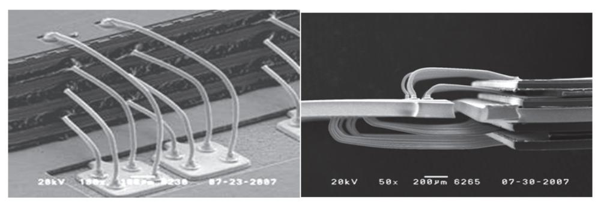

a. 스페이서 테이프 적용 b. 다층 구조

출처: 교육부(2018). 패키지 조립 공정 개발(LM1903060108\_14v3). 한국직업능력개발원. p.15. [그림 1-4] 스페이스 테이프를 이용한 다층 구조

- 숗 TSV(Through Si Via) 공정을 통해 웨이퍼에 관통 홀을 형성하여 칩과 칩 또는 웨이퍼와 웨이퍼 간 의 접합으로 3차원 적층을 한다.
  - 1. 에칭 장비, 레이저 가공 장비, 관련 재료 및 부품 등의 준비 상태를 사전에 확인한다.
  - 2. 사용되는 재료의 특징과 기초 물성들을 파악한다.
  - 3. 홀 가공 기술, 관통 홀 크기와 깊이, 충진 재료 및 조건 등 개발에 필요한 요소를 확인한다. 어느 정도(관통 홀 크기와 깊이)를 가공할 것인가? 어떤 방법(DRIE와 레이저 가공기), 무엇으로(관통 홀 충진 재료와 방법) 충진할 것인가를 설계한다.
  - 4. 미세 관통 홀은 펨토초 레이저를 이용한 두 가지 종류의 레이저 가공 방법을 이용하여 형성하고 있다. 원을 그리면서 레이저 빔을 조사하는 트레판닝(Trepanning) 방식과 한 점에 레이저 빔을 조사하는 퍼커션(Percussion) 방식이 있다.

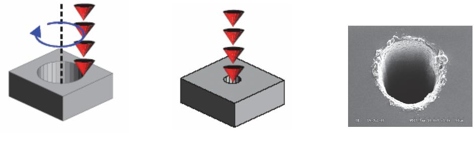

a. 트레판닝 방식 b. 퍼커션 방식 c. 관통 홀

출처: 교육부(2018). 패키지 조립 공정 개발(LM1903060108\_14v3). 한국직업능력개발원. p.16. [그림 1-5] 레이저 가공 방법과 관통 홀

- 5. 트레판닝 방식으로 형성된 미세 관통 홀의 형상은 사용되는 레이저의 반복 주파수의 크기에 따라 형성된 홀의 형상이 크게 다르다. 반복 주파수가 높아질수록 실리콘 표면에 조사되어 형성된 홀의 크기에 비해 뒷면으로 관통되어 형성된 홀의 크기가 약 두 배 정도 커진다. 반면에 반복 주파수 를 낮추면 거의 수직에 가까운 관통 홀이 형성된다. 또한 퍼커션 방식도 트레판닝 방식과 마찬가 지로 가공 조건을 맞추어 주면 수직에 가까운 관통 홀을 형성할 수 있다.
- 6. DRIE 방법은 SF6을 이용해 실리콘을 에칭하고, 홀의 내벽을에 C4F8을 사용하여 보호층 (passivation)을 입힌다. 이렇게 형성된 보호층은 뒤 이은 에칭 과정에서 이온의 충돌로 인해 관 통 홀 바닥의 보호층이 우선적으로 제거되며, 홀의 내벽은 에칭으로부터 보호된다. 교대로 반복되 는 에칭과 보호층 형성 과정으로 인해 관통 홀의 내벽은 높은 종횡비를 가지고 에칭된다.
- 7. 형성된 관통 홀의 내벽에 화학기상증착(CVD)이나 물리기상증착(PVD) 방식을 적용하여 절연 (insulation, SiO2)/장벽(barrier, TiN, TaN, SiN)/씨앗층(seed layer, Cu) 증착을 순차적으로 형성시킨다.
- 8. 칩의 관통 홀에 전기적인 연결이 가능하게 내부 충진 과정을 수행한다. 관통 홀은 전기도금법 (electroplating)을 적용하여 금속 계열(Cu, Ni, Au, Sn 등)이나 CVD 방법으로 텅스텐(W)을 관 통 홀에 충진하는 전통적인 방법이 있고, 이외에 폴리실리콘, 도체 페이스트, 솔더 나노 파티클로 전기 단자를 형성하는 여러 가지 방법이 있다.
- 9. 대표적으로 상용화에 적용되고 있는 구리 충진의 경우 전류 밀도가 높은 관통 홀 입구가 내부보 다 먼저 충진되면 관통 홀 내부에 공동이 발생하여 결국 배선 저항이 증가하는 문제가 발생함하 으로 도금액 선정과 공정 조건에 주의가 필요하다. 관통 홀의 크기와 깊이에 따라 도금 전압, 전 해액의 이온 농도, 전해액의 온도와 같은 공정 조건의 최적화 설계가 필요하다. 특히, 패키지 제 조업체에서는 TSV 제품의 양산 생산능력(capacity)을 늘리기 위해 고속 도금액 개발이 요구되고 있다.
- 10. 제작된 칩을 순차적으로 쌓아올려 이미 형성된 칩의 전기 단자 간의 접합을 통해 전기 신호를 흐르게 하는 3차원 적층 패키지 구조를 갖게 한다.
- 11. 홀 가공 목표 두께에 대한 달성도 여부를 측정 및 분석 장비를 사용하여 확인한다.

수 플라즈마 클리닝 공정을 통해 반도체 기판의 표면에 증착된 유기물을 물리적, 화학적 방법으로 제거 한다. 플라즈마 클리닝(세척)의 장점은 유기 용매를 사용하지 않으므로 패키지의 박피나 공기 오영염 의 우려가 없고, 공정 시간이 수 분 이내로 짧다는 것이다. 안전하고 경제적인 공정으로이며, 상업적으로 일반화되어 장비 구매가 용이하다. 단점으로는 심한 오염의 경우 제거 시간이 오래 걸리며, RF 에너지가 칩을 손상시킬 수 있다. 은 코팅 패키지의 경우 표면의 색상을 변화시킬 수 있다.

1. 플라즈마 장비, 다이 접착 또는 와이어 본딩이 완료된 리드 프레임(반도체 기판), 관련 재료 및 부품 등의 준비 상태를 사전에 확인한다.

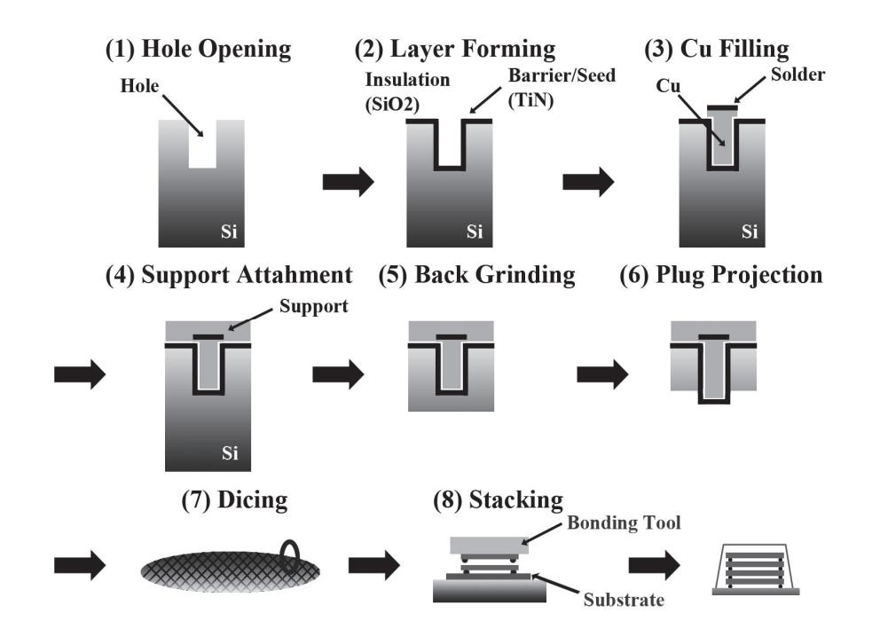

출처: 교육부(2018). 패키지 조립 공정 개발(LM1903060108\_14v3). 한국직업능력개발원. p.17. [그림 1-6] 3차원 TSV 패키지 공정 개략도

- 1. 플라즈마 장비, 다이 접착 또는 와이어 본딩이 완료된 리드 프레임(반도체 기판), 관련 재료 및 부품 등의 준비 상태를 사전에 확인한다.
- 2. 사용되는 재료의 특징과 기초 물성들을 파악한다.
- 3. 클리닝 재료, 클리닝 방법, 조건 등 개발에 필요한 요소를 확인한다. 어떤 방식을 적용할 것인가? 어디에(칩 패드 또는 반도체 기판) 클리닝할 것인가를 설계한다.
- 4. 다이 접착이나 와이어 접합 공정을 위해 리드 프레임(기판)을 만질 때에는 반드시 고무장갑을 착 용하고, 보관 시에도 각별한 주의를 기울여 리드 프레임(기판)을 깨끗한 상태로 유지하여야 한다. 리드 프레임 관리가 잘 되었더라도 전 공정에서 가스 발생 등으로 인해 패키지의 표면이 오염될 수 있으므로 클리닝 공정을 진행하는 것이 좋다.
- 5. 클리닝 방법으로는 아르곤(Ar) 가스를 이용하는 방법, 챔버 내에서 아르곤과 산소를 사용하여 불 순물을 산화시켜 제거하는 산소 가스를 이용하는 방법, 산화 금속이나 다른 무기 산화물 등의 오 염 물질을 제거하기 위해 수소 가스를 이용하는 방법이 사용된다.
- 6. 플라즈마 장비, 각종 파라메터를 확인한다. 플라즈마를 발생시키는 세 가지 요소는 진공, 기체,

RF 전력이다. 플라즈마 클리닝의 주요 공정 변수는 RF 전력, 시간, 기체 주입량에 의해 결정되며 작업조건을 확인한다.

- 7. 외관 검사를 통해 표면 오염 여부를 검사하고, 플라즈마에 의해 리드프레임이나 반도체 기판 표면 에 증착된 유기물이 물리적으로 분리 및 제거되는된 상태를 확인한다.
- 8. 클리닝 정도에 대한 평가를 위해 접촉각 테스트로 시료의 표면에 물방울을 떨어트리고 떨어진 물 방울의 응집 정도를 측정함으로써 표면의 형태를 간접적으로 추정할 수 있다. FBGA 제품의 경우 접촉각은 50°이내여야 한다. 접촉각은 액체가 서로 섞이지 않는 물질과 접할 때 형성되는 경계 면의 각을 말한다.
- 9. 일반적으로 접촉각 측정은 표면의 단원자층(monolayer)의 변화도를 정밀하게 측정할 수 있고, 분 석 방법이 단순하며, 짧은 시간에 원하는 정보의 재현성을 갖고 얻을 수 있는 특징이 있다. 측정 방법은 접촉각 측정기에 의한 직접 측정, 틸팅(Tilting)법, 느우만법(Neumann), 모세관 이용법, 웨스번(Wesburn) 방법 등 다양한 종류가 있다.

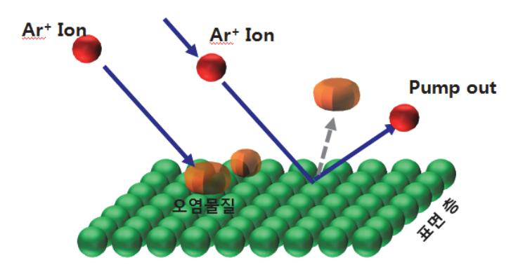

 출처: 교육부(2018). 패키지 조립 공정 개발(LM1903060108\_14v3). 한국 직업능력개발원. p.18. [그림 1-7] 플라즈마 클리닝의 원리

- 숙 본드 공정을 통해 다이의 전극과 리드 프레임 또는 반도체 기판의 전극을 금속 세선 (Wire), 탭 (TAB), 플립 칩(Flip chip) 방식으로 전기적 신호를 연결한다.
  - 1. 와이어 본더, 캐필러리, 와이어, 관련 재료 및 부품 등의 준비 상태를 사전에 확인한다. 와이어 본딩 시 주요 요소는 본드 파워, 본드 포스, 본드 타임, 본드 온도에 의해 결정되며 작업 조건을 확인한다.
  - 2. 사용되는 재료의 특징과 기초 물성들을 파악한다.
  - 3. 칩 패드의 크기, 칩 패드 간격, 와이어 종류와 직경, 와이어 루프 높이, 길이 등 개발에 필요한 요소를 확인한다. 무엇(와이어 종류와 직경)을 사용할 것인가? 어떤 방법(볼 본딩과 웨지 본딩)을, 어떻게(루프 높이, 길이, 패키지 구조) 붙일 것인가를 설계한다.

- 4. 본딩 와이어로는 금, 알루미늄, 은 합금, 구리 와이어(또는 PCC,: Pd Coated Copper)가 사용 되고 있다. 금 와이어는 대기 중에서 접합할 때 표면 산화가 일어나지 않아 현재 가장 널리 사용 되고는 있지만 원재료가 비싸다는 단점이 있다. 알루미늄이나 은 합금은 와이어는 접합 강도가 높 아 높은 신뢰성을 요구하는 전력용 소자 접합에 이용되고 있다. 구리 와이어는 금 와이어보다 원 재료 가격은 저렴하지만 높은 경도를 가지므로 칩 표면에 손상을 일으킬 가능성이 높으며, 와이어 본딩 과정에서 산화가 일어나는 문제가 있으므로 질소 분위기에서 실시해야만 한다. 최근 구리의 산화 방지를 위해 Pd(팔라듐)를 코팅한 PCC 와이어가 사용되고 있다.
- 5. 와이어의 직경(굵기)는은 와이어가 전달하는 전압과 전류, 공정성 및 가격을 고려하여 결정하여야 한다. 와이어의 전기 저항은 온도와 비례한다.
- 6. 칩과 회로를 연결하는 방법은 열 초음파(thermo-sonic) 본딩과 열 압착(thermo-compression) 본딩의 두 가지 방법이 있다. 열 초음파 본딩은 본드 패드의 금속 돌기(범프)들을 특별한 도구 없 이 열, 시간, 힘, 초음파에 의해 탭의 리드와 접합하며, 열 압착 본딩보다 공정 시간이 오래 걸린 다. 열 압착 본딩은 특별히 제작된 본딩 도구가 열, 시간, 힘을 제어하여 열 압착으로 본딩하는 방식으로 전체 크기의 최소화가 가능하다.
- 7. 본드 파워에 의해 조정되는 본딩 에너지는 와이어 본딩 시 고열이 생성되는 요인으로서 초음파 에너지가 공급될 때 캐필러리를 진동시킨다. 본드 포스는 캐필러리가 와이어 본딩이 되는 지점을 누르는 힘으로, 초음파 본드 파워가 작동 중에 영향을 준다.
- 8. 캐필러리는 와이어 본딩 장비에 장착되어 자체의 구멍에 투입된 와이어를 사용하여 반도체 칩과 외부 리드를 연결시키하는 역할을 수행한다. 캐필러리는 세라믹(Al2O3, Al2O3 + ZrO2), 루비, 시아론 등으로 만들며, 캐필러리 팁은 표준(standard)과 병목(bottleneck) 타입으로 분류한다. 개 발 시에는 팁 직경(본드 패드 간격), 챔퍼 직경(접합된 볼의 크기와 두께), 구멍 직경(루프 형성)이 설계에서 고려되어야 한다.
- 9. 본드 타임은 볼 본드와 스티치 본드 시 본드 파워가 가해지는 시간이다. 반도체 본드의 90% 이 상을 점유하는 볼 본드의 온도는 히트 블록(heat block)의 열로, 본드 파워와 함께 와이어와 본 드 패드/리드 간의 접합에 큰 역할을 한다. 알루미늄 와이어를 사용하는 스티치 본드는 상온에서 초음파를 사용하여 접합하여므로 신뢰성이 좋다.
- 10. 외관 검사를 통해 오염 여부를 검사하고, 패키지 내부의 칩과 리드 프레임(기판)을 전기적으로 연결해 주는 와이어 본드 공정을 수행한다. 본드 세부 기술에는 포워드(forward) 본드(패드와 리 드)와 리버스(reverse) 본드(패드와 패드, 리드와 패드)가 있다.
- 11. 열 초음파 본딩 공정 순서는 다음과 같다. (1) 와이어 접합을 위한 초기 단계, (2) 전기 방전으 로 볼 형성 - 방전의 세기에 따라 볼의 크기는 달라진다, (3) 캐필러리 이동, (4) 볼 와이어를 칩 에 누르고 초음파를 발생시켜 칩과의 1차 본딩 형성 - 열, 초음파 파워, 캐필러리를 통해 볼과 와이어를 누르는 힘, 초음파 유지 시간을 조절하여 본딩을 조절한다, (5) 캐필러리를 이동하며 루

프 형성 – 루프는 짧을수록 좋지만 너무 팽팽하면 와이어가 꺾일 수 있고 접촉 불량이 발생할 수 으므로 주의하여야 한다, (6) 2차 본딩 형성, (7) 캐필러리 리프트 업, (8) 클램프로 와이어를 잡 아당겨 와이어 절단, (9) 다음 접합을 위한 볼 형성 순으로 진행한다.

- 12. 포워드 본드는 속도가 빠르고 와이어 사용량이 적은 장점이 있으나, 낮은 루프 구현이 어렵다. 리버스 본드는 패키지 구조의 여유 확보가 가능하고 낮은 루프 구현이 가능하나, UPH(Unit per Hour)가 떨어지고 와이어 사용량이 증가하는 단점이 있다.
- 13. 본딩 시 받는 높은 온도로 인해 칩 패드를 구성하는 확산 속도가 높은 알루미늄 원자는 확산 속도가 낮은 금 쪽으로 확산되어 결합하는 2종 성분의 금속 원소와는 다른 새로운 성질을 갖는 AlAu계 금속간화합물(IMC: Intermetallic Compound])을 형성시키며, 접합부 계면의 신뢰성에 영향을 미치기 때문에 중요하게 관리되어야 한다. 금속간화합물의 특성 및 발생 비율에 따라 칩 패드와 와이어 간의 접착력에 차이가 발생한다. 금의 확산계수(D0)는 0.091이고 알루미늄의 확산 계수는 2.25이다.
- 14. 본딩 강도(와이어 인장 강도, 볼 전단 강도)의 목표 달성도 여부를 시험 장비를 사용하여 확인한 다. 이때 와이어 인장 강도는 와이어의 굵기에 따라 기준치가 달라지고, 볼 전단 강도는 본드 패 드 피치에 따라 기준치가 달라진다.
- 15. 와이어 인장 강도는 볼 본드와 스티치 본드에 동일한 힘을 가하기 위해 볼 본드로부터 와이어 루프의 1/3 지점에 고리(hook)를 걸어 위로 당겼을 때 끊어지는 강도 및 위치 상태를 조사한다. 볼 전단 강도에서 전단 도구는 패시베이션 층에서 0.2mil 올라간 위치에서 전단 도구를 민다. 볼 두께가 낮은 경우 또는 폴리이미드 패시베이션의 경우는 0.1mil(0.00254㎜)을 적용한다.

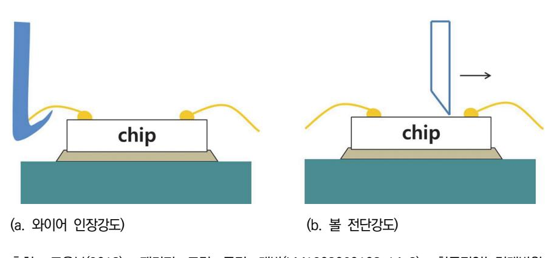

출처: 교육부(2018). 패키지 조립 공정 개발(LM1903060108\_14v3). 한국직업능력개발원. p.21. [그림 1-8] 와이어 인장 시험과 볼 전단 강도 시험

16. TCP(Tape Carrier Package)는 반도체 패키지의 한 종류로 리드 프레임 대신 구리 패턴을 형 성한 필름에 LSI 칩을 본딩하는 방식이다. 카메라 필름과 같은 홀이 있고, 그 홀 크기를 이용해 서 자동기계로 접착하기 때문에 TAB이라고도 불린다.

- 17. TAB은 폴리이미드 같은 폴리머 계열의 물질로 만들어진 유연성의 테이프 위에 칩을 자동으로 배치하는 공정을 수행한다. 다이의 접합 부분은 금 또는 솔더 재질의 범프나 볼 모양으로 되어 있고, 테이프 위의 미세 절연체와 연결된다. 이 미세 절연체는 다이를 패키지나 다른 외부 회로와 연결하는 통로로 사용된다. 칩과 테이프를 접합하는 TAB 공정을 ILB(Inner Lead Bonding)라 하며 테이프와 패키지나 다른 외부 회로의 접합을 OLB(Outer Lead Bonding)이라고 한다.
- 18. 롤 형태로 감겨 있는 폴리이미드 계열의 테이프 넓이는 35㎜, 45㎜, 70㎜ 등이 있으며, 두께는 50 ~ 100㎛ 정도이다. TAB 공정은 주로 FPD(Flat Panel Display) 산업에서 디스플레이의 액 정 표시 장치에 드라이버 IC로 사용된다. TAB 공정에 쓰이는 유연성 회로는 180°까지 구부려질 수 있고, 다핀화 및 고밀도 실장에 적합한 패키지이다. COF(Chip on Film)에 비해 전극 간격이 넓으며, 현재 40㎛ 피치 제품을 양산중이다.
- 19. 드라이버 IC와 LCD 패널을 연결시키는 방법은 COB(Chip on Board), COG(Chip on Glass), TCP로 구분된다. 기존에는 COB 또는 COG 방법을 이용하여 IC를 실장하였으나, 점점 미세 피 치화와 LCD 크기의 대형화 추세에 따라 COF 방식의 채택이 증가하고 있다. 기존의 TCP 제품 에 비해 사용되는 필름의 두께를 75㎛에서 30㎛로 감소시켜 전체 TAB 테이프의 두께를 약 60% 정도 슬림화가하는 것이 가능하다.
- 20. COF는 LCD 부분의 핵심 반도체 제품으로 LCD 모니터, 노트북, 휴대폰, 게임기 등의 다양한 분야에 적용되고 있다.
- 21. 플립 칩 방식은 회로가 형성된 칩 표면에 미세한 범프(금속 돌기)를 형성시킨다. 범프가 형성된 칩을 뒤집어서 칩의 패드가 기판과 마주보게 한 후 칩과 기판을 전기적, 기계적으로 연결하는 공 정을 수행한다.
- 22. 범프는 웨이퍼 알루미늄 패드 위에 금 또는 솔더 등의 소재로 5 ~ 10㎛ 크기의 외부 접속단자 를 형성해주는 공정을 말한다. 범프는 물리적으로 칩을 지탱하고 칩과 기판과의 전기적인 연결, 열 방출 등의 역할을 한다.
- 23. 플립 칩에서는 웨이퍼 범핑이 패키지 공정 중 가장 큰 비중을 차지하기 때문에 범프 형성 공정 시간이 전체 패키징 시간을 좌우하게 된다. 범프를 형성할 때에는 먼저 포토레지스트를 현상한 뒤 절연재료(UBM, Under Bump Metalization)를 형성한 후에 무연솔더(Sn, Sn-Ag, Sn-Ag-Cu 등) 도금을 처리하는 과정을 거친다.

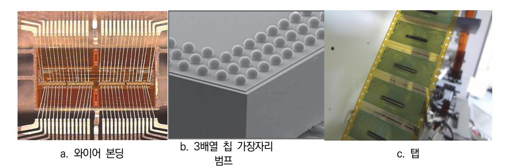

[그림 1-9] 출처: 교육부(2018). 패키지 조립 공정 개발(LM1903060108\_14v3). 한국직업능력개발원. p.22.

### 학습 1 교수·학습 방법

#### 교수 방법

- 반도체 조립 전체 공정 순서 및 단위 공정별로 사용되는 장비를 소개할 때 각각의 장비 용 도에 대한 이해를 높이기 위하여 동영상과 그림을 이용하여 세부적으로 설명한다.
- 단위 공정별로 사용되는 장비 부품을 파악하고 특징과 사용주기에 대해 설명한다.
- 반도체 조립 공정을 체험하고 현장에서 사용되는 전문용어에 대해 전체적으로 설명한다.
- 단위 공정에서 발생하는 불량 사례를 유형별로 분류하고 해결 방안을 교육대상자들과 토론 및 질문을 통해 학습자의 깊은 관심을 유도한다.
- 다양한 측정기기를 이용하여 개별 공정의 특성 값 측정 및 평가 방법을 개별 공정 사례를 적용하여 설명하고 실습한다.

#### 학습 방법

- 전체 공정 순서를 파악하고 단위 공정의 목적을 사전에 학습하여 기초 능력을 배양한다.
- 단위 공정에 대한 이해도를 향상시키기 위해 공정별로 사용되는 장비를 파악하여 이해하고 숙지한다.
- 단위 공정별로 적용되는 재료와 특성에 대해 조사해본다.
- 단위 공정별로 사용되는 장비 부품을 파악하고 필요성을 확인한다.
- 반도체 조립 공정에서 사용되는 전문용어에 대해 학습을 통하여 기초 지식을 함양한다.
- 단위 공정에서 발생하는 불량 사례를 파악하고 개선방향을 사례별로 확인한다.
- 광학현미경 등 간단한 측정기기에 대한 사용법을 사전에 학습한다.
- •패키지 전 공정 개발을 위한 순차적 중요 요소들을 정리한후, 교수자의 질문에 적합한 답변 을 글로 작성한 후 발표 한다.

## 학습 1 평 가

평가 준거

- 평가자는 학습자가 학습 목표를 성공적으로 달성하였는지를 평가해야 한다.
- 평가자는 다음 사항을 평가해야 한다.

| 학습 내용            |                                                                                                                                                    |   | 성취수준 |   |
|------------------|----------------------------------------------------------------------------------------------------------------------------------------------------|---|------|---|
|                  | 학습 목표                                                                                                                                              | 상 | 중    | 하 |
|                  | - 후면연마 공정을 통해 규정되어 있는 제품별 패키지 높 이를 맞추기 위해 웨이퍼의 뒷면을 기계적 또는 화학적 방법으로 연마할 수 있다.                                                                 |   |      |   |
| 패키지 전공정 개발 | - 웨이퍼 소잉(Sawing) 공정을 통해 칩(Chip)을 개별적으 로 분리할 수 있다.                                                                                               |   |      |   |
|                  | - ~다이 접착 공정을 통해 리드 프레임이나 반도체 기판 등의 패키지 재료에 다이를 고정시킬 수 있고, 스페이 서(Spacer) 테이프를 이용하여 추가로 반도체 칩을 적 층할 수 있다. 또한 제품에 따라서 다양한 접합공정이 사용될 수 있다. |   |      |   |
|                  | - TSV(Through Silicon Via) 공정을 통해 웨이퍼에 관통 홀을 형성하여 칩과 칩 또는 웨이퍼와 웨이퍼 간의 접 합으로 3차원 적층을 할 수 있다.                                                  |   |      |   |
|                  | - 플라즈마 클리닝(Plasma Cleaning) 공정을 통해 반도 체 기판의 표면에 증착된 유기물을 물리, 화학적 방법 으로 제거할 수 있다.                                                             |   |      |   |
|                  | - 본드 공정을 통해 다이의 전극과 리드 프레임 또는 반 도체 기판의 전극을 금속 세선(Wire), TAB(Tape Automated Bonding), 플립 칩 방식으로 전기적 신호 를 연결할 수 있다.          |   |      |   |

평가 방법

• 논술형 시험

|                  |                                                                                                       | 성취수준 |   |   |
|------------------|-------------------------------------------------------------------------------------------------------|------|---|---|
| 학습 내용            | 평가 항목                                                                                                 | 상    | 중 | 하 |
|                  | - 후면 연마 공정을 통해 규정되어 있는 제품별 패키지 높 이를 맞추기 위해 웨이퍼의 뒷면을 기계적 또는 화학적 방법으로 연마하는 목적 및 개발 과정             |      |   |   |
| 패키지 전공정 개발 | - 플라즈마 클리닝(Plasma Cleaning) 공정을 통해 반도체 기판의 표면에 증착된 유기물을 물리, 화학적 방법으로 클 리닝하는 목적 및 개발 과정          |      |   |   |
|                  | - TSV(Through Silicon Via) 공정을 통해 웨이퍼에 관통 홀을 형성하여 칩과 칩 또는 웨이퍼와 웨이퍼 간의 접합 으로 3차원 적층하는 목적 및 개발 과정 |      |   |   |

#### • 평가자 질문

| 평가 항목 상 중 - 다이 접착 공정을 통한 리드 프레임이나 반도체 기판 등 의 패키지 재료에 다이를 고정과, 스페이서(spacer) 테 이프를 이용하여 추가로 반도체 칩을 적층하고 제품에 패키지 전공정 따른 다양한 접합 공정 개발 | 학습 내용 |                                       |  | 성취수준 |   |  |  |
|--------------------------------------------------------------------------------------------------------------------------------------------------------------|-------|---------------------------------------|--|------|---|--|--|
|                                                                                                                                                              |       |                                       |  |      | 하 |  |  |
| 로 분리하는 공정                                                                                                                                                    |       | - 웨이퍼 소잉(sawing) 공정을 통한 칩(chip)을 개별적으 |  |      |   |  |  |

• 구두 발표

|                  |                                                                                                                   |   | 성취수준 |   |  |  |
|------------------|-------------------------------------------------------------------------------------------------------------------|---|------|---|--|--|
| 학습 내용            | 평가 항목                                                                                                             | 상 | 중    | 하 |  |  |
| 패키지 전공정 개발 | - 본드 공정을 통해 다이의 전극과 리드 프레임 또는 반도체 기판의 전극을 금속 세선(wire), TAB(Tape Automated Bonding), 플립 칩 방식으로 전기적 신호의 연결 여부 |   |      |   |  |  |

피드백

- 1. 논술형 시험 - 플라즈마 클리닝(Plasma Cleaning) 공정을 통해 반도체 기판의 표면에 증착된 유기물을 물리적, 화학적 방법으로 클리닝하는 목적과 개발 과정에 대해 올바르게 파악하였는지 평가다.
- TSV(Through Silicon Via) 공정을 통해 웨이퍼에 관통 홀을 형성하여 칩과 칩 또는 웨이퍼와 웨이퍼 간의 접합으로 3차원 적층하는 목적과 개발 과정에 대해 충분히 내용을 숙지하였는지 평 가한다.

#### 2. 평가자 질문

- 본드 공정을 통해 다이의 전극과 리드 프레임이나 반도체 기판 등의 패키지 재료에 다이를 고정시 킬 수 있고, 스페이서(spacer) 테이프를 이용하여 추가로 반도체 칩을 적층하고, 제품에 따라서 다 양한 접합 상태를 보고 공정 불량 여부를 파악할 수 있는지 평가한다.
- 웨이퍼 소잉(sawing) 공정을 통해 칩(chip)을 개별적으로 분리하는 방법을 확인한다.
- 3. 구두 발표
- 본드 공정을 통해 다이의 전극과 리드 프레임 또는 반도체 기판을 전기적으로 연결하는 금속 세 선(wire), TAB(Tape Automated Bonding), 플립 칩 방식에 대해서 발표시키고 평가한다.

| 학습 1 | 패키지 전공정 개발하기   |
|------|----------------|
| 학습 2 | 웨이퍼 범핑 공정 개발하기 |
| 학습 3 | 패키지 후공정 개발하기   |

# 2-1. 웨이퍼 범핑 공정 개발

| 학습 목표 | • 가공된 웨이퍼 상에 설계되어 있는 패드에 입력 임피던스(Fan In)와 출력전류 구동능력(Fan Out)을 재배열(Re-Distribution)시킬 수 있다. • 재배열된 웨이퍼에 공정표에 따라 재부동태화(Re-Passivation)시킬 수 있다. |
|-------|----------------------------------------------------------------------------------------------------------------------------------------------------|
|       | • 재배열 레이어(RDL)의 범프 패드에 범핑을 위한 UBM(Under Bump Metallurgy)를 형성할 수 있다.                                                                             |
|       | • UBM 전극패드 위에 범핑공정을 위한 솔더 볼을 형성 시킬 수 있다. • 솔더 볼이 형성된 후 웨이퍼의 뒷면을 연마하여 각각의 다이로 개별 분리하는 공정을 수행할 수 있다.                                           |

### 필요 지식 /

숔 재배열(RDL, Re-Distribution Level)

재배열을 통해 솔더 볼을 위한 패드(전기 단자)를 재배치함으로써 다양한 크기의 솔더 범프를 구현할 수 있고, 솔더 접합 신뢰성을 향상시킬 수 있는 볼 배열을 구현할 수 있다. 반도체 제 조(FAB, Fabrication)에서 가지는 설계의 제한을 패키지를 통해 해결하는 방법으로 재배열이 의미가 있다. 재배열은 웨이퍼 레벨 패키지 공정 기술을 이용하여 이미 형성된 알루미늄 패드 의 위치를 임의의 위치로 변경하는 것을 총칭하는 것이다.

1. 웨이퍼 레벨 패키지(WLP: Wafer Level Package)

기존의 패키지 기술은 웨이퍼 상태에서 제조(FAB) 공정이 끝난 후 웨이퍼를 개별 칩으로 분리해서 진행하였으나, WLP(Wafer Level Package)는 웨이퍼 상태에서 패키지 공정을 수행하여 회로를 재배열하거나 범핑을 수행하여 패키지 공정을 일괄 공정으로 처리하여 최 종적으로 완성되는 패키지 크기와 반도체 칩의 크기가 동일하게 하는 기술이다.

2. 장·단점

재배열은 반도체 칩 위에 솔더 범프를 구현하는 공정이 용이하며, 반도체 기판의 제작 단가 가 저렴하다. 반도체 제조(FAB)의 설계 변경 없이 고객의 요구, 또는 배선 전용 반도체 칩 등 다양한 요구에 대응이 가능하다. 단점으로는 전기 연결 경로가 상대적으로 길어져서 전

기적 특성이 그만큼 감소하며, 공정 수가 증가하여 제조 비용이 상승한다.

3. 구조 종류

WLP에는 재배열한 패키지와 재배열 없는 구조가 있다. 재배열 없는 플립 칩은 전기 연결 경로가 짧아 전기적 특성이 좋고 공정 수가 적은 반면, 반도체 기판의 제작 단가가 높고 반 도체 칩 패드에 바로 솔더 볼을 형성해야 하므로 공정이 어렵다. 칩 패드가 가운데 있는 반 도체 칩인 경우 칩의 가장자리 부분에 반도체 칩을 지지하는 더미(dummy) 볼을 형성해야 한다. RDL 씨앗층은 단일층과 다층으로 TiW, Ti/Cu가 사용된다.

#### 4. 기술개발 동향

재배열에 따른 저가격화와 전기적 특성 향상에 대한 기술 개발이 필요하다.

숕 재부동태화(Re-Passivation)

재부동태화 층은 I/O(input/output) 패시베이션 개구가 표준 플립 칩 범프에 비해 작거나 너 무 크게 되는 문제에 대해 보정한다. 또한 재부동태화 유전체 층은 제품의 표면을 평탄화하고, 강하고 견고한 범프 구조를 제공한다.

1. 용도

직접 칩의 I/O에 작은 범프를 배치할 필요가 있을 때 사용하는 공정이다. 이 과정에서 피치 기 능은 전체 배열 I/O 또는 주변 장치 I/O 설계에 일반적으로 150㎛이거나 그 이상이다.

2. 주요 역할

재배선(RDL) 금속 배선의 산화 방지, 물리적이고 화학적인 위협 요소로부터 재배선 금속 배선의 보호, 응력 완화(버퍼 역할), 재배선 금속 선과 범프 층간 절연 역할을 한다.

3. 기술개발 동향

제조 공정이 간단하고 양산성이 있는 재부동태화 기술 개발이 필요하다.

숖 UBM(Under Bump Metallization) 형성

칩 패드와 솔더 범프 사이에는 UBM 층 형성이 필수적으로 요구된다. 알루미늄(Al) 패드를 사 용하는 실리콘 칩에서는 솔더가 Al 패드에 젖음(wetting) 되지 않을 뿐만 아니라, 솔더가 용융 되면 Al이 재용융되거나 금속 간 화합물 형성으로 범프와 칩 패드의 계면이 충분한 접합 강도 를 유지할 수 없기 때문이다.

1. UBM 구성

UBM은 반도체 칩의 Al 또는 Cu 전극 상에 직접 솔더 또는 Au 범프를 형성하기 어렵기 때문에 2000Å 이내의 Ti, TiW, Cr 등과 같이 접착을 증진시키는 접합층이 있다. 또 솔더 가 칩 방향으로 확산하는 것을 막아주는 확산 방지층, 그리고 솔더와 젖음이 잘되고 솔더로 의 용융이나 금속 간 화합물로부터 패드 금속의 소모를 막을 수 있는 Cu, Au 층으로 구성 된 젖음 활성층이 있다.

#### 2. 주요 공정

기상증착법(증기증착법, vapor deposition)이나 스퍼터링 방법을 이용하여 증착하는 고전 적인 방법이 있고, 전해도금(electroplating) 방식과 무전해(electroless) 도금 방식이 있다.

3. UBM 종류

Cr/Cr-Cu/Cu 구조를 증기증착법이나 스퍼터링 방법을 이용하여 증착하는 방법, Ti-W/Cu 미니 범프로 솔더를 전해도금 방식으로 증착하는 방법이 있다. Al/Ni-V/Cu 구조는 솔더 범프 시장에서 가장 많이 사용되는 구조이다. 무전해 Ni UBM 구조는 저가로 제작할 수 있 는 구조로 다양한 개발이 시도되고 있다. 도금의 종류에는 전기도금, 화학도금, 용융도금, 건식도금 등이 있다.

4. 기술 개발 동향

양산성이 확보되고 저가로 제작할 수 있는 다양한 UBM 구조의 기술 개발이 필요하다.

숗 솔더 볼(범프) 형성

플립 칩 본딩을 위해서는 칩과 기판의 패드를 전기적으로 연결해 주는 금속 범프가 필요하다. 칩에서 기판으로의 열 전달과 방출, 칩과 칩, 칩과 기판 사이의 공간 제공, 물리적으로 칩을 지 탱하는 기능을 가지고 있다. 범프는 구조, 금속 재료, 제조 공정 등에 따라 다양한 형태로 개발 되고 있지만, 플립 칩 공정 중에 범프의 용융 유무에 따라 두 종류로 분류할 수 있다.

1. 플립 칩 설계

플립 칩 설계 시 고려되어야 할 사항은 아래와 같다.

- (1) 신호선(trace) 폭과 간격 미세화: 범프 위치와 I/O 수는 고정되나, 제조 단가(기판 비용)를 절감하기 위해 성능 요구사항이 충족된 경우 기판 층수의 최소화가 요구된다.
- (2) 블라인드(blind) 및 매몰 비아/비아 드릴 기술: 비아 단자 지름의 최소화를 위해 정밀한 드릴 링이 요구되고, 쓰루홀(through-hole) 비아 영역 사용을 최소화하기 위해 드릴과 단자 지름 이 미세한 블라인드/베리드 비아(Buried via)가 필요하다.
- (3) 코어 비아(Core via) 한계치: 대구경 코어 비아의 드릴 홀과 단자 지름은 배치 밀도를 제한 하는 요인으로 작용한다. 라우트(route) 밀도는 다이 부근에서 매우 높기 때문에 코어 비아를 배치할 수가 없기 때문이다. 보통은 비아가 크기 때문에 코어 비아를 배치할 경우 볼 패드 피치에 따라 볼 패드 위에 직접 구성한다.
- (4) 비아의 적층성: 비아의 적층성을 이용한 기판의 구성은 대구경 코어 비아와 이에 따른의 고 유 한계를 제거하여, 코어 레이어 상의 라우트 미세 집적도를 실현할 수 있다. 따라서 라우팅 (routing) 과정에서 유연성과 전기적 성능을 향상시킬 수 있고, 회로 기판의 층수를 줄일 수 있다.

#### 2. 종류

범프의 용융 유무에 따라 두 종류가 있다. 접합 공정 중에 범프 금속이 용융되어 표면장력 의 최소화 효과로 자체정렬(self-alignment)되면서 접합되는 것이 솔더계 범프이다. 또한 Au, Ag, Ni 등과 같이 접합 중에 범프가 용융되지 않고 고상상태를 유지하는 것이 고융점 범프로, 이들은 주로 열 압착(thermo-compression)이나 이방성 도전 접착제 (ACA:Anisotropic Conductive Adhesive)를 이용하여 접합된다.

3. 방법

범프의 대부분을 차지하는 솔더는 초기에는 주로 몰리브덴 마스크를 이용한 증기증착법으로 제작되었으나, 제조 비용이 비싸고 300㎜ 이하 미세 간격의 범프 제작이 어려워 현재는 전 해도금법과 스텐실 스크린 프린팅 방법이 많이 사용되고 있다. 감광물질(PR: Photoresist) 과 포토리소그래피(photolithography)를 이용하여 솔더 범프를 형성하는 전해도금법은 100㎜ 이내의 미세 간격의 범프 제작이 가능하며, 스텐실 스크린 프린팅 방법은 250㎜ 이 하의 범프 간격은 어렵지만 제조 비용이 저렴한 장점을 보유하고 있다. 제조 비용이 싼 고 융점 범프는 초기 신제품 개발이나 소량의 플립 칩 개발에 제작비용이 싸고 효율적인 방법 이지만, 모든 패드를 와이어 본딩을 통해 제작해야 하므로 대량생산에는 적합하지 않다. 이 외에 솔더 볼 탑재, 솔더 주핏(Solder-Juffit), C4NP(Controlled Collapse Chip Connection New Process) 방법 등이 있다.

4. 솔더 범프의 공정 조건

증기증착법과 전해도금법으로 제작된 솔더 범프는 조성의 균일도와 구형 범프로 만들기 위 해 리플로우 공정을 거친다. 초기에는 수소 모드에서 용융 온도에 비해 30 ~ 50℃ 이상에 서 용해과정을 통해 구의 일부분 형태로 만들어 사용되었는데, 최근에는 웨이퍼에 플럭스를 도포한 후에 질소 모드에서 용융한 후에 플럭스를 세척하여 사용하는 것이 일반적이다.

5. 고융점 범프의 공정 조건

고융점 금속 범프로 대표적인 Au 범프는 웨이퍼 전해도금법이나 와이어 본딩 기술을 이용 하여 만들어진다. 웨이퍼 전해도금법에 비해 Au 스터드 범프는 와이어 본더로 Au 볼 본딩 후 와이어의 꼬리 부분을 절단하여 만드는 방법으로, 웨이퍼 상태뿐만 아니라 칩 상태에서 도 쉽게 제작이 가능하고 다른 범프 제작 공정과 달리 별도의 UBM층이 필요 없다는 특징 을 가지고 있다.

6. 기술 개발 동향

현재는 와이어 본딩이 패키지의 많은 부분을 차지하고 있으며, 3D 패키지는 와이어 본딩과 플립 칩 기술로 구현되고 있다. 플립 칩 패키지를 사용하면 패키지 사이즈가 기존 패키지에 비해 면적을 약 90% 정도 축소시킬 수 있고, 전기 연결 경로가 다른 패키지에 비해 짧기 때문에 전기적 특성이 우수하다. 저가의 제조 공정과 미세 피치에 대한 기술 개발이 필요하 다. 플립 칩은 엄격한 성능과 고밀도를 요구하는 C2C(Chip to Chip) 응용 패키지에서 주 로 선호하고 있으며, 향후에는 C2W(Chip to Wafer), W2W(Wafer to Wafer)로 사용처

가 증대될 것이다.

7. 제품군

휴대용 기기의 소형화, 다기능화로 반도체 부품 자체의 소형화 구현이 그 어느 때보다 중요 하게 되었다. 플립 칩의 주요 적용 제품군은 컴퓨터, 스마트폰, 디스플레이 장치 등 다양한 첨단 IT 제품군으로 MCP, 3D 패키지, SiP, PoP, WLP 등 차세대 표면실장 패키지에 폭 넓게 적용이 가능하다.

수 개별 분리

반도체 기판 상태로 진행된 자재를 절삭 날의 회전으로 반도체 수지 및 몰딩 수지 순으로 절삭 하는 과정이다.

1. 구성

소 싱귤레이션(saw singulation) 공정에는 전용 장비를 사용하며, 장비는 절삭 공정의 절삭 유닛과 개개로 분리된 패키지를 트레이로 옮겨 담아 주는 핸들러로 구성된다.

2. 공정 조건

절삭 날 높이(height)와 절삭 폭(width)을 설정하는 것이 주요 공정 조건이다. 초기 연삭 (드레싱)은 절삭 날에 의한 초기 품질을 확보하기 위해 절삭 날을 사용 전 시험 절삭하는 과정으로, 초기 연삭 품질은 공정 품질과도 밀접한 관련이 있으므로 중요하다. 절삭 날은 초기 제작 시 다이아몬드 입자가 절삭 날 가장자리에 불규칙하고 불균일하게 솟아 있는 형 태로 제작되어 있다. 이러한 다이아몬드 입자의 돌출은 제품 깨짐이나 미세 깨짐 발생의 원 인이 될 수 있으므로 실제 제조 공정 이전에 초기 연삭을 실시해야 한다.

## 수행 내용 / 웨이퍼 범핑 공정 개발하기

#### 재료·자료

도금액, 범프 및 UBM 소재, 무연 솔더, 블레이드, 기타 자료, 필기도구, 메모장

기기(장비 ・ 공구)

- 범핑 장비(트랙, 스테퍼, 스퍼터, 세정 장비), 리플로우 장비, 싱귤레이션 장비, 스텐실
- 광학현미경, 접합 강도 시험기, 비파괴 X-ray 분석 장비

#### 안전 ・ 유의사항

- 작업 전 장비의 이상 유무 및 안전모드 동작 상태를 확인한다.
- 양산 수율 및 비용을 고려하여 설계한다.
- 범프는 칩과 기판 상의 터미널 패트 간의 전기적인 연결을 시켜주는 역할을 한다.
- UBM(Under Bump Metallurgy)은 범프 하단 금속화 층을 말한다.

#### 수행 순서

- 숔 가공된 웨이퍼 상에 설계되어 있는 패드에 입력 임피던스(fan in)와 출력전류 구동능력(fan out)을 재배열(RDL: Redistribution)시킨다.
  - 1. 제조(FAB: Fabrication)가 완료된 웨이퍼, 공정 장비 관련 재료 및 부품 등의 준비 상태를 사전 에 확인한다.
  - 2. 사용되는 재료의 특징과 기초 물성들을 파악한다.
  - 3. 패드 위치, 재배선 회로, 적용 패키지 구조 등 개발에 필요한 요소를 확인한다.
  - 4. 패키지 타입에 따른 재배열 공정을 수행한다. 구리/폴리이미드 재배열 구조를 사용하며, 에폭시에 봉지(encapsulation)되어 있는 100㎛ 구리 범프에 프린트된 솔더 범프를 형성한다. 다른 방법은 기존 Al 패드를 1, 2차 폴리머(BCB) 패시베이션과 Al 재배열 선을 사용하여 재배열한 후 UBM 과 솔더 범프를 형성한다. 솔더 범프는 전해도금법을 사용하므로 150㎛ 이하의 매우 미세한 피치 와 범프 크기 구현이 가능하다.
  - 5. 금속 배선 기술을 이용한 페이스 업(face-up) FBGA 재배열 공정을 확인한다. 재배열 공정은 (a) 절연층 형성, (b) 씨앗 금속층 형성, (c) 포토레지스트 코팅, (d) 구리층 전기도금, (e) 포토레 지스트 제거, (f) 씨앗 금속층 제거, (g) Ni(0.5㎛)/Au(0.1㎛) 무전해 도금, (h) 웨이퍼 소잉을 순 차적으로 진행한다.
  - 6. 알루미늄 패드의 위치 변경 후 와이어 본딩을 위해 금속 층의 표면은 금을 사용하여 접합 공정에 문제가 없도록 한다.
  - 7. 패키지에 따라서 재배열된 웨이퍼를 개별 칩으로 분리하고 다이 접합, 와이어 본딩, 몰드, 솔더 볼 마운트 및 싱귤레이션(웨이퍼 레벨 패키지를 절단) 등의 과정으로 진행한다.
  - 8. 금속 배선 기술을 이용한 벤조사이클로뷰텐(BCB: Benzocyclobutene) 표준 플립 칩(SFC) 재배 열 공정을 확인한다. 재배열의 세부 공정으로 1단계 과정은 절연막을 형성하는 공정이다. 패드 재 배치용 비어를 절연막에 형성하기 위하여 회로 형성이 완료된 웨이퍼 표면에 감광성 BCB 수지를 박막(10 ~ 20㎛) 두께로 도포한다. 이 박막은 다이 표면에서 볼 부착과 전기적 절연을 위해 기계

적인 응력을 감소시켜 주는 역할을 한다. 비아 마스크를 사용하여 원하는 규격으로 노광한 후 BCB를 제거하여 비아 홀을 형성한다. 비아는 BCB 박막에 의해 형성되어 칩의 패드에 전기 연 결이 가능한 통로를 제공한다.

- 9. 2단계 과정은 패드를 재배치하는 공정이다. 패드 재배치용 금속 배선을 전기 도금으로 형성하기 위해서 웨이퍼 전면에 도금하기 위한 기저 금속인 Ti/Cu를 스퍼터링 방법으로 증착을 수행한다. 도금용 감광액을 도포하고, 비아 도금용 마스크를 사용하여 노광하고, 도금할 금속배선 부위의 감 광액을 현상한다. 다음 과정으로 구리를 도금하여 금속 배선을 형성하고 표면에 남아있는 감광액 을 제거한다. 마지막으로 기저 금속인 Ti/Cu를 산 용액으로 식각한다.
- 10. 3단계 과정은 2차 절연막을 형성하는 공정이다. 칩 패드와 재배치되는 솔더 범프와의 절연을 위 한 절연막 형성 공정으로 1단계 공정과 동일하다.
- 11. 재배열 상태에 대한 달성도 여부를 측정 장비를 사용하여 확인한다.
- 12. 이후 과정은 패키지 구조에 따라 재배열된 웨이퍼를 개별 칩으로 분리하는 과정으로 진행한다.

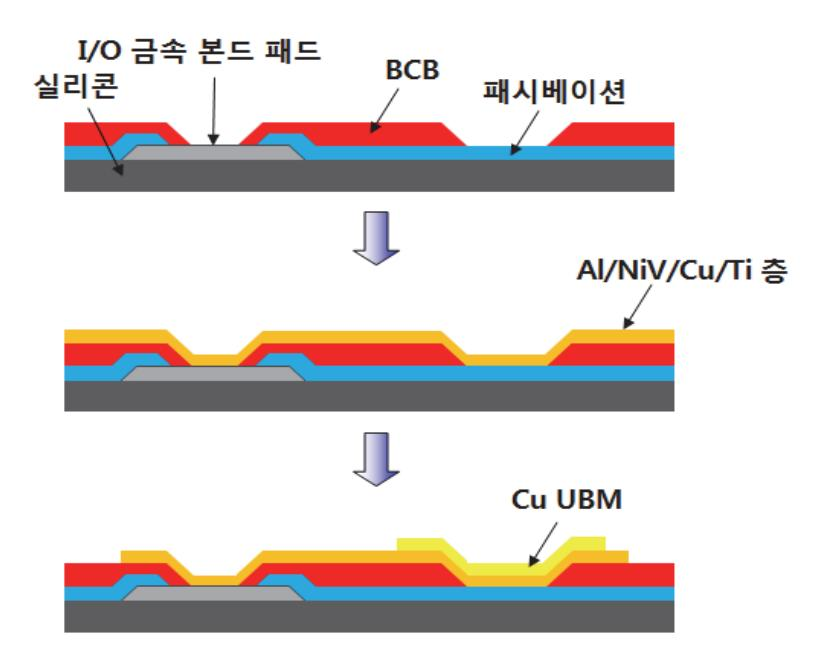

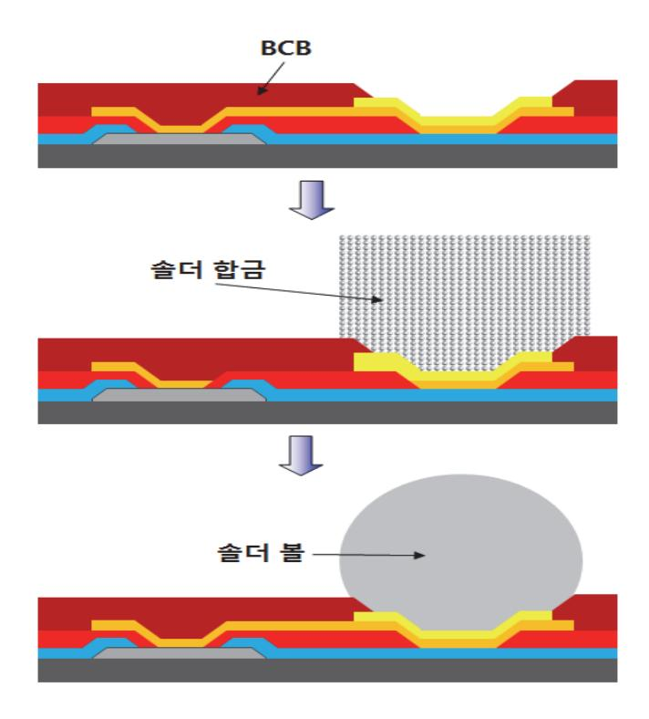

출처: 교육부(2018). 패키지 조립 공정 개발(LM1903060108\_14v3). 한국직업능력개발원. p.34. [그림 2-1] BCB 표준 플립 칩(SFC) 재배열 공정도

- 숕 재배열된 웨이퍼를 공정표에 따라 재부동태화(Re-Passivation)시킨다.
  - 1. 재배열이 완료된 웨이퍼, 공정 장비 관련 재료 및 부품 등의 준비 상태를 사전에 확인한다.
  - 2. 사용되는 재료의 특징과 기초 물성들을 파악한다.
  - 3. 재부동태화에 필요한 요소를 확인한다. 범프의 제원과 어떠한 조건으로 재부동태화할 것인가를 설 계한다.
  - 4. 재부동태화를 형성하는 공정을 진행한다.
  - 5. 재부동태화 상태에 대한 달성도 여부를 측정 장비를 사용하여 확인한다.

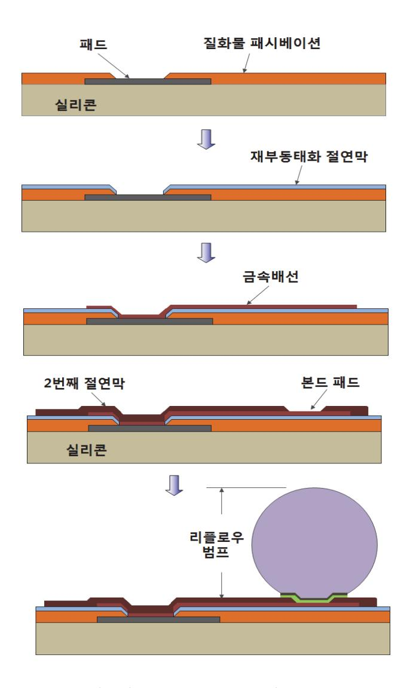

출처: 교육부(2018). 패키지 조립 공정 개발(LM1903060108\_14 v3). 한국직업능력개발원. p.35. [그림 2-2] 재부동태화 공정도

숖 재배열 레이어(RDL)의 범프 패드에 범핑을 위한 UBM(Under Bump Metallurgy)을 형성시킨다.

- 1. UBM 형성 장비, 관련 재료 및 부품 등의 준비 상태를 사전에 확인한다.
- 2. 사용되는 재료의 특징과 기초 물성들을 파악한다.
- 3. UBM 형성 기술, UBM 구조, 재료 등 개발에 필요한 요소를 확인한다. 어떤 구조(구조와 층)로 형성할 것인가? 어떤 방법(증기증착법, 전해도금법)으로 UBM을 형성할 것인가를 설계한다.
- 4. 외관 검사를 통해 파티클(particle)을 검사하고, UBM을 형성하는 공정을 수행한다. UBM 공정은 (a) Al 스퍼터 증착, (b) Al 패터닝, (c) UBM 증착 과정을 순차적으로 진행한다.
- 5. 첫 번째 UBM 구조 형성 방법으로 Cr/Cr-Cu/Cu를 증착한다. 증기증착법이나 스퍼터링법을 이 용하여 증착하는 가장 고전적인 방법이다. Cr층은 접합층, Cr-Cu층은 확산 방지층, Cu는 젖음 활성층으로 사용된다. 주석 함량이 높은 저 용융점 솔더에서는 확산방지층의 Cu까지 고온에서 금

속간화합물(IMC: Intermetallic Compound)로 변해 계면 접착력이 나쁘다는 단점이 있다.

- 6. 두 번째 UBM 구조 형성 방법으로 TiW/Cu 미니 범프를 증착한다. 솔더를 증착 방법으로 전해 도금 방법을 사용하는 경우에 주로 사용되며, Cu 미니 범프는 리플로우 도중에 발생하는 금속간 화합물의 성장을 고려하여 Cu층을 약 5 ~ 10㎛ 두께로 형성시킨 두꺼운 Cu층을 말한다. 이 방 식은 Pb-Sn 공정솔더에서 사용되었으나 안정성 측면에서 신뢰도가 떨어지는 것이 단점이 있다. LCD 구동 IC를 전해도금 방법으로 금 범핑하는 경우에는 TiW/Au UBM을 많이 사용한다.
- 7. 세 번째 UBM 구조 형성 방법으로 Al(Ti, Au)/NiV/Cu 구조를 증착한다. 젖음 활성층으로 사용 되는 Cu가 완전 소모된 후에 만나는 Ni이 솔더와의 젖음성이 좋기 때문에 현재 박막 UBM 구조 로 많이 사용되고 있다.
- 8. 네 번째 UBM 구조 형성 방법으로 무전해 도금 Ni 구조를 도금한다. 포토리소그래피 공정 없이 Al 패드 위에 아연산염(Zincate) 처리를 한 후에 무전해 도금 방법으로 Ni를을 도금하고. 그 위 에 Au층을 형성한다. 저가격으로 안정성이 높은 UBM을 구현할 수 있다는 장점이 있는 구조이 다. 또한 다른 공정에 비해 요철에 관계없이 균일한 두께로 증착을 할 수 있으며, 우수한 전기적, 기계적 성질을 가지고 있어 무연 솔더를 위한 UBM층으로 많은 연구가 진행 중에 있다.

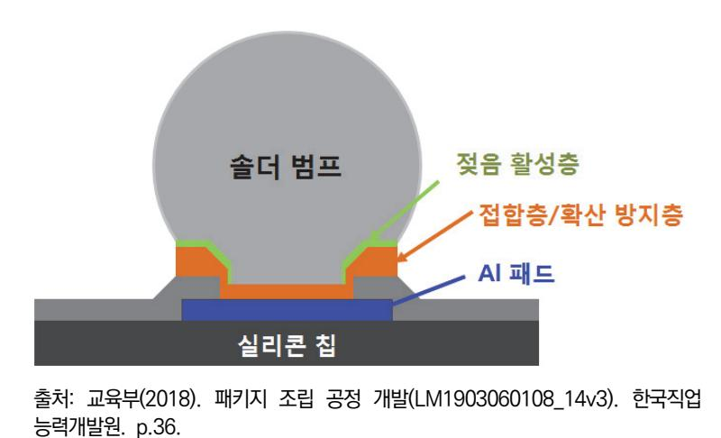

9. UBM 형성에 대한 달성도 여부를 측정 장비를 사용하여 확인한다.

숗 UBM 전극 패드 위에 범핑 공정을 위한 솔더 볼을 형성시킨다.

[그림 2-3] UBM(Under Bump Metallurgy) 구조

플립 칩은 PCB나 리드 프레임 같은 패키지 캐리어(carrier)와 다이(die)를 전기적으로 연결하 는 하나의 방식을 일컫는 용어이다. 플립 칩 접속은 1960년대 중반 IBM에 의해 C4(Controlled Collapse Chip Connection)라는 기술로 개발된 이래로 현재까지 다양한 공 정 기술이 개발되고 있다.

- 1. 가장 많이 사용되는 리플로우 방법은 다이 표면에 형성된 도전성 범프를 리플로우 솔더링 공정에 의해 기판에 접합하는 방법이다. 범핑 장비, 리플로우 장비, 관련 재료 및 부품 등의 준비 상태를 사전에 확인한다.
- 2. 사용되는 재료의 특징과 기초 물성들을 파악한다.
- 3. 범프 형성 기술, 범프 크기, 범프 재료 및 조건 등 개발에 필요한 요소를 확인한다. 어느 정도(범 프의 피치와 높이)를 가공할 것인가? 어떤 방법(증기증착법, 전해도금법, 스크린 프린팅법), 무엇 으로(무연 솔더의 조성)으로 솔더 볼을 형성할 것인가를 설계한다. 현재는 전기 및 전자장비 내에 특정 유해 물질 사용에 관한 제한(RoHS, Restriction of Hazardous Substance) 규정에 따라 무연 솔더가 사용되고 있다.
- 4. 외관 검사를 통해 파티클(particle)을 검사하고, 솔더 볼을 형성하는 공정을 수행한다. 솔더 범핑 공정은 (d) 두꺼운(thick) PR 코팅, (e) 솔더 전해도금, (f) 감광막 제거 또는 UBM 에칭, (g) 솔 더 리플로우 과정이 순차적으로 진행된다. 마지막으로 플럭스 세척 공정을 거치면 완료된다.

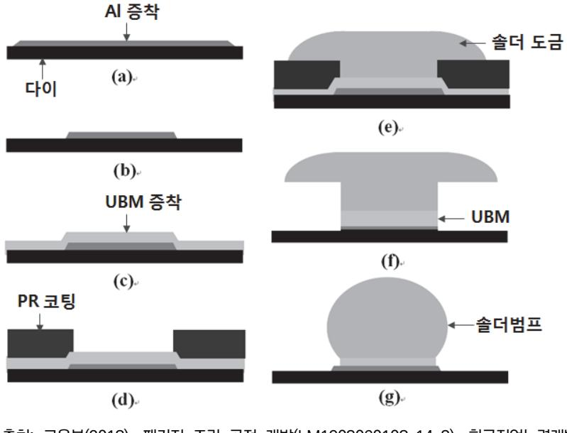

출처: 교육부(2018). 패키지 조립 공정 개발(LM1903060108\_14v3). 한국직업능력개발 원. p.37. [그림 2-4] 전해도금법에 의한 솔더 범핑 공정도

5. 전해도금법으로 제작된 솔더 범프는 조성의 균일도와 구형 범프로 만들기 위해 리플로우 공정을 거 친다. 초기에는 수소 분위기에서 용융 온도에 비해 30 ~ 50℃ 이상에서 용해 과정을 통해 구의 일 부분 형태로 만들어 사용되었다. 최근에는 웨이퍼에 플럭스를 도포한 후에 질소 분위기에서 용융한 다음 플럭스를 세척하여 사용하는 것이 일반적이다.

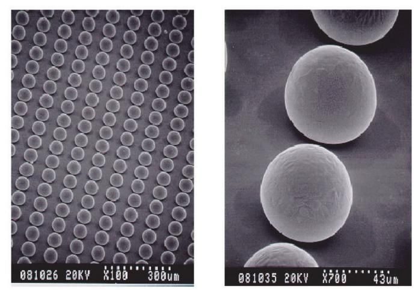

a. 솔더범프 배치도 b. 리플로우 후 확대도 출처: 교육부(2018). 패키지 조립 공정 개발(LM1903060108\_14v3). 한 국직업능력개발원. p.38. [그림 2-5] 솔더 범프(100 ㎛ 피치, 리플로우 후)

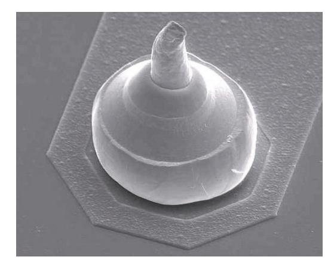

출처: 교육부(2018). 패키지 조립 공정 개발(LM19030 60108\_14v3). 한국직업능력개발원. p.38. [그림 2-6] 스터드 범프

- 6. 스크린 프린팅 방법은 솔더의 조성 변화가 용이하여 삼원계 이상의 합금 솔더에 대해서 결과 예측이 용이하고, 무연 솔더 대응이 강점이다. 솔더 볼의 경우 리플로우 공정 후 표면장력 효과에 의하여 볼 모양이 형성되지만, Au 범프의 경우 도금 형태인 사각기둥 모양을 유지한다.
- 7. 솔더 볼 형성 상태에 대한 달성도 여부를 측정 장비를 사용하여 확인한다.
- 8. 다양한 방법으로 범프를 구현할 수 있다. 범핑은 다양한 기술이 적용되고 있으며, 1) 스크린 프린팅 방법, 2) 솔더 볼 탑재 방법, 3) 구리 필러(pillar) 범프 방법, 4) 솔더 주핏 방법, 5) 금 스터드 방법 등이 사용되고 있다.
- 9. 스크린 프린팅 방법은 금속 마스크 상에 페이스트 솔더를 도포한 후, 스퀴즈(밀대)로 UBM 위에 인 쇄한 후 리플로우 과정을 거쳐서 솔더 범프를 형성시키는 방법이다. 전기도금 방식에 비해서 처리량 이 좋고, 저비용이며, 무연 솔더에 대한 대응이 용이하지만, 미세 피치와 패턴 형성에 기술적인 어려

움이 있다. 또한 300㎜ 이상의 대구경 웨이퍼에는 두께 균일성 측면에서 문제점이 있다.

- 10. 솔더 볼 탑재 방법은 솔더 볼을 형성시키고자 하는 위치에 플럭스를 도포하고 노즐을 사용하여 솔 더 볼을 위치시킨 후 리플로우를 거쳐 솔더 볼을 형성하는 방법이다.
- 11. 구리 필러(pillar) 범프는 도전성이 뛰어난 구리를 이용하여 일렉트로마이그레이션(electromigration) 대응이 용이한 장점을 가지고 있고 우수하고, 방열이 우수하며, 무연 솔더의 대응이 장점이다.
- 12. 솔더 주핏 방법은 PCB 기판 상에 솔더 범프를 형성할 때 사용되며, 넓은 범위의 무연솔더 대응이 가능하고 미세 피치의 솔더 범프를 제조할 수 있다는 장점이 있으나, 소재 자체가 고비용이고 지적재 산권 문제의 해결이 필요하다.
- 13. C4NP는 IBM C4 공정에서 적용되었던 기존의 솔더 범프 형성 방법과 같이 추가 공정(금속 마스 크, 솔더 마스크) 또는 몰드 템플레이트를 사용하여 범프를 형성하는 공정 기술로 전사방식과 유사한 일련의 공정 순서를 가지고 있으나, 현재 상용화에 활발히 적용되지는 못하고 있는 실정이다.
- 14. 금 스터드 방법은 반도체 조립 장비를 보유한 업체에서 기존의 인프라를 활용하여 용이하게 금 범 프를 형성할 수 있는 기술이며, 와이어 본딩 공정의 일부를 이용한다. 전기 연결 경로가 짧아 전기적 특성이 좋으나, 접착할 기판의 제작 단가가 높고 솔더 범프에 비해서 접합부의 신뢰성이 상대적으로 낮다.
- 15. 다양한 방법으로 이종 재료의 접합(interconnection)을 구현할 수 있다. 솔더 범프의 리플로우 접 합 방법 이외에도 플립 칩 접합의 종류는 다양하며, 1) 고융점 금속 범프를 열 압착으로 고상 확산 접합하는 방법, 2) 이방성 도전 필름/접착제를 이용하는 방법, 3) 스터드 범프 방법 등이 사용되고 있다.
- 16. 열 압착(thermo-compression) 방식은 칩의 범프들이 일정 힘과 열에 의해서 기판 패드에 접합되 고, 접합부의 온도는 300 ~ 350℃이다. 열 초음파(thermo-sonic) 방식은 열 압착 접합과 초음파 에너지를 혼용한 방법으로 열 압착 공정에 비하여 작업 온도(최대 150℃)를 낮출 수 있어 접합 공정 을 보다 빨리 진행시킬 수 있다.
- 17. 이방성 도전 접착제(ACA: Anisotropic Conductive Adhesive) 방법은 IC 칩과 기판 사이에 이방 성 전도 접착 물질을 도포하고 열과 압력에 의해 접착시키는 방법이다. 또한 LCD 패널에 TAB IC를 부착하기 위해 이방성 도전 필름(ACF: Anisotropic Conductive Film)가이 사용되고 있으며, 고온 의 열 압착 방식을 개선하기 위해 상온에서 초음파를 인가하는 방식 등이 적용되고 있다. ACA와 ACF 방식은 다수의 전극에 일괄 접속이 가능하다는 이점이 있다.
- 18. 스터드 범프는 칩에 형성시킨 스터드 범프를 본더 장비를 이용해서 접합하는 방법이다. 세트 메이 커(Set Maker)에서 범프 형성 및 실장이 가능한 방법이다.

<표 2-1> 이방성 도전 접착제의 3단계 접합 공정

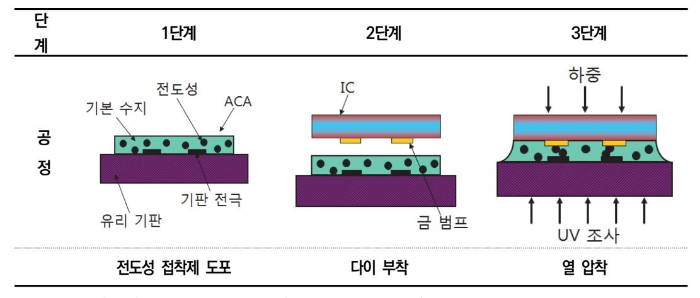

출처: 교육부(2018). 패키지 조립 공정 개발(LM1903060108\_14v3). 한국직업능력개발원. p.40.

수 솔더 볼이 형성된 후 웨이퍼의 뒷면을 연마하여 각각의 다이로 개별 분리하는 공정을 수행한다.

- 1. 완성된 웨이퍼, 소 싱귤레이션 장비, 관련 재료 및 부품 등의 준비 상태를 사전에 확인한다.
- 2. 사용되는 재료의 특징과 기초 물성들을 파악한다.
- 3. 패키지 구조, 날 높이, 절삭 폭, 등 개발에 필요한 요소를 확인한다. 절삭 날 노출 기준은 패키지 두 께를 고려하여 설정한다. 특히 절삭 폭 기준은 절삭 날(blade) 두께의 ± 30㎛ 이내에 있어야 한다. 그 이상에서는 규격 불량의 가능성이 높다.
- 4. 공정 조건에 따른 소 싱귤레이션 작업을 수행한다. 공정 중 절삭 날 교체 시에는 제품 생산 작업 이 전에 초기 연삭(드레싱) 과정을 진행한다.
- 5. 절삭 목표에 대한 달성도 여부를 측정 장비를 사용하여 확인한다.
- 6. 팬아웃 웨이퍼 레벨 패키지(FOWLP: Fan-out Wafer Level Package)를 구현할 수 있다. 웨이퍼 의 크기가 커지고 반도체 칩의 크기가 작을수록 저렴한 제조 비용으로 만들 수 있다는 장점을 가지 고 있다. 웨이퍼 상태에서 번인 테스트를 할 수 있는 장비가 필요하고, 반도체 칩의 뒷면이 그대로 노출되어 있어 패키지 취급 시 물리적인 손상 가능성이 높다는 단점이 있다.
- 7. FOWLP 전체 공정을 수행한다. FOWLP는 테스트가 끝난 KGD(Known Good Die)를 캐리어 플레 이트 위에 재배열한 후, 에폭시 몰딩 컴파운드를 이용하여 웨이퍼 형태로 몰딩을 수행하여 제조하는 복합구조의 진보된 패키지 형태이다.
- 8. 칩 재배열은 고속의 픽 & 플레이스먼트 공정으로 수행되며, 공급된 KGD들을 본딩 헤드가 픽업하여 글로벌 매핑을 통한 정렬 과정을 거친 후 원하는 위치에 본딩하게 된다.
- 9. KGD들은 와플 팩 형태로 공급이 되거나 다이싱이 완료된 웨이퍼 형태로 공급이 되며,최근의 경향은 웨이퍼 상태에서 테스트를 완료한 후 웨이퍼 소잉 공정을 거쳐서 공급되는 경우가 증가하고 있다.

- 10. 웨이퍼는 후속 공정이 없을 시에는 일반적인 웨이퍼(300㎜ 웨이퍼의 경우 약 780㎛ 정도)로 공급 되나, 실리콘 관통 비아가 형성된 칩의 경우에는 50 ~ 100㎛ 수준의 박형 웨이퍼가 공급된다. 때문 에 픽 & 플레이스먼트 공정 시에 박형 칩의 파손 없이 이젝팅시키는 것이 매우 중요하다.
- 11. 칩의 재배열 공정을 수행한다. WLP의 가장 보편적인 기술로는 재배열 형태를 사용하고 있다.
- 12. 고온에서 압축 몰딩(compression molding) 방식을 이용하여 에폭시 몰딩 컴파운드(EMC: Epoxy Molding Compound)의 유동을 발생시켜 재구성 웨이퍼를 형성한다. 재배열 공정과 웨이퍼 를 구성하는 실리콘 웨이퍼/패시베이션과 실리콘 웨이퍼/에폭시 몰딩 컴파운드 사이에서 저온과 고온 을 거치는 공정 과정에서 발생하는 열팽창계수(CTE: Coefficient of Thermal Expansion) 차이에 의해 발생하는 구조적인 문제로 인해서 웨이퍼 레벨 또는 패키지 레벨에서 발생하는 휨(Warpage) 현상이 중요한 해결 과제가 되고 있다.
- 13. 휨 현상은 몰딩 직후부터 발생하게 되며, 몰딩 이후에 진행하게 되는 모든 공정(스핀-온 패시베이 션 형성, 노광, 스퍼터링, 재배선, 본딩 등)에 직접적인 영향을 주기 때문에 주요 관리 요소이다.
- 14. 최종 경화 공정을 거치면 재구성 웨이퍼의 플랫폼을 완성하게 된다.
- 15. 수요자의 요청에 따른 다양한 주문형 WLP를 제조할 수 있다.

## 학습 2 교수·학습 방법

#### 교수 방법

- 가공된 웨이퍼 상에 설계되어 있는 패드에 입력 임피던스(Fan in)와 출력전류 구동능력(Fan out)의 재배열 과정에 대해 기초 이론을 설명하고, 각각의 단위 공정을 순차적으로 동영상과 그림을 통해 실습 지도한다.
- 재배열된 웨이퍼에 공정표에 따라 재부동태화 과정을 강의법으로 설명하고, 단위 공정을 세 부적으로 설명하고 실습한다.
- 재배열 레이어(RDL)의 범프 패드에 범핑을 위한 UBM 공정에 대해 교수자가 먼저 강의법으 로 설명하고, 동영상과 그림을 이용하여 개별 과정별로 설명한다.
- UBM 전극패드 위에 범핑공정을 위한 솔더 볼 형성 과정을 교육대상자들과 공유하고 무연 솔더의 종류와 리플로우 공정에 대해 개별 재료에서 전체적인 공정 부분까지 단계적으로 사 례를 들어 설명한다.
- 솔더 볼이 형성된 후 웨이퍼의 뒷면을 연마하여 각각의 다이로 개별 분리하는 공정과 방법 에 대해 설명하고 실습 지도한다.

#### 학습 방법

- 가공된 웨이퍼 상에 설계되어 있는 패드에 입력 임피던스(Fan in)와 출력전류 구동능력(Fan out)을 재배열 단위공정에 대해 사전에 학습하여 기초 능력을 배양한다.
- 웨이퍼 범핑 공정 개발을 위한 평가자의 질문에 맞추어 주요 내용 및 순차적 진행 순서에 맞추어 요약 정리해 본다.
- 재배열 레이어(RDL)의 범프 패드에 범핑을 위한 UBM 공정에 대해 파악하고 UBM 공정의 필요성을 확인한다.
- UBM 전극패드 위에 범핑공정을 위한 무연솔더의 종류를 파악하고 리플로우 장비를 확인하 고 사용법을 단계적으로 학습한다.
- 솔더 볼이 형성된 후 웨이퍼의 뒷면을 연마하여 각각의 다이로 개별 분리하는 공정에 대해 학습하고 연마공정의 필요성을 확인한다.

## 학습 2 평 가

#### 평가 준거

• 평가자는 학습자가 학습 목표를 성공적으로 달성하였는지를 평가해야 한다.

#### • 평가자는 다음 사항을 평가해야 한다.

| 학습 내용           | 학습 목표                                                                                              | 성취수준 상 중 하 |  |  |
|-----------------|----------------------------------------------------------------------------------------------------|---------------------|--|--|
| 웨이퍼 범핑 공정 개발 | - 가공된 웨이퍼 상에 설계되어 있는 패드에 입력 임피던 스(Fan In)와 출력전류 구동능력(Fan Out)을 재배열 (Re-Distribution)시킬 수 있다. |                     |  |  |
|                 | - 재배열된 웨이퍼에 공정표에 따라 재부동태화 (Re-Passivation)시킬 수 있다.                               |                     |  |  |
|                 | - 재배열 레이어(RDL)의 범프 패드에 범핑을 위한 UBM(Under Bump Metallurgy)를 형성할 수 있다.           |                     |  |  |
|                 | - UBM 전극패드 위에 범핑공정을 위한 솔더 볼을 형성 시킬 수 있다.                                                        |                     |  |  |
|                 | - 솔더 볼이 형성된 후 웨이퍼의 뒷면을 연마하여 각각의 다이로 개별 분리하는 공정을 수행할 수 있다.                                       |                     |  |  |

#### 평가 방법

• 논술형 시험

| 학습 내용           | 평가 항목                                                                    | 성취수준 |   |   |  |
|-----------------|--------------------------------------------------------------------------|------|---|---|--|
|                 |                                                                          | 상    | 중 | 하 |  |
| 웨이퍼 범핑 공정 개발 | - 재배열 레이어(RDL)의 범프 패드에 범핑을 위한 UBM (Under Bump Metallurgy)의 목적 및 개발 과정 |      |   |   |  |
|                 | - UBM 전극 패드 위에 범핑 공정을 위한 솔더 볼 형성 목적 및 개발 과정                           |      |   |   |  |

• 평가자 질문

| 학습 내용           | 평가 항목                                                                                                                                                                      |   | 성취수준 |   |  |
|-----------------|----------------------------------------------------------------------------------------------------------------------------------------------------------------------------|---|------|---|--|
| 웨이퍼 범핑 공정 개발 | - 가공된 웨이퍼 상에 설계되어 있는 패드에 입력 임피던 스(fan in)와 출력전류 구동능력(fan out) 재배열 (re-distribution)여부 - 공정표에 따른 재배열된 웨이퍼의 재부동태화 (re-passivation) | 상 | 중    | 하 |  |

#### • 구두 발표

|        |                                 |   | 성취수준 |   |  |  |
|--------|---------------------------------|---|------|---|--|--|
| 학습 내용  | 평가 항목                           | 상 | 중    | 하 |  |  |
| 웨이퍼 범핑 | - 솔더 볼이 형성된 후 웨이퍼의 뒷면을 연마하여 각각의 |   |      |   |  |  |
| 공정 개발  | 다이로 개별 분리하는 공정                  |   |      |   |  |  |

#### 피드백

- 1. 논술형 시험
- 재배열 레이어(RDL)의 범프 패드에 범핑을 위한 UBM(Under Bump Metallurgy)의 목적과 개발 과정에 대해서 충분히 숙지하였는지 평가한다.
- UBM 전극패드 위에 범핑 공정을 위한 솔더 볼 형성 목적과 개발 과정에 대해서 평가한다. 미흡 한 부분이 있으면 재교육하도록 한다.

#### 2. 평가자 질문

- 가공된 웨이퍼 상에 설계되어 있는 패드에 입력 임피던스(fan in)와 출력전류 구동능력 (fan out)의 재배열(re-distribution) 여부를 확인하고, 부족한 부분을 파악하여 피드백한다.
- 공정표를 따라 재배열된 웨이퍼의 재부동태화 (re-passivation)를 평가하고, 올바르게 숙지 하였는지 확인하여 피드백한다.

#### 3. 구두 발표

 - 솔더 볼이 형성된 후 웨이퍼의 뒷면을 연마하여 각각의 다이로 개별 분리하는 공정에 대해 올바르게 이해하고 있는지 평가하고, 미흡한 부분은 재교육할 수 있도록 한다.

| 학습 3 | 패키지 후 공정 개발하기 |  |
|------|---------------|--|
| 학습 2 | 웨이퍼 범핑공정 개발하기 |  |
| 학습 1 | 패키지 전공정 개발하기  |  |

# 3-1. 패키지 후 공정 개발

| 학습 목표 | • 몰드 공정을 통해 패키지의 본체를 형성하기 위해서 봉지재(EMC)를 녹여 오버몰딩(성형)할 수 있고, 액상 수지를 도포하여 봉지할 수 있다. • 도금 공정을 통해 리드 프레임을 사용하는 패키지의 외부 리드(Lead)에 무연솔더 도금 (Plating)을 할 수 있다. • 트림 & 폼 공정을 통해 리드 프레임의 불필요한 연결부분(댐버)을 제거하고 패키지 외부 리드 모양을 형성할 수 있다. • 솔더 볼 접합공정을 통해 패키지 제품에 따라서 플럭스가 도포된 솔더 볼 패드 위에 솔더 볼 부착을 위해 솔더링 공정을 할 수 있다. • 마킹 공정을 통해 패키지 표면에 I.C의 고유 명칭, 제조 년/월/일, 제품의 특성, 일련 번호 등 을 고객 요구에 맞게 표시할 수 있다. • 싱귤레이션 공정을 통해 기판의 불필요한 부분을 제거하여 각각의 유닛으로 분리할 수 있다. |
|-------|--------------------------------------------------------------------------------------------------------------------------------------------------------------------------------------------------------------------------------------------------------------------------------------------------------------------------------------------------------------------------------------------------------------------------------------------------------------------------|
|       | • 완성된 패키지 적재용 튜브(Tube)나 트레이(Tray) 탑재를 위해 필요한 장비를 사용할 수 있 다.                                                                                                                                                                                                                                                                                                                                                                                                           |
|       |                                                                                                                                                                                                                                                                                                                                                                                                                                                                          |

## 필요 지식 /

- 숔 몰드 공정(Mold Process)
  - 1. 몰드 공정의 개요

전 처리된(front) 공정 이후 공정으로 리드 프레임(lead frame) 이나 기판(substrate)을 기 반으로 조립된 chip과 Au wire로 구성된 제품을 먼지, 습기, 충격 등 외부 환경으로부터 물리, 화학, 전기적으로 보호하기 위하여 열경화성 수지인 EMC(Epoxy Mold Compound) 를 이용하여 밀봉(encapsulation)하는 공정이다.

- (1) 몰딩 성형 방식의 종류
  - (가) 이동형 몰딩(Transfer Molding)

원통 모양의 EMC인 펠렛(pellet)을 몰드 다이의 램 포트에 넣고, 램 포트 속으로 램이 들어가 압력을 가하면 EMC가 겔(gel) 상태로 몰드 다이의 캐비티(cavity)속으 로 유동하여 들어가 성형된다.

(나) 압축형 몰딩(Compress Molding)

분말 모양의 EMC를 몰드 다이의 캐비티에 넣고 겔 상태로 변화된 상태에서 몰딩 할 웨이퍼(wafer)나 PCB기반의 wire bonding된 제품을 수직으로 캐비티에 밀착시 켜 성형을 한다.

(다) 진공형 몰딩(Vacuum Molding)

몰딩 공정 중에 발생될 수 있는 보이드(void)는 미세 균열(micro crack)이나 박리 (delamination)를 유발하여 패키지에 악영향을 준다. 따라서 이 문제를 해결해 기하기 위해서 몰드 다이 내부를 진공화시키는 진공 장치를 이용하여 보이드(void) 발생을 최소화한다.

- (라) 캐스팅 몰딩(Casting Molding) 액체 상태의 경화성 수지(resin)를 몰드 형틀(LED 공정에서는 mold cup이라 지칭) 에 주입하여 성형을 한다.
- (마) 글럽 탑 몰딩(Glop Top Molding)

액체 상태의 수지(resin)를 칩(chip)과 wire bonding된 부분에 떨어트려 도포하는 방식으로 주로 COB(Chip On Board)나 SMD 형태의 LED 패키지에 사용된다. 또 한 액상 수지의 종류에 따라 편평한 곳에서는 액상 수지가 흘려내려 칩을 충분히 도 포하지 못 할 정도의 점성을 가진 경우에는 측면에 댐(dam)을 형성한 후 안쪽을 채 워 주는 공정으로 성형하기도 한다.

2. EMC(Epoxy Mold Compound)

(1) EMC의 정의

EMC는 선상 구조의 저분자 단량자들이 열을 받으면 resin이나 catalyst(촉매) 등의 도움을 받아 기타 다른 성분들과 급속히 Cross-Linking(중합 반응)하여 얻어지는 복잡 한 망상 구조의 불용성 고분자 물질인 열경화성 수지이다. 1분자 속에 Epoxy기를 2개 이상 가진 화합물을 말하며 현재 공업적으로 이용되고 있는 것은 주로 BISPHENOL-A 와 EPICHLORHYD-RIN과의 생성물이다.

#### (2) EMC가 갖추어야 할 항목

#### <표 3-1> EMC 요구항목

| 요구항목   | 내용                                                 |
|--------|----------------------------------------------------|
| 성형성    | 성형 시 유동성, 경화성, 몰드 금형과의 이형성                         |
| 내습성    | 습기 흡수속도 및 흡수량, 리플로우 공정에 많은 영향을 미침                  |
| 내열성    | 유리 전이 온도(Tg), 열전도성, 열팽창성 등 높은 온도에서 거동              |
| 접착성    | Die, 리드 프레임, PCB 등 패키지 구성 요소와 접착 정도로 기밀성에 영향 미침 |
| 역학 특성  | 강도, 탄성률, 변형률의 고온 특성                                |
| 전기적 특성 | 전기절연성, 대전성, 고주파 특성                                 |
| 기 타    | 난연성, 착생성                                           |

#### (3) EMC의 성분과 기능

<표 3-2> EMC의 성분

| 성 분                    | 역 할                                                         | 혼합비 (%) |
|------------------------|-------------------------------------------------------------|------------|
| 레진(Resin)              | ․ 큐어링제와 화학적으로 결합하여 열경화성 물질이 됨                               | 5 ~ 20     |
| 경화제(Hardener)          | ․ Epoxy 수지와 반응하여 가교결합 형성                                    | 2          |
| 충진제(Filler)            | ․ ․수축/팽창, 열전도율, 기계적 강도 등을 조절함 ․ 실리카, 규산칼슘, 규산질코니옴 등이 사용됨 | 60 ~ 80 |
| 염료(Dye)                | ․ 색채를 넣기 위하여 사용되는 물질 ․ Carbon Black이 주로 사용됨              | 0.5        |
| 난연제(Fire Retardant) | ․ 난연성 부여                                                    | 1          |
| 이형제(Release Agent)  | ․ 레진과 몰드 다이가 달라 붙지 않도록 함                                    | 1          |
| 큐어링제(Curing Agent)  | ․ 레진과 반응하여 열결화성경화성 물질이 되게 함                              | 1          |
| 기타                     | ․ 접착성, 저응력성 등을의 향상 성분                                       | 1 ~ 5      |

#### (4) 유리 전이 온도(Tg: Glass Transition Temperature)

고분자의 특성을 나타내는 중요 항목으로, Tg를 기준으로 물질의 거동이 발생하며 결과 적으로 유연성이 주어진다. 즉 EMC는 고체 상태에서 Tg 이상이 되면 겔 상태로 변화 한다. 또한 선팽창 계수, 굴곡강도, 탄성률 등도 변화된다.

(5) 저응력 EMC

전자부품 분야에서 Pb 사용을 제한함에 따라 솔더 페이스트(solder paste)에서 Pb가 빠지면서 용융 온도가 높아졌다. 따라서 PCB에 제품을 접하는 리플로우(reflow) 공정

에서 온도가 상승하게 되었다. 패키지 내부에 습기가 많이 존재한다면 리플로우 공정에 서 Pop Corn Cracking이 나타나게 된다. 이를 방지하기 위해서는 Tg가 낮은 EMC를 사용하거나, 무기물 충진재의 함량을 높이는 EMC를 이용하면 유리하다. 이유는 Tg가 낮으면 Epoxy 분자의 연결 고리가 적어 수분 흡수량이 적어지기 때문이다. 또한 EMC의 물리적인 성질인 탄성률, 선팽창계수를 낮추면 응력이 감소된다.

- 3. 몰딩의 조건(Molding Parameter)
  - (1) 온도(Temperature)

몰드 컴파운드 속에 있는 레진(resin)과 큐어링제(curing agent)는 온도의 영향을 크게 받으며 반응하여 열경화성 물질이 된다. 몰드 컴파운드는 겔 상태의 유동성을 좌우하는 몰드 컴파운드의 점도(viscosity) 또한 온도에 큰 영향을 받는다. 따라서 온도가 영향을 줄 수 있는 과정을 살펴보는 것이 중요하다.

(가) 보관 온도

4℃ 이하의 낮은 온도에서 보관한다.

(나) 사용 온도

몰딩을 하기 위해 냉동 창고에서 꺼낼 때에도 실내 온도에 도달될 때까지 24시간 실 내에 두어 기다린다. 통상 실내 온도에 이른 후 6일 이내에 사용해야 한다.

(다) 몰딩 온도

몰드 컴파운드에 따라 차이가 있겠지만 일반적으로 170℃ 정도이며 이 온도에서 최 대한 큐어(cure) 된다.

- (2) 압력(Pressure)
  - (가) 클램프 압력(Clamp Pressure)

클램프 압력이란 상하 몰드 다이가 닫혔을 때 서로 미는 힘인데, 통상 상형 몰드는 고정되어 있고 하형 몰드가 몰드 프레스의 유압(hydraulic) 계통에 의하여 위로 압 력을 가하게 되어 있다.

(나) 램 압력(Ram Pressure)

램 압력은 램 포트에 펠렛(pellet)을 넣은 후 램으로 미는 힘이며, 랩 압력은 제품의 밀도(package density)와 관련이 깊다. 램 압력이 충분해야 높은 압력 아래에서 플 라스틱이 성형되어 적정 밀도를 유지하게 되고, 적정 밀도가 유지되어야만 내습성과 기계적 특성이 좋아진다.

(3) 시간(Time)

몰딩에 있어서 시간은 온도만큼이나 중요하다. 온도와 시간은 서로 관련되어 큐어링(curing) 에 크게 영향을 준다. 즉, 시간에 따른 경화의 정도와 연관이 있는 것이다. 또한 온도와 시 간은 몰드 컴파운드의 점도(viscosity)에 결정적인 영향을 주는 요인들이다.

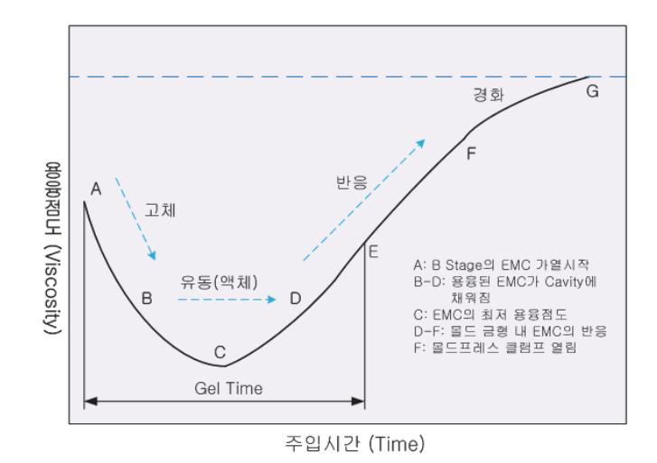

출처: 교육부(2018). 패키지 조립 공정 개발(LM1903060108\_14v3). 한국직업능력개발원. p.49. [그림 3-1] 주입 시간에 따른 EMC의 용융점도

(4) 램 속도(Ram Speed)

펠렛(pellet)을 트랜스퍼 램으로 미는 속도를 말한다. 몰드 컴파운드는 일정 온도의 몰드 다이에서 고체 상태> 겔 상태 > 고체 상태로 변화를 한다. 따라서 겔 상태에서 몰드 컴 파운드를 캐비티(cavity)까지 충진을 한다. 램 속도가 너무 빠르거나 느리면 wire sweeping 발생이 증가하게 된다. 따라서 패키지 형상에 따라 최적의 램 속도를 결정해 야 한다.

(5) 램 압력(Ram Pressure)

트랜스퍼 램으로 펠렛을 밀 때의 압력으로 몰딩 공정의 중요한 조건 중 하나다.

4. PMC(Post Mold Cure)

몰딩 완료 후에 밀봉된 제품을 전기오븐에 175℃에서 3 ~ 4시간이나 150℃에서 8시간 정 도 베이킹(baking)하는 것이다. 큐어(cure) 온도와 시간은 사용하는 EMC의 data sheet를 참고하여 선택하면 될 것이다. 일반적으로 큐어 온도가 높으면 큐어 시간은 큐어 온도가 낮 을 때보다 짧아져 생산성은 높아진다. 그러나 리드 프레임과 EMC의 열팽창계수의 차이로 인하여 몰드 온도보다 큐어 온도가 낮을 때에는 EMC가 압축하나, 몰드 온도보다 큐어 온 도가 높아지면 반대로 인장력이 작용하게 되어 베이킹 과정에서 미세크랙을 발생시켜 리드 프레임과 EMC의 접착력을 감소시킬 가능성이 있다. 몰드 성형 이후 베이킹을 하는 주된 이유는 EMC를 완전히 경화시키기 위해서이다. 몰딩 성형 완료 후에 EMC는 대부분 화학적 반응이 끝났으나 미소하게 반응이 진행 중이다. 따라서 큐어를 하면 EMC의 화학적 반응이 끝나게 되어 성형된 EMC가 더욱 단단하게 된다. 더불어 전기적 특성 개선 및 내부 스트레 스의 감소도 큐어의 효능이라고 할 수 있다.

- 5. 몰드의 구성 요소
  - (1) 몰드 프레스(Mold Press)

몰드 프레스는 클램핑(clamping) 압력에 따라 낮은 톤수(tonnage)로부터 200ton 정도 까지 사용되고 있다. 톤수가 크다는 것은 클램핑 압력이 높다는 뜻 이외도 프레스가 크 다는 의미도 된다. 따라서 몰드 작업에서 1회당 많은 몰딩 성형을 할 수 있어서 생산성 과 연관하여 생각할 수 있다. 몰드 프레스는 트랜스퍼 램(transfer ram) 속도 및 압력, 상하 몰드다이의 온도, 큐어 시간, 싸이클 타임 등이 자동으로 제어된다. 몰드 프레스는 크게 제어반, 램, 상하플레이트, 네 기동, 각종 유압 계통 및 몸체로 구성된다.

(2) 몰드 다이(Mold Die)

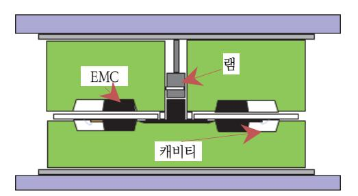

출처: 교육부(2018). 패키지 조립 공정 개발(LM19 03060108\_14v3). 한국직업능력개발원. p.50. [그림 3-2] 몰드 다이의 구조

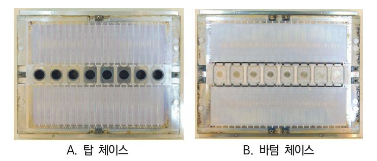

출처: 교육부(2018). 패키지 조립 공정 개발(LM1903060108\_14v3). 한국직 업능력개발원. p.50. [그림 3-3] 탑 체이스(Top Chase)와 바텀 체이스(Bottom Chase)

몰드 다이는 상형 다이(top die)와 하형 다이(bottom die)의 짝으로 되어있다. 상형 다 이는 중앙에 램 포트라는 구멍이 뚫려있고, 이곳에 펠렛을 넣고 램이 들어가 압력을 가 하게 된다. 몰드 다이에는 cavity라고 불리는 홈이 파져 있고, 이곳에 EMC가 녹아 흘 러들어가는 gate라는 입구가 있다. 각각의 gate는 기다란 통로로 연결되어 있는데 이를 러너(runner)라 부른다. 몰드 다이 내의 공기를 EMC가 녹아 흘러들어가는 중 외부로 방출하기 위한 Air Vent도 구성되어 진다. 하형 다이에는 Ejector Pin이 있는데, 이것 은 몰딩 후 성형된 제품을 몰드 다이로부터 떼어내기 쉽도록 하는 역할을 한다.

#### 6. 프리히터(Preheater)

EMC는 일반적으로 펠렛(pellet)이라고 불리는 작은 원주형으로 성형되어 있어 몰딩하기 전 에 고주파 가열기(RF preheater)에 의해 예열된다. 리드 프레임을 몰드 다이에 손쉽게 배 치하기 위해서 Frame Loading Rack을 사용한다. Frame Loading Rack은 몰드 다이몰 에 올려놓기 전에 핫플레이트 위에서 예열된다.

7. 오토몰드(Auto Mold)

리드 프레임 로딩(loading)에서부터 EMC 주입 클램핑, 몰딩,하고 인이너큐어 시간이 종료 된 제품은 degating하고 매거진에 언로딩(unloading)한다. 몰드 공정에서 사용되는 보조 장비인 핫플레이트, 프리히터 등의 과정이 포함되어 있어 생산해 낼 수 있는 몰드 다이의 생산 능력(Capa)은 생산성 측면에서는 조금 불리한 면도 있으나 자재의 품질 및 수율 면에 서는 양호하다.

#### 숕 도금(Plating)

도금 공정은 리드 프레임(lead frame)을 사용한 패키지에서 몰딩(molding)이 형성되지 않은 리드(lead) 부분에 금속 피막을 만드는 공정이다. 도금은 공기 중에서 리드(lead) 표면의 산화 및 변색으로부터 보호하고, 인쇄 회로 기반(Printed Circuit Board)에서 납땜이 잘 되도록 하 고, 전기적인 특성을 양호하게 하여 신뢰도를 높이는데 목적이 있다.

#### 1. 도금 공정 순서

(1) 용융 도금(Dip Soldering)

표면 처리(산화막 및 유기물 제거), 예열, 도금, 수세, 건조 공정 등으로 나눌 수 있다.

(2) 전기 도금(Electroplating)

전해탈지, 에칭(etching), 프리딥(Pre Dip or Activation), 도금, 중화(neutralize), 수 세, 건조 등으로 나눌 수 있다.

2. 도금(Plating) 재료의 동향

전통적인 리드(lead) 도금에서는 Sn(65%)-Pb(35%) 합금을 일반적으로 도금에 많이 사용하 였다. 주된 이유로는 융점(186℃)이 낮고, 기계적 강도가 우수하며, 가격이 싸기 때문이다. 그러나 Pb는 환경에 유해한 영향을 미치므로 세계적으로 사용 규제가 확대되고 있다. 따라 서 순 주석(pure tin), Sn-Cu, Sn-Bi, Sn-Ag, Sn-Ag-Cu 등 Pb를 사용하지 않는 재료들 이로 대체되어 지고 있다. 그러나 대체품들은 Sn-Pb보다 고융점, 젖음성, 유동성 저하에 따라서 작업성도 좋지 못하고 공정 불량률 증가로 이어진다. 이에 대해 더 좋은 대체품이 요구되어진다. 또한 팔라듐(Pd) 도금이 행해지는 μ-PPF 제품은 팔라듐 도금의 두께가 0.1 ㎛이하인 제품이다. 박막 팔라듐 도금 기술은 Pb 사용을 하지 않을 뿐만 아니라, 도금 공정 을 생략할 수 있는 장점이 있다. 팔라듐 도금 두께는 2 ~ 3㎛가 한계이며, 이상이 되면 균

열이 발생한다. 순 주석(pure tin)만을 사용할 경우에는 훼스커(Whisker)현상이 발생하여 리드와 리드 사이 숏트가 발생하는 침상 결정이 나타난다. 따라서 순 주석을 사용할 경우에 는 이 점을 주의해야 한다.

- 3. 도금 방법의 종류
  - (1) 솔더링(Soldering)

도금 욕에 있는 용융된 솔더(Solder)에 도금할 제품을 도금 욕에 담갔다가 꺼내어 표면 에 도금하는 방법이다. 방법에 따라서 Dip Soldering, Wave Soldering 등으로 나눌 수 있다.

(2) 전기 도금(Electroplating)

전해질 용액 내 도금하고자 하는 물질과 도금 물질을 넣고 전류를 가하여 표면에 도금 하는 방법이며, 주로 Sn 도금에 사용된다.

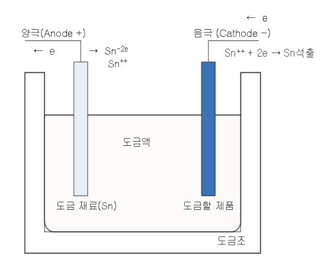

 출처: 교육부(2018). 패키지 조립 공정 개발(LM190306 0108\_14v3). 한국직업능력개발원. p.52. [그림 3-4] 전기도금 원리

도금 재료(Sn)를 양극(anode)에 연결하고 음극(cathode)에 도금하려는 재료를 연결시킨 다음 도금액에 직류 전류를 흐르게 하면, 그림에서처럼 양극의 Sn은 두 개의 전자를 내 어 놓고 양이온 Sn++이 되어 도금액 속으로 녹아 들어가고, 도금액 속의 Sn++는 음극 으로부터 두 개의 전자를 받아 Sn++ +2e → Sn 반응이 되어 Sn 원자들이 음극, 즉 도 금할 재료에의 표면에 결정되어 나타난다.

(3) 솔더링과 전기 도금의 특징

<표 3-3> 솔더링과 전기 도금의 비교

| 솔더링(Soldering)        | 전기 도금(electroplating) |  |
|-----------------------|-----------------------|--|
| 공정이 단순하다함             | 공정이 복잡하고, 제조단가가 높음    |  |
| 균일한 도금 품질을 기대하기 어려움   | 균일한 도금 품질을 얻을 수 있음    |  |
| 설비 투자비가 전기도금 보다 적게 들음 | 설비투자비가 솔더링보다 많이 들음    |  |
| 도금 두께를 두껍게 할 수 있음     | 도금 두께를 얇게 할 수 있음      |  |

#### 숖 트림 앤 폼(Trim & Form)

리드 프레임의 댐버(dambar)는 몰딩(molding) 성형할 때 EMC(Epoxy Mold Compound)가 겔 상태에서 아웃 리드(out lead)로 새어 나오지 못하도록 하는 댐(dam) 역할을 한다. 트림 (trim) 공정은 금형의 punch의 외측면과 die의 내측면 사이에서 발생하는 전단력(shear strength)으로 댐버를 절단시키어 제거하는 공정이다. 일반적으로는 트림 공정 진행 시 플래시 윈도우(Flash Window)에 채워져 있는 EMC를 동시에 제거하는 dejunk도 함께 이루어진다. 포밍(forming) 공정은 트림 공정이 끝난 제품이 솔더(solder) 도금된 후에, strip 상태에서 고 객들이 원하는 형태의 개별 유닛(unit)으로 분리 시켜, 기판에 실장이 되어 독립된 전기적 특성 을 갖도록 리드(lead)의 모양을 성형하는 공정이다. 리드의 형상에 따라 J Form, Gull Form, Throught hole type 등으로 분류할 수 있다. QFP와 SOP package에는 Gull Form이 사용 되고, PLCC와 SOJ package에서는 J Form이 사용된다. 리드 치수는 PCB의 형태에 따라 결 정되고, JEDEC에서 표준화되어 있다.

1. 트림(Trim)

후 공정(Back-end) 중에 트림(trim) 공정은 도금 공정을 전 ․ 후로 할 수 있겠으나, 일반적 으로는 도금 전 trim을 하는 경우가 많다. 도금 전 trim을 하면 리드 프레임의 댐버가 제 거된 부분도 도금이 되고, 도금 공정 후 핸들링(handling)이 감소되어 lead 표면 상태를 우수하게 할 수 있다. 도금 후 trim을 하면 trim 금형의 punch나 die의 마모에 의한 버 (burr) 발생을 감소할시킬 수 있다.

Trim 장비는 크게 로더(loader) 부분, 프레스(press) 부분, 언로더(unloader) 부분으로 구 성되어 져있다. 특히 프레스 부분은 금형과 인덱스 피더 가이드 레일(Index Feeder Guide Rail)로 구성되어져 있다. 금형은 punch, die, 스트리퍼(stripper), 스톱퍼(stopper) 등으로 구성되어 있고, 모터의 회전 운동으로 프레스가 상하 운동을 하게 된다. 이때 상하 운동 횟 수는 일반적으로 150 ~ 300SPM(Stroke Per Minute) 정도 된다. 프레스의 SPM과 punch, die의 수명은 생산 능력(capa)에 많은 영향을 준다. 인덱스 피더 가이드 레일은 lead frame을 이송 안내를 하는 역할을 한다.

#### 2. 폼(Form)

폼 공정에서는 리드 풋(lead foot)을 Punch와 Die의 전단력으로 절단하는 것으로 Trim과 다른 것은 Punch의 날 방향이 Lead 밑면에서 위 방향으로 절단되는 것이다. 이유는 Burr 발생 방향이 아래로 되면 평탄도(coplanarity)에 영향을 주어 PCB 실장 시에 문제가 나타 나기 때문이다. 또한 Lead를 원하는 형상으로 만들기 위해서는 굽힘 가공을 한다. 굽힘 가 공은 Lead에 소성 변형을 주어 Lead 두께에서 중립면의 외측에서는 Lead 두께가 신축이 되어 얇아지고, 내측에서는 압축이 되어 두껍게 된다. 중립면에서는 신축과 인장이 발생되 지 않는다. 또한 lead의 모양을 주기 위해 가한 굽힘 하중을 제거하면 스프링 백(spring back) 현상으로 Lead의 굽힘 정도나 굽힘 각이 작아지게 된다. 따라서 실제 작업에서는 이것을 고려하여 작업해야 한다.

Form 장비는 크게 로더(loader) 부분, 프레스(press) 부분, 싱귤레이션(singulation) 부분, 언로더(unloader) 부분으로 구성되어 있다. 싱귤레이션 부분에서는 리드프레임에서 PKG 개별 유닛(unit)으로 분리시키는 역할을 한다. 프레스(press) 부분에서는 Lead의 절단 및 모양 형성을 한다. 언로더 부분에서는 단일화된 제품을 적재할 수 있는 튜브(tube)나 트레 이(tray)로 이송할 수 있게 구성되어 져있다. 트림(trim)과 폼(form)을 연속적으로 할 수 있 는 인라인(in-line) 장비가 많이 사용된다.

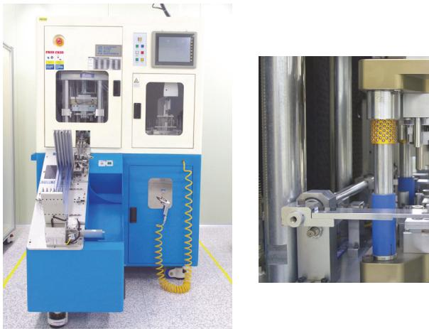

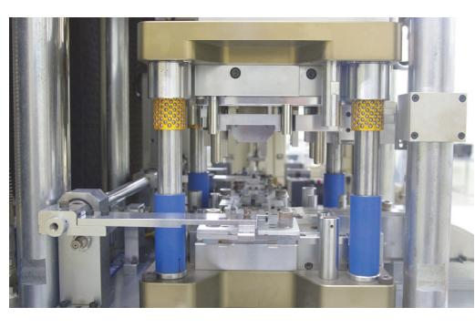

출처: 교육부(2018). 패키지 조립 공정 개발(LM1903060108\_14v3). 한국직업능력개발원. p.54.

[그림 3-5] 폼 장비 [그림 3-6] 폼 금형

PDIP 패키지 폼(Form) 공정 단계는 다음과 같다.

- (1) 리드 프레임의 사이드 레일(Side Rail 절단) :리드 프레임 양쪽에 있는 레일을 절단하여 제거 하는 단계
- (2) 리드 길이(Lead Length) 절단 : 요구되어지는 리드 길이에 맞게 절단하는 단계

(3) 분리(Singulation) : 리드 프레임에서 PKG 개별 유닛(unit)으로 분리하는 단계

(4) 전 성형(Pre-form) : 최종 성형 전에 예비로 리드 형상 변형시키는 단계

(5) 최종 성형(Final Form) : 완성된 리드 형상을 만드는 단계

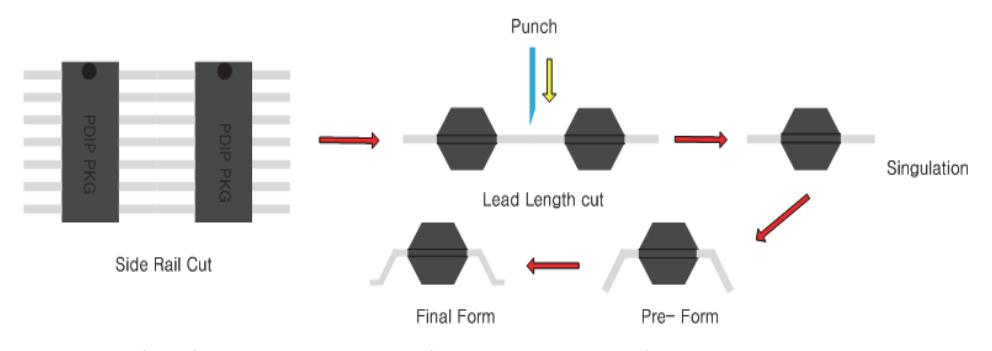

출처: 교육부(2018). 패키지 조립 공정 개발(LM1903060108\_14v3). 한국직업능력개발원. p.54. [그림 3-7] 폼 공정 순서

숗 SBM(Solder Ball Mount)

Substrate 기반의 PKG에서 몰딩 공정이 완료된 후에 PCB에 솔더 볼(solder ball)을 접합하 여 전기적으로 연결 시켜주는데 이를 SBM(Solder Ball Mount) 공정이라 한다.

1. SBM 공정순서

PCB의 구리 패드(pad) 위에 플럭스(flux)를 도팅(dotting)한 다음 솔더 볼을 임시적으로 부착시킨 후 리플로우(reflow)에서 솔더 볼의 용융 온도 이상이 되면 솔더 볼은 PCB에 완 전한히 부착이 이루어지게 된다. 이때 솔더 볼과 구리 패드 사이에서 금속 간 화합물 (Intermetallic Comopund)이 형성되어 단단하게 부착된다. 그 다음 도팅한 잔류 플럭스 를 순수(D.I water)로 살포하여 제거한다.

2. 솔더 볼(Solder ball)과 플럭스(Flux)

솔더에는 주석(Sn)-63%와 납(Pb)-37%로 조성된 것이 융점이 183℃이고 활용도가 많았으 나, 최근에는 Pb가 심각한 환경 오염을 유발시키어 무연 솔더(Pb-free Solder)를 사용한 다. 무연 솔더는 Sn을 기저로 하여 은(Ag)과 구리(Cu) 성분 조성으로 많이 사용한다. 또한 추가적인 특징을 변화하기시키기 위해서 소량의 인듐(In)이나 비스무스(Bi) 등을 소량 첨가 하기도 한다. 플럭스는 자기 스스로는 반응하지 않고, 다른 물질의 반응을 촉진시켜준다. 따 라서 플럭스는 솔더 표면의 산화물 제거 및 산화를 방지하고 솔더의 퍼짐성(spreadability), 납땜성(solderability)을 우수하게 한다.

3. 리플로우(Reflow)

리플로우 공정은 솔더 볼을 PCB 위에 부착하기 위해서 고온을 가하여 솔더 볼과 PCB 사 이에 있는 솔더를 용융시키어 접합하는 공정이다. 표면 실장 제품(Surface Mount Device) 도 리플로우로 PCB에 접합되어진다. 리플로우 방식에는 IR(Infrared) Reflow와 대류 Reflow가 있다. 대부분은 필요한 온도를 얻기 위해 이 두가지 방식을 혼용하여 사용한다.

(1) IR Reflow

적외선 램프에서 발생되는 열을 직접 PCB에 전달하는 방법으로, PCB의 재료가 균일하 지 않으면 열이 균일하게 전달되지 않아 부분 과열(hot spot)이 발생할 수 있다.

(2) 대류(Convection) Reflow

뜨거운 공기(hot air)를 PCB에 골고루 불어 열을 전달하는 방법으로, IR Reflow보다 PCB에 열을 균일하게 전달할 수 있다.

(3) 리플로우 온도 곡선(Reflow Temperature Profile)

리플로우 장비는 여러 구간으로 나누져 각 구간의 온도를 조절할 수 있다. 리플로우 작 업을 할 때 컨베어(conveyor)에 제품을 올려놓으면 컨베어 속도에 따라 리플로우 장비 의 각 구간의 설정 온도에 노출되게 된다. 이때 시간에 따른 온도 변화를 그래프로 나 타낸 것을 온도 곡선이라 한다.

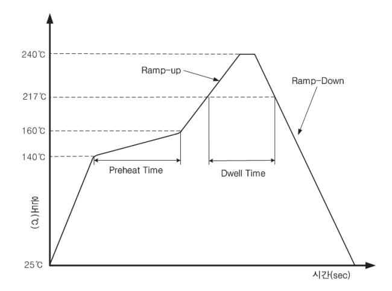

 출처: 교육부(2018). 패키지 조립 공정 개발(LM1903060108\_14v 3). 한국직업능력개발원. p.56. [그림 3-8] 리플로우 프로파일

(가) 예열 구간(Preheating Time, Pre Dwell)

솔더 볼 온도가 서서히 올라가는 구간으로, 플럭스의 유기 용재 성분이 증발되는 온 도까지 서서히 예열한다.

(나) 드웰 구간(Dwell Time)

솔더 볼의 용융 온도 이하에서 유지되는 시간으로, 솔더링의 양 ․ 불량 기준이 되는 구간이다.

(다) 최고 온도 구간(Peak Temperature) 리플로우에서 최고 높은 온도 구간으로, 솔더 볼이 용융되어 PCB에 접합된다. (라) 쿨링 구간(Cool down)

솔더 볼이 경화되는 구간으로, 솔더 볼의 표면 상태를 결정하는 요소이다.

(마) 램프 업(Ramp-up), 램프 다운(Ramp-Down)

램프 업은 예열구간에서 최고온도 구간 사이의 온도 상승 기울기를 말하며, 램프다 운은 최고온도에서 쿨링 되어지는 온도 하강 기울기를 나타낸다.

(4) Reflow의 변화

수년 전부터 변화되는 것은 진공(vaccum) 리플로우와 Flux Filter System이 장착된 리 플로우이다. 이러한 기능은 Reflow 시 발생되는 산화와 flux로 인한 PCB Cleaning 및 환경 문제 개선을 위한 것이다.

수 마킹(Marking)

상호, 품명, LOT NO, I.D Mark(1번 핀), 제조사, 기타 등의 문자나 숫자 또는 기호를 반도체 패키지의 윗면이나 아랫면에 잉크나 레이저로 인쇄하는 것이다. 제품에 대한 정보를 기록하여 고객에게 제공하고, 제품에 품질 문제가 발생할 경우 특히 마킹 정보(LOT NO)를 추적하여 문 제 해결에 사용한다.

1. 잉크 마킹(Ink Marking)

인쇄 잉크를 사용하므로 선명하고, 색상을 자유롭게 선택할 수 있다. 또한 잘못한 마킹이 되면 지울 수 있다. 그러나 건조 및 세정 때문에 환경 문제를 일으킬 수 있으며, 레이지 마 킹에 비하여 생산성이 떨어진다.

(1) 잉크 마킹 방식

피 인쇄체에 잉크를 프린팅(printing)하는 방법에 따라 3가지로 나눌 수 있다. 첫째, 인 쇄 매체가 직접적으로 잉크를 잉크 판이나 잉크통으로부터 제품에 전사하는 다이렉트 마킹(direct marking) 둘째, 잉크가 제품에 전사되기 전 중간 매체인 오프셋 롤러 (offset roller)나 패드(pad)위에 전사되는 오프셋(offset marking) 셋째, 플레이트의 에 칭된 활자에 채워진 잉크를 실리콘 고무에 묻혀 제품에 전사하는 방식인 패드마킹(pad marking)이 있다.

(2) 잉크 종류

건조하는 방식에 따라 크게 3가지로 나눌 수 있다.

(가) 상온 경화성 잉크

잉크가 공기 중의 산소 입자와 결합하여 피막을 형성하는 것으로 경화를 위한 설비 가 불필요하나 완전 경화에 장시간이 필요하다.

(나) 열경화성 잉크

에폭시(epoxy) 물질을 매체로 갖는 잉크로 열에 의해 경화되기 때문에 경화를 위한 추가 장치가 필요하고 경화 시간이 소요된다.

(다) 자외선 경화 잉크

특정 강도의 자외선(파장 200nm ~ 400nm)에 의해 광화학 반응을 일으켜 경화되는 잉크로 조사 시간이 3초 이하의 짧은 시간에 경화된다.

(3) 잉크 마킹과 제품 표면의 오염

마킹 할 제품 표면의 오염이 존재할 경우는 좋은 잉크 마킹을 할 수 없다. 몰딩에서 카 누버 왁스(carnauba wax), 기계기름, 오일, 인체로 부터의 분비물(human grease), 플 럭스 잔유물, 먼지 등이 제품 표면에 존재하지 않도록 주의해야 한다.

2. 레이저 마킹(Laser Marking)

레이저 빔(beam)을 이용하여 제품의 표면을 연소시켜 인쇄한다. 인쇄 시 제품 표면과 비접 촉으로 인쇄를 하므로 제품의 변형이 적고 생산성이 높다. 잉크 마킹에 비해 선명하지는 않 으나, 내약품성이 우수하고, 반영구적이며, 디바이스(device) 변경 시 편리하여 대부분은 레 이저 마킹을 이용한다.

(1) 레이저 마킹 방식

레이저를 이용한 마킹 방식은 3가지로 나눌 수 있다. 첫째, 레이저 빔을 미러(mirror)로 주사시키어 원하는 표시를 인쇄하는 주사식(scanning type) 둘째, 레이저 빔을 유리나 금속마스크(mask)에 투과시켜 마스크 패턴(pattern)의 이미지를 마킹 대상물의 표면에 결상시켜 인쇄하는 마스크식(mask type) 셋째, 주사식과 마스크식의 장점을 합한 것으 로 패턴 선택 및 마킹 위치 선정을 두 대의 스캐너로 하는 혼합식(mix type)이 있다.

(2) 레이저 종류에 따른 특징

레이저 매질을 기준으로 하여 나누면 기체 레이저, 액체 레이저, 고체 레이저, 반도체 레이저로 나누어진다. 반도체 패키지의 소형화로 마킹 글자의 크기가 작아지면서 세밀한 마킹이 요구되어진다. 이런 요구를 만족시켜주는 레이저는 YAG 레이저이다. YAG 레이 저는 고체 레이저로써 0.15mm 정도 두께로 인쇄할 수 있고, 더욱 정밀한 경우에는 0.1mm까지 가능하다. 기체 레이저의 하나인 Co2 레이저는 가격이 낮으나 미소 문자를 인쇄하기는 곤란하고, 발색성이 나쁘며, 마킹 면이 깨끗하지 않고 오염물이 많이 발생하 여 사용하는데 많은 제한이 있다. 반도체 레이저는 장치의 소형화, 에너지 절약이 가능 하며 빈번한 램프(lamp)교환이 필요하지 않아 앞으로 전환이 예상된다. 또한 레이저의 안정성 및 에너지 조절은 레이저로 마킹할 문자나 기호가 작아지며, 같은 깊이로 인쇄하 기 위해서는 레이저 빔의 스팟(spot) 직경을 제곱의 비율로 하여 레이저 출력 에너지를 정밀하게 제어할 수 있는 레이저 제어가 필요하다.

#### 숙 소잉 싱귤레이션(Sawing Singulation)

기판(substrate) 상태로 진행된 strip 자재를 Cutting Blade의 회전으로 기판 및 몰드 컴파운

드(mold compound)를 잘라 유닛(unit)을 개별화는 것을 소우 싱귤레이션 공정이라 한다. 장 비는 소우(saw) 부분과 소터(sorter) 부분으로 구성되어 있다. 소우 부분은 유닛을 개별화하고, 개별화된 유닛은 비전 시스템에서 양품과 불량품을 구분해서 트레이(tray)로 분류해 주는 부분 이 소터이다.

1. 소우 싱귤레이션 공정 순서

자재 공급, 소잉(sawing), 클리닝(cleaning), 건조(dry), 검사, 정렬 순으로 진행된다.

2. 공정 조건

Blade height, 커프(Kerf), 스트리트(street), Blade expose, Blade 회전 및 이송 속도, 냉각수의 양 등을 제품 특성에 맞게 고려해야 한다.

#### 숚 튜브(Tube) & 트레이(Tray)

폼(form) 및 소우 싱귤레이션(singulation) 공정을 완료하면 하나의 스트립(strip)에 여러 개의 유닛이 개별화되어 튜브나 트레이에 적재된다.

1. 튜브(Tube)

싱귤레이션(singulation)이 완료된 DIP, SOP, PLCC Type 등의 제품을 담아 이동 및 운 반하는 부자재로 장비 상에서 경사를 이용하여 슬라이딩(sliding) 방식에 의해 제품이 튜브 에 투입된다. 재질로는 PVC resin에 정전 처리되어 사용된다.

2. 트레이(Tray)

싱귤레이션이 완료된 QFP, BGA, LGA Type 등의 제품을 담아 이동 및 운반하는 부자재 로 장비 상에서 고무 성분의 픽커(picker)가 제품을 유닛 단위로 집어서 트레이에 놓는다. 재질로는 MPPO(Modified Poly Phenylene Oxide)를 사용한다.

3. Pick & Place 장비

개별화된 제품을 픽커(picker)가 흡착을 하거나 그립(grip)으로 튜브, 트레이, 테이프 & 릴 에 놓을 때 사용을 하는 장비이다.

## 수행 내용 / 패키지 후공정 개발하기

#### 재료·자료

- EMC, wire bonding된 제품, 액상수지, 사용설명서, 솔더 볼, 플럭스, 솔더, 트레이, 튜브
- 매거진, 작업표준서, 검사기준서

#### 기기(장비 ・ 공구)

- 몰드 프레스, 프리히터, 핫플레이트, 전기오븐, 몰드 다이, 써머커플, 소우 앤 소터
- 레이저 마킹 장비, 트림 & 폼 장비, 전기도금 설비, 리플로우 장비, 솔더 마운팅 설비
- 디스펜서(dispenser), 실린지(syringe), 니들(needle), UV 조사기
- 현미경, X-ray, 도금 두께 및 성분 측정기

#### 안전 ・ 유의사항

- 작업 전 장비의 작업 조건 등이 올바르게 설정되었는지 확인 후 작업한다.
- 오븐 사용 시 제품을 꺼낼 때에는 온도가 40℃ 이하로 내려간 다음 꼭 확인 후 제품을 꺼 낸다.
- 도금 작업을 할 때에는 환기 시설의 작동 여부 확인 및 각종 약품들의 체계적인 관리가 필 요하다.
- 환경 규제 관련 솔더나 EMC 재질, 기판 재질 등에 대한 환경 오염을 고려해야한다.
- 시스템 인 패키지(SiP)의 경우 고객과 디자인 협의를 통해 상세 설계하여야 한다.

#### 수행 순서

숔 패키지의 본체를 형성하기 위해서 몰드 및 액상수지 도포하기

#### 1. 트랜스퍼 몰딩하기

(1) EMC 보관 및 사용 전 확인사항

EMC 보관은 4℃이하에서 보관해야 한다. 보증 기간은 일반적으로 제조일로부터 6 ~ 9 개월이다. 또한 오래된 Lot부터 사용한다. 4℃이하에 보관 중인 EMC를 사용하기 위해 서는 실온에 24시간 두어 실내 온도가 될 때까지 기다린 후 사용해야 한다. 이유는 만 약 실내 온도보다 EMC의 온도가 낮은 경우에는 공기 중의 수분에 의하여 이슬이 맺히 고 습기가 생성되기 때문이다. 또한 일반적으로 실내 온도에 이른 후 6일 이내에 사용 해야 한다.

- (2) 몰드 장비 사용 조건 확인사항
  - 몰딩 작업을 하기 위해서 몰드 다이와 몰드 프레스 주요 페라메터를 설정해야 한다.
  - (가) 몰드 다이 온도가 적정 온도로 설정 했는지와 몰드 다이 표면 온도를 써머커플로 측정한 다.
  - (나) 몰드 다이의 상형과 하형을 밀착하는 클램프 압력을 설정한다.
  - (다) EMC를 밀어내는 램(ram) 압력을 설정한다.
  - (라) EMC를 밀어내는 램(ram) 속도를 설정한다.
  - (마) EMC가 몰드 다이의 cavity에 충전된 후 일정 시간 머무는 시간 즉, 인 몰드 큐어 시간 (In-mold cure time)을 설정한다.
- (3) 몰딩 작업하기
  - (가) 전 공정(Front 공정)에서 wire bonding 완료된 리드 프레임이나 PCB를 몰딩 작업하기 전 예열을 한다. 일반적으로 lead frame 경우는 일정 시간 핫플레이트 올려서 예열하거 나, 몰드 다이에 로딩(loading)후 일정 시간 예열하는 경우도 있다.
  - (나) 핫플레이트(hot plate)에서 예열한 리드 프레임을 몰드 다이에 로딩한다.
  - (다) 원주형으로 성형된 EMC를 고주파가열기(RF Preheater)를 이용하여 예열한다. 프리히터 빌리티(Preheatability)를 좋게 하기 위한 유념사항은 다음과 같다.
    - 펠렛을 가급적 전후좌우의 정 중앙에 놓는다.
    - 전극의 높이를 정하는 규정을 만들어 설정한다.
    - 가열 시간을 정한다.
    - 가열 후 지체 없이 포트에 넣어 사용한다.
    - 두 개 이상의 펠렛을 사용 할 때는 이들을 서로 붙여서 프리히팅한다.
    - 전극 주변 및 롤러에 있는 EMC 찌꺼기를 완전히 제거한다.
  - (라) 예열된 EMC를 몰드 다이의 램 포트에 삽입한다.
  - (마) 몰드 프레스의 상형과 하형이 밀착하는 클램핑(clamping)한다.
  - (바) 몰드 프레스의 램을 이동시킨다.
  - (사) 인 몰드 큐어가 진행하는 동안 몰드 프레스의 압력, 온도를 나태는 표시장치 등을 살펴 보면서 공정에 문제가 있는지 주의한다.
  - (아) 인 몰드 큐어가 끝나고 몰드 프레스의 밀착되어 있던 상형과 하형이 분리되면 성형된 리 드프레임을 언로딩(unloading)한다. 언로딩 후 성형된 제품은 실온에서 일정 시간 냉각 시킨다.

(자) 컬(cull) 및 몰드 성형을 하기 위해 형성된 게이트(gate) 부분의 플라스틱을 제거한다. (차) 다음 몰딩 작업을 하기 위해서 몰드 다이 클리닝을 한다.

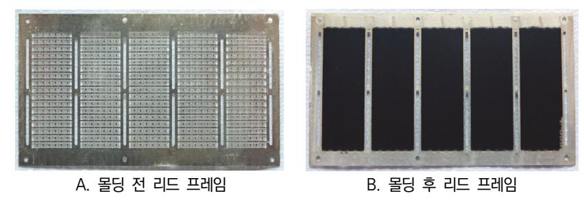

출처: 교육부(2018). 패키지 조립 공정 개발(LM1903060108\_14v3). 한국직업능력개발원. p.61. [그림 3-9] 몰딩 전후 리드 프레임

- 2. 오토 몰딩하기
  - (1) 인 매거진(In Magazine)

와이어 본딩(wire bonding)이 완료된 리드 프레임(lead frame)을 공급한다.

(2) 리드 프레임 시프트(Lead Frame Shift)

매거진으로부터 공급된 리드 프레임을 로더에 공급될 상태로 정렬한다.

(3) 로딩(Loading)

리드 프레임 시프트 상의 리드 프레임과 탭 슈트에 정렬된 EMC를 공급받아 몰드 다이 에 로딩한다.

(4) 몰딩 작업

몰드 다이의 상형과 하형이 밀착하여 성형 작업을 진행한다.

(5) 언로딩(Unloading)

몰딩이 완료된 제품을 운반한다.

(6) 캐리어(Carrier)

언로더로부터 받은 제품에서 컬(cull)을 분리한다.

(7) 픽업(Pick up)

캐리어로부터 몰딩이 완료된 제품을 받아 매거진에 적재한다.

3. 액상 수지로 도포하기

액체형 수지(resin)는 일액형 수지와 이액형 수지로 나눌 수 있다. 일액형은 공정 중에 수 지를 혼합하는 공정이 없어 간단하지만 반응성이 강하여 보관 수명은 보통 이액형보다 짧 다. 이액형 수지는 경화제와 주제로 이루어져 있고, 열을 가하면 짧은 사슬이 그물망 형태

- 를 이루어 고분자 형태로 경화되며, 경화된 후에는 다시 열을 가해도 녹지 않는다.
- (1) 액상 수지 취급

일액형의 경우 반응성이 높아서 반응성을 억제하고 오랜 기간 보관하기 위해서는 저온 에서 보관할 필요가 있다. 또한 이액형의 산무수물 형태의 경화제도 반응성이 높으므로 저온에서 보관해야 한다. 일반적으로 이들 봉지재는 온도가 높을수록 반응성이 높으며, 150℃에서 1시간이면 반응이 완료된다. 반대로 온도가 낮으면 반응성이 떨어지며 보통 –40 ~ –50℃에서 보관하면 1년까지 보관할 수 있다.

- (2) 도포 공정 순서
  - (가) 주제와 경화제를 비율에 맞게 배합한다.

에폭시나 실리콘의 이액형 수지는 보통 주제와 경화제로 나뉘어 있는 이액형이 사용 되고 있다. 이액형 수지는 주제와 경화제가 적정 비율로 반응하여 최대의 물성치를 발휘하도록 되어 있으며, 주제와 경화제의 배합비는 정확히 저울로 측정해야 한다. 배합비를 지키지 않을 경우 물성은 매우 불량하며, 이 두 물질의 비율을 임의로 조 정하는 방법은 좋지 않다. 자세한 사항은 액상수지 데이터 시트를 참고한다.

- (나) 배합된 수지가 균일하게 섞일 수 있도록 혼합한다.
  - 대량의 수지를 혼합할 경우 진동 믹서 등을 이용하며, 소량의 수지인 경우 원심 분 리형 혼합기를 사용한다. 배합비를 정확히 측정하여 혼합하였더라도 부분적으로 혼합 이 이루어지지 않으며 물성이 불량해지고 경화가 되지 않는 현상이 발생할 수 있으 므로 주의해야 한다. 이액형 수지의 경우 혼합 초기에는 두 물질이 섞이지 않아 수 지 내부에 아지랑이 같은 현상이 발생하나 혼합이 잘 이루어지면 이 현상은 사라진 다. 참고로 혼합 후 봉지재는 가사 시간(Pot life)이라는 것이 존재하는데, 봉지재를 혼합 후 공정에서 사용할 수 있는 시간을 의미한다. 주제와 경화제를 혼합하면 시간 이 지나면서 화학 반응이 일어나 열이 발생하고 점도는 계속 상승하는데 이런 현상 이 지속되면 결국 사용할 수 없게 된다. 가사 시간은 상온을 기준으로 하며, 온도가 높으면 빨라지고 온도가 낮으면 느려진다. 또, 양이 많을수록 반응속도는 빨라지는데 공정 담당자는 같은 종류의 수지일 경우 가사 시간이 긴 것을 사용하는 것이 좋다. 공정의 재현성을 위하여 가사 시간이 지난 액상수지는 사용하면 안 된다.
- (다) 액상 수지 내부에 존재하는 기포를 제거하는 탈기 작업을 한다.
  - 액상 수지는 수지 제조 공정이나 보관, 혼합 공정 등에서 많은 기체를 함유하는데 이를 제거해야 패키지가 기포(bubble) 없이 제조된다. 액상 도포 중 탈기하지 않은 액상수지를 사용하면 경화 도중 기포가 발생한다. 이런 현상을 방지하기 위해서는 진공 탈포를 해야 한다. 일반적인 진공 탈포 조건은 온도 50±5℃, 탈포 시간 20분, 압력 66 ~ 76cmHg 이다.
- (라) 액상 수지를 틀이나 도포할 부분에 토출하여 봉지한다.

몰드 컵(mold cup)과 같은 주형이나 도포할 부분에 액상 수지를 채우기 위해서는 디스펜싱 방법을 많이 사용한다. 디스펜싱 방법은 니들(needle)을 사용하여 토출하기 때문에 액상수지의 종류나 점도 등에 큰 영향을 받지 않고 이용할 수 있다는 장점이 있다. 또한 진공 프린팅 방법은 COB 형태의 다수 개의 칩을 한 번에 몰딩하는 방법 으로 진공 분위기에서 수지를 도포하기 때문에 봉지층에 기포가 발생하지 않는 장점 이 있다. 토출 시 공기 방울이 발생하지 않도록 온도를 높여 진행하기도 하며, 봉지 내에서도 토출하는 부위에 따라 공기 방울의 생성 유무가 달라질 수 있으므로 주의 를 기울여야 한다.

(마) 액상 수지로 성형된 제품을 전기오븐에서 경화시킨다.

수지의 경화란 강도 측면에서 보았을 때 최대 물성의 80%가 이루어진 상태를 말하 며 DSC로 반응열을 측정하면 더 정확히 알 수 있다. 수지는 경화를 불완전하게 하 면 신뢰성에 문제가 발생할 수 있으므로 반드시 액상 수지의 데이터 시트에 따라 전 기오븐에서의 시간, 온도를 참고하여 진행한다.

#### 수행 tip

- EMC가 실온에서 aging이 충분히 되었는지 확인한다.
- 작업 환경의 먼지, 습도, 온도에 따라 공정에 많은 영향을 미치므로 주의해야 한다.
- 작업 완료 후 검사 항목에 따라 제품을 자주 검사를 실시 한다.
- 작업 시에는 방진모, 방진복, 실내화 등 규정된 복장을 착 용해야 한다.

숕 패키지의 외부 리드(lead)에 무연 솔더 도금(plating)하기

- 1. 전기 도금(Electroplating)
  - (1) 전 처리 공정을 진행한다. 도금 전에 탈지(degreasing), 수세, 녹 제거, 수세 공정을 전 처리라 한다.
    - (가) 전해탈지(Electrolytic Degreasing)를 한다.

전해탈지는 알카리액에서 전기분해 시 발생되는 가스로 리드(lead) 표면의 유지방 및 몰드 찌꺼기(flash) 등의 오염물을 제거한다.

(나) 수세(Rinse)를 한다.

전 작업에서 잔류하는 알카리 용액을 리드(lead)에서 씻는 것을 말한다.

(다) 산처리를 한다.

산처리는 리드(lead) 표면에 존재하는 산화막을 제거하기 위해 한다. 산성 수용액에 제품을 담가서 표면의 산화막을 화학적으로 제거하며, 이를 산세(pickling)라 한다.

- (2) 프리 딥(pre-dip) 공정을 한다. 프리 딥은 도금 전 도금 활성화(activation)를 부여한다.
- (3) Pure Tin Plating(전기 도금) 공정을 한다. 도금하려는 제품을 음극(-)에 연결하여 직류 통전 한다.
- (4) 후 처리를 한다. 도금된 표면의 불순물 및 수분을 제거하는 것으로 도금층 표면을 중화시키 는 공정과 세척, 건조 공정 등으로 되어 있다.
- 4. 몰드공정의 주요 유형별 불량 및 Trouble Shot 확인하기

<표 3-4> 몰드 불량 항목별 원인 및 대책

| 불량 항목                          | 원인                                       | 대책                                                |
|--------------------------------|------------------------------------------|---------------------------------------------------|
| 불완전성형                          | ․ 성형 온도가 너무 높거나 낮을 경 우                | ․ 최적의 성형 온도로 맞춤                                   |
| (Incompleted Fill)             | ․ EMC의 양이 부족할 경우                         | ․ EMC 양 증가, 컬 두께 조정                               |
| - 몰드 성형이 불충분 하게 완성됨         | ․ 트랜스퍼 압력이 부족 할 경우                       | ․ 트랜스퍼 램 압력을 높임                                   |
|                                | ․ Air Vent가 막혔을 경우                       | ․ 몰드 다이 세정이나 Flash 제거                             |
| 빈틈(Void)                       | ․ 성형 온도가 너무 높거나 낮을 경 우                | ․ 최적의 성형 온도로 맞춤                                   |
| - 성형후 EMC 내부                   | ․ EMC의 유동성                               | ․ 최적의 트랜스퍼 스피드로 조절 ․ EMC의 점도, Gel Time, Spiral |
| 에 빈틈, 기포가 존 재하는 것           |                                          | Flow 적정화                                          |
|                                | ․ 트랜스퍼 압력이 부족 할 경우 ․ Air Vent가 막혔을 경우 | ․ 트랜스퍼 램 압력을 높임 ․ 몰드 금형 세정이나 Flash 제거       |
| 몰드스틱킹                          | ․ 몰드 다이 온도 불균형                           | ․ 균일하게 온도 조정                                      |
| (Mold Sticking)                | ․ 불완전한 경화                                | ․ 성형 온도 및 인어 큐어 시간 최적화                            |
| - 몰드 성형 부분이                    | ․ 불충분한 세정                                | ․ 클리닝 시트로 몰드 다이 세정                                |
| 몰드 다이에 잘 분 리되지 않는 것         | ․ 이형성 부족                                 | ․ 몰드 다이에 이형 성분 부여 ․ EMC의 이형 성분 증가              |
| 얼룩(Stain) - 패키지에 나타나는 얼룩 | ․ 부적절한 왁스 사용                             | ․ 몰드 다이 세정 횟수 증가                                  |
| 와이어쓸림 (Wire Sweeping)       | ․ EMC의 유동 점도가 높음                         | ․ 성형 온도 올림                                        |
| - wire가 휘어져 인접 한 wire에 교차 혹 | ․ Cavity 내의 충진 압력이 높음                    | ․ 트랜스퍼 압력 낮춤                                      |
| 은 접촉되어 있는 것           | ․ Cavity 내의 충진 속도가 높음                    | ․ 트랜스퍼 속도 낮춤                                      |
| 용액 넘침 (Excess Flash)        | ․ 트랜스퍼 압력이 너무 높을 경우                      | ․ 트랜스퍼 압력을 내림                                     |
| - EMC가 리드 프레                   | ․ 클램프 압력이 너무 낮을 경우                       | ․ 클램프 압력을 높임                                      |
| 임의 외부리드에 달 라붙는 것            | ․ EMC가 비정상적으로 점도가 낮을 경우               | ․ 몰드 다이 온도를 내림                                    |

- (가) 중화 처리를 한다. 도금 표면의 산성분을 중화하는 것이다.
- (나) 세척을 하여 도금 표면의 불순물 및 잔류 물질 등을 제거한다.
- (다) 건조하여 도금 제품에 있는 수분을 제거한다.
- (5) 도금 두께 및 성분 등을 검사한다.

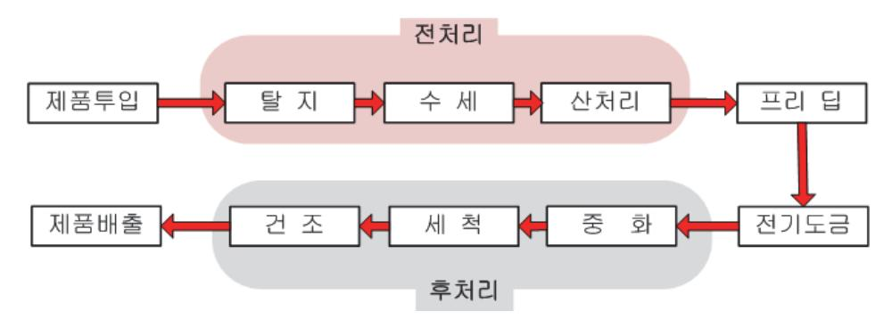

출처: 교육부(2018). 패키지 조립 공정 개발(LM1903060108\_14v3). 한국직업능력개발원. p.66. [그림 3-10] 전기 도금 공정 순서도

- 2. 용융 도금(Dip Soldering)
  - (1) 산 처리를 하여 리드 표면의 산화막을 제거를 한다.
  - (2) 수세를 하여 전 작업에서 잔류하는 용액을 리드에서 씻어 낸다.
  - (3) 도금할 부분에 플럭스를 바른다. 플럭스는 납의 표면장력을 제거시켜 퍼짐성, 납땜성을 우수 하게 하고 리드 표면의 산화물 제거 및 재산화를 방지한다.
  - (4) 예열(pre-heater)시킨다. 예열은 플럭스의 활성화(activation)를 높이고, 열 충격을 완화시켜 준다.
  - (5) 도금 욕에 도금할 제품 부분을 담그었다 꺼내어 무연 솔더 도금을 한다.
  - (6) 도금 표면의 불순물 및 잔류 물질 등의 제거를 위해 수세를 한다.
  - (7) 도금한 제품을 냉각시킨다.

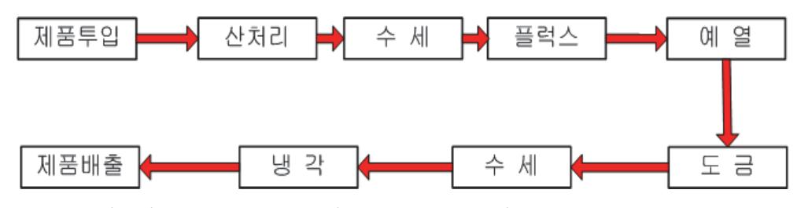

출처: 교육부(2018). 패키지 조립 공정 개발(LM1903060108\_14v3). 한국직업능력개발원. p.66. [그림 3-11] 용융도금 공정 순서도

#### 숖 트림 & 폼 공정을 통해 댐버 제거 및 패키지 외부 리드의 모양 형성하기

일반적으로 트림, 폼 공정은 장비가 프로그래시브 다이(Progressive die)로 되어 있어 연속적 으로 작업이 이루어지나, 여기서는 트림과 폼 공정을 구분하였다.

1. 트림(Trim)하기

- (1) 작업 진행 전 트림할 제품, 트림 장비의 조건, 트림 금형의 punch 및 die 상태 확인을 한 다.(각 공정 작업지시서 숙지)
- (2) 트림할 리드 프레임이 매거진(magazine)에 잘 삽입되어 있는지 확인 후 트림 장비의 로딩 (loading)부에 투입한다.
- (3) 트림 장비의 시작 버튼을 눌러 트림 공정을 진행한다. 이 때 장비의 로딩부에서 트림 금형부 로 이송할 때, 센서(sensor) 감지, 인덱스 피더(index feeder), 인덱스 핑거(index finger) 동작 상태를 확인한다. 특히 제품 이송 시에 발생될 수 있는 잼(jam) 검출이 잘 되는지 관찰 한다.
- (4) 트림 장비의 프레스(press) 부에서는 트림 금형이 고정되어 있어 상 ․ 하 운동을 하는데 사 용하는 프레스에 따라 유압식과 기계식이 사용된다. 리드 프레임의 댐버(dambar)는 이 부분 에서 제거가 된다.
- (5) 댐버가 제거된 리드 프레임이 언로딩(unloading)부에 이동되어 매거진에 적재한다. 트림이 완료된 제품에서 버(burr), 패키지 깨짐, 프레임 구겨짐 등이 발생되었는지 외관 검사를 한다. 만약 문제가 발생되면 트림 장비의 상태, 조건, 작업 방법 등을 고려하여 원인 및 대책을 찾 아야 한다. 이를 사전에 예방하기 위해서는 장비의 주기적 점검이 필요하다.

출처: 교육부(2018). 패키지 조립 공정 개발(LM1903060108\_14v3). 한국직업능력개발원. p.67. [그림 3-12] 리드 프레임의 댐버 제거 전후

- 2. 폼(Form) 진행하기(QFP 패키지 중심)
  - (1) 작업 진행 전 폼 할 제품, 폼 장비 조건, 폼 금형의 punch 및 die 상태 확인을 한다.(각 공 정 작업지시서 숙지)
  - (2) 폼할 리드 프레임이 매거진(magazine)에 잘 삽입되어 있는지 확인 후 폼장비의 로딩 (loading)부에 투입한다.
  - (3) 폼 장비의 시작 버튼을 눌러 폼 공정을 진행한다. 이 때 장비의 로딩부에서 폼 금형부로 이 송할 때, 센서(sensor) 감지, 인덱스 피더(index feeder), 인덱스 핑거(index finger) 동작 상태를 확인한다. 특히 제품 이송 시에 발생될 수 있는 잼(jam) 검출이 잘 되는지 관찰한다.
  - (4) 폼 장비의 프레스(press) 부에서는 폼 금형이 고정되어 있어 상․하 운동을 한다. 이 부분에서 리드(lead)를 원하는 모양으로 성형을 한다. 폼 공정은 일반적으로 1차, 2차 순서로 공정이 진행되는데 다음과 같다.
    - (가) 1차 폼이 진행되기 전 1차 폼 펀치(punch)로 리드 프레임의 섹션 바(section bar)를 자른다.
    - (나) 섹션 바가 잘려진 후 리드는 폼 펀치에 의해 약 40 ~ 50도 정도의 각도로 1차 폼이 실 행된다.
    - (다) 1차 폼이 완료된 후 2차 폼을 진행하기 위해 금형 내부의 2차 폼 부분으로 제품이 이송 되고 제품을 고정하고 있는 금형의 스트립퍼(stripper)는 1차 폼 각도를 유지하는 기능 도 하게 된다.
    - (라) 2차 폼 펀치가 아래로 힘을 가지고 이동하면서 리드의 모양을 성형한다.
    - (마) 2차 폼이 완료된 후 리드를 원하는 길이로 리드 절삭(lead cut)이 이루어지면서 제품이 분리된다.
  - (5) 분리된 제품은 언로딩(unloading)부에 이동되어 픽커에 의해 트레이에 적재된다. 폼이 완료 된 제품에서 버(burr), 리드치수, 평탄도(coplanarity) 등을 측정하고, 외관검사를 하여 패키 지 깨짐, 도금 벗겨짐 등을 확인한다. 만약 문제가 발생하면 폼 장비의 상태, 조건, 작업 방 법 등을 고려하여 원인 및 대책을 찾아야한다. 이를 사전에 예방하기 위해서는 장비의 주기 적 점검이 필요하다.

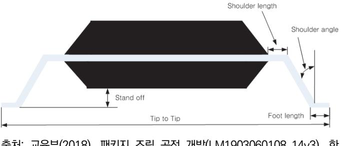

출처: 교육부(2018). 패키지 조립 공정 개발(LM1903060108\_14v3). 한 국직업능력개발원. p.68. [그림 3-13] 리드(Lead) 치수

#### ④ PCB의 패드 위에 솔더 볼 접합하기

솔더 볼 마운트(solder ball mounting) 작업에서는 솔더 볼 어태치(attach) 장비, 리플로우 (reflow) 장비, 세정(cleaning) 장비가 인라인(in-line)화 되어 있다.

- 1. 솔더 볼 마운트 공정 장비들의 상태 및 조건, 사용될 주·부자재를가 청결한지 등을 확인한다.
- 2. 솔더 마운트 장비에서 플럭스를 도팅(dotting)하고, 도팅된 플럭스에 솔더 볼을 올려놓는다.
  - (1) 플럭스 용기에 플럭스를 채운다.
  - (2) 플럭스 도팅 핀에 플럭스를 묻힌다.
  - (3) PCB의 패드에 플럭스를 도팅한다. 이때 플럭스의 양은 도팅 압력, 도팅 시간 설정에 의해 결정되어 된다.
  - (4) 플럭스 위치 및 플럭스 도포량이 적당한지 확인한다. 플럭스는 패드를 최소 100%, 최대 150%가까지 덮어야 하며 표준으로 120% 정도가 적당하다.
  - (5) 솔더 볼이 있는 용기에 진동을 주어 솔더 볼이 뛰어오르게 한다.
  - (6) 솔더 볼 마운터는 진공으로 솔더 볼을 각각의 핀 위치에 1개씩 흡입한다.
  - (7) 플럭스가 도팅된 PCB의 패드위에 솔더 볼을 올려놓는다. 이때 진공압, 솔더 볼의 낙하 높이, 솔더 볼의 위치 등을 확인한다.
- 3. 리플로우 공정을 진행한다.
  - (1) 리프플로우 장비 상태 확인 및 리플로우 작업 조건을 설정한다. 장비 구역별 온도 및 이송 속도 등을 조절한다.
  - (2) 컨베어에 리플로우할 제품을 올려 놓는다. 제품에 따라 PCB를 컨베어에 직접 올려놓거나 유 틸리티(utility)를 활용할 수 있다.
  - (3) 리플로우가 끝나면 일정 시간 냉각을 한 후 다음 공정을 진행한다. 솔더링의 품질을 좋게 하 기 위해서 질소 가스의 환경에서 작업을 하기도 한다. 리플로우가 끝나면 높은 온도이기 때 문에 취급에 주의해야 한다. 또한, 솔더 볼 표면검사, 솔더 볼 본더빌리티(bondability), X-ray 검사 등을 하여 품질을 확인한다.

4. 세정(Cleaning) 공정을 진행한다.

- (1) 세정 장비 상태 확인 및 세정 작업 조건을 설정한다.
- (2) 세정 장비를 투입하여 제품의 잔류 플럭스를 제거한다.
- (3) 세정 공정이 끝난 후 잔류 플럭스 양이 남아 있는지 검사를 한다.
- 수 패키지 표면에 고유 명칭, 제조 년/월/일, LOT NO 등 레이저 마킹하기
  - 1. 레이저 장비의 상태 확인 및 작업 조건을 설정한다. 작업 조건에는 레이저 파워, 시간, 이송 속도 등이 있다.
  - 2. 마킹할 제품을 매거진에 적재하여 마킹 장비의 로딩부에 놓는다. 매거진에 제품을 적재할 때 제품 의 I.D 방향을 검사한다.
  - 3. 마킹할 수 있는 위치로 제품을 이동하여 마킹을 한다. 패키지 표면이 연소될 때 발생되는 연기가 바깥으로 배출이 되는지 본다.
  - 4. 마킹이 진행된 상태를 비전 시스템(vision system)에서 확인한다. 인쇄 여부, 역인쇄, 인쇄 어긋 남, 이중 인쇄, 인쇄 위치, 인쇄 내용 등을 검사한다.
  - 5. 마킹한 제품은 언로딩부로 이동되어 빈 매거진에 적재되어 된다. 전반적인 마킹 상태를 외관 검사 로 확인한다. 마킹 공정의 중요 요소는 레이저 파라미터와 스캔 모터 파라미터이다.
    - (1) 레이저 파라미터 이해하기
      - (가) 레이저 온 딜레이(Laser On Delay)
        - 레이저 동작의 시작을 지연해 주는 요소이며, 지연이 너무 짧으면 마킹 시작점 깊이 가 깊어지고, 지연이 너무 길면 마킹 시작점의 인쇄가 잘 되지 않게 된다.
      - (나) 레이저 오프 딜레이(Laser Off Delay)

레이저 동작의 종료를 지연해 주는 요소이며, 지연이 너무 짧으면 인쇄가 끝나는 부 분에서 인쇄가 되지 않는다. 지연이 너무 길 경우에는 인쇄가 끝나는 부분에서 너무 깊게 인쇄가 된다.

(2) 스캔 모터 파라미터

레이저 빛의 경로를 이동해 주는 모터 변수로써 입력된 디지털 신호를 아날로그 신호로 바꾸어 모터에 전달된다.

(가) 마크 스텝(Mark Step)

레이저 빔이 방출되는 상태로 모터가 이동하는 요소이다. 이 값은 한 번에 이동하는 최소 단위가 된다. 마크 스텝 값이 크면 이동 속도가 빠르고, 반대면 이동 속도가 낮 게 되고 인쇄가 깊이가 깊어진다.

(나) 점프 스텝(Jump Step)

레이저가 꺼진 상태에서 다음 인쇄 구간으로 이동할 때 적용되는 요소이다. 일반적 으로 마크 스텝보다 큰 값을 가진다.

(다) 스텝 피오리오드(Step Period)

마크 스텝과 점프 스텝을 실행하는데 적용되는 단위 시간이다. 이 시간 동안 인쇄와 점프를 행하게 된다.

(라) 마크 딜레이(Mark Delay)

스캔 모터에 전기적 신호가 입력되어 움직이기 시작할 때 발생되는 지연시간이다.

(마) 점프 딜레이(Jump Delay)

스캔 모터에 전기적 신호가 입력되어 다음 인쇄 구간으로 이동하여 인쇄를 시작하는 데 주는 지연 시간이다.

(바) 코너 딜레이(Coner Delay)

곡선 또는 급격한 방향 전환이 있는 부분의 인쇄에 영향을 미치는 변수로 이 값이 너무 크면 각 코너 부분에 간혹 깊은 포인트가 생기게 되고, 너무 작게 되면 곡선 부분의 인쇄 품질이 나빠진다.

숙 소우 싱귤레이션을 통해 기판의 불필요한 부분을 제거하여 각각의 유닛으로 분리하기

수동 싱귤레이션에서는 몰딩이 완료된 제품을 UV tape에 접착하여 소우 싱귤레이션을 실행한 다. 자동 싱귤레이션에서는 Tapeless sawing 방식 싱귤레이션이 현재에 많이 이용되어 된다. Tapeless Sawing 방식 싱귤레이션에서는 tape를 사용하지 않고 키트(kit)를 사용하여 몰딩된 PCB를 척 테이블에 고정한다. 대부분 미세한 균열과 손상을 검사할 수 있는 비전(vision) 시 스템이 있어 작업 모니터링이 가능하다. 따라서 높은 생산성 및 정밀도 있는 작업을 할 수 있 다. 여기서는 자동 싱귤레이션 장비를 중심으로 설명한다.

- 1. 소우 싱귤레이션 장비의 상태 및 작업 조건, 소우 블레이드 상태 등을 확인한다.
- 2. 싱귤레이션할 제품을 매거진에 넣어 싱귤레이션 장비에 로딩(loading)하면 엘리베이터가 매거진을 작업 레일(rail) 높이에 맞게 위치시킨 다음 푸셔(pusher)가 매거진 안에 있는 PCB를 밀어 작업 레일에 도착하게 된다.
- 3. 작업 레일에 도착한 PCB를 센서가 감지하면 그리퍼(gripper)가 자재를 이송할 위치까지 운반을 한다. 이송할 위치까지 도착한 PCB는 픽커(picker)가 소잉할 척 테이블까지 운반된다.
- 4. 척 테이블에 있는 PCB는 회전하는 블레이드와의 상호 운동 즉, 척 테이블의 회전(X,Y) 및 이송 으로 하나의 스트립(strip)에서 각 유닛으로 분리된다. 이때 블레이드와 PCB사이의 마찰, 열, 이 물질 제거를 하기 위해서 소잉되는 부분에 냉각수가 분사된다.
- 5. 소잉 싱귤레이션이 완료된 제품은 표면 및 절단면 등에 이물질이 남게 된다. 따라서 세척부로 제 품이 이송되어 공기와 물을 이용하여 세척(cleaning)을 한다.

71

- 6. 볼 부분에 잔류한 물기를 뜨거운 공기(hot air blower)에 노출시키어 건조시킨다.
- 7. 소우 싱귤레이션을 완료한 제품에 버(burr), 패키지 미스어라인 먼트(PKG Miss–alignment), 스 미어(smear), 패키지 크랙(PKG crack), 박리(delamination), 볼 손상(ball damage) 등 외관 검 사를 한다.
- 숚 완성된 패키지를 적재용 튜브(Tube)나 트레이(Tray)에 탑재하기

스트립(strip) 상태에서 각각의 제품으로 단일화되는 공정에서부터 최종 제품이 패킹 사양에 따 라서 튜브, 트레이, 테이프 & 릴 등에 탑재되어진다. 반도체 패키지 종류 및 고객 요구에 따라 패킹(packing) 사양이 결정된다. 일반적으로 SO, PDIP, SIP 등의 유형에서는 튜브에 탑재되 어 지고, BGA, QFP 등의 유형에서는 트레이에 탑재되어진다. 또한 표면 실장용 제품은 테이 프 & 릴에 탑재되어지는 게 일반적이다. 단순히 완성된 패키지를 튜브나 트레이에 탑재하기보 다는 공정을 수행하면서 탑재하는 게 많이 이용된다.

- 1. 튜브에 완성된 패키지 탑재하기 (단일품에서 전기적 검사 후 튜브에 탑재)
  - (1) 동작 중인 진동 볼 피더에 제품을 로딩한다.
  - (2) 제품이 레일로 인덱스되면서 이동된다.
  - (3) 픽커가 완성된 제품을 턴테이블로 이동하고, 이후에 프로브(probe)가 리드 전극에 접촉되면 서 전기적 검사를 실시한다.
  - (4) 전기적 검사가 완료되면 픽커가 경사면에 적재된 튜브에 탑재할 수 있는 위치로 이동된다.
  - (5) 퓨셔(pusher)나 압축 공기를 완성된 패키지에 가하여 경사된 튜브로 탑재한다.
- 2. 트레이에 완성된 패키지 탑재하기(Sawing Sorter 공정)
  - (1) 쏘터의 검사 과정에서 얻어진 데이터로 양품, 불량품으로 분류한다.
  - (2) 트레이 로더에 트레이를 적재한다.
  - (3) 분류된 제품을 픽커가 양품은 양품 트레이로, 불량품은 재생트레이로 이동한다.
  - (4) 트레이 탑재가 완료되면 트레이를 언로더한다.

### 학습 3 교수·학습 방법

#### 교수 방법

- 교수의 주도로 반도체 후 공정 순서가 리드 프레임과 PCB 기판 타입으로 구분된 예시를 제 시하면서 공정순서의 차이점을 설명한다.
- 반도체 후 공정에서 각 공정의 중요 공정 조건 항목을 강의식으로 설명하고, 동영상이나 사 진을 활용하여 공정 조건에 따른 제품에 미치는 영향을 설명한다.
- 반도체 후 공정에서 발생되는 주요 불량의 종류와 원인 및 대책을 공정 순서 및 불량의 종 류와 원인 및 대책에 대한 일지, 저널 등의 자료를 활용하여 학습자가 조사하도록 지도한다.
- 사전에 반도체 후 공정에 사용되는 재료의 데이터시트를 학생 스스로 학습한 후, 재료 특징 및 취급 방법에 대하여 실습을 통해 확인할 수 있도록 지도한다.
- 반도체 후 공정에 사용되는 검사 기기의 종류 및 사용 방법에 대한 기본적인 지식은 강의를 통해 학습하도록 하며, 실습으로 사용방법을 지도한다.
- 반도체 후 공정에서 각 공정의 중요 용어를 강의식으로 설명하고, 학생이 지속적으로 용어 를 숙지할 수 있도록 반복 설명한다.

#### 학습 방법

- 반도체 후 공정 순서를 리드 프레임과 PCB 기판 유형별로 나누어 공정순서를 전반에 대한 이해를 높이기 위해서 일지, 저널등의 자료조사를 한다.
- 반도체 후 공정에서 각 공정의 중요 공정 조건 항목에 대해 정리하여 발표한다.
- 반도체 후 공정에서 발생되는 중요 불량의 종류 및 원인과 그 대책을 단계적으로 학습한다.
- 반도체 후 공정에 사용되는 재료의 특징 및 취급 방법을 데이터시트 확인 및 설명을 듣고 전반적으로 이해한다.
- 반도체 후 공정에 사용되는 검사기기의 종류 및 사용 방법을 단계적으로 학습 및 실습한다.
- 반도체 후 공정에서 각 공정의 중요 용어를 학습하여 기본지식을 배양한다.

## 학습 3 평 가

#### 평가 준거

• 평가자는 학습자가 학습 목표를 성공적으로 달성하였는지를 평가해야 한다.

#### • 평가자는 다음 사항을 평가해야 한다.

|               | 학습 목표                                                                                  |  | 성취수준 |   |  |
|---------------|----------------------------------------------------------------------------------------|--|------|---|--|
| 학습 내용         |                                                                                        |  | 중    | 하 |  |
|               | - 몰드 공정을 통해 패키지의 본체를 형성하기 위해서 봉지재(EMC)를 녹여 오버몰딩(성형)할 수 있고, 액상 수지를 도포하여 봉지할 수 있다. |  |      |   |  |
|               | - 도금 공정을 통해 리드 프레임을 사용하는 패키지의 외부 리드(Lead)에 무연솔더 도금(Plating)을 할 수 있다.             |  |      |   |  |
|               | - 트림 & 폼 공정을 통해 리드 프레임의 불필요한 연결 부분(댐버)을 제거하고 패키지 외부 리드 모양을 형성 할 수 있다.            |  |      |   |  |
| 패키지 후공정 개발 | - 솔더 볼 접합공정을 통해 패키지 제품에 따라서 플럭 스가 도포된 솔더 볼 패드 위에 솔더 볼 부착을 위해 솔더링 공정을 할 수 있다.     |  |      |   |  |
|               | - 마킹 공정을 통해 패키지 표면에 I.C의 고유 명칭, 제 조 년/월/일, 제품의 특성, 일련 번호 등을 고객 요구 에 맞게 표시할 수 있다. |  |      |   |  |
|               | - 싱귤레이션 공정을 통해 기판의 불필요한 부분을 제거 하여 각각의 유닛으로 분리할 수 있다.                                |  |      |   |  |
|               | - 완성된 패키지 적재용 튜브(Tube)나 트레이(Tray) 탑 재를 위해 필요한 장비를 사용할 수 있다.                         |  |      |   |  |

#### 평가 방법

• 논술형 시험

|               | 평가 항목                                                              |  | 성취수준 |   |  |
|---------------|--------------------------------------------------------------------|--|------|---|--|
| 학습 내용         |                                                                    |  | 중    | 하 |  |
|               | - 폼 공정에서 패키지 종류에 따른 리드 치수                                          |  |      |   |  |
| 패키지 후공정 개발 | - 솔더 볼 접합 공정에서 리플로우 온도 프로파일의 설 정 수행과 구간별 설정 온도가 솔더링에 미치는 영 향 |  |      |   |  |
|               | - 마킹 공정에서 공정 조건 설정 수행과 각 마킹의 영 향                                |  |      |   |  |

#### • 일지/저널

|         | 학습 내용 평가 항목                                      |  | 성취수준 |   |  |
|---------|-----------------------------------------------------|--|------|---|--|
|         |                                                     |  | 중    | 하 |  |
| 패키지 후공정 | - 몰드 공정에서 패키지 본체의 밀봉 수행 및 불량 종 류 파악 후 선별 및 대책 수립 |  |      |   |  |
| 개발      | - 도금 공정에서 도금된 두께 및 성분 측정                            |  |      |   |  |

• 평가자 질문

|         | 평가 항목                                       |  | 성취수준 |   |  |
|---------|---------------------------------------------|--|------|---|--|
| 학습 내용   |                                             |  | 중    | 하 |  |
| 패키지 후공정 | - 싱귤레이션 공정에서 발생하는 불량 종류 파악 후 선 별 및 대책 수립 |  |      |   |  |
| 개발      | - 적재용 튜브나 트레이 탑재 장비 구성 및 동작 요소              |  |      |   |  |

#### 피드백

| 1. 논술형 시험 - 폼 공정, 솔더 볼 공정, 마킹 공정에 대한 이해를 논술형 시험을 통하여 파악하고, 미흡한 부분은 재교육할 수 있도록 한다.                          |
|------------------------------------------------------------------------------------------------------------------|
| 2. 일지/저널 - 각 공정의 매뉴얼, 장비 및 불량 사진, 기타 자료 등의 체계적 수집을 확인하고, 부족한 학습자는 일정 시간 추가 수집하게 하고 잘된 자료를 참고해서 재제출 후 평가한다. |
| 3. 평가자 질문                                                                                                        |

 - 공정에서 발생되는 불량 제품이나 불량 제품의 사진을 학습자에게 보여주고 질문하여 부족한 부 분을 파악한 후, 이에 대해 재설명한다.

- ∙ 고광덕(2013). 『반도체 패키지』. 성안당.
- ∙ 교육부(2018). 패키지 조립 공정 개발(LM1903060108\_14v3). 한국직업능력개발원.
- ∙ 교육인적자원부(2003).『금속 처리(하)』. 대한교과서주식회사.
- ∙ 김경섭, 유정희(2009). 『반도체 패키지와 인쇄회로기판』. 학진북스.
- ∙ 김경섭(2012). 『플립 칩』. 기술보증기금 기술정보 분석 보고서.
- ∙ 신무환, 김재필(2008). 『LED 패키징 기술 입문』. 북스힐.
- ∙ 안기현(2012). 『반도체 산업의 이해』. 비전기획.
- ∙ SK하이닉스(2015). 『패키지 개론』. SK하이닉스.
- ∙ 이동준(1987). 『반도체』. 금조출판사.
- ∙ 이혁, 신동길, 김덕영, 성홍석, 이종성(2015). 『반도체후공정장비』. 복두출판사.
- ∙ 한국기술교육대학교 반도체장비기술교육센터(2010).『반도체조립공정』. 명현문화사.
- ∙ 한국산업인력공단(2015). 『반도체 패키지 공정 & 테스트 검증과정』. 네패스.

| NCS학습모듈 개발이력 |                                      |     |                 |
|--------------|--------------------------------------|-----|-----------------|
| 발행일          | 2015년 12월 31일                        |     |                 |
| 세분류명         | 반도체개발(19030601)                      |     |                 |
| 개발기관         | 한국반도체산업협회, 한국직업능력개발원                 |     |                 |
|              | 이병철(㈜비드앤마이크로)*                       |     | 권태우(극동대학교)      |
|              | 김경섭(여주대학교)                           |     | 김병윤(전. 삼성전자㈜)   |
|              | 김문호(씨지아이파트너즈)                        |     | 민종수(엠텍비젼㈜)      |
|              | 안태원(동양미래대학교)                         |     | 이준성(인덕대학교)      |
|              | 유광동(전 동부하이텍)                         |     | 이호덕(㈜에이치디테크놀로지) |
|              | 이승은(서울과학기술대학교)                       |     |                 |
|              | 이제현(동양미래대학교)                         |     |                 |
| 집필진          | 이혁(㈜플렉스컴)                            | 검토진 |                 |
|              | 임종철(LG전자㈜)                           |     |                 |
|              | 임황규(성결대학교)                           |     |                 |
|              | 정종식(㈜e-wbm연구소)                       |     |                 |
|              | 천형용(충북반도체고등학교)                       |     |                 |
|              | 홍상진(명지대학교)                           |     |                 |
|              | 홍진균(전 ㈜LG실트론)                        |     | *표시는 대표집필자임     |
| 발행일          | 2018년 12월 31일                        |     |                 |
| 학습모듈명        | 패키지 조립 공정 개발(LM1903060108_14v3)      |     |                 |
| 개발기관         | 한국직업능력개발원                            |     |                 |
| 발행일          | 2024년 12월 31일                        |     |                 |
| 학습모듈명        | 패키지 조립 공정 개발(LM1903060108_23v4)      |     |                 |
| 개발기관         | 수원과학대학교 산학협력단(개발책임자: 윤창용), 한국직업능력연구원 |     |                 |

| 패키지 조립 공정 개발(LM1903060108_23v4)                                                                          |               |
|----------------------------------------------------------------------------------------------------------|---------------|
| 저작권자                                                                                                     | 교육부           |
| 연구기관                                                                                                     | 한국직업능력연구원     |
| 발행일                                                                                                      | 2024. 12. 31. |
| ※ 이 학습모듈은 자격기본법 시행령(제8조 국가직무능력표준의 활용)에 의거하여 개발하였으며, NCS통합포털사이트(http://www.ncs.go.kr)에서 다운로드 할 수 있습니다. |               |

