# NCS학습모듈 반도체 제품 기능·성능 검증

LM1903060109\_23v4


#### [NCS학습모듈 활용 시 유의 사항]

- 1. NCS학습모듈은 교육훈련기관에서 출처를 명시하고 교육적 목적으로 활용할 수 있습니다. 다 만, NCS학습모듈에는 국가(교육부)가 저작재산권 일체를 보유하지 않은 저작물(출처가 표기된 도표‧사진‧삽화‧도면 등)이 포함되어 있으므로, 이러한 저작물의 변형‧각색‧복제‧공연‧ 배포 및 공중 송신 등과 이러한 저작물을 활용한 2차적 저작물을 작성하려면 반드시 원작자 의 동의를 받아야 합니다.
- 2. NCS학습모듈은 개발 당시의 산업 및 교육 현장을 반영하여 집필하였으므로, 현재 적용되는 법령‧지침‧표준 및 교과 내용 등과 차이가 있을 수 있습니다. NCS학습모듈 활용 시 법령 ‧지침‧표준 및 교과 내용의 개정 사항과 통계의 최신성 등을 확인하시기를 바랍니다.
- 3. NCS학습모듈은 산업 현장에서 요구되는 능력을 교육훈련기관에서 학습할 수 있게 구성한 자 료입니다. 다만, NCS학습모듈 지면의 한계상 대표적 예시(예: 활용도 또는 범용성이 높은 제 품, 서비스) 중심으로 집필하였음을 이해하시기를 바랍니다.

## NCS학습모듈의 이해

※ 본 NCS학습모듈은 「NCS 국가직무능력표준」사이트(http://www.ncs.go.kr) 에서 확인 및 다운로드할 수 있습니다.

### Ⅰ NCS학습모듈이란?

- 국가직무능력표준(NCS: National Competency Standards)이란 산업현장에서 직무를 수행하기 위해 요구되는 지식·기술·소양 등의 내용을 국가가 산업부문별·수준별로 체계 화한 것으로 산업현장의 직무를 성공적으로 수행하기 위해 필요한 능력(지식, 기술, 태도) 을 국가적 차원에서 표준화한 것을 의미합니다.
- 국가직무능력표준(이하 NCS)이 현장의 '직무 요구서'라고 한다면, NCS학습모듈은 NCS
  의 능력단위를 교육훈련에서 학습할 수 있도록 구성한 '교수·학습 자료'입니다. NCS학습
  모듈은 구체적 직무를 학습할 수 있도록 이론 및 실습과 관련된 내용을 상세하게 제시하
  고 있습니다.


#### ○ NCS학습모듈은 다음과 같은 특징을 가지고 있습니다.

- 첫째, NCS학습모듈은 산업계에서 요구하는 직무능력을 교육훈련 현장에 활용할 수 있도 록 성취목표와 학습의 방향을 명확히 제시하는 가이드라인의 역할을 합니다.
- 둘째, NCS학습모듈은 특성화고, 마이스터고, 전문대학, 4년제 대학교의 교육기관 및 훈 련기관, 직장교육기관 등에서 표준교재로 활용할 수 있으며 교육과정 개편 시에도 유용하게 참고할 수 있습니다.


○ NCS와 NCS학습모듈 간의 연결 체계를 살펴보면 아래 그림과 같습니다.


O NCS학습모듈의 위치는 NCS 분류 체계에서 해당 학습모듈이 어디에 위치하는지를 한 눈에 볼 수 있도록 그림으로 제시한 것입니다.

| [NCS-학          | 습모듈              | 의 위치]    |          |  |
|-----------------|------------------|----------|----------|--|
|                 |                  |          |          |  |
| 대분류             | 대분류 문화·예술·디자인·방송 |          |          |  |
| 중분류             | 문화콘텐츠            |          |          |  |
| 소분류             |                  | 문화콘텐츠제작  |          |  |
|                 |                  |          |          |  |
| 세분류             |                  |          |          |  |
| 방송콘텐츠제작         |                  | 능력단위     | 학습모듈명    |  |
| 영화콘텐츠제작         |                  | 프로그램 기획  | 프로그램 기획  |  |
| 음악콘텐츠제작         |                  | 아이템 선정   | 아이템 선정   |  |
| 광고콘텐츠제작         |                  | 자료 조사    | 자료 조사    |  |
| 게임콘텐츠제작         |                  | 프로그램 구성  | 프로그램 구성  |  |
| 애니메이션<br>콘텐츠제작  |                  | 캐스팅      | 캐스팅      |  |
| 만화콘텐츠제작         |                  | 제작계획     | 제작계획     |  |
| 캐릭터제작           |                  | 방송 미술 준비 | 방송 미술 준비 |  |
| 스마트문화앱<br>콘텐츠제작 |                  | 방송 리허설   | 방송 리허설   |  |
| 영사              |                  | 야외촬영     | 야외촬영     |  |
|                 |                  | 스튜디오 제작  | 스튜디오 제작  |  |
|                 |                  |          |          |  |

학습모듈은

NCS 능력단위 1개당 1개의 학습모듈 개발 을 원칙으로 합니다. 그러나 필요에 따라 고용단위 및 교과단위를 고려하여 능력단위 몇 개를 묶어 1개 학습모듈로 개발할 수 있으며, NCS 능력단위 1개를 여러 개의 학습모듈로 나누어 개발할 수도 있습니다.

#### 2. NCS학습모듈의 개요

#### ○ NCS학습모듈의 개요는 학습모듈이 포함하고 있는 내용을 개략적으로 설명한 것으로

| 학습모듈의 목표 , 선수학습 , 학습모듈의 내용 체계 , 핵심 용어 로 구성되어 있습니다. |                                                                              |  |  |
|----------------------------------------------------|------------------------------------------------------------------------------|--|--|
| 학습모듈의 목표                                           | 해당 NCS 능력단위의 정의를 토대로 학습 목표를 작성한 것입니다.                                        |  |  |
| 선수학습                                               | 해당 학습모듈에 대한 효과적인 교수·학습을 위하여 사전에 이수해야 하는 학습모<br>듈, 학습 내용, 관련 교과목 등을 기술한 것입니다. |  |  |
| 학습모듈의<br>내용 체계                                     | 해당 NCS 능력단위요소가 학습모듈에서 구조화된 체계를 제시한 것입니다.                                     |  |  |
| 핵심 용어                                              | 해당 학습모듈의 학습 내용, 수행 내용, 설비·기자재 등 가운데 핵심적인 용어를 제<br>시한 것입니다.                   |  |  |

### 제작계획 학습모듈의 개요

#### 학습모듈의 목표

본격적인 촬영을 준비하는 단계로서, 촬영 대본을 획정하고 제작 스태프를 조직하며 촬영 장비와 촬영 소품을 준비할 수 있다.

#### 선수학습

제작 준비(LM0803020105\_13v1), 섭외 및 제작스태프 구성(LM0803020104\_13v1), 촬영 제작(LM0803020106\_13v1), 촬영 장비 준비(LM0803040204\_13v1.4), 미술 디자인 협의하기(LM0803040203\_13v1.4)

#### 학습모듈의 내용체계

| 하스                | 하스 내용                                              | NCS 능력단위 요소       |                |
|-------------------|----------------------------------------------------|-------------------|----------------|
| 학습                | 학습 내용                                              | 코드번호              | 요소 명칭          |
| 1. 촬영 대본<br>확정하기  | 1-1. 촬영 구성안 검<br>토와 수정                             | 0803020114_16/3.1 | 촬영 대본<br>확정하기  |
| 2. 제작 스태프<br>조직하기 | 2-1. 기술 스태프 조직<br>2-2. 미술 스태프 조직<br>2-3. 전문 스태프 조직 | 0803020114_16v3.2 | 제작 스태프<br>조직하기 |
| 3. 촬영 장비<br>계획하기  | 3-1. 촬영 장비 점검<br>과 준비                              | 0803020114_16/3.3 | 촬영 장비<br>계획하기  |
| 4. 촬영 소품<br>계획하기  | 4-1. 촬영 소품 목록<br>작성<br>4-2. 촬영 소품 제작<br>의뢰         | 0803020114_16\3.4 | 촬영 소품<br>계획하기  |

#### 핵심 용어

촬영 구성안, 제작 스태프, 촬영 장비, 촬영 소품

#### 학습모듈의 목표는

학습자가 해당 학습모듈을 통해 성취해야 할 목표를 제시한 것으로, 교수자는 학습자 가 학습모듈의 전체적인 내용흐름을 파악하 도록 지도할 수 있습니다.

**6** • •

61

#### 선수학습은

교수자 또는 학습자가 해당 학습모듈을 교 수·학습하기 이전에 이수해야 하는 교과목 또는 학습모듈(NCS 능력단위) 등을 표기한 것입니다. 따라서 교수자는 학습자가 개별 학습, 자기 주도 학습, 방과 후 활동 등 다 양한 방법을 통해 이수할 수 있도록 지도하 는 것을 권장합니다.

|            | 핵심 용어는              |
|------------|---------------------|
|            | 률을 대표하는 주요 용어입니     |
|            | · 해당 학습모듈을 통해 학습    |
|            | 게될 주요 내용을 알 수 있습    |
|            | 5 국가직무능력표준」 사이트     |
| (www.ncs.g | jo.kr)의 색인 (찾아보기) 중 |
| 하나로 이용할    | 할 수 있습니다            |

#### 3. NCS학습모듈의 내용 체계

○ NCS학습모듈의 내용은 크게 학습, 학습 내용, 교수·학습 방법, 평가 로 구성되어 있습니다.

| 학습       | 해당 NCS 능력단위요소 명칭을 사용하여 제시한 것입니다.<br>학습은 크게 학습 내용, 교수·학습 방법, 평가로 구성되며 해당 NCS 능력단위의<br>능력단위 요소별 지식, 기술, 태도 등을 토대로 내용을 제시한 것입니다.                                                    |  |
|----------|----------------------------------------------------------------------------------------------------------------------------------------------------------------------------------|--|
| 학습 내용    | 학습 내용은 학습 목표, 필요 지식, 수행 내용으로 구성되며, 수행 내용은 재료·자<br>료, 기기(장비·공구), 안전·유의 사항, 수행 순서, 수행 tip으로 구성한 것입니다.<br>학습모듈의 학습 내용은 실제 산업현장에서 이루어지는 업무활동을 표준화된 프로세<br>스에 기반하여 다양한 방식으로 반영한 것입니다. |  |
| 교수·학습 방법 | 학습 목표를 성취하기 위한 교수자와 학습자 간, 학습자와 학습자 간 상호 작용이<br>활발하게 일어날 수 있도록 교수자의 활동 및 교수 전략, 학습자의 활동을 제시한<br>것입니다.                                                                            |  |
| 평가       | 평가는 해당 학습모듈의 학습 정도를 확인할 수 있는 평가 준거 및 평가 방법, 평<br>가 결과의 피드백 방법을 제시한 것입니다.                                                                                                         |  |


## [NCS-학습모듈의 위치]

| 대분류 | 전기 ․ 전자 |        |       |
|-----|---------|--------|-------|
| 중분류 |         | 전자기기개발 |       |
| 소분류 |         |        | 반도체개발 |

| 세분류 |
|-----|
|     |

| 반도체개발 | 능력단위             | 학습모듈명            |
|-------|------------------|------------------|
| 반도체제조 | 반도체 제품기획         | 반도체 제품기획         |
| 반도체장비 | 반도체 아키텍처 설계      | 반도체 아키텍처 설계      |
| 반도체재료 | 아날로그 회로 아키텍처 설계  | 아날로그 회로 아키텍처 설계  |
|       | 아날로그 회로 소자레벨 설계  | 아날로그 회로 소자레벨 설계  |
|       | 아날로그 회로 시스템 설계   | 아날로그 회로 시스템 설계   |
|       | 디지털 회로 설계        | 디지털 회로 설계        |
|       | 커스텀 레이아웃 적용공정 분석 | 커스텀 레이아웃 적용공정 분석 |
|       | 커스텀 레이아웃 설계      | 커스텀 레이아웃 설계      |
|       | 커스텀 레이아웃 검증      | 커스텀 레이아웃 검증      |
|       | 자동 배치배선 레이아웃 설계  | 자동 배치배선 레이아웃 설계  |
|       | 반도체 설계 검증        | 반도체 설계 검증        |
|       | 반도체 펌웨어 개발       | 반도체 펌웨어 개발       |
|       | 메모리 반도체 제조공정개발   | 메모리 반도체 제조공정개발   |
|       | 시스템 반도체 제조공정개발   | 시스템 반도체 제조공정개발   |
|       | 반도체 제조 단위공정개발    | 반도체 제조 단위공정개발    |
|       | 와이어본딩 패키지 개발     | 와이어본딩 패키지 개발     |

| 플립칩 패키지 개발       | 플립칩 패키지 개발       |  |  |
|------------------|------------------|--|--|
| 웨이퍼레벨 패키지 개발     | 웨이퍼레벨 패키지 개발     |  |  |
| 어드밴스드 팬아웃 패키지 개발 | 어드밴스드 팬아웃 패키지 개발 |  |  |
| 이종접합 패키지 개발      | 이종접합 패키지 개발      |  |  |
| 어드밴스드 언더필 패키지 개발 | 어드밴스드 언더필 패키지 개발 |  |  |
| 패키지 조립 공정 개발     | 패키지 조립 공정 개발     |  |  |
| 반도체 제품 기능·성능 검증  | 반도체 제품 기능·성능 검증  |  |  |
| 반도체 환경시험         | 반도체 환경시험         |  |  |
| 반도체 수명시험         | 반도체 수명시험         |  |  |
| 반도체 내성시험         | 반도체 내성시험         |  |  |

## 학습모듈의 개요 1 학습 1. 웨이퍼 레벨 기능 검증하기 1-1. 웨이퍼 상의 제품 성능시험 장비 선정 및 장비 사용 3 1-2. 웨이퍼 상의 수율 변화 분석 14 1-3. 웨이퍼 상의 제품 특성 산포 파악 24 • 교수・학습 방법 28 • 평가 29 학습 2. 패키지 레벨 성능 검증하기 2-1. 조립품의 제품 성능시험 장비 선정 및 장비 사용 31 2-2. 조립품의 수율 변화 분석 49 2-3. 조립품의 제품 특성 산포 파악 68 • 교수・학습 방법 71 • 평가 72 학습 3. 실장 검증하기

| 3-1. 반도체 칩과 연동되는 부품 선정           | 74 |
|----------------------------------|----|
| 3-2. 하드웨어 플랫폼 제작과 측정 장비 선정       | 77 |
| 3-3. 펌웨어 소프트웨어를 이용한 칩의 다양한 특성 측정 | 82 |
| • 교수・학습 방법                       | 88 |
| • 평가                             | 89 |

| 참고 자 | 료 | 91 |
|------|---|----|
|------|---|----|

## 반도체 제품 기능 ‧ 성능 검증 학습모듈의 개요

#### 학습모듈의 목표

제품 사양과 특성을 기준으로 시험 장비를 선정하고, 웨이퍼 상태에서 또는 조립 완료 후의 조립품 상태에 서 테스트 패턴을 적용하여 전기적 특성 및 동작 특성을 검사하여 양산성을 검증하고, 양품 여부를 판별할 수 있다.

#### 선수학습

아날로그 회로설계(1903060103\_14v3), 디지털 회로설계(1903040104\_14v3), 반도체 제조공정 개발 (1403060106\_14v3)

|                      |                                                                                                 | NCS 능력단위 요소       |                   |
|----------------------|-------------------------------------------------------------------------------------------------|-------------------|-------------------|
| 학습                   | 학습 내용                                                                                           | 코드번호              | 요소 명칭             |
| 1. 웨이퍼 레벨<br>기능 검증하기 | 1-1. 웨이퍼 상의 제품 성능시험 장비<br>선정 및 장비 사용<br>1-2. 웨이퍼 상의 수율 변화 분석<br>1-3. 웨이퍼 상의 제품 특성 산포 파악         | 1903060109_23v4.1 | 웨이퍼 레벨 기능<br>검증하기 |
| 2. 패키지 레벨<br>성능 검증하기 | 2-1. 조립품의 제품 성능시험 장비 선<br>정 및 장비 사용<br>2-2. 조립품의 수율 변화 분석<br>2-3. 조립품의 제품 특성 산포 파악              | 1903060109_23v4.2 | 패키지 레벨 성능<br>검증하기 |
| 3. 실장 검증하<br>기       | 3-1. 반도체 칩과 연동되는 부품 선정<br>3-2. 하드웨어 플랫폼 제작과 측정 장<br>비 선정<br>3-3. 펌웨어 소프트웨어를 이용한 칩의<br>다양한 특성 측정 | 1903060109_23v4.3 | 실장 검증하기           |

#### 학습모듈의 내용체계

#### 핵심 용어

웨이퍼 레벨 테스트, EDS(electrical die sort), Parametric test, Laser test, Mulitiprobr test, Probe station, Probe card, FMEA(failure mode effective analysis), 수율, DUT(device under test)

| 학습 1 | 웨이퍼 레벨 기능 검증하기 |
|------|----------------|
| 학습 2 | 패키지 레벨 성능 검증하기 |
| 학습 3 | 실장 검증하기        |

## 1-1. 웨이퍼 상의 제품 성능시험 장비 선정 및 장비 사용

학습 목표 • 제품의 동작특성 및 규격에 근거하여 웨이퍼의 제품성능시험 장비를 선정할 수 있다. • 웨이퍼의 제품성능시험 장비 사용법을 숙지하고 적용할 수 있다.

## 필요 지식 /

숔 웨이퍼 레벨 테스트 개요

반도체 IC 웨이퍼 제조 공정 중에 발생된 결함들은 각각의 단위 공정에서 스크라이브 라인 (scribe line)안에 있는 테스트 모듈에서 기본적 전기 특성 테스트를 통해 간접적으로 소자의 전기 특성을 찾아낸다. 더불어 웨이퍼 칩 상에서는 공정 중에 전기적 테스트를 할 수 없으므로 물리적 손상과 오염물질을 찾아내어 단위 공정을 최적화하는데 사용한다. 이런 약식의 테스트 는 고객이 원하는 사양의 소자 특성 검증 방법이 아니다. 소자의 총체적인 검증 테스트는 웨이 퍼 제작 공정이 완료된 후 DC, AC, 기능(function) 테스트 등을 통하여 고객이 요구한 제품 특성 규격에 따라 양품과 불량으로 나누어 판별되고, 이 양품과 불량품의 비율이 제품의 테스 트 수율이 된다. 테스트의 주요 공정을 정리하면 아래와 같다.

1. DC parametric 테스트(ET Test)

ET Test는 반도체 제조 공정 중 중요한 단위 공정으로 반도체 집적회로(IC) 동작에 필요한 개별 소자들(트랜지스터, 저항, 캐패시터, 다이오드)에 대해 전기적 직류 전압, 전류 특성의 파라미터(parameter)를 테스트하여 작동 여부를 판별할 수 있다.

2. 웨이퍼 번인(WBI: Wafer Burn In)

웨이퍼 번인 공정은 제품 초기에 발생하는 높은 불량률을 효과적으로 제거하기 위해 실시 한다. Wafer에 일정 온도의 열을 가한다음 교류/직류(AC/DC) 전압을 가해 제품의 취약 부분, 결함 부분 등 잠재적인 불량 요인을 발견하여 제품의 신뢰성을 향상시킬 수 있다.

#### 3. BIST(Built-in Self-test)

내장 시험 장치(BIT: Built-in Test)는 기계가 스스로 테스트할 수 있게 하는 매커니즘이 다. 내장 자체 시험 장치는 높은 신뢰성과 낮은 수리 주기 횟수와 같은 요구사항을 충족시 키기 위해서 설계되었다. 또한, 제한된 기술자 접근성과 제조 시 테스트 비용 제약조건들을 고려하여 설계되었다. BIST의 주요 목적은 복잡함을 감소시킴으로써 비용을 줄이고, 외부 (패턴 프로그램) 테스트 장비에 대한 의존도를 줄이는 것이다. BIST는 두 가지 방법으로 비 용을 절감한다. 첫 번째는 테스트 순환 주기를 감소시킨다. 두 번째는 테스트 제어에 있어 꼭 구동/검사 되어야 할 I/O신호의 수를 줄임으로써 테스트/프로브 셋업의 복잡성을 줄인 다. 두 방법 모두 자동 시험 장치(ATE) 서비스에 대한 시간당 비용을 감소시키는 결과를 낳는다.

#### 4. Pre Laser 테스트

전기적 신호를 통해 웨이퍼 상의 각각의 칩들이 정상인지 이상이 있는지 판정하고, 수선 (repair)가능한 칩은 수선 공정에서 처리하도록 정보를 저장한다. 이때 특정 온도에서 발생 하는 불량을 잡아내기 위해 상온보다 높고/낮은 온도에서 테스트를 진행한다.

#### 5. Laser Repair & Post Laser 테스트

전 공정(pre laser)에서 불량이 발생하였지만 수선(repair) 가능한 것으로 판정된 칩들을 모 아 laser beam을 이용해 수선하는 공정으로 wafer test 가운데 중요한 공정이다. 수선이 끝나고 나면 post laser공정을 통해 수선이 제대로 이루어졌는지 재차 검증을 실시하는 것 이다.

#### 6. 표시(Inking)

Pre laser 및 post laser에서 발생된 불량 칩에 특수 표시(특수 잉크 사용)를 하여 육안으 로 불량 칩을 식별하기도 하고, data base를 통해 불량 칩에 대해 저장 및 식별 할 수도 있다. 조립 과정에서 표시된 불량 칩은 패키징(packaging) 공정을 진행할 필요가 없다. 패 키지 공정 진행 시 원, 부자재, 설비, 시간, 인원 등의 절감을 위해서다. 웨이퍼 내에서 완 성되지 않은 dummy die의 경우도 표시 및 식별 공정을 통해 구분이 가능하다.

#### 숕 테스트 시스템과 장비

테스트 시스템은 DUT(device under test)가 초기에 의도한 목적으로 사용되어질 동작 상태를 가상적으로 만들어 준다. 이는 자동화된 검사 시스템을 의미하며, ATE(automated test equipment)라고도 불린다. 테스트 장비는 일련의 명령(test program)들을 수행하는 컴퓨터에 의해 제어된다. 테스터(tester)는 정학한 전압(voltage), 전류(current), 타이밍(timing), 기능 상태(functional state)를 DUT에 제공해야 하고, 각 테스트 시 디바이스로부터의 반응을 모니 터해야 한다. 그런 다음 각 테스트의 결과 값을 미리 정의된 한계값과 비교하고 Pass/Fail을 결정한다. 테스트 시스템은 전원 공급 장치, 측정기, 신호 발생기(signal generator), 패턴 발

생기(pattern generator), 그 외 하드웨어(hardware) 장치들로 구성되어 있으며 하나의 컨트 롤러에서 모든 동작이 수행된다.

#### 숖 웨이퍼 테스트 장비의 구성 요소 및 동작 원리

웨이퍼 레벨에서 칩 검사 구성 요소는 크게 3가지로 분류할 수 있다. 그 구성 요소 장비는 테 스터(tester), 프로브 스테이션(probe station), 프로브 카드(probe card)이다. [그림 1-1]에 개략 구성도가 제시되어 있다.

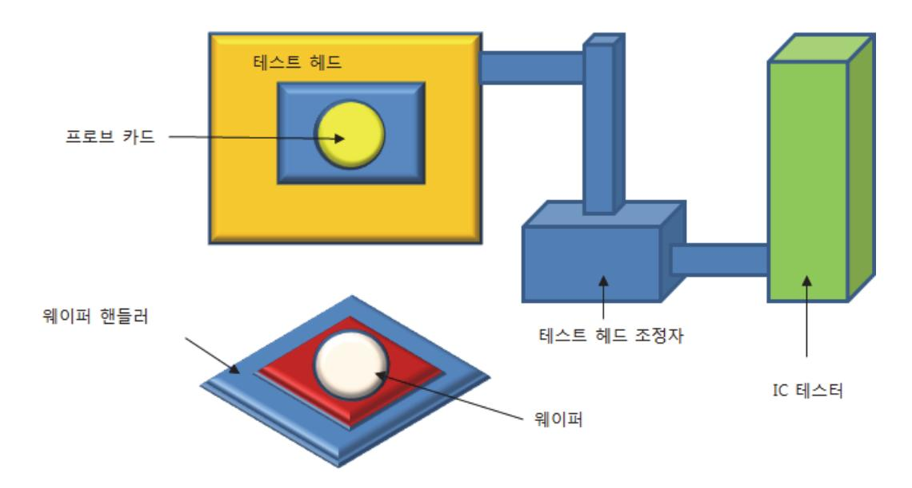

출처: 교육부(2018). 반도체 제품 기능·성능 검증(LM1903060109\_14v3). 한국직업능력개발원. p.5. [그림 1-1] 웨이퍼 테스트 장비 구성도

#### 1. 테스터(Tester)

테스터는 칩 설계가 특정 디바이스에 맞게 되어 있는지 전기적 특성을 프로그램하여 다량 의 칩을 한 번에 검사할 수 있는 다중 채널(channel)들을 구현해 준다. 측정하고자 하는 신호들을 웨이퍼 칩에 인가하여 출력되는 신호를 측정하여 양품인지 불량인지 판별하여 준 다. 그리고 불량 칩의 위치를 표시하여 주고 각종 신호 드라이버(driver), 입출력(I/O), 클 럭(CLK), 파워 채널(power channel) 등을 제어하여 다양한 전기적 특성 검사를 할 수가 있다. 대표적으로 A사의 메모리 테스트용으로 T5375, T5377, T5383 과 Y사의 AL6050 장비들이 반도체 테스트용으로 많이 사용되며, 기타 N사, H사 장비 등이 있다.

2. 프로브 스테이션(Probe Station)

프로브 카드의 마이크로 프로브 팁이 웨이퍼의 칩 패드를 접촉할 수 있게 자동정렬 해주는 장치로써 자동화 프로빙 스테이션(Automatic Probing Station)이다. 웨이퍼를 보관하는 카셋트 캐리어(cassette carrier)로부터 웨이퍼를 웨이퍼 핸들링 로봇으로 꺼내어 이를 진 공 척(vacuum chuck)으로 이송시킨 후 프로브 카드의 자동 정렬 키(key)를 사용하여 1차 웨이퍼의 칩 패드와 정렬한다. 이후 정밀하게 2차로 마이크로 팁과 패드를 최종 정렬하여 주고 프로브 카드와 웨이퍼의 평탄도 차이를 과도 드라이버(over driver)를 조절하여 수 만 개의 팁과 패드가 접촉할 수 있게 하여 전기적 특성 검사를 할 수 있게 해준다. 검사가 완 료되면 다시 웨이퍼를 캐리어로 이송한다. 프로브 스테이션의 장비 구조도가 [그림 1-2]에 나타나 있다.

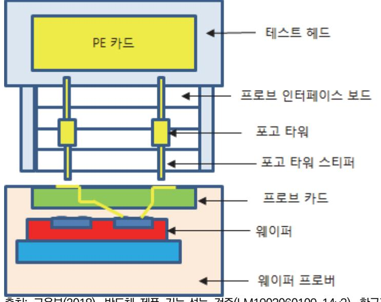

출처: 교육부(2018). 반도체 제품 기능·성능 검증(LM1903060109\_14v3). 한국직업능력개발원. p.6. [그림 1-2] 프로브 스테이션 구조도

3. 프로브 카드(probe card)

프로브 카드는 test에서 나온 신호를 wafer 위의 다량의 칩에 전달해 주고 전기적 검사를 해주는 장치이다. 한 번에 다량의 칩을 검사할 수 있게 수만 개의 마이크로 팁을 DUP 맵 (map)에 맞게 구현하여 수십 마이크로 파인 피치(fine pitch) 패드를 마이크로 팁을 사용 하여 접촉하여 줌으로써 전기적 신호를 전달해 준다. 그리고 패드 위를 마이크로 팁이 접촉 하면서 팁의 장력을 이용하여 산화막을 제거하여 주고, 팁이 접촉한 자국(scrub mark)을 남기게 된다. 단순하게 테스터와 웨이퍼 칩 간의 전기적 신호를 연결하여 주는 인터페이스 (interface) 역할을 하여 주지만, 칩의 패드 집적도가 증가하고 동작 주파수가 높아지면서 프로브 카드의 전기적 특성을 고려한 설계가 중요시 되고 마이크로 팁의 소형화가 요구되 고 있다. 반도체 칩 웨이퍼 제작 공정 후 패키지(package)하기 전에 결함이 있는 칩을 분 별하여 제품의 수율을 향상시키기 위해 웨이퍼 레벨에서 먼저 검사를 하여 불량 칩을 판별 하여 주는 것을 EDS Electrical Die-Sorting Test) 검사라 한다. EDS 검사는 반도체 검사 장비 테스터(tester)에서 발생되는 신호를 웨이퍼 패드(pad)와 프로브 카드(probe card)를 프로빙(probing) 해주는 프로브 스테이션(probe station)을 통해 인가하여 준다. 웨이퍼 패드를 프로브 팁(tip)이 접촉한 상태에서 신호를 입력하고 출력되는 신호를 감지하여 전기 적 검사를 하는 시스템이다. 최근 반도체 소자는 고집적화 되어감에 따라 입출력(I/O) 패드 단자의 개수 및 미세 피치 패드(pitch pad)로 조밀도가 증가하고 있는 추세이며, 웨이퍼 레벨 테스트를 하기 위한 프로브 카드 기술도 더욱 미세 피치 프로브 팁 구현과 집적화되 어야 한다. 프로브 카드는 반도체 웨이퍼 레벨에서 웨이퍼의 제작이 완성되면 칩들을 절단 하기 전에 테스터와 웨이퍼 칩 입출력 패드 간에 인터페이스 역할을 해주며, 신호를 전달하 여 칩이 양품인지 불량인지 분별하여 준다. 반도체 입출력 패드 사이즈가 작아지고 패드 개 수는 증가하며, 패드 피치가 감소하는 추세라 기존 니들 타입 프로브 카드(needle type probe card)로 wafer를 검사하는 것이 어려운 시점이다. 최근 이런 한계점을 극복하기 위 하여 개발되고 사용되는 것이 미세 전자 기계 시스템인 MEMS(Micro Electro Mechanical System) 기술을 사용한 차세대 프로브 카드이다.

#### 숗 웨이퍼 테스트 프로세스

#### 1. 전체적인 테스트 흐름도

일반적인 웨이퍼 레벨 테스트 프로세스는 테스트를 위한 디자인부터 시작된다. 이 단계에서 는 테스트를 위한 디자인(DFT: design for test)이 이루어진다. DFT는 IC 설계 하드웨어 제품 디자인에 특정 테스트 용이성 기능을 추가하는 기술이다. 추가된 기능의 전제 조건들 은 설계 하드웨어에 대한 제조 검사를 적용할 수 있도록 하는 역할을 수행한다. 제조 테스 트의 목적은 제품 하드웨어나 제품의 정확한 기능에 영향을 미칠 수 있는 어떠한 제조 결 함이 없는지 확인한다. 테스트는 여러 단계에서 적용되는 하드웨어 제조 흐름 및 특정 제품 과 고객의 환경에서 하드웨어 유지 보수를 위해 사용될 수 있다. DFT는 테스트 프로그램의 개발 및 테스트 애플리케이션 및 진단을 위한 인터페이스로서 중요한 역할을 한다. 자동 테 스트 패턴 생성에서 적절한 DFT 규칙 및 제안이 구현 된 경우에 훨씬 쉽다. 디자인이 완 성되면 테스트 벡터 생성을 하고, 다음으로 테스터의 프로그램을 생성한다. 이 후 테스터 벡터를 고정하고, 웨이퍼 테스트를 실시한다. 양호한 판정(pass)을 받은 웨이퍼는 고객 쪽의 테스트를 거친다. 이 때 불량 판정(fail)을 받은 웨이퍼 안의 칩은 불량 분석이 이루어진다. 이 불량 분석의 결과(failure mode)는 제조의 수율을 증진시키기 위해 공정에서 확인되고, 공정에서 새로운 조치로 개선된 경우 디자인 가이드로써 DFT 생성 시나 테스터 벡터 생성 시 반영된다. 반면 공정 문제가 아닌 테스트 상의 문제 발생 시 조절된 벡터를 새롭게 셋업 (set up)하여 테스트 벡터를 수정한다. 수정된 조건으로 후속 웨이퍼들을 테스트 한다. 이 과정은 개발 단계에서는 루프(loop)를 형성하여 수율이 양산 기준을 만족할 때까지 번복된 다. 테스트 전체 흐름도가 [그림 1-3]에 나타나 있다.

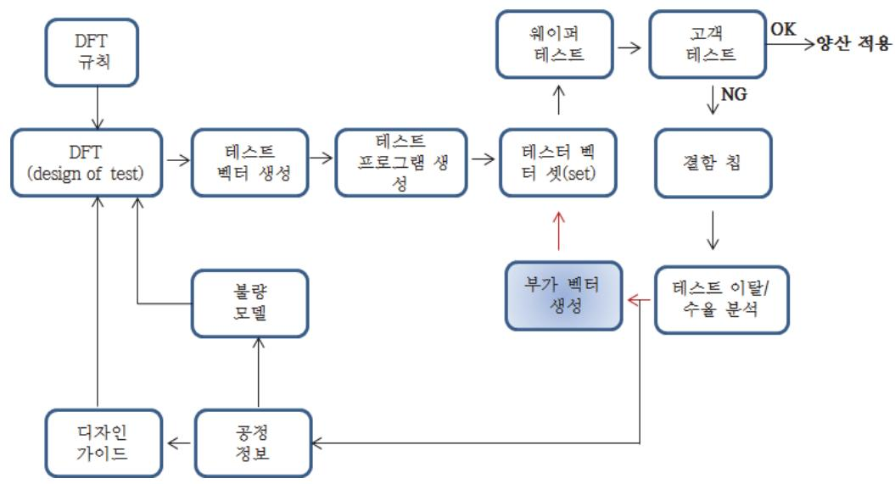

출처: 교육부(2018). 반도체 제품 기능·성능 검증(LM1903060109\_14v3). 한국직업능력개발원. p.8. [그림 1-3] 테스트 전체 흐름도

2. 생산 라인 테스트 프로세스

생산 라인에서의 테스트 프로세스는 양품 판정을 위한 세부적인 테스트에 필요한 절차이다. [그림 1-4]에 로직(logic) 소자 테스트 과정을 도시하였다. 테스트 순서는 웨이퍼가 테스트 실에 입고되면 먼저 단위 요소적인 전기적 특성인 파라메트릭(parametric) 테스트를 실시 한다. 규정 스펙에 근거하여 불만족 시는'yes'라인을 타고 이동하여 재테스트를 시행한다. 만일 또 불합격 판정을 받을 경우 스크랩(scrap) 처리된다. 테스트 조건 때문에 1차 불합격 되었다가 2차에서 합격 판정을 받은 웨이퍼는 1차에서 합격한 웨이퍼와 함께 멀티프로브 (multiprobe) 테스트를 실시한다. 여기서 고객과 계약된 수율이 나오면 고객에게 입고되고, 낮은 경우 스크랩 처리된다. 멀티프로브 전 도중에 임베디드 메모리 테스트를 실시하여 불 합격된 웨이퍼 내의 칩을 레이져로 재생하여 멀티프로브 테스트를 행하는 디바이스도 있다. 테스트는 크게 파라메틱 테스트 단계에서 수행되는 DC 테스트, 멀티프로브 테스트에서 행 하는 AC와 기능(function) 테스트의 3부분으로 나누어 행하여진다.

(1) DC 테스트

전압 또는 전류가 측정될 때 합격/불합격(Pass/Fail) 결과는 측정값에 기초한다.

(2) AC 테스트

디바이스가 모든 동작 시간과 관련된 타이밍(timing) 규격(spec.)을 만족하는가를 검사 한다. AC 테스트는 디바이스의 AC 스펙에 정의된 대로 적절한 타이밍 값과 신호 포맷 (signal format)을 설정하여 수행한다.

(3) 기능(function) 테스트

디바이스가 논리적인 연산 기능들을 제대로 수행하는가를 검사하는 테스트로, 입력 데이

터가 DUT에 공급되고 출력 데이터가 DUT로부터 읽혀진다. 핀 일렉트로닉스(pin electronics)에 위치한 기능 비교기(functional comparator)가 테스트의 합격/불합격 (Pass/Fail)을 결정한다.

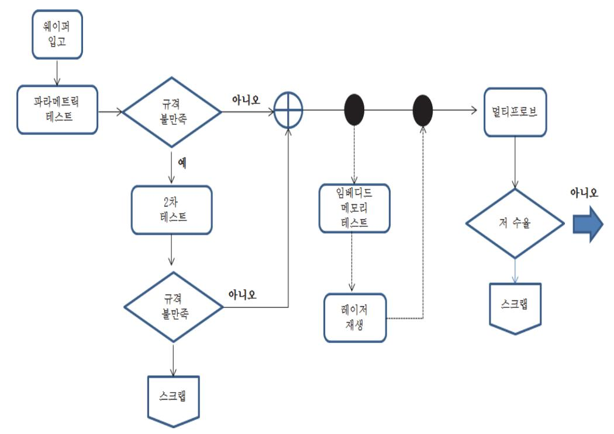

출처: 교육부(2018). 반도체 제품 기능·성능 검증(LM1903060109\_14v3). 한국직업능력개발원. p.9. [그림 1-4] 웨이퍼 레벨 테스트 흐름도(예: 로직 디바이스)

#### 수 웨이퍼 테스트 장비의 선정 요건

#### 1. 테스터(Tester)

반도체 제품들의 집적도가 높아지고 동작 속도가 증가하며 제품의 크기는 소형화되면서 테 스트에 대한 요구 조건도 까다로워지고 있다. 소자의 제조에 있어서 가장 중요한 요소는 양 산성이다. 소자의 집적도가 상승하면서 테스트 시간이 전체 검사 비용에 미치는 영향이 지 속적으로 증가하고 있다. 장비 선정에 있어서 동시 측정 수 확장에 적합한 테스터 선정이 중요하다. 예를 들어 DRAM 테스트 시 핀(pin) 간, DUT(device under test) 간 신호 공 유를 활용한 동시 측정 수 확장이 가능한 장비를 선택해야 한다. 선정 시 중요 항목에 대하 여 알아본다.

#### (1) 고속 클럭(Clock) 대응

고속화에 따른 보호 주파수 대역이 협소해지면서 미세한 제조 공정으로 인한 불량을 찾아 내기 위한 고속 테스터가 필요하다. 반도체 소자의 고속화 및 라이프 사이클 단축으로 설비 활용성 측면에서 설비 동작 주파수 한계치를 넘는 반도체 소자의 측정이 필요하다.

(2) 교정 정밀도

검사 속도를 증가시키기 위해 테스트 변수의 확장 및 테스트 헤드수의 증가, 진단 및 교정 시간의 최소화가 필요하다. 여기에 더하여 장비의 소형화와 저소비 전력화가 중요 하다. 프로세스의 미세화에 따라 범용 DRAM, SoC, DUT 전원은 저전압화하고, 인터페 이스 신호도 저진폭화해야 한다. 이에 따른 고정밀도 테스트가 요구된다. 또한 DUT의 저소비화를 추구하는 가운데 대기 시의 누설 전류(leak current) 측정 정밀도 향상도 요구된다.

(3) 테스트 채널 확장을 통한 동시 측정 수 확장

반도체 소자의 대용량화에 따라 테스트 시간이 전체 비용에 미치는 영향이 지속적으로 증가하고 있다. 테스트 채널 확장을 통한 동시 측정 수 확장이 가능한 장비를 선정한다.

2. 프로브 스테이션

프로브 스테이션(probe station)은 주 검사 장치의 테스트 헤드와 프로브 카드, 그 리고 DUT가 서로 연결되도록 하는 장치이므로, 각각의 치수와 사양에 의존하여 장 치의 사양이 결정된다. LSI 미세화 및 패키지 기술의 경박단소화에 따라 얇아지는 웨이퍼를 제대로 다루는 장비 선정이 요구된다. 선정 시 중요 항목에 대하여 알아본 다.

(1) 프로브 카드의 대형화 대비

프로브 카드의 대형화를 위해서, 웨이퍼 면과 프로브 카드팁의 평행도 유지를 위한 자동 레벨링 기능과 웨이퍼면 대비 프로브 팁의 우수한 평행도가 요구된다.

(2) 테스트 속도

웨이퍼의 크기가 커지고, 웨이퍼 단위 면적당 구현되는 칩의 수가 증가하면서 많은 수의 칩을 동시에 테스트할 필요가 있다. 프로브 스테이션의 성능에서 가장 중요한 요소 중 하나는 단위 시간에 얼마나 많은 웨이퍼를 검사할 수 있는지 여부이다.

(3) 프로브 카드의 핀수 증가에 따른 정밀한 제어

웨이퍼 상태에서 여러 개의 칩을 동시에 테스트할 때 웨이퍼에 가해지는 100kg 이상의 수직 하중에서 웨이퍼 척의 기울기를 수 ㎛ 이내로 유지하고, 프로브 카드에 장착되는 많은 핀과 웨이퍼상의 많은 패드를 제대로 접촉시키는 문제가 매우 중요하다. 또한 다핀 화에 의해 테스트 헤드에 가해지는 힘이 커지므로, 점점 얇아지는 웨이퍼가 프로브 카드 에 의한 압력에 잘 손상되지 않도록 하는 것이 필요하다.

(4) 척의 온도 정밀도 유지

환경시험에 필요한 고온 및 저온의 온도 분포를 0.5℃ 범위 내에서 균일하게 유지하는 것도 매우 중요한 기술이라고 할 수 있다. 검사 시 요구되는 여러 가지 기능이 환경변

화 조건 하에서 확실히 작동해야 한다.

(5) 접촉 정밀도

반도체 제조 공정에서 미세 회로 선폭을 구현하는 것이 가능해지면서 다이(die) 크기는 줄어들고 패드의 크기와 간격이 작아지면서 정확한 위치에 프로브 팁을 위치시키는 것 이 어려운 문제가 되고 있다. 미세화 되고 있는 본딩 패드와 프로브 카드의 프로브 선 단을 정밀하게 제어하며, 이를 위해 프로브 스테이션에서 X-Y 스테이지의 정밀한 제어, 프로브 카드의 정확한 위치를 결정하기 위한 정밀한 비전 시스템 확보, 프로브 카드 및 척이 열에 의해 틀어지는 값을 보상하는 것 등이 매우 중요한 선정 조건이다.

## 수행 내용 / 웨이퍼 상의 제품 성능시험 장비 선정 및 장비 사용하기

#### 재료·자료

- 정전 방지 손장갑, 웨이퍼 보관 박스, 프로브 카드
- 테스터/프로브 스테이션 장비 매뉴얼, 웨이퍼 레벨 테스트 항목 규격서
- 펌웨어 소프트웨어 프로그램 실행 및 명령어 설명서

#### 기기(장비 ・ 공구)

- 기능 및 성능 측정 장비, 가변 온도 장치, 컴퓨터, 프린터
- 웨이퍼 카셋트, 진공 트위져

안전 ・ 유의사항

- 장비 취급 시 하중 피해를 입지 않도록 유의해야 한다.
- 측정은 소비자 요구 수준 및 국제 표준에 근거하여 판단 기준을 선정하되 평가자의 주관이 포함되지 않도록 해야 한다.

#### 수행 순서

숔 웨이퍼 레벨 테스트 시스템에 대하여 파악한다.

- 1. 테스터의 기능을 확인하여 숙지한다.
  - (1) 트랜지스터, 저항, 캐패시터, 다이오드에 대해 전기적 직류 전압, 전류 특성의 파라미터 (parameter)를 테스트하여 작동 여부를 판별한다.
  - (2) Wafer에 일정 온도의 열을 가한다음 교류/직류(AC/DC) 전압을 가해 제품의 취약 부분, 결 함 부분 등 잠재적인 불량 요인을 발견한다.
  - (3) BIST(Built-in Self-test) 방법을 이해한다.
  - (4) Pre Laser 테스트 방법을 이해한다.
  - (5) 불량 칩의 수선 방법과 표시방법에 대하여 이해한다.
- 2. 프로브 스테이션의 기능을 파악하고 숙지한다.
  - (1) 테스터(tester)의 정확한 전압(voltage), 전류(current), 타이밍(timing), 기능 상태 (functional state)를 DUT에 제공 방법을 파악하고 숙지한다.
  - (2) 각 테스트의 결과 값을 미리 정의된 한계값과 비교하고 Pass/Fail을 결정한다.
- 3. 프로브 카드의 기능에 대하여 파악하고 숙지한다.
  - (1) 프로브 카드(probe card)를 프로브 스테이션(probe station)에 연결하여 결손 여부를 파악한 다.
  - (2) 웨이퍼 패드를 프로브 팁(tip)이 접촉한 상태에서 신호를 입력하고 출력되는 신호를 감지하여 전기적 검사를 수행한다.
- 4. 데이터 처리 시스템에 대하여 장비 연동 관계를 이해한다.
- 숕 웨이퍼 테스팅 장비에 대하여 파악한다.
  - 1. 테스터의 구조를 확인하다.
  - 2. 프로브 스테이션의 구조를 확인하여 파악한다.
  - 3. 프로브 카드의 구조를 확인하여 이해한다.

#### 숖 웨이퍼 테스팅 장비를 작동한다.

- 1. 테스터의 구동을 실행한다.
  - (1) 전기적 특성을 프로그램화하여 다량의 칩을 한 번에 검사할 수 있는 다중 채널(channel)들을 구현을 수행한다.
  - (2) 각종 신호 드라이버(driver), 입출력(I/O), 클럭(CLK), 파워 채널(power channel) 등을 제어

하여 다양한 전기적 특성 검사를 수행한다.

- 2. 프로브 스테이션의 구동을 실행한다.
  - (1) 프로브 카드의 마이크로 프로브 팁이 웨이퍼의 칩 패드를 접촉할 수 있게 자동 정렬을 수행 한다.
  - (2) 프로브 카드와 웨이퍼의 평탄도 차이를 과도 드라이버(over driver)를 조절하여 구동을 수행 한다.
- 3. 프로브 카드를 장착한다.
- 숗 웨이퍼 테스팅 프로세스를 파악한다.
  - 1. 파라메트릭 테스트에 관련된 항목과 조건을 파악한다.
  - 2. DC 테스트에 관련된 항목과 조건을 확인하여 숙지한다.
  - 3. 기능 테스트에 관련된 항목과 조건을 이해한다.

수 장비 선정 시 중요 사항을 숙지하여 장비를 선정한다.

- 1. 테스트 항목과 부합되는 장비인지 판별한다.
  - (1) 동시 측정 수 확장에 적합한 테스터를 선정한다.
  - (2) 테스트 채널 확장을 통한 동시 측정 수 확장이 가능한 장비를 선정한다.
  - (3) 각각의 치수와 사양에 의존하여 장치의 사양을 결정된다.
- 2. 여러 회사의 장비 간 차이점과 장단점을 판별한다.
- 3. 고객의 성능 평가에 합당한 장비를 선정한다.

#### 수행 tip

- 관련 문서의 기밀 유지에 유의해야 한다.
- 전원 장치의 안전 취급에 유의해야 한다.

## 1-2. 웨이퍼 상의 수율 변화 분석

| • 시험 측정 데이터로 시험 대상 다이(die)의 불량 여부를 판별할 수 있다. |                                                    |  |  |  |  |  |
|----------------------------------------------|----------------------------------------------------|--|--|--|--|--|
| 학습 목표                                        | • 시험 측정 데이터를 토대로 웨이퍼 상에서 공정특성에 따른 수율 변화를 분석하고 문서화할 |  |  |  |  |  |
|                                              | 수 있다.                                              |  |  |  |  |  |

## 필요 지식 /

숔 수율의 정의

수율(yield)은 투입량 대비 완성된 양품의 비율로, 반도체 수율은 제조 단계에 따라 FAB 수율, 테스트 수율, 조립 수율, 실장 수율로 구분하며 이 4가지 수율을 곱하면 전체(CUM) 수율이 된 다. [그림 1-5]에 전체 수율 관계식과 테스트 부분의 수율 관계식이 제시되어 있다.

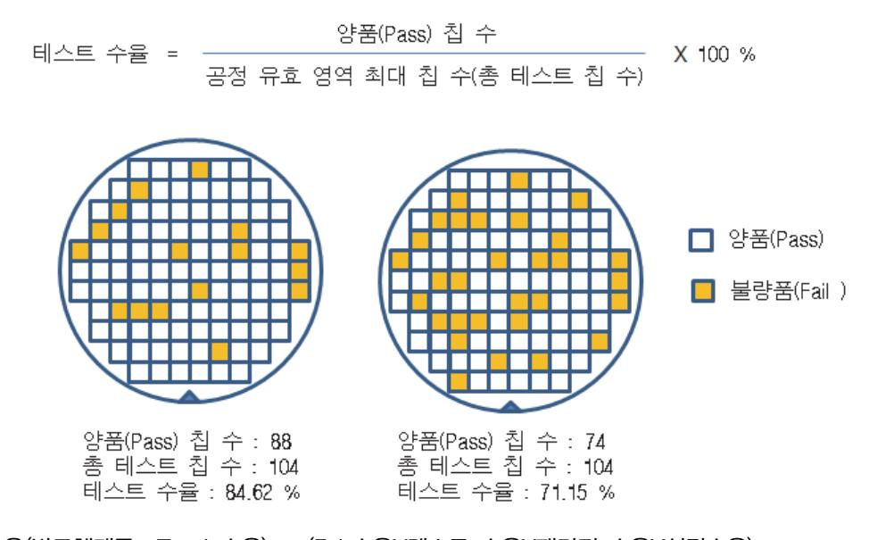

 CUM수율(반도체제품 Total 수율) = (Fab수율X테스트 수율X패키지 수율X실장수율) 출처: 교육부(2018). 반도체 제품 기능·성능 검증(LM1903060109\_14v3). 한국직업능력개발원. p.14. [그림 1-5] 웨이퍼 레벨 테스트 수율 관계도

#### 숕 웨이퍼 레벨 수율의 영향 요소

#### 1. 웨이퍼 직경의 증가

웨이퍼의 직경은 생산 효율성을 증진시키기 위해 커져왔다. 웨이퍼 직경의 증가는 [그림 1-6]에서 보는 바와 같이 각 웨이퍼에 부분적인 다이 칩이 더 적은 비율로 존재하게 된다. 부분적인 다이 칩은 비기능적이다. 이 부분적인 다이 칩은 수십 차례의 공정을 거치는 동안 공정이 온전히 이루어지지 못한다. 가장 큰 영향을 주는 공정은 포토 공정으로 칩 단위의 노광 공정이 아닌 샷(shot) 단위의 공정 특성 때문에 샷의 초점이 흐트러질 경우 그 샷에 있는 칩들은 불안정한 기하학적 구조를 갖게 되어 테스트 시 불량의 확률이 매우 높다. 이 는 웨이퍼의 가장자리(edge)에서 심하게 나타난다. 웨이퍼의 직경이 커질수록 불안정한 노 광 조건의 샷은 상대적으로 줄어 결국 부분적인 다이 칩을 줄이는 원인이 된다. 이런 부분 적인 칩이 불량에서 양호한 칩으로 테스터에서 웨이퍼 분류 수율을 증가하는 요인으로 작 용한다. 그러나 여기서 중요한 사항은 비록 부분적인 다이 칩 중에 양품이 있더라도 신뢰성 문제가 있을 수 있으니 신중한 검증이 필요하다. 포토 공정 이외에도 웨이퍼의 열저 문제, 역학적 고정 문제로 인한 피해를 줄여 부분 다이 칩의 영역을 좁혀갈 수 있다.

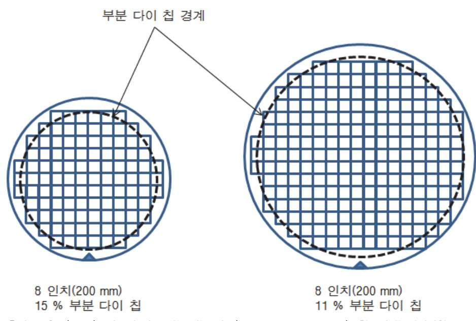

출처: 교육부(2018). 반도체 제품 기능·성능 검증(LM1903060109\_14v3). 한국직업능력개발원. p.15. [그림 1-6] 대구경 웨이퍼의 부분적 다이 칩 감소 현상

#### 2. 다이(Die) 크기의 증가

웨이퍼 직경의 증가 없이 다이 크기의 증가는 수율 계산에 있어서 백분율을 낮추는 요인이 다. 산술적인 문제도 있지만 공정에서 발생되는 불순물 입자나 물리적 손상의 크기가 동일 하여도 다이의 크기가 크면 클수록 오염될 확률이 가중되어 수율을 낮추는 요인이 된다. [그림 1-7]에 관련 설명의 내용이 제시되어 있다. 그림에서 보는 바와 같이 웨이퍼의 직경 은 같으나, 안의 다이의 수는 각 각 104개와 12개이다. 만일 5개의 다이가 불량일 경우 104개의 경우는 수율이 95.19%이나 12개 다이 수를 가진 웨이퍼의 수율은 55.33%이다. 앞서 설명한 것처럼 다이 크기의 증가에 의한 다이 수의 감소는 백분율을 낮추는 이유가 된다. 다른 면에서 살펴보면 104개의 다이를 가진 웨이퍼의 각각의 다이들의 불량 요인이 동일하다고 하고, 그 요인이 공정 중에 특정한 곳에서 제공됨이 확인되었다면 12개의 웨이 퍼 맵에 투영시켜 볼 때 예상되는 수율은 영이 된다. 이처럼 다이 크기의 증가는 수율을 낮

추는 방향의 요소이다. [그림 1-7]에서 웨이퍼 안의 점선은 104개의 다이를 가진 웨이퍼에 서 불량 다이를 추적한 영역이다.

3. 공정 단계 수의 증가

IC 공정 단계의 수는 현재 고성능 마이크로프로세서 IC의 경우 대략 450개이다. 소자의 기 능이 복잡해질수록 공정 단계는 더욱 증가할 것이다. 여러 단계의 공정은 취급 또는 미처리 때문에 웨이퍼를 오염시키거나 손상시킬 요인을 제공한다. 증가된 오염은 결함 밀도를 증가 시키고 웨이퍼 분류 수율을 낮추게 한다. 더불어 공정 소요 시간의 증가로 처리 주기를 늘 린다. 웨이퍼 오염을 증대시키는 요소로 작용된다.

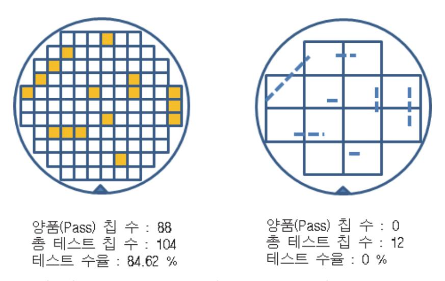

출처: 교육부(2018). 반도체 제품 기능·성능 검증(LM1903060109\_14v3). 한국직업능력개발원. p.16. [그림 1-7] 다이 크기의 증가에 의한 수율 감소 설명도(노란색 부분과 점선부분은 불량 칩)

4. 수축성 최소 배선 폭(shrinking feature sizes)

칩 밀도를 증가시키는 수축성 최소 배선 폭은 웨이퍼 공정의 생산성 향상의 중요한 요소이 다. 반면 테스트 수율에 직접 관여되는 사진 공정의 패턴 사이즈 임계값(CD)의 축소로 사 진 공정의 마진을 축소한다. 오염은 결함 밀도를 증가시키고, 웨이퍼 분류 수율을 낮추게 한다. 더불어 공정 소요 시간의 증가로 처리 주기를 늘린다. 웨이퍼 오염을 증대시키는 요 소로 작용된다. 결국 수율을 감소시키는 요인으로 작용한다.

5. 결정 결함

불량 분석 결과 공정에서의 문제는 없는데 수율이 갑자기 저하되는 현상이 있을 수 있다. 이런 경우는 대부분 기판에서 오는 결함과 공정 중에 과다하게 주어진 열작용에 의한 결정 스트레스 문제이다. 특히 웨이퍼 가장자리에서 많이 발생되는 격자 간 어긋나기 결정 결함 이 주원인이 된다. 덧붙여서 장비의 취급 불량으로 웨이퍼에 크랙이 가는 경우도 있다. 이 결정 결함은 가장자리에서 공정이 진행되면서 웨이퍼 중앙으로 이동되어 테스트 수율 저하 의 요인이 된다.

#### 숖 웨이퍼 분류 수율 모델

수율(yield) 모델은 웨이퍼 설계, 이전 수율 결과, 통계 분석에 근거한 웨이퍼 분류 수율을 예 측하기 위하여 많은 연구가 되어왔다. 수율 모델은 신개발 칩의 비용을 계산하는데 예측 이론 으로 유용하게 사용된다. 아래와 같은 3개의 주요 모델이 사용된다.

1. 포이즌 모델(Poisson's model)

지수 모델로 불린다. 간단한 모델이고 초기에 개발되었다. 모델 식은 아래와 같다.

Y = e-AD

여기서 Y는 기능 칩의 수율, A는 칩 표면 면적, D는 결점 조밀도이다. 이 모델은 작은 직 경의 웨이퍼에만 적용된다.

2. 머피 모델(Murphy's model)

머피 모델은 결함 밀도가 웨이퍼뿐만 아니라 웨이퍼들 간에 변화한다고 추측하는 수율 모 델이다. 가장 널리 쓰이고 있다. 웨이퍼 내에서 수율 변화는 가장자리에서 가장 높고 중앙 에서 낮은 밀도를 갖는 정규분포 확률 모델이다. 이 모델은 VLSI와 ULSI급 소자에서 좋은 수율 모델이다. 모델 이론식은 아래와 같다.

Y = [(1-e-AD)/AD]2

여기서 Y는 기능 칩의 수율, A는 칩 표면 면적, D는 결점 조밀도이다.

3. 씨드 모델(Seed's model)

씨드 모델은 웨이퍼의 맞은편에 다양한 결함 밀도를 추측한다. 이 모델도 머피 모델처럼 VLSI와 ULSI급 소자에서 좋은 수율 모델이다. 모델 이론식은 아래와 같다.

Y = e-C (Y는 기능 칩의 수율, C는 (AD)1/2, A는 칩 표면 면적, D는 결점 조밀도)

숗 웨이퍼 분류 수율의 관리 시스템

웨이퍼 내 다이 결함의 감소는 웨이퍼 레벨 테스트 수율(yield)을 향상시킨다. 이와 관련된 결 함의 관리는 너무 방대해 웨이퍼 레벨 테스트를 진행하는 엔지니어 혼자의 힘으로는 해결할 수 가 없다. 제조 수율 관리는 결국 웨이퍼 제조 공정이 진행되는 동안 수집된 인-라인(in-line) 데이터와 각종 테스터 데이터, 모니터링 데이터, 웨이퍼 레벨 분류 테스터 결과 등을 종합 분 석함으로써 효과적으로 이루어질 수 있다. 일반적 관리 시스템이 [그림 1-8]에 제시되어 있다.

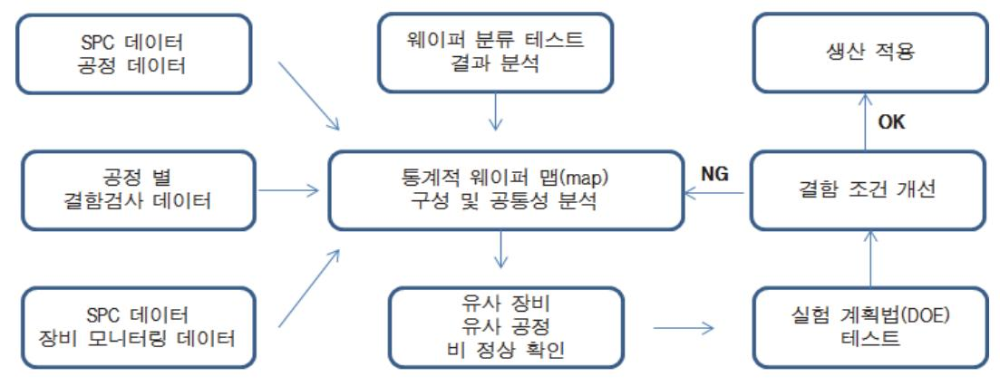

.

출처: 교육부(2018). 반도체 제품 기능·성능 검증(LM1903060109\_14v3). 한국직업능력개발원. p.18. [그림 1-8] 웨이퍼 레벨 불량 분석 흐름도

수 웨이퍼 분류 수율(wafer sort)

웨이퍼들은 전기적 분류, 웨이퍼 프로브, 간략하게 프로브로 간주되는 각 다이의 100% 검사를 받는다. 웨이퍼 분류의 목적은 웨이퍼 상의 어느 소자가 제대로 작동하는지 확인하기 위함이 다. 각 다이는 DC 파라미터와 AC 파라미터를 포함하는 모든 기능적인 고객 제품스펙에 의거 하여 검사된다. 결과는 raw 데이터와 웨이퍼 맵으로 표현한 영상으로 도출된다. [그림 2-4]에 결과 모습이 제시되어 있다.

- 1. 목적
  - (1) 우수한 칩들을 보장하기 위해서 모든 칩 기능의 동작 검증
  - (2) 동작 속도 성능에 근거하는 우수한 칩 분류
  - (3) 제조 공정의 성능을 개선하고, 평가와 제조 설비의 수율 정보 제공
  - (4) 불량 분석과 신제품 개발의 정보 제공
- 2. Bin 코드 숫자

웨이퍼 분류 검사 후에 각 다이는 검사 항목에 해당하는 bin 숫자로 분류된다. 일반적으로 Bin 1부터 시작되는데 Bin 1은 pass 다이에 해당된다. 주어진 검사 항목에서 fail인 경우 는 Bin 2부터 시작하여 Bin 번호가 부여된다. 테스트 과정 중 fail 항목이 존재하면 테스 트는 멈추고, 그 다이는 주어진 Bin 번호를 부여 받고 fail 다이로 처리된다. 일반적인 테 스트 과정과 Bin 번호와의 관계가 <표 1-1>에 제시되었다. 자동화된 프로브 시스템은 raw 데이터를 저장함은 물론 웨이퍼 상에 Bin 번호를 표현하여 육안으로 쉽게 결과를 알아볼 수 있도록 웨이퍼 맵과 결과를 정리하여 영상으로 표현해준다. 예시가 [그림 1-9]에 나타나 있다. 웨이퍼 안에 숫자는 1 번인 경우 Pass, 나머지는 Fail bin 숫자를 표시한다.

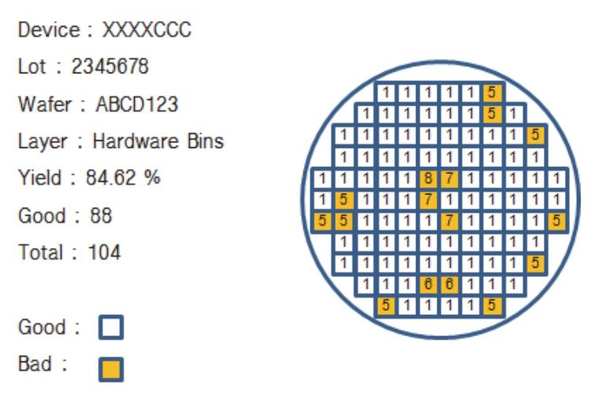

출처: 교육부(2018). 반도체 제품 기능·성능 검증(LM1903060109\_14v3). 한국직업능력개발원. p.19. [그림 1-9] Fail 검사항목 분류(Bin)를 표시한 웨이퍼 분류 테스트 결과 이미지 예시

#### 〈표 1-1〉 웨이퍼 분류에서의 Bin 코드 숫자 예시

| 테스트 항목                           |                | Fail Bin #                                       |                                     |  |  |  |  |  |
|----------------------------------|----------------|--------------------------------------------------|-------------------------------------|--|--|--|--|--|
| Vcc Shorts                       |                | Bin 10                                           |                                     |  |  |  |  |  |
| Open/Short                       | Bin 8<br>Bin 9 | Fails Open, Sbin 80<br>Fails Shorts, Sbin 90     |                                     |  |  |  |  |  |
| Initial Powerup<br>Ramp Sequence | Bin 10         | 2.0–3.0 V@ 40 MHz<br>SBin 10                     |                                     |  |  |  |  |  |
| Static Powerup                   | Bin 13         | Fails Static Powerup<br>SBin 45                  |                                     |  |  |  |  |  |
| Dynamic Powerup                  | Bin 14         | Fails Dynamic Powerup<br>SBin 45                 |                                     |  |  |  |  |  |
| Scan Check                       | Bin 11         |                                                  |                                     |  |  |  |  |  |
|                                  |                | Cache Redundancy                                 | Cache 112–155<br>Bin 12, 17, 18, 20 |  |  |  |  |  |
| BIST                             | Bin 12         | Redundancy Function<br>Pass = Bin 17, Fail Bin 6 | Bitmap &Chase<br>Fail<br>Bin 19     |  |  |  |  |  |
| Cleanup                          | Bin 5          |                                                  |                                     |  |  |  |  |  |
| Speed                            | Bin 6          |                                                  |                                     |  |  |  |  |  |
| Leakage                          | Bin 7          |                                                  |                                     |  |  |  |  |  |
| Pass                             | Bin 1          |                                                  |                                     |  |  |  |  |  |

#### 6 웨이퍼 상에서 공정 특성에 따른 수율 변화

웨이퍼 레벨 분류 테스트가 끝난 후 Bin #을 기입한 웨이퍼 맵을 분석하여 수율 저하 요인으 로 작용하는 공정을 예측할 수 있다. 여기서 주의할 점은 테스트 상에서 발생하는 면과 먼저

구별할 수 있어야 한다. 몇 가지 예를 들어본다. 웨이퍼 맵 상의 유형별 분류가 [그림 1-10]에 정리되어 있다.

1. 테스트 상의 특징

공정 상의 이유가 아닌 테스터 환경 자체에서 불러오는 Fail 유형은 다음과 같다.

- (1) 모든 칩의 Open/Short Fail
- (2) 테스트 핀 수에 따른 주기적인 Fail
- (3) 데스트 핀의 오염으로 인한 누설 전류

2. 공정 연관 Fail 특징

- (1) 줄성 Fail ---> Photo, Etch
- (2) 1 Lot에서 2배수, 3배수 웨이퍼의 동일 Fail ---> 다중 챔버 장비
- (3) 웨이퍼 내 랜덤(random)한 Fail ---> 파티클에 대한 장비 오염
- (4) 웨이퍼 중심 원모양 Fail ---> 플라즈마 장비
- (5) 웨이퍼 중심에서 Fail ---> 웨이퍼의 중심에 역학적 힘을 가하는 장비
- (6) 방사선 모양의 Fail ---> Photo spin coater, Spin 방법에 의한 공정 장비
- (7) 전면 Fail ---> 이온 주입 공정, CMP
- (8) 웨이퍼 가장 자리 헬리클 모양 Fail ---> CMP
- (9) Parametric Test Fail ---> 관련 항목 증착 막 공정과 Photo, Etch

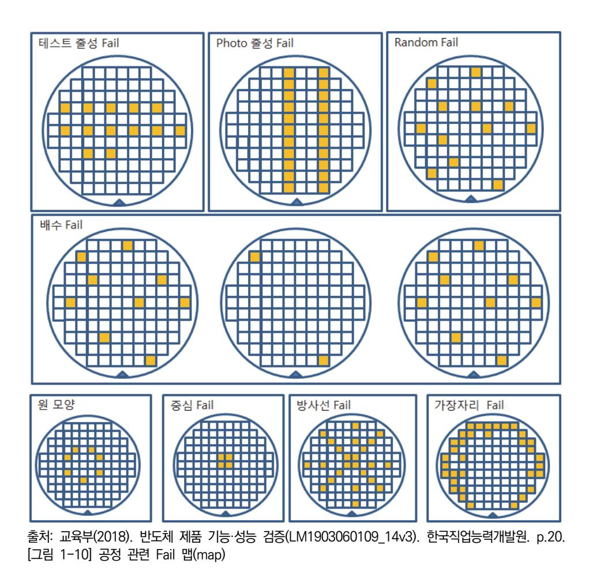

## 수행 내용 / 웨이퍼 상의 수율 변화 분석하기

#### 재료·자료

- 공정 이상이 발생한 불량 웨이퍼
- 웨이퍼 맵핑 프로그램 실행 매뉴얼, 수율 분석 보고서

#### 기기(장비 ・ 공구)

컴퓨터, 인터넷, 문서 작성 관련 소프트웨어, 프린터, 제본기, 광학현미경

안전 ・ 유의사항

웨이퍼레벨 기능 검증은 프로브 카드(Probe Card)에 의한 전원 잡음 영향을 반영하여 평가 조건을 설정한다.

수행 순서

숔 웨이퍼 레벨 수율을 파악한다.

- 1. 이론식으로부터 주어진 제품의 예측 수율을 계산한다.
- 2. 수율 영향 요소에 대하여 이해한다.
  - (1) 웨이퍼 직경의 증가에 따른 수율변화를 이해한다.
  - (2) 다이(Die) 크기의 증가 따른 수율변화를 이해한다.
  - (3) 공정 단계 수의 증가 따른 수율변화를 이해한다.
  - (4) 수축성 최소 배선 폭(shrinking feature sizes) 따른 수율변화를 이해한다.
  - (5) 결정 결함 따른 수율변화를 이해한다.
- 3. 실제 생산된 제품과 이론식의 차이점을 설명한다.

숕 웨이퍼 수율 관리 시스템에 대하여 이해한다.

- 1. 제조 수율 관리에 대한 사항을 숙지한다.
  - (1) 웨이퍼 제조 공정이 진행되는 동안 수집된 인-라인(in-line) 데이터을 해석한다.
  - (2) 각종 테스터 해석한다.
  - (3) 모니터링 데이터를 해석한다.
  - (4) 웨이퍼 레벨 분류 테스터 결과을 해석한다.
  - (5) (1)~(4)등을 종합 분석하여 수율저하 요인을 보고서로 작성한다.

숖 웨이퍼 분류에 관련된 항목과 규격서를 이해한다.

- 1. Bin 코드 숫자에 대하여 숙지한다.
- 2. Bin 별 수율에 대하여 분류한다.
- 3. Bin 별 웨이퍼 수율을 도식화 한다.
- 숗 시험 결과로부터 합불 판정을 진행한다.
- 수 불합격 Bin에 대한 공정 연관성을 숙지하고 분류를 수행한다.
  - 1. 줄성 Fail ---> Photo, Etch
  - 2. 1 Lot에서 2배수, 3배수 웨이퍼의 동일 Fail ---> 다중 챔버 장비
  - 3. 웨이퍼 내 랜덤(random)한 Fail ---> 파티클에 대한 장비 오염
  - 4. 웨이퍼 중심 원모양 Fail ---> 플라즈마 장비

- 5. 웨이퍼 중심에서 Fail ---> 웨이퍼의 중심에 역학적 힘을 가하는 장비
- 6. 방사선 모양의 Fail ---> Photo spin coater, Spin 방법에 의한 공정 장비
- 7. 전면 Fail ---> 이온 주입 공정, CMP
- 8. 웨이퍼 가장 자리 헬리클 모양 Fail ---> CMP
- 9. Parametric Test Fail ---> 관련 항목 증착 막 공정과 Photo, Etch
- 숙 각종 공정과 장비 데이터로부터 웨이퍼 분류 테스터의 결과를 분석한다.
- 숚 실제 불량 칩을 웨이퍼 상에서 관측한다.
- 숛 모든 자료를 통하여 저수율을 발생시킨 공정을 파악하여 문서화한다.

#### 수행 tip

- 웨이퍼로부터 인체 오염에 유의해야 한다.
- 웨이퍼 취급 시 깨짐 방지에 유의해야 한다.
- 정확한 배율에 의한 사진 촬영이 수행되어야 한다.

## 1-3. 웨이퍼 상의 제품 특성 산포 파악

•시험 측정 데이터를 토대로 웨이퍼 상에서 시험 대상 제품의 특성 산포를 파악하고 문서화할 수 있다.

## 필요 지식 /

#### 1 파라메트릭 테스트 결과 산포 파악

파라미터 측정은 단위 소자에 관련된 기본 특성을 파악하는 방법으로 측정된 데이터를 웨이퍼 별, Lot 단위로 정리하여 측정된 모든 항목 값들의 산포를 파악하여 관련된 공정과 제조 현장 에 맞는 실질적 중심 값으로 이동할 수 있도록 문서화하여 공정과 설계팀에 피드백 한다.

1. 웨이퍼별 산포 파악

파라메트릭 테스트는 칩 안에서 측정되는 값이 아니고, 스크라이브랜(Scribe lane)이라는 영역의 테스트 모듈로부터 측정된다. 이런 이유로 웨이퍼의 전면을 대표할 수 있도록 9포인 트 정도 설정하여 웨이퍼 분류 테스트로 가야할지의 여부를 판정한다. 즉, 웨이퍼 분류 테 스트를 거치는 1차 관문인 것이다.

#### (1) 규격서의 확인

제품 생산을 요구한 고객의 규격서의 상한 값, 하한 값을 확인해야 한다. 예시가 〈표 1-2〉에 나타나 있다. 중간 값의 의미는 그리 크지 않다. 왜냐하면 주어진 어느 영역에 서 웨이퍼 수율이 안정될지 모르기 때문이다. 결국 주어진 고객의 규격서 안에서 안정된 값이 유지되도록 관리해야 한다. 간혹 규격서 범위를 넘어서서 수율이 안정되는 경우도 있는데 이럴 경우 고객과 상의하여 범위를 조정해야한다.

|      | 테스트 항목 |             |             |             |             |             |             |           |           |  |
|------|--------|-------------|-------------|-------------|-------------|-------------|-------------|-----------|-----------|--|
| 디바이스 |        | CTNA<br>CT  | CTPA<br>CT  | CTPO<br>LY  | VIA1        | VIA2        | VIA3        | goin<br>W | goip<br>W |  |
|      | 단위     | Ohm/        | Ohm/        | Ohm/        | Ohm/        | Ohm/        | Ohm/        | volt      | volt      |  |
|      | 하한 값   | sq<br>2.512 | sq<br>3.543 | sq<br>2.888 | sq<br>0.765 | sq<br>0.576 | sq<br>0.876 | 8.7       | 9.7       |  |
|      | 상항 값   | 6.543       | 6.555       | 6.876       | 1.765       | 2.015       | 2.224       | 15        | 16        |  |

〈표 1-2〉 파라메트릭 테스트 규격서의 예시

#### (2) 데이터 산포 파악

여러 가지 그래프를 이용하여 분포를 알아보기 쉽게 자료를 정리한다. 엑셀의 분석 도구 를 이용하면 편리하다. [그림 1-11]에 데이터와 그래프를 예시로 제시하였다. 그림에서 CTNACT(contact active) 항목과 GOI(gate oxide integration) 항목을 예시로 분석 보고서를 쓰기 위한 자료를 보였다.

#### A. 측정 데이터

| 측정 위치 | CTNACT | CTPACT | CTPOLY | VIA1  | VIA2  | VIA3  | GOINW | GOIPW |
|-------|--------|--------|--------|-------|-------|-------|-------|-------|
| 1     | 3.23   | 4.524  | 4.524  | 0.805 | 0.785 | 0.999 | 10.1  | 11.1  |
| 2     | 4.23   | 4. 6   | 4.6    | 0.84  | 0.78  | 0.95  | 11    | 11.5  |
| 3     | 4.45   | 4.8    | 4.5    | 0.83  | 0.77  | 0.96  | 9     | 11.5  |
| 4     | 3.67   | 4.4    | 4.5    | 0.85  | 0.77  | 0.95  | 11    | 11.5  |
| 5     | 3.55   | 4.8    | 4.8    | 0.81  | 0.74  | 0.96  | 10.1  | 11.3  |
| 6     | 4.45   | 4.7    | 4.9    | 0.88  | 0.77  | 0.93  | 9     | 11.5  |
| 7     | 3.56   | 5      | 4.9    | 0.86  | 0.79  | 0.99  | 9.5   | 11.5  |
| 8     | 4.4    | 4.8    | 5      | 0.89  | 0.72  | 0.98  | 9.7   | 11.1  |
| 9     | 4.5    | 4.9    | 4.9    | 0.84  | 0.79  | 0.97  | 9     | 11.5  |

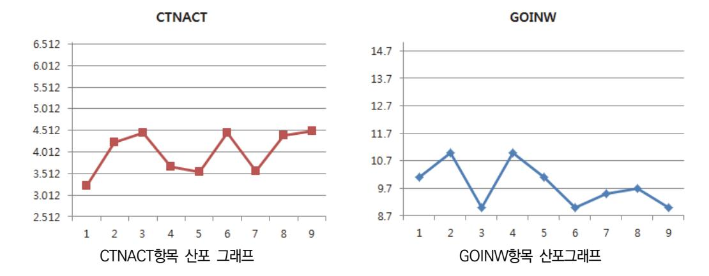

 출처: 교육부(2018). 반도체 제품 기능·성능 검증(LM1903060109\_14v3). 한국직업능력개발원. p.24. [그림 1-11] DC 파라메트릭 테스터 결과 예시

2. Lot 산포 파악

일반적으로 반도체 생산 라인의 1 Lot는 24 ~ 25매로 구성된다. 앞서 분석할 데이터를 준 비 하는 방법과 같으나, Lot 내의 1번부터 마지막 번 웨이퍼 별로 데이터를 모두 포함시켜 산포를 파악해야 한다.

숕 웨이퍼 분류 테스트 결과 산포 파악

파라미터 측정과 같은 방법으로 분석을 위한 자료를 준비한다. 다른 점은 어느 Bin #가 두드 러진지 파악할 수 있도록 파레토 챠트를 이용하여 그래프를 작성하여 최종 보고서에 사용한다.

## 수행 내용 / 웨이퍼 상의 제품 특성 산포 파악하기

#### 재료·자료

- 파라메트릭 테스트 raw 데이터, 웨이퍼 분류 테스트 raw 데이터
- 파라메트릭 테스트 규격서, 웨이퍼 분류 규격서

#### 기기(장비 ・ 공구)

컴퓨터, 인터넷, 문서 작성 관련 소프트웨어, 프린터, 제본기, 통계분석 tool

안전 ・ 유의사항

웨이퍼 레벨에서의 평가는 다이 패드(Die Pad)의 오염 또는 측정 과정에서 발생하는 이물 (Particle)로 인하여 시험 대상 다이(Die)와 측정 장비 간의 불완전한 접촉이 발생치 않도록 접촉 저항을 수시 확인하고 최소화하는 과정을 포함한다.

#### 수행 순서

- 숔 제품의 파라메트릭 테스트 규격서에 대하여 파악한다.
  - 1. 웨이퍼의 전면을 대표할 수 있도록 9포인트 정도 설정하여 테스트를 수행한다.
  - 2. 판정제품 생산을 요구한 고객의 규격서의 상한 값, 하한 값을 확인한다.
  - 3. 규격서와 비교하여 합불 여부를 결정한다.
  - 4. 웨이퍼 내와 lot별 데이터의 산포도를 작성한다.
  - 5. 단위 공정과의 연계성을 분석한다.
  - 6. 결과에 대한 분석과 대책에 관한 보고서를 작성한다.
- 숕 제품의 웨이퍼 분류 테스트 과정에 대하여 이해한다.
  - 1. 웨이퍼안의 칩들에 대하여 테스트를 수행한다.
  - 2. 판정제품 생산을 요구한 고객의 규격서의 상한 값, 하한 값을 확인한다.
  - 3. 규격서와 비교하여 합불 여부를 결정한다.
  - 4. bin별로 테스트 결과를 정리한다.
  - 4. 웨이퍼 내와 lot별 데이터의 산포도를 작성한다.
  - 5. 단위 공정과의 연계성을 분석한다.

6. 결과에 대한 분석과 대책에 관한 보고서를 작성한다.

숖 각종 데이터를 토대로 산포와 수율의 관계를 분석하여 목표 값을 설정한다.

숗 모든 공정 데이터를 토대로 설정된 목표 값에 의한 수율 결과를 토대로 보고서를 작성한다.

수행 tip

문서의 기밀 유지에 유의해야 한다.

오류 데이터의 확인이 수행되어야 한다.

### 학습 1 교수 ‧ 학습 방법

#### 교수 방법

- 웨이퍼 상의 수율 변화 분석에 대한 사례를 조사하여, 동료학습자간에 정보를 교환 할 수 있도록 지도한다.
- 웨이퍼 상의 제품 특성 산포 파악을 위한 사례를 조사하고, 학습자가 발표할 수 있도록 지 도한다.
- 웨이퍼 상의 제품 성능시험 장비 선정 및 장비 사용과 웨이퍼 상의 수율 변화 분석에 대한 학습자의 이해를 높이기 위하여 동작의 원리 및 수율에 대해 상세히 설명한다.
- 웨이퍼상의 제품 특성 산포 파악을 위해 실전 문제를 학습자에게 제시하여, 학습자가 스스 로 문제해결 학습을 할 수 있도록 지도한다.

#### 학습 방법

- 웨이퍼 레벨 테스터에 관련된 모듈 장비의 역할을 장비 매뉴얼을 활용하여 숙지한다.
- 웨이퍼 레벨 테스터에 관련된 모듈 장비의 구조와 동작 원리를 매뉴얼을 활용하여 숙지한 다.
- 장비 선정 시 고려사항에 대하여 이해하고 숙지한다.
- 테스트에 관련된 항목 및 합불 기준을 숙지를 위해서 관련 사례들을 정리해본다.
- 공정과 공정 장비로 인한 수율 저하 요인에 대하여 사례연구 자료를 통하여 활용한다.
- 수율에 대한 기본 지식을 이해하고 동료학습자와 문제를 제시하여 문제를 해결하는 방법을 공유한다.
- 파라메트릭 테스트, 웨이퍼 분류 테스트 항목에 대한 기본 지식을 활용한다..
- 산포도 작성과 그래프 분석 방법을 이해하고 문서로 작성해본다.

## 학습 1 평 가

#### 평가 준거

• 평가자는 학습자가 학습 목표를 성공적으로 달성하였는지를 평가해야 한다.

#### • 평가자는 다음 사항을 평가한다.

|                        |                                                                   | 성취수준 |   |   |  |
|------------------------|-------------------------------------------------------------------|------|---|---|--|
| 학습내용                   | 학습 목표                                                             | 상    | 중 | 하 |  |
| 웨이퍼<br>상의<br>제품        | - 제품의 동작 특성 및 규격에 근거하여 웨이퍼의<br>제품 성능시험 장비를 선정할 수 있다.              |      |   |   |  |
| 성능 시험 장비<br>선정 및 장비 사용 | - 웨이퍼의 제품 성능시험 장비 사용법을 숙지하고 적<br>용 할 수 있다.                        |      |   |   |  |
| 웨이퍼<br>상의<br>수율        | - 시험 측정 데이터로 시험 대상 다이(die)의 불량 여<br>부를<br>판별할 수 있다.               |      |   |   |  |
| 변화 분석                  | - 시험 측정 데이터를 토대로 웨이퍼 상에서 공정 특<br>성에 따른 수율 변화를 분석하고 문서화할 수 있<br>다. |      |   |   |  |
| 웨이퍼 상의 제품<br>특성 산포 파악  | - 시험 측정 데이터를 토대로 웨이퍼 상에서 시험 대<br>상 제품의 특성 산포를 파악하고 문서화할 수 있<br>다. |      |   |   |  |

#### 평가 방법

• 서술형 시험

|                       | 학습내용<br>평가 항목         |  | 성취수준 |   |
|-----------------------|-----------------------|--|------|---|
|                       |                       |  | 중    | 하 |
| 웨이퍼<br>상의<br>제품       | - 테스트 모듈 장비           |  |      |   |
| 성능시험 장비 선정<br>및 장비 사용 | - 테스터 모듈 장비 구조 및 동작원리 |  |      |   |
|                       | - 테스트에 관련된 항목 및 합불 기준 |  |      |   |
| 웨이퍼 상의 수율<br>변화 분석    | - 수율에 대한 기본 지식        |  |      |   |
|                       | - 공정과 장비로 인한 수율 저하 요인 |  |      |   |

• 사례 연구

|                    |                       |   | 성취수준 |   |  |
|--------------------|-----------------------|---|------|---|--|
| 학습내용               | 평가 항목                 | 상 | 중    | 하 |  |
|                    | - 테스터 모듈 장비 구조 및 동작원리 |   |      |   |  |
| 웨이퍼 상의 수율<br>변화 분석 | - 테스트 관련 항목 및 합불 기준   |   |      |   |  |
|                    | - 공정과 장비로 인한 수율 저하 요인 |   |      |   |  |
|                    | - 테스트 데이터로부터 합불 판정    |   |      |   |  |
| 웨이퍼 상의 제품          | - 수율 분석               |   |      |   |  |
| 특성 산포 파악           | - 수율 분석 문서화           |   |      |   |  |
|                    | - 파라메트릭 테스트 항목        |   |      |   |  |

• 문제 해결 시나리오

| 학습내용<br>평가 항목         |                           |   | 성취수준 |   |
|-----------------------|---------------------------|---|------|---|
|                       |                           | 상 | 중    | 하 |
|                       | - 웨이퍼 분류 테스트 항목에 대한 기본 지식 |   |      |   |
| 웨이퍼 상의 제품<br>특성 산포 파악 | - 산포도 작성 능력               |   |      |   |
|                       | - 산포도 분석 결과 문서 작성 능력      |   |      |   |

1. 서술형 시험

2. 사례 연구

3. 문제 해결 시나리오

- 미흡한 부분에 대한 키워드와 부연설명을 전달한다.

접근 방법을 평가하고 보완점을 제시한다.

피드백

|  |                       |                           |   | 성취수준 |   |  |
|--|-----------------------|---------------------------|---|------|---|--|
|  | 학습내용                  | 평가 항목                     | 상 | 중    | 하 |  |
|  |                       | - 웨이퍼 분류 테스트 항목에 대한 기본 지식 |   |      |   |  |
|  | 웨이퍼 상의 제품<br>특성 산포 파악 | - 산포도 작성 능력               |   |      |   |  |
|  |                       | - 산포도 분석 결과 문서 작성 능력      |   |      |   |  |

 - 수율 분석 능력과 산포도 작성 능력 등을 중점적으로 학인하여 상세하게 안내한다. - 문서 결과물을 통해 숙지여부를 파악하여 미흡한 부분은 재교육할 수 있도록 한다.

- 웨이퍼 상의 제품 특성 산포를 파악함에 있어 문제 해결을 위한 논리적인 체계와

| 학습 1 | 웨이퍼 레벨 기능 검증하기 |
|------|----------------|
| 학습 2 | 패키지 레벨 성능 검증하기 |
| 학습 3 | 실장 검증하기        |

## 2-1. 조립품의 제품 성능시험 장비 선정 및 장비 사용

학습 목표 • 제품의 동작특성 및 규격에 근거하여 조립품의 제품 성능시험 장비를 선정할 수 있다. • 조립품의 제품 시험 장비 사용법을 숙지하고 적용할 수 있다.

## 필요 지식 /

숔 조립품의 제품 성능시험 장비 선정 기준

조립품의 제품 성능시험 장비 선정도 기본적으로 웨이퍼 레벨의 경우와 같다. 이유는 테스트 항목도 동일하고 제품 규격도 같기 때문이다. 물론 고객이 요구하는 사항에 따라 다소 달라질 수 있지만 거의 유사하다고 보면 된다. 중요한 사항은 주검사기는 동일하지만 칩을 테스트 위 치로 이송하는 역할을 하는 핸들러 시스템, 칩을 고정시키고 테스트 입출력 배선에 연결시키는 지그나 소켓 보드(board), 웨이퍼 레벨에서 수행하지 못했던 번인(burn-in) 항목을 테스트 하 도록 환경을 제공하는 번인 시스템과의 최적의 조건을 이루는 장비를 선정해야 한다.

#### 숕 조립품의 제품 성능시험 장비 개요

FAB공정을 거친 후 웨이퍼레벨 테스트를 거친 양품의 칩들이 조립 공정에서 다이 절단(die sawing), 다이 부착(die bonding), 와이어 본딩(wire bonding), 몰딩(molding), 트림 & 폼 (trim & form)의 공정을 거치거나, 범핑 공정을 통하여 플립 칩 본딩(flip chip bonding)을 거쳐 실제로 실장에서 쓸 수 있는 개별 소자가 된다. 패키징 작업 도중 혹은 완료 후에 적절한 전기적, 열적 및 기능 테스트를 거쳐 양품과 불량품을 가려내게 된다. 반도체의 테스트는 소자 외부로부터 인가되는 신호에 의해서 테스트가 수행되므로 불량품을 100% 검출하는 것은 매우 어렵다. 특히, 메모리 소자의 경우 집적도가 높아지면서 외부 단자에서 내부 단자까지의 회로 단수가 증가하기 때문에 외부 단자에서 내부의 상태를 검사하는 일은 점점 더 어려워지고 있 다. 또한 다양한 종류의 칩들을 동일 테스터에서 성능을 측정할 수 없다. 이런 관점에서 주어

진 반도체 칩, 정확히 말하면 조립 종류까지 감안하여 부합되고, 정밀도가 높은 테스트 장비 선정이 매우 중요하다. 물론 주어진 반도체 소자 종류별로 고객이 준 동작 특성, 평가 항목, 규 격을 감안하여 수준에 맞는 장비를 선정해야한다. 예를 들어, 고객이 5기가 헤르쯔(5Ghz) 신호 속도 측정을 원하는데 10, 6, 4Ghz의 3종류 테스터가 있다면 6Ghz 수준의 테스트를 선정함 이 합리적이다. 10Ghz가 수준이 높아 양호하지만 가격이 비싸다. 4Ghz는 고객 수준을 맞출 수 없다. 다른 예를 하나 더 들어보자. 고객의 소자가 로직소자인데 만일 기억소자(DRAM) 측 정용 테스트 장비를 선정한다면 테스트 과정에 심각한 문제를 유발한다.

#### 숖 시험 장비 사용법

웨이퍼 상태에서의 검사는 주검사 장비와 웨이퍼가 연결되어 이루어지는데, Probe Station은 웨이퍼와 주검사 장비를 전기적으로 연결하는 역할을 하고, 조립이 완료된 패키지 상태에서의 검사는 주검사 장비와 각각의 반도체소자가 핸들러를 통해 연결되어 이루어진다. 주검사 장비 와 핸들러의 역할은 주검사 장비는 소자 구동에 필요한 입력 신호를 가하고 소자 출력 신호를 검출하여 판정한 후 핸들러를 제어하여 칩의 성능을 등급별로 분류하도록 명령 신호를 보내는 두뇌의 역할을 수행하며, 핸들러는 소자를 테스터로 이송하고 주검사 장비에서 받은 명령대로 반도체 소자를 속도(speed) 등급별로 분류하는 역할을 수행한다. 패키지 레벨 테스트 중심으로 형성된 테스트 흐름도가 [그림 2-1]에 제시되어 있다.

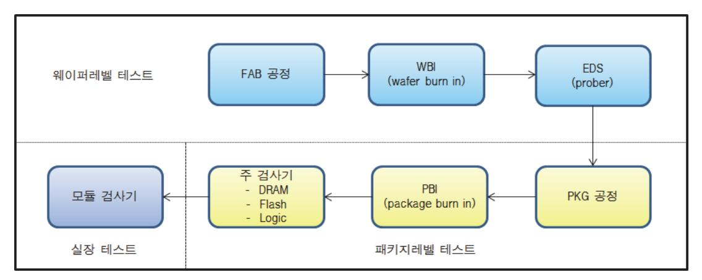

출처: 교육부(2018). 반도체 제품 기능·성능 검증(LM1903060109\_14v3). 한국직업능력개발원. p.31. [그림 2-1] 반도체 칩 테스트 흐름도

장비의 사용은 주검사기와 핸들러의 연동을 시작으로 각 장비 제조사가 제공하는 매뉴얼에 따 라 순서대로 진행한다. 장비별로 모두 동작 방법이 다르므로 꼭 장비 제조사와 장비 운영자가 만들어 놓은 작업 절차서를 숙지하고 사용한다. 장비가 제대로 작동하는지의 여부는 일일이 확 인한다.

- 1. Package Test System(주 검사 장비, handler)을 확인한다.
- 2. 표준 샘플 test를 실시한다.
- 3. 해당 공정 조건 test item 이상 유무를 확인한다.
- 4. Test하고자 하는 program이 제대로 loading 되었는지 확인한다.
- 5. 선두 package 위치가 정확한지 확인한다.
- 6. Contact Mode/양산 Mode Setting을 확인한다.
- 7. Wrist strap 착용 후 set-up및 test 진행 했는지 확인한다.
- 8. Low yield 발생 시 발생 원인을 분석 한다 .
- 9. 이상 처리 발생 시 장비 점검 및 test program을 점검 한다.
- 10. 테스트 결과를 작성, 정리한다.
  - (1) Test summary를 확인한다.
  - (2) 표준 시료와 비교한다.
  - (3) Histogram, 프로그램 검토, Data log, Shumoo Plot을 확인한다.

#### 숖 테스트 핸들러(handler)

테스트 핸들러는 테스트 공정에 있어서 소자 혹은 모듈을 테스트 하기 위한 적절한 온도와 환 경을 조성해 주고, 전기적 테스트를 위하여 반도체 소자 혹은 모듈을 자동으로 테스트하고자 하는 위치로 이송시키며, 테스터와 전기적으로 연결되어 있는 소켓에 소자 혹은 모듈을 자동적 으로 꽂거나 빼고, 테스터와 통신을 하여 테스터 결과에 따라 소자 혹은 모듈의 불량 여부를 판정하여 그 결과에 따라 등급별로 자동 분류하여 수납시키는 핸들링 장치이다.

1. 테스터 핸들러 종류

테스트 핸들러는 그 용도에 따라 매우 다양한 종류가 있다. 테스트 핸들러의 종류는 디바이 스의 이송 방법, 디바이스의 종류, 제조공정 상 어디에 쓰이는가에 따라 분류할 수가 있다. 디바이스 이송 방법에 따라서는 수직식과 수평식으로 분류할 수 있고, 디바이스의 종류에 따라서는 메모리와 비메모리 반도체용으로 분류할 수 있다. 한편, 메모리 반도체용에서도 개별 소자와 모듈용으로 나눌 수 있을 뿐 아니라 테스터용인지 실장형인지로도 분류할 수 가 있다.

(1) 소자 이송 방식에 따른 분류

디바이스의 이송 방법에 따라 수직식과 수평식 테스트 핸들러로 분류할 수가 있다. 수직 식은 디바이스 자체의 무게에 의한 자유낙하를 이용한 디바이스 이송 방식을 채택한 것 이고, 수평식 테스트 핸들러는 P&P head를 이용하여 디바이스를 강제로 이송시키는 방식을 말한다. 수직식은 소자를 튜브에 담았을 때 각 소자의 pin과 pin이 서로 닿지 않는 패키지 타입이어야 하는데 반해, 수평식은 제약이 없어 새롭게 개발되는 많은 종류 의 패키지를 그 대상으로 하고 있다. 반드시 그런 것만은 아니지만, 수직식은 pin 수가 적은 간단한 IC들을 테스트하는 곳에 많이 쓰이고, 수평식은 상대적으로 pin 수가 많은 IC를 테스트하는데 적용되는 경우가 많다.

#### (가) 수직식 테스트 핸들러

P&P head를 이용하여 디바이스를 강제로 이송하는 수평식 테스트 핸들러와는 달 리, 수직식 테스트 핸들러는 튜브에 담겨진 소자를 자체의 무게에 의한 자유낙하 방 식을 이용하여 디바이스를 이송하는 것이 주요한 차이점이다. 그러므로 디바이스가 이송하는 동안 손상을 입지 않고 원활히 흐르도록 하는 track 제작과 중간 중간 흐 름을 정지시키는 기구 제작이 설계에 있어서 주요 포인트이다. 적용 가능한 팩키지 는 TO, SOP, SOJ, DIP, SIP, ZIP 등이 있다. 수직식 테스트 핸들러의 주요 구성부 는 stacker, loader, track, deverter, test site, sorter, unloader로 나누어진다. 각 구성부의 기능을 살펴보면,

#### 1) Stacker

디바이스를 공급하기 위해 튜브를 적재하는 부분이다.

#### 2) Loader

좌우 이송장치 및 트랙에 디바이스를 삽입하기 위한 dumper로 구성된다. stacker에서 튜브가 공급되면 튜브를 잡아서 track으로 디바이스를 공급하는 장 치로, cylinder에 의해 회전되며 test site가 많아지면 모터에 의해 좌우 이송하 여 각각의 track에 디바이스를 공급하게 된다.

#### 3) Track

디바이스를 test site로 보내는 장치로 디바이스를 한 개씩 테스트 위치로 흘려보 내는 장치이다. 고온 혹은 저온에서 테스트를 하는 경우에는 고온 혹은 저온 챔 버 내부에 구성된다. 일반적으로 singulator와 distributor로 구성되나, detector 가 추가되는 경우도 있다. Singulator는 디바이스가 bulk 형태로 track을 타고 자중에 의해 이송됨으로, 순차적으로 디바이스를 한 개씩 흘려보내기 위한 장치 이다. distributor는 test site가 여러 개인 경우 각 site에 디바이스를 공급하기 위한 장치로 1, 2 PARA의 경우는 설치하지 않는다. detector은 디바이스의 lead가 굽어지는 불량 및 역방향으로 디바이스가 공급되지 않도록 하기 위한 장 치로, jam 발생을 극소화하고 테스트 핸들러의 신뢰성을 높이기 위해 설치한다.

#### 4) Deverter

Deverter는 distributor에서 test site track으로 디바이스를 공급하거나 또는

test site track에서 나온 디바이스를 output buffer track으로 공급하여 주는 장치로 회전 운동을 통하여 디바이스를 공급한다. 디바이스가 원활히 이송되지 않을 경우는 air blower를 설치하여 디바이스의 흐름을 원활히 한다. Track에는 고온 테스트의 경우 냉각 기능, 저온 테스트의 경우 가열 기능을 부가하여 unloading 공정에서의 tube 변형 가능성 또는 디바이스에서의 습기 생성 가능 성을 제거한다. Deverter를 사용하지 않을 경우는 R-track을 사용한다.

#### 5) Test site

Test site는 디바이스를 테스트하는 장소로 비메모리 디바이스의 경우는 1, 2, 4 PARA가 주종을 이루며, 메모리의 경우는 16, 32 PARA까지 개발되어 사용되고 있다. 소켓의 형상에 따라 contact 방식이 달라지며, contactor의 구동 타이밍 은 테스터와 통신을 통하여 설정된다. Contact 시 적정한 압력과 디바이스가 손 상을 입지 않도록 해야 한다. 테스트 시간이 짧으면 짧을수록 index time이 UPH에 미치는 영향이 커지므로 비메모리 테스트 핸들러의 경우 빠른 index time 구현이 중요하다. Test site track의 입구와 출구에는 센서를 설치하여 디 바이스의 출입을 체크한다.

#### 6) Test site

Sorter는 deverter에서 공급된 디바이스를 테스터와 통신을 통하여 받은 결과에 따라 해당 BIN의 unloader buffer track으로 이송하는 장치이다. Sorter track 의 구동은 stepping motor 또는 servo motor, belt, 그리고 LM guide에 의해 이송되며, 디바이스를 일시 정지시키기 위한 구조물이 설치된다. 또한 track 입 구와 출구에는 센서를 설치하여 디바이스의 출입을 체크한다. 고온 혹은 저온 테 스트가 필요할 때에는 냉각 혹은 가열 기능을 추가한다. Unloader buffer track 은 튜브 교체 시 디바이스를 적재하고, 고온 및 저온 테스트가 요구되어지는 때 에는 냉각 또는 가열을 하기 위한 장소로 cylinder를 이용한 stopper 기능이 부 여된다.

#### 7) Unloader

Unloader부는 빈 튜브를 적재하기 위한 stacker와 튜브를 이송하기 위한 transfer로 구성된다. 양품의 full tube를 적재하는 방식은 제조사마다 다소 차이 는 있지만 latch를 이용한 tacker 방식과 box에 떨어뜨리는 방식이 적용되고 있 다. Sorting하기 위한 튜브의 bin 수는 비메모리 디바이스의 경우 good bin은 2개소를 설치하고 reject 및 retest bin은 2 내지 3개소를 설치한다. 수직식 테 스트 핸들러는 비교적 pin수가 적은 간단한 패키지에 적용된다. 상온에서 테스트 하는 장비는 상대적으로 제작이 간단하고 가격도 싸다. 그러나 고온과 저온 테스 트를 겸비하는 경우에는 장비 제작이 간단하지 않으며 장비 가격도 상대적으로 비싸다. 현재 국내에는 수직식 테스트 핸들러를 생산하는 곳은 여러 곳이 있으며, 국내 시장보다는 중국과 동남아 시장을 겨냥하고 수출에 주력하고 있는 편이다.

(나) 수평식 핸들러

반도체 소자가 다기능화, 고급화, 고집적화가 되면서 pin 수가 급격히 증가하게 되 었는데, 이에 부응하기 위하여 QFP, BGA, CSP 등의 새로운 패키지가 등장하게 되 었다. 이러한 패키지들은 그 특성상 튜브에 담을 수가 없고 반드시 tray에 담아서 운반이 된다. 그러므로 이들 패키지들을 테스트할 때에는 튜브로부터 소자를 자유 낙하시키는 수직식을 사용할 수가 없다. 그러므로 이들 패키지들을 테스트하고자 할 때에는 자유낙하를 이용하는 수직식과는 달리, 디바이스가 담겨진 customer tray를 stacker에 loading하면 로봇이 소자들을 테스트하고자 하는 위치로 강제 이송하는 방식을 취하는 수평식 테스트 핸들러를 사용해야 한다. 이러한 수평식 테스트 핸들 러는 QFP, BGA, CSP와 같은 경박단소한 패키지의 Lead 혹은 Ball을 보호할 수 있으며 다양하게 변화하는 선행 패키지에 적절하도록 장비의 구성을 바꾸는데 용이 하다. 보통 장비의 구성은 tray loader, pick and place, preheating zone, input shuttle, test site, output shuttle, tray unloader 등으로 구성되며, 보통 테스트사이트가 1 ~ 4개 정도이며, 고온 테스트가 가능하도록 되어있다.

1) Tray loader

Tray loader는 디바이스가 적재된 tray를 연속적으로 공급시켜 테스트가 연속적 으로 진행될 수 있도록 하는 elevator 구조이다. Tray loader에서 공급된 디바 이스는 P&P head에 의해 preheating zone으로 이송되어 예열을 한다. 예열이 끝난 디바이스는 robot에 의해 input shuttle로 이송된다.

2) Input shuttle

Input shuttle은 히터를 이용하여 고온을 유지하고, 디바이스를 test site 위치까 지 이송한다.

3) Test site

Test site에서는 input shuttle에서 디바이스를 pick up하여 contact 위치로 이동 후 소켓에 꽂아서 테스트를 한다.

4) Output shuttle

테스트가 끝난 디바이스는 output shuttle로 이동되어 unloader robot이 픽업 하는 위치까지 이송된다. 테스트 결과에 따라 디바이스는 적절한 수납 장소에 분 류된다.

5) Tray unloader

Tray unloader는 output shuttle로부터 양품 판정을 받은 디바이스를 연속적으 로 unloader할 수 있도록 되어있다.

일반적으로 수평식 테스트 핸들러는 index time, cycle time, 신뢰성이 장비의

성능을 좌우한다. 수평식 테스트 핸들러의 기술수준은 수직식에 비하여 상대적으 로 어렵다고 할 수 있는데, 현재 병렬 테스트가 가능한 테스트 사이트의 수를 늘 리고 있는 실정이다. 그러나 이것은 결국 테스트 핸들러의 문제라기보다는 pin 수가 많아 그것을 처리해야하는 테스터의 한계를 극복해야만 풀리는 문제이다.

2. 소자 종류와 제조 공정에 따른 분류

일반적으로 반도체는 크게 메모리 반도체와 비메모리 반도체로 나눌 수 있다. 테스트 핸들 러 역시 크게 메모리 반도체용과 비메모리 반도체용으로 구분이 가능하다. 그리고 메모리 반도체에서도 디바이스를 테스트하는지, 모듈을 테스트하는지에 따라서 구분이 되며 공정별 로 구분이 가능하다.

(1) 메모리 IC 테스트 핸들러

메모리 IC와 메모리 모듈의 테스트 항목은 크게 DC 테스트, AC 테스트, function 테 스트로 나누어진다.

- DC 테스트: DUT(device under test)에 규정된 전압을 인가하여 open/short, 입력 전류, 출력 전압, 전원 전류 등의 DC 특성을 측정하는 것이다.
- AC 테스트: DUT의 입력단자에 펄스 신호를 인가하여 입출력 운반 지연 시간, 출력 신호의 시작/종료 시간 등의 동작특성을 측정하는 것이다.
- Function 테스트: 각 메모리 셀의 읽기, 쓰기 기능이나 상호 간섭 등을 시험하며, 패 턴 발생기에서 발생한 시험 패턴을 규정된 레벨로 변환한 펄스를 DUT에 인가하여 DUT의 출력 신호를 규정된 레벨과 비교한다. 그 비교 결과를 패턴 발생기에서 발생한 출력 기대 패턴과 비교하여 동작의 양/불량을 시험한다. 일반적으로 AC 테스트와 function 테 스트를 겸한 다이나믹 function 테스트로 겸하여 실시된다.

일반적인 경우에는 테스터를 이용하여 위에서 열거한 메모리 테스트 항목들을 모두 검 사하게 된다. 그러나 테스트 비용을 절감하기 위한 노력의 일환으로 최근에 고안된 PC level 실장 테스트 핸들러에서는 AC 테스트와 function 테스트의 수행은 곤란하며, 단 지 DC 테스트와 PC 환경의 실장 테스트만으로 테스트를 수행한다. 그리고 PC level 실장 테스트 핸들러에 장착되는 DC tester에는 통상 SPD(Serial Presence Detect) 정 보 수록이 가능하도록 되어있다. PC level 실장 테스트만으로 테스트를 수행할 시에는 디바이스를 일부 샘플링하여 AC 테스트와 function 테스트를 수행한다. 때로는 일반적 인 테스트와 PC level 실장 테스트를 겸하기도 한다.

(가) 메모리 IC 테스트 핸들러

메모리 IC 제조에 있어서 가장 중요한 요소는 양산성이다. 이 양산성이 곧 원가를 결정하게 된다. 따라서, 메모리의 집적도가 높아지면서 테스트 시간도 길어져 시간당 생산성을 높이기 위한 노력이 계속적으로 진행되어 오고 있다. 병렬테스트(parallel test) 방법이 가장 활발하게 도입되고 있는데, 최근 128para 테스트 핸들러가 이미 실용화되었고, 256para 제품이 곧 선을 보일 예정이다. 한 번에 테스트할 수 있는 메모리 소자의 수는 증가하면서도 장비의 크기는 특별히 커지지 않아 크린룸의 면적 과 인원을 최소화하는 데에도 효율적이다. 일반적으로 테스트 환경은 –10 ~ 100℃ 가 요구되는데, 소자업체에 따라서는 –50 ~ 150℃를 요구하는 곳도 있다. 메모리 IC 테스트 핸들러는 수평식 구조를 가지고 있으며, 핵심 기술로는 128개의 메모리 소자를 동시에 이송하기 위한 tray 제작기술, 소자를 개별적으로 핸들링하는 P&P head 제작기술, 고온과 저온 챔버 제작기술 및 온도제어 기술, 128개의 소자를 동 시에 정확히 contact하는 기술 등이 있다.

(나) 메모리 모듈 테스트 핸들러

반도체 소자 업체들은 메모리 IC와 동시에 메모리 모듈로도 제작하여 판매한다. 우 리가 일반적으로 사용하는 개인용 컴퓨터의 내부를 들여다보면 메모리 소켓에 이 메 모리 모듈이 꽂혀있는 것을 볼 수 있다. 메모리 모듈은 메모리 소자들이 원하는 용 량만큼 저장되어 있는 회로기판을 가리키는 것으로 SIMM, DIMM, RIMM 등이 있 다. 한편, 노트북용은 일반 PC용에 비하여 그 크기가 작고 pin 수가 적다. 표면 장 착(surface-mount) 메모리칩을 수용하도록 설계된 작은 회로기판을 이용한 메모리 모듈로, 종래의 메모리 장착용 PCB보다 간결하여 공간을 덜 차지한다. DIMM (Dual In-line Memory Module)은 두 겹짜리 SIMM이라고 할 수 있다. SIMM과 마찬가지로, DIMM도 컴퓨터 마더보드에 접속하기 위해 핀이 달린 작은 회로기판 상에 하나 이상의 메모리 소자들이 부착되어 있다.

1) SIMM (Single In-line Memory Module)

SIMM은 보통 72핀 커넥터가 요구되는 컴퓨터에는 32비트 폭(패리티 비트까지 치면 36비트이다)의 데이터 비트를 가지고 나온다. SDRAM은 64데이터 비트를 지원하기 때문에 적어도 한 쌍의 SIMM 또는 한 개의 DIMM이 필요하다.

2) DIMM (Dual In-line Memory Module)

DIMM은 168핀 커넥터가 달려있으며, 64비트 데이터 전송을 지원한다.

3) RIMM

램버스 DRAM은 램버스사가 개발한 고성능 메모리 소자를 사용한 모듈이다. 램 버스는 캐시 메모리가 불필요한 인터페이스 기술을 통하여 메모리가 고속의 프로 세서나 컨트롤러의 속도에 부합될 수 있도록 하는 기술이 적용된 것으로, DRAM 기술에 그것을 조절하는 로직 디바이스를 결합한 것이다. 이러한 기술을 통하여 램버스사는 이 기술이 기존의 DRAM보다는 10배, 그리고 최근의 PC100 SDRAM DIMM 모듈보다는 약 3배나 빠른 성능을 지녔다고 한다. 하나의 램버 스 DRAM(RDRAM)은 2바이트 채널에서 최고 800MHz의 속도로 자료를 전송한

다. 이러한 램버스 기술은 현재까지 3세대로 되어있다. 이 중 3세대 제품을 '다 이렉트 램버스'라고 하는데, 이 다이렉트 램버스를 사용한 메모리 모듈을 RIMM 이라고 한다. 램버스는 전 세계를 대상으로 하여 RIMM이라는 상표를 등록하였 다. 이러한 SIMM, DIMM, RIMM 등의 메모리 모듈을 제조한 후 최종적으로 tester를 이용하여 테스트할 때, 이들 모듈들을 핸들링해주는 장치이다. Tester에 따라서 1 ~ 16 parallel로 테스트가 가능하도록 구성된다. 장비의 구성은 외부로 부터 테스트하고자 하는 모듈들을 공급하는 loader, 모듈을 담은 tray로부터 모 듈을 테스트하기 위한 장소로 운반하기 위하여 동시에 여러 개의 모듈을 집어서 이송시키는 gripper, tester와 전기적으로 연결되어 있는 소켓에 모듈들을 꽂아 서 테스트를 수행하는 test site, 테스트 결과에 따라 출하용 tray 혹은 불량품 tray로 분류하고 출하하는 unloader 등으로 나누어진다. 보통 gripper는 4, 8, 16개의 모듈을 동시에 집어서 이송시킨다. 핵심 기술로는 여러 개의 모듈을 동시 에 집어서 정확하게 contact하는 기술, 고온과 저온 챔버 제작기술 및 온도제어 기술 등이 있다.

(다) PC level 실장 테스트 핸들러

실장 테스트는 크게 모듈 실장 테스트와 component 실장 테스트가 있다. 여기서는 주로 모듈 실장 테스트 시스템에 대하여 언급하겠다. 현재 대만이나 중국에서 메모 리 모듈을 제조하는 영세 업체들은 고가의 메모리 테스터를 구입하기가 어려워 최종 테스트 방법으로 PC에 실제로 메모리 모듈을 장착하여 몇 가지의 간이 테스트를 수 행하여 양/불량을 판정한다. 이러한 방식을 PC level 실장 테스트라고 할 수 있는 데, 대형 메모리 모듈 제조사들도 고가의 테스터를 이용하여 테스트가 끝난 제품도 이러한 PC level 실장 테스트를 수행하기도 하였다. 그 이유는 테스터를 이용하여 양품으로 판정되어 출하된 메모리 모듈이나 메모리 디바이스가 실제로 PC에 탑재되 거나 다른 장치에 장착된 후 제대로 동작을 하지 않는 경우가 발생하여 모듈 제조사 에 하자 청구가 되는 일이 종종 있어왔기 때문이다. 이에 최근에 와서는 메모리 제 조사들은 모든 테스트가 끝난 메모리 모듈을 다시 실제 PC 상황에서의 동작여부를 검사하는 테스트 공정을 적용하기도 한다. 이러한 PC level 실장 테스트는 아직 테 스터의 개발이 완전하지 않는 초고속 메모리 소자의 경우에도 테스터의 대체 수단으 로 사용될 수 있다. 2000년 이전에는 PC level 실장 테스트를 위하여 일일이 사람 이 손으로 메모리 모듈을 기판의 소켓에 꽂아서 검사를 하였다. 최근 반도체 경기의 불황과 메모리 가격의 하락으로 메모리 모듈 제조사들은 고가의 테스터를 대체하는 방법의 일환으로 PC level 실장 테스트 개념을 최종 테스트에 도입하기에 이르렀다. 이를 위하여 자동화된 PC level 실장 테스트 핸들러가 개발되어 생산현장에 적용되 고 있다. 이러한 PC level 실장 테스트의 발전은 테스트 보드의 개발과 밀접한 관계

가 있다. 초창기에는 일반 PC 보드를 그대로 사용하였으나 여러 가지로 불편할 뿐만 아니라 공간을 절약하기 위하여 최근에 Parallel Testing Board(PTB)가 개발되었 다. PTB 테스트 보드는 통상 3개의 소켓이 있어서 3개의 메모리 모듈을 동시에 테 스트할 수 있도록 만든 것이다. 물론 이것 역시 완벽한 PC 실장 상태라고는 할 수 없어도 PC와 거의 같은 환경이라고 할 수 있다. 그러나 아직 램버스를 위시한 초고 속 메모리 모듈에 관해서는 여전히 PTB가 개발 중에 있다. PC level 테스터 핸들러 는 기존의 핸들러들이 가지고 있는 이송, 분류, 수납하는 기능을 그대로 수행하나, PTB가 테스터의 역할을 하게 된다. 이 PTB는 PC box 형태로 테스트 핸들러에 장 착되는데, PC box가 고정되어 있는 고정식과 PC box가 순환하는 순환식이 있다. 두 종류는 각각의 장단점이 있으며, 현재 개량형이 개발 중에 있다. 현재 적용되고 있는 양산용 테스트 핸들러에는 30대의 PC box가 장착되는데, 장착할 수 있는 PC box 수는 가변적이다. 당분간 메모리 모듈의 최종검사에서 PC level 실장 테스트 핸들러는 큰 역할을 할 것으로 여겨진다.

(라) 웨이퍼 레벨 테스트 핸들러

Wafer level 테스트는 아직 많은 투자와 시행 착오가 요구되는 신개념의 테스트 방 법으로 wafer 상에서 burn-in과 test를 모두 수행하는 방법이다. 즉, 'Wafer Level Test + Wafer Level Burn-In'형식이다. 2005년 이후에 본격적으로 사용될 전망이 다.

(2) 비메모리 반도체용 테스트 핸들러

정보를 저장하는 용도로 사용되는 메모리 반도체와는 달리 정보 처리를 목적으로 제작 된 반도체가 비메모리 반도체이다. D램, S램, V램, 롬 등이 메모리에 속하며, 중앙처리 장치(CPU), 멀티미디어반도체, 주문형 반도체(ASIC), 복합형 반도체(MDL), 파워 반도 체, 개별 소자, 마이크로프로세서 등 메모리 이외의 모든 반도체를 비메모리라고 부른 다. 비메모리 반도체는 컴퓨터 주기억장치(CPU)처럼 특수한 기능을 하기 때문에 고도의 회로설계 기술을 필요로 한다. 종류가 매우 다양하며, 제품별로 기술 집약적인 요소가 매우 강하기 때문에 소량생산에도 불구하고 많은 이윤을 남길 수 있는 특징을 갖고 있 다. 휴대전화의 CDMA칩이나 PC에 들어가는 CPU 칩처럼 컴퓨터, 가전기기, 통신용 기 기 등에 필수적으로 내장된다. 세계 반도체 시장에서 비메모리 분야가 차지하는 비중은 70% 이상이며, 세계적으로 2만 종류 이상이다. 그러나 최근 메모리와 비메모리를 결합 시킨 복합 반도체의 등장으로 이러한 물리적인 구분은 점차 의미를 잃어가고 있기도 하 다.

(가) 로직(Logic) IC 테스트 핸들러

Logic IC 테스트 핸들러는 일반적으로 loader, robot, heating chamber, shuttle, test site, unloader 등으로 구성되며, 보통 테스트사이트가 1 ~ 16개 정도 되며, 고온 테스트가 가능하도록 되어있다. 로직 디바이스의 test time이 일반적으로 매우 짧아서 index time과 cycle time이 장비의 성능을 좌우한다. 현재 대부분의 Logic IC 테스트 핸들러의 index time은 0.5초 이내로 메모리 IC 테스트 핸들러에 비해 간단하고 저렴하다. 그러나 메모리 IC 테스트 핸들러보다는 다양하고 까다로운 Conversion Kit가 요구되어진다. 장비의 핵심 기술은 로봇의 속도와 제어기술이다. 보통 Logic IC 테스트 핸들러는 수평식으로 만들어진다.

#### (나) O/S 테스트 핸들러

#### 1) Wire 불량

패키지 작업 중에는 die 손상, wire bonding 상태 불량, 디바이스 외관 불량, lead 형상 불량 등 여러 유형의 불량이 발생할 수 있다. 이 중 wire와 관련된 불량은 bonding 중 wire의 단선, die 또는 lead와 wire 접촉 부분의 bonding 상태 불량, die와 lead간 bonding 위치 변경, molding중 EMC에 의해 wire 가 쏠리는 현상 등이 있다. 이와 같은 wire에 의해 발생되는 불량은 개별 이상 동작이 발생할 수도 있지만 회로 상에 연결되어 있을 때에는 주변의 회로를 short시킬 수도 있다.

#### 2) O/S 테스트

O/S 테스트란 wire bonding 후에 die와 lead 간에 연결되어 있어야 할 wire 의 open, 또는 인접한 wire간의 short를 테스트 하는 것을 지칭한다. 최근 패키 징 기술의 고급화와 디바이스의 고집적화로 인하여 패키지의 pin 수가 급격히 증 가함에 따라 fine pitch가 요구되어짐에 따라 기존의 육안 검사에 의한 Open/Short의 불량 검출은 사실상 어렵게 되었다. 최종 테스트 공정에서 이루 어지는 DC 테스트는 O/S 테스트뿐만 아니라 Leakage, 입력전류, 출력전압 등 의 모든 DC특성을 테스트하지만, O/S 테스트 시스템은 O/S 테스트 기능만을 별도로 분리하여 패키징 조립 중에 발생할 수 있는 불량을 사전에 발견하여 최종 패키지 단계까지 가지 않도록 하는 역할을 하는 것이다. 이와 같이 최종 테스터 공정까지 가지 않고 사전에 개방 및 단락 Pin들을 스크린닝해 낼 수 있음으로 해서 생산성이 향상될 뿐 아니라, 불량원인 파악 및 분석으로 생산수율을 향상시 키는 데에 큰 도움이 되고 있어 그 수요가 점차 증대되고 있다. 이미 몇몇 제조 회사들은 패키징 공정 중의 O/S 테스트를 전수검사로 시행하고 있다.

#### 3) O/S 테스트 핸들러 구조

O/S 테스트 핸들러 구조는 loading/unloading elevator, transfer장치, test site 등으로 구성된다. Loading elevator는 magazine에 들어있는 strip을 테스 트할 수 있는 위치로 loading하는데, step motor에 의해 구동하며 다양한 크기 와 모양의 magazine 대응이 가능하도록 되어있다. Loading된 strip은 transfer

장치에 의해 레일을 따라서 test site로 이송된다. 이송 중에는 strip이 정전기로 부터 보호되도록 해 주어야 한다. Test site에서는 테스트를 위하여 contact position을 잘 맞춰주어야 하는데 이를 위하여 정렬 장치가 있다. 정렬이 잘못된 경우는 센서가 있어서 이를 보호하는 안전장치가 되어있다. 테스트가 끝난 소자 는 unloading transfer 장치를 통하여 합격과 불합격에 따라 나뉘어져 수납된 다. 불량품의 경우, marker가 있어서 소자에 strip의 상태를 marking해 준다. 보통의 경우, open, short, 혹은 open-short 상태를 표시하게 된다. 끝으로 합 격, 불합격 등으로 분류된 소자는 준비된 magazine에 수납된다.

3. 그 외의 테스트 핸들러

메모리 소자나 로직 IC 외에도 최근에 부각되고 있는 MEMS용 테스트 핸들러도 국내 기술 진에 의해 개발되어 사용되고 있다. 한편, TFT LCD 제조 공정에서도 테스트 핸들러가 사 용되고 있다.

#### 숗 번인(burn in) 장비

메모리 반도체에서 번인 공정을 도입하는 주요 이유는 반도체 소자에 고온 조건하에 임계값에 가까운 전압을 가한 상태(일반적으로 고객이 1년 이상 사용하는 정도의 스트레스를 가한 상태) 에서 제품을 동작시켜 실제 사용 시 발생할 수 있는 반도체 제품의 불량을 조기에 검출하기 위 해서이다. 패키지 상태에서의 번인(PLBI: package level burn-in)공정은 메모리 소자들을 번 인 보드의 소켓에 삽입한 뒤 챔버 안에 넣고, 일반적으로 125℃에서 일정 시간 동안 소자에 일련의 기능 테스트를 수행하여 제품의 기능이 정상 혹은 비정상인지 가려낸다. 최근에는 메모 리 용량이 기하급수적으로 증가함에 따라 번인시간이 길어지고, 실장의 집적도를 높이기 위해 시도되는 SiP(system in package)와 MCM(multi chip module) 등 베어칩에서 고밀도 실장 을 하는 제품이 증가하여 다핀화가 진행되는 등 PLBI 공정의 비용이 증가하였다. 이러한 문제 를 해결하고자 메모리 반도체 제품에 DFT(design for test ability), 또는 BIST(built-in self test)기능을 내장하여 적은 pin을 사용하여 검사하고 있다. 또한 MCM을 위한 품질 보증된 베 어칩(KGD: known good chip)을 확보하고자 웨이퍼 상태에서 번인을 실행하는 웨이퍼 수준 의 번인 공정 (WLBI: wafer level burn-in)이 개발되었다. 이 경우 웨이퍼 상태에서 번인을 하기 때문에 번인불량이 되는 칩을 조립하는 낭비를 줄일 수 있다. WLBI의 경우 패키지 번인 방식과 같이 신호 발생과 분배 부분으로 구성되며, 온도 제어 방식에 있어서는 패키지 번인의 공기 가열방식과 달리 직렬식이 주류를 이루고 있다. WLBI와 웨이퍼를 연결하는 인터페이스로 는 Probe Card를 이용하고 있다. 패키지 번인은 패키지 상태의 기능 발달에 따라 다음과 같 이 정적(static) Burn-in, 동적(dynamic) Burn-in, Burn-in 중 테스트로 구분한다.

#### 1. 정적(static) Burn-in

소자에 고온, stand by 상태에서의 고전압의 입력전압(Vdd) 전원만 가하여 초기 불량을 검출하는 Burn-in 방식이다.

2. 동적(dynamic) Burn-in

고온과 저온에서 고전압의 Vdd를 인가하고 소자가 active 상태로 동작하도록 하는 방식으 로 초기 불량을 검출하는 Burn-in 방식이다.

3. Burn-in 중 테스트

Dynamic burn-in 설비에서 기능 읽기를 추가하여 일반 Test System에서 진행하고 있는 기능 항목을 실행하는 방식이다. WLBI은 접촉 방식에 따라 일괄 WLBI와 분할 WLBI로 나 눌 수 있는데, 일괄 WLBI는 웨이퍼를 일괄적으로 접촉할 수 있는 카세트에 넣고, 온도 제 어 유닛에 놓고 번인하는 방식이고, 분할 WLBI는 전체 웨이퍼를 Probe Station상에서 여 러 번으로 나누어 번인하는 방식을 말한다. [그림 2-2]에 두 공정의 비교도가 나타나 있고, <표 2-1>에 특징이 정리되어 있다.

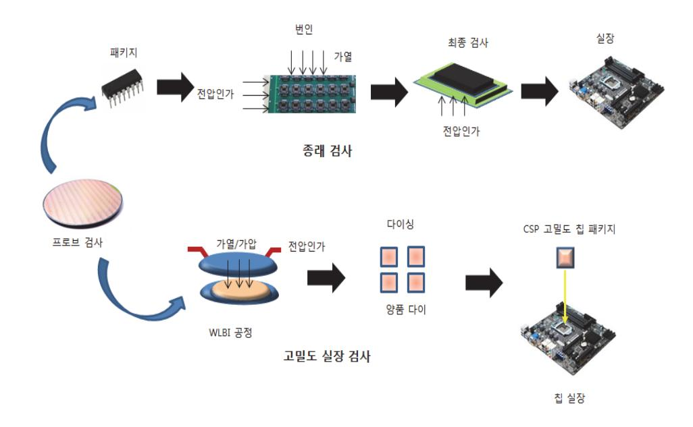

출처: 교육부(2018). 반도체 제품 기능·성능 검증(LM1903060109\_14v3). 한국직업능력개발원. p.12. [그림 2-2] PLBI와 WLBI 번인 공정의 비교도

| <표 2-1> 패키지 번인(Burn-in)의 구분 |  |
|-----------------------------|--|
|-----------------------------|--|

| 방 식                | 일괄 WBLI         | 분할 WBLI         |
|--------------------|-----------------|-----------------|
| 적용 품종              | 전 품종(Pin 수에 제한) | 메모리 제품          |
| Burn-in time       | 장시간             | 단시간             |
| Burn-in cover rate | chip 전체         | 메모리 cell, 주변 회로 |
| Test               | 가능(일부 제한)       | 불가능             |

#### 수 테스트 핸들러 장비 선정 시 고려사항

핸들러의 선정은 먼저 주검사 장비와 관계를 고려하여야 한다. 그 이유는 반도체 검사가 핸들 러와 주검사 장비의 결합으로 이루어지기 때문이다. 테스터는 궁극적으로 두 가지 방향으로 발 전되고 있다. 하나는 얼마나 많은 소자를 동시에 테스트하여 생산성을 향상시킬 것인가와 소자 의 데이터 처리속도 상승에 따른 테스트 속도의 향상이다 또한 추가적으로는 얼마나 저렴하게 테스트를 할 것인가도 중요한 변수이다.

다수의 소자를 테스터에 정확히 접속하기 위해서는 컨택 프레스의 힘의 증대, 온도변화에 따른 위치 보정 및 재질 변경 등에 대한 항목이 중요하므로 장비 사양서를 자세히 검토해야 한다. 핸들러에서 동시에 테스트할 소자의 수가 증가한다는 것은 테스트 트레이의 크기 증가, 핸들러 전체의 크기 증가, 챔버 용량 증가와 온도 균일성 문제, 소자 처리속도 향상, 동시에 많은 소자 에 대한 균일한 컨택의 문제 해결과 장비의 고속화, 복잡화로 인해 발생할 수 있는 JAM의 감 소가 적은 장비를 선택해야 한다. 몇 가지 필수 선정 항목을 알아본다.

1. 테스트 시간 단축

핸들러에서 말하는 처리능력 및 인덱스 타임의 고속화는 기계적인 요인이 많기 때문에, 반 송 구동부의 기계적 속도의 고속화, 이동 거리 단축, 위치 결정 제어의 최적화를 통한 시간 의 단축을 할 수 있다. 또한 다양한 소자를 반송하는 핸들러의 성격을 고려하면, 광학식 위 치결정기술은 기계적인 위치 결정 기술 이상으로 관계된 분야가 넓기 때문에 이에 대한 고 려도 필요하다.

2. 동시 측정 수

동시 측정하는 소자의 수가 많아지는 경우 많은 소자를 동시에 측정할 수 있도록 소자를 공급하며, 정확한 접촉이 이루어지도록 할 것인가가 중요한 기술적 문제이다. 테스트의 복 잡화와 고속화는 테스트 헤드에 대한 회로와 전원의 설치 수를 증가시키고 해마다 용적이 확대되는 추세에 있다. 또한 동시 측정수의 증가는 핸들러 자체의 기구도 복잡하게 하기 때 문에 핸들러는 커질 것으로 예상된다. 그러나 건물 반입구의 제약이나 공장 내 레이아웃, 이동의 제한 등도 있어서 가로 1.8m를 넘는 것은 편리성이 떨어진다.

3. 사용 테스트 트레이

사용 테스트 트레이의 크기는 장치 전체 면적, 반송 경로, 동시 처리 소자의 수와 밀접한 관계가 있다. 트레이 크기가 커지면 장치의 전체 면적을 비롯한 사용 테스트 트레이가 이송 되는 부분이 커지며, 또한 온도 변화에 따른 사용 테스트 트레이의 확대, 축소 비율이 증가 하여 접촉에도 영향을 미치게 된다. 따라서 동시 측정수가 늘어나도 사용 테스트 트레이는 최소한의 크기를 유지해야 한다.

#### 4. 설치 면적

테스트가 복잡해지고 고속화될수록 테스터의 필요한 회로와 전원의 수가 증가하고, 동시 측 정수가 증가하면서 핸들러 자체의 기구설계가 복잡해지기 때문에 핸들러 전체 크기가 커지 지 않을 수 없다. 설비 이동, 공장의 Layout, 이동경로 등을 감안하여 부합되는 장비를 결 정해야한다.

#### 숙 번인(burn in) 장비 선정 시 고려사항

반도체 공정의 미세화에 의해 고객이 사용하는 전압 범위와 반도체 소자의 스트레스에 대한 가 능한 임계값의 차이가 점차 감소된다. 따라서 가능한 범위에서 짧은 시간에 신뢰성 확보를 위 해 소자에 인가할 수 있는 신호의 품질을 향상하기 위한 기술의 발달이 필요하다.

1. 패키지 레벨 번인(Package Level Burn-In)

패키지 번인은 고온의 챔버에 제품을 삽입하고 standby 상태에서 소자 전원을 고객이 실제 사용하는 것보다 가혹한 조건의 고전압을 장시간 인가하여 신뢰성을 확보하는 단계에서 반 도체 제품이 active 상태로 되도록 각 핀에 신호를 인가하는 방식으로 진행한다. 메모리 반 도체에서 timing 특성과 연관이 작은 테스트 항목에 대해 번인 시스템에서 검사를 실행하 고 있다. DRAM의 경우 refresh 항목을 주로 실행하고 있으며, 다소 동작속도가 떨어지는 NAND Flash의 경우 테스트하기에 편리한 형태의 시스템 제어기능을 내장한 번인 시스템 이 개발되고 있다. 또한 실장의 고밀도 집적화를 위해 MCP 제품이 증가하고 있어 여러 종 류의 제품을 한 번에 테스트하는 번인 시스템이 개발되고 있다.

2. 웨이퍼 레벨 번인(Wafer Level Burn-In)

WLBI의 경우 메모리 반도체의 경우 소자 내부에 기능 테스트가 가능하도록 하기 위한 번 인 회로를 내장하여 적은 핀으로 짧은 시간에 많은 효과를 낼 수 있도록 하여 생산성의 증 대를 꾀하고 있다. 전자기기의 소형 ․ 다기능 ․ 저코스트화 및 개발 사이클의 단축을 가능하 게 하는 소자 기술로서 여러 반도체 칩을 하나의 패키지에 넣는 형태인 MCP(multi chip package)나 SiP(system in package) 등이 있다. 이들의 신뢰성을 확보하기 위하여 웨이 퍼 레벨에서 양품으로 선별된 KGD(known good die)의 확보가 필요하며, 이를 위해 웨이 퍼 레벨 번인 장치인 WLBI의 중요성이 커지고 있다. WLBI 시스템에서는 검사를 수행하기 위하여 일반 테스트 시스템에 비해 고전압과 대전류의 공급과 측정이 가능하면서 다량의 소자를 동시에 측정하기 위한 시스템의 구성을 위한 집적화 기술과 시스템 제어기술이 필 요하다. 현재는 번인 시스템에서 메모리 반도체의 경우 타이밍 특성과 연관이 작은 테스트 항목에 대해 번인 시스템에서 검사를 실행하고 있다. 일반 테스트 시스템에 비해 고전압/대 전류의 공급과 측정이 가능함과 동시에 다량의 소자를 동시에 측정해야 하므로 시스템의 구성을 위한 집적화기술과 시스템 제어기술이 필요하다.

재료·자료

- 정전 방지 손장갑, 조립품 보관 박스, 테스트 소켓
- 테스터/핸들러 장비 매뉴얼, 패키지 레벨 테스트 항목 규격서
- 펌웨어 소프트웨어 프로그램 실행 및 명령어 설명서

기기(장비 ・ 공구)

- 기능 및 성능 측정 장비, 가변 온도 장치, 컴퓨터, 프린터
- 번인 보드, 진공 트위져
- 안전 ・ 유의사항
  - 칩의 내부 온도가 제품 규격상의 한계 수준에 도달할 수 있도록 예비 시간(Soak Rime)을 설정하거나 평가 조건에 반영한다.

수행 순서

- 숔 패키지 레벨 테스트 시스템에 대하여 이해한다.
  - 1. 테스터의 기능을 이해한다.
  - 2. 핸들러 기능을 이해한다.
  - 3. 소켓 & PCB 기능에 대하여 이해한다.
  - 4. 데이터 처리 시스템에 대하여 장비 연동 관계를 이해한다.

숕 조립품 테스팅 장비에 대하여 이해한다.

- 1. 테스터의 구조를 이해한다.
- 2. 핸들러의 구조를 이해한다.
  - (1) 디바이스의 이송 방법에 따른 핸들러의 구조를 파악한다.
    - (가) 수평식 핸들러의 구조를 파악한다.
    - (나) 수직식 핸들러의 구조를 파악한다.
  - (2) 디바이스의 종류에 따른 핸들러의 구조를 파악한다.

- (가) 메모리 소자의 개별 및 모듈 테스트 핸들러의 구조를 파악한다.
- (나) 비메모리 소자의 로직과 O/S 테스트 핸들러의 구조를 파악한다.
- 3. 소켓의 구조에 대하여 이해한다.
- 숖 조립품 테스트 장비를 동작한다.

장비가 제대로 작동하는지의 여부는 일일이 확인한다. 장비의 사용은 주검사기와 핸들러의 연 동을 시작으로 각 장비 제조사가 제공하는 매뉴얼에 따라 순서대로 진행한다.

- 1. Package Test System(주 검사 장비, handler)을 확인한다.
- 2. 표준 샘플 test를 실시한다.
- 3. 해당 공정 조건 test item 이상 유무를 확인한다.
- 4. Test하고자 하는 program이 제대로 loading 되었는지 확인한다.
- 5. 선두 package 위치가 정확한지 확인한다.
- 6. Contact Mode/양산 Mode Setting을 확인한다.
- 7. Wrist strap 착용 후 set-up및 test 진행 했는지 확인한다.
- 8. Low yield 발생 시 발생 원인을 분석 한다 .
- 9. 이상 처리 발생 시 장비 점검 및 test program을 점검 한다.
- 10. 테스트 결과를 작성, 정리한다.
  - (1) Test summary를 확인한다.
  - (2) 표준 시료와 비교한다.
  - (3) Histogram, 프로그램 검토, Data log, Shumoo Plot을 확인한다.
- 숗 burn-in 장비에 대하여 이해한다.
  - 1. 정적(static) Burn-in 장비의 구조에 대하여 파악한다.
  - 2. 동적(dynamic) Burn-in 장비의 구조에 대하여 파악한다.
  - 3. burn-in 중의 테스트 방법에 대하여 이해한다.
  - 4. burn-in 중의 선정 시 고려사항을 숙지한다.
    - (1) 패키지 레벨 번인(Package Level Burn-In) 장비 선정 기준을 파악한다.
    - (2) 웨이퍼 레벨 번인(Wafer Level Burn-In) 장비 선정 기준을 파악한다.

수 장비 선정 시 중요 사항을 숙지한다.

- 1. 테스트 항목과 부합되는 장비인지 판별한다.
  - (1) 컨택 프레스의 힘의 증대 효과에 대하여 이해한다.
  - (2) 온도변화에 따른 위치 보정 및 재질 변경 등에 대한 장비 사양서를 검토한다.
  - (3) 선정 시 필요항목 검토사항을 숙지한다.
    - (가) 테스트 시간 단축은 가능한지 판단한다.
    - (나) 동시 측정하는 소자의 수가 많아지는 경우 많은 소자를 동시에 측정할 수 있는지 검토한 다.
    - (다) 동시 측정수가 늘어나도 사용 테스트 트레이는 최소한의 크기를 유지하는지 확인한다.
    - (라) 설비 이동, 공장의 Layout, 이동경로 등을 감안하여 부합되는 장비인지 결정한다.
- 2. 여러 회사의 장비 간 차이점을 판별한다.
  - (1) 회사 간 장비 특성을 파악한다.
  - (2) 성능, 가격, 가동률, 설치 면적을 고려하여 최고의 장비를 선정한다.
- 3. 고객의 성능 평가에 합당한 장비를 선정한다.

## 2-2. 조립품의 수율 변화 분석

학습 목표 • 시험 측정 데이터로 시험 대상 조립품의 불량 여부를 판별할 수 있다. • 시험 측정 데이터를 토대로 조립품의 공정 특성에 따른 수율 변화를 해석하고 문서화할 수 있 다.

### 필요 지식 /

#### 숔 패키지 레벨 테스트 수율

학습 1-2에서 설명한 것처럼 수율(yield)은 투입량 대비 완성된 양품의 비율로, 반도체 수율은 제조단계에 따라 FAB 수율, 테스트 수율, 조립 수율, 실장 수율로 구분하며 이 4가지 수율을 곱하면 전체(CUM) 수율이 된다. 패키지 수율은 광의의 의미에서는 웨이퍼 상의 양품을 조립 전체 공정을 진행한 후 패키지 테스트를 통과한 양품과의 비로 나타낸다. [그림 2-3]에 패키지 수율 관계식과 테스트 부분의 수율 관계식이 제시되어 있다. 협의의 의미로는 테스트에 투입된 패키지 소자 수와 테스트에서 양품 판정을 받은 패키지 소자의 수로 표현된다.

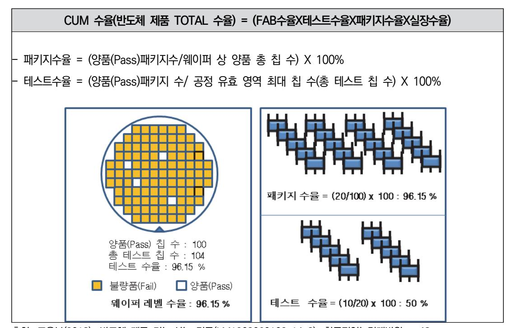

출처: 교육부(2018). 반도체 제품 기능·성능 검증(LM1903060109\_14v3). 한국직업능력개발원. p.48. [그림 2-3] 패키지 레벨 테스트 수율 관계도

#### 숕 패키지 레벨 수율 영향 요소

- 1. 웨이퍼 레벨에서 기인하는 요소
  - (1) 진행성 요소

웨이퍼 레벨 테스트를 통과한 양품의 칩이라도 시간이 지남에 따라 내재하고 있던 결함 이 악화되어 조립 공정을 거치면서 불량으로 떨어질 수 있다. 예를 들어 금속 배선들의 부식, 공정 상 막질의 금(crack), 기공(void), 불순물들의 이동에 의한 특성변화이다.

(2) 정전기

웨이퍼 보관의 환경이 정전기에 노출되어 전기적 특성이 변화하는 경우이다. 또는 조립 전 취급 부주의에 의한 정전기 유입으로 칩이 파괴되는 경우이다.

(3) 테스트 규격에 벗어난 양품

웨이퍼 레벨 테스트에서 규격에 벗어난 칩이 양품으로 판정되었거나 규격의 하한선에 위치한 칩들의 경우이다. 이런 이유로 개발의 경우 충분한 양품 규격을 확보하는 공정조 건의 확립이 필요하다.

2. 패키지 공정에서 기인하는 요소

일반적으로 패키지 레벨에서의 전기적 특성 및 성능평가 결과는 웨이퍼 레벨 테스트 결과 보다 양호하다. 그 이유는 배선과 보호막의 역할로 전기적 접촉, 열적, 광학적 변화에 의한 영향이 감소하기 때문이다. 앞서 설명한 웨이퍼 레벨 기인 요소가 존재하지 않는다면 패키 지 레벨에서 테스트 결과는 결국 패키지 공정에서 발생되는 것이다. 패키지 공정에서 기인 되는 불량요소들에 대하여 알아본다.

(1) 웨이퍼 백 그라인딩 공정

웨이퍼 백 그라인딩 공정은 웨이퍼 두께를 패키지 규격에 맞도록 하기 위해 웨이퍼 뒷 면을 연마하여 원하는 두께로 만드는 공정이다. 최근 보편화되고 있는 스마트 폰이 다기 능화 되고 고집적화 되면서 더 얇은 백 그라인딩을 요구하고 있다. 만일 이 공정에서 두께의 불균형이 발생된다면 전기적으로 몸체 역할을 하는 기판의 전기적 특성이 달라 져 전체 소자 성능에 영향을 줄 수 있다. 또한 그라인딩 전 테이프 라미레이팅 단계에 서 외부 충격으로 웨이퍼에 손상이 미세하게 가해지면 성능 시험에서 마진이 풍부한 웨 이퍼의 경우에는 문제가 없으나 규격의 제한선(상한선, 하한선)에 위치한 웨이퍼들의 칩 은 불량으로 판정될 확률이 높다.

(2) 웨이퍼 소잉(sawing) 공정

웨이퍼 소잉 공정은 웨이퍼 상에 형성된 수백 개, 또는 수천 개의 칩을 패키징 공정을 진행하기 위해 자르는 공정이다. 고속으로 회전하는 블레이드를 사용하는데 이 때 정전 기의 유도가 발생된다면 소자의 특성에 문제가 야기된다. 또한 역학적인 다이 균열, 스 크래치 등이 발생하여 고온, 저온, 번인 테스트 시 칩에 역학적 힘이 가중되어 소자의 불량을 유발한다. 더 큰 문제는 다이 표면에 있는 금속 배선라인이 변형되거나 부식될 수 있다. 소잉 공정은 웨이퍼의 스크라이브(scribe line)를 자르는데 실제 다이와 단차 가 있는 실리콘 가루가 다이 안으로 흘러들어 문제를 야기시킬 수 있다.

(3) 다이 본딩 공정

다이 본딩 공정은 소잉 공정을 통해 개별화된 칩을 하나씩 분리하여 PCB, 또는 리드프 레임(lead frame) 형태의 기판에 붙이는 공정이다. 다이와 기판의 계면이 접착제에 의 해 제대로 붙지 않으면 void가 발생하는데 이 void는 나머지 조립공정에 균열을 야기하 는 역할도 하지만 신뢰성 평가 시 문제를 일으킬 수 있다. 패키지 번인 테스트 과정에 서 불량의 원인이 될 수 있다.

(4) 와이어 본딩 공정

외이어 본딩 공정은 다이 본딩이 완료된 상태에서 칩과 기판을 전기적으로 연결하기 위 해 칩의 패드와 기판위의 패드를 와이어를 이용하여 연결하는 공정이다. 이 공정이 잘못 되며 테스트 시 open/short fail이 발생된다. 또한 연결 상태에 따라 누설전류의 fail 원인이 된다. 더욱 심각한 경우는 신뢰성 평가의 주된 fail 요인이 된다. 실장테스트에서 는 와이어에 의한 EMI 특성이 나타날 수 있다. 와이어의 연결형태가 문제가 되는 것은 다음 공정인 몰드 공정에서 몰드 주입 시 유체역학적 문제와 어우러져 와이어가 붙지는 않지만 근접되어 누설의 원인을 제공하거나 패드와 기판과의 접촉에서 외부 환경이 변 할 경우 저항이 증가하거나 단락되는 현상이 일어나고 방전이 일어날 수도 있다. 이는 곧 소자에 막대한 전류를 흐르게 하여 파괴의 요인이 되기도 한다. 고전압, 고전류를 요 하는 전력소자의 경우 매우 중요한 사항이다. 드문 현상이기도 하지만 테스트 시 전혀 입출력이 되지 않는 경우도 발생하는데 이 경우는 대부분 와이어가 없거나 끊어진 현상 이다.

(5) 몰딩 공정

몰딩 공정은 리드 프레임이나 기판을 기반으로 조립된 칩과 와이어로 구성된 제품을 먼 지, 습기, 충격 등 외부환경으로부터 물리, 화학, 전기적으로 보호하기 위하여 열경화성 수지인 EMC(epoxy molding compound)를 이용하여 밀봉(encapsulation)하는 공정 이다. 이 공정이 테스트에 주는 불량 요인은 번인과 신뢰성 테스트 시 누설과 open/short로 나타난다. 몰드 공정 불량 시 발생되는 현상은 아래와 같다.

- (가) 불안전 성형
- (나) 기공(void)
- (다) 다공 현상
- (라) 패키지의 부풀음, 어긋남, 깨짐
- (마) 리드(lead) 눌림, 휨

- (바) 와이어 처짐과 sweeping, 단락, 개방, 누락, 노출
- (사) 계면 박리
- (아) 칩 균열, 패키지 균열, 모든 스크래치
- (6) 도금 공정

도금공정은 리드 프레임(lead frame)을 사용한 패키지에서 몰딩이 형성되지 않은 lead 부분에 금속피막을 만드는 공정이다. 도금은 공기 중에서 lead 표면의 산화 및 변색으 로부터 보호하고, 인쇄 회로 기반(printed circuit board)에서 납땜이 잘되게 하고, 전 기적인 특성을 양호하게 하여 신뢰도를 높이는데 목적이 있다. 도금 공정에서 테스트에 주는 영향은 리드 선간의 마이크로 브리지(micro bridge) 현상으로 인한 누설 전류 및 단락이다.

(7) 트림(Trim) & 폼(Form)

Trim 공정은 금형 펀치(punch)의 외측 면과 다이의 내측 면 사이에서 발생하는 전단력 (shear strength)으로 댐바(dambar)를 절단시키어 제거하는 공정이다. Forming 공정 은 Trim 공정이 끝난 제품이 솔더(solder) 도금된 후에, 스트립(strip) 상태에서 고객들 이 원하는 형태의 개별 단위 소자로 분리시켜, 기판에 실장이 되어 독립된 전기적 특성 을 갖도록 리드의 모양을 성형하는 공정이다. 이 공정이 테스트에 주는 영향은 접촉에서 오는 저항에 의한 전기특성의 변화이다.

(8) 솔더 볼(solder ball) 공정

기판 기반의 패키지에서 몰딩 공정이 완료된 후에 기판에 솔더 볼(solder ball)을 접합 하여 전기적으로 연결시켜주는 공정이다. 이 공정은 BGA(ball greed array) 방식의 패 키지에 적용된다. 이 공정이 테스트에 주는 영향은 리드 타입 패키지의 트림 & 폼 공정 처럼 접촉에서 오는 저항에 의한 전기특성의 변화이다.

숖 수율 관련 패키지 레벨 테스트

수율 분석을 위한 절차 및 접근 방법은 '학습 1-2'에서 설명하였다. 웨이퍼 레벨 테스트 수율 분석과정과 비교하여 패키지 레벨 테스트 수율의 큰 차이점은 웨이퍼 레벨 테스트에서 양품으 로 판정된 칩이 패키지 제품화 후 개선되었거나 불량으로 떨어졌을 경우가 발생되었을 때 이에 관계되는 요인들을 찾아내는 것이다. 이제 요인 인자가 2가지로 늘어났다. 첫 번째 요인은 조 립공정 전 단계, 두 번째 요인은 조립공정 단계의 공정 특성이다. 양품의 칩이라도 어떠한 패 키지 타입과 공정을 사용하느냐에 따라서 칩의 성능이 달라질 수 있기 때문이다. 웨이퍼 레벨 에서 같은 제조 공정 마진에서 양품 수율이 높은 것은 소자의 설계에 의존하는 것처럼 패키지 레벨 테스트도 마찬가지로 설계 부분이 중요한 수율의 요소가 된다. 수율 분석의 단계에 대하 여 알아본다.

1. 패키지 테스트

웨이퍼 레벨 테스트는 DC parametric 테스트를 먼저 시행하고, 이를 바탕으로 공정에서의 변화를 분석하여 수율과의 상관관계를 분석한다. 반면 패키지 레벨 테스트의 시작은 모든 I/O가 연결이 잘되어 있는지를 확인하는 open/short 테스트이다. 웨이퍼 레벨 테스트에서 는 open/short 불량이 발생할 경우 제 측정에 의하여 검사를 다시 할 수 있지만 조립된 제품은 더 이상 진행하지 않고 일단 불량품으로 처리한다. 물론 소켓과의 접촉은 재확인이 필요하다. 통과된 제품은 계속되는 기능 테스트를 진행하여 패키지 레벨 테스트의 최종 양 불 판정을 하게 된다. 양불 판정의 기준은 고객이 요구한 제품 규격서이다. 이 규격서는 테 스트 조건과 상한 값, 중간 값, 하한 값이 주어져있다. 이 값들과 테스트 결과 값의 비교에 의해서 양불이 결정된다. 규격서의 예시가 몇 가지 항목을 기준으로 <표 2-2>에 나타내었 다. 규격서에서 상한, 하한, 중간 값들이 없는 경우는 의미 없는 물리량이기 때문이다.

|      |                            |      | 규격 조건 값 |           |      |  |
|------|----------------------------|------|---------|-----------|------|--|
|      | 항목                         |      | 중간      | 상한        | UNIT |  |
| VDD  | SUPPLY VOLTAGE             | 3    | 3.3     | 3.6       | V    |  |
| VSS  | SUPPLY VOLTAGE             |      | 0       |           | V    |  |
| VIH  | HIGH LEVEL INPUT VOLTAGE   | 2    |         | VDD+<br>3 | V    |  |
| VIL  | LOW LEVEL INPUT VOLTAGE    | -0.3 |         | 0.8       | V    |  |
| IOH  | HIGH LEVEL OUTPUT VOLTAGE  |      |         | -300      | ㎂    |  |
| IOL  | LOW LEVEL OUTPUT VOLTAGE   |      |         | +1.5      | ㎃    |  |
| TC   | OPERATING CASE TEMPERATURE | -40  |         | 80        | ℃    |  |
| VOH  | HIGH LEVEL OUTPUT VOLTAGE  | 2.4  |         |           | V    |  |
| VOL  | LOW LEVEL OUTPUT VOLTAGE   |      |         | 0.4       | V    |  |
| IDDC | SUPPLY CURRENT, CORE CPU   |      |         | 30        | ㎃    |  |
| IDDP | SUPPLY CURRENT, PINS       |      |         | 12        | ㎃    |  |
| IDD  | SUPPLY CURRENT, STAND BY   |      |         | 2         | ㎂    |  |

<표 2-2> 테스트 규격서 예시

#### 2. 디바이스와 프로그램 관련 변수 정의

(1) Pin Electronics Card(P.E card)

Device Input Driving / Output Compare / DC Measure 또는 기타 IN/OUT에 관련되는 Data 제공 및 분석을 해주는 1차적인 인터페이스 역할을 하는 부분으로 보통 Test Head에 장착되는 System board(Called'I/O Cards')

(2) Dynamic Loads

P.E card의 일부분으로 회로에 load를 걸어 주기 위해 positive/negative 전류를 흘려 줄 수 있도록 프로그램이 가능한 회로

```
(3) Drivers
```

P.E card의 일부분으로 로직 0/1을 공급해주는 회로(VIL/VIH)

(4) Signal Format

P.E card의 Driver 회로에서 공급하는 Input signal 파형(RZ/RO/NRZ/DNRZ/SBC)

(5) Comparator

P.E card의 일부분으로 DUT로부터 공급되는 Logic 0/1을 Sensing하는 회로

(6) Test Pattern / Vector

Device In/Out에 대한 Truth Table 의 집합

(7) Positive Current(Sink)

전류 흐름의 방향이 Tester에서 DUT쪽으로 흐르는 전류

(8) Negative Current(Source)

전류 흐름의 방향이 DUT에서 Tester쪽으로 흐르는 전류

(9) Test Cycle(Period)

하나의 테스트 vector가 실행되는 time duration(Cycle = 1/Frequency)

(10) INPUT

입력의 BUFFER 역할을 하는 부분, EXTERNAL INPUT – DEVICE 내로의 전달 INPUT LOGIC을 인식(HIGH/LOW/TRI)

(11) OUTPUT

DEVICE의 출력 - BUFFER EXTERNAL(다음 단으로 연결)

PROVIDE VOLTAGE / CURRENT OR FREQUE

(12) BI-DIRECTIONAL

INPUT & OUTPUT FUNCTION

(13) THREE STATE ( TRI - STATE ) OUTPUT

LOW - TRI STATE(HIGH IMPEDANCE) - HIGH

(14) PIN NAME

DEVICE PIN에 이름을 지정하여 그 이름을 가지고 PROGRAM에 사용, DATA BOOK에도 같이 사용

(15) PIN GROUP

몇 개의 PIN들을 묶어서 하나의 이름을 주고 이를 나중에 사용, PROGRAM에서 GROUP별로 CONTROL 용이

- (16) POWER PINS -> VDD/VCC, VSS/GND
- (17) VCC -> SUPPLY VOLTAGE FOR TTL.

(18) ICC -> CURRENT CONSUMED BY TTL.

(19) VDD -> SUPPLY VOLTAGE FOR MOS

(20) IDD -> CURRENT CONSUMED BY MOS

(21) VIH

VOLTAGE IN HIGH GUARANTEED VOLTAGE HIGH INPUT DEVICE가 HIGH INPUT 으로 인식

(22) VIL

VOLTAGE IN LOW GUARANTEED VOLTAGE LOW INPUT DEVICE가 LOW INPUT 으로 인식

(23) IIH

INPUT LEAKAGE HIGH HIGH VOLTAGE가 입력될 때의 CURRENT (24) IIL

INPUT LEAKAGE LOW LOW VOLTAGE가 입력될 때의 CURRENT

(25) VOH

VOLTAGE OUT HIGH HIGH VOLTAGE가 나올 때의 DATA OUT VOLTAGE (26) VOL

VOLTAGE OUT LOW LOW VOLTAGE가 나올 때의 DATA OUT VOLTAGE (27) IOH

CURRENT OUT HIGH HIGH LOGIC 상태(VOH)를 유지할 때의 CURRENT (28) IOL

CURRENT OUT LOW LOW LOGIC 상태(VOL)를 유지할 때의 CURRENT (29) IOZH

OUTPUT HIGH IMPEDANCE LEAKGE CURRENT HIGH

(30) IOZL

OUTPUT LOW IMPEDANCE LEAKAGE CURRENT LOW

3. 테스트 항목

패키지 레벨 테스트도 웨이퍼 레벨의 테스트의 내용과 같다. 테스트 항목은 크게 연속성 (continuity) 테스트 항목인 open/shot, 동작 기능 테스트 항목인 functional test, 누설 에 관한 leakge 항목으로 나누어진다. 일반적인 테스트 흐름이 [그림 2-4]에 나타나있다.

4. DC 테스트

(1) open/shorts(continuity)

open/shorts 테스트의 목적은 테스트 셋업 체크 차원에서 디바이스의 연결(contact)이

55

확실하게 되었는지 확인하고, 어셈블리 프로세서를 체크한다. 불량 소자는 될 수 있는 한 빨리 불량으로 구분시키고 다른 TEST, IDD/FUNC 기타 TEST를 할 필요가 없다. 테스트 사항과 관련된 불량소자 연결의 모습이 [그림 2-5]에 제시되어 있다.

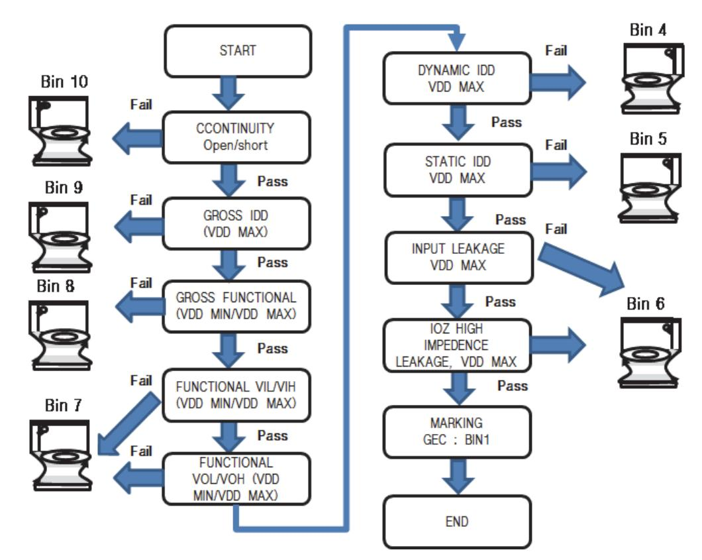

출처: 교육부(2018). 반도체 제품 기능·성능 검증(LM1903060109\_14v3). 한국직업능력개발원. p.55. [그림 2-4] 패키지 레벨 테스트 흐름도

- (가) 테스트 사항
  - 1) Signal Pin이 다른 Pin과 Short인가 확인한다.
  - 2) Signal Pin이 Ground 또는 Power Pin과 Short인가 화인한다.
  - 3) Signal Pin이 제대로 Wire Bonding이 잘 되어있는가 확인한다.
  - 4) Pin To Pin Short에 의한 System의 Damage 방지
- (나) PMU(performance monitoring unit)를 이용한 테스트 방법

PMU를 사용한 open/short 테스트 회로가 [그림 2-6]에 제시되어있다. 측정 방법은 다음과 같다.

- 1) VDD를 포함한 모든 pins은 Ground
- 2) 한쪽 핀에 PMU를 사용하여 Force = +100 uA
- 3) 결과 전압 측정
- 4) Fail test(open): 측정된 전압이 +1.5V보다 큰 경우
- 5) Fails test(shorted): 측정된 전압이 +0.2V보다 작은 경우


출처: 교육부(2018). 반도체 제품 기능·성능 검증(LM1903060109\_14v3). 한국직업능력개발원. p.56. [그림 2-5] open/short 불량 유형

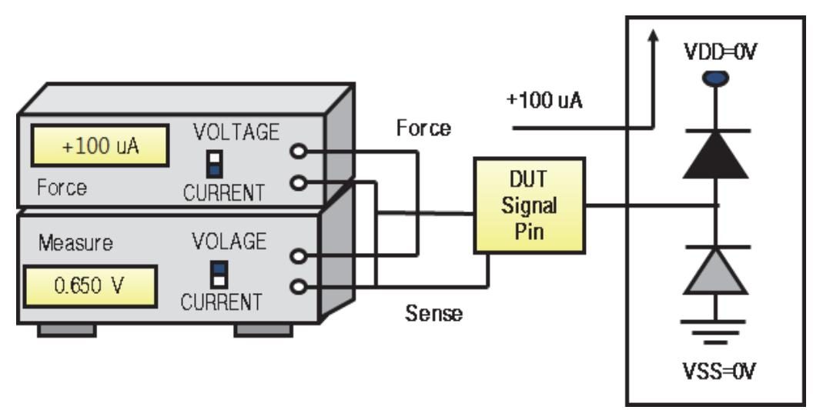

출처: 교육부(2018). 반도체 제품 기능·성능 검증(LM1903060109\_14v3). 한국직업능력개발원. p.56. [그림 2-6] PMU를 이용한 open/short 테스트

(다) open/short의 functional test

PE 카드를 사용한 open/short functional 테스트 회로가 [그림 2-7]에 제시되어 있다. 측정 방법은 다음과 같다.

1) VDD를 포함한 모든 pins은 Ground

- 2) program dynamic load : 2.5V에서 –100 uA/+100 uA
- 3) Set VOL/VOH Tristate Mode
- 4) functional pattern 동작(float one pin at a time)
- 5) 다이오드 전압 측정
- 6) Fail test(open): VOH가 +1.5V보다 큰 경우
- 7) Fails test(shorted): VOL +0.2V보다 작은 경우

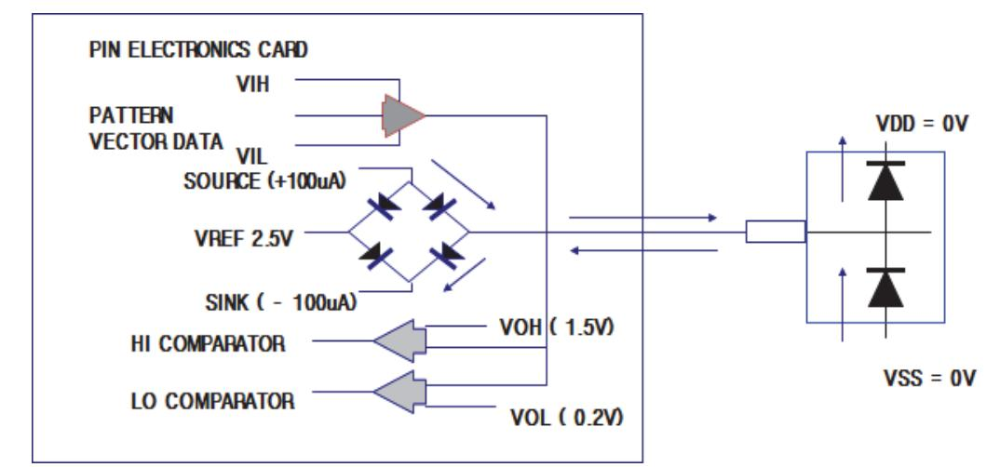

출처: 교육부(2018). 반도체 제품 기능·성능 검증(LM1903060109\_14v3). 한국직업능력개발원. p.57. [그림 2-7] PE 카드를 이용한 open/short functional test 회로도

(2) IDD 테스트

IDD 테스트는 INPUT들이 TOGGLING되지 않을 때 VDD에서 GND로 흐르는 DUT의 전류를 측정한다. NOT TOGGLIN이란 의미는 디바이스가 활동이 없는 상태, STATIC, 또는 상태가 변하지 않음을 의미한다. IDD 측정 동안 INPUT들은 LOW 또는 HIGH상 태로 가해진다. STATIC 상태에서의 CMOS 디바이스는 IDD는 매우 작다. 그래서 IDD 가 크다는 것은 누설 전류가 있다는 것을 의미한다. 불량 트랜지스터가 있을 때 전류는 누설되고 있다. 그러나 어느 정도 시간 후에 더욱더 불량 트랜지스터가 될 때까지는 FUNCTIONAL TEST는 통과되면서 동작할 수도 있다. 만약 위와 같은 현상이 고객 제 품에 실장 되어 나타날 수도 있기 때문에 CMOS 디바이스에서 IDD 테스트는 중요한 항목이다.

(가) IDD 테스트 종류

1) GROSS IDD 테스트

초기 POWER UP시 HIGH POWER SUPPLY 전류를 검출하는 테스트

2) STATIC IDD

가장 낮은 전류에서 HIGH POWER SUPPLY 전류를 검출하는 테스트

3) DYNAMIC IDD

디바이스의 동작에서 HIGH POWER SUPPLY 전류를 검출하는 테스트

(나) 테스트 조건 및 결과

IDD에 기여하는 전류는 단지 IIL뿐이다. IIH, IOZH, IOL은 모두 GROUND 전류 이며 IDD는 아니다. HIGH VOLTAGE 상태에서 OUTPUT은 OPEN이기 때문에 IOH는 0 A 이다. IOL은 IDD가 아니고 GROUND 전류이기 때문에 LOW STATE 에서 OUTPUT의 LOAD는 제거할 수 있다. 종종 LOAD는 PROGRAM을 간략하게 하기 위하여 모든 OUTPUT PIN들 상에서 제거된다. 전형적인 CMOS IIL의 측정된 값은 –0.1 nA 정도이다. IDD 측정 시 INPUT들은 반드시 LOW 또는 HIGH 상태 이어야 한다. IDD 측정 시 DUT 조건이 [그림 2-8]에 제시되어 있다.

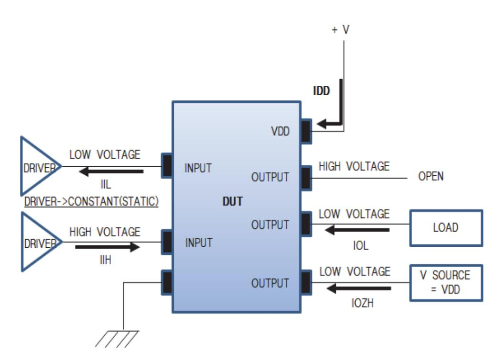

출처: 교육부(2018). 반도체 제품 기능·성능 검증(LM1903060109\_14v3). 한국직업능력개발원. p.58. [그림 2-8] IDD 측정 시 DUT 조건

(3) INPUT CURRENT LEAKAGE 테스트

디바이스 동작 중에 누설 전류 상태를 테스트하는 항목이다. FORCE 전압을 바꾸어가며 2회 측정한다. 테스트 조건이 [그림 2-9]에 제시되어 있다.

- (가) IIH 테스트: ALL EVEN DUT INPUTS
- (나) IIL 테스트: ALL EVEN DUT INPUTS
- (다) 인가 전압
  - 1) PIN TO PIN : 6 V ~ 0 V

- 2) ODD PIN TO VCC : 0 V ~ VCC
- 3) EVEN PIN TO GND : 6 V ~ GND
- (4) OUTPUT CURRENT LEAKAGE TEST

IOZH & IOZL 테스트 예 : ONE INPUT & ONE OUTPUT, [그림 2-10]

- (가) DUT VCC = MAXIMUM
- (나) DUT GND-PIN은 GND에 있다.
- (다) 모든 OUTPUT과 I/O 핀들은 OUTPUT MODE에 있고, 3-STATE MODE안에 있을 때 PATTERN을 출구한다.
- (라) 연결된 DRIVER을 남긴다.
- (마) 3-STATED OUTPUT에 HIGH VOLTAGE을 인가하고, IOZH을 측정한다.

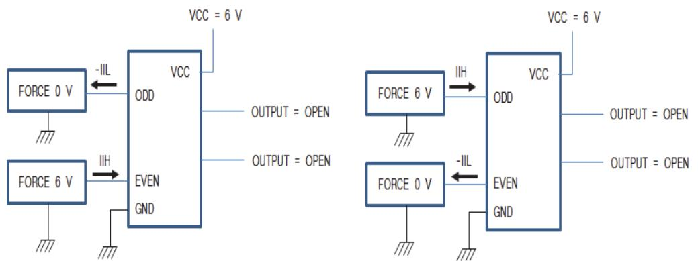

출처: 교육부(2018). 반도체 제품 기능·성능 검증(LM1903060109\_14v3). 한국직업능력개발원. p.59. [그림 2-9] INPUT CURRENT LEAKAGE 측정 시 DUT 조건

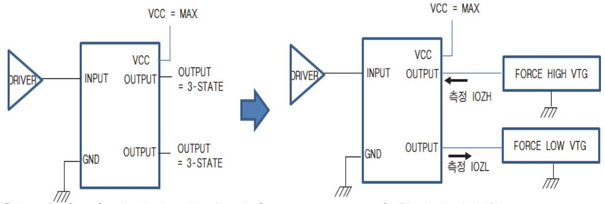

출처: 교육부(2018). 반도체 제품 기능·성능 검증(LM1903060109\_14v3). 한국직업능력개발원. p.59. [그림 2-10] OUTPUT CURRENT LEAKAGE(IOZH & IOZL) 측정 시 DUT 조건

#### (5) OUTPUT VOLTAGE(VOH & VOL) TEST

OUTPUT VOLTAGE 테스트는 IOH를 SOURCING하는 동안 VOH MIN값을 유지하고 있는지 여부와 IOL을 SINKING하는 동안 VOL MAX값을 넘지 않는지에 대한 DUT 검 증이다. 그림 [2-11]에 측정에 관한 블록도가 있고 테스트 방법은 아래와 같다.

- (가) DUT VCC = MIN
- (나) DUT GND–PIN은 GND에 있다.
- (다) DRIVER는 HIGH LEVEL=VOH MIN & LOW LEVEL=VOL MAX로 INPUT PIN에 연결한다.
- (라) RECEIVER는 OUTPUT PIN에 연결하고 필요하다면 LOAD도 연결한다.
- (마) 테스트를 위한 모든 OUTPUT PIN과 OUTPUT MODE인 I/O PIN의 상태가 LOW이 든 HIGH이든 PATTERN을 형성한다.
- (바) HIGH 상태의 OUTPUT PIN은 IOH MAX을 가한 후 VOH MIN을 측정한다.
- (사) LOW 상태의 OUTPUT PIN은 IOL MAX을 가한 후 VOL MIN을 측정한다.

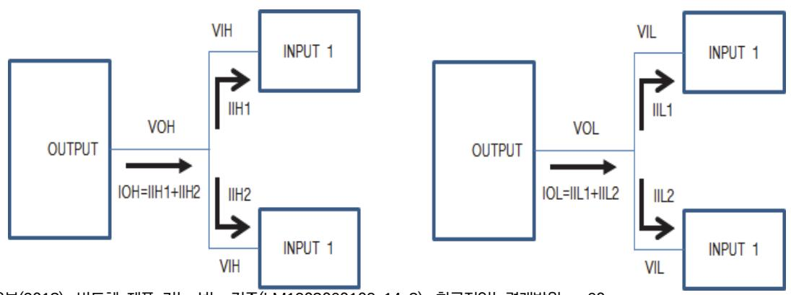

출처: 교육부(2018). 반도체 제품 기능·성능 검증(LM1903060109\_14v3). 한국직업능력개발원. p.60. [그림 2-11] OUTPUT VOLTAGE(VOH & VOL) 측정 시 DUT 조건

#### 5. AC 테스트

디바이스가 모든 동작 시간과 관련된 타이밍(timing) 규격(spec.)을 만족하는가를 검사한다. AC 테스트는 디바이스의 AC 스펙에 정의된 대로 적절한 타이밍 값과 신호 포맷(signal format)을 설정하여 수행한다. Set-up/Hold time, Propagation Delay, Output Enable/Disable time 등이 있다.

6. 기능(function) 테스트

디바이스가 논리적인 연산 기능들을 제대로 수행하는가를 검사하는 테스트로 입력 데이터가 DUT에 공급되고 출력 데이터가 DUT로부터 읽혀진다. 핀 일렉트로닉스(pin electronics) 가 위치한 기능 비교기(functional comparator)가 테스트의 합격/불합격(Pass/Fail)을 결 정한다. 여기서 Test Pattern(Pattern Vector)이 사용되는데 이것은 Device IN/OUT에 대한 TRUTH TABLE의 집합이다. NAND GATE 디바이스 테스트 DUT와 TRUTH TABLE, TEST PATTERN 관계가 [그림 2-12]에 제시되어 있다.

(1) 테스트 주요 사항

- (가) DUT에 포함된 논리적 함수가 정확히 작동하는지 확인한다.
- (나) TEST VECTOR 또는 TRUTH TABLE은 DUT 안에서 결점을 찾을 수 있도록 작동한 다.
- (다) TEST TIMING과 결합된 TEST VECTOR들은 FUNCTIONAL TEST의 중심을 구성한 다.
- (라) 아래의 사항에 대한 정확한 값을 검증해야 한다.
  - 1) VDD MIN/MAX : DUT POWER LEVELs
  - 2) VIL/VIH : INPUT LEVELs
  - 3) VOL/VOH : OUTPUT LEVELs
  - 4) IOL/IOH : OUTPUT CURRENT LOADING
  - 5) 테스트 진동수 : 테스트에 사용되는 사이클 시간
  - 6) 입력 신호 TIMING : CLOCKs, SETUPs, HOLDs, CONTROLs
  - 7) 입력 신호 포맷 : 입력 신호의 파형
  - 8) OUTPUT TIMING : 사이클 안에서 OUTPUT
  - 9) VECTOR 시퀀스 : VECTOR 파일 안에서 START, STOP 지점들
- (마) 테스트 시스템은 DUT에 INPUT DATA를 공급하고, PIN-BY-PIN, CYCLE-BY-CYCLE 토대에서 DUT OUTPUT을 모니터한다.

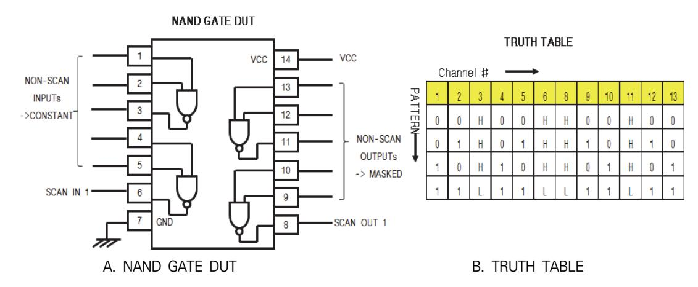

출처: 교육부(2018). 반도체 제품 기능·성능 검증(LM1903060109\_14v3). 한국직업능력개발원. p.61. [그림 2-12] NAND GATE 기능 테스트 DUT와 TRUTH TABLE

#### (2) SLOW FUNCTIONAL TEST

INPUT을 규격에 대하여 상하로 변경할 때 OUTPUT이 TRUTH 테이블에 따라 DUT가 응답하는 가를 단지 검증하는 것이다. 이 테스트는 결점을 찾는 디바이스 검증은 아니 다. 또한 디바이스보다 매우 넓게 TIMING 조건과 DC LEVEL을 이용하여 RUN한다. 그래서 종종 GROSS 또는 LOOSE 테스트라고도 한다. 많은 PROGRAM들은 다른 VCC LEVEL에서 SLOW FUNCTIONAL PATTERN을 실행하고 모든 PATTERN들은 틀림없이 모든 VCC LEVEL(4.5V, 5.0V, 5.5V 등)에서 통과(PASS)되어야한다.

(3) SCAN FUNCTIONAL TEST

특정한 몇몇 디바이스는 내부 회로가 너무 복잡해서 테스트하는데 많은 시간이 소요된 다. 복잡한 디바이스는 2가지 형태에서 동작하게 설계되어 있다. 첫 번째 경우는 디바이 스 규격서에 의한 동작, 두 번째는 SCAN MODE에서 동작이다. SCAN MODE에서의 디바이스의 동작은 테스트를 쉽게 하기 위하여 복잡한 내부회로를 깨고 조그마한 블록 의 회로를 갖는다. 조그마한 블록의 회로는 보통 COMBINATIONAL LOGIC ELEMENTS(GATE, FLIP-FLOPS, SHIFT REGISTORS, LATCHES 등으로 하나의 INPUT에 하나의 OUTPUT을 가짐)의 체인으로 되어있다. ONE SCAN PATH을 갖고 SCAN MODE안에서 DUT 테스트는 [그림 2-12]에서 VECTOR는 DUT가 SCAN MODE로 동작하기 위해 초기화되기까지는 규격서(SPECIFICATION SHEET)로 실행되 고, SCAN MODE일 때는 NON-SCAN INPUT들은 일정하게 유지되고, NON-SCAN OUTPUT들은 마스크 된다.

#### 숗 조립 공정특성에 따른 수율 변화

패키지 레벨 테스트에서 발생되는 불량 요인은 숕에서 설명한 바와 같다. 테스트 항목과 관련 하여 조립공정 불량 유형 중 가장 큰 현상은 OPEN과 SHORTs 현상이다.

1. OPEN 불량

볼 떨어짐(ball lift), 와이어 짤림(wire broken), 패드에 붙이는 스팃치 떨어짐(stitch lift), 와이어 연결이 되지 않은 빠짐(missing wire) 현상으로 크게 분류된다.

2. SHORT 불량

옆의 패드 위에 볼 본딩이 근접되어 붙는 경우(smashed ball bonding), 와이어들 간의 붙 음(wire-to-wire shorts), PCB 배선 간의 붙음(PCB metal shorts), 리드프레임 페달과 와이어의 붙음(L/F paddle-to wire shorts) 불량 현상이 있다.

#### 수 수율 분석 과정

#### 1. 테스트 데이터 정리

웨이퍼 레벨 테스트 데이터 정리 방법과 같이 먼저 테스터 항목별로 데이터를 정리한다. <표 2-3>에 예시가 제시되어 있다. GEC는 양품 판정이고, BIN 1로 구분된다.

<표 2-3> 테스트 결과 예시

| 항목        | OP<br>EN      | SHO<br>RTS | ID<br>D      | LEAKA<br>GE | JTA<br>G  | FUNCTI<br>ON | RA<br>M       | GS<br>M       | BIS<br>T  | RO<br>M   | GE<br>N   | SPE<br>ED | GE<br>C      |
|-----------|---------------|------------|--------------|-------------|-----------|--------------|---------------|---------------|-----------|-----------|-----------|-----------|--------------|
| BIN #     | BI<br>N<br>45 | BIN<br>47  | BI<br>N<br>2 | BIN<br>48   | BIN<br>19 | BIN 11       | BI<br>N<br>12 | BI<br>N<br>13 | BIN<br>14 | BIN<br>15 | BIN<br>35 | BIN<br>42 | BI<br>N<br>1 |
| 불량품<br>수  | 10            | 10         | 7            | 20          | 0         | 7            | 2             | 2             | 1         | 0         | 0         | 1         | -            |
| 양품 수      |               |            |              |             |           |              |               |               |           |           |           |           | 94<br>0      |
| 수율(%)     | 1             | 1          | 0.7          | 2           | 0         | 0.7          |               | 0.2 0.2       | 0.1       | 0         | 0         | 0.1       | 94           |
| 총 투입<br>수 |               |            |              |             |           | 1,000        |               |               |           |           |           |           |              |

#### 2. 불량 분포도 분석

수율 분석을 위해서는 산포 그래프를 보고 분석하는 방법이 편리하다. 산포 그래프를 보고 어느 BIN # 항목이 두드러지는지 파악하고 관련된 테스트 항목에 공정과 설계 영향 요소 를 찾아내어 웨이퍼 공정, 패키지 공정, 디바이스 설계자에게 피드백 한다. 물론 테스트 장 비에서 오는 요소들도 점검되어야 한다. <표 2-3>의 값들을 분포도로 나타낸 그래프가 [그 림 2-13]이다. 그림에서 보다시피 BIN 45, BIN 47이 20개의 불량으로 조립 시 와이어 본 딩에 문제가 발생되고 있음을 알 수 있고, BIN 48 LEAKAGE 불량도 두드러져 보인다. 이 는 조립 공정에서 누설 전류에 영향이 되는 공정을 찾아야함을 예시한다. 다음은 BIN 2 IDD와 BIN 11 FUNCTION 불량인데 공정 특성과의 연계성보다는 소자의 설계적인 측면 이 강한다. 물론 설계 마진이 부족한 경우 공정 규격을 협소하게 진행해야하는 때도 있다.

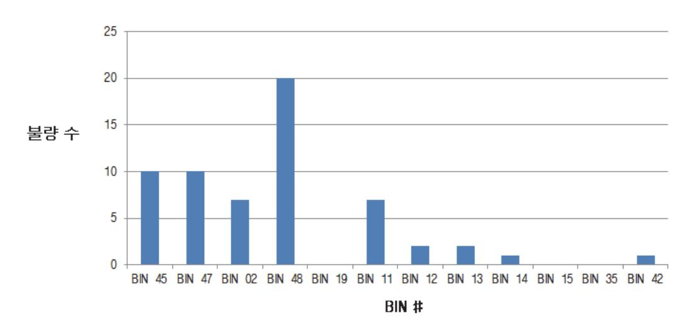

출처: 교육부(2018). 반도체 제품 기능·성능 검증(LM1903060109\_14v3). 한국직업능력개발원. p.63. [그림 2-13] '<표 2-3>의 테스트 결과'를 BIN #별로 나타낸 분포도

## 수행 내용 / 조립품의 수율 변화 분석하기

#### 재료·자료

- 공정 이상이 발생한 불량 조립품
- 불량 분석 보고서, 수율 분석 보고서

#### 기기(장비 ・ 공구)

컴퓨터, 인터넷, 문서 작성 관련 소프트웨어, 프린터, 제본기, 광학현미경

#### 안전 ・ 유의사항

- 리드선에 의한 안전 취급에 유의한다.
- 제품 평가는 단순 기능 구현 뿐만 아니라, 평가 과정에서 양품에 대한 판단 외에도 공정 매 개변수 코너에서의 제품 동작 마진(Margin)과 양산성 확보를 고려한 종합적인 평가를 포함 한다.

#### 수행 순서

- 숔 패키지 레벨 수율을 정의한다.
  - 1. 이론식으로부터 주어진 제품의 예측 수율을 계산한다.
  - 2. 수율 영향 요소에 대하여 이해한다.
  - 3. 실제 생산된 제품과 이론식의 차이점을 설명한다.
- 숕 조립제품 수율에 관련된 요소들을 파악한다.
  - 1. 웨이퍼 레벨에서 기인하는 요소들에 대하여 파악한다.
    - (1) 진행성 요소들에 대하여 리스트한다.
    - (2) 정전기 현상에 의한 소자 고장 형태를 파악한다.
    - (3) 테스트 규격에 벗어난 양품의 처리방법을 이해한다.
  - 2. 패키지 공정에서 기인하는 요소
    - (1) 웨이퍼 백 그라인딩 공정에서 오는 수율 감소 요인을 이해한다.
    - (2) 웨이퍼 소잉(sawing) 공정에서 오는 수율 감소 요인을 이해한다.
    - (3) 다이 본딩 공정에서 오는 수율 감소 요인을 이해한다.
    - (4) 와이어 본딩 공정에서 오는 수율 감소 요인을 이해한다.

- (5) 몰딩 공정에서 오는 수율 감소 요인을 이해한다.
- (6) 도금 공정에서 오는 수율 감소 요인을 이해한다.
- (7) 트림(Trim) & 폼(Form) 공정에서 오는 수율 감소 요인을 이해한다.
- (8) 솔더 볼(solder ball) 공정에서 오는 수율 감소 요인을 이해한다.
- 숖 조립제품 분류에 관련된 항목과 규격서를 확인한다.
  - 1. 고객의 제품 성능 평가 항목을 파악한다.
  - 2. 고객의 제품 성능 평가 규격서를 파악한다.
  - 3. 평가 항목과 규격 조건이 합당한지 판단한다.
- 숗 디바이스와 프로그램 관련 변수를 정의한다.

#### 수 테스트 항목을 설정하고 테스트를 실행한다.

- 1. DC 테스트 항목을 선정하고 테스트한다.
  - (1) open/shorts(continuity)을 테스트한다.
    - (가) Signal Pin이 다른 Pin과 Short인가 확인한다.
    - (나) Signal Pin이 Ground 또는 Power Pin과 Short인가 확인한다.
    - (다) Signal Pin이 제대로 Wire Bonding이 잘 되어있는가 확인한다.
    - (라) Pin To Pin Short에 의한 System의 Damage를 방지한다.
  - (2) IDD를 테스트한다.
  - (3) INPUT CURRENT LEAKAGE를 테스트한다.
  - (4) OUTPUT CURRENT LEAKAGE를 테스트한다.
  - (5) OUTPUT VOLTAGE(VOH & VOL)를 테스트한다.
- 2. AC 테스트 항목을 선정하고 테스트한다.

AC 테스트는 디바이스의 AC 스펙에 정의된 대로 적절한 타이밍 값과 신호 포맷(signal format)을 설정하여 수행한다.

3. 기능(function) 테스트 항목을 선정하고 테스트한다.

숙 불합격 Bin에 대한 공정 연관성을 파악한다.

- 1. OPEN 불량과 연관된 공정을 이해한다.
- 2. SHORT 불량과 연관된 공정을 이해한다.
- 3. 각종 공정과 장비 데이터로부터 웨이퍼 분류 테스터의 결과를 분석한다.

숚 수율 분석을 체계적으로 수행한다.

- 1. 웨이퍼 레벨 테스트 데이터 정리 방법과 같이 먼저 테스터 항목별로 데이터를 정리한다.
- 2. 수율 분석을 위해서는 산포 그래프를 그려 보고 분석한다.

숛 모든 제조 관련 자료를 통하여 저수율을 발생시킨 공정을 알아내고 문서화한다.

## 2-3. 조립품의 제품 특성 산포 파악

학습 목표 • 시험 측정 데이터를 토대로 조립품의 특성 산포를 파악하고 문서화할 수 있다.

## 필요 지식 /

숔 산포도 분석

산포의 문제는 테스트 제품들이 모두 성능 기준 대비 성능을 만족하고 있지만, 분포를 확인해 보니 대 물량 양산 상황에서 수율이 떨어질 수 있는 상황이다. [그림 2-14]과 같이 샘플링 하 여 측정한 시료의 특성은 성능 평가 기준 대비 모두 성능을 만족하고 있다. 그러나 분포를 확 인해 보면 우측 꼬리 부분에서 불량이 발생하게 되므로 이러한 불량 시료의 수량에 대한 정밀 한 분석이 필요하다.

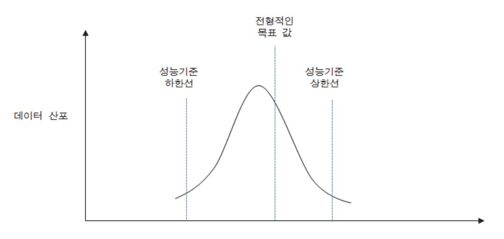

출처: 교육부(2018). 반도체 제품 기능·성능 검증(LM1903060109\_14v3). 한국직업능력개발원. p.67. [그림 2-14] 데이터 산포도 곡선

숕 Schmoo plot

Shmoo plot은 부분적인 테스트 결과를 박스 형태의 그래프로 표현하는 방식이다. 예를 들면 진동수, 전압, 온도가 변화했을 때나 테스트가 반복적으로 실행될 때 합격 또는 불합격을 표현 하는 그래프이다. 불합격 영역의 모습은 불량의 원인을 결정하는데 도움이 된다. 예제로 전압

에 대한 주파수 변화를 [그림 2-15]에 나타내었다. 빈 공간은 합격, 채워진 공간은 불합격을 표시한다. 이 그래프로부터 소자의 동작 영역을 검증할 수 있고, 누적된 데이터로부터 소자의 설계 공정에 대한 허용영역을 설정할 수 있다.

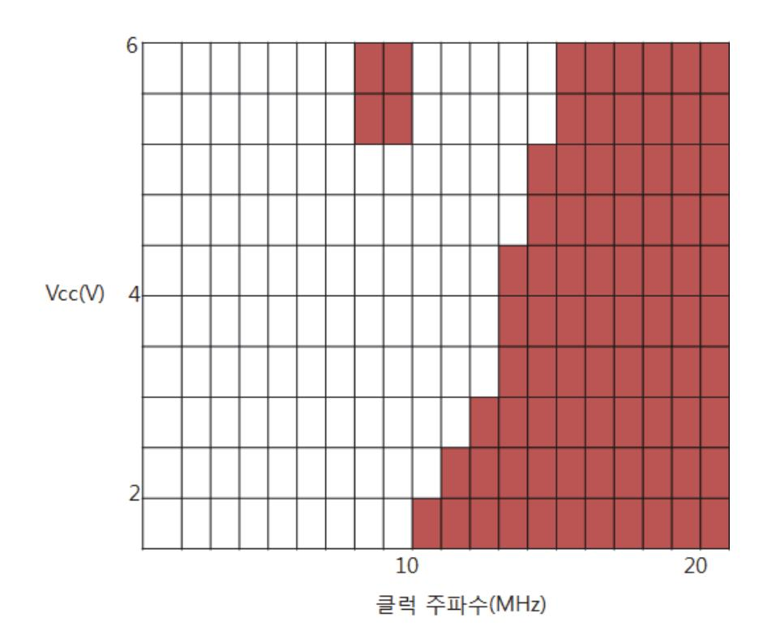

출처: 교육부(2018). 반도체 제품 기능·성능 검증(LM1903060109\_14v3). 한국직업능력개발원. p.68. [그림 2-15] 인가 전압(Vcc)에 대한 클럭 주파수 Schmoo plot

수행 내용 / 조립품의 제품 특성 산포 파악하기

#### 재료·자료

- EDS raw 데이터
- SPECIFICATION SHEET, 조립제품 분류 규격서

#### 기기(장비 ・ 공구)

컴퓨터, 인터넷, 문서 작성 관련 소프트웨어, 프린터, 제본기, 통계분석 tool

#### 안전 ・ 유의사항

검증 항목별 합불 판단 기준은 사용자 규격에 따라 달라질 수 있다.

수행 순서

- 숔 제품의 EDS 테스트 규격서를 확인하고 파악한다.
  - 1. 테스트 규격서의 상한선을 파악한다.
  - 2. 테스트 규격서의 하한선을 파악한다.
  - 3. 모든 테스트 항목별로 규격서를 작성한다.

숕 제품의 분류 테스트 규격서를 확인하고 파악한다.

- 1. Bin # 별로 고객이 요구하는 규격서를 검토한다.
- 2. 유사 제품과의 비교 규격서를 작성한다.
- 3. 모든 테스트 항목별로 규격서를 작성한다.

숖 테스트 데이터를 이용하여 산포도를 그래프화한다.

- 1. Bin # 별로 산포도를 작성한다.
- 2. 공정 조건별로 테스트 결과를 정리하고 산포도를 작성한다.
- 3. 세분화된 shmoo polt을 작성하여 데이터가 규격서의 어느 범주에 있는지 분석한다.
- 4. 규격서에 주어진 설정 값으로부터 데이터 산포를 분석한다.
- 5. 산포와 수율과의 관계를 분석하여 목표 값을 설정한다.
- 6. 설정된 목표 값에 의한 수율 결과를 토대로 보고서를 작성한다.

### 학습 2 교수 ‧ 학습 방법

#### 교수 방법

- 패키지 레벨 테스터에 관련된 모듈 장비의 역할 및 조립품의 수율 변화 분석에 대한 학습자 의 이해를 높이기 위하여 사례를 보여주면서 중요사항을 전달한다.
- 조립품 수율 변화 분석 및 조립품의 제품 특성 산포 파악을 위해 학습자로 하여금 관련 사 례를 분석하여 조사하도록 지도한다.
- 조립품의 제품 특성 산포 파악을 위한 문제상황을 학습자에게 제시하고, 학습자별 수준에 맞게 문제를 해결하는데 필요한 발판(힌트등)을 준다.

#### 학습 방법

- 패키지 레벨 테스터에 관련된 모듈 장비의 역할을 매뉴얼을 통해 활용한다.
- 패키지 레벨 테스터에 관련된 모듈 장비의 구조와 동작원리를 매뉴얼을 통해 활용한다.
- 장비 선정 시 고려사항에 대하여 각 회사의 장단점을 노트에 정리해본다.
- 테스트에 관련된 항목 및 합불 기준을 고객의 사양서를 기준으로 확인한다.
- 공정과 공정 장비로 인한 수율 저하 요인에 대하여 사례연구를 통하여 활용한다.
- 수율에 대한 기본 지식을 이해하고 계산해 본다.
- 조립품 분류 테스트 항목에 대한 기본 지식을 회사들의 인터넷 사이트를 통해 알아본다.
- 산포도 작성과 그래프 분석 방법을 이해하고 문서로 작성해 본다.

## 학습 2 평 가

#### 평가 준거

• 평가자는 학습자가 학습 목표를 성공적으로 달성하였는지를 평가해야 한다.

#### • 평가자는 다음 사항을 평가한다.

| 학습내용                  | 학습 목표                                                     | 성취수준<br>상<br>중<br>하 |  |  |
|-----------------------|-----------------------------------------------------------|---------------------|--|--|
| 조립품의 제품               | - 제품의 동작 특성 및 규격에 근거하여 조립품의 제품<br>성능시험 장비를 선정할 수 있다.      |                     |  |  |
| 성능시험 장비 선정 및<br>장비 사용 | - 조립품의 제품 시험 장비 사용법을 숙지하고 적용할 수<br>있다.                    |                     |  |  |
| 조립품의 수율 변화 분<br>석     | - 시험 측정 데이터로 시험 대상 조립품의 불량 여부를<br>판별할 수 있다.               |                     |  |  |
|                       | - 시험 측정 데이터를 토대로 조립품의 공정 특성에 따른<br>수율 변화를 해석하고 문서화할 수 있다. |                     |  |  |
| 조립품의 제품<br>특성 산포 파악   | - 시험 측정 데이터를 토대로 조립품의 특성 산포를 파악<br>하고 문서화할 수 있다.          |                     |  |  |

#### 평가 방법

• 서술형 시험

|                       |                        |   | 성취수준 |   |
|-----------------------|------------------------|---|------|---|
| 학습내용                  | 평가 항목                  | 상 | 중    | 하 |
| 조립품의 제품               | - 테스트 모듈 장비            |   |      |   |
| 성능시험 장비 선정 및<br>장비 사용 | - 테스터 모듈 장비 구조 및 동작 원리 |   |      |   |
| 조립품의 수율 변화 분<br>석     | - 테스트에 관련된 항목 및 합불 기준  |   |      |   |
|                       | - 수율에 대한 기본 지식         |   |      |   |
|                       | - 공정과 장비로 인한 수율 저하 요인  |   |      |   |

• 사례 연구

| 학습내용                | 평가 항목                     | 성취수준 |   |   |  |
|---------------------|---------------------------|------|---|---|--|
|                     |                           | 상    | 중 | 하 |  |
|                     | - 테스트 관련 항목 및 합불 기준       |      |   |   |  |
| 조립품의 수율 변화 분<br>석   | - 수율에 대한 기본 지식            |      |   |   |  |
|                     | - 공정과 장비로 인한 수율 저하 요인     |      |   |   |  |
| 조립품의 제품<br>특성 산포 파악 | - 테스트 데이터로부터 합불 판정        |      |   |   |  |
|                     | - 수율 분석                   |      |   |   |  |
|                     | - 수율 분석 문서화               |      |   |   |  |
|                     | - 테스트 항목에 대한 기본 지식        |      |   |   |  |
|                     | - 조립품 분류 테스트 항목에 대한 기본 지식 |      |   |   |  |
|                     | - 산포도 작성                  |      |   |   |  |
|                     | - 산포도 분석 결과 문서 작성         |      |   |   |  |

• 문제 해결 시나리오

|                     |                           | 성취수준 |   |   |
|---------------------|---------------------------|------|---|---|
| 학습내용                | 평가 항목                     | 상    | 중 | 하 |
| 조립품의 제품<br>특성 산포 파악 | - 테스트 데이터로부터 합불 판정        |      |   |   |
|                     | - 수율 분석                   |      |   |   |
|                     | - 수율 분석 문서화               |      |   |   |
|                     | - 테스트 항목에 대한 기본 지식        |      |   |   |
|                     | - 조립품 분류 테스트 항목에 대한 기본 지식 |      |   |   |
|                     | - 산포도 작성 능력               |      |   |   |
|                     | - 산포도 분석 결과 문서 작성 능력      |      |   |   |

- 테스트 관련 합불 예시를 통하여 합불 기준에 대한 사례를 연구하고, 공정과 장비로 인한 수율 저하

- 조립품의 제품 특성 산포 파악을 함에 있어 문제 해결을 위한 논리적인 체계와 접근방법을 평가하

#### 피드백

2. 사례연구

3. 문제 해결 시나리오

고 보완점을 제시한다.

- 조립품의 제품 성능시험 장비 선정에 대한 이해와 조립품 수율에 대한 이해도가 부족한 경우, 재학

요인 등을 어떻게 파악하였는지 우수사례를 학습자들 간에 공유할 수 있도록 한다.

습을 통해 중요 키워드별로 정리할 수 있도록 안내한다.

1. 서술형 시험

| 학습 3 | 실장 검증하기        |
|------|----------------|
| 학습 2 | 패키지 레벨 성능 검증하기 |
| 학습 1 | 웨이퍼 레벨 기능 검증하기 |

## 3-1. 반도체 칩과 연동되는 부품 선정

학습 목표 • 제작된 반도체 칩의 전기적 특성을 고려하여 상호연동 가능한 부품 선정을 할 수 있으며, 반 도체 칩과 연결시킬 수 있다.

## 필요 지식 /

#### 숔 실장 검증 테스트

최근 모바일 전자기기의 수요 증가 및 고객의 요구를 만족시키기 위해 CPU 성능의 증가에 대 한 요구가 급격해지고 있다. 이 고기능의 CPU를 테스트하기 위해서는 ATE 상에서 테스트 벡 터(test vector)로 실장 환경을 구현해야 한다. 실장 테스트는 ATE 상으로 측정하기 어려운 Real Set의 특성을 보드(board)로 제작하여 만들어 스크린(screen)해주는 공정으로 PCB 보드 상에서 Real Set 환경을 만들어 OS 이미지를 load하여 테스트를 구현해주는 공정이다.

숕 테스트 준비 사항

실리콘 칩 또는 IC가 작동되도록 하려면 제어하거나 명령을 전달하는 시스템에 연결해야 한다. IC 어셈블리는 IC를 연결해 칩과 시스템 사이에서 전력과 정보가 이동할 수 있도록 해준다. 이와 같은 구성을 위해서는 칩을 패키지에 연결하거나 이러한 기능을 하는 인쇄 회로(PCB)에 직접 연결해야 한다. 칩과 패키지 또는 회로 기판은 와이어 본딩 또는 플립 칩 어셈블리를 통 해 연결한다. 다양한 종류의 패키지 형태가 존재하고, 테스트 준비를 위한 IC의 보드에 연결하 는 방법도 다양하다. 여기서 준비에 앞서 고려되어야 할 사항은 전문 지식 및 기술, 수익과 가 동 시간을 늘리고, 결함을 줄이고, IC 어셈블리 및 테스트 공정의 총 비용을 낮출 수 있는 방 향이다.

## 수행 내용 / 반도체 칩과 연동되는 부품 선정하기

#### 재료·자료

- 패키지 종류별 제품
- 각종 PCB
- 기기(장비 ・ 공구)
  - 컴퓨터, 인터넷, 문서 작성 관련 소프트웨어, 프린터, 제본기, 통계분석 Tool

안전 ・ 유의사항

반도체 칩과 연결할 부품은 기존에 상용화된 제품 중에서 선정한다.

수행 순서

- 숔 실장 테스트를 위한 소자의 특성에 대하여 파악한다.
  - 1. 소자를 제품에 실장 시 동작 전압을 파악한다.
  - 2. 소자를 제품에 실장 시 동작 전류을 파악한다.
  - 3. 소자를 제품에 실장 시 동작 파워를 파악한다.
  - 4. 불량소자를 제품에 실장 시 소자특성을 파악한다.
  - 5. 유사한 제품에 실장 시 결과를 비교 분석한다.

숕 테스트를 위한 소켓 및 보드를 제작한다.

- 1. 실장에 필요한 소켓의 종류를 결정한다.
- 2. 실장에 필요한 소켓의 재질을 결정한다.
- 3. 실장에 필요한 소켓을 설계한다.
- 4. 실장에 필요한 소켓을 제작한다.
- 5. 불량과 양품을 이용하여 비교 테스트한다.
- 6. 실장에 필요한 보드의 종류를 결정한다.
- 7. 실장에 필요한 보드의 재질을 결정한다.
- 8. 실장에 필요한 보드를 설계한다.

- 9. 실장에 필요한 보드를 제작한다.
- 10. 불량과 양품을 이용하여 비교 테스트한다.
- 숖 연동 부품들의 동작 상태를 점검한다.
  - 1. 실장에 필요한 소켓을 시스템 안에서 테스트한다.
  - 2. 실장에 필요한 보드를 시스템 안에서 테스트한다.
  - 3. 연동 부품들의 동작 상태를 최종 점검한다.
- 숗 테스트 항목에 따른 테스트를 실행한다.
  - 1. 고객의 요구사항인 주어진 환경 하에서 테스트 항목에 따라서 테스트를 수행한다.
- 수 결과를 정리하여 불량과 양품의 상태를 보고서화 한다.

## 3-2. 하드웨어 플랫폼 제작과 측정 장비 선정

| 학습 목표 | • 반도체 칩과 전기적 특성을 고려하여 설계된 하드웨어 플랫폼(Hardware Platform)을 제작할 |
|-------|------------------------------------------------------------|
|       | 수 있다.                                                      |
|       | • 설계된 하드웨어플랫폼에서 특정의 반도체 특성이 정상 동작하는 지를 측정하기 위한 장비를         |
|       | 선정 및 사용할 수 있다.                                             |

## 필요 지식 /

숔 하드웨어 플랫폼 제작

실장 테스트를 위해서는 먼저 실제 사용되는 응용 기기 안에 테스트하고자 하는 소자를 탑재한 소켓이나 보드(board)를 제작해야 한다. 패키지의 형태에 따라 보드에 어떠한 방식으로 연결해 야 하는지 그 방법을 정하고 전기적 누설이 없고, 잘 고정하여 결합 강도를 확보해야한다. 패 키지의 pin 수는 늘어나고, QFP, BGA 등의 피치가 줄어드는데, 테스트를 위해서는 적절한 소 켓의 개발이 발 빠르게 이루어져야 한다. 이러한 문제는 장비 업체와 소자업체, 그리고 소켓 제조업체들이 서로 선행 패키지의 정보를 공유하면서 새로운 소켓의 개발을 적극 지원해야 한 다. 물론 설계된 소켓을 설계에 따라 정확히 제작하는 일도 중요하다. 그렇지 않으면 양품의 소자가 불량의 소자로 빠지거나 테스트 도중 과부하 같은 현상으로 불량 소자로 떨어질 수 있 다.

#### 숕 측정 장비 선정

1. PCBs(print circuit boards)

현재에도 지그라는 테스트 장비를 사용하고 있지만 70년대 중반에는'bed-of-nails'라는 테 크닉을 사용하여 직접 PCBs(print circuit boards)에 접촉하는 방식으로 보드를 테스트하 였다. 그런데 보드 단자 사이의 거리가 좁아짐에 따라 테스트가 매우 어렵게 되었고, 결정 적으로 다층 보드(multi layer board)가 나타남에 따라 위의 방법이 불가능하게 되었다. 테스트 중 하드웨어에 손상을 줄 수 있을 뿐 아니라 고가의 비용 등 여러 가지 문제점이 발생하게 되었기 때문이다. 이러한 문제점을 해결하기 위해 80년대 중반에'Joint European Test Access Group'이란 단체가 결성되었고, 이후'North American company'와 함께 JTAG이란 연구그룹을 결성하여 여러 가지 문제점을 해소하기 위한 설 계와 제작기준을 마련, IEEE에서 1990년에 표준화하여 IEEE std 1149.1을 제정하였다.

#### 2. JTAG(Joint Test Access Group)

일반적으로 JTAG(Joint Test Access Group)란 용어보다도 Boundary-Scan이란 용어를 더 많이 사용하는데, JTAG는 칩 내부에 Boundary Cell을 두는 것이다. 이를 통해 외부의 핀과 일대 일로 연결시킴으로써 프로세서가 할 수 있는 동작을 중간에 Cell을 통해 모든 동작을 인위적으로 수행할 수 있어 여러 가지 하드웨어 테스트나 연결 상태 등을 체크할 수 있다. 개발자가 하드웨어를 테스트하다 보면 문제의 원인을 알아내기 위해서 특정 단자 의 상태를 임의로 설정해 줄 필요가 발생한다. 그런데 각 소자는 PCB 상태에서 이미 다른 소자와 연결되어 있어서 강제로 인가하려면 핀의 연결을 강제로 끊고 인가하는 수밖에 없 다. 이때, 여러 조건을 시험하기 위하여 CPU칩에 그 수많은 배선을 끊고, 연결하는 것이 쉽지 않은 작업이 되며, 동작 중인 칩을 테스트하기 위해서는 이러한 방법이 불가능할 수도 있다. 또한, 중간에 신호를 인가하고 어떤 신호가 인가되었는지를 알려면 별도의 회로를 추 가해야 하고, 회로를 일일이 집어넣는 것 역시 문제를 일으킬 소지가 있다. 그래서 절충안 으로 나온 것이 CPLD와 같은 대규모 LSI에 이런 기능을 하는 로직을 넣는 것이다. 물론 CPLD에 넣을 수 있는 용량의 일부분을 낭비하는 결과를 초래할 수는 있으나, 이는 하드웨 어를 체크하기 위해 소모하는 시간에 비하면 절대 아까운 것이 아니다. 또한 모든 로직 연 결마다 다 진행하는 것은 아니며, 대부분의 경우 출력 쪽만 이 장치를 사용하면 많은 문제 가 해결된다. 때문에 주변만 이와 같은 회로를 추가하게 되었고, boundary라는 표현을 사 용하게 되었다.

#### 숖 JTAG(Joint Test Access Group)의 기능 및 사용예시

소자 특성 확인을 위해 많이 사용되는 JTAG가 제공하는 사항에 대하여 살펴본다.

1. 기능

JTAG가 제공하는 기능을 먼저 살펴보면 프로세서(CPU)의 상태와는 상관없이 디바이스의 모든 외부 핀을 구동시키거나 값을 읽어 들일 수 있는 기능을 제공한다.

- (1) 소자 내에서 외부로 나가는 각각의 핀들과 일대 일로 연결된다.
- (2) 각각의 셀은 바운더리 스캔 레지스터(boundary scan register)를 형성하기 위해서 서로 연결되어 있다.
- (3) 전체적인 인터페이스는 5개의 핀에 의해서 제어된다. (5 pins: TDI, TMS, TCK, nTRST, TDO)
- (4) 회로의 배선과 소자의 전기적 연결 상태를 테스트한다.
- (5) 소자 간의 연결 상태를 테스트한다.
- (6) 플레쉬 메모리 퓨우징(Flash memory fusing)을 한다.

#### 2. JTAG과 결합된 시스템의 실례

JTAG과 결합된 시스템의 사례인 블록 다이어그램이 [그림 3-1]에 나타나 있다.

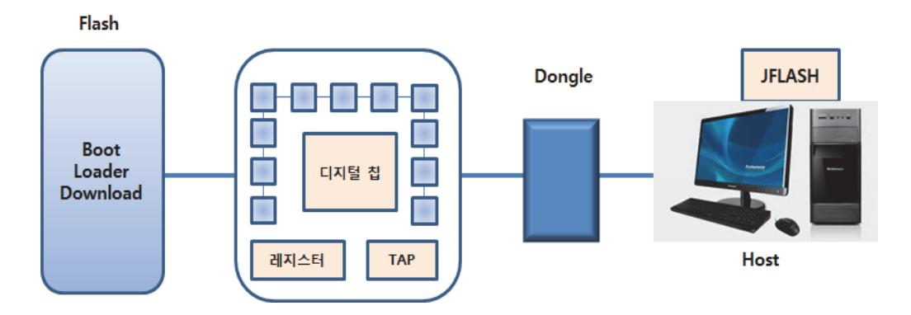

출처: 교육부(2018). 반도체 제품 기능·성능 검증(LM1903060109\_14v3). 한국직업능력개발원. p.78. [그림 3-1] JTAG과 결합된 측정 시스템의 사례

(1) 메모리 인터페이스 에뮬레이션

어드레스와 데이터 버스를 통하여 연결된 Flash Memory 영역에 JTAG Supervisor 프 로그램이나 Linux용 JFlash 프로그램을 통하여 Flash Memory에 다운로딩할 부트로더 를 writing할 수 있다.

(2) 전압 변화 인터페이스

SA1110 프로세서에서 필요한 전압은 3V이지만 호스트에서 제공되는 전압은 5V로 해당 전압으로 변환시키기 위해서는 541 TTL 소자를 이용하여 변환시키면 된다. 이 인터페 이스를 Dongle이라고 부른다.

(3) Parallel Port <-> JTAG 호스트에서 평행 포트를 통한 인터페이스이다.

## 수행 내용 / 하드웨어 플랫폼 제작과 측정 장비 선정하기

#### 재료·자료

- JTEG 표준서
- 소켓, PCB 보드, 조립제품

#### 기기(장비 ・ 공구)

전기 테스터, 컴퓨터, 인터넷, 문서 작성 관련 소프트웨어, 프린터, 제본기, 통계분석 tool

안전 ・ 유의사항

하드웨어 플랫폼에는 펌웨어가 실장될 수 있도록 필요시 중앙처리장치(CPU)를 포함하여 설 계한다.

수행 순서

- 숔 하드웨어 플랫폼을 설계한다.
  - 1. 응용기기 안에 테스트하고자 하는 소자를 탑재한 소켓이나 보드(board)를 제작한다.
  - 2. 패키지의 형태에 따라 보드에 어떠한 방식으로 연결해야 하는지 그 방법을 정한다.
  - 3. 테스트 장비 업체와 실장 하드웨어 플랫폼을 설계 시 의견을 교환한다.
  - 4. 소켓 제조 업체들과 실장 하드웨어 플랫폼을 설계 시 의견을 교환한다.

숕 하드웨어 플랫폼을 제작한다.

- 1. 테스트 장비 업체와 실장 하드웨어 플랫폼을 제작 시 의견을 교환한다.
- 2. 소켓 제조 업체들과 실장 하드웨어 플랫폼을 제작 시 의견을 교환한다.
- 3. 테스트를 위한 시스템을 설계한다.
- 4. 테스트를 위한 장비를 선정한다.
  - (1) JTAG과 결합된 시스템의 실례를 파악한다.
  - (2) JTAG과 결합된 시스템을 설계한다.
  - (3) JTAG과 결합된 시스템을 제작한다.
  - (4) 메모리 인터페이스 에뮬레이션을 점검한다.

- (5) 전압 변화 인터페이스 부분을 점검한다.
- (6) Parallel Port <-> JTAG 관계를 점검한다.
- 5. 하드웨어와 장비의 연동 상태를 점검한다.
  - (1) 제작된 반도체 칩의 전기적 특성을 파악한다.
  - (2) 상호 연동 가능한 부품을 선정한다.
  - (3) 상호 연동 가능한 부품을 설계한다.
  - (4) 상호 연동 가능한 부품을 제작한다.
  - (5) 반도체 칩과 연결시키고 연동 테스트를 실시한다.
- 6. 동작 시험을 하고 결과를 보고서화 한다.

## 3-3. 펌웨어 소프트웨어를 이용한 칩의 다양한 특성 측정

• 제작된 하드웨어 플랫폼에 펌웨어 소프트웨어(Firmware Software)를 실장 할 수 있다.

학습 목표 • 펌웨어 소프트웨어를 이용하여 다양한(정상 및 비정상)가상의 입력 데이터를 설계 및 변경 가 능하다.

• 다양한 입력 데이터에 의한 반도체 칩의 반응을 측정 장비를 통하여 측정 가능하다.

## 필요 지식 /

- 숔 펌웨어 구성
  - 1. 펌웨어

펌웨어는 PROM 내에 삽입되어, 영구적으로 컴퓨터 장치의 일부가 되는 프로그램이다. 펌 웨어는 여느 소프트웨어와 같은 과정으로 만들어지며, 마이크로코드 시뮬레이션을 이용하여 테스트된다. 준비가 되면, 다른 소프트웨어처럼 배포될 수 있으며, 사용자가 특별한 사용자 인터페이스를 이용하여 PROM 내에 설치할 수 있다. 펌웨어는 때로 프린터나 모뎀 그리고 다른 컴퓨터 장치들의 성능을 높이기 위해 배포되기도 한다. 일부 기업에서는 펌웨어라는 용어 대신에 마이크로코드라는 용어를 즐겨 사용한다.

2. PROM

위의 PROM은 사용자에 의해 내용이 한번 수정될 수 있는 롬이다. PROM은 PROM 프로 그래머라고 불리는 특별한 장치를 사용하여 사용자가 마이크로코드 프로그램을 맞추어 만들 수 있도록 허용하는 방법이다. 이 장치는 실제로 퓨즈가 녹도록 전류를 롬 내의 특정 셀에 공급한다. 이 과정을 흔히, PROM을'굽는다'라고 말한다. 그러나 이 과정은 에러(error)에 관한 여유를 남겨두지 않기 때문에, 사용자에 의해 수정될 수 있도록 설계된 대부분의 롬 칩들은 전기적으로 프로그램 할 수 있는 EPROM이나 프로그램과 지우기를 동시에 할 수 있는 EEPROM을 사용한다. 예를 들어 어떤 기능을 발휘하는 하드웨어를 만든다고 할 때, 그것을 제어하는 모든 회로를 하드웨어로만 만들면, 그 구조가 대단히 복잡해질 뿐만 아니 라 논리적으로 표현이 어려운 부분도 발생하게 된다. 이러한 경우 상당 부분을 소프트웨어 로 대체하되 그 소프트웨어가 저장된 기억 장치를 하드웨어의 제어 회로 중의 중심부분으 로 구성하면, 매우 간단하면서도 적은 비용으로 문제를 해결할 수 있게 된다. 이렇게 만든 하드웨어적인 소프트웨어를 펌웨어라 한다. 결국 하드웨어 안에 내장된 PROM만 외부에서 조정함으로써 하드웨어(물리적 장치)를 업그레이드하여 제어할 수 있다. 현재 하드웨어 시스 템의 안정성과 신뢰성을 평가하는 검증 기술 및 방법에 대해서 많은 연구가 진행되고 있으

며, 결함을 입력하여 테스트하거나, 대상 하드웨어 시스템의 오류 허용치를 측정 및 분석하 는 연구는 계속 이루어지고 있다.

#### 숕 검증 및 시뮬레이션 기법

개발된 하드웨어에 구현된 소프트웨어의 검증 기법은 컴파일러나 개발 어플리케이션 또는 시뮬 레이터를 사용하여 소프트웨어 시뮬레이션을 수행하는 경우가 대부분이다. 소프트웨어적 검증 기법은 주로 시뮬레이션을 통한 검증이므로 다양한 테스트벤치와 테스트 시나리오에 따라 정밀 하고 세부적인 검증이 가능하다. 하드웨어적 검증 기법은 개발된 하드웨어를 직접 실제 환경에 서 사용하여 동작 및 기능을 확인하거나 프로토타입(prototype)을 만들어 실제 환경에서 테스 트하는 검증기법이다. 검증에 필요한 장비로 논리분석기를 이용한 방법이 있는데 논리분석기는 논리 신호를 포착하여 기록 및 표시하는 다수의 채널을 가지는 기구이다. 논리분석기를 이용한 하드웨어적 검증 기법은 실제 환경에서의 실장 테스트에서 많이 사용되는 방법으로 실제 입력 되는 신호를 개발된 하드웨어 또는 프로토타입에 연결하여 동작과 출력신호를 논리분석기를 통 해 확인함으로써 안정성 및 신뢰성을 검증할 수 있다.

#### 숖 하드웨어와 소프트웨어 결함 주입

1. 하드웨어 결함 주입

접촉식과 비접촉식이 있다. 접촉식 결함 입력은 대상 시스템과 물리적인 접촉을 하여 전압 또는 전류를 대상 칩의 외부 핀에 직접적으로 연결하여 입력하는 것으로 하드웨어의 결함 주입에 시행되는 가장 보편적인 방법이다. 과도한 전류는 대상 시스템에 손상을 줄 수 있기 때문에 주의가 필요하다. 비접촉식 결함 입력은 대상 하드웨어에 어떠한 연결을 하지 않고 주변의 환경을 변화시켜서 오류 및 결함을 입력하는 것이다. 전자기장이나 방사선을 발생시 키는 장비를 대상 칩의 주변에 배치하여 결함을 입력하는 방법이다. 이 같은 방법은 자연 물리 현상을 모방한 것으로 전자기장을 생성하거나 방사선을 방출하는 순간을 정밀하게 제 어할 수 없기 때문에 오류 및 결함 입력의 시간과 위치를 정확히 예측하기 어렵다.

2. 소프트웨어 결함 주입

하드웨어에 결함 입력 방법보다 비용이 저렴하기 때문에 오류 입력 도구로 많이 사용한다. 또한 소프트웨어 결함 주입은 하드웨어적으로 결함을 입력하기 어려운 운영체제나 응용프로 그램을 대상으로 사용할 수 있다. 응용프로그램을 대상으로 결함을 입력한다면 응용프로그 램 자체에 입력하거나 응용프로그램과 운영체제 사이의 계층에 입력한다. 운영체제를 대상 으로 결함을 입력한다면 운영체제에 오류 및 결함 입력기를 내장하여 운영체제와 하드웨어 사이의 계층에 오류를 입력하는데 사용할 수 있다.

#### 숗 CPU 실장 테스트

실장 테스트는 일반적으로 고객사에 의해 이루어지고 관련된 보드, 실행 프로그램은 공개되지 않는다. 본 학습에서는 실험실 수준에서 수행된 CPU 테스트의 보기를 들어 설명해본다. 테스 트에 관련된 준비사항 및 수행순서는 [그림 3-2]와 같다.

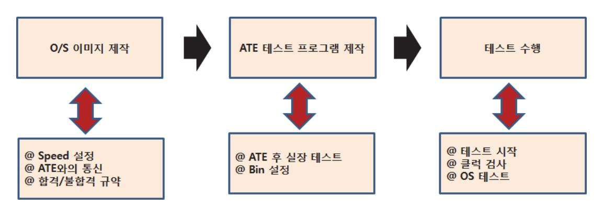

출처: 교육부(2018). 반도체 제품 기능·성능 검증(LM1903060109\_14v3). 한국직업능력개발원. p.82. [그림 3-2] CPU 실장 테스트 절차1

#### 1. OS 이미지 제작

OS 이미지는 상부 소켓(Top socket)의 NAND에서 복사를 하게 된다. 칩에 전원이 인가되 고 부팅(booting)이 되면 제일 먼저 상부 소켓에 있는 NAND의 이미지를 load하여 부팅을 하게 된다. Boot loader가 실행되고 PLL의 P, M, S 값 및 시스템 제어기의 clock divider를 사용하여 AMBA bus상의 ARM clock, H, P 버스(bus)상의 clock을 만들어지 게 하고, 메모리 배치와 스텍(stack) 설정 등을 하고, OS 이미지를 load하고 부팅하여 테 스트하고, 그 결과를 테스터로 보내주도록 이미지를 제작한다. [그림 3-3]은 실제로 테스트 환경 상에서 테스트가 구현되는 것을 보여준다. 테스터에서는 디지털 채널을 통해 리셋을 인가해 주고 DUT는 리셋을 받아 상부 소켓의 NAND, DDR을 통해 실장 테스트를 하고 원하는 실장 동작이 완료되었을 때 DUT는 GPIO의 ATE의 디지털 채널을 통해 테스터로 결과를 보내 DUT가 원하는 실장 테스트에 대해 정상적으로 동작하였는지 판단할 수 있도 록 해준다.

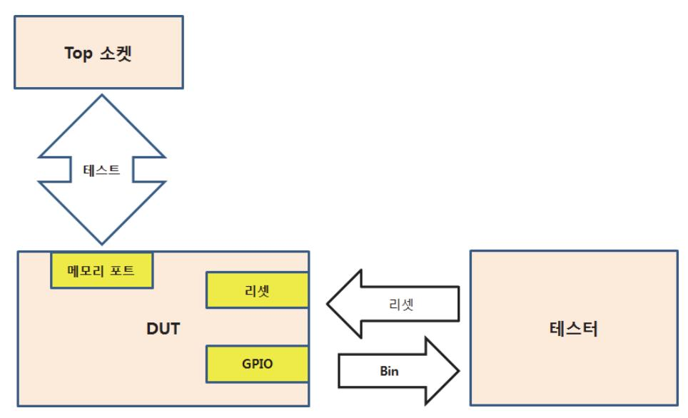

출처: 교육부(2018). 반도체 제품 기능·성능 검증(LM1903060109\_14v3). 한국직업능력개발원. p.83 [그림 3-3] CPU 실장 테스트 절차2

#### 2. ATE 테스트 프로그램 제작

ATE 테스트를 위해 전원 정보 및 핀(Pin)정보, 핀의 상태 등에 대해서는 응용 실장 조건에 따라 결정해주고, 외부의 환경 설정 후 ATE에서 DUT쪽으로 리셋을 한 후 결과가 출력되 는 GPIO의 같이 원하는 값인지 점검해주는 방법으로 테스트를 실행한다.

3. 테스트

준비된 테스트 프로그램을 통해 소켓을 활용하여 테스트를 진행한다. 테스트 항목과 결과의 예시가 <표 3-1>에 나타내었다.

| <표 3-1> CPU 실장 결과 |  |  |  |
|-------------------|--|--|--|
|-------------------|--|--|--|

| 실장 검증 항목         | 테스트 결과               |
|------------------|----------------------|
| Reset 동작         | 확인                   |
| Boot Loader 동작   | 확인                   |
| PLL 동 작          | 확인                   |
| Clock Generation | ARM, H, S Bus CLK 확인 |
| DDR Access       | 확인                   |
| NAND Access      | 확인                   |

## 수행 내용 / 펌웨어 소프트웨어를 이용한 칩의 다양한 특성 측정하기

#### 재료·자료

- 조립품 실장 테스트 하드웨어 플랫폼
- SPECIFICATION SHEET

#### 기기(장비 ・ 공구)

전기 테스터, 컴퓨터, 인터넷, 문서 작성 관련 소프트웨어, 프린터, 제본기, 통계분석 tool

안전 ・ 유의사항

- 펌웨어 소프트웨어를 이용한 가상의 데이터 생성은 여러 기능이 동시에 동작시의 입력 조건 을 포함한다.
- 반도체 침의 전기적 특성을 측정하기 위한 별도의 상용화된 부품을 사용하는 기술을 포함한 다.

#### 수행 순서

- 숔 펌웨어 소프트웨어를 구성, 설계한다.
  - 1. 펌웨어 프로그램을 설계한다.
  - 2. 펌웨어 프로그램을 제작한다.
  - 3. 마이크로코드 시뮬레이션을 이용하여 테스트한다.
  - 4. 프린터나 모뎀 그리고 다른 컴퓨터 장치들의 성능을 검사해본다.
  - 5. PROM을 이용하여 프로그램을 수행해본다.
  - 6. EPROM을 이용하여 프로그램과 지우기를 수행해본다.

#### 숕 펌웨어 소프트웨어를 검증한다.

- 1. 컴파일러나 개발 어플리케이션 또는 시뮬레이터를 사용하여 소프트웨어 시뮬레이션을 수행한다.
- 2. 다양한 테스트벤치와 테스트 시나리오에 따라 정밀하고 세부적인 검증을 한다.
- 3. 개발된 하드웨어를 직접 실제 환경에서 사용하여 동작 및 기능을 확인해본다.
- 4. 프로토 타입(prototype)을 제작하여 실제 환경에서 테스트해본다.
- 5. 검증에 필요한 논리분석기를 이용한 방법에 대하여 이해한다.

- 6. 개발된 하드웨어 또는 프로토 타입에 연결하여 동작과 출력신호를 논리분석기를 통해 확인함으로 써 안정성 및 신뢰성을 검증해본다.
- 7. 표준 샘플을 테스트한다.
- 8. 표준 샘플에 결함을 주입하여 결함 사례를 보고서화 한다.
- 9. 플랫폼에 맞는 여러 소자들을 측정한다.

숖 CPU 실장 테스트를 수행해본다.

- 1. OS 이미지를 설계한다.
- 2. OS 이미지를 제작한다.
- 3. OS 이미지를 테스트한다.
  - DUT가 원하는 실장 테스트에 대해 정상적으로 동작하였는지 판단해본다.
- 4. ATE 테스트를 위해 전원 정보 및 핀(Pin)정보, 핀의 상태 등을 파악한다.
- 5. 응용 실장 조건에 따라 결정한다.
- 6. 외부의 환경 설정 후 ATE에서 DUT쪽으로 리셋을 한 후 결과가 출력되는 GPIO의 같이 원하는 값인지 점검해주는 방법으로 테스트를 실행한다.
- 7. 결과들을 정리 분석하고 보고서를 작성한다.

### 학습 3 교수 ‧ 학습 방법

#### 교수 방법

- 반도체 칩과 연동되는 부품 선정시 주요 특성에 대해 자세히 설명한다.
- 하드웨어 플랫폼 제작과 측정 장비 선정 및 펌웨어 소프트웨어를 이용한 칩의 다양한 특성 을 측정하기 위한 사례조사 연구수업을 진행한다.
- 학습자에게 문제 상황을 제시하여, 각각의 문제 상황에 맞는 문제해결 방법을 동료학습자와 함께 해결 할 수 있도록 발판을(힌트 등)을 제공한다.

#### 학습 방법

- 실장테스트를 위한 소자의 기본특성에 대하여 인터넷을 활용하여 검색해본다.
- 테스트를 위한 소켓 및 보드 제작과정을 인터넷을 활용하여 검색해본다.
- 하드웨어 플랫폼의 설계와 제작방법에 대하여 인터넷을 활용하여 검색해본다.
- 하드웨어 플랫폼의 검증 방법에 대하여 인터넷을 활용하여 검색해본다.
- 펌웨어 소프트웨어의 구성 설계에 대하여 인터넷을 활용하여 검색해본다.
- 펌웨어 소프트웨어의 검증 방법에 대하여 인터넷을 활용하여 검색해본다.
- 문제 상황을 연상하면서, 각 단계에 필요한 중요 사항을 고려하여 해결하기 위한 시나리오 를 작성해본다.

## 학습 3 평 가

#### 평가 준거

• 평가자는 학습자가 학습 목표를 성공적으로 달성하였는지를 평가해야 한다.

#### • 평가자는 다음 사항을 평가한다.

|                                        |                                                                              | 성취수준 |   |   |
|----------------------------------------|------------------------------------------------------------------------------|------|---|---|
| 학습내용                                   | 학습 목표                                                                        |      | 중 | 하 |
| 반도체 칩과 연동되<br>는 부품 선정                  | - 제작된 반도체 칩의 전기적 특성을 고려하여 상호<br>연동 가능한 부품 선정을 할 수 있으며, 반도체 칩<br>과 연결시킬 수 있다. |      |   |   |
| 하드웨어 플랫폼                               | - 반도체 칩과 전기적 특성을 고려하여 설계된 하드<br>웨어 플랫폼(Hardware Platform)을 제작할 수 있<br>다.     |      |   |   |
| 제작과 측정 장비<br>선정                        | - 설계된 하드웨어플랫폼에서 특정의 반도체 특성이<br>정상 동작하는 지를 측정하기 위한 장비를 선정 및<br>사용할 수 있다.      |      |   |   |
| 펌웨어<br>소프트웨어<br>를 이용한 칩의 다<br>양한 특성 측정 | -<br>제작된<br>하드웨어<br>플랫폼에<br>펌웨어<br>소프트웨어<br>(Firmware Software)를 실장 할 수 있다.  |      |   |   |
|                                        | - 펌웨어 소프트웨어를 이용하여 다양한(정상 및 비정<br>상)가상의 입력 데이터를 설계 및 변경 가능하다.                 |      |   |   |
|                                        | - 다양한 입력 데이터에 의한 반도체 칩의 반응을 측<br>정 장비를 통하여 측정 가능하다.                          |      |   |   |

#### 평가 방법

#### • 서술형 시험

|            | 평가 항목                |  | 성취수준 |   |  |
|------------|----------------------|--|------|---|--|
| 학습내용       |                      |  | 중    | 하 |  |
| 반도체 칩과 연동되 | - 실장 테스트를 위한 소자의 특성  |  |      |   |  |
| 는 부품 선정    | - 테스트를 위한 소켓 및 보드 제작 |  |      |   |  |

• 사례 연구

|                                        |                    | 성취수준 |   |   |
|----------------------------------------|--------------------|------|---|---|
| 학습내용                                   | 평가 항목              |      | 중 | 하 |
| 하드웨어 플랫폼<br>제작과 측정 장비<br>선정            | - 하드웨어 플랫폼의 설계와 제작 |      |   |   |
|                                        | - 하드웨어 플랫폼 검증      |      |   |   |
| 펌웨어<br>소프트웨어<br>를 이용한 칩의 다<br>양한 특성 측정 | - 펌웨어 소프트웨어 설계와 제작 |      |   |   |

• 문제 해결 시나리오

|                                   | 평가 항목                |  | 성취수준 |   |  |
|-----------------------------------|----------------------|--|------|---|--|
| 학습내용                              |                      |  | 중    | 하 |  |
| 하드웨어 플랫폼<br>제작과<br>측정<br>장비<br>선정 | - 테스트를 위한 소켓 및 보드 제작 |  |      |   |  |
|                                   | - 하드웨어 플랫폼의 설계 및 제작  |  |      |   |  |
| 펌웨어소프트웨어를<br>이용한 칩의 다양한<br>특성 측정  | - 펌웨어 소프트웨어 검증       |  |      |   |  |

피드백

| 1. 서술형 시험<br>- 실장 테스트를 위한 소자의 특성 등을 서술형 시험을 통해 평가한다.                                           |
|------------------------------------------------------------------------------------------------|
| 2. 사례연구<br>- 사례 연구 결과 미흡한 부분을 안내하고, 우수 사례를 제공한다.                                               |
| 3. 문제 해결 시나리오<br>- 문제 해결을 위한 논리적인 체계와 접근 방법을 지도한다. 제작과 검증에 있어 잘못된 부<br>분을 찾아내고 보완할 수 있도록 지도한다. |

- ∙ 교육부(2018). 반도체 제품 기능·성능 검증(LM1903060109\_14v3). 한국직업능력개발원.
- ∙ 박용수, 김철호(2004). 『반도체 VLSI 테스트 기초 및 활용』. 한솔출판
- ∙ 이 혁, 김덕영, 신동길, 이종성(2014). 『반도체 후 공정 장비』. 복두출판사

| NCS학습모듈 개발이력 |                                      |     |                 |  |
|--------------|--------------------------------------|-----|-----------------|--|
| 발행일          | 2015년 12월 31일                        |     |                 |  |
| 세분류명         | 반도체개발(19030601)                      |     |                 |  |
| 개발기관         | 한국반도체산업협회, 한국직업능력개발원                 |     |                 |  |
|              | 이병철(㈜비드앤마이크로)*                       |     | 권태우(극동대학교)      |  |
|              | 김경섭(여주대학교)                           |     | 김병윤(전. 삼성전자㈜)   |  |
|              | 김문호(씨지아이파트너즈)                        |     | 민종수(엠텍비젼㈜)      |  |
|              | 안태원(동양미래대학교)                         |     | 이준성(인덕대학교)      |  |
|              | 유광동(전 동부하이텍)                         |     | 이호덕(㈜에이치디테크놀로지) |  |
|              | 이승은(서울과학기술대학교)                       |     |                 |  |
|              | 이제현(동양미래대학교)                         |     |                 |  |
| 집필진          | 이혁(㈜플렉스컴)                            | 검토진 |                 |  |
|              | 임종철(LG전자㈜)                           |     |                 |  |
|              | 임황규(성결대학교)                           |     |                 |  |
|              | 정종식(㈜e-wbm연구소)                       |     |                 |  |
|              | 천형용(충북반도체고등학교)                       |     |                 |  |
|              | 홍상진(명지대학교)                           |     |                 |  |
|              | 홍진균(전 ㈜LG실트론)                        |     | *표시는 대표집필자임     |  |
| 발행일          | 2018년 12월 31일                        |     |                 |  |
| 학습모듈명        | 반도체 제품 기능·성능 검증(LM1903060109_14v3)   |     |                 |  |
| 개발기관         | 한국직업능력개발원                            |     |                 |  |
| 발행일          | 2024년 12월 31일                        |     |                 |  |
| 학습모듈명        | 반도체 제품 기능·성능 검증(LM1903060109_23v4)   |     |                 |  |
| 개발기관         | 수원과학대학교 산학협력단(개발책임자: 윤창용), 한국직업능력연구원 |     |                 |  |

| 반도체 제품 기능·성능 검증(LM1903060109_23v4)                                                                       |               |  |  |
|----------------------------------------------------------------------------------------------------------|---------------|--|--|
| 저작권자                                                                                                     | 교육부           |  |  |
| 연구기관                                                                                                     | 한국직업능력연구원     |  |  |
| 발행일                                                                                                      | 2024. 12. 31. |  |  |
| ※ 이 학습모듈은 자격기본법 시행령(제8조 국가직무능력표준의 활용)에 의거하여 개발하였으며,<br>NCS통합포털사이트(http://www.ncs.go.kr)에서 다운로드 할 수 있습니다. |               |  |  |

