LM1903060110\_14v3

# NCS학습모듈 반도체 신뢰성 평가

대분류/19 전기·전자 중분류/03 전자기기개발 소분류/06 반도체개발 세분류/01 반도체개발 능력단위/10

NCS 학습모듈은 교육훈련기관에서 출처를 명시하고 교육적 목적으로 활용할 수 있습니다. 다만 NCS 학습모듈에는 국가(교육부)가 저작재산권 일체를 보유하지 않은 저작물들(출처가 표기되어 있는 도표, 사진, 삽화, 도면 등)이 포함되어 있으므로 이러한 저작물들의 변형, 복제, 공연, 배포, 공중 송신 등과 이러한 저작물들을 활용한 2차 저작물의 생성을 위해서는 반드시 원작자의 동의를 받아야 합니다.

## NCS 학습모듈의 이해

※ 본 학습모듈은 「NCS 국가직무능력표준」사이트(http://www.ncs.go.kr) 에서 확인 및 다운로드 할 수 있습니다.

#### (1) NCS 학습모듈이란?

- 국가직무능력표준(NCS: National Competency Standards)이란 산업현장에서 직무를 수행하기 위해 요구되는 지식·기술·소양 등의 내용을 국가가 산업부문별·수준별로 체계화한 것으로 산업현장의 직무를 성공적으로 수행하기 위해 필요한 능력(지식, 기술, 태도)을 국가적 차원에서 표준화한 것을 의미합니다.
- 국가직무능력표준(이하 NCS)이 현장의 '직무 요구서'라고 한다면, NCS 학습모듈은 NCS의 능력단위를 교육훈련에서 학습할 수 있도록 구성한 '교수·학습 자료'입니다. NCS 학습모듈은 구체적 직무를 학습할 수 있도록 이론 및 실습과 관련된 내용을 상세하게 제시하고 있습니다.

● NCS 학습모듈은 다음과 같은 특징을 가지고 있습니다.

첫째, NCS 학습모듈은 산업계에서 요구하는 직무능력을 교육훈련 현장에 활용할 수 있도록 성취목표와 학습의 방향을 명확히 제시하는 가이드라인의 역할을 합니다. 둘째, NCS 학습모듈은 특성화고, 마이스터고, 전문대학, 4년제 대학교의 교육기관 및 훈련기관, 직장교육기관 등에서 표준교재로 활용할 수 있으며 교육과정 개편 시에도 유용하게 참고할 수 있습니다. ● NCS와 NCS 학습모듈 간의 연결 체제를 살펴보면 아래 그림과 같습니다.

#### (2) NCS 학습모듈의 체계

NCS 학습모듈은 1.학습모듈의 위치 , 2.학습모듈의 개요 , 3.학습모듈의 내용 체계 , 4.참고 자료 ,
 5.활용 서식/부록 으로 구성되어 있습니다.

#### 1. NCS 학습모듈의 위치

NCS 학습모듈의 위치는 NCS 분류 체계에서 해당 학습모듈이 어디에 위치하는지를 한 눈에
 볼 수 있도록 그림으로 제시한 것입니다.

예시 : 이 · 미용 서비스 분야 중 네일미용 세분류

NCS-학습모듈의 위치

| 대분류 | 이용 · 숙박 · 여행 · 오락 · 스포츠 |          |  |
|-----|-------------------------|----------|--|
| 중분류 | 이・미용                    |          |  |
| 소분류 |                         | 이 미용 서비스 |  |

| 세 <del>분류</del> |             |           |
|-----------------|-------------|-----------|
| 헤어미용            | 능력단위        | 학습모듈명     |
| 피부미용            | 네일 샵 위생 서비스 | 네일숍 위생서비스 |
| 메이크업            | 네일 화장물 제거   | 네일 화장물 제거 |
| 네일미용            | 네일 기본 관리    | 네일 기본관리   |
| 이용              | 네일 랩        | 네일 랩      |
|                 | 네일 팁        | 네일 팁      |
|                 | 젤 네일        | 젤 네일      |
|                 | 아크릴릭 네일     | 아크릴 네일    |
|                 | 평면 네일아트     | 평면 네일아트   |
|                 | 융합 네일아트     | 융합 네일아트   |
|                 | 네일 샵 운영관리   | 네일숍 운영관리  |

#### 학습모듈은

NCS 능력단위 1개당 1개의 학습모듈 개발을 원칙으로 합니다. 그러나 필요에 따라 고용 단위 및 교과단위를 고려하여 능력단위 몇 개를 묶어서 1개의 학습모듈로 개발할 수 있으며, NCS 능력단위 1개를 여러 개의 학습 모듈로 나누어 개발할 수도 있습니다.

- 🔾 활용안내

예시 : 네일미용 세분류의 '네일 기본관리' 학습모듈

프리에지, 니퍼, 퓨셔, 폴리시, 네일 파일, 스퀘어형, 스퀘어 오프형, 라운드형, 오발형, 포인트형

#### 3. NCS 학습모듈의 내용 체계

와 광택을 위해 톱코트를 도포하다. 네일 보강제(Nail Strengthner)를 바를 시에는 베이스코

트를 도포하기 전에 사용한다

|                                                                                                          | 교수·학습 방법은                                                                                            |  |
|----------------------------------------------------------------------------------------------------------|------------------------------------------------------------------------------------------------------|--|
| 학습3 교수·학습 방법 ◀                                                                                           | 학습목표를 성취하는데 필요한 교수 방법과 학습 방법 을 제시하였습니다.                                                           |  |
| 교수 방법 🚽                                                                                                  | 교수 방법은                                                                                               |  |
| <ul> <li>컬러링 제품의 성분과 칼라별 점도의 차이, 베이스코트와 톱코트의 역할, 폴리시 잡는 방법, 큐어링 시간 등의 내용을 화면 자료와 함께 설명한다.</li> </ul> | 해당 학습활동에 필요한 학습내용, 학습내용과 관련된 학습 자료명, 자료 형태, 수행내용의 진행 방식 등에 대하여 제시                                 |  |
| <ul> <li>서식지를 활용하여 네일 컬러링 방법을 그림으로 그려 보게 한 뒤, 다양한 컬러링의 매뉴얼을 그려서 숙지하도록 한다.</li> </ul>                 | 하였습니다. 또한 학습자의 수업참여도를 제고하기 위한 방 법 및 수업진행상 유의사항 등도 제시하였습니다. 선수학습 이 필요한 학습을 학습자가 숙지하였는지 교수자가 확인하 |  |
| • 젤 컬러링 시 주의사항을 계속 숙지시키도록 하며, 큐어링 시간에 대해 작성하도록 한다.                                                       | 는 과정으로 활용할 수도 있습니다.                                                                                  |  |
| 학습 방법                                                                                                    | 학습 방법은                                                                                               |  |
| • 컬러링을 위한 재료의 필요성과 사용방법을 숙지하고 컬러링 메뉴얼 과정에 맞추어 작업 내용을 이해한다.                                            | 해당 학습활동에 필요한 학습자의 자기주도적 학습 방법 을 제시하였습니다. 또한 학습자가 숙달해야 할 실기능력 과 학습과정에서 주의해야 할 사항 등으로 제시하였습니     |  |
| • 컬러링의 다양성에 대한 용어를 숙지하고 진행과정에 맞추어 내용을 작업한다.                                                              | 다. 학습자가 학습을 이수하기 전에 반드시 숙지해야 할 기본 지식을 학습하였는지 스스로 확인하는 과정으로 활                                      |  |
| • 곌 컬러링 시 적합한 큐어링 시간을 선택해서 큐어링 해본다.                                                                      | 용할 수 있습니다.                                                                                           |  |

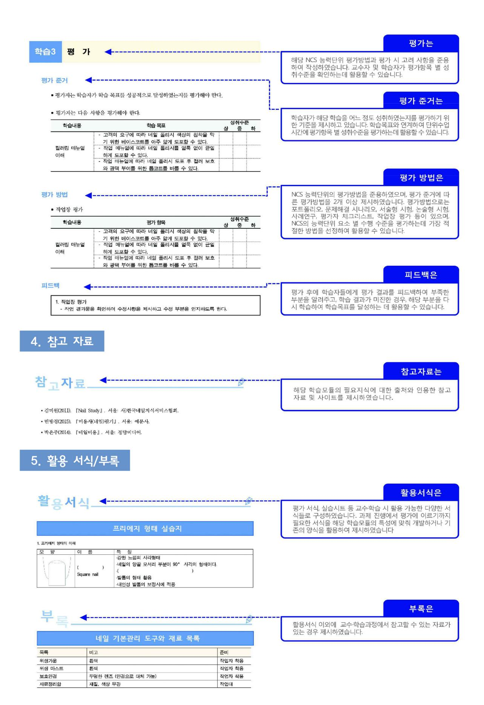

## [NCS-학습모듈의 위치]

| 대분류 | 전기전자 |        |       |  |
|-----|------|--------|-------|--|
| 중분류 |      | 전자기기개발 |       |  |
| 소분류 |      |        | 반도체개발 |  |

| 세분류   |                 |                 |
|-------|-----------------|-----------------|
| 반도체개발 | 능력단위            | 학습모듈명           |
| 반도체제조 | 반도체 제품 기획       | 반도체 제품 기획       |
| 반도체장비 | 반도체 아키텍처 설계     | 반도체 아키텍처 설계     |
| 반도체재료 | 아날로그 회로 설계      | 아날로그 회로 설계      |
|       | 디지털 회로 설계       | 디지털 회로 설계       |
|       | 레이아웃 설계         | 레이아웃 설계         |
|       | 반도체 제조 공정 개발    | 반도체 제조 공정 개발    |
|       | 패키지 제품 설계       | 패키지 제품 설계       |
|       | 패키지 조립 공정 개발    | 패키지 조립 공정 개발    |
|       | 반도체 제품 기능·성능 검증 | 반도체 제품 기능·성능 검증 |
|       | 반도체 신뢰성 평가      | 반도체 신뢰성 평가      |

## 차 례

| 학습모듈의 개요                      | 1  |
|-------------------------------|----|
| 학습 1. 환경 시험 평가하기              |    |
| 1-1. 반도체 물리적 환경 시험과 고장 유형 분석  | 3  |
| • 교수・학습 방법                    | 20 |
| • 평가                          | 21 |
| 학습 2. 수명 시험 평가하기              |    |
| 2-1. 반도체 수명시간 예측 시험과 고장 유형 분석 | 23 |
| • 교수・학습 방법                    | 41 |
| • 평가                          | 42 |
| 학습 3. EMC 평가하기                |    |
| 3-1. 반도체 ESD 평가               | 44 |
| 3-2. 반도체 Latch-Up 평가          | 70 |
| • 교수・학습 방법                    | 79 |
| • 평가                          | 80 |
| 참고 자료                         | 82 |
| 부 록                        | 83 |

## 반도체 신뢰성 평가 학습모듈의 개요

#### 학습모듈의 목표

반도체 소자가 가지는 수명 예측 기간과 동작 조건 및 사용 환경에 대해 정해진 규격을 만족 하는지 여부를 전기적 가속 시험, 물리적 파괴 시험 등의 평가 기법을 이용하여 평가하고, 이를 바탕으로 수명 시간 예측과 고장 유형별 개선 대책을 수립할 수 있다.

#### 선수학습

레이아웃 설계(1903060105\_14v3), 반도체 제조공정 개발(1903060106\_14v3), 패키지 공정 개발 (1903060108\_14v3), 반도체 제품기능·성능검증(1903060109\_14v3)

#### 학습모듈의 내용체계

| 학습            | 치스 네요                            | NCS 능력단위요소        |               |
|---------------|----------------------------------|-------------------|---------------|
| 역답            | 학습 내용                            | 코드번호              | 요소명칭          |
| 1. 환경 시험 평가하기 | 1-1. 반도체 물리적 환경 시험과 고장 유형 분석  | 1903060110_14v3.1 | 환경 시험 평가하기 |
| 2. 수명 시험 평가하기 | 2-1. 반도체 수명시간 예측 시험과 고장 유형 분석 | 1903060110_14v3.2 | 수명 시험 평가하기 |
|               | 3-1. 반도체 ESD 평가                  | 1002060110 14/2 2 | FMO 편기원기      |
| 3. EMC 평가하기   | 3-2. 반도체 Latch-Up 평가             | 1903060110_14v3.3 | EMC 평가하기      |

#### 핵심용어

신뢰성 시험, 수명 예측, 환경 시험, 불량 유형, 가속 factor, 불량 분석, 정전기, 정전기 방전 (ESD), Latch-Up

| 학습 1 | 환경 시험 평가하기 |  |
|------|------------|--|
| 학습 2 | 수명 시험 평가하기 |  |
|      |            |  |

# **1-1.** 반도체 물리적 환경 시험과 고장 유형 분석

| 학습 목표 | • 물리적 환경 시험인 고온, 고습 시험(HTS, EHTS), 고압 시험(PCT), 온도 싸이클 시험 |
|-------|----------------------------------------------------------|
|       | (T/C), 열충격 시험(T/S)의 항목별 목적을 이해하고 계획을 수립할 수 있다.           |
|       | • 물리/전기적(WHTOL) 환경 시험의 목적을 이해하고 시험 계획을 수립할 수 있다.         |
|       | • 시험 항목별 시험 방법을 갖출 수 있다.                                 |
|       | • 시험 결과 규정을 만족하는지 여부를 판단할 수 있다.                          |
|       | • 시험 결과 고장 유형을 파악할 수 있다.                                 |
|       | • 고장 유형별로 고장 원인을 분석할 수 있다                                |
|       | • 고장 원인에 따른 개선 대책을 제시할 수 있다.                             |

## 필요 지식 /

학습 3 EMC평가하기

반도체 신뢰성

반도체 신뢰성 관련 규격에 정의되어 있는 품질 수준을 만족시키기 위해 초기 설계 단계에서 제조 원 ․ 부자재 및 공정 능력까지의 총체적인 모든 품질을 실제 사용 시 실장 환경과 신뢰 성 시험 시 가속 환경과의 stress 조건 비를 시간으로 환산한 가속계수(Acceleration Factor)를 이용하여 높은 신뢰성의 경쟁력 있는 제품을 확보하는 것이다.

- 1. 관련 국제 규격
  - (1) MIL-STD. 883 Test method & Procedures for Microelectronics
  - Sampling Procedures & Tables for Inspection by Attributes
  - (2) JESD22 Jedec(Joint electron device engineering committee)
  - Reliability Qualification Requirements for Purchased IC
  - Failure Mechanism & Models for Silicon Semiconductor Devices
  - (3) EIAJ ED-4702 Mechanical Stress Test Methods Sem. Surface Mounting Device
  - (4) JIS, C7210 신뢰성 보증 개별 반도체 Device

#### 신뢰성의 정의

반도체 소자의 정해진 사용 환경과 조건에서 의도하는 기간 정해진 기능을 발휘하는 확률. 즉, 신뢰도란 고장이 나지 않을 확률이고 신뢰성은 신뢰도라 하는 확률로 표현된다.(구체적인 내용 서술은'학습 2'참조)

- 1. 신뢰도 함수
  - (1) R(t): 신뢰도 함수(생존 확률, Reliability function)

t 시점에서 고장 없이 작동될 확률

(2) F(t): 신뢰도 함수(누적 고장률, Non-Reliability function)

t 시점까지의 누적 고장확률

(3) f(t) : 고장 확률 밀도 함수(Failure density function)

F(t) =∫f(t) dt

$$f(t) = dF(t) / dt$$

R(t) + F (t) = 1

(4) λ(t): 순간 고장률(failure rate 고장률 함수)

어느 t 시점까지 고장 없이 작동하고 그 이후 단위 시간에 고장날 확률

λ(t) = f(t) / R(t) = (dF(t) /dt) / R (t)

R(t) = Exp (-λ(t) dt) (t: 사용 시간)

- 2. 고장률 계산(Failure rate calculation)
  - (1) 고장률 계산을 위해서는 고장률이 시간의 함수임을 이해해야 한다.
    - (가) 고장률 함수(failure rate): λ(t)
    - (나) 누적 고장률 함수(Cumulative fail): F (t)
    - (다) 신뢰도 함수(Reliability): R(t)
  - (2) 고장률(순간 고장률 (λ(t)) 산출 방법
    - (가) 우발 고장 지대의 고장률 분포는 지수함수로 분포함으로 고장률 (λ(t))은 일정한 상수로 나타낸다. 그러므로 지수함수 분포를 이용하면 고장률을 아래와 같이 구 한다.

(나) 고장률 계산

F.R = N / D \* H

[ N = Number of rejects

D = Total sample size

H = Test hour ]

단위 : % / HR, % / 1000HR, FIT (FIT = F.R / 10E-9)

- 환경 가속 시험
  - 1. 시험 목적

환경 신뢰성 시험은 제품이 사용 중에 노출될 수 있는 환경에 대하여 충분한 내성을 가지 고 있는지 평가하기 위하여 실시하는 시험이다. 출하 당시 문제가 없는 제품이 사용 중에 고장 나는 원인은 다양하지만 제품 설계 단계에서 사용 환경에 대한 충분한 고려가 되지 못한 경우, 그리고 Fab. 이나 조립 공정 과정에서 발생될 수 있는 다양한 형태의 오염이 나 부식 등 후천적인 문제에 의해 사용 환경에서 문제를 일으킬 수 있는 부분을 사용 환 경에 부합하는 가속 factor를 인가하여 조기에 평가하고 적절한 대책을 수립하기 위한 시 험이다.

- 2. 시험 항목
  - (1) 고온 고습 전압 시험(THB: Temperature, Humidity, Bias) 고온 고습 전압 시험은 chip 표면의 metal 배선 상에서 발생할 수 있는 여러 가지 형 태의 corrosion(부식)을 가속하기 위한 시험이다. 가속 factor로 온도와 습도 외 chip 상 의 인접 pad간 전위차에 의한 corrosion을 가속하기 위해서 전기적인 bias를 적용한다.
  - (2) 고온 고압 고습 시험(PCT: Pressure Cooking Test)

고온 고압 고습 시험은 최고 습도 상태에서 고압으로 시료에 stress를 가하면서 습기 침투 저항성을 평가하기 위한 시험이다. 내부 금속의 부식을 가속하는 목적으로도 실 시한다.

(3) 온도 싸이클 시험(TC: Temperature Cycle)

온도 싸이클 시험은 고온과 저온에 반복적으로 노출시켰을 때 어떤 영향을 받는지 평 가한다. 반복적인 thermo-mechanica 부하에 의해 발생할 수 있는 crack 등에 의한 leakage fail 등을 검출할 수 있다.

(4) 열 충격시험(TS : Thermal Shock)

열 충격 시험은 갑작스런 온도변화에 어떤 영향을 받는지 평가하는 시험이다. 시험은 실온에서 시작하여 낮은 온도와 높은 온도에 짧은 시간 노출되었다가 실온으로 돌아 오는 cycle을 반복하는 시험이며 검출 효과와 불량 발생 유형은 TC 시험과 유사하다.

(5) 고온보관시험 (HTS : High Temperature Storage)

온도라는 단일 조건하에서 package & die간, wire bonding & lead frame 간 접합 상 태 등을 평가하기 위해 가속한다는 면에서 효과적인 시험이다. 또한 제품에 따라서 시 험의 목적이 달라질 수가 있는데, 특히 memory cell에 대한 data retension, charge loss 등의 수명 특성을 평가하는데도 매우 중요한 시험이다.

#### (6) 염수 분무 시험(Salt Atmosphere)

염수 분무 시험은 시료에 영향을 주는 염기 환경을 소금 용액을 분무시켜 구현하여 부식을 가속시키는 시험이다.

#### 불량 유형 분석

1. 불량 유형의 분석 목적

반도체 신뢰성을 향상시키기 위해 필수적으로 요구되는 것은 신뢰성 고장 유형을 이해하 는 것이다. 고장 유형 분석을 통해 유형별 activation energy를 추출하고, 이에 따른 가속 계수를 산출함으로써 신뢰성을 예측할 수 있고 개선 대책을 수립할 수 있다.

#### 2. 항목별 불량 유형

<표 1-1> 불량 발생 유형

| 항목                        | 불량 유형                                                         | 불량 mechanism (불량 양상)                                                  |
|---------------------------|---------------------------------------------------------------|-----------------------------------------------------------------------|
| 고온 고습 전압 시험(THB)          | DC (Open/Short,Leakage,단자접 속불량) Function Failure (기능불량) | Metal Corrosion (금속부식) Ion migration Passivation Crack(보호막균열)   |
| 고온 고습 고압 시험(PCT)          | DC (Open/Short,Leakage) Function Failure                   | Metal Corrosion                                                       |
| 온도 싸이클/열 충격 시험 (TC/TS) | DC (Open,Leakage) Function Failure                         | Wire Bonding Open Passivation Crack Contamination Metal Void |
| 고온 보관 시험(HTS)             | DC (Open,Leakage) Function Failure                         | Passivation Pinhole / Crack Wire Bonding intermetalic              |
| 염수 분무 시험(Salt Spray)      | DC (Open/Short,Leakage) Function Failure                   | Metal Corrosion, Void                                                 |

#### 3. 불량 분석

- (1) 불량 유형 Modeling
  - (가) 아레니우스 방정식(Arrhenius Equation)

화학반응에서 반응 속도 상수와 온도의 관계를 나타내는 방정식으로, 온도가 높아 질 때 화학 반응이 뚜렷하게 빨라지는 것은 보통 상태와 활성화 상태 사이의 평형 이 온도에 따라 차이가 있기 때문임을 정의함으로써, 불량 mechanism에 따라서 각 기 다른 활성화 에너지와 불량 발생의 정도의 상관관계를 유추할 수 있다. k는 기체 상수를, R, 절대 온도를 T라고 하면,

k = A exp (-E / RT)

여기서 상수 E 및 A는 활성화 에너지 및 빈도 인자이다.

(나) 열 팽창 계수(CTE:Coefficient of Thermal Expansion)

열 팽창에 의한 물체의 팽창 비율. 보통 일정한 압력 하에서 온도가 1℃ 올라갈 때마다의 부피 증가율로 표시함. 열 팽창 계수 차이에 의해 반도체 소자의 chip과 passivation간의 crack, function의 parameter shift, wire open 등의 불량이 발생되는 원인이 된다.

(다) 픽스의 법칙 (Fick's Law)

농도 변화에 관한 법칙으로, Fick의 제1 법칙은 정상 상태 조건 하에서 단위 면적 당 확산되는 물질의 유속은 농도 기울기에 비례한다는 것을 나타내고, Fick의 제2 법칙은 비정상 상태 조건에서, 어떤 위치에서 시간에 따른 농도의 변화는 농도를 위치에 대해 두 번 미분한 값과 비례한다는 것을 나타낸다.

단면적 m을 dt시간에 통과한 물질의 양을 J, 확산 방향에서 물질의 농도 기울기를 dc/dx라고 하면 다음의 식으로 나타낸다.

J = -Dm(dc/dx)dt

여기서 D는 확산 상수이다.

- (2) 불량 분석 기법 ※ 참조:'학습 2 수명시험 평가하기(LM19030601010\_14v3.2)'
  - (가) 전기적 분석 (Electrical Analysis)
    - 1) DC Parameter Test
    - 2) HEA(Hot Electron Analysis) 분석
    - 3) E-Beam Probing
    - 4) 배선 (Layout) 분석 및 회로 추출
  - (나) Physical analysis
    - 1) X-ray 촬영
    - 2) Decapsulation / Delayering
    - 3) 육안 검사(Visual Inspection)
    - 가) Microscope
    - 나) 주사 전자현미경(SEM: Scanning Electron Microscope)
    - 다) 단면 분석 FIB(Focused Ion Beam)

### 수행 내용 / 반도체 물리적 환경 시험과 고장 유형 분석하기

#### 재료·자료

반도체 신뢰성 시험 규 (MIL-STD. 883, JESD22, EIAJ ED-4702, JIS, C7210)

#### 기기(장비 ・ 공구)

- 계측기(Oscilloscope, DC Parameter Analysis, Pulse Generator)
- Hot Electron Analyser(HEA, PEM)
- 신뢰성 챔버(고온용, 고습용, 고온/고습용, 고압용, 고전압용, 열충격용)
- PC
- Decapsulation / Delayering System
- X-ray Chamber
- SEM(Scanning Electron Microscope)
- FIB(Focused Ion Beam)
- 초음파 시스템

#### 안전 ・ 유의사항

- X-ray 차폐 시설의 이상 유무에 대해서 확인한다.
- Decapsulation / Delayer용 화학약품 보호장구(방독면, 작업가운, 장갑)의 유무를 확인하고, 착용법을 숙지한다.
- 고온 chamber 개폐 시 화상에 주의한다.

#### 수행 순서

환경 시험 진행하기

1. 환경 가속 시험의 목적을 이해한다.

환경 신뢰성 시험은 제품이 사용 중에 노출될 수 있는 환경에 대하여 충분한 내성을 가지 고 있는지 평가하기 위하여 실시하는 시험이다. 출하 당시 문제가 없는 제품이 사용 중에 고장 나는 원인은 다양하지만 제품 설계 단계에서 사용 환경에 대한 충분한 고려가 되지 못한 경우 그리고 Fab.이나 조립 공정 과정에서 발생될 수 있는 다 양한 형태의 오염이나 부식 등 후천적인 문제에 의해 사용 환경에서 문제를 일으킬수 있는 부분을 사용 환경에 부합하는 가속 factor를 인가하여 조기에 평가하고 적절한 대책을 수립하기 위한 시험이다. 2. 환경 시험을 진행한다.

- (1) 시험 항목별 계획을 수립한다.
  - (가) 제품별 시험의 목적 이해
    - 1) 제품의 특성과 구조, 사용 환경 등에 대해 data sheet를 기반으로 상세히 검토 한다.
    - 2) Custom 제품의 경우 고객의 특별한 요구조건이 있는지 검토한다.
  - (나) 항목별 시험 방법

1) 고온 고습 전압 시험(THB: Temperature, Humidity, Bias)

THB는 metallization에서 발생하는 부식을 가속하기 위한 시험으로써 온도 85℃, 상대습도 85% 조건에서 Bias를 Vdd 최대값으로 인가한다. 가급적 인접 pad와 metal간 최대한 큰 전위차를 형성할 수 있도록 Bias 조건을 인가한다. HAST(Highly Accelerated Stress Test)는 THB Test의 긴 시험시간을 단축하기 위 해서 진행하는 시험이며, 시험 시간은 THB에 비해 통상 5 ~ 10% 정도로 소요 된다. (온도 110 ~ 130 ℃, 상대습도 85%. Vdd Max)

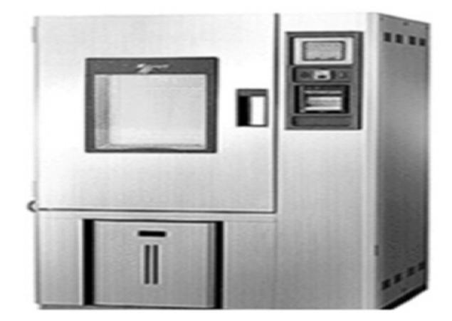

[그림 1-1] 고온 고습 전압 시험기

#### 2) 고온 고압 고습 시험(PCT: Pressure Cooking Test)

PCT chamber 내 온도 121℃와 상대습도 100%RH, 기압 2atm 상태로 보통 168 간을 진행하며 48시간 또는 96시간 간격으로 중간 readout을 실시한다.

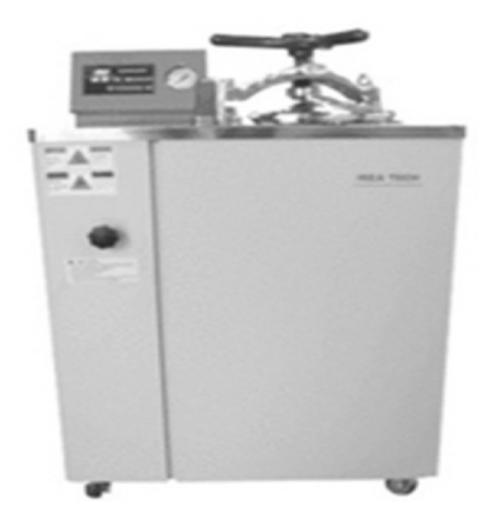

[그림 1-2] 고온 고압 고습 시험기

#### 3) 온도 싸이클 시험(TC: Temperature Cycle)

온도 싸이클 시험은 고온과 저온에 반복적으로 노출시켰을 때 어떤 영향을 받 는지 평가한다. 반복적인 thermo-mechanical 부하에 의해 발생할 수 있는 crack 등에 의한 leakage fail 등을 검출할 수 있다. 시험이 완료되면 외관, lead, seal, marking 상태를 확인 후 electrical test를 진행해서 TC로 가속된 불량이 있는지 검사해야 한다.

<표 1-2> 온도 싸이클 시험

| Condition |  | Temperature (°C) |      |      |  |
|-----------|--|------------------|------|------|--|
|           |  | Low              | High |      |  |
| A         |  | -55              |      | +85  |  |
| B         |  | -55              |      | +125 |  |
| C         |  | -65              |      | +150 |  |

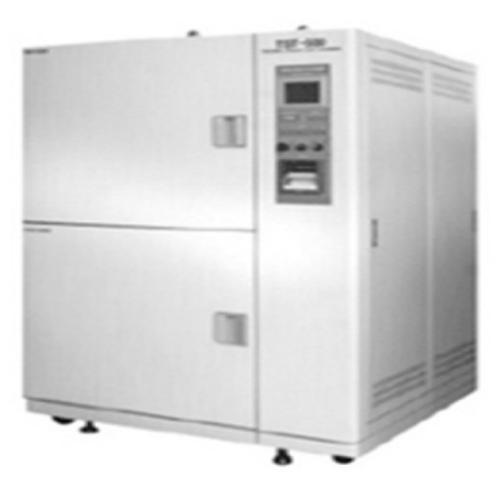

[그림 1-3] 온도 싸이클 시험기

#### 4) 열 충격시험(TS: Thermal Shock)

열 충격 시험은 갑작스런 온도변화에 어떤 영향을 받는지 평가하는 시험이다. 시험은 실온에서 시작하여 낮은 온도와 높은 온도에 짧은 시간 노출되었다가 실온으로 돌아오는 cycle을 반복하는 시험이며 검출 효과와 불량 발생 유형은 TC 시험과 유사하다.

<표 1-3>열 충격 시험

| Condition | Temperature (°C) |              |              |
|-----------|------------------|--------------|--------------|
|           | Low              | High         |              |
| A         |                  | -40 (-10/+0) | 85 (-0/+10)  |
| B         |                  | 0 (-10/+0)   | 100 (-0/+10) |
| C         |                  | -55 (-10/+0) | 125 (-0/+10) |
| D         |                  | -65 (-10/+0) | 150 (-0/+10) |

#### 5) 고온 보관 시험(HTS: High Temperature Storage)

온도라는 단일 조건 하에서 package & die 간, wire bonding & lead frame 간 접합 상태 등을 평가하기 위해 가속한다는 면에서 효과적인 시험이다. 또한 제 품에 따라서 시험의 목적이 달라질 수가 있는데, 특히 memory cell에 대한 data retension, charge loss 등의 수명 특성을 평가하는데도 매우 중요한 시험이다.

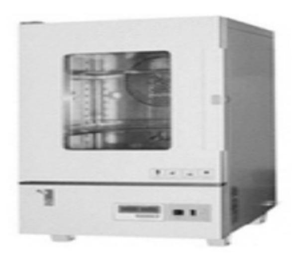

[그림 1-4] 고온보관 시험기

#### 6) 염수 분무 시험 (Salt Atmosphere)

염수 분무 시험은 시료에 영향을 주는 염기 환경을 소금 용액을 분무시킴으로 써 구현하여 부식을 가속시키는 시험이다. 시험이 완료되면 D/I water에서 염기 를 충분히 제거한 뒤 pitting, blistering, flaking, corrosion 등 외관을 검사한 후 electrical test를 실시한다.

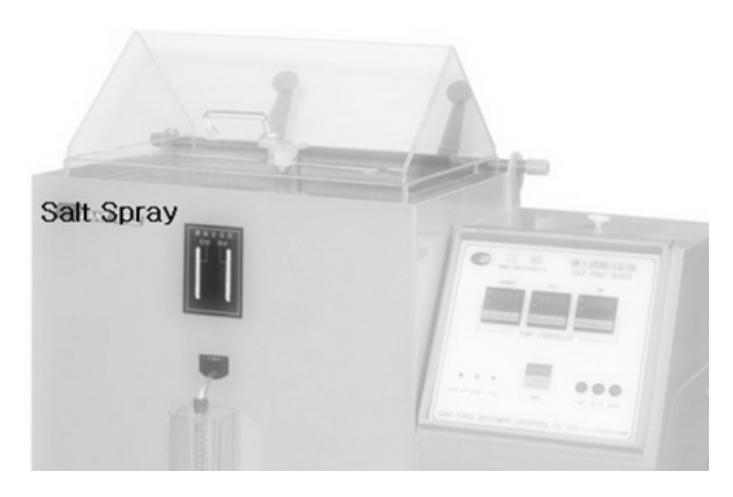

[그림 1-5] 염수 분무 시험기

#### <표 1-4> 염수분무시험

|   | Test Condition (Na 5%) |    | 시간 |
|---|------------------------|----|----|
| A |                        | 24 |    |
| B |                        | 48 |    |
| C |                        | 96 |    |

불량 분석하기

1. 전기적 분석(DC Parameter Test)을 실시한다.

양산 Tester에서 DC parametric Fail로 선별된 시료에 대해 Pin(Port)별로 해당 parameter 에 대한 characteristics를 실시하여 정확한 불량 분석 계획을 수립하기 위해 실시한다. 주 로 아래와 같은 항목들에 대해서 test한다.

- (1) Input 전압 특성
- (2) Input Leakage current test
- (3) Output 전류 / 전압 test
- (4) Tri-state leakage current test
- (5) 소비 전류 test

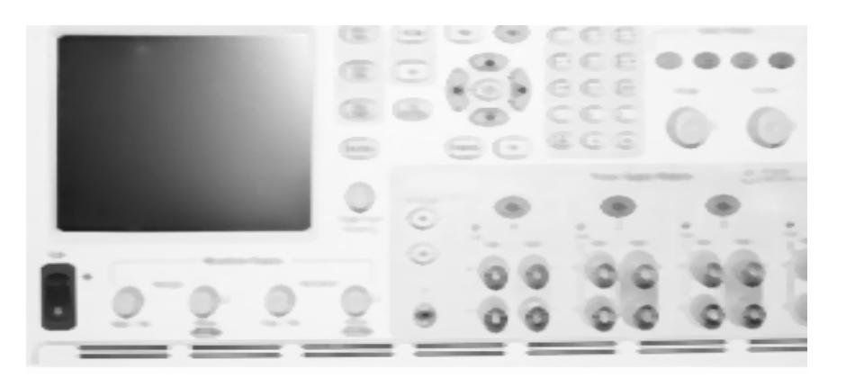

[그림 1–6] 사용 장비의 예시

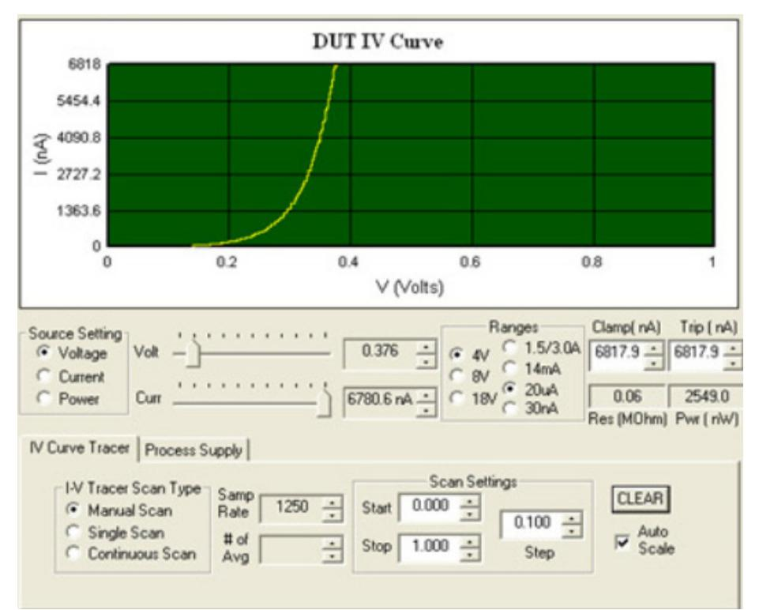

[그림 1-7] 사용 장비의 예시

#### 2. X-ray 촬영을 실시한다.

X선은 방사선의 짧은 파장과 높은 에너지 때문에 쉽게 물질을 통과하는 특성과, 물 질 을 구성하는 원자재에 따라 투과율이 다른 원리를 이용하여 X-ray 검사 시스템을 이용 하여 분석 시료에 대한 파괴검사 전에 시행한다. 주로 조립 공정에서 발생될 수 있는 wire boding, die attach, package lead frame 등 공정과 소재 결함에 대한 분석을 위해 실 시한다. 유사한 분석 장비로 초음파 검사 장비인 SAT(scanning acoustic tomography)도 선 택적으로 사용한다.

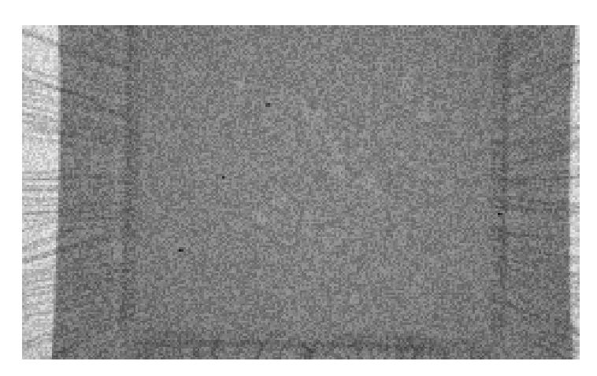

[그림 1-8] X-ray상에서의 wire bonding pad 상태

#### 3. Package Decapsulation과 Layer etching을 실시한다.

불량 시료에 대한 물리적인 분석을 위해 우선적으로 실시해야 하는 과정이 Package Decapsulation 작업이다. 반도체 chip 보호용 package를 구성하는 소재인 EMC(epoxy molding compound)의 제거를 통해 wire bonding 상태 및 lead frame의 상태를 우선적으로 살펴볼 수가 있으며, 다음 단계로 chip surface 상태는 물론 회로 배선상의 결함을 분석할 수 있다. 예전에는 엔지니어들이 화학약품을 이용하여 직접 작업을 실시하였으나 최근에 는 자동 설비를 활용함으로써 유해한 화학약품으로 인한 인체의 안전문제를 많이 완화하 였다.

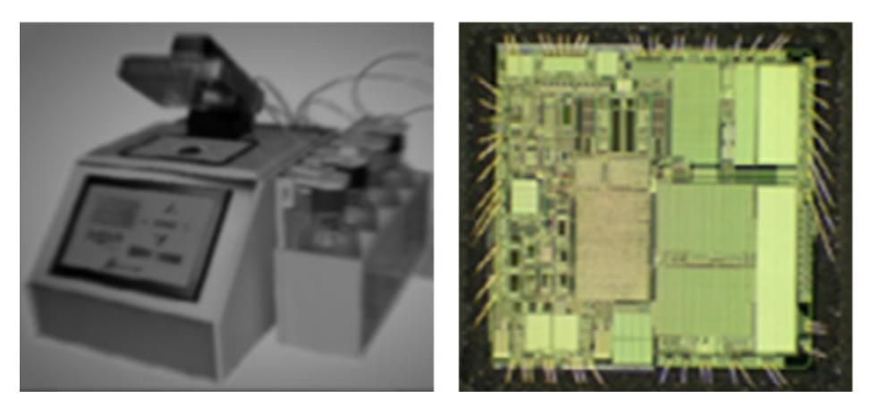

[그림 1-9] IC Auto decapsulator 및 작업 완료된 chip 표면 상태

- 4. 육안 검사(Visual Inspection)를 실시한다.
  - (1) Microscope

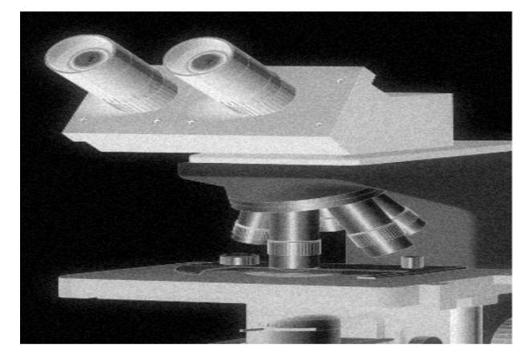

[그림 1-10] Microscope 모형도

#### (2) 주사 전자현미경(SEM: Scanning Electron Microscope)

SEM은 육안으로 분석이 불가능한 시료의 미세한 부분을 확대하여 분석하는데 사용한 다. SEM은 통상 수 천 배 수준의 광학현미경에 비해 월등히 높은 배율(x100만)까지 관찰 이 가능하여 불량 분석 부위를 규명하는데 매우 유용하다. SEM은 전자빔을 시료 표면 에 주사할 때 시료 표면에서 방출되는 2차 전자를 검출기로 검출하여 모니터 상에 주 사함으로써 영상으로 형상화하는 원리로 제작되었다.

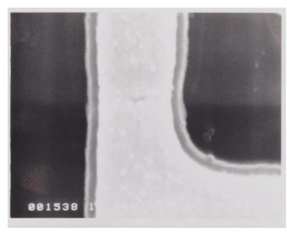

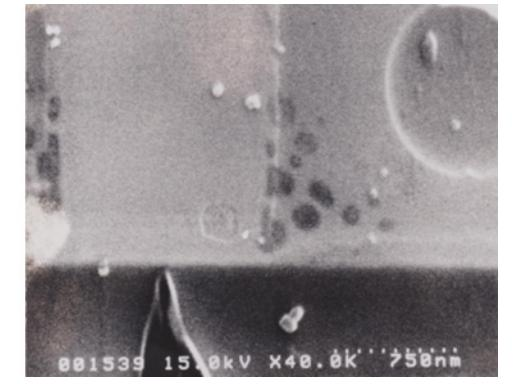

A. Metal (메탈) 배선 표면 B. Metal Contact 불량부위 [그림 1-11] 주사 전자현미경 영상의 예시(참고: 확대배율 40K)

#### 5. HEA(Hot Electron Analysis) 분석을 선택적으로 실시한다.

반도체 소자의 DC parametric 불량 또는 function 불량에 대해서 소자에 전기적인 신호를 인 가한 후 불량 위치에서 방출되는 Photon Emission(hot electron)을 검출하는 분석 방법으로써 소자의 leakage current 및 short fail 발생 위치를 특정하기 위해 사용한다. 이외에도 Thermal Emission MicroScope, Photon Emission Microscope 등 을 이용하여 분석하기도 한다.

- (1) 분석 영역
  - (가) 소비 전류(Stop / Standby Current) Failure
  - (나) Pin(Port) Leakage current failure
  - (다) 회로 내 contact 저항 이상
  - (라) Metal shortage
  - (마) 다양한 Functional Failure
- (2) 분석 사진

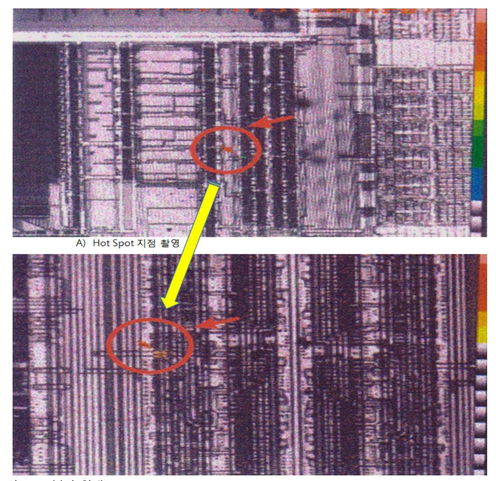

B) Spot 부위 확대

[그림 1-12] Hot Spot point 촬영 영상

6. E-Beam Probing을 선택적으로 실시한다.(Functional 불량의 경우 흔히 실시)

E-Beam Prober는 SEM의 기능을 활용한 불량분석 장비로써, voltage contrast concept을 이용하여 chip 표면에서 방출되는 E-beam을 통해 signal의 voltage와 timing을 측정함으로 써 waveform을 확보할 수 있다. Waveform은 전기적인 신호가 인가되고 있는 metal, poly, junction 부위에서 측정이 되는데, 시간에 따라 변화되는 신호들에 대해서 추적 관찰이 가 능하기 때문에 일정한 신호의 pattern을 활용한 looping test를 통해서 정상 시료와 불량 시료 간의 차이점을 비교하여 불량 부위를 영상으로 측정하는데 유용하게 사용된다.

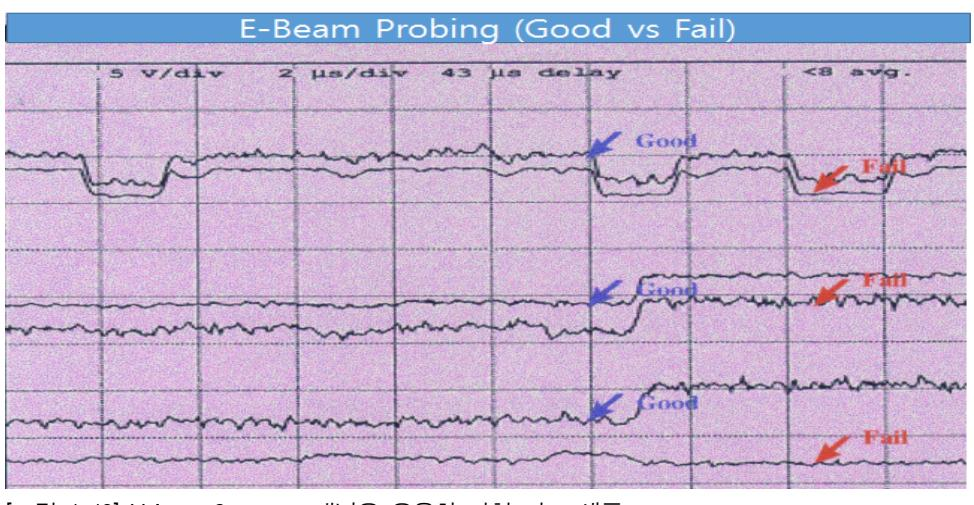

[그림 1-13] Voltage Constrast 개념을 응용한 파형 비교 샘플

#### 7. 배선(Layout) 분석 및 회로 추출을 실시한다.

E-Beam Probing이나 Hot Electron Emission 기법을 이용하여 불량으로 추정되는 부위가 특정이 되면 그 부분에 대한 layout을 분석하고 여기에 해당되는 회로를 추출한다.

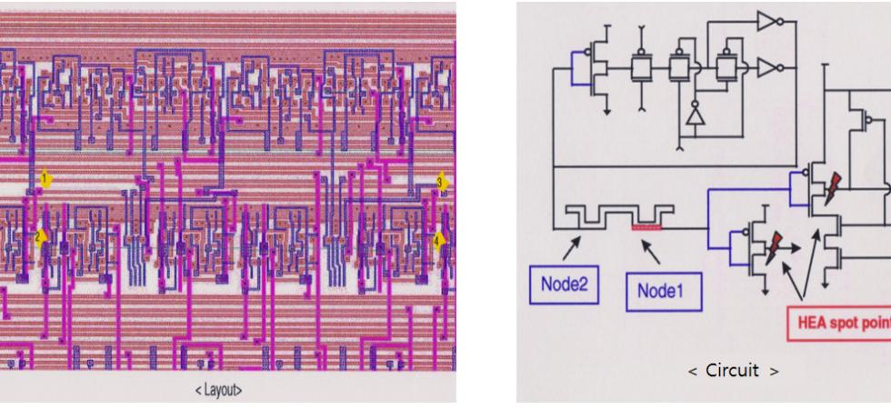

 A. Layout상의 Hop Spot 부위 정의 B. 불량 해당 부위 회로뷴석 [그림 1-14] 불량 발견 부위의 Layout 분석과 해당 부위의 회로 추출

#### 8. 단면 분석을 실시한다. (FIB: Focused Ion Beam)

FIB는 시료의 원하는 미세 부위에 전자빔을 주사하여 해당 부위를 절단하거나 metal을 증착하여 원하는 부위를 연결할 수 있으며, 불량 부위의 단면 분석을 실시할 수 있다.

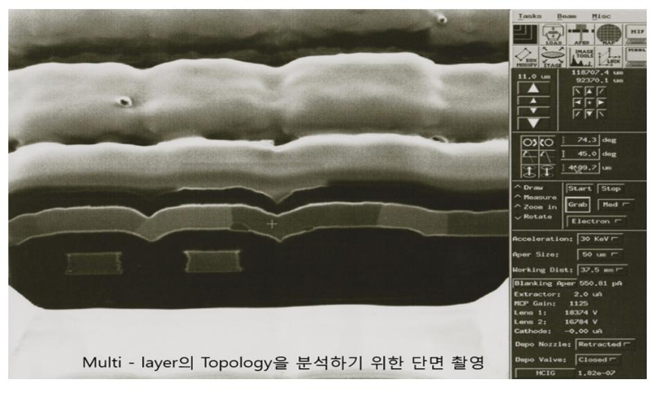

[그림 1-15] FIB 촬영 단면도

#### 개선 대책 수립하기

#### 1. 불량 mechanism을 이해한다.

예제) Via contact 저항성분으로 인한 기능 불량에 대한 mechanism을 분석한 결과 metal corrosion으로 인한 via void 현상이 아래 그림의 Node 3처럼 발생이 되었다.

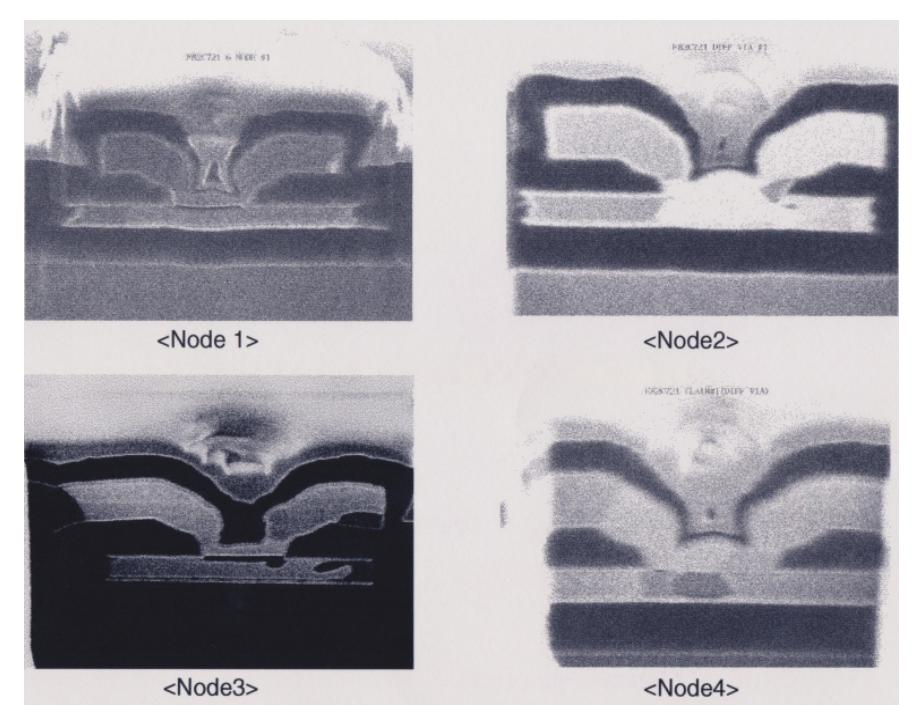

 A. Node 1 . 3 - Contact Void 현상 B. Node 2, 4 - 정상적인 Contact 형태 [그림 1-16] Via contact 단면도 비교 사진

#### 2. 불량 원인을 Modeling한다.

예제) Via void 발생 원인은 아래의 모형도처럼 cleaning 공정에서 유발된 corrosion성분 이 고온의 가속 시험을 통해 반응하면서 저항성분 증가에 의한 Via Void현상이 발생이 되었다.

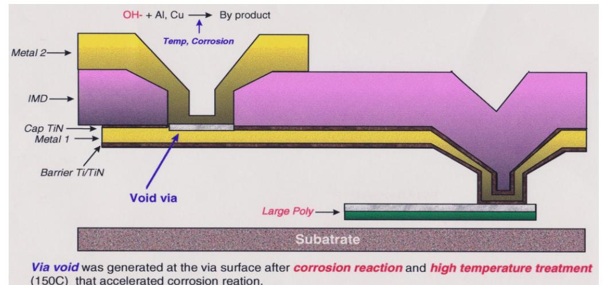

[그림 1-17] 불량 mechanism 도해

#### 3. 개선 대책을 수립한다.

해당 제품의 공정 부문과 제품기술 부문이 함께 모여서 개선 아이디어 협의를 실시하며 실험 계획을 수립하고 개선 여부를 추적 관찰하는 반복 시험을 실시한다.

예제) 분석 결과 cleaning corrosion으로 인한 via void현상을 cleaning단계에서 IPA rinse time을 증가시켜서 개선 효과를 검증한 후 공정에 확산 적용한다.

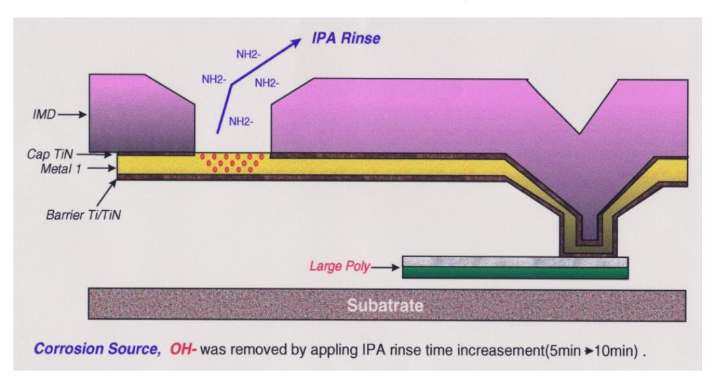

 [그림 1-18] 개선 대책수립 도해

### 학습 1 교수 ‧ 학습 방법

#### 교수 방법

- 반도체 소자의 전기적, 물리적 특성을 이해하고 IC 동작 원리와 방법을 충분히 인지하고, 학생들 로 하여금 소자별로 측정 방법과 구동 방법을 이해하도록 수업을 진행한다.
- 반도체 소자의 신뢰성 특성과 제품별 요구 기준에 관한 국제규격을 숙지하고, 학생들이 필요한 규격을 검색하고 해당되는 규격의 내용을 찾아서 활용할 수 있도록 지도한다.
- 각각의 신뢰성 항목에 대한 시험 목적과 시험 방법을 이해하고, 학생들이 시험 계획을 수립할 수 있도록 유도한다.
- 반도체 불량의 유형과 분석 방법을 충분히 인식하고, 학생들이 불량을 정의하고, 분석과 원인 도출, 개선 대책을 수립하는 과정들을 공부할 수 있도록 사례를 확보하여 활용한다.

#### 학습 방법

- 반도체 소자의 전기적, 물리적 특성을 이해하고 IC 동작 원리와 방법, 소자별로 특성 측정방법을 학습하고, 실습을 통해 충분히 숙지한다.
- 반도체 소자의 신뢰성 특성과 제품별 요구 기준에 관한 국제규격을 인터넷을 통해 검색하고 필요한 규격의 내용을 찾아서 해당 제품에 맞게 신뢰성 시험 계획표를 작성한다.
- 신뢰성 시험 목적과 시험 방법에 대해 항목별로 공부하고, 각 시험장비 활용법과 시험 도구 제작법을 학습하여, 실습을 통해 충분히 숙지한다.
- 반도체 불량의 유형과 분석 방법을 이해하고, 간단한 사례들에 대해 시료를 확보하여 실험을 수행한다.

## 학습 1 평 가

#### 평가 준거

- 평가자는 학습자가 학습 목표 및 평가 항목에 제시되어 있는 내용을 성공적으로 수행하였는지 평가해야 한다.
- 평가자는 다음 사항을 평가해야 한다.

|          | 학습내용 평가항목                                                                                                          |  | 성취수준 |   |  |
|----------|-----------------------------------------------------------------------------------------------------------------------|--|------|---|--|
|          |                                                                                                                       |  | 중    | 하 |  |
|          | - 물리적 환경 시험인 고온, 고습 시험(HTS, WHTS), 고 압 시험(PCT), 온도 싸이클 시험(T/C), 열 충격 시험 (T/S)의 항목별 목적을 이해하고 시험 계획을 수립할 수 있다. |  |      |   |  |
| 반도체 물리적  | - 물리/전기적(WHTOL) 환경 시험의 목적을 이해하고 계획을 수립할 수 있다.                                                                      |  |      |   |  |
| 환경 시험과   | - 시험 항목별 시험 방법을 갖출 수 있다.                                                                                              |  |      |   |  |
| 고장 유형 분석 | - 시험 결과 고장 유형을 파악할 수 있다.                                                                                              |  |      |   |  |
|          | - 시험 결과 규정을 만족하는지 여부를 판단할 수 있다.                                                                                       |  |      |   |  |
|          | - 고장 유형별로 고장 원인을 분석할 수 있다.                                                                                            |  |      |   |  |
|          | - 고장 원인에 따른 개선 방향을 정의할 수 있다.                                                                                          |  |      |   |  |

#### 평가 방법

• 평가자 질문

| 학습내용     | 평가항목                         |   | 성취수준 |   |  |
|----------|------------------------------|---|------|---|--|
|          |                              | 상 | 중    | 하 |  |
| 반도체 물리적  | - 환경 시험 항목 선정과 목표 시간 및 조건 설정 |   |      |   |  |
| 환경 시험과   | - 시험 항목별 실행                  |   |      |   |  |
| 고장 유형 분석 | - 시험 결과에 대한 규정 충족 여부 판단      |   |      |   |  |

• 문제 해결 시나리오

| 학습내용               | 평가항목                       | 상 | 성취수준 중 | 하 |
|--------------------|----------------------------|---|-----------|---|
| 반도체 물리적            | - 고장 분석 과정과 고장 유형 규명 과정 발표 |   |           |   |
| 환경 시험과 고장 유형 분석 | - 고장 유형에 따른 개선대책 수립 절차 습득  |   |           |   |

#### 피 드 백

#### 1. 평가자 질문

 - 응답한 내용을 평가하고 기준에 미달한 학생들에게는 수준별로 학습 내용을 보충하고 스스로 복습한 후 그 결과를 제출하도록 한다.

2. 문제 해결 시나리오

- 문제 해결 능력을 관찰하여 평가한 후, 주요 사항을 표시하여 돌려준다.

| 학습 1 | 환경 시험 평가하기 |
|------|------------|
| 학습 2 | 수명 시험 평가하기 |
| 학습 3 | EMC 평가하기   |

## **2-1.** 반도체 수명시간 예측 시험과 고장 유형 분석

|       | • 수명 가속을 위한 고온/고전압 동작시험(HTOL) 목적을 이해하고 계획을 수립할 수 있다. |
|-------|------------------------------------------------------|
|       | • 시험 항목별 시험 방법을 갖출 수 있다.                             |
|       | • 시험 결과 규정을 만족하는지 판별할 수 있다.                          |
| 학습 목표 | • 시험 결과 고장 유형을 파악할 수 있다.                             |
|       | • 고장 유형별로 고장 원인을 분석할 수 있다.                           |
|       | • 고장 원인에 따른 개선 방향을 정의할 수 있다.                         |

### 필요 지식 /

반도체 신뢰성

반도체 신뢰성 관련 규격에 정의되어 있는 품질 수준을 만족시키기 위해 초기 설계 단계에서 제조 원 ․ 부자재 및 공정 능력까지의 총체적인 모든 품질을 실제 사용 시 실장 환경과 신뢰 성 시험 시 가속 환경과의 stress 조건 비를 시간으로 환산한 가속 계수(Acceleration Factor) 를 이용하여 높은 신뢰성의 경쟁력 있는 제품을 확보하는 것이다.

1. 관련 국제규격 (2p 국제규격 참조)

신뢰성의 정의

반도체 소자의 정해진 사용 환경과 조건에서 의도하는 기간 정해진 기능을 발휘하는 확률. 즉, 신뢰도란 고장이 나지 않을 확률이고 신뢰성은 신뢰도라 하는 확률로 표현된다.

- 1. 신뢰도 함수
  - (1) R(t): 신뢰도 함수(생존 확률, Reliability function)

t 시점에서 고장 없이 작동될 확률

- (2) F(t): 신뢰도 함수(누적 고장률, Non-Reliability function) t 시점까지의 누적 고장확률
- (3) f(t): 고장 확률 밀도 함수(Failure density function)

F(t) =∫f(t) dt

f(t) = dF(t) / dt

R(t) + F (t) = 1

(4) λ(t): 순간 고장률(failure rate 고장률 함수)

 어느 t 시점까지 고장 없이 작동하고 그 이후 단위 시간에 고장날 확률 λ(t) = f(t) / R(t) = ( dF(t) /dt ) / R (t)

R(t) = Exp (-λ(t) dt) (t : 사용 시간)

- 2. 고장률 분포
  - (1) Pattern: IFR (Increasing Failure Rate) 정규분포

CFR (Constant Failure Rate) 지수분포

DFR (Decreasing Failure Rate) Weibul 분포

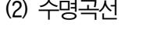

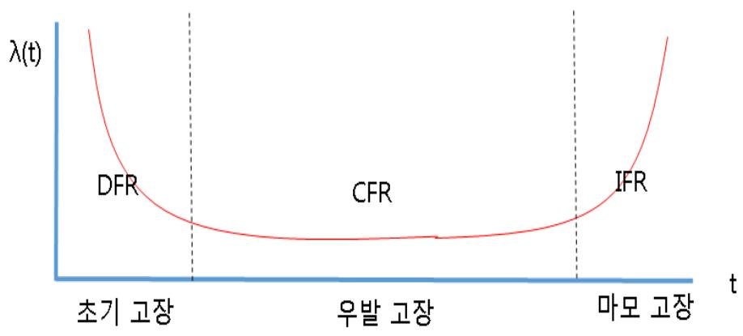

 [그림 2-1] Bath Tube 곡선

(가) 초기 고장 지대(initial failure region)

- 고장률이 시간에 따라 급격히 감소

- End user가 가장 관심 있는 parameter로 완성 set의 초기 불량을 일으킬 수 있음

- 주로 공정 trouble에 의해 발생되고 Burn-In으로 screen 가능

- (나) 우발 고장 지대(random failure region)
- 고장률이 시간에 따라 일정한 고장률 λ로 간주
- R (t) = Exp (-λ(t)) (누적 고장률 F(t) = 1-R (t) )
- λ : 평균 고장률, 1/λ : 평균수명(MTTF)
- Technology 자체에 의해 결정됨
- (다) 마모 고장 지대 ( wear-out faulure region)
- 고장률이 시간에 따라 급격히 증가함
- 수명이 다한 상태
- 3. 고장률 계산(Failure rate calculation)
  - (1) 고장률 계산을 위해서는 고장률이 시간의 함수임을 이해해야 한다.
    - (가) 고장률 함수 (failure rate): λ(t)
    - (나) 누적 고장률 함수(cumulative fail): F (t)
    - (다) 신뢰도 함수(reliability): R(t)
  - (2) 고장률(순간고장률 (λ(t)) 산출 방법
    - (가) 우발 고장 지대의 고장률 분포는 지수함수로 분포함으로 고장률 (λ(t) )은 일정 한 상수로 나타낸다. 그러므로 지수함수 분포를 이용하면 고장률을 아래와 같이 구한다.
    - (나) 고장률 계산
      - F.R = N / D \* H
      - [ N = Number of rejects
      - D = Total sample size
      - H = Test hour ]
      - 단위 : % / HR, % / 1000HR, FIT (FIT = F.R / 10E-9)
      - (ex) 0.0000001 / HR = 0.00001% / HR = 0.001% / 1000HR = 100FIT
- 4. 60% 신뢰율 고장률 계산(60% confidence level failure rate)

신뢰도 시험실에서 구한 고장률(F.R)이 실제의 고장률을 나타내지만 sampling에 의한 결과 이므로 모집단의 고장률을 알기 위해서는 통계적 처리가 필요하다. 즉, 신뢰율 (confidence level)을 이용하여 고장률을 계산한다. (ex) F.R (% / KHR @ 60%CL) = X2 (0.60, 2R+2) \* 10E5 / 2\*D\*H 여기서 X2는 2R+2 자유도의 0.6에 해당하는 Chi square 값이다.

수명 시험

1. 가속 계수(Acceleration Factor)

- (1) 시료에 인가되는 가속 온도와 실제 사용 환경에서의 온도 간의 차이와 활성화 에너 지 (Ea)값이 적용된 아레니우스 방정식을 사용하여 도출하는 온도 가속계수
- (2) 시료에 인가되는 가속 전압 Bias와 시료의 Oxide Thickness의 상관관계에 의해서 도출 되는 전압 가속계수
- (3) 총 가속계수는 온도 가속계수 (TAF)와 전압 가속계수의 곱으로 계산된다.

A.F = TAF \* VAF

2. Activation Energy(Ea 활성화 에너지)

활성화 에너지(Ea) 값은 반도체 소자가 각각 가지고 있는 고유의 값으로 분류될 수 있다. 통상 불량 mechanism에 의거하여 0.3eV에서 1.4eV까지의 값을 갖는다.

#### 반도체 고장 유형 분석(FMEA)

1. 고장 유형의 분석 목적

반도체 신뢰성을 향상시키기 위해 필수적으로 요구되는 것은 신뢰성 고장 유형을 이해하 는 것이다. 고장 유형의 분석을 통해 유형별 activation energy를 추출하고 이에 따른 가 속 계수를 산출함으로써 신뢰성(예상 수명시간)을 예측할 수 있고 개선 대책을 수립할 수 있다.

#### 2. 수명 시험에서 발생 가능한 고장 유형

- (1) Electro-Migration(EM)
  - (가) Electro-Migration

집적 회로의 불량 mechanism 중에 가장 널리 알려지고 연구 검토되어 왔던 항목이 다. 특히 metal 배선으로 사용되는 Aluminium은 고전도성과 우수한 공정능력 때문 에 수십 년 간 사용되어 왔으나 낮은 용융점 (melting point) 때문에 EM에 의한 불 량을 야기해 왔다.

(나) EM 발생 Mechanism

Electro-Migration은 배선 중에 흐르는 전자에 의해 열적으로 활성화된 금속 이온들 의 이동 현상으로 이때 발생한 hole들은 metal의 단면적을 축소시키고 전류밀도를 증가시켜 열을 발생시키고 EM 발생은 가속화되어 결국 저항을 증가시키고 metal line open을 야기하게 된다. 한편 모여진 금속 이온들은 hillock을 발생시켜 주변의 도체와 전기적 short 현상을 야기한다.

- (다) Electro-Migration 유형별 분류
  - 1) Metal-Migration

가) 내용

금속배선막 중의 금속 원자와 배선막을 통과하는 전자와의 상호작용에 의한 확산 현상의 일종으로, 배선막을 구성하고 있는 금속 이온이 전자에 의하여 이동하는 현상이다.

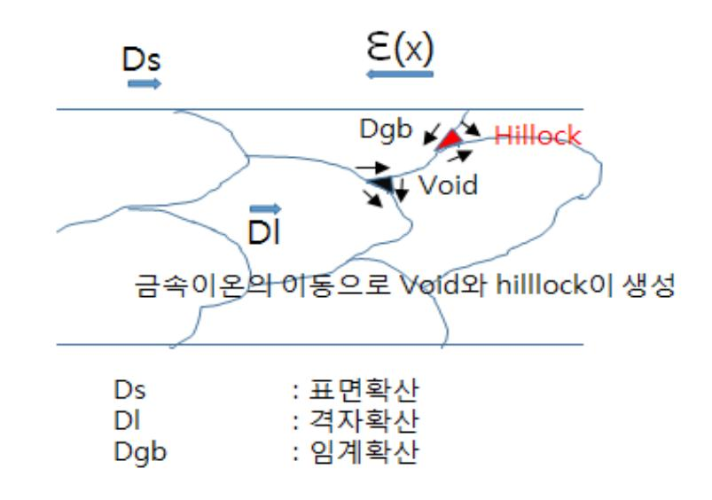

[그림 2-2] Metal-Migration 현상

나) 영향

- Void에 의한 Metal Open 현상 발생
- Hillock에 의한 Metal Short 현상 발생
- 2) Contact-Migration

#### 가) 내용

Metal-Migration과 상반되는 것으로 전자가 빠져나가는 contact을 통해 Silicon 이 junction으로부터 metal의 grain boundary를 따라 이동해 나가는 현상이다.

[그림 2-3] Contact-Migration 현상

나) 영향

Silicon Nodule에 의한 Contact 저항 증가

3) Stress-Migration

#### 가) 내용

적층 구조의 두 물질에서 열팽창 계수차이에 의한 thermal stress를 받게 되고 그 구조에 기인한 mechanical stress를 받아 한 물질의 원자가 이동하는 현상 으로, 보통 metal 공정 후 보호막인 passivation 공정을 거치게 되면 metal line 에 void 또는 crack이 발생되는 경우가 있는데 이것은 두 막질간의 열팽창 계 수 차이로 인해 Passivation film에 void가 형성되면서 metal line에 damage를 주게 된다.

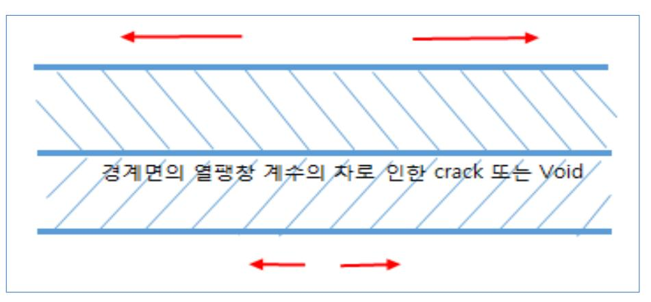

[그림 2-4] Stress-Migration

나) 영향

Wedge Defect에 의한 Open or Stress Void

- 다) 용어설명
- Hillock: Metal이 metal film으로부터 돌출한 것으로 metal 증착 중 또는 증착 후 후속 열처리 공정 및 Device의 실시 동작 중에 발생하며 대부분 400℃ 부근의 온도에서 가열하거나, 상온과 150℃ 사이에서 thermal cycling에 의해 발달한다. Hillock은 PR(photo resist)이나 Dielectric film을 열화 또는 파괴시 킬 수 있으므로 바람직하지 못하다.
- Silicon-Nodule: 금속막이 고온(약 400℃ 정도)에서 Silicon이 어느 정도까지 용해되면서 금속막과 Silicon이 접촉을 이루는 곳에서 juntion이 파괴되는 현상을 일으키게 된다. 이런 현상을 막기 위해 일정 비율의 silicon을 금속막 에 첨가하게 되는데 이때 평형농도 이상으로 첨가된 silicon들이 grain 내에 또는 grain boundary에 침줄되어 나타나는 것을 Silicon Nodule 이라고 한다. 만약 이러한 Silicon Nodule이 contact 부분에 발생하면 contact저항을 크게 높이며, 때로는 금속 배선의 신뢰성을 크게 낮추는 결과를 초래하게 된다.

Silicon Nodule은 metal film형성 중 또는 특수 열처리 공정 중에 형성되어 그 이후 stress를 받으면서 성장한다.

#### (2) Hot Electron(HE)

Channel이나 공간전하 영역에 형성되는 Lateral Electrical field에 의하여, Si-SIO2 Interface의 Energy 장벽을 뛰어 넘을 만큼 충분한 energy를 가진 electron 또는 hole 이 발생할 수 있다. 이를 발생 mechanism에 따라 다음과 같이 구분할 수 있다.

#### (가) Channel Hot Electron

#### 1) 내용

Channel을 통하여 이동하는 전자가 수평 e-filed에 의해 energy를 얻어 뜨거워 져서 Si-SiO2 계면의 energy를 갖게 된 Hot electron이 energy 장벽을 뛰어넘어 gate 산화막 속에 주입되는 현상이다.

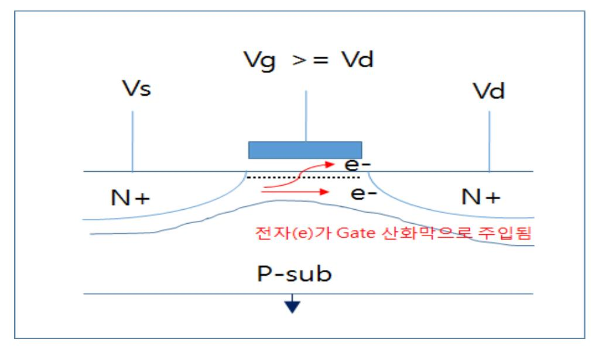

[그림 2-5] Channel Hot Electron 현상

#### (나) Drain Avalanch Hot Carrier

#### 1) 내용

Drain 근처의 높은 수평 e-filed에 의해 inversion layer에 있는 전자가 depletion 영역에서 충돌 전리(Impact Ionization) 또는 Avalanche 증배에 의해 EHP가 생성 되며 이에 의해 발생된 전자 또는 정공이 뜨거워져서 산화막 속으로 주입되는 현상

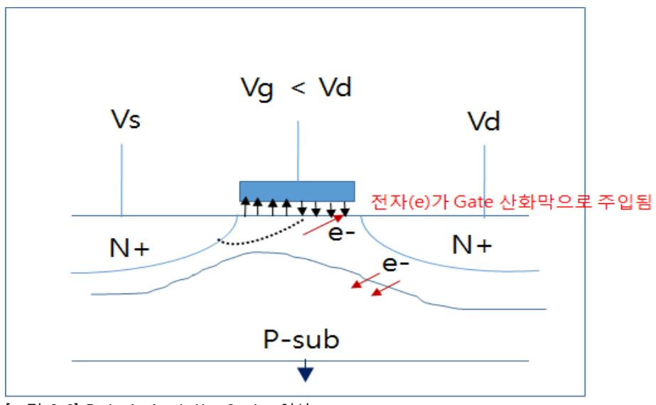

[그림 2-6] Drain Avalanch Hot Carrier 현상

- (다) Substrate Hot Carrier
- 1) 내용

음극기판 bias를 인가해서 gate 전극 아래의 기판 표면에 두꺼운 공핍층을 형성 했을 경우에 기판 측으로부터 확산으로 공핍층에 주입된 전자 또는 공핍층 내 에서 발생한 전자가 공핍층 내의 전계에 의해 가속되어 뜨거워져서 Gate 산화 막 속으로 주입되는 현상

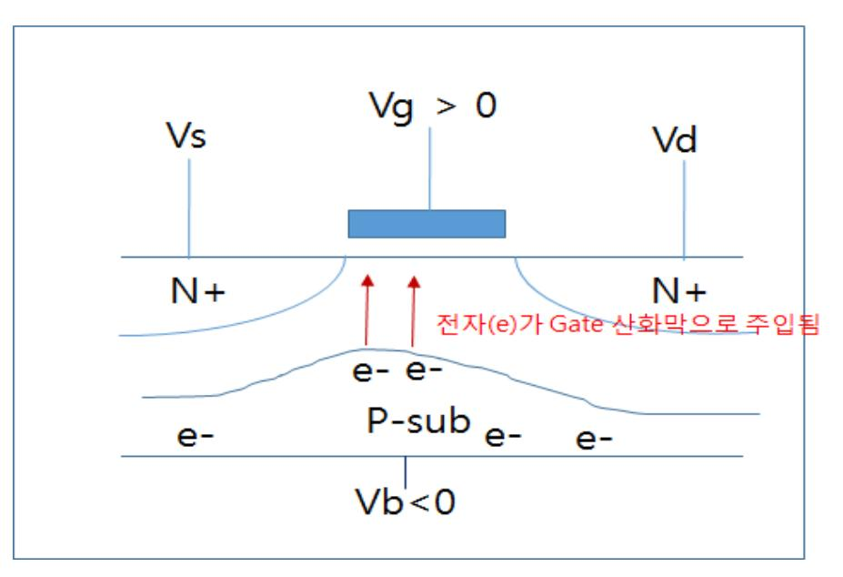

[그림 2-7] Substrate Hot Carrier 현상

(라) Hot Electron(HE)에 의한 영향

- 1) Threshold Voltage(Vt) Shift에 의한 제품특성 변화
- 2) Latch-up 유발

3) Oxide 막질의 Breakdown

4) 상호 인덕턴스특성 열화

#### (3) 기타 불량 유형

- (가) Oxide 관련 불량 유형
  - 1) Gate Oxide Particle
  - Cleaning 공정에서 발생된 Particle에 기인
  - 2) Gate Oxide pinhole
  - Wafer Defect 또는 오염에 기인
- (나) Poly to Poly Bridge & Thinning
  - 1) Etching Particle
  - 2) Photo Misalign
  - 3) Cleaning Particle
  - 4) Notching / Overetching
  - 5) CD Margin 취약
- (다) Metal 관련 불량 유형 1) Metal to Metal Bridge
  - Etching Particle에 기인
  - 2) Metal Thinning
  - Photo Misalign
  - 3) Metal Open
  - Electro Migration
  - 4) Via Open
  - CD Margin
- 3. 불량 발생의 원인과 수명 시험의 상관관계
  - (1) 일반적으로 신뢰성 수명 가속시험에서 발생할 수 있는 불량 유형은 위에서 검토하였 던 바와 같이 Metal-Migration에 의한 Metal Open-Short와 Stress Migration에 의한 Wedge defect, Hot- Carrier에 의한 Oxide Breakdown, Vt Shift에 의한 특성 degrade 등이 며 이와 같은 현상은 주로 Material Degradation에 의해 나타날 수 있는 불량 형태이다.
  - (2) 신뢰성 시험에서 나타날 수 있는 불량 유형의 또 다른 원인으로는 순수한 재료의 마 모성 불량보다는 설계, Fab-Process Margin, 공정 error, In process particle 등으로 나 타나는 문제들과 EM, Hot Carrier 현상이 복합적으로 겹쳐져서 나타나는 양상을 띠게 된다.
    - (가) Design-Margin, Fab-Process Margin 부족 등에 기인된 Bridge 또는 Thinning 현상

(나) Inprocess 중에 발생된 Particle(Oxide, Poly, Metal)로 인한 절연막질의 특성열화/ Current Leakage, 전도막질의 Electrical Short 등이 있을 수 있다.

4. 불량 분석 기법 (학습 1 '수행내용 2 불량 분석하기' 참조)

- (1) 전기적 분석(Electrical Analysis)
  - (가) DC Parameter Test
  - (나) HEA(Hot Electron Analysis) 분석
  - (다) E-Beam Probing
  - (라) 배선 (Layout) 분석 및 회로 추출
- (2) Physical analysis
  - (가) X-Ray 촬영
  - (나) Decapsulation / Delayering
  - (다) 육안 검사(Visual Inspection)
    - 1) MicroScope
    - 2) 주사 전자현미경(SEM: Scanning Electron Microscope)
    - 3) 단면 분석-FIB(Focused Ion Beam)

## 수행 내용 / 반도체 수명시간 예측 시험과 고장 유형 분석하기

#### 재료·자료

- 반도체 신뢰성 평가 규격(MIL-STD. 883, JESD22, EIAJ ED-4702, JIS, C7210)
- DUT Package별 socket

#### 기기(장비 ・ 공구)

- 계측기(Oscilloscope, DC Parameter Analysis, Pulse Generator)
- Hot Electron Analyser (HEA, PEM)
- Burn-In Chamber
- Burn-in Board

- PC
- Decapsulation / Delayering System
- X-ray Chamber
- SEM(Scanning Electron Microscope)
- FIB(Focused Ion Beam)
- E-Beam Tester
- 초음파 시스템

#### 안전 ・ 유의사항

평가를 위해서는 요구되는 제품의 동작 성능과 전기적 특성, 사용 환경에 따른 다양한 평가 방법이 포함되어야 한다.

#### 수행 순서

수명 시험 이해하기

- 1. 가속 수명 시험의 목적을 이해한다.
  - (1) 수명시험의 의미를 이해한다.

일반적으로 일정한 기간 동안 주어진 조건 하에서 요구되는 기능을 원활히 수행해 가 는 것에 대한 기준 척도를 reliability라고 말하는데, 특히 현대의 초고집적 반도체들에 대해서는 단지 failure time을 알아보기 위해 단지 몇 개의 시료만을 가지고 동작 상태 를 monitoring하는 것만으로는 그 제품의 신뢰성을 평가하기는 대단히 어렵다. 그 이유 는 제품의 특성을 결정하는데 직간접적으로 연관된 factor들이 무수히 많기 때문이다. 한편, 신뢰성 평가를 위하여 그간의 실험적인 data와 물리학적인 이론을 근거로 하여 이미 modeling되어 있는 가속계수 (accelerated factor), 시간 요소 등을 이용한 시험 방 법을 가속 수명 시험이라 한다.

(2) 가속계수의 정의를 이해한다.

가속 계수는 신뢰성을 평가하는 항목 중 가장 중요한 item이라 할 수 있다. 즉, 가속 수명 시험은 실제로 불량을 야기할 수 있도록 실제 사용 환경 이상의 가혹한 stress(가 속 계수)를 제품에 인가해 줌으로써 신뢰성을 평가 할 수 있도록 하는 방법으로써 이를 통하여 얻어진 결과에 해당되는 활성화 에너지(Ea)값을 대입함으로써 수명 시간과 불량률 에 관하여 modeling된 소위 bathtub curve ([그림 2-1] 참조)를 유도해 낼 수 있다.

(3) 수명시험 곡선 (Bathtub Curve)를 이해한다. (그림 2-1)

특히 초기 고장 대역과 우발 고장 대역이 제품의 신뢰성 측면에서 주목할 만한 가치 가 있다. 초기 고장 대역에서 발생되고 있는 결함에 대한 발생 원인은 oxide pinhole과 같은 early oxide failure, Photo resist 또는 etching defects, conductive debris on the chip, contamination, scratch, weak bond, crack 등 manufacturing defects과 desing rule 및 technology 등에 기인된다. 이러한 다양한 변수들에 의해서 나타나는 defects들의 원인을 제거할 수 있도록 design 및 Fab. 공정을 개선하는 방법 등의 corrective action 이 취해질 수 있는 source들이 대부분 이 구간에서 얻어지므로 특히 주목할 만하다. 또한 이 구간에 존재하는 defect의 수를 감소시키거나, 잠재적인 defect들을 검출하기 위해서는 2가지 형태의 가속 factor(temperature, electrical bias)를 인가하여 실시하는 acceralated life test(가속 수명 시험)을 특별히 Burn-In이라고 한다. 방법은 동일하나 목적상 각기 다른 용어로 사용되는 accelerated life test (HTOP, ELT, ILT, Burn-In)에 대하여 이후로 전개되는 본 학습 내용에 한해 용어상의 혼돈을 피하기 위해'수명 시 험'으로 통일하여 사용하기로 한다.

2. 가속 계수 (Accleration Factor)를 산출한다.

가속온도로 시험한 결과를 신뢰율에 따라 고장률을 산출하였지만 다른 온도에서의 고장률 을 산출하기 위해서는 온도에 의한 가속계수를 arrrenious 방정식을 이용하여 구한다. 통 상의 가속 시험 온도는 125℃ / 150℃이고 다른 온도, 즉 사용온도는 55℃ / 70℃로 적용 한다.

- (1) 조건별 가속계수 (A.F)
  - (가) TAF (Temperature Acceleration Factor)

TAF = FR1 / FR2 = MTBF 2 / MTBF 1 = Exp ( Ea \* (1/T2 – 1/T1) / K)

여기서 F.R 1, 2 : T1, T2에서의 고장률

MTBF1, 2 : T1, T2에서의 평균 수명

Ea : 활성화 에너지(Activation Energy)

T1, T2 : 절대온도。K (273+ ℃) (T1 : 시험온도, T2 : 사용온도 )

K : 볼쯔만 상수(8.62\*10-5 eV /。K)

(나) VAF(Voltage Acceleration Factor)

VAF = exp(C \* 0.5 (Vs-Vd)

여기서 C : Oxide Thickness에 근거한 실험값

Default Value : 610 / Tox A。

(다) A.F = TAF \* VAF

#### 3. Activation Energy(Ea 활성화 에너지)를 정의한다.

활성화 에너지(Ea) 값으로 불량 mechanism에 의거하여 0.3eV에서 1.4eV까지의 값을 갖는 다. 수명 시험에 의한 불량 mechanism의 유형에 따라 값은 다르지만 통계적인 실험 data 를 고려할 때 대체로 1.0eV의 값을 많이 적용한다. 단, 불량 mechanism은 반드시 확인이 필요하다.

| Category             | 불량 양상 (Mechanism)        | Activation Energy(eV) |
|----------------------|--------------------------|-----------------------|
|                      | Mobile Ions              | 1.0                   |
| Oxide                | Hot Carrier              | 1.0                   |
|                      | Charge contamination     | 1.0                   |
|                      | Surface Charge Spreading | 0.7                   |
| Dielectric Breakdown | General Relationship     | 0.3                   |
|                      | Charge Trapping          | 0.2                   |
|                      | Electromigration         | 0.9                   |
|                      | Stress Voiding           | 0.9                   |
| Metallization        | General Metalization     | 0.9                   |
|                      | Metal Corrosion          | 0.8                   |
|                      | Chemical Contamination   | 1.0                   |
|                      | Si Diffusion             | 0.9                   |
|                      | Si Defects               | 0.3                   |
| Fab Process          | Fuse Etching             | 0.5                   |
|                      | Metal Open               | 0.5                   |
|                      | Masking defects          | 0.3                   |
| Assembly Process     | General Relationship     | 1.0                   |

<표 2-1> 불량 양상 (mechanism)별 활성화 에너지 (Activation Energy) 수준

- 4. 수명시간을 예측한다.
  - (1) 신뢰성 고장률 계산하기
    - (가) 고장률(Failure rate calculation) 정의를 이해한다.
      - 1) 고장률 계산을 위해서는 고장률이 시간의 함수임을 이해해야 한다.
  - . 고장률 함수(failure rate) : λ(t)
  - . 누적 고장률 함수(cumulative fail) : F (t)
    - . 신뢰도 함수(reliability) : R(t)
      - 2) 고장률(순간고장률 (λ(t)) 산출방법
  - . 우발 고장 지대의 고장률 분포는 지수함수로 분포함으로 고장률(λ(t) )은 일정한 상수로 나타낸다. 그러므로 지수함수 분포를 이용하면 고장률을 아래 와 같이 구한다.
    - (나) 고장률 계산 방법을 이해한다.

1) F.R = N / D \* H

- [N = Number of rejects, D = Total sample size, H = Test hour]
- 단위 : % / HR, % / 1000HR, FIT (FIT = F.R / 10E-9)
- (ex) 0.0000001 / HR = 0.00001% / HR = 0.001% / 1000HR = 100FIT
- 2) 60% 신뢰도 고장률 ( 60% confidence level failure rate)
  - 신뢰도 시험실에서 구한 고장률 (F.R)이 실제의 고장률을 나타내지만 sampling 에 의한 결과이므로 모집단의 고장률을 알기 위해서는 통계적 처리가 필요하다.
  - 즉, 신뢰율 (confidence level) 을 이용하여 고장률을 계산한다.
- (ex) F.R (% / KHR @ 60%CL) = X2 (0.60, 2R+2) \* 10E5 / 2\*D\*H
- 여기서 X2는 2R+2 자유도의 0.6에 해당하는 Chi square 값이다.
- 3) 단순 고장률 계산 예제 풀이

제품에 대한 신뢰성 수명 시험 결과를 얻었다고 가정했을 때 고장률 산출방법 을 활용하여 계산하시오

| 제품명    | 시료수  | 168시간 | 500시간 | 1000시간 | 총고장수 | Device Hour(D*H) |
|--------|------|-------|-------|--------|------|---------------------|
| LHK001 | 500  | 10    | 2     | 1      | 13   | A                   |
| LKH002 | 500  | 5     | 1     | 1      | 7    | B                   |
| 합계     | 1000 | 15    | 3     | 2      | 20   | C                   |

<표 2-2> 단순 고장률 계산 예제 풀이(활용서식 참조)

- A : 10\*168 + 2\*500 + 1\*1000 + 487\*1000= 490680 D.H
- B : 5\*168 + 1\*500 + 1\*1000 + 493\*1000 = 495340 D.H
- C : 15\*168 + 3\*500 + 2\*1000 + 980\*1000 = 986020D.H
  - F.R (/HR) = 20/986020 = 0.000020284
  - F.R (%/KHR) = F.R \* 10E5 = 2.0284 %/khr
  - F.R (FIT) = F.R \* 10E9 = 20284.0 FIT
- 4) 60% Confidence Level Failure Rate(F.R (%/Khr @60%CL))

상기 예를 적용하면 X2 (2\*20+2) = 22.5

- F.R (%/Khr @60%CL) = X2 (0.6,2R+2)\*10E5 / 2\*D\*H
- = 22.5 \* 10E5 / 986,020
- = 2.295 % / Khr @ 60%CL
- = 22950 FIT @ 60%CL
- (2) 수명시간(고장률) 예측하기

신뢰성 시험 결과 발생된 주요 불량에 대한 분석결과 불량 mechanism이 Chemical Contamination(Activation Energy 1.0eV)에 의한 contact 저항불량으로 판명되었다고 가 정하자. 이 경우 해당제품에 대한 신뢰성 가속계수와 Activation Energy를 구하여 수명 을 예측을 실시할 수 있다.

- (가) 시험온도(Tj) = 125℃, 시험시간 1000hrs
- (나) 고장률은 위의'고장률 계산하기 예제 1-5'의 예를 적용

(FR (%/Khr@125℃) = 2,2084%/Khr)

- (다) 가속계수
  - 1) TAF = FR1 / FR2 = MTBF 2 / MTBF 1 = Exp (-Ea \* (1/T2 1/T1) / K)
  - F.R 1, 2 : T1, T2에서의 고장률
  - MTBF 1, 2 : T1, T2에서의 평균 수명
  - Ea : 활성화 에너지(Activation Energy)
  - T1, T2 : 절대온도 。K (273+ ℃) (T1 : 시험온도, T2 : 사용온도)
  - K : 볼쯔만 상수 ( 8.62\*10-5 eV /。K)
  - 사용 온도를 55℃로 환산하면,
  - FR (%/Khr@55'C) = 1/A.F \* 2.2084 (%/Khr @125℃)

= 1/504 \* 2.2084 (%/Khr @125℃)

= 0.00437 (%/Khr)

= 43.7 FIT

(여기서 사용된 가속계수는 편의상 온도에 의한 계수만을 적용하였다.)

\*\* AF = exp (-Ea (1/T2 – 1/T1) / K)

 = exp (-Ea (1/(273+125) - 1/(273+55)) / 8.62\*10-5) = exp (-Ea \* 6.2) = 504

수명 시험 진행하기

1. 제품별 시험 계획을 수립한다.

(1) DUT(Device Under Test) 특성 이해

(가) 제품의 동작 특성과 기능 및 사용 환경 등에 대해 data sheet를 기반으로 상세히 검토한다.

(나) Custom 제품의 경우 고객의 특별한 요구 조건이 있는지 검토한다.

- (2) 시험조건 설정
  - (가) 고객 사용 환경과 기능 용도에 따른 목표 수명시간을 설정하여 내부 신뢰성 기준에 부합하도록 시험시간을 정한다.
  - (나) 시험 시간을 정할 때는 시료에 인가되는 전압과 온도에 따른 가속 계수를 대 략 산출하여 목표하는 수명 시간에 부합하는 시험시간을 정하는 것이 합리적 이다. 일반적으로 초기 신뢰성 불량을 검출하기 위해서는 168시간까지, 우발 적인 불량률을 산출하기 위해서는 500 ~ 1000시간까지 실시한다.
  - (다) 시료 (DUT) 구동 vector 제작

시료별 기능과 동작 조건이 제 각각 다르므로 Data Manual을 참조하여 사전에 효 율적인 Vector를 제작하기 위한 실험을 진행하여야 한다.

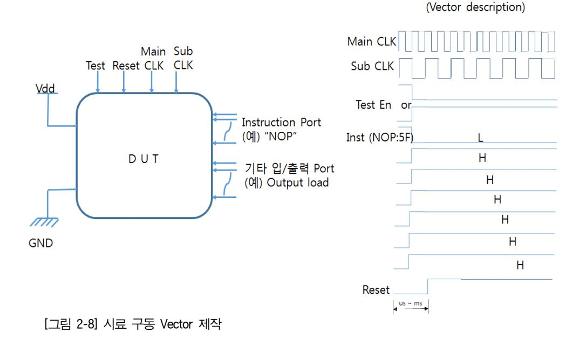

- (3) 시험 Board 제작
  - (가) 시료의 Package type과 Pin Count를 고려하여 Multi-Board의 집적도와 PCB적층 Pattern을 설계한다.

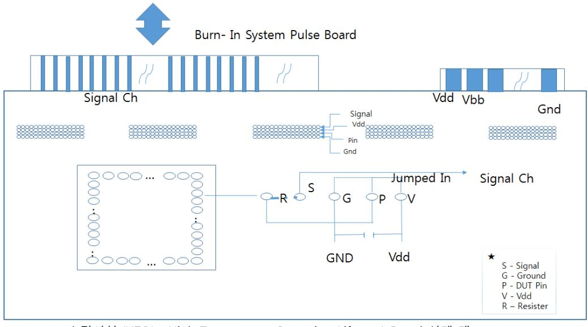

[그림 2-9] Burn-In Board 설계 개요

- 나) 150℃ 이상의 고온 Chamber에 장시간 견딜 수 있는 특수 PCB Board 제작 전문업 체와 구체적인 사양을 협의하여 제작한다.
- (4) Burn-In 설비 확보
  - 설비 Operation을 위한 기본적인 조작방법을 익힌다.
  - 설비 Maker별로 조작방법과 기능이 다르므로 장비별 특성과 차이점을 숙지한다.

#### 불량 분석하기 ('학습 1 – 환경 시험 평가하기'참조)

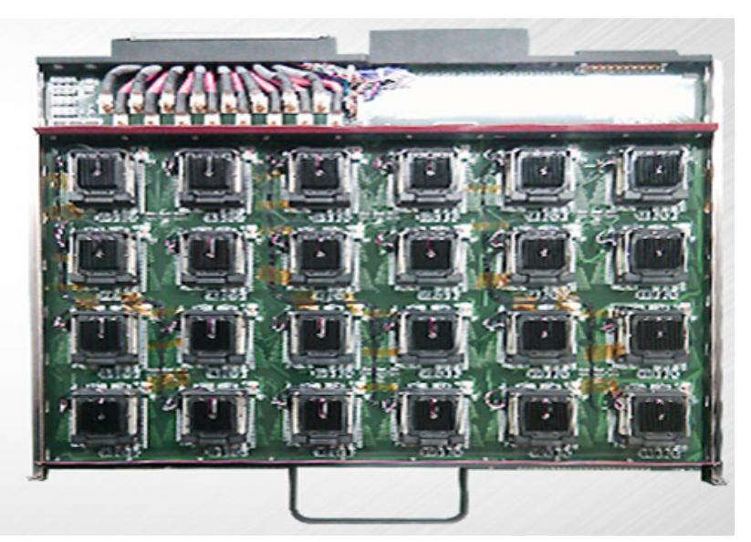

출처: LC-2 System(14.06.25.). LC-2 System. 두성기술 홈페이지 (http://www.du-sung.com/bbs/sub2\_1/1399). 2015년 9월20일 검색 [그림 2-10] Burn-In Board 실물 모형

(4) Burn-In 설비 확보

- 설비 Operation을 위한 기본적인 조작방법을 익힌다.
- 설비 Maker별로 조작방법과 기능이 다르므로 장비별 특성과 차이점을 숙지한다.

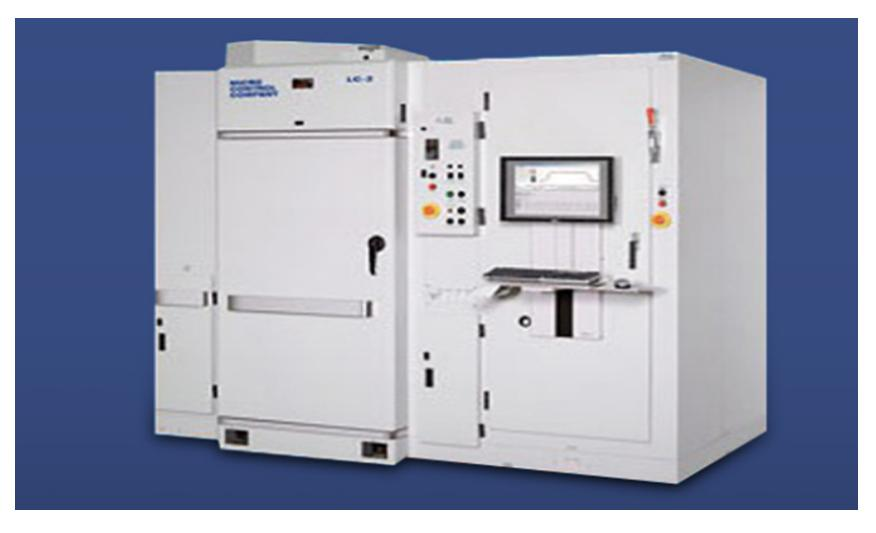

출처: HPB-5 Burn-in Board(14.06.25.). HPB-5 Burn-in Board. 두성기술 홈페이지 (http://www.du-sung.com/bbs/sub2\_2/1468). 2015년 9월20일 검색. [그림 2-11] Burn-In 설비 실물 모형

- 개선 대책 수립하기 ('학습 1 환경 시험 평가하기 참조)
- 1. 불량 mechanism을 이해한다.
- 2. 불량 원인을 Modeling한다.
- 3. 개선 대책을 수립한다.

### 학습 2 교수 ‧ 학습 방법

#### 교수 방법

- 반도체 소자의 전기적, 물리적 특성을 이해하고 IC 동작원리와 방법을 충분히 인지하고, 학생들로 하여금 소자별로 측정 방법과 구동 방법을 이해하도록 수업을 진행한다.
- 반도체 소자의 신뢰성 특성과 제품별 요구 기준에 관한 국제 규격을 숙지하고, 학생들이 필요한 규격을 검색하고 해당되는 규격의 내용을 찾아서 활용할 수 있도록 지도한다.
- 각각의 신뢰성 항목에 대한 시험 목적과 시험 방법을 이해하고, 학생들이 시험 계획을 수립할 수 있도록 지도한다.
- 반도체 불량의 유형과 분석 방법을 충분히 인식하고, 학생들이 불량을 정의하고, 분석과 원인도 출, 개선 대책을 수립하는 과정들을 공부할 수 있도록 사례를 확보하여 활용한다.

#### 학습 방법

- 반도체 소자의 전기적, 물리적 특성을 이해하고 IC 동작원리와 방법, 소자별로 특성 측정 방법을 학습하고, 실습을 통해 충분히 숙지한다.
- 반도체 소자의 신뢰성 특성과 제품별 요구기준에 관한 국제규격을 인터넷을 통해 검색하고, 필요한 규격의 내용을 찾아서 해당 제품에 맞게 신뢰성 시험계획표를 작성한다.
- 신뢰성 시험 목적과 시험 방법에 대해 항목별로 공부하고 각 시험장비 활용법과 시험도구 제작법 을 학습하고, 실습을 통해 충분히 숙지한다.
- 반도체 불량의 유형과 분석 방법을 이해하고, 간단한 사례들에 대해 시료를 확보하여 실험을 수행한다.

## 학습 2 평 가

#### 평가 준거

- 평가자는 학습자가 학습 목표 및 평가 항목에 제시되어 있는 내용을 성공적으로 수행하였는지 평가해야 한다.
- 평가자는 다음 사항을 평가한다.

| 학습내용                               | 평가항목                                                      | 상 | 성취수준 중 | 하 |
|------------------------------------|-----------------------------------------------------------|---|-----------|---|
| 반도체 수명시 간 예측 시험과 고장 유형 분석 | - 수명 가속을 위한 고온/고전압 동작시험(HTOL)의 목 적을 이해하고 계획을 수립할 수 있다. |   |           |   |
|                                    | - 시험 항목별 시험 방법을 갖출 수 있다.                                  |   |           |   |
|                                    | - 시험 결과 규정을 만족하는지 여부를 판별할 수 있다.                           |   |           |   |
|                                    | - 시험 결과 고장 유형을 파악할 수 있다.                                  |   |           |   |
|                                    | - 고장 유형별로 고장 원인을 분석할 수 있다.                                |   |           |   |
|                                    | - 고장 원인에 따른 개선 방향을 정의할 수 있다.                              |   |           |   |

#### 평가 방법

• 평가자 질문

| 학습내용                               | 평가항목                        | 상 | 성취수준 중 | 하 |
|------------------------------------|-----------------------------|---|-----------|---|
| 반도체 수명시 간 예측 시험과 고장 유형 분석 | - 수명 시험 목표시간 설정과 가속 바이어스 수준 |   |           |   |
|                                    | - 시료별 동작 시험 조건 설정           |   |           |   |
|                                    | - 불량률 예측과 가속계수 산출 결과        |   |           |   |

• 문제 해결 시나리오

| 학습내용                   | 평가항목                       | 상 | 성취수준 중 | 하 |
|------------------------|----------------------------|---|-----------|---|
| 반도체 수명시 간 예측 시험과 | - 고장 분석 과정과 고장 유형 규명 과정 발표 |   |           |   |
| 고장 유형 분석               | - 고장 유형에 따른 개선대책 수립 절차     |   |           |   |

#### 피 드 백

1. 평가자 질문

 - 응답한 내용을 평가하고 기준에 미달한 학생들에게는 수준별로 학습 내용을 보충하고 스스로 복습한 후 그 결과를 제출하도록 한다.

2. 문제 해결 시나리오

- 문제 해결 능력을 관찰하여 평가한 후 주요 사항을 표시하여 돌려준다.

| 학습 1 | 환경 시험 평가하기 |
|------|------------|
| 학습 2 | 수명 시험 평가하기 |
| 학습 3 | EMC 평가하기   |

# **3-1.** 반도체 ESD 평가

| 학습 목표 | • EMI / EMS(ESD) 유형별 메커니즘을 파악할 수 있다. • EMI / EMS(ESD) 유형별 시험 방법을 이해하고, 시험계획을 수립할 수 있다 • EMI / EMS(ESD)시험결과 규격 만족 여부를 판별할 수 있다. • 고장 유형에 따라 고장의 원인을 분석할 수 있다 • 고장 원인에 따라 개선 방향을 제시할 수 있다 |  |
|-------|-----------------------------------------------------------------------------------------------------------------------------------------------------------------------------------------------------|--|
|-------|-----------------------------------------------------------------------------------------------------------------------------------------------------------------------------------------------------|--|

## 필요 지식 /

- 정전기 방전(ESD: Electrostatic Discharge) 개요
  - 1. EMC(Electromagnetic Compatibility) / EMS(Electromagnetic Susceptibility)

반도체 소자나 전자장치, 시스템이 전자파 환경 내에서 다른 물체에 전자파 장애를 주지 않으면서 자신은 적절히 작동하는 능력을 전자기파 적합성(EMC)이라고 한다. EMC는 전자 파를 주는 쪽에서의 적합성에 대한 전자기파 간섭(EMI: Electro-Magnetic Interference)과 받는 쪽에서의 적합성에 대한 전자기파 내성(EMS)을 모두 포함하는 내용이다. EMI는 원치 않는 전자기파 신호나 잡음을 생성하여 다른 기기에 신호 수신이나 동작에 장애를 주는 정도에 대한 것으로, 시스템이나 PCB수준에서의 전자파 방출을 측정하고 사람이나 장치, 환경에 적절한 수준으로 통제하게 된다.

EMS는 전자기파를 견디는 내성을 나타내는 것으로, 정전기 방전(ESD), 방사성 RF 전자기 장 내성(RFI), 전기적 순간과도 현상(Burst), 서지(Surge) 내성, 전도성 RF 전자기장 내성 (Conducted Immunity) 등이 포함된다.

EMS와 관련하여 반도체 소자 자체에 대해서는 전통적으로 ESD 평가가 이루어지며, 여기 에는 HBM(Human Body Model), MM(Machine Model), CDM(Charged Device Model)의 평가 방식으로 구성된다. 최근에는 반도체 소자가 시스템에 사용된 환경에서 ESD를 얼마나 잘 견디는지를 측정하는 것에 대한 국제 전기 협회(IEC)의 시스템 레벨 ESD 규격을 적용한 IEC61000-4-2 테스트가 활발히 적용되고 있는 추세이다. 여기에서는 주로 전통적인 반도

체 소자의 ESD 테스트 방법을 기준으로 상세히 설명을 하겠다.

- 2. ESD 개요
  - (1) ESD의 정의

정전기 방전(ESD: Electrostatic Discharge)이란 정전기를 띤 두 개의 물체 사이에서 갑 작스런 전하(Charge)의 전달과정으로, 주로 물체 간의 직접 접촉이나 정전기장 유도에 의해 발생된다. ESD는 제한된 에너지를 가지고, 높은 전압의 짧은 지속 시간의 펄스 (주로 nsec ~micro sec.)의 파형을 보이며, ESD에 노출되는 반도체 부품에 손상을 유발 하게 되는데, [그림 3-1]에서처럼 반도체 IC 내의 MOSFET 소자의 Gate Oxide 손상 (A) 나 Silicon 손상(B)을 유발할 수 있다.

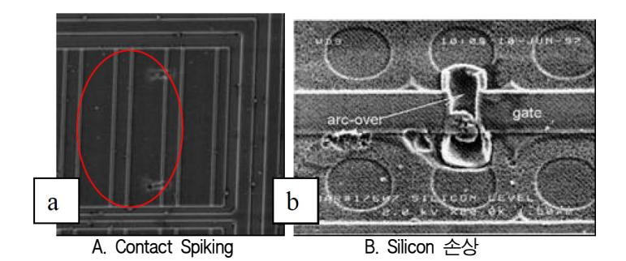

 출처: JEDEC(n.d.). JEP-157 RECOMMENDED ESD-CDM TARGET LEVELS. JEDEC 홈페이지 (https://www.jedec.org). 15.08.19.

[그림 3-1] 2KV HBM로 인한 MOSFET 소자에서의 (a) Contact Spiking과 (b) Silicon 손상

(2) 정전기(Static Electricity)의 발생 원인

정전기(Static Electricity)는 물체의 표면에 전자가 과도하거나 결핍인 상태를 말하는데, 표면이 (+)나 (-) 전하를 띤 상태이다.

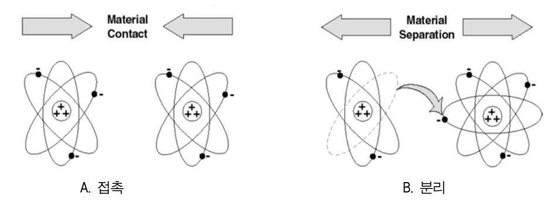

출처: ESDA(n.d.). ESD Fundamental Document. ESDA홈페이지 (https://www.esda.org). 15.05.18. [그림 3-2] 마찰전기(Triboelectric) 발생 방식 - A. 접촉 과 B. 분리

이는 두 개의 서로 다른 물질(고체, 액체, 기체 모두 포함) 간의 접촉 후 분리에 의해 주로 발생된다. [그림 3-2]에서처럼 물질간의 접촉(그림 A과 분리(그림 B)에 의해 한 물질의 표면으로부터 전자를 다른 물질로 주거나 뺏어오게 되어 그 물질이 (+)나 (-) 전하를 띠게 되는 데, 이를 마찰전기(Triboelectricity)라고 하며, 정전기의 주요 발생 방 식이다. 두 물질이 접촉 후 분리될 때, 생성되는 전하량은 물질의 마찰전기 성질, 분리 될 때의 속도, 가해진 힘의 크기, 분리되는 물질의 크기와 모양, 상대 습도, 재료나 물 질의 전기적 성질 등에 의존한다; 또한 물질에 따라 분리 시에 전하를 주고받는 성질 이 다른데, 어떤 물질은 전자를 잃어버리는 성향을 가지는 반면 다른 물질은 여분의 전자를 가져가려는 성질을 가지고 있으며, [그림 3-3]과 같이 물질에 따라 (+)이나 (-) 로의 경향성의 정도에 따라 순서별로 나열하였다.

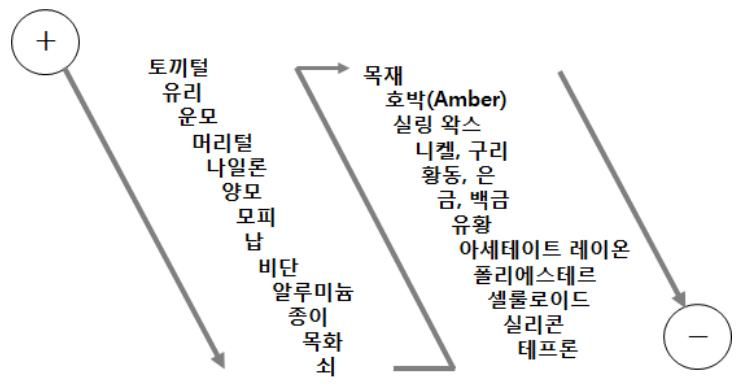

출처: ESDA(n.d.). ESD Fundamental Document. ESDA홈페이지 (https://www.esda.org). 15.05.18. [그림 3-3] 물질별 마찰전기 성향

정전기 전압 수준은 상대습도의 영향을 크게 받는데, <표 3-1>에서 10 ~ 25%상대습도 에서보다 65 ~ 90%에서는 12배에서 많게는 60배까지 정전기 전압이 감소함을 알 수 있다. 국제적인 정전기 관리 규격에서는 정전기에 취약한 제품이나 부품을 다루는 작 업장이나 설비에서 상대습도를 45 ~ 55%로 유지 및 관리하도록 권고하고 있다.

| <표 3-1> 상대습도에 따른 대표적인 정전기 발생 유형에서의 발생 정전기 수준 |  |
|----------------------------------------------|--|
|----------------------------------------------|--|

| 정전기 발생 유형       | 10-25% 상대습도 | 65-90% 상대습도 |  |
|-----------------|-------------|-------------|--|
| 카펫에서 걷기         | 35,000V     | 1,500V      |  |
| 비닐 타일 위에서 걷기    | 12,000V     | 250V        |  |
| 작업대의 작업자        | 6,000V      | 100V        |  |
| 작업대에서 집어올린 비닐 백 | 20,000V     | 1,200V      |  |
| 우레탄 폼으로 만들어진 의자 | 18,000V     | 1,500V      |  |

출처: ESDA(n.d.). ESD Fundamental Document. ESDA홈페이지 (https://www.esda.org). 15.05.18.

(3) ESD 발생의 실제 및 예방

반도체 공정에서의 wafer, chip, package 등이나 LCD 제조 공정에서의 FPD(Flat Panel Display)처럼 정전기에 민감한 가공품이나 제품을 사람, 설비, 장비를 통해서 핸들링 하거나 가공하는 과정에서 마찰전기나 유도 전기장에 의한 정전기 방전(ESD)현상이 발 생하게 되어 반도체 제품에 치명적 손상이나 신뢰성과 수율문제를 유발하게 된다. 또 한 ESD는 반도체 생산 라인에서의 미세 입자의 오염 문제를 유발하는 원인이 되기도 한다.

ESD 발생의 주된 원인은 사람, 환경설비, 생산 장비이며 적절한 ESD에 대한 예방책을 통하여 문제를 사전에 해결하는 것이 중요하다. ESDA(www.esda.org), JEDEC (www.jedec.org), SEMI(www.semi.org), IEC(www.iec.ch) 등의 협회에서 가이드 하는 ESD 관리와 예방법을 숙지하고 현장에 적용하는 것이 중요하다.

중요한 규격으로는 ESDA의 ANSI/ESD S20.20, JEDEC의 JESD625B, IEC의 61340-5-1, SEMI의 E78-0912, SEMI E129-0912 등이 있으며 내용면에서 ESD에 민감한 반도체 소자 나 전자 부품을 다루는데 있어 ESD를 감소시키고, 사전 예방법에 대한 자세한 작업방 법과 절차, 제전재료의 전기적 규격, 테스트 절차를 정하고 있다. 이는 사람, 생산라인 장비, 설비, 환경에 대한 모든 사항을 다루고 있으며 관련한 ESD 관리 프로그램 개발을 권고하고 있으며 여기에는 표준 제정, 교육 훈련, 장치 점검과 관리, 정기적 라인 점검 과 유지가 중요하다고 할 수 있다.

#### 3. ESD 유형

- (1) ESD 발생 유형
  - (가) 소자로의 방전(Discharge to the Device)

정전기 손상의 가장 흔한 유형으로 사람 몸이나 전하를 띤 물체로부터 정전기에 민감한 반도체 소자로의 직접적인 전하(charge)의 전달

(나) 소자로부터 방전(Discharge from the Device)

정전기에 민감한 반도체 소자로부터 접촉한 다른 물체로의 전하 전달이 발생하는 것으로 CDM(Charged Device Model)으로 설명된다.

(다) 전기장 유도 방전(Field Induced Discharges)

정전기에 민감한 반도체 소자가 정전기장에 놓여 있게 되면, 소자에 전하가 유도 된다. 소자가 정전기장 내에서 순간적으로 접지되면서 소자로부터 접지로의 전하 이동이 발생하는 것으로 CDM으로 설명된다.

(2) HBM(Human Body Model)

HBM은 사람 몸으로부터 정전기에 민감한 소자로의 직접적인 정전기 전하의 전달이 발생하는 경우로 가장 일반적인 정전기 방전 유형이다. 반도체의 한 핀을 손으로 단순

히 접촉하면 몸에 있는 전하가 반도체로 방전되는 현상을, [그림 3-4]에서처럼 등가적 으로 100pF의 커패시터에 충전된 ESD 전압이 순간적인 스위칭으로 1.5KΩ의 저항

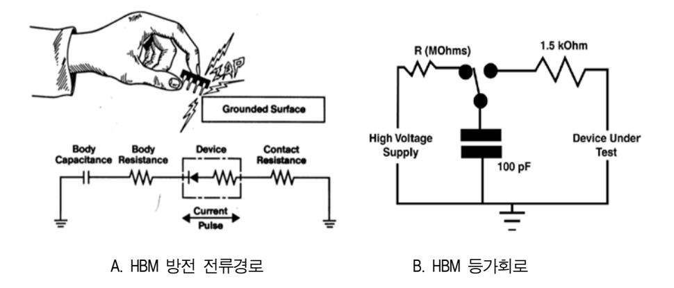

출처: ESDA(n.d.). ESD Fundamental Document. ESDA홈페이지 (https://www.esda.org). 15.05.18. [그림 3-4] Human Body Model의 등가 회로

을 통해서 소자로 방전하는 것으로 모델링하고 있다.

[그림 3-5]에서처럼 HBM의 1KV ESD수준은 다른 핀들이 접지된 상태에서 연결된 해당 핀으로 0.67A 의 순간 전류를 가하게 되는데, 이때 파형의 상승 시간(Rise Time)은 2 ~ 10ns이고 펄스의 지속 시간은 ~150ns 수준이다.

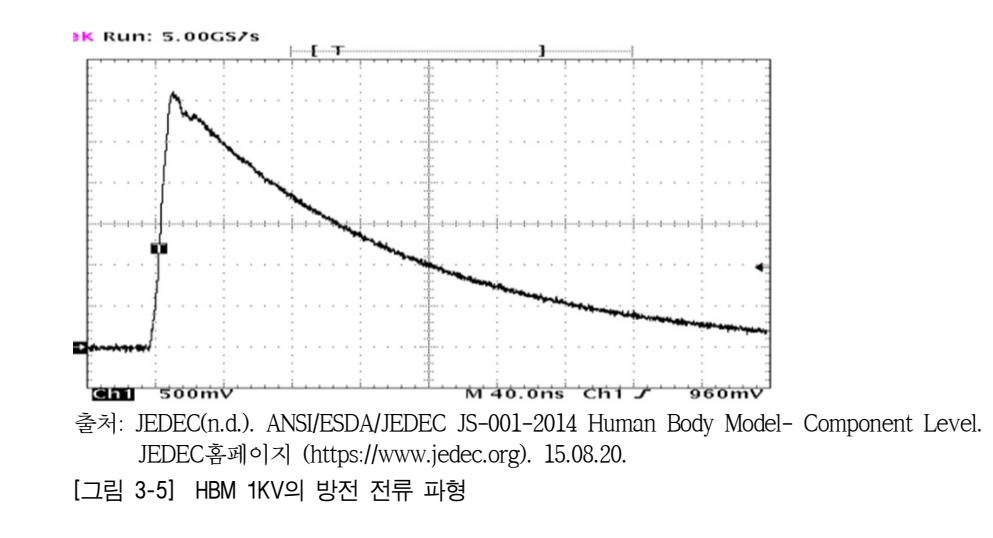

#### (3) MM(Machine Model)

Machine Model은 전하를 띤 금속성의 물체나 자동화 장비 등이 반도체 소자에 접촉 시 발생하는 방전 현상을 모델링하는 것으로 HBM의 최악 상황을 설명하기 위해 원래 일 본 전자협회에서 제정하여 산업계에 오랫동안 넓게 사용되어 왔다. [그림 3-6]에서

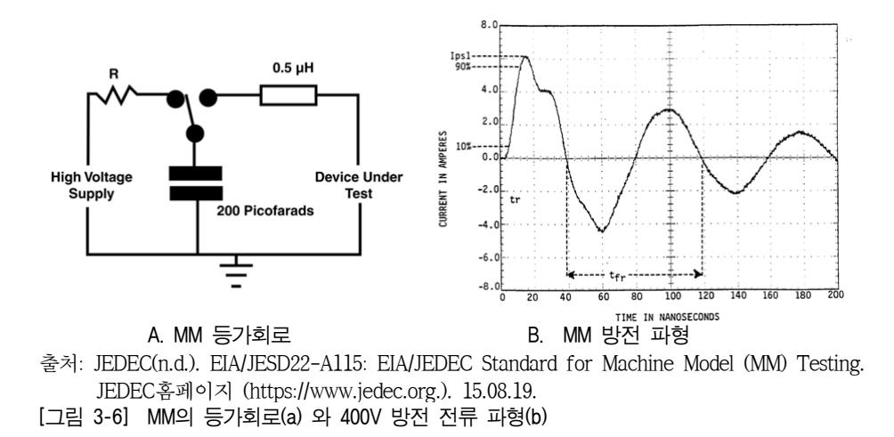

처럼 200pF의 커패시터를 통해 직렬 저항 없이 방전하는 등가모델 이다. (그림 A) 전 류파형의 ~ 10ns 수준의 상승 시간과 파형의 지속 시간이 HBM과 비슷하며 결과적으 로 두 Model로 인한 반도체 소자 손상의 발생 방식도 비슷하게 나타난다. (그림 B) 최근 산업계에서 표준 규격의 평가 기준에서 MM을 제외하는 추세인데, 이는 소자의 ESD 평가에 비효과적인 것으로 받아들여지고 있으며, 또한 MM을 대체하여, CDM이 짧 은 시간의 금속 간의 접촉에 의한 ESD 이벤트를 설명하는데 효과적인 것으로 광범위하 게 받아들여지고 있다. MM에 대한 JEDEC의 평가 결과는 다음을 참조하기 바란다. (참조:http://www.jedec.org/sites/default/files/The\_Machine\_Model\_\_JC14%203Version\_Final \_October2012.pdf).

#### (4) CDM(Charged Device Model)

CDM은 오늘날의 자동화된 생산 설비에서 제품을 다루는데 있어 밀접하게 연관되는 정전기 방전 유형이다. 정전기에 민감한 소자로부터 전하가 금속 등의 직접 접촉에 의 해 방전되는 현상을 말한다. 예를 들면 [그림 3-7]에서처럼 반도체가 플라스틱 튜브 안 에서 접촉하며 미끄러지면서 떨어지면 마찰 전기에 의해 패키지 표면에 (-)전하를 띄 게 되고 유도 전기장에 의해 칩 내부에는 반대의 (+) 전하가 유도된다(그림 A). 이 상 태로 반도체의 한 핀이 다른 금속 표면에 접촉하게 되면 반도체 칩 내부의 전하들이 접촉한 핀을 통해 금속 쪽으로 급격한 방전이 발생하게 된다(그림 B). 이는 HBM보다 더욱 파괴적인 양상이 될 수 있는데, 방전 시간이 훨씬 짧고, 피크 전 류가 수십 암페어(A)에 이르기 때문이다. 주로 발생되는 손상 부위가 HBM에서는 IO

부분의 ESD 보호 소자나 그 주변에서 발생하나, CDM의 손상은 칩 내부로부터의 전류 흐름이 한 개 핀으로 방전되는 경로상의 취약 부위에서 발생하여 칩 내부에서 손상이

보이게 된다.

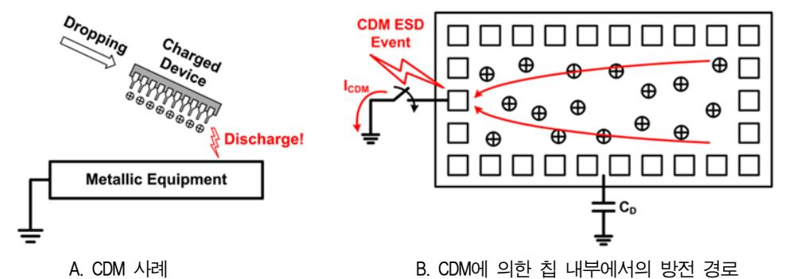

출처: JEDEC(n.d.). JEP-157 RECOMMENDED ESD-CDM TARGET LEVELS. JEDEC홈페이지 (https://www.jedec.org). 15.08.19.

[그림 3-7] CDM의 사례 및 칩 내부에서의 방전 경로

 반도체 제품 개발 시에 칩의 IO 부분에 포함되는 HBM 보호 회로가 필드 불량을 감소 시키는데 상당한 성과가 있었으나, 자동화된 조립 라인과 핸들링 장치에서 발생하는 많은 CDM 불량 문제에는 비효과적이다. CDM의 경우 불량 수준이 HBM이나 MM 전압 수준이 높다고 감소하지 않으며, 따라서 CDM 보호는 상당히 다른 접근이 필요하다. 즉, CDM에 의한 불량은 HBM과 MM 스트레스를 받은 소자와는 다른 물리적 특성을 보인다.

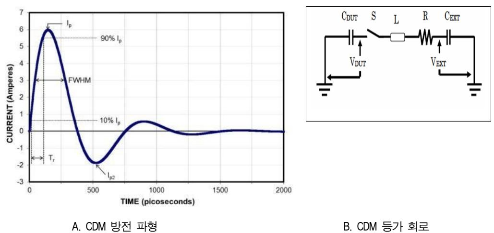

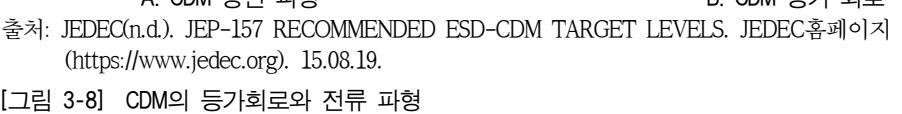

전형적으로 CDM = 250V의 경우 [그림 3-8]에서처럼 발생되는 전류의 최대치는 2 ~ 6A 수준이고, 상승시간(Rise Time)은 180 ~ 280ps 정도가 된다(그림 A). CDM을 HBM, MM과 비교해 보면, CDM 이벤트에 의한 소자 손상은 최초의 20 ~ 50ps에 발생하며, CDM펄스의 상승 시간은 400ps 이하이며 반면, HBM의 상승시간은 10ns 수준이다(그 림 B).

CDM은 반도체나 전자제품 생산 라인에서의 실제 발생하는 ESD 스트레스를 밀접하게 재현하고 있다. 예를 들면 반도체 패키지 조립, 반도체 & PCB(Printed Circuit Board) 테스트, 시스템 보드 조립(예: Pick & Place), 시스템 테스트, 필드 사용 환경 등이 이 에 해당한다. 미국 반도체 컨소시엄인 세마텍(SEMATECH)에 따르면 대부분의 ESD 불 량은 HBM, MM이 아니라 CDM에 의해 유발된다고 하는데, 이는 생산 라인의 자동화 추세에 따라서 사람에 의한 HBM 보다는 기계장치의 재료간의 마찰과 분리에 의한 CDM에 의한 ESD 손상 가능성이 증가하고 있는 것과 관련이 있다.

#### 정전기 방전(ESD: Electrostatic Discharge) 테스트

1. ESD 테스트 종류

ESD 테스트의 목적은 실제 필드에서 발생하는 불량의 재현을 통해서 반도체 부품의 정전 기 보호 수준의 정량적 평가를 통하여 개발되는 반도체 제품의 정전기 보호 능력을 고객 이 요구하는 수준에 맞추거나 향상시켜 불량을 감소시키기 위한 것이다. 결과적으로 품 질 향상을 이룰 수 있는 기준을 제공하기 위한 것이다.

ESD 테스트 방법에는 반도체 제품 자체 테스트 방법으로 앞에서 설명한 HBM, MM, CDM 이 일반적으로 사용되고 있으며, 그 외 시스템 관점의 ESD 테스트 방법으로 IEC-61000-4-2: IEC System Level ESD Test Standard 규격이 있으며, 반도체 제품이나 제 품 내의 ESD 보호 소자의 물성적인 분석 방법으로는 TLP(Transmission Line Pulse) 테스 트 방법이 있다.

2. HBM 테스트 방법

HBM은 초기 MIL-STD-883 Method 3015의 규격이 사용되었으나, 현재는 JEDEC JESD22-A114 규격이 업계에서 현재 가장 광범위하게 사용되는 규격이다. 그 외 국제자동 차전장협회(AEC)의 AEC-Q100-002, Q101-001 규격이 있다.

| 등급 구분 | 전압 범위(V)          |  |  |
|-------|-------------------|--|--|
| 0A    | < 125             |  |  |
| 0B    | 125 to < 250   |  |  |
| 1A    | 250 to < 500   |  |  |
| 1B    | 500 to < 1000  |  |  |
| 1C    | 1000 to < 2000 |  |  |
| 2     | 2000 to < 4000 |  |  |
| 3A    | 4000 to < 8000 |  |  |
| 3B    | ≥ 8000            |  |  |

<표 3-2> HBM 의 등급 분류(Classification)

출처: JEDEC(n.d.). ANSI/ESDA/JEDEC JS-001-2014 Human Body Model –Component Level. JEDEC홈페이지 (https://www.jedec.org.). 15.08.20.

서로 공통점이 상당히 있으나 테스트 절차, 검증 방법, 파형 변수에 대한 정의에서 차이가 있다. 2010년부터는 JEDEC과 ESDA의 두 협회가 기존의 ANSI/ESD STM5.1 규격과 JESD22-A114 규격을 통합하는 공동작업으로 ANSI/ESDA/JEDEC JS-001 HBM 통합 규격을 발행하고 있으며, 여기서는 최신 통합 규격인 JS-001-2014를 기준으로 설명한다. ESD 민 감한 부품의 HBM 내전압(Withstand Voltage, 소자 손상되지 않는 최대 ESD 전압) 수준에 따라 <표 3-2> 에서의 등급으로 분류한다.

3. CDM ESD 테스트 방법

CDM은 JESD22-C101 규격이 업계에서 현재 가장 광범위하게 사용되는 규격이다. 그 외 국제자동차전장협회(AEC)의 AEC-Q100-011, Q101-005 규격이 있다. 최근 미국의 JEDEC과 ESDA의 두 협회가 기존의 ANSI/ESD S5.3.1과 JESD22-C101을 통합하는 공동 작업으로 2014년부터는 CDM 통합 규격을 발행하고 있으며, 여기서는 최신 통합 규격인 ANSI/ESDA/ JEDEC JS-002-2014 규격을 기준으로 설명하였다.

ESD 민감한 부품의 CDM을 견디는 내전압 수준에 따라 <표 3-3>의 등급으로 분류한다.

| 등급 수준 | 등급 테스트 조건 전압(Volt) |  |  |  |  |
|-------|--------------------|--|--|--|--|
| C0a   | < 125              |  |  |  |  |
| C0b   | 125 to < 250    |  |  |  |  |
| C1    | 250 to < 500    |  |  |  |  |
| C2a   | 500 to < 750    |  |  |  |  |
| C2b   | 750 to < 1000   |  |  |  |  |
| C3    | > 1000             |  |  |  |  |

<표 3-3> CDM 레벨 등급

출처: JEDEC(n.d.). ANSI/ESDA/JEDEC JS-002-2014 Charged Device Model –Device Level. JEDEC홈페이지 (https://www.jedec.org.). 15.08.20.

#### 4. 시스템 레벨 HBM 테스트 방법

HBM 테스트 모델은 반도체 제조사와 사용자들이 의해 반도체 생산 환경에서의 ESD 발생 과 ESD 내성을 측정하는 목적이라면, IEC61000-4-2 테스트는 반도체 chip이 시스템이 사 용되는 환경에서 ESD를 얼마나 잘 견디는지를 측정하는 것으로 시스템 레벨 ESD 테스트 의 산업 표준이다. 전제 조건이 다른 만큼 이 두 테스트 간에는 ESD 에너지양, 에너지 소 모의 속도와 모델이 다르다. 모델은 330Ω 저항과 150pF를 통한 방전으로 파형의 상승시 간(Rise Time)은 1ns 이하이고, 인가되는 최대 전압은 ±30KV이며, 접촉(Contact)과 비 접 촉(Air) 방식의 두 가지 모드로 ESD 파형을 인가한다. 반도체 소자에 Power가 인가된 ON 상태에서의 테스트와 OFF 상태에서의 테스트 방법이 있으며, 앞에서 다룬 JEDEC HBM 표준은 OFF 상태에서의 테스트 방법에 해당한다. [그림 3-9]에서처럼 접촉 방식의 8KV의 방전 전류파형에서 최대 전류는 30A 수준이며, 30ns 지점에서는 16A이다.

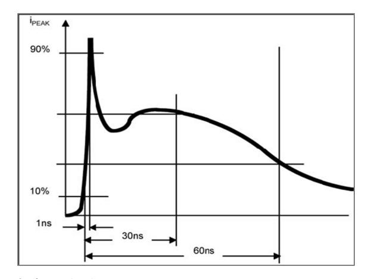

"저자는 국제표준 IEC 61000-4-2 ed.1.2 (2001)에서의 정보 전재를 허가 해준 International Electrotechnical Commission (IEC)에 감사한다. 발췌된 사항은 IEC(제네바, 스위스)의 저작물이며, IEC에 대한 추가 정보는 www.iec.ch 에서 확인할 수 있다. 저자에 의해 전재된 발췌된 부분과 내용에 대한 배치와 문맥에 대해서는 IEC는 책임이 없으며, 그 안의 다른 내용이나 정확성에 대해서도 아무런 책임이 없다."

출처: IEC(n.d.). IEC-61000-4-2 ed1.2: IEC System Level ESD Test Standard (from outdated publication). IEC홈페이지 (http://www.iec.ch.). 15.09.20. [그림 3-9] IEC61000-4-2의 ESD 전류 파형

### 수행 내용 / 반도체 HBM ESD 평가하기

#### 재료·자료

ESD 규격-ANSI/ESDA/JEDEC JS-001-2014 HBM

#### 기기(장비 ・ 공구)

- ESD HBM 테스터, 오실로스코프, 전류 변환기(Current Transducer), 평가용 저항
- ESD CDM 테스터, 오실로스코프
- Emission Microscopy 장비, OBIRCH(Optical Beam Induced Resistance Change) 장비

#### 안전 ・ 유의사항

- 테스트용 반도체 소자의 정전기 손상을 예방하기 위해 ESD 안전 관련 지침( ESDA의 ANSI/ESD S20.20, JEDEC의 JESD625B)을 준수 한다.
- 테스트 진행 과정에서 ESD Wrist Strap 착용 후 접지 유무를 확인한다.

#### 수행 순서

ESD HBM 테스트하기

#### 1. 필수 장비

(1) 오실로스코프

전류 변환기와 연결하여 사용 시 최소 100mA/div와 최소 350MHz 대역폭

(2) 전류변환기( Current Transducer) 최소 200MHz 대역폭, 12A의 Peak Pulse, 1ns이하의 상승시간(Rise Time)

저주파수의 3-dB 가 10KHz 이하

- (3) 평가용 저항(Evaluation Load) Load 1: 단락용 구리 전선, 단면적 0.25 ~ 0.75 mm2 Load 2: 500 Ω ±1%, 4KV 등급
- 2. ESD HBM 테스터 측정 절차
  - (1) 테스트 고정 보드(Fixture board)의 모든 핀의 전기적 연결 상태 확인
  - (2) 기준 핀 쌍의 결정

Terminal A: 테스트 보드에서 펄스 발생회로까지의 연결 경로가 가장 긴 핀. Terminal B: 테스트 보드에서 펄스 발생회로까지의 연결 경로가 가장 짧은 핀.

(3) 파형 캡쳐

두 핀(보통, 기준 핀 쌍) 간에 Load 1(단락선) 또는 Load 2(500 Ω)를 연결하고, Load 가 전류 프로브를 통과하도록 한 다음, 두 핀 간에 ESD 파형을 인가 후 전 류 파형을 오실스코프로 캡쳐한다.

(4) 캡쳐된 파형 변수의 결정

Load 1(단락선) 파형: 피크전류(Ips), 펄스 상승시간(tr), 감쇠시간(td), Ringing (Ir) Load 2(500Ω) 파형 : 피크전류(Ipr)와 펄스 상승시간(trr) Ips는 Tmax(최대피크전류 시간)과 Tmax+40ns 간의 보간법(Interpolation)에 의해 Tmax에서의 피크전류로 결정한다.

3. HBM 테스터 검증

처음 ESD 테스터를 설치 후, 고장 수리 후, 주기적인 재검증시에 검증 절차를 수행한 다. Positive clamp 소켓을 가진 가장 핀 수가 많은 테스트 보드나 검증용 보드를 이 용하여 앞에서의 기준 핀 쌍에서의 파형을 캡쳐한다.(Positive clamp 소켓은 주로 CPU 소켓에서 볼 수 있는 ZIF(Zero in Force) 소켓을 말한다.)

(1) 단락 파형 캡쳐

1000V, 2000V, 4000V 테스트 전압에서 5개의 연속 Positive와 Negative 극성 파형 을 기록하고 모든 변수가 규격을 만족하는지 검증한다.

(2) 500Ω 파형 캡쳐

1000V, 4000V의 Positive와 Negative 극성의 파형을 기록하고 모든 변수가 규격을 만족하는지 검증한다.

- 4. ESD 테스트 요건과 테스트 절차
  - (1) ESD 손상 예방과 환경

반도체 소자에 손상이 없도록 테스트 전체 진행 과정에서 ANSI/ESD S20.20, JESD625 또는 IEC61340-5-1 지침을 준수해야 한다.

<표 3-4> ESD HBM Waveform Specification

| Voltage Level (V) | Ipeak for Short, Ips (A) | Ipeak for 500 Ω, Ipr(A) | RiseTime for Short, tr (ns) | Rise Time for 500 Ω trr (ns) | DecayTime for Short, td(ns) | Maximum Ringing Current IR (A) |
|----------------------|--------------------------------|-------------------------------|-----------------------------------|------------------------------------|-----------------------------------|--------------------------------------------|
| 125 (optional)    | 0.075- 0.092                | N/A                           | 2.0-10                            | N/A                                | 130-170                           | 15% of Ips                                 |
| 250                  | 0.15-0.18                      | N/A                           | 2.0-10                            | N/A                                | 130-170                           | 15% of Ips                                 |
| 500                  | 0.30-0.37                      | N/A                           | 2.0-10                            | N/A                                | 130-170                           | 15% of Ips                                 |
| 1000                 | 0.60-0.73                      | 0.37-0.55 2.0-10              |                                   | 5.0-25                             | 130-170                           | 15% of Ips                                 |
| 2000                 | 1.20-1.47                      | N/A                           | 2.0-10                            | N/A                                | 130-170                           | 15% of Ips                                 |
| 4000                 | 2.40-2.93                      | 1.5-2.2                       | 2.0-10                            | 5.0-25                             | 130-170                           | 15% of lps                                 |
| 8000 (optional)   | 4.80-5.87                      | N/A                           | 2.0-10                            | N/A                                | 130-170                           | 15% of Ips                                 |

출처: JEDEC(n.d.). ANSI/ESDA/JEDEC JS-001-2014 Human Body Model –Component Level. JEDEC홈페이지 (https://www.jedec.org.). 15.08.20.

ESD HBM 테스트는 상온에서 이루어져야 한다.

(2) ESD HBM 파형 점검

ESD 테스트 시작 전에 또는 소켓과 DUT(Device Under Test) 보드가 변경될 때 수행하여야 한다.

- (가) Worst-case 핀 조합으로 단락선을 Terminal A와 B에 연결 후
- (나) 1000V의 Positive/Negative 파형을 인가 후 파형을 캡쳐하여 <표 3-4>의 모든 변수가 만족되는지 확인 한다.
- (다) 4000V의 Positive/Negative 파형을 인가 후 파형을 캡쳐하여 <표 3-4>의 모든 변수가 만족되는지 확인 한다.

(3) 고 전압 방전 경로 점검

고전압 방전 경로와 관련 부분에 대해 테스트 시작 전에 점검한다. 불량이 확인 되면 문제가 있는 방전 경로에 연결된 소켓으로는 테스트를 진행하지 않는다. 테 스터의 수리 후에는 fail 핀이 self-test를 통과하는지 확인 한다.

(4) ESD 사전 테스트

스트레스를 가하기 전에 반도체 소자에 대해서 Parametric과 Function 테스트를 수행하여 정한 한계치 내에 들어오는지 확인한다.

(5) 샘플 사이즈

각 테스트 전압 레벨에서의 최소 샘플 사이즈는 3개 소자이며, 각 소자에는 최소 한번의 Positive와 Negative 펄스로 스트레스를 가하는데, 펄스 간에는 최소 100ms 의 간격을 가져야 한다. 전하를 제거하는 회로 장치가 없는 테스터에서는 이 펄스 간격을 증가시켜 전하가 쌓이지 않도록 한다. 필요하다면, 각 전압 레벨이나 핀 조합에 새로운 소자들을 ESD 스트레스에 적용할 수 있는데, 이는 반복적인 스트 레스로 인한 조기 불량 발생을 감소시킬 수 있다.

(6) 핀 분류

핀 분류에 따라 HBM 테스트가 수행되는데, 이는 모든 주요한 HBM 전류 경로를 테스트하기 위한 것이다. 핀 조합을 하려면 대상 소자에 대한 지식이 필요하며, 각 핀은 No-Connect(NC), Supply, Non-Supply의 3개 중 하나로 구분된다.

(가) No-Connect 핀

ESD 스트레스를 가하지 않으면 항상 floating 되어 있어야 한다. 실제로는 Die 에 전기적으로 연결된 상태라면 Supply나 Non-Supply로 분류한다.

(나) Supply 핀

회로에 전류를 공급하거나 전류 귀환경로를 제공하는 핀으로 쉽게 알아 볼 수 있게 라벨이 되어 있다.(예: VDD, VDD1, VDD2, VDD\_PLL, VCC, VCC1, VCC2, VCC\_ANALOG, GND, AGND, DGND, VSS, VSS1, VSS2, VSS\_PLL, VSS\_ANALOG, 등). 그 외 Charge-pump 커패시터에 연결되는 Positive/Negative 단자 핀과 내부 파워 버스에 연결되는 핀은 Supply 핀으로 여겨지나, 같은 Chip이 아닌 다른 Chip에 전원을 공급하는 핀은 Non-Supply 핀으로 구분한다.

(다) Non-Supply핀

Supply, No-Connect 핀을 제외한 나머지 핀들이다. 이들은 Input, Output, Offset Adjusts, Compensation, Clocks, Controls, Address, Data, Vref 핀과 EPROM Memory의 VPP 핀 등이다. Non-supply 핀은 차동 입력/출력 쌍을 이루 거나 다른 특별한 기능의 쌍을 이루는 경우가 있다.

(7) 핀 그룹 분류

(가) Supply 핀 그룹

Chip 상의 금속 연결선이나 Package 내에서 연결되면 하나의 그룹으로 분류한 다. 한 그룹으로 분류된 핀 간에 Die 상의 금속 연결선의 저항이 크면 HBM 테 스트에서 ESD에 취약한 부분이 감춰지는 문제가 발생할 수 있는데, 한 그룹에 서 두 핀 간의 저항이 3Ω이상이면 별도의 그룹으로 분리한다. 한 개의 Supply 핀 그룹은 동일한 하나의 핀으로 취급 된다.

- (8) 핀 스트레스 조합
  - (가) Non-Supply와 Supply 대 Supply 핀 그룹

한 개의 Supply 그룹 핀이 Terminal B에 연결되고, Non-supply와 나머지 Supply 그룹의 각 핀들은 각각 개별적으로 Terminal A에 연결되는 조합이 만 들어 진다.

- Non-Supply 핀과 Supply 핀 그룹과의 연관

한 개의 Non-Supply 핀이 회로 동작상 특정 Supply 핀 그룹과의 연결이 필요 한 경우와 Non-Supply와 Supply 핀 그룹 간의 기생 경로(Parasitic Path)가 존재 하는 경우처럼 둘 간의 연관성이 알려진 경우에는 Non-Supply 핀들은 연관된 Supply 핀 그룹에 대해서만 ESD 테스트를 수행할 수 있다. 둘 간의 연관성을 알 수 없는 경우 각 Non-supply 핀은 모든 Supply 핀 그룹에 대해 테스트가 수행되어야 한다.

- Supply 핀의 스트레스 극성

Supply 핀 그룹의 핀들을 다른 Supply 핀 그룹에 대해 ESD 스트레스를 가할 때, 한 가지 극성으로만 모든 스트레스를 가해도 된다. 각 Supply가 Terminal A로 연결되고, 다른 Supply는 Terminal B로 연결되어 스트레스가 가해지기 때 문에, 모든 Supply 쌍은 보통 두 번 동일한 스트레스를 받게 된다. 이러한 불 필요한 중복을 막기 위해 한 가지 극성으로만 테스트할 수 있다. 이때 극성은 파형의 왜곡을 일으킬 수 있는 테스터의 기생 성분을 최소화하는 쪽으로 선택 한다. 보통 P substrate의 CMOS 회로에서는 Positive 테스트가 선호된다.

- 클론 Non-Supply 핀의 샘플링 축소 방법

대형의 마이크로 프로세서에서 처럼 큰 병렬 데이터 버스를 가지는 많은 핀 수의 소자에 적용되는데, 동일한 IO cell이 많은 핀에서 전재되어 사용되는 경 우에 이를 클론 IO라고 하며, 통계적인 방법의 샘플링이 적용될 수 있다. 클론 IO 의 ESD평가가 99% 신뢰도를 가지도록, 모집단 M에서 무작위로 30개 핀을 골라서 HBM 스트레스 전압을 가해 15개 샘플이 Fail 될 때까지 테스트하여 이들의 통계치가 HBM 목표 값을 넘어설 확률이 99% 이상인지 아닌지를 확인

하는 것이다. 클론 IO가 샘플링 테스트에서 통과하지 못하면 앞에서의 표준 절 차에 따라 진행토록 한다.

- (나) Non-Supply 대 Non-Supply 조합
  - 연결 쌍을 결정할 어떤 정보가 없다면, 각 Non-Supply 핀을 Terminal A에 연결하고, 나머지 Non-Supply 핀들을 함께 묶어서 Terminal B에 연결한다.
  - Die 상에서 연결되어 있으나 여러 개의 핀으로 분리되어 Bonding된 경우, 단 락된 Non-Supply 핀들의 각각 다른 연결 핀들은 Floating한 채, 조합에 따라 ESD 스트레스를 진행한다.
- (다) Discrete와 10개 핀 미만의 IC 소자에서의 핀 조합

Discrete 소자는 앞에서의 핀 명칭이나 기능과는 무관하게 모든 가능한 핀 조 합을 테스트한다. 10개 핀 미만의 IC의 경우 모든 조합으로 테스트할 수 있다.

(9) ESD 스트레스 전압 설정

소자의 예상 ESD 전압 목표치에 따라 500V ~ 1000V의 증가율로 스트레스를 가한 다. 예상되는 가장 낮은 통과 전압의 1/2에서 시작하는데, 예를 들면 예상 통과 전 압이 2000V이면 1000V에서 시작하고 3KV까지는 500V로 증가하다 그 이상에서는 1KV씩 증가시킨다. 예상 ESD 통과 전압이 6KV 수준이라면 2000V에서 시작해서 1KV씩 증가시킨다. 새로운 공정이나 기술이 적용되어 예상치가 없다면 500V에서 시작한다.

- (10) ESD Post-Test
  - (가) ESD 스트레스 테스트를 마친 후, 소자를 ESD 스트레스를 가하기 전 Pre-Test 와 동일한 테스트 장비와 같은 버전의 소프트웨어를 사용하여, DC parametric 과 Function 테스트를 수행하여 데이터 시트상의 변수를 만족하는지 확인한다.
  - (나) 소자의 한 핀에서의 ESD 스트레스가 다른 핀에서의 동작 불량을 일으킬 수 있기 때문에 비록 ESD 스트레스가 소자 핀들의 일부분들에 제한적일지라도 Post-Test에서는 가능한 소자의 모든 스펙 사항이 측정되어져야 한다.
  - (다) 보통은 ESD 테스트 후 24 ~ 96시간 이내에 Post-Test를 수행하면 되나, ESD 테스트 후 바로 진행하는 것은 바람직하지 않다. 이는 chip 내부에 빠져나가지 못한 전하와 다른 열적인 문제들이 동작 불량 문제를 일으킬 수 있기 때문이 다.
- (11) ESD 등급 판정 과 재 테스트
  - (가) Post-Test 완료 후 테스트 결과 값이 제품 데이터 시트상의 변수를 통과하지 못하면 Fail로 정의한다. 마지막에 통과한 ESD 전압은 극성에 상관없이 <표 3-2>의 HBM 레벨 등급 기준에 따라 ESD 내성 등급을 정할 수 있다.

- (나) 만약 2000V 전압에서 Fail이 확인된다면 (예를 들어, 3개중 1개 소자가 2000V 에서 Fail이고 1500V에서는 3개 모두 Pass라면), 3개의 새로운 샘플을 제공하여 제품이 정말 Fail인지 아니면 Fail이 비정상적이거나 다른 테스트 상의 문제로 인한 것인지 확인하기 위해 ESD 재 테스트를 할 수 있다. 만약 재 테스트에서 제품이 Pass되면 이전 Fail 결과는 무시하지만, Fail이 되면 그 전압에서 Fail로 고려된다.
- (다) 소자의 ESD 수준이란 ESD 스트레스가 가해지는 모든 샘플이 어떤 전압 레벨 을 통과한 가장 높은 수준을 말한다.
- 5. HBM ESD 테스트 진행 전 스트레스 핀 조합 구성 사례 -실습

테스트 핀의 조합은 3가지 경우로 나누어 볼 수 있다. 첫 번째는 I/O 핀에 연관된 Supply 핀과 서로 연결쌍인 I/O 들을 고려하여 하는 방법, 두 번째는 핀의 연관성에 대해 어떠한 사전 정보가 없는 경우 세 번째는 첫 번째나 두 번째 테스트에서 중첩 된 테스트 조건은 제외하는 방법이다. 여기서는 첫 번째 방법에 대해서 설명을 하고 두 번째, 세 번째에 대해서는 직접 실습을 통하여 테스트 조합에 대해 확인을 하도록 한다.

(1) 16핀 소자의 핀 조합을 수행한다.(I/O 핀의 Supply와 연관성과 I/O의 연결 쌍 정보 보유)

(가) 파티션 구분

- 1) 파티션 1: VDD1, VSS1과 2개의 I/O-핀(I/O-11, I/O-12는 연결 쌍)
- 2) 파티션 2: VDD2, NC(No Connect), 2 입력 핀과 1 출력 핀(I-21, I-22, O-21:), 2개의 I/O-핀(I/O-21, I/O-22는 연결 쌍)
- 3) 파티션 3: VDD3, VSS3, 1 입력핀, 1 I/O핀 [그림 3-10]에서처럼 VSS1, VSS2, VSS3는 단락되어 있어, VSS1(핀 4)을 그룹 의 테스트 핀으로 선택한다. VDD1와 VDD3는 die 상에서만 전기적으로 단 락되어 있고 양단간에 저항이 3Ω이하여서 각 핀은 각각 ESD스트레스를 가 하나, 하나의 Supply 핀 그룹으로 묶는다.

#### (나) 핀 조합

핀의 조합을 3가지로 Supply 핀 테스트, Non-Supply 핀 테스트 구분하여 <표 3-5>에 정리하였다. 이 핀 조합에서는 각 전압 레벨별로 전체 56차례의 ESD 펄스를 가하게 된다.

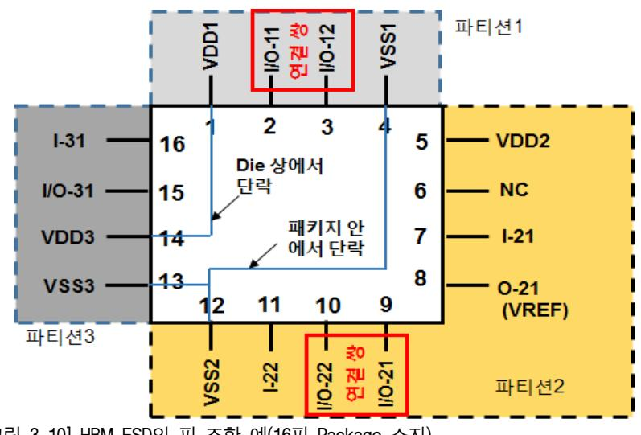

[그림 3-10] HBM ESD의 핀 조합 예(16핀 Package 소자)

<표 3-5> 16핀 소자의 핀 조합(Supply와 연관성과 I/O의 연결 쌍에 대한 정보 보유)

| 핀 조합 | Terminal B 에 연결된 핀 | Terminal A에 연결된 핀 (한 번씩 테스트 되는 단독 핀)                                                                               | 펄스 숫자 (1pos/1neg) |
|---------|-----------------------|-----------------------------------------------------------------------------------------------------------------------|----------------------|
|         | VDD1(핀 1),            | VSS1(핀 4), VDD2(핀 5),                                                                                                 | 4                    |
| 1       | VDD3(핀 14)            | I/O-11(핀 2), I/O-12(핀 3)                                                                                              | 4                    |
|         |                       | VDD1(핀 1), VDD2(핀 5), VDD3(핀 14)                                                                                      | 6                    |
| 2       | VSS1(핀 4)             | I/O-11(핀 2), I/O-12(핀 3), I-21(핀 7), O-21(핀 8), I/O-21(핀 9), I/O-22(핀 10), I-22(핀 11), I/O-31(핀 15), I-31(핀 16) | 18                   |
|         | VDD2(핀 5)             | VDD1(핀 1), VSS1(핀 4), VDD3(핀 14)                                                                                      | 6                    |
| 3       |                       | I-21(핀 7), O-21(핀 8), I/O-21(핀 9), I/O-22(핀 10), I-22(핀 11)                                                        | 10                   |
|         | I/O-11 (핀 2)          | I/O-12 (핀 3)                                                                                                          | 2                    |
| 4       | I/O-12 (핀 3)          | I/O-11 (핀 2)                                                                                                          | 2                    |
|         | I/O-21 (핀 9)          | I/O-22 (핀 10)                                                                                                         | 2                    |
|         | I/O-22 (핀 10)         | I/O-21 (핀 9)                                                                                                          | 2                    |

(2) I/O 핀의 Supply와 연관성과 I/O의 연결 쌍에 대한 정보가 없는 경우 앞의 16핀 구성을 갖는 반도체 소자에 대해서 연결핀 간의 관련 정보를 알지 못 하는 경우에 핀 조합 구성 표를 직접 만들어 보고 각 전압별 ESD 펄스 횟수를 확 인하여 본다.

(3) 앞의 핀 조합 구성 표에서 중첩된 테스트 조건을 제외한 경우 핀 조합 구성 표를 직접 만들어 보고, 각 전압별 ESD 펄스 횟수를 확인한다.

- 1. 필수 장비
  - (1) CDM 테스터

[그림 3-11]는 CDM 테스터의 구성을 보여 준다. CDM 테스터의 구성은 우선 전계 판(Field Plate)에 ESD 전압을 인가하여 전기장에 의한 반도체 소자의 die 상에 반 대 전하를 유도하게 된다. 이 상태에서 위쪽의 포고 핀이 포함 된 접지면(Ground Plane)이 반도체 소자의 한 핀에 접촉이 되면 Die 내부의 유도 전하들이 접촉된 소자의 핀과 포고 핀의 경로를 통하여 접지로 방전되도록 되어 있다.

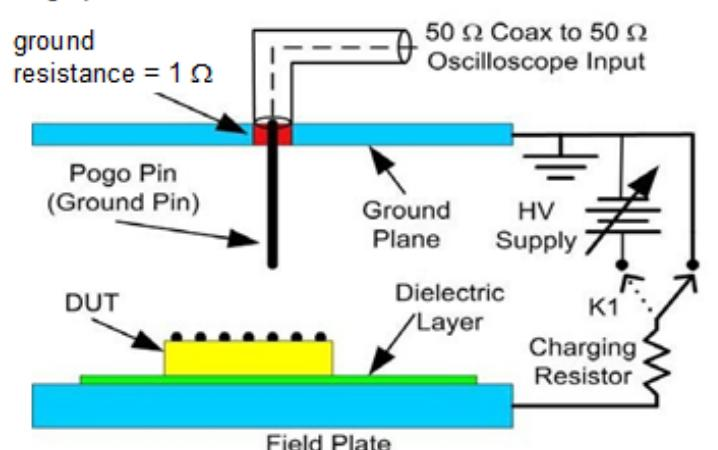

출처: JEDEC(n.d.). ANSI/ESDA/JEDEC JS-002-2014 Charged Device Model –Device Level. JEDEC홈페이지 (https://www.jedec.org.). 15.08.20.

[그림 3-11] 단순화한 CDM 테스트 장비 도식도

(가) 전류 감지 장치

접지 면에 장착되어 있는데, 1.0Ω ±10%의 저항이 전류 감지를 위해 사용된 다. 9GHz의 대역폭을 가진다.

(나) 접지면(Ground Plane)

포고(Pogo) 핀이 가운데 포함된 사각형의 접지면 크기는 63.5 mm × 63.5 mm ± 6.35 mm (2.5 inches × 2.5 inches ± 0.25 inches)이다.

(다) 전계 판 / 전계 판 절연 층

전계 판의 표면 평탄도는 ± 0.127 mm (0.005 inch)이내 이어야 한다. 전계 판 의 절연 층은 FR4나 유사한 에폭시 글라스 재료로 만들어져야한다. 그 두께는 정전 용량 측정을 위하여 0.381 mm ± 0.0254 mm (0.015 inches + 0.001 inches)이다.

(라) 충전 저항기(Charging resistor)

보통 100MΩ 이상의 값을 가진 저항이 사용된다.

(2) 파형 측정 장비

(가) 케이블 어셈블리

50Ω 임피던스의 9GHz에서 2dB이하 손실의 동축 케이블

(나) 고 대역폭 파형 측정 장비

오실로스코프: 50Ω 입력 임피던스, 최소 6GHz 대역폭, 20Giga/sec이상 샘플링 20dB 감쇠기: 최소 12GHz 대역폭, ±0.5dB의 정확성, 50Ω ± 5Ω 임피던스

(다) 1GHz 파형 측정 장비

오실로스코프: 50Ω 입력 임피던스, 1GHz 대역폭, 5Giga/sec 이상 샘플링 20dB 감쇠기: 최소 4GHz 대역폭, ±0.5dB의 정확성, 50Ω± 5Ω 임피던스

(3) 검증 모듈(금속 원반)

큰 검증 모듈의 정전 용량은 55 pF ± 5%이고 작은 모듈은 6.8 pF ± 5%이다.

(4) 정전 용량 측정기(Capacitance Meter)

0.2 pF의 해상도, 3%의 정확성, 1 MHz의 측정 주파수를 가진 장치

(5) 저항 측정기(Ohmmeter)

출처: JEDEC(n.d.) ANSI/ESDA/JEDEC JS-002-2014 Charged Device Model –Device Level. JEDEC홈페이지 (https://www.jedec.org.). 15.08.20.

[그림 3-12] CDM 전류 파형 변수

저항 프로브의 저항 측정용으로 0.01Ω의 정확성을 가진 저항기로 Kelvin 4-wire 연결이 바람직하다.

2. CDM 테스터 검증

절연 층, 접지 면, 동축 방전 저항(프로브), 접지 면과 전계 판의 거리, 검증용 모듈, 포고 핀들이 중요한 부분으로 이들에 변화가 생기면 파형 검증을 수행한다.

- (1) 파형 캡쳐 절차
  - (가) 전계 판 절연층 위에 검증용 모듈을 밀착시킨다.
  - (나) 전계 판의 전위를 테스트 전압으로 설정한다.

- (다) 접지 포고 핀을 검증 모듈의 중심에 오도록 조정한다.
- (라) Single이나 Dual 방전이 사용될 수 있는데, Dual 방전의 경우는 Positive와 Negative 펄스에 대한 파형 캡쳐 시 오실로스코프의 트리거 조건 변화가 필요 하다.
- (마) 검증 모듈을 검증 극성에 대해서 최소 열 번 방전시키며 연속 파형을 캡쳐
   후, [그림 3-12]에서의 파형 변수 lp, Tr, FWHM, lp2의 평균값을 기록한다.
- (바) 만약 파형이 <표 3-6>이나 <표 3-7>에서의 파형변수 요건을 충족하지 못하면, 검증 모듈과 접지 핀을 다시 청소하고 모든 연결 단자가 꽉 조여 있는지 확 인하고 전계 판 전압을 조정하고 앞의 1) ~ 5) 의 과정을 반복한다. 그래도 문제가 있다면 시스템의 진공을 점검하거나 접지 교환 핀을 살펴본다. 또한 장비 제조사에 문의해 본다.

<= 3-6> CDM Waveform Characteristics for a 1 GHz Bandwidth Oscilloscope

| 1 GHz E Oscillosc                | Test Condition |                |                |                |                |                |              |                |               |                |                   |
|-------------------------------------|----------------|----------------|----------------|----------------|----------------|----------------|--------------|----------------|---------------|----------------|-------------------|
|                                     |                | TC 125         |                | TC 250         |                | TC 500         |              | TC 750         |               | TC 1000        |                   |
| Verification Module              | Sym.           | Smal I      | Larg e      | Sma II      | Larg e      | Sma II      | Large        | Sma II      | Large         | Sma II      | Larg e         |
| Peak Current (A)                 | lp             | 1.0- 1.6    | 1.9- 3.2    | 2.1- 3.1    | 4.2- 6.3    | 4.4- 5.9    | 9.1- 12.3 | 6.6- 8.9    | 13.7- 18.5 | 8.8- 11.9   | 18.3 - 24.7 |
| Rise time (ps)                   | Tr             | <350           | <45 0       | <35 0       | <45 0       | <35 0       | <450         | <350           | <450          | <350           | <450              |
| Full width at half max.(ps)   | FWH M       | 325- 725    | 500- 1000   | 325- 725    | 500- 1000   | 325- 725    | 500- 1000 | 325- 725    | 500- 1000  | 325- 725    | 500- 1000      |
| Undershoot (A, max. 2nd peak) | lp2            | <70 % Ip | <50 % Ip | <70 % Ip | <50 % Ip | <70 % Ip | <50% Ip   | <70 % Ip | <50% Ip    | <70 % Ip | <50 % Ip    |

출처: JEDEC(n.d.). ANSI/ESDA/JEDEC JS-002-2014 Charged Device Model -Device Level. JEDEC홈페이지 (https://www.jedec.org.). 15.08.20.

| >=6 GHz BW Oscilloscope          |          |                | Test Condition |                |                |                |               |                |               |                   |                   |
|-------------------------------------|----------|----------------|----------------|----------------|----------------|----------------|---------------|----------------|---------------|-------------------|-------------------|
|                                     |          | тс             | 125            | тс             | 250            | тс             | 500           | тс             | 750           | тс                | 1000              |
| Verification Module              | Sym.     | 1.4- 2.3    | 2.3- 3.8    | 2.9- 4.3    | 4.8- 7.3    | 6.1- 8.3    | 10.3- 13.9 | 9.2- 12.4   | 15.5- 20.9 | 12.2 - 16.5 | 20.6 - 27.9 |
| Peak Current (A)              | lp       | <250           | <35 0       | <25 0       | <35 0       | <25 0       | <350          | <25 0       | <350          | <25 0          | <35 0          |
| Rise time (ps)                   | Tr       | 250- 600    | 450- 900    | 250- 600    | 450- 900    | 250- 600    | 450- 900   | 250- 600    | 450- 900   | 250- 600       | 450 900        |
| Full width at half max.(ps)   | FWH M | <70 % Ip | <50 % Ip | <70 % Ip | <50 % Ip | <70 % Ip | <50% Ip    | <70 % Ip | <50% Ip    | <70 % Ip    | <50 % Ip    |
| Undershoot (A, max. 2nd peak) | lp2      | <70 % Ip | <50 % Ip | <70 % Ip | <50 % Ip | <70 % Ip | <50% Ip    | <70 % Ip | <50% Ip    | <70 % Ip    | <50 % Ip    |

<표 3-7> CDM Waveform Characteristics for a High Bandwidth (>= 6 GHz) Oscilloscope

출처: JEDEC(n.d.). ANSI/ESDA/JEDEC JS-002-2014 Charged Device Model -Device Level. JEDEC홈페이지 (https://www.jedec.org.). 15.08.20.

(사) 반대 극성에 대해서도 동일한 절차를 반복한다.

- (2) CDM 테스터 검증 절차
  - (가) CDM 테스터 검증/재검증 절차

각 테스트 조건(125 ~ 1000)에서 〈표 3-6〉에 해당하는 피크 전류를 만들기 위 해 필요한 전계 판의 전압을 검증을 통해 결정한다. 전압의 조정은 전체 전압 범위나 각 극성별로 Offset이나 Multipling Factor를 적용하여 이루어진다. 앞 절의 파형 캡쳐 절차에 따라 〈표 3-7〉의 테스트 조건 (125 ~ 1000)에서 두 개 의 검증 모듈에 대해서 높은 대역폭 오실로스코프로 Positive/Negative 파형 캡 쳐를 수행한다.

(나) CDM 테스터 검증/재검증의 조건

장비 제작자의 권고에 따른 주기적 재검증을 해야 하며, 최대 주기는 일 년이 다. AS나 고장수리 후 검증을 수행하여야 한다.

- (다) CDM 테스터의 주기적/일상적 검증 절차
  - 분기별 파형 검증 절차: 각 테스트 조건(125 ~ 1000V)에서 두 개의 검증 모 듈을 Positive/Negative 극성에서 1GHz나 고대역폭 오실로스코프로 캡쳐한 파형변수를 <표 3-6>나 <표 3-7>의 조건을 만족하는지 점검한다.
  - 2) 일상적 파형 검증 절차: 테스트 조건(500)에서 테스트하려는 패키지 사이즈에 가까운 검증 모듈을 Positive/Negative 극성에서 파형 검증을 매 교대 근무 때 진행한다.

- (3) CDM ESD 테스트 요건
  - (가) ESD 손상 예방과 테스트 환경
    - 1) 반도체 소자에 손상이 없도록 전체 진행 과정에서 ANSI/ESD S20.20, JESD625 또는 IEC61340-5-1 지침을 준수해야 한다.
    - 2) ESD 테스트는 상온에서 이루어져야 하며, CDM의 경우 파형이 습도에 상당 히 민감하기 때문에 CDM 방전이 발생하는 Test Head에서의 습도는 반드시 상대습도 30% 이하여야 한다.
  - (나) 소자 테스트

ESD 테스트 전에 대상 소자의 Parametric과 Function 테스트를 수행하여 그 결과가 데이터 시트의 정한 규격을 만족하는지 확인해야 한다.

- 3. CDM ESD 테스트 절차
  - (1) 샘플 사이즈

최소 샘플 사이즈는 3개 소자이며, 이들은 사전에 데이터 스펙을 만족하는지 확인 되어야 한다.

(2) 테스트 전압 설정

<표 3-6>에서의 가장 낮은 레벨에서 시작해야 한다. 가장 낮은 전압 레벨보다 높 은 초기 전압으로 시작했는데, 이 전압에서 Fail이 발생하면 새로운 3개 샘플로 이 보다 한 단계 낮은 레벨에서 재 테스트해야 한다.

- (3) 테스트 구성
  - (가) 각 소자의 각 핀에 최소 한 번의 Positive와 한 번의 Negative방전을 가한다.
  - (나) 소자가 테스트 전압에 도달하도록 방전 간에는 충분한 시간을 허용한다.
  - (다) ESD 스트레스는 극성 당 최소 3개로 구분하여 다른 샘플로 극성에 따라 테 스트 할 수 있으며, 소자의 각 핀이 적어도 한 테스트 세트의 구성에 포함하 도록 하여 하나 이상의 조합으로 나뉠 수 있다.
- (4) ESD Post-Test
  - (가) ESD 스트레스 테스트를 마친 후, 소자를 ESD 스트레스를 가하기 전 Pre-Test 와 동일한 테스트 장비와 같은 버전의 SW를 사용하여, DC parametric과 Function 테스트를 수행하여 데이터 시트상의 변수를 만족하는지 확인한다.
  - (나) 소자의 한 핀에서의 ESD 스트레스는 다른 핀에서의 동작 불량을 일으킬 수 있기 때문에 비록 ESD 스트레스가 소자 핀들의 일부분에만 국한되어도, Post-Test에서는 소자의 모든 가능한 스펙 사항을 측정해야 한다.
  - (다) 보통은 ESD 테스트 후 24 ~ 96시간 이내에 Post-Test를 수행하는데, ESD 테

스트 직후 바로 진행하는 것은 바람직하지 않다. 이는 chip 내부에서 빠져나 가지 못한 전하와 다른 열적인 문제로 인해 동작 불량으로 잘못 판정될 수 있기 때문이다.

- (5) ESD 등급 판정과 재테스트
  - (가) ESD 테스트 후에 소자의 Parametric과 Function 테스트를 수행하여 그 결과가 데이터 시트의 정한 규격 내에 들지 못하면 Fail로 간주한다. 고장 분석을 통 해 Fail 이 CDM ESD와 관련이 없는 것으로 판정되면 Fail은 무시된다. 핀 누 설 전류, 대기 전류 같은 Static 누설 전류의 변화는 손상의 시작을 알리는 지 시자 역할을 하지만, Pass/Fail을 판정하는 적절한 기준은 아니다.
  - (나) 만약 500V 전압에서 Fail이 확인 된다면 (예를 들어, 3개중 1개 소자가 500V에 서 Fail 이고 250V에서는 3개 모두 Pass 라면), 3개의 새로운 샘플을 제공하여 제품이 정말 Fail 인지 아니면 Fail이 비정상적이거나 다른 테스상의 문제로 인 한 것인지 확인하기 위해 ESD 재테스트를 할 수 있다. 만약 재테스트에서 제 품이 Pass되면 이전 Fail 결과는 무시하지만, Fail이 되면 그 전압에서 Fail로 고려된다.
  - (다) 소자의 ESD 수준이란 ESD 스트레스가 가해지는 모든 샘플이 어떤 전압 레벨 을 통과한 가장 높은 수준을 말한다.
- ESD 불량 분석과 개선
  - 1. ESD 불량 분석

ESD 수준이 목표 수준을 통과하지 못한 경우는 불량 분석을 통하여 ESD 불량의 원 인을 파악한다. 여기서 설명한 분석 장비에 대한 내용은 일부분 사전 학습으로 언급 한 NCS 반도체 제조-반도체 품질 관리(1903060209\_14v3)를 참조하기 바란다.

(1) ESD로 인한 불량 유형

Chip 내에서 ESD 손상이 발생한 부분에서 나타나는 대표적인 유형으로는 Metal의 연결선이 Open되거나, PN 접합 스파이크 형성으로 인한 단락, 금속 Metal이 실리 콘 쪽으로 용융되어 형성된 필라멘트로 인한 단락, MOSFET 소자의 Gate Oxide의 손상, PN 접합의 항복 전압(Breakdown Voltage)의 강하 등이 있다. 보통의 경우 이로 인한 누설 전류가 증가하는 현상이 수반된다.

(2) ESD 불량분석 방법

(가) 반도체 패키지의 Decap을 진행한다.

(나) FIB(Focused Ion Beam)장비

MASK를 수정 전에 예상되는 불량 경로상의 Metal Line을 절단하여 개선 유무 를 확인하기 위하여 FIB를 사용한다.

- (다) EMMI(Emission Microscopy)와 OBIRCH(Optical Beam Induced Resistance Change) 불량발생 포인트를 직접 검출하는데 상당히 유용한 장비들로 chip 상에서의 손 상 부위를 확인한다. Chip 내의 ESD 손상 전후의 Hot spot을 비교하여 정확한 문제 부위를 찾는 과정을 거친다. EMMI는 문제의 부위가 Metal이나 폴리실리 콘 아래에 위치할 때 검출이 어려운 면이 있어 OBIRCH와 함께 결합하여 불량 부위를 찾는 방식으로 진행한다.
- (라) TLP(Transmission Line Pulse)

이 장비의 장점은 일정한 전류를 발생하여 고 전류 상황에서의 ESD 보호 소자 의 동작 특성을 분석할 수 있게 하며 견딜 수 있는 최대 전류치를 알 수 있게 하여 ESD 보호 소자 특성의 개선에 중요한 정보를 제공한다.

- 2. ESD 불량 개선
  - (1) 반도체 소자 내의 ESD 보호 방법 개선

 ESD 스트레스는 보통 반도체 내의 기본 소자들인 MOSFET, Bipolar, SCR 등의 소자가 견딜 수 있는 최대 항복 전압을 훨씬 초과하는데, 회로를 구성하는 기본 소자를 보호하는 방법은 ESD 전류가 내부로 흐르는 것을 막는 것이 아니라, 큰 전류를 견딜 수 있도록 설계된 보호 회로 쪽으로 방향을 전환시켜 이쪽으로 흐르 도록 해주는 것이다.

보통 회로 설계자나 ESD 엔지니어는 다양한 방전 모드를 분석하고, 양 극성에 따 라 전류가 들어가고 떠나는 곳을 확인하고, ESD 전류가 안전하게 흐르도록 해 주 는 보호 회로망을 설계한다. 전류는 경로를 따라 접지로의 가장 낮은 저항 경로를 통해 흐른다. 이러한 경로 상에 위치하는 기본 소자의 저항을 낮추고, 파괴되지 않고 견딜 수 있는 최대 전류 허용치를 높이면 ESD 내성도 강하게 할 수 있다.

[그림 3-13]는 내부 회로를 보호하는 전형적인 ESD 보호회로의 한 예인데, Positive/Negative ESD Pulse를 인가 시에 ESD 전류의 방전 경로를 보여주고 있다. 제품 개발 시에 이러한 부분을 전체적으로 확인하게 되나 이러한 방전 경로가 실 제 Layout 작업 이후 발생되는 예상치 못한 기생 경로나 미처 확인이 되지 못한 경로 상에서 ESD 손상 문제가 발생될 수 있으며, 또한 ESD 방전 전류를 경로상의 보호 소자가 허용할 수 있는 한계치를 벗어나면 ESD 손상이 발생되게 된다.

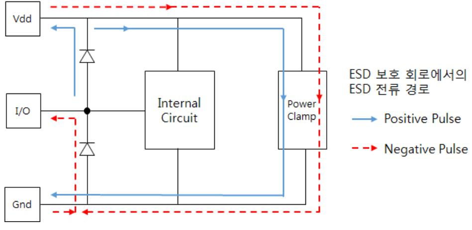

[그림 3-13] 전형적인 ESD 보호 회로에서의 ESD 방전 전류 경로 예

분석 장비에 의해 확인된 문제 포인트를 기준으로 경로 설계를 재검토하거나 소 자의 허용치를 재설계하여 ESD 문제를 개선한다. 이 부분에 대한 깊이 있는 자료 는 ESD Design에 대한 텍스트북이나 FAB Foundry 등에서 제공하는 ESD Reference Guide를 통해 확인할 수 있다.(2) 반도체 소자 내의 ESD 보호 소자 개 선 반도체 내에서 ESD 손상을 방지하기 위한 보호용 소자를 주로 IO단에 배치하 는데 이들 소자의 전기적 특성을 앞에서 언급한 TLP 장비로 트리거 전압, Snapback 전압, 2차 항복 전압을 측정하여 제품 보호를 위한 적정 특성을 갖는 소자를 배치하여, 취약한 부분을 개선해 준다. 이 부분에 대한 깊이 있는 설명은 참고자료에 있는 A. Amerasekera, C. Duvvury가 저술한『ESD in Silicon Integrated Circuits』등을 통해 확인할 수 있다.

- 수행과제 요약
  - 1. 정전기 방전(ESD: Electrostatic Discharge) 테스트하기
    - (1) HBM ESD 테스터의 검증을 실시한다.
    - (2) ESD 사전 Parametric과 Function 테스트를 수행한다.
    - (3) 샘플 사이즈를 결정한다.
    - (4) 앞에서 결정한 샘플의 핀 조합 구성과 ESD 스트레스 전압을 결정한다.
    - (5) HBM ESD 테스터에서 ESD 스트레스 전압을 인가한다.
    - (6) ESD 스트레스 테스트를 마친 후 DC parametric과 Function 테스트를 수행하여 데 이터 시트상의 변수를 만족하는지 확인한다.
    - (7) ESD 등급 판정과 재 테스트 여부를 결정한다.

2. ESD 불량 분석

ESD 수준이 목표 수준을 통과하지 못한 경우는 반도체 소자의 불량 분석을 통하여 불량의 원인을 파악한다.

- (1) 반도체 패키지의 Dacap을 진행한다.
- (2) 불량 분석 장비인 광학현미경, SEM 등으로 먼저 확인하고 정밀한 손상 위치의 분 석은 EMMI(Emission Microscopy)와 OBIRCH(Optical Beam Induced Resistance Change) 장비를 이용하여 Chip 상에서의 손상 부위를 확인 한다
- (3) TLP(Transmission Line Pulse) 장비를 이용하여 불량이 발생한 PIN 부분의 특성을 확인한다.
- 3. ESD 개선 대책 수립
  - (1) 반도체 내부 회로를 분석하여 불량에 관련한 경로를 확인 후 경로상의 ESD 전류 방전에 취약한 부분의 개선책을 수립한다.
  - (2) ESD 보호 소자의 특성을 개선할 방안을 확인하고 개선책을 수립한다.

# **3-2.** 반도체 Latch-Up 평가

|       | • EMI / EMS(Latch-Up) 유형 별 메커니즘을 파악할 수 있다.              |  |  |  |  |
|-------|---------------------------------------------------------|--|--|--|--|
|       | • EMI / EMS(Latch-Up) 유형 별 시험 방법을 이해하고 시험 계획을 수립할 수 있다. |  |  |  |  |
| 학습 목표 | • EMI / EMS(Latch-Up) 시험 결과 규격 만족 여부를 판별할 수 있다.         |  |  |  |  |
|       | • 고장 유형에 따라 고장의 원인을 분석할 수 있다                            |  |  |  |  |
|       | • 고장 원인에 따라 개선 방향을 제시할 수 있다                             |  |  |  |  |

### 필요 지식 /

- Latch-Up 개요
  - 1. Latch-Up의 정의

Latch-Up은 소자에 파워 공급 핀과 접지 간에 낮은 임피던스의 경로가 발생되는 상태를 말한다. 전류 주입이나 과전압에 의해서 유발되는데, 한번 작동이 되면 그 유발 인자가 사 라져도 낮은 임피던스 경로는 그대로 존재하게 되어 이로 인한 과도한 전류 증가로 시스 템에 치명적인 손상을 주게 된다. 이를 해결하기 위해 파워를 끄고 다시 켜야 한다. CMOS와 BiCMOS 공정에서, CMOS 집적회로 설계 시 NMOS와 PMOS 트랜지스터를 형성하 는 PN 접합이 근접하게 되면 자연적으로 기생(Parasitic) 트랜지스터와 다이오드가 생기게 되고 PNPN 사이리스터 접합 구조가 만들어지는데, 이러한 구조를 Silicon-Controlled Rectifier(SCR)이라고 한다. 정상 동작 전압과 전류 수준을 벗어나 넘어가거나 미치지 못하 는 상황이 PNPN 사이리스터를 작동시키면 Latch-Up을 일으키게 된다.

2. Latch-Up 모델

CMOS 공정에는 구조적으로 많은 기생 Bipolar 트랜지스터 구조를 가지며, N-Well, P-Well과 기판(Substrate)이 이러한 PNPN 구조를 만들어 낸다. [그림 3-14]에 PMOS가 기 생 vertical PNP를, NMOS쪽은 Lateral NPN 구조를 보여주고 있다. 전류나 전압 충격이 기 생 PNP나 NPN의 Base쪽의 전원에 가해지면 작동이 될 수 있다. 이들 중 하나가 전류를 흘리게 되면 다른 하나도 전류를 통하기 시작하여 서로를 Saturation 상태로 유지시켜 준 다. 이들 두 기생 트랜지스터가 Saturation 상태에서는 ON 저항이 상당히 낮은 상태로 전 원 전류가 이 경로로 집중되면 접합 부위에 회복할 수 없는 손상이 발생하게 된다. 이 상 태는 power가 Down될 때까지 유지된다. 반도체 소자에 공급되는 전원을 초과하는 Positive나 Negative의 전압 충격이 입력이나 출력 핀에 가해지거나, 공급 전원이 절대 최 대 정격을 초과하거나 또는 전원 과도성의 순간 충격 등이 Latch-Up 발생의 공통적인 원 인이다. ESD에 의해서도 Latch-Up이 발생될 수 있다.

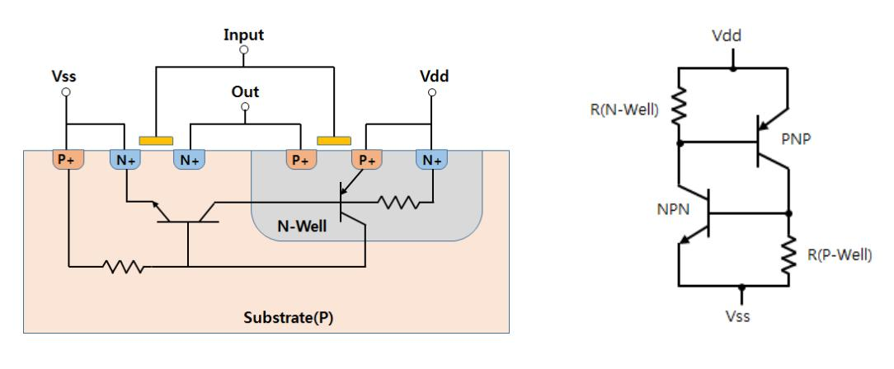

 A. NMOS 와 PMOS 간의 PNPN 구조 B. 등가 회로 [그림 3-14] CMOS 공정에서의 NMOS와 PMOS 간의 PNPN 구조와 등가 회로

- Latch-Up 테스트
  - 1. Latch-Up 테스트 규격

JEDEC의 JDEC78 규격이 업계에서 현재 가장 광범위하게 사용되는 규격이다. 그 외 국제 자동차전장협회(AEC)의 AEC-Q100-004 규격이 있다. JESD78은 디지털 CMOS 기술과 테스 트 방법에 기초하고 있기에 아날로그 제품은 이 규격에 잘 맞지는 않는 점이 있어 JEDEC 의 관련 워킹그룹이 2015년 말을 목표로 아날로그 방법을 추가하는 작업을 진행하고 있다 고 한다. 현재는 대부분의 회사들이 내부적으로 자체 규정을 만들어 적용하는 상황이다. 여기에서는 JDEC78D-2010을 기준으로 설명한다.

- 2. Latch-Up 테스트 요건
  - (1) I-Test와 Over Voltage

Latch-Up 규격에서는 스트레스를 가하는 핀 유형을 Input, Output, Bi-Directional (I/O), Power Supply, Ground로 구분한다. Input, Output, Bi-Directional 핀에는 대부분 전류 스트레스 펄스를 가하며, Power Supply에는 과전압 스트레스 펄스를 인가하는 방식으 로 Latch-Up 내성 테스트는 I-Test와 Over Voltage의 2가지 방식으로 진행한다. 펄스 폭은 규격 내에서 선택하면 되나 보통의 경우 2ms ~ 10ms을 선호하며, 전류 펄스 크 기는 보통 100mA, 과전압은 1.5×Vmax(최대 동작 전압)이 일반적이다. I-Test에서 Positive의 경우 전압 허용 한계는 1.5×VDD나 최대 스트레스전압(MSV)이고, Negative 의 경우 -0.5×VDD 나 최대 스트레스전압(MSV)이다. <표 3-8>에 전류와 전압의 트리 거 펄스 설정 조건이 정의되어 있다.

| 테스트                     | 트리거 펄스                    |                                                                                                |  |  |  |  |  |
|-------------------------|---------------------------|------------------------------------------------------------------------------------------------|--|--|--|--|--|
| 유형                      | 전류/전압 인가 수준               | 전압/전류의 제한                                                                                      |  |  |  |  |  |
|                         | < 50 mA                   | 클램프 전압=Vmax+0.5(Vmax-Vmin) 여기서 Vmax=Logic High, Vmin=Logic Low 이며 클램프 전압의 최대치는           |  |  |  |  |  |
|                         | 50 to < 100 mA            |                                                                                                |  |  |  |  |  |
| Positive I-Test      | 100 to < 150 mA           | 1.5×Vmax 이다                                                                                    |  |  |  |  |  |
|                         | 150 to < 200 mA           |                                                                                                |  |  |  |  |  |
|                         | > = 200 mA                |                                                                                                |  |  |  |  |  |
|                         | > -50 mA                  | 클램프 전압=Vmin╶0.5(Vmax-Vmin) MSV가 클램프 전압이나 ╶0.5Vmax 보다 크면 클램프 전압=MSV                       |  |  |  |  |  |
|                         | -50 to > -100 mA          |                                                                                                |  |  |  |  |  |
| Negative I-Test      | -100 to > -150 mA         |                                                                                                |  |  |  |  |  |
|                         | -150 to > -200 mA         |                                                                                                |  |  |  |  |  |
|                         | < = -200 mA               |                                                                                                |  |  |  |  |  |
|                         |                           | 클램프 전류는 100mA+ Inom 나 1.5×Inom                                                                 |  |  |  |  |  |
| Over voltage Test | 1.5 x VDD 나 MSV에서 작은 쪽 | Inom은 공급전원이 서로 내부적으로 연결되어 있고 같은 전원 값을 갖는 전원을 하나의 전원 그룹으로 하고 이때의 정상 전원을 인가시의 공급 전류값 |  |  |  |  |  |

<표 3-8> Latch-Up 전류와 전압의 트리거 펄스 조건

출처: JEDEC(n.d.). JESD78D Latch-Up. JEDEC홈페이지 (https://www.jedec.org.). 15.08.21.

#### (2) 분류(Classification)

- Class I : 실온에서의 테스트
- Class II: 최대 동작 주변 온도(Maximum operating ambient temperature, Ta) 또는 최 대 동작 케이스 온도(Maximum operating case temperature, Tc) 또는 최대 동작 접 합 온도 Maximum operating junction temperature, Tj). 고온에서 제품의 작동이 필요 한 경우 Class II를 추천하며, 대부분의 제품에서는 Class II는 디폴트이다.
- (3) 샘플 사이즈

최소 3개 샘플로 Latch-Up 테스트를 진행한다. I-test와 Over-voltage 테스트를 나누어 진행하는 경우에는 각각 3개 샘플로 진행한다.

### 수행 내용 / 반도체 Latch-Up 평가하기

#### 재료·자료

ESD 규격 – JEDEC JESD78D Latch-Up 규격

#### 기기(장비 ・ 공구)

Latch-Up 테스터

#### 안전 ・ 유의사항

- 일반적인 전기적 특성 테스트 진행시 요구되는 사항을 기준으로 장비의 전원, 접지에 대해 확인 한다.
- 평가 항목별 결과는 국제 규격에서 정하는 해당 제품 분야의 수준별 기준을 철저히 적용하여 합․불합격을 판단한다.

#### 수행 순서

- Latch-Up 테스트하기
  - 1. Latch-Up 테스트
    - (1) 테스트 진행 전 준비
      - (가) 모든 샘플은 ATE 테스트를 통해 소자의 규격을 만족하는지 확인한다.
      - (나) Latch-Up 테스트 전에 소자의 소켓 연결 상태를 확인한다.
    - (2) Latch-Up 테스트 절차
      - (가) 모든 파워 라인에 전원이 가해지고 테스트 대상 소자가 안정적인 상태에서 낮은 전류 상태를 유지한다.
      - (나) 대상 소자를 테스트 온도에서 안정화시킨다.
      - (다) <표 3-9>를 기준으로 스트레스가 가해지지 않는 입력 핀은 Low나 High 상태 로 유지한 채 소자의 각 공급 전원 핀의 공급 전류(supply)를 측정한다.
      - (라) <표 3-9>의 모든 조건/조합으로 테스트를 진행한다.
      - 전류 스트레스는 Positive와 Negative로 모든 Non-supply 핀에 각각 가해 진다.
      - 과전압(Over Voltage) 스트레스는 각각의 전원 공급 핀에 가해진다.

- (마) 소자의 모든 전원 공급핀의 각각의 공급 전류(Isupply)를 재측정한다.
- (바) 만약 Latch-Up 스트레스 이후 공급 전류가 너무 높으면 Lacth-up 고장이 발 생한 것이 된다.
- <표 3-9> Latch-Up 테스트 조건의 조합 표

| 테스트 유형                        | 테스트 되지 않는 입력 핀의 조건 | 테스트 온도 구분    | 공급 전원 조건              | Latch-Up 감지 기준               |  |  |
|-------------------------------|--------------------------|-----------------|--------------------------|------------------------------|--|--|
| POSITIVE                      | Max Logic High        |                 |                          |                              |  |  |
| I-Test                        | Min Logic Low         | Class I : 실온 |                          | 절대 Inom이 25 mA 이하이면,      |  |  |
| NEGATIVE                      | Max Logic High        |                 | 각 전원                  | 절대 Inom+10 mA 또는          |  |  |
| I-Test                        | Min Logic Low         | Class II :      | 그룹별로 의 최대 동작 전압 | 절대 Inom이                     |  |  |
| V s u p p l y Over-voltage | Max Logic High        | 최대 동작 온도  |                          | 25 mA 이상이면, 1.4 X 절대 Inom |  |  |
| test                          | Min Logic Low         |                 |                          |                              |  |  |

출처: JEDEC(n.d.). JESD78D Latch-Up. JEDEC홈페이지 (https://www.jedec.org.2010). 15.08.21.

- (3) Latch-Up 고장 판정 기준
  - (가) 트리거 테스트 조건에서 전류 전압의 클램프 한계치에서도 Latch-Up이 발생 하지 않는다면, 그 핀은 테스트를 통과한 것이다.
  - (나) I-test나 supply overvoltage 테스트 중에 Latch-Up 발생을 확인하기 위하여 모든 전원 공급 그룹에 대한 공급 전류가 계속 측정되어지고 <표 3-9>의 기 준을 벗어나면 Latch-Up의 Fail이 발생한 것이다.
  - (다) 만약 정상 전류(Inom)≤25mA 이면, 재측정된 공급 전류가 (Inom+10mA) 이상 인 경우 Fail이다.
  - (라) Inom > 25mA 이면, 재측정한 공급 전류가 1.4×Inom 이상인 경우 Fail이다.
  - (마) 공급 전류 테스트 결과에 이상이 없어도 ATE 테스트에서 Pass해야만 한다.
  - (바) 공급 전류 판정과 ATE 테스트 결과에서 Fail로 판정되면, 최대 스트레스 전압 (MSV), 전류 한계치, 펄스 폭, 온도 등을 재검토해 보아야 한다.
- (4) Latch-Up 테스트 가이드라인
  - (가) 공급 전원은 규격을 기준한 최대 전원을 인가한다.
  - (나) 같은 전위의 공급 전원을 하나의 그룹으로 묶을 수 있으나, 높은 전류 전원 과 저 전류 전원은 분리한다.

- (다) 모든 출력 핀은 자신에게 스트레스가 가해지지 않는 경우에는 Floating시킨다.
- (라) 스트레스 대상 핀은 Positive I-Test에서는 High로 하고, Negative I-Test에서 는 Low로 설정한다.
- (마) 소자 동작상에 High로만 설정해야 하는 핀은 Positive I-Test만 수행하며, Low 로만 설정해야하는 핀은 Negative I-Test만을 실시한다.
- (바) DUT의 모든 No Connect (NC) 핀은 테스트 과정에서 Open(Floating)된 상태로 테스트를 진행한다.
- (사) DUT의 핀에 저항이나 커패시터 등의 수동 소자가 연결되는 특별한 경우 Latch-Up 가능성이 떨어지며, 테스트에서 인가되는 전류나 전압 크기에 따라 Latch-Up 트리거가 달라진다. 경우에 따라 No test로 분류해야 한다.
- (아) I/O 핀은 가능한 모든 동작 상태나 최악의 동작 상태(변경 모드 I/O에서의 고 임피던스)에서 테스트되어야 한다.
- (자) 클록/타이밍 신호들이 입력되어야 정상적인 작동이 되어 안정적인 공급 전류 (Isupply)를 보여주게 되는 소자(Dynamic Device)의 경우 이들 신호를 가하고 Latch-Up 테스트를 진행하여, 보통은 이들 클록/타이밍 신호 핀에 대해서 Latch-Up 테스트를 제외 한다.
- (차) 소자가 너무 복잡해서 최악 조건에서의 모든 변경모드 I/O의 테스트가 가능 하지 않다면, 엔지니어의 판단에 따라 소자의 대표적 동작의 테스트 벡터 대 표 조합으로 조건을 설정해야 한다.
- (카) I/O 핀이 고 임피던스 상태에서 Latch-Up 테스트가 될 수 없다면 적정한 로 직 상태에서 테스트되어야 한다.
- (타) 차동 입력단의 경우는 한쪽 입력을 High, 다른 쪽은 Low로 유지해 준다.
- (파) 전압 조정기(VREF), VBAT, Charge Pump의 출력은 출력 핀으로 간주한다.
- (하) 가능하다면, Latch-Up 테스트 전에 PLL은 동작을 중지시킨다.
- 2. Latch-Up 테스트 조건 설정 예- 실습
  - (1) CMOS 표준 LV(Low Voltage) 소자의 클램프 전압 High와 Low 설정 공급 전원 = 5V, 접지 = 0V 데이터시트상의 동작 최대 전압(Vmax) = 5V, 최소 전압(Vmin) = 0V
    - (가) <표 3-8>을 참조하여, 클램프 전압 High/Low를 구한다.
    - (나) Latch-Up 테스트 절차에 따른 I-Test의 펄스를 인가하는 시간에 따른 전류의 크기 변화를 전원전압 인가와 측정을 함께 포함하여 Timing 차트를 그려 본 다. (JEDEC JESD78D를 다운 받아 Figure 2와 Figure 3의 Test waveform for I-test 를 참조할 것)

- (2) 고전압 소자의 클램프 전압 High와 Low를 구한다.
  - 공급 전원 = 50V, 최대 동작 전압(Vmax) = 55V, 접지 = 0V
  - 소자의 최소 항복전압(Breakdown Voltage) = 70V
  - 최대스트레스전압(MSV) = 65V (항복 전압에 5V의 여유를 준 경우)
  - (가) <표 3-8>을 참조하여 클램프 전압 High/Low를 구한다.
  - 이 경우 <표 3-8>에서의 조건에 해당되는데
  - → MSV가 클램프 전압이나╶0.5Vmax보다 크면 클램프 전압=MSV
  - (나) 클램프 전압 High와 Low에 대해서 재계산한다.
  - (다) 클램프 전압 Low(Negative I-test)를 재계산한다.
  - 이 경우의 Vss = Vmax VSM이 된다.
- Latch-Up 불량 분석과 개선
  - 1. Latch-Up 불량 분석

Latch-Up 수준이 목표 수준을 통과하지 못한 경우는 불량 분석을 통하여 불량의 원 인을 파악한다. 여기서 설명한 분석 장비에 대한 내용은 일부분 사전 학습으로 언급 한 NCS 반도체 제조-반도체 품질관리(1903060209\_14v3)를 참조하기 바란다.

(1) Latch-Up 불량 유형

Latch-Up 발생이 PNPN 구조의 특정 상황에서 동작을 통해 MOSFET 회로 내에서 Power Supply Rail 간에 낮은 임피던스를 갖게 되면 반도체 부품의 오동작이나 전 혀 작동하지 않는 상황이 발생된다. 또한 과도 전류에 의한 소자의 심각한 손상이 발생하기도 한다. 오동작의 경우는 전원을 끄고 다시 전원을 켜는 것으로 원상회 복이 되는 데, 근본적인 문제에 대해서는 개선이 필요한 사항이다.

(2) Latch-Up 불량 분석

분석 방법은 기본적으로 ESD에서의 불량 분석 방법과 동일한 절차를 거치게 되므 로 앞장의 ESD 분석 부분을 참고한다. 파괴적인 손상 부위는 쉽게 확인이 가능하 나 오동작 등의 경우는 보통의 경우 분석 장비로 확인이 되지 않아 어려움이 많 다. 이것은 의심되는 문제 원인의 다양한 경우를 시험적으로 재현하여 확인하는 것이 일반적이다. 회로 전체의 네트워크와 Layout을 확인하면서 수평, 수직의 구 조물에서 PNPN 동작이 영향을 줄 수 있는 부분을 찾아야 한다.

2 Latch-Up 불량 개선

Latch-Up이 Layout 작업의 기본 회로 소자들의 배치 과정에서 만들어지는 기생 PNPN 구조의 동작에 의한 문제이므로, 제품개발 시나 불량 개선방식은 모두 이들 PNPN 구조가 형성되는 Layout 부분의 확인과 이들 동작이 가능한 작동이 어렵게 하 기 위해 트랜지스터, 다이오드, 저항, 커패시터들 간의 배치 간격을 특성 확인을 통해 조정하는 방법을 사용한다. 추가적으로 회로 내에서 그 주변에 영향을 줄 수 있는 특 정 부분이나 기본 소자를 보호 링(Guard Ring) 구조로 둘러싸는데, 보호 링은 주입되 는 전자나 정공을 모두 흡수해서 전원이나 접지로 흘러가도록 하는 역할을 한다. 또 는 기판과 Well과의 연결점 (Well Bias)들을 만들어 보호 링과 같은 역할을 하도록 한 다. 또 다른 효과적 방법은 EPI(epitaxial silicon) 층을 이용하는 것인데, 기판에 비해 적절히 낮은 불순물 농도를 가지기 때문에, 더 높은 농도의 기판이 다수 캐리어를 접 지로 향하게 하고, 나머지 소수 캐리어는 보호 링을 좀 더 효과적이게 해준다. 이러 한 안전장치가 있어도 회로 내에는 기생 구조가 어디에서든 만들어질 수 있어 Latch-Up 테스트를 통해 문제를 확인할 필요가 있다.

- Latch-Up 테스트하기 요약
  - 1. Latch-Up 테스트하기
    - (1) 모든 파워 라인에 전원을 가한다. 설정한 테스트 온도를 유지한다.
    - (2) 소자의 각 공급 전원 핀의 공급 전류(Isupply)를 측정한다.
    - (3) <표 3-9>의 모든 조건/조합으로 전류 스트레스와 Over Voltage 스트레스를 진 행한다.
    - (4) 소자의 모든 전원 공급 핀의 각각의 공급 전류(Isupply)를 재측정한다.
    - (5) Latch-Up 발생을 확인한다.
  - 2. Latch-Up 불량 분석 및 개선
    - (1) Latch-Up 불량 원인 분석
      - 수준이 목표 수준을 통과하지 못한 경우는 반도체 소자의 불량 분석을 통하여 불 량의 원인을 파악한다.
      - (가) 반도체 패키지의 Dacap을 진행한다.
      - (나) 불량 분석 장비인 EMMI(Emission Microscopy)와 OBIRCH(Optical Beam Induced Resistance Change) 장비를 이용하여 chip 상에서의 손상 부위를 확인한다.
      - (다) Latch-Up 불량의 경우 과도 전류가 흘러 손상이 발생한 경우는 쉽게 불량 포 인트를 찾을 수 있으나, Latch-Up에 의한 PIN 누설 전류가 발생하는 경우, Power를 끄고 다시 켜면 원상회복이 되는 문제의 경우는 위의 분석 장비로 불량 포인트 확인이 상당히 어려울 수 있다.
      - (라) Latch-Up의 발생이 Layout상의 원치 않는 PNPN 구조의 형성과 이들 소자의 동작 조건이 갖추어질 수 있는 점에 집중하여 불량이 발생한 PIN을 Trace 하 면서 Layout 상의 요소를 수평과 수직 구조적으로 전체적으로 보면서 또한 Parasitic 요소의 전기적 연결 네트워크에 대해서도 살펴보아야 한다.

- (2) Latch-Up 개선
  - (가) PNPN 구조의 동작을 억제하는 Layout 배치를 확인하고 수정하도록 한다.
  - (나) 가장 일반적인 방법은 Latch-Up을 유발하는 소자 간의 간격을 넓히거나 Well Bias를 적절치 배치하거나 이들 간에 Guard-Ring 구조물을 적절히 배치하는 것이다. 대부분의 FAB 업체에서 가능성 있는 소자들 간격과 Guard-Ring 배치 에 대한 설계 규칙 등이 제공되며, 설계 Layout 과정에서 이를 적용하여야 하 며, 또한 이러한 규칙이 맞게 Layout 되어 있는지 검증하는 과정을 거쳐야 하 며, 예상치 못한 부분에서 문제가 발생하는 경우 Layout 수정이나 회로 변경 을 통해 개선을 해야 한다.

#### 수행 tip

'2. Latch-Up 테스트 요건'과'3. Latch-Up 테스트 절차'를 참조

### 학습 3 교수 ‧ 학습 방법

#### 교수 방법

- 정전기 방전에 대한 실생활의 사례를 사전 학습 과제로 부여한다.
- ESD에 민감한 소자나 제품을 다루는 ESD 관리 방법에 대해 반도체와 다른 산업계에서의 대처 방안에 대해 소개하여 중요성을 인식시키도록 한다. ANSI/ESD S20.20, JESD625 또는 IEC61340-5-1에서의 반도체 소자를 가공 및 다룰 때의 사람, 장비, 설비, 환경에 대한 지침을 설명하고, ESD 손상을 예방할 수 있는 기본 원칙과 사례를 설명한다.
- 반도체 제품의 실제 규격을 정의한 데이터 시트 예를 준비하고 ESD, Latch-Up에 대한 데이터가 어떻게 표현되어 있는지 설명한다.
- ESD, Latch-Up의 불량 유형과 분석, 개선 대책을 수립하는 과정을 학습할 수 있도록 사례를 수업예시로 제시한다.
- 반도체 제품의 개발 과정에서 ESD, Latch-Up에 대한 설계 상의 고려 방법에 대해 예를 준비하고, 설명한다.
- ESD, Latch-Up 테스터 장비를 보유하고 있는 기관(예: 충북TP 반도체센터)을 방문하여 장비운용 과 테스트 관련 견학을 갖도록 한다.

#### 학습 방법

- 상용 반도체 제품을 하나 선정하여 HBM, CDM, Latch-Up의 테스트 핀 조합과 스트레스 인가 조건을 설정하는 표를 각각에 대해 작성 후 모둠별 토의와 발표를 수행한다.
- 반도체 제품의 실제 규격을 정의한 데이터 시트 예를 준비하고 ESD, Latch-Up 에 대한 데이터가 어떻게 표현되어 있는지 학습한 후, 데이터 시트를 작성해 본다.
- ESD, Latch-Up의 불량 유형과 분석, 개선 대책을 수립하는 과정을 학습하고, 실습을 통해 충분히 숙지한다.
- 반도체 제품의 개발 과정에서 ESD, Latch-Up에 대한 설계 상의 고려 방법에 대해 학습하고, 실습을 통해 충분히 숙지한다.
- ESD, Latch-Up 테스터 장비를 보유하고 있는 기관(예 : 충북TP 반도체센터)을 방문하여 장비운용 에 대해 실습을 수행한다.

## 학습 3 평 가

#### 평가 준거

- 평가자는 학습자가 학습 목표 및 평가 항목에 제시되어 있는 내용을 성공적으로 수행하였는지 평가해야 한다.
- 평가자는 다음 사항을 평가한다.

|          |                                                   | 성취수준 |   |   |
|----------|---------------------------------------------------|------|---|---|
| 학습내용     | 평가항목                                              | 상    | 중 | 하 |
| EMC 평가하기 | - EMI / EMS(ESD, Latch-Up) 유형별 메커니즘을 파악할 수 있다. |      |   |   |
|          | - EMI / EMS 유형별 시험 방법을 이해하고, 시험 계획 을 수립할 수 있다. |      |   |   |
|          | - EMI / EMS 시험 결과 규격 만족 여부를 판별할 수 있다.          |      |   |   |
|          | - 고장 유형에 따라 고장의 원인을 분석할 수 있다.                     |      |   |   |
|          | - 고장 원인에 따라 개선 방향을 제시할 수 있다.                      |      |   |   |

#### 평가 방법

• 평가자 질문

|                       |                                | 성취수준 |   |   |
|-----------------------|--------------------------------|------|---|---|
| 학습내용                  | 평가항목                           | 상    | 중 | 하 |
| 반도체 ESD 평가         | - 정전기 발생 원인                    |      |   |   |
|                       | - ESD 발생 유형                    |      |   |   |
|                       | - HBM 테스트 방법 절차 이해와 핀 조합       |      |   |   |
|                       | - CDM 테스트 방법                   |      |   |   |
|                       | - ESD 고장 유형에 따른 개선방안           |      |   |   |
| 반도체 Latch-Up 평가 | - Latch-Up 개요                  |      |   |   |
|                       | - Latch-Up의 I-test에서 클램핑 전압 설정 |      |   |   |
|                       | - Latch-Up 고장에 따른 개선 방안        |      |   |   |

#### • 구두 발표

|                       |                                | 성취수준 |   |   |
|-----------------------|--------------------------------|------|---|---|
| 학습내용                  | 평가항목                           | 상    | 중 | 하 |
| 반도체 ESD 평가         | - HBM, CDM의 차이점                |      |   |   |
|                       | - HBM 테스트: 테스터의 파형 검증 절차       |      |   |   |
|                       | - HBM 테스트: 반도체 소자의 핀 조합 구성     |      |   |   |
|                       | - CDM 테스트: 테스터의 파형 검증 절차       |      |   |   |
|                       | - 시스템 레벨 ESD 테스트(IE61000-4-2)  |      |   |   |
|                       | - ESD 불량 분석 방법                 |      |   |   |
|                       | - ESD 불량 개선 방안                 |      |   |   |
| 반도체 Latch-Up 평가 | - Latch-Up 발생 원인               |      |   |   |
|                       | - Latch-Up의 I-test에서 클램핑 전압 설정 |      |   |   |
|                       | - Latch-Up 불량 개선 방안            |      |   |   |

#### 피 드 백

1. 평가자 질문

- 필요한 지식의 전달 과정에서 내용의 이해에 대한 질문을 통하여 설명이 미흡한 부분을 확인하여 재설명하고, 부족한 부분은 확인하여 보완한다.
- 수행 내용에 대해 진행 과정에서 필요시마다 피드백을 제공하여 문제 해결을 용이하게 한다.

2. 구두 발표

 - 구두 발표에서 전반적인 학습 내용의 이해도를 파악하며, 미흡하거나 수정할 사항에 대하 여 설명하고 수정하도록 한다.

- ∙ 류장렬(2007). 『Semiconductor Device Engineering』. 형설출판사
- ∙ IEC(2008). "IEC-61000-4-2: IEC System Level ESD Test Standard" http://www.iec.ch. Accessed 2015.09.20
- ∙ JEDEC(2010). "EIA/JESD22-A115: EIA/JEDEC Standard for Machine Model (MM) Testing" https://www.jedec.org. Accessed 2015.08.19
- ∙ JEDEC(2014). "ANSI/ESDA/JEDEC JS-001-2014 Human Body Model -Component Level" https://www.jedec.org. Accessed 2015.08.20
- ∙ JEDEC(2014). "ANSI/ESDA/JEDEC JS-002-2014 Charged Device Model -Device Level" https://www.jedec.org. Accessed 2015.08.20
- ∙ JEDEC(2014). "ANSI/ESD S20.20-2014, ESD Association Standard for the Development of an Electrostatic Discharge Control Program for Protection of Electrical and Electronic Parts, Assemblies and Equipment" https://www.jedec.org. Accessed 2015.08.22.
- ∙ JEDEC Standard(2012). JESD99(Terms, Definitions, and Letter Symbols for Microelectronic Devices2)
- ∙ JIS(1977). C7210(General rules for reliability assured discrete semiconductor devices: 신뢰성 보증 개별반도체 디바이스 통칙).

## **신뢰성 수명시험 결과 고장률 계산 문제 및 답**

 표에서 보듯이 아래와 같이 2 제품에 대한 신뢰성 수명 시험 결과를 얻었다고 가정했을 때 고장률 산출 방법을 활용하여 계산하시오

| 제품명    | 시료수  | 168시간 | 500시간 | 1000시간 | 총고장수 | Device Hour(D*H) |
|--------|------|-------|-------|--------|------|------------------|
| LHK001 | 500  | 10    | 2     | 1      | 13   | A                |
| LKH002 | 500  | 5     | 1     | 1      | 7    | B                |
| 합계     | 1000 | 15    | 3     | 2      | 20   | C                |

A : 10\*168 + 2\*500 + 1\*1000 + 487\*1000= 490680 D.H

B : 5\*168 + 1\*500 + 1\*1000 + 493\*1000 = 495340 D.H

C : 15\*168 + 3\*500 + 2\*1000 + 980\*1000 = 986020D.H

- F.R (/HR) = 20/986020 = 0.000020284

- F.R (%/KHR) = F.R \* 10E5 = 2.0284 %/khr

- F.R (FIT) = F.R \* 10E9 = 20284.0 FIT

4) 60% Confidence Level Failure Rate(F.R (%/Khr @60%CL))

상기 예를 적용하면 X2 (2\*20+2) = 22.5

F.R (%/Khr @60%CL) = X2 (0.6,2R+2)\*10E5 / 2\*D\*H

= 22.5 \* 10E5 / 986,020

= 2.295 % / Khr @ 60%CL

= 22950 FIT @ 60%CL

| NCS학습모듈 개발이력 |                               |     |                 |
|--------------|-------------------------------|-----|-----------------|
| 발행일          | 2015년 12월 31일                 |     |                 |
| 세분류명         | 반도체개발(19030601)               |     |                 |
| 개발기관         | 한국반도체산업협회, 한국직업능력개발원          |     |                 |
|              | 이병철(㈜비드앤마이크로)*                |     | 권태우(극동대학교)      |
|              | 김경섭(여주대학교)                    |     | 김병윤(전. 삼성전자㈜)   |
|              | 김문호(씨지아이파트너즈)                 |     | 민종수(엠텍비젼㈜)      |
|              | 안태원(동양미래대학교)                  |     | 이준성(인덕대학교)      |
|              | 유광동(전 동부하이텍)                  |     | 이호덕(㈜에이치디테크놀로지) |
|              | 이승은(서울과학기술대학교)                |     |                 |
|              | 이제현(동양미래대학교)                  |     |                 |
| 집필진          | 이혁(㈜플렉스컴)                     | 검토진 |                 |
|              | 임종철(LG전자㈜)                    |     |                 |
|              | 임황규(성결대학교)                    |     |                 |
|              | 정종식(㈜e-wbm연구소)                |     |                 |
|              | 천형용(충북반도체고등학교)                |     |                 |
|              | 홍상진(명지대학교)                    |     |                 |
|              | 홍진균(전 ㈜LG실트론)                 |     | *표시는 대표집필자임     |
| 발행일          | 2018년 12월 31일                 |     |                 |
| 학습모듈명        | 반도체 신뢰성 평가(LM1903060110_14v3) |     |                 |
| 개발기관         | 한국직업능력개발원                     |     |                 |

| 반도체 신뢰성 평가(LM1903060110_14v3)                           |                                                |  |  |  |
|---------------------------------------------------------|------------------------------------------------|--|--|--|
| 저작권자                                                    | 교육부                                            |  |  |  |
| 연구기관                                                    | 한국직업능력개발원                                      |  |  |  |
| 발행일                                                     | 2018. 12. 31.                                  |  |  |  |
|                                                         | ※ 이 학습모듈은 자격기본법 시행령(제8조 국가직무능력표준의 활용)에 의거하여 개발 |  |  |  |
| 하였으며, NCS통합포털사이트(http://www.ncs.go.kr)에서 다운로드 할 수 있습니다. |                                                |  |  |  |

