# NCS학습모듈 자동 배치 배선 레이아웃 설계

LM1903060112\_23v5

#### [NCS학습모듈 활용 시 유의 사항]

- 1. NCS학습모듈은 교육훈련기관에서 출처를 명시하고 교육적 목적으로 활용할 수 있습니다. 다 만, NCS학습모듈에는 국가(교육부)가 저작재산권 일체를 보유하지 않은 저작물(출처가 표기된 도표‧사진‧삽화‧도면 등)이 포함되어 있으므로, 이러한 저작물의 변형‧각색‧복제‧공연‧ 배포 및 공중 송신 등과 이러한 저작물을 활용한 2차적 저작물을 작성하려면 반드시 원작자 의 동의를 받아야 합니다.
- 2. NCS학습모듈은 개발 당시의 산업 및 교육 현장을 반영하여 집필하였으므로, 현재 적용되는 법령‧지침‧표준 및 교과 내용 등과 차이가 있을 수 있습니다. NCS학습모듈 활용 시 법령 ‧지침‧표준 및 교과 내용의 개정 사항과 통계의 최신성 등을 확인하시기를 바랍니다.
- 3. NCS학습모듈은 산업 현장에서 요구되는 능력을 교육훈련기관에서 학습할 수 있게 구성한 자 료입니다. 다만, NCS학습모듈 지면의 한계상 대표적 예시(예: 활용도 또는 범용성이 높은 제 품, 서비스) 중심으로 집필하였음을 이해하시기를 바랍니다.

## NCS학습모듈의 이해

※ 본 NCS학습모듈은 「NCS 국가직무능력표준」사이트(http://www.ncs.go.kr) 에서 확인 및 다운로드할 수 있습니다.

### Ⅰ NCS학습모듈이란?

- 국가직무능력표준(NCS: National Competency Standards)이란 산업현장에서 직무를 수행하기 위해 요구되는 지식·기술·소양 등의 내용을 국가가 산업부문별·수준별로 체계 화한 것으로 산업현장의 직무를 성공적으로 수행하기 위해 필요한 능력(지식, 기술, 태도) 을 국가적 차원에서 표준화한 것을 의미합니다.
- 국가직무능력표준(이하 NCS)이 현장의 '직무 요구서'라고 한다면, NCS학습모듈은 NCS
  의 능력단위를 교육훈련에서 학습할 수 있도록 구성한 '교수·학습 자료'입니다. NCS학습
  모듈은 구체적 직무를 학습할 수 있도록 이론 및 실습과 관련된 내용을 상세하게 제시하
  고 있습니다.

#### ○ NCS학습모듈은 다음과 같은 특징을 가지고 있습니다.

- 첫째, NCS학습모듈은 산업계에서 요구하는 직무능력을 교육훈련 현장에 활용할 수 있도 록 성취목표와 학습의 방향을 명확히 제시하는 가이드라인의 역할을 합니다.
- 둘째, NCS학습모듈은 특성화고, 마이스터고, 전문대학, 4년제 대학교의 교육기관 및 훈 련기관, 직장교육기관 등에서 표준교재로 활용할 수 있으며 교육과정 개편 시에도 유용하게 참고할 수 있습니다.

○ NCS와 NCS학습모듈 간의 연결 체계를 살펴보면 아래 그림과 같습니다.

O NCS학습모듈의 위치는 NCS 분류 체계에서 해당 학습모듈이 어디에 위치하는지를 한 눈에 볼 수 있도록 그림으로 제시한 것입니다.

| [NCS-학          | 습모듈                                   | 의 위치]    |          |  |
|-----------------|---------------------------------------|----------|----------|--|
|                 |                                       |          |          |  |
| 대분류             | 문화·예술                                 | ··디자인·방송 |          |  |
| 중분류             | · · · · · · · · · · · · · · · · · · · |          |          |  |
| 소분류             |                                       | 문화콘텐츠제작  |          |  |
|                 |                                       |          |          |  |
| 세분류             |                                       |          |          |  |
| 방송콘텐츠제작         |                                       | 능력단위     | 학습모듈명    |  |
| 영화콘텐츠제작         |                                       | 프로그램 기획  | 프로그램 기획  |  |
| 음악콘텐츠제작         |                                       | 아이템 선정   | 아이템 선정   |  |
| 광고콘텐츠제작         |                                       | 자료 조사    | 자료 조사    |  |
| 게임콘텐츠제작         |                                       | 프로그램 구성  | 프로그램 구성  |  |
| 애니메이션 콘텐츠제작  |                                       | 캐스팅      | 캐스팅      |  |
| 만화콘텐츠제작         |                                       | 제작계획     | 제작계획     |  |
| 캐릭터제작           |                                       | 방송 미술 준비 | 방송 미술 준비 |  |
| 스마트문화앱 콘텐츠제작 |                                       | 방송 리허설   | 방송 리허설   |  |
| 영사              |                                       | 야외촬영     | 야외촬영     |  |
|                 |                                       | 스튜디오 제작  | 스튜디오 제작  |  |
|                 |                                       |          |          |  |

학습모듈은

NCS 능력단위 1개당 1개의 학습모듈 개발 을 원칙으로 합니다. 그러나 필요에 따라 고용단위 및 교과단위를 고려하여 능력단위 몇 개를 묶어 1개 학습모듈로 개발할 수 있으며, NCS 능력단위 1개를 여러 개의 학습모듈로 나누어 개발할 수도 있습니다.

#### 2. NCS학습모듈의 개요

#### ○ NCS학습모듈의 개요는 학습모듈이 포함하고 있는 내용을 개략적으로 설명한 것으로

| 학습모듈의 목표, 선수학습, 학습모듈의 내용 체계, 핵심 용어 로 구성되어 있습니다. |                                                                              |  |  |
|-------------------------------------------------|------------------------------------------------------------------------------|--|--|
| 학습모듈의 목표                                        | 해당 NCS 능력단위의 정의를 토대로 학습 목표를 작성한 것입니다.                                        |  |  |
| 선수학습                                            | 해당 학습모듈에 대한 효과적인 교수·학습을 위하여 사전에 이수해야 하는 학습모 듈, 학습 내용, 관련 교과목 등을 기술한 것입니다. |  |  |
| 학습모듈의 내용 체계                                  | 해당 NCS 능력단위요소가 학습모듈에서 구조화된 체계를 제시한 것입니다.                                     |  |  |
| 핵심 용어                                           | 해당 학습모듈의 학습 내용, 수행 내용, 설비·기자재 등 가운데 핵심적인 용어를 시한 것입니다.                     |  |  |

### 제작계획 학습모듈의 개요

#### 학습모듈의 목표

본격적인 촬영을 준비하는 단계로서, 촬영 대본을 획정하고 제작 스태프를 조직하며 촬영 장비와 촬영 소품을 준비할 수 있다.

#### 선수학습

제작 준비(LM0803020105\_13v1), 섭외 및 제작스태프 구성(LM0803020104\_13v1), 촬영 제작(LM0803020106\_13v1), 촬영 장비 준비(LM0803040204\_13v1.4), 미술 디자인 협의하기(LM0803040203\_13v1.4)

#### 학습모듈의 내용체계

| 하스                | 하는 데이                                              | NCS 능력단위 요소       |                |  |
|-------------------|----------------------------------------------------|-------------------|----------------|--|
| 학습                | 학습 내용                                              | 코드번호              | 요소 명칭          |  |
| 1. 촬영 대본 확정하기  | 1-1. 촬영 구성안 검 토와 수정                             | 0803020114_16/3.1 | 촬영 대본 확정하기  |  |
| 2. 제작 스태프 조직하기 | 2-1. 기술 스태프 조직 2-2. 미술 스태프 조직 2-3. 전문 스태프 조직 | 0803020114_16v3.2 | 제작 스태프 조직하기 |  |
| 3. 촬영 장비 계획하기  | 3-1. 촬영 장비 점검 과 준비                              | 0803020114_16/3.3 | 촬영 장비 계획하기  |  |
| 4. 촬영 소품 계획하기  | 4-1. 촬영 소품 목록 작성 4-2. 촬영 소품 제작 의뢰         | 0803020114_16\3.4 | 촬영 소품 계획하기  |  |

#### 핵심 용어

촬영 구성안, 제작 스태프, 촬영 장비, 촬영 소품

#### 학습모듈의 목표는

학습자가 해당 학습모듈을 통해 성취해야 할 목표를 제시한 것으로, 교수자는 학습자 가 학습모듈의 전체적인 내용흐름을 파악하 도록 지도할 수 있습니다.

**6** • •

61

#### 선수학습은

교수자 또는 학습자가 해당 학습모듈을 교 수·학습하기 이전에 이수해야 하는 교과목 또는 학습모듈(NCS 능력단위) 등을 표기한 것입니다. 따라서 교수자는 학습자가 개별 학습, 자기 주도 학습, 방과 후 활동 등 다 양한 방법을 통해 이수할 수 있도록 지도하 는 것을 권장합니다.

|            | 핵심 용어는              |
|------------|---------------------|
|            | 률을 대표하는 주요 용어입니     |
|            | · 해당 학습모듈을 통해 학습    |
|            | 게될 주요 내용을 알 수 있습    |
|            | 5 국가직무능력표준」 사이트     |
| (www.ncs.g | jo.kr)의 색인 (찾아보기) 중 |
| 하나로 이용할    | 할 수 있습니다            |

#### 3. NCS학습모듈의 내용 체계

○ NCS학습모듈의 내용은 크게 학습, 학습 내용, 교수·학습 방법, 평가 로 구성되어 있습니다.

| 학습       | 해당 NCS 능력단위요소 명칭을 사용하여 제시한 것입니다. 학습은 크게 학습 내용, 교수·학습 방법, 평가로 구성되며 해당 NCS 능력단위의 능력단위 요소별 지식, 기술, 태도 등을 토대로 내용을 제시한 것입니다.                                                    |
|----------|----------------------------------------------------------------------------------------------------------------------------------------------------------------------------------|
| 학습 내용    | 학습 내용은 학습 목표, 필요 지식, 수행 내용으로 구성되며, 수행 내용은 재료·자 료, 기기(장비·공구), 안전·유의 사항, 수행 순서, 수행 tip으로 구성한 것입니다. 학습모듈의 학습 내용은 실제 산업현장에서 이루어지는 업무활동을 표준화된 프로세 스에 기반하여 다양한 방식으로 반영한 것입니다. |
| 교수·학습 방법 | 학습 목표를 성취하기 위한 교수자와 학습자 간, 학습자와 학습자 간 상호 작용이 활발하게 일어날 수 있도록 교수자의 활동 및 교수 전략, 학습자의 활동을 제시한 것입니다.                                                                            |
| 평가       | 평가는 해당 학습모듈의 학습 정도를 확인할 수 있는 평가 준거 및 평가 방법, 평 가 결과의 피드백 방법을 제시한 것입니다.                                                                                                         |

## [NCS-학습모듈의 위치]

| 대분류 | 전기·전자 |          |        |
|-----|-------|----------|--------|
| 중분류 |       | 전자 기기 개발 |        |
| 소분류 |       |          | 반도체 개발 |

| 세분류    |                  |                  |
|--------|------------------|------------------|
| 반도체 개발 | 능력단위             | 학습모듈명            |
| 반도체 제조 | 반도체 제품 기획        | 반도체 제품 기획        |
| 반도체 장비 | 반도체 아키텍처 설계      | 반도체 아키텍처 설계      |
| 반도체 재료 | 디지털 회로 설계        | 디지털 회로 설계        |
|        | 패키지 조립 공정 개발     | 패키지 조립 공정 개발     |
|        | 반도체 제품 기능·성능 검증  | 반도체 제품 기능·성능 검증  |
|        | 자동 배치 배선 레이아웃 설계 | 자동 배치 배선 레이아웃 설계 |
|        | 반도체 설계 검증        | 반도체 설계 검증        |
|        | 반도체 펌웨어 개발       | 반도체 펌웨어 개발       |
|        | 메모리 반도체 제조 공정 개발 | 메모리 반도체 제조 공정 개발 |
|        | 시스템 반도체 제조 공정 개발 | 시스템 반도체 제조 공정 개발 |
|        | 반도체 제조 단위 공정 개발  | 반도체 제조 단위 공정 개발  |
|        | 아날로그 회로 아키텍처 설계  | 아날로그 회로 아키텍처 설계  |
|        | 아날로그 회로 소자 레벨 설계 | 아날로그 회로 소자 레벨 설계 |
|        | 아날로그 회로 시스템 설계   | 아날로그 회로 시스템 설계   |

| 와이어 본딩 패키지 개발     | 와이어 본딩 패키지 개발     |  |
|-------------------|-------------------|--|
| 플립 칩 패키지 개발       | 플립 칩 패키지 개발       |  |
| 웨이퍼 레벨 패키지 개발     | 웨이퍼 레벨 패키지 개발     |  |
| 어드밴스드 팬 아웃 패키지 개발 | 어드밴스드 팬 아웃 패키지 개발 |  |
| 이종 접합 패키지 개발      | 이종 접합 패키지 개발      |  |
| 어드밴스드 언더필 패키지 개발  | 어드밴스드 언더필 패키지 개발  |  |
| 반도체 환경 시험         | 반도체 환경 시험         |  |
| 반도체 수명 시험         | 반도체 수명 시험         |  |
| 반도체 내성 시험         | 반도체 내성 시험         |  |
| 커스텀 레이아웃 적용 공정 분석 | 커스텀 레이아웃 적용 공정 분석 |  |
| 커스텀 레이아웃 설계       | 커스텀 레이아웃 설계       |  |
| 커스텀 레이아웃 검증       | 커스텀 레이아웃 검증       |  |

| 학습모듈의 개요                        | 1   |
|---------------------------------|-----|
| 학습 1. 플로어 플래닝(Floor Planning)하기 |     |
| 1-1. 플로어 플래닝(Floor Planning)    | 3   |
| • 교수 ․ 학습 방법                    | 33  |
| • 평가                            | 34  |
| 학습 2. 자동 배치 배선하기                |     |
| 2-1. 자동 배치 배선                   | 36  |
| • 교수 ․ 학습 방법                    | 76  |
| • 평가                            | 77  |
| 학습 3. 레이아웃 검증하기                 |     |
| 3-1. 레이아웃 검증                    | 80  |
| • 교수 ․ 학습 방법                    | 110 |
| • 평가                            | 111 |
| 참고 자료                           | 113 |

## 자동 배치 배선 레이아웃 설계 학습모듈의 개요

#### 학습모듈의 목표

각각의 기능 블록 및 전체 칩의 로직 회로를 자동 배치 배선 툴을 활용하여 마스크 제작에 필요한 물리적인 회 로 도면으로 설계할 수 있다.

#### 선수학습

디지털 회로 설계, 아날로그 회로 설계, 반도체 물리학, 반도체 제조 공정, CMOS VLSI Design

#### 학습모듈의 내용체계

| 하습                              | 하스 내요                        | NCS 능력단위 요소       |                              |
|---------------------------------|------------------------------|-------------------|------------------------------|
| 익답                              | 학습 내용                        | 코드번호              | 요소 명칭                        |
| 1. 플로어 플래닝(Floor Planning)하기 | 1-1. 플로어 플래닝(Floor Planning) | 1903060112_23v5.1 | 플로어 플래닝(Floor Planning)하기 |
| 2. 자동 배치 배선하기                   | 2-1. 자동 배치 배선                | 1903060112_23v5.2 | 자동 배치 배선하기                   |
| 3. 레이아웃 검증하기                    | 3-1. 레이아웃 검증                 | 1903060112_23v5.3 | 레이아웃 검증하기                    |

#### 핵심 용어

셀(Cell), 라이브러리(Library), 플로어 플래닝(Floor Planning), 배치(Placement), 배선(Routing), 타이밍 분석(Timing Analysis)

## 학습 1 플로어 플래닝(FloorPlanning)하기

| 학습 2 | 자동 배치 배선하기 |
|------|------------|
| 학습 3 | 레이아웃 검증하기  |

## 1-1. 플로어 플래닝(FloorPlanning)

|       | • 설계 공정에서 사용하는 표준 셀 라이브러리(Cell Library)의 특성을 파악할 수 있다.    |
|-------|-----------------------------------------------------------|
|       | • 설계 공정의 설계 권고 사항에 따라 자동 배치 배선을 위한 환경을 구축할 수 있다.          |
|       | • 전체 칩에 들어가는 IP의 종류 및 기능을 파악할 수 있다.                       |
| 학습 목표 | • IP에서 제공하는 디자인 키트(Design Kit)의 단계별 제공 일정과 완성도의 계획을 수립할 수 |
|       | 있다.                                                       |
|       | • IP들의 크기 정보 및 포트 정보와 칩의 입출력 핀의 위치를 고려하여 블록 배치 계획을 수립     |
|       | 할 수 있다.                                                   |

## 필요 지식 /

숔 반도체 물리

반도체 물리는 반도체 소자의 동작 원리를 이해하기 위해 필수적인 지식이다. 반도체 물리는 전자 소자의 설계, 제작 및 최적화를 위한 기초 이론을 제공한다. 다음은 반도체 물리의 주요 개념과 내용을 설명한 것이다.

- 1. 반도체의 기본 개념
  - (1) 반도체 정의
    - (가) 반도체: 전기 전도성이 도체와 절연체의 중간 정도인 물질이며 실리콘(Si)과 게르마늄 (Ge)이 대표적이다.
    - (나) 밴드 갭: 전도대(Conduction Band)와 가전자대(Valence Band) 사이의 에너지 차이이 다. 반도체는 작은 밴드 갭을 가진다.
  - (2) 에너지 밴드 구조
    - (가) 가전자대: 전자가 존재할 수 있는 에너지 레벨 중 가장 높은 에너지 밴드이다.
    - (나) 전도대: 전자가 자유롭게 이동할 수 있는 에너지 밴드이다.
    - (다) 밴드 갭(Band Gap): 가전자대와 전도대 사이의 에너지 차이이다.

2. 전자와 정공의 이동

- (1) 전자와 정공
  - (가) 전자(Electron): 전도대에 있는 자유 전자, 음전하를 가진다.
  - (나) 정공(Hole): 가전자대에서 전자가 빠져나가면서 생긴 양전하를 띤 빈 자리이다.

(2) 전도

(가) 자유 전자에 의한 전도: 전도대의 전자가 전기장을 따라 이동하여 전류를 형성한다.

- (나) 정공에 의한 전도: 가전자대에서 정공이 이동하면서 전류를 형성한다.
- 3. 도핑과 전하 캐리어
  - (1) 도핑(Doping)
    - (가) n형 도핑: 실리콘에 5가 원소(예: 인, P)를 첨가하여 전도대를 통해 전도성을 높인다.
    - (나) p형 도핑: 실리콘에 3가 원소(예: 붕소, B)를 첨가하여 가전자대를 통해 전도성을 높인 다.
  - (2) 전하 캐리어
    - (가) 전자 캐리어: n형 반도체에서 주요 전하 캐리어이다.
    - (나) 정공 캐리어: p형 반도체에서 주요 전하 캐리어이다.
- 4. 반도체 소자의 기본 동작
  - (1) p-n 접합
    - (가) 형성: n형 반도체와 p형 반도체를 접합하여 형성한다.
    - (나) 전위 장벽

접합부에서 형성되는 전위 장벽이 전자의 이동을 저지한다.

(다) 공핍층: p-n 접합부 주변에서 전자가 이동해 생긴 전하가 없는 영역이다.

- (2) 다이오드

(나) 역방향 바이어스: p형에 음 전압, n형에 양 전압을 걸어 전류가 차단된다.

5. 트랜지스터의 동작

(1) BJT(Bipolar Junction Transistor)

(가) 구조: p-n-p 또는 n-p-n 구조로 구성된다.

(나) 동작 모드: 활성 영역, 포화 영역, 차단 영역이다.

(다) 베이스, 렉터, 이미터: 전류가 흐르는 3개의 단자이다.

(2) MOSFET(Metal-Oxide-Semiconductor Field-Effect Transistor)

(가) 순방향 바이어스: p형에 양 전압, n형에 음 전압을 걸어 전류가 흐른다.

(가) 구조: 게이트, 드레인, 소스, 벌크로 구성된다.

스에서는 매우 작은 전류이다.

영역이 존재한다.

6. 반도체 소자의 특성

(2) 캐리어 이동도

(3) 온도 의존성

7. 반도체 제조 공정

(1) 웨이퍼 제조

(2) 리소그래피

(3) 에칭 및 도핑

(4) 금속 배선

(1) I-V 특성

(나) 게이트 산화막: 게이트와 채널 사이의 절연막이다.

(가) 전자 이동도: 전자가 전기장을 따라 이동하는 속도이다.

(나) 정공 이동: 도정공이 전기장을 따라 이동하는 속도이다.

(가) 단결정 성장: 실리콘 단결정 인고트 성장을 말한다.

(가) 포토레지스트 도포: 감광 물질을 웨이퍼에 도포한다.

(가) 에칭: 불필요한 부분을 제거하여 패턴을 형성한다.

(나) 패턴 형성: 빛을 사용하여 포토레지스트에 패턴을 형성한다.

(나) 도핑: 이온 주입을 통해 반도체 물질의 전기적 특성을 조정한다.

(가) 금속 증착: 웨이퍼 표면에 금속을 증착하여 배선을 형성한다.

(나) CMP(Chemical Mechanical Planarization): 표면을 평탄화하여 다층 구조를 형성한다.

반도체 물리는 반도체 소자의 동작 원리를 이해하는 데 중요한 기초를 제공한다. 이를 통해 트 랜지스터, 다이오드 등의 반도체 소자의 동작을 분석하고, 다양한 응용 분야에서 이를 활용할

(나) 웨이퍼 절단 및 연마: 인고트를 얇게 절단하여 웨이퍼로 만든다.

(다) 채널 형성: 게이트 전압에 의해 전도 채널이 형성되어 전류가 흐른다.

(가) 다이오드 I-V 특성: 순방향 바이어스에서는 지수 함수 형태의 전류 증가, 역방향 바이어

(나) MOSFET I-V 특성: 게이트 전압에 따라 드레인-소스 전류가 변화, 선형 영역과 포화

(가) 온도 상승 시 전도성 증가: 열적 에너지가 전자를 전도대로 올려놓아 전도성이 증가한다.

(나) 온도에 따른 캐리어 농도 변화: 온도가 높아질수록 캐리어 농도가 증가한다.

수 있다. 또한 반도체 제조 공정을 이해함으로써 소자의 물리적 특성과 제조 기술 간의 상호 작용을 깊이 있게 이해할 수 있다.

숕 CMOS

CMOS(Complementary Metal-Oxide-Semiconductor) 기술은 현재 대부분의 디지털 집적 회로(IC)에서 사용되는 주요 기술이다. CMOS 기술은 전력 소비를 줄이고 성능을 높이는 데 매우 효과적이며, 다양한 전자 기기에서 널리 사용된다. 다음은 CMOS 기술의 주요 개념과 내 용이다.

- 1. CMOS 기본 개념
  - (1) CMOS의 정의
    - (가) CMOS: 상보형 금속 산화막 반도체이다.
    - (나) NMOS(Negative-channel MOS)와 PMOS(Positive-channel MOS) 트랜지스터를 결합하 여 구성한다.
  - (2) NMOS와 PMOS 트랜지스터
    - (가) NMOS: 전자가 주요 캐리어로 작용하며, 고속 동작 가능하고, 저항이 낮다.
    - (나) PMOS: 정공이 주요 캐리어로 작용하며, NMOS보다 동작 속도 느리고, 저항이 높다.
- 2. CMOS 인버터
  - (1) 기본 구조
    - (가) NMOS와 PMOS: CMOS 인버터는 한 쌍의 NMOS와 PMOS 트랜지스터로 구성된다.
    - (나) 입력과 출력: 입력은 NMOS와 PMOS의 게이트에 연결, 출력은 두 트랜지스터의 드레 인에 연결한다.
  - (2) 동작 원리
    - (가) 입력이 '0(로)': NMOS가 꺼지고 PMOS가 켜져 출력이 '1(하이)'이다.
    - (나) 입력이 '1(하이)': NMOS가 켜지고 PMOS가 꺼져 출력이 '0(로)'이다.
- 3. CMOS 회로의 장점
  - (1) 낮은 전력 소비
    - (가) 정적 전력 소비: 전력은 트랜지스터의 전환 동안만 소비된다. CMOS는 정적 전력 소비 가 매우 낮다.
    - (나) 누설 전류: 매우 낮은 수준으로 유지되어 전체 전력 소비가 감소한다.
  - (2) 높은 소자 밀도

(가) 소형화: 소자 크기를 매우 작게 만들 수 있어 높은 밀도의 집적 회로를 설계할 수 있다.

7

(가) 이온 주입: 도핑 물질을 웨이퍼에 주입하여 n형 또는 p형 영역을 형성한다.

(3) 이온 주입 및 확산

(나) 포토리소그래피: 포토레지스트 도포, 노광, 현상, 에칭을 통해 패턴을 형성한다.

[그림 1-1] 실리콘 산화막 생성

출처: 집필진 제작(2024)

(가) 산화 공정: 웨이퍼 표면에 산화막(SiO2)을 형성한다.

(나) 웨이퍼 청정: 불순물을 제거하여 청정한 상태를 유지한다.

(1) 웨이퍼 준비

(2) 산화 및 포토리소그래피

(가) 단결정 실리콘 웨이퍼: 고순도 단결정 실리콘으로 제작한다.

5. CMOS 제조 공정

(가) SRAM: 스태틱(Static) 램, 고속 메모리, CMOS 기술로 제작한다. (나) DRAM: 다이내믹(Dynamic) 램, 높은 밀도, 주기적 리프레시가 필요하다.

(2) 논리 게이트 설계

(4) 메모리 설계

(나) 레지스터: 다수의 플립플롭을 결합하여 데이터 저장 용량이 증가한다.

(3) 플립플롭 및 레지스터 (가) 플립플롭: 데이터 저장을 위한 기본 소자. D 플립플롭, JK 플립플롭 등이 있다.

(나) 복합 게이트: 다수의 기본 게이트를 결합하여 복잡한 논리 회로 설계이다.

(가) 기본 게이트: AND, OR, NAND, NOR, XOR, XNOR 등의 논리 게이트 설계이다.

(나) 디지털 및 아날로그 회로: CMOS 기술은 디지털 회로뿐만 아니라 아날로그 회로에도 사 용할 수 있다.

(나) 확장성: 기술이 발전함에 따라 트랜지스터의 크기 감소 및 성능을 향상할 수 있다.

(1) 간단한 설계

(가) 대칭성: NMOS와 PMOS의 대칭적 특성으로 간단한 회로를 설계할 수 있다.

(나) 확산 공정: 주입된 이온이 웨이퍼 내에서 확산되어 균일한 도핑 농도를 형성한다.

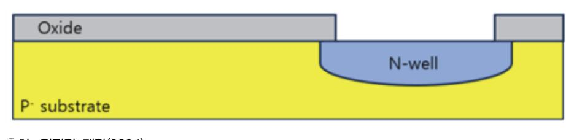

출처: 집필진 제작(2024)

[그림 1-2] 확산에 의한 N-well 형성

- (4) 금속 배선 및 패시베이션
  - (가) 금속 배선: 웨이퍼 표면에 금속을 증착하여 전기적으로 연결한다.

(나) 패시베이션(Passivation): 외부 환경으로부터 소자를 보호하기 위해 보호층을 형성한다.

- 6. CMOS 공정 기술
  - (1) 스케일링 법칙
    - (가) Dennard Scaling: 트랜지스터 크기 축소 시 전력 소비와 성능을 개선한다.
    - (나) Moore's Law: 반도체 소자의 밀도가 약 18개월마다 2배 증가한다.
  - (2) 최신 공정 기술
    - (가) FinFET: 트랜지스터 게이트를 3차원으로 구성하여 전류 제어를 개선한다.
    - (나) GAA(Gate-All-Around): 채널을 전방위에서 감싸는 구조로 전력 소비는 감소하고 성능 은 향상된다.
- 7. CMOS 소자의 특성 및 분석
  - (1) I-V 특성
    - (가) NMOS I-V 특성: 게이트 전압에 따른 드레인 전류 변화를 분석한다.
    - (나) PMOS I-V 특성: NMOS와 대칭적인 I-V 특성을 분석한다.
  - (2) 기생 소자 효과
    - (가) 기생 커패시턴스: 소자 간의 기생 커패시턴스로 인해 신호가 지연 발생한다.
    - (나) 기생 저항: 소자의 내부 저항으로 인해 전력 손실이 발생한다.
  - (3) 신호 무결성 분석
    - (가) 크로스토크: 인접한 배선 간의 전자기 간섭으로 인해 신호 왜곡이 발생한다.
    - (나) 전력 무결성: 전원 및 접지 네트워크의 전압 강하를 분석한다.

#### 8. 종합적인 이해

CMOS 기술은 반도체 소자의 설계 및 제조에서 핵심적인 역할을 하며, 낮은 전력 소비와 높은 소자 밀도, 간단한 설계 등 다양한 장점을 제공한다. CMOS 기술의 기본 원리, 회로 설계, 제조 공정 및 최신 기술 동향을 이해함으로써 반도체 설계와 제조의 전반적인 과정을 깊이 있게 파악할 수 있다. 이러한 지식을 바탕으로 효율적인 반도체 설계와 고성능 소자의 개발이 가능하다.

#### 숖 디시털 회로 설계

디지털 회로 설계는 이진수(0과 1)를 사용하여 논리적 연산을 수행하는 전자 회로를 설계하는 과정이다. 이 과정은 반도체 소자의 설계 및 제작, 그리고 다양한 디지털 시스템의 개발에 필 수적인 역할을 한다. 디지털 회로 설계는 논리 게이트, 플립플롭, 카운터, 레지스터, 프로세서 등의 기본 블록을 포함하며, 이들 블록을 결합하여 복잡한 디지털 시스템을 구성한다.

- 1. 디지털 회로의 기본 개념
  - (1) 이진수와 논리 연산
    - (가) 이진수: 0과 1로 이루어진 수 체계이다. 디지털 회로의 기본 표현 단위이다.
    - (나) 논리 연산: AND, OR, NOT, NAND, NOR, XOR, XNOR 등 기본 논리 게이트를 사 용하여 수행한다.
  - (2) 논리 게이트
    - (가) AND 게이트: 두 입력이 모두 1일 때 출력이 1이다.
    - (나) OR 게이트: 두 입력 중 하나 이상이 1일 때 출력이 1이다.
    - (다) NOT 게이트: 입력의 반대가 출력이다.
    - (라) NAND, NOR, XOR, XNOR 게이트: 기본 게이트의 조합으로 이루어진 복합 논리 연산 이다.
- 2. 조합 논리 회로
  - (1) 조합 논리의 정의
    - (가) 조합 논리 회로: 현재 입력 상태에 따라 출력이 결정되는 회로이며 메모리 요소가 없다. 예: 반가산기, 전가산기, 디코더, 인코더, 멀티플렉서, 디멀티플렉서 등
  - (2) 반가산기와 전가산기
    - (가) 반가산기: 두 비트의 이진수 덧셈을 수행한다. 출력은 합(Sum)과 자리올림(Carry)으로 구성된다.
    - (나) 전가산기: 세 비트의 이진수 덧셈을 수행한다. 입력은 두 비트와 이전 자리에서 넘어온

- (3) 논리 설계
  - (가) RTL 설계: Register Transfer Level 설계이다. 하드웨어 설명 언어(HDL)로 회로의 동 작을 정의한다.
- (나) 데이터 경로 설계: 데이터의 흐름과 처리 과정을 설계한다.

- (2) 설계 사양 정의

(가) 블록 다이어그램 작성: 주요 기능 블록과 그 상호 연결 관계를 정의한다.

- (나) 성능 요구 사항: 속도, 전력 소모, 면적 등 성능 목표를 설정한다.
- (가) 기능 요구 사항: 회로가 수행해야 할 기능을 정의한다.
- (1) 요구 사항 분석 및 사양 정의
- 4. 디지털 회로 설계 흐름
- (나) 동기 카운터: 모든 플립플롭이 동일한 클록 신호를 받아 동작한다.
- (가) 비동기 카운터: 플립플롭이 순차적으로 클록 신호를 전달받아 동작한다.
- (4) 카운터
- (나) 시프트 레지스터: 데이터를 입력받아 클록 신호에 따라 좌우로 이동한다.
- (가) 레지스터: 다수의 플립플롭을 결합하여 데이터를 저장한다.
- (3) 레지스터와 시프트 레지스터
- (다) T 플립플롭: 토글 입력(T)에 따라 상태가 변하며 카운터 회로에서 주로 사용한다.
- (나) JK 플립플롭: J와 K 입력에 따라 상태가 변하며 다양한 동작 모드를 제공한다.
- (가) D 플립플롭: 데이터 입력(D)을 클록 신호에 따라 출력(Q)으로 저장한다.
- (2) 플립플롭
- 예: 플립플롭, 레지스터, 카운터, 상태 머신 등
- 가 포함된다.
- (가) 순차 논리 회로: 현재 입력과 이전 상태에 따라 출력이 결정되는 회로이다. 메모리 요소
- (1) 순차 논리의 정의
- 3. 순차 논리 회로
- (나) 디멀티플렉서(DEMUX): 하나의 입력을 여러 개의 출력 중 하나로 전달하는 회로이다.
- (가) 멀티플렉서(MUX): 여러 개의 입력 중 하나를 선택하여 출력으로 보내는 회로이다.
- (3) 멀티플렉서와 디멀티플렉서
- 자리올림(Carry-In)으로 구성된다.

(4) 합성

(가) 논리 합성: RTL 코드를 게이트 레벨 네트리스트로 변환한다.

(가) 플로어 플래닝: 칩의 물리적 배치와 전력 분배 네트워크를 설계한다.

(나) 배치 및 배선: 각 셀의 위치를 배치하고, 셀 간의 배선을 연결한다.

(나) 타이밍 검증: 클록 주기 내에 모든 신호가 안정화되는지 확인한다.

(가) ModelSim, VCS: HDL 코드의 기능 시뮬레이션 도구이다.

(나) 기능: 설계의 논리적 동작을 시뮬레이션하여 검증한다.

(나) 기능: 최적화된 게이트 수준의 회로를 생성한다.

(나) 기능: 칩의 물리적 레이아웃을 설계하고 최적화한다.

(가) Mentor Graphics Calibre: DRC, LVS, PEX 검증 도구이다.

(가) 기능 검증: 설계가 요구 사항을 충족하는지 확인한다.

(다) 전력 분석: 전력 소모를 분석하고 최적화한다.

(나) 최적화: 성능, 전력 소모, 면적을 최적화한다.

(6) 검증

(5) 물리적 설계

5. 디지털 회로 설계 도구

(1) HDL 시뮬레이터

(2) 논리 합성 도구

(3) 물리적 설계 도구

다.

검증한다.

지털 회로를 설계할 수 있다.

(4) 검증 도구

6. 종합적인 이해 디지털 회로 설계는 기본 논리 게이트부터 시작하여 조합 논리 회로와 순차 논리 회로를 통해 복잡한 디지털 시스템을 구성하는 과정이다. 설계 흐름은 요구 사항 분석에서 시작하 여 논리 설계, 합성, 물리적 설계, 검증으로 이어지며, 각 단계에서 다양한 도구를 사용하여 설계의 정확성과 최적화를 보장한다. 이러한 지식과 기술을 통해 효율적이고 성능 좋은 디

(가) Synopsys Design Compiler: RTL 코드를 게이트 레벨 네트리스트로 변환한다.

(가) Cadence Innovus, Synopsys IC Compiler II: 플로어 플래닝, 배치, 배선을 수행한

(나) 기능: 레이아웃이 설계 규칙을 준수하는지 확인하고, 레이아웃과 회로도의 일치 여부를

숗 자동 배치 배선 레이아웃 설계

자동 배치 배선 레이아웃 설계(Automatic Place and Route, P&R)는 반도체 칩 설계 과정에 서 논리적 설계를 실제 실리콘 칩에 구현하는 물리적 레이아웃으로 변환하는 중요한 과정이다. 이 과정을 이해하고 효과적으로 수행하기 위해서는 여러 가지 기술적 배경 지식과 도구 사용 능력이 필요하다. 아래는 P&R 설계를 이해하기 위한 필요 지식이다.

1. 설계 흐름 이해

- (1) 설계 흐름 단계
  - (가) RTL 설계: Register Transfer Level 설계, 하드웨어 설명 언어(HDL)를 사용한다.
  - (나) 논리 합성: RTL을 게이트 레벨 네트리스트로 변환한다.
  - (다) 물리적 설계: 플로어 플래닝, 배치, 배선, 검증 과정이다.
- (2) 설계 규칙
  - (가) 디자인 룰 체크(DRC): 레이아웃이 공정 기술의 디자인 룰을 준수하는지 확인한다.
  - (나) 레이아웃-회로 일치 검사(LVS): 레이아웃과 회로도의 일치 여부를 검증한다.
  - (다) 기생 소자 추출(PEX): 기생 저항, 기생 커패시턴스 등을 추출하여 분석한다.

#### 2. 플로어 플래닝

- (1) 플로어 플래닝의 목적
  - (가) 칩 크기 결정: 전체 칩 크기와 I/O 패드의 위치를 결정한다.
  - (나) 기본 블록 배치: 주요 기능 블록(매크로, 메모리 등)의 위치를 설정한다.
  - (다) 전원 및 접지 계획: 안정적인 전력 공급을 위한 네트워크를 설계한다.
- (2) 영역 할당
  - (가) Congestion 분석: 셀 밀도가 높은 영역을 식별 및 조정한다.
  - (나) 매크로(Macro) 배치: 메모리, 아날로그 블록 등 주요 매크로를 배치한다.
- 3. 자동 배치 및 배선
  - (1) 표준 셀 배치
    - (가) 셀 배치 알고리즘: 최적의 셀 배치를 위한 알고리즘을 이해한다.
    - (나) 타이밍 제약 조건: 타이밍 분석을 통해 크리티컬(Critical) 경로 식별 및 최적화한다.
  - (2) 배선 알고리즘
    - (가) 배선 최적화: 신호 경로 최적화, 신호 지연을 최소화한다.
    - (나) 전원/접지 배선: 안정적인 전력 공급을 위한 전원 및 접지 배선을 한다.
- 4. 타이밍 분석 및 최적화

(1) 타이밍 분석

(가) Setup time, hold time: 타이밍 제약 조건을 이해 및 분석한다.

(나) 타이밍 경로 분석: 크리티컬 경로 식별 및 최적화한다.

- (2) 타이밍 최적화 기법
  - (가) 리타이밍: 타이밍 제약을 충족하기 위한 리타이밍 기법이다.
  - (나) 버퍼 삽입: 신호 지연 최소화를 위한 버퍼를 삽입한다.
- 5. 신호 무결성 및 전력 분석
  - (1) 신호 무결성
    - (가) 신호 지연 및 크로스토크: 신호 지연 분석 및 크로스토크를 최소화한다.
    - (나) 신호 무결성 검증: 신호 무결성을 유지하기 위한 검증 기법이다.
  - (2) 전력 분석
    - (가) 전력 소모 분석: 전력 소모 분석 및 최적화 기법이다.
    - (나) 전력 그리드 설계: 전력 분배의 효율성을 높이기 위한 전력 그리드를 설계한다.
- 6. EDA 도구 사용
  - (1) 주요 EDA 도구
    - (가) Cadence Innovus: 종합적인 물리적 설계 도구이다.
    - (나) Synopsys IC Compiler II: 고급 플로어 플래닝과 배치/배선 기능이다.
    - (다) Mentor Graphics Olympus-SoC: 플로어 플래닝, 배치, 배선 및 타이밍 분석 도구이 다.
  - (2) 검증 도구
    - (가) Mentor Graphics Calibre: DRC, LVS, PEX 검증 도구이다.
    - (나) Synopsys Hercules: DRC 및 LVS 검증 도구이다.
    - (다) Cadence Assura: DRC 및 LVS 검증 도구이다.
  - (3) 시뮬레이션 도구
    - (가) Cadence Spectre: 아날로그 및 혼성 신호 시뮬레이션 도구이다.
    - (나) Synopsys HSPICE: 고정밀 아날로그 시뮬레이션 도구이다.

#### 7. 다음의 종합적인 접근 방법을 준수한다.

- (1) 기초 지식 습득: 반도체 기초, 디지털 회로 설계, 타이밍 분석 등을 파악한다.
- (2) 설계 흐름 이해: RTL 설계, 논리 합성, 물리적 설계 흐름을 이해한다.
- (3) 플로어 플래닝: 칩 크기 결정, 기본 블록 배치, 전원 및 접지 계획을 한다.

- (4) 배치 및 배선: 셀 배치 알고리즘, 배선 최적화, 전원/접지 배선을 한다.
- (5) 타이밍 및 신호 무결성 분석: 타이밍 분석, 신호 무결성을 검증한다.
- (6) EDA 도구 사용 능력: 주요 EDA 도구 사용법과 기능을 숙지한다.
- (7) 검증 및 최적화: DRC, LVS, PEX 검증 및 타이밍을 최적화한다.

이와 같은 지식과 도구를 바탕으로 반도체 레이아웃 설계의 자동 배치 및 배선 작업을 이해하 고 수행할 수 있다.

#### 수 플로어 플래닝의 주요 단계

자동 배치 배선 레이아웃 설계의 플로어 플래닝(Floor Planning)은 반도체 설계 과정에서 매 우 중요한 단계이다. 플로어 플래닝은 칩의 물리적 구조를 결정하고, 각 구성 요소의 위치를 최적화하여 성능, 전력 소비, 면적을 최적화하는 작업이다. 이 단계에서의 결정은 전체 설계의 성공에 큰 영향을 끼치므로 체계적인 접근이 필요하다.

1. 초기 플로어 플래닝

- (1) 설계 요구 사항 분석: 설계 목표와 제약 조건을 분석한다.
- (2) 칩 크기 결정: 전체 칩 크기를 결정하고, I/O 패드의 위치를 배치한다.
- (3) 기본 블록 배치: 주요 기능 블록(매크로, 메모리 등)의 위치를 설정한다.
- 2. 전원 및 접지 계획
  - (1) 전원 및 접지 네트워크 설계: 안정적인 전력 공급을 위해 전원(VDD) 및 접지(GND) 네트워 크를 설계한다.
  - (2) 전력 그리드 배치: 전원 및 접지 라인의 배치를 결정하여 전력 분배의 효율성을 높인다.
- 3. 블록 및 셀 배치
  - (1) 매크로 배치: 메모리, 아날로그 블록 등 주요 매크로를 배치한다.
  - (2) 표준 셀 영역 정의: 표준 셀들이 배치될 영역을 정의한다.
  - (3) Congestion 분석: 셀 밀도가 높은 영역을 식별하고 필요시 조정한다.
- 4. 타이밍 분석 및 최적화
  - (1) 초기 타이밍 분석: 초기 배치에서의 타이밍 분석을 수행하여 크리티컬 경로를 식별한다.
  - (2) 경로 최적화: 타이밍 제약 조건을 충족하기 위해 셀 배치와 경로를 최적화한다.
- 5. 인터커넥트 플래닝
  - (1) 배선 계층 구조 설계: 배선 층을 정의하고, 신호, 전원 및 접지 라인의 층을 결정한다.
  - (2) 신호 무결성 분석: 신호 지연, 크로스토크 등을 분석하여 배선 구조를 최적화한다.

6. 검증 및 반복

- (1) DRC 및 LVS 검증: 디자인 룰 체크(DRC)와 레이아웃-회로 일치 검사(LVS)를 수행하여 설 계가 규칙을 준수하는지 확인한다.
- (2) 피드백 및 반복: 검증 결과를 바탕으로 플로어 플래닝을 수정하고, 반복하여 최적화한다.
- 7. 필요한 장비 및 도구
  - (1) 하드웨어 장비
    - (가) 고성능 워크스테이션: 멀티코어 프로세서, 대용량 메모리, 빠른 SSD이다.
    - (나) 서버 인프라: 병렬 처리 지원을 위한 컴퓨팅 클러스터이다.
    - (다) 디스플레이: 다중 모니터 및 고해상도 모니터이다.
  - (2) 소프트웨어 도구
    - (가) 플로어 플래닝 도구
      - 1) Cadence Innovus: 종합적인 물리적 설계 도구이다.
      - 2) Synopsys IC Compiler II: 고급 플로어 플래닝과 배치/배선 기능이다.
      - 3) Mentor Graphics Olympus-SoC: 플로어 플래닝, 배치, 배선 및 타이밍 분석 도 구이다.
    - (나) 검증 도구
      - 1) Mentor Graphics Calibre: DRC, LVS, PEX 검증 도구이다.
      - 2) Synopsys Hercules: DRC 및 LVS 검증 도구이다.
      - 3) Cadence Assura: DRC 및 LVS 검증 도구이다.
    - (다) 타이밍 분석 도구
      - 1) Cadence Tempus: 타이밍 분석 및 최적화 도구이다.
      - 2) Synopsys PrimeTime: 타이밍 분석 도구이다.
  - (3) 데이터 관리 시스템
    - (가) 버전 관리 시스템: Git, SVN이 있다.
    - (나) 백업 솔루션: 자동 백업 시스템, 오프사이트를 백업한다.
- 8. 안전 및 유의 사항
  - (1) 데이터 보안 및 관리
    - (가) 접근 제어: 중요 설계 데이터에 대한 접근 권한을 제한한다.
    - (나) 데이터 백업: 정기적인 데이터 백업 수행 및 안전하게 보관한다.
    - (다) 버전 관리: 파일 변경 이력을 추적하여 데이터 무결성을 유지한다.
  - (2) 소프트웨어 사용 시 유의 사항

16

(7) 검증 및 반복: DRC, LVS 검증, 피드백 및 반복한다.

(6) 인터커넥트 플래닝: 배선 계층 구조 설계, 신호 무결성 분석한다.

(5) 타이밍 분석 및 최적화: 초기 타이밍 분석, 경로 최적화한다.

이와 같은 체계적인 접근을 통해 반도체 레이아웃 설계의 자동 배치 및 배선 작업에서 플 로어 플래닝을 효율적으로 수행할 수 있다.

- (3) 전원 및 접지 계획: 전원/접지 네트워크를 설계 및 배치한다.
- (2) 초기 플로어 플래닝: 설계 요구 사항 분석, 칩 크기 결정, 기본 블록을 배치한다.
- (1) 설계 준비: 논리 네트리스트, 기술 파일, 라이브러리 준비한다.

(4) 블록 및 셀 배치: 매크로 배치, 표준 셀 영역 정의, Congestion을 분석한다.

(6) 법적 및 규제 준수

(가) 산업 규정 준수: 반도체 설계와 관련된 모든 산업 규정을 준수한다.

(나) 개인 정보 보호: 설계 과정에서 「개인 정보 보호법」을 준수한다.

- (나) 비상 대응 계획: 비상 상황에 대비한 대응 계획 수립 및 모의 훈련을 한다.
- (가) 교육 및 훈련: 팀원들에게 필요한 교육과 훈련을 제공한다.

9. 다음의 종합적인 접근 방법을 준수한다.

- (5) 인적 요소 관리
- (나) 시스템 모니터링: 시스템 모니터링 도구를 사용하여 자원 사용량을 실시간 확인한다.
- (가) 작업 공간 정리: 안전한 작업 환경을 유지한다.
- (4) 작업 환경 관리
- (나) 전력 관리: 안정적인 전력 공급을 위한 UPS를 사용한다.
- (가) 장비 안전: 워크스테이션과 서버를 안전하게 설치 및 운영한다.
- (3) 하드웨어 사용 시 유의 사항
- (나) 정기 업데이트: EDA 도구와 소프트웨어를 정기적으로 업데이트한다.
- (가) 라이선스 관리: 소프트웨어 라이선스의 적법하게 관리한다.

## 수행 내용 / 플로어 플래닝(Floor Planning)하기

#### 재료·자료

- 설계 데이터(회로도, 라이브러리 파일 등)
- 기술 파일 및 규칙(기술 파일, DRC, LVS)
- 물리적 설계 자료(핀 배치 정보, 전력 및 접지 계획)
- 설계 제약 및 요구 사항(타이밍 제약 파일, 물리적 제약 파일)
- EDA 도구 및 스크립트(플로어 플래닝 도구, 자동 배치 및 배선 도구, 검증 도구)
- 문서 및 가이드(설계 문서, 기술 매뉴얼 등)

#### 기기(장비 ・ 공구)

- 소프트웨어 도구(플로어 플래닝 도구, 검증 도구 기생 소자 추출 도구 등)
- 하드웨어 장비(고성능 워크스테이션, 서버 인프라)
- 부가적인 장비 및 공구(디스플레이 및 입력 장치, 회의 및 협업 도구)
- 데이터 관리 및 백업 시스템
- 교육 및 문서(교육 자료, 문서화 도구 등)

#### 안전 ・ 유의 사항

- 데이터 보안 및 관리(데이터 접근 제어, 데이터 백업 및 복구), 버전 관리
- 소프트웨어 라이선스 관리 및 업데이트
- 하드웨어 장비 안전 및 전력 관리
- 작업 공간 정리 및 시스템 모니터링

- 산업 규정 준수 및 개인 정보 보호

#### 수행 순서

숔 설계 공정에서 사용하는 표준 셀 라이브러리(Cell Library)의 특성을 파악한다. 반도체 레이아웃 설계의 자동 배치 및 배선(P&R: Place and Route) 과정에서 표준 셀 라이 브러리의 특성을 파악하는 것은 매우 중요하다. 표준 셀 라이브러리는 반도체 설계에서 기본 빌딩 블록으로 사용되며, 효율적인 설계와 최적화된 성능을 위해 다양한 특성을 고려해야 한 다. 아래는 표준 셀 라이브러리의 주요 특성과 이를 파악하는 데 필요한 요소들이다. 이와 같은 접근을 통해 반도체 레이아웃 설계에서 표준 셀 라이브러리를 효율적으로 활용하고, 설계의 품질과 성능을 최적화할 수 있도록 한다.

1. 표준 셀 라이브러리의 주요 특성을 파악한다.

(1) 전기적 특성

(가) 전압 및 전류 특성: 셀의 동작 전압 범위, 전력 소비, 입력 및 출력 전류 특성이다.

1) 파라미터: Vdd, Vss, I/O 전압, 전력 소비(dynamic/static power), 누설 전류 (나) 지연 및 속도 특성: 셀의 전파 지연 시간 및 트랜지스터의 속도이다.

1) 파라미터: 프로파게이션 딜레이, 트랜지스터 온/오프 시간, 상승 및 하강 시간 (2) 물리적 특성

(가) 셀 크기: 각 셀의 물리적 크기와 모양이다.

1) 파라미터: 셀 폭과 높이, 셀 영역

(나) 핀 배치 및 경로: 입력, 출력, 전력 및 접지 핀의 위치와 배치이다.

1) 파라미터: 핀 위치, 핀 간격, 핀 레이어 정보

(3) 기능적 특성

(가) 논리 기능: 셀의 논리 기능(예: AND, OR, NOT, 플립플롭 등)이다.

1) 파라미터: 논리 방정식, 진리표

(나) 기능적 타이밍: 기능적 동작 시의 타이밍 특성이다.

1) 파라미터: 클록 주기, 셋업 타임, 홀드 타임

(4) 신뢰성 및 테스트 특성

(가) 테스트용 삽입 기능: DFT(Design for Testability) 요소 포함 여부이다. 1) 파라미터: 스캔 플롭, BIST(Built-In Self-Test) 기능

(나) 신뢰성 특성: 셀의 신뢰성과 수명 특성이다.

1) 파라미터: EM(Electromigration) 한계, IR 드롭 허용 범위, 열 특성

2. 표준 셀 라이브러리 특성 파악을 위한 자료를 확인한다.

(1) 데이터 시트

(가) 내용

각 표준 셀의 전기적, 물리적, 기능적 특성을 포함한 데이터 시트이다.

(나) 활용

전압 및 전류 특성, 지연 및 속도 특성, 셀 크기, 논리 기능 등을 파악할 수 있다.

(2) 라이브러리 교차표(Liberty Files)

(가) 내용

셀의 타이밍, 전력, 기능적 특성을 기술한 라이브러리 파일(예: .lib 파일)이다.

(나) 활용

셀의 타이밍 분석, 전력 분석, 기능적 시뮬레이션을 위해 사용된다.

- (3) 레이아웃 정보(LEF Files)
  - (가) 내용

셀의 물리적 레이아웃 정보를 포함한 파일(예: .lef 파일)이다.

(나) 활용

배치 및 배선 도구에서 셀의 배치와 물리적 설계를 최적화하는 데 사용된다.

(4) SPICE 모델

- - (가) 내용

셀의 기능적 특성을 기술한 Verilog 모델이다.

3. 설계 공정에서 표준 셀 라이브러리 특성 파악 절차를 확인한다.

경우 저전력 셀을 우선하여 고려한다.).

(나) 활용

- (가) 내용

- (5) Verilog 모델
- 회로 시뮬레이션을 통해 셀의 전기적 특성을 정밀하게 분석한다.

- (나) 활용

셀의 아날로그 특성을 시뮬레이션하기 위한 SPICE 모델이다.

디지털 시뮬레이션을 통해 셀의 기능적 동작을 검증한다.

(가) 활동

(가) 활동

(1) 셀 선택 기준 설정

19

표준 셀의 데이터 시트와 라이브러리 파일을 분석하여 각 셀의 특성을 파악한다(예: .lib 파일을 분석하여 타이밍, 전력, 기능적 특성을 이해한다.).

설계 목표와 요구 사항을 기반으로 셀 선택 기준을 설정한다(예: 전력 소비가 중요한

(3) 시뮬레이션 및 검증

(2) 데이터 시트 및 라이브러리 분석

(가) 활동

SPICE 시뮬레이션을 통해 셀의 전기적 특성을 검증하고, Verilog 시뮬레이션을 통 해 셀의 기능적 동작을 검증한다.

- (4) 물리적 레이아웃 검토
  - (가) 활동
    - 1) LEF 파일을 사용하여 셀의 물리적 배치와 핀 배치를 검토한다.
    - 2) 셀 간 간섭을 최소화하고 배선 경로를 최적화한다.
- (5) 신뢰성 및 테스트 검토
  - (가) 활동
    - 1) 셀의 신뢰성 특성과 테스트 용이성을 검토한다.
    - 2) DFT 기능과 신뢰성 파라미터를 확인하여 설계에 반영한다.
- 4. 다음의 종합적인 접근 방법을 준수한다.
  - (1) 정기적인 업데이트

표준 셀 라이브러리를 정기적으로 업데이트하고 최신 버전을 사용한다.

(2) 교육 및 훈련

설계자들에게 표준 셀 라이브러리의 특성과 사용 방법에 대한 교육을 실시한다.

(3) 자동화 도구 활용

EDA 툴을 활용하여 셀의 특성을 자동으로 분석하고 최적의 셀을 선택한다.

(4) 협력 및 피드백

라이브러리 제공업체와 협력하여 라이브러리 특성을 지속해서 개선한다.

#### 숕 설계 공정의 설계 권고 사항에 따라 자동 배치 배선을 위한 환경을 구축한다.

반도체 레이아웃 설계의 자동 배치 및 배선(Place and Route, P&R) 공정은 설계 효율성을 높이고 최적의 성능을 달성하기 위해 중요하다. 이를 위해 설계 권고 사항에 따라 자동 배치 및 배선 환경을 구축하는 과정은 다음과 같은 단계로 구성한다.

이와 같은 체계적인 접근을 통해 반도체 레이아웃 설계의 자동 배치 및 배선 환경을 효율적으 로 구축할 수 있도록 한다.

- 1. 환경 설정 및 초기 구성을 한다.
  - (1) EDA 툴 선택 및 설치
    - (가) 활동
      - 1) P&R 작업을 지원하는 EDA(전자 설계 자동화) 툴을 선택한다.
      - 2) 일반적으로 사용하는 툴: Cadence Innovus, Synopsys ICC2, Mentor Graphics Calibre 등이다.

(나) 유의 사항

툴의 설치 및 라이선스 관리를 철저히한다.

- (2) 설계 라이브러리 설정
  - (가) 활동

1) 표준 셀 라이브러리, I/O 라이브러리, 메모리 매크로 등의 라이브러리를 설정한다.

- 2) 라이브러리 파일: .lib, .lef, .gds, .db, .tlu+ 등이다.
- (나) 유의 사항

라이브러리 파일이 최신 버전인지 확인하고, 정확한 경로로 설정한다.

- (3) 기술 파일 및 제약 조건 설정
  - (가) 활동

1) 기술 파일(TF), 레이어 파일, DRC 규칙 파일, LVS 규칙 파일 등을 설정한다.

2) 설계 제약 조건: 타이밍 제약(SDC 파일), 전력 제약, 물리적 제약 등을 설정한다.

(나) 유의 사항

각 파일이 설계 기술 노드와 일치하는지 확인한다.

- 2. 초기 설계 입력 및 검증한다.
  - (1) 설계 데이터 입력
    - (가) 활동

네트리스트(VHDL, Verilog), 레이아웃(.def, .gds), 타이밍 제약(SDC) 등을 툴에 입 력한다.

(나) 유의 사항

넷리스트와 제약 조건이 일치하는지 검토한다.

- (2) 초기 배치
  - (가) 활동

1) 초기 셀 배치를 수행하여 주요 셀의 위치를 결정한다.

2) 핀 배치 및 매크로 배치: I/O 핀, 파워 그리드, 메모리 블록 등의 위치를 설정한다.

(나) 유의 사항

배치 밀도와 타이밍 경로를 고려하여 주요 셀과 매크로의 위치를 최적화한다.

(3) 전력망 구축

(가) 활동

전력 분배 네트워크(PDN: Power Distribution Network)를 설계하여 VDD, VSS 라인을 배치한다.

(나) 유의 사항

전력 소모가 높은 영역에 충분한 전력 공급이 이루어지도록 설계한다.

- 3. 자동 배치 및 배선한다.
  - (1) 배치 최적화
    - (가) 활동
      - 1) 자동 배치 알고리즘을 사용하여 셀의 위치를 최적화한다.
      - 2) 배치 최적화 목표: 타이밍, 전력 소비, 면적을 최소화한다.
    - (나) 유의 사항

타이밍 경로가 중요한 셀은 경로 최적화를 우선시한다.

- (2) 자동 배선
  - (가) 활동

1) 자동 배선 알고리즘을 사용하여 셀 간의 신호를 연결한다.

- 2) 배선 최적화 목표: 신호 지연 최소화, 크로스토크 감소, 배선 길이 최소화한다.
- (나) 유의 사항

배선 밀도가 높은 영역은 크로스토크와 전력 소모를 줄이기 위한 추가 배선 규칙을 적용한다.

#### 4. 검증 및 최적화한다.

- (1) 타이밍 분석
  - (가) 활동
    - 1) STA(Static Timing Analysis)를 통해 타이밍 검증을 수행한다.
    - 2) 경로 지연, 클록 스큐, 셋업 및 홀드 타임을 분석한다.
  - (나) 유의 사항

타이밍 위반이 발생하면 배치와 배선을 수정하여 타이밍을 최적화한다.

- (2) 전력 분석
  - (가) 활동
    - 1) 전력 분석 툴을 사용하여 정적 전력, 동적 전력 소비를 분석한다.
    - 2) 전력 맵을 생성하여 고전력 영역을 식별한다.
  - (나) 유의 사항

전력 소모가 높은 영역에 대한 최적화 작업을 수행한다.

- (3) 물리적 검증
  - (가) 활동
    - 1) DRC(Design Rule Check), LVS(Layout vs. Schematic) 검증을 수행하여 물리 적 규칙 준수 여부를 확인한다.

- 2) ERC(Electrical Rule Check)와 PERC(Physical Electrical Rule Check)를 추가 로 수행한다.
- (나) 유의 사항

모든 규칙 위반 사항을 수정하여 재검증한다.

- 5. 최종 검증 및 마무리한다.
  - (1) 성능 검증
    - (가) 활동
      - 1) 전체 설계의 성능을 검증하여 설계 목표를 충족하는지 확인한다.
      - 2) 시뮬레이션을 통해 기능적 검증을 수행한다.
    - (나) 유의 사항
  - 1) 검증된 설계를 최적화하고, 필요한 경우 재배치 및 재배선을 수행한다. (2) 문서화 및 데이터 아카이빙
    - (가) 활동
      - 1) 설계 데이터, 검증 결과, 최종 레이아웃 등을 문서화한다.
      - 2) 모든 설계 데이터를 안전하게 아카이빙한다.
    - (나) 유의 사항
      - 1) 문서화된 데이터를 검토하여 누락된 사항이 없는지 확인한다.
- 6. 다음의 종합적인 접근 방법을 준수한다.
  - (1) 자동화 도구 활용: 최신 EDA 툴과 알고리즘을 활용하여 설계 효율성을 높인다.
  - (2) 협력과 커뮤니케이션: 설계 팀 내 협력과 커뮤니케이션을 강화하여 설계 품질을 향상시킨다.
  - (3) 교육 및 훈련: 설계자들에게 최신 도구와 방법론에 대한 교육을 실시한다.
  - (4) 정기적인 검토 및 피드백: 설계 과정에서 정기적으로 검토 회의를 열고 피드백을 반영한다.
  - (5) 최신 기술 동향 반영: 반도체 기술의 최신 동향과 표준을 지속적으로 반영하여 설계 품질을 최적화한다.

#### 숖 전체 칩에 들어가는 IP의 종류 및 기능을 파악한다.

반도체 레이아웃 설계의 자동 배치 및 배선(Place and Route, P&R) 작업에서 전체 칩에 들 어가는 IP(Intellectual Property) 블록의 종류와 기능을 파악하는 것은 매우 중요하다. 각 IP 블록의 특성과 역할을 이해하면 최적의 배치와 배선을 설계할 수 있다. 이와 같은 체계적인 접 근을 통해 반도체 레이아웃 설계의 자동 배치 및 배선 과정에서 최적의 IP 블록을 선택하고 배치할 수 있다. 다음은 반도체 설계에서 자주 사용되는 주요 IP 블록의 종류와 기능이다.

- 1. 프로세서 코어(Processor Cores)를 확인한다.
  - (1) 종류: CPU, DSP, GPU
  - (2) 기능: 중앙 처리 장치로서 데이터 처리, 제어 및 계산 작업을 수행한다.
    - (가) CPU(Central Processing Unit): 범용 컴퓨팅 작업을 수행한다.
    - (나) DSP(Digital Signal Processor): 신호 처리 작업에 최적화된 프로세서이다.
    - (다) GPU(Graphics Processing Unit): 그래픽 처리 및 병렬 연산에 특화된 프로세서이다.
- 2. 메모리 블록(Memory Blocks)을 확인한다.
  - (1) 종류: SRAM, DRAM, ROM, Flash
  - (2) 기능: 데이터를 저장하고 접근하는 역할을 한다.
    - (가) SRAM(Static Random Access Memory): 고속 메모리로 캐시 메모리로 사용된다.
    - (나) DRAM(Dynamic Random Access Memory): 대용량 메모리로 주 메모리로 사용된다.
    - (다) ROM(Read-Only Memory): 프로그램 코드와 데이터를 영구적으로 저장한다.
    - (라) Flash Memory: 비휘발성 메모리로 데이터를 영구적으로 저장하며, 재기록이 가능하다.
- 3. 인터페이스 IP(Interface IP)를 확인한다.
  - (1) 종류: UART, SPI, I2C, PCIe, USB, Ethernet, HDMI
  - (2) 기능: 외부 장치와의 데이터 통신을 담당한다.
    - (가) UART(Universal Asynchronous Receiver-Transmitter): 직렬 통신을 위한 인터페이 스이다.
    - (나) SPI(Serial Peripheral Interface): 고속 직렬 통신을 위한 인터페이스이다.
    - (다) I2C(Inter-Integrated Circuit): 저속 직렬 통신을 위한 인터페이스이다.
    - (라) PCIe(Peripheral Component Interconnect Express): 고속 데이터 전송을 위한 인터 페이스이다.
    - (마) USB(Universal Serial Bus): 범용 직렬 버스 인터페이스이다.
    - (바) Ethernet: 네트워크 통신을 위한 인터페이스이다.
    - (사) HDMI(High-Definition Multimedia Interface): 고해상도 비디오 및 오디오 전송을 위 한 인터페이스이다.
- 4. 아날로그 및 혼합 신호 IP(Analog and Mixed-Signal IP)를 확인한다.
  - (1) 종류: ADC, DAC, PLL, VCO, LDO
  - (2) 기능: 아날로그 신호와 디지털 신호 간의 변환 및 처리 기능을 제공한다.
    - (가) ADC(Analog-to-Digital Converter): 아날로그 신호를 디지털 신호로 변환한다.

- (나) DAC(Digital-to-Analog Converter): 디지털 신호를 아날로그 신호로 변환한다.
- (다) PLL(Phase-Locked Loop): 주파수 합성 및 클록 생성에 사용된다.
- (라) VCO(Voltage-Controlled Oscillator): 전압 제어 발진기로 주파수 조절 기능을 제공한 다.
- (마) LDO(Low Dropout Regulator): 전압 조정기를 통해 안정적인 전원을 제공한다.
- 5. 전력 관리 IP(Power Management IP)를 확인한다.
  - (1) 종류: PMU, DC-DC 컨버터, 전력 게이트
  - (2) 기능: 칩의 전력 소모를 관리하고 효율적으로 분배한다.
    - (가) PMU(Power Management Unit): 전체 전력 관리를 담당한다.
    - (나) DC-DC Converter: 전압 변환을 통해 다양한 전압 레벨을 제공한다.
    - (다) Power Gating: 비활성 블록의 전원을 차단하여 전력 소모를 줄이다.
- 6. 임베디드 IP(Embedded IP)를 확인한다.
  - (1) 종류: 임베디드 메모리, 임베디드 프로세서, 임베디드 컨트롤러
  - (2) 기능: 시스템 내 특정 기능을 수행하는 임베디드 블록이다.
    - (가) Embedded Memory: 임베디드 시스템에 통합된 메모리 블록이다.
    - (나) Embedded Processor: 임베디드 시스템에서 특정 작업을 수행하는 프로세서이다.
    - (다) Embedded Controller: 시스템 제어 기능을 담당한다.
- 7. 보안 IP(Security IP)를 확인한다.
  - (1) 종류: 암호화 모듈, 보안 프로세서, TPM
  - (2) 기능: 데이터 보안 및 시스템 보호 기능을 제공한다.
    - (가) 암호화 모듈: 데이터 암호화 및 복호화를 수행한다.
    - (나) 보안 프로세서: 보안 관련 작업을 전담하는 프로세서이다.
    - (다) TPM(Trusted Platform Module): 하드웨어 기반의 보안 기능을 제공한다.
- 8. 커스텀 IP(Custom IP)를 확인한다.
  - (1) 종류: 사용자 정의 로직, 맞춤형 가속기
  - (2) 기능: 특정 응용 프로그램에 최적화된 사용자 정의 기능을 제공한다.
    - (가) Custom Logic: 특정 기능을 수행하도록 설계된 사용자 정의 로직이다.
    - (나) Custom Accelerator: 특정 작업을 가속화하는 맞춤형 가속기이다.
- 9. IP 블록의 특성 파악을 위한 자료를 확인한다.
  - (1) 데이터 시트

(가) 내용: 각 IP 블록의 기능, 전기적 특성, 물리적 특성, 성능 데이터 등을 포함한 기술 자료

(2) 사용자 매뉴얼

(가) 내용: IP 블록의 사용 방법, 인터페이스, 프로그래밍 가이드 등을 포함한 사용자 매뉴얼

(3) 타이밍 및 전력 분석 데이터

(가) 내용: 각 IP 블록의 타이밍 특성, 전력 소모 특성을 포함한 분석 자료

(4) 검증 및 시뮬레이션 결과

(가) 내용: IP 블록의 기능적 검증 결과와 시뮬레이션 데이터

- 10. 다음의 종합적인 접근 방법을 준수한다.
  - (1) IP 블록 특성 분석: 각 IP 블록의 기능과 특성을 면밀히 분석하여 설계 요구 사항에 맞는 IP 를 선택한다.
  - (2) 데이터 통합 및 관리: IP 블록의 데이터를 통합 관리하여 설계 과정에서 쉽게 접근하고 활용 할 수 있도록 한다.
  - (3) 자동 배치 및 배선 최적화: EDA 툴을 사용하여 IP 블록의 배치와 배선을 자동으로 최적화한 다.
  - (4) 협력과 피드백: IP 공급 업체와의 협력을 통해 최신 정보를 유지하고, 설계 과정에서 발생하 는 문제를 신속히 해결한다.
  - (5) 정기적인 검토 및 업데이트: IP 블록의 성능과 특성을 정기적으로 검토하고, 필요한 경우 업 데이트를 수행하여 최신 기술을 반영한다.

숗 IP에서 제공하는 디자인 키트(Design Kit)의 단계별 제공 일정과 완성도의 계획을 수립한다.

반도체 레이아웃 설계의 자동 배치 및 배선 작업을 효과적으로 수행하기 위해서는 IP 제공 업 체가 제공하는 디자인 키트(Design Kit)의 단계별 제공 일정과 완성도를 철저히 계획하고 관 리해야 한다. 디자인 키트는 일반적으로 각 IP 블록의 특성과 사용 방법, 검증을 위한 데이터 및 스크립트 등을 포함하며, 단계별로 점진적으로 완성되어 제공된다. 아래는 디자인 키트의 단계별 제공 일정과 완성도를 계획하는 방법이다.

이와 같은 단계별 계획을 통해 반도체 레이아웃 설계의 자동 배치 및 배선을 위한 디자인 키트 를 체계적으로 관리하고 제공할 수 있다. 이를 통해 프로젝터의 성공적인 완료와 높은 품질의 설계를 보장할 수 있다.

- 1. 디자인 키트의 구성 요소를 확인한다.
  - (1) 기술 파일(Technology Files)
  - (2) 라이브러리 파일(Library Files)

- (3) 타이밍 파일(Timing Files)
- (4) 레이아웃 파일(Layout Files)
- (5) 검증 파일(Verification Files)
- (6) 사용자 매뉴얼 및 문서(Documentation)
- 2. 단계별 제공 일정 및 완성도 계획을 확인한다.
  - (1) 초기 준비 단계(Preparation Phase)
    - (가) 활동
      - 1) 프로젝터 착수 회의를 통해 전체 일정과 단계별 목표를 설정한다.
      - 2) IP 제공 업체와 협력하여 초기 기술 파일 및 라이브러리 파일을 확보한다.
    - (나) 제공 일정: 프로젝터 시작 후 1~2주 이내
    - (다) 완성도: 20%
    - (라) 구성 요소
      - 1) 기술 파일(TF, LEF)
      - 2) 초기 라이브러리 파일(.lib, .db)
    - (마) 목표: 초기 설계 환경 설정 및 기본 설계 데이터 준비
  - (2) 타이밍 및 기능 검증 단계(Timing and Functional Verification Phase)
    - (가) 활동
      - 1) 타이밍 분석을 위한 타이밍 파일 제공 및 초기 검증 수행
      - 2) IP 블록의 기능 검증을 위한 시뮬레이션 파일 제공
    - (나) 제공 일정: 프로젝터 시작 후 4~6주 이내
    - (다) 완성도: 50%
    - (라) 구성 요소
      - 1) 타이밍 파일(SDC, STA 스크립트)
      - 2) 기능 검증 파일(Verilog, VHDL 시뮬레이션 파일)
    - (마) 목표: 타이밍 특성 분석 및 기능 검증 완료
  - (3) 레이아웃 및 배치 단계(Layout and Placement Phase)
    - (가) 활동
      - 1) 레이아웃 파일 제공 및 초기 배치 수행
      - 2) 물리적 검증을 위한 DRC, LVS 검증 파일 제공
    - (나) 제공 일정: 프로젝터 시작 후 8~10주 이내
    - (다) 완성도: 70%

- (라) 구성 요소
  - 1) 레이아웃 파일(.def, .gds)
  - 2) 물리적 검증 파일(DRC, LVS 규칙 파일)
- (마) 목표: 초기 배치 완료 및 물리적 검증 수행
- (4) 최적화 및 통합 단계(Optimization and Integration Phase)
  - (가) 활동
    - 1) 전력 및 신뢰성 검증을 위한 분석 파일 제공
    - 2) 전체 시스템 통합 및 최적화
  - (나) 제공 일정: 프로젝터 시작 후 12~14주 이내
  - (다) 완성도: 90%
  - (라) 구성 요소
    - 1) 전력 분석 파일(Power Analysis Scripts)
    - 2) 신뢰성 검증 파일(IR Drop, EM Analysis Files)
  - (마) 목표: 전력 및 신뢰성 최적화 완료, 시스템 통합
- (5) 최종 검증 및 문서화 단계(Final Verification and Documentation Phase)
  - (가) 활동
    - 1) 최종 검증 수행 및 결과 문서화
    - 2) 최종 사용자 매뉴얼 및 기술 문서 제공
  - (나) 제공 일정: 프로젝터 시작 후 16~18주 이내
  - (다) 완성도: 100%
  - (라) 구성 요소
    - 1) 최종 검증 파일(Full-chip Verification Scripts)
    - 2) 사용자 매뉴얼 및 기술 문서(User Manuals, Technical Documentation)
  - (마) 목표: 최종 검증 완료 및 문서화
- 3. 관리 및 협업 방안을 확인한다.
  - (1) 정기적인 상태 보고 및 검토 회의
    - (가) 활동
      - 1) 정기적으로 상태 보고 회의를 통해 진행 상황을 공유하고, 문제점을 논의한다.
      - 2) 주요 마일스톤마다 검토 회의를 통해 계획 대비 진행 상황을 점검한다.
    - (나) 목표: 프로젝터 일정 준수 및 문제점 조기 발견 및 해결
  - (2) 협력 도구 활용

(가) 활동

1) 프로젝터 관리 도구(예: JIRA, Trello)와 협업 도구

예: Slack, Microsoft Teams)를 활용하여 효율적인 커뮤니케이션과 협업을 촉진 한다.

(나) 목표: 팀 간 원활한 커뮤니케이션 및 실시간 협업

(3) 피드백 루프

(가) 활동

1) 각 단계에서 피드백을 수집하고, 이를 반영하여 다음 단계를 개선한다.

2) IP 제공 업체와의 긴밀한 협력을 통해 최신 정보를 반영하고 문제점을 해결한다.

- (나) 목표: 지속적인 개선과 최적화
- 4. 예시 일정표를 확인한다.

<표 1-1> 응용처별 기능 정리

| 단계                | 활동                               | 제공 일정            | 완성도  |
|-------------------|----------------------------------|------------------|------|
| 초기 준비 단계          | 기술 파일, 초기 라이브러리 파일 확보         | 프로젝터 시작 후 1~2주   | 20%  |
| 타이밍 및 기능 검증 단계 | 타이밍 파일, 기능 검증 파 일 제공          | 프로젝터 시작 후 4~6주   | 50%  |
| 레이아웃 및 배치 단 계  | 레이아웃 파일, 물리적 검증 파일 제공         | 프로젝터 시작 후 8~10주  | 70%  |
| 최적화 및 통합 단계       | 전력 분석 파일, 신뢰성 검 증 파일 제공       | 프로젝터 시작 후 12~14주 | 90%  |
| 최종 검증 및 문서화 단계 | 최종 검증 파일, 사용자 매 뉴얼 및 기술 문서 제공 | 프로젝터 시작 후 16~18주 | 100% |

수 IP들의 크기 정보 및 포트 정보와 칩의 입출력 핀의 위치를 고려하여 블록 배치 계획을 수립한다.

반도체 레이아웃 설계의 자동 배치 및 배선을 위해 IP들의 크기 정보, 포트 정보와 칩의 입출 력 핀의 위치를 고려하여 블록 배치 계획을 수립하는 것은 매우 중요하다. 이는 최적의 성능과 효율성을 달성하기 위해 반드시 필요한 단계이다. 아래는 블록 배치 계획을 수립하기 위한 주 요 단계와 고려 사항이다.

이와 같은 체계적인 접근을 통해 반도체 레이아웃 설계의 자동 배치 및 배선 작업을 효율적으 로 수행할 수 있다.

1. 초기 정보 수집 및 준비를 한다.

(1) IP 크기 정보 수집

(가) 활동: 각 IP 블록의 물리적 크기(Width, Height)를 수집한다.

(나) 자료: 각 IP 블록의 데이터 시트, 기술 문서, LEF 파일이다.

- (2) 포트 정보 수집
  - (가) 활동: 각 IP 블록의 포트 위치와 타입(Input, Output, Power, Ground)을 수집한다.
  - (나) 자료: Verilog 파일, 스키매틱, 핀 배치 정보이다.
- (3) 칩 입출력 핀 위치 확인
  - (가) 활동: 칩의 입출력 핀의 위치와 연결될 IP 블록의 포트를 확인한다.
  - (나) 자료: 패키지 핀 맵, 입출력 설계 문서이다.

#### 2. 초기 배치 계획을 수립한다.

- (1) 주요 IP 블록 배치
  - (가) 활동
    - 1) 주요 IP 블록(CPU, 메모리, 인터페이스 IP 등)을 배치할 위치를 결정한다.
    - 2) 고주파, 고전력 IP 블록은 중앙에 배치하고, 주변에 I/O 블록을 배치한다.
  - (나) 고려 사항

다.

(2) 전력 분배 네트워크(PDN) 계획

1) 타이밍 경로를 최적화하기 위해 주요 데이터 경로에 있는 IP 블록을 가까이 배치한

2) 전력 소모가 큰 IP 블록 주위에 충분한 전력 패드를 배치한다.

2) 전력 소비가 높은 블록은 전력 분배가 용이한 위치에 배치한다.

- (3) 입출력 블록 배치

1) 전력 공급망과 접지망을 배치한다.

- (나) 고려 사항: 전력 무결성과 IR 드롭을 최소화하기 위한 전력 분배 설계를 한다.

3. 세부 배치 및 타이밍을 최적화한다.

(1) 상세 배치 계획

(가) 활동

(가) 활동

(가) 활동

- 1) 칩의 입출력 핀 위치에 따라 I/O 블록을 배치한다.

- 2) 데이터, 클록, 제어 신호가 짧은 경로로 연결될 수 있도록 I/O 블록을 배치한다.
- (나) 고려 사항: 신호 무결성을 유지하기 위한 배선 길이를 최소화한다.

1) 각 IP 블록의 위치를 세부적으로 조정하여 배치한다.

2) 자동 배치 도구를 사용하여 최적의 배치를 수행한다.

(나) 고려 사항

1) 타이밍 경로를 고려한 셀 간격 및 위치를 조정한다.

2) 전력, 열 분포를 고려한 배치를 조정한다.

(2) 배선 계획 및 라우팅

(가) 활동

1) 자동 배선 도구를 사용하여 신호, 전력, 접지 라인을 배선한다.

2) 주요 타이밍 경로를 우선하여 배선하고, 크로스토크를 최소화한다.

(나) 고려 사항

1) 신호 무결성을 유지하기 위한 배선 길이 및 간격을 최적화한다.

2) 전력 배선을 통해 전력 무결성을 확보한다.

4. 검증 및 조정한다.

(1) 타이밍 검증

(가) 활동

1) STA(Static Timing Analysis)를 통해 타이밍 검증을 수행한다.

2) 타이밍 경로 위반 시 배치 및 배선을 조정한다.

(나) 고려 사항

1) 클록 도메인 간의 타이밍 경로를 최적화한다.

2) 셋업 타임, 홀드 타임 위반 문제를 해결한다.

(2) 전력 및 신뢰성 검증

(가) 활동

1) 전력 분석 도구를 사용하여 전력 소비를 분석한다.

2) 신뢰성 검증(EM, IR Drop)을 수행하여 문제가 발생하는 영역을 조정한다.

(나) 고려 사항

1) 전력 소모가 큰 블록 주위의 배선을 최적화한다.

2) 신뢰성 문제를 해결하기 위한 배치 및 배선을 조정한다.

(3) 물리적 검증

(가) 활동

1) DRC(Design Rule Check), LVS(Layout vs. Schematic) 검증을 수행하여 물리 적 규칙 준수 여부를 확인한다.

2) 모든 규칙 위반 사항을 수정하여 재검증한다.

(나) 고려 사항

1) 배치 및 배선의 규칙 위반 사항을 해결한다.

- 5. 최종 검증 및 문서화한다.
  - (1) 최종 검증
    - (가) 활동: 전체 설계의 최종 검증을 수행하여 설계 목표를 충족하는지 확인한다.
    - (나) 고려 사항: 기능적 검증, 타이밍 검증, 전력 검증 등 모든 검증 작업을 완료한다.
  - (2) 문서화
    - (가) 활동
      - 1) 최종 설계 데이터를 문서화하고, 검증 결과를 기록한다.
      - 2) 최종 레이아웃, 배치 및 배선 계획을 문서화하여 공유한다.
    - (나) 고려 사항: 문서화된 데이터를 검토하여 누락된 사항이 없는지 확인한다.
- 6. 종합적인 계획을 한다.
  - (1) 초기 정보 수집 및 준비: 모든 필요한 IP 정보, 포트 정보, 입출력 핀 위치를 수집하고 정리 한다.
  - (2) 초기 배치 계획 수립: 주요 IP 블록과 입출력 블록의 위치를 결정하고, 전력 분배 네트워크 를 계획한다.
  - (3) 세부 배치 및 타이밍 최적화: 자동 배치 및 배선 도구를 사용하여 최적의 배치를 수행하고, 타이밍 및 전력 검증을 통해 최적화한다.
  - (4) 검증 및 조정: 타이밍, 전력, 신뢰성, 물리적 검증을 통해 설계를 조정한다.
  - (5) 최종 검증 및 문서화: 최종 검증을 수행하고, 설계 데이터를 문서화하여 공유한다.

#### 수행 tip

- 양산 라인의 설계 공정에서 사용하는 표준 셀 라이브러리 를 입수하여 활용되는 디자인 환경과 IP의 종류 등을 파악 하도록 한다.
- IP에서 제공하는 일정 계획 및 완성도 계획을 수립해 보 고 양산 라인에서 적용되는 내용과 비교해 본다.

## 학습 1 교수·학습 방법

#### 교수 방법

- MOSFET 트랜지스터의 기능, 종류 및 구조를 설명할 때 수시로 학습자의 이해도를 확인하 고, 이해도가 낮을 경우 사례 등을 제시하면서 설명한다.
- Process Design Kit을 통해 소자를 불러오고, 이를 연결하여 회로를 구성하는 방법을 빔 프로젝터로 사전 시연 후 개별 실습을 통해 사용법을 지도한다.
- Schematic 회로도로부터 Netlist를 추출하는 과정을 빔 프로젝터로 사전 시연 후 개별 실 습을 통해 사용법을 지도한다.
- 회로 설계 환경 선정 및 단위소자 특성 분석을 위한 주요 구조 및 동작 원리에 대한 중요사 항을 학습자가 직접 체크리스트로 작성할 수 있도록 지도한다.
- 회로 설계 환경 선정과 단위 소자 특성에 대한 주요 사항을 학습자가 구두 발표할 수 있도 록 개별 발표 및 조별 상호 경합이 되도록 지원한다.

#### 학습 방법

- SPICE 툴은 기초 사용법을 실습을 통해, 동료 학습자와 주요 사항에 대해 토론한다.
- Process Design Kit을 사용하여 소자를 불러오고, 회로 구성을 위한 실습을 통해 주요 사 항 및 문제점 등을 발표한다.
- Schematic 회로도로부터 Netlist를 추출하는 과정을 이해하고 개별 실습을 통해 사용법을 충분히 숙지한다.
- 시뮬레이션 진행 방법 및 출력 결과물에 대해 문서와 그래프에서 각각 중요하게 확인해야 하는 항목을 이해하고 개별 실습을 통해 사용법을 숙지한다.
- 회로 설계 환경 선정과 단위 소자 특성에 대한 주요 사항 및 절차를 작성한다.

## 학습 1 평 가

#### 평가 준거

• 평가자는 학습자가 학습 목표를 성공적으로 달성하였는지를 평가해야 한다.

#### • 평가자는 다음 사항을 평가해야 한다.

| 학습 내용                      | 학습 목표                                                            | 성취수준 |   |   |
|----------------------------|------------------------------------------------------------------|------|---|---|
|                            |                                                                  | 상    | 중 | 하 |
| 플로어 플래닝(Floor Planning) | - 설계 공정에서 사용하는 표준 셀 라이브러리(Cell Library)의 특 성을 파악할 수 있다.       |      |   |   |
|                            | - 설계 공정의 설계 권고 사항에 따라 자동 배치 배선을 위한 환경 을 구축할 수 있다.             |      |   |   |
|                            | - 전체 칩에 들어가는 IP의 종류 및 기능을 파악할 수 있다.                              |      |   |   |
|                            | - IP에서 제공하는 디자인 키트(Design Kit)의 단계별 제공 일정과 완성도의 계획을 수립할 수 있다. |      |   |   |
|                            | - IP들의 크기 정보 및 포트 정보와 칩의 입출력 핀의 위치를 고려 하여 블록 배치 계획을 수립할 수 있다. |      |   |   |

#### 평가 방법

• 서술형 시험

| 학습 내용                      | 평가 항목                                                                                       | 성취수준 |   |   |
|----------------------------|---------------------------------------------------------------------------------------------|------|---|---|
|                            |                                                                                             | 상    | 중 | 하 |
| 플로어 플래닝(Floor Planning) | - 설계 공정에서 사용하는 표준 셀 라이브러리(Cell Library)의 전기적 특성과 물리적 특성을 파악할 수 있는 능력                     |      |   |   |
|                            | - 설계 공정의 설계 권고 사항에 따라 자동 배치 배선을 위한 환경 구축을 위한 환경 설정 및 초기 구성 능력                            |      |   |   |
|                            | - 전체 칩에 들어가는 프로세서 코어의 종류 및 기능을 파악 할 수 있는 능력                                              |      |   |   |
|                            | - IP에서 제공하는 디자인 키트 구성 요소 파악 여부                                                              |      |   |   |
|                            | - IP들의 크기 정보 및 포트 정보와 칩의 입출력 핀의 위치를 고려하여 블록 배치 계획 수립을 위해 필요한 초기 정보 수 집과 준비를 할 수 있는 능력 |      |   |   |

#### • 평가자 질문

| 학습 내용                      | 평가 항목                                                                                     | 성취수준 |   |   |
|----------------------------|-------------------------------------------------------------------------------------------|------|---|---|
|                            |                                                                                           | 상    | 중 | 하 |
| 플로어 플래닝(Floor Planning) | - 설계 공정에서 사용하는 표준 셀 라이브러리(Cell Library)의 기 능적 특성과 신뢰성 및 테스트 특성을 파악할 수 있는 능력            |      |   |   |
|                            | - 설계 공정의 설계 권고 사항에 따라 자동 배치 배선 환경 구축을 위해 초기 설계 입력 및 검증을 할 수 있는 능력                      |      |   |   |
|                            | - 전체 칩에 들어가는 메모리 블록의 종류 및 기능을 파악할 수 있는 능력                                              |      |   |   |
|                            | - IP에서 제공하는 디자인 키트의 단계별 제공 일정과 완성도 를 계획, 관리하고 협업 방안을 수립할 수 있는 능력                       |      |   |   |
|                            | - IP들의 크기 정보 및 포트 정보와 칩의 입출력 핀의 위치를 고려하여 블록 배치 계획 수립을 위한 세부 배치 및 타이밍 을 최적화할 수 있는 능력 |      |   |   |

#### 피드백

#### 1. 서술형 시험

- 설계 공정에서 사용하는 표준 셀 라이브러리(Cell Library)의 전기적 특성과 물리적 특성을 파악 할 수 있는 능력을 평가한 후, 주요 사항들을 검토하여 미흡하거나, 보충해야 할 업무를 체크하여 보완하도록 피드백해 준다.
- 설계 공정의 설계 권고 사항에 따라 자동 배치 배선을 위한 환경 구축을 위한 환경 설정 및 초기 구성을 할 수 있는 능력을 평가 후 미흡한 부분은 보완 지도해 준다.
- 전체 칩에 들어가는 IP의 종류 및 기능을 파악할 수 있는 능력을 평가하여 평가가 우수한 학습자 에게는 전체 칩의 중요 부분에 대한 세부 기능과 원리에 대해 설명하고, 성취수준이 낮은 학습자 에게는 기본 블록에 대한 IP의 종류 및 기능을 이해하도록 설명해 준다.

#### 2. 평가자 질문

- IP에서 제공하는 디자인 키트의 단계별 제공 일정과 완성도의 계획, 관리하고 협업 방안을 수립할 수 있는 능력을 평가한 후, 개선 및 보완 사항에 대한 내용을 정리하여 재학습할 수 있도록 피드 백해 준다.
- IP들의 크기 정보 및 포트 정보와 칩의 입출력 핀의 위치를 고려하여 블록 배치 계획 수립을 위 해 세부 배치 및 타이밍 최적화를 할 수 있는 능력에 대한 평가 후 성취수준이 낮은 학습자에게 는 추가 설명을 해 준다.

| 학습 1 | 플로어 플래닝(Floor Planning)하기 |
|------|---------------------------|
| 학습 2 | 자동 배치 배선하기                |
| 학습 3 | 레이아웃 검증하기                 |

## 2-1. 자동 배치 배선

| • 게이트 레벨 네트리스트(Gate Level Netlist)에 테스트(Test)를 위한 DFT(Design for Testability) |
|-------------------------------------------------------------------------------|
| 및 BIST(Built-in-self Test)의 코드(Code)를 추가로 생성할 수 있다.                           |
| • 전달받은 RTL(Registor Transistor Logic) 코드와 합성한 게이트 레벨 네트리스트가 로직 레벨에서           |
| 동일한지 비교할 수 있다.                                                                |
| • 동일성이 확인된 합성 네트리스트를 공정 정보를 이용하여 최적화된 IP 배치를 할 수 있다.                          |
| • 배치된 IP 간 CTS(Clock Tree Synthesis)를 할 수 있다.                                 |
| • 주요 클록 선에서 분기되는 상세 클록 선의 타이밍 최적화를 위해 블록 간 위치 조정을 수행할                         |
| 수 있다.                                                                         |
| • IP의 신호선 연결 및 타이밍 최적화를 통해 연결 최적화 과정을 수행할 수 있다.                               |
| • 연결이 완료된 도면에 대해 타이밍 시뮬레이션을 수행하여, 설계 오류가 있는지 확인 및 개선할                         |
| 수 있다.                                                                         |
|                                                                               |

## 필요 지식 /

숔 전체 블록의 성능 및 구조

자동 배치 배선(Place and Route, P&R) 레이아웃 설계에서 전체 블록의 성능 및 구조를 이 해하기 위해서는 각 구성 요소의 기능과 이들이 어떻게 상호 작용하여 최종 설계의 성능에 영 향을 끼치는지를 파악해야 한다. 아래는 전체 블록의 성능 및 구조를 설명하는 데 필요한 주요 개념과 내용이다.

- 1. 전체 블록의 구조
  - (1) 플로어 플래닝
    - (가) 목적: 칩의 물리적 구조와 각 구성 요소의 위치를 결정하여 성능과 면적을 최적화한다.
    - (나) 구성 요소: 주요 기능 블록, I/O 패드, 전원 및 접지 네트워크로 구성된다.
    - (다) 과정: 칩 영역 할당, 매크로 배치, 전원/접지 그리드를 설계한다.
  - (2) 매크로 블록
    - (가) 구성: 메모리, 아날로그 블록, 특수 기능 블록 등

- (나) 특징: 상대적으로 크고, 특정 기능을 담당하는 블록이다.
- (다) 배치 전략: 성능과 전력 소비를 최적화하기 위해 중요한 경로에 근접하게 배치한다.
- (3) 표준 셀 영역
  - (가) 구성: 기본 논리 게이트(NAND, NOR, XOR 등), 플립플롭, 멀티플렉서 등으로 구성된 다.
  - (나) 특징: 소형의 모듈형 셀로 구성, 전체 설계에서 대부분의 논리 연산을 수행한다.
  - (다) 배치 전략: 셀 간의 연결을 최소화하고, 신호 지연을 줄이기 위해 최적의 배치 전략을 사용한다.
- 2. 성능 최적화를 위한 요소
  - (1) 타이밍 분석
    - (가) 목적: 신호 경로의 지연을 분석하여 타이밍 제약 조건을 충족하는지 확인한다.
    - (나) 주요 개념: Setup time, hold time, 크리티컬 경로
    - (다) 도구: 타이밍 분석 도구(Cadence Tempus, Synopsys PrimeTime)
  - (2) 전력 분석
    - (가) 목적: 전력 소비를 분석하여 효율성을 높이고, 발열 문제를 최소화한다.
    - (나) 주요 개념: 동적 전력 소비, 정적 전력 소비, 전력 그리드 설계
    - (다) 도구: 전력 분석 도구(Cadence Voltus, Synopsys PrimePower)
  - (3) 신호 무결성
    - (가) 목적: 신호 간섭과 왜곡을 최소화하여 신호 품질을 유지한다.
    - (나) 주요 개념: 크로스토크, 전자기 간섭(EMI), 신호를 지연한다.
    - (다) 도구: 신호 무결성 분석 도구(Cadence Sigrity, Synopsys HSPICE)
- 3. 자동 배치 및 배선 과정
  - (1) 셀 배치
    - (가) 과정: 논리 게이트와 플립플롭 등의 표준 셀을 배치한다.
    - (나) 목표: 셀 간의 연결을 최소화하고, 크리티컬 경로를 최적화한다.
  - (2) 배선
    - (가) 과정: 배치된 셀 간의 신호를 연결한다.
    - (나) 목표: 신호 지연을 최소화하고, 전력 소비를 최적화한다.
    - (다) 기법: 글로벌 라우팅, 상세 라우팅이 있다.
  - (3) 전원 및 접지 배선

- (가) 과정: 전원(VDD) 및 접지(GND) 네트워크를 설계하고 배선한다.
- (나) 목표: 전원 분배의 효율성을 높이고, 전압 강하를 최소화한다.
- 4. 검증 및 최적화
  - (1) 디자인 룰 체크(DRC)
    - (가) 목적: 레이아웃이 공정의 디자인 룰을 준수하는지 확인한다.
    - (나) 도구: Mentor Graphics Calibre DRC, Synopsys IC Validator
  - (2) 레이아웃-회로 일치 검사(LVS)
    - (가) 목적: 레이아웃과 논리 회로도가 일치하는지 검증한다.
    - (나) 도구: Mentor Graphics Calibre LVS, Synopsys Hercules LVS
  - (3) 기생 소자 추출(PEX)
    - (가) 목적: 기생 저항, 기생 커패시턴스 등의 기생 소자를 추출하여 성능을 분석한다.
    - (나) 도구: Mentor Graphics Calibre xRC, Synopsys StarRC
- 5. 종합적인 성능 및 구조 이해
  - (1) 상호 작용 분석
    - (가) 타이밍, 전력, 신호 무결성 간의 상호 작용 분석: 성능 최적화를 위해 각 요소 간의 상 호 작용을 이해하고 조정한다.
    - (나) 무역 오프 분석: 성능, 전력 소비, 면적 간의 무역 오프를 분석하여 최적의 설계를 도출 한다.
  - (2) 피드백 루프
    - (가) 검증 결과 피드백: 검증 결과를 바탕으로 설계를 수정하고 최적화한다.
    - (나) 반복적 설계: 반복적인 설계 및 검증 과정을 통해 최적의 성능을 달성한다.

자동 배치 배선 레이아웃 설계는 전체 블록의 성능 및 구조를 최적화하는 복잡한 과정이다. 플로어 플래닝, 셀 배치, 배선, 전력 분석, 신호 무결성 검증 등 다양한 요소를 고려하여 설 계의 성능을 최적화한다. 이러한 과정을 통해 최종 설계가 요구 사항을 충족하고, 효율적이 며 안정적으로 동작하도록 보장한다.

숕 IP, 셀 라이브러리의 성능 및 구조

자동 배치 배 선레이아웃 설계에서 IP(지적 재산권) 블록과 셀 라이브러리는 전체 설계의 성능 과 구조에 중요한 영향을 끼치는 요소들이다. IP 블록과 셀 라이브러리의 성능 및 구조를 이해 하는 것은 최적의 설계를 달성하는 데 필수적이다. 아래는 IP 블록과 셀 라이브러리의 주요 성 능 및 구조와 관련된 내용을 설명한다.

- (나) 셀 간 인터페이스: 셀 간의 입력 및 출력 핀 배치
- (가) 셀 내부 구조: 셀의 내부 트랜지스터 배열과 연결
- (3) 셀 라이브러리의 구조
- (라) 드라이브 강도: 셀이 출력 신호를 구동할 수 있는 능력
- (다) 면적: 셀이 차지하는 물리적 크기
- (나) 전력 소비: 셀의 동적 전력 및 정적 전력 소모
- (가) 전파 지연: 셀을 통해 신호가 전달되는 데 걸리는 시간
- (2) 셀 라이브러리의 성능 특성
- (나) 기본 구성 요소: NAND, NOR, XOR, 인버터, D 플립플롭 등
- (가) 셀 라이브러리: 기본 논리 게이트, 플립플롭, 멀티플렉서 등 소형 모듈형 셀의 집합
- (1) 셀 라이브러리의 정의
- 2. 셀 라이브러리
- (다) 타이밍 분석: IP 블록 간의 신호 전달 타이밍을 분석하고 최적화한다.
- (나) 전력 네트워크 설계: IP 블록의 전력 요구를 충족하도록 전원 및 접지 라인을 설계한다.
- (가) 플로어 플래닝: IP 블록을 칩 내에서 최적의 위치에 배치한다.
- (4) IP 블록의 통합
- (다) 전원 및 접지: 전원 분배 네트워크와 접지 구조이다.
- (나) 내부 아키텍처: IP 블록 내의 주요 서브 블록과 데이터 경로이다.
- (가) 인터페이스: 데이터, 주소, 제어 신호 등을 주고받는 포트 구조이다.
- (3) IP 블록의 구조
- (라) 호환성: 다른 IP 블록 및 전체 시스템과의 인터페이스 및 호환성을 가진다.
- (다) 면적: IP 블록이 차지하는 물리적 크기이다.

- (나) 전력 소비: IP 블록이 소비하는 전력, 동적 전력 및 정적 전력 모두를 포함한다.
- (가) 속도: IP 블록이 동작할 수 있는 최대 클록 속도이다.

1. IP 블록

(가) IP 블록: 설계의 특정 기능을 수행하는 미리 설계된 재사용 가능한 모듈이다.

예제: 프로세서 코어, 메모리 컨트롤러, 인터페이스 모듈, 디지털 신호 처리기(DSP)

(1) IP 블록의 정의

등

(2) IP 블록의 성능 특성

- 40
- 로써 전체 설계의 성능을 극대화할 수 있다. (2) IP 블록과 셀 라이브러리의 성능 특성을 이해하고, 이를 최적화하는 방법을 알고, 검증 도구 를 사용하여 설계의 정확성과 신뢰성을 확인하는 것이 중요하다. 이러한 지식을 바탕으로, 효율적이고 고성능의 반도체 설계를 달성할 수 있다.
- (1) 자동 배치 배선 레이아웃 설계에서 IP 블록과 셀 라이브러리는 설계의 성능과 구조에 결정적 인 역할을 한다. IP 블록은 특정 기능을 수행하는 미리 설계된 모듈로, 셀 라이브러리는 기본 논리 연산

을 수행하는 소형 모듈형 셀의 집합이다. 이 2가지 요소를 적절히 통합하고 최적화함으

- 4. 종합적인 이해
- (다) PEX(Parasitic Extraction): 기생 소자를 추출하여 성능을 분석한다.

- (나) LVS(Layout Versus Schematic): 레이아웃이 논리 회로도와 일치하는지 확인한다.
- (3) 검증 및 검증 도구

(가) DRC(Design Rule Check): 레이아웃이 공정의 디자인 룰을 준수하는지 확인한다.

(나) 열 관리: IP 블록과 셀 라이브러리의 전력 소비에 따른 열 발생을 관리한다.

(다) 전력 네트워크 설계: IP 블록과 셀 라이브러리 모두의 전력 요구를 충족하도록 전원 네 트워크를 설계한다.

(가) 신호 무결성: IP 블록과 셀 라이브러리 간의 신호 무결성을 유지하기 위해 크로스토크

- (나) 타이밍 클로저: 타이밍 제약을 충족하기 위해 IP 블록과 셀 라이브러리 간의 타이밍을 최적화한다.
- (가) 플로어 플래닝: IP 블록과 셀 라이브러리를 포함한 전체 설계의 물리적 레이아웃을 계획 한다.
- (1) 설계 플로
- 3. IP 블록과 셀 라이브러리의 통합

(2) 상호 작용 최적화

및 지연을 분석한다.

- (다) 면적 최적화: 최소 면적을 차지하도록 셀의 크기와 배열을 최적화한다.
- (나) 전력 최적화: 저전력 셀과 고성능 셀의 균형을 맞추어 전력 소비를 최소화한다.
- (가) 기능 최적화: 특정 기능을 최적화하기 위해 다양한 드라이브 강도의 셀을 제공한다.
- (4) 셀 라이브러리의 최적화
- (다) 전원 및 접지 연결: 셀의 전원 및 접지 핀 구조

숖 배치 설계 및 배선설계 방법

자동 배치 배선 레이아웃 설계에서 배치 설계와 배선 설계는 설계의 성능, 전력 소비, 면적을 최적화하는 핵심 단계이다. 이 과정은 여러 소프트웨어 도구를 사용하여 자동으로 수행되며, 논리 회로를 물리적 레이아웃으로 변환한다. 아래는 배치 설계와 배선 설계 방법에 대한 자세 한 설명이다.

- 1. 배치 설계(Placement)
  - (1) 배치 설계의 목적
    - (가) 효율적 공간 사용: 전체 칩 면적을 최적화하여 사용한다.
    - (나) 신호 경로 최적화: 셀 간의 신호 경로를 최단 거리로 유지하여 신호 지연을 최소화한다.
    - (다) 전력 소비 감소: 전력 그리드를 최적화하여 전력 소비를 최소화한다.
  - (2) 배치 설계 과정
    - (가) 초기 배치(Initial Placement)
      - 1) 목적: 기본적인 셀 배치를 생성한다.
      - 2) 방법: 무작위 또는 규칙 기반 배치 알고리즘을 사용하여 셀을 배치한다.
      - 3) 도구: EDA 소프트웨어의 초기 배치 기능 사용(예: Cadence Innovus, Synopsys IC Compiler II)
    - (나) 글로벌 배치(Global Placement)
      - 1) 목적: 셀을 전체 칩 영역에 균등하게 분포시키고, 주요 셀의 위치를 최적화한다.
      - 2) 방법: 셀 밀도 분석과 크리티컬 경로 분석을 통해 배치 최적화한다.
      - 3) 도구: 글로벌 배치 알고리즘을 사용한다.
    - (다) 세부 배치(Detailed Placement)
      - 1) 목적: 셀의 미세한 위치 조정을 통해 최적의 배치 상태를 달성한다.
      - 2) 방법: 셀 위치 미세 조정, 크리티컬 경로 재분석, 간격을 최적화한다.
      - 3) 도구: 세부 배치 알고리즘을 사용한다.
    - (라) 타이밍 최적화(Timing Optimization)
      - 1) 목적: 타이밍 제약을 충족하도록 배치 최적화한다.
      - 2) 방법: 크리티컬 경로를 따라 셀 위치 조정, 버퍼 삽입 등
      - 3) 도구: 타이밍 분석 도구와 통합하여 최적화한다.
- 2. 배선 설계(Routing)
  - (1) 배선 설계의 목적
    - (가) 신호 무결성 유지: 신호 경로의 간섭을 최소화하고 신호 지연을 줄인다.
    - (나) 전력 네트워크 최적화: 전력 공급 라인을 최적화하여 안정적인 전력 공급을 보장한다.

(다) 면적 효율성: 배선이 전체 칩 면적을 효율적으로 사용하도록 설계한다.

- (2) 배선 설계 과정
  - (가) 글로벌 배선(Global Routing)
    - 1) 목적: 주요 신호 경로를 대략적으로 정의하고 전반적인 배선 계획을 수립한다.
    - 2) 방법: 신호 경로의 큰 그림을 그리며, 주요 경로를 설정한다.
    - 3) 도구: 글로벌 배선 알고리즘을 사용한다.
  - (나) 세부 배선(Detailed Routing)
    - 1) 목적: 셀 간의 정확한 신호 경로를 설정하고 모든 연결을 완료한다.
    - 2) 방법: 각 신호 경로를 정확하게 정의하고 최적의 경로로 배선한다.
    - 3) 도구: 세부 배선 알고리즘을 사용한다.
  - (다) 전력 및 접지 배선(Power and Ground Routing)
    - 1) 목적: 안정적인 전력 공급을 위해 전원(VDD) 및 접지(GND) 라인을 최적화한다.
    - 2) 방법: 전력 그리드 설계, 전력 및 접지 배선의 층을 배분한다.
    - 3) 도구: 전력 배선 알고리즘을 사용한다.
  - (라) 신호 무결성 검증(Signal Integrity Verification)
    - 1) 목적: 배선 완료 후 신호 간섭, 지연, 크로스토크 등의 문제를 검증한다.
    - 2) 방법: 신호 무결성 분석 도구 사용하여 검증한다.
    - 3) 도구: 신호 무결성 분석 도구(Cadence Sigrity, Synopsys HSPICE)
- 3. 검증 및 최적화
  - (1) 디자인 룰 체크(DRC: Design Rule Check)
    - (가) 목적: 배치 및 배선이 공정 기술의 디자인 룰을 준수하는지 확인한다.
    - (나) 도구: Mentor Graphics Calibre DRC, Synopsys IC Validator
  - (2) 레이아웃-회로 일치 검사(Layout Versus Schematic, LVS)
    - (가) 목적: 레이아웃이 논리 회로도와 일치하는지 검증한다.
    - (나) 도구: Mentor Graphics Calibre LVS, Synopsys Hercules LVS
  - (3) 기생 소자 추출(Parasitic Extraction, PEX)
    - (가) 목적: 기생 저항, 기생 커패시턴스 등을 추출하여 성능을 분석한다.
    - (나) 도구: Mentor Graphics Calibre xRC, Synopsys StarRC
  - (4) 타이밍 검증(Timing Verification)
    - (가) 목적: 타이밍 분석을 통해 설계가 모든 타이밍 제약 조건을 충족하는지 확인한다.
    - (나) 도구: Cadence Tempus, Synopsys PrimeTime

- 4. 다음의 종합적인 접근 방법을 준수한다.
  - (1) 배치 설계
    - (가) 초기 배치: 기본 셀 배치를 생성한다.
    - (나) 글로벌 배치: 셀을 전체 칩 영역에 균등하게 분포한다.
    - (다) 세부 배치: 셀 위치 미세 조정 및 최적화한다.
    - (라) 타이밍 최적화: 타이밍 제약 조건을 충족하도록 최적화한다.
  - (2) 배선 설계
    - (가) 글로벌 배선: 주요 신호 경로를 대략적으로 정의한다.
    - (나) 세부 배선: 정확한 신호 경로를 설정 및 최적화한다.
    - (다) 전력 및 접지 배선: 전력 공급 라인을 최적화한다.
    - (라) 신호 무결성 검증: 신호 간섭, 지연 등의 문제를 검증한다.
  - (3) 검증 및 최적화
    - (가) DRC: 디자인 룰 준수를 확인한다.
    - (나) LVS: 레이아웃과 회로도의 일치 여부를 검증한다.
    - (다) PEX: 기생 소자 추출 및 성능을 분석한다.
    - (라) 타이밍 검증: 타이밍 제약 조건 충족 여부를 확인한다.

이러한 과정과 도구를 통해 P&R 설계는 최적의 성능과 효율성을 가진 반도체 칩을 생산할 수 있다. 각 단계에서의 최적화와 검증을 통해 설계의 정확성과 신뢰성을 보장하며, 최종 제품의 성능을 극대화할 수 있다.

숗 디자인 키트의 종류와 설계 단계별 특징

자동 배치 배선 레이아웃 설계에서 디자인 키트는 설계자가 특정 공정 기술에 맞추어 회로를 설계할 수 있도록 제공되는 도구와 데이터의 집합이다. 디자인 키트는 다양한 형태와 내용을 포함하며, 설계의 각 단계에서 중요한 역할을 한다. 여기서는 디자인 키트의 주요 종류와 설계 단계별 특징을 설명한다.

- 1. 디자인 키트의 종류
  - (1) PDK(Process Design Kit)
    - (가) 내용: 공정 기술 정보, 디자인 룰, 레이어 정보, SPICE 모델, 기생 소자 모델 등
    - (나) 용도: 특정 반도체 공정 기술에 맞춘 회로 설계에 사용한다.
  - (2) Cell Library
    - (가) 내용: 표준 셀 라이브러리, 메모리 블록, 아날로그 매크로 등

(나) 용도: 기본 논리 게이트, 플립플롭, 멀티플렉서 등의 설계에 사용한다.

- (3) IO Library
  - (가) 내용: I/O 패드 셀, ESD 보호 셀, 전원/접지 셀 등
  - (나) 용도: 칩 외부와의 인터페이스를 위한 셀 설계에 사용한다.
- (4) IP(Intellectual Property) Blocks
  - (가) 내용: 미리 설계된 고성능 모듈(예: CPU 코어, 메모리 컨트롤러, DSP 등)
  - (나) 용도: 복잡한 기능을 구현하는 데 사용되는 블록이다.
- (5) Verification IP
  - (가) 내용: 검증 환경 설정 파일, 시뮬레이션 모델, 테스트 벤치 등
  - (나) 용도: 회로의 기능 검증 및 성능을 분석한다.

#### 2. 설계 단계별 디자인 키트의 특징

- (1) 사양 정의 및 아키텍처 설계 단계
  - (가) 디자인 키트 사용 내용
    - 1) PDK: 공정 기술과 디자인 룰을 이해하여 초기 설계 사양을 정의한다.
    - 2) Cell Library: 표준 셀의 기능과 성능을 기반으로 아키텍처를 설계한다.
    - 3) IP Blocks: IP 블록을 활용하여 아키텍처의 복잡한 기능을 구현한다.
  - (나) 특징
    - 1) 설계 요구 사항 분석 및 사양을 정의한다.
    - 2) 초기 블록 다이어그램을 작성한다.
    - 3) 아키텍처의 기본 구조를 결정한다.
- (2) 논리 설계 및 합성 단계
  - (가) 디자인 키트 사용 내용
    - 1) Cell Library: 논리 회로의 RTL(Register Transfer Level) 설계에 사용한다.
    - 2) IP Blocks: 논리 회로에 IP 블록을 통합한다.
    - 3) Verification IP: 논리 설계 검증을 위한 테스트 벤치를 작성한다.
  - (나) 특징
    - 1) RTL 설계를 통해 기능적 요구 사항을 구현한다.
    - 2) 논리 합성을 통해 게이트 레벨 네트리스트를 생성한다.

    - 3) 기능 검증을 통해 논리적 오류를 확인 및 수정한다.
- (3) 물리적 설계 단계
  - (가) 디자인 키트 사용 내용
    - 1) PDK: 레이아웃 설계에 필요한 공정 기술 정보를 제공한다.

2) Cell Library: 셀 배치 및 배선에 사용되는 표준 셀 정보

3) IO Library: I/O 패드 및 ESD 보호 셀 배치

4) IP Blocks: 물리적 레이아웃에 IP 블록 통합

- (나) 특징
  - 1) 플로어 플래닝을 통해 전체 레이아웃 구조를 결정한다.
  - 2) 셀 배치 및 배선을 통해 실제 칩 레이아웃을 구현한다.
  - 3) 전원/접지 네트워크를 설계한다.
  - 4) 신호 무결성 검증 및 타이밍을 분석한다.
- (4) 검증 및 최적화 단계
  - (가) 디자인 키트 사용 내용
    - 1) Verification IP: 기능 검증 및 시뮬레이션한다.
    - 2) PDK: 기생 소자 모델을 사용하여 성능을 최적화한다.
    - 3) DRC/LVS Rule Files: 디자인 룰 체크(DRC)와 레이아웃-회로 일치 검사(LVS)를 위한 규칙 파일이다.
  - (나) 특징
    - 1) DRC를 통해 디자인 룰 준수 여부를 확인한다.
    - 2) LVS를 통해 레이아웃과 회로도의 일치 여부를 검증한다.
    - 3) PEX를 통해 기생 소자 추출 및 성능을 분석한다.
    - 4) 최종 타이밍 검증 및 전력을 분석한다.
- 3. 다음의 종합적인 접근 방법을 준수한다.

디자인 키트는 반도체 설계의 각 단계에서 필수적인 도구와 데이터를 제공하여 설계자가 특정 공정 기술에 맞추어 최적의 설계를 수행할 수 있도록 한다. 각 설계 단계에서 적절한 디자인 키트를 활용함으로써 효율적인 설계 과정을 거쳐 최종적으로 고성능, 저전력, 고밀 도의 반도체 칩을 구현할 수 있다.

## 수행 내용 / 자동 배치 배선하기

#### 재료·자료

- 설계 데이터[논리 네트리스트(Logic Netlist), 표준 셀 라이브러리(Standard Cell Library)]
- 기술 파일 및 설계 규칙[기술 파일(Technology File), 디자인 룰 체크(DRC) 파일, 레이아 웃-회로 일치 검사(LVS) 파일]
- 설계 제약 조건 및 요구 사항(타이밍 제약 파일, 물리적 제약 파일)
- 전력 및 신호 무결성 자료[전력 계획(Power Plan), 신호 무결성 분석(Signal Integrity Analysis)]
- EDA 도구 및 스크립트(자동 배치 및 배선 도구, 검증 도구, 스크립트 및 자동화 도구)
- 문서 및 가이드(설계 문서, 기술 매뉴얼)
- 회의 및 협업 도구(회의 시스템, 버전 관리 시스템)

#### 기기(장비 ・ 공구)

- 고성능 워크스테이션, 서버 인프라, 디스플레이 및 입력 장치
- 자동 배치 및 배선 도구(P&R 도구)
- Cadence Innovus: 물리적 설계를 위한 종합 도구로, 플로어 플래닝, 배치, 배선, 최적화를 지원한다.
- Synopsys IC Compiler II: 고급 플로어 플래닝과 자동 배치 및 배선 기능을 제공한다.
- Mentor Graphics Olympus-SoC: 플로어 플래닝, 배치, 배선 및 타이밍 분석을 위한 도 구이다.
- 검증 도구
- Mentor Graphics Calibre: DRC, LVS, PEX 검증을 지원하는 도구로, 정확한 레이아웃 검증이 가능하다.
- Synopsys Hercules: DRC 및 LVS 검증 도구로, 다양한 공정 기술을 지원한다.
- Cadence Assura: DRC 및 LVS 검증을 위한 도구이다.

- 기생 소자 추출 도구
- Cadence Quantus: 기생 소자 추출을 위한 도구로, 정확한 RC 추출을 지원한다.
- Synopsys StarRC: 고성능 RC 추출 도구로, 다양한 공정 기술을 지원한다.
- 시뮬레이션 도구
- Cadence Spectre: 아날로그 및 혼성 신호 시뮬레이션 도구이다.
- Synopsys HSPICE: 고정밀 아날로그 시뮬레이션 도구이다.
- 데이터 관리 및 버전 관리 시스템(버전 관리 시스템, 백업 솔루션)

#### 안전 ・ 유의 사항

- 데이터 보안 및 관리(데이터 접근 제어, 데이터 백업 및 복구), 버전 관리에 유의해야 한다.
- 소프트웨어 라이선스 관리 및 업데이트를 한다.
- 하드웨어 장비 안전 및 전력 관리를 한다.
- 작업 공간 정리 및 시스템을 모니터링한다.
- 산업 규정 및 개인 정보 보호 규정을 준수한다.

#### 수행 순서

숔 게이트 레벨 네트리스트(Gate Level Netlist)에 테스트(Test)를 위한 DFT(Design for Testability) 및 BIST(Built-in-self test)의 코드(Code)를 추가로 생성한다. 반도체 레이아웃 설계에서 자동 배치 및 배선을 수행하기 전에 게이트 레벨 네트리스트(Gate Level Netlist)에 테스트를 위한 DFT(Design for Testability) 및 BIST(Built-in-Self Test) 코드를 추가하는 과정은 매우 중요하다. 이는 칩의 제조 후 테스트를 용이하게 하고, 결함을 조기에 발견하여 제품의 품질을 높이는 데 도움을 준다. 아래는 DFT 및 BIST 코드를 게이트 레벨 네트리스트에 추가하는 주요 단계와 절차를 설명한다.

이와 같은 체계적인 접근을 통해 반도체 레이아웃 설계에서 DFT 및 BIST를 효과적으로 추가 하고, 자동 배치 및 배선을 최적화할 수 있도록 한다.

- 1. DFT를 추가한다.
  - (1) 스캔 체인 삽입(Scan Chain Insertion)

(가) 활동

1) 플립플롭(Flip-Flops)을 스캔 플립플롭으로 교체하여 스캔 체인을 형성한다.

2) 스캔 체인은 테스트 모드에서 내부 상태를 관찰할 수 있게 한다.

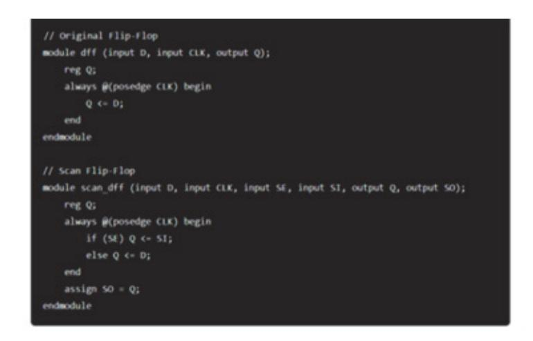

출처: 코드 작성 프로그램. 2024. 8. 4. 스크린샷. [그림 2-1] 스캔 체인 삽입 예제 코드

(2) 스캔 체인 연결(Scan Chain Connection)

(가) 활동

1) 스캔 플립플롭을 연결하여 스캔 체인을 구성한다.

2) 스캔 입력(SI)과 스캔 출력(SO)을 정의한다.

| input CLK, |                     |          |             |           |          |
|------------|---------------------|----------|-------------|-----------|----------|
| input SE,  | // Scan Enable      |          |             |           |          |
| input SI,  | // Scan In          |          |             |           |          |
| output SO  | // Scan Out         |          |             |           |          |
|            |                     |          |             |           |          |
| wire Q1, Q | 2, Q3;              |          |             |           |          |
| scan_dff U | (.D(D1), .CLK(CLK), | .SE(SE), | .SI(SI), .Q | (Q1), .50 | (501));  |
| scan_dff U | (.D(D2), .CLK(CLK), | .SE(SE), | .SI(S01), . | Q(Q2), .5 | 0(502)); |
| scan dff U | (.D(D3), .CLK(CLK), | .SE(SE). | .51(502).   | 0(03)5    | 0(50)):  |

출처: 코드 작성 프로그램. 2024. 8. 4. 스크린샷. [그림 2-2] 스캔 체인 연결 예제 코드

(3) 타이밍 및 기능 검증(Timing and Functional Verification)

(가) 활동

1) 스캔 체인을 삽입한 후 타이밍 분석(STA)과 기능적 시뮬레이션을 수행한다.

2) 스캔 체인이 정상적으로 동작하는지 검증한다.

2. BIST(Built-in-Self Test)를 추가한다.

(1) BIST 컨트롤러 삽입(BIST Controller Insertion)

(가) 활동

1) BIST 컨트롤러를 추가하여 내부 회로의 자동 테스트를 수행한다.

2) BIST는 자체 테스트 패턴을 생성하고 결과를 비교하여 결함을 감지한다.

| module bist controller (                                 |
|----------------------------------------------------------|
| input CLK,                                               |
| input RESET,                                             |
| output reg BIST_DONE,                                    |
| output reg BIST_PASS                                     |
| );                                                       |
| reg [7:0] test pattern;                                  |
| reg [7:0] expected result;                               |
| wire [7:0] actual result;                                |
|                                                          |
| // Simple BIST logic                                     |
| always @(posedge CLK or posedge RESET) begin             |
| if (RESET) begin                                         |
| BIST_DONE <= 0;                                          |
| BIST_PASS <= 0;                                          |
| test_pattern <= 0;                                       |
| end else begin                                           |
| test_pattern <= test_pattern + 1;                        |
| if (test_pattern expected_result) BIST_PASS <- 1;        |
| else BIST_PASS <= 0;                                     |
| 815T_DONE <= 1;                                          |
| end                                                      |
| end                                                      |
|                                                          |
| // Connect test pattern to the circuit under test        |
| assign actual_result = circuit_under_test(test_pattern); |
| endmodule                                                |
|                                                          |

출처: 코드 작성 프로그램. 2024. 8. 4. 스크린샷. [그림 2-3] BIST 컨트롤러 삽입 예제 코드

- (2) BIST 컨트롤러와 회로 연결(Connecting BIST Controller with Circuit)
  - (가) 활동: BIST 컨트롤러를 회로에 연결하여 테스트 패턴을 적용하고 결과를 수집한다.

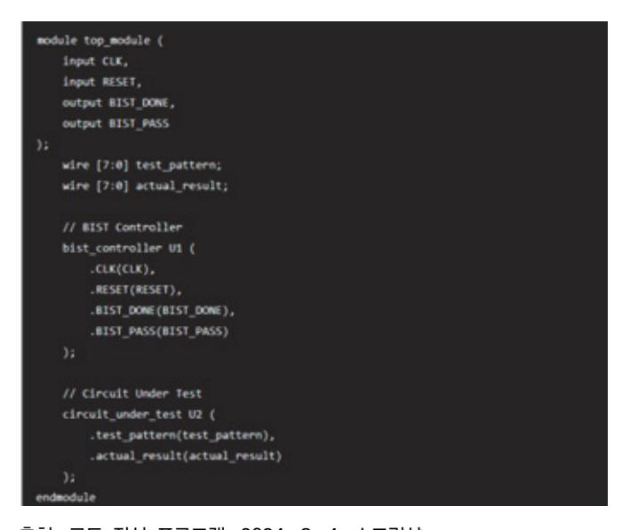

출처: 코드 작성 프로그램. 2024. 8. 4. 스크린샷. [그림 2-4] BIST 컨트롤러와 회로 연결 예제 코드

- (1) 기능 및 타이밍 검증(Functional and Timing Verification)
  - (가) 활동
    - 1) BIST가 정상적으로 작동하는지 기능적 시뮬레이션을 통해 검증한다.
    - 2) BIST 삽입 후 타이밍 분석(STA)을 수행하여 타이밍 문제를 해결한다.
- 3. DFT 및 BIST 검증한다.
  - (1) DFT 검증
    - (가) 활동: ATPG(Automatic Test Pattern Generation)를 사용하여 테스트 벡터를 생성하 고, 스캔 체인을 통한 테스트를 검증한다.
    - (나) 유의 사항: 높은 결함 커버리지(Fault Coverage)를 달성하도록 테스트 벡터를 최적화한 다.
  - (2) BIST 검증
    - (가) 활동
      - 1) BIST 기능을 검증하기 위한 시뮬레이션과 테스트를 수행한다.
      - 2) 실제 칩에서 BIST가 정상적으로 작동하는지 확인한다.
- (나) 유의 사항: BIST의 테스트 커버리지를 분석하고, 필요한 경우 추가 패턴을 생성한다.
- 4. 최종 통합 및 문서화한다.
  - (1) 통합
    - (가) 활동
      - 1) DFT 및 BIST를 추가한 게이트 레벨 네트리스트를 최종 통합한다.
      - 2) P&R 툴을 사용하여 최적의 배치와 배선을 수행한다.
    - (나) 유의 사항 :통합 과정에서 발생하는 타이밍 및 물리적 문제를 해결한다.
  - (2) 문서화
    - (가) 활동
      - 1) DFT 및 BIST 추가 작업에 대한 문서화를 수행한다.
      - 2) 사용된 테스트 패턴, 시뮬레이션 결과, 검증 보고서를 포함한다.
    - (나) 유의 사항 :문서화를 통해 향후 유지보수 및 검증이 용이하도록 한다.
- 5. 다음의 종합적인 접근 방법을 준수한다.
  - (1) 계획 수립: DFT 및 BIST 삽입 계획을 수립하고, 각 단계별 목표와 일정을 설정한다.
  - (2) 코드 작성 및 검증: DFT 및 BIST 코드를 작성하고, 기능적 및 타이밍 검증을 통해 문제가 없는지 확인한다.
  - (3) 통합 및 최적화: P&R 과정에서 DFT 및 BIST를 포함한 전체 네트리스트를 통합하고, 최적

의 배치 및 배선을 수행한다.

- (4) 검증 및 문서화: 최종 검증을 통해 DFT 및 BIST의 기능을 확인하고, 모든 작업 과정을 문 서화한다.
- 숕 전달받은 RTL(Registor Transistor Logic) 코드와 합성한 게이트 레벨 네트리스트가 로직 레벨에서 동일한지 비교한다.

반도체 레이아웃 설계에서 RTL(Register Transfer Level) 코드와 합성된 게이트 레벨 네트리 스트(Gate Level Netlist)가 논리 레벨에서 동일한지 비교하는 과정은 매우 중요하다. 이를 통 해 합성 과정에서 발생할 수 있는 논리적 오류를 사전에 검출하고 수정할 수 있다. 이 과정은 일반적으로 등가 검증(Equivalence Checking)이라는 방법을 사용하여 수행한다. 등가 검증은 두 개의 설계가 기능적으로 동일한지 확인하는 절차이다.

아래는 RTL 코드와 게이트 레벨 네트리스트를 비교하는 주요 단계와 방법이다.

이와 같은 체계적인 접근을 통해 반도체 레이아웃 설계의 자동 배치 및 배선 작업에서 RTL 코 드와 합성된 게이트 레벨 네트리스트의 논리적 일치성을 효과적으로 검증할 수 있다.

- 1. 등가 검증 도구 선택를 선택한다.
  - (1) 활동
    - (가) 상용 및 오픈 소스 등가 검증 도구를 선택한다.
    - (나) 대표적인 등가 검증 도구: Synopsys Formality, Cadence Conformal, Mentor Graphics FormalPro, Yosys 등
  - (2) 유의 사항: 도구의 기능과 사용성을 고려하여 선택한다.
- 2. 입력 파일을 준비한다.
  - (1) RTL 코드
    - (가) 내용: 원본 RTL 설계 파일(예: Verilog, VHDL)

출처: 코드 작성 프로그램. 2024. 8. 4. 스크린샷. [그림 2-5] 원본 RTL 설계 파일

(2) 게이트 레벨 네트리스트

(가) 내용: 합성된 게이트 레벨 네트리스트(예: Verilog Netlist)

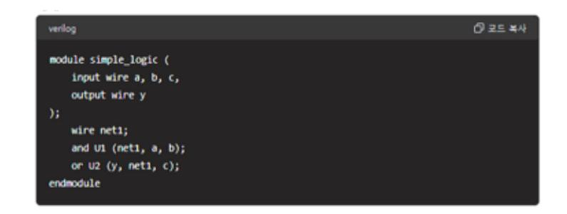

출처: 코드 작성 프로그램. 2024. 8. 4. 스크린샷. [그림 2-6] 합성된 게이트 레벨 네트리스트

- 3. 등가 검증 환경을 설정한다.
  - (1) 등가 검증 스크립트 작성
    - (가) 활동: 등가 검증 도구의 스크립트를 작성하여 RTL 코드와 게이트 레벨 네트리스트를 비 교한다.

출처: 코드 작성 프로그램. 2024. 8. 4. 스크린샷. [그림 2-7] 등가 검증 스크립트 작성

(2) 검증 환경 설정

- (가) 활동: 검증 도구에 필요한 설정 파일(제약 조건, 라이브러리 등)을 준비한다.
- (나) 유의 사항: 합성된 라이브러리 파일(liberty 파일)을 포함하여 설정한다.
- 4. 등가 검증을 수행한다.

자동 배치 배선 레이아웃을 위한 작업에서 전달받은 RTL(Register Transfer Level) 코드 와 합성된 게이트 레벨 네트리스트의 로직 레벨 동일성을 확인하기 위해 등가 검증 (Equivalence Checking)이 필수적이다. 등가 검증은 RTL 설계와 합성된 네트리스트가 기 능적으로 동일한지 확인하는 과정이다. 이 과정은 설계 프로세스에서 매우 중요하며, 설계 의 정확성과 신뢰성을 보장하는 데 중점을 둔다.

(1) 등가 검증의 주요 절차

- (가) RTL 코드를 준비한다.
  - 1) RTL 코드는 설계의 초기 단계에서 작성된, 고수준의 하드웨어 설명 언어(HDL) 코 드다. 예를 들어, Verilog 또는 VHDL로 작성된 코드이다.
  - 2) 이 코드는 설계의 기능적 요구 사항을 만족하는지 시뮬레이션을 통해 검증된 상태이 다.
- (나) 합성된 게이트 레벨 네트리스트를 준비한다.
  - 1) 합성(Synthesis) 과정을 통해 RTL 코드는 게이트 레벨 네트리스트로 변환된다. 이 네트리스트는 실제 물리적 하드웨어 구현을 위한 논리 게이트들의 집합을 나타낸다.
  - 2) 합성 과정에서 성능, 전력, 면적 등의 제약 조건을 만족시키기 위해 최적화가 이루 어진다.
- (다) 등가 검증 도구 설정을 한다.
  - 1) 등가 검증을 수행하기 위해 Synopsys Formality, Cadence Conformal, Mentor Graphics FormalPro 등과 같은 자동화된 등가 검증 도구를 사용한다.
  - 2) 검증 도구에 RTL 코드와 게이트 레벨 네트리스트를 입력한다.
- (라) 매핑 및 대응 관계를 설정한다.
  - 1) 검증 도구는 RTL의 고수준 연산자와 합성된 게이트 레벨 네트리스트의 로직 게이트 간의 대응 관계를 설정한다.
  - 2) 대응 관계는 주요 플립플롭, 게이트, 입출력 포트 등을 기준으로 설정되며, 도구가 이를 자동으로 처리한다.
- (마) 논리적 동일성을 비교한다.
  - 1) 도구는 RTL 코드와 게이트 레벨 네트리스트 간의 논리적 동일성을 비교한다. 이는 두 회로의 모든 가능한 입력 조합에 대해 출력이 동일한지 확인하는 과정이다.
  - 2) 이 과정에서 타이밍, 셋업 및 홀드 타임 같은 물리적 요소는 고려되지 않으며, 순수 하게 논리적 동작에 집중한다.
- (바) 불일치 검출 및 디버깅을 한다.
  - 1) 만약 불일치가 발견되면, 도구는 불일치가 발생한 위치와 원인을 보고한다.
  - 2) 디버깅을 통해 불일치가 실제 설계 오류인지, 합성 과정에서의 최적화에 따른 무시 할 수 있는 차이인지 확인한다.
- (사) 검증 통과 여부를 확인한다.
  - 1) 모든 논리적 경로에서 동일성이 확인되면, 도구는 검증이 성공적으로 완료되었음을 보고한다.
  - 2) 이 단계에서 등가 검증을 통과한 네트리스트는 RTL 코드와 동일한 기능을 수행한다 고 확신할 수 있다.

- (아) 결과 문서화 및 승인 절차를 진행한다.
  - 1) 등가 검증 결과를 문서화하여 설계 검증 팀 및 프로젝터 관리자에게 보고한다.
  - 2) 승인된 검증 결과는 이후 레이아웃 설계 및 P&R 단계로 전달된다.
- (2) 등가 검증의 중요성을 숙지한다.
  - (가) 신뢰성 보장: 합성된 게이트 레벨 네트리스트가 원래 의도된 RTL 설계와 동일한 기능을 수행하는지 보장함으로써 설계의 신뢰성을 높인다.
  - (나) 오류 탐지: 합성 과정에서 발생할 수 있는 논리적 오류를 조기에 탐지하여, 배치 및 배 선 단계로 넘어가기 전에 수정할 수 있다.
  - (다) 설계 최적화 검증: 최적화된 네트리스트가 원래 설계 의도와 동일한지 확인하여, 최적화 로 인한 의도치 않은 설계 오류를 방지한다.

등가 검증을 통해 설계의 논리적 정확성을 확인하면, 이후의 물리적 설계 단계에서 발생할 수 있는 리스크를 줄이고, 최종 칩의 신뢰성과 성능을 보장할 수 있다.

- 5. 결과 분석 및 디버깅을 한다.
  - (1) 검증 결과 분석
    - (가) 활동: 등가 검증 도구의 결과를 분석하여 등가성 오류를 식별한다.
    - (나) 유의 사항: 등가성 오류가 발생한 경우, 오류의 원인을 분석한다.
  - (2) 디버깅 및 수정
    - (가) 활동: 등가성 오류를 수정하고, 수정된 설계를 다시 검증한다.
    - (나) 유의 사항: 오류의 원인이 RTL 코드에 있는지, 합성 과정에 있는지, 또는 제약 조건의 문제인지를 파악한다.
- 6. 최종 검증 및 문서화를 한다.
  - (1) 최종 등가 검증
    - (가) 활동: 수정된 설계에 대해 최종 등가 검증을 수행하여 모든 논리적 오류가 수정되었는지 확인한다.
    - (나) 유의 사항: 모든 검증 단계를 다시 수행하여 일관성을 유지한다.
  - (2) 문서화
    - (가) 활동: 검증 결과 및 수정 과정을 문서화하여 추후 참조할 수 있도록 한다.
    - (나) 유의 사항: 검증 로그, 스크립트, 결과 보고서를 포함하여 체계적으로 정리한다.
- 7. 다음의 종합적인 접근 방법을 준수한다.
  - (1) 계획 수립: 등가 검증 계획을 수립하고, 단계별 목표와 일정을 설정한다.
  - (2) 도구 설정 및 파일 준비: 등가 검증 도구를 설정하고, 필요한 모든 입력 파일을 준비한다.

- (3) 등가 검증 수행: 매칭 단계와 검증 단계를 통해 RTL과 게이트 레벨 네트리스트의 등가성을 검증한다.
- (4) 결과 분석 및 디버깅: 검증 결과를 분석하여 등가성 오류를 수정하고, 재검증을 수행한다.
- (5) 최종 검증 및 문서화: 최종 등가 검증을 완료하고, 모든 과정을 문서화하여 유지보수 및 추 후 검증에 대비한다.
- 숖 동일성이 확인된 합성 네트리스트를 공정 정보를 이용하여 최적화된 IP를 배치한다.

반도체 레이아웃 설계의 자동 배치 및 배선을 위해 동일성이 확인된 합성 네트리스트를 이용하 여 최적화된 IP 배치를 수행하는 과정은 설계 효율성과 성능을 극대화하기 위해 매우 중요하 다. 이를 위해 공정 정보를 활용하여 최적의 배치를 설계할 수 있다. 다음은 최적화된 IP 배치 를 위한 주요 단계와 방법이다.

이와 같은 체계적인 접근을 통해 반도체 레이아웃 설계의 자동 배치 및 배선을 최적화하고, 설 계의 성능과 신뢰성을 극대화할 수 있도록 한다.

1. 공정 정보 수집 및 분석을 한다.

(1) 공정 기술 파일 수집

(가) 활동

1) 공정 기술 파일(TF, Technology File)을 수집한다.

2) 공정 노드(예: 7nm, 14nm)에 따른 공정 파라미터를 확인한다.

(나) 자료: 공정 기술 파일(TF), 레이어 파일, DRC/LVS 규칙 파일 등

(2) IP 블록 정보 분석

(가) 활동: 각 IP 블록의 전기적 특성, 물리적 크기, 전력 소모 특성 등을 분석한다.

(나) 자료: IP 블록의 데이터 시트, LEF 파일, 라이브러리 파일(.lib) 등

#### 2. 초기 배치 계획을 수립한다.

(1) 주요 IP 블록 배치 전략 수립

(가) 활동

1) 주요 IP 블록(CPU, 메모리, 인터페이스 IP 등)을 최적의 위치에 배치한다.

2) 고주파, 고전력 IP 블록은 중앙에 배치하고, 주변에 I/O 블록을 배치한다.

(나) 고려 사항

1) 타이밍 경로 최적화: 주요 데이터 경로에 있는 IP 블록을 가까이 배치.

2) 전력 분배 최적화: 전력 소모가 높은 블록을 전력 공급이 용이한 위치에 배치한다.

(2) 전력 분배 네트워크(PDN) 계획

(가) 활동

- 1) 전력 공급망과 접지망을 설계한다.
- 2) 전력 소모가 큰 IP 블록 주위에 충분한 전력 패드를 배치한다.
- (나) 고려 사항: 전력 무결성(IR Drop)을 최소화하기 위한 전력 분배를 설계한다.
- (3) 입출력 블록 배치
  - (가) 활동
    - 1) 칩의 입출력 핀 위치에 따라 I/O 블록을 배치한다.
    - 2) 데이터, 클록, 제어 신호가 짧은 경로로 연결될 수 있도록 I/O 블록을 배치한다.
  - (나) 고려 사항: 신호 무결성을 유지하기 위한 배선 길이를 최소화한다.
- 3. 자동 배치 및 배선(P&R)을 한다.

동일성이 확인된 합성 네트리스트를 공정 정보를 이용하여 최적화된 IP를 위한 자동 배치 및 배선 작업은 반도체 설계에서 매우 중요한 단계다. 이 과정은 설계된 회로를 실제 물리 적 레이아웃으로 변환하며, 성능, 전력 소모, 면적 등을 최적화하는 데 중점을 둔다. 다음은 이 작업의 일반적인 절차이다.

- (1) 합성 네트리스트 준비
  - (가) 먼저, RTL 설계가 합성되어 게이트 레벨 네트리스트로 변환된다.
  - (나) 동일성이 확인된 네트리스트는 기능적으로 RTL과 동일하며, 최적화 및 배치/배선을 위 한 준비가 완료된 상태다.
- (2) 공정 정보 활용
  - (가) 사용될 공정(예: 7, 14㎚ 등)의 특성을 고려하여 최적화한다.
  - (나) 공정에 따라 타이밍, 전력, 면적 등에 영향을 끼치는 요소들이 다르므로, 이를 최적화에 반영한다.
- (3) 배치(Placement)
  - (가) 합성된 네트리스트의 각 셀들을 물리적 공간에 배치한다.
  - (나) 이 과정에서 타이밍 클로저(Timing Closure)를 목표로 셀들이 배치되며, 배선 길이를 최소화하여 성능을 최적화한다.
  - (다) 배치 단계에서는 시계 신호의 분배, 전원 분배 네트워크(PDN)의 설계 등이 고려된다.
- (4) 배선(Routing)
  - (가) 배치된 셀들 간의 연결을 전기적으로 연결하기 위해 배선을 수행한다.
  - (나) 자동화된 배선 도구가 각 셀의 입출력 핀을 연결하며, 배선의 전기적 특성(예: 저항, 인 덕턴스, 커패시턴스)을 고려하여 최적의 경로를 선택한다.

(다) 배선 과정에서 신호 지연, 노이즈, 전력 소모 등을 최소화하기 위한 최적화가 이루어진다.

- (5) 타이밍 분석 및 최적화
  - (가) 배치 및 배선이 완료된 후, 전체 타이밍 분석을 수행하여 타이밍 위반이 없는지 확인한다. 필요시 배치 및 배선을 재조정하거나 리타이밍을 통해 최적화를 수행한다.
- (6) 전력 분석 및 최적화
  - (가) 전력 분석을 통해 각 영역에서의 전력 소모를 평가하고, 전력 소모가 큰 영역에 대해 최 적화를 수행한다.
  - (나) 저전력 설계 기법(예: 전압 도메인 분할, 파워 게이팅 등)을 적용하여 전력 소모를 줄인다.
- (7) 면적 최적화
  - (가) 최종적으로 칩의 전체 면적을 최적화하여 실리콘 다이에 필요한 면적을 최소화한다.
  - (나) 셀 배치의 재구성, 배선 경로의 조정 등을 통해 면적 효율성을 극대화한다.
- (8) DRC/LVS 검증
  - (가) Design Rule Check(DRC)와 Layout Versus Schematic(LVS) 검증을 통해 레이아웃 이 설계 규칙을 준수하고, 회로가 의도한 대로 구현되었는지 확인한다.
  - (나) 모든 검증을 통과한 후, 최종 IP 레이아웃이 완성된다.
- (9) 최종 검토 및 테이프아웃
  - (가) 최적화된 레이아웃을 검토하고, 최종적으로 테이프아웃(Tape-out)을 진행한다.
  - (나) 테이프아웃된 레이아웃은 제조 공정으로 전달되어 실리콘 칩으로 생산된다.

이 과정은 매우 복잡하고 정밀한 작업으로, 여러 자동화 도구와 전문가의 검토가 필요하다. 최적화된 IP 설계는 높은 성능, 낮은 전력 소비, 최소한의 면적을 달성하는 것이 목표이다.

4. 최적화 및 검증 작업을 진행한다.

자동 배치 배선 레이아웃 설계에서 동일성이 확인된 합성 네트리스트를 공정 정보를 이용 하여 IP 최적화 및 검증 작업을 진행하는 것은 반도체 설계에서 매우 중요한 단계이다. 이 과정은 최종 IP의 성능, 전력 소모, 면적 등을 공정 기술에 맞게 최적화하고, 검증하여 원 하는 설계 목표를 달성하는 데 중점을 둔다. 다음은 이 작업의 주요 절차이다.

- (1) 공정 정보를 분석한다.
  - (가) 기술 파일(TF: Technology File)과 라이브러리 정보: 사용되는 공정에 대한 정보(예: 7nm, 14nm 공정 등)와 관련된 표준 셀 라이브러리, 타이밍 라이브러리, 레이아웃 규 칙을 분석한다.
  - (나) Design Rule Check(DRC)와 Layout Versus Schematic(LVS) 규칙: 공정에서 요구 하는 DRC와 LVS 규칙을 파악하여 최적화 과정에 반영한다.

- (다) 공정 특성: 공정에서 제공하는 전력, 성능, 온도 변화에 대한 특성을 고려하여 최적화 방 안을 마련한다.
- (2) IP 최적화 작업
  - (가) 배치 최적화: 동일성이 확인된 합성 네트리스트를 바탕으로, 공정 정보를 이용해 셀의 배 치를 최적화한다. 타이밍 경로, 전력 소모, 신호 간섭 등을 고려하여 최적의 배치를 찾 는다.
  - (나) 배선 최적화: 배선 경로를 최적화하여 신호 지연을 최소화하고, 전력 소모를 줄이며, 면 적 효율성을 높인다. 이 과정에서 고급 배선 전략을 사용해 신호 간섭과 전력 노이즈를 줄인다.
  - (다) 전력 네트워크 설계: 전력 및 그라운드 네트워크(PDN: Power Delivery Network)를 최적화하여 안정적인 전력 공급을 보장하고, 전력 무결성을 확보한다.
  - (라) 클록 트리 최적화: 클록 트리를 최적화하여 타이밍 위반을 방지하고, 클록 신호의 왜곡을 최소화한다.
- (3) 타이밍 분석 및 최적화를 진행한다.
  - (가) Static Timing Analysis(STA): 공정 정보를 반영하여 STA를 수행한다. 이 과정에서 타 이밍 경로의 경합(Critical Path) 및 타이밍 위반을 분석하고, 최적화 방안을 마련한다.
  - (나) 타이밍 버퍼 삽입 및 경로 최적화: 타이밍을 맞추기 위해 버퍼 삽입, 게이트 크기 조정 등을 통해 타이밍 경로를 최적화한다.
- (4) 전력 분석 및 최적화
  - (가) Dynamic Power Analysis: 동적 전력 소모를 분석하여, 클록 게이팅, 멀티 Vth 셀 사 용 등의 기법을 적용해 전력 소모를 최적화한다.
  - (나) Leakage Power Optimization: 공정 정보에 따라 누설 전류를 줄이기 위해 저전력 셀 사용, 파워 게이팅 등을 적용한다.
- (5) 신호 무결성 및 노이즈 분석
  - (가) Signal Integrity Analysis: 공정 특성을 고려하여 신호 간섭(Crosstalk) 및 노이즈 영 향을 분석한다. 필요시 신호 무결성을 보장하기 위한 쉴드 배선이나 노이즈 필터링을 적 용한다.
  - (나) EM/IR Drop Analysis: 전력 네트워크의 IR 드롭과 전자기 방출(EM)을 분석하고, 이를 최소화하기 위한 최적화 작업을 진행한다.
- (6) 물리적 검증을 진행한다.
  - (가) Design Rule Check(DRC): 최적화된 레이아웃이 공정에서 요구하는 설계 규칙을 준수 하는지 확인한다.

- (나) Layout Versus Schematic(LVS) Check: 레이아웃이 원래의 합성 네트리스트와 논리 적으로 동일한지 확인한다.
- (다) Antenna Effect Check: 배선 과정에서 발생할 수 있는 안테나 효과를 분석하고, 이를 해결하기 위한 조치를 취한다.
- (7) 최종 검증을 진행한다.
  - (가) Formality Check: 최적화된 IP가 기능적으로 동일성을 유지하고 있는지 확인하기 위해 등가 검증을 수행한다.
  - (나) Sign-off Analysis: 타이밍, 전력, 신호 무결성 등에 대한 최종 분석을 수행하여 모든 설계 요구 사항이 충족되었는지 확인한다.
- (8) 테이프아웃 준비

모든 최적화와 검증 작업이 완료된 후, 최종 IP는 테이프아웃을 준비한다. 이 과정에서 공정 정보를 반영한 최종 레이아웃 데이터를 준비하여 제조 공정에 전달한다.

- (9) 문서화 및 승인
  - (가) 최적화 및 검증 과정의 결과를 문서화하여 설계 검증 팀과 프로젝터 관리자에게 보고한 다.
  - (나) 승인된 최적화된 IP는 이후 생산 단계로 넘어가게 된다.
- 이 과정을 통해 IP 설계는 공정 특성에 최적화되며 고성능, 저전력, 작은 면적을 갖춘 칩을 생산할 수 있는 기반이 마련된다.
- 5. 다음의 종합적인 접근 방법을 준수한다.
  - (1) 정보 수집 및 분석: 공정 기술 파일과 IP 블록 정보를 수집하고 분석한다.
  - (2) 초기 배치 계획 수립: 주요 IP 블록, 전력 분배 네트워크, I/O 블록의 배치를 계획한다.
  - (3) 자동 배치 및 배선 수행: P&R 도구를 사용하여 초기 배치와 배선을 수행한다.
  - (4) 최적화 및 검증: 타이밍, 전력, 신뢰성 검증을 통해 최적화 작업을 수행한다.
  - (5) 최종 검증 및 문서화: 최종 검증을 완료하고, 모든 과정을 문서화하여 공유한다.
- 숗 배치된 IP 간 CTS(Clock Tree Synthesis)을 배치한다.

반도체 레이아웃 설계에서 자동 배치 및 배선을 완료한 후, IP 간의 클록 신호를 효율적으로 분배하기 위해 클록 트리 합성(CTS: Clock Tree Synthesis)을 수행하는 것은 매우 중요하다. CTS는 클록 신호의 지연과 스큐(Skew)를 최소화하여 타이밍 정확성을 보장하는 과정이다. 아 래는 CTS를 수행하는 주요 단계와 방법이다.

이와 같은 체계적인 접근을 통해 반도체 레이아웃 설계의 자동 배치 및 배선 작업에서 효율적 이고 정확한 클록 트리 합성을 수행할 수 있다.

- 1. 초기 설정 및 준비를 한다.
  - (1) 디자인 데이터를 준비한다.
    - (가) 활동: 배치된 IP의 레이아웃 데이터와 합성된 게이트 레벨 네트리스트를 준비한다.
    - (나) 자료
      - 1) 배치 및 배선 완료된 레이아웃 데이터(.def, .gds)
      - 2) 합성된 게이트 레벨 네트리스트(.v)
      - 3) 기술 파일(TF), 라이브러리 파일(.lib), 레이아웃 파일(.lef)
  - (2) CTS 도구 설정을 한다.
    - (가) 활동
      - 1) CTS를 수행할 EDA 도구를 설정한다.
      - 2) 상용 도구: Cadence Innovus, Synopsys ICC2, Mentor Graphics Olympus-SoC 등
    - (나) 유의 사항: 도구의 라이선스 및 환경 변수를 설정한다.
- 2. CTS 초기 계획 수립
  - (1) 클록 트리 구조 계획
    - (가) 활동: 클록 트리의 목표 구조(H-Tree, X-Tree, Balanced Tree 등)를 결정한다.
    - (나) 고려 사항
      - 1) 클록 트리의 지연 및 스큐 최소화
      - 2) 전력 소비 최소화
  - (2) 클록 소스 및 엔드 포인트 정의
    - (가) 활동: 클록 소스(PLL, 클록 패드)와 클록 엔드 포인트(플립플롭, 레지스터 등)를 정의한 다.
    - (나) 자료: 클록 소스와 엔드 포인트 정보를 포함한 타이밍 제약 파일(.sdc)
- 3. CT를 실행한다.
  - (1) 클록 버퍼 삽입
    - (가) 활동: 클록 트리의 각 단계에 클록 버퍼와 인버터를 삽입하여 클록 신호를 분배한다.
    - (나) 도구 명령
      - 1) Cadence Innovus 예제

create\_ccopt\_clock\_tree -name clk\_tree -sources [get\_pins clk\_pin] -targets [all\_registers] -buf\_list [list BUFX1 BUFX2] -inv\_list [list INVX1 INVX2]

- (2) 클록 트리 라우팅
  - (가) 활동
    - 1) 클록 트리의 물리적 배선을 생성한다.
    - 2) 클록 트리 라우팅을 통해 클록 신호의 지연과 스큐를 최소화한다.
  - (나) 도구 명령
    - 1) Cadence Innovus 예제
    - route\_clock\_tree -name clk\_tree
- 4. 타이밍 분석과 최적화를 한다.
  - (1) 클록 스큐 및 지연 분석
    - (가) 활동: STA(Static Timing Analysis)를 수행하여 클록 트리의 스큐와 지연을 분석한다.
    - (나) 도구 명령
      - 1) Synopsys PrimeTime 예제

report\_timing -delay\_type max -from [get\_clocks clk] -to [get\_clocks clk]

- (2) 클록 트리 최적화
  - (가) 활동: 클록 트리의 스큐와 지연을 최소화하기 위해 버퍼 삽입 위치와 라우팅을 최적화한 다.
  - (나) 도구 명령
    - 1) Cadence Innovus 예제

optDesign -postCTS

#### 5. 검증 및 문서화 한다.

- (1) 최종 타이밍 검증
  - (가) 활동
    - 1) 최종 STA를 수행하여 전체 설계의 타이밍을 검증한다.
    - 2) 클록 트리의 스큐와 지연이 허용 범위 내에 있는지 확인한다.
  - (나) 도구 명령
    - 1) Synopsys PrimeTime 예제 :

report\_timing -delay\_type max -from [get\_clocks clk] -to [get\_clocks clk]

- (2) DRC 및 LVS 검증
  - (가) 활동: DRC(Design Rule Check)와 LVS(Layout vs. Schematic) 검증을 수행하여 물 리적 규칙 준수 여부를 확인한다.

(나) 도구: Mentor Graphics Calibre, Synopsys IC Validator 등

- (3) 문서화
  - (가) 활동
    - 1) CTS 과정과 결과를 문서화하여 추후 참조할 수 있도록 한다.
    - 2) CTS 스크립트, 검증 결과, 최종 레이아웃을 포함한다.
- 6. 다음의 종합적인 접근 방법을 준수한다.
  - (1) 초기 설정 및 준비: 필요한 모든 데이터와 도구를 준비하고 설정한다.
  - (2) CTS 초기 계획 수립: 클록 트리의 구조와 목표를 계획하고 클록 소스 및 엔드 포인트를 정 의한다.
  - (3) CTS 수행: 클록 버퍼를 삽입하고 클록 트리 라우팅을 수행하여 클록 신호를 분배한다.
  - (4) 타이밍 분석 및 최적화: 클록 스큐와 지연을 분석하고 최적화하여 최적의 타이밍 성능을 보 장한다.
  - (5) 검증 및 문서화: 최종 타이밍 검증, DRC 및 LVS 검증을 수행하고, 모든 과정을 문서화하여 완전한 설계를 확보한다.

수 주요 클록 선에서 분기되는 상세 클록 선의 타이밍 최적화를 위해 블록 간 위치 조정을 수행한다.

반도체 레이아웃 설계에서 주요 클록 선에서 분기되는 상세 클록 선의 타이밍 최적화를 위해 블록 간 위치 조정을 수행하는 것은 매우 중요한 작업이다. 클록 신호의 타이밍이 정확하지 않 으면 설계 전체의 성능과 신뢰성에 큰 영향을 끼칠 수 있다. 이를 위해 다음과 같은 단계와 방 법을 따라 블록 간 위치 조정을 수행할 수 있다.

이와 같은 체계적인 접근을 통해 반도체 레이아웃 설계의 자동 배치 및 배선 작업에서 클록 신 호의 타이밍을 최적화할 수 있다.

- 1. 초기 분석 및 계획 수립을 수립한다.
  - (1) 클록 트리 구조 분석
    - (가) 활동: 현재 클록 트리 구조를 분석하고, 주요 클록 선과 분기되는 상세 클록 선을 확인 한다.
    - (나) 자료: 클록 트리 구조도, STA 보고서
  - (2) 타이밍 경로 분석을 한다.
    - (가) 활동
      - 1) 타이밍 분석을 통해 클록 경로의 지연과 스큐를 확인한다.
      - 2) 타이밍 경로에서 문제가 되는 부분을 식별한다.

(나) 도구: 타이밍 분석 도구: Synopsys PrimeTime, Cadence Tempus 등

- 2. 블록 간 위치 조정을 위한 전략 수립을 한다.
  - (1) 문제 영역 식별
    - (가) 활동: 타이밍 경로에서 지연과 스큐가 큰 영역을 식별한다.
    - (나) 자료: STA 결과 보고서, 클록 트리 지연 및 스큐 분석 데이터
  - (2) 위치 조정 목표 설정
    - (가) 활동
      - 1) 블록 간 위치 조정의 목표를 설정한다.
      - 2) 타이밍 경로의 지연 최소화, 스큐 최소화, 신호 무결성 유지 등을 목표로 한다.
- 3. 블록 위치 조정과 타이밍 최적화를 한다.
  - (1) 블록 위치 조정
    - (가) 활동
      - 1) 식별된 문제 영역의 블록 위치를 조정한다.
      - 2) 주요 클록 선과 분기 클록 선 사이의 거리를 최적화한다.
    - (나) P&R 도구: Cadence Innovus, Synopsys ICC2 등
  - (2) 타이밍 최적화
    - (가) 활동
      - 1) 블록 위치 조정 후, 다시 타이밍 분석을 수행하여 지연과 스큐를 확인한다.
      - 2) 필요에 따라 추가적인 버퍼 삽입, 배선 최적화를 수행한다.
    - (나) 도구
      - 1) 타이밍 분석 도구: Synopsys PrimeTime, Cadence Tempus 등
      - 2) P&R 도구에서 제공하는 최적화 기능
- 4. 반복 검증 및 조정을 한다.
  - (1) 반복 검증
    - (가) 활동
      - 1) 위치 조정 및 타이밍 최적화 후, 반복적으로 타이밍 분석을 수행하여 결과를 검증한 다.
      - 2) 목표 타이밍 특성을 달성할 때까지 반복 검증을 수행한다.
  - (2) 최종 조정
    - (가) 활동
      - 1) 필요에 따라 최종 위치 조정과 타이밍 최적화를 수행한다.

2) 최종 검증에서 모든 타이밍 경로가 요구 사항을 만족하는지 확인한다.

#### 5. 최종 검증 및 문서화를 진행한다.

- (1) 최종 타이밍 검증
  - (가) 활동
    - 1) 최종 STA를 수행하여 전체 설계의 타이밍을 검증한다.
    - 2) 모든 클록 경로의 지연과 스큐가 허용 범위 내에 있는지 확인한다.
- (2) 물리적 검증
  - (가) 활동: DRC(Design Rule Check)와 LVS(Layout vs. Schematic) 검증을 수행하여 물 리적 규칙 준수 여부를 확인한다.
- (3) 문서화
  - (가) 활동
    - 1) 블록 위치 조정 및 타이밍 최적화 과정을 문서화한다.
    - 2) 최종 레이아웃과 타이밍 분석 결과를 포함하여 문서화한다.

#### 6. 예제: P&R 도구를 이용한 블록 위치 조정

(1) 예제 1: Cadence Innovus를 사용한 위치 조정 # Load the design

loadDesign -top my\_top\_design

# Perform initial placement placeDesign

# Identify critical paths report\_timing -delay\_type max -max\_paths 10

# Move blocks to optimize timing moveCell -cell block1 -location {x1 y1} moveCell -cell block2 -location {x2 y2}

# Perform CTS create\_ccopt\_clock\_tree -name clk\_tree -sources [get\_pins clk\_pin] -targets [all\_registers] -buf\_list [list BUFX1 BUFX2] -inv\_list [list INVX1 INVX2] route\_clock\_tree -name clk\_tree

# Optimize design post-CTS optDesign -postCTS

# Verify timing report\_timing -delay\_type max

# Save the final design saveDesign -–as final\_design

(1) 예제 2: Synopsys ICC2를 사용한 위치 조정 # Load the design read\_db my\_design.db

# Perform initial placement place\_opt

# Identify critical paths report\_timing -max\_paths 10

# Move blocks to optimize timing move\_instance block1 -location {x1 y1} move\_instance block2 -location {x2 y2}

# Perform CTS create\_clock\_tree -root clk\_root -targets [all\_registers] -buffers [BUFX1 BUFX2] -inverters [INVX1 INVX2] route\_clock\_tree

# Optimize design post-CTS opt\_design -post\_cts

# Verify timing report\_timing -max\_paths 10 # Save the final design write\_db final\_design.db

- 7. 다음의 종합적인 접근 방법을 준수한다.
  - (1) 초기 분석 및 계획 수립: 클록 트리 구조와 타이밍 경로를 분석하고, 문제 영역을 식별한다.
  - (2) 위치 조정 전략 수립: 블록 위치 조정의 목표를 설정하고, 최적의 위치를 계획한다.
  - (3) 블록 위치 조정 및 타이밍 최적화: P&R 도구를 사용하여 블록 위치를 조정하고, 타이밍 최 적화를 수행한다.
  - (4) 반복 검증 및 조정: 반복적으로 타이밍 분석과 위치 조정을 수행하여 최적의 타이밍 특성을 달성한다.
  - (5) 최종 검증 및 문서화: 최종 타이밍 검증과 물리적 검증을 완료하고, 모든 과정을 문서화한다.
- 숙 IP의 신호선 연결 및 타이밍 최적화를 통해 연결 최적화 과정을 수행한다.
  - 반도체 레이아웃 설계에서 IP의 신호선 연결 및 타이밍 최적화를 통해 연결 최적화 과정을 수 행하는 것은 설계의 성능과 효율성을 극대화하기 위해 매우 중요하다. 이 과정에서는 자동 배 치 및 배선 도구를 사용하여 신호선 연결을 최적화하고, 타이밍 특성을 개선한다. 이와 같은 체계적인 접근을 통해 반도체 레이아웃 설계의 자동 배치 및 배선 작업에서 신호선 연결과 타 이밍을 최적화한다. 다음은 신호선 연결 및 타이밍 최적화를 위한 주요 단계와 방법이다.
    - 1. 초기 설정 및 데이터 준비를 한다.
      - (1) 디자인 데이터 준비
        - (가) 활동: 배치된 IP의 레이아웃 데이터와 합성된 게이트 레벨 네트리스트를 준비한다.
        - (나) 자료
          - 1) 배치 및 배선 완료된 레이아웃 데이터(.def, .gds)
          - 2) 합성된 게이트 레벨 네트리스트(.v)
          - 3) 기술 파일(TF), 라이브러리 파일(.lib), 레이아웃 파일(.lef)
      - (2) 타이밍 제약 파일 준비
        - (가) 활동: 타이밍 제약 파일(SDC)을 준비하여 타이밍 목표를 설정한다.
        - (나) 자료: 타이밍 제약 파일(.sdc)
    - 2. 자동 배치 및 배선을 수행한다.
      - (1) 초기 배치 수행
        - (가) 활동: 자동 배치 도구를 사용하여 각 IP 블록을 초기 위치에 배치한다.

(나) 상용 P&R 도구: Cadence Innovus, Synopsys ICC2 등

- (2) 배선 계획 및 라우팅
  - (가) 활동: 자동 배선 도구를 사용하여 신호선, 전력선, 접지선을 배선한다.
  - (나) 고려 사항
    - 1) 신호 무결성을 유지하고, 크로스토크를 최소화한다.
    - 2) 주요 타이밍 경로를 우선하여 배선한다.
- 3. 타이밍 분석 및 최적화를 진행한다.
  - (1) 초기 타이밍 분석
    - (가) 활동
      - 1) STA(Static Timing Analysis)를 수행하여 초기 타이밍 특성을 분석한다.
      - 2) 타이밍 경로에서 문제가 되는 부분을 식별한다.
    - (나) 타이밍 분석 도구: Synopsys PrimeTime, Cadence Tempus 등
  - (2) 타이밍 최적화 전략 수립
    - (가) 활동
      - 1) 타이밍 문제를 해결하기 위한 최적화 전략을 수립한다.
      - 2) 신호선의 길이 최적화, 버퍼 삽입, 셀 업사이징 등을 고려한다.
- 4. 타이밍 최적화 및 재배선을 한다.
  - (1) 신호선 길이 최적화
    - (가) 활동: 신호선의 길이를 최적화하여 신호 지연을 최소화한다.
    - (나) 도구 명령
      - 1) Cadence Innovus 예제

optDesign -postRoute -hold

- (2) 버퍼 삽입 및 셀 업사이징
  - (가) 활동: 타이밍 경로에서 지연이 큰 부분에 버퍼를 삽입하거나 셀을 업사이징하여 지연을 최소화한다.
  - (나) 도구 명령
    - 1) Synopsys ICC2 예제

insert\_buffer -cell BUFX4 -lib\_cell BUFX4

size\_cell -cell\_name U1 -new\_size NAND2X2

- (3) 재배선 및 라우팅
  - (가) 활동
    - 1) 최적화된 타이밍 경로에 따라 신호선을 재배선한다.

2) 최적화된 경로를 다시 라우팅하여 타이밍 특성을 개선한다.

(나) 도구 명령

1) Cadence Innovus 예제 optRoute -trackOptimize routeDesign -detail

5. 검증 및 반복 최적화를 진행한다.

(1) 타이밍 검증

(가) 활동

1) STA를 다시 수행하여 최적화된 타이밍 특성을 검증한다.

2) 모든 타이밍 경로가 제약을 만족하는지 확인한다.

(나) 타이밍 분석 도구: Synopsys PrimeTime, Cadence Tempus 등

(2) 반복 최적화

(가) 활동

1) 필요에 따라 반복적으로 타이밍 최적화 작업을 수행한다.

2) 모든 타이밍 경로가 최적화될 때까지 반복한다.

#### 6. 최종 검증 및 문서화를 한다.

(1) 최종 타이밍 검증

(가) 활동

1) 최종 STA를 수행하여 전체 설계의 타이밍을 검증한다.

2) 클록 경로와 데이터 경로의 타이밍이 요구 사항을 만족하는지 확인한다.

(2) 물리적 검증

(가) 활동: DRC(Design Rule Check)와 LVS(Layout vs. Schematic) 검증을 수행하여 물 리적 규칙 준수 여부를 확인한다.

(나) 물리적 검증 도구: Mentor Graphics Calibre, Synopsys IC Validator 등

(3) 문서화

(가) 활동

1) 신호선 연결 및 타이밍 최적화 과정을 문서화한다.

2) 최종 레이아웃과 타이밍 분석 결과를 포함하여 문서화한다.

7. 예제: P&R 도구를 이용한 최적화

(1) 예제 1: Cadence Innovus를 사용한 타이밍 최적화

# Load the design

loadDesign -top my\_top\_design

# Perform initial placement placeDesign

# Route design routeDesign

# Initial timing analysis timeDesign -preCts

# Perform CTS

create\_ccopt\_clock\_tree -name clk\_tree -sources [get\_pins clk\_pin] -targets [all\_registers] -buf\_list [list BUFX1 BUFX2] -inv\_list [list INVX1 INVX2] route\_clock\_tree -name clk\_tree

# Optimize design post-CTS optDesign -postCTS

# Perform detailed routing routeDesign -detail

# Optimize timing post-route optDesign -postRoute -hold

# Verify timing timeDesign -postRoute

# Save the final design saveDesign -as final\_design

(2) 예제 2: Synopsys ICC2를 사용한 타이밍 최적화 # Load the design read\_db my\_design.db

# Perform initial placement place\_opt

# Route design route\_opt

# Initial timing analysis report\_timing -max\_paths 10

# Perform CTS create\_clock\_tree -root clk\_root -targets [all\_registers] -buffers [BUFX1 BUFX2] -inverters [INVX1 INVX2] route\_clock\_tree

# Optimize design post-CTS opt\_design -post\_cts

# Perform detailed routing route\_design -detail

# Optimize timing post-route opt\_design -post\_route

# Verify timing report\_timing -max\_paths 10

# Save the final design write\_db final\_design.db

#### 8. 다음의 종합적인 접근 방법을 준수한다.

- (1) 초기 설정 및 데이터 준비: 필요한 모든 데이터와 타이밍 제약 파일을 준비한다.
- (2) 자동 배치 및 배선 수행: P&R 도구를 사용하여 초기 배치와 배선을 수행한다.
- (3) 타이밍 분석 및 최적화: STA를 통해 타이밍 특성을 분석하고, 최적화 전략을 수립한다.
- (4) 타이밍 최적화 및 재배선: 신호선 길이 최적화, 버퍼 삽입, 셀 업사이징 등을 통해 타이밍 최 적화를 수행한다.

(5) 검증 및 반복 최적화: 타이밍 검증을 반복하여 최적의 타이밍 특성을 달성한다.

(6) 최종 검증 및 문서화: 최종 타이밍 검증과 물리적 검증을 완료하고, 모든 과정을 문서화한다.

숚 연결이 완료된 도면에 대해 타이밍 시뮬레이션을 수행하여, 설계 오류가 있는지 확인 및 개선한다.

반도체 레이아웃 설계의 자동 배치 및 배선을 완료한 후, 타이밍 시뮬레이션을 수행하여 설계 오류를 확인하고 개선하는 과정은 매우 중요하다. 이를 통해 최종 설계의 성능과 신뢰성을 보 장할 수 있다. 다음은 타이밍 시뮬레이션을 수행하고 설계 오류를 확인 및 개선하는 주요 단계 와 방법이다.

이와 같은 체계적인 접근을 통해 반도체 레이아웃 설계의 자동 배치 및 배선 작업에서 타이밍 시뮬레이션을 수행하고, 설계 오류를 확인 및 개선하도록 한다.

- 1. 타이밍 시뮬레이션 준비를 한다.
  - (1) 필요 파일 준비
    - (가) 활동: 필요한 모든 파일을 준비한다.
    - (나) 파일 목록
      - 1) 게이트 레벨 네트리스트(.v)
      - 2) 레이아웃 데이터(.def, .gds)
      - 3) 기술 파일(TF, .tf)
      - 4) 라이브러리 파일(.lib)
      - 5) 타이밍 제약 파일(.sdc)
      - 6) 파라사이트 추출 파일(SPEF, .spef)
  - (2) 타이밍 분석 도구 설정
    - (가) 활동: 타이밍 분석 도구를 설정한다.
    - (나) 도구: Synopsys PrimeTime, Cadence Tempus 등
- 2. 타이밍 시뮬레이션 수행을 한다.
  - (1) 타이밍 분석 설정
    - (가) 활동
      - 1) 타이밍 분석을 수행하기 위해 도구 설정 파일과 스크립트를 작성한다.
      - 2) 예제(Synopsys PrimeTime)
      - set design "my\_design"
      - read\_verilog \$design.v
      - read\_def \$design.def
      - read\_sdc \$design.sdc

read\_parasitics -format spef \$design.spef link\_design \$design

(2) 타이밍 분석 실행

(가) 활동: 타이밍 분석을 실행하여 전체 설계의 타이밍을 검토한다.

(나) 도구 명령

# Load libraries and design source setup.tcl

# Perform static timing analysis report\_timing -delay\_type max -max\_paths 10 -input\_pins -nets -transition\_time

# Check for setup and hold violations report\_timing -delay\_type max -max\_paths 10 -input\_pins -nets -transition\_time -setup report\_timing -delay\_type max -max\_paths 10 -input\_pins -nets -transition\_time -hold

- 3. 타이밍 시뮬레이션 결과를 분석한다.
  - (1) 타이밍 경로 분석
    - (가) 활동: 타이밍 경로를 분석하여 지연 및 스큐 문제를 식별한다.
    - (나) 보고서 검토: STA 도구가 생성한 타이밍 보고서를 검토하여 타이밍 위반 경로를 식별한 다.
  - (2) 타이밍 위반 경로 식별
    - (가) 활동: 타이밍 위반 경로를 식별하고, 그 원인을 분석한다.
    - (나) 유의 사항: 타이밍 제약 조건, 클록 트리, 신호 지연 등을 검토한다.
- 4. 타이밍 문제를 개선한다.
  - (1) 셀 크기 변경 및 버퍼 삽입
    - (가) 활동: 셀 크기를 변경하거나 버퍼를 삽입하여 지연을 최소화한다.
    - (나) 도구 명령
      - # Size cells
      - change\_cell -cell U1 -size NAND2X2

# Insert buffers

insert\_buffer -cell BUFX4 -lib\_cell BUFX4 -location [get\_nets critical\_net]

- (2) 배선 경로 최적화
  - (가) 활동: 배선 경로를 최적화하여 신호 지연을 줄인다.
  - (나) 도구 명령
    - # Optimize routing

optDesign -postRoute -hold

- (3) 클록 트리 최적화
  - (가) 활동: 클록 트리를 최적화하여 클록 스큐를 최소화한다.
  - (나) 도구 명령

# Optimize clock tree

optDesign -postCTS

#### 5. 반복 검증 및 최적화를 진행한다.

- (1) 반복 타이밍 분석
  - (가) 활동: 최적화 후 타이밍 분석을 반복하여 모든 타이밍 문제를 해결할 때까지 검증한다.
  - (나) 도구 명령
    - # Repeat timing analysis

report\_timing -delay\_type max -max\_paths 10 -input\_pins -nets -transition\_time

- (2) 최종 검증
  - (가) 활동: 최종 타이밍 분석을 통해 모든 타이밍 위반이 해결되었는지 확인한다.

#### 6. 물리적 검증 및 문서화를 진행한다.

- (1) 물리적 검증
  - (가) 활동: DRC 및 LVS 검증을 수행하여 물리적 규칙 준수 여부를 확인한다.

(나) 도구: Mentor Graphics Calibre, Synopsys IC Validator 등

- (2) 문서화
  - (가) 활동
    - 1) 타이밍 분석 및 최적화 과정을 문서화한다.
    - 2) 최종 레이아웃과 타이밍 분석 결과를 포함하여 문서화한다.
- 7. 예제: Synopsys PrimeTime을 사용한 타이밍 시뮬레이션 및 최적화
  - # Load design and libraries

set design "my\_design" read\_verilog \$design.v read\_def \$design.def read\_sdc \$design.sdc read\_parasitics -format spef \$design.spef link\_design \$design

# Perform initial timing analysis report\_timing -delay\_type max -max\_paths 10 -input\_pins -nets -transition\_time

# Identify and fix timing violations # Example: Insert buffers to fix hold violations insert\_buffer -cell BUFX4 -lib\_cell BUFX4 -location [get\_nets critical\_net]

# Perform post-route optimization optDesign -postRoute -hold

# Perform timing analysis again to verify fixes report\_timing -delay\_type max -max\_paths 10 -input\_pins -nets -transition\_time

# Final verification report\_timing -delay\_type max -max\_paths 10 -input\_pins -nets -transition\_time -setup report\_timing -delay\_type max -max\_paths 10 -input\_pins -nets -transition\_time -hold

# Save final design write\_verilog -output final\_design.v write\_def final\_design.def

8. 다음의 종합적인 접근 방법을 준수한다.

(1) 타이밍 시뮬레이션 준비: 필요한 모든 파일과 타이밍 분석 도구를 준비한다.

- (2) 타이밍 시뮬레이션 수행: STA를 통해 타이밍 특성을 분석하고, 타이밍 문제를 식별한다.
- (3) 타이밍 문제 개선: 셀 크기 변경, 버퍼 삽입, 배선 경로 최적화 등을 통해 타이밍 문제를 개 선한다.
- (4) 반복 검증 및 최적화: 반복적으로 타이밍 분석과 최적화를 수행하여 모든 타이밍 문제를 해 결한다.
- (5) 물리적 검증 및 문서화: 최종 타이밍 검증과 물리적 검증을 완료하고, 모든 과정을 문서화한 다.

수행 tip

- 자동 배치 배선 레이아웃에서 기생 성분의 추출의 중요성 을 충분히 인지하고 진행한다.
- 실무 능력 향상을 위해서는 반복 숙달의 과정에서 본인만 의 노하우를 찾으려는 노력을 한다.

### 학습 2 교수·학습 방법

#### 교수 방법

- 계층적 설계법인 블록 단위 설계와 상세 회로 단위 설계 방법의 개요에 대해 설명한다.
- 블록의 구분 기준 및 주요 포트의 정의 방법에 대해 설명한다.
- 회로 도면 작성 툴을 위한 기본 환경 설정 및 활용 소자들을 정의한 라이브러리 파일을 사 전에 실습 기자재별로 준비한다.
- 회로 도면 작성 툴의 블록 생성 과정에 대해 빔 프로젝터를 통해 사전 시연 후 개별 실습을 통해 사용법을 지도한다.
- 회로 도면 작성 툴의 라이브러리와 셀의 생성 방법에 대해 프로젝터를 통해 사전 시연 후 개별 실습을 통해 사용법을 지도한다.
- 기본적인 소자들을 불러들이고, 각 소자의 연결을 통한 회로 구성 방법에 대해 빔 프로젝터 로 사전 시연 후 개별 실습을 통해 사용법을 지도한다.

#### 학습 방법

- 계층적 설계법인 블록 단위 설계와 상세 회로 단위 설계 방법의 개요에 대해 학습한다.
- 블록의 구분 기준 및 주요 포트들의 정의 방법에 대해 학습한다.
- 회로 도면 작성 툴의 블록 생성 과정에 대해 빔 프로젝터를 통해 사전 숙지 후 개별 실습을 통해 사용법을 숙지한다.
- 회로 도면 작성 툴의 라이브러리와 셀의 생성 방법에 대해 빔 프로젝터로 사전 숙지 후 개 별 실습을 통해 사용법을 숙지한다.
- 기본적인 소자들을 불러들이고, 각 소자의 연결을 통한 회로 구성 방법에 대해 빔 프로젝터 로사전 숙지 후 개별 실습을 통해 사용법을 숙지한다.

## 학습 2 평 가

#### 평가 준거

- 평가자는 학습자가 학습 목표를 성공적으로 달성하였는지를 평가해야 한다.
- 평가자는 다음 사항을 평가해야 한다.

|          | 학습 목표                                                                                                                                 |  | 성취수준 |   |  |
|----------|---------------------------------------------------------------------------------------------------------------------------------------|--|------|---|--|
| 학습 내용    |                                                                                                                                       |  | 중    | 하 |  |
| 자동 배치 배선 | - 게이트 레벨 네트리스트(Gate Level Netlist)에 테스트(Test)를 위한 DFT(Design for Testability) BIST(Built-in-self Test)의 코드(Code)를 추가로 생성할 수 있다. |  |      |   |  |
|          | - 전달받은 RTL(Registor Transistor Logic) 코드와 합성한 게이트 레벨 네트리스트가 로직 레벨에서 동일한지 비교할 수 있다.                                              |  |      |   |  |
|          | - 동일성이 확인된 합성 네트리스트를 공정 정보를 이용하여 최적화된 IP 배치를 할 수 있다.                                                                               |  |      |   |  |
|          | - 배치된 IP 간 CTS(Clock Tree Synthesis)을 할 수 있다.                                                                                         |  |      |   |  |
|          | - 주요 클록 선에서 분기되는 상세 클록 선의 타이밍 최적화 를 위해 블록 간 위치 조정을 수행할 수 있다.                                                                       |  |      |   |  |
|          | - IP의 신호선 연결 및 타이밍 최적화를 통해 연결 최적화 과 정을 수행할 수 있다.                                                                                   |  |      |   |  |
|          | - 연결이 완료된 도면에 대해 타이밍 시뮬레이션을 수행하여, 설계 오류가 있는지 확인 및 개선할 수 있다.                                                                        |  |      |   |  |

#### 평가 방법

• 서술형 시험

|          | 평가 항목                                                                          |  | 성취수준 |   |  |
|----------|--------------------------------------------------------------------------------|--|------|---|--|
| 학습 내용    |                                                                                |  | 중    | 하 |  |
| 자동 배치 배선 | - 전달받은 RTL코드와 합성한 게이트 레벨 네트리스트가 로직 레벨에서 동일 여부에 대한 등가 검증 설정 능력               |  |      |   |  |
|          | - 전달받은 RTL 코드와 합성한 게이트 레벨 네트리스트가 로 직 레벨에서 동일한지 비교할 수 있는 능력                  |  |      |   |  |
|          | - 동일성이 확인된 합성 네트리스트를 활용해서 공정 정보를 수집 및 분석하고 이를 기반으로 초기 배치 계획을 수립할 수 있는 능력 |  |      |   |  |

• 평가자 체크리스트

|          |                                                                                                            |   | 성취수준 |  |  |
|----------|------------------------------------------------------------------------------------------------------------|---|------|--|--|
| 학습 내용    | 평가 항목                                                                                                      | 상 | 하    |  |  |
| 자동 배치 배선 | - 반도체 레이아웃 설계에서 DFT 및 BIST를 효과적으로 추가 하고, 자동 배치 및 배선을 최적화를 위해 스캔 체인을 삽입 하고 연결할 수 있는 능력                |   |      |  |  |
|          | - RTL 코드와 합성한 게이트 레벨 네트리스트가 로직 레벨에서 동일 여부를 판단 하기 위한 검증 도구를 선택하고 해당 도구의 명령을 사용해 등가 검증 환경을 설정할 수 있는 능력 |   |      |  |  |
|          | - 동일성이 확인된 합성 네트리스트를 활용해서 공정 정보를 수집 및 분석하고 이를 기반으로 자동 배치 및 배선 수행을 위해 배선 계획 및 라우팅을 수행할 수 있는 능력        |   |      |  |  |

피드백

- 1. 서술형 시험 - 전달받은 RTL 코드와 합성한 게이트 레벨 네트리스트가 로직 레벨에서 동일여부에 대한 등가 검 증 설정을 할 수 있는 능력을 평가한 후, 보완이 필요한 사항이나 주요 사항을 표시하여 피드백 해 준다. - 전달받은 RTL 코드와 합성한 게이트 레벨 네트리스트가 로직 레벨에서 동일한지 비교할 수 있는 능력을 평가한 후, 보완이 필요한 사항이나 주요 사항을 표시하여 보충 설명해 준다. - 평가 결과가 우수한 학습자와 미흡한 학습자를 구분하여 우수한 학습자들에게는 서술형 평가 내 용의 적용 사례 학습을 통한 심화 학습으로 피드백해 주고, 미흡한 학습자에게는 기초 용어에 대 한 숙지를 통해 일정 수준을 유지할 수 있도록 보완 지도해 준다.
- 2. 평가자 체크리스트
- RTL 코드와 합성한 게이트 레벨 네트리스트가 로직 레벨에서 동일 여부를 판단 하기 위한 검증 도구를 선택하고 해당 도구의 명령를 사용해 등가 검증 환경을 설정할 수 있는 능력을 확인한 후 부족한 점을 지적하여 정확하게 처리할 수 있도록 보완 지도해 준다.
- 동일성이 확인된 합성 네트리스트를 활용해서 공정 정보를 수집 및 분석하고 이를 기반으로 자동 배치 및 배선 수행을 위해 배선 계획 및 라우팅을 수행할 수 있는 능력을 평가한 후, 개선 및 보 완 사항에 대한 내용을 정리하여 재학습할 수 있도록 피드백해 준다.
- 평가 결과가 우수한 학습자와 저조한 학습자를 구분하여 우수한 학습자들에게는 작업장 환경에 의 적용 사례 학습을 통한 심화 학습으로 피드백해 주고, 저조한 학습자에게는 기초 용어에 대한 숙지를 통해 일정 수준을 유지할 수 있도록 보완 지도해 준다.

| 학습 2 | 자동 배치 배선하기                |  |
|------|---------------------------|--|
| 학습 3 | 레이아웃 검증하기                 |  |
| 학습 1 | 플로어 플래닝(Floor Planning)하기 |  |

## 3-1. 레이아웃 검증

|       | • 배치 배선 초기 네트리스트와 배치 배선이 완료된 네트리스트를 비교하여 검증 대상의 이상     |
|-------|--------------------------------------------------------|
|       | 유무를 확인할 수 있다.                                          |
|       | • 공정의 설계 권고 사항에 따라 레이아웃을 검증하기 위하여 적합한 툴을 선정할 수 있다.     |
|       | • 공정의 설계 규칙 파일(DRC, ANT)을 숙지하고, 레이아웃 검증 툴의 적용 및 오류에 대한 |
| 학습 목표 | 수정 사항을 반영할 수 있다.                                       |
|       | • 자동 배치 배선 레이아웃 설계 검증 파일(LVS)을 숙지하고, 레이아웃 검증 툴의 적용 및 오 |
|       | 류에 대한 수정 사항을 반영할 수 있다.                                 |
|       | • 자동 배치 배선 레이아웃의 매개 변수 추출 파일(LPE)을 활용하여, 매개 변수를 포함한 네트 |
|       | 리스트를 추출할 수 있다.                                         |
|       |                                                        |

## 필요 지식 /

숔 배치, CTS, 배선 설계

배치(Placement), 클록 트리 합성(CTS: Clock Tree Synthesis), 배선(Routing) 설계는 반도 체 설계 과정에서 중요한 단계들로, 각각의 단계는 최적의 성능과 신뢰성을 보장하기 위해 다 양한 기술과 도구를 사용한다. 아래는 각 단계에 대한 상세한 설명이다.

- 1. 배치 설계(Placement)
  - (1) 배치 설계의 목적
    - (가) 효율적 공간 사용: 전체 칩 면적을 최적화하여 사용한다.
    - (나) 신호 경로 최적화: 셀 간의 신호 경로를 최단 거리로 유지하여 신호 지연을 최소화한다.
    - (다) 전력 소비 감소: 전력 그리드를 최적화하여 전력 소비를 최소화한다.
  - (2) 배치 설계 과정
    - (가) 초기 배치(Initial Placement)
      - 1) 목적: 기본적인 셀 배치를 생성한다.
      - 2) 방법: 무작위 또는 규칙 기반 배치 알고리즘을 사용하여 셀을 배치한다.

- 3) 도구: EDA 소프트웨어의 초기 배치 기능 사용(예: Cadence Innovus, Synopsys IC Compiler II)
- (나) 글로벌 배치(Global Placement)
  - 1) 목적: 셀을 전체 칩 영역에 균등하게 분포시키고, 주요 셀의 위치를 최적화한다.
  - 2) 방법: 셀 밀도 분석과 크리티컬 경로 분석을 통해 배치 최적화한다.
  - 3) 도구: 글로벌 배치 알고리즘을 사용한다.
- (다) 세부 배치(Detailed Placement)
  - 1) 목적: 셀의 미세한 위치 조정을 통해 최적의 배치 상태를 달성한다.
  - 2) 방법: 셀 위치 미세 조정, 크리티컬 경로 재분석, 간격 최적화한다.
  - 3) 도구: 세부 배치 알고리즘을 사용한다.
- (라) 타이밍 최적화(Timing Optimization)
  - 1) 목적: 타이밍 제약을 충족하도록 배치 최적화한다.
  - 2) 방법: 크리티컬 경로를 따라 셀 위치 조정, 버퍼 삽입 등
  - 3) 도구: 타이밍 분석 도구와 통합하여 최적화한다.
- 2. 클록 트리 합성(CTS: Clock Tree Synthesis)
  - (1) CTS의 목적
    - (가) 균일한 클록 분배: 칩 내 모든 플립플롭에 균일한 클록 신호를 전달한다.
    - (나) 클록 스큐 최소화: 클록 신호의 지연 차이를 최소화하여 동기화 문제를 해결한다.
    - (다) 전력 소비 감소: 클록 트리의 전력 소비를 최적화한다.
  - (2) CTS 과정
    - (가) 클록 트리 계획(Clock Tree Planning)
      - 1) 목적: 클록 트리의 기본 구조를 계획한다.
      - 2) 방법: 클록 소스 위치와 주요 클록 노드를 정의한다.
      - 3) 도구: CTS 계획 도구를 사용한다.
    - (나) 버퍼 삽입(Buffer Insertion)
      - 1) 목적: 클록 신호의 지연을 줄이고 스큐를 최소화한다.
      - 2) 방법: 클록 경로에 버퍼를 삽입하여 신호 세기와 지연을 조절한다.
      - 3) 도구: CTS 도구를 사용한다.
    - (다) 클록 트리 최적화(Clock Tree Optimization)
      - 1) 목적: 클록 트리의 성능을 최적화한다.
      - 2) 방법: 클록 트리의 경로를 재조정하고, 불필요한 버퍼를 제거한다.
      - 3) 도구: 최적화 알고리즘을 사용한다.
    - (라) 클록 트리 검증(Clock Tree Verification)

- 1) 목적: 클록 트리의 타이밍과 전력 특성을 검증한다.
- 2) 방법: 타이밍 분석 도구를 사용하여 스큐와 지연을 확인한다.
- 3) 도구: 타이밍 검증 도구를 사용한다.
- 3. 배선 설계(Routing)
  - (1) 배선 설계의 목적
    - (가) 신호 무결성 유지: 신호 경로의 간섭을 최소화하고 신호 지연을 줄인다.
    - (나) 전력 네트워크 최적화: 전력 공급 라인을 최적화하여 안정적인 전력 공급을 보장한다. 면적 효율성: 배선이 전체 칩 면적을 효율적으로 사용하도록 설계한다.
  - (2) 배선 설계 과정
    - (가) 글로벌 배선(Global Routing)
      - 1) 목적: 주요 신호 경로를 대략적으로 정의하고 전반적인 배선 계획을 수립한다.
      - 2) 방법: 신호 경로의 큰 그림을 그리며, 주요 경로를 설정한다.
      - 3) 도구: 글로벌 배선 알고리즘을 사용한다.
    - (나) 세부 배선(Detailed Routing)
      - 1) 목적: 셀 간의 정확한 신호 경로를 설정하고 모든 연결을 완료한다.
      - 2) 방법: 각 신호 경로를 정확하게 정의하고 최적의 경로로 배선한다.
      - 3) 도구: 세부 배선 알고리즘을 사용한다.
    - (다) 전력 및 접지 배선(Power and Ground Routing)
      - 1) 목적: 안정적인 전력 공급을 위해 전원(VDD) 및 접지(GND) 라인을 최적화한다.
      - 2) 방법: 전력 그리드 설계, 전력 및 접지 배선의 층을 배분한다.
      - 3) 도구: 전력 배선 알고리즘을 사용한다.
    - (라) 신호 무결성 검증(Signal Integrity Verification)
      - 1) 목적: 배선 완료 후 신호 간섭, 지연, 크로스토크 등의 문제를 검증한다.
      - 2) 방법: 신호 무결성 분석 도구 사용하여 검증한다.
      - 3) 도구: 신호 무결성 분석 도구(Cadence Sigrity, Synopsys HSPICE)
- 4. 검증 및 최적화
  - (1) 디자인 룰 체크(DRC: Design Rule Check)
    - (가) 목적: 배치 및 배선이 공정 기술의 디자인 룰을 준수하는지 확인한다.
    - (나) 도구: Mentor Graphics Calibre DRC, Synopsys IC Validator
  - (2) 레이아웃-회로 일치 검사(LVS: Layout Versus Schematic)
    - (가) 목적: 레이아웃이 논리 회로도와 일치하는지 검증한다.
    - (나) 도구: Mentor Graphics Calibre LVS, Synopsys Hercules LVS

(3) 기생 소자 추출(PEX: Parasitic Extraction)

(가) 목적: 기생 저항, 기생 커패시턴스 등을 추출하여 성능 분석한다.

(나) 도구: Mentor Graphics Calibre xRC, Synopsys StarRC

- (4) 타이밍 검증(Timing Verification)
  - (가) 목적: 타이밍 분석을 통해 설계가 모든 타이밍 제약 조건을 충족하는지 확인한다.
  - (나) 도구: Cadence Tempus, Synopsys PrimeTime

#### 5. 다음의 종합적인 접근 방법 준수

배치, 클록 트리 합성, 배선 설계는 반도체 설계의 핵심 단계로, 각 단계는 설계의 성능, 전 력 소비, 면적 효율성을 최적화하는 데 중요한 역할을 한다. 각 단계에서 최적의 결과를 얻 기 위해 다양한 알고리즘과 도구를 사용하며, 검증과 최적화를 통해 설계의 정확성과 신뢰 성을 보장한다. 이를 통해 고성능, 저전력, 고신뢰성의 반도체 칩을 구현할 수 있다.

숕 기생 성분

자동 배치 배선(Place and Route, P&R) 레이아웃 설계에서 기생 성분(Parasitics)은 설계 성 능과 신뢰성에 큰 영향을 미칠 수 있다. 기생 성분은 배선과 소자의 물리적 특성에 의해 발생 하는 기생 저항, 기생 커패시턴스, 기생 인덕턴스 등을 포함한다. 이러한 기생 성분은 신호 지 연, 전력 소비, 신호 무결성 등에 영향을 주기 때문에 정확한 추출과 분석이 필요하다. 아래는 P&R 설계에서 중요한 기생 성분과 그 영향, 그리고 분석 방법에 대한 설명이다.

- 1. 기생 저항(Parasitic Resistance)
  - (1) 기생 저항의 원인
    - (가) 배선 저항: 금속 배선의 저항으로 인해 발생한다.
    - (나) 접촉 저항: 배선과 소자 간의 접촉 면에서 발생하는 저항이다.
  - (2) 기생 저항의 영향
    - (가) 신호 지연: 저항으로 신호 전달 속도가 느려진다.
    - (나) 전력 소비: 저항으로 전력 소모가 증가한다.
    - (다) 전압 강하: 전원 네트워크에서 전압 강하가 발생한다.
  - (3) 기생 저항 분석
    - (가) 모델링: 기생 저항 모델을 사용하여 분석한다.
    - (나) 도구: 기생 소자 추출 도구(Mentor Graphics Calibre xRC, Synopsys StarRC)를 사 용한다.

- (가) 모델링: 기생 인덕턴스 모델을 사용하여 분석한다.
- (나) 전력 무결성: 전원 네트워크의 인덕턴스가 전압 강하와 노이즈를 유발한다.
- (가) 신호 반사: 인덕턴스가 신호의 반사를 유발하여 신호 왜곡 발생한다.
- (2) 기생 인덕턴스의 영향

(3) 기생 인덕턴스 분석

- (나) 전원 네트워크: 전원 및 접지 라인에서 인덕턴스가 발생한다.
- (가) 배선의 자기장: 배선에 흐르는 전류가 자기장을 형성하여 인덕턴스가 발생한다.
- (1) 기생 인덕턴스의 원인
- 3. 기생 인덕턴스(Parasitic Inductance)
- (나) 도구: 기생 소자 추출 도구를 사용한다.
- (가) 모델링: 기생 커패시턴스 모델을 사용하여 분석한다.
- (3) 기생 커패시턴스 분석
- (다) 전력 소비: 충전 및 방전 과정에서 전력 소모가 증가한다.
- (나) 크로스토크: 인접한 배선 간의 간섭으로 인해 신호 왜곡 발생한다.
- (가) 신호 지연: 커패시턴스가 클수록 신호 지연이 증가한다.
- (2) 기생 커패시턴스의 영향

[그림 3-1] cmos 공정에서 생성되는 기생 회로

출처: 집필진 제작(2024)

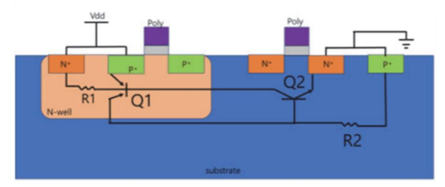

- (나) 배선과 기판 간 커패시턴스: 배선과 기판 사이의 전기장으로 인해 발생한다.
- (가) 배선 간 커패시턴스: 인접한 배선 간의 전기장으로 인해 발생한다.
- (1) 기생 커패시턴스의 원인
- 2. 기생 커패시턴스(Parasitic Capacitance)

- 4. 기생 성분 추출 과정(Parasitic Extraction)
  - (1) 레이아웃 추출
    - (가) 레이아웃 데이터: GDSII 또는 OASIS 형식의 레이아웃 데이터를 사용한다.
    - (나) 레이어 정보: 각 레이어의 물리적 특성과 배선을 정의한다.
  - (2) 기생 성분 모델링
    - (가) SPICE 모델: 기생 성분을 포함한 SPICE 모델을 생성한다.
    - (나) R, C, L 요소: 저항, 커패시턴스, 인덕턴스를 포함한 요소를 모델링한다.
  - (3) 기생 성분 분석 도구
    - (가) Mentor Graphics Calibre xRC: 기생 저항 및 기생 커패시턴스 추출한다.
    - (나) Synopsys StarRC: 기생 소자 추출 및 모델링한다.
    - (다) Cadence QRC: 기생 성분 추출 및 분석한다.
- 5. 기생 성분의 영향 완화 방법
  - (1) 배치 및 배선 최적화
    - (가) 배선 길이 최소화: 신호 경로의 배선 길이를 최소화하여 기생 성분을 감소시킨다.
    - (나) 배선 간격 증가: 인접 배선 간의 간격을 늘려 크로스토크를 감소시킨다.
  - (2) 전력 네트워크 설계
    - (가) 전력 그리드 강화: 전원 및 접지 라인의 인덕턴스를 줄이기 위해 전력 그리드를 강화한 다.
    - (나) 디커플링 커패시터 사용: 전원 네트워크의 안정성을 높이기 위해 디커플링 커패시터 사 용한다.
  - (3) 신호 무결성 분석
    - (가) 타이밍 분석: 신호 지연과 스큐를 분석하여 최적화한다.
    - (나) 신호 무결성 검증: 크로스토크와 신호 반사를 분석하고 수정한다.
- 6. 다음의 종합적인 접근 방법을 준수한다.

기생 성분은 P&R 설계에서 중요한 고려 사항이며, 설계의 성능과 신뢰성에 큰 영향을 끼 친다. 기생 저항, 기생 커패시턴스, 기생 인덕턴스를 정확히 추출하고 분석하는 것은 신호 지연, 전력 소비, 신호 무결성 문제를 해결하는 데 필수적이다. 기생 성분의 영향을 최소화 하기 위해 최적화 기법과 검증 도구를 적절히 활용하는 것이 중요하다. 이를 통해 고성능, 저전력, 고신뢰성의 반도체 설계를 달성할 수 있다.

## 수행 내용 / 레이아웃 검증하기

#### 재료·자료

- 설계 데이터[논리 네트리스트(Logic Netlist), 표준 셀 라이브러리(Standard Cell Library)]
- 기술 파일 및 설계 규칙[기술 파일(Technology File), 디자인 룰 체크(DRC) 파일, 레이아 웃-회로 일치 검사(LVS) 파일]
- 설계 제약 조건 및 요구 사항(타이밍 제약 파일, 물리적 제약 파일)
- 전력 및 신호 무결성 자료[전력 계획(Power Plan), 신호 무결성 분석(Signal Integrity Analysis)]
- EDA 도구 및 스크립트(자동 배치 및 배선 도구, 검증 도구, 스크립트 및 자동화 도구)
- 문서 및 가이드(설계 문서, 기술 매뉴얼)
- 회의 및 협업 도구(회의 시스템, 버전 관리 시스템)

#### 기기(장비 ・ 공구)

- 고성능 워크스테이션, 서버 인프라, 디스플레이 및 입력 장치
- 자동 배치 및 배선 도구(P&R 도구)
- Cadence Innovus: 물리적 설계를 위한 종합 도구로, 플로어 플래닝, 배치, 배선, 최적화를 지원한다.
- Synopsys IC Compiler II: 고급 플로어 플래닝과 자동 배치 및 배선 기능을 제공한다.
- Mentor Graphics Olympus-SoC: 플로어 플래닝, 배치, 배선 및 타이밍 분석을 위한 도 구이다.
- 검증 도구
- Mentor Graphics Calibre: DRC, LVS, PEX 검증을 지원하는 도구로, 정확한 레이아웃 검증이 가능하다.
- Synopsys Hercules: DRC 및 LVS 검증 도구로, 다양한 공정 기술을 지원한다.
- Cadence Assura: DRC 및 LVS 검증을 위한 도구이다.

- 기생 소자 추출 도구
- Cadence Quantus: 기생 소자 추출을 위한 도구로, 정확한 RC 추출을 지원한다.
- Synopsys StarRC: 고성능 RC 추출 도구로, 다양한 공정 기술을 지원한다.
- 시뮬레이션 도구
- Cadence Spectre: 아날로그 및 혼성 신호 시뮬레이션 도구이다.
- Synopsys HSPICE: 고정밀 아날로그 시뮬레이션 도구이다.
- 데이터 관리 및 버전 관리 시스템( 버전 관리 시스템, 백업 솔루션)

#### 안전 ・ 유의 사항

- 데이터 보안 및 관리(데이터 접근 제어, 데이터 백업 및 복구), 버전 관리를 해야 한다.
- 소프트웨어 라이선스 관리 및 업데이트를 해야 한다.
- 하드웨어 장비 안전 및 전력을 관리해야 한다.
- 작업 공간 정리 및 시스템을 모니터링해야 한다.
- 산업 규정 및 개인정보 규정을 준수해야 한다.

#### 수행 순서

숔 배치 배선 초기 네트리스트와 배치 배선이 완료된 네트리스트를 비교하여 검증 대상의 이상 유무를 확인한다.

반도체 레이아웃 설계의 자동 배치 및 배선 과정에서 초기 네트리스트와 배치 배선이 완료된 네트리스트 를 비교하여 설계의 이상 유무를 확인하는 과정은 매우 중요하다. 이 과정은 두 네트리스트가 기능적으로 동일한지 검증하는 작업을 포함하며, 일반적으로 '등가 검증(Equivalence Checking)' 방법을 사용한 다. 다음은 이 과정을 수행하는 주요 단계와 방법이다.

이와 같은 체계적인 접근을 통해 반도체 레이아웃 설계의 자동 배치 및 배선 과정에서 초기 네 트리스트와 최종 네트리스트의 기능적 동일성을 확인하고, 설계 오류를 검출 및 수정하도록 한 다.

- 1. 초기 준비 및 데이터를 수집한다.
  - (1) 초기 네트리스트 준비
    - (가) 활동: 합성된 초기 게이트 레벨 네트리스트(Gate Level Netlist)를 준비한다.

- (나) 자료: 초기 네트리스트 파일(예: initial\_netlist.v)
- (2) 배치 배선 완료된 네트리스트 준비
  - (가) 활동: 배치 배선이 완료된 최종 네트리스트를 준비한다.
  - (나) 자료: 최종 네트리스트 파일(예: final\_netlist.v)
- (3) 검증 도구 설정
  - (가) 활동: 등가 검증을 수행할 EDA 도구를 설정한다.
  - (나) 도구: Synopsys Formality, Cadence Conformal, Mentor Graphics FormalPro 등
- 2. 등가 검증 설정을 한다.
  - (1) 네트리스트 읽기
    - (가) 활동: 검증 도구를 사용하여 초기 네트리스트와 최종 네트리스트를 읽어 들인다.
    - (나) 예제(Synopsys Formality)
      - # Read initial netlist read\_verilog initial\_netlist.v # Read final netlist
      - read\_verilog final\_netlist.v
  - (2) 검증 환경 설정
    - (가) 활동: 검증 환경을 설정하고, 두 네트리스트의 탑 모듈을 정의한다.
    - (나) 예제(Synopsys Formality)
      - # Set top module
      - set\_top initial\_netlist my\_top\_module
      - set\_top final\_netlist my\_top\_module

#### 3. 매칭 및 검증을 한다.

- (1) 네트리스트 매칭
  - (가) 활동: 초기 네트리스트와 최종 네트리스트의 각 블록 및 신호를 매칭한다.
  - (나) 도구 명령
    - # Match design

match

- (2) 등가성 검증
  - (가) 활동: 두 네트리스트의 기능적 등가성을 검증한다.
  - (나) 도구 명령
    - # Verify equivalence

verify

- 4. 결과 분석 및 디버깅을 한다.
  - (1) 검증 결과 분석
    - (가) 활동: 등가 검증 도구의 결과를 분석하여 차이점을 식별한다.
    - (나) 도구 명령
      - # Report verification results

report verify

- (2) 문제 디버깅
  - (가) 활동: 등가 검증에서 발견된 문제를 디버깅하여 원인을 분석하고 수정한다.
  - (나) 유의 사항: 신호 경로, 셀 타입, 연결 구조 등을 검토한다.
- 5. 최적화 및 재검증을 한다.
  - (1) 네트리스트 수정
    - (가) 활동: 발견된 문제를 수정하고, 네트리스트를 업데이트한다.
    - (나) 유의 사항: 기능적 동일성을 유지하면서 수정한다.
  - (2) 반복 검증
    - (가) 활동: 수정된 네트리스트를 사용하여 등가 검증을 반복 수행한다.
    - (나) 도구 명령
      - # Repeat verification
      - verify
- 6. 최종 검증 및 문서화한다.
  - (1) 최종 검증
    - (가) 활동: 모든 문제를 해결한 후 최종 검증을 수행하여 두 네트리스트가 기능적으로 동일한 지 확인한다.
    - (나) 도구 명령

# Final verification

verify

- (2) 문서화
  - (가) 활동: 검증 과정과 결과를 문서화하여 추후 참조할 수 있도록 한다.
  - (나) 유의 사항: 검증 로그, 스크립트, 결과 보고서를 포함하여 체계적으로 정리한다.
- 7. 예제: Synopsys Formality를 사용한 등가 검증
  - # Load design and libraries

read\_verilog initial\_netlist.v read\_verilog final\_netlist.v

# Set top module set\_top initial\_netlist my\_top\_module set\_top final\_netlist my\_top\_module

# Match design match

# Verify equivalence

verify

# Report results

report verify

- 8. 다음의 종합적인 접근 방법을 준수한다.
  - (1) 초기 준비 및 데이터 수집: 초기 및 최종 네트리스트 파일과 검증 도구를 준비한다.
  - (2) 등가 검증 설정: 네트리스트를 읽어들이고, 검증 환경을 설정한다.
  - (3) 매칭 및 검증: 네트리스트 매칭과 등가성 검증을 수행하여 두 네트리스트의 기능적 동일성을 확인한다.
  - (4) 결과 분석 및 디버깅: 검증 결과를 분석하고, 문제를 디버깅하여 수정한다.
  - (5) 최적화 및 재검증: 수정된 네트리스트를 재검증하여 모든 문제가 해결되었는지 확인한다.
  - (6) 최종 검증 및 문서화: 최종 검증을 완료하고, 모든 과정을 문서화한다.
- 숕 공정의 설계 권고 사항에 따라 레이아웃을 검증하기 위하여 적합한 툴을 선정한다.

반도체 레이아웃 설계에서 자동 배치 및 배선을 수행한 후, 공정의 설계 권고 사항에 따라 레 이아웃을 검증하는 것은 매우 중요하다. 이를 위해 적합한 툴을 선정하고 사용하는 것이 필수 적이다. 아래는 레이아웃 검증을 위한 주요 툴과 그 기능을 설명하며, 툴을 선정하는 기준을 제공한다.

- 1. 주요 레이아웃 검증 툴을 선정한다.
  - (1) Mentor Graphics Calibre
    - (가) 기능

- 1) Design Rule Checking(DRC): 공정 설계 규칙을 검증한다.
- 2) Layout vs. Schematic(LVS): 레이아웃과 회로도가 일치하는지 검증한다.
- 3) Parasitic Extraction(PEX): 기생 소자를 추출한다.
- 4) Antenna Checking: 안테나 효과를 검증한다.
- (나) 특징
  - 1) 높은 성능과 정확성이 있다.
  - 2) 대규모 설계에서의 효율적인 검증 방법이다.
- (2) Synopsys IC Validator
  - (가) 기능
    - 1) DRC: 공정 설계 규칙을 검증한다.
    - 2) LVS: 레이아웃과 회로도가 일치하는지 검증한다.
    - 3) Metal Fill Insertion: 금속 필을 삽입한다.
    - 4) Antenna Checking: 안테나 효과를 검증한다.
  - (나) 특징
    - 1) 타이밍 인식 DRC 기능이다.
    - 2) 인메모리 아키텍처로 빠른 성능을 제공한다.

#### (3) Cadence Pegasus

- (가) 기능
  - 1) DRC: 공정 설계 규칙을 검증한다.
  - 2) LVS: 레이아웃과 회로도 일치를 검증한다.
  - 3) Antenna Checking: 안테나 효과를 검증한다.
- (나) 특징
  - 1) 고성능 병렬 처리를 지원한다.
  - 2) 사용자 친화적인 인터페이스이다.
- (4) Ansys RedHawk
  - (가) 기능
    - 1) Power Integrity Analysis: 전력 무결성을 분석한다.
    - 2) Signal Integrity Analysis: 신호 무결성을 분석한다.
    - 3) Thermal Analysis: 열 분석을 한다.
  - (나) 특징
    - 1) 전력 및 열분석에 특화되었다.
    - 2) 대규모 설계에서의 전력 및 열 문제를 해결한다.
- 2. 툴 선정 기준을 수립한다.

(1) 검증 요구 사항

(가) DRC, LVS, PEX, 안테나 검증 등 필요한 검증 항목을 지원하는지 확인한다.

(나) 설계의 복잡성에 따라 필요한 검증 기능을 고려한다.

- (2) 성능 및 정확성
  - (가) 대규모 설계에서도 높은 성능과 정확성을 제공하는 툴을 선택한다.
  - (나) 병렬 처리 및 인메모리 아키텍처를 지원하여 빠른 검증을 수행할 수 있는지 확인한다.
- (3) 호환성 및 통합성
  - (가) 사용 중인 EDA 툴과의 호환성을 고려한다.
  - (나) 설계 데이터 형식과 호환되는지 확인한다(예: GDSII, OASIS).
- (4) 사용자 친화성
  - (가) 사용자 인터페이스가 직관적이고 사용하기 쉬운지 평가한다.
  - (나) 사용자가 툴을 쉽게 학습하고 활용할 수 있는지 확인한다.
- (5) 지원 및 커뮤니티
  - (가) 툴 제공업체의 기술 지원과 사용자 커뮤니티의 활동성을 평가한다.
  - (나) 문제가 발생했을 때 신속하게 지원받을 수 있는지 확인한다.
- 3. 툴 선정 예시
  - (1) 예시 1: Mentor Graphics Calibre
    - (가) 장점
      - 1) 높은 성능과 정확성으로 대규모 설계에서도 효율적인 검증이 가능하다.
      - 2) DRC, LVS, PEX 등 다양한 검증 기능을 지원한다.
      - 3) 강력한 사용자 커뮤니티와 기술을 지원한다.
  - (2) 예시 2: Synopsys IC Validator
    - (가) 장점
      - 1) 인메모리 아키텍처로 빠른 성능을 제공한다.
      - 2) 타이밍 인식 DRC 기능으로 정확한 검증을 수행한다.
      - 3) Cadence 툴과의 호환성이 뛰어나다.
  - (3) 예시 3: Cadence Pegasus
    - (가) 장점
      - 1) 고성능 병렬 처리 지원으로 대규모 설계 검증에 적합하다.
      - 2) 사용자 친화적인 인터페이스이다.
      - 3) 다양한 검증 기능을 지원한다.

- 4. 다음의 종합적인 접근 방법을 준수한다.
  - (1) 검증 요구 사항 분석: 설계에서 필요한 검증 항목과 요구 사항을 명확히한다.
  - (2) 툴 성능 및 정확성 평가: 대규모 설계에서도 높은 성능과 정확성을 제공하는 툴을 선택한다.
  - (3) 호환성 및 통합성 확인: 사용 중인 EDA 툴과의 호환성과 통합성을 확인한다.
  - (4) 사용자 친화성 평가: 사용자 인터페이스의 직관성과 사용 편의성을 평가한다.

(5) 지원 및 커뮤니티 검토: 툴 제공업체의 기술 지원과 사용자 커뮤니티의 활동성을 평가한다. 이와 같은 접근을 통해 반도체 레이아웃 설계의 자동 배치 및 배선 검증을 위한 적합한 툴을 선정하고, 설계 권고 사항에 따라 레이아웃을 검증한다.

숖 공정의 설계 규칙 파일(DRC, ANT)을 숙지하고, 레이아웃 검증 툴의 적용 및 오류에 대한 수정 사 항을 반영한다.

반도체 레이아웃 설계의 자동 배치 및 배선 작업 후, 공정의 설계 규칙 파일(DRC, ANT)을 숙지하고 레이아웃 검증 툴을 적용하여 오류를 확인하고 수정하는 과정은 매우 중요하다. 이를 통해 최종 설계의 품질과 신뢰성을 보장할 수 있다. 다음은 이 과정을 수행하는 주요 단계와 방법이다. 이와 같은 체계적인 접근을 통해 반도체 레이아웃 설계의 자동 배치 및 배선 과정에서 설계 규 칙을 준수하고, 오류를 검출 및 수정할 수 있다.

- 1. 설계 규칙 파일(DRC, ANT) 숙지한다.
  - (1) 설계 규칙 파일 이해
    - (가) 활동: 공정의 설계 규칙 파일(DRC: Design Rule Check, ANT: Antenna Check)을 숙지한다.

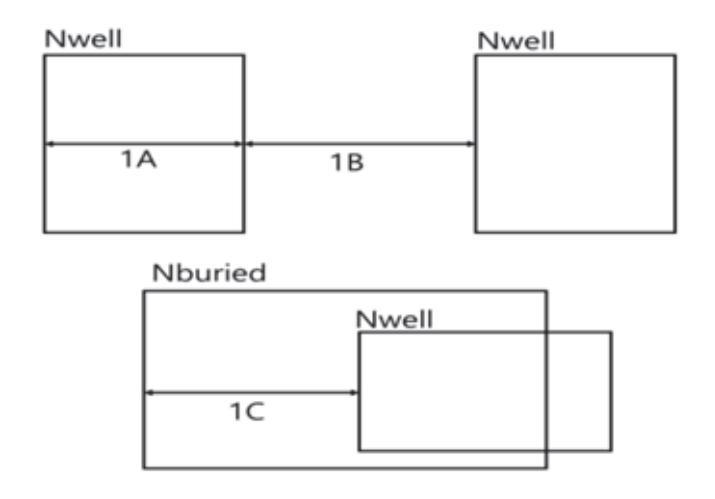

출처: 집필진 제작(2024)

[그림 3-2] N-well Rule Description

#### <표 3-1> N-well에 관한 디자인 룰 사례

| Rule No. | Description                       |
|----------|-----------------------------------|
| 1A       | Minimum width of an Nwell.        |
| 1B       | Minimum space between two Nwell.  |
| 1C       | Minimum Nburied overlap of Nwell. |

#### <표 3-2> Oxide에 관한 디자인 룰 사례

| Rule No. | Description                              |
|----------|------------------------------------------|
| 2A       | Minimum width of an Oxide.               |
| 2B       | Minimum space between two Oxides.        |
| 2C       | Minimum Nwell overlap of Oxides.         |
| 2C       | Minimum Pwell overlap of Oxides.         |
| 2D       | Minimum spacing between Nwell and Oxide. |
| 2D       | Minimum spacing between Pwell and Oxide. |

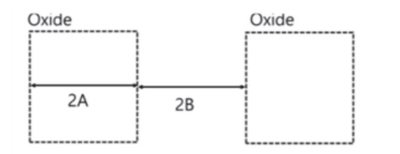

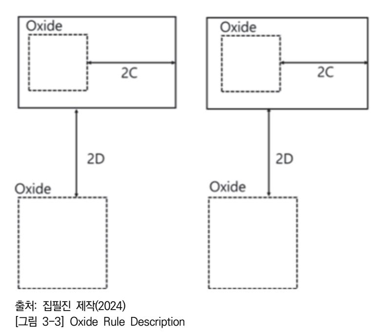

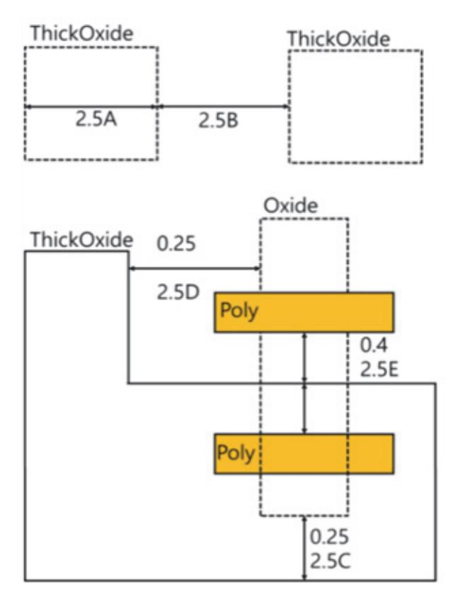

출처: 집필진 제작(2024) [그림 3-4] thick oxide rule

#### <표 3-3> Thick oxide에 관한 디자인 룰 사례

| Rule No. | Description                       |
|----------|-----------------------------------|
| 2.5A     | Minimum width of an Oxide.        |
| 2.5B     | Minimum space between two Oxides. |
| 2.5C     | Thick Oxide to Oxide enclosure.   |
| 2.5D     | ThickOxide to Oxide spacing.      |
| 2.5E     | ThickOxide to Poly spacing.       |
| 2.5F     | ThickOxide to Poly enclosure.     |

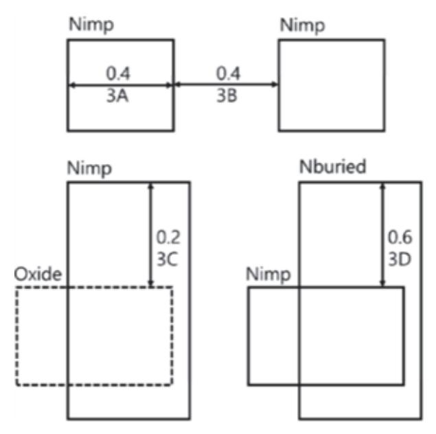

출처: 집필진 제작(2024) [그림 3-5] N+ implant rule

<표 3-4> N+ implant 디자인 룰 사례

| Rule No. | Description                      |
|----------|----------------------------------|
| 3A       | Minimum width of an Nimp.        |
| 3B       | Minimum space between two Nimp.  |
| 3C       | Minimum Nimp overlap of Oxide.   |
| 3D       | Minimum Nburied overlap of Nimp. |

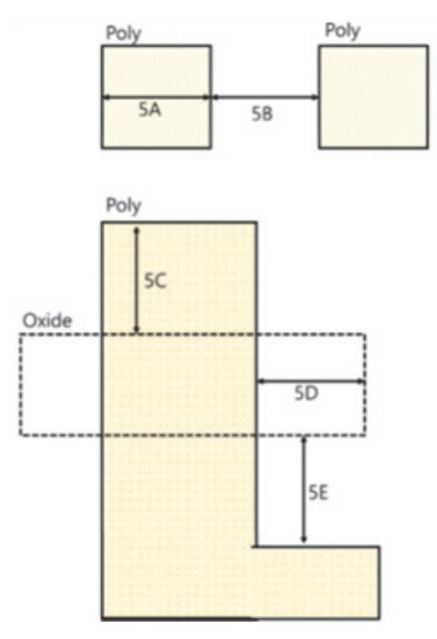

출처: 집필진 제작(2024) [그림 3-6] poly rule

<표 3-5> poly 디자인 룰 사례

| Rule No. | Description                        |
|----------|------------------------------------|
| 5A       | Minimum width of an Poly.          |
| 5B       | Minimum space between two Poly.    |
| 5C       | Minimum Poly extension over Oxide. |
| 5D       | Minimum Oxide extension over Poly. |
| 5E       | Minimum Poly space to Oxide.       |

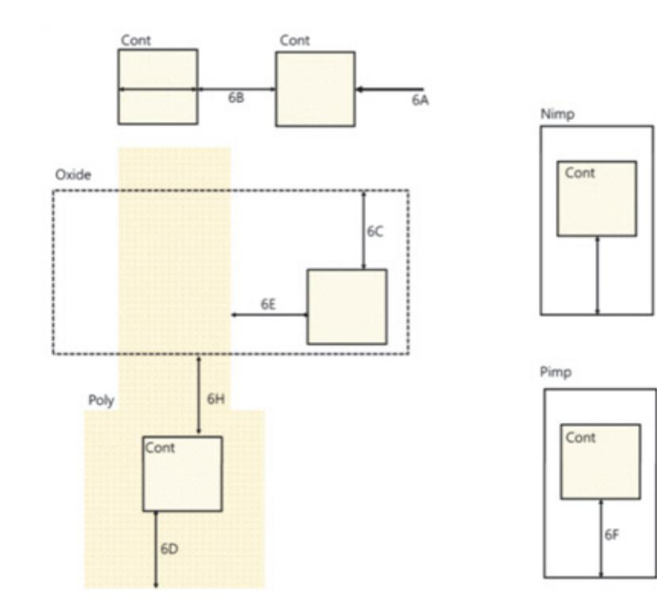

출처: 집필진 제작(2024) [그림 3-7] Poly Contact rule

| <표 3-6> Poly Contact Rule에 관한 디자인 룰 사례 |  |  |  |  |  |  |
|----------------------------------------|--|--|--|--|--|--|
|----------------------------------------|--|--|--|--|--|--|

| Rule No. | Description                           |
|----------|---------------------------------------|
| 6A       | Absolute width and Length of Contact. |
| 6B       | Minimum space between two Contact.    |
| 6C       | Minimum Oxide overlap of Contact      |
| 6D       | Minimum Poly overlap of Contact.      |
| 6E       | Minimum Poly space to Contact.        |
| 6F       | Minimum Pimp overlap of Contact.      |
| 6G       | Minimum Nimp overlap of Contact.      |
| 6H       | Minimum Contact space to Oxide.       |

<표 3-7> Metal Rule에 관한 디자인 룰 사례

| Rule No.                       | Description                        |
|--------------------------------|------------------------------------|
| 7A,9A,11A,15A,17A,19A          | Minimum width of an Metalx.        |
| 7B,9B,11B,15B,17B,19B          | Minimum space between two Metalx.  |
| 7C                             | Minimum Metal1 overlap of Contact. |
| 9C,11C,15C,17C,19C             | Minimum Metalx overlap of Viax.    |
| (Metalx, x = 1, 2, 3, 4, 5, 6) |                                    |
| (Viax, x = 1, 2, 3, 4, 5)      |                                    |

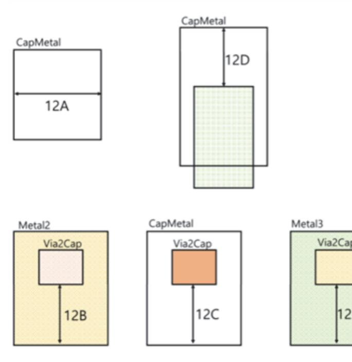

출처: 집필진 제작(2024) [그림 3-8] Capacitor metal rule

| <표 3-8> Capacitor Metal Rule에 관한 디자인 룰 사례 |  |  |  |  |  |  |  |  |  |
|-------------------------------------------|--|--|--|--|--|--|--|--|--|
|-------------------------------------------|--|--|--|--|--|--|--|--|--|

| Rule No. | Description                                 |
|----------|---------------------------------------------|
| 12A      | Minimum width of an CapMetal.               |
| 12B      | Minimum Metal2 overlap of Via2 on CapMetal. |
| 12C      | Minimum CapMetal overlap of Via2.           |
| 12D      | Minimum Metal3 overlap of Via2 on Captetal. |
| 12E      | Minimum CapMetal overlap of Metal3.         |

출처: 집필진 제작(2024) [그림 3-11] 다이오드를 이용한 과전압 바이패스

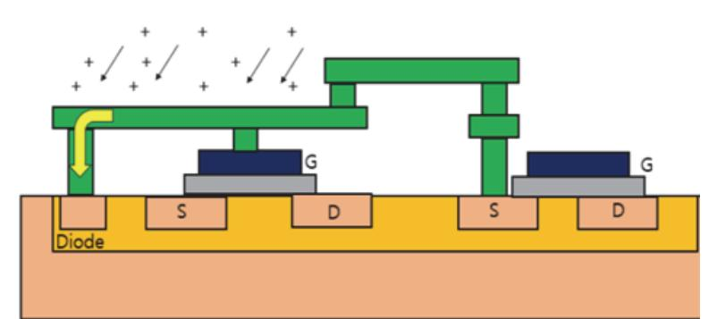

출처: 집필진 제작(2024) [그림 3-10] jumper를 이용한 antenna 효과 감소

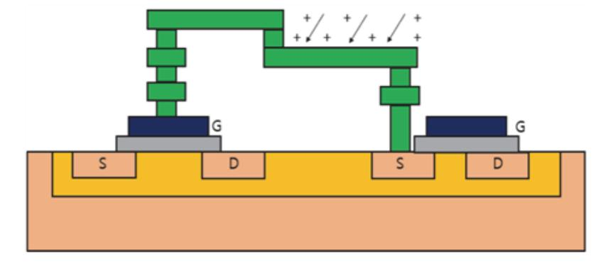

출처: 집필진 제작(2024) [그림 3-9] 안테나 효과에 의한 전하 축적

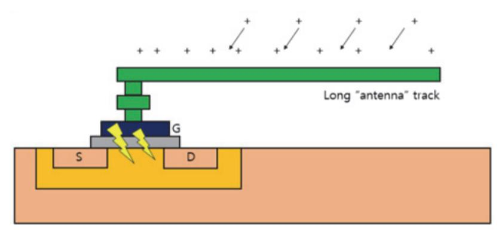

1) DRC 규칙: 최소 간격, 최소 폭, 레이어 간의 최소 간격 등

2) ANT 규칙: 안테나 효과 방지 규칙

(가) 활동: 주요 설계 규칙을 이해하고, 이를 설계에 적용한다.

(나) 내용

- (2) 주요 설계 규칙 파악
- (나) 자료: DRC와 ANT 규칙을 포함한 공정 설계 매뉴얼

- 2. 레이아웃 검증 툴 설정을 한다.
  - (1) 검증 툴 선택 및 설치
    - (가) 활동: 적합한 레이아웃 검증 툴을 선택하고 설치한다.
    - (나) 도구: Mentor Graphics Calibre, Synopsys IC Validator, Cadence Pegasus 등
  - (2) 검증 환경 설정
    - (가) 활동: 검증 툴의 환경을 설정하고, 설계 규칙 파일을 로드한다.
    - (나) 예제(Calibre)

calibre -drc -hier -turbo -rules drc\_rules.rul -layout layout.gds calibre -antenna -rules antenna\_rules.rul -layout layout.gds

- 3. 레이아웃 검증 수행을 한다.
  - (1) DRC 수행
    - (가) 활동: DRC 검증을 수행하여 설계 규칙 위반을 확인한다.
    - (나) 예제(Calibre)

calibre -drc -hier -turbo -rules drc\_rules.rul -layout layout.gds

- (2) 안테나 효과 검증
  - (가) 활동: 안테나 효과 검증을 수행하여 안테나 규칙 위반을 확인한다.
  - (나) 예제(Calibre)

calibre -antenna -rules antenna\_rules.rul -layout layout.gds

- 4. 오류 분석 및 수정을 한다.
  - (1) DRC 오류 분석
    - (가) 활동: DRC 검증 결과를 분석하여 규칙 위반 항목을 확인한다.
    - (나) 도구: Calibre RVE(Results Viewing Environment) 등을 사용하여 오류 위치를 확인 한다.
    - (다) 예제(Calibre RVE)

calibre -rve -drc\_results.drc

- (2) 안테나 효과 오류 분석
  - (가) 활동: 안테나 효과 검증 결과를 분석하여 규칙 위반 항목을 확인한다.
  - (나) 도구: Calibre RVE 등을 사용하여 오류 위치를 확인한다.
  - (다) 예제(Calibre RVE)

calibre -rve -antenna\_results.antenna

(3) 오류 수정

- (가) 활동: DRC 및 안테나 효과 검증에서 발견된 오류를 수정한다.
- (나) 방법
  - 1) DRC 오류 수정: 레이아웃의 간격, 폭 등을 조정하여 규칙을 준수한다.
  - 2) 안테나 오류 수정: 메탈 필, 디옥사이드 필, 엔타이저(Aantenna Diode) 등을 삽입 하여 안테나 효과를 방지한다.
- 5. 재검증 및 최종 검증을 한다.
  - (1) 재검증 수행
    - (가) 활동: 오류를 수정한 후, 다시 DRC 및 안테나 효과 검증을 수행한다.
    - (나) 도구 명령

calibre -drc -hier -turbo -rules drc\_rules.rul -layout layout\_fixed.gds calibre -antenna -rules antenna\_rules.rul -layout layout\_fixed.gds

- (2) 최종 검증
  - (가) 활동: 모든 오류가 해결되었는지 최종 검증을 수행한다.
  - (나) 도구 명령

calibre -drc -hier -turbo -rules drc\_rules.rul -layout final\_layout.gds calibre -antenna -rules antenna\_rules.rul -layout final\_layout.gds

- 6. 문서화 및 보고서를 준비한다.
  - (1) 검증 결과 문서화
    - (가) 활동: 검증 결과와 수정 내역을 문서화하여 보고한다.
    - (나) 내용
      - 1) DRC 및 안테나 검증 결과
      - 2) 수정 사항 및 재검증 결과
  - (2) 보고서 작성
    - (가) 활동: 최종 검증 결과를 기반으로 보고서를 작성한다.
    - (나) 내용
      - 1) 설계 검증 과정 요약
      - 2) 주요 오류 및 수정 내역
      - 3) 최종 검증 결과
- 7. 예제: Calibre를 사용한 레이아웃 검증 및 수정
  - (1) DRC 검증

# DRC 규칙 파일과 레이아웃 파일을 사용하여 DRC 수행

calibre -drc -hier -turbo -rules drc\_rules.rul -layout layout.gds

# DRC 결과 분석

calibre -rve -drc\_results.drc

(2) 안테나 효과 검증

# 안테나 규칙 파일과 레이아웃 파일을 사용하여 안테나 검증 수행 calibre -antenna -rules antenna\_rules.rul -layout layout.gds

# 안테나 결과 분석 calibre -rve -antenna\_results.antenna

(3) 오류 수정 후 재검증

# 오류 수정 후 재검증 수행

calibre -drc -hier -turbo -rules drc\_rules.rul -layout layout\_fixed.gds calibre -antenna -rules antenna\_rules.rul -layout layout\_fixed.gds

8. 다음의 종합적인 접근 방법을 준수한다.

- (1) 설계 규칙 파일 숙지: DRC 및 ANT 규칙을 이해하고 이를 설계에 반영한다.
- (2) 레이아웃 검증 툴 설정: 적합한 검증 툴을 선택하고 설정하여 검증 환경을 구축한다.
- (3) 레이아웃 검증 수행: DRC 및 안테나 효과 검증을 수행하여 오류를 확인한다.
- (4) 오류 분석 및 수정: 검증 결과를 분석하여 오류를 수정하고, 재검증을 수행한다.
- (5) 문서화 및 보고: 검증 결과와 수정 내역을 문서화하여 보고한다.

숗 자동 배치 배선 레이아웃 설계 검증 파일(LVS)을 숙지하고, 레이아웃 검증 툴의 적용 및 오류에 대 한 수정 사항을 반영한다.

반도체 레이아웃 설계에서 자동 배치 및 배선 작업을 완료한 후, 레이아웃 설계 검증을 통해 회로도의 기능적 일관성을 확인하는 과정은 매우 중요하다. LVS 검증은 레이아웃 설계가 원래 의 회로도와 일치하는지 확인하는 절차이다. 이를 위해 LVS 검증 파일을 숙지하고, 레이아웃 검증 툴을 적용하여 오류를 확인하고 수정하는 방법을 사용한다.

이와 같은 체계적인 접근을 통해 반도체 레이아웃 설계의 자동 배치 및 배선 과정에서 회로도 와 레이아웃의 기능적 동일성을 확인하고 오류를 검출 및 수정한다.

- 1. LVS 검증 파일을 숙지한다.
  - (1) LVS 검증 파일의 이해
    - (가) 활동: 공정의 LVS 검증 파일을 숙지한다.
    - (나) 자료: LVS 규칙 파일(예: LVS rule deck), 회로도(Schematic), 레이아웃(Layout) 데이터

- (2) 주요 LVS 검증 항목 파악
  - (가) 활동: 주요 LVS 검증 항목을 이해하고, 이를 설계에 적용한다.
  - (나) 내용
    - 1) Netlist Comparison: 회로도의 네트리스트와 레이아웃의 네트리스트를 비교한다.
    - 2) Device Checking: 소자의 종류와 파라미터를 비교한다.
    - 3) Connectivity Checking: 네트리스트 간의 연결성을 비교한다.
- 2. 레이아웃 검증 툴 설정을 한다.
  - (1) 검증 툴 선택 및 설치
    - (가) 활동: 적합한 레이아웃 검증 툴을 선택하고 설치한다.
    - (나) 도구: Mentor Graphics Calibre, Synopsys Hercules, Cadence PVS 등
  - (2) 검증 환경 설정
    - (가) 활동: 검증 툴의 환경을 설정하고, LVS 규칙 파일을 로드한다.
    - (나) 예제(Calibre LVS)

calibre -lvs -hier -rules lvs\_rules.rul -layout layout.gds -netlist schematic.spice

- 3. 레이아웃 검증을 수행한다.
  - (1) LVS 검증 수행
    - (가) 활동: LVS 검증을 수행하여 회로도와 레이아웃의 일치 여부를 확인한다.
    - (나) 예제(Calibre LVS)

calibre -lvs -hier -rules lvs\_rules.rul -layout layout.gds -netlist schematic.spice

- 4. 오류 분석 및 수정을 한다.
  - (1) LVS 오류 분석
    - (가) 활동: LVS 검증 결과를 분석하여 일치하지 않는 항목을 확인한다.
    - (나) 도구: Calibre RVE(Results Viewing Environment) 등을 사용하여 오류 위치를 확인 한다.
    - (다) 예제(Calibre RVE)

calibre -rve -lvs\_results.lvs

- (2) 오류 수정
  - (가) 활동: LVS 검증에서 발견된 오류를 수정한다.
  - (나) 방법

- 1) Netlist Mismatch: 네트리스트 불일치 오류를 수정하기 위해 네트 연결을 확인하 고 수정한다.
- 2) Device Parameter Mismatch: 소자 파라미터 불일치 오류를 수정하기 위해 소자 의 크기, 유형 등을 조정한다.
- 3) Connectivity Issues: 연결성 문제를 해결하기 위해 네트 간의 연결을 재조정한다.

#### 5. 재검증 및 최종 검증을 수행한다.

(1) 재검증 수행

(가) 활동: 오류를 수정한 후, 다시 LVS 검증을 수행한다.

(나) 도구 명령

calibre -lvs -hier -rules lvs\_rules.rul -layout layout\_fixed.gds -netlist schematic.spice

- (2) 최종 검증
  - (가) 활동: 모든 오류가 해결되었는지 최종 검증을 수행한다.
  - (나) 도구 명령

calibre -lvs -hier -rules lvs\_rules.rul -layout final\_layout.gds -netlist schematic.spice

#### 6. 문서화 및 보고서를 준비한다.

- (1) 검증 결과 문서화
  - (가) 활동: 검증 결과와 수정 내역을 문서화하여 보고한다.
  - (나) 내용
    - 1) LVS 검증 결과

2) 수정 사항 및 재검증 결과

#### (2) 보고서 작성

- (가) 활동: 최종 검증 결과를 기반으로 보고서를 작성한다.
- (나) 내용 :
  - 1) 설계 검증 과정 요약
  - 2) 주요 오류 및 수정 내역
  - 3) 최종 검증 결과
- 7. 예제: Calibre를 사용한 LVS 검증 및 수정
  - (1) LVS 검증

# LVS 규칙 파일과 레이아웃, 회로도 네트리스트 파일을 사용하여 LVS 수행 calibre -lvs -hier -rules lvs\_rules.rul -layout layout.gds -netlist schematic.spice

# LVS 결과 분석 calibre -rve -lvs\_results.lvs

(2) 오류 수정 후 재검증 # 오류 수정 후 재검증 수행

> calibre -lvs -hier -rules lvs\_rules.rul -layout layout\_fixed.gds -netlist schematic.spice

- 8. 다음의 종합적인 접근 방법을 준수한다.
  - (1) LVS 검증 파일 숙지: LVS 규칙을 이해하고 이를 설계에 반영한다.
  - (2) 레이아웃 검증 툴 설정: 적합한 검증 툴을 선택하고 설정하여 검증 환경을 구축한다.
  - (3) 레이아웃 검증 수행: LVS 검증을 수행하여 회로도와 레이아웃의 일치 여부를 확인한다.
  - (4) 오류 분석 및 수정: 검증 결과를 분석하여 오류를 수정하고, 재검증을 수행한다.
  - (5) 문서화 및 보고: 검증 결과와 수정 내역을 문서화하여 보고한다.

수 자동 배치 배선 레이아웃의 매개 변수 추출 파일(LPE)을 활용하여, 매개 변수를 포함한 네트리스트 를 추출한다.

반도체 레이아웃 설계의 자동 배치 및 배선 과정에서 매개 변수 추출 파일(LPE: Layout Parasitic Extraction)을 활용하여, 기생 소자를 포함한 네트리스트를 추출하는 것은 중요한 작업이다. 이는 설계의 전기적 특성을 정확하게 분석하고 시뮬레이션할 수 있게 한다. 이와 같 은 체계적인 접근을 통해 반도체 레이아웃 설계의 자동 배치 및 배선 과정에서 매개 변수를 포 함한 네트리스트를 추출하고, 정확한 시뮬레이션을 수행하여 설계의 전기적 특성을 평가한다. 다음은 LPE 파일을 활용하여 매개 변수를 포함한 네트리스트를 추출하는 주요 단계와 방법이 다.

- 1. 준비 및 환경 설정을 한다.
  - (1) 설계 파일 준비
    - (가) 활동: 레이아웃 파일, 기술 파일(TF), 스키매틱 네트리스트 등을 준비한다.
    - (나) 자료
      - 1) 레이아웃 파일(예: layout.gds)
      - 2) 기술 파일(예: tech.tf)
      - 3) 회로도 네트리스트 파일(예: schematic.spice)

(2) 검증 및 추출 툴 선택

(가) 활동: LPE를 지원하는 적합한 검증 및 추출 툴을 선택한다.

(나) 도구: Mentor Graphics Calibre, Synopsys StarRC, Cadence Quantus 등

- 2. LPE 설정 및 매개 변수를 추출한다.
  - (1) LPE 규칙 파일 설정
    - (가) 활동: LPE 규칙 파일을 설정하고, 필요한 추출 매개 변수를 정의한다.
    - (나) 자료: LPE 규칙 파일(예: lpe\_rules.rul)
  - (2) 매개 변수 추출 수행
    - (가) 활동: LPE 규칙 파일을 사용하여 레이아웃에서 매개 변수를 추출한다.
    - (나) 예제(Calibre xRC)

calibre -xrc -hier -turbo -rules lpe\_rules.rul -layout layout.gds -netlist schematic.spice -spef layout.spef

- 3. 매개 변수를 포함한 네트리스트를 추출한다.
  - (1) 추출된 매개 변수 검토
    - (가) 활동: 추출된 매개 변수 파일을 검토하여 정확성을 확인한다.
    - (나) 자료: 추출된 SPEF 파일(예: layout.spef)
  - (2) 매개 변수 포함 네트리스트 생성
    - (가) 활동: 매개 변수를 포함한 네트리스트를 생성한다.
    - (나) 도구: PEX 툴을 사용하여 기생 소자가 포함된 네트리스트를 생성한다.
    - (다) 예제(Calibre xRC)

calibre -lvs -hier -turbo -rules lvs\_rules.rul -layout layout.gds -netlist schematic.spice

calibre -xrc -spef -format hspice -spef\_out layout.spef -netlist schematic\_with\_parasitics.spice

- 4. 시뮬레이션을 위한 네트리스트를 준비한다.
  - (1) 기생 소자가 포함된 네트리스트 확인
    - (가) 활동: 기생 소자가 포함된 네트리스트를 검토하여 시뮬레이션 준비를 확인한다.
    - (나) 자료: 기생 소자가 포함된 네트리스트 파일(예: schematic\_with\_parasitics.spice)
  - (2) 시뮬레이션 환경 설정
    - (가) 활동: SPICE 시뮬레이터 또는 기타 시뮬레이션 도구의 환경을 설정한다.
    - (나) 도구: HSPICE, Spectre 등

- 5. 시뮬레이션 수행 및 결과를 분석한다.
  - (1) 시뮬레이션 수행
    - (가) 활동: 기생 소자가 포함된 네트리스트를 사용하여 시뮬레이션을 수행한다.
    - (나) 도구 명령(HSPICE 예제)

hspice schematic\_with\_parasitics.spice > simulation\_results.lis

- (2) 시뮬레이션 결과 분석
  - (가) 활동: 시뮬레이션 결과를 분석하여 설계의 전기적 특성을 평가한다.
  - (나) 자료: 시뮬레이션 결과 파일(예: simulation\_results.lis)

#### 6. 문서화 및 보고한다.

- (1) 추출 및 시뮬레이션 결과 문서화
  - (가) 활동: 매개 변수 추출 및 시뮬레이션 결과를 문서화하여 보고한다.
  - (나) 내용
    - 1) 추출된 매개 변수 및 네트리스트
    - 2) 시뮬레이션 설정 및 결과를 분석한다.
- (2) 보고서 작성
  - (가) 활동: 최종 보고서를 작성하여 설계 검증 과정과 결과를 체계적으로 정리한다.
  - (나) 내용
    - 1) 매개 변수 추출 과정 요약
    - 2) 시뮬레이션 설정 및 결과
    - 3) 설계 검증 결과와 향후 개선 사항
- 7. 예제: Calibre를 사용한 매개 변수 추출 및 네트리스트를 생성한다.
  - (1) LPE 수행
    - # LPE 규칙 파일과 레이아웃 파일을 사용하여 매개 변수 추출 수행

calibre -xrc -hier -turbo -rules lpe\_rules.rul -layout layout.gds -netlist schematic.spice -spef layout.spef

- (2) 기생 소자가 포함된 네트리스트 생성
  - # 기생 소자가 포함된 네트리스트 생성

calibre -xrc -spef -format hspice -spef\_out layout.spef -netlist schematic\_with\_parasitics.spice

(3) 시뮬레이션 수행

# HSPICE를 사용한 시뮬레이션 수행

hspice schematic\_with\_parasitics.spice > simulation\_results.lis

- 8. 다음의 종합적인 접근 방법을 준수한다.
  - (1) 준비 및 환경 설정: 레이아웃 파일, 기술 파일, 회로도 네트리스트 등 필요한 자료를 준비하 고 검증 및 추출 툴을 설정한다.
  - (2) LPE 설정 및 매개 변수 추출: LPE 규칙 파일을 설정하고, 매개 변수를 추출한다.
  - (3) 매개 변수를 포함한 네트리스트 추출: 기생 소자를 포함한 네트리스트를 생성한다.
  - (4) 시뮬레이션을 위한 네트리스트 준비: 기생 소자가 포함된 네트리스트를 검토하고 시뮬레이션 환경을 설정한다.
  - (5) 시뮬레이션 수행 및 결과 분석: 시뮬레이션을 수행하고 결과를 분석하여 설계의 전기적 특성 을 평가한다.
  - (6) 문서화 및 보고: 추출 및 시뮬레이션 결과를 문서화하여 보고서를 작성한다.

#### 수행 tip

- 자동 배치 배선 레이아웃의 반복되는 검증 과정을 통해 설계의 완성도가 높아진다는 신념으로 검증 작업을 진행한다.
- 자동 배치 배선 레이아웃 검증 과정에서 발생된 기생 소자 들의 값을 네트리스트에 빠짐없이 반영될 수 있도록 한다.

### 학습 3 교수·학습 방법

#### 교수 방법

- 고객 요구 사항을 반영할 수 있도록 적합한 툴을 선정하여 레이아웃에 필요한 요소를 응용 예시를 제시한다.
- 공정의 설계 권고 사항을 설명하고 해당 내용에 대한 레이아웃 실습이 이루어지도록 지도한 다.
- 공정의 설계 규칙에 따라 반도체 소자에 대한 레이아웃 실습이 이루어지도록 지도한다.
- 공정의 설계 검증 규칙에 따라 레이아웃상에서 기능 블록을 배치 및 배선할 수 있도록 작업 순서에 따라 단계적으로 실습이 이루어지도록 지도한다.
- 공정의 레이어 별 매개 변수를 고려하여 특성에 변화가 없도록 레이아웃을 수행할 수 있도 록 작업 순서에 따라 단계적으로 지도한다.

#### 학습 방법

- 고객 요구 사항을 반영할 수 있도록 적합한 툴을 선정하여 레이아웃에 필요한 요소 전반에 대해 이해한다.
- 공정의 설계 권고 사항을 숙지하고 해당 내용을 레이아웃 실습에 적용한다.
- 공정의 설계 규칙에 따라 반도체 소자에 대한 레이아웃을 수행할 수 있도록 학습 및 실습한 다.
- 공정의 설계 검증 규칙에 따라 레이아웃상에서 기능 블록을 배치 및 배선하는 방법을 숙지 할 수 있도록 반복 연습한다.
- 공정의 레이어별 매개 변수를 고려하여 특성에 변화가 없도록 레이아웃을 수행하는 실습한 다.

## 학습 3 평 가

#### 평가 준거

• 평가자는 학습자가 학습 목표를 성공적으로 달성하였는지를 평가해야 한다.

#### • 평가자는 다음 사항을 평가해야 한다.

|         | 학습 목표                                                                               |  | 성취수준 |   |  |
|---------|-------------------------------------------------------------------------------------|--|------|---|--|
| 학습 내용   |                                                                                     |  | 중    | 하 |  |
| 레이아웃 검증 | - 배치 배선 초기 네트리스트와 배치 배선이 완료된 네트리스 트를 비교하여 검증 대상의 이상 유무를 확인할 수 있다.                |  |      |   |  |
|         | - 공정의 설계 권고 사항에 따라 레이아웃을 검증하기 위하여 적합한 툴을 선정할 수 있다.                               |  |      |   |  |
|         | - 공정의 설계 규칙 파일(DRC, ANT)을 숙지하고, 레이아웃 검증 툴의 적용 및 오류에 대한 수정 사항을 반영할 수 있다.          |  |      |   |  |
|         | - 자동 배치 배선 레이아웃 설계 검증 파일(LVS)을 숙지하고, 레이아웃 검증 툴의 적용 및 오류에 대한 수정 사항을 반영 할 수 있다. |  |      |   |  |
|         | - 자동 배치 배선 레이아웃의 매개 변수 추출 파일(LPE)을 활 용하여, 매개 변수를 포함한 네트리스트를 추출할 수 있다.            |  |      |   |  |

#### 평가 방법

• 서술형 시험

|         | 평가 항목                                                                                      |  | 성취수준 |   |  |
|---------|--------------------------------------------------------------------------------------------|--|------|---|--|
| 학습 내용   |                                                                                            |  | 중    | 하 |  |
| 레이아웃 검증 | - 레이아웃의 검증을 위해 배치 배선 초기 네트리스트와 배치 배선이 완료된 네트리스트의 비교를 위해 레이아웃 툴에서 등가 검증 설정을 할 수 있는 능력 |  |      |   |  |
|         | - 공정의 설계 권고 사항을 확인하고 레이아웃 검증이 가능한 적합한 툴을 선정할 수 있는 능력                                    |  |      |   |  |
|         | - 공정의 설계 규칙 파일(DRC, ANT)을 숙지하고, 레이아웃 검증 툴의 활용하여 DRC 검증을 수행하여 안테나 효과를 검증할 수 있는 능력     |  |      |   |  |
|         | - LVS 검증 파일을 숙지하고, LVS 검증 툴의 활용하여 LVS 검증을 수행하여 회로도와 레이아웃의 일치 여부                         |  |      |   |  |

#### • 평가자 체크리스트

|         |                                                                                               | 성취수준 |   |   |
|---------|-----------------------------------------------------------------------------------------------|------|---|---|
| 학습 내용   | 평가 항목                                                                                         |      | 중 | 하 |
| 레이아웃 검증 | - 레이아웃의 검증을 위해 배치 배선 초기 네트리스트와 배치 배선이 완료된 네트리스트의 비교를 위해 레이아웃 툴에서 결과 분석 및 디버깅을 할 수 있는 능력 |      |   |   |
|         | - 공정의 설계 규칙 파일(DRC, ANT)을 숙지하고, 레이아웃 검증 툴의 활용하여 DRC 검증을 수행하여 설계 규칙 위반 을 확인할 수 있는 능력     |      |   |   |
|         | - 자동 배치 배선 레이아웃 설계 검증 파일을 숙지하고, 레이 아웃 검증 툴의 적용 및 오류에 대한 수정 사항을 반영할 수 있는 능력              |      |   |   |
|         | - LVS 검증 결과를 분석하여 일치하지 않는 항목을 확인하 고 이를 수정할 수 있는 능력                                         |      |   |   |

#### 피드백

#### 1. 서술형 시험

- 레이아웃의 검증을 위해 배치 배선 초기 네트리스트와 배치 배선이 완료된 네트리스트를 비교하 기 위해 레이아웃 툴에서 등가 검증 설정을 할 수 있는 능력을 평가한 후, 주요 사항들을 검토하 여 미흡하거나, 보충해야 할 업무를 체크하여 보완하도록 피드백 해 준다.
- LVS 검증 파일을 숙지하고, LVS 검증 툴의 활용하여 LVS 검증을 수행하여 회로도와 레이아웃 의 일치 여부를 확인할 수 있는 능력을 평가한 후 미흡한 부분은 보완 지도해 준다.
- 자동 배치 배선 레이아웃의 매개 변수 추출 파일(LPE)을 활용하여, 매개 변수를 포함한 네트리스 트를 추출할 수 있는 능력을 평가하여 성취수준이 우수한 학습자에게는 전체 칩의 중요 부분에 대한 세부 기능과 원리에 대해 설명하고, 저조한 학습자에게는 기본 블록에 대한 IP의 종류 및 기능을 이해하도록 한다.

2. 평가자 체크리스트

- 레이아웃의 검증을 위해 배치 배선 초기 네트리스트와 배치 배선이 완료된 네트리스트의 비교를 위해 레이아웃 툴에서 결과 분석 및 디버깅을 할 수 있는 능력을 평가한 후, 개선 및 보완 사항 에 대한 내용을 정리하여 재학습할 수 있도록 피드백해 준다.
- 공정의 설계 규칙 파일(DRC, ANT)을 숙지하고, 레이아웃 검증 툴의 활용하여 DRC 검증을 수행 하여 설계 규칙 위반을 확인할 수 있는 능력에 대해 평가한 후 성취수준이 낮은 학습자에게는 추 가 설명을 해 준다.

- ∙ 강성호·김대정·이승준·이찬호(2004). 『SoC 및 IP 설계 기법』. 홍릉과학출판사.
- ∙ 공진흥·김남영·김동욱·이재철(1997). 『VLSI 설계, 이론과 실습』. 홍릉과학출판사.
- ∙ 조영록(2009). 『CMOS 공정을 이용한 Analog Layout』. 홍릉과학출판사
- ∙ 조준동(2010). 『알기 쉬운 최신 VLSI설계』. 한빛미디어.
- ∙ Saburo Muroga (1982). VLSI system design. when and how to design very-large-scale integrated circuits. U.S.A: John Wiley & Sons, Inc.
- ∙ Neil H. E. Weste, David Harris (2005). CMOS VLSI Design. A Circuits and Systems Perspective. U.S.A: Addison Wesley.

| NCS학습모듈 개발이력 |                                     |     |                  |  |
|--------------|-------------------------------------|-----|------------------|--|
| 발행일          | 2024년 12월 31일                       |     |                  |  |
| 세분류명         | 반도체 개발((19030601)                   |     |                  |  |
| 개발기관         | 수원과학대학교 산학협력단(개발책임자: 윤창용) 한국직업능력연구원 |     |                  |  |
|              | 최준혁(수원대학교)*                         |     | 김종범(삼성전기)        |  |
|              | 계찬호(수원대학교)                          |     | 김한수(두원공과대학교)     |  |
|              | 김경호(폴리텍대학교)                         |     | 남승호(경기대학교)       |  |
|              | 김관하(폴리텍대학교)                         |     | 손승대(제이에스이엔씨(주))  |  |
| 집필진          | 김기순((주)영우디에스피)                      | 검토진 | 안광호(퓨쳐일렉트로닉스)    |  |
|              | 김도균(폴리텍대학교)                         |     | 이철오((주)한국전력안전공단) |  |
|              | 전동민(폴리텍대학교)                         |     |                  |  |

\*표시는 대표집필자임 (참고) 검토진으로 참여한 집필진은 본인의 원고가 아닌 타인의 학습모듈을 검토함

|                                                                                                         | 자동 배치 배선 레이아웃 설계(LM1903060112_23v5) |  |
|---------------------------------------------------------------------------------------------------------|-------------------------------------|--|
| 저작권자                                                                                                    | 교육부                                 |  |
| 연구기관                                                                                                    | 한국직업능력연구원                           |  |
| 발행일                                                                                                     | 2024. 12. 31.                       |  |
| ISBN                                                                                                    | 979-11-7175-746-6                   |  |
| ※ 이 학습모듈은 자격기본법 시행령(제8조 국가직무능력표준의 활용)에 의거하여 개발하였으며, NCS통합포털사이트(http ://www.ncs.go.kr)에서 다운로드 할 수 있다. |                                     |  |

