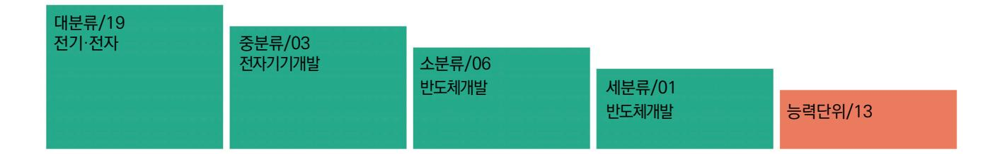

# NCS학습모듈 반도체 설계 검증

LM1903060113\_23v2


### [NCS학습모듈 활용 시 유의 사항]

- 1. NCS학습모듈은 교육훈련기관에서 출처를 명시하고 교육적 목적으로 활용할 수 있습니다. 다 만, NCS학습모듈에는 국가(교육부)가 저작재산권 일체를 보유하지 않은 저작물(출처가 표기된 도표‧사진‧삽화‧도면 등)이 포함되어 있으므로, 이러한 저작물의 변형‧각색‧복제‧공연‧ 배포 및 공중 송신 등과 이러한 저작물을 활용한 2차적 저작물을 작성하려면 반드시 원작자 의 동의를 받아야 합니다.
- 2. NCS학습모듈은 개발 당시의 산업 및 교육 현장을 반영하여 집필하였으므로, 현재 적용되는 법령‧지침‧표준 및 교과 내용 등과 차이가 있을 수 있습니다. NCS학습모듈 활용 시 법령 ‧지침‧표준 및 교과 내용의 개정 사항과 통계의 최신성 등을 확인하시기를 바랍니다.
- 3. NCS학습모듈은 산업 현장에서 요구되는 능력을 교육훈련기관에서 학습할 수 있게 구성한 자 료입니다. 다만, NCS학습모듈 지면의 한계상 대표적 예시(예: 활용도 또는 범용성이 높은 제 품, 서비스) 중심으로 집필하였음을 이해하시기를 바랍니다.

# NCS학습모듈의 이해

※ 본 NCS학습모듈은 「NCS 국가직무능력표준」사이트(http://www.ncs.go.kr) 에서 확인 및 다운로드할 수 있습니다.

## Ⅰ NCS학습모듈이란?

- 국가직무능력표준(NCS: National Competency Standards)이란 산업현장에서 직무를 수행하기 위해 요구되는 지식·기술·소양 등의 내용을 국가가 산업부문별·수준별로 체계 화한 것으로 산업현장의 직무를 성공적으로 수행하기 위해 필요한 능력(지식, 기술, 태도) 을 국가적 차원에서 표준화한 것을 의미합니다.
- 국가직무능력표준(이하 NCS)이 현장의 '직무 요구서'라고 한다면, NCS학습모듈은 NCS
   의 능력단위를 교육훈련에서 학습할 수 있도록 구성한 '교수·학습 자료'입니다. NCS학습
   모듈은 구체적 직무를 학습할 수 있도록 이론 및 실습과 관련된 내용을 상세하게 제시하
   고 있습니다.


### ○ NCS학습모듈은 다음과 같은 특징을 가지고 있습니다.

- 첫째, NCS학습모듈은 산업계에서 요구하는 직무능력을 교육훈련 현장에 활용할 수 있도 록 성취목표와 학습의 방향을 명확히 제시하는 가이드라인의 역할을 합니다.
- 둘째, NCS학습모듈은 특성화고, 마이스터고, 전문대학, 4년제 대학교의 교육기관 및 훈 련기관, 직장교육기관 등에서 표준교재로 활용할 수 있으며 교육과정 개편 시에도 유용하게 참고할 수 있습니다.


○ NCS와 NCS학습모듈 간의 연결 체계를 살펴보면 아래 그림과 같습니다.


O NCS학습모듈의 위치는 NCS 분류 체계에서 해당 학습모듈이 어디에 위치하는지를 한 눈에 볼 수 있도록 그림으로 제시한 것입니다.

| [NCS-학          | 습모듈             | 의 위치]    |          |  |
|-----------------|-----------------|----------|----------|--|
|                 |                 |          |          |  |
| 대분류             | 분류 문화·예술·디자인·방송 |          |          |  |
| 중분류             | 문화콘텐츠           |          |          |  |
| 소분류             |                 | 문화콘텐츠제작  |          |  |
|                 |                 |          |          |  |
| 세분류             |                 |          |          |  |
| 방송콘텐츠제작         |                 | 능력단위     | 학습모듈명    |  |
| 영화콘텐츠제작         |                 | 프로그램 기획  | 프로그램 기획  |  |
| 음악콘텐츠제작         |                 | 아이템 선정   | 아이템 선정   |  |
| 광고콘텐츠제작         |                 | 자료 조사    | 자료 조사    |  |
| 게임콘텐츠제작         |                 | 프로그램 구성  | 프로그램 구성  |  |
| 애니메이션<br>콘텐츠제작  |                 | 캐스팅      | 캐스팅      |  |
| 만화콘텐츠제작         |                 | 제작계획     | 제작계획     |  |
| 캐릭터제작           |                 | 방송 미술 준비 | 방송 미술 준비 |  |
| 스마트문화앱<br>콘텐츠제작 |                 | 방송 리허설   | 방송 리허설   |  |
| 영사              |                 | 야외촬영     | 야외촬영     |  |
|                 |                 | 스튜디오 제작  | 스튜디오 제작  |  |
|                 |                 |          |          |  |

학습모듈은

NCS 능력단위 1개당 1개의 학습모듈 개발 을 원칙으로 합니다. 그러나 필요에 따라 고용단위 및 교과단위를 고려하여 능력단위 몇 개를 묶어 1개 학습모듈로 개발할 수 있으며, NCS 능력단위 1개를 여러 개의 학습모듈로 나누어 개발할 수도 있습니다.

### 2. NCS학습모듈의 개요

### ○ NCS학습모듈의 개요는 학습모듈이 포함하고 있는 내용을 개략적으로 설명한 것으로

| 학습모듈의 목표 , 선수학습 , 학습모듈의 내용 체계 , 핵심 용어 로 구성되어 있습니다. |                                                                              |  |  |
|----------------------------------------------------|------------------------------------------------------------------------------|--|--|
| 학습모듈의 목표                                           | 해당 NCS 능력단위의 정의를 토대로 학습 목표를 작성한 것입니다.                                        |  |  |
| 선수학습                                               | 해당 학습모듈에 대한 효과적인 교수·학습을 위하여 사전에 이수해야 하는 학습모<br>듈, 학습 내용, 관련 교과목 등을 기술한 것입니다. |  |  |
| 학습모듈의<br>내용 체계                                     | 해당 NCS 능력단위요소가 학습모듈에서 구조화된 체계를 제시한 것입니다.                                     |  |  |
| 핵심 용어                                              | 해당 학습모듈의 학습 내용, 수행 내용, 설비·기자재 등 가운데 핵심적인 용어를 제<br>시한 것입니다.                   |  |  |

## 제작계획 학습모듈의 개요

### 학습모듈의 목표

본격적인 촬영을 준비하는 단계로서, 촬영 대본을 획정하고 제작 스태프를 조직하며 촬영 장비와 촬영 소품을 준비할 수 있다.

### 선수학습

제작 준비(LM0803020105\_13v1), 섭외 및 제작스태프 구성(LM0803020104\_13v1), 촬영 제작(LM0803020106\_13v1), 촬영 장비 준비(LM0803040204\_13v1.4), 미술 디자인 협의하기(LM0803040203\_13v1.4)

### 학습모듈의 내용체계

| 하스                | 하스 내용                                              | NCS 능력단위 요소       |                |
|-------------------|----------------------------------------------------|-------------------|----------------|
| 학습                | 학습 내용                                              | 코드번호              | 요소 명칭          |
| 1. 촬영 대본<br>확정하기  | 1-1. 촬영 구성안 검<br>토와 수정                             | 0803020114_16/3.1 | 촬영 대본<br>확정하기  |
| 2. 제작 스태프<br>조직하기 | 2-1. 기술 스태프 조직<br>2-2. 미술 스태프 조직<br>2-3. 전문 스태프 조직 | 0803020114_16v3.2 | 제작 스태프<br>조직하기 |
| 3. 촬영 장비<br>계획하기  | 3-1. 촬영 장비 점검<br>과 준비                              | 0803020114_16/3.3 | 촬영 장비<br>계획하기  |
| 4. 촬영 소품<br>계획하기  | 4-1. 촬영 소품 목록<br>작성<br>4-2. 촬영 소품 제작<br>의뢰         | 0803020114_16\3.4 | 촬영 소품<br>계획하기  |

### 핵심 용어

촬영 구성안, 제작 스태프, 촬영 장비, 촬영 소품

### 학습모듈의 목표는

학습자가 해당 학습모듈을 통해 성취해야 할 목표를 제시한 것으로, 교수자는 학습자 가 학습모듈의 전체적인 내용흐름을 파악하 도록 지도할 수 있습니다.

**6** • •

61

### 선수학습은

교수자 또는 학습자가 해당 학습모듈을 교 수·학습하기 이전에 이수해야 하는 교과목 또는 학습모듈(NCS 능력단위) 등을 표기한 것입니다. 따라서 교수자는 학습자가 개별 학습, 자기 주도 학습, 방과 후 활동 등 다 양한 방법을 통해 이수할 수 있도록 지도하 는 것을 권장합니다.

|            | 핵심 용어는              |
|------------|---------------------|
|            | 률을 대표하는 주요 용어입니     |
|            | · 해당 학습모듈을 통해 학습    |
|            | 게될 주요 내용을 알 수 있습    |
|            | 5 국가직무능력표준」 사이트     |
| (www.ncs.g | jo.kr)의 색인 (찾아보기) 중 |
| 하나로 이용할    | 할 수 있습니다            |

### 3. NCS학습모듈의 내용 체계

○ NCS학습모듈의 내용은 크게 학습, 학습 내용, 교수·학습 방법, 평가 로 구성되어 있습니다.

| 학습       | 해당 NCS 능력단위요소 명칭을 사용하여 제시한 것입니다.<br>학습은 크게 학습 내용, 교수·학습 방법, 평가로 구성되며 해당 NCS 능력단위의<br>능력단위 요소별 지식, 기술, 태도 등을 토대로 내용을 제시한 것입니다.                                                    |
|----------|----------------------------------------------------------------------------------------------------------------------------------------------------------------------------------|
| 학습 내용    | 학습 내용은 학습 목표, 필요 지식, 수행 내용으로 구성되며, 수행 내용은 재료·자<br>료, 기기(장비·공구), 안전·유의 사항, 수행 순서, 수행 tip으로 구성한 것입니다.<br>학습모듈의 학습 내용은 실제 산업현장에서 이루어지는 업무활동을 표준화된 프로세<br>스에 기반하여 다양한 방식으로 반영한 것입니다. |
| 교수·학습 방법 | 학습 목표를 성취하기 위한 교수자와 학습자 간, 학습자와 학습자 간 상호 작용이<br>활발하게 일어날 수 있도록 교수자의 활동 및 교수 전략, 학습자의 활동을 제시한<br>것입니다.                                                                            |
| 평가       | 평가는 해당 학습모듈의 학습 정도를 확인할 수 있는 평가 준거 및 평가 방법, 평<br>가 결과의 피드백 방법을 제시한 것입니다.                                                                                                         |


# [NCS-학습모듈의 위치]

| 대분류 | 전기·전자 |          |        |
|-----|-------|----------|--------|
| 중분류 |       | 전자 기기 개발 |        |
| 소분류 |       |          | 반도체 개발 |

| 세분류    |                  |                  |
|--------|------------------|------------------|
| 반도체 개발 | 능력단위             | 학습모듈명            |
| 반도체 제조 | 반도체 제품 기획        | 반도체 제품 기획        |
| 반도체 장비 | 반도체 아키텍처 설계      | 반도체 아키텍처 설계      |
| 반도체 재료 | 디지털 회로 설계        | 디지털 회로 설계        |
|        | 패키지 조립 공정 개발     | 패키지 조립 공정 개발     |
|        | 반도체 제품 기능·성능 검증  | 반도체 제품 기능·성능 검증  |
|        | 자동 배치 배선 레이아웃 설계 | 자동 배치 배선 레이아웃 설계 |
|        |                  |                  |
|        | 반도체 설계 검증        | 반도체 설계 검증        |
|        | 반도체 펌웨어 개발       | 반도체 펌웨어 개발       |
|        | 메모리 반도체 제조 공정 개발 | 메모리 반도체 제조 공정 개발 |
|        | 시스템 반도체 제조 공정 개발 | 시스템 반도체 제조 공정 개발 |
|        | 반도체 제조 단위 공정 개발  | 반도체 제조 단위 공정 개발  |
|        | 아날로그 회로 아키텍처 설계  | 아날로그 회로 아키텍처 설계  |
|        | 아날로그 회로 소자 레벨 설계 | 아날로그 회로 소자 레벨 설계 |

| 와이어 본딩 패키지 개발     | 와이어 본딩 패키지 개발     |
|-------------------|-------------------|
| 플립 칩 패키지 개발       | 플립 칩 패키지 개발       |
| 웨이퍼 레벨 패키지 개발     | 웨이퍼 레벨 패키지 개발     |
| 어드밴스드 팬 아웃 패키지 개발 | 어드밴스드 팬 아웃 패키지 개발 |
| 이종 접합 패키지 개발      | 이종 접합 패키지 개발      |
| 어드밴스드 언더필 패키지 개발  | 어드밴스드 언더필 패키지 개발  |
| 반도체 환경 시험         | 반도체 환경 시험         |
| 반도체 수명 시험         | 반도체 수명 시험         |
| 반도체 내성 시험         | 반도체 내성 시험         |
| 커스텀 레이아웃 적용 공정 분석 | 커스텀 레이아웃 적용 공정 분석 |
| 커스텀 레이아웃 설계       | 커스텀 레이아웃 설계       |
| 커스텀 레이아웃 검증       | 커스텀 레이아웃 검증       |

# 차 례

| 학습 1. 단위 블록 검증하기<br>1-1. 단위 블록 검증<br>• 교수 ․ 학습 방법<br>• 평가<br>학습 2. 통합 블록 검증하기<br>2-1. 통합 블록 검증<br>• 교수 ․ 학습 방법<br>• 평가<br>학습 3. 플랫폼 기반 검증하기<br>3-1. 플랫폼 기반 검증<br>• 교수 ․ 학습 방법<br>• 평가 | 학습모듈의 개요 | 1   |
|---------------------------------------------------------------------------------------------------------------------------------------------------------------------------------------|----------|-----|
|                                                                                                                                                                                       |          |     |
|                                                                                                                                                                                       |          | 3   |
|                                                                                                                                                                                       |          | 35  |
|                                                                                                                                                                                       |          | 36  |
|                                                                                                                                                                                       |          |     |
|                                                                                                                                                                                       |          | 38  |
|                                                                                                                                                                                       |          | 79  |
|                                                                                                                                                                                       |          | 80  |
|                                                                                                                                                                                       |          |     |
|                                                                                                                                                                                       |          | 82  |
|                                                                                                                                                                                       |          | 127 |
|                                                                                                                                                                                       |          | 128 |
|                                                                                                                                                                                       | 참고 자료    | 131 |

# 반도체 설계 검증 학습모듈의 개요

### 학습모듈의 목표

반도체 설계 단계에서 설계한 단위 블록 및 통합 블록이 설계 사양에 맞게 구현되었는지 평가할 수 있다.

### 선수학습

레이아웃 설계(LM1903060105\_14v3), 전기 회로, 전자 회로

### 학습모듈의 내용체계

|                |                | NCS 능력단위 요소       |             |
|----------------|----------------|-------------------|-------------|
| 학습             | 학습 내용          | 코드번호              | 요소 명칭       |
| 1. 단위 블록 검증하기  | 1-1. 단위 블록 검증  | 1903060113_23v2.1 | 단위 블록 검증하기  |
| 2. 통합 블록 검증하기  | 2-1. 통합 블록 검증  | 1903060113_23v2.2 | 통합 블록 검증하기  |
| 3. 플랫폼 기반 검증하기 | 3-1. 플랫폼 기반 검증 | 1903060113_23v2.3 | 플랫폼 기반 검증하기 |

### 핵심 용어

배치, 배선, 설계 규칙, DRC(design rule heck), LVS(layout versus schematic), LPE(layout parastic extraction), 커스텀 레이아웃, 자동 배치 배선

# 학습 1 단위 블록 검증하기

| 학습 2 | 통합 블록 검증하기  |
|------|-------------|
| 학습 3 | 플랫폼 기반 검증하기 |

# 1-1. 단위 블록 검증

|       | • 주어진 설계 사양을 분석할 수 있다.                 |
|-------|----------------------------------------|
|       | • 단위 블록 검증 시나리오 및 검증 계획을 수립할 수 있다.     |
|       | • 수립한 검증 계획을 바탕으로 검증 환경을 구축할 수 있다.     |
| 학습 목표 | • 검증 환경에 기반한 테스트 벤치를 구현할 수 있다.         |
|       | • 테스트 벤치의 검증 결과와 설계 결과를 비교하여 평가할 수 있다. |
|       | • 평가한 검증 보고서를 작성하여 설계자에게 제공할 수 있다.     |

# 필요 지식 /

숔 반도체 설계

반도체 설계는 매우 복잡하고 정밀한 과정으로, 다양한 단계를 거쳐야 최종 제품을 생산할 수 있다. 아래는 반도체 설계의 주요 단계와 각 단계에서 수행되는 작업에 대한 설명이다.

- 1. 요구 사항 정의
  - (1) 목표 설정: 설계할 반도체의 목적과 성능 목표를 설정한다.
  - (2) 기능 정의: 필요한 기능을 정의하고, 이를 바탕으로 설계 사양서를 작성한다.
- 2. 시스템 설계
  - (1) 블록 다이어그램: 전체 시스템의 블록 다이어그램을 작성하여 각 블록의 기능과 인터페이스를 정의한다.
  - (2) 시스템 아키텍처: 시스템의 구조를 정의하고, 각 구성 요소의 상호 작용을 명확히한다.
- 3. RTL 설계
  - (1) RTL 코드 작성: VHDL, Verilog 등의 하드웨어 설명 언어(HDL)를 사용하여 register trans fer level(RTL) 코드를 작성한다.
  - (2) 시뮬레이션: RTL 코드를 시뮬레이션하여 논리적 오류를 찾아 수정한다.
- 4. 기능 검증

- (1) 테스트 벤치 작성: 테스트 벤치를 작성하여 설계의 기능을 검증한다.
- (2) 시뮬레이션: 다양한 테스트 케이스를 사용하여 시뮬레이션을 수행하고, 설계가 요구 사항을 충족하는지 확인한다.
- 5. 합성
  - (1) 논리 합성: RTL 코드를 게이트 레벨 네트리스트로 변환한다.
  - (2) 합성 결과 검토: 합성된 결과를 검토하여 타이밍, 전력, 면적 등의 요구 사항을 충족하는지 확인한다.
- 6. 타이밍 분석
  - (1) 정적 타이밍 분석(STA): 타이밍 분석 도구를 사용하여 설계의 타이밍을 검증하고, 경로의 지 연을 분석한다.
  - (2) 타이밍 최적화: 타이밍 위반이 발생한 경로를 수정하여 타이밍 요구 사항을 충족시킨다.
- 7. 레이아웃 설계
  - (1) 물리 설계: 합성된 게이트 레벨 네트리스트를 바탕으로 레이아웃을 설계한다.
  - (2) 배치 및 배선(PnR): 셀의 배치와 배선을 수행하여 물리적 레이아웃을 완성한다.
- 8. 물리 검증
  - (1) DRC: 설계 규칙 검사(design rule check)를 통해 레이아웃이 제조 공정의 규칙을 준수하는 지 확인한다.
  - (2) LVS: 레이아웃 대 스키매틱(layout versus schematic) 검사를 통해 레이아웃과 논리 설계 가 일치하는지 확인한다.
  - (3) 기생 소자 추출: 기생 저항과 기생 커패시턴스를 추출하여 후속 타이밍 및 전력 분석에 사용 한다.
- 9. 전력 분석
  - (1) 전력 시뮬레이션: 다양한 동작 모드에서 설계의 전력 소비를 시뮬레이션하여 분석한다.
  - (2) 전력 최적화: 전력 소비를 줄이기 위한 최적화 작업을 수행한다.
- 10. 제조 준비
  - (1) GDSII 파일 생성: 최종 레이아웃을 GDSII 파일로 변환하여 제조 공정에 전달한다.
  - (2) 테이프 아웃: 반도체 제조 공정으로 설계 데이터를 전달하여 생산 준비를 완료한다.
- 11. 검증 및 테스트
  - (1) 실리콘 검증: 제조된 칩을 테스트하여 설계 사양을 충족하는지 확인한다.
  - (2) 디버깅: 발견된 문제를 분석하고 수정하여 재제작을 준비한다.

- 12. 양산 및 품질 관리
  - (1) 양산 준비: 대량 생산을 위한 준비를 완료하고, 공정 변동성을 관리한다.
  - (2) 품질 관리: 생산된 반도체의 품질을 지속적으로 모니터링하고, 문제가 발생하면 신속하게 대 응한다.

### 숕 시스템 레벨 사양

시스템 레벨 사양은 설계된 기능 블록과 기능 블록의 동작과 연관된 소프트웨어까지 포함한다. 제품의 전체 기능 구현 방안이 아키텍처 설계에서 결정되면, 각 기능 블록을 하드웨어로 설계 할 때 이에 연관된 소프트웨어를 같이 검토해야 한다. 기능 구현을 위해 소프트웨어가 세팅해 야 하는 레지스터에 대해서 정의를 해야 하고, 소프트웨어로 구현해야 하는 기능이 있다면 같 이 검토해야 한다. 다시 설명하면, 기능 블록의 특성이 소프트웨어와 같이 연동하여 기능 구현 을 해야 하는 것이라면, 단순히 하드웨어 블록을 설계하는 것이 아니라, 소프트웨어로 처리를 해야 하는 기능과 연결해서 같이 검토해야 한다는 것이다. 이렇게 소프트웨어와 하드웨어가 같 이 동작을 해서 목표하는 기능이 구현 되도록 만드는 것이 시스템 레벨 사양이다. 소프트웨어 로 기능 구현을 하거나 기능 블록을 제어하려면, 기능 블록의 상세 설계 내용과 기능 블록 내 부에 사용하는 IP(intellectual property, 반도체 설계 자산)에 대해서도 제어 방법을 확인해야 한다. 이러한 과정을 통해서 기능 설계 블록과 소프트웨어가 연동하여 동작을 하는 시스템 레 벨의 사양이 만들어진다.

1. 시스템 레벨 사양의 구성

시스템 레벨 사양은 RTL 설계로 구현하는 하드웨어 블록과 이것을 제어하는 소프트웨어 또는 소프트웨어로 구현된 기능의 내용, 이 2개의 블록이 어떻게 연동되어 동작하는지의 내 용으로 구성이 된다.

- (1) RTL 설계로 구현하는 기능 블록 하드웨어의 내용
- (2) RTL 설계로 구현된 하드웨어 블록을 제어하는 소프트웨어 또는 소프트웨어로 구현된 기능의 내용
- (3) 하드웨어와 소프트웨어의 연결 동작 및 제어 방법

2. 시스템 레벨 사양의 적용 검토

시스템 레벨 사양은 소프트웨어의 제어 또는 소프트웨어로 기능 구현이 필요로 하는 기능 블록 또는 IP에 대해서 적용한다. 기능 블록이 자체적으로 특정 기능을 수행할 수 있도록 설계된 블록에 대해서는 소프트웨어를 포함한 사양을 검토하지 않아도 문제는 없다. 다음 2 가지 경우로 구분해서 시스템 레벨 사양 적용 검토를 한다.

(1) 소프트웨어의 제어 또는 소프트웨어적인 기능 수행을 필요로 하는 경우

기능 블록 또는 IP의 제어하는 소프트웨어가 포함된 시스템 레벨 사양을 적용해야 한다.

5

(2) 기능 블록 또는 IP가 자체적으로 기능을 수행하는 경우 시스템 레벨 사양 적용을 하지 않아도 되지만, 여러 기능 블록과 같이 동작하는 경우에 는 포함이 된다.

### 숖 기능 설계 블록에 대한 소프트웨어 운영 및 설계

기능 블록에서 소프트웨어의 운영은 설계 진행 중이거나 설계가 완료된 기능 블록의 제어를 소 프트웨어를 통해서 진행할 때 필요하다. 또한 소프트웨어의 설계는 기능 구현을 RTL 설계와 소프트웨어 기능 구현의 조합으로 구성해야 할 때 필요하다. 어느 방향이든지 소프트웨어 개발 담당자에게 필요한 정보를 제공해야 한다. 제공해야 할 내용은 기능 블록 설계할 때 작성된 상 세 설계 명세서, 기능 블록에서 사용하는 레지스터와 그 세팅 방법, 소프트웨어 연결 동작을 하는 경우 통신하는 신호선들에 대한 내용이다.

1. 소프트웨어 운영 방법

소프트웨어의 운영은 기능 블록을 운영하는 데 최적화가 되도록 하여야 한다. 최적화하는 방법은 기능 블록이 최소한의 제어를 받아서 그 기능을 수행할 수 있도록 제어하는 것이다. 이를 위해 소프트웨어 개발 담당자는 제어하는 대상이 되는 기능 블록의 상세 내용에 대해 서 파악하면서 소프트웨어를 운영한다.

### 2. 소프트웨어 설계

소프트웨어 설계는 목적에 따라 2가지로 구분이 된다. 첫 번째는 기능 블록을 제어하여 원 하는 기능을 구현하는 것이고, 두 번째는 소프트웨어로 일부 기능이 구현되어서 하드웨어 기능 블록과 연동하여 동작이 되도록 하는 것이며, 목적에 맞게 소프트웨어 설계를 해야 한 다.

### 숗 시스템 레벨 사양서 작성 및 활용

시스템 레벨 사양서 작성은 기능 블록을 동작시키기 위해 연관된 소프트웨어까지 포함해서 작 성한다. 작성에 포함되어야 하는 내용은 기능 설계 블록의 상세 설계 내용과 제어하는 방법, 소프트웨어로 제어 및 기능 구현하는 방법, RTL 설계로 구현된 기능 블록의 하드웨어 내용과 소프트웨어가 어떻게 연결이 되어야 하며 어떻게 제어 신호가 전달되는지에 대한 것이 포함되 어야 한다. 그리고 시스템 레벨 사양서를 이용하면 다음과 같이 여러 분야에서 사용할 수 있 다.

- 1. 시스템 레벨 사양서 포함 내용
  - (1) RTL 설계로 구현되는 기능 블록의 제어 방법
  - (2) 소프트웨어로 구현되는 기능 블록의 내용

- (3) 소프트웨어로 제어하는 방법 및 연결 신호선에 대한 내용
- 2. 시스템 레벨 사양서의 활용
  - (1) 검증 시스템에서 사용
  - (2) 동작 시나리오의 작성할 때 사용
  - (3) 소프트웨어 개발용으로 사용

### 수 설계 검증 시스템

설계 담당자가 설계한 기능 블록이 목표로 하였던 기능들이 모두 정상적으로 동작하는지에 대 한 검증을 반도체 제조 공정을 실시하기 전에 진행해야 한다. 반도체 제조 공정은 그 비용이 많이 들고, 제조 일정이 길기 때문에 반도체 공정에 들어가기 전에 최대한 많은 기능들이 정상 적으로 동작하는지 검증하여 기능 불량이 날 확률을 최소화해야 제품을 성공적으로 완성할 수 있다. 따라서 설계 검증은 매우 중요한 단계이며 최대한 설계에서 목적으로 한 결과가 나오는 지 확인해야 한다. 이러한 검증은 설계 검증 시스템을 별도로 구축하여 진행하는 것이 효율적 이다. 아키텍처 설계 진행할 때 검증을 위해 추가해야 하는 블록이 있거나 설계 블록 검증에 필요한 인터페이스가 필요하다고 판단이 되면 추가를 해야 한다. 이 경우 기능 블록 설계와는 별도로 검증 회로를 설계하여야 한다. 기능 블록 및 각 기능 블록을 연결하여 원하는 동작이 정상적으로 진행되는지 검증하기 위한 검증 시스템은 대부분 FPGA 부품을 이용하며, FPGA 부품과 주변 부품이 실장되는 하드웨어 보드를 제작하여 구축한다.

1. 검증 시스템의 목적

검증 시스템을 구축하는 목적은 설계한 기능 블록들이 설계 목표대로 정상적으로 동작하는 지, 동작상에 문제는 없는지 등에 대한 확인을 실시간으로 할 수 있는 검증 환경을 제공하 는 데 있다.

### 2. 검증 시스템의 개요

검증 시스템을 만드는 목적은 설계한 기능 블록들이 정상적으로 원하는 결과를 출력하는지, 입력 출력을 포함한 내부 동작상에 문제는 없는지 등에 대한 확인을 실시간으로 하려는 것 이 목적이다. 시뮬레이션으로 기능 블록의 모든 동작에 대해 확인하려면 많은 시간이 필요 한데, 실시간으로 검증을 할 수 있는 시스템을 구축하면, 다양한 동작 모드를 설정하여 빠 르게 검증할 수 있다. 검증 시스템을 구축하는 데 필요한 기본 정보 및 자료는 다음과 같 다.

- (1) 전체 블록도와 아키텍처 설계 문서
- (2) 기능 블록별 사양서

(3) 각 기능 블록별 회로의 크기에 대한 정보

- (4) 각 기능 블록별 사용하는 메모리의 크기에 대한 정보
- (5) 각 기능 블록을 제어하는 방법에 대한 문서
- (6) 소프트웨어와 연결되는 제어 신호선들에 대한 정보

위의 정보를 바탕으로 검증 보드와 FPGA의 구성 방안을 만들어서 검증 시스템에 적용 한다.

3. 검증 시스템 구성을 위한 자료

검증 시스템을 구축하기 위해서는 어떤 기능을 검증할지를 정해야 하고, 결정된 검증 목표 를 달성하는 데 필요한 검증 시스템을 만들어야 한다. 검증 시스템을 구성하는 데 필요한 자료는 다음과 같다.

- (1) 전체 블록도와 아키텍처 설계 문서
- (2) 기능 블록별 사양서
- (3) 각 기능 블록별 회로의 크기에 대한 정보
- (4) 각 기능 블록별 사용하는 메모리의 크기에 대한 정보
- (5) 각 기능 블록의 동작 제어 방법에 대한 정보
- (6) 소프트웨어와 연동하여 동작하는 부분에 대한 정보
- 4. 검증 시스템의 결정

검증 시스템을 구축하는 방법은 여러 가지 방법이 있으며, 검증이 반드시 필요한 부분을 우 선하여 고려하여 검증 시스템을 만들어야 한다. 검증해야 할 목표가 정해지면, 그 목적을 위해서 최적화된 검증 시스템을 결정하면 되는데, 여러 가지 항목을 검증하기 위한 목적이 라면, 다양한 검증을 위한 설정이 가능하도록 검증 시스템의 설정을 변경할 수 있도록 결정 해야 한다. 검증 시스템의 목적은 다음과 같이 구분해야 하며, 각 목적에 적합하도록 검증 시스템을 결정한다.

- (1) 단순 기능 검증을 위한 검증 시스템 구축
- (2) 동작 시나리오를 포함한 기능 검증을 위한 검증 시스템 구축
- 숙 동작 시나리오

동작 시나리오는 기능 블록 자체의 동작을 확인하는 것을 포함해서 각 기능 블록 간의 연동되 는 동작 또는 실제로 응용처에서 사용하려는 동작 목적을 반영한 시나리오로 설계 검증을 할 때 사용한다. 응용처에서 사용할 때는 단순히 하나의 기능 블록만 동작시키는 것보다는 여러 기능 블록이 동시에 동작하는 경우가 많으므로 이것을 반영한 시나리오를 검증 시스템에서 사 용하여 검증의 수준을 높여야 한다. 그리고 전체 개발 일정에서 동작 시나리오를 검증하는 데 필요한 일정을 고려하여 어떤 검증 시나리오를 사용할지 결정한다.

### 1. 동작 시나리오의 구분

동작시나리오는 실제 응용처에서 사용하려는 목적에 최대한 맞추어서 만들어야 한다. 동작 시나리오는 검증하려는 내용에 따라서 다음과 같이 구분된다.

(1) 블록 제어 동작 시나리오

각 기능 블록을 제어하는 신호를 생성하여 각 기능 블록들이 입력되는 제어 신호에 따 라 제어가 되는지를 확인하는 동작 시나리오이다. 설계된 제어 블록 또는 내장된 CPU 에서 각 블록에 제어 신호를 보내면, 각 기능 블록은 이 제어 신호가 원하는 동작을 하 는지 검증을 하면 된다.

(2) 데이터 흐름 중심의 동작 시나리오

데이터 흐름 중심의 동작 시나리오는 입력되는 데이터가 하나의 기능 블록에서 처리되 어 출력되고 다음의 기능 블록으로 입력되는 것과 같이 데이터의 흐름을 중심으로 만드 는 동작 시나리오이다. 기능 블록별로 검증을 하는 것은 각 기능 블록 단위로 입력, 출 력을 확인하여 목적하는 값이 출력되는지를 확인하는 것이라고 하면, 데이터의 처리 순 서에 맞추어서 각 기능 블록이 연동하여 동작한 결과를 확인하는 것이 데이터 흐름 중 심의 검증 동작 시나리오이다. 데이터 흐름 중심의 동작 시나리오를 그림으로 표시하면 [그림 1-1]과 같다. 이 동작 시나리오는 CPU에서 인터페이스 7을 세팅하여 외부에서 입력되는 데이터를 어떤 형태로 받을 것인지를 정의하고, 인터페이스 7에서 받은 데이 터는 Bus Bridge(시스템 버스와 peripheral BUS를 연결해 주는 중간 역할을 하는 회 로)와 기능 블록 6을 통해서 DRAM을 제어하여 기록한다. 다음으로 CPU가 기능 블록 6을 통해서 DRAM에 저장되어 있던 데이터를 읽어서 정해진 처리를 하여 그 처리 결과 를 기능 블록 6을 통해서 DRAM에 다시 저장하는 동작을 하는 것이다. 본 동작 시나리 오가 정상적으로 수행이 되어 목적하는 결과를 얻으면, 이 동작 시나리오는 검증이 완료 된 것이다.

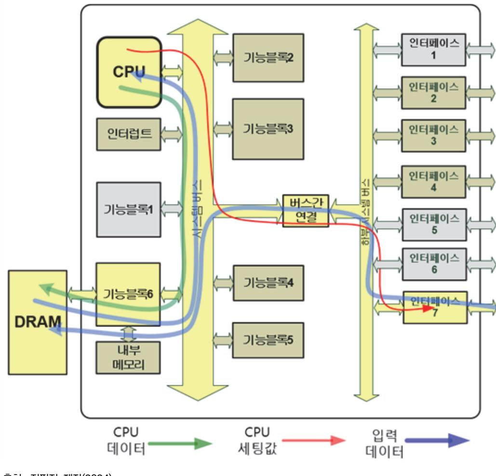

출처: 집필진 제작(2024) [그림 1-1] 데이터 흐름 중심의 동작 시나리오 예

2. 동작 시나리오의 작성

동작 시나리오를 작성하는 목적은 개발 단계에서 설계한 기능 블록들이 연동하여 원하는 동작을 하는지 확인하는 데 사용하려는 것이다. 많은 경우의 동작 시나리오 중에서 반드시 검증해야 하는 동작 시나리오를 정의하고, 그 동작을 위한 각 기능 블록 간의 연결 및 제어 방법에 대해서 작성해야 한다. 동작 시나리오에는 시뮬레이션을 이용하여 검증하는 방법과 검증 시스템을 이용한 검증 방법이 있다.

(1) 시뮬레이션으로 동작 확인 가능한 동작 시나리오

설계 담당자가 시뮬레이션 툴을 이용하여 동작 검증을 하는 방법으로 간단한 동작 시나 리오를 중심으로 만든다. 내부 신호선을 시뮬레이션에서 확인할 수 있으므로 외부에서 확인하기 어려운 신호선을 볼 필요가 있을 때 유용하다.

(2) 검증 시스템을 사용한 동작 시나리오 검증 시스템을 사용하면, 여러 기능 블록이 포함된 동작 시나리오를 실시간으로 동작시 키는 것이 가능하므로 복합적인 동작 시나리오를 만들 수 있다.

### 3. 동작 시나리오 확정

동작 시나리오들이 작성이 되었으면, 어떤 동작 시나리오를 사용할지를 결정해야 한다. 모 든 시나리오를 검증하는 것보다는 핵심적인 동작 시나리오를 선택해서 집중적으로 검증하는 것이 효율적이다. 동작 시나리오를 확정하는 기준을 수립하여 선정한다.

4. 확정된 동작 시나리오를 이용한 검증

개발하려는 반도체 제품이 응용처에서 원하는 기능 동작을 할 수 있는지에 대한 확인은 동 작 시나리오를 이용한 검증을 통해서 간접적으로 할 수 있다. 응용처에서 사용 가능한 시나 리오 중에서 검증 시스템에 적용 가능한 동작 시나리오가 결정되면, 필요한 정보를 취합한 다. 취합하는 정보는 검증하려는 동작 시나리오와 관련된 기능 블록들의 상세 구조 및 입 력, 출력 신호선에 대한 내용과 기능 블록을 제어하는 신호들이다. 제어 신호들을 입력하는 방법은 소프트웨어로 제어 신호를 만들어서 제공하는 것이 일반적인 방법이다. 데이터의 흐 름이 어떤 경로를 통과해서 이동하는지를 파악하고, 그 경로를 통과한 최종 결과를 확인하 여야 한다. 최종 결괏값을 예측하였던 결과와 비교를 해서 똑같은 결과를 얻으면 검증이 완 료된 것이다. 단순 기능 검증보다는 좀 더 실제적인 동작에 근접하여 설계 검증을 하는 것 이므로 그 검증 효과는 매우 크다. 검증 동작 시나리오를 선택하고, 그 결과를 확인하는 것 차제가 설계 검증의 핵심이라고 보면 된다. 동작 시나리오 검증은 반도체 공정을 시작하기 전에 완료하는 것이 바람직하다.

# 수행 내용 / 단위 블록 검증하기

### 재료·자료

- 설계 사양서(specification document)
- RTL 코드
- 테스트 벤치(테스트 벤치 코드, 테스트 케이스)
- 기생 소자 모델
- 시뮬레이션 및 검증 로그(시뮬레이션 로그, 검증 로그)
- 커버리지 리포트코드 커버리지, 기능 커버리지)
- 디버깅 도구[디버거(verdi, DVE 등)
- 관련 문서 및 자료(참고 자료,기술 지원 자료)
- 검증 체크리스트
- 기타 필요한 자료(버전 관리 기록, 피드백 및 수정 기록)

### 기기(장비 ・ 공구)

- 컴퓨팅 장비(워크스테이션 및 서버, 스토리지 시스템)
- 소프트웨어 도구
  - 시뮬레이터
  - 검증 프레임워크
  - 정적 분석 도구
  - 전력 분석 도구
  - 물리 검증 도구
  - 기생 소자 추출 도구
  - 디버깅 도구
- 네트워크 장비(이더넷 스위치, 네트워크 인터페이스 카드)
- 기타 장비 및 공구 버전 관리 시스템, 스크립팅 도구, 문서화 도구
- 시뮬레이션 환경(시뮬레이터 도구, 시뮬레이션 스크립트)

검증 도구(정적 타이밍 분석 도구, 전력 분석 도구: DRC/LVS 도구)

### 안전 ・ 유의 사항

- 컴퓨터 및 전자 장비 안전(안전한 전력 공급, 정전기 방지 장치 사용, 환기 및 온도 조절)
- 물리적 안전(작업 공간 정리, 응급 처치 키트 준비)
- 데이터 및 정보 보안(정기적인 백업, 액세스 제어 및 암호화, 보안 소프트웨어 사용, 네트워 크 방화벽 설정)
- 작업 절차의 정확성 및 효율(표준 작업 절차(SOP) 준수, 변경 관리 시스템 사용, 검증 계획 서 작성, 검증 결과 기록)
- 검증 도구 및 장비 사용 유의 사항(정확한 도구 사용법 숙지, 도구 및 소프트웨어 업데이트, 정기 점검 및 유지 보수, 장비 사용 기록)
- 협업 및 의사소통(정기 회의 개최, 명확한 역할 분담, 피드백 수렴 및 반영, 상세한 보고서 작성 및 보고)

### 수행 순서

숔 주어진 설계 사양을 분석한다.

반도체 설계 검증은 주어진 설계 사양에 따라 설계가 올바르게 이루어졌는지 확인하는 중요한 단계이다. 설계 사양을 분석하고, 이를 기준으로 검증을 수행하는 것은 설계의 성공 여부를 결 정짓는 핵심 요소이다. 다음은 반도체 설계 검증을 위해 주어진 설계 사양을 분석하는 방법과 이를 기반으로 검증을 수행하는 단계에 대한 설명이다.

- 1. 설계 사양을 분석한다.
  - (1) 설계 사양 문서 검토
    - (가) 기능적 요구 사항: 설계가 수행해야 하는 기능들을 이해하고, 이를 문서화한다. 예) 논리 연산, 데이터 저장, 신호 처리 등의 기능
    - (나) 성능 요구 사항: 설계의 성능 목표를 파악한다.

예) 클록 속도, 처리 속도, 전력 소비, 면적

- (다) 인터페이스 요구 사항: 설계가 다른 시스템 또는 모듈과 어떻게 상호 작용해야 하는지 이해한다.
  - 예) 입력/출력 핀, 통신 프로토콜, 전압 레벨

(2) 사양의 주요 요소 분석

- (가) 입력/출력 특성: 입력 신호와 출력 신호의 특성, 전압 레벨, 타이밍 요구 사항
- (나) 타이밍 제약: 클록 주기, 설정 시간(setup time), 유지 시간(hold time) 등의 타이밍 요구 사항
- (다) 전력 및 열 관리: 전력 소비 제한, 발열 특성, 열방출 요구 사항
- (라) 신뢰성: 신뢰성 요구 사항, MTBF(mean time between failures), ESD(electro static discharge) 보호 요구 사항
- (마) 제조 공정: 제조 공정 기술 노드, 디자인 룰, 레이어 정보

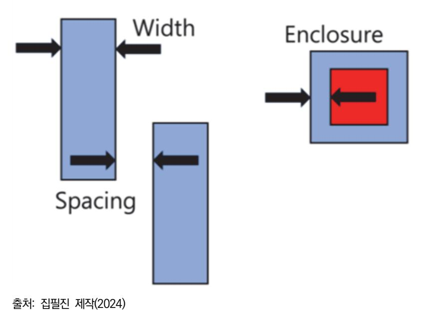

[그림 1-2] 디자인 룰의 정의

- 2. 검증 계획을 수립한다.
  - (1) 검증 전략 정의
    - (가) 기능 검증: 설계가 기능적 요구 사항을 충족하는지 확인한다. 예) 논리 시뮬레이션, 기능적 시뮬레이션
    - (나) 타이밍 검증: 타이밍 요구 사항을 충족하는지 확인한다. 예) STA(static timing analysis), 타이밍 시뮬레이션
    - (다) 전력 분석: 전력 소비가 요구 사항을 충족하는지 확인한다. 예) 전력 분석 도구 사용, 전력 시뮬레이션
    - (라) 신뢰성 검증: 신뢰성 요구 사항을 충족하는지 확인한다. 예) 스트레스 테스트, 신뢰성 시뮬레이션
  - (2) 검증 환경 설정

(가) 설계팀과의 협업: 검증 결과와 발견된 문제점을 설계팀과 공유하여 수정한다.

(3) 피드백

(나) 재검증: 수정된 설계에 대해 다시 검증을 수행하여 문제가 해결되었는지 확인한다.

(가) 디버깅: 검증 과정에서 발견된 오류를 디버깅하고 수정한다.

(2) 문제점 해결

예) 코드 커버리지, 기능 커버리지

(나) 커버리지 분석: 검증이 얼마나 충분히 이루어졌는지 평가한다.

(가) 검증 로그 분석: 시뮬레이션 로그와 결과를 분석하여 오류 및 문제점을 파악한다.

(1) 결과 분석

4. 검증 결과 분석 및 피드백 해 준다.

(나) 신뢰성 시뮬레이션: MTBF, ESD 보호 등의 신뢰성을 검증한다.

(가) 스트레스 테스트: 극한 조건에서의 동작을 확인한다.

(4) 신뢰성 검증

(나) 정적 전력 분석: 회로가 유휴 상태일 때의 전력 소비를 분석한다.

(가) 동적 전력 분석: 동작 중의 전력 소비를 시뮬레이션한다.

(3) 전력 분석

(나) 타이밍 시뮬레이션: 타이밍 요구 사항을 검증하기 위한 동적 시뮬레이션한다.

예) 클록 주기, 설정 시간, 유지 시간 등의 분석.

(가) 정적 타이밍 분석(STA): 클록 주기 내에서 신호가 안정화되는지 확인한다.

(2) 타이밍 검증

(나) 기능적 시뮬레이션: 다양한 입력 조건과 테스트 케이스를 통해 기능을 검증한다.

- (1) 기능 검증 (가) 논리 시뮬레이션: RTL(register transfer level) 설계의 기능을 시뮬레이션하여 검증한 다.

- 3. 검증을 수행한다.

(가) 시뮬레이션 환경: 설계의 기능 및 타이밍 검증을 위한 시뮬레이션 환경 설정을 한다. 예) VCS, ModelSim 등의 시뮬레이터 설정

(나) 검증 벤치 작성: 다양한 테스트 케이스를 포함하는 검증 벤치 작성을 한다.

예) UVM(unified verification methodology) 기반의 검증 벤치

(다) 검증 도구 선택: 필요한 검증 도구를 선택하고 설정한다.

예) STA 도구(primetime), DRC/LVS 도구(calibre)

(나) 검증 문서화: 검증 과정과 결과를 문서화하여 추후 참조할 수 있도록 한다.

5. 종합적인 접근을 시도한다.

반도체 설계 검증을 위해 주어진 설계 사양을 철저히 분석하고, 이를 기반으로 검증 계획을 수립한 후, 다양한 검증 도구와 방법을 사용하여 설계의 기능, 타이밍, 전력, 신뢰성을 확인 하는 과정이 필요하다. 검증 결과를 철저히 분석하고 피드백을 통해 설계를 개선함으로써 최종 제품이 설계 사양을 충족하고, 고성능, 고신뢰성의 반도체 제품을 개발할 수 있다.

### 숕 단위 블록 검증 시나리오 및 검증 계획을 수립한다.

반도체 설계 검증을 위해 단위 블록 검증 시나리오 및 검증 계획을 수립하는 것은 설계의 기 능, 타이밍, 전력 소비 등을 철저히 검증하여 최종 제품의 품질을 보장하는 데 중요한 역할을 한다. 아래는 단위 블록 검증 시나리오 및 검증 계획을 수립하는 방법에 대한 단계별 설명이 다.

- 1. 단위 블록 검증 시나리오를 수립한다.
  - (1) 단위 블록 정의
    - (가) 블록 식별: 검증할 단위 블록의 기능과 역할을 정의한다.
    - (나) 인터페이스: 블록 간의 입력 및 출력 신호를 명확히 정의한다.
    - (다) 사양 문서화: 단위 블록의 사양서를 작성한다.
  - (2) 기능적 시나리오 작성
    - (가) 기본 동작 시나리오: 블록이 정상적으로 동작하는지 확인하는 기본 시나리오이다. 예) 입력 신호에 대한 예상 출력 확인
    - (나) 경계 조건 시나리오: 입력값이 경계 조건에 있을 때의 동작을 확인한다. 예) 최대/최소 입력값, 전환 경계 조건
    - (다) 예외 상황 시나리오: 예외 상황이나 오류 조건에서의 동작을 확인한다. 예) 잘못된 입력값, 예상치 못한 입력 패턴
  - (3) 타이밍 시나리오 작성
    - (가) 클록 주기 검증: 클록 주기 내에 모든 신호가 안정화되는지 확인한다. 예) 클록 주기, 설정 시간(setup time), 유지 시간(hold time)
    - (나) 경로 지연 검증: 주요 경로의 신호 지연 분석. 예) 크리티컬 경로 분석
    - 타이밍 마진 검증: 타이밍 여유(margin)를 분석하여 안정성을 검증한다.
  - (4) 전력 시나리오 작성

(가) 동적 전력 소비 검증: 동작 중의 전력 소비를 분석한다.

예) 동작 주기 동안의 전력 소비 패턴

- (나) 정적 전력 소비 검증: 유휴 상태에서의 전력 소비를 분석한다.
  - 예) 블록이 활성화되지 않은 상태에서의 전력 소모
- (5) 신뢰성 시나리오 작성
  - (가) ESD 보호 검증: 정전기 방전 상황에서의 동작을 확인한다.
  - (나) 열 스트레스 검증: 고온/저온 환경에서의 동작을 확인한다.
  - (다) 노이즈 면역성 검증: 전자기 간섭 상황에서의 동작을 확인한다.

### 2. 단위 블록 검증 계획을 수립한다.

- (1) 검증 목표 설정
  - (가) 기능 검증 목표: 모든 기능 요구 사항이 충족되는지 확인한다.
  - (나) 타이밍 검증 목표: 모든 타이밍 제약 조건이 충족되는지 확인한다.
  - (다) 전력 검증 목표: 전력 소비 목표가 충족되는지 확인한다.
  - (라) 신뢰성 검증 목표: 신뢰성 요구 사항이 충족되는지 확인한다.
- (2) 검증 환경 구성
  - (가) 시뮬레이션 환경 설정: 검증을 수행할 시뮬레이션 환경을 설정한다. 예) VCS, ModelSim 등의 시뮬레이터 설정
  - (나) 검증 벤치 작성: 다양한 테스트 케이스를 포함하는 검증 벤치를 작성한다.
    - 예) UVM(unified verification methodology) 기반의 검증 벤치
  - (다) 검증 도구 선택: 필요한 검증 도구를 선택하고 설정한다.

예) STA 도구(primetime), DRC/LVS 도구(calibre)

- (3) 검증 케이스 작성
  - (가) 테스트 케이스 정의: 기능, 타이밍, 전력, 신뢰성 검증을 위한 구체적인 테스트 케이스를 작성한다.
    - 예) 각 시나리오에 대한 입력값과 기대 출력 정의
  - (나) 커버리지 목표 설정: 검증 커버리지 목표를 설정한다. 예) 코드 커버리지, 기능 커버리지
- (4) 검증 일정 수립
  - (가) 검증 단계별 일정: 각 검증 단계에 대한 일정을 수립한다.

예) 기능 검증, 타이밍 검증, 전력 검증, 신뢰성 검증 일정

(나) 중간 검토 일정: 중간 결과를 검토하고 피드백을 반영하는 일정을 수립한다.

단위 블록 검증 시나리오 및 검증 계획을 수립하는 것은 설계의 기능, 타이밍, 전력 소비, 신뢰성을 철저히 검증하여 최종 제품의 품질을 보장하는 데 필수적이다. 검증 시나리오를 통해 다양한 테스트 케이스를 정의하고, 이를 기반으로 철저한 검증 계획을 수립하여 검증 을 수행함으로써, 설계 오류를 조기에 발견하고 수정할 수 있다. 이를 통해 고성능, 저전력, 고신뢰성의 반도체 제품을 개발할 수 있다.

(나) 검증 문서화: 검증 과정과 결과를 문서화하여 추후 참조할 수 있도록 한다.

(가) 설계팀과의 협업: 검증 결과와 발견된 문제점을 설계팀과 공유하여 수정한다.

(3) 피드백

(나) 재검증: 수정된 설계에 대해 다시 검증을 수행하여 문제가 해결되었는지 확인한다.

(가) 디버깅: 검증 과정에서 발견된 오류를 디버깅하고 수정한다.

(2) 문제점 해결

5. 종합적인 접근을 시도한다.

예) 코드 커버리지, 기능 커버리지

(나) 커버리지 분석: 검증이 얼마나 충분히 이루어졌는지 평가한다.

(가) 검증 로그 분석: 시뮬레이션 로그와 결과를 분석하여 오류 및 문제점을 파악한다.

(1) 결과 분석

4. 검증 결과 분석 및 피드백한다.

(나) 신뢰성 시뮬레이션: MTBF, ESD 보호 등의 신뢰성을 검증한다.

(가) 스트레스 테스트: 극한 조건에서의 동작을 확인한다.

(4) 신뢰성 검증 수행

(나) 정적 전력 분석: 회로가 유휴 상태일 때의 전력 소비 분석을 한다.

(가) 동적 전력 분석: 동작 중의 전력 소비를 시뮬레이션한다.

(3) 전력 검증 수행

(나) 타이밍 시뮬레이션: 타이밍 요구 사항을 검증하기 위한 동적 시뮬레이션한다.

(가) 정적 타이밍 분석(STA): 클록 주기 내에서 신호가 안정화되는지 확인한다.

(2) 타이밍 검증 수행

(나) 기능적 시뮬레이션: 다양한 입력 조건과 테스트 케이스를 통해 기능을 검증한다.

(가) 논리 시뮬레이션: RTL 설계의 기능을 시뮬레이션하여 검증한다.

(1) 기능 검증 수행

3. 검증 수행 및 분석한다.

숖 수립한 검증 계획을 바탕으로 검증 환경을 구축한다.

반도체 설계 검증을 위해 수립한 검증 계획을 바탕으로 검증 환경을 구축하는 것은 설계의 기 능적 및 성능적 요구 사항을 확인하는 중요한 과정이다. 검증 환경을 적절히 구축하여 다양한 테스트 케이스를 실행하고, 검증 결과를 분석할 수 있다. 다음은 검증 환경을 구축하는 단계별 방법이다.

- 1. 검증 환경의 주요 구성 요소를 확인한다.
  - (1) 하드웨어 설명 언어(HDL) 및 설계 파일
    - (가) RTL 코드: register transfer level의 설계 코드(VHDL, verilog)
    - (나) 테스트 벤치: 설계를 검증하기 위한 테스트 벤치 코드
  - (2) 검증 도구
    - (가) 시뮬레이터: VCS, ModelSim, QuestaSim 등의 시뮬레이션 도구
    - (나) 타이밍 분석 도구: Synopsys PrimeTime, Cadence Tempus
    - (다) 전력 분석 도구: Synopsys PrimePower, Cadence Voltus
    - (라) 기생 소자 추출 도구: Mentor Graphics Calibre xRC, Synopsys StarRC
    - (마) DRC/LVS 도구: Mentor Graphics Calibre, Synopsys IC Validator
  - (3) 검증 인프라
    - (가) 컴퓨팅 리소스: 충분한 메모리와 프로세싱 파워를 가진 워크스테이션 또는 서버
    - (나) 버전 관리 시스템: Git, SVN 등으로 설계 및 검증 파일을 관리
    - (다) 자동화 스크립트: Makefile, Python 스크립트 등을 사용하여 검증 환경 설정 및 테스트 자동화
- 2. 검증 환경 설정 단계를 분석한다.
  - (1) 프로젝트 디렉터리 구조 설정
    - (가) 디렉터리 구성
      - 1) src/: 설계 소스 파일
      - 2) tb/: 테스트 벤치 파일
      - 3) scripts/: 시뮬레이션 및 검증 자동화 스크립트
      - 4) results/: 검증 결과 파일
  - (2) 시뮬레이터 설정
    - (가) 시뮬레이터 설치 및 설정: VCS, ModelSim, QuestaSim 등의 시뮬레이터 설치 및 환 경 변수를 설정한다.
    - (나) 시뮬레이션 스크립트 작성: 시뮬레이션 실행을 위한 스크립트를 작성한다.

19

1) 예) Makefile, TCL 스크립트

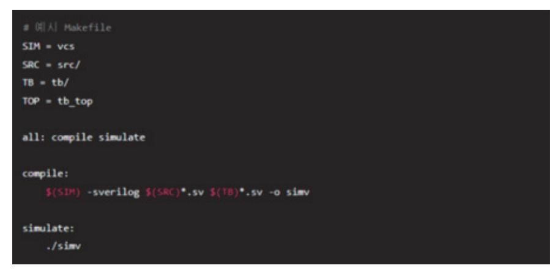

출처: 코드 작성 프로그램. 2024. 8. 12. 스크린샷. [그림 1-3] 시뮬레이션 스크립트 작성 예시

- (3) 테스트 벤치 작성
  - (가) 기본 테스트 벤치 구성
    - 1) DUT(design under test) 인스턴스화한다.
    - 2) 테스트 케이스: 다양한 입력 신호를 적용하여 DUT의 출력을 검증한다.

| module tb_top;                       |
|--------------------------------------|
| reg clk;                             |
| reg rst;                             |
| reg [7:0] input_signal;              |
| <pre>wire [7:0] output_signal;</pre> |
|                                      |
| // pur 인스탠스화                         |
| my_design dut (                      |
| .clk(clk),                           |
| .rst(rst),                           |
| .input_signal(input_signal),         |
| .output_signal(output_signal)        |
| );                                   |
| Not adverte Australia                |
| // 물력 생성                             |
| always #5 clk = ~clk;                |
|                                      |
| // 테스토 시월스                           |
| initial begin                        |
| // 초기화                               |
| clk = 0;                             |
| rst = 1;                             |
| input_signal = 0;                    |
|                                      |
| //리셋 해제                              |
| #10 rst = 0;                         |
|                                      |
| //테스트케이스 1                           |
| <pre>input_signal = 8'hAA;</pre>     |
| #10;                                 |
|                                      |
| //테스트케이스 2                           |
| <pre>input_signal = 8'h55;</pre>     |
| #10;                                 |
|                                      |
| // 시뮬레이션 종료                          |
| \$finish;                            |
| end                                  |
| endmodule                            |
|                                      |

출처: 코드 작성 프로그램. 2024. 8. 12. 스크린샷. [그림 1-4] 기본 테스트 벤치 구성

- (4) 타이밍 분석 환경 설정
  - (가) 타이밍 제약 파일 작성: SDC(synopsys design constraints) 파일을 작성한다.
  - (나) 타이밍 분석 도구 설정: PrimeTime 또는 Tempus 설정 및 스크립트를 작성한다.

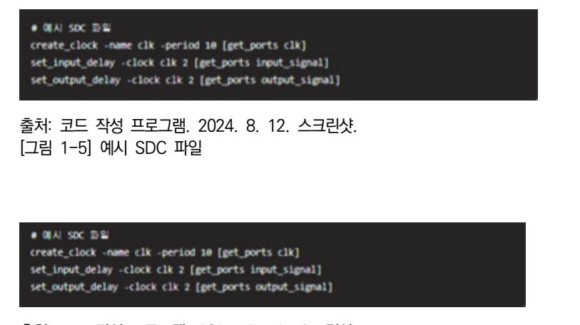

출처: 코드 작성 프로그램. 2024. 8. 12. 스크린샷. [그림 1-6] 예시 SDC 파일

- (5) 전력 분석 환경 설정
  - (가) 전력 제약 파일 작성: UPF(unified power format) 파일을 작성한다.
  - (나) 전력 분석 도구 설정: PrimePower 또는 Voltus 설정 및 스크립트를 작성한다.

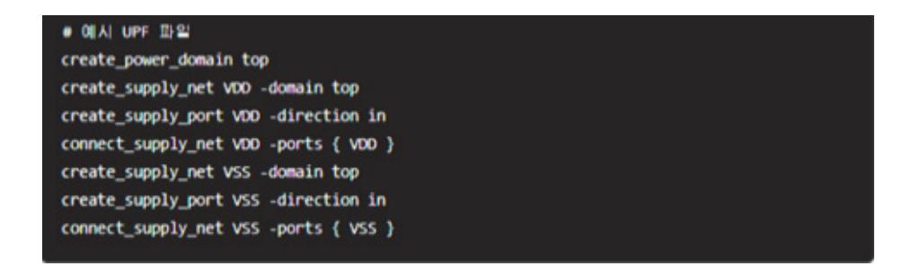

출처: 코드 작성 프로그램. 2024. 8. 12. 스크린샷. [그림 1-7] 전력 분석 환경 설정(UPF 파일) 예시

- (6) 기생 소자 추출 환경 설정
  - (가) 기생 소자 추출 설정 파일: Calibre 또는 StarRC 설정 파일을 작성한다.
  - (나) 추출 도구 설정: 기생 소자 추출 도구 설정 및 스크립트를 작성한다.

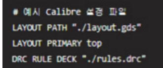

출처: 코드 작성 프로그램. 2024. 8. 12. 스크린샷. [그림 1-8] 기생 소자 추출(calibre) 환경 설정 예시

### (7) DRC/LVS 검증 환경 설정

- (가) DRC/LVS 설정 파일: Calibre 또는 IC Validator 설정 파일을 작성한다.
- (나) 검증 도구 설정: DRC/LVS 도구 설정 및 스크립트를 작성한다.

| ● 예시 LVS 설정 파일         |         |  |
|------------------------|---------|--|
| LAYOUT PATH "./layout. | gds"    |  |
| LAYOUT PRIMARY top     |         |  |
| SOURCE NETLIST "./netl | ist.sp" |  |
|                        |         |  |

출처: 코드 작성 프로그램. 2024. 8. 12. 스크린샷. [그림 1-9] LVS 설정 파일 예시

- 3. 검증 환경 구축 예제를 확인한다.
  - (1) 시뮬레이션 실행
    - (가) 컴파일 및 시뮬레이션: Makefile을 사용하여 시뮬레이션을 실행한다.

출처: 코드 작성 프로그램. 2024. 8. 12. 스크린샷. [그림 1-10] 시뮬레이션 실행 스크립트

(2) 타이밍 분석 실행

(가) 타이밍 분석 스크립트 실행: PrimeTime 스크립트를 사용하여 타이밍 분석을 실행한다.

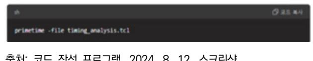

(3) 전력 분석 실행

(가) 전력 분석 스크립트 실행: PrimePower 스크립트를 사용하여 전력 분석을 실행한다.

출처: 코드 작성 프로그램. 2024. 8. 12. 스크린샷. [그림 1-12] 전력 분석 실행 스크립트

(4) 기생 소자 추출 실행

(가) 기생 소자 추출 스크립트 실행: Calibre 스크립트를 사용하여 기생 소자 추출을 실행한다.

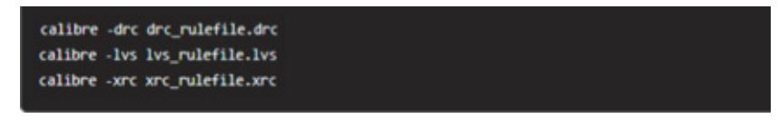

출처: 코드 작성 프로그램. 2024. 8. 12. 스크린샷. [그림 1-13] 기생 소자 추출 실행 스크립트

4. 종합적인 접근을 시도한다.

검증 환경을 구축하는 것은 반도체 설계 검증의 중요한 부분이다. 설계 파일과 테스트 벤치 를 작성하고, 다양한 검증 도구를 설정하여 자동화된 검증 환경을 구축함으로써 설계의 기 능적, 타이밍적, 전력적, 신뢰성 요구 사항을 철저히 검증할 수 있다. 이를 통해 고성능, 저 전력, 고신뢰성의 반도체 제품을 개발할 수 있다.

숗 검증 환경에 기반한 테스트 벤치를 구현한다.

반도체 설계 검증을 위해 검증 환경에 기반한 테스트 벤치를 구현하는 것은 매우 중요한 과정 이다. 테스트 벤치는 설계된 회로가 주어진 요구 사항을 충족하는지 확인하기 위해 다양한 시 나리오를 시뮬레이션하고 분석할 수 있는 환경을 제공한다. 다음은 테스트 벤치를 구현하는 단 계별 가이드이다.

- 1. 테스트 벤치의 주요 구성 요소를 파악한다.
  - (1) DUT(Design Under Test): 검증할 대상인 설계 모듈이다.
  - (2) 클록 및 리셋 생성기: 테스트 벤치 내에서 클록과 리셋 신호를 생성한다.
  - (3) 입력 자극기: DUT에 다양한 입력 신호를 제공한다.
  - (4) 출력 모니터: DUT의 출력을 모니터링하고 검증한다.
  - (5) 검증 로직: 출력이 기대 결과와 일치하는지 확인한다.

(6) 테스트 시나리오: 다양한 테스트 케이스를 정의한다.

- 2. 테스트 벤치 작성 과정을 파악한다.
  - (1) DUT 인스턴스화

먼저, 검증할 DUT를 인스턴스화한다. DUT는 테스트 벤치 내에서 테스트될 설계 모듈 이다.

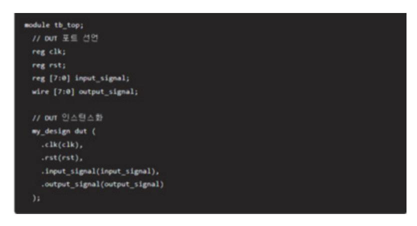

출처: 코드 작성 프로그램. 2024. 8. 12. 스크린샷. [그림 1-14] DUT 인스턴스화 스크립트

(2) 클록 및 리셋 생성기

클록 및 리셋 신호를 생성한다. 클록은 일반적으로 정기적으로 토글되고, 리셋은 초기화 동안 활성화된다.

출처: 코드 작성 프로그램. 2024. 8. 12. 스크린샷. [그림 1-15] 클록 및 리셋 생성기 스크립트

(3) 입력 자극기

DUT에 다양한 입력 신호를 제공하는 로직을 작성한다.

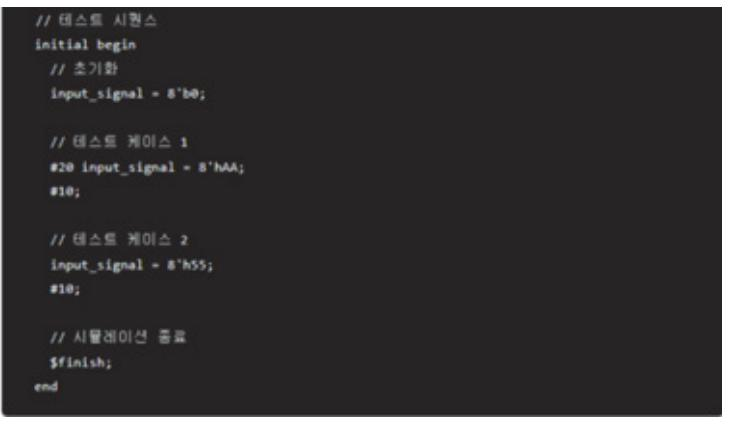

출처: 코드 작성 프로그램. 2024. 8. 12. 스크린샷. [그림 1-16] 입력 자극기 스크립트

(4) 출력 모니터 및 검증 로직

DUT의 출력을 모니터링하고, 기대 결과와 일치하는지 검증한다.

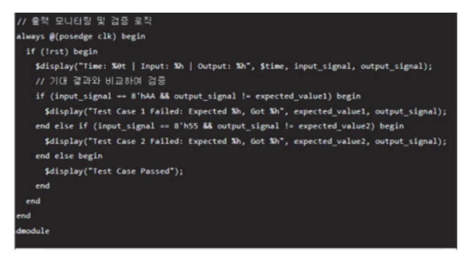

출처: 코드 작성 프로그램. 2024. 8. 12. 스크린샷. [그림 1-17] 출력 모니터 및 검증 로직 스크립트

3. 자동화된 테스트 벤치를 분석한다.

더 복잡한 테스트 벤치에서는 자동화된 검증 프레임워크(UVM, Systemverilog 등)를 사용 할 수 있다. 여기서는 간단한 예로 Verilog를 사용한 기본 테스트 벤치를 설명했지만, 고급 검증 환경에서는 다음과 같은 구조를 사용할 수 있다.

- (1) UVM(Universal Verification Methodology): 재사용 가능한 검증 구성 요소를 제공하고, 복잡한 검증 환경을 쉽게 설정할 수 있도록 도와준다.
  - (가) UVM 예제

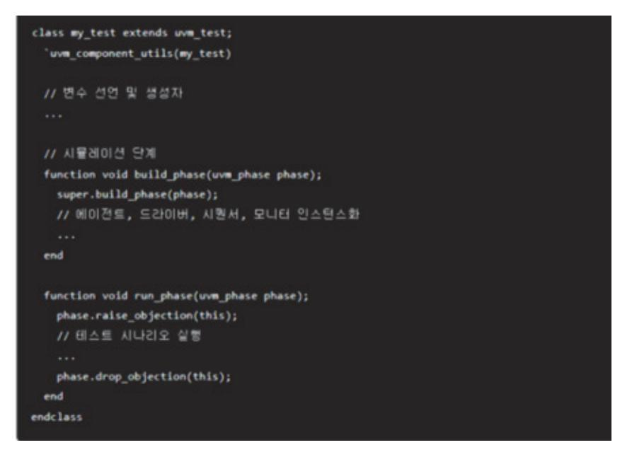

출처: 코드 작성 프로그램. 2024. 8. 12. 스크린샷. [그림 1-18] UVM 예제

### 4. 검증 환경 설정 및 실행한다.

(1) 시뮬레이션 환경 설정

Makefile 또는 스크립트를 사용하여 시뮬레이션 환경을 설정한다.

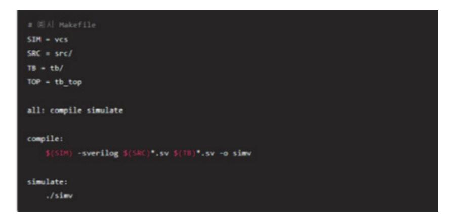

출처: 코드 작성 프로그램. 2024. 8. 12. 스크린샷. [그림 1-19] 시뮬레이션 환경 설정

### (2) 시뮬레이션 실행

Makefile 또는 스크립트를 사용하여 시뮬레이션을 실행한다.

| sh       | 🖓 코드 복사 |
|----------|---------|
| make all |         |

출처: 코드 작성 프로그램. 2024. 8. 12. 스크린샷. [그림 1-20] 시뮬레이션 실행 스크립트

- 5. 검증 결과를 분석한다.
  - (1) 시뮬레이션 로그 분석
    - (가) 출력 결과 확인: 시뮬레이션 로그와 출력 파일을 확인하여 예상 결과와 일치하는지 검증 한다.
    - (나) 오류 및 경고 분석: 시뮬레이션 도중 발생한 오류 및 경고 메시지를 분석한다.
  - (2) 커버리지 분석
    - (가) 코드 커버리지: 테스트 케이스가 RTL 코드의 모든 경로를 테스트했는지 확인한다.
    - (나) 기능 커버리지: 모든 기능적 요구 사항이 테스트되었는지 확인한다.

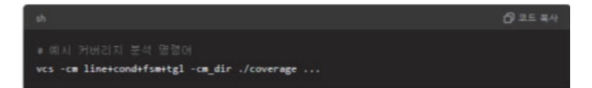

출처: 코드 작성 프로그램. 2024. 8. 12. 스크린샷. [그림 1-21] 예시 커버리지 분석 명령어

6. 종합적인 접근을 시도한다.

테스트 벤치를 구현하는 것은 반도체 설계 검증의 핵심 요소이다. DUT 인스턴스화, 클록 및 리셋 생성, 입력 자극기, 출력 모니터링 및 검증 로직을 포함한 테스트 벤치를 작성함으로써 설계가 주어진 요구 사항을 충족하는지 확인할 수 있다. 고급 검증 환경(UVM 등)을 사용하여 복잡한 검증 시나리오를 자동화하고, 시뮬레이션 결과를 철저히 분석함으로써 고성능, 저전력, 고신뢰성의 반도체 제품을 개발할 수 있다.

수 테스트 벤치의 검증 결과와 설계 결과를 비교하여 평가한다.

반도체 설계 검증에서 테스트 벤치의 검증 결과와 설계 결과를 비교하여 평가하는 과정은 매우 중요하다. 이 과정을 통해 설계가 원하는 사양을 충족하는지 확인할 수 있다. 다음은 테스트 벤치의 검증 결과와 설계 결과를 비교하고 평가하는 단계별 가이드이다.

1. 테스트 벤치 검증 결과를 수집한다.

(1) 시뮬레이션 로그 및 출력 파일

(2) 커버리지 리포트

2. 검증 결과를 분석한다.

(1) 시뮬레이션 로그 분석

[그림 1-22] 시뮬레이션 로그 분석 예

출처: 코드 작성 프로그램. 2024. 8. 12. 스크린샷.

[그림 1-23] 예시 커버리지 명령어

- (가) 로그 파일: 시뮬레이션 동안 발생한 모든 이벤트와 메시지를 기록한 파일

(나) 기능 커버리지: 기능적 요구 사항을 얼마나 충족했는지 확인한다.

(나) 출력값 검증: DUT의 출력이 기대한 값과 일치하는지 확인한다.

출처: 집필진 제작(2024)출처: 코드 작성 프로그램. 2024. 8. 12. 스크린샷.

(가) 코드 커버리지 확인: 코드의 각 부분이 실행되었는지 확인한다.

(나) 기능 커버리지 확인: 모든 기능적 요구 사항이 테스트되었는지 확인한다.

(가) 코드 커버리지: 테스트가 코드의 모든 부분을 얼마나 테스트했는지 확인한다.

(가) 오류 및 경고 확인: 시뮬레이션 로그에서 오류와 경고를 검토하여 문제점을 파악한다.

- (나) 출력 파일: 시뮬레이션 결과에서 생성된 데이터 파일(예) VCD, FSDB)

(2) 커버리지 분석

28

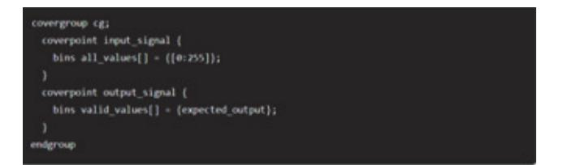

출처: 코드 작성 프로그램. 2024. 8. 12. 스크린샷. [그림 1-24] 기능 커버리지 확인

- 3. 설계 결과와 비교한다.
  - (1) 기대 결과 설정
    - (가) 기대 결과 정의: 각 입력에 대한 기대 출력값을 정의한다.

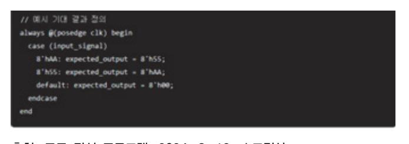

출처: 코드 작성 프로그램. 2024. 8. 12. 스크린샷. [그림 1-25] 예시 기대 결과 정의

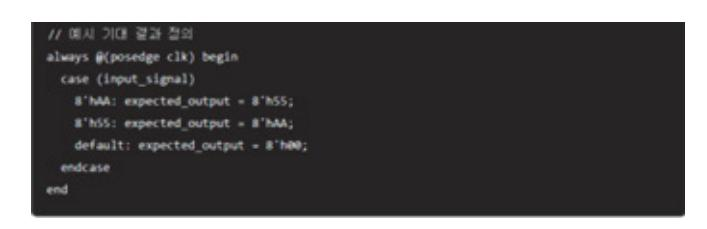

출처: 코드 작성 프로그램. 2024. 8. 12. 스크린샷. [그림 1-26] 예시 기대 결과 정의

(2) 출력 비교

(가) 불일치 분석: 불일치가 발생한 경우 원인을 분석하고 수정한다.

(가) 출력 비교 로직: 시뮬레이션 결과와 기댓값을 비교하여 일치 여부를 확인한다.


(나) 디버깅 도구 사용: Verdi, DVE 등의 디버깅 도구를 사용하여 시뮬레이션 결과를 시각적

- 출처: 코드 작성 프로그램. 2024. 8. 12. 스크린샷. [그림 1-27] 출력 비교 로직
- (3) 디버깅

으로 분석한다.

- 4. 검증 결과를 평가한다.
  - (1) 평가 기준 설정
    - (가) 성공 기준: 모든 테스트 케이스가 기대 결과와 일치해야 한다.
    - (나) 실패 기준: 테스트 케이스 중 하나라도 기대 결과와 불일치하면 실패로 간주한다.
  - (2) 결과 문서화
    - (가) 검증 리포트 작성: 검증 과정과 결과를 문서화하여 기록한다.
    - (나) 문제점 및 해결책 기록: 발견된 문제점과 수정된 내용을 기록한다.

| • 걸음 김토토                                   |
|--------------------------------------------|
| # 28 %S                                    |
| 설계 모듈: my_design                           |
| - 권은 역표: 기능, EO장, 관력 권은                    |
| NR 201                                     |
|                                            |
| - 전체 테스트 케이스 수: 100                        |
| - 성공한 테스트 케이스 수: 98                        |
| - 실패한 테스트 케이스 수: 2                         |
| # 문제철 본석                                   |
| - 문제컵 1: 테스트 케이스 45에서 예상 훈락과 불일치           |
| - 동안: 몰락 도해안 교차 문제                         |
| . 배글백: 추가 버린 산업                            |
|                                            |
| - 문제집 2: 테스트 케이스 78에서 전력 소비 초과             |
| - 8인: 분필요한 모직 발상화                          |
| · 해공석: 전력 NOI일 적용                          |
| 1820AAAAA                                  |
| ## 커버김지                                    |
| - 코드 커너리지: 95 <b>X</b>                     |
| - 718 7H32171 WK                           |
|                                            |
| H 28                                       |
| 설계는 대부분의 기능 요구사함을 출력하였으며, 발견된 문제는 수정되었습니다. |
|                                            |

출처: 코드 작성 프로그램. 2024. 8. 12. 스크린샷. [그림 1-28] 검증 리포트

### 5. 종합적인 접근을 시도한다.

테스트 벤치의 검증 결과와 설계 결과를 비교하여 평가하는 과정은 설계 검증의 핵심이다. 시뮬레이션 로그와 출력 파일을 분석하고, 커버리지 리포트를 통해 테스트가 충분히 이루어 졌는지 확인한다. 검증 결과를 기댓값과 비교하고, 불일치가 발생한 경우 원인을 분석하여 수정한다. 마지막으로, 검증 결과를 문서화하여 전체 검증 과정을 체계적으로 관리한다. 이 를 통해 설계가 주어진 요구 사항을 충족하는지 확인하고, 고성능, 저전력, 고신뢰성의 반도 체 제품을 개발할 수 있다.

숙 평가한 검증 보고서를 작성하여 설계자에게 제공한다.

반도체 설계 검증을 위해 검증 보고서를 작성하고 설계자에게 제공하는 것은 검증 과정에서 발 견된 문제점과 해결 방법을 명확히 전달하는 중요한 단계이다. 보고서는 설계자에게 유용한 피 드백을 제공하여 설계를 개선하고 최종 제품의 품질을 보장한다. 아래는 검증 보고서를 작성하 는 방법에 대한 단계별 가이드이다.

- 1. 검증 보고서 구성 요소를 파악한다.
  - (1) 보고서 개요
    - (가) 제목: 검증 보고서 제목
    - (나) 작성자: 검증 담당자 이름
    - (다) 날짜: 보고서 작성 날짜
    - (라) 검증 대상: 설계 모듈의 이름과 버전
  - (2) 검증 개요
    - (가) 목적: 검증의 목적과 범위
    - (나) 방법: 사용된 검증 방법과 도구
    - (다) 설계 사양: 검증 대상 설계의 주요 사양
  - (3) 테스트 케이스 및 결과
    - (가) 테스트 케이스 요약: 수행된 테스트 케이스의 개요.
    - (나) 결과 요약: 테스트 결과의 요약(성공/실패)
  - (4) 상세 결과 분석
    - (가) 테스트 케이스별 결과: 각 테스트 케이스의 결과와 분석
    - (나) 문제점 및 원인 분석: 발견된 문제점과 그 원인 분석
    - (다) 해결 방법: 문제 해결을 위한 제안 사항
  - (5) 커버리지 분석

(6) 결론 및 권고 사항

- (가) 코드 커버리지: 코드 커버리지 결과

- (나) 기능 커버리지: 기능 커버리지 결과

31

(나) 추가 검증 필요 사항: 추가 검증이 필요한 영역

(가) 검증 결론: 검증 결과에 대한 종합적인 결론

2. 검증 보고서 작성 예시를 파악한다.

### (1) 보고서 개요

출처: 코드 작성 프로그램. 2024. 8. 12. 스크린샷. [그림 1-29] 보고서 개요

(2) 검증 개요

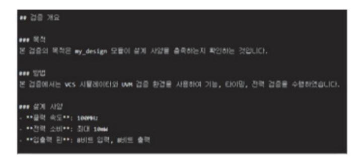

출처: 코드 작성 프로그램. 2024. 8. 12. 스크린샷. [그림 1-30] 검증 개요

### (3) 상세 결과 분석

| ## 상세 결과 분석                                                                                                                                                                                                                                                                                                                                                                                                                                                                                                                                                                                                                                                                                                                                                                                                                                                                                                                                                                                                                                                                                                                                                                                                                                                                                                                                                                                                                                                                                                                                                                                                                                                                                                                                                                                                                                                                               |
|-------------------------------------------------------------------------------------------------------------------------------------------------------------------------------------------------------------------------------------------------------------------------------------------------------------------------------------------------------------------------------------------------------------------------------------------------------------------------------------------------------------------------------------------------------------------------------------------------------------------------------------------------------------------------------------------------------------------------------------------------------------------------------------------------------------------------------------------------------------------------------------------------------------------------------------------------------------------------------------------------------------------------------------------------------------------------------------------------------------------------------------------------------------------------------------------------------------------------------------------------------------------------------------------------------------------------------------------------------------------------------------------------------------------------------------------------------------------------------------------------------------------------------------------------------------------------------------------------------------------------------------------------------------------------------------------------------------------------------------------------------------------------------------------------------------------------------------------------------------------------------------------|
| ### 테스트 케이스별 결과                                                                                                                                                                                                                                                                                                                                                                                                                                                                                                                                                                                                                                                                                                                                                                                                                                                                                                                                                                                                                                                                                                                                                                                                                                                                                                                                                                                                                                                                                                                                                                                                                                                                                                                                                                                                                                                                           |
| #### 테스트 케이스 1: 기본 동작 겁증                                                                                                                                                                                                                                                                                                                                                                                                                                                                                                                                                                                                                                                                                                                                                                                                                                                                                                                                                                                                                                                                                                                                                                                                                                                                                                                                                                                                                                                                                                                                                                                                                                                                                                                                                                                                                                                                  |
| **입력**: 8'hAA                                                                                                                                                                                                                                                                                                                                                                                                                                                                                                                                                                                                                                                                                                                                                                                                                                                                                                                                                                                                                                                                                                                                                                                                                                                                                                                                                                                                                                                                                                                                                                                                                                                                                                                                                                                                                                                                             |
| = **기대 흪력**: 8'h55                                                                                                                                                                                                                                                                                                                                                                                                                                                                                                                                                                                                                                                                                                                                                                                                                                                                                                                                                                                                                                                                                                                                                                                                                                                                                                                                                                                                                                                                                                                                                                                                                                                                                                                                                                                                                                                                        |
| ······································                                                                                                                                                                                                                                                                                                                                                                                                                                                                                                                                                                                                                                                                                                                                                                                                                                                                                                                                                                                                                                                                                                                                                                                                                                                                                                                                                                                                                                                                                                                                                                                                                                                                                                                                                                                                                                                    |
| #### 테스트 케이스 45: 클릭 도메인 교차 문제                                                                                                                                                                                                                                                                                                                                                                                                                                                                                                                                                                                                                                                                                                                                                                                                                                                                                                                                                                                                                                                                                                                                                                                                                                                                                                                                                                                                                                                                                                                                                                                                                                                                                                                                                                                                                                                             |
| 승규는 것은 것은 것을 가지 않는 것을 하는 것을 하는 것을 하는 것을 하는 것을 하는 것을 수 있다. 것은 것을 하는 것을 하는 것을 하는 것을 하는 것을 하는 것을 하는 것을 하는 것을 하는 것을 하는 것을 하는 것을 하는 것을 하는 것을 하는 것을 하는 것을 하는 것을 하는 것을 하는 것을 수 있다. 것을 하는 것을 하는 것을 하는 것을 하는 것을 하는 것을 수 있다. 것을 하는 것을 하는 것을 수 있다. 것을 하는 것을 하는 것을 하는 것을 하는 것을 수 있다. 것을 하는 것을 하는 것을 수 있다. 것을 하는 것을 수 있다. 것을 하는 것을 수 있다. 것을 수 있다. 것을 하는 것을 수 있다. 것을 수 있다. 것을 수 있다. 것을 수 있다. 것을 수 있다. 것을 수 있다. 것을 수 있다. 것을 수 있다. 것을 수 있다. 것을 수 있다. 것을 수 있다. 것을 수 있다. 것을 수 있다. 것을 수 있다. 것을 수 있다. 것을 수 있다. 것을 수 있다. 것을 수 있다. 것을 수 있다. 것을 수 있다. 것을 수 있다. 것을 수 있다. 것을 수 있다. 것을 수 있다. 것을 수 있다. 것을 수 있다. 것을 수 있다. 것을 수 있다. 것을 수 있다. 것을 수 있다. 것을 수 있다. 것을 수 있다. 것을 수 있다. 것을 수 있다. 것을 수 있다. 것을 수 있다. 것을 수 있다. 것을 수 있다. 것을 수 있다. 것을 수 있다. 것을 수 있다. 것을 수 있다. 것을 수 있다. 것을 수 있다. 것을 수 있다. 것을 수 있다. 것을 수 있다. 것을 수 있다. 것을 수 있다. 것을 수 있다. 것을 수 있다. 것을 수 있다. 것을 수 있다. 것을 수 있다. 것을 수 있다. 것을 수 있다. 것을 수 있다. 것을 수 있다. 것을 수 있다. 것을 수 있다. 것을 수 있다. 것을 수 있다. 것을 수 있다. 것을 수 있다. 것을 수 있다. 것을 수 있다. 것을 수 있다. 것을 수 있다. 것을 수 있다. 것을 수 있다. 것을 수 있다. 것을 수 있다. 것을 수 있다. 것을 수 있다. 것을 수 있다. 것을 수 있다. 것을 수 있다. 것을 수 있다. 것을 수 있다. 것을 수 있다. 것을 수 있다. 것을 수 있다. 것을 수 있다. 것을 수 있다. 것을 수 있다. 것을 수 있다. 것을 수 있다. 것을 수 있다. 것을 수 있다. 것을 수 있다. 것을 수 있다. 것을 수 있다. 것을 수 있다. 것을 수 있다. 것을 수 있다. 것을 수 있다. 것을 수 있다. 것을 수 있다. 것을 수 있다. 것을 수 있다. 것을 수 있다. 것을 수 있다. 것을 수 있다. 것을 수 있다. 것을 수 있다. 것을 수 있다. 것을 수 있다. 것을 수 있다. 것을 수 있다. 것을 수 있다. 것을 수 있다. 것을 수 있다. 것을 수 있다. 것을 수 있다. 것을 수 있다. 것을 수 있다. 것을 수 있다. 것을 수 있다. 것을 수 있다. 것을 수 있다. 것을 수 있다. 것을 수 있다. 것을 수 있다. 것을 수 있다. 것을 수 있다. 것을 수 있다. 것을 수 있다. 것을 수 있다. 것을 수 있다. 것을 수 있다. 것을 수 있다. 것을 수 있다. 것을 수 있다. 것을 수 있다. 것을 수 있다. 것을 수 있다. 것을 수 있다. 것을 수 있다. 것을 수 있다. 것을 수 있다. 것을 수 있다. 것을 수 있다. 것을 수 있다. 것을 수 있다. 것을 수 있다. 것을 수 있다. 것을 수 있다. 것을 수 있다. 것을 수 있다. 것을 것 같이 않다. 것을 것 같이 않다. 것을 것 같이 않다. 것을 것 같이 않다. 것을 것 같이 않다. 것을 것 같이 않다. 것을 것 같이 않다. 않다. 것 같이 않다. 않다. 것 같이 않다. 않다. 않다. 않다. 않다. 않다. 않다. 않다. 않다. 않다. |
|                                                                                                                                                                                                                                                                                                                                                                                                                                                                                                                                                                                                                                                                                                                                                                                                                                                                                                                                                                                                                                                                                                                                                                                                                                                                                                                                                                                                                                                                                                                                                                                                                                                                                                                                                                                                                                                                                           |
| ••기대 출력••: 8'hAA                                                                                                                                                                                                                                                                                                                                                                                                                                                                                                                                                                                                                                                                                                                                                                                                                                                                                                                                                                                                                                                                                                                                                                                                                                                                                                                                                                                                                                                                                                                                                                                                                                                                                                                                                                                                                                                                          |
| ••결과••: 실패                                                                                                                                                                                                                                                                                                                                                                                                                                                                                                                                                                                                                                                                                                                                                                                                                                                                                                                                                                                                                                                                                                                                                                                                                                                                                                                                                                                                                                                                                                                                                                                                                                                                                                                                                                                                                                                                                |
| ••원인•••: 클릭 도메인 교차 시 데이터 유실 발생                                                                                                                                                                                                                                                                                                                                                                                                                                                                                                                                                                                                                                                                                                                                                                                                                                                                                                                                                                                                                                                                                                                                                                                                                                                                                                                                                                                                                                                                                                                                                                                                                                                                                                                                                                                                                                                            |
| • ••해결 방법••: 추가 버퍼 삽입                                                                                                                                                                                                                                                                                                                                                                                                                                                                                                                                                                                                                                                                                                                                                                                                                                                                                                                                                                                                                                                                                                                                                                                                                                                                                                                                                                                                                                                                                                                                                                                                                                                                                                                                                                                                                                                                     |
| #### 테스트 케이스 78: 전력 소비 초과                                                                                                                                                                                                                                                                                                                                                                                                                                                                                                                                                                                                                                                                                                                                                                                                                                                                                                                                                                                                                                                                                                                                                                                                                                                                                                                                                                                                                                                                                                                                                                                                                                                                                                                                                                                                                                                                 |
| . **입력**: 8'hFF                                                                                                                                                                                                                                                                                                                                                                                                                                                                                                                                                                                                                                                                                                                                                                                                                                                                                                                                                                                                                                                                                                                                                                                                                                                                                                                                                                                                                                                                                                                                                                                                                                                                                                                                                                                                                                                                           |
| **기대 출력**: 8'h00                                                                                                                                                                                                                                                                                                                                                                                                                                                                                                                                                                                                                                                                                                                                                                                                                                                                                                                                                                                                                                                                                                                                                                                                                                                                                                                                                                                                                                                                                                                                                                                                                                                                                                                                                                                                                                                                          |
| · ··결과··: 실패                                                                                                                                                                                                                                                                                                                                                                                                                                                                                                                                                                                                                                                                                                                                                                                                                                                                                                                                                                                                                                                                                                                                                                                                                                                                                                                                                                                                                                                                                                                                                                                                                                                                                                                                                                                                                                                                              |
| 원인**: 불필요한 로직 활성화                                                                                                                                                                                                                                                                                                                                                                                                                                                                                                                                                                                                                                                                                                                                                                                                                                                                                                                                                                                                                                                                                                                                                                                                                                                                                                                                                                                                                                                                                                                                                                                                                                                                                                                                                                                                                                                                         |
| ••해결 방법•••: 전력 게이팅 적용                                                                                                                                                                                                                                                                                                                                                                                                                                                                                                                                                                                                                                                                                                                                                                                                                                                                                                                                                                                                                                                                                                                                                                                                                                                                                                                                                                                                                                                                                                                                                                                                                                                                                                                                                                                                                                                                     |
|                                                                                                                                                                                                                                                                                                                                                                                                                                                                                                                                                                                                                                                                                                                                                                                                                                                                                                                                                                                                                                                                                                                                                                                                                                                                                                                                                                                                                                                                                                                                                                                                                                                                                                                                                                                                                                                                                           |

출처: 코드 작성 프로그램. 2024. 8. 12. 스크린샷. [그림 1-31] 상세 결과 분석

(5) 커버리지 분석

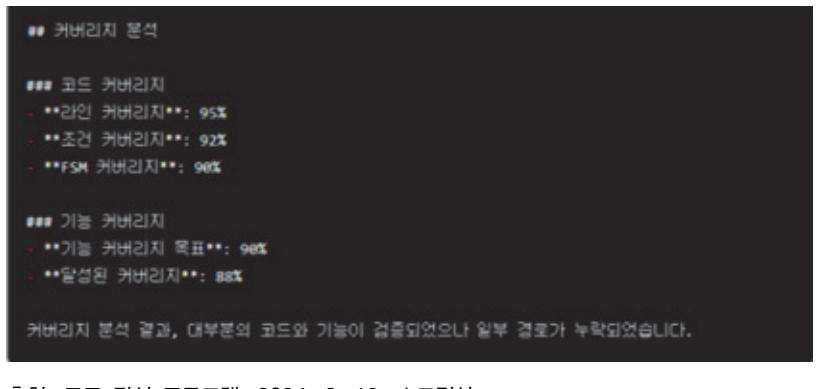

출처: 코드 작성 프로그램. 2024. 8. 12. 스크린샷. [그림 1-32] 커버리지 분석

(6) 결론 및 권고 사항

출처: 코드 작성 프로그램. 2024. 8. 12. 스크린샷. [그림 1-33] 결론 및 권고 사항

- 3. 보고서 전달 및 피드백해 준다.
  - (1) 보고서 전달
    - (가) 전자 메일: 검증 보고서를 첨부하여 설계자에게 전송한다.
    - (나) 문서 공유 시스템: 사내 문서 관리 시스템에 업로드하여 공유한다.

(2) 피드백 수집

(가) 설계자 회의: 설계자와 회의를 통해 보고서 내용을 설명하고 피드백을 수집한다.

(나) 피드백 반영: 수집된 피드백을 반영하여 검증 환경과 테스트 케이스를 수정 및 개선한다.

4. 종합적인 접근을 시도한다.

검증 보고서는 반도체 설계 검증 과정에서 중요한 역할을 한다. 보고서를 통해 검증 과정과 결과를 체계적으로 문서화하고, 발견된 문제와 해결 방법을 명확히 전달함으로써 설계자가 설계를 개선할 수 있도록 한다. 정확하고 상세한 보고서를 작성하여 설계의 품질을 보장하 고, 최종 제품이 요구 사항을 충족하는지 확인하는 것이 중요하다.

수행 tip

• 단위 블록 검증을 위한 설계 사양 문서 검토를 철저히한다. • 검증 시나리오 수립 과정은 구성원의 충분한 수렴의 과정 을 거친다.

## 학습 1 교수·학습 방법

### 교수 방법

- 반도체 제품의 주요 규격이 응용처에 따라 적용하는 방법이 달라지는 경우를 설명한다.
- 반도체 제품의 규격 및 사양의 항목에 대해 이해도를 높이기 위해 현재 상용되는 반도체 제 품의 데이터 시트 이용 등 사례를 활용한다.
- 경쟁 제품 분석 및 사양 결정과 반도체 공정 결정에 대한 사례 분석을 통하여, 학습자가 실 무 관점으로 적용할 수 있도록 지도한다.
- 파운드리 업체와 종합 반도체 회사에 대한 자료를 이용하여 반도체 공정의 종류와 개발 제 작 방법을 설명하고, 공정 선택의 중요성과 고려해야 할 항목에 대해 설명한다.
- 개발하려는 반도체 제품의 기능을 정의하고 기능별로 회로의 크기를 예측하여 그 면적을 계산하는 방법에 대해 설명한다.

### 학습 방법

- 반도체 제품의 주요 규격이 응용처에 따라 다르게 사용되는 경우에 대한 내용을 조사해서 그 차이점을 응용처별로 정리하여 비교표를 작성한다.
- 현재 상용 반도체 제품의 데이터 시트를 인터넷 또는 서적 등을 이용하여 입수하고, 반도체 제품의 규격 및 사양의 항목에는 무엇이 있고, 그 항목에 대해서 어떻게 설명이 되어 있는 지 몇 가지 제품을 선정하여 그 내용에 대해서 정리한다.
- 현재 반도체를 생산하고 있는 회사들에 대한 자료를 조사하여, 어떤 공정들이 있는지와 공 정별 특징에 대해 비교 분석한다.
- 개발하려는 반도체 제품의 기능을 정의하고 기능별로 회로의 크기에 대해서 학습자가 가정 을 하여 각 기능 블록 회로의 면적을 정의하고, 전체 면적을 계산하여 공정별 면적을 환산 하여 전체 반도체 칩의 면적을 계산해 본다.

# 학습 1 평 가

### 평가 준거

- 평가자는 학습자가 학습 목표를 성공적으로 달성하였는지를 평가해야 한다.
- 평가자는 다음 사항을 평가해야 한다.

|          |                                            |   | 성취수준 |   |  |
|----------|--------------------------------------------|---|------|---|--|
| 학습 내용    | 학습 목표                                      | 상 | 중    | 하 |  |
| 단위 블록 검증 | - 주어진 설계 사양을 분석할 수 있다.                     |   |      |   |  |
|          | - 단위 블록 검증 시나리오 및 검증 계획을 수립할 수 있다.         |   |      |   |  |
|          | - 수립한 검증 계획을 바탕으로 검증 환경을 구축할 수 있다.         |   |      |   |  |
|          | - 검증 환경에 기반한 테스트 벤치를 구현할 수 있다.             |   |      |   |  |
|          | - 테스트 벤치의 검증 결과와 설계 결과를 비교하여 평가할 수 있<br>다. |   |      |   |  |
|          | - 평가한 검증 보고서를 작성하여 설계자에게 제공할 수 있다.         |   |      |   |  |

### 평가 방법

• 서술형 시험

|          |                                                       | 성취수준 |   |   |
|----------|-------------------------------------------------------|------|---|---|
| 학습 내용    | 평가 항목                                                 |      | 중 | 하 |
| 단위 블록 검증 | - 설계 사양의 주요 요소를 분석할 수 있는 능력                           |      |   |   |
|          | - 단위 블록 검증 시나리오에서 블록을 식별하고 인터페이스의 신<br>호를 정의할 수 있는 능력 |      |   |   |
|          | - 검증 계획을 바탕으로 검증 환경을 구성하는 주요 요소를 파악<br>할 수 있는 능력      |      |   |   |
|          | - 검증 환경에 기반해 테스트 벤치의 주요 구성 요소를 파악할 수<br>있는 능력         |      |   |   |

### • 평가자 질문

|          | 평가 항목                                      | 성취수준 |   |   |
|----------|--------------------------------------------|------|---|---|
| 학습 내용    |                                            | 상    | 중 | 하 |
| 단위 블록 검증 | - 설계 사양의 검증 계획을 수립할 수 있는 능력                |      |   |   |
|          | - 단위 블록 검증 시나리오로부터 검증 계획을 수립할 수 있는 능<br>력  |      |   |   |
|          | - 검증 계획을 바탕으로 검증 환경의 설정 단계를 분석할 수 있는<br>능력 |      |   |   |
|          | - 검증 환경에 기반해 테스트 벤치의 작성 과정을 파악할 수 있는<br>능력 |      |   |   |

### 피드백

- 1. 서술형 시험
- 설계 사양을 분석할 수 있는 능력을 평가한 후, 주요 사항들을 검토하여 미흡하거나, 보충해야 할 업무를 체크하여 보완하도록 피드백해 준다.
- 수립한 검증 계획을 바탕으로 검증 환경을 구축할 수 있는 능력을 평가하여 평가 결과가 우수한 학습자에게는 전체 칩의 중요 부분에 대한 세부 기능과 원리에 대해 설명하고, 성취수준이 낮은 학습자에게는 기본 블록에 대한 IP의 종류 및 기능을 이해하도록 보충 설명을 해 준다.
- 2. 평가자 질문
- 검증 환경에 기반한 테스트 벤치를 구현할 수 있는 능력을 평가한 후, 개선 및 보완 사항에 대한 내용을 정리하여 재학습할 수 있도록 피드백해 준다.
- 테스트 벤치의 검증 결과와 설계 결과를 비교하여 평가할 수 있는 능력에 대한 평가 후 성취수준 이 낮은 학습자에게는 보충하여 설명해 준다.

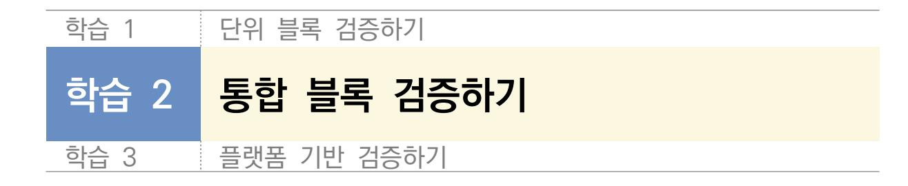

# 2-1. 통합 블록 검증

| 학습 목표 | • 통합 블록 설계 사양을 분석할 수 있다.<br>• 레퍼런스 보드(reference board)의 회로 설계 요구 사항을 정의할 수 있다.<br>• 통합 블록 검증 시나리오와 검증 계획을 수립할 수 있다.<br>• 수립한 검증 계획을 바탕으로 검증 환경을 구축할 수 있다.<br>• 검증 환경에 기반한 테스트 벤치를 구현할 수 있다.<br>• 테스트 벤치의 검증 결과와 설계 결과를 비교하여 평가할 수 있다.<br>• 평가한 검증 보고서를 작성하여 설계자에게 제공할 수 있다. |
|-------|-----------------------------------------------------------------------------------------------------------------------------------------------------------------------------------------------------------------------------------------------------------------------------|
|-------|-----------------------------------------------------------------------------------------------------------------------------------------------------------------------------------------------------------------------------------------------------------------------------|

# 필요 지식 /

### 숔 통합 블록의 블록 간 상호 연결성

반도체 설계에서 통합 블록의 블록 간 상호 연결성(connectivity)은 매우 중요하다. 각 블록이 올바르게 상호 연결되어야 전체 시스템이 원활하게 동작할 수 있다. 상호 연결성은 설계의 기능적, 타이밍적, 전력적 성능에 큰 영향을 끼친다. 다음은 블록 간 상호 연결성에 대한 상세한 설명과 이를 관리하고 최적화하는 방법이다.

### 1. 블록 간 상호 연결성 개요

- (1) 상호 연결성의 중요성
  - (가) 기능적 연결성: 각 블록 간의 신호 전달이 올바르게 이루어져야 전체 시스템이 기대한 기능을 수행할 수 있다.
  - (나) 타이밍 연결성: 신호가 각 블록 간의 경로를 따라 전달되는 시간이 타이밍 제약을 만족 해야 한다.
  - (다) 전력 연결성: 전력 소모를 최소화하고, 전력 공급이 안정적으로 이루어져야 한다.
- (2) 주요 상호 연결 요소
  - (가) 데이터 버스: 데이터 전송을 위한 경로
  - (나) 제어 신호: 블록 간 동작을 제어하기 위한 신호

- (1) 성능 최적화
- 4. 상호 연결성 최적화
- (나) 전력 게이팅: 불필요한 전력 소모를 줄이기 위해 전력 게이팅을 적용한다.
- (가) 전력 분석: 각 블록 간의 전력 소비를 분석하고, 전력 네트워크의 안정성을 확인한다.
- (3) 전력 검증
- (나) 다이내믹 타이밍 분석: 시뮬레이션을 통해 타이밍 동작을 검증한다.
- 다.
- (가) 정적 타이밍 분석(STA): 각 경로의 타이밍을 분석하여 제약 조건을 만족하는지 확인한
- (2) 타이밍 검증
- (나) 에뮬레이션: 하드웨어 에뮬레이터를 사용하여 시스템의 기능을 실시간으로 검증한다.
- 지 확인한다.
- (가) 시뮬레이션: 전체 시스템을 시뮬레이션하여 블록 간의 신호 전달이 올바르게 이루어지는
- (1) 기능 검증
- 3. 상호 연결성 검증
- (나) 스큐 최적화: 클록 스큐를 최소화하여 타이밍 문제를 방지한다.
- 다.
- (가) 클록 트리 설계: 각 블록에 클록 신호를 동기화하여 제공하기 위해 클록 트리를 합성한
- (3) 클록 트리 합성(CTS: clock tree synthesis)
- (나) 신호 경로 배선: 배치된 블록 간의 신호 경로를 최적화하여 배선한다.
- (가) 블록 배치: 블록들을 물리적 설계 내에서 적절히 배치한다.
- (2) 배치 및 배선(placement and routing)
- 을 명확히한다.
- 다이어그램을 작성한다. (나) 인터페이스 정의: 각 블록 간의 인터페이스를 정의하여 신호의 종류, 방향, 프로토콜 등
- (가) 블록 다이어그램 작성: 시스템의 각 블록과 그들 간의 상호 연결을 시각적으로 표현한
- (1) 시스템 아키텍처 설계
- 2. 상호 연결성 설계 방법
- (라) 전력 및 접지 네트워크: 전력 공급과 접지를 위한 네트워크
- (다) 클록 신호: 동기화된 동작을 위한 클록 신호

- (나) 클록 도메인 최적화: 클록 도메인을 적절히 나누어 타이밍 성능을 향상시킨다.
- (2) 전력 최적화
  - (가) 전력 소비 최소화: 각 블록 간의 전력 소비를 최소화하는 설계를 적용한다.
  - (나) 전력 공급 네트워크 최적화: 전력 공급 네트워크를 최적화하여 안정적인 전력 공급을 보 장한다.
- (3) 면적 최적화
  - (가) 배선 밀도 최적화: 배선 밀도를 최적화하여 면적을 효율적으로 사용한다.
  - (나) 배치 최적화: 블록의 배치를 최적화하여 전체 면적을 줄인다.
- 5. 도구 및 기술
  - (1) EDA 도구
    - (가) synopsys design compiler: 논리 합성과 최적화를 위한 도구이다.
    - (나) cadence innovus: 물리적 설계와 배치 및 배선을 위한 도구이다.
    - (다) mentor graphics calibre: DRC 및 LVS 검증 도구이다.
    - (라) synopsys primetime: 정적 타이밍 분석 도구이다.
    - (마) cadence voltus: 전력 분석 도구이다.
  - (2) 표준 및 프로토콜
    - (가) AXI(advanced extensible interface): 고성능의 상호 연결 표준이다.
    - (나) AHB(advanced high-performance bus): 고성능 버스 표준이다.
    - (다) APB(advanced peripheral bus): 저전력 주변기기 인터페이스이다.

이와 같은 과정을 통해 반도체 설계에서 통합 블록 간의 상호 연결성을 효과적으로 관리하고 최적화할 수 있다. 상호 연결성은 설계의 기능적, 타이밍적, 전력적 성능에 큰 영향을 끼치므 로, 이를 철저히 검증하고 최적화하는 것이 중요하다.

### 숕 반도체 설계 검증을 위한 테스트 벤치

반도체 설계 검증을 위한 테스트 벤치(test bench)는 설계된 하드웨어 모듈의 기능적, 성능적, 타이밍적 특성을 검증하기 위해 사용하는 시뮬레이션 환경이다. 테스트 벤치는 검증하고자 하 는 DUT(design under test)와 상호 작용하는 다양한 컴포넌트로 구성되며, 이를 통해 DUT 의 동작을 확인하고 문제를 발견할 수 있다.

다음은 테스트 벤치를 작성하고 구성하는 방법에 대한 자세한 설명이다.

1. 테스트 벤치의 기본 구성 요소

- (1) DUT(design under test) 테스트할 설계 모듈이다.
- (2) 클록 및 리셋 생성기 클록과 리셋 신호를 생성하여 DUT에 공급한다.
- (3) 입력 자극기(stimulus generator) DUT에 다양한 입력 신호를 제공한다.
- (4) 출력 모니터(output monitor) DUT의 출력을 모니터링하고 검증한다.
- (5) 검증 로직(verification logic) DUT의 출력이 기대 결과와 일치하는지 확인한다.
- (6) 테스트 케이스(test cases) 다양한 입력 조건과 기대 출력이 정의된 테스트 시퀀스이다.

### 2. 테스트 벤치 작성 예제(verilog)

```
아래는 Verilog를 사용하여 단순한 DUT의 테스트 벤치를 작성한 예제이다. DUT는 입력 
a, b를 받아 sum과 carry를 출력하는 단순한 가산기이다.
```

(1) DUT(design under test) 예제

```
module adder(
 input wire [3:0] a,
 input wire [3:0] b,
 output wire [3:0] sum,
 output wire carry
```

);

assign {carry, sum} = a + b;

endmodule

### (2) 테스트 벤치 예제

module tb\_adder;

 // DUT 포트 선언 reg [3:0] a; reg [3:0] b; wire [3:0] sum;

```
 wire carry;
 // DUT 인스턴스화
 adder uut(
 .a(a),
 .b(b),
 .sum(sum),
 .carry(carry)
 );
 // 클록 생성(필요 시)
 reg clk;
 initial clk = 0;
 always #5 clk = ~clk;
 // 리셋 생성(필요 시)
 reg rst;
 initial begin
 rst = 1;
 #10 rst = 0;
 end
 // 테스트 케이스
 initial begin
 // 초기화
 a = 4'b0000;
 b = 4'b0000;
 // 테스트 케이스 1
 #10 a = 4'b0010; b = 4'b0011;
 #10 if(sum !== 4'b0101 || carry !== 1'b0) $display("Test Case 1 Failed");
 // 테스트 케이스 2
```

 #10 a = 4'b1111; b = 4'b0001; #10 if(sum !== 4'b0000 || carry !== 1'b1) \$display("Test Case 2 Failed");

```
 // 테스트 케이스 3
 #10 a = 4'b0110; b = 4'b0101;
 #10 if(sum !== 4'b1011 || carry !== 1'b0) $display("Test Case 3 Failed");
```

```
 // 시뮬레이션 종료
 #10 $finish;
 end
```

endmodule

```
3. UVM 기반 테스트 벤치
```

복잡한 설계를 검증할 때는 UVM(universal verification methodology)을 사용하는 것이 좋다. UVM은 복잡한 테스트 벤치를 체계적으로 구성하고, 재사용 가능한 컴포넌트들을 통 해 검증을 효율적으로 수행할 수 있게 한다.

- (1) UVM 환경 구성 요소
  - (가) Test: 전체 테스트를 관리한다.
  - (나) Environment: 검증 환경을 구성한다.
  - (다) Agent: 드라이버, 시퀀서, 모니터를 포함한다.
  - (라) Driver: 시퀀서로부터 트랜잭션을 받아 DUT에 신호를 전달한다.
  - (마) Monitor: DUT의 출력을 모니터링하고 분석한다.
  - (바) Sequencer: 테스트 시나리오를 생성한다.
  - (사) Scoreboard: DUT의 출력을 기대 결과와 비교한다.
- (2) UVM 테스트 벤치 예제

```
systemverilog
```

코드 복사

// adder.sv(DUT)

module adder(

input logic [3:0] a,

input logic [3:0] b,

output logic [3:0] sum,

output logic carry

);

assign {carry, sum} = a + b;

endmodule

// adder\_tb.sv(Testbench) `include "uvm\_macros.svh" import uvm\_pkg::\*;

class adder\_env extends uvm\_env; // ...(드라이버, 시퀀서, 모니터, 스코어보드 등 정의) endclass

class adder\_test extends uvm\_test; `uvm\_component\_utils(adder\_test)

 function new(string name, uvm\_component parent); super.new(name, parent); endfunction

 virtual function void build\_phase(uvm\_phase phase); super.build\_phase(phase); adder\_env env = adder\_env::type\_id::create("env", this); endfunction

 virtual task run\_phase(uvm\_phase phase); phase.raise\_objection(this); // 테스트 시퀀스 실행 my\_seq seq = my\_seq::type\_id::create("seq"); seq.start(env.sequencer); phase.drop\_objection(this); endtask endclass

// top\_tb.sv(Top Testbench) module top\_tb;

initial begin

run\_test("adder\_test");

end

endmodule

- 4. 검증 결과 분석 및 피드백
  - (1) 시뮬레이션 로그 분석
    - (가) 출력 결과 확인: 시뮬레이션 로그와 출력 파일을 확인하여 예상 결과와 일치하는지 검증 한다.
    - (나) 오류 및 경고 분석: 시뮬레이션 중 발생한 오류와 경고를 분석하여 문제점을 파악한다.
  - (2) 커버리지 분석
    - (가) 코드 커버리지: 테스트 케이스가 코드의 모든 경로를 테스트했는지 확인한다.
    - (나) 기능 커버리지: 모든 기능적 요구 사항이 테스트되었는지 확인한다.
      - # 예시 커버리지 분석 명령어

vcs -cm line+cond+fsm+tgl -cm\_dir ./coverage ...

- (3) 결과 문서화 및 피드백
  - (가) 검증 리포트 작성: 검증 과정과 결과를 문서화하여 기록한다.
  - (나) 문제점 및 해결책 기록: 발견된 문제점과 수정된 내용을 기록한다. # 검증 리포트

## 검증 개요

- 설계 모듈: adder
- 검증 목표: 기능, 타이밍, 전력 검증

## 검증 결과

- 전체 테스트 케이스 수: 3
- 성공한 테스트 케이스 수: 3
- 실패한 테스트 케이스 수: 0

## 문제점 분석

- 없음

## 커버리지

- 코드 커버리지: 100%

- 기능 커버리지: 100%

### ## 결론

설계는 모든 기능 요구 사항을 충족하였다.

테스트 벤치는 반도체 설계 검증의 핵심 도구이다. DUT를 검증하기 위한 다양한 입력 자극기 와 검증 로직을 포함한 테스트 벤치를 작성하여 설계의 기능적, 성능적, 타이밍적 특성을 확인 할 수 있다. UVM 기반의 고급 테스트 벤치는 복잡한 설계를 체계적으로 검증할 수 있게 도와 준다. 정확한 검증을 통해 설계가 요구 사항을 충족하는지 확인하고, 고품질의 반도체 제품을 개발할 수 있다.

# 수행 내용 / 통합 블록 검증하기

재료·자료

- 설계 데이터(회로도, 라이브러리 파일 등)
- 기술 파일 및 규칙(기술 파일, DRC, LVS)
- 물리적 설계 자료(핀 배치 정보, 전력 및 접지 계획)
- 설계 제약 및 요구 사항(타이밍 제약 파일, 물리적 제약 파일)
- EDA 도구 및 스크립트(플로어플래닝 도구, 자동 배치 및 배선도 구, 검증 도구)
- 문서 및 가이드(설계 문서, 기술 매뉴얼 등)

기기(장비 ・ 공구)

- 소프트웨어 도구(플로어플래닝 도구, 검증 도구 기생 소자 추출 도구 등)
- 하드웨어 장비(고성능 워크스테이션, 서버 인프라)
- 부가적인 장비 및 공구(디스플레이 및 입력 장치, 회의 및 협업 도구)
- 데이터 관리 및 백업 시스템
- 교육 및 문서(교육 자료, 문서화 도구 등)

### 안전 ・ 유의 사항

- 데이터 보안 및 관리(데이터 접근 제어, 데이터 백업 및 복구), 버전 관리
- 소프트웨어 라이선스 관리 및 업데이트
- 하드웨어 장비 안전 및 전력관리
- 작업 공간 정리 및 시스템 모니터링
- 산업 규정 준수 및 개인 정보 보호

수행 순서

숔 통합 블록 설계 사양을 분석한다.

반도체 설계 검증에서 통합 블록(integrated block) 설계 사양을 분석하는 것은 설계의 성공적 인 검증을 위해 매우 중요한 단계이다. 통합 블록 설계 사양을 분석하면 해당 블록이 전체 시 스템 내에서 올바르게 동작하는지 확인할 수 있다. 다음은 통합 블록 설계 사양을 분석하는 단 계별 가이드이다.

- 1. 통합 블록 설계 사양의 주요 구성 요소를 파악한다.
  - (1) 기능적 요구 사항
    - (가) 기능 정의: 통합 블록이 수행해야 할 주요 기능 예) 데이터 처리, 제어 로직, 신호 변환
    - (나) 동작 모드: 다양한 동작 모드 및 전환 조건 예) 정상 모드, 절전 모드, 테스트 모드

(2) 인터페이스 요구 사항

- (가) 입출력 신호: 통합 블록의 입력 및 출력 신호 목록 예) 데이터 버스, 제어 신호, 상태 신호
- (나) 통신 프로토콜: 블록 간 통신을 위한 프로토콜 예) SPI, I2C, UART
- (다) 타이밍 요구 사항: 신호의 타이밍 제약 조건 예) 설정 시간, 유지 시간, 클록 주기
- (3) 성능 요구 사항
  - (가) 처리 속도: 통합 블록이 처리할 수 있는 데이터 속도 예) 최대 클록 속도, 데이터 처리율
  - (나) 전력 소비: 전력 소비 제한
    - 예) 최대 전력 소비, 전력 효율

- (4) 신뢰성 요구 사항
  - (가) 신뢰성 목표: 블록의 신뢰성을 보장하기 위한 목표

예) MTBF(mean time between failures), ESD 보호

(나) 테스트 및 검증: 신뢰성 검증을 위한 테스트 항목

예) 스트레스 테스트, 신뢰성 시뮬레이션

- (5) 물리적 요구 사항
  - (가) 크기 및 배치: 통합 블록의 물리적 크기와 배치 요구 사항

예) 레이아웃 크기, 배치 제약

(나) 패키징: 블록의 패키징 요구 사항

예) 패키지 타입, 핀 배치

- 2. 통합 블록 설계 사양 분석 단계를 파악한다
  - (1) 사양 문서 검토
    - (가) 문서 수집: 설계 사양 문서, 데이터 시트, 애플리케이션 노트 등 관련 문서를 수집한다.
    - (나) 기능적 요구 사항 분석: 통합 블록이 수행해야 할 기능을 이해하고, 이를 바탕으로 검증 항목을 정의한다.


출처: 코드 작성 프로그램. 2024. 8. 12. 스크린샷. [그림 2-1] 기능적 요구 사항 분석 기능적 요구 사항 분석

- (2) 인터페이스 분석
  - (가) 입출력 신호 목록 작성: 블록의 모든 입력 및 출력 신호를 정리한다.
  - (나) 통신 프로토콜 분석: 사용된 통신 프로토콜의 사양과 블록 간 통신 방법을 분석한다.

- (가) 레이아웃 크기 및 배치: 통합 블록의 물리적 크기와 배치 제약 조건을 분석한다.
- (5) 물리적 요구 사항 분석
- 출처: 코드 작성 프로그램. 2024. 8. 12. 스크린샷. [그림 2-4] 신뢰성 요구 사항 분석

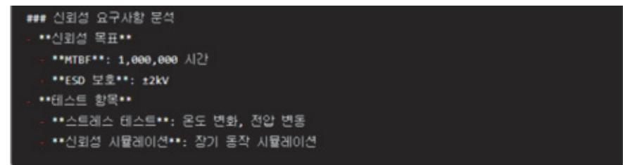

- (나) 테스트 항목 정의: 신뢰성 검증을 위한 테스트 항목과 방법을 정의한다.
- (가) 신뢰성 목표 확인: 블록의 신뢰성 목표와 이를 달성하기 위한 요구 사항을 분석한다.
- (4) 신뢰성 요구 사항 분석
- 출처: 코드 작성 프로그램. 2024. 8. 12. 스크린샷. [그림 2-3] 성능 요구 사항 분석

| *** 성능 요구사함 분석                |  |
|-------------------------------|--|
| <ul> <li>**처리 余도**</li> </ul> |  |
| ···최대 물락 속도··: 200982         |  |
| *·데이터 처리뮬**: 16bps            |  |
| **전력 소비**                     |  |
| - **최대 전력 소비**: 10mM          |  |
| ···전력 효율···: 94%              |  |
|                               |  |

- (나) 전력 소비 분석: 전력 소비 요구 사항을 이해하고, 전력 효율 최적화 방안을 검토한다.
- (가) 처리 속도 분석: 블록이 처리할 수 있는 최대 데이터 속도 및 클록 속도를 분석한다.
- (3) 성능 요구 사항 분석

| 출처: 코드 작성 프로그램. 2024. 8. 12. 스크린샷. |  |
|------------------------------------|--|
| [그림 2-2] 인터페이스 요구 사항 분석            |  |

| nakdown                                            | 0 25 44 |
|----------------------------------------------------|---------|
| ### 인터페이스 요구사항 분석                                  |         |
| ••입음력 신호••                                         |         |
| **②III**: clk, reset, data_in[7:0], control_signal |         |
| · **金讯**: data_out[7:0], status_signal             |         |
| - **통신 프로토몰**                                      |         |
| · **프로토콜**: SPI                                    |         |
| · ···신효···: HOST, HISO, SCLK, CS                   |         |
| 티이밍 요구사함                                           |         |
| - **윤철 시간**: 18es                                  |         |
| · **유지 시간**: \$ms                                  |         |
| ···율력 주기·*: 20ms                                   |         |

출처: 코드 작성 프로그램. 2024. 8. 12. 스크린샷. [그림 2-5] 물리적 요구 사항 분석

출처: 코드 작성 프로그램. 2024. 8. 12. 스크린샷. [그림 2-6] 통합 블록 설계 사양 분석 보고서

- (2) 검증 계획 수립
  - (가) 검증 방법 정의: 각 요구 사항에 대한 구체적인 검증 방법을 정의한다.
  - (나) 검증 도구 및 환경 설정: 필요한 검증 도구와 환경을 설정한다.

| • 검증 계획       |             |            |          |    |  |
|---------------|-------------|------------|----------|----|--|
| # 검증 방법       |             |            |          |    |  |
| • ••기능 겸증••:  | 시뮬레이션 및 테스! | 트벤치를 사용하여  | 기능적 요구사항 | 검증 |  |
| - •• 타이밍 검증•• | STA 도구를 사용하 | 여 타이밍 요구사형 | 황 검증     |    |  |
| • ••전력 검증••:  | 전력 분석 도구를 시 | 사용하여 전력 소비 | 검증       |    |  |
| • ••신뢰성 검증    |             |            |          |    |  |

출처: 코드 작성 프로그램. 2024. 8. 12. 스크린샷. [그림 2-7] 검증 계획

숕 레퍼런스 보드(reference board)의 회로 설계 요구 사항을 정의한다.

반도체 설계의 통합 블록 검증을 위해 레퍼런스 보드(reference board)의 회로 설계 요구 사 항을 정의하는 과정은 매우 중요하다. 레퍼런스 보드는 실제 환경에서 통합 블록의 성능과 기 능을 검증하는 데 사용된다. 다음은 레퍼런스 보드의 회로 설계 요구 사항을 정의하는 단계별 가이드이다.

- 1. 레퍼런스 보드의 목적 및 역할을 정의한다.
  - (1) 목적
    - (가) 기능 검증: 통합 블록의 기능을 실제 환경에서 검증한다.
    - (나) 성능 평가: 통합 블록의 성능을 평가하고 최적화한다.
    - (다) 디버깅: 설계 문제를 식별하고 해결한다.
    - (라) 데모 및 테스트: 고객에게 설계를 데모하고 테스트한다.
  - (2) 역할
    - (가) 통합 블록 호스팅: 통합 블록이 실제 동작할 수 있는 환경을 제공한다.
    - (나) 입출력 인터페이스: 통합 블록의 입력 및 출력 신호를 처리한다.
    - (다) 전력 공급: 안정적인 전력 공급 및 관리를 한다.
- 2. 회로 설계 요구 사항 정의
  - (1) 전원 공급 요구 사항
    - (가) 전압 레벨: 통합 블록이 필요로 하는 전압 레벨을 정의한다.

예) 1.8V, 3.3V, 5V

(나) 전력 공급 회로: 안정적인 전압을 공급할 수 있는 전력 회로를 설계한다.

예) LDO, DC-DC 컨버터

| ■■ 전원 공급 요구사항        |  |
|----------------------|--|
| - ••전압 레벨••          |  |
| - VCC: 3.3V          |  |
| - VDD: 1.8V          |  |
| ••전력 공급 회로••         |  |
| - LDO 레귤레이터: 3.3V 출력 |  |
| - DC-DC 컨버터: 1.8V 출력 |  |

출처: 코드 작성 프로그램. 2024. 8. 12. 스크린샷. [그림 2-8] 전원 공급 요구 사항

- (2) 클록 및 리셋 회로
  - (가) 클록 소스: 통합 블록이 필요로 하는 클록 신호를 생성한다.

예) 크리스탈 오실레이터, 클록 제너레이터

(나) 리셋 회로: 통합 블록을 초기화할 수 있는 리셋 신호를 생성한다.


출처: 집필진 제작(2024) [그림 2-9] 클록 및 리셋 회로

- (3) 입출력 인터페이스
  - (가) 디지털 인터페이스: 통합 블록과 외부 장치 간의 디지털 신호를 처리한다.

예) GPIO, SPI, I2C, UART

- (나) 아날로그 인터페이스: 아날로그 신호를 처리하는 회로이다.
  - 예) ADC, DAC

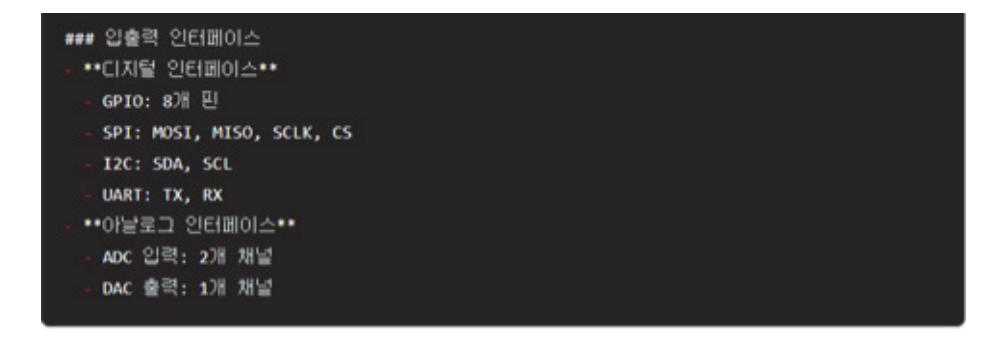

출처: 코드 작성 프로그램. 2024. 8. 12. 스크린샷. [그림 2-10] 입출력 인터페이스

- (나) 요구 사항 간의 상호 의존성 및 제약 조건을 명시한다.
- (가) 각 요구 사항을 명확하고 구체적으로 문서화한다.
- (1) 요구 사항 명세서 작성
- 3. 요구 사항을 문서화한다.

출처: 코드 작성 프로그램. 2024. 8. 12. 스크린샷. [그림 2-12] 패키징 및 폼 팩터

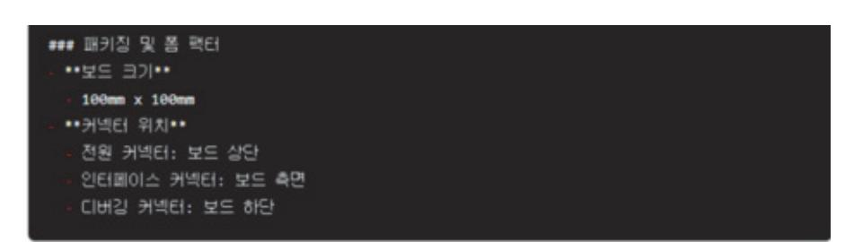

- (나) 커넥터 및 인터페이스 위치: 외부 장치와의 인터페이스 위치를 정의한다.
- (가) 보드 크기 및 형태: 레퍼런스 보드의 크기와 형태를 정의한다.
- (5) 패키징 및 폼 팩터

출처: 코드 작성 프로그램. 2024. 8. 12. 스크린샷. [그림 2-11] 디버깅 및 테스트 포인트

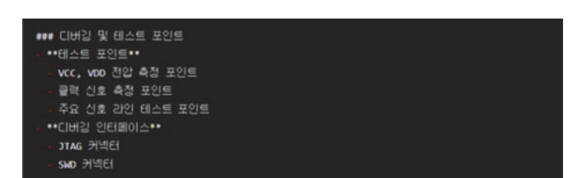

- (나) 디버깅 인터페이스: JTAG, SWD 등의 디버깅 인터페이스를 제공한다.
- (가) 테스트 포인트: 회로의 주요 신호를 모니터링할 수 있는 테스트 포인트를 제공한다.
- (4) 디버깅 및 테스트 포인트

출처: 코드 작성 프로그램. 2024. 8. 12. 스크린샷. [그림 2-] 레퍼런스 보드 회로 설계 요구 사항

- 4. 설계 검토 및 피드백해 준다.

  - (1) 검토 회의
  - - (가) 회로 설계 요구 사항을 설계 팀과 함께 검토한다.

(나) 각 요구 사항의 타당성 및 실현 가능성을 평가한다.

(2) 피드백 반영

54

(가) 검토 회의에서 수집된 피드백을 반영하여 요구 사항을 수정 및 보완한다.

(나) 최종 요구 사항 문서를 작성한다.

- 5. 요구 사항 최종화 및 승인한다.
  - (1) 최종 요구 사항 문서화
    - (가) 모든 피드백이 반영된 최종 요구 사항 문서를 작성한다.
    - (나) 관련 팀의 승인 절차를 수행한다.
  - (2) 승인 및 배포
    - (가) 최종 요구 사항 문서를 승인받고, 설계팀 및 검증팀에 배포한다.
    - (나) 요구 사항 변경 관리 절차를 수립한다.
- 6. 종합적인 접근을 시도한다.

레퍼런스 보드의 회로 설계 요구 사항을 정의하는 것은 통합 블록의 검증을 위한 중요한 단계이다. 정확하고 구체적인 요구 사항을 문서화하여 설계팀과 검증팀이 통합 블록을 효과 적으로 검증할 수 있도록 지원한다. 이를 통해 설계의 정확성과 신뢰성을 높이고, 최종 제 품이 요구 사항을 충족할 수 있도록 보장한다.

숖 통합 블록 검증 시나리오와 검증 계획을 수립한다.

반도체 설계의 통합 블록 검증을 위해 통합 블록 검증 시나리오와 검증 계획을 수립하는 과정 은 통합 블록이 전체 시스템 내에서 제대로 동작하는지 확인하기 위해 필수적이다. 이를 통해 기능적, 타이밍적, 전력적, 신뢰성 측면에서 설계가 사양을 충족하는지 확인할 수 있다. 다음은 통합 블록 검증 시나리오와 검증 계획을 수립하는 단계별 가이드이다.

- 1. 통합 블록 검증 시나리오를 수립한다.
  - (1) 검증 목표 정의
    - (가) 기능적 검증: 블록이 모든 기능적 요구 사항을 충족하는지 확인한다.
    - (나) 타이밍 검증: 블록의 타이밍 제약 조건을 검증한다.
    - (다) 전력 검증: 블록의 전력 소비가 요구 사항을 충족하는지 확인한다.
    - (라) 신뢰성 검증: 블록의 신뢰성을 확인한다.
  - (2) 기능적 검증 시나리오
    - (가) 기본 동작 시나리오: 정상적인 입력 조건에서 블록의 기능을 검증한다. 예) 입력 신호에 따른 기대 출력 확인
    - (나) 경계 조건 시나리오: 입력값이 경계 조건에 있을 때의 동작을 검증한다.

예) 최대/최소 입력값, 전환 경계 조건

(다) 예외 상황 시나리오: 비정상 입력 조건에서의 블록 동작을 검증한다.

예) 잘못된 입력값, 예상치 못한 입력 패턴

| 🚥 기능적 검증 시나리오             |  |  |
|---------------------------|--|--|
| **** 기본 동작 시나리오           |  |  |
| · 입력: data_in - 8'hAA     |  |  |
| - 기대 출력: data_out = 8'h55 |  |  |
| #### 경계 조건 시나리오           |  |  |
| · 입력: data_in = 8'h00     |  |  |
| - 기대 출력: data_out = 8'h00 |  |  |
| #### 예외 상황 시나리오           |  |  |
| - 입력: data in = 8'hFF     |  |  |
| - 기대 출력: data_out = 8'hFF |  |  |

출처: 코드 작성 프로그램. 2024. 8. 12. 스크린샷. [그림 2-14] 기능적 검증 시나리오

(3) 타이밍 검증 시나리오

- (가) 클록 주기 검증: 클록 주기 내에 모든 신호가 안정화되는지 확인한다. 예) 클록 주기, 설정 시간(setup time), 유지 시간(hold time)
- (나) 경로 지연 검증: 주요 경로의 신호 지연을 분석한다.

예) 크리티컬 경로 분석

(다) 타이밍 마진 검증: 타이밍 여유(margin)를 분석하여 안정성을 검증한다.

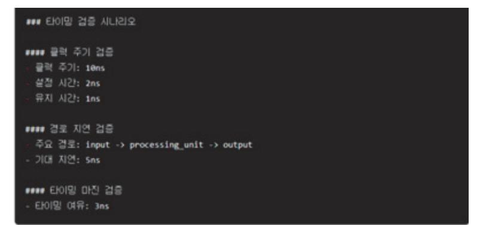

출처: 코드 작성 프로그램. 2024. 8. 12. 스크린샷. [그림 2-15] 타이밍 검증 시나리오

(4) 전력 검증 시나리오

(가) 동적 전력 소비 검증: 동작 중의 전력 소비를 분석한다.

예) 동작 주기 동안의 전력 소비 패턴

(나) 정적 전력 소비 검증: 유휴 상태에서의 전력 소비를 분석한다.

예) 블록이 활성화되지 않은 상태에서의 전력 소모

| ### 전력 검증 시나리오                                                       |
|----------------------------------------------------------------------|
| #### 동작 전력 소비 검증<br>- 입력: data_in = 8'hAA (동작 중)<br>- 기대 전력 소비: 5mm  |
| #### 정적 전력 소비 검증<br>- 입력: data_in = 8'h00 (유휴 상태)<br>- 기대 전력 소비: 1mW |

출처: 코드 작성 프로그램. 2024. 8. 12. 스크린샷. [그림 2-16] 전력 검증 시나리오

- (5) 신뢰성 검증 시나리오
  - (가) 스트레스 테스트: 극한 조건에서의 블록 동작을 확인한다. 예) 고온/저온 환경, 전압 변동
  - (나) 장기 동작 검증: 장기 동작 시의 블록 신뢰성을 확인한다. 예) 1,000시간 동안의 연속 동작 시뮬레이션

| •••• 신뢰성 검증 시나리오     |  |
|----------------------|--|
| **** 스트레스 테스트        |  |
| - 온도: -40°C ~ 85°C   |  |
| - 전압 변동: 1.7V ~ 1.9V |  |
| **** 장기 동작 검증        |  |
| · 동작 시간: 1000시간      |  |
| 기대 결과: 정상 동작 유지      |  |
|                      |  |

출처: 코드 작성 프로그램. 2024. 8. 12. 스크린샷. [그림 2-17] 신뢰성 검증 시나리오

2. 검증 계획을 수립한다.

- (1) 검증 환경 설정
  - (가) 시뮬레이션 환경: 검증을 수행할 시뮬레이션 환경을 설정한다.

예) VCS, ModelSim, QuestaSim 등의 시뮬레이터 설정

(나) 검증 벤치 작성: 다양한 테스트 케이스를 포함하는 검증 벤치를 작성한다.

예) UVM(unified verification methodology) 기반의 검증 벤치

### (다) 검증 도구 선택: 필요한 검증 도구를 선택하고 설정한다.

예) STA 도구(PrimeTime), DRC/LVS 도구(Calibre)

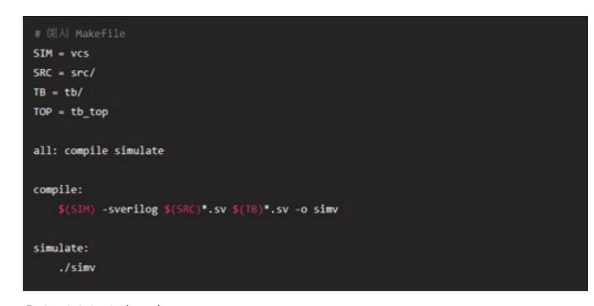

출처: 집필진 제작(2024) [그림 2-18] 검증 도구 선택 및 설정

### (2) 테스트 케이스 작성

- (가) 기능 검증 테스트 케이스: 다양한 입력 조건과 기대 출력을 정의한다.
- (나) 타이밍 검증 테스트 케이스: 타이밍 제약 조건을 검증한다.
- (다) 전력 검증 테스트 케이스: 동적 및 정적 전력 소비를 검증한다.
- (라) 신뢰성 검증 테스트 케이스: 스트레스 테스트 및 장기 동작을 검증한다.

출처: 코드 작성 프로그램. 2024. 8. 12. 스크린샷. [그림 2-19] 테스트 케이스 작성

(3) 검증 일정 수립

(가) 검증 단계별 일정: 각 검증 단계에 대한 일정을 수립한다.

예) 기능 검증, 타이밍 검증, 전력 검증, 신뢰성 검증 일정

(나) 중간 검토 일정: 중간 결과를 검토하고 피드백을 반영하는 일정을 수립한다.

출처: 코드 작성 프로그램. 2024. 8. 12. 스크린샷. [그림 2-20] 검증 일정

숗 수립한 검증 계획을 바탕으로 검증 환경을 구축한다.

반도체 설계의 통합 블록 검증을 위해 수립한 검증 계획을 바탕으로 검증 환경을 구축하는 것 은 중요한 단계이다. 이 과정은 설계가 올바르게 기능하고 요구 사항을 충족하는지 확인하는 데 필수적이다. 아래는 검증 환경을 구축하는 단계별 가이드이다.

- 1. 검증 환경의 주요 구성 요소를 파악한다.
  - (1) 하드웨어 설명 언어(HDL) 및 설계 파일
    - (가) RTL 코드: register transfer level의 설계 코드(VHDL, Verilog)
    - (나) 테스트 벤치: 설계를 검증하기 위한 테스트 벤치 코드
  - (2) 검증 도구
    - (가) 시뮬레이터: VCS, ModelSim, QuestaSim 등의 시뮬레이션 도구
    - (나) 타이밍 분석 도구: Synopsys PrimeTime, Cadence Tempus
    - (다) 전력 분석 도구: Synopsys PrimePower, Cadence Voltus
    - (라) 기생 소자 추출 도구: Mentor Graphics Calibre xRC, Synopsys StarRC
    - (마) DRC/LVS 도구: Mentor Graphics Calibre, Synopsys IC Validator
  - (3) 검증 인프라
    - (가) 컴퓨팅 리소스: 충분한 메모리와 프로세싱 파워를 가진 워크스테이션 또는 서버
    - (나) 버전 관리 시스템: Git, SVN 등으로 설계 및 검증 파일을 관리
    - (다) 자동화 스크립트: Makefile, Python 스크립트 등을 사용하여 검증 환경 설정 및 테스트 자동화

- 2. 검증 환경 설정 단계
  - (1) 프로젝트 디렉터리 구조 설정
    - (가) 디렉터리 구성
      - 1) src/: 설계 소스 파일
      - 2) tb/: 테스트 벤치 파일
      - 3) scripts/: 시뮬레이션 및 검증 자동화 스크립트
      - 4) results/: 검증 결과 파일

출처: 코드 작성 프로그램. 2024. 8. 12. 스크린샷. [그림 2-21] 프로젝트 디렉터리 구조 설정

출처: 코드 작성 프로그램. 2024. 8. 12. 스크린샷. [그림 2-22] 프로젝트 디렉터리 구조 설정

- (2) 시뮬레이터 설정
  - (가) 시뮬레이터 설치 및 설정: VCS, ModelSim, QuestaSim 등의 시뮬레이터 설치 및 환 경 변수를 설정한다.
  - (나) 시뮬레이션 스크립트 작성: 시뮬레이션 실행을 위한 스크립트를 작성한다.

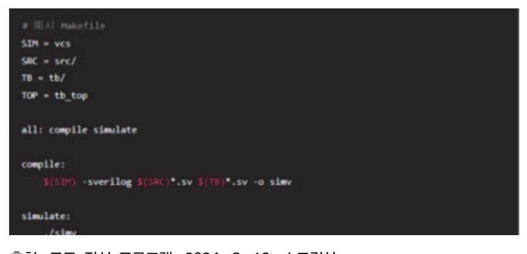

출처: 코드 작성 프로그램. 2024. 8. 12. 스크린샷. [그림 2-23] 시뮬레이터 설정

- (3) 테스트 벤치 작성
  - (가) 기본 테스트 벤치 구성
    - 1) DUT(Design Under Test)를 인스턴스화한다.

2) 테스트 케이스: 다양한 입력 신호를 적용하여 DUT의 출력을 검증한다.

```
출처: 코드 작성 프로그램. 2024. 8. 12. 스크린샷.
[그림 2-24] 기본 테스트 벤치 구성
```

(4) 타이밍 분석 환경 설정

- (가) 타이밍 제약 파일 작성: SDC(synopsys design constraints) 파일을 작성한다.
- (나) 타이밍 분석 도구 설정: primetime 또는 tempus 설정 및 스크립트를 작성한다.

출처: 코드 작성 프로그램. 2024. 8. 12. 스크린샷. [그림 2-25] 타이밍 분석 환경 설정

(5) 전력 분석 환경 설정

- (가) 전력 제약 파일 작성: UPF(unified power format) 파일을 작성한다.
- (나) 전력 분석 도구 설정: PrimePower 또는 Voltus 설정 및 스크립트를 작성한다.

| # 에시 UPF 파일                                      |
|--------------------------------------------------|
| create_power_domain top                          |
| create_supply_net VDD -domain top                |
| <pre>create_supply_port VDO -direction in</pre>  |
| <pre>connect_supply_net VDO -ports { VDO }</pre> |
| create_supply_net VSS -domain top                |
| create_supply_port VSS -direction in             |
| <pre>connect_supply_net vss -ports { vss }</pre> |

출처: 코드 작성 프로그램. 2024. 8. 12. 스크린샷. [그림 2-26] 전력 분석 환경 설정

- (6) 기생 소자 추출 환경 설정
  - (가) 기생 소자 추출 설정 파일: Calibre 또는 StarRC 설정 파일을 작성한다.
  - (나) 추출 도구 설정: 기생 소자 추출 도구 설정 및 스크립트를 작성한다.

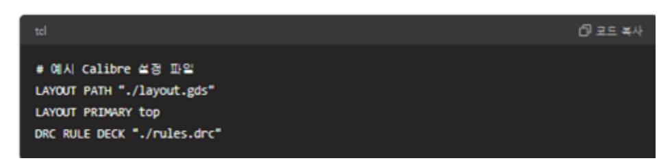

출처: 코드 작성 프로그램. 2024. 8. 12. 스크린샷. [그림 2-27] 기생 소자 추출 환경 설정

### (7) DRC/LVS 검증 환경 설정

- (가) DRC/LVS 설정 파일: Calibre 또는 IC Validator 설정 파일을 작성한다.
- (나) 검증 도구 설정: DRC/LVS 도구 설정 및 스크립트를 작성한다.

출처: 코드 작성 프로그램. 2024. 8. 12. 스크린샷. [그림 2-28] 예시 LVS 설정 파일

- 3. 검증 환경 구축 예제를 파악한다.
  - (1) 시뮬레이션 실행
    - (가) 컴파일 및 시뮬레이션: Makefile을 사용하여 시뮬레이션을 실행한다.

출처: 코드 작성 프로그램. 2024. 8. 12. 스크린샷. [그림 2-29] 시뮬레이션 실행

(2) 타이밍 분석 실행

(가) 타이밍 분석 스크립트 실행: PrimeTime 스크립트를 사용하여 타이밍 분석을 실행한다.

출처: 코드 작성 프로그램. 2024. 8. 12. 스크린샷. [그림 2-30] 타이밍 분석 스크립트 실행

- (3) 전력 분석 실행
  - (가) 전력 분석 스크립트 실행: PrimePower 스크립트를 사용하여 전력 분석을 실행한다.

출처: 코드 작성 프로그램. 2024. 8. 12. 스크린샷. [그림 2-31] 전력 분석 스크립트 실행

(4) 기생 소자 추출 실행

(가) 기생 소자 추출 스크립트 실행: Calibre 스크립트를 사용하여 기생 소자 추출 실행을 한다.

출처: 코드 작성 프로그램. 2024. 8. 12. 스크린샷. [그림 2-32] 기생 소자 추출 실행

4. 검증 결과 분석 및 피드백해 준다.

- (1) 시뮬레이션 로그 분석
  - (가) 출력 결과 확인: 시뮬레이션 로그와 출력 파일을 확인하여 예상 결과와 일치하는지 검증 한다.
  - (나) 오류 및 경고 분석: 시뮬레이션 도중 발생한 오류 및 경고 메시지를 분석한다.
- (2) 커버리지 분석
  - (가) 코드 커버리지: 테스트 케이스가 RTL 코드의 모든 경로를 테스트했는지 확인한다.
  - (나) 기능 커버리지: 모든 기능적 요구 사항이 테스트되었는지 확인한다.


출처: 코드 작성 프로그램. 2024. 8. 12. 스크린샷. [그림 2-33] 예시 커버리지 분석 명령어

(3) 결과 문서화 및 피드백해 준다.

- (가) 검증 리포트 작성: 검증 과정과 결과를 문서화하여 기록한다.
- (나) 문제점 및 해결책 기록: 발견된 문제점과 수정된 내용을 기록한다.

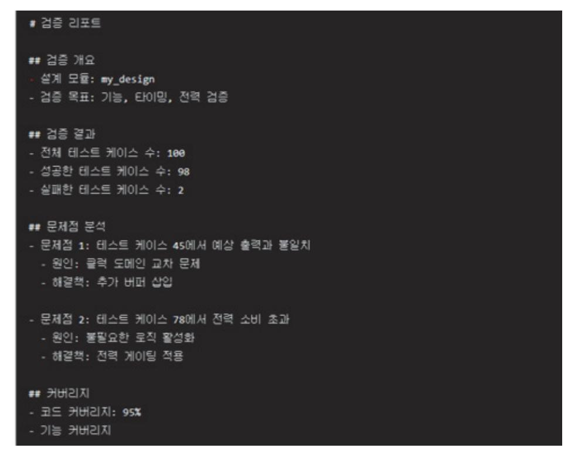

출처: 코드 작성 프로그램. 2024. 8. 12. 스크린샷. [그림 2-34] 검증 리포트

수 검증 환경에 기반한 테스트 벤치를 구현한다.

반도체 설계의 통합 블록 검증을 위해 검증 환경에 기반한 테스트 벤치를 구현하는 것은 매우 중요한 과정이다. 테스트 벤치는 설계된 회로가 주어진 요구 사항을 충족하는지 확인하기 위해 다양한 시나리오를 시뮬레이션하고 분석할 수 있는 환경을 제공한다. 다음은 테스트 벤치를 구 현하는 단계별 가이드이다.

- 1. 테스트 벤치의 주요 구성 요소를 파악한다.
  - (1) DUT(design under test): 검증할 대상인 설계 모듈
    - (가) 클록 및 리셋 생성기: 테스트 벤치 내에서 클록과 리셋 신호를 생성한다.
    - (나) 입력 자극기: DUT에 다양한 입력 신호를 제공한다.
    - (다) 출력 모니터: DUT의 출력을 모니터링하고 검증한다.
    - (라) 검증 로직: 출력이 기대 결과와 일치하는지 확인한다.
    - (마) 테스트 시나리오: 다양한 테스트 케이스를 정의한다.
- 2. 테스트 벤치 작성 과정을 파악한다.
  - (1) DUT 인스턴스화

먼저, 검증할 DUT를 인스턴스화한다. DUT는 테스트 벤치 내에서 테스트될 설계 모듈

이다.

출처: 코드 작성 프로그램. 2024. 8. 12. 스크린샷. [그림 2-35] DUT 인스턴스화

### (2) 클록 및 리셋 생성기

클록 및 리셋 신호를 생성한다. 클록은 일반적으로 정기적으로 토글되고, 리셋은 초기화 동안 활성화된다.

출처: 코드 작성 프로그램. 2024. 8. 12. 스크린샷. [그림 2-36] 클릭 및 리셋 생성기

(3) 입력 자극기

DUT에 다양한 입력 신호를 제공하는 로직을 작성한다.

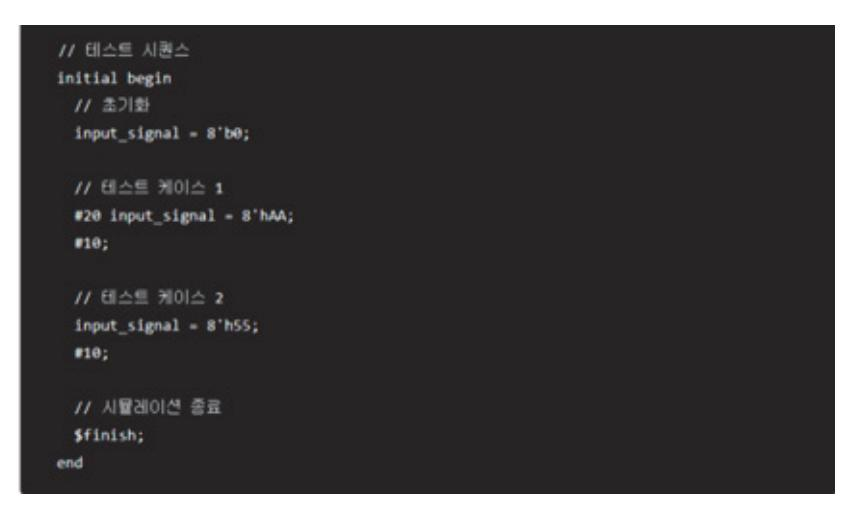

출처: 코드 작성 프로그램. 2024. 8. 12. 스크린샷. [그림 2-37] 입력 자극기

(4) 출력 모니터 및 검증 로직

DUT의 출력을 모니터링하고, 기대 결과와 일치하는지 검증한다.

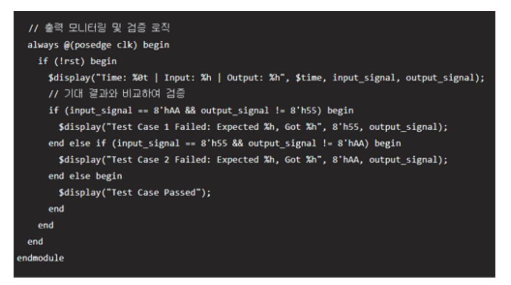

출처: 코드 작성 프로그램. 2024. 8. 12. 스크린샷. [그림 2-38] 출력 모니터링 및 검증 로직

3. 자동화된 테스트 벤치를 파악한다.

더 복잡한 테스트 벤치에서는 자동화된 검증 프레임워크(UVM, systemverilog 등)를 사용 할 수 있다. 여기서는 간단한 예로 Verilog를 사용한 기본 테스트 벤치를 설명했지만, 고급 검증 환경에서는 다음과 같은 구조를 사용할 수 있다.

(1) UVM(universal verification methodology): 재사용 가능한 검증 구성 요소를 제공하고, 복 잡한 검증 환경을 쉽게 설정할 수 있도록 도와준다.

### (가) UVM 예제

출처: 코드 작성 프로그램. 2024. 8. 12. 스크린샷. [그림 2-39] UVM 예제

### 4. 검증 환경 설정 및 실행한다.

(1) 시뮬레이션 환경 설정

Makefile 또는 스크립트를 사용하여 시뮬레이션 환경을 설정한다.

출처: 코드 작성 프로그램. 2024. 8. 12. 스크린샷. [그림 2-40] 시뮬레이션 환경 설정

(2) 시뮬레이션 실행

Makefile 또는 스크립트를 사용하여 시뮬레이션을 실행한다.

출처: 코드 작성 프로그램. 2024. 8. 12. 스크린샷. [그림 2-41] 시뮬레이션 실행

- 5. 검증 결과를 분석한다.
  - (1) 시뮬레이션 로그 분석
    - (가) 출력 결과 확인: 시뮬레이션 로그와 출력 파일을 확인하여 예상 결과와 일치하는지 검증 한다.
    - (나) 오류 및 경고 분석: 시뮬레이션 도중 발생한 오류 및 경고 메시지를 분석한다.
  - (2) 커버리지 분석
    - (가) 코드 커버리지: 테스트 케이스가 RTL 코드의 모든 경로를 테스트했는지 확인한다.
    - (나) 기능 커버리지: 모든 기능적 요구 사항이 테스트되었는지 확인한다.

출처: 코드 작성 프로그램. 2024. 8. 12. 스크린샷. [그림 2-42] 커버리지 분석 명령어

### 6. 종합적인 접근을 시도한다.

테스트 벤치를 구현하는 것은 반도체 설계 검증의 핵심 요소이다. DUT 인스턴스화, 클록 및 리셋 생성, 입력 자극기, 출력 모니터링 및 검증 로직을 포함한 테스트 벤치를 작성함으 로써 설계가 주어진 요구 사항을 충족하는지 확인할 수 있다. 고급 검증 환경(UVM 등)을 사용하여 복잡한 검증 시나리오를 자동화하고, 시뮬레이션 결과를 철저히 분석함으로써 고 성능, 저전력, 고신뢰성의 반도체 제품을 개발할 수 있다.

숙 테스트 벤치의 검증 결과와 설계 결과를 비교하여 평가한다.

반도체 설계의 통합 블록 검증에서 테스트 벤치의 검증 결과와 설계 결과를 비교하여 평가하는 것은 매우 중요한 과정이다. 이를 통해 설계가 기대한 대로 동작하는지 확인할 수 있다. 다음 은 테스트 벤치의 검증 결과와 설계 결과를 비교하고 평가하는 단계별 가이드이다.

1. 검증 결과를 수집한다.

(1) 시뮬레이션 로그 및 출력 파일

(가) 로그 파일: 시뮬레이션 동안 발생한 모든 이벤트와 메시지를 기록한 파일

- (나) 출력 파일: 시뮬레이션 결과에서 생성된 데이터 파일(예: VCD, FSDB)
- (2) 커버리지 리포트

(가) 코드 커버리지: 테스트가 코드의 모든 부분을 얼마나 테스트했는지 확인한다.

- (나) 기능 커버리지: 기능적 요구 사항을 얼마나 충족했는지 확인한다.
- 2. 검증 결과를 분석한다.
  - (1) 시뮬레이션 로그 분석
    - (가) 오류 및 경고 확인: 시뮬레이션 로그에서 오류와 경고를 검토하여 문제점을 파악한다.
    - (나) 출력값 검증: DUT의 출력이 기대한 값과 일치하는지 확인한다.

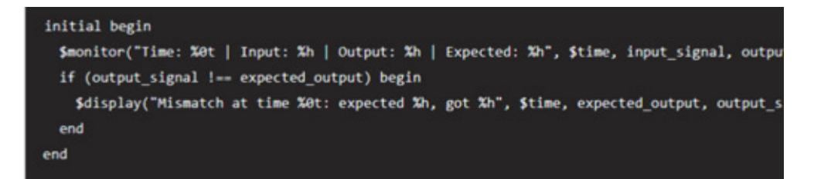

출처: 코드 작성 프로그램. 2024. 8. 12. 스크린샷. [그림 2-43] 시뮬레이션 로그 분석

(2) 커버리지 분석

(가) 코드 커버리지 확인: 코드의 각 부분이 실행되었는지 확인한다.

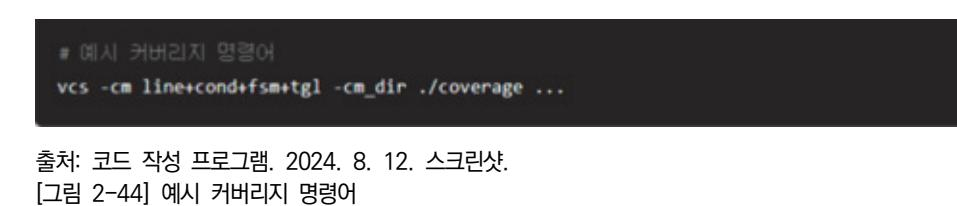

(나) 기능 커버리지 확인: 모든 기능적 요구 사항이 테스트되었는지 확인한다.

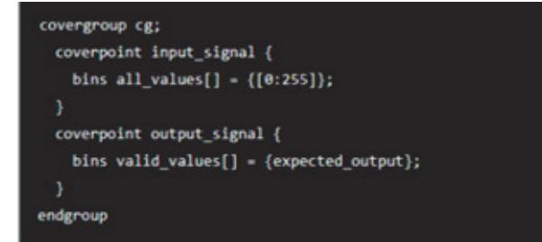

출처: 코드 작성 프로그램. 2024. 8. 12. 스크린샷. [그림 2-45] 기능 커버리지 확인

- 3. 설계 결과와 비교한다.
  - (1) 기대 결과 설정
    - (가) 기대 결과 정의: 각 입력에 대한 기대 출력값을 정의한다.

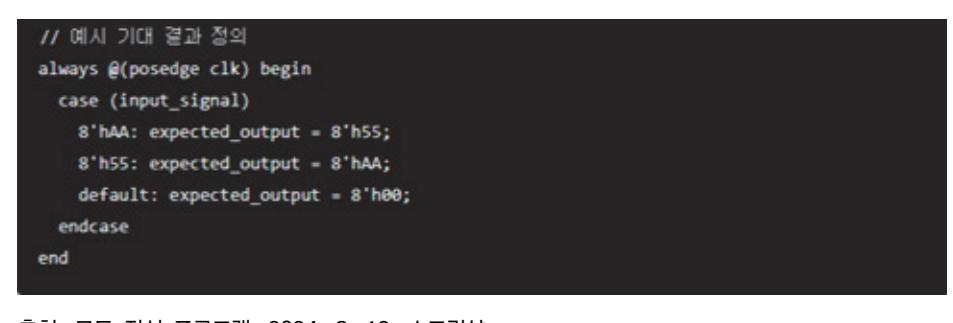

출처: 코드 작성 프로그램. 2024. 8. 12. 스크린샷. [그림 2-46] 예시 기대 결과 정의

(2) 출력 비교

(가) 출력 비교 로직: 시뮬레이션 결과와 기댓값을 비교하여 일치 여부를 확인한다.

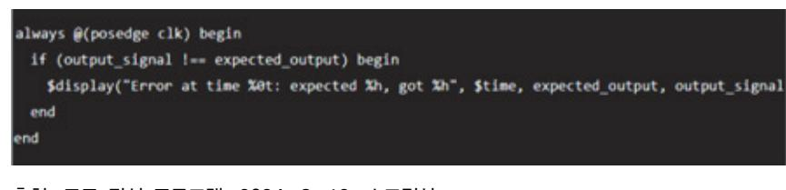

출처: 코드 작성 프로그램. 2024. 8. 12. 스크린샷. [그림 2-47] 출력 비교 로직

- (3) 디버깅
  - (가) 불일치 분석: 불일치가 발생한 경우 원인을 분석하고 수정한다.
  - (나) 디버깅 도구 사용: Verdi, DVE 등의 디버깅 도구를 사용하여 시뮬레이션 결과를 시각적 으로 분석한다.

4. 검증 결과를 평가한다.

(1) 평가 기준 설정

(가) 성공 기준: 모든 테스트 케이스가 기대 결과와 일치해야 한다.

(나) 실패 기준: 테스트 케이스 중 하나라도 기대 결과와 불일치하면 실패로 간주한다.

(2) 결과 문서화

(가) 검증 리포트 작성: 검증 과정과 결과를 문서화하여 기록한다.

(나) 문제점 및 해결책 기록: 발견된 문제점과 수정된 내용을 기록한다.

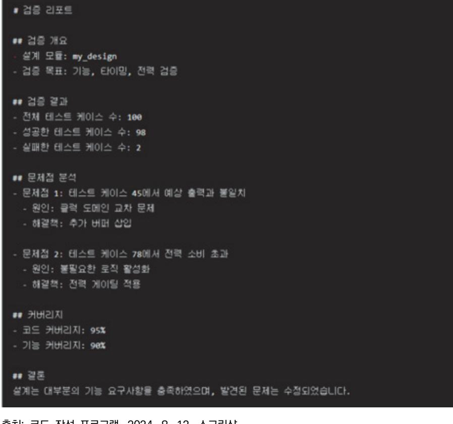

출처: 코드 작성 프로그램. 2024. 8. 12. 스크린샷. [그림 2-48] 검증 리포트

### 5. 종합적인 접근을 시도한다.

테스트 벤치의 검증 결과와 설계 결과를 비교하여 평가하는 과정은 설계 검증의 핵심이다. 시뮬레이션 로그와 출력 파일을 분석하고, 커버리지 리포트를 통해 테스트가 충분히 이루어 졌는지 확인한다. 검증 결과를 기댓값과 비교하고, 불일치가 발생한 경우 원인을 분석하여 수정한다. 마지막으로, 검증 결과를 문서화하여 전체 검증 과정을 체계적으로 관리한다. 이 를 통해 설계가 주어진 요구 사항을 충족하는지 확인하고, 고성능, 저전력, 고신뢰성의 반도 체 제품을 개발할 수 있다.

숚 평가한 검증 보고서를 작성하여 설계자에게 제공한다.

반도체 설계의 통합 블록 검증을 위한 검증 보고서를 작성하는 것은 매우 중요한 단계이다. 이 보고서는 검증 과정에서 발견된 문제점, 테스트 결과, 및 제안된 수정 사항 등을 문서화하여 설계자에게 전달함으로써 설계의 품질을 개선하고 전체 프로젝트의 성공 가능성을 높인다. 다 음은 검증 보고서를 작성하는 단계별 가이드이다.

- 1. 검증 보고서의 주요 구성 요소를 파악한다.
  - (1) 보고서 개요
    - (가) 제목
    - (나) 작성자
    - (다) 날짜
    - (라) 검증 대상(설계 모듈 이름 및 버전)
  - (2) 검증 개요
    - (가) 목적
    - (나) 방법
    - (다) 설계 사양
  - (3) 테스트 케이스 및 결과
    - (가) 테스트 케이스 요약
    - (나) 결과 요약
  - (4) 상세 결과 분석
    - (가) 테스트 케이스별 결과
    - (나) 문제점 및 원인 분석
    - (다) 해결 방법
  - (5) 커버리지 분석
    - (가) 코드 커버리지
    - (나) 기능 커버리지
  - (6) 결론 및 권고 사항
    - (가) 검증 결론
    - (나) 추가 검증 필요 사항
    - (다) 권고 사항
- 2. 검증 보고서 작성 예시를 파악한다.

### (1) 보고서 개요

출처: 코드 작성 프로그램. 2024. 8. 12. 스크린샷. [그림 2-49] 검증 보고서

### (2) 검증 개요

출처: 코드 작성 프로그램. 2024. 8. 12. 스크린샷. [그림 2-50] 검증 개요

### (3) 테스트 케이스 및 결과

| ## 테스트 케이스 및 결과                                                                |    |
|--------------------------------------------------------------------------------|----|
| ### 테스트 케이스 요약<br>- 총 테스트 케이스: 100개<br>- 성공한 테스트 케이스: 98개<br>- 실패한 테스트 케이스: 2개 |    |
| *** 결과 요약<br>검증 결과, 대부분의 테스트 케이스에서 설계 사양을 충족하였으나, 일부 테스트 케이스에서 문제가 볼           | 발견 |

출처: 코드 작성 프로그램. 2024. 8. 12. 스크린샷. [그림 2-51] 테스트 케이스 및 결과

(4) 상세 결과 분석

출처: 코드 작성 프로그램. 2024. 8. 12. 스크린샷. [그림 2-52] 상세 결과 분석

### (5) 커버리지 분석

| ## 커버리지 분석                                      |
|-------------------------------------------------|
| ### 코드 커버리지                                     |
| ···라인 커버리지···: 95%                              |
| - **조건 커버리지**: 92%                              |
| - **FSM 커버리지**: 90%                             |
|                                                 |
| ### 기능 커버리지                                     |
| · **기능 커버리지 목표**: 90%                           |
| - **달성된 커버리지**: 88X                             |
|                                                 |
| 커버리지 분석 결과, 대부분의 코드와 기능이 검증되었으나 일부 경로가 누락되었습니다. |
|                                                 |

출처: 코드 작성 프로그램. 2024. 8. 12. 스크린샷. [그림 2-53] 커버리지 분석

### (6) 결론 및 권고 사항

(가) 검증 결론

my\_design 모듈은 대부분의 기능 요구 사항을 충족하였으며, 검증된 테스트 케이스 의 98%에서 성공적인 결과를 얻었다. 다만, 일부 테스트 케이스에서 문제가 발견되 었으며, 이를 해결하기 위한 제안 사항을 아래에 제시한다.

- (나) 추가 검증 필요 사항
  - 1) 클록 도메인 교차 문제 해결 후 재검증
  - 2) 전력 게이팅 적용 후 전력 소비 재검증
  - 3) 누락된 커버리지 경로에 대한 추가 테스트 케이스 작성 및 검증
- (다) 권고 사항
  - 1) 제안된 해결 방법을 적용하고, 추가 검증을 수행하여 모든 테스트 케이스가 성공하 도록 한다.
  - 2) 커버리지 목표를 달성하기 위해 추가 검증을 수행한다.
- 3. 보고서 전달 및 피드백해 준다.
  - (1) 보고서 전달
    - (가) 전자 메일: 검증 보고서를 첨부하여 설계자에게 전송한다.
    - (나) 문서 공유 시스템: 사내 문서 관리 시스템에 업로드하여 공유한다.
  - (2) 피드백 수집
    - (가) 설계자 회의: 설계자와 회의를 통해 보고서 내용을 설명하고 피드백을 수집한다.
    - (나) 피드백 반영: 수집된 피드백을 반영하여 검증 환경과 테스트 케이스를 수정하고 개선한 다.
- 4. 검증 결과 문서화 및 피드백을 반영한다.
  - (1) 문서화
    - (가) 검증 과정 및 결과 문서화: 검증 과정에서 수행된 작업과 결과를 문서화하여 기록한다.
    - (나) 문제점 및 해결책 기록: 발견된 문제점과 이를 해결하기 위한 방안을 문서화한다.
  - (2) 피드백 반영
    - (가) 검증 환경 개선: 피드백을 반영하여 검증 환경을 개선한다.
    - (나) 추가 검증 수행: 개선된 검증 환경에서 추가 검증을 수행하여 모든 테스트 케이스가 성 공하도록 한다.
- 5. 종합적인 접근을 시도한다.
  - 검증 보고서는 반도체 설계 검증 과정에서 중요한 역할을 한다. 보고서를 통해 검증 과정과 결과를 체계적으로 문서화하고, 발견된 문제와 해결 방법을 명확히 전달함으로써 설계자가 설계를 개선할 수 있도록 한다. 정확하고 상세한 보고서를 작성하여 설계의 품질을 보장하 고, 최종 제품이 요구 사항을 충족하는지 확인하는 것이 중요하다.

수행 tip

- 단위 블록 검증 결과를 참고하여 통합 블록 검증에 반영하 는 업무 절차를 습득한다.
- 설계 사양에 대한 면밀한 검토를 통해 통합 블록 검증을 진행한다.

## 학습 2 교수·학습 방법

### 교수 방법

- 개발 단계에 대한 설명과 단계별로 예측 가능한 위험 요소와 예측이 불가능한 위험 요소에 대해서 설명을 하고, 위험 요소에 대한 대응 방안을 수립해야 하는 필요성에 대해서 설명한 다.
- 개발 계획 중에서 중요한 항목의 일정 관리 방안을 설명을 하는 데 있어서 반도체 제품 개 발 단계를 기준으로 항목을 정의하고, 항목별로 필요한 일정을 작성하여 설명한다.
- 다양한 기능 블록별 개발 방법 및 각각의 장점과 단점에 대해서 설명하면서 학습자가 관심 을 가지고 질의하도록 유도한다.
- 기능 블록의 확보 방안을 자체 개발 방법과 외부에서 도입하는 방법의 선택할 때 고려해야 하는 내용과 장점 및 단점을 설명하여 개발 방법의 선택을 효율적으로 할 수 있도록 설명을 한다.
- 개발 계획서 작성 방법과 그 항목들의 용어에 대한 이해도 확인 및 다양한 사례를 제시한다.

학습 방법

- 반도체 제품의 개발 계획 수립할 때 고려할 항목들에 대해서 학습을 하고 그 항목들의 내용 에 대해서 정리를 한다.
- 개발 단계에 대한 정의를 학습하고, 단계별 위험 요소들이 무엇이 있는지 확인하여 위험 요 소에 따른 대응 방안을 작성해 본다.
- 개발 계획 중에서 중요한 항목의 일정 관리 방안이 무엇들이 있는지 학습한 내용을 바탕으 로 추가 방안을 생각하여 정리를 한다.
- 기능 블록별 개발 방법에는 여러 가지 방법들이 있는데, 주로 많이 사용하는 방법이 어떤 것들이 있는지 조사하고 수행해 본다.
- 기능 블록의 확보 방안을 자체 개발 방법과 외부에서 도입하는 방법의 선택할 때 고려해야 하는 내용과 장점 및 단점을 비교하는 실습을 해 본다.
- 개발 계획서 작성 방법에 필요한 항목들에 대해 학습 및 조사를 해서 개발 계획서를 직접 작성해 본다.

79

# 학습 2 평 가

### 평가 준거

- 평가자는 학습자가 학습 목표를 성공적으로 달성하였는지를 평가해야 한다.
- 평가자는 다음 사항을 평가해야 한다.

| 학습 내용    | 학습 목표                                                  | 성취수준 |   |   |
|----------|--------------------------------------------------------|------|---|---|
|          |                                                        | 상    | 중 | 하 |
| 통합 블록 검증 | - 통합 블록 설계 사양을 분석할 수 있다.                               |      |   |   |
|          | - 레퍼런스 보드(reference board)의 회로 설계 요구 사항을 정의<br>할 수 있다. |      |   |   |
|          | - 통합 블록 검증 시나리오와 검증 계획을 수립할 수 있다.                      |      |   |   |
|          | - 수립한 검증 계획을 바탕으로 검증 환경을 구축할 수 있다.                     |      |   |   |
|          | - 검증 환경에 기반한 테스트 벤치를 구현할 수 있다.                         |      |   |   |
|          | - 테스트 벤치의 검증 결과와 설계 결과를 비교하여 평가할 수 있다.                 |      |   |   |
|          | - 평가한 검증 보고서를 작성하여 설계자에게 제공할 수 있다.                     |      |   |   |

### 평가 방법

• 서술형 시험

|          | 성취수준                                                               |   |   |   |
|----------|--------------------------------------------------------------------|---|---|---|
| 학습 내용    | 평가 항목                                                              | 상 | 중 | 하 |
| 통합 블록 검증 | - 통합 블록 설계 사양의 주요 구성 요소에 대한 파악 여부                                  |   |   |   |
|          | - 레퍼런스 보드의 회로의 클록 및 리셋 회로와 인터페이스 설계<br>요구 사항을 정의할 수 있는 능력          |   |   |   |
|          | - 통합 블록 검증 시나리오 작성을 위한 검증 목표 정의와 기능적<br>검증 시나리오에 포함되는 내용에 대한 파악 여부 |   |   |   |
|          | - 수립한 검증 계획을 바탕으로 검증 환경 구축을 위해 필요한 주요<br>구성 요소 파악 여부               |   |   |   |
|          | - 검증 환경에 기반한 테스트 벤치를 구현하기 위한 필요한 구성<br>요소 파악 여부                    |   |   |   |

• 평가자 체크리스트

|          |                                                                      | 성취수준 |   |   |
|----------|----------------------------------------------------------------------|------|---|---|
| 학습 내용    | 평가 항목                                                                | 상    | 중 | 하 |
| 통합 블록 검증 | - 통합 블록 설계 사양의 분석 단계 파악 여부                                           |      |   |   |
|          | - 레퍼런스 보드의 목적 및 역할에 대한 정의 내용의 파악 여부                                  |      |   |   |
|          | - 통합 블록 검증 시나리오를 기반으로 검증 검증 계획 수립을 위한<br>환경 설정과 테스트 케이스를 작성할 수 있는 능력 |      |   |   |
|          | - 수립한 검증 계획을 바탕으로 검증 환경 설정을 위한 단계 파악<br>여부                           |      |   |   |
|          | - 검증 환경에 기반한 테스트 벤치 작성 과정 파악 여부                                      |      |   |   |

### 피드백

1. 서술형 시험 - 레퍼런스 보드의 회로의 클록 및 리셋 회로와 인터페이스 설계 요구 사항을 정의할 수 있는 능력을 평가한 후, 주요 사항들을 검토하여 미흡하거나, 보충해야 할 업무를 체크하여 보완하도록 피드백해 준다. - 수립한 검증 계획을 바탕으로 검증 환경 구축을 위해 필요한 주요 구성 요소 파악 여부에 대한 평가 후 미흡한 부분은 보완하여 지도해 준다. - 반도체의 성능 검증을 위한 통합 블록 검증 시나리오와 검증 계획을 수립할 수 있는 능력을 평가하여 성취수준이 우수한 학습자는 전체 칩의 중요 부분에 대한 세부 기능과 원리에 대해 설명하고, 성취수 준이 저조한 학습자에게는 기본 블록에 대한 IP의 종류 및 기능을 이해하도록 보충하여 설명해 준다. 2. 평가자 체크리스트 - 통합 블록 검증 시나리오를 기반으로 검증 계획 수립을 위한 환경 설정과 테스트 케이스를 작성할 수 있는 능력을 평가한 후, 개선 및 보완 사항을 정리하여 재학습할 수 있도록 피드백해 준다. - 검증 환경에 기반한 테스트 벤치 작성 과정 파악 여부를 평가한 후 성취 수준이 낮은 학습자에게는 보충 자료를 제시해 주고 추가 설명해 준다.

| 학습 3 | 플랫폼 기반 검증하기 |
|------|-------------|
| 학습 2 | 통합 블록 검증하기  |
| 학습 1 | 단위 블록 검증하기  |

# 3-1. 플랫폼 기반 검증

|       | • 통합 블록의 설계 사양을 분석할 수 있다.              |
|-------|----------------------------------------|
|       | • 검증 플랫폼 보드의 회로 설계 요구 사항을 정의할 수 있다.    |
|       | • 플랫폼 기반 검증 시나리오 및 검증 계획을 수립할 수 있다.    |
| 학습 목표 | • 수립한 검증 계획을 바탕으로 검증 환경을 구축할 수 있다.     |
|       | • 검증 환경에 기반한 테스트 벤치를 구현할 수 있다.         |
|       | • 테스트 벤치의 검증 결과와 설계 결과를 비교하여 평가할 수 있다. |
|       | • 평가한 검증 보고서를 작성하여 설계자에게 제공할 수 있다.     |
|       |                                        |

# 필요 지식 /

숔 반도체 설계 사양의 이해

반도체 설계 검증을 성공적으로 수행하기 위해서는 설계 사양을 철저히 이해하는 것이 필수적 이다. 설계 사양은 검증 프로세스의 기준이 되며, 정확한 검증을 위해 모든 세부 사항을 이해 하고 반영해야 한다. 다음은 반도체 설계 검증을 위해 필요한 설계 사양의 이해를 돕기 위한 주요 요소와 절차이다.

- 1. 설계 사양의 주요 요소
  - (1) 기능 사양(functional specifications)
    - (가) 기능적 요구 사항: 설계가 수행해야 할 기능과 동작을 정의한다. 예) 데이터 처리, 신호 제어, 인터페이스 동작
    - (나) 입력/출력 정의: 각 블록의 입력과 출력 신호를 상세히 정의한다.

예) 입력 신호의 종류, 출력 신호의 기댓값

- (2) 성능 사양(performance specifications)
  - (가) 처리 속도: 설계가 달성해야 할 데이터 처리 속도
    - 예) 최대 클록 주파수, 데이터 전송률

(나) 전력 소모: 전력 효율성과 관련된 요구 사항

예) 최대 전력 소모, 전력 게이팅 전략

(다) 면적: 칩 면적 사용에 대한 제약

예) 최대 셀 면적, 레이아웃 밀도

- (3) 타이밍 사양(timing specifications)
  - (가) 타이밍 제약: 신호의 타이밍 요구 사항과 제약 조건 예) 클록 주기, 셋업 타임, 홀드 타임
  - (나) 타이밍 경로: 주요 타이밍 경로와 타이밍 분석 결과 예) 클록 도메인, 데이터 경로 지연
- (4) 전력 사양(power specifications)
  - (가) 전력 프로파일: 각 동작 모드에서의 전력 소모 특성 예) 활성 모드, 대기 모드에서의 전력 소모
  - (나) 전력 관리 전략: 전력 소모를 최소화하기 위한 전략 예) 전력 게이팅, 클록 게이팅
- (5) 인터페이스 사양(interface specifications)
  - (가) 통신 프로토콜: 블록 간 통신에 사용되는 프로토콜 예) I2C, SPI, UART
  - (나) 신호 타이밍: 인터페이스 신호의 타이밍 요구 사항 예) 신호 타이밍 다이어그램, 지연 시간
- (6) 환경 사양(environmental specifications)
  - (가) 작동 온도: 설계가 정상적으로 동작할 수 있는 온도 범위 예) -40°C~85°C
  - (나) 기타 환경 조건: 습도, 전자기 간섭 등

예) 상대 습도, EMI/EMC 요구 사항

- 2. 설계 사양 이해 절차
  - (1) 사양 문서 분석
    - (가) 사양 문서 검토: 설계 사양 문서를 철저히 검토하여 모든 요구 사항을 이해한다.
    - (나) 키워드 분석: 중요한 키워드와 파라미터를 추출하여 정리한다.
  - (2) 사양 해석
    - (가) 기능 분석: 각 기능 요구 사항이 설계에 어떻게 구현되는지 이해한다.
    - (나) 타이밍 해석: 타이밍 제약과 경로를 분석하여 타이밍 요구 사항을 충족하는지 확인한다.

(다) 전력 분석: 전력 소모 특성과 관리 전략을 이해하여 전력 효율성을 평가한다.

- (3) 사양 매핑
  - (가) 검증 계획 수립: 설계 사양을 기반으로 검증 계획을 수립한다.
  - (나) 테스트 케이스 작성: 각 요구 사항을 검증할 수 있는 테스트 케이스를 작성한다.
  - (나) 시뮬레이션 환경 설정: 검증 환경을 설정하고 시뮬레이션을 준비한다.
- 3. 사양 이해를 위한 도구 및 기법
  - (1) 문서 관리 도구
    - (가) Confluence: 팀 협업을 위한 문서 관리 도구
    - (나) Microsoft Word/Google Docs: 사양 문서 작성 및 관리
  - (2) 시뮬레이션 도구
    - (가) Synopsys VCS: Verilog 및 VHDL 시뮬레이션 도구
    - (나) Mentor Graphics ModelSim: 시뮬레이션 및 디버깅 도구
    - (다) Cadence Xcelium: 복합 시뮬레이션 환경
  - (3) 타이밍 분석 도구
    - (가) Synopsys PrimeTime: 정적 타이밍 분석 도구
    - (나) Cadence Tempus: 타이밍 분석 및 최적화 도구
  - (4) 전력 분석 도구
    - (가) Synopsys PrimePower: 전력 분석 도구
    - (나) Cadence Voltus: 전력 인테그리티 분석 도구
- 5. 설계 사양 이해 및 검증 계획 수행(예시)
  - (1) 설계 사양 요약
    - (가) 기능 사양
      - 1) 기능: 8비트 가산기
      - 2) 입력: A[7:0], B[7:0]
      - 3) 출력: SUM[7:0], CARRY
    - (나) 성능 사양
      - 1) 클록 주파수: 최대 100MHz
      - 2) 전력 소모: 최대 50mW
    - (다) 타이밍 사양
      - 1) 셋업 타임: 2ns
      - 2) 홀드 타임: 1ns

3) 프로파게이션 딜레이: 5ns

- (라) 인터페이스 사양
  - 1) 프로토콜: SPI
  - 2) 신호: SCLK, MOSI, MISO, CS
- (2) 검증 계획
  - (가) 기능 검증
    - 1) 테스트 케이스: 기본 동작 검증
    - 2) 테스트 케이스\*: 경계 조건 검증
    - 3) 테스트 케이스: 예외 처리 검증
  - (나) 타이밍 검증
    - 1) STA 분석: 주요 타이밍 경로 분석
    - 2) 다이내믹 타이밍 테스트: 시뮬레이션을 통한 타이밍 검증
  - (다) 전력 검증
    - 1) 전력 시뮬레이션\*\*: 각 동작 모드에서 전력 소모 분석
    - 2) 전력 게이팅 검증\*\*: 불필요한 전력 소모 방지 확인
  - (라) 인터페이스 검증
    - 1) 프로토콜 준수 테스트\*\*: SPI 프로토콜 준수 여부 확인
    - 2) 신호 타이밍 테스트\*\*: 인터페이스 신호 타이밍 검증
  - (마) 도구 및 환경 설정
    - 1) 시뮬레이션 도구: Synopsys VCS
    - 2) 타이밍 분석 도구: Synopsys PrimeTime
    - 3) 전력 분석 도구: Synopsys PrimePower
    - 4) 문서 관리 도구: Confluence

이와 같은 절차와 도구를 통해 반도체 설계 사양을 철저히 이해하고, 이를 기반으로 설계 검증 을 효과적으로 수행할 수 있다. 정확한 사양 이해와 체계적인 검증 계획은 설계 품질을 보장하 고, 성공적인 반도체 제품 개발을 가능하게 한다.

숕 검증 플랫폼 보드 구성

반도체 설계 검증을 위해 검증 플랫폼 보드를 구성하는 것은 설계의 기능 및 성능을 실시간으 로 평가하고 검증하기 위해 매우 중요하다. 검증 플랫폼 보드는 실제 하드웨어 환경에서 설계 된 반도체 칩의 동작을 확인하는 데 사용된다. 이를 통해 설계 단계에서 발견하기 어려운 문제 를 조기에 발견하고 수정할 수 있다. 다음은 검증 플랫폼 보드를 구성하기 위한 주요 구성 요 소와 그 역할에 대한 설명이다.

- 1. 검증 플랫폼 보드의 주요 구성 요소
  - (1) FPGA(field-programmable gate array)
    - (가) 역할: 설계된 반도체 칩의 기능을 에뮬레이션(emulation)하는 데 사용된다.
    - (나) 구성: 다양한 핀과 프로그램 가능한 로직 블록, 메모리 등을 포함한다.
    - (다) 선택 기준: 용량, 성능, 인터페이스 종류 등
  - (2) 프로세서 및 메모리
    - (가) 프로세서: 보드의 제어 및 데이터 처리
    - (나) 메모리: 설계의 동작을 저장하고 필요시 데이터 로깅
  - (3) 전원 공급 장치(power supply)
    - (가) 역할: 보드와 연결된 모든 구성 요소에 적절한 전원 공급
    - (나) 구성: 다양한 전압 레일과 보호 회로
  - (4) 인터페이스 및 커넥터
    - (가) JTAG: 디버깅 및 프로그래밍
    - (나) USB, Ethernet: 데이터 전송 및 통신
    - (다) GPIO(general purpose input/output): 사용자 정의 인터페이스
  - (5) 클록 및 리셋 회로
    - (가) 클록: 시스템 클록 제공
    - (나) 리셋: 시스템 초기화를 위한 리셋 신호 제공
  - (6) 디버깅 및 모니터링 도구
    - (가) 디버깅 인터페이스: 실시간 디버깅을 위한 JTAG 인터페이스
    - - (나) 로직 분석기: 내부 신호를 모니터링하기 위한 도구
  - (7) 사용자 인터페이스

    - (가) LED, 스위치: 상태 표시 및 사용자 입력
    - (나) 디스플레이: 결과 출력 및 상태 표시
- 2. 검증 플랫폼 보드 설계 절차
  - (1) 요구 사항 분석
    - (가) 기능적 요구 사항: 검증하려는 설계의 기능 및 성능 요구 사항 정의
    - (나) 하드웨어 요구 사항: 필요한 하드웨어 구성 요소와 사양 정의
  - (2) 하드웨어 설계
    - (가) 회로 설계: 각 구성 요소의 회로 설계

- (나) PCB 설계: 각 구성 요소를 포함한 PCB 레이아웃 설계
- (다) 전원 설계: 전원 공급 및 관리 회로 설계
- (3) 하드웨어 구현
  - (가) 부품 조립: PCB에 부품을 조립
  - (나) 펌웨어 작성: FPGA 및 프로세서의 초기 설정을 위한 펌웨어 작성
  - (다) 시스템 통합: 모든 구성 요소를 통합하여 동작 확인
- (4) 검증 및 테스트
  - (가) 기능 테스트: 각 구성 요소의 기능 테스트
  - (나) 시스템 테스트: 통합 시스템의 동작 테스트
  - (다) 타이밍 테스트: 클록 및 타이밍 테스트
- 3. 검증 플랫폼 보드 구성 예시
  - (1) 블록 다이어그램

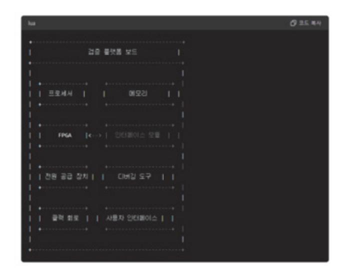

출처: 코드 작성 프로그램. 2024. 8. 12. 스크린샷. [그림 3-1] 검증 플랫폼 보드 블록 다이어그램

- (2) 구성 요소 설명
  - (가) FPGA: Xilinx Zynq, Intel Cyclone 등
  - (나) 프로세서: ARM Cortex-M 시리즈
  - (다) 메모리: DDR4, Flash 등
  - (라) 전원 공급 장치: 5V, 3.3V, 1.8V 전원 레일
  - (마) 인터페이스: USB, Ethernet, GPIO

(바) 디버깅 도구: JTAG, 로직 분석기

(사) 사용자 인터페이스: LED, 스위치, 디스플레이

4. 검증 플랫폼 보드 활용 방법

(1) 설계 검증

(가) 에뮬레이션: FPGA에 설계된 로직을 프로그래밍하여 실시간 검증

(나) 시뮬레이션 결과 확인: 시뮬레이션 결과와 실제 하드웨어 동작 비교

(2) 디버깅

(가) 신호 모니터링: 로직 분석기를 사용하여 내부 신호 모니터링

(나) 실시간 디버깅: JTAG 인터페이스를 통해 실시간 디버깅

(3) 성능 테스트

(가) 성능 측정: 설계된 시스템의 성능 측정 및 분석

(나) 전력 분석: 시스템의 전력 소모 분석

검증 플랫폼 보드는 반도체 설계의 기능적, 성능적 검증을 위해 필수적인 도구이다. 정확한 요 구 사항 분석, 하드웨어 설계, 구현 및 검증 절차를 통해 효과적인 검증 플랫폼 보드를 구축할 수 있다. 이를 통해 설계 단계에서 발견하기 어려운 문제를 조기에 발견하고 수정할 수 있으 며, 최종 제품의 품질을 높일 수 있다.

# 수행 내용 / 플랫폼 기반 검증하기

### 재료·자료

- 설계 데이터[논리 네트리스트(logic netlist), 표준 셀 라이브러리(standard cell library)]
- 기술 파일 및 설계 규칙[기술 파일(technology file), 디자인 룰 체크(DRC) 파일, 레이아웃 -회로 일치 검사(LVS) 파일]
- 설계 제약 조건 및 요구 사항(타이밍 제약 파일, 물리적 제약 파일)
- 전력 및 신호 무결성 자료[전력 계획(power plan), 신호 무결성 분석(signal integrity ana lysis)]
- EDA 도구 및 스크립트(자동 배치 및 배선 도구, 검증 도구, 스크립트 및 자동화 도구)
- 문서 및 가이드(설계 문서, 기술 매뉴얼)
- 회의 및 협업 도구(회의 시스템, 버전 관리 시스템)

### 기기(장비 ・ 공구)

- 고성능 워크스테이션, 서버 인프라, 디스플레이 및 입력 장치
- 자동 배치 및 배선 도구(P&R 도구)
  - Cadence Innovus: 물리적 설계를 위한 종합 도구로, 플로어플래닝, 배치, 배선, 최적화 를 지원한다.
  - Synopsys IC Compiler II: 고급 플로어플래닝과 자동 배치 및 배선 기능을 제공한다.
  - Mentor Graphics Olympus-SoC: 플로어플래닝, 배치, 배선 및 타이밍 분석을 위한 도 구이다.
- 검증 도구
- Mentor Graphics Calibre: DRC, LVS, PEX 검증을 지원하는 도구로, 정확한 레이아웃 검증이 가능하다.
- Synopsys Hercules: DRC 및 LVS 검증 도구로, 다양한 공정 기술을 지원한다.
- Cadence Assura: DRC 및 LVS 검증을 위한 도구이다.
- 기생 소자 추출 도구
- Cadence Quantus: 기생 소자 추출을 위한 도구로, 정확한 RC 추출을 지원한다.

- Synopsys StarRC: 고성능 RC 추출 도구로, 다양한 공정 기술을 지원한다.
- 시뮬레이션 도구
- Cadence Spectre: 아날로그 및 혼성 신호 시뮬레이션 도구
- Synopsys HSPICE: 고정밀 아날로그 시뮬레이션 도구
- 데이터 관리 및 버전 관리 시스템(버전 관리 시스템, 백업 솔루션)

### 안전 ・ 유의 사항

- 데이터 보안 및 관리(데이터 접근 제어, 데이터 백업 및 복구), 버전 관리를 한다.
- 소프트웨어 라이선스 관리 및 업데이트를 한다.
- 하드웨어 장비 안전 및 전력 관리를 한다.
- 작업 공간 정리 및 시스템 모니터링한다.
- 산업 규정을 준수하고 개인 정보 보호 가이드를 따른다.

### 수행 순서

숔 통합 블록의 설계 사양을 분석한다.

반도체 설계 검증을 플랫폼 기반에서 수행하기 위해서는 통합 블록의 설계 사양을 철저히 분석 하는 것이 중요하다. 이를 통해 설계가 플랫폼의 요구 사항을 충족하고, 효율적으로 검증할 수 있는 환경을 마련할 수 있다. 다음은 통합 블록의 설계 사양을 분석하는 단계별 가이드이다.

- 1. 통합 블록 설계 사양의 주요 구성 요소를 숙지한다.
  - (1) 기능적 요구 사항
    - (가) 기능 정의: 통합 블록이 수행해야 할 주요 기능 예) 데이터 처리, 제어 로직, 신호 변환
    - (나) 동작 모드: 다양한 동작 모드 및 전환 조건 예) 정상 모드, 절전 모드, 테스트 모드
  - (2) 인터페이스 요구 사항
    - (가) 입출력 신호: 통합 블록의 입력 및 출력 신호 목록 예) 데이터 버스, 제어 신호, 상태 신호
    - (나) 통신 프로토콜: 블록 간 통신을 위한 프로토콜 예) SPI, I2C, UART
    - (다) 타이밍 요구 사항: 신호의 타이밍 제약 조건

예) 설정 시간, 유지 시간, 클록 주기

- (3) 성능 요구 사항
  - (가) 처리 속도: 통합 블록이 처리할 수 있는 데이터 속도 예) 최대 클록 속도, 데이터 처리율
  - (나) 전력 소비: 전력 소비 제한

예) 최대 전력 소비, 전력 효율

- (4) 신뢰성 요구 사항
  - (가) 신뢰성 목표: 블록의 신뢰성을 보장하기 위한 목표
    - 예) MTBF(mean time between failures), ESD 보호
  - (나) 테스트 및 검증: 신뢰성 검증을 위한 테스트 항목 예) 스트레스 테스트, 신뢰성 시뮬레이션
- (5) 물리적 요구 사항
  - (가) 크기 및 배치: 통합 블록의 물리적 크기와 배치 요구 사항 예) 레이아웃 크기, 배치 제약
  - (나) 패키징: 블록의 패키징 요구 사항

예) 패키지 타입, 핀 배치

- 2. 통합 블록 설계 사양을 분석한다.
  - (1) 사양 문서 검토
    - (가) 문서 수집: 설계 사양 문서, 데이터 시트, 애플리케이션 노트 등 관련 문서를 수집한다.
    - (나) 기능적 요구 사항 분석: 통합 블록이 수행해야 할 기능을 이해하고, 이를 바탕으로 검증 항목을 정의한다.

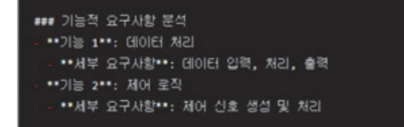

출처: 코드 작성 프로그램. 2024. 8. 12. 스크린샷. [그림 3-2] 기능적 요구 사항 분석

- (2) 인터페이스 분석
  - (가) 입출력 신호 목록 작성: 블록의 모든 입력 및 출력 신호를 정리한다.
  - (나) 통신 프로토콜 분석: 사용된 통신 프로토콜의 사양과 블록 간 통신 방법을 분석한다.

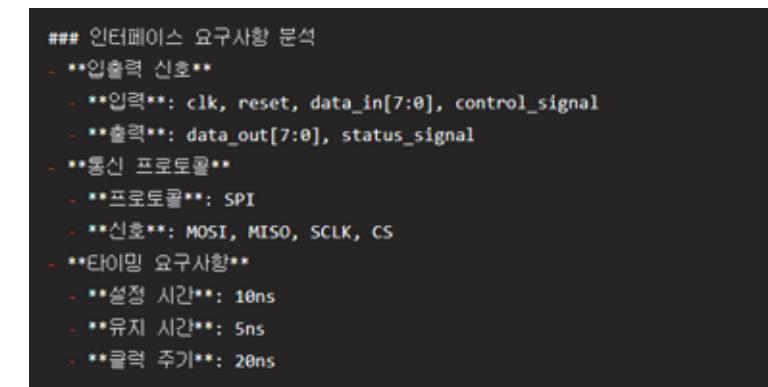

출처: 코드 작성 프로그램. 2024. 8. 12. 스크린샷. [그림 3-3] 인터페이스 분석 요구 사항 분석

(3) 성능 요구 사항 분석

(가) 처리 속도 분석: 블록이 처리할 수 있는 최대 데이터 속도 및 클록 속도를 분석한다.

(나) 전력 소비 분석: 전력 소비 요구 사항을 이해하고, 전력 효율 최적화 방안을 검토한다.


출처: 코드 작성 프로그램. 2024. 8. 12. 스크린샷. [그림 3-4] 성능 요구 사항 분석

(4) 신뢰성 요구 사항 분석

(가) 신뢰성 목표 확인: 블록의 신뢰성 목표와 이를 달성하기 위한 요구 사항을 분석한다.

(나) 테스트 항목 정의: 신뢰성 검증을 위한 테스트 항목과 방법을 정의한다.

출처: 코드 작성 프로그램. 2024. 8. 12. 스크린샷. [그림 3-5] 신뢰성 요구 사항 분석

(5) 물리적 요구 사항 분석

(가) 레이아웃 크기 및 배치: 통합 블록의 물리적 크기와 배치 제약 조건을 분석한다.

(나) 패키징 요구 사항: 패키지 타입과 핀 배치 요구 사항을 검토한다.


출처: 코드 작성 프로그램. 2024. 8. 12. 스크린샷. [그림 3-6] 물리적 요구 사항 분석

- 3. 분석 결과 문서화 및 검증을 계획한다.
  - (1) 분석 결과 문서화
    - (가) 분석 결과 정리: 각 요구 사항에 대한 분석 결과를 문서화한다.
    - (나) 검증 항목 정의: 각 요구 사항에 대한 구체적인 검증 항목을 정의한다.

### # 통합 블록 설계 사양 분석 보고서

### ## 개요

- \*\*대상 블록\*\*: my\_design
- \*\*목적\*\*: 통합 블록 설계 사양 분석

### ## 기능적 요구사항 분석

- \*\*기능 1\*\*: 데이터 처리
  - \*\*세부 요구사항\*\*: 데이터 입력, 처리, 출력
- \*\*기능 2\*\*: 제어 로직
  - \*\*세부 요구사항\*\*: 제어 신호 생성 및 처리

### ## 인터페이스 요구사항 분석

- \*\*입출력 신호\*\*
  - \*\*입력\*\*: clk, reset, data\_in[7:0], control\_signal
  - \*\*촐력\*\*: data\_out[7:0], status\_signal
- \*\*통신 프로토콜\*\*
  - \*\*프로토콜\*\*: SPI
  - \*\*신호\*\*: MOSI, MISO, SCLK, CS
- \*\*타이밍 요구사항\*\*
  - \*\*설정 시간\*\*: 10ns
- \*\*유지 시간\*\*: 5ns
- \*\*클럭 주기\*\*: 20ns

### ## 성능 요구사항 분석

- \*\*처리 속도\*\*
  - \*\*최대 클럭 속도\*\*: 200MHz
  - \*\*데이터 처리뮬\*\*: 1Gbps
- \*\*전력 소비\*\*
  - \*\*최대 전력 소비\*\*: 10mW
- \*\*전력 효율\*\*: 90%

### ## 신뢰성 요구사항 분석

- \*\*신뢰성 목표\*\*
  - \*\*MTBF\*\*: 1,000,000 시간
  - \*\*ESD 보호\*\*: ±2kV
- \*\*테스트 항목\*\*
  - \*\*스트레스 테스트\*\*: 온도 변화, 전압 변동
- \*\*신뢰성 시뮬레이션\*\*: 장기 동작 시뮬레이션
- ## 물리적 요구사항 분석
- \*\*레이아웃 크기\*\*
- \*\*크기\*\*: 2mm x 2mm
- \*\*패키징\*\*
  - \*\*패키지 타입\*\*: QFP
  - \*\*핀 배치\*\*: 64 핀

출처: 코드 작성 프로그램, 2024, 8, 12, 스크린샷, [그림 3-7] 통합 블록 설계 사양 분석 보고서

(2) 검증 계획 수립

(가) 검증 방법 정의: 각 요구 사항에 대한 구체적인 검증 방법을 정의한다.

(나) 검증 도구 및 환경 설정: 필요한 검증 도구와 환경을 설정한다.

| # 검증 계획                                                                                                                                                       |  |
|---------------------------------------------------------------------------------------------------------------------------------------------------------------|--|
| ■ 검증 방법<br>• •·기능 검증••: 시뮬레이션 및 테스트벤치를 사용하여 기능적 요구사항 검증<br>•·타이밍 검증••: STA 도구를 사용하여 타이밍 요구사항 검증<br>•·전력 검증••: 전력 분석 도구를 사용하여 전력 소비 검증<br>•·신뢰성 검증••: 스트레스 테스트 |  |

출처: 코드 작성 프로그램. 2024. 8. 12. 스크린샷. [그림 3-8] 검증 계획

### 숕 검증 플랫폼 보드의 회로 설계 요구 사항을 정의한다.

반도체 설계 검증을 플랫폼 기반에서 수행하기 위해서는 검증 플랫폼 보드의 회로 설계 요구 사항을 명확하게 정의하는 것이 중요하다. 검증 플랫폼 보드는 설계 검증 과정에서 실제 환경 을 시뮬레이션하여 설계의 기능성과 성능을 확인하는 데 사용된다. 다음은 검증 플랫폼 보드의 회로 설계 요구 사항을 정의하는 단계별 가이드이다.

### 1. 검증 플랫폼 보드의 목적 및 역할을 정의한다.

(1) 목적

- (가) 기능 검증: 설계된 블록이 모든 기능적 요구 사항을 충족하는지 확인한다.
- (나) 성능 평가: 설계된 블록의 성능을 평가하고 최적화한다.
- (다) 디버깅: 설계 문제를 식별하고 해결한다.
- (라) 데모 및 테스트: 설계 결과를 시연하고 테스트한다.
- (2) 역할
  - (가) 통합 블록 호스팅: 설계된 블록을 실제로 구동할 수 있는 환경을 제공한다.
  - (나) 입출력 인터페이스: 설계된 블록과 외부 장치 간의 신호를 처리한다.
  - (다) 전력 공급: 안정적인 전력을 공급하고 관리한다.
  - (라) 디버깅 및 테스트 포인트 제공: 신호 모니터링 및 디버깅 인터페이스를 제공한다.

2. 회로 설계 요구 사항을 정의한다.

- (1) 전원 공급 요구 사항
  - (가) 전압 레벨: 설계된 블록이 필요로 하는 전압 레벨을 정의한다.

95

예) 1.8V, 3.3V, 5V

(나) 전력 공급 회로: 안정적인 전압을 공급할 수 있는 전력 회로를 설계한다. 예) LDO, DC-DC 컨버터

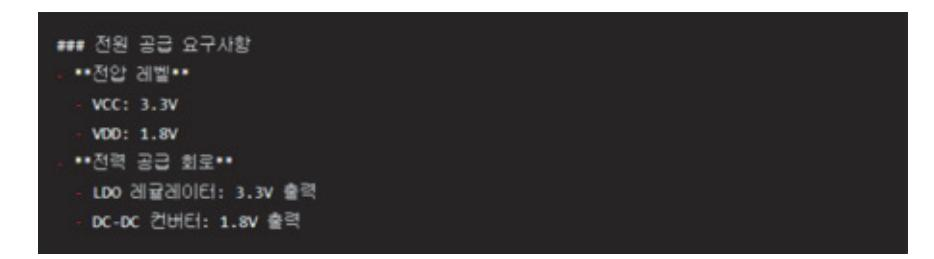

출처: 코드 작성 프로그램. 2024. 8. 12. 스크린샷. [그림 3-9] 전원 공급 요구 사항

- (2) 클록 및 리셋 회로
  - (가) 클록 소스: 설계된 블록이 필요로 하는 클록 신호를 생성한다.

예) 크리스탈 오실레이터, 클록 제너레이터

(나) 리셋 회로: 설계된 블록을 초기화할 수 있는 리셋 신호를 생성한다.

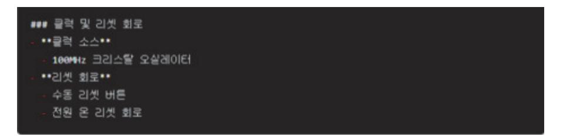

출처: 코드 작성 프로그램. 2024. 8. 12. 스크린샷. [그림 3-10] 클록 및 리셋 회로

- (3) 입출력 인터페이스
  - (가) 디지털 인터페이스: 설계된 블록과 외부 장치 간의 디지털 신호를 처리한다. 예) GPIO, SPI, I2C, UART
  - (나) 아날로그 인터페이스: 아날로그 신호를 처리하는 회로이다. 예) ADC, DAC

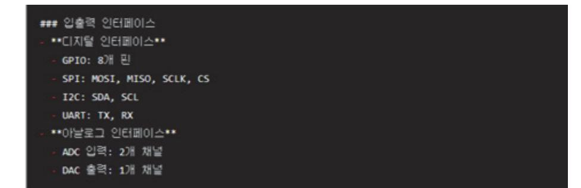

출처: 코드 작성 프로그램. 2024. 8. 12. 스크린샷. [그림 3-11] 입출력 인터페이스

- (4) 디버깅 및 테스트 포인트
  - (가) 테스트 포인트: 회로의 주요 신호를 모니터링할 수 있는 테스트 포인트를 제공한다.

(나) 디버깅 인터페이스: JTAG, SWD 등의 디버깅 인터페이스를 제공한다.

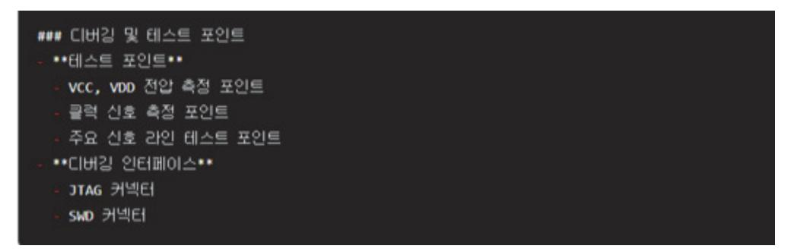

출처: 코드 작성 프로그램. 2024. 8. 12. 스크린샷. [그림 3-12] 디버깅 및 테스트 포인트

(5) 패키징 및 폼 팩터

- (가) 보드 크기 및 형태: 검증 플랫폼 보드의 크기와 형태를 정의한다.
- (나) 커넥터 및 인터페이스 위치: 외부 장치와의 인터페이스 위치를 정의한다.

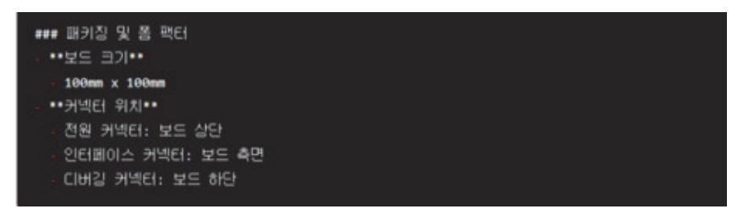

출처: 코드 작성 프로그램. 2024. 8. 12. 스크린샷. [그림 3-13] 패키징 및 폼 팩터

- 3. 요구 사항을 문서화한다.
  - (1) 요구 사항 명세서 작성

각 요구 사항을 명확하고 구체적으로 문서화하고, 요구 사항 간의 상호 의존성 및 제약 조건을 명시한다.

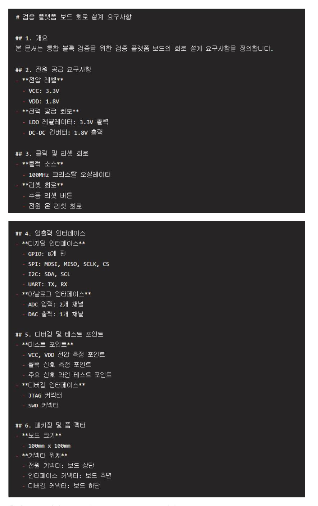

출처: 코드 작성 프로그램. 2024. 8. 12. 스크린샷. [그림 3-] 검증 플랫폼 회로 설계 요구 사항

- 4. 설계 검토 및 피드백을 진행한다.
  - (1) 검토 회의

회로 설계 요구 사항을 설계 팀과 함께 검토하고, 각 요구 사항의 타당성 및 실현 가능 성을 평가한다.

(2) 피드백 반영

검토 회의에서 수집된 피드백을 반영하여 요구 사항을 수정 및 보완한다.

- 5. 요구 사항 최종화 및 승인을 진행한다.
  - (1) 최종 요구 사항 문서화

모든 피드백이 반영된 최종 요구 사항 문서를 작성한다.

- (2) 승인 및 배포 최종 요구 사항 문서를 승인받고, 설계팀 및 검증팀에 배포한다. 요구 사항 변경 관리 절차를 수립한다.
- 6. 종합적인 접근을 시도한다.

검증 플랫폼 보드의 회로 설계 요구 사항을 명확하게 정의하는 것은 설계 검증의 성공을 위해 필수적이다. 전원 공급, 클록 및 리셋 회로, 입출력 인터페이스, 디버깅 및 테스트 포 인트, 패키징 및 폼 팩터 등의 요구 사항을 구체적으로 문서화하고, 검토 및 피드백 과정을 통해 요구 사항을 최적화한다. 이를 통해 검증 플랫폼 보드가 통합 블록의 기능과 성능을 효과적으로 검증할 수 있도록 지원한다.

숖 플랫폼 기반 검증 시나리오 및 검증 계획을 수립한다.

반도체 설계 검증을 플랫폼 기반에서 수행하기 위해서는 검증 시나리오 및 검증 계획을 철저히 수립하는 것이 중요하다. 이는 설계된 블록이 모든 기능적, 성능적, 신뢰성 요구 사항을 충족하 는지 확인하기 위한 체계적인 접근 방법을 제공한다. 다음은 플랫폼 기반 검증 시나리오 및 검 증 계획을 수립하는 단계별 가이드이다.

- 1. 플랫폼 기반 검증 시나리오를 수립한다.
  - (1) 검증 목표 정의
    - (가) 기능적 검증: 설계된 블록의 모든 기능적 요구 사항을 검증한다.
    - (나) 성능 검증: 블록의 성능 요구 사항을 검증한다.
    - (다) 전력 검증: 블록의 전력 소비를 검증한다.
    - (라) 신뢰성 검증: 블록의 신뢰성을 검증한다.
  - (2) 주요 검증 시나리오
    - (가) 기본 동작 시나리오: 정상적인 입력 조건에서 블록의 기능을 검증한다.
    - (나) 경계 조건 시나리오: 입력값이 경계 조건에 있을 때의 동작을 검증한다.
    - (다) 예외 상황 시나리오: 비정상 입력 조건에서의 블록 동작을 검증한다.
    - (라) 성능 검증 시나리오: 최대 및 최소 성능 조건에서 블록의 동작을 검증한다.
    - (마) 전력 검증 시나리오: 다양한 동작 모드에서 블록의 전력 소비를 검증한다.

### (바) 신뢰성 검증 시나리오: 스트레스 테스트 및 장기 동작에서 블록의 신뢰성을 검증한다.

출처: 코드 작성 프로그램. 2024. 8. 12. 스크린샷. [그림 3-15] 검증 시나리오

### 2. 검증 계획을 수립한다.

- (1) 검증 환경 설정
  - (가) 시뮬레이션 환경: 검증을 수행할 시뮬레이션 환경을 설정한다. 예) VCS, ModelSim, QuestaSim 등의 시뮬레이터 설정
  - (나) 검증 벤치 작성: 다양한 테스트 케이스를 포함하는 검증 벤치를 작성한다. 예) UVM(unified verification methodology) 기반의 검증 벤치
  - (다) 검증 도구 선택: 필요한 검증 도구를 선택하고 설정한다.
    - 예) STA 도구(primetime), DRC/LVS 도구(calibre)

출처: 코드 작성 프로그램. 2024. 8. 12. 스크린샷. [그림 3-16] 검증 환경 설정

- (2) 테스트 케이스 작성
  - (가) 기능 검증 테스트 케이스: 다양한 입력 조건과 기대 출력을 정의한다.
  - (나) 타이밍 검증 테스트 케이스: 타이밍 제약 조건을 검증한다.
  - (다) 전력 검증 테스트 케이스: 동적 및 정적 전력 소비를 검증한다.
  - (라) 신뢰성 검증 테스트 케이스: 스트레스 테스트 및 장기 동작을 검증한다.

출처: 코드 작성 프로그램. 2024. 8. 12. 스크린샷. [그림 3-17] 테스트 케이스 작성

### (3) 검증 일정 수립

- (가) 검증 단계별 일정: 각 검증 단계에 대한 일정을 수립한다. 예) 기능 검증, 타이밍 검증, 전력 검증, 신뢰성 검증 일정
- (나) 중간 검토 일정: 중간 결과를 검토하고 피드백을 반영하는 일정을 수립한다.

출처: 코드 작성 프로그램. 2024. 8. 12. 스크린샷. [그림 3-18] 검증 일정 수립

- 3. 검증 환경 설정 및 실행한다.
  - (1) 시뮬레이션 환경 설정

Makefile 또는 스크립트를 사용하여 시뮬레이션 환경을 설정한다.

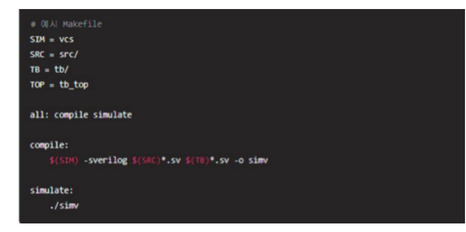

출처: 코드 작성 프로그램. 2024. 8. 12. 스크린샷. [그림 3-19] 시뮬레이션 환경 설정

(2) 시뮬레이션 실행

Makefile 또는 스크립트를 사용하여 시뮬레이션을 실행한다.

출처: 코드 작성 프로그램. 2024. 8. 12. 스크린샷. [그림 3-20] 시뮬레이션 실행

4. 검증 결과 분석 및 피드백을 진행한다.

- (1) 시뮬레이션 로그 분석
  - (가) 출력 결과 확인: 시뮬레이션 로그와 출력 파일을 확인하여 예상 결과와 일치하는지 검증 한다.
  - (나) 오류 및 경고 분석: 시뮬레이션 도중 발생한 오류 및 경고 메시지를 분석한다.
- (2) 커버리지 분석
  - (가) 코드 커버리지: 테스트 케이스가 RTL 코드의 모든 경로를 테스트했는지 확인한다.
  - (나) 기능 커버리지: 모든 기능적 요구 사항이 테스트되었는지 확인한다.

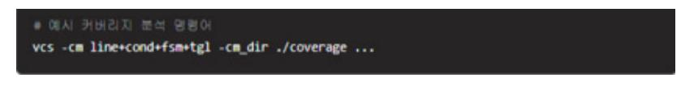

출처: 코드 작성 프로그램. 2024. 8. 12. 스크린샷. [그림 3-21] 예시 커버리지 분석 명령어

- (3) 결과 문서화 및 피드백
  - (가) 검증 리포트 작성: 검증 과정과 결과를 문서화하여 기록한다.
  - (나) 문제점 및 해결책 기록: 발견된 문제점과 수정된 내용을 기록한다.

| # 검증 리포트                     |
|------------------------------|
| ## 검증 개요                     |
| - 설계 모듈: my_design           |
| - 검증 목표: 기능, 타이밍, 전력, 신뢰성 검증 |
|                              |
| ## 김종 결과                     |
| - 전체 테스트 케이스 수: 100          |
| - 성공한 테스트 케이스 수: 98          |
|                              |

출처: 코드 작성 프로그램. 2024. 8. 12. 스크린샷. [그림 3-22] 검증 리포트

숗 수립한 검증 계획을 바탕으로 검증 환경을 구축한다.

반도체 설계 검증을 플랫폼 기반에서 수행하기 위해 수립한 검증 계획을 바탕으로 검증 환경을 구축하는 단계는 매우 중요하다. 이를 통해 검증 계획에 따라 설계된 블록의 기능적, 성능적, 전력적, 신뢰성 요구 사항을 효율적으로 검증할 수 있다. 다음은 검증 환경을 구축하는 단계별 가이드이다.

- 1. 검증 환경의 주요 구성 요소를 파악한다.
  - (1) 하드웨어 설명 언어(HDL) 및 설계 파일
    - (가) RTL 코드: register transfer level의 설계 코드(VHDL, Verilog 등)
    - (나) 테스트 벤치: 설계를 검증하기 위한 테스트 벤치 코드
  - (2) 검증 도구
    - (가) 시뮬레이터: VCS, ModelSim, QuestaSim 등의 시뮬레이션 도구
    - (나) 타이밍 분석 도구: Synopsys PrimeTime, Cadence Tempus
    - (다) 전력 분석 도구: Synopsys PrimePower, Cadence Voltus
    - (라) 기생 소자 추출 도구: Mentor Graphics Calibre xRC, Synopsys StarRC
    - (마) DRC/LVS 도구: Mentor Graphics Calibre, Synopsys IC Validator
  - (3) 검증 인프라
    - (가) 컴퓨팅 리소스: 충분한 메모리와 프로세싱 파워를 가진 워크스테이션 또는 서버
    - (나) 버전 관리 시스템: Git, SVN 등으로 설계 및 검증 파일 관리
    - (다) 자동화 스크립트: Makefile, Python 스크립트 등을 사용하여 검증 환경 설정 및 테스트 자동화
- 2. 검증 환경 설정 단계를 파악한다.
  - (1) 프로젝트 디렉터리 구조 설정
    - (가) 디렉터리 구성
      - 1) src/: 설계 소스 파일
      - 2) tb/: 테스트 벤치 파일
      - 3) scripts/: 시뮬레이션 및 검증 자동화 스크립트
      - 4) results/: 검증 결과 파일

출처: 코드 작성 프로그램. 2024. 8. 12. 스크린샷. [그림 3-23] 디렉터리 구성

### (2) 시뮬레이터 설정

- (가) 시뮬레이터 설치 및 설정: VCS, ModelSim, QuestaSim 등의 시뮬레이터 설치 및 환 경 변수를 설정한다.
- (나) 시뮬레이션 스크립트 작성: 시뮬레이션 실행을 위한 스크립트를 작성한다.

출처: 코드 작성 프로그램. 2024. 8. 12. 스크린샷. [그림 3-24] 시뮬레이션 스크립트 작성

- (3) 테스트 벤치 작성
  - (가) 기본 테스트 벤치 구성
    - 1) DUT(design under test)를 인스턴스화한다.
    - 2) 테스트 케이스: 다양한 입력 신호를 적용하여 DUT의 출력을 검증한다.

출처: 코드 작성 프로그램. 2024. 8. 12. 스크린샷. [그림 3-25] 기본 테스트 벤치 구성

(4) 타이밍 분석 환경 설정

- (가) 타이밍 제약 파일 작성: SDC(synopsys design constraints) 파일을 작성한다.
- (나) 타이밍 분석 도구 설정: primetime 또는 tempus 설정 및 스크립트를 작성한다.

출처: 코드 작성 프로그램. 2024. 8. 12. 스크린샷. [그림 26] 타이밍 분석 환경 설정

(5) 전력 분석 환경 설정

- (가) 전력 제약 파일 작성: UPF(unified power format) 파일을 작성한다.
- (나) 전력 분석 도구 설정: PrimePower 또는 Voltus 설정 및 스크립트를 작성한다.

| # 예시 UPF 파일                                      |
|--------------------------------------------------|
| create_power_domain top                          |
| create_supply_net VDD -domain top                |
| create_supply_port VDD -direction in             |
| <pre>connect_supply_net VDD -ports { VDD }</pre> |
| create_supply_net VSS -domain top                |
| create_supply_port VSS -direction in             |
| <pre>connect_supply_net VSS -ports { VSS }</pre> |
|                                                  |

출처: 집필진 제작(2024) [그림 3-27] 전력 분석 환경 설정

(6) 기생 소자 추출 환경 설정

(가) 기생 소자 추출 설정 파일: Calibre 또는 StarRC 설정 파일을 작성한다.

(나) 추출 도구 설정: 기생 소자 추출 도구 설정 및 스크립트를 작성한다.

출처: 코드 작성 프로그램. 2024. 8. 12. 스크린샷. [그림 3-28] 기생 소자 추출 환경 설정

(7) DRC/LVS 검증 환경 설정

- (가) DRC/LVS 설정 파일: Calibre 또는 IC Validator 설정 파일을 작성한다.
- (나) 검증 도구 설정: DRC/LVS 도구 설정 및 스크립트를 작성한다.

출처: 코드 작성 프로그램. 2024. 8. 12. 스크린샷. [그림 3-29] 검증 도구 설정

### 3. 검증 환경 구축 예제을 파악한다.

(1) 시뮬레이션 실행

컴파일 및 시뮬레이션: Makefile을 사용하여 시뮬레이션을 실행한다.

출처: 코드 작성 프로그램. 2024. 8. 12. 스크린샷. [그림 3-30] 시뮬레이션 실행

(2) 타이밍 분석 실행

타이밍 분석 스크립트 실행: PrimeTime 스크립트를 사용하여 타이밍 분석을 실행한다.

출처: 코드 작성 프로그램. 2024. 8. 12. 스크린샷. [그림 3-31] 타이밍 분석 실행

(3) 전력 분석 실행

전력 분석 스크립트 실행: PrimePower 스크립트를 사용하여 전력 분석을 실행한다.

출처: 코드 작성 프로그램. 2024. 8. 12. 스크린샷. [그림 3-32] 전력 분석 실행

(4) 기생 소자 추출 실행

기생 소자 추출 스크립트 실행: Calibre 스크립트를 사용하여 기생 소자 추출 실행

출처: 코드 작성 프로그램. 2024. 8. 12. 스크린샷. [그림 3-33] 기생 소자 추출 실행

- 4. 검증 결과 분석 및 피드백을 진행한다.
  - (1) 시뮬레이션 로그 분석
    - (가) 출력 결과 확인: 시뮬레이션 로그와 출력 파일을 확인하여 예상 결과와 일치하는지 검증 한다.
    - (나) 오류 및 경고 분석: 시뮬레이션 도중 발생한 오류 및 경고 메시지를 분석한다.
  - (2) 커버리지 분석
    - (가) 코드 커버리지: 테스트 케이스가 RTL 코드의 모든 경로를 테스트했는지 확인한다.
    - (나) 기능 커버리지: 모든 기능적 요구 사항이 테스트되었는지 확인한다.

출처: 코드 작성 프로그램. 2024. 8. 12. 스크린샷. [그림 3-34] 예시 커버리지 분석 명령어

(3) 결과 문서화 및 피드백

- (가) 검증 리포트 작성: 검증 과정과 결과를 문서화하여 기록한다.
- (나) 문제점 및 해결책 기록: 발견된 문제점과 수정된 내용을 기록한다.

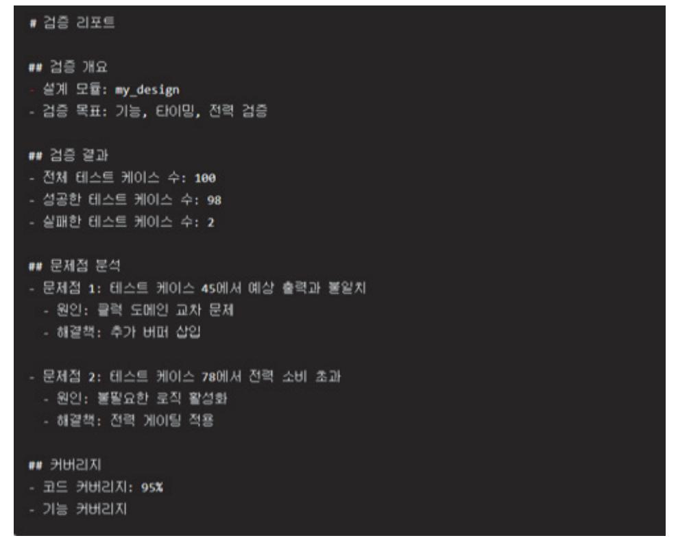

출처: 코드 작성 프로그램. 2024. 8. 12. 스크린샷. [그림 3-35] 검증 리포트

수 검증 환경에 기반한 테스트 벤치를 구현한다.

반도체 설계 검증을 플랫폼 기반에서 수행하기 위해 검증 환경에 기반한 테스트 벤치를 구현하 는 것은 매우 중요하다. 테스트 벤치는 설계된 블록의 기능적, 성능적, 전력적, 신뢰성 요구 사 항을 확인하기 위한 시뮬레이션 환경을 제공한다. 아래는 검증 환경에 기반한 테스트 벤치를 구현하는 단계별 가이드이다.

- 1. 검증 환경 구성 요소를 파악한다.
  - (1) 기본 구성 요소
    - (가) DUT(design under test): 검증할 설계 모듈이다.
    - (나) 클록 및 리셋 생성기: 테스트 벤치 내에서 클록과 리셋 신호를 생성한다.
    - (다) 입력 자극기: DUT에 다양한 입력 신호를 제공한다.
    - (라) 출력 모니터: DUT의 출력을 모니터링하고 검증한다.
    - (마) 검증 로직: 출력이 기대 결과와 일치하는지 확인한다.
    - (바) 테스트 시나리오: 다양한 테스트 케이스를 정의한다.
  - (2) 시뮬레이터 및 검증 도구

- (가) 시뮬레이터: VCS, ModelSim, QuestaSim
- (나) 검증 프레임워크: UVM(Universal Verification Methodology)
- (다) 타이밍 및 전력 분석 도구: PrimeTime, Voltus
- 2. 테스트 벤치 작성 단계를 진행한다.
  - (1) DUT 인스턴스화

먼저, 검증할 DUT를 인스턴스화한다. DUT는 테스트 벤치 내에서 테스트될 설계 모듈 이다.

출처: 코드 작성 프로그램. 2024. 8. 12. 스크린샷. [그림 3-36] DUT 인스턴스화

### (2) 클록 및 리셋 생성기

클록 및 리셋 신호를 생성한다. 클록은 일반적으로 정기적으로 토글되고, 리셋은 초기화 동안 활성화된다.


출처: 코드 작성 프로그램. 2024. 8. 12. 스크린샷. [그림 3-37] 클록 및 리셋 생성기

(3) 입력 자극기

DUT에 다양한 입력 신호를 제공하는 로직을 작성한다.


출처: 코드 작성 프로그램. 2024. 8. 12. 스크린샷. [그림 3-38] 입력 자극기

(4) 출력 모니터 및 검증 로직

DUT의 출력을 모니터링하고, 기대 결과와 일치하는지 검증한다.

| // 출력 모니터링 및 검증 로직                                                                                         |
|------------------------------------------------------------------------------------------------------------|
| always @(posedge clk) begin                                                                                |
| if (!rst) begin                                                                                            |
| \$display("Time: %0t   Input: %h   Output: %h", \$time, input_signal, output_signal);<br>// 기대 결과와 비교하여 검증 |
| if (input_signal == 8'hAA && output_signal != 8'h55) begin                                                 |
| <pre>\$display("Test Case 1 Failed: Expected %h, Got %h", 8'h55, output_signal);</pre>                     |
| end else if (input_signal == 8'h55 && output_signal != 8'hAA) begin                                        |
| <pre>\$display("Test Case 2 Failed: Expected %h, Got %h", 8'hAA, output_signal);</pre>                     |
| end else begin                                                                                             |
| \$display("Test Case Passed");                                                                             |
| end                                                                                                        |
| end                                                                                                        |
| end                                                                                                        |
| endmodule                                                                                                  |

출처: 코드 작성 프로그램. 2024. 8. 12. 스크린샷. [그림 3-39] 출력 모니터 및 검증 로직

- 3. 자동화된 테스트 벤치를 구현한다.
  - (1) UVM 기반 테스트 벤치

더 복잡한 검증 환경에서는 UVM을 사용하여 테스트 벤치를 구현할 수 있다.

출처: 코드 작성 프로그램. 2024. 8. 12. 스크린샷. [그림 3-40] UVM 기반 테스트 벤치

(2) UVM 구성 요소

- (가) 에이전트: 드라이버, 시퀀서, 모니터를 포함하는 컴포넌트
- (나) 드라이버: 시퀀서로부터 트랜잭션을 받아 DUT에 신호를 전달
- (다) 모니터: DUT의 출력을 모니터링하고 검증

4. 검증 환경 설정 및 실행한다.

(1) 시뮬레이션 환경 설정

Makefile 또는 스크립트를 사용하여 시뮬레이션 환경을 설정한다.

출처: 코드 작성 프로그램. 2024. 8. 12. 스크린샷. [그림 3-41] 시뮬레이션 환경 설정

### (2) 시뮬레이션 실행

Makefile 또는 스크립트를 사용하여 시뮬레이션을 실행한다.

출처: 코드 작성 프로그램. 2024. 8. 12. 스크린샷. [그림 3-42] 시뮬레이션 실행

- 5. 검증 결과 분석 및 피드백해 준다.
  - (1) 시뮬레이션 로그 분석
    - (가) 출력 결과 확인: 시뮬레이션 로그와 출력 파일을 확인하여 예상 결과와 일치하는지 검증 한다.
    - (나) 오류 및 경고 분석: 시뮬레이션 도중 발생한 오류 및 경고 메시지를 분석한다.
  - (2) 커버리지 분석
    - (가) 코드 커버리지: 테스트 케이스가 RTL 코드의 모든 경로를 테스트했는지 확인한다.
    - (나) 기능 커버리지: 모든 기능적 요구 사항이 테스트되었는지 확인한다.


출처: 코드 작성 프로그램. 2024. 8. 12. 스크린샷. [그림 3-43] 예시 커버리지 분석 명령어

- (3) 결과 문서화 및 피드백 해 준다.
  - (가) 검증 리포트 작성: 검증 과정과 결과를 문서화하여 기록한다.
  - (나) 문제점 및 해결책 기록: 발견된 문제점과 수정된 내용을 기록한다.

6. 종합적인 접근을 시도한다.

테스트 벤치를 구현하는 것은 반도체 설계 검증의 핵심 요소이다. DUT 인스턴스화, 클록 및 리셋 생성, 입력 자극기, 출력 모니터링 및 검증 로직을 포함한 테스트 벤치를 작성함으 로써 설계가 주어진 요구 사항을 충족하는지 확인할 수 있다. UVM 기반의 고급 검증 환경 을 사용하여 복잡한 검증 시나리오를 자동화하고, 시뮬레이션 결과를 철저히 분석함으로써 고성능, 저전력, 고신뢰성의 반도체 제품을 개발할 수 있다.

숙 테스트 벤치의 검증 결과와 설계 결과를 비교하여 평가한다.

반도체 설계 검증을 플랫폼 기반에서 수행하기 위해 테스트 벤치의 검증 결과와 설계 결과를 비교하여 평가하는 과정은 매우 중요하다. 이를 통해 설계된 블록이 요구 사항을 충족하는지

출처: 코드 작성 프로그램. 2024. 8. 12. 스크린샷. [그림 3-44] 검증 리포트

확인하고, 문제점을 발견하여 수정할 수 있다. 다음은 테스트 벤치의 검증 결과와 설계 결과를 비교하여 평가하는 단계별 가이드이다.

1. 검증 결과를 수집한다.

(1) 시뮬레이션 로그 및 출력 파일

(가) 로그 파일: 시뮬레이션 동안 발생한 모든 이벤트와 메시지를 기록한 파일

(나) 출력 파일: 시뮬레이션 결과에서 생성된 데이터 파일(예) VCD, FSDB)

(2) 커버리지 리포트

(가) 코드 커버리지: 테스트가 코드의 모든 부분을 얼마나 테스트했는지 확인한다.

(나) 기능 커버리지: 기능적 요구 사항을 얼마나 충족했는지 확인한다.

2. 검증 결과를 분석한다.

(1) 시뮬레이션 로그 분석

(가) 오류 및 경고 확인: 시뮬레이션 로그에서 오류와 경고를 검토하여 문제점을 파악한다.

(나) 출력값 검증: DUT의 출력이 기대한 값과 일치하는지 확인한다.

(2) 커버리지 분석

(가) 코드 커버리지 확인: 코드의 각 부분이 실행되었는지 확인한다.

출처: 코드 작성 프로그램. 2024. 8. 12. 스크린샷. [그림 3-45] 예시 커버리지 명령어

(나) 기능 커버리지 확인: 모든 기능적 요구 사항이 테스트되었는지 확인한다.

출처: 코드 작성 프로그램. 2024. 8. 12. 스크린샷. [그림 3-46] 예시 기대 결과 정의

- 3. 설계 결과와 비교한다.
  - (1) 기대 결과 설정

(가) 기대 결과 정의: 각 입력에 대한 기대 출력값을 정의한다.

출처: 코드 작성 프로그램. 2024. 8. 12. 스크린샷. [그림 3-47] 기대 결과 정의

(2) 출력 비교

(가) 출력 비교 로직: 시뮬레이션 결과와 기댓값을 비교하여 일치 여부를 확인한다.

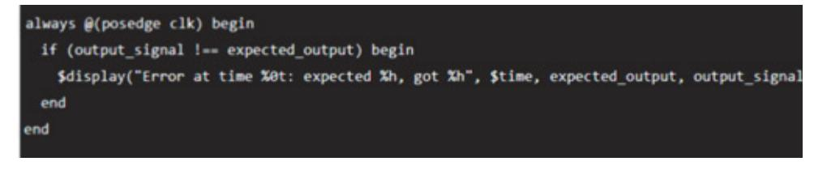

출처: 집필진 제작(2024) [그림 3-48] 출력 비교 로직

- (3) 디버깅
  - (가) 불일치 분석: 불일치가 발생한 경우 원인을 분석하고 수정한다.
  - (나) 디버깅 도구 사용: Verdi, DVE 등의 디버깅 도구를 사용하여 시뮬레이션 결과를 시각적 으로 분석한다.

### 4. 검증 결과를 평가한다.

- (1) 평가 기준 설정
  - (가) 성공 기준: 모든 테스트 케이스가 기대 결과와 일치해야 한다.
  - (나) 실패 기준: 테스트 케이스 중 하나라도 기대 결과와 불일치하면 실패로 간주한다.
- (2) 결과 문서화

(가) 검증 리포트 작성: 검증 과정과 결과를 문서화하여 기록한다.

(나) 문제점 및 해결책 기록: 발견된 문제점과 수정된 내용을 기록한다.

```
출처: 코드 작성 프로그램. 2024. 8. 12. 스크린샷.
```

- 해결책: 추가 버퍼 삽입

- 문제점 2: 테스트 케이스 78에서 전력 소비 초과

- 원인: 불필요한 로직 활성화
- 해결책: 전력 게이팅 적용

### ## 커버리지

[그림 3-49] 검증 리포트

- 코드 커버리지: 95%
- 기능 커버리지: 90%

## 결론

설계는 대부분의 기능 요구 사항요구 사항을 충족하였으며, 발견된 문제는 수정되었

다.

5. 보고서 전달 및 피드백해 준다.

(1) 보고서 전달

(가) 전자 메일: 검증 보고서를 첨부하여 설계자에게 전송한다.

(나) 문서 공유 시스템: 사내 문서 관리 시스템에 업로드하여 공유한다.

(2) 피드백 수집

(가) 설계자 회의: 설계자와 회의를 통해 보고서 내용을 설명하고 피드백을 수집한다.

(나) 피드백 반영: 수집된 피드백을 반영하여 검증 환경과 테스트 케이스를 수정 및 개선한다.

6. 검증 결과 문서화 및 피드백을 반영한다.

(1) 문서화 검증 보고서 작성 예시

(가) 검증 과정 및 결과 문서화: 검증 과정에서 수행된 작업과 결과를 문서화하여 기록한다.

(나) 문제점 및 해결책 기록: 발견된 문제점과 이를 해결하기 위한 방안을 문서화한다.

(2) 피드백 반영

(가) 검증 환경 개선: 피드백을 반영하여 검증 환경을 개선한다.

(나) 추가 검증 수행: 개선된 검증 환경에서 추가 검증을 수행하여 모든 테스트 케이스가 성 공하도록 한다.

7. 종합적인 접근을 시도한다.

테스트 벤치의 검증 결과와 설계 결과를 비교하여 평가하는 과정은 설계 검증의 핵심이다. 시뮬레이션 로그와 출력 파일을 분석하고, 커버리지 리포트를 통해 테스트가 충분히 이루어 졌는지 확인한다. 검증 결과를 기댓값과 비교하고, 불일치가 발생한 경우 원인을 분석하여 수정한다. 마지막으로, 검증 결과를 문서화하여 전체 검증 과정을 체계적으로 관리한다. 이 를 통해 설계가 주어진 요구 사항을 충족하는지 확인하고, 고성능, 저전력, 고신뢰성의 반도 체 제품을 개발할 수 있다.

숚 평가한 검증 보고서를 작성하여 설계자에게 제공한다.

반도체 설계 검증을 플랫폼 기반에서 수행한 후, 검증 결과를 평가한 보고서를 작성하여 설계 자에게 제공하는 것은 매우 중요하다. 이 보고서는 검증 과정과 결과를 체계적으로 문서화하여 설계자가 문제점을 이해하고 수정할 수 있도록 한다. 아래는 검증 보고서를 작성하는 단계별 가이드와 예시이다.

1. 검증 보고서의 주요 구성 요소를 파악한다.

(1) 표지

121

관련 문서 및 참고 자료

- (9) 부록
- (다) 최종 결론 및 다음 단계
- (나) 추가 검증 필요 사항
- (가) 검증 결과 요약
- (8) 결론
- (나) 기능 커버리지
- (가) 코드 커버리지
- (7) 커버리지 분석
- (다) 해결 방안 및 권고 사항
- (나) 문제점 및 원인 분석
- (가) 테스트 케이스별 결과
- (6) 검증 결과
- (나) 각 테스트 케이스의 목적과 입력 조건
- (가) 테스트 케이스 요약
- (5) 검증 시나리오
- (나) 사용된 도구 및 버전
- (가) 하드웨어 및 소프트웨어 환경
- (4) 검증 환경
- (다) 검증 범위 및 방법
- (나) 설계 모듈 개요
- (가) 검증 목표
- (3) 개요
- 섹션별 페이지 번호
- (2) 목차
- (라) 검토자
- (다) 작성일
- (나) 작성자
- (가) 제목

(1) 표지

출처: 코드 작성 프로그램. 2024. 8. 12. 스크린샷. [그림 3-50] 검증 보고서

(2) 목차

| ## 목차               |  |  |  |
|---------------------|--|--|--|
| 1. 개요               |  |  |  |
| 2. 검증 환경            |  |  |  |
| 3. 검증 시나리오          |  |  |  |
| 4. 검증 결과            |  |  |  |
| 5. 커버리지 분석          |  |  |  |
| 6. 결론               |  |  |  |
| <mark>7</mark> . 부록 |  |  |  |

출처: 코드 작성 프로그램. 2024. 8. 12. 스크린샷. [그림 3-51] 목차

(3) 개요

출처: 코드 작성 프로그램. 2024. 8. 12. 스크린샷. [그림 3-52] 개요

출처: 코드 작성 프로그램. 2024. 8. 12. 스크린샷. [그림 3-53] 검증 환경

- (5) 검증 시나리오
  - (가) 테스트 케이스 요약
    - 1) \*\*테스트 케이스 1\*\*: 기본 동작 검증
    - 2) \*\*테스트 케이스 2\*\*: 경계 조건 검증
    - 2) \*\*테스트 케이스 3\*\*: 예외 상황 검증
  - (나) 각 테스트 케이스의 목적과 입력 조건
    - 1) \*\*테스트 케이스 1\*\*: 정상적인 입력 조건에서 My\_Design 모듈의 기본 동작을 검 증
    - 2) \*\*입력 조건\*\*: 정상 동작 주파수, 정상 전압 레벨
    - 3) \*\*기대 출력\*\*: 입력 데이터에 대한 올바른 출력 생성
  - (다) \*\*테스트 케이스 2\*\*: 경계 조건에서 My\_Design 모듈의 동작을 검증
    - 1) \*\*입력 조건\*\*: 최대/최소 입력값, 경계 전압 레벨
    - 2) \*\*기대 출력\*\*: 경계 조건에서의 정상 동작
  - (라) \*\*테스트 케이스 3\*\*: 비정상 입력 조건에서 My\_Design 모듈의 동작을 검증
    - 1) \*\*입력 조건\*\*: 비정상 입력 패턴, 노이즈 신호
    - 2) \*\*기대 출력\*\*: 비정상 조건에서의 오류 처리 능력
- (6) 검증 결과
  - (가) ### 테스트 케이스별 결과
    - 1) #### 테스트 케이스 1: 기본 동작 검증
      - 가) \*\*입력\*\*: data\_in = 8'hAA
      - 나) \*\*기대 출력\*\*: data\_out = 8'h55

- 3) 누락된 커버리지 경로에 대한 추가 테스트 케이스 작성 및 검증
- 2) 전력 게이팅 적용 후 전력 소비 재검증
- 1) 클록 도메인 교차 문제 해결 후 재검증
- (나) 추가 검증 필요 사항
- 에서 문제가 발견되었다.

(다) 최종 결론 및 다음 단계

(가) 검증 결과 요약 My\_Design 모듈은 대부분의 기능 요구 사항을 충족하였으나, 일부 테스트 케이스

- (8) 결론
- 커버리지 분석 결과, 대부분의 코드와 기능이 검증되었으나 일부 경로가 누락되었다.
- 2) \*\*달성된 커버리지\*\*: 88%
- 1) \*\*기능 커버리지 목표\*\*: 90%
- (나) 기능 커버리지
- 3) \*\*FSM 커버리지\*\*: 90%
- 2) \*\*조건 커버리지\*\*: 92%
- 1) \*\*라인 커버리지\*\*: 95%
- (가) 코드 커버리지
- (7) 커버리지 분석
- 마) \*\*해결 방법\*\*: 전력 게이팅 적용
- 라) \*\*원인\*\*: 불필요한 로직 활성화
- 다) \*\*결과\*\*: 실패
- 나) \*\*기대 출력\*\*: data\_out = 8'h00
- 가) \*\*입력\*\*: data\_in = 8'hFF
- 3) #### 테스트 케이스 3: 예외 상황 검증
- 마) \*\*해결 방법\*\*: 추가 버퍼 삽입
- 라) \*\*원인\*\*: 클록 도메인 교차 시 데이터 유실 발생
- 다) \*\*결과\*\*: 실패
- 나) \*\*기대 출력\*\*: data\_out = 8'hAA
- 가) \*\*입력\*\*: data\_in = 8'h55
- 2) #### 테스트 케이스 2: 경계 조건 검증
- 다) \*\*결과\*\*: 성공

- (9) 부록
  - (가) 관련 문서 및 참고 자료
    - 1) \*\*설계 사양서\*\*
    - 2) \*\*검증 계획서\*\*
    - 3) \*\*사용된 스크립트\*\*
    - 4) \*\*시뮬레이션 로그\*\*
- 3. 보고서 전달 및 피드백 해 준다.
  - (1) 보고서 전달
    - (가) 전자 메일: 검증 보고서를 첨부하여 설계자에게 전송한다.
    - (나) 문서 공유 시스템: 사내 문서 관리 시스템에 업로드하여 공유한다.
  - (2) 피드백 수집
    - (가) 설계자 회의: 설계자와 회의를 통해 보고서 내용을 설명하고 피드백을 수집한다.
    - (나) 피드백 반영: 수집된 피드백을 반영하여 검증 환경과 테스트 케이스를 수정하고 개선한 다.
- 4. 종합적인 접근을 시도한다.

검증 보고서는 반도체 설계 검증 과정에서 중요한 역할을 한다. 보고서를 통해 검증 과정과 결과를 체계적으로 문서화하고, 발견된 문제와 해결 방법을 명확히 전달함으로써 설계자가 설계를 개선할 수 있도록 돕다. 정확하고 상세한 보고서를 작성하여 설계의 품질을 보장하 고, 최종 제품이 요구 사항을 충족하는지 확인하는 것이 중요하다.

### 수행 tip

- 플랫폼 기반 검증 전 통합 블록에 대한 검증 내용을 충분 히 숙지 후에 진행한다.
- 플랫폼 기반 검증 내용 중 입출력 인테페이스에 대한 내용 은 블록별 내용에 대한 이해를 기반으로 진행한다.

## 학습 3 교수·학습 방법

### 교수 방법

- 시스템 레벨 설계 관점에서 다양한 기능 블록 구현하는 방법에 따른 기술 특성에 대해 설명 하고 질의응답이 되도록 유도한다.
- 시스템 레벨 설계는 하드웨어로 구현되는 부분과 이와 연계된 소프트웨어도 같이 개발하는 것이 필요함을 설명한다.
- 설계된 기능 블록의 검증의 중요성과 그 효과와 검증 방법에 대해서 설명한다.
- 설계 검증을 위한 검증 시스템을 구성하고 실제적으로 사용하는 방법에 대해서 설명한다.
- 설계된 기능 블록을 검증하는 방안 중에서 기능 블록 간 연계되어 동작하는 시나리오의 중 요성을 설명하고, 시나리오를 결정하고 작성하는 방법에 대해서 설명한다.

### 학습 방법

- 시스템 레벨 관점에서 필요한 기능 블록의 설계 및 필요한 IP를 조사하여 구현하는 방법에 대해 학습하고, 실습을 통해 충분히 숙지한다.
- 시스템 레벨로 구현하는 기능 블록이 하드웨어와 이와 연계된 소프트웨어도 같이 개발이 필 요한 이유에 대해서 학습하여 그 이유를 명확히 이해하도록 한다.
- 설계된 기능 블록의 검증의 중요성과 그 효과에 대해서 정리하고 학습한다.
- 설계된 기능 블록의 검증하는 방법에 대해 학습하기 위해서 특정 기능 블록을 사례로 하여 입력과 출력 데이터를 이용하여 어떤 방법으로 검증할 수 있는지에 대해서 학습하고, 실습을 통해 충분히 숙지한다.
- 검증 시스템을 구성하는 방법에 대해서 학습하고 실제 검증 시스템에 대해서도 조사를 한다.
- 설계된 여러 기능 블록을 검증하는 동작 시나리오의 중요성에 대해서 학습하고, 기능 블록 의 사양들을 정의하고, 그 기능 블록 간 연동하여 검증하는 시나리오를 작성하는 실습을 수 행한다.

# 학습 3 평 가

### 평가 준거

- 평가자는 학습자가 학습 목표를 성공적으로 달성하였는지를 평가해야 한다.
- 평가자는 다음 사항을 평가해야 한다.

|           |                                           | 성취수준 |   |   |
|-----------|-------------------------------------------|------|---|---|
| 학습 내용     | 학습 목표                                     |      | 중 | 하 |
| 플랫폼 기반 검증 | - 통합 블록의 설계 사양을 분석할 수 있다.                 |      |   |   |
|           | - 검증 플랫폼 보드의 회로 설계 요구 사항을 정의할 수 있다.       |      |   |   |
|           | - 플랫폼 기반 검증 시나리오 및 검증 계획을 수립할 수 있다.       |      |   |   |
|           | - 수립한 검증 계획을 바탕으로 검증 환경을 구축할 수 있다.        |      |   |   |
|           | - 검증 환경에 기반한 테스트 벤치를 구현할 수 있다.            |      |   |   |
|           | - 테스트 벤치의 검증 결과와 설계 결과를 비교하여 평가할<br>수 있다. |      |   |   |
|           | - 평가한 검증 보고서를 작성하여 설계자에게 제공할 수 있다.        |      |   |   |

### 평가 방법

• 서술형 시험

| 학습 내용     | 평가 항목                                                        | 성취수준 |   |   |
|-----------|--------------------------------------------------------------|------|---|---|
|           |                                                              | 상    | 중 | 하 |
| 플랫폼 기반 검증 | - 통합 블록의 설계 사양의 기능적 요구 사항과 인터페이스 요구<br>사항의 숙지 여부             |      |   |   |
|           | - 검증 플랫폼 보드의 목적과 역할을 정의할 수 있는 능력                             |      |   |   |
|           | - 플랫폼 기반 검증 시나리오 수립을 위한 검증 목표와 주요 검증<br>시나리오에 포함되는 내용의 숙지 여부 |      |   |   |
|           | - 검증 계획을 바탕으로 검증 환경을 구성하는 주요 요소 파악 여부                        |      |   |   |
|           | - 검증 환경을 기반으로 테스트 벤치 구현을 위한 구성 요소 파악<br>여부                   |      |   |   |
|           | - 테스트 벤치의 검증 결과와 설계 결과의 비교를 위해 검증 결과를<br>수집하고 분석할 수 있는 능력    |      |   |   |
|           | - 반도체 설계의 주요 검증 항목이 포함된 검증 보고서의 주요 구성<br>요소 파악 여부            |      |   |   |

• 평가자 체크리스트

|           |                                                                    | 성취수준 |   |   |
|-----------|--------------------------------------------------------------------|------|---|---|
| 학습 내용     | 평가 항목                                                              |      | 중 | 하 |
| 플랫폼 기반 검증 | - 통합 블록의 설계 사양의 성능 요구 사항과 신뢰성 요구 사항의<br>숙지 여부                      |      |   |   |
|           | - 검증 플랫폼 보드의 회로 설계 요구 사항을 정의할 수 있는 능력                              |      |   |   |
|           | - 플랫폼 기반 검증 시나리오 및 검증 환경을 설정하고 실행할 수<br>있다.                        |      |   |   |
|           | - 검증 계획을 바탕으로 검증 환경 설정 단계를 파악할 수 있는<br>능력                          |      |   |   |
|           | - 검증 환경을 기반으로 테스트 벤치 작성 단계를 진행할 수 있는<br>능력                         |      |   |   |
|           | - 테스트 벤치의 검증 결과와 설계 결과를 비교하기 위해 기대 결과<br>를 설정하고 출력 결과와 비교할 수 있는 능력 |      |   |   |
|           | - 반도체 설계의 주요 검증 항목이 포함되어 있는 검증 보고서를<br>전달하고 피드백을 수집할 수 있는 능력       |      |   |   |

피드백

- 1. 서술형 시험
- 플랫폼 기반 검증 시나리오 수립을 위한 검증 목표와 주요 검증 시나리오에 포함되는 내용의 숙지 여부를 평가한 후, 주요 사항들을 검토하여 미흡하거나, 보충해야 할 사항을 체크하여 보완하도록 피드 백해 준다.
- 테스트 벤치의 검증 결과와 설계 결과의 비교를 위해 검증 결과를 수집하고 분석할 수 있는 능력을 평가 후 미흡한 부분은 보완 지도해 준다.
- 수립한 검증 계획을 바탕으로 검증 환경을 구축할 수 있는 능력을 평가하여 성취수준이 우수한 학습자에 게는 전체 칩의 중요 부분에 대한 세부 기능과 원리에 대해 설명하고, 성취수준이 저조한 학습자에게는 기본 블록에 대한 IP의 종류 및 기능을 이해하도록 설명을 해 준다.
- 2. 평가자 체크리스트
- 테스트 벤치의 검증 결과와 설계 결과의 비교를 위해 기대 결과를 설정하고 출력 결과와 비교할 수 있는 능력을 평가한 후, 개선 및 보완 사항을 정리하여 재학습할 수 있도록 피드백해 준다.
- 테스트 벤치의 검증 결과와 설계 결과를 비교하여 평가할 수 있는 능력을 평가한 후 성취 수준이 낮은 학습자에게는 추가 설명을 해 준다.

- ∙ 강성호·김대정·이승준·이찬호(2004). 『SoC 및 IP 설계 기법』. 홍릉과학출판사.
- ∙ 공진흥·김남영·김동욱·이재철(1997). 『VLSI설계, 이론과 실습』. 홍릉과학출판사.
- ∙ 조영록(2009). 『CMOS 공정을 이용한 Analog Layout』. 홍릉과학출판사
- ∙ 조준동(2010). 『알기 쉬운 최신 VLSI설계』. 한빛미디어.
- ∙ Saburo Muroga (1982). VLSI system design. when and how to design very-large-scale integrated circuits. U.S.A: John Wiley & Sons, Inc.
- ∙ Neil H. E. Weste, David Harris (2005). CMOS VLSI Design. A Circuits and Systems Perspective. U.S.A: Addison Wesley.

| NCS학습모듈 개발이력      |     |                                     |
|-------------------|-----|-------------------------------------|
| 2024년 12월 31일     |     |                                     |
| 반도체 개발((19030601) |     |                                     |
|                   |     |                                     |
| 최준혁(수원대학교)*       |     | 김종범(삼성전기)                           |
| 계찬호(수원대학교)        |     | 김한수(두원공과대학교)                        |
| 김경호(폴리텍대학교)       |     | 남승호(경기대학교)                          |
| 김관하(폴리텍대학교)       |     | 손승대(제이에스이엔씨(주))                     |
| 김기순((주)영우디에스피)    | 검토진 | 안광호(퓨쳐일렉트로닉스)                       |
| 김도균(폴리텍대학교)       |     | 이철오((주)한국전력안전공단)                    |
| 전동민(폴리텍대학교)       |     |                                     |
|                   |     | 수원과학대학교 산학협력단(개발책임자: 윤창용) 한국직업능력연구원 |

\*표시는 대표집필자임 (참고) 검토진으로 참여한 집필진은 본인의 원고가 아닌 타인의 학습모듈을 검토함

| 반도체 설계 검증(LM1903060113_23v2)                                                                           |                   |  |
|--------------------------------------------------------------------------------------------------------|-------------------|--|
| 저작권자                                                                                                   | 교육부               |  |
| 연구기관                                                                                                   | 한국직업능력연구원         |  |
| 발행일                                                                                                    | 2024. 12. 31.     |  |
| ISBN                                                                                                   | 979-11-7175-747-3 |  |
| ※ 이 학습모듈은 자격기본법 시행령(제8조 국가직무능력표준의 활용)에 의거하여 개발하였으며,<br>NCS통합포털사이트(http://www.ncs.go.kr)에서 다운로드 할 수 있다. |                   |  |

