LM1903060114\_23v2


### [NCS학습모듈 활용 시 유의 사항]

- 1. NCS학습모듈은 교육훈련기관에서 출처를 명시하고 교육적 목적으로 활용할 수 있습니다. 다 만, NCS학습모듈에는 국가(교육부)가 저작재산권 일체를 보유하지 않은 저작물(출처가 표기된 도표‧사진‧삽화‧도면 등)이 포함되어 있으므로, 이러한 저작물의 변형‧각색‧복제‧공연‧ 배포 및 공중 송신 등과 이러한 저작물을 활용한 2차적 저작물을 작성하려면 반드시 원작자 의 동의를 받아야 합니다.
- 2. NCS학습모듈은 개발 당시의 산업 및 교육 현장을 반영하여 집필하였으므로, 현재 적용되는 법령‧지침‧표준 및 교과 내용 등과 차이가 있을 수 있습니다. NCS학습모듈 활용 시 법령 ‧지침‧표준 및 교과 내용의 개정 사항과 통계의 최신성 등을 확인하시기를 바랍니다.
- 3. NCS학습모듈은 산업 현장에서 요구되는 능력을 교육훈련기관에서 학습할 수 있게 구성한 자 료입니다. 다만, NCS학습모듈 지면의 한계상 대표적 예시(예: 활용도 또는 범용성이 높은 제 품, 서비스) 중심으로 집필하였음을 이해하시기를 바랍니다.

## NCS학습모듈의 이해

※ 본 NCS학습모듈은 「NCS 국가직무능력표준」사이트(http://www.ncs.go.kr) 에서 확인 및 다운로드할 수 있습니다.

## Ⅰ NCS학습모듈이란?

- 국가직무능력표준(NCS: National Competency Standards)이란 산업현장에서 직무를 수행하기 위해 요구되는 지식·기술·소양 등의 내용을 국가가 산업부문별·수준별로 체계 화한 것으로 산업현장의 직무를 성공적으로 수행하기 위해 필요한 능력(지식, 기술, 태도) 을 국가적 차원에서 표준화한 것을 의미합니다.
- 국가직무능력표준(이하 NCS)이 현장의 '직무 요구서'라고 한다면, NCS학습모듈은 NCS
   의 능력단위를 교육훈련에서 학습할 수 있도록 구성한 '교수·학습 자료'입니다. NCS학습
   모듈은 구체적 직무를 학습할 수 있도록 이론 및 실습과 관련된 내용을 상세하게 제시하
   고 있습니다.


### ○ NCS학습모듈은 다음과 같은 특징을 가지고 있습니다.

- 첫째, NCS학습모듈은 산업계에서 요구하는 직무능력을 교육훈련 현장에 활용할 수 있도 록 성취목표와 학습의 방향을 명확히 제시하는 가이드라인의 역할을 합니다.
- 둘째, NCS학습모듈은 특성화고, 마이스터고, 전문대학, 4년제 대학교의 교육기관 및 훈 련기관, 직장교육기관 등에서 표준교재로 활용할 수 있으며 교육과정 개편 시에도 유용하게 참고할 수 있습니다.


○ NCS와 NCS학습모듈 간의 연결 체계를 살펴보면 아래 그림과 같습니다.


O NCS학습모듈의 위치는 NCS 분류 체계에서 해당 학습모듈이 어디에 위치하는지를 한 눈에 볼 수 있도록 그림으로 제시한 것입니다.

| [NCS-학          | 습모듈          | 의 위치]    |          |  |
|-----------------|--------------|----------|----------|--|
|                 |              |          |          |  |
| 대분류             | 문화·예술·디자인·방송 |          |          |  |
| 중분류             | 문화콘텐츠        |          |          |  |
| 소분류             |              | 문화콘텐츠제작  |          |  |
|                 |              |          |          |  |
| 세분류             |              |          |          |  |
| 방송콘텐츠제작         |              | 능력단위     | 학습모듈명    |  |
| 영화콘텐츠제작         |              | 프로그램 기획  | 프로그램 기획  |  |
| 음악콘텐츠제작         |              | 아이템 선정   | 아이템 선정   |  |
| 광고콘텐츠제작         |              | 자료 조사    | 자료 조사    |  |
| 게임콘텐츠제작         |              | 프로그램 구성  | 프로그램 구성  |  |
| 애니메이션<br>콘텐츠제작  |              | 캐스팅      | 캐스팅      |  |
| 만화콘텐츠제작         |              | 제작계획     | 제작계획     |  |
| 캐릭터제작           |              | 방송 미술 준비 | 방송 미술 준비 |  |
| 스마트문화앱<br>콘텐츠제작 |              | 방송 리허설   | 방송 리허설   |  |
| 영사              |              | 야외촬영     | 야외촬영     |  |
|                 |              | 스튜디오 제작  | 스튜디오 제작  |  |
|                 |              |          |          |  |

학습모듈은

NCS 능력단위 1개당 1개의 학습모듈 개발 을 원칙으로 합니다. 그러나 필요에 따라 고용단위 및 교과단위를 고려하여 능력단위 몇 개를 묶어 1개 학습모듈로 개발할 수 있으며, NCS 능력단위 1개를 여러 개의 학습모듈로 나누어 개발할 수도 있습니다.

### 2. NCS학습모듈의 개요

### ○ NCS학습모듈의 개요는 학습모듈이 포함하고 있는 내용을 개략적으로 설명한 것으로

| 학습모듈의 목표       | 선수학습, 학습모듈의 내용 체계, 핵심 용어 로 구성되어 있습니다.                                        |  |  |
|----------------|------------------------------------------------------------------------------|--|--|
| 학습모듈의 목표       | 해당 NCS 능력단위의 정의를 토대로 학습 목표를 작성한 것입니다.                                        |  |  |
| 선수학습           | 해당 학습모듈에 대한 효과적인 교수·학습을 위하여 사전에 이수해야 하는 학습모<br>듈, 학습 내용, 관련 교과목 등을 기술한 것입니다. |  |  |
| 학습모듈의<br>내용 체계 | 해당 NCS 능력단위요소가 학습모듈에서 구조화된 체계를 제시한 것입니다.                                     |  |  |
| 핵심 용어          | 해당 학습모듈의 학습 내용, 수행 내용, 설비·기자재 등 가운데 핵심적인 용어를 제<br>시한 것입니다.                   |  |  |

### 제작계획 학습모듈의 개요

#### 학습모듈의 목표

본격적인 촬영을 준비하는 단계로서, 촬영 대본을 획정하고 제작 스태프를 조직하며 촬영 장비와 촬영 소품을 준비할 수 있다.

#### 선수학습

제작 준비(LM0803020105\_13v1), 섭외 및 제작스태프 구성(LM0803020104\_13v1), 촬영 제작(LM0803020106\_13v1), 촬영 장비 준비(LM0803040204\_13v1.4), 미술 디자인 협의하기(LM0803040203\_13v1.4)

### 학습모듈의 내용체계

| 하스                | 하는 데이                                              | NCS 능력단위 요소       |                |  |
|-------------------|----------------------------------------------------|-------------------|----------------|--|
| 학습                | 학습 내용                                              | 코드번호              | 요소 명칭          |  |
| 1. 촬영 대본<br>확정하기  | 1-1. 촬영 구성안 검<br>토와 수정                             | 0803020114_16/3.1 | 촬영 대본<br>확정하기  |  |
| 2. 제작 스태프<br>조직하기 | 2-1. 기술 스태프 조직<br>2-2. 미술 스태프 조직<br>2-3. 전문 스태프 조직 | 0803020114_16v3.2 | 제작 스태프<br>조직하기 |  |
| 3. 촬영 장비<br>계획하기  | 3-1. 촬영 장비 점검<br>과 준비                              | 0803020114_16/3.3 | 촬영 장비<br>계획하기  |  |
| 4. 촬영 소품<br>계획하기  | 4-1. 촬영 소품 목록<br>작성<br>4-2. 촬영 소품 제작<br>의뢰         | 0803020114_16\3.4 | 촬영 소품<br>계획하기  |  |

### 핵심 용어

촬영 구성안, 제작 스태프, 촬영 장비, 촬영 소품

### 학습모듈의 목표는

학습자가 해당 학습모듈을 통해 성취해야 할 목표를 제시한 것으로, 교수자는 학습자 가 학습모듈의 전체적인 내용흐름을 파악하 도록 지도할 수 있습니다.

**6** • •

61

### 선수학습은

교수자 또는 학습자가 해당 학습모듈을 교 수·학습하기 이전에 이수해야 하는 교과목 또는 학습모듈(NCS 능력단위) 등을 표기한 것입니다. 따라서 교수자는 학습자가 개별 학습, 자기 주도 학습, 방과 후 활동 등 다 양한 방법을 통해 이수할 수 있도록 지도하 는 것을 권장합니다.

|            | 핵심 용어는              |
|------------|---------------------|
|            | 률을 대표하는 주요 용어입니     |
|            | · 해당 학습모듈을 통해 학습    |
|            | 게될 주요 내용을 알 수 있습    |
|            | 5 국가직무능력표준」 사이트     |
| (www.ncs.g | jo.kr)의 색인 (찾아보기) 중 |
| 하나로 이용할    | 할 수 있습니다            |

### 3. NCS학습모듈의 내용 체계

○ NCS학습모듈의 내용은 크게 학습, 학습 내용, 교수·학습 방법, 평가 로 구성되어 있습니다.

| 학습       | 해당 NCS 능력단위요소 명칭을 사용하여 제시한 것입니다.<br>학습은 크게 학습 내용, 교수·학습 방법, 평가로 구성되며 해당 NCS 능력단위의<br>능력단위 요소별 지식, 기술, 태도 등을 토대로 내용을 제시한 것입니다.                                                    |
|----------|----------------------------------------------------------------------------------------------------------------------------------------------------------------------------------|
| 학습 내용    | 학습 내용은 학습 목표, 필요 지식, 수행 내용으로 구성되며, 수행 내용은 재료·자<br>료, 기기(장비·공구), 안전·유의 사항, 수행 순서, 수행 tip으로 구성한 것입니다.<br>학습모듈의 학습 내용은 실제 산업현장에서 이루어지는 업무활동을 표준화된 프로세<br>스에 기반하여 다양한 방식으로 반영한 것입니다. |
| 교수·학습 방법 | 학습 목표를 성취하기 위한 교수자와 학습자 간, 학습자와 학습자 간 상호 작용이<br>활발하게 일어날 수 있도록 교수자의 활동 및 교수 전략, 학습자의 활동을 제시한<br>것입니다.                                                                            |
| 평가       | 평가는 해당 학습모듈의 학습 정도를 확인할 수 있는 평가 준거 및 평가 방법, 평<br>가 결과의 피드백 방법을 제시한 것입니다.                                                                                                         |


## [NCS-학습모듈의 위치]

| 대분류 | 전기·전자 |          |        |
|-----|-------|----------|--------|
| 중분류 |       | 전자 기기 개발 |        |
| 소분류 |       |          | 반도체 개발 |

| 세분류    |                  |                  |
|--------|------------------|------------------|
| 반도체 개발 | 능력단위             | 학습모듈명            |
| 반도체 제조 | 반도체 제품 기획        | 반도체 제품 기획        |
| 반도체 장비 | 반도체 아키텍처 설계      | 반도체 아키텍처 설계      |
| 반도체 재료 | 디지털 회로 설계        | 디지털 회로 설계        |
|        | 패키지 조립 공정 개발     | 패키지 조립 공정 개발     |
|        | 반도체 제품 기능·성능 검증  | 반도체 제품 기능·성능 검증  |
|        | 자동 배치 배선 레이아웃 설계 | 자동 배치 배선 레이아웃 설계 |
|        | 반도체 설계 검증        | 반도체 설계 검증        |
|        | 반도체 펌웨어 개발       | 반도체 펌웨어 개발       |
|        | 메모리 반도체 제조 공정 개발 | 메모리 반도체 제조 공정 개발 |
|        | 시스템 반도체 제조 공정 개발 | 시스템 반도체 제조 공정 개발 |
|        | 반도체 제조 단위 공정 개발  | 반도체 제조 단위 공정 개발  |
|        | 아날로그 회로 아키텍처 설계  | 아날로그 회로 아키텍처 설계  |
|        | 아날로그 회로 소자 레벨 설계 | 아날로그 회로 소자 레벨 설계 |
|        | 아날로그 회로 시스템 설계   | 아날로그 회로 시스템 설계   |

| 와이어 본딩 패키지 개발     | 와이어 본딩 패키지 개발     |  |  |
|-------------------|-------------------|--|--|
| 플립 칩 패키지 개발       | 플립 칩 패키지 개발       |  |  |
| 웨이퍼 레벨 패키지 개발     | 웨이퍼 레벨 패키지 개발     |  |  |
| 어드밴스드 팬 아웃 패키지 개발 | 어드밴스드 팬 아웃 패키지 개발 |  |  |
| 이종 접합 패키지 개발      | 이종 접합 패키지 개발      |  |  |
| 어드밴스드 언더필 패키지 개발  | 어드밴스드 언더필 패키지 개발  |  |  |
| 반도체 환경 시험         | 반도체 환경 시험         |  |  |
| 반도체 수명 시험         | 반도체 수명 시험         |  |  |
| 반도체 내성 시험         | 반도체 내성 시험         |  |  |
| 커스텀 레이아웃 적용 공정 분석 | 커스텀 레이아웃 적용 공정 분석 |  |  |
| 커스텀 레이아웃 설계       | 커스텀 레이아웃 설계       |  |  |
| 커스텀 레이아웃 검증       | 커스텀 레이아웃 검증       |  |  |

## 차 례

| 학습모듈의 개요                  | 1   |
|---------------------------|-----|
| 학습 1. 내장 CPU 및 주변 장치 분석하기 |     |
| 1-1. 내장 CPU 및 주변 장치 분석    | 3   |
| • 교수 ․ 학습 방법              | 23  |
| • 평가                      | 24  |
| 학습 2. 펌웨어 요구 사항 분석하기      |     |
| 2-1. 펌웨어 요구 사항 분석         | 26  |
| • 교수 ․ 학습 방법              | 45  |
| • 평가                      | 46  |
| 학습 3. 펌웨어 설계하기            |     |
| 3-1. 펌웨어 설계               | 48  |
| • 교수 ․ 학습 방법              | 74  |
| • 평가                      | 75  |
| 학습 4. 펌웨어 구현하기            |     |
| 4-1. 펌웨어 구현               | 77  |
| • 교수 ․ 학습 방법              | 104 |
| • 평가                      | 105 |
| 학습 5. 펌웨어 드라이버 개발하기       |     |
| 5-1. 펌웨어 드라이버 개발          | 107 |
| • 교수 ․ 학습 방법              | 125 |
| • 평가                      | 126 |

### 학습 6. 펌웨어 관리하기

| 6-1. 펌웨어 관리  | 128 |
|--------------|-----|
| • 교수 ․ 학습 방법 | 145 |
| • 평가         | 146 |
|              |     |

|  | 참고 자료 |  |  |  |  |  |  | 148 |  |
|--|-------|--|--|--|--|--|--|-----|--|
|--|-------|--|--|--|--|--|--|-----|--|

## 반도체 펌웨어 개발 학습모듈의 개요

### 학습모듈의 목표

요구 사항 분석을 통하여 반도체 칩에 내장된 중앙 처리 장치(CPU: central processing unit) 및 주변 하드웨 어 장치를 동작시키는 소프트웨어를 설계하고 구현할 수 있다.

### 선수학습

전기 전자 공학 기초, 컴퓨터 공학 기초, 프로그램밍 언어, 임베디드 시스템, 반도체 공정 및 소자

### 학습모듈의 내용체계

| 하스                        | 하스 내요                  | NCS 능력단위 요소       |                        |  |
|---------------------------|------------------------|-------------------|------------------------|--|
| 학습                        | 학습 내용                  | 코드번호              | 요소 명칭                  |  |
| 1. 내장 CPU 및 주변 장치<br>분석하기 | 1-1. 내장 CPU 및 주변 장치 분석 | 1903060114_23v2.1 | 내장 CPU 및 주변 장치<br>분석하기 |  |
| 2. 펌웨어 요구 사항 분석<br>하기     | 2-1. 펌웨어 요구 사항 분석      | 1903060114_23v2.2 | 펌웨어 요구 사항 분석하기         |  |
| 3. 펌웨어 설계하기               | 3-1. 펌웨어 설계            | 1903060114_23v2.3 | 펌웨어 설계하기               |  |
| 4. 펌웨어 구현하기               | 4-1. 펌웨어 구현            | 1903060114_23v2.4 | 펌웨어 구현하기               |  |
| 5. 펌웨어 드라이버 개발<br>하기      | 5-1. 펌웨어 드라이버 개발       | 1903060114_23v2.5 | 펌웨어 드라이버 개발하기          |  |
| 6. 펌웨어 관리하기               | 6-1. 펌웨어 관리            | 1903060114_23v2.6 | 펌웨어 관리하기               |  |

### 핵심 용어

펌웨어, 마이크로컨트롤러, 마이크로프로세서, 부트로더, 실시간 운영 체제, ADC(analolg to digital converter), 플래시 메모리, EEPROM, 통합 개발 환경(IDE: integrated development environment)

| 학습 1 | 내장 CPU 및 주변 장치 분석하기 |
|------|---------------------|
| 학습 2 | 펌웨어 요구 사항 분석하기      |
| 학습 3 | 펌웨어 설계하기            |
| 학습 4 | 펌웨어 구현하기            |
| 학습 5 | 펌웨어 드라이버 개발하기       |
| 학습 6 | 펌웨어 관리하기            |

# 1-1. 내장 CPU 및 주변 장치 분석

|       | • CPU와 주변 장치의 설계 정보를 수집할 수 있다.                           |
|-------|----------------------------------------------------------|
|       | • CPU의 어셈블리어 명령어, 마이크로 오퍼레이션 정보, 메모리 관리 모듈, 가상 메모리 지정    |
|       | 방식을 분석할 수 있다.                                            |
| 학습 목표 | • CPU와 주변 장치에 대한 메모리 맵, 할당된 레지스터, 작동 및 제어 방법에 대한 정보를 분   |
|       | 석할 수 있다.                                                 |
|       | • CPU와 주변 장치의 Start-up 어셈블리어 코드를 작성하기 위한 초기 설정 정보를 분석할 수 |
|       | 있다.                                                      |
|       |                                                          |

## 필요 지식 /

숔 CPU 구조와 주변 장치

CPU 구조와 주변 장치는 컴퓨터 시스템의 핵심 구성 요소로서, 각각의 역할과 기능을 이해하 는 것은 펌웨어 및 하드웨어 설계에 매우 중요하다. 아래에 CPU 구조와 주변 장치에 대한 상 세한 설명을 제공한다.

1. CPU 구조

CPU(central processing unit)는 컴퓨터의 두뇌 역할을 하며, 명령어를 해석하고 실행하 는 장치이다. 주요 구성 요소는 다음과 같다.

- (1) 주요 구성 요소
  - (가) 연산 논리 장치(ALU, arithmetic logic unit)

산술 연산(덧셈, 뺄셈, 곱셈, 나눗셈)과 논리 연산(AND, OR, NOT, XOR 등)을 수 행한다.

(나) 제어 장치(control unit)

1) 명령어를 해석하고 실행 순서를 제어한다.

2) 프로그램 카운터(PC), 명령어 레지스터(IR) 등으로 구성된다.

- (다) 레지스터(register)
  - 1) CPU 내부의 고속 저장 장치로, 데이터와 명령어를 임시 저장한다.
  - 2) 범용 레지스터와 특수 레지스터로 구분된다.
- (라) 캐시 메모리(cache memory)
  - 1) 메인 메모리와 CPU 사이의 속도 차이를 줄이기 위해 사용되는 고속 메모리이다.
  - 2) L1, L2, L3 캐시로 나뉘며, L1이 가장 빠르고 L3이 가장 크다.
- (마) 버스(bus)
  - 1) CPU 내부 및 CPU와 메모리, 주변 장치 간의 데이터 전송을 위한 경로이다.
  - 2) 주소 버스, 데이터 버스, 제어 버스로 구분된다.

### (2) CPU의 동작 과정

(가) 명령어 인출(fetch)

프로그램 카운터(PC)가 가리키는 주소에서 명령어를 가져온다.

(나) 명령어 해석(decode)

명령어 레지스터(IR)에 저장된 명령어를 해석한다.

(다) 명령어 실행(execute)

해석된 명령어에 따라 연산을 수행하거나 데이터를 전송한다.

- (라) 결과 저장(store) 실행 결과를 레지스터나 메모리에 저장한다.
- (마) 반복(repeat)

다음 명령어를 인출하여 위 과정을 반복한다.

2. 주변 장치

주변 장치는 CPU와 상호 작용하여 데이터를 입출력하는 장치들이다. 주로 I/O 장치라고도 불리며, 주요 유형과 기능은 다음과 같다.

- (1) 입력 장치(input devices)
  - (가) 키보드(keyboard)

사용자가 입력한 문자를 컴퓨터로 전달한다.

(나) 마우스(mouse)

포인터 위치를 조정하고 클릭 이벤트를 전달한다.

- (다) 터치스크린(touch screen) 손가락이나 스타일러스를 통해 직접 입력을 받다.
- (2) 출력 장치(output devices)

(가) 모니터(monitor)

컴퓨터의 출력 신호를 시각적으로 표시한다.

(나) 프린터(printer)

디지털 문서를 물리적으로 인쇄한다.

(다) 스피커(speaker)

컴퓨터의 오디오 출력을 소리로 변환한다.

- (3) 저장 장치(storage devices)
  - (가) 하드 디스크 드라이브(HDD: hard disk drive) 대용량 데이터를 영구적으로 저장한다.
  - (나) 솔리드 스테이트 드라이브(SSD: solid state drive) 플래시 메모리를 사용한 고속 저장 장치이다.
  - (다) USB 플래시 드라이브

휴대 가능한 플래시 메모리 저장 장치이다.

- (4) 통신 장치(communication devices)
  - (가) 네트워크 인터페이스 카드(NIC: network interface card) 컴퓨터를 네트워크에 연결하여 데이터 통신을 가능하게 한다.
  - (나) 모뎀(modem) 아날로그 신호와 디지털 신호를 변환하여 인터넷에 연결한다.
  - (다) Wi-Fi 어댑터
    - 무선 네트워크에 접속할 수 있도록 한다.

### 3. CPU와 주변 장치 간의 통신

CPU와 주변 장치는 다양한 방식으로 통신하며, 주요 방식은 다음과 같다.

- (1) 메모리 맵 I/O(memory-mapped I/O) 주변 장치를 메모리 주소 공간의 일부로 할당하여, 메모리 읽기/쓰기를 통해 주변 장치 와 통신한다.
- (2) 포트 맵 I/O(port-mapped I/O) CPU가 I/O 포트를 통해 주변 장치와 통신한다. I/O 포트는 CPU의 주소 공간과는 별 도로 관리된다.
- (3) 인터럽트(interrupt) 주변 장치가 CPU에 신호를 보내 작업을 요청한다. CPU는 현재 작업을 중단하고 인터 럽트를 처리한 후 원래 작업으로 복귀한다.
- 4. 펌웨어 개발 시 고려 사항

(1) 하드웨어 초기화

(가) CPU와 주변 장치의 초기 상태를 설정한다.

- (나) 클럭 설정, 메모리 초기화, 레지스터 설정 등을 포함한다.
- (2) 드라이버 개발
  - (가) 각 주변 장치에 대한 드라이버를 개발하여 CPU가 장치를 제어하고 통신할 수 있게 한 다.
  - (나) 드라이버는 장치의 하드웨어 세부 사항을 추상화하여 상위 레벨 소프트웨어가 쉽게 사용 할 수 있도록 한다.
- (3) 인터럽트 처리
  - (가) 각 주변 장치의 인터럽트를 처리할 인터럽트 서비스 루틴(ISR)을 작성한다.
  - (나) ISR는 빠르고 효율적으로 인터럽트를 처리하고, 가능한 한 빨리 원래 작업으로 복귀해야 한다.

CPU와 주변 장치의 구조와 동작 방식을 이해하는 것은 펌웨어 개발에서 매우 중요하다. CPU 는 명령어를 해석하고 실행하는 중심 장치로, ALU, 제어 장치, 레지스터, 캐시 메모리, 버스 등의 구성 요소로 이루어져 있다. 주변 장치는 입력, 출력, 저장, 통신 등의 기능을 수행하며, CPU와 다양한 방식으로 통신한다. 펌웨어 개발 시에는 하드웨어 초기화, 드라이버 개발, 인터 럽트 처리 등을 고려하여 CPU와 주변 장치 간의 원활한 통신과 제어를 구현해야 한다.

숕 디버그 인터페이스 구성 및 동작

디버그 인터페이스는 임베디드 시스템 개발 과정에서 하드웨어와 소프트웨어를 분석하고 오류 를 찾는 데 중요한 역할을 한다. 디버그 인터페이스는 디버거와 타깃 디바이스(디버깅 대상 장 치) 간의 통신을 제공하며, 개발자는 이를 통해 시스템의 동작을 모니터링하고 제어할 수 있다. 다음은 디버그 인터페이스의 구성 요소와 동작에 대한 설명이다.

- 1. 디버그 인터페이스 구성 요소
  - (1) 디버거(debugger)
    - (가) 하드웨어 디버거: JTAG 디버거, SWD 디버거, ICE(in-circuit emulator) 등이 있다. 예) J-Link, ST-Link, ICE
    - (나) 소프트웨어 디버거: 개발 환경에서 실행되는 소프트웨어 도구로, 하드웨어 디버거와 연결 하여 디버깅 작업을 수행한다.
      - 예) GDB, OpenOCD, Keil µVision, IAR embedded workbench
  - (2) 타깃 디바이스(target device)
    - (가) 마이크로컨트롤러(MCU) 또는 마이크로프로세서(MPU) 디버깅할 펌웨어가 실행되는 장치 이다.

- (나) 디버그 인터페이스 핀: 디버거와의 물리적 연결을 위한 핀으로, JTAG, SWD, UART 등의 프로토콜을 사용한다.
- (3) 디버그 프로토콜(debug protocol)
  - (가) JTAG(joint test action group) 표준 디버그 프로토콜로, 여러 신호선을 사용하여 디바 이스를 디버깅한다.
  - (나) SWD(serial wire debug) ARM Cortex-M 시리즈에서 주로 사용하는 2-핀 디버그 프로토콜이다.
  - (다) UART(universal asynchronous receiver/transmitter) 간단한 디버그 메시지 출력에 사용된다.
- 2. 디버그 인터페이스 동작
  - (1) 연결 및 초기화
    - (가) 하드웨어 연결: 디버거와 타깃 디바이스를 디버그 인터페이스 핀을 통해 연결한다. JTAG의 경우 TCK, TMS, TDI, TDO, TRST 핀을 사용하고, SWD의 경우 SWDIO, SWCLK 핀을 사용한다.
    - (나) 디버거 초기화: 소프트웨어 디버거를 실행하여 하드웨어 디버거와 통신을 설정한다. 디버거는 타깃 디바이스의 초기화 상태를 확인하고, 필요한 설정을 수행한다.
  - (2) 펌웨어 업로드 및 실행 제어
    - (가) 펌웨어 업로드: 디버거를 통해 타깃 디바이스의 플래시 메모리에 펌웨어를 업로드한다.
    - (나) 코드 실행 제어: 디버거는 타깃 디바이스의 실행을 제어할 수 있다. 실행, 일시 중지, 중 단점 설정, 스텝 실행 등의 기능을 제공한다.
  - (3) 중단점 설정 및 실행 흐름 제어
    - (가) 중단점 설정: 특정 메모리 주소에 중단점을 설정하여 해당 지점에서 코드 실행을 일시 중지한다.
    - (나) 스텝 실행: 한 줄씩 코드 실행을 진행하며, 각 단계에서 레지스터 값, 메모리 상태 등을 확인할 수 있다.
  - (4) 메모리 및 레지스터 접근
    - (가) 메모리 읽기/쓰기: 디버거를 통해 타깃 디바이스의 메모리 내용을 읽거나 쓸 수 있다.
    - (나) 레지스터 접근: 디버거는 타깃 디바이스의 CPU 레지스터 값을 읽거나 수정할 수 있다.
- 3. 디버그 인터페이스 예시
  - (1) JTAG 인터페이스 구성 및 동작 예시
    - (가) JTAG 연결 핀 설명

- 1) TCK(test clock) 디버깅 클럭 신호
- 2) TMS(test mode select) 디버깅 모드 선택 신호
- 3) TDI(test data in) 디버깅 데이터 입력 신호
- 4) TDO(test data out) 디버깅 데이터 출력 신호
- 5) TRST(test reset) 디버깅 리셋 신호
- (나) JTAG 디버깅 동작
  - 1) 초기화: 디버거와 타깃 디바이스를 연결하고 전원을 켠다.
  - 2) 디버거 소프트웨어 실행: GDB, OpenOCD 등 디버거 소프트웨어를 실행한다.
  - 3) 타깃 디바이스 초기화: 디버거가 타깃 디바이스의 초기 상태를 확인하고 설정한다.
  - 4) 펌웨어 업로드: 펌웨어 파일을 타깃 디바이스의 플래시 메모리에 업로드한다.
  - 5) 중단점 설정: 코드의 특정 지점에 중단점을 설정한다.
  - 6) 디버깅 시작: 코드 실행, 일시 중지, 스텝 실행, 레지스터 및 메모리 확인 등을 수행 한다.
- (2) SWD 인터페이스 구성 및 동작 예시
  - (가) SWD 연결 핀 설명
    - 1) SWDIO(serial wire data I/O) 데이터 입출력 신호
    - 2) SWCLK(serial wire clock) 디버깅 클럭 신호
  - (나) SWD 디버깅 동작
    - 1) 초기화: 디버거와 타깃 디바이스를 연결하고 전원을 켠다.
    - 2) 디버거 소프트웨어 실행: GDB, OpenOCD 등 디버거 소프트웨어를 실행한다.
    - 3) 타깃 디바이스 초기화: 디버거가 타깃 디바이스의 초기 상태를 확인하고 설정한다.
    - 4) 펌웨어 업로드: 펌웨어 파일을 타깃 디바이스의 플래시 메모리에 업로드한다.
    - 5) 중단점 설정: 코드의 특정 지점에 중단점을 설정한다.
    - 6) 디버깅 시작: 코드 실행, 일시 중지, 스텝 실행, 레지스터 및 메모리 확인 등을 수행 한다.
- 4. 디버그 인터페이스 사용 시 유의 사항
  - (1) 연결 확인
    - (가) 디버거와 타깃 디바이스 간의 물리적 연결이 올바른지 확인한다.
    - (나) 전원 공급이 안정적인지 확인한다.
  - (2) 타깃 디바이스 설정
    - (가) 타깃 디바이스의 디버그 인터페이스가 활성화되어 있는지 확인한다.
    - (나) 디버그 인터페이스 핀의 상태(푸시 풀, 풀업/풀다운 설정 등)를 확인한다.
  - (3) 디버거 소프트웨어 설정

(가) 디버거 소프트웨어에서 올바른 타깃 디바이스를 선택한다.

(나) 필요한 경우 디버거 펌웨어를 최신 버전으로 업데이트한다.

디버그 인터페이스는 펌웨어 개발 과정에서 하드웨어와 소프트웨어의 문제를 찾아내고 해결하 는 데 필수적인 도구이다. JTAG와 SWD와 같은 디버그 인터페이스는 CPU와 주변 장치의 상 태를 모니터링하고 제어할 수 있는 강력한 기능을 제공한다. 디버거를 올바르게 설정하고 사용 하는 방법을 이해하면 개발자는 더 효율적으로 문제를 해결하고 시스템의 안정성을 향상시킬 수 있다.

## 수행 내용 / 내장 CPU 및 주변 장치 분석하기

### 재료·자료

- 통합 개발 환경(IDE)
- 디버깅 소프트웨어
- 시뮬레이션 및 분석 도구
- 데이터 시트 및 사용자 매뉴얼(CPU 데이터 시트, 주변 장치 데이터 시트)
- 설계 가이드 및 예제 코드

### 기기(장비 ・ 공구)

- 개발 보드(마이크로컨트롤러/마이크로프로세서 개발 보드, 확장 보드)
- 디버그 장치
- 계측 장비(로직 분석기, 오실로스코프, 멀티미터 등)
- 시뮬레이션 및 분석 도구(Proteus,MATLAB/Simulink, LTspice, PyCharm/VSCode)

### 안전 ・ 유의 사항

- 정전기 방전(ESD) 방지에 유의한다.
- 장비 사용 안전(개발 보드 및 디버깅 장비, 계측 장비)에 유의한다.
- 작업 환경 안전(작업 공간 정리, 화학 물질 취급 안전 규정 준수)에 유의한다.

소프트웨어 및 데이터 안전과 관련하여 매뉴얼 및 지침 준수, 응급 절차를 준수한다.

### 수행 순서

- 숔 CPU와 주변 장치의 설계 정보를 수집한다.
  - 반도체 펌웨어 개발을 위해 CPU와 주변 장치의 설계 정보를 수집하는 것은 펌웨어 개발의 기 초 작업으로 매우 중요하다. 설계 정보는 펌웨어가 하드웨어와 올바르게 상호 작용할 수 있도 록 돕고, 시스템의 성능과 안정성을 보장한다. 다음은 CPU와 주변 장치의 설계 정보를 수집하 는 단계별 절차와 방법이다.
  - 1. 설계 정보 수집의 중요성을 파악한다.

설계 정보는 펌웨어 개발에 필요한 하드웨어의 세부 사항을 포함한다. 이를 통해 펌웨어는 하드웨어와 효율적으로 통신하고 제어할 수 있다. 설계 정보 수집의 주요 목적은 다음과 같 다.

- (1) 하드웨어 이해: CPU와 주변 장치의 구조와 기능을 이해한다.
- (2) 인터페이스 명세: 하드웨어와 소프트웨어 간의 통신 프로토콜과 인터페이스 명세를 수집한다.
- (3) 디버깅 및 테스트: 펌웨어 개발 및 디버깅 과정에서 참고할 수 있는 상세한 하드웨어 정보를 확보한다.
- 2. CPU 설계 정보를 수집한다.
  - (1) 데이터 시트(datasheet)
    - (가) 기능적 사양: CPU의 기능적 사양과 블록 다이어그램
    - (나) 핀 설명: 각 핀의 기능과 전기적 특성
    - (다) 메모리 맵: CPU 내부 및 외부 메모리 주소 맵
    - (라) 전력 소비: 전력 소비 특성과 전력 관리 기능
  - (2) 기술 참조 매뉴얼(technical reference manual)
    - (가) 레지스터 설명: 모든 레지스터의 상세 설명 및 사용 방법
    - (나) 명령어 세트: CPU가 지원하는 명령어 세트와 사용 방법
    - (다) 인터럽트 구조: 인터럽트 처리 구조와 벡터 테이블
  - (3) 개발자 가이드(developer guide)
    - (가) 프로그래밍 예제: 펌웨어 개발을 위한 코드 예제
    - (나) 초기화 루틴: 시스템 초기화 루틴과 설정 방법
    - (다) 디버깅 방법: 디버깅 인터페이스와 방법
- 3. 주변 장치 설계 정보를 수집한다.

(나) I2C 주변 장치 데이터 시트: 주변 장치 제조사 웹사이트에서 다운로드

(가) ARM Cortex-M 데이터 시트: ARM의 공식 웹사이트에서 다운로드

(1) 데이터 시트 및 매뉴얼 다운로드

5. 실습 예시: ARM Cortex-M CPU와 I2C 주변 장치

(가) 기술 지원 요청: 제조사의 기술 지원팀에 직접 문의하여 필요한 정보를 획득 (나) 워크샵 및 세미나: 제조사가 주최하는 워크샵 및 세미나에 참여하여 최신 정보를 습득

(4) 제조사 지원

(나) 에뮬레이터: CPU와 주변 장치를 에뮬레이션하여 테스트 환경 구축

(가) 개발 키트: CPU와 주변 장치가 포함된 개발 키트를 사용하여 실습

(3) 하드웨어 키트 및 에뮬레이터 사용

(나) Q&A: 커뮤니티에서 발생한 문제와 해결 방법을 통해 실질적인 팁과 조언 획득

(가) 개발자 포럼: 제조사 또는 관련 커뮤니티에서 제공하는 개발자 포럼에서 정보 수집

(2) 개발자 포럼 및 커뮤니티

얼, 개발자 가이드 등을 다운로드 (나) 애플리케이션 노트: 제조사에서 제공하는 애플리케이션 노트를 통해 실용적인 정보 수집

(1) 문서화된 자료 수집 (가) 제조사 웹사이트: CPU와 주변 장치 제조사 웹사이트에서 데이터 시트, 기술 참조 매뉴

4. 설계 정보 수집 절차를 숙지한다.

(다) 테스트 방법: 주변 장치 테스트를 위한 절차와 방법

(나) 초기화 코드: 주변 장치 초기화 코드와 설정 방법

(가) 드라이버 예제: 주변 장치 제어를 위한 드라이버 코드 예제

(3) 프로그래밍 가이드

(다) 전력 소비: 전력 소비 특성과 절전 모드

(나) 작동 모드: 주변 장치의 작동 모드와 설정 방법

(가) 레지스터 맵: 주변 장치의 레지스터 맵과 각 레지스터의 기능

(2) 기술 참조 매뉴얼

(다) 핀 설명: 주변 장치의 핀 구성과 기능

(나) 인터페이스: CPU와의 인터페이스 방법(예) SPI, I2C, UART)

(가) 기능적 사양: 각 주변 장치의 기능적 사양과 블록 다이어그램

(1) 데이터 시트

(2) 주요 정보 수집

(가) CPU 정보: 명령어 세트, 레지스터 맵, 인터럽트 구조, 메모리 맵

(나) I2C 정보: 인터페이스 명세, 레지스터 맵, 초기화 및 설정 방법

(3) 개발자 가이드 및 프로그래밍 예제 참조

(가) 초기화 코드: ARM Cortex-M 초기화 코드 예제 및 I2C 초기화 코드 예제 수집

(나) 드라이버 코드: I2C 드라이버 코드 예제와 통신 방법 수집

(4) 실습 및 테스트

- (가) 개발 키트 사용: ARM Cortex-M과 I2C 장치가 포함된 개발 키트를 사용하여 실습
- (나) 디버깅: 에뮬레이터와 디버깅 툴을 사용하여 코드 테스트 및 문제 해결

반도체 펌웨어 개발을 위해 CPU와 주변 장치의 설계 정보를 수집하는 과정은 펌웨어가 하드 웨어와 원활히 상호 작용하고 최적의 성능을 발휘할 수 있도록 돕는다. 이를 위해 데이터 시 트, 기술 참조 매뉴얼, 개발자 가이드 등 다양한 문서를 활용하고, 개발자 커뮤니티와 제조사의 기술 지원을 적극적으로 활용해야 한다. 체계적인 정보 수집과 실습을 통해 효율적이고 신뢰성 높은 펌웨어를 개발할 수 있다.

숕 CPU의 어셈블리어 명령어, 마이크로 오퍼레이션 정보, 메모리 관리 모듈, 가상 메모리 지정 방식을 분석한다.

반도체 펌웨어 개발을 위해 CPU의 어셈블리어 명령어, 마이크로 오퍼레이션 정보, 메모리 관 리 모듈, 가상 메모리 지정 방식을 분석하는 것은 하드웨어와 소프트웨어 간의 원활한 상호 작 용을 보장하고 시스템 성능을 최적화하기 위해 매우 중요하다. 다음은 이러한 요소들을 분석하 는 단계별 방법이다.

### 1. 어셈블리어 명령어를 분석한다.

- (1) 어셈블리어 명령어 세트 이해
  - (가) ISA(instruction set architecture) CPU가 지원하는 명령어 세트를 정의한다.
  - (나) 명령어 형식: 각 명령어의 비트 필드 형식(예) 오퍼코드, 오퍼랜드, 기능 코드 등)

(2) 주요 명령어 유형

- (가) 데이터 전송 명령어: MOV, LOAD, STORE 등
- (나) 연산 명령어: ADD, SUB, MUL, DIV 등
- (다) 논리 명령어: AND, OR, XOR, NOT 등
- (라) 제어 흐름 명령어: JMP, CALL, RET, 조건부 분기 명령어 등
- (3) 명령어 세트 문서화

- (가) 데이터 시트 및 참조 매뉴얼: 제조사의 데이터 시트와 기술 참조 매뉴얼에서 명령어 세 트 정보를 수집
- (나) 명령어 설명: 각 명령어의 기능, 사용 방법, 예제 코드 등
- 2. 마이크로 오퍼레이션을 분석한다.
  - (1) 마이크로 아키텍처 이해
    - (가) 파이프라인 구조: CPU의 파이프라인 단계(예: Fetch, Decode, Execute, Memory, Writeback)
    - (나) 명령어 디코딩: 명령어를 마이크로 오퍼레이션으로 변환하는 과정
  - (2) 마이크로 오퍼레이션 흐름
    - (가) 마이크로 오퍼레이션 정의: 복잡한 명령어를 더 작은 마이크로 오퍼레이션으로 나눔.
    - (나) 실행 순서: 각 마이크로 오퍼레이션의 실행 순서와 의존성
  - (3) 성능 최적화
    - (가) 병렬 처리: 마이크로 오퍼레이션의 병렬 실행 가능성
    - (나) 하드웨어 자원 사용: 각 마이크로 오퍼레이션이 사용하는 하드웨어 자원(예: ALU, 레지 스터 파일)
- 3. 메모리 관리 모듈을 분석한다.
  - (1) 메모리 계층 구조
    - (가) 캐시 메모리: L1, L2, L3 캐시 구조와 동작 원리
    - (나) 주 메모리: DRAM 및 SRAM의 구조와 동작 원리
  - (2) 메모리 관리 유닛(MMU)
    - (가) 페이지 테이블: 논리 주소를 물리 주소로 변환하는 페이지 테이블 구조
    - (나) TLB(translation lookaside buffer) 페이지 테이블 캐시 역할을 하는 TLB의 동작 원리
  - (3) 메모리 보호 기법
    - (가) 세그멘테이션: 메모리 세그먼트와 세그먼트 디스크립터
    - (나) 페이징: 페이지 크기, 페이지 폴트 처리 등
- 4. 가상 메모리 지정 방식을 분석한다.
  - (1) 가상 메모리 개념
    - (가) 가상 주소 공간: 각 프로세스에 독립적인 가상 주소 공간 제공
    - (나) 주소 변환: 가상 주소를 물리 주소로 변환하는 과정
  - (2) 페이지 테이블 구조

- (가) 단계적 페이지 테이블: 다단계 페이지 테이블 구조(예: 2단계, 3단계 페이지 테이블)
- (나) 페이지 테이블 항목: 페이지 디렉터리 엔트리(PDE), 페이지 테이블 엔트리(PTE) 구조.
- (3) 가상 메모리 관리 기법
  - (가) 페이지 교체 알고리즘: LRU(least recently used), FIFO(first in first out), NRU(not recently used) 등
  - (나) 메모리 할당 전략: 고정 할당, 동적 할당, 베스트 핏, 웨스트 핏 등
- 5. 예시: ARM Cortex-M4 프로세서 분석
  - (1) 어셈블리어 명령어 분석
    - (가) 데이터 시트 참조: ARM Cortex-M4 데이터 시트에서 명령어 세트 정보 수집
    - (나) 주요 명령어: MOV, ADD, SUB, B, BL 등
    - (다) 명령어 설명: MOV R0, #1(레지스터 R0에 1을 로드)
  - (2) 마이크로 오퍼레이션 분석
    - (가) 파이프라인 단계: Fetch, Decode, Execute, Memory, Writeback
    - (나) 마이크로 오퍼레이션: ADD R1, R2, R3 명령어를 Fetch -> Decode -> Read R2, R3 -> ALU ADD -> Write R1로 분해
  - (3) 메모리 관리 모듈 분석
    - (가) 캐시 구조: L1 캐시, 2-way set associative
    - (나) MMU 동작: 페이지 테이블을 사용한 가상 주소 -> 물리 주소 변환
    - (다) 메모리 보호: MPU(memory protection unit) 설정
  - (4) 가상 메모리 지정 방식 분석
    - (가) 페이지 테이블 구조: 2단계 페이지 테이블 사용
    - (나) 페이지 크기: 4KB 페이지
    - (다) 페이지 교체 알고리즘: LRU 알고리즘 적용

반도체 펌웨어 개발을 위해 CPU의 어셈블리어 명령어, 마이크로 오퍼레이션 정보, 메모리 관 리 모듈, 가상 메모리 지정 방식을 철저히 분석하는 것은 필수적이다. 이를 통해 펌웨어가 하 드웨어와 효율적으로 통신하고 제어할 수 있으며, 시스템 성능을 최적화할 수 있다. 이러한 분 석 과정은 데이터 시트, 기술 참조 매뉴얼, 개발자 가이드 등의 문서를 활용하고, 실습과 테스 트를 통해 검증하는 것이 중요하다.

- 숖 CPU와 주변 장치에 대한 메모리 맵, 할당된 레지스터, 작동 및 제어 방법에 대한 정보를 분석한다. 반도체 펌웨어 개발에서 CPU와 주변 장치에 대한 메모리 맵, 할당된 레지스터, 작동 및 제어 방법을 분석하는 것은 매우 중요하다. 이는 펌웨어가 하드웨어와 효과적으로 상호 작용하고, 제어할 수 있도록 하기 위함이다. 다음은 이러한 정보를 분석하기 위한 단계별 절차와 방법이 다.
  - 1. CPU와 주변 장치의 메모리 맵을 분석한다.

(1) 메모리 맵 이해

(가) 메모리 맵 정의: CPU와 주변 장치가 사용하는 메모리 주소 공간을 정의한 것

(나) 주소 범위: 각 메모리 블록의 시작 주소와 끝 주소

- (2) 메모리 맵 수집
  - (가) 데이터 시트: CPU와 주변 장치의 데이터 시트를 통해 메모리 맵 정보를 수집

(나) 기술 참조 매뉴얼: 기술 참조 매뉴얼에서 상세 메모리 맵 정보를 확인

- (3) 메모리 맵 구성 요소
  - (가) ROM/RAM 영역: 프로그램 코드와 데이터를 저장하는 영역
  - (나) 주변 장치 레지스터 영역: 주변 장치 제어 및 상태 레지스터가 할당된 메모리 영역
  - (다) 메모리 매핑된 I/O(MMIO) 메모리 주소를 통해 I/O 장치에 접근하는 방식

### 2. 할당된 레지스터를 분석한다.

- (1) 레지스터 종류
  - (가) 일반 목적 레지스터(GPR) 데이터 처리와 산술 연산에 사용되는 레지스터.

(나) 기술 참조 매뉴얼: 각 레지스터의 상세 설명과 사용 방법이 기술된 매뉴얼

- (나) 특수 목적 레지스터(SPR) 특정 기능을 수행하는 레지스터(예) 상태 레지스터, 인덱스 레 지스터)

- (2) 레지스터 맵 수집

(3) 레지스터 기능 분석

(1) 초기화 절차

- (다) 데이터 레지스터: 데이터 전송에 사용되는 레지스터

(가) 제어 레지스터: 주변 장치의 동작을 제어하는 레지스터

(나) 상태 레지스터: 주변 장치의 현재 상태를 나타내는 레지스터

(가) 데이터 시트: 레지스터 맵 정보를 포함한 데이터 시트 확인

3. 작동 및 제어 방법을 분석한다.

- (가) 레지스터 초기화: 주변 장치를 사용하기 전에 제어 레지스터 초기화
- (나) 메모리 맵 설정: 메모리 맵을 설정하여 주변 장치의 주소 공간 할당
- (2) 제어 방법
  - (가) 폴링 방식: CPU가 주기적으로 레지스터 상태를 확인하여 작업 수행
  - (나) 인터럽트 방식: 특정 이벤트 발생 시 주변 장치가 CPU에 인터럽트를 발생시켜 작업 수 행
  - (다) DMA 방식: direct memory access를 통해 CPU 개입 없이 데이터 전송
- (3) 작동 예제
- (가) 코드 예제: 각 주변 장치의 초기화, 제어, 데이터 전송에 대한 코드 예제 작성
- 4. 예시: ARM Cortex-M과 I2C 주변 장치를 분석한다.
  - (1) 메모리 맵 분석
    - (가) CPU 메모리 맵
      - 1) ROM: 0x00000000 0x1FFFFFFF
      - 2) RAM: 0x20000000 0x3FFFFFFF
      - 3) 주변 장치: 0x40000000 0x5FFFFFFF
    - (나) I2C 주변 장치 메모리 맵
      - 1) I2C1: 0x40005400 0x400057FF
      - 2) I2C2: 0x40005800 0x40005BFF
  - (2) 할당된 레지스터 분석
    - (가) I2C 레지스터 맵
      - 1) CR1(control register 1) 0x00
      - 2) CR2(control register 2) 0x04
      - 3) SR1(status register 1) 0x08
      - 4) SR2(status register 2) 0x0C
      - 5) DR(data register) 0x10
    - (나) 레지스터 설명
      - 1) CR1: I2C 주변 장치의 동작을 제어하는 레지스터
      - 2) SR1: I2C의 상태를 나타내는 레지스터
  - (3) 작동 및 제어 방법 분석
    - (가) 초기화 절차

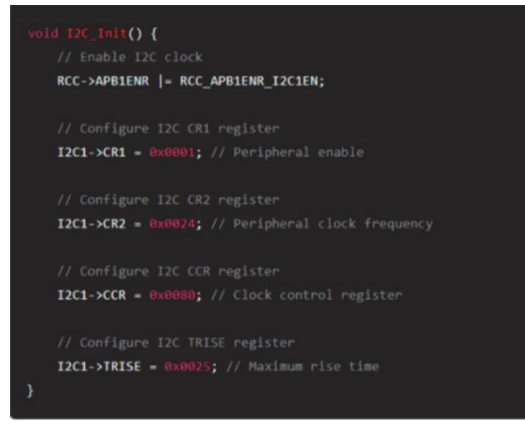

출처: 코드 작성 프로그램. 2024. 8. 10. 스크린샷. [그림 1-1] 초기화 절차

(나) 데이터 전송

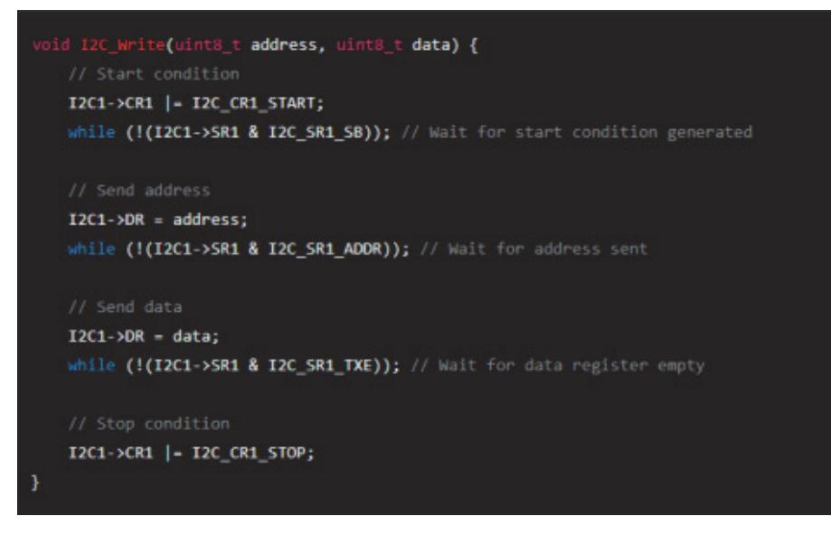

출처: 코드 작성 프로그램. 2024. 8. 10. 스크린샷. [그림 1-2] 데이터 전송

반도체 펌웨어 개발을 위해 CPU와 주변 장치에 대한 메모리 맵, 할당된 레지스터, 작동 및 제 어 방법을 철저히 분석하는 것은 필수적이다. 이를 통해 펌웨어가 하드웨어와 효과적으로 상호 작용하고, 최적의 성능을 발휘할 수 있다. 이러한 분석 과정은 데이터 시트, 기술 참조 매뉴얼 등의 문서를 활용하고, 실습과 테스트를 통해 검증하는 것이 중요하다.

- 숗 CPU와 주변 장치의 Start-up 어셈블리어 코드를 작성하기 위한 초기 설정 정보를 분석한다. 반도체 펌웨어 개발에서 CPU와 주변 장치의 Start-up 어셈블리어 코드를 작성하기 위한 초기 설정 정보를 분석하는 것은 시스템 부팅 과정의 중요한 부분이다. Start-up 코드는 시스템이 정상적으로 동작할 수 있도록 CPU와 주변 장치의 초기화를 수행한다. 다음은 이러한 초기 설 정 정보를 분석하고 Start-up 어셈블리어 코드를 작성하기 위한 단계별 절차이다.
  - 1. 초기 설정 정보를 분석한다.
    - (1) CPU 초기 설정 정보
      - (가) 스택 포인터 초기화

초기 스택 포인터 주소는 스택 영역의 시작 주소 설정한다.

(나) 벡터 테이블 초기화

인터럽트 벡터 테이블은 인터럽트 서비스 루틴(ISR)의 주소를 포함한 벡터 테이블을 설정한다.

(다) 클럭 설정

1) 클럭 소스 선택: 내부 또는 외부 클럭 소스를 선택한다.

- 2) PLL 설정: 클럭 주파수 설정을 위한 PLL 구성한다.
- (라) 메모리 초기화
  - 1) 초기화 데이터 복사: ROM에 저장된 초기화 데이터를 RAM으로 복사한다.
  - 2) BSS 영역 초기화: 초기화되지 않은 데이터 영역(BSS)을 초기화한다.
- (2) 주변 장치 초기 설정 정보
  - (가) GPIO 초기화
    - 1) 포트 설정: 각 GPIO 포트의 방향(input/output) 설정한다.
    - 2) 기능 설정: GPIO 포트의 기능(예) 디지털 입력/출력, 아날로그 입력)을 설정한다.
  - (나) UART 초기화
    - 1) 보레이트 설정: UART 통신 속도를 설정한다.
    - 2) 데이터 프레임 설정: 데이터 비트, 패리티 비트, 정지 비트를 설정한다.
  - (다) 타이머 초기화
    - 1) 타이머 주기 설정: 타이머의 주기 설정한다.
    - 2) 타이머 모드 설정: 타이머의 동작 모드 설정(예: 타이머, 카운터)한다.
- 2. Start-up 어셈블리어 코드를 작성한다.

Start-up 어셈블리어 코드는 CPU 부팅 시 가장 먼저 실행되는 코드로, 초기화 작업을 수행하고 주 프로그램으로 제어를 넘긴다. 다음은 일반적인 Start-up 어셈블리어 코드의 구조이다.

(1) Start-up 어셈블리어 코드의 구조

3. 초기 설정 정보와 코드 작성 예시를 확인한다.

(1) 초기 설정 정보 분석 예시

(가) 스택 포인터: 0x20008000(RAM 상단)

(나) 벡터 테이블: 0x08000000(플래시 메모리 시작 주소)

(다) UART 보레이트: 115200

(라) GPIO 포트 설정: PA0 ~ PA7(디지털 출력)

(2) Start-up 코드 작성 예시

위의 초기 설정 정보를 바탕으로 Start-up 어셈블리어 코드를 작성하면 다음과 같다.

(가) Start-up 어셈블리어 코드

CPU와 주변 장치의 Start-up 어셈블리어 코드를 작성하기 위해 초기 설정 정보를 철저히 분 석하는 것은 반도체 펌웨어 개발의 중요한 단계이다. 데이터 시트와 기술 참조 매뉴얼을 통해 필요한 초기 설정 정보를 수집하고, 이를 바탕으로 초기화 코드를 작성해야 한다. 위의 예시와 같은 단계별 절차를 따르면 효율적이고 신뢰성 높은 Start-up 코드를 작성할 수 있다.

출처: 코드 작성 프로그램. 2024. 8. 10. 스크린샷. [그림 1-3] Start-up 어셈블리어 코드의 구조

출처: 코드 작성 프로그램. 2024. 8. 10. [그림 1-4] Start-u p 코드 작성 예시

수행 tip

- 펌웨어 개발 환경을 고려한 CPU와 주변 장치의 설계 정 보를 수집하도록 한다.
- 펌웨어 개발을 위해 진행을 위해 터를 닦는 개념으로 생각 하고 철저한 정보를 바탕으로 분석을 진행한다.

## 학습 1 교수·학습 방법

### 교수 방법

- CPU 아키텍처, 주변 장치, 메모리 매핑, 펌웨어 개발 과정에 대한 이론 강의와 자료를 제공한다.
- 교제 및 기술문서 그리고 데이터 시트 및 애플리케이션 노트와 같은 참고 자료를 제공한다.
- IDE 설치 및 설정, 개발 보드 준비, 디버깅 도구와 같은 실험 및 실습 환경을 구축한다.
- 디버깅 세션, 오류 수정 등의 내용으로 문제 해결 학습을 진행한다.
- 하드웨어 및 소프트웨어 구성 요소에 대한 기본 지식을 파악한 후 관련 내용을 설명한다.
- 마이크로프로세서의 기본 동작 원리를 설명한다.

### 학습 방법

- 하드웨어 및 소프트웨어 구성 요소에 대해 사전에 학습한다.
- 마이크로프로세서의 기본 동작 원리를 파악한다.
- 마이크로프로세서 주변 장치의 종류와 기능을 파악한다.
- 마이크로프로세서 기능을 구현하기 위한 펌웨어 기본 구조를 설계한다.

## 학습 1 평 가

### 평가 준거

• 평가자는 학습자가 학습 목표를 성공적으로 달성하였는지를 평가해야 한다.

### • 평가자는 다음 사항을 평가해야 한다.

| 학습 내용                | 학습 목표                                                                  | 성취수준 |   |   |
|----------------------|------------------------------------------------------------------------|------|---|---|
|                      |                                                                        | 상    | 중 | 하 |
| 내장 CPU 및 주변<br>장치 분석 | - CPU와 주변 장치의 설계 정보를 수집할 수 있다.                                         |      |   |   |
|                      | - CPU의 어셈블리어 명령어, 마이크로 오퍼레이션 정보, 메모리<br>관리 모듈, 가상 메모리 지정 방식을 분석할 수 있다. |      |   |   |
|                      | - CPU와 주변 장치에 대한 메모리 맵, 할당된 레지스터, 작동 및<br>제어 방법에 대한 정보를 분석할 수 있다.      |      |   |   |
|                      | - CPU와 주변 장치의 Start-up 어셈블리어 코드를 작성하기 위<br>한 초기 설정 정보를 분석할 수 있다.       |      |   |   |

### 평가 방법

• 서술형 시험

| 학습 내용                | 평가 항목                                                             | 성취수준 |   |   |
|----------------------|-------------------------------------------------------------------|------|---|---|
|                      |                                                                   | 상    | 중 | 하 |
| 내장 CPU 및 주변<br>장치 분석 | - CPU와 주변 장치의 설계 정보 수집 절차의 숙지 여부                                  |      |   |   |
|                      | - CPU의 어셈블리어 명령어를 분석할 수 있는 능력                                     |      |   |   |
|                      | - CPU와 주변 장치에 대한 메모리 맵과 할당된 레지스터를<br>분석할 수 있는 능력                  |      |   |   |
|                      | - CPU와 주변 장치의 Start-up 어셈블리어 코드를 작성하기<br>위한 초기 설정 정보를 분석할 수 있는 능력 |      |   |   |

### • 평가자 체크리스트

| 학습 내용                | 평가 항목                                                                  | 성취수준 |   |   |
|----------------------|------------------------------------------------------------------------|------|---|---|
|                      |                                                                        | 상    | 중 | 하 |
| 내장 CPU 및 주변<br>장치 분석 | - CPU 설계 정보를 수집할 수 있는 능력                                               |      |   |   |
|                      | - 평가자가 제시하는 CPU의 마이크로 오퍼레이션과 메모리로<br>관리 모듈을 분석할 수 있는 능력                |      |   |   |
|                      | - 작동 및 제어 방법에 대한 정보를 분석할 수 있는 능력                                       |      |   |   |
|                      | - 평가자가 CPU와 주변 장치의 Start-up 어셈블리어 코드를<br>작성하기 위해 초기 설정 정보를 분석할 수 있는 능력 |      |   |   |

### 피드백

- 1. 서술형 시험
- CPU와 주변 장치의 설계 정보를 수집할 수 있는 능력을 평가한 후, 보완이 필요한 사항이나 주 요 사항을 표시하여 피드백 해준다.
- CPU와 주변 장치를 파악할 수 있는 능력을 평가한 후, 보완이 필요한 사항이나 주요 사항을 표 시하여 보충 설명해 준다.
- 평가 결과가 우수한 학습자에게는 서술형 평가 내용의 적용 사례 학습을 통한 심화 학습으로 피 드백 해 주고, 성취수준이 낮은 학습자에게는 기초 지식에 대한 설명을 통해 일정 수준을 유지할 수 있도록 보완 지도해 준다.
- 2. 평가자 체크리스트
- CPU와 주변 장치에 대한 메모리 맵, 할당된 레지스터, 작동 및 제어 방법에 대한 정보를 분석할 수 있는 능력을 평가한 후 부족한 점을 지적하여 정확하게 처리할 수 있도록 보완 지도 해준다.
- CPU와 주변 장치의 Start-up 어셈블리어 코드를 작성하기 위해 초기 설정 정보를 분석할 수 있 는 능력에 대한 평가 후, 개선 및 보완 사항에 대한 내용을 정리하여 재학습할 수 있도록 피드백 한다.
- 평가 결과가 우수한 학습자에게는 작업장 환경에 맞는 적용 학습을 통한 심화 학습으로 피드백 해 주고, 저조한 학습자에게는 기초 용어에 대한 설명을 통해 일정 수준을 유지할 수 있도록 보 완 지도해 준다.

| 학습 1 | 내장 CPU 및 주변 장치 분석하기 |
|------|---------------------|
| 학습 2 | 펌웨어 요구 사항 분석하기      |
| 학습 3 | 펌웨어 설계하기            |
| 학습 4 | 펌웨어 구현하기            |
| 학습 5 | 펌웨어 드라이버 개발하기       |
| 학습 6 | 펌웨어 관리하기            |

# 2-1. 펌웨어 요구 사항 분석

|       | • 펌웨어의 개발 범위에 따른 기능적·비기능적 요구 사항을 도출할 수 있다.<br>• 운영 체제에 따른 부트 시퀀스 요구 사항을 도출할 수 있다. |
|-------|-----------------------------------------------------------------------------------|
| 학습 목표 | • 레퍼런스 보드에 대한 설계 요구 사항을 도출할 수 있다.                                                 |
|       | • 펌웨어 및 레퍼런스 보드에 대한 요구 사항 정의서를 작성할 수 있다.                                          |

필요 지식 /

숔 메모리 맵과 레지스터 구성에 따른 주변 장치의 동작 원리

메모리 맵과 레지스터 구성은 임베디드 시스템에서 주변 장치의 동작 원리를 이해하는 데 매우 중요한 요소이다. 이를 통해 CPU가 어떻게 주변 장치와 상호 작용하는지를 이해할 수 있다. 다음은 메모리 맵과 레지스터 구성을 통해 주변 장치의 동작 원리를 설명한다.

1. 메모리 맵(memory map)

메모리 맵은 시스템의 물리적 메모리와 주변 장치가 어떻게 주소 공간에 배치되는지를 나 타내는 지도이다. 메모리 맵을 통해 CPU는 메모리와 주변 장치에 접근할 수 있다.

- (1) 메모리 맵의 구성
  - (가) 일반적인 임베디드 시스템의 메모리 맵은 다음과 같은 구성 요소를 포함한다.
  - (나) ROM/Flash 메모리: 프로그램 코드가 저장되는 비휘발성 메모리이다.
  - (다) RAM: 동작 중 데이터를 저장하는 휘발성 메모리이다.
  - (라) 주변 장치: 각 주변 장치의 레지스터가 메모리 주소 공간의 특정 영역에 매핑된다.
  - (마) 예시 메모리 맵

|  | GPIO |
|--|------|
|  |      |

출처: 코드 작성 프로그램. 2024. 8. 10. 스크린샷. [그림 2-1] 메모리 맵 예시

2. 레지스터 구성(register map)

레지스터는 주변 장치의 상태를 제어하고 데이터를 전송하는 데 사용된다. 각 주변 장치는 여러 개의 제어 및 상태 레지스터를 가지고 있으며, 이러한 레지스터는 메모리 맵의 특정 주소에 위치한다.

(1) UART 주변 장치 레지스터 예시

UART(universal asynchronous receiver/transmitter)는 시리얼 통신을 담당하는 주 변 장치이다. 일반적인 UART 주변 장치에는 다음과 같은 레지스터가 포함된다.

- (가) DR(data register): 데이터 전송 및 수신
- (나) SR(status register): 전송 및 수신 상태
- (다) CR(control register): UART 설정(예: 속도, 패리티 등)
- (라) UART 레지스터 맵 예시

출처: 코드 작성 프로그램. 2024. 8. 10. 스크린샷. [그림 2-2] UART 레지스터 맵 예시

3. 주변 장치의 동작 원리

CPU는 메모리 맵과 레지스터를 통해 주변 장치와 통신한다. 다음은 UART를 예시로 들어, 주변 장치가 어떻게 동작하는지 설명한다.

(1) 데이터 전송

(가) 전송 데이터 준비: 전송할 데이터를 DR레지스터에 쓴다.

(나) 전송 상태 확인: SR레지스터를 읽어 UART가 데이터 전송 준비가 되었는지 확인한다.

(다) 데이터 전송: UART는 데이터를 시리얼 라인을 통해 전송한다.

출처: 코드 작성 프로그램. 2024. 8. 10. 스크린샷. [그림 2-3] 데이터 전송 코드 예시

(2) 데이터 수신

- (가) 수신 상태 확인: SR 레지스터를 읽어 UART가 데이터를 수신했는지 확인한다.
- (나) 데이터 읽기: DR 레지스터에서 수신된 데이터를 읽는다.
- (다) 코드 예시

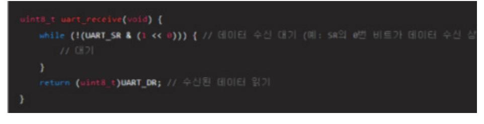

출처: 코드 작성 프로그램. 2024. 8. 10. 스크린샷. [그림 2-4] 데이터 수신 코드 예시

4. 타이머 주변 장치 레지스터 예시

타이머는 일정 시간 간격으로 이벤트를 발생시키는 주변 장치이다. 일반적인 타이머 주변 장치에는 다음과 같은 레지스터가 포함된다.

- (1) 타이머 주변 레지스터
  - (가) CNT(counter register): 현재 카운터 값
  - (나) PSC(prescaler register): 타이머의 분주기 설정

(다) ARR(auto-reload register): 카운터가 도달할 때 자동으로 다시 로드되는 값

(2) 타이머 레지스터 맵 예시

출처: 코드 작성 프로그램. 2024. 8. 10. 스크린샷. [그림 2-5] 타이머 레지스터 맵 예시

(3) 타이머 설정 및 사용

- (가) 타이머 초기화: 분주기와 오토-리로드값을 설정한다.
- (나) 타이머 시작: 타이머를 시작한다.
- (다) 카운터 값 읽기: 현재 카운터값을 읽어 시간 간격을 측정한다.
- (라) 코드 예시

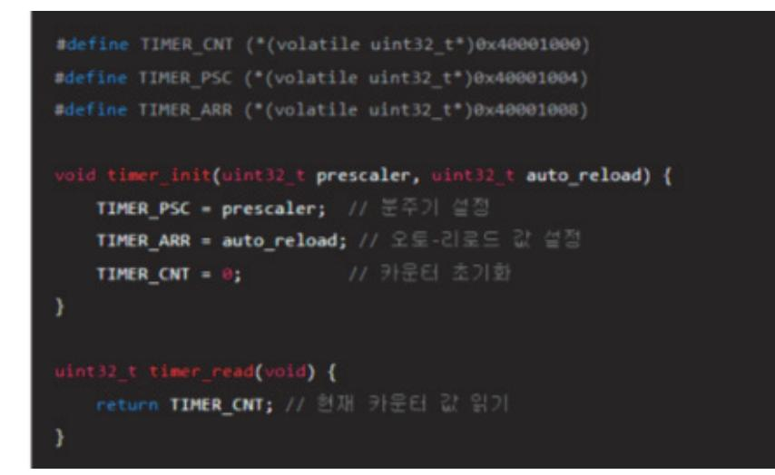

출처: 코드 작성 프로그램. 2024. 8. 10. 스크린샷. [그림 2-6] 타이머 설정 및 사용 코드 예시

메모리 맵과 레지스터 구성은 내장 CPU와 주변 장치의 동작 원리를 이해하는 데 필수적이다. 메모리 맵을 통해 주변 장치의 레지스터에 접근하고, 레지스터를 통해 주변 장치의 상태를 제 어하고 데이터를 전송할 수 있다. 이러한 이해를 통해 효율적인 펌웨어를 작성하고, 시스템의 성능을 최적화할 수 있다.

숕 부트 로더와 부트 시퀀스

부트 로더와 부트 시퀀스는 임베디드 시스템 및 컴퓨터 시스템의 초기화 과정에서 중요한 역할 을 한다. 부트 로더는 시스템을 부팅하는 데 필요한 코드를 포함하고 있으며, 부트 시퀀스는 시스템이 전원을 켜고 운영 체제나 펌웨어를 로드하는 과정을 의미한다.

1. 부트 로더(boot loader)

부트 로더는 시스템이 켜질 때 실행되는 첫 번째 코드로, 운영 체제나 펌웨어를 메모리에 로드하고 실행하는 역할을 한다. 부트 로더는 여러 단계로 구성될 수 있으며, 각 단계는 특 정 작업을 수행한다.

- (1) 주요 기능
  - (가) 하드웨어 초기화: 기본적인 하드웨어를 설정(예: 클럭 설정, 메모리 초기화 등)한다.
  - (나) 메모리 테스트: 메모리의 무결성을 검사한다.
  - (다) 운영 체제/펌웨어 로드: 운영 체제나 펌웨어 이미지를 메모리에 로드하낟.
  - (라) 운영 체제/펌웨어 실행: 운영 체제나 펌웨어 실행을 시작한다.
- (2) 부트 로더의 단계

부트 로더는 일반적으로 여러 단계로 구성된다. 다음은 그 일반적인 단계이다.

- (가) 1차 부트 로더(primary boot loader)
  - 1) ROM 또는 플래시 메모리에 저장되어 있으며, 하드웨어 초기화를 수행한다.
  - 2) 2차 부트 로더를 로드하여 실행한다.
- (나) 2차 부트 로더(secondary boot loader)
  - 1) 보다 더 복잡한 초기화 작업을 수행한다.
  - 2) 운영 체제나 주요 펌웨어 이미지를 외부 저장소에서 메모리로 로드한다.
- 2. 부트 시퀀스(boot sequence)

부트 시퀀스는 시스템이 전원이 켜진 후 운영 체제나 펌웨어가 실행될 때까지의 일련의 과 정이다. 다음은 부트 시퀀스의 일반적인 단계이다.

- (1) 전원 켜기(Power-On)
  - (가) 전원 공급: 시스템에 전원이 공급되면 하드웨어가 초기화된다.
  - (나) 리셋 신호: CPU는 리셋 신호를 받아 리셋 벡터에서 시작한다.
- (2) 초기화 단계(initialization stage)
  - (가) 하드웨어 초기화
    - 1) CPU와 필수 주변 장치를 초기화한다.
    - 2) 클럭 설정, 메모리 컨트롤러 등을 초기화한다.

- (나) 1차 부트 로더 실행
  - 1) 리셋 벡터로부터 시작하여 1차 부트 로더를 실행한다.
  - 2) 기본적인 하드웨어 초기화를 수행하고 2차 부트 로더를 로드한다.
- (3) 2차 부트 로더 단계(secondary boot loader stage)
  - (가) 2차 부트 로더 로드
    - 1) 1차 부트 로더가 2차 부트 로더를 로드하고 실행한다.
    - 2) 복잡한 하드웨어 초기화와 디바이스 설정을 수행한다.
  - (나) 운영 체제/펌웨어 이미지 로드
    - 1) 외부 저장소

예) 플래시 메모리, SSD, 네트워크 등)에서 운영 체제나 펌웨어 이미지를 메모리 로 로드한다.

- (4) 운영 체제/펌웨어 실행 단계(OS/firmware execution stage)
  - (가) 커널 실행
    - 1) 로드된 운영 체제 커널이 실행을 시작한다.
    - 2) 운영 체제의 초기화 루틴이 실행되어 사용자 모드로 전환한다.
  - (나) 시스템 서비스 시작
    - 1) 기본 시스템 서비스와 드라이버가 초기화되고 실행된다.
    - 2) 시스템이 정상적으로 작동할 준비를 완료한다.
- 3. 예시: 임베디드 시스템 부트 로더

임베디드 시스템에서 부트 로더는 다음과 같은 단계로 구성될 수 있다.

(1) 1차 부트 로더 예시

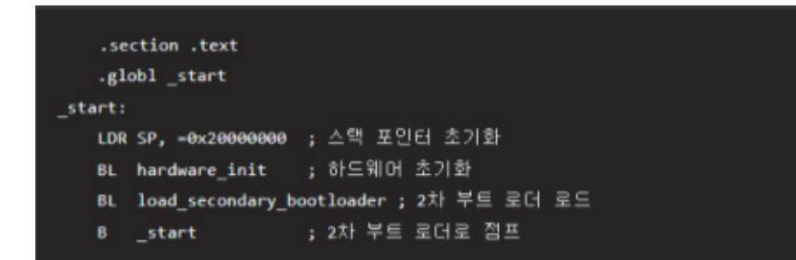

출처: 코드 작성 프로그램. 2024. 8. 10. 스크린샷. [그림 2-7] 1차 부트 로더 예시

(2) 2차 부트 로더 예시

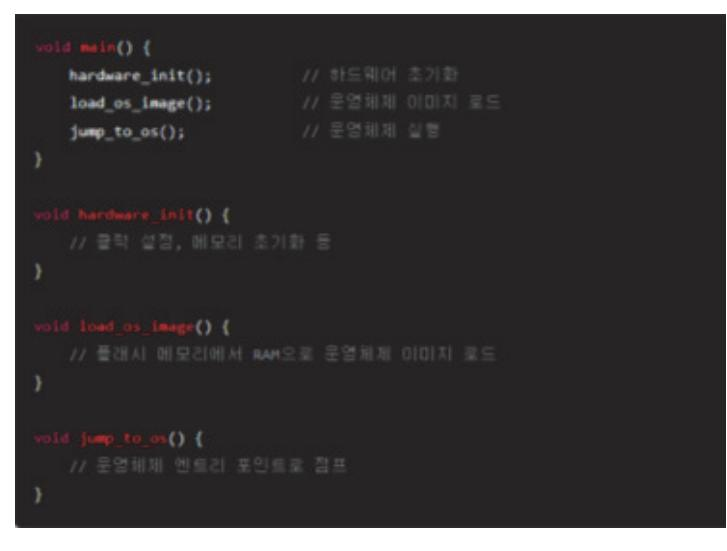

출처: 코드 작성 프로그램. 2024. 8. 10. 스크린샷. [그림 2-8] 2차 부트 로더 예시

부트 로더와 부트 시퀀스는 임베디드 시스템 및 컴퓨터 시스템의 초기화 과정에서 중요한 역할 을 한다. 부트 로더는 하드웨어 초기화, 메모리 테스트, 운영 체제/펌웨어 로드 및 실행을 포함 한 다양한 작업을 수행하며, 부트 시퀀스는 전원이 켜진 후 운영 체제나 펌웨어가 실행될 때까 지의 과정이다. 이 과정을 이해하면 시스템 부팅 과정에서 발생할 수 있는 문제를 효과적으로 해결할 수 있다.

## 수행 내용 / 펌웨어 요구 사항 분석하기

### 재료·자료

- 통합 개발 환경(IDE)
- 디버깅 소프트웨어
- 시뮬레이션 및 분석 도구
- 데이터 시트 및 사용자 매뉴얼(CPU 데이터 시트, 주변 장치 데이터 시트)
- 설계 가이드 및 예제 코드

### 기기(장비 ・ 공구)

- 개발 보드(마이크로컨트롤러/마이크로프로세서 개발 보드, 확장 보드)
- 디버그 장치
- 계측 장비(로직 분석기, 오실로스코프, 멀티미터 등)
- 시뮬레이션 및 분석 도구(Proteus,MATLAB/Simulink, LTspice, PyCharm/VSCode)

### 안전 ・ 유의 사항

- 정전기 방전(ESD)에 유의한다.
- 전원 관리를 한다.
- 장비 사용 안전(개발 보드 및 디버깅 장비, 계측 장비)에 유의한다.
- 작업 환경 안전 규정(작업 공간 정리, 화학 물질 취급 안전 규정 준수)을 준수한다.
- 소프트웨어 및 데이터 안전 지침(매뉴얼 및 지침 준수, 응급 절차 준수)을 준수한다.

### 수행 순서

### 숔 펌웨어의 개발 범위에 따른 기능적·비기능적 요구 사항을 도출한다.

반도체 펌웨어 개발에서 펌웨어의 개발 범위에 따른 기능적 및 비기능적 요구 사항을 도출하는 것은 프로젝트의 성공을 위해 매우 중요하다. 요구 사항을 명확하게 정의하면 개발 과정에서의 혼란을 줄이고, 품질 높은 펌웨어를 제공할 수 있다. 다음은 기능적 및 비기능적 요구 사항을 도출하는 단계별 절차와 방법이다.

- 1. 요구 사항 도출의 중요성을 확인한다.
  - (1) 기능적 요구 사항
    - (가) 정의: 펌웨어가 수행해야 할 구체적인 기능과 동작을 말한다.
    - (나) 목표: 시스템이 기대하는 기능을 명확하게 정의하여 개발 방향을 설정한다.
  - (2) 비기능적 요구 사항
    - (가) 정의: 시스템의 품질 속성, 성능, 신뢰성, 유지 보수성 등을 말한다.
    - (나) 목표: 시스템의 성능과 품질을 보장하고, 사용자의 기대를 충족해야 한다.
- 2. 요구 사항 도출 절차를 숙지한다.
  - (1) 이해관계자 식별 및 인터뷰
    - (가) 이해관계자 식별: 프로젝트에 관련된 모든 이해관계자를 식별(예: 개발 팀, 고객, 사용자) 하는 것을 말한다.
    - (나) 인터뷰: 이해관계자와의 인터뷰를 통해 요구 사항을 수집한다.
  - (2) 요구 사항 수집 방법
    - (가) 브레인스토밍: 팀원들과 함께 브레인스토밍 세션을 통해 요구 사항 아이디어를 수집한다.
    - (나) 워크샵: 이해관계자와의 워크샵을 통해 요구 사항을 도출한다.
    - (다) 문서 분석: 기존 시스템 문서, 데이터 시트, 기술 사양 등을 분석하여 요구 사항을 수집 한다.
  - (3) 기능적 요구 사항 도출
    - (가) 시나리오 작성: 사용자 시나리오를 작성하여 시스템의 기능적 요구 사항을 정의한다.
    - (나) 유즈 케이스: 유즈 케이스 다이어그램을 통해 각 기능의 흐름과 상호 작용을 시각화한다.
    - (다) 구체적 요구 사항 작성: 각 기능에 대한 상세 요구 사항을 작성한다.
  - (4) 비기능적 요구 사항 도출
    - (가) 성능 요구 사항: 시스템의 성능 지표를 정의(예: 응답 시간, 처리량)한다.
    - (나) 신뢰성 요구 사항: 시스템의 가용성, 오류 복구 능력 등을 정의한다.
    - (다) 보안 요구 사항: 데이터 보안, 접근 제어 등 보안 관련 요구 사항을 정의한다.
    - (라) 유지 보수성 요구 사항: 코드의 가독성, 모듈화 등 유지 보수성 요구 사항을 정의한다.
- 3. 요구 사항 분석 및 문서화를 진행한다.
  - (1) 요구 사항 분석
    - (가) 요구 사항 분류: 수집된 요구 사항을 기능적 요구 사항과 비기능적 요구 사항으로 분류 한다.

(나) 우선순위 설정: 각 요구 사항의 중요도와 우선순위를 설정한다.

(2) 요구 사항 문서화

(가) 요구 사항 명세서 작성: 모든 요구 사항을 명확하고 체계적으로 문서화한다.

(나) 검토 및 승인: 이해관계자와의 검토 과정을 통해 요구 사항을 확정하고 승인한다.

(가) 기능적 요구 사항 예시

(1) 프로젝트: 반도체 펌웨어 개발

4. 요구 사항 도출 예시를 확인한다.

1) 시스템 초기화

가) 시스템 전원 공급 시 CPU와 주변 장치를 초기화한다.

나) 펌웨어 시작 시 스택 포인터와 벡터 테이블을 설정한다.

2) UART 통신

가) UART를 통해 데이터 송수신 기능을 제공한다.

나) 보레이트 설정 및 데이터 프레임 설정 기능이다.

3) 타이머 제어

가) 정기적인 타이머 인터럽트가 발생한다.

나) 타이머 주기 설정 및 타이머 시작/중지 기능이다.

(나) 비기능적 요구 사항 예시

1) 성능

가) 시스템 부팅 시간은 1초 이내이다.

나) UART 통신 속도는 115,200bps를 유지한다.

2) 신뢰성

가) 시스템 가동 시간 99.9% 이상을 보장한다.

나) 오류 발생 시 자동 복구 기능을 한다.

3) 보안

가) UART 통신 데이터 암호화한다.

나) 접근 제어를 통한 불법 접근을 방지한다.

4) 유지 보수성

가) 코드의 모듈화 및 재사용성을 보장한다.

나) 상세한 주석과 문서화를 통해 유지 보수가 용이하다.

반도체 펌웨어 개발에서 기능적 및 비기능적 요구 사항을 도출하는 것은 프로젝트의 성공을 위 한 핵심 요소이다. 이해관계자의 요구를 명확히 이해하고, 체계적인 방법을 통해 요구 사항을 수집하고 분석해야 한다. 이러한 요구 사항은 프로젝트의 방향을 제시하고, 시스템의 품질과 성능을 보장하는 데 중요한 역할을 한다. 최종적으로, 명확하게 문서화된 요구 사항은 개발 과

정에서의 혼란을 줄이고, 고품질의 펌웨어를 제공하는 데 기여한다.

숕 운영 체제에 따른 부트 시퀀스 요구 사항을 도출한다.

반도체 펌웨어 개발에서 운영 체제에 따른 부트 시퀀스 요구 사항을 도출하는 것은 시스템이 정상적으로 부팅되고 운영 체제가 올바르게 실행될 수 있도록 하기 위해 매우 중요하다. 부트 시퀀스는 펌웨어가 운영 체제의 실행 환경을 설정하는 일련의 단계로, 펌웨어 개발 시 각 운영 체제의 요구 사항을 명확히 이해하고 반영해야 한다. 다음은 운영 체제에 따른 부트 시퀀스 요 구 사항을 도출하는 단계별 절차와 방법이다.

- 1. 부트 시퀀스 요구 사항의 중요성을 분석한다.
  - (1) 시스템 안정성: 운영 체제가 안정적으로 실행되기 위한 필수 조건
    - (가) 호환성: 특정 운영 체제와의 호환성을 보장하기 위한 요구 사항
      - 1) 성능 최적화: 부팅 시간을 최소화하고 시스템 성능을 최적화
- 2. 부트 시퀀스 요구 사항 도출 절차를 숙지한다.
  - (1) 운영 체제 요구 사항 분석
    - (가) 운영 체제 문서 분석
      - 1) 공식 문서: 각 운영 체제의 공식 문서에서 부트 시퀀스 요구 사항을 수집한다.
      - 2) 데이터 시트: 운영 체제와 관련된 하드웨어 요구 사항 및 호환성 정보를 포함한 데 이터 시트를 분석한다.
    - (나) 기술 자료 및 백서
      - 1) 백서 및 기술 자료: 운영 체제 제공자가 발행한 백서 및 기술 자료에서 요구 사항을 확인한다.
      - 2) 커뮤니티 및 포럼: 관련 커뮤니티와 포럼에서 실질적인 요구 사항 및 문제점을 확인 한다.
  - (2) 부트 시퀀스 요구 사항 도출
    - (가) 초기화 요구 사항
      - 1) 하드웨어 초기화: CPU, 메모리, 주변 장치를 초기화한다.
      - 2) 시스템 클럭 설정: 클럭 소스 설정 및 클럭 주파수를 설정한다.
    - (나) 메모리 관리 요구 사항
      - 1) 메모리 맵 설정: 물리적 메모리 맵과 가상 메모리 맵을 설정한다.
      - 2) 페이지 테이블 초기화: 가상 메모리 관리를 위한 페이지 테이블을 설정한다.
    - (다) 장치 초기화 요구 사항
      - 1) 저장 장치 초기화: 부트 로더가 저장된 위치를 초기화(예: 플래시 메모리, SD 카드)

한다.

2) 주변 장치 초기화: UART, GPIO, 타이머 등 기본 주변 장치 초기화한다.

- (라) 부트 로더 요구 사항
  - 1) 부트 로더 설치: 운영 체제를 로드하고 실행하기 위한 부트 로더를 설치한다.
  - 2) 부트 파라미터 설정: 운영 체제에 필요한 부트 파라미터를 설정한다.
- (3) 운영 체제별 요구 사항을 정리한다.
  - (가) Linux
    - 1) u-boot 초기화: u-boot 설정 및 환경 변수를 설정한다.
    - 2) 커널 이미지 로딩 및 실행한다.
    - 3) 루트 파일 시스템 마운트
  - (나) Windows IoT
    - 1) UEFI 초기화: UEFI 펌웨어를 초기화 및 설정한다.
    - 2) 커널 로딩: Windows 커널을 로딩 및 실행한다.
    - 3) 장치 드라이버 초기화: 필수 장치 드라이버를 초기화한다.
  - (다) RTOS(예) FreeRTOS)
    - 1) 커널 초기화: FreeRTOS 커널 초기화 및 태스크 스케줄러를 시작한다.
    - 2) 시스템 태스크 설정: 기본 시스템 태스크를 설정 및 실행한다.
- 3. 요구 사항 분석 및 문서화를 진행한다.
  - (1) 요구 사항 분석
    - (가) 요구 사항 분류: 수집된 요구 사항을 기능적 요구 사항과 비기능적 요구 사항으로 분류 한다.
    - (나) 우선순위 설정: 각 요구 사항의 중요도와 우선순위를 설정한다.
  - (2) 요구 사항 문서화
    - (가) 요구 사항 명세서 작성: 모든 요구 사항을 명확하고 체계적으로 문서화한다.
    - (나) 검토 및 승인: 이해관계자와의 검토 과정을 통해 요구 사항을 확정하고 승인한다.
- 4. 요구 사항 도출 예시를 확인한다.
  - (1) 프로젝트: 반도체 펌웨어 개발
    - (가) 기능적 요구 사항 예시
      - 1) 시스템 초기화
        - 가) CPU 및 메모리를 초기화한다.
        - 나) 시스템 클럭 설정 및 PLL을 구성한다.
      - 2) 저장 장치 초기화

가) 부트 로더 위치에서 저장 장치를 초기화한다.

나) 부트 파라미터를 설정한다.

3) 부트 로더 실행

가) 운영 체제 커널 이미지를 로딩 및 실행한다.

- 나) 커널 시작 후 루트 파일 시스템을 마운트한다.
- (나) 비기능적 요구 사항 예시
  - 1) 부팅 시간: 시스템 부팅 시간 2초 이내이어야 한다.
  - 2) 신뢰성: 시스템 부팅 성공률 99.9% 이상이어야 한다.
  - 3) 보안
    - 가) 부팅 과정에서 부트로더와 커널 이미지의 무결성을 검증한다.
    - 나) 보안 부팅을 위한 암호화된 펌웨어 이미지를 사용한다.

반도체 펌웨어 개발에서 운영 체제에 따른 부트 시퀀스 요구 사항을 도출하는 것은 매우 중요 한 단계이다. 이를 통해 시스템이 정상적으로 부팅되고 운영 체제가 올바르게 실행될 수 있도 록 보장한다. 이해관계자와의 긴밀한 협력을 통해 요구 사항을 명확히 정의하고, 체계적인 방 법으로 요구 사항을 수집하고 분석하는 것이 필요하다. 최종적으로, 명확하게 문서화된 요구 사항은 개발 과정에서의 혼란을 줄이고, 고품질의 펌웨어를 제공하는 데 기여할 것이다.

숖 레퍼런스 보드에 대한 설계 요구 사항을 도출한다.

반도체 펌웨어 개발에서 레퍼런스 보드에 대한 설계 요구 사항을 도출하는 것은 매우 중요하 다. 레퍼런스 보드는 하드웨어와 펌웨어 간의 상호 작용을 테스트하고 최적화하는 데 사용되 며, 개발 및 디버깅 과정에서 핵심적인 역할을 한다. 다음은 레퍼런스 보드 설계 요구 사항을 도출하기 위한 단계별 절차와 방법이다.

- 1. 레퍼런스 보드 설계 요구 사항의 중요성을 분석한다.
  - (1) 하드웨어-펌웨어 통합: 펌웨어 개발을 위해 필요한 하드웨어 기능과 인터페이스를 제공한다.
  - (2) 개발 및 디버깅 지원: 효율적인 개발과 디버깅을 위한 테스트 포인트와 디버깅 인터페이스 제공한다.
  - (3) 성능 및 안정성 검증: 펌웨어의 성능과 안정성을 검증할 수 있는 환경 제공한다.
- 2. 요구 사항 도출 절차를 숙지한다.
  - (1) 이해관계자 식별 및 요구 사항 수집
    - (가) 이해관계자 식별
      - 1) 개발팀: 하드웨어 및 펌웨어 개발자
      - 2) 품질 보증팀: 테스트 및 검증 전문가
      - 3) 제품 관리자: 프로젝트 목표 및 요구 사항 정의

(나) 검토 및 승인: 이해관계자와의 검토 과정을 통해 요구 사항을 확정하고 승인

(가) 요구 사항 명세서 작성: 모든 요구 사항을 명확하고 체계적으로 문서화

(2) 요구 사항 문서화

(나) 우선순위 설정: 각 요구 사항의 중요도와 우선순위 설정

(가) 요구 사항 분류: 수집된 요구 사항을 기능적 요구 사항과 비기능적 요구 사항으로 분류

(1) 요구 사항 분석

3. 요구 사항 분석 및 문서화를 진행한다.

2) 소프트웨어 호환성: 다양한 운영 체제및 소프트웨어 툴과의 호환성

1) 모듈화: 하드웨어 모듈의 교체 및 확장 가능성

(다) 확장성 및 유연성

2) 내구성: 기계적 내구성 및 EMI/EMC 요구 사항

1) 온도 및 환경 조건: 작동 가능한 온도 범위 및 환경 조건

(나) 신뢰성 및 안정성

2) 메모리 대역폭: 메모리 인터페이스의 대역폭 요구 사항

1) 처리 속도: CPU 클럭 속도 및 처리 성능 요구 사항

(가) 성능

(3) 비기능적 요구 사항 도출

2) 통신 포트: USB, Ethernet 등 통신 포트 및 커넥터

1) 디버깅 인터페이스: JTAG, SWD 등의 디버깅 인터페이스

(다) 인터페이스 및 커넥터

2) 전원 관리: 전원 관리 IC 및 전력 소비 최적화

1) 전원 입력: 보드에 필요한 전원 입력 사양(예: 5V, 12V)

(나) 전원 공급

스

2) 주변 장치: UART, SPI, I2C, GPIO, ADC, DAC 등 필요한 주변 장치와 인터페이

1) CPU 및 메모리: 사용될 프로세서와 메모리 종류 및 용량

(가) 하드웨어 구성 요소

(2) 기능적 요구 사항 도출

(나) 요구 사항 수집

3) 문서 분석: 기존 시스템 문서, 기술 사양서 등을 분석하여 요구 사항 수집

2) 워크샵: 이해관계자와의 워크샵을 통해 요구 사항 도출

1) 인터뷰 및 설문 조사: 이해관계자로부터 요구 사항을 수집

39

4. 요구 사항 도출 예시를 확인한다.

(1) 프로젝트: 반도체 펌웨어 개발을 위한 레퍼런스 보드

(가) 기능적 요구 사항 예시

1) CPU 및 메모리

- 가) CPU: ARM Cortex-M4 기반 프로세서
- 나) 메모리: 256KB Flash, 64KB SRAM
- 2) 주변 장치
  - 가) UART: 2개의 UART 포트
  - 나) SPI: 1개의 SPI 인터페이스
  - 다) I2C: 1개의 I2C 인터페이스
  - 라) GPIO: 20개의 GPIO 핀
  - 마) ADC: 12비트 ADC, 8채널
  - 바) DAC: 12비트 DAC, 2채널
- 3) 전원 공급
  - 가) 입력 전원: 5V DC 입력
  - 나) 전원 관리: 전원 관리 IC 포함
- 4) 인터페이스 및 커넥터
  - 가) 디버깅 인터페이스: JTAG/SWD 포트
  - 나) 통신 포트: USB Type-C 포트, Ethernet 포트
- (나) 비기능적 요구 사항 예시
  - 1) 성능
    - 가) CPU 클럭 속도: 최소 80MHz
    - 나) 메모리 대역폭: 최소 25MB/s
  - 2) 신뢰성 및 안정성
    - 가) 작동 온도 범위: -40°C~85°C
    - 나) 내구성: 1000시간 이상 연속 작동 보장
    - 다) EMI/EMC 요구 사항: FCC 및 CE 인증 기준 충족
  - 3) 확장성 및 유연성
    - 가) 모듈화: GPIO 확장 가능.
    - 나) 소프트웨어 호환성: FreeRTOS, Linux, Windows IoT 호환

반도체 펌웨어 개발을 위해 레퍼런스 보드에 대한 설계 요구 사항을 도출하는 것은 프로젝트의 성공을 위해 필수적이다. 체계적인 요구 사항 수집 및 분석 과정을 통해 레퍼런스 보드의 기능 적 요구 사항과 비기능적 요구 사항을 명확히 정의하고 문서화해야 한다. 이를 통해 개발 과정 에서의 혼란을 줄이고, 고품질의 펌웨어와 하드웨어를 제공할 수 있다.

숗 펌웨어 및 레퍼런스 보드에 대한 요구 사항 정의서를 작성한다.

반도체 펌웨어 개발을 위한 요구 사항 정의서를 작성하는 과정은 펌웨어와 레퍼런스 보드의 개 발 방향을 명확히 하고, 프로젝트의 성공적인 수행을 보장하기 위한 중요한 단계이다. 요구 사 항 정의서는 기능적 요구 사항과 비기능적 요구 사항을 포함하여 모든 이해관계자가 프로젝트 의 목표와 범위를 명확히 이해하도록 돕는다. 다음은 펌웨어 및 레퍼런스 보드에 대한 요구 사 항 정의서를 작성하기 위한 단계별 절차와 예시이다.

- 1. 요구 사항 정의서 작성 절차를 숙지한다.
  - (1) 목표 및 범위 정의
  - (2) 이해관계자 식별 및 요구 사항 수집
  - (3) 요구 사항 분류 및 분석
  - (4) 요구 사항 명세서 작성
  - (5) 검토 및 승인
- 2. 목표 및 범위를 정의한다.
  - (1) 프로젝트 개요
    - (가) 프로젝트명: 반도체 펌웨어 및 레퍼런스 보드 개발
    - (나) 목적: 반도체 펌웨어 및 레퍼런스 보드를 개발하여 하드웨어와 소프트웨어 간의 상호 작 용을 최적화하고, 시스템 성능과 안정성을 보장.
    - (다) 범위: CPU 초기화, 주변 장치 제어, 운영 체제부트 시퀀스, 레퍼런스 보드 설계 및 검 증.
- 3. 이해관계자 식별 및 요구 사항을 수집한다.
  - (1) 이해관계자 식별
    - (가) 개발 팀: 하드웨어 및 펌웨어 개발자
    - (나) 품질 보증 팀: 테스트 및 검증 전문가
    - (다) 제품 관리자: 프로젝트 목표 및 요구 사항 정의
    - (라) 고객: 최종 사용자

(2) 요구 사항 수집

- (가) 인터뷰 및 설문조사: 이해관계자로부터 요구 사항 수집
- (나) 워크샵: 이해관계자와의 워크샵을 통해 요구 사항 도출
- (다) 문서 분석: 기존 시스템 문서, 기술 사양서 등을 분석하여 요구 사항 수집

4. 요구 사항을 분류 및 분석한다.

6. 검토 및 승인을 진행한다.

나) NF3.2: 펌웨어 무결성 검증을 위해 보안 부팅을 지원해야 한다.

가) NF3.1: UART 통신 데이터는 암호화되어야 한다.

1) NF3: 데이터 보안

(다) 보안

가) NF2.1: 시스템 가동 시간은 99.9% 이상 보장되어야 한다.

1) NF2: 시스템 가용성

(나) 신뢰성

가) NF1.1: 시스템 부팅 시간은 2초 이내여야 한다.

1) NF1: 시스템 부팅 시간

(가) 성능

(2) 비기능적 요구 사항

다) F3.2: 타이머 주기를 설정하고 타이머를 시작/중지할 수 있어야 한다.

가) F3.1: 정기적인 타이머 인터럽트를 발생시켜야 한다.

1) F3: 타이머 제어 기능 제공

(다) 타이머 제어

나) F2.2: UART 보레이트 및 데이터 프레임을 설정할 수 있어야 한다.

가) F2.1: UART를 통해 데이터를 송수신할 수 있어야 한다.

1) F2: UART 통신 기능 제공

(나) UART 통신

나) F1.2: 시스템 클럭 설정 및 PLL 구성을 초기화 시 설정해야 한다.

가) F1.1: 시스템 전원 공급 시 CPU와 메모리를 초기화해야 한다.

1) F1: CPU 및 메모리 초기화

(가) 시스템 초기화

(1) 기능적 요구 사항

5. 요구 사항의 명세서를 작성한다.

(나) 타당성 검토: 요구 사항의 타당성 및 실현 가능성 검토

(가) 우선순위 설정: 각 요구 사항의 중요도와 우선순위 설정

(2) 요구 사항 분석

(나) 비기능적 요구 사항: 시스템의 성능, 신뢰성, 보안, 유지 보수성 등

(가) 기능적 요구 사항: 펌웨어 및 레퍼런스 보드가 수행해야 할 구체적인 기능

(1) 요구 사항 분류

(1) 검토 회의

(가) 참여자: 모든 이해관계자

(나) 목적: 요구 사항 정의서의 내용 검토 및 피드백 수집

(2) 피드백 반영

(가) 수정 사항 반영: 검토 회의에서 수집된 피드백을 반영하여 요구 사항 수정

(3) 최종 승인

(가) 승인 서명: 이해관계자의 서명을 받아 최종 요구 사항 정의서 승인

- 7. 요구 사항 정의서 예시를 확인한다.
  - (1) 프로젝트명: 반도체 펌웨어 및 레퍼런스 보드 개발
  - (2) 목적: 반도체 펌웨어 및 레퍼런스 보드를 개발하여 하드웨어와 소프트웨어 간의 상호 작용을 최적화하고, 시스템 성능과 안정성을 보장한다.
  - (3) 범위: CPU 초기화, 주변 장치 제어, 운영 체제부트 시퀀스, 레퍼런스 보드를 설계 및 검증 한다.
  - (4) 기능적 요구 사항
    - (가) F1: 시스템 초기화
      - 1) F1.1: 시스템 전원 공급 시 CPU와 메모리를 초기화해야 한다.
      - 2) F1.2: 시스템 클럭 설정 및 PLL 구성을 초기화 시 설정해야 한다.
    - (나) F2: UART 통신
      - 1) F2.1: UART를 통해 데이터를 송수신할 수 있어야 한다.
      - 2) F2.2: UART 보레이트 및 데이터 프레임을 설정할 수 있어야 한다.
    - (다) F3: 타이머 제어
      - 1) F3.1: 정기적인 타이머 인터럽트를 발생시켜야 한다.
      - 2) F3.2: 타이머 주기를 설정하고 타이머를 시작/중지할 수 있어야 한다.
- 8. 비기능적 요구 사항을 확인한다.
  - (1) NF1: 성능
    - (가) NF1.1: 시스템 부팅 시간은 2초 이내여야 한다.
  - (2) NF2: 신뢰성

- (가) NF2.1: 시스템 가동 시간은 99.9% 이상 보장되어야 한다.
  - (3) NF3: 보안
    - (가) NF3.1: UART 통신 데이터는 암호화되어야 한다.
    - (나) NF3.2: 펌웨어 무결성 검증을 위해 보안 부팅을 지원해야 한다.

반도체 펌웨어 개발을 위한 요구 사항 정의서를 작성하는 것은 프로젝트의 성공을 보장하는 중 요한 단계이다. 체계적인 절차를 통해 기능적 요구 사항과 비기능적 요구 사항을 명확히 정의 하고, 이해관계자의 검토와 승인을 통해 최종 요구 사항을 확정한다. 이를 통해 개발 과정에서 의 혼란을 줄이고, 고품질의 펌웨어와 하드웨어를 제공할 수 있다.

수행 tip

- 사용 사례 다이어그램에서 포함 관계와 확장 관계를 사용 하면 사용 사례 다이어그램을 간략화할 수 있다.
- 읽고 이해하기 쉬운 사용 사례 다이어그램은 개발 대상 시 스템이 무슨 기능을 할 것인지 미리 사용자가 예측하게 해 준다.

## 학습 2 교수·학습 방법

### 교수 방법

- 마이크로프로세서 주변 장치의 종류와 기능을 설명한다.
- 인터럽트 활용법을 설명한다.
- 마이크로프로세서 기능을 구현하기 위한 펌웨어 기본 구조를 설계할 수 있도록 지도한다.
- 마이크로프로세서 시스템의 개발 환경을 구축할 수 있도록 지도한다.
- 펌웨어를 통해 제어할 하드웨어 컴포넌트를 선택할 수 있도록 지도한다.
- 선택된 컴포넌트를 기반으로 펌웨어 기능 명세서를 작성할 수 있도록 지도한다.
- 기능 명세서를 바탕으로 펌웨어를 설계할 수 있도록 지도한다.

### 학습 방법

- 마이크로프로세서 시스템의 개발 환경을 구축한다.
- 펌웨어를 통해 제어할 하드웨어 컴포넌트를 선택한다.
- 선택된 컴포넌트를 기반으로 펌웨어 기능 명세서를 작성한다.
- 기능 명세서를 바탕으로 펌웨어를 설계한다.

## 학습 2 평 가

### 평가 준거

• 평가자는 학습자가 학습 목표를 성공적으로 달성하였는지를 평가해야 한다.

### • 평가자는 다음 사항을 평가해야 한다.

|                 |                                                | 성취수준 |   |   |
|-----------------|------------------------------------------------|------|---|---|
| 학습 내용           | 학습 목표                                          | 상    | 중 | 하 |
|                 | - 펌웨어의 개발 범위에 따른 기능적·비기능적 요구 사항을 도출<br>할 수 있다. |      |   |   |
| 펌웨어<br>요구<br>사항 | - 운영 체제에 따른 부트 시퀀스 요구 사항을 도출할 수 있다.            |      |   |   |
| 분석              | - 레퍼런스 보드에 대한 설계 요구 사항을 도출할 수 있다.              |      |   |   |
|                 | - 펌웨어 및 레퍼런스 보드에 대한 요구 사항 정의서를 작성할 수<br>있다.    |      |   |   |

### 평가 방법

• 서술형 시험

|                 |                                                              | 성취수준 |   |   |
|-----------------|--------------------------------------------------------------|------|---|---|
| 학습 내용           | 평가 항목                                                        | 상    | 중 | 하 |
|                 | - 펌웨어의 개발 범위에 따른 기능적·비기능적 요구 사항의 도출<br>절차 파악 여부              |      |   |   |
| 펌웨어<br>요구<br>사항 | - 운영 체제에서 따른 부트 시퀀스의 초기화 요구 사항과 메모리<br>관리 요구 사항을 도출할 수 있는 능력 |      |   |   |
| 분석              | - 레퍼런스 보드에 대한 기능적 요구 사항과 비기능적 요구 사항<br>을 구분할 수 있는 능력         |      |   |   |
|                 | - 펌웨어 및 레퍼런스 보드에 대한기능적 사양 정의서 작성 절차<br>숙지 여부                 |      |   |   |

### • 평가자 체크리스트

|                 |                                                        | 성취수준 |   |   |
|-----------------|--------------------------------------------------------|------|---|---|
| 학습 내용           | 평가 항목                                                  | 상    | 중 | 하 |
|                 | - 펌웨어의 개발 범위에 따른 기능적·비기능적 요구 사항을 분석<br>하고 문서화할 수 있는 능력 |      |   |   |
| 펌웨어<br>요구<br>사항 | - 운영 체제에 따른 부트 시퀀스 요구 사항의 도출 절차에 대한<br>파악 여부           |      |   |   |
| 분석              | - 레퍼런스 보드에 대한 설계 요구 사항을 도출하여 분석하고 문<br>서화할 수 있는 능력     |      |   |   |
|                 | - 펌웨어 및 레퍼런스 보드에 대한 요구 사항 명세서를 작성할 수<br>있는 능력          |      |   |   |

### 피드백

| - 펌웨어의 개발 범위에 따른 기능적·비기능적 요구 사항의 도출 절차에 대한 파악 여부를 평가한<br>후, 보완이 필요한 사항이나 주요 사항을 표시하여 피드백해 준다. |
|-----------------------------------------------------------------------------------------------|
| - 운영 체제에서 따른 부트 시퀀스의 초기화 요구 사항과 메모리 관리 요구 사항을 도출할 수 있는                                        |
| 능력는 능력을 평가 후, 보완이 필요한 사항이나 주요 사항을 표시하여 보충 설명해 준다.                                             |
| - 평가 결과가 우수한 학습자에게는 서술형 평가 내용의 적용 사례 학습을 통한 심화 학습으로 피                                         |
| 드백해 주고, 미흡한 학습자에게는 기초 용어에 대한 설명을 통해 일정 수준을 유지할 수 있도록                                          |
| 보완 지도해 준다.                                                                                    |
| 2. 평가자 체크리스트                                                                                  |
| - 레퍼런스 보드에 대한 기능적 요구 사항과 비기능적 요구 사항을 구분할 수 있는 능력을 평가한                                         |
| 후 부족한 점을 지적하여 정확하게 처리할 수 있도록 보완 지도해 준다.                                                       |
| - 펌웨어 및 레퍼런스 보드에 대한 요구 사항 명세서를 작성할 수 있는 능력에 대한 평가 후, 개선                                       |
| 및 보완 사항에 대한 내용을 정리하여 재학습할 수 있도록 피드백한다.                                                        |
| - 평가 결과가 우수한 학습자에게는 작업장 환경에의 적용 사례 학습을 통한 심화 학습으로 피드백                                         |
| 해 주고, 저조한 학습자에게는 기초 지식에 대한 설명을 통해 일정 수준을 유지할 수 있도록 보                                          |
| 완 지도해 준다.                                                                                     |

| 학습 1 | 내장 CPU 및 주변 장치 분석하기 |
|------|---------------------|
| 학습 2 | 펌웨어 요구 사항 분석하기      |
| 학습 3 | 펌웨어 설계하기            |
| 학습 4 | 펌웨어 구현하기            |
| 학습 5 | 펌웨어 드라이버 개발하기       |
| 학습 6 | 펌웨어 관리하기            |

# 3-1. 펌웨어 설계

| 학습 목표 | • 펌웨어 개발 환경을 구축할 수 있다.<br>• 요구 사항 정의서에 따라 펌웨어 전체 구조와 단위 모듈을 설계할 수 있다.<br>• 운영 체제 사용 여부에 따른 부트 절차를 계획하고, Start-up 코드를 설계할 수 있다. |
|-------|--------------------------------------------------------------------------------------------------------------------------------|
|       | • 펌웨어 설계서를 작성할 수 있다.                                                                                                           |

## 필요 지식 /

| 숔 펌웨어 개발 및 이식 환경                                   |
|----------------------------------------------------|
| 펌웨어 개발 및 이식 환경은 마이크로컨트롤러(MCU)나 임베디드 시스템에서 소프트웨어가 효 |
| 율적으로 동작하도록 개발하고 배포하는 데 필요한 도구와 방법론을 포함한다. 이를 위해 필요 |
| 한 주요 요소는 다음과 같다.                                   |

- 1. 개발 환경
  - (1) 통합 개발 환경(IDE)

IDE는 코드 작성, 컴파일, 디버깅, 플래싱 등을 통합적으로 제공하는 도구이다. 대표적 인 IDE는 다음과 같다.

- (가) Keil MDK-ARM: ARM Cortex-M 기반 마이크로컨트롤러용
- (나) IAR embedded workbench: 다양한 MCU를 지원
- (다) STM32CubeIDE: STM32 시리즈 MCU용
- (라) arduino IDE: arduino 보드용
- (마) platformIO: 다양한 보드와 프레임 워크를 지원
- (2) 컴파일러 및 빌드 시스템

- (가) GCC(GNU compiler collection) 오픈 소스 컴파일러, 특히 ARM GCC가 많이 사용 됨.
- (나) clang/LLVM: 모듈화된 컴파일러 인프라
- (다) Make/CMake: 빌드 자동화 도구
- (라) SCons: 파이선 기반의 빌드 시스템
- (3) 디버깅 도구
  - (가) GDB(GNU debugger) 강력한 디버거
  - (나) OpenOCD(open on-chip debugger) 다양한 임베디드 디바이스를 지원
  - (다) J-Link/J-Trace: segger의 디버거 및 트레이스 도구
  - (라) ST-Link: STMicroelectronics의 디버거
  - (마) DGB 서버: IDE와 디버거 하드웨어를 연결하는 서버 소프트웨어
- 2. 하드웨어 환경
  - (1) 개발 보드
    - (가) STM32 Discovery/Nucleo: STM32 시리즈 MCU 개발 보드
    - (나) Arduino: 다양한 MCU를 기반으로 한 개발 보드
    - (다) Raspberry Pi: ARM 기반의 SBC(single board computer)
    - (라) ESP32/ESP8266: Wi-Fi 및 블루투스 기능이 있는 개발 보드
  - (2) 디버깅 하드웨어
    - (가) JTAG 디버거: 다양한 MCU 디버깅 지원
    - (나) SWD 디버거: ARM Cortex-M 시리즈 MCU용
    - (다) USB 시리얼 어댑터: 시리얼 통신을 위한 USB 어댑터
- 3. 펌웨어 개발 프로세스
  - (1) 프로젝트 설정
    - (가) 타깃 설정: MCU 및 주변 장치 설정
    - (나) 스타트업 코드: 초기화 코드 작성(클럭 설정, 메모리 초기화 등)
    - (다) 링커 스크립트: 메모리 맵 정의
  - (2) 코드 작성 및 컴파일
    - (가) 드라이버 개발: 주변 장치를 제어하는 드라이버 작성
    - (나) 애플리케이션 로직: 실제 동작을 구현하는 코드 작성
    - (다) 빌드 스크립트 작성: 빌드 자동화를 위한 스크립트(Makefile, CMake 등)

(3) 디버깅 및 테스트

4. 펌웨어 이식

(가) 디버깅 세션: IDE와 디버거를 사용하여 코드 디버깅

(가) 플랫폼 독립성: 플랫폼에 의존하지 않는 코드 작성

타깃 MCU의 특성과 주변 장치를 분석한다.

타깃 MCU에 맞게 드라이버 코드를 수정한다.

타깃 환경에서 코드 컴파일 후 디버깅한다.

타깃 환경에서 펌웨어 동작을 테스트 및 검증한다.

(가) STM32CubeMX 사용: 초기 설정과 코드를 생성한다.

(나) IDE 설정: STM32CubeIDE에서 프로젝트를 생성 및 설정한다.

(나) 하드웨어 추상화 레이어(HAL) 하드웨어 접근을 추상화하여 이식성을 높임.

새로운 타깃에 맞는 컴파일러, 링커 스크립트, 스타트업 코드를 설정한다.

(다) 드라이버 계층: MCU별 드라이버를 모듈화하여 재사용성 증대

(나) 유닛 테스트: 모듈 단위로 코드 테스트

(다) 통합 테스트: 전체 시스템 동작 테스트

(1) 이식성 고려 사항

(2) 이식 단계

(가) 타깃 하드웨어 분석

(나) 환경 설정

(다) 드라이버 포팅

(마) 테스트 및 검증

5. 예제: STM32 펌웨어 이식

(1) 프로젝트 설정

(라) 코드 컴파일 및 디버깅

- (2) 드라이버 포팅
  - (가) HAL 드라이버 사용: STM32CubeMX가 생성한 HAL 드라이버를 활용한다.
  - (나) 커스텀 드라이버 작성: 필요한 경우 직접 드라이버를 작성한다.
  - (3) 코드 작성
    - (가) 메인 코드 작성: 애플리케이션 로직을 작성한다.
    - (나) 주변 장치 초기화: GPIO, UART, I2C, SPI 등을 초기화한다.

- (4) 컴파일 및 디버깅
  - (가) 빌드: 코드 컴파일
  - (나) 플래시: 펌웨어를 타깃 보드에 업로드
  - (다) 디버깅: 디버깅 도구를 사용하여 코드 검증

펌웨어 개발 및 이식 환경을 구축하고 유지하는 것은 복잡한 작업이지만, 적절한 도구와 방법 론을 사용하면 효율적으로 수행할 수 있다. 개발 환경 설정, 하드웨어 이해, 이식성 고려, 철저 한 테스트와 디버깅이 성공적인 펌웨어 개발 및 이식의 핵심 요소이다. 이러한 과정을 통해 다 양한 플랫폼에서 안정적이고 신뢰할 수 있는 펌웨어를 제공할 수 있다.

숕 어셈블리어 기반의 Start-up 코드 설계 방법

어셈블리어 기반의 Start-up 코드는 임베디드 시스템의 초기화와 관련된 중요한 부분으로, 시 스템이 전원을 켜고 부팅하는 동안 필요한 초기 설정을 수행한다. Start-up 코드는 주로 하드 웨어 초기화, 스택 설정, 벡터 테이블 초기화 등을 포함한다. 다음은 어셈블리어 기반의 Start-up 코드 설계 방법에 대한 단계별 가이드이다.

- 1. 초기 설정
  - (1) 벡터 테이블 정의

벡터 테이블은 시스템 예외와 인터럽트의 진입점을 정의한다. 이는 보통 초기화 코드의 시작 부분에 정의된다.

| word _estack            | // 초기 스택 포인터 |
|-------------------------|--------------|
| .word Reset_Handler     | // 리셋 핸들러    |
| .word NMI_Handler       | // NMI 핸들러   |
| .word HardFault_Handler | // 하드 플트 핸들려 |
| // 다른 핸들러들 정의           |              |

출처: 코드 작성 프로그램. 2024. 8. 10. 스크린샷. [그림 3-1] 벡터 테이블 정의

(2) 초기 스택 설정

스택 포인터를 설정한다. 대부분의 경우, 스택의 시작 주소는 링커 스크립트에 의해 정 의된 \_estack 심볼을 사용하여 설정된다.

출처: 코드 작성 프로그램. 2024. 8. 10. 스크린샷. [그림 3-2] 초기 스텍 설정 예시

- 2. 시스템 초기화
  - (1) 데이터 및 BSS 섹션 초기화

데이터 섹션을 RAM으로 복사하고 BSS 섹션을 0으로 초기화한다.

출처: 코드 작성 프로그램. 2024. 8. 10. 스크린샷. [그림 3-3] 데이터 및 BSS 섹션 초기화 사례

3. 시스템 클럭 및 주변 장치 초기화

시스템 클럭과 필요한 주변 장치를 초기화한다. 이는 보통 MCU의 레지스터를 설정하여 클 럭 소스와 주변 장치의 초기 상태를 설정하는 작업이다.

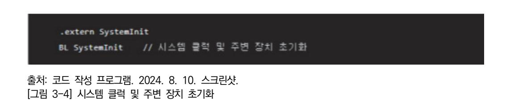

4. 예외 및 인터럽트 핸들러 정의

시스템에서 발생할 수 있는 다양한 예외와 인터럽트에 대한 핸들러를 정의한다.

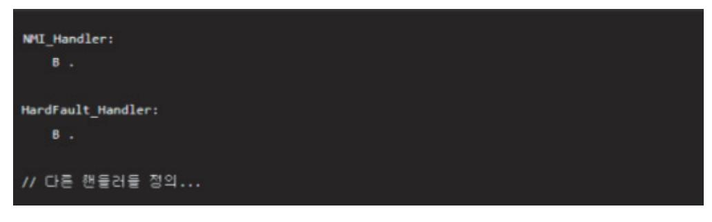

출처: 코드 작성 프로그램. 2024. 8. 10. 스크린샷. [그림 3-5] 예외 및 인터럽트 핸들러 정의

5. 링커 스크립트 설정

Start-up 코드를 제대로 작동시키기 위해서는 링커 스크립트를 설정해야 한다. 이는 메모리 영역과 초기화 코드의 위치를 정의한다.

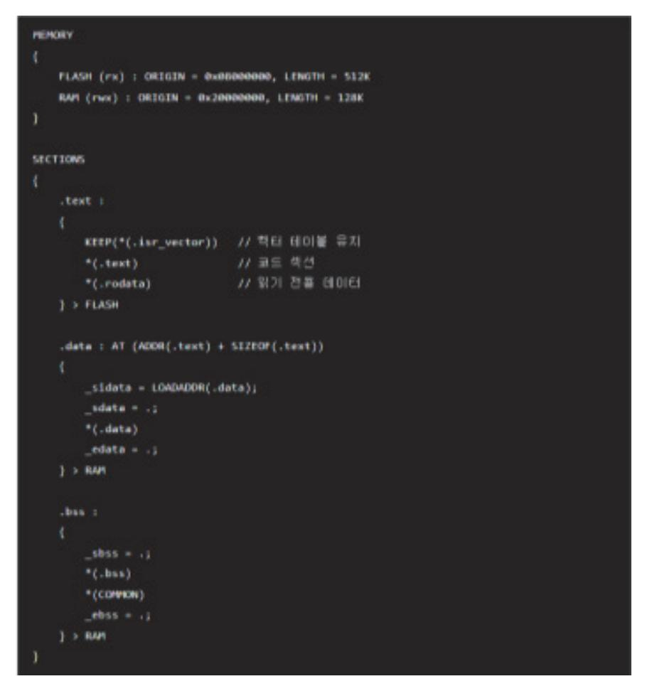

출처: 코드 작성 프로그램. 2024. 8. 10. 스크린샷. [그림 3-6] 링커 스크립트 설정

6. 전반적인 Start-up 코드 예시

출처: 코드 작성 프로그램. 2024. 8. 10. 스크린샷. [그림 3-7] 전반적인 Start-up 코드 예시

어셈블리어 기반의 Start-up 코드는 시스템 초기화를 효율적으로 수행하기 위해 신중하게 설 계되어야 한다. 이는 시스템의 안정성과 성능에 중요한 영향을 끼친다. 올바른 초기화 절차를 통해 메모리와 주변 장치가 정확히 설정되면, 메인 애플리케이션 코드가 안정적으로 실행될 수 있다.

## 수행 내용 / 펌웨어 설계하기

### 재료·자료

- 통합 개발 환경(IDE)
- 디버깅 소프트웨어
- 시뮬레이션 및 분석 도구
- 데이터 시트 및 사용자 매뉴얼(CPU 데이터 시트, 주변 장치 데이터 시트)
- 설계 가이드 및 예제 코드

### 기기(장비 ・ 공구)

- 개발 보드(마이크로컨트롤러/마이크로프로세서 개발 보드, 확장 보드)
- 디버그 장치
- 계측 장비(로직 분석기, 오실로스코프, 멀티미터 등)
- 시뮬레이션 및 분석 도구(Proteus,MATLAB/Simulink, LTspice, PyCharm/VSCode)

### 안전 ・ 유의 사항

- 정전기 방전(ESD)에 유의해야 한다.
- 전원 관리에 유의해야 한다.
- 개발 보드 및 디버깅 장비, 계측 장비 사용 시 안전에 유의한다.
- 작업 환경 안전(작업 공간 정리, 화학 물질 취급 안전 규정 준수)에 유의해야 한다.
- 소프트웨어 및 데이터 안전 절차(매뉴얼 및 지침, 응급 절차)를 준수한다.

수행 순서

숔 펌웨어 개발 환경을 구축한다.

반도체 펌웨어 개발을 위한 개발 환경을 구축하는 것은 프로젝트의 성공적인 수행을 위해 매우 중요하다. 적절한 개발 환경은 개발 속도를 높이고, 디버깅 및 테스트 과정을 효율적으로 수행 할 수 있게 해준다. 다음은 반도체 펌웨어 개발 환경을 구축하기 위한 단계별 절차와 방법이 다.

1. 개발 환경 구성 요소를 분석한다.

- (1) 하드웨어 구성 요소
  - (가) 개발 보드: 펌웨어 개발 및 테스트를 위한 반도체 레퍼런스 보드
  - (나) 디버깅 장비: JTAG, SWD 디버거 등
  - (다) 컴퓨터: 펌웨어 개발을 위한 컴퓨터
- (2) 소프트웨어 구성 요소
  - (가) 통합 개발 환경(IDE) 펌웨어 코딩, 빌드, 디버깅을 위한 소프트웨어
  - (나) 컴파일러: 펌웨어 코드를 컴파일하는 도구
  - (다) 디버깅 툴: 펌웨어 디버깅을 위한 소프트웨어
  - (라) 버전 관리 시스템: 코드 관리를 위한 시스템(예: Git)
  - (마) 펌웨어 라이브러리: 하드웨어 제어를 위한 드라이버 및 라이브러리

### 2. 개발 환경 구축 단계를 분석한다.

(1) 하드웨어 설정

- (가) 개발 보드 선택: 프로젝트 요구 사항에 맞는 개발 보드를 선택
- (나) 디버깅 장비 설정: JTAG/SWD 디버거와 개발 보드를 연결
- (2) 소프트웨어 설치
  - (가) IDE 설치: 예를 들어, Keil MDK, IAR Embedded Workbench, STM32CubeIDE 등
  - (나) 컴파일러 설치: ARM GCC, Keil Compiler 등
  - (다) 디버깅 툴 설치: 해당 IDE와 호환되는 디버깅 툴 설치
  - (라) 버전 관리 시스템 설치: Git 설치 및 설정
- (3) 개발 환경 설정
  - (가) 프로젝트 생성: IDE에서 새로운 프로젝트를 생성하고, 타깃 디바이스 설정
  - (나) 컴파일러 설정: 프로젝트에 맞는 컴파일러를 설정
  - (다) 디버거 설정: JTAG/SWD 디버거를 설정하고, 개발 보드와 연결

(라) 라이브러리 추가: 펌웨어 개발에 필요한 라이브러리 추가

- 3. 구체적인 개발 환경 구축 예시를 확인한다.
  - (1) STM32 기반 펌웨어 개발 환경
    - (가) 하드웨어 설정
      - 1) 개발 보드: STM32 Nucleo Board
      - 2) 디버깅 장비: ST-LINK/V2 디버거
    - (나) 소프트웨어 설치
      - 1) IDE 설치: STM32CubeIDE 다운로드 및 설치
      - 2) 컴파일러 설치: STM32CubeIDE에 포함된 ARM GCC 컴파일러 사용
      - 3) 디버깅 툴 설치: STM32CubeIDE에 포함된 디버깅 툴 사용
      - 4) 버전 관리 시스템 설치: Git 다운로드 및 설치
    - (다) 개발 환경 설정
      - 1) 프로젝트 생성
        - 가) STM32CubeIDE에서 새로운 STM32 프로젝트 생성
        - 나) 타깃 디바이스 선택(예: STM32F401RE)
        - 다) 프로젝트 이름과 경로 설정
      - 2) 컴파일러 설정
        - 가) 프로젝트 속성에서 컴파일러 설정 확인
        - 나) 빌드 옵션 설정(최적화, 디버그 정보 포함 등)
      - 3) 디버거 설정
        - 가) ST-LINK/V2 디버거 설정
        - 나) 개발 보드와 디버거 연결
        - 다) 디버깅 설정 확인(예) SWD 인터페이스, 클럭 설정 등)
      - 4) 라이브러리 추가
        - 가) STM32 HAL 라이브러리 추가
        - 나) 필요한 드라이버와 미들웨어 추가(예) UART, GPIO, FreeRTOS 등)
- 4. 개발 환경 설정 스크린샷을 분석한다.
  - (1) 프로젝트 생성
  - (2) 컴파일러 설정
  - (3) 디버거 설정
- 5. 펌웨어 개발 및 테스트
  - (1) 코드 작성

(가) 기본 코드 작성: 프로젝트의 메인 함수와 기본 설정 코드 작성

(나) 드라이버 코드 작성: 하드웨어 제어를 위한 드라이버 코드 작성

(2) 빌드 및 컴파일

- (가) 빌드: IDE에서 프로젝트 빌드
- (나) 컴파일: 컴파일러를 통해 코드 컴파일

(3) 디버깅 및 테스트

- (가) 디버깅: 디버깅 툴을 사용하여 코드 디버깅
- (나) 테스트: 개발 보드에서 펌웨어 실행 및 테스트

반도체 펌웨어 개발을 위한 개발 환경 구축은 하드웨어와 소프트웨어의 적절한 설정을 통해 이 루어진다. 개발 보드와 디버깅 장비를 준비하고, 통합 개발 환경(IDE)과 필요한 소프트웨어 도 구를 설치한 후, 프로젝트 설정과 라이브러리 추가를 통해 개발 환경을 완성한다. 이를 통해 개발자는 효율적으로 코드를 작성하고 디버깅하며, 고품질의 펌웨어를 제공할 수 있다.

숕 요구 사항 정의서에 따라 펌웨어 전체 구조와 단위 모듈을 설계한다.

반도체 펌웨어 개발에서 요구 사항 정의서에 따라 펌웨어 전체 구조와 단위 모듈을 설계하는 과정은 시스템의 안정성과 성능을 보장하기 위해 매우 중요하다. 이 단계에서는 요구 사항을 기반으로 펌웨어의 아키텍처를 정의하고, 각 모듈의 역할과 상호 작용을 명확히 해야 한다. 다 음은 펌웨어 전체 구조와 단위 모듈을 설계하기 위한 단계별 절차와 방법이다.

1. 요구 사항을 분석한다.

- (1) 기능적 요구 사항 확인
  - (가) 시스템 초기화, UART 통신, 타이머 제어 등 요구 사항 정의서에서 기능적 요구 사항을 확인한다.
- (2) 비기능적 요구 사항 확인 :성능, 신뢰성, 보안 등의 비기능적 요구 사항을 확인하여 설계에 반영한다.
- 2. 펌웨어 전체 구조를 설계한다.
  - (1) 아키텍처 설계
    - (가) 레이어드 아키텍처: 펌웨어를 여러 레이어로 나눈다(예: 하드웨어 추상화 레이어, 드라이 버 레이어, 애플리케이션 레이어).
    - (나) 모듈화: 기능별로 모듈을 분리하여 설계한다.
  - (2) 시스템 아키텍처 다이어그램
    - (가) 시스템의 전체적인 구조를 시각적으로 표현한다.

출처: 코드 작성 프로그램. 2024. 8. 10. 스크린샷. [그림 3-8] 시스템 아키텍처 다이어그램

| Application Layer                       |   |  |  |  |
|-----------------------------------------|---|--|--|--|
|                                         |   |  |  |  |
| ++                                      |   |  |  |  |
| Main Program                            |   |  |  |  |
| ++                                      | 1 |  |  |  |
|                                         | 1 |  |  |  |
| +                                       | + |  |  |  |
| Driver Layer                            |   |  |  |  |
|                                         |   |  |  |  |
| ++ ++                                   | 1 |  |  |  |
| UART Driver    Timer Driver             | 1 |  |  |  |
| ++                                      |   |  |  |  |
|                                         |   |  |  |  |
| +                                       | + |  |  |  |
| Hardware Abstraction Layer (HAL)        |   |  |  |  |
|                                         |   |  |  |  |
| · · · · · · · · · · · · · · · · · · ·   |   |  |  |  |
| HAL FOP UART                            |   |  |  |  |
| HAL TOP GART                            |   |  |  |  |
| HAL for Timer                           |   |  |  |  |
| ++                                      |   |  |  |  |
| *************************************** |   |  |  |  |
|                                         |   |  |  |  |
| •                                       | + |  |  |  |
| Hardware Layer                          |   |  |  |  |
|                                         |   |  |  |  |
| ++                                      |   |  |  |  |
| CPU, Memory, Peripherals                |   |  |  |  |
| ++                                      |   |  |  |  |
| 1                                       | 1 |  |  |  |
| +                                       | + |  |  |  |
|                                         |   |  |  |  |

- (2) 시스템 아키텍처 다이어그램
- (마) 주변 장치 제어 모듈
- (라) 메모리 관리 모듈

(다) 타이머 제어 모듈

3. 단위 모듈 설계를 정의한다.

4. 설계 예시를 확인한다.

(1) 펌웨어 전체 구조

- (나) UART 통신 모듈

(가) 시스템 초기화 모듈

(나) 각 모듈의 위치와 상호 작용을 명확히 표시한다.

(1) 모듈 정의: 각 모듈의 기능, 입력/출력, 인터페이스를 정의한다.

(2) 모듈 간 인터페이스 정의: 모듈 간 데이터를 주고받는 방식과 프로토콜을 정의한다.

60

- 5. 단위 모듈을 설계한다.
  - (1) 시스템 초기화 모듈
    - (가) 시스템 아키텍처 다이어그램 기능: 시스템 전원 공급 시 CPU와 메모리 초기화, 클럭 설 정
    - (나) 인터페이스
      - 1) 입력: 없음.
      - 2) 출력: 없음.
    - (다) 구현
      - 1) SystemInit() 시스템 초기화 함수
  - (2) UART 통신 모듈
    - (가) 기능: UART를 통해 데이터 송수신
    - (나) 인터페이스
      - 1) 입력: 데이터 버퍼
      - 2) 출력: 데이터 버퍼
    - (다) 구현
      - 1) UART\_Init(uint32\_t baudrate) UART 초기화 함수
      - 2) UART\_Send(uint8\_t \*data, uint32\_t length) 데이터 송신 함수
      - 3) UART\_Receive(uint8\_t \*data, uint32\_t length) 데이터 수신 함수
  - (3) 타이머 제어 모듈
    - (가) 기능: 정기적인 타이머 인터럽트 발생, 타이머 주기 설정
    - (나) 인터페이스
      - 1) 입력: 타이머 주기
      - 2) 출력: 없음.
    - (다) 구현
      - 1) Timer\_Init(uint32\_t period) 타이머 초기화 함수
      - 2) Timer\_Start() 타이머 시작 함수
      - 3) Timer\_Stop() 타이머 중지 함수
- 6. 코드 예시를 확인한다.

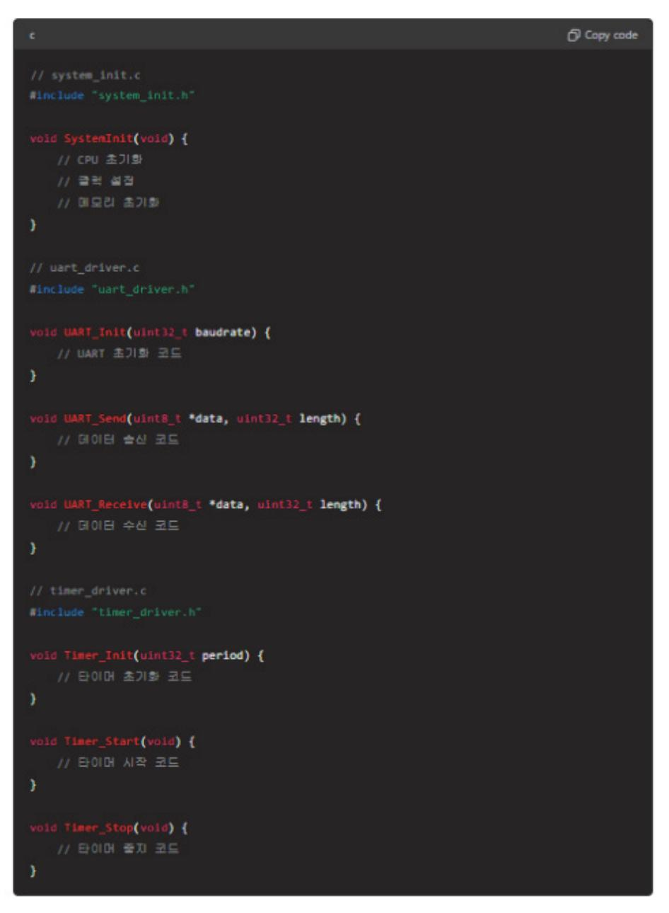

출처: 코드 작성 프로그램. 2024. 8. 10. 스크린샷. [그림 3-9] 코드 예시

7. 검토 및 피드백을 진행한다.

(1) 검토 회의

- (가) 참여자: 개발팀, 품질 보증팀, 제품 관리자
- (나) 목적: 설계된 구조와 모듈에 대한 검토 및 피드백 수집

(2) 피드백 반영

(가) 수정 사항 반영: 검토 회의에서 수집된 피드백을 반영하여 설계 수정

8. 최종 문서화 및 승인한다.

(1) 최종 설계 문서화: 모든 설계 내용을 문서화하여 최종 설계 문서 작성

(2) 승인: 이해관계자의 서명을 받아 최종 설계 문서 승인

반도체 펌웨어 개발을 위한 전체 구조와 단위 모듈을 설계하는 과정은 요구 사항 정의서를 기 반으로 체계적으로 진행해야 한다. 이러한 과정은 펌웨어가 하드웨어와 원활하게 상호 작용하 고, 시스템의 성능과 안정성을 보장할 수 있도록 한다. 요구 사항을 명확히 이해하고, 설계를 문서화하여 검토와 승인을 통해 최종 설계를 확정하는 것이 중요하다.

숖 운영 체제 사용 여부에 따른 부트 절차를 계획하고, Start-up 코드를 설계한다.

반도체 펌웨어 개발에서 운영 체제 사용 여부에 따른 부트 절차를 계획하고, Start-up 코드를 설계하는 것은 매우 중요한 단계이다. 이 단계는 시스템이 올바르게 부팅되고, 운영 체제나 펌 웨어가 정상적으로 동작할 수 있도록 한다. 다음은 운영 체제 사용 여부에 따른 부트 절차를 계획하고 Start-up 코드를 설계하는 단계별 절차이다.

1. 부트 절차 계획을 숙지한다.

(1) 운영 체제를 사용하는 경우

(가) 목적: 운영 체제가 실행되기 전에 하드웨어 초기화 및 기본 설정을 수행

(나) 부트 로더 사용: 운영 체제를 로드하고 실행하는 부트 로더 사용

(다) 부트 절차

1) 하드웨어 초기화: CPU, 메모리, 클럭, GPIO 등의 초기화

2) 부트 로더 실행: 부트 로더가 저장된 위치에서 로드 및 실행

3) 운영 체제 로드: 부트 로더가 운영 체제를 메모리에 로드

4) 커널 초기화: 운영 체제커널이 초기화되고 제어를 인계 받음.

5) 시스템 서비스 초기화: 운영 체제의 시스템 서비스 및 드라이버 초기화

6) 애플리케이션 실행: 운영 체제 위에서 애플리케이션이 실행

(2) 운영 체제를 사용하지 않는 경우

(가) 목적: 펌웨어가 직접 하드웨어를 제어하고 애플리케이션을 실행

(가) 작업명: 반도체 세정 공정 재료 제조

(나) 단일 단계 부팅: 부트 로더 없이 펌웨어가 직접 실행

(다) 부트 절차

- 1) 하드웨어 초기화: CPU, 메모리, 클럭, GPIO 등의 초기화
- 2) 시스템 초기화: 타이머, 통신 인터페이스 등의 주변 장치 초기화

3) 애플리케이션 실행: 펌웨어 애플리케이션 코드 실행

- 2. Start-up 코드를 설계한다.
  - (1) 운영 체제를 사용하는 경우
    - (가) Start-up 코드 단계
      - 1) 리셋 핸들러: 시스템 리셋 시 실행되는 코드
      - 2) 스택 초기화: 스택 포인터 초기화
      - 3) 시스템 초기화: 기본 하드웨어 설정 및 초기화
      - 4) 부트 로더 실행: 부트 로더로 점프하여 실행

| assembly            |               | 🗇 Copy code |
|---------------------|---------------|-------------|
| .section .text      |               |             |
| .global _start      |               |             |
|                     |               |             |
| _start:             |               |             |
| ldr sp, =_stack_top | // 스택 포인터 초기화 |             |
| bl SystemInit       | // 시스템 초기화    |             |
| bl BootLoader       | // 부트 로더 실렬   |             |
| ь.                  | // 무한 루프      |             |
|                     |               |             |
| SystemInit:         |               |             |
| // 하드웨어 초기화 코드      |               |             |
| bx lr               |               |             |
|                     |               |             |
| BootLoader:         |               |             |
| // 부트 로더 코드         |               |             |
| // 운영체제 로드 및 실령     |               |             |
| bx lr               |               |             |
|                     |               |             |

출처: 코드 작성 프로그램. 2024. 8. 10. 스크린샷. [그림 3-10] 운영 체제를 사용하는 경우 start-up 코드

- (2) 운영 체제를 사용하지 않는 경우
  - (가) Start-up 코드 단계
    - 1) 리셋 핸들러: 시스템 리셋 시 실행되는 코드
    - 2) 스택 초기화: 스택 포인터 초기화
    - 3) 시스템 초기화: 기본 하드웨어 설정 및 초기화
    - 4) 메인 함수 실행: 펌웨어 애플리케이션 코드 실행

| .section .text      |               |  |
|---------------------|---------------|--|
|                     |               |  |
| .global _start      |               |  |
|                     |               |  |
| _start:             |               |  |
| ldr sp, =_stack_top | // 스택 포인터 초기화 |  |
| bl SystemInit       | // 시스템 초기화    |  |
| bl main             | // 메인 팥수 실렵   |  |
| ь.                  | // 무환 루프      |  |
|                     |               |  |
| SystemInit:         |               |  |
| // 하드웨어 초기화 코드      |               |  |
| bx lr               |               |  |
|                     |               |  |
| main:               |               |  |
| // 펄웨어 애플리케이션 3     | 25            |  |
| bx lr               |               |  |
|                     |               |  |

출처: 코드 작성 프로그램. 2024. 8. 10. 스크린샷. [그림 3-11] 운영 체제를 사용하지 않는 경우 start-up 코드

- 3. Start-up 코드 구현 예시를 확인한다.
  - (1) 운영 체제를 사용하는 경우

출처: 코드 작성 프로그램. 2024. 8. 10. 스크린샷. [그림 3-12] 운영 체제를 사용하는 경우 start-up 코드 구현 예시

### (2) 운영 체제를 사용하지 않는 경우

출처: 코드 작성 프로그램. 2024. 8. 10. 스크린샷. [그림 3-13] 운영 체제를 사용하지 않는 경우 start-up 코드 구현 예시

- 4. Start-up 코드의 주요 구성 요소를 분석한다.
  - (1) 리셋 핸들러
    - (가) 시스템 리셋 시 가장 먼저 실행되는 코드

스택 포인터를 초기화하고 시스템 초기화 함수를 호출한다.

- 1) 스택 초기화: 스택 포인터를 설정하여 함수 호출과 로컬 변수 저장을 위한 메모리 공간을 할당한다.
- 2) 시스템 초기화: 클럭 설정, 메모리 초기화, GPIO 설정 등 기본 하드웨어 초기화를 수행한다.
- 3) 부트 로더 실행(운영 체제를 사용하는 경우) 부트 로더로 점프하여 운영 체제를 로 드하고 실행한다.
- 4) 메인 함수 실행(운영 체제를 사용하지 않는 경우) 펌웨어 애플리케이션 코드를 실행 한다.

반도체 펌웨어 개발에서 운영 체제 사용 여부에 따른 부트 절차를 계획하고 Start-up 코드를 설계하는 과정은 시스템의 안정적 부팅과 운영을 위해 필수적이다. 운영 체제를 사용하는 경우 부트 로더를 통해 운영 체제를 로드하고, 운영 체제를 사용하지 않는 경우 펌웨어가 직접 애플

리케이션을 실행하도록 Start-up 코드를 설계한다. 이를 통해 펌웨어와 하드웨어가 원활하게 상호 작용할 수 있는 환경을 구축할 수 있다.

숗 펌웨어 설계서를 작성할 수 있다.

반도체 펌웨어 개발을 위한 펌웨어 설계서는 프로젝트의 모든 기술적 측면을 문서화하여 개발 팀과 이해관계자들에게 명확한 지침을 제공한다. 설계서는 펌웨어의 기능, 아키텍처, 인터페이 스, 모듈 설계, 및 테스트 계획을 포함해야 한다. 아래는 펌웨어 설계서를 작성하는 단계별 절 차와 예시이다.

- 1. 펌웨어 설계서 구성 요소를 확인한다.
  - (1) 소개
    - (가) 프로젝트 개요
      - 1) 목적 및 범위
      - 2) 용어 정의
  - (2) 시스템 개요
    - (가) 하드웨어 개요
    - (나) 시스템 아키텍처
    - (다) 운영 환경
  - (3) 펌웨어 요구 사항
    - (가) 기능적 요구 사항
    - (나) 비기능적 요구 사항
  - (4) 펌웨어 아키텍처
    - (가) 전체 아키텍처 다이어그램
    - (나) 주요 모듈 설명
    - (다) 데이터 흐름
  - (5) 모듈 설계
    - (가) 각 모듈의 상세 설계
    - (나) 인터페이스 정의

    - (다) 데이터 구조
  - (6) 인터페이스 설계

    - (가) 하드웨어 인터페이스

- 2) 클럭 주파수: 80MHz
- (나) 시스템 아키텍처: 펌웨어는 하드웨어 추상화 레이어, 드라이버 레이어, 애플리케이션 레 이어로 구성된다.

- 3) 주변 장치: UART, SPI, I2C, GPIO, ADC, DAC
- (2) 시스템 개요
- 2) UART: 범용 비동기 수신 송신기

(가) 하드웨어 개요

(다) 운영 환경

1) 프로젝트명: 반도체 펌웨어 개발

- 1) CPU: 중앙 처리 장치

1) CPU: ARM Cortex-M4

2) 메모리: 256KB Flash, 64KB SRAM

1) 운영 체제: FreeRTOS(운영 체제를 사용하는 경우)

- (다) 용어 정의

2) 작성자: [작성자 이름]

3) 작성일: [작성일]

1) 본 문서는 반도체 펌웨어의 설계 및 구현에 필요한 모든 기술적 세부 사항을 제공 한다. 펌웨어의 기능, 아키텍처, 모듈 설계, 인터페이스 및 테스트 계획을 포함한다.

(1) 소개

(가) 프로젝트 개요

(나) 목적 및 범위

- 2. 펌웨어 설계서 예시를 확인한다.
- (다) 참고 자료
- (나) 향후 개선 사항
- (가) 제한 사항
- (8) 추가 사항
- (다) 테스트 환경
- (나) 테스트 케이스
- (가) 테스트 전략
- (7) 테스트 계획
- (다) 통신 프로토콜
- (나) 소프트웨어 인터페이스

- (가) 전체 아키텍처 다이어그램
- (4) 펌웨어 아키텍처
- 나) 접근 제어
- 가) 데이터 암호화
- 3) NF3: 보안
- 신뢰성: 시스템 가동 시간 99.9% 이상
- 2) NF2
- 성능: 부팅 시간 2초 이내
- 1) NF1
- (나) 비기능적 요구 사항
- 나) 타이머 시작/중지
- 가) 주기적인 타이머 인터럽트 발생
- 3) F3: 타이머 제어
- 나) 보레이트 설정
- 가) 데이터 송수신
- 2) F2: UART 통신
- 나) 클럭 설정
- 가) CPU와 메모리 초기화
- 1) F1: 시스템 초기화
- (가) 기능적 요구 사항
- (3) 펌웨어 요구 사항

| ++                                     |
|----------------------------------------|
| Application Layer                      |
| I I                                    |
| +                                      |
| Main Program                           |
| +                                      |
| I I                                    |
| ++                                     |
| Driver Layer                           |
|                                        |
| ++ ++                                  |
| UART Driver    Timer Driver            |
| ++ ++                                  |
|                                        |
| ************************************** |
| Hardware Abstraction Layer (HAL)       |
|                                        |
| ++  <br>    HAL for UART               |
| MAL TOP UARI                           |
| HAL for Timer                          |
|                                        |
|                                        |
| +                                      |
| Hardware Layer                         |
|                                        |
| · · · · · · · · · · · · · · · · · · ·  |
| CPU, Memory, Peripherals               |
| +                                      |
|                                        |
| ++                                     |
|                                        |

출처: 코드 작성 프로그램. 2024. 8. 10. 스크린샷. [그림 3-14] 전체 아키텍처 다이어그램

- (나) 주요 모듈 설명
  - 1) SystemInit: 시스템 초기화 모듈
  - 2) UART Driver: UART 통신을 위한 드라이버
  - 3) Timer Driver: 타이머 제어를 위한 드라이버
- (다) 데이터 흐름

데이터는 UART 드라이버를 통해 송수신되며, 타이머 인터럽트는 주기적으로 애플리 케이션 레이어로 신호를 전달한다.

- (5) 모듈 설계
  - (가) SystemInit 모듈
    - 1) 기능: 시스템 초기화
    - 2) 인터페이스

```
가) 입력: 없음.
나) 출력: 없음.
```

3) 구현

- 출처: 코드 작성 프로그램. 2024. 8. 10. 스크린샷. [그림 3-15] 시스템 초기화 코드 구현
- (나) UART Driver 모듈
  - 1) 기능: UART 통신
  - 2) 인터페이스
    - 가) 입력: 데이터 버퍼
    - 나) 출력: 데이터 버퍼
  - 3) 구현

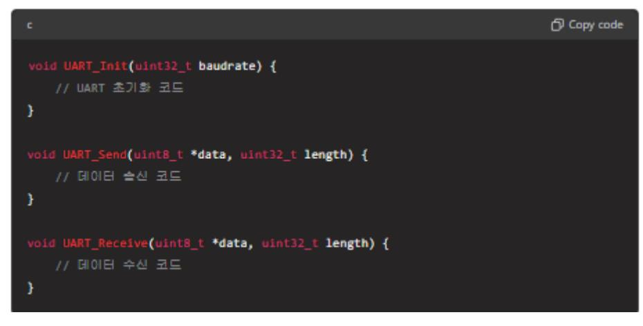

출처: 코드 작성 프로그램. 2024. 8. 10. 스크린샷. [그림 3-16] UART Driver 코드 구현

- (다) Timer Driver 모듈
  - 1) 기능: 타이머 제어
  - 2) 인터페이스
    - 가) 입력: 타이머 주기

나) 출력: 없음. 3) 구현

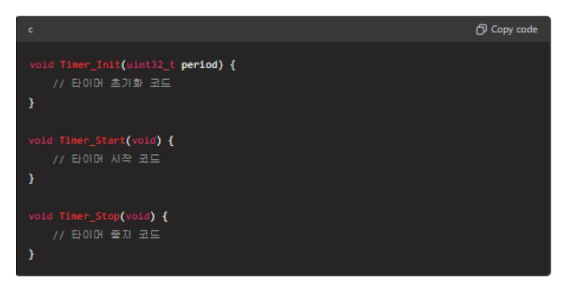

출처: 코드 작성 프로그램. 2024. 8. 10. 스크린샷. [그림 3-17] Timer Driver 모듈 코드 구현

- (6) 인터페이스 설계
  - (가) 하드웨어 인터페이스
    - 1) UART 핀 구성: TX, RX
    - 2) 타이머 핀 구성: 타이머 인터럽트 핀
  - (나) 소프트웨어 인터페이스
    - 1) API: UART\_Init, UART\_Send, UART\_Receive, Timer\_Init, Timer\_Start, Timer\_Stop
  - (다) 통신 프로토콜
    - 1) UART 프로토콜: 8N1(8data bits, no parity, 1stop bit)
    - 2) 타이머 프로토콜: 주기적인 인터럽트 발생
- (7) 테스트 계획
  - (가) 테스트 전략
    - 1) 단위 테스트: 모듈별로 단위 테스트 수행
    - 2) 통합 테스트: 모듈 통합 후 통합 테스트 수행
    - 3) 시스템 테스트: 전체 시스템에 대한 테스트 수행
  - (나) 테스트 케이스
    - 1) TC1: 시스템 초기화 테스트
    - 2) TC2: UART 송수신 테스트
    - 3) TC3: 타이머 인터럽트 테스트

- (다) 테스트 환경
  - 1) 하드웨어: STM32 Nucleo 보드
  - 2) 소프트웨어: STM32CubeIDE, STM32CubeMX
- (8) 추가 사항
  - (가) 제한 사항
    - 1) 특정 하드웨어에 종속적일 수 있음.
    - 2) 제한된 메모리 자원
  - (나) 향후 개선 사항
    - 1) 추가 기능 구현
    - 2) 성능 최적화
  - (다) 참고 자료
    - 1) STM32 데이터 시트
    - 2) FreeRTOS 매뉴얼

펌웨어 설계서는 반도체 펌웨어 개발 과정에서 모든 기술적 세부 사항을 명확히 문서화하여, 개발팀과 이해관계자들이 프로젝트의 목표와 범위를 명확히 이해할 수 있도록 돕는다. 체계적 인 요구 사항 분석, 아키텍처 설계, 모듈 설계, 인터페이스 정의, 테스트 계획 등을 통해 펌웨 어 개발의 모든 단계를 계획하고 실행할 수 있다. 이를 통해 개발 과정의 효율성을 높이고, 고 품질의 펌웨어를 제공할 수 있다.

### 수행 tip

- 펌웨어 설계를 위해 요구 사항에 적합한 다양한 소프트웨 어를 검토하여 선정한다.
- 개발 시스템을 구성할 때 주변 장치가 결정되면 마이크로 프로세서 선정 시 모든 주변 장치를 제어하는 데 문제가 없는지 고려하여야 한다.
- 시스템 소프트웨어는 하드웨어와 밀접한 관련이 있으며 마 이크로프로세서는 다양하지만 내부의 하드웨어는 비슷하다. 마이크로프로세서 내부의 하드웨어에 대한 지식도 함께 숙 지해야 한다.

## 학습 3 교수·학습 방법

### 교수 방법

- 선행 학습에서 제시된 유즈 케이스 다이어그램과 클래스 다이어그램이 왜 중요하고 의미가 있는지 충분히 설명한다.
- 펌웨어 행위 모델링(상태 다이어그램, 순차 다이어그램, 활동 다이어그램)에 대한 프레젠테 이션 자료를 만들어 이해가 빠르도록 설명한다.
- 행위 다이어그램(순차 다이어그램, 상태 다이어그램, 활동 다이어그램) 도식화 방법을 익히 기 위하여 교수자가 예제 다이어그램을 직접 스케치하면서 설명한다.
- 행위 다이어그램 도식화 방법을 익히기 위하여 피교육자에게 예제를 제시하고 피교육자가 직접 예제 상태 다이어그램, 순차 다이어그램, 활동 다이어그램을 그리도록 한다.
- 가능하면 개인별로 상태 다이어그램, 순차 다이어그램, 활동 다이어그램을 만들 수 있도록 지도한다.

### 학습 방법

- 선행학습에서 제시된 내용을 사전에 충분히 학습한다.
- 인터넷을 이용하여 행위 다이어그램 작성 방법을 사전에 찾아보고 이에 대해 파악한다.
- 상태 다이어그램, 순차 다이어그램, 활동 다이어그램 작성에 관한 자료를 사전에 찾아보고 이에 대해 파악한다.
- 예제 유즈 케이스 다이어그램과 클래스 다이어그램으로부터 상태 다이어그램, 순차 다이어 그램,활동 다이어그램을 직접 그려 보면서 펌웨어 구조 설계에 대해 학습한다.
- 개발할 시스템에 대한 가상 시나리오를 만들어 상태 다이어그램, 순차 다이어그램, 활동 다 이어그램을 그려 보면서 펌웨어 구조 설계에 대한 이해력을 높인다.

## 학습 3 평 가

### 평가 준거

• 평가자는 학습자가 학습 목표를 성공적으로 달성하였는지를 평가해야 한다.

### • 평가자는 다음 사항을 평가해야 한다.

|        | 학습 내용<br>학습 목표                                           |   | 성취수준 |   |  |
|--------|----------------------------------------------------------|---|------|---|--|
|        |                                                          | 상 | 중    | 하 |  |
|        | - 펌웨어 개발 환경을 구축할 수 있다.                                   |   |      |   |  |
|        | - 요구 사항 정의서에 따라 펌웨어 전체 구조와 단위 모듈을 설계<br>할 수 있다.          |   |      |   |  |
| 펌웨어 설계 | - 운영 체제 사용 여부에 따른 부트 절차를 계획하고, Start-up<br>코드를 설계할 수 있다. |   |      |   |  |
|        | - 펌웨어 설계서를 작성할 수 있다.                                     |   |      |   |  |

### 평가 방법

• 서술형 시험

|        |                                              |   | 성취수준 |   |
|--------|----------------------------------------------|---|------|---|
| 학습 내용  | 평가 항목                                        | 상 | 중    | 하 |
|        | - 펌웨어 개발 환경 구축을 위해 필요한 소프트웨어 구성 요소 파<br>악 여부 |   |      |   |
| 펌웨어 설계 | - 요구 사항 정의서에 따라 요구 사항을 분석할 수 있는 능력           |   |      |   |
|        | - 운영 체제 사용의 경우에 부트 절차를 계획할 수 있는 능력           |   |      |   |
|        | - 펌웨어 설계서에서 구성 요소의 파악 여부                     |   |      |   |

### • 평가자 체크리스트

|        | 평가 항목                                              |   | 성취수준 |   |  |
|--------|----------------------------------------------------|---|------|---|--|
| 학습 내용  |                                                    | 상 | 중    | 하 |  |
|        | - 펌웨어 개발 환경 구축을 위한 단계 파악 여부                        |   |      |   |  |
|        | - 요구 사항 정의서에 따라 펌웨어<br>아키텍처를 설계할 수 있<br>는 능력       |   |      |   |  |
| 펌웨어 설계 | - 운영 체제를 사용 하지 않는 경우의 Start-up 코드를 설계<br>할 수 있는 능력 |   |      |   |  |
|        | - 펌웨어 설계서에서 기능적 및 비기능적 펌웨어의 요구 사항<br>파악 여부         |   |      |   |  |

### 피드백

- 1. 서술형 시험
- 펌웨어 개발 환경을 구축을 위해 필요한 소프트웨어 구성 요소에 대한 파악 여부를 평가한 후, 보완이 필요한 사항이나 주요 사항을 표시하여 피드백 해 준다.
- 요구 사항 정의서에 따라 요구 사항을 분석할 수 있는 능력을 평가 후, 보완이 필요한 사항이나
- 주요 사항을 표시하여 보충 설명해 준다. - 평가 결과가 우수한 학습자와 미흡한 학습자를 구분하여 우수한 학습자에게는 서술형 평가 내용 의 적용 사례 학습을 통한 심화 학습으로 피드백해 주고, 미흡한 학습자에게는 기초 지식에 대해
  - 설명해 주어 일정 수준을 유지할 수 있도록 보완 지도해 준다.
- 2. 평가자 체크리스트
- 운영 체제를 사용 하지 않는 경우의 Start-up 코드를 설계할 수 있는 능력을 평가한 후 부족한 점을 지적하여 정확하게 처리할 수 있도록 보완 지도해 준다.
- 펌웨어 설계서에서 기능적 및 비기능적 펌웨어의 요구 사항 파악 여부에 대해 평가한 후, 개선 및 보완 사항을 정리하여 재학습할 수 있도록 피드백한다.
- 평가 결과가 우수한 학습자와 저조한 학습자를 구분하여 우수한 학습자에게는 작업장 환경에의 적용 학습을 통한 심화 학습으로 피드백 해 주고, 저조한 학습자에게는 기초 용어에 대한 설명을 통해 일정 수준을 유지할 수 있도록 보완 지도해 준다.

| 학습 1 | 내장 CPU 및 주변 장치 분석하기 |
|------|---------------------|
| 학습 2 | 펌웨어 요구 사항 분석하기      |
| 학습 3 | 펌웨어 설계하기            |
|      |                     |
| 학습 4 | 펌웨어 구현하기            |
| 학습 5 | 펌웨어 드라이버 개발하기       |

# 4-1. 펌웨어 구현

## 필요 지식 /

숔 반도체 펌웨어 구현 단계

반도체용 펌웨어 구현은 시스템의 기능성을 보장하고, 주변 장치와의 상호 작용을 원활히하는 중요한 작업이다. 다음은 반도체용 펌웨어 구현을 위한 단계별 가이드이다.

- 1. 요구 사항 분석 및 설계
  - (1) 요구 사항 분석
    - (가) 기능 요구 사항: 시스템이 수행해야 할 주요 기능 파악
    - (나) 비기능 요구 사항: 성능, 보안, 안정성 등의 요구 사항 파악
    - (다) 하드웨어 요구 사항: 사용되는 MCU 및 주변 장치의 스펙 파악
  - (2) 시스템 설계
    - (가) 아키텍처 설계: 시스템의 전체 아키텍처 설계
    - (나) 모듈 설계: 각 기능을 모듈화하여 설계
    - (다) 인터페이스 설계: 모듈 간 인터페이스 정의
- 2. 개발 환경 구축

- (1) 소프트웨어 도구 설치
  - (가) IDE: Keil MDK-ARM, IAR Embedded Workbench, STM32CubeIDE 등
  - (나) 컴파일러: ARM GCC, IAR, Keil 컴파일러
  - (다) 디버거: J-Link, ST-Link 등
- (2) 하드웨어 준비
  - (가) 개발 보드: 사용하려는 MCU의 개발 보드
  - (나) 디버깅 장비: JTAG/SWD 디버거
  - (다) 기타 장비: 멀티미터, 오실로스코프 등

### 3. 펌웨어 구현

- (1) 스타트업 코드 작성
  - (가) 리셋 핸들러: 시스템 초기화 코드
  - (나) 벡터 테이블: 예외 및 인터럽트 벡터 설정

(2) 시스템 초기화

- (가) 클럭 설정: 시스템 클럭 설정
- (나) 주변 장치 초기화: GPIO, UART, 타이머 등의 초기화

### (3) 드라이버 개발

- (가) GPIO 드라이버: GPIO 설정 및 제어
- (나) UART 드라이버: UART 설정 및 데이터 송수신
- (다) 타이머 드라이버: 타이머 설정 및 인터럽트 처리
- (4) 애플리케이션 코드 작성

메인 함수: 시스템의 주요 기능을 구현한다.

- 4. 테스트 및 디버깅
  - (1) 디버깅
    - (가) 디버깅 도구 사용: J-Link, ST-Link 등 디버거를 사용하여 코드 디버깅
    - (나) 디버깅 세션 설정: 브레이크포인트 설정, 변수 관찰, 메모리 보기 등
  - (2) 테스트
    - (가) 유닛 테스트: 모듈 단위로 기능 테스트
    - (나) 통합 테스트: 시스템 전체 기능 테스트
    - (다) 성능 테스트: 시스템 성능 측정 및 최적화
- 5. 최적화 및 유지 보수

- (1) 코드 최적화
  - (가) 메모리 사용 최적화: 불필요한 메모리 사용 줄이기
  - (나) 속도 최적화: 코드 실행 속도 향상
- (2) 유지 보수
  - (가) 버그 수정: 발견된 버그 수정
  - (나) 기능 추가: 새로운 기능 추가
  - (다) 성능 개선: 성능 개선 작업
- 6. 문서화 및 배포
  - (1) 문서화
    - (가) 코드 주석: 코드에 대한 자세한 주석 작성
    - (나) 사용자 매뉴얼: 시스템 사용 방법에 대한 문서 작성
    - (다) 기술 문서: 시스템 설계 및 구현에 대한 기술 문서 작성
  - (2) 배포
    - (가) 펌웨어 배포: 최종 펌웨어 이미지 생성 및 배포
    - (나) 업데이트 제공: 펌웨어 업데이트 방법 제공

반도체용 펌웨어 구현은 체계적인 요구 사항 분석, 설계, 개발, 테스트, 최적화 및 문서화 단계 를 통해 이루어진다. 이러한 과정을 통해 안정적이고 기능적인 펌웨어를 개발할 수 있다. 각 단계마다 철저한 검토와 테스트를 거쳐야 하며, 최적화와 유지 보수를 통해 지속해서 성능을 개선하고 새로운 기능을 추가할 수 있다.

## 수행 내용 / 펌웨어 구현하기

### 재료·자료

- 통합 개발 환경(IDE)
- 디버깅 소프트웨어
- 시뮬레이션 및 분석 도구
- 데이터 시트 및 사용자 매뉴얼(CPU 데이터 시트, 주변 장치 데이터 시트)
- 설계 가이드 및 예제 코드

### 기기(장비 ・ 공구)

- 개발 보드(마이크로컨트롤러/마이크로프로세서 개발 보드, 확장 보드)
- 디버그 장치
- 계측 장비(로직 분석기, 오실로스코프, 멀티미터 등)
- 시뮬레이션 및 분석 도구(Proteus,MATLAB/Simulink, LTspice, PyCharm/VSCode)

### 안전 ・ 유의 사항

- 정전기 방전(ESD)에 유의한다.
- 전원 관리를 한다.
- 장비 사용 안전(개발 보드 및 디버깅 장비, 계측 장비)에 유의한다.
- 작업 환경 안전(작업 공간 정리, 화학 물질 취급 안전 규정 준수)에 유의한다.

- 소프트웨어 및 데이터 안전 절차를 준수한다.

### 수행 순서

- 숔 펌웨어 및 부트 로더에 대한 테스트 계획서 작성과 테스트 코드를 구현한다.
  - 반도체 펌웨어 드라이버 개발을 위해 펌웨어 및 부트 로더에 대한 테스트 계획서 를 작성하고 테스트 코드를 구현하는 것은 펌웨어의 신뢰성과 안정성을 보장하 기 위한 중요한 단계이다. 다음은 이 과정을 단계별로 설명한다.

### 1. 테스트 계획서를 작성한다.

테스트 계획서는 테스트의 목적, 범위, 환경, 케이스 등을 명확히 정의하여 체계적인 테스트 를 가능하게 한다.

(1) 테스트 목표 정의

(가) 목표 설정: 펌웨어 및 부트 로더의 기능, 성능, 안정성을 검증하는 목표를 설정한다.

예) 시스템 초기화, 메모리 관리, 주변 장치 초기화, 오류 처리 등

(2) 테스트 범위 설정

(가) 범위 정의: 테스트할 기능과 모듈을 명확히 정의한다.

예) 부트 로더 초기화 코드, 펌웨어 메인 루프, 인터럽트 처리, 드라이버 초기화 등

- (3) 테스트 환경 구성
  - (가) 환경 설정: 테스트를 수행할 하드웨어 및 소프트웨어 환경을 정의한다.

예) 테스트 보드, 시뮬레이터, 디버거, 테스트 프레임 워크 등

- (4) 테스트 케이스 작성
  - (가) 케이스 정의: 각 테스트 케이스를 상세히 작성한다.
    - 1) 테스트 ID: 고유한 테스트 케이스 식별자
    - 2) 테스트 목적: 테스트의 목적과 기대 결과
    - 3) 테스트 단계: 테스트 수행 절차.
    - 4) 입력 및 출력: 필요한 입력 데이터와 기대되는 출력 결과
    - 5) 성공 기준: 테스트가 성공으로 간주되는 조건
- (5) 테스트 일정 및 책임자
  - (가) 일정 설정: 테스트 수행 일정과 각 단계별 마일스톤을 설정한다.
  - (나) 책임자 지정: 테스트 수행과 결과 분석을 담당할 책임자를 지정한다.
- (6) 테스트 보고서 양식
  - (가) 보고서 양식 작성: 테스트 결과를 기록하고 보고할 양식을 정의한다.
  - (나) 테스트 케이스 ID, 테스트 결과, 발견된 문제점, 문제 해결 상태 등

### 2. 테스트 코드를 구현한다.

테스트 코드는 펌웨어 및 부트 로더의 각 기능을 검증하는 데 사용된다. 유닛 테스트, 통합 테스트, 시스템 테스트를 포함한다.

(1) 테스트 프레임 워크 선택

(가) 프레임 워크 결정: 테스트 코드 구현에 사용할 프레임 워크를 선택한다.

예) Unity, CMock, Google Test 등

(2) 테스트 환경 설정

(가) 환경 구성: 테스트 프레임 워크와 도구를 설정한다.

컴파일러 설정, 빌드 스크립트 작성, 테스트 보드 설정 등

(3) 테스트 케이스 구현

출처: 코드 작성 프로그램. 2024. 8. 10. 스크린샷. [그림 4-1] 유닛 테스트 코드(C 언어) 예시

3. 테스트 실행 및 결과를 분석한다.

(1) 테스트 실행

(가) 테스트 실행: 구현된 테스트 코드를 실행한다.

자동화된 테스트 스크립트를 사용하여 반복적인 테스트를 수행한다.

(나) 결과 기록: 테스트 결과를 기록하고 분석한다.

성공/실패 여부, 로그 파일, 오류 메시지 등

- (2) 테스트 결과 보고서 작성
  - (가) 보고서 작성: 테스트 결과를 종합하여 보고서를 작성한다.
    - 각 테스트 케이스의 결과, 발견된 문제점, 문제 해결 방안 등
- 4. 예시: 테스트 계획서
  - (1) 테스트 목표
    - (가) 부트 로더 및 펌웨어의 초기화, 기능, 성능, 안정성을 검증한다.
  - (2) 테스트 범위
    - (가) 부트 로더 초기화 코드
    - (나) 펌웨어 메인 루프 및 주요 함수
    - (다) 인터럽트 처리 루틴
    - (라) 주변 장치 드라이버 초기화
  - (3) 테스트 환경
    - (가) 하드웨어: 테스트 보드(예: STM32F4)
    - (나) 소프트웨어: Keil MDK, Unity 테스트 프레임 워크
  - (4) 테스트 케이스

| 〈표 4-1 | I〉테스트 | 케이스 | 사례 |
|--------|-------|-----|----|
|--------|-------|-----|----|

| 테스트 ID | 테스트 목적            | 테스트 단계             | 입력      | 기대 출력            | 성공 기준            |
|--------|-------------------|--------------------|---------|------------------|------------------|
| TC001  | 부트 로더 초기화         | 부트 로더 코드 실<br>행    | N/A     | 초기화 완료 메시지       | 초기화 메시지 출력       |
| TC002  | 펌웨어 메인 루프         | 펌웨어 메인 루프<br>실행    | N/A     | 정상 동작            | 펌웨어 정상 동작        |
| TC003  | 인터럽트 처리           | 인터럽트 발생 및<br>처리 확인 | 인터럽트 신호 | 인터럽트 처리 루틴<br>실행 | 인터럽트 처리 정상       |
| TC004  | 주변 장치 드라이버<br>초기화 | 드라이버 초기화 코<br>드 실행 | N/A     |                  | 초기화 완료 메시지<br>출력 |

### 5. 테스트 일정 및 책임자

(2) 책임자: 홍길동

(1) 일정: 2024년 7월 1일~2024년 7월 15일

83

6. 테스트 보고서 양식을 작성한다.

(1) 테스트 ID, 테스트 결과, 문제점, 문제 해결 상태, 비고 반도체 펌웨어 드라이버 개발을 위해 펌웨어 및 부트 로더의 테스트 계획서를 작성하고 테스트 코드를 구현하는 것은 펌웨어의 신뢰성과 안정성을 보장하기 위한 필수적인 단계이다. 테스트 계획서 작성 시 테스트 목표, 범위, 환경, 케이스, 일정 및 책임자를 명확히 정의하고, 테스트 코드를 구현하여 자동화된 테스트를 통해 반복적으로 검증한다. 이를 통해 펌웨어의 품질을 향 상시키고, 문제를 사전에 발견하고 해결할 수 있다.

숕 설계서에 따라 펌웨어를 구현한다.

반도체 펌웨어 드라이버 개발을 위해 설계서에 따라 펌웨어를 구현하는 과정은 체계적이고 효 율적으로 소프트웨어를 개발하는 데 필수적이다. 설계서를 기반으로 펌웨어를 구현함으로써 요 구 사항을 충족하고, 코드의 일관성 및 유지 보수성을 높일 수 있다. 다음은 설계서에 따라 펌 웨어를 구현하는 단계별 가이드이다.

- 1. 설계서를 이해 및 분석한다.
  - (1) 설계서 검토
    - (가) 설계서 이해: 펌웨어의 요구 사항, 기능, 인터페이스, 제약 사항 등을 이해한다.
    - (나) 모듈 식별: 구현해야 할 주요 모듈과 기능을 식별한다.
    - (다) 데이터 흐름 파악: 데이터의 흐름과 주요 변수 및 구조체를 이해한다.
  - (2) 시스템 아키텍처 분석
    - (가) 하드웨어 구성 확인: 사용되는 CPU, 메모리, 주변 장치 등 하드웨어 구성 요소를 확인 한다.
    - (나) 소프트웨어 아키텍처 이해: 펌웨어의 주요 구성 요소(부트 로더, 메인 펌웨어, 드라이버 등)와 상호 작용을 이해한다.
- 2. 개발 환경 설정을 분석한다.
  - (1) 도구 및 라이브러리 준비
    - (가) 개발 도구: IDE(예: Keil MDK, IAR Embedded Workbench, Eclipse, Visual Studio Code), 컴파일러, 디버거 등 필요한 개발 도구를 설치한다.
    - (나) 버전 관리 시스템: Git과 같은 버전 관리 시스템을 설정하여 코드 관리를 체계적으로 수 행한다.
    - (다) 필요한 라이브러리: 프로젝트에 필요한 라이브러리와 SDK를 준비한다.
  - (2) 빌드 환경 설정

- (가) 프로젝트 설정: IDE에서 새로운 프로젝트를 생성하고, 타깃 디바이스와 컴파일러 설정을 한다.
- (나) 빌드 스크립트 작성: Makefile 또는 CMake와 같은 빌드 스크립트를 작성하여 빌드 프 로세스를 자동화한다.
- 3. 펌웨어를 구현한다.
  - (1) 코드 구조 작성
    - (가) 디렉터리 구조 정의: 소스 코드, 헤더 파일, 드라이버, 라이브러리 등을 위한 디렉터리 구조를 정의한다.
    - (나) 파일 템플릿 작성: 일관된 코드 작성을 위해 파일 템플릿을 작성한다.
  - (2) 모듈별 코드 작성
    - (가) 부트 로더
      - 1) 부트 로더 초기화 코드: 하드웨어 초기화, 메모리 설정, 시계 설정 등 부트 로더 초 기화 코드를 작성한다.
      - 2) 부트 로딩 함수: 펌웨어 이미지를 로딩하고, 메인 펌웨어로 점프하는 함수를 구현한다.

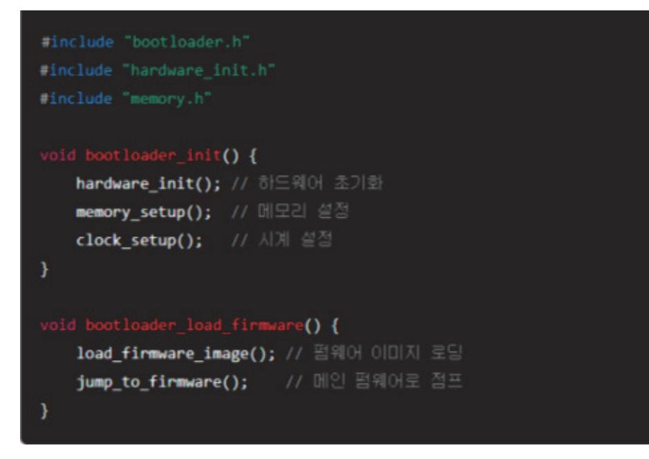

출처: 코드 작성 프로그램. 2024. 8. 10. 스크린샷. [그림 4-2] 부트 로더 초기화 코드 및 부트 로딩 함수

(나) 메인 펌웨어

1) 시스템 초기화: 시스템 전체 초기화 코드 작성

2) 주요 기능 구현: 설계서에 따라 펌웨어의 주요 기능을 구현한다.

3) 주기적 작업: 타이머 인터럽트 등을 이용한 주기적 작업을 구현한다.

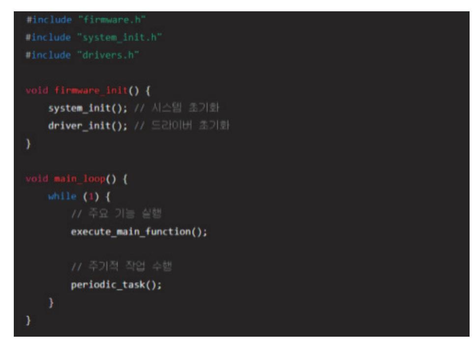

출처: 코드 작성 프로그램. 2024. 8. 10. 스크린샷. [그림 4-3] 메인 펌웨어 코드 예

### (다) 드라이버

- 1) 드라이버 초기화: 각 주변 장치의 초기화 코드를 작성한다.
- 2) 드라이버 함수: 주변 장치를 제어하기 위한 함수들을 구현한다.

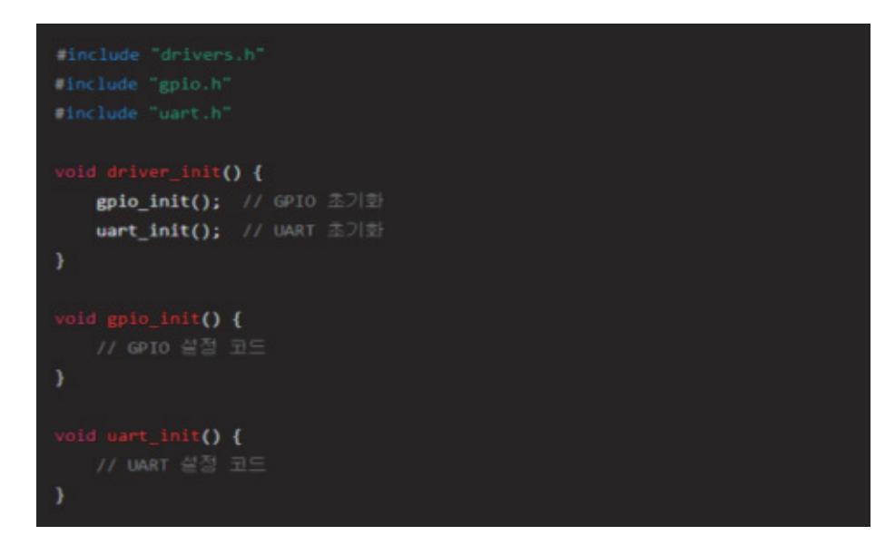

출처: 코드 작성 프로그램. 2024. 8. 10. 스크린샷. [그림 4-4] 드라이버 코드 예

- (3) 코드를 통합한다.
  - (가) 모듈 통합: 구현된 모듈을 통합하여 전체 시스템을 구성한다.
  - (나) 빌드 및 컴파일: 전체 코드를 빌드하고 컴파일하여 실행 가능한 펌웨어 이미지를 생성한 다.
- 4. 테스트 및 검증한다.
  - (1) 유닛 테스트
    - (가) 유닛 테스트 작성: 각 모듈의 유닛 테스트를 작성하여 개별 기능을 검증한다.
    - (나) 테스트 실행: 유닛 테스트를 실행하고, 결과를 확인한다.

| #inclu |                                        |
|--------|----------------------------------------|
| #inclu |                                        |
| #inclu |                                        |
|        | est_firmware_init() {                  |
| TE     | ST_ASSERT_EQUAL(0, firmware_init());   |
| }      |                                        |
|        |                                        |
|        | test_main_loop() {                     |
|        | EST_ASSERT_NOT_NULL(main_loop());      |
| }      |                                        |
|        | ain(void) {                            |
|        | <pre>IITY_BEGIN();</pre>               |
| RL     | <pre>N_TEST(test_firmware_init);</pre> |
| RL     | <pre>N_TEST(test_main_loop);</pre>     |
|        | eturn UNITY_END();                     |
| }      |                                        |
|        |                                        |

출처: 코드 작성 프로그램. 2024. 8. 10. 스크린샷. [그림 4-5] 유닛 테스트 코드

- (2) 통합 테스트
  - (가) 통합 테스트 작성: 통합된 시스템의 기능을 검증하는 테스트를 작성한다.
  - (나) 테스트 실행: 통합 테스트를 실행하고, 결과를 확인한다.
- (3) 시스템 테스트
  - (가) 시스템 테스트 작성: 실제 하드웨어 환경에서 시스템 전체의 기능을 검증하는 테스트를 작성한다.
  - (나) 테스트 실행: 시스템 테스트를 실행하고, 결과를 확인한다.
- 5. 코드 리뷰 및 최적화를 진행한다.

- (1) 코드 리뷰
  - (가) 리뷰 요청: 작성한 코드를 팀원에게 리뷰 요청한다.
  - (나) 리뷰 피드백: 피드백을 받아 수정하고, 코드를 개선한다.

- (2) 코드 최적화
  - (가) 성능 분석: 코드의 성능을 분석하고, 병목 현상을 확인한다.

  - (나) 최적화: 성능을 향상시키기 위해 코드를 최적화한다.
    - 예) 루프 최적화, 메모리 사용 최적화 등
- 6. 배포 및 유지 보수
  - (1) 배포
    - (가) 펌웨어 이미지 생성: 최종 펌웨어 이미지를 생성한다.
    - (나) 배포: 펌웨어 이미지를 배포하고, 필요시 업데이트 절차를 마련한다.
    - (다) 버그 수정: 발견된 버그를 수정하고, 업데이트를 배포한다.
    - (라) 기능 추가: 새로운 기능 요구 사항에 따라 펌웨어를 업데이트한다.
- 7. 예시 프로젝트 구성
  - (1) 디렉터리 구조

| project/            |
|---------------------|
| ├─ Makefile         |
| ├─ linker_script.ld |
| ⊨ sec/              |
| main.c              |
|                     |
| bootloader.c        |
| - firmare.c         |
|                     |
| gpio.c              |
| uart.c              |
| └─ include/         |
| bootloader.h        |
| - firmware.h        |
| - drivers/          |
| - gpio.h            |
| L_ wart.h           |

출처: 코드 작성 프로그램. 2024. 8. 10. 스크린샷. [그림 4-6] 디렉터리 구조 예

반도체 펌웨어 드라이버 개발을 위해 설계서에 따라 펌웨어를 구현하는 과정은 체계적이고 단 계적인 접근이 필요하다. 설계서를 철저히 이해하고, 개발 환경을 설정한 후, 모듈별로 코드를 작성하고 통합하여 펌웨어를 구현한다. 유닛 테스트, 통합 테스트, 시스템 테스트를 통해 펌웨

어의 기능과 안정성을 검증하여 최종적으로 신뢰성 있는 펌웨어를 개발할 수 있다.

숖 펌웨어 개발 환경을 활용한다.

반도체 펌웨어 드라이버 개발에서 펌웨어 개발 환경을 활용하는 것은 프로젝트의 효율성을 높 이고 코드 품질을 유지하며, 디버깅 및 테스트를 용이하게 한다. 다음은 펌웨어 개발 환경을 설정하고 활용하는 단계별 가이드이다.

1. 개발 환경을 구성한다.

(1) 개발 도구 선택

- (가) IDE(Integrated Development Environment) 펌웨어 개발을 위한 주요 통합 개발 환 경을 선택한다.
  - 예) Keil MDK, IAR Embedded Workbench, Eclipse, Visual Studio Code 등
- (나) 컴파일러: 타깃 MCU에 맞는 컴파일러를 선택한다.

예) ARM GCC, Keil Compiler, IAR Compiler 등

(다) 디버거: 하드웨어 디버깅을 위한 디버거를 선택한다.

예) J-Link, ST-Link, ULINK 등

- (2) 버전 관리 시스템 설정
  - (가) Git: 코드 버전 관리 및 협업을 위해 Git을 설정한다.
  - (나) GitHub, GitLab, Bitbucket 등의 호스팅 서비스를 이용한다.
  - (다) 리포지토리 구성: 프로젝트 리포지토리를 생성하고, 디렉터리 구조를 설정한다.

2. 개발 환경을 설치 및 설정한다.

- (1) IDE 및 컴파일러 설치
  - (가) IDE 설치: 선택한 IDE를 다운로드하고 설치한다.
  - (나) 컴파일러 설치: 타깃 MCU에 맞는 컴파일러를 다운로드하고 설치한다.
  - (다) 플러그인 설치: 필요한 플러그인과 확장 기능을 설치한다.
    - 예) 코드 형식화, 정적 분석 도구, 디버깅 툴 등
- (2) 디버거 설정
  - (가) 디버거 연결: 디버거를 개발 보드에 연결하고, 드라이버를 설치한다.
  - (나) 디버거 설정: IDE에서 디버거 설정을 구성한다.

(3) 빌드 시스템 설정

- (가) 프로젝트 생성: IDE에서 새로운 프로젝트를 생성하고, 타깃 MCU를 설정한다.
- (나) 빌드 스크립트 작성: Makefile, CMake 등 빌드 스크립트를 작성하여 빌드 프로세스를

자동화한다.

- 3. 펌웨어를 개발 및 디버깅한다.
  - (1) 코드 작성
    - (가) 코딩 표준 준수: 코딩 표준과 스타일 가이드를 준수하여 코드를 작성한다.
    - (나) 모듈화: 기능별로 코드를 모듈화하여 유지 보수성을 높인다.
    - (다) 주석 및 문서화: 코드에 주석을 추가하고, 문서화를 통해 이해도를 높인다.
  - (2) 컴파일 및 빌드
    - (가) 컴파일: 작성한 코드를 컴파일하여 바이너리를 생성한다.
    - (나) 빌드: 전체 프로젝트를 빌드하고, 링크하여 실행 파일을 생성한다.
  - (3) 디버깅
    - (가) 하드웨어 디버깅: 디버거를 이용하여 하드웨어에서 실행 중인 펌웨어를 디버깅한다.
    - (나) 브레이크포인트 설정, 변숫값 확인, 스텝 실행 등
    - (다) 소프트웨어 디버깅: 시뮬레이터를 사용하여 소프트웨어상에서 디버깅한다.
- 4. 테스트 및 검증한다.
  - (1) 유닛 테스트
    - (가) 유닛 테스트 작성: 각 모듈의 유닛 테스트를 작성한다.
    - (나) 테스트 실행: 자동화된 유닛 테스트 프레임 워크를 사용하여 테스트를 실행한다. 예) Unity, Google Test 등
  - (2) 통합 테스트
    - (가) 통합 테스트 작성: 통합된 시스템의 기능을 검증하는 테스트를 작성한다.
    - (나) 테스트 실행: 통합 테스트를 실행하고, 결과를 확인한다.
  - (3) 시스템 테스트
    - (가) 시스템 테스트 작성: 실제 하드웨어 환경에서 시스템 전체의 기능을 검증하는 테스트를 작성한다.
    - (나) 테스트 실행: 시스템 테스트를 실행하고, 결과를 확인한다.
- 5. 코드 리뷰 및 최적화한다.
  - (1) 코드 리뷰
    - (가) 리뷰 요청: 작성한 코드를 팀원에게 리뷰를 요청한다.
    - (나) 리뷰 피드백: 피드백을 받아 수정하고, 코드를 개선한다.
  - (2) 코드 최적화

- (가) 성능 분석: 코드의 성능을 분석하고, 병목 현상을 확인한다.
- (나) 최적화: 성능을 향상시키기 위해 코드를 최적화한다.

예) 루프 최적화, 메모리 사용 최적화 등

6. 배포 및 유지 보수한다.

(1) 배포

- (가) 펌웨어 이미지 생성: 최종 펌웨어 이미지를 생성한다.
- (나) 배포: 펌웨어 이미지를 배포하고, 필요 시 업데이트 절차를 마련한다.
- (2) 유지 보수
  - (가) 버그 수정: 발견된 버그를 수정하고, 업데이트를 배포한다.
  - (나) 기능 추가: 새로운 기능 요구 사항에 따라 펌웨어를 업데이트한다.
- 7. 예시 프로젝트를 구성한다.

(1) 디렉터리 구조

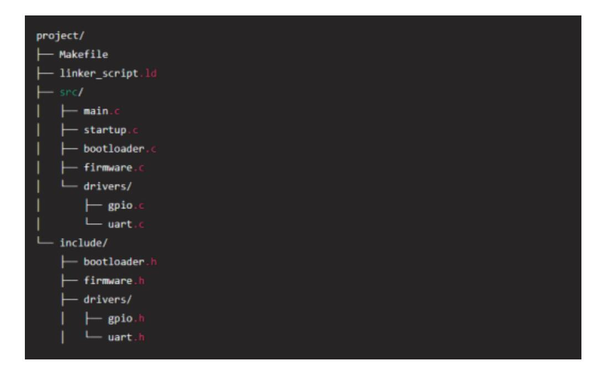

출처: 코드 작성 프로그램. 2024. 8. 10. 스크린샷. [그림 4-7] 디렉터리 구조 예시

반도체 펌웨어 드라이버 개발에서 개발 환경을 효과적으로 활용하는 것은 프로젝트의 성공을 좌우할 수 있는 중요한 요소이다. 적절한 개발 도구와 환경을 구성하고, 체계적인 워크플로를 통해 펌웨어를 개발, 디버깅, 테스트, 최적화하는 과정은 펌웨어의 품질과 성능을 보장한다. 개 발 환경을 효과적으로 활용함으로써 개발 효율성을 높이고, 신뢰성 있는 펌웨어를 제공할 수 있다.

### 숗 CPU 및 주변 장치의 Start-up 코드, 디바이스 트리 파일을 작성한다.

반도체 펌웨어 드라이버 개발에서 CPU 및 주변 장치의 Start-up 코드와 디바이스 트리 파일 을 작성하는 것은 시스템 초기화를 제대로 수행하고, 하드웨어와 소프트웨어 간의 원활한 상호 작용을 보장하기 위해 필수적인 작업이다. 다음은 Start-up 코드와 디바이스 트리 파일을 작성 하는 단계별 가이드이다.

1. Start-up 코드를 작성한다.

Start-up 코드는 시스템이 리셋된 후 가장 먼저 실행되는 코드로, 하드웨어 초기화, 메모리 초기화, 스택 설정, 그리고 메인 펌웨어 진입을 위한 준비 작업을 수행한다.

출처: 코드 작성 프로그램. 2024. 8. 10. 스크린샷. [그림 4-8] Start-up 코드 작성 예시(ARM Cortex-M 기반)

- (1) Start-up 코드 구조
  - (가) 리셋 핸들러: 시스템이 리셋될 때 실행되는 첫 번째 코드
  - (나) 벡터 테이블: 인터럽트 및 예외 처리를 위한 핸들러 함수 포인터 테이블
  - (다) 초기화 코드: 메모리 초기화, 스택 설정, 시스템 클럭 설정 등
  - (라) 메인 함수 호출: 초기화가 완료된 후 메인 펌웨어로 진입
- (2) Start-up 코드 작성 예시(ARM cortex-M 기반)
- 2. 디바이스 트리 파일을 작성한다.

디바이스 트리(device tree)는 하드웨어 구성 요소의 정보를 정의하는 파일로, 커널이 하드웨어를 초기화하고 사용할 수 있도록 도와준다. 디바이스 트리 파일은 주로 .dts(device tree source) 파일과 .dtsi(device tree include) 파일로 구성된다.

- (1) 디바이스 트리 파일 구조
  - (가) 루트 노드: 시스템의 최상위 노드
  - (나) CPU 노드: CPU 관련 정보 정의
  - (다) 메모리 노드: 시스템 메모리 영역 정의
  - (라) 주변 장치 노드: 각 주변 장치의 정보 정의
- (2) 디바이스 트리 파일 작성 예시
- 3. Start-up 코드 및 디바이스 트리 파일을 통합한다.
  - (1) 빌드 시스템 설정
    - (가) Makefile 설정: Start-up 코드와 디바이스 트리 파일을 포함하도록 빌드 스크립트를 설 정한다.
    - (나) 링커 스크립트 수정: 메모리 레이아웃과 섹션을 설정한다.

### 4. 디버깅 및 검증한다.

- (1) 시뮬레이터 및 디버거 사용
  - (가) 시뮬레이터: 초기 코드의 검증을 위해 QEMU와 같은 시뮬레이터를 사용한다.
  - (나) 디버거: J-Link, ST-Link 등의 디버거를 사용하여 하드웨어에서 직접 디버깅한다.
- (2) 테스트 및 검증한다.
  - (가) 부트 테스트: Start-up 코드가 정상적으로 실행되어 메인 펌웨어로 진입하는지 테스트한 다.
  - (나) 주변 장치 테스트: 디바이스 트리 파일에 정의된 주변 장치가 정상적으로 초기화되고 동 작하는지 검증한다.
- 반도체 펌웨어 개발에서 CPU 및 주변 장치의 Start-up 코드와 디바이스 트리 파일을 작성하

는 것은 시스템의 초기화와 하드웨어 구성 요소의 올바른 인식을 위해 매우 중요하다. Start-up 코드는 시스템 초기화와 메모리 설정을 담당하며, 디바이스 트리 파일은 하드웨어 자 원의 구조와 위치를 정의한다. 이를 통해 하드웨어와 소프트웨어 간의 원활한 상호 작용을 보 장하고, 펌웨어 개발의 안정성과 신뢰성을 높일 수 있다.

| /dts-v1/;                                                                              |
|----------------------------------------------------------------------------------------|
|                                                                                        |
| / {                                                                                    |
| compatible = "mycompany,myboard";                                                      |
| model = "MyCompany MyBoard";                                                           |
| model - Hycompany Hyboard ,                                                            |
| /delete-node/ chosen; // 기존 노드 삭제                                                      |
| /delete-node/ chosen; // 기존 도드 직제                                                      |
|                                                                                        |
| aliases {                                                                              |
| serial0 = &uart0                                                                       |
| ethernet0 = &eth0                                                                      |
| };                                                                                     |
|                                                                                        |
| memory {                                                                               |
| <pre>device_type = "memory";</pre>                                                     |
| reg = <0x80000000 0x20000000>; // 메모리 시작 주소와 크기                                        |
| };                                                                                     |
|                                                                                        |
| cpus {                                                                                 |
| <pre>#address-cells = &lt;1&gt;;</pre>                                                 |
| <pre>#size-cells = &lt;0&gt;;</pre>                                                    |
| cpu@0 {                                                                                |
| <pre>device_type = "cpu";</pre>                                                        |
| compatible = "arm,cortex-a9";                                                          |
| reg = <0>;                                                                             |
|                                                                                        |
| };                                                                                     |
| };                                                                                     |
|                                                                                        |
| uart0: uart@10000000 {                                                                 |
| compatible = "ns16550a";                                                               |
| reg = <0x10000000 0x1000>;                                                             |
| <pre>interrupt-parent = &lt;&amp;intc&gt;; interrupts = &lt;5&gt;;</pre>               |
| <pre>interrupts = <s>; clock-frequency = &lt;24000000&gt;;</s></pre>                   |
| };                                                                                     |
|                                                                                        |
| eth0: ethernet@20000000 {                                                              |
| compatible = "smsc,lan9118";                                                           |
| reg = <0x20000000 0x1000>;                                                             |
| interrupt-parent = <&intc>;                                                            |
| <pre>interrupts = &lt;7&gt;;</pre>                                                     |
| phy-mode = "mii";                                                                      |
| };                                                                                     |
| into interrupt controller0f0f01000 (                                                   |
| <pre>intc: interrupt-controller@f8f01000 {     compatible = "arm,cortex-a9-gic";</pre> |
| compatible = "arm,cortex-a9-gic";<br>reg = <0xf8f01000 0x1000>,                        |
| reg = <0x18101000 0x1000>,<br><0xf8f00100 0x100>;                                      |
| interrupt-controller;                                                                  |
| <pre>#interrupt-cells = &lt;3&gt;;</pre>                                               |
| };                                                                                     |
| 3                                                                                      |
|                                                                                        |

출처: 코드 작성 프로그램. 2024. 8. 10. 스크린샷. [그림 4-9] 디바이스 트리 파일 작성 예시

| # Makefile (0[A)                           |
|--------------------------------------------|
| CC = arm-none-eabi-gcc                     |
| CFLAGS = -mcpu=cortex-m3 -mthumb -O2 -Wall |
| LDFLAGS = -Tlinker_script.ld               |
| SRCS = startup.c main.c                    |
| 0835 = \$(SRCS:.c=.o)                      |
| all: firmware.bin                          |
| firmware.elf: \$(0805)                     |
| \$(CC) \$(CFLAGS) \$(LDFLAGS) -0 \$@ \$*   |
| firmware.bin: firmware.elf                 |
| arm-none-eabi-objcopy -O binary 5< 50      |
| clean:                                     |
| rm -f *.o *.elf *.bin                      |

출처: 코드 작성 프로그램. 2024. 8. 10. 스크린샷. [그림 4-10] Makefile 예시

### (2) 링커 스크립트 예시

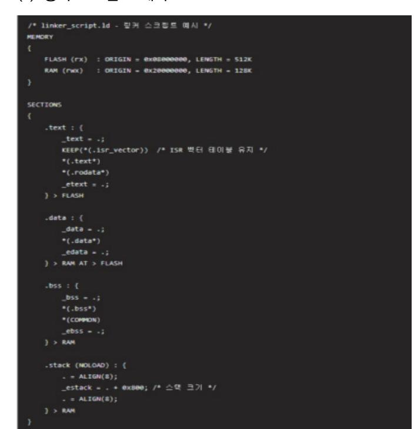

출처: 코드 작성 프로그램. 2024. 8. 10. 스크린샷. [그림 4-11] 링커 스크립트 예시

수 운영 체제 로딩을 위한 부트 코드를 구현하고 실행 파일을 생성한다. 반도체 펌웨어 드라이버 개발에서 운영 체제를 로딩하기 위한 부트 코드를 구현하고 실행 파일 을 생성하는 과정은 펌웨어 개발의 중요한 단계이다. 이 과정에서는 부트 코드를 작성하고, 컴 파일하고, 실행 파일을 생성하며, 이를 검증하는 절차가 포함된다. 다음은 단계별 가이드이다.

1. 부트 코드를 작성한다.

부트 코드는 시스템이 리셋된 후 가장 먼저 실행되는 코드로, 하드웨어 초기화, 메모리 초 기화, 운영 체제 로딩 등의 작업을 수행한다.

(1) 부트 코드 구조

- (가) 리셋 핸들러: 시스템이 리셋될 때 실행되는 첫 번째 코드
- (나) 초기화 코드: CPU 초기화, 메모리 초기화, 스택 설정, 클럭 설정 등
- (다) 운영 체제 로딩 코드: 운영 체제 이미지를 메모리로 로딩하고, 진입점으로 점프
- (2) 부트 코드 작성 예시(ARM Cortex-M 기반)

출처: 코드 작성 프로그램. 2024. 8. 10. 스크린샷. [그림 4-12] 부트 코드 작성 예시(ARM Cortex-M 기반)

2. 실행 파일을 생성한다.

부트 코드와 운영 체제 이미지를 컴파일하고 링크하여 실행 파일을 생성한다.

- (1) 컴파일 및 링크
  - (가) 컴파일: 부트 코드를 컴파일하여 오브젝트 파일을 생성한다.
  - (나) 링크: 부트 코드와 운영 체제 이미지를 링크하여 실행 파일을 생성한다.
- (2) Makefile 작성 예시

출처: 코드 작성 프로그램. 2024. 8. 10. 스크린샷. [그림 4-13] Makefile 작성 예시

(3) 링커 스크립트 예시

출처: 코드 작성 프로그램. 2024. 8. 10. 스크린샷. [그림 4-14] 링커 스크립트 예시

- 3. 디버깅 및 검증한다.
  - (1) 디버거 설정 및 사용
    - (가) 디버거 연결: J-Link, ST-Link 등의 디버거를 개발 보드에 연결하고, 드라이버를 설치 한다.
    - (나) 디버거 설정: IDE에서 디버거 설정을 구성한다.
  - (2) 부트 코드 디버깅
    - (가) 브레이크포인트 설정: 부트 코드의 주요 지점에 브레이크포인트를 설정한다.
    - (나) 디버깅: 초기화, 메모리 로딩, 운영 체제진입 등의 과정을 단계별로 디버깅한다.
  - (3) 운영 체제 로딩 테스트

- (가) 운영 체제 로딩: 부트 코드가 운영 체제 이미지를 정상적으로 로딩하고 실행하는지 확인 한다.
- (나) 문제 해결: 발생하는 문제를 디버깅하고 수정한다.

반도체 펌웨어 드라이버 개발에서 운영 체제를 로딩하기 위한 부트 코드를 구현하고 실행 파일 을 생성하는 과정은 시스템의 초기화와 운영 체제 진입을 보장하는 중요한 단계이다. 부트 코 드를 작성하고, 컴파일 및 링크하여 실행 파일을 생성하며, 디버거를 사용하여 부트 코드의 동 작을 검증한다. 이를 통해 펌웨어의 신뢰성과 안정성을 확보할 수 있다.

숙 사용자 배포용 펌웨어 파일을 생성하고 사용자 설명서를 작성한다.

반도체 펌웨어 드라이버 개발에서 사용자 배포용 펌웨어 파일을 생성하고 사용자 설명서를 작 성하는 것은 최종 사용자가 펌웨어를 쉽게 설치하고 사용할 수 있도록 하는 중요한 단계이다. 다음은 이 과정을 단계별로 설명한다.

- 1. 사용자 배포용 펌웨어 파일을 생성한다.
  - (1) 펌웨어 빌드

펌웨어 코드를 컴파일하고 링크하여 실행 파일을 생성한다.

출처: 코드 작성 프로그램. 2024. 8. 10. 스크린샷. [그림 4-15] 예제 Makefile

(가) 컴파일: 소스 파일을 오브젝트 파일로 컴파일한다.

- (나) 링크: 오브젝트 파일을 링크하여 실행 파일을 생성한다.
- (다) 바이너리 파일 생성: 실행 파일을 바이너리 형식으로 변환한다.
- (2) 펌웨어 이미지 생성
  - (가) 펌웨어 이미지를 생성하고, 검증한다.

firmware.bin파일이 생성된다. 이 파일이 사용자에게 배포될 펌웨어 이미지이다.

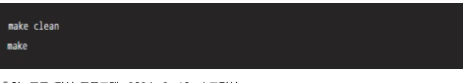

출처: 코드 작성 프로그램. 2024. 8. 10. 스크린샷. [그림 4-16] 펌웨어 빌드 명령

- 2. 사용자 설명서를 작성한다.
  - (1) 사용자 설명서의 주요 구성 요소
    - (가) 소개
      - 1) 제품 개요
      - 2) 펌웨어의 주요 기능 및 특징
    - (나) 시스템 요구 사항
      - 1) 하드웨어 요구 사항
      - 2) 소프트웨어 요구 사항
    - (다) 설치 절차
      - 1) 펌웨어 파일 다운로드 링크
      - 2) 펌웨어 설치 방법
        - 가) 설치 준비물
        - 나) 설치 단계별 설명
        - 다) 설치 과정에서 주의할 점
    - (라) 펌웨어 업데이트
      - 1) 기존 펌웨어 백업 방법
      - 2) 펌웨어 업데이트 절차
    - (마) 문제 해결
      - 1) 자주 발생하는 문제와 해결 방법
      - 2) 기술 지원 연락처
    - (바) 면책 조항 및 라이선스

- 1) 면책 조항
- 2) 소프트웨어 라이선스 정보
- (2) 사용자 설명서 예시

  - (가) 제품 개요
    - 1) 제품명: XYZ 반도체 디바이스
    - 2) 펌웨어 버전: 1.0.0
    - 3) 작성자: ABC Corporation
  - (나) 시스템 요구 사항

(다) 설치 절차

1) 준비물

2) 설치 단계

가) XYZ 반도체 디바이스

다) 최신 펌웨어 파일(firmware.bin)

나) USB 케이블

라) 펌웨어 플래싱 툴

나) 디바이스 연결

가) 펌웨어 파일 다운로드

다) 펌웨어 플래싱 툴 실행

1) 하드웨어 요구 사항: ABC 마이크로컨트롤러 보드

2) 소프트웨어 요구 사항: 펌웨어 플래싱 툴(예: STM32CubeProgrammer)

102

- 마) 펌웨어 업로드

라) 펌웨어 파일 선택

Start Programming 버튼을 클릭하여 펌웨어를 업로드한다.

XYZ 반도체 디바이스를 USB 케이블을 사용하여 PC에 연결한다.

STM32CubeProgrammer를 실행하고, 디바이스를 선택한다.

- 바) 업로드 완료
- 업로드가 완료되면 디바이스를 재부팅한다.

다운로드한 firmware.bin 파일을 선택한다.

- (라) 펌웨어 업데이트
  - 1) 기존 펌웨어 백업
    - STM32CubeProgrammer에서 Read 기능을 사용하여 현재 펌웨어를 백업한다.
    - 2) 펌웨어 업데이트 절차
    - 위의 설치 단계를 따라 최신 펌웨어를 업로드한다.

- (마) 문제 해결
  - 1) 디바이스가 인식되지 않음.
    - 가) USB 케이블이 제대로 연결되어 있는지 확인한다.
    - 나) 다른 USB 포트를 사용해 본다.
    - 다) 드라이버가 제대로 설치되었는지 확인한다.
  - 2) 펌웨어 업로드 실패
    - 가) 펌웨어 파일이 올바른지 확인한다.
    - 나) 디바이스가 프로그래밍 모드에 있는지 확인한다.
- (바) 기술 지원
  - 1) 이메일: support@example.com
  - 2) 전화: +1-800-123-4567
- (사) 면책 조항 및 라이선스
  - 1) 본 펌웨어는 ABC Corporation의 지적 재산권에 속하며, 무단 복제 및 배포를 금 지한다.
  - 2) 소프트웨어 라이선스: MIT License
- 3. 사용자 배포를 진행한다.
  - (1) 펌웨어 파일 배포
    - (가) 다운로드 링크 제공: 펌웨어 파일을 다운로드할 수 있는 링크를 제공한다.
    - (나) 배포 패키지 생성: 펌웨어 파일, 사용자 설명서, 필요한 드라이버 등을 포함하는 배포 패 키지를 생성한다.
  - (2) 업데이트 알림
    - (가) 이메일 알림: 사용자에게 이메일을 통해 펌웨어 업데이트를 알린다.
    - (나) 웹사이트 공지: 공식 웹사이트에 펌웨어 업데이트 소식을 게시한다.

반도체 펌웨어 드라이버 개발에서 사용자 배포용 펌웨어 파일을 생성하고 사용자 설명서를 작 성하는 과정은 최종 사용자가 펌웨어를 쉽게 설치하고 사용할 수 있도록 돕는 중요한 단계이 다. 펌웨어 빌드 및 배포 절차를 체계적으로 수행하고, 상세한 사용자 설명서를 제공함으로써 사용자의 편의성을 높이고, 펌웨어의 안정성과 신뢰성을 보장할 수 있다.

### 수행 tip

- 장치 드라이버와 라이브러리를 활용하여 펌웨어 구현하는 과정을 숙지한다.
- 장치 드라이버 구현을 위하여 타깃에 설치된 커널 버전과 일치하는 타깃용 커널 소스가 필요하다.

## 학습 4 교수·학습 방법

### 교수 방법

- 디바이스 드라이버를 구현하기 위해서는 개별적으로 진행하는 것도 좋지만, 스펙을 검토하 고 설계하여 최종 구현하는 과정에서 발생할 수 있는 문제 해결 등을 위해 팀 단위로 진행 한다.
- 설계된 시스템 아키텍처에 부합되는 디바이스 드라이버의 규격 등을 세밀히 검토하여, 필요 한 부품 혹은 커넥터들의 잘못된 사용으로 인한 부품 파손이 일어나지지 않도록 사전에 동 작 규격 등에 대해 충분히 지도한다.
- 초기에 이론적인 부분을 강조하여 학생들이 기본 지식을 바탕으로 하여 주어진 시스템 아키 텍처와 지원하는 운영 체제 등에 대해 충분히 숙지할 수 있도록 한다.
- 사용하고 있는 윈도 운영 체제에 맞는 디바이스 드라이버 개발 환경을 올바로 구축할 수 있 도록 지도한다.

### 학습 방법

- CPU의 구성 및 동작 원리에 대해 구체적으로 파악한다.
- 운영 체제 구조 및 동작에 대해 구체적으로 이해하고, 소프트웨어와 하드웨어 인터페이스에 대해 파악한다.
- 코드 작성 프로그래밍 방법을 숙지한다.
- 사용하는 윈도 버전에 맞는 개발 환경을 숙지한다.
- 사용하는 윈도 버전에서 지원하는 디바이스 드라이버 모델 및 종류에 대해 파악한다.

## 학습 4 평 가

### 평가 준거

- 평가자는 학습자가 학습 목표를 성공적으로 달성하였는지를 평가해야 한다.
- 평가자는 다음 사항을 평가해야 한다.

|        | 학습 목표                                                | 성취수준 |   |   |
|--------|------------------------------------------------------|------|---|---|
| 학습 내용  |                                                      | 상    | 중 | 하 |
| 펌웨어 구현 | - 펌웨어 및 부트 로더에 대한 테스트 계획서 작성과 테스트 코드<br>를 구현할 수 있다.  |      |   |   |
|        | - 설계서에 따라 펌웨어를 구현할 수 있다.                             |      |   |   |
|        | - 펌웨어 개발 환경을 활용할 수 있다.                               |      |   |   |
|        | - CPU 및 주변 장치의 Start-up 코드, 디바이스 트리 파일 작성<br>할 수 있다. |      |   |   |
|        | - 운영 체제 로딩을 위한 부트 코드를 구현하고 실행 파일을 생성<br>할 수 있다.      |      |   |   |
|        | - 사용자 배포용 펌웨어 파일을 생성하고 사용자 설명서를 작성할<br>수 있다.         |      |   |   |

### 평가 방법

• 서술형 시험

| 학습 내용  | 평가 항목                                   | 성취수준 |   |   |
|--------|-----------------------------------------|------|---|---|
|        |                                         | 상    | 중 | 하 |
| 펌웨어 구현 | - 펌웨어 및 부트 로더에 대한 테스트 계획을 작성할 수 있는 능력   |      |   |   |
|        | - 설계서에 대한 이해 및 분석 여부                    |      |   |   |
|        | - 펌웨어 개발 환경을 구성할 수 있는 능력                |      |   |   |
|        | - CPU 및 주변 장치의 Start-up 코드를 작성할 수 있는 능력 |      |   |   |
|        | - 운영 체제 로딩을 위한 부트 코드를 작성할 수 있는 능력       |      |   |   |
|        | - 사용자 배포용 펌웨어 파일을 생성하고 작성할 수 있는 능력      |      |   |   |

### • 평가자 체크리스트

|        | 평가 항목                                                               | 성취수준 |   |   |
|--------|---------------------------------------------------------------------|------|---|---|
| 학습 내용  |                                                                     | 상    | 중 | 하 |
| 펌웨어 구현 | - 펌웨어 및 부트 로더에 대한 테스트 코드를 작성할 수 있는 능력                               |      |   |   |
|        | - 설계서에 따라 펌웨어의 개발 환경을 설정할 수 있는 능력                                   |      |   |   |
|        | - 펌웨어 개발 환경을 설치하고 설정할 수 있는 능력                                       |      |   |   |
|        | - CPU 및 주변 장치의 디바이스 트리 파일을 작성할 수 있는 능력                              |      |   |   |
|        | - 운영 체제 로딩을 위한 부트 코드를 구현하고 실행 파일을 생성<br>할 수있는 능력                    |      |   |   |
|        | - 사용자 배포용 펌웨어의 실행 파일 생성을 위해 부트 코드와 운<br>영 체제 이미지를 컴파일하고 링크할 수 있는 능력 |      |   |   |

### 피드백

#### 1. 서술형 시험

록 피드백한다. - 평가 결과가 우수한 학습자에게는 작업장 환경에의 적용 사례 학습을 통한 심화 학습으로 피드백 해 주고, 저조한 학습자에게는 기초 지식에 대한 설명을 통해 일정 수준을 유지할 수 있도록 보 완 지도해 준다.

| 학습 1 | 내장 CPU 및 주변 장치 분석하기 |
|------|---------------------|
| 학습 2 | 펌웨어 요구 사항 분석하기      |
| 학습 3 | 펌웨어 설계하기            |
| 학습 4 | 펌웨어 구현하기            |
| 학습 5 | 펌웨어 드라이버 개발하기       |
| 학습 6 | 펌웨어 관리하기            |

# 5-1. 펌웨어 드라이버 개발

| 학습 목표 | • 운영 체제 선택과 장치 드라이버 설계 범위를 정할 수 있다.<br>• 운영 체제용 장치 드라이버를 설계할 수 있다. |
|-------|--------------------------------------------------------------------|
|       | • 운영 체제를 포팅(porting)할 수 있다.<br>• 장치 드라이버별로 사용자 설명서를 작성할 수 있다.      |

필요 지식 /

숔 펌웨어 드라이버 개발 단계

반도체 펌웨어 드라이버 개발은 펌웨어가 하드웨어와 상호 작용할 수 있도록 하는 중요한 작업 이다. 펌웨어 드라이버는 하드웨어의 특정 기능을 제어하고 데이터 전송을 관리한다. 다음은 반도체 펌웨어 드라이버 개발을 위한 단계별 가이드이다.

- 1. 요구 사항 분석
  - (1) 기능 요구 사항 파악
    - (가) 하드웨어 스펙: 데이터 시트 및 매뉴얼을 통해 하드웨어 스펙 파악
    - (나) 주변 장치: 제어해야 할 주변 장치(UART, SPI, I2C, GPIO 등) 파악
    - (다) 기능 정의: 드라이버가 제공해야 할 기능(초기화, 데이터 전송, 인터럽트 처리 등) 정의
  - (2) 비기능 요구 사항 파악
    - (가) 성능 요구 사항: 속도, 메모리 사용량, 전력 소비 등
    - (나) 안정성: 에러 처리 및 예외 상황 대응
- 2. 설계

- - (가) 메모리 사용 최적화: 불필요한 메모리 사용 줄이기
- (1) 코드 최적화

(2) 유지 보수

5. 최적화 및 유지 보수

(나) 속도 최적화: 코드 실행 속도 향상

- (나) 로그 출력: UART 등을 사용하여 디버깅 메시지 출력
- (가) 디버깅 도구 사용: JTAG/SWD 디버거를 사용하여 코드 디버깅
- (3) 디버깅
- (나) 성능 테스트: 드라이버 성능 측정 및 최적화
- (가) 전체 시스템 테스트: 드라이버가 포함된 전체 시스템의 동작 테스트
- (2) 통합 테스트
- (나) 테스트 실행: 테스트 케이스 실행 및 결과 검증
- (가) 테스트 케이스 작성: 각 함수 및 모듈에 대한 테스트 케이스 작성
- (1) 단위 테스트
- 4. 테스트 및 디버깅
- 인터럽트 초기화: 인터럽트 설정 및 활성화한다.
- (3) 인터럽트 처리
- (나) 수신 함수: 데이터를 수신하는 함수 작성
- (가) 송신 함수: 데이터를 송신하는 함수 작성
- (2) 데이터 전송 코드 작성
- 하드웨어 초기화: 레지스터 설정, 클럭 설정, 초기 상태 설정 등
- (1) 초기화 코드 작성
- 3. 드라이버 구현
- (나) 버퍼 관리: 데이터 전송을 위한 버퍼 관리 구조 설계
- (가) 레지스터 매핑: 하드웨어 레지스터를 매핑하는 데이터 구조 정의
- (2) 데이터 구조 설계
- (나) 인터페이스 정의: 드라이버와 상위 레벨 애플리케이션 간의 인터페이스 정의
- (가) 모듈화: 드라이버를 기능별로 모듈화
- (1) 아키텍처 설계

(나) 기능 추가: 새로운 기능 추가

(다) 성능 개선: 성능 개선 작업

6. 문서화 및 배포

(1) 문서화

(가) 코드 주석: 코드에 대한 자세한 주석 작성

(나) 사용자 매뉴얼: 드라이버 사용 방법에 대한 문서 작성

(다) 기술 문서: 드라이버 설계 및 구현에 대한 기술 문서 작성

(2) 배포

(가) 드라이버 배포: 최종 드라이버 코드 및 라이브러리 배포

(나) 업데이트 제공: 드라이버 업데이트 방법 제공

반도체 펌웨어 드라이버 개발은 체계적인 요구 사항 분석, 설계, 구현, 테스트, 최적화 및 문서 화 단계를 통해 이루어진다. 이러한 과정을 통해 안정적이고 기능적인 드라이버를 개발할 수 있다. 단계마다 철저한 검토와 테스트를 거쳐야 하며, 최적화와 유지 보수를 통해 지속해서 성 능을 개선하고 새로운 기능을 추가할 수 있다. 이를 통해 펌웨어가 하드웨어와 원활하게 상호 작용할 수 있도록 보장한다.

## 수행 내용 / 펌웨어 드라이버 개발하기

### 재료·자료

- 통합 개발 환경(IDE)
- 디버깅 소프트웨어
- 시뮬레이션 및 분석 도구
- 데이터 시트 및 사용자 매뉴얼(CPU 데이터 시트, 주변 장치 데이터 시트)
- 설계 가이드 및 예제 코드:

### 기기(장비 ・ 공구)

- 개발 보드(마이크로컨트롤러/마이크로프로세서 개발 보드, 확장 보드)
- 디버그 장치
- 계측 장비(로직 분석기, 오실로스코프, 멀티미터 등)
- 시뮬레이션 및 분석 도구(Proteus,MATLAB/Simulink, LTspice, PyCharm/VSCode)

### 안전 ・ 유의 사항

- 정전기 방전(ESD)에 유의해야 한다.
- 전원 관리에 유의해야 한다.
- 장비 사용 안전(개발 보드 및 디버깅 장비, 계측 장비)에 유의해야 한다.
- 작업 환경 안전(작업 공간 정리, 화학 물질 취급 안전 규정 준수)에 유의해야 한다.
- 소프트웨어 및 데이터 안전(매뉴얼 및 지침 준수, 응급 절차 준수)에 유의한다.

### 수행 순서

### 숔 운영 체제 선택과 장치 드라이버 설계 범위를 정할 수 있다.

반도체 펌웨어 드라이버 개발을 위해 운영 체제 선택과 장치 드라이버 설계를 정하는 것은 중 요한 단계이다. 이는 시스템의 성능, 안정성, 유지 보수 용이성 등에 영향을 끼치기 때문이다. 아래는 운영 체제 선택과 장치 드라이버 설계 범위를 정하기 위한 주요 고려 사항이다.

### 1. 운영 체제를 선택한다.

- (1) 목적 및 용도
  - (가) 임베디드 시스템: 리눅스(예: embedded linux, yocto project), FreeRTOS, Zephyr 등의 실시간 운영 체제가 주로 사용된다.
  - (나) 일반 컴퓨팅 시스템: Windows, macOS, 일반 Linux 배포판(Ubuntu, Fedora 등) 등 이 사용된다.
- (2) 실시간 성능 요구 사항
  - (가) 실시간 처리 필요: FreeRTOS, Zephyr 등 실시간 운영 체제는 정확한 타이밍이 중요한 임베디드 시스템에 적합하다.
  - (나) 비실시간 시스템: Linux, Windows 등은 높은 처리 성능이 요구되는 비실시간 시스템에 적합하다.
- (3) 하드웨어 지원
  - (가) 호환성: 선택한 운영 체제가 지원하는 하드웨어를 확인하고, 필요한 드라이버가 제공되는 지 검토한다.
  - (나) 커뮤니티 지원: 활발한 커뮤니티와 지속적인 업데이트가 이루어지는 운영 체제를 선택하 는 것이 좋다.
- (4) 개발 및 유지 보수 비용
  - (가) 오픈 소스 vs. 상용 소프트웨어: 오픈 소스 운영 체제는 비용 효율적이지만, 상용 운영 체제는 공식적인 기술 지원을 제공한다.
  - (나) 기술 지원: 상용 운영 체제는 공식적인 기술 지원과 문서화를 제공하며, 이는 개발과 유 지 보수에 도움이 된다.
- 2. 장치 드라이버 설계 범위를 지정한다.
  - (1) 드라이버의 기능
    - (가) 기본 기능: 하드웨어 초기화, 데이터 읽기/쓰기, 인터럽트 처리 등 기본적인 기능을 구현 한다.
    - (나) 고급 기능: 전력 관리, 보안 기능, 오류 처리, 디버깅 기능 등을 포함할 수 있다.
  - (2) 드라이버의 계층
    - (가) 커널 모드 드라이버: 운영 체제의 커널 공간에서 실행되며, 하드웨어에 직접 접근할 수 있다. 주로 고성능이 요구되는 경우 사용된다.
    - (나) 유저 모드 드라이버: 사용자 공간에서 실행되며, 안정성이 중요할 때 사용된다. 성능은 다소 떨어질 수 있다.
  - (3) 드라이버 인터페이스

- (가) 표준 인터페이스: POSIX API, USB, I2C, SPI 등의 표준 인터페이스를 따르는 것이 일반적이다.
- (나) 전용 인터페이스: 특정 하드웨어나 응용 프로그램에 맞춤화된 전용 인터페이스를 설계할 수 있다.
- (4) 안정성 및 오류 처리
  - (가) 안정성: 드라이버는 시스템 안정성을 해치지 않도록 설계해야 한다. 잘못된 메모리 접근, 무한 루프 등을 방지해야 한다.
  - (나) 오류 처리: 하드웨어 오류를 감지하고 적절하게 처리할 수 있도록 설계해야 한다. 예를 들어, 인터럽트 핸들러에서 오류를 감지하고 복구하는 메커니즘을 포함할 수 있다.
- (5) 성능 최적화
  - (가) 메모리 관리: 효율적인 메모리 사용과 관리 기법을 적용한다.
  - (나) 입출력 최적화: 버퍼링, DMA(direct memory access) 등을 사용하여 입출력 성능을 최적화한다.
- (6) 보안
  - (가) 접근 제어: 하드웨어 자원에 대한 접근 권한을 제어한다.
  - (나) 데이터 무결성: 데이터의 무결성을 보장하는 메커니즘을 포함한다.
- 3. 예시: Linux 기반의 UART 드라이버를 설계한다.
  - (1) 운영 체제 선택
    - (가) 운영 체제: Embedded Linux
    - (나) 목적: 임베디드 시스템에서 UART 장치를 제어하기 위함.
  - (2) 드라이버 설계
    - (가) 기본 기능: UART 초기화, 데이터 송수신, 인터럽트 처리
    - (나) 커널 모드 드라이버: 성능과 실시간 처리가 중요하므로 커널 모드에서 실행
    - (다) 인터페이스: 표준 POSIX API 준수
    - (라) 안정성 및 오류 처리: 인터럽트 핸들러에서 데이터 오버런, 패리티 오류 등을 처리
    - (마) 성능 최적화: 버퍼링과 DMA 사용

운영 체제 선택과 장치 드라이버 설계 범위를 정하는 것은 반도체 펌웨어 개발의 중요한 단계 이다. 각 운영 체제의 특성과 프로젝트 요구 사항을 고려하여 적절한 운영 체제를 선택하고, 하드웨어와 소프트웨어의 안정성, 성능, 보안을 보장하는 드라이버를 설계해야 한다. 이를 통해 시스템의 효율성과 신뢰성을 높일 수 있다.

숕 운영 체제용 장치 드라이버를 설계할 수 있다.

반도체 펌웨어 드라이버 개발을 위해 운영 체제용 장치 드라이버를 설계하는 과정은 여러 단계 와 고려 사항을 포함한다. 이 과정은 장치 드라이버가 특정 하드웨어와 소프트웨어 환경에서 안정적으로 작동하도록 하는 데 중점을 둔다. 아래는 이러한 과정을 단계별로 설명한 것이다.

- 1. 요구 사항을 분석한다(requirement analysis).
  - (1) 하드웨어 사양: 드라이버가 제어할 하드웨어의 사양을 이해한다. 여기에는 레지스터 맵, 인터 럽트, 입출력 핀 등이 포함된다.
  - (2) 소프트웨어 환경: 드라이버가 실행될 운영 체제와 관련된 요구 사항을 파악한다. 예를 들어, 리눅스 커널 버전, 윈도우 드라이버 모델(WDM) 등
- 2. 드라이버를 설계한다(driver design).
  - (1) 드라이버 아키텍처: 드라이버의 구조를 설계한다. 커널 모드 드라이버인지 유저 모드 드라이 버인지, 모놀리식인지 모듈화된 구조인지 결정한다.
  - (2) 인터페이스 설계: 드라이버와 상위 소프트웨어(애플리케이션) 간의 인터페이스를 정의한다. 이 는 주로 표준 API를 따른다.
- 3. 드라이버를 구현한다(driver implementation).
  - (1) 환경 설정: 드라이버 개발 환경을 설정한다. 이는 컴파일러, 빌드 시스템, 디버깅 도구 등을 포함한다.
  - (2) 코드 작성: 드라이버 코드를 작성한다. [그림 5-1]은 리눅스 커널 드라이버의 예시 코드이다.

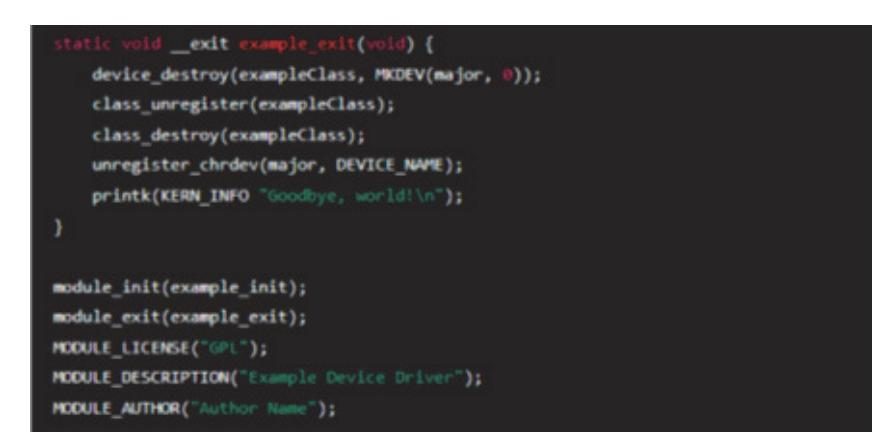

출처: 코드 작성 프로그램. 2024. 8. 10. 스크린샷. [그림 5-1] 드라이버 코드(리눅스 커널 드라이버 예시)

- 4. 디버깅 및 테스트한다(debugging and testing).
  - (1) 유닛 테스트: 개별 함수와 모듈을 테스트하여 기능이 올바르게 구현되었는지 확인한다.
  - (2) 통합 테스트: 전체 드라이버를 통합하여 테스트한다. 이는 실제 하드웨어에서의 테스트를 포 함한다.
  - (3) 디버깅 도구 사용: gdb, printk, dmesg 등의 디버깅 도구를 사용하여 문제를 식별하고 해 결한다.
- 5. 문서화한다(documentation).
  - (1) 사용자 매뉴얼: 드라이버 설치 및 사용 방법을 설명하는 문서를 작성한다.
  - (2) 개발자 문서: 드라이버의 내부 동작과 설계 결정을 설명하는 기술 문서를 작성한다.
- 6. 배포 및 유지 보수한다(deployment and maintenance).
  - (1) 배포 패키지: 드라이버를 설치 가능한 패키지로 만들고 배포한다.

(2) 업데이트 및 패치: 버그 수정 및 기능 개선을 위해 정기적으로 드라이버를 업데이트한다. 운영 체제용 장치 드라이버를 설계하고 구현하는 과정은 하드웨어와 소프트웨어의 복잡한 상호 작용을 다루는 중요한 작업이다. 위의 단계와 고려 사항을 따라 체계적으로 접근하면 안정적이 고 효율적인 드라이버를 개발할 수 있다. 이를 통해 반도체 펌웨어 개발의 신뢰성과 성능을 높 일 수 있다.

숖 운영 체제를 포팅(porting)할 수 있다.

반도체 펌웨어 드라이버 개발을 위해 운영 체제를 포팅하는 과정은 복잡한 작업이지만, 단계별 접근을 통해 성공적으로 수행할 수 있다. 운영 체제 포팅은 특정 하드웨어 플랫폼에 맞게 커널 과 필요한 드라이버를 수정 및 최적화하는 것을 포함한다. 아래는 운영 체제 포팅 절차를 단계 별로 설명한 것이다.

- 1. 사전 준비한다(preparation).
  - (1) 하드웨어 사양 확인
    - (가) 하드웨어 사양 문서: CPU 아키텍처, 메모리 구성, I/O 인터페이스, 클럭 속도 등 하드 웨어 사양을 이해한다.
    - (나) 개발 보드: 포팅할 하드웨어 플랫폼이나 개발 보드를 준비한다.
  - (2) 소스 코드 확보
    - (가) 운영 체제 소스 코드: 포팅할 운영 체제의 소스 코드를 다운로드한다. 예: Linux, FreeRTOS, Zephyr
    - (나) 툴체인: 해당 운영 체제에 맞는 컴파일러와 빌드 도구를 설치한다.
- 2. 커널 포팅을 진행한다.(kernel porting)
  - (1) 부트로더 설정(bootloader configuration)
    - (가) 부트로더 선택: U-Boot, Barebox 등 하드웨어에 맞는 부트로더를 선택한다.
    - (나) 부트로더 설정: 부트로더를 하드웨어에 맞게 구성하고 컴파일한다.
    - (다) 부트로더 설치: 부트로더를 플래시 메모리에 업로드하고, 하드웨어에서 부팅을 테스트한 다.
  - (2) 커널 설정(kernel configuration)
    - (가) 커널 설정: make menuconfig 또는 make xconfig를 사용하여 커널 설정 메뉴를 연 다.
    - (나) 하드웨어 지원: CPU 아키텍처, 메모리 맵, 인터럽트 컨트롤러 등 하드웨어 지원을 활성 화한다.
    - (다) 필요한 드라이버: UART, I2C, SPI 등의 기본 드라이버를 활성화한다.
  - (3) 커널 컴파일(kernel compilation)
    - (가) 환경 설정: 컴파일 환경을 설정한다.


(나) 커널 컴파일: 커널 소스를 컴파일한다.

출처: 코드 작성 프로그램. 2024. 8. 10. 스크린샷. [그림 5-3] 커널 소스 펌파일

- (4) 디바이스 트리 파일 작성(device tree file creation)
  - (가) DTS 파일 작성: 하드웨어 구성 요소를 설명하는 디바이스 트리 소스 파일(.dts)을 작성 한다.
  - (나) DTS 컴파일: dtc를 사용하여 DTS 파일을 DTB 파일로 컴파일한다.

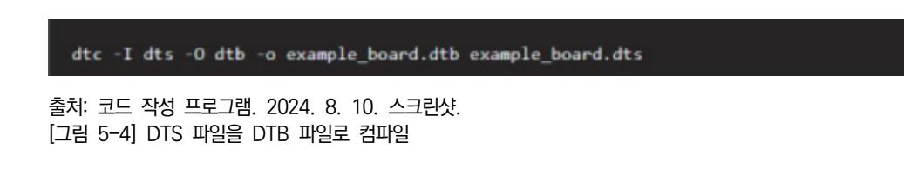

- 3. 드라이버를 개발한다(driver development).
  - (1) 기본 드라이버를 작성한다(basic driver development).
    - (가) 드라이버 코드 작성: UART, I2C, SPI 등의 기본 드라이버 코드를 작성한다.
    - (나) 커널 모듈 작성: 드라이버를 커널 모듈로 작성하고 컴파일한다.

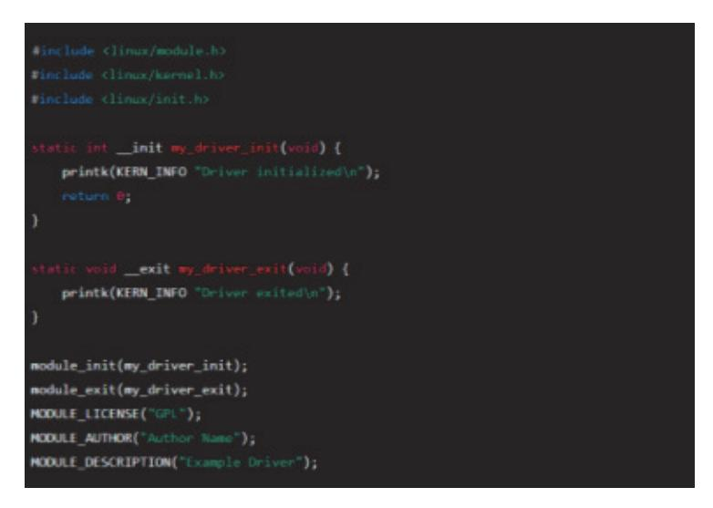

출처: 코드 작성 프로그램. 2024. 8. 10. 스크린샷. [그림 5-5] 드라이버 컴파일

(2) 고급 기능 구현(advanced features implementation)

- (가) 중단 처리: 인터럽트 핸들러를 작성하여 하드웨어 인터럽트를 처리한다.
- (나) DMA 지원: 고속 데이터 전송을 위해 DMA 지원을 추가한다.
- (다) 전력 관리: 전력 소비를 최소화하기 위한 전력 관리 기능을 구현한다.
- 4. 통합 및 테스트한다(integration and testing).
  - (1) 커널 이미지 작성(kernel image creation)
    - (가) 커널 이미지 생성: 컴파일된 커널과 디바이스 트리 바이너리 파일을 결합하여 부팅 가능 한 이미지 파일을 생성한다.
  - (2) 하드웨어 부팅(hardware booting)
    - (가) 이미지 업로드: 생성된 커널 이미지를 하드웨어에 업로드한다.
    - (나) 부팅 테스트: 하드웨어에서 커널을 부팅하고 초기화 과정이 정상적으로 진행되는지 확인 한다.
  - (3) 드라이버 테스트(driver testing)
    - (가) 유닛 테스트: 개별 드라이버 기능을 테스트한다.
    - (나) 통합 테스트: 전체 시스템에서 드라이버가 다른 구성 요소와 정상적으로 작동하는지 확 인한다.
    - (다) 디버깅 도구: gdb, printk, dmesg 등을 사용하여 문제를 식별하고 해결한다.
- 5. 문서화 및 유지 보수한다(documentation and maintenance).
  - (1) 문서 작성(documentation)
    - (가) 사용자 매뉴얼: 드라이버 설치 및 사용 방법을 설명하는 문서를 작성한다.
    - (나) 개발자 문서: 드라이버의 내부 동작과 설계 결정을 설명하는 기술 문서를 작성한다.
  - (2) 유지 보수(maintenance)
    - (가) 업데이트: 드라이버와 커널을 정기적으로 업데이트하여 버그를 수정하고 성능을 개선한 다.
    - (나) 지원: 사용자와 개발자 커뮤니티의 피드백을 반영하여 지속적으로 개선한다.

운영 체제 포팅은 복잡하지만 체계적인 접근을 통해 성공적으로 수행할 수 있다. 하드웨어 사 양을 이해하고, 커널을 설정 및 컴파일하며, 드라이버를 개발하고 통합 테스트를 수행하는 과 정을 통해 안정적이고 효율적인 시스템을 구축할 수 있다. 이러한 절차는 반도체 펌웨어 드라 이버 개발의 필수적인 부분이며, 고품질의 제품을 제공하는 데 중요한 역할을 한다.

숗 반도체용 펌웨어 개발을 위해 장치 드라이버별로 사용자 설명서를 작성할 수 있다.

장치 드라이버별로 사용자 설명서를 작성하는 것은 사용자와 개발자 모두에게 유익하다. 사용 자 설명서는 드라이버 설치, 설정, 사용법, 문제 해결 등의 내용을 포함하여 사용자가 드라이버 를 효율적으로 활용할 수 있도록 안내한다. 아래는 반도체용 펌웨어 개발을 위해 UART, I2C, SPI 드라이버의 사용자 설명서 예시이다.

1. UART 드라이버 사용자 설명서를 숙지한다.

(1) 개요

UART(universal asynchronous receiver-transmitter) 드라이버는 직렬 통신을 지원 하는 하드웨어 장치를 제어한다. 이 설명서는 UART 드라이버의 설치, 설정, 사용 방법 을 안내한다.

- (2) 설치
  - (가) 드라이버 파일 다운로드: 드라이버 파일을 다운로드한다.
  - (나) 드라이버 설치: 터미널을 열고 다음 명령어를 입력하여 드라이버를 설치한다.

출처: 코드 작성 프로그램. 2024. 8. 10. 스크린샷. [그림 5-6] 드라이버 설치

(3) 설정

(가) 장치 파일 생성: 장치 파일을 생성하여 드라이버와 통신할 수 있도록 한다.

출처: 코드 작성 프로그램. 2024. 8. 10. 스크린샷. [그림 5-7] 드라이버 장치 파일 생성

(나) 권한 설정: 장치 파일의 접근 권한을 설정한다.

출처: 집필진 제작(2024) [그림 5-8] 드라이버 파일 권한 설정

(4) 사용법

(가) 데이터 전송: echo 명령어를 사용하여 데이터를 전송한다.

출처: 코드 작성 프로그램. 2024. 8. 10. 스크린샷. [그림 5-9] 데이터 전송 명령

(나) 데이터 수신: cat 명령어를 사용하여 데이터를 수신한다.


출처: 집필진 제작(2024) [그림 5-10] 데이터 수신 명령

- (5) 문제 해결
  - (가) 드라이버 로드 실패: 드라이버 설치 시 오류 메시지가 나타나면 dmesg 명령어를 사용 하여 로그를 확인한다.

출처: 코드 작성 프로그램. 2024. 8. 10. 스크린샷. [그림 5-11] 드라이버 로드 확인 명령

(나) 장치 파일 접근 불가: 장치 파일의 권한을 확인하고 올바르게 설정했는지 확인한다.

- 2. I2C 드라이버 사용자 설명서를 숙지한다.
  - (1) 개요

I2C(inter-integrated circuit) 드라이버는 I2C 버스를 통해 여러 장치와 통신할 수 있 도록 한다. 이 설명서는 I2C 드라이버의 설치, 설정, 사용 방법을 안내한다.

(2) 설치

(가) 드라이버 파일 다운로드: 드라이버 파일을 다운로드한다.

(나) 드라이버 설치: 터미널을 열고 다음 명령어를 입력하여 드라이버를 설치한다.

출처: 코드 작성 프로그램. 2024. 8. 10. 스크린샷. [그림 5-12] 드라이버 설치 명령

(3) 설정

(가) 장치 파일 생성:장치 파일을 생성하여 드라이버와 통신할 수 있도록 한다.

출처: 코드 작성 프로그램. 2024. 8. 10. 스크린샷. [그림 5-13] 장치 파일 생성

(나) 권한 설정: 장치 파일의 접근 권한을 설정한다.

출처: 코드 작성 프로그램. 2024. 8. 10. 스크린샷. [그림 5-14] 접근 권한 설정

- (4) 사용법
  - (가) 데이터 전송: i2cset 명령어를 사용하여 데이터를 전송한다.

출처: 코드 작성 프로그램. 2024. 8. 10. 스크린샷. [그림 5-15] 데이터 전송 명령

(나) 데이터 수신: i2cget 명령어를 사용하여 데이터를 수신한다.

출처: 코드 작성 프로그램. 2024. 8. 10. 스크린샷. [그림 5-16] 데이터 수신 명령

(5) 문제 해결

(가) 드라이버 로드 실패: 드라이버 설치 시 오류 메시지가 나타나면 dmesg 명령어를 사용 하여 로그를 확인한다.


출처: 코드 작성 프로그램. 2024. 8. 10. 스크린샷. [그림 5-17] 드라이버 로드 확인 명령

(나) 장치 파일 접근 불가: 장치 파일의 권한을 확인하고 올바르게 설정했는지 확인한다.

- 3. SPI 드라이버 사용자 설명서를 숙지한다.
  - (1) 개요
    - (가) SPI(serial peripheral interface) 드라이버는 SPI 버스를 통해 장치 간 고속 통신을 지 원한다. 이 설명서는 SPI 드라이버의 설치, 설정, 사용 방법을 안내한다.
  - (2) 설치
    - (가) 드라이버 파일 다운로드: 드라이버 파일을 다운로드한다.
    - (나) 드라이버 설치: 터미널을 열고 다음 명령어를 입력하여 드라이버를 설치한다.

출처: 코드 작성 프로그램. 2024. 8. 10. 스크린샷. [그림 5-18] 드라이버 설치 명령

(3) 설정

(가) 장치 파일 생성: 장치 파일을 생성하여 드라이버와 통신할 수 있도록 한다.

출처: 코드 작성 프로그램. 2024. 8. 10. 스크린샷. [그림 5-19] 드라이버 통신용 장치 파일 생성

(나) 권한 설정: 장치 파일의 접근 권한을 설정한다.

출처: 코드 작성 프로그램. 2024. 8. 10. 스크린샷. [그림 5-20] 데이터 권한 설정

(4) 사용법

(가) 데이터 전송: spidev\_test 명령어를 사용하여 데이터를 전송한다.

출처: 코드 작성 프로그램. 2024. 8. 10. 스크린샷. [그림 5-21] 데이터 전송 명령

(나) 데이터 수신: spidev\_test 명령어를 사용하여 데이터를 수신한다.

출처: 코드 작성 프로그램. 2024. 8. 10. 스크린샷. [그림 5-22] 데이터 수신 명령

(5) 문제 해결

(가) 드라이버 로드 실패: 드라이버 설치 시 오류 메시지가 나타나면 dmesg 명령어를 사용 하여 로그를 확인한다.


출처: 코드 작성 프로그램. 2024. 8. 10. 스크린샷. [그림 5-23] 드라이버 로그인 확인

(나) 장치 파일 접근 불가: 장치 파일의 권한을 확인하고 올바르게 설정했는지 확인한다.

이 사용자 설명서는 UART, I2C, SPI 드라이버의 설치, 설정, 사용법 및 문제 해결 방법을 다 룬다. 이러한 설명서는 사용자가 드라이버를 효율적으로 활용하고 문제를 해결하는 데 도움이 된다. 드라이버 개발자는 이러한 문서를 작성하여 사용자에게 제공함으로써 드라이버의 활용도 를 높이고 지원 요청을 줄일 수 있다.

수행 tip

- 선택된 CPU에 가장 적합한 디바이스 선택을 위해 표준화 된 여러 벤더들의 제품을 세밀히 검토한다.
- 가능한 한 최신의 윈도 운영 체제와 그에 맞는 개발 도구 를 사용한다.
- 사용하는 윈도 운영 체제의 정확한 버전과 그 특성을 사전 에 파악한다.

## 학습 5 교수·학습 방법

### 교수 방법

- 디바이스 드라이버를 구현하기 위해서는 개별적으로 진행하는 것도 좋지만, 스펙을 검토하 여 설계하고, 최종 구현하는 과정에서 발생할 수 있는 문제 해결 등을 위해 팀 단위로 진행 한다.
- 설계된 시스템 아키텍처에 부합되는 디바이스 드라이버의 규격 등을 세밀히 검토하여, 필요 한 부품 또는 커넥터들의 잘못된 사용으로 인한 부품 파손이 일어나지지 않도록 사전에 동 작 규격 등에 대해 충분히 지도한다.
- 초기에 이론적인 부분을 강조하여 학습자들이 기본 지식을 바탕으로 하여 주어진 시스템 아 키텍처와 지원하는 운영 체제 등에 대해 충분히 숙지한다.
- 사용하고 있는 윈도 운영 체제에 맞는 디바이스 드라이버 개발 환경을 올바로 구축할 수 있 도록 지도한다.

### 학습 방법

- CPU의 구성 및 동작 원리에 대해 구체적으로 파악한다.
- 운영 체제 구조 및 동작에 대해 구체적으로 이해하고, 소프트웨어와 하드웨어 인터페이스에 대해 파악한다.
- 코드 작성 프로그래밍 방법을 숙지한다.
- 사용하는 윈도 버전에 맞는 개발 환경을 숙지한다.
- 사용하는 윈도 버전에서 지원하는 디바이스 드라이버 모델 및 종류에 대해 파악한다.

## 학습 5 평 가

### 평가 준거

• 평가자는 학습자가 학습 목표를 성공적으로 달성하였는지를 평가해야 한다.

### • 평가자는 다음 사항을 평가해야 한다.

|                 | 학습 목표                               | 성취수준 |   |   |  |
|-----------------|-------------------------------------|------|---|---|--|
| 학습 내용           |                                     | 상    | 중 | 하 |  |
| 펌웨어 드라이버 개<br>발 | - 운영 체제 선택과 장치 드라이버 설계 범위를 정할 수 있다. |      |   |   |  |
|                 | - 운영 체제용 장치 드라이버를 설계할 수 있다.         |      |   |   |  |
|                 | - 운영 체제를 포팅(porting)할 수 있다.         |      |   |   |  |
|                 | - 장치 드라이버별로 사용자 설명서를 작성할 수 있다.      |      |   |   |  |

### 평가 방법

• 서술형 시험

|                 | 평가 항목                                                  | 성취수준 |   |   |  |
|-----------------|--------------------------------------------------------|------|---|---|--|
| 학습 내용           |                                                        | 상    | 중 | 하 |  |
| 펌웨어 드라이버 개<br>발 | - 운영 체제의 실시간 성능 요구 사항으로부터 이에 맞는 운영 체<br>제를 선택할 수 있는 능력 |      |   |   |  |
|                 | - 운영 체제의 요구 사항을 분석하여 하드웨어 사양과 소프트웨어<br>환경을 도출할 수 있는 능력 |      |   |   |  |
|                 | - 운영 체제를 포팅하기 위한 사전 준비에 필요한 내용 숙지 여부                   |      |   |   |  |
|                 | - SPI 드라이버의 설치 및 설정을 위해 필요한 명령어 숙지 여부                  |      |   |   |  |

### • 평가자 체크리스트

|                 | 평가 항목                                              | 성취수준 |   |   |  |
|-----------------|----------------------------------------------------|------|---|---|--|
| 학습 내용           |                                                    | 상    | 중 | 하 |  |
| 펌웨어 드라이버 개<br>발 | - 운영 체제의 목적 및 용도를 확인하고 이에 맞는 운영 체제를<br>선택할 수 있는 능력 |      |   |   |  |
|                 | - 요구 사항 분석 내용으로부터 드라이버의 아키텍처를 설계할 수<br>있는 능력       |      |   |   |  |
|                 | - 운영 체제 포팅에서 커널 포팅을 위한 부트 로더 설정 능력                 |      |   |   |  |
|                 | - UART 드라이버의 설치 및 설정을 위해 필요한 명령어의 숙지<br>여부         |      |   |   |  |

### 피드백

- 1. 서술형 시험
- 운영 체제의 실시간 성능 요구 사항으로부터 이에 맞는 운영 체제를 선택할 수 있는 능력을 평가 한 후, 보완이 필요한 사항이나 주요 사항을 표시하여 피드백 해 준다.
- 운영 체제의 요구 사항을 분석하여 하드웨어 사양과 소프트웨어 환경을 도출할 수 있는 능력을 평가 후, 보완이 필요한 사항이나 주요 사항을 표시하여 보충 설명을 해 준다.
- 평가 결과가 우수한 학습자에게는 서술형 평가 내용의 적용 사례 학습을 통한 심화 학습으로 피 드백해 주고, 미흡한 학습자에게는 기초 용어에 대한 설명을 통해 일정 수준을 유지할 수 있도록 지도해 준다.
- 2. 평가자 체크리스트
- 운영 체제 커널 포팅을 위한 부트 로더의 설정 방법 파악 여부를 평가한 후 부족한 점을 지적하 여 올바르게 처리할 수 있도록 보완 지도해 준다.
- UART 드라이버의 설치 및 설정을 위해 필요한 명령어의 숙지 여부에 대해 평가한 후, 개선 및 보완 사항에 대한 내용을 정리하여 재학습할 수 있도록 피드백 해 준다.
- 평가 결과가 우수한 학습자에게는 작업장 환경에의 적용 사례를 통한 심화 학습으로 피드백 해 주고, 저조한 학습자에게는 기초 지식에 대해 설명을 해 주어 일정 수준을 유지할 수 있도록 보 완 지도해 준다.

# 필요 지식 /

학습 목표

6-1. 펌웨어 관리

학습 1 내장 CPU 및 주변 장치 분석하기

학습 2 펌웨어 요구 사항 분석하기

학습 5 펌웨어 드라이버 개발하기

학습 6 펌웨어 관리하기

학습 3 펌웨어 설계하기 학습 4 펌웨어 구현하기

숔 반도체 펌웨어 관리 단계

반도체 펌웨어 관리는 펌웨어의 개발, 배포, 유지 보수 및 버전 관리를 포함하는 중요한 과정 이다. 이를 통해 안정적이고 신뢰할 수 있는 펌웨어를 제공하고, 지속해서 개선할 수 있다. 다 음은 반도체 펌웨어 관리를 위한 단계별 가이드이다.

1. 펌웨어 개발 및 관리 프로세스

- (1) 요구 사항 수집 및 분석
  - (가) 고객 요구 사항: 고객으로부터 요구 사항을 수집하고 분석한다.

• 개발된 펌웨어를 사용자에게 배포하고 버전을 관리할 수 있다.

• 변경된 펌웨어 부분에 대한 사용자 설명서를 개선할 수 있다.

• 펌웨어 사용자를 교육시킬 수 있다.

• 배포된 펌웨어에 대해 사용자 개선 요구 사항을 반영하여 변경할 수 있다.

(나) 기술 요구 사항: 하드웨어 스펙, 성능 요구 사항 등을 파악한다.

(2) 개발 계획 수립

(가) 프로젝트 계획: 개발 일정, 리소스, 마일스톤 등을 정의한다.

(나) 리스크 관리: 프로젝트 리스크를 식별하고 대응 계획을 세운다.

2. 버전 관리

(1) 버전 관리 시스템 사용

(가) Git: 분산 버전 관리 시스템으로 코드 변경을 추적하고 협업을 지원한다.

(나) SVN(subversion): 중앙 집중식 버전 관리 시스템으로 코드 변경을 추적한다.

(2) 브랜치 전략

(가) 메인 브랜치: 안정적인 코드 베이스를 유지한다.

(나) 개발 브랜치: 새로운 기능이나 버그 수정을 위한 브랜치이다.

(다) 기능 브랜치: 특정 기능을 개발하는 브랜치이다.

(3) 태그 및 릴리즈 관리

(가) 태그: 중요한 릴리즈 버전에 태그를 지정하여 쉽게 참조할 수 있게 한다.

(나) 릴리즈 노트: 릴리즈 시 변경 사항, 새로운 기능, 버그 수정 등을 기록한다.

### 3. 빌드 및 배포

(1) 자동 빌드 시스템

(가) Jenkins: 지속적 통합 및 지속적 배포(CI/CD)를 위한 자동화 도구이다.

(나) GitLab CI: GitLab에서 제공하는 CI/CD 파이프 라인이다.

(2) 펌웨어 빌드

(가) 빌드 스크립트: Makefile, CMake 등을 사용하여 자동화된 빌드 스크립트를 작성한다.

(나) 빌드 설정: 컴파일러 옵션, 링커 스크립트 등을 설정한다.

(3) 펌웨어 배포

(가) OTA(Over-The-Air) 업데이트: 무선으로 펌웨어를 업데이트하는 방법이다.

(나) USB 또는 JTAG: 물리적인 연결을 통해 펌웨어를 업데이트한다.

4. 테스트 및 검증

(1) 유닛 테스트

(가) 테스트 프레임 워크: Unity, CMock 등 유닛 테스트를 위한 프레임 워크를 사용한다.

(나) 자동화 테스트: 유닛 테스트를 자동으로 실행하여 결과를 검증한다.

(2) 통합 테스트

(가) 시스템 테스트: 전체 시스템의 통합 테스트를 수행한다.

(나) 성능 테스트: 성능 요구 사항을 만족하는지 테스트한다.

(3) 디버깅 및 오류 수정

(가) 디버깅 도구: JTAG, SWD 디버거를 사용하여 디버깅한다.

(나) 로그 분석: UART, 세리얼 통신을 통해 로그를 분석한다.

5. 유지 보수 및 지원

(1) 버그 추적 및 관리

(가) 이슈 트래커: Jira, Redmine 등을 사용하여 버그와 이슈를 추적한다.

(나) 패치 릴리즈: 발견된 버그를 수정하고 패치 릴리즈를 제공한다.

(2) 성능 모니터링 및 개선

(가) 실시간 모니터링: 시스템 성능을 실시간으로 모니터링하고, 필요시 성능 개선을 한다.

(나) 최적화 작업: 코드 최적화, 메모리 사용 최적화 등을 수행한다.

(3) 고객 지원

(가) 기술 지원: 고객에게 기술 지원을 제공하고, 문제 해결을 도와준다.

(나) 교육 및 문서화: 고객을 위한 사용 설명서, 기술 문서, 교육 자료를 제공한다.

6. 문서화 및 교육

(1) 문서화

(가) 코드 주석: 코드에 대한 자세한 주석을 작성한다.

(나) 사용자 매뉴얼: 펌웨어 사용 방법에 대한 문서를 작성한다.

(다) 기술 문서: 펌웨어 설계 및 구현에 대한 기술 문서를 작성한다.

(2) 교육

(가) 개발자 교육: 내부 개발자를 위한 교육 프로그램을 제공한다.

(나) 고객 교육: 고객을 위한 사용법 및 기술 교육을 제공한다.

7. 품질 관리

(1) 코드 리뷰

(가) 피어 리뷰: 동료 개발자가 코드를 검토하고 피드백을 제공한다.

(나) 자동화 도구: SonarQube 등을 사용하여 코드 품질을 분석한다.

(2) 형상 관리

(3) 규정 준수

(가) 구성 요소 관리: 모든 구성 요소의 버전과 설정을 관리한다.

(나) 빌드 환경 관리: 빌드 환경의 일관성을 유지한다.

130

(가) 안전 표준: ISO 26262, IEC 61508 등의 안전 표준을 준수한다.

(나) 보안 표준: 펌웨어 보안을 위한 표준 및 가이드라인을 준수한다.

반도체 펌웨어 관리는 체계적인 프로세스와 도구를 사용하여 개발, 배포, 유지 보수, 버전 관리 등을 효율적으로 수행하는 것을 목표로 한다. 이를 통해 안정적이고 신뢰할 수 있는 펌웨어를 제공하고, 지속해서 개선할 수 있다. 단계마다 철저한 검토와 테스트를 통해 품질을 보장하며,

### 수행 순서

소프트웨어 및 데이터 안전(매뉴얼 및 지침 준수, 응급 절차 준수)에 유의한다.

## 작업 환경 안전(작업 공간 정리, 화학 물질 취급 안전 규정 준수)에 유의한다.

- 장비 사용 안전(개발 보드 및 디버깅 장비, 계측 장비)에 유의한다.
- 전원 관리
- 정전기 방전(ESD)에 유의한다.

### 안전 ・ 유의 사항

- 시뮬레이션 및 분석 도구(Proteus, MATLAB/Simulink, LTspice, PyCharm/VSCode)
- 계측 장비(로직 분석기, 오실로스코프, 멀티미터 등)
- 디버그 장치
- 개발 보드(마이크로컨트롤러/마이크로프로세서 개발 보드, 확장 보드)

### 기기(장비 ・ 공구)

- 설계 가이드 및 예제 코드
- 데이터 시트 및 사용자 매뉴얼(CPU 데이터 시트, 주변 장치 데이터 시트)
- 시뮬레이션 및 분석 도구
- 디버깅 소프트웨어

통합 개발 환경(IDE)

## 재료·자료

## 수행 내용 / 펌웨어 관리하기

문서화와 교육을 통해 고객과 내부 개발자의 이해를 돕는다.

반도체 펌웨어를 개발한 후, 이를 사용자에게 배포하고 버전을 관리하는 것은 펌웨어의 신뢰성 과 지속적인 업데이트를 보장하기 위한 중요한 과정이다. 다음은 펌웨어를 사용자에게 배포하 고 버전을 관리하는 단계별 가이드이다.

- 1. 펌웨어 버전을 관리한다.
  - (1) 버전 관리 시스템 설정
    - (가) Git 사용: Git과 같은 버전 관리 시스템을 사용하여 소스 코드와 빌드된 펌웨어 파일을 관리한다.
    - (나) 리포지토리 생성: GitHub, GitLab, Bitbucket 등의 플랫폼에서 리포지토리를 생성한다.

(다) 브랜칭 전략: 개발, 테스트, 릴리즈 브랜치를 사용하여 체계적인 버전 관리를 수행한다.

- (2) 버전 번호 체계
  - (가) 버전 번호 지정: 주 버전·부 버전·수정 버전 형식으로 버전 번호를 지정한다. 예) 1.0.0(첫 번째 릴리즈), 1.1.0(기능 추가), 1.1.1(버그 수정)
- 2. 펌웨어 빌드 및 테스트한다.
  - (1) 자동화된 빌드 시스템
    - (가) CI/CD 설정: Jenkins, GitHub actions, GitLab CI 등을 사용하여 빌드 자동화 파이 프라인을 설정한다.
      - 1) 자동 빌드: 코드 변경 시 자동으로 펌웨어를 빌드하고 테스트한다.
      - 2) 빌드 아티팩트 저장: 빌드된 펌웨어 파일을 아티팩트로 저장하여 배포 준비를 한다.
  - (2) 자동화된 테스트
    - (가) 유닛 테스트: 각 모듈의 유닛 테스트를 작성하여 기본적인 기능을 검증한다.
    - (나) 통합 테스트: 시스템 통합 후 전체 기능을 테스트한다.
    - (다) 하드웨어 테스트: 실제 하드웨어에서 펌웨어를 실행하여 기능을 검증한다.
- 3. 펌웨어를 배포한다.
  - (1) 배포 파일 준비
    - (가) 펌웨어 파일: 빌드된 펌웨어 바이너리 파일(예: firmware.bin)
    - (나) 릴리즈 노트: 새로 추가된 기능, 변경 사항, 버그 수정 내역 등을 포함한 릴리즈 노트를 작성한다.
    - (다) 사용자 설명서 업데이트: 펌웨어 설치 및 사용 방법이 포함된 사용자 설명서를 최신 상 태로 유지한다.
  - (2) 배포 방법
    - (가) 다운로드 링크 제공: 회사 웹사이트나 GitHub 릴리즈 페이지를 통해 펌웨어 파일을 다

133

## (2) 릴리즈 노트(v1.0.0)

Jira 등)를 사용한다.

- ### 버전 1.0.0(2024-07-01)
- 최초 릴리즈

(1) 릴리즈 페이지 예시

- 주요 기능
- 시스템 초기화
- 주변 장치 드라이버 지원(GPIO, UART)

6. 예시: 사용자 배포용 펌웨어 파일과 설명서를 분석한다.

git push origin v1.0.0 (2) 문제 추적 및 해결

(나) 버그 수정 및 패치 릴리즈: 발견된 버그를 수정하고 패치 릴리즈를 수행한다.

(가) 이슈 트래커 사용: 버그와 기능 요청을 관리하기 위해 이슈 트래커(예: GitHub Issues,

(나) 버전 태그: Git 리포지토리에서 각 릴리즈 버전에 대해 태그를 생성하여 버전 관리를 체

- (1) 버전 기록 유지
- 5. 버전 관리 및 릴리즈를 기록한다.

계적으로 수행한다.

- 예) 이메일 지원, 전화 지원, 온라인 포럼 등

git tag -a v1.0.0 -m "Initial release"

채널을 제공한다.

(가) 릴리즈 기록 유지: 각 버전의 릴리즈 노트와 함께 변경 사항을 기록한다.

- (가) 지원 채널 제공: 사용자가 펌웨어 업데이트 중 겪는 문제를 해결할 수 있도록 기술 지원
- (2) 기술 지원
- 예) USB를 통한 업데이트, OTA 업데이트 방법 등
- (나) 업데이트 방법 제공: 펌웨어 파일을 다운로드하고 설치하는 방법을 자세히 설명한다.
- (가) 기존 펌웨어 백업: 업데이트 전에 기존 펌웨어를 백업하는 방법을 안내한다.
- (1) 업데이트 절차
- 4. 펌웨어 업데이트 및 지원을 제공한다.
- 쉽게 펌웨어를 업데이트할 수 있도록 한다. 이메일 알림: 펌웨어 업데이트를 사용자에게 이메일로 알린다.
- 운로드할 수 있도록 한다. (나) OTA 업데이트: 가능한 경우, Over-the-Air(OTA) 업데이트 기능을 구현하여 사용자가

- 기본 통신 프로토콜 구현

### 설치 방법

- 1. XYZ 디바이스를 USB 케이블로 PC에 연결한다.
- 2. [다운로드 링크](https ://example.com/firmware.bin)에서 최신 펌웨어 파일을 다 운로드한다.
- 3. 펌웨어 플래싱 툴(예) STM32CubeProgrammer)을 실행한다.
- 4. 다운로드한 `firmware.bin` 파일을 선택하고 `Start Programming` 버튼을 클릭하 여 펌웨어를 업로드한다.
- 5. 업로드가 완료되면 디바이스를 재부팅한다.

### 기술 지원

- 이메일: support@example.com
- 전화: +1-800-123-4567

반도체 펌웨어 드라이버 개발에서 사용자 배포용 펌웨어 파일을 생성하고 사용자 설명서를 작 성한 후, 이를 사용자에게 배포하고 버전을 관리하는 과정은 펌웨어의 지속적인 품질 유지와 사용자의 만족도를 높이는 데 중요하다. 체계적인 버전 관리, 자동화된 빌드 및 테스트, 명확한 배포 절차와 사용자 설명서를 통해 신뢰성 있는 펌웨어를 제공할 수 있다.

숕 배포된 펌웨어에 대해 사용자 개선 요구 사항을 반영하여 변경한다.

개발된 반도체 펌웨어에 대해 사용자 개선 요구 사항을 반영하여 변경하는 것은 펌웨어의 지속 적인 발전과 사용자 만족도를 높이기 위한 중요한 과정이다. 다음은 이 과정을 단계별로 설명 한다.

- 1. 사용자 요구 사항을 수집한다.
  - (1) 요구 사항 수집 채널
    - (가) 기술 지원 채널: 이메일, 전화, 온라인 포럼 등을 통해 사용자로부터 직접 피드백을 받는 다.
    - (나) 버그 보고 시스템: GitHub Issues, Jira 등의 이슈 트래커를 통해 버그와 개선 요청을 접수한다.
    - (다) 설문 조사: 사용자 설문 조사를 통해 요구 사항과 개선점을 수집한다.
  - (2) 요구 사항 분류 및 우선순위 지정
    - (가) 요구 사항 분류: 기능 개선, 버그 수정, 성능 향상 등으로 분류한다.
    - (나) 우선순위 지정: 사용자 영향도, 구현 난이도, 긴급성 등을 고려하여 요구 사항의 우선순 위를 지정한다.

2. 요구 사항을 분석 및 설계한다.

- (1) 요구 사항 분석
  - (가) 기능 요구 사항 분석: 새로운 기능이나 개선된 기능의 상세 요구 사항을 분석한다.
  - (나) 버그 분석: 보고된 버그의 원인을 파악하고 수정 방안을 모색한다.
- (2) 설계 수정
  - (가) 설계 문서 업데이트: 변경된 요구 사항에 따라 시스템 설계를 업데이트한다.
  - (나) 기능 설계: 새로운 기능 또는 개선된 기능의 설계를 문서화한다.
  - (다) 코드 영향 분석: 변경 사항이 기존 코드에 미치는 영향을 분석한다.
- 3. 펌웨어를 수정 및 구현한다.
  - (1) 수정 및 구현
    - (가) 기능 추가 및 수정: 요구 사항에 따라 기능을 추가하거나 수정한다.
    - (나) 버그 수정: 보고된 버그를 수정한다.
  - (2) 코드 검토 및 테스트
    - (가) 코드 리뷰: 구현된 코드를 팀원들과 리뷰하여 품질을 확인한다.
    - (나) 유닛 테스트: 수정된 기능에 대해 유닛 테스트를 작성하고 실행한다.
    - (다) 통합 테스트: 전체 시스템의 통합 테스트를 수행하여 수정된 코드가 다른 기능에 영향을 미치지 않는지 확인한다.
- 4. 펌웨어를 빌드 및 배포한다.
  - (1) 펌웨어 빌드
    - (가) 자동 빌드 시스템: CI/CD 파이프라인을 사용하여 빌드 프로세스를 자동화한다.
    - (나) 빌드 아티팩트 생성: 빌드된 펌웨어 파일을 아티팩트로 저장한다.
  - (2) 배포 준비
    - (가) 릴리즈 노트 작성: 변경된 사항, 새로운 기능, 버그 수정 내역 등을 포함한 릴리즈 노트 를 작성한다.
    - (나) 사용자 설명서 업데이트: 사용자 설명서를 최신 상태로 유지한다.
  - (3) 펌웨어 배포
    - (가) 다운로드 링크 제공: 사용자에게 펌웨어 파일을 다운로드할 수 있는 링크를 제공한다.
    - (나) OTA 업데이트: 가능한 경우, OTA 업데이트 기능을 통해 사용자에게 펌웨어를 배포한다.
- 5. 사용자 피드백을 수집 및 반복한다.
  - (1) 피드백 수집

- (3) 펌웨어 수정 및 구현
- (나) GPIO 초기화 버그 수정: GPIO 핀 초기화 함수의 오류 수정.
- (가) UART 통신 속도 개선: UART 속도 설정을 9,600bps에서 115,200bps로 변경.
- (2) 요구 사항 분석 및 설계
- (나) 버그 보고: "GPIO 초기화 시 특정 핀이 작동하지 않다."
- (가) 사용자 피드백: "UART 통신 속도가 느리다."
- (1) 요구 사항 수집
- 6. 예시: 요구 사항 반영 및 배포 과정을 분석한다.
- (나) 주기적인 업데이트: 정기적으로 펌웨어 업데이트를 계획하고 수행한다.
- (가) 반복적인 개선: 수집된 피드백을 바탕으로 펌웨어를 지속적으로 개선한다.
- (2) 지속적인 개선
- (나) 사용자 만족도 조사: 업데이트된 펌웨어에 대한 사용자 만족도를 조사한다.
- (가) 업데이트 후 피드백: 배포된 펌웨어에 대한 사용자 피드백을 수집한다.

- (4) 펌웨어 빌드 및 배포
  - (가) 빌드: make 명령을 통해 펌웨어를 빌드한다.
  - (나) 릴리즈 노트 작성

출처: 코드 작성 프로그램. 2024. 8. 10. 스크린샷. [그림 6-2] 릴리즈 노트 작성 사례

- (5) 사용자 피드백 수집 및 반복
  - (가) 업데이트 후 사용자로부터 피드백을 수집하고, 추가적인 개선 사항을 반영한다. 반도체 펌웨어 드라이버 개발에서 사용자 개선 요구 사항을 반영하여 펌웨어를 변경 하는 과정은 펌웨어의 지속적인 품질 향상과 사용자 만족도를 높이는 데 필수적이다. 체계적인 요구 사항 수집, 분석, 설계, 구현, 테스트, 배포, 피드백 수집 과정을 통해 펌웨어를 지속해서 개선할 수 있다. 이를 통해 사용자에게 신뢰성 있고 기능적인 펌 웨어를 제공할 수 있다.
- 숖 변경된 펌웨어 부분에 대한 사용자 설명서를 개선한다.

개발된 반도체 펌웨어의 변경된 부분에 대해 사용자 설명서를 개선하는 과정은 사용자에게 정 확하고 최신 정보를 제공하여 펌웨어의 올바른 사용을 돕는 중요한 단계이다. 다음은 이 과정 을 단계별로 설명한다.

- 1. 변경 사항을 파악한다.
  - (1) 변경된 펌웨어 분석
    - (가) 변경 내역 확인: 펌웨어의 변경된 기능, 수정된 버그, 추가된 기능 등을 확인한다.
    - (나) 릴리즈 노트 작성: 변경 사항을 명확히 정리하여 릴리즈 노트에 기록한다.
  - (2) 변경된 부분의 영향 분석
    - (가) 사용자 영향도 분석: 변경된 기능이나 수정된 버그가 사용자에게 어떤 영향을 끼치는지 분석한다.
    - (나) 설명서 업데이트 필요성 평가: 변경 사항 중 사용자 설명서에 반영해야 할 부분을 평가 한다.

- 가) XYZ 반도체 디바이스
- (라) 설치 절차
  - 1) 준비물
- 1) 하드웨어 요구 사항: ABC 마이크로컨트롤러 보드
- 2) 소프트웨어 요구 사항: 펌웨어 플래싱 툴(예) STM32CubeProgrammer)
- (다) 시스템 요구 사항
- 2) GPIO 초기화 버그 수정: 특정 핀이 초기화되지 않는 문제를 수정하였다.
- 1) UART 통신 속도 개선: UART 통신 속도가 9,600bps에서 115,200bps로 변경되 었다.
- (나) 변경 내역
- 3) 작성자: ABC Corporation
- 2) 펌웨어 버전: 1.1.0
- 1) 제품명: XYZ 반도체 디바이스
- (가) 제품 개요
- (3) 사용자 설명서 예시(버전 1.1.0 업데이트)

용자가 이해하기 쉽게 한다.

- (가) 예시와 스크린샷 추가 1) 예시 코드 및 스크린샷: 변경된 기능과 관련된 예시 코드나 스크린샷을 추가하여 사
- (2) 작업 계획 수립
- (다) 문제 해결 섹션 갱신: 수정된 버그와 관련된 문제 해결 방법을 업데이트한다.
- (나) 설치 및 업데이트 절차 수정: 펌웨어 설치 및 업데이트 절차를 최신 상태로 수정한다.

- (가) 변경된 기능 설명: 새로 추가되거나 변경된 기능에 대한 상세 설명을 추가한다.
- (1) 내용 수정 및 추가
- 3. 사용자 설명서를 업데이트한다.
- (나) 책임자 지정: 각 섹션의 업데이트 작업을 담당할 책임자를 지정한다.
- (가) 작업 일정: 설명서 업데이트를 위한 작업 일정을 수립한다.
- (2) 작업 계획 수립
- (나) 우선순위 지정: 중요도가 높은 변경 사항을 우선적으로 반영한다.
- 결정한다.
- (1) 업데이트 범위 정의 (가) 섹션 결정: 설명서에서 업데이트해야 할 섹션(예: 설치 방법, 기능 설명, 문제 해결 등)을
- 2. 사용자 설명서 업데이트 계획을 수립한다.

- 나) USB 케이블
- 다) 최신 펌웨어 파일(firmware.bin)
- 라) 펌웨어 플래싱 툴
- 2) 설치 단계
  - 가) 펌웨어 파일 다운로드
  - 다운로드 링크
  - 나) 디바이스 연결
    - XYZ 반도체 디바이스를 USB 케이블을 사용하여 PC에 연결한다.
  - 다) 펌웨어 플래싱 툴 실행
  - STM32CubeProgrammer를 실행하고, 디바이스를 선택한다.
  - 라) 펌웨어 파일 선택
  - 다운로드한 firmware.bin 파일을 선택한다.
  - 마) 펌웨어 업로드
    - Start Programming 버튼을 클릭하여 펌웨어를 업로드한다.
  - 바) 업로드 완료

업로드가 완료되면 디바이스를 재부팅한다.

- (마) 기능 설명
  - 1) UART 통신 설정
    - 가) 변경 전: UART 통신 속도는 9,600bps였다.
    - 나) 변경 후: UART 통신 속도가 115,200bps로 개선되었다.
    - 다) 설정 예시

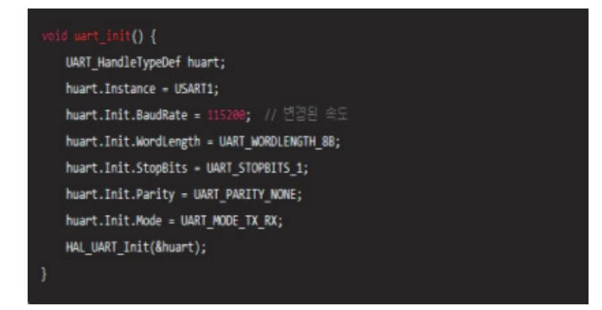

출처: 코드 작성 프로그램. 2024. 8. 10. 스크린샷. [그림 6-3] UART 통신 설정 예시

- 2) GPIO 초기화
  - 가) 버그 수정: GPIO 초기화 시 특정 핀이 작동하지 않는 문제를 해결하였다.
  - 나) 설정 예시

| void gpio_init() {                                 |
|----------------------------------------------------|
| <pre>GPI0_InitTypeDef GPI0_InitStruct = {0};</pre> |
| HAL_RCC_GPIOA_CLK_ENABLE();                        |
| <pre>GPI0_InitStruct.Pin = GPI0_PIN_5;</pre>       |
| GPI0_InitStruct.Mode = GPI0_MODE_OUTPUT_PP;        |
| GPIO_InitStruct.Pull = GPIO_NOPULL;                |
| GPIO_InitStruct.Speed = GPIO_SPEED_FREQ_LOW;       |
| HAL_GPIO_Init(GPIOA, &GPIO_InitStruct);            |
| }                                                  |
|                                                    |

출처: 코드 작성 프로그램. 2024. 8. 10. 스크린샷. [그림 6-4] GPIO 초기화 예시

(바) 문제 해결

- 1) 디바이스가 인식되지 않음.
  - 가) USB 케이블이 제대로 연결되어 있는지 확인한다.
  - 나) 다른 USB 포트를 사용해 본다.
  - 다) 드라이버가 제대로 설치되었는지 확인한다.
- 2) 펌웨어 업로드 실패
  - 가) 펌웨어 파일이 올바른지 확인한다.
  - 나) 디바이스가 프로그래밍 모드에 있는지 확인한다.
- (사) 기술 지원
  - 1) 이메일: support@example.com
  - 2) 전화: +1-800-123-4567
- (아) 면책 조항 및 라이선스
  - 1) 본 펌웨어는 ABC Corporation의 지적 재산권에 속하며, 무단 복제 및 배포를 금 지한다.
  - 2) 소프트웨어 라이선스: MIT License
- 4. 설명서를 검토 및 배포한다.
  - (1) 설명서 검토
    - (가) 내부 검토: 팀원들과 함께 설명서의 내용을 검토하여 오류나 누락된 부분이 없는지 확인 한다.

- (나) 사용자 피드백 반영: 이전 버전의 설명서에 대한 사용자 피드백을 반영하여 개선한다.
- (2) 최종 설명서 배포
  - (가) 온라인 배포: 회사 웹사이트나 제품 페이지에 최신 사용자 설명서를 게시한다.
  - (나) 펌웨어 패키지 포함: 펌웨어 파일과 함께 설명서를 배포 패키지에 포함한다.
  - (다) 이메일 알림: 사용자에게 이메일을 통해 설명서 업데이트와 함께 새로운 펌웨어 버전을 알린다.

반도체 펌웨어의 변경된 부분에 대한 사용자 설명서를 개선하는 과정은 사용자에게 정확하고 최신 정보를 제공하여 펌웨어의 올바른 사용을 돕는 중요한 단계이다. 변경된 기능과 수정된 버그를 명확히 설명하고, 설치 및 사용 방법을 최신 상태로 유지하며, 사용자 피드백을 반영하 여 설명서를 지속적으로 개선한다. 이를 통해 사용자 경험을 향상시키고, 펌웨어의 신뢰성과 효율성을 높일 수 있다.

숗 펌웨어 사용자를 교육한다.

반도체 펌웨어 사용자를 효과적으로 교육시키는 것은 사용자 경험을 향상시키고 제품의 신뢰성 을 높이는 데 중요한 역할을 한다. 다음은 펌웨어 사용자를 교육하기 위한 단계별 가이드이다.

- 1. 교육 계획을 수립한다.
  - (1) 교육 대상자 파악
    - (가) 사용자 그룹 식별: 펌웨어를 사용하는 다양한 사용자 그룹(엔지니어, 관리자, 최종 사용 자 등)을 식별한다.
    - (나) 기술 수준 평가: 각 사용자 그룹의 기술 수준을 평가하여 교육 내용의 깊이를 조정한다.
  - (2) 교육 목표 설정
    - (가) 학습 목표 정의: 각 교육 세션의 구체적인 학습 목표를 설정한다.

예) 펌웨어 설치 방법, 펌웨어 업데이트 절차, 주요 기능 사용법 등

- (3) 교육 일정 및 형식 결정
  - (가) 교육 일정: 교육 일정과 세션 시간을 계획한다.
  - (나) 교육 형식: 온라인 사이트 교육, 웹 세미나, 동영상 강의, 매뉴얼 등 다양한 형식을 결정 한다.
- 2. 교육 자료를 준비한다.
  - (1) 교육 자료 개발
    - (가) 프레젠테이션 자료: 주요 기능, 설치 방법, 문제 해결 방법 등을 설명하는 슬라이드를 준 비한다.
    - (나) 사용자 매뉴얼: 상세한 설치 가이드, 사용법, 문제 해결 방법 등이 포함된 사용자 매뉴얼

을 작성한다.

(다) 비디오 튜토리얼: 펌웨어 설치 및 사용법을 시연하는 비디오 튜토리얼을 제작한다.

- (2) 샘플 코드 및 실습 자료
  - (가) 샘플 코드: 사용자에게 제공할 샘플 코드 및 예제 프로그램을 준비한다.
  - (나) 실습 자료: 교육 중에 사용할 실습 자료와 과제를 준비한다.
- 3. 교육 세션을 진행한다.
  - (1) 교육 세션 구성
    - (가) 오프닝: 교육의 목적과 중요성을 설명하고, 교육 일정을 소개한다.
    - (나) 기본 개념 설명: 펌웨어의 기본 개념, 주요 기능, 시스템 요구 사항 등을 설명한다.
    - (다) 실습 세션: 참가자들이 직접 펌웨어를 설치하고 사용해 볼 수 있는 실습 세션을 진행한 다.
    - (라) Q&A 세션: 참가자들의 질문에 답변하는 시간을 가진다.
  - (2) 교육 세션 예시
    - (가) 교육 일정 예시
      - 1) 09:00 09:30: 교육 소개 및 목표 설정
      - 2) 09:30 10:30: 펌웨어 설치 및 업데이트 방법
      - 3) 10:30 11:30: 주요 기능 및 사용법
      - 4) 11:30 12:00: 실습 세션
      - 5) 12:00 12:30: Q&A 및 마무리
- 4. 교육 효과 검증한다.
  - (1) 평가 및 피드백
    - (가) 퀴즈 및 테스트: 교육 내용에 대한 이해도를 평가하기 위해 퀴즈와 테스트를 진행한다.
    - (나) 피드백 수집: 교육 후 설문지를 통해 참가자들의 피드백을 수집한다.
    - (다) 교육 내용, 진행 방식, 이해도 등에 대한 의견을 받는다.
  - (2) 피드백 반영
    - (가) 교육 내용 개선: 수집된 피드백을 바탕으로 교육 내용을 개선한다.
    - (나) 추가 교육 필요성 평가: 추가 교육이 필요한 부분을 평가하고, 필요한 경우 추가 교육 세션을 계획한다.
- 5. 교육 자료를 유지 및 업데이트한다.
  - (1) 교육 자료 업데이트
    - (가) 펌웨어 업데이트 반영: 펌웨어가 업데이트될 때마다 교육 자료도 함께 업데이트한다.

1) 내용: 펌웨어 파일 다운로드부터 설치 완료까지의 전 과정을 시연

- (가) 비디오 1: 펌웨어 설치 튜토리얼
- (2) 비디오 튜토리얼 예시
- 다) 기술 지원 연락처
- 나) 기능 오류 해결
- 가) 설치 문제 해결
- 2) 내용
- 1) 제목: 자주 발생하는 문제 및 해결 방법
- (라) 슬라이드 4: 문제 해결 방법
- 다) 시스템 초기화 및 설정
- 나) GPIO 제어 방법
- 가) UART 통신 설정
- 2) 내용
- 1) 제목: 펌웨어 주요 기능
- (다) 슬라이드 3: 주요 기능 소개
- 다) 펌웨어 업로드 및 확인 절차
- 나) 설치 도구 설치 및 설정
- 가) 펌웨어 파일 다운로드
- 2) 내용
- 1) 제목: 펌웨어 설치 가이드
- (나) 슬라이드 2: 펌웨어 설치 방법
- 2) 내용: 교육의 목적, 일정, 학습 목표 소개
- 1) 제목: XYZ 반도체 펌웨어 사용자 교육
- (가) 슬라이드 1: 교육 소개
- (1) 프레젠테이션 자료 예시
- 6. 교육 예시 자료를 분석한다.
- (다) 지속적인 지원: 온라인 포럼이나 헬프데스크를 통해 지속적인 사용자 지원을 제공한다.
- (나) 비디오 튜토리얼, 사용자 매뉴얼, FAQ 등을 제공한다.
- (가) 온라인 포털: 사용자들이 언제든지 접근할 수 있는 온라인 교육 포털을 운영한다.
- (2) 온라인 교육 플랫폼 활용
- (나) 새로운 기능 추가: 새로운 기능이 추가되면 관련 교육 자료를 추가한다.

1) 내용: UART 설정, GPIO 제어 등의 주요 기능을 시연

(다) 비디오 3: 문제 해결 방법

1) 내용: 자주 발생하는 문제에 대한 해결 방법을 시연

반도체 펌웨어 사용자를 효과적으로 교육시키기 위해서는 체계적인 교육 계획 수립, 다양한 교 육 자료 준비, 실습과 Q&A를 포함한 교육 세션 진행, 교육 효과 검증, 교육 자료의 지속적인 업데이트가 필요하다. 이러한 과정을 통해 사용자는 펌웨어를 보다 더 효율적으로 사용할 수 있게 되고, 제품에 대한 만족도와 신뢰성이 높아질 것이다.

수행 tip

- 고객/사용자의 이해 내용, 표현 방식 등이 개발자와 다르 다는 것을 염두에 두고 경청하여야 한다.
- 개발자와 고객의 의사 전달을 명확하게 하기 위하여 도메 인 사전의 내용은 쉽고 정확하여야 한다.
- 신뢰도가 높은 시스템이 반드시 가용성이 높은 것은 아니 다.

## 학습 6 교수·학습 방법

### 교수 방법

- 펌웨어 네이밍 룰에 따라 수정된 펌웨어의 이름을 관리하고, 관련 문서와 프로그램을 백업하도 록 한다.
- 다수의 개발자가 필요한 프로젝트의 경우, 펌웨어 네이밍 룰과 관련 서류를 백업하는 것에 대한 이점을 설명한다.
- 소프트웨어 도구를 사용하는 이점에 대하여 설명하고, 각각의 소프트웨어 도구마다 나타나는 모양이나 추가 기능이 다를 수 있음을 주지시킨다.
- 무료로 다운로드하여 사용할 수 있는 subversion을 사용하여 서버와 클라이언트 프로그램을 실행한다.
- 일반적인 서버와 클라이언트의 기능에 대하여 설명한다.
- 리눅스 버전의 subversion 서버 구축은 리눅스와 네트워크에 대한 지식이 필요하므로, 관련 지식이 있는 경우에는 MS 윈도가 아닌 리눅스 서버를 구축하여 실행하는 것도 무방하다.
- 교수자는 subversion 서버와 저장소를 미리 구축하여 두고, 학습자들은 클라이언트 프로그램을 설치하고 실습하도록 한다.

### 학습 방법

- 일반적으로 사용되는 네이밍 룰에 대하여 학습한다.
- 사용하는 소프트웨어 도구에 대한 매뉴얼을 필요할 때마다 찾아본다.
- subversion 클라이언트 프로그램을 설치해 본다.
- 구축되어 있는 저장소에 접근하여 다수 개발자들이 공동으로 관리하는 프로그램에 대한 수정 및 동기화를 실습한다.
- 네이밍 룰에 따라 적절한 이름의 버전명을 명명한다.

## 학습 6 평 가

### 평가 준거

- 평가자는 학습자가 학습 목표를 성공적으로 달성하였는지를 평가해야 한다.
- 평가자는 다음 사항을 평가해야 한다.

| 학습 내용  | 학습 목표                                          | 성취수준 |   |   |  |
|--------|------------------------------------------------|------|---|---|--|
|        |                                                | 상    | 중 | 하 |  |
|        | - 개발된 펌웨어를 사용자에게 배포하고 버전을 관리할 수 있다.            |      |   |   |  |
| 펌웨어 관리 | - 배포된 펌웨어에 대해 사용자 개선 요구 사항을 반영하여 변경<br>할 수 있다. |      |   |   |  |
|        | - 변경된 펌웨어 부분에 대한 사용자 설명서를 개선할 수 있다.            |      |   |   |  |
|        | - 펌웨어 사용자를 교육시킬 수 있다.                          |      |   |   |  |

### 평가 방법

• 서술형 시험

| 학습 내용  |                                                               |   | 성취수준 |   |  |
|--------|---------------------------------------------------------------|---|------|---|--|
|        | 평가 항목                                                         | 상 | 중    | 하 |  |
| 펌웨어 관리 | - 개발된 펌웨어의 버전을 관리하기 위한 절차 숙지 여부                               |   |      |   |  |
|        | - 배포된 펌웨어에 대해 사용자 개선 요구 사항을 반영하기 위해<br>진행하는 요구 사항 수집 절차 파악 여부 |   |      |   |  |
|        | - 변경된 펌웨어 부분에 대한 분석과 변경된 부분의 영향을 분석<br>할 수 있는 능력              |   |      |   |  |
|        | - 펌웨어 사용자를 내용으로 교육시킬 수 있는 능력                                  |   |      |   |  |

### • 평가자 체크리스트

|        | 평가 항목                                                                              |  | 성취수준 |   |  |
|--------|------------------------------------------------------------------------------------|--|------|---|--|
| 학습 내용  |                                                                                    |  | 중    | 하 |  |
| 펌웨어 관리 | - 개발된 펌웨어의 버전을 관리하기 위해 펌웨어 빌드 및 테스트<br>절차 숙지 여부                                    |  |      |   |  |
|        | - 배포된 펌웨어에 대해 사용자 개선 요구 사항을 반영하기 위해<br>진행된 요구 사항 수집 결과의 분석 및 설계 수정을 위한 절차<br>숙지 여부 |  |      |   |  |
|        | - 변경된 펌웨어 부분에 대한 사용자 설명서를 개선을 위해 업데<br>이트 계획을 수립하고 사용자 설명서를 업데이트할 수 있는 능<br>력      |  |      |   |  |
|        | - 평가자가 펌웨어 사용자를 내용을 중심으로 교육시키기 위해<br>교육 자료를 준비할 수 있는 능력                            |  |      |   |  |

### 피드백

### 1. 서술형 시험 - 개발된 펌웨어의 버전을 관리하기 위한 절차의 숙지 여부를 평가한 후, 보완이 필요한 사항이나 주요 사항을 표시하여 피드백 해 준다. - 배포된 펌웨어에 대해 사용자 개선 요구 사항을 반영하기 위해 진행하는 요구 사항 수집 절차에 대한 파악 여부를 평가 후, 보완이 필요한 사항이나 주요 사항을 표시하여 보충 설명해 준다. - 평가 결과가 우수한 학습자에게는 서술형 평가 내용의 적용 사례 학습을 통한 심화 학습으로 피 드백 해 주고, 미흡한 학습자에게는 기초 용어에 대한 설명을 통해 일정 수준을 유지할 수 있도 록 지도해 준다.

- 2. 평가자 체크리스트
- 변경된 펌웨어 부분에 대한 사용자 설명서 개선을 위해 업데이트 계획을 수립하고 사용자 설명서 를 업데이트 할 수 있는 능력을 평가한 후 부족한 점을 지적하여 정확하게 처리할 수 있도록 보 완 지도해 준다.
- 평가자가 펌웨어 사용자를 내용을 중심으로 교육시키기 위해 교육 자료를 준비할 수 있는 능력에 대해 평가한 후, 개선 및 보완 사항을 정리하여 재학습할 수 있도록 피드백 해 준다.
- 평가 결과가 우수한 학습자에게는 작업장 환경에의 적용 사례를 통한 심화 학습으로 피드백해 주 고, 저조한 학습자에게는 기초 지식에 대한 설명을 통해 일정 수준을 유지할 수 있도록 보완 지 도해 준다.

- ∙ 김재철(2006). 『ISE를 이용한 VERILOG HDL 및 FPGA 실습』. 홍릉과학출판사.
- ∙ 김혁(2003). 『Real Xilinx FPGA WORLD』. 엔트미디어.
- ∙ 김혁·정면진(2008). 『Real Xilinx Embedded World 2008』. 앤트미디어.
- ∙ 노명래(1999). 『XILINX FPGA를 이용한 DIGITAL SYSTEM 설계 실습 및 PROGRAMMABLE ASIC DESIGN』. OHM사.
- ∙ 노명래(2002). 『ALTERA CPLD를 이용한 디지털 시스템 설계 실습 및 PROGRAMMABLE ASIC DESIGN』. OHM사.
- ∙ 박군종·정성순·김용규(2014). 『ALTERA QUARTUS II를 이용한 디지털 시스템 설계(comboll-SE)』. 생능출판사.
- ∙ 박군종·정성순·김용규(2014). 『ALTERA QUARTUS II와 디지털 응용 회로 설계』. 생능출판사.
- ∙ 박인학·양세양·정연모·문대철(2010). 『Verilog 디지털 논리 회로 설계 실험』. 한산.
- ∙ 박인학(2013). 『Flowrian을 이용한 Verilog HDL 논리 회로 설계 및 검증 실험』. 좋은땅.
- ∙ 박인한(2005). 『VERILOG HDL 기초 및 응용 설계』. 홍릉과학출판사.
- ∙ 백주기, 이상훈 공저(2008). 『디지털 논리 회로와 집적 회로 설계: ALTERA QUARTUS II & MAX+PLUS II를 이용한』. 성안당.
- ∙ 신경욱(2013). 『Verilog HDL을 이용한 디지털 시스템 설계 실습』. 카오스북.
- ∙ 이강·장경선(2009). 『VHDL 사용자를 배려한 VERILOG 2001 디지털시스템 설계: XILINX ISE와 MODELSIM 실습으로 배우는 VERILOG HDL 자습서』. 홍릉과학출판사.
- ∙ 이승호(2009). 『XILINX ISE WEBPACK을 사용한 디지털 논리회로 설계』. 한티미디어.
- ∙ 이승호(2011). 『ALTERA Quartus II와 ModelSim을 사용한 VERILOG HDL 논리회로 설계』. 한티미 디어.
- ∙ 이승호·박용순·박군종·이주현(2013). 『ALTERA MAX+PLUS II를 사용한 디지털 논리회로 설계: 기초와 활용편』. 생능출판사.
- ∙ 이제현·한승수(2005). 『VHDL 및 Verilog를 이용한 FPGA 로봇 설계 실습』. 홍릉과학출판사.
- ∙ 이행우(2010). 『Verilog HDL 회로 설계 실습』. 21세기사.
- ∙ 차영배(2013). 『Verilog HDL』. 다다미디어.

- ∙ 홍춘표·양진모·박철영(2006). 『디지털 시스템 설계 및 활용: Xilinx FPGA를 이용한』. 북스힐.
- ∙ Palnitkar([2003] 2005). 『Verilog HDL 디지털 설계와 합성의 길잡이(Verilog HDL: a guide to digital design and synthesis)』. 장훈(역) 홍릉과학출판사.
- ∙ Altera Software Installation and Licensing Manual(PDF)(2015.11.2.) http://www.altera.com/literature/manual/quartus\_install.pdf. 2015. 11. 2. 스크린샷.
- ∙ Getting Started with Quartus II Simulation Using the Modelsim Altera Software(2011. 6).

http://www.altera.com/literature/ug/ug\_gs\_msa\_qii.pdf. 2015. 9. 1. 스크린샷.

- ∙ Introduction to the Quartus II Software Altera(n.d). http://www.altera.com/literature/manual/archives/intro\_to\_quartus2.pdf. 2015. 9. 1. 스 크린샷
- ∙ Terasic All FPGA Main Boards Cyclone IV Altera DE2-115 Development and Education Board(2013.11.21.)http://www.terasic.com.tw/cgi-bin/page/archive.pl?Language=Englis h&CategoryNo=139&No=502&PartNo=4. 2015. 8. 20. 스크린샷.
- ∙ Terasic All FPGA Main Boards Cyclone IV DE0-Nano Development and Education Board(2012. 12. 5.)

http://www.terasic.com.tw/cgi-bin/page/archive.pl?Language=English&CategoryNo=13 9&No=593&PartNo=4

| NCS학습모듈 개발이력 |                                     |     |                  |
|--------------|-------------------------------------|-----|------------------|
| 발행일          | 2024년 12월 31일                       |     |                  |
| 세분류명         | 반도체 개발((19030601)                   |     |                  |
| 개발기관         | 수원과학대학교 산학협력단(개발책임자: 윤창용) 한국직업능력연구원 |     |                  |
|              | 최준혁(수원대학교)*                         |     | 김종범(삼성전기)        |
|              | 계찬호(수원대학교)                          |     | 김한수(두원공과대학교)     |
|              | 김경호(폴리텍대학교)                         |     | 남승호(경기대학교)       |
|              | 김관하(폴리텍대학교)                         |     | 손승대(제이에스이엔씨(주))  |
| 집필진          | 김기순((주)영우디에스피)                      | 검토진 | 안광호(퓨쳐일렉트로닉스)    |
|              | 김도균(폴리텍대학교)                         |     | 이철오((주)한국전력안전공단) |
|              | 전동민(폴리텍대학교)                         |     |                  |

\*표시는 대표집필자임 (참고) 검토진으로 참여한 집필진은 본인의 원고가 아닌 타인의 학습모듈을 검토함

| 반도체 펌웨어 개발(LM1903060114_23v2)                                                                          |                   |  |
|--------------------------------------------------------------------------------------------------------|-------------------|--|
| 저작권자                                                                                                   | 교육부               |  |
| 연구기관                                                                                                   | 한국직업능력연구원         |  |
| 발행일                                                                                                    | 2024. 12. 31.     |  |
| ISBN                                                                                                   | 979-11-7175-748-0 |  |
| ※ 이 학습모듈은 자격기본법 시행령(제8조 국가직무능력표준의 활용)에 의거하여 개발하였으며,<br>NCS통합포털사이트(http://www.ncs.go.kr)에서 다운로드 할 수 있다. |                   |  |

