# NCS학습모듈 메모리 반도체 제조공정 개발

LM1903060115\_23v7

전기·전자 중분류/03 전자기기개발 소분류/06 반도체개발 세분류/01 반도체개발 능력단위/15

대분류/19

#### [NCS학습모듈 활용 시 유의 사항]

- 1. NCS학습모듈은 교육훈련기관에서 출처를 명시하고 교육적 목적으로 활용할 수 있습니다. 다 만, NCS학습모듈에는 국가(교육부)가 저작재산권 일체를 보유하지 않은 저작물(출처가 표기된 도표‧사진‧삽화‧도면 등)이 포함되어 있으므로, 이러한 저작물의 변형‧각색‧복제‧공연‧ 배포 및 공중 송신 등과 이러한 저작물을 활용한 2차적 저작물을 작성하려면 반드시 원작자 의 동의를 받아야 합니다.
- 2. NCS학습모듈은 개발 당시의 산업 및 교육 현장을 반영하여 집필하였으므로, 현재 적용되는 법령‧지침‧표준 및 교과 내용 등과 차이가 있을 수 있습니다. NCS학습모듈 활용 시 법령 ‧지침‧표준 및 교과 내용의 개정 사항과 통계의 최신성 등을 확인하시기를 바랍니다.
- 3. NCS학습모듈은 산업 현장에서 요구되는 능력을 교육훈련기관에서 학습할 수 있게 구성한 자 료입니다. 다만, NCS학습모듈 지면의 한계상 대표적 예시(예: 활용도 또는 범용성이 높은 제 품, 서비스) 중심으로 집필하였음을 이해하시기를 바랍니다.

## NCS학습모듈의 이해

※ 본 NCS학습모듈은 「NCS 국가직무능력표준」사이트(http://www.ncs.go.kr) 에서 확인 및 다운로드할 수 있습니다.

## Ⅰ NCS학습모듈이란?

- 국가직무능력표준(NCS: National Competency Standards)이란 산업현장에서 직무를 수행하기 위해 요구되는 지식·기술·소양 등의 내용을 국가가 산업부문별·수준별로 체계 화한 것으로 산업현장의 직무를 성공적으로 수행하기 위해 필요한 능력(지식, 기술, 태도) 을 국가적 차원에서 표준화한 것을 의미합니다.
- 국가직무능력표준(이하 NCS)이 현장의 '직무 요구서'라고 한다면, NCS학습모듈은 NCS
  의 능력단위를 교육훈련에서 학습할 수 있도록 구성한 '교수·학습 자료'입니다. NCS학습
  모듈은 구체적 직무를 학습할 수 있도록 이론 및 실습과 관련된 내용을 상세하게 제시하
  고 있습니다.

#### ○ NCS학습모듈은 다음과 같은 특징을 가지고 있습니다.

- 첫째, NCS학습모듈은 산업계에서 요구하는 직무능력을 교육훈련 현장에 활용할 수 있도 록 성취목표와 학습의 방향을 명확히 제시하는 가이드라인의 역할을 합니다.
- 둘째, NCS학습모듈은 특성화고, 마이스터고, 전문대학, 4년제 대학교의 교육기관 및 훈 련기관, 직장교육기관 등에서 표준교재로 활용할 수 있으며 교육과정 개편 시에도 유용하게 참고할 수 있습니다.

○ NCS와 NCS학습모듈 간의 연결 체계를 살펴보면 아래 그림과 같습니다.

O NCS학습모듈의 위치는 NCS 분류 체계에서 해당 학습모듈이 어디에 위치하는지를 한 눈에 볼 수 있도록 그림으로 제시한 것입니다.

| [NCS-학          | 습모듈              | 의 위치]    |          |  |
|-----------------|------------------|----------|----------|--|
|                 |                  |          |          |  |
| 대분류             | 대분류 문화·예술·디자인·방송 |          |          |  |
| 중분류             | 문화콘텐츠            |          |          |  |
| 소분류             |                  | 문화콘텐츠제작  |          |  |
|                 |                  |          |          |  |
| 세분류             |                  |          |          |  |
| 방송콘텐츠제작         |                  | 능력단위     | 학습모듈명    |  |
| 영화콘텐츠제작         |                  | 프로그램 기획  | 프로그램 기획  |  |
| 음악콘텐츠제작         |                  | 아이템 선정   | 아이템 선정   |  |
| 광고콘텐츠제작         |                  | 자료 조사    | 자료 조사    |  |
| 게임콘텐츠제작         |                  | 프로그램 구성  | 프로그램 구성  |  |
| 애니메이션 콘텐츠제작  |                  | 캐스팅      | 캐스팅      |  |
| 만화콘텐츠제작         |                  | 제작계획     | 제작계획     |  |
| 캐릭터제작           |                  | 방송 미술 준비 | 방송 미술 준비 |  |
| 스마트문화앱 콘텐츠제작 |                  | 방송 리허설   | 방송 리허설   |  |
| 영사              |                  | 야외촬영     | 야외촬영     |  |
|                 |                  | 스튜디오 제작  | 스튜디오 제작  |  |
|                 |                  |          |          |  |

학습모듈은

NCS 능력단위 1개당 1개의 학습모듈 개발 을 원칙으로 합니다. 그러나 필요에 따라 고용단위 및 교과단위를 고려하여 능력단위 몇 개를 묶어 1개 학습모듈로 개발할 수 있으며, NCS 능력단위 1개를 여러 개의 학습모듈로 나누어 개발할 수도 있습니다.

#### 2. NCS학습모듈의 개요

#### ○ NCS학습모듈의 개요는 학습모듈이 포함하고 있는 내용을 개략적으로 설명한 것으로

| 학습모듈의 목표       | 선수학습, 학습모듈의 내용 체계, 핵심 용어 로 구성되어 있습니다.                                        |  |  |
|----------------|------------------------------------------------------------------------------|--|--|
| 학습모듈의 목표       | 해당 NCS 능력단위의 정의를 토대로 학습 목표를 작성한 것입니다.                                        |  |  |
| 선수학습           | 해당 학습모듈에 대한 효과적인 교수·학습을 위하여 사전에 이수해야 하는 학습모 듈, 학습 내용, 관련 교과목 등을 기술한 것입니다. |  |  |
| 학습모듈의 내용 체계 | 해당 NCS 능력단위요소가 학습모듈에서 구조화된 체계를 제시한 것입니다.                                     |  |  |
| 핵심 용어          | 해당 학습모듈의 학습 내용, 수행 내용, 설비·기자재 등 가운데 핵심적인 용어를 제 시한 것입니다.                   |  |  |

### 제작계획 학습모듈의 개요

#### 학습모듈의 목표

본격적인 촬영을 준비하는 단계로서, 촬영 대본을 획정하고 제작 스태프를 조직하며 촬영 장비와 촬영 소품을 준비할 수 있다.

#### 선수학습

제작 준비(LM0803020105\_13v1), 섭외 및 제작스태프 구성(LM0803020104\_13v1), 촬영 제작(LM0803020106\_13v1), 촬영 장비 준비(LM0803040204\_13v1.4), 미술 디자인 협의하기(LM0803040203\_13v1.4)

#### 학습모듈의 내용체계

| 하스                | 하는 데이                                              | NCS 능력단위 요소       |                |  |
|-------------------|----------------------------------------------------|-------------------|----------------|--|
| 학습                | 학습 내용                                              | 코드번호              | 요소 명칭          |  |
| 1. 촬영 대본 확정하기  | 1-1. 촬영 구성안 검 토와 수정                             | 0803020114_16/3.1 | 촬영 대본 확정하기  |  |
| 2. 제작 스태프 조직하기 | 2-1. 기술 스태프 조직 2-2. 미술 스태프 조직 2-3. 전문 스태프 조직 | 0803020114_16v3.2 | 제작 스태프 조직하기 |  |
| 3. 촬영 장비 계획하기  | 3-1. 촬영 장비 점검 과 준비                              | 0803020114_16/3.3 | 촬영 장비 계획하기  |  |
| 4. 촬영 소품 계획하기  | 4-1. 촬영 소품 목록 작성 4-2. 촬영 소품 제작 의뢰         | 0803020114_16\3.4 | 촬영 소품 계획하기  |  |

#### 핵심 용어

촬영 구성안, 제작 스태프, 촬영 장비, 촬영 소품

#### 학습모듈의 목표는

학습자가 해당 학습모듈을 통해 성취해야 할 목표를 제시한 것으로, 교수자는 학습자 가 학습모듈의 전체적인 내용흐름을 파악하 도록 지도할 수 있습니다.

**6** • •

61

#### 선수학습은

교수자 또는 학습자가 해당 학습모듈을 교 수·학습하기 이전에 이수해야 하는 교과목 또는 학습모듈(NCS 능력단위) 등을 표기한 것입니다. 따라서 교수자는 학습자가 개별 학습, 자기 주도 학습, 방과 후 활동 등 다 양한 방법을 통해 이수할 수 있도록 지도하 는 것을 권장합니다.

|            | 핵심 용어는              |
|------------|---------------------|
|            | 률을 대표하는 주요 용어입니     |
|            | · 해당 학습모듈을 통해 학습    |
|            | 게될 주요 내용을 알 수 있습    |
|            | 5 국가직무능력표준」 사이트     |
| (www.ncs.g | jo.kr)의 색인 (찾아보기) 중 |
| 하나로 이용할    | 할 수 있습니다            |

#### 3. NCS학습모듈의 내용 체계

○ NCS학습모듈의 내용은 크게 학습, 학습 내용, 교수·학습 방법, 평가 로 구성되어 있습니다.

| 학습       | 해당 NCS 능력단위요소 명칭을 사용하여 제시한 것입니다. 학습은 크게 학습 내용, 교수·학습 방법, 평가로 구성되며 해당 NCS 능력단위의 능력단위 요소별 지식, 기술, 태도 등을 토대로 내용을 제시한 것입니다.                                                    |
|----------|----------------------------------------------------------------------------------------------------------------------------------------------------------------------------------|
| 학습 내용    | 학습 내용은 학습 목표, 필요 지식, 수행 내용으로 구성되며, 수행 내용은 재료·자 료, 기기(장비·공구), 안전·유의 사항, 수행 순서, 수행 tip으로 구성한 것입니다. 학습모듈의 학습 내용은 실제 산업현장에서 이루어지는 업무활동을 표준화된 프로세 스에 기반하여 다양한 방식으로 반영한 것입니다. |
| 교수·학습 방법 | 학습 목표를 성취하기 위한 교수자와 학습자 간, 학습자와 학습자 간 상호 작용이 활발하게 일어날 수 있도록 교수자의 활동 및 교수 전략, 학습자의 활동을 제시한 것입니다.                                                                            |
| 평가       | 평가는 해당 학습모듈의 학습 정도를 확인할 수 있는 평가 준거 및 평가 방법, 평 가 결과의 피드백 방법을 제시한 것입니다.                                                                                                         |

## [NCS-학습모듈의 위치]

| 대분류 | 전기·전자 |          |        |
|-----|-------|----------|--------|
| 중분류 |       | 전자 기기 개발 |        |
| 소분류 |       |          | 반도체 개발 |

| 세분류    |                  |                  |
|--------|------------------|------------------|
| 반도체 개발 | 능력단위             | 학습모듈명            |
| 반도체 제조 | 반도체 제품 기획        | 반도체 제품 기획        |
| 반도체 장비 | 반도체 아키텍처 설계      | 반도체 아키텍처 설계      |
| 반도체 재료 | 디지털 회로 설계        | 디지털 회로 설계        |
|        | 패키지 조립 공정 개발     | 패키지 조립 공정 개발     |
|        | 반도체 제품 기능·성능 검증  | 반도체 제품 기능·성능 검증  |
|        | 자동 배치 배선 레이아웃 설계 | 자동 배치 배선 레이아웃 설계 |
|        | 반도체 설계 검증        | 반도체 설계 검증        |
|        | 반도체 펌웨어 개발       | 반도체 펌웨어 개발       |
|        | 메모리 반도체 제조 공정 개발 | 메모리 반도체 제조 공정 개발 |
|        | 시스템 반도체 제조 공정 개발 | 시스템 반도체 제조 공정 개발 |
|        | 반도체 제조 단위 공정 개발  | 반도체 제조 단위 공정 개발  |
|        | 아날로그 회로 아키텍처 설계  | 아날로그 회로 아키텍처 설계  |
|        | 아날로그 회로 소자 레벨 설계 | 아날로그 회로 소자 레벨 설계 |
|        | 아날로그 회로 시스템 설계   | 아날로그 회로 시스템 설계   |

| 와이어 본딩 패키지 개발     | 와이어 본딩 패키지 개발     |
|-------------------|-------------------|
| 플립 칩 패키지 개발       | 플립 칩 패키지 개발       |
| 웨이퍼 레벨 패키지 개발     | 웨이퍼 레벨 패키지 개발     |
| 어드밴스드 팬 아웃 패키지 개발 | 어드밴스드 팬 아웃 패키지 개발 |
| 이종 접합 패키지 개발      | 이종 접합 패키지 개발      |
| 어드밴스드 언더필 패키지 개발  | 어드밴스드 언더필 패키지 개발  |
| 반도체 환경 시험         | 반도체 환경 시험         |
| 반도체 수명 시험         | 반도체 수명 시험         |
| 반도체 내성 시험         | 반도체 내성 시험         |
| 커스텀 레이아웃 적용 공정 분석 | 커스텀 레이아웃 적용 공정 분석 |
| 커스텀 레이아웃 설계       | 커스텀 레이아웃 설계       |
| 커스텀 레이아웃 검증       | 커스텀 레이아웃 검증       |

## 차 례

| 학습모듈의 개요                  | 1   |
|---------------------------|-----|
| 학습 1. 메모리 반도체 공정 흐름도 해석하기 |     |
| 1-1. 메모리 반도체 공정 흐름도 해석    | 3   |
| • 교수 ․ 학습 방법              | 34  |
| • 평가                      | 35  |
| 학습 2. 메모리 반도체 단위 소자 개발하기  |     |
| 2-1. 메모리 반도체 단위 소자 개발     | 37  |
| • 교수 ․ 학습 방법              | 56  |
| • 평가                      | 57  |
| 학습 3. 메모리 반도체 공정 소재 평가하기  |     |
| 3-1. 메모리 반도체 공정 소재 평가     | 59  |
| • 교수 ․ 학습 방법              | 110 |
| • 평가                      | 111 |
| 참고 자료                     | 113 |

## 메모리 반도체 제조 공정 개발 학습모듈의 개요

#### 학습모듈의 목표

메모리 반도체 회로를 구현하기 위하여 공정 흐름을 설계하여 메모리 소자를 개발할 수 있다.

#### 선수학습

반도체 테스트 장비 운영(LM1903060206\_14v3), 반도체 장비 시설 운영(LM1903060208\_14v3), 반도 체 장비 시제품 성능 평가(LM1903060311\_14v1), 반도체 장비 전장 조립(LM1903060310\_14v1), 반도 체 재료 안전 관리(LM1903060411\_14v1)

#### 학습모듈의 내용체계

| 하스                         | 하는 기술                 | NCS 능력단위 요소       |                        |
|----------------------------|-----------------------|-------------------|------------------------|
| 학습                      | 학습 내용                 | 코드번호              | 요소 명칭                  |
| 1. 메모리 반도체 공정 흐 름도 해석하기 |                       | 1903060115_23v7.1 | 메모리 반도체 공정 흐름도 해석하기 |
| 2. 메모리 반도체 단위 소 자 개발하기  | 2-1. 메모리 반도체 단위 소자 개발 | 1903060115_23v7.2 | 메모리 반도체 단위 소자 개발하기  |
| 3. 메모리 반도체 공정 소 재 평가하기  | 3-1. 메모리 반도체 공정 소재 평가 | 1903060115_23v7.3 | 메모리 반도체 공정 소재 평가하기  |

#### 핵심 용어

메모리 반도체 공정, 메모리 반도체 소자, 메모리 반도체 계측, 메모리 반도체 공정 흐름도, 메모리 반도체 장비, 공정 소재, MOSFET(metal oxide semiconductor field effect transistor)

| 학습 1 | 메모리 반도체 공정 흐름도 해석하기 |
|------|---------------------|
| 학습 2 | 메모리 반도체 단위 소자 개발하기  |
| 학습 3 | 메모리 반도체 공정 소재 평가하기  |

## 1-1. 메모리 반도체 공정 흐름도 해석

| • 메모리 단위 소자(MOSFET, Capacitor 등) 제작 구조를 해석하여 설명할 수 있다. • 메탈 배선의 적층 구조를 해석하여 설명할 수 있다. |  | 학습 목표 | • 메모리 종류와 특성을 해석하여 설명할 수 있다. • Well과 격리(isolation)의 구조를 해석하여 설명할 수 있다. • 공정 흐름도로부터 필요한 단위 공정을 파악할 수 있다. |
|------------------------------------------------------------------------------------------|--|-------|---------------------------------------------------------------------------------------------------------------|
|------------------------------------------------------------------------------------------|--|-------|---------------------------------------------------------------------------------------------------------------|

## 필요 지식 /

숔 실리콘 웨이퍼(silicon wafer) 개요

반도체에 사용되는 실리콘은 지구에 풍부한 원소이고, 지구 지각의 약 25%를 구성하고 있다. 일반적으로 산화물 실리콘(SiO2)으로 모래, 암석, 광물 등의 형태로 존재하며 반도체 산업에 매우 안정적으로 공급할 수 있는 재료일 뿐만 아니라 독성이 전혀 없어 환경적으로 매우 우수한 재료이다. 또한 실리콘으로 만들어진 실리콘 웨이퍼는 넓은 에너지 밴드(energy band-gap: 1.2eV)를 가지고 있기 때문에 비교적 고온(약 200℃ 정도까지)에서도 소자가 동작할 수 있는 장점이 있다.

실리콘의 녹는점은 1,412℃로 실리콘이 높은 온도의 공정을 견딜 수 있어 응용성과 신뢰도가 높은 상태에서 반도체가 작동할 수 있다는 장점이 있다. 반도체 재료로 실리콘을 이용하는 중 요한 이유는 실리콘 표면 위의 실리콘 산화막이 자연적으로 성장할 수 있는 능력이 있기 때문 이다. SiO2는 외부의 오염으로부터 실리콘을 보호하기 위해서 우수한 화학 장벽으로 동작하는 양질의 안정적인 절연체이다. 전기적인 안정도는 직접 회로에서 인접한 도체 사이의 누설이 발 생하지 않도록 해주기 때문에 대단히 중요하다.

암석에서 추출된 실리콘은 정제 과정을 거쳐 고순도 다결정 실리콘으로 형성되고 이를 단결정 실리콘 웨이퍼로 제조하는 장비는 오늘날 전체 산업 분야에서 없어서는 안 될 중요한 부품이 되었다. 특히 각종 전자 제품, 사업 자동화 기계, 컴퓨터, 인공위성 등 오늘날 전 산업 분야에 영향을 끼치고 있다.

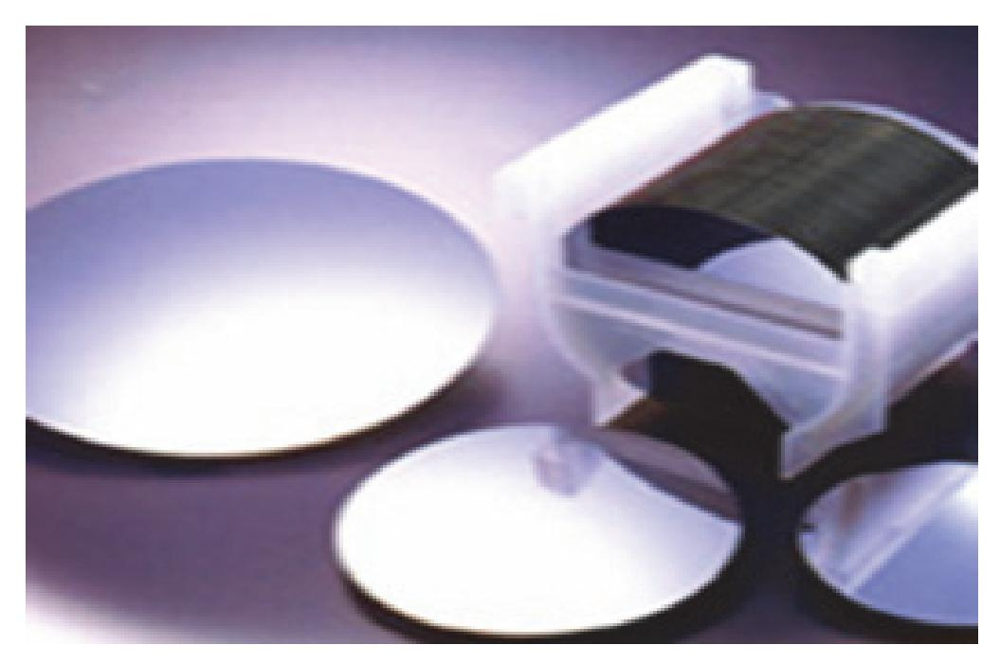

출처: 교육부(2015). 반도체 제조 공정 개발(LM1903060106\_14v3). 한국직업능력개발원. p.4. [그림 1-1] 실리콘 웨이퍼

숕 웨이퍼의 종류

웨이퍼 종류는 여러 가지로 분류할 수 있는데, 첨가 불순물 종류에 따른 분류, 웨이퍼 직경의 크기에 따른 분류, 추가적인 공정에 의한 분류, 웨이퍼 결정 성장 방향에 따른 분류 등을 할 수 있다.

- 1. 웨이퍼의 종류
  - (1) 반도체 첨가되는 불순물 재료에 따라 분류
    - (가) N-형 실리콘(n-type silicon): 5가 원소 --> 인(P). 안티몬(Sb), 비소(As) 도펀트 (dopant) 사용
    - (나) P 형 실리콘(P-type silicon): 3가 원소 --> 붕소(B) 도펀트(dopant) 사용
  - (2) 결정 성장 방향에 따른 분류
    - (가) 결정 성장 방향에 따라 <100>, <111>로 나눌 수 있다.
    - (나) 웨이퍼가 장비 안에서의 자동화된 조작과 방향 표시를 위해 편평한 모양과 넛치(notch) 모양으로 가공된다.

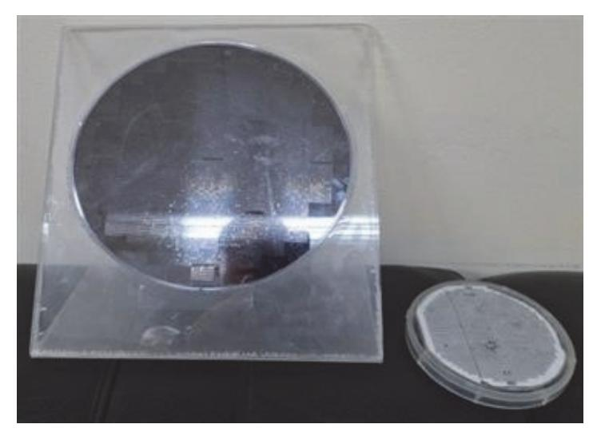

출처: 집필진 제작(2024) [그림 1-2] 실리콘 웨이퍼 편평한 모양과 넛치(notch) 모양

(3) 웨이퍼 직경에 따른 분류

웨이퍼 직경의 크기에 따라 4인치(100mm), 5인치(125mm), 6인치(150mm), 8인치 (200mm), 12인치(300mm) 등으로 나눈다. 생산성 향상을 위하여 대구경화되는 추세이 다.

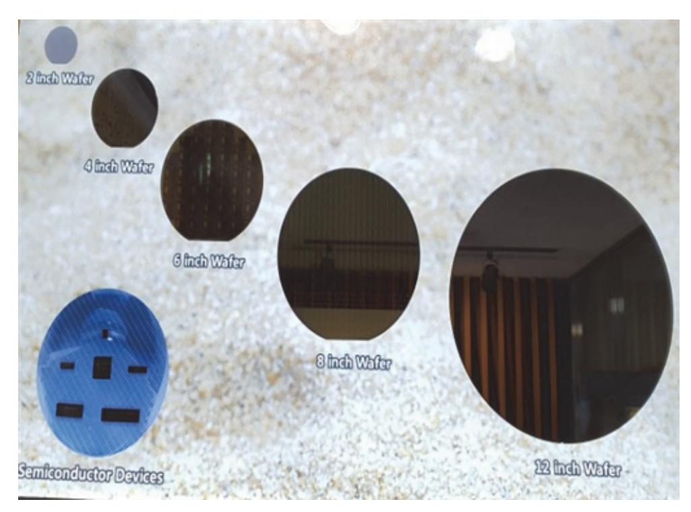

출처: 교육부(2015). 반도체 제조 공정 개발(LM1903060106\_14v3). 한국직업능력개발원. p.5. [그림 1-3] 실리콘 웨이퍼 직경의 크기

#### (4) 추가적인 공정에 따른 분류

추가적인 공정을 통해 폴리시드(polished) 웨이퍼, 에피텍시얼(epitaxial) 웨이퍼, SOI 웨이퍼 등으로 나눌 수 있다. 또한 웨이퍼는 원재료에 따라 실리콘 웨이퍼, 게르마늄 (Ge) 웨이퍼, 갈륨비소(GaAs) 웨이퍼 등으로 구분한다. 이중 상업적으로 실리콘 웨이퍼 가 가장 널리 쓰이며, 실리콘 웨이퍼는 다음과 같이 구분할 수 있다.

(가) 에피(EPI) 공정: 규소 에피텍셜 필름(Si epitaxial film)

규소 에피텍셜(Si epitaxial) 공정은 기존 실리콘 기판에 동일한 결정구조를 유지하 면서 화학적 증착법을 이용해 또 다른 단결정 실리콘을 증착시키는 것을 말한다.

에피(EPI) 공정의 장점으로는 에피(EPI) 실리콘 내의 불순물 농도 조절이 용이하여 실리콘 기판과는 다른 불순물 농도(비저항)를 갖는 에피(EPI) 실리콘을 성장시킬 수 가 있다는 점이다. 또한 일반 실리콘 웨이퍼에서 산소나 탄소가 포함되어 있지만 에 피(EPI) 공정에서는 이들이 전혀 포함되지 않은 에피(EPI) 실리콘을 증착시킬 수 있 으며, 이런 장점들로 인하여 소자의 특성을 향상시킬 수가 있다.

최근에는 트랜지스터의 소스/드레인(source/drain) 영역에 에피(EPI) 실리콘을 증착 하여 소자의 특성(속도)을 향상시키는 쪽으로 활용 범위를 넓혀가고 있다.

현재의 에피 웨이퍼 시장은 소구경 및 비메모리 분야에 걸쳐 중점적으로 형성되어 있으나, 웨이퍼의 대구경화 및 메모리의 고집적화에 따라 에피 웨이퍼 사용이 더욱 늘어날 전망이다.

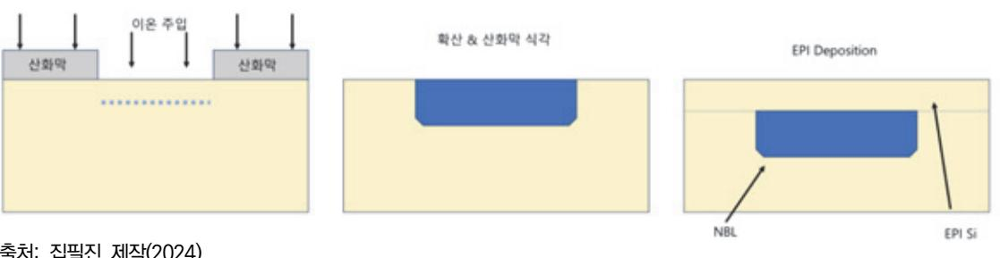

출처: 집필진 제작(2024) [그림 1-4] 에피 공정

(나) SOI(silicon on insulator) 웨이퍼

SOI 웨이퍼(silicon-on-insulator wafer)는 반도체 공정에서 사용되는 웨이퍼의 한 종류로, 실리콘(silicon) 기판 위에 절연층(insulator layer)이 삽입된 구조이다. 이 구조는 일반적인 벌크 실리콘(bulk silicon) 웨이퍼와는 다르며, 여러 가지 전기적 성능 향상 및 특수한 공정을 가능하게 한다. SOI 웨이퍼는 주로 고성능, 저전력 반 도체 소자 및 RF(무선 주파수) 소자 등에 사용된다.

1) SOI 웨이퍼의 구조

- 가) 실리콘 기판(silicon substrate): 웨이퍼의 기본 층으로, 고순도의 실리콘이 사 용된다.
- 나) 절연층(insulator layer): 일반적으로 실리콘 산화물(silicon dioxide, SiO2)로 구성되며, 두께는 매우 얇은 수십 나노미터에서 수백 나노미터까지 다양하다.
- 다) 상층 실리콘(silicon layer): 절연층 위에 놓인 얇은 실리콘층으로, 이 위에 반 도체 소자가 형성된다.
- 2) SOI 웨이퍼의 유형
  - 가) 박막 SOI 웨이퍼(thin-film SOI): 상층 실리콘층의 두께가 매우 얇은 웨이퍼 로, 주로 CMOS 기술과 같은 고성능, 저전력 디지털 회로에 사용된다.
  - 나) 두꺼운 SOI 웨이퍼: 상층 실리콘층이 상대적으로 두꺼운 웨이퍼로, 전력 소자나 RF 소자, MEMS(미세 전자 기계 시스템) 등의 응용에 사용된다.
- 3) SOI 웨이퍼의 장점
  - 가) 전기적 절연성 향상: 절연층 덕분에 상층 실리콘과 기판 사이의 기생 커패시턴 스가 크게 감소하여, 소자의 스위칭 속도와 성능이 향상된다.
  - 나) 저전력 소자 구현: 기생 커패시턴스가 낮아져 전력 소모가 줄어들며, 특히 저전 력 모바일 장치나 웨어러블 기기 등에 유리하다.
  - 다) 고속 동작: 기판으로부터의 전기적 간섭이 줄어들어, 고속으로 동작하는 회로에 서 성능을 극대화할 수 있다.
  - 라) 레디얼 노이즈 감소: 절연층이 잡음의 확산을 막아 주기 때문에, RF 소자 및 아날로그 회로에서 신호 무결성이 향상된다.
  - 마) 소자 크기 감소: 절연층 위에서 트랜지스터를 형성하기 때문에, 일반 실리콘 웨 이퍼보다 더 작은 소자를 구현할 수 있다.
- 4) SOI 웨이퍼의 응용 분야
  - 가) CMOS 기술: SOI 웨이퍼는 고성능, 저전력 CMOS 회로를 구현하는 데 널리 사용된다.
  - 나) RF 소자: 고주파 회로에서 레디얼 노이즈를 줄이고, 신호 무결성을 유지하기 위해 사용된다.
  - 다) MEMS 장치: MEMS(미세 전자 기계 시스템)에서 정밀한 소자를 형성하는 데 사용된다.
  - 라) 고온 전자 기기: SOI 웨이퍼는 절연층 덕분에 높은 온도에서도 안정적으로 동 작할 수 있다.
- 5) SOI 웨이퍼 제조 방법
  - 가) SOI 웨이퍼는 일반적으로 다음과 같은 공정을 통해 제조된다.
  - 나) SIMOX(separation by implantation of oXygen): 고에너지 산소 이온을 실 리콘 기판에 주입하여 절연층을 형성하는 방법이다.

- 다) Bonding and Etch Back: 2개의 실리콘 웨이퍼를 산화 실리콘으로 결합한 후, 한쪽 웨이퍼를 얇게 에칭하여 절연층을 형성하는 방법이다.
- 라) Smart Cut: 실리콘 웨이퍼의 일부분을 얇게 절단하고, 이 부분을 다른 웨이퍼 에 접합하여 절연층을 형성하는 방법이다.

SOI 웨이퍼는 반도체 산업에서 중요한 역할을 하는 기술로, 특히 고성능, 저전력 소 자와 RF 응용 분야에서 많은 이점을 제공한다. SOI 웨이퍼의 사용은 지속해서 증가 하고 있으며, 첨단 전자 기기의 성능을 극대화하는 데 기여하고 있다.

#### 숖 웨이퍼 특성

#### 1. 웨이퍼의 특성

(1) 전기적 특성

단결정으로 성장시킨 실리콘 결정에는 전기 전도도를 위해 의도적으로 첨가한 불순물(B, P, Sb) 이외에는 가능한 한 불순물을 억제시켜야 한다. 그리고 결정 성장(crystal growing) 시 인위적으로 주입되는 도펀트(dopant)에 의해 도체(conductor)와 부도체(insulator) 사이의 전기 전도도를 지니게 되는데, 이를 반도체(semiconductor)라고 한다.

(2) 결정 특성

실리콘 웨이퍼는 고순도의 다결정 실리콘을 용융시켜 특정 방향으로 성장시킨 단결정 실리콘으 로서 이 성장 방향은 디바이스 프로세스(device process)에 기계적 특징(mechanical properties), 확산(diffusion), 이온 주입(ion implantation), 식각(etching) 등에 영향을 끼친다.

(3) 가공 특성

실리콘 웨이퍼의 표면은 디바이스 프로세스(device process)의 원활함과 고품질 회로를 구성하 기 위해, 회로 제조 시 치명적인 영향을 주는 표면 데미지(particle, scratch)나 미량의 화학적 성분이 표면에 남아 있어서는 안 되며, 극도의 평탄도(flatness)가 요구된다.

따라서 슬라이싱(slicing), 래핑(lapping), 폴리싱(polishing) 작업 시 미세한 진동(vibration) 도 억제되어야 하며, 웨이퍼를 손으로 만져서도 안 된다. 또한 전기적 특성이 없는 물(deionized water)로 세척하여 표면 정전기를 방지하고, 청정실(cleanroom)에서 작업하여 고도의 청결을 유지해야 한다.

#### 숗 시모스(CMOS) 트랜지스터 구조

1. 전계 효과 트랜지스터(FET: field effect transistor)

전계 효과 트랜지스터(FET)는 전류 증폭용 소자인 쌍극성 트랜지스터(BJT)와는 달리 전압 증폭용 소자이다. 쌍극성 트랜지스터와의 유사점은 트랜지스터를 구성하는 재료와 3개의 전

극이 있다는 것이다. 전계 효과 트랜지스터의 장점은 낮은 전압과 낮은 전력 소비에 있다. 쌍극성 트랜지스터의 경우 트랜지스터 동작은 베이스 전류의 인가에서 시작되지만 전계 효 과 트랜지스터의 경우는 전기장을 형성하기 위해 게이트에 전압을 가함으로써 소자가 동작 한다. 이렇게 전기장을 형성하여 그 효과로 소자 동작을 시작한다는 의미로 FET(field effect transistor)라고 부른다.

전계 효과 트랜지스터는 크게 2가지 형태로 구별되는데 하나는 제이펫(JFET)로 피엔(pn) 접합 구조를 이용한 트랜지스터이고, 다른 하나는 두 전극 사이에 얇은 유전체로 절연되는 구조인 MOSFET이다. 이 MOSFET는 선형/아날로그 회로 증폭기와 디지털 회로에서 스위 칭 부품 소자로 활용된다.

2. 모스페트(MOSFET: metal oxide semiconductor FET)

논리 회로(logic circuit) 응용에 널리 이용하고 있고, IC 구성 부품에 주요한 소자이다. MOSFET는 NMOS(n-채널)과 PMOS(p-채널)의 2가지 형태인데 각 소자에 흐르는 다수 전 류 캐리어(carrier)에 따라 결정된다. [그림 1-5]에 두 종류 MOSFET의 기하학적 단면 구 조가 도시되어 있다.

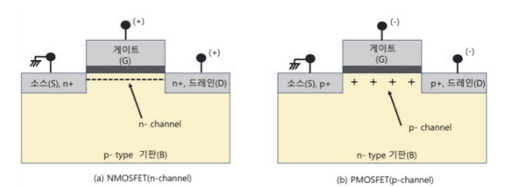

출처: 집필진 제작(2024) [그림 1-5] NMOS와 PMOS의 기하학적 단면도

- 3. CMOSFET(complementary MOSFET)

MOSFET의 초기 사용은 NMOS 트랜지스터가 주류를 이루었다. PMOS 트랜지스터는 특정한 전자 응용에 사용되지만 NOMS 트랜지스터 IC 장치들이 PMOS 장치들과 비교해 우수한 성능을 보였기 때문이다. 현재는 이 두 종류의 MOSFET의 장점을 이용하는 시모스(CMOS) 트랜지스터를 활용하여 소비 전력 효율의 결합, 설계 스케일링(scaling) 기술 제조 공정의 발전에 힘입어 각광받는 트랜지스터로 발전해 가고 있다. 시모스(CMOS)는 NMOS와 PMOS를 동일한 공정 안에서 동시에 만들 수 있다. 그 기하학적 구조가 [그림 1-6]에 도시되어 있다.

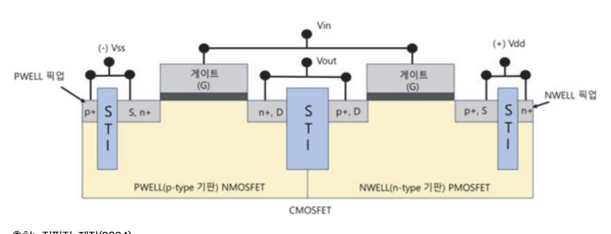

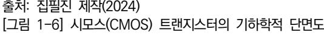

#### 숕 시모스(CMOS) 트랜지스터 작동 원리

1. NMOS 트랜지스터 작동 원리

[그림 1-7]은 NMOSFET의 기본 동작 원리를 회로도에 램프를 첨가하여 설명한 것이다. 동 작 원리를 정리하면 다음과 같다.

- (1) [그림 1-7]의 (a)는 게이트로의 입력 전압이 없기 때문에 게이트 산화막 아래로 채널이 형성 되지 않아 소스와 드레인이 개방 상태이므로 소스와 드레인 사이에 전류가 흐르지 않는다. 이는 p-n 접합 다이오드의 상태와 같다.
- (2) 이 상태에서 [그림 1-7]의 (b)처럼 스위치가 닫히면 플러스 0.7V의 작은 바이어스 전압이 게이트와 소스 양단에 동일하게 공급된다.
- (3) 이로 인해 게이트에 플러스 정전하가 생기고, 산화막 하단에 음전하가 생성되어 소스와 드레 인 간의 기판 상부에 채널이 형성된다.
- (4) 동시에 전기장이 게이트의 플러스 전하에 의해 생성되고, p-타입(p-type) 기판의 상층 정공 을 아래쪽으로 밀어내고 전자를 채널 안으로 끌어당긴다.
- (5) 이때 드레인에 걸려 있는 플러스 3V 전원에 의해 전자들은 자유롭게 흘러서 마이너스(-) 단 자로부터 소스를 통해서 n 채널과 드레인, 플러스(+) 전원 쪽의 램프를 통해서 흐르게 된다.
- (6) 전자의 흐름은 드레인과 소스 간 전류(Ids)에 흐름이 되고, 램프는 점등된다.

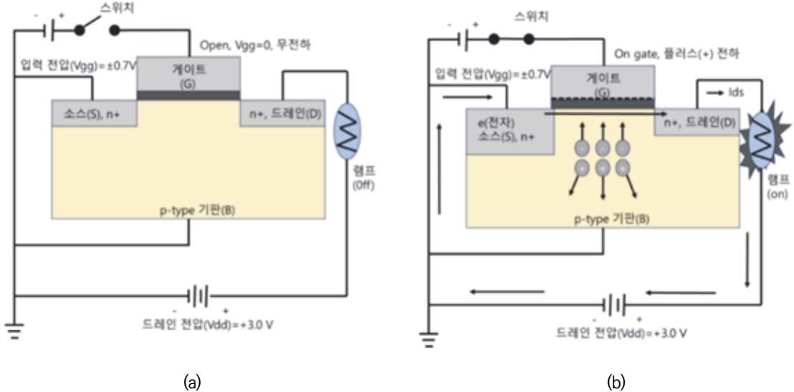

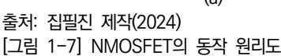

2. PMOS 트랜지스터 작동 원리

[그림 1-8]은 PMOSFET의 기본 동작 원리를 회로도에 램프를 첨가하여 설명하고 있다. 동 작 원리를 정리하면 다음과 같다.

- (1) [그림 1-8]의 (a)는 게이트로의 입력 전압이 없기 때문에 게이트 산화막 아래로 채널이 형성 되지 않아 소스와 드레인이 개방 상태이므로 소스와 드레인 사이에 전류가 흐르지 않는다. 이는 p-n 접합 다이오드의 상태와 같다.
- (2) 이 상태에서 [그림 1-8]의 (b)처럼 스위치가 닫히면 마이너스 0.7V의 작은 바이어스 전압이 게이트와 소스 양단에 동일하게 공급된다.
- (3) 이로 인해 게이트에 마이너스 정전하가 생기고 산화막 하단에 양전하가 생성되어 소스와 드 레인 간의 기판 상부에 채널이 형성된다.
- (4) 동시에 전기장이 게이트의 마이너스 전하에 의해 생성되고 n-타입(n-type) 기판의 상층 전 자를 아래쪽으로 밀어내어 정공을 채널 안으로 끌어당긴다.
- (5) 이때 드레인에 걸려 있는 마이너스 3V 전원에 의해 정공들이 자유롭게 흘러서 플러스(+) 단 자로부터 소스를 통해 p 채널과 드레인, 플러스(+) 전원 쪽의 램프를 통해 흐르게 된다.
- (6) 전자의 흐름은 드레인과 소스 간 전류(Ids)의 흐름이 되고 램프는 점등된다.

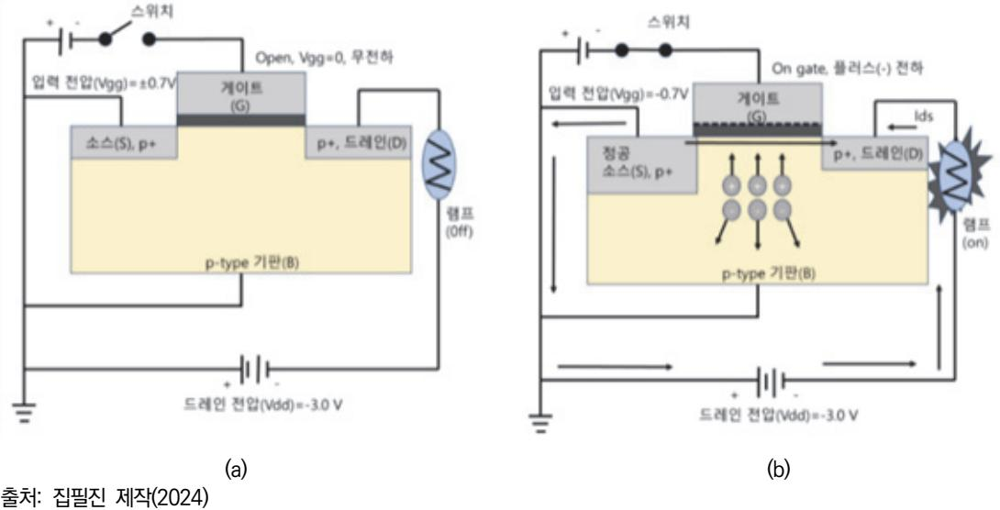

[그림 1-8] PMOSFET의 동작 원리도

#### 3. 시모스(CMOS) 인버터(invertor) 작동 원리

시모스(CMOS)는 동일한 직접 회로 안에 NMOS와 PMOS를 조합한 구조이다. 이 시모스 (CMOS)는 소비 전력 효율의 결합과 설계 스케일링(scaling) 기술, 제조 공정이 향상되었 다. 소비 전력 효율과 관련하여, 게이트의 입력 신호가 없을 때에는 전력 소비가 없다. 스 케일링 측면에서는 소형화뿐만 아니라 동작 수행에 필요한 전압까지 낮출 수 있는 장점이 있는데, 그 간단한 보기로 시모스(CMOS) 인버터(invertor)가 있다.

인버터는 입력단의 신호가 출력단에서 반전되는 특징이 있다. 디지털의 경우 영(0)의 신호 가 일(1)로 바뀐다. NMOS와 PMOS 게이트들은 단일 입력으로 사용되고, 드레인들은 서로 결합되어 단일 출력단으로 사용된다. NMOS의 소스는 접지되고 PMOS의 소스는 바이어스 전압(Vdd)에 연결된다. [그림 1-6]에 CMOSFET의 공정 단면도와 [그림 1-9]에 설계 평면 도가 도시되어 있다.

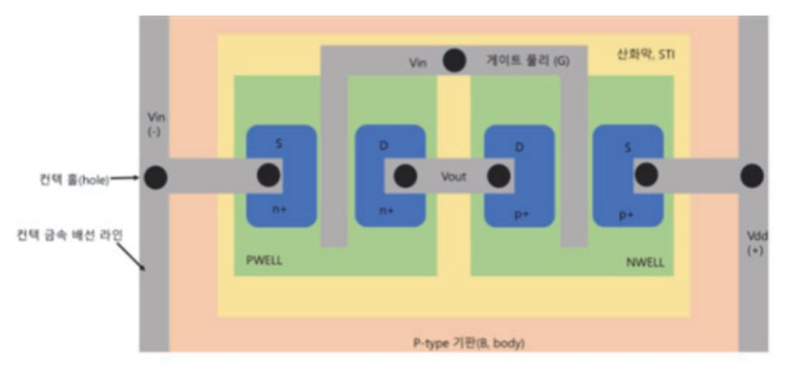

출처: 집필진 제작(2024) [그림 1-9] CMOSFET의 설계 평면도

시모스(CMOS) 인버터(invertor)는 시모스(CMOS)에 입력된 신호가 출력에서 반전된 형태 로 나타난다. 정상 동작은 입력 신호가 플러스인 동안 n-채널(n-channel) 동작을 하고 입 력 신호가 마이너스인 동안 p-채널(p-channel)로 동작한다. 시모스(CMOS) 인버터 회로의 효율은 입력 신호 영(0)에서 과도기 동안 발생한다. 입력 신호가 영(0)이면 트랜지스터의 전 력 소모가 없다. [그림 1-10]에 인버터의 회로도(a)와 사용되는 회로 심벌이 도시되어 있다.

- 입력된 신호의 위상이 출력에서 반전되는 소자
- 디지털 신호: 0 → 1, 1 → 0

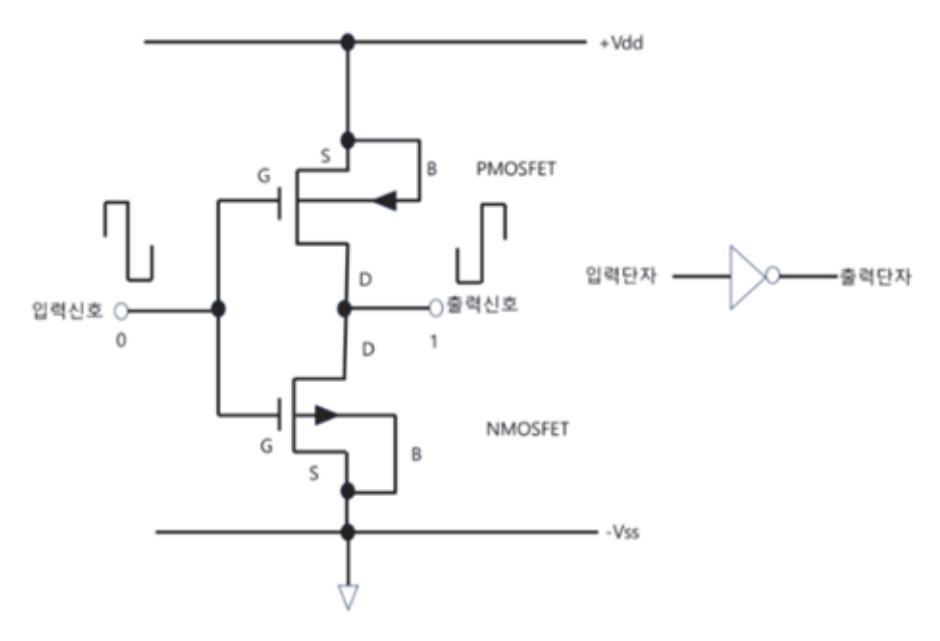

인버터의 회로도와 회로 심벌 [그림 1-10] 인버터의 회로도와 회로 심벌

#### 숖 시모스(CMOS) 제작 공정 흐름도

1. 소자 분리 단계

시모스(CMOS) 제조 공정의 첫 번째 단계인 소자 분리 공정에서는 시모스(CMOS)를 구성 하는 NMOS, PMOS가 형성될 부분을 트렌치(trench) 공정 기술을 이용하여 분할한다. 도 랑처럼 형성된 부분이 트렌치 부분으로 이 부분은 옥사이드(oxide)로 채워진다. 이 옥사이 드는 절연체로 NMOS 트랜지스터와 PMOS 트랜지스터의 전기적 연결을 차단한다. [그림 1-11]에 소자 분리를 위한 공정 단면도가 도시되어 있다.

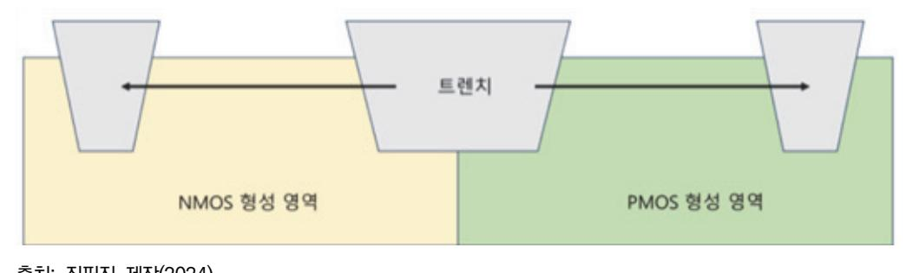

출처: 집필진 제작(2024) [그림 1-11] 소자 분리를 위한 공정 단면도

2. 소자 형성 단계

두 번째 단계인 소자 형성 단계에서는 이 분리된 소자 형성 영역에 NMOS와 PMOS 각각 의 소스(source, S), 게이트(gate, G), 드레인(drain, D) 부분을 형성한다. 이때 웰(well)과 소스, 드레인 부분의 도핑(doping)을 위하여 이온 주입 공정 기술이 사용되고, 게이트는 포 토, 에칭 공정 기술을 이용하여 폴리 실리콘(poly-silicon)을 형성한다. 소스, 드레인, 게이 트 세 부분의 형성으로 트랜지스터 소자 형성이 완성된다. [그림 1-12]는 소자 형성을 위한 공정 단면도를 나타낸 것이다.

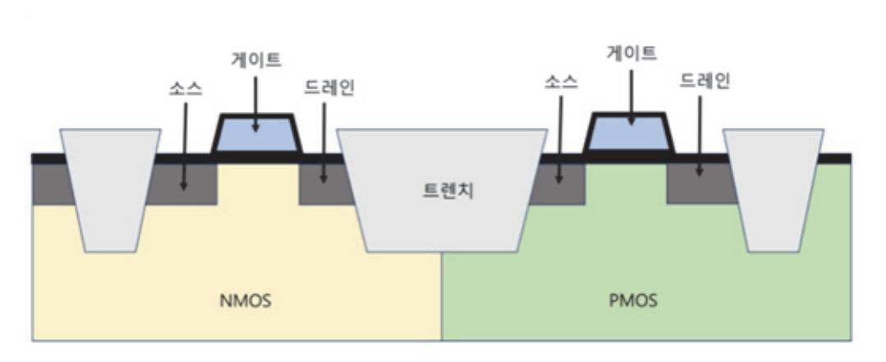

출처: 집필진 제작(2024) [그림 1-12] 소자 형성을 위한 공정 단면도

#### 3. 소자 배선 단계

마지막으로 소자 배선 공정을 통하여 소자 형성 과정에서 생성된 소스(source), 드레인 (drain), 게이트(gate) 부분에 금속 전극들을 형성한다. [그림 1-13]은 금속 배선 과정에 대한 공 정 단면도이다. 이 배선 공정에서는 최종 메탈 전극에서 외부 신호 입력과 전원 인가를 위 한 패드(pad) 및 소자를 외부의 환경으로부터 보호하는 보호막 공정을 포함한다.

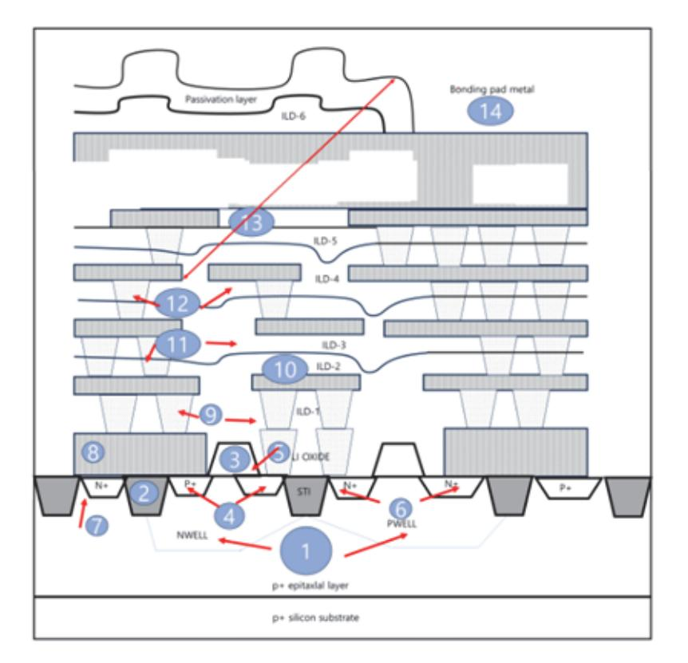

출처: 집필진 제작(2024) [그림 1-13] CMOS 소자의 단면도

## 수행 내용 / 메모리 반도체 공정 흐름도 해석하기

#### 재료·자료

- 6인치 및 8인치 베어 웨이퍼
- NMOS 트랜지스터, PMOS 트랜지스터
- 소자 제작 공정 순서 흐름도 설명서
- MOS 단면 분석 사진

#### 기기(장비 ・ 공구)

해당 사항 없음.

#### 안전 ・ 유의 사항

- 반도체 회로를 웨이퍼 상에 가공하는 공정 업무에 적용한다.
- 웨이퍼는 깨지기 쉬워서 취급에 각별히 조심해야 하며 오염이 되지 않도록 해야 한다.
- 반도체 제조 공정된 웨이퍼 취급에 오염이나 파손에 주의해야 한다.
- 반도체 제조 공정된 웨이퍼 측정 시에는 장비 사용에 주의해야 한다.

#### 수행 순서

숔 메모리 종류와 특성을 해석하여 설명한다.

메모리 반도체 제조 공정 개발을 위해서는 다양한 메모리 종류와 그 특성을 이해하고 해석하는 것이 중요하다. 메모리 반도체는 크게 휘발성 메모리(volatile memory)와 비휘발성 메모리 (non-volatile memory)로 나눌 수 있으며, 각 종류는 고유의 특성과 용도를 지니고 있다. 다 음은 주요 메모리 종류와 그 특성에 대한 설명이다.

- 1. 휘발성 메모리(volatile memory)
  - (1) RAM(random access memory)
    - (가) 특성

1) 휘발성: 전원이 꺼지면 저장된 데이터가 사라진다.

- 2) 고속 접근: 데이터 읽기 및 쓰기가 빠르다.
- 3) 임시 저장소: 주로 작업 중인 데이터를 일시적으로 저장하는 데 사용된다.
- (나) 종류
  - 1) DRAM(dynamic rom)
    - 가) 특징: 주기적으로 재충전(refresh)이 필요하다.
    - 나) 구조: 트랜지스터와 커패시터로 구성된다.
    - 다) 용도: 주로 컴퓨터의 메인 메모리로 사용된다.
  - 2) SRAM(static rom)
    - 가) 특징: 재충전이 필요 없음, 더 빠르고 더 비싸다.
    - 나) 구조: 플립플롭(flip-flop)으로 구성된다.
    - 다) 용도: 캐시 메모리 등 고속 메모리로 사용된다.
- 2. 비휘발성 메모리(non-volatile memory)
  - (1) ROM(read-only memory)
    - (가) 특성
      - 1) 비휘발성: 전원이 꺼져도 데이터가 유지된다.
      - 2) 읽기 전용: 주로 초기화 및 부팅 데이터 저장에 사용된다.

- (나) 종류
  - 1) Mask ROM
    - 가) 특징: 제조 시 데이터가 고정되며 변경 불가하다.
    - 나) 용도: 고정된 프로그램 데이터를 저장한다.
  - 2) PROM(programmable rom)
    - 가) 특징: 한 번만 프로그래밍이 가능하다.
    - 나) 용도: 펌웨어 저장에 사용된다.
  - 3) EPROM(erasable programmable rom)
    - 가) 특징: 자외선을 통해 지우고 다시 프로그래밍이 가능하다.
    - 나) 용도: 개발 중인 펌웨어 저장에 사용된다.
  - 4) EEPROM(electrically erasable programmable rom)
    - 가) 특징: 전기적으로 지우고 다시 프로그래밍이 가능하다.
    - 나) 용도: 설정 데이터 저장에 사용된다.
- (2) Flash Memory
  - (가) 특성
    - 1) 비휘발성: 전원이 꺼져도 데이터가 유지된다.
    - 2) 재프로그램 가능: 블록 단위로 지우고 다시 프로그래밍이 가능하다.
    - 3) 용량 및 속도: 용량이 크고, 속도는 DRAM보다 느리지만 EEPROM보다 빠르다.

#### (나) 종류

- 1) NOR Flash
  - 가) 특징: 빠른 읽기 속도, 코드 저장에 적합하다.
  - 나) 용도: 펌웨어, 부트로더 저장에 사용된다.
- 2) NAND Flash
  - 가) 특징: 높은 저장 밀도, 빠른 쓰기 및 지우기 속도가 가능하다.
  - 나) 용도: 대용량 데이터 저장소, SSD, USB 드라이브에 사용된다.
- 3. 최신 메모리 기술
  - (1) MRAM(magnetoresistive rom)
    - (가) 특성
      - 1) 비휘발성: 전원이 꺼져도 데이터가 유지된다.
      - 2) 고속: DRAM과 비슷한 속도이다.
      - 3) 내구성: 쓰기 내구성이 높다.
    - (나) 용도: 산업용 제어, 자동차 전자 시스템 등에 사용된다.
  - (2) ReRAM(resistive rom)

- (가) 특성
  - 1) 비휘발성: 전원이 꺼져도 데이터가 유지된다.
  - 2) 고속: DRAM과 비슷한 속도이다.
  - 3) 저전력: 전력 소비가 낮다.
- (나) 용도: 고속 데이터 저장소, 임베디드 시스템에 사용된다.
- (3) PRAM(phase-change rom)
  - (가) 특성
    - 1) 비휘발성: 전원이 꺼져도 데이터가 유지된다.

    - 2) 고속: NAND Flash보다 빠르다.
    - 3) 내구성: 높은 쓰기 내구성을 지닌다.
  - (나) 용도: 대체 NAND Flash 메모리, 모바일 기기에 사용된다.
- 4. 메모리 제조 공정 개요
  - (1) 웨이퍼 제조
    - (가) 실리콘 잉곳: 고순도 실리콘 잉곳을 제조한다.
    - (나) 웨이퍼 절단: 실리콘 잉곳을 얇게 절단하여 웨이퍼를 제조한다.
  - (2) 웨이퍼 공정
    - (가) 산화: 실리콘 웨이퍼 표면에 산화막을 형성한다.
    - (나) 포토리소그래피: 마스크를 이용해 패턴을 형성한다.
    - (다) 식각: 필요 없는 부분을 식각하여 제거한다.
    - (라) 이온 주입: 도핑 과정을 통해 반도체 특성을 부여한다.
    - (마) 박막 증착: 다양한 박막을 증착하여 소자를 형성한다.
  - (3) 패키징 및 테스트
    - (가) 다이 커팅: 웨이퍼에서 개별 다이를 분리한다.
    - (나) 패키징: 개별 다이를 패키지에 장착한다.
    - (다) 테스트: 최종 제품의 성능 및 품질을 테스트한다.

메모리 반도체 제조 공정 개발을 위해서는 다양한 메모리 종류와 그 특성을 이해하고 해석하는 것이 필수적이다. 각각의 메모리는 고유의 특성과 용도를 지니고 있으며, 제조 공정 역시 각 메모리의 특성에 맞게 설계되고 최적화되어야 한다. 이러한 지식을 바탕으로 메모리 반도체 제 조 공정을 개발하고 개선할 수 있다.

- 숕 Well과 격리(isolation)의 구조를 해석하여 설명한다.
  - 1. Well 구조에 대한 분석을 진행한다.

메모리 반도체 제조 공정에서 Well 구조는 중요한 역할을 한다. Well은 반도체 웨이퍼 내 에서 특정 영역을 도핑하여 원하는 전기적 특성을 지니게 만드는 영역이다. 주로 CMOS 공 정에서 p-well과 n-well이 사용된다. Well 구조를 이해하는 것은 메모리 반도체의 성능 및 특성을 최적화하는 데 필수적이다. 다음은 Well 구조에 대한 설명과 해석이다.

(1) Well의 개념

Well: 반도체 웨이퍼 내의 특정 영역으로, 전자(electron) 또는 정공(hole)을 도핑하여 형성한다. 주로 트랜지스터의 활성 영역을 형성하기 위해 사용된다.

- (가) p-well: p형 도핑(보통 붕소)을 통해 형성된 영역으로, n형 트랜지스터(NMOS)를 만들 기 위해 사용된다.
- (나) n-well: n형 도핑(보통 인이나 비소)을 통해 형성된 영역으로, p형 트랜지스터(PMOS) 를 만들기 위해 사용된다.
- (2) Well 구조의 역할
  - (가) 트랜지스터 형성: CMOS 공정에서 NMOS와 PMOS 트랜지스터를 각각 p-well과 n-well 위에 형성한다.
  - (나) 전기적 격리: 서로 다른 트랜지스터 간의 전기적 간섭을 줄이고, 안정적인 동작을 보장한다.
  - (다) 전류 누설 방지: 특정 도핑 농도와 깊이를 조절하여 전류 누설을 최소화한다.
- (3) Well 구조 형성 공정
  - (가) 웨이퍼 준비
    - 1) 실리콘 웨이퍼: 고순도 실리콘 웨이퍼를 준비한다.
    - 2) 산화막 형성: 웨이퍼 표면에 얇은 산화막(SiO₂)을 형성하여 보호막 역할을 한다.
  - (나) 포토리소그래피
    - 1) 포토레지스트 코팅: 웨이퍼 표면에 감광성 물질(포토레지스트)을 코팅한다.
    - 2) 마스크 정렬: 원하는 패턴을 가진 마스크를 웨이퍼 위에 정렬한다.
    - 3) 노광: 자외선을 사용하여 포토레지스트를 노광하여 패턴을 형성한다.
    - 4) 현상: 노광된 포토레지스트를 현상하여 패턴을 드러낸다.
  - (다) 이온 주입
    - 1) 도핑 물질 선택: n형 또는 p형 도핑 물질을 선택한다(인, 비소, 붕소 등).
    - 2) 이온 주입: 고에너지 이온 주입 장비를 사용하여 웨이퍼 표면에 도핑 물질을 주입한 다.
    - 3) 확산: 주입된 이온이 웨이퍼 내에서 확산하여 균일한 도핑 농도를 형성한다.

(라) 어닐링(열처리)

1) 열처리: 웨이퍼를 고온에서 열처리하여 도핑된 이온을 활성화하고, 결함을 줄인다.

- 4. Well 구조를 해석한다.
  - - (가) 전기적 특성 분석
      - 1) 캐리어 농도: p-well과 n-well의 캐리어(전자와 정공) 농도를 분석하여 전기적 특 성을 파악한다.
      - 2) 저항: 도핑 농도와 깊이에 따라 저항 특성이 달라진다.
      - 3) 커패시턴스: 웰 구조는 기생 커패시턴스를 형성할 수 있으며, 이는 고속 동작에 영 향을 미칠 수 있다.
    - (나) 깊이와 프로파일
      - 1) 도핑 프로파일: 도핑 농도 분포를 분석하여 이상적인 트랜지스터 특성을 얻기 위한 최적의 도핑 프로파일을 결정한다.
      - 2) 깊이 분석: 주입된 도핑 물질의 깊이를 분석하여 웰 깊이를 최적화한다.

| Oxide                    |        |
|--------------------------|--------|
|                          | N-well |
| P - substrate |        |

출처: 집필진 제작(2024) [그림 1-14] 확산에 의한 N-well 형성

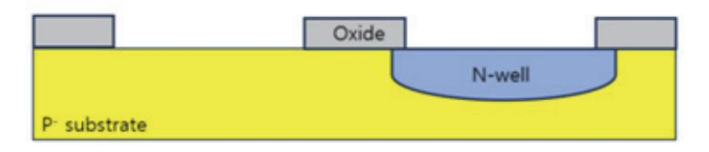

출처: 집필진 제작(2024) [그림 1-15] NMOS 제조를 위한 에칭

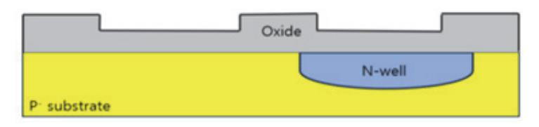

출처: 집필진 제작(2024) [그림 1-16] Gate oxide 형성 (다) 전류 누설 분석

- 1) 전류 누설 경로: 웰 구조 내의 전류 누설 경로를 분석하여 전력 소모를 최소화한다.
- 2) 온도 의존성: 온도 변화에 따른 웰 구조의 전류 누설 특성을 분석한다.
- (5) 메모리 반도체에서의 Well 구조 적용
  - (가) DRAM
    - 1) 액티브 영역: 셀 트랜지스터가 p-well에 형성되어 데이터 저장 및 읽기/쓰기 기능 을 수행한다.
    - 2) 전하 저장: 커패시터와 트랜지스터의 전하 저장 특성을 최적화하기 위해 도핑 농도 와 웰 깊이를 조절한다.
  - (나) NAND Flash
    - 1) 플로팅 게이트 트랜지스터: 플로팅 게이트 트랜지스터가 n-well 또는 p-well에 형 성되어 데이터 저장 기능을 수행한다.
    - 2) 전류 경로 제어: 도핑 프로파일을 통해 전류 경로와 셀 간 간섭을 최소화한다.

Well 구조는 메모리 반도체 제조 공정에서 매우 중요한 역할을 한다. Well 구조를 적절하 게 설계하고 최적화함으로써 트랜지스터의 성능을 향상시키고 전류 누설을 최소화할 수 있 다. 이를 통해 메모리 반도체의 전반적인 성능과 안정성을 높일 수 있다. Well 구조의 형성 과 해석은 메모리 반도체의 품질을 결정하는 중요한 요소 중 하나이다.

2. 격리(isolation) 구조를 분석한다.

메모리 반도체 제조 공정에서 격리(isolation) 구조는 개별 소자 간의 전기적 간섭을 최소 화하고, 각 소자가 독립적으로 동작할 수 있도록 하는 중요한 역할을 한다. 격리 구조는 다 양한 방법으로 구현될 수 있으며, 이는 반도체 소자의 성능과 신뢰성에 큰 영향을 끼친다. 다음은 메모리 반도체 제조 공정에서 격리 구조의 종류와 특성에 대한 설명이다.

- (1) 격리 구조의 중요성
  - (가) 전기적 간섭 방지: 인접한 소자 간의 전기적 간섭을 방지하여 신호 왜곡과 노이즈를 최 소화한다.
  - (나) 전류 누설 방지: 소자 간 전류 누설을 막아 전력 소모를 줄이고, 소자의 전기적 특성을 안정화한다.
  - (다) 소자 보호: 개별 소자를 보호하여 전체 회로의 신뢰성을 높인다.
- (2) 주요 격리 구조
  - (가) LOCOS(local oxidation of silicon)
    - 1) 특성
      - 가) 산화막 형성: 실리콘 표면에 두꺼운 산화막(SiO₂)을 형성하여 격리한다.
      - 나) 쉬운 구현: 공정이 비교적 간단하고 비용이 적게 든다.

- 2) 구조 및 공정
  - 가) 실리콘 웨이퍼 준비: 고순도 실리콘 웨이퍼를 준비한다.
  - 나) 산화막 형성: 실리콘 표면에 얇은 초기 산화막을 형성한다.
  - 다) 포토리소그래피: 감광성 물질(포토레지스트)을 코팅하고, 패턴을 노광하여 격리 영역을 정의한다.
  - 라) 식각: 노출된 실리콘을 식각하여 웰 영역을 노출시킨다.
  - 마) 열 산화: 고온에서 산화 과정을 통해 두꺼운 산화막을 형성한다.
  - 바) 포토레지스트 제거: 잔여 포토레지스트를 제거하여 격리 구조를 완성한다.
- 3) 장점
  - 가) 낮은 비용: 공정이 간단하고 비용이 적게 든다.
  - 나) 신뢰성: 비교적 높은 신뢰성을 제공한다.
- 4) 단점
  - 가) Bird's Beak 형성: 산화 과정에서 산화막이 실리콘 내부로 침투하여 'Bird's Beak' 형성이 발생, 면적 효율이 낮아진다.
  - 나) 고정밀도 어려움: 고정밀 소자 격리에 한계가 있다.

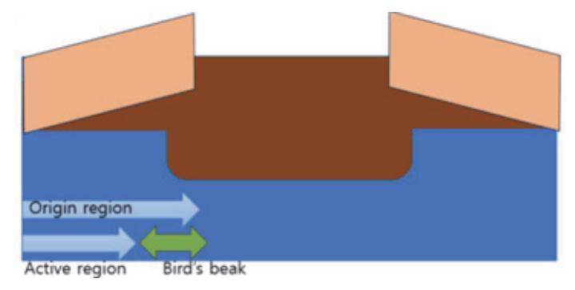

출처: 집필진 제작(2024) [그림 1-17] LOCOS 공정의 Bird's beak 현상

(나) STI(shallow trench isolation)

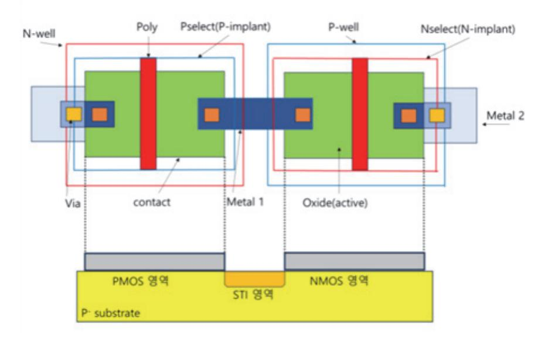

#### 출처: 집필진 제작(2024)

[그림 1-18] Oxide(active) 마스크에 의한 소자 영역 형성

1) 특성

가) 트렌치 구조: 실리콘 웨이퍼에 얕은 트렌치를 형성하고, 산화막으로 채워 격리한다.

- 나) 고밀도: 고밀도 집적 회로에 적합하다.
- 2) 구조 및 공정
  - 가) 실리콘 웨이퍼 준비: 고순도 실리콘 웨이퍼를 준비한다.
  - 나) 포토리소그래피: 포토레지스트를 코팅하고, 패턴을 노광하여 트렌치 영역을 정의한다.
  - 다) 식각: 노출된 실리콘을 식각하여 얕은 트렌치를 형성한다.
  - 라) 산화막 증착: 트렌치 내부를 산화막으로 채운다.
  - 마) CMP(chemical mechanical planarization): 평탄화를 통해 트렌치 상부의 산 화막을 제거하여 평탄한 표면을 만든다.
- 3) 장점
  - 가) 고밀도: 고밀도 소자 집적이 가능하여 면적 효율이 높다.
  - 나) 정밀 격리: 고정밀 격리가 가능하다.
- 4) 단점
  - 가) 복잡한 공정: 공정이 복잡하고 비용이 높다.
  - 나) 잔류 스트레스: 트렌치 형성 과정에서 잔류 스트레스가 발생할 수 있다.
- (다) SOI(silicon on insulator)
  - 1) 특성
    - 가) 절연체 위 실리콘: 절연체(보통 SiO₂) 위에 얇은 실리콘층을 형성하여 격리한다.
    - 나) 고속 동작: 기생 커패시턴스가 줄어들어 고속 동작에 유리하다.

23

2) 구조 및 공정

가) 버크 실리콘 웨이퍼 준비: 고순도 실리콘 웨이퍼를 준비한다.

나) 절연막 형성: 웨이퍼 표면에 절연막을 형성한다.

다) 실리콘층 형성: 절연막 위에 얇은 실리콘층을 형성한다.

라) 소자 형성: 실리콘층 위에 트랜지스터와 같은 소자를 형성한다.

3) 장점

가) 낮은 기생 커패시턴스: 기생 커패시턴스가 낮아 고속 동작에 유리하다.

나) 전류 누설 감소: 전류 누설이 적어 전력 소모가 줄어든다.

4) 단점

가) 비용: 공정 비용이 높다.

나) 열 관리: 열 방출이 어려워 열 관리가 필요하다.

(3) 메모리 반도체에서의 격리 구조를 적용한다.

(가) DRAM

- 1) 트랜지스터 격리: 각 메모리 셀의 트랜지스터를 서로 격리하여 전류 누설과 간섭을 최소화한다.
- 2) 커패시터 격리: 커패시터와 트랜지스터 간의 전기적 간섭을 방지하여 데이터 보존 성능을 향상시킨다.
- (나) NAND Flash
  - 1) 셀 간 격리: 셀 간 전기적 간섭을 방지하여 데이터 무결성을 보장한다.

2) 비트라인 격리: 비트라인 간의 간섭을 줄여 데이터 읽기/쓰기 성능을 향상시킨다. 메모리 반도체 제조 공정에서 격리 구조는 소자 간의 전기적 간섭을 최소화하고 안정적인 동작을 보장하기 위해 필수적인 요소이다. LOCOS, STI, SOI와 같은 다양한 격리 구조가 있으며, 각 구조는 고유의 장단점이 있다. 메모리 반도체의 성능과 신뢰성을 높이기 위해서 는 해당 공정에 적합한 격리 구조를 선택하고 최적화해야 한다. 이를 통해 메모리 반도체의 전반적인 품질과 성능을 개선할 수 있다.

숖 메모리 단위 소자(MOSFET, capacitor 등) 제작 구조를 해석하여 설명한다.

메모리 반도체 제조 공정에서 단위 소자는 메모리 셀의 핵심 구성 요소이다. 이들 소자의 제작 구조를 이해하는 것은 메모리 반도체의 성능과 신뢰성을 향상시키는 데 있어 매우 중요하다. 다음은 메모리 반도체에서 중요한 단위 소자인 MOSFET와 capacitor의 제작 구조와 공정에 대한 설명이다.

1. MOSFET(metal-oxide-semiconductor field-effect transistor)를 이해한다. MOSFET는 메모리 반도체의 기본적인 스위칭 소자로, 데이터의 읽기 및 쓰기 동작을 제어한다. (1) 구조

(가) 게이트(gate): 금속 또는 폴리실리콘으로 만들어지며, 게이트 전압에 의해 채널이 형성된다.

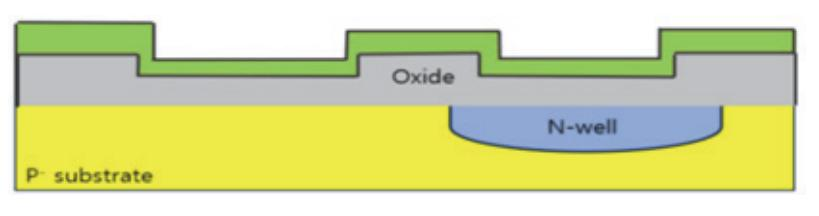

출처: 집필진 제작(2024) [그림 1-19] POLY SILICON 형성

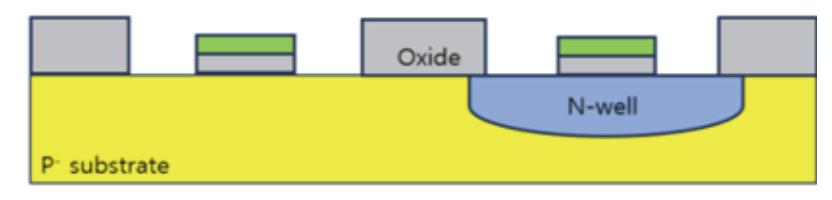

출처: 집필진 제작(2024) [그림 1-20] POLY SILICON 및 산화막 에칭

(나) 소스(source) 및 드레인(drain): 도핑된 n형 또는 p형 영역으로, 전류가 흐르는 경로이다.

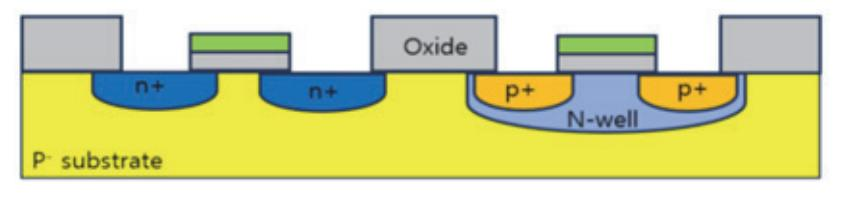

출처: 집필진 제작(2024) [그림 1-21] source, drain implant

- (다) 채널(channel): 게이트 전압에 의해 형성되는 도핑되지 않은 실리콘 영역이다.
- (라) 게이트 산화막(gate oxide): 게이트와 채널 사이에 있는 얇은 절연막(주로 SiO₂)으로, 전기적 절연 역할을 한다.

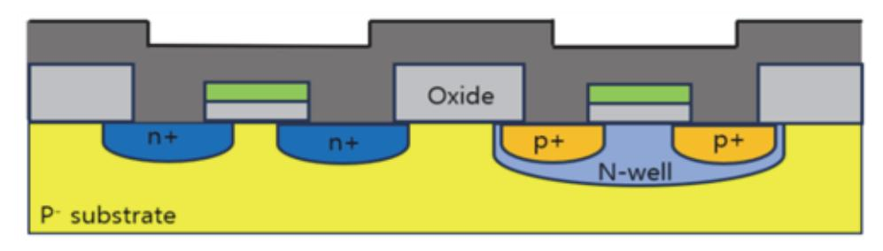

출처: 집필진 제작(2024) [그림 1-22] nitride 성장

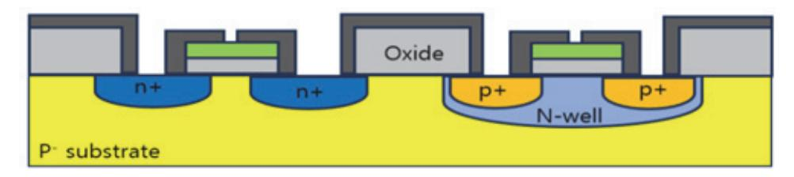

출처: 집필진 제작(2024) [그림 1-23] nitride 에칭

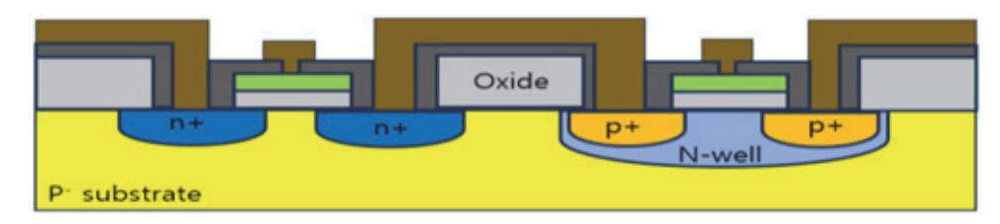

출처: 집필진 제작(2024) [그림 1-24] metal 에칭

#### (2) 제작 공정

- (가) 웨이퍼 준비: 고순도 실리콘 웨이퍼를 준비한다.
- (나) 산화막 형성: 실리콘 표면에 얇은 SiO₂ 층을 형성한다.
- (다) 포토리소그래피 및 식각: 포토레지스트를 코팅하고, 패턴을 노광하여 소스, 드레인 및 게 이트 영역을 정의한 후 식각하여 노출된 실리콘을 제거한다.
- (라) 이온 주입: 소스 및 드레인 영역에 n형 또는 p형 도핑 물질을 주입한다.
- (마) 게이트 형성: 폴리실리콘이나 금속을 증착하여 게이트를 형성한다.
- (바) 어닐링(annealing): 열처리를 통해 도핑된 이온을 활성화하고, 결함을 줄인다.
- (사) 콘택트 형성: 메탈층을 증착하여 소스, 드레인 및 게이트와의 전기적 연결을 만든다.
- 2. 커패시터(capacitor)를 이해한다.

커패시터는 주로 DRAM 메모리 셀에서 데이터 저장을 위해 사용된다. 커패시터는 전하를 저장하여 논리 상태를 유지하는 역할을 한다.

(1) 구조

- (가) 플레이트(plate): 두 개의 도전성 층으로 구성되며, 전하를 저장한다.
- (나) 유전체(dielectric): 두 플레이트 사이에 있는 절연층으로, 전하를 축적한다. 주로 SiO₂, HfO₂ 등이 사용된다.
- (2) 제작 공정
  - (가) 하부 플레이트 형성: 실리콘 웨이퍼 위에 하부 플레이트(도전성 층)를 형성한다.
  - (나) 유전체 증착: 하부 플레이트 위에 얇은 유전체 층을 증착한다.
  - (다) 상부 플레이트 형성: 유전체 층 위에 상부 플레이트(도전성 층)를 형성한다.
  - (라) 패터닝 및 식각: 포토리소그래피와 식각을 통해 원하는 패턴을 형성한다.
  - (마) 어닐링: 열 처리를 통해 유전체 특성을 개선한다.
- 3. DRAM 셀 구조를 분석한다.

DRAM 메모리 셀은 1개의 MOSFET와 1개의 capacitor로 구성된다.

- (1) 구조
  - (가) 액티브 영역: MOSFET와 capacitor가 위치하는 영역이다.
  - (나) 비트 라인(bit line): MOSFET의 드레인과 연결되어 데이터 라인을 형성한다.
  - (다) 워드 라인(word line): MOSFET의 게이트와 연결되어 셀 선택을 제어한다.
  - (라) 저장 전극(storage node): capacitor의 한 쪽 전극, 데이터 전하를 저장한다.
  - (마) 공통 전극(plate): capacitor의 다른 쪽 전극, 보통 접지(GND)와 연결한다.
- (2) 작동 원리
  - (가) 쓰기 동작: 워드 라인이 활성화되면 MOSFET가 턴 온되어 비트 라인에서 데이터가 커 패시터에 저장한다.
  - (나) 읽기 동작: 워드 라인이 활성화되면 MOSFET가 턴 온되어 커패시터의 전하 상태가 비 트 라인으로 전달한다.
- 4. NAND Flash 셀 구조

NAND Flash 메모리 셀은 여러 MOSFET가 직렬로 연결된 구조를 가지며, 플로팅 게이트 를 통해 전하를 저장한다.

- (1) 구조
  - (가) 플로팅 게이트(floating gate): 절연체로 둘러싸인 도전성 게이트로, 전하를 저장한다.
  - (나) 컨트롤 게이트(control gate): 플로팅 게이트와 커패시턴스로 결합되어 쓰기/읽기 동작을

27

제어한다.

(다) 소스 및 드레인: 직렬 연결된 여러 셀에서 소스 및 드레인 역할을 한다.

- (2) 제작 공정
  - (가) 플로팅 게이트 형성: 실리콘 웨이퍼 위에 플로팅 게이트를 형성한다.
  - (나) 절연층 증착: 플로팅 게이트를 절연체로 둘러싼다.
  - (다) 컨트롤 게이트 형성: 절연층 위에 컨트롤 게이트를 형성한다.
  - (라) 소스/드레인 형성: 이온 주입을 통해 소스 및 드레인 영역을 도핑한다.
- (3) 작동 원리
  - (가) 쓰기 동작: 높은 전압을 인가하여 플로팅 게이트에 전하를 주입한다.
  - (나) 읽기 동작: 컨트롤 게이트에 전압을 인가하여 플로팅 게이트의 전하 상태에 따라 채널의 전도 여부를 결정한다.
  - (다) 지우기 동작: 플로팅 게이트의 전하를 제거한다.

메모리 반도체 제조 공정에서 MOSFET와 capacitor는 메모리 셀의 핵심 구성 요소로, 각각의 구조와 제작 공정을 이해하는 것이 중요하다. MOSFET는 데이터의 읽기 및 쓰기를 제어하는 스위칭 소자로, capacitor는 데이터를 저장하는 역할을 한다. DRAM과 NAND Flash 메모리 셀 구조는 이러한 단위 소자를 기반으로 하며, 각각의 소자는 특정 제작 공정을 통해 구현된 다. 이러한 소자들의 제작 구조를 이해하고 최적화하는 것은 메모리 반도체의 성능과 신뢰성을 향상시키는 데 중요한 역할을 한다.

- 숗 메탈 배선의 적층 구조를 해석하여 설명한다.
  - 메모리 반도체 제조 공정에서 메탈 배선의 적층 구조는 매우 중요한 부분을 차지한다. 메탈 배 선은 반도체 소자들 간의 전기적 연결을 담당하며, 고속 신호 전송과 저항 및 기생 커패시턴스 를 최소화하는 데 중요한 역할을 한다. 다음은 메탈 배선의 적층 구조에 대한 해석과 설명이 다.
  - 1. 메탈 배선의 역할을 분석한다.
    - (1) 전기적 연결: 반도체 소자들 간의 신호를 전달
    - (2) 전력 공급: 전력 및 접지 신호를 전달
    - (3) 신호 무결성 유지: 고속 신호 전송에서 신호 무결성을 유지
  - 2. 메탈 배선 적층 구조를 이해한다. 메탈 배선의 적층 구조는 일반적으로 여러 층의 금속 배선과 절연층으로 이루어져 있다. 각 층은 서로 다른 기능과 특성을 가진다.

- (1) 기본 구조
  - (가) 메탈층(metal layer): 알루미늄(Al), 구리(Cu) 등의 금속으로 구성되어 전기적 신호를 전 달한다.
  - (나) 절연층(interlayer dielectric, ILD): 메탈층 사이에 위치하여 전기적 절연을 제공한다. 주로 SiO₂, SiN, Low-k 물질이 사용된다.
  - (다) 비아(via): 메탈층 간의 전기적 연결을 제공하는 수직 통로이다. 주로 텅스텐(W), 구리 (Cu)가 사용된다.
- (2) 메탈 배선 층의 구성
  - (가) 첫 번째 메탈층(M1)
    - 1) 역할: 소자와 직접 연결되어 가장 짧은 전기적 경로를 제공한다.
    - 2) 특성: 낮은 저항, 고밀도이다.
  - (나) 두 번째 메탈층(M2)
    - 1) 역할: 첫 번째 메탈층과 더 높은 층 사이의 연결을 제공한다.
    - 2) 특성: 중간 저항, 중간 밀도이다.
  - (다) 고층 메탈 배선(higher metal layers)
    - 1) 역할: 주요 신호 및 전력 라인을 제공한다.
    - 2) 특성: 더 넓은 배선 폭, 낮은 저항이다.
- 3. 메탈 배선 적층 구조의 공정을 이해한다.
  - (1) 웨이퍼 준비
    - (가) 실리콘 웨이퍼: 고순도 실리콘 웨이퍼를 준비한다.
    - (나) 전처리: 웨이퍼 표면 정리 및 산화막을 형성한다.
  - (2) 첫 번째 메탈층 형성
    - (가) 메탈 증착: 화학 기상 증착(CVD) 또는 물리 기상 증착(PVD) 방법을 사용하여 금속층(주 로 Al, Cu)을 증착한다.
    - (나) 포토리소그래피: 포토레지스트를 코팅하고, 패턴을 노광하여 메탈 배선 패턴을 형성한다.

    - (가) 절연층 증착: 메탈층 위에 SiO₂, SiN 등의 절연층을 증착한다.
  - (3) 절연층 형성

(4) 비아 형성

- (다) 식각: 노출된 금속층을 식각하여 배선 패턴을 형성한다.

(가) 비아 패터닝: 포토리소그래피를 통해 비아 위치를 정의한다.

(나) 평탄화: 화학적 기계적 연마(CMP)를 통해 평탄한 표면을 형성한다.

- (가) 신호 무결성 유지: 빠른 데이터 접근을 위해 저항과 기생 커패시턴스를 최소화한 메탈 배선 구조를 사용한다.
- 5. 메모리 반도체에서의 메탈 배선 적층 구조 적용
- (나) 균열: 배선 및 절연층의 균열 가능성을 분석하여 제조 공정의 안정성 향상한다.
- (가) 스트레스: 배선 및 절연층의 스트레스를 분석하여 기계적 신뢰성을 보장한다.
- (3) 기계적 특성 분석

(1) DRAM

- (나) 열팽창: 메탈 배선의 열팽창 특성을 분석하여 열 스트레스를 최소화한다.
- (가) 열 저항: 배선의 열 저항을 분석하여 열 방출 효율을 향상시킨다.
- (2) 열적 특성 분석
- (다) 기생 인덕턴스: 배선의 기생 인덕턴스를 분석하여 신호 무결성을 유지한다.

출처: 집필진 제작(2024) [그림 1-25] CMOS 공정에서 생성되는 기생 회로

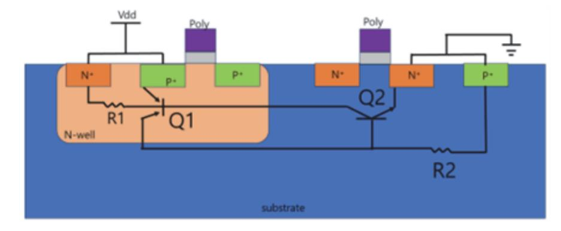

- (나) 기생 커패시턴스: 배선 간의 기생 커패시턴스를 분석하여 신호 왜곡을 줄인다.
- (가) 저항: 배선의 저항을 분석하여 신호 전송 속도와 전력 손실을 최소화한다.
- (1) 전기적 특성 분석
- 4. 메탈 배선 적층 구조를 해석한다.
- 로 형성된다.

(5) 고층 메탈 배선 형성 위 과정을 반복하여 고층 메탈 배선을 형성한다. 각 메탈층과 절연층, 비아가 순차적으

(다) 비아 메탈 충전: 텅스텐(W), 구리(Cu) 등의 금속을 충전하여 비아를 형성한다.

(나) 비아 식각: 절연층을 식각하여 비아 구멍을 형성한다.

- (나) 전력 라인 관리: 안정적인 전력 공급을 위해 적절한 메탈층을 배치한다.
- (2) NAND Flash
  - (가) 고밀도 집적: 고밀도 셀 구조를 위해 최소화된 메탈 배선 구조를 사용한다.
  - (나) 열 관리: 고속 동작 시 발생하는 열을 효과적으로 방출하기 위한 메탈 배선 설계를 한 다.

메모리 반도체 제조 공정에서 메탈 배선의 적층 구조는 소자 간의 전기적 연결, 신호 무결성 유지, 전력 공급 등 다양한 역할을 수행한다. 메탈 배선의 적층 구조를 이해하고 최적화하는 것은 메모리 반도체의 성능과 신뢰성을 향상시키는 데 매우 중요하다. 이를 위해 메탈 배선의 전기적, 열적, 기계적 특성을 분석하고 최적의 배선 구조를 설계해야 한다.

#### 수 공정 흐름도로부터 필요한 단위 공정을 파악한다.

메모리 반도체 제조 공정 개발을 위해 공정 흐름도를 이해하고 필요한 단위 공정을 파악하는 것은 매우 중요하다. 메모리 반도체 제조 공정은 여러 단위 공정이 체계적으로 연결되어 있으 며, 각 공정은 메모리 셀의 성능과 신뢰성에 영향을 끼친다. 다음은 일반적인 메모리 반도체 제조 공정 흐름도와 각 단계에서 필요한 단위 공정을 설명한다.

- 1. 메모리 반도체 제조 공정 흐름도를 이해한다.
  - (1) 웨이퍼 준비
  - (2) 전처리
  - (3) 이온 주입
  - (4) 절연층 형성
  - (5) 게이트 형성
  - (6) 소스/드레인 형성
  - (7) 콘택트 및 비아 형성
  - (8) 메탈 배선
  - (9) 패시베이션
  - (10) 테스트 및 검사
  - (11) 패키징
- 2. 단위 공정의 세부 설명한다.
  - (1) 웨이퍼 준비
    - (가) 실리콘 웨이퍼 생산: 고순도 실리콘 잉곳을 성장시켜 얇은 웨이퍼로 절단한다.

- (다) 비아 채움: 메탈층 간 연결을 위한 비아를 금속으로 채운다.
- (나) 패터닝: 포토리소그래피와 식각을 통해 배선 패턴을 형성한다.
- (가) 메탈 증착: 알루미늄(Al), 구리(Cu) 등의 금속을 증착한다.
- (8) 메탈 배선

(9) 패시베이션

- (다) 비아 형성: 메탈층 간의 전기적 연결을 위해 비아를 형성한다.
- (나) 콘택트 패드 형성: 전기적 연결을 위해 콘택트 패드를 형성한다.
- (가) 절연층 증착: 소스/드레인과 게이트를 덮는 절연층을 증착한다.
- (7) 콘택트 및 비아 형성
- (나) 어닐링: 도핑된 이온을 활성화하여 소스/드레인 영역을 완성한다.
- (가) 이온 주입: 소스와 드레인 영역에 도핑 물질을 주입한다.
- (6) 소스/드레인 형성
- (다) 패터닝: 포토리소그래피와 식각을 통해 게이트 전극을 패터닝한다.
- (나) 게이트 전극 형성: 폴리실리콘 또는 금속을 증착하여 게이트 전극을 형성한다.
- (가) 게이트 산화막 형성: 얇은 산화막을 형성하여 게이트 유전체로 사용한다.
- (5) 게이트 형성
- (나) 유전층 증착: 게이트 유전층 등을 형성한다.
- (4) 절연층 형성 (가) 필드 산화막(LOCOS 또는 STI): 소자 간 전기적 격리를 위해 절연층을 형성한다.
- (나) 어닐링(열처리): 열처리를 통해 도핑된 이온을 활성화하고 결정 구조를 복원한다.
- (가) 도핑: 특정 영역에 n형 또는 p형 도핑 물질을 주입하여 전기적 특성을 부여한다.
- (3) 이온 주입
- (라) 식각: 노출된 산화막을 식각하여 패턴을 형성한다.
- (다) 포토리소그래피: 마스크 패턴을 사용하여 원하는 회로 패턴을 웨이퍼에 형성한다.
- (나) 포토레지스트 코팅: 감광성 물질을 웨이퍼 표면에 도포한다.
- (가) 산화막 형성: 실리콘 표면에 얇은 산화막(SiO₂)을 형성하여 보호층 역할을 한다.
- (2) 전처리
- (나) 웨이퍼 세척: 웨이퍼 표면의 불순물을 제거한다.

(나) 오프닝 형성: 패드와 같은 특정 영역을 노출시키기 위해 오프닝을 형성한다.

(10) 테스트 및 검사

(가) 전기적 테스트: 소자의 전기적 특성과 동작을 검사한다.

(나) 결함 검사: 불량 소자를 검사하고 제거한다.

(11) 패키징

- (가) 다이 커팅: 웨이퍼에서 개별 칩을 분리한다.
- (나) 다이 본딩: 칩을 패키지에 본딩한다.
- (다) 와이어 본딩: 칩과 패키지 리드 간의 전기적 연결을 형성한다.
- (라) 패키지 몰딩: 패키지를 보호하기 위해 몰딩한다.
- (마) 최종 검사: 최종 패키지의 기능과 성능을 검사한다.

메모리 반도체 제조 공정 개발을 위해 공정 흐름도를 이해하는 것은 필수적이다. 각 단위 공정 은 소자의 성능과 신뢰성에 직접적인 영향을 끼치며, 공정의 최적화를 통해 제품의 품질을 높 일 수 있다. 웨이퍼 준비부터 패키징까지의 전체 공정 흐름을 체계적으로 이해하고, 각 단계에 서 필요한 단위 공정을 정확히 파악하여 제조 공정을 최적화하는 것이 중요하다.

수행 tip

- 공정 흐름도와 대응되는 세부 공정 내용을 파악하여 공정 개념을 파악하도록 노력한다.
- 공정 전후 테스트 항목을 숙지하도록 한다.

### 학습 1 교수·학습 방법

#### 교수 방법

- 반도체 제조 공정 중에 해당 각 단위 제조 공정별로 충분히 이해할 수 있도록 수업을 진행 한다.
- 반도체 제조 공정 중에 해당 각 단위 제조 공정별로 장비 구조와 역할을 충분히 이해할 수 있도록 해당 장비를 활용하여 수업을 진행한다.
- 반도체 단위 제조 공정 흐름도가 반도체 칩에서 어떤 역할을 하는지에 대해 원리를 토대로 설명한다.
- 학습자가 데이터 특성 평가 및 문서 작성법에 맞게 실습할 수 있도록 지속적인 관심을 가지 도록 지도한다.
- 학습자가 준비한 보고서의 내용 및 발표 태도와 참관하는 다른 학습자의 태도도 유심히 살 펴보고 피드백해 준다.

#### 학습 방법

- 각 단위 공정별 공정, 장비 및 용어에 대한 이해를 높이기 위해서 런 시트(run sheet) 및 현장 일지 등의 자료를 찾아본다.
- 반도체 공정 순서 흐름도에 따른 수행 순서에 맞추어 중요 사항들을 정리한다.
- 학습한 내용을 문서화하여 발표해 보고, 타 학습자의 내용과 비교한다.
- 다른 학습자의 발표 내용을 주의 깊게 듣고, 자신이 정리한 내용과 비교하면서 수정한다.

## 학습 1 평 가

#### 평가 준거

• 평가자는 학습자가 학습 목표를 성공적으로 달성하였는지를 평가해야 한다.

#### • 평가자는 다음 사항을 평가해야 한다.

| 학습 내용                | 학습 목표                                                      | 성취수준 |   |   |
|----------------------|------------------------------------------------------------|------|---|---|
|                      |                                                            | 상    | 중 | 하 |
| 메모리 반도체 공정 흐름도 해석 | - 메모리 종류와 특성을 해석하여 설명할 수 있다.                               |      |   |   |
|                      | - Well과 격리(isolation)의 구조를 해석하여 설명할 수 있다.                  |      |   |   |
|                      | - 메모리 단위 소자(MOSFET, capacitor 등) 제작 구조를 해 석하여 설명할 수 있다. |      |   |   |
|                      | - 메탈 배선의 적층 구조를 해석하여 설명할 수 있다.                             |      |   |   |
|                      | - 공정 흐름도로부터 필요한 단위 공정을 파악할 수 있다.                           |      |   |   |

#### 평가 방법

• 서술형 시험

|                      | 평가 항목                                        | 성취수준 |   |   |
|----------------------|----------------------------------------------|------|---|---|
| 학습 내용                |                                              | 상    | 중 | 하 |
| 메모리 반도체 공정 흐름도 해석 | - 메모리 반도체의 특성을 해석할 수 있는 능력                   |      |   |   |
|                      | - 메모리 반도체의 Well과 격리의 구조를 해석하여 설명할 수 있는 능력 |      |   |   |
|                      | - 메모리 반도체의 단위 소자 제작 구조를 해석할 수 있는 능 력      |      |   |   |
|                      | - 메모리 반도체의 메탈 배선의 적층 구조를 해석하여 설명할 수 있는 능력 |      |   |   |

#### • 평가자 질문

| 학습 내용                | 평가 항목                                                            | 성취수준 |   |   |
|----------------------|------------------------------------------------------------------|------|---|---|
|                      |                                                                  | 상    | 중 | 하 |
| 메모리 반도체 공정 흐름도 해석 | - 메모리 반도체의 특성을 해석하여 설명할 수 있는 능력                                  |      |   |   |
|                      | - 메모리 반도체의 Well과 격리의 구조를 해석할 수 있는 능 력                         |      |   |   |
|                      | - 메모리 반도체의 단위 소자(MOSFET, capacitor 등) 제작 구조를 해석하여 설명할 수 있는 능력 |      |   |   |
|                      | - 메모리 반도체의 단위 공정 파악 여부                                           |      |   |   |

#### 피드백

- 1. 서술형 시험
- 메모리 반도체의 특성을 해석하여 설명할 수 있는 능력을 평가한 후, 보완이 필요한 사항이나 주 요 사항을 표시하여 피드백해 준다.
- 메모리 반도체의 Well과 격리의 구조를 해석하여 설명할 수 있는 능력을 평가한 후, 보완이 필요 한 사항이나 주요 사항을 표시하여 보충 설명해 준다.
- 평가 결과가 우수한 학습자와 미흡한 학습자를 구분하여 우수한 학습자들에게는 서술형 평가 내 용의 적용 학습을 통한 심화 내용을 피드백해 주고, 미흡한 학습자들에게는 기초 지식에 대한 설 명을 통해 일정 수준을 유지할 수 있도록 보완 지도해 준다.
- 2. 평가자 질문
- 메모리 반도체의 메탈 배선의 적층 구조를 해석하여 설명할 수 있는 능력을 평가한 후 부족한 점 을 지적하여 정확하게 처리할 수 있도록 보완 지도해 준다.
- 메모리 반도체의 공정 흐름도로부터 필요한 단위 공정을 파악할 수 있는 능력에 대해 평가한 후, 개선 및 보완 사항에 대한 내용을 정리하여 재학습할 수 있도록 피드백한다.
- 평가 결과가 우수한 학습자와 저조한 학습자를 구분하여 우수한 학습자들에게는 작업장 환경에의 사례 학습을 통한 심화 학습으로 피드백해 주고, 저조한 학습자들에게는 기초 용어에 대한 설명을 통해 일정 수준을 유지할 수 있도록 보완 지도해 준다.

| 학습 1 | 메모리 반도체 공정 흐름도 해석하기 |
|------|---------------------|
| 학습 2 | 메모리 반도체 단위 소자 개발하기  |
| 학습 3 | 메모리 반도체 공정 소재 평가하기  |

## 2-1. 메모리 반도체 단위 소자 개발

|       | • 메모리 소자들의 특성 항목과 기준을 해석할 수 있다.                     |
|-------|-----------------------------------------------------|
|       | • 메모리 소자들의 검증 패턴을 해석하여 적용할 수 있다.                    |
|       | • 메모리 소자 분석 장비의 사용법을 해석하여 적용할 수 있다.                 |
| 학습 목표 | • 메모리 소자 특성 측정 데이터의 불량 여부를 파악할 수 있다.                |
|       | • 측정 데이터를 근거로 표준화된 기법에 따라 장단기 공정 특성 산포를 예측하여 문서화할 수 |
|       | 있다.                                                 |

## 필요 지식 /

숔 소자 측정

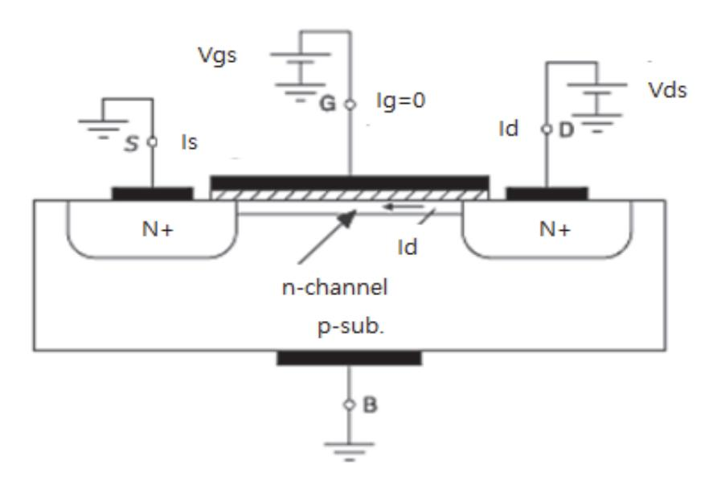

출처: 교육부(2015). 반도체 제조 공정 개발(LM1903060106\_14v3). 한국직업능력개발원. p.18. [그림 2-1] 모스 소자의 각 측정 단자

반도체 소자의 소자 측정은 반도체 공정을 진행한 웨이퍼의 완성도 검증을 위해 반드시 필요한 평가 방법이다. 수백 가지가 넘는 반도체 공정 모든 스텝이 하나의 오류도 없이 진행되었는지 를 판단하고 또한 이 소자를 사용한 제품의 평가에 중요한 구성 요소이기도 하기 때문에 단위 소자 평가는 매우 중요한 반도체 검증 방법이다.

소자 평가를 위해 공정 시작 전 단위 소자를 레이아웃하여 제품이 실리는 마스크에 포함시키는 데, 측정할 소자가 포함된 영역을 테스트 패턴이라고 한다. 이 테스트 패턴에는 여러 가지 단 위 소자 즉 모스 소자, 바이폴라 소자, 커패시터, 저항 등 반도체 평가에 필요한 소자들을 모아 서 단위 소자별로 측정할 수 있도록 한다.

이 단원에서는 반도체 소자의 가장 기본적인 모스 소자의 전압-전류 측정 커브를 중심으로 테 스트 조건, 테스트 방법 및 테스트 결과 확인 등에 대하여 학습하기로 한다.

#### 숕 모스 소자 측정 개요

모스 소자는 그림과 같이 게이트, 소스, 드레인, 서브 등 4개의 단자로 구성되어 있으며 이 각 단자에 전압을 가해 주고 또한 각 단자의 전류를 측정하여 모스 소자의 특성 확인을 진행할 수 있다.

1. 모스 소자 출력 특성 Ids - Vds 커브

출력 특성을 나타내는 Ids - Vds 커브는 모스 소자의 드레인에 0부터 5V의 전압을 가하여 드레인의 전류를 확인하는 테스트이다. Vds의 ds는 소스에 대하여 드레인에 전압을 가한다 는 표시 방법으로 항상 전압 인가 시에는 상대적인 기준 단자에 대하여 전압을 가하는 단 자가 존재하여 이렇게 표시한다. 또한 Ids 표현도 소스 단자에 대한 드레인 단자에서 전류 를 측정한다는 의미이다.

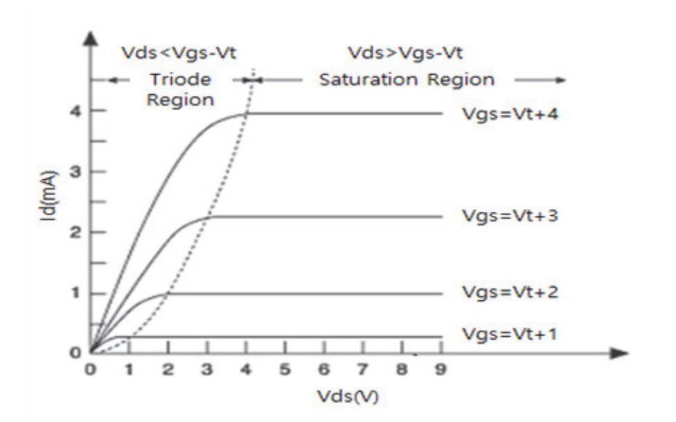

출처: 교육부(2015). 반도체 제조 공정 개발(LM1903060106\_14v3). 한국직업능력개발원. p.19. [그림 2-2] 모스 소자의 출력 특성 Ids –Vds 커브

출력 특성 측정은 다른 단자에 대하여 상대적인 기준이 되는 소자 단자에 0V를 가하고, 서 브 단자도 0V 이며, 게이트에는 Var1으로 1V, 2V, 3V, 4V, 5V를 각각 가하면서 드레인 단자에 0V부터 5V까지 전압을 증가시키면서 드레인 단자에서 전류를 측정한다(5V 소자 기 준으로 설명). 측정 결과는 [그림 2-2]와 같은 커브 모양을 보이며 각 커브의 변곡점을 이 어서 그려보면 포물선 모양이 보이는데 이것은 리니어(선형) 영역과 새처레이션(포화) 영역 을 구분하는 경계를 표시한다. 게이트 전압과 드레인 전압이 5V일 때의 드레인 전륫값을 새처레이션 전류라고 하며 이 값이 반도체 소자에서 중요한 파라미터로 읽힌다. 또 게이트 전압 5V이고 드레인 전압 0.1V일 때의 전륫값을 읽어 전류와 전압의 관계에서 저항값을 구하면 이것이 측정한 모스 소자의 온(on) 상태에서의 저항값이 되는데, 이 또한 중요한 파 라미터이다.

2. 모스 소자 전달 특성 Ids - Vgs 커브

다음은 드레인 단자에 0.1V만큼의 적은 전압을 가해 주고 게이트 단자에 0V부터 5V까지 전압을 증가시키며 드레인 단자에서 전류를 읽는 측정을 Ids –Vgs 전달 특성 커브 측정이 라고 한다. 이 측정에서는 모스 소자의 한계 수준(threshold) 전합, 즉 Vth 값을 측정하는 커브 확인 방법으로 드레인 전류가 어느 일정값 이상으로 흐르는 순간의 전압을 Vth라고 지정한다. 또한 이 파라미터도 반도체 소자에서 매우 중요하다. Vth를 판단하는 드레인 전 륫값은 단순히 1uA로 정하는 방법과 드레인 전류의 순간 미분값(즉 각 전류의 상대적인 증 가분을 계산한 값)을 같이 확인하여 그 미분값이 가장 큰 점일 때의 게이트 전압을 Vth라 고 정하는 방법 등 몇 가지 방법이 존재한다.

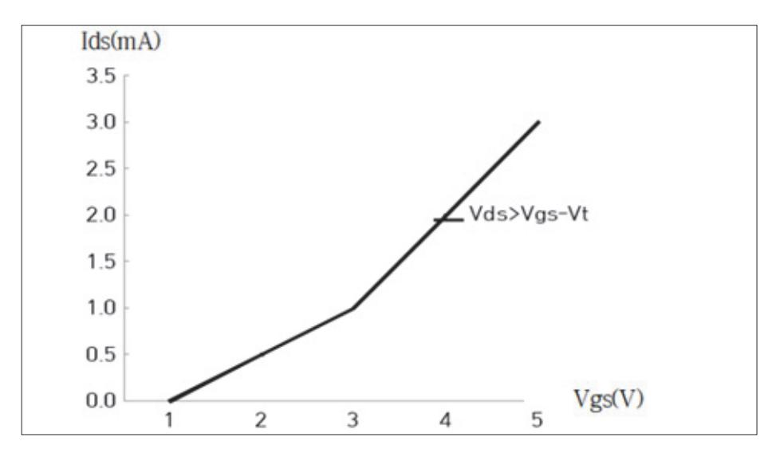

출처: 교육부(2015). 반도체 제조 공정 개발(LM1903060106\_14v3). 한국직업능력개발원. p.20. [그림 2-3] 모스 소자 Ids - Vgs 커브

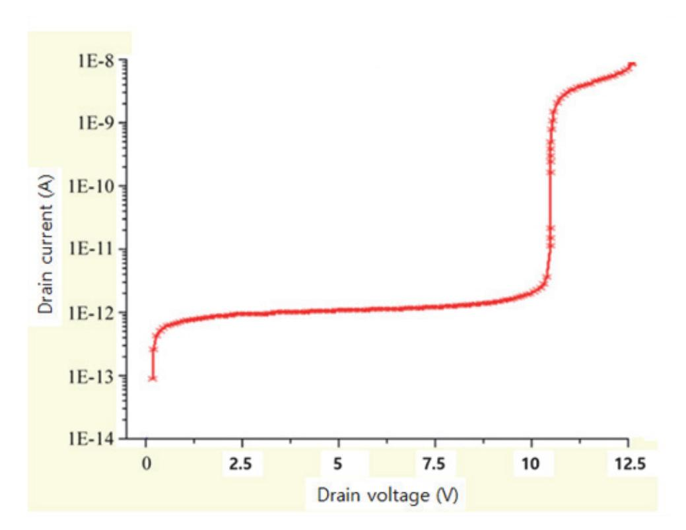

출처: 교육부(2015). 반도체 제조 공정 개발(LM1903060106\_14v3). 한국직업능력개발원. p.21. [그림 2-4] 모스 소자의 브레이크다운 특성 커브

Ids - Vds 커브 반도체 소자는 동작 전압을 넘는 브레이크다운(소자 파괴) 전압을 가져야 하며 일반적으로 동작 전압의 130~150% 정도의 소자 파괴 전압을 갖는다. 측정의 경우, 나머 지 단자는 0V를 가하고 드레인 단자에 0V부터 5V 이상의 전압을 가하면서 드레인 전류를 확인하여 1uA 이상 넘는 드레인 전압을 소자 파괴 전압이라고 한다. 소자 파괴 전압까지 보이는 드레인 전류는 리키지(유실) 전류라고 하며 보통 수 nA 수준의 전륫값을 갖는다.

숖 반도체 소자 측정 장비 종류

반도체 소자 측정 장비는 일반적으로 파라미터 애널라이저라는 장비를 사용하며 일일이 손으로 전압을 입력하고 측정하는 매뉴얼 방법과 베이직 프로그램과 비슷한 프로그래밍을 이용한 자동 측정 방법이 있다. 측정 장비 안에 전압, 전류를 가하는 소스 장비와 전압, 전류를 모니터링하 는 감지 장비가 같이 포함되어 있으며 또한 이들을 컨트롤하기 위한 입력키, 디스플레이 장치 가 하나의 장비에 구성되어 있다.

이 장비는 웨이퍼에 포함되어 있는 반도체 측정 소자 패턴과 연결하기 위해 프로브(probe) 핀 또는 프로브 카드와 케이블로 연결되어 있으며, 이 케이블의 저항 및 커패시터의 관리도 장비

#### 운영상 중요한 항목이다.

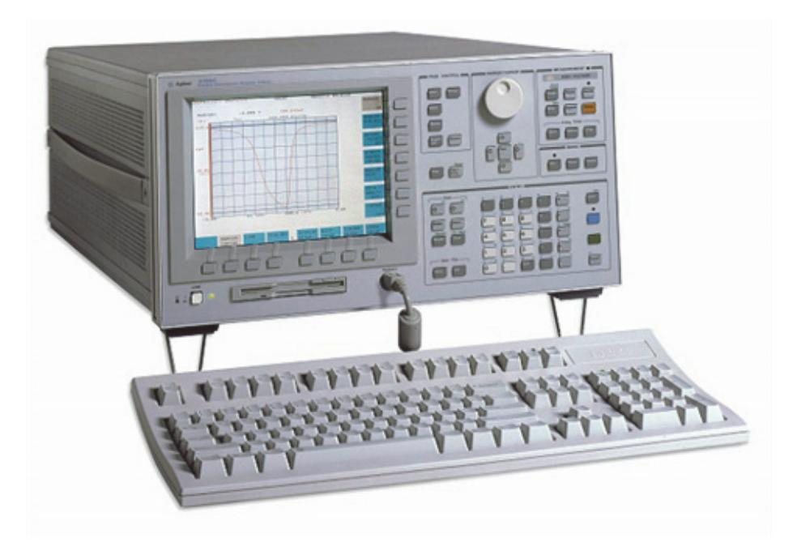

출처: 교육부(2015). 반도체 제조 공정 개발(LM1903060106\_14v3). 한국직업능력개발원. p.24. [그림 2-5] 파라미터 애널라이저

일반적인 소자 측정을 위한 파라미터 애널라이저 이외에 반도체 커패시터 측정을 위한 C-V 측 정 장비가 있으며 또한 RF 특성 파악을 위해 측정 프리컨시를 가변할 수 있는 RF 애널라이저 도 측정 장비에 포함된다.

반도체 소자 측정 장비 운영 중 오류 발생은 일반적으로 커먼 그라운드 불량이 많다. 이것은 장비들의 그라운드 단자가 서로 일치하지 않아 기준점이 다른 상태에서 전압을 가하고 측정값을 읽게 되는 경우 발생할 수 있다. 이때 측정값이 상이한 결과가 나타나서 소자 평가가 올바르지 않게 될 수 있기 때문이다. 이를 방지하기 위해서는 항상 커먼 그라운드를 점검해야 하며 골든 기준 소자를 준비하여 주기적으로 이를 확인하여야 한다.

## 수행 내용 / 메모리 반도체 단위 소자 개발하기

#### 재료·자료

- 반도체 모스 소자 측정 웨이퍼
- 소자 측정 패턴 설명서
- 소자 측정 장비 사용 설명서
- 기술 보고서, 전문 조사 기관 보고서, 신제품 보고서
- 측정 기기의 매뉴얼 및 사용 설명서
- 재료의 규격서(spec. sheet)
- 통계 기법 자료
- MSDS, RoHS, WEEE(waste electrical and electronic equipment)
- 시험 성적서 및 평가/분석/검증 결과 보고서
- 평가 재료(웨이퍼, 가스, 화공 약품, 금속 타킷, 감광액)

#### 기기(장비 ・ 공구)

- 소자 측정 프루브 장비
- 소자 측정 장비
- 샘플 특성 평가를 위한 시료 제작 장비
- 평가, 분석 및 계측 장비
- 전자 현미경
- 전기 특성 측정기, 두께 측정기, 성분 분석기

#### 안전·유의 사항

- 단위 소자 측정하고 특성을 파악하기 위해서는 사용 환경에 대해 적절한 파악 및 조치가 있 어야 한다.
- 측정 장비에 대한 충분한 숙지를 통해 안전사고 방지를 위한 사전 조치가 선행되어야 한다.

- 재료에 대한 규격서를 공급 업체로부터 정확히 파악해야 한다.
- 재료에 대한 평가는 특정 공급 회사 제품에 국한해서는 안 된다.
- 반도체 제조 공정된 웨이퍼 취급에 오염이나 파손에 주의해야 한다.
- 측정 장비 사용 시 매뉴얼대로 따라 진행한다.
- 고전압, 고전류, 고자기장에 주의한다.

#### 수행 순서

숔 메모리 소자들의 특성 항목과 기준을 이해하고 해석한다.

메모리 반도체 단위 소자 개발을 위해서는 각 메모리 소자의 특성과 기준을 이해하고 해석하는 것이 중요하다. 메모리 소자들의 특성 항목은 주로 전기적, 물리적, 열적 특성으로 나눌 수 있 으며, 이러한 특성을 평가하는 기준은 메모리 소자의 성능, 신뢰성, 전력 효율성 등을 보장하는 데 필요하다. 다음은 주요 메모리 소자들의 특성 항목과 기준에 대한 설명이다.

- 1. DRAM(dynamic random access memory) 소자의 특성 항목과 기준을 이해한다.
  - (1) 전기적 특성
    - (가) 동작 전압(operating voltage): DRAM의 동작에 필요한 전압. 낮을수록 전력 소모가 줄 어든다.
    - (나) 동작 전류(operating current): 읽기/쓰기 동작 중 소비되는 전류이다.
    - (다) 저항(resistance): 소자 내부와 배선의 저항. 낮을수록 성능이 향상된다.
    - (라) 기생 커패시턴스(parasitic capacitance): 소자 간 및 배선 간의 기생 커패시턴스. 낮을 수록 고속 동작이 가능해진다.
    - (마) 데이터 유지 시간(data retention time): 전원이 켜져 있을 때 데이터를 유지할 수 있 는 시간이며 일반적으로 몇 밀리초(ms)이다.
  - (2) 물리적 특성
    - (가) 셀 크기(cell size): DRAM 셀의 물리적 크기이며 작을수록 고밀도 집적이 가능하다.
    - (나) 게이트 길이(gate length): 트랜지스터의 게이트 길이이며 짧을수록 고속 동작이 가능하다.
    - (다) 층 간 간격(interlayer spacing): 메탈층 간의 간격이며 적절한 간격을 유지해야 한다.
  - (3) 열적 특성
    - (가) 열 저항(thermal resistance): 소자의 열 저항이며 낮을수록 열 방출이 용이하다.
    - (나) 열 안정성(thermal stability): 높은 온도에서도 안정적으로 동작할 수 있는지 평가한다.
- 2. NAND Flash 소자의 특성 항목과 기준

- (1) 전기적 특성
  - (가) 프로그램/소거 전압(program/erase voltage): 데이터를 프로그램하거나 지울 때 필요한 전압을 말한다.
  - (나) 읽기/쓰기 속도(read/write speed): 데이터를 읽고 쓰는 속도. 고속일수록 성능이 좋다.
  - (다) 저항(resistance): 배선과 소자 내부의 저항. 낮을수록 성능이 향상된다.
  - (라) 기생 커패시턴스(parasitic capacitance): 낮을수록 고속 동작이 가능하다.
- (2) 물리적 특성
  - (가) 셀 크기(cell size): NAND 셀의 물리적 크기. 작을수록 고밀도 집적이 가능하다.
  - (나) 플로팅 게이트 두께(floating gate thickness): 전하를 저장하는 플로팅 게이트의 두께 이다.
  - (다) 절연막 두께(insulation layer thickness): 플로팅 게이트를 둘러싸는 절연막의 두께이 다.
- (3) 열적 특성
  - (가) 열 저항(thermal resistance): 소자의 열 저항. 낮을수록 열 방출이 용이하다.
  - (나) 열 안정성(thermal stability): 높은 온도에서도 안정적으로 동작할 수 있는지 평가한다.
- 3. SRAM(static random access memory) 소자의 특성 항목과 기준
  - (1) 전기적 특성
    - (가) 동작 전압(operating voltage): SRAM의 동작에 필요한 전압이다.
    - (나) 동작 전류(operating current): 읽기/쓰기 동작 중 소비되는 전류이다.
    - (다) 데이터 유지 전류(data retention current): 전원이 켜져 있을 때 데이터를 유지하는 데 필요한 전류이며 작을수록 전력 효율이 높다.
    - (라) 읽기/쓰기 속도(read/write speed): 데이터를 읽고 쓰는 속도이다.
  - (2) 물리적 특성
    - (가) 셀 크기(cell size): SRAM 셀의 물리적 크기이며 작을수록 고밀도 집적이 가능하다.
    - (나) 게이트 길이(gate length): 트랜지스터의 게이트 길이이다.
    - (다) 층 간 간격(interlayer spacing): 메탈층 간의 간격이다.
  - (3) 열적 특성
    - (가) 열 저항(thermal resistance): 소자의 열 저항이다.
    - (나) 열 안정성(thermal stability): 높은 온도에서도 안정적으로 동작할 수 있는지 평가한다.
- 4. 전반적인 특성 기준

- (1) 신뢰성(reliability)
  - (가) 수명(lifetime): 소자가 정상적으로 동작하는 기간이다.
  - (나) 내구성(endurance): 프로그램/소거 사이클을 반복해도 성능이 저하되지 않는 정도이다.
- (2) 전력 효율성(power efficiency)
  - (가) 정적 전력 소모(static power consumption): 대기 상태에서 소모되는 전력이다.
  - (나) 동적 전력 소모(dynamic power consumption): 동작 상태에서 소모되는 전력이다.
- (3) 성능(performance)
  - (가) 액세스 시간(access time): 데이터에 접근하는 데 걸리는 시간이다.
  - (나) 처리량(throughput): 단위 시간당 처리할 수 있는 데이터 양이다.

메모리 반도체 단위 소자 개발을 위해서는 다양한 특성 항목을 정확히 이해하고, 각 항목에 대 한 평가 기준을 명확히 하는 것이 중요하다. 전기적, 물리적, 열적 특성을 종합적으로 분석하여 소자의 성능, 신뢰성, 전력 효율성을 최적화해야 한다. 이러한 특성들을 철저히 분석하고 관리 함으로써 고성능, 고신뢰성의 메모리 반도체 소자를 개발할 수 있다.

숕 메모리 소자들의 검증 패턴을 해석하여 적용한다.

메모리 반도체 단위 소자 개발에서 메모리 소자들의 검증 패턴을 이해하고 적용하는 것은 매우 중요하다. 검증 패턴은 메모리 소자의 성능과 신뢰성을 평가하기 위해 사용되며, 다양한 테스 트 벤치와 시뮬레이션을 통해 수행된다. 다음은 주요 메모리 소자들의 검증 패턴과 이를 해석 하여 적용하는 방법에 대한 설명이다.

- 1. 검증 패턴의 중요성
  - (1) 성능 평가: 메모리 소자의 읽기/쓰기 속도, 전력 소모 등을 평가한다.
  - (2) 신뢰성 테스트: 소자의 내구성, 데이터 보존 시간, 전기적 간섭 등을 평가한다.
  - (3) 결함 분석: 제조 공정에서 발생할 수 있는 결함을 식별하고 수정한다.
- 2. DRAM 검증 패턴
  - (1) 전기적 검증 패턴
    - (가) 마치 행(march test): 다양한 읽기/쓰기 패턴을 사용하여 메모리 셀의 결함을 검사한다.
    - (나) March C-: (w0, r0, w1, r1) 패턴을 반복하여 셀의 상태를 확인한다.
    - (다) March A: (w0, r0, w1, r1, w0, r0) 패턴으로 고급 결함 검사를 한다.
    - (라) 동적 전류 테스트(IDD test): 읽기/쓰기 동작 중 소비되는 전류를 측정하여 성능과 전력 소모를 평가한다.
    - (마) 비트 라인 스트레스 테스트: 특정 비트 라인에 높은 전압을 인가하여 스트레스 조건에서

의 동작을 확인한다.

(2) 신뢰성 검증 패턴

- (가) 데이터 유지 테스트(data retention test): 전원이 켜져 있는 상태에서 데이터를 유지할 수 있는 시간을 평가한다.
- (나) 고온 저장 테스트(high temperature storage test): 고온 환경에서 데이터를 유지하는 능력을 평가한다.
- (다) 저온 저장 테스트(low temperature storage test): 저온 환경에서 데이터를 유지하는 능력을 평가한다.
- (라) 액셀러레이터 라이프 테스트(accelerator life test): 고온, 고습 등의 가속 조건에서 소 자의 수명을 평가한다.
- 3. NAND Flash 검증 패턴
  - (1) 전기적 검증 패턴
    - (가) 패턴 쓰기/읽기 테스트: 다양한 패턴을 메모리에 쓰고 읽어 데이터 무결성을 확인한다.
    - (나) Checkerboard Pattern: (010101...) 패턴을 사용하여 인접 셀 간의 간섭을 확인한다.
    - (다) Solid Pattern: (111111... or 000000...) 패턴을 사용하여 데이터 무결성을 확인한다.
    - (다) 프로그램/소거 사이클 테스트: 프로그램과 소거를 반복하여 셀의 내구성을 평가한다.
    - (라) 랜덤 데이터 테스트: 랜덤한 데이터를 사용하여 소자의 동작을 확인한다.
  - (2) 신뢰성 검증 패턴
    - (가) 데이터 보존 테스트(data retention test): 데이터를 저장한 후 일정 시간 동안 데이터 를 유지하는 능력을 평가한다.
    - (나) 웨이퍼 레벨 스트레스 테스트: 웨이퍼 단계에서 고온, 고습, 전압 스트레스를 적용하여 소자의 신뢰성을 평가한다.
    - (다) 고속 스트레스 테스트(high-speed stress test): 빠른 속도로 데이터를 읽고 쓰며 스트 레스 조건에서의 성능을 평가한다.
- 4. SRAM 검증 패턴
  - (1) 전기적 검증 패턴
    - (가) 비트 라인 스트레스 테스트: SRAM의 비트 라인에 높은 전압을 인가하여 스트레스 조건 에서의 동작을 확인한다.
    - (나) 데이터 무결성 테스트: 다양한 패턴을 사용하여 데이터 무결성을 평가한다.
    - (다) Alternating Pattern: (010101...) 패턴을 사용하여 셀 간 간섭을 확인한다.
    - (라) Random Pattern: 랜덤 데이터를 사용하여 소자의 동작을 확인한다.

(마) 액세스 시간 테스트: 데이터를 읽고 쓰는 데 걸리는 시간을 측정하여 성능을 평가한다.

- (2) 신뢰성 검증 패턴
  - (가) 데이터 보존 테스트(data retention test): 데이터가 얼마나 오래 유지되는지를 평가한 다.
  - (나) 스트레스 테스트: 고온, 고습 등의 스트레스 조건에서 소자의 신뢰성을 평가한다.
  - (다) 프로그램/소거 사이클 테스트: SRAM의 내구성을 평가하기 위해 프로그램과 소거를 반 복한다.
- 5. 검증 패턴 적용 방법
  - (1) 시뮬레이션
    - (가) SPICE 시뮬레이션: 회로 시뮬레이션을 통해 소자의 전기적 특성을 평가한다.
    - (나) 모델링 및 시뮬레이션 도구: Cadence, Synopsys 등의 도구를 사용하여 소자의 동작을 시뮬레이션한다.
  - (2) 테스트 벤치
    - (가) 자동화된 테스트 장비(ATE): 소자의 대량 테스트를 위해 자동화된 테스트 장비를 사용한 다.
    - (나) 테스트 벤치 설계: 다양한 검증 패턴을 적용할 수 있는 테스트 벤치를 설계한다.
  - (3) 실험실 테스트
    - (가) 환경 시험 장비: 고온, 고습, 진동 등의 조건에서 소자의 신뢰성을 평가한다.
    - (나) 전기적 테스트 장비: 오실로스코프, 멀티미터 등을 사용하여 소자의 전기적 특성을 측정 한다.

메모리 반도체 단위 소자 개발을 위해서는 다양한 검증 패턴을 이해하고 이를 적용하는 것이 필수적이다. 소자별로 특성에 맞는 검증 패턴을 사용하여 전기적 성능, 신뢰성, 내구성 등을 평 가한다. 시뮬레이션, 테스트 벤치, 실험실 테스트 등을 통해 이러한 검증 패턴을 적용함으로써 고성능, 고신뢰성의 메모리 반도체 소자를 개발할 수 있다.

숖 메모리 소자 분석 장비의 사용법을 해석하여 적용한다.

메모리 반도체 단위 소자 개발을 위해 다양한 소자 분석 장비를 이해하고 사용하는 것은 매우 중요하다. 이러한 장비들은 소자의 전기적, 물리적, 열적 특성을 평가하고, 소자의 성능과 신뢰 성을 검증하는 데 사용된다. 다음은 주요 메모리 소자 분석 장비들의 사용법과 적용 방법에 대 한 설명이다.

1. 전기적 특성 분석 장비

- 1) 소자의 결함 분석: 메모리 셀의 결함 위치와 원인을 시각적으로 평가한다.
- (다) 적용
- 5) 이미지 분석: 고해상도 이미지를 분석하여 소자의 물리적 구조를 평가한다.
- 4) 전자 빔 조사: 시료 표면에 전자 빔을 조사하여 이미지를 얻다.
- 3) 진공 설정: SEM 체임버를 진공 상태로 만든다.
- 2) 시료 장착: 시료를 SEM 시료대에 장착한다.
- 1) 시료 준비: 분석하려는 시료를 SEM에 적합한 크기로 준비한다.
- (가) 목적: 소자의 표면 구조를 고해상도로 관찰
- (1) 주사 전자 현미경(SEM: scanning electron microscope)
- 2. 물리적 특성 분석 장비

(나) 사용법

- 2) 타이밍 분석: 읽기/쓰기 동작 시 신호의 시간적 특성을 평가한다.
- 1) 신호 무결성 분석: 메모리 소자의 출력 신호의 무결성을 평가한다.
- (다) 적용
- 4) 데이터 저장: 필요시 파형 데이터를 저장하여 분석한다.
- 3) 파형 관찰: 전압 변화를 실시간으로 관찰한다.
- 2) 시간축/전압축 설정: 시간축과 전압축의 스케일을 설정한다.
- 1) 프로브 연결: 측정하려는 회로의 지점에 프로브를 연결한다.
- (나) 사용법
- (가) 목적: 시간에 따른 전압 변화를 실시간으로 관찰
- (2) 오실로스코프(oscilloscope)
- 평가한다.
- 2) 커패시터의 C-V 특성 측정: 전압에 따른 커패시턴스를 측정하여 유전체의 특성을
- 1) MOSFET의 I-V 특성 측정: 드레인-소스 전류와 게이트-소스 전압의 관계를 평가 하여 소자의 동작 특성을 분석한다.

1) 장비 설정: 소자와의 전기적 연결을 설정한다. 각 단자에 적절한 프로브를 연결한다.

3) 데이터 수집: 소자의 전류-전압(I-V) 특성을 측정하여 데이터를 수집한다.

- (다) 적용

(나) 사용법

- 4) 데이터 분석: 수집된 데이터를 분석하여 소자의 특성을 평가한다.
- 2) 측정 조건 설정: 원하는 전압 범위와 전류 범위를 설정한다.
- (가) 목적: 소자의 전기적 특성을 평가(예: I-V 특성, C-V 특성 등)

(1) 파라미터 애널라이저(parameter analyzer)

- 2) 레이어 두께 측정: 메탈층, 절연층 등의 두께를 측정하여 제조 공정의 일관성을 평 가한다.
- (2) 원자 현미경(AFM: atomic force microscope)
  - (가) 목적: 소자의 표면 형상을 나노미터 수준에서 측정
  - (나) 사용법
    - 1) 시료 준비: 분석하려는 시료를 AFM에 적합한 크기로 준비한다.
    - 2) 시료 장착: 시료를 AFM 시료대에 장착한다.
    - 3) 탐침 설정: AFM 탐침을 시료 표면에 접근시킨다.
    - 4) 탐침 스캔: 탐침을 시료 표면 위를 스캔하여 표면 형상을 측정한다.
    - 5) 데이터 분석: 수집된 데이터를 분석하여 소자의 표면 특성을 평가한다.
  - (다) 적용
    - 1) 표면 거칠기 측정: 메모리 소자의 표면 거칠기를 평가하여 제조 공정의 품질을 확인 한다.
    - 2) 미세 구조 분석: 소자의 미세 구조를 분석하여 공정 변수를 최적화한다.
- 3. 열적 특성 분석 장비
  - (1) 열 특성 분석기(TMA: thermomechanical analyzer)
    - (가) 목적: 소자의 열적 팽창 특성을 평가
    - (나) 사용법
      - 1) 시료 준비: 분석하려는 시료를 TMA에 적합한 크기로 준비한다.
      - 2) 시료 장착: 시료를 TMA 시료대에 장착한다.

      - 3) 온도 설정: 원하는 온도 범위를 설정한다.
      - 4) 측정 시작: 온도를 변화시키며 시료의 변형을 측정한다.
      - 5) 데이터 분석: 수집된 데이터를 분석하여 소자의 열적 특성을 평가한다.
    - (다) 적용

(나) 사용법

1) 열팽창 계수 측정: 메모리 소자의 열팽창 계수를 측정하여 온도 변화에 따른 구조적 변화를 예측한다.

1) 장비 설정: 열 영상 카메라를 설정하고, 측정하려는 소자를 관찰할 위치에 배치한다.

- 2) 열적 안정성 평가: 고온 환경에서 소자의 신뢰성을 평가한다.
- (2) 열 영상 카메라(thermal camera)

(가) 목적: 소자의 온도 분포를 실시간으로 관찰

- 49
- 3) 온도 분포 관찰: 소자의 온도 분포를 실시간으로 관찰한다.

2) 온도 범위 설정: 측정하려는 온도 범위를 설정한다.

4) 데이터 저장: 필요시 열 영상 데이터를 저장하여 분석한다.

(다) 적용

1) 열 분포 분석: 동작 중인 메모리 소자의 열 분포를 평가하여 핫 스폿을 식별한다.

2) 열 방출 특성 평가: 소자의 열 방출 특성을 평가하여 열 관리 방법을 최적화한다.

메모리 반도체 단위 소자 개발을 위해서는 다양한 분석 장비를 이해하고 활용하는 것이 필수적 이다. 전기적 특성 분석 장비, 물리적 특성 분석 장비, 열적 특성 분석 장비 등을 통해 소자의 성능과 신뢰성을 평가하고, 제조 공정을 최적화할 수 있다. 각 장비의 사용법을 숙지하고, 적절 한 검증 패턴을 적용함으로써 고성능, 고신뢰성의 메모리 반도체 소자를 개발할 수 있다.

숗 메모리 소자 특성 측정 데이터의 불량 여부를 파악한다.

메모리 반도체 단위 소자 개발에서 메모리 소자의 특성 측정 데이터를 분석하여 불량 여부를 파악하는 것은 매우 중요하다. 이를 위해서는 각 소자의 전기적, 물리적, 열적 특성을 평가하는 다양한 측정 데이터와 그 해석 방법을 숙지해야 한다. 다음은 메모리 소자의 특성 측정 데이터 를 분석하여 불량 여부를 파악하는 방법에 대한 설명이다.

- 1. 전기적 특성 측정 데이터를 분석한다.
  - (1) I-V 특성(전류-전압 특성)
    - (가) 분석 항목
      - 1) Threshold Voltage(Vth): MOSFET의 문턱 전압
      - 2) Drive Current(Id): 드레인-소스 전류
      - 3) Off-State Current(Ioff): 소자가 꺼져 있을 때의 누설 전류
      - 4) Subthreshold Slope: 문턱 전압 이하의 전류 변화율
    - (나) 불량 판단 기준
      - 1) Threshold Voltage: 설정된 범위를 벗어나는 경우 불량
      - 2) Drive Current: 기댓값보다 낮거나 높은 경우 불량
      - 3) Off-State Current: 설정된 누설 전류 범위를 초과하는 경우 불량
      - 4) Subthreshold Slope: 너무 가파르거나 완만한 경우 불량
  - (2) C-V 특성(커패시턴스-전압 특성)
    - (가) 분석 항목
      - 1) Flatband Voltage: 평탄대 전압
      - 2) Oxide Thickness: 산화막 두께
      - 3) Dielectric Constant: 유전 상수
    - (나) 불량 판단 기준

1) Flatband Voltage: 설정된 범위를 벗어나는 경우 불량

2) Oxide Thickness: 기댓값과 비교하여 너무 두껍거나 얇은 경우 불량

- 3) Dielectric Constant: 예상값과 차이가 큰 경우 불량
- (3) 데이터 유지 시간(data retention tme)
  - (가) 분석 항목
    - 1) Retention Time: 전원이 켜져 있는 상태에서 데이터를 유지하는 시간
  - (나) 불량 판단 기준
    - 1) Retention Time: 요구되는 최소 데이터 유지 시간을 충족하지 못하는 경우 불량
- 2. 물리적 특성 측정 데이터를 분석한다.
  - (1) SEM/AFM 이미지 분석
    - (가) 분석 항목
      - 1) 표면 거칠기: 소자의 표면 거칠기
      - 2) 레이어 두께: 메탈층, 절연층의 두께
      - 3) 결함 위치: 소자의 결함 위치와 형태
    - (나) 불량 판단 기준
      - 1) 표면 거칠기: 설정된 범위 이상으로 거칠면 불량
      - 2) 레이어 두께: 기댓값에서 크게 벗어나면 불량
      - 3) 결함 위치 및 형태: 특정 크기 이상의 결함이 존재하면 불량
  - (2) XRD(X-Ray diffraction)
    - (가) 분석 항목
      - 1) 결정 구조: 소자의 결정 구조와 완성도
      - 2) 결정립 크기: 결정립의 크기와 분포
    - (나) 불량 판단 기준
      - 1) 결정 구조: 예상 결정 구조와 다를 경우 불량

      - 2) 결정립 크기: 기댓값에서 크게 벗어나면 불량
- 3. 열적 특성 측정 데이터를 분석한다.
  - (1) TMA(thermomechanical analyzer)

    - (가) 분석 항목
    - - 1) 열팽창 계수: 온도 변화에 따른 소자의 팽창 계수
      - 2) 열변형: 온도 변화에 따른 소자의 변형 정도
    - (나) 불량 판단 기준
      - 1) 열팽창 계수: 설정된 범위를 벗어나면 불량

메모리 반도체 단위 소자 개발에서 특성 측정 데이터를 분석하여 불량 여부를 파악하는 것은 소자의 성능과 신뢰성을 보장하는 데 필수적이다. 전기적, 물리적, 열적 특성 데이터를 종합적 으로 분석하고, 불량 원인을 식별하여 공정을 개선함으로써 고성능, 고신뢰성의 메모리 소자를

(가) 개선된 소자의 재검증: 공정 개선 후 소자를 다시 측정하여 불량 여부를 재검증

(나) 데이터 비교 분석: 개선 전후의 데이터를 비교하여 개선 효과를 분석

(3) 재검증

(나) 피드백 루프 설정: 실시간 데이터 모니터링과 피드백 루프를 설정하여 공정 최적화

(가) 공정 변수 조정: 결함 원인을 기반으로 공정 변수를 조정하여 불량률 감소

(2) 공정 개선

(나) 제조 공정 변수 검토: 제조 공정 변수를 검토하여 결함 원인을 분석

(1) 불량 원인 분석 (가) 결함 위치 및 형태 분석: SEM/AFM 이미지 분석을 통해 결함의 위치와 형태를 파악

5. 불량 데이터를 처리 및 개선한다.

(나) 실험 데이터 비교: 시뮬레이션 결과와 실험 데이터를 비교하여 일치 여부를 확인

(가) 시뮬레이션 도구 사용: SPICE, TCAD 등을 사용하여 소자의 이론적 특성을 모델링

(3) 시뮬레이션 및 모델링

(나) 히스토그램 분석: 데이터 분포를 시각적으로 분석하여 이상치(outliers)를 식별

(가) 평균 및 표준 편차: 데이터의 평균과 표준 편차를 계산하여 일반적인 특성을 파악

(2) 통계적 분석

(나) 정규화: 수집된 데이터를 정규화하여 비교 분석 용이하게 만듦.

(가) 데이터 수집: 다양한 측정 장비를 통해 데이터를 수집

(1) 데이터 수집 및 정규화

4. 데이터 분석 도구와 기법을 분석한다.

2) 열 방출: 열 방출이 불충분하여 핫 스폿이 형성되면 불량

1) 온도 분포: 예상 분포와 다르거나 비정상적으로 높은 온도가 나타나면 불량

(나) 불량 판단 기준

2) 열 방출: 소자의 열 방출 특성

1) 온도 분포: 소자의 온도 분포와 핫 스폿 위치

(가) 분석 항목

(2) 열 영상 분석(thermal imaging)

2) 열변형: 허용 범위를 초과하면 불량

개발할 수 있다. 이러한 과정을 통해 메모리 반도체의 품질을 지속해서 향상시킬 수 있다.

- ⑤ 측정 데이터를 근거로 표준화된 기법에 따라 장단기 공정 특성 산포를 예측하여 문서화한다. 메모리 반도체 단위 소자 개발에서 측정 데이터를 근거로 장단기 공정 특성 산포를 예측하고 문서화하는 것은 공정의 안정성을 보장하고 품질을 향상시키기 위해 매우 중요하다. 이를 위해 표준화된 기법을 사용하여 데이터를 분석하고, 공정의 특성 산포를 예측하며, 이를 체계적으로 문서화하는 방법을 설명한다.
  - 1. 공정 특성 산포 예측의 중요성을 파악한다.
    - (1) 공정 안정성 보장: 공정 변동을 최소화하여 일관된 품질을 유지한다.
    - (2) 품질 향상: 제품의 품질을 지속해서 개선한다.
    - (3) 문서화: 공정 특성을 체계적으로 기록하여 문제 발생 시 신속하게 대응할 수 있다.
  - 2. 표준화된 기법을 사용한다.
    - (1) 데이터 수집 및 정규화
      - (가) 측정 데이터 수집: 다양한 소자 특성(전기적, 물리적, 열적 특성)을 측정한다.
      - (나) 데이터 정규화: 수집된 데이터를 정규화하여 분석의 정확성을 높인다.
    - (2) 통계적 분석 기법
      - (가) 평균(mean) 및 표준 편차(standard deviation): 데이터의 중심 경향과 변동성을 파악한다.
      - (나) 공정 능력 지수(process capability index, Cpk): 공정이 제품의 사양 내에서 얼마나 일관되게 제품을 생산할 수 있는지를 평가한다.
      - (다) 구간 추정(confidence interval): 공정 특성의 장단기 변동 범위를 예측한다.
  - 3. 장기 및 단기 공정 특성 산포를 예측한다.
    - (1) 단기 공정 특성 산포(short-term process variation)
      - (가) 분석 방법: 주로 개별 로트(lot) 또는 일일 생산 데이터 분석
      - (나) 특성 평가: 단기적으로 발생하는 변동성 평가
      - (다) 계산 방법

1) 
$$\sigma_{short-term} = \sqrt{\frac{1}{N-1} \sum_{i=1}^{N} (x_i - \overline{x})^2}$$

여기서 N은 데이터 포인트의 수,  $x_i$ 는 각 데이터 포인트,  $\overline{x}$ 는 평균값이다. (2) 장기 공정 특성 산포(long-term process variation)

(가) 분석 방법: 여러 로트 또는 장기간에 걸친 데이터 분석

- (나) 특성 평가: 장기적으로 발생하는 변동성 평가
- (다) 계산 방법 :

1) 
$$\sigma_{long-term} = \sqrt{\frac{1}{N-1} \sum_{i=1}^{N} (X_i - \overline{X})^2}$$

여기서  $X_i$ 는 각 로트의 평균값, X는 전체 기간 동안의 평균값이다.

- 4. 공정 능력을 분석한다.
  - (1) Cp(process capability): 공정이 제품의 사양 내에서 일관되게 제품을 생산할 수 있는지 평가

(7)) 
$$C_p = \frac{USL - LSL}{6\sigma}$$

여기서 USL은 상한 사양 한계, LSL은 하한 사양 한계, σ는 공정의 표준 편차이다.

(2) Cpk(process capability Index): 공정의 중심이 사양 중심에 얼마나 가까운지를 평가

(7)) 
$$C_{pk} = \min\left(\frac{USL - \overline{X}}{3\sigma}, \frac{\overline{X} - LSL}{3\sigma}\right)$$

- 5. 데이터 분석 도구를 사용한다.
  - (1) SPC(statistical process control) 소프트웨어: 공정 특성 산포를 분석하고 그래프를 생성한
    다.
  - (2) 엑셀(excel): 데이터 정리 및 기본 통계 분석 도구로 사용한다.
  - (3) Minitab: 통계적 분석 및 공정 능력 지수 계산 도구로 사용한다.
- 6. 문서화한다.
  - (1) 보고서 작성
    - (가) 공정 특성 요약: 공정의 평균, 표준 편차, Cp, Cpk 등을 요약한다.
    - (나) 그래프 및 차트: 공정 특성 산포를 시각적으로 표현한다.
    - (다) 히스토그램: 데이터 분포를 보여 준다.
    - (라) 관리도: 공정 변동성을 모니터링한다.
    - (마) Cp, Cpk 차트: 공정 능력을 시각적으로 표현한다.
  - (2) 개선 방안
    - (가) 불량 원인 분석: 공정 특성 산포가 허용 범위를 벗어난 경우 원인을 분석한다.
    - (나) 개선 조치: 공정을 개선하기 위한 구체적인 조치를 제안한다.
  - (3) 표준 작업 절차(standard operating procedures, SOPs)

(가) 절차 문서화: 공정 특성 측정 및 분석 절차를 문서화한다.

(나) 교육 및 훈련: 관련 인력에게 표준화된 절차에 대한 교육을 실시한다.

메모리 반도체 단위 소자 개발을 위해 측정 데이터를 기반으로 공정 특성 산포를 예측하고 이 를 문서화하는 것은 공정의 안정성과 품질을 향상시키는 데 필수적이다. 표준화된 통계적 기법 을 사용하여 데이터를 분석하고, 공정의 장단기 변동성을 예측하며, 이를 체계적으로 문서화함 으로써 공정 개선과 품질 관리에 중요한 정보를 제공할 수 있다.

#### 수행 tip

- 메모리 반도체 단위 소자의 측정 방법과 장비의 운영 메뉴 얼 사전에 숙지한다.
- 메모리 반도체 공정에 포함되는 검증 패턴의 유형과 유형 별 용도에 대해 숙지한다.

## 학습 2 교수·학습 방법

#### 교수 방법

- 반도체 소자들의 특성 항목과 기준에 대해 설명한 후 검증 패턴의 사례를 토대로 해석하는 방법을 안내한다.
- 반도체 소자 측정 프로세스 및 파라미터 종류에 따른 측정 장비에 대하여 설명한다.
- 단위 소자 측정 및 특성 데이터 평가 및 소자 측정 장비에 대한 이해를 높이기 위하여 현장 일지 및 저널 등의 자료를 통해 사례를 제시한다.
- 소자 측정 특성 데이터의 불량 유무에 대한 사례를 구체적으로 제시하고 대처 방법을 안내 한다.
- 반도체 단위 소자 측정 및 특성 데이터 평가 및 장비에 대한 사항에 대한 시나리오를 제시 하여 학습자가 이에 대해 순차적으로 이해하고 있는지 질문법을 이용해 계속해서 확인한다.

#### 학습 방법

- 반도체 소자 측정 개념 및 소자 종류에 대해 문서화하여 정리한다.
- 반도체 소자 측정 프로세스에 대하여 인지하고 확인한다.
- 반도체 소자 측정 파라미터 종류를 확인한다.
- 반도체 소자 측정에 필요한 주요 측정 장비를 확인한다.
- 반도체 소자 측정 결과 커브에 대하여 인지하고, 실습을 통해 커브를 분석하여 보고서를 작 성한다.
- 반도체 소자 측정 장비 운영에 대하여 인지하고, 실습을 통해 충분히 파악한다.

## 학습 2 평 가

#### 평가 준거

- 평가자는 학습자가 학습 목표를 성공적으로 달성하였는지를 평가해야 한다.
- 평가자는 다음 사항을 평가해야 한다.

|                     |                                                            | 성취수준 |   |   |
|---------------------|------------------------------------------------------------|------|---|---|
| 학습 내용               | 학습 목표                                                      | 상    | 중 | 하 |
| 메모리 반도체 단위 소자 개발 | - 메모리 소자들의 특성 항목과 기준을 해석할 수 있다.                            |      |   |   |
|                     | - 메모리 소자들의 검증 패턴을 해석하여 적용할 수 있다.                           |      |   |   |
|                     | - 메모리 소자 분석 장비의 사용법을 해석하여 적용할 수 있 다.                    |      |   |   |
|                     | - 메모리 소자 특성 측정 데이터의 불량 여부를 파악할 수 있 다.                   |      |   |   |
|                     | - 측정 데이터를 근거로 표준화된 기법에 따라 장단기 공정 특성 산포를 예측하여 문서화할 수 있다. |      |   |   |

#### 평가 방법

• 서술형 시험

| 학습 내용               | 평가 항목                                                              | 성취수준 |   |   |
|---------------------|--------------------------------------------------------------------|------|---|---|
|                     |                                                                    | 상    | 중 | 하 |
| 메모리 반도체 단위 소자 개발 | - DRAM(dynamic random access memory) 소자의 특성 항목과 기준을 파악할 수 있는 능력 |      |   |   |
|                     | - DRAM 검증 패턴을 해석하여 적용할 수 있는 능력                                     |      |   |   |
|                     | - 메모리 소자의 열적 특성 분석 장비의 사용법을 해석하여 적용할 수 있는 능력                    |      |   |   |
|                     | - 메모리 소자의 전기적 특성 측정 데이터의 불량 여부를 파 악할 수 있는 능력                    |      |   |   |
|                     | - 측정 데이터를 근거로 표준화된 기법에 따라 장단기 공정 특성 산포를 예측하여 공정 능력을 분석할 수 있는 능력 |      |   |   |

#### • 평가자 체크리스트

|                     | 평가 항목                                                                          | 성취수준 |   |   |
|---------------------|--------------------------------------------------------------------------------|------|---|---|
| 학습 내용               |                                                                                | 상    | 중 | 하 |
| 메모리 반도체 단위 소자 개발 | - NAND Flash 소자의 특성 항목과 기준을 해석할 수 있는 능력                                     |      |   |   |
|                     | - NAND Flash 검증 패턴을 해석하여 적용할 수 있는 능력                                           |      |   |   |
|                     | - 메모리 소자의 물리적 특성 분석 장비의 사용법을 해석하여 적용할 수 있는 능력                               |      |   |   |
|                     | - 메모리 소자 특성 측정 데이터의 불량 여부를 파악을 위해 데이터 분석 도구와 기법을 분석할 수 있는 능력                |      |   |   |
|                     | - 측정 데이터를 근거로 표준화된 기법에 따라 장기 및 단기 공정 특성 산포 예측을 위해 데이터 분석 도구를 사용할 수 있는 능력 |      |   |   |

#### 피드백

| 1. 서술형 시험                                              |
|--------------------------------------------------------|
| - 측정 데이터를 근거로 표준화된 기법에 따라 장단기 공정 특성 산포를 예측하여 공정 능력을 분  |
| 석할 수 있는 능력을 평가한 후, 보완이 필요한 사항이나 주요 사항을 표시하여 피드백해 준다.   |
| - DRAM 소자의 특성 항목과 기준을 파악할 수 있는 능력을 평가한 후, 보완이 필요한 사항이나 |
| 주요 사항을 표시하여 보충 설명해 준다.                                 |
| - 평가 결과가 우수한 학습자와 미흡한 학습자를 구분하여 우수한 학습자들에게는 서술형 평가 내   |
| 용의 적용 사례 학습을 통한 심화 학습으로 피드백해 주고, 미흡한 학습자들에게는 기초 지식에    |
| 대한 설명을 통해 일정 수준을 유지할 수 있도록 보완 지도해 준다.                  |
| 2. 평가자 체크리스트                                           |
| - 메모리 소자 특성 측정 데이터의 불량 여부 파악을 위해 데이터 분석 도구와 기법을 분석할 수  |
| 있는 능력을 평가한 후 부족한 점을 지적하여 올바르게 처리할 수 있도록 보완 지도해 준다.     |
| - 측정 데이터를 근거로 표준화된 기법에 따라 장기 및 단기 공정 특성 산포 예측을 위해 데이터  |
| 분석 도구를 사용할 수 있는 능력에 대해 평가한 후, 개선 및 보완 사항을 정리하여 재학습할 수  |
| 있도록 피드백해 준다.                                           |
| - 성취수준이 높은 학습자들에게는 적용 사례 학습을 통한 심화 학습으로 피드백해 주고, 저조한 학 |

습자들에게는 기초 용어에 대한 설명을 통해 일정 수준을 유지할 수 있도록 보완 지도해 준다.

| 학습 1 | 메모리 반도체 공정 흐름도 해석하기 |
|------|---------------------|
| 학습 2 | 메모리 반도체 단위 소자 개발하기  |
| 학습 3 | 메모리 반도체 공정 소재 평가하기  |

## 3-1. 메모리 반도체 공정 소재 평가

|       | • 메모리 공정 소재 특성 평가 데이터의 불량 여부를 파악할 수 있다. |
|-------|-----------------------------------------|
| 학습 목표 | • 메모리 공정 소재들의 검증 패턴을 해석하여 적용할 수 있다.     |
|       | • 메모리 공정 소재들의 특성 항목과 기준을 해석할 수 있다.      |

## 필요 지식 /

#### 숔 반도체 공정 재료 개요

반도체 제품의 제조 공정 시 소요되는 물질들을 통칭하여 반도체 재료라 한다. 반도체 웨이퍼 제조 공정에서 사용되는 통상적인 주요 재료는 기판, 노광 재료, 가스 재료, 금속 재료, 습식 화공 약품으로 분류할 수 있다. 상기 재료와 더불어 반도체 공정 기술을 이용하여 제조되는 응 용(바이오, 환경, 기능성) 소자 제조 시 나노 소재와 같은 새로운 신소재들도 반도체 재료로 사 용되고 있다.

반도체 공정 재료의 선택은 각 공정에서 요구되는 순도, 불순물 종류와 함량, 제품에 미치는 영향 등을 고려하여 이루어져야 한다. 특히 공정 후 주어진 공정 규격을 만족하는 수준과 성능 을 지니는 것을 의미한다. 기판은 무결점과 정확한 방향성, 노광 재료는 선폭과 두께, 가스 재 료는 크게 화학 증착, 건식 식각, 세정 3가지로 구분되는데 건식 식각 가스는 패턴 프로파일 (profile)과 잔류 패턴이 남지 않는 기능, 화학 증착과 세정은 결합 반응에서 불순물 입자를 부 산물로 생성하지 않는 특성을 가져야 한다. 금속 재료의 경우 공정 규격을 만족하는 반사율과 면 저항값을 가져야 하고, 나노 소재의 경우 불순물이 포함되지 않는 높은 순도를 가져야 한 다. <표 3-1>에 재료와 종류가 정리되어 있다.

<표 3-1> 반도체 공정 재료

| 재료     | 종류                                                                                                                                                                                                                                        |
|--------|-------------------------------------------------------------------------------------------------------------------------------------------------------------------------------------------------------------------------------------------|
| 반도체 기판 | - 순수 반도체 기판(Si, Ge 등) - 화합물 반도체 기판(SiC, Sn, SnO₂, PbS, GaAsP, InGaAsP 등)                                                                                                                                                               |
| 노광 재료  | - 감광액(PR), 현상액, 감광막 제거액, 표면 처리액                                                                                                                                                                                                           |
| 가스 재료  | - 증착 가스(SiH4, SiH2Cl2, SiHCl3, SiCl4, AsH3, B2H6, BBr3, BCl3, CH4, Cl2, GeH4, PH3, TeH2, SnCl4, GeCl4, WF6, NH3, MoF6 등) - 식각 가스(HCl, HF, HBr, SF6, Cl2, SiF4, CF4, C3F8, C2F6, C4F6, CClF3, CF4 등) - 세정 가스(NF3, CF4, C4F8 등) |
| 금속 재료  | - Al, Cu, Mo, Pt, Ta, Ti, W, Au, Ag 등                                                                                                                                                                                                     |
| 나노 소재  | - 그래핀(graphine), 탄소 나노 튜브, 나노 와이어, 금속 나노 입자                                                                                                                                                                                               |

숕 반도체 기판

반도체 기판은 전기‧전자 소자와 태양 전지, MEMS 제작에 사용되는 단결정 실리콘 웨이퍼, 전 력 소자에 사용되는 고저항 에피 웨이퍼, 광 방사 다이오드(LED) 소자에 사용되는 사파이어 웨 이퍼 등이 있다. 웨이퍼 종류는 여러 가지로 분류할 수 있는데, 첨가 불순물 종류에 따른 분류, 웨이퍼 직경의 크기에 따른 분류, 추가적인 공정에 의한 분류, 웨이퍼 결정 성장 방향에 따른 분류 등을 할 수 있다. 이 중 가장 널리 사용되는 실리콘 웨이퍼에 대하여 살펴본다. [그림 3-1]은 웨이퍼 직경에 따른 기판용 단결정 실리콘 잉곳(ingot)과 사이즈별 웨이퍼이다. 웨이퍼 방향을 표시하기에 따라 노치(notch)와 플랫(flat)형이 존재하고 플랫형에 대한 웨이퍼 결정 방 향 정보를 [그림 3-2]와 같이 구분한다.

출처: 교육부(2015). 반도체 제조 공정 개발(LM1903060106\_14v3). 한국직업능력개발원. p.59. [그림 3-1] 실리콘 웨이퍼 직경의 크기

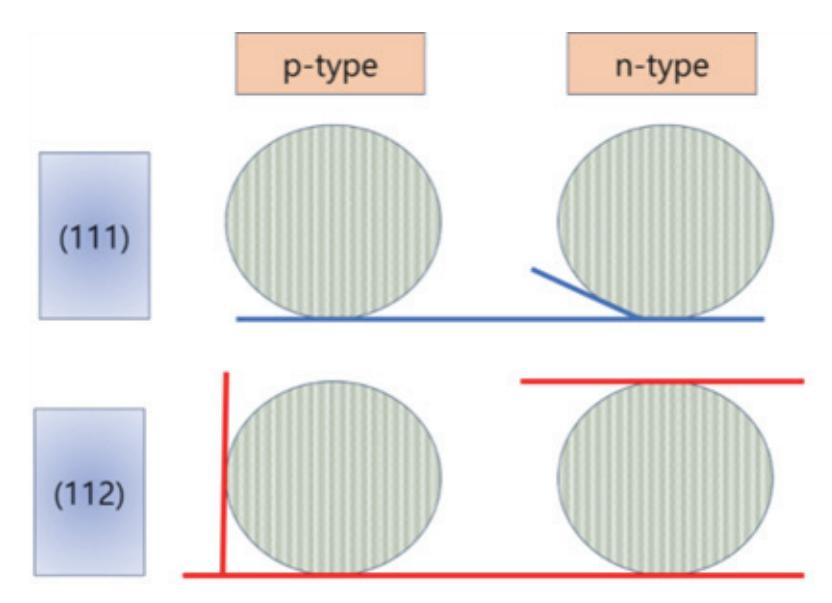

출처: 집필진 제작(2024) [그림 3-2] 실리콘 웨이퍼 플랫(flat)한 모양으로 알 수 있는 결정 특성

1. 특성과 기준

실리콘 웨이퍼는 1,412℃의 높은 녹는점을 가지고 있다. 이 특성은 실리콘 웨이퍼가 고온 의 온도에서 공정을 견딜 수 있어 반도체의 응용성과 신뢰도가 높은 상태에서 작동할 수 있는 장점이 된다. 대기 환경에서 자연 산화막(SiO₂)이 형성되어 외부의 오염을 방지하고, 실리 콘 웨이퍼 제조에서 사용되는 절연막, 유전막을 큰 계면 결함 없이 성장시킬 수 있다는 것 이다. 또한 다결정 실리콘인 폴리실리콘(poly-silicon)을 쉽게 성장시킬 수 있어 전도도가 양호한 게이트 배선으로 사용한다. 특성 파악 시 가장 주요 항목은 유형(type), 두께, 비저 항이다. 웨이퍼는 주입되는 불순물에 따라 전자가 다수 운반자인 n-타입(n-type)과 정공이 다수 운반자인 p-타입(p-type)으로 구분된다. <표 3-2>에 8인치 단결정 실리콘 웨이퍼의 특성 항목과 기준값이 표시되었다.

<표 3-2> 웨이퍼 주요 특성 기준

| 특성 항목              | 기준값                                           |
|--------------------|-----------------------------------------------|
| 지름                 | 8인치(200밀리미터)                                  |
| 결정 성장법             | CZ, FZ                                        |
| 등급(grade)          | 프라임(prime), 테스트, 더미(dummy)                    |
| 유형과 방향성            | notch/flat, 111/100                           |
| n-type 도펀트(dopant) | 농도                                            |
| p-type 도펀트(dopant) | 농도                                            |
| 비저항(ohm-cm)        | 저저항: 0.001~0.1 중저항: 1~30 고저항: 100~1,000 |
| 두께                 | 725um 또는 고객 요구 사양                             |
| 표면 경면 상태           | 한쪽 면, 양쪽 면                                    |

#### 2. 원재료 웨이퍼(bare wafer)에 추가적 공정을 거친 응용 기판

반도체 소자 제조에 추가적인 공정을 통해 새로운 응용 기판을 제작하는데 연마된 (polished) 웨이퍼, 에피텍시얼(epitaxial) 웨이퍼, SOI(silicon on insulator) 웨이퍼 등이 있다. 응용 기판은 메모리 소자 제조에 사용되는 원재료 실리콘 웨이퍼와는 달리 다양한 응 용 소자 제작을 위해 기판에 일련의 공정을 거쳐 새로운 기능을 가지도록 할 수 있다는 특성이 있다.

(1) 에피(EPI) 기판

실리콘 에피 기판은 실리콘 기판 위에 화학적 증착법을 이용해 새로운 전기적 특성이 있는 단결정 실리콘층이 증착된 응용 기판으로, 전력 소자 제작에 많이 사용된다. 에피 (EPI) 웨이퍼의 특성은 에피(EPI) 실리콘 내의 불순물 농도를 조절하여 실리콘 기판과는 다른 불순물 농도(비저항)를 가지는 것이다. 원재료 실리콘 기판 위에 에피층을 성장시 키면 실리콘 기판이 가지고 있는 불순물을 포함하지 않는 순수한 단결정층을 얻을 수 있어 소자의 특성을 향상시킬 수 있다. 일반적으로 소구경 및 비메모리 분야에 사용되고 있고, 실리콘 기판의 대구경화 및 메모리의 고집적화를 위해서 사용되고 있다. 전력 소 자용 p-채널 LDMOS 전력 소자 에피 기판 구조가 [그림 3-3]에 나타나 있다.

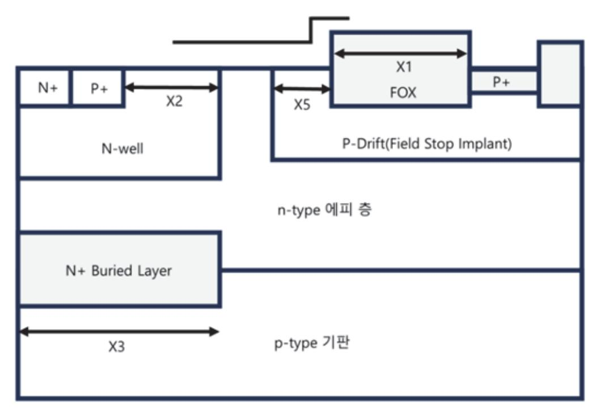

출처: 집필진 제작(2024)

[그림 3-3] p-채널 LDMOS 전력 소자 에피 기판 구조

(2) SOI(silicon on insulator) 기판

SOI 기판은 원재료 실리콘 단결정층 사이에 절연층이 형성되어 있는 실리콘 2중 막 구 조를 가지고 있다. 특징은 실리콘 웨이퍼 표면 아래의 기층부에 존재하는 결함이나 불순 물을 표면과 기층부 사이에 절연층을 형성시킨 것이다. 이로써 기층부로부터의 영향을 제거하여 절연체 위에 형성된 고순도 실리콘층의 가공, 효율 및 특성을 향상시킨 웨이퍼 라고 할 수 있다. SOI 기판을 사용할 경우 트랜지스터의 저항을 줄여 저전력 고속 칩을 생산할 수 있어 1G급 이상의 메모리 반도체와 휴대형 정보 통신 기기용 반도체 소자 생산에 사용된다.

SOI 기판 웨이퍼는 원재료 웨이퍼에 비해 매우 높은 가격을 형성하고 있어 아직까지 그 적용 분야가 제한적이지만 향후 반도체의 고집적화가 급진전될 경우 필수적으로 요구되 는 기판 웨이퍼가 될 것이다. [그림 3-4]에 기본적 구조가 도시되어 있다.

3. 검증 패턴 및 특성 평가 불량 처리

기판은 패턴이 없는 상태이므로 비저항의 경우 4-프로브 방법을 이용하여 저항을 측정한다. 두께는 마이크로미터, 지름은 자, 표면 경면 상태는 유관으로 측정하고 사양과 비교한다. 상 기 항목에서 제시한 사양서와 비교하여 기준값을 벗어나면 불량으로 처리한다.

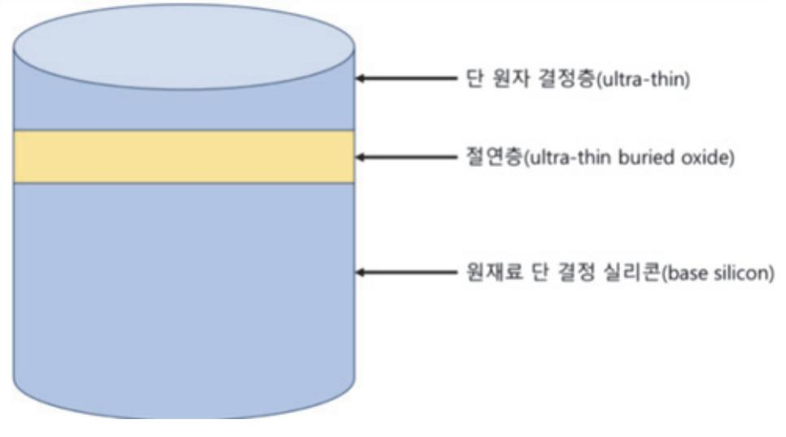

출처: 집필진 제작(2024) [그림 3-4] SOI 기판 웨이퍼 구조

숖 노광 재료

- 1. 감광제(photoresist)
  - (1) 특성과 기준

감광제는 빛, 방사, 열 등 다양한 형태의 에너지에 노출되었을 때 내부 구조가 재구성되 는 특성을 가진 고분자 화합물이다. 통상적으로 반도체 산업 분야에서는 포토레지스트라 고 부른다. 반도체 제조 공정 중의 하나인 사진 식각 공정(lithography)에서 쓰이고, 이 미 설계된 회로도가 그려진 마스크를 통해 웨이퍼로 전사할 때 사용하는 감광성 고분자 재료로 반도체 사진 공정에서 핵심 소재이다. KrF나 ArF 레이저 및 기타 미세 가공 기 술 공정에서 적합한 감광제 재료는 기본적으로 물성적인 측면에서 무결점의 박막 형성, 웨이퍼 기판에 대한 접착력 등이 필요하며, 물성 외에 주어진 노광 파장에서 50% 이상 높은 광투과도와 플라즈마 반응성 건식 식각(RIE: reactive ion etching)에 대한 내성 이 기존의 노볼락 레진 수준이 되어야 하고, 현재 통상적으로 사용 중인 기존의 2.38% TMAH 알칼리 용액으로 현상되어야 한다.

(가) 해상력(resolution)

감광제(PR)가 주어진 패턴 사이즈와 모양을 노광 후 정확하게 분리하여 구현할 수 있는지를 나타내는 성능 지표이다. 193nm에 감응하는 감광제의 경우에는 80nm 이 하의 해상력이 요구된다. 해상력의 증진은 감광제 특성, 노광과 현상 기술에 의존한 다. 노광 기술과 현상 기술이 한계에 이르렀을 때 감광제의 해상력 향상은 필수적이 다. 향상되어야 하는 감광제가 가져야 할 특성은 노광 시 광효율, 감광제 내부의 산 의 확산도 및 현상액에 대한 용해도 차이가 결정한다. 상기 언급한 3가지 특성에 대 한 개선을 위해 다양한 형태와 특성이 있는 고분자와 광산 발생제 등을 개발하고 있 다.

(나) 내식각성(etch resistance)

건식 식각 시 형성된 감광막 패턴은 식각 시 변형이나 분해 현상이 발생되지 않아야 한다. 내식각성이라고 하고, 이 내식각성은 주로 감광제에 사용되는 고분자의 내열성 및 기계적 성질에 영향을 받는다. 감광제를 이용한 패턴의 크기가 줄어들면 감광막 의 두께도 낮아져야 한다. 패턴의 종횡비(aspect ratio: 패턴의 높이/패턴의 폭) 가 커지면 스피너(spinner) 회전 중에 패턴이 쓰러져 버리는 현상이 일어난다. 그래서 안정된 패턴을 위해 두께를 낮추어야 하는데 낮은 두께에서도 식각 공정을 견딜 수 있도록 강화된 내식각성이 강한, 고해상력 특성을 지닌 감광제가 필요하다.

(다) 광감응성(photosensitivity)

감광막이 일정한 크기의 패턴을 구현하기 적절한 노광 에너지가 필요하다. 노광되는 에너지의 양이 커지면 빠른 공정이 가능하여 생산성이 향상되는데, 과도할 경우 공 정의 안정성이 떨어져 수율이 감소하게 된다. 적절한 광감음성 특성을 가진 감광제 의 선택이 중요하다.

(2) 검증 패턴

감광제의 성능은 노광 장비의 의존성이 크다. 회사마다 각기 다른 노광 장비를 사용하고 있어 감광제의 특성 요구치가 동일하지 않다. 감광제의 평가는 노광 장비 회사에서 제공 하는 시험 마스크를 가지고 평가한다. 이 마스크에는 다양한 형상과 크기의 패턴이 실려 있다. 감광제의 평가는 되도록 다양한 패턴 중에서 공정에 충분한 여유도를 주는 조건을 결정한다. 이 중 기본적인 패턴은 선과 공간의 해상도를 검증하는 패턴과 배선 구조에서 사용되는 콘택트 홀(contact hole)과 독립적으로 존재하는 독립 패턴(island pattern) 이 있다. 검증은 CD(critical dimension)와 패턴 프로파일의 공정 마진폭으로 이루어진 다.

(가) 선폭과 공간(line & space)

메모리 소자의 경우 단순한 구조로 이루어지지만 로직 소자의 경우는 상황이 복잡하 다. 즉 다양한 패턴이 존재하고, 광학적 간섭과 회절 현상 때문에 같은 크기의 패턴 이라도 노광기의 조건에 따라 패턴 형성의 결과가 달라진다. 물론 감광제의 역할도 매우 중요하다. 해상도는 노광기의 능력과 감광제의 광화학 특성에 좌우된다. 감광제 의 특성 평가 시 동일한 노광기를 사용하여 특성 검증이 이루어져야 한다. 특성 평가에 사용되는 대표적인 선과 공간 평가 패턴이 [그림 3-5]에 도시되어 있는데 크게 홀로 존재하는 ISO 패턴, 여러 선들이 주기적인 거리를 두고 존재하는 고밀도(dense) 패 턴으로 구분된다. 측정은 CD SEM 장비를 이용한다.

(나) 접촉 홀과 독립(contact hole & island) 패턴

다층 배선 구조에서는 하층 메탈 배선과 상부 메탈 배선을 연결하기 위해서 홀(hole) 구조를 이용한다. 광학적 간섭과 회절 현상 때문에 마스크 상에서는 사각형으로 설계 및 제작되고, 실질적으로 웨이퍼 상에서는 원형의 패턴을 구성한다. 이 부분도 선폭과 선 공 간처럼 다양한 패턴이 존재한다. 또한 배선의 길이를 짧게 하는 설계 구조에서는 선 형 구조가 아닌 독립된 패턴을 사용한다. 패턴들의 예시가 [그림 3-6]에 도시되어 있다.

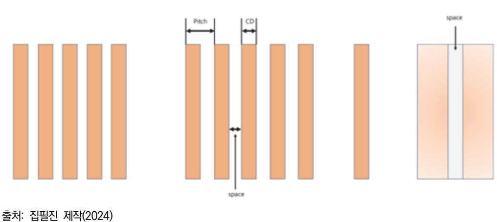

[그림 3-5] 로직 회로의 다양한 선폭과 공간(space) 패턴

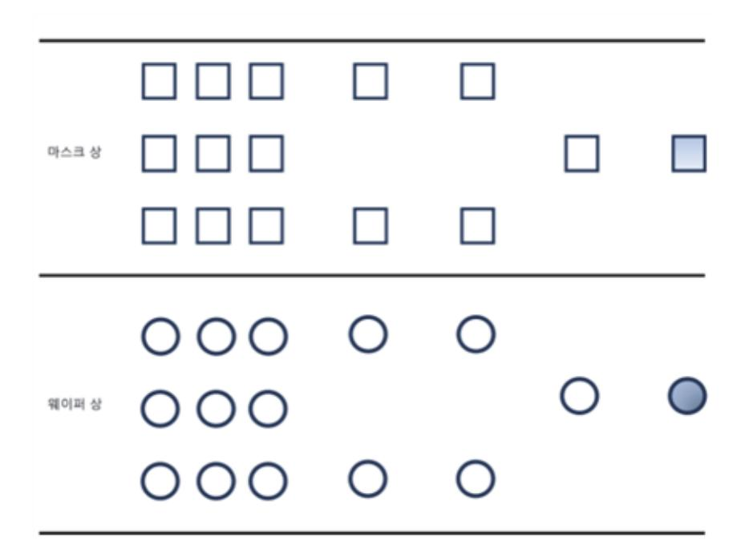

출처: 집필진 제작(2024)

[그림 3-6] 로직 회로의 다양한 접촉 홀(contact hole) 패턴

2. 현상액(developer)

감광막을 도포하고 마스크와 노광기를 통해서 패턴을 웨이퍼에 전사한 후 감광막을 선택적으로 제거함으로써 현상액 속에서 패턴을 현상한다. 현상액은 대부분 수용성 알칼리 용액이 사용되며, 주된 성분으로는 지방족 탄화수소(헥산, 헵탄 등), PGMEA(프로필아세테이트), 자일렌(Xylene), KOH(potassium hycroxide, 수산화칼륨)와 TMAH(T M A H, 수산화테트라메틸암모늄) 수용액 이 사용된다. 현상액은 주어진 시간에 패턴의 무너짐과 잔류 감광막이 존재하지 않는 특성을 가져야 한다. 최종 하드 베이크(hard bake) 공정 후 광학 현미경으로 패턴의 형상을 관측하는 검증을 한다.

3. 박리액(striper)

사진 공정은 현상 후 공정 규격에 따라 합격 혹은 불합격으로 판정한다. 이때 불합격 판정 이 결정되면 패턴을 모두 다 제거하고 다시 작업을 수행한다. 사용하는 재료는 박리액으로 이미 형성된 감광막을 깨끗하게 제거하여 잔류물이 없는 상태로 만들어 주어야 한다. 패턴 형성 과정에서 고온이나 플라즈마와 같은 높은 에너지에 장시간 노출된 감광막은 화학적으 로 변성되어 위와 같은 일반적인 제거 방법으로는 깨끗하게 제거되지 않기도 하며, 경우에 따라서 두꺼운 포토레지스트의 경우 제거에 오랜 시간이 걸리기도 한다. 이 경우 플라즈마 장치(asher)를 이용한 건식 방법과 아세톤과 같은 용매를 이용한 습식 방법을 통해서 제거 한다. 검증은 유관이나 광학 현미경을 통해서 수행된다.

가스는 반도체 소자 제조 공정에서 반도체 기판에 새로운 층을 형성하기 위하여 특정 물질을 증착, 식각, 표면 처리, 특성 변화가 필요할 때 사용되는 기체 상태의 재료이다. 반도체 제조에 쓰이는 가스의 순도는 99.99% 이상의 고순도여야 한다. 결국 사용되는 가스의 특성 중에 불순 물 함유가 최소화된 특성을 요구한다. 반도체 가스 재료는 독성과 부식성, 폭발성이 강해 세심 하게 관리해야 하는 재료 중의 하나이다. 반도체 제조 공정에 사용되는 가스는 크게 산업용 가 스와 특수 가스 두 부분으로 나누어 구분할 수 있다. 산업용 가스는 산소, 질소, 헬륨, 아르곤, 이산화탄소, 수소 등이고, 특화된 특수 가스는 공정에 따라서 수십 종에 이른다. 가스가 사용되 는 공정은 용도에 따라 증착용, 식각용, 세정용, 도핑용 등으로 구분한다. <표 3-3>에 용도별 로 사용되는 가스가 정리되어 있다.

| 용도          |                 | 종 류                                                                                                                                                                           |  |  |  |
|-------------|-----------------|-------------------------------------------------------------------------------------------------------------------------------------------------------------------------------|--|--|--|
| 도우핑         |                 | AsH3, H2S, GeH3, SbH3, AsCl3, AsF2, PH3, PCl3, B3H6, BF3, (CH3)2Te, (CH3)2Cd, (C3H5)2Cd 등                                                                                  |  |  |  |
| 에피텍셜        |                 | SiH4, SiH2Cl2, SiHCl3, SiCl4, B2H6, BBR3, BCl3, AsH3, PH3, GeH4, TeH2(CH3)3Al, (C2H5)3Al, (CH3)3SB, (C2H5)3Sb, (CH3)3Ga, (C2H5)3Ga, (CH3)3As, (C2H5)3As, SnCl4, GeCl4 등 |  |  |  |
| 이온 주입       |                 | AsF5, PH5, PH3, BF3, BCl3, SF6 등                                                                                                                                              |  |  |  |
|             | 기상 식각           | Cl2, HCl, HF, HBr, SF6 등                                                                                                                                                      |  |  |  |
| 식각          | 플라즈마 식각         | SiF4, CF4, C3F8, C2F6, CHF3, CClF3, O₂ 등                                                                                                                                      |  |  |  |
|             | 이온 빔 식각         | C3F8, CHF3, CClF3, CF4 등                                                                                                                                                      |  |  |  |
|             | 반응성 스퍼터 링 | O₂ 등                                                                                                                                                                          |  |  |  |
| 화학 증착용(CVD) |                 | SiH2, SiH2, Cl2, SiCl4, NH3, NO, O₂ 등                                                                                                                                         |  |  |  |
| 밸런스         |                 | N₂, Ar, He, H2, CO2, N2, O 등                                                                                                                                                  |  |  |  |

<표 3-3> 용도별 가스 분류

1. 특성과 기준

반도체 재료 가스란 반도체 및 유사 공정(다이오드, 트랜지스터, IC, LSI, VLSI, LCD 등)에 사용되는 가스를 말하며, 실리콘계 가스와 비소계 가스등을 비롯해 캐리어(carrier) 가스에 이르기까지 많은 종류의 가스가 사용되고 있다. 가스의 특성을 보면 가연성, 폭발성, 유독성 인 것들이 많으므로 취급에 특히 주의해야 한다.

반도체 공정에 사용되는 가스는 산소, 질소, 헬륨, 아르곤, 이산화탄소, 수소 등 기본적인 산업용 가스, 반도체 공정에 특화된 특수 가스 등이 있다. 이 특수 가스는 공정 및 장비에 따라서 다양한 가스를 사용해 그 종류가 수십 종에 이른다. 반도체용 가스는 그 용도에 따 라서 나누어볼 수 있다. <표 3-4>에 주요 가스들에 대한 물리·화학적 특성과 <표 3-5>에 허용 기준이 정리되어 있다.

| 가스명           | 화학식      | 냄새  | 폭발성   | 독성(ppm) |      | 부식성 |
|---------------|----------|-----|-------|---------|------|-----|
| 실란            | SiH4     | 불쾌  | 자연 발화 | O       | 5    | ×   |
| 알곤            | Ar       | 무취  | 비가연성  | ×       |      | ×   |
| 아르신           | AsH3     | 마늘  | 가연성   |         |      |     |
| 삼플루오르화 붕소     | BF2      | 자극적 | 비연소성  | O       | 0.3  | O   |
| 사플루오르화 탄소     | CF4      | 무취  |       |         |      |     |
| 삼플루오르화 메탄     | CHF3     | 불쾌  | 지연성   | O       | 0.1  | O   |
| 메탄            | CH4      | 무취  | 가연성   |         |      |     |
| 염소            | Cl2      | 자극적 |       |         | 1    |     |
| 사불화규소         | SiF4     | 자극적 | 비연소성  | O       |      | O   |
| 육불화 황         | SF6      | 무취  | 비연소성  | ×       | 1000 | ×   |
| 삼플루오르화 메탄     | CHF2     | 불쾌  | 지연성   | O       | 0.1  | O   |
| 암모니아          | NH3      | 자극적 | 지연성   | O       | 25   | O   |
| 플루오르화염화물      | ClF3     | 자극적 |       |         | 0.14 |     |
| 이산화탄소         | CO₂      | 무취  |       |         | 5000 |     |
| 과플루오르화 에탄     | C2F6     | 무취  |       |         |      |     |
| 과플루오르화 프로판    | C3F8     | 무취  |       |         |      |     |
| 트리메틸알루미늄      | (CH3)3Al |     |       |         | 1    |     |
| 옥타플루오르사이클로 부탄 | C4F8     | 불쾌  |       |         |      |     |
| 브롬화 수소        | HBr      | 자극적 | 비가연성  |         | 3    |     |
| 염화 수소         | HCl      | 자극적 | 비연소성  | O       | 5    | O   |
| 수소            | H2       | 무취  | 가연성   |         |      |     |
| 헬륨            | He       | 무취  | 비가연성  |         |      |     |
| 암모니아          | NH3      | 무취  |       | O       | 25   | O   |
| 일산화 질소        | NO       | 무취  | 비가연성  |         | 25   |     |
| 질소            | N₂       | 무취  |       |         |      |     |
| 아산화 질소        | N₂O      | 무취  |       |         | 50   |     |
| 산소            | O₂       | 자극적 |       |         |      |     |
| 포스핀           | PH3      | 자극적 | 자연 발화 | O       | 0.3  | ×   |

<표 3-4> 물리·화학적 특성

#### <표 3-5> 반도체 공정별 가스와 기준 허용도

| 공정    | 가스 명    | 분자식      | 허용 농도 (TLV)*(가) | 노출 기준 (TWA)*(나), (다) |
|-------|---------|----------|--------------------|-------------------------|
|       | 염소      | Cl2      | 1                  | 1(고용노동부 고시)             |
|       | 염화 수소   | HCl      | 5                  | C5(고용노동부 고시)            |
|       | 삼염화 붕소  | BCl3     | 5                  |                         |
|       | 불소      | F2       | 0.1                | 0.1(고용노동부 고시)           |
|       | 사염화 규소  | SiCI4   | 5                  |                         |
|       | 브롬 수소   | HBr      | 3                  | C3(고용노동부 고시)            |
|       | 육불화 유황  | SF6      | 1,000              | 1000(고용노동부 고시)          |
|       | 불화 메탄   | CHF3     | 3                  |                         |
| 건식 식각 | 사염화 탄소  | CClF4    | 10                 |                         |
|       | 삼불화 염소  | ClF3     | 3                  |                         |
|       | 삼불화 질소  | NF3      | 10                 |                         |
|       | 불화수소    | HF       | 3                  | C3(고용노동부 고시)            |
|       | 사불화 규소  | SiF4     | 3                  |                         |
|       | 프레온12   | CCL2F2   | 3                  |                         |
|       | 사브롬 규소  | SiBr4    | 3                  |                         |
|       | 브롬 불화탄소 | CF3Br   | 3                  |                         |
|       | 팔불화 프로판 | C3F8     | 3                  |                         |
|       | 시란      | SiH4     | 0.5                |                         |
|       | 디시란     | Si2H6    | 0.5                |                         |
|       | 포스핀     | PH3      | 0.3                | 0.3(고용노동부 고시)           |
| PECVD | 티오스     | TEOS     | 10                 |                         |
| LPCVD | 디클로로실란  | SiH2Cl2 | 5                  |                         |
|       | 사불화탄소산소 | CF4/O2  | 3                  |                         |
|       | 육불화에탄산소 | C2F6/O2  | 3                  |                         |
|       | 불화 텅스텐  | WF6      | 0.75               |                         |
|       | 아르신     | ASH3     | 0.05               | 0.05(고용노동부 고시)          |
| 이온 주입 | 포스핀     | PH3      | 0.3                | 0.3(고용노동부 고시)           |
|       | 삼불화 붕소  | BF3      | 1                  | C1(고용노동부 고시)            |

출처: 한자은(2000). 월간 『반도체』. 2월호. p.7

(가) TLV(tolerance limit value)는 ACGIH-1978(American Conference of Governmental Industrial Hygienists 1978)에서 제정된 시간 가중 평균 농도이며 하루 8시간의 평균 허용 농도이다. 가스의 경우 ppm, 먼지형인 때 공기 1㎥ 중의 수치로 표현한다.

- (나) TWA(time weighted average): 1일 8시간 작업을 기준으로 하여 유해 요인의 측정치 에 발생 시간을 곱하여 8시간으로 나눈 값을 말한다.
- (다) 최고 노출 기준(C)은 근로자가 1일 작업 시간 동안 잠시라도 노출되어서는 안 되는 기준 을 말하며 노출 기준 앞에 'C'를 붙여 표시한다.
- 2. 검증 패턴

반도체 가스의 적용 여부는 공정 결과에 따라 해당 공정의 적합성을 판단하게 된다. 건식 식각의 경우 식각률, 잔류막, 패턴 프로파일의 계측 결과로 가스의 특성을 파악할 수 있다. 공정 후 칩으로 분리하기 위해 주어진, 즉 웨이퍼를 절단하여 개별 칩으로 분할할 수 있도 록 만든 공간(scribe lane)에서 공정 상태를 점검하고 데이터를 얻을 수 있다. 또한 세밀한 분석을 위하여 공정이 완전히 진행된 후 불량으로 판정된 웨이퍼를 수직 절단하여 주사형 전자 현미경으로 관찰한다. 공정에 변동을 주는 변수들이 많지만 통계적 데이터 분석 방법 을 통해 검증할 수 있다. 다른 공정들도 스크리브 레인(scribe lane) 안에 실려 있는 테스 트 패턴을 통하여 간접적으로 가스의 공정 접합성을 판단할 수 있다. 스퍼터링(sputtering) 공정의 경우는 막 두께, 감광막 제거에는 잔류막, 체임버 세정에는 진공도를 측정함으로써 가스의 고정 적합성을 판단할 수 있다. <표 3-6>에 가스가 사용되는 공정과 사용 가스 및 검증 방법에 대하여 정리되어 있다.

<표 3-6> 공정에 사용되는 가스의 특성 검증

| 사용 구분            | 공정                                              | 사용 가스                                                                        | 검증                    |
|------------------|-------------------------------------------------|------------------------------------------------------------------------------|-----------------------|
| 플라즈마 화학 기상 증착    | 게이트 절연막 무결정 실리콘 채널 보호막 무결정 N+Si 보호막 | SiH4, NH3, N2 SiH4, H2 SiH4, NH3, N2 SiH4, PH3, N2 SiH4, NH3, N2 | 식각률 패턴 프로파일 잔류막 |
| 스퍼터링(sputtering) | 금속막 ITO 막                                    | Ar Ar, O2                                                                 | 막 두께                  |
| 건식 식각            | 게이트 무결정 N+Si 소오스-드레인 공급 막 보호막          | CF4, O2, SF6, CF4, O2, SF6, Cl2 CF4, O2, CF4, SF6, He               | 식각률 패턴 프로파일 잔류막 |
| 산소 에싱(ashing)    | 감광막 제거                                          | O2                                                                           | 잔류막                   |
| 배기, 퍼지 캐리어       | -                                               | N2                                                                           |                       |
| 플라즈마 CVD 세정      | -                                               | NF3                                                                          | 진공도                   |
| 체임버(chambe) 세정   | 플라즈마 CVD LPCVD, 메탈 CVD                       | NF3, C2F6, SF4 ClF3, CF4                                                  |                       |

#### 수 금속 재료

반도체 칩 제조 공정은 크게 두 부분으로 나누어진다. 한 부분은 트랜지스터, 다이오드, 축전기 등을 형성하는 소자 형성 부분이고 다른 한 부분은 일련의 소자들을 조합하여 소자를 전자기 소자로 완성해 주는 소자 금속 배선 부분이다. 소자의 동작 속도는 소자의 성능을 평가하는 중 요한 특성 인자 중의 하나인데 배선 구조와 사용되는 금속 재료에 좌우된다. 금속 재료를 무엇 을 선택하느냐에 따라 소자의 신호 전달 속도의 성능이 결정된다. 고성능, 고속 소자에 구리 배선을 사용하는 이유이다.

1. 금속 배선 공정의 단계

금속 배선 공정은 3부분으로 나뉘며 3단계 모두 금속 재료를 사용하게 된다.

- (1) 1단계는 소자와 금속 배선을 위해 기판 실리콘과 옴성 접촉(ohmic contact)을 형성하는 실 리사이드 형성이다.
- (2) 2단계는 이후 각기 다른 소자들을 연결하여 다층 배선과 연결하는 콘택트 홀(contact hole) 과 비아 홀(via hole)이다.
- (3) 3단계는 평면 다층 상에서 콘택트와 비아 홀을 연결하는 메탈(metal) 배선 공정이 이루어진 다.
- 2. 금속 배선의 특성

금속 배선의 특성은 신호 전달 속도뿐만 아니라 제품의 신뢰성을 좌우한다. 콘택트와 비아 배선 공정은 통상적으로 플러그(plug) 공정이라 불리며 화학 기상 증착법(CVD: chemical vapor deposition)을 사용한다.

3. 메탈 공정의 특성

메탈 공정은 이와는 달리 금속 타깃(target) 재료를 사용하여 스퍼터링(sputtering) 방법을 이용하는 물리적 기상 증착(PVD: phsical vapor deposition)에 의해 증착된다. 통상적으 로 콘택트 홀과 비아 홀은 텅스텐(W)으로 채우고, 장벽(barrier)은 타이타늄(Ti), 메탈은 알 루미늄을 사용한다. 다마신 공정의 경우 모두 구리(Cu)를 사용한다.

4. 대표적인 금속의 기본 특성

비철금속은 기계적, 물리적, 화학적 특성 때문에 중요한 역할을 수행할 수 있다. 공정에 사 용되는 대표적인 금속의 기본 특성은 아래와 같다.

(1) 알루미늄(Al)

높은 비강도, 내부식성은, 열 및 전기 전도도, 무독성, 성형성, 비자기성이 우수하다.

(2) 마그네슘(Mg)

공업용 금속 중 가장 가볍고, 진동 감쇄 특성이 우수하다.

(3) 구리(Cu)

알루미늄과 유사한 성질. 열 및 전기 전도도, 내부식성 우수하고, 전기적, 기계적, 내부 식성, 비자기성, 열전도, 내마모성 등의 복합적인 특징이 필요한 부분에 매우 유용하다. 다마 신 공정에서 사용된다.

(4) 니켈(Ni)

강도, 인성, 내부식성이 양호. 특히 고온에서 높은 강도, 내부식성, 고온에서의 양호한 성질이 필요할 때 합금 성분으로 사용한다.

(5) 초합금

고온용 재료로 내열 합금 또는 고온 합금이라고도 부르며 철기, 코발트기, 니켈기로 분 류되고, 부식, 기계적 및 열적 피로, 충격, 크립(creep), 고온 마모 등에 강한 특성을 나 타낸다. 구조용으로는 최고 1,000℃에서 사용 가능하고, 비구조용으로는 최고 1,200℃ 까지 사용 가능하다.

(6) 타이타늄(Ti)

고가이나 비강도가 높고 상온, 고온에서의 내부식성이 우수하고, 조성의 작은 변화에도 매우 민감하여 조성의 조절과 공정이 대단히 중요하다.

- (7) 몰리브데넘(Mo), 코발트(Co), 텅스텐(W), Ta(탄탈늄) 용융점이 매우 높은 내열 금속이다.
- 5. 기준

금속 배선 재료는 공정 규격을 만족하는 기본적인 특성값이 필요하다. <표 3-7>에 항목과 요굿값이 나타나 있다. 또한 오염원으로 작용하지 않고 세정 시 문제가 발생되지 않아야 한 다. 전기적으로는 낮은 접촉 저항, 실리콘과 한정적 반응, 높은 전도도를 가져야 하고, 공정 적으로는 상하 박막과 접착성이 양호하고, 패턴 형성이 쉽게 되며, 열 특성, 타 금속과의 접촉성이 양호해야 한다.

| 메탈 또는 합금 | 비저항(ρ) (μΩcm) | 녹는점 (℃) | 열팽창 계수 (10-6℃) | Si와 반응 온도 (degree℃) |
|----------|------------------|------------|-------------------|------------------------|
| Al       | 2.7~3.0          | 660        | 24                | 250                    |
| MO       | 6~15             | 2620       | 5                 | 400                    |
| W        | 6~15             | 3410       | 4.4               | 600                    |
| Cu       | <2.0             | 1083       | 16.5              | -                      |
| Ti       | 42               | 1667       | 8.9               | -                      |
| MoSi2    | 40~100           | 1980       | 8.25              | 1000                   |
| TaSi2    | 35~50            | 2200       | 8.8~10            | 1000                   |
| TiSi2    | 13~16            | 1540       | 12.5              | 900                    |
|          |                  |            |                   |                        |

<표 3-7> 반도체 소자의 금속 배선 재료의 물리적 특성

| WSi2  | 30~70  | 2165 | 6.25~7.9 | 1000 |  |
|-------|--------|------|----------|------|--|
| CoSi2 | 10~18  | 1326 | 10.04    | 950  |  |
| PtSi  | 28~35  | 1229 | -        | 750  |  |
| TiN   | 25~200 | 2880 | 9.35     | -    |  |

#### 6. 검증 패턴

공정상에서는 크게 두 가지 특성을 검증할 수 있다. 면 저항과 반사율이다. 광학 현미경 관 측으로부터 메탈 표면의 힐 락(hill lock)과 표면 거칠기를 관찰할 수 있다. 힐 락의 경우 금속의 EM(전자 이동), SM(스트레스 이동) 특성을 저하시키는 원인으로 작용한다.

(1) 면 저항(sheet resistance)

박막의 저항을 측정하는 방법이다, 금속 박막의 저항은 4점 프로브(four point probe) 방법을 이용하여 측정한다. 측정 방법이 [그림 3-7]에 도시되어 있다. 바깥쪽 2개 프로 브(probe)로 전류 I가 흐르고, 안쪽 2개 프로브에서 전압 V를 측정한다. 직경 d에 비하 여 매우 작은 값의 두께 W를 가지는 반도체의 저항(ρ)은 아래 관계식과 같다. 여기서 C는 보정 인자로 d/s의 비에 따라 다르다. d/s>20일 때, 보정 인자는 4.54로 접근한다.

ρ = WC(V/I), Ω-cm

(2) 반사도(RI: reflectivity intensity, %)

금속막 표면의 반사도는 나노 스펙(nano spec.) 계측 장비로 측정한다. 금속막의 표면에 파 장 λ = 480nm의 광을 조사한 후 수직 반사되는 빛의 양을 수치화하여 입사광의 양과 반사광의 양을 퍼센트 비율로 구하여 반사도를 계산한다. 금속의 증착 온도가 낮을수록, 증착 속도는 빠를수록 반사도가 증가한다. 막 두께가 500Å 이상이면 반사율이 높아지는 경 향이 있다. <표 3-8>에 각종 금속에 대한 반사도가 나타나 있다. 레이저 광원이 다르면 반사도가 달라진다.

| 금속 | YAG 레이저 (파장: 0.9um~1.1um) | CO₂ 레이저 (파장: 0.9um~1.1um) |
|----|------------------------------|------------------------------|
| Au | 94.70                        | 97.70                        |
| Pt | 72.90                        | 95.60                        |
| Ag | 96.40                        | 99.00                        |
| Al | 73.30                        | 96.90                        |
| Cu | 90.10                        | 98.40                        |
| Fe | 65.00                        | 93.80                        |
| Ni | 72.00                        | 95.60                        |

<표 3-8> 금속의 표면 반사율(%)

| Zn | 49.00 | 98.10 |
|----|-------|-------|
| Mg | 74.00 | 93.00 |
| Cr | 57.00 | 93.00 |
| Mo | 58.20 | 94.50 |
| W  | 62.30 | 95.50 |

#### (3) 전자 이동(EM: electro migration)

금속 배선에 전류를 인가하면 배선의 내부로 전자가 이동하게 된다. 이런 전자의 이동은 금속의 그레인 경계(grain boundary)로 집중되고 전자가 이동된 빈자리는 상대적으로 약해 결정이 깨어져 미세 기공(micro void)로 이루어진 불안전한 상태에 이른다. 이 현 상은 알루미늄에서 발생하고, 상대적으로 텅스텐은 전자 이동 저항성이 강하여 텅스텐 내부에서는 전자 이동이 발생하지 않는다. 그레인 사이의 크기 차이가 클수록 전자 이동 에 취약하다. 알루미늄에 비해 구리는 전자 이동 특성에 강하다. 본 검증은 공정 중에는 어렵고 공정이 끝난 후 스크리브 레인(scribe lane) 안에 설계된 전자 이동 테스트 모 듈을 통해 검증할 수 있다.

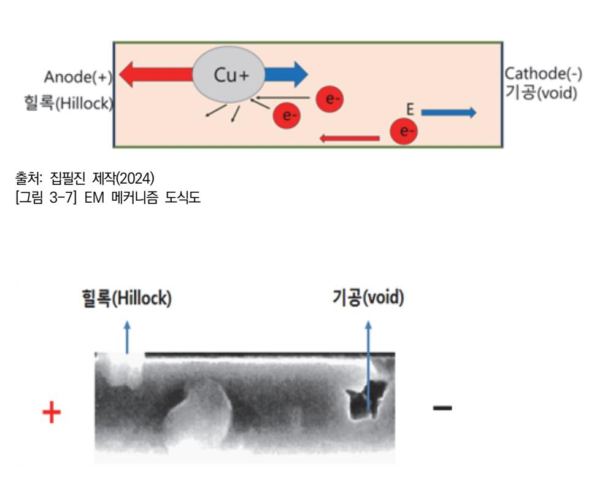

출처: 교육부(2015). 반도체 제조 공정 개발(LM1903060106\_14v3). 한국직업능 력개발원. p. 74. [그림 3-8] 기공(void)과 힐 락(hillock) 형성 SEM 사진 모습

#### (4) 응력 이동(SM: stress migration)

응력 이동은 [그림 3-10]에 도시된 것처럼 메탈 라인들 사이에 응력(stress)이 작용할 때 메 탈 구성 원자가 이동하는 고장 현상이다. 이 원자의 이동은 메탈 라인의 저항 증가와 단선을 유도하는 기공(void)들을 형성한다. 이 현상은 제조 공정, 소자 사용 환경의 온도 변화, 특히 제조 공정에서는 열처리 과정의 온도 변화로 응력이 발생하여 메탈(Al, Cu)들 사이에 작 용하여 발생한다. 발생된 응력은 메탈 라인 안의 공공(vacancy)들을 이동시키고, 기공(void) 을 형성하며 어떤 특정 장소에 집중하게 한다. 응력 이동은 상하 두 메탈 라인 사이에 작 용하여 발생된다. 메탈 원자의 이동 속도는 고온일수록 증가하는 반면 메탈 라인에 작용된 응력은 고온에서 감소한다. [그림 3-10]에 응력 이동 현상으로 발생되는 모습이 나타나 있다. 본 검증은 공정 중에는 어렵고 공정이 끝난 후 스크리브 레인(scribe lane) 안에 설 계된 응력 이동 테스트 모듈을 통해 검증할 수 있다.

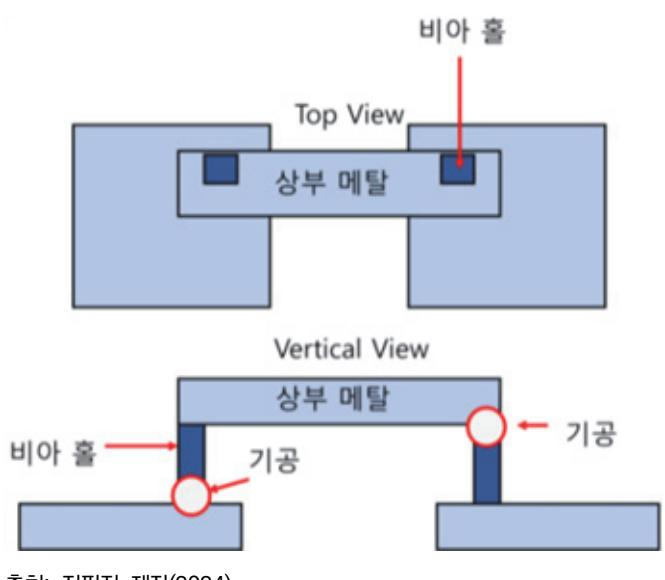

출처: 집필진 제작(2024) [그림 3-9] 응력 이동 현상 메커니즘

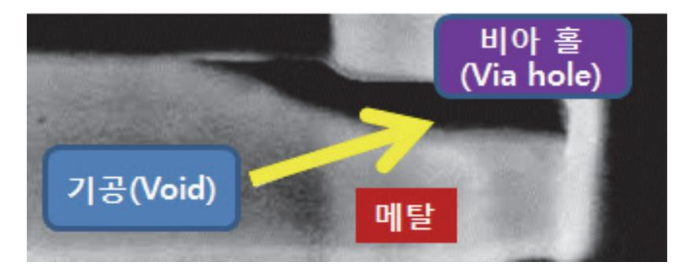

출처: 교육부(2015). 반도체 제조 공정 개발(LM1903060106\_14v3). 한국직업능력개발 원. p.75. [그림 3-10] 응력에 의해 상하 메탈 사이에 발생되는 기공(void)

숙 습식 화공 약품 재료

습식 화공 약품은 세정, 식각, 표면 처리 등에 사용하는 액상 재료이다. 화학적 특성에 따라서 산, 염기, 유기로 분류한다.

산성 화공 약품은 PH 농도가 7보다 낮은 액체이며 물에 녹았을 때 수소 이온(H+)을 발생시킨 다. 반응성과 부식성이 강하며, 산성도가 높을수록 더 강한 반응성을 보인다. 식각이나 세정 공 정 등에 사용하며 공정에 황산(H2SO4), 염산(HCl), 질산(HNO3), 불산(HF), 인산(H3PO4) 등이 있다.

염기성 화공 약품은 PH 농도가 7보다 큰 액체를 말하며, 수용액 상태에서 수산화 이온(OH-) 을 발생시킨다. 산에 반대되는 성질의 액체이며, 산과 중화 반응을 일으켜 염과 물을 만든다. 염기성 습식 화공 약품에는 수산화나트륨(NaOH), 수산화칼륨(KOH), 암모니아(NH4OH) 등이 있다.

유기 용매는 용질을 녹일 수 있는 액체 상태의 유기 화합물이다. 감광막과 같은 고분자 물질을 녹이거나 희석, 세척하는 용도로 사용된다. 유기용매들에는 알코올 계열인 메탄올, 에탄올, 아 이소프로필알콜(IPA), 아세톤과 벤젠 계열인 벤젠, 톨루엔, 자일렌 등이 있다.

[그림 3-11]에 pH 농도별 해당 물질을 보여 준다.

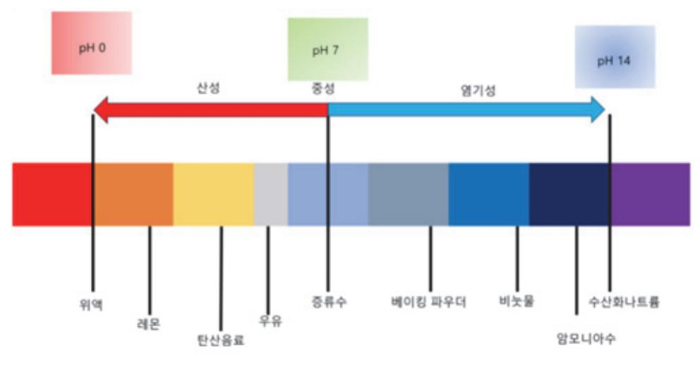

출처: 집필진 제작(2024) [그림 3-11] pH 농도별 해당 물질의 예시

1. 특성

화학 약품의 종류가 다양해지고 사용량이 계속 증가하는 추세는 기존 사용해 왔던 화학 약 품도 사용 방법의 개선 및 사용 순서의 변경을 요구하고 있다. 화공 약품의 특성을 고려하 여 적절한 방법을 모색해야 함을 의미한다.

(1) 액체로 보관하고 기체로 사용하는 경우

보관 시에는 액체, 사용 시에는 기체로 사용하는 경우이다. 분자량이 큰 메탈계 재료, 분자량이 큰 가스에 해당된다. 물질의 보관은 액체 상태인데 관련된 특성 인자는 증기 압, 보관 압력, 보관 온도이다.

(2) 액체로 보관하고 액체로 사용하는 경우

일반적인 액체 재료에 해당되며 보관 용기와 사용 용기가 동일하다. 이는 독성 약품의 강한 특성 있거나 고압 또는 저압에서 사용되는 경우도 해당된다. 또한 사용 시 희석 및 배합하는 경우인데 사용 조건을 조정할 필요가 있다. 세정 조건의 변경되거나 웨이퍼 의 세정 조건이 변경되어 희석률이나 배합률이 달라질 수 있다. 점도 상태에 따라 보관 특성이 달라지는데 순수한 물의 경우 통상적으로 액체 상태, 고점도 상태인 감광액의 경 우는 점도가 있어서 계량과 계측에 전용 지그를 사용한다. 웨이퍼 연마 공정에 사용되는 슬러리는 고체 분말을 포함한 액체의 특성이 있다.

(3) 유기용제

카본 계열로 구분되며 화재 위험이 크다. 감광액이 대표적인 물질로서 벤젠, 카본 체인 의 다양한 조합으로 되어있다.

(가) 알코올 계열

메탄올(CH3OH), 에탄올(C2H5OH), 아이소프로필알콜(IPA, C3H7OH) 등이 속한다. 카본 체인 구조의 유기물을 제어하기 위한 배합 물질이다. 감광액 등의 유기물을 제 어하기 위한 용도로 사용된다. 또한 벤젠 등의 유기물과도 혼합이 가능하고 순수한 물(H2O)과 혼합이 가능하다.

(4) 벤젠 계열

카본과 수소의 육각형 구조로 카본 계열의 물질의 기본 구조이다. 대부분이 인화성이거 나 열에 민감한 특성이 있다.

(5) 산 및 알칼리 계열

염산(HCl), 불소(HF), 과산화수소(H2O2), 암모늄(NH4OH) 등이 속한다. 강산과 강알칼리 가 직접 섞이면 폭발적인 반응을 한다. 2가지 약품 모두 인체에 치명적인 위해를 가하 고, 금속 등의 구조물에 심각한 상해를 가할 수 있으므로 보관과 취급에 주의해야 한다. 기본 특성 정보는 MSDS와 제조사에서 제공하는 자료를 통해 반드시 확인해야 한다. 산 (Acid)과 알칼리의 기본 특성은 강한 부식성과 반응성이다.

(6) 중성 계열

초순수물이 속하며, 중성 특성이 있다. 산과 알칼리의 반응 생성물, 또는 산과 금속의 반응 생성물은 물에 녹는 수용성이다. 염산, 불소 등의 물질을 희석하거나, 반도체를 직 접 세정하는 용도로 사용된다. 불순물의 함유량 제어가 중요하고, 107 Ohm 이상의 전기 저항을 확보해야 한다.

#### 2. 기준

반도체 공정에 사용하는 화학 물질은 불순물의 함유량, 보존 기간 동안의 안정성, 반응의 정확성, 반응 생성물의 안정성 등의 설정 기준에 부합하는 것이어야 한다. 불순물 함유량과 더불어 중요한 기준은 불순물 종류이다. 칼륨(K), 칼슘(Ca), 나트륨(Na), 철(Fe) 등의 금속들은 반도체의 소자 내에 잔류하여 전기적 특성을 저하시킨다. 알루미늄(Al), 니켈(Ni), 은(Ag), 텅스텐(W) 등은 공정에 따라서 사용이 허용되는 금속이고, 구리(Cu)는 사용되는 경우와 제한되는 경우가 존재한다. 또한 비메탈계 물질도 경우에 따라서 제한을 받는다. RoHS에서 정하는 사용을 금지하는 물질은 반도체 공정에서의 사용이 제한되어야 한다. 기본적으로 MSDS를 만족하는 특성을 가져야 하고, RoHS에서 금지한 물질을 함유하지 않아야 한다.

3. 검증 패턴

공정상에서 검증하는 방법은 식각의 경우 세정 후 불순물 입자 관찰과 식각률을 측정이 있 다. 세정의 경우 잔류물들의 상태를 파악한다.

숚 특성 평가 데이터 처리

반도체 제조 공정에는 공정 조건, 소자의 종류, 장비, 재료 등의 수많은 변수들이 관여한다. 결 국 단위 공정에서 분석도 가능하지만 재료 평가 시에는 모든 조건을 고정해 놓고 재료만 변수 로 하여 최종 웨이퍼 수율과 신뢰성의 관계성을 분석해야 한다. 물론 양산에 적용하기 위해서 는 재료의 공정 적합성이 최적화되는 조건을 찾고 선행하는 몇 개의 로트(lot)에 적용한 후 신 뢰성 평가를 한다. 최종 수율과 신뢰성에 문제가 없으면 양산에 전면 적용한다.

- 1. 불량 결정
  - (1) 제조 공정과의 부합성에 의한 불량 결정

재료의 불량은 공급하는 회사들의 재료 평가의 상대적 차이로 결정되는 것이 아니다. 물 론 비교 평가를 통해 각자 제조 공정과 장비에 부합되는 최적의 재료를 선택할 수 있다. 동일한 재료를 사용하여 여러 회사들이 제품을 제조해도 제조 환경 특성상 결과가 다르 게 나올 수 있기 때문이다. 여기서 불량은 재료를 제조 공정에 투입해서 기존 사용했던 재료보다 동등 이상의 제품 특성이 확보되지 않은 경우를 말한다. 이 경우 그 제조 공 정에서는 불량이라고 할 수 있다. 결국 새로운 재료를 적용했을 때 평가 결과를 기존 수율과 비교해 보고 분석하는 것이 중요하다. 또한 신뢰성 평가를 통해 제품 특성에 영 향을 주는지 여부도 파악해야 한다.

(2) 재료 규격서 불일치에 의한 불량 결정

재료 구매 시 제시한 규격서와 상이한 평가 결과가 도출되면 이 재료는 불량이다. 이런 경우 불량 결정은 해당 공정 단위 평가에서 결정할 수 있다.

(3) 불량 결정 시 유의 사항

불량 결정 전에 다른 공정 변수가 개입되었는지 분석을 철저히 해야 한다. 반도체 제조 용 재료는 다양해서 각기 주어진 재료에 대하여 패턴이 없는 웨이퍼에 단위 평가를 먼 저 해야 한다. 왜냐하면 여러 단계의 공정을 거치는 동안 다른 공정에서 불량의 원인을 제공할 수도 있기 때문이다.

2. 산포도 분석

산포의 문제는 테스트 재료들이 모두 규격서 기준 대비 성능을 만족하고 있지만, 분포를 확 인해 보니 대물량 양산 상황에서 수율이 떨어질 수 있는 상황에서 발생한다. [그림 3-13]과 같이 샘플링하여 측정한 시료의 특성은 성능 평가 기준 대비 모두 성능을 만족하고 있다. 그러나 분포를 확인해 보면 우측 꼬리 부분에서 불량이 발생하게 되므로 이러한 불량 시료 의 수량에 대한 정밀한 분석이 필요하다.

(1) 알코올 계열

메탄올(CH3OH), 에탄올(C2H5OH), 아이소프로필알콜(IPA, C3H7OH) 등이 속한다. 카본 체인 구조의 유기물을 제어하기 위한 배합 물질이다. 감광액 등의 유기물을 제어하기 위 한 용도로 사용된다. 또한 벤젠 등의 유기물과도 혼합이 가능하고 순수한 물(H2O)과 혼 합이 가능하다.

(2) 벤젠 계열

카본과 수소의 육각형 구조로 카본 계열 물질의 기본 구조이다. 대부분이 인화성이거나 열에 민감한 특성이 있다.

(3) 산 및 알칼리 계열

염산(HCl), 불소(HF), 과산화수소(H2O2), 암모늄(NH4OH) 등이 속한다. 강산과 강알칼리 가 직접 섞이면 폭발적인 반응을 한다. 2가지 약품 모두 인체에 치명적인 위해를 가하 고, 금속 등의 구조물에 심각한 상해를 가할 수 있으므로 보관과 취급에 주의해야 한다. 기본 특성 정보는 MSDS와 제조사에서 제공하는 자료를 통해 반드시 확인해야 한다. 산 과 알칼리의 기본 특성은 강한 부식성과 반응성이다.

(4) 중성 계열

초순수물이 속하며, 중성 특성이 있다. 산과 알칼리의 반응 생성물, 또는 산과 금속의 반응 생성물은 물에 녹는 수용성이다. 염산, 불소 등의 물질을 희석하거나, 반도체를 직 접 세정하는 용도로 사용된다. 불순물의 함유량 제어가 중요하고, 107 Ohm 이상의 전기 저항을 확보해야 한다.

3. 기준

반도체 공정에 사용하는 화학 물질은 불순물의 함유량, 보존 기간 동안의 안정성, 반응의 정확성, 반응 생성물의 안정성 등의 설정 기준에 부합하는 것이어야 한다. 불순물 함유량과 더불어 중요한 기준은 불순물 종류이다. 칼륨(K), 칼슘(Ca), 나트륨(Na), 철(Fe) 등의 금속 들은 반도체의 소자 내에 잔류하여 전기적 특성을 저하시킨다. 알루미늄(Al), 니켈(Ni), 은 (Ag), 텅스텐(W) 등은 공정에 따라서 사용이 허용되는 금속이고, 구리(Cu)는 사용되는 경우 와 제한되는 경우가 존재한다. 또한 비메탈계 물질도 경우에 따라서 제한을 받는다. RoHS 에서 정하는 사용을 금지하는 물질은 반도체 공정에서의 사용이 제한되어야 한다. 기본적으 로 MSDS를 만족하는 특성을 가져야 하고, RoHS에서 금지한 물질을 함유하지 않아야 한 다.

4. 검증 패턴

공정상에서 검증하는 방법은 식각의 경우 세정 후 불순물 입자 관찰과 식각률을 측정이 있 다. 세정의 경우 잔류물들의 상태를 파악한다.

숛 특성 평가 데이터 처리

반도체 제조 공정에는 공정 조건, 소자의 종류, 장비, 재료 등의 수많은 변수들이 관여한다. 결 국 단위 공정에서 분석도 가능하지만 재료 평가 시에는 모든 조건을 고정해 놓고 재료만 변수 로 하여 최종 웨이퍼 수율과 신뢰성의 관계성을 분석해야 한다. 물론 양산에 적용하기 위해서 는 재료의 공정 적합성이 최적화되는 조건을 찾고 선행하는 몇 개의 로트에 적용한 후 신뢰성 평가를 한다. 최종 수율과 신뢰성에 문제가 없으면 양산에 전면 적용한다.

- 1. 불량 결정
  - (1) 제조 공정과의 부합성에 의한 불량 결정
    - 재료의 불량은 공급하는 회사들의 재료 평가의 상대적 차이로 결정되는 것이 아니다. 물 론 비교 평가를 통해 각자 제조 공정과 장비에 부합되는 최적의 재료를 선택할 수 있다. 동일한 재료를 사용하여 여러 회사들이 제품을 제조해도 제조 환경 특성상 결과가 다르 게 나올 수 있기 때문이다. 여기서 불량은 재료를 제조 공정에 투입해서 기존 사용했던 재료보다 동등 이상의 제품 특성이 확보되지 않은 경우를 말한다. 이 경우 그 제조 공 정에서는 불량이라고 할 수 있다. 결국 새로운 재료를 적용했을 때 평가 결과를 기존 수율과 비교해 보고 분석하는 것이 중요하다. 또한 신뢰성 평가를 통해 제품 특성에 영 향을 주는지 여부도 파악해야 한다.

(2) 재료 규격서 불일치에 의한 불량 결정

재료 구매 시 제시한 규격서와 상이한 평가 결과가 도출되면 이 재료는 불량이다. 이런 경우 불량 결정은 해당 공정 단위 평가에서 결정할 수 있다.

(3) 불량 결정 시 유의 사항

불량 결정 전에 다른 공정 변수가 개입되었는지 분석을 철저히 해야 한다. 반도체 제조 용 재료는 다양해서 각기 주어진 재료에 대하여 패턴이 없는 웨이퍼에 단위 평가를 먼

81

저 해야 한다. 왜냐하면 여러 단계의 공정을 거치는 동안 다른 공정에서 불량의 원인을 제공할 수도 있기 때문이다.

2. 산포도 분석

산포의 문제는 테스트 재료들이 모두 규격서 기준 대비 성능을 만족하고 있지만, 분포를 확 인해 보니 대물량 양산 상황에서 수율이 떨어질 수 있는 상황에서 발생한다. [그림 3-12]와 같이 샘플링하여 측정한 시료의 특성은 성능 평가 기준 대비 모두 성능을 만족하고 있다. 그러나 분포를 확인해 보면 우측 꼬리 부분에서 불량이 발생하게 되므로 이러한 불량 시료 의 수량에 대한 정밀한 분석이 필요하다.

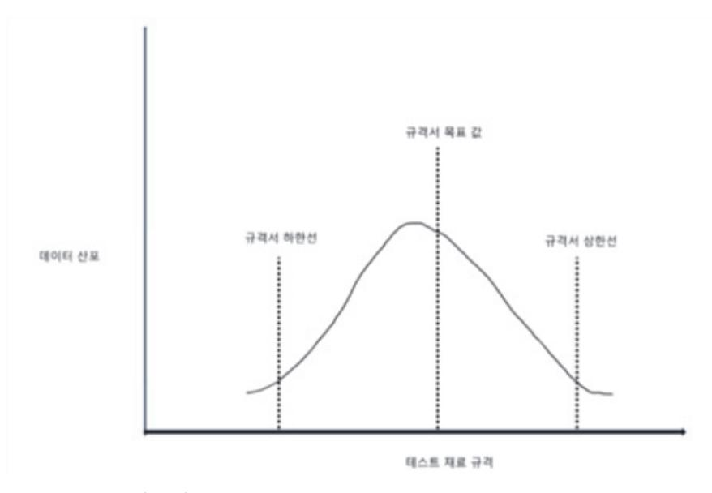

출처: 집필진 제작(2024) [그림 3-12] 데이터 산포도 곡선

## 수행 내용 / 메모리 반도체 공정 소재 평가하기

#### 재료·자료

- MSDS 설명 자료, 안전 교육 자료
- 작업 지시서(공정 계획서), 장비 및 설비 사용 설명서
- 웨이퍼, 포토 마스크, 포토 레지스트, 가스, 금속 타깃, 고분자 물질, 화공 약품, 순수 (DI-Water)
- 안전 교육 자료, 통계 기법 자료
- 장비 및 설비 사용 설명서, 장비/공정 특성 평가서, 분석 결과 보고서

#### 기기(장비 ・ 공구)

- 공정 장비(wet station, furnace, sputter, PECVD, photolithography equipment)
- 계측 장비(microscope, a-step, probe-station)
- 컴퓨터, 프린터, 통계 분석 프로그램
- 실시간 공정 모니터링 센서 혹은 특성 계측 장비

#### 안전 ・ 유의 사항

- 물질 안전 보건 자료(MSDS)에 따른 화학 물질의 보관, 관리, 주의 사항 준수한다.
- 취급 화학 물질에 따른 알맞은 보호 장구 선택, 사용 규정 준수한다.
- 안전 관련 작업 안전장치(소방시설 배치, 작업자 안전, 비상 샤워부스, 아이 워시, 심장 충 격기) 사용 능력을 파악한다.
- 반도체 제조 공정이 환경에 미치는 영향을 파악한다.
- 장비 취급 사항을 준수한다.

#### 수행 순서

숔 메모리 공정 소재 특성 평가 데이터의 불량 여부를 파악한다.

메모리 반도체 공정 소재를 평가하기 위해 특성 평가 데이터를 분석하고 불량 여부를 파악하는 것은 공정의 안정성과 제품의 품질을 보장하는 데 매우 중요하다. 이를 위해 공정 소재의 전기

적, 물리적, 화학적 특성을 평가하고, 설정된 기준에 따라 불량 여부를 판별하는 과정이 필요하 다. 다음은 메모리 반도체 공정 소재 특성 평가 데이터의 불량 여부를 파악하는 방법에 대한 설명이다.

1. 공정 소재 특성 평가 항목을 분석한다.

반도체 소자 제작 시 사용되는 재료의 특성을 단위 공정 진행 후 검증된 평가 장비를 활용 하여 주어진 재료 규격과의 일치성을 검증한다. 재료의 특성을 파악하기 위해 여러 가지 계 측 장비를 이용하여 측정 및 분석을 실시한다. 계측 장비들은 대부분 광학적 원리를 기본으 로 모듈이 구성된다. 반도체 주요 공정에서 수행하는 계측에서는 수, 양, 길이, 모양, 성분, 전기적 특성 등을 측정한다. 재료별로 측정해야 하는 요소와 계측 장비가 <표 3-9>에 정리 되어 있다.

| 재료          | 검사 항목        | 계측 장비           |  |  |
|-------------|--------------|-----------------|--|--|
|             | 패턴 CD 및 프로파일 | 전자 현미경(SEM)     |  |  |
| 노광 재료       | 감광막 두께       | 굴절 광학 시스템       |  |  |
|             | 패턴 CD 및 프로파일 | 전자 현미경(SEM)     |  |  |
| 가스 재료       | 전기적 CD       | 전기 측정기          |  |  |
|             | 막 두께         | 굴절 광학 시스템       |  |  |
| 습식 화공 약품 재료 | 시트 저항        | 전기 측정기          |  |  |
|             | 성분 분석        | SIMS, XRF, FTIR |  |  |
| 금속 재료       | 두께           | 굴절 광학 시스템       |  |  |
|             | 시트 저항        | 전기 측정기          |  |  |
| 공통          | 반사도          | 굴절 광학 시스템       |  |  |
|             | 오염 입자        | 자동 광학 산란 분석 시스템 |  |  |

<표 3-9> 재료 공정 적용 평가 항목과 해당 계측 장비

(1) 전기적 특성 평가

(가) 저항(resistance)

1) 측정 방법: 저항계 또는 4-포인트 프로브를 사용하여 소재의 저항을 측정한다.

2) 판별 기준: 설정된 저항 범위를 초과하면 불량으로 판단한다.

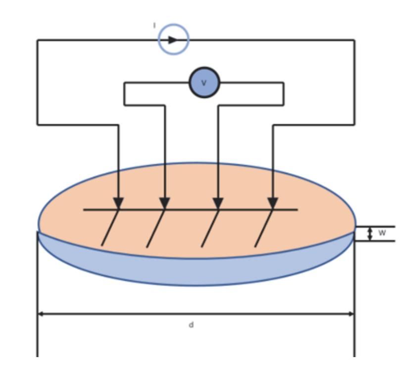

출처: 집필진 제작(2024) [그림 3-13] 4점 프로브 면 저항 측정 방법

(나) 유전 상수(dielectric constant)

1) 측정 방법: C-V(커패시턴스-전압) 측정을 통해 유전 상수를 평가한다.

 $\varepsilon = C \frac{d}{4} (\varepsilon : 유전율, C : 정전용량, d : 두께, A : 면적)$ 

2) 판별 기준: 기대되는 유전 상수값에서 크게 벗어나면 불량으로 판단한다.

(다) 누설 전류(leakage current)

1) 측정 방법: 전류-전압(I-V) 측정을 통해 누설 전류를 평가한다.

2) 판별 기준: 허용 누설 전류 범위를 초과하면 불량으로 판단한다.

- (2) 물리적 특성 평가
  - (가) 표면 거칠기(surface roughness)
    - 측정 방법: AFM(atomic force microscope) 또는 SEM(scanning electron microscope)를 사용하여 표면 거칠기를 측정한다.
    - 2) 판별 기준: 설정된 표면 거칠기 범위를 초과하면 불량으로 판단한다.
  - (나) 두께 균일성(thickness uniformity)

박막(thin film)은 기판 표면에 형성시킨 10Å 이하에서 100㎞ 두께 범위의 얇은 막을 말한다. 박막의 종류는 유전체 박막, 반도체 박막, 금속 박막 등 다양하다. 계측 장비는 대표적으로 엘립소미터(ellipsometer)이다. 원리는 편광된 빛을 재료의 표면에 경사지게 반사시켜 박막의 물리적 상태에 따라 변화하는 빛의 편광 상태를 측정

하여 분석하는 방법이다. 엘립소미터 계측기의 측정 구성도가 [그림 3-14]에 나타나 있다.

1) 측정 방법: 프로파일러 또는 엘립소미터를 사용하여 소재의 두께를 측정한다.

2) 판별 기준: 두께 변동이 설정된 범위를 초과하면 불량으로 판단한다.

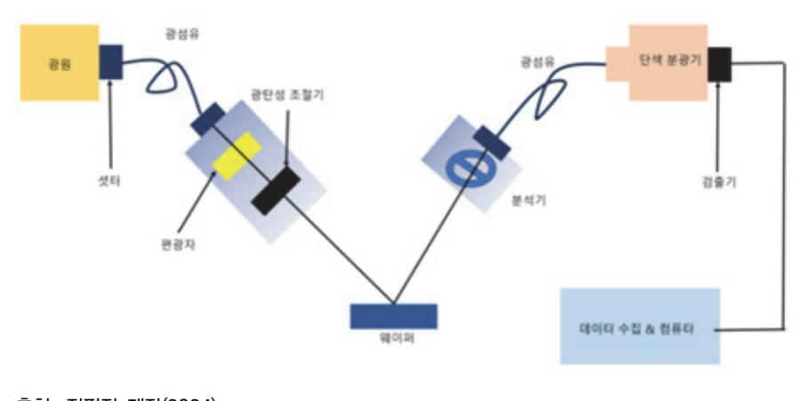

출처: 집필진 제작(2024) [그림 3-14] 엘립소미터 계측기 측정 구성도

- (다) 결함 및 불순물(defects and impurities)
  - 1) 측정 방법: SEM, EDX(energy-dispersive X-ray spectroscopy) 등을 사용하여 결함과 불순물을 평가한다.
  - 2) 장비 구성 및 측정 원리
    - 가) 전자 현미경(SEM: scanning electron microscope)

광학 현미경의 미세 사이즈 관측 한계 문제는 전자의 운동을 이용하여 관측할 수 있는 전자 현미경을 사용하여 해결할 수 있다. 전자 현미경은 일반 광학 현미경과는 달리 자계 렌즈를 이용하고, 광원으로는 가시광선 대신에 파장이 짧은 전자선을 이용한다. 이런 이유 때문에 작은 사이즈까지 형태와 크기는 구분할 수 있으나 컬러 상은 관찰할 수 없고 흑백 상으로만 관찰할 수 있다. 반도체 공정에서는 사진과 식각 공정 이후에 패턴의 CD(critical dimension) 측정이 필수적이다. CD는 평면상에서 측정하는데, 이 기능을 장착한 길이 측 정용 특수 전자 현미경을 CD-SEM이라 부른다. 공정 평가에 사용되는 CD-SEM의 경우는 평면상에서 길이를 측정하기 위하여 특수 제작된 전자 현 미경이다. 구성은 [그림 3-15]와 같다.

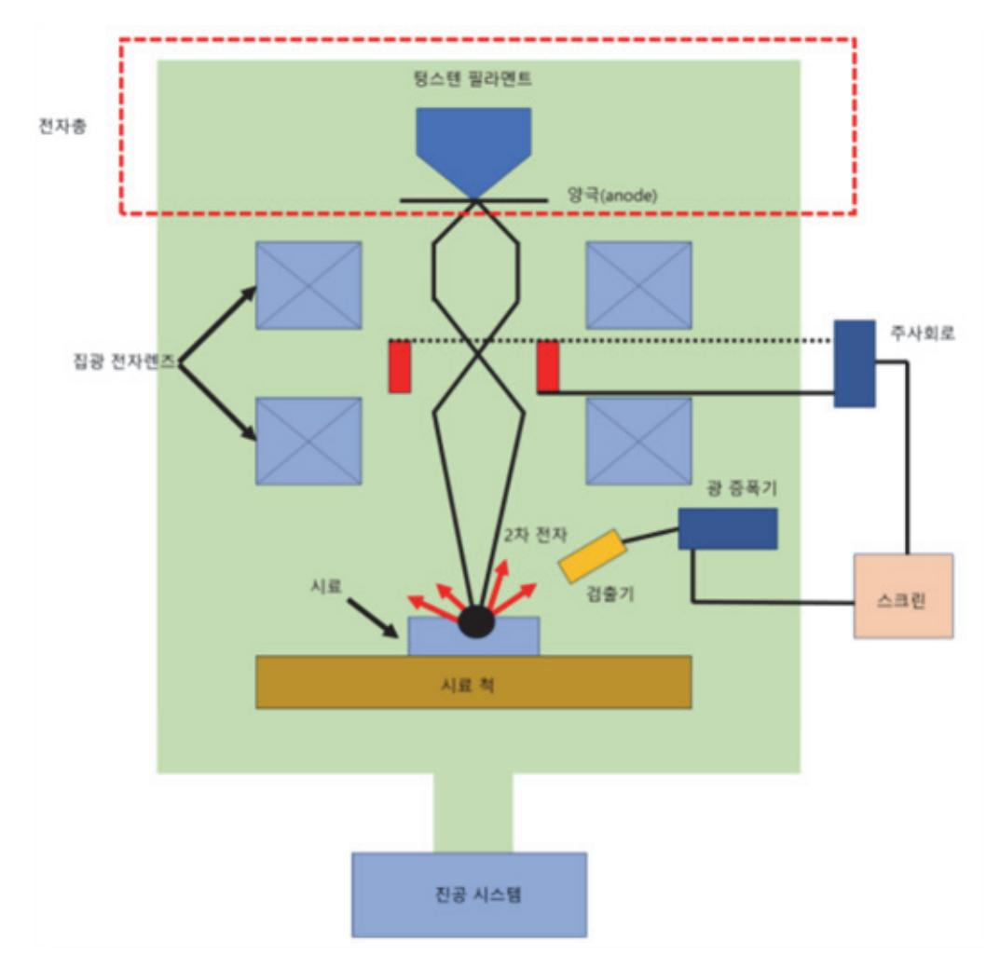

출처: 집필진 제작(2024) [그림 3-15] 전자 현미경 구성도

나) CD-SEM 측정

실제로 CD-SEM을 이용하여 측정한 사진이 [그림 3-15]에 나타나 있다. 그 림에서 보는 바와 같이 CD-SEM 프로그램 안에 내재되어 화면에 표출되는 바(bar)를 움직여서 선의 가장자리에 두 바를 맞추면 자동적으로 길이가 화면 에 표시되고 데이터로 출력된다. 스펙트럼(spectrum)의 강도를 보면서 패턴 의 3차원적 형성 모습을 예상할 수 있다. [그림 3-16]과 같이 강도가 낮은 부 분은 패턴의 상면, 높은 부분은 하부를 나타낸다.

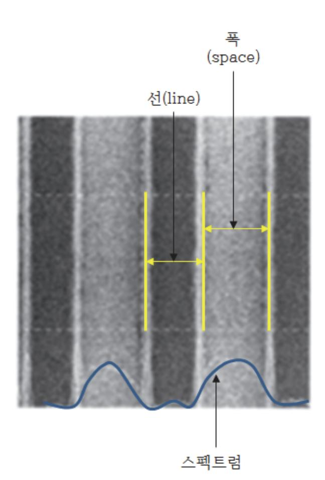

교육부(2015). 반도체 제조 공정 개발(LM1903060106\_14v3). 한국직업능력개발원. p.88. [그림 3-16] CD-SEM으로 측정한 선폭의 화면 모습

3) 판별 기준: 특정 크기 이상의 결함이나 허용 수준 이상의 불순물이 발견되면 불량으 로 판단한다.

(3) 화학적 특성 평가

- (가) 조성 분석(composition Analysis)
  - 1) 측정 방법: XPS(x-ray photoelectron spectroscopy), AES(auger electron spectroscopy) 등을 사용하여 소재의 화학적 조성을 분석한다.
  - 2) 성분 분석 SIMS 장비

SIMS 장비는 2차 이온 질량 분석법으로써 시료의 표면 분석을 통해 표면 정보를 얻을 수 있는 분석법을 기초로 한다. 이들의 양을 검출하고 분석함으로써 주 원 자와 분리된 주입된 이온들의 양과 깊이에 따른 불순물 분포를 얻을 수 있다. [그림 3-17]에 기본적인 측정 원리도가 도시되어 있다.

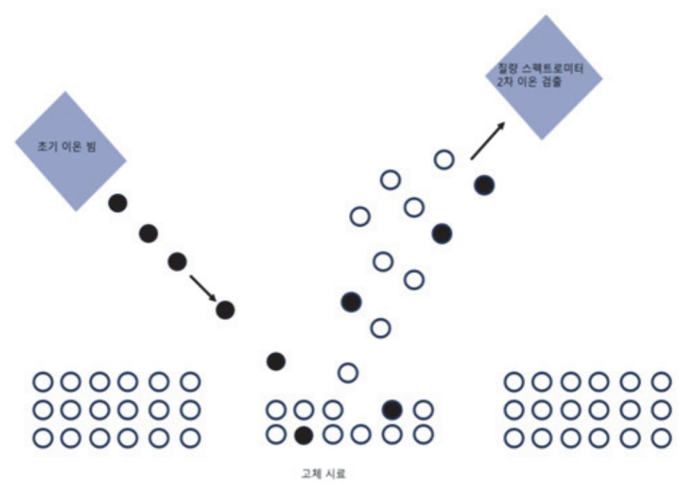

출처: 집필진 제작(2024) [그림 3-17] SIMS 측정 기본 원리도

2) 판별 기준: 기대되는 조성에서 벗어나면 불량으로 판단한다.

(나) 화학적 안정성(chemical stability)

1) 측정 방법: 특정 환경 조건(예: 고온·고습)에서의 소재의 화학적 변화를 평가한다.

2) 판별 기준: 화학적 특성이 변하면 불량으로 판단한다.

- 2. 데이터 분석 방법을 분석한다.
  - (1) 데이터 수집 및 정규화
    - (가) 데이터 수집: 다양한 평가 방법을 통해 수집된 데이터를 통합한다.
    - (나) 정규화: 데이터의 일관성을 보장하기 위해 정규화 과정을 거친다.
  - (2) 통계적 분석
    - (가) 평균(mean) 및 표준 편차(standard deviation)
      - 1) 평균: 데이터의 중심 경향을 파악한다.
      - 2) 표준 편차: 데이터의 변동성을 평가한다.
    - (나) 히스토그램(histogram)
      - 1) 목적: 데이터 분포를 시각적으로 평가하여 이상치(outliers)를 식별한다.

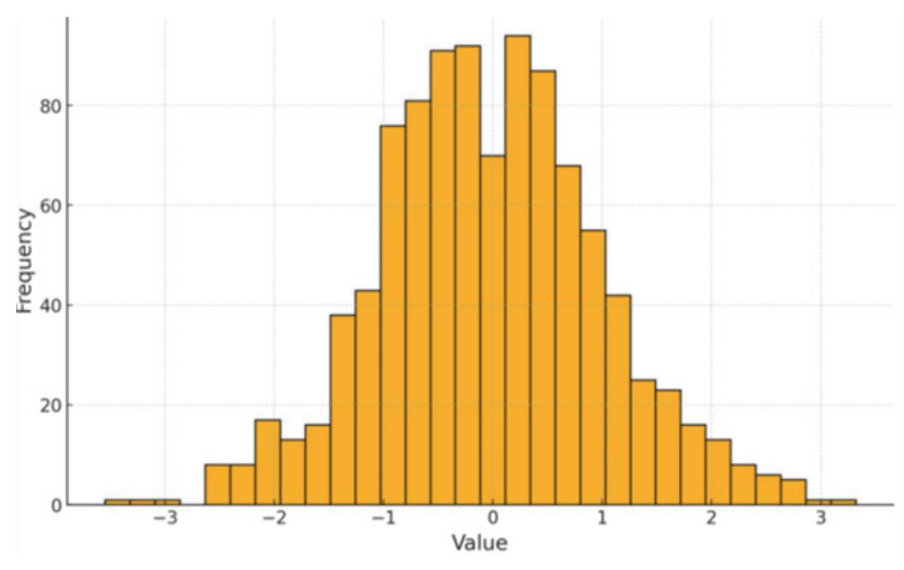

출처: 집필진 제작(2024)

(다) 관리도(control chart)

1) 목적: 공정의 안정성을 모니터링한다.

- (3) 기준값과 비교
  - (가) 사양 범위(specification range)
    - 1) 설정: 각 특성 항목에 대해 허용되는 사양 범위를 설정한다.
    - 2) 비교: 측정된 데이터와 사양 범위를 비교하여 불량 여부를 판별한다.

#### 3. 불량 원인을 분석 및 개선한다.

(1) 불량 원인 분석

메모리 공정 소재 특성 평가 데이터를 활용하여 불량 원인을 분석하는 과정은 복잡하고 다단계에 걸친 작업이다. 이 작업은 데이터를 체계적으로 분석하여 불량이 발생한 근본 적인 원인을 식별하고, 이를 통해 공정 개선 및 제품 품질 향상을 목표로 한다. 다음은 불량 원인 분석을 수행하는 기본적인 절차와 접근 방법이다.

- (가) 데이터 수집 및 준비
  - 1) 데이터 수집: 메모리 공정에서 사용된 소재와 관련된 모든 평가 데이터를 수집한다. 여기에는 물리적, 화학적, 전기적 특성에 대한 데이터가 포함될 수 있다.
  - 2) 데이터 정제: 수집된 데이터를 검토하고, 이상치(outliers)나 결측치(missing values)를 식별하여 제거하거나 보정한다.
  - 3) 데이터 분류: 데이터를 공정 단계별로 분류하고, 각 소재의 특성에 따라 그룹화한다.

[그림 3-18] 정규 분포 히스토그램의 사례

- (나) 데이터 분석
  - 1) 기초 통계 분석: 수집된 데이터에 대해 기초 통계 분석을 수행한다. 평균, 표준 편 차, 분산 등을 계산하여 데이터의 분포와 변동성을 파악한다.
  - 2) 데이터 시각화: 데이터의 분포를 이해하기 위해 히스토그램, 상자 그림(box plot), 산점도(scatter plot) 등을 활용하여 시각화한다. 이를 통해 불량과 관련된 특정 패 턴이나 이상 징후를 확인할 수 있다.
  - 3) 상관 관계 분석: 소재 특성과 불량률 간의 상관관계를 분석한다. 피어슨 상관계수 (pearson correlation coefficient) 등을 활용하여 특정 특성이 불량에 미치는 영향 을 파악한다.
- (다) 불량 데이터와 정상 데이터 비교
  - 1) 불량/정상 데이터 비교: 불량이 발생한 사례와 정상 제품의 데이터를 비교하여, 두 그룹 간의 차이점을 분석한다. 이 과정에서 t-검정(T-test), 분산 분석(ANOVA) 등 의 통계적 방법을 사용하여 유의미한 차이를 확인한다.
  - 2) 결함 유형 분석: 불량 유형을 분류하고, 각 불량 유형이 특정 소재 특성과 연관되어 있는지 분석한다.
- (라) 원인 분석 도구 활용
  - 1) Fishbone Diagram(원인-결과 다이어그램): 불량 원인을 체계적으로 분석하기 위해 Fishbone 다이어그램을 사용한다. 공정 조건, 소재 특성, 작업 환경 등 다양한 원 인을 카테고리별로 정리하여 불량의 근본 원인을 시각화한다.
  - 2) Whys Analysis(5가지 이유 분석): 불량의 근본 원인을 파악하기 위해 '왜?'라는 질 문을 5번 반복하여 원인을 추적한다. 이를 통해 표면적인 원인이 아닌 근본적인 원 인을 도출한다.
- (마) 데이터 기반 원인 식별
  - 1) 패턴 인식: 데이터 분석 결과를 바탕으로 불량 패턴을 인식한다. 예를 들어, 특정 소재의 불순물 농도가 높을 때 불량률이 증가하는 패턴을 발견할 수 있다.
  - 2) 원인 가설 도출: 분석 결과에 따라 불량의 원인으로 의심되는 가설을 도출한다. 예 를 들어, 소재의 결함, 공정 조건의 변동, 설비의 문제 등이 원인일 수 있다.
- (바) 실험 및 추가 검증
  - 1) 실험 설계 (DOE): 불량 원인 가설을 검증하기 위해 추가 실험을 설계하고 수행한 다. DOE(design of experiments) 방법을 사용하여 다양한 공정 조건에서의 실험 을 통해 원인을 검증한다.
  - 2) 데이터 재수집: 실험 결과에 따라 추가 데이터를 수집하고, 원인을 더욱 명확하게 규명한다.
- (사) 결과 도출 및 개선 방안 제시

- 1) 결과 분석: 실험 결과와 기존 데이터를 종합하여 불량 원인을 최종적으로 도출한다.
- 2) 개선 방안 제시: 불량을 줄이기 위한 개선 방안을 제시한다. 여기에는 소재 선택 변 경, 공정 조건 조정, 설비 업그레이드 등이 포함될 수 있다.
- (아) 결과 보고 및 피드백
  - 1) 보고서 작성: 불량 원인 분석 결과와 개선 방안을 포함한 보고서를 작성하여 관련 부서에 공유한다.
  - 2) 피드백 수렴: 개선 방안을 적용한 후, 지속적인 모니터링과 피드백을 통해 공정의 안정성을 유지하고 불량률을 낮추는 노력을 지속한다.

이와 같은 절차를 통해 메모리 공정 소재 특성 평가 데이터를 분석하고 불량 원인을 파 악함으로써, 공정 개선과 제품 품질 향상을 도모할 수 있다.

(2) 불량 원인 분석 사례

메모리 공정 소재 특성 평가 데이터를 활용하여 불량 원인을 분석하는 과정에서 실제 사례를 가정하여 통계 데이터와 분석 그래프를 통해 설명한다. 이 사례에서는 특정 메모 리 공정에서 사용된 소재의 불순물 농도가 불량률에 미치는 영향을 분석하는 것을 목표 로 한다.

(가) 데이터 수집 및 준비

가상의 메모리 공정에서 사용된 소재 A의 불순물 농도와 해당 공정에서 발생한 불량 률에 대한 데이터를 수집한다.

1) 불순물 농도(ppm): 10, 15, 20, 25, 30, 35, 40, 45, 50, 55

- 2) 불량률(%): 1.5, 1.7, 2.0, 2.5, 3.0, 3.5, 4.0, 4.5, 5.0, 6.0
- 이 데이터를 바탕으로 불순물 농도와 불량률 간의 상관관계를 분석한다.
- (나) 기초 통계 분석

수집된 데이터에 대해 기초 통계 분석을 수행하여 불순물 농도와 불량률의 평균, 표 준 편차 등을 계산한다.

1) 불순물 농도 평균: 32.5ppm

2) 불량률 평균: 3.37%

(다) 데이터 시각화

불순물 농도와 불량률 간의 관계를 시각적으로 확인하기 위해 산점도(scatter plot) 를 그린다.

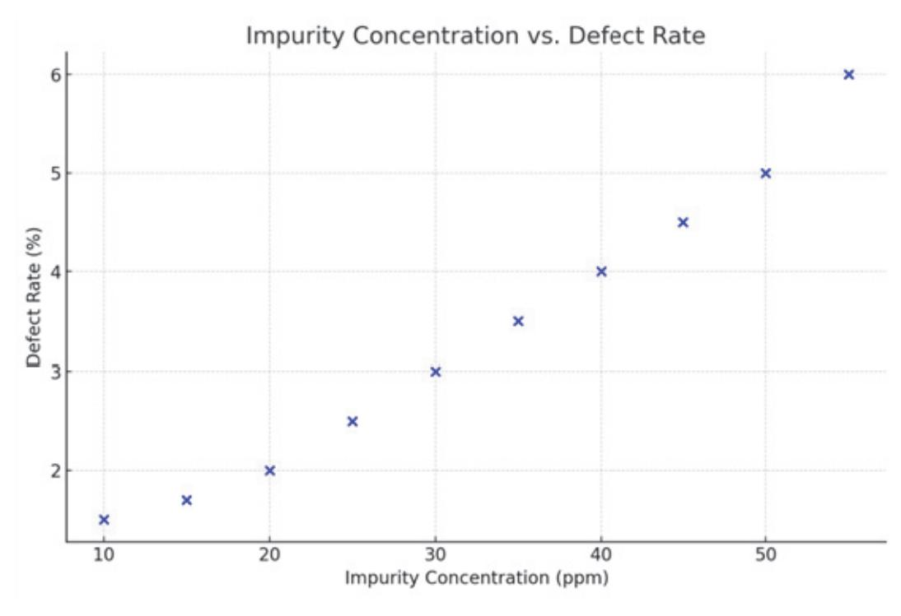

출처: 집필진 제작(2024) [그림 3-19] 불순물 농도와 불량률 간의 산점도 그림

(라) 상관관계 분석

불순물 농도와 불량률 간의 상관관계를 분석하여, 이 두 변수 간의 연관성을 확인한 다. 피어슨 상관계수를 계산하여 그 결과를 확인한다.

1) 피어슨 상관계수: r=0.98r = 0.98r=0.98

피어슨 상관계수가 0.98로 매우 높게 나타났다. 이는 불순물 농도와 불량률 사이에 강한 양의 상관관계가 있음을 나타낸다.

(마) 회귀 분석

불순물 농도가 불량률에 미치는 영향을 보다 더 명확하게 하기 위해 회귀 분석 (linear regression)을 수행한다.

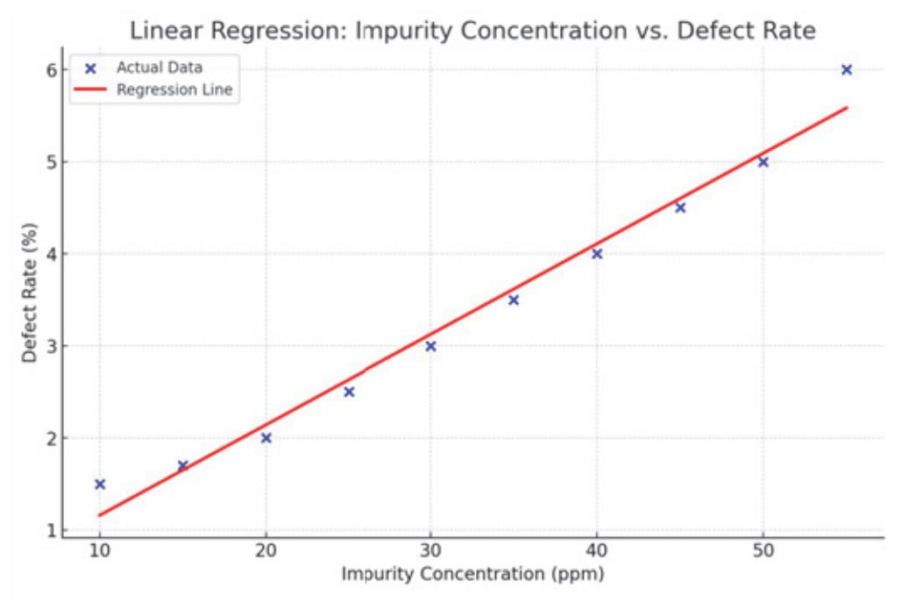

출처: 집필진 제작(2024) [그림 3-20] 불순물 농도와 불량률 회귀 분석도

이 그래프는 불순물 농도와 불량률 간의 선형 관계를 시각적으로 보여 준다. 회귀선 이 데이터와 잘 맞는 것으로 보아, 불순물 농도가 불량률에 큰 영향을 끼친다는 것 을 알 수 있다.

- (바) 결과 분석 및 결론 도출
  - 1) 분석 결과: 불순물 농도가 높아질수록 불량률이 증가하는 강한 상관관계가 확인되었 다. 회귀 분석 결과에 따르면, 불순물 농도가 불량률을 결정하는 주요 인자 중 하나 임을 알 수 있다.
  - 2) 결론: 이 분석을 통해 불량률을 낮추기 위해서는 소재 A의 불순물 농도를 낮추는 것이 필요하다는 결론에 도달할 수 있다.
  - 3) 개선 방안: 공정 개선 또는 소재 A의 순도를 높이기 위한 조치가 필요하다. 이로 인해 불량률을 줄이고, 전반적인 제품 품질을 향상시킬 수 있을 것이다.

이와 같은 분석 과정을 통해 메모리 공정에서 사용되는 소재의 특성과 불량률 간의 관 계를 체계적으로 파악할 수 있으며, 불량 원인을 효과적으로 식별하여 개선 방안을 마련 할 수 있다.

(3) 공정 개선

메모리 공정에서 소재 특성 평가 데이터를 바탕으로 결함 원인을 분석하고, 공정 변수를 조정하여 불량률을 감소시키는 과정은 매우 체계적이고 데이터 중심적인 접근이 필요하 다. 다음은 그 과정에 대한 설명이다.

- (가) 결함 원인 분석
  - 1) 데이터 수집 및 분석
    - 가) 소재 특성 데이터 수집: 공정에서 사용된 소재의 화학적, 물리적 특성에 대한 데이터를 수집한다. 예를 들어, 불순물 농도, 소재의 순도, 표면 거칠기 등이 포 함될 수 있다.
    - 나) 불량률 데이터 수집: 특정 공정 단계 또는 최종 제품의 불량률 데이터를 수집한 다.
    - 다) 상관관계 분석: 소재 특성과 불량률 간의 상관관계를 분석하여, 어떤 특성이 불 량률에 큰 영향을 끼치는지 파악한다.
  - 2) 결함 유형 파악
    - 가) 결함 유형 식별: 결함의 종류를 분류하고, 각 결함이 특정 소재 특성과 관련이 있는지 분석한다. 예를 들어, 특정 불순물이 높은 농도로 존재할 때 나타나는 크랙이나 필링 결함을 식별한다.
    - 나) 결함 발생 원인 추적: 상관관계가 높은 변수에 대해 깊이 있는 원인 분석을 수 행한다. 이를 통해 결함 발생의 근본 원인을 파악한다.
- (나) 공정 변수 조정
  - 1) 공정 변수 선택
    - 가) 영향력 있는 변수 식별: 결함 원인 분석에서 파악된 영향을 미치는 공정 변수 (예: 온도, 압력, 시간, 화학 물질 농도)를 식별한다.
    - 나) 변수 간 상호 작용 고려: 공정 변수 간의 상호 작용을 분석하여, 한 변수를 조 정할 때 다른 변수에 미치는 영향을 파악한다.
  - 2) 실험 설계(DOE)
    - 가) DOE(design of experiments) 설계: 공정 변수 조정에 따른 결과를 체계적으 로 평가하기 위해 실험을 설계한다. 실험 설계는 변수 간의 상호 작용을 고려하 여 다양한 조건을 설정한다.
    - 나) 실험 실행 및 데이터 수집: 실험을 통해 공정 변수를 조정하고, 각 조건에서의 불량률을 측정한다.
- (다) 공정 최적화
  - 1) 실험 결과 분석
    - 가) 데이터 분석: 실험에서 얻어진 데이터를 분석하여 불량률에 가장 큰 영향을 끼 치는 변수를 식별한다.
    - 나) 회귀 분석 및 최적화 모델링: 회귀 분석을 통해 불량률에 영향을 미치는 변수와 그 상관관계를 수학적으로 모델링한다. 이를 통해 최적의 공정 조건을 도출한다.
  - 2) 최적화된 공정 변수 적용

- 가) 공정 변수 조정: 도출된 최적화 모델에 따라 공정 변수를 조정한다. 예를 들어, 불순물 농도를 낮추거나, 공정 온도와 시간을 조정하는 등의 작업이 포함될 수 있다.
- 나) 변경 사항 모니터링: 공정 변수를 조정한 후, 일정 기간 동안 공정을 모니터링 하여 예상대로 불량률이 감소하는지 확인한다.
- (라) 결과 검증 및 지속적인 개선
  - 1) 결과 검증
    - 가) 불량률 검증: 최적화된 공정을 적용한 후, 새로운 불량률 데이터를 수집하고 분 석하여, 조정이 실제로 불량률 감소로 이어졌는지 확인한다.
    - 나) 품질 검사: 최종 제품의 품질이 기대 수준을 충족하는지 검사한다.
  - 2) 지속적인 공정 개선
    - 가) 피드백 루프 구축: 불량률 데이터와 공정 성과를 지속해서 모니터링하고, 필요 시 추가적인 공정 조정을 수행한다.
    - 나) 지속적인 개선 활동: 공정 변수를 지속해서 최적화하여, 공정의 효율성을 높이 고 불량률을 최소화한다.
- (마) 사례 예시: 불순물 농도 조정
  - 1) 결함 원인 분석: 불순물 농도가 높은 경우 불량률이 급격히 증가한다는 것을 확인했 다.
  - 2) 공정 변수 조정: 실험을 통해 불순물 농도를 10ppm 이하로 유지할 때 불량률이 크 게 감소함을 발견했다.
  - 3) 결과 검증: 공정에서 불순물 농도를 10ppm 이하로 조정한 후, 불량률이 3%에서 0.5%로 감소했다.

이러한 체계적인 접근을 통해 공정 변수를 최적화하고, 불량률을 효과적으로 감소시킬 수 있다.

#### 4. 문서화한다.

- (1) 보고서 작성
  - (가) 특성 평가 요약

평가된 특성 데이터의 평균, 표준 편차, 불량률 등을 요약한다.

(나) 그래프 및 차트

히스토그램, 관리도 등을 포함하여 데이터의 시각적 표현을 제공한다.

(다) 개선 방안

불량 원인 분석 결과와 공정 개선 방안을 제시한다.

(2) 표준 작업 절차(SOPs: standard operating procedures)

(가) 절차 문서화

공정 소재 특성 평가 및 데이터 분석 절차를 문서화한다.

(나) 교육 및 훈련

관련 인력에게 표준화된 절차에 대한 교육을 실시한다.

메모리 반도체 공정 소재의 특성 평가 데이터를 분석하여 불량 여부를 파악하는 것은 공정의 안정성과 제품 품질을 보장하는 데 필수적이다. 이를 위해 전기적, 물리적, 화학적 특성을 종합 적으로 평가하고, 통계적 분석 기법을 적용하여 데이터를 해석하며, 불량 원인을 분석하여 공 정을 개선하는 것이 중요하다. 이러한 과정을 체계적으로 문서화함으로써 지속적인 품질 향상 과 공정 최적화를 달성할 수 있다.

숕 메모리 공정 소재들의 검증 패턴을 해석하여 적용한다.

메모리 반도체 공정 소재를 평가하기 위해 다양한 검증 패턴을 이해하고 이를 실제 평가에 적 용하는 것은 매우 중요하다. 검증 패턴은 공정 소재의 성능, 신뢰성, 품질을 평가하기 위해 설 정된 테스트 절차와 기준이다. 다음은 주요 검증 패턴과 이를 해석하여 적용하는 방법에 대한 설명이다.

- 1. 검증 패턴의 중요성을 이해한다.
  - (1) 공정 소재의 성능 평가: 각 소재의 특성을 정확하게 파악하여 최적의 공정 조건을 설정한다.
  - (2) 신뢰성 검증: 소재의 내구성과 안정성을 평가하여 장기적인 신뢰성을 보장한다.

(3) 품질 관리: 공정 소재의 일관된 품질을 유지하고 불량률을 최소화한다.

- 2. 주요 검증 패턴을 해석한다.
  - (1) 전기적 특성 검증 패턴
    - (가) 저항 측정(resistance measurement)
      - 1) 목적: 소재의 전기 전도도를 평가
      - 2) 검증 패턴
        - 가) 패턴: 다양한 전압을 인가하여 전류를 측정하고 저항값을 계산
        - 나) 측정 장비: 4-포인트 프로브, 저항계
      - 3) 해석 및 적용
        - 가) 결과 분석: 저항값이 설정된 사양 범위 내에 있는지 확인
        - 나) 적용: 저항값이 사양 범위를 벗어나는 경우, 소재의 불량으로 판단하고 공정 조 건을 조정
    - (나) 유전 상수 측정(dielectric constant measurement)
      - 1) 목적: 유전체 소재의 전기적 특성을 평가
      - 2) 검증 패턴

- 가) 패턴: C-V(커패시턴스-전압) 특성을 측정하여 유전 상수를 계산
- 나) 측정 장비: LCR 미터, C-V 분석기
- 3) 해석 및 적용
  - 가) 결과 분석: 유전 상수가 예상값과 일치하는지 확인
  - 나) 적용: 유전 상수가 설정된 범위를 벗어나는 경우, 소재의 불량으로 판단하고 유 전체 두께 및 공정 조건을 최적화

#### (2) 전기적 방법에 따른 계측

공정 중 테스트 모듈을 통상적으로 공정 모니터링의 입장에서 PCM(process control module)이라 부른다. 소자의 전기적 특성과 두께 등을 관측하고 분석하는 패턴은 [그림 3-21] 에서와 같이 웨이퍼 상에서 스크리브 레인(scribe lane) 안에서 형성된다. 그리고 이곳에 있는 패턴 검사를 기준으로 공정을 조율한다.

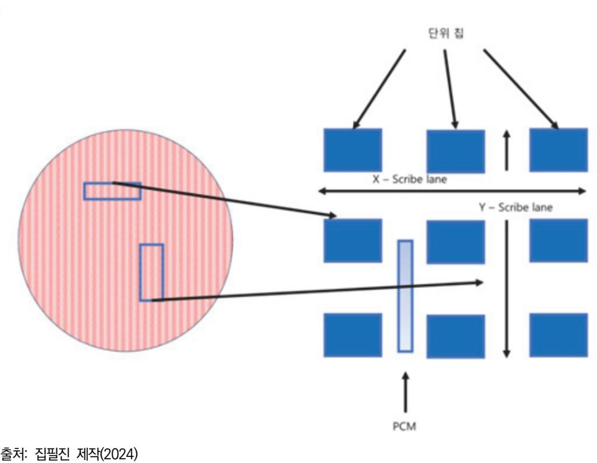

[그림 3-21] PCM의 웨이퍼상의 위치

#### (3) 물리적 특성 검증 패턴

- (가) 표면 거칠기 측정(surface roughness measurement)
  - 1) 목적: 소재 표면의 균일성과 평탄도를 평가
  - 2) 검증 패턴
    - 가) 패턴: 표면을 스캔하여 거칠기값을 측정
    - 나) 측정 장비: AFM, 프로파일러

3) 해석 및 적용

가) 결과 분석: 표면 거칠기가 설정된 범위 내에 있는지 확인

- 나) 적용: 거칠기가 높으면 불량으로 판단하고, 표면 처리 공정을 개선
- (나) 두께 측정(thickness measurement)
  - 1) 목적: 소재의 두께 균일성을 평가
  - 2) 검증 패턴
    - 가) 패턴: 여러 지점에서 두께를 측정하여 균일성 평가
    - 나) 측정 장비: 엘립소미터, 프로파일러
  - 3) 해석 및 적용
    - 가) 결과 분석: 두께 변동이 허용 범위 내에 있는지 확인
    - 나) 적용: 두께 변동이 크면 불량으로 판단하고 증착 공정 조건을 최적화
- (4) 화학적 특성 검증 패턴
  - (가) 조성 분석(composition analysis)
    - 1) 목적: 소재의 화학적 조성을 평가
    - 2) 검증 패턴
      - 가) 패턴: 소재의 주요 성분과 불순물 함량 분석
      - 나) 측정 장비: XPS, AES, EDX
  - (나) 입자 측정 계수기

재료 사용 시 웨이퍼 상에 잔존하는 입자들은 크기와 모양, 성분이 여러 가지 형태 로 나타난다. 웨이퍼 상에 입자의 존재 여부는 광산란 현상을 이용한다. 측정 방법은 레이저 빔을 웨이퍼에 조사하여 광산란 분포를 분석하는 것이다. 입자의 존재 여부 에 따라 산란 단면적이 달라진다. 광이 매질과 만나면 산란이 일어나고 산란된 빛의 세기는 그 매질의 크기와 성분에 비례한다. 매질(입자)마다 굴절률과 흡수 계수가 다 르기 때문이다. [그림 3-22]에 광학계의 구성과 측정 모습이 도시되어 있다.

- 1) 해석 및 적용
  - 가) 결과 분석: 예상 조성과 일치하는지 확인
  - 나) 적용: 불순물 함량이 높으면 불량으로 판단하고 소재의 순도를 개선
- (다) 화학적 안정성 테스트(chemical stability test)
  - 1) 목적: 다양한 환경 조건에서 소재의 화학적 변화를 평가
  - 2) 검증 패턴
    - 가) 패턴: 고온, 고습 등의 조건에서 소재의 화학적 변화를 모니터링
    - 나) 측정 장비: 환경 시험 장비

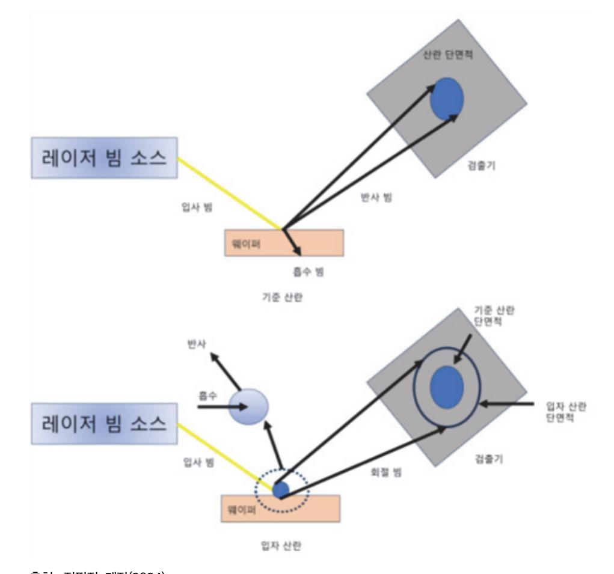

가) 결과 분석: 화학적 특성이 변하지 않는지 확인

나) 적용: 화학적 변화가 발생하면 불량으로 판단하고, 공정 조건을 개선

메모리 공정 소재들의 검증 패턴을 해석하여 공정에 적용하기 위한 데이터 정리 및 시 각화 과정은 데이터의 명확한 이해와 분석을 위한 필수적인 단계이다. 아래는 데이터 정

리 및 시각화를 통해 검증 패턴을 해석하고 적용하기 위한 방법을 설명한다.

출처: 집필진 제작(2024) [그림 3-22] 광학적 산란 계측기 구성과 측정 개념도

3) 해석 및 적용

3. 검증 데이터 분석 및 불량을 판별한다.

(1) 데이터 정리 및 시각화한다.

(가) 데이터 정리 1) 데이터 수집

- 가) 소재 특성 데이터: 소재별 특성 데이터(예: 화학적 조성, 물리적 특성, 전기적 특성 등)를 수집한다.
- 나) 검증 결과 데이터: 각 소재에 대해 수행된 검증 시험 결과(예: 열사이클 테스트, 기계적 스트레스 테스트, 전기적 테스트 등)를 수집한다.

- 2) 데이터 정제
  - 가) 이상치 제거: 이상치(outliers) 및 결측치(missing values)를 확인하고, 데이터 분석에 방해가 되지 않도록 제거하거나 보정한다.
  - 나) 데이터 형식 통일: 다양한 출처에서 수집된 데이터의 형식을 통일하여 분석에 용이하도록 한다. 예를 들어, 동일한 단위로 변환하거나 시간 축을 정렬하는 등 의 작업을 수행한다.
- 3) 데이터 구조화
  - 가) 테이블 구조화: 데이터베이스 또는 스프레드시트 형태로 데이터를 구조화한다.

주요 컬럼으로는 소재 이름, 테스트 유형, 테스트 조건, 결과(성공/실패, 값 등)가 포함된다.

- 나) 필터링 및 분류: 특정 테스트 조건에 따라 데이터를 필터링하고, 유사한 특성을 가진 소재들을 그룹화한다.
- (나) 데이터 시각화
  - 1) 기초 시각화
    - 가) 히스토그램: 특정 소재의 특성(예: 불순물 농도)에 따른 검증 결과(불량률 등)를 히스토그램으로 시각화하여 데이터 분포를 파악한다.
    - 나) 박스 플롯(Box Plot): 각 테스트 결과의 분포와 이상치를 한눈에 볼 수 있도록 박스 플롯을 그린다. 이를 통해 데이터의 중앙값, 사분위수, 이상치를 시각적으 로 확인할 수 있다.

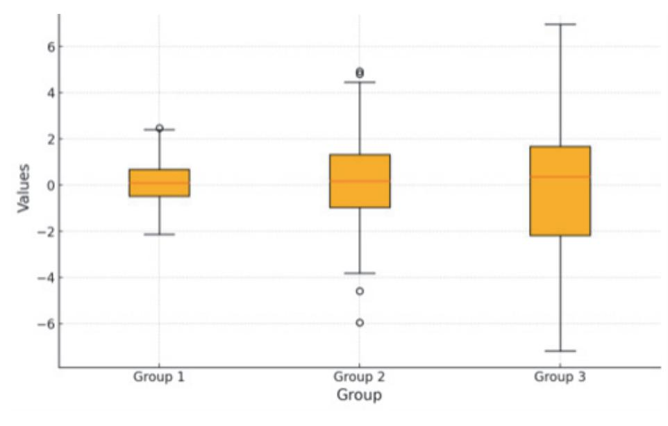

출처: 집필진 제작(2024) [그림 3-23] 박스 플롯(Box Plot) 사례

- ① 박스(Box): 데이터의 중앙값과 상위, 하위 사분위 수를 보여 준다.
- ② 수염(Whiskers): 데이터의 범위를 나타내며, 박스에서 가장 먼 데이터 포인트 까지 연결된다.
- ③ 이상치(Outliers): 수염 밖에 위치한 데이터 포인트로, 일반적인 분포에서 벗어 나는 값이다.
- 2) 상관관계 시각화
  - 가) 산점도(scatter plot): 특정 소재 특성(예: 불순물 농도)과 검증 결과(예: 불량 률) 간의 관계를 시각화하여 상관관계를 파악한다. 이를 통해 어떤 특성이 결과 에 영향을 끼치는지 시각적으로 분석할 수 있다.
  - 나) 상관 행렬(correlation matrix): 여러 특성과 검증 결과 간의 상관관계를 한눈 에 확인할 수 있는 상관 행렬을 생성한다. 열 지도(heatmap)를 사용하여 상관 관계의 강도를 시각적으로 나타낸다.
- 3) 패턴 분석 시각화
  - 가) 회귀 분석 그래프: 회귀 분석을 통해 특정 변수(예: 불순물 농도)가 결과에 미치 는 영향을 모델링하고, 회귀선을 그래프로 시각화한다. 이를 통해 변수 간의 예 측 관계를 시각적으로 이해할 수 있다.
  - 나) 타임 시리즈 분석: 시간이 경과함에 따라 검증 결과가 어떻게 변화하는지를 파 악하기 위해 타임 시리즈 그래프를 그린다. 이를 통해 특정 시간에 불량률이 급 증하는 패턴을 발견할 수 있다.

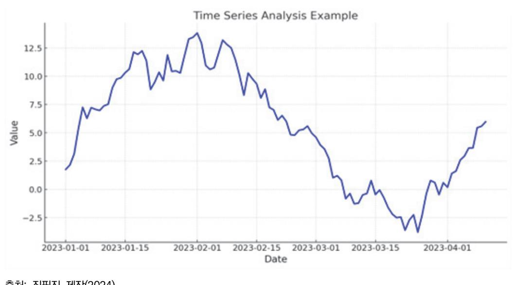

출처: 집필진 제작(2024) [그림 3-24] 타임 시리즈 분석 예

4) 클러스터링 및 차원 축소 시각화

가) 데이터 해석: 시각화된 데이터를 바탕으로 패턴을 해석한다.

1) 패턴 해석

(다) 검증 패턴 해석 및 적용

출처: 집필진 제작(2024)

[그림 3-26] K-평균(K-means) 클러스터링 시각화 예

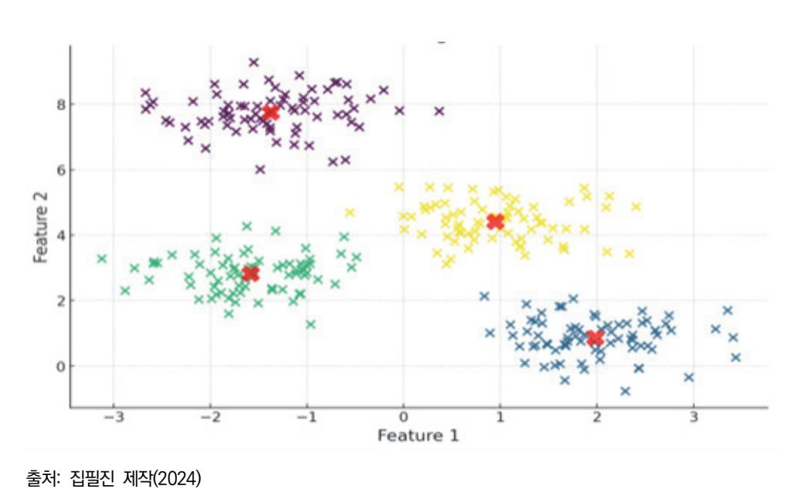

나) K-평균(K-means) 클러스터링 시각화: 비슷한 특성을 가진 소재들을 그룹화하 여, 각 그룹의 검증 패턴을 시각적으로 표현한다.

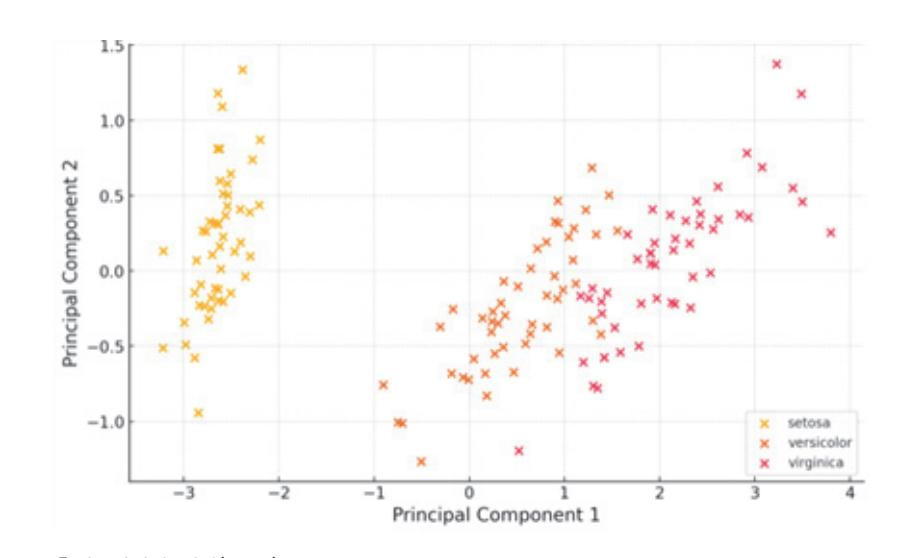

[그림 3-25] PCA(principal component analysis) 시각화 예

가) PCA(Principal Component Analysis) 시각화: 다차원 데이터를 2D 또는 3D 로 축소하여 시각화함으로써 데이터 간의 패턴과 그룹화를 파악할 수 있다.

예를 들어, 특정 특성이 높은 불량률과 상관관계가 있는 경우, 그 특성을 조 정할 필요성을 제기할 수 있다.

- 나) 결과 해석: 검증 패턴에서 발견된 주요 결과를 요약하고, 이를 공정 개선에 적 용할 방법을 논의한다.
- 2) 공정 변수 조정
  - 가) 공정 변수 최적화: 시각화 및 해석된 패턴을 바탕으로, 공정 변수를 최적화한다. 예를 들어, 불량률이 높은 조건을 피하기 위해 공정 온도나 소재의 불순물 농도 를 조정한다.
  - 나) 시뮬레이션 및 예측: 조정된 공정 변수가 어떻게 영향을 끼치는지 시뮬레이션을 통해 예측하고, 최적의 공정 조건을 도출한다.
- 3) 적용 결과 검증
  - 가) 피드백 루프: 최적화된 공정 조건을 적용한 후, 새롭게 생성된 데이터를 분석하 여 개선된 패턴을 확인한다. 이를 통해 최적화가 효과적이었는지 검증한다.
  - 나) 지속적인 개선: 데이터를 지속적으로 모니터링하고, 필요한 경우 추가적인 공정 조정이나 개선을 수행한다.
- (라) 결과 보고서 작성 및 공유
  - 1) 보고서 작성: 데이터 정리, 시각화 결과, 패턴 해석, 공정 조정 내용, 그리고 최종 결과를 포함하는 종합 보고서를 작성하여 관련 부서에 공유한다.
  - 2) 의사소통 및 협업: 분석 결과를 바탕으로 다른 부서(예: 연구 개발, 생산팀)와 협력 하여 최적화된 공정을 일관되게 적용한다.

이러한 데이터 정리 및 시각화 과정은 메모리 공정 소재의 특성을 정확하게 이해하고, 이를 바탕으로 공정 변수를 최적화하여 불량률을 효과적으로 감소시키는 데 중요한 역 할을 한다.

- (2) 통계적 분석
  - (가) 평균 및 표준 편차 계산: 데이터의 중심 경향과 변동성을 파악
  - (나) 공정 능력 분석(Cp, Cpk): 공정이 설정된 사양 내에서 일관되게 소재를 생산할 수 있는 지 평가
- (3) 불량 판별 기준 적용
  - (가) 사양 범위와 비교: 측정 데이터가 사양 범위를 벗어나면 불량으로 판단
  - (나) 이상치 분석: 데이터 분포에서 이상치를 식별하여 불량 원인을 분석
- 4. 개선 방안 수립 및 문서화한다.
  - (1) 불량 원인 분석
    - (가) 공정 조건 검토: 불량의 원인이 되는 공정 조건을 분석

(나) 결함 분석: SEM, AFM 등을 사용하여 결함의 위치와 형태를 파악

- (2) 공정 개선
  - (가) 공정 변수 최적화: 불량 원인을 기반으로 공정 변수를 최적화
  - (나) 실시간 모니터링: 공정 조건을 실시간으로 모니터링하여 불량률을 최소화
- (3) 문서화
  - (가) 검증 결과 보고서 작성: 검증 결과를 체계적으로 정리하여 보고서 작성
  - (나) 표준 작업 절차(SOPs) 업데이트: 검증 패턴과 결과를 기반으로 표준 작업 절차를 업데 이트

메모리 반도체 공정 소재의 특성을 평가하기 위해 다양한 검증 패턴을 이해하고 적용하는 것은 공정의 안정성과 품질을 보장하는 데 필수적이다. 전기적, 물리적, 화학적 특성을 종합적으로 평가하고, 통계적 분석 기법을 적용하여 데이터를 해석하며, 불량 원인을 분석하여 공정을 개 선하는 것이 중요하다. 이러한 과정을 체계적으로 문서화함으로써 지속적인 품질 향상과 공정 최적화를 달성할 수 있다.

- 숖 메모리 공정 소재들의 특성 항목과 기준을 해석한다.
  - 메모리 반도체 공정 소재를 평가하기 위해서는 다양한 특성 항목과 그 기준을 명확히 이해하고 해석할 수 있어야 한다. 이러한 특성 항목은 전기적, 물리적, 화학적 특성으로 나눌 수 있으며, 각각의 항목은 메모리 소자의 성능과 신뢰성에 중요한 영향을 끼친다. 다음은 주요 공정 소재 들의 특성 항목과 기준에 대한 설명이다.
  - 1. 전기적 특성 항목과 기준을 분석한다.
    - (1) 저항(resistance)
      - (가) 특성 항목: 소재의 전기 저항값
      - (나) 측정 방법: 4-포인트 프로브, 저항계
      - (다) 기준: 설정된 저항 범위 내에 있어야 함. 저항값이 높으면 전류 흐름에 지장을 초래할 수 있고, 저항값이 낮으면 과도한 전류 흐름을 유발할 수 있음.
    - (2) 유전 상수(dielectric constant)
      - (가) 특성 항목: 유전체 소재의 전기적 절연 특성
      - (나) 측정 방법: C-V(커패시턴스-전압) 측정
      - (다) 기준: 기대되는 유전 상숫값과 일치해야 함. 유전 상수가 높을수록 커패시터의 저장 능력 이 커짐.
    - (3) 누설 전류(leakage current)
      - (가) 특성 항목: 소재의 절연 특성에 따른 누설 전류

- (나) 측정 방법: I-V(전류-전압) 측정
- (다) 기준: 허용 누설 전류 범위 내에 있어야 함. 누설 전류가 높으면 데이터 유지 시간이 줄 어들고 소자의 신뢰성이 감소할 수 있음.
- 2. 물리적 특성 항목과 기준을 분석한다.
  - (1) 표면 거칠기(surface roughness)
    - (가) 특성 항목: 소재 표면의 균일성과 평탄도
    - (나) 측정 방법: AFM(atomic force microscope), 프로파일러
    - (다) 기준: 설정된 표면 거칠기 범위 내에 있어야 하며, 표면이 거칠면 후속 공정에서 결함이 발생할 수 있다.
  - (2) 두께 균일성(thickness uniformity)
    - (가) 특성 항목: 소재 두께의 일관성
    - (나) 측정 방법: 엘립소미터, 프로파일러
    - (다) 기준: 두께 변동이 설정된 범위 내에 있어야 하며 두께 변동이 크면 소자의 전기적 특성 이 달라질 수 있다.
  - (3) 결함 및 불순물(defects and impurities)
    - (가) 특성 항목: 소재 내 결함 및 불순물의 존재 여부
    - (나) 측정 방법: SEM(scanning electron microscope), EDX(energy-dispersive x-ray spectroscopy)
    - (다) 기준: 특정 크기 이상의 결함이나 허용 수준 이상의 불순물이 없어야 하며 결함과 불순 물은 소자의 신뢰성을 감소시킬 수 있다.
- 3. 화학적 특성 항목과 기준을 분석한다.
  - (1) 조성 분석(composition analysis)
    - (가) 특성 항목: 소재의 화학적 조성
    - (나) 측정 방법: XPS(x-ray photoelectron spectroscopy), AES(auger electron spectroscopy)
    - (다) 기준: 기대되는 조성과 일치해야 하며 조성이 달라지면 소자의 성능이 영향을 받을 수 있다.
  - (2) 화학적 안정성(chemical stability)
    - (가) 특성 항목: 다양한 환경 조건에서 소재의 화학적 변화
    - (나) 측정 방법: 환경 시험 장비(고온, 고습 등)
    - (다) 기준: 화학적 특성이 변하지 않아야 하며 안정성이 낮으면 장기 신뢰성에 문제가 생길 수 있다.

4. 데이터 해석과 기준을 적용한다.

- (1) 데이터 수집 및 정규화
  - (가) 데이터 수집: 각 특성 항목에 대해 측정 데이터 수집

  - (나) 정규화: 데이터를 정규화하여 비교 분석의 정확성을 높인다.

(가) 평균 및 표준 편차 계산: 데이터의 중심 경향과 변동성 평가

(가) 사양 범위 설정: 각 특성 항목에 대해 허용되는 사양 범위 설정

(나) 비교 분석: 측정된 데이터와 사양 범위를 비교하여 불량 여부 판별

이터 분석과 공정 개선을 통해 제품 품질을 향상시키는 데 중요한 역할을 한다.

공정을 최적화함으로써 제품 품질을 지속적으로 개선할 수 있다.

어떻게 관련되어 있는지 분석한다.

(가) 결함 유형과 특성 간의 관계 파악

본 원인을 파악한다.

(나) 공정 변수와 특성 간의 연관성 분석

수 있는 방안을 모색한다.

(나) 히스토그램 및 관리도 작성: 데이터 분포와 공정 변동성을 시각적으로 평가

메모리 공정 소재들의 특성 항목에 대한 측정 평가 결과를 분석함으로써 불량의 원인을 파 악하고, 이를 통해 공정을 개선하는 과정은 다음과 같은 단계로 이루어진다. 이 과정은 데

이러한 체계적인 접근을 통해 메모리 공정 소재의 특성을 평가하고, 불량 원인을 분석하여

1) 결함 유형 분류: 불량이 발생한 결함 유형을 분류하고, 각 유형이 특정 특성 항목과

2) 원인 추적: 특성 항목이 결함 발생에 어떻게 영향을 미치는지 추적하여, 불량의 근

1) 공정 조건 검토: 공정 조건(예: 온도, 압력, 처리 시간 등)과 소재 특성 간의 연관성

2) 이상 원인 분석: 불량률이 높은 특정 공정 조건이나 특성을 식별하고, 이를 개선할

을 분석하여, 특정 공정 조건이 불량 발생에 어떻게 기여하는지 파악한다.

- (2) 통계적 분석

(3) 기준 적용 및 불량 판별

5. 공정 개선 및 문서화한다.

(1) 불량 원인 분석

(2) 공정 개선

(가) 공정 변수 최적화

- 2) 공정 조정: 분석 결과에 따라 공정 조건을 조정하여, 불량률을 낮추고 제품의 일관

각 변수의 영향을 체계적으로 평가하고, 공정 변수를 최적화한다.

1) 실험 설계(DOE): 최적의 공정 조건을 찾기 위해 실험 설계를 수행한다. 이를 통해

107

성을 높인다.

(나) 새로운 공정 조건 적용

- 1) 파일럿 테스트: 최적화된 공정 조건을 소규모 파일럿 테스트에 적용하여, 실제 생산 환경에서의 성능을 평가한다.
- 2) 공정 적용 및 모니터링: 성공적인 파일럿 테스트 후, 새로운 공정 조건을 전체 생산 라인에 적용하고, 지속적으로 모니터링하여 안정성을 확인한다.
- (3) 결과 검증 및 지속적인 개선
  - (가) 결과 검증
    - 1) 불량률 감소 확인: 새로운 공정 조건이 적용된 후의 불량률을 분석하여, 개선된 결 과를 확인한다.
    - 2) 품질 검사: 최종 제품의 품질을 검사하여, 새로운 공정이 기대한 대로 성능을 발휘 하는지 검증한다.
  - (나) 지속적인 개선
    - 1) 피드백 루프: 공정 조건과 불량률 데이터를 지속적으로 모니터링하여, 추가적인 개 선 기회를 식별한다.
    - 2) 지속적인 공정 개선 활동: 데이터를 기반으로 한 지속적인 개선 활동을 통해, 장기 적인 공정 안정성과 품질 향상을 도모한다.
- (4) 예시: 불순물 농도와 불량률 간의 관계
  - (가) 분석 결과: 불순물 농도가 특정 수준 이상일 때, 불량률이 급격히 상승한다는 것을 확인 한다.
  - (나) 공정 개선: 불순물 농도를 낮추기 위해 공정의 특정 단계를 개선하고, 이로 인해 불량률 이 크게 감소한다.
- (5) 문서화
  - (가) 검증 결과 보고서 작성: 각 특성 항목의 평가 결과를 체계적으로 정리하여 보고서 작성
  - (나) 표준 작업 절차(SOPs) 업데이트: 검증 패턴과 결과를 기반으로 표준 작업 절차를 업데 이트

메모리 반도체 공정 소재의 특성 항목과 기준을 명확히 이해하고 해석하는 것은 공정의 안정성 과 제품 품질을 보장하는 데 필수적이다. 전기적, 물리적, 화학적 특성을 종합적으로 평가하고, 통계적 분석 기법을 적용하여 데이터를 해석하며, 불량 원인을 분석하여 공정을 개선하는 것이 중요하다. 이러한 과정을 체계적으로 문서화함으로써 지속적인 품질 향상과 공정 최적화를 달 성할 수 있다.

#### 수행 tip

- 메모리 반도체 단위 소자의 공정 흐름도와 세부 공정 내 용을 대응시켜 이해하려고 한다.
- 소자의 active 영역에 해당하는 well의 구조와 공정 조건 을 단위 소자별로 비교하여 특성을 파악하도록 한다.

## 학습 3 교수·학습 방법

#### 교수 방법

- 메모리 반도체 공정에 실제 사용되는 웨이퍼들 전시하고 차이점을 발견하도록 유도한다.
- 메모리 반도체 리소그래피 재료 요구 사항에 필요한 내용과 관련 자료를 확보해 학습자들에 게 제시 후 파악 여부를 확인한다.
- 메모리 반도체 건식 식각 재료 요구 사항에 필요한 내용과 관련 자료를 확보해 학습자들에 게 제시한 후 파악 여부를 확인한다.
- 메모리 반도체 습식 화공 약품 재료 요구 사항에 필요한 내용과 관련 자료를 확보해 학습자 들에게 제시한 후 파악 여부를 확인한다.
- 메모리 반도체 금속 재료 요구 사항에 필요한 내용과 관련 자료를 확보해 학습자들에게 제 시한 후 파악 여부를 확인한다.
- 런 시트와 단위 공정 데이터를 활용하여 설명한다.

#### 학습 방법

- 전시된 웨이퍼들을 통해 메모리 반도체용 종류와 차이점에 대해 확인하거나, 웨이퍼 제조 업체에서 제공하는 자료를 활용한다.
- 메모리 반도체용 리소그래피 재료 요구 사항 항목이 선정된 양식에 맞추어 자료를 작성한 다.
- 메모리 반도체용 건식 식각 재료 요구 사항 항목이 선정된 양식에 맞추어 자료를 작성한다.
- 메모리 반도체용 습식 화공 약품 재료 요구 사항 항목이 선정된 양식에 맞추어 자료를 작성 한다.
- 메모리 반도체용 금속 재료 요구 사항 항목이 선정된 양식에 맞추어 자료를 작성한다.
- 런 시트 및 공정 관리도를 토대로 우선 최소(예: 10개)의 런 제품의 이력 관리 샘플을 작성 한다.

## 학습 3 평 가

#### 평가 준거

• 평가자는 학습자가 학습 목표를 성공적으로 달성하였는지를 평가해야 한다.

#### • 평가자는 다음 사항을 평가해야 한다.

|                     | 학습 목표                                      |  | 성취수준 |   |  |
|---------------------|--------------------------------------------|--|------|---|--|
| 학습 내용               |                                            |  | 중    | 하 |  |
| 메모리 반도체 공정 소재 평가 | - 메모리 공정 소재 특성 평가 데이터의 불량 여부를 파악할 수 있다. |  |      |   |  |
|                     | - 메모리 공정 소재들의 검증 패턴을 해석하여 적용할 수 있 다.    |  |      |   |  |
|                     | - 메모리 공정 소재들의 특성 항목과 기준을 해석할 수 있다.         |  |      |   |  |

#### 평가 방법

• 서술형 시험

|                     | 평가 항목                                                               |  | 성취수준 |   |  |
|---------------------|---------------------------------------------------------------------|--|------|---|--|
| 학습 내용               |                                                                     |  | 중    | 하 |  |
| 메모리 반도체 공정 소재 평가 | - 메모리 공정 소재 특성 평가 데이터의 불량 여부 파악을 위 해 공정 소재 특성 평가 항목을 분석할 수 있는 능력 |  |      |   |  |
|                     | - 메모리 공정 소재들의 검증 데이터 분석 및 불량을 판별할 수 있는 능력                        |  |      |   |  |
|                     | - 메모리 공정 소재들의 특성 항목과 기준의 해석을 위해 물 리적 특성 항목과 기준을 분석할 수 있는 능력      |  |      |   |  |

#### • 평가자 체크리스트

|                     | 평가 항목                                                                         |  | 성취수준 |   |  |
|---------------------|-------------------------------------------------------------------------------|--|------|---|--|
| 학습 내용               |                                                                               |  | 중    | 하 |  |
| 메모리 반도체 공정 소재 평가 | - 메모리 공정 소재 특성 평가 데이터의 불량 여부의 파악을 위해 수집된 데이터로부터 불량 원인을 분석하고 개선할 수 있는 능력 |  |      |   |  |
|                     | - 메모리 공정 소재들의 검증 패턴을 해석하여 개선 방안 수 립 및 문서화할 수 있는 능력                         |  |      |   |  |
|                     | - 메모리 공정 소재들의 특성 항목과 기준의 해석을 위해 전 기적 특성 항목과 기준을 분석할 수 있는 능력                |  |      |   |  |

피드백

| 1. 서술형 시험                                               |  |
|---------------------------------------------------------|--|
| - 메모리 공정 소재 특성 평가 데이터의 불량 여부 파악을 위해 공정 소재 특성 평가 항목을 분석  |  |
| 할 수 있는 능력을 평가한 후, 보완이 필요한 사항이나 주요 사항을 표시하여 피드백해 준다.     |  |
| - 메모리 공정 소재들의 검증 데이터 분석 및 불량을 판별할 수 있는 능력을 평가한 후, 보완이 필 |  |
| 요한 사항이나 주요 사항을 표시하여 보충 설명해 준다.                          |  |
| - 평가 결과가 우수한 학습자와 미흡한 학습자를 구분하여 우수한 학습자들에게는 서술형 평가 내    |  |
| 용의 적용 사례 학습을 통한 심화 학습으로 피드백해 주고, 미흡한 학습자들에게는 기초 용어에     |  |
| 대한 설명을 통해 일정 수준을 유지할 수 있도록 보완 지도해 준다.                   |  |
| 2. 평가자 체크리스트                                            |  |
| - 메모리 공정 소재들의 검증 패턴을 해석하여 개선 방안 수립 및 문서화할 수 있는 능력을 평가한  |  |
| 후 부족한 점을 지적하여 정확하게 처리할 수 있도록 보완 지도해 준다.                 |  |
| - 메모리 공정 소재들의 특성 항목과 기준의 해석을 위해 전기적 특성 항목과 기준을 분석할 수 있  |  |
| 는 능력에 대해 평가한 후, 개선 및 보완 사항을 정리하여 재학습할 수 있도록 피드백한다.      |  |
| - 성취수준이 높은 학습자와 낮은 학습자를 구분하여 높은 학습자들에게는 작업장 환경에의 적용     |  |
| 사례 학습을 통한 심화 학습으로 피드백해 주고, 저조한 학습자들에게는 기초 지식에 대한 설명을    |  |
| 통해 일정 수준을 유지할 수 있도록 보완 지도해 준다.                          |  |
|                                                         |  |

- ∙ 교육부(2015). 반도체 제조 공정 개발(LM1903060106\_14v3). 한국직업능력개발원.
- ∙ 김상용·강명헌(2018). 『반도체 장비 유지 보수 기능사』. 크라운출판사.
- ∙ 김상용·이병철(2016). 『반도체 CMOS 제조 기술』. 일진사.
- ∙ Doohyung Cho, and Kwangsoo Kim (2014). Extended Trench Gate Superjunction Lateral Power MOSFET for on-Resistance and High Breakdown Voltage. ETRI Journal, Vol. 36, No. 5, pp. 829-834.
- ∙ Michael Quirk / Julian Serda (2000). Semiconductor Manufacturing Technology. U.S.A: Prentice Hall
- ∙ Wolf, Stanley/ Tauber, Richard N. (2000). Silicon processing for the VLSI era. United States: Lattice press.

| NCS학습모듈 개발이력 |                                     |     |                  |
|--------------|-------------------------------------|-----|------------------|
| 발행일          | 2024년 12월 31일                       |     |                  |
| 세분류명         | 반도체 개발((19030601)                   |     |                  |
| 개발기관         | 수원과학대학교 산학협력단(개발책임자: 윤창용) 한국직업능력연구원 |     |                  |
|              | 최준혁(수원대학교)*                         |     | 김종범(삼성전기)        |
|              | 계찬호(수원대학교)                          |     | 김한수(두원공과대학교)     |
|              | 김경호(폴리텍대학교)                         |     | 남승호(경기대학교)       |
|              | 김관하(폴리텍대학교)                         |     | 손승대(제이에스이엔씨(주))  |
| 집필진          | 김기순((주)영우디에스피)                      | 검토진 | 안광호(퓨쳐일렉트로닉스)    |
|              | 김도균(폴리텍대학교)                         |     | 이철오((주)한국전력안전공단) |
|              | 전동민(폴리텍대학교)                         |     |                  |

\*표시는 대표집필자임 (참고) 검토진으로 참여한 집필진은 본인의 원고가 아닌 타인의 학습모듈을 검토함

| 메모리 반도체 제조 공정 개발(LM1903060115_23v7)                                                                    |                   |  |  |
|--------------------------------------------------------------------------------------------------------|-------------------|--|--|
| 저작권자                                                                                                   | 교육부               |  |  |
| 연구기관                                                                                                   | 한국직업능력연구원         |  |  |
| 발행일                                                                                                    | 2024. 12. 31.     |  |  |
| ISBN                                                                                                   | 979-11-7175-749-7 |  |  |
| ※ 이 학습모듈은 자격기본법 시행령(제8조 국가직무능력표준의 활용)에 의거하여 개발하였으며, NCS통합포털사이트(http.//www.ncs.go.kr)에서 다운로드 할 수 있다. |                   |  |  |

