# NCS학습모듈 시스템 반도체 제조공정 개발

LM1903060116\_23v7

#### [NCS학습모듈 활용 시 유의 사항]

- 1. NCS학습모듈은 교육훈련기관에서 출처를 명시하고 교육적 목적으로 활용할 수 있습니다. 다 만, NCS학습모듈에는 국가(교육부)가 저작재산권 일체를 보유하지 않은 저작물(출처가 표기된 도표‧사진‧삽화‧도면 등)이 포함되어 있으므로, 이러한 저작물의 변형‧각색‧복제‧공연‧ 배포 및 공중 송신 등과 이러한 저작물을 활용한 2차적 저작물을 작성하려면 반드시 원작자 의 동의를 받아야 합니다.
- 2. NCS학습모듈은 개발 당시의 산업 및 교육 현장을 반영하여 집필하였으므로, 현재 적용되는 법령‧지침‧표준 및 교과 내용 등과 차이가 있을 수 있습니다. NCS학습모듈 활용 시 법령 ‧지침‧표준 및 교과 내용의 개정 사항과 통계의 최신성 등을 확인하시기를 바랍니다.
- 3. NCS학습모듈은 산업 현장에서 요구되는 능력을 교육훈련기관에서 학습할 수 있게 구성한 자 료입니다. 다만, NCS학습모듈 지면의 한계상 대표적 예시(예: 활용도 또는 범용성이 높은 제 품, 서비스) 중심으로 집필하였음을 이해하시기를 바랍니다.

## NCS학습모듈의 이해

※ 본 NCS학습모듈은 「NCS 국가직무능력표준」사이트(http://www.ncs.go.kr) 에서 확인 및 다운로드할 수 있습니다.

## Ⅰ NCS학습모듈이란?

- 국가직무능력표준(NCS: National Competency Standards)이란 산업현장에서 직무를 수행하기 위해 요구되는 지식·기술·소양 등의 내용을 국가가 산업부문별·수준별로 체계 화한 것으로 산업현장의 직무를 성공적으로 수행하기 위해 필요한 능력(지식, 기술, 태도) 을 국가적 차원에서 표준화한 것을 의미합니다.
- 국가직무능력표준(이하 NCS)이 현장의 '직무 요구서'라고 한다면, NCS학습모듈은 NCS
  의 능력단위를 교육훈련에서 학습할 수 있도록 구성한 '교수·학습 자료'입니다. NCS학습
  모듈은 구체적 직무를 학습할 수 있도록 이론 및 실습과 관련된 내용을 상세하게 제시하
  고 있습니다.

#### ○ NCS학습모듈은 다음과 같은 특징을 가지고 있습니다.

- 첫째, NCS학습모듈은 산업계에서 요구하는 직무능력을 교육훈련 현장에 활용할 수 있도 록 성취목표와 학습의 방향을 명확히 제시하는 가이드라인의 역할을 합니다.
- 둘째, NCS학습모듈은 특성화고, 마이스터고, 전문대학, 4년제 대학교의 교육기관 및 훈 련기관, 직장교육기관 등에서 표준교재로 활용할 수 있으며 교육과정 개편 시에도 유용하게 참고할 수 있습니다.

○ NCS와 NCS학습모듈 간의 연결 체계를 살펴보면 아래 그림과 같습니다.

O NCS학습모듈의 위치는 NCS 분류 체계에서 해당 학습모듈이 어디에 위치하는지를 한 눈에 볼 수 있도록 그림으로 제시한 것입니다.

| [NCS-학          | 습모듈     | 의 위치]    |          |  |
|-----------------|---------|----------|----------|--|
|                 |         |          |          |  |
| 대분류             | 문화·예술   | ··디자인·방송 |          |  |
| 중분류             | 문화콘텐츠   |          |          |  |
| 소분류             | 문화콘텐츠제작 |          |          |  |
|                 |         |          |          |  |
| 세분류             |         |          |          |  |
| 방송콘텐츠제작         |         | 능력단위     | 학습모듈명    |  |
| 영화콘텐츠제작         |         | 프로그램 기획  | 프로그램 기획  |  |
| 음악콘텐츠제작         |         | 아이템 선정   | 아이템 선정   |  |
| 광고콘텐츠제작         |         | 자료 조사    | 자료 조사    |  |
| 게임콘텐츠제작         |         | 프로그램 구성  | 프로그램 구성  |  |
| 애니메이션 콘텐츠제작  |         | 캐스팅      | 캐스팅      |  |
| 만화콘텐츠제작         |         | 제작계획     | 제작계획     |  |
| 캐릭터제작           |         | 방송 미술 준비 | 방송 미술 준비 |  |
| 스마트문화앱 콘텐츠제작 |         | 방송 리허설   | 방송 리허설   |  |
| 영사              |         | 야외촬영     | 야외촬영     |  |
|                 |         | 스튜디오 제작  | 스튜디오 제작  |  |
|                 |         |          |          |  |

학습모듈은

NCS 능력단위 1개당 1개의 학습모듈 개발 을 원칙으로 합니다. 그러나 필요에 따라 고용단위 및 교과단위를 고려하여 능력단위 몇 개를 묶어 1개 학습모듈로 개발할 수 있으며, NCS 능력단위 1개를 여러 개의 학습모듈로 나누어 개발할 수도 있습니다.

### 2. NCS학습모듈의 개요

#### ○ NCS학습모듈의 개요는 학습모듈이 포함하고 있는 내용을 개략적으로 설명한 것으로

| 학습모듈의 목표, 선수학습, 학습모듈의 내용 체계, 핵심 용어 로 구성되어 있습니다. |                                                                              |  |
|-------------------------------------------------|------------------------------------------------------------------------------|--|
| 학습모듈의 목표                                        | 해당 NCS 능력단위의 정의를 토대로 학습 목표를 작성한 것입니다.                                        |  |
| 선수학습                                            | 해당 학습모듈에 대한 효과적인 교수·학습을 위하여 사전에 이수해야 하는 학습모 듈, 학습 내용, 관련 교과목 등을 기술한 것입니다. |  |
| 학습모듈의 내용 체계                                  | 해당 NCS 능력단위요소가 학습모듈에서 구조화된 체계를 제시한 것입니다.                                     |  |
| 핵심 용어                                           | 해당 학습모듈의 학습 내용, 수행 내용, 설비·기자재 등 가운데 핵심적인 용어를 제 시한 것입니다.                   |  |

### 제작계획 학습모듈의 개요

#### 학습모듈의 목표

본격적인 촬영을 준비하는 단계로서, 촬영 대본을 획정하고 제작 스태프를 조직하며 촬영 장비와 촬영 소품을 준비할 수 있다.

#### 선수학습

제작 준비(LM0803020105\_13v1), 섭외 및 제작스태프 구성(LM0803020104\_13v1), 촬영 제작(LM0803020106\_13v1), 촬영 장비 준비(LM0803040204\_13v1.4), 미술 디자인 협의하기(LM0803040203\_13v1.4)

#### 학습모듈의 내용체계

| 하스                | 하스 내용                                              | NCS 능력단위 요소       |                |
|-------------------|----------------------------------------------------|-------------------|----------------|
| 학습                | 학습 내용                                              | 코드번호              | 요소 명칭          |
| 1. 촬영 대본 확정하기  | 1-1. 촬영 구성안 검 토와 수정                             | 0803020114_16/3.1 | 촬영 대본 확정하기  |
| 2. 제작 스태프 조직하기 | 2-1. 기술 스태프 조직 2-2. 미술 스태프 조직 2-3. 전문 스태프 조직 | 0803020114_16v3.2 | 제작 스태프 조직하기 |
| 3. 촬영 장비 계획하기  | 3-1. 촬영 장비 점검 과 준비                              | 0803020114_16/3.3 | 촬영 장비 계획하기  |
| 4. 촬영 소품 계획하기  | 4-1. 촬영 소품 목록 작성 4-2. 촬영 소품 제작 의뢰         | 0803020114_16\3.4 | 촬영 소품 계획하기  |

#### 핵심 용어

촬영 구성안, 제작 스태프, 촬영 장비, 촬영 소품

#### 학습모듈의 목표는

학습자가 해당 학습모듈을 통해 성취해야 할 목표를 제시한 것으로, 교수자는 학습자 가 학습모듈의 전체적인 내용흐름을 파악하 도록 지도할 수 있습니다.

**6** • •

61

#### 선수학습은

교수자 또는 학습자가 해당 학습모듈을 교 수·학습하기 이전에 이수해야 하는 교과목 또는 학습모듈(NCS 능력단위) 등을 표기한 것입니다. 따라서 교수자는 학습자가 개별 학습, 자기 주도 학습, 방과 후 활동 등 다 양한 방법을 통해 이수할 수 있도록 지도하 는 것을 권장합니다.

|            | 핵심 용어는              |
|------------|---------------------|
|            | 률을 대표하는 주요 용어입니     |
|            | · 해당 학습모듈을 통해 학습    |
|            | 게될 주요 내용을 알 수 있습    |
|            | 5 국가직무능력표준」 사이트     |
| (www.ncs.g | jo.kr)의 색인 (찾아보기) 중 |
| 하나로 이용할    | 할 수 있습니다            |

#### 3. NCS학습모듈의 내용 체계

○ NCS학습모듈의 내용은 크게 학습, 학습 내용, 교수·학습 방법, 평가 로 구성되어 있습니다.

| 학습       | 해당 NCS 능력단위요소 명칭을 사용하여 제시한 것입니다. 학습은 크게 학습 내용, 교수·학습 방법, 평가로 구성되며 해당 NCS 능력단위의 능력단위 요소별 지식, 기술, 태도 등을 토대로 내용을 제시한 것입니다.                                                    |
|----------|----------------------------------------------------------------------------------------------------------------------------------------------------------------------------------|
| 학습 내용    | 학습 내용은 학습 목표, 필요 지식, 수행 내용으로 구성되며, 수행 내용은 재료·자 료, 기기(장비·공구), 안전·유의 사항, 수행 순서, 수행 tip으로 구성한 것입니다. 학습모듈의 학습 내용은 실제 산업현장에서 이루어지는 업무활동을 표준화된 프로세 스에 기반하여 다양한 방식으로 반영한 것입니다. |
| 교수·학습 방법 | 학습 목표를 성취하기 위한 교수자와 학습자 간, 학습자와 학습자 간 상호 작용이 활발하게 일어날 수 있도록 교수자의 활동 및 교수 전략, 학습자의 활동을 제시한 것입니다.                                                                            |
| 평가       | 평가는 해당 학습모듈의 학습 정도를 확인할 수 있는 평가 준거 및 평가 방법, 평 가 결과의 피드백 방법을 제시한 것입니다.                                                                                                         |

## [NCS-학습모듈의 위치]

| 대분류 | 전기 · 전자 |          |
|-----|---------------|----------|
| 중분류 |               | 전자 기기 개발 |
| 소분류 |               | 반도체 개발   |

| 세분류    |                  |                  |
|--------|------------------|------------------|
| 반도체 개발 | 능력단위             | 학습모듈명            |
| 반도체 제조 | 반도체 제품 기획        | 반도체 제품 기획        |
| 반도체 장비 | 반도체 아키텍처 설계      | 반도체 아키텍처 설계      |
| 반도체 재료 | 디지털 회로 설계        | 디지털 회로 설계        |
|        | 패키지 조립 공정 개발     | 패키지 조립 공정 개발     |
|        | 반도체 제품 기능·성능 검증  | 반도체 제품 기능·성능 검증  |
|        | 자동 배치 배선 레이아웃 설계 | 자동 배치 배선 레이아웃 설계 |
|        | 반도체 설계 검증        | 반도체 설계 검증        |
|        | 반도체 펌웨어 개발       | 반도체 펌웨어 개발       |
|        | 메모리 반도체 제조 공정 개발 | 메모리 반도체 제조 공정 개발 |
|        | 시스템 반도체 제조 공정 개발 | 시스템 반도체 제조 공정 개발 |
|        | 반도체 제조 단위 공정 개발  | 반도체 제조 단위 공정 개발  |
|        | 아날로그 회로 아키텍처 설계  | 아날로그 회로 아키텍처 설계  |
|        | 아날로그 회로 소자 레벨 설계 | 아날로그 회로 소자 레벨 설계 |
|        | 아날로그 회로 시스템 설계   | 아날로그 회로 시스템 설계   |

| 와이어 본딩 패키지 개발     | 와이어 본딩 패키지 개발     |
|-------------------|-------------------|
| 플립 칩 패키지 개발       | 플립 칩 패키지 개발       |
| 웨이퍼 레벨 패키지 개발     | 웨이퍼 레벨 패키지 개발     |
| 어드밴스드 팬 아웃 패키지 개발 | 어드밴스드 팬 아웃 패키지 개발 |
| 이종 접합 패키지 개발      | 이종 접합 패키지 개발      |
| 어드밴스드 언더필 패키지 개발  | 어드밴스드 언더필 패키지 개발  |
| 반도체 환경 시험         | 반도체 환경 시험         |
| 반도체 수명 시험         | 반도체 수명 시험         |
| 반도체 내성 시험         | 반도체 내성 시험         |
| 커스텀 레이아웃 적용 공정 분석 | 커스텀 레이아웃 적용 공정 분석 |
| 커스텀 레이아웃 설계       | 커스텀 레이아웃 설계       |
| 커스텀 레이아웃 검증       | 커스텀 레이아웃 검증       |

| 학습모듈의 개요                  | 1   |
|---------------------------|-----|
| 학습 1. 시스템 반도체 공정 흐름도 해석하기 |     |
| 1-1. 시스템 반도체 공정 흐름도 해석    | 3   |
| • 교수 ․ 학습 방법              | 46  |
| • 평가                      | 47  |
| 학습 2. 시스템 반도체 단위 소자 개발하기  |     |
| 2-1. 시스템 반도체 단위 소자 개발     | 49  |
| • 교수 ․ 학습 방법              | 94  |
| • 평가                      | 95  |
| 학습 3. 시스템 반도체 공정 소재 평가하기  |     |
| 3-1. 시스템 반도체 공정 소재 평가     | 97  |
| • 교수 ․ 학습 방법              | 112 |
| • 평가                      | 113 |
| 참고 자료                     | 115 |

## 시스템 반도체 제조 공정 개발 학습모듈의 개요

#### 학습모듈의 목표

시스템 반도체 회로를 구현하기 위하여 공정 흐름을 설계하여 시스템 반도체 제조 공정을 개발할 수 있다.

#### 선수학습

반도체 테스트 장비 운영(LM1903060206\_14v3), 반도체 장비 시설 운영(LM1903060208\_14v3), 반도 체 장비 시제품 성능 평가(LM1903060311\_14v1), 반도체 장비 전장 조립(LM1903060310\_14v1), 반도 체 재료 안전 관리(LM1903060411\_14v1)

#### 학습모듈의 내용체계

| 학습                         | 학습 내용                  | NCS 능력단위 요소       |                        |
|----------------------------|------------------------|-------------------|------------------------|
| 익답                         | 익답 내용                  | 코드번호              | 요소 명칭                  |
| 1. 시스템 반도체 공정 흐 름도 해석하기 | 1-1. 시스템 반도체 공정 흐름도 해석 | 1903060116_23v7.1 | 시스템 반도체 공정 흐름도 해석하기 |
| 2. 시스템 반도체 단위 소 자 개발하기  | 2-1. 시스템 반도체 단위 소자 개발  | 1903060116_23v7.2 | 시스템 반도체 단위 소자 개발하기  |
| 3. 시스템 반도체 공정 소 재 평가하기  | 3-1. 시스템 반도체 공정 소재 평가  | 1903060116_23v7.3 | 시스템 반도체 공정 소재 평가하기  |

#### 핵심 용어

시스템 반도체 공정, 시스템 반도체 소자, 시스템 반도체 계측, 시스템 반도체 공정 흐름도, 시스템 반도체 장비, 공정 소재, MOSFET(metal-oxide-semiconductor field-effect transistor)

| 학습 1 | 시스템 반도체 공정 흐름도 해석하기 |
|------|---------------------|
| 학습 2 | 시스템 반도체 단위 소자 개발하기  |
| 학습 3 | 시스템 반도체 공정 소재 평가하기  |

## 1-1. 시스템 반도체 공정 흐름도 해석

|--|

## 필요 지식 /

숔 시스템 반도체 공정 흐름도

시스템 반도체 공정은 매우 복잡한 과정을 거치며, 단계마다 정밀한 기술이 필요하다. 아래는 시스템 반도체 공정 흐름도를 설명한 것이다.

- 1. 웨이퍼 제조(wafer fabrication)
  - (1) 단결정 성장(crystal growth): 실리콘 단결정을 잉곳법을 통해 성장시킨다.
  - (2) 웨이퍼 절단(wafer slicing): 단결정을 얇게 절단하여 웨이퍼를 만든다.
  - (3) 웨이퍼 연마(wafer polishing): 웨이퍼 표면을 평탄하고 매끄럽게 연마한다.
- 2. 웨이퍼 세정(wafer cleaning)
  - (1) 화학 세정(chemical cleaning): RCA 세정 공정 등으로 웨이퍼 표면의 유기물, 금속 이온 등을 제거한다.
- 3. 산화 공정(oxidation)
  - (1) 열산화(thermal oxidation): 고온에서 산소 또는 수증기를 사용해 실리콘 표면에 실리콘 산 화막(SiO2)을 형성한다.
- 4. 포토리소그래피(photolithography)

- (1) 감광액 도포(photoresist coating): 웨이퍼 표면에 감광액을 도포한다.
- (2) 노광(exposure): 마스크 패턴을 통해 빛을 조사하여 감광액을 노광한다.
- (3) 현상(development): 노광된 감광액을 현상하여 패턴을 형성한다.
- 5. 에칭(etching)
  - (1) 건식 에칭(dry etching): 플라즈마를 사용하여 노출된 실리콘 산화막을 제거한다.
  - (2) 습식 에칭(wet etching): 화학 용액을 사용하여 감광되지 않은 부분을 제거한다.
- 6. 이온 주입(ion implantation)
  - (1) 도핑(doping): 이온 주입기를 통해 실리콘 웨이퍼에 불순물을 주입하여 반도체의 전기적 특 성을 조절한다.
- 7. 금속 증착(metal deposition)
  - (1) 물리적 기상 증착(PVD; physical vapor deposition): 증발 또는 스퍼터링을 통해 금속을 웨이퍼 표면에 증착한다.
  - (2) 화학적 기상 증착(CVD: chemical vapor deposition): 화학 반응을 통해 금속을 증착한다.
- 8. 리소그래피 및 에칭 반복(repeated lithography and etching)
  - (1) 다중 패터닝(multiple patterning): 복잡한 회로 패턴을 형성하기 위해 여러 번의 포토리소 그래피와 에칭 공정을 반복한다.
- 9. 평탄화(planarization)
  - (1) 화학 기계적 연마(CMP: chemical mechanical polishing): 웨이퍼 표면을 평탄하게 만든 다.
- 10. 패키징(packaging)
  - (1) 다이싱(dicing): 웨이퍼를 개별 칩으로 절단한다.
  - (2) 본딩(bonding): 칩을 패키지에 본딩한다.
  - (3) 캡슐화(encapsulation): 칩을 보호하기 위해 캡슐화한다.
- 11. 테스트(testing)
  - (1) 전기적 테스트(electrical testing): 칩의 전기적 특성을 검사한다.
  - (2) 신뢰성 테스트(reliability testing): 칩의 신뢰성을 확인한다.

이 공정 흐름도는 시스템 반도체 제조 공정의 주요 단계를 시각적으로 설명한 것이다. 각 단계 는 고도의 정밀성과 기술이 필요하며, 모든 과정이 일관되게 관리되어야 고품질의 반도체 칩을 생산할 수 있다.

| 1. 웨이퍼 제조                                             |
|-------------------------------------------------------|
| 2. 웨이퍼 세정                                             |
| 3. 산화 공정                                              |
| 4. 포토리소그래피                                            |
| 5. 애칭                                                 |
| 6. 이온 주입                                              |
| 7. 금속 증착                                              |
| 8. 리소그래피 및 애칭 반복                                      |
| 9. 평탄화                                                |
| 10. 패키지                                               |
| 11. 테스트                                               |
| 출처: 집필진 제작(2024) [그림 1-1] 시스템 반도체 공정 흐름도 다이어그 램 |

숕 MOSFET 구조 및 제작 공정

소자 분리 세부 공정을 진행한다.

1. 웨이퍼에 산화막과 질화막을 증착한다.

시모스(CMOS) 제조 공정의 실리콘 기판은 3족 원소인 보론(boron, B)이 도핑된 p-타입 (p-type) 단결정 실리콘 웨이퍼이며, 결정 방향은 <100>이고 저항은 일반적으로 1.6~2.2Ω -cm이다.

- (1) 준비된 실리콘 웨이퍼는 장마다 제조 공정의 이력을 위하여 레이저를 이용하여 마킹(marking)을 실시한다.
- (2) 그다음 세정을 실시하고, 그 위에 퍼니스(furnace) 장비를 이용하여 분리를 위한 패드(pad) 옥 사이드층을 증착한다.

(3) 그 위에 LPCVD 장비를 이용하여 질화(nitride)층을 적층한다. [그림 1-2]에 분리층의 구조 가 도시되어 있다.

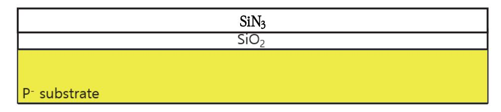

출처: 집필진 제작(2024)

[그림 1-2] 산화막과 질화막을 적층한 분리층의 구조도

2. 트랜치(trench) 패턴을 형성한다.

산화막과 질화막이 형성되면 소자가 형성될 층과 이 소자들을 분리할 트렌치(trench)의 모 습을 기하학적으로 형성하여야 한다. 패턴과 식각 공정이 이 부분을 담당하는 공정이다.

- (1) 트랜치 패턴 공정은 먼저 트랙 장비에서 감광액을 도포하여 감광막을 만든다.
- (2) 스테퍼나 스캐너와 같은 노광기를 이용하여 준비된 마스크에 패턴을 웨이퍼에 전사한다.
- (3) 전사가 끝나면 다시 트랙 장비에서 현상을 하게 되고, 감광막에는 기하학적 식각을 위한 패 턴이 완성된다.

[그림 1-3]에 포토 공정에 따른 패턴 형성 후 식각한 모습이 도시되어 있다. 공정 순서는 다음과 같다.

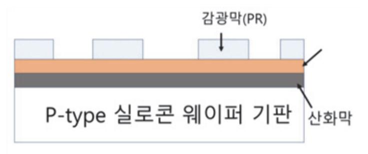

출처: 집필진 제작(2024)

[그림 1-3] STI(shallow trench isolation)가 건식 식각된 모습

3. STI 형성을 확인한다.

렌치 식각이 이루어진 웨이퍼는 식각된 트렌치 안에 산화막을 채워 소자들 간의 분리를 마 치게 된다.

(1) 먼저 산화막을 채우기 위하여 먼저 트렌치 벽면에 얇고 순도가 높은 산화막을 확산로(furnace) 안에서 성장시킨다.

- (2) 그다음 APCVD 방법으로 산화막을 형성시킨다. APCVD는 상압 상태에서 산화막을 기르기 때문에 성장 속도가 매우 빠르므로 깊은 트렌치를 채우기에 합리적인 CVD 방법이다.
- (3) 트렌치가 채워지면 후면에 이전 공정에서 수행된 질화막을 화학적으로 식각하여 제거한다.
- (4) 마지막으로 격자 간의 결합이 느슨한 상태에서 원자의 재정렬을 위하여 확산로(furnace)에서 열확산으로 재결정화를 실시한다. [그림 1-4]에 STI 형성 공정도가 도시되어 있다.

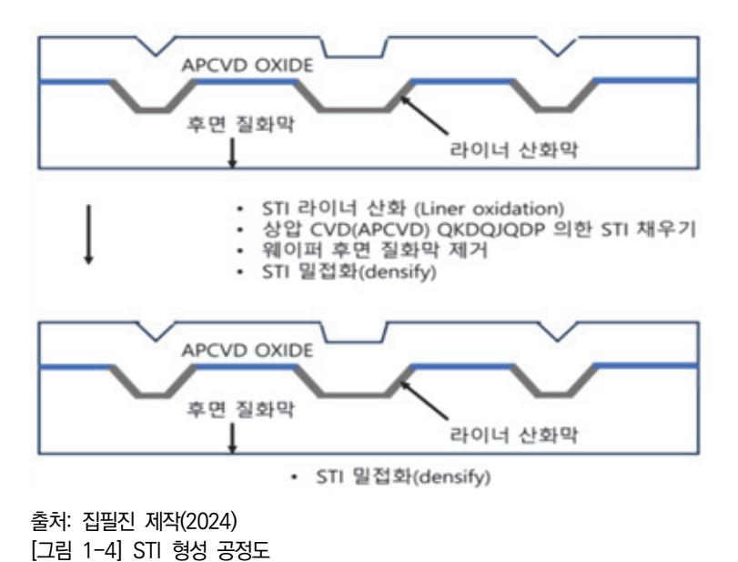

- 4. STI CMP 공정을 한다.

산화막 CMP가 완료되면 산화막 이면에 있던 질화막을 인산 혼합 용액인 SC1을 사용하여 상온인 메가소닉(megasonic) 상태에서 완전히 제거한다. [그림 1-5]에 공정도가 도시되어 있다.

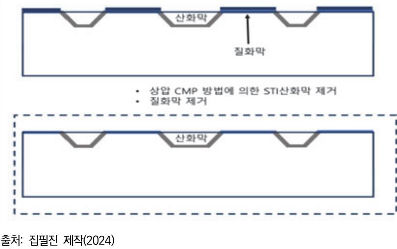

[그림 1-5] STI CMP 공정도

5. NWELL과 PWELL을 형성한다.

(1) PWELL 이온 주입 공정을 실시한다.

이후 마스크로 사용되었던 감광막을 플라즈마를 이용한 애시(ash) 건식과 표준 혼합 용 액인 SC1, SC2로 습식 세정을 혼용하여 완전히 제거한다. [그림 1-6]에 PWELL 형성 공정도가 도시되어 있다.

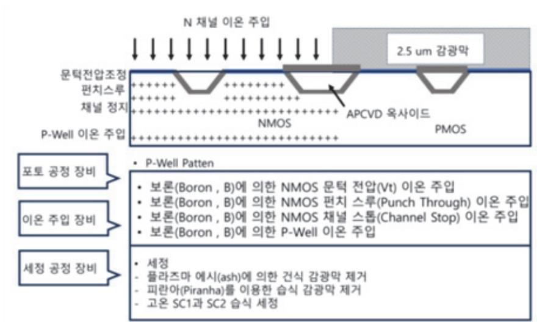

출처: 집필진 제작(2024) [그림 1-6] PWELL 형성 공정도

(2) NWELL 이온 주입 공정을 실시한다.

마지막으로 웰 형성을 위한 이온 주입이 실행되고, 이때 사용되는 이온 주입 에너지는 830keV 정도이다. 이후 마스크로 사용되었던 감광막을 플라즈마를 이용한 애시(ash) 건식과 표준 혼합 용액인 SC1, SC2로 습식 세정을 혼용하여 완전히 제거한다. [그림 1-7]에 NWELL 형성 공정도가 도식되어 있다.

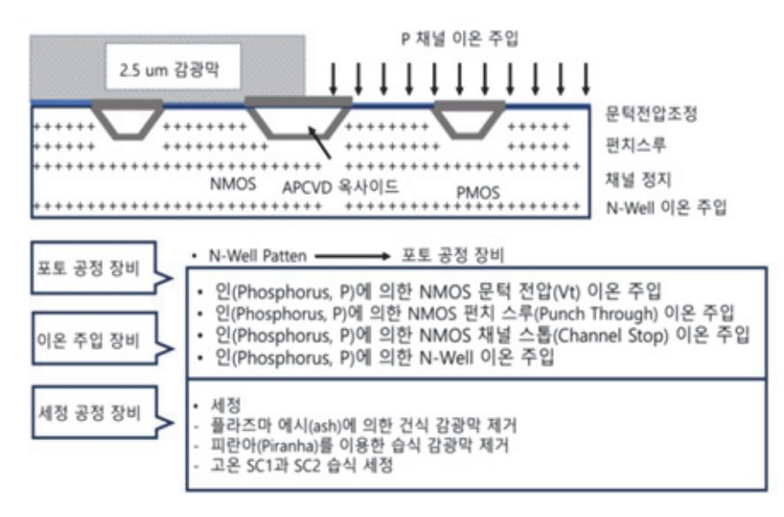

출처: 집필진 제작(2024) [그림 1-7] NWELL 형성 공정도

- 숖 소자 형성 세부 공정을 진행한다.
  - 1. 게이트 패턴을 형성한다.
    - (1) 게이트 공정 흐름도

게이트(gate) 전극 형성은 크게 다섯 단계로 나누어 공정이 진행된다. [그림 1-8]에 게 이트 공정 흐름도가 도시되어 있다.

- (가) 첫 번째 단계는 소자 분리 형성이 끝난 상태에서 게이트 산화막을 성장시킨다.
- (나) 두 번째 단계는 폴리실리콘을 게이트 산화막 위에 성장시킨다.
- (다) 세 번째 단계는 성장된 폴리실리콘에 PMOS 영역을 감광막으로 마스킹하고 N+폴리 이 온 주입을 실시한다. 이온 주입이 끝나면 감광막을 제거하고 세정 과정을 거친다.
- (라) 네 번째는 세정된 표면 위에 포토 공정을 통하여 식각될 부분을 개방한다.
- (마) 마지막 다섯 번째 단계는 개방된 영역을 건식 플라즈마 식각을 한다. 이후 감광막 제거 세정 과정을 통하여 최종적으로 폴리실리콘으로 형성된 게이트 전극을 완성한다.
- (2) N+ 폴리 열처리

앞선 웰 이온 주입 후 재결정화를 위해 열처리 과정을 거친 것처럼 N+ 폴리실리콘도 동일한 목적으로 열처리 과정을 다음과 같이 수행한다. [그림 1-9]에 폴리실리콘 열처리 공정도가 도시되어 있다.

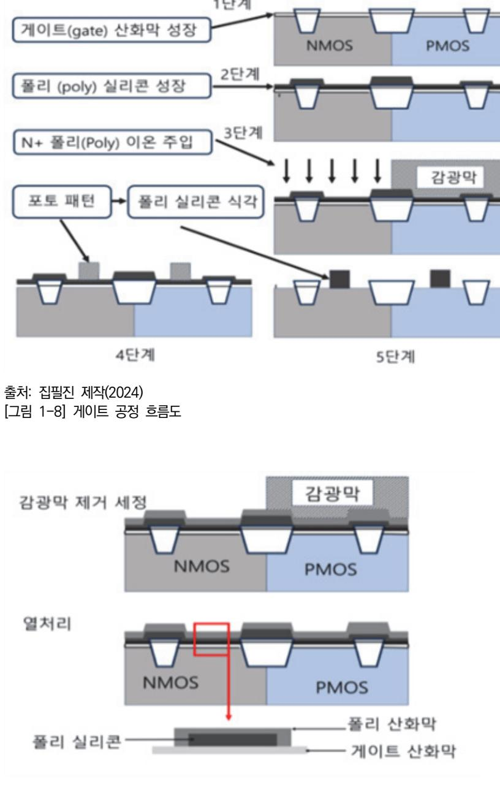

출처: 집필진 제작(2024) [그림 1-9] 폴리실리콘 열처리 공정도

(3) 게이트 패턴과 식각 공정

게이트 패턴과 식각 공정은 게이트 전극이 되는 폴리실리콘의 기하학적 구조 형성 과정 이다. 세부 공정 진행은 다음과 같은 순서로 진행한다. [그림 1-10]에 패턴과 식각 공정 의 흐름도가 도시되어 있다.

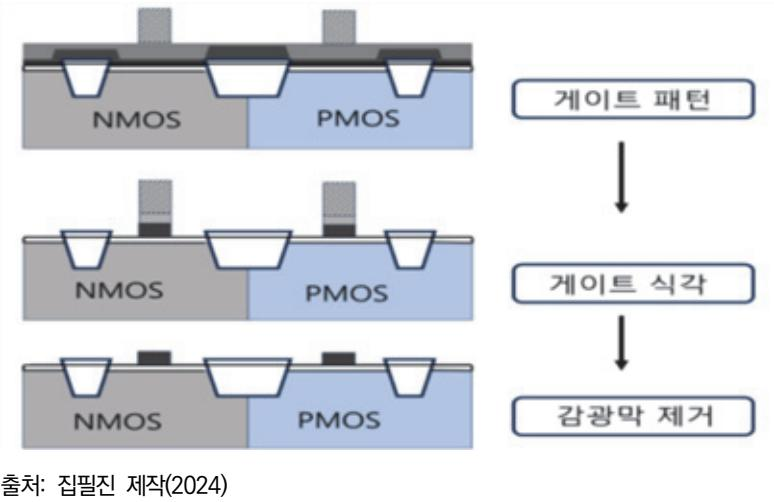

- [그림 1-10] 게이트 패턴과 식각 공정의 흐름도
- 2. LDD(lightly doped drain) 형성 공정을 진행한다.

시모스(CMOS) 엘디디(LDD: lightly doped drain) 공정은 크게 두 부분으로 나누어 연속 적으로 진행한다.

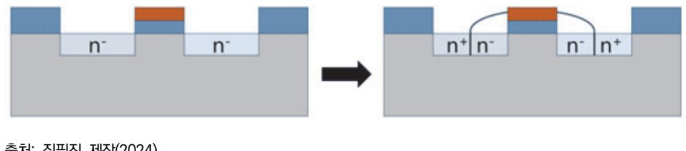

출처: 집필진 제작(2024) [그림 1-11] LDD 구조

- (1) NMOS 지역의 LDD 공정: NLDD
  - (가) 게이트 폴리 형성 구조에서 이온 주입에서의 폴리막 손상을 방지하기 위해 폴리막 위에 열 산화막을 성장시킨다.
  - (나) 이후 포토의 감광막 도포, 노광, 현상을 통하여 NLDD 패턴을 완성한다.
  - (다) 패턴이 완성되면 아세닉(As) 이온으로 NLDD 이온 주입 영역과 NWELL 콘택트 지역에 이온 주입을 실시한다.
  - (라) 이온 주입이 완료되면 세정을 실시하여 감광막과 산화막을 제거하고 격자 손상의 회복을 위한 열처리를 실행한다.
- (2) PMOS 지역의 LDD 공정: PLDD

NLDD 공정 완료 후 덮개 폴리 산화막 증착을 시작으로 PLDD 공정이 시작된다.

(가) 산화막 위에 포토의 일련 과정(감광막 도포, 노광, 현상)을 되풀이하여 PMOS 영역의

PLDD 패턴을 완성한다.

- (나) 보론(B) 이온으로 PLDD 이온 주입 영역과 PWELL 콘택트 지역에 이온 주입을 실시한다.
- (다) 이온 주입이 끝나면 세정을 마지막으로 LDD 공정이 완료된다. [그림 1-11]에 LDD 공 정 흐름도가 도시되어 있다.
- 3. S/D(source/drain) 형성 공정
  - (1) S/D(source/drain) 공정 흐름

소스와 드레인(S/D, source/drain) 공정은 NSD와 PSD 두 부분의 공정으로 나누어 연 속적으로 진행되며, 소스와 드레인 형성은 한 공정에서 동시에 이루어진다. 소스와 드레 인 공정을 하기 위해 먼저 게이트 측면 공간막이라 불리는 게이트 질화 공간막(nitride spacer)을 형성한다.

(2) NSD 세부 공정하기

NSD 공정은 NMOS의 소스와 드레인 정션 형성과 NWELL의 전극 형성 공정이다. 공정은 다음과 같은 내용을 가지고 수행된다. [그림 1-12]에 NMOS 형성 공정 흐름이 도시되어 있 다.

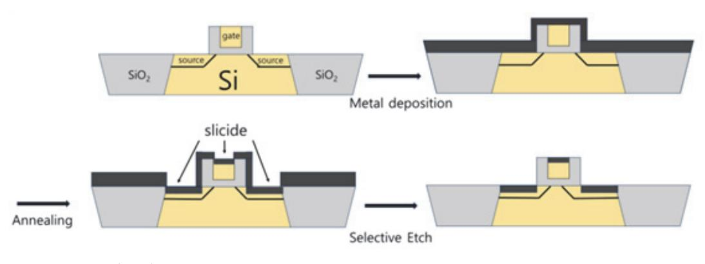

출처: 집필진 제작(2024) [그림 1-12] LDD salicide 공정

- (가) 게이트 측벽 공간막이 형성된 웨이퍼에 포토의 감광막 도포, 노광, 현상을 통하여 NSD 패턴을 완성한다.
- (나) 패턴이 완성되면 1차 이온 주입을 실시한다. 1차 이온 주입은 아세닉(As) 이온으로 NSD 이온 주입 영역과 NWELL 콘택트 지역에 이온 주입을 실시한다. 이온 주입은 고 전류를 사용하여 1.5×1,015(이온수/cm2 )의 도즈량과 70keV로 실시한다.
- (다) 1차 아세닉 이온 주입이 끝나면 부가하여 2차로 인(P) 이온을 주입한다. 이온 w 주입은 중전류를 사용하여 1.5×1,014(이온수/cm2 )의 도즈량과 60keV로 실시한다.
- (라) 이온 주입이 완료되면 플라즈마 에싱, 황산 계열 화학 세정, 메가소닉을 동반한 SC1 세

#### 정을 실시하여 감광막을 제거한다.

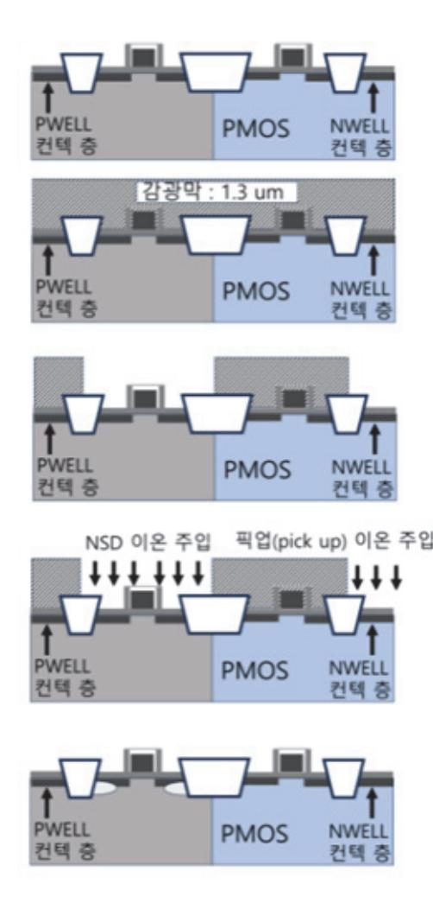

출처: 집필진 제작(2024) [그림 1-13] NMOS 형성 공정 흐름

(3) PSD 공정하기

PSD 공정은 PMOS의 소스와 드레인 정션 형성과 PWELL의 전극 형성 공정이다. 공정은 다 음과 같은 내용을 가지고 수행된다.

- (가) NSD가 형성된 웨이퍼에 포토의 감광막 도포, 노광, 현상을 통하여 PSD 패턴을 완성한다.
- (나) 패턴이 완성되면 이온 주입을 실시한다. 이온 주입은 보론(B) 이온으로 PSD 주입 영역 과 PWELL 콘택트 지역에 이온 주입을 실시한다. 고전류를 사용하여 1.5×1,015(이온 수/cm2 )의 도즈량과 10keV로 아세닉 이온 주입을 실시한다.
- (다) 이온 주입이 완료되면 플라즈마 에싱, 황산 계열 화학 세정, 메가소닉을 동반 SC1 세정 을 실시하여 감광막을 제거한다.
- (라) 감광막을 제거한 후 RTP 장비에서 1,000℃에서 15초 동안 열처리한다. 이 열처리 과정

은 소스, 드레인 정션 구조가 퍼지는 것을 방지하고, 소스, 드레인 영역 내의 불순물의 확산을 막기 위해서이다. 열처리 공정을 마지막으로 소스와 드레인 정션 형성 공정은 완 료된다. [그림 1-14]에 PMOS 형성 공정 흐름이 도시되어 있다.

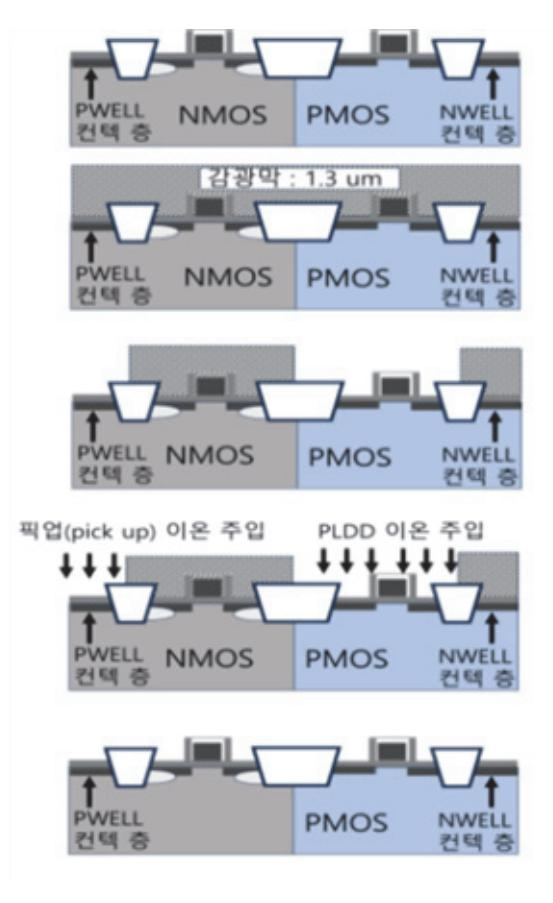

출처: 집필진 제작(2024) [그림 1-14] PMOS 형성 공정 흐름

숗 소자 배선 세부 공정을 실시한다.

- 1. 콘택트 홀 공정하기
  - (1) 1단계(살리사이데이션~PMD 평탄화)

콘택트 홀 형성 과정의 첫 번째는 실리콘 표면과 폴리 표면층의 금속화 공정부터 시작 된다. 공정 순서는 다음과 같다.

- (가) 먼저 웨이퍼 전면에 이전 공정에서 형성된 산화막을 제거한다.
- (나) 산화막이 제거되면 웨이퍼 전면에 살리사이데이션을 형성할 금속을 스퍼터링(sputtering) 한다. 보통 타이타늄(Ti) 금속을 사용한다.
- (다) 스퍼터링된 금속과 실리콘, 폴리실리콘과의 결합을 위하여 급속 열처리(RTA: rapid thermal annealing) 방법을 통하여 실리사이드와 폴리사이드를 형성한다.

- (라) 이후 실리콘이 아닌 다른 부분 즉 금속과 결합되지 않는 부분은 습식 식각으로 제거한다.
- (마) 이후 PMD 형성 시 열처리 공정에서 오는 PMD 막과 소스, 드레인, 게이트로부터의 이 온들의 이동을 막으며, 콘택트 홀 식각 시 소스, 드레인, 게이트 표면에 직접 이르러 과 도 식각이 이루어지지 않도록 종말점 물질로 사용되는 PMD 라이너(liner)를 증착한다.
- (바) 이후 BPSG PMD 막을 증착한다.
- (사) 이후 선 공정에서 게이트와 트렌치 구성에 따른 기하학적 단차 문제 때문에 발생되는 PMD 막의 높이를 평탄화하는 CMP 공정이 이루어진다. [그림 1-15]에 콘택트 홀 1단 계 공정도가 도시되어 있다.

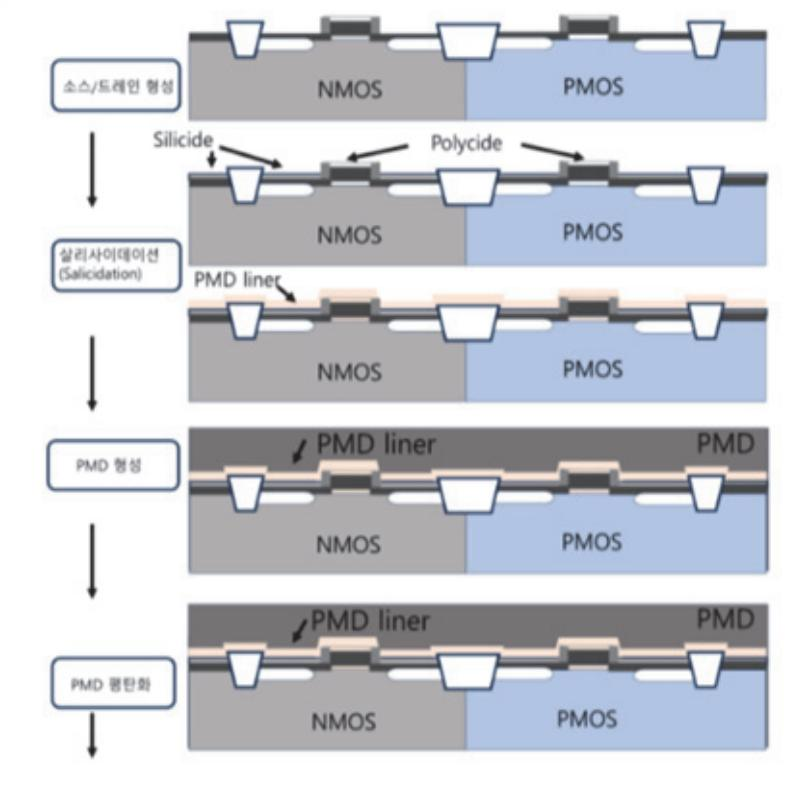

출처: 집필진 제작 [그림 1-15] 콘택트 홀 1단계 공정

#### (2) 2단계(포토 패턴~감광막) 제거/세정을 한다.

CMP 공정이 끝나면 포토의 감광막 도포, 노광, 현상 공정을 거쳐 식각될 부분의 패턴 을 개방한다. 이후 이 개방 영역을 건식 플라즈마로 식각한다. 식각 후 감광막과 홀 안 의 잔류물 제거를 위한 세정 공정이 이루어진다. [그림 1-16]에 콘택트 홀 2단계 공정 도가 도시되어 있다.

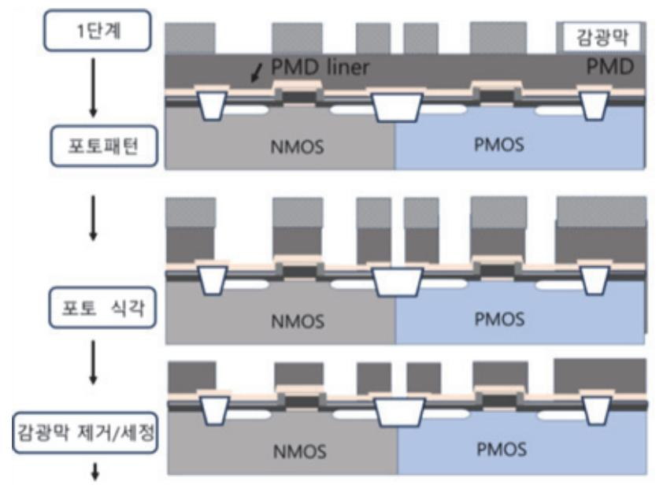

출처: 집필진 제작(2024) [그림 1-16] 콘택트 홀 2단계 공정도

(3) 3단계(장막 채우기~세정)

식각 세정 공정이 완료되면 홀을 금속으로 채우는 공정이 시작되는데 마치 모양이 전기 플러그와 같다 하여 꽉 찬 홀 기둥을 플러그(plug)라 칭하고, 이 홀을 채우는 공정을 플 러그 필(fill)한다고 표현한다. 다음 순서와 같이 공정이 수행된다.

- (가) 장막 금속 벽을 배리어 메탈(barrier metal)을 증착한다.
- (나) 주 금속을 채워 간다.
- (다) 평탄화 작업인 CMP 공정이 수행된다.
- (라) 세정 공정을 수행한다.

[그림 1-17]에 콘택트 홀 3단계 공정도가 도시되어 있다.

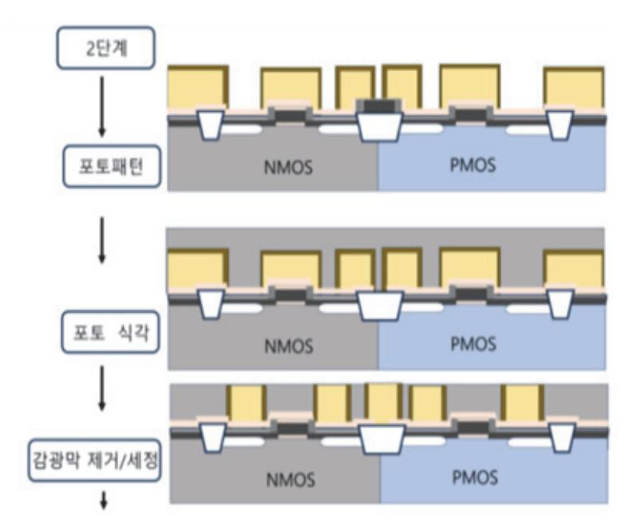

출처: 집필진 제작(2024) [그림 1-17] 콘택트 홀 3단계 공정도

#### (4) 콘택트 홀 포토 패턴과 식각 공정

(가) 콘택트 포토 공정

CMP 공정이 끝난 웨이퍼 위에 딥(deep) UV 감광액을 이용하여 두께 0-97μm로 감광막을 도포한다. 감광막 도포가 끝나면 마스크를 이용하여 패턴 노광을 진행하고, 현상 공정을 거쳐 식각될 부분의 패턴을 개방한다.

(나) 식각 공정

콘택트 포토 공정이 완료되면 포토의 감광막을 마스크로 하여 RIE 플라즈마 건식 식 각으로 BPSG 산화막을 식각한다. 식각은 PMD 라이너(PMD liner)막까지 이루어진 다. 이후 완전히 산화막을 제거하기 위해 식각 시간만큼 더 식각을 한다.

(다) 세정 공정

식각이 완료되면 감광막을 제거하기 위하여 피라나 황산 계열 습식 세정을 하고 홀 안의 입자들을 완전히 제거하기 위하여 SC1 습식 세정과 메가소닉을 가하여 세정한 다.

[그림 1-18]에 포토 패턴과 식각에 대한 공정도가 도시되어 있다.

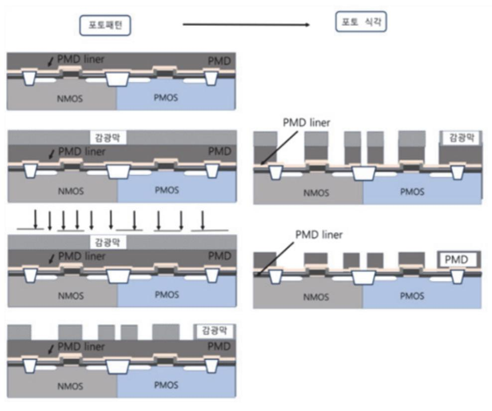

출처: 집필진 제작(2024)

[그림 1-18] 포토 패턴과 식각에 대한 공정도

(5) 콘택트 홀 장막 금속 채우기

식각 세정 공정이 완료되면 홀을 금속으로 채우는 공정이 시작된다. 세부 공정과 조건은 다음과 같이 수행된다.

- (가) 장막 금속(brrier metal) 증착은 타이타늄(Ti) 금속을 재료로 두께 50Å 정도가 되도록 이온화된 금속 플라즈마 PVD(IMP PVD) 방법으로 증착한다.
- (나) 이후 급속 열처리 공정(RTP)을 이용하여 타이실리사이드(TiSiO₂)를 형성한다. 이때 열처 리 온도는 725℃, 시간은 30초 정도이다.
- (다) 타이실리사이드가 형성되면 텅스텐 확산 장벽인 타이타늄 질화막을 MOCVD 방법으로 두께 100Å 정도로 증착한다. 이 과정이 완료되면 주 금속을 채울 수 있다.
- [그림 1-19]에 배리어 메탈 증착 공정도가 도시되어 있다.

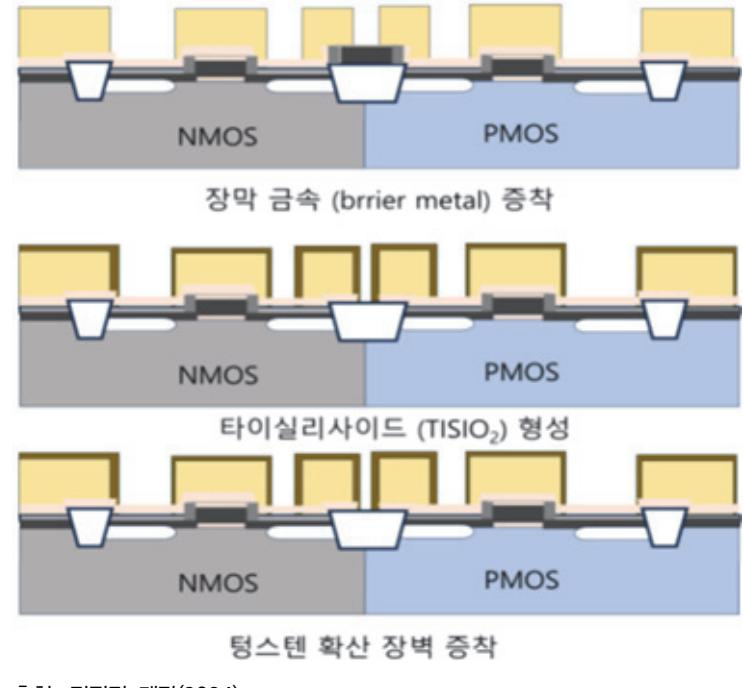

출처: 집필진 제작(2024) [그림 1-19] 배리어 메탈 증착 공정도

- (6) 콘택트 홀 주 금속 채우기와 CMP 공정
  - (가) 장막 금속이 완성되면 이제 주 금속을 CVD 방법으로 여러 번 되풀이하며 홀 안을 채워 간다.
  - (나) 홀이 다 채워지면 평평한 면과 홀 모양의 굴곡에서 오는 차이 때문에 단차가 발생한다. 이 단차의 문제도 후에 진행될 금속 배선 공정에서 포토 공정에 어려움을 주기 때문에 평탄화 작업인 CMP 공정이 다시 수행된다. 이전 PMD는 산화막 CMP이지만 콘택트 홀 평탄화는 금속 CMP 공정이다.
  - (다) 이후 세정 공정을 거치면서 콘택트 홀 공정이 완료된다.

[그림 1-20]에 콘택트 홀 주 금속 채우기와 CMP 후 모습이 도시되어 있다.

출처: 집필진 제작(2024) [그림 1-21] 최상층 금속 배선(M5) 공정 흐름

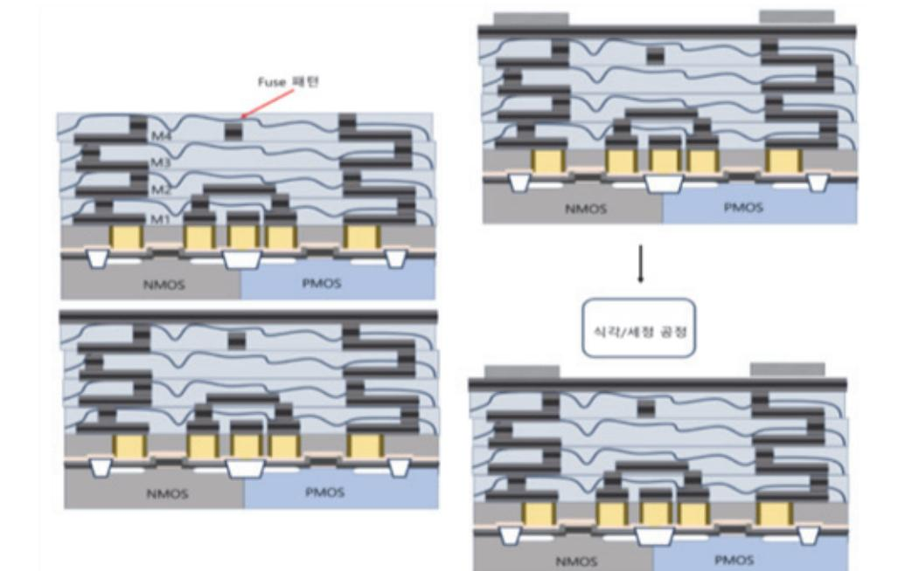

- (1) 다층 금속 배선(M2~M4)과 비아 배선(V2~V4) 공정한다.
- 1. 배선층 적층
- 수 소자 완성 세부 공정을 한다.

출처: 집필진 제작(2024) [그림 1-20] 콘택트 홀 주 금속 채우기와 CMP 후 모습

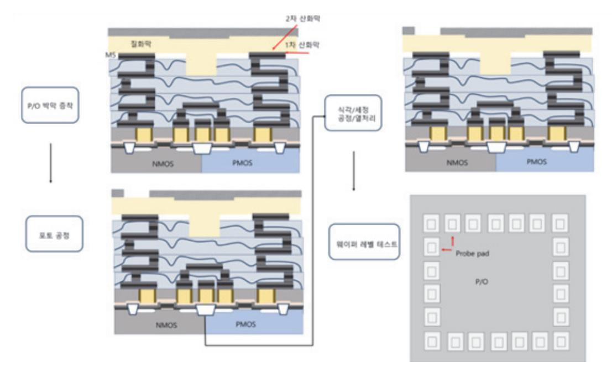

출처: 집필진 제작(2024) [그림 1-22] P/O 공정 흐름

숙 수행 완료 후 보고서를 작성한다.

- 1. 보고서에는 다음의 내용이 포함된다.
  - (1) 성명
  - (2) 작업자 연락처
  - (3) 작업 일시
  - (4) 수행한 내용 요약(출처가 있는 경우 꼭 기입하도록 한다)
  - (5) 공정 흐름도 순서대로 진행한 공정 내용

## 수행 내용 / 시스템 반도체 공정 흐름도 해석하기

#### 재료·자료

- 소자 제작 공정 순서 흐름도 설명서
- MOS 단면 분석 사진
- NMOS 트랜지스터, PMOS 트랜지스터

#### 기기(장비 ・ 공구)

해당 사항 없음.

#### 유의 사항

- 반도체 제조 웨이퍼 취급에 오염이나 파손에 주의해야 한다.
- 반도체 제조 공정된 웨이퍼를 측정 시에는 장비 사용에 주의해야 한다.
- 반도체 회로를 웨이퍼 상에 가공하는 공정 업무에 적용한다.
- 웨이퍼는 깨지기 쉬워서 취급을 각별히 조심해야 하며 오염이 되지 않도록 취급해야 한다.

#### 수행 순서

숔 시스템 반도체 종류와 특성을 해석하여 설명한다.

시스템 반도체 공정 흐름도를 해석하기 위해서는 시스템 반도체의 종류와 그 특성을 명확히 이 해하는 것이 중요하다. 시스템 반도체는 주로 논리적 연산, 데이터 처리, 신호 처리 등을 수행 하는 반도체 소자를 말한다. 이러한 반도체는 다양한 응용 분야에서 사용되며, 각기 다른 공정 흐름을 가진다. 다음은 시스템 반도체의 주요 종류와 그 특성에 대한 설명이다.

#### 1. 시스템 반도체의 종류와 특성을 파악한다.

- (1) 마이크로프로세서(microprocessor)
  - (가) 특성
    - 1) 중앙 처리 장치(CPU): 명령어를 실행하고 데이터 처리를 수행하는 핵심 구성 요소 이다.
    - 2) 연산 속도: 높은 클럭 속도로 복잡한 연산을 신속하게 처리한다.
    - 3) 집적도: 고밀도 집적으로 많은 트랜지스터가 포함되어 복잡한 연산과 처리가 가능하 다.

시스템 반도체의 공정 흐름도는 공정 단계마다 다양한 기술과 방법을 포함하며, 각 단계는

- 3) 산업 자동화: 고속 데이터 처리, 제어 시스템
- 2) 이미지 처리: 실시간 비디오 스트리밍, 이미지 분석
- 1) 통신 시스템: 데이터 처리, 프로토콜 구현
- (나) 응용 분야
- 3) 빠른 프로토타이핑: 새로운 시스템을 신속하게 개발하고 검증할 수 있다.
- 2) 병렬 처리 능력: 많은 로직 셀을 동시에 동작시켜 병렬 처리가 가능하다.
- 1) 유연한 설계: 하드웨어의 기능을 프로그래밍하여 다양한 용도로 사용 가능하다.

1) 실시간 데이터 처리: 신호를 실시간으로 처리하여 음성, 영상, 통신 신호를 분석하고

2) 특화된 연산 능력: 고속의 곱셈과 덧셈 연산에 최적화된 구조를 가진다.

3) 저전력 소모: 모바일 및 휴대용 장치에서 효율적인 전력 소모를 특징으로 한다.

1) 통합 시스템: CPU, 시스템, 입출력 포트, 타이머 등을 하나의 칩에 통합한 소자이

3) 다양한 인터페이스: 다양한 주변기기와의 통신을 위한 여러 인터페이스를 제공한다.

2) 저전력 소비: 전력 소모가 적어 배터리로 동작하는 장치에 적합하다.

2. 시스템 반도체 공정 흐름도를 해석한다.

- (가) 특성
- (4) FPGA(field programmable gate array)

- 3) 산업 자동화: 센서 제어, 모터 제어
- 2) 자동차: 엔진 제어, ABS 등
- 1) 가전제품: 세탁기, 냉장고 등
- (나) 응용 분야
- (가) 특성

다.

변환한다.

(나) 응용 분야

(가) 특성

(나) 응용 분야

- 2) 멀티미디어 장비: 오디오/비디오 처리

- 1) 통신 장비: 이동 통신, 위성 통신

1) 컴퓨터: 데스크탑, 노트북 등

(2) 디지털 신호 처리기(DSP: digital signal processor)

2) 임베디드 시스템: 산업용 제어기, 가전 제품

- (3) 마이크로컨트롤러(MCU: microcontroller unit)

고유의 특성과 목적을 가지고 있다. 일반적인 공정 흐름도는 다음과 같다.

- (1) 웨이퍼 제조(wafer fabrication)
  - (가) 실리콘 웨이퍼 준비: 고순도 실리콘 잉곳을 절단하여 웨이퍼로 가공한다.
  - (나) 산화 공정: 웨이퍼 표면에 산화막을 형성하여 절연층을 만든다.
  - (다) 포토리소그래피: 포토레지스트를 도포하고 빛을 이용해 패턴을 형성한다.
  - (라) 식각 공정: 불필요한 부분을 식각하여 원하는 패턴을 형성한다.
- (2) 소자 형성(device fabrication)
  - (가) 이온 주입: 도핑을 통해 웨이퍼에 원하는 전기적 특성을 부여한다.
  - (나) 게이트 형성: 트랜지스터의 게이트 전극을 형성한다.
  - (다) 메탈 증착: 배선을 위한 메탈층을 증착한다.
  - (라) 패키징: 칩을 보호하고 외부와 연결하기 위한 패키징을 수행한다.
- (3) 테스트 및 검증(testing and verification)
  - (가) 전기적 테스트: 소자의 전기적 특성을 테스트하여 동작 여부를 확인한다.
  - (나) 신뢰성 테스트: 다양한 환경 조건에서 소자의 신뢰성을 검증한다.
  - (다) 기능 검증: 소자의 설계 사양에 따른 기능을 검증한다.

시스템 반도체는 다양한 종류와 특성을 가지며, 각각의 응용 분야에 따라 다양한 요구 사항을 만족시켜야 한다. 마이크로프로세서, DSP, MCU, FPGA 등은 각각의 특성과 응용 분야에 맞 게 설계되고 제조된다. 시스템 반도체의 공정 흐름도는 웨이퍼 제조, 소자 형성, 테스트 및 검 증의 단계로 구성되며, 각 단계에서 다양한 기술과 방법이 적용된다. 이러한 공정 흐름도를 명 확히 이해하고 해석함으로써 시스템 반도체의 성능과 품질을 최적화할 수 있다.

- 숕 Well과 격리(isolation)의 구조를 해석하여 설명한다.
  - 1. Well 구조를 파악한다.

시스템 반도체 공정에서 Well 구조는 MOSFET 등의 반도체 소자를 형성하기 위해 중요한 역할을 한다. Well 구조는 트랜지스터의 소스, 드레인, 게이트 영역을 포함하는 영역으로, 적절한 도핑 프로파일을 통해 원하는 전기적 특성을 부여한다. Well 구조는 n-well과 p-well로 나눌 수 있으며, 각기 다른 역할을 수행한다. 다음은 Well 구조의 해석과 설명이 다.

(1) Well 구조의 개요

Well 구조는 실리콘 웨이퍼의 특정 영역에 도핑을 통해 형성되며, 주로 MOSFET 소자 의 형성에 사용된다. Well 구조는 소자의 전기적 특성을 조절하고, 서로 다른 트랜지스 터 타입을 동일 웨이퍼에 형성할 수 있게 한다.

- (2) Well 구조의 종류
  - (가) n-Well
    - 1) 구조 및 역할
      - 가) 구조: n형 도핑된 영역으로, p형 기판 위에 형성된다.
      - 나) 역할: p 채널 MOSFET(PMOS)을 형성하는 데 사용된다.
    - 2) 제작 공정
      - 가) 산화막 형성: 실리콘 웨이퍼 표면에 산화막을 형성한다.
      - 나) 포토리소그래피: 포토레지스트를 도포하고, 노광하여 n-well 영역을 패터닝한 다.
      - 다) 식각: 노출된 산화막을 식각하여 n-well 영역을 드러낸다.
      - 라) 이온 주입: 고에너지 인(P) 이온을 주입하여 n-well 영역을 형성한다.
      - 마) 어닐링: 열처리를 통해 주입된 이온을 활성화하고, 도핑 프로파일을 확산시킨다.

| Oxide                    |        |  |
|--------------------------|--------|--|
|                          | N-well |  |
| P - substrate |        |  |

(나) p-Well

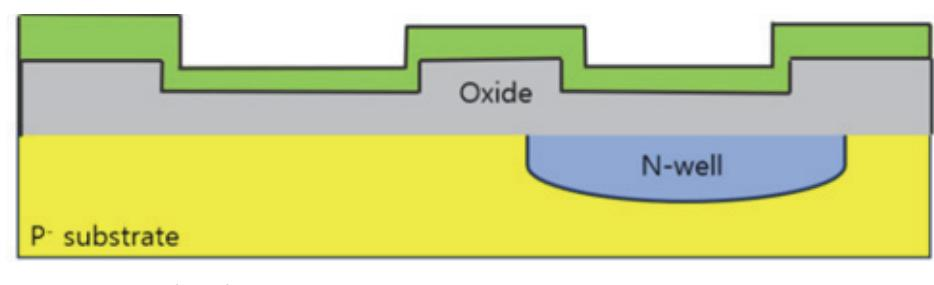

출처: 집필진 제작(2024) [그림 1-24] POLY SILICON 형성

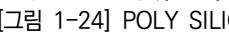

- 1) 구조 및 역할
  - 가) 구조: p형 도핑된 영역으로, n형 기판 또는 n-well 위에 형성된다.
  - 나) 역할: n 채널 MOSFET(NMOS)을 형성하는 데 사용된다.
- 2) 제작 공정

출처: 집필진 제작(2024) [그림 1-23] 확산에 의한 N-well 형성

가) 산화막 형성: 실리콘 웨이퍼 표면에 산화막을 형성한다.

다) 식각: 노출된 산화막을 식각하여 p-well 영역을 드러낸다.

나) 포토리소그래피: 포토레지스트를 도포하고, 노광하여 p-well 영역을 패터닝한

마) 어닐링: 열처리를 통해 주입된 이온을 활성화하고, 도핑 프로파일을 확산시킨다.

라) 이온 주입: 고에너지 붕소(B) 이온을 주입하여 p-well 영역을 형성한다.

1) 임계 전압(threshold voltage, Vth): Well 도핑 농도는 트랜지스터의 임계 전압을

2) 기생 트랜지스터 억제: 적절한 Well 구조는 기생 트랜지스터의 형성을 억제하여, 소

출처: 집필진 제작(2024)

다.

출처: 집필진 제작(2024)

(2) Well 구조의 중요성

(가) 전기적 특성 조절

[그림 1-25 POLY SILICON 및 산화막 에칭

자의 신뢰성을 높인다.

조절하여, 소자의 스위칭 특성을 결정한다.

[그림 1-26] CMOS 공정에서 생성되는 기생 회로

- (나) 소자 격리
  - 1) 절연 효과: Well 구조는 서로 다른 트랜지스터를 전기적으로 격리하여, 소자 간의 간섭을 최소화한다.

2) Latch-up 방지: well 도핑은 latch-up 현상을 방지하여, 소자의 안정성을 향상시 킨다.

(다) 집적도 향상

- 1) 쌍극 소자 형성: Well 구조를 통해 동일 웨이퍼에 NMOS와 PMOS를 형성할 수 있어, 고밀도 집적이 가능하다.
- 2) CMOS 공정 구현: Well 구조는 CMOS 공정의 기본 요소로, 고성능, 저전력 소자 의 구현을 가능하게 한다.
- (3) Well 구조 형성 공정
  - (가) 산화 공정(oxidation)

웨이퍼 표면에 실리콘 산화막을 형성하여 보호층을 만든다.

- (나) 포토리소그래피(photolithography) 포토레지스트를 도포하고, n-well 또는 p-well 영역을 패터닝한다.
- (다) 식각(etching)

노출된 산화막을 식각하여 Well 영역을 드러낸다.

(라) 이온 주입(ion Implantation)

n형 또는 p형 도핑 물질을 Well 영역에 주입한다.

(마) 어닐링(annealing)

열처리를 통해 도핑된 이온을 활성화하고, 도핑 프로파일을 확산시킨다.

Well 구조는 시스템 반도체 공정에서 매우 중요한 역할을 한다. n-Well과 p-Well은 각각 PMOS와 NMOS 트랜지스터를 형성하는 데 사용되며, 소자의 전기적 특성을 조절하고, 소 자 간의 전기적 간섭을 방지하는 데 중요한 역할을 한다. Well 구조의 적절한 형성은 고성 능, 고신뢰성의 시스템 반도체 소자를 구현하는 데 필수적이다. 이를 통해 CMOS 공정에서 고밀도 집적과 저전력 소자를 구현할 수 있다. Well 구조의 이해는 시스템 반도체 공정 흐 름도를 해석하고, 각 단위 공정을 명확히 이해하는 데 중요한 기초가 된다.

2. 격리(isolation) 구조를 파악한다.

시스템 반도체 공정 흐름도를 해석하기 위해서는 소자 간의 전기적 간섭을 방지하고, 각 소 자의 성능을 최적화하는 데 중요한 역할을 하는 격리(isolation) 구조를 이해해야 한다. 격 리 구조는 반도체 소자 간의 전기적 간섭을 차단하여 소자의 동작을 안정화하고 신뢰성을 높이다. 다음은 격리 구조의 해석과 설명이다.

(1) 격리 구조의 개요

격리 구조는 반도체 소자 간의 전기적 간섭을 방지하기 위해 형성된 구조이다. 이는 특히 고집적 반도체 소자에서 매우 중요하며, 다양한 방식으로 구현될 수 있다. 대표적인 격리 구조로는 LOCOS(local oxidation of silicon)와 STI(shallow trench isolation)가 있다.

- 2) 제작 공정
- 나) 역할: 소자 간의 전기적 간섭을 방지하고, 소자를 전기적으로 격리한다.
- 1) 구조 및 역할 가) 구조: 웨이퍼 표면에 얕은 트렌치를 형성하고, 그 안을 절연 물질로 채워 격리 한다.
- (나) STI(shallow trench isolation)

출처: 집필진 제작(2024) [그림 1-27] LOCOS 공정의 Bird's beak 현상

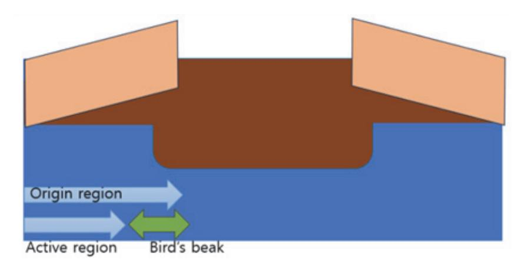

조를 완성한다.

- 을 형성한다. 마) 실리콘 나이트라이드 제거: 남아 있는 실리콘 나이트라이드를 제거하여 격리 구
- 리콘 나이트라이드를 식각한다. 라) 열 산화: 노출된 실리콘 영역을 고온 산소 분위기에서 산화시켜 두꺼운 산화막
- 드를 증착한다. 다) 포토리소그래피 및 식각: 포토레지스트를 도포하고, 격리 영역을 패터닝하여 실
- 가) 패드 산화막 형성: 웨이퍼 표면에 얇은 실리콘 산화막을 형성한다. 나) 실리콘 나이트라이드(Si3N4) 증착: 산화 방지막으로 사용되는 실리콘 나이트라이
- 2) 제작 공정
- 형성한다. 나) 역할: 소자 간의 전기적 간섭을 방지하고, 소자를 전기적으로 격리한다.
- 1) 구조 및 역할 가) 구조: 실리콘 웨이퍼 표면의 특정 영역을 국부적으로 산화시켜 두꺼운 산화막을
- (가) LOCOS(local oxidation of silicon)
- (2) 격리 구조의 종류와 제작 방법

- 가) 포토리소그래피 및 식각: 포토레지스트를 도포하고, 트렌치 패턴을 형성하여 식 각한다.
- 나) 트렌치 형성: 식각을 통해 실리콘 웨이퍼에 얕은 트렌치를 형성한다.
- 다) 라이너 산화막 형성: 트렌치 내부에 얇은 산화막을 형성하여 표면을 보호한다.
- 라) 절연 물질 충진: 트렌치 내부를 절연 물질(주로 실리콘 산화물)로 채운다.
- 마) 화학 기계적 연마(CMP): 웨이퍼 표면을 평탄화하여 트렌치 외부의 잉여 절연 물질을 제거한다.
- (3) 격리 구조의 중요성
  - (가) 전기적 간섭 방지
    - 1) 격리 구조는 소자 간의 전기적 간섭을 방지하여, 각 소자가 독립적으로 동작할 수 있게 한다.
    - 2) 소자의 성능을 최적화하고, 신호의 왜곡이나 누설을 최소화한다.
  - (나) 소자의 안정성 및 신뢰성 향상
    - 1) 격리 구조는 소자의 전기적 특성을 안정화하고, 외부 환경의 영향을 줄여 소자의 신 뢰성을 높인다.
    - 2) latch-up과 같은 불량 현상을 방지하여, 소자의 수명을 연장한다.
  - (다) 고밀도 집적 가능
    - 1) 격리 구조를 통해 고밀도 집적 회로를 구현할 수 있으며, 이는 반도체 소자의 소형 화와 고성능화를 가능하게 한다.
    - 2) 격리 구조는 특히 고집적 반도체 소자에서 매우 중요하다.
- (4) 격리 구조 형성 공정의 세부 단계
  - (가) 포토리소그래피(photolithography)
    - 1) 역할: 포토레지스트를 도포하고, 노광하여 원하는 패턴을 형성한다.
    - 2) 과정
      - 가) 포토레지스트를 도포한다.
      - 나) 마스크를 사용하여 노광한다.
      - 다) 노광된 패턴을 현상하여 드러낸다.
  - (나) 식각(etching)
    - 1) 역할: 노출된 영역을 식각하여 트렌치 또는 산화막 패턴을 형성한다.
    - 2) 과정
      - 가) 건식 식각: 플라즈마 등을 사용하여 식각한다.
      - 나) 습식 식각: 화학 용액을 사용하여 식각한다.
  - (다) 열 산화(thermal oxidation)

1) 역할: 산화막을 형성하여 소자를 보호하고, 격리 구조를 강화한다.

2) 과정

웨이퍼를 고온 산소 또는 수증기 환경에 노출시켜 산화막을 형성한다.

(라) 절연 물질 충진(dielectric filling)

1) 역할: 트렌치를 절연 물질로 채워 전기적 격리를 완성한다.

2) 과정

CVD를 통해 실리콘 산화물 등의 절연 물질을 충진한다.

(마) 화학 기계적 연마(CMP, chemical mechanical polishing)

1) 역할: 웨이퍼 표면을 평탄화하여 균일한 표면을 만든다.

2) 과정

CMP 장비를 사용하여 표면을 연마한다.

격리 구조는 시스템 반도체 공정에서 매우 중요한 역할을 하며, 소자 간의 전기적 간섭을 방지하고, 소자의 성능과 신뢰성을 향상시키는 데 필수적이다. LOCOS와 STI는 대표적인 격리 구조로, 각기 다른 방법으로 소자를 전기적으로 격리한다. 이러한 격리 구조의 이해는 시스템 반도체 공정 흐름도를 해석하고, 각 단위 공정을 명확히 이해하는 데 중요한 기초가 된다. 이를 통해 고성능, 고신뢰성의 시스템 반도체 소자를 구현할 수 있다.

#### 숖 시스템 반도체 단위 소자 제작 구조를 해석하여 설명한다.

시스템 반도체 공정 흐름도를 해석하기 위해서는 시스템 반도체 단위 소자의 제작 구조를 이해 하는 것이 중요하다. 단위 소자는 시스템 반도체의 기본 빌딩 블록이며, 각 소자의 구조와 제 작 방법을 이해함으로써 전체 공정을 더 잘 이해할 수 있다. 다음은 주요 시스템 반도체 단위 소자들의 제작 구조와 공정 흐름에 대한 설명이다.

- 1. 주요 시스템 반도체 단위 소자를 파악한다.
  - (1) MOSFET(metal-oxide-semiconductor field-effect transistor)
    - (가) 구조
      - 1) 소스(source): 전자의 공급원이다.
      - 2) 드레인(drain): 전자의 흡수원이다.
      - 3) 게이트(gate): 전류 흐름을 제어하는 전극이다.
      - 4) 산화막(oxide layer): 게이트와 채널 사이의 절연층이다.
      - 5) 채널(channel): 소스와 드레인 사이의 전도 경로이다.
    - (나) 제작 공정
      - 1) 웨이퍼 준비: 고순도 실리콘 웨이퍼를 준비한다.
      - 2) 산화 공정: 웨이퍼 표면에 산화막을 형성한다.
      - 3) 포토리소그래피: 포토레지스트를 도포하고, 원하는 패턴을 형성하기 위해 노광한다.

- 4) 식각 공정: 노출된 부분을 식각하여 산화막을 제거한다.
- 5) 이온 주입: 도핑을 통해 소스와 드레인 영역을 형성한다.
- 6) 메탈 증착: 게이트, 소스, 드레인에 금속 전극을 증착한다.

7) 패시베이션: 소자를 보호하기 위해 패시베이션 층을 형성한다.

출처: 집필진 제작(2024)

출처: 집필진 제작(2024) [그림 1-29] Nitride 성장

출처: 집필진 제작(2024) [그림 1-30] Nitride 에칭

(2) capacitor(커패시터)

(가) 구조

[그림 1-28] souce, drain 이온 주입 도핑

- 1) 상부 전극(top electrode): 전하를 저장하는 전극이다.
- 2) 유전체(dielectric layer): 전하를 저장하는 절연층이다.
- 3) 하부 전극(bottom electrode): 전하를 저장하는 다른 전극이다.

(나) 제작 공정

- 1) 웨이퍼 준비: 실리콘 웨이퍼를 준비한다.
- 2) 하부 전극 형성: 웨이퍼 표면에 하부 전극을 증착한다.
- 3) 유전체 증착: 유전체 물질을 하부 전극 위에 증착한다.
- 4) 상부 전극 형성: 유전체 위에 상부 전극을 증착한다.
- 5) 패터닝 및 식각: 포토리소그래피와 식각 공정을 통해 전극과 유전체를 패터닝한다.
- (3) resistor(저항기)
  - (가) 구조
    - 1) 저항 물질(resistive material): 전류 흐름에 저항을 제공하는 물질이다.
    - 2) 접촉 패드(contact pads): 전류가 흐를 수 있도록 연결하는 전극이다.
  - (나) 제작 공정
    - 1) 웨이퍼 준비: 실리콘 웨이퍼를 준비한다.
    - 2) 저항 물질 증착: 저항 물질을 웨이퍼 표면에 증착한다.
    - 3) 포토리소그래피: 포토레지스트를 도포하고, 원하는 패턴을 형성하기 위해 노광한다.
    - 4) 식각 공정: 노출된 부분을 식각하여 저항 물질을 패터닝한다.
    - 5) 접촉 패드 형성: 저항 물질에 전극을 형성하여 전류가 흐를 수 있도록 한다.
- 2. 시스템 반도체의 단위 소자 구조를 이해하여 해석한다.

시스템 반도체 제조 공정 개발에서 단위 소자의 구조를 해석하는 것은 매우 중요한 단계이 다. 이 과정은 소자의 특성과 동작 원리를 이해하고, 이를 통해 전체 시스템의 성능을 최적 화하는 데 필수적이다. 단위 소자의 구조 해석은 물리적 구조, 전기적 특성, 그리고 공정 변수들이 소자 동작에 미치는 영향을 종합적으로 분석하는 것을 포함한다.

- (1) 단위 소자의 구조를 이해한다.
  - (가) 물리적 구조 분석
    - 1) 소자 레이아웃: 단위 소자의 레이아웃(예: MOSFET, BJT, 다이오드 등)을 분석하여 각 요소(게이트, 소스, 드레인, 베이스, 에미터 등)의 위치와 크기를 파악한다.
    - 2) 층간 구조: 소자의 다양한 층(예: 산화층, 도핑 영역, 금속 층 등)의 구조를 이해하 고, 각 층이 소자의 동작에 어떻게 기여하는지 분석한다.
    - 3) 도핑 프로파일: 소자의 도핑 농도와 도핑 프로파일을 분석하여, 채널 형성, 역전층, p-n 접합의 특성을 이해한다.
  - (나) 전기적 특성 해석
    - 1) I-V 특성 분석: 소자의 전류-전압(I-V) 특성을 해석하여, 소자의 동작 모드(예: 선 형 영역, 포화 영역 등)를 이해한다. MOSFET의 경우, 임계 전압(Vth), 전류 스윙 등이 중요하다.

- 2) Capacitance-Voltage(C-V) 특성: C-V 특성을 분석하여 소자의 용량성 효과, 예 를 들어 MOSFET의 경우 게이트 산화막 두께와 채널의 전하 저장 능력을 평가한 다.
- 3) 전력 소모 분석: 소자의 전력 소모 특성을 이해하고, 저전력 설계 또는 전력 효율성 을 높이기 위한 전략을 도출한다.
- (2) 소자 모델링 및 시뮬레이션
  - (가) 소자 모델링
    - 1) 소자 등가 회로 모델: 단위 소자의 등가 회로 모델(예: 작은 신호 모델, 대신호 모 델 등)을 구성하여, 소자의 전기적 특성을 시뮬레이션할 수 있는 기반을 마련한다.
    - 2) SPICE 모델링: SPICE와 같은 회로 시뮬레이터에서 사용되는 소자 모델(예: MOSFET의 BSIM 모델)을 활용하여, 다양한 공정 조건에서 소자의 동작을 예측할 수 있다.
  - (나) 소자 시뮬레이션
    - 1) TCAD 시뮬레이션: TCAD(technology computer-aided design) 도구를 사용하 여 소자의 2D 또는 3D 시뮬레이션을 수행한다. 이는 소자의 물리적 특성과 전기적 특성을 심도 있게 해석하는 데 도움이 된다.
    - 2) 동작 시나리오 시뮬레이션: 다양한 동작 조건(온도, 전압 등)에서 소자의 특성을 시 뮬레이션하여, 특정 조건에서의 성능과 안정성을 평가한다.
- (3) 공정 변수와 소자 특성 간의 관계 분석
  - (가) 공정 변수 분석
    - 1) 도핑 농도와 프로파일: 도핑 농도와 프로파일이 소자의 임계 전압, 문턱 전압 및 전 류 스윙에 미치는 영향을 분석한다.
    - 2) 산화막 두께: 게이트 산화막의 두께 변화가 소자의 C-V 특성 및 전하 트래핑에 미 치는 영향을 평가한다.
    - 3) 게이트 길이 및 폭: 소자의 게이트 길이와 폭이 전류-전압 특성, 스위칭 속도 등에 미치는 영향을 분석한다.
  - (나) 공정 개선을 통한 성능 최적화
    - 1) 공정 변수 최적화: 도핑 농도, 산화막 두께, 채널 길이 등 공정 변수를 최적화하여, 소자의 성능(예: 스위칭 속도, 전력 소모)을 개선한다.
    - 2) 결함 분석 및 공정 수정: 소자 구조에서 발생할 수 있는 결함(예: 디펙트, 쇼트 채 널 효과)을 분석하고, 이를 최소화하기 위해 공정을 수정한다.
- (4) 소자 신뢰성 평가

(가) 열 특성 분석

- 1) Joule Heating 분석: 전류가 흐를 때 발생하는 열(joule heating)이 소자에 미치는 영향을 분석하여, 과열로 인한 손상을 방지하기 위한 설계 및 공정을 고려한다.
- 2) Thermal Runaway 분석: 소자가 고온에서 안정적으로 동작할 수 있는지 평가하고, 열적 안정성을 확보하기 위한 대책을 마련한다.
- (나) 신뢰성 테스트
  - 1) 열 사이클링 테스트: 소자가 온도 변화에 얼마나 견딜 수 있는지 테스트하여, 장기 신뢰성을 평가한다.
  - 2) 고전압 테스트: 고전압 조건에서 소자의 동작을 테스트하여, 과전압으로 인한 손상 을 방지하기 위한 설계 방안을 마련한다.
- (5) 시스템 레벨에서의 소자 적용
  - (가) 소자의 역할 및 인터페이스 분석
    - 1) 시스템 내 역할: 단위 소자가 시스템 내에서 수행하는 역할(증폭, 스위칭, 신호 변환 등)을 분석하고, 시스템 성능에 미치는 영향을 평가한다.
    - 2) 인터페이스 호환성: 소자가 다른 회로 요소와 인터페이스될 때 발생할 수 있는 전기 적, 열적, 기계적 문제를 분석하고, 호환성을 확보하기 위한 설계를 진행한다.
  - (나) 소자 선택 및 설계 최적화
    - 1) 최적 소자 선택: 시스템 요구 사항에 맞는 최적의 소자를 선택하고, 이를 시스템에 효과적으로 통합하기 위한 설계 방법을 적용한다.
    - 2) 소자 성능 최적화: 소자의 성능을 극대화하기 위해 공정 변수를 조정하거나, 필요한 경우 새로운 소자 구조를 설계하여 시스템 성능을 향상시킨다.

단위 소자의 구조를 해석하는 과정은 시스템 반도체 제조 공정 개발에서 매우 중요한 단계 다. 이 과정을 통해 소자의 물리적 구조, 전기적 특성, 공정 변수와의 관계를 이해하고, 이 를 바탕으로 성능을 최적화하고 신뢰성을 높일 수 있다. 결과적으로, 시스템 전체의 성능을 극대화하고 제조 공정을 개선하는 데 중요한 역할을 한다.

숗 메탈 배선의 적층 구조를 해석하여 설명한다.

시스템 반도체 공정 흐름도를 해석하기 위해 메탈 배선의 적층 구조를 이해하는 것은 매우 중 요하다. 메탈 배선은 반도체 소자의 전기적 신호를 전달하고, 소자의 기능을 연결하는 핵심적 인 역할을 한다. 다음은 메탈 배선의 적층 구조와 이를 형성하기 위한 공정에 대한 상세한 설 명이다.

1. 메탈 배선의 적층 구조를 파악한다.

메탈 배선은 여러 층의 금속과 절연 물질이 적층되어 형성된다. 이러한 적층 구조는 전기적 신호를 효율적으로 전달하고, 소자 간의 전기적 간섭을 최소화한다.

- (1) 메탈 배선층(metal layers)
  - (가) 구성 요소
    - 1) 메탈 1층(M1): 가장 아래에 위치한 배선 층으로, 주로 소자의 게이트, 소스, 드레인 과 연결된다.
    - 2) 메탈 2층(M2): M1 위에 위치하며, 주로 M1과 수직 방향으로 배선이 배치된다.
    - 3) 메탈 3층(M3) 및 그 이상: 필요에 따라 추가되는 배선 층으로, 복잡한 회로 설계에 사용된다.
  - (나) 주요 금속 재료
    - 1) 알루미늄(aluminum): 전통적으로 많이 사용된 재료로, 저항이 낮고 가공이 용이하 다.
    - 2) 구리(copper): 최근에는 저항이 더 낮고, 전기적 성능이 뛰어난 구리가 많이 사용된 다.
- (2) 절연층(dielectric layers)
  - (가) 구성 요소
    - 1) 인터레벨 다이렉트릭(ILD: interlevel dielectric): 각 메탈층 사이에 있는 절연층으 로, 배선 간의 전기적 간섭을 방지한다.
    - 2) 패시베이션층(passivation layer): 최상부에 있는 보호층으로, 외부 환경으로부터 배 선을 보호한다.
  - (나) 주요 절연 재료
    - 1) 실리콘 산화물(silicon dioxide): 가장 일반적으로 사용되는 절연 재료로, 우수한 절 연 특성을 가진다.
    - 2) 실리콘 질화물(silicon nitride): 높은 기계적 강도와 우수한 절연 특성을 제공하는 재료이다.
    - 3) 저유전율 재료(low-k materials): 신호 지연을 최소화하기 위해 사용되며, 유전 상 수가 낮다.
- 2. 메탈 배선 형성 공정을 파악한다.
  - (1) 금속 배선 고정의 단위 공정을 파악한다.
    - (가) 메탈 증착(metal deposition)
      - 1) 방법
        - 가) 물리적 증착(PVD: physical vapor deposition): 스퍼터링 등을 통해 메탈층을 웨이퍼에 증착한다.
        - 나) 화학적 증착(CVD: chemical vapor deposition): 화학 반응을 통해 메탈층을 형성한다.

출처: 집필진 제작(2024) [그림 1-31] 메탈 증착

- (나) 패터닝(patterning)
  - 1) 방법
    - 가) 포토리소그래피(photolithography): 포토레지스트를 도포하고, 마스크를 사용하
      - 여 빛을 비춰 패턴을 형성한다.
      - 나) 현상(developing): 노광된 포토레지스트를 현상하여 메탈 패턴을 드러낸다.
- (다) 식각(Etching)
  - 1) 방법
    - 가) 습식 식각(wet etching): 화학 용액을 사용하여 불필요한 메탈을 제거한다.
    - 나) 건식 식각(dry etching): 플라즈마 등을 사용하여 메탈을 식각한다.

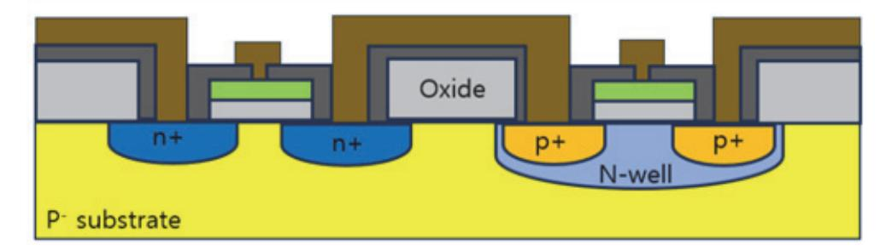

출처: 집필진 제작(2024) [그림 1-32] 메탈 식각

- (라) 절연층 증착(dielectric deposition)
  - 1) 방법
    - 가) CVD: 화학적 기상 증착을 통해 절연층을 형성한다.
    - 나) 스핀 코팅(spin coating): 절연 물질을 웨이퍼에 도포하고, 회전시켜 균일한 층 을 형성한다.
- (마) 화학 기계적 연마(CMP: chemical mechanical polishing)

1) 목적

메탈층과 절연층의 표면을 평탄화하여 다음 공정을 위한 평탄한 표면을 만든다.

- (바) 비아 홀 형성(via hole formation)
  - 1) 목적
    - 상하층 메탈 배선 간의 전기적 연결을 위해 비아 홀을 형성한다.
  - 2) 방법
    - 가) 포토리소그래피: 비아 홀 패턴을 형성한다.
    - 나) 식각: 비아 홀을 식각하여 절연층을 관통한다.
- (2) 금속 배선 공정 흐름을 파악한다.
  - (가) 1단계 금속 배선 공정 흐름
    - 금속 배선 첫 번째 층을 일반적으로 메탈-1(metal-1)층으로 표기한다. 공정 전체 흐 름도를 살펴보면 다음과 같다.
      - 1) 우선 콘택트 홀 공정이 완료된 웨이퍼 위에 금속 배선의 주 구조가 되는 질화 타이 타늄-알루미늄-질화 타이타늄의 금속막을 스퍼터 장비를 이용하여 증착한다.
      - 2) 먼저 하층 질화 타이타늄을 50Å 두께로 증착하고, 그 위에 알루미늄을 6,000Å, 그 위에 다시 상층 질화 타이타늄을 50Å 두께로 증착한다. 이 3가지 증착은 동일 장비에서 연속적으로 이루어진다.
      - 3) 이후 포토 공정의 정상파 효과를 제거하기 위한 질화 산화막과 캡(cap) 산화막이 연 속적으로 증착된다.
      - 4) 이 산화막들은 알루미늄의 낮은 융점으로 열 산화 방법으로는 증착할 수 없어 온도 가 낮은 플라즈마를 이용한 CVD 방법으로 증착한다. 이때 빛의 반사율이 30% 이 하가 되도록 질화 산화막과 캡 산화막의 두께와 성분비를 조정한다.

[그림 1-33]에 금속 배선 공정의 1단계(하층 질화 타이타늄막 증착 ~ cap 산화막 증 착)가 도시되어 있다.

- [그림 1-34]에 금속 배선 공정의 2단계(포토 패턴~식각/세정)가 도시되어 있다.
- 3) 마지막으로 세정을 실시하며 금속 배선 일 공정(metal-1)을 완료한다.
- 2) 이후 금속 배선의 기하학적 구조 형성을 위해 플라즈마 건식 식각을 수행한다.
- 노광, 현상의 순으로 패터닝한다.
- (나) 2단계 금속 배선 공정 흐름 1) 금속 배선 공정에 소요되는 막이 증착이 완료되면 포토의 일련 공정 감광막 도포,

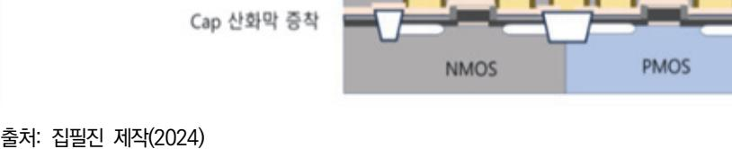

[그림 1-33] 금속 배선 공정의 1단계(하층 질화 타이타늄막 증착 ~ cap 산화막 증착)

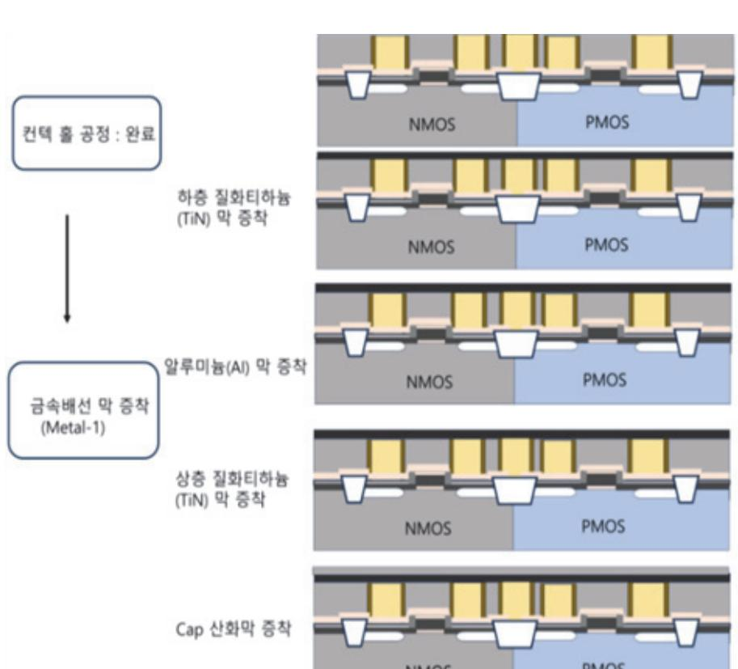

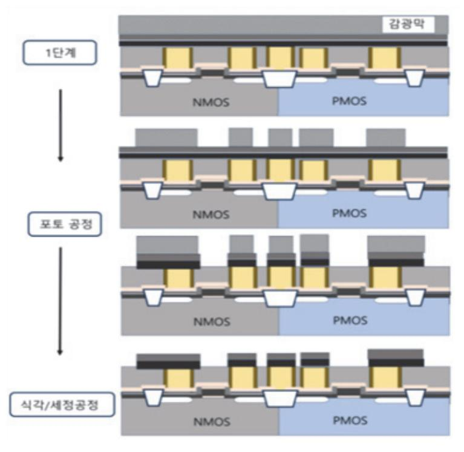

출처: 집필진 제작(2024) [그림 1-34] 금속 배선 공정의 2단계(포토 패턴~식각/세정)

- 3. 비아(via) 배선막 형성 공정을 실시한다.
  - (1) 비아 홀(via hole) 층의 형성
    - (가) 금속 1층(M1)으로부터 식각된 작고 큰 간격(틈)을 완전히 채우는 IMD(inter metal dielectric) 절연 박막(IMD-1) 증착
    - (나) IMD-1 위에 평탄화를 위한 IMD-2 산화막 증착
    - (다) 포토 공정 시 웨이퍼 내 홀의 사이즈가 균일하도록 도와주는 IMD-2층의 평탄화
    - (라) 상층과 하층의 동일 사이즈 원기둥 포토 패턴과 식각
    - (마) IMD 층과 홀에 채워질 금속과의 스트레스(stress) 완화
    - (바) IMD 층으로부터 불순물 확산 방지막 형성
    - (사) 비아 홀을 틈이 없는 원기둥 형태로 채우는 금속 증착
    - (아) 비아 홀 형성 후 금속 배선 공정 시 포토 패턴의 균일도 향상을 위한 평탄화
      - [그림 1-35]에 비아 공정의 전체 흐름도, [그림 1-36]~[그림 1-37]에 1~3단계 비아 공정을 보여 준다.

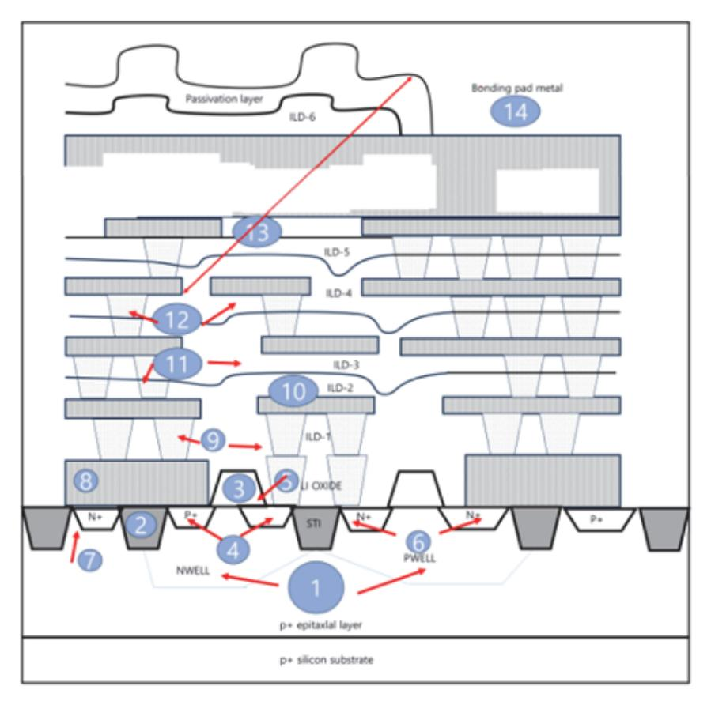

출처: 집필진 제작(2024) [그림 1-35] CMOS 소자의 단면도

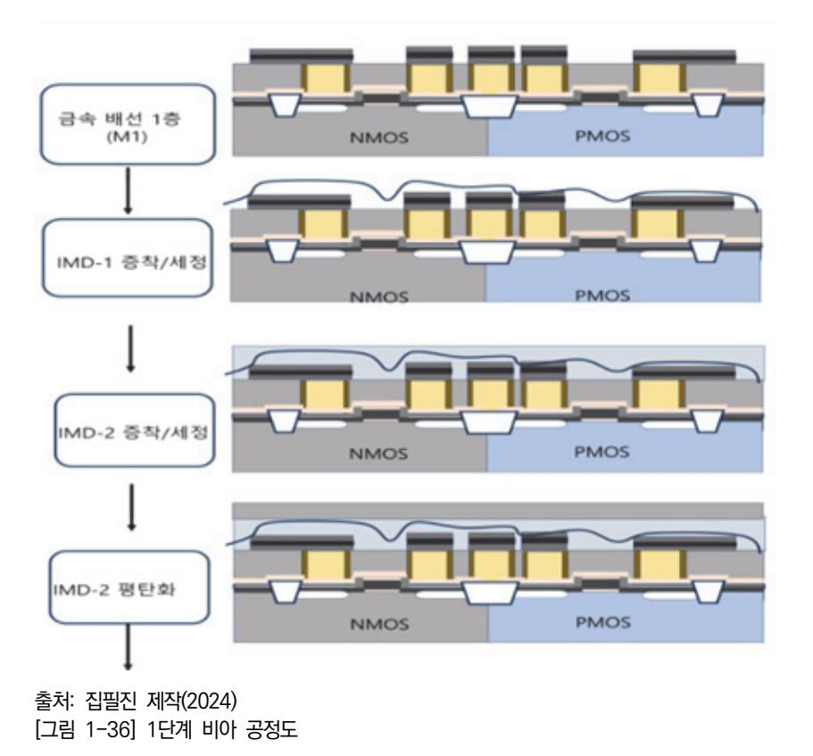

#### 3. 메탈 배선 적층 구조의 중요성을 파악한다.

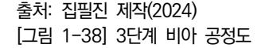

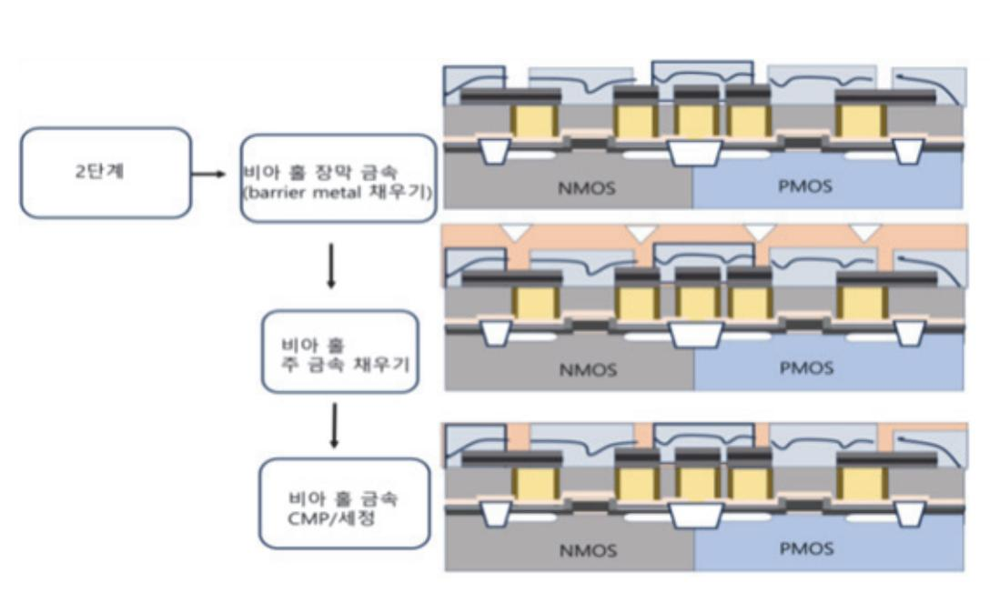

출처: 집필진 제작(2024) [그림 1-37] 2단계 비아 공정도

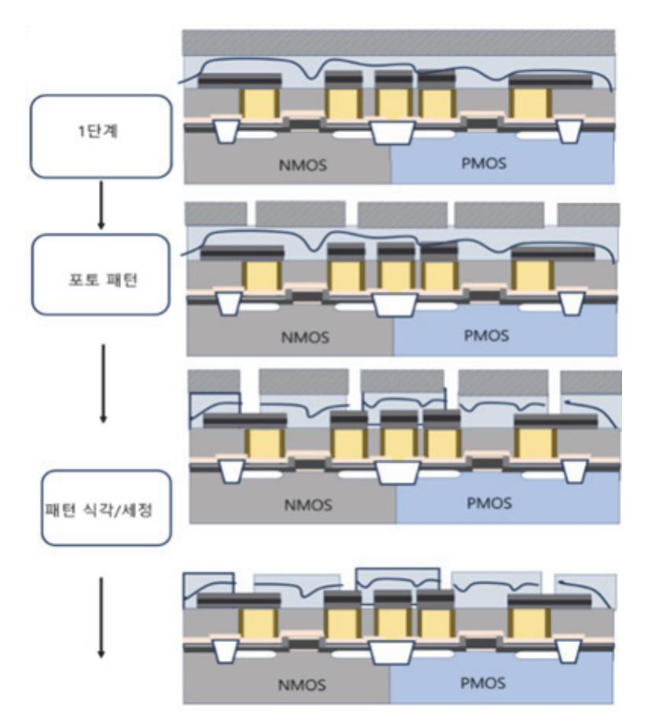

- (1) 전기적 성능 향상
  - (가) 다층 메탈 배선 구조는 전기적 신호의 전송 속도와 효율을 크게 향상시킨다.
  - (나) 구리와 같은 저 저항 재료를 사용하여 신호 전달의 지연을 최소화한다.
- (2) 소자 간 전기적 간섭 최소화
  - (가) 절연층은 메탈 배선 간의 전기적 간섭을 방지하여 신호의 정확성을 보장한다.
  - (나) 저유전율 재료를 사용하여 기생 커패시턴스를 줄인다.
- (3) 회로 집적도 향상
  - (가) 다층 메탈 배선 구조는 회로의 집적도를 높여 더 많은 소자를 한 웨이퍼에 집적할 수 있 게 한다.
  - (나) 이는 반도체 소자의 성능을 극대화하고, 소형화된 고성능 시스템을 구현하는 데 필수적 이다.

메탈 배선의 적층 구조는 시스템 반도체의 성능과 신뢰성에 중요한 역할을 한다. 메탈 배선 층 과 절연층의 적절한 조합은 전기적 신호 전달을 최적화하고, 소자 간의 전기적 간섭을 최소화 한다. 메탈 증착, 패터닝, 식각, 절연층 증착, CMP, 비아 홀 형성 등의 공정 단계는 각각 중요 한 역할을 하며, 이러한 단위 공정들이 조화롭게 작동하여 고성능의 반도체 소자를 완성한다. 시스템 반도체 공정 흐름도를 정확히 해석하고, 각 단위 공정을 이해함으로써 반도체 제조의 효율성과 품질을 높일 수 있다.

수 공정 흐름도로부터 필요한 단위 공정을 파악한다.

시스템 반도체 공정 흐름도를 해석하기 위해서는 전체 공정 흐름도에서 각 단위 공정을 파악하 고, 각 공정이 어떤 역할을 하는지 이해해야 한다. 단위 공정은 웨이퍼 제조, 소자 형성, 메탈 증착, 패시베이션, 패키징 등 다양한 단계로 나눌 수 있으며, 각 단계는 서로 연관되어 최종 반 도체 소자를 완성한다. 다음은 시스템 반도체 공정 흐름도와 필요한 단위 공정에 대한 설명이 다.

- 1. 시스템 반도체 공정 흐름도를 파악한다.
  - (1) 웨이퍼 준비(wafer preparation)
  - (2) 산화 공정(pxidation)
  - (3) 포토리소그래피(photolithography)
  - (4) 식각 공정(etching)
  - (5) 이온 주입(ion implantation)
  - (6) 증착 공정(deposition)

- (5) 이온 주입(ion implantation)
- 2) 습식 식각: 화학 용액을 사용하여 식각한다.
- 1) 건식 식각: 플라즈마를 사용하여 식각한다.
- (다) 주요 단계
- (나) 필요성: 불필요한 부분을 제거하여 소자의 세부 구조를 만든다.
- (가) 역할: 노출된 웨이퍼 표면을 제거하여 원하는 패턴을 형성한다.
- (4) 식각 공정(etching)
- 3) 현상: 노광된 포토레지스트를 현상하여 패턴을 드러낸다.
- 2) 노광: 마스크를 사용하여 빛을 비춰 포토레지스트에 패턴을 형성한다.
- 1) 포토레지스트 도포: 웨이퍼 표면에 감광성 물질을 도포한다.
- (다) 주요 단계
- (나) 필요성: 소자의 세부 구조를 정의하고, 이후 공정에서 필요한 부분을 보호한다.
- (가) 역할: 웨이퍼 표면에 원하는 패턴을 형성한다.
- (3) 포토리소그래피(photolithography)
- (다) 주요 단계 1) 열 산화: 웨이퍼를 고온 산소 또는 수증기 환경에서 처리하여 산화막을 형성한다.
- (2) 산화 공정(oxidation)

(가) 역할: 실리콘 웨이퍼 표면에 절연층을 형성하여 전기적 절연을 제공한다.

(나) 필요성: 산화막은 게이트 절연체로 사용되며, 소자의 누설 전류를 줄인다.

2) 연마 및 세정: 웨이퍼 표면을 연마하고 세정하여 불순물을 제거한다.

(나) 필요성: 고품질의 실리콘 웨이퍼는 소자의 성능과 신뢰성에 직접적인 영향을 끼친다.

- 1) 잉곳 절단: 고순도 실리콘 잉곳을 얇은 웨이퍼로 절단한다.

(10) 테스트 및 검증(testing and verification)

2. 각 단위 공정의 역할과 필요성을 파악한다.

(1) 웨이퍼 준비(wafer preparation)

(7) 금속화(metallization)

(9) 패키징(packaging)

(8) 패시베이션(passivation)

(가) 역할: 반도체 소자의 기반이 되는 고순도 실리콘 웨이퍼를 준비한다.

- (다) 주요 단계

(나) 필요성: 소자의 전기적 특성을 조절하고, 필요한 전도성을 제공한다.

(다) 주요 단계

1) 이온 주입: 고에너지 이온을 웨이퍼에 주입하여 도핑한다.

2) 어닐링: 주입된 이온을 활성화시키기 위해 웨이퍼를 열처리한다.

(6) 증착 공정(deposition)

(가) 역할: 웨이퍼 표면에 얇은 막을 증착하여 절연, 보호, 전도성을 제공한다.

(나) 필요성: 다양한 소자와 구조를 형성하기 위해 필요한 재료층을 추가한다.

(다) 주요 단계

1) CVD(chemical vapor deposition): 화학 반응을 통해 박막을 형성한다.

2) PVD(physical vapor deposition): 물리적 증착 방법을 통해 박막을 형성한다.

(7) 금속화(metallization)

(가) 역할: 전극과 배선을 형성하여 소자의 전기적 연결을 만든다.

(나) 필요성: 전기적 신호를 전달하고, 소자를 외부 회로와 연결한다.

(다) 주요 단계

1) 금속 증착: 스퍼터링 또는 증기 증착을 통해 금속층을 증착한다.

2) 패터닝 및 식각: 포토리소그래피와 식각을 통해 금속 배선을 형성한다.

(8) 패시베이션(passivation)

(가) 역할: 소자의 표면을 보호하고, 외부 환경으로부터 소자를 격리한다.

(나) 필요성: 소자의 신뢰성과 내구성을 향상시킨다.

(다) 주요 단계

1) 패시베이션 층 증착: 실리콘 산화물 또는 실리콘 질화물 층을 증착한다.

(9) 패키징(packaging)

(가) 역할: 칩을 보호하고, 외부와 전기적으로 연결한다.

(나) 필요성: 칩을 물리적, 전기적, 열적으로 보호하고, 사용 가능한 형태로 만든다.

(다) 주요 단계

1) 다이 본딩: 칩을 패키지 기판에 부착한다.

2) 와이어 본딩: 칩과 패키지 리드를 전기적으로 연결한다.

3) 몰딩: 칩을 보호하기 위해 몰딩 컴파운드로 덮는다.

(10) 테스트 및 검증(testing and verification)

(가) 역할: 소자의 기능과 성능을 확인하고, 불량을 식별한다.

(나) 필요성: 최종 제품의 품질과 신뢰성을 보장한다.

(다) 주요 단계

1) 전기적 테스트: 소자의 전기적 특성을 검사한다.

2) 기능 검증: 설계 사양에 따른 소자의 기능을 검증한다.

시스템 반도체 공정 흐름도를 해석하고 각 단위 공정을 이해하는 것은 반도체 소자의 성능과 품질을 보장하는 데 필수적이다. 웨이퍼 준비에서부터 테스트 및 검증에 이르기까지 각 단위 공정은 특정한 역할을 수행하며, 이러한 공정들이 조화롭게 진행되어야 고품질의 시스템 반도 체가 생산된다. 각 공정의 주요 단계와 필요성을 명확히 이해함으로써 전체 공정의 효율성과 안정성을 높일 수 있다.

수행 tip

- 공정 흐름도와 대응되는 세부 공정 내용을 파악하여 공정 개념을 파악하도록 노력한다.
- 공정 전후 테스트 항목을 숙지하도록 한다.

## 학습 1 교수·학습 방법

#### 교수 방법

- 반도체 제조 공정 중에 해당 각 단위 제조 공정별로 충분히 이해할 수 있도록 수업을 진행 한다.
- 반도체 제조 공정 중에 해당 각 단위 제조 공정별로 장비 구조와 역할을 충분히 이해할 수 있도록 해당 장비를 활용하여 수업을 진행한다.
- 반도체 단위 제조 공정 흐름도가 반도체 칩에서 어떤 역할을 하는지에 대해 원리를 토대로 설명한다.
- 학습자가 데이터 특성 평가 및 문서 작성법에 맞게 실습할 수 있도록 지속적인 관심을 가지 도록 지도한다.
- 학습자가 준비한 보고서의 내용 및 발표 태도와 참관하는 다른 학습자의 태도도 유심히 살 펴보고 피드백해 준다.

#### 학습 방법

- 각 단위 공정별 공정, 장비 및 용어에 대한 이해를 높이기 위하여 런 시트(run sheet) 및 현장 일지 등의 대한 자료를 찾아본다.
- 반도체 공정 순서 흐름도에 따른 수행 순서에 맞추어 중요 사항들을 정리한다.
- 학습한 내용을 문서화하여 발표해 보고, 다른 학습자의 내용과 비교한다.
- 다른 학습자의 발표 내용을 주의 깊게 듣고, 자신이 정리한 내용과 비교하면서 수정한다.

## 학습 1 평 가

#### 평가 준거

• 평가자는 학습자가 학습 목표를 성공적으로 달성하였는지를 평가해야 한다.

#### • 평가자는 다음 사항을 평가해야 한다.

|                      |                                           |   | 성취수준 |   |  |
|----------------------|-------------------------------------------|---|------|---|--|
| 학습 내용                | 학습 목표                                     | 상 | 중    | 하 |  |
|                      | - 시스템 반도체 종류와 특성을 해석하여 설명할 수 있다.          |   |      |   |  |
| 시스템 반도체 공정 흐름도 해석 | - Well과 격리(isolation)의 구조를 해석하여 설명할 수 있다. |   |      |   |  |
|                      | - 시스템 반도체 단위 소자 제작 구조를 해석하여 설명할 수 있다.  |   |      |   |  |
|                      | - 메탈 배선의 적층 구조를 해석하여 설명할 수 있다.            |   |      |   |  |
|                      | - 공정 흐름도로부터 필요한 단위 공정을 파악할 수 있다.          |   |      |   |  |

#### 평가 방법

• 서술형 평가

|                      | 평가 항목                                                | 성취수준 |   |   |
|----------------------|------------------------------------------------------|------|---|---|
| 학습 내용                |                                                      | 상    | 중 | 하 |
| 시스템 반도체 공정 흐름도 해석 | - 시스템 반도체를 구성하는 단위 소자의 구조에서 well 구조 의 형성 공정 파악 여부 |      |   |   |
|                      | - 시스템 반도체의 공정 흐름도에서 포토리소그래피 공정의 역 할과 필요성 파악 여부    |      |   |   |
|                      | - 시스템 반도체의 공정 흐름도에서 메탈 배선 공정의 역할과 필요성 파악 여부       |      |   |   |
|                      | - 공정 흐름도로부터 패시베이션 공정의 역할과 필요성 파악 여부               |      |   |   |
|                      | - 공정 흐름도로부터 테스트 공정의 역할과 필요성 파악 여부                    |      |   |   |

#### • 평가자 질문

|                      |                                                               |   | 성취수준 |   |
|----------------------|---------------------------------------------------------------|---|------|---|
| 학습 내용                | 평가 항목                                                         | 상 | 중    | 하 |
| 시스템 반도체 공정 흐름도 해석 | - 시스템 반도제를 구성하는 단위 소자의 구조에서 격리 (isolation) 구조의 형성 공정 파악 여부 |   |      |   |
|                      | - 시스템 반도체의 공정 흐름도에서 패키지 공정의 역할과 필 요성 파악 여부                 |   |      |   |
|                      | - 시스템 반도체의 공정 흐름도에서 금속화 공정의 역할과 필 요성 파악 여부                 |   |      |   |
|                      | - 공정 흐름도로부터 패시베이션 공정의 주요 단계 파악 여부                             |   |      |   |
|                      | - 공정 흐름도로부터 테스트 공정의 주요 단계 파악 여부                               |   |      |   |

#### 피드백

#### 1. 서술형 시험

- 시스템 반도체를 구성하는 단위 소자의 구조에서 well 구조의 형성 공정에 대한 파악 여부를 평 가한 후, 보완이 필요한 사항이나 주요 사항을 표시하여 피드백해 준다.
- 시스템 반도체의 공정 흐름도에서 포토리소그래피 공정의 역할과 필요성에 대해 평가한 후, 보완 이 필요한 사항이나 주요 사항을 표시하여 보충 설명해 준다.
- 평가 결과가 우수한 학습자와 미흡한 학습자를 구분하여 우수한 학습자들에게는 서술형 평가 내 용의 사례 적용 학습을 통한 심화 학습으로 피드백해 주고, 미흡한 학습자들에게는 기초 용어에 대한 평가를 통해 일정 수준을 유지할 수 있도록 보완하여 지도해 준다.
- 2. 평가자 질문
- 공정 흐름도로부터 페시베이션 공정의 주요 단계에 대한 파악 여부를 평가한 후 부족한 점을 지 적하여 정확하게 처리할 수 있도록 보완하여 지도해 준다.
- 메모리 반도체의 공정 흐름도로부터 필요한 단위 공정을 파악할 수 있는 능력에 대한 평가 후, 개선 및 보완 사항에 대한 내용을 정리하여 재학습할 수 있도록 피드백한다.
- 평가 결과가 우수한 학습자와 저조한 학습자를 구분하여 우수한 학습자들에게는 사례 적용 학습 을 통한 심화 학습으로 피드백해 주고, 저조한 학습자들에게는 기초 용어에 대한 설명을 통해 일 정 수준을 유지할 수 있도록 보완하여 지도해 준다.

| 학습 1 | 시스템 반도체 공정 흐름도 해석하기 |
|------|---------------------|
| 학습 2 | 시스템 반도체 단위 소자 개발하기  |
| 학습 3 | 시스템 반도체 공정 소재 평가하기  |

## 2-1. 시스템 반도체 단위 소자 개발

| 학습 목표 | • 시스템 반도체 소자들의 특성 항목과 기준을 해석할 수 있다. • 시스템 반도체 소자들의 검증 패턴을 해석하여 적용할 수 있다. • 시스템 반도체 소자 분석 장비의 사용법을 해석하여 적용할 수 있다. • 시스템 반도체 소자 특성 측정 데이터의 불량 여부를 파악할 수 있다. |
|-------|--------------------------------------------------------------------------------------------------------------------------------------------------------------------|
|       | • 측정 데이터를 근거로 표준화된 기법에 따라 장단기 공정 특성 산포를 예측하여 문서화할 수 있다.                                                                                                         |

## 필요 지식 /

숔 시스템 반도체 단위 소자 특성 항목

시스템 반도체 단위 소자의 특성은 다양한 전기적, 물리적, 열적, 화학적 특성을 포함하며, 이 들 특성은 소자의 성능, 신뢰성 및 효율성에 큰 영향을 끼친다. 주요 특성 항목은 다음과 같다.

- 1. 전기적 특성(electrical characteristics)
  - (1) 임계 전압(threshold voltage, Vth)
    - (가) 트랜지스터가 켜지기 시작하는 전압
    - (나) 소자의 스위칭 속도와 전력 소비에 영향을 미침.
  - (2) 이동도(mobility)
    - (가) 전자 또는 정공이 반도체 물질 내에서 이동하는 속도
    - (나) 높은 이동도는 빠른 스위칭 속도와 낮은 전력 소비를 의미
  - (3) 드레인 전류(drain current, Id)
    - (가) 트랜지스터의 드레인-소스 간 전류
    - (나) 소자의 구동 능력과 관련
  - (4) 출력 저항(output resistance)
    - (가) 소자의 출력 임피던스

- (나) 증폭기의 이득과 관련
- (5) 전류-전압 특성(I-V characteristics)
  - (가) 소자의 전류와 전압 간의 관계
  - (나) 소자의 동작 영역 및 특성 분석에 중요
- (6) 커패시턴스(capacitance)
  - (가) 게이트-소스 및 게이트-드레인 간의 커패시턴스
  - (나) 소자의 주파수 응답에 영향을 미침.
- 2. 물리적 특성(physical characteristics)
  - (1) 게이트 길이(gate Length)
    - (가) 트랜지스터의 채널 길이
    - (나) 소자의 스위칭 속도와 성능에 큰 영향
  - (2) 채널 폭(channel Width)
    - (가) 트랜지스터의 채널 폭
    - (나) 구동 전류와 관련
  - (3) 산화막 두께(oxide thickness)
    - (가) 게이트 산화막의 두께
    - (나) 게이트 전압과 전계에 영향을 미침.
- 3. 열적 특성(thermal characteristics)
  - (1) 열 저항(thermal resistance)
    - (가) 소자의 열전달 능력
    - (나) 발열 관리 및 소자의 신뢰성에 중요
  - (2) 최대 작동 온도(maximum operating temperature)
    - (가) 소자가 안정적으로 동작할 수 있는 최대 온도
    - (나) 소자의 신뢰성과 관련
- 4. 화학적 특성(chemical characteristics)
  - (1) 내식성(corrosion resistance)
    - (가) 소자가 환경 조건에서 가지는 내구성
    - (나) 장기 신뢰성에 중요
  - (2) 표면 청정도(surface cleanliness)
    - (가) 소자 표면의 오염 물질 여부

- (나) 소자의 성능과 신뢰성에 영향을 미침.
- 5. 기타 특성(other characteristics)
  - (1) 신뢰성(reliability)
    - (가) 소자의 장기 동작 안정성
    - (나) 전압 스트레스 테스트, 온도 사이클 테스트 등으로 평가
  - (2) 전력 소모(power consumption)
    - (가) 소자의 전력 소모량
    - (나) 고효율 설계에 중요
  - (3) 고주파 특성(high-frequency characteristics)
    - (가) 고주파에서 소자의 동작 특성
    - (나) RF 및 통신 소자에 중요
  - (4) 정전기 방전 내성(electrostatic discharge tolerance)
    - (가) 소자가 정전기 방전에 얼마나 견디는가?
    - (나) 제조 및 취급 과정에서의 손상 방지에 중요

이들 특성은 반도체 소자의 설계, 제조 및 응용에 중요한 요소들로, 각 특성의 최적화를 통해 고성능, 고신뢰성의 시스템 반도체 소자를 개발할 수 있다.

#### 숕 시스템 반도체 단위 소자의 특성 장비의 특성

시스템 반도체 단위 소자의 특성을 측정하기 위해서는 다양한 고정밀 장비가 필요하다. 각 장 비는 특정 특성을 정확하게 측정하고 분석할 수 있는 기능을 갖추고 있어야 한다. 아래는 시스 템 반도체 단위 소자의 주요 특성을 측정하는 장비와 그 특성에 대한 설명이다.

- 1. 프로브 스테이션(probe station)
  - (1) 특성
    - (가) 정밀한 위치 조정: 미세한 소자를 정확하게 프로빙하기 위해 매우 정밀한 위치 조정 기 능을 제공한다.
    - (나) 다양한 환경 지원: 온도 조절, 진공 환경 등 다양한 환경에서의 측정을 지원한다.
    - (다) 자동화 기능: 자동화된 측정 시스템으로, 반복적인 측정을 효율적으로 수행할 수 있다.
    - (라) 고해상도 카메라: 정확한 위치 설정을 위한 고해상도 비전 시스템을 포함한다.
- 2. 파라미터 분석기(parameter analyzer)

(1) 특성

- (가) 정밀 전류 및 전압 측정: 광범위한 전류 및 전압 범위에서 매우 높은 정밀도로 측정한 다.
- (나) 다채널 측정: 여러 채널을 동시에 측정할 수 있는 기능을 제공하여 효율성을 높인다.
- (다) 자동화된 데이터 수집: 데이터 수집 및 분석을 자동화하여 시간과 노력을 절약한다.
- (라) 그래프 및 데이터 분석: 다양한 그래프 및 분석 도구를 제공하여 측정 데이터를 시각적 으로 분석할 수 있다.
- 3. 반도체 파라미터 테스터(semiconductor parameter tester)
  - (1) 특성
    - (가) 고속 측정: 고속 데이터 수집을 통해 빠른 특성 분석이 가능하다.
    - (나) 고정밀 측정: 매우 낮은 수준의 전류와 전압을 정확하게 측정할 수 있다.
    - (다) 온도 제어 기능: 소자의 특성을 다양한 온도 조건에서 측정할 수 있다.
    - (라) 다양한 테스트 모드: DC, AC, 펄스 테스트 등 다양한 측정 모드를 지원한다.
- 4. 전계 효과 트랜지스터 측정기(FET characterization system)
  - (1) 특성
    - (가) 정밀 제어: 게이트, 드레인, 소스 전압을 정밀하게 제어하고 측정한다.
    - (나) 자동화된 테스트 시퀀스: 다양한 테스트 시퀀스를 자동으로 수행할 수 있다.
    - (다) 데이터 로깅 및 분석: 데이터 로깅 기능과 함께 강력한 분석 도구를 제공한다.
    - (라) 온도 제어: 소자의 특성을 온도 변화에 따라 분석할 수 있는 기능을 포함한다.
- 5. 고주파 측정 시스템(RF measurement system)
  - (1) 특성
    - (가) 넓은 주파수 범위: 광범위한 주파수 범위에서 소자의 특성을 측정할 수 있다.
    - (나) 고정밀 S-파라미터 측정: 고주파 특성을 정확하게 측정할 수 있는 S-파라미터 측정 기 능을 제공한다.
    - (다) 네트워크 분석기: 네트워크 분석기를 통해 복잡한 고주파 특성을 분석한다.
    - (라) 온도 제어: 다양한 온도 조건에서 고주파 특성을 분석할 수 있는 기능을 갖추고 있다.
- 6. 기타 특성 분석 장비
  - (1) 고속 스위칭 분석기(high-speed switching analyzer): 소자의 스위칭 속도와 관련된 특성 을 분석한다.
  - (2) 정전기 방전 테스터(ESD tester): 소자의 ESD 내성을 측정하여 신뢰성을 평가한다.
  - (3) 화학 분석 장비(chemical analyzer): 소자의 표면 청정도와 화학적 특성을 분석한다.

(가) 파라미터 분석기를 프로브 스테이션에 연결한다.

- (2) 프로브 스테이션 연결
- (나) 분석기를 초기화하고 필요한 설정을 입력한다.
- (가) 파라미터 분석기의 전원을 켜고 소프트웨어를 실행한다.
- (1) 시스템 준비
- 2. 파라미터 분석기(parameter analyzer)
- (나) 이상값이나 문제점을 확인하여 필요한 조치를 취한다.
- (가) 수집된 데이터를 소프트웨어를 통해 분석한다.
- (5) 데이터 분석
- (나) 데이터가 수집되는 동안 실시간 모니터링을 실시한다.
- (가) 원하는 테스트 프로그램을 선택하고 실행한다.

- (4) 측정 수행

(2) 웨이퍼 로딩

- (나) 고해상도 카메라를 사용하여 위치를 확인한다.

(나) 웨이퍼가 정확히 위치하도록 조정한다.

- (가) 프로브 팁을 웨이퍼의 특정 패드에 정확히 맞춘다.
- (3) 프로브 설정
- (나) 프로브 스테이션의 온도 및 진공 환경을 설정한다.

(가) 웨이퍼를 프로브 스테이션의 스테이지에 조심스럽게 배치한다.

- (가) 전원을 켜고 시스템이 부팅될 때까지 기다린다.
- (1) 장비 설정

다. 아래는 주요 특성 장비의 운영 방법에 대한 설명이다.

숖 시스템 반도체 단위 소자의 특성 장비의 운영 방법

- 1. 프로브 스테이션(probe station)

열 분석기(thermal analyzer): 소자의 열 저항 및 열 특성을 분석한다.

시스템 반도체 단위 소자의 특성을 측정하기 위한 장비는 높은 정밀도와 다양한 기능을 갖추고 있어야 한다. 이러한 장비들은 소자의 전기적, 물리적, 열적, 화학적 특성을 정확하게 측정하고

시스템 반도체 단위 소자의 특성을 측정하기 위해 다양한 고정밀 장비가 사용된다. 이러한 장 비의 운영 방법을 정확히 이해하고 숙달하는 것은 소자의 성능 평가와 공정 개선에 필수적이

분석하는 데 필수적이며, 이를 통해 소자의 성능을 최적화하고 신뢰성을 보장할 수 있다.

(나) 연결 상태를 확인하고, 모든 연결이 올바르게 되어 있는지 점검한다.

- (3) 측정 설정
  - (가) 측정할 파라미터(예: Vth, Id)를 선택한다.
  - (나) 각 파라미터에 대한 테스트 조건을 설정한다.
- (4) 측정 수행
  - (가) 소프트웨어에서 측정을 시작한다.
  - (나) 측정이 완료될 때까지 데이터를 실시간으로 모니터링한다.
- (5) 결과 분석
  - (가) 측정이 완료된 후 데이터를 분석한다.
  - (나) 그래프를 생성하고, 결과를 해석하여 소자의 특성을 평가한다.
- 3. 반도체 파라미터 테스터(semiconductor parameter tester)
  - (1) 장비 초기화
    - (가) 파라미터 테스터의 전원을 켜고 초기화 과정을 진행한다.
    - (나) 테스트할 소자를 장비에 연결한다.
  - (2) 테스트 조건 설정
    - (가) 테스트할 파라미터와 조건을 설정한다.
    - (나) DC, AC, 펄스 테스트 등을 선택하여 다양한 조건에서 소자를 평가한다.
  - (3) 측정 수행
    - (가) 테스트 프로그램을 실행하여 측정을 시작한다.
    - (나) 각 측정 단계에서 데이터를 실시간으로 모니터링한다.
  - (4) 결과 저장 및 분석
    - (가) 측정 결과를 저장하고 소프트웨어를 통해 분석한다.
    - (나) 데이터의 정확성을 확인하고 필요한 경우 재측정을 실시한다.
- 4. 전계 효과 트랜지스터 측정기(FET characterization system)
  - (1) 시스템 설정
    - (가) 전원을 켜고 시스템을 설정한다.
    - (나) 소프트웨어를 통해 게이트, 드레인, 소스 전압을 설정한다.
  - (2) 프로브 연결
    - (가) FET의 각 단자에 프로브를 정확히 연결한다.
    - (나) 연결 상태를 확인하고 시스템이 준비되었는지 점검한다.

- (3) 측정 실행
  - (가) 원하는 테스트 시퀀스를 선택하고 실행한다.
  - (나) 테스트 중 데이터를 실시간으로 모니터링하여 이상 유무를 확인한다.
- (4) 데이터 분석
  - (가) 측정이 완료되면 데이터를 분석한다.
  - (나) 그래프와 보고서를 생성하여 결과를 해석하고 문서화한다.
- 5. 고주파 측정 시스템(RF measurement system)
  - (1) 장비 초기화
    - (가) RF 측정 시스템의 전원을 켜고 초기화 과정을 진행한다.
    - (나) 측정할 소자를 네트워크 분석기에 연결한다.
  - (2) 측정 설정
    - (가) 주파수 범위와 S-파라미터 측정 조건을 설정한다.
    - (나) 온도 제어 옵션을 설정하여 다양한 온도 조건에서 측정을 수행할 수 있도록 한다.
  - (3) 측정 수행
    - (가) 소프트웨어를 통해 측정을 시작한다.
    - (나) 각 주파수 대역에서 데이터를 수집하고 실시간으로 모니터링한다.
  - (4) 결과 분석
    - (가) 측정이 완료되면 데이터를 저장하고 분석한다.
    - (나) S-파라미터 그래프를 생성하고 결과를 해석한다.

각 장비의 운영 방법은 정밀한 설정과 신중한 조작을 요구한다. 정기적인 유지 보수와 정확한 측정을 통해 시스템 반도체 단위 소자의 특성을 정확하게 평가할 수 있다. 운영 방법을 철저히 숙지하고, 정밀한 장비를 사용하여 높은 신뢰성의 데이터를 얻는 것이 중요하다.

숗 시스템 반도체 소자 특성에 영향을 주는 공정 매개 변수(parameter)

시스템 반도체 소자의 특성에 영향을 주는 공정 매개 변수는 매우 다양하다. 이들 매개 변수는 소자의 성능, 신뢰성, 전기적 특성 등 다양한 측면에 직접적인 영향을 끼친다. 주요 공정 매개 변수와 그들이 미치는 영향은 다음과 같다.

- 1. 웨이퍼 크기 및 유형
  - (1) 크기: 웨이퍼의 직경(예: 200mm, 300mm)은 생산 효율과 비용에 영향을 끼친다.
  - (2) 유형: 실리콘 웨이퍼의 유형(예: SOI, Bulk Si)은 소자의 전기적 특성과 열 특성에 영향을 끼친다.

55

- 2. 산화 공정(oxidation process)
  - (1) 온도 및 시간: 산화막의 두께와 품질은 산화 온도와 시간에 따라 달라진다. 높은 온도와 긴 시간은 두꺼운 산화막을 형성한다.
  - (2) 산화 환경: 건식 산화, 습식 산화, 클로린 첨가 등 산화 환경에 따라 산화막의 특성이 변한 다.
- 3. 포토리소그래피(photolithography)
  - (1) 노광 파장: 짧은 파장은 더 작은 피처 크기를 가능하게 한다.
  - (2) 레지스트 유형: 사용되는 레지스트의 종류와 특성은 패턴 해상도와 정밀도에 영향을 끼친다.
  - (3) 현상 조건: 현상 시간과 화학 물질은 패턴의 정확성과 품질에 영향을 끼친다.
- 4. 이온 주입(ion implantation)
  - (1) 에너지: 이온 주입 에너지는 이온의 깊이를 결정하며, 이는 소자의 도핑 프로파일에 영향을 준다.
  - (2) 용량: 주입되는 이온의 농도는 소자의 전기적 특성(예: 임계 전압)에 영향을 끼친다.
  - (3) 종류: 주입되는 이온의 종류(예: B, P, As)는 도핑 프로파일과 소자의 타입(n형 또는 p형)을 결정한다.
- 5. 식각(etching)
  - (1) 식각 유형: 건식 식각과 습식 식각 중 선택은 식각 프로파일과 손상 정도에 영향을 끼친다.
  - (2) 식각 시간: 시간 조절은 패턴의 깊이와 정밀도에 영향을 준다.
  - (3) 플라즈마 조건: 플라즈마 밀도와 에너지는 식각 속도와 균일성에 영향을 끼친다.
- 6. CVD 및 PVD(chemical/physical vapor deposition)
  - (1) 온도: 증착 온도는 박막의 결정 구조와 품질에 영향을 끼친다.
  - (2) 압력 및 가스 유량: 반응 가스의 압력과 유량은 박막의 성장 속도와 균일성에 영향을 준다.
  - (3) 플라즈마 조건(PVD): 플라즈마 에너지는 증착 속도와 박막의 밀도에 영향을 끼친다.
- 7. 어닐링(annealing)
  - (1) 온도 및 시간: 어닐링 온도와 시간은 소자의 전기적 활성화와 재결정화에 영향을 끼친다.
  - (2) 환경: 질소, 아르곤 등의 어닐링 환경은 산화물 형성과 표면 상태에 영향을 준다.
- 8. 평탄화(CMP: chemical mechanical planarization)
  - (1) 압력: CMP 공정에서의 압력은 웨이퍼 표면의 평탄도에 영향을 끼친다.
  - (2) 슬러리 유형: 사용되는 슬러리의 화학적 조성과 입자 크기는 평탄화 속도와 표면 거칠기에 영향을 끼친다.

- 9. 금속화(metallization)
  - (1) 금속 종류: 사용되는 금속의 종류(예: Al, Cu)는 배선 저항과 전기적 특성에 영향을 준다.
  - (2) 증착 방법: 스퍼터링, CVD 등 증착 방법은 금속 박막의 밀도와 접착력에 영향을 끼친다.
- 10. 패키징(packaging)
  - (1) 본딩 기술: 와이어 본딩, 플립 칩 본딩 등 본딩 기술은 전기적 연결과 열 방출 특성에 영향 을 준다.
  - (2) 캡슐화 재료: 사용되는 캡슐화 재료는 소자의 열적 및 기계적 보호에 영향을 끼친다.

이들 공정 매개 변수는 소자의 특성에 중요한 영향을 끼치므로, 최적의 조건을 유지하기 위해 서는 정밀한 공정 제어와 지속적인 품질 관리가 필요하다. 각 단계에서의 세심한 관리와 최적 화는 고성능, 고신뢰성의 시스템 반도체 소자를 생산하는 데 필수적이다.

수 시스템 반도체 소자 측정 데이터의 통계적 처리 기법

시스템 반도체 소자의 특성 측정 데이터를 효과적으로 분석하고 해석하기 위해 통계적 처리 기 법을 사용하는 것은 매우 중요하다. 이러한 기법은 데이터의 정확성을 평가하고, 소자의 성능 을 최적화하며, 제조 공정의 신뢰성을 높이는 데 도움을 준다. 아래는 시스템 반도체 소자 측 정 데이터의 통계적 처리에 사용되는 주요 기법들이다.

- 1. 기초 통계 분석(descriptive statistics)
  - (1) 평균(mean): 데이터의 중심 경향을 나타낸다. 소자의 평균 성능 지표를 확인하는 데 사용된 다.
  - (2) 표준 편차(standard deviation): 데이터의 변동성을 측정한다. 소자의 특성 분포가 얼마나 넓게 퍼져 있는지를 파악한다.
  - (3) 분산(variance): 표준 편차의 제곱으로, 변동성의 정도를 나타낸다.
  - (4) 중앙값(median): 데이터의 중앙값으로, 데이터의 분포를 이해하는 데 유용하다.
  - (5) 최댓값 및 최솟값(max and min): 데이터의 범위를 파악한다.
- 2. 가설 검정(hypothesis testing)
  - (1) t-검정(t-test): 두 그룹 간의 평균 차이를 검정하여, 소자의 두 샘플 간에 유의한 차이가 있 는지 평가한다.
  - (2) ANOVA(analysis of variance): 3개 이상의 그룹 간의 평균 차이를 검정한다.
  - (3) 카이제곱 검정(chi-square test): 범주형 데이터 간의 관계를 검정한다.
- 3. 회귀 분석(regression analysis)
  - (1) 선형 회귀(linear regression): 두 변수 간의 관계를 모델링하여, 독립 변수의 변화가 종속 변수에 미치는 영향을 분석한다.

- (2) 다중 회귀(multiple regression): 여러 독립 변수가 종속 변수에 미치는 영향을 분석한다.
- (3) 로지스틱 회귀(logistic regression): 이진 종속 변수를 예측하는 데 사용된다.
- 4. 통계적 공정 관리(statistical process control, SPC)
  - (1) 관리도(control charts): 공정 변동을 모니터링하고, 공정이 통제 상태에 있는지 확인한다. 예: x-바 관리도, R 관리도.
  - (2) 공정 능력 지수(process capability index, Cpk): 공정의 능력을 평가하여, 공정이 설정된 사양 내에서 얼마나 잘 운영되는지 분석한다.
- 5. 신뢰성 분석(reliability analysis)
  - (1) MTTF(mean time to failure): 소자의 평균 고장 시간을 측정하여 신뢰성을 평가한다.
  - (2) 수명 주기 분석(life cycle analysis): 소자의 수명 주기를 분석하여 예상되는 수명을 평가한 다.
- 6. 다변량 분석(multivariate analysis)
  - (1) 주성분 분석(principal component analysis, PCA): 데이터의 차원을 축소하여, 중요한 변 수를 식별하고 데이터 구조를 단순화한다.
  - (2) 군집 분석(cluster analysis): 유사한 특성을 가진 데이터 포인트를 그룹화하여, 데이터의 패 턴을 식별한다.
- 7. 비모수 통계(non-parametric statistics)
  - (1) 순위 합 검정(rank sum test): 데이터가 정규 분포를 따르지 않을 때 두 그룹 간의 차이를 평가한다.
  - (2) 카플란-마이어 분석(kaplan-meier analysis): 생존 분석 기법으로, 소자의 수명 데이터를 분석하는 데 사용된다.
- 8. 기타 고급 통계 기법
  - (1) 베이지안 분석(bayesian analysis): 사전 확률과 데이터로부터 얻은 정보로 사후 확률을 계 산하여, 불확실성을 포함한 예측을 수행한다.
  - (2) 머신러닝 기법(machine learning techniques): 대규모 데이터를 분석하여 패턴을 발견하고 예측 모델을 구축한다.

시스템 반도체 소자의 특성 측정 데이터의 통계적 처리는 소자의 성능을 평가하고 제조 공정을 최적화하는 데 중요한 역할을 한다. 각 기법은 특정 상황과 목적에 맞게 적용되며, 이를 통해 데이터의 정확성을 높이고 신뢰할 수 있는 결과를 도출할 수 있다. 정밀한 통계 분석을 통해 소자의 품질과 성능을 향상시킬 수 있다.

#### 재료·자료

- 반도체 모스 소자 측정 웨이퍼
- 소자 측정 패턴 설명서
- 소자 측정 장비 사용 설명서

#### 기기(장비 ・ 공구)

- 소자 측정 프루브 장비
- 소자 측정 장비
- 안전·유의 사항
  - 단위 소자 측정하고 특성을 파악하기 위해서는 사용 환경에 대해 적절한 파악 및 조치가 있 어야 한다.
  - 측정 장비에 대한 충분한 설명을 통해 안전사고 방지를 위한 사전 조치가 선행되어야 한다.

#### 수행 순서

숔 시스템 반도체 단위 소자 개발을 위한 절차를 숙지한다.

시스템 반도체 제조 공정 개발을 위한 단위 소자 개발은 복잡한 과정이며, 단위 소자의 설계부 터 최적화, 검증, 제조 공정에 이르기까지 여러 단계를 포함한다. 시스템 반도체는 고도로 집적 된 회로로 구성되며, 그 안에 다양한 기능을 수행하는 여러 소자(트랜지스터, 커패시터, 저항 등)가 포함된다. 따라서, 단위 소자의 개발은 전체 시스템 성능에 중요한 영향을 끼친다. 이러한 단계를 통해 시스템 반도체 제조 공정에서 단위 소자를 개발하고 최적화할 수 있다. 각 단계에서 철저한 분석과 검증을 통해 소자의 성능과 품질을 보장하며, 이를 기반으로 고성능 시스템 반도체를 제조할 수 있다.

- 1. 요구 사항 정의 및 설계 목표를 설정한다.
  - (1) 성능 요구 사항 정의

개발할 단위 소자의 전기적, 물리적, 열적 특성에 대한 요구 사항을 정의한다. 예를 들 어, 트랜지스터의 경우 스위칭 속도, 누설 전류, 문턱 전압(Vth) 등을 고려한다.

(2) 응용 시나리오 설정

소자가 사용될 시스템 반도체의 응용 시나리오를 설정하여, 해당 응용에 필요한 특성을 도출한다. 예를 들어, 고속 신호 처리나 저전력 응용을 위한 요구 사항을 반영한다.

(3) 기술 노드 결정

반도체 기술 노드(예 :7㎚, 10㎚ 등)를 결정하여, 소자의 크기, 밀도, 성능을 설정한다.

- 2. 소자 레벨 설계를 한다.
  - (1) 소자 구조 설계를 한다.

시스템 반도체 제조 공정 개발에서 단위 소자 구조 설계는 반도체 소자의 전기적, 물리 적 특성을 결정하는 중요한 단계이다. 소자 구조 설계는 트랜지스터, 커패시터, 저항 등 과 같은 기본 소자들의 크기, 모양, 재료, 배치 등을 정밀하게 결정하여, 최종 제품의 성능을 극대화하는 것을 목표로 한다. 다음은 단위 소자 구조 설계의 주요 단계와 고려 사항이다.

- (가) 설계 목표 및 요구 사항 정의
  - 1) 성능 요구 사항 설정

소자가 만족해야 할 주요 성능 지표를 설정한다. 예를 들어, 트랜지스터의 경우 스위칭 속도, 문턱 전압(Vth), 드레인 전류(Id), 전력 소모 등이 포함될 수 있다.

2) 기술 노드 결정

소자의 크기와 밀도에 영향을 끼치는 기술 노드를 결정한다. 예를 들어, 7nm, 10nm, 14nm 등의 기술 노드에 따라 설계 제약이 달라진다.

3) 적용 분야 분석

소자가 사용될 시스템 반도체의 응용 분야(예: 고속 프로세서, 저전력 IoT 장치 등)를 분석하여, 그에 맞는 최적의 소자 특성을 설정한다.

- (나) 소자 구조 설계
  - 1) 트랜지스터 구조 설계
    - 가) FinFET 구조: 최신 기술 노드에서는 FinFET(핀펫) 구조가 일반적이다. FinFET 은 전류 흐름을 제어하는 채널이 핀 모양으로 돌출된 구조로, 기존의 평면 트랜 지스터보다 전류 누설이 적고, 성능이 우수하다.
    - 나) Gate-All-Around(GAA) 구조: 더욱 진보된 기술에서는 GAA 구조를 사용하 여, 게이트가 채널을 완전히 둘러싸도록 설계한다. 이는 전력 소모를 줄이고 성 능을 극대화한다.
    - 다) 채널 길이(L): 채널 길이는 소자의 스위칭 속도와 문턱 전압에 영향을 끼치므로, 설계 목표에 맞게 최적화해야 한다.
    - 라) 게이트 산화막 두께(Tox): 게이트 산화막 두께는 전계 효과를 결정하며, 두께를 줄임으로써 높은 전계 강도와 빠른 스위칭 특성을 얻을 수 있다.
  - 2) 커패시터 구조 설계

- 가) 고유전율 재료(HK): 고유전율 재료를 사용하여 커패시턴스를 높이면서, 전기적 손실을 최소화하는 설계를 한다. HfO2, ZrO2 등이 일반적으로 사용된다.
- 나) 메탈 게이트 구조: 금속 게이트를 사용하여, 커패시터의 성능을 개선하고 전력 손실을 줄이는 구조를 설계한다.
- 3) 저항기 구조 설계
  - 가) 폴리실리콘 저항: 폴리실리콘을 사용한 저항은 온도 특성이 우수하며, CMOS 공정과 호환성이 좋다.
  - 나) 금속 저항: 금속 저항은 정확한 저항값을 제공하며, 고속 동작이 필요한 회로에 서 사용된다. TiN, TaN 등이 활용된다.
- (다) 레이아웃 설계
  - 1) 소자 배치 및 간격 설정
  - 각 단위 소자를 칩 내에서 배치하고, 소자 간 간격을 설정한다. 간격 설정은 상 호 간섭을 최소화하고, 신호 무결성을 보장하는 데 중요한 역할을 한다.
  - 2) 금속 배선 설계
    - 가) 소자 간의 전기적 연결을 위한 금속 배선을 설계한다. 배선의 층별 구성, 두께, 저항, 용량을 고려하여 최적의 배선 구조를 설계한다.
    - 나) 전력 및 그라운드 네트워크 설계: 안정적인 전원 공급을 위해 전력 및 그라운드 네트워크를 설계한다. 이는 전력 소모와 노이즈에 중요한 영향을 끼친다.
- (라) 전기적 시뮬레이션 및 검증
  - 1) SPICE 모델링 및 시뮬레이션

소자의 전기적 특성을 SPICE 모델로 표현하고, 회로 시뮬레이션을 통해 소자가 실제로 목표 성능을 달성할 수 있는지 검증한다. 전류-전압 특성, 스위칭 속도 등을 분석한다.

2) 파라미터 추출

시뮬레이션 결과를 바탕으로 소자의 주요 파라미터를 추출하여, 설계 목표와의 일치 여부를 확인한다. 필요시 설계를 조정하여 목표에 맞추어 최적화한다.

- (마) 공정 시뮬레이션 및 모델링
  - 1) TCAD 시뮬레이션

기술 컴퓨터 지원 설계(TCAD)를 사용하여 소자의 물리적, 화학적 동작을 시뮬레 이션한다. 도핑 프로파일, 전기장 분포, 온도 효과 등을 분석하여 구조 설계를 검 증한다.

2) 공정 변동성 분석

공정에서 발생할 수 있는 변동성(예: 도핑 농도, 산화막 두께 변화 등)을 고려하 여, 소자의 성능이 변동성에 민감하지 않도록 설계한다.

61

- (바) 최적화 및 피드백
  - 1) 설계 최적화

시뮬레이션과 검증 결과를 바탕으로 설계를 최적화한다. 필요한 경우, 소자 크기, 재료, 구조 등을 조정하여 목표 성능을 달성할 수 있도록 한다.

2) 피드백 루프

검증 결과를 피드백하여 설계에 반영하고, 반복적으로 설계를 개선한다. 이 과정 에서 시뮬레이션 결과와 실제 제조 공정의 데이터를 비교하여 최적화를 진행한 다.

- (사) 프로토타입 제작 및 테스트
  - 1) 프로토타입 제작

최종 설계된 소자를 바탕으로 프로토타입 칩을 제작한다. 이 단계에서 실제 제조 공정과의 호환성을 확인하고, 소자의 성능을 평가한다.

2) 전기적 및 물리적 테스트

프로토타입 소자의 전기적 특성(예: I-V 특성, 신호 지연, 전력 소모 등)을 측정 하여 설계 목표를 충족하는지 확인한다. 필요시 설계를 수정하여 최종 목표에 도 달할 수 있도록 한다.

- (아) 양산 준비 및 문서화
  - 1) 양산 공정 설계

프로토타입 테스트 결과를 바탕으로 양산에 적합한 공정을 설계한다. 공정 제어, 품질 관리, 변동성 관리 등을 포함한 종합적인 양산 계획을 수립한다.

2) 문서화 및 교육

최종 설계 및 공정 정보를 문서화하여, 관련 엔지니어와 생산팀에 교육을 실시한 다. 이를 통해 양산 단계에서 일관된 품질과 성능을 유지할 수 있도록 한다.

이와 같은 단위 소자 구조 설계 과정은 시스템 반도체의 성능과 신뢰성을 크게 좌우한 다. 각 단계에서 철저한 시뮬레이션과 검증을 통해 설계를 최적화하고, 최종 제품의 품 질을 보장하는 것이 중요하다.

(2) 단위 소자의 재료 선택을 한다.

시스템 반도체 제조 공정에서 단위 소자의 재료 선택은 소자의 성능, 신뢰성, 제조 공정 의 효율성 등에 직접적인 영향을 끼친다. 적절한 재료를 선택하는 것은 소자의 전기적 특성, 열적 안정성, 기계적 내구성 등을 보장하는 데 필수적이다. 다음은 단위 소자(예: 트랜지스터, 커패시터, 저항기 등)에서 사용되는 주요 재료와 선택 기준이다.

(가) 트랜지스터(TFT, MOSFET 등) 재료 선택 트랜지스터는 시스템 반도체에서 가장 중요한 단위 소자 중 하나이며, 다양한 재료 가 사용된다.

- 1) 기판(material substrate)
  - 가) 실리콘(Si)
  - ① 가장 널리 사용되는 기판 재료로, 전기적 특성이 우수하며 공정 기술이 성숙되 어 있다.
  - ② 고성능 트랜지스터를 구현하기 위한 표준 기판이다.
  - 나) 실리콘 온 인슐레이터(SOI)
  - ① 절연체 위에 얇은 실리콘층이 형성된 구조로, 누설 전류를 줄이고 성능을 향상 시킬 수 있다.
  - ② 고속, 저전력 응용에서 사용된다.
- 2) 갈륨 나이트라이드(GaN)
  - ① 고전압, 고속 스위칭 소자에 사용되며, 전력 소모가 적고 내열성이 뛰어나다.
  - ② RF 소자 및 전력 소자에 적합하다.
- 3) 게이트 절연체(Gate Dielectric)
  - 가) 이산화 실리콘(SiO2)
  - ① 전통적인 게이트 절연체로, 양호한 절연 특성과 안정성을 제공한다.
  - ② CMOS 공정에서 오랜 시간 동안 사용되어 왔다.
  - 나) 고유전율 재료(High-k Materials, HfO2, ZrO2 등)
  - ① SiO2보다 유전율이 높아 게이트 누설 전류를 줄이면서 게이트 전계를 높일 수 있다.
  - ② 최신 FinFET 및 GAA 소자에서 주로 사용된다.
- 4) 게이트 전극(gate electrode)
  - 가) 폴리실리콘(Poly-Si)

CMOS 공정에서 오랫동안 사용된 전극 재료로, 공정이 안정적이며 표준화되

- 어 있다.
- 나) 메탈 게이트(Metal Gate, TiN, TaN, Al 등)
- ① 금속 게이트는 전도성이 우수하며, 고유전율 절연체와 함께 사용되어 소자의 성능을 크게 향상시킬 수 있다.
- ② 최신 기술 노드에서 전력 소모를 줄이기 위해 널리 사용된다.
- 5) 채널 재료(channel material)
  - 가) 실리콘(Si)

대부분의 트랜지스터에서 채널 재료로 사용된다. 전자 이동도가 적절하고, 공 정 호환성이 뛰어나다.

- 나) 실리콘-저마늄(SiGe)
- Si보다 전자 이동도가 우수하며, 스트레인 실리콘 기술을 적용해 성능을 향상

시킬 수 있다.

다) III-V 반도체(GaAs, InGaAs 등)

고속 소자에서 전자 이동도가 매우 높아 고성능 소자에 사용된다. 주로 고주 파 및 RF 응용에 적합한다.

(나) 커패시터(Capacitor) 재료 선택

커패시터는 다양한 소자에서 전하를 저장하거나 필터링하는 역할을 한다.

- 1) 유전체(Dielectric Material)
  - 가) 이산화 실리콘(SiO2)

기본적인 유전체 재료로, 신뢰성과 공정 호환성이 우수하다.

나) 고유전율 재료(High-k Materials, HfO2, Al2O3, TiO2 등)

유전율이 높아 커패시턴스를 증가시킬 수 있으며, 소형화된 소자에서도 높은 성능을 발휘한다.

다) 바륨 스트론튬 타이타네이트(BST)

매우 높은 유전율을 가지고 있으며, 고주파 필터 및 RF 응용에서 사용된다.

- 2) 전극(Electrode Material)
  - 가) 폴리실리콘(Poly-Si)
  - 표준 CMOS 공정에서 사용되며, 안정적이고 신뢰성이 높은 전극 재료이다.
  - 나) 플래티넘(Pt)

고온에서의 안정성이 뛰어나며, DRAM 등의 고성능 커패시터에 사용된다.

다) 루테늄(Ru)

낮은 저항과 고유전율 유전체와의 호환성 때문에 고성능 커패시터에 사용된 다.

(다) 저항기(Resistor) 재료 선택

저항기는 전류를 제한하거나 전압 분배를 수행하는 역할을 한다.

1) 저항성 재료(Resistive Material)

가) 폴리실리콘(Poly-Si)

CMOS 공정에서 표준으로 사용되며, 저항값의 조정이 용이하다.

나) 탄탈륨 나이트라이드(TaN)

안정적인 저항값과 우수한 내열성을 제공하며, 고정밀 저항에 사용된다.

다) 니켈 크롬(NiCr)

온도 안정성이 우수하여 아날로그 회로에서 고정밀 저항기로 사용된다. 2) 기판 소재

가) 실리콘(Si)

대부분의 저항기에서 기본 기판으로 사용되며, CMOS 공정과 호환성이 뛰어 나다.

나) 사파이어(sapphire)

절연성이 우수하여, 특정 RF 응용이나 고온 환경에서 사용된다.

- (라) 기타 재료 선택 고려사항
  - 1) 열적 특성

재료의 열전도율, 열팽창 계수 등은 소자의 열적 안정성에 중요한 영향을 끼친다. 소자가 동작하는 동안 발생하는 열을 효과적으로 관리하기 위해 적절한 열전도성 과 안정성을 가진 재료를 선택해야 한다.

2) 공정 호환성

선택된 재료가 기존 공정과 호환성이 있는지 즉 다른 공정 단계와 충돌 없이 사 용될 수 있는지를 고려해야 한다. 이는 공정 비용과 수율에 큰 영향을 끼친다.

3) 신뢰성 및 수명

재료의 내구성, 스트레스 테스트 결과 등을 고려하여 장기적인 신뢰성과 수명을 보장할 수 있는 재료를 선택해야 한다.

4) 환경 영향 및 규제

재료가 환경 친화적이며, 규제 요구 사항을 충족하는지 검토해야 한다. 유해 물질 사용 제한 지침(ROHS)과 같은 규정을 준수하는 재료를 선택해야 한다.

이와 같은 재료 선택 과정은 단위 소자의 성능, 신뢰성, 제조 공정의 효율성 등을 결정 짓는 중요한 요소이다. 각 소자의 특성과 목표 성능을 고려하여 최적의 재료를 선택하 고, 이를 바탕으로 고성능 시스템 반도체를 제조할 수 있도록 해야 한다.

(3) 전기적 모델링을 한다.

시스템 반도체 제조 공정 개발에서 단위 소자의 전기적 모델링은 소자의 전기적 특성을 수학적으로 표현하여, 실제 회로 설계와 시뮬레이션에 활용할 수 있도록 하는 중요한 단 계이다. 전기적 모델링을 통해 소자의 동작을 예측하고, 최적의 설계를 도출하며, 공정 변동성이 소자 성능에 미치는 영향을 분석할 수 있다. 다음은 단위 소자의 전기적 모델 링 과정과 주요 방법들이다.

- (가) 모델링 목표 정의 및 요구 사항 수집
  - 1) 목표 정의

단위 소자의 전기적 특성을 정확하게 표현하여, 회로 시뮬레이션에서 활용할 수 있는 모델을 개발하는 것이 목표이다. 이를 통해 소자의 I-V 특성, C-V 특성, 스위칭 속도, 전력 소모 등을 예측할 수 있다.

2) 요구 사항 수집

65

모델링에 필요한 소자의 물리적 특성(예: 도핑 프로파일, 게이트 길이, 산화막 두 께 등)과 전기적 특성(예: 문턱 전압, 이동도, 온도 특성 등)을 수집한다.

3) 모델 정확도 및 복잡성 결정:

모델의 정확도와 복잡성을 결정한다. 예를 들어, 고속 회로 설계를 위해 간단한 모델이 필요할 수 있으며, 고정밀 응용에서는 더욱 정교한 모델이 요구된다.

- (나) 소자 물리적 특성 분석
  - 1) 기초 물리적 분석

소자의 물리적 구조를 기반으로 전기적 특성에 영향을 미치는 주요 요인들을 분 석한다. 여기에는 채널 길이, 산화막 두께, 도핑 농도 등이 포함된다.

2) 물리적 모델 도출

소자의 전류 흐름, 전계 분포, 전자 이동도 등을 분석하여, 소자의 물리적 동작을 수학적으로 모델링한다. 이는 소자의 I-V 특성을 설명하는 데 중요한 역할을 한 다.

- (다) 소자 모델링 방법 선택
  - 1) SPICE 모델링
    - 가) BSIM(berkeley short-channel IGFET model): 가장 널리 사용되는 MOSFET 모델로, CMOS 기술에 최적화되어 있다. BSIM 모델은 소자의 전기적 특성을 미세하 게 예측할 수 있으며, 스위칭 속도, 전력 소모, 누설 전류 등을 정확하게 표현한다.
    - 나) PSP(penn state philips) 모델: 고정밀 모델로, 나노미터급 기술 노드에서의 소자 동작을 정밀하게 표현한다. 물리 기반 모델로, 다양한 공정 변동성을 고려 한 설계가 가능하다.
    - 다) EKV 모델: 저전력 및 아날로그 설계에 최적화된 MOSFET 모델로, 작은 기울 기에서의 전류 특성을 정확하게 모델링할 수 있다.
  - 2) 컴팩트 모델링
    - 가) 컴팩트 모델: 전기적 특성을 간단한 수학적 표현으로 모델링하여, 회로 시뮬레 이션에서 빠르게 계산할 수 있도록 한다. 주로 디지털 회로 설계에서 사용된다.
    - 나) 핵심 파라미터 모델링: 문턱 전압, 이동도, 산화막 전기 용량 등 소자의 주요 파라미터를 중심으로 모델을 구성하여, 다양한 온도와 전압 조건에서의 성능을 예측한다.
  - 3) TCAD 시뮬레이션 기반 모델링
    - 가) 기본 원리: 물리적 기초 방정식(푸아송 방정식, 연속 방정식 등)을 기반으로 소 자의 동작을 시뮬레이션하여, 전기적 특성을 도출하는 방법이다.
    - 나) 응용 분야: 공정 변동성, 스트레스 효과, 장기 신뢰성 등을 분석할 때 유용하며, 미세 공정 기술에서의 소자 동작을 정밀하게 예측할 수 있다.

- (라) 모델 파라미터 추출 및 최적화
  - 1) 파라미터 추출:

실험 데이터를 기반으로 모델의 주요 파라미터를 추출한다. 예를 들어, I-V 특성 곡선에서 문턱 전압(Vth), 전류 이득(gm), 이동도(μ) 등을 도출한다.

2) 파라미터 최적화

추출된 파라미터를 최적화하여 모델이 실제 소자의 동작을 정확하게 반영하도록 조정한다. 최적화 과정에서는 시뮬레이션과 실험 결과를 비교하며, 반복적인 피드 백을 통해 모델을 개선한다.

- (마) 모델 검증 및 시뮬레이션
  - 1) 모델 검증

모델링된 소자의 전기적 특성을 회로 시뮬레이션 도구(SPICE, HSPICE 등)를 사 용하여 검증한다. 검증 과정에서는 다양한 온도, 전압, 주파수 조건에서의 동작을 확인한다.

2) 시뮬레이션 실행

회로 설계 시뮬레이션에서 모델을 적용하여, 전체 시스템 반도체의 성능을 예측 한다. 시뮬레이션 결과를 분석하여 소자 모델이 설계 목표를 충족하는지 확인한 다.

- (바) 모델 튜닝 및 피드백
  - 1) 모델 튜닝

검증 결과를 바탕으로 모델의 파라미터를 미세 조정하여, 실제 소자와의 일치를 높인다. 공정 변동성이나 환경 변화에 대한 모델의 민감도를 평가하고 조정한다.

2) 피드백 루프

실험 데이터와 시뮬레이션 결과 간의 차이를 분석하여, 모델을 지속적으로 개선 한다. 반복적인 피드백을 통해 모델의 정밀도와 신뢰성을 향상시킨다.

- (사) 모델 문서화 및 활용
  - 1) 모델 문서화

개발된 전기적 모델의 모든 파라미터와 조건을 문서화하여, 회로 설계팀이 일관 되게 활용할 수 있도록 한다. 이 문서에는 모델의 한계, 적용 범위, 사용 지침 등 이 포함된다.

2) 모델 배포 및 교육

최종 모델을 설계팀에 배포하고, 이를 활용한 회로 설계 방법에 대해 교육을 실 시한다. 이를 통해 회로 설계 과정에서의 일관성을 유지하고, 오류를 최소화할 수 있다.

(아) 지속적 개선 및 업데이트

1) 모델 업데이트

공정 기술이 발전하거나 새로운 데이터를 얻을 때마다 모델을 업데이트하여 최신 상태를 유지한다. 업데이트된 모델은 새로운 회로 설계에 반영된다.

2) 지속적 검증

양산 단계에서도 모델의 정확성을 지속적으로 검증하고, 필요시 모델을 재조정하 여 양산된 소자의 특성을 정확히 반영할 수 있도록 한다.

이와 같은 전기적 모델링 과정은 시스템 반도체 제조 공정 개발에서 매우 중요하며, 최 종 제품의 성능과 신뢰성을 보장하는 데 핵심적인 역할을 한다. 정확한 모델링을 통해 회로 설계의 예측성을 높이고, 최적화된 공정을 통해 고성능 반도체 제품을 생산할 수 있다.

- 3. 툴을 이용해 소자 시뮬레이션 및 최적화를 진행한다.
  - (1) TCAD 시뮬레이션을 한다.

기술 컴퓨터 지원 설계(TCAD) 도구를 사용하여 소자의 물리적 동작을 시뮬레이션한다. 전자 이동도, 열 분포, 전계 효과 등을 분석하여 소자의 성능을 예측한다.

(2) 전기적 시뮬레이션을 한다.

SPICE 시뮬레이션을 통해 소자의 회로 내 동작을 평가한다. 다양한 온도, 전압 조건에 서의 성능을 확인하고, 최적의 설계 파라미터를 도출한다.

(3) 최적화 과정을 진행한다.

시뮬레이션 결과를 바탕으로 설계를 최적화한다. 예를 들어, 전류 밀도를 높이기 위해 게이트 길이를 조정하거나, 누설 전류를 줄이기 위해 산화막 두께를 변경할 수 있다.

#### 4. 설계된 소자의 공정 개발을 한다.

(1) 공정 흐름 설계를 한다.

시스템 반도체 제조 공정 개발을 위한 단위 소자 공정 흐름 설계는 매우 체계적이고 세 밀한 접근이 필요하다. 단위 소자는 시스템 반도체의 기본 구성 요소로, 트랜지스터, 커 패시터, 저항 등 다양한 기능을 수행하는 소자들이 포함된다. 공정 흐름 설계는 이들 소 자들을 일관되게 제조할 수 있는 공정 단계를 정의하고 최적화하는 과정이다. 다음은 단 위 소자 공정 흐름 설계의 주요 단계이다.

- (가) 소자 요구 사항 정의 및 공정 목표 설정
  - 1) 소자 요구 사항 수립

각 단위 소자의 전기적, 물리적, 화학적 특성 요구 사항을 명확히 정의한다. 예를 들어, 트랜지스터의 문턱 전압, 전류-전압 특성, 게이트 길이, 산화막 두께 등을 설정한다.

#### 2) 공정 목표 설정

공정의 최종 목표를 설정한다. 예를 들어, 높은 수율, 일관된 특성, 낮은 결함률 등을 목표로 설정한다.

- (나) 공정 흐름 설계 개요
  - 1) 공정 단계 식별

단위 소자를 제조하기 위한 주요 공정 단계를 식별한다. 여기에는 산화, 리소그래 피, 식각, 증착, 도핑, 금속화 등이 포함된다.

2) 공정 순서 정의

각 공정 단계의 순서를 정의하여 전체 공정 흐름을 설계한다. 이 순서는 소자의 구조 및 특성을 형성하기 위해 필수적이다.

- (다) 기초 공정 설계
  - 1) 웨이퍼 준비

기본 웨이퍼(예: 실리콘 웨이퍼)를 준비하고, 초기 클리닝 공정을 통해 표면을 정 리한다.

2) 산화(oxidation)

웨이퍼 표면에 실리콘 산화막(SiO2)을 형성한다. 이는 게이트 산화막으로 사용되 며, 전기적 절연 역할을 한다.

3) 리소그래피(lithography)

레지스트(포토레지스트)를 웨이퍼에 도포하고, 마스크를 사용하여 빛을 통해 패턴 을 형성한다. 이는 후속 식각 공정에서 소자의 패턴을 정의한다.

4) 식각(etching)

리소그래피 공정에서 정의된 패턴에 따라 불필요한 산화막이나 다른 층을 제거한 다. 식각 공정은 건식(RIE) 또는 습식 식각 방식으로 수행될 수 있다.

5) 도핑(doping)

이온 주입 또는 확산 공정을 통해 웨이퍼에 불순물 원소를 도핑하여 소자의 전기 적 특성을 부여한다. 예를 들어, n형 또는 p형 영역을 형성한다.

- (라) 증착 및 금속화 공정
  - 1) 증착(deposition)

필요한 박막을 웨이퍼에 증착한다. 여기에는 화학 기상 증착(CVD), 물리적 기상 증착(PVD), 원자층 증착(ALD) 등이 포함된다. 이 단계에서 게이트, 절연층, 금속 배선 등의 층을 형성할 수 있다.

2) 금속화(metallization)

웨이퍼에 금속 배선을 형성하여 소자 간 연결을 만든다. 스퍼터링 또는 증착 기 술을 사용하여 알루미늄, 구리 등의 금속을 웨이퍼에 증착한 후, 리소그래피와 식 각 공정을 통해 금속 배선을 패터닝한다.

69

- (마) 소자 구조 형성 및 마무리
  - 1) 소자 구조 완성

앞서 언급된 공정들을 통해 소자 구조를 완성한다. 트랜지스터의 경우, 소스/드레 인 영역, 게이트 영역, 접촉 구멍 등을 형성한다.

2) 패시베이션(passivation)

소자의 표면을 보호하기 위해 패시베이션 층을 추가로 증착한다. 이는 외부 환경 으로부터 소자를 보호하고, 장기적인 신뢰성을 보장한다.

3) 패드 형성

후속 패키징 공정을 위해 소자의 패드를 형성한다. 이 패드는 외부 회로와의 연 결을 위해 사용된다.

- (바) 검사 및 테스트
  - 1) 전기적 테스트

제조된 소자의 전기적 특성을 테스트하여, 설계 요구 사항을 충족하는지 확인한 다. 여기에는 I-V 테스트, C-V 테스트 등이 포함된다.

2) 물리적 검사

소자의 구조적 일관성을 검사하기 위해 전자 현미경(SEM) 또는 원자력 현미경 (AFM)을 사용하여 표면 및 단면을 분석한다.

3) 결함 분석

소자에서 발생할 수 있는 결함을 분석하고, 공정 변동성에 따른 문제점을 식별한 다.

- (사) 공정 최적화 및 피드백
  - 1) 공정 최적화

테스트 및 검사의 결과를 바탕으로 공정 변수를 최적화한다. 예를 들어, 식각 깊 이, 증착 두께, 도핑 농도 등을 조정할 수 있다.

2) 피드백 루프

최적화된 공정 조건을 다시 공정 흐름에 반영하고, 반복적으로 공정을 개선한다. 이를 통해 공정의 일관성을 높이고 수율을 개선한다.

- (아) 양산 공정 준비
  - 1) 양산 적용 공정 확립

최적화된 공정 흐름을 기반으로 양산 공정을 확립한다. 공정의 자동화, 공정 제어 시스템 등을 도입하여 대량 생산에 적합한 공정을 구성한다.

2) 공정 모니터링

양산 단계에서 실시간 모니터링을 통해 공정의 안정성을 유지하고, 변동성을 최 소화한다.

(자) 문서화 및 교육

1) 공정 문서화

최종 공정 흐름과 모든 공정 조건을 문서화하여 공정 엔지니어와 생산팀이 일관 되게 공정을 수행할 수 있도록 한다.

2) 기술 교육

설계된 공정 흐름을 이해하고 실행할 수 있도록, 관련 기술 교육을 실시한다.

이와 같은 공정 흐름 설계를 통해 시스템 반도체의 단위 소자를 효율적이고 일관되게 제조할 수 있다. 각 단계에서 철저한 검증과 피드백을 통해 공정을 최적화하고, 최종 제 품의 품질을 보장하는 것이 중요하다.

(2) 재료 증착 및 식각 공정을 설계한다.

시스템 반도체 제조 공정 개발에서 단위 소자의 재료 증착 및 식각 공정은 매우 중요한 단계이다. 이 단계에서는 소자의 기능을 형성하는 필수적인 층들을 증착하고, 불필요한 부분을 제거하여 원하는 패턴을 만드는 과정이 포함된다. 재료 증착과 식각은 소자의 전 기적, 물리적 특성을 결정하는 핵심 공정이기 때문에, 각 단계에서 정밀한 제어와 최적 화가 필요하다. 다음은 재료 증착 및 식각 공정에 대한 설명이다.

(가) 재료 증착

재료 증착 공정은 반도체 웨이퍼 표면에 얇은 막을 형성하여, 소자의 기능적 층(예: 게이트 절연층, 배선층 등)을 만드는 과정이다.

1) 증착 방법

- 가) 화학 기상 증착(CVD: chemical vapor deposition)
- ① APCVD(Atmospheric Pressure CVD): 대기압 조건에서 화학 반응을 통해 얇은 막을 웨이퍼 표면에 증착한다. 주로 산화막이나 질화막 증착에 사용된다.
- ② LPCVD(low pressure CVD): 저압 조건에서 증착 속도와 균일성을 개선한 방 법으로, 도핑층이나 절연층 증착에 주로 사용된다.
- ③ PECVD(plasma-enhanced CVD): 플라즈마를 활용하여 반응 속도를 높이고, 낮은 온도에서 증착할 수 있도록 한다. 유전체층이나 반사 방지막 증착에 사용 된다.
- 나) 물리적 기상 증착(PVD: physical vapor deposition)
  - ① 스퍼터링(sputtering): 타깃 물질에 고에너지 이온을 충돌시켜 물질을 기판에 증착하는 방법이다. 금속 배선이나 반사 방지막 형성에 사용된다.
- ② 증발(evaporation): 높은 온도로 타깃 물질을 기화시켜 웨이퍼 표면에 응축시 키는 방법이다. 금속 박막을 증착할 때 주로 사용된다.
- ③ 원자층 증착(ALD: atomic layer deposition): 매우 얇고 균일한 층을 원자 단위로 증착할 수 있는 방법으로, 고유전율 물질이나 초박막 절연층을 형성하

71

는 데 사용된다.

- 2) 재료 선택
  - 가) 절연층 재료: SiO2, Si3N4, HfO2 등, 주로 절연성과 내열성이 필요한 곳에 사 용된다.
  - 나) 도전층 재료: Al, Cu, W 등, 금속 배선이나 접촉부에 사용되며, 전기 전도도와 반응성에 따라 선택된다.
  - 다) 반사 방지막: TiN, TaN 등, 리소그래피 과정에서 빛 반사를 방지하기 위해 사 용된다.
- 3) 증착 변수 제어
  - 가) 온도: 증착 공정에서 중요한 변수로, 증착층의 밀도와 균일성에 영향을 끼친다.
  - 나) 압력: 공정 압력은 증착 속도와 표면 상태에 영향을 주며, 균일한 증착을 위해 최적화가 필요하다.
  - 다) 가스 흐름: 반응 가스의 유량과 종류는 증착되는 재료의 특성과 두께를 결정한 다.
- (나) 식각

식각 공정은 증착된 재료에서 불필요한 부분을 제거하여, 원하는 패턴을 형성하는 과정이다. 식각은 크게 건식 식각과 습식 식각으로 구분된다.

- 1) 식각 방법
  - 가) 건식 식각(dry etching)
  - ① 반응성 이온 식각(RIE: reactive ion etching): 플라즈마 상태의 반응성 가스 를 사용하여, 이온과 기판 사이의 화학 반응을 통해 식각한다. 높은 해상도와 애니소트로픽(방향성) 식각이 가능하여, 미세 패턴 형성에 주로 사용된다.
  - ② ICP(inductively coupled plasma) 식각: 고밀도 플라즈마를 생성하여 더욱 빠르고 정밀한 식각을 가능하게 한다. 고밀도 배선이나 깊은 트렌치 식각에 적 합하다.
  - ③ DRIE(deep reactive ion etching): 실리콘 웨이퍼에서 깊고 수직적인 트렌치 를 형성할 때 사용되며, MEMS 공정에서 주로 활용된다.
  - 나) 습식 식각(wet etching)
  - ① 화학적 식각: 특정 화학 약품을 사용하여 재료를 선택적으로 제거한다. 주로 대 면적 식각이나 부드러운 곡선을 만들 때 사용되며, 이소트로픽(비방향성) 식각 을 제공한다.
  - ② 부식성 식각: 특정 물질을 부식시키기 위해 사용되는 방법으로, 주로 금속 배선 제거에 사용된다.
- 2) 식각 재료 및 선택성

- 가) 식각 가스: SF6, CF4, Cl2 등, 주로 실리콘이나 금속을 식각할 때 사용되며, 재 료에 따라 선택성이 다르다.
- 나) 식각액: H2SO4, HF, HNO3 등의 화학 약품이 사용되며, 각 재료에 맞는 식각 액을 선택해야 한다.
- 3) 식각 변수 제어
  - 가) 온도: 식각 속도와 균일성에 큰 영향을 미치며, 특히 화학적 식각에서 중요한 변수이다.
  - 나) 압력: 건식 식각에서 챔버의 압력은 플라즈마 밀도와 이온 에너지에 영향을 준 다.
  - 다) 시간: 식각 시간은 목표한 깊이와 두께를 달성하기 위해 정밀하게 제어되어야 한다.
- (다) 증착 및 식각의 통합 관리
  - 1) 리소그래피 연계: 증착과 식각은 리소그래피 공정과 긴밀하게 연계되어 있으며, 정 확한 패턴 형성을 위해 리소그래피 공정의 마스크 정렬 및 노광 조건을 최적화해야 한다.
  - 2) 프로세스 시뮬레이션: 증착과 식각 과정의 시뮬레이션을 통해 예상 결과를 분석하고, 공정 조건을 미리 최적화한다. 이는 실험적 오류를 줄이고 공정 개발 시간을 단축하 는 데 기여한다.
  - 3) 결과 분석 및 피드백: 증착 및 식각 후, SEM(주사 전자 현미경)이나 AFM(원자 현 미경)을 사용하여 표면 상태와 패턴 형상을 분석하고, 필요시 공정을 조정한다.
- (라) 최종 공정 검증 및 양산 적용
  - 1) 파일럿 테스트: 증착 및 식각 공정을 소량으로 테스트하여 최종 결과물을 분석하고, 양산 적용 가능성을 검증한다.
  - 2) 양산 공정 설정: 파일럿 테스트 결과를 기반으로 양산 공정에 적합한 증착 및 식각 조건을 설정한다. 이 과정에서 공정 제어 및 자동화를 도입하여 일관성을 확보한다.
  - 3) 공정 모니터링: 양산 단계에서는 공정 중 발생할 수 있는 변동성을 실시간으로 모니 터링하고, 데이터 기반의 공정 제어를 통해 품질을 유지한다.

이와 같은 재료 증착 및 식각 공정은 시스템 반도체 제조의 핵심 요소로, 소자의 성능 과 신뢰성에 직접적인 영향을 끼친다. 각 공정 단계에서 철저한 제어와 검증이 필요하 며, 공정 간 연계를 통해 최적의 결과를 도출할 수 있도록 설계해야 한다.

(3) 도핑 및 열처리 공정을 설계한다.

시스템 반도체 제조 공정에서 단위 소자의 도핑과 열처리는 소자의 전기적 특성을 결정 짓는 중요한 과정이다. 도핑은 반도체 기판에 불순물 원소를 주입하여 전도성을 제어하 는 과정이며, 열처리는 이러한 도핑 과정 후 소자의 물리적, 전기적 특성을 안정화시키 고, 원하는 전기적 특성을 얻기 위해 필요하다. 다음은 단위 소자 도핑 및 열처리 공정 의 주요 단계이다.

(가) 도핑 공정

도핑 공정은 반도체 웨이퍼에 전도성 불순물을 주입하여, p형 또는 n형 반도체 영역 을 형성하는 과정이다.

- 1) 도핑 방법
  - 가) 이온 주입(ion implantation)
    - ① 개요: 이온 주입은 고속으로 가속된 이온을 반도체 기판에 주입하여 불순물 원 소를 삽입하는 방법이다. 이온 주입 공정은 높은 정밀도와 제어성을 제공하며, 반도체 산업에서 널리 사용된다.
    - ② 이온 종류: n형 반도체를 만들기 위해 인(P), 비소(As), 안티모니(Sb) 등의 원 소가 사용되며, p형 반도체에는 붕소(B)가 사용된다.
    - ③ 주입 에너지: 이온이 웨이퍼에 주입되는 깊이는 주입 에너지에 따라 결정된다. 주입 에너지를 조절하여 얕은 또는 깊은 도핑 영역을 형성할 수 있다.
    - ④ 도핑 농도: 이온 주입의 강도와 시간에 따라 도핑 농도가 결정된다. 농도는 소 자의 전기적 특성, 특히 문턱 전압(Vth)에 큰 영향을 끼친다.
  - 나) 확산(Diffusion)
    - ① 개요: 확산 도핑은 고온에서 도핑 원소를 웨이퍼 표면에 증착한 후, 열처리를 통해 도핑 원소를 웨이퍼 내부로 확산시키는 방법이다. 이 방법은 이온 주입과 달리 더 깊고 균일한 도핑 프로파일을 형성할 수 있다.
    - ② 확산 원소: 확산 공정에서 사용되는 도핑 원소는 이온 주입과 동일하며, 주로 고온에서 증착된 상태에서 확산된다.
    - ③ 확산 프로파일: 온도와 시간에 따라 확산 깊이와 농도가 결정되며, 원하는 도핑 프로파일을 얻기 위해 공정 조건을 정밀하게 제어해야 한다.
- 2) 도핑 변수 제어
  - 가) 에너지 제어: 이온 주입 공정에서 주입 에너지는 도핑 깊이와 프로파일을 결정 하는 중요한 변수이다.
  - 나) 농도 제어: 도핑 농도는 소자의 전기적 특성에 직접적인 영향을 끼치므로, 주입 용량과 시간, 확산 조건을 정밀하게 조절해야 한다.
  - 다) 온도 및 시간: 확산 공정에서는 온도와 시간이 확산 깊이와 농도를 결정하므로, 이를 정확히 제어하여 원하는 도핑 프로파일을 형성해야 한다.
- (나) 열처리 공정

열처리 공정은 도핑 후 불순물 원소를 활성화하고, 손상된 결정 구조를 복구하며, 전 기적 특성을 안정화하는 중요한 단계이다.

- 1) 열처리 방법
  - 가) 래피드 열처리(RTP: rapid thermal processing)
  - ① 개요: RTP는 매우 빠른 온도 상승과 하강이 특징인 열처리 공정으로, 짧은 시 간 내에 높은 온도로 가열한 후 급격히 냉각하여 도핑 원소를 활성화한다.
  - ② 적용: 주로 이온 주입 후 도핑 원소의 활성화 및 결정 구조 복구에 사용된다. RTP는 고속 처리 덕분에 반도체 소자의 미세 구조를 보존할 수 있다.
  - 나) 어닐링(annealing)
  - ① 개요: 어닐링은 도핑 후 웨이퍼를 일정 온도로 가열하여 도핑 원소를 활성화하 고, 결함을 줄이며, 소자의 전기적 특성을 개선하는 공정이다.
  - ② 적용: 소자의 문턱 전압을 조절하거나, 웨이퍼의 스트레스 완화를 위해 사용된 다.
  - 다) 퍼니스 어닐링(furnace annealing)
  - ① 개요: 퍼니스 어닐링은 반도체 웨이퍼를 퍼니스(고온 노)에 넣어 장시간에 걸쳐 열처리를 수행하는 방법이다. 이 공정은 주로 확산을 위한 열처리 또는 스트레 스 완화에 사용된다.
  - ② 적용: 열처리 시간과 온도를 조절하여 결정 구조를 복원하고 도핑 분포를 균일 하게 만든다.
- 2) 열처리 변수 제어
  - 가) 온도: 열처리 공정에서 온도는 도핑 원소의 활성화와 확산을 결정짓는 중요한 요소이다. 온도가 너무 낮으면 활성화가 불충분하고, 너무 높으면 과도한 확산 이 발생할 수 있다.
  - 나) 시간: 열처리 시간은 도핑 원소의 확산과 활성화에 직접적인 영향을 끼친다. 시 간 제어를 통해 원하는 도핑 프로파일과 전기적 특성을 유지할 수 있다.
  - 다) 가스 환경: 열처리 공정 중 가스 환경(예: 산소, 질소)은 웨이퍼 표면의 산화 또 는 보호에 영향을 끼친다. 적절한 가스를 선택하여 표면 품질을 유지한다.
- (다) 공정 통합 및 최적화
  - 1) 도핑-열처리 연계: 도핑 공정과 열처리 공정은 밀접하게 연계되어야 한다. 이온 주 입 후 즉시 열처리를 통해 도핑 원소를 활성화하고, 확산을 최소화하는 것이 중요하 다.
  - 2) 시뮬레이션 및 모델링: 도핑과 열처리 공정의 결과를 예측하기 위해 TCAD(technology computer-aided design) 시뮬레이션을 활용하여, 도핑 프로파일과 전기적 특성을 미리 분석하고 최적화한다.
  - 3) 피드백 루프: 실제 제조 공정에서 도핑과 열처리 후 소자의 전기적 특성을 측정하 여, 공정 조건을 피드백하고 지속해서 개선한다.

- (라) 최종 검증 및 양산 적용
  - 1) 파일럿 테스트: 도핑 및 열처리 공정을 소규모로 테스트하여, 최종 소자의 전기적 특성이 설계 목표와 일치하는지 확인한다.
  - 2) 양산 공정 확립: 파일럿 테스트 결과를 바탕으로 양산 공정을 확립하고, 공정 자동 화 및 실시간 모니터링 시스템을 구축하여 대량 생산 시에도 일관된 품질을 유지한 다.
  - 3) 품질 관리 및 개선: 도핑 및 열처리 공정에서 발생할 수 있는 변동성을 최소화하기 위해, 통계적 공정 관리(SPC)를 도입하여 품질을 지속해서 관리한다.

이와 같은 도핑 및 열처리 공정은 시스템 반도체 제조에서 소자의 핵심 특성을 결정하 는 중요한 단계이다. 각 공정에서 정밀한 제어와 최적화가 필요하며, 공정 간의 연계를 통해 고성능 반도체 소자를 안정적으로 생산할 수 있도록 설계해야 한다.

#### 5. 파일럿 제조 및 테스트

(1) 파일럿 소자 제조

소량의 샘플 소자를 제조하여 공정이 설계대로 작동하는지 확인한다. 파일럿 제조에서는 공정 변수의 일관성, 재현성 등을 검토한다.

(2) 소자 특성 분석

제조된 소자의 전기적 특성을 측정하고, 설계 목표와 비교한다. 여기에는 I-V 곡선, C-V 특성, 내구성 테스트 등이 포함된다.

- (3) 결함 분석 및 수정 제조된 소자의 결함을 분석하고, 필요시 설계나 공정을 수정하여 결함을 줄인다. 이를 통해 최종 소자의 품질을 향상시킨다.
- 6. 양산 공정 확립
  - (1) 양산 공정 최적화

파일럿 테스트 결과를 바탕으로, 대량 생산에 적합한 공정 조건을 최적화한다. 이 과정 에서 수율을 높이고, 공정 변동성을 최소화한다.

(2) 공정 모니터링 및 제어

양산 단계에서 공정을 실시간으로 모니터링하고, 필요시 공정 제어 시스템을 통해 변동 성을 관리한다.

(3) 수율 분석 및 개선

양산 초기 단계에서 수율을 분석하고, 공정 개선 활동을 통해 수율을 지속적으로 높인 다.

7. 최종 검증 및 품질 보증

(1) 소자 신뢰성 테스트

양산된 소자의 신뢰성을 평가하기 위해 장기 테스트, 스트레스 테스트 등을 수행한다. 소자의 내구성, 열 안정성, 전기적 안정성을 검증한다.

(2) 품질 관리

제조된 소자의 품질을 일관되게 유지하기 위해 품질 관리 시스템을 구축한다. 통계적 공 정 관리(SPC)를 도입하여 품질 변동을 최소화한다.

(3) 기술 전파 및 교육

개발된 소자와 공정에 대한 기술을 문서화하고, 관련 엔지니어 및 생산 팀에 교육을 실 시한다.

숕 시스템 반도체 소자들의 특성 항목과 기준을 해석한다.

시스템 반도체 단위 소자 개발을 위해서는 각 소자의 검증 패턴을 해석하고 이를 실제 소자 개 발에 적용할 수 있는 능력이 필요하다. 검증 패턴은 소자의 성능, 신뢰성, 품질을 평가하기 위 해 설정된 테스트 절차와 기준이다. 다음은 주요 시스템 반도체 소자들의 검증 패턴을 해석하 고 이를 적용하는 방법에 대한 설명이다.

- 1. 주요 시스템 반도체 소자의 검증 패턴을 파악한다.
  - (1) MOSFET(metal-oxide-semiconductor field-effect transistor)
    - (가) 검증 항목
      - 1) 임계 전압(threshold voltage, Vth)
      - 2) 온 저항(on-resistance, Rds(on))
      - 3) 누설 전류(leakage current, Ioff)
      - 4) 전류 구동 능력(drive current, Idsat)
      - 5) 전하 이동도(carrier mobility)
    - (나) 검증 패턴
      - 1) I-V 특성 측정: 소스-드레인 전류(I)와 게이트-드레인 전압(V) 간의 관계를 측정하 여 전기적 특성을 평가한다.
      - 2) C-V 특성 측정: 커패시턴스(C)와 전압(V) 간의 관계를 측정하여 유전체 특성을 평 가한다.
    - (다) 적용 방법
      - 1) 임계 전압 측정: MOSFET의 Vgs가 전류가 흐르기 시작하는 지점에서의 전압을 측 정한다.
      - 2) 온 저항 측정: Vgs가 충분히 크고, Vds가 낮을 때의 저항을 측정한다.
      - 3) 누설 전류 측정: Vgs가 0인 상태에서 소스-드레인 간의 전류를 측정한다.
      - 4) 전류 구동 능력 측정: 최대 전류 구동 능력을 평가한다.
      - 5) 전하 이동도 측정: 이동도를 계산하여 소자의 성능을 평가한다.

- (2) capacitor(커패시터)
  - (가) 검증 항목
    - 1) 커패시턴스(capacitance)
    - 2) 유전 상수(dielectric constant)
    - 3) 누설 전류(leakage current)
    - 4) 손실 탄젠트(dissipation factor, Df)
  - (나) 검증 패턴
    - 1) C-V 특성 측정: 커패시턴스와 전압 간의 관계를 측정하여 유전체 특성을 평가한다.
    - 2) I-V 특성 측정: 전류와 전압 간의 관계를 측정하여 누설 전류를 평가한다.
  - (다) 적용 방법
    - 1) 커패시턴스 측정: 주어진 전압에서 커패시터의 용량을 측정한다.
    - 2) 유전 상수 측정: 유전체 재료의 유전 상수를 계산한다.
    - 3) 누설 전류 측정: 주어진 전압에서 누설 전류를 측정한다.
    - 4) 손실 탄젠트 측정: 유전체 손실을 평가한다.
- (3) resistor(저항기)
  - (가) 검증 항목
    - 1) 저항값(resistance)
    - 2) 온도 계수(temperature coefficient)
    - 3) 전력 소모(power dissipation)
    - 4) 누설 전류(leakage current)
  - (나) 검증 패턴
    - 1) R-V 특성 측정: 저항값과 전압 간의 관계를 측정하여 전기적 특성을 평가한다.
    - 2) 온도 특성 측정: 온도 변화에 따른 저항값 변화를 측정하여 온도 계수를 평가한다.
  - (다) 적용 방법
    - 1) 저항값 측정: 다양한 전압에서 저항값을 측정한다.
    - 2) 온도 계수 측정: 온도 변화에 따른 저항값 변화를 평가한다.
    - 3) 전력 소모 측정: 저항기의 최대 전력 소모 능력을 평가한다.
    - 4) 누설 전류 측정: 저항기의 누설 전류를 평가한다.
- 2. 검증 패턴 해석 및 적용 절차를 파악한다.

시스템 반도체 소자의 검증 패턴 해석 및 적용 절차는 매우 정교한 과정으로, 소자의 설계 와 성능을 확인하고 제조 공정의 신뢰성을 보장하는 데 중요한 역할을 한다. 이 과정은 소 자의 특성과 공정 조건을 평가하여 최종 제품의 품질을 확보하는 데 중점을 둔다. 아래는 시스템 반도체 소자의 검증 패턴 해석 및 적용 절차에 대한 상세 설명이다.

- (1) 검증 패턴 설계(verification pattern design)
  - (가) 테스트 구조 설계(test structure design)
    - 1) 목적: 소자의 전기적, 물리적 특성을 평가하기 위해 다양한 테스트 구조를 설계한다.
    - 2) 구조: MOSFET, 다이오드, 커패시터, 저항 등 다양한 테스트 패턴을 포함한다.
    - 3) CAD 도구 사용: cadence, synopsys 등의 전자 설계 자동화(EDA) 도구를 사용 하여 테스트 구조를 설계한다.
  - (나) 설계 규칙 검사(DRC: design rule check)
    - 1) 목적: 설계한 테스트 구조가 공정 설계 규칙을 준수하는지 확인한다.
    - 2) 검사 항목: 최소 선폭, 간격, 층 간격 등 설계 규칙을 검사한다.
- (2) 검증 패턴 제작(pattern fabrication)
  - (가) 웨이퍼 준비(wafer preparation)
    - 1) 목적: 테스트 패턴을 제작할 웨이퍼를 준비한다.
    - 2) 공정: 웨이퍼 세정, 산화막 형성, 포토레지스트 도포 등을 포함한다.
  - (나) 리소그래피(lithography)
    - 1) 목적: 설계된 패턴을 웨이퍼에 전사한다.
    - 2) 공정: 노광, 현상, 식각 등을 포함한다.
  - (다) 도핑 및 금속 증착(doping and metal deposition)
    - 1) 목적: 소자의 전기적 특성을 부여하기 위해 도핑과 금속 증착을 수행한다.
    - 2) 공정: 이온 주입, CVD, PVD 등을 포함한다.
- (3) 데이터 수집(data collection)
  - (가) 전기적 측정(electrical measurement)
    - 1) 목적: 제작된 테스트 패턴의 전기적 특성을 측정한다.
    - 2) 장비: 프로브 스테이션, 파라미터 분석기 등을 사용한다.
    - 3) 측정 항목: 임계 전압, 드레인 전류, 이동도, 커패시턴스 등
  - (나) 물리적 분석(physical analysis)
    - 1) 목적: 소자의 물리적 구조와 결함을 분석한다.
    - 2) 장비: 주사 전자 현미경(SEM), 투과 전자 현미경(TEM), X선 회절(XRD) 등을 사용 한다.
- (4) 데이터 해석(data analysis)
  - (가) 통계적 분석(statistical analysis)
    - 1) 목적: 수집된 데이터를 통계적으로 분석하여 소자의 특성을 평가한다.
    - 2) 기법: 평균, 표준 편차, 분산 분석(ANOVA), 회귀 분석 등을 사용한다.
  - (나) 모델링 및 시뮬레이션(modeling and simulation)

1) 목적: 측정 데이터를 기반으로 소자의 동작 모델을 생성하고 시뮬레이션을 수행한다.

2) 도구: SPICE 시뮬레이터 등을 사용한다.

- (5) 검증 결과 적용(application of verification results)
  - (가) 공정 개선(process improvement)
    - 1) 목적: 검증 결과를 바탕으로 공정 변수를 최적화하여 소자의 성능을 개선한다.
    - 2) 활동: 공정 파라미터 조정, 공정 조건 최적화 등을 포함한다.
  - (나) 설계 피드백(design feedback)
    - 1) 목적: 검증 결과를 설계 팀에 피드백하여 설계 수정 및 최적화를 수행한다.
    - 2) 활동: 설계 변경, 테스트 구조 수정 등을 포함한다.
  - (다) 품질 관리(quality control)
    - 1) 목적: 제조된 소자의 품질을 지속해서 모니터링하고 관리한다.
    - 2) 활동: 정기적인 품질 검사, 신뢰성 테스트 등을 포함한다.

시스템 반도체 소자의 검증 패턴 해석 및 적용 절차는 소자의 특성을 정확하게 평가하고, 공정 및 설계를 최적화하는 데 필수적이다. 이를 통해 고성능, 고신뢰성의 반도체 소자를 제조할 수 있으며, 지속적인 품질 관리와 공정 개선을 통해 제품의 경쟁력을 유지할 수 있 다.

- 3. 공정 개선 및 문서화를 진행한다.
  - (1) 불량 원인 분석
    - (가) 공정 변수 검토: 불량의 원인이 되는 공정 조건을 분석한다.
    - (나) 결함 분석: 결함의 위치와 형태를 파악하여 원인을 식별한다.
  - (2) 공정 개선
    - (가) 공정 변수 조정: 불량 원인을 기반으로 공정 변수를 최적화한다.
    - (나) 실시간 모니터링: 공정 조건을 실시간으로 모니터링하여 불량률을 최소화한다.
  - (3) 문서화
    - (가) 검증 결과 보고서 작성: 각 특성 항목의 평가 결과를 체계적으로 정리하여 보고서를 작 성한다.
    - (나) 표준 작업 절차(SOPs) 업데이트: 검증 패턴과 결과를 기반으로 표준 작업 절차를 업데 이트한다.

시스템 반도체 단위 소자의 검증 패턴을 해석하고 이를 적용하는 것은 소자의 성능과 신뢰성을 평가하는 데 필수적이다. MOSFET, Capacitor, Resistor 등 주요 소자들의 전기적 특성, 온 도 특성, 누설 전류 등을 검증 패턴을 통해 평가하고, 이를 기반으로 공정 조건을 최적화하는 것이 중요하다. 데이터 수집, 통계적 분석, 기준 적용, 공정 개선 및 문서화의 절차를 통해 체

계적으로 검증을 수행함으로써 고성능, 고신뢰성의 시스템 반도체 소자를 개발할 수 있다.

#### 숖 시스템 반도체 소자들의 검증 패턴을 해석하여 적용한다.

시스템 반도체 단위 소자의 개발을 위해 각 소자의 검증 패턴을 해석하고 이를 개발 과정에 적 용하는 것은 매우 중요한 작업이다. 이를 통해 소자의 성능, 신뢰성, 품질을 평가하고 최적화할 수 있다. 다음은 주요 시스템 반도체 소자들의 검증 패턴을 해석하고 이를 개발에 적용하는 방 법이다.

- 1. 주요 시스템 반도체 소자들의 검증 패턴 해석 및 적용한다.
  - (1) MOSFET(metal-oxide-semiconductor field-effect transistor)
    - (가) 검증 항목 및 패턴
      - 1) 임계 전압(threshold voltage, Vth): 소스-드레인 전류가 흐르기 시작하는 게이트 전압
        - 가) I-V 특성 측정: 소스-드레인 전류와 게이트-드레인 전압 간의 관계를 측정
      - 2) 온 저항(on-resistance, Rds(on)): 전류가 흐를 때의 소스-드레인 저항 가) Rds(on) 측정: Vgs가 충분히 큰 상태에서 소스-드레인 저항 측정
      - 3) 누설 전류(leakage current, Ioff): Vgs가 0일 때 소스-드레인 간의 누설 전류 가) Ioff 측정: Vgs=0인 상태에서 소스-드레인 전류 측정
      - 4) 전류 구동 능력(Drive Current, Idsat): 최대 전류 구동 능력 가) Idsat 측정: 최대 전류 상태에서의 소스-드레인 전류 측정
      - 5) 전하 이동도(carrier mobility): 캐리어 이동 속도
        - 가) 모빌리티 측정: 전하 이동도를 계산하여 성능 평가
    - (나) 적용 방법
      - 1) 임계 전압 측정: 특정 조건에서의 Vth를 측정하고, 설계 스펙과 비교하여 분석
        - 가) 온 저항 측정: 저항값을 측정하여 설계 기준과 비교, 필요시 공정 조건 조정
        - 나) 누설 전류 측정: 누설 전류를 측정하여 소자의 신뢰성을 평가
        - 다) 전류 구동 능력 측정: 최대 전류 구동 능력을 평가하여 소자의 성능을 검증
        - 라) 전하 이동도 측정: 전하 이동도를 평가하여 소자의 전기적 특성 분석
  - (2) 커패시터(capacitor)
    - (가) 검증 항목 및 패턴
      - 1) 커패시턴스(capacitance): 전하 저장 능력
        - 가) C-V 특성 측정: 커패시턴스와 전압 간의 관계 측정
      - 2) 유전 상수(dielectric constant): 유전체의 절연 특성
        - 가) 유전 상수 측정: 유전체 물질의 유전 상수 계산

3) 누설 전류(leakage current): 누설되는 전류

가) 누설 전류 측정: 특정 전압에서의 누설 전류 측정

4) 손실 탄젠트(Df: dissipation factor): 유전체 손실

가) Df 측정: 유전체 손실 평가

- (나) 적용 방법
  - 1) 커패시턴스 측정: 주어진 전압에서 커패시턴스를 측정하고, 설계 기준과 비교
  - 2) 유전 상수 측정: 유전체 재료의 유전 상수를 계산하여 성능 평가
  - 3) 누설 전류 측정: 누설 전류를 측정하여 유전체의 신뢰성 평가
  - 4) 손실 탄젠트 측정: 유전체 손실을 평가하여 효율성 분석

#### (3) 저항기(resistor)

- (가) 검증 항목 및 패턴
  - 1) 저항값(resistance): 저항기의 저항값

R-V 특성 측정: 저항값과 전압 간의 관계를 측정한다.

- 2) 온도 계수(temperature coefficient): 온도 변화에 따른 저항값 변화 온도 특성 측정: 온도 변화에 따른 저항값의 변화를 평가한다.
- 3) 전력 소모(power dissipation): 최대 전력 소모 능력 전력 소모 측정: 저항기의 최대 전력 소모 능력을 평가한다.
- 4) 누설 전류(leakage current): 누설 전류 누설 전류 측정: 저항기의 누설 전류를 평가한다.
- (나) 적용 방법
  - 1) 저항값 측정: 다양한 전압에서 저항값을 측정하고, 설계 기준과 비교한다.
  - 2) 온도 계수 측정: 온도 변화에 따른 저항값 변화를 평가하여 신뢰성을 분석한다.
  - 3) 전력 소모 측정: 저항기의 최대 전력 소모 능력을 평가하여 효율성을 검증한다.
  - 4) 누설 전류 측정: 누설 전류를 측정하여 소자의 신뢰성을 평가한다.
- 2. 검증 패턴의 적용 절차를 파악한다.
  - (1) 데이터 수집 및 정규화

각 검증 항목에 대한 측정 데이터를 수집하고, 데이터를 정규화하여 비교 분석의 정확성 을 높인다.

- (2) 통계적 분석
  - (가) 평균 및 표준 편차를 계산하여 데이터의 중심 경향과 변동성을 평가한다.

히스토그램 및 관리도를 작성하여 데이터 분포와 공정 변동성을 시각적으로 평가한 다.

(3) 기준 적용 및 불량 판별

각 검증 항목에 대해 허용되는 사양 범위를 설정하고, 측정된 데이터와 사양 범위를 비 교하여 불량 여부를 판별한다.

- (4) 공정 개선 및 문서화
  - (가) 불량 원인을 분석하고, 공정 변수를 조정하여 공정 조건을 최적화한다.
  - (나) 검증 결과 보고서를 작성하여 각 특성 항목의 평가 결과를 체계적으로 정리한다.
  - (다) 검증 패턴과 결과를 기반으로 표준 작업 절차(SOPs)를 업데이트한다.

시스템 반도체 단위 소자의 검증 패턴을 해석하고 이를 개발에 적용하는 것은 소자의 성능과 신뢰성을 평가하는 데 필수적이다. 각 소자의 전기적 특성, 온도 특성, 누설 전류 등을 검증 패 턴을 통해 평가하고, 이를 기반으로 공정 조건을 최적화하는 것이 중요하다. 데이터 수집, 통계 적 분석, 기준 적용, 공정 개선 및 문서화의 절차를 통해 체계적으로 검증을 수행함으로써 고 성능, 고신뢰성의 시스템 반도체 소자를 개발할 수 있다.

숗 시스템 반도체 소자 분석 장비의 사용법을 해석하여 적용한다.

시스템 반도체 단위 소자 개발을 위해 소자 분석 장비의 사용법을 이해하고 이를 실제 개발에 적용하는 것은 매우 중요하다. 소자 분석 장비를 통해 소자의 전기적, 물리적, 화학적 특성을 정확하게 측정하고 분석함으로써, 소자의 성능을 최적화하고 불량을 줄일 수 있다. 다음은 주 요 소자 분석 장비의 사용법과 이를 실제 소자 개발에 적용하는 방법에 대한 설명이다.

- 1. 주요 소자 분석 장비를 파악한다.
  - (1) 스캐닝 전자 현미경(SEM: scanning electron microscope)
    - (가) 사용법
      - 1) 시료 준비: 시료를 적절히 절단하고, SEM 시료 홀더에 부착한다. 필요에 따라 금속 코팅을 진행한다.
      - 2) 장비 설정: SEM을 켜고, 진공 상태를 설정한다. 적절한 전압과 전류 조건을 설정한 다.
      - 3) 이미지 획득: 전자빔을 시료 표면에 스캔하여 고해상도의 이미지를 획득한다.
      - 4) 데이터 분석: 획득한 이미지를 분석하여 소자의 구조적 결함, 표면 상태 등을 평가 한다.
    - (나) 적용 방법
      - 1) 소자 표면 결함 분석: SEM을 사용하여 소자의 표면 결함을 분석하고, 결함의 원인 을 파악한다.
      - 2) 구조적 특성 평가: SEM 이미지를 통해 소자의 미세 구조를 평가하고, 설계와 일치 하는지 확인한다.
  - (2) 트랜스미션 전자 현미경(TEM: transmission electron microscope)

- (가) 사용법
  - 1) 시료 준비: 매우 얇은 두께로 시료를 준비한다. 일반적으로 포커스 이온 빔(FIB) 기 술을 사용한다.
  - 2) 장비 설정: TEM을 켜고, 적절한 진공 상태와 전압을 설정한다.
  - 3) 이미지 획득: 전자빔을 시료에 투과시켜 내부 구조 이미지를 획득한다.
  - 4) 데이터 분석: 고해상도 이미지를 분석하여 소자의 내부 구조와 결함을 평가한다.
- (나) 적용 방법
  - 1) 내부 구조 분석: TEM을 통해 소자의 내부 결함, 층간 구조, 도핑 프로파일 등을 분 석한다.
  - 2) 재료 특성 평가: TEM 이미지를 통해 재료의 결정 구조, 결함 밀도 등을 평가한다.
- (3) 원자 간 힘 현미경(AFM: atomic force microscope)
  - (가) 사용법
    - 1) 시료 준비: 시료를 평탄한 표면에 부착한다.
    - 2) 탐침 설정: AFM 탐침을 시료 표면에 접촉시킨다.
    - 3) 이미지 획득: 탐침을 시료 표면 위로 이동시키며 표면 프로파일을 획득한다.
    - 4) 데이터 분석: 획득한 표면 프로파일 데이터를 분석하여 표면 거칠기, 높낮이 변화를 평가한다.
  - (나) 적용 방법
    - 1) 표면 거칠기 평가: AFM을 사용하여 소자의 표면 거칠기를 측정하고, 표면 품질을 평가한다.
    - 2) 미세 구조 분석: AFM 데이터를 통해 소자의 미세 구조와 패턴을 분석한다.
- (4) 전기적 특성 분석기(parametric analyzer)
  - (가) 사용법
    - 1) 시료 준비: 분석할 소자를 프로브 스테이션에 장착한다.
    - 2) 장비 설정: 측정하고자 하는 전기적 특성에 따라 전압, 전류, 주파수 등을 설정한다.
    - 3) 측정 수행: 프로브를 소자의 패드에 접촉시키고, 전기적 특성을 측정한다.
    - 4) 데이터 분석: 측정된 데이터를 분석하여 소자의 전기적 특성을 평가한다.
- - (나) 적용 방법
    - 1) I-V 특성 분석: 소자의 전류-전압 특성을 측정하여 임계 전압, 온 저항 등을 평가
    - 한다.
- 2) C-V 특성 분석: 소자의 커패시턴스-전압 특성을 측정하여 유전체 특성을 평가한다.
- 2. 소자 분석 장비의 사용법 해석 및 적용 절차

- (가) 적절한 시료 준비: 분석할 소자에 따라 적절한 시료 준비 절차를 따른다. 예를 들어, SEM과 TEM 시료는 매우 깨끗하고 평탄해야 하며, TEM 시료는 매우 얇아야 한다.
- (2) 장비 설정
  - (가) 적절한 조건 설정: 각 장비의 사용법에 따라 적절한 전압, 전류, 주파수 등을 설정한다. 잘못된 설정은 정확한 데이터 획득을 방해할 수 있다.
- (3) 데이터 획득
  - (가) 정확한 데이터 획득: 각 장비를 사용하여 정확한 데이터를 획득한다. 데이터 획득 중에는 장비의 상태를 주기적으로 점검하여 오류를 최소화한다.
- (4) 데이터 분석
  - (가) 데이터 분석 및 해석: 획득한 데이터를 분석하여 소자의 특성을 평가한다. 이를 통해 소 자의 성능을 최적화할 수 있다.
- (5) 결과 적용
  - (가) 개발 과정에 적용: 분석 결과를 바탕으로 소자의 설계를 최적화하고, 공정 조건을 조정한 다. 또한 불량 원인을 파악하여 개선 방안을 도출한다.

시스템 반도체 단위 소자 개발을 위해 소자 분석 장비의 사용법을 해석하고 이를 실제 개발 과 정에 적용하는 것은 소자의 성능과 신뢰성을 최적화하는 데 필수적이다. SEM, TEM, AFM, 전 기적 특성 분석기 등의 장비를 통해 소자의 전기적, 물리적, 화학적 특성을 정확하게 측정하고 분석함으로써, 소자의 결함을 식별하고 개선할 수 있다. 적절한 시료 준비, 장비 설정, 데이터 획득, 데이터 분석, 결과 적용의 절차를 통해 체계적으로 소자 개발을 진행할 수 있다.

수 시스템 반도체 소자 특성 측정 데이터의 불량 여부를 파악한다.

시스템 반도체 단위 소자 개발을 위해 소자 특성 측정 데이터의 불량 여부를 파악하는 것은 매 우 중요하다. 이를 통해 소자의 성능과 신뢰성을 보장하고, 불량 소자를 조기에 식별하여 생산 공정을 최적화할 수 있다. 다음은 시스템 반도체 소자 특성 측정 데이터를 분석하여 불량 여부 를 파악하는 방법에 대한 설명이다.

1. 측정 데이터의 종류를 파악한다.

시스템 반도체 소자의 특성 측정 데이터는 다양한 전기적, 물리적, 화학적 특성을 포함한다. 주요 측정 데이터 항목은 다음과 같다.

- (1) 전기적 특성 데이터
  - (가) 임계 전압(threshold voltage, Vth)
  - (나) 온 저항(on-resistance, Rds(on))
  - (다) 누설 전류(leakage current, Ioff)

- (라) 전류 구동 능력(drive current, Idsat)
- (마) 커패시턴스(capacitance)
- (2) 물리적 특성 데이터
  - (가) 표면 거칠기(surface roughness)
  - (나) 층간 두께(layer thickness)
  - (다) 결함 밀도(defect density)
- (3) 화학적 특성 데이터
  - (가) 도핑 농도(doping concentration)
  - (나) 재료 조성(material composition)
- 2. 불량 여부 파악 절차를 숙지한다.

시스템 반도체 소자 특성 측정 데이터의 불량 여부를 파악하는 절차는 다양한 측정 결과를 분석하고 비교하여 소자의 품질을 평가하는 과정이다. 이 절차는 데이터 수집, 분석, 해석, 그리고 최종 평가의 단계를 포함한다. 아래는 이러한 절차에 대한 상세 설명이다.

- (1) 데이터 수집(data collection)
  - (가) 전기적 특성 측정
    - 1) 프로브 스테이션: 소자의 전기적 특성(예: 임계 전압, 드레인 전류, 이동도 등)을 측 정한다.
    - 2) 파라미터 분석기: 소자의 전압-전류 특성, 저항, 커패시턴스 등을 측정한다.
    - 3) 고주파 측정 시스템: 고주파 특성 및 S-파라미터를 측정한다.
  - (나) 물리적 특성 측정
    - 1) 주사 전자 현미경(SEM): 소자의 표면과 구조를 분석한다.
    - 2) 투과 전자 현미경(TEM): 소자의 내부 구조를 고해상도로 분석한다.
    - 3) X선 회절(XRD): 결정 구조 및 결함을 분석한다.
- (2) 데이터 전처리(data preprocessing)
  - (가) 이상치 제거(outlier removal)
    - 1) 이상치 탐지: 통계적 기법(예: 박스 플롯, Z-점수)을 사용하여 이상치를 탐지한다.
    - 2) 이상치 처리: 이상치를 제거하거나, 필요시 적절히 수정한다.
  - (나) 데이터 정규화(normalization)

1) 데이터 스케일링: 측정 데이터의 범위를 조정하여 비교할 수 있도록 만든다(예: min-max 스케일링).

- (3) 데이터 분석(data analysis)
  - (가) 통계적 분석(statistical analysis)

- 1) 기초 통계: 평균, 중앙값, 분산, 표준 편차 등의 기본 통곗값을 계산한다.
- 2) 분포 분석: 데이터의 분포를 파악하기 위해 히스토그램, Q-Q 플롯 등을 사용한다.
- (나) 불량 기준 설정(defect criteria)
  - 1) 사양 범위(specification limits): 소자의 사양 범위를 정의한다(예: 임계 전압의 상 한과 하한).
  - 2) 불량 기준: 측정 데이터가 사양 범위를 벗어나는 경우를 불량으로 정의한다.
- (4) 데이터 해석(data interpretation)
  - (가) 그래프 및 시각화(graph and visualization)
    - 1) 트렌드 분석: 시계열 데이터를 통해 시간에 따른 특성 변화를 분석한다.
    - 2) 분포 비교: 정상 소자와 불량 소자의 분포를 비교하여 차이를 분석한다.
  - (나) 가설 검정(hypothesis testing)
    - 1) t-검정: 정상 소자와 불량 소자 간의 평균 차이를 검정한다.
    - 2) ANOVA: 여러 그룹 간의 차이를 검정한다.
- (5) 최종 평가(final evaluation)
  - (가) 불량 소자 판정(defective device identification)
    - 1) 불량 소자 리스트: 사양 범위를 벗어나는 소자를 불량으로 판정하여 리스트를 작성 한다.
    - 2) 불량 원인 분석: 불량 소자의 데이터를 분석하여 불량 원인을 파악한다.
  - (나) 개선 조치(corrective actions)
    - 1) 공정 조정: 불량 원인을 기반으로 공정을 조정하여 불량률을 낮춘다.
- 2) 재측정 및 확인: 개선된 공정으로 소자를 재측정하여 개선 효과를 확인한다. 시스템 반도체 소자의 특성 측정 데이터의 불량 여부를 파악하는 절차는 정밀한 데이터 수 집, 분석, 해석을 통해 이루어진다. 이를 통해 소자의 품질을 평가하고, 공정의 신뢰성을 확 보하며, 불량률을 최소화할 수 있다. 이러한 절차는 시스템 반도체 제조의 중요한 부분으로, 지속적인 모니터링과 개선을 통해 고품질의 제품을 생산할 수 있다.
- 3. 사례 예시를 분석한다.
  - (1) 임계 전압(threshold voltage, Vth) 불량
    - (가) 측정 데이터 분석
      - 1) 평균 Vth: 0.7V
      - 2) 표준 편차: 0.05V
      - 3) 사양 범위: 0.65V ~ 0.75V
    - (나) 불량 데이터: Vth가 0.65V 이하 또는 0.75V 이상인 경우 불량으로 판정한다.
    - (다) 원인 분석 및 개선

- 1) 원인 분석: 불량 소자의 Vth가 낮은 경우 도핑 농도가 낮거나, 산화막 두께가 비정 상적으로 두꺼울 수 있다.
- 2) 개선: 도핑 농도 조정 및 산화막 두께를 균일화한다.
- (2) 누설 전류(leakage current, Ioff) 불량
  - (가) 측정 데이터 분석
    - 1) 평균 Ioff: 10nA
    - 2) 표준 편차: 2nA
    - 3) 사양 범위: 5nA~15nA
  - (나) 불량 데이터: Ioff가 5nA 이하 또는 15nA 이상인 경우 불량으로 판정한다.
  - (다) 원인 분석 및 개선
    - 1) 원인 분석: 불량 소자의 Ioff가 높은 경우 산화막 결함 또는 게이트 누설이 원인일 수 있다.
    - 2) 개선: 산화막 품질 개선 및 게이트 누설 방지 공정을 강화한다.

시스템 반도체 단위 소자 개발을 위해 소자 특성 측정 데이터의 불량 여부를 파악하는 것은 소 자의 성능과 신뢰성을 보장하는 데 필수적이다. 데이터 수집, 정규화, 통계적 분석, 기준 적용, 불량 원인 분석, 공정 개선, 문서화의 절차를 통해 체계적으로 불량을 식별하고, 이를 개선할 수 있다. 이러한 접근 방법을 통해 고성능, 고신뢰성의 시스템 반도체 소자를 개발할 수 있다.

숙 측정 데이터를 근거로 표준화된 기법에 따라 장단기 공정 특성 산포를 예측하여 문서화한다.

시스템 반도체 단위 소자 개발을 위해 측정 데이터를 근거로 표준화된 기법에 따라 장단기 공 정 특성 산포를 예측하고 이를 문서화하는 것은 소자의 품질과 신뢰성을 보장하는 데 매우 중 요하다. 공정 특성 산포를 정확하게 예측하면 공정의 변동성을 이해하고, 이를 통해 공정을 최 적화할 수 있다. 다음은 장단기 공정 특성 산포를 예측하고 문서화하는 절차와 방법이다.

1. 측정 데이터 수집 및 정규화를 진행한다.

측정 데이터를 수집하고 정규화하는 과정은 데이터 분석의 기본 단계로, 정확한 분석과 해 석을 위해 필수적이다. 여기에서는 시스템 반도체 소자 특성 측정 데이터를 기반으로 데이 터 수집 및 정규화하는 절차를 설명하겠다.

- (1) 데이터 수집(data collection)
  - (가) 전기적 특성 측정
    - 1) 장비: 프로브 스테이션, 파라미터 분석기 등
    - 2) 측정 항목: 임계 전압(Vth), 드레인 전류(Id), 이동도(μ), 저항(R), 커패시턴스(C) 등
    - 3) 데이터 형식: CSV, Excel, SQL 데이터베이스 등
  - (나) 물리적 특성 측정
    - 1) 장비: 주사 전자 현미경(SEM), 투과 전자 현미경(TEM), X선 회절(XRD) 등

2) 측정 항목: 구조적 결함, 층 두께, 표면 거칠기 등

(2) 데이터 전처리(data preprocessing)

- (가) 데이터 정리
  - 1) 누락 데이터 처리: 누락된 값을 평균, 중앙값 또는 다른 방법으로 대체한다.
  - 2) 이상치 제거: 통계적 기법(예: Z-점수, 박스 플롯)을 사용하여 이상치를 식별하고 제 거하거나 수정한다.

(나) 데이터 정규화(normalization)

데이터 정규화는 다양한 범위를 갖는 데이터를 동일한 기준으로 맞추는 과정이다. 이는 분석 결과의 정확성을 높이고, 특정 변수의 비중이 과도하게 커지지 않도록 하 기 위함이다.

1) Min-Max 정규화

각 데이터 값을 0과 1 사이로 변환한다.

$$X_{norm} = \frac{X - X_{\min}}{X_{\max} - X_{\min}}$$

import numpy as np def min\_max\_normalize(data): return (data - np.min(data)) / (np.max(data) - np.min(data)) # 예시 데이터 data = np.array([10, 20, 30, 40, 50]) normalized\_data = min\_max\_normalize(data) print(normalized\_data)

출처: 코드 작성 프로그램. 2024. 8. 23. 스크린샷. [그림 2-1] 데이터 정규화 예시

2) Z-점수 정규화(Z-score normalization)

각 데이터 값을 평균이 0, 표준 편차가 1이 되도록 변환한다.

$$Z = \frac{X - \mu}{\sigma}$$

출처: 코드 작성 프로그램. 2024. 8. 23. 스크린샷. [그림 2-2] Z-점수 정규화

3) 로그 변환(log transformation) 데이터의 분포가 비대칭인 경우 로그 변환을 통해 분포를 정규화한다.

log log

(3) 데이터 저장 및 관리

(가) 데이터 저장

1) 형식: 정규화된 데이터를 CSV, Excel, SQL 데이터베이스 등에 저장한다.

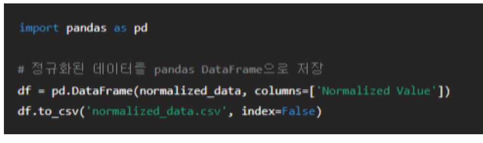

출처: 코드 작성 프로그램. 2024. 8. 23. 스크린샷. [그림 2-3] 데이터 저장

(나) 데이터 관리

1) 데이터베이스 사용: 대규모 데이터를 효율적으로 관리하기 위해 SQL 데이터베이스 를 사용한다.

2) 버전 관리: 데이터 변경 이력을 추적하기 위해 버전 관리 시스템을 사용한다.

시스템 반도체 소자 특성 측정 데이터를 수집하고 정규화하는 과정은 데이터 분석의 기본 단계로, 데이터의 품질을 향상시키고 분석 결과의 신뢰성을 높이는 데 필수적이다. 이러한 절차를 통해 다양한 측정 데이터를 효과적으로 관리하고 분석할 수 있으며, 이를 기반으로 소자의 성능을 최적화할 수 있다.

- 2. 통계적 분석 기법을 적용한다.
  - (1) 기본 통계 계산
    - (가) 평균(mean, μ): 데이터의 중심값을 계산한다.
    - (나) 표준 편차(standard deviation, o): 데이터의 변동성을 나타내는 값을 계산한다.
  - (2) 장기 및 단기 변동성 분석
    - (가) 장기 변동성(long-term variability): 전체 데이터 집합에서 변동성을 분석한다.
    - (나) 단기 변동성(short-term variability): 일정 기간 또는 로트(lot) 내에서 변동성을 분석한 다.
- 3. 공정 능력을 분석한다.
  - (1) 공정 능력 지수(process capability index, Cpk)
    - (가) C,: 공정의 전체 변동성을 기준으로 공정 능력을 평가한다.

$$C_p = \frac{USL - LSL}{6\sigma}$$

- 1) USL: 상한 규격 한계(upper specification limit)
- 2) LSL: 하한 규격 한계(lower specification limit)
- 3) 0: 표준 편차
- (나) Cpk: 공정의 중심으로부터 변동성을 평가한다.

$$C_{pk} = \min\left(\frac{USL - \mu}{3\sigma}, \frac{\mu - LSL}{3\sigma}\right)$$

- (2) 단기 및 장기 공정 능력 분석
  - (가) 단기 공정 능력(short-term capability, Cpks)
    - 1) 일정 기간 내에서의 공정 능력을 평가한다.
    - 2) 변동성이 적은 기간을 대상으로 하므로 주로 품질 관리를 위해 사용된다.
  - (나) 장기 공정 능력(long-term capability, Cpkl)
    - 1) 전체 데이터 집합을 바탕으로 공정 능력을 평가한다.
    - 2) 장기적인 공정 성능을 평가하는 데 사용된다.
- 4. 공정 특성 산포 예측 및 문서화를 진행한다.
  - (1) 공정 특성 산포 예측
    - 수집된 데이터를 기반으로 공정 특성의 산포를 예측한다. 이를 위해 통계적 기법을 활용 하여 장단기 변동성을 분석한다.
  - (2) 문서화를 진행한다.
    - (가) 데이터 분석 보고서 작성

1) 목적: 공정 특성 산포 분석의 목적을 기술한다.

2) 데이터 수집 방법: 데이터 수집 절차와 조건을 상세히 기술한다.

- 3) 통계적 분석 결과: 평균, 표준 편차, Cp, Cpk 등 주요 통계치를 보고한다.
- 4) 장단기 변동성 분석: 장단기 변동성 결과를 비교 분석한다.
- 5) 공정 능력 평가: Cp와 Cpk값을 기반으로 공정 능력을 평가한다.
- (나) 공정 개선 방안 제시
  - 1) 불량 원인 분석: 불량의 원인을 식별하고 분석한다.
  - 2) 공정 개선 제안: 공정 변동성을 줄이기 위한 개선 방안을 제안한다.
  - 3) 실행 계획: 제안된 개선 방안의 실행 계획을 수립한다.
- (3) 표준 작업 절차(SOP) 업데이트
  - (가) 분석 결과를 바탕으로 표준 작업 절차를 업데이트하여 공정 변동성을 최소화한다.
  - (나) SOP 문서화: 새로운 표준 작업 절차를 문서화한다.
  - (다) 교육 및 훈련: 관련 인원에게 새로운 절차에 대한 교육 및 훈련을 실시한다.

5. 예시를 분석한다.

- (1) 예시 1: 임계 전압(Vth) 분석
  - (가) 데이터 수집: 임계 전압 데이터를 여러 공정 단계에서 수집
  - (나) 평균(μ): 0.7V
  - (다) 표준 편차(σ): 0.05V
  - (라) Cp 계산: Cp =(0.8V 0.6V) /(6\*0.05V) = 0.67
  - (마) Cpk 계산: Cpk = min((0.8V 0.7V) /(3\*0.05V), (0.7V 0.6V) /(3\*0.05V)) = 0.67
- (2) 예시 2: 누설 전류(Ioff) 분석
  - (가) 데이터 수집: 누설 전류 데이터를 여러 공정 단계에서 수집
  - (나) 평균(μ): 10nA
  - (다) 표준 편차(σ): 2nA
  - (라) Cp 계산: Cp =(15nA 5nA) /(6\*2nA) = 0.83

(마) Cpk 계산: Cpk = min((15nA-10nA) /(3\*2nA), (10nA - 5nA) /(3\*2nA)) = 0.83 시스템 반도체 단위 소자 개발을 위해 측정 데이터를 근거로 표준화된 기법에 따라 장단기 공 정 특성 산포를 예측하고 이를 문서화하는 것은 공정의 변동성을 이해하고 최적화하는 데 필수 적이다. 데이터 수집, 정규화, 통계적 분석, 공정 능력 평가, 공정 특성 산포 예측, 문서화의 절 차를 통해 체계적으로 공정 변동성을 분석하고, 이를 바탕으로 공정 개선 방안을 제시할 수 있 다. 이러한 접근 방법을 통해 고성능, 고신뢰성의 시스템 반도체 소자를 개발할 수 있다.

#### 수행 tip

- 시스템 반도체 단위 소자의 측정 방법과 장비의 운영 매뉴 얼을 사전에 숙지한다.
- 시스템 반도체 공정에 포함되는 검증 패턴의 유형과 유형 별 용도에 대해 숙지한다.

## 학습 2 교수·학습 방법

#### 교수 방법

- 시스템 반도체 소자들의 특성 항목과 기준에 대해 설명한 후 검증 패턴의 사례를 토대로 해 석하는 방법을 안내한다.
- 시스템 반도체 소자 측정 프로세스 및 파라미터 종류에 따른 측정 장비에 대하여 설명한다.
- 단위 소자 측정 및 특성 데이터 평가 및 소자 측정 장비에 대한 이해를 높이기 위하여 현장 일지 및 저널 등의 자료를 통해 사례를 제시한다.
- 소자 측정 특성 데이터의 불량 유무 사례를 구체적으로 제시하고 대처 방법을 안내한다.
- 시스템 반도체 단위 소자 측정 및 특성 데이터 평가 및 장비에 대한 사항에 대한 시나리오 를 제시하여 학습자가 이에 대해 순차적으로 이해하고 있는지 질문법을 이용해 계속해서 확 인한다.

#### 학습 방법

- 시스템 반도체 소자 측정 개념 및 소자 종류에 대해 문서화하여 정리한다.
- 시스템 반도체 소자 측정 프로세스에 대하여 인지하고 확인한다.
- 시스템 반도체 소자 측정 파라미터 종류를 확인한다.
- 시스템 반도체 소자 측정에 필요한 주요 측정 장비를 확인한다.
- 시스템 반도체 소자 측정 결과 커브에 대하여 인지하고, 실습을 통해 커브를 분석하여 보고 서를 작성한다.
- 시스템 반도체 소자 측정 장비 운영에 대하여 인지하고, 실습을 통해 충분히 파악한다.

## 학습 2 평 가

#### 평가 준거

• 평가자는 학습자가 학습 목표를 성공적으로 달성하였는지를 평가해야 한다.

#### • 평가자는 다음 사항을 평가해야 한다.

| 학습 내용               | 학습 목표                                                      | 성취수준 |   |   |
|---------------------|------------------------------------------------------------|------|---|---|
|                     |                                                            | 상    | 중 | 하 |
| 시스템 반도체 단위 소자 개발 | - 시스템 반도체 소자들의 특성 항목과 기준을 해석할 수 있 다.                    |      |   |   |
|                     | - 시스템 반도체 소자들의 검증 패턴을 해석하여 적용할 수 있다.                    |      |   |   |
|                     | - 시스템 반도체 소자 분석 장비의 사용법을 해석하여 적용할 수 있다.                 |      |   |   |
|                     | - 시스템 반도체 소자 특성 측정 데이터의 불량 여부를 파악 할 수 있다.               |      |   |   |
|                     | - 측정 데이터를 근거로 표준화된 기법에 따라 장단기 공정 특성 산포를 예측하여 문서화할 수 있다. |      |   |   |

#### 평가 방법

• 서술형 시험

| 학습 내용               | 평가 항목                                           | 성취수준 |   |   |
|---------------------|-------------------------------------------------|------|---|---|
|                     |                                                 | 상    | 중 | 하 |
| 시스템 반도체 단위 소자 개발 | - 시스템 반도체 소자의 검증 패턴에 대한 검증 항목 파악 여 부         |      |   |   |
|                     | - 시스템 반도체 소자의 검증 패턴에 대한 데이터 수집 내용 파악 여부      |      |   |   |
|                     | - 시스템 반도체 소자들의 검증 패턴 해석을 위한 검증 항목 및 패턴 파악 여부 |      |   |   |
|                     | - 시스템 반도체에 포함되는 저항의 검증 항목 및 패턴 파악 여부         |      |   |   |
|                     | - 소자 특성 측정 데이터로부터 불량 여부 파악 절차 이해 여 부         |      |   |   |

#### • 평가자 체크리스트

|                     | 평가 항목                                                          | 성취수준 |   |   |
|---------------------|----------------------------------------------------------------|------|---|---|
| 학습 내용               |                                                                | 상    | 중 | 하 |
| 시스템 반도체 단위 소자 개발 | - 시스템 반도체 소자의 검증 패턴에 대한 적용 방법 파악 여 부                        |      |   |   |
|                     | - 시스템 반도체 소자의 검증 패턴에 대한 기준 적용 및 불량 판별 내용 파악 여부              |      |   |   |
|                     | - 시스템 반도체에 포함되는 커패시터의 검증 항목 및 패턴 파악 여부                      |      |   |   |
|                     | - 소자 분석 장비의 사용법 파악 여부                                          |      |   |   |
|                     | - 측정 데이터의 불량 원인 분석 결과로부터 공정 조건의 조 정과 최적화를 위한 공정 개선 단계 파악 여부 |      |   |   |

#### 피드백

### 1. 서술형 시험

- 시스템 반도체 소자의 검증 패턴에 대한 검증 항목 파악 여부를 평가한 후, 보완이 필요한 사항 이나 주요 사항을 표시하여 피드백해 준다.
- 메모리 반도체의 단위 소자(MOSFET, capacitor 등) 제작 구조를 해석하여 설명할 수 있는 능력 을 평가한 후, 보완이 필요한 사항이나 주요 사항을 표시하여 보충 설명해 준다.
- 평가 결과가 우수한 학습자와 미흡한 학습자를 구분하여 우수한 학습자들에게는 서술형 평가 내 용의 사례 적용 학습을 통한 심화 학습으로 피드백해 주고, 미흡한 학습자들에게는 기초 용어에 대한 설명을 통해 일정 수준을 유지할 수 있도록 보완하여 지도해 준다.
- 2. 평가자 체크리스트
- 소자 분석 장비의 사용법에 대한 파악 여부를 확인한 후 부족한 점을 지적하여 정확하게 처리할 수 있도록 보완하여 지도해 준다.
- 메모리 반도체의 공정 흐름도로부터 필요한 단위 공정을 파악할 수 있는 능력을 평가한 후, 개선 및 보완 사항을 정리하여 재학습할 수 있도록 피드백한다.
- 평가 결과가 우수한 학습자와 저조한 학습자를 구분하여 우수한 학습자들에게는 작업장 환경에의 사례 적용 학습을 통한 심화 학습으로 피드백해 주고, 저조한 학습자들에게는 기초 지식에 대한 설명을 통해 일정 수준을 유지할 수 있도록 보완하여 지도해 준다.

| 학습 1 | 시스템 반도체 공정 흐름도 해석하기 |
|------|---------------------|
| 학습 2 | 시스템 반도체 단위 소자 개발하기  |
| 학습 3 | 시스템 반도체 공정 소재 평가하기  |

## 3-1. 시스템 반도체 공정 소재 평가

|       | • 시스템 반도체 공정 소재들의 특성 항목과 기준을 해석할 수 있다.      |
|-------|---------------------------------------------|
| 학습 목표 | • 시스템 반도체 공정 소재들의 검증 패턴을 해석하여 적용할 수 있다.     |
|       | • 시스템 반도체 공정 소재 특성 평가 데이터의 불량 여부를 파악할 수 있다. |

## 필요 지식 /

숔 시스템 반도체 공정 소재 특성 항목

시스템 반도체 공정에 사용되는 소재는 고도의 성능과 신뢰성을 요구하며, 이들 소재의 특성은 소자의 성능에 직접적인 영향을 끼친다. 아래는 시스템 반도체 공정에서 중요한 소재들의 주요 특성 항목이다.

- 1. 실리콘 웨이퍼(silicon wafer)
  - (1) 결정 구조(crystal structure)
    - (가) 단결정 실리콘(single crystal silicon): 높은 전기적 특성을 제공
    - (나) 다결정 실리콘(polycrystalline silicon): 저비용, 특정 응용에 적합
  - (2) 도핑 농도(doping concentration) 도핑된 실리콘의 전기적 특성을 조절한다.
  - (3) 결정 방향(crystal orientation)

(100), (111) 방향 등이 있으며, 전기적 특성과 기계적 강도에 영향이 있다.

2. 산화물(oxides)

(1) 열 산화물(thermal oxide)

SiO2: 우수한 절연 특성과 높은 유전율을 제공한다.

(2) 질화물(nitrides)

Si3N4: 높은 내구성 및 절연 특성이 있다.

- 3. 포토레지스트(photoresists)
  - (1) 감도(sensitivity) 노광 과정에서 빛에 대한 반응 속도이다.
  - (2) 해상도(resolution) 미세 패턴 형성 능력이다.
  - (3) 화학적 내성(chemical resistance) 현상 및 식각 공정에서의 내성이다.
- 4. 도핑제(dopants)
  - (1) 종류(type)
    - (가) n형 도핑제(예: 인, 비소)
    - (나) p형 도핑제(예: 붕소)
  - (2) 확산 속도(diffusion Rate) 실리콘 내에서의 도핑 원자의 이동 속도이다.
- 5. 금속(metals)
  - (1) 알루미늄(aluminum) 낮은 저항률과 우수한 도선 재료이다.
  - (2) 구리(copper) 높은 전도성과 낮은 저항성을 가진다.
  - (3) 텅스텐(tungsten) 높은 내열성과 낮은 열팽창 계수를 가진다.
- 6. 절연막(dielectrics)
  - (1) 유전 상수(dielectric constant) 절연막의 전기적 저장 능력이다.
  - (2) 파괴 전압(breakdown voltage) 절연막이 파괴되기 전까지 견딜 수 있는 전압이다.
- 7. CVD 및 PVD 소재(CVD and PVD materials)
  - (1) 박막 두께(film thickness) 박막의 두께 균일성이다.
  - (2) 증착 속도(deposition rate) 박막 형성 속도이다.
- 8. 화학 약품(chemicals)

(1) 식각제(etchants)

특정 물질을 선택적으로 제거하는 능력이다.

- (2) 세정제(cleaners) 표면 오염물 제거 능력이다.
- 9. 봉지재(encapsulation materials)
  - (1) 열 전도율(thermal conductivity) 열을 효과적으로 방출하는 능력이다.
  - (2) 기계적 강도(mechanical strength) 기계적 충격에 대한 저항성이다.
- 10. 본딩 와이어(bonding wires)
  - (1) 재료(material)

금, 은, 구리 등이다.

(2) 직경(diameter)

전기적 특성과 기계적 강도에 영향을 준다.

시스템 반도체 공정에 사용되는 소재는 각각의 특성이 소자의 성능에 큰 영향을 끼치므로, 각 소재의 특성을 정확히 이해하고 관리하는 것이 중요하다. 이러한 소재의 특성은 제조 공정의 모든 단계에서 고려해야 하며, 최적의 성능을 달성하기 위해 정밀하게 제어되어야 한다.

#### 숕 시스템 반도체 공정 소재 특성에 영향을 주는 공정 매개 변수(parameter)

시스템 반도체 공정 소재의 특성은 다양한 공정 매개 변수에 의해 크게 영향을 받는다. 각 공 정 단계에서 매개 변수들이 적절히 제어되어야 최적의 소자 특성을 달성할 수 있다. 주요 공정 매개 변수와 그들이 소재 특성에 미치는 영향을 살펴본다.

- 1. 웨이퍼 제조
  - (1) 결정 성장 온도(crystal growth temperature)
    - (가) 온도가 높을수록 단결정 실리콘의 결정성이 좋아진다.
    - (나) 너무 높으면 결함이 발생할 수 있다.
  - (2) 절단 속도(slicing speed)
    - (가) 빠른 절단은 웨이퍼의 표면 거칠기를 증가시킬 수 있다.
    - (나) 최적의 속도는 표면 품질과 생산성을 균형 있게 유지해야 한다.
- 2. 산화 공정
  - (1) 산화 온도(oxidation temperature)

- (가) 높은 온도는 산화 속도를 증가시켜 두꺼운 산화막을 형성한다.
- (나) 너무 높은 온도는 웨이퍼 표면에 스트레스를 유발할 수 있다.
- (2) 산화 시간(oxidation time)
  - (가) 시간이 길수록 산화막이 두꺼워진다.
  - (나) 너무 길면 불균일한 산화막 두께가 발생할 수 있다.
- (3) 산화 환경(oxidation environment)
  - (가) 건식 산화는 얇고 밀도가 높은 산화막을 형성한다.
  - (나) 습식 산화는 빠른 속도로 두꺼운 산화막을 형성한다.

#### 3. 포토리소그래피

- (1) 노광 파장(exposure wavelength)
  - (가) 짧은 파장은 높은 해상도의 패턴을 형성한다.
  - (나) 너무 짧으면 포토레지스트의 감도가 떨어질 수 있다.
- (2) 현상 시간(development time)
  - (가) 시간이 짧으면 패턴이 완전히 현상되지 않을 수 있다.
  - (나) 시간이 길면 과현상(overdevelopment)이 발생할 수 있다.
- (3) 레지스트 두께(resist thickness)
  - (가) 두꺼운 레지스트는 깊은 에칭에 유리하지만 해상도가 낮아질 수 있다.
  - (나) 얇은 레지스트는 고해상도 패턴 형성에 유리하지만 에칭 시 손상될 수 있다.
- 4. 이온 주입
  - (1) 주입 에너지(implantation energy)
    - (가) 높은 에너지는 깊은 주입을 가능하게 한다.
    - (나) 너무 높으면 웨이퍼를 손상시킬 수 있다.
  - (2) 주입 용량(implant dose)
    - (가) 높은 용량은 도핑 농도를 증가시킨다.
    - (나) 과도한 용량은 결함을 유발할 수 있다.
- 5. 식각
  - (1) 에칭 온도(etching temperature)
    - (가) 높은 온도는 식각 속도를 증가시킨다.
    - (나) 너무 높으면 식각 균일성이 떨어질 수 있다.
  - (2) 에칭 시간(etching time)

- (가) 시간이 길면 깊은 식각을 가능하게 한다.
- (나) 과도한 시간은 패턴 손상을 초래할 수 있다.
- (3) 플라즈마 밀도(plasma density)
  - (가) 높은 밀도는 식각 속도와 균일성을 향상시킨다.
  - (나) 너무 높으면 웨이퍼 표면에 손상을 줄 수 있다.
- 6. CVD 및 PVD
  - (1) 증착 온도(deposition temperature)
    - (가) 높은 온도는 박막의 결정성을 향상시킨다.
    - (나) 너무 높으면 스트레스와 균열을 유발할 수 있다.
  - (2) 가스 유량(gas flow rate)
    - (가) 유량이 높으면 증착 속도가 빨라진다.
    - (나) 너무 높으면 박막의 균일성이 떨어질 수 있다.
  - (3) 증착 압력(deposition pressure)
    - (가) 적절한 압력은 박막의 밀도와 품질을 향상시킨다.
    - (나) 너무 낮거나 높으면 비정상적인 박막 형성이 일어날 수 있다.
- 7. 어닐링
  - (1) 어닐링 온도(annealing temperature)
    - (가) 높은 온도는 결함 제거와 재결정화를 촉진한다.
    - (나) 너무 높으면 소자의 손상과 재결정화 불균일성을 초래할 수 있다.
  - (2) 어닐링 시간(annealing time)
    - (가) 시간이 길수록 재결정화가 진행된다.
    - (나) 과도한 시간은 원치 않는 확산과 성능 저하를 초래할 수 있다.
  - (3) 어닐링 환경(annealing environment)
    - (가) 질소, 아르곤 등의 보호 분위기는 산화를 방지한다.
    - (나) 공기 중 어닐링은 산화층을 형성할 수 있다.
- 8. CMP(chemical mechanical polishing)
  - (1) 연마 압력(polishing pressure)
    - (가) 적절한 압력은 평탄화를 향상시킨다.
    - (나) 너무 높으면 웨이퍼 손상과 과연마를 초래할 수 있다.
  - (2) 슬러리 농도(slurry concentration)

- (가) 높은 농도는 연마 속도를 증가시킨다.
- (나) 과도한 농도는 표면 손상을 유발할 수 있다.

각 공정 단계에서의 매개 변수는 시스템 반도체 소자의 최종 특성에 중요한 영향을 끼친다. 최 적의 매개 변수를 선택하고 정밀하게 제어하는 것이 고성능, 고신뢰성의 반도체 소자를 제조하 는 데 필수적이다. 정기적인 공정 모니터링과 데이터 분석을 통해 공정 변수를 최적화하고 품 질을 지속해서 향상시킬 수 있다.

## 수행 내용 / 시스템 반도체 공정 소재 평가하기

#### 재료·자료

- 반도체 모스 소자 측정 웨이퍼
- 소자 측정 패턴 설명서
- 소자 측정 장비 사용 설명서

#### 기기(장비 ・ 공구)

- 소자 측정 프로브 장비
- 소자 측정 장비

#### 안전·유의 사항

- 단위 소자 측정하고 특성을 파악하기 위해서는 사용 환경에 대한 적절한 파악 및 조치가 있 어야 한다.
- 측정 장비에 대한 충분한 설명을 통해 안전사고 방지를 위한 사전 조치가 선행되어야 한다.

#### 수행 순서

숔 시스템 반도체 공정 소재들의 특성 항목과 기준을 해석한다.

시스템 반도체 공정 소재 평가를 위해 각 소재의 특성 항목과 기준을 해석하는 것은 매우 중요 하다. 이를 통해 소재의 품질, 성능, 신뢰성을 평가하고, 적합한 공정 조건을 결정할 수 있다. 다음은 시스템 반도체 공정 소재들의 주요 특성 항목과 평가 기준을 해석하는 방법에 대한 설

명이다.

- 1. 주요 공정 소재와 특성 항목을 분석한다.
  - (1) 실리콘 웨이퍼(silicon wafer)
    - (가) 특성 항목
      - 1) 직경(diameter): 웨이퍼의 크기, 일반적으로 200mm 또는 300mm
      - 2) 두께(thickness): 웨이퍼의 두께, 일반적으로 725μm(200mm 웨이퍼) 또는 775μ m(300mm 웨이퍼)
      - 3) 저항율(resistivity): 웨이퍼의 전기적 저항, 일반적으로 1-10 Ω·cm
      - 4) 결정 방향(crystal orientation): 결정격자의 방향, 일반적으로 <100> 또는 <111>
      - 5) 결함 밀도(defect density): 웨이퍼 표면의 결함 밀도, 일반적으로 cm²당 결함 수
    - (나) 평가 기준
      - 1) 직경과 두께: 제조 공정에 따라 허용 오차 범위 내에 있어야 한다.
      - 2) 저항율: 공정 요구 사항에 맞춰 적절한 범위 내에 있어야 한다.
      - 3) 결정 방향: 소자 특성에 맞는 결정 방향을 선택한다.
      - 4) 결함 밀도: 낮은 결함 밀도가 요구되며, 기준을 초과하는 경우 불량으로 간주한다.
  - (2) 포토레지스트(photoresist)
    - (가) 특성 항목
      - 1) 감광성(photosensitivity): 특정 파장의 빛에 대한 민감도
      - 2) 해상도(resolution): 최소 패턴 크기
      - 3) 접착력(adhesion): 웨이퍼 표면에 대한 접착력
      - 4) 현상 속도(development Rate): 현상 공정에서의 제거 속도
    - (나) 평가 기준
      - 1) 감광성: 사용 파장에 적합한 감광성을 가져야 한다.
      - 2) 해상도: 필요한 패턴 크기에 따라 해상도가 결정된다.
      - 3) 접착력: 공정 중 박리 현상이 없어야 한다.
      - 4) 현상 속도: 공정 시간과 정확도에 적합한 속도를 가져야 한다.
  - (3) 절연막(dielectric layer)
    - (가) 특성 항목
      - 1) 유전 상수(dielectric constant): 전기적 절연 특성
      - 2) 누설 전류(leakage current): 절연막을 통한 전류 누설량
      - 3) 파괴 전압(breakdown voltage): 절연막이 파괴되는 전압
      - 4) 두께 균일성(thickness uniformity): 절연막 두께의 일관성
    - (나) 평가 기준

- 1) 유전 상수: 소자의 전기적 특성에 맞는 유전 상수를 가져야 한다.
- 2) 누설 전류: 낮은 누설 전류가 요구된다.
- 3) 파괴 전압: 높은 파괴 전압이 요구된다.
- 4) 두께 균일성: 균일한 두께 분포가 요구된다.
- (4) 금속 배선(metal interconnect)
  - (가) 특성 항목
    - 1) 저항(resistance): 전기적 저항
    - 2) 접착력(adhesion): 기판 및 절연막에 대한 접착력
    - 3) 열 안정성(thermal stability): 고온에서의 특성 유지
    - 4) 전기적 신뢰성(electrical reliability): 전기적 특성의 장기 안정성
  - (나) 평가 기준
    - 1) 저항: 낮은 저항이 요구된다.
    - 2) 접착력: 공정 중 박리 현상이 없어야 한다.
    - 3) 열 안정성: 고온 환경에서 특성이 유지되어야 한다.
    - 4) 전기적 신뢰성: 장기간 사용 시 특성이 유지되어야 한다.
- 2. 공정 소재 평가 절차를 숙지한다.
  - (1) 시료 준비

각 공정 소재에 대해 적절한 시료를 준비한다. 시료는 공정 조건에 맞게 준비되어야 하 며, 필요한 경우 클리닝 및 전처리 과정을 거친다.

- (2) 특성 측정
  - 각 특성 항목에 대해 적절한 측정 장비와 방법을 사용하여 데이터를 수집한다.
  - (가) 직경 및 두께 측정: 레이저 측정기, 두께 측정기 등을 사용한다.
  - (나) 저항율 측정: 4-포인트 프로브 측정기를 사용한다.
  - (다) 결함 밀도 분석: SEM(스캐닝 전자 현미경) 또는 광학 현미경을 사용한다.
  - (라) 감광성, 해상도, 접착력, 현상 속도: 포토레지스트 특성 평가 장비를 사용한다.
  - (마) 유전 상수, 누설 전류, 파괴 전압: C-V 특성 측정기를 사용한다.
  - (바) 저항, 접착력, 열 안정성, 전기적 신뢰성: 전기적 특성 분석 장비를 사용한다.
- (3) 데이터 분석
  - (가) 측정 데이터를 분석하여 각 특성 항목의 평균, 표준 편차 등을 계산한다.
  - (나) 각 특성 항목에 대한 히스토그램, 관리도를 작성하여 데이터 분포를 시각적으로 평가한다.
- (4) 평가 기준 적용
  - (가) 수집된 데이터를 공정 소재의 평가 기준과 비교하여 불량 여부를 판단한다.

(나) 각 특성 항목에 대해 허용되는 사양 범위를 설정하고, 이를 기준으로 평가한다.

(5) 불량 원인 분석 및 개선

불량으로 판정된 시료에 대해 원인을 분석하고, 공정 조건을 조정하여 개선 방안을 마련 한다.

- 3. 문서화 및 보고를 진행한다.
  - (1) 데이터 분석 보고서 작성
    - (가) 목적: 평가의 목적과 배경을 기술한다.
    - (나) 데이터 수집 방법: 각 특성 항목에 대한 데이터 수집 절차와 방법을 상세히 기술한다.
    - (다) 분석 결과: 각 특성 항목의 측정 결과, 평균, 표준 편차, 히스토그램 등을 보고한다.
    - (라) 불량 분석: 불량의 원인을 분석하고, 개선 방안을 제시한다.
  - (2) 표준 작업 절차(SOP) 업데이트
    - (가) 평가 결과를 바탕으로 표준 작업 절차를 업데이트하여 공정 소재의 품질을 유지한다.
    - (나) SOP 문서화를 통해 관련 인원에게 교육 및 훈련을 실시한다.

시스템 반도체 공정 소재 평가를 위해 각 소재의 특성 항목과 기준을 해석하는 것은 공정의 품 질과 신뢰성을 유지하는 데 필수적이다. 적절한 시료 준비, 특성 측정, 데이터 분석, 평가 기준 적용, 불량 원인 분석 및 개선의 절차를 통해 체계적으로 공정 소재를 평가하고, 이를 문서화 하여 공정의 최적화를 도모할 수 있다. 이러한 접근 방법을 통해 고성능, 고신뢰성의 시스템 반도체 소자를 개발할 수 있다.

숕 시스템 반도체 공정 소재들의 검증 패턴을 해석하여 적용한다.

시스템 반도체 공정 소재의 검증 패턴을 해석하고 이를 적용하는 것은 공정 소재의 품질과 성 능을 보장하는 중요한 과정이다. 다음은 주요 시스템 반도체 공정 소재들의 검증 패턴을 해석 하고 이를 실제 개발 및 제조 공정에 적용하는 방법에 대한 상세한 설명이다.

- 1. 주요 시스템 반도체 공정 소재의 검증 패턴을 파악한다.
  - (1) 실리콘 웨이퍼(silicon wafer)
    - (가) 검증 항목
      - 1) 직경(diameter)
      - 2) 두께(thickness)
      - 3) 저항율(resistivity)
      - 4) 결정 방향(crystal orientation)
      - 5) 결함 밀도(defect density)
    - (나) 검증 패턴

- 1) 직경 및 두께 측정: 레이저 측정기 또는 마이크로미터를 사용하여 측정한다.
- 2) 저항율 측정: 4-포인트 프로브 측정을 사용하여 저항율을 평가한다.
- 3) 결정 방향 검사: X-선 회절(XRD) 장비를 사용하여 결정 방향을 확인한다.
- 4) 결함 밀도 분석: 광학 현미경 또는 SEM을 사용하여 표면 결함을 평가한다.
- (다) 적용 방법
  - 1) 직경 및 두께 측정: 공정 요구 사항에 맞게 직경과 두께를 측정하고, 기준과 비교하 여 적합성을 평가한다.
  - 2) 저항율 측정: 공정에 필요한 저항율 범위 내에 있는지 확인한다.
  - 3) 결정 방향 검사: 설계에 맞는 결정 방향을 확인한다.
  - 4) 결함 밀도 분석: 표면 결함 밀도가 허용 범위 내에 있는지 평가한다.
- (2) 포토레지스트(Photoresist)
  - (가) 검증 항목
    - 1) 감광성(photosensitivity)
    - 2) 해상도(resolution)
    - 3) 접착력(adhesion)
    - 4) 현상 속도(development rate)
  - (나) 검증 패턴
    - 1) 감광성 테스트: 특정 파장의 빛을 사용하여 노출 후 현상하여 평가한다.
    - 2) 해상도 테스트: 미세 패턴을 형성하여 최소 패턴 크기를 평가한다.
    - 3) 접착력 테스트: 웨이퍼 표면에 도포 후 견인 시험을 통해 접착력을 평가한다.
    - 4) 현상 속도 테스트: 현상 시간을 측정하여 평가한다.
  - (다) 적용 방법
    - 1) 감광성 테스트: 포토레지스트가 요구되는 파장에서 적절히 반응하는지 평가한다.
    - 2) 해상도 테스트: 필요한 패턴 크기를 형성할 수 있는지 확인한다.
    - 3) 접착력 테스트: 공정 중 박리 현상이 없는지 평가한다.
    - 4) 현상 속도 테스트: 현상 공정 시간이 적절한지 확인한다.
- (3) 절연막(dielectric layer)
  - (가) 검증 항목
    - 1) 유전 상수(dielectric constant)
    - 2) 누설 전류(leakage current)
    - 3) 파괴 전압(breakdown voltage)
    - 4) 두께 균일성(thickness uniformity)
  - (나) 검증 패턴

- 1) 유전 상수 측정: C-V 특성 측정을 통해 유전 상수를 평가한다.
- 2) 누설 전류 측정: 전류-전압(I-V) 특성 측정을 통해 누설 전류를 평가한다.
- 3) 파괴 전압 테스트: 점진적으로 전압을 올려 파괴 전압을 평가한다.
- 4) 두께 균일성 테스트: 엘립소미터를 사용하여 두께 균일성을 평가한다.
- (다) 적용 방법
  - 1) 유전 상수 측정: 유전 상수가 설계 요구 사항에 맞는지 평가한다.
  - 2) 누설 전류 측정: 절연막의 누설 전류가 허용 범위 내에 있는지 확인한다.
  - 3) 파괴 전압 테스트: 절연막이 요구되는 파괴 전압 이상을 견딜 수 있는지 평가한다.
  - 4) 두께 균일성 테스트: 절연막 두께가 균일한지 평가한다.
- (4) 금속 배선(metal interconnect)
  - (가) 검증 항목
    - 1) 저항(resistance)
    - 2) 접착력(adhesion)
    - 3) 열 안정성(thermal stability)
    - 4) 전기적 신뢰성(electrical reliability)
  - (나) 검증 패턴
    - 1) 저항 측정: 4-포인트 프로브 측정을 통해 저항을 평가한다.
    - 2) 접착력 테스트: 기판 및 절연막에 대한 견인 시험을 통해 접착력을 평가한다.
    - 3) 열 안정성 테스트: 고온 열처리 후 특성 변화를 평가한다.
    - 4) 전기적 신뢰성 테스트: 장기 전기적 특성 변화를 평가한다.
  - (다) 적용 방법
    - 1) 저항 측정: 배선 저항이 설계 요구 사항에 맞는지 평가한다.
    - 2) 접착력 테스트: 공정 중 박리 현상이 없는지 평가한다.
    - 3) 열 안정성 테스트: 고온 환경에서 금속 배선의 특성이 유지되는지 평가한다.
    - 4) 전기적 신뢰성 테스트: 장기간 사용 시 배선의 전기적 특성이 안정적인지 평가한다.
- 2. 검증 패턴 해석 및 적용 절차를 숙지한다.
  - (1) 시료 준비

각 공정 소재에 대해 적절한 시료를 준비한다. 시료는 공정 조건에 맞게 준비되어야 하 며, 필요한 경우 클리닝 및 전처리 과정을 거친다.

- (2) 측정 및 데이터 수집
  - (가) 각 특성 항목에 대해 적절한 측정 장비와 방법을 사용하여 데이터를 수집한다.
    - 1) 직경 및 두께 측정: 레이저 측정기, 마이크로미터
    - 2) 저항율 측정: 4-포인트 프로브 측정기

3) 결함 밀도 분석: SEM, 광학 현미경

- 4) 감광성, 해상도, 접착력, 현상 속도: 포토레지스트 특성 평가 장비
- 5) 유전 상수, 누설 전류, 파괴 전압: C-V 특성 측정기
- 6) 저항, 접착력, 열 안정성, 전기적 신뢰성: 전기적 특성 분석 장비
- (3) 데이터 분석
  - (가) 수집된 데이터를 분석하여 각 특성 항목의 평균, 표준 편차 등을 계산한다.
  - (나) 각 특성 항목에 대한 히스토그램, 관리도를 작성하여 데이터 분포를 시각적으로 평가한 다.
- (4) 평가 기준 적용
  - (가) 수집된 데이터를 공정 소재의 평가 기준과 비교하여 불량 여부를 판단한다.
  - (나) 각 특성 항목에 대해 허용되는 사양 범위를 설정하고, 이를 기준으로 평가한다.
- (5) 불량 원인 분석 및 개선

불량으로 판정된 시료에 대해 원인을 분석하고, 공정 조건을 조정하여 개선 방안을 마련 한다.

- 3. 문서화 및 보고
  - (1) 데이터 분석 보고서 작성
    - (가) 목적: 평가의 목적과 배경을 기술한다.
    - (나) 데이터 수집 방법: 각 특성 항목에 대한 데이터 수집 절차와 방법을 상세히 기술한다.
    - (다) 분석 결과: 각 특성 항목의 측정 결과, 평균, 표준 편차, 히스토그램 등을 보고한다.
    - (라) 불량 분석: 불량의 원인을 분석하고, 개선 방안을 제시한다.
  - (2) 표준 작업 절차(SOP) 업데이트
    - (가) 평가 결과를 바탕으로 표준 작업 절차를 업데이트하여 공정 소재의 품질을 유지한다.
    - (나) SOP 문서화를 통해 관련 인원에게 교육 및 훈련을 실시한다.

시스템 반도체 공정 소재 평가를 위해 각 소재의 검증 패턴을 해석하고 이를 적용하는 것은 공 정의 품질과 신뢰성을 유지하는 데 필수적이다. 적절한 시료 준비, 특성 측정, 데이터 분석, 평 가 기준 적용, 불량 원인 분석 및 개선의 절차를 통해 체계적으로 공정 소재를 평가하고, 이를 문서화하여 공정의 최적화를 도모할 수 있다. 이러한 접근 방법을 통해 고성능, 고신뢰성의 시 스템 반도체 소자를 개발할 수 있다.

숖 시스템 반도체 공정 소재 특성 평가 데이터의 불량 여부를 파악한다.

시스템 반도체 공정 소재의 특성 평가 데이터에서 불량 여부를 파악하는 것은 공정의 신뢰성과 품질을 유지하는 데 중요한 역할을 한다. 이를 위해 다음과 같은 절차와 방법을 사용할 수 있

다.

- 1. 데이터 수집 및 정규화를 진행한다.
  - (1) 데이터 수집
    - (가) 공정 소재의 다양한 특성 데이터를 수집한다. 예를 들어, 실리콘 웨이퍼의 경우 두께, 저 항율, 결함 밀도 등을 측정한다.

(나) 각 특성 항목에 대해 충분한 데이터 포인트를 수집하여 통계적 분석이 가능하도록 한다.

(2) 데이터 정규화

수집된 데이터를 정규화하여 분석의 정확성을 높이다. 정규화는 데이터의 단위를 통일하 고, 필요에 따라 로그 변환 등을 통해 데이터 분포를 균일화하는 과정이다.

- 2. 통계적 분석 기법을 적용한다.
  - (1) 기본 통계 계산

(가) 평균(mean, μ): 데이터의 중심값을 계산한다.

(나) 표준 편차(standard deviation, σ): 데이터의 변동성을 나타내는 값을 계산한다.

(2) 데이터 분포 분석

(가) 히스토그램 작성: 데이터의 분포를 시각적으로 평가하기 위해 히스토그램을 작성한다.

(나) 관리도 작성: 공정 변동성을 모니터링하기 위해 관리도를 작성한다.

#### 3. 평가 기준을 적용한다.

(1) 사양 범위 설정

각 특성 항목에 대해 허용되는 사양 범위를 설정한다. 예를 들어, 저항율은 1~10 Ω·cm, 두께는 725μm ±5μm 등으로 설정할 수 있다.

- (2) 데이터 비교
  - (가) 측정된 데이터와 사양 범위를 비교하여 불량 여부를 판단한다.
    - 1) 합격(Pass): 측정값이 사양 범위 내에 있는 경우
    - 2) 불합격(Fail): 측정값이 사양 범위를 벗어나는 경우
- 4. 불량 원인을 분석한다.
  - (1) 데이터 이상치 분석

데이터에서 이상치를 식별하여 불량 원인을 분석한다. 이상치는 일반적으로 평균에서 3 표준 편차 이상 벗어나는 값으로 정의된다.

(2) 공정 변수 검토

공정 조건과 변수를 검토하여 불량의 원인이 되는 요소를 식별한다. 예를 들어, 온도, 압력, 도핑 농도 등 공정 변수의 영향을 평가한다.

(3) 결함 분석

결함의 위치와 형태를 파악하여 원인을 추적한다. 예를 들어, SEM이나 TEM을 사용하 여 결함의 형태와 위치를 분석한다.

- 5. 공정 개선 및 문서화를 진행한다.
  - (1) 공정 변수 조정

식별된 불량 원인을 제거하기 위해 공정 변수를 조정한다. 예를 들어, 도핑 농도나 열처 리 시간을 조정할 수 있다.

(2) 실시간 모니터링

공정 조건을 실시간으로 모니터링하여 불량률을 최소화한다. 이를 위해 SPC(statistical process control) 기법을 적용할 수 있다.

(3) 공정 재평가

개선된 공정을 재평가하여 효과를 검증한다. 이는 반복적인 측정과 분석을 통해 이루어 진다.

- (4) 문서화 및 보고
  - (가) 불량 분석 및 공정 개선 결과를 문서화하여 향후 참조할 수 있도록 한다.
    - 1) 검증 결과 보고서 작성: 각 특성 항목의 평가 결과를 체계적으로 정리하여 보고서를 작성한다.
    - 2) 표준 작업 절차(SOPs) 업데이트: 검증 패턴과 결과를 기반으로 표준 작업 절차를 업데이트한다.
- 6. 예시를 분석한다.
  - (1) 예시 1: 실리콘 웨이퍼의 저항율 분석
    - (가) 측정 데이터
      - 1) 평균 저항율(μ): 5Ω·cm
      - 2) 표준 편차(σ): 1Ω·cm
      - 3) 사양 범위: 4-6Ω·cm
    - (나) 분석 결과
      - 1) 히스토그램을 통해 데이터 분포를 확인하고, 관리도를 통해 변동성을 모니터링한다.
      - 2) 평균 저항율이 사양 범위 내에 있으므로 합격으로 판단한다.
      - 3) 표준 편차가 큰 경우 공정 변동성을 줄이기 위해 도핑 농도를 조정한다.
  - (2) 예시 2: 절연막의 두께 균일성 평가
    - (가) 측정 데이터
      - 1) 평균 두께(μ): 725μm

2) 표준 편차(σ): 2μm

3) 사양 범위: 725μm ± 5μm

(나) 분석 결과

1) 두께의 분포를 히스토그램으로 확인하고, 관리도를 통해 두께 변동성을 모니터링한 다.

2) 평균 두께와 표준 편차가 사양 범위 내에 있으므로 합격으로 판단한다.

3) 특정 구간에서 두께 불균일이 발견된 경우, 스핀 코팅 공정 조건을 조정한다.

시스템 반도체 공정 소재 평가를 위해 특성 평가 데이터의 불량 여부를 파악하는 것은 공정의 신뢰성과 품질을 유지하는 데 필수적이다. 데이터 수집, 정규화, 통계적 분석, 평가 기준 적용, 불량 원인 분석, 공정 개선 및 문서화의 절차를 통해 체계적으로 불량을 식별하고, 이를 개선 할 수 있다. 이러한 접근 방법을 통해 고성능, 고신뢰성의 시스템 반도체 소자를 개발할 수 있 다.

수행 tip

- 시스템 반도체 단위 소자의 공정 흐름도와 세부 공정 내용 을 대응시켜 이해하려고 한다.
- 소자의 active 영역에 해당하는 well의 구조와 공정 조건 을 단위 소자별로 비교하여 특성을 파악하도록 한다.

## 학습 3 교수·학습 방법

#### 교수 방법

- 시스템 반도체 소자들의 특성 항목과 기준에 대해 설명한 후 검증 패턴의 사례를 토대로 해 석하는 방법을 안내한다.
- 시스템 반도체 소자 측정 프로세스 및 파라미터 종류에 따른 측정 장비에 대하여 설명한다.
- 단위 소자 측정 및 특성 데이터 평가 및 소자 측정 장비에 대한 이해를 높이기 위하여 현장 일지 및 저널 등의 자료를 통해 사례를 제시한다.
- 소자 측정 특성 데이터의 불량 유무 사례를 구체적으로 제시하고 대처 방법을 안내한다.
- 시스템 반도체 단위 소자 측정 및 특성 데이터 평가 및 장비에 대한 사항에 대한 시나리오 를 제시하여 학습자가 이에 대해 순차적으로 이해하고 있는지 질문법을 이용해 계속해서 확 인한다.

#### 학습 방법

- 시스템 반도체 소자 측정 개념 및 소자 종류에 대해 문서화하여 정리한다.
- 시스템 반도체 소자 측정 프로세스에 대하여 인지하고 확인한다.
- 시스템 반도체 소자 측정 파라미터 종류를 확인한다.
- 시스템 반도체 소자 측정에 필요한 주요 측정 장비를 확인한다.
- 시스템 반도체 소자 측정 결과 커브에 대하여 인지하고, 실습을 통해 커브를 분석하여 보고 서를 작성한다.
- 시스템 반도체 소자 측정 장비 운영에 대하여 인지하고, 실습을 통해 충분히 파악한다.

## 학습 3 평 가

#### 평가 준거

• 평가자는 학습자가 학습 목표를 성공적으로 달성하였는지를 평가해야 한다.

#### • 평가자는 다음 사항을 평가해야 한다.

|                     | 학습 목표                                          |  | 성취수준 |   |  |
|---------------------|------------------------------------------------|--|------|---|--|
| 학습 내용               |                                                |  | 중    | 하 |  |
| 시스템 반도체 공정 소재 평가 | - 시스템 반도체 공정 소재들의 특성 항목과 기준을 해석할 수 있다.      |  |      |   |  |
|                     | - 시스템 반도체 공정 소재들의 검증 패턴을 해석하여 적용할 수 있다.     |  |      |   |  |
|                     | - 시스템 반도체 공정 소재 특성 평가 데이터의 불량 여부를 파악할 수 있다. |  |      |   |  |

#### 평가 방법

#### • 서술형 시험

|                     | 평가 항목                                         |  | 성취수준 |   |  |
|---------------------|-----------------------------------------------|--|------|---|--|
| 학습 내용               |                                               |  | 중    | 하 |  |
| 시스템 반도체 공정 소재 평가 | - 시스템 반도체의 특성 항목 중 실리콘 웨이퍼의 특성 항목 숙지 여부    |  |      |   |  |
|                     | - 시스템 반도체 공정 소재의 시료 준비와 시료의 특성 측정 방법 파악 여부 |  |      |   |  |
|                     | - 포토레지스트의 검증 항목과 적용 방법 파악 여부                  |  |      |   |  |

#### • 평가자 체크리스트

|                     |                                                               | 성취수준 |   |   |
|---------------------|---------------------------------------------------------------|------|---|---|
| 학습 내용               | 평가 항목                                                         |      | 중 | 하 |
| 시스템 반도체 공정 소재 평가 | - 시스템 반도체의 특성 항목 중 실리콘 웨이퍼의 평가 기준 파악 여부                    |      |   |   |
|                     | - 시스템 반도체 공정 소재의 시료의 특성 측정 데이터의 분 석 방법과 기준 적용을 위한 내용 파악 여부 |      |   |   |
|                     | - 절연막의 검증 항목과 적용 방법에 대한 숙지 여부                                 |      |   |   |

#### 피드백

- 1. 서술형 시험
- 시스템 반도체의 특성 항목 중 실리콘 웨이퍼의 특성 항목에 대해 평가한 후, 보완이 필요한 사 항이나 주요 사항을 표시하여 피드백해 준다.
- 시스템 반도체 공정 소재의 시료 준비와 시료의 특성 측정 방법에 대해 평가한 후, 보완이 필요 한 사항이나 주요 사항을 표시하여 보충 설명해 준다.
- 성취수준이 높은 학습자와 미흡한 학습자를 구분하여 우수한 학습자들에게는 작업장 환경에 서술 형 평가 내용의 사례 적용 학습을 통한 심화 학습으로 피드백해 주고, 미흡한 학습자들에게는 기 초 용어에 대한 설명을 통해 일정 수준을 유지할 수 있도록 보완하여 지도해 준다.
- 2. 평가자 체크리스트
- 시스템 반도체 공정 소재의 시료의 특성 측정 데이타의 분석 방법과 기준 적용에 대해 평가한 후 부족한 점을 지적하여 올바르게 처리할 수 있도록 보완하여 지도해 준다.
- 시스템 반도체의 공정 흐름도로부터 필요한 단위 공정을 파악할 수 있는 능력에 대해 평가한 후, 개선 및 보완 사항을 정리하여 재학습할 수 있도록 피드백한다.
- 성취수준이 우수한 학습자와 저조한 학습자를 구분하여 우수한 학습자들에게는 작업장 환경에의 사례 적용을 통한 심화 학습으로 피드백해 주고, 저조한 학습자들에게는 기초 지식에 대한 설명을 통해 일정 수준을 유지할 수 있도록 보완하여 지도해 준다.

- ∙ 교육부(2015). 반도체 제조 공정 개발(LM1903060106\_14v3). 한국직업능력개발원.
- ∙ 김상용·강명헌(2018). 『반도체 장비 유지 보수 기능사』. 크라운출판사.
- ∙ 김상용·이병철(2016). 『반도체 CMOS 제조 기술』. 일진사.
- ∙ Doohyung Cho, and Kwangsoo Kim (2014). Extended Trench Gate Superjunction Lateral Power MOSFET for on-Resistance and High Breakdown Voltage. ETRI Journal, Vol. 36, No. 5, pp. 829-834.
- ∙ Michael Quirk / Julian Serda (2000). Semiconductor Manufacturing Technology. U.S.A: Prentice Hall
- ∙ Wolf, Stanley/ Tauber, Richard N. (2000). Silicon processing for the VLSI era. United States: Lattice press.

| NCS학습모듈 개발이력 |                                     |     |                  |
|--------------|-------------------------------------|-----|------------------|
| 발행일          | 2024년 12월 31일                       |     |                  |
| 세분류명         | 반도체 개발((19030601)                   |     |                  |
| 개발기관         | 수원과학대학교 산학협력단(개발책임자: 윤창용) 한국직업능력연구원 |     |                  |
|              | 최준혁(수원대학교)*                         |     | 김종범(삼성전기)        |
|              | 계찬호(수원대학교)                          |     | 김한수(두원공과대학교)     |
|              | 김경호(폴리텍대학교)                         |     | 남승호(경기대학교)       |
|              | 김관하(폴리텍대학교)                         |     | 손승대(제이에스이엔씨(주))  |
| 집필진          | 김기순((주)영우디에스피)                      | 검토진 | 안광호(퓨쳐일렉트로닉스)    |
|              | 김도균(폴리텍대학교)                         |     | 이철오((주)한국전력안전공단) |
|              | 전동민(폴리텍대학교)                         |     |                  |

\*표시는 대표집필자임 (참고) 검토진으로 참여한 집필진은 본인의 원고가 아닌 타인의 학습모듈을 검토함

|                                                                                                        | 시스템 반도체 제조 공정 개발(LM1903060116_23v7) |  |
|--------------------------------------------------------------------------------------------------------|-------------------------------------|--|
| 저작권자                                                                                                   | 교육부                                 |  |
| 연구기관                                                                                                   | 한국직업능력연구원                           |  |
| 발행일                                                                                                    | 2024. 12. 31.                       |  |
| ISBN                                                                                                   | 979-11-7175-750-3                   |  |
| ※ 이 학습모듈은 자격기본법 시행령(제8조 국가직무능력표준의 활용)에 의거하여 개발하였으며, NCS통합포털사이트(http.//www.ncs.go.kr)에서 다운로드 할 수 있다. |                                     |  |

