# NCS학습모듈 반도체 제조 단위공정 개발

LM1903060117\_23v7

#### [NCS학습모듈 활용 시 유의 사항]

- 1. NCS학습모듈은 교육훈련기관에서 출처를 명시하고 교육적 목적으로 활용할 수 있습니다. 다 만, NCS학습모듈에는 국가(교육부)가 저작재산권 일체를 보유하지 않은 저작물(출처가 표기된 도표‧사진‧삽화‧도면 등)이 포함되어 있으므로, 이러한 저작물의 변형‧각색‧복제‧공연‧ 배포 및 공중 송신 등과 이러한 저작물을 활용한 2차적 저작물을 작성하려면 반드시 원작자 의 동의를 받아야 합니다.
- 2. NCS학습모듈은 개발 당시의 산업 및 교육 현장을 반영하여 집필하였으므로, 현재 적용되는 법령‧지침‧표준 및 교과 내용 등과 차이가 있을 수 있습니다. NCS학습모듈 활용 시 법령 ‧지침‧표준 및 교과 내용의 개정 사항과 통계의 최신성 등을 확인하시기를 바랍니다.
- 3. NCS학습모듈은 산업 현장에서 요구되는 능력을 교육훈련기관에서 학습할 수 있게 구성한 자 료입니다. 다만, NCS학습모듈 지면의 한계상 대표적 예시(예: 활용도 또는 범용성이 높은 제 품, 서비스) 중심으로 집필하였음을 이해하시기를 바랍니다.

# NCS학습모듈의 이해

※ 본 NCS학습모듈은 「NCS 국가직무능력표준」사이트(http://www.ncs.go.kr) 에서 확인 및 다운로드할 수 있습니다.

### Ⅰ NCS학습모듈이란?

- 국가직무능력표준(NCS: National Competency Standards)이란 산업현장에서 직무를 수행하기 위해 요구되는 지식·기술·소양 등의 내용을 국가가 산업부문별·수준별로 체계 화한 것으로 산업현장의 직무를 성공적으로 수행하기 위해 필요한 능력(지식, 기술, 태도) 을 국가적 차원에서 표준화한 것을 의미합니다.
- 국가직무능력표준(이하 NCS)이 현장의 '직무 요구서'라고 한다면, NCS학습모듈은 NCS
  의 능력단위를 교육훈련에서 학습할 수 있도록 구성한 '교수·학습 자료'입니다. NCS학습
  모듈은 구체적 직무를 학습할 수 있도록 이론 및 실습과 관련된 내용을 상세하게 제시하
  고 있습니다.

#### ○ NCS학습모듈은 다음과 같은 특징을 가지고 있습니다.

- 첫째, NCS학습모듈은 산업계에서 요구하는 직무능력을 교육훈련 현장에 활용할 수 있도 록 성취목표와 학습의 방향을 명확히 제시하는 가이드라인의 역할을 합니다.
- 둘째, NCS학습모듈은 특성화고, 마이스터고, 전문대학, 4년제 대학교의 교육기관 및 훈 련기관, 직장교육기관 등에서 표준교재로 활용할 수 있으며 교육과정 개편 시에도 유용하게 참고할 수 있습니다.

○ NCS와 NCS학습모듈 간의 연결 체계를 살펴보면 아래 그림과 같습니다.

O NCS학습모듈의 위치는 NCS 분류 체계에서 해당 학습모듈이 어디에 위치하는지를 한 눈에 볼 수 있도록 그림으로 제시한 것입니다.

| [NCS-학          | 습모듈              | 의 위치]    |          |  |
|-----------------|------------------|----------|----------|--|
|                 |                  |          |          |  |
| 대분류             | 대분류 문화·예술·디자인·방송 |          |          |  |
| 중분류             | 문화콘텐츠            |          |          |  |
| 소분류             |                  | 문화콘텐츠제작  |          |  |
|                 |                  |          |          |  |
| 세분류             |                  |          |          |  |
| 방송콘텐츠제작         |                  | 능력단위     | 학습모듈명    |  |
| 영화콘텐츠제작         |                  | 프로그램 기획  | 프로그램 기획  |  |
| 음악콘텐츠제작         |                  | 아이템 선정   | 아이템 선정   |  |
| 광고콘텐츠제작         |                  | 자료 조사    | 자료 조사    |  |
| 게임콘텐츠제작         |                  | 프로그램 구성  | 프로그램 구성  |  |
| 애니메이션 콘텐츠제작  |                  | 캐스팅      | 캐스팅      |  |
| 만화콘텐츠제작         |                  | 제작계획     | 제작계획     |  |
| 캐릭터제작           |                  | 방송 미술 준비 | 방송 미술 준비 |  |
| 스마트문화앱 콘텐츠제작 |                  | 방송 리허설   | 방송 리허설   |  |
| 영사              |                  | 야외촬영     | 야외촬영     |  |
|                 |                  | 스튜디오 제작  | 스튜디오 제작  |  |
|                 |                  |          |          |  |

학습모듈은

NCS 능력단위 1개당 1개의 학습모듈 개발 을 원칙으로 합니다. 그러나 필요에 따라 고용단위 및 교과단위를 고려하여 능력단위 몇 개를 묶어 1개 학습모듈로 개발할 수 있으며, NCS 능력단위 1개를 여러 개의 학습모듈로 나누어 개발할 수도 있습니다.

#### 2. NCS학습모듈의 개요

#### ○ NCS학습모듈의 개요는 학습모듈이 포함하고 있는 내용을 개략적으로 설명한 것으로

| 학습모듈의 목표 , 선수학습 , 학습모듈의 내용 체계 , 핵심 용어 로 구성되어 있습니다. |                                                                              |  |  |
|----------------------------------------------------|------------------------------------------------------------------------------|--|--|
| 학습모듈의 목표                                           | 해당 NCS 능력단위의 정의를 토대로 학습 목표를 작성한 것입니다.                                        |  |  |
| 선수학습                                               | 해당 학습모듈에 대한 효과적인 교수·학습을 위하여 사전에 이수해야 하는 학습모 듈, 학습 내용, 관련 교과목 등을 기술한 것입니다. |  |  |
| 학습모듈의 내용 체계                                     | 해당 NCS 능력단위요소가 학습모듈에서 구조화된 체계를 제시한 것입니다.                                     |  |  |
| 핵심 용어                                              | 해당 학습모듈의 학습 내용, 수행 내용, 설비·기자재 등 가운데 핵심적인 용어를 제 시한 것입니다.                   |  |  |

### 제작계획 학습모듈의 개요

#### 학습모듈의 목표

본격적인 촬영을 준비하는 단계로서, 촬영 대본을 획정하고 제작 스태프를 조직하며 촬영 장비와 촬영 소품을 준비할 수 있다.

#### 선수학습

제작 준비(LM0803020105\_13v1), 섭외 및 제작스태프 구성(LM0803020104\_13v1), 촬영 제작(LM0803020106\_13v1), 촬영 장비 준비(LM0803040204\_13v1.4), 미술 디자인 협의하기(LM0803040203\_13v1.4)

#### 학습모듈의 내용체계

| 하스                | 하스 내용                                              | NCS 능력단위 요소       |                |
|-------------------|----------------------------------------------------|-------------------|----------------|
| 학습                | 학습 내용                                              | 코드번호              | 요소 명칭          |
| 1. 촬영 대본 확정하기  | 1-1. 촬영 구성안 검 토와 수정                             | 0803020114_16/3.1 | 촬영 대본 확정하기  |
| 2. 제작 스태프 조직하기 | 2-1. 기술 스태프 조직 2-2. 미술 스태프 조직 2-3. 전문 스태프 조직 | 0803020114_16v3.2 | 제작 스태프 조직하기 |
| 3. 촬영 장비 계획하기  | 3-1. 촬영 장비 점검 과 준비                              | 0803020114_16/3.3 | 촬영 장비 계획하기  |
| 4. 촬영 소품 계획하기  | 4-1. 촬영 소품 목록 작성 4-2. 촬영 소품 제작 의뢰         | 0803020114_16\3.4 | 촬영 소품 계획하기  |

#### 핵심 용어

촬영 구성안, 제작 스태프, 촬영 장비, 촬영 소품

#### 학습모듈의 목표는

학습자가 해당 학습모듈을 통해 성취해야 할 목표를 제시한 것으로, 교수자는 학습자 가 학습모듈의 전체적인 내용흐름을 파악하 도록 지도할 수 있습니다.

**6** • •

61

#### 선수학습은

교수자 또는 학습자가 해당 학습모듈을 교 수·학습하기 이전에 이수해야 하는 교과목 또는 학습모듈(NCS 능력단위) 등을 표기한 것입니다. 따라서 교수자는 학습자가 개별 학습, 자기 주도 학습, 방과 후 활동 등 다 양한 방법을 통해 이수할 수 있도록 지도하 는 것을 권장합니다.

|            | 핵심 용어는              |
|------------|---------------------|
|            | 률을 대표하는 주요 용어입니     |
|            | · 해당 학습모듈을 통해 학습    |
|            | 게될 주요 내용을 알 수 있습    |
|            | 5 국가직무능력표준」 사이트     |
| (www.ncs.g | jo.kr)의 색인 (찾아보기) 중 |
| 하나로 이용할    | 할 수 있습니다            |

#### 3. NCS학습모듈의 내용 체계

○ NCS학습모듈의 내용은 크게 학습, 학습 내용, 교수·학습 방법, 평가 로 구성되어 있습니다.

| 학습       | 해당 NCS 능력단위요소 명칭을 사용하여 제시한 것입니다. 학습은 크게 학습 내용, 교수·학습 방법, 평가로 구성되며 해당 NCS 능력단위의 능력단위 요소별 지식, 기술, 태도 등을 토대로 내용을 제시한 것입니다.                                                    |
|----------|----------------------------------------------------------------------------------------------------------------------------------------------------------------------------------|
| 학습 내용    | 학습 내용은 학습 목표, 필요 지식, 수행 내용으로 구성되며, 수행 내용은 재료·자 료, 기기(장비·공구), 안전·유의 사항, 수행 순서, 수행 tip으로 구성한 것입니다. 학습모듈의 학습 내용은 실제 산업현장에서 이루어지는 업무활동을 표준화된 프로세 스에 기반하여 다양한 방식으로 반영한 것입니다. |
| 교수·학습 방법 | 학습 목표를 성취하기 위한 교수자와 학습자 간, 학습자와 학습자 간 상호 작용이 활발하게 일어날 수 있도록 교수자의 활동 및 교수 전략, 학습자의 활동을 제시한 것입니다.                                                                            |
| 평가       | 평가는 해당 학습모듈의 학습 정도를 확인할 수 있는 평가 준거 및 평가 방법, 평 가 결과의 피드백 방법을 제시한 것입니다.                                                                                                         |

# [NCS-학습모듈의 위치]

| 대분류 | 전기 · 전자 |          |        |
|-----|---------------|----------|--------|
| 중분류 |               | 전자 기기 개발 |        |
| 소분류 |               |          | 반도체 개발 |

| 세분류    |                                 |                                 |
|--------|---------------------------------|---------------------------------|
| 반도체 개발 | 능력단위                            | 학습모듈명                           |
| 반도체 제조 | 반도체 제품 기획                       | 반도체 제품 기획                       |
| 반도체 장비 | 반도체 아키텍처 설계                     | 반도체 아키텍처 설계                     |
| 반도체 재료 | 디지털 회로 설계                       | 디지털 회로 설계                       |
|        | 패키지 조립 공정 개발                    | 패키지 조립 공정 개발                    |
|        | 반도체 제품 기능·성능 검증                 | 반도체 제품 기능·성능 검증                 |
|        | 자동 배치 배선 레이아웃 설계                | 자동 배치 배선 레이아웃 설계                |
|        | 반도체 설계 검증                       | 반도체 설계 검증                       |
|        | 반도체 펌웨어 개발                      | 반도체 펌웨어 개발                      |
|        | 메모리 반도체 제조 공정 개발                | 메모리 반도체 제조 공정 개발                |
|        | 시스템 반도체 제조 공정 개발                | 시스템 반도체 제조 공정 개발                |
|        | 반도체 제조 단위 공정 개발                 | 반도체 제조 단위 공정 개발                 |
|        | 아날로그 회로 아키텍처 설계                 | 아날로그 회로 아키텍처 설계                 |
|        | 아날로그 회로 소자 레벨 설계                | 아날로그 회로 소자 레벨 설계                |
|        | 아날로그 회로 시스템 설계 와이어 본딩 패키지 개발 | 아날로그 회로 시스템 설계 와이어 본딩 패키지 개발 |
|        |                                 |                                 |

| 플립 칩 패키지 개발       | 플립 칩 패키지 개발       |  |  |
|-------------------|-------------------|--|--|
| 웨이퍼 레벨 패키지 개발     | 웨이퍼 레벨 패키지 개발     |  |  |
| 어드밴스드 팬 아웃 패키지 개발 | 어드밴스드 팬 아웃 패키지 개발 |  |  |
| 이종 접합 패키지 개발      | 이종 접합 패키지 개발      |  |  |
| 어드밴스드 언더필 패키지 개발  | 어드밴스드 언더필 패키지 개발  |  |  |
| 반도체 환경 시험         | 반도체 환경 시험         |  |  |
| 반도체 수명 시험         | 반도체 수명 시험         |  |  |
| 반도체 내성 시험         | 반도체 내성 시험         |  |  |
| 커스텀 레이아웃 적용 공정 분석 | 커스텀 레이아웃 적용 공정 분석 |  |  |
| 커스텀 레이아웃 설계       | 커스텀 레이아웃 설계       |  |  |
| 커스텀 레이아웃 검증       | 커스텀 레이아웃 검증       |  |  |

# 차 례

| 학습모듈의 개요         | 1   |
|------------------|-----|
| 학습 1. 단위 공정 개발하기 |     |
| 1-1. 단위 공정 개발    | 3   |
| • 교수 ․ 학습 방법     | 47  |
| • 평가             | 48  |
| 학습 2. 공정 장비 운용하기 |     |
| 2-1. 공정 장비 운용    | 50  |
| • 교수 ․ 학습 방법     | 83  |
| • 평가             | 84  |
| 학습 3. 계측 장비 운용하기 |     |
| 3-1. 계측 장비 운용    | 86  |
| • 교수 ․ 학습 방법     | 106 |
| • 평가             | 107 |
| 참고 자료            | 109 |

# 반도체 제조 단위 공정 개발 학습모듈의 개요

#### 학습모듈의 목표

반도체를 제조하기 위하여 소재, 장비와 계측 장비의 운용을 통해 단위 공정을 최적화할 수 있다.

#### 선수학습

반도체 테스트 장비 운영(LM1903060206\_14v3), 반도체 장비 시설 운영(LM1903060208\_14v3), 반도 체 장비 시제품 성능 평가(LM1903060311\_14v1), 반도체 장비 전장 조립(LM1903060310\_14v1), 반도 체 재료 안전 관리(LM1903060411\_14v1)

#### 학습모듈의 내용체계

|               |               | NCS 능력단위 요소       |            |
|---------------|---------------|-------------------|------------|
| 학습            | 학습 내용         | 코드번호              | 요소 명칭      |
| 1. 단위 공정 개발하기 | 1-1. 단위 공정 개발 | 1903060117_23v7.1 | 단위 공정 개발하기 |
| 2. 공정 장비 운용하기 | 2-1. 공정 장비 운용 | 1903060117_23v7.2 | 공정 장비 운용하기 |
| 3. 계측 장비 운용하기 | 3-1. 계측 장비 운용 | 1903060117_23v7.3 | 계측 장비 운용하기 |

#### 핵심 용어

반도체 공정, 반도체 소자, 반도체 계측, 반도체 공정 흐름도, 반도체 장비, 공정 소재, MOSFET(metal oxide semiconductor field effect transsistor)

# 학습 1 단위 공정 개발하기

| 학습 2 | 공정 장비 운용하기 |
|------|------------|
| 학습 3 | 계측 장비 운용하기 |

# 1-1. 단위 공정 개발

- 성능 개선의 요구에 따라 전 ‧ 후 공정을 고려하여 단위 공정을 구성할 수 있다.
- 학습 목표
- 공정 최적화를 통해 효율적인 공정을 설계하여 검증할 수 있다.
- 공정의 특성을 객관적으로 평가하여 개발된 공정의 적합성을 판별할 수 있다. • 실시간 공정 모니터링 데이터를 활용하여 실시간 공정 진단을 수행할 수 있다.
- 필요 지식 /
  - 숔 특성의 분류

반도체 제조 공정 중 단위 공정별 결과물에 대한 특성들은 아래와 같이 분류될 수 있으며 재료 의 성질, 공정 조건의 변화, 공정 환경 등 다양한 변수에 의해 서로 다른 특성값을 나타내고 서로 상호 작용(interaction)하면서 존재한다. 이러한 특성들의 개별 분류에 대하여 학습한다.

1. 전기적 특성

반도체의 특성은 전기적인 관점에서 크게 절연 특성과 전도 특성으로 접근할 수 있다는 점 에 대하여 학습한다.

- (1) 유전율(dielectric constant or permittivity) 유전속 밀도(dielectric flux density, D)와 전기장(electric field)의 비 의 형 태로 표현된다는 점과 진공() 및 물질() 상태에 대하여 학습한다.
- (2) 고유 저항 및 전도율(electrical resistivity and conductivity) 물질은 단위 길이당 고유의 저항값을 가지고 있으며 마찬가지로 고유의 전도율을 가지 고 있다는 점을 학습한다.

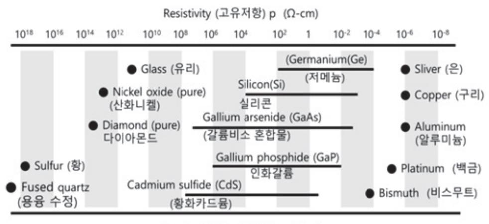

출처: 집필진 제작(2024)

[그림 1-1] 물질에 따른 전도율 및 고유 저항(conductivity & resistivity of materials)

(3) 절연 내력(dielectric strength)

물질에 가하는 전압이 어느 정도 크기에 이르게 되면 저항률의 급격한 저하로 절연 파 괴가 일어나는 값을 의미한다는 점을 학습한다.

2. 화학적 특성

반도체의 특성은 화학적인 관점에서 부식성(corrosion), 가습성(hygroscopy, the ability of a substance to attract and hold water molecules from the surrounding environment), 반응성(reactivity), 표면 에너지(surface energy) 및 표면 장력(surface tension)으로 접근할 수 있으며 이에 대하여 학습한다.

3. 기계적 특성

반도체의 특성은 기계적인 관점에서 체적 탄성률(bulk modulus), 마찰 계수(coefficient of friction), 반발 계수(coefficient of restitution), 압축/인장 강도(compressive/tensile strengt h), 항복 강도(yield strength), 변형(creep), 연성(ductility), 피로 한계(fatigue limit), 굽힘 강도(flexural modulus), 파괴 인성(fracture toughness), 경도(hardness), 가소성(plasticity), 푸아송비(poisson's ratio), 탄성(resilience), 비탄성률(specific modulus), 강성(shear modulu s), 표면 거칠기(surface roughness) 및 영률(young's modulus)로 접근할 수 있으며 이에 대하여 학습한다.

4. 물리적 특성

물질에 존재하는 여러 특성 간의 상호 작용으로 인하여 구분하기 어려운 경우보다 거시적으로 물리적인 관점에서 흡수/방출(adsorption/emission), 충전/방전(charge/discharge), 구조(str ucture), 반사율(reflectivity) 및 굴절률(refractive index) 등으로 접근할 수 있으며 자기적, 광학적, 및 열역학적 특성 등으로 반도체 제조 공정 결과물의 목적에 따라 다양하게 정의할 수

#### 숕 공정 개선 과정

확인된 특성을 개선하기 위하여 공정별 장비의 개선, 공정 레시피 개선 및 단위 공정을 재구성 할 수 있는 능력이 필요하다. 여기서는 결과물의 특성()을 만들기 위한 다양한 변수()로 이 루어진 방정식이 간단해질수록(또는 선형에 가까울수록) 제어가 간편해질 수 있고 결과물에 대 한 재연성 확보 및 오차 범위를 줄일 수 있음을 학습한다.

1. 공정 결과의 확인

반도체 제조 공정의 결과물은 설계 단계에서 정해진 특성 목표치에서 허용 범위 내의 오차가 생겼는가를 각 공정 및 최종 단계에서 확인하게 되며 이때 사용되는 계측 장비 및 결과에 대한 문서화 방법 등은 '3-1. 계측 장비 운용하기'를 참조할 수 있다.

#### 2. 공정 결과의 개선 및 제어

반도체 제조 공정에서 결과물에 대한 개선은 결국 설계 단계에서 정해진 특성에 대한 목표 치의 오차를 더욱 줄여 나가는 데 중점을 두게 되며 이는 방정식의 노이즈(에러) 항을 얼마 나 효율적으로 줄일 수 있는가에 대한 방법론이 된다.

#### 3. 단위 공정의 재구성

공정 결과 확인 및 개선에서 단위 공정의 순서를 변경하여 전체 또는 부분 결과물의 오차가 줄어들 수도 있다. [그림 1-2]는 적층 구조에서 금속 배선을 연결하기 위한 TSV(through silicon via) 공정에서 가능한 단위 공정의 재구성을 통해 각 단위 공정 결과물의 특성이 목표치에 부합하도록 구현될 수 있음을 보여 준다.

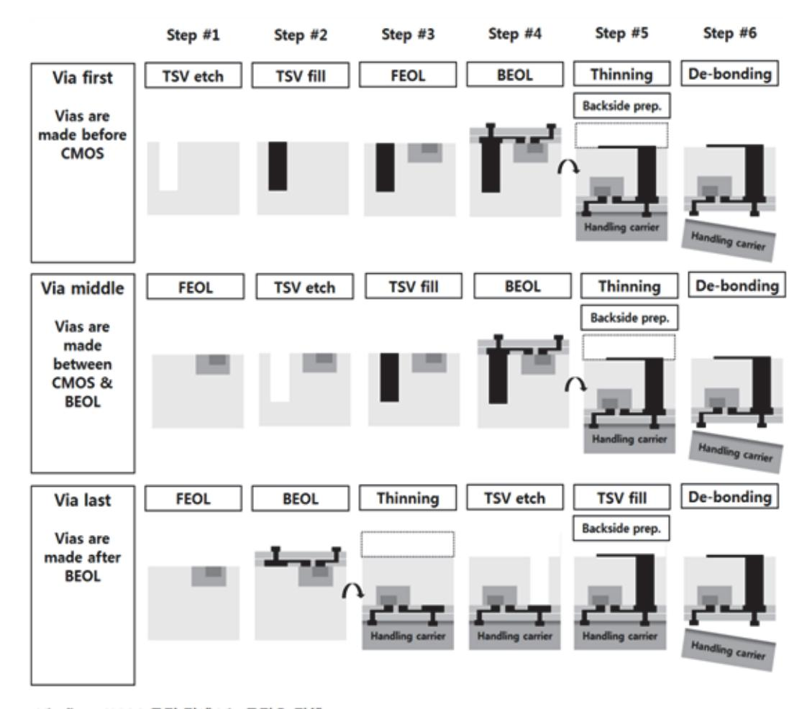

출처: 교육부(2015). 반도체 제조 공정 개발(LM1903060106\_14v3). 한국직업능력개발원. p.92. [그림 1-2] 3D TSV via integration scenarios(TSV 공정을 위한 시나리오)

#### 숖 통계 프로그램 운영 및 분석

반도체 제조 공정에서 공정 변수와 결과는 데이터의 형태로 취합이 되며 그 상관관계까지 확인 하기 위해서는 객관적인 통계 기법의 응용이 필요하다. 반도체 제조 공정의 목적에 맞고 수집 된 데이터의 확인 및 분석이 가능하도록 기본적인 통계의 개념 및 용어를 학습한다.

#### 1. 기본적인 통계 용어

통계란 모여진 데이터로 수학 기법을 통하여 수치상의 규칙성 또는 불규칙성을 찾아내는 것으로 이를 통하여 일부의 데이터만으로 전체의 현상을 신뢰성 있게 확인할 수 있도록 하 는 것이다. 여기서는 통계 기법에 사용되는 용어 및 각각의 정의에 대하여 학습한다. 보다 더 자세한 용어는 한국통계학회(www.kss.or.kr) 자료실의 통계 용어를 참조할 수 있다.

(1) 기초 통계

관측치 수, 중심 위치(평균, 중위수), 산포(표준 편차, 평균의 표준오차, 최솟값 및 최댓 값, 사분위 수), 그래프(히스토그램, 정규 곡선 등), 검정 방식, 분산 및 정규성 평가에 대하여 학습한다.

(2) 회귀 분석

회귀 방정식, P-값, S, R-제곱[R-제곱(수정)], 표준화 잔차, 예측 변수, 신뢰 구간, 예측 구간, 잔차 히스토그램, 잔차 정규 확률도, 잔차 대 적합치 및 통계적 유의성에 대하여 학습한다.

(3) 다양한 회귀 분석

일반적 회귀 분석, 단계적 회귀 분석, 최량 부분 집합 회귀 분석, 직교 회귀 분석, 부분 최소 제곱 회귀 분석, 이항 로지스틱 회귀 분석, 순서형 로지스틱 회귀 분석 및 명목형 로지스틱 회귀 분석에 대하여 학습한다.

(4) 분산 분석

개별 통계량, 개별 신뢰 구간, 다중 비교, 일원 분산 분석, 이원 분산 분석, 평균 분석, 주 효과와 교호 작용, 균형 분산 분석, 일반 선형 모형, 완전 내포 분산 분석, 균형 다 변량 분산 분석, 일반 다변량 분산 분석 및 등분산 검정에 대하여 학습한다.

(5) 실험 계획법

완전/부분 요인 설계와 분석 방법, Plackett-Burman 설계와 분석 방법, 반응 표면 설 계와 분석 방법, 혼합물 설계와 분석 방법, 다구찌(Taguchi) 설계와 분석 방법, 최적 설 계 방법 및 반응 최적화 방법에 대하여 학습한다.

(6) 관리도

박스 앤 콕스(box-cox) 변환, 부분군 계량형 관리도(Xbar-R, Xbar-S, I-MR-R/S(군간 /군내)), 개별값 계량형 관리도(I-MR, Z-MR, 개체, 이동 범위), 계수형 관리도, 시간 가 중 관리도, 다변량 관리도 및 희귀 사건 관리도에 대하여 학습한다.

(7) 품질 관리

품질 계획(런 차트, 파레토 차트, 특성 요인도, 대칭도, 다변량 차트), 존슨(Johnson) 변 환, 공정 능력 분석(다중 정규/비정규 분포, 이항 분포, 푸아송 분포), 식스 시그마 및 게이지(gage) 분석에 대하여 학습한다.

7

(8) 신뢰성/생존 분석

검사 계획, 분포 분석, 성장 곡선, 가속 수명 검사, 수명 데이터 분석 및 프로비트(스트 레스) 분석에 대하여 학습한다.

(9) 다변량 분석

주성분 분석, 인자 분석, 항목 분석, 관측 개체 군집 분석, 변수 군집, K-평균 군집, 및 판별 분석에 대하여 학습한다.

(10) 시계열 분석

시계열 분석, 추세 분석, 분해, 이동 평균, 단일/이중 지수 평활, 자기 상관, 편자기 상 관, 교차 상관 및 아리마(ARIMA)에 대하여 학습한다.

(11) 구조 방정식

독립 변수, 종속 변수, 직접/간접 효과, 카이 제곱, 및 베타(ϐ) 값에 대하여 학습한다.

2. 데이터의 특성

반도체 제조 공정에서 결과물에 대한 개선은 결국 설계 단계에서 정해진 특성에 대한 목표 를 얼마나 정확히 구현하는가에 중점을 두게 되며 이는 통계 기법을 통한 변동(산포)과 노 이즈(에러) 부분을 얼마나 효율적으로 줄일 수 있는가에 대한 방법론으로 이어진다. 여기서 는 적절한 통계 기법을 적용할 수 있도록 데이터의 특성에 대하여 학습한다.

- (1) 적합성(relevance) 데이터가 목표 해결에 적합하며, 통계 기법의 적용이 가능한가?
- (2) 명확성(clarity) 모인 데이터 간에 상관관계가 뚜렷한가?
- (3) 일관성(consistency) 2개 이상의 계측 장비로부터 동일한 데이터가 수집되었는가?
- (4) 시기 적절성(timeliness) 시기적으로 가치 있는 데이터인가?
- (5) 정확성(accuracy) 데이터가 실제 상황을 반영하고 있는가?
- (6) 완전성(completeness) 데이터가 목표 해결에 충분할 만큼 존재하는가?
- (7) 접근성(accessibility) 데이터의 활용이 100% 가능한가?(예를 들어 보안 사항에 위배되지는 않는가?)
- (8) 비용(cost) 데이터의 취득 및 활용 시 예상 범위 내에서 비용이 발생하는가?

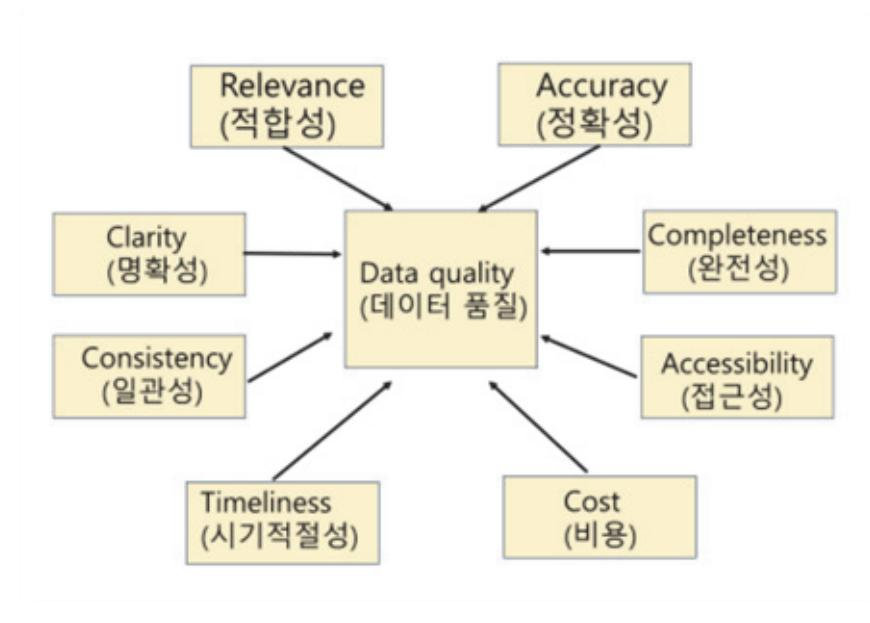

출처: 집필진 제작(2024) [그림 1-3] 데이터 품질(data quality)

숗 통계적 품질 관리(SPC: statistical process control)

통계적 품질 관리는 통계적 자료와 분석 기법의 도움을 받아 주어진 규격과 공정의 능력 상태 를 파악하여 변동의 유발 원인을 확인하고, 적절한 조치를 통해 변동(산포)을 줄임으로써 원하 는 상태로 공정이 가능하도록 지속적으로 조치/관리하는 방법론을 의미한다.

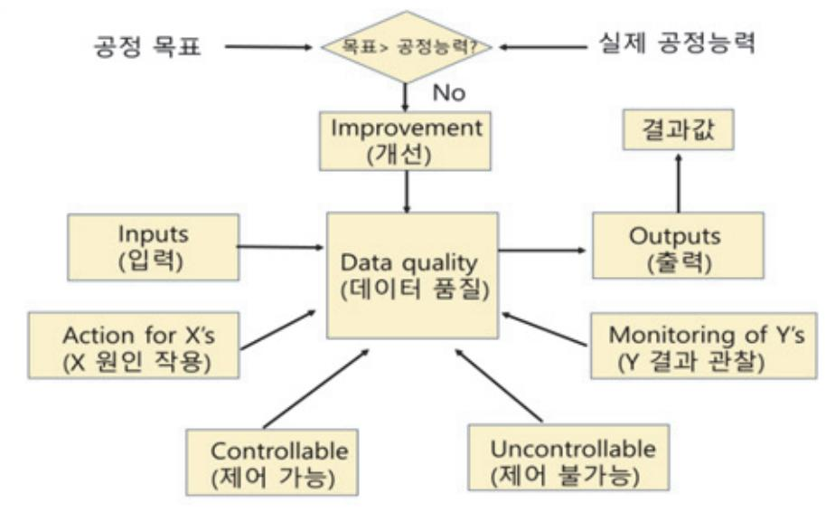

출처: 집필진 제작(2024)

[그림 1-4] 통계적 공정 관리 흐름도(statistical process control logic)

#### 1. 품질

품질이란 설계된 목표를 만족시키는지에 대해 평가의 대상이 되는 고유의 성질 또는 성능 을 의미하는 것으로 설계 품질, 제조 품질, 시장 품질 및 요구 품질에 대하여 학습한다.

- (1) 설계 품질(quality of design) 요구 품질을 실현하기 위한 제품 기획, 사양 정리 및 도면화에 대하여 학습한다.
- (2) 제조 품질(quality of manufacture) 완성된 설계 품질에 대하여 제조 공정을 통하여 실제화하는 단계에서의 목표이며 단위 공정별 특성 목표치로 정의할 수 있다.
- (3) 시장 및 요구 품질(quality of market & requirement of quality) 시장에서 사용자의 평가를 받고 다시 소비자가 요청하는 품질을 의미한다.
- 2. 품질 관리

품질 관리란 설계된 목표를 만족시키기 위해 계획을 세우고 달성하기 위해 행하는 모든 활동을 의미하는 것으로 품질에 존재하는 변동(산포)을 줄이는 것이 목적이다. 변동의 원인인 5M1E(사람 (man), 설비(machine), 재료(material), 방법(method), 계측(measure), 환경(environment)) 에 대하여 학습한다.

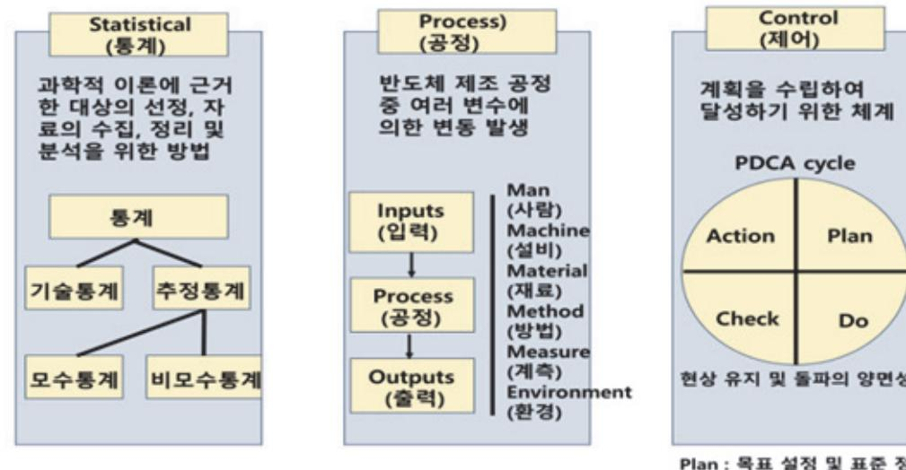

출처: 집필진 제작(2024) [그림 1-5] 통계적 공정 관리

#### 3. 통계적 품질 관리의 발전

품질 관리는 결국 불량을 줄이고 수율을 높이는 데 그 목적이 있으며 반도체의 소형화 및 집적도로 인하여 더욱 발전된 기술을 필요로 한다. R2R(run to run), FDC(fault detection classification), APC(advanced process control) 및 VM(virtual metrology)에 대하여 학습한다.

#### 수 공정 모니터링

반도체 제조 공정 중 품질 관리를 위하여 오프라인 단계에서부터 실시간(in-situ) 단계에 이르 기까지 다양한 모니터링 및 데이터 취합이 이루어지며 실시간 확인을 위하여 장비에 바로 연결 되는 다양한 센서를 사용하고 있다. 여기서는 공정 모니터링 및 실시간 센서에 대하여 학습한 다.

1. 반도체 제조 공정의 기준

반도체 제조 공정의 생산품인 최종 결과물까지 여러 다양한 기준이 필요하며 여기서는 공 통적으로 제시되는 다섯 가지 기준에 대하여 학습한다.

(1) 비용(cost)

수율과 단계별 소요 비용, 및 직접(labor cost, facility cost, raw-wafer cost, material cost, and so on) / 간접(equipment and facility depreciation, facility operating cost, engineering support, production control, and so on) 비용에 대하여 학습한다.

(2) 품질(quality)

품질은 결국 사용자가 필요로 하는 모든 부분을 이야기하게 되며 얼마나 일치시키느냐에 따라 수율이 달라진다. 여기서는 품질 만족을 위한 필요 요소로 장비(equipment performance), 작업자(competence of workforce), 품질 관리 절차(quality control procedures) 및 공정 프로세스(manufacturing process)에 대하여 학습한다.

(3) 변동성(variability)

품질 개선은 각 변수들의 변동(산포)을 줄여 나가는 과정이며, 정확치 않은 공정(misprocessing), 재공정(rework) 및 낭비(waste)만 줄여도 제조 공정의 비용을 낮출 수 있다.

(4) 수율(yield)

제조 비용에 직접적인 영향을 주는 기준이며 수율 개선을 위한 목표 설정(establish targets), 측정(measure actuals), 원인 확인(determine root causes) 및 해결 노력(action plans)에 대하여 학습한다.

(5) 신뢰성(reliability)

광범위한 테스트와 데이터에 대한 분석을 통한 신뢰성 확보에 대하여 학습한다.

2. 공정 모니터링

반도체 제조 공정에서 위와 같은 기준이 포함된 품질을 만족시키기 위한 활동으로 여러 단 계에서 모니터링이 이루어지며 여기서는 불량의 가장 큰 원인인 오염과 순도 모니터링의 관점에서 바라본 계측 장비에 대하여 학습한다. 분석 및 계측 장비는 '학습 3-1. 계측 장비 운용하기'를 참조할 수 있다.

|                  | Stand alone Tools(장비와 별도로 구성되는 모니터링 시스템)                                                                                                           |
|------------------|----------------------------------------------------------------------------------------------------------------------------------------------------|
| Off-line         | Available only outside fab(FAB 외부에서만 가능)                                                                                                           |
| (오프라인)           | (usually destructive or contaminating, 보통 파괴되거나 오염됨.)                                                                                              |
| At-line (엣라인) | Available in the fab(FAB 내부에서도 가능) (measures monitor wafers. destructive, contaminating or unpatterned) (계측용 또는 패턴 없는 웨이퍼 측정, 보통 파괴되거나 오염됨.) |
| In-line          | Tool is used during production(계측이 공정 진행 중에 따로 이루어짐.)                                                                                              |
| (인라인)            | (can measure patterned wafers, 패턴 있는 웨이퍼 측정 가능)                                                                                                    |

Integrated Tools(장비와 함께 구성되는 모니터링 시스템)

| On-line (온라인) | Available at the process workstation to measure patterned wafers but |
|------------------|----------------------------------------------------------------------|
|                  | not able to measure during wafer processing                          |
|                  | (계측이 공정 진행 중에 이루어지나 공정 장비 기동 중에는 계측 불가능)                             |
| In situ (인시츄) | Measurement tool that measures wafer, process or equipment during    |
|                  | processing                                                           |
|                  | (real-time measurement, 계측이 공정 장비가 기동 중에 가능: 실시간 계측)                 |

출처: Michael Quirk & Julian Serda (2009). Semiconductor Manufacturing Technology.

(1) 오염 모니터링 계측 장비

Surface SIMS, TOF-SIMS, TXRF, Conventional SIMS, SPV, VPD-AAS, VPD-TXRF, 및 VPD-ICP/MS에 대하여 학습한다.

(2) 순도 모니터링 계측 장비

AFM, SIMS, SEM, SEM-EDS, FE-AES, XPS, AES, GDMS, FTIR, RBS, 및 TXRF에 대하여 학습한다.

3. 센서

반도체 제조 공정에서 수율 향상을 위하여 실시간 모니터링 및 품질 관리의 필요성은 더욱 커지고 있으며 여기서는 센서의 종류 중 질량 분석기(mass spectrometer), 간섭계(interferometer), 광학 분광 분석기(optical emission spectrometer), 랭미어 프로브(langmuir probe) 및 RF 센서에 대하여 학습한다.

이외에도 장비 운용 시 기본적으로 사용되는 압력 센서, 가스 유량 센서 등에 대하여 학습 하며 더욱 자세한 설명은 '반도체 장비'를 참조할 수 있다.

4. 공정 상태의 구분

공정 상태 구분 시 안정 상태와 이상 상태의 차이점에 대하여 학습하고, 원인 분류 시 우연 원인과 이상 원인에 대하여 학습한다.

# 수행 내용 / 단위 공정 개발하기

#### 재료·자료

- 안전 교육 자료, 통계 기법 자료
- 작업 지시서(공정 계획서), 장비 및 설비 사용 설명서, 장비/공정 특성 평가서

#### 기기(장비 ・ 공구)

- 특성 계측 장비
- 컴퓨터, 프린터, 통계 분석 프로그램

#### 안전 ・ 유의 사항

- 반도체 제조 공정이 환경에 미치는 영향을 사전에 파악하여 문제가 되지 않도록 한다.
- 안전장치 사용 방법을 숙지하여 비상시에 대처할 수 있어야 한다.

#### 수행 순서

- 숔 공정 개선 요구 사항을 확인하여 성능 개선을 위한 재료 선택 및 공정 방법을 도출한다. 반도체 제조 단위 공정 개발을 위해 성능 개선을 목표로 공정 개선 요구 사항을 확인하고, 이 를 바탕으로 재료 선택 및 공정 방법을 도출하는 과정은 다음과 같다.
  - 1. 공정 개선 요구 사항을 확인한다.
    - (1) 성능 목표 정의
      - (가) 기능적 요구 사항: 제품이 수행해야 할 기능적 성능
      - (나) 성능 지표: 속도, 전력 소모, 열 방출, 신뢰성 등 구체적인 성능 지표 정의
    - (2) 현재 공정 평가
      - (가) 공정 단계 분석: 현재 사용 중인 각 단위 공정의 평가
      - (나) 문제점 식별: 성능 저하의 원인이 되는 공정 문제점을 식별
    - (3) 개선 요구 사항 도출
      - (가) 기능 개선: 성능 목표를 달성하기 위한 기능적 개선 요구 사항
      - (나) 공정 변수 최적화: 개선이 필요한 공정 변수와 최적화 방향 설정
  - 2. 성능 개선을 위한 재료를 선택한다.

(1) 재료 특성 분석

- (가) 물리적 특성: 재료의 강도, 경도, 열전도성, 전기 전도성 등
- (나) 화학적 특성: 화학적 안정성, 반응성 등
- (다) 전기적 특성: 유전 상수, 저항, 누설 전류 등
- (2) 재료 비교 및 평가
  - (가) 후보 재료 선정: 여러 후보 재료를 선정하여 비교 평가
  - (나) 성능 평가: 각 재료의 성능을 공정 개선 요구 사항과 비교하여 평가
- (3) 최적 재료 선택
- (가) 종합 평가: 재료의 성능, 비용, 가용성을 종합적으로 평가하여 최적의 재료 선택 3. 성능 개선을 위한 공정 방법을 도출한다.
  - (1) 공정 변수 최적화

반도체 단위 공정 개발을 위해 공정 개선 요구 사항을 확인하고, 성능 개선을 위한 공 정 방법을 공정 변수 최적화를 통해 도출하는 과정은 매우 체계적이고 반복적인 접근이 필요하다. 이를 위해 다음과 같은 단계들을 수행할 수 있다.

- (가) 공정 개선 요구 사항 확인
  - 1) 성능 목표 정의: 개발 중인 공정에서 달성해야 할 성능 목표를 명확히 설정한다. 이 는 예를 들어, 트랜지스터의 전류 특성, 속도, 전력 소비, 열 안정성 등과 관련될 수 있다.
  - 2) 고객 및 시스템 요구 사항 분석: 최종 제품의 사양과 시장의 요구를 분석하여 공정 에서 어떤 부분이 개선되어야 하는지 파악한다.
  - 3) 현재 공정의 한계 파악: 현재 사용 중인 공정에서 발생하는 문제점(예: 수율 저하, 신뢰성 문제, 비용 증가 등)을 식별하고, 이를 해결하기 위한 개선 요구 사항을 수 집한다.
- (나) 공정 변수 식별
  - 1) 핵심 변수 결정: 공정 성능에 가장 큰 영향을 미치는 공정 변수를 식별한다. 예를 들어, 산화막 두께, 도핑 농도, 에칭 속도, 노광 조건 등이 포함될 수 있다.
  - 2) 변수 상호 작용 분석: 각 변수들이 어떻게 상호 작용하여 공정 성능에 영향을 끼치 는지 분석한다. 변수 간의 상호 작용은 복잡한 비선형성을 가지므로 이에 대한 이해 가 중요하다.
- (다) 공정 방법 도출
  - 1) 공정 방법론 연구: 기존의 공정 방법론을 조사하고, 최신 기술 및 혁신적인 공정 기 법을 검토하여 적용 가능성을 평가한다.
  - 2) 공정 변화 시나리오 생성: 다양한 공정 변경 시나리오를 생성하여 각 시나리오에서 공정 변수들이 어떻게 조정될 수 있는지 분석한다.

- (라) 공정 변수 최적화
  - 1) 실험 설계(DOE): 실험 계획법(DOE: design of experiments)을 사용하여 공정 변수의 최적 조합을 찾기 위한 실험을 설계한다. 이 단계에서 다양한 변수 조합을 시험하여 각 변수의 영향과 최적값을 도출한다.
  - 2) 시뮬레이션 및 분석: 공정 시뮬레이션 도구를 활용하여 변수 변화에 따른 공정 결과 를 예측하고 분석한다. 몬테카를로(Monte Carlo) 시뮬레이션을 통해 변수의 불확실 성을 고려한 최적화를 수행할 수 있다.
  - 3) 응답 표면 방법(RSM): 공정 변수를 최적화하기 위해 응답 표면 방법을 사용하여 공 정 변수와 성능 지표 간의 관계를 모델링하고 최적 조건을 도출한다.
- (마) 공정 개선 방법 도출
  - 1) 최적 조건 설정: 시뮬레이션과 실험 결과를 기반으로 공정 변수를 최적화하여 개선 된 공정 방법을 도출한다.
  - 2) 공정 제어 전략 개발: 공정 변수를 실시간으로 모니터링하고 제어할 수 있는 전략을 개발하여 변동성을 최소화하고 일관된 공정 성능을 유지한다.
- (바) 실험 및 검증
  - 1) 파일럿 공정 수행: 최적화된 공정 변수를 기반으로 파일럿 공정을 수행하여 실제 환 경에서의 성능을 검증한다.
  - 2) 결과 분석 및 피드백: 파일럿 공정 결과를 분석하여 예상과 다른 점을 확인하고, 필 요에 따라 추가적인 최적화를 수행한다.
- (사) 최종 도출 및 문서화
  - 1) 최종 공정 변수 설정: 검증을 거친 최적 공정 변수를 최종적으로 설정하고, 이를 반 영한 공정 방법을 공식화한다.
  - 2) 공정 문서화 및 지침서 작성: 공정 개선 결과와 방법론을 문서화하여, 공정 엔지니 어들이 일관되게 공정을 수행할 수 있도록 지침서를 작성한다.

이러한 단계들을 통해 공정 변수를 체계적으로 최적화하면, 반도체 공정의 성능을 크게 개선할 수 있으며, 최종 제품의 품질과 신뢰성을 높이는 데 기여할 수 있다.

(2) 공정 개선 방법론

반도체 단위 공정 개발에서 공정 개선 요구 사항을 확인하고, 이를 바탕으로 성능 개선 을 위한 공정 방법을 도출하는 과정은 체계적인 공정 개선 방법론을 통해 이루어진다. 이 방법론은 공정의 효율성을 높이고 제품의 성능을 극대화하기 위해 사용된다. 다음은 이러한 과정에서 사용될 수 있는 주요 단계들이다.

(가) 공정 개선 요구 사항 확인

1) 요구 사항 수집 및 분석

가) 내부 요구 사항: 공정의 현재 성능을 분석하고, 공정 수율, 재현성, 비용, 생산

15

시간 등과 관련된 내부적인 요구 사항을 파악한다.

개선의 목표를 명확히 한다.

고, 각 단계의 역할과 연결성을 파악한다.

어그램), 5Whys 기법 등을 사용한다.

지속적인 모니터링을 수행한다.

(나) 현재 공정 분석

(다) 공정 개선 방법론 적용

1) DMAIC 방법론

다.

한다.

한다.

적용된다.

- 사항을 수집한다.

다) 규제 요구 사항: 해당 공정이 준수해야 할 법적 및 규제 요구 사항을 확인한다.

2) 핵심 성능 지표(KPI) 설정: 개선이 필요한 주요 성능 지표(KPI)를 설정하여, 공정

1) 공정 흐름도 작성: 현재의 공정 흐름도를 작성하여 공정 단계를 시각적으로 이해하

2) 공정 성능 평가: 현재 공정에서 발생하는 문제점과 병목 현상을 파악하기 위해 공정

3) 원인 분석: 주요 문제의 원인을 파악하기 위해 원인과 결과 다이어그램(피시본 다이

가) 정의(define): 개선할 문제를 명확히 정의하고, 개선 목표와 팀을 설정한다.

나) 측정(measure): 현재 공정의 성능을 측정하고, 문제의 범위를 데이터로 확인한

다) 분석(analyze): 공정 데이터와 변동 요인을 분석하여 문제의 근본 원인을 파악

라) 개선(improve): 문제 해결을 위한 개선안을 도출하고, 새로운 공정 방법을 설계

마) 관리(control): 개선된 공정을 안정적으로 유지하기 위한 관리 방안을 설정하고,

2) 6시그마: 공정 변동성을 줄이고 품질을 향상시키기 위해 6시그마 방법론을 적용한

3) 린 제조(lean manufacturing): 공정 내의 낭비를 제거하고, 효율성을 극대화하기

4) FMEA(failure mode and effects analysis): 공정에서 발생할 수 있는 잠재적 실

패 모드를 식별하고, 그 영향을 분석하여 예방 조치를 설계한다.

위해 린 제조 기법을 도입한다. 린 기법은 재고 관리, 작업 효율, 품질 관리 등에

다. 6시그마의 도구들을 활용해 공정 능력을 개선하고, 결함을 최소화한다.

데이터를 분석한다. 이때 통계적 공정 관리(SPC)를 사용할 수 있다.

나) 외부 요구 사항: 고객 요구, 산업 표준, 경쟁사 비교 등을 통해 외부적인 요구

- (라) 공정 개선 방법 도출
  - 1) 개선안 개발: 공정 개선 방법론을 통해 도출된 데이터를 바탕으로, 새로운 공정 흐 름 및 방법을 설계한다. 여기에는 공정 변수를 조정하거나, 새로운 기술을 도입하는

방안이 포함될 수 있다.

- 2) 실험 및 시뮬레이션: 개선된 공정 방법을 실험적으로 검증하고, 시뮬레이션을 통해 예상 성능을 평가한다.
- 3) 파일럿 테스트: 소규모 파일럿 공정을 실행하여 개선안의 실효성을 검증하고, 필요 시 추가적인 조정을 수행한다.
- (마) 결과 검증 및 최종 개선
  - 1) 성과 검증: 개선된 공정 방법을 적용한 후, 성능 지표를 다시 측정하여 목표한 성과 가 달성되었는지 확인한다.
  - 2) 공정 표준화: 검증된 개선안을 표준 공정으로 채택하고, 이를 문서화하여 모든 공정 단계에서 일관되게 적용되도록 한다.
  - 3) 지속적 개선(CIP): 공정 개선은 일회성으로 끝나지 않고, 지속적인 개선 활동을 통 해 공정 성능을 지속적으로 향상시킨다.
- (바) 최종 보고 및 문서화
  - 1) 개선 과정 문서화: 공정 개선의 모든 단계를 문서화하여 향후 공정 개선 시 참고할 수 있도록 한다.
  - 2) 최종 보고서 작성: 공정 개선의 결과를 정리한 최종 보고서를 작성하여, 관리층 및 관련 부서와 공유한다.
- 이와 같은 접근법을 통해 반도체 공정의 성능을 최적화하고, 일관된 품질을 유지할 수 있다. 공정 개선 방법론의 체계적 적용은 공정의 복잡성을 관리하고, 성능 개선 목표를 효과적으로 달성하는 데 중요한 역할을 한다.
- (3) 성능 검증 및 피드백
  - (가) 실험 검증: 개선된 공정 및 재료를 사용하여 성능을 검증한다.
  - (나) 피드백 수렴: 검증 결과를 분석하고, 추가 개선이 필요한 부분을 피드백하여 공정에 반영 한다.
- 4. 재료 선택 및 공정 방법 도출 사례를 파악한다.
  - (1) 사례: 고성능 유전체 재료 선택
    - (가) 목표: 반도체 소자의 고속 동작을 위해 고유전율 유전체 재료 선택
    - (나) 재료 후보: SiO2, HfO2, Al2O3 등
    - (다) 재료 평가: 유전 상수, 누설 전류, 열적 안정성 등 평가
    - (라) 최적 재료 선택: HfO2(고유전율, 낮은 누설 전류, 열적 안정성 우수)
  - (2) 사례: 금속 배선 공정 개선
    - (가) 목표: 배선 저항 감소 및 신호 전달 속도 향상

- (나) 공정 개선: 기존의 알루미늄 배선을 구리 배선으로 변경
- (다) 공정 방법 도출: 구리 배선을 위한 새로운 CVD 공정 도입 및 CMP 공정 최적화
- (라) 성능 검증: 배선 저항 감소 및 신호 전달 속도 향상 확인

반도체 제조 단위 공정의 성능 개선을 위해서는 공정 개선 요구 사항을 명확히 정의하고, 이를 바탕으로 최적의 재료를 선택하며, 공정 방법을 도출하는 과정이 필요하다. 이를 통해 성능, 비 용, 신뢰성 측면에서 최적의 결과를 달성할 수 있다. 공정 개선은 지속적인 피드백과 검증을 통해 이루어지며, 최종적으로 제품의 경쟁력을 높이는 데 기여한다.

숕 성능 개선의 요구에 따라 전‧후 공정을 고려하여 단위 공정을 구성한다.

반도체 제조 단위 공정 개발에서 성능 개선 요구를 만족시키기 위해 전‧후 공정을 고려하여 단 위 공정을 구성하는 것은 매우 중요하다. 이 과정은 전체 공정의 효율성과 성능을 최적화하고, 상호 의존적인 공정 간의 일관성을 유지하는 데 도움을 준다. 다음은 단위 공정을 구성하기 위 한 절차와 단계별 고려 사항이다.

- 1. 단위 공정 구성의 중요성을 파악한다. 단위 공정 구성은 개별 공정의 성능뿐만 아니라, 전체 제조 공정의 효율성을 높이는 데 중요한 역할을 한다. 각 단위 공정의 특성과 상호 작용을 이해하고 최적화하는 것이 필요하다.
- 2. 전‧후 공정 분석한다.
  - (1) 전 공정 분석
    - (가) 목적: 단위 공정 이전의 공정이 다음 공정에 어떤 영향을 끼치는지 분석
    - (나) 요소
      - 1) 웨이퍼 준비 상태(클리닝, 초기화 등)
      - 2) 이전 공정에서의 잔류물 또는 오염 물질
      - 3) 물리적/화학적 변화(예: 스트레스, 열처리 영향)
  - (2) 후 공정 분석
    - (가) 목적: 단위 공정이 이후 공정에 어떤 영향을 끼치는지 분석
    - (나) 요소
      - 1) 단위 공정 후 웨이퍼 상태(표면 상태, 두께 변화 등)
      - 2) 후속 공정의 요구 사항(예: 표면 평탄도, 화학적 호환성)
      - 3) 최종 제품 특성에 미치는 영향
- 3. 단위 공정 구성 절차를 파악한다.
  - (1) 요구 사항 수집 및 정의

(가) 성능 목표: 최적화할 성능 지표(예: 전기적 특성, 물리적 특성)

(나) 공정 요구 사항: 각 공정 단계에서 필요한 조건과 제한 사항

(2) 공정 플로 설계

(가) 공정 순서 결정: 각 단위 공정의 순서를 결정

(나) 상호 작용 분석: 전‧후 공정 간의 상호 작용을 분석하고, 상호 간섭을 최소화

(3) 단위 공정 설계 및 최적화

반도체 단위 공정 개발에서 성능 개선을 위해 전 ‧ 후 공정을 고려한 단위 공정을 설계하 고 최적화하는 과정은 매우 중요하다. 이 과정은 새로운 공정이 기존 공정과 원활하게 통합되고, 목표 성능을 달성할 수 있도록 하기 위한 중요한 절차이다. 다음은 이러한 과 정에서 수행할 수 있는 주요 단계들이다.

- (가) 단위 공정 설계 초기 단계
  - 1) 요구 사항 정의
    - 가) 성능 목표 설정: 단위 공정에서 달성해야 할 성능 목표를 명확히 설정한다. 이 는 공정의 결과물에 대한 전기적, 물리적 특성을 포함할 수 있다.
    - 나) 전‧후 공정 분석: 새롭게 설계될 단위 공정이 기존 공정에 어떻게 영향을 끼치 는지, 그리고 그 역도 고려한다. 전 공정에서 전달되는 특성(예: 기판 상태, 박 막 두께 등)과 후 공정에서 요구하는 특성을 고려하여 설계해야 한다.
  - 2) 공정 변수 식별
    - 가) 핵심 변수 결정: 설계에 중요한 공정 변수를 식별한다. 예를 들어, 노광, 식각, 이온 주입, 증착 공정 등에서의 변수가 포함될 수 있다.
    - 나) 변수 간 상호 작용 분석: 공정 변수들 간의 상호 작용을 이해하고, 주요 변수가 성능에 미치는 영향을 평가한다.
- (나) 단위 공정 설계
  - 1) 초기 설계
    - 가) 공정 흐름도 작성: 단위 공정의 전체 흐름을 도식화하여, 각 단계의 순서와 기 능을 명확히 정의한다.
    - 나) 시뮬레이션 설계: 물리적 및 전기적 시뮬레이션 도구를 사용하여 초기 설계를 검증하고, 예상 결과를 평가한다.
  - 2) 공정 재료 선택
    - 가) 재료 특성 분석: 선택된 재료의 물리적, 전기적 특성을 분석하고, 공정의 목표 성능을 달성할 수 있는지 평가한다.
    - 나) 적합성 평가: 재료가 공정에서 요구되는 특성에 적합한지, 전‧후 공정에서 문제 를 일으키지 않는지 평가한다.

- (다) 단위 공정 최적화
  - 1) 공정 변수 최적화
    - 가) 실험 설계(DOE): 다양한 변수 조합을 실험적으로 평가하여 최적의 공정 조건을 결정한다. 이는 공정 조건(예: 온도, 시간, 압력 등)을 변동시켜 최적 조건을 도 출하는 과정이다.
    - 나) 응답 표면 방법(RSM): 응답 표면 방법을 사용하여 공정 변수와 결과물 간의 관계를 수학적으로 모델링하고, 이를 통해 최적 조건을 도출한다.
  - 2) 성능 시뮬레이션 및 검증
    - 가) 공정 시뮬레이션: 시뮬레이션 도구를 사용하여 최적화된 공정 조건에서의 성능 을 예측한다. 이 시뮬레이션은 공정 조건 변화에 따른 결과물의 변동성을 평가 하는 데 사용된다.
    - 나) 물리적 테스트: 최적화된 공정 조건으로 실제 테스트를 수행하여 시뮬레이션 결 과와 일치하는지 검증한다.
- (라) 전‧후 공정과의 통합 검증
  - 1) 공정 적합성 테스트
    - 가) 전 공정 연계성 확인: 설계된 단위 공정이 이전 공정에서 생성된 특성과 잘 연 계되는지 확인한다. 예를 들어, 전 공정에서 생성된 산화막 두께가 단위 공정에 서 요구되는 두께와 일치하는지 확인한다.
    - 나) 후 공정 호환성 테스트: 단위 공정의 결과물이 후속 공정에 적합한지 검증한다. 이는 후속 공정에서 문제를 일으키지 않도록 하기 위한 중요한 단계이다.
  - 2) 통합 시뮬레이션: 전체 공정 흐름을 고려한 통합 시뮬레이션을 수행하여, 단위 공정 이 전체 공정에 미치는 영향을 분석한다.
- (마) 최종 설계 및 공정 표준화
  - 1) 최종 설계 검증: 최적화된 공정이 성능 목표를 충족하고, 전‧후 공정과의 연계가 원 활한지 최종 검증한다.
  - 2) 공정 표준화 및 문서화
    - 가) 표준 작업 지침(SOP) 작성: 최적화된 단위 공정을 위한 표준 작업 지침을 작성 하여, 일관된 공정 수행을 보장한다.
    - 나) 공정 매뉴얼 및 교육 자료 작성: 공정 매뉴얼을 작성하여, 공정 엔지니어들이
    - 새로운 공정을 이해하고 적용할 수 있도록 한다.
- (바) 지속적인 개선
  - 1) 공정 모니터링: 공정이 양산에 들어간 후에도 지속적으로 모니터링하여, 예상치 못 한 문제나 성능 저하가 발생하지 않도록 한다.
  - 2) 지속적인 피드백 루프: 현장에서 수집된 데이터를 바탕으로 공정을 지속적으로 개선

하고, 최적화를 유지하기 위한 피드백 루프를 운영한다.

이러한 단계를 통해 반도체 단위 공정의 성능을 향상시키고, 공정 간의 연계성을 강 화하여 안정적인 제조 공정을 구축할 수 있다.

(4) 시뮬레이션 및 모델링

(가) 공정 시뮬레이션: 전체 공정 플로를 시뮬레이션하여 예상 결과와 성능을 평가

(나) 모델링 도구 사용: 다양한 모델링 도구를 사용하여 공정 결과를 예측(예: TCAD, SPICE) (5) 실험 및 검증

반도체 단위 공정 개발에서 성능 개선을 위한 단위 공정 설계 및 최적화 후 실험 및 검 증 과정은 매우 중요한 단계이다. 이 단계는 이론적으로 최적화된 설계가 실제 공정에서 도 기대한 성능을 발휘하는지 확인하고, 필요시 추가적인 조정을 통해 공정을 안정화하 는 과정을 포함한다. 다음은 이 과정에서 수행할 수 있는 주요 단계들이다.

- (가) 실험 설계(DOE: design of experiments)
  - 1) 실험 변수 설정
    - 가) 변수 선택: 최적화 과정에서 중요하게 다루어진 공정 변수들을 선정한다. 예를 들어, 온도, 압력, 시간, 가스 플로 등의 변수들이 포함될 수 있다.
    - 나) 변수 범위 결정: 각 변수의 최적값을 기준으로 실험 범위를 설정한다. 이는 공 정 성능에 대한 민감도 분석을 가능하게 한다.
  - 2) 실험 매트릭스 구성
    - 가) 실험 계획법 적용: 풀 팩토리얼 실험, 부분 팩토리얼 실험, 태그치 방법 등을 사용하여 실험 매트릭스를 구성한다. 이를 통해 최소한의 실험으로 최대한의 정 보를 얻을 수 있다.
    - 나) 샘플 준비: 실험에 사용될 샘플을 준비한다. 이 단계에서는 동일한 조건에서 다 수의 샘플을 제작하여 변동성을 평가할 수 있도록 한다.
- (나) 단위 공정 실행
  - 1) 공정 변수 조정 및 실행
    - 가) 설정된 조건에 따른 공정 실행: 각 실험 조건에 따라 공정을 수행한다. 이때, 공정 변수들의 정확한 제어가 중요하다.
    - 나) 실시간 모니터링: 공정이 진행되는 동안 주요 변수들을 실시간으로 모니터링하 여, 이상 발생 시 즉각적으로 대응할 수 있도록 한다.
  - 2) 결과물 수집
    - 가) 측정 및 분석: 공정 후 결과물(웨이퍼 등)을 수집하여, 각 실험 조건에서의 성능 을 측정한다. 여기에는 전기적 특성, 물리적 특성, 화학적 특성 등이 포함된다.
    - 나) 데이터 정리: 수집된 데이터를 체계적으로 정리하여, 각 변수의 영향을 분석할 수 있도록 준비한다.

21

- (다) 결과 분석 및 최적화 검증
  - 1) 데이터 분석
    - 가) 통계적 분석: 실험 데이터를 통계적으로 분석하여, 변수들이 성능에 미치는 영 향을 정량적으로 평가한다. 여기서 상관관계 분석, 회귀 분석 등을 활용할 수 있다.
    - 나) 응답 표면 분석(RSM): 응답 표면 분석을 통해 공정 변수와 성능 지표 간의 관 계를 모델링하고, 최적화된 공정 조건을 도출한다.
  - 2) 성능 비교 및 검증
    - 가) 이론과의 비교: 실험 결과를 이론적으로 도출된 최적 조건과 비교하여, 일치하 는지 확인한다. 불일치가 발생하면 원인을 분석한다.
    - 나) 반복 실험: 동일한 조건에서 실험을 반복 수행하여 결과의 재현성을 확인한다. 이는 공정의 안정성을 검증하는 중요한 단계이다.
- (라) 전 ‧ 후 공정 연계성 검증
  - 1) 전 공정 영향 분석
    - 가) 전 공정 조건과의 상호 작용: 단위 공정이 이전 공정의 결과물에 어떻게 영향을 끼치는지 분석한다. 예를 들어, 이전 공정에서의 산화막 두께가 단위 공정에서 의 특성에 미치는 영향을 평가한다.
  - 2) 후 공정 적합성 검증
    - 가) 후속 공정에서의 성능 테스트: 단위 공정 이후에 수행될 공정에서의 성능을 테 스트하여 단위 공정의 결과가 후속 공정에 적합한지 확인한다.
- (마) 피드백 및 최종 조정
  - 1) 피드백 루프
    - 가) 결과에 따른 조정: 실험 결과와 검증 과정에서 도출된 피드백을 바탕으로 하여 공정 변수를 최종적으로 조정한다.
    - 나) 최적화된 공정의 재실행: 최종 조정된 공정 조건으로 공정을 다시 실행하여 조 정된 변수들이 성능 개선에 기여하는지 확인한다.
  - 2) 최종 검증
    - 가) 통합 검증: 전 ‧ 후 공정을 포함한 전체 공정 흐름에서의 성능을 최종적으로 검 증한다. 모든 조건에서 안정적인 성능을 발휘하는지 확인한다.
    - 나) 생산성 평가: 개선된 공정이 생산성에 미치는 영향을 평가하여 대량 생산에 적 합한지 검토한다.
- (바) 결과 문서화 및 표준화
  - 1) 결과 문서화
    - 가) 실험 결과 및 분석 문서화: 실험 및 검증 과정에서 도출된 모든 결과를 문서화

하여 이후 공정 개선 시 참조할 수 있도록 한다.

- 나) 최적화된 공정 매뉴얼 작성: 최적화된 단위 공정을 표준화하여 제조 현장에서 일관되게 적용할 수 있도록 매뉴얼을 작성한다.
- 2) 교육 및 전파
  - 가) 기술 교육: 관련 엔지니어 및 오퍼레이터를 대상으로 교육을 실시하여 새로운 공정 방법을 효과적으로 전파한다.
  - 나) 지속적 개선 준비: 공정이 양산에 적용된 이후에도 지속해서 개선할 수 있도록 피드백 루프를 마련한다.

이러한 실험 및 검증 절차를 통해 설계된 단위 공정이 실제 환경에서 기대하는 성능을 발휘하는지 확인하고, 필요시 추가적인 최적화를 통해 공정의 일관성과 품질을 보장할 수 있다.

- (5) 피드백 및 반복
  - (가) 피드백 수집: 검증 결과를 기반으로 피드백을 수집
  - (나) 공정 개선: 피드백을 반영하여 공정을 반복적으로 개선
- 4. 단위 공정 구성 예시를 파악한다.
  - (1) 예시 1: 전 ‧ 후 공정을 고려한 산화 공정
    - (가) 전 공정: 웨이퍼 클리닝
      - 1) 목적: 산화 공정 전에 웨이퍼 표면의 오염 물질 제거
      - 2) 방법: 화학적 클리닝(RCA 클리닝 등)
    - (나) 단위 공정: 열산화(Thermal Oxidation)
      - 1) 목적: 웨이퍼 표면에 고품질의 산화막 형성
      - 2) 조건: 고온에서 산소 또는 수증기 분위기
    - (다) 후 공정: 산화막 두께 측정 및 식각
      - 1) 목적: 산화막의 두께를 측정하고, 불필요한 부분을 제거
      - 2) 방법: 엘립소미터를 사용한 두께 측정, HF 식각
  - (2) 예시 2: 전‧후 공정을 고려한 금속 배선 공정
    - (가) 전 공정: CMP(chemical mechanical polishing)
      - 1) 목적: 금속 배선을 위한 평탄한 표면 제공
      - 2) 방법: 화학적 및 기계적 연마를 통해 표면 평탄화
    - (나) 단위 공정: 금속 증착(metal deposition)
      - 1) 목적: 웨이퍼 표면에 금속층 증착
      - 2) 방법: PVD(physical vapor deposition) 또는 CVD(chemical vapor deposition)
    - (다) 후 공정: 리소그래피 및 식각

1) 목적: 금속 배선을 원하는 패턴으로 형성

2) 방법: 포토레지스트 코팅, 노광, 현상, 식각

반도체 제조 단위 공정 개발을 위해 전‧후 공정을 고려하여 단위 공정을 구성하는 것은 공정 효율성과 성능 향상을 위해 필수적이다. 전후 공정 간의 상호 작용을 이해하고 최적화함으로 써, 높은 품질의 반도체 제품을 생산할 수 있다. 이를 위해 각 공정 단계의 요구 사항을 철저 히 분석하고, 공정 매개변수를 최적화하며, 반복적인 검증과 개선을 통해 최적의 공정 플로를 설계하는 것이 중요하다.

숖 공정 최적화를 통해 효율적인 공정을 설계하여 검증한다.

반도체 제조 단위 공정 개발에서 공정 최적화를 통해 효율적인 공정을 설계하고 검증하는 과정 은 매우 중요하다. 이를 통해 생산 효율성을 높이고 제품의 품질과 신뢰성을 확보할 수 있다. 다음은 공정 최적화를 통해 효율적인 공정을 설계하고 검증하는 단계별 과정이다.

1. 공정 최적화를 위한 준비 단계를 파악한다.

(1) 목표 설정

(가) 성능 목표: 공정의 성능 지표(예: 생산 속도, 불량률, 전력 소모 등)를 명확히 설정

(나) 품질 목표: 제품의 품질과 신뢰성 목표 설정(예: 표면 평탄도, 막 두께 균일성 등)

(2) 현재 공정 분석

(가) 공정 흐름도 작성: 현재 공정의 모든 단계를 포함하는 상세한 공정 흐름도 작성

(나) 성능 데이터 수집: 각 공정 단계에서 수집된 성능 데이터와 품질 데이터를 분석

2. 공정 최적화를 위한 분석 단계를 파악한다.

(1) 공정 변수 식별

반도체 단위 공정 최적화를 위한 공정 변수 식별은 반도체 제조의 효율성, 품질, 수율을 향상시키는 핵심 단계이다. 이 과정에서는 각 공정 단계의 성능에 영향을 미치는 주요 변수들을 식별하고, 이들의 최적값을 결정하여 공정의 안정성과 성능을 극대화한다. 다 음은 반도체 단위 공정 최적화를 위해 공정 변수를 식별하는 방법에 대한 개요이다.

(가) 공정 유형별 변수 식별

각 단위 공정 유형에 따라 영향을 미치는 변수들이 다를 수 있다. 대표적인 반도체 제조 공정과 관련된 주요 변수들은 다음과 같다.

1) 층 증착 공정(deposition)

가) 온도: 증착 속도와 증착 물질의 구조에 영향을 끼친다.

나) 압력: 체임버 내 압력은 증착 속도와 균일성에 큰 영향을 끼친다.

- 다) 가스 흐름 속도: 반응 가스의 흐름 속도가 증착 레이트와 물질의 조성에 영향을 준다.
- 라) 전원: PECVD와 같은 공정에서 RF 파워 수준이 증착 속도와 품질에 영향을 끼친다.
- 2) 식각 공정(etching)
  - 가) 식각 가스 종류 및 비율: 사용되는 가스의 종류와 비율이 식각 속도와 선택성에 영향을 끼친다.
  - 나) 온도: 식각 반응의 활성화 에너지에 영향을 준다.
  - 다) 압력: 식각 공정의 균일성과 방향성에 중요한 역할을 한다.
  - 라) RF 파워: 식각 공정에서 이온 에너지를 조절하여 식각 깊이와 속도를 제어한 다.
- 3) 리소그래피 공정(lithography)
  - 가) 노광 시간: 노광의 시간은 레지스트의 노광 정도와 패턴의 정의를 결정한다.
  - 나) 발달 솔루션의 온도와 시간: 레지스트 패턴의 해상도와 개발 속도에 영향을 준 다.
  - 다) 조명 균일성: 노광기의 조명 균일성이 패턴의 일관성을 결정한다.
- 4) 이온 주입 공정(ion implantation)
  - 가) 이온 에너지: 주입 깊이와 분포를 결정한다.
  - 나) 이온 농도: 도핑 레벨을 조절하여 반도체의 전기적 특성을 제어한다.
  - 다) 기판 온도: 주입 공정 중 기판 온도가 결정 구조에 영향을 끼친다.
- (나) 변수 상호 작용의 분석

공정 변수들 간의 상호 작용을 분석하여, 변수들이 공정 결과에 미치는 통합적인 영 향을 이해한다. 예를 들어, 식각 공정에서 가스 흐름 속도와 압력의 상호 작용이 식 각 균일성에 어떻게 영향을 끼치는지 분석할 수 있다.

- (다) 실험적 접근 및 데이터 분석
  - 1) 실험 계획법(DOE: Design of Experiments): 다양한 공정 변수 조합에 대한 실험 을 계획하고 수행하여, 각 변수의 영향과 최적 조합을 도출한다.
  - 2) 통계적 분석: 수집된 데이터를 분석하여 변수들의 중요성을 평가하고, 공정 조건을 최적화한다.
- (라) 모델링 및 최적화
  - 1) 공정 모델링: 실제 공정 데이터를 바탕으로 수학적 모델을 개발하여 공정 변수와 공 정 결과 간의 관계를 예측한다.
  - 2) 최적화 알고리즘 적용: 수학적 모델을 사용하여 공정 변수를 최적화하고 이를 실제 공정에 적용하여 성능을 향상시킨다.

이러한 공정 변수의 식별 및 최적화 작업은 반도체 제조 공정의 성능, 품질 및 수율을 극대화하기 위한 필수적인 활동이다. 체계적인 접근을 통해 반도체 제조 공정의 신뢰성 과 경제성을 향상시킬 수 있다.

(2) 데이터 분석

(가) 통계적 기법 활용: 통계적 기법(예: SPC, DOE)을 활용하여 공정 변동성을 분석

- (나) 문제점 파악: 데이터 분석을 통해 공정에서 발생하는 문제점과 그 원인을 파악
- 3. 공정 최적화를 위한 설계 단계를 파악한다.

반도체 단위 공정 최적화를 위한 설계 단계는 공정의 성능과 신뢰성을 극대화하기 위해 체 계적으로 진행해야 한다. 최적화를 위한 설계 단계는 각 공정이 원하는 특성을 만족하도록 하기 위한 계획 수립부터 실험 및 검증, 그리고 최종 도출까지의 일련의 과정을 포함한다. 다음은 반도체 단위 공정 최적화를 위한 주요 설계 단계이다.

- (1) 요구 사항 분석
  - (가) 성능 목표 정의

공정의 주요 성능 목표를 설정한다. 예를 들어, 특정 공정에서 달성해야 할 전기적 특성, 물리적 특성, 화학적 특성 등을 명확히 정의한다.

(나) 기준 설정

성능 목표를 달성하기 위해 필요한 공정 변수의 범위와 허용 오차를 설정한다. 이는 공정의 안정성과 일관성을 유지하는 데 중요하다.

- (2) 현재 공정의 평가
  - (가) 공정 분석

현재 사용 중인 공정의 성능을 평가하고, 문제점을 파악한다. 이때 공정의 수율, 결 함률, 변동성 등을 분석한다.

(나) 문제점 식별

공정 성능에 부정적인 영향을 끼치는 변수를 식별하고, 이를 개선하기 위한 목표를 설정한다.

- (3) 공정 변수 식별 및 상호 작용 분석
  - (가) 변수 목록 작성

공정의 성능에 영향을 끼칠 수 있는 모든 변수를 나열한다. 각 변수가 결과에 미치 는 영향을 파악하기 위해 실험 계획법(DOE)을 활용할 수 있다.

(나) 상호 작용 분석

변수 간 상호 작용을 분석하여, 각 변수의 최적값을 도출하기 위한 기반을 마련한다. 상호 작용 효과를 이해하는 것은 공정 최적화의 핵심이다.

- (4) 공정 시뮬레이션 및 모델링
  - (가) 공정 시뮬레이션

공정 변수가 변경될 때 성능이 어떻게 변화하는지 예측하기 위해 시뮬레이션을 수행 한다. 이를 통해 이론적으로 최적의 공정 조건을 도출할 수 있다.

(나) 모델링

실험 및 시뮬레이션 데이터를 기반으로 공정 변수와 성능 간의 관계를 수학적으로 모델링한다. 이 모델은 최적화의 근거가 된다.

- (5) 실험 설계 및 검증
  - (가) 실험 계획법(DOE)

실험 계획법을 활용하여 공정 변수를 체계적으로 변화시키면서 실험을 수행한다. 이 를 통해 공정 변수의 최적값을 도출한다.

(나) 파일럿 테스트

도출된 최적 조건을 기반으로 소규모 파일럿 테스트를 실행하여 최적화된 공정이 실 제로 기대한 성능을 발휘하는지 검증한다.

(다) 결과 검증 및 피드백

파일럿 테스트 결과를 분석하여 최적화 과정에서 발생할 수 있는 문제점을 식별하고 수정한다. 필요시 추가적인 실험을 통해 최적화를 반복한다.

- (6) 최적 공정 도출 및 적용
  - (가) 최종 공정 조건 설정

검증된 최적 조건을 바탕으로 최종 공정 조건을 설정한다. 이 조건들은 이후 양산 공정에 직접 적용된다.

(나) 공정 표준화

최적화된 공정을 표준 작업 지침(SOP)으로 문서화하여 공정 엔지니어들이 일관되게 적용할 수 있도록 한다.

(다) 양산 적용 및 초기 모니터링

최적화된 공정을 양산에 적용하고 초기 단계에서 공정이 안정적으로 운영되는지 모 니터링한다.

- (7) 지속적 개선 및 유지 관리
  - (가) 지속적인 피드백 루프

공정이 양산에 적용된 이후에도 지속적인 데이터를 수집하여 공정 변동성을 모니터 링하고 개선 기회를 식별한다.

(나) 공정 유지 보수 계획 수립

공정의 장기적인 안정성을 보장하기 위해 유지 보수 계획을 수립하고 정기적으로 공 정을 평가 및 조정한다.

이러한 단계들은 반도체 단위 공정 최적화를 위한 체계적인 접근 방법을 제공하며, 각 단계 에서 도출된 결과는 다음 단계의 기초 자료로 활용된다. 최적화의 궁극적인 목표는 안정적 이고 재현 가능한 공정을 개발하여 높은 수율과 품질을 유지하는 것이다.

#### 4. 효율적인 공정을 설계한다.

(1) 단위 공정 설계

반도체 단위 공정 최적화를 위한 효율적인 단위 공정 설계는 공정 성능을 극대화하고, 생산성을 높이며, 결함을 최소화하기 위해 매우 중요한 과정이다. 이 과정은 공정의 각 단계를 체계적으로 설계하고 최적화하여 최종 제품의 품질을 향상시키는 것을 목표로 한다. 다음은 반도체 단위 공정 최적화를 위한 효율적인 단위 공정 설계의 주요 단계들 이다.

(가) 공정 목표 및 요구 사항 정의

1) 성능 목표 설정

공정의 최종 목표를 명확히 정의한다. 예를 들어, 특정 전기적 특성, 물리적 특 성, 화학적 특성 등을 설정하여 목표 성능을 구체화한다.

2) 품질 및 신뢰성 요구 사항

공정에서 달성해야 할 품질 기준과 신뢰성 요구 사항을 설정한다. 이는 고객 요 구, 산업 표준, 규제 요구 사항 등을 반영한 것이다.

#### (나) 기존 공정 분석 및 문제점 파악

1) 현재 공정 평가

현재 공정의 성능을 분석하여 개선이 필요한 부분을 식별한다. 이 과정에서 수율, 결함률, 변동성 등의 데이터를 수집하고 분석한다.

2) 문제점 식별 및 개선 목표 설정

공정 성능 저하의 원인을 파악하고, 이를 개선하기 위한 목표를 설정한다. 예를 들어, 결함률 감소, 공정 시간 단축 등이 포함될 수 있다.

#### (다) 공정 변수 식별 및 초기 설계

1) 핵심 공정 변수 식별

공정의 성능에 영향을 미치는 주요 변수를 식별한다. 여기에는 온도, 압력, 시간, 재료의 물리적 특성 등이 포함될 수 있다.

2) 초기 공정 설계

공정 변수들을 조합하여 초기 공정 설계를 수립한다. 이 단계에서는 공정 흐름도 와 공정 순서, 각 단계에서 필요한 조건 등을 명확히 정의한다.

(라) 시뮬레이션 및 모델링

1) 공정 시뮬레이션

초기 설계를 기반으로 공정 시뮬레이션을 수행하여, 예상되는 성능을 평가한다. 시뮬레이션은 공정 변수 간의 상호 작용을 이해하고, 최적화의 기본을 제공한다.

2) 모델링

실험 데이터와 시뮬레이션 결과를 기반으로 공정 변수를 수학적으로 모델링한다. 이를 통해 변수들이 공정 결과에 미치는 영향을 예측하고 최적화를 진행한다.

(마) 실험 설계(DOE) 및 최적화

1) 실험 계획법(DOE) 적용

다양한 공정 조건에서 실험을 수행하여 각 변수의 영향을 평가하고, 변수 간의 상호 작용을 분석한다.

2) 응답 표면 방법론(RSM)

응답 표면 방법론을 통해 변수들의 최적 조합을 도출한다. 이를 통해 공정 성능 을 극대화할 수 있는 조건을 찾아낸다.

3) 최적화 알고리즘 적용

회귀 분석 및 최적화 알고리즘을 적용하여 공정 변수의 최적값을 도출한다. 이 과정에서 다목적 최적화가 필요할 수 있다.

(바) 파일럿 테스트 및 검증

1) 파일럿 공정 실행

최적화된 공정 조건을 파일럿 공정에 적용하여 실제 성능을 검증한다. 이 단계에 서 반복 실험을 통해 공정의 일관성과 재현성을 평가한다.

2) 검증 결과 분석

파일럿 테스트의 결과를 분석하여 공정이 설정한 목표를 충족하는지 확인한다. 필요시 공정 조건을 미세 조정하여 최적화를 완료한다.

- (사) 최종 공정 도출 및 표준화
  - 1) 최종 공정 조건 확정

검증된 최적 조건을 기반으로 최종 공정 조건을 설정하고 이를 표준화한다.

2) 문서화 및 SOP 작성

최적화된 공정을 표준 작업 지침(SOP)으로 문서화하여, 제조 현장에서 일관된 공 정 수행이 가능하도록 한다.

- (아) 양산 적용 및 모니터링
  - 1) 양산 공정 적용

최적화된 공정을 양산 공정에 적용하고, 초기 생산 단계에서 공정의 안정성을 모 니터링한다.

2) 지속적 모니터링 및 개선

공정 성능을 지속해서 모니터링하고, 수집된 데이터를 바탕으로 추가적인 개선 활동을 수행한다.

- (자) 교육 및 기술 전파
  - 1) 교육 및 트레이닝

최적화된 공정을 담당하는 엔지니어 및 오퍼레이터에게 교육을 실시하여, 새로운 공정이 정확하게 적용될 수 있도록 한다.

2) 기술 전파 및 유지 관리

최적화된 공정을 유지하고, 향후 공정 개선을 위해 필요한 지식을 조직 내에 전 파한다.

이와 같은 단계적 접근을 통해 반도체 단위 공정의 효율성을 극대화할 수 있으며, 이는 최종 제품의 품질 향상과 생산 비용 절감에 기여할 수 있다. 최적화 과정에서 지속적인 피드백과 개선이 이루어져야 공정의 안정성과 일관성을 유지할 수 있다.

(2) 단위 공정을 통합한다.

반도체 단위 공정 최적화를 위한 효율적인 단위 공정 통합은 각각의 단위 공정이 상호 연계되어 전체적인 제조 공정에서 최대의 성능을 발휘할 수 있도록 하는 과정이다. 통합 과정은 단일 공정의 최적화뿐만 아니라 여러 공정 간의 상호 작용과 연계성을 고려하여 진행된다. 이를 통해 공정 간의 불일치를 최소화하고, 최종 제품의 품질을 높일 수 있 다. 다음은 효율적인 단위 공정 통합을 위한 주요 단계들이다.

(가) 단위 공정 최적화 결과 수집

1) 각 단위 공정의 최적화 데이터 수집

이미 최적화된 단위 공정의 조건, 결과물, 변수 설정 등을 수집한다. 이는 이후 통합 과정에서 중요한 기초 자료로 활용된다.

2) 성능 지표 비교

각 공정의 성능 지표를 비교하여, 통합 시 고려해야 할 상호 작용 요소나 잠재적 문제점을 파악한다.

(나) 공정 간 상호 작용 분석

1) 전‧후 공정 간 연계성 평가

특정 단위 공정이 이전 또는 다음 공정에 미치는 영향을 분석한다. 예를 들어, 식각 공정 후의 표면 상태가 증착 공정에 미치는 영향을 평가한다.

#### 2) 변수 상호 작용 및 조정

공정 간 주요 변수들이 상호 작용할 때 발생할 수 있는 문제를 식별하고, 이를 조정할 방법을 설계한다. 예를 들어, 특정 공정에서의 온도 변화가 후속 공정에서 의 반응성을 어떻게 변화시키는지 분석한다.

(다) 통합 공정 설계

1) 공정 흐름 최적화

모든 단위 공정을 최적화된 순서로 배치하여, 전체 공정의 흐름이 원활하고 효율 적으로 진행되도록 설계한다. 이 과정에서는 공정의 순서, 대기 시간, 물질의 이 송 방법 등을 고려한다.

2) 시스템 통합

각 단위 공정의 장비와 시스템을 통합하여 일관된 공정 제어가 가능하도록 한다. 이를 통해 모든 공정이 중앙 시스템에서 관리되고, 공정 간의 변동성을 줄일 수 있다.

- (라) 통합 공정 시뮬레이션 및 검증
  - 1) 통합 시뮬레이션

통합된 공정 흐름에 대해 시뮬레이션을 수행하여, 전체 공정에서 예상되는 성능 을 평가한다. 시뮬레이션은 각 공정 간의 상호 작용을 고려하여 수행되며, 문제점 을 사전에 발견하고 해결할 수 있도록 한다.

2) 파일럿 테스트

통합된 공정을 파일럿 공정에서 실행하여, 실제 환경에서의 성능을 검증한다. 파 일럿 테스트는 전체 공정이 최적화된 대로 작동하는지 확인하고, 필요한 경우 조 정을 거친다.

- (마) 문제 해결 및 최종 조정
  - 1) 통합 과정에서 발생한 문제 해결

통합 시 발생한 문제를 분석하고, 근본 원인을 파악하여 해결책을 도출한다. 예를 들어, 특정 공정의 변수 조정이 필요할 경우 이를 수행하고, 재검증한다.

2) 최종 조정 및 안정화

모든 공정이 원활하게 통합될 수 있도록 최종 조정을 수행한다. 이 과정에서는 공정 조건, 장비 설정, 공정 순서 등을 미세 조정하여 전체 공정의 안정성을 확 보한다.

- (바) 통합 공정 문서화 및 표준화
  - 1) 최종 공정 표준화

통합된 공정을 표준화하여 모든 제조 라인에서 일관되게 적용될 수 있도록 한다. 이를 위해 표준 작업 지침(SOP)을 작성하고, 통합 공정의 주요 단계를 명확히 정 의한다.

2) 문서화 및 교육

통합된 공정의 모든 단계를 문서화하여, 관련 엔지니어 및 운영자에게 교육을 실 시한다. 이를 통해 통합 공정의 이해도를 높이고, 공정 유지 및 개선에 기여한다.

(사) 지속적 모니터링 및 피드백

1) 실시간 모니터링

통합된 공정을 실시간으로 모니터링하여 공정 변동성을 최소화하고, 이상 징후를 신속하게 감지한다.

2) 지속적 개선 활동

생산 과정에서 수집된 데이터를 분석하여, 공정 성능을 지속해서 개선한다. 이를 통해 통합 공정이 장기적으로 안정적인 성능을 유지하도록 지원한다.

이와 같은 절차를 통해 반도체 단위 공정의 통합을 효과적으로 수행할 수 있으며, 이는 최종 제품의 품질 향상과 제조 비용 절감에 중요한 역할을 한다. 각 단계에서 철저한 검증과 조정이 이루어져야 최적의 통합 공정을 구축할 수 있다.

(3) 공정 시뮬레이션

반도체 단위 공정 최적화를 위한 공정 시뮬레이션은 공정 변수의 최적 조합을 찾고, 공 정 간 상호 작용을 이해하며, 최종적으로 공정 성능을 예측하고 개선하기 위한 핵심 도 구이다. 시뮬레이션은 실제 공정에서 발생할 수 있는 다양한 시나리오를 가상으로 재현 하고 분석함으로써, 공정의 효율성을 높이고 결함을 최소화하는 데 기여한다. 다음은 반 도체 단위 공정 최적화를 위한 공정 시뮬레이션의 주요 단계이다.

- (가) 목표 설정 및 요구 사항 정의
  - 1) 시뮬레이션 목표 설정

시뮬레이션을 통해 해결하려는 문제를 명확히 정의한다. 예를 들어, 특정 공정의 변동성 감소, 수율 향상, 공정 시간 단축 등의 목표를 설정할 수 있다.

2) 시뮬레이션 요구 사항 수집

필요한 데이터와 요구 사항을 수집한다. 여기에는 공정 변수, 재료 특성, 기계적 제약 조건 등이 포함된다.

- (나) 공정 모델링
  - 1) 물리적 모델링

공정의 물리적 현상을 모델링한다. 예를 들어, 증착 공정의 경우 기체 흐름, 반응 메커니즘, 증착 두께 등을 수학적으로 표현한다.

#### 2) 전기적/화학적 모델링

반도체 공정에서 중요한 전기적, 화학적 반응을 모델링한다. 이는 이온 주입, 도 핑 프로파일, 식각 공정에서의 화학 반응 등을 포함할 수 있다.

3) 프로세스 흐름 모델링

전체 공정 흐름을 시뮬레이션 모델에 반영하여, 공정 단계 간의 연계를 모델링한 다.

(다) 시뮬레이션 설정 및 실행

1) 공정 변수 설정

시뮬레이션에서 사용할 변수들의 범위와 초기 조건을 설정한다. 예를 들어, 온도, 압력, 시간, 가스 농도 등이 포함된다.

2) 시뮬레이션 실행

설정된 변수 조건하에서 시뮬레이션을 실행하여, 다양한 공정 조건에서의 결과를 예측한다. 이 과정에서 변수를 체계적으로 변경하여 최적 조건을 탐색한다.

- (라) 결과 분석
  - 1) 데이터 수집 및 분석

시뮬레이션 결과 데이터를 수집하고, 이를 분석하여 공정 성능을 평가한다. 결과 분석은 공정 변수들이 결과물에 어떻게 영향을 끼치는지 이해하는 데 도움을 준 다.

2) 성능 지표 평가

시뮬레이션 결과를 성능 지표(예: 수율, 결함률, 공정 시간 등)와 비교하여, 목표 성능에 도달했는지 평가한다.

(마) 변수 최적화

1) 응답 표면 분석(RSM)

응답 표면 방법론을 사용하여 변수들의 최적 조합을 도출한다. 이를 통해 공정 변수와 성능 간의 관계를 시각화하고 최적의 공정 조건을 찾는다.

2) 최적화 알고리즘 적용

유전자 알고리즘, 그라디언트 디센트 등 최적화 기법을 사용하여 시뮬레이션 결 과를 바탕으로 공정 변수의 최적값을 도출한다.

- (바) 검증 및 모델 튜닝
  - 1) 시뮬레이션 결과 검증

시뮬레이션 결과를 실제 공정 데이터와 비교하여 모델의 정확성을 검증한다. 만 약 시뮬레이션 결과와 실제 결과 간에 차이가 있다면, 모델을 튜닝하여 정확성을 높인다.

2) 재실행 및 피드백

튜닝된 모델을 기반으로 시뮬레이션을 재실행하고, 결과를 재평가한다. 반복적인 피드백 루프를 통해 모델의 정밀도를 점차 향상시킨다.

- (사) 실험적 검증 및 적용
  - 1) 파일럿 테스트

최적화된 시뮬레이션 결과를 파일럿 공정에 적용하여 실제 성능을 검증한다. 파 일럿 테스트는 시뮬레이션 예측의 정확성을 확인하는 중요한 단계이다.

2) 양산 적용

검증된 시뮬레이션 결과를 기반으로, 최적화된 공정 조건을 양산 공정에 적용한

33

다. 이 과정에서 초기 모니터링을 통해 공정의 안정성을 확보한다.

(아) 지속적 모니터링 및 개선

1) 실시간 모니터링

양산 공정에서 시뮬레이션에서 도출된 최적화 조건이 유지되고 있는지 실시간으 로 모니터링한다.

2) 지속적 피드백 및 개선

모니터링 데이터를 분석하여 공정 성능을 지속적으로 개선하며, 새로운 데이터를 시뮬레이션 모델에 반영하여 공정 최적화를 유지한다.

(자) 문서화 및 교육

1) 시뮬레이션 결과 문서화

시뮬레이션 과정과 결과를 체계적으로 문서화하여 이후 공정 개선에 활용할 수 있도록 한다.

2) 교육 및 기술 전파

최적화된 공정 및 시뮬레이션 기법을 관련 엔지니어들에게 교육하여 새로운 공정 이 일관되게 적용될 수 있도록 한다.

이러한 공정 시뮬레이션 단계들을 통해 반도체 제조 공정의 성능을 효과적으로 최적화 할 수 있다. 시뮬레이션은 실제 공정의 시행착오를 줄이고, 최적화된 결과를 신속하게 도출하는 데 중요한 역할을 한다.

#### 5. 검증 및 피드백

(1) 파일럿 테스트

반도체 단위 공정 최적화를 위한 공정 파일럿 테스트는 최적화된 공정 조건을 실제로 적용하여 그 성능과 일관성을 검증하는 중요한 단계이다. 이 단계는 시뮬레이션과 실험 설계를 통해 도출된 최적 조건이 실제 생산 환경에서도 기대한 대로 작동하는지 확인하 고, 공정 변동성이나 예상치 못한 문제가 발생하는지를 평가하는 과정이다. 파일럿 테스 트는 양산 공정으로 확장하기 전에 위험을 최소화하고 공정의 신뢰성을 확보하기 위해 필수적이다.

(가) 파일럿 테스트 계획 수립

1) 목표 설정

파일럿 테스트의 주요 목표를 설정한다. 예를 들어, 특정 공정 변수의 재현성, 제 품의 품질 평가, 공정 시간의 효율성 등이 포함될 수 있다.

2) 테스트 범위 정의

파일럿 테스트에서 다룰 공정 단계와 테스트할 변수 범위를 정의한다. 이 범위는 공정의 주요 변수와 상호 작용을 평가하기에 충분해야 한다.

3) 샘플 크기 및 수량 결정

테스트에 사용될 웨이퍼 또는 샘플의 수량을 결정한다. 샘플 수량은 통계적 신뢰 성을 확보할 수 있는 충분한 수준이어야 한다.

- (나) 테스트 준비 및 실행
  - 1) 공정 설정 및 장비 준비

최적화된 공정 조건을 기반으로 장비를 설정하고, 필요한 재료와 소모품을 준비 한다. 장비의 정밀도와 설정값이 정확한지 확인한다.

2) 파일럿 공정 실행

설정된 공정 조건하에서 파일럿 공정을 실행한다. 이 과정에서 각 공정 단계별로 데이터를 수집하고 공정 변수를 엄격히 제어한다.

3) 실시간 모니터링

파일럿 공정이 진행되는 동안 실시간으로 주요 변수를 모니터링하여 이상 발생 시 즉각적으로 대응할 수 있도록 한다.

- (다) 결과 수집 및 분석
  - 1) 데이터 수집

파일럿 테스트에서 생성된 모든 데이터를 수집한다. 여기에는 공정 변수, 제품 품 질, 물리·화학적 특성 등이 포함된다.

2) 성능 평가

수집된 데이터를 분석하여 공정의 일관성과 재현성을 평가한다. 목표 성능과 비 교하여 차이가 발생하는지, 공정 변동성이 허용 범위 내에 있는지를 확인한다.

3) 통계적 분석

통계적 방법을 활용하여 데이터의 신뢰성을 평가하고 파일럿 공정이 기대한 성능 을 일관되게 제공하는지 분석한다.

- (라) 문제 식별 및 원인 분석
  - 1) 결과 검토

테스트 결과를 검토하여 예상하지 못한 문제가 발생했는지 확인한다. 문제가 발 생한 경우 그 원인을 분석하고 공정 변수와의 상관관계를 파악한다.

2) 결함 분석

발생한 결함이나 불량품의 원인을 파악하기 위해 결함 분석을 수행한다. 공정 변 수, 재료, 장비 상태 등이 주요 원인일 수 있다.

- (마) 공정 조정 및 재테스트
  - 1) 공정 조건 조정

분석 결과를 바탕으로 공정 조건을 조정한다. 예를 들어, 온도, 압력, 시간 등의 변수를 미세 조정하여 문제를 해결할 수 있다.

2) 재테스트 수행

조정된 공정 조건으로 파일럿 테스트를 다시 수행하여, 문제가 해결되었는지 확 인한다. 재테스트 결과가 안정적이면 다음 단계로 진행한다.

(바) 최종 검증 및 문서화

1) 최종 결과 검증

최종 파일럿 테스트 결과를 검증하여 공정이 목표 성능을 지속해서 달성할 수 있 는지 확인한다. 모든 공정 변수와 결과물이 일관된 품질을 유지하는지 평가한다.

2) 파일럿 테스트 문서화

테스트 결과와 분석 내용을 체계적으로 문서화하여 공정 개발의 기록으로 남긴 다. 이 문서는 공정 확장 및 양산 공정 적용 시 중요한 참조 자료가 된다.

- (사) 양산 공정 준비
  - 1) 양산 적용 계획 수립

파일럿 테스트에서 검증된 공정 조건을 바탕으로 양산 공정 적용 계획을 수립한 다. 여기에는 양산 공정 설정, 교육, 장비 교정 등이 포함된다.

2) 초기 양산 공정 모니터링

초기 양산 단계에서 공정이 파일럿 테스트와 동일한 성능을 발휘하는지 모니터링 한다. 필요시 공정 조건을 미세 조정하여 안정화를 도모한다.

- (아) 지속적 개선 및 피드백
  - 1) 모니터링 및 피드백 루프 구축

양산 공정이 시작된 후에도 지속해서 데이터를 모니터링하고, 피드백 루프를 구 축하여 공정을 개선한다. 이를 통해 장기적인 공정 안정성과 품질을 유지할 수 있다.

2) 지속적 교육 및 업데이트

공정 조건이나 장비 설정에 변화가 생길 경우 관련된 엔지니어와 오퍼레이터를 대상으로 지속적인 교육을 실시한다.

파일럿 테스트는 반도체 공정의 최적화와 안정성을 검증하는 매우 중요한 단계이다. 이 를 통해 양산 전에 공정의 잠재적 문제를 식별하고, 이를 해결할 수 있는 기회를 제공 한다. 궁극적으로 파일럿 테스트는 최종 제품의 품질과 신뢰성을 확보하기 위한 필수적 인 과정이다.

(2) 검증 결과 피드백

(가) 결과 검토: 검증 결과를 검토하여 공정 성능이 목표를 충족하는지 확인

(나) 개선 사항 반영: 검증 과정에서 발견된 문제점을 반영하여 공정 개선

6. 공정 최적화 예시를 파악한다.

(1) 예시 1: 열 산화 공정 최적화

(가) 현재 공정: 고온에서 웨이퍼를 산소 분위기에 노출하여 산화막 형성

1) 문제점: 산화막 두께의 균일성 부족

- (나) 최적화 과정
  - 1) 주요 변수 식별: 온도, 산소 농도, 시간
  - 2) DOE 실험: 다양한 온도와 산소 농도, 시간 조합을 실험하여 최적 조건 도출
  - 3) 최적 조건: 950°C, 50% 산소 농도, 30분
- (다) 검증
  - 1) 파일럿 테스트: 최적 조건에서 파일럿 테스트 실행
  - 2) 결과 분석: 산화막 두께의 균일성 향상 확인
- (2) 예시 2: 금속 증착 공정 최적화
  - (가) 현재 공정: PVD를 사용하여 웨이퍼에 금속층 증착
    - 1) 문제점: 증착된 금속층의 저항이 높음.
  - (나) 최적화 과정
    - 1) 주요 변수 식별: 증착 온도, 압력, 타깃 재료 순도
    - 2) 모델링 및 시뮬레이션: 공정 시뮬레이션을 통해 최적화 모델 개발
    - 3) 최적 조건: 300°C, 5mTorr, 99.999% 타깃 재료 순도
  - (다) 검증
    - 1) 파일럿 테스트: 최적 조건에서 금속 증착 공정 실행
    - 2) 결과 분석: 금속층의 저항 감소 확인

반도체 제조 단위 공정 개발에서 공정 최적화를 통해 효율적인 공정을 설계하고 검증하는 것은 매우 중요한 단계이다. 이를 통해 공정의 생산성, 품질, 신뢰성을 향상시킬 수 있다. 체계적인 분석과 최적화를 통해 공정 변동성을 최소화하고, 반복적인 검증과 피드백을 통해 지속적인 개 선을 이루어야 한다. 최종적으로 최적화된 공정은 반도체 제품의 경쟁력을 높이고 생산 비용을 절감하는 데 기여할 것이다.

숗 공정의 특성을 객관적으로 평가하여 개발된 공정의 적합성을 판별한다.

반도체 제조 단위 공정 개발에서는 공정의 특성을 객관적으로 평가하여 개발된 공정의 적합성 을 판별하는 것이 매우 중요하다. 이를 위해 다양한 평가 방법과 도구를 활용하여 공정 특성을 분석하고, 그 결과를 바탕으로 하여 적합성을 검증할 수 있다. 다음은 공정 특성 평가와 적합 성 판별을 위한 주요 절차와 방법이다.

- 1. 평가 목표를 설정한다.
  - (1) 평가 기준 정의

- 38

- (가) 목푯값 비교: 평가 결과를 목푯값과 비교하여 적합성 판단
- (나) 공정 능력 평가: CPK값과 SPC 차트를 활용하여 공정 능력 평가

(가) 6시그마: 6시그마 방법론을 통해 공정의 품질과 성능을 평가

- 가
- (나) SPC(statistical process control): 통계적 공정 제어 기법을 사용하여 공정 안정성 평
- (가) CPK(process capability index): 공정 능력 지수 계산
- (나) 그래프 및 시각화: 데이터 시각화를 통해 공정 특성의 분포와 경향 분석
- (가) 통계 분석: 수집된 데이터를 통계적으로 분석하여 공정 변동성 파악

(3) 공정 성능 평가

4. 공정 적합성을 판별한다.

(1) 기준값과 비교

(2) 품질 관리 도구 활용

(2) 데이터 분석

3. 공정 특성을 평가한다.

(1) 데이터 수집

(나) 제품 데이터: 최종 제품의 특성 데이터(예: 두께, 균일성, 전기적 특성)

(가) 공정 데이터: 공정 실행 중 수집된 데이터(예: 온도, 압력, 시간)

- (가) 측정 장비: SEM(주사 전자 현미경), AFM(원자력 현미경), 엘립소미터 등

(나) 분석 도구: 통계 분석 소프트웨어(minitab, JMP), 시뮬레이션 도구(TCAD)

- (2) 평가 도구 및 장비 선택

- 계적으로 분석 (나) 샘플링 계획: 평가를 위한 샘플링 방법과 샘플 크기 결정
- (2) 목푯값 설정 (가) 목푯값: 각 평가 지표에 대한 목푯값을 설정(예: 두께 균일성 ±2%, 불량률 < 1%).

(가) DOE(design of experiments): 실험 계획법을 통해 공정 변수와 결과 간의 관계를 체

성 등)

2. 평가 방법론을 수립한다.

(1) 실험 계획 수립

- (나) 품질 지표: 제품의 품질을 평가하기 위한 지표(예: 표면 평탄도, 두께 균일성, 전기적 특
- (가) 성능 지표: 공정의 성능을 평가하기 위한 지표(예: 처리 속도, 생산 수율, 불량률 등)

- (가) 문제점 분석: 두께 균일성에서 발생한 문제점 분석
- (5) 개선 및 피드백
- (다) 종합 평가: 모든 결과를 종합하여 공정의 적합성 판단
- (나) SPC: SPC 차트를 통해 공정의 안정성 평가
- (가) 목푯값 비교: 산화막 두께와 균일성이 목푯값을 만족하는지 확인
- (4) 공정 적합성 판별
- (다) CPK 계산: 공정 능력 지수(CPK) 계산
- (나) 통계 분석: 산화막 두께의 평균과 표준 편차 계산
- (가) 데이터 수집: 각 실험 조건에서 산화막 두께 데이터 수집
- (3) 공정 특성 평가
- (나) 측정 장비: 엘립소미터를 사용하여 산화막 두께 측정
- (가) DOE: 다양한 온도와 시간 조합을 실험
- (2) 평가 방법론 수립
- (나) 품질 지표: 산화막 두께 50nm ± 1nm
- (가) 성능 지표: 산화막 두께 균일성 ±2%, 불량률 < 1%
- (1) 평가 목표 설정
- 6. 예시: 열 산화 공정 평가 및 적합성을 판별한다.
- (나) 지속적 개선: 지속적인 피드백과 개선을 통해 공정 최적화
- (가) 반복 실험: 개선된 공정 조건에서 반복 실험을 통해 개선 효과 검증
- (2) 피드백 루프
- (나) 개선 방안 수립: 문제점을 해결하기 위한 개선 방안을 수립
- (가) 문제점 분석: 평가 과정에서 발견된 문제점을 분석
- (1) 개선 사항 도출
- 5. 개선 및 피드백한다.
- (나) 결론 도출: 공정이 설정된 목표와 기준을 충족하는지 여부를 결정
- (가) 종합 평가: 모든 평가 결과를 종합하여 공정의 적합성을 판단
- (3) 최종 적합성 판단
- (나) FMEA(failure modes and effects analysis): 잠재적 실패 모드와 그 영향을 분석하 여 리스크 평가

#### (다) 반복 실험: 개선된 조건에서 반복 실험을 통해 효과 검증

반도체 제조 단위 공정 개발에서 공정의 특성을 객관적으로 평가하고 적합성을 판별하는 것은 공정 최적화와 품질 향상을 위해 필수적이다. 체계적인 평가 방법론과 다양한 도구를 활용하여 공정 특성을 분석하고, 이를 바탕으로 공정의 적합성을 객관적으로 판단함으로써 고품질의 반 도체 제품을 생산할 수 있다. 지속적인 피드백과 개선 과정을 통해 공정의 성능과 신뢰성을 더 욱 향상시킬 수 있다.

#### 수 실시간 공정 모니터링 데이터를 활용하여 실시간 공정 진단을 수행한다.

반도체 제조 단위 공정 개발에서 실시간 공정 모니터링 데이터를 활용하여 실시간 공정 진단을 수행하는 것은 매우 중요하다. 이를 통해 공정 중 발생할 수 있는 문제를 조기에 발견하고, 신 속하게 대응할 수 있다. 다음은 실시간 공정 진단을 위한 주요 절차와 방법이다.

- 1. 실시간 공정 모니터링 시스템을 구축한다.
  - (1) 센서 및 데이터 수집 장비 설치
    - (가) 온도 센서: 공정 중 온도를 실시간으로 측정
    - (나) 압력 센서: 공정 중 압력을 실시간으로 측정
    - (다) 습도 센서: 공정 환경의 습도를 실시간으로 모니터링
    - (라) 기타 센서: 공정 특성에 따라 필요한 다양한 센서 설치(예: 화학적 농도 센서, 전류 센서 등)
  - (2) 데이터 수집 및 전송
    - (가) 데이터 수집 장치: 각 센서에서 수집된 데이터를 중앙 데이터베이스로 전송
    - (나) 네트워크 인프라: 안정적인 데이터 전송을 위한 네트워크 인프라 구축(예: 유선 네트워 크, Wi-Fi)
- 2. 실시간 데이터 분석 시스템을 구축한다.
  - (1) 데이터베이스 시스템
    - (가) 실시간 데이터베이스: 수집된 데이터를 실시간으로 저장하고 관리하는 데이터베이스 시스 템 구축(예: SQL, NoSQL 데이터베이스)
  - (2) 데이터 분석 플랫폼
    - (가) 분석 소프트웨어: 실시간 데이터를 분석하기 위한 소프트웨어 도입(예: MATLAB, Python, R)
  - (나) 머신러닝 알고리즘: 공정 데이터를 분석하고 예측하기 위한 머신러닝 알고리즘 적용
- 3. 실시간 공정을 모니터링한다.

- (가) 실시간 대시보드: 공정 변수를 실시간으로 시각화하여 모니터링
- (3) 데이터 시각화 및 모니터링
- 구축
- (가) 실시간 데이터베이스: 센서 데이터를 실시간으로 저장하고 분석 (나) 머신러닝 알고리즘: 데이터 분석을 통해 온도 및 압력 변화 패턴 분석, 이상 탐지 모델
- (2) 데이터 분석
- (나) 데이터 수집: 센서 데이터를 실시간으로 수집하여 중앙 데이터베이스로 전송
- (가) 센서 설치: 온도 센서, 압력 센서, 가스 농도 센서를 CVD 체임버에 설치
- (1) 시스템 구축
- 5. 예시: 화학적 증기 증착(CVD) 공정의 실시간 모니터링 및 진단한다.
- (나) 지속적 개선: 실시간 모니터링 데이터를 기반으로 지속적인 공정 개선
- (가) 데이터 피드백: 대응 결과를 데이터베이스에 기록하여 피드백 루프로 활용
- (3) 피드백 루프
- 공정 최적화)
- (나) 장기 개선: 반복적으로 발생하는 이상에 대해 장기적인 개선 방안 마련(예: 장비 점검,
- (가) 즉각 대응: 실시간으로 이상 발생 시 즉각적인 대응 방안 수립(예: 공정 중단, 매개 변수 조정)
- (2) 대응 방안 수립
- (나) 원인 분류: 이상 원인을 기계적, 화학적, 환경적 요인 등으로 분류
- (가) 이상 원인 파악: 실시간 데이터 분석을 통해 이상 발생 원인 파악
- (1) 이상 원인 분석
- 4. 실시간 공정 진단 및 대응한다.
- 출, 패턴 인식)
- (나) 이상 탐지: 이상 데이터 탐지를 위한 통계적 방법 및 머신러닝 기법 적용(예: 이상값 검
- (가) 상태 모니터링: 각 공정 변수의 실시간 상태 모니터링
- (2) 공정 진단
- (나) 알람 시스템: 이상 발생 시 실시간 알람을 제공하는 시스템 구축
- 드 구축(예: Grafana, Tableau).
- (1) 데이터 시각화 (가) 실시간 대시보드: 실시간 데이터를 시각화하여 공정 상태를 모니터링할 수 있는 대시보

41

- (나) 알람 시스템: 이상 발생 시 알람을 통해 즉각적인 통지
- (4) 공정 진단 및 대응
  - (가) 이상 원인 분석: 온도 변화 패턴 분석을 통해 이상 발생 원인 파악
  - (나) 즉각 대응: 온도 이상 발생 시 공정 중단 및 매개변수 조정
  - (다) 장기 개선: 반복적인 온도 이상 발생 시 체임버 점검 및 공정 조건 최적화

실시간 공정 모니터링 데이터를 활용하여 실시간 공정 진단을 수행하는 것은 반도체 제조 공정 의 효율성과 품질을 높이는 데 중요한 역할을 한다. 이를 위해 센서 설치, 데이터 수집 및 분 석 시스템 구축, 실시간 모니터링 및 진단, 대응 방안 수립 등 체계적인 절차가 필요하다. 지속 적인 피드백과 개선을 통해 공정의 안정성과 신뢰성을 향상시킬 수 있다.

숙 통계적 품질 관리(SPC: statistical process control)를 진행한다.

통계적 품질 관리는 통계적 자료와 분석 기법의 도움을 받아 주어진 규격과 공정의 능력 상태 를 파악하여 변동의 유발 원인을 확인하고, 적절한 조치를 통해 변동(산포)을 줄임으로써 원하 는 상태로 공정이 가능하도록 지속해서 조치/관리하는 방법론을 의미한다.

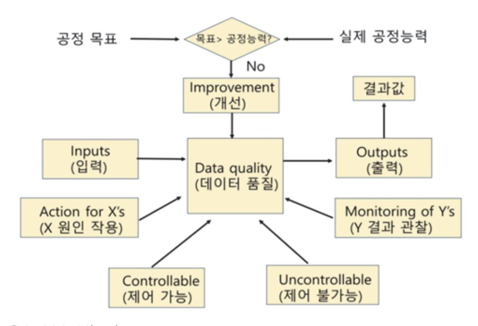

출처: 집필진 제작(2024)

[그림 1-6] 통계적 공정 관리 흐름도(statistical process control logic)

1. 품질을 파악한다.

품질이란 설계된 목표를 만족시키는지에 대해 평가의 대상이 되는 고유의 성질 또는 성능

- 을 의미하는 것으로 설계 품질, 제조 품질, 시장 품질 및 요구 품질에 대하여 학습한다.
- (1) 설계 품질(quality of design)

요구 품질을 실현하기 위한 제품 기획, 사양 정리 및 도면화에 대하여 학습한다.

- (2) 제조 품질(quality of manufacture) 완성된 설계 품질에 대하여 제조 공정을 통하여 실제화하는 단계에서의 목표이며 단위 공정별 특성 목표치로 정의할 수 있다.
- (3) 시장 및 요구 품질(quality of market & requirement of quality) 시장에서 사용자의 평가를 받고 다시 소비자에 의해 요구되는 품질을 의미한다.
- 2. 품질 관리를 파악한다.

품질 관리란 설계된 목표를 만족시키기 위해 계획을 세우고 달성하기 위해 행하는 모든 활 동을 의미하는 것으로 품질에 존재하는 변동(산포)을 줄이는 것이 목적이다. 변동의 원인인 5M1E[사람(man), 설비(machine), 재료(material), 방법(method), 계측(measure), 환경 (environment)]에 대하여 학습한다.

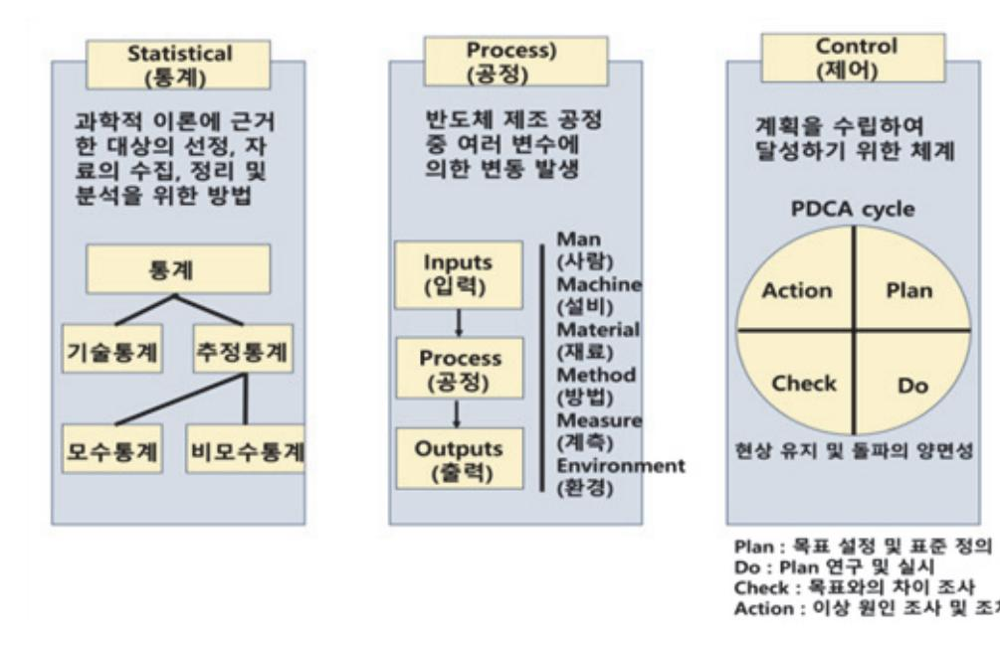

출처: 집필진 제작(2024) [그림 1-7] 통계적 공정 관리(statistical process control)

#### 3. 통계적 품질 관리의 발전을 파악한다.

품질 관리는 결국 불량을 줄이고 수율을 높이는 데 그 목적이 있으며 반도체의 소형화 및 집적도로 인하여 더욱 발전된 기술을 필요로 한다. R2R(run to run), FDC(fault detection classification), APC(advanced process control) 및 VM(virtual metrology)에 대하여 학습한다.

숚 공정 모니터링을 진행한다.

반도체 제조 공정 중 품질 관리를 위하여 오프라인 단계에서부터 실시간(in-situ) 단계에 이르 기까지 다양한 모니터링 및 데이터 취합이 이루어지며 실시간 확인을 위하여 장비에 바로 연결 되는 다양한 센서를 사용하고 있다. 여기서는 공정 모니터링 및 실시간 센서에 대하여 학습한 다.

1. 반도체 제조 공정의 기준을 파악한다.

반도체 제조 공정의 생산품인 최종 결과물까지 여러 다양한 기준이 필요하며 여기서는 공 통적으로 제시되는 5가지 기준에 대하여 학습한다.

(1) 비용(cost)

수율과 단계별 소요 비용, 및 직접(labor cost, facility cost, raw-wafer cost, material cost, and so on) / 간접(equipment and facility depreciation, facility operating cost, engineering support, production control, and so on) 비용에 대 하여 학습한다.

(2) 품질(quality)

품질은 결국 사용자가 필요로 하는 모든 부분을 이야기하게 되며 얼마나 일치시키느냐 에 따라 수율이 달라진다. 여기서는 품질 만족을 위한 필요 요소로 장비(equipment performance), 작업자(competence of workforce), 품질 관리 절차(quality control procedures) 및 공정 프로세스(manufacturing process)에 대하여 학습한다.

(3) 변동성(variability)

품질 개선은 각 변수들의 변동(산포)을 줄여 나가는 과정이며, 정확하지 않은 공정 (misprocessing), 재공정(rework) 및 낭비(waste)만 줄여도 제조 공정의 비용을 낮출 수 있다.

(4) 수율(yield)

제조 비용에 직접적인 영향을 주는 기준이며 수율 개선을 위한 목표 설정(establish targets), 측정(measure actuals), 원인 확인(determine root causes) 및 해결 노력(action plans)에 대하여 학습한다.

(5) 신뢰성(reliability)

광범위한 테스트와 데이터에 대한 분석을 통한 신뢰성 확보에 대하여 학습한다.

2. 공정 모니터링을 진행한다.

반도체 제조 공정에서 위와 같은 기준이 포함된 품질을 만족시키기 위한 활동으로 여러 단 계에서 모니터링이 이루어지며 여기서는 불량의 가장 큰 원인인 오염과 순도 모니터링의 관점에서 바라본 계측 장비에 대하여 학습한다.

| Stand alone Tools(장비와 별도로 구성되는 모니터링 시스템) |                                                                                                                                                                 |  |
|------------------------------------------|-----------------------------------------------------------------------------------------------------------------------------------------------------------------|--|
| Off-line                                 | Available only outside fab(FAB 외부에서만 가능)                                                                                                                        |  |
| (오프라인)                                   | (usually destructive or contaminating, 보통 파괴되거나 오염됨.)                                                                                                           |  |
| At-line (엣라인)                         | Available in the fab(FAB 내부에서도 가능) (measures monitor wafers. destructive, contaminating or unpatterned) (계측용 또는 패턴 없는 웨이퍼 측정, 보통 파괴되거나 오염됨.)              |  |
| In-line (인라인)                         | Tool is used during production(계측이 공정 진행 중에 따로 이루어짐.) (can measure patterned wafers, 패턴 있는 웨이퍼 측정 가능)                                                        |  |
| Integrated Tools(장비와 함께 구성되는 모니터링 시스템)   |                                                                                                                                                                 |  |
|                                          |                                                                                                                                                                 |  |
| On-line (온라인)                         | Available at the process workstation to measure patterned wafers but not able to measure during wafer processing (계측이 공정 진행 중에 이루어지나 공정 장비 기동 중에는 계측 불가능) |  |

출처: Michael Quirk & Julian Serda (2009). Semiconductor Manufacturing Technology.

(1) 오염 모니터링 계측 장비

Surface SIMS, TOF-SIMS, TXRF, Conventional SIMS, SPV, VPD-AAS, VPD-TXRF, 및 VPD-ICP/MS에 대하여 학습한다.

(2) 순도 모니터링 계측 장비

AFM, SIMS, SEM, SEM-EDS, FE-AES, XPS, AES, GDMS, FTIR, RBS, 및 TXRF에 대하여 학습한다.

3. 센서를 파악한다.

반도체 제조 공정에서 수율 향상을 위하여 실시간 모니터링 및 품질 관리의 필요성은 더욱 커지고 있으며 여기서는 센서의 종류 중 질량 분석기(mass spectrometer), 간섭계 (interferometer), 광학 분광 분석기(optical emission spectrometer), 랭미어 프로브 (langmuir probe) 및 RF 센서에 대하여 학습한다.

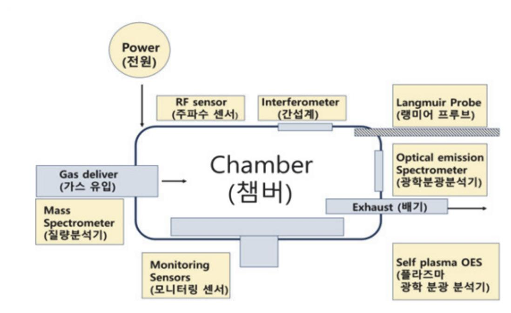

출처: 집필진 제작(2024)

[그림 1-8] 실시간 모니터링 센서(real time monitoring sensors)

이외에도 장비 운용 시 기본적으로 사용되는 압력 센서, 가스 유량 센서 등에 대하여 학습 하며 더욱 자세한 설명은 '반도체 장비'를 참조할 수 있다.

4. 공정 상태를 구분한다.

공정 상태 구분 시 안정 상태와 이상 상태의 차이점에 대하여 학습하고, 원인 분류 시 우연 원인과 이상 원인에 대하여 학습한다.

#### 수행 tip

- 통계 프로그램의 경우 대부분 유료이나 일정 기간 무료로 제공되는 프로그램 사용도 가능하다.
- 센서의 경우 다양한 형태로 존재하며 보유 장비 또는 센서 의 종류에 따라 데이터 취득 방식 등에 한계가 있음을 학 습한다.

### 학습 1 교수·학습 방법

#### 교수 방법

- 반도체 제조 공정 개발에 관련된 필요 지식을 기준으로 개념을 설명한다.
- 단위 공정별 공정 및 장비 특성과 제어, 반도체 제조 공정 프로세스와 공정 관리 기술, 반 도체용 화학 약품의 종류 및 특성, 반도체 주요 공정 및 장비 운용 용어, 제조 공정 장비 운 용 및 결과 평가 기술, 측정 및 평가 기술, 오류 공정 검출/분류(FDC), 및 불량과 수율의 상관성에 대하여 실제 장비, 그림, 및 사진 등을 활용하여 설명한다.
- 연구 노트 등의 정해진 양식을 활용하여 교수자의 강의 내용 및 학습자의 실제 활동 내역을 형식에 맞게 기술하도록 하여 서술형 시험 및 구두 발표 시 활용한다.

#### 학습 방법

- 단위 공정별 공정 및 장비 특성과 제어에 대하여 학습하고 실제 장비 또는 시뮬레이션을 통 하여 각 특성 및 제어 방식에 대하여 파악한다.
- 반도체 제조 공정 프로세스와 공정 관리 기술에 대하여 학습하고 실제 장비 또는 시뮬레이 션을 통하여 이를 수행한다.
- 반도체 주요 공정 및 장비 운용 용어에 대하여 학습하고 단위 공정 또는 공정 프로세스를 최적화한 작업 지시서를 작성한다.
- 제조 공정 장비 운용 및 결과 평가 기술에 대하여 학습하고 해당 장비를 평가 이후 새롭게 도출된 공정에 적합하도록 운용한다.
- 측정 및 평가 기술에 대하여 학습하고 이를 적용할 수 있는 분야 및 한계에 대하여 파악한다.
- 오류 공정 검출/분류(FDC)에 대하여 학습하고 해당 공정에 적합한 기술 및 분류를 적용한다.
- 불량과 수율의 상관성에 대하여 학습하고 수율을 높일 수 있는 방법과 불량을 줄일 수 있는 방안을 도출하여 적용한다.
- 매뉴얼 및 환경 안전 기준에 따라 필요한 지식을 학습하고 수행 중의 문제점을 도출한 다 음, 수정 및 보완 계획을 수립할 수 있도록 학습 및 실습한다.

# 학습 1 평 가

#### 평가 준거

- 평가자는 학습자가 학습 목표를 성공적으로 달성하였는지를 평가해야 한다.
- 평가자는 다음 사항을 평가해야 한다.

| 학습 내용    | 학습 목표                                                      | 성취수준 |   |   |
|----------|------------------------------------------------------------|------|---|---|
|          |                                                            | 상    | 중 | 하 |
| 단위 공정 개발 | - 공정 개선 요구 사항을 확인하여 성능 개선을 위한 재료 선 택 및 공정 방법을 도출할 수 있다. |      |   |   |
|          | - 성능 개선의 요구에 따라 전 ‧ 후 공정을 고려하여 단위 공정 을 구성할 수 있다.        |      |   |   |
|          | - 공정 최적화를 통해 효율적인 공정을 설계하여 검증할 수 있다.                    |      |   |   |
|          | - 공정의 특성을 객관적으로 평가하여 개발된 공정의 적합성을 판별할 수 있다.             |      |   |   |
|          | - 실시간 공정 모니터링 데이터를 활용하여 실시간 공정 진단 을 수행할 수 있다.           |      |   |   |

#### 평가 방법

• 서술형 시험

| 학습 내용    | 평가 항목                                                                      | 성취수준 |   |   |
|----------|----------------------------------------------------------------------------|------|---|---|
|          |                                                                            | 상    | 중 | 하 |
| 단위 공정 개발 | - 반도체 제조 단위 공정 개발을 위해 공정 변수 최적화 공정 변수 최적화를 위해 공정 매개 변수를 분석할 수 있는 능력     |      |   |   |
|          | - 공정 개선 방법론에 대한 이해를 바탕으로 성능 개선을 위 한 재료를 선택하기 위한 재료의 특성을 분석할 수 있는 능 력 |      |   |   |
|          | - 금속 배선 공정 개선을 위한 방법을 파악할 수 있는 능력                                          |      |   |   |

#### • 평가자 질문

| 학습 내용    | 평가 항목                                                        | 성취수준 |   |   |
|----------|--------------------------------------------------------------|------|---|---|
|          |                                                              | 상    | 중 | 하 |
| 단위 공정 개발 | - 공정 개선 요구 사항을 확인하여 성능 개선을 위한 재료 선 택 및 공정 방법을 도출할 수 있는 능력 |      |   |   |
|          | - 공정 개선 방법론에 대한 이해를 바탕으로 성능 개선을 위 해 재료를 선택하기 위한 재료 평가 능력  |      |   |   |
|          | - 성능 목표 정의를 통한 공정 개선 요구 사항을 파악할 수 있는 능력                   |      |   |   |

#### 피드백

| 1. 서술형 시험 - 공정 개선 방법론에 대한 이해를 바탕으로 성능 개선을 위한 재료를 선택하기 위한 재료의 특성 을 분석할 수 있는 능력을 평가한 후, 보완이 필요한 사항이나 주요 사항을 표시하여 피드백해 준다.                 |
|--------------------------------------------------------------------------------------------------------------------------------------------------|
| - 반도체 제조 단위 공정 개발을 위해 공정 변수 최적화 공정 변수 최적화를 위해 공정 매개 변수 를 분석할 수 있는 능력을 평가한 후, 보완이 필요한 사항이나 주요 사항을 표시하여 보충 설명 해 준다.                          |
| - 성취수준이 높은 학습자와 미흡한 학습자를 구분하여 우수한 학습자들에게는 서술형 평가 내용의 사례 학습을 통한 심화 학습으로 피드백해 주고, 미흡한 학습자들에게는 기초 용어에 대한 설명을 통해 일정 수준을 유지할 수 있도록 보완하여 지도해 준다. |
| 2. 평가자 질문                                                                                                                                        |
| - 공정 개선 방법론에 대한 이해를 바탕으로 성능 개선을 위한 재료를 선택하기 위한 재료를 평가 할 수 있는 능력을 평가한 후 부족한 점을 지적하여 정확하게 처리할 수 있도록 보완하여 지도해 준다.                             |
| - 성능 목표 정의를 통한 공정 개선 요구 사항을 파악할 수 있는 능력에 대해 평가한 후, 개선 및 보완 사항에 대한 내용을 정리하여 재학습할 수 있도록 피드백한다.                                                  |
| - 성취수준이 높은 학습자와 저조한 학습자를 구분하여 우수한 학습자들에게는 작업장 환경에의 사 례 학습을 통한 심화 학습으로 피드백해 주고, 저조한 학습자들에게는 기초 지식에 대한 설명을 통해 일정 수준을 유지할 수 있도록 보완하여 지도해 준다.  |

| 학습 1 | 단위 공정 개발하기 |  |
|------|------------|--|
| 학습 2 | 공정 장비 운용하기 |  |
| 학습 3 | 계측 장비 운용하기 |  |

# 2-1. 공정 장비 운용

| 학습 목표 | • 작업 지시서에 의해 정해진 공정 장비를 조작하여 단위 공정을 수행할 수 있다. • 공정의 작업 순서와 절차를 파악하여 수행 중인 단위 공정의 특성을 확인할 수 있다. • 공정 장비의 핵심 구성 부품의 동작 원리를 숙지하여 이상 상황 발생 시 문제를 해결할 수 |
|-------|----------------------------------------------------------------------------------------------------------------------------------------------------------|
|       | 있다. • 공정 장비의 효율적인 운영을 위하여 장비에 연결된 유틸리티의 상태를 확인할 수 있다.                                                                                                 |

# 필요 지식 /

#### 숔 반도체 주요 공정 및 장비 운용

반도체 회로를 웨이퍼 상에 가공하기 위한 공정 업무 능력을 위해 장비 운용에 사용되는 용어, 필요한 공정 이론 및 장비를 파악한다. 이를 위해 사용 용어에 대한 상세한 내용은 반도체 용 어 정리' 및 선수 학습을 참조하며 단위 공정 및 장비 운용 용어를 이해한다.

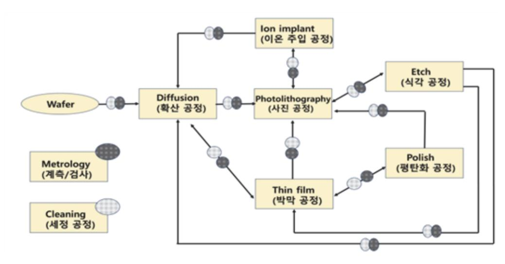

출처: 집필진 제작(2024)

[그림 2-1] 반도체 공정 단계 중 시모스(CMOS: complementary metal-oxide semiconductor) 공정 중 공 정별 웨이퍼 이동

#### 1. 사진(photo) 공정

사진 공정은 photolithography 공정의 줄임말로 웨이퍼 위에 회로 패턴을 형성하는 것을 말한다. 아래에서는 8단계(step)로 구성에 대하여 학습한다.

- (1) 증기 프라임(vapor prime) 표면과 포토 레지스트(PR)의 계면 접착력(adhesion) 향상에 대하여 학습한다.
- (2) 스핀 코팅(spin coat) PR의 두께(thickness)와 균일도(tniformity)를 결정하는 단계로 PR의 타입과 양, 회전 시간, 회전 속도, 및 점도에 대하여 학습한다.
- (3) 소프트 건조(soft bake) 솔벤트의 제거가 목적이며 레지스트의 부착력(adhesion) 및 균일도(uniformity)에 대하 여 학습한다.
- (4) 정렬 및 노광(alignment & exposure) 포토 마스크의 패턴이 웨이퍼 상에 설계된 부분에 위치하도록 정렬하는 단계로 특정 파 장의 광원 및 방식에 대하여 학습한다.
- (5) 노광 후 건조(PEB: post exposure bake) 해상도의 향상 및 잔여 솔벤트의 제거가 목적으로 열 균일도에 대하여 학습한다.
- (6) 현상(develop) 상대적으로 결합이 약한 레지스트를 녹여 목표한 패턴만을 남기는 단계로 화학 반응에 대하여 학습한다.
- (7) 검사(inspection)

목표치와 비교 확인하는 단계로 광학 및 표준 검사 방법에 대하여 학습한다.

(8) 하드 건조(hard bake)

잔여 용매를 증발시켜 튼튼하게 만드는 단계로 열 균일도에 대하여 학습한다. 반도체 공정에서는 웨이퍼당 공정 비용이 칩(chip)의 개수에 비례하지 않으므로 높은 수율(yield)을 위하여 많은 칩을 하나의 웨이퍼에 구현하는 것이 목표가 된다. 포토레지스트(photo resist), 임계 차원 (critical dimension), 광 스펙트럼(light spectrum), 해상도(resolution), 오버레이 정확도 (overlay accuracy), 및 공정 범위(process latitude, 최종 공정 목표를 위한 각 변수 및 그 상호 관계에 따른 변수 편차의 한계)를 학습한다.

2. 식각(etching) 공정

반도체 제조 공정에서 식각 공정(etching process)은 반도체 웨이퍼 표면에 형성된 특정 물질을 선택적으로 제거하여 원하는 패턴을 형성하는 중요한 단계이다. 식각 공정은 반도체 소자의 정확한 형상을 만들고, 레이어 간의 정밀한 구조를 형성하는 데 필수적이다.

(1) 식각 공정의 목적

식각 공정의 주된 목적은 웨이퍼 표면에 포토리소그래피를 통해 형성된 마스크 패턴을 이용하여, 특정 영역에서만 소재를 제거하고, 나머지 영역은 보호하여 필요한 소자 구조 를 구현하는 것이다. 이를 통해 트랜지스터, 도핑 영역, 금속 배선 등의 정밀한 구조가 형성된다.

(2) 식각 공정의 종류

식각 공정은 크게 습식 식각(wet etching)과 건식 식각(dry etching)으로 나눌 수 있 다.

(가) 습식 식각

습식 식각은 화학 용액을 사용하여 웨이퍼 표면의 물질을 제거하는 방법이다.

- 1) 화학적 반응: 웨이퍼 표면에 화학적 용액을 적용하여, 용액과 표면 물질 간의 화학 반응을 통해 물질이 용해되고 제거된다.
- 2) 등방성 식각(isotropic etching): 습식 식각은 일반적으로 등방성으로 작용하여 모든 방향으로 균일하게 식각이 진행된다. 이로 인해 수직 방향뿐만 아니라 수평 방향으 로도 물질이 제거되므로 패턴의 측면이 약간 경사지는 현상이 발생할 수 있다.
- 3) 장점: 습식 식각은 비교적 저렴하고 간단한 공정이며 대량 생산에 적합하다.
- 4) 단점: 식각 정밀도가 낮고, 미세 패턴을 형성하는 데 한계가 있다.
- (나) 건식 식각

건식 식각은 기체 상태의 화학 물질(플라즈마)을 사용하여 웨이퍼 표면의 물질을 제 거하는 방법이다.

- 1) 플라즈마 사용: 고전압을 이용해 반응성 가스를 플라즈마 상태로 만들고, 이 플라즈 마가 웨이퍼 표면과 반응하여 물질을 제거한다.
- 2) 이방성 식각(anisotropic etching): 건식 식각은 주로 이방성으로 작용하여, 특정 방향(일반적으로 수직 방향)으로만 식각이 진행된다. 이를 통해 수직으로 깔끔한 식 각 면을 얻을 수 있다.
- 3) 장점: 높은 식각 정밀도와 미세한 패턴 형성이 가능하며, 매우 얇은 구조도 정밀하 게 가공할 수 있다.
- 4) 단점: 공정이 복잡하고 비용이 높으며, 플라즈마로 인한 손상이나 잔류물 관리가 필 요하다.

(3) 식각 공정의 단계

- (가) 포토리소그래피 패턴 형성: 식각할 영역을 선택적으로 보호하기 위해 포토레지스트를 사 용하여 웨이퍼에 패턴을 형성한다.
- (나) 식각 공정 수행: 선택된 식각 방법(습식 또는 건식)을 사용하여 포토레지스트로 보호되지 않은 영역의 물질을 제거한다.
- (다) 잔류물 제거: 식각이 완료된 후, 잔류물(포토레지스트 및 반응 생성물)을 제거하여 깨끗

한 표면을 만든다.

- (라) 검사 및 확인: 식각 결과를 검사하여, 원하는 패턴이 정확하게 형성되었는지 확인한다. 이 단계에서는 주로 현미경 검사가 사용된다.
- (4) 식각 공정의 주요 응용
  - (가) 웨이퍼 트랜지스터 구조 형성: 식각 공정은 소스/드레인 영역, 게이트 구조, 절연층 형성 등 트랜지스터의 세부 구조를 만드는 데 사용된다.
  - (나) 배선층 형성: 반도체 칩 내의 금속 배선(메탈 라인)을 형성하기 위해 식각 공정이 사용된 다. 이를 통해 소자 간의 전기적 연결이 이루어진다.
  - (다) 미세 패턴 형성: 최신 반도체 공정에서는 매우 미세한 나노미터(nm) 단위의 패턴을 형성 해야 하며, 이를 위해 고정밀 건식 식각 공정이 필수적이다.
- (5) 식각 공정의 도전 과제 및 개선 방안
  - (가) 미세화: 반도체 기술이 발전하면서, 식각 공정에서 미세한 패턴을 정확하게 형성하는 것 이 더욱 중요해지고 있다. 이를 위해 고도로 정밀한 식각 공정과 새로운 공정 기술[예: ALE(atomic layer etching)]이 개발되고 있다.
  - (나) 손상 최소화: 플라즈마 식각 공정에서는 플라즈마로 인해 웨이퍼 표면이 손상될 수 있으 므로, 손상을 최소화하기 위한 기술 개발이 필요하다.
  - (다) 균일성: 웨이퍼 전 영역에서 균일한 식각이 이루어지도록 공정 조건을 최적화해야 한다. 특히, 대형 웨이퍼에서의 균일성 확보는 중요한 과제이다.

식각 공정은 반도체 제조 공정에서 핵심적인 단계 중 하나로, 원하는 패턴을 형성하고 소자 의 성능을 결정짓는 중요한 역할을 한다. 반도체 기술이 발전하면서 식각 공정도 지속해서 개선되고 있으며, 고정밀, 고신뢰성의 소자를 제작하기 위한 다양한 기술이 적용되고 있다.

3. 확산(diffusion) 공정

확산(diffusion) 공정이란 고온의 튜브(tube)에 필요한 박막(산화막/질화막)을 형성하는 공정으로 물질의 입자들이 농도(밀도)가 높은 쪽에서 낮은 쪽으로 퍼져나가는 현상을 이용하며 평형 상태(equi librium)가 되는 지점에서 확산이 멈추게 된다. 온도(temperature), 압력 제어(pressure control), 가스(gas) 및 반응(reaction)에 대하여 학습한다.

4. 평탄화(CMP: chemical mechanical planarization) 공정

평탄화 공정이란 웨이퍼 상에서 기준면보다 높은 부위를 갈아내는 공정을 말한다. 임계 차원(CD)이 작아지고 집적화가 요구되면서 다층 배선 구조의 형성이 필요함과 동시에 더욱 미세한 정밀도가 필요해지고 있다. 연마 시간(polish time), 압력(pressure on wafer carrier; downforce), 회전 속도(platen speed & carrier speed), 슬러리 화학 조성(slurry chemistry), 슬러리 유량(slur ry flow rate), 패드 상태(pad conditioning), 온도(wafer/slurry temperature) 및 웨이퍼 뒷면 압력(wafer back pressure)에 대하여 학습한다.

#### 5. 세정(cleaning) 공정

세정 공정이란 오염 물질 또는 원하지 않는 박막을 제거하는 공정으로 임계 차원(CD)의 감소 및 고집적화로 인해 세정 공정도 더욱 정밀해지고 있다. 주 오염원인 공기, 사람, 시설, 물, 공정 화학 물질, 장비 및 클린 룸 디자인에 대하여 학습하며, 공정 방법인 습식/건식 세정, 스크러빙 (scrubbing), 웨이퍼(wafer) 건조 공정에 대하여 학습한다.

산업 표준 습식 세정 과정은 미국의 RCA사에서 개발한 방법을 사용한다. SC-1(standard cleaning 1)은 미립자와 유기물질을 제거하며, SC-2(standard cleaning 2)는 금속 오염을 제거하기 위해 사용한다. 일반적인 웨이퍼의 습식 세정 순서는 <표 2-1>과 같다.

| 세정 단계(cleaning step)      | 목적(purpose)       |
|---------------------------|-------------------|
| H2SO4 / H2O2(Piranha)     | Organics & metals |
| (황산/과산화수소)(피라냐 세정)        | (유기 물질과 금속)       |
| UPW rinse(ultrpure water) | Rinse             |
| (순수 세정)                   | (세정)              |
| HF / H2O(diluted HF)      | Native oxide      |
| (불산/순수)(희석된 불산 세정)        | (자연 산화막)          |
| UPW rinse(ultrpure water) | Rinse             |
| (순수 세정)                   | (세정)              |
| NH4OH / H2O2 / H2O(SC-1)  | Particles         |
| (암모니아/과산화수소/순수)           | (미립자)             |
| UPW rinse(ultrpure water) | Rinse             |
| (순수 세정)                   | (세정)              |
| HF / H2O(diluted HF)      | Native oxide      |
| (불산/순수)(희석된 불산 세정)        | (자연 산화막)          |
| UPW rinse(ultrpure water) | Rinse             |
| (순수 세정)                   | (세정)              |
| HCl / H2O2 / H2O(SC-2)    | metals            |
| (염산/과산화수소/순수)             | (금속)              |
| UPW rinse(ultrpure water) | Rinse             |
| (순수 세정)                   | (세정)              |
| HF / H2O(diluted HF)      | Native oxide      |
| (불산/순수)(희석된 불산 세정)        | (자연 산화막)          |
| UPW rinse(ultrpure water) | Rinse             |
| (순수 세정)                   | (세정)              |
| Drying                    | Dry               |
| (건조)                      | (건조)              |

<표 2-1> Step of typical wafer cleaning in FAB(웨이퍼 습식 세정 단계별 목적)

출처: Michael Quirk & Julian Serda (2009). Semiconductor Manufacturing Technology.

건식 세정은 좁은 틈(gap) 사이의 오염 잔류 이슈, 수율 향상을 위한 속도 이슈 및 환경 오염 이

슈 등으로 주로 플라즈마 환경을 이용한다. 염소 기반의 화학제나 아르곤(Ar sputtering) 및 수소(H2-prebake) 등을 사용하고 있는 건식 세정에 대하여 학습한다.

6. 이온 주입(ion implant) 공정

이온 주입(ion-implanting) 공정이란 이온 불순물(dopant)을 웨이퍼 내부에 침투시켜 원하 는 전기적 특성을 만들어주는 공정을 말하며, 도핑하려는 원소를 이온화시킨 후 장비를 통 해 가속시켜 표면에 충돌시키는 방식이다. 이온 주입 공정 이후 확산 공정을 통하여 원하는 깊이(junction depth)만큼 확산시키고, 어닐링(annealing) 공정으로 분자 재배열을 통해 안정화(curing)하는 방법에 대하여 학습한다.

7. 박막(thinfilm) CVD/PVD 공정

박막 공정은 가스 간 화학 반응을 통해서 절연막/전도성 막을 형성하는 화학 기상 증착 CVD(chemical vapor deposition) 공정과 금속 타깃을 물리적으로 분해하여 웨이퍼 표면 에 금속막을 형성시켜 각각의 회로를 연결해 주거나 체임버 내에서 화학 반응을 이용하여 절연막을 형성하여 증착시키는 물리 기상 증착 PVD(physical vapor deposition) 공정을 포함한다. 단차 피복(step coverage), 높은 종횡비의 틈을 채우는 능력(ability to fill high aspect ratio gaps), 균일도(uniformity), 순도와 밀도(purity & density), 화학적 제어(controlled stoichiometry), 구조적 완성도 및 낮은 스트레스(degree of structural perfection with low film stress), 전기적 특성(electrical property) 및 부착력 (adhesion)에 대하여 학습한다.

(1) 화학 기상 증착(CVD) 공정과 물리 기상 증착(PVD) 공정 비교

박막 증착 공정에서 사용되는 재료의 상태 및 반응시키는 방식에 따라 크게 <표 2-2>와 같이 나눌 수 있으며 이에 대하여 학습한다.

| Chemical Processes (화학적 공정)                                                                    |                                                              | Physical Processes (물리적 공정)                                   |                                             |                                         |
|---------------------------------------------------------------------------------------------------|--------------------------------------------------------------|------------------------------------------------------------------|---------------------------------------------|-----------------------------------------|
| chemical vapor deposition(CVD) (화학적 기상 증착)                                                  | Plating (도금)                                              | physical vapor deposition(PVD) (물리적 기상 증착) (Sputtering) | Evaporation (증발)                         | Spin On Methods (회전 방식)           |
| atmospheric pressure CVD (대기압 CVD)                                                          | electrochemical deposition (전해 도금) (electroplating) | DC Diode (직류 다이오드)                                            | Filament and Electron Beam (전자 빔)     | Spin on glass(유리 회전 도포)        |
| low pressure CVD (저기압 CVD)                                                                  | Electroless Plating(무전해 도 금)                           | Radio Frequency (주파수)                                         | M o l e c u l a r Beam Epitaxy (분자 빔) | Spin on dielectric (절연막 회전 도포) |
| plasma enhanced CVD(PECVD) (플라즈마 강화 CVD) High Density Plasma CVD (고밀도 플라즈마 CVD) |                                                              | DC Magnetron (직류 자기장)                                         |                                             |                                         |
| vapor phase epitaxy & metal-or ganic CVD (기상 결정 & 금속-유 기 CVD)                         |                                                              | ionized metal plasma(이온화 금속 플라즈마)                          |                                             |                                         |

<표 2-2> Techniques of Film deposition(박막 증착 공정 기술)

출처: Michael Quirk & Julian Serda(2009). Semiconductor Manufacturing Technology.

#### 숕 반도체 제조 공정 프로세스 및 공정별 공정 장비 특성

다양한 반도체 제조 공정 프로세스 중 반도체에서 스위치로 사용되는 트랜지스터의 게이트 구 조 및 배선 연결 공정에 대하여 알아보고 각각의 경우에 사용되는 장비에 대하여 이해하고 그 운용 기술을 확인한다.

1. 공정 단계(process step) 및 장비 특성에 따른 운용

<표 2-3>은 공정 단계별 장비 및 용도를 기술하고 있으며 이에 대하여 학습한다.

<표 2-3> 시모스(CMOS) manufacturing process steps(CMOS 공정 프로세스)

| # | Process step      | Equipment   | Purpose                |
|---|-------------------|-------------|------------------------|
| 1 | wafer preparation | wet station | RCA & Piranha cleaning |
|   | (웨이퍼 준비)          | (웻 스테이션)    | (RCA와 피라냐 세정 공정)       |
| 2 | Twin well         | Furnace     | Epitaxial layer growth |
|   | (이중 우물)           | (퍼니스)       | (에피텍셜층 성장)             |

| # | Process step                          | Equipment                                      | Purpose                                             |
|---|---------------------------------------|------------------------------------------------|-----------------------------------------------------|
|   |                                       | Furnace (퍼니스)                               | Initial oxide growth (첫 번째 산화막 성장)               |
|   |                                       | photo equipment (사진 공정 장비)                  | 1st mask Patterning (첫 번째 마스크 패터닝)               |
|   |                                       | Ion implant (이온 임플란트)                       | n-well formation (n형 우물)                         |
|   |                                       | RTP(Rapid thermal proc ess) (고속 열 공정 장비) | Annealing (풀림)                                   |
|   |                                       | photo equipment (사진 공정 장비)                  | 2nd mask Patterning (두 번째 마스크 패터닝)               |
|   |                                       | Ion implant (이온 임플란트)                       | p-well formation (p형 우물)                         |
|   |                                       | Furnace (퍼니스)                               | Annealing (풀림)                                   |
| 3 | Shallow trench isolation (좁은 틈 분리) | Furnace (퍼니스)                               | barrier oxide growing (격벽 산화막 성장)                |
|   |                                       | CVD (화학 기상 증착)                              | Nitride deposition (질화막 증착)                      |
|   |                                       | photo equipment (사진 공정 장비)                  | 3rd mask as STI (세 번째 마스크 패터닝)                   |
|   |                                       | Dry etcher(plasma) [건식 식각 장비(플라즈마)]         | STI trench etching (STI 패턴 식각)                   |
|   |                                       | Furnace (퍼니스)                               | Trench liner oxide (덧대는 산화막 성장)                  |
|   |                                       | CVD (화학기상증착)                                | Trench fill with oxide (STI에 산화막 증착)             |
|   |                                       | CMP (화학/기계적 평탄화)                            | Trench oxide polish (산화막 평탄화)                    |
|   |                                       | Furnace (퍼니스)                               | Nitride strip(질화막 제거) (with hot phosphoric acid) |
| 4 | Poly gate structural (폴리 게이트 구조)   | Furnace (퍼니스)                               | Gate oxide growth (게이트 산화막 성장)                   |
|   |                                       | CVD (저압 화학 기상 증착)                           | Poly silicon deposition (폴리실리콘 증착)               |
|   |                                       | photo equipment                                | 4th mask patterning                                 |

| # | Process step                                           | Equipment                                  | Purpose                                     |
|---|--------------------------------------------------------|--------------------------------------------|---------------------------------------------|
|   |                                                        | (사진 공정 장비)                                 | (네 번째 마스크 패터닝)                              |
|   |                                                        | Dry etcher(plasma) [건식 식각 장비(플라즈마)]     | Poly gate etch (폴리 게이트 패턴 식각)            |
| 5 | lightly doped drain (LDD) implants (적은 도펀트 임플란트) | photo equipment (사진 공정 장비)              | 5th mask patterning (다섯 번째 마스크 패터닝)      |
|   |                                                        | Ion implant (이온 임플란트)                   | n- LDD implant (적은 n형 도펀트 임플란트)          |
|   |                                                        | photo equipment (사진 공정 장비)              | 6th mask patterning (여섯 번째 마스크 패터닝)      |
|   |                                                        | Ion implant (이온 임플란트)                   | p- LDD implant (적은 p형 도펀트 임플란트)          |
| 6 | Sidewall spacer formation(격벽 구조)                    | CVD (화학 기상 증착)                          | Spacer oxide deposition (절연 산화막 증착)      |
|   |                                                        | Dry etcher(plasma) [건식 식각 장비(플라즈마)]     | Spacer oxide etchback (절연 산화막 식각)        |
| 7 | Source/Drain implant (소스/드레인 임플란트)                  | photo equipment (사진 공정 장비)              | 7th mask patterning (일곱 번째 마스크 패터닝)      |
|   |                                                        | Ion implant (이온 임플란트)                   | n+ Source/Drain implant (많은 n형 도펀트 임플란트) |
|   |                                                        | photo equipment (사진 공정 장비)              | 8th mask patterning (여덟 번째 마스크 패터닝)      |
|   |                                                        | Ion implant (이온 임플란트)                   | p+ Source/Drain implant (많은 p형 도펀트 임플란트) |
|   |                                                        | RTP(Rapid thermal proc ess)(고속 열 공정 장비) | Annealing (풀림)                           |
| 8 | Contact formation (접촉 부분)                           | PVD(Sputtering) (물리 기상 증착)              | Titanium deposition (타이타늄 증착)            |
|   |                                                        | RTP(rapid thermal process) (고속 열 공정 장비) | Annealing (풀림)                           |
|   |                                                        | wet etcher(chemical) (습식 식각)            | Titanium etching (타이타늄 식각)               |
| 9 | local interconnect(LI) (부분 연결)                      | CVD (화학 기상 증착)                          | Nitride deposition (질화막 증착)              |
|   |                                                        | CVD                                        | Doped oxide deposition                      |

| #  | Process step                                    | Equipment                              | Purpose                                                   |
|----|-------------------------------------------------|----------------------------------------|-----------------------------------------------------------|
|    |                                                 | (화학 기상 증착)                             | (도핑된 산화막 증착)                                              |
|    |                                                 | CMP (화학/기계적 평탄화)                    | Oxide polishing (산화막 평탄화)                              |
|    |                                                 | photo equipment (사진 공정 장비)          | 9th mask patterning (아홉 번째 마스크 패터닝)                    |
|    |                                                 | Dry etcher(plasma) [건식 식각 장비(플라즈마)] | LI etch (부분 연결 패턴 식각)                                  |
|    |                                                 | PVD (물리 기상 증착)                      | Titanium deposition (타이타늄 증착)                          |
|    |                                                 | CVD (화학 기상 증착)                      | Titanium nitride deposition (타이나이트라이드 증착)              |
|    |                                                 | CVD (화학 기상 증착)                      | Tungsten deposition (텅스텐 증착)                           |
|    |                                                 | CMP (화학/기계적 평탄화)                    | Tungsten polish (텅스텐 평탄화)                              |
| 10 | Via-1 & Plug-1 formation(비아와 플러그)            | CVD (화학 기상 증착)                      | ILD-1 oxide deposition (부분 연결-1 산화막 증착)                |
|    |                                                 | CMP (화학/기계적 평탄화)                    | Oxide polish (산화막 평탄화)                                 |
|    |                                                 | photo equipment (사진 공정 장비)          | 10th mask patterning (열 번째 마스크 패터닝)                    |
|    |                                                 | Dry etcher(plasma) [건식 식각 장비(플라즈마)] | ILD-1 etching (부분 연결-1 식각)                             |
|    |                                                 | PVD (물리 기상 증착)                      | Titanium barrier metal deposi tion [타이타늄(격벽 용도) 증착] |
|    |                                                 | CVD (화학 기상 증착)                      | Titanium nitride deposition (타이나이트라이드 증착)              |
|    |                                                 | CVD (화학 기상 증착)                      | Tungsten deposition (텅스텐 증착)                           |
|    |                                                 | CMP (화학/기계적 평탄화)                    | Tungsten polish (텅스텐 평탄화)                              |
| 11 | Metal-1 interconnect formation (금속 연결) | PVD (물리 기상 증착)                      | Titanium barrier metal deposi tion [타이타늄(격벽 용도) 증착] |
|    |                                                 |                                        |                                                           |

| #  | Process step                                                         | Equipment                              | Purpose                                        |  |
|----|----------------------------------------------------------------------|----------------------------------------|------------------------------------------------|--|
|    |                                                                      | PVD (물리 기상 증착)                      | Aluminium-copper deposition (알루미늄-구리 합금 증착) |  |
|    |                                                                      | CVD (화학 기상 증착)                      | Titanium nitride deposition (타이나이트라이드 증착)   |  |
|    |                                                                      | photo equipment (사진 공정 장비)          | 11th mask patterning (열한 번째 마스크 패터닝)        |  |
|    |                                                                      | Dry etcher(plasma) [건식 식각 장비(플라즈마)] | Metal etching (금속 식각)                       |  |
| 12 | And repeat Via-x, Plug-x, and Metal-x (비아, 플러그, 및 금속 공정 반복) | Repeat (반복)                         | -                                              |  |
| 13 | Passivation (보호층)                                                 | CVD (화학 기상 증착)                      | Passivation layer deposition (보호층 증착)       |  |

출처: Michael Quirk & Julian Serda (2009). Semiconductor Manufacturing Technology.

- (1) 웨이퍼 준비 단계 공정 장비의 특성 웨이퍼 표면 세정 장비의 오염도 관리 특성에 대하여 학습한다.
- (2) #2 Twin well ~ #7 S/D implant 공정 장비의 특성 열에 의한 공정이 계속해서 반복되지만 아직 금속 재료가 배치되기 전의 공정으로 전공 정(FEOL: front end of line)으로도 정의되는 구간이며 이온 임플란트의 표면 파괴가 반복되므로 공정 범위의 확보에 대하여 학습한다.
- (3) #8 Contact formation ~ #13 Passivation 공정 장비의 특성 금속 재료가 배치된 이후의 공정이 진행되므로 후공정(BEOL: back end of line)으로 도 정의되는 구간이며 각 장비 특성에서 열 범위(thermal budget)에 대하여 학습한다.
- 숖 반도체용 화학 약품의 종류 및 특성

반도체 제조 공정은 대부분 화학적 반응에 의한 공정으로 정의된다. 물질의 기본적인 성질을 이해하고 그 특성을 확인하며 물질 안전 보건 자료(MSDS)에 대하여 학습한다.

1. 물질의 상태 및 특성

물질은 고체, 액체, 기체, 및 플라즈마의 4가지의 상태로 각자가 가지고 있는 에너지 상태 및 환경(압력, 온도 등)에 따라 구분되며 이에 대하여 학습한다.

(1) 물질의 특성

(가) 물리적 특성

다른 물질과의 상호 반응 없이 스스로의 특성으로 물질을 대표하는 것으로 녹는점 (melting point), 끓는점(boiling point), 저항성(resistivity), 밀도(density) 등에 대 하여 학습한다.

(나) 화학적 특성

다른 물질과의 반응(변환)으로 가연성(flammability), 반응성(reactivity), 부식성 (corrosiveness) 등이 있으며 이러한 변화가 일어나기 위한 조건으로 온도(temperature), 압력과 진공(pressure & vacuum), 액화와 기화(condensation), 증기 압력(vapor pressure), 승화와 증착(sublimation & deposition), 밀도(density), 표면 장력(surface tension), 열팽창(thermal expansion) 및 응력(stress)에 대하여 학습한다.

- (2) 공정 화학 물질(process chemical)
  - (가) 액체
    - 1) 산(acid)과 염기(base)

산은 수소(–H)를 포함하며 탄소(–C)의 포함 유무에 따라 유기산(organic acid)과 무기산(inorganic acid)으로 나뉜다. 염기는 수산화기(–OH)를 포함한다. 위의 산과 염기의 척도로 0~14(중심점 7)로 나눈 pH 기준, 산과 염기의 반응을 학습한다.

2) 솔벤트(solvent)

솔벤트는 다른 물질을 녹이는 능력을 가진 물질 전체를 통칭하며 그 특성(가연성, 휘발성 등)에 대하여 학습한다.

(나) 기체

1) 대량 생산 가스(bulk gas)와 특수 가스(specialty gas)

제조가 비교적 간단하고 공정에서 대량으로 사용되는 가스로 질소, 아르곤, 헬륨, 수소, 및 산소 등에 대하여 학습하고, 특수 가스는 상대적으로 환경 오염이 심하 거나 인체에 위험한 가스를 통칭하며 라인 설비, 순도 측정, 정화 및 안전장치와 각각의 제어에 대하여 학습한다.

2. 물질 안전 보건 자료(MSDS)의 이해

물질 안전 보건 자료(material safety data sheet)는 물질에 대한 여러 정보를 총괄하는 자료이며 포함되는 정보에 대하여 학습한다.

<표 2-4> 물질 안전 보건 자료 정보

| 구분               | 정보                                        |
|------------------|-------------------------------------------|
| 화학 제품과 회사에 관한 정보 | 제품명, 제품의 권고 용도와 사용상의 제한 등                 |
| 유해·위험성 정보        | 유해·위험성 분류, 예방 조치 문구를 포함한 경고 표지 항목 등       |
| 구성 성분의 명칭 및 함유량  | 화학 물질명, 관용명 및 이명, CAS 번호 또는 식별 번호, 함유량    |
| 응급조치 요령          | 눈에 들어갔을 때, 피부에 접촉했을 때, 흡입했을 때 등           |
| 폭발·화재 시 대처 방법    | 적절한 소화제, 화재 진압 시 착용할 보호구 및 예방 조치 등        |
| 누출 사고 시 대처 방법    | 인체 보호를 위한 조치 사항 및 보호구, 정화 또는 제거 방법 등      |
| 취급 및 저장 방법       | 안전 취급 요령, 안전한 저장 방법                       |
| 노출 방지 및 개인 보호구   | 노출 기준, 적절한 공학적 관리, 개인 보호구 등               |
| 물리 화학적 특성        | 외관, 냄새, 인화점, 인화 또는 폭발 한계 상·하한, 자연 발화 온도 등 |
| 안정성 및 반응성        | 화학적 안정성, 유해 반응의 가능성, 피해야 할 조건 등           |
| 독성에 관한 정보        | 가능성이 높은 노출 경로 정보, 단기 및 장기 노출에 의한 영향 등     |
| 환경에 미치는 영향       | 수생·육생 생태 독성, 잔류성과 분해성, 생물 농축성 등           |
| 폐기 시 주의 사항       | 폐기 방법, 폐기 시 주의 사항                         |
| 운송에 필요한 정보       | 유엔 번호(UN No.), 유엔 적정 운송명, 운송 시의 위험 등급 등   |
| 법적 규제 현황         | 「산업안전보건법」에 따른 규제, 「유해화학물질관리법」에 따른 규제 등    |
| 기타 참고 사항         | 자료의 출처, 최초 작성 일자, 개정 횟수 및 최종 개정 일자 등      |

출처: 한국산업안전보건공단(http://msds.kosha.or.kr). 화학 물질 정보.

이외에 세계 조화 기준(globally harmonized system of classification and labelling of chemicals, GHS)에 따른 GHS-MSDS 정보에 대하여 학습한다. 자세한 정보는 한국산 업안전보건공단의 화학 물질 정보(http://msds.kosha.or.kr)를 참조할 수 있다.

#### 숗 제조 공정 장비의 특성 분석 및 문제 해결 공정 장비 운용

이 장에서는 공정별 장비의 주요 변수 및 시설의 특성 파악 및 분석할 수 있는 능력을 학습하 여 이상 상황 발생 시 해결할 수 있도록 한다.

#### 1. 장비 공통 변수

공정 장비는 크게 전 공정(FEOL: front end of line) 장비, 후 공정(BEOL: back end of line) 장비 및 패키징(packaging) 장비로 분류하기도 하였으나 이제는 기술의 발달로 후공 정과 패키징이 같은 분류에 속하기도 하며 새로운 기술들이 기존 개발된 장비에 다르게 적 용됨에 따라 장비를 공정에 따라 분류하기 어렵다. 여기에서는 체임버(chamber)에 전달되

는 에너지와 환경 조건에 대해 학습하고 열, 플라즈마, 및 기타 장비로 나누어 학습한다.

(1) 에너지(energy)와 환경 조건(environmental condition)

에너지의 사전적인 정의와 반도체 공정에서 사용되는 재료의 관점에서 에너지란 물질을 고체, 액체, 기체, 또는 플라즈마 상태로 존재할 수 있는 환경을 만드는 조건임을 학습 하고 상변화에 대하여 학습한다. 에너지의 형태는 열, 빛, 파동 등으로 다양하다는 점과 그 전달 방식인 전도, 대류, 및 복사 세 가지에 대하여 학습한다.

(2) 열 장비

에너지의 형태를 열로 전달하는 장비로 퍼니스(furnace), 상압 기상 증착 장비(APCVD), 저압 기상 증착 장비(LPCVD) 등에 대하여 학습한다.

(3) 플라즈마 장비

에너지의 전달이 플라즈마 환경 조건 내에서 이루어지는 장비로 플라즈마 기상 증착 장 비(PECVD), 스퍼터(sputter), 식각 장비(etcher) 등에 대하여 학습한다.

(4) 기타 장비

위 2가지 분류와는 다르게 에너지를 전달하여 공정을 진행하는 장비에 대하여 학습한다. 예를 들어 단순히 화학적인 반응만으로 공정하는 웻 장비(wet-station: cleaning or wet-etching), 전기적인 반응을 이용하는 전해/무전해 도금 장비, 기계적으로 누르는 힘과 화학 반응을 이용하여 재료의 면을 평탄하게 만드는 화학적 기계적 평탄화 장비 (CMP: chemical mechanical planarization) 등이 있다.

위 3가지로 분류된 장비에 다양한 형태의 에너지 기술 및 환경 조건이 도입되어 있는 부분을 학습한다.

(5) 장비 구성 요소

최종 결과물을 위하여 에너지가 전달되는 환경 조건, 사용되는 공정 재료 및 전체적인 공정의 조건(recipe) 등의 조합이 필요하며 공정이 진행되는 작업 지시서(chamber)의 환경을 결정하는 요소로 물리적으로 설계된 모양(chamber geometry)과 여기에 투입되 는 공정 관련 변수(variable)에 대하여 학습한다. 크게 3가지의 공통적인 장비 요소로 진공(vacuum), 가스(gas) 및 에너지(power) 전달 방식에 대하여 학습한다.

(가) 진공(vacuum)

진공이 필요한 이유는 i) 오염도가 적은 환경 조성, ii) 낮은 분자 밀도 유지, iii) 분 자 간 충돌 거리 확장으로 에너지 전달률 증가, iv) 반응 속도 촉진, v) 진공의 힘을 이용한 웨이퍼 안정성 확보 등이다. 단위 및 건조 방식 펌프의 종류를 학습한다.

1) 러핑 펌프(roughing pump) 또는 저진공 펌프(low vacuum pump)로 대표되는 건식 메카니컬 펌프(dry mechanical pump)와 송풍기/부스터 펌프(blower/booster pump)

2) 고진공 펌프(high vacuum pump)인 터보 분자 펌프(turbo molecular pump), 크라이오

펌프(cryo pump) 및 디퓨전 펌프(diffusion pump)

- 3) 체임버에 가해지는 급격한 진공 상태의 변화가 발생시키는 체임버 자체의 손상, 내 부에 있는 부품 및 웨이퍼의 손상
- 4) 스로틀 밸브(throttle valve) 및 제어
- (나) 가스(gas)

가스의 정확한 체임버 유입, 반응 제어 및 안전한 배출과 MFC(mass flow controller), 잔류 가스 분석기(residual gas analyzer, RGA) 및 스크러버(scrubber)에 대하여 학습한 다.

(다) 에너지 전달

다양한 형태의 에너지 중 열(heat) 에너지와 관련된 튜브(tube), 가열 대역(heat zone), 가열 요소(heat element) 및 온도 제어(temperature control)에 대하여 학습하고, 플라즈 마(plasma) 에너지와 관련된 환경(environment), 직류(direct current), RF(radio frequency), 제너레이터(generator) 및 메처(matcher)에 대하여 학습한다.

- 2. 사진(photo) 공정 장비
  - (1) 공정 과정별 사용 장비 및 특성

[그림 2-2]와 같은 예시의 공정 트랙 시스템에 대하여 학습한다.

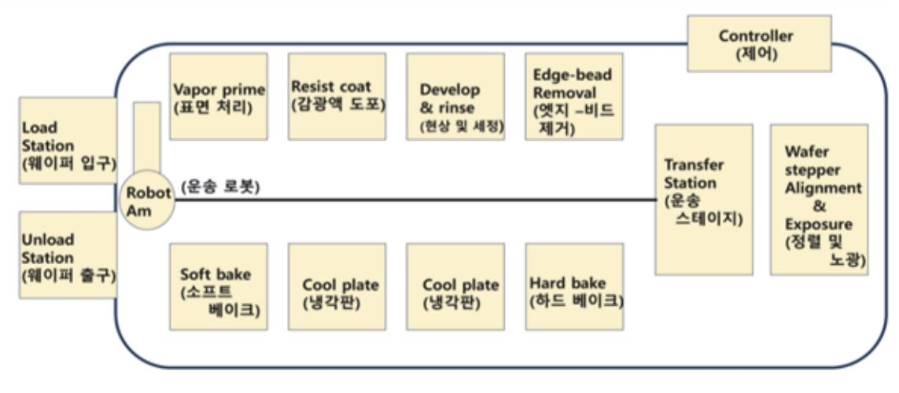

출처: 집필진 제작(2024)

- (가) 증기 프라임(vapor prime): 열 건조 장비(box oven), 탈수 건조(dehydration bake) 과정과 제어, HMDS 물질, 뒤섞기, 스프레이 및 증발법
- (나) 스핀 코팅(spin coat): 고속 회전 장비 및 제어
- (다) 소프트 건조(soft bake): 열판 장비(hot plate) 및 제어
- (라) 정렬 및 노광(alignment & exposure): 레티클(reticle) 사용에 따른 렌즈, 모터 제어

[그림 2-2] 사진 공정에서 사용되는 웨이퍼 자동 시스템(automated wafer track system for photolithography)

기술, 및 오염 제어 기술, 온도, 습도, 진동, 대기압 압력 상태 및 제어

- (마) 노광 후 건조(PEB: post exposure bake): 열 건조 장비(box oven), 스탠딩 웨이브 효과(standing wave effect) 감소 이슈, 대기 시간의 최소화 이슈
- (바) 현상(develop): 연속 스프레이(continuous spray) 방식 또는 퍼들(puddle) 방식 현상액 의 온도, 시간, 사용량, 농도 제어 세정 및 건조 과정 중 헹굼(rinse), 열판 장비 및 모 듈에서의 배기 흐름
- (사) 검사(inspection): 현상 완성도, 패턴의 무너짐 및 정렬 일치, 광학현미경및 보다 자동화 된 검사 장비 및 제어
- (아) 하드 건조(hard bake): 열 건조 장비 및 고자외선(DUV) 장비 및 제어
- 3. 식각(etching) 공정 장비
  - (1) 습식 식각(wet etch) 공정 장비

담금(immersion) 또는 스프레이(spray) 방식과 베이(bay) 내부의 유체 흐름, 식각액 (etchant)의 농도(concentration), 공정 시간(time) 및 온도의 균일성(temperature) 제 어에 대하여 학습한다.

(2) 건식 식각(dry etch) 공정 장비

CCP(capacitively coupled plasma) 타입(type), ICP(inductively coupled plasma) 타입(type), RIE(reactive ion etching), 축전 전기장 및 유도 전기장 및 식각 장비의 개요와 공정 과정 제어에 대하여 학습한다.

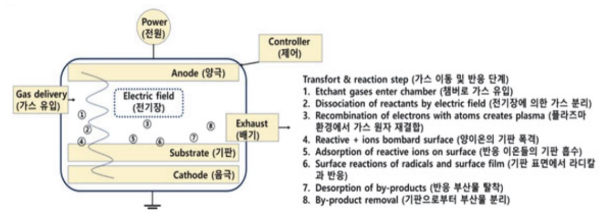

출처: 집필진 제작(2024)

[그림 2-3] 건식 식각 장비 내에서의 가스 이동 및 반응 단계

4. 확산(diffusion) 공정 장비

고온에 견딜 수 있도록 설계된 튜브(tube), 공정 온도(temperature)의 균일성, 공정 압력 제어(pressure control) 및 공정 가스(gas)의 유체 제어, 확산 장비의 개요와 공정 과정 제 어에 대하여 학습한다.

출처: 집필진 제작(2024) [그림 2-4] 확산(diffusion) 공정 장비

5. 평탄화(CMP: chemical mechanical planarization) 공정 장비

연마 시간(polish time) 제어, 공정 압력(pressure on wafer carrier: downforce) 제어, 회전 속도(platen speed & carrier speed) 제어, 슬러리 유량(slurry flow rate) 제어, 패 드 상태(pad conditioning) 확인, 공정 온도(wafer/slurry temperature) 제어, 및 웨이퍼 뒷면 압력(wafer back pressure) 제어 및 평탄화 장비의 개요와 공정 과정 제어에 대하여 학습한다.

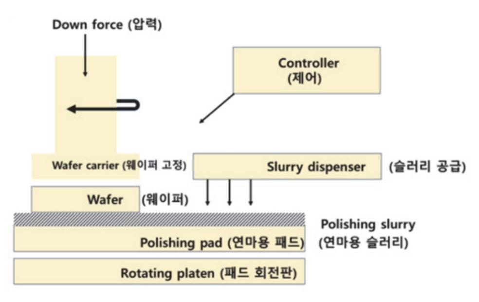

출처: 집필진 제작 (2024)

[그림 2-5] 화학적 기계적 평탄화(CMP: chemical mechanical planarization)

6. 세정(cleaning) 공정 장비

#### (1) 습식 세정(wet cleaning) 공정 장비

웻 스테이션(wet station) 장비, 담금(immersion) 또는 스프레이(spray) 방식, 베이 (bay) 내부의 유체 흐름, 세정액의 농도(concentration), 공정 시간(time) 및 온도의 균 일성(temperature) 및 세정 장비의 개요와 공정 과정 제어에 대하여 학습한다.

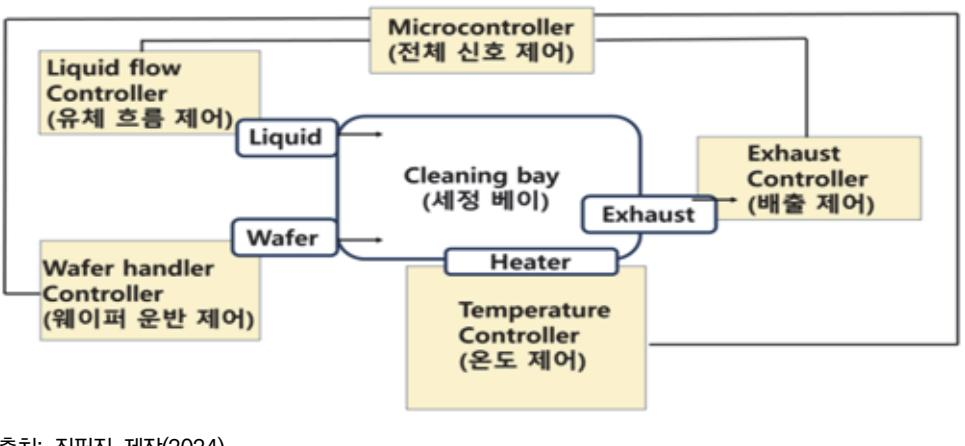

출처: 집필진 제작(2024) [그림 2-6] 습식 세정(wet cleaning)

(2) 건식 세정(dry cleaning) 공정 장비

건식 세정(dry cleaning) 장비는 건식 식각 장비와 같은 구조 및 원리([그림 4-3] 참조) 를 따르지만 최종 목표인 세정에 맞추어 공정이 운용되는 부분에 대하여 학습한다.

#### 7. 이온 주입(ion implant) 공정 장비

이온 소스(ion source), 추출 및 이온 분석기(extraction & ion analyzer), 질량 분석기 (mass analyzer), 가속기(accelation column) 및 스캐닝 시스템(scanning system) 및 이온 주 입 장비의 개요와 공정 과정 제어에 대하여 학습한다.

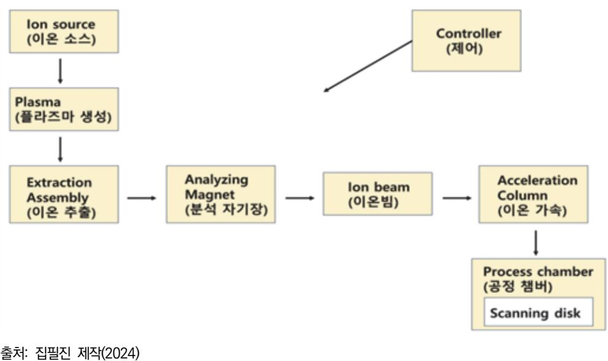

[그림 2-7] 이온 임플란트(ion implant)

- 8. 박막(thinfilm) CVD/PVD 공정 장비
  - (1) 화학 기상 증착(CVD) 공정 장비 공정 가스 유량, 진공도, 플라즈마 환경을 위한 에너지 전달 및 효율을 높이기 위한 부 가적인 변수(inert 가스 유량, 바이어스 등) 및 CVD 장비의 개요와 공정 과정 제어에 대하여 학습한다.
- (2) 기타 화학적 증착(CVD process) 공정 장비 구리(Cu)의 사용이 증가함에 따른 도금법 중 전해 도금(ECD: electrochemical deposition) 과 무전해도금(electroless plating)에 대하여 학습한다.

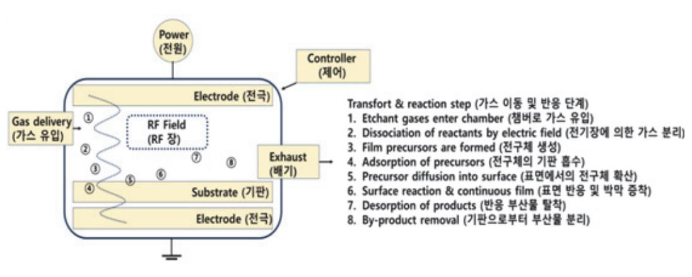

출처: 집필진 제작(2024) [그림 2-8] PECVD에서의 가스 이동 및 반응 단계(PECVD transport & reaction steps)

(3) 물리 기상 증착(PVD) 공정 장비

#### (가) 스퍼터(sputter)

공정 가스 유량, 진공도, 플라즈마 환경을 위한 에너지 전달, 및 효율을 높이기 위한 부가적인 변수(inert 가스 유량, 바이어스 등), 및 스퍼터 장비의 개요와 공정 과정 제어에 대하여 학습한다.

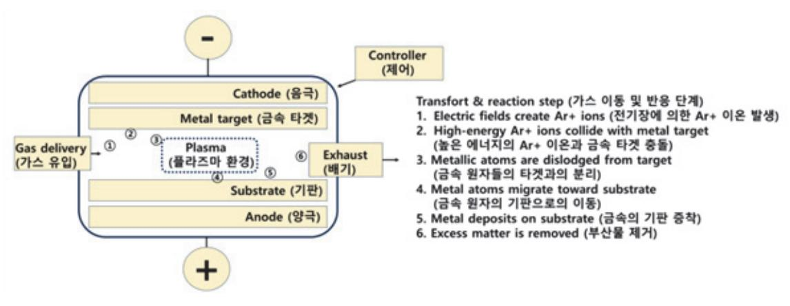

출처: 집필진 제작(2024)

#### (나) 이베퍼레이터(evaporator)

공정 가스 유량, 진공도, 에너지 전달 및 효율을 높이기 위한 부가적인 변수(inert 가스 유량, 바이어스 등)에 대하여 학습한다.

#### (다) 회전 공정 방법(spin on method)

사진 공정에서의 스핀 코터 장비를 참조할 수 있으며, 사용되는 재료 및 화학 성분 에 대하여 학습한다.

#### 수 제조 공정 설비 시설 확인

반도체 제조 공정 장비가 배치되어 작업할 수 있도록 만든 공간을 설비(facility) 시설이라고 하 며 보통 팹(FAB, fabrication의 줄임말) 또는 클린 룸(clean room)이라고 한다.

1. 설비 시설(facility)

반도체 제조 공정 공간에서 오염(contamination)의 통제, 미립자(paticle), 금속 불순물(metallic impurity), 유기 오염 물질(organic contamination), 자연 산화막(native oxide) 및 정전기 방전(ESD: electrostatic discharge)에 대하여 학습하고 공정이 진행될수록 오염도 같이 증가함을 이해한다.

[그림 2-9] 스퍼터에서의 가스 이동 및 반응 단계(sputter transport & reaction steps)

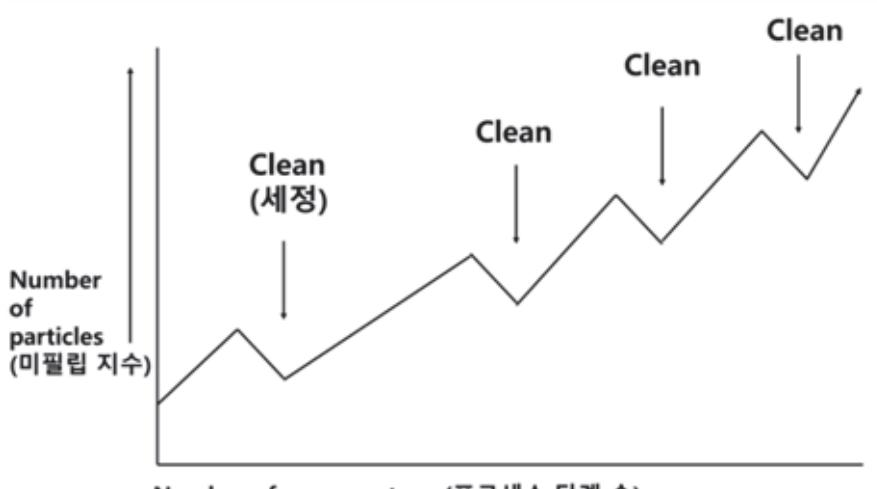

출처: 집필진 제작(2024)

[그림 2-10] 오염과 세정의 상관관계(contamination and cleaning)

반도체 제조 공정 설비에 대한 오염원의 정의 및 방지 방법에 대하여 학습한다.

- (1) 공기(air filtering): 설비 시설의 밀폐, 헤파(HEPA) 필터, 울파(ULPA) 필터, 외부 기압과의 차이, 시설 내부 반입 전 에어 샤워 장비(air shower)
- (2) 작업자(human): 방진복(cleanroom garment) 착용 및 내부 규정
- (3) 배치(layout): 공정 장비 배치(production bay)와 유틸리티 및 작업자 배치(service chase) 의 구분, 기체 흐름(airflow) 고려 및 불규칙한 움직임에 대한 와류(turbulence) 제어
- (4) 온도와 습도(temperature & humidity): 해당 청정도에 대한 온도/습도 규격화 및 항온 항 습기(thermo-hygrostat) 제어
- (5) 정전기 방전(electrostatic discharge, ESD): 설비 재료의 선택, 접지 및 공기의 이온화(air ionization) 제어
- (6) 물(water): 순수(deionized water, DI-water) 필터링, 및 수질 모니터링
- (7) 공정 화학 물질 및 가스(process chemical &gas): 이송 시스템, 다양한 필터 및 라인 관리 모니터링
- (8) 생산 설비(production equipment): 장비의 자동화의 장점 및 단점
- (9) 워크스테이션 설계(workstation design): 오염 허용 수준, 오염 방출 최소화 방법, 재료, 클 러스터 장비 설계/배치, 핸들링(handling) 자동화 및 소규모 환경(mini environment)
- 2. 유틸리티(utility)

설비 시설(facility)이 효율적으로 운용될 수 있도록 보조하는 장비를 통틀어 유틸리티(utility)라고 한다. 설명된 오염 방지 장비 외에 배전 시설 장비, 수도 시설 장비, 배수 시설 장비, 및 가스 시설 장비와 각각의 제어에 대하여 학습한다.

# 수행 내용 / 공정 장비 운용하기

#### 재료·자료

- MSDS 설명 자료, 안전 교육 자료
- 작업 지시서(공정 계획서), 장비 및 설비 사용 설명서
- 웨이퍼, 포토 마스크, 포토레지스트, 가스, 금속 타깃, 고분자 물질, 화공 약품, 순수 (DI-Water)

기기(장비 ・ 공구)

- 공정 장비(wet station, furnace, sputter, PECVD, photolithography equipment)
- 계측 장비(microscope, a-step, probe-station)

#### 안전 ・ 유의 사항

- 물질 안전 보건 자료(MSDS)에 따른 화학 물질의 보관, 관리, 주의 사항 준수한다.
- 취급 화학 물질에 따른 알맞은 보호 장구 선택, 사용 규정 준수한다.
- 안전 관련 작업 안전장치(소방 시설 배치, 작업자 안전, 비상 샤워 부스, 아이 워시, 심장 충격기) 사용 능력을 파악한다.
- 반도체 제조 공정이 환경에 미치는 영향을 파악한다.
- 장비 취급 사항을 준수한다.

#### 수행 순서

숔 작업 지시서에 의해 정해진 공정 장비를 조작하여 단위 공정을 수행한다.

반도체 제조 단위 공정 개발에서 공정 장비 운용을 위해 작업 지시서에 의해 정해진 공정 장비 를 조작하여 단위 공정을 수행하는 것은 매우 중요하다. 이는 제조 공정의 효율성과 정확성을 보장하기 위해 필수적인 절차이다. 다음은 공정 장비 운용을 위해 작업 지시서에 따라 단위 공 정을 수행하는 단계별 절차와 방법이다.

- 1. 준비 단계를 파악한다.
  - (1) 작업 지시서 확인
    - (가) 작업 지시서를 확인하여 수행할 공정과 사용해야 할 장비를 명확히 이해한다.

71

(나) 작업 지시서에는 공정 순서, 장비 설정, 안전 절차 등이 포함되어 있어야 한다.

(2) 장비 점검

(가) 공정에 사용할 장비를 점검하여 이상 여부를 확인한다.

(나) 전원 공급, 장비 상태, 소모품(예: 케미칼, 가스, 웨이퍼 등) 상태를 점검한다.

(3) 안전 장비 착용

(가) 공정 수행 시 필요한 개인 보호 장비(PPE)를 착용한다.

(나) 일반적으로 보호안경, 장갑, 방진복 등을 착용해야 한다.

2. 공정 단계를 파악한다.

(1) 장비 설정

(가) 작업 지시서에 따라 장비의 파라미터를 설정한다.

(나) 설정 예시: 온도, 압력, 시간, 가스 흐름량 등

(2) 공정 수행

(가) 설정된 장비를 사용하여 공정을 수행한다.

예시: 웨이퍼 로딩, 가스 주입, 온도 상승 등

(3) 모니터링

(가) 공정 중 장비 상태와 공정 진행 상황을 지속적으로 모니터링한다.

(나) 이상 징후 발견 시 즉시 조치를 취한다.

3. 마무리 단계를 확인한다.

(1) 공정 종료

(가) 작업 지시서에 따라 공정을 종료하고 장비를 정리한다.

(나) 공정 종료 후 장비의 온도, 압력 등을 안전한 수준으로 낮춘다.

(2) 결과 확인

(가) 공정 결과를 확인하고 기록한다.

(나) 공정 중 발생한 문제점과 해결 방법을 기록한다.

(3) 장비 청소 및 유지 보수

(가) 공정 종료 후 장비를 청소하고 필요한 유지 보수를 수행한다.

(나) 다음 작업을 위해 장비 상태를 최적화한다.

4. 공정 단계 예시: 반도체 웨이퍼 식각 공정을 파악한다.

(1) 준비 단계

(가) 작업 지시서 확인

- 1) 식각기 내부 청소
- (다) 장비 청소 및 유지 보수
- 2) 공정 중 발생한 문제점과 해결 방법 기록
- 1) 웨이퍼 식각 상태 확인 및 기록
- (나) 결과 확인
- 2) 식각기 온도와 압력을 안전 수준으로 낮춤
- 1) 식각 시간 30분 경과 후 공정 종료
- (가) 공정 종료
- (3) 마무리 단계
- 2) 이상 징후 발견 시 즉시 조치
- 1) 온도, 압력, 가스 흐름 지속 모니터링
- (다) 모니터링
- 4) 식각기 작동 모니터링
- 3) SF6 가스 주입 시작
- 2) DRIE 식각기 가동
- 1) 웨이퍼 로딩

- 시간 30분

(나) 공정 수행

(2) 공정 단계

- (가) 장비 설정 1) DRIE 식각기 설정: 온도 300°C, 압력 20mTorr, SF6 가스 흐름 100sccm, 식각
- 5) 보호안경, 장갑, 방진복 착용

- 4) 안전 장비 착용

2) 가스 실린더 상태 확인

3) 웨이퍼 상태 확인

1) 공정: DRIE(deep reactive ion etching)

(나) 장비 점검 1) DRIE 식각기의 전원 공급 확인

분

2) 장비: DRIE 식각기 3) 파라미터: 온도 300°C, 압력 20mTorr, SF6 가스 흐름 100sccm, 식각 시간 30 의 효율성과 정확성을 보장하기 위해 필수적이다. 작업 지시서를 명확히 이해하고, 장비를 정 확하게 설정하고, 공정 중 지속적인 모니터링을 통해 문제를 신속히 해결하는 것이 중요하다. 또한 공정 후 결과를 정확히 기록하고 장비를 청소 및 유지 보수하여 다음 공정을 준비하는 것 도 중요하다. 이러한 절차를 통해 고품질의 반도체 제품을 생산할 수 있다.

숕 공정의 작업 순서와 절차를 파악하여 수행 중인 단위 공정의 특성을 확인한다.

반도체 제조 단위 공정 개발을 위한 공정 장비 운용에서 공정의 작업 순서와 절차를 파악하고 수행 중인 단위 공정의 특성을 확인하는 것은 매우 중요하다. 이를 통해 공정이 계획대로 진행 되는지 확인하고, 공정의 품질과 효율성을 유지할 수 있다. 다음은 공정의 작업 순서와 절차를 파악하고 단위 공정의 특성을 확인하는 방법에 대한 단계별 가이드이다.

- 1. 작업 순서 및 절차를 파악한다.
  - (1) 작업 지시서 검토
    - (가) 작업 지시서 확인: 작업 지시서에는 각 공정 단계의 순서, 필요한 장비, 설정값, 안전 절 차 등이 포함되어 있다.
    - (나) 공정 흐름도 확인: 공정의 전체 흐름을 이해하기 위해 공정 흐름도를 검토한다.
  - (2) 공정 매뉴얼 및 SOP(standard operating procedure) 검토
    - (가) 공정 매뉴얼 확인: 각 공정 단계에 대한 자세한 절차를 이해하기 위해 공정 매뉴얼을 참 조한다.
    - (나) SOP 확인: 표준 운영 절차를 확인하여 작업자의 역할과 책임을 명확히 한다.
  - (3) 공정 교육 및 훈련
    - (가) 교육 참석: 공정 장비 운용에 대한 교육을 받고, 필요한 경우 추가 교육을 요청한다.
    - (나) 훈련 참여: 공정 장비 운용에 대한 실습 훈련을 통해 작업 순서와 절차를 숙지한다.
- 2. 단위 공정 수행 및 특성을 확인한다.
  - (1) 공정 준비 단계
    - (가) 장비 및 재료 점검: 필요한 장비와 재료를 점검하고, 이상이 없는지 확인한다.
    - (나) 작업 환경 준비: 작업 환경이 안전하고 청결한지 확인한다.
  - (2) 공정 수행 단계
    - (가) 장비 설정: 작업 지시서에 따라 장비의 파라미터를 설정한다.
      - 예: 온도, 압력, 시간, 가스 흐름 등
    - (나) 공정 시작: 장비를 작동시키고 공정을 시작한다.

예: 웨이퍼 로딩, 가스 주입, 온도 상승 등

- (다) 공정 모니터링: 공정 중 장비 상태와 공정 진행 상황을 지속적으로 모니터링한다. 예: 온도, 압력, 가스 흐름, 공정 시간 등
- (3) 공정 종료 단계
  - (가) 공정 종료: 작업 지시서에 따라 공정을 종료한다.

예: 가스 주입 종료, 장비 정지, 웨이퍼 언로딩 등

- (나) 장비 초기화: 공정 종료 후 장비를 초기 상태로 되돌린다. 예: 온도, 압력, 가스 흐름을 안전한 수준으로 낮춤.
- (4) 공정 결과 확인 및 기록
  - (가) 결과 확인: 공정 결과를 확인하고, 이상 여부를 판단한다. 예: 웨이퍼의 식각 깊이, 균일성, 불량 여부 등
  - (나) 결과 기록: 공정 결과를 기록하고, 공정 중 발생한 문제점과 해결 방법을 기록한다.
- 3. 공정 특성 확인 방법을 파악한다.
  - (1) 실시간 모니터링
    - (가) 장비 모니터링 시스템 사용: 장비에 내장된 모니터링 시스템을 사용하여 실시간으로 공 정 파라미터를 확인한다.

예: 온도, 압력, 가스 흐름, 전류, 전압 등

- (2) 데이터 로깅 및 분석
  - (가) 데이터 로거 사용: 공정 데이터를 기록하고, 분석 소프트웨어를 사용하여 데이터를 분석 한다.

예: 공정 시간 동안의 온도 변화, 압력 변화 등

- (3) 공정 샘플링 및 검사
  - (가) 샘플 검사: 공정 완료 후 샘플을 채취하여 검사한다.

예: 웨이퍼 식각 깊이 측정, 표면 분석 등

- (나) 검사 장비 사용: SEM, AFM, 엘립소미터 등 검사 장비를 사용하여 공정 결과를 분석한 다.
- 4. 공정 사례: 웨이퍼 식각 공정을 파악한다.
  - (1) 작업 순서 및 절차
    - (가) 작업 지시서 검토
      - 1) 공정: DRIE(deep reactive ion etching)
      - 2) 장비: DRIE 식각기
      - 3) 파라미터: 온도 300°C, 압력 20mTorr, SF6 가스 흐름 100sccm, 식각 시간 30
        - 분

(나) 공정 매뉴얼 확인:장비 설정 방법, 안전 절차 등

- (2) 공정 수행
  - (가) 공정 준비 단계
    - 1) 장비 및 재료 점검: DRIE 식각기, SF6 가스 실린더 상태 확인
    - 2) 작업 환경 준비: 작업 공간 청결 확인, 개인 보호 장비 착용
  - (나) 공정 수행 단계
    - 1) 장비 설정: DRIE 식각기 설정(온도 300°C, 압력 20mTorr, SF6 가스 흐름 100sccm, 식각 시간 30분)
    - 2) 공정 시작: 웨이퍼 로딩, 가스 주입 시작, 식각기 작동
    - 3) 공정 모니터링: 온도, 압력, 가스 흐름 지속 모니터링
  - (다) 공정 종료 단계
    - 1) 공정 종료: 식각 시간 30분 경과 후 공정 종료, 웨이퍼 언로딩
    - 2) 장비 초기화: 식각기 온도와 압력을 안전 수준으로 낮춤.
- (3) 공정 결과 확인 및 기록
  - (가) 결과 확인: 웨이퍼 식각 깊이, 균일성, 불량 여부 확인
  - (나) 결과 기록
    - 1) 공정 결과 기록: 식각 깊이, 균일성, 불량 여부 등
    - 2) 공정 중 발생한 문제점과 해결 방법 기록

반도체 제조 단위 공정 개발을 위해 공정 장비를 운용하고 공정의 작업 순서와 절차를 파악하여 단위 공정의 특성을 확인하는 것은 매우 중요하다. 이를 통해 공정이 계획대로 진행되고, 고품질의 반도체 제품을 생산할 수 있다. 작업 지시서와 공정 매뉴얼을 철저히 검토하고, 공정 수행 중 실시간 모니터링과 데이터 분석을 통해 공정 특성을 지속해서 확인하는 것이 중요하다.

숖 공정 장비의 핵심 구성 부품의 동작 원리를 숙지하여 이상 상황 발생 시 문제를 해결한다.

반도체 제조 단위 공정 개발에서 공정 장비의 핵심 구성 부품의 동작 원리를 숙지하고 이상 상 황 발생 시 문제를 해결하는 것은 매우 중요하다. 이를 통해 공정의 안정성과 효율성을 유지할 수 있다. 다음은 공정 장비의 핵심 구성 부품의 동작 원리를 이해하고 문제를 해결하는 방법에 대한 단계별 가이드이다.

- 1. 공정 장비의 핵심 구성 부품을 이해한다.
  - (1) 구성 부품 목록
    - (가) 진공 펌프: 진공 환경을 유지하기 위한 장비
    - (나) 가스 플로 컨트롤러: 공정 가스의 흐름을 제어하는 장치

- (다) 플라즈마 발생기: 플라즈마를 생성하여 식각이나 증착을 수행
- (라) 온도 컨트롤러: 공정 중 온도를 조절하는 장치
- (마) 전원 공급 장치: 공정 장비에 필요한 전원을 공급
- (2) 각 부품의 동작 원리
  - (가) 진공 펌프
    - 1) 동작 원리: 기체를 흡입하여 배출함으로써 진공 상태를 유지
    - 2) 종류: 터보 분자 펌프, 로터리 베인 펌프 등
  - (나) 가스 플로 컨트롤러

(다) 플라즈마 발생기

(라) 온도 컨트롤러

(마) 전원 공급 장치

2. 이상 상황 발생 시 문제를 해결한다.

(1) 문제 해결 단계

(가) 문제 식별

(나) 원인 분석

정하게 유지.

2) 구성 요소: RF 전원 공급 장치, 플라즈마 체임버 등

2) 구성 요소: 온도 센서, 제어 회로, 히터/냉각 장치 등

1) 장비 모니터링 시스템과 경고 메시지를 통해 문제를 식별

1) 각 구성 부품의 동작 원리를 바탕으로 원인을 분석

1) 동작 원리: 공정 장비에 안정적인 전원을 공급

2) 구성 요소: 변압기, 정류기, 필터 등

- 2) 구성 요소: 밸브, 유량 센서, 제어 회로 등
- 1) 동작 원리: 가스의 흐름을 정밀하게 제어하여 원하는 유량을 유지

1) 동작 원리: 전자기장을 사용하여 가스를 이온화하여 플라즈마를 생성

1) 동작 원리: 온도 센서로부터 피드백을 받아 히터나 냉각 장치를 제어하여 온도를 일

77

- 누출 여부 확인 (다) 해결 방안 도출 및 실행
  - 1) 원인에 따라 해결 방안을 도출하고 실행

예: 진공 펌프 오일 교체, 가스 라인 누출 부분 수리, 플라즈마 발생기 전원 공급

예: 진공 압력이 목표치에 도달하지 않음, 가스 유량 불안정, 플라즈마 불안정 등

예: 진공 펌프의 흡입력이 약해졌을 경우, 펌프의 오일 레벨 확인, 밸브나 라인에

- 3. 교육 및 훈련을 파악한다.
- 나) 가스 플로 컨트롤러 정기 유지 보수 계획 수립
- 가) RF 전원 공급 장치 정기 점검 계획 수립
- 4) 재발 방지 대책 마련
- 나) 가스 플로 컨트롤러 점검 및 유량 조절
- 가) RF 전원 공급 장치 점검 및 필요시 교체
- 3) 해결 방안 도출 및 실행
- 나) 플라즈마 체임버 내 가스 유량 불안정
- 가) 플라즈마 발생기 RF 전원 공급 불안정
- 2) 원인 분석
- 나) 장비 모니터링 시스템에서 플라즈마 발생기 경고 메시지 발생
- 가) 플라즈마 발생기의 플라즈마 불안정
- 1) 문제 식별
- (나) 예시 2: 플라즈마 발생기의 플라즈마 불안정
- 나) 정기적인 진공 라인 및 밸브 점검 계획 수립
- 가) 진공 펌프 오일 정기 교체 주기 설정
- 4) 재발 방지 대책 마련
- 나) 진공 라인 및 밸브 점검하여 누출 부분 수리
- 가) 진공 펌프 오일 레벨 점검 및 필요시 교체
- 3) 해결 방안 도출 및 실행
- 나) 진공 라인에 누출이 발생했을 가능성
- 가) 진공 펌프의 오일 레벨이 낮거나 오염됨.
- 2) 원인 분석
- 나) 장비 모니터링 시스템에서 진공 펌프 경고 메시지 발생
- 가) 진공 체임버의 압력이 목표치보다 높음.
- 1) 문제 식별
- (가) 예시 1: 진공 펌프의 압력이 낮은 경우
- (2) 구체적인 문제 해결 예시

예: 정기 점검 주기 설정, 예방 유지 보수 계획 수립

- 1) 문제 해결 후 재발 방지 대책 마련
- (라) 재발 방지 대책 마련
- 장치 점검 및 교체

- (가) 공정 장비의 각 구성 부품의 동작 원리
- (나) 공정 장비의 일반적인 문제와 해결 방법
- (다) 공정 장비 운용 및 유지 보수 절차
- (2) 훈련 과정
  - (가) 이론 교육: 공정 장비의 동작 원리와 문제 해결 방법에 대한 이론 교육
  - (나) 실습 훈련: 실제 공정 장비를 사용한 문제 해결 실습
  - (다) 평가 및 피드백: 교육 후 이해도 평가 및 피드백 제공
- 4. 문서화 및 기록한다.
  - (1) 문제 해결 기록
    - (가) 문제 발생 시간, 문제 원인, 해결 방법 및 결과를 기록
    - (나) 문제 해결 후 재발 방지 대책을 문서화
  - (2) 유지 보수 기록
    - (가) 정기 점검 및 유지 보수 활동을 기록
    - (나) 각 장비의 점검 주기와 교체 주기 등을 문서화

반도체 제조 단위 공정 개발을 위해 공정 장비의 핵심 구성 부품의 동작 원리를 숙지하고 이상 상황 발생 시 문제를 해결하는 것은 매우 중요하다. 이를 통해 공정의 안정성과 효율성을 유지 할 수 있다. 공정 장비의 동작 원리를 이해하고, 문제 해결 방법을 숙지하며, 정기적인 교육과 훈련을 통해 장비 운용 능력을 향상시키는 것이 필요하다. 또한 문제 발생 시 적절한 대응과 기록을 통해 재발을 방지하고, 공정의 품질을 지속해서 유지할 수 있다.

숗 공정 장비의 효율적인 운영을 위하여 장비에 연결된 유틸리티의 상태를 확인한다.

반도체 제조 단위 공정 개발을 위한 공정 장비의 효율적인 운영을 위해서는 장비에 연결된 유 틸리티의 상태를 주기적으로 확인하는 것이 중요하다. 유틸리티는 공정 장비의 안정적인 동작 을 보장하기 위한 필수 요소로, 여기에는 전기, 가스, 진공, 냉각수, 압축 공기 등이 포함된다. 유틸리티 상태를 정기적으로 확인하고 관리함으로써 장비의 효율성을 유지하고, 불필요한 다운 타임을 방지할 수 있다. 다음은 유틸리티의 상태를 확인하는 절차와 방법에 대한 단계별 가이 드이다.

- 1. 유틸리티 종류와 확인 방법을 파악한다.
  - (1) 전기(electrical supply)
    - (가) 확인 항목: 전압, 전류, 전력 소비량, 전력 품질(예: 전압 스파이크, 노이즈 등)
    - (나) 확인 방법

- 1) 전력 분석기 또는 멀티미터를 사용하여 전압 및 전류 측정
- 2) 장비 내 전력 모니터링 시스템 확인
- 3) UPS(uninterruptible power supply) 상태 점검
- (2) 가스(gas supply)
  - (가) 확인 항목: 가스 압력, 유량, 가스 순도
  - (나) 확인 방법
    - 1) 가스 플로미터와 압력 게이지를 사용하여 가스 유량 및 압력 측정
    - 2) 가스 분석기를 사용하여 가스 순도 확인
    - 3) 가스 공급 시스템(밸브, 레귤레이터, 배관) 점검
- (3) 진공(vacuum supply)
  - (가) 확인 항목: 진공 압력, 펌프 상태, 진공 누출 여부
  - (나) 확인 방법
    - 1) 진공 게이지를 사용하여 진공 압력 측정
    - 2) 진공 펌프의 오일 레벨 및 상태 점검
    - 3) 헬륨 누출 감지기를 사용하여 진공 라인 누출 확인
- (4) 냉각수(cooling water)
  - (가) 확인 항목: 냉각수 온도, 유량, 압력
  - (나) 확인 방법
    - 1) 온도 센서와 유량계를 사용하여 냉각수 온도 및 유량 측정
    - 2) 냉각수 시스템의 압력 게이지 확인
    - 3) 냉각수 순환 시스템 점검(필터, 배관, 펌프 등)
- (5) 압축 공기(compressed air)
  - (가) 확인 항목: 압축 공기 압력, 유량, 품질(수분, 오일 함유량)
  - (나) 확인 방법
    - - 1) 압력 게이지와 유량계를 사용하여 압축 공기 압력 및 유량 측정
      - 2) 공기 품질 분석기를 사용하여 수분 및 오일 함유량 확인
- 3) 공기 압축기와 드라이어 상태 점검
- 2. 유틸리티 상태 확인 절차
  - (1) 주기적 점검 계획 수립
    - (가) 점검 주기 설정: 각 유틸리티에 대해 적절한 점검 주기를 설정한다(예: 매일, 매주, 매월).
    - (나) 점검 항목 정의: 점검해야 할 항목과 기준을 명확히 정의한다.
  - (2) 점검 수행

- (가) 점검 도구 준비: 필요한 측정 도구와 장비를 준비한다.
- (나) 상태 확인 및 기록: 각 유틸리티의 상태를 확인하고, 결과를 기록한다.
- (3) 이상 상황 대응
  - (가) 문제 식별: 점검 결과를 분석하여 이상 상황을 식별한다.
  - (나) 원인 분석 및 조치: 이상 상황의 원인을 분석하고, 필요한 조치를 취한다.
  - (다) 후속 조치: 문제 해결 후 후속 조치를 계획하고 실행한다(예: 추가 점검, 부품 교체, 시 스템 개선 등).
- 3. 유틸리티 상태 확인 예시를 파악한다.
  - (1) 예시 1: 전기 유틸리티 상태 확인
    - (가) 점검 항목: 전압, 전류, 전력 소비량
    - (나) 점검 도구: 전력 분석기, 멀티미터
    - (다) 점검 절차
      - 1) 전력 분석기를 사용하여 전압, 전류, 전력 소비량을 측정한다.
      - 2) 측정 결과를 기록하고, 기준값과 비교하여 이상 여부를 확인한다.
      - 3) 이상이 발견되면 원인을 분석하고, 필요한 조치를 취한다(예: 전력 공급 장치 점검, 배선 상태 점검).
  - (2) 예시 2: 가스 유틸리티 상태 확인
    - (가) 점검 항목: 가스 압력, 유량, 순도
    - (나) 점검 도구: 가스 플로 미터, 압력 게이지, 가스 분석기
    - (다) 점검 절차
      - 1) 가스 플로 미터와 압력 게이지를 사용하여 가스 압력과 유량을 측정한다.
      - 2) 가스 분석기를 사용하여 가스의 순도를 확인한다.
      - 3) 측정 결과를 기록하고, 기준값과 비교하여 이상 여부를 확인한다.
      - 4) 이상이 발견되면 가스 공급 시스템을 점검하고, 필요한 조치를 취한다(예: 밸브 조 정, 배관 누출 점검).
- 4. 유틸리티 상태 모니터링 시스템을 파악한다.
  - (1) 모니터링 시스템 구성
    - (가) 센서 설치: 각 유틸리티에 필요한 센서(전압, 전류, 압력, 유량, 온도 등)를 설치한다.
    - (나) 데이터 수집 및 저장: 센서 데이터를 실시간으로 수집하고 저장한다.
    - (다) 데이터 분석 및 경고 시스템: 수집된 데이터를 분석하여 이상 상황을 감지하고 경고를 발송한다.

(2) 모니터링 시스템 예시

(가) 구성 요소

1) 센서: 전압 센서, 전류 센서, 압력 게이지, 유량계 등

- 2) 데이터 수집 장치: 데이터 로거, PLC(programmable logic controller) 등
- 3) 모니터링 소프트웨어: 실시간 데이터 시각화 및 분석 소프트웨어
- (나) 운영 절차
  - 1) 각 유틸리티에 필요한 센서를 설치하고, 데이터 수집 장치에 연결한다.
  - 2) 모니터링 소프트웨어를 통해 실시간으로 데이터를 시각화하고 분석한다.
  - 3) 이상 상황이 발생하면 경고를 발송하고, 문제 해결을 위한 조치를 취한다.

반도체 제조 단위 공정 개발에서 공정 장비의 효율적인 운영을 위해 유틸리티 상태를 주기적으 로 확인하는 것은 매우 중요하다. 전기, 가스, 진공, 냉각수, 압축 공기 등 각 유틸리티의 상태 를 정기적으로 점검하고, 이상 상황 발생 시 신속하게 대응함으로써 공정의 안정성과 효율성을 유지할 수 있다. 이를 위해 점검 계획을 수립하고, 필요한 도구와 시스템을 활용하여 유틸리티 상태를 지속적으로 모니터링하는 것이 필요하다.

수행 tip

- 세정 공정은 RCA 방식을 따라도 되며 보유 화공 약품 및 장비에 따라 달라질 수 있다.
- 세정 공정 이후에도 자연 산화막은 성장하므로 연속 공정 으로 가는 것이 이슈를 줄일 수 있다.

## 학습 2 교수·학습 방법

#### 교수 방법

- 반도체 제조 공정 개발에 관련된 필요 지식을 기준으로 개념을 설명한다.
- 연구 노트 등의 정해진 양식을 활용하여 교수자의 강의 내용 및 학습자의 실제 활동 내역을 서술형 시험 및 구두 발표 시 학습자가 활용할 수 있도록 지도한다.
- 학습자가 각자의 역할 분담이 주어진 상태에서 팀을 구성하여 교육에 참여하는 조별 활동을 활용한다.
- 교육 중 브레인스토밍 등을 통하여 문제를 해결하고 새로운 아이디어를 도출한다.
- 인터넷 자료 조사 등을 통한 로드 맵, 외부 학술 자료 등을 교육에 활용한다.
- 반도체 공정, 장비, 설계, 및 응용 분야에 대한 다양한 전시회 및 학술 대회에 참가하여 현 장에서 실물을 직접 접하게 하며 다양한 방식의 설명을 학습자에게 제공한다.

#### 학습 방법

- 공정별 공정 장비 특성에 대하여 학습하고 공정에 맞는 장비를 선택한다.
- 반도체 제조 공정 프로세스에 대하여 학습하고 결과물에 최적화되도록 프로세스를 연결한 다.
- 반도체 주요 공정 및 장비 운용 용어에 대하여 학습하고 단위 공정 또는 공정 프로세스에 적합한 작업 지시서를 작성한다.
- 제조 공정 장비 운용 기술에 대하여 학습하고 해당 장비를 공정에 적합하도록 운용한다.
- 제조 공정 특성 분석에 대하여 학습하고 해당 특성에 맞는 분석 장비를 선택한다.
- 제조 공정 설비 시설에 대하여 학습하고 해당 제조 공정에 적합한 설비 시설을 선택한다.
- 매뉴얼 및 환경 안전 기준에 따라 필요 지식 학습 및 수행 중의 문제점을 도출한 다음, 수 정 및 보완 계획을 수립할 수 있도록 학습 및 실습한다.

# 학습 2 평 가

#### 평가 준거

• 평가자는 학습자가 학습 목표를 성공적으로 달성하였는지를 평가해야 한다.

#### • 평가자는 다음 사항을 평가해야 한다.

|          | 학습 목표                                                      |  | 성취수준 |   |  |
|----------|------------------------------------------------------------|--|------|---|--|
| 학습 내용    |                                                            |  | 중    | 하 |  |
|          | - 작업 지시서에 의해 정해진 공정 장비를 조작하여 단위 공 정을 수행할 수 있다.          |  |      |   |  |
|          | - 공정의 작업 순서와 절차를 파악하여 수행 중인 단위 공정 의 특성을 확인할 수 있다.       |  |      |   |  |
| 공정 장비 운용 | - 공정 장비의 핵심 구성 부품의 동작 원리를 숙지하여 이상 상황 발생 시 문제를 해결할 수 있다. |  |      |   |  |
|          | - 공정 장비의 효율적인 운영을 위하여 장비에 연결된 유틸리 티의 상태를 확인할 수 있다.      |  |      |   |  |

#### 평가 방법

• 서술형 시험

|          |                                                           |   | 성취수준 |   |  |  |
|----------|-----------------------------------------------------------|---|------|---|--|--|
| 학습 내용    | 평가 항목                                                     | 상 | 중    | 하 |  |  |
| 공정 장비 운용 | - 작업 지시서에서 공정 단계에 포함되는 장비 설정과 공정 수행 내용을 파악할 수 있는 능력    |   |      |   |  |  |
|          | - 공정의 준비와 수행 그리고 종료 단계로 구분하여 수행하고 결과를 확인하고 기록할 수 있는 능력 |   |      |   |  |  |
|          | - 단위 공정의 핵심 부품의 구성 부품 목록과 각 부품의 동작 원리 파악 여부            |   |      |   |  |  |
|          | - 공정 장비 유틸리티의 상태를 확인하는 절차 파악 여부                           |   |      |   |  |  |

#### • 평가자 체크리스트

|          |                                                      | 성취수준 |   |   |  |
|----------|------------------------------------------------------|------|---|---|--|
| 학습 내용    | 평가 항목                                                | 상    | 중 | 하 |  |
| 공정 장비 운용 | - 작업 지시서에서 반도체 웨이퍼 식각 공정을 파악하여 해당 공정을 수행할 수 있는 능력 |      |   |   |  |
|          | - 단위 공정 결과로부터 단위 공정의 특성 확인 방법을 파악 하여 수행할 수 있는 능력  |      |   |   |  |
|          | - 공정 장비의 이상 상황 발생 시 문제 해결 단계 파악 여부                   |      |   |   |  |
|          | - 장비에 해당되는 유틸리티의 종류와 확인 방법에 대한 파악 여부              |      |   |   |  |

#### 피드백

| 1. 서술형 시험                                                |
|----------------------------------------------------------|
| - 작업 지시서에서 공정 단계에 포함되는 장비 설정과 공정 수행 내용을 파악할 수 있는 능력를 평   |
| 가한 후, 보완이 필요한 사항이나 주요 사항을 표시하여 피드백해 준다.                  |
| - 공정의 준비와 수행 그리고 종료 단계로 구분하여 수행하고 결과를 확인하고 기록할 수 있는 능    |
| 력을 평가한 후, 보완이 필요한 사항이나 주요 사항을 표시하여 보충 설명해 준다.            |
| - 성취수준이 높은 학습자와 미흡한 학습자를 구분하여 우수한 학습자들에게는 서술형 평가 내용의     |
| 적용 사례 학습을 통한 심화 학습으로 피드백해 주고, 미흡한 학습자들에게는 기초 용어에 대한      |
| 설명을 통해 일정 수준을 유지할 수 있도록 보완하여 지도해 준다.                     |
| 2. 평가자 체크리스트                                             |
| - 장비에 해당되는 유틸리티의 종류와 확인 방법에 대한 파악 여부를 평가한 후 부족한 점을 지적    |
| 하여 정확하게 처리할 수 있도록 보완하여 지도해 준다.                           |
| - 공정 장비의 이상 상황 발생 시 문제 해결 단계의 파악 여부에 대한 평가 후, 개선 및 보완 사항 |
| 을 정리하여 재학습할 수 있도록 피드백한다.                                 |
| - 성취수준이 높은 학습자와 저조한 학습자를 구분하여 우수한 학습자들에게는 사례 학습을 통한      |
| 심화 학습으로 피드백해 주고, 저조한 학습자들에게는 기초 지식에 대한 설명을 통해 일정 수준을     |
| 유지할 수 있도록 보완하여 지도해 준다.                                   |
|                                                          |

| 학습 3 | 계측 장비 운용하기 |
|------|------------|
| 학습 2 | 공정 장비 운용하기 |
| 학습 1 | 단위 공정 개발하기 |

# 3-1. 계측 장비 운용

| 학습 목표 | • 계측 장비의 특성을 숙지할 수 있다. • 표준 계측 방법에 따라 계측 작업을 수행할 수 있다. • 단위 공정에서 수행된 결과를 계측하여 결괏값을 확인할 수 있다. • 계측 장비 계측 결과를 해석할 수 있다. • 분석 장치를 이용하여 정밀한 성분, 특성을 측정할 수 있다. |
|-------|-----------------------------------------------------------------------------------------------------------------------------------------------------------------------|
|-------|-----------------------------------------------------------------------------------------------------------------------------------------------------------------------|

# 필요 지식 /

숔 도량형학(metrology)

반도체 제조 공정에서 기판을 포함한 모든 사용 재료의 특성을 명확히 구분하고 합격/불합격 여부를 판단하기 위한 기준으로 수치 및 단위화된 기준을 사용한다.

1. 단위(measure)

반도체 제조 공정에서 전체 또는 부분적인 결과물의 특성을 파악하기 위하여 길이(length), 넓이 (area), 무게(weight), 부피(volume), 온도(temperature), 압력(pressure), 속도(velocity), 양 (quantity) 및 시간(time) 등 다양한 단위가 사용되며 같은 단위 내에서도 환산이 필요한 경우가 있음을 학습한다.

2. 수율(yield)

반도체 제조 공정에서 전체 또는 부분적인 결과물의 제조 능력을 나타내는 지표로 일정 기 간 동안 생산된 부분에 대한 수율 측정, 단위 공정 수율 측정 및 실시간(in-situ) 수율 측정 등 다양한 방법에 대하여 학습한다.

3. 데이터 관리(data management)

반도체 제조 공정 중 취합(gathering)할 수 있는 무수한 데이터 중에서 허용 범위 이상의 오차를 만들어 내는 변수(variable)와 그에 해당하는 데이터만을 분류하여 분석할 수 있도 록 자동 결함 분류시스템(ADC: automatic defect classification)의 역할에 대하여 알아 본다.

#### 숕 보고서 작성(document)

반도체 제조 공정 중에서 발생하는 다양한 측정과 분석의 결과는 상호 의사소통을 위하여 객관 적으로 정리해야 하며 기본적인 문서 이해 및 작성 방법은 '직업 기초 능력'을 참조할 수 있다. 여기서는 보고서 작성 시 고려되어야 할 내용을 학습한다.

1. 기술성(technic)

보고서의 주제, 목적, 작성 배경에 대한 부분으로 보는 사람의 입장에서 '왜 작성했는가?'라 는 의문에 답을 줄 수 있는 관점에서 서술할 수 있도록 학습한다.

2. 성실성(sincerity)

보고서의 내용은 계측값 분석, 및 분석 결과가 포함(때로는 해결 방안의 제시까지도 포함)되 어야 하며 다양한 통계 기법 등이 활용될 수 있다. 결과에 맞춘 분석이 아닌 객관적이고 공 정한 기준이 적용되어야 하며 이 부분은 보는 사람의 입장에서 '어떻게 진행되었는가?'라는 의문에 답을 줄 수 있는 관점에서 서술할 수 있도록 학습한다.

3. 표현력(expression)

보고서 작성 시 실재하는 사실(fact)만이 포함되어야 하며 해석의 오해가 없도록 간결하게 구성되어야 한다. 이 부분은 보는 사람의 입장에서 '그래서 어떠한 정보를 전달하려고 하는 가?'라는 의문에 답을 줄 수 있는 관점에서 서술할 수 있도록 학습한다.

4. 문서화(documentation)

보고서의 기준 양식을 지키면서도 기-승-전-결에 맞추어 논리적으로 구성되며 수치, 단위, 그래프 및 표 등이 객관적으로도 합당하게 배치되어야 한다. 이 부분은 보는 사람에게 기술 성, 성실성 및 표현력의 전달이라는 관점에서 작성될 수 있도록 학습한다.

#### 숖 반도체 품질 측정

반도체 제조 공정에서 품질 관리는 설계 단계에서 정해진 목표치와 허용 오차 내에 존재할 수 있도록 특성을 유지하는 것으로 각 단위 공정 및 전체 공정 흐름에서 확인되어야 한다. 각 제 조 공정별로 더욱 다양한 품질 측정이 이루어지며 여기서는 기본적인 공정에 대한 품질 측정 장비와 용어를 학습한다.

#### 〈표 3-1〉 품질 측정(quality measures)

| Quality measures (품질 측정)                         | lmplant (임플란트) | Diffusion (확산) | Thin films(박막) |                     | Deliah          |              |               |
|-----------------------------------------------------|-------------------|-------------------|----------------|---------------------|-----------------|--------------|---------------|
|                                                     |                   |                   | Metals (금속) | Dielectric (절연층) | Polish (평탄화) | etch (식각) | photo (사진) |
| Film thickness (막 두께)                            |                   | ~                 | ~              | ~                   | V               | ~            | ~             |
| Sheet resistance (면 저항)                          | ~                 | ~                 | ~              |                     |                 |              |               |
| Film stress (막 응력)                               |                   | V                 | V              | V                   |                 |              |               |
| Refractive index (굴절률)                           |                   | V                 |                | V                   |                 |              |               |
| Dopant concentration (도핑 농도)                  | V                 | V                 |                |                     |                 |              |               |
| Unpatterned surface defects (패턴 없는 표면 검 사) | v                 | V                 | v              | v                   | V               | V            |               |
| Patterned surface defects (패턴 있는 표면 검 사)   |                   |                   |                |                     |                 | ~            | v             |
| Critical dimensions (CDs)(임계 치수)              |                   |                   |                |                     |                 | v            | V             |
| Step coverage (단차 피복)                            |                   |                   |                |                     |                 | V            |               |
| Overlay registration (오버레이 처리)                |                   |                   |                |                     |                 |              | V             |
| Capacitance-volta ge(C-V 상관관계)                   |                   | V                 |                |                     |                 |              |               |
| Contact angle (접촉각)                              |                   |                   |                |                     |                 |              | v             |

출처: Michael Quirk & Julian Serda (2009). Semiconductor Manufacturing Technology.

#### 1. 박막 두께(film thickness)

웨이퍼 제조 공정은 여러 개의 층(multy layers)을 만들게 되며 전도성 박막, 절연성 박막 이외에도 포토레지스트, 폴리실리콘 등의 박막이 존재하게 된다. 이러한 막은 투명 또는 불 투명한 막의 성질에 따라 다른 계측 장비가 사용되며 파괴와 비파괴 계측으로 나누기도 한 다. 박막의 주요 변수로는 표면 거칠기(surface roughness), 굴절률(reflectivity), 밀도 (density) 및 핀홀/보이드(pinhole/void)의 포함 상태를 학습한다.

2. 저항률과 시트 저항(resistivity & sheet resistance)

박막의 두께에 따라 저항값이 달라지므로 두께를 역을 산출해 낼 수 있으며 시트 저항은

박막의 크기와는 무관하게 막의 저항률과 두께로만 결정됨을 학습한다. 이러한 시트 저항을 측정 하는 방법으로 4 탐침법(four-point probe), 면저항 측정법(van der pauw), 타원 편광 분석(ellipsometry), 반사 측정법(reflection spectroscopy), 엑스레이 측정법(XRF: X-ray fluorescence), 전반사 엑스레이 측정법(total reflection XRF, TRXRF), 및 광음향 기술 (photoacoustic technology)에 대하여 학습한다. 또한 측정의 결과물로 외형도(contour map) 작성 및 활용에 대하여 학습한다.

3. 막 응력(film stress)

서로 다른 스트레스(stress)를 가진 박막의 다층 구조 상태에서 기판 자체의 변형이 일어나게 되며 곡률 반지름의 변화를 측정하거나 웨이퍼의 반지름 변화를 측정(scanning laser-beam technic)하거나 또는 기판 전체의 스트레스 개요도를 확인(split-beam laser technic)하는 방법에 대하여 학습한다.

4. 굴절률(refractive index)

박막이 투명할 경우 박막의 성분에 따라 굴절률이 다르며 편광 분석 방법으로 두께 및 박 막의 조성 변화 정도를 확인할 수 있음을 학습한다.

5. 도핑 농도(dopant concentration)

반도체는 도핑된 정도에 따라 특성이 달라지며 4 탐침법, 복사파 측정법(thermal-wave system), 2차 이온 질량 분광계(secondary-ion mass spectroscopy, SIMS) 및 분포 저항 프로 브(spreading resistance probe)에 대하여 학습한다.

6. 패턴 없는 표면의 결함(unpatterned surface defects)

박막이 기판 전체에 걸쳐 패턴 없이 존재하는 경우 표면의 미립자(paticles), 긁힘(scratches), 미끄러짐(slip lines) 및 재료의 결함(material defects)을 확인할 수 있고 주요 변수로는 대조 (contrast)가 존재한다. 광학 현미경(optical microscopy), 광학 시스템(optical system) 및 광산란 결함 검출(light scattering defect detection) 장비를 학습하고 다크 필드(dark field)와 브라이트 필드(bright field)의 적용 방법에 대하여 학습한다.

7. 패턴 있는 표면의 결함(patterned surface defects)

일반적으로 반도체 제조 공정 중에는 패턴이 존재하게 되며 결함과 패턴을 구분 짓는 기준 이 중요하며 광산란 기술(light scattering detection)의 적용 방법에 대하여 학습한다.

8. 임계 치수(CD: critical dimension)

반도체 제조 공정에서 가장 작은 부분을 제어할 수 있다면 다른 결과 특성도 오차 범위에 들어오게 되며 매우 정확한 정밀도를 요구하게 된다. 주사 전자 현미경(SEM: scanning electron microscope)과 에너지 분산 엑스레이 분석기(EDX: energy dispersive x-ray spectroscope), 집속 이온 빔(FIB: focused ion beam)과의 연결에 대하여 학습하고 투과 주사 현미경(TEM: transmission electron microscope)과 FE-SEM(field emission SEM)에 대하여 학습한다.

#### 9. 단차 피복(step coverage)

반도체 제조 공정에서 표면의 형태(topography)로 인하여 단차가 생기게 되며 표면 프로파일러 (surface profiler) 장비에 대하여 학습한다.

10. 오버레이 처리(overlay registration)

반도체 제조 공정 중 포토리소그래피(photolithography) 공정에서 기판상에 패턴을 정렬시 키는 것은 평탄화 공정(CMP: chemical mechanical planarization) 등으로 더욱 어려워 지고 있다. 결합 조사 현미경(CPM: coherence probe microscopy)에 대하여 학습한다.

#### 11. 정전-전압 용량 테스트(capacitance-voltage(C-V) test)

절연층 또는 게이트 산화막 공정 이후 박막의 특성을 확인하기 위해 박막의 두께, 유전 상 수, 다수 캐리어의 농도, 저항성, 및 오차 범위 확인을 테스트하게 되며 프로브 스테이션, C-V 측정 모듈, 및 테스트 구조[metal-insulator-silicon(MIS)] 등에 대하여 학습한다.

12. 접촉 각(contact angle)

반도체 제조 공정에서 기판의 표면 유체의 부착력, 표면 에너지, 또는 부착 응력을 확인하는 용도 이며 주요 변수로는 습윤성(wettability), 청결성(cleanliness), 마무리(finish), 및 부착력 (adhesion)이 있다.

#### 숖 반도체 품질 분석

반도체 제조 공정에서 측정 이후 분석을 위한 장비가 필요하며 여기서는 기본적인 공정에 대한 품질 분석 장비와 용어를 학습한다.

1. 분석 장비

2차 이온 질량 분광 광도 측정(SIMS: secondary-ion mass spectrometry), 2차 이온 질량 분광 광도 측정 경과 시간(TOF-SIMS: time of flight secondary-ion mass spectrometry), 원자력 현미경(AFM: atonic force microscope), 오거 전자 분광학(AES: auger electron spectroscopy), 엑스레이 광전자 분광학(XPS: x-ray photoelectron spectroscopy, ), 투과 전자 현미경(transmission electron microscope, TEM), 에너지/파장 분산 분광계(energy-and wavelength-dispersive spectrometer, EDX & WDX) 및 집속 이온 빔(FIB: focused ion beam)에 대하여 학습한다.

# 수행 내용 / 계측 장비 운용하기

#### 재료·자료

- 안전 교육 자료, 통계 기법 자료
- 장비 및 설비 사용 설명서, 장비/공정 특성 평가서, 분석 결과 보고서

#### 기기(장비 ・ 공구)

- 컴퓨터, 프린터, 통계 분석 프로그램
- 계측 장비

#### 안전 ・ 유의 사항

- 반도체 제조 공정이 환경에 미치는 영향을 사전에 파악하여 문제가 되지 않도록 한다.
- 안전장치 사용 방법을 숙지하여 비상시에 대처할 수 있어야 한다.

#### 수행 순서

숔 계측 장비의 특성을 숙지한다.

반도체 제조 단위 공정 개발을 위한 계측 장비 운용에서 개별 계측 장비의 특성을 숙지하는 것 은 매우 중요하다. 이는 정확한 측정 결과를 보장하고, 공정의 품질과 효율성을 유지하는 데 필수적이다. 다음은 주요 계측 장비의 특성과 사용법을 이해하고 운용하는 데 필요한 단계별 가이드이다.

1. 계측 장비 종류와 특성을 파악한다.

(1) 주사 전자 현미경(SEM: scanning electron microscope)

(가) 용도: 고해상도 이미지를 얻기 위해 전자빔을 사용하여 시료의 표면을 스캔

- (나) 특성
  - 1) 고해상도: 몇 나노미터까지의 세부 구조 관찰 가능
  - 2) 다양한 모드: 2차 전자 이미지(SEI), 반사 전자 이미지(BEI) 등
  - 3) 시료 준비: 시료는 전도성으로 처리해야 함.
- (다) 사용법
  - 1) 시료 준비: 깨끗하게 세척하고 필요시 금속 코팅
  - 2) 장비 설정: 전자빔 전압, 탐침 전류, 해상도 설정
  - 3) 이미지 획득: 시료를 스캔하고 이미지를 캡처

- (2) 원자력 현미경(AFM: atomic force microscope)
  - (가) 용도: 시료의 표면 구조를 원자 수준에서 측정
  - (나) 특성
    - 1) 고해상도: 원자 수준의 해상도
    - 2) 비접촉 모드, 접촉 모드, 탭핑 모드 등 다양한 측정 모드
    - 3) 시료 준비: 전도성 요구 사항 없음.
  - (다) 사용법
    - 1) 시료 준비: 표면이 평탄하고 깨끗해야 함.
    - 2) 탐침 설정: 적절한 탐침 선택 및 설치
    - 3) 스캔 파라미터 설정: 스캔 속도, 스캔 영역, 해상도 설정
    - 4) 데이터 수집: 시료 표면 스캔 후 이미지와 데이터를 분석
- (3) X선 회절계(XRD: x-ray diffractometer)
  - (가) 용도: 결정 구조 분석
  - (나) 특성
    - 1) 시료 결정 구조 분석
    - 2) 결정 크기, 형태, 변형 측정 가능
    - 3) 비파괴 검사
  - (다) 사용법
    - 1) 시료 준비: 시료를 평평하게 준비
    - 2) 장비 설정: X선 파장, 스캔 각도 범위 설정
    - 3) 데이터 수집: 스캔 후 회절 패턴을 분석하여 결정 구조 파악
- (4) 엘립소미터(Ellipsometer)
  - (가) 용도: 얇은 막의 두께와 광학적 특성 측정
  - (나) 특성
    - 1) 비접촉, 비파괴 측정
    - 2) 매우 얇은 막(수 나노미터)의 두께 측정 가능
    - 3) 광학적 상수(n, k) 측정 가능
  - (다) 사용법
    - 1) 시료 준비: 깨끗하고 평탄한 시료 준비
    - 2) 광원 및 검출기 설정: 적절한 파장 선택
    - 3) 측정 수행: 데이터 수집 후 두께 및 광학적 상수 계산
- (5) 프로파일러(Profiler)

(1) 안전 수칙 준수

3. 계측 장비 운용 시 주의 사항을 파악한다.

(나) 문제 해결: 장비에 이상이 발생한 경우 신속히 문제를 해결

(가) 정기 점검: 장비의 정기적인 점검과 유지 보수 수행

(6) 장비 유지 보수

(나) 결과 검토: 분석 결과를 검토하여 이상 여부 확인

(가) 데이터 처리: 수집된 데이터를 처리하고 분석

(5) 데이터 분석

(나) 실시간 모니터링: 측정 중 장비 상태와 데이터를 실시간으로 모니터링

(가) 스캔 및 데이터 수집: 장비를 사용하여 시료를 스캔하고 데이터 수집

(4) 측정 수행

(나) 시료 장착: 시료를 장비에 올바르게 장착

(가) 측정 파라미터 설정: 해상도, 스캔 속도, 파장 등 측정 파라미터 설정

(3) 장비 설정

(나) 전처리: 필요시 금속 코팅 등 시료 전처리

(가) 세척 및 건조: 시료를 깨끗하게 세척하고 건조

(2) 시료 준비

(다) 소프트웨어 확인: 측정 소프트웨어가 최신 버전인지 확인

(나) 소모품 확인: 필요한 소모품(탐침, 필터 등)의 상태 확인 및 교체

(가) 장비 상태 점검: 장비가 정상 작동 상태인지 확인

(1) 장비 준비 및 점검

2. 계측 장비 운용 절차를 파악한다.

4) 데이터 수집: 표면 프로파일 측정 후 분석

3) 스캔 파라미터 설정: 스캔 속도, 스캔 영역 설정

2) 탐침 또는 광학 센서 설정: 적절한 탐침 선택 및 설치

1) 시료 준비: 표면이 깨끗하고 평탄해야 함.

(다) 사용법

2) 접촉식, 비접촉식(광학식) 타입 존재

1) 표면 거칠기 및 형상 측정

(나) 특성

(가) 용도: 표면의 높이 프로파일 측정

(가) 보호 장비 착용: 실험 중 적절한 보호 장비(안경, 장갑 등) 착용

(나) 화학 물질 취급 주의: 시료 준비 시 사용하는 화학 물질의 취급 주의

- (2) 장비 사용 절차 준수
  - (가) 매뉴얼 숙지: 장비 매뉴얼을 숙지하고 절차를 준수
  - (나) 훈련 참여: 계측 장비 운용에 대한 교육과 훈련 참여
- (3) 데이터 관리
  - (가) 데이터 백업: 수집된 데이터를 정기적으로 백업
  - (나) 데이터 보안: 민감한 데이터의 보안 유지

반도체 제조 단위 공정 개발을 위해 개별 계측 장비의 특성을 숙지하고 효율적으로 운용하는 것은 정확한 측정 결과를 보장하고 공정의 품질을 유지하는 데 필수적이다. 각 계측 장비의 동 작 원리와 사용법을 이해하고, 정기적인 점검과 유지 보수를 통해 장비의 성능을 최적화해야 한다. 안전 수칙을 준수하고 데이터를 철저히 관리함으로써 계측 장비 운용의 효율성과 신뢰성 을 높일 수 있다.

숕 표준 계측 방법에 따라 계측 작업을 수행한다.

반도체 제조 단위 공정 개발을 위한 계측 장비 운용 시 표준 계측 방법에 따라 계측 작업을 수행하는 것은 매우 중요하다. 표준 계측 방법을 준수함으로써 측정의 일관성과 신뢰성을 보장 할 수 있다. 다음은 표준 계측 방법에 따라 계측 작업을 수행하는 단계별 절차와 방법이다.

- 1. 표준 계측 방법을 이해한다.
  - (1) 표준 계측 방법 정의 표준 계측 방법은 특정 장비와 공정에서 측정 작업을 일관되게 수행하기 위한 규격과 절차를 정의한 것이다.
  - (2) 표준 계측 방법의 중요성
    - (가) 일관성: 동일한 방법으로 측정하여 결과의 일관성 보장
    - (나) 신뢰성: 신뢰할 수 있는 데이터 확보
    - (다) 재현성: 반복 측정 시 동일한 결과 도출
- 2. 계측 작업을 준비한다.
  - (1) 계측 장비 준비
    - (가) 장비 점검: 계측 장비의 상태를 점검하고, 이상 여부를 확인한다.
    - (나) 소프트웨어 업데이트: 계측 소프트웨어가 최신 버전인지 확인한다.
    - (다) 소모품 준비: 필요한 소모품(탐침, 필터 등)을 준비한다.

(2) 시료 준비

- 2) 소프트웨어 확인: 최신 버전의 소프트웨어 사용
- 1) 장비 상태 점검: SEM 상태를 점검하고, 필요한 경우 점검 및 교정

(1) 장비 정리 (가) 장비 청소: 계측 작업 후 계측 장비를 청소한다.

(다) 장비 점검: 계측 작업 후 장비 상태를 점검한다.

(가) 데이터 백업: 수집된 데이터를 정기적으로 백업한다.

(나) 데이터 보안: 민감한 데이터를 안전하게 보관한다.

(나) 소모품 교체: 사용된 소모품을 교체한다.

(다) 결과 보고: 결과를 담당자에게 보고한다.

(1) 예시 1: SEM(주사 전자 현미경) 계측 방법

4. 계측 작업 후 처리한다.

(2) 데이터 관리

5. 표준 계측 방법 예시를 파악한다.

(가) 장비 준비

- (다) 결과 기록: 결과를 표준 양식에 따라 기록한다.
- (나) 결과 검토: 분석 결과를 검토하고, 이상 여부를 확인한다.
- (가) 데이터 처리: 수집된 데이터를 표준 방법에 따라 처리한다.
- (3) 데이터 분석
- (다) 데이터 수집: 필요한 데이터를 수집하고 저장한다.
- (나) 실시간 모니터링: 계측 중 장비 상태와 데이터를 실시간으로 모니터링한다.
- (가) 계측 시작: 계측 장비를 가동하여 계측을 시작한다.
- (2) 계측 수행
- 예: 해상도, 스캔 속도, 전자 빔 전압 등
- (나) 파라미터 설정: 표준 절차에 따라 계측 장비의 파라미터를 설정한다.
- (가) 표준 절차 확인: 표준 계측 방법에 따라 필요한 파라미터를 확인한다.
- (1) 계측 파라미터 설정
- 3. 계측 작업을 수행한다.
- (다) 시료 고정: 시료를 계측 장비에 안정적으로 고정한다.
- (나) 시료 전처리: 필요시 시료를 코팅하거나 표면을 처리한다.
- (가) 시료 세척: 시료를 깨끗하게 세척하여 이물질을 제거한다.

- 1) 시료 장착: 시료를 AFM에 장착
- (라) 계측 수행
- 3) 스캔 속도: 표준 절차에 따라 설정
- 2) 스캔 모드: 필요 스캔 모드(접촉, 비접촉, 탭핑) 설정
- 1) 탐침 선택: 표준 절차에 따라 적절한 탐침 선택
- (다) 계측 파라미터 설정
- 2) 시료 고정: AFM 홀더에 시료 고정
- 1) 시료 세척: 이물질 제거
- (나) 시료 준비
- 2) 소프트웨어 확인: 최신 버전의 소프트웨어 사용
- 1) 장비 상태 점검: AFM 상태를 점검하고, 필요한 경우 점검 및 교정
- (가) 장비 준비
- (2) 예시 2: AFM(원자력 현미경) 계측 방법
- 3) 결과 보고: 담당자에게 결과 보고
- 2) 데이터 백업: 수집된 데이터 백업
- 1) 장비 청소: SEM 내부 청소
- (바) 장비 정리 및 데이터 관리
- 2) 결과 기록: 표준 양식에 따라 결과 기록
- 1) 이미지 분석: 수집된 이미지를 분석
- (마) 데이터 분석 및 기록
- 3) 데이터 수집: 이미지를 캡처하고 저장
- 2) 계측 시작: 전자빔을 사용하여 시료 스캔
- 1) 시료 장착: 시료를 SEM에 장착
- (라) 계측 수행
- 3) 스캔 속도: 표준 절차에 따라 설정
- 2) 해상도: 필요 해상도로 설정
- 1) 전자빔 전압: 표준 절차에 따라 설정
- (다) 계측 파라미터 설정
- 3) 시료 고정: SEM 홀더에 시료 고정
- 2) 시료 코팅: 필요시 금속 코팅
- 1) 시료 세척: 이물질 제거
- (나) 시료 준비

3) 데이터 수집: 표면 프로파일 데이터를 수집하고 저장

(마) 데이터 분석 및 기록

- 1) 데이터 분석: 수집된 데이터를 분석
- 2) 결과 기록: 표준 양식에 따라 결과 기록
- (바) 장비 정리 및 데이터 관리
  - 1) 장비 청소: AFM 내부 청소
  - 2) 데이터 백업: 수집된 데이터 백업
  - 3) 결과 보고: 담당자에게 결과 보고

반도체 제조 단위 공정 개발을 위한 계측 장비 운용 시 표준 계측 방법을 준수하는 것은 정확 하고 신뢰할 수 있는 데이터를 얻기 위해 필수적이다. 각 계측 장비의 표준 절차를 이해하고, 이를 철저히 준수하여 계측 작업을 수행하는 것이 중요하다. 이를 통해 공정의 품질을 유지하 고, 공정 개발 과정에서 발생할 수 있는 문제를 예방할 수 있다. 또한 계측 후 장비 청소 및 데이터 관리를 철저히 하여 다음 계측 작업을 준비하는 것이 필요하다.

숖 단위 공정에서 수행된 결과를 계측하여 결괏값을 확인한다.

반도체 제조 단위 공정 개발에서 개별 단위 공정의 결과를 계측하고 결괏값을 확인하는 것은 공정의 품질과 성능을 평가하는 데 매우 중요하다. 이를 통해 공정이 예상대로 수행되었는지 확인하고, 필요시 개선 조치를 취할 수 있다. 다음은 개별 단위 공정에서 수행된 결과를 계측 하고 결괏값을 확인하는 단계별 절차와 방법이다.

#### 1. 계측을 준비한다.

- (1) 계측 대상 확인
  - (가) 공정 결과물 확인: 계측할 공정 결과물(예: 웨이퍼, 박막, 패턴 등)을 확인한다.
  - (나) 계측 항목 정의: 계측할 항목(예: 두께, 균일성, 식각 깊이 등)을 정의한다.
- (2) 계측 장비 준비
  - (가) 장비 선택: 계측할 항목에 적합한 계측 장비를 선택한다.
    - 예: SEM, AFM, XRD, 엘립소미터 등
  - (나) 장비 점검: 계측 장비의 상태를 점검하고, 이상 여부를 확인한다.
  - (다) 소모품 준비: 필요한 소모품(탐침, 필터 등)을 준비한다.
- 2. 시료를 준비한다.
  - (1) 시료 세척

(가) 세척: 시료를 깨끗하게 세척하여 이물질을 제거한다.

- (2) 시료 전처리

(가) 고정: 시료를 계측 장비에 안정적으로 고정한다.

- (가) 전처리: 필요시 시료를 코팅하거나 표면을 처리한다.
- (3) 시료 고정

3. 계측을 수행한다.

(2) 계측 수행

(1) 계측 파라미터 설정

- (나) 이상 여부 확인: 결괏값이 공정의 목푯값을 벗어나는지 확인한다.
- (가) 결괏값 검토: 도출된 결괏값을 검토하고, 공정의 목푯값과 비교한다.

- (2) 결과 검토

- 예: 두께, 식각 깊이, 표면 거칠기 등

(1) 데이터 처리

- (나) 필요한 계산 수행: 필요한 계산을 수행하여 결괏값을 도출한다.
- 처리한다.
- (가) 데이터 분석 소프트웨어 사용: 계측 데이터를 분석하는 소프트웨어를 사용하여 데이터를
- 4. 데이터 분석 및 결과를 확인한다.

- (가) 계측 시작: 계측 장비를 가동하여 계측을 시작한다.

예: 해상도, 스캔 속도, 전자 빔 전압 등

- - (다) 데이터 수집: 필요한 데이터를 수집하고 저장한다.

(가) 표준 절차 확인: 표준 계측 방법에 따라 필요한 파라미터를 확인한다.

(나) 파라미터 설정: 표준 절차에 따라 계측 장비의 파라미터를 설정한다.

- (나) 실시간 모니터링: 계측 중 장비 상태와 데이터를 실시간으로 모니터링한다.

(나) 보고서 작성: 결괏값을 종합하여 보고서를 작성한다.

(가) 기록: 결괏값을 표준 양식에 따라 기록한다.

(2) 시료 준비

(3) 결과 기록

5. 예시: 박막 두께를 계측한다.

(1) 계측 준비

(가) 계측 대상 확인: 박막의 두께

(나) 계측 장비 준비: 엘립소미터

98

숗 계측 장비 계측 결과를 해석한다.

(다) 결과 기록: 측정된 깊이 값을 기록하고 보고서 작성 반도체 제조 단위 공정 개발에서 개별 단위 공정의 결과를 계측하고 결괏값을 확인하는 것은 공정의 품질과 성능을 평가하는 데 필수적이다. 표준 계측 방법을 준수하여 계측 장비를 운용 하고, 정확한 데이터를 수집하여 분석함으로써 공정이 예상대로 수행되었는지 확인할 수 있다. 이를 통해 공정의 품질을 유지하고, 필요시 개선 조치를 취할 수 있다.

- (나) 결과 검토: 측정된 깊이를 목푯값과 비교
- (가) 데이터 처리: SEM 이미지 분석 소프트웨어를 사용하여 식각 깊이 계산
- (4) 데이터 분석 및 결과 확인
- (다) 데이터 수집: 측정된 이미지를 수집하고 저장
- (나) 계측 시작: SEM을 가동하여 식각된 영역을 스캔
- (가) 파라미터 설정: SEM의 전자 빔 전압, 해상도 설정
- (3) 계측 수행
- (나) 고정: 웨이퍼를 SEM 홀더에 고정
- (가) 세척: 식각된 웨이퍼를 세척
- (2) 시료 준비
- (나) 계측 장비 준비: 주사 전자 현미경(SEM)
- (가) 계측 대상 확인: 식각된 웨이퍼의 깊이
- (1) 계측 준비
- 6. 예시: 식각 깊이 계측
- (다) 결과 기록: 측정된 두께 값을 기록하고 보고서 작성
- (나) 결과 검토: 측정된 두께를 목푯값과 비교
- (가) 데이터 처리: 엘립소미터 소프트웨어를 사용하여 박막 두께 계산
- (4) 데이터 분석 및 결과 확인
- (다) 데이터 수집: 측정된 데이터를 수집하고 저장
- (나) 계측 시작: 엘립소미터를 가동하여 박막 두께를 측정
- (가) 파라미터 설정: 엘립소미터의 광원 파장, 측정 각도 설정
- (3) 계측 수행
- (나) 고정: 웨이퍼를 엘립소미터에 고정
- (가) 세척: 박막이 형성된 웨이퍼를 세척

반도체 제조 단위 공정 개발에서 개별 단위 공정의 계측 결과를 해석하는 것은 공정의 품질과 성능을 평가하고 개선할 수 있는 중요한 단계이다. 계측 결과를 정확하게 해석함으로써 공정의 문제를 식별하고 적절한 조치를 취할 수 있다. 다음은 계측 장비의 계측 결과를 해석하는 단계 별 절차와 방법이다.

- 1. 계측 결과 해석의 중요성을 파악한다.
  - (1) 품질 평가

계측 결과를 통해 공정이 요구되는 품질 기준을 충족하는지 평가한다.

(2) 공정 개선

계측 결과를 분석하여 공정의 문제점을 식별하고 개선 방안을 도출한다.

(3) 데이터 기반 의사 결정

계측 결과를 바탕으로 공정 조건을 최적화하고 생산성을 향상시킨다.

- 2. 계측 결과 해석 절차를 파악한다.
  - (1) 데이터 수집 및 정리
    - (가) 데이터 수집: 계측 장비에서 수집된 원시 데이터를 정리한다.
    - (나) 데이터 정리: 필요한 형식으로 데이터를 정리하고, 중복 및 오류 데이터를 제거한다.
  - (2) 데이터 분석 도구 준비
    - (가) 소프트웨어 선택: 데이터 분석을 위한 소프트웨어를 선택한다(예: MATLAB, Python, Excel 등).
    - (나) 분석 도구 설정: 데이터 시각화 및 분석에 필요한 도구와 파라미터를 설정한다.
  - (3) 데이터 시각화
    - (가) 그래프 작성: 데이터를 그래프로 시각화하여 직관적으로 이해할 수 있도록 한다. 예: 히스토그램, 산점도, 선 그래프 등
    - (나) 패턴 분석: 그래프를 통해 데이터의 패턴과 이상값을 분석한다.
  - (4) 통계적 분석
    - (가) 기초 통계 분석: 평균, 중앙값, 표준 편차 등 기초 통계량을 계산한다.
    - (나) 분포 분석: 데이터의 분포를 분석하여 정규성, 왜도, 첨도를 평가한다.
    - (다) 상관 분석: 변수 간의 상관관계를 분석하여 공정 변수와 결과 간의 관계를 파악한다.
  - (5) 공정 성능 평가
    - (가) 공정 능력 분석(capability analysis): 공정이 규격 한계 내에서 얼마나 일관되게 제품을 생산하는지 평가한다.

예: Cp, Cpk 값 계산

(나) SPC(statistical process control) 차트 작성: 공정 변동을 모니터링하기 위한 SPC 차 트를 작성한다.

예: X-bar 차트, R 차트

- 3. 계측 결과 해석 예시를 파악한다.
  - (1) 예시 1: 박막 두께 계측 결과 해석
    - (가) 데이터 수집 및 정리
      - 1) 엘립소미터로 측정한 박막 두께 데이터를 수집하고 정리한다.
    - (나) 데이터 시각화
      - 1) 히스토그램 작성: 박막 두께의 분포를 시각화한다.
      - 2) 산점도 작성: 샘플 위치에 따른 두께 변동을 시각화한다.
    - (다) 통계적 분석
      - 1) 평균 두께 계산: 전체 샘플의 평균 두께를 계산한다.
      - 2) 표준 편차 계산: 두께 변동성을 평가하기 위해 표준 편차를 계산한다.
      - 3) Cp, Cpk 계산: 공정 능력을 평가한다.
    - (라) 공정 성능 평가
      - 1) SPC 차트 작성: 박막 두께의 변동을 모니터링하기 위한 SPC 차트를 작성한다. 예: X-bar 차트, R 차트
    - (마) 결과 해석
      - 1) 평균 두께와 목표 두께 비교: 평균 두께가 목표 두께와 일치하는지 평가한다.
      - 2) Cp, Cpk 값 평가: 공정 능력이 규격 한계를 충족하는지 평가한다.

      - 3) SPC 차트 분석: 공정이 안정적으로 운영되고 있는지 평가한다.
  - (2) 예시 2: 식각 깊이 계측 결과 해석
    - (가) 데이터 수집 및 정리
      - 1) SEM으로 측정한 식각 깊이 데이터를 수집하고 정리한다.
    - (나) 데이터 시각화
      - 1) 히스토그램 작성: 식각 깊이의 분포를 시각화한다.
      - 2) 산점도 작성: 샘플 위치에 따른 깊이 변동을 시각화한다.
    - (다) 통계적 분석
      - 1) 평균 깊이 계산: 전체 샘플의 평균 깊이를 계산한다.
      - 2) 표준 편차 계산: 깊이 변동성을 평가하기 위해 표준 편차를 계산한다.
      - 3) Cp, Cpk 계산: 공정 능력을 평가한다.
    - (라) 공정 성능 평가
      - 1) SPC 차트 작성: 식각 깊이의 변동을 모니터링하기 위한 SPC 차트를 작성한다.

예: X-bar 차트, R 차트

- (마) 결과 해석
  - 1) 평균 깊이와 목표 깊이 비교: 평균 깊이가 목표 깊이와 일치하는지 평가한다.
  - 2) Cp, Cpk 값 평가: 공정 능력이 규격 한계를 충족하는지 평가한다.
  - 3) SPC 차트 분석: 공정이 안정적으로 운영되고 있는지 평가한다.
- 4. 결과 해석 후 조치한다.
  - (1) 문제 식별

계측 결과 해석을 통해 공정에서 발생한 문제를 식별한다.

(2) 원인 분석: 문제의 근본 원인을 분석한다.

예: 5-Why 분석, Fishbone 다이어그램 등

- (3) 개선 방안 도출: 문제 해결을 위한 개선 방안을 도출한다. 예: 공정 파라미터 조정, 장비 점검 및 유지 보수
- (4) 개선 방안 실행 및 검증

개선 방안을 실행하고, 계측을 통해 개선 효과를 검증한다.

반도체 제조 단위 공정 개발에서 계측 장비를 통해 수집된 계측 결과를 해석하는 것은 공정의 품질과 성능을 평가하고 개선하는 데 필수적이다. 데이터를 정확하게 수집하고 분석하며, 통계 적 방법을 활용하여 공정 성능을 평가함으로써 공정의 문제점을 식별하고 개선할 수 있다. 이 를 통해 공정의 안정성과 생산성을 높일 수 있으며 최종 제품의 품질을 보장할 수 있다.

수 분석 장치를 이용하여 정밀한 성분, 특성을 측정한다.

반도체 제조 단위 공정 개발을 위해 개별 단위 공정에서 수행된 계측 장비 계측 결과로부터 분 석 장치를 이용하여 정밀한 성분과 특성을 측정하는 것은 공정의 정확성과 품질을 보장하는 데 필수적이다. 다음은 정밀한 성분과 특성을 측정하기 위한 분석 장치 사용 절차와 방법이다.

- 1. 분석 장치 선택 및 준비한다.
  - (1) 분석 장치 선택
    - (가) 주사 전자 현미경(SEM): 표면 구조와 형상을 고해상도로 관찰
    - (나) 원자력 현미경(AFM): 표면의 원자 수준에서의 높이 변동 측정
    - (다) X선 회절계(XRD): 결정 구조와 상 분석
    - (라) 엘립소미터(ellipsometer): 박막의 두께와 광학적 특성 측정
    - (마) ICP-MS: 원소 조성 및 불순물 분석
    - (바) FTIR: 화학 결합과 분자 구조 분석

- (3) 결과 기록
- (나) 이상 여부 확인: 결괏값이 공정의 목푯값을 벗어나는지 확인한다.
- (가) 결괏값 검토: 도출된 결괏값을 검토하고, 공정의 목푯값과 비교한다.
- (2) 결과 검토

예: 두께, 식각 깊이, 표면 거칠기, 원소 조성 등

(나) 필요한 계산 수행: 필요한 계산을 수행하여 성분과 특성을 도출한다.

(가) 데이터 분석 소프트웨어 사용: 분석 소프트웨어를 사용하여 데이터를 처리한다.

- (1) 데이터 처리
- 4. 데이터 분석 및 해석한다.
- (다) 데이터 수집: 필요한 데이터를 수집하고 저장한다.
- (나) 실시간 모니터링: 분석 중 장비 상태와 데이터를 실시간으로 모니터링한다.
- (가) 분석 시작: 분석 장치를 가동하여 시료를 분석한다.
- (2) 데이터 수집
- (나) 시료 장착: 시료를 분석 장치에 장착한다.
- (가) 파라미터 설정: 분석 장치의 파라미터를 설정한다. 예: 전자 빔 전압(SEM), 레이저 파장(엘립소미터), 스캔 속도(AFM) 등
- (1) 장비 설정
- 3. 분석 절차를 파악한다.

시료를 분석 장치에 안정적으로 고정한다.

(3) 시료 고정

필요시 시료를 코팅하거나 표면을 처리한다.

(2) 시료 전처리

시료를 깨끗하게 세척하여 이물질을 제거한다.

- (1) 시료 세척
- 2. 시료를 준비한다.

- (다) 소모품 준비: 필요한 소모품(탐침, 시료 홀더 등)을 준비
- (나) 소프트웨어 업데이트: 분석 소프트웨어가 최신 버전인지 확인
- (가) 장비 상태 점검: 분석 장치가 정상 작동 상태인지 확인
- (2) 장비 점검 및 준비

(나) 보고서 작성: 결괏값을 종합하여 보고서를 작성한다.

- 5. 분석 장치 예시를 파악한다.
  - (1) 예시 1: SEM을 이용한 표면 구조 분석
    - (가) 장비 준비
      - 1) SEM 상태 점검 및 소프트웨어 확인
      - 2) 필요한 소모품 준비
    - (나) 시료 준비
      - 1) 시료 세척 및 전처리(필요시 금속 코팅)
      - 2) 시료를 SEM 홀더에 고정
    - (다) 분석 수행
      - 1) 전자빔 전압 및 해상도 설정
      - 2) 시료 장착 후 SEM을 가동하여 표면 구조 관찰
      - 3) 고해상도 이미지를 수집하고 저장
    - (라) 데이터 분석 및 해석
      - 1) 수집된 이미지를 분석하여 표면 구조 평가
      - 2) 분석 결과를 기록하고, 보고서 작성
  - (2) 예시 2: 엘립소미터를 이용한 박막 두께 측정
    - (가) 장비 준비
      - 1) 엘립소미터 상태 점검 및 소프트웨어 확인
      - 2) 필요한 소모품 준비
    - (나) 시료 준비
      - 시료 세척 및 고정한다.
    - (다) 분석 수행
      - 1) 광원 파장 및 측정 각도 설정
      - 2) 시료 장착 후 엘립소미터를 가동하여 박막 두께 측정
      - 3) 측정된 데이터를 수집하고 저장
    - (라) 데이터 분석 및 해석
      - 1) 엘립소미터 소프트웨어를 사용하여 박막 두께 계산
      - 2) 분석 결과를 기록하고, 보고서 작성
- 6. 분석 결과 해석 후 조치한다.
  - (1) 문제 식별
    - 분석 결과를 통해 공정에서 발생한 문제를 식별한다.

(2) 원인 분석

(가) 문제의 근본 원인을 분석한다.

예: 5-Why 분석, Fishbone 다이어그램 등

(3) 개선 방안 도출

(가) 문제 해결을 위한 개선 방안을 도출한다.

예: 공정 파라미터 조정, 장비 점검 및 유지 보수

(4) 개선 방안 실행 및 검증

개선 방안을 실행하고, 추가 분석을 통해 개선 효과를 검증한다.

반도체 제조 단위 공정 개발을 위해 개별 단위 공정에서 수행된 계측 결과로부터 분석 장치를 이용하여 정밀한 성분과 특성을 측정하는 것은 공정의 정확성과 품질을 보장하는 데 필수적이 다. 각 분석 장치의 특성을 이해하고, 표준 절차에 따라 데이터를 수집하고 분석함으로써 공정 의 문제를 정확히 파악하고 개선할 수 있다. 이를 통해 반도체 제조 공정의 안정성과 효율성을 높일 수 있다.

#### 수행 tip

- 측정하고자 하는 물성치에 따라 서로 다른 계측 장비를 활 용하기 때문에 사전에 운용 절차를 충분히 파악하여 측정 을 수행한다.
- 측정 데이터로부터 유의한 의미를 파악하기 위해서는 통계 적 데이터 분석이 필요하므로 이를 위한 사전 지식을 파악 하도록 한다.

### 학습 3 교수·학습 방법

#### 교수 방법

- 반도체 제조 공정 개발에 관련된 필요 지식을 기준으로 개념을 설명한다.
- 광학적 종류 및 특성, 물리·화학적 특성, 웨이퍼 파괴/비파괴 분석 기술, 용도별, 공정별 계 측기의 종류, 분석 결과 보고서 작성 기술, 계측 장비 측정, 운영, 및 관리 기술, 분석 및 통 계 프로그램 운영 기술, 및 특성 측정과 결과 평가 기술에 대하여 실제 장비, 그림, 및 사진 등을 활용하여 설명한다.
- 연구 노트 등의 정해진 양식을 활용하고 교수자의 강의 내용 및 학습자의 실제 활동 내역을 형식에 맞게 기술하도록 하여 서술형 시험 및 구두 발표 시 활용할 수 있도록 지도한다.
- 인터넷 자료 조사 등을 통한 로드맵, 외부 학술 자료 등을 교육에 활용한다.

#### 학습 방법

- 계측 방식 중 광학적 종류 및 특성에 대하여 학습하고 실제 적용될 수 있는 장비와 그 한계 에 대하여 파악한다.
- 계측 대상의 물리·화학적 특성에 대하여 학습하고 그 적용 범위 및 한계에 대하여 파악한다.
- 웨이퍼 파괴/비파괴 분석 기술에 대하여 학습하고 그 적용 범위 및 한계에 대하여 파악한다.
- 용도별, 공정별 계측기의 종류에 대하여 학습하고 다양한 계측 대상의 종류에 따라 각 적용 범위에 대하여 파악한다.
- 계측 장비 측정, 운영, 및 관리 기술에 대하여 학습하고 실제 장비 운용을 통하여 측정, 운 영 및 관리 부분에 대한 한계를 파악한다.
- 분석 및 통계 프로그램 운영 기술에 대하여 학습하고 데이터의 종류에 따라 다양한 분석 방 법 및 프로그램 활용이 가능하도록 한다.
- 특성 측정 및 결과 평가 기술에 대하여 학습하고 이를 다양한 계측 방법 및 분석 방법과 접 목할 수 있는 방안을 도출한다.

# 학습 3 평 가

#### 평가 준거

• 평가자는 학습자가 학습 목표를 성공적으로 달성하였는지를 평가해야 한다.

#### • 평가자는 다음 사항을 평가해야 한다.

|          | 학습 목표                                    |  | 성취수준 |   |  |
|----------|------------------------------------------|--|------|---|--|
| 학습 내용    |                                          |  | 중    | 하 |  |
| 계측 장비 운용 | - 계측 장비의 특성을 숙지할 수 있다.                   |  |      |   |  |
|          | - 표준 계측 방법에 따라 계측 작업을 수행할 수 있다.          |  |      |   |  |
|          | - 단위 공정에서 수행된 결과를 계측하여 결괏값을 확인할 수 있다. |  |      |   |  |
|          | - 계측 장비 계측 결과를 해석할 수 있다.                 |  |      |   |  |
|          | - 분석 장치를 이용하여 정밀한 성분, 특성을 측정할 수 있다.      |  |      |   |  |

#### 평가 방법

• 서술형 시험

|          | 평가 항목                                                          |  | 성취수준 |   |  |
|----------|----------------------------------------------------------------|--|------|---|--|
| 학습 내용    |                                                                |  | 중    | 하 |  |
| 계측 장비 운용 | - 계측 장비의 운용 절차 파악 여부                                           |  |      |   |  |
|          | - 계측 장비의 표준 계측 방법에 따라 데이터 관리를 수행할 수 있는 능력                   |  |      |   |  |
|          | - 단위 공정의 수행된 결과를 계측하기 위해 계측 대상을 확 인하고 해당 계측 장비를 준비할 수 있는 능력 |  |      |   |  |

#### • 평가자 체크리스트

|          |                                                           | 성취수준 |   |   |
|----------|-----------------------------------------------------------|------|---|---|
| 학습 내용    | 평가 항목                                                     | 상    | 중 | 하 |
| 계측 장비 운용 | - 계측 장비의 운용 시 주의 사항에 대한 파악 여부                             |      |   |   |
|          | - 계측 장비의 표준 계측 방법에 따라 계측 파라미터 설정을 수행할 수 있는 능력          |      |   |   |
|          | - 단위 공정의 수행된 결과를 계측하기 위해 계측 파라미터를 설정하고 계측을 수행할 수 있는 능력 |      |   |   |

#### 피드백

| 1. 서술형 시험 - 계측 장비의 운용 절차에 대한 파악 여부를 평가한 후, 보완이 필요한 사항이나 주요 사항을 표 |
|---------------------------------------------------------------------|
| 시하여 피드백해 준다.                                                        |
| - 계측 장비의 표준 계측 방법에 따라 데이터 관리를 수행할 수 있는 능력을 평가 후, 보완이 필요             |
| 한 사항이나 주요 사항을 표시하여 보충 설명해 준다.                                       |
| - 성취수준이 높은 학습자와 미흡한 학습자를 구분하여 우수한 학습자들에게는 서술형 평가 내용의                |
| 사례 학습을 통한 심화 학습으로 피드백해 주고, 미흡한 학습자들에게는 기초 용어에 대한 설명을                |
| 통해 일정 수준을 유지할 수 있도록 보완하여 지도해 준다.                                    |
| 2. 평가자 체크리스트                                                        |
| - 단위 공정의 수행된 결과를 계측하기 위해 계측 파라미터를 설정하고 계측을 수행할 수 있는 능               |
| 력을 평가한 후 부족한 점을 지적하여 정확하게 처리할 수 있도록 보완하여 지도해 준다.                    |
| - 단위 공정의 수행된 결과를 계측하기 위해 계측 파라미터를 설정하고 계측을 수행할 수 있는 능               |
| 력을 평가한 후, 개선 및 보완 사항을 정리하여 재학습할 수 있도록 피드백한다.                        |
| - 성취수준이 높은 학습자와 저조한 학습자를 구분하여 우수한 학습자들에게는 작업장 환경에 적용                |
| 가능한 사례 학습을 통한 심화 학습으로 피드백해 주고, 저조한 학습자들에게는 기초 용어에 대한                |
| 설명을 통해 일정 수준을 유지할 수 있도록 보완하여 지도해 준다.                                |

- ∙ 교육부(2015). 반도체 제조 공정 개발(LM1903060106\_14v3). 한국직업능력개발원.
- ∙ 김상용·강명헌(2018). 『반도체 장비 유지 보수 기능사』. 크라운출판사.
- ∙ 김상용·이병철(2016). 『반도체 CMOS 제조 기술』. 일진사.
- ∙ Doohyung Cho, and Kwangsoo Kim (2014). Extended Trench Gate Superjunction Lateral Power MOSFET for on-Resistance and High Breakdown Voltage. ETRI Journal, Vol. 36, No. 5, pp. 829-834.
- ∙ Michael Quirk / Julian Serda (2000). Semiconductor Manufacturing Technology. U.S.A: Prentice Hall
- ∙ Wolf, Stanley/ Tauber, Richard N. (2000). Silicon processing for the VLSI era. United States: Lattice press.

| NCS학습모듈 개발이력 |                                     |     |                  |
|--------------|-------------------------------------|-----|------------------|
| 발행일          | 2024년 12월 31일                       |     |                  |
| 세분류명         | 반도체 개발((19030601)                   |     |                  |
| 개발기관         | 수원과학대학교 산학협력단(개발책임자: 윤창용) 한국직업능력연구원 |     |                  |
|              | 최준혁(수원대학교)*                         |     | 김종범(삼성전기)        |
|              | 계찬호(수원대학교)                          |     | 김한수(두원공과대학교)     |
|              | 김경호(폴리텍대학교)                         |     | 남승호(경기대학교)       |
|              | 김관하(폴리텍대학교)                         |     | 손승대(제이에스이엔씨(주))  |
| 집필진          | 김기순((주)영우디에스피)                      | 검토진 | 안광호(퓨쳐일렉트로닉스)    |
|              | 김도균(폴리텍대학교)                         |     | 이철오((주)한국전력안전공단) |
|              | 전동민(폴리텍대학교)                         |     |                  |

\*표시는 대표집필자임 (참고) 검토진으로 참여한 집필진은 본인의 원고가 아닌 타인의 학습모듈을 검토함

| 반도체 제조 단위 공정 개발(LM1903060117_23v7)                                                                     |                   |  |
|--------------------------------------------------------------------------------------------------------|-------------------|--|
| 저작권자                                                                                                   | 교육부               |  |
| 연구기관                                                                                                   | 한국직업능력연구원         |  |
| 발행일                                                                                                    | 2024. 12. 31.     |  |
| ISBN                                                                                                   | 979-11-7175-751-0 |  |
| ※ 이 학습모듈은 자격기본법 시행령(제8조 국가직무능력표준의 활용)에 의거하여 개발하였으며, NCS통합포털사이트(http.//www.ncs.go.kr)에서 다운로드 할 수 있다. |                   |  |

