# NCS학습모듈 아날로그회로 아키텍처 설계


#### [NCS학습모듈 활용 시 유의 사항]

- 1. NCS학습모듈은 교육훈련기관에서 출처를 명시하고 교육적 목적으로 활용할 수 있습니다. 다 만, NCS학습모듈에는 국가(교육부)가 저작재산권 일체를 보유하지 않은 저작물(출처가 표기된 도표‧사진‧삽화‧도면 등)이 포함되어 있으므로, 이러한 저작물의 변형‧각색‧복제‧공연‧ 배포 및 공중 송신 등과 이러한 저작물을 활용한 2차적 저작물을 작성하려면 반드시 원작자 의 동의를 받아야 합니다.
- 2. NCS학습모듈은 개발 당시의 산업 및 교육 현장을 반영하여 집필하였으므로, 현재 적용되는 법령‧지침‧표준 및 교과 내용 등과 차이가 있을 수 있습니다. NCS학습모듈 활용 시 법령 ‧지침‧표준 및 교과 내용의 개정 사항과 통계의 최신성 등을 확인하시기를 바랍니다.
- 3. NCS학습모듈은 산업 현장에서 요구되는 능력을 교육훈련기관에서 학습할 수 있게 구성한 자 료입니다. 다만, NCS학습모듈 지면의 한계상 대표적 예시(예: 활용도 또는 범용성이 높은 제 품, 서비스) 중심으로 집필하였음을 이해하시기를 바랍니다.

## NCS학습모듈의 이해

※ 본 NCS학습모듈은 「NCS 국가직무능력표준」사이트(http://www.ncs.go.kr) 에서 확인 및 다운로드할 수 있습니다.

## Ⅰ NCS학습모듈이란?

- 국가직무능력표준(NCS: National Competency Standards)이란 산업현장에서 직무를 수행하기 위해 요구되는 지식·기술·소양 등의 내용을 국가가 산업부문별·수준별로 체계 화한 것으로 산업현장의 직무를 성공적으로 수행하기 위해 필요한 능력(지식, 기술, 태도) 을 국가적 차원에서 표준화한 것을 의미합니다.
- 국가직무능력표준(이하 NCS)이 현장의 '직무 요구서'라고 한다면, NCS학습모듈은 NCS
   의 능력단위를 교육훈련에서 학습할 수 있도록 구성한 '교수·학습 자료'입니다. NCS학습
   모듈은 구체적 직무를 학습할 수 있도록 이론 및 실습과 관련된 내용을 상세하게 제시하
   고 있습니다.


#### ○ NCS학습모듈은 다음과 같은 특징을 가지고 있습니다.

- 첫째, NCS학습모듈은 산업계에서 요구하는 직무능력을 교육훈련 현장에 활용할 수 있도 록 성취목표와 학습의 방향을 명확히 제시하는 가이드라인의 역할을 합니다.
- 둘째, NCS학습모듈은 특성화고, 마이스터고, 전문대학, 4년제 대학교의 교육기관 및 훈 련기관, 직장교육기관 등에서 표준교재로 활용할 수 있으며 교육과정 개편 시에도 유용하게 참고할 수 있습니다.


○ NCS와 NCS학습모듈 간의 연결 체계를 살펴보면 아래 그림과 같습니다.


O NCS학습모듈의 위치는 NCS 분류 체계에서 해당 학습모듈이 어디에 위치하는지를 한 눈에 볼 수 있도록 그림으로 제시한 것입니다.

| [NCS-학          | 습모듈              | 의 위치]    |          |  |
|-----------------|------------------|----------|----------|--|
|                 |                  |          |          |  |
| 대분류             | 대분류 문화·예술·디자인·방송 |          |          |  |
| 중분류             | 문화콘텐츠            |          |          |  |
| 소분류             |                  | 문화콘텐츠제작  |          |  |
|                 |                  |          |          |  |
| 세분류             |                  |          |          |  |
| 방송콘텐츠제작         |                  | 능력단위     | 학습모듈명    |  |
| 영화콘텐츠제작         |                  | 프로그램 기획  | 프로그램 기획  |  |
| 음악콘텐츠제작         |                  | 아이템 선정   | 아이템 선정   |  |
| 광고콘텐츠제작         |                  | 자료 조사    | 자료 조사    |  |
| 게임콘텐츠제작         |                  | 프로그램 구성  | 프로그램 구성  |  |
| 애니메이션<br>콘텐츠제작  |                  | 캐스팅      | 캐스팅      |  |
| 만화콘텐츠제작         |                  | 제작계획     | 제작계획     |  |
| 캐릭터제작           |                  | 방송 미술 준비 | 방송 미술 준비 |  |
| 스마트문화앱<br>콘텐츠제작 |                  | 방송 리허설   | 방송 리허설   |  |
| 영사              |                  | 야외촬영     | 야외촬영     |  |
|                 |                  | 스튜디오 제작  | 스튜디오 제작  |  |
|                 |                  |          |          |  |

학습모듈은

NCS 능력단위 1개당 1개의 학습모듈 개발 을 원칙으로 합니다. 그러나 필요에 따라 고용단위 및 교과단위를 고려하여 능력단위 몇 개를 묶어 1개 학습모듈로 개발할 수 있으며, NCS 능력단위 1개를 여러 개의 학습모듈로 나누어 개발할 수도 있습니다.

### 2. NCS학습모듈의 개요

#### ○ NCS학습모듈의 개요는 학습모듈이 포함하고 있는 내용을 개략적으로 설명한 것으로

| 학습모듈의 목표       | 선수학습, 학습모듈의 내용 체계, 핵심 용어 로 구성되어 있습니다.                                        |  |  |
|----------------|------------------------------------------------------------------------------|--|--|
| 학습모듈의 목표       | 해당 NCS 능력단위의 정의를 토대로 학습 목표를 작성한 것입니다.                                        |  |  |
| 선수학습           | 해당 학습모듈에 대한 효과적인 교수·학습을 위하여 사전에 이수해야 하는 학습모<br>듈, 학습 내용, 관련 교과목 등을 기술한 것입니다. |  |  |
| 학습모듈의<br>내용 체계 | 해당 NCS 능력단위요소가 학습모듈에서 구조화된 체계를 제시한 것입니다.                                     |  |  |
| 핵심 용어          | 해당 학습모듈의 학습 내용, 수행 내용, 설비·기자재 등 가운데 핵심적인 용어를 제<br>시한 것입니다.                   |  |  |

### 제작계획 학습모듈의 개요

#### 학습모듈의 목표

본격적인 촬영을 준비하는 단계로서, 촬영 대본을 획정하고 제작 스태프를 조직하며 촬영 장비와 촬영 소품을 준비할 수 있다.

#### 선수학습

제작 준비(LM0803020105\_13v1), 섭외 및 제작스태프 구성(LM0803020104\_13v1), 촬영 제작(LM0803020106\_13v1), 촬영 장비 준비(LM0803040204\_13v1.4), 미술 디자인 협의하기(LM0803040203\_13v1.4)

#### 학습모듈의 내용체계

| 하스                | 하스 내용                                              | NCS 능력단위 요소       |                |
|-------------------|----------------------------------------------------|-------------------|----------------|
| 학습                | 학습 내용                                              | 코드번호              | 요소 명칭          |
| 1. 촬영 대본<br>확정하기  | 1-1. 촬영 구성안 검<br>토와 수정                             | 0803020114_16/3.1 | 촬영 대본<br>확정하기  |
| 2. 제작 스태프<br>조직하기 | 2-1. 기술 스태프 조직<br>2-2. 미술 스태프 조직<br>2-3. 전문 스태프 조직 | 0803020114_16v3.2 | 제작 스태프<br>조직하기 |
| 3. 촬영 장비<br>계획하기  | 3-1. 촬영 장비 점검<br>과 준비                              | 0803020114_16/3.3 | 촬영 장비<br>계획하기  |
| 4. 촬영 소품<br>계획하기  | 4-1. 촬영 소품 목록<br>작성<br>4-2. 촬영 소품 제작<br>의뢰         | 0803020114_16\3.4 | 촬영 소품<br>계획하기  |

#### 핵심 용어

촬영 구성안, 제작 스태프, 촬영 장비, 촬영 소품

#### 학습모듈의 목표는

학습자가 해당 학습모듈을 통해 성취해야 할 목표를 제시한 것으로, 교수자는 학습자 가 학습모듈의 전체적인 내용흐름을 파악하 도록 지도할 수 있습니다.

**6** • •

61

#### 선수학습은

교수자 또는 학습자가 해당 학습모듈을 교 수·학습하기 이전에 이수해야 하는 교과목 또는 학습모듈(NCS 능력단위) 등을 표기한 것입니다. 따라서 교수자는 학습자가 개별 학습, 자기 주도 학습, 방과 후 활동 등 다 양한 방법을 통해 이수할 수 있도록 지도하 는 것을 권장합니다.

|            | 핵심 용어는              |
|------------|---------------------|
|            | 률을 대표하는 주요 용어입니     |
|            | · 해당 학습모듈을 통해 학습    |
|            | 게될 주요 내용을 알 수 있습    |
|            | 5 국가직무능력표준」 사이트     |
| (www.ncs.g | jo.kr)의 색인 (찾아보기) 중 |
| 하나로 이용할    | 할 수 있습니다            |

### 3. NCS학습모듈의 내용 체계

○ NCS학습모듈의 내용은 크게 학습, 학습 내용, 교수·학습 방법, 평가 로 구성되어 있습니다.

| 학습       | 해당 NCS 능력단위요소 명칭을 사용하여 제시한 것입니다.<br>학습은 크게 학습 내용, 교수·학습 방법, 평가로 구성되며 해당 NCS 능력단위의<br>능력단위 요소별 지식, 기술, 태도 등을 토대로 내용을 제시한 것입니다.                                                    |
|----------|----------------------------------------------------------------------------------------------------------------------------------------------------------------------------------|
| 학습 내용    | 학습 내용은 학습 목표, 필요 지식, 수행 내용으로 구성되며, 수행 내용은 재료·자<br>료, 기기(장비·공구), 안전·유의 사항, 수행 순서, 수행 tip으로 구성한 것입니다.<br>학습모듈의 학습 내용은 실제 산업현장에서 이루어지는 업무활동을 표준화된 프로세<br>스에 기반하여 다양한 방식으로 반영한 것입니다. |
| 교수·학습 방법 | 학습 목표를 성취하기 위한 교수자와 학습자 간, 학습자와 학습자 간 상호 작용이<br>활발하게 일어날 수 있도록 교수자의 활동 및 교수 전략, 학습자의 활동을 제시한<br>것입니다.                                                                            |
| 평가       | 평가는 해당 학습모듈의 학습 정도를 확인할 수 있는 평가 준거 및 평가 방법, 평<br>가 결과의 피드백 방법을 제시한 것입니다.                                                                                                         |


## [NCS-학습모듈의 위치]

| 대분류 | 전기<br>·<br>전자 |          |        |
|-----|---------------|----------|--------|
| 중분류 |               | 전자 기기 개발 |        |
| 소분류 |               |          | 반도체 개발 |

| 세분류    |                  |                  |
|--------|------------------|------------------|
| 반도체 개발 | 능력단위             | 학습모듈명            |
| 반도체 제조 | 반도체 제품 기획        | 반도체 제품 기획        |
| 반도체 장비 | 반도체 아키텍처 설계      | 반도체 아키텍처 설계      |
| 반도체 재료 | 디지털 회로 설계        | 디지털 회로 설계        |
|        | 패키지 조립 공정 개발     | 패키지 조립 공정 개발     |
|        | 반도체 제품 기능·성능 검증  | 반도체 제품 기능·성능 검증  |
|        | 자동 배치 배선 레이아웃 설계 | 자동 배치 배선 레이아웃 설계 |
|        | 반도체 설계 검증        | 반도체 설계 검증        |
|        | 반도체 펌웨어 개발       | 반도체 펌웨어 개발       |
|        | 메모리 반도체 제조 공정 개발 | 메모리 반도체 제조 공정 개발 |
|        | 시스템 반도체 제조 공정 개발 | 시스템 반도체 제조 공정 개발 |
|        | 반도체 제조 단위 공정 개발  | 반도체 제조 단위 공정 개발  |
|        | 아날로그 회로 아키텍처 설계  | 아날로그 회로 아키텍처 설계  |
|        | 아날로그 회로 소자 레벨 설계 | 아날로그 회로 소자 레벨 설계 |

| 아날로그 회로 시스템 설계    | 아날로그 회로 시스템 설계    |  |
|-------------------|-------------------|--|
| 와이어 본딩 패키지 개발     | 와이어 본딩 패키지 개발     |  |
| 플립 칩 패키지 개발       | 플립 칩 패키지 개발       |  |
| 웨이퍼 레벨 패키지 개발     | 웨이퍼 레벨 패키지 개발     |  |
| 어드밴스드 팬 아웃 패키지 개발 | 어드밴스드 팬 아웃 패키지 개발 |  |
| 이종 접합 패키지 개발      | 이종 접합 패키지 개발      |  |
| 어드밴스드 언더필 패키지 개발  | 어드밴스드 언더필 패키지 개발  |  |
| 반도체 환경 시험         | 반도체 환경 시험         |  |
| 반도체 수명 시험         | 반도체 수명 시험         |  |
| 반도체 내성 시험         | 반도체 내성 시험         |  |
| 커스텀 레이아웃 적용 공정 분석 | 커스텀 레이아웃 적용 공정 분석 |  |
| 커스텀 레이아웃 설계       | 커스텀 레이아웃 설계       |  |
| 커스텀 레이아웃 검증       | 커스텀 레이아웃 검증       |  |

| 학습모듈의 개요          | 1   |
|-------------------|-----|
| 학습 1. 시스템 사양 분석하기 |     |
| 1-1. 시스템 사양 분석    | 3   |
| • 교수 ․ 학습 방법      | 44  |
| • 평가              | 45  |
| 학습 2. 블록 단위 설계하기  |     |
| 2-1. 블록 단위 설계     | 47  |
| • 교수 ․ 학습 방법      | 75  |
| • 평가              | 76  |
| 학습 3. 설계 공정 분석하기  |     |
| 3-1. 설계 공정 분석     | 78  |
| • 교수 ․ 학습 방법      | 107 |
| • 평가              | 108 |
| 참고 자료             | 110 |
| 활용 서식             | 111 |

## 아날로그 회로 아키텍처 설계 학습모듈의 개요

#### 학습모듈의 목표

시스템에서 요구하는 사양과 표준에 근거하여 개발 IP의 구조 및 블록 단위 설계, 공정의 소자 특성 분석을 수행 할 수 있다.

#### 선수학습

아날로그 회로 설계(LM1903060103\_14v3), 디지털 회로 설계(LM1903060104\_14v3), 패키지 제품 설 계(LM1903060107\_14v3)

#### 학습모듈의 내용체계

|                |                |                   | NCS 능력단위 요소 |
|----------------|----------------|-------------------|-------------|
| 학습             | 학습 내용          | 코드번호              | 요소 명칭       |
| 1. 시스템 사양 분석하기 | 1-1. 시스템 사양 분석 | 1903060118_23v5.1 | 시스템 사양 분석하기 |
| 2. 블록 단위 설계하기  | 2-1. 블록 단위 설계  | 1903060118_23v5.2 | 블록 단위 설계하기  |
| 3. 설계 공정 분석하기  | 3-1. 설계 공정 분석  | 1903060118_23v5.3 | 설계 공정 분석하기  |

#### 핵심 용어

설계 사양, 아키텍처(Architecture), 반도체 공정, 웨이퍼, 검증 시스템, 소프트웨어, 동작 시나리오, 데이터 시트

## 학습 1 시스템 사양 분석하기

| 학습 2 | 블록 단위 설계하기 |
|------|------------|
| 학습 3 | 설계 공정 분석하기 |

## 1-1. 시스템 사양 분석

| • 설계 IP를 통해 시스템에서 구현하고자 하는 기능을 이해할 수 있다.<br>• 설계 IP의 표준 동향을 파악할 수 있다.<br>학습 목표<br>• 시스템에서 요구하는 기능을 만족할 수 있는 IP 스펙을 정의할 수 있다.<br>• 설계 IP의 입력 신호, 출력 신호와 제어 신호의 특징을 파악할 수 있다.<br>• 주변 블록을 확인하여 잡음에 대한 영향을 확인할 수 있다. |
|-------------------------------------------------------------------------------------------------------------------------------------------------------------------------------------------------------------------|
|-------------------------------------------------------------------------------------------------------------------------------------------------------------------------------------------------------------------|

## 필요 지식 /

숔 반도체 제품 규격에 대한 이해

반도체 제품의 규격에는 필요한 역할을 하는 기능에 대한 부분과 동작을 시키기 위한 조건인 전기적인 특성, 그리고 패키지 규격 등의 물리적인 특성으로 구분을 할 수 있다. 이 모든 정보 를 모두 포함하고 있는 것이 제품의 데이터 시트이며, 반도체 제품 규격에 대한 정보를 얻기 위해서는 데이터 시트의 내용을 충분히 숙지해야 한다.

1. 기능에 대한 규격

기능에 대한 규격은 개발하려는 반도체 제품이 가지고 있는 각 기능들이 가지고 있는 역할 과 기능을 정량적으로 표현한 것을 의미하며, 이 규격이 모아지면 응용처에서 필요로 하는 기능에 대한 규격이 된다. 기능에 대한 규격에는 다음과 같은 내용이 포함된다.

(1) 전체 블록도

반도체 제품이 가지고 있는 여러 가지 기능들에 대해 전체를 정리해서 그림으로 표현한 것이며 전체 기능 블록에 대해서 쉽게 이해할 수 있다.

(2) 내장된 프로세서와 메모리에 대한 규격

프로세서가 내장된 제품에는 프로세서의 이름, 동작 속도, 프로세서의 개수, 프로세서의 내부 구조와 이 프로세서와 연결되는 메모리에 대한 상세 규격에 대한 내용이다.

(3) 내장된 메모리에 대한 규격

반도체 칩 내부에서 사용하는 메모리의 크기, 제어하는 방법 그리고 동작 속도 등에 대 한 규격으로 반도체 칩의 크기와 가격을 결정하는 중요한 항목이다.

(4) 기능 블록의 정의와 구현된 기능 블록의 표준 규격에 대한 호환성

각 기능 블록이 처리해야 하는 구체적인 기능 역할에 대한 내용으로 이것을 보면 각 기 능 블록이 처리하는 내용을 알 수 있다. 그리고 설계 기능들이 국내외 표준안에 따라 구현이 된 것이라고 하면, 그 표준안과 호환성에 대한 부분도 알 수 있다.

(5) 외부 부품과 통신할 수 있는 규격들

개발할 반도체 제품과 연결해서 동작하는 주변 부품들과 통신하기 위한 신호들의 규격 에 대한 정의를 포함하는 내용이다. 이것을 기준으로 외부 부품들과 어떤 신호들이 연결 되는지를 알 수 있다.

(6) 아날로그 IP의 규격

아날로그 IP(Intellectual Property, 반도체 설계 자산)가 내장된 경우에는 아날로그 IP 의 기능에 대한 정의와 내부 또는 외부와 연결되는 신호선들의 규격이다. 아날로그 IP의 신호가 패키지 핀을 통해 입력과 출력이 필요한 경우 그 신호선의 기능 및 특성에 대한 내용을 확인할 수 있다.

2. 전기적인 규격

전기적인 특성에 대한 규격은 반도체 제품을 사용할 때 입력 전압, 동작 주파수, 소비 전 력, 출력 신호의 전압, 주변 온도에 대한 특성 등 전기적인 특성들을 의미한다. 전기적 규 격에 대해서는 다음과 같이 2가지로 구분이 된다.

- (1) 동작 조건의 최대 허용 범위(Absolute Maximum Ratings) 동작 조건에 대해서 반도체 제품이 견딜 수 있는 최대 범위에 대한 내용으로 이 값보다 큰 신호가 입력되거나 조건이 범위를 벗어나면 제품이 손상될 수 있다.
  - (가) 최대 입력 전압: 최대 전압보다 높은 전압이 인가되면 제품이 파괴되므로 이를 방지하기 위한 최대 입력 전압에 대한 규격
  - (나) 신호 입력 전압: 반도체 칩이 견딜 수 있는 입력 신호들의 최대 크기 및 최소 크기에 대 한 규격
  - (다) 출력 신호 규격: 최대로 출력을 할 수 있는 신호의 크기와 속도에 대한 범위
  - (라) 보관 온도 조건: 제품 보관할 때 제품에 자체에 영향을 주지 않는 최저, 최고 온도 범위
- (2) 추천 동작 조건(Recommended Operating Conditions) 반도체 제품이 정상적인 동작을 할 수 있는 범위를 규정한 것으로 이 범위를 벗어나는 경우 비정상적인 동작을 하므로 정상적인 결과를 얻을 수 없다.
  - (가) 동작 입력 전압: 정상 동작을 위한 전원의 전압 범위에 대한 규격

- (나) 입력 신호 규격: 정상적인 동작을 하기 위한 입력 신호들의 최대 전압 레벨, 최소 전압 레벨과 최대 입력 가능한 동작 주파수에 대한 규격
- (다) 출력 신호 규격: 추천 동작 조건에서 출력되는 신호들의 크기 및 속도에 대한 규격
- (라) 동작 온도 조건: 정상적인 동작을 위한 최저 온도와 최고 온도에 대한 규격
- 3. 물리적인 규격

반도체 제품의 패키지 규격에 대한 내용과 제품 납품할 때 포장하는 규격 등에 대한 내용 이다. 한 개의 반도체 제품이라고 하더라도 최종 제품 사양에 따라 패키지 모양과 핀 개수 등을 다르게 만들 수 있으므로 이에 대한 내용을 확인할 수 있다.

#### 숕 반도체 제품의 사양

반도체 제품의 설계 사양은 개발하고자 하는 제품의 전체 기능과 세부 블록의 기능 및 전기적 인 특성에 대해서 정의를 하는 것이다. 따라서 설계 사양은 가능한 문서로 작성해서 그 내용을 개발 담당자와 공유해야 한다. 사양서는 가능한 한 명확하게 표현해서 아키텍처 설계 작업을 할 때 오류가 발생하지 않도록 정확히 작성해야 하며, 필요시 그림이나 사진을 추가하면 더 쉽 게 이해할 수 있다. 아키텍처 설계에는 기능 블록에 대한 사양을 최대한 반영해 주어야 한다. 반도체 제품의 사양을 좀 더 이해하기 쉽도록 노트북 제품의 사양을 예를 들어서 설명 및 표현 을 하면 다음과 같다.

1. 제품 설계 사양

제품이 가지고 있는 고유한 기능들에 대한 사양을 의미한다. 노트북을 예로 들어서 사양을 구분하여 작성하면 다음과 같다.

- (1) 프로세서: 사용 프로세서 이름, 개수, 동작 속도(4core, 2.5GHz)
- (2) 디스플레이 해상도: 화면 해상도(1280x720 또는 1920x1080)
- (3) 저장 장치: 하드 디스크 크기, SSD 크기(500GB)
- (4) 시스템 메모리: 메모리 종류 및 크기(DDR3, 4GB)
- (5) 입력, 출력 단자: 외부 인터페이스 단자(USB, HDMI, SD card)
- (6) 네트워크: 무선 랜 규격 및 속도(802.11, 1Gbps)
- (7) 배터리: 배터리 용량 및 전압
- 2. 기능 블록 사양

노트북 제품의 내부 기능들이 가지고 있는 기능 블록의 사양을 말한다.

- (1) 프로세서 자체의 내부 구조 및 와 주변 연결 신호
- (2) 디스플레이 장치의 내부 상세 블록 및 외부 연결 신호

- (3) 디스플레이 데이터의 입력 신호의 규격
- (4) 저장 장치의 인터페이스 신호
- (5) 시스템 메모리의 신호선 및 이와 연결되는 프로세서의 연결 신호
- (6) 입력, 출력 단자의 신호선 및 전기적인 규격
- (7) 네트워크 연결을 해주는 부품의 입력 출력 신호와 제어 신호들의 규격
- (8) 배터리와 연결되는 전원 신호
- 3. 전기적 사양

전기적인 사양은 제품을 사용할 때 필요한 입력 전압, 동작 주파수, 소비 전력, 출력 신호 의 전압, 주변 온도에 대한 것을 의미하며, 예를 들어 표기를 하면 다음과 같다.

- (1) 정격 전압: 100~240V
- (2) 동작 온도 조건: 10~35℃
- (3) 보관 온도 조건: -25~45℃
- (4) 소비 전력: 3kWh
- (5) 배터리로 동작 가능한 시간: 2시간
- 4. 물리적 사양

물리적인 사양은 노트북 제품의 무게, 크기에 대한 내용이다.

- (1) 무게: 2Kg
- (2) 크기: 가로 x 세로 = 350mm x 260mm 등

#### 숖 설계 요구 사항 파악

아키텍처 설계에 있어 설계 요구 사항의 파악은 매우 중요하다. 아키텍처 설계에 개발하고자 하는 제품에 대한 요구 사항이 정확하게 반영이 되어야 하기 때문이다. 따라서 아키텍처 설계 담당자는 적용하고자 하는 응용처 및 제품 기획의 요구 사항들에 대해서 지속해서 파악하여야 한다. 아키텍처 설계 시점에 설계 요구 사항을 반영하여 진행하였더라도 제품 응용처의 상황에 따라 중간에 변경이 될 수도 있기 때문이다. 설계 요구 사항이 아키텍처 설계 진행 도중에 변 경이 되더라도 아키텍처 설계에 최대한 반영하여 진행하여야 한다.

1. 개발 제품에 대한 요구 내용 파악

반도체 제품이 필요한 수요자 또는 제품 기획의 요구 사항에 대해 기능적인 내용을 파악하 여 중요한 요구 사항부터 아키텍처 설계에 반영해야 한다. 개발 제품에 대한 요구 사항을 파악하기 위해서는 많은 조사와 정보가 필요하지만 일반적으로 다음과 같은 요구 사항에서 부터 출발한다.

- (1) 기존에 없는 새로운 기능을 내장한 반도체 제품 개발 요구
- (2) 반도체 칩과 외부 부품 또는 다른 반도체 칩과 연결하는 신호선의 전기적인 규격과 이 신호 선을 통해서 송수신하는 데이터의 형식에 대한 새로운 규격 또는 표준을 내장한 반도체 제품 개발 요구
- (3) 기존 반도체 제품의 기능 및 성능을 개선하여 보다 더 많은 응용처에 적용할 수 있도록 하는 제품 경쟁력 확보 요구
- (4) 응용 보드에서 여러 개의 부품의 조합으로 기능이 구성된 것을 주변 부품의 기능 전부 또는 일부를 개발할 반도체 제품에 내장하여 필요한 부품의 개수를 줄이는 개발 요구
- (5) 기존 제품에서 불필요거나 사용하지 않는 부분을 제거하고, 기능 블록의 설계 회로의 크기를 줄여서 가격 경쟁력을 확보할 수 있는 반도체 제품 개발 요구
- (6) 생산성 또는 신뢰성 향상을 위한 제품 개발 요구
- 2. 응용처에 대한 지식

제품 기획에서 결정된 사양에 따른 반도체 제품의 다양한 응용처에 대해서 이해하고, 응용 처별로 기능을 정리하면, 경쟁 제품과 비교 평가를 쉽게 할 수 있으며, 요구 사항 및 필요 기능들에 대한 사양을 결정하는 데 도움이 된다.

- (1) 응용처별로 필요한 기능, 불필요한 기능을 구분한다.
- (2) 응용처별로 필요한 아날로그 기능에 대해서도 정리한다.
- (3) 외부 부품과 연결되는 신호선 규격 및 송수신하는 데이터의 표준 규격에 대해서도 정리한다.
- 숗 반도체 공정의 종류

반도체 공정은 제조 장비의 발달과 회로의 집적도화 기술 그리고 반도체 재료에 대한 기술이 발달함에 따라 다양한 공정이 개발되었다.

1. 반도체 집적도에 따른 공정

반도체의 집적도는 [그림 1-1]과 같이 CMOS 회로 소자의 게이트(Gate) 역할을 하는 메탈 게이트 (metal-gate)의 선폭(width)에 따라 구분한다. CMOS는 'Complementary Metal Oxide Semiconductor'의 약자로 서로 반대되는 특성을 가진 NMOS와 PMOS의 2개의 소자로 이루어진 회로 소자이고, 게이트(Gate)는 CMOS의 기본 신호 중 하나로 Source와 Drain 간의 연결을 On/Off하는 제어를 한다.

(1) 메탈 게이트의 선폭이 0.35um, 0.25um과 같이 집적도가 낮은 공정도 개발되어 양산을 하 였지만, 현재는 특수한 경우를 제외하고는 0.13um 이하의 공정을 많이 사용한다. 마이크로 미터(um)는 (1/1,000,000)미터로 10E-6m 또는 um로 표기한다.

- (2) 0.13um 이하의 공정에는 90/80nm, 65nm, 45/40nm, 32nm/28nm, 22/20nm, 16/14nm가 있으며, 각 공정을 제공하는 회사에 따라서 각 공정의 선폭이 조금씩 다르다. 나노미(nm)는 (1/1,000) 마이크로미터로 10E-9m 또는 nm로 표기한다.
- (3) [그림 1-1]과 같이 메탈 게이드(Metal Gate)의 폭(Width)을 기준으로 공정의 집적도를 구 분한다.


출처: 집필진 제작(2024) [그림 1-1] CMOS의 구조

수 반도체 공정 제공 회사별 비교

반도체 공정을 제공하는 회사는 설계부터 공정, 생산, 판매까지 모든 과정을 독자적으로 수행 하는 종합 반도체 회사와 팹리스(Fabless) 업체에서 주문을 받아 자체 공정을 사용하여 반도체 제품만 위탁 생산해 주는 파운드리 회사로 구분된다. 팹리스(Fabless) 업체는 반도체 공정(Fab) 을 가지고 있지 않고, 반도체 회로 설계를 전문으로 하고, 만들어진 반도체 제품 판매를 전문 으로 하는 업체를 말한다. 파운드리 산업 규모는 매출액 기준으로 2013년 400억 달러, 2014 년에는 440억 달러 수준이었고, 2018년에는 520억 달러로 예상되고 있다(출처: 파운드리 산업 분석. 시스템 반도체 part 1. 5page 메리츠종금증권 리서치센터. 2014. 5. 15.).

- 1. 종합 반도체 회사(IDM: Integrated Device Manufacturer)의 특징
  - (1) 칩 설계에서 제조 및 테스트까지 일관 공정 체제 구축
  - (2) 메모리 제조를 하는 형태에서는 가장 성숙한 모델
  - (3) 기술력과 규모의 경제를 통한 경쟁 확보 가능
  - (4) 거대 투자의 고위험 고수익 형태

- (5) 대표적인 회사: Intel, 삼성전자, SK하이닉스, TI, STMicro, Infineon 등
- 2. 파운드리(Foundry) 회사의 특징
  - (1) 반도체 공정과 제조 설비를 가지고 위탁 생산을 전문으로 하는 회사
  - (2) 반도체 공정(Fab)을 가지고 있지 않고, 반도체 회로 설계를 전문으로 하고, 만들어진 반도체 제품을 판매를 전문으로 하는 회사인 팹리스 업체의 주문에 의한 생산을 위탁받아서 반도체 칩을 생산하는 회사
  - (3) 대표적인 회사: TSMC, UMC, SMIC, Global Foundries, TowerJazz, Vangard, 동부하이 텍, 매그나칩 등
- 숙 반도체 공정 선정

반도체 공정의 선정을 위해 개발하고자 하는 반도체 제품의 특성 중에서 반도체 공정에 관련되 는 항목에 대하여 조사한다. 반도체 공정은 그 집적도에 따라서 성능 및 특성이 다르므로 목표 성능을 구현할 수 있는 반도체 공정을 선정하는 것이 매우 중요하다.

1. 공정 선택을 위한 사전 조사

개발하려는 제품의 특성에 맞는 반도체 공정을 선택하기 위해 사전 조사한다.

- (1) 사전 조사 내용
  - (가) 필요한 공정의 집적 수준 확인

개발하는 반도체 제품의 성능 목표를 달성하기 위한 공정의 집적도가 어느 수준으로 필요한지 확인한다. 이를 위해서 성능 목표를 확인하고, 이를 바탕으로 공정의 집적 도를 결정한다. 또한 경쟁 제품이 주로 사용하는 공정의 집적도에 대해서도 조사를 한다. 사용할 공정의 집적도(예, 45nm, 65nm, 90nm 등)가 결정되면, 결정된 공정 을 가지고 있는 반도체 제조 업체들을 조사한다.

(나) 공정별 단위 소자의 특성 확인

(가)에서 조사한 반도체 제조업체들을 대상으로 공정별로 단위 소자의 특성에 대해 조사한다.

(다) 아날로그 IP의 지원 여부 확인

개발 제품에 아날로그 IP(Intellectual Property)가 필요하다면, 아날로그 IP를 제공 하는 반도체 공정을 확인해야 한다. 아날로그 IP는 공정에 따라서 그 회로 및 구조 가 다르므로 공정별로 준비가 되어 있어야 한다. 또한 양산 검증이 되어 있어야 바 로 사용 가능하다.

(라) 파운드리 회사의 공정과 종합 반도체 회사의 비교

파운드리 반도체 회사의 공정과 종합 반도체 회사의 공정에서 지원이 되는 내용을

9

비교하여 파악한다.

2. 공정 결정의 기준

공정을 결정하는 데 다음과 같은 항목을 기준으로 하여 결정한다.

(1) 개발 제품의 특성 반영

개발하려는 반도체 제품의 예상되는 회로의 크기와 최대 동작 주파수를 맞출 수 있는 공정으로 결정한다. 집적도가 높은 공정일수록 동작 주파수는 높아지고, 같은 면적에 많 은 회로를 넣을 수 있으나 투자 비용은 많아진다.

(2) 아날로그 IP의 양산 여부

사용할 예정인 아날로그 IP들이 공정에서 제공이 가능한지 여부와 양산에 적용한 IP인 지 확인한다. 아날로그 IP는 같은 기능을 가지고 있더라도 반도체 공정별로 그 특성이 차이가 있으므로 양산 적용 여부를 확인하여 반도체 공정에서 검증된 아날로그 IP인지 를 확인해야 한다.

(3) 웨이퍼당 칩의 개수

웨이퍼(Wafer)는 반도체 칩을 제조하는 데 기본 판이 되는 것으로 실리콘 기판이라고도 하며, 설계된 반도체 회로가 웨이퍼 위에 구현된다. 원판 형태로 만들어지며, 지름의 길 이에 따라 8인치(200mm), 12인치(300mm) 등으로 구분한다. 정해진 크기의 웨이퍼를 사용하므로 개발하는 반도체 칩의 회로의 크기에 따라서 1장의 웨이퍼에서 생산되는 개 수가 달라진다. 이것을 확인하기 위해 1장의 웨이퍼에서 몇 개의 제품이 만들어질 수 있는지 필요한 정보를 수집하여 예측한다.

(4) 개발 일정

회사별 공정 또는 집적도에 따라 반도체 칩의 제조 기간이 다르므로 전체 제품 개발 일 정을 최대한 맞출 수 있는 공정을 선택한다.

(5) 반도체 공정 사용 비용

회사별 공정 또는 집적도에 따라 투자하는 비용이 다르므로 개발 비용을 고려해 결정한 다.

(6) 종합 반도체 회사와 파운드리 회사

사용할 공정 및 사용할 IP의 제공 조건에 따라 종합 반도체 회사를 이용하는 방법과 파 운드리 회사를 이용하는 방법이 있으므로 장단점을 비교한다.

숚 웨이퍼상의 배치 및 면적의 구성 요소

개발할 반도체 제품의 원가 계산 및 설계 회로의 크기와 면적을 확인하기 위해 웨이퍼상에서 설계 회로의 면적을 확인하는 것이 필요하다. 웨이퍼상에서 면적의 구분은 크게 회로 소자들의 면적, 메모리의 면적, 아날로그 IP들의 면적, 단위 회로 소자들 간의 연결을 위한 면적과 외부 신호선을 연결해 주는 입력, 출력을 위한 PAD 면적으로 구분이 된다. 설계 단계에서부터 회로 의 크기를 줄이는 노력을 해서 웨이퍼상에서의 면적을 최소화하도록 해야 한다.

- 1. 웨이퍼상에서의 차지하는 면적 항목
  - (1) 기능 블록 회로의 면적

기능 구현을 위해 RTL 설계로 만들어진 회로 자체의 전체 면적으로 기능 블록별로 모 아서 배치하게 되므로 기능 블록별로 회로의 크기를 구분하여 정리하는 것이 필요하다. 실제로 웨이퍼 위에 회로들을 배치할 때는 [그림 1-2]와 같이 기능 블록별로 모아서 배 치하는 것이 효율적이다.

(2) 메모리 면적

기능 블록 내부의 메모리들이 차지하는 면적을 확인하기 위해서 각 기능 블록에서 사용 하는 메모리를 정리해서 반도체 공정에서 제공하는 크기를 사용한다.

(3) 아날로그 IP의 면적

개발 제품에서 사용하는 아날로그 IP들의 면적의 합으로 반도체 공정에서 제공하는 정 보를 확인하면 알 수 있다.

(4) 단위 소자들을 연결하는 신호선 면적

기능 구현에 필요한 단위 회로 소자들을 연결하는 신호선이 차지하는 면적의 합으로 각 기능 블록 내부 단위 소자 사이의 연결과 기능 블록 간의 연결 그리고 PAD와 연결하기 위한 면적 등이 포함된다.

(5) 외부 신호선을 연결하는 입출력 PAD의 면적

내부 회로와 외부 부품 간에 연결되는 신호선들은 반도체 칩의 내부와 외부를 연결해 주는 PAD 소자를 통해서 패키지 핀과 연결된다. 즉, 외부와 연결되는 신호선들은 모두 PAD를 통해서 입력, 출력되므로 이 PAD들의 전체 면적도 포함해야 한다. PAD 면적은 반도체 공정별로 다르므로 반도체 공정 정보에서 확인한다.

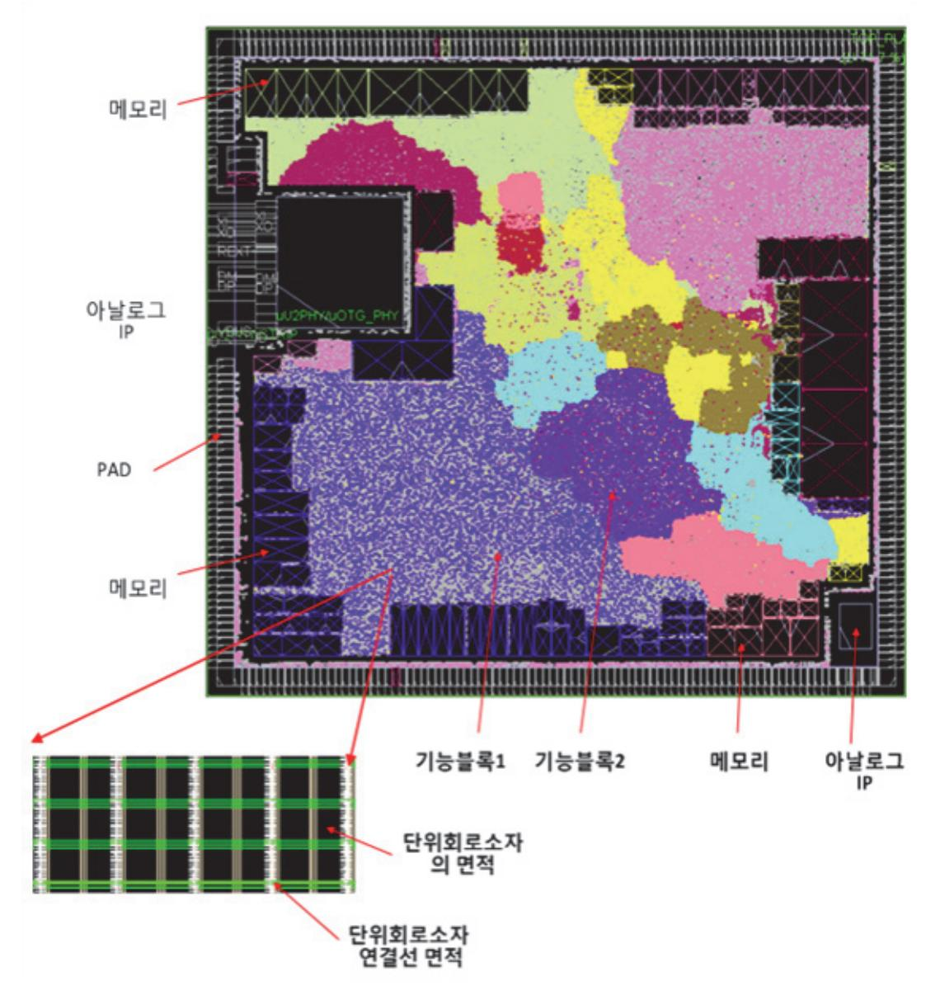

출처: 교육부(2015). 반도체 아키텍처 설계(1903060102\_14v3). 한국직업능력개발원. p. 18. [그림 1-2] 칩 면적의 구성 요소

#### 2. 웨이퍼상의 제품 개수 확인

[그림 1-2]는 웨이퍼상에서의 칩 하나의 면적에 해당하는 것이다. 즉, 웨이퍼에서 칩 1개의 영역만을 보여 준 것이며, 칩 1개의 면적이 어떤 부분들로 구성되어 있는지를 알 수 있다. 각 항목의 면적을 전부 더한 값이 칩 1개의 면적이 되며, 이 값으로 웨이퍼의 전체 면적을 나누기를 하면 웨이퍼 1장에서 몇 개의 반도체 제품이 만들어지는지 확인 가능하다. 이것을 식으로 표현하면 다음과 같다.

제품의 개수 = 웨이퍼의 면적 / 개발 제품의 1개의 면적

여기서 웨이퍼의 면적은 지름의 길이에 따라 8인치(=200mm), 12인치(=300mm) 등으로 구분된다.

## 수행 내용 / 시스템 사양 분석하기

#### 재료·자료

- 기술 설계 사양서(활용 서식 1 참조) 및 데이터 시트(트랜지스터 및 소자 데이터 시트)
- 파운트리 PDK 및 회로 요소 사양서
- 시스템 요구 사항 문서 및 아키텍처 다이어그램
- IEEE 표준 및 산업 가이드라인(JEDEC, IEC 등)

#### 기기(장비 ・ 공구)

- 시뮬레이션 및 분석 도구(SPICE 모델, EDA 툴 TCAD 툴)
- 측정 및 테스트 장비(오실로스코프, 스펙트럼 분석기, 네트워크 분석기, 파형 발생기, 멀티미 터 등)
- PCB 제작 장비, SMT 솔더링 장비
- 검증 및 분석 장비(로직 분석기, 파라미터 분석기, 전력 분석기 등)
- 온도 및 환경 제어 장비

#### 안전 ・ 유의 사항

- 시스템 사양 분석을 시작하기 전에, 고객 또는 사용자의 요구 사항을 명확히 이해하고 문서 화해야 한다. 이는 설계의 기준이 되며 모든 설계 결정의 출발점이 된다.
- 기존 표준이나 규격(예: IEEE, JEDEC 등)에 맞는 사양을 준수해야 한다. 이는 설계된 회로 가 다른 시스템과 호환되며 기대 성능을 발휘할 수 있도록 보장한다.

- 설계 과정의 모든 단계를 문서화하여 프로젝트의 진행 상황과 설계 결정을 기록한다. 문서 화는 이후의 검토 및 문제 해결 과정에서 매우 중요하다.
- 설계 과정에서 개발된 기술 및 자료에 대한 지적 재산권(IP)을 보호하기 위해 필요시 특허 출원 등을 검토한다.
- 아날로그 회로 설계는 다학제적 접근이 필요하다. 회로 설계팀, 시스템 설계팀, 검증팀 간의 협업을 촉진하고, 정기적으로 진행 상황을 공유하여 설계의 일관성을 유지한다.
- 설계 과정에서 발생하는 문제나 변경 사항에 대해 팀원들과 효율적으로 의사소통할 수 있는 체계를 구축한다. 회의록, 변경 요청서, 이슈 트래킹 시스템 등을 활용한다.
- 설계된 회로가 적용될 시장의 규제 요건(예: 전자파 적합성, 안전 기준 등)을 준수하도록 설 계 사양을 검토한다.

#### 수행 순서

숔 설계 IP를 통해 시스템에서 구현하고자 하는 기능을 이해한다.

아날로그 회로 아키텍처 설계를 위해 설계 IP를 통해 시스템에서 구현하고자 하는 기능을 이해 하는 과정은 다음과 같다.

이 과정을 통해 설계 IP를 활용하여 시스템에서 구현하고자 하는 기능을 이해하고, 이를 바탕 으로 아날로그 회로 아키텍처를 설계할 수 있다.

1. 설계 IP를 분석한다.

(1) 설계 IP(Design Intellectual Property)란 이미 검증된 회로 블록 또는 모듈을 의미한다. 따 라서 설계 IP를 분석하여 제공되는 기능, 성능 특성, 제약 조건 등을 이해한다. 아날로그 회로 아키텍처 설계를 위해 설계 IP를 분석하고 그 제공되는 기능, 성능 특성, 제약 조건 등을 이해하는 것은 매우 중요하다. 이 작업을 통해 시스템 설계의 정확도와 효율성을 높일 수 있다. 다음은 설계 IP를 분석하는 단계별 접근 방법과 각 단계에서 고려해야 할 주요 요소들이다.

설계 IP를 분석하여 기능, 성능 특성, 제약 조건 등을 이해하는 과정은 아날로그 회로 아키텍처 설계의 핵심이다. 이를 통해 설계된 IP가 시스템 요구 사항을 만족할 수 있도 록 하며, 최적의 성능을 발휘할 수 있도록 한다. 다양한 분석 도구와 검증 방법을 통해 설계 IP의 특성을 명확히 파악하고, 이를 기반으로 시스템 설계를 최적화하는 것이 중요 하다.

(가) 설계 IP의 기능 이해

설계 IP의 기본적인 기능을 이해하는 것은 첫 번째 단계이다.

1) 기능 블록 다이어그램

IP의 주요 기능 블록과 이들 간의 상호 작용을 다이어그램으로 파악한다.

2) 기본 동작 원리

IP의 작동 방식, 주요 기능(예: 증폭, 필터링, 변환 등) 및 사용 사례를 이해한다.

3) 데이터 시트 분석

제공된 데이터 시트를 통해 IP의 기능과 기본 사양을 파악한다.

(나) 성능 특성 분석

설계 IP의 성능 특성은 회로의 최종 성능에 직접적인 영향을 끼친다.

1) 전기적 특성

입력 전압 범위, 출력 전압 범위, 전력 소비, 주파수 응답, 이득, 선형성, 신호 대 잡음 비율(SNR), 왜곡 특성 등을 분석한다.

2) 동적 특성

샘플링 속도, 대역폭, 스루풋, 설정 시간, 안정성 등을 검토한다.

3) 온도 특성

온도 변화에 따른 성능 변화, 온도 범위, 온도 계수 등을 고려한다.

(다) 제약 조건 파악

설계 IP의 사용 조건과 제약 사항을 명확히 이해하는 것도 중요하다.

1) 전원 조건

전원 공급 전압 범위, 전력 소비 특성 등을 확인한다.

2) 입출력 조건

입력 신호 조건, 출력 신호 조건, 로드 조건 등을 검토한다.

3) 환경 조건

작동 온도 범위, 저장 온도 범위, 습도 등 환경 조건을 파악한다.

4) 공정 기술

IP가 지원하는 반도체 공정 노드(예: 90nm, 65nm, 45nm 등)와 호환성, 공정에 따른 특성 변화를 고려한다.

(라) 제약 조건의 영향 분석

제약 조건이 시스템 설계에 미치는 영향을 분석한다.

1) 전력 관리

전력 소모에 따른 시스템의 전력 관리 전략을 수립한다.

2) 신호 무결성

신호 경로에서 발생할 수 있는 잡음, 왜곡 등을 고려하여 설계한다.

3) 열 관리

작동 온도에 따른 열 관리 방안을 마련한다.

15

(마) 설계 IP의 통합 및 검증

설계 IP를 시스템에 통합하고, 이를 검증하는 과정이 필요하다.

1) 통합 전략

IP의 기능 블록을 시스템에 통합하는 방법을 계획한다.

2) 검증 시나리오

다양한 운영 조건에서 IP의 기능 및 성능을 검증할 수 있는 시나리오를 마련한 다.

3) 시뮬레이션

SPICE 시뮬레이션 등으로 IP의 성능을 예측하고 검증한다.

4) 실리콘 검증

실제 제조된 반도체에서 IP의 성능을 확인한다.

<표 1-1> IP 분석 예시(고성능 ADC IP 분석)

| 항목           | 내용                                                                                                                       |
|--------------|--------------------------------------------------------------------------------------------------------------------------|
| 기능 이해        | - 기능 블록: 샘플링, 양자화, 코딩<br>- 기본 동작: 아날로그 신호를 디지털 신호로 변환                                                                    |
| 성능 특성        | - 전기적 특성: 12-bit 해상도, SNR 70dB 이상<br>- 동적 특성: 샘플링 속도 100MSPS<br>- 온도 특성: -40~85°C에서 동작                                   |
| 제약 조건        | - 전원 조건: 3.3V±10%<br>- 입출력 조건: 입력 전압 0~3.3V, CMOS 출력<br>- 환경 조건: 산업용 온도 범위                                               |
| 제약 조건의 영향 분석 | - 전력 관리: 저전력 모드 필요<br>- 신호 무결성: 고주파 노이즈 필터링 필요<br>- 열 관리: 고속 동작 시 발열 고려                                                  |
| 통합 및 검증      | - 통합 전략: MCU와의 SPI 인터페이스 통합<br>- 검증 시나리오: 최대 샘플링 속도에서 SNR 테스트<br>- 시뮬레이션: MATLAB 및 SPICE 시뮬레이션<br>- 실리콘 검증: 제조 후 실리콘 테스트 |

(2) IP 데이터 시트, 스펙 문서, 사용자 가이드 등을 검토하여 IP의 기능 및 동작 방식을 파악한다. 아날로그 회로 아키텍처 설계를 위해 IP 데이터 시트, 스펙 문서, 사용자 가이드 등을 검토하여 IP의 기능 및 동작 방식을 파악하는 것은 필수적인 단계이다. 이를 통해 IP의 성능과 제약 조건을 이해하고, 시스템에 적합한 방식으로 통합할 수 있다. 다음은 이 과 정을 단계별로 설명한 것이다.

(가) IP 데이터 시트 검토

- 1) 데이터 시트의 주요 섹션
  - 가) 개요

IP의 기본적인 기능, 주요 특징, 응용 분야 등을 간략하게 설명한다.

나) 기술 사양

전기적 특성, 환경 조건, 인터페이스 사양 등 중요한 사양을 나열한다.

다) 블록 다이어그램

IP 내부의 주요 구성 요소와 이들의 상호 작용을 시각적으로 표현한다.

라) 전력 소비

작동 시 전력 소비량, 저전력 모드 등 전력 관리와 관련된 정보를 제공한다.

마) 패키지 정보

IP의 물리적 패키지 형태, 핀 배열 등을 설명한다.

2) 기능 및 동작 방식 파악

가) 기능 블록 분석

블록 다이어그램과 설명을 통해 IP의 주요 기능 블록을 파악하고, 이들 간의 상호 작용을 이해한다.

나) 전기적 특성 분석

입력 전압 범위, 출력 전압 범위, 전력 소모, 응답 시간 등 전기적 특성을 확 인한다.

다) 동작 모드

IP가 제공하는 다양한 동작 모드(예: 저전력 모드, 고속 모드 등)를 이해한다.

- (나) IP 스펙 문서 검토
  - 1) 스펙 문서의 주요 섹션
    - 가) 기술 사양 요약

전기적 특성, 환경 조건, 인터페이스 요구 사항 등을 요약한다.

나) 성능 특성

주파수 응답, 노이즈 성능, 왜곡 특성 등 성능 관련 정보를 자세히 설명한다. 다) 인터페이스 설명

IP와 외부 회로 간의 인터페이스를 설명하며 신호 타이밍 다이어그램을 포함 한다.

라) 제약 조건

## 가) 기능 및 성능 종합

- 1) 종합 분석
- (라) 종합 분석 및 설계 반영
- 제공된 예제를 통해 IP의 실제 사용 방법과 시스템 통합 방식을 이해한다.

라) 애플리케이션 예제 분석

법을 학습한다.

다) 문제 해결

사용자 가이드의 문제 해결 섹션을 통해 일반적인 문제 상황에 대한 대응 방

- 한다.
- 다양한 동작 모드로 전환하는 방법을 파악하여 시스템 요구에 맞게 IP를 활용
- 나) 모드 전환
- IP의 초기 설정 방법과 필요한 구성 파라미터를 이해한다.
- 가) 설정 및 초기화
- 2) 실제 사용 방법 파악

IP를 활용한 구체적인 애플리케이션 예제와 코드 샘플을 제공한다.

다) 문제 해결

라) 애플리케이션 예제

일반적인 문제 상황과 해결 방법을 제공한다.

- 다양한 동작 모드 간 전환 방법을 설명한다.
- 나) 동작 모드 전환
- IP의 설정 방법, 구성 파라미터, 초기화 절차 등을 설명한다.
- 가) 설정 및 구성
- 1) 사용자 가이드의 주요 섹션
- (다) 사용자 가이드 검토
- 에 미치는 영향을 고려한다.
- 전원 조건, 입출력 조건, 온도 범위 등의 제약 조건을 확인하고, 시스템 설계
- 나) 제약 조건 분석
- 주파수 응답, 신호 대 잡음 비율(SNR), 왜곡 특성 등 IP의 성능 특성을 이해 한다.
- 가) 성능 분석
- 2) 성능 및 제약 조건 파악
- 사용 시 주의해야 할 제약 조건, 설계 시 고려 사항 등을 명시한다.

데이터 시트, 스펙 문서, 사용자 가이드에서 얻은 정보를 종합하여 IP의 기능 과 성능 특성을 완전히 이해한다.

나) 제약 조건 종합

전기적, 환경적, 인터페이스 제약 조건을 종합하여 설계 시 고려해야 할 사항 을 명확히 한다.

- 2) 설계 반영
  - 가) 시스템 통합 계획

IP의 기능과 제약 조건을 반영하여 시스템에 통합할 계획을 수립한다.

나) 성능 최적화

IP의 성능 특성을 최대한 활용할 수 있도록 시스템 설계를 최적화한다.

다) 검증 계획

IP의 통합 후 검증을 위한 테스트 시나리오와 방법을 계획한다.

<표 1-2> IP의 기능 및 동작 방식을 파악(예: 고성능 ADC IP 분석)

| 항목            | 내용                                                                                                                                                                                                    |
|---------------|-------------------------------------------------------------------------------------------------------------------------------------------------------------------------------------------------------|
| 데이터 시트 검토     | - 개요: 12-bit 해상도, 고속 샘플링 ADC<br>- 기술 사양: 입력 전압 범위 0~3.3V, 샘플링 속도 100MSPS<br>- 블록 다이어그램: 샘플링, 양자화, 디지털 변환 블록 포함<br>- 전력 소비: 최대 100mW<br>- 패키지 정보: 48-pin QFN 패키지, 핀 배열도 포함                             |
| 스펙 문서 검토      | - 성능 특성: SNR 70dB 이상, 왜곡 특성 THD -85dB<br>- 인터페이스 설명: SPI 인터페이스, 타이밍 다이어그램 포함<br>- 제약 조건: 3.3V±10% 전원, -40~85°C 작동 온도 범위                                                                               |
| 사용자 가이드 검토    | - 설정 및 구성: SPI 명령을 통해 설정, 초기화 절차 설명<br>- 동작 모드 전환: 저전력 모드로 전환 방법 설명<br>- 문제 해결: 일반적인 오류와 해결 방법 제시<br>- 애플리케이션 예제: 고속 데이터 수집 예제 코드 포함                                                                  |
| 종합 분석 및 설계 반영 | - 기능 및 성능 종합: 고속, 고해상도 ADC로 시스템 데이터 수집 성능 향상<br>기대<br>- 제약 조건 종합: 전원 안정화, 열 관리 필요<br>- 시스템 통합 계획: SPI 인터페이스를 통한 데이터 수집 시스템 설계<br>- 성능 최적화: 노이즈 필터링 및 신호 무결성 확보<br>- 검증 계획: 다양한 샘플링 속도에서 성능 검증 시나리오 작성 |

IP 데이터 시트, 스펙 문서, 사용자 가이드 등을 철저히 검토하여 IP의 기능, 성능 특

19

성, 제약 조건 등을 명확히 이해하는 것은 아날로그 회로 아키텍처 설계의 성공을 위한 필수 과정이다. 이를 통해 IP를 최적의 방식으로 시스템에 통합하고, 높은 성능을 유지 하면서도 안정적으로 동작하는 시스템을 설계할 수 있다.

- 2. 시스템의 요구 사항을 정의한다.
  - (1) 시스템에서 구현하고자 하는 기능을 정의한다. 이는 시스템의 목표, 성능 요구 사항, 전력 소 모, 면적 제약 등을 포함한다.

아날로그 회로 아키텍처 설계를 위해 설계 IP를 통해 시스템에서 구현하고자 하는 기능 을 정의할 때는 시스템의 목표, 성능 요구 사항, 전력 소모, 면적 제약 등을 명확히 설 정해야 한다. 다음은 이 과정의 주요 단계와 고려 사항을 설명한 것이다.

(가) 시스템의 목표 설정

시스템의 목표는 전체 설계 과정의 방향을 결정한다. 목표를 설정할 때는 시스템이 달성해야 할 주요 기능과 목적을 명확히 정의해야 한다.

- 1) 예시
  - 가) 목표: 고성능 오디오 증폭기 설계
  - 나) 고품질 오디오 신호 증폭
  - 다) 낮은 왜곡 및 높은 신호 대 잡음 비율(SNR)
  - 라) 저전력 소비
- (나) 성능 요구 사항 정의

시스템의 성능 요구 사항은 설계 IP가 충족해야 하는 최소 성능 수준을 나타낸다. 주요 성능 요구 사항은 다음과 같다.

- 1) 예시
  - 가) 샘플링 속도: 최소 96kHz
  - 나) 해상도: 24-bit
  - 다) 왜곡 특성: 총 고조파 왜곡(THD): ≤ -100dB
  - 라) 신호 대 잡음 비율(SNR): ≥ 120dB
- (다) 전력 소모 정의

전력 소모 요구 사항은 시스템의 전력 효율을 보장하기 위해 필수적이다. 이는 특히 배터리 구동 장치나 저전력 애플리케이션에서 중요하다.

- 1) 예시
  - 가) 작동 전압: 1.8~3.3V
  - 나) 최대 전력 소모: 50mW
  - 다) 저전력 모드 소비: ≤ 10µW

#### (라) 면적 제약 정의

면적 제약은 시스템이 차지하는 물리적 공간을 최소화해야 하는 요구 사항을 포함한 다. 이는 특히 집적 회로(IC) 설계에서 중요하다.

- 1) 예시
  - 가) 칩 면적: ≤ 2mm²
  - 나) 패키지 유형: QFN 32-pin
  - 다) 핀 수: 최대 32개
- (마) 기능 정의

기능 정의는 시스템이 수행해야 할 구체적인 기능을 설명한다. 여기에는 데이터 처 리, 신호 변환, 인터페이스 요구 사항 등이 포함된다.

- 1) 예시
  - 가) 데이터 처리 기능: 고해상도 아날로그 신호를 디지털 신호로 변환 및 처리
  - 나) 신호 변환 기능: 아날로그-디지털 변환(ADC) 및 디지털-아날로그 변환(DAC)
  - 다) 인터페이스 요구 사항: SPI 인터페이스를 통한 데이터 전송
  - 라) 추가 기능: 내장된 디지털 필터링 및 신호 처리 알고리즘
- (바) 종합 예시

다음은 종합된 시스템 목표, 성능 요구 사항, 전력 소모, 면적 제약 등을 포함하는 기능 정의의 예시이다.

1) 시스템 목표

고성능 오디오 증폭기 설계로 고품질의 오디오 신호 증폭을 제공하며, 낮은 왜곡 과 높은 신호 대 잡음 비율을 유지하는 동시에 저전력 소비를 목표로 한다.

- 1) 성능 요구 사항
  - 가) 샘플링 속도: 최소 96kHz
  - 나) 해상도: 24-bit
  - 다) 총 고조파 왜곡(THD): ≤ -100dB
  - 라) 신호 대 잡음 비율(SNR): ≥ 120dB
- 2) 전력 소모
  - 가) 작동 전압: 1.8~3.3V
  - 나) 최대 전력 소모: 50mW
  - 다) 저전력 모드 소비: ≤ 10µW
- 3) 면적 제약
  - 가) 칩 면적: ≤ 2mm²
  - 나) 패키지 유형: QFN 32-pin
  - 다) 핀 수: 최대 32개
- 4) 기능 정의

- 가) 고해상도 아날로그 신호를 디지털 신호로 변환 및 처리
- 나) 아날로그-디지털 변환(ADC) 및 디지털-아날로그 변환(DAC)
- 다) SPI 인터페이스를 통한 데이터 전송
- 라) 내장된 디지털 필터링 및 신호 처리 알고리즘

이와 같이 시스템 목표와 요구 사항을 명확히 정의하면, 설계 IP를 평가하고 선택하는 데 있어 명확한 기준을 제공할 수 있다. 이를 통해 최적의 IP를 선택하고 시스템 설계 의 성공 가능성을 높일 수 있다.

(2) 시스템의 주요 기능 및 하위 기능들을 명확히 하고, 각 기능이 아날로그 회로에서 어떻게 구 현될 수 있는지 결정한다.

아날로그 회로 아키텍처 설계를 위해 설계 IP를 통해 시스템에서 구현하고자 하는 주요 기능 및 하위 기능들을 명확히 하고, 각 기능이 아날로그 회로에서 어떻게 구현될 수 있는지를 결정하는 과정은 체계적이고 단계별로 진행되어야 한다. 다음은 이 과정을 단 계별로 설명한 것이다.

(가) 시스템의 주요 기능 정의

먼저 시스템의 주요 기능을 정의한다. 주요 기능은 시스템이 제공해야 하는 핵심 기 능이다.

- 1) 예시
  - 가) 고성능 오디오 증폭기
  - 나) 오디오 신호 증폭
  - 다) 아날로그-디지털 변환(ADC)
  - 라) 디지털-아날로그 변환(DAC)
  - 마) 전력 관리
- (나) 주요 기능의 하위 기능 정의

각 주요 기능을 보다 더 구체적으로 설명하는 하위 기능들을 정의한다. 하위 기능은 주요 기능을 실현하기 위해 필요한 구체적인 동작을 나타낸다.

- 1) 오디오 신호 증폭 예시
  - 가) 입력 신호 증폭: 저잡음 증폭기 사용
  - 나) 신호 필터링: 고주파 노이즈 제거를 위한 필터
  - 다) 이득 조절: 가변 이득 증폭기
- 2) 아날로그-디지털 변환(ADC) 예시
  - 가) 샘플링: 일정한 시간 간격으로 아날로그 신호 샘플링
  - 나) 양자화: 샘플링된 신호를 디지털 값으로 변환
  - 다) 반올림 및 코드화: 디지털 값을 최종 코드로 변환

- 3) 전력 소모: 전력 소모 요구 사항을 충족하는지 확인
- 2) 성능: 성능 요구 사항을 충족하는지 확인
- 1) 기능적 적합성: 필요한 기능을 정확히 제공하는지 확인
- 는 다음 기준에 따라 선택해야 한다.

(라) 설계 IP 분석 및 선택 시스템의 주요 기능과 하위 기능을 구현하기 위한 설계 IP를 분석하고 선택한다. IP

- 다) 온도 모니터링: 온도 센서 및 열 관리 회로 설계
- 나) 전력 절약 모드: 저전력 스위치 및 전원 관리 IC(PMIC) 설계
- 가) 전력 공급 모니터링: 전압 레귤레이터 및 전류 센서 설계
- 4) 전력 관리
- 다) 출력 신호 증폭 및 필터링: 아날로그 버퍼 및 필터 설계
- 나) 전류/전압 변환: R-2R 래더 또는 전류 스티어링 DAC 설계
- 가) 디지털 신호 입력: SPI 또는 I2S 인터페이스 설계
- 3) 디지털-아날로그 변환(DAC) 예시
- 다) 반올림 및 코드화: 디지털 로직 설계
- 나) 양자화: SAR(연속 근사 레지스터) ADC 또는 델타-시그마 ADC 설계
- 가) 샘플링: 샘플링 클록 설계
- 2) 아날로그-디지털 변환(ADC) 예시
- 다) 이득 조절: 가변 이득 증폭기(VGA) 설계
- 나) 신호 필터링: 저역 통과 필터(LPF) 및 대역 통과 필터(BPF) 설계
- 가) 입력 신호 증폭: 저잡음 증폭기(LNA) 설계
- 1) 오디오 신호 증폭 예시
- 한다.
- (다) 아날로그 회로에서의 기능 구현 방법 결정 각 하위 기능을 구현하기 위해 필요한 아날로그 회로 구성 요소와 설계 방식을 결정
- 다) 온도 모니터링: 온도 센서를 통한 시스템 온도 감지
- 나) 전력 절약 모드: 저전력 모드 전환 기능
- 가) 전력 공급 모니터링: 전원 전압 및 전류 모니터링
- 4) 전력 관리 예시
- 다) 출력 신호 증폭 및 필터링: 변환된 아날로그 신호를 출력

나) 전류/전압 변환: 디지털 신호를 아날로그 전류/전압으로 변환

- 가) 디지털 신호 입력: 디지털 데이터를 수신

3) 디지털-아날로그 변환(DAC) 예시

5) 호환성: 시스템 내 다른 IP와 호환성 확인

(마) 시스템 아키텍처 설계

선택한 설계 IP를 사용하여 전체 시스템 아키텍처를 설계한다. 이 과정에서는 각 IP 블록 간의 인터페이스와 연결을 정의하고, 시스템 레벨에서의 동작을 시뮬레이션하여 검증한다.

(바) 검증 및 최적화

시스템 아키텍처를 설계한 후, 시뮬레이션 및 검증 단계를 통해 설계의 유효성을 확 인한다. 필요시 설계를 최적화하여 성능을 개선하고, 전력 소모를 줄이며, 면적을 효 율적으로 사용한다.

이 과정을 통해 아날로그 회로 아키텍처를 체계적으로 설계할 수 있으며, 설계 IP를 효과적 으로 활용하여 시스템의 요구 사항을 만족하는 최적의 설계를 구현할 수 있다.

- 3. 기능 매핑을 한다.
  - (1) 정의된 시스템 요구 사항과 설계 IP의 기능을 매핑한다. 이는 IP가 시스템의 특정 요구 사항 을 충족할 수 있는지 평가하는 과정이다. 아날로그 회로 아키텍처 설계를 위해 설계 IP를 통해 시스템의 주요 기능 및 하위 기능

들을 명확히 하고, 각 기능을 IP의 기능에 매핑하는 과정은 다음과 같다.

(가) 시스템 주요 기능 및 하위 기능 정의

시스템의 주요 기능과 하위 기능을 정의하고, 각 기능이 아날로그 회로에서 어떻게 구현될 수 있는지를 파악한다.

<표 1-3> 시스템 주요 기능 및 하위 기능 정의(예: 고성능 오디오 시스템)

| 항목    |             | 내용                 |  |  |
|-------|-------------|--------------------|--|--|
|       |             | - 오디오 신호 증폭        |  |  |
| 주요 기능 |             | - 아날로그-디지털 변환(ADC) |  |  |
|       |             | - 디지털-아날로그 변환(DAC) |  |  |
|       |             | - 전력 관리            |  |  |
|       |             | - 저잡음 증폭기(LNA)     |  |  |
|       | 오디오 신호 증폭   | - 가변 이득 증폭기(VGA)   |  |  |
|       |             | - 신호 필터링           |  |  |
|       | 아날로그-디지털 변환 | - 샘플링              |  |  |
| 하위 기능 |             | - 양자화              |  |  |
|       | (ADC)       | - 디지털 출력           |  |  |
|       | 디지털-아날로그 변환 | - 디지털 입력 수신        |  |  |
|       |             | - 전류/전압 변환         |  |  |
|       | (DAC)       | - 출력 신호 필터링        |  |  |
|       |             | - 전원 모니터링          |  |  |
|       | 전력 관리       | - 저전력 모드           |  |  |
|       |             | - 온도 모니터링          |  |  |

(나) 설계 IP 분석

설계 IP를 분석하여 제공되는 기능, 성능 특성, 제약 조건 등을 이해한다. 이를 위해 IP 데이터 시트, 스펙 문서, 사용자 가이드 등을 검토한다.

(다) IP 기능 매핑

각 주요 기능 및 하위 기능을 적절한 IP의 기능에 매핑한다.

<표 1-4> IP 기능 매핑

| 항목                   | 내용                                                                                                           |
|----------------------|--------------------------------------------------------------------------------------------------------------|
| 오디오 신호 증폭            | - 저잡음 증폭기(LNA): LNA IP 사용<br>- 가변 이득 증폭기(VGA): VGA IP 사용<br>- 신호 필터링: 저역 통과 필터(LPF) IP 사용                    |
| 아날로그-디지털 변환(ADC)     | - 샘플링: ADC IP의 샘플링 기능 사용<br>- 양자화: ADC IP의 양자화 기능 사용<br>- 디지털 출력: ADC IP의 디지털 출력 기능 사용                       |
| 디지털-아날로그 변환<br>(DAC) | - 디지털 입력 수신: DAC IP의 디지털 입력 인터페이스 사용<br>- 전류/전압 변환: DAC IP의 변환 기능 사용<br>- 출력 신호 필터링: DAC IP의 출력 필터링 기능 사용    |
| 전력 관리                | - 전원 모니터링: 전력 관리 IP의 전원 모니터링 기능 사용<br>- 저전력 모드: 전력 관리 IP의 저전력 모드 기능 사용<br>- 온도 모니터링: 전력 관리 IP의 온도 모니터링 기능 사용 |

(라) 시스템 아키텍처 설계

각 기능에 맞는 IP를 매핑한 후, 전체 시스템 아키텍처를 설계한다. 각 IP 블록 간 의 인터페이스를 정의하고, 신호 흐름을 설계한다.

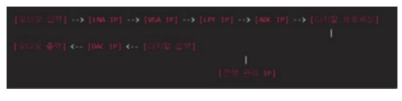

출처: 코드 작성 프로그램. 2024. 8. 12. 스크린샷. [그림 1-4] 시스템 블록 다이어그램 예시

(마) 검증 및 최적화

시스템 아키텍처를 설계한 후, 시뮬레이션을 통해 설계의 유효성을 검증한다. 성능, 전력 소모, 면적 등의 측면에서 최적화를 진행한다.

(바) 피드백 수렴 및 개선

시뮬레이션 결과 및 실제 테스트 피드백을 기반으로 설계를 개선한다. 필요시 추가 적인 최적화 및 수정 작업을 수행한다.

이 과정에서 각 설계 IP의 기능과 시스템 요구 사항을 정확히 매칭하여, 아날로그 회로 아키텍처를 효율적으로 설계할 수 있다.

(2) 기능 매핑을 통해 IP가 구현할 수 있는 부분과 추가 설계가 필요한 부분을 식별한다.

아날로그 회로 아키텍처 설계를 위해 설계 IP를 통해 시스템의 주요 기능 및 하위 기능 들을 명확히 하고, IP의 기능 매핑을 통해 IP가 구현할 수 있는 부분과 추가 설계가 필 요한 부분을 식별하는 단계는 다음과 같다.

(가) 시스템 주요 기능 및 하위 기능 정의

시스템의 목표와 주요 기능을 정의한다. 이를 통해 시스템이 요구하는 모든 기능을 명확히 한다.

(나) 설계 IP 분석

각 설계 IP의 데이터 시트, 스펙 문서, 사용자 가이드를 검토하여 IP가 제공하는 기 능, 성능 특성, 제약 조건 등을 이해한다.

(다) IP 기능 매핑

시스템의 각 주요 기능 및 하위 기능을 분석하고, 적절한 설계 IP에 매핑한다.

(라) IP가 구현할 수 있는 부분 식별

각 설계 IP가 제공하는 기능을 기반으로 IP가 구현할 수 있는 시스템의 기능을 식별 한다.

- 1) 예시
  - 가) LNA IP는 저잡음 증폭을 제공하므로, 오디오 신호 증폭의 저잡음 증폭 부분을 담당
  - 나) ADC IP는 샘플링, 양자화, 디지털 출력을 제공하므로, 아날로그-디지털 변환의 주요 기능을 담당
  - 다) 전력 관리 IP는 전원 모니터링, 저전력 모드, 온도 모니터링을 제공하므로, 전 력 관리 기능을 담당

(마) 추가 설계가 필요한 부분 식별

IP가 제공하지 않는 기능이나 특정 요구 사항을 만족하지 못하는 부분을 식별한다. 이러한 부분은 추가 설계가 필요하다.

- 1) 예시
  - 가) LNA IP가 특정 주파수 범위에서 원하는 성능을 제공하지 못할 경우, 추가 필 터 설계가 필요할 수 있다.

- 나) ADC IP가 원하는 해상도나 샘플링 속도를 제공하지 못할 경우 맞춤형 ADC 설계가 필요할 수 있다.
- 다) 전력 관리 IP가 특정 전원 관리 기능을 제공하지 않거나 특정 전력 소모 요건 을 만족하지 못할 경우 추가 전력 관리 회로 설계가 필요할 수 있다.
- (바) 시스템 아키텍처 설계 및 최적화

IP 기능 매핑과 추가 설계가 필요한 부분을 기반으로, 전체 시스템 아키텍처를 설계 한다. 각 IP 블록 간의 인터페이스를 정의하고, 신호 흐름을 설계한다. 시뮬레이션을 통해 설계의 유효성을 검증하고, 성능, 전력 소모, 면적 등의 측면에서 최적화를 진 행한다.

- (사) 피드백 및 반복
  - 시뮬레이션 결과와 실제 테스트 피드백을 기반으로 설계를 개선한다. 필요시 추가적 인 최적화 및 수정 작업을 수행한다.
- 이 과정에서 각 설계 IP의 기능과 시스템 요구 사항을 정확히 매핑하여, 아날로그 회로 아키텍처를 효율적으로 설계할 수 있다.
- 숕 아날로그 회로 아키텍처 설계를 진행한다.

시스템 요구 사항과 IP의 기능 매핑 결과를 바탕으로 전체 아키텍처를 설계한다. 이는 아날로 그 회로 블록들이 시스템 내에서 어떻게 상호 작용할 것인지 정의하는 과정이다. 아날로그 회 로 아키텍처를 설계할 때, 시스템 요구 사항과 IP의 기능 매핑 결과를 바탕으로 전체 아키텍처 를 설계하는 과정은 다음과 같은 단계로 진행된다.

1. 시스템 요구 사항을 명확화한다.

먼저, 시스템의 주요 요구 사항을 명확히 한다. 여기에는 성능, 전력 소모, 면적 제약, 환경 조건 등이 포함된다.

- (1) 고성능 오디오 시스템 요구 사항 예시
  - (가) 성능 요구 사항: 높은 신호 대 잡음비(SNR), 저왜곡, 고주파 응답
  - (나) 전력 소모: 저전력 모드 지원, 최대 전력 소모 제한
  - (다) 면적 제약: 칩 면적 최소화
  - (라) 환경 조건: 온도 범위, 전원 공급 범위 등
- 2. IP 기능 매핑 결과를 검토한다.

각 IP 블록이 시스템 요구 사항을 어떻게 충족할 수 있는지 확인한다. 이전 단계에서 식별 된 IP 매핑 결과를 다시 검토하여 누락된 부분이나 추가 설계가 필요한 부분이 있는지 점 검한다.

#### 3. 전체 아키텍처 블록 다이어그램 설계를 한다.

전체 시스템의 블록 다이어그램을 설계한다. 각 기능 블록이 어떻게 상호 작용하는지, 신호 흐름이 어떻게 이루어지는지, 전력 및 신호 라우팅이 어떻게 될 것인지 명확히 한다.

| 항목                  | 내용                                                                                     |  |
|---------------------|----------------------------------------------------------------------------------------|--|
| 오디오 신호 입력           | - LNA(Low Noise Amplifier)<br>- VGA(Variable Gain Amplifier)<br>- 필터(Filter)           |  |
| 아날로그-디지털 변환         | - 샘플링: ADC IP의 샘플링 기능 사용<br>- 양자화: ADC IP의 양자화 기능 사용<br>- 디지털 출력: ADC IP의 디지털 출력 기능 사용 |  |
| 디지털 신호 처리(외부 IP/블록) | - DSP(Digital Signal Processor)                                                        |  |
| 디지털-아날로그 변환         | - DAC(Digital-to-Analog Converter)                                                     |  |
| 오디오 신호 출력           | - 출력 버퍼(Output Buffer)                                                                 |  |
| 전력 관리               | - 전원 모니터링<br>- 전력 조정 회로<br>- 저전력 모드 회로                                                 |  |

<표 1-5> 블록 다이어그램 예시

4. 인터페이스 정의를 한다.

각 블록 간의 인터페이스를 정의한다. 이는 신호 라인, 전원 라인, 제어 라인을 포함한다. 블록 간 신호의 전압 레벨, 주파수 응답, 시간 지연 등을 고려하여 설계한다. 아날로그 회 로 아키텍처 설계에서 시스템 요구 사항과 IP의 기능 매핑 결과를 바탕으로 전체 아키텍처 의 블록 간 인터페이스를 정의하는 단계는 다음과 같다. 이 과정은 각 블록의 역할과 상호 작용을 명확히 하여 시스템의 신뢰성, 성능, 확장성을 보장하기 위한 것이다.

(1) 시스템 요구 사항을 검토한다.

먼저 시스템의 주요 요구 사항을 정리한다. 여기에는 성능, 전력 소비, 신호 무결성, 열 관리, 면적 제약 등이 포함된다.

(2) IP 기능 매핑 결과를 분석한다.

기능 매핑 결과를 바탕으로 각 IP 블록이 어떤 기능을 제공하고, 해당 기능이 시스템 요구 사항을 어떻게 충족하는지 분석한다.

(3) 주요 아날로그 블록을 식별한다.

시스템 설계에 필요한 주요 아날로그 블록을 식별한다. 예를 들어, 증폭기, 필터, ADC/DAC, 전압 레귤레이터 등이 있을 수 있다.

(4) 블록 간 인터페이스를 정의한다.

각 블록 간의 인터페이스를 정의한다. 인터페이스 정의에는 신호 타입, 전압 레벨, 주파 수 특성, 타이밍 요구 사항, 물리적 연결 등이 포함된다.

- (가) 신호 인터페이스를 정의한다.
  - 1) 아날로그 신호 경로
  - 아날로그 신호의 경로는 증폭기, 필터, ADC/DAC 등을 거쳐 이동한다.
  - 2) 디지털 신호 경로
    - 디지털 신호는 ADC/DAC와 DSP 간에 주로 이동한다.
- (나) 전원 인터페이스를 정의한다.

각 블록에 필요한 전압 레벨을 정의하고, 전력 소모 및 전원 분배 방식을 설계한다.

(다) 제어 신호 인터페이스를 정의한다.

블록 간의 제어 신호를 정의한다. 예를 들어, 전력 관리 신호, 모드 선택 신호, 클록 신호 등이 있다.

(라) 타이밍 요구 사항을 정의한다.

각 블록 간의 데이터 전송 타이밍과 클록 신호 타이밍을 정의한다.

| Input Signal -> LNA -> Filter | -> ADC -> DSP | -> DAC -> Output | Buffer -> Output Sign |
|-------------------------------|---------------|------------------|-----------------------|
| 1                             |               |                  |                       |
| Pwr                           | Pwr           | Pwz              |                       |
| Control                       | Control       | Control          |                       |
|                               |               |                  |                       |

출처: 코드 작성 프로그램. 2024. 8. 12. 스크린샷. [그림 1-5] 고성능 오디오 시스템 아키텍처 인터페이스 정의

- 1) LNA와 Filter 간
  - 가) 신호 타입: 아날로그 신호
  - 나) 전압 레벨: 0.5~1.5V(예)
  - 다) 주파수 범위: 20Hz~20kHz(오디오 주파수)
- 2) Filter와 ADC 간
  - 가) 신호 타입: 아날로그 신호
  - 나) 전압 레벨: 0.5~1.5V(예)
  - 다) 주파수 범위: 필터링된 오디오 주파수
  - 라) 타이밍 요구 사항: 신호 지연 최소화
- 3) ADC와 DSP 간
  - 가) 신호 타입: 디지털 신호
  - 나) 데이터 포맷: I2S, SPI, 또는 병렬 데이터 버스

- 다) 전압 레벨: 1.8V 또는 3.3V(디지털 전압 레벨)
- 라) 타이밍 요구 사항: 샘플링 주파수와 동기화
- 4) DSP와 DAC 간
  - 가) 신호 타입: 디지털 신호
  - 나) 데이터 포맷: I2S, SPI, 또는 병렬 데이터 버스
  - 다) 전압 레벨: 1.8V 또는 3.3V
  - 라) 타이밍 요구 사항: 샘플링 주파수와 동기화
- 5) DAC와 Output Buffer 간
  - 가) 신호 타입: 아날로그 신호
  - 나) 전압 레벨: 0.5~1.5V(예)
  - 다) 주파수 범위: 오디오 주파수
  - 라) 타이밍 요구 사항: 신호 지연 최소화
- 6) 전원 인터페이스를 정의한다.
  - 가) LNA, Filter, ADC, DSP, DAC, Output Buffer: 각 블록에 필요한 전압 및 전류 공급
  - 나) 전압 레벨: LNA(1.2V), Filter(1.2V), ADC(1.8V), DSP(1.8V), DAC(1.8V), Output Buffer(1.2V)
- 7) 제어 신호 인터페이스를 정의한다.
  - 가) 파워 관리: 전원 온·오프 제어 신호
  - 나) 모드 선택: 다양한 작동 모드를 선택하는 신호
  - 다) 클록 신호: 각 블록에 필요한 클록 신호 공급
- 5. 세부 설계 및 시뮬레이션을 수행한다.
  - 각 블록의 세부 회로 설계를 진행한다. 설계된 회로를 SPICE 시뮬레이션 도구 등을 사용하 여 시뮬레이션하고, 시스템 요구 사항을 만족하는지 검증한다.
  - (1) 시뮬레이션 항목 예시
    - (가) LNA의 잡음 성능 및 이득
    - (나) VGA의 이득 범위 및 선형성
    - (다) 필터의 주파수 응답
    - (라) ADC의 샘플링 속도 및 해상도
    - (마) DAC의 왜곡 및 SNR
    - (바) 전력 관리 회로의 효율성

숖 설계 검증 및 레이아웃을 수행한다.

설계가 완료되면, 설계를 검증하고 레이아웃을 작성한다. 레이아웃 설계 시 기생 소자(패러사이 트) 효과를 고려하여 최적화한다. 이를 통해 최종 칩의 성능을 예측하고, 예상치 못한 문제가 발생하지 않도록 한다.

아날로그 회로 아키텍처 설계가 완료되면, 설계를 검증하고 레이아웃을 작성하는 과정에서 기 생 소자(패러사이트) 효과를 고려하여 최적화하는 것이 매우 중요하다. 기생 소자는 레이아웃 단계에서 회로 성능에 부정적인 영향을 끼칠 수 있는 불필요한 저항, 정전 용량, 인덕턴스 등 을 의미한다. 이를 최적화하기 위한 단계는 다음과 같다.

1. 설계 검증을 진행한다.

- (1) 설계 규칙 검사(DRC)를 한다.
  - (가) 레이아웃이 공정 설계 규칙을 준수하는지 확인한다.
  - (나) 최소 간격, 층간 접촉, 금속 폭 등의 규칙을 검사한다.
- (2) 레이아웃 대 회로 검증(LVS)을 한다.
  - (가) 레이아웃이 스키매틱과 일치하는지 확인한다.
  - (나) 모든 연결, 디바이스 매칭, 핀 매칭 등을 검토한다.

2. 기생 소자를 추출한다.

- (1) LPE(Lay-Out Parasitic Extraction)를 한다.
  - (가) 레이아웃에서 기생 소자를 추출하여 포스트 레이아웃 네트리스트를 생성한다.
  - (나) 추출된 기생 소자를 분석하여 회로의 전기적 특성을 평가한다.
- (3) 기생 소자 모델링을 한다.
  - (가) 기생 소자를 모델링하여 네트리스트에 반영한다.
  - (나) R, C, L 요소들을 정확히 반영하여 시뮬레이션의 정확성을 높이다.

#### 3. 레이아웃을 최적화한다.

- (1) 레이아웃 지침을 준수한다.
  - (가) 고속 신호 경로, 전력 분배, 접지 플래닝 등을 고려한 레이아웃 지침을 따른다.
  - (나) 기생 정전 용량을 줄이기 위해 신호 경로를 최소화하고 금속층을 효율적으로 사용한다.
- (2) 메탈층 사용을 최적화한다.
  - (가) 고속 신호 및 중요한 경로에는 저항이 낮은 상위 메탈층을 사용한다.
  - (나) 신호 무결성을 유지하기 위해 신호 경로 사이에 충분한 간격을 유지한다.
- (3) 전원 및 접지 네트워크를 강화한다.
  - (가) 전원 및 접지 네트워크를 강화하여 기생 인덕턴스와 저항을 최소화한다.
  - (나) 전력 네트워크의 임피던스를 줄이기 위해 여러 개의 메탈층을 병렬로 사용한다.

4. 시뮬레이션 및 검증을 진행한다.

(1) 포스트 레이아웃 시뮬레이션을 한다.

(가) 기생 소자를 포함한 포스트 레이아웃 네트리스트로 시뮬레이션을 수행한다.

(나) DC, AC, 트랜지언트 시뮬레이션을 통해 회로의 성능을 검증한다.

(2) 신호 무결성 검토

(가) 신호 경로의 타이밍, 신호 왜곡, 지터 등을 검토하여 신호 무결성을 평가한다.

- (나) 필요시 신호 무결성 개선을 위한 레이아웃 수정을 진행한다.
- 5. 반복적 최적화를 진행한다.
  - (1) 피드백 및 수정 과정을 반복한다.
    - (가) 시뮬레이션 결과를 바탕으로 문제점을 분석하고 수정한다.
    - (나) 반복적인 검증과 최적화를 통해 레이아웃을 개선한다.
  - (2) 최적화된 자동화 도구를 활용한다.
    - (가) 레이아웃 최적화 자동화 도구를 활용하여 기생 소자를 최소화하고 성능을 최적화한다.
    - (나) 도구의 피드백을 기반으로 수동 조정을 추가로 진행한다.
- 6. 최종 검증을 진행한다.
  - (1) DRC 및 LVS 재검증을 진행한다.
    - (가) 모든 수정 후 다시 DRC와 LVS를 수행하여 설계 규칙 준수 및 회로 일치 여부를 확인 한다.
  - (2) 포스트 레이아웃 시뮬레이션 재검증을 진행한다.
    - (가) 최종 포스트 레이아웃 네트리스트로 재시뮬레이션을 수행하여 최종 성능을 확인한다.
    - (나) 피드백 및 반복

포스트 레이아웃 시뮬레이션 결과를 분석하여 성능 개선이 필요한 부분을 식별한다. 필요시 설계 수정 및 최적화를 반복하여 최종 아키텍처를 완성한다.

(다) 최종 설계 문서화 및 검토

최종 설계를 문서화하고, 모든 요구 사항을 충족하는지 검토한다. 디자인 리뷰를 통 해 다른 엔지니어들과 검토하고, 필요한 수정 사항을 반영한다.

이 과정을 통해 기생 소자 효과를 최소화하고, 아날로그 회로의 성능과 신뢰성을 보장할 수 있 다. 레이아웃 최적화는 고성능 아날로그 회로 설계에서 매우 중요한 단계로, 반복적인 검증과 최적화를 통해 최상의 결과를 얻을 수 있다.

숗 설계 IP의 표준 동향을 파악할 수 있다.

아날로그 회로 아키텍처 설계를 위해 설계 IP의 표준 동향을 파악하는 것은 매우 중요하다. 다 음은 설계 IP의 표준 동향을 파악하는 방법과 주요 동향들이다.

이러한 동향을 지속해서 모니터링하고 최신 기술을 습득하는 것은 아날로그 회로 아키텍처 설 계에서 경쟁력을 유지하는 데 필수적이다.

- 1. 기술 리서치 및 문헌 조사를 한다.
  - (1) 학술 논문 및 저널 IEEE, ACM 등 주요 학술지에 발표된 최신 연구 논문을 통해 현재의 기술 동향과 미래 의 기술 방향을 파악한다.
  - (2) 산업 보고서

Gartner, IDC, Frost & Sullivan 등에서 발행하는 산업 분석 보고서를 통해 시장 동향 과 기술 발전을 조사한다.

(3) 특허 분석

주요 기업들이 출원한 특허를 분석하여 최신 기술과 연구 동향을 이해한다.

- 2. 콘퍼런스 및 세미나 참석을 한다.
  - (1) 전문 콘퍼런스

IEEE ISSCC(International Solid-State Circuits Conference), DAC(Design Automation Conference) 등과 같은 콘퍼런스에 참석하여 최신 기술 발표와 토론을 통해 동향을 파악한다.

(2) 산업 세미나

주요 반도체 기업 및 IP 제공업체가 주최하는 세미나와 워크숍에 참석하여 실무적인 정 보를 습득한다.

- 3. 표준화 기구 참여를 한다.
- (1) JEDEC, IEEE 등 반도체와 전자 공학 관련 표준을 제정하는 기구의 활동을 모니터링하고, 표준 제정에 참 여하여 최신 동향을 파악한다.
- 4. 업계 뉴스 및 블로그를 통한 기술 동향을 파악한다.
  - (1) 기술 뉴스 사이트

EETimes, Semiconductor Engineering 등과 같은 전문 뉴스 사이트를 통해 최신 기 술 뉴스와 트렌드를 따라간다.

(2) 기술 블로그

전문가들이 운영하는 블로그를 통해 실무 경험과 새로운 기술 동향을 학습한다.

5. 기업의 기술 자료 및 백서를 참고한다.

(1) 설계 IP 제공 업체

Synopsys, Cadence, Mentor Graphics 등 주요 IP 제공 업체의 기술 자료, 백서, 제 품 브로슈어를 통해 최신 IP와 기술 트렌드를 파악한다.

(2) 반도체 기업

Intel, AMD, TSMC 등의 기술 자료를 통해 최신 반도체 기술과 설계 IP 동향을 이해 한다.

- 6. 주요 설계 IP 동향을 파악한다.
  - (1) 고성능 및 저전력 설계
    - (가) FinFET 및 FD-SOI 기술: 최신 공정 기술을 이용한 고성능 저전력 IP가 주목받고 있 다.
    - (나) 전력 관리 IP: 스마트 전력 관리와 전력 효율성을 높이는 PMIC(Power Management IC) 설계가 중요해지고 있다.
  - (2) 아날로그 및 혼합 신호 설계
    - (가) ADC/DAC IP: 고속, 고정밀의 ADC/DAC 설계가 발전하고 있다.
    - (나) RF IP: 5G 및 IoT 시대를 대비한 고주파 RF 회로 IP의 수요가 증가하고 있다.
  - (3) 보안 및 신뢰성
    - (가) 하드웨어 보안 IP: 보안 위협이 증가함에 따라 보안 기능을 내장한 IP가 중요해지고 있 다.
    - (나) 신뢰성 IP: 고온·고압 등 극한 환경에서도 안정적으로 동작하는 IP 설계가 강조되고 있 다.
  - (4) 자동화 및 AI 적용
    - (가) EDA 툴의 발전: AI를 활용한 자동화 설계 도구가 증가하고 있으며, 이는 효율적인 IP 설계와 검증을 가능하게 한다.
    - (나) AI 가속기 IP: AI 연산을 위한 전용 하드웨어 가속기 IP가 각광받고 있다.
  - (5) 표준화된 인터페이스
    - (가) USB, PCIe, Ethernet: 다양한 인터페이스 표준에 맞춘 IP가 개발되고 있다.
    - (나) MIPI: 모바일 기기와 IoT 장치에 적합한 MIPI 인터페이스 IP가 많이 사용된다.
- 수 시스템에서 요구하는 기능을 만족할 수 있는 IP 스펙을 정의할 수 있다.

아날로그 회로 아키텍처 설계를 위해 설계 IP를 통해 시스템에서 요구하는 기능을 만족할 수 있는 IP 스펙을 정의하는 과정은 매우 중요하다. 이를 위해서는 다음과 같은 단계와 고려 사항

을 포함해야 한다.

설계 IP의 스펙을 정의하는 과정은 시스템의 전반적인 요구 사항을 명확히 이해하고 이를 바탕 으로 IP의 세부 파라미터를 설정하는 작업이다. 이를 통해 IP가 시스템의 기대 성능을 만족할 수 있도록 한다. 다양한 기술 자료와 산업 표준을 참고하여 명확하고 구체적인 스펙을 정의하 는 것이 중요하다.

- 1. 시스템 요구 사항을 분석한다.
  - (1) 기능 요구 사항: 시스템에서 필요한 주요 기능을 명확히 정의한다. 예를 들어, ADC의 경우 해상도, 샘플링 속도, 입력 전압 범위 등을 포함한다.
  - (2) 성능 요구 사항: 속도, 전력 소비, 면적, 정확도 등 성능 관련 요구 사항을 구체적으로 정의 한다.
  - (3) 환경 조건: 동작 온도 범위, 전원 공급 조건, EMI/EMC 요구 사항 등 환경적인 요구 사항을 고려한다.
- 2. 설계 IP의 기능 정의를 한다.
  - (1) 핵심 기능: IP가 수행해야 할 핵심 기능을 정의한다. 예를 들어, 증폭기 IP는 이득, 대역폭, 잡음 지수 등의 성능을 가져야 한다.
  - (2) 부가 기능: 전력 관리 기능, 셧다운 모드, 자가 테스트 기능 등 추가적인 기능 요구 사항을 정의한다.
- 3. 성능 파라미터 정의를 한다.
  - (1) 정확도 및 해상도: ADC/DAC의 경우, 필요한 해상도(bits)와 정확도(%), SNR(Signal-to-Noise Ratio) 등을 정의한다.
  - (2) 속도 및 대역폭: 작동 속도, 샘플링 속도, 대역폭 등의 성능 파라미터를 정의한다.
  - (3) 전력 소비: 최대 전력 소비, 대기 전력 소비 등의 전력 파라미터를 정의한다.
  - (4) 온도 특성: 작동 온도 범위, 온도에 따른 성능 변화 특성 등을 정의한다.
- 4. 인터페이스 및 호환성을 정의한다.
  - (1) 입출력 인터페이스: 필요한 입출력 핀 수와 타입, 인터페이스 표준(SPI, I2C, UART 등)을 정의한다.
  - (2) 호환성: 시스템 내 다른 부품 및 모듈과의 호환성을 고려하여 IP의 전압 레벨, 신호 형식 등 을 정의한다.
- 5. 설계 및 검증 요구 사항을 명시한다.
  - (1) 공정 기술: 사용될 반도체 공정 노드(90nm, 65nm, 45nm 등)를 명시한다.
  - (2) 테스트 및 검증: IP의 검증 및 테스트 요구 사항을 정의한다. 예를 들어, 다양한 시뮬레이션,

실리콘 검증, DFT(Design for Testability) 요구 사항 등을 포함한다.

- (3) 신뢰성: MTBF(Mean Time Between Failures), MTTF(Mean Time To Failure) 등의 신 뢰성 파라미터를 정의한다.
- 6. 물리적 특성을 정의한다.
  - (1) 면적: IP의 물리적 면적 및 레이아웃 요구 사항을 정의한다.
  - (2) 패키징: 필요한 패키징 옵션 및 관련 요구 사항을 정의한다.
- 7. 문서화 및 지원을 명시한다.
  - (1) 데이터 시트: 상세한 데이터 시트 요구 사항을 포함한다.
  - (2) 애플리케이션 노트: 사용 예시 및 애플리케이션 노트를 요구한다.
  - (3) 기술 지원: 설계 IP 제공자의 기술 지원 및 유지 보수 계획을 명시한다.

<표 1-6> IP spec. 에시(고성능 ADC IP 스펙 정의)

| 항목       | 내용                                                                             |
|----------|--------------------------------------------------------------------------------|
| 기능 요구 사항 | 해상도: 12-bit<br>샘플링 속도: 100 MSPS                                                |
| 성능 파라미터  | SNR: > 70 dB<br>ENOB: > 10.5 bits<br>입력 전압 범위: 0~3.3V<br>전력 소비: < 100mW @ 3.3V |
| 환경 조건    | 작동 온도: -40°C ~ 85°C                                                            |
| 인터페이스    | 디지털 출력: CMOS<br>인터페이스 표준: SPI                                                  |
| 공정 기술    | 65nm CMOS                                                                      |
| 검증 요구 사항 | 기능 및 성능 시뮬레이션<br>실리콘 검증<br>DFT 지원                                              |
| 물리적 특성   | 최대 면적: 1mm²<br>패키징 옵션: QFN-32                                                  |
| 문서화 및 지원 | 데이터 시트 제공<br>애플리케이션 노트 제공<br>24/7 기술 지원                                        |

숙 설계 IP의 입력 신호, 출력 신호와 제어 신호의 특징을 파악할 수 있다.

아날로그 회로 아키텍처 설계를 위해 설계 IP의 입력 신호, 출력 신호 및 제어 신호의 특징을 파악하는 것은 매우 중요하다. 이 과정을 통해 IP의 동작을 이해하고, 시스템 설계에 적절하게 통합할 수 있다. 각 신호 유형의 특징을 파악하는 과정은 다음과 같은 요소를 포함한다.

- 1. 입력 신호 특징을 파악한다.
  - (1) 신호 타입
    - (가) 아날로그 신호

    - (나) 디지털 신호

연속적인 전압이나 전류 형태의 신호이다. 예) 센서 출력, 오디오 신호

- - 이진 상태를 가지는 신호이다. 예) 디지털 인터페이스에서 오는 신호
- (2) 신호 레벨을 확인한다.
  - (가) 전압 레벨
    - 입력 신호의 최소 및 최대 전압 범위를 확인한다.
  - (나) 전류 레벨

필요한 전류 레벨과 전류 제한을 확인한다.

- (3) 주파수 특성을 파악한다.
  - (가) 대역폭

- - - 입력 신호가 차지하는 주파수 범위를 파악한다.
  - (나) 신호 스펙트럼

주파수 성분의 분포와 중요 주파수를 파악한다.

- (4) 신호 품질을 확인한다.

  - (가) 신호 대 잡음비(SNR)
  - - 신호의 품질을 평가하는 데 중요한 지표이다.
  - (나) 왜곡

신호의 비선형 왜곡 여부를 확인한다.

- 2. 출력 신호 특징을 파악한다.
  - (1) 신호 타입
    - (가) 아날로그 출력

연속적인 형태의 신호로, 주로 센서 신호나 오디오 신호로 사용된다.

(나) 디지털 출력

이진 상태를 가지며, 디지털 장치와의 인터페이스에 사용된다.

- (2) 출력 레벨
  - (가) 전압 레벨

출력 신호의 전압 범위를 파악한다.

(나) 전류 레벨

출력 신호의 전류 용량과 제한을 확인한다.

- (3) 주파수 특성
  - (가) 대역폭

출력 신호가 차지하는 주파수 범위를 확인한다.

(나) 스펙트럼

출력 신호의 주파수 성분을 파악한다.

- (4) 신호 품질
  - (가) 왜곡
    - 출력 신호의 왜곡 정도를 평가한다.
  - (나) 로딩 효과

- 출력이 부하에 따라 어떻게 변하는지 확인한다.
- 3. 제어 신호 특징을 파악한다.
  - (1) 제어 신호 타입
    - (가) 디지털 제어 신호

디지털 논리 레벨을 가지는 신호로, 주로 스위칭, 모드 설정 등에 사용된다.

(나) 아날로그 제어 신호

아날로그 형태의 제어 신호로, 주로 연속적인 조정이 필요한 경우 사용된다.

- (2) 신호 레벨
  - (가) 전압 및 전류

제어 신호의 전압 및 전류 레벨을 파악한다.

(나) 임곗값

제어 신호가 작동하는 임곗값을 확인한다.

- (3) 타이밍 특성
  - (가) 셋업 타임 및 홀드 타임

디지털 제어 신호의 타이밍 요구 사항을 확인한다.

(나) 응답 시간

제어 신호에 대한 IP의 응답 시간을 파악한다.

- (4) 신호 프로토콜
  - (가) 인터페이스 규격

제어 신호가 따르는 인터페이스 규격을 확인한다. 예: I2C, SPI, UART 등

4. 시스템 통합을 위한 분석을 수행한다.

다음의 내용을 포함한 시스템 분석을 진행한다.

- (1) 호환성 검토
  - (가) 입출력 호환성

시스템의 다른 모듈과 신호 레벨, 타이밍 등의 호환성을 검토한다.

(나) 전원 및 그라운드

신호 간의 전원 및 그라운드 연결을 확인한다.

- (2) 성능 요구 사항
  - (가) 속도 및 대역폭

시스템의 성능 요구 사항에 부합하는지 평가한다.

(나) 정확도 및 안정성

신호의 정확도와 안정성이 시스템 요구 사항을 만족하는지 확인한다.

- (3) 환경 조건
  - (가) 온도 범위

신호가 작동할 수 있는 온도 범위를 확인한다.

(나) 노이즈 내성

신호가 외부 노이즈에 대해 얼마나 견딜 수 있는지 평가한다.

5. 문서 검토를 통해 필요한 정보를 파악하고 이해한다.

(1) 데이터 시트 분석

입력, 출력, 제어 신호에 대한 모든 스펙과 특성을 데이터 시트를 통해 확인한다.

(2) 사용자 가이드 검토

신호 연결, 설정, 타이밍 요구 사항 등을 사용자 가이드를 통해 이해한다.

이러한 과정을 통해 아날로그 회로 아키텍처 설계에 필요한 설계 IP의 신호 특성을 파악할 수 있으며, 시스템 설계에 적합한 IP 통합을 효율적으로 수행할 수 있다.

숚 주변 블록을 확인하여 잡음에 대한 영향을 확인할 수 있다.

아날로그 회로 아키텍처 설계 시 주변 블록을 확인하여 잡음에 대한 영향을 분석하는 것은 중 요한 단계이다. 잡음은 회로의 성능과 신뢰성에 큰 영향을 끼치기 때문에, 이를 최소화하는 설 계가 필요하다. 아래는 이러한 분석을 수행하기 위한 단계와 고려 사항들이다.

(2) 외부 잡음

전원 공급의 리플 및 스파이크 등을 평가한다.

(다) 전원 노이즈

저주파에서 발생하는 플리커 노이즈를 고려한다.

(나) 플리커 노이즈

반도체 소자의 열잡음을 분석한다.

- (가) 열잡음
- (1) 내부 잡음
- 2. 잡음 소스 분석을 한다.

커넥터를 통해 유입되는 외부 잡음을 고려한다.

(나) 커넥터

외부 인터페이스에서 들어오는 신호의 잡음 여부를 확인한다.

- (가) I/O 핀
- (4) 외부 인터페이스

필터링된 신호와 비필터 신호 간의 간섭을 최소화한다.

(나) 필터

(가) 증폭기 다른 아날로그 블록에서 발생하는 잡음이 증폭기 입력에 영향을 끼칠 수 있다.

(3) 아날로그 블록

(나) 디지털 스위칭 노이즈 디지털 회로의 스위칭 노이즈가 아날로그 회로에 유입되지 않도록 해야 한다.

고주파 클록 신호는 아날로그 회로에 간섭을 일으킬 수 있다.

- (가) 클록 신호
- (2) 디지털 블록

전원 라인의 노이즈 필터링 여부를 확인한다.

(나) 전원 라인

레귤레이터의 출력 잡음이 아날로그 회로에 영향을 끼칠 수 있다.

- (가) 전압 레귤레이터
- (1) 전원 블록
- 1. 주변 블록을 확인한다.

잡음 민감 회로에 메탈 쉴드를 적용한다.

(가) 메탈 쉴드

- (3) 쉴딩
- - 외부 인터페이스에 EMI 필터를 사용한다.
- (나) EMI 필터

전원 라인에 디커플링 커패시터를 배치하여 고주파 잡음을 필터링한다.

- (가) 디커플링 커패시터
- (2) 필터링

잡음 민감 신호는 가능한 짧고 직접적인 경로로 배치한다.

(다) 신호 경로

전원 플레인도 연속적으로 배치한다.

(나) 파워 플레인

연속적인 그라운드 플레인을 사용하여 잡음을 최소화한다.

- (가) 그라운드 플레인
- (1) 레이아웃 설계
- 4. 아래 내용을 반영한 잡음 최소화 설계를 한다.

- (나) 스펙트럼 분석기

잡음 스펙트럼을 분석하여 잡음 소스를 식별한다.

실제 프로토타입을 제작하여 잡음 특성을 실험적으로 검증한다.

(가) 프로토타입 테스트

- (2) 실험적 검증

(나) AC 분석

(나) 환경 잡음

3. 영향 분석을 한다.

(1) 시뮬레이션

(다) 트랜지언트 분석

(가) SPICE 시뮬레이션

시간 영역에서의 잡음 영향을 확인한다.

주파수 영역에서의 잡음 특성을 분석한다.

외부 전자기 간섭이 회로에 유입될 수 있다.

주변 환경에서 발생하는 잡음을 고려한다.

잡음 분석을 위해 SPICE 시뮬레이션을 수행한다.

- (나) PCB 레벨 쉴딩

(가) 디지털과 아날로그 격리

(가) 넓은 대역폭 피드백

(나) 적응형 필터

- (4) 차폐 및 격리
- PCB 설계 시 쉴딩 레이어를 고려한다.

피드백 회로를 사용하여 잡음을 줄인다.

디지털 회로와 아날로그 회로를 물리적으로 분리한다.

디지털 전원과 아날로그 전원을 분리하여 사용한다.

상황에 따라 적응적으로 잡음을 제거하는 필터를 사용한다.

회로의 온도를 일정하게 유지하여 열잡음을 최소화한다.

필요한 경우 히트 싱크를 사용하여 열을 방출한다.

잡음 분석 결과와 설계 변경 사항을 문서화한다.

(나) 전원 격리

5. 성능 최적화를 한다.

(1) 피드백 회로

(2) 온도 관리

(가) 열 관리

(나) 히트 싱크

6. 문서화 및 피드백을 한다.

(가) 분석 보고서

(나) 테스트 결과

(1) 결과 문서화

(2) 피드백 반영

(가) 팀 회의

42

(나) 설계 수정

피드백을 반영하여 최종 설계를 수정한다.

테스트 및 시뮬레이션 결과를 기록한다.

이 과정을 통해 아날로그 회로 아키텍처 설계에서 잡음 문제를 효과적으로 해결할 수 있다. 잡 음 분석과 최소화는 회로의 성능과 신뢰성을 높이는 데 매우 중요하다.

설계팀과의 회의를 통해 잡음 분석 결과를 공유하고 피드백을 받는다.

#### 수행 tip

- 반도체 공정 개발 속도가 빨라지면서 180nm, 130nm부 터 28nm, 14nm까지 개발되어 양산 진행이 되고 있어서 공정의 선택 범위가 넓어졌으므로 개발 제품의 특성 및 기 능 목표를 반영한 선택을 한다.
- 여러 반도체 공정 후보 중에서 제품 성능 목표를 달성하기 위하여, 소비 전력, 아날로그/디지털 IP, 회로의 크기, 양 산성 등을 항목별로 비교하여 결정한다.

### 학습 1 교수·학습 방법

#### 교수 방법

- 반도체 제품의 주요 규격이 응용처에 따라 적용하는 방법이 달라지는 경우를 설명한다.
- 반도체 제품의 규격 및 사양의 항목에 대해 이해도를 높이기 위해 현재 상용되는 반도체 제 품의 데이터 시트를 이용 등 사례를 활용한다.
- 경쟁 제품 분석 및 사양 결정과 반도체 공정 결정에 대한 사례 분석을 통하여, 학습자가 실 무 관점으로 적용할 수 있도록 지도한다.
- 파운드리 업체와 종합 반도체 회사에 대한 자료를 이용하여 반도체 공정의 종류와 개발 제 작 방법을 설명하고, 공정 선택의 중요성과 고려해야 할 항목들에 대해 설명한다.
- 개발하려는 반도체 제품의 기능을 정의하고 기능별로 회로의 크기를 예측하여 그 면적을 계산하는 방법에 대해 설명한다.

#### 학습 방법

- 반도체 제품의 주요 규격이 응용처에 따라 다르게 사용되는 경우에 대한 내용을 조사해서 그 차이점을 응용처별로 정리하여 비교표를 작성해 본다.
- 현재 상용 반도체 제품의 데이터 시트를 인터넷 또는 서적 등을 이용하여 입수하고, 반도체 제품의 규격 및 사양의 항목들이 무엇이 있고, 그 항목에 대해서 어떻게 설명이 되어 있는 지 몇 가지 제품을 선정하여 그 내용에 대해서 정리를 해 본다.
- 현재 반도체를 생산하고 있는 회사들에 대한 자료를 조사하여, 어떤 공정들이 있는지와 공 정별 특징에 대해 비교‧분석해 본다.
- 개발하려는 반도체 제품의 기능을 정의하고 기능별로 회로의 크기에 대해서 학습자가 가정 을 하여 각 기능 블록 회로의 면적을 정의하고, 전체 면적을 계산하여 공정별 면적을 환산 하여 전체 반도체 칩의 면적을 계산해 본다.

## 학습 1 평 가

#### 평가 준거

- 평가자는 학습자가 학습 목표를 성공적으로 달성하였는지를 평가해야 한다.
- 평가자는 다음 사항을 평가해야 한다.

| 학습 내용     | 학습 목표                                           | 성취수준 |   |   |
|-----------|-------------------------------------------------|------|---|---|
|           |                                                 | 상    | 중 | 하 |
| 시스템 사양 분석 | - 설계 IP를 통해 시스템에서 구현하고자 하는 기능을 이해할<br>수 있다.     |      |   |   |
|           | - 설계 IP의 표준 동향을 파악할 수 있다.                       |      |   |   |
|           | - 시스템에서 요구하는 기능을 만족할 수 있는 IP 스펙을 정<br>의할 수 있다.  |      |   |   |
|           | - 설계 IP의 입력 신호, 출력 신호와 제어 신호의 특징을 파악<br>할 수 있다. |      |   |   |
|           | - 주변 블록을 확인하여 잡음에 대한 영향을 확인할 수 있다.              |      |   |   |

#### 평가 방법

• 서술형 시험

| 학습 내용     | 평가 항목                                                          | 성취수준 |   |   |
|-----------|----------------------------------------------------------------|------|---|---|
|           |                                                                | 상    | 중 | 하 |
| 시스템 사양 분석 | - 설계 IP를 통해 제약 조건을 파악하고 그 영향을 분석할 수<br>있는 능력                   |      |   |   |
|           | - 아날로그 회로 아키텍처를 설계할 때, 시스템 요구 사항과<br>IP의 기능 매핑 결과를 검토할 수 있는 능력 |      |   |   |
|           | - 설계 검증을 위해 LVS 검사를 수행할 수 있는 능력                                |      |   |   |

#### • 평가자 체크리스트

| 학습 내용     | 평가 항목                                                                      | 성취수준 |   |   |
|-----------|----------------------------------------------------------------------------|------|---|---|
|           |                                                                            | 상    | 중 | 하 |
| 시스템 사양 분석 | - 시스템에서 구현하고자 하는 기능의 이해를 위해 설계 IP의<br>통합 검증을 위한 전략과 시뮬레이션을 수행할 수 있는 능<br>력 |      |   |   |
|           | - 시스템 아키텍처 설계 전반을 이해하기 위해 블록 다이어그<br>램 설계를 할 수 있는 능력                       |      |   |   |
|           | - 설계 검증을 위해 DRC 검사를 수행할 수 있는 능력                                            |      |   |   |

피드백

- 1. 서술형 시험
  - 설계 IP를 통해 제약 조건을 파악하고 그 영향을 분석할 수 있는 능력을 평가한 후, 보완이 필요 한 사항이나 주요 사항을 표시하여 피드백해 준다.
  - 아날로그 회로 아키텍처를 설계할 때, 시스템 요구 사항과 IP의 기능 매핑 결과를 검토할 수 있 는 능력을 평가 후, 보완이 필요한 사항이나 주요 사항을 표시하여 보충 설명해 준다.
  - 성취수준이 높은 학습자와 미흡한 학습자를 구분하여 우수한 학습자들에게는 서술형 평가 내용의 적용 사례 학습을 통한 심화 학습으로 피드백해 주고, 미흡한 학습자들에게는 기초 용어에 대한 설명을 통해 일정 수준을 유지할 수 있도록 보완하여 지도해 준다.
  - 2. 평가자 체크리스트
  - 시스템에서 구현하고자 하는 기능의 이해를 위해 설계 IP의 통합 검증을 위한 전략과 시뮬레이션 을 수행할 수 있는 능력을 평가한 후 부족한 점을 지적하여 정확하게 처리할 수 있도록 보완하여 지도해 준다.
  - 시스템 아키텍처 설계 전반을 이해하기 위해 블록 다이어그램 설계를 할 수 있는 능력을 평가 후, 개선 및 보완 사항을 재학습할 수 있도록 피드백해 준다.
  - 성취수준이 높은 학습자와 저조한 학습자를 구분하여 우수한 학습자들에게는 사례 학습을 통한 심화 학습으로 피드백해 주고, 저조한 학습자들에게는 기초 지식에 대한 설명을 통해 일정 수준을 유지할 수 있도록 보완하여 지도해 준다.

| 학습 1 | 시스템 사양 분석하기 |
|------|-------------|
| 학습 2 | 블록 단위 설계하기  |
| 학습 3 | 설계 공정 분석하기  |

## 2-1. 블록 단위 설계

|       | • 설계 IP를 몇 개의 기능 블록으로 나누어 설계할지 선정할 수 있다.             |
|-------|------------------------------------------------------|
|       | • 각 기능 블록 단위로 입·출력 신호를 정의할 수 있다.                     |
|       | • 기능 블록 간의 제어 신호를 정의할 수 있다.                          |
| 학습 목표 | • 각 기능 블록의 전원 및 조절 신호 조건에 따른 기능을 모델링할 수 있다.          |
|       | • 모델링한 기능 블록을 연결하여, 원하는 동작을 할 수 있는지 시뮬레이션을 수행할 수 있다. |
|       | • 시뮬레이션 결과가 주어진 스펙 대비 충분한 성능을 가지는지 확인할 수 있다.         |
|       | • 성능 부족 시 문제점을 분석하고 개선점을 도출할 수 있다.                   |
|       |                                                      |

## 필요 지식 /

#### 숔 아키텍처 설계를 포함한 개발 계획 및 방법

반도체 아키텍처 설계가 포함된 제품의 개발 계획 및 개발 방법을 수립하려면 각 개발 단계의 구분이 어떻게 되어야 하는지, 각 단계에서 작업을 해야 하는 내용이 무엇인지 파악해야 한다. 또한 각 단계에서 완성해야 하는 결과물들이 최종적으로 아키텍처 설계에서 목표로 하는 내용 과 가능한 한 일치해야 한다.

1. 반도체 제품의 개발 단계의 구분

개발 단계의 구분은 개발하려는 제품의 특성에 따라 많은 방법이 있으나, 반도체 설계 단계 의 구분은 일반적인 반도체 개발 순서를 기준으로 구분하는 방법과 중요 포인트를 이용하 여 구분하는 것이 대표적인 구분 방법이다.

(1) 반도체 개발 순서에 의한 개발 단계 구분

반도체 제품 개발의 일반적인 개발 순서를 기준으로 개발 단계를 구분하면 다음과 같다.

- (가) 설계 사양 확정 및 개발 일정 수립 단계
- (나) 아키텍처 설계 및 필요한 IP(Intellectual Property, 반도체 설계 자산)의 결정 단계
- (다) 사용할 반도체 공정의 결정 단계
- (라) 기능 블록 간 연결을 포함한 아키텍처 및 내부 구조 설계 단계

- (마) 외부 인터페이스 신호 정의 단계
- (바) RTL(Register Transistor Logic) 설계 및 FPGA(Field Programmable Gate Array) 적용 보드를 이용한 검증 단계
- (사) 설계된 RTL을 단위 소자(Gate Level)로 합성(Synthesis) 단계
- (아) 합성된 회로의 시뮬레이션 결과에 대한 타이밍(Timing) 분석 및 디버그(Debug) 단계
- (자) 회로 배치(Layout) 및 연결(Routing) 단계
- (차) 배치 및 연결 완료된 회로에 대한 물리적 특성 추출 및 timing 분석 단계
- (카) 반도체 공정 진행 및 패키지 제작 단계
- (타) 제작된 제품에 대한 기능 및 제품 테스트 방법의 검증 단계
- (파) 사용할 소프트웨어와 통합 및 신뢰성 검증 단계
- (하) 양산 준비 단계
- (2) 중요 포인트 중심의 개발 단계 구분
  - 개발 단계의 중요 포인트는 각각의 개발 단계에서 만들어지는 중요 결과물을 기준으로 구분하 는 것이 일반적이다. 개발 결과물에 따라 반도체 제품 개발 단계를 구분하면 다음과 같다.
  - (가) 설계 사양서(활용 서식 1 참조) 작성: 설계 사양 확정 및 개발 일정 단계
  - (나) 전체 블록도 및 각 기능 블록 간의 연결도 작성: 아키텍처 설계 및 필요한 IP의 결정 단 계
  - (다) 사용할 IP의 결정 및 반도체 공정 결정: 사용할 반도체 공정의 결정 및 공정에서 제공하 는 IP 결정 단계
  - (라) 블록별 상세 구조도 및 기능 항목 작성: 기능 블록 내부 구조 설계
  - (마) 외부 인터페이스 신호들의 이름 및 기능 작성: 외부 인터페이스 신호들의 정의 단계
  - (바) 블록별 RTL 설계 및 시뮬레이션 결과 작성: 하드웨어 설계 언어(Verilog, VHDL 등)를 사용하여 설계하는 RTL(Register Transistor Logic)을 작성하고, 시뮬레이션을 통해서 설계한 결과를 확인하는 단계
  - (사) FPGA를 이용한 검증 리포트

FPGA(Field Programmable Gate Array)는 내부에 단위 소자와 기본 연결 패턴이 존재하여, RTL 설계의 내용을 program하면 설계한 회로가 실제로 수행 가능하도록 만든 부품으로 설계 검증용 부품이다. 이 FPGA에 설계된 RTL을 프로그램하여 기능 검증하는 단계로 여러 가지 동작 시나리오에 대해서 실시간으로 검증을 실시하고, 그 결과를 리포트 하는 단계

(아) 단위 소자들로 합성(Synthesis)된 네트리스트(Netlist) 생성 및 시뮬레이션 결과: 설계된 RTL을 공정에서 제공되는 단위 소자들과 그 단위 소자 간의 연결을 포함하는 변환 과

정인 합성(Synthesis)의 결과로 생성되는 netlist 파일을 이용하여 시뮬레이션하는 단계 이다.

- (자) 합성된 netlist의 timing 분석 리포트 작성: 합성된 회로의 시뮬레이션 결과에 대한 timing 분석 및 비정상적인 동작 등 문제가 발생하면 문제의 원인을 찾아 분석하는 디 버그(Debug) 작업하고, 오류가 있는 부분은 수정하여 동작 검증을 하는 단계이다.
- (차) 단위 소자의 배치(Placement) 및 단위 소자 간의 연결(Routing) 완성: 회로 배치 (Layout) 및 연결(Routing) 단계이다.
- (카) timing 시뮬레이션 리포트 작성: 배치 및 연결 완료된 회로에 대한 물리적 특성 추출 및 timing 분석 단계이다.
- (타) 테이프 아웃(Tape Out), 웨이퍼 제작 및 패키지 제작: 반도체 공정을 진행하기 위해 최 종 데이터를 전달하는 Tape out을 하여 반도체 공정 진행을 하여 웨이퍼를 제작하고, 이후 패키지를 제작하는 단계이다.
- (파) 결과 문서 작성
  - 1) 기능 검증 리포트 작성: 제작된 제품에 대한 기능 검증 및 사용할 소프트웨어와 통 합 검증을 포함한다.
  - 2) 웨이퍼 및 패키지 테스트 리포트 작성: 제품 테스트 방법 검증 단계이다.
  - 3) 신뢰성 리포트 작성: 신뢰성 검증 단계이다.
  - 4) 데이터 시트 작성 및 승인원 준비: 양산 준비 단계이다.
- 숕 개발 방법의 설정 및 개발 단계별 위험 요소

반도체 개발 방법의 설정은 각 개발 단계에서 완성되어야 하는 결과를 어떤 방법을 통해서 얻 을 것인지에 대한 결정이다. 각 설계 단계의 특성에 따라 여러 가지 개발 방법 중에서 가장 효 율적인 방법을 선택해야 한다. 즉 반도체 제품의 개발 방법은 요구 사항을 어떻게 하면 정확하 게 할 수 있으며, 개발 기간을 최소화할 수 있는지를 고려해서 결정한다. 아키텍처 설계에도 설계 목표를 달성하기 위한 구체적인 방법이 제시되도록 한다.

1. 개발 방법 설정을 위해 고려할 사항

개발 방법은 자체 개발, 외주 용역 개발, 기능 블록의 도입 등 여러 가지 방법이 있다. 어 떤 방법으로 진행할지에 대해 고려할 사항은 자체 개발 능력, 개발 일정, 외주 용역의 비 용, 기능 블록의 도입 조건 등이 있다. 개발할 항목에 따라서 위의 내용을 비교 평가하여 결정하여야 한다.

2. 반도체 개발 단계별 위험 요소

반도체 아키텍처 설계 진행 시 단계별 개발 계획이 수립되면, 단계별로 위험 요소가 무엇인

지 예측하고, 이에 대한 대응 방안을 수립하는 것이 필요하다. 대응 방안이 필요한 이유는 아키텍처의 설계에서 위험 요소를 최소화할 수 있는 구조로 진행함에도 불구하고, 설계상의 오류나 개발 사양의 변경 등 발생할 수 있는 위험 요소에 대응 방안이 준비되어 있어야 전 체 개발에 주는 영향을 최소화할 수 있기 때문이다.

(1) 위험 요소의 종류

개발 진행 과정에서 발생할 수 있는 위험 요소로는 개발 단계별, 상황별로 여러 가지가 있는데, 예측되는 위험 요소들을 정리하여 그 항목에 따라 대응 방안을 만드는 작업을 한다. 그러나 예측 불가능한 항목의 대응 방안은 별도로 준비하여 대응해야 한다.

(2) 위험 요소의 구분

발생할 수 있는 위험 요소의 종류는 개발 단계별로 여러 가지가 있는데, 모든 위험 요 소에 대응하는 방안을 수립하는 것은 불가능하지만, 단계별로 예측되는 위험 요소들을 먼저 정리하면 위험 요소의 종류를 파악할 수 있다.

(가) 설계 오류

설계 담당자가 기능 설계할 때 여러 상세 기능에 대해서 시뮬레이션을 진행하지 못 하여 숨어 있는 문제점을 찾지 못해서 발생하거나, 목적하는 상세 기능의 동작에 대 해서 정확하게 구현하지 못해서 발생한다.

(나) 기능에 대한 오해

설계 사양 및 아키텍처 설계에 기술되어 있는 기능에 대한 이해를 잘못해서 발생하 는 오류이며, 나중에 복구가 매우 어려우므로 반드시 설계 담당자와 지속해서 확인 해야 한다.

(다) 검증 미흡

설계한 기능 블록에 대해서 완벽하게 검증을 하지 못해서 설계상의 잘못을 수정하지 못해서 발생한 것이다.

(라) 반도체 공정의 특성 변동

반도체 공정은 항상 그 특성을 유지하고 있어야 하나, 반도체 공정상의 여러 요인으 로 인해 그 특성이 변동되면, 반도체 제품의 물리적 특성이 바뀌어서 생기는 문제이 다.

(마) 패키지 설계 오류

패키지는 반도체 Bare-Chip과 외부 부품을 연결해 주는 역할을 하는데, 이 부분에 서 오류가 생기면 신호선 연결이 정상적으로 되지 못해서 제품이 정상 동작을 하지 못하게 된다.

(3) 위험 요소의 대응

예측되는 위험 요소에 대한 대응은 사전에 작성이 가능하므로 이것을 기본으로 대응을

하면 쉽게 극복이 가능하다. 예측 불가능한 위험 요소 또는 갑자기 발생한 위험 요소에 대해서는 개발 일정, 설계 변경, 인력 등을 고려하여 그 발생 당시 상황에서 영향이 최 소로 되도록 결정해야 한다.

숖 전체 블록도의 구성

결정된 설계 사양을 아키텍처 설계 과정을 통해서 좀 더 상세하게 구체화하는 작업이 필요하 다. 이 과정의 중심에 있는 것이 제품의 전체 블록도를 작성하는 과정이다. 작성된 전체 블록 도를 기반으로 필요한 기능 블록들을 파악하고, 각 기능 블록에서 처리해야 하는 내용이 아키 텍처 설계 관점에서 명확하게 구분이 되어야 한다.

1. 전체 블록도 구성 요소

전체 블록도의 구성 요소들은 개발 담당자들이 전체 블록도를 보고 쉽게 이해할 수 있도록 만들어야 한다. 전체 블록도를 작성해야 아키텍처를 설계하는 데 도움이 되므로 가능한 한 상세하게 작성한다. 작성할 때 다음 항목을 중심으로 작성한다.

- (1) 기능 블록들의 역할
- (2) 데이터 처리 과정의 흐름
- (3) 내부 메모리의 구성 및 사용
- (4) CPU가 내장되는 경우에는 CPU에 관한 정보
- (5) 블록별 최대 동작 주파수에 관한 내용
- (6) 기능 블록을 구현하기 위한 내부 상세 블록들의 상세 내용

2. 계층적(Hierachy) 설계

대규모 설계를 단기간에 달성하기 위해 가장 일반적으로 사용하는 협업 방법으로, 전체 관 점에서 블록 단위의 개략적인 설계 방향 및 타당성 확인 후 각 상세 블록의 실제 상세 구 현은 공도의 설계자가 나누어 진행한다.

(1) 블랙박스 수준 설계

가장 상위 단계의 설계 형태로써 전체 구성 회로를 몇 개의 블랙박스로 구분한다. 기능 및 입력 신호 특성에 따라 구분한 블랙박스를 각각 별도의 이름으로 정의하고(내부 기능 및 입출력 포트가 동일한 블록은 동일 이름을 사용) 해당 블랙박스의 포트를 결정한다. 결정한 블랙박스의 포트를 중심으로, 블랙박스 단위의 기본 동작을 Text 형식으로 기술 한다. 원하는 전체 회로의 구성을 위해 정의한 블랙박스들을 배치한 후, 각 블랙박스의 포트들을 서로 연결하여, 각 블랙박스 단위 또는 전체 구현 회로에 대해 원하는 성능 기준과 비교하여 성능을 만족할 수 있을지 개략적인 시뮬레이션을 진행하여 설계의 기 본 방향을 설정한다. [그림 2-1]은 블랙박스 단위로 정의를 완료한 블록들을 서로 연결

한 블록 다이어그램 형태의 회로 구성 예시이다. 블록 다이어그램 형태로 1차 작성한 도면을 기초로 schematic 활용 툴을 이용하여 직접 심벌의 생성 및 설계 도면을 그려 볼 수 있다(블록 다이어그램에서는 전원 전압과 조절 신호등의 상세 포트에 대한 기술을 생략함.).

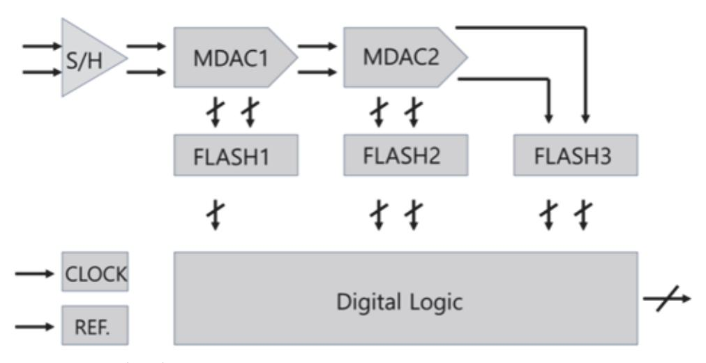

출처: 집필진 제작(2024) [그림 2-1] 블랙박스 단위 블록 다이어그램 작성

(2) 게이트 수준 설계

논리 회로 등에서 주로 사용하는 설계 단위로 심벌 단위로 설계를 진행한다. 주로 사용 되는 심벌은 인버터, 낸드, 노어를 포함한 여러 개의 심벌이 있고, 각각의 심벌은 여러 개의 입력 신호가 하이인지, 로인지의 여부에 따른 논리적 연산을 통해 출력 결과를 만 들게 된다. 각 심벌의 종류는 제한적 범위에서 선택적 사용이 가능하고, 기능을 기술할 수 있으며, 성능(Fan-in, Fan-out)도 표현이 가능하다.

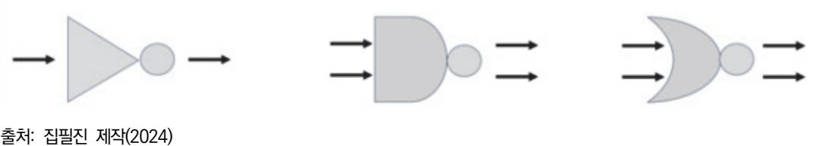

[그림 2-2] 게이트 수준의 회로 구현 방법 예시

(3) 트랜지스터 수준 설계

가장 하위 단계의 설계 형태로써 트랜지스터를 포함한 단위 소자의 상세 정보를 직접 조절하는 설계 방법이다. 각 소자의 사이즈를 결정하고, 소자의 내부 노드 간 연결이 필

요하다. 기능의 기술이 자유롭고, W/L을 포함한 소자의 가변 파라미터 조정 및 가변 신 호의 크기를 정의하는 방법에 따라 성능을 무한대로 조절할 수 있다. [그림 2-3]은 2개 의 PMOS와 1개의 NMOS 트랜지스터를 전원 전압과 입출력 신호를 통해 연결한 간략 한 트랜지스터 수준의 회로 구현 방법이다. 트랜지스터 각각의 소자를 열어서 원하는 W/L의 값을 입력하고, 전원 및 신호는 통일된 이름을 사용하여 시뮬레이션을 위한 벤 치 파일에서 크기 및 특성을 정의한다.

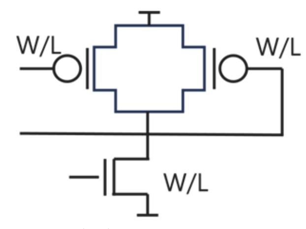

출처: 집필진 제작(2024) [그림 2-3] 트랜지스터 수준의 회로 구현 방법 예시

- 숗 반도체 공정 결정
  - 1. 공정 결정의 요소

전체 블록도를 기준으로 설계에 필요한 IP와 기능 블록이 정리가 되었으면 다음과 같이 공 정 결정의 요소들을 정리하여 반도체 공정 결정을 한다. 아키텍처 결정 관점에서 공정 결정 은 설계와 개발 일정을 중심으로 진행한다.

(1) 사용할 아날로그 IP의 종류와 주요 특징

면적, 동작 전압, 소비 전류, 동작 속도 등을 정리한다.

- (2) 반도체 제조 공정이 현재 양산을 하고 있는 상태인지, 제조 공정상의 문제점이 있는지 등 현 재 상태의 공정 현황을 파악한다.
- (3) 공정의 단위 소자의 물리적인 크기를 파악한다.
- (4) 공정에서 제공하는 메모리 생성기의 특징을 파악하여 설계에서 원하는 형태의 메모리 생성이 가능한지 여부와 그 면적을 파악한다.
- (5) 공정에서의 반도체 웨이퍼 제작 기간을 파악한다.
- (6) 공정에서의 단위 소자의 동작 속도에 대해서 파악한다.

수 설계 알고리즘(Algorithm) 및 IP 확보 방안

1. 설계 알고리즘 확보 방안

전체 블록도를 기준으로 설계에 필요한 기능 블록과 반도체 공정이 결정되었다면 설계하려 는 블록의 설계 알고리즘의 확보 방안을 수립한다.

(1) 기존에 확보되어 있는 경우

기존에 개발했던 기능 블록이 있으면, 개발하고자 하는 제품에 바로 적용할 수 있는지 여부를 파악하여 재사용하는 방법과 일부 수정을 해서 사용하는 방법 중에서 선택한다.

(2) 새로 개발을 해야 하는 경우

보유하고 있지 않은 설계 알고리즘이면 자체적으로 개발하는 방법과 외부에서 도입하는 방안을 비교 검토하여 결정한다.

2. IP 확보 방안

전체 블록도를 기준으로 설계에 필요한 기능 블록들, 그리고 반도체 공정이 결정되었으면, 도입하려는 블록의 IP 확보 방안을 수립한다.

(1) 라이선스를 통한 확보

개발 일정이나 자체 개발이 어려운 기능 블록의 경우 외부에서 이미 개발 완료된 IP가 있는 경우 직접 라이선스를 해서 도입하여 사용하는 방법으로 확보한다.

(2) 새로 개발해야 하는 IP의 확보

완전히 새로 만들어져야 하는 기능 블록의 경우 외부에서 도입할 IP가 없는 경우에는 관련 IP를 확보한 업체에 용역 개발을 하는 방안과 자체 개발하는 방안 중에서 선택하 여 결정한다.

숙 각 세부 블록 간의 인터페이스

1. 기능 블록 내부의 세부 구조도 작성

기능 블록의 주요 기능이 정리되면, 각 기능 블록 내부 상세 구조도를 작성한다. 기능 블록 별 상세 구조도는 설계 담당자가 작성하며, 상세 설계 단계에서 사용하여 설계의 효율성을 높인다.

(1) 기능 블록의 구조도

개발하고자 하는 기능 블록의 상세 구조도를 작성하는 데 다음의 내용이 포함되어야 한다.

- (가) 입력 신호, 출력 신호 정의
- (나) 세부 기능 블록 간 연결
- (다) 내부 메모리의 종류와 크기

(라) 사용할 주파수의 크기 및 내부 클록의 종류

2. 상세 기능 명세서 작성

각 세부 블록의 기능 명세서를 작성해서 구체적인 기능들의 사양 및 외부 인터페이스 신호 에 관한 내용을 작성한다. 기능 명세서에 들어가야 할 내용은 다음과 같다.

(1) 입력 신호

입력 신호의 신호 이름, 비트 수, 입력 형식 등을 작성한다.

(2) 출력 신호

출력 신호의 신호 이름 비트 수, 출력 형식 등을 작성한다.

(3) 상세 기능 블록에서 처리하는 내용

상세 기능 블록에서 처리하는 내용에 대해서 작성하고, 표준화와 관련이 있다면, 표준화 문서의 제목과 버전을 포함하여 작성한다.

(4) 상세 기능 블록의 제어 방법 상세 기능 블록을 제어하는 방법과 동작시키는 방법에 관한 내용을 작성한다.

## 수행 내용 / 블록 단위 설계하기

#### 재료·자료

- 기술 설계 사양서(활용 서식 1 참조) 및 데이터 시트(소자 데이터 시트, PDK)
- 설계 문서(블록 다이어그램, 스펙 문서)
- 테스트 및 검증 자료
- IEEE 표준 및 산업 가이드라인(JEDEC, IEC 등)

#### 기기(장비 ・ 공구)

- 워크스테이션, 소프트웨어 라이선스
- EDA 소프트웨어(Cadence VirtuosoSynopsys Custom CompileR, Mentor Graphics ICStation)
- 시뮬레이션 도구(HSPICE, LTspice)
- Spectre: Cadence에서 제공하는 SPICE 시뮬레이터

- 측정 및 테스트 장비(오실로스코프, 스펙트럼 분석기, 네트워크 분석기, 파형 발생기, 멀티미 터 등)
- PCB 제작 장비, SMT 솔더링 장비
- 검증 및 분석 장비(로직 분석기, 파라미터 분석기, 전력 분석기 등)
- 온도 및 환경 제어 장비

안전 ・ 유의 사항

- 블록 간 신호의 전송에서 신호 무결성을 유지하도록 설계한다. 크로스토크, 노이즈, 전력 공 급의 변동 등에 주의하여 신호 경로를 최적화한다.
- 블록 간 전원과 그라운드 경로가 명확히 구분되도록 설계하여, 전원 노이즈 및 그라운드 루 프를 방지한다. 필요한 경우 전원 분배 네트워크(PDN)를 설계하여 안정적인 전원 공급을 보 장한다.
- 각 블록의 동작 타이밍을 분석하고, 블록 간 데이터 전송이 정확하게 동기화되도록 타이밍 경로를 설계한다. 타이밍 위반을 방지하기 위해 충분한 마진을 확보해야 한다.
- 클록 신호를 각 블록에 안정적으로 공급하기 위해 클록 분배 네트워크를 설계한다. 클록 스 큐(Skew)를 최소화하고, 필요한 경우 클록 버퍼를 사용하여 클록 신호의 왜곡을 방지한다.
- 각 블록의 전력 소비를 분석하고, 전력 효율성을 높이기 위해 저전력 설계 기법을 적용한다. 전력 게이팅, 멀티 Vth 셀 사용 등을 통해 블록 단위에서의 전력 소모를 줄인다.
- 전력 소비가 높은 블록의 경우, 열 발생을 관리하기 위한 설계를 고려해야 한다. 열 방출 경로를 설계하고, 필요시 히트 싱크나 열전도성 재료를 사용하여 과열을 방지한다.
- 신호 경로를 최적화하여 신호 간섭을 최소화한다. 고주파 신호는 차폐하거나 다른 신호로부 터 충분히 떨어져 배치해야 한다.
- EMI를 줄이기 위해 각 블록 간의 전자기 간섭을 분석하고, 필터링, 차폐, 적절한 레이아웃 배치를 통해 간섭을 최소화한다.
- 블록 단위 설계에서는 재사용할 수 있는 모듈을 설계하여 설계 효율성을 높인다. 모듈화된 설계는 유지 보수와 향후 확장에 유리하다.
- 블록 간의 인터페이스는 표준화된 신호 규격을 사용하여 호환성을 보장한다. 이는 블록 간 통합 및 시스템 레벨 테스트를 쉽게 만든다.

- 블록 단위로 테스트 벤치를 구성하여 각 블록이 독립적으로 올바르게 동작하는지 확인한다. 단위 테스트 결과는 최종 시스템 통합 테스트에 중요한 기초 데이터를 제공한다.
- 각 블록이 작동할 환경 조건(온도, 습도 등)을 고려하여 설계한다. 예를 들어, 온도가 높은 환경에서 작동하는 블록은 온도 변화에 강한 소재와 공정 기술을 사용해야 한다.
- 블록이 위치할 환경에서 발생할 수 있는 전기적 노이즈, 기계적 진동 등을 고려하여 설계한 다. 노이즈 필터링, 진동 흡수 구조 등을 도입할 수 있다.
- 설계 데이터의 정기적인 백업을 수행하고, 데이터에 대한 접근 권한을 적절히 관리하여 정 보 유출을 방지한다.

#### 수행 순서

숔 설계 IP를 몇 개의 기능 블록으로 나누어 설계할지 선정한다. 아날로그 회로 아키텍처의 블록 단위 설계를 위해 설계 IP를 여러 기능 블록으로 나누는 과정 은 시스템의 복잡성, 성능 요구 사항, 설계 제약 등을 고려하여 결정된다. 이 과정은 시스템의 주요 기능을 이해하고, 이를 구현하기 위한 블록들을 정의하는 것이 핵심이다. 다음은 이 과정 을 단계별로 설명한다.

- 1. 시스템 분석을 한다.
  - (1) 시스템 요구 사항을 파악한다.
    - (가) 성능 요구 사항

시스템이 달성해야 하는 성능 지표(예: 대역폭, 신호 대 잡음비, 선형성 등)를 정의한 다.

(나) 전력 소모

시스템의 전력 소모 제한을 이해한다.

(다) 면적 제약

물리적 면적 제약 사항을 파악한다.

- (2) 기능 요구 사항을 정의한다.
  - (가) 주요 기능

시스템이 수행해야 하는 주요 기능을 나열한다.

(나) 하위 기능

각 주요 기능에 속하는 하위 기능을 세분화한다.

- 2. 설계 IP를 분석한다.
  - (1) IP 스펙을 검토한다.
    - (가) 데이터 시트 및 스펙 문서 검토

설계 IP의 데이터 시트, 스펙 문서, 사용자 가이드를 통해 IP의 기능 및 성능 특성 을 파악한다.

(나) 기능 이해

제공되는 기능, 성능 특성, 제약 조건 등을 분석한다.

- 3. 기능 블록을 선정한다.
  - (1) 주요 블록을 결정한다.

시스템 요구 사항과 IP의 기능을 바탕으로 다음과 같은 주요 기능 블록을 결정한다.

- (가) 증폭기(Amplifier): 신호 증폭을 위한 블록
- (나) 필터(Filter): 특정 주파수 대역의 신호를 통과시키거나 차단하기 위한 블록
- (다) ADC/DAC: 아날로그-디지털 변환기 및 디지털-아날로그 변환기
- (라) 전압 레귤레이터(Voltage Regulator): 안정적인 전압 공급을 위한 블록
- (마) 기타: 기타 필요한 특수 기능 블록(예: 믹서, 발진기 등)
- (2) 하위 블록으로 세분화한다.
  - 각 주요 블록을 하위 기능 블록으로 세분화하여 상세 설계한다.
  - (가) 증폭기: 입력단, 이득단, 출력단 등
  - (나) 필터: 저역통과 필터(LPF), 고역통과 필터(HPF), 대역통과 필터(BPF) 등
  - (다) ADC/DAC: 샘플링 회로, 양자화기, 디지털 필터 등
- 4. 블록 간 인터페이스를 정의한다.
  - (1) 신호 흐름을 설계한다.
    - (가) 신호 경로: 각 블록 간의 신호 경로를 정의한다.
    - (나) 인터페이스: 블록 간의 전기적 인터페이스(예: 전압 레벨, 임피던스 등)를 설계한다.
  - (2) 전력 및 접지를 설계한다.
    - (가) 전력 분배: 각 블록에 필요한 전력을 적절히 분배한다.
    - (나) 접지 설계: 잡음 최소화를 위한 접지 설계를 한다.
- 5. 레이아웃 설계 및 최적화를 한다.
  - (1) 레이아웃 초안을 작성한다.
    - (가) 블록 배치: 주요 블록의 위치를 배치하고, 하위 블록을 배치한다.

(나) 공간 최적화: 면적 효율성을 고려하여 블록 간의 거리를 최적화한다.

- (2) 기생 소자를 고려 한다.
  - (가) 기생 소자 추출

LPE(Lay-Out Parasitic Extraction) 도구를 사용하여 기생 소자를 추출한다.

(나) 기생 영향 분석

기생 소자의 영향을 분석하고 이를 최소화할 수 있도록 레이아웃을 수정한다.

6. 검증 및 테스트를 한다.

- (1) DRC 및 LVS를 한다.
  - (가) 설계 규칙 검사(DRC): 레이아웃이 설계 규칙을 준수하는지 확인한다.
  - (나) 레이아웃 대 회로 검증(LVS)

레이아웃이 스키매틱과 일치하는지 검증한다.

- (2) 시뮬레이션을 한다.
  - (가) 기본 시뮬레이션: 각 블록의 성능을 시뮬레이션하여 검증한다.
  - (나) 포스트 레이아웃 시뮬레이션

기생 소자를 포함한 포스트 레이아웃 시뮬레이션을 수행하여 최종 성능을 확인한다.

- 7. 피드백 및 개선을 한다.
  - (1) 설계 리뷰 및 피드백을 수렴한다.
    - (가) 설계 팀과의 회의

설계 리뷰를 통해 피드백을 수렴하고 개선 사항을 도출한다.

(2) 최종 수정을 한다.

(가) 설계 수정: 피드백을 반영하여 설계를 수정하고 재검증한다.

이와 같은 과정을 통해 아날로그 회로 아키텍처를 블록 단위로 설계할 수 있다. 각 블록의 기 능, 성능 요구 사항, 제약 조건을 명확히 이해하고, 시스템 요구 사항과 IP의 기능을 매핑하여 최적의 아키텍처를 설계하는 것이 중요하다.

#### 숕 각 기능 블록 단위로 입·출력 신호를 정의한다.

아날로그 회로 아키텍처의 블록 단위 설계를 위해 각 기능 블록의 입·출력 신호를 정의하는 것 은 시스템의 전반적인 성능과 동작을 좌우하는 중요한 과정이다. 다음은 주요 아날로그 회로 블록과 그 입·출력 신호의 정의 예시이다.

| Library Terminal |            |           |
|------------------|------------|-----------|
| File Edit View   |            |           |
| Library 명        | Coll Pl    | Viou öfi  |
|                  |            |           |
| ADC_TOP          | comparator | schematic |
| Dig. Logic       |            |           |
| TsmcN65          |            |           |
|                  |            |           |
|                  |            |           |
|                  |            |           |
|                  |            |           |

| OK Ca        | ncel Defaults |
|--------------|---------------|
| Library Name |               |
| Cell Name    |               |
| View Name    |               |

출처: 집필진 제작(2024) [그림 2-4] Schematic 회로도 작성법

1. 증폭기(Amplifier) 입·출력 신호를 정의한다.

(1) 입력 신호

(가) Vin(입력 전압): 증폭기 입력으로 들어가는 신호 전압

(나) Vbias(바이어스 전압): 증폭기의 동작점을 설정하기 위한 바이어스 전압

(2) 출력 신호

(가) Vout(출력 전압): 증폭기에서 증폭된 신호 전압

2. 필터(Filter) 입·출력 신호를 정의한다.

(1) 입력 신호

(가) Vin(입력 전압): 필터 입력으로 들어가는 신호 전압

(나) Vbias(바이어스 전압): 필터의 동작점을 설정하기 위한 바이어스 전압

(2) 출력 신호

(가) Vout(출력 전압): 필터를 통과한 후의 신호 전압

3. ADC(Analog-to-Digital Converter) 입·출력 신호를 정의한다.

(1) 입력 신호

(가) Vin(입력 전압): ADC 입력으로 들어가는 아날로그 신호 전압

(나) Vref(참조 전압): ADC의 기준이 되는 참조 전압

(2) 출력 신호

(가) Dout(디지털 출력): 변환된 디지털 신호

- 4. DAC(Digital-to-Analog Converter) 입·출력 신호를 정의한다.
  - (1) 입력 신호
    - (가) Din(디지털 입력): DAC 입력으로 들어가는 디지털 신호
    - (나) Vref(참조 전압): DAC의 기준이 되는 참조 전압
  - (2) 출력 신호
    - (가) Vout(아날로그 출력): 변환된 아날로그 신호 전압
- 5. 전압 레귤레이터(Voltage Regulator) 입·출력 신호를 정의한다.
  - (1) 입력 신호
    - (가) Vin(입력 전압): 레귤레이터 입력으로 들어가는 전압
    - (나) Vctrl(제어 전압): 출력 전압을 제어하기 위한 제어 신호
  - (2) 출력 신호
    - (가) Vout(출력 전압): 안정된 출력 전압
- 6. 오실레이터(Oscillator) 입·출력 신호를 정의한다.
  - (1) 입력 신호
    - (가) Vbias(바이어스 전압): 오실레이터의 동작점을 설정하기 위한 바이어스 전압
    - (나) Vctrl(제어 전압): 주파수를 제어하기 위한 제어 전압
  - (2) 출력 신호
    - (가) Vout(출력 신호): 발생된 주파수 신호
- 7. 믹서(Mixer) 입·출력 신호를 정의한다.
  - (1) 입력 신호
    - (가) RF(고주파 입력 신호): 고주파 입력 신호
    - (나) LO(로컬 오실레이터 입력 신호): 로컬 오실레이터 신호
  - (2) 출력 신호
    - (가) IF(중간 주파수 출력 신호): 믹서에서 혼합된 후의 중간 주파수 출력 신호
- 8. 각 기능 블록의 입출력 신호 정의 방법을 숙지한다.
  - (1) 신호 명세를 작성한다.
    - (가) 각 블록의 신호가 무엇을 의미하고, 어떤 역할을 하는지 명확히 문서화한다.
    - (나) 예를 들어, 증폭기의 경우 입력 신호는 증폭할 아날로그 신호이고 출력 신호는 증폭된 아날로그 신호이다.

61

- (2) 신호 전압 범위를 결정한다.
  - (가) 각 신호의 전압 범위 및 전력 레벨을 정의한다.
  - (나) 이는 시스템의 전반적인 전력 및 신호 무결성을 보장하는 데 중요하다.
- (3) 신호 특성 정의를 한다.
  - (가) 주파수 응답, 잡음 특성, 임피던스 매칭 등을 포함하여 각 신호의 특성을 명확히 정의한 다.
  - (나) 예를 들어, 필터 블록의 경우 입력 신호는 특정 주파수 범위에 대한 응답을 가지며 출력 신호는 필터링된 결과이다.
- (4) 신호 연결 방식 결정을 결정한다.
  - (가) 블록 간의 신호 연결 방식을 결정한다. 이는 PCB 레이아웃, 패키지 및 인터커넥트 설계 에 영향을 끼친다.
  - (나) 예를 들어, ADC와 DAC는 디지털 신호와 아날로그 신호 간의 변환을 처리해야 하므로 이러한 신호 간의 적절한 인터페이스가 필요하다.
- (5) 테스트 및 검증을 한다.
  - (가) 각 신호가 예상대로 동작하는지 확인하기 위한 테스트 계획을 수립한다.
  - (나) 이는 시뮬레이션 및 실제 하드웨어 테스트를 통해 이루어진다.
- 이를 통해 아날로그 회로 아키텍처의 각 블록의 입출력 신호를 정의하고, 시스템의 전반적인 설계 및 동작을 최적화할 수 있다.
- 숖 기능 블록 간의 제어 신호를 정의한다.

아날로그 회로 아키텍처를 설계할 때 설계 IP의 기능 블록 간의 제어 신호를 정의하는 것은 각 블록의 동작을 제어하고 블록 간의 상호 작용을 조정하는 데 필수적이다. 다음은 주요 아날 로그 회로 블록 간의 제어 신호를 정의하는 방법과 예시이다.

- 1. 주요 아날로그 회로 블록 간의 제어 신호를 정의한다.
  - (1) 증폭기(Amplifier) 신호를 정의한다.
    - (가) Enable(EN): 증폭기를 활성화하거나 비활성화하는 신호이다.
    - (나) Gain Control(GC): 증폭기의 이득(gain)을 조절하는 신호이다.
    - (다) Feedback Control(FB): 피드백 경로를 제어하는 신호이다.
  - (2) 필터(Filter) 신호를 정의한다.
    - (가) Enable(EN): 필터를 활성화하거나 비활성화하는 신호이다.

- (나) Cutoff Frequency Control(CFC): 필터의 차단 주파수를 설정하는 신호이다.
- (다) Mode Select(MS): 필터의 모드를 선택하는 신호(예: Low-pass, High-pass, Band-pass)이다.
- (3) ADC(Analog-to-Digital Converter) 신호를 정의한다.
  - (가) Start Conversion(SC): ADC 변환을 시작하는 신호이다.
  - (나) Reference Voltage Select(RVS): 참조 전압을 선택하는 신호이다.
  - (다) Power Down(PD): ADC를 절전 모드로 전환하는 신호이다.
- (4) DAC(Digital-to-Analog Converter) 신호를 정의한다.
  - (가) Load(LD): DAC에 데이터를 로드하는 신호이다.
  - (나) Reference Voltage Select(RVS): 참조 전압을 선택하는 신호이다.
  - (다) Power Down(PD): DAC를 절전 모드로 전환하는 신호이다.
- (5) 전압 레귤레이터(Voltage Regulator) 신호를 정의한다.
  - (가) Enable(EN): 전압 레귤레이터를 활성화하거나 비활성화하는 신호이다.
  - (나) Output Voltage Select(OVS): 출력 전압을 설정하는 신호이다.
  - (다) Current Limit Set(CLS): 전류 제한 값을 설정하는 신호이다.
- (6) 오실레이터(Oscillator) 신호를 정의한다.
  - (가) Enable(EN): 오실레이터를 활성화하거나 비활성화하는 신호이다.
  - (나) Frequency Control(FC): 주파수를 조절하는 신호이다.
  - (다) Phase Control(PC): 위상을 조절하는 신호이다.
- (7) 믹서(Mixer) 신호를 정의한다.
  - (가) Enable(EN): 믹서를 활성화하거나 비활성화하는 신호이다.
  - (나) Local Oscillator Select(LOS): 로컬 오실레이터를 선택하는 신호이다.
  - (다) Mixing Mode Select(MMS): 믹싱 모드를 선택하는 신호이다.
- 2. 제어 신호 정의 방법을 숙지한다.
  - (1) 신호 명세를 작성한다.
    - (가) 각 제어 신호의 목적과 역할을 명확히 정의한다.
    - (나) 예: Enable 신호는 블록의 활성화/비활성화를 제어한다.
  - (2) 신호 레벨 및 타이밍을 설정한다.
    - (가) 제어 신호의 전압 레벨, 논리 상태, 타이밍 요구 사항 등을 정의한다.
    - (나) 예: Enable 신호는 논리 1(활성화) 또는 논리 0(비활성화) 상태를 가진다.

(3) 인터페이스 규격을 정립한다.

(가) 제어 신호의 전기적 특성과 인터페이스 규격을 정립한다.

(나) 예: CMOS 또는 TTL 레벨 신호를 사용할지 결정한다.

- (4) 신호 경로 및 연결 방식을 결정한다.
  - (가) 각 제어 신호의 경로와 연결 방식을 결정한다.
  - (나) 예: 특정 제어 신호가 여러 블록에 분배되는 경우 적절한 버퍼를 사용하여 신호 무결성 을 유지한다.
- (5) 테스트 및 검증을 한다.
  - (가) 제어 신호의 동작을 검증하기 위한 테스트 계획을 수립한다.
  - (나) 시뮬레이션 및 프로토타입 테스트를 통해 제어 신호의 적절성을 확인한다.

<표 2-1> 기능 블록 간의 제어 신호 정의 예

| 구분                           |                                         | 내용                                                                      |
|------------------------------|-----------------------------------------|-------------------------------------------------------------------------|
| A D C 와<br>DAC 간의<br>제어 신호   | ADC(Analo<br>g-to-Digital<br>Converter) | Start Conversion(SC): ADC 변환을 시작하는 신호는 타이머나 컨트롤러에서<br>발생                |
|                              |                                         | Reference Voltage Select(RVS): 외부 참조 전압을 선택하여 ADC의 정확도<br>를 높이는 신호      |
|                              | DAC(Digital<br>-to-Analog<br>Converter) | Load(LD): DAC에 데이터를 로드하는 신호는 마이크로컨트롤러에서 발생                              |
|                              |                                         | Reference Voltage Select(RVS): 참조 전압을 선택하여 DAC의 출력 전압 범<br>위를 설정하는 신호   |
| 증 폭 기 와<br>필터<br>간의<br>제어 신호 | 증<br>폭<br>기<br>(Amplifier)              | Enable(EN): 증폭기 블록을 켜거나 끄는 신호는 시스템 제어 블록에서 발생                           |
|                              |                                         | Gain Control(GC): 증폭기의 이득을 설정하는 신호는 가변 저항기나 디지털 제<br>어를 통해 조절           |
|                              | 필터(Filter)                              | Cutoff Frequency Control(CFC): 필터의 차단 주파수를 설정하는 신호는 아날<br>로그 제어 회로에서 발생 |
|                              |                                         | Mode Select(MS): 필터 모드를 설정하는 신호는 마이크로컨트롤러에 의해 제<br>어                    |

이러한 제어 신호를 명확히 정의하고 설계하면, 시스템의 각 기능 블록이 기대한 대로 동작할 수 있으며, 전체 회로의 성능과 안정성을 보장할 수 있다.

#### 숗 각 기능 블록의 전원 및 조절 신호 조건에 따른 기능을 모델링한다.

아날로그 회로 아키텍처를 설계할 때, 각 설계 IP의 기능 블록이 동작하기 위해 필요한 전원 및 조절 신호 조건을 모델링하는 것은 중요하다. 이러한 모델링 작업을 통해 전체 시스템의 전 원 관리, 제어, 성능을 최적화할 수 있다. 아래는 아날로그 회로 아키텍처의 주요 기능 블록에 대한 전원 및 조절 신호 조건에 따른 기능 모델링 방법에 대한 개요이다.

- 1. 주요 아날로그 기능 블록 및 신호 조건을 모델링한다.
  - (1) 증폭기(Amplifier)를 모델링한다.
    - (가) 전원 신호(Power Supply)
      - 1) VDD, VSS: 증폭기가 동작하는 데 필요한 전원 공급이다.
      - 2) 기능 모델링

전원 공급 전압이 지정된 범위 내에 있을 때 증폭기가 정상적으로 동작한다. 전 압 변동이 심하면 증폭기 성능이 저하될 수 있다.

- (나) 조절 신호(Control Signals)를 모델링한다.
  - 1) Enable(EN): 증폭기의 활성화/비활성화를 제어한다.
  - 2) Gain Control(GC): 이득을 설정한다.
  - 3) 기능 모델링

EN 신호가 활성화되면 증폭기가 동작을 시작하고, GC 신호에 따라 이득이 조절 된다. EN 신호가 비활성화되면 증폭기가 전력 절감 모드로 전환된다.

- (2) 필터(Filter)를 모델링한다.
  - (가) 전원 신호(Power Supply)
    - 1) VDD, VSS: 필터 회로에 필요한 전원 공급이다.
    - 2) 기능 모델링: 전원 전압이 안정적이어야 필터 특성이 유지된다. 불안정한 전압은 필 터 응답에 영향을 줄 수 있다.
  - (나) 조절 신호(Control Signals)
    - 1) Enable(EN): 필터의 활성화/비활성화를 제어한다.
    - 2) Cutoff Frequency Control(CFC): 차단 주파수를 조절한다.
    - 3) Mode Select(MS): 필터의 모드를 선택한다.
    - 4) 기능 모델링

EN 신호가 활성화되면 필터가 동작을 시작하며, CFC 및 MS 신호에 따라 필터 의 주파수 응답이 조절된다.

(3) ADC(Analog-to-Digital Converter)를 모델링한다.

(가) 전원 신호(Power Supply)

1) VDD, VSS: ADC 동작에 필요한 전원 공급이다.

2) 기능 모델링

안정적인 전원 공급은 ADC의 변환 정확도에 영향을 끼친다. 전원 전압 변동이 크면 변환 결과의 정확도가 떨어질 수 있다.

(나) 조절 신호(Control Signals)를 모델링한다.

1) Start Conversion(SC): 변환 시작 신호이다.

2) Reference Voltage Select(RVS): 참조 전압을 설정한다.

3) Power Down(PD): 전력 절감 모드 제어 신호이다.

4) 기능 모델링

SC 신호가 활성화되면 ADC가 변환을 시작하고, RVS 신호에 따라 참조 전압이 설정된다. PD 신호가 활성화되면 ADC가 저전력 모드로 전환된다.

(4) DAC(Digital-to-Analog Converter)를 모델링한다.

(가) 전원 신호(Power Supply)

1) VDD, VSS: DAC 동작에 필요한 전원 공급이다.

2) 기능 모델링

전원 공급 전압이 일정해야 DAC 출력이 정확하게 유지된다. 전원 변동이 출력의 선형성에 영향을 끼칠 수 있다.

(나) 조절 신호(Control Signals)

1) Load(LD): 데이터 로드 신호이다.

2) Reference Voltage Select(RVS): 참조 전압을 설정한다.

3) Power Down(PD): 전력 절감 모드 제어 신호이다.

4) 기능 모델링

LD 신호가 활성화되면 데이터가 DAC에 로드되고, RVS 신호에 따라 참조 전압

이 설정된다. PD 신호가 활성화되면 DAC가 저전력 모드로 전환된다.

(5) 전압 레귤레이터(Voltage Regulator)를 모델링한다.

(가) 전원 신호(Power Supply)

1) VIN, GND: 입력 전압과 접지이다.

2) 기능 모델링

입력 전압이 레귤레이터의 동작 범위 내에 있어야 안정적인 출력 전압을 제공할 수 있다.

- (나) 조절 신호(Control Signals)
  - 1) Enable(EN): 레귤레이터의 활성화/비활성화를 제어한다.
  - 2) Output Voltage Select(OVS): 출력 전압을 설정한다.
  - 3) Current Limit Set(CLS): 출력 전류 제한을 설정한다.
  - 4) 기능 모델링

EN 신호가 활성화되면 레귤레이터가 동작을 시작하고, OVS 및 CLS 신호에 따 라 출력 전압과 전류 제한이 설정된다.

- (6) 오실레이터(Oscillator)를 모델링한다.
  - (가) 전원 신호(Power Supply)
    - 1) VDD, VSS: 오실레이터 동작에 필요한 전원 공급이다.
    - 2) 기능 모델링: 안정적인 전원 공급은 주파수 안정성을 보장한다.
  - (나) 조절 신호(Control Signals)
    - 1) Enable(EN): 오실레이터의 활성화/비활성화를 제어한다.
    - 2) Frequency Control(FC): 주파수를 설정한다.
    - 3) Phase Control(PC): 위상을 조절한다.
    - 4) 기능 모델링

EN 신호가 활성화되면 오실레이터가 동작을 시작하며, FC 및 PC 신호에 따라 주파수와 위상이 조절된다.

<표 2-2> 기능 블록 간의 증폭기 모델링 예시

| 구분        | 내용                                                                                           |
|-----------|----------------------------------------------------------------------------------------------|
| 전원 공급 모델링 | 입력 전압이 1.8V~3.3V 범위에 있을 때 정상 동작<br>전압 변동이 5% 이하일 때 최적의 성능                                    |
| 조절 신호 모델링 | EN = 1: 증폭기 활성화, 정상 동작<br>EN = 0: 증폭기 비활성화, 저전력 모드<br>GC = [0, 1, 2]: 이득을 각각 10, 20, 30으로 설정 |

- 2. 종합적인 모델링 방법을 숙지한다.
  - (1) 전원 및 신호 조건을 정의한다.
    - (가) 각 블록의 전원 전압, 전류 요구 사항, 허용 변동 범위를 정의한다.
    - (나) 각 조절 신호의 논리 상태와 그에 따른 동작을 명확히 규정한다.
  - (2) 블록 간 상호 작용을 모델링한다.
    - (가) 블록 간 전원 공유 및 신호 인터페이스를 고려하여 전원 및 조절 신호의 전달 경로를 모 델링한다.
    - (나) 인터페이스 버퍼, 레벨 시프터 등의 요소를 포함하여 신호 무결성을 보장한다.
  - (3) 시뮬레이션 및 검증을 한다.
    - (가) SPICE 시뮬레이션 도구를 사용하여 전원 및 조절 신호 조건하에서 각 블록의 동작을 시뮬레이션하고 검증한다.

(나) 시뮬레이션 결과를 바탕으로 필요시 설계를 조정한다.

이러한 모델링 과정을 통해 각 설계 IP의 기능 블록이 시스템에서 기대하는 동작을 정확하게 수행할 수 있으며, 전체 시스템의 성능과 안정성을 최적화할 수 있다.

수 모델링한 기능 블록을 연결하여, 원하는 동작을 할 수 있는지 시뮬레이션을 수행한다.

아날로그 회로 아키텍처의 블록 단위 설계를 위해 모델링한 기능 블록을 연결하고 원하는 동작 을 시뮬레이션할 수 있다.

아날로그 회로 아키텍처의 블록 단위 설계에서 모델링한 기능 블록을 연결하고 각 블록의 동작 이 예상대로 이루어지는지 확인하는 과정은 다음과 같이 진행된다.

이 과정에서 중요한 점은, 각 단계에서 신중하게 검증을 수행하여 실제 제작 전에 모든 문제를 식별하고 해결하는 것이다. 이를 통해 제품의 신뢰성을 높일 수 있다.

- 1. 블록 모델링 및 기능을 정의한다.
  - (1) 기능 블록 정의

시스템 요구 사항에 따라 주요 아날로그 블록(예: 증폭기, 필터, ADC/DAC, 전압 레귤 레이터 등)을 정의한다.

(2) 블록 모델링

각 블록의 기능을 모델링하여 시뮬레이션 가능한 형태로 만든다. SPICE 모델이나 HDL-AMS 등 시뮬레이션 도구에 맞는 모델링을 수행한다.

#### 2. 인터페이스 정의 및 블록 연결을 한다.

(1) 인터페이스 정의

각 블록의 입력, 출력, 제어 신호의 인터페이스를 명확히 정의한다.

(2) 입출력 신호 정의

각 기능 블록의 입력, 출력 및 제어 신호를 명확히 정의한다.

(3) 연결 설정

각 블록을 정의된 인터페이스에 따라 연결한다. 전원, 접지 및 신호 경로 등을 연결한 다.

- 3. 시뮬레이션 환경 설정을 한다.
  - (1) 시뮬레이션 설정

시뮬레이션 툴(예: SPICE, Spectre, HSPICE 등)을 사용하여 시뮬레이션 환경을 설정한 다.

(2) 파라미터 설정

각 블록의 파라미터를 설정한다. 예를 들어, 전원 전압, 부하 조건 등을 설정한다.

- 4. 시뮬레이션 실행 및 결과 분석을 한다.
  - (1) 시뮬레이션 설정

전체 회로에 대한 시뮬레이션 설정을 구성한다. 분석 유형(DC, AC, Transient 등)에 따라 설정을 변경한다.

(2) 시뮬레이션 실행

전체 회로를 시뮬레이션하여 동작을 확인한다.

(3) 결과 분석

출력 파형, 주파수 응답, 전압 및 전류 레벨 등을 분석하여 각 블록이 예상대로 동작하 는지 확인한다.

- (가) AC 분석: 주파수 응답 특성 확인
- (나) DC 분석: 전압 및 전류 레벨 확인
- (다) Transient 분석: 시간에 따른 동작 확인

5. 검증 및 최적화를 한다.

(1) 문제 식별 및 수정

동작이 예상과 다를 경우 모델링 오류나 연결 문제를 수정한다.

(2) 성능 최적화

동작이 확인되면 성능을 최적화한다(예: 전력 소비 감소, 신호 무결성 향상 등).

- 6. 반복 및 통합 작업을 진행한다.
  - (1) 반복 테스트를 한다. 여러 조건에서 시뮬레이션을 반복하여 모든 작동 조건에서 예상대로 동작하는지 확인한 다.
  - (2) 시스템 통합을 한다.

모든 블록이 예상대로 동작하면, 전체 시스템으로 통합하여 최종 시뮬레이션을 수행한 다.

<표 2-3> 모델링된 기능 블록에 대한 연결 및 시뮬레이션 수행 절차(예: 연산 증폭기)

| 구분    | 내용                                                  |
|-------|-----------------------------------------------------|
| 블록 정의 | - 입력 차동 증폭기<br>- 전류 미러 로드<br>- 출력단 증폭기<br>- 보상 네트워크 |
| 모델링   | - 각 블록을 SPICE 모델로 모델링                               |
| 연결    | - 차동 입력을 입력 차동 증폭기에 연결                              |
|       |                                                     |

|             | - 출력단 증폭기와 보상 네트워크를 연결                                                                            |
|-------------|---------------------------------------------------------------------------------------------------|
| 시뮬레이션 설정    | - DC 분석: 입력 오프셋 전압 확인<br>- AC 분석: 주파수 응답 확인<br>- Transient 분석: 시간에 따른 응답 확인                       |
| 결과 분석       | - DC: 오프셋 전압이 예상 범위 내인지 확인<br>- AC: 주파수 응답이 예상 대역폭 내에 있는지 확인<br>- Transient: 과도 응답이 예상대로 동작하는지 확인 |
| 문제 해결 및 최적화 | - 예상과 다른 경우 모델을 수정하거나 연결을 조정<br>- 각 블록의 성능을 조정하여 최적화                                              |

숙 시뮬레이션 결과가 주어진 스펙 대비 충분한 성능이 있는지 확인할 수 있다.

아날로그 회로 아키텍처의 블록 단위 설계 시뮬레이션 결과가 주어진 스펙 대비 충분한 성능이 있는지 확인하는 과정은 매우 중요하다. 이 과정은 다음과 같은 단계를 포함한다. 이와 같은 과정을 통해 아날로그 회로의 블록 단위 설계가 주어진 스펙 대비 충분한 성능이 있 는지 확인하고 최적화할 수 있다.

- 1. 스펙 정의 및 시뮬레이션 준비를 한다.
  - (1) 스펙 정의를 한다.

시스템 요구 사항에 맞춘 성능 스펙을 명확히 정의한다. 여기에는 이득, 대역폭, 왜곡, 노이즈, 전력 소모, 면적 등의 파라미터가 포함된다.

(2) 시뮬레이션 준비를 한다.

각 블록의 모델을 준비하고 시뮬레이션 환경을 설정한다. 필요에 따라 다양한 시뮬레이 션 모드를 설정한다.

- 2. 시뮬레이션 실행을 한다.
  - (1) DC 분석: 정상 상태에서의 전압, 전류 등을 확인한다.
  - (2) AC 분석: 주파수 응답, 이득, 대역폭 등을 확인한다.
  - (3) Transient 분석: 시간에 따른 과도 응답, 안정성 등을 확인한다.
  - (4) Noise 분석: 회로의 노이즈 특성을 확인한다.
  - (5) 파라 메트릭 분석: 특정 파라미터 변화에 따른 성능 변화를 확인한다.
- 3. 시뮬레이션 결과 분석을 한다.
  - (1) DC 분석 결과
    - (가) 오프셋 전압: 입력 오프셋 전압이 스펙 내에 있는지 확인한다.
    - (나) 바이어스 전류: 각 트랜지스터의 바이어스 전류가 스펙에 맞는지 확인한다.

(2) AC 분석 결과

(가) 이득 및 대역폭: 주파수 응답에서 이득과 대역폭이 스펙에 맞는지 확인한다.

(나) 위상 마진: 위상 마진이 충분한지 확인한다.

- (3) Transient 분석 결과
  - (가) 과도 응답: 과도 응답 시간과 안정성이 스펙에 맞는지 확인한다.
  - (나) 설정 시간: 출력이 안정 상태에 도달하는 시간이 스펙에 맞는지 확인한다.
- (4) Noise 분석 결과
- (5) 노이즈 성능: 회로의 노이즈 특성이 스펙에 맞는지 확인한다.
- (6) 전력 소모

(가) 소모 전력: 전체 회로의 전력 소모가 스펙에 맞는지 확인한다.

- 4. 성능 비교 및 검증를 한다.
  - (1) 성능 비교: 시뮬레이션 결과와 스펙을 비교하여 성능이 충족되는지 확인한다.
  - (2) 검증 항목

모든 주요 성능 항목(이득, 대역폭, 전력 소모, 노이즈 등)이 스펙을 만족하는지 체크리 스트를 작성하여 검증한다.

- 5. 문제 해결 및 최적화를 한다.
  - (1) 성능 미달 시 조치
    - (가) 회로 수정
    - 특정 성능이 스펙을 만족하지 못하면, 회로의 특정 부분을 수정하거나 보강한다.

(나) 파라미터 조정: 회로의 특정 파라미터를 조정하여 성능을 개선한다.

(2) 최적화

(가) 전력 및 면적 최적화: 성능을 유지하면서 전력 소모와 면적을 최소화한다.

- (나) 신호 무결성: 신호의 왜곡을 줄이고, 신호 무결성을 유지하도록 최적화한다.
- 6. 반복 시뮬레이션 및 검증을 한다.
  - (1) 반복 검증을 한다. 수정된 회로에 대해 반복 시뮬레이션을 실행하여 성능이 스펙을 만족하는지 확인한다.
    - (2) 포괄적 테스트를 한다.

다양한 조건에서 회로를 테스트하여 모든 작동 조건에서 성능을 검증한다.

| 구분             | 내용                                                                                              |
|----------------|-------------------------------------------------------------------------------------------------|
| 스펙 정의          | - 이득: 80dB 이상<br>- 대역폭: 10MHz 이상<br>- 입력 오프셋 전압: 1mV 이하<br>- 전력 소모: 1mW 이하                      |
| 시뮬레이션 실행       | - DC 분석: 오프셋 전압 확인<br>- AC 분석: 이득 및 대역폭 확인<br>- Transient 분석: 과도 응답 확인<br>- Noise 분석: 노이즈 성능 확인 |
| 결과 분석          | - 이득: 8dB<br>- 대역폭: 12MHz<br>- 입력 오프셋 전압: 0.8mV<br>- 전력 소모: 0.9mW                               |
| 성능 비교 및 검증     | - 모든 성능이 스펙을 만족하는지 확인                                                                           |
| 최적화 및 반복 시뮬레이션 | - 전력 소모 최적화<br>- 반복 시뮬레이션을 통해 성능 검증                                                             |

<표 2-4> 시뮬레이션 결과 확인 절차(예: 연산 증폭기)

숚 성능 부족 시 문제점을 분석하고 개선점을 도출할 수 있다.

아날로그 회로 아키텍처의 블록 단위 설계 시뮬레이션 결과가 성능에 부족할 때, 문제점을 분 석하고 개선점을 도출하는 과정은 다음과 같다.

이와 같은 과정을 통해 아날로그 회로의 블록 단위 설계를 최적화하고 성능을 개선할 수 있다.

1. 문제점 분석을 한다.

시뮬레이션 결과에서 성능 부족의 원인을 찾기 위해 다음 단계를 따른다.

- (1) 시뮬레이션 결과를 검토한다.
  - (가) 데이터 분석

시뮬레이션 결과 데이터(DC, AC, Transient, Noise 분석 결과 등)를 상세히 검토 한다.

(나) 성능 부족 부분 식별을 한다.

성능이 부족한 부분(이득, 대역폭, 노이즈, 전력 소모 등)을 명확히 한다.

(2) 원인 파악을 한다.

(가) 회로 요소 분석

성능 부족이 발생하는 회로 요소(트랜지스터, 저항, 커패시터 등)를 분석한다.

(나) 파라미터 영향 분석

회로의 특정 파라미터(바이어스 전류, 용량, 저항값 등)가 성능에 미치는 영향을 분

석한다.

(다) 환경 요인 검토

외부 환경(온도, 전원 전압 변화 등)이 회로 성능에 미치는 영향을 검토한다.

2. 개선점 도출을 한다.

문제점을 해결하기 위한 개선점을 도출한다.

- (1) 회로 수정
- (가) 소자 크기 조정 트랜지스터의 크기(W/L 비율), 저항 및 커패시터의 값 등을 조정하여 성능을 개선한 다.
  - (나) 바이어스 조건 최적화

바이어스 전류 및 전압을 최적화하여 회로 성능을 개선한다.

(다) 회로 토폴로지 변경

필요에 따라 회로의 구조를 변경하여 성능을 항상시킨다.

- (2) 추가 설계 요소 도입
  - (가) 보상 회로 추가

주파수 응답 및 안정성을 개선하기 위해 보상 회로를 추가한다.

(나) 필터 도입

노이즈를 줄이기 위해 필터를 도입한다.

- (3) 설계 파라미터 최적화
  - (가) 최적화 알고리즘 사용

회로의 여러 파라미터를 동시에 최적화하기 위해 알고리즘(예: SPICE 최적화 기능) 을 사용한다.

(나) 파라미터 스윕

다양한 파라미터 조합에 대해 시뮬레이션을 수행하여 최적의 조합을 찾는다.

- (4) 제조 공정 영향 고려
  - (가) 공정 변화 분석

제조 공정 변화(예: 도핑 농도, 산화막 두께 변화)가 회로 성능에 미치는 영향을 고 려하여 설계를 수정한다.

(나) 공정 불균일성 대비

공정 변동성에 대비한 설계를 통해 성능을 안정화한다.

3. 개선 후 재시뮬레이션을 한다.

개선점을 적용한 후 다시 시뮬레이션을 수행한다.

(1) 시뮬레이션 환경 설정

(가) 조건 설정

동일한 시뮬레이션 조건(온도, 전원 전압 등)에서 개선된 회로를 시뮬레이션한다.

- (2) 결과 검증
  - (가) 성능 평가

개선된 회로의 성능을 평가하여, 성능이 스펙을 만족하는지 확인한다.

(나) 비교 분석

개선 전후의 시뮬레이션 결과를 비교하여 개선 효과를 확인한다.

- (3) 반복 검증
- - (가) 반복 시뮬레이션

필요한 경우 여러 번의 반복 시뮬레이션을 통해 회로 성능을 최적화한다.

(나) 다양한 조건 테스트

다양한 작동 조건(온도, 전원 전압 변화 등)에서 회로 성능을 검증한다.

<표 2-5> 문제점 분석 및 개선 과정(예: 증폭기)

| 구분     | 내용                                                                |
|--------|-------------------------------------------------------------------|
| 문제점 식별 | - 시뮬레이션 결과: 이득이 70dB로 목표인 80dB보다 낮음.<br>- 주파수 응답에서 대역폭이 목푯값보다 낮음. |
| 원인 분석  | - 트랜지스터의 크기가 최적화되지 않아 이득이 낮음.<br>- 보상 회로가 부족하여 주파수 응답이 제한됨.       |
| 개선점 도출 | - 트랜지스터 크기(W/L 비율)를 조정하여 이득을 높임.<br>- 주파수 보상 회로를 추가하여 대역폭을 확장     |
| 재시뮬레이션 | - 개선된 회로를 시뮬레이션하여 이득이 82dB로 향상되고 대역폭<br>도 목푯값을 만족함.               |
| 결과 검증  | - 성능 평가: 모든 성능 지표가 목표 스펙을 충족<br>- 비교 분석: 개선 전후의 성능 차이를 명확히 확인     |

#### 수행 tip

• 설계 IP를 기능 블록으로 나누는 과정은 시스템에 대한 이 해를 바탕으로 하므로 실제 설계 전 기존 설계의 기능 블 록 분할 논리를 습득하도록 한다.

## 학습 2 교수·학습 방법

#### 교수 방법

- 계층적 설계 법인 블록 단위 설계와 상세 회로 단위 설계 방법의 개요에 관해 설명한다.
- 블록의 구분 기준 및 주요 포트들의 정의 방법에 관해 설명한다.
- 회로 도면 작성 툴을 위한 기본 환경 설정 및 활용 소자들을 정의한 라이브러리 파일을 사 전에 실습 기자재 별로 준비한다.
- 회로 도면 작성 툴의 블록 생성 과정에 대해 프로젝트를 통해 사전 시연 후 개별 실습을 하 여 사용법을 지도한다.
- 회로 도면 작성 툴의 라이브러리와 셀의 생성 방법에 대해 프로젝트를 통해 사전 시연 후 개별 실습을 하여 사용법을 지도한다.
- 기본적인 소자들을 불러들이고, 각 소자의 연결을 통한 회로 구성 방법에 대해 프로젝트를 통한 사전 시연 후 개별 실습을 하여 사용법을 지도한다.

#### 학습 방법

- 계층적 설계법인 블록 단위 설계와 상세 회로 단위 설계 방법의 개요에 대해 학습한다.
- 블록의 구분 기준 및 주요 포트들의 정의 방법에 대해 학습한다.
- 회로 도면 작성 툴의 블록 생성 과정에 대해 프로젝트를 통해 사전 숙지 후 개별 실습을 하 여 사용법을 숙지한다.
- 회로 도면 작성 툴의 라이브러리와 셀의 생성 방법에 대해 프로젝트를 통해 사전 숙지 후 개별 실습을 하여 사용법을 숙지한다.
- 기본적인 소자들을 불러들이고, 각 소자의 연결을 통한 회로 구성 방법에 대해 프로젝트를 통한 사전 숙지 후 개별 실습을 하여 사용법을 숙지한다.

## 학습 2 평 가

#### 평가 준거

- 평가자는 학습자가 학습 목표를 성공적으로 달성하였는지를 평가해야 한다.
- 평가자는 다음 사항을 평가해야 한다.

|          | 학습 내용<br>학습 목표                                            |  | 성취수준 |   |  |
|----------|-----------------------------------------------------------|--|------|---|--|
|          |                                                           |  | 중    | 하 |  |
| 블록 단위 설계 | - 설계 IP를 몇 개의 기능 블록으로 나누어 설계할지 선정할<br>수 있다.               |  |      |   |  |
|          | - 각 기능 블록 단위로 입·출력 신호를 정의할 수 있다.                          |  |      |   |  |
|          | - 기능 블록 간의 제어 신호를 정의할 수 있다.                               |  |      |   |  |
|          | - 각 기능 블록의 전원 및 조절 신호 조건에 따른 기능을 모<br>델링할 수 있다.           |  |      |   |  |
|          | - 모델링 한 기능 블록을 연결하여, 원하는 동작을 할 수 있는<br>지 시뮬레이션을 수행할 수 있다. |  |      |   |  |
|          | - 시뮬레이션 결과가 주어진 스펙 대비 충분한 성능을 가지는<br>지 확인할 수 있다.          |  |      |   |  |
|          | - 성능 부족 시 문제점을 분석하고 개선점을 도출할 수 있다.                        |  |      |   |  |

#### 평가 방법

#### • 서술형 시험

|          |                                                     | 성취수준 |   |   |
|----------|-----------------------------------------------------|------|---|---|
| 학습 내용    | 평가 항목                                               |      | 중 | 하 |
|          | - 시스템 요구 사항과 IP의 기능을 바탕으로 주요 기능 블록<br>을 결정할 수 있는 능력 |      |   |   |
| 블록 단위 설계 | - 기능 블록 단위의 신호 흐름 설계와 전력 및 접지 설계를<br>할 수 있는 능력      |      |   |   |
|          | - 기능 블록의 전원 및 조절 신호 조건에 따른 기능을 모델링<br>할 수 있는 능력     |      |   |   |

#### • 평가자 체크리스트

|          |                                                                | 성취수준 |   |   |
|----------|----------------------------------------------------------------|------|---|---|
| 학습 내용    | 평가 항목                                                          |      | 중 | 하 |
|          | - 시스템 요구 사항과 IP의 기능을 바탕으로 주요 기능 블록<br>의 하위 블록을 세분화할 수 있는 능력    |      |   |   |
| 블록 단위 설계 | - 기능 블록 단위의 신호 흐름 설계와 전력 및 접지 설계를<br>할 수 있는 능력                 |      |   |   |
|          | - 시스템 요구 사항과 IP의 기능을 바탕으로 기생 소자를 고<br>려한 레이아웃 설계를 최적화할 수 있는 능력 |      |   |   |

#### 피드백

| 1. 서술형 시험<br>- 시스템 요구 사항과 IP의 기능을 바탕으로 주요 기능 블록을 결정할 수 있는 능력을 평가한 후, |
|----------------------------------------------------------------------|
| 보완이 필요한 사항이나 주요 사항을 표시하여 피드백해 준다.                                    |
| - 기능 블록 단위의 신호 흐름 설계와 전력 및 접지를 설계할 수 있는 능력을 평가한 후, 보완이               |
| 필요한 사항이나 주요 사항을 표시하여 보충 설명해 준다.                                      |
| - 성취수준이 높은 학습자들에게는 사례 학습을 통한 심화 학습으로 피드백해 주고, 미흡한 학습자                |
| 들에게는 기초 지식에 대한 설명을 통해 일정 수준을 유지할 수 있도록 보완하여 지도해 준다.                  |
| 2. 평가자 체크리스트                                                         |
| - 기능 블록 단위의 신호 흐름 설계와 전력 및 접지 설계를 할 수 있는 능력을 평가한 후 부족한               |
| 점을 지적하여 정확하게 처리할 수 있도록 보완하여 지도해 준다.                                  |
| - 시스템 요구 사항과 IP의 기능을 바탕으로 기생 소자를 고려한 레이아웃 설계 최적화를 할 수 있              |
| 는 능력을 평가 후, 개선 및 보완 사항을 재학습할 수 있도록 피드백해 준다.                          |
| - 성취수준이 높은 학습자들에게는 사례 학습을 통한 심화 학습으로 피드백해 주고, 저조한 학습자                |
| 들에게는 기초 용어에 대한 설명을 통해 일정 수준을 유지할 수 있도록 보완하여 지도해 준다.                  |

| 학습 3 | 설계 공정 분석하기  |
|------|-------------|
| 학습 2 | 블록 단위 설계하기  |
| 학습 1 | 시스템 사양 분석하기 |

# 3-1. 설계 공정 분석

| 학습 목표 | • 설계 공정의 라이브러리 파일을 확인하여, 턴 온 저항값이 다른 주요 트랜지스터와 수동 소자     |
|-------|----------------------------------------------------------|
|       | 의 성능을 개괄적으로 파악할 수 있다.                                    |
|       | • 주요 트랜지스터의 전압, 전류 간 특성을 시뮬레이션을 통해 확인할 수 있다.             |
|       | • 주요 트랜지스터의 Body Effect 적용에 따른 전압, 전류 간 특성을 시뮬레이션을 통해 확인 |
|       | 할 수 있다.                                                  |
|       | • 트랜지스터의 On 저항값을 확인할 수 있다.                               |
|       | • 인버터 체인을 구성하여, 트랜지스터 크기에 따른 지연 시간, 상승 시간, 하강 시간에 대한 정   |
|       | 보를 확인할 수 있다.                                             |

## 필요 지식 /

숔 트랜지스터

아날로그 회로 설계의 가장 기본이 되는 소자로써, 가장 일반적인 종류로는 접합형 트랜지스터(BJTs: Bipolar Junction Transistors)와 전계 효과 트랜지스터(FETs: Field Effect Transistors)로 구분할 수 있다. 현재 개발하는 수많은 반도체 칩은 이러한 수천만 ~ 수억 개의 트랜지스터를 조합하여 우리가 원하는 기능을 구현할 수 있다.

1. 트랜지스터 기능

트랜지스터의 중요한 기능은 구성 회로에 흐르는 전류의 크기를 증폭하거나 전류의 흐름을 연결하고 끊는 스위치 역할을 통해 제어할 수 있다. 또한 논리 회로의 구현을 통해 논리적 연산이 가능하며, 정보를 저장하는 메모리로 활용할 수 있다.

2. 트랜지스터 종류

트랜지스터는 스위치와 유사한 원리로 동작한다. 이때 연결을 하는 양쪽 단자 사이에 형성 되는 연결 채널의 형태, 양쪽 단자를 구성하는 물질 그리고 그 흐름을 조절하는 단자를 만 드는 물질에 따라서 트랜지스터의 종류가 구분된다. 가장 일반적인 구조는 트랜지스터 개발 초기에 사용한 접합형 트랜지스터(BJT)와 동작 속도가 느린 단점에도 불구하고 집적도가 높 은 특징으로 활용도가 높은 전계 효과 트랜지스터(FET)가 있다. 그중 현재 가장 많이 사용

되는 전계 효과 트랜지스터는 실리콘을 사용한 금속 산화물 반도체(MOS: Metal Oxide Semiconductor) 형태이다.

3. 트랜지스터 구조

일반적으로는 반도체는 내부를 구성하고 있는 원자와 전자의 수가 4개로 같은 실리콘(Si)을 사용해 제작한다. 이렇게 원자와 전자의 수가 서로 같을 때 전기적으로는 중성을 띠게 되며 중성의 반도체에 전기적인 흐름을 원활하도록 불순물을 주입하게 되는데, 이때 주입하는 불 순물의 성분에 따라서 P형과 N형 반도체로 구분할 수 있다. P형 반도체는 3가 원자(붕소, 알루미늄, 인듐, 갈륨 등)를 주입하게 되는데, 이로 인해 홀의 개수가 전자의 개수보다 많아 지게 된다. 또한 N형 반도체는 5가 원자(인, 비소, 안티모니, 비수무트 등)를 주입하게 되는 데, 이로 인해 홀의 개수보다 전자의 개수가 많아지게 된다.

이렇게 만들어진 P형, N형 반도체를 [그림 3-1]과 같이 N형 반도체 기반에 2개의 P형 반 도체 단자를 사용하는 형태를 PMOS(P-type MOS) 트랜지스터라 부르며, P형 반도체 기반 에 N형 반도체 단자를 사용하는 형태를 NMOS(N-type MOS) 트랜지스터라 부른다. 그림 의 PMOS 트랜지스터에서 2개의 P형 반도체 부를 각각 드레인 단자, 소스 단자라고 부르 며, 이러한 반도체 위에 옥사이드 물질을 쌓고 그 위에 금속층을 두어 드레인과 소스 사이 의 전기적 흐름을 조절하는 부분을 게이트라고 한다.

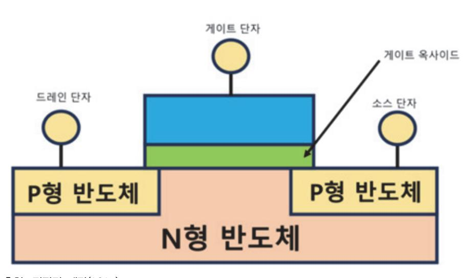

출처: 집필진 제작(2024) [그림 3-1] PMOS 트랜지스터 구조

4. 트랜지스터 동작 원리

게이트 단자에 전압이 인가되지 않을 경우에는 N형 반도체인 드레인과 소스 단자 사이에 P 형 반도체인 substrate가 막혀 있는 형태로, 전류가 흐르지 않는다. 그러나 게이트 단자에 특정값 이상으로 전압이 인가되면, 게이트 단자에 전하가 증가하게 되어 드레인과 소스 사

이의 P형 반도체에 N형 반도체 특성의 N-채널이 만들어진다. 따라서 드레인과 소스가 연 결되어 전류 흐름이 가능해진다. 이렇게 채널을 만들 수 있도록 게이트에 인가되는 전압값 을 문턱 전압(Threshold Voltage)이라 부른다.

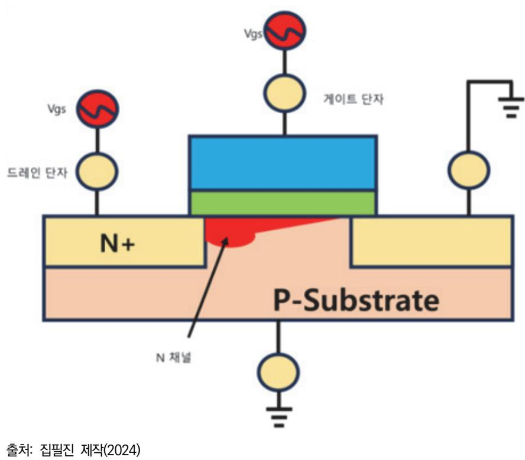

[그림 3-2] NMOS 트랜지스터 동작 원리

숕 반도체 최소 공정

반도체의 최소 공정은 트랜지스터의 동작을 결정하는 채널의 길이를 얼마나 작게 설계할 수 있 는지에 따라 결정된다. 채널의 길이가 짧으면 동일한 기능의 회로를 더 작은 면적에 구현할 수 있으므로, 제조 공정의 경쟁력을 가질 수 있다. 또한 채널 길이의 감소에 따라 이를 제어하는 게이트 부의 옥사이드 두께도 더불어 감소하게 되므로, 스위치 성능이 좋아져서 더욱 빠른 동 작 속도를 가지게 된다. 더불어 동일한 동작을 위한 전압값도 작아지게 되는데 이로 인해 소모 되는 전력값이 작아지게 된다. 이러한 장점으로 인해 미세 선폭인 반도체 제조 공정의 개발은 지속해서 이루어지고 있으며, 2000년대 초에는 130nm 수준의 um 단위의 설계에서 현재는 20nm 전후의 nm 단위의 개발이 활발히 이루어지고 있다.

#### 숖 설계 권장 문서(Design Guide Document)

설계 권장 문서는 설계하는 데 필요한 여러 가지 문서를 가리킨다. 다양한 형태와 이름의 문서 들이 있지만, 아날로그 설계를 하는 데 사용하는 가장 대표적인 문서로는 설계 규격서(Design Specification), 모의실험 모델 특성 문서(Spice Model Parameter), 도면 설계 규칙서 (Design Rule)가 있다.

#### 1. 설계 규격서(Design Specification)

개발할 제품에 대한 제반의 성능 기준과 개발 목표를 기술한 문서이다. 설계 규격서는 개발 칩을 기준으로 각각 필요한 주요 기능을 정의한다. 또한 정의한 기능 구현을 위해 각 단위 블록별로 필요한 성능 기준을 나열한다. 아날로그 회로 역시 하나의 단위 블록으로 필요한 성능 기준뿐만 아니라 가격, 일정에 대한 목표를 포함하여 해당 수치를 공통의 설계 담당자 가 검토한다. 이렇게 검토를 마친 최종 협의 결과를 문서로 정리하고, 향후 이 문서의 수치 를 기준하여 모든 설계를 진행한다.

#### 2. 모의실험 모델 특성 문서(Spice Model Parameter)

아날로그 회로 설계에 사용하는 Mosfet, 저항, 커패시터, 다이오드 등과 같은 단위 소자들 의 다양한 항목(폭, 길이 등) 변화에 따른 특성을 기술한 문서이다. 반도체 제조업체에서는 해당 공정을 활용한 회로 설계를 위해 각 개별 소자들의 다양한 조건 및 크기 변화에 따라 특성이 어떻게 변하는지 직접 실험을 진행한다. 이러한 실험 결과를 정리하여 각 소자들의 성능 변화를 문서로 기술하고 이를 설계자들에게 제공하며, 시뮬레이션을 위한 모델 파라미 터의 개발에 활용한다. 회로 설계자는 공정업체에서 제공하는 이러한 문서를 활용하여 본격 적인 설계를 시작하기 전에 사용할 수 있는 소자들이 어떠한 형태가 있는지, 조건 변화에 따른 소자들의 특성이 어떻게 변화하는지를 파악하고 설계 회로의 성능 목표를 만족할 수 있을지 사전에 개략적인 판단을 하게 된다.

#### 3. 도면 설계 규칙서(Design Rule)

설계 규칙서는 레이아웃 설계를 하는 데 필요한 필수 규칙을 기술한 문서이다. 공정에서 제 공하는 소자의 크기를 가변할 수 있는 최대 최소 기준 및 소자의 연결을 위한 메탈 선들의 최대 최소 선폭 기준, 메탈 선들 사이의 이격 거리 기준을 그림과 함께 정의하고 있다. 회 로 설계자는 이러한 설계 규칙서를 통해서 레이아웃 설계를 진행할 때의 제약 조건 및 주 의 사항을 사전에 파악하고, 레이아웃 시 이러한 문제가 발생하지 않도록 설계를 진행한다.

숗 패키지

아날로그 회로 아키텍처 설계에서 패키지 공정 분석은 회로의 성능, 신뢰성, 열 관리, 전기적 특성 등을 종합적으로 고려하여 최적의 패키지 솔루션을 선택하고 설계하는 중요한 과정이다. 패키지 공정은 아날로그 회로가 실리콘 다이에서 최종 제품으로 제작되는 과정에서 매우 중요 한 역할을 하며, 다음과 같은 주요 측면에서 분석이 이루어진다.

1. 열 관리 및 열 성능 분석

- (1) 열 저항(Thermal Resistance) 분석: 패키지가 발생하는 열을 얼마나 효율적으로 외부로 방 출할 수 있는지 분석한다. 이는 패키지의 열 저항 특성(RθJA, RθJC 등)을 평가하여 열 관 리 솔루션을 최적화하는 데 중요하다.
- (2) 열전도성(Thermal Conductivity) 고려: 패키지 재료의 열전도성을 평가하여, 고온에서의 성 능 저하를 방지하기 위한 설계 방안을 마련한다. 패키지의 열 방출 경로와 열 관리 구조(히트 싱크, 열 스프레더 등)도 설계에 반영된다.
- (3) 온도 사이클링 및 열 충격 테스트: 패키지가 온도 변화에 어떻게 반응하는지, 열 사이클링 및 열 충격 테스트를 통해 분석한다. 이를 통해 패키지의 장기적인 신뢰성을 평가한다.
- 2. 전기적 성능 및 신호 무결성
  - (1) 패키지 기생 요소 분석: 패키지 내부의 기생 인덕턴스, 기생 커패시턴스, 기생 저항이 신호 무결성에 미치는 영향을 분석한다. 이러한 기생 요소들은 고주파 신호에서 특히 중요한 역할 을 하며, 회로 성능을 저하시킬 수 있다.
  - (2) 임피던스 매칭: 패키지와 PCB 간의 임피던스 매칭을 분석하여 반사 신호나 왜곡을 최소화한 다. 임피던스 불일치는 신호 왜곡을 유발할 수 있으며, 고속 아날로그 신호에서 특히 중요하 다.
  - (3) 전력 및 그라운드 무결성: 패키지에서의 전력 분배 네트워크(PDN)와 그라운드 구조가 신호 무결성과 노이즈 성능에 미치는 영향을 분석한다. 전력 및 그라운드 무결성을 확보하기 위해 패키지 디자인에서 고려해야 할 요소들을 평가한다.
- 3. 기계적 강도 및 신뢰성
  - (1) 패키지 재료 특성 분석: 패키지의 기계적 특성(예: 강도, 경도, 탄성 등)을 분석하여, 제조 공 정 중이나 사용 중에 발생할 수 있는 기계적 손상을 방지한다. 패키지 소재의 선택은 기계적 강도뿐만 아니라 열팽창 계수와 같은 열적 특성도 고려된다.
  - (2) 패키지 신뢰성 테스트: 패키지가 반복적인 기계적 스트레스(예: 충격, 진동) 및 환경 스트레스 (예: 고온, 고습)에도 견딜 수 있는지 테스트한다. 신뢰성 테스트는 납땜 접합부의 피로, 크랙 발생 여부 등을 중점적으로 평가한다.
  - (3) 다이-패키지 인터페이스 분석: 다이와 패키지 간의 접착력과 열/기계적 스트레스에 대한 내 구성을 분석한다. 이 과정에서 델라미네이션(층간 분리) 발생 가능성도 평가한다.
- 4. 패키지 타입 선택
  - (1) 패키지 타입 분석: 다양한 패키지 타입(QFP, BGA, CSP, WLCSP 등)의 특성과 장단점을 분석하여, 아날로그 회로의 성능 요구 사항에 적합한 패키지를 선택한다.
  - (2) 소형화 및 집적도 고려: 패키지의 크기와 집적도가 전체 회로 설계에 미치는 영향을 분석한 다. 소형화된 패키지는 공간 절약과 함께 성능 및 열 관리에 대한 도전 과제를 수반한다.

- (3) 패키지 비용 분석: 패키지 타입에 따른 비용을 분석하여, 설계 요구 사항에 맞는 비용 효율 적인 패키지 솔루션을 선택한다.
- 5. 패키지-회로 상호 작용 분석
  - (1) 패키지와 회로 간의 상호 작용 분석: 패키지와 내부 회로 간의 상호 작용을 분석하여, 신호 전송의 지연, 신호 왜곡, 전력 소모 등을 최적화한다.
  - (2) EMI/EMC 고려: 패키지가 전자기 간섭(EMI)과 전자기 호환성(EMC)에 미치는 영향을 분석 하여, 필요한 차폐 및 필터링 솔루션을 설계한다.
  - (3) ESD 보호 설계: 패키지가 정전기 방전(ESD)으로 인한 손상을 방지할 수 있도록 보호 회로 를 설계하고, 이를 패키지 설계에 반영한다.
- 6. 제조 공정과의 연계성
  - (1) 조립 공정 분석: 패키지 조립 공정에서 발생할 수 있는 잠재적인 문제(예: 솔더 크랙, 플립 칩 접합 불량 등)를 분석하고, 설계 단계에서 이를 예방할 수 있는 조치를 마련한다.
  - (2) 공정 수율 분석: 패키지 공정의 수율을 분석하여 생산 과정에서 발생할 수 있는 결함을 최소 화하는 방안을 모색한다.
  - (3) 테스트 및 검사 전략: 패키지의 생산 과정에서 적용할 테스트 및 검사 전략을 설계한다. 불 량을 조기에 발견하고, 전체 생산 공정에서의 품질을 유지하기 위한 방안을 마련한다.
- 7. 환경적 고려 사항
  - (1) 환경적 내구성 분석: 패키지가 극한의 환경 조건(예: 고온, 저온, 고습, 방사선 등)에서 안정 적으로 동작할 수 있는지 평가한다.
  - (2) 친환경 재료 사용: 패키지에 사용되는 재료가 환경 친화적인지 검토하고, 필요시 친환경 재료 를 선택하여 설계에 반영한다. RoHS(유해 물질 제한 지침) 및 기타 환경 규제를 준수하는지 확인한다.
- 8. 패키지 설계와 PCB 간의 통합
  - (1) PCB 레이아웃 최적화: 패키지와 PCB 간의 최적의 레이아웃을 설계하여 신호 무결성, 전력 무결성, 열 관리 성능을 향상시킨다.
  - (2) 다층 PCB와의 적합성 분석: 다층 PCB와의 적합성을 고려하여, 패키지 핀 아웃 설계, BGA 볼 배치, 전력 및 신호 레이어 분리 등을 최적화한다.
- 9. 신뢰성 및 품질 보증
  - (1) 패키지 신뢰성 보증: 패키지 공정이 완료된 후, 다양한 신뢰성 테스트(예: 열 사이클링, 기계 적 스트레스 테스트 등)를 통해 패키지의 장기적인 신뢰성을 보증한다.
  - (2) 품질 관리 프로세스: 패키지의 품질을 유지하기 위한 프로세스를 설계하고, 생산 중 및 생산

#### 후 검사 프로세스를 통해 일관된 품질을 보장한다.

패키지 공정 분석은 아날로그 회로의 성능, 신뢰성, 제조 용이성 등을 보장하는 데 필수적인 단계이다. 이 과정을 통해 최적의 패키지 솔루션을 선택하고, 설계 및 제조 공정에서 발생할 수 있는 문제를 예방하여 최종 제품의 품질을 높일 수 있다.

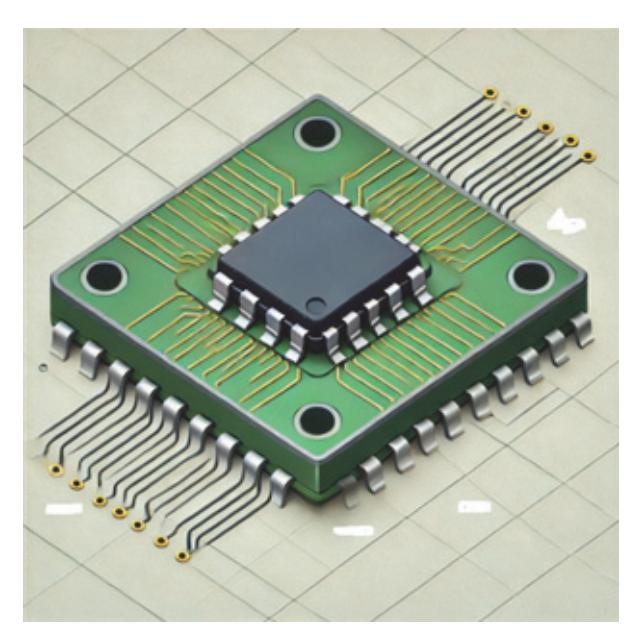

출처: 집필진 제작(2024) [그림 3-3] 패키지 기본 구조

수 소자의 전기적 특성

모의실험 모델 특성 문서를 통해 개략적인 소자들이 갖는 설계 공정에서의 특성을 1차로 파악 했다면, 보다 더 정확한 값들을 확인하기 위한 추가 실험을 진행해야 한다. 주요 확인 값으로 는 I-V 특성, 문턱(Threshold) 전압, 게이트 커패시터, 기생 커패시터, 시트 저항과 같은 항목 이 있다.

1. I-V 특성

새로운 공정에서 설계를 시작할 때 가장 기본이 되고 확인해야 할 항목이다. 인가하는 전압 값의 변화에 따라 흐르는 전륫값이 어떻게 변하는지 측정하여 얻은 결과를 통해 NMOS, PMOS 트랜지스터의 동작점, 포화 속도 등 다양한 특성을 확인한다.

2. 문턱 전압

사전적 정의로는 어떤 장치나 부품이 동작을 시작하는 전압이라 할 수 있다. 트랜지스터 역 시 스위치로서의 기능을 수행하게 되는데, 이때 스위치를 켜고 끄는 경계가 되는 전압값을 문턱 전압이라고 한다. 이상적으로는 이러한 문턱 전압값에서 순간적으로 켜지고 꺼지는 현 상이 일어나야 하지만, 실제로는 이러한 동작도 기울기를 가지고 변화된다. 따라서 이러한 트랜지스터의 동작 상태가 변하는 문턱 전압값 주변에서의 트랜지스터 특성을 충분히 이해 하는 것이 필요하다.

3. 게이트 커패시터

트랜지스터의 기본 구조에서 설명했듯이 게이트와 반도체부(드레인, 소스, 바디) 사이에는 게이트 옥사이드(Oxide)라는 층이 존재한다. 이러한 층이 커패시터의 역할을 하게 되고 우 리는 이러한 값을 게이트 커패시터라고 부른다. 일반적으로 회로 설계 시에는 PMOS와 NMOS의 게이트와 드레인을 서로 연결한 인버터를 사용하게 되는데, 특정 신호들(주로 클 록, 리셋 등)을 우리가 원하는 시간에 동작할 수 있도록 임의의 지연 시간을 만든다. 이러 한 지연 시간을 만들기 위해서 서로 다른 값을 가지는 게이트 커패시터를 만들게 된다. 이 러한 커패시터의 변화는 인버터를 구성하는 PMOS, NMOS의 너비(W)와 길이(L)를 변화시 킴으로써 구현할 수 있다.

4. 기생 커패시터

우리가 알고 있는 수치는 설계를 위한 활용 도구가 될 수 있으나, 예측할 수 없는 또는 모 르는 값은 설계하는 데 제약 사항이 된다. 기생 커패시터는 실제로 트랜지스터를 구현하게 될 경우 구조적으로 발생하게 되는데, 게이트와 드레인, 소스, 바디 사이에 중첩되는 구조적 특성으로 인해 발생하게 된다. 따라서 이러한 사전 예측하기 어려운 값을 본격적인 설계 전 에 확인할 필요가 있으며, 인버터 고리의 사이즈 변화에 따른 지연 속도를 확인해서 이러한 기생 커패시터 값을 확인할 수 있다.

5. 시트 저항

전기 회로에서 각 소자들 외에 도선으로 연결된 부분은 저항값이 0이라 생각하고, 해당 회 로를 해석한다. 그러나 실제는 이러한 도선의 재질과 크기에 따라 저항값이 달라진다. 반도 체 설계에서는 칩 내부의 소자들을 메탈을 통해서 서로 연결하게 되는데, 직사각형 형태의 이러한 메탈 선에 대해 저항값은 두께(t), 너비(w), 길이(l), 저항율(ρ)의 관계식으로 구할 수 있다.

저항값(R) = [길이(l) X 저항율(ρ)] / [두께(t) X 너비(w)]

따라서 내가 공급받을 수 있는 신호나 전원 값은 항상 이러한 연결선의 길이나 너비에 의 해서 영향을 받을 수 있음을 고려하고, 최대한 짧은 거리에서 연결될 수 있도록 배치하거 나, 연결하는 선을 가능한 한 넓게 그리는 것이 원하지 않는 저항값에 의한 특성 소모를 막 을 수 있다.

#### 6. 정전기(ESD) 특성

우리가 설계하는 대부분의 전압값은 3.3V 또는 1.0V 이하의 작은 전압에서 동작하는 회로 를 구현한다. 그러나 외부 전원의 갑작스러운 변화나 사람 또는 장비 등에서 발생하는 정전 기의 전압이 순간적으로 회로에 인가될 수 있다. 이러한 전기적 충격은 MOS 트랜지스터의 절연막을 파괴함으로써 회로에 치명적인 충격을 입힐 수 있는데, 이러한 충격을 방지하고자 외부와 연결하는 입력 핀, 전원 핀에는 다이오드를 이용한 정전기 보호 회로를 사용한 IO 패드를 제공하게 되는데, 설계자는 여러 종류의 IO 패드에 대해 각각 그 특성을 파악하여 적절한 IO를 선택해야 한다.

## 수행 내용 / 설계 공정 분석하기

#### 재료·자료

- 기술 설계 사양서(활용 서식 1 참조) 및 데이터 시트(소자 데이터 시트, PDK)
- 설계 문서(블록 다이어그램, 스펙 문서)
- 테스트 및 검증 자료
- IEEE 표준 및 산업 가이드라인(JEDEC, IEC 등)

#### 기기(장비 ・ 공구)

- 워크스테이션, 소프트웨어 라이선스
- EDA 소프트웨어(Cadence VirtuosoSynopsys Custom CompileR, Mentor Graphics ICStation)
- 시뮬레이션 도구(HSPICE, LTspice, TCAD 툴)
- MATLAB/Simulink
- 측정 및 테스트 장비(오실로스코프, 스펙트럼 분석기, 네트워크 분석기, 파형 발생기, 멀티미 터 등)
- PCB 제작 장비, SMT 솔더링 장비
- 검증 및 분석 장비(로직 분석기, 파라미터 분석기, 전력 분석기 등)
- 온도 및 환경 제어 장비

#### 안전 ・ 유의 사항

• 설계 공정 중에 전압 및 전류 한계를 준수해야 한다. 안전 마진을 설정하고, 과전압이나 과 전류로 인한 손상을 방지하기 위한 보호 회로를 설계한다.

- 회로 내에서 발생할 수 있는 신호 간섭을 최소화하기 위해 적절한 레이아웃 설계와 차폐 (Shielding)를 고려해야 한다. 고주파 신호는 가능한 신호 경로를 짧게 유지하고, 차폐 레이 어를 사용하여 간섭을 줄인다.
- 회로의 패키지 설계는 기계적 안정성을 보장하기 위해 중요한 요소이다. 패키지와 회로 간 의 기계적 응력, 열팽창 계수의 차이 등을 고려하여, 크랙이나 델라미네이션 같은 기계적 결 함을 방지한다.
- 회로와 패키지 간의 접합에서 발생할 수 있는 기계적 결함을 방지하기 위해, 다이 본딩 및 와이어 본딩 공정에서 안정성을 확보한다.
- 설계 공정에서 생성되는 데이터와 문서의 보안을 유지해야 한다. 설계 도면, 시뮬레이션 결 과, 공정 데이터 등이 안전하게 관리되도록 암호화 및 접근 제어를 설정한다.
- 설계 공정 중에 발생하는 모든 변경 사항을 체계적으로 기록하고, 설계 데이터의 버전을 관 리한다. 이를 통해 설계 변경이 추적 가능하고, 문제가 발생했을 때 신속히 해결할 수 있다.
- 신뢰성 테스트: 설계된 회로가 장기간 안정적으로 동작할 수 있는지 신뢰성 테스트를 수행 한다. 열 사이클 테스트, 온도 스트레스 테스트 등 다양한 테스트 방법을 적용하여 회로의 신뢰성을 평가한다.
- 회로가 사용될 시장에서 요구하는 안전 규격(예: UL, CE, FCC)을 준수하도록 설계를 검토 하고, 필요시 인증을 받기 위한 준비를 한다.
- 아키텍처 설계, 회로 설계, 검증 팀 간의 협업을 통해 설계의 일관성을 유지하고, 문제 발생 시 신속하게 대응할 수 있도록 한다.
- 설계 공정 중에 발생하는 변경 사항이나 이슈에 대해 팀 간의 명확한 의사소통이 이루어지 도록 체계를 구축한다.
- 비상 대처 계획: 설계 공정에서 예기치 않은 문제가 발생했을 때 신속하게 대응할 수 있는 비상 대처 계획을 수립한다. 문제 해결을 위한 프로세스와 책임자를 명확히 지정해 놓아야 한다.

수행 순서

숔 아날로그 회로 아키텍처 설계를 위한 설계 공정의 라이브러리 파일을 확인하여 소자의 특성을 분석 한다.

87

아날로그 회로 아키텍처 설계를 위한 설계 공정의 라이브러리 파일을 확인하여 소자의 특성을 분석하는 과정은 매우 중요하다. 이는 정확한 회로 설계와 성능 예측에 필수적인 단계이다. 다 음은 이 과정을 자세히 설명한 것이다.

라이브러리 파일을 확인하고 소자의 특성을 분석하는 과정은 아날로그 회로 설계에서 매우 중 요한 단계이다. 이를 통해 각 소자의 동작을 정확히 이해하고, 최적의 설계를 수행할 수 있다. 이러한 철저한 분석과 검증 과정을 통해 고성능의 아날로그 회로를 설계할 수 있다.

- 1. 라이브러리 파일을 확인한다.
  - (1) 라이브러리 파일 종류
    - (가) 기술 파일(Technology File): 소자의 제조 공정 정보를 포함한다.
    - (나) PCells(Parameterized Cells): 파라미터화된 소자 셀 정보를 포함한다.
    - (다) 모델 파일(Model File)

SPICE 모델, Verilog-A 모델 등의 소자 모델 정보가 포함된다.

(라) DRC/LVS 규칙 파일

디자인 룰 체크(DRC) 및 레이아웃-회로 검증(LVS) 규칙을 정의한다.

- 2. 소자 특성을 분석
  - (1) 기초 특성을 확인한다.
    - (가) 기술 파일을 통해 공정 정보를 확인

소자의 물리적 크기, 레이어 정보, 제조 공정 파라미터 등을 확인한다.

(나) 모델 파일을 통해 전기적 특성을 확인

SPICE 모델을 이용하여 소자의 I-V 특성, 커패시턴스, 인덕턴스 등의 전기적 특성을 확인한다.

- (2) PCell 정보를 분석한다.
  - (가) 파라미터화된 셀(PCells)을 확인한다.

각 소자의 파라미터(예: 채널 길이 및 폭, 도핑 농도 등)를 확인하고, 이를 통해 소자 의 특성을 조정할 수 있다.

(나) 기본 소자 구성 확인한다.

트랜지스터, 저항, 커패시터 등의 기본 소자 구성을 확인하고, 각 소자의 동작 특성 을 이해한다.

- 3. 소자 모델링 및 시뮬레이션을 한다.
  - (1) DC 특성을 분석한다.
    - (가) DC 시뮬레이션을 통한 I-V 특성 분석

소자의 전류-전압 관계를 시뮬레이션하여 소자의 동작 영역(선형, 포화 등)을 분석한

다.

(나) Threshold Voltage(V\_th)를 확인 한다.

트랜지스터의 임계 전압을 확인하여 적절한 바이어스 조건을 설정한다.

- (2) AC 특성 분석을 한다.
  - (가) AC 시뮬레이션을 통한 주파수 응답을 분석한다.

소자의 주파수 특성을 분석하여 고주파에서의 동작을 평가한다.

(나) 기생 요소를 분석한다.

기생 커패시턴스, 기생 인덕턴스 등의 영향을 고려하여 고주파 특성을 최적화한다.

- (3) 노이즈 특성을 분석한다.
  - (가) 노이즈 시뮬레이션

소자의 노이즈 특성을 시뮬레이션하여 회로의 신호 대 잡음비(SNR)를 개선한다.

(나) 열잡음 및 1/f 잡음 분석

소자의 열잡음과 1/f 잡음을 고려하여 저잡음 설계를 진행한다.

- 4. 시뮬레이션 및 최적화를 한다.
  - (1) SPICE 시뮬레이션을 한다.
    - (가) 모델 파일을 사용하여 SPICE 시뮬레이션을 실행한다.
      - 각 소자의 SPICE 모델을 사용하여 회로 시뮬레이션을 수행하고 소자의 특성을 분석 한다.
    - (나) PVT 시뮬레이션을 한다.

Process, Voltage, Temperature 코너 시뮬레이션을 통해 다양한 환경에서의 소자 특성을 검증한다.

- (2) 최적화를 한다.
  - (가) 파라미터 조정을 한다.

소자의 물리적 및 전기적 파라미터를 조정하여 회로 성능을 최적화한다.

(나) 기생 요소를 최소화한다.

레이아웃 설계 시 기생 요소를 최소화하여 회로 성능을 향상시킨다.

#### 5. 검증 및 문서화한다.

- (1) 소자 특성 검증을 한다.
  - (가) 프로토타입 제작 및 테스트를 한다.

소자의 특성을 검증하기 위해 프로토타입을 제작하고 실제 특성을 측정한다.

(나) 시뮬레이션 결과와의 비교를 한다.

시뮬레이션 결과와 실제 측정 결과를 비교하여 모델의 정확성을 검증한다.

(2) 문서화한다.

(가) 소자 특성 문서화

소자의 전기적 특성, 모델 파라미터, 시뮬레이션 결과 등을 문서화하여 설계 데이터 베이스에 저장한다.

- 숕 설계 공정의 라이브러리 파일을 확인하여 턴 온 저항값이 다른 주요 트랜지스터와 수동 소자의 성능 을 개괄적으로 파악한다. 아날로그 회로 아키텍처 설계를 위해 설계 공정의 라이브러리 파일을 확인하여 턴 온 저항값이 다른 주요 트랜지스터와 수동 소자의 성능을 개괄적으로 파악하는 과정은 다음과 같다. 설계 공정의 라이브러리 파일을 확인하여 턴 온 저항값이 다른 주요 트랜지스터와 수동 소자의 성능을 개괄적으로 파악하는 과정은 아날로그 회로 설계에서 매우 중요한 단계이다. 이를 통해 각 소자의 동작 특성을 정확히 이해하고, 최적의 설계를 수행할 수 있다. 라이브러리 파일을 철저히 분석하고 시뮬레이션을 통해 소자의 특성을 검증하는 것이 성공적인 아날로그 회로 아 키텍처 설계의 핵심이다.
  - 1. 라이브러리 파일을 확인한다.
    - (1) 라이브러리 파일의 종류
      - (가) 기술 파일(Technology File)

공정 정보를 포함하여 소자의 물리적 특성과 공정 파라미터를 제공한다.

(나) 모델 파일(Model File)

SPICE 모델, Verilog-A 모델 등의 소자 모델 정보가 포함된다.

- (다) PCells(Parameterized Cells) 파라미터화된 소자 셀 정보가 포함된다.
- 2. 주요 트랜지스터와 수동 소자의 턴 온 저항값을 파악한다.
  - (1) 트랜지스터의 턴 온 저항(R\_on)을 파악한다.
    - (가) 턴 온 저항 정의

턴 온 저항(R\_on)은 트랜지스터가 온 상태일 때의 저항이다. 이는 소스와 드레인 간 의 저항으로, 전류가 흐를 때의 저항값을 나타낸다.

(나) 라이브러리 파일 분석

SPICE 모델 파일에서 트랜지스터의 I-V 곡선을 통해 R\_on 값을 확인할 수 있다. 기술 파일과 모델 파일을 통해 주어진 조건(온도, 전압 등)에서의 R\_on 값을 파악한 다.

(2) 수동 소자의 저항 및 성능 특성을 파악한다. 파악한다.

(가) 저항기(Resistor)

저항기의 저항값은 모델 파일에서 제공되며, 온도와 공정 변화에 따른 특성을 확인 한다.

(나) 커패시터(Capacitor)

커패시터의 정전 용량, ESR(Equivalent Series Resistance), 온도 의존성을 확인한 다.

(다) 인덕터(Inductor)

인덕터의 인덕턴스 값, DCR(Direct Current Resistance), Q 값 등을 확인한다.

- 3. 성능 특성 분석 파악한다.
  - (1) 트랜지스터 성능 특성 파악한다.
    - (가) DC 특성을 파악한다.

I\_D-V\_D 특성 곡선을 통해 트랜지스터의 동작 영역(차단, 선형, 포화)을 분석한다. R\_on 값은 주로 선형 영역에서의 기울기로 결정된다.

(나) AC 특성을 파악한다.

주파수 응답을 통해 트랜지스터의 고주파 성능을 평가한다. 기생 커패시턴스와 인덕 턴스가 고주파 성능에 미치는 영향을 분석한다.

(다) 노이즈 특성을 파악한다.

열잡음, 1/f 잡음 등의 노이즈 특성을 분석하여 저잡음 설계를 지원한다.

- (2) 수동 소자의 성능 특성을 파악한다.
  - (가) 저항기

저항값의 공정 및 온도 의존성을 분석하여 정확한 저항값을 예측한다.

(나) 커패시터

커패시터의 용량 변화와 ESR의 주파수 의존성을 분석한다.

(다) 인덕터

인덕턴스 값과 Q 값의 주파수 의존성을 분석하여 인덕터의 고주파 성능을 평가한다.

- 4. 시뮬레이션 및 최적화를 한다.
  - (1) SPICE 시뮬레이션을 진행한다.
    - (가) 트랜지스터와 수동 소자의 SPICE 모델을 사용하여 시뮬레이션을 수행한다 시뮬레이션을 통해 트랜지스터의 턴 온 저항과 수동 소자의 저항값, 커패시턴스, 인 덕턴스를 확인한다.
    - (나) PVT 시뮬레이션을 진행한다.

다양한 공정(Process), 전압(Voltage), 온도(Temperature) 조건에서의 시뮬레이션을

통해 소자의 특성을 검증한다.

- (2) 성능 최적화를 한다.
  - (가) 트랜지스터

채널 길이와 폭을 조정하여 R\_on 값을 최적화한다. 기생 요소를 최소화하여 고주파 성능을 개선한다.

(나) 수동 소자 저항기, 커패시터, 인덕터의 물리적 크기와 배치를 조정하여 원하는 전기적 특성을 얻는다.

숖 주요 트랜지스터의 전압, 전류 간 특성을 시뮬레이션을 통해 확인한다.

아날로그 회로 아키텍처 설계를 위해 설계 공정의 라이브러리 파일을 확인하고 주요 트랜지스 터의 전압-전류 특성을 시뮬레이션을 통해 확인하는 과정은 트랜지스터의 동작 특성을 정확히 이해하고 최적의 설계를 수행하기 위한 중요한 단계이다. 이를 통해 트랜지스터의 전기적 특성 을 분석하고, 이를 바탕으로 회로 설계를 최적화할 수 있다.

- 1. 설계 공정의 라이브러리 파일을 확인한다.
  - (1) 라이브러리 파일 종류
    - (가) 기술 파일(Technology File): 소자의 물리적 특성과 공정 파라미터를 포함한다.
    - (나) 모델 파일(Model File): 트랜지스터의 SPICE 모델 정보를 포함한다.
    - (다) PCells(Parameterized Cells): 파라미터화된 소자 셀 정보이다.
- 2. 주요 트랜지스터의 전압-전류 특성을 파악한다.
  - (1) 트랜지스터 모델 파일 확인

SPICE 모델 파일을 열어 트랜지스터의 파라미터와 특성 곡선을 확인한다. 모델 파일은 트랜지스터의 전압-전류 특성, 온도 의존성, 기생 요소 등을 포함한다.

- 3. 시뮬레이션 환경 설정을 한다.
  - (1) SPICE 시뮬레이션 설정을 한다.
    - (가) SPICE 툴 선택: HSPICE, Spectre, LTspice 등 사용 가능한 시뮬레이션 툴을 선택한 다.
    - (나) 회로 설정: 시뮬레이션에 사용할 회로를 설정(예: 기본 NMOS/PMOS 회로)한다.
    - (다) 모델 파일 포함: SPICE 모델 파일을 시뮬레이션 환경을 포함한다.
- 4. 시뮬레이션 실행을 한다.
  - (1) DC 시뮬레이션 설정

(가) DC 바이어스 설정

트랜지스터의 게이트, 소스, 드레인 전압을 설정한다.

(나) Sweep 설정

게이트-소스 전압(V\_GS)과 드레인-소스 전압(V\_DS)을 다양한 범위로 변경하며 시뮬 레이션 한다.

(2) 시뮬레이션 실행 및 결과 분석을 한다.

(가) 시뮬레이션을 실행하여 I\_D-V\_D, I\_D-V\_G 특성을 얻는다.

(나) 시뮬레이션 결과를 그래프로 출력하여 전압-전류 특성을 분석한다.

- 5. 시뮬레이션 결과 해석을 한다.
  - (1) I\_D-V\_D 특성 곡선
    - (가) 선형 영역: V\_DS가 낮을 때, 전류가 V\_DS에 선형적으로 비례하는 영역이다.
    - (나) 포화 영역: V\_DS가 높아지면서 전류가 포화되는 영역이다.
  - (2) I\_D-V\_G 특성 곡선
    - (가) 차단 영역: V\_GS가 임계 전압(V\_TH) 이하일 때 전류가 흐르지 않는 영역이다.
    - (나) 서브 임계 영역: V\_GS가 V\_TH보다 약간 낮을 때 소량의 전류가 흐르는 영역이다.
    - (다) 선형/포화 영역: V\_GS가 V\_TH 이상일 때, 전류가 선형적으로 증가하는 영역이다.

#### 6. 트랜지스터 특성 최적화를 한다.

(1) 모델 파라미터 조정을 한다.

아날로그 회로 아키텍처 설계를 위한 공정 분석에서 트랜지스터 특성을 최적화하기 위 해 모델 파라미터를 조정하는 과정은 매우 중요한 단계이다. 이 과정은 트랜지스터의 성 능과 신뢰성을 보장하며, 최종적으로 회로의 전체적인 효율성을 향상시키는 데 기여한 다. 다음은 그 과정에 대한 주요 단계이다.

- (가) 트랜지스터 모델 파라미터 식별을 한다.
  - 1) 기본 파라미터: 채널 길이(L), 채널 폭(W), 산화막 두께(Tox), 이온화된 불순물 농 도(Na).
  - 2) 전기적 파라미터: 문턱 전압(Vth), 전자 이동도(μ), 서브스레시홀드 기울기(S), 드레 인 유도 장벽 저하(DIBL).
  - 3) 공정 변동성 파라미터: 제조 공정에서 발생하는 변동성에 따른 파라미터(예: 도핑 농 도 변화, 산화막 두께 변동 등).
- (나) 트랜지스터 특성 시뮬레이션을 한다.
  - 1) SPICE 시뮬레이션: 트랜지스터 모델을 기반으로 회로 시뮬레이션을 수행하여 기본 적인 특성(전류-전압 곡선, 전력 소비 등)을 분석한다.

93

2) 프로세스 코너 분석: 다양한 공정 조건(최악의 경우, 최상의 경우 등)에서 트랜지스 터 특성을 시뮬레이션하여 성능 변동을 평가한다.

(다) 파라미터 조정을 한다.

- 1) Vth 조정: 문턱 전압을 조정하여 트랜지스터의 전류 특성을 제어한다. Vth는 전압 이득과 전류 소비에 직접적인 영향을 끼친다.
- 2) W/L 비율 조정: 채널 폭(W)과 길이(L)의 비율을 조정하여 드레인 전류(ID)와 트랜 지스터의 이득을 최적화한다.
- 3) DIBL 및 S 조정: 드레인 유도 장벽 저하(DIBL)와 서브스레시홀드 기울기(S)를 조 정하여 단채널 효과를 최소화하고, 저전력에서의 작동을 최적화한다.
- 4) 온도 특성 조정: 온도에 따른 특성 변화를 보정하기 위해 온도 계수(TC) 등을 조정 한다.
- (라) 파라미터 최적화 알고리즘 적용을 한다.
  - 1) 최적화 알고리즘: 파라미터 조정을 자동화하기 위해 최적화 알고리즘(예: 유전자 알 고리즘, 그라디언트 디센트 등)을 적용하여 최적의 파라미터 조합을 찾는다.
  - 2) 회귀 분석: 파라미터와 트랜지스터 성능 간의 관계를 모델링하여 최적화 방향을 도 출한다.
- (마) 실제 공정 반영 및 검증을 한다.
  - 1) 프로세스 피드백: 공정에서의 피드백을 받아 시뮬레이션 결과와 실제 제조된 트랜지 스터의 특성을 비교한다.
  - 2) 검증 및 튜닝: 초기 시뮬레이션에서 예상한 결과와 실제 특성 간의 차이를 최소화하 기 위해 추가 조정을 수행한다.
- (바) 최종 검증 및 문서화한다.
  - 1) 테스트 칩 제작: 최적화된 파라미터를 사용하여 테스트 칩을 제작하고 실제 측정을 통해 결과를 검증한다.
  - 2) 문서화: 최적화 과정과 결과를 체계적으로 문서화하여 향후 설계에 활용할 수 있도 록 한다.

이 과정을 통해 트랜지스터의 특성을 최적화하면 아날로그 회로의 성능과 신뢰성을 향 상할 수 있다. 파라미터 조정은 반복적인 과정이 될 수 있으며, 각 단계에서 얻어진 결 과를 바탕으로 최적화의 정확도를 높이는 것이 중요하다.

(2) 공정 변동성을 고려한다.

아날로그 회로 아키텍처 설계를 위한 공정 분석에서 공정 변동성을 고려한 트랜지스터 특성 최적화는 고품질의 일관된 회로 성능을 보장하기 위해 필수적이다. 공정 변동성은 제조 과정에서 자연스럽게 발생하는 다양한 요인들로 생기는 트랜지스터 특성의 변화를 말하며, 이를 최적화 과정에 반영함으로써 설계의 신뢰성을 높일 수 있다. 다음은 공정 변동성을 고려한 트랜지스터 특성 최적화 방법이다.

- (가) 공정 변동성 파악을 한다.
  - 1) 변동성 요인 식별: 도핑 농도, 산화막 두께, 리소그래피 정밀도, 온도, 전압 등 제조 과정에서 발생할 수 있는 주요 변동성 요인을 파악한다.
  - 2) 통계적 모델링: 변동성을 통계적으로 모델링하여 몬테카를로(Monte Carlo) 시뮬레 이션을 통해 다양한 공정 조건에서 트랜지스터의 성능을 예측한다.
  - 3) 프로세스 코너: 최적화 시나리오에 공정의 최상, 최악, 평균 시나리오(FF, SS, TT 등)를 반영하여 시뮬레이션한다.
- (나) 변동성 영향 분석을 한다.
  - 1) 시뮬레이션을 통한 분석: 다양한 공정 조건에서의 트랜지스터 성능을 시뮬레이션하 여 변동성이 주요 성능 파라미터(전류, 전압, 속도 등)에 미치는 영향을 평가한다.
  - 2) 통계적 분석: 시뮬레이션 결과를 바탕으로 변동성이 설계 마진에 미치는 영향을 분 석하고, 어떤 파라미터가 가장 민감하게 반응하는지 파악한다.
- (다) 트랜지스터 특성 최적화를 한다.
  - 1) W/L 비율 최적화: 변동성에 따른 트랜지스터의 성능 변화를 최소화하기 위해 채널 폭(W)과 길이(L)의 비율을 조정한다. 이는 전류의 변동성을 줄이고, 더 균일한 성능 을 보장하는 데 도움을 준다.
  - 2) Vth 조정: 문턱 전압(Vth)을 조정하여 온도나 전압 변동성에 대한 트랜지스터의 민 감도를 줄인다.
  - 3) DIBL 및 서브스레시홀드 기울기 최적화: 드레인 유도 장벽 저하(DIBL)와 서브스레 시홀드 기울기(S)를 최적화하여 단채널 효과를 최소화하고, 저전력 및 저변동성 특 성을 보장한다.
  - 4) 온도 보정 설계: 온도 변화에 따른 성능 변동을 보상하기 위한 설계 기법을 적용한 다(예: 온도 보상 회로).
- (라) 최적화 알고리즘 적용을 한다.
  - 1) 최적화 알고리즘: 공정 변동성을 고려한 최적화 알고리즘을 적용하여 최적의 파라미 터 조합을 찾는다. 이를 위해 기계 학습 기반의 최적화 기술이나 유전자 알고리즘을 사용할 수 있다.
  - 2) 확률적 시뮬레이션: Monte Carlo 시뮬레이션을 통해 변동성 조건에서의 성능 분포 를 평가하고, 목표 성능을 달성할 확률을 최대화하는 방향으로 설계를 최적화한다.
- (마) 검증 및 피드백을 한다.
  - 1) 실제 공정 검증: 최적화된 트랜지스터 특성을 실제 공정에서 제조한 샘플을 통해 검 증한다. 변동성 분석 결과가 실제 특성에 반영되는지 확인한다.
  - 2) 피드백 및 재조정: 검증 결과를 바탕으로 설계를 재조정하거나, 필요한 경우 추가

95

최적화 작업을 수행한다.

- (바) 최종 설계 마진을 확보한다.
  - 1) 설계 마진 확장: 공정 변동성에 의한 성능 저하를 방지하기 위해 충분한 설계 마진 을 확보한다. 이는 제조된 모든 칩이 요구 사항을 만족할 수 있도록 보장하는 중요 한 단계이다.
  - 2) 최종 문서화: 최적화 과정과 결과를 문서화하여 이후 공정 개선이나 설계 반복 시 참조할 수 있도록 한다.
  - 이와 같은 최적화 과정은 변동성을 효과적으로 관리하여 아날로그 회로의 성능을 안 정적으로 유지하고, 제품의 신뢰성과 수율을 높이는 데 크게 기여한다.
- (사) 다양한 공정, 전압, 온도(PVT) 조건에서의 시뮬레이션을 통해 트랜지스터 특성의 변동성 을 확인한다.
- (아) PVT 시뮬레이션을 통해 공정 변동성에 따른 특성 변화를 분석한다.
- 7. 시뮬레이션 도구 활용 예시
  - (1) SPICE 코드 예시

출처: 코드 작성 프로그램. 2024. 8. 19. 스크린샷. [그림 3-4] 스파이스 코드 예시

(2) 시뮬레이션 결과 분석

시뮬레이션 결과를 그래프로 출력하여, 트랜지스터의 동작 영역과 전압-전류 특성을 시 각적으로 분석하고, 각 동작 영역에서의 전류 특성을 확인하여 설계에 반영한다.

숗 주요 트랜지스터의 Body Effect 적용에 따른 전압, 전류 간 특성을 시뮬레이션을 통해 확인한다. 아날로그 회로 아키텍처 설계를 위해 주요 트랜지스터의 Body Effect를 고려한 전압-전류 특 성을 시뮬레이션하는 과정은 다음과 같다.

위 과정을 통해 아날로그 회로 아키텍처 설계를 위해 주요 트랜지스터의 Body Effect를 고려 한 전압-전류 특성을 시뮬레이션할 수 있다. 이를 통해 Body Effect가 트랜지스터 성능에 미 치는 영향을 분석하고, 설계에 필요한 최적화 작업을 수행할 수 있다.

- 1. 설계 공정의 라이브러리 파일 확인을 한다.
  - (1) 라이브러리 파일 종류
    - (가) 기술 파일(Technology File): 공정 파라미터와 소자의 물리적 특성이다.
    - (나) 모델 파일(Model File)
      - 트랜지스터의 SPICE 모델 정보, 특히 Body Effect를 포함하는 파라미터이다.
    - (다) PCells(Parameterized Cells): 파라미터화된 소자 셀 정보이다.
- 2. Body Effect 개요를 파악한다.

Body Effect는 트랜지스터의 소스와 벌크(몸체) 사이의 전위차가 채널의 임계 전압(Vth)에 영향을 끼치는 현상이다. 이는 다음과 같은 식으로 표현된다.

$$V_{th-eff} = V_{th0} + \gamma \sqrt{V_{SB} + 2\phi_F} - \sqrt{2\phi_F}$$

여기서  $V_{th-eff}$ 는 Body Effect가 적용된 임계 전압,  $V_{th0}$ 는 기본 임계 전압,  $V_{SB}$ 는 소스와 벌크 사이의 전압차,  $\gamma$ 는 Body Effect 계수,  $\phi_F$ 는 표면 전위이다.

- 3. 시뮬레이션 환경 설정을 한다.
  - (1) SPICE 시뮬레이션 설정을 한다.
    - (가) SPICE 툴 선택

HSPICE, Spectre, LTspice 등 사용 가능한 시뮬레이션 툴을 선택한다.

(나) 회로 설정을 한다.

시뮬레이션에 사용할 회로를 설정. Body Effect를 고려하기 위해 벌크 전압을 제어 가능한 회로를 구성한다.

- (다) 모델 파일 포함: SPICE 모델 파일을 시뮬레이션 환경에 포함한다.
- 4. 시뮬레이션 설정을 한다.
  - (1) DC 시뮬레이션 설정을 한다.
    - (가) DC 바이어스 설정: 트랜지스터의 게이트, 소스, 드레인, 벌크 전압을 설정
- (나) Sweep 설정: V\_GS와 V\_DS뿐만 아니라 V\_SB도 다양한 범위로 변경하며 시뮬레이션 5. SPICE 시뮬레이션 예시 코드

출처: 코드 작성 프로그램. 2024. 8. 19. 스크린샷. [그림 3-5] SPICE 시뮬레이션 예시 코드

#### 6. 시뮬레이션 실행 및 결과 분석을 한다.

- (1) I\_D-V\_D 특성 곡선 분석을 한다.
  - (가) 선형 영역: V\_DS가 낮을 때, 전류가 V\_DS에 선형적으로 비례하는 영역이다.
  - (나) 포화 영역: V\_DS가 높아지면서 전류가 포화되는 영역이다.
- (2) I\_D-V\_G 특성 곡선 분석을 한다.
  - (가) 차단 영역: V\_GS가 임계 전압(Vth) 이하일 때 전류가 흐르지 않는 영역이다.
  - (나) 서브 임계 영역: V\_GS가 Vth보다 약간 낮을 때 소량의 전류가 흐르는 영역이다.
  - (다) 선형/포화 영역: V\_GS가 Vth 이상일 때, 전류가 선형적으로 증가하는 영역이다.

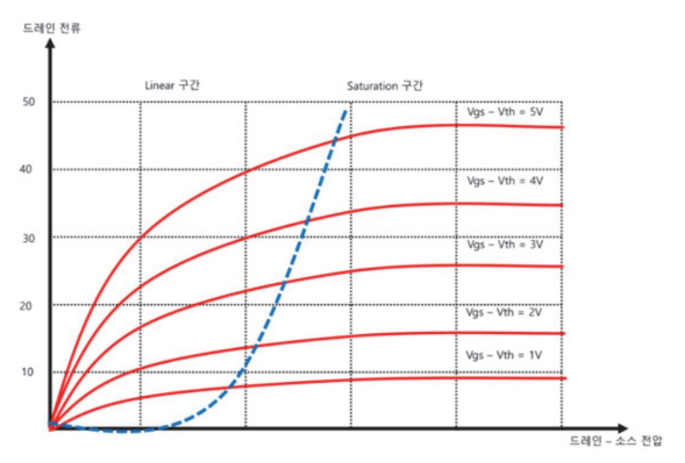

출처: 집필진 제작(2024) [그림 3-6] NMOS 트랜지스터 I-V 특성 곡선

- 7. Body Effect에 따른 특성 변화 분석을 한다.
  - (1) V\_SB 변화에 따른 Vth 변화를 확인한다.
    - (가) 시뮬레이션 결과를 통해 V\_SB가 증가함에 따라 Vth가 증가하는지 확인한다.
  - (2) 전류 변화 분석을 한다.
    - (가) V\_SB 변화에 따른 I\_D의 변화를 분석. Body Effect로 인해 V\_SB가 증가하면 I\_D가 어떻게 변하는지 확인한다.
- 8. 시뮬레이션 도구 활용 예시
  - (1) SPICE 코드 예시

```
* NMOS Body Effect 시뮬레이션 예시
.include 'NMOS_MODEL.lib'
.param L=0.18u W=1u
M1 D G S B NMOS_MODEL L=L W=W
VGS G S DC 1.8
VDS D S DC 1.8
VSB B S DC SWEEP(0 1.8 0.1)
.tran 1n 100n
.plot V(D) I(M1)
.end
```

출처: 코드 작성 프로그램. 2024. 8. 19. 스크린샷. [그림 3-7] SPICE 코드 예시

5 트랜지스터의 On 저항값을 확인한다.

아날로그 회로 아키텍처 설계를 위해 트랜지스터의 On 저항값을 확인하는 과정은 다음과 같 다. 이 과정은 설계 공정의 라이브러리 파일을 활용하여 트랜지스터의 특성을 파악하는 데 중 점을 둔다.

위 과정을 통해 설계 공정의 라이브러리 파일을 확인하여 트랜지스터의 On 저항값을 얻을 수 있다. 이 값을 기반으로 회로 설계를 최적화하고, 트랜지스터의 성능을 평가할 수 있다. SPICE 시뮬레이션을 통해 계산된 On 저항값을 검증하고, 설계에 필요한 정확한 트랜지스터 특성을 확보할 수 있다.

- 1. 설계 공정의 라이브러리 파일 확인을 한다.
  - (1) 라이브러리 파일 종류
    - (가) 기술 파일(Technology File): 공정 파라미터와 소자의 물리적 특성을 정의한다.
    - (나) 모델 파일(Model File): 트랜지스터의 SPICE 모델 정보이다.
    - (다) PCells(Parameterized Cells): 파라미터화된 소자 셀 정보이다.
- 2. 트랜지스터의 On 저항 정의를 파악한다.

트랜지스터의 On 저항  $(R_{on})$ 은 트랜지스터가 활성화된 상태에서 드레인-소스 사이의 저 항을 의미하며, 주로 다음과 같은 식으로 표현된다.

$$R_{on} = \frac{1}{\mu C_{ox} \frac{W}{L} (V_{GS} - V_{th})}$$

여기서  $\mu$ 는 이동도,  $C_{ox}$ 는 산화막 용량, W채널 폭, L 채널 길이,  $V_{GS}$ 는 게이트-소스 전압,  $V_{th}$ 는 임계 전압이다.

- 3. 라이브러리 파일의 모델 파일 확인한다.
  - (1) SPICE 모델 파일을 연다.

SPICE 모델 파일은 일반적으로 .lib 또는 .model 확장자를 가진다. 해당 파일을 텍스 트 편집기로 열어 트랜지스터의 모델 파라미터를 확인한다.

(2) 모델 파라미터 확인을 한다.

모델 파라미터는 웨이퍼를 제작하는 파운드리(Foundry) 업체에서 각 소자의 특성 정보를 기술하여 전달하는 문서로, 업체별 사전 샘플에 대한 실험을 통해 각각의 환경 조건 및 공정의 변동에 대한 소자들의 특성 변화에 대해 기술하고 있는 파일이다. 기본적으로는 Typical, Worst, Best 등으로 정의된 코너 조건별로 소자의 특성을 구분하여 기술하고 있으며, 각각 NMOS와 PMOS를 정의하고 있는 3개의 조건으로 변화시켰을 때 소자들의 특성이 어떻게 달라지는지 측정한다. 따라서 파라미터의 소자를 다음의 <표 3-1>과 같이 구분할 수 있으며, 이와 같은 공정 변동을 파라미터에 기술할 때는 다음과 같은 5개의 코너 조건(TT, SS, FF, SF, FS) 또는 3개의 코너 조건(TT, SS, FF)을 주로 사용한다.

<표 3-1> 코너 조건별 트랜지스터 동작 모드

| TT           | SS         | FF         | SF         | FS         |  |
|--------------|------------|------------|------------|------------|--|
| NMO: Typical | NMO: Worst | NMOS: Best | NMO: Worst | NMOS: Best |  |
| PMO: Typical | PMO: Worst | PMOS: Best | PMOS: Best | PMO: Worst |  |

테스트 벤치에서는 원하는 코너 조건을 선택하여 소자들의 코너 조건을 선언한다. 예) .lib "./CLN65GPPLUS\_2d5\_lk\_v1d3p1.l" TT: Typical 조건의 코어 전압 트랜지스터 트랜지스터의 모델 파라미터는 다음과 같다.

- (가) KP(Transconductance Parameter): 이동도와 산화막 용량의 곱
- (나) Vth(Threshold Voltage): 임계 전압
- (다) LAMBDA(Channel-Length Modulation): 채널 길이 변조
- 4. SPICE 모델 파일 예시

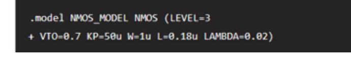

출처: 코드 작성 프로그램. 2024. 8. 19. 스크린샷. [그림 3-8] 트랜지스터의 On 저항값의 SPICE 모델 5. On 저항 계산을 한다.

(1) 모델 파라미터 활용을 한다.

SPICE 모델 파라미터를 활용하여 On 저항을 계산할 수 있다. 예를 들어, 위의 모델 파 라미터를 사용하여  $V_{GS} = 1.8 V$ 일 때 On 저항을 계산한다.

(2) On 저항 계산 예시

(7)) 
$$V_{GS} = 1.8 V$$
  
(L))  $V_{th} = 0.7 V$ 

(CF) 
$$K = \frac{KP}{2} = 25 \mu A / V^2$$
  
$$R_{on} = \frac{1}{K (V_{GS} - V_{th})} = \frac{1}{25 \times 10^{-6} (1.8 - 0.7)} \approx 36.3 \Omega$$

- 6. 시뮬레이션을 통한 On 저항 확인을 한다.
  - (1) SPICE 시뮬레이션 설정을 한다.

시뮬레이션 환경에서 트랜지스터의 On 저항을 확인할 수 있다. 다음은 SPICE 시뮬레이 션 코드 예시이다.

출처: 코드 작성 프로그램. 2024. 8. 19. 스크린샷. [그림 3-9] NMOS On 저항 시뮬레이션 예시

(2) 시뮬레이션 결과 분석을 한다.

시뮬레이션 결과에서 드레인-소스 전류 
$$I_{DS}$$
를 확인하고,  $R_{on} = \frac{V_{DS}}{I_{DS}}$ 로 계산할 수 있다.

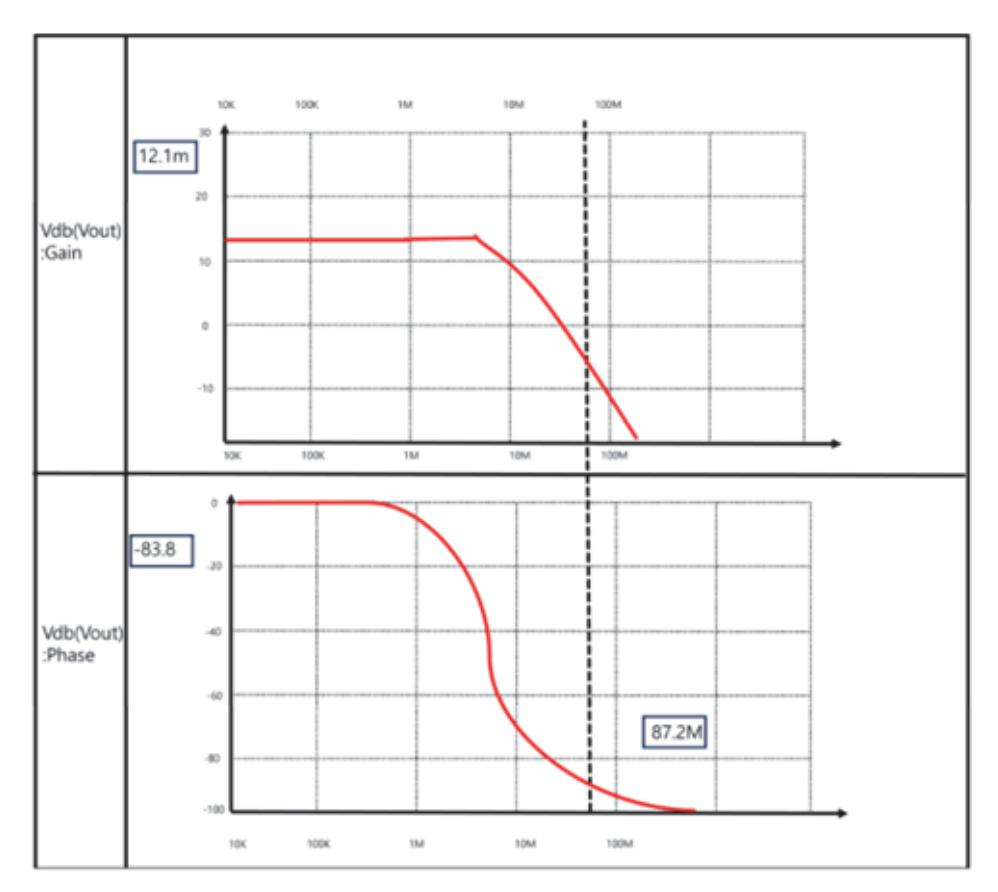

출처: 집필진 제작(2024) [그림 3-10] 앰프 회로의 이득, 주파수 특성 및 위상 안정도 분석

숙 인버터 체인을 구성하여, 트랜지스터 크기에 따른 지연 시간, 상승 시간, 하강 시간에 대한 정보를 확인한다.

아날로그 회로 아키텍처(부록 아키텍처 사양서 참조) 설계를 위해 설계 공정의 라이브러리 파 일을 확인하여 인버터 체인을 구성하고, 트랜지스터 크기에 따른 지연 시간, 상승 시간, 하강 시간에 대한 정보를 확인하는 과정은 다음과 같다.

- 1. 설계 공정의 라이브러리 파일 확인한다.
  - (1) 라이브러리 파일 종류
    - (가) 기술 파일(Technology File): 공정 파라미터와 소자의 물리적 특성을 정의한다.
    - (나) 모델 파일(Model File): 트랜지스터의 SPICE 모델 정보이다.
    - (다) PCells(Parameterized Cells): 파라미터화된 소자 셀 정보이다.
- 2. 인버터 체인의 구성을 한다.
  - (1) SPICE 모델 파일 준비

설계에 사용할 NMOS와 PMOS 트랜지스터의 모델 파일을 준비한다.

출처: 코드 작성 프로그램. 2024. 8. 19. 스크린샷. [그림 3-11] NMOS와 PMOS 트랜지스터의 모델 파일

(2) 인버터 회로 정의를 한다.

인버터 체인을 SPICE로 정의한다. 트랜지스터 크기를 조절하여 다양한 경우를 시뮬레이 션한다.

출처: 코드 작성 프로그램. 2024. 8. 19. 스크린샷. [그림 3-12] 인버터 체인에 대한 트랜지스터의 크기에 따른 시뮬레이션

- 3. 시뮬레이션을 통해 지연 시간, 상승 시간, 하강 시간 확인
  - (1) SPICE 시뮬레이션 실행을 한다.

위의 SPICE 코드를 시뮬레이터(예: HSPICE, LTSpice 등)에서 실행한다.

(2) 시뮬레이션 결과 분석을 한다.

시뮬레이션 결과에서 각 노드(OUT1, OUT2, OUT3)의 지연 시간, 상승 시간, 하강 시 간을 확인한다. 주요 매개 변수는 다음과 같다.

(가) 지연 시간(Propagation Delay)

입력 신호가 변화한 후 출력 신호가 변화하기까지 걸리는 시간

- (나) 상승 시간(Rise Time) 출력 신호가 저전압에서 고전압으로 상승하는 데 걸리는 시간
- (다) 하강 시간(Fall Time)

출력 신호가 고전압에서 저전압으로 하강하는 데 걸리는 시간

4. 트랜지스터 크기에 따른 지연 시간, 상승 시간, 하강 시간 분석을 한다.

(1) 트랜지스터 크기 조정을 한다.

위의 SPICE 코드에서 트랜지스터의 폭 과 를 조절하여 시뮬레이션을 반복한 다. 다양한 크기에 따른 시간을 비교한다.

(2) 결과 비교를 한다.

트랜지스터의 크기에 따라 지연 시간, 상승 시간, 하강 시간이 어떻게 변화하는지 분석 한다. 일반적으로 트랜지스터의 크기가 커지면 저항이 작아져 지연 시간과 상승 시간, 하강 시간이 감소한다.

위 과정은 아날로그 회로 아키텍처(부록 아키텍처 사양서 참조) 설계를 위해 트랜지스터 크기 에 따른 인버터 체인의 지연 시간, 상승 시간, 하강 시간을 분석하는 방법을 제시한다. SPICE 시뮬레이션을 통해 트랜지스터의 크기를 최적화하여 회로의 성능을 개선할 수 있다. 이 정보를 바탕으로 최적의 아키텍처(부록 아키텍처 사양서 참조)를 설계하고 필요한 성능을 달성할 수 있다.

출처: 코드 작성 프로그램. 2024. 8. 19. 스크린샷. [그림 3-13] 시뮬레이션 결과 예시

#### 수행 tip

• 아날로그 회로 아키텍처(부록 아키텍처 사양서 참조) 설계 는 반도체 공정과 회로 설계에 거쳐 전반의 이해가 필요하 므로 시간이 걸리더라도 신중하고 면밀한 과정을 거쳐 진 행한다.

### 학습 3 교수·학습 방법

#### 교수 방법

- 반도체 제조 공정 개발에 관련된 필요 지식을 기준으로 개념을 설명한다.
- 단위 공정별 공정 및 장비 특성과 제어, 반도체 제조 공정 프로세스와 공정 관리 기술, 반 도체용 화학 약품의 종류 및 특성, 반도체 주요 공정 및 장비 운용 용어, 제조 공정 장비 운 용 및 결과 평가 기술, 측정 및 평가기술, 오류 공정 검출/분류(FDC) 및 불량과 수율의 상 관성에 대하여 실제 장비, 그림, 및 사진 등을 활용하여 설명한다.
- 연구 노트 등의 정해진 양식을 활용하여 교수자의 강의 내용 및 학습자의 실제 활동 내역을 형식에 맞게 기술하도록 하여 서술형 시험 및 구두 발표 시 활용할 수 있도록 한다.
- 학습자가 각자의 역할 분담이 주어진 상태에서 팀을 구성하여 교육에 참여하는 조별 활동을 활용할 수 있다.

#### 학습 방법

- 단위 공정별 공정 및 장비 특성과 제어에 대하여 학습하고 실제 장비 혹은 시뮬레이션을 통 하여 각 특성 및 제어 방식에 대하여 파악한다.
- 반도체 주요 공정 및 장비 운용 용어에 대하여 학습하고 단위 공정 또는 공정 프로세스를 최적화한 작업 지시서를 작성한다.
- 측정 및 평가기술에 대하여 학습하고 이를 적용할 수 있는 분야 및 한계에 관해 파악한다.
- 오류 공정 검출/분류(FDC)에 대하여 학습하고 해당 공정에 적합한 기술 및 분류를 적용한 다.
- 불량과 수율의 상관성에 대하여 학습하고 수율을 높일 수 있는 방법과 불량을 줄일 수 있는 방안을 도출하여 적용한다.
- 매뉴얼 및 환경안전 기준에 따라 필요한 지식을 학습하고 수행 중의 문제점을 도출한 다음, 수정 및 보완 계획을 수립할 수 있도록 학습 및 실습한다.

## 학습 3 평 가

#### 평가 준거

- 평가자는 학습자가 학습 목표를 성공적으로 달성하였는지를 평가해야 한다.
- 평가자는 다음 사항을 평가해야 한다.

|          | 학습 목표                                                                            |  | 성취수준 |   |  |
|----------|----------------------------------------------------------------------------------|--|------|---|--|
| 학습 내용    |                                                                                  |  | 중    | 하 |  |
| 설계 공정 분석 | - 설계 공정의 라이브러리 파일을 확인하여, 턴 온 저항값이<br>다른 주요 트랜지스터와 수동 소자의 성능을 개괄적으로 파<br>악할 수 있다. |  |      |   |  |
|          | - 주요 트랜지스터의 전압, 전류 간 특성을 시뮬레이션을 통해<br>확인할 수 있다.                                  |  |      |   |  |
|          | - 주요 트랜지스터의 기판 Body Effect 적용에 따른 전압,<br>전류 간 특성을 시뮬레이션을 통해 확인할 수 있다.            |  |      |   |  |
|          | - 트랜지스터의 On 저항값을 확인할 수 있다.                                                       |  |      |   |  |
|          | - 인버터 체인을 구성하여, 트랜지스터 크기에 따른 지연 시<br>간, 상승 시간, 하강 시간에 대한 정보를 확인할 수 있다.           |  |      |   |  |

#### 평가 방법

• 서술형 시험

|          | 평가 항목                                                           |  | 성취수준 |   |  |
|----------|-----------------------------------------------------------------|--|------|---|--|
| 학습 내용    |                                                                 |  | 중    | 하 |  |
| 설계 공정 분석 | - 설계 공정의 라이브러리 파일의 종류를 확인하고 해당 파일<br>로부터 소자의 기초 특성을 확인할 수 있는 능력 |  |      |   |  |
|          | - body effect 적용에 따른 전류 전압 영향을 시뮬레이션을<br>통해 확인할 수 있는 능력         |  |      |   |  |
|          | - 설정 공정에서 사용되는 주요 트랜지스터의 실행 및 결과를<br>분석할 수 있는 능력                |  |      |   |  |

#### • 평가자 체크리스트

|          | 평가 항목                                                                 |  | 성취수준 |   |  |
|----------|-----------------------------------------------------------------------|--|------|---|--|
| 학습 내용    |                                                                       |  | 중    | 하 |  |
| 설계 공정 분석 | - 설계 공정의 라이브러리 파일의 종류를 확인하고 해당 파일<br>로부터 PCell 정보를 분석할 수 있는 능력        |  |      |   |  |
|          | - 설계 공정에서 사용되는 주요 트랜지스터의 전압-전류 특성<br>확인을 위한 SPICE 시뮬레이션 설정을 할 수 있는 능력 |  |      |   |  |
|          | - SPICE 시뮬레이션 결과로부터 모델 파라미터 조정을 통한<br>특성을 최적화할 수 있는 능력                |  |      |   |  |

#### 피드백

| 1. 서술형 시험                                                 |
|-----------------------------------------------------------|
| - 설계 공정의 라이브러리 파일의 종류를 확인하고 해당 파일로부터 소자의 기초 특성을 확인할 수     |
| 있는 능력을 평가한 후, 보완이 필요한 사항이나 주요 사항을 표시하여 피드백해 준다.           |
| - body effect 적용에 따른 전류 전압 영향을 시뮬레이션을 통해 확인할 수 있는 능력을 평가한 |
| 후, 보완이 필요한 사항이나 주요 사항을 표시하여 보충 설명해 준다.                    |
| - 성취수준이 높은 학습자들에게는 사례 학습을 통한 심화 학습으로 피드백해 주고, 미흡한 학습자     |
| 들에게는 기초 지식에 대한 설명을 통해 일정 수준을 유지할 수 있도록 보완하여 지도해 준다.       |
| 2. 평가자 체크리스트                                              |
| - 설계 공정에서 사용되는 주요 트랜지스터의 전압-전류 특성 확인을 위한 SPICE 시뮬레이션 설정   |
| 을 할 수 있는 능력을 평가한 후 부족한 점을 지적하여 정확하게 처리할 수 있도록 보완하여 지      |
| 도해 준다.                                                    |
| - SPICE 시뮬레이션 결과로부터 모델 파라미터 조정을 통한 특성 최적화를 할 수 있는 능력을 평   |
| 가한 후, 개선 및 보완 사항을 재학습할 수 있도록 피드백해 준다.                     |
| - 성취수준이 높은 학습자들에게는 사례 학습을 통한 심화 학습으로 피드백해 주고, 저조한 학습자     |

들에게는 기초 용어에 대한 설명을 통해 일정 수준을 유지할 수 있도록 보완하여 지도해 준다.

- ∙ 교육부(2015). 반도체 아키텍처 설계(LM1903060102\_14v3). 한국직업능력개발원.
- ∙ Behzad Razavi (2000). Design of Analog CMOS Integrated Circuit. New York City: McGraw-Hill Education.
- ∙ David Johns, Kenneth W. Martin (2007). Analog Integrated Circuit Design. New Jersey: John Wiley & Sons.
- ∙ Neil H. E. Weste, David Money Harris (2005). CMOS VLSI Design: A Circuits and Systems Perspective. Noida(INDIA): Pearson Education India.

## 아키텍처 사양서

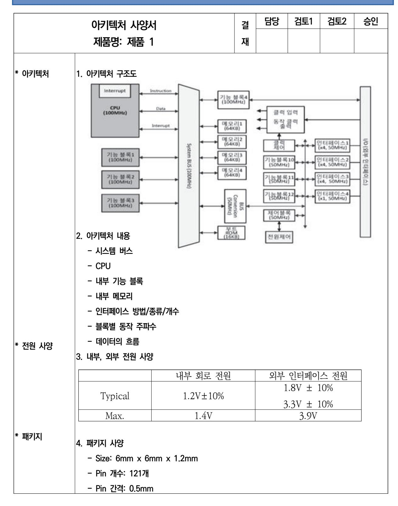

|                         |                     |       |        | 업무코드 |        |     | 승인권자 |
|-------------------------|---------------------|-------|--------|------|--------|-----|------|
|                         | 제품 사양서              |       | 결<br>재 | 기안   | 검토1    | 검토2 | 승인   |
| 제품명: 제품 1               |                     |       | 직위/성명  | /    | /      | /   | /    |
|                         |                     |       | 일 자    | /    | /      | /   | /    |
| ⦁개요                     | 1. 아키텍처 주요 내용       |       |        |      |        |     |      |
| ⦁주요 기능 및                | 1. 기능 1             |       |        |      |        |     |      |
| ⦁블록도                    | ⦁상세 기능 1-1          |       |        |      |        |     |      |
|                         | 2. 기능 2             |       |        |      |        |     |      |
|                         | ⦁상세 기능 2-1          |       |        |      |        |     |      |
|                         | ⦁상세 기능 2-2          |       |        |      |        |     |      |
|                         | 3. 기능 3             |       |        |      |        |     |      |
|                         | ⦁상세 기능 3-1          |       |        |      |        |     |      |
|                         | ⦁상세 기능 3-2          |       |        |      |        |     |      |
|                         | ⦁상세 기능 3-3          |       |        |      |        |     |      |
|                         | 4. 차별점              |       |        |      |        |     |      |
|                         | ⦁상세 기능 3-1          |       |        |      |        |     |      |
|                         | ⦁상세 기능 3-2          |       |        |      |        |     |      |
| ⦁전기적인 사양                | 1. 정격 동작 전압         |       |        |      |        |     |      |
|                         | ⦁인터페이스 전압           |       |        |      |        |     |      |
|                         | ⦁칩 내부 동작 전압         |       |        |      |        |     |      |
| ⦁물리적인 사양                | 1. 패키지              |       |        |      |        |     |      |
|                         | ⦁가로 x 세로 x 높이, 핀 개수 |       |        |      |        |     |      |
| ⦁경쟁제품 비교                | 항목                  | 제품 1  | 경쟁사 A  |      | 경쟁사 B  |     | 차별점  |
|                         | CPU                 | CPU_A | CPU_B  |      | CPU_A  |     | 동등   |
|                         | 주파수                 | 96MHz | 48MHz  |      | 100MHz |     | 동등   |
|                         |                     |       |        |      |        |     |      |
|                         |                     |       |        |      |        |     |      |
|                         |                     |       |        |      |        |     |      |
| 주) 1. 목표 사양은 기능 중심으로 작성 |                     |       |        |      |        |     |      |
| 2. 경쟁사 대비 비교 우위점 표시     |                     |       |        |      |        |     |      |

| NCS학습모듈 개발이력 |                                     |     |                  |  |  |
|--------------|-------------------------------------|-----|------------------|--|--|
| 발행일          | 2024년 12월 31일                       |     |                  |  |  |
| 세분류명         | 반도체 개발((19030601)                   |     |                  |  |  |
| 개발기관         | 수원과학대학교 산학협력단(개발책임자: 윤창용) 한국직업능력연구원 |     |                  |  |  |
|              | 최준혁(수원대학교)*                         |     | 김종범(삼성전기)        |  |  |
|              | 계찬호(수원대학교)                          |     | 김한수(두원공과대학교)     |  |  |
|              | 김경호(폴리텍대학교)                         |     | 남승호(경기대학교)       |  |  |
|              | 김관하(폴리텍대학교)                         |     | 손승대(제이에스이엔씨(주))  |  |  |
| 집필진          | 김기순((주)영우디에스피)                      | 검토진 | 안광호(퓨쳐일렉트로닉스)    |  |  |
|              | 김도균(폴리텍대학교)                         |     | 이철오((주)한국전력안전공단) |  |  |
|              | 전동민(폴리텍대학교)                         |     |                  |  |  |

\*표시는 대표집필자임 (참고) 검토진으로 참여한 집필진은 본인의 원고가 아닌 타인의 학습모듈을 검토함

|                                                                                                        | 아날로그 회로 아키텍처 설계(LM1903060118_23v5) |  |  |
|--------------------------------------------------------------------------------------------------------|------------------------------------|--|--|
| 저작권자                                                                                                   | 교육부                                |  |  |
| 연구기관                                                                                                   | 한국직업능력연구원                          |  |  |
| 발행일                                                                                                    | 2024. 12. 31.                      |  |  |
| ISBN                                                                                                   | 979-11-7175-752-7                  |  |  |
| ※ 이 학습모듈은 자격기본법 시행령(제8조 국가직무능력표준의 활용)에 의거하여 개발하였으며,<br>NCS통합포털사이트(http.//www.ncs.go.kr)에서 다운로드 할 수 있다. |                                    |  |  |

