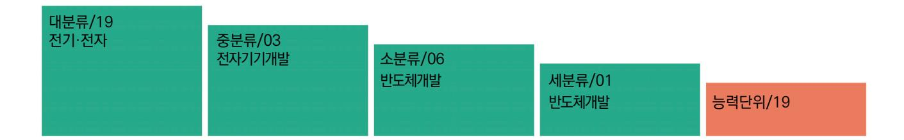
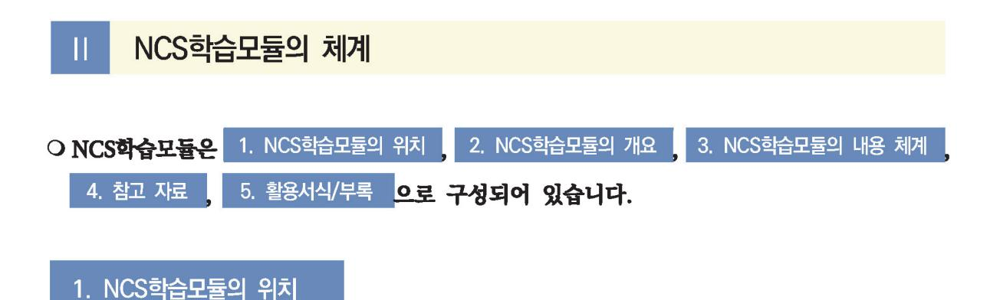
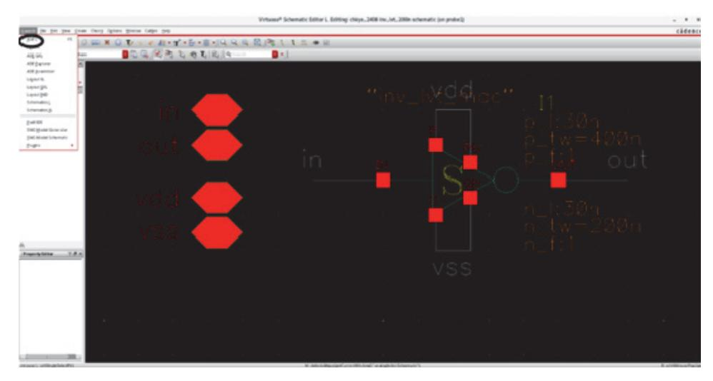
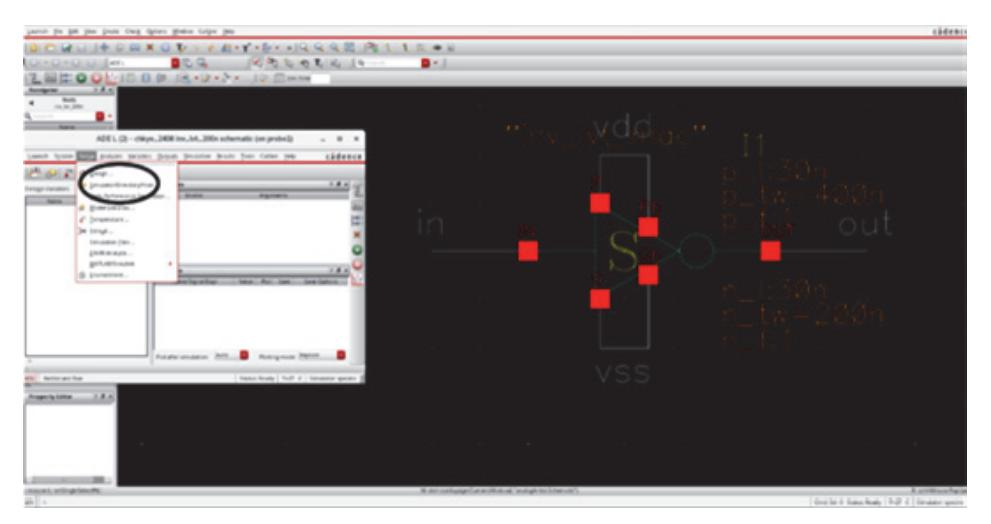
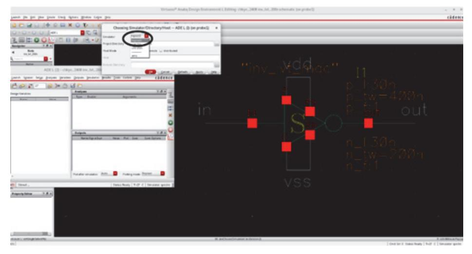
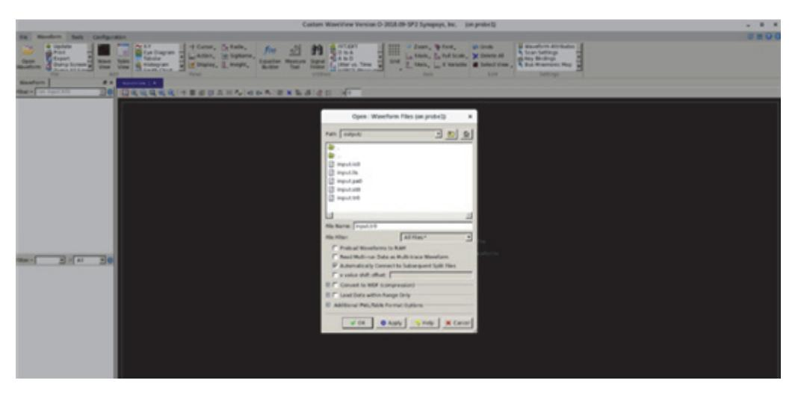
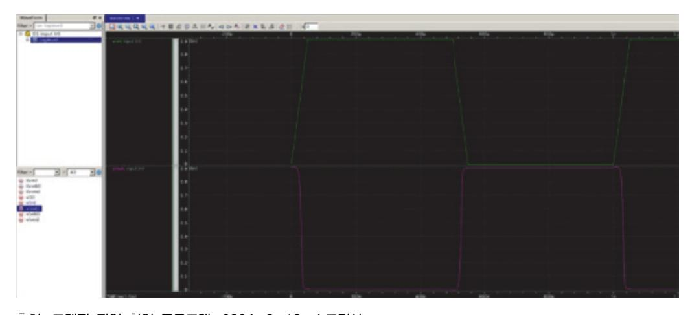
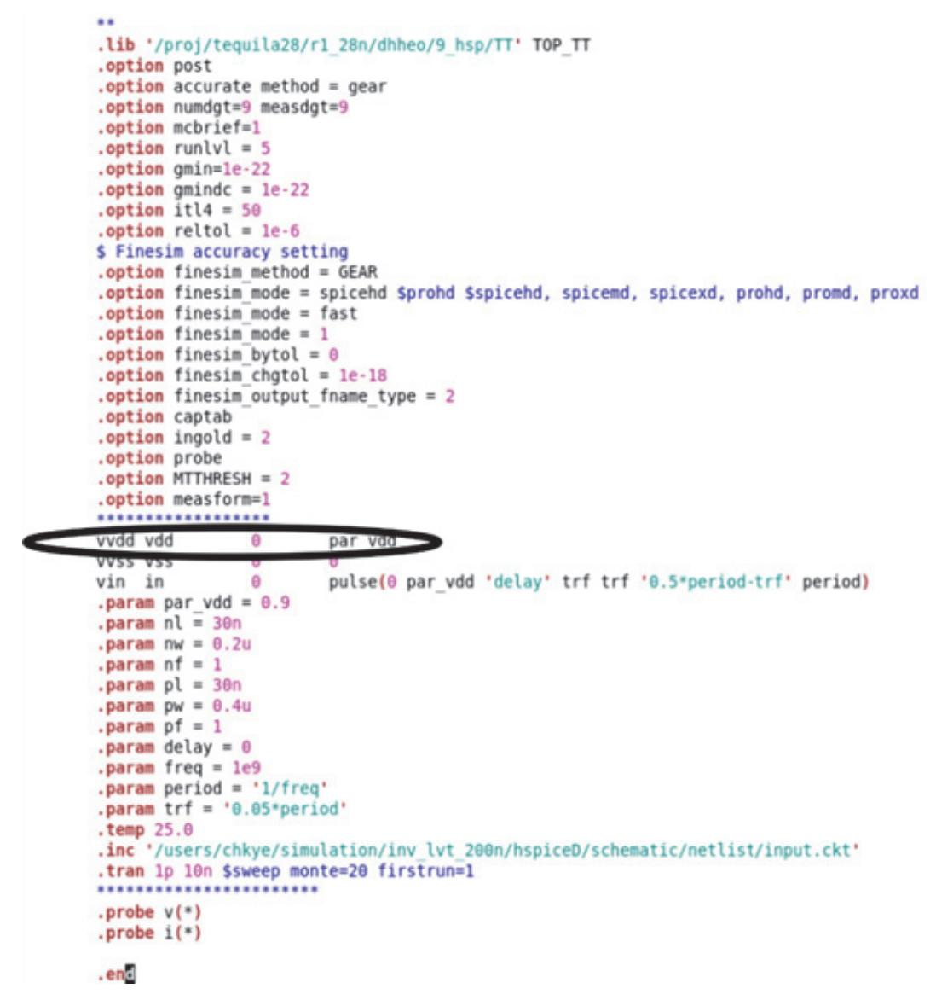
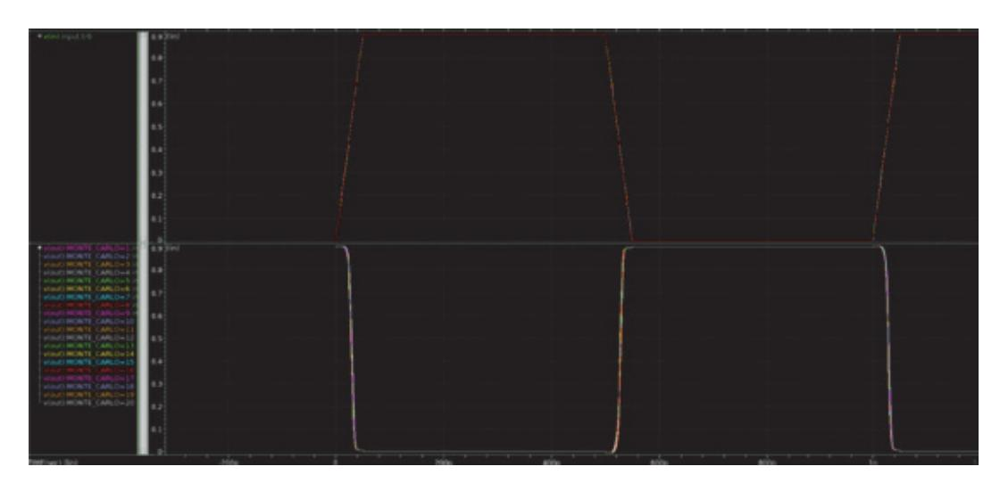
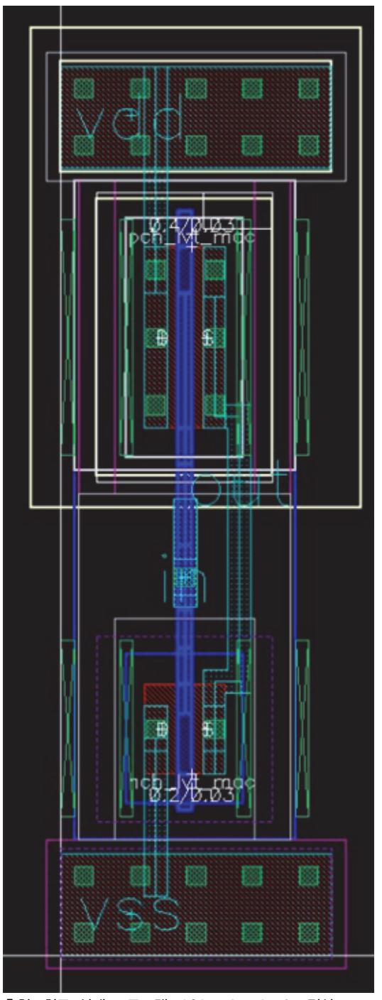

# NCS학습모듈 아날로그회로 소자 레벨 설계

LM1903060119\_23v5


#### [NCS학습모듈 활용 시 유의 사항]

- 1. NCS학습모듈은 교육훈련기관에서 출처를 명시하고 교육적 목적으로 활용할 수 있습니다. 다 만, NCS학습모듈에는 국가(교육부)가 저작재산권 일체를 보유하지 않은 저작물(출처가 표기된 도표‧사진‧삽화‧도면 등)이 포함되어 있으므로, 이러한 저작물의 변형‧각색‧복제‧공연‧ 배포 및 공중 송신 등과 이러한 저작물을 활용한 2차적 저작물을 작성하려면 반드시 원작자 의 동의를 받아야 합니다.
- 2. NCS학습모듈은 개발 당시의 산업 및 교육 현장을 반영하여 집필하였으므로, 현재 적용되는 법령‧지침‧표준 및 교과 내용 등과 차이가 있을 수 있습니다. NCS학습모듈 활용 시 법령 ‧지침‧표준 및 교과 내용의 개정 사항과 통계의 최신성 등을 확인하시기를 바랍니다.
- 3. NCS학습모듈은 산업 현장에서 요구되는 능력을 교육훈련기관에서 학습할 수 있게 구성한 자 료입니다. 다만, NCS학습모듈 지면의 한계상 대표적 예시(예: 활용도 또는 범용성이 높은 제 품, 서비스) 중심으로 집필하였음을 이해하시기를 바랍니다.

## NCS학습모듈의 이해

※ 본 NCS학습모듈은 「NCS 국가직무능력표준」사이트(http://www.ncs.go.kr) 에서 확인 및 다운로드할 수 있습니다.

## Ⅰ NCS학습모듈이란?

- 국가직무능력표준(NCS: National Competency Standards)이란 산업현장에서 직무를 수행하기 위해 요구되는 지식·기술·소양 등의 내용을 국가가 산업부문별·수준별로 체계 화한 것으로 산업현장의 직무를 성공적으로 수행하기 위해 필요한 능력(지식, 기술, 태도) 을 국가적 차원에서 표준화한 것을 의미합니다.
- 국가직무능력표준(이하 NCS)이 현장의 '직무 요구서'라고 한다면, NCS학습모듈은 NCS
   의 능력단위를 교육훈련에서 학습할 수 있도록 구성한 '교수·학습 자료'입니다. NCS학습
   모듈은 구체적 직무를 학습할 수 있도록 이론 및 실습과 관련된 내용을 상세하게 제시하
   고 있습니다.


### ○ NCS학습모듈은 다음과 같은 특징을 가지고 있습니다.

- 첫째, NCS학습모듈은 산업계에서 요구하는 직무능력을 교육훈련 현장에 활용할 수 있도 록 성취목표와 학습의 방향을 명확히 제시하는 가이드라인의 역할을 합니다.
- 둘째, NCS학습모듈은 특성화고, 마이스터고, 전문대학, 4년제 대학교의 교육기관 및 훈 련기관, 직장교육기관 등에서 표준교재로 활용할 수 있으며 교육과정 개편 시에도 유용하게 참고할 수 있습니다.


○ NCS와 NCS학습모듈 간의 연결 체계를 살펴보면 아래 그림과 같습니다.



O NCS학습모듈의 위치는 NCS 분류 체계에서 해당 학습모듈이 어디에 위치하는지를 한 눈에 볼 수 있도록 그림으로 제시한 것입니다.

| [NCS-학          | 습모듈              | 의 위치]    |          |  |
|-----------------|------------------|----------|----------|--|
|                 |                  |          |          |  |
| 대분류             | 대분류 문화·예술·디자인·방송 |          |          |  |
| 중분류             | 문화콘텐츠            |          |          |  |
| 소분류             |                  | 문화콘텐츠제작  |          |  |
|                 |                  |          |          |  |
| 세분류             |                  |          |          |  |
| 방송콘텐츠제작         |                  | 능력단위     | 학습모듈명    |  |
| 영화콘텐츠제작         |                  | 프로그램 기획  | 프로그램 기획  |  |
| 음악콘텐츠제작         |                  | 아이템 선정   | 아이템 선정   |  |
| 광고콘텐츠제작         |                  | 자료 조사    | 자료 조사    |  |
| 게임콘텐츠제작         |                  | 프로그램 구성  | 프로그램 구성  |  |
| 애니메이션<br>콘텐츠제작  |                  | 캐스팅      | 캐스팅      |  |
| 만화콘텐츠제작         |                  | 제작계획     | 제작계획     |  |
| 캐릭터제작           |                  | 방송 미술 준비 | 방송 미술 준비 |  |
| 스마트문화앱<br>콘텐츠제작 |                  | 방송 리허설   | 방송 리허설   |  |
| 영사              |                  | 야외촬영     | 야외촬영     |  |
|                 |                  | 스튜디오 제작  | 스튜디오 제작  |  |
|                 |                  |          |          |  |

학습모듈은

NCS 능력단위 1개당 1개의 학습모듈 개발 을 원칙으로 합니다. 그러나 필요에 따라 고용단위 및 교과단위를 고려하여 능력단위 몇 개를 묶어 1개 학습모듈로 개발할 수 있으며, NCS 능력단위 1개를 여러 개의 학습모듈로 나누어 개발할 수도 있습니다.

### 2. NCS학습모듈의 개요

#### ○ NCS학습모듈의 개요는 학습모듈이 포함하고 있는 내용을 개략적으로 설명한 것으로

| 학습모듈의 목표       | 선수학습, 학습모듈의 내용 체계, 핵심 용어 로 구성되어 있습니다.                                        |  |  |
|----------------|------------------------------------------------------------------------------|--|--|
| 학습모듈의 목표       | 해당 NCS 능력단위의 정의를 토대로 학습 목표를 작성한 것입니다.                                        |  |  |
| 선수학습           | 해당 학습모듈에 대한 효과적인 교수·학습을 위하여 사전에 이수해야 하는 학습모<br>듈, 학습 내용, 관련 교과목 등을 기술한 것입니다. |  |  |
| 학습모듈의<br>내용 체계 | 해당 NCS 능력단위요소가 학습모듈에서 구조화된 체계를 제시한 것입니다.                                     |  |  |
| 핵심 용어          | 해당 학습모듈의 학습 내용, 수행 내용, 설비·기자재 등 가운데 핵심적인 용어를 제<br>시한 것입니다.                   |  |  |

### 제작계획 학습모듈의 개요

#### 학습모듈의 목표

본격적인 촬영을 준비하는 단계로서, 촬영 대본을 획정하고 제작 스태프를 조직하며 촬영 장비와 촬영 소품을 준비할 수 있다.

#### 선수학습

제작 준비(LM0803020105\_13v1), 섭외 및 제작스태프 구성(LM0803020104\_13v1), 촬영 제작(LM0803020106\_13v1), 촬영 장비 준비(LM0803040204\_13v1.4), 미술 디자인 협의하기(LM0803040203\_13v1.4)

#### 학습모듈의 내용체계

| 하스                | 하스 내용                                              | NCS 능력단위 요소       |                |
|-------------------|----------------------------------------------------|-------------------|----------------|
| 학습                | 학습 내용                                              | 코드번호              | 요소 명칭          |
| 1. 촬영 대본<br>확정하기  | 1-1. 촬영 구성안 검<br>토와 수정                             | 0803020114_16/3.1 | 촬영 대본<br>확정하기  |
| 2. 제작 스태프<br>조직하기 | 2-1. 기술 스태프 조직<br>2-2. 미술 스태프 조직<br>2-3. 전문 스태프 조직 | 0803020114_16v3.2 | 제작 스태프<br>조직하기 |
| 3. 촬영 장비<br>계획하기  | 3-1. 촬영 장비 점검<br>과 준비                              | 0803020114_16/3.3 | 촬영 장비<br>계획하기  |
| 4. 촬영 소품<br>계획하기  | 4-1. 촬영 소품 목록<br>작성<br>4-2. 촬영 소품 제작<br>의뢰         | 0803020114_16\3.4 | 촬영 소품<br>계획하기  |

#### 핵심 용어

촬영 구성안, 제작 스태프, 촬영 장비, 촬영 소품

#### 학습모듈의 목표는

학습자가 해당 학습모듈을 통해 성취해야 할 목표를 제시한 것으로, 교수자는 학습자 가 학습모듈의 전체적인 내용흐름을 파악하 도록 지도할 수 있습니다.

**6** • •

61

#### 선수학습은

교수자 또는 학습자가 해당 학습모듈을 교 수·학습하기 이전에 이수해야 하는 교과목 또는 학습모듈(NCS 능력단위) 등을 표기한 것입니다. 따라서 교수자는 학습자가 개별 학습, 자기 주도 학습, 방과 후 활동 등 다 양한 방법을 통해 이수할 수 있도록 지도하 는 것을 권장합니다.

|            | 핵심 용어는              |
|------------|---------------------|
|            | 률을 대표하는 주요 용어입니     |
|            | · 해당 학습모듈을 통해 학습    |
|            | 게될 주요 내용을 알 수 있습    |
|            | 5 국가직무능력표준」 사이트     |
| (www.ncs.g | jo.kr)의 색인 (찾아보기) 중 |
| 하나로 이용할    | 할 수 있습니다            |

### 3. NCS학습모듈의 내용 체계

○ NCS학습모듈의 내용은 크게 학습, 학습 내용, 교수·학습 방법, 평가 로 구성되어 있습니다.

| 학습       | 해당 NCS 능력단위요소 명칭을 사용하여 제시한 것입니다.<br>학습은 크게 학습 내용, 교수·학습 방법, 평가로 구성되며 해당 NCS 능력단위의<br>능력단위 요소별 지식, 기술, 태도 등을 토대로 내용을 제시한 것입니다.                                                    |
|----------|----------------------------------------------------------------------------------------------------------------------------------------------------------------------------------|
| 학습 내용    | 학습 내용은 학습 목표, 필요 지식, 수행 내용으로 구성되며, 수행 내용은 재료·자<br>료, 기기(장비·공구), 안전·유의 사항, 수행 순서, 수행 tip으로 구성한 것입니다.<br>학습모듈의 학습 내용은 실제 산업현장에서 이루어지는 업무활동을 표준화된 프로세<br>스에 기반하여 다양한 방식으로 반영한 것입니다. |
| 교수·학습 방법 | 학습 목표를 성취하기 위한 교수자와 학습자 간, 학습자와 학습자 간 상호 작용이<br>활발하게 일어날 수 있도록 교수자의 활동 및 교수 전략, 학습자의 활동을 제시한<br>것입니다.                                                                            |
| 평가       | 평가는 해당 학습모듈의 학습 정도를 확인할 수 있는 평가 준거 및 평가 방법, 평<br>가 결과의 피드백 방법을 제시한 것입니다.                                                                                                         |


## [NCS-학습모듈의 위치]

| 대분류 | 전기<br>‧<br>전자 |          |        |
|-----|---------------|----------|--------|
| 중분류 |               | 전자 기기 개발 |        |
| 소분류 |               |          | 반도체 개발 |

| 세분류    |                  |                  |
|--------|------------------|------------------|
| 반도체 개발 | 능력단위             | 학습모듈명            |
| 반도체 제조 | 반도체 제품 기획        | 반도체 제품 기획        |
| 반도체 장비 | 반도체 아키텍처 설계      | 반도체 아키텍처 설계      |
| 반도체 재료 | 디지털 회로 설계        | 디지털 회로 설계        |
|        | 패키지 조립 공정 개발     | 패키지 조립 공정 개발     |
|        | 반도체 제품 기능·성능 검증  | 반도체 제품 기능·성능 검증  |
|        | 자동 배치 배선 레이아웃 설계 | 자동 배치 배선 레이아웃 설계 |
|        | 반도체 설계 검증        | 반도체 설계 검증        |
|        | 반도체 펌웨어 개발       | 반도체 펌웨어 개발       |
|        | 메모리 반도체 제조 공정 개발 | 메모리 반도체 제조 공정 개발 |
|        | 시스템 반도체 제조 공정 개발 | 시스템 반도체 제조 공정 개발 |
|        | 반도체 제조 단위 공정 개발  | 반도체 제조 단위 공정 개발  |
|        | 아날로그 회로 아키텍처 설계  | 아날로그 회로 아키텍처 설계  |
|        | 아날로그 회로 소자 레벨 설계 | 아날로그 회로 소자 레벨 설계 |
|        | 아날로그 회로 시스템 설계   | 아날로그 회로 시스템 설계   |
|        |                  |                  |

| 와이어 본딩 패키지 개발     | 와이어 본딩 패키지 개발     |
|-------------------|-------------------|
| 플립 칩 패키지 개발       | 플립 칩 패키지 개발       |
| 웨이퍼 레벨 패키지 개발     | 웨이퍼 레벨 패키지 개발     |
| 어드밴스드 팬 아웃 패키지 개발 | 어드밴스드 팬 아웃 패키지 개발 |
| 이종 접합 패키지 개발      | 이종 접합 패키지 개발      |
| 어드밴스드 언더필 패키지 개발  | 어드밴스드 언더필 패키지 개발  |
| 반도체 환경 시험         | 반도체 환경 시험         |
| 반도체 수명 시험         | 반도체 수명 시험         |
| 반도체 내성 시험         | 반도체 내성 시험         |
| 커스텀 레이아웃 적용 공정 분석 | 커스텀 레이아웃 적용 공정 분석 |
| 커스텀 레이아웃 설계       | 커스텀 레이아웃 설계       |
| 커스텀 레이아웃 검증       | 커스텀 레이아웃 검증       |

## 차 례

| 학습모듈의 개요          | 1  |
|-------------------|----|
| 학습 1. 블록별 회로 구성하기 |    |
| 1-1. 블록별 회로 구성    | 3  |
| • 교수 ․ 학습 방법      | 22 |
| • 평가              | 23 |
| 학습 2. 시뮬레이션하기     |    |
| 2-1. 시뮬레이션        | 26 |
| • 교수 ․ 학습 방법      | 47 |
| • 평가              | 48 |
| 학습 3. 포스트 시뮬레이션   |    |
| 3-1. 포스트 시뮬레이션    | 52 |
| • 교수 ․ 학습 방법      | 67 |
| • 평가              | 68 |
| 참고 자료             | 71 |

## 아날로그 회로 소자 레벨 설계 학습모듈의 개요

#### 학습모듈의 목표

설계 IP의 블록 단위 스펙에 근거하여 트랜지스터 레벨의 단위 소자로 회로를 구성하고, 크기 변경을 통해 원하는 기능과 성능을 만족하는지 시뮬레이션을 수행하고 출력 파형을 통해 이를 분석할 수 있다.

#### 선수학습

전자 회로, 회로 이론, 컴퓨터 프로그래밍, 반도체 소자, 집적 회로

#### 학습모듈의 내용체계

|                    |                | NCS 능력단위 요소       |             |
|--------------------|----------------|-------------------|-------------|
| 학습                 | 학습 내용          | 코드번호              | 요소 명칭       |
| 1. 블록별 회로 구성하기     | 1-1. 블록별 회로 구성 | 1903060119_23v5.1 | 블록별 회로 구성하기 |
| 2. 시뮬레이션하기         | 2-1. 시뮬레이션     | 1903060119_23v5.2 | 시뮬레이션하기     |
| 3. 포스트 시뮬레이션하<br>기 | 3-1. 포스트 시뮬레이션 | 1903060119_23v5.3 | 포스트 시뮬레이션하기 |

#### 핵심 용어

블록 단위 회로, 회로 소자, 회로도 구성, 트랜지스터 레벨, 회로 배치, 시뮬레이션, 레이아웃, 성능 최적화, 출력 파형

## 학습 1 블록별 회로 구성하기 학습 2 시뮬레이션하기 학습 3 포스트 시뮬레이션하기

# 1-1. 블록별 회로 구성

| 학습 목표 | • 블록별 설계 스펙을 이해할 수 있다.                               |
|-------|------------------------------------------------------|
|       | • 블록별 입출력 신호와 제어 신호의 비트 수를 파악할 수 있다.                 |
|       | • 블록의 기능을 만족하기 위한 기존 회로 도면, 참고 자료의 해석을 통해 회로 구조를 결정할 |
|       | 수 있다.                                                |
|       | • 회로 구조에 맞는 단위 소자의 기본 크기 정보 입력 후 배치를 수행할 수 있다.       |
|       | • 소자들을 서로 연결하여 회로 도면을 그릴 수 있다.                       |
|       |                                                      |

## 필요 지식 /

#### 숔 아날로그 회로 소자 레벨 설계 기초 이론

아날로그 회로 소자 레벨 설계를 시작하기 전에 회로 이론, 반도체 소자의 물리적 동작 원리를 이해해야 이를 바탕으로 하여 설계 스펙에 맞는 회로를 설계할 수 있다. 다음은 기본적인 회로 이론, 반도체 소자에 관한 기본적인 내용을 정리하였다.

1. 회로 이론

전기 회로의 분석 및 설계를 위한 기초적인 이론과 원리를 다룬다. 이를 통해 전기 회로의 동작을 이해하고, 이를 기반으로 다양한 전자 회로 시스템을 설계할 수 있다. 다음은 주요 회로 이론의 개념과 방법이다.

(1) 옴의 법칙

옴의 법칙은 전기 회로에서 전압(V), 전류(I), 저항(R) 사이의 관계를 나타내는 기본적인 법칙이 다.

옴의 법칙은 다음과 같은 형태로 표현된다.

= ×

여기서, 는 전압 (볼트, V), 는 전류 (암페어, A), 은 저항 (옴, Ω)

이 법칙을 통해 세 가지 물리량 중 2가지를 알고 있을 때 나머지 하나를 계산할 수 있 다.

옴의 법칙은 대부분의 선형 저항성 물질에 대해 유효하다. 그러나 다음과 같은 경우에는 옴의 법칙이 적용되지 않을 수 있다.

- (가) 비선형 소자: 다이오드, 트랜지스터 등의 비선형 소자에서는 옴의 법칙이 직접적으로 적 용되지 않는다.
- (나) 고주파 회로: 고주파에서의 전자기 현상으로 인해 저항 이외의 리액턴스가 큰 영향을 끼 칠 수 있다.
- (다) 온도 변화: 저항은 온도에 따라 변화할 수 있으며, 이 경우 온도의 영향을 고려해야 한 다.

옴의 법칙은 전기 회로의 기초를 이해하는 데 필수적이며, 회로 설계 및 분석에 널리 사용된다.

(2) 키르히호프의 법칙

키르히호프의 법칙은 전기 회로를 해석하는 데 필수적인 법칙으로, 전류 법칙(KCL)과 전압 법칙(KVL) 2가지로 구성되어 있다.

- (가) 키르히호프의 전류 법칙(KCL: Kirchhoff's Current Law) 키르히호프의 전류 법칙은 회로 내의 한 접점에 들어오고 나가는 전류의 총합이 0이 라는 원리이다. 즉, 접점에 들어오는 전류의 합은 나가는 전류의 합과 같다. 이는 전 하가 보존된다는 법칙에 기반한다.
- (나) 키르히호프의 전압 법칙(KVL: Kirchhoff's Voltage Law)

키르히호프의 전압 법칙은 회로 내의 닫힌 루프를 따라 모든 전압 강하의 총합이 0 이라는 원리이다. 즉, 루프 내의 모든 전기적인 에너지는 보존된다.

(3) 수동 소자의 이해

수동 소자는 전기 회로에서 전기 에너지를 저장하거나 소모하는 역할을 하지만 전기 신 호를 증폭하거나 생성하지는 않는다. 수동 소자의 주요 종류에는 저항, 커패시터, 그리 고 인덕터가 있다.

(가) 저항(Resistor)

저항은 전류의 흐름을 저항하는 소자이다. 저항은 옴(Ω) 단위로 측정되며, 저항값이 클수록 전류의 흐름을 더 많이 방해한다.

(나) 커패시터(Capacitor)

커패시터는 전기 에너지를 전기장에 저장하는 소자이다. 커패시터는 패럿(F) 단위로 측정되며, 주로 신호 필터링, 전압 조정, 에너지 저장 등의 용도로 사용된다.

(다) 인덕터(Inductor)

인덕터는 전기 에너지를 자기장에 저장하는 소자이다. 인덕턴스는 헨리(H) 단위로 측 정되며, 주로 신호 필터링, 전력 변환, 전자기 간섭(EMI) 억제 등에 사용된다.

#### 2. 반도체 소자

반도체 소자는 반도체 물질을 이용하여 다양한 전자 기능을 수행하는 소자들이다. 반도체 소자는 주로 실리콘(Si), 게르마늄(Ge), 갈륨 아세나이드(GaAs) 등의 반도체 물질을 사용하 여 제작된다. 이러한 소자들은 전자 기기 및 회로에서 핵심적인 역할을 한다. 주요 반도체 소자에는 다이오드, 트랜지스터 등이 있다.

(1) 다이오드

다이오드는 전류를 한 방향으로만 흐르게 하는 소자이다.

(가) P-N 접합

P형 반도체와 N형 반도체를 접합하여 다이오드를 만든다. 이는 정류 작용을 하며, 한 방향으로만 전류를 흐르게 한다.

(나) 다이오드의 I-V 특성

순방향 바이어스와 역방향 바이어스에서의 동작을 이해한다.

(다) 특수 다이오드

정류 작용뿐만 아니라 다양한 용도의 다이오드가 존재한다. 제너 다이오드(전압 레귤 레이션, 전압 조정 및 안정화에 사용), 쇼트 키 다이오드(고속 스위칭), LED(발광 다 이오드) 등의 용도 및 동작을 이해한다.

(2) 트랜지스터

트랜지스터는 전자 회로에서 전류를 증폭하거나 스위칭하는 역할을 하는 능동적인 반도 체 소자이다. 트랜지스터는 현대 전자 공학의 핵심 구성 요소로, 컴퓨터, 통신 장비, 가 전제품 등 다양한 전자 기기에 사용된다.

(가) 바이폴라 접합 트랜지스터(BJT: Bipolar Junction Transistor)

BJT는 전류 제어 소자이다. 전자와 정공의 이동을 통해 동작하며, NPN형과 PNP형 2가지 타입이 있다.

1) NPN 트랜지스터

NPN 트랜지스터는 2개의 N형 반도체와 하나의 P형 반도체로 구성된다. 베이스 -이미터 사이에 소량의 전류가 흐르면 컬렉터-이미터 사이에 큰 전류가 흐른다. 주로 전류를 증폭하는 용도로 사용된다.

2) PNP 트랜지스터

PNP 트랜지스터는 2개의 P형 반도체와 하나의 N형 반도체로 구성된다. NPN 트랜지스터와 같은 원리로 전류를 증폭하지만 반대의 전류 방향을 갖는다.

(나) 전계 효과 트랜지스터(FET: Field-Effect Transistor)

FET는 전압 제어 소자이다. 게이트 전압을 통해 드레인-소스 사이의 전류를 제어한 다.

1) JFET(Junction Field-Effect Transistor)

JFET은 반도체 채널과 P-N 접합으로 구성되어 있다. 게이트-소스 전압에 의해 드레인-소스 전류가 제어된다. 입력 임피던스가 매우 높다.

- 2) MOSFET(Metal-Oxide-Semiconductor Field-Effect Transistor) MOSFET은 전계 효과 트랜지스터의 일종으로, 금속 산화물 반도체 구조이다. 게 이트에 전압을 인가하면 채널이 형성되어 드레인과 소스 사이에 전류가 흐른다. 게이트 전압에 따라 채널의 폭이 변하여 전류를 제어한다.
- 3. 아날로그 집적 회로(Analog IC: Analog Integrated Circuits)

집적 회로는 여러 개의 전자 부품(저항, 트랜지스터, 다이오드, 커패시터 등)을 하나의 작은 반도체 칩에 집적한 것이다. 집적 회로는 전자 기기의 소형화와 고성능화, 저전력 동작을 가능하게 하였으며, 현대 전자 공학의 핵심 기술 중 하나이다. 특히 아날로그 집적 회로는 연속적인 아날로그 신호를 처리하는 전자 소자들을 하나의 칩에 집적한 것이다. 아날로그 신호는 시간에 따라 연속적으로 변화하는 전압 또는 전류로 표현되며, 이러한 신호를 처리 하기 위해 다양한 종류의 아날로그 집적 회로가 사용된다.

- (1) 주요 아날로그 집적 회로의 종류와 기능
  - (가) 연산 증폭기(Op-Amp: Operational Amplifier)
    - 1) 기능: 신호 증폭, 필터링, 연산(덧셈, 뺄셈 등)
    - 2) 특징: 높은 이득, 높은 입력 임피던스, 낮은 출력 임피던스
    - 3) 응용: 신호 증폭기, 필터, 비교기, 신호 합성기
  - (나) 전압 조정기(VR: Voltage Regulator)
    - 1) 기능: 일정한 출력 전압을 유지
    - 2) 특징: 입력 전압의 변동에 상관없이 안정된 출력 전압 제공
    - 3) 응용: 전원 공급 장치, 배터리 충전기, 전자 기기의 전원 관리
  - (다) 아날로그-디지털 변환기(ADC: Analog-to-Digital Converter)
    - 1) 기능: 아날로그 신호를 디지털 신호로 변환
    - 2) 특징: 변환 속도와 해상도에 따라 다양한 종류 존재
    - 3) 응용: 데이터 수집 시스템, 디지털 오실로스코프, 디지털 오디오 및 비디오 장치
  - (라) 디지털-아날로그 변환기(DAC: Digital-to-Analog Converter)
    - 1) 기능: 디지털 신호를 아날로그 신호로 변환
    - 2) 특징: 변환 정확도와 속도에 따라 다양한 종류 존재
    - 3) 응용: 오디오 및 비디오 출력 장치, 신호 생성기, 통신 장비
  - (마) 필터(Filter)
    - 1) 기능: 특정 주파수 대역의 신호를 통과 또는 차단

2) 특징: 저역 필터, 고역 필터, 대역 통과 필터 등 여러 종류 존재

3) 응용: 신호 처리, 잡음 제거, 주파수 선택

- (바) 발진기(Oscillator)
  - 1) 기능: 주기적인 신호 생성
  - 2) 특징: 정밀한 주파수 제어 가능
  - 3) 응용: 클록 신호 생성, 무선 통신, 타이밍 제어

(2) 아날로그 집적 회로의 설계 고려 사항

(가) 정밀도

신호 처리의 정확성을 보장하기 위해 높은 정밀도가 요구된다.

(나) 선형성

입력과 출력의 비례 관계가 중요하며, 비선형 특성은 왜곡을 초래할 수 있다.

(다) 잡음

외부 및 내부 잡음의 최소화가 필요하며, 신호 대 잡음비가 중요한 요소이다.

(라) 전력 소모

저전력 소모 설계가 중요하며, 특히 배터리로 구동되는 장치에서 중요하다.

(마) 열 안정성

온도 변화에 대한 안정성이 중요하며, 열에 의한 특성 변화 최소화 필요하다.

(바) 응답 속도

신호 처리의 속도가 중요한 경우 고속 응답이 요구된다.

(3) 아날로그 집적 회로의 장점

(가) 소형화

많은 소자를 하나의 칩에 집적하여 전체 시스템의 크기와 무게를 줄인다.

(나) 고성능

상대적으로 짧은 신호 경로로 인해 고속 작동이 가능하다.

(다) 저전력

소형화로 인한 전력 소모가 적다.

(라) 신뢰성

반도체 공정 기술의 발전으로 인해 높은 신뢰성이 제공된다.

(마) 저비용

대량 생산이 가능하여 제조단가가 절감된다.

숕 전자 회로 활용 기기

전자 회로는 거의 모든 전자 기기와 시스템의 기본 요소로, 설계와 구현에 따라 다양한 기능을 수행할 수 있다. 전자 회로의 활용 기기는 다음과 같이 정리할 수 있다.

1. 소리 및 음악 관련 기기

오디오 신호를 증폭하여 스피커를 통해 소리를 출력하는 앰프 회로, 여러 오디오 신호를 조 합하여 출력하는 믹서 회로 등 소리 및 음악에 관련된 기기에 사용된다.

2. 전원 관리 장치

다양한 전압과 전류를 제공하는 전원 공급 장치, 배터리 충전기에 사용된다.

- 3. 신호 처리 및 변환 기기
  - (1) 필터 회로

특정 주파수의 신호를 필터링하는 회로, 오디오 필터나 신호 처리에 사용된다.

- (2) 아날로그-디지털(ADC)/디지털-아날로그(DAC) 변환기 회로 아날로그 신호를 디지털로 변환하거나 디지털 신호를 아날로그 신호로 변환하는 회로에 사용된다.
- 4. 컴퓨터 및 디지털 장치
  - (1) CPU

중앙 처리 장치로 데이터를 처리하고 명령을 실행하는 역할을 한다. 마이크로프로세서는 컴퓨터의 두뇌 역할을 하며, 계산, 데이터 이동, 제어 작업 등을 수행한다.

(2) 메모리 모듈

데이터 저장을 위한 회로에 사용된다.

(가) DRAM(Dynamic RAM)

일시적으로 데이터를 저장하는 휘발성 메모리로, 컴퓨터의 주 메모리(RAM)로 사용된 다. 고속으로 데이터 접근이 가능하지만, 전원이 꺼지면 데이터가 사라진다.

(나) SRAM(Static RAM)

DRAM보다 빠르지만, 용량이 적고 비싸며 주로 캐시 메모리로 사용된다.

(다) Flash Memory

비휘발성 메모리로, 전원이 꺼져도 데이터를 유지할 수 있다. SSD, USB 드라이브 등에 사용된다.

- 5. 의료 장비
  - (1) 초음파 기기

초음파 기기에서 사용되는 집적 회로는 초음파 신호의 생성, 전송, 수신 및 처리를 위한 다양한 기능을 수행한다. 초음파 기기는 주로 의료용 초음파 장비, 비파괴 검사(NDT) 장비, 거리 측정기 및 센서 등에서 사용된다. 이러한 기기에서 집적 회로는 초음파 신호 를 효과적으로 처리하여 원하는 정보를 얻는 데 중요한 역할을 한다.

(가) 신호 생성 및 송신

1) 발진기(Oscillator)

초음파 기기의 IC는 고주파 신호를 생성하여 초음파 트랜스듀서에 전송한다. 발 진기는 원하는 주파수의 전기 신호를 생성하며, 이 신호는 초음파로 변환된다.

2) 파형 생성기(Waveform Generator)

특정 형태의 신호 파형을 생성하여 트랜스듀서로 보내고, 이를 통해 정확한 초음 파 신호를 발생시킨다.

(나) 신호 수신 및 증폭

1) 저잡음 증폭기(LNA, Low Noise Amplifier)

수신된 초음파 신호는 매우 미약하므로, 수신 IC는 이 신호를 증폭해야 한다.

LNA는 수신된 신호를 증폭하면서도 잡음은 최소화하는 역할을 한다.

2) 게인 제어(Gain Control)

수신 신호의 강도에 따라 자동으로 증폭률을 조절하는 기능이 포함되어 있다.

(다) 신호 처리

1) 아날로그-디지털 변환기(ADC: Analog-to-Digital Converter)

초음파 신호는 아날로그 형태로 수신되므로, 이를 디지털 신호로 변환하여 처리 하기 위해 ADC가 사용된다.

2) 디지털 신호 처리기(DSP: Digital Signal Processor)

디지털화된 초음파 신호를 분석, 필터링 등 필요한 처리를 수행하여 유용한 정보 를 추출한다.

(라) 트랜스듀서 제어 및 스위칭

1) 멀티플렉서(Multiplexer)

여러 초음파 트랜스듀서를 제어하기 위해 멀티플렉서가 사용되어 트랜스듀서 간 신호를 스위칭한다.

2) 트랜스듀서 구동 회로(Driver Circuit)

트랜스듀서를 구동하기 위한 전력 증폭기 및 스위칭 회로가 포함되어 있다.

#### (마) 전력 관리

1) 전원관리 IC(PMIC)

초음파 기기의 효율적인 전력 관리를 위해 전원 관리 IC(PMIC)가 사용되며, 이 는 전력 소모를 최소화하고 배터리 수명을 연장하는 데 도움을 준다.

#### 아날로그-디지털 변환기(Analog-to-Digital Converter)

아날로그-디지털 변환기(ADC: Analog-to-Digital Converter)는 아날로그 신호(연속적인 전압이나 전류)를 디 지털 신호(이산적인 값)로 변환하는 전자 회로이다. ADC는 아날로그 신호를 디지털화하여 컴퓨터나 디지털 시 스템에서 처리할 수 있게 하는 중요한 구성 요소이다. ADC는 특히 센서, 오디오 및 비디오 장치, 통신 시스템, 의료 장비 등 매우 다양한 응용 분야에 사용된다. ADC의 동작은 우선적으로 아날로그 신호를 일정한 간격으로 샘플링한다. 이때 샘플링 주파수는 샘플링된 신호가 원래 아날로그 신호를 제대로 나타낼 수 있을 만큼 충분히 높아야 한다(샘플링 이론에 따라 Nyquist 주파수보다 높아야 함.). 샘플링된 아날로그 신호의 값을 가장 가까운 이산적인 값으로 근사화한다. 이 단계에서는 아날로그 신호의 연속적인 값이 일정한 단계로 분할되며, 이 단계 간격을 양자화 간격이라고 한다. 양자화 과정에서 발생하는 오차를 양자화 잡음(Quantization Noise)이라고 한 다. 최종적으로 양자화된 값을 디지털 코드로 변환한다. 이 디지털 값은 보통 2진수로 표현되며, ADC의 해상도 에 따라 비트 수가 결정된다.

#### 숖 블록별 설계 스펙 이해

블록별 설계 스펙 이해는 회로 설계를 시작하기 전에 시스템이 어떤 기능을 수행해야 하는지, 그리고 블록별 회로가 가져야 할 특성과 제약 사항들을 명확하게 규정하는 단계이다. 이는 회 로 설계, 구현, 테스트의 전 과정에서 방향성을 제공한다. 블록별 설계 스펙 이해는 다음과 같 은 요소들로 구성될 수 있다.

- 1. 기능적 요구 사항
  - (1) 기능 설명

회로가 수행해야 할 주요 기능을 명시한다. 예를 들어, 신호 증폭, 데이터 변환, 전원 공급 등이다.

(2) 성능 요구 사항

회로가 달성해야 하는 성능 수준을 정의한다. 여기에는 신호 대 잡음비(SNR: Signal-to-Noise Ratio), 대역폭, 응답 시간 등이 포함될 수 있다.

- (3) 입출력에 관한 명시
  - 회로에 필요한 입력과 예상되는 출력에 관한 상세한 설명이 명시된다.
- (4) 동작 모드

회로가 지원해야 하는 다양한 동작 모드를 나타낸다.

#### 2. 비기능적 요구 사항

(1) 신뢰성 및 안정성

회로의 신뢰성, 수명, 평균 고장 간격 등에 대한 요구 사항을 명시한다.

(2) 전력 소모

회로의 전력 소비량과 관련된 요구 사항을 정의한다.

- (3) 환경적 요구 사항 온도, 전압, 습도 등 회로가 견뎌야 할 환경적 조건을 기술한다.
- (4) 규격 및 준수 사항

회로가 준수해야 할 국제적 표준, 규격, 법적 요구 사항 등을 포함한다.

- 3. 물리적 요구 사항
  - (1) 크기와 무게

회로의 물리적 크기와 무게 제한 등을 명시한다.

(2) 패키징 및 장착 방법

PCB 설계, 커넥터 종류, 케이블 연결 방식 등을 포함한다.

- 4. 인터페이스 요구 사항
  - (1) 전기적 인터페이스

다른 부품이나 시스템과 연결될 회로의 전기적 특성을 명시한다.

(2) 데이터 인터페이스

신호의 형식, 프로토콜, 속도 등의 데이터 통신 관련 요구 사항을 정의한다.

(3) 기계적 인터페이스 커넥터, 소켓 등의 기계적 연결 방식에 대한 요구 사항을 정의한다.

#### 숗 블록별 입출력 신호와 제어 신호의 비트 수 파악

블록의 입출력 및 제어 신호의 비트 수가 제대로 파악되어야 회로 간의 연결이 올바르게 이루 어지고, 기능이 정확하게 구현될 수 있다.

1. 입출력 신호 정의

각 블록에 대해 입력 및 출력 신호를 정의한다. 이 신호들은 다른 블록과 데이터를 주고받 거나 외부와 상호 작용하는 역할을 한다. 아날로그 회로에서의 입출력 신호는 주로 연속적 인 전압 또는 전류 신호이다. 이 신호들은 특정 범위의 전압이나 전류로 나타내며, 디지털 신호처럼 비트 수로 표현되지는 않는다. 그러나 디지털 제어 신호나 혼합 신호 블록에서는 각 신호의 비트 수를 파악하여 회로 설계에 반영해야 한다.

- (1) 증폭기(Amplifier)
  - (가) 입력 신호(Vin)

증폭기의 입력 신호는 연속적인 아날로그 전압 신호이다. 이 신호는 보통 특정 전압 범위(예: 0V~5V 또는 -1V~1V) 내에서 변동한다.

(나) 출력 신호(Vout)

증폭기의 출력 신호는 입력 신호가 증폭된 아날로그 전압 신호이다. 이 신호는 증폭 기의 이득(Gain)의 배수만큼 입력 신호보다 큰 전압으로 출력된다.

- (2) 저역 통과 필터(Low-Pass Filter)
  - (가) 입력 신호(Vin)

저역 통과 필터의 입력 신호는 연속적인 아날로그 전압 신호이다.

(나) 출력 신호(Vout)

저역 통과 필터의 출력 신호는 입력 신호가 필터링된 아날로그 전압 신호이다. 주파 수가 낮은 신호 성분만 통과하여 출력된다.

2. 제어 신호

주로 회로의 동작 모드를 설정하거나, 특정 파라미터를 조정하는 데 사용된다. 제어 신호는 아날로그일 수도 있고, 디지털일 수도 있다.

- (1) 아날로그 제어 신호
  - (가) 전압 제어 발진기(Voltage-Controlled Oscillator) Vcontrol(발진기의 주파수를 제어하는 아날로그 전압)는 연속적인 아날로그 신호이며, 발진기의 출력 주파수를 조절한다.
- (2) 디지털 제어 신호
  - (가) 가변 이득 증폭기(Variable Gain Amplifier)

수 회로 구조 결정 및 배치 수행

회로 구조를 결정하는 과정은 시스템이 요구하는 기능과 성능을 충족시키기 위해 필요한 전자 소자들을 선택하고, 이들을 적절하게 배치하고 연결하는 작업이다. 다음은 회로 구조 결정 과 정을 단계별로 설명한 것이다.

- 1. 회로의 기본 구조 설계
  - (1) 블록 다이어그램 작성

시스템을 여러 기능 블록으로 나누고, 각 블록이 수행할 기능을 정의한다. 이 블록 다이 어그램은 회로의 큰 그림을 제공하며, 블록 간의 신호 흐름을 이해하는 데 도움을 준다. 예를 들어, 입력 신호를 처리하는 블록, 전력 변환 블록, 출력 블록 등을 식별할 수 있 다.

(2) 주요 회로 구성 요소 선택

gain\_control[3:0](이득 제어 신호)는 이득을 제어하는 4비트 디지털 신호이며, 증폭 기의 이득을 16단계로 조절할 수 있게 한다.

각 블록에서 필요한 구성 요소(예: 트랜지스터, 저항, 커패시터, 연산 증폭기)를 선택한 다. 이 단계에서는 선택한 구성 요소가 전체 시스템의 성능에 미치는 영향을 평가하고, 서로 간의 상호 작용을 고려하여 최적의 소자를 선택한다.

- 2. 세부 회로 설계
  - (1) 블록별 회로 기능 파악

각 블록에 필요한 회로의 기능을 파악한다. 예를 들어, 증폭기 블록은 연산 증폭기와 관 련된 주변 회로를 포함할 수 있고, 데이터 변환 블록은 ADC나 DAC와 같은 변환 회로 를 포함할 수 있다.

(2) 소자 선택 및 파라미터 결정

각 블록에서 사용될 주요 소자(트랜지스터, 저항, 커패시터 등)을 선택한다. 각 소자의 파라미터 값을 적절히 결정한다. 이 단계에서는 회로의 입출력 특성, 신호 무결성, 전력 소모량 등을 고려해야 한다.

(3) 블록별 회로 구성

선택한 소자를 바탕으로 실제 회로를 구성한다. 여기서는 회로의 동작 원리를 명확히 이 해하고, 각 소자가 원하는 기능을 수행하도록 배치하고 연결한다.

#### 파라미터(Parameter)

전자 회로 설계에 있어서 파라미터란 전자 부품(회로소자)이 회로에서 어떻게 동작하는지를 정의하는 중요한 특 성값이다. 이러한 파라미터는 회로 설계 시 성능, 효율성, 안정성 등을 결정짓는 중요한 요소이다. MOSFET의 경우 드레인-소스 전압(VDS), 드레인 전류(ID), 게이트 전압(VGS), 트랜스컨덕턴스(gm)이 트랜지스터의 성능을 결 정하는 파라미터이다. 이러한 파라미터는 트랜지스터의 사이즈(두께, 길이 등 물리적인 크기)에 따라 달라지므로 적절한 사이징을 하는 것이 중요하다. 저항의 경우 저항값, 커패시터의 경우 정전 용량값, 인덕터의 경우 인덕턴 스를 나타낸다.

## 수행 내용 / 블록별 회로 구성하기

#### 재료·자료

- IEEE 회로 관련 학회, 저널 논문
- 회로 관련 튜토리얼, 강의 자료
- 제품 사양

#### 기기(장비 ・ 공구)

- PC 또는 노트북
- IEEE 구독
- 프린터
- 안전 ・ 유의 사항
  - 사양에 맞는 적절한 회로 구조를 선택 및 각 전자 회로소자의 적절한 규격을 설정하고 배치 해야 한다.

#### 수행 순서

숔 설계하고자 하는 블록의 스펙을 이해한다. 설계하고자 하는 회로의 기능, 성능에 관한 지표 및 항목들을 이해한다. 기본적인 전자 회로에

대한 지식 및 이론적인 배경 등에 대해 교과서 및 강의 자료 등을 통해 이해한다.

- 1. 검색 전 설계하고자 하는 블록의 스펙을 구체적으로 파악할 수 있도록 계획한다. 자료 검색 및 분석을 위해서는 전자 회로에 대한 지식, 회로 모듈의 주요 키워드에 대해 숙 지한다. 검색 결과를 파악하고 해석할 수 있는 능력을 기른다.
- 2. 기능적 요구 사항, 비기능적 요구 사항 등을 분류하여 원하는 동작을 수행하고 적절한 성능을 얻 을 수 있도록 요구 사항을 정의한다. 회로가 수행해야 할 주요 기능을 정확하게 파악하고 달성해야 할 성능 지표들을 정리한다. 회로의 신뢰성 및 안정성 측면에서 어떤 것이 고려되어야 할지 파악한다.

<표 1-1> 반도체 회로 조사 기관 사이트

| 기관명         | 내용                                    | 사이트 주소(URL)                                                       |
|-------------|---------------------------------------|-------------------------------------------------------------------|
| 국제전기전자공학자협회 | - 국제 반도체 회로 학회/저널 기술 동향               | https://ieeexplore.ieee.org/Xplore<br>/home.jsp                   |
| 대한전자공학회     | - 국내 대한전자공학회 주관 학회/저널<br>기술 동향        | https://www.theieie.org/pages_p<br>ublication/academic_journal.vm |
| 반도체설계교육센터   | - 각종 반도체 회로 설계 교육 프로그램<br>및 VOD 강좌 제공 | https://www.idec.or.kr/main/                                      |

숕 블록별 입출력 신호와 제어 신호의 비트 수를 파악한다.

블록별 입출력 신호와 제어 신호의 비트 수를 파악하는 과정은 각 블록의 기능을 명확히 이해 하고, 시스템 전체의 통합성 및 성능을 최적화하는 중요한 작업이다. 이 과정은 각 블록의 데 이터 흐름을 분석하고, 신호 간의 상호 작용을 검토하여, 적절한 비트 수를 지정하는 단계로 구성된다. 아래는 그 과정을 더 구체적으로 설명한 내용이다.

1. 블록별 입출력 신호와 제어 신호를 정의한다.

블록별로 어떤 신호를 주고받는지 파악하는 것이 우선이다. 블록의 입력, 출력, 그리고 제어 신호는 블록이 처리하는 데이터 양에 따라 비트 수가 달라지기 때문에 이를 분석하는 과정 이 필요하다.

- (1) 입력 신호를 정의한다.
  - (가) 데이터 입력 신호를 정의한다.

각 블록이 처리할 데이터의 크기와 형식에 따라 입력 신호의 비트 수를 정의해야 한 다. 예를 들어, 프로세서나 메모리 블록의 경우 데이터 버스의 크기가 8비트, 16비 트, 32비트 등으로 설정될 수 있다. 데이터를 병렬로 받을 것인지 직렬로 받을 것인 지에 따라 데이터의 비트 수가 다를 수 있다.

(나) 입력 제어 신호를 정의한다.

제어 신호는 블록의 동작 상태를 설정하거나 블록 간의 데이터를 동기화하는 데 사 용된다. 제어 신호는 클럭 신호, 리셋 신호, 활성화 신호(Enable), 선택 신호(Select) 등이 있다.

- (2) 출력 신호를 정의한다.
  - (가) 데이터 출력 신호를 정의한다.

출력 신호는 블록이 처리한 데이터를 외부에 보내는 역할을 한다. 출력 데이터의 비 트 수는 입력 신호의 비트 수와 비슷하거나 데이터 처리 후 변환에 따라 달라질 수 있다. 출력 신호의 비트 수를 정의하려면 각 블록의 데이터 처리 결과에 따라 결과 값의 크기와 범위를 계산해야 한다.

(나) 출력 제어 신호를 정의한다.

출력 제어 신호는 다른 블록이나 시스템에 대한 상태 보고 및 동기화를 위한 신호이 다. 예를 들어, 버퍼의 상태(Full, Empty), 에러 발생 여부 등을 나타내는 신호가 포 함될 수 있다. 상태 신호나 제어 신호의 비트 수는 일반적으로 1비트로 충분할 수 있지만, 복합적인 상태를 나타내야 하는 경우 다중 비트 신호가 필요할 수 있다.

- 2. 입출력 및 제어 신호 비트 수를 파악한다.
  - (1) 블록 기능을 분석한다.

각 블록의 기능을 파악한다. 각 블록이 어떤 데이터를 처리하고, 어떤 입력과 출력을 다 루는지 상세히 분석한다. 예를 들어, 연산 블록이라면 입력 데이터의 크기(정수, 실수, 8 비트, 16비트 등)와 출력 결과의 크기를 고려한다.

(2) 인터페이스를 분석한다.

각 블록 간의 인터페이스와 연결 상태를 분석하여, 데이터가 어떻게 이동하는지 파악한 다. 블록 간 연결되는 버스나 신호선의 비트 수를 정의하는 과정이다.

(3) 비트 수를 최적화한다.

각 신호의 비트 수를 최소화하여 효율성을 극대화한다. 불필요하게 큰 비트 수는 신호 라우팅이나 전력 소모에 부담을 줄 수 있다. 신호가 처리해야 할 데이터의 최대 범위를 계산하고, 필요한 최소 비트 수로 설정한다.

숖 설계하고자 하는 회로도를 참고 자료를 통해 수집하고 회로 구조를 결정한다.

설계하고자 하는 회로의 기능, 성능에 관한 조사는 인터넷 검색, 전자 회로 강의 자료 등을 통 해 가능하고 주요 IEEE 회로 관련 학회 및 저널 등을 열람하여 좀 더 세부적이고 전문적인 회 로 및 시스템 구조를 조사할 수 있다. 트랜지스터 등 전자 회로 소자의 배치, 물리적인 규격을 어떻게 하느냐가 회로의 동작에 가장 큰 영향을 미치기 때문에 주의하여 설계한다.

- 1. 구체적인 회로도 구현을 참고 자료를 통해 파악한다.
  - (1) 반도체 제조사의 데이터 시트를 수집한다.

설계에 사용할 트랜지스터, 연산 증폭기, 아날로그-디지털 변환기 등 주요 부품의 데이 터 시트를 수집한다. 데이터 시트에는 부품의 전기적 특성, 동작 범위, 사용 예제 등이 포함되어 있다.

(2) 어플리케이션 노트를 참고한다.

특정 부품의 응용 사례와 회로 설계에 대한 구체적인 가이드라인을 제공한다. 예를 들 어, 고성능 증폭기를 사용하는 방법이나 전력 관리 회로를 설계하는 데 유용한 정보가 포함된다.

- (3) 연구 논문 및 기술 서적을 참고한다.
  - (가) IEEE 논문 및 저널을 참고한다.

최신 연구 결과와 기술 동향을 이해하기 위해 관련 논문을 참고한다. 논문에서는 혁 신적인 회로 설계 기법이나 최적화된 회로 구조를 찾을 수 있다.

(나) 교과서 및 기술 서적을 참고한다.

기본적인 회로 설계 원리와 방법론을 이해하기 위해 관련 서적을 참고한다.

(4) 기존 설계 사례를 분석한다.

(가) 기존의 회로도를 참고한다.

기존의 유사한 설계 사례를 분석하여, 성공적인 회로 설계를 위한 참고 자료로 사용 한다. 이러한 회로도를 통해 부품 선택, 회로 연결 방법, 최적화 기법 등을 배울 수 있다.

(나) 오픈 소스 설계 자료를 참고한다.

오픈 소스 하드웨어 커뮤니티에서 공유된 회로도와 설계 자료를 활용할 수 있다. 이 를 통해 회로의 구현 방법과 최적화된 설계 기법을 참고할 수 있다.

- 2. 회로 구조를 결정하고 설계한다.
  - (1) 기본 회로 구조를 결정한다.
    - (가) 블록 다이어그램을 작성한다.

회로를 기능별로 나누어 블록 다이어그램을 작성한다. 각 블록은 특정 기능(예: 신호 처리, 전력 관리, 제어)을 수행하며, 블록 간의 신호 흐름을 정의한다.

(나) 주요 소자를 선정한다.

참고 자료를 바탕으로 회로 설계에 적합한 주요 소자를 선정한다. 선정된 소자의 특 성이 설계 목표를 충족하는지 검토한다.

- (2) 세부적인 회로를 설계한다.
  - (가) 실제 회로도를 작성한다.

블록 다이어그램을 기반으로 실제 회로도를 작성한다. 각 블록의 세부적인 회로 요 소(저항, 커패시터, 트랜지스터 등)를 포함하여 설계한다.

숗 회로 구조에 맞는 단위 소자의 크기 정보 입력 후 배치를 수행한다.

회로 설계에서 단위 소자의 크기 정보를 입력하고, 이를 바탕으로 소자를 배치하는 단계는 회 로의 성능, 전력 소비, 신호 지연, 면적 효율성 등에 직접적인 영향을 끼친다. 다음은 회로 구 조에 맞는 단위 소자의 크기 정보를 입력하고 배치를 수행하는 과정의 주요 내용을 설명하기로 한다.

1. 단위 소자의 크기 정보를 입력한다.

- (1) 소자 크기를 결정한다.
  - (가) 트랜지스터 크기(W/L 비율)를 결정한다.

CMOS 회로에서는 각 트랜지스터의 크기, 즉 채널 폭(W: Width)과 길이(L: Length)를 결정한다. 이 값은 회로의 드라이빙 능력, 속도, 전력 소비에 영향을 끼친다. 일반적으로 고속 동작이 필요한 경우 W/L 비율을 크게 하고, 저전력 설계의 경우 L을 길게 설정할 수 있다.

(나) 수동 소자 크기를 결정한다.

저항, 커패시터, 인덕터 등의 수동 소자는 원하는 전기적 특성(저항값, 커패시턴스, 인덕턴스)을 달성하기 위해 적절한 크기로 설정된다. 예를 들어, 저항값이 큰 경우, 저항 소자의 길이를 길게 설정하거나, 특정 물질을 사용하여 제작할 수 있다.

- (2) 기술 노드에 따른 제한 사항을 고려한다.
  - (가) 최소 채널 길이(Lmin)를 고려한다.

기술 노드에 따라 허용되는 최소 채널 길이가 다르므로, 소자의 크기를 설정할 때, 트랜지스터가 이 최소 길이를 초과하지 않도록 설계해야 한다. 최신 공정에서는 7nm, 5nm 등의 기술 노드에서 매우 작은 채널 길이가 허용되며, 이로 인해 더 높 은 집적도와 성능을 구현할 수 있지만, 소자의 특성 제어가 더욱 까다로워진다.

(나) 최소 및 최대 커패시턴스를 고려한다.

커패시터의 경우, 공정에서 허용하는 최소 커패시턴스와 최대 커패시턴스 범위 내에 서 설계해야 한다. 예를 들어, 작은 커패시턴스는 주파수 응답을 빠르게 만들지만, 안정성에 영향을 미칠 수 있다.

(다) 드라이브 강도를 조정한다.

드라이브 강도는 트랜지스터의 전류 전달 능력을 의미한다. 이 강도는 W/L 비율을 조정하여 설정한다. 고속 회로에서는 더 큰 W를 설정해 드라이브 강도를 증가시키 고, 저전력 설계에서는 L을 증가시켜 전류를 제한할 수 있다.

(라) 전력 소비를 최소화한다.

소자 크기 설정 시 전력 소모를 줄이기 위해 트랜지스터 크기를 최소화하는 최적화 가 이루어진다. 예를 들어, 고속 성능이 중요하지 않은 곳에서는 트랜지스터 크기를 작게 설정하여 전력을 절약할 수 있다. 이를 통해 배터리 수명이 중요한 모바일 장 치 등에서 전력 효율을 높일 수 있다.

(3) 소자를 배치한다.

단위 소자의 크기와 기술 노드에 따른 제한 사항이 설정되면, 다음은 배치(Layout) 과정이다. 배치는 물리적으로 소자를 실리콘 웨이퍼 상에 배열하는 단계로, 회로의 면적, 신호 경로, 성능, 발열 등을 최적화해야 한다.

(가) 면적을 효율적으로 활용한다.

기소자 배치를 최적화하여 사용 가능한 면적을 최대한 활용해야한다. 면적을 줄이면 칩 크기가 작아져 비용이 절감된다.

(나) 신호 지연을 최소화한다.

신호가 전달되는 경로에서 지연을 최소화해야 한다. 이를 위해 서로 연관된 소자들 을 가까이 배치하고, 배선 길이를 짧게 유지해야 한다.

(다) 열 관리를 한다.

고전력 소자에서 발생하는 열을 고려한 배치가 중요하다. 열이 집중되면 회로 성능 이 저하될 수 있으므로, 발열이 많은 소자를 분산 배치하거나 열 전도를 잘하는 레 이아웃을 설계해야 한다.

수 소자들을 연결 후 회로 도면을 구성한다.

소자의 크기 정보 및 배치가 완료되면 설계 도구를 사용하여 각 소자들을 연결 후 회로 도면을 구성한다. 본 모듈에서는 Cadence Virtuoso를 이용하여 회로 도면을 구성한다. 설계하려는 회로의 기능을 구현하기 위해 회로도(Schematic)를 작성하고, 시뮬레이션을 위한 준비를 한다.

- 1. 프로젝트 설정 및 라이브러리를 준비한다.
  - (1) Virtuoso 환경을 설정한다.
    - (가) 프로젝트를 생성한다.

새로운 프로젝트를 생성하거나 기존 프로젝트를 연다. 이 과정에서 설계할 회로의 목적과 범위를 설정한다.

(나) 라이브러리를 설정한다.

회로 설계에 사용할 PDK와 라이브러리를 설정한다. PDK에는 공정에 맞는 트랜지 스터 모델, 기본 소자, 배선 규칙 등이 포함되어 있다.

(다) 기본 라이브러리를 포함한다.

Virtuoso 환경에서 사용할 기본 라이브러리(예: analogLib, basic 등)를 포함시켜, 필요한 소자들을 사용할 수 있도록 설정한다.

(라) 기존 회로를 참고한다.

이전에 설계된 회로를 재사용하거나, 참고할 회로가 있는 경우 해당 라이브러리를 Virtuoso 환경에 불러온다.

- 2. 회로도 작성을 시작한다.
  - (1) 새로운 셀뷰를 생성한다.
    - (가) 셀을 정의한다.

새로운 회로 설계를 위해 'Cell'을 정의하고, 회로도를 작성할 셀뷰(View)를 생성한

다. 보통 'schematic'이라는 셀뷰 이름을 사용한다.

(나) 설계 캔버스를 연다.

Virtuoso Schematic Editor를 열어 회로도 작성 작업을 시작한다.

- (2) 소자를 삽입한다.
  - (가) 소자 선택 및 배치를 한다.

라이브러리 브라우저에서 필요한 소자(트랜지스터, 저항, 커패시터 등)를 선택하고, 설계 캔버스에 배치한다. 선택한 소자의 모델이 PDK와 일치하는지 확인해야 한다.

(나) 소자 속성을 설정한다.

삽입한 소자의 물리적 특성(예: 트랜지스터 W/L 비율, 저항값, 커패시턴스 등)을 설 정한다. 소자의 속성은 'q' 키를 눌러 설정할 수 있다.

- (3) 소자 간 연결을 한다.
  - (가) 배선 작업을 한다.

소자들 간의 전기적 연결을 위해 배선을 한다. 'w' 키를 눌러 배선을 시작하고, 각 소자의 핀을 연결한다. 배선 시 신호 흐름이 명확하게 보이도록 정리하는 것이 좋다.

(나) 전원 및 접지를 연결한다.

각 소자에 필요한 전원(VDD, VSS, GND) 배선을 연결한다.

- 3. 회로도 검토 및 수정을 한다.
  - (1) ERC(Electrical Rule Check)를 실행한다.
    - (가) 전기적 규칙 검사를 한다.

회로도의 전기적 연결 상태를 검토하기 위해 ERC를 실행한다. ERC는 미연결 핀, 단락(Short Circuit), 잘못된 배선 등을 자동으로 감지하고 오류를 표시한다.

(나) 오류 수정을 한다.

발견된 오류를 수정하고, ERC를 반복하여 모든 문제가 해결되었는지 확인한다.

- (2) 회로도 간소화 및 최적화를 진행한다.
  - (가) 심볼을 사용한다.

복잡한 회로에서 서브회로(하위 블록)를 심볼(Symbol)로 만들어, 상위 회로도의 복잡 도를 낮춘다.

(나) 배선을 정리한다.

신호 흐름이 명확하도록 배선을 정리하고, 라벨(Label)을 사용해 신호명을 명확히 표 기한다.

(3) 회로도 저장 및 검토를 한다.

(가) 셀 저장을 한다.

작성한 회로도를 저장한다. 저장된 회로도는 후속 작업(시뮬레이션, 레이아웃 설계)에 사용된다.

(나) 버전 관리를 한다.

회로도의 버전을 관리하여, 필요시 이전 설계로 되돌리거나 변경 사항을 추적할 수 있도록 한다.

수행 tip

- 대부분의 회로도는 IEEE에서 직접 논문을 검색하고 열람 할 수 있으므로 IEEE 활용 방법을 익히도록 한다.
- IEEE 검색 및 검색된 결과를 참고하여 어떻게 회로를 구 현할지에 대한 판단은 전문가의 도움을 받아 진행한다.

## 학습 1 교수·학습 방법

#### 교수 방법

- 키르히호프 법칙 등의 회로 이론, 주요 전자 소자(저항, 커패시터, 트랜지스터 등)의 동작 원 리 등 필수 개념을 강의하여 학습자가 전자 회로 설계의 기초를 다질 수 있도록 지도한다.
- 회로 설계 과정에서 요구 사항 정의가 왜 중요한지 설명하고, 잘못된 요구 사항 정의가 설 계 실패로 이어질 수 있음을 강조한다.
- 회로의 목적과 기능에 대한 요구 사항 수집 방법을 이해시키고, 논문, 전문 서적 등의 자료 를 통해 데이터를 수집하는 방법을 교육한다.

#### 학습 방법

- 저항, 커패시터, 인덕터, 다이오드, 트랜지스터, 연산 증폭기 등 기본 전자 소자의 동작 원리 와 특성을 학습한다.
- 직류 회로, 교류 회로, 필터 회로, 증폭기 회로 등의 동작 원리를 파악한다.
- 전체 시스템의 목적과 요구 사항이 어떻게 회로 설계에 반영되는지 학습한다.
- 정확도, 속도, 전력 소비, 신뢰성 등 회로의 주요 성능 지표를 파악한다.
- 회로 요구 사항에 대한 논문 조사, 수집 및 분석을 통해 구현해야 할 회로도를 설정하고, 이를 구현하기 위한 보고서를 작성하여 발표한다.

## 학습 1 평 가

#### 평가 준거

- 평가자는 학습자가 학습 목표를 성공적으로 달성하였는지를 평가해야 한다.
- 평가자는 다음 사항을 평가해야 한다.

| 학습 내용     | 학습 목표                                                         | 성취수준 |   |   |
|-----------|---------------------------------------------------------------|------|---|---|
|           |                                                               | 상    | 중 | 하 |
| 블록별 회로 구성 | - 블록별 설계 스펙을 이해할 수 있다.                                        |      |   |   |
|           | - 블록별 입출력 신호와 제어 신호의 비트 수를 파악할 수 있<br>다.                      |      |   |   |
|           | - 블록의 기능을 만족하기 위한 기존 회로 도면, 참고 자료의<br>해석을 통해 회로 구조를 결정할 수 있다. |      |   |   |
|           | - 회로 구조에 맞는 단위 소자의 기본 크기 정보 입력 후 배<br>치를 수행할 수 있다.            |      |   |   |
|           | - 소자들을 서로 연결하여 회로 도면을 그릴 수 있다.                                |      |   |   |

#### 평가 방법

• 평가자 체크리스트

| 학습 내용     | 평가 항목                                                    | 성취수준 |   |   |
|-----------|----------------------------------------------------------|------|---|---|
|           |                                                          | 상    | 중 | 하 |
| 블록별 회로 구성 | - 블록별 설계 스펙 이해 정도                                        |      |   |   |
|           | - 블록별 입출력 신호와 제어 신호의 비트 수 파악 여부                          |      |   |   |
|           | - 블록의 기능을 만족하기 위한 기존 회로 도면, 참고 자료의<br>해석을 통해 회로 구조 결정 능력 |      |   |   |
|           | - 회로 구조에 맞는 단위 소자의 기본 크기 정보 입력 후 배<br>치 수행 능력            |      |   |   |
|           | - 소자들을 서로 연결하여 회로 도면 구성 능력                               |      |   |   |

• 일지/저널

| 학습 내용     | 평가 항목                                                    | 성취수준 |   |   |
|-----------|----------------------------------------------------------|------|---|---|
|           |                                                          | 상    | 중 | 하 |
| 블록별 회로 구성 | - 블록별 설계 스펙 이해 정도                                        |      |   |   |
|           | - 블록별 입출력 신호와 제어 신호의 비트 수를 파악할 수 있<br>는 능력               |      |   |   |
|           | - 블록의 기능을 만족하기 위한 기존 회로 도면, 참고 자료의<br>해석을 통한 회로 구조 결정 능력 |      |   |   |
|           | - 회로 구조에 맞는 단위 소자의 기본 크기 정보 입력 후 배<br>치 수행 정확성 여부        |      |   |   |
|           | - 소자들을 서로 연결하여 회로 도면을 구성할 수 있는 능력                        |      |   |   |

• 구두 발표

| 학습 내용     | 평가 항목                                                        | 성취수준 |   |   |
|-----------|--------------------------------------------------------------|------|---|---|
|           |                                                              | 상    | 중 | 하 |
| 블록별 회로 구성 | - 블록별 설계 스펙 이해 정합성 수준                                        |      |   |   |
|           | - 블록별 입출력 신호와 제어 신호의 비트 수를 파악 정합성<br>수준                      |      |   |   |
|           | - 블록의 기능을 만족하기 위한 기존 회로 도면, 참고 자료의<br>해석을 통한 회로 구조 결정 정합성 수준 |      |   |   |
|           | - 회로 구조에 맞는 단위 소자의 기본 크기 정보 입력 후 배<br>치 수행 정합성 수준            |      |   |   |
|           | - 소자들을 서로 연결하여 회로 도면 구성 정합성 수준                               |      |   |   |

피드백

게 해 준다.

| 1. 평가자 체크리스트                                            |
|---------------------------------------------------------|
| - 블록별 설계 스펙 이해도와 회로 구조 결정 및 회로 구조에 맞는 크기 정보 입력 후 배치 수행  |
| 과정을 체크리스트를 활용해 평가한 후 주요 사항을 표시하여 피드백 해 준다.              |
| - 성취수준이 낮은 학습자에게는 블록별 회로 관련하여 보충 설명을 해 주어 성취도를 높여 준다.   |
| 2. 일지/저널                                                |
| - 블록별 설계 스펙을 바탕으로 한 회로 구조도의 작성된 내용 검토 결과 성취 수준이 높은 학습자  |
| 의 경우에는 회로 구조에는 여러 선택지가 있다는 것에 대해 심화 설명해 준다.             |
| - 성취수준이 낮은 학습자에게는 수준별로 학습 내용을 보충하고 스스로 복습한 후 그 결과를 제출   |
| 하도록 한다.                                                 |
| 3. 구두 발표                                                |
| - 회로 구조도 발표 시 질의 ‧ 응답을 통해 작성한 회로도에 대해 숙지 여부를 판단하고 개선 사항 |
| 및 추가로 보완해야 할 사항에 대해 제시한다.                               |
| - 성취수준이 높은 학습자에게는 블록별 회로도 관련 심화 내용을 설명해 주어 성취도를 극대화하    |

25

| 학습 1 | 블록별 회로 구성하기 |
|------|-------------|
| 학습 2 | 시뮬레이션하기     |
| 학습 3 | 포스트 시뮬레이션하기 |

# 2-1. 시뮬레이션

| 학습 목표 | • 구성한 회로 도면에서 네트리스트(Netlist) 정보를 추출할 수 있다.<br>• 블록 단위 구성 회로의 기능, 성능 확인을 위한 테스트 벤치(Test Bench)를 작성할 수 있다.<br>• 테스트 벤치를 직류(DC), 교류(AC), 시간(TR) 관점에서 모두 확인해야 하는지 검토할 수 있다.<br>• 설계 공정에서 제공하는 라이브러리 파일과 추출한 네트리스트(Netlist) 파일을 연결하여 시뮬<br>레이션을 수행할 수 있다.<br>• 시뮬레이션 결과를 그래픽 파일을 통해 원하는 기능과 성능을 만족하는지 확인할 수 있다.<br>• 구성한 회로의 크기 정보 변경, 설계 구조 변경 통해 원하는 결과를 얻을 때까지 시뮬레이션<br>을 반복 수행할 수 있다.<br>• 공정의 제조 과정에서 발생할 수 있는 변동을 고려한 코너 조건 라이브러리 파일을 연결하고,<br>테스트 벤치의 전압, 온도 조건을 변경하여 시뮬레이션을 수행할 수 있다.<br>• 블록 단위 설계가 완료되면, IP 레벨에서 연결한 블록들이 기능과 성능을 만족하도록 시뮬레이<br>션 과정을 수행할 수 있다.<br>• 제조 과정의 환경 변화에 의한 예측 수율 확인을 위한 몬테카를로(Monte-Carlo) 시뮬레이션 |
|-------|----------------------------------------------------------------------------------------------------------------------------------------------------------------------------------------------------------------------------------------------------------------------------------------------------------------------------------------------------------------------------------------------------------------------------------------------------------------------------------------------------------------------------------------------------------------------------------------------------------------------------------|
|       | 을 수행하고, 강건 설계를 위한 개선을 할 수 있다.                                                                                                                                                                                                                                                                                                                                                                                                                                                                                                                                                                                                    |

## 필요 지식 /

숔 HSPICE(Simulation Program with Integrated Circuit Emphasis)

SPICE는 전자 전기 회로 시뮬레이터의 일종으로, 1973년 미국의 캘리포니아 대학 버클리 캠 퍼스(University of California, Berkeley)에서 개발되었다. 당시에는 OP Amp 등의 IC, 트 랜지스터, 다이오드, 저항, 콘덴서 등에 의한 아날로그 회로 동작의 시뮬레이션을 주된 목적으 로 사용하였다. SPICE는 SPICE3(1985년)까지 개발되었으며, 그 후에는 SPICE를 베이스로 개 량 및 기능을 추가한 것이 상용 전개되었다. 현재에도 자주 사용되고 있는 Pspice는 MicroSim사가 발매한 최초의 상용 SPICE로, 메인 프레임 컴퓨터상에서 동작하는 SPICE를 퍼 스널 컴퓨터로 사용할 수 있도록 한 것이다.

MicroSim사는 OrCAD사에 통합되었으며, 이후에 OrCAD사는 Cadence사에 매수되었다. Pspice는 Cadence사의 설계 지원 도구 OrCAD의 일부가 되었다. PSPICE는 무상으로 사용 할 수 있기 때문에 대규모 인원을 대상으로 실험이 필요한 전자 회로 설계 수업에 활용된다. 하지만 본 모듈에서는 실제 현업 및 학계 연구에 주로 사용되는 도구인 HSPICE를 활용한 시 뮬레이션 방법론을 다루고자 한다.

<표 2-1> 아날로그 회로 시뮬레이션 도구 종류

| 명칭      | 벤더                       | 적요                 |
|---------|--------------------------|--------------------|
| HSPICE  | Synopsys 사               | 유상, 산업계/학계에서 자주 사용 |
| Spectre | Cadence Design Systems 사 | 유상, 산업계/학계에서 자주 사용 |
| Finesim | Synopsys 사               | 유상, 산업계/학계에서 자주 사용 |
| PSPICE  | Cadence Design Systems 사 | 무상, 학계에서 자주 사용     |
| LTSPICE | Analog Devices 사         | 무상, PSPICE와 모델 호환  |

#### 숕 설계된 회로도로부터 네트리스트 추출

- 1. 네트리스트 추출 설정
  - (1) 환경 설정

회로도를 작성한 Cadence Virtuoso에서 네트리스트 추출 환경을 설정한다. 여기에는 사용할 시뮬레이터, 추출할 네트리스트의 형식(예: SPICE, Verilog), 출력 파일의 경로 등이 포함된다.

(2) PDK 로드

PDK에 포함된 SPICE 모델 파일이나 소자 정의 파일을 로드한다. 이 과정에서 설계한 회로의 모든 소자가 올바르게 정의되고 매핑되는지 확인한다.

#### 2. 네트리스트 추출

(1) 네트리스트 생성 명령 실행

네트리스트 추출을 위해 회로 설계 도구에서 네트리스트 생성 명령을 실행한다. 예를 들 어, Cadence Virtuoso에서는 'Netlist and Run' 또는 'Create Netlist' 기능을 사용 하여 네트리스트를 생성할 수 있다.

(2) 소자 정보 수집

Cadence Virtuoso는 회로도에 포함된 각 소자의 정보를 수집하여 네트리스트 파일에 기록한다. 이 정보에는 소자의 유형, 노드(핀) 정보, 물리적 특성(W/L 값 등)이 포함된 다.

(3) 연결 정보 수집

각 소자 간의 연결 정보가 네트리스트에 포함된다. 연결 정보는 노드 간의 관계를 정의 하며, 시뮬레이션에서 중요한 역할을 한다.

#### 3. 네트리스트 파일 생성

(1) 출력 파일 생성

네트리스트 추출이 완료되면, 지정한 경로에 네트리스트 파일이 생성된다. 파일의 형식 은 SPICE, Verilog, CDL 등 시뮬레이션 도구에서 사용할 수 있는 포맷으로 생성된다. 본 모듈에서는 아날로그 회로만 다루기 때문에 SPICE 형태로 생성된다.

(2) 네트리스트 파일 내용 확인

네트리스트 파일을 열어 소자와 연결 정보가 올바르게 기록되었는지 확인한다. 주요 항 목으로는 소자명, 노드명, 파라미터 등이 있다.

- 숖 블록 단위 구성 아날로그 회로의 기능, 성능 확인을 위한 테스트 벤치 작성
  - 1. 테스트 벤치 작성 환경 설정
    - (1) EDA 도구 선택

테스트 벤치 작성 및 시뮬레이션을 수행할 EDA 도구를 선택한다. 본 학습 모듈에서는 HSPICE를 사용한다.

(2) 모델 라이브러리 로드

시뮬레이션에 필요한 트랜지스터 모델, 수동 소자 모델 등을 포함한 PDK를 로드한다.

- 2. 테스트 벤치 기본 구조 작성
  - (1) 회로 블록 인스턴스화

테스트 벤치 내에서 테스트할 아날로그 회로 블록을 인스턴스화한다.

(2) 입출력 포트 정의

테스트 벤치에서 아날로그 회로 블록의 입력 및 출력 노드를 정의한다.

#### 3. 신호 및 소스 설정

- (1) 입력 신호 소스 설정
  - (가) 전압원/전류원 설정

회로에 적용할 입력 전압원 또는 전류원을 설정한다. 예를 들어, DC 전압원, AC 전 압원, 펄스 전압원, 잡음 소스 등을 정의할 수 있다.

(나) 신호 파라미터 설정

입력 신호의 크기, 주파수, 오프셋, 위상 등을 설정하여 다양한 테스트 조건을 만든 다.

(2) 전원 공급 설정

(가) 전원 레일 설정

회로에 필요한 전원 공급을 설정한다. 전원 전압의 정확한 설정은 아날로그 성능에 큰 영향을 미치므로, 설계 스펙에 맞는 전압을 적용한다.

(나) 전원 변동 시뮬레이션

전원 공급의 변동에 대한 회로의 안정성을 확인하기 위해 전원 변동(예: 리플, 드롭 아웃)을 시뮬레이션에 포함시킨다.

(3) 초기화 조건 설정

회로 초기 상태를 정의한다. 예를 들어, 특정 노드를 초기화하거나, 회로의 안정 상태를 평가하기 위해 시간을 지정한다.

#### 숗 테스트 시나리오 및 분석 설정

- 1. 직류(DC) 분석
  - (1) 직류 바이어스 포인트 분석 회로의 동작점(바이어스 포인트)을 확인하기 위한 직류 시뮬레이션을 수행한다. 트랜지스 터의 VGS, VDS, ID 등을 확인하여 회로가 올바르게 동작하는지 평가한다.
- 2. 교류(AC) 분석
  - (1) 주파수 응답 분석

교류 시뮬레이션을 통해 회로의 이득과 위상 응답을 분석한다. 주파수 대역에서의 이득, 3dB 대역폭, 위상 마진 등을 평가한다.

(2) 임피던스 분석

회로의 입력, 출력 임피던스를 평가하여 적절한 매칭이 이루어졌는지 확인한다.

- 3. 시간(TR) 분석
  - (1) 시간 영역 응답

시간 영역 시뮬레이션을 통해 회로의 시간 영역 동작을 분석한다. 예를 들어, 스텝 응 답, 신호 전파 시간, 과도 상태 안정성 등을 평가한다.

(2) 지터 및 왜곡 분석

오실레이터나 PLL 같은 회로에서는 지터 분석을 통해 신호의 시간적 변동을 평가하고, 증폭기에서는 왜곡 분석을 수행하여 선형성을 평가한다.

- 4. 노이즈 분석
  - (1) 노이즈 시뮬레이션

노이즈 분석을 통해 회로에서 발생하는 열 노이즈, 플리커 노이즈 등을 평가한다. SNR, 노이즈 형태 등을 분석하여 회로의 잡음 성능을 평가한다.

#### 수 HSPICE를 통한 시뮬레이션 수행 및 최적화

#### 1. 시뮬레이션 명령 실행

작성한 네트리스트 파일을 HSPICE로 실행한다. HSPICE는 명령줄 인터페이스에서 실행할 수 있으며, 다음과 같이 명령어를 입력한다.

hspice64 -i input.sp > output/input.lis

여기서 input.sp는 네트리스트와 라이브러리 경로가 포함된 테스트 벤치 파일의 이름이며, input.lis는 시뮬레이션 결과 로그 파일이다. 시뮬레이션 중 발생한 메시지(예: 경고, 오류) 는 로그 파일에 기록된다.

#### 숙 그래픽 파일을 통한 시뮬레이션 결과 확인

1. Custom Waveview 사용

시뮬레이션 결과 파일을 Custom Waveview를 사용하여 시각적으로 분석할 수 있다. .tr0 파일을 열어 시간 영역에서 신호의 변화를 확인할 수 있다.

#### 숚 최적화 시뮬레이션

1. HSPICE에서 최적화 시뮬레이션

회로의 성능을 최대화하거나 특정 목표(예: 전력 소모 최소화, 이득 최대화, 주파수 응답 최 적화 등)를 달성하기 위해 회로의 변수를 조정하여 목표를 달성할 때까지 시뮬레이션을 반 복 수행한다.

(1) 최적화 목표 설정

회로의 성능 지표 중 최적화하고자 하는 항목이다.

(가) 이득 최대화

증폭기의 전압 이득을 최대화한다.

(나) 전력 소비 최소화

회로의 전력 소모를 최소화한다.

(다) 주파수 응답 최적화

특정 주파수에서 이득이 최대가 되도록 최적화한다.

(라) 지연 시간 최소화

논리 회로의 전파 지연을 최소화한다.

(2) 최적화 변수 정의

트랜지스터의 폭(W)과 길이(L) 비율, 저항값, 커패시턴스에 대한 변수를 정의한다.

(3) 최적화 시뮬레이션

최적화된 결과를 도출할 때까지 시뮬레이션을 반복 수행한다.

숛 공정, 전압, 온도 변화에 따른 시뮬레이션

1. PVT(Process, Voltage, Temperature) 시뮬레이션 다음과 같이 PVT 시뮬레이션 환경을 설정할 수 있다.

출처: 텍스트 작성 프로그램. 2024. 8. 19. 스크린샷. [그림 2-1] PVT 시뮬레이션 환경 설정 예시

환경 설정에 대한 설명은 다음과 같다.

(1) .LIB

시뮬레이션에서 사용할 공정 코너를 정의한다. 다양한 공정 라이브러리(예: TT, FF, SS) 를 로드하여 시뮬레이션을 반복 수행할 수 있다.

(2) .PARAM

시뮬레이션에서 사용할 전압 파라미터를 정의한다.

(3) .TEMP

시뮬레이션에서 사용할 온도 조건을 정의한다.

(4) .TRAN

전압 변화를 포함한 트랜지언트 시뮬레이션을 수행한다.

#### 2. 결과 분석 및 검토

#### (1) 타이밍 분석

각 PVT 조건에서 회로의 타이밍 성능(예: 전파 지연, 클럭 주기)을 분석한다.

(2) 전력 분석

각 PVT 조건에서 회로의 전력 소비를 분석하여, 목표 전력을 초과하지 않는지 확인한 다.

(3) 성능 평가

전체 PVT 조건에서 회로의 성능이 설계 목표를 충족하는지 검토하고, 필요한 경우 회로 를 수정한다.

## 수행 내용 / 시뮬레이션하기

#### 재료·자료

- EDA 도구(Cadence Virtuoso, Synopsys HSPICE, Synopsys Waveview)
- 설계 회로도 및 네트리스트
- 시뮬레이션을 위한 테스트 벤치

#### 기기(장비 ・ 공구)

- PC 또는 노트북
- EDA 도구 설치가 된 서버 환경

#### 안전 ・ 유의 사항

- EDA 도구들이 실행 가능하도록 설치 및 세팅되어 있어야 한다.
- 네트리스트 추출 및 테스트 벤치 구성이 사전에 수행되어야 한다.

#### 수행 순서

숔 시뮬레이션 환경을 구축한다.

본 학습모듈 수행에서는 시뮬레이션 도구로 HSPICE를 기본으로 한다. HSPICE를 구동하기 위 해서는 Synopsys 사에서 제공되는 소프트웨어가 설치되어 있어야 하며, 네트리스트를 추출하

- 기 위해 Cadence 사의 GUI 환경 회로 설계 도구(Virtuoso)가 필요하다.
- 1. 네트리스트를 추출한다.

네트리스트란, 회로의 전체적인 소자 정보, 연결 정보를 모두 서술해 놓은 일종의 설계 도 면이다. 이 네트리스트를 추출해야 시뮬레이션을 수행할 수 있다. HSPICE는 입력 네트리스 트 파일을 기반으로 동작하며, .trX, .swX, .acX 등의 출력 파일에 시뮬레이션 결과를 저 장하게 된다.

| 입력                  | 출력                       |
|---------------------|--------------------------|
| .sp(testbench)      | .trX(transient analysis) |
| .lib(library file)  | .swX(DC sweep)           |
| .ckt(input netlist) | .acX(AC analysis)        |
|                     | .stX(run status)         |
|                     | .lis(output listing)     |
|                     | .ic(initial condition)   |
|                     | .mtX(measured output)    |

<표 2-2> HSPICE 입출력

테스트 벤치에는 cdl(circuit description language) 형태로 구성된 입력 네트리스트(하위 회로, 소자 정보, 전원 공급원 등), 사용되는 라이브러리의 이름, 입출력 파형의 정의, 전원 공급원의 정의, 사용되는 변수들에 대한 정의, 시뮬레이션 출력 결과의 형식에 관한 기술 등의 정의가 포함된다.

(1) 입력 네트리스트 추출 방법을 숙지한다.

입력 네트리스트는 테스트 벤치 안에 .ckt 파일 형태로 포함되어 있다. Virtuoso 환경 에서 설계하고자 하는 공정의 소자를 기반으로 회로도를 그린 뒤, 다음 그림과 같은 절 차를 통해 .ckt 파일을 추출한다. 우선적으로 [Launch] - [ADE L]을 실행시킨다. ADE L에서는 네트리스트를 추출하기 위한 형식을 설정할 수 있는데, [Setup] 메뉴를 실행시 켜 Simulator를 선택한다. 본 학습 모듈에서는 HSPICE를 기반으로 시뮬레이션을 수행 하기 때문에 hspiceD를 선택 후 OK를 누른다. 그 뒤 [Simulation] - [Netlist] - [Create]을 실행시킨다. 그렇게 되면 input.ckt 파일이 추출된다. 다음은 설명했던 과정 을 CMOS inverter 회로의 예시를 사용하여 .ckt 파일로 네트리스트를 추출하는 과정 을 그림으로 나타낸다.



출처: 회로 설계 프로그램. 2024. 8. 18. 스크린샷. [그림 2-2] 네트리스트 추출 단계(1) - 회로를 구성하고 ADE L 메뉴 선택



출처: 회로 설계 프로그램. 2024. 8. 18. 스크린샷. [그림 2-3] 네트리스트 추출 단계(2) - ADE L 내 Setup 메뉴에서 Simulator 선택



출처: 회로 설계 프로그램. 2024. 8. 18. 스크린샷. [그림 2-4] 네트리스트 추출 단계(3) - Simulator에서 hspiceD 선택


출처: 회로 설계 프로그램. 2024. 8. 18. 스크린샷. [그림 2-5] 네트리스트 추출 단계(4) - Simulation 메뉴에서 Netlist-Create 선택하면 Netlist가 생 성됨.

#### 2. 테스트 벤치를 구성한다.

테스트 벤치에는 cdl(Circuit Description Language) 형태로 구성된 입력 네트리스트(하 위 회로, 소자 정보, 전원 공급원 등), 사용되는 라이브러리의 이름, 입출력 파형의 정의, 전원 공급원의 정의, 사용되는 변수들에 대한 정의, 시뮬레이션 분석을 어떻게 할지에 대한 기술, 시뮬레이션 출력 결과의 형식에 관한 기술 등의 정의가 포함되어야 한다.

(1) 테스트 벤치 구성 방법을 숙지한다.

테스트 벤치는 접미사가 .sp인 것이 좋다. 첫 문장은 반드시 회로의 설명과 관계없는 문 장(제목, 빈칸 등)으로 시작되어야 한다. 마지막 문장은 반드시 .END(.end)로 마쳐야 한 다. 입력 파일에는 특수 문자를 사용하지 않는다. 2줄 이상을 차지하는 긴 문장일 경우 '+' 기호를 사용하여 기술할 수 있다. 주석은 줄의 처음에 '\*' 기호를 쓰고 붙일 수 있 다. '\$' 기호를 사용하여 input text와 같은 line에도 comment를 넣을 수 있다. 대소 문자의 구분이 없다.

출처: 텍스트 작성 프로그램. 2024. 8. 18. 스크린샷. [그림 2-6] 테스트 벤치 작성 예시

위와 같은 테스트 벤치를 vi 편집기로 작성한 후, 아래에서 설명할 HSPICE 명령으로 시뮬레이션을 수행한다.

- (2) 문장 규약을 숙지한다.
  - (가) .include 문장 규약을 숙지한다.

.include '[filepath]filename'의 형태로 filepath에 위치한 file을 그대로 patch한 다.

(나) .lib 문장 규약을 숙지한다.

.lib '[filepath]filename' entryname 자주 이용되는 명령, 소자 모델 등을 library 파일에 두고 불러 쓸 수 있다. .include와 달리 library 내의 한정된 부분(Entry)만

이 호출된다.

(다) .param 문장 규약을 숙지한다.

.param pname1 = val 또는 .param pname1 = '산술 표현'으로 표현할 수 있다. HSPICE는 다음과 같은 내장 함수를 지원한다.

<표 2-3> HSPICE에서 지원되는 내장 함수

| 형태        | 함수             | 형태        | 함수          | 형태        | 함수              |  |
|-----------|----------------|-----------|-------------|-----------|-----------------|--|
| sin(x)    | sine           | asin(x)   | arc sine    | sinh(x)   | hyperbolic sine |  |
| abs(x)    | absolute value | sqrt(x)   | square root | pow(x, y) | x^y             |  |
| log(x)    | ln x           | log10(x)  | log x       | exp(x)    | exponential     |  |
| db(x)     | 20log x        | int(x)    | [x]         | sgn(x)    | signum          |  |
| min(x, y) | x, y 중 작은 것    | max(x. y) | x, y 중 큰 것  | v(node)   | circuit output  |  |

숕 직류(DC), 교류(AC), 시간(TR) 관점에서 시뮬레이션을 확인한다.

전자 회로는 직류 특성, 교류 특성, 시간에 따른 특성을 각각 따로 분석할 필요가 있다. 다음은 직류, 교류, 시간 관점에서 시뮬레이션을 확인하는 방법에 대한 설명이다.

1. 직류(DC) 해석을 한다.

직류(DC) 해석은 일정한 전압, 전류원 소스가 인가될 경우 회로의 직류 동작 특성을 확인 하는 시뮬레이션이다. 시뮬레이션을 할 때 하나 이상의 파라미터, 소스값, 온도 등을 바꾸어 가며 회로의 특성을 분석한다.

(1) 직류 해석의 일반적인 형태를 숙지한다.

예) .dc var1 start1 stop1 incr1 [var2 start2 stop2 incr2] 직류 해석의 결과는 \*.sw# 파일로 저장된다. var1을 start1에서 stop1까지 incr1씩 변 화시키면서 회로 특성을 분석한다. var2가 있을 경우에는 각각의 var1에 대해 var2를 start2에서 stop2까지 incr2씩 변화시키면서 회로의 특성을 분석한다. 예) .dc var1 start1 stop1 incr1 [SWEEP var2 type np start2 stop2] 변수의 변화 유형은 dec(decade), lin(linear), oct(octave), poi(list of point) 중 선 택할 수 있다. lin의 경우 매 var1에 대해 var2를 start2에서 stop2사이에서 linear하 게 np point만을 선택하여 회로의 특성을 분석한다. dec의 경우 각 var1에 대해 매 decade마다 np개의 var2를 선택하여 회로의 특성을 분석한다.

2. 교류(AC) 해석을 한다.

교류(AC) 해석은 특정 주파수로 주기적으로 변하는 교류 신호가 인가될 경우 회로의 교류

동작 특성을 확인하는 시뮬레이션이다. 시뮬레이션을 할 때 하나 이상의 파라미터, 소스값, 온도 등을 바꾸어 가며 회로의 특성을 분석한다.

(1) 교류 해석의 일반적인 형태를 숙지한다.

예) .ac type np fstart fstop [sweep var start stop incr] 교류 해석의 결과는 \*.ac# 파일로 저장된다. var을 start에서 stop까지 incr씩 변화시키 면서 회로 특성을 분석한다. 변수의 변화 유형은 .dc와 마찬가지로 dec(decade), lin(linear), oct(octave), poi(list of point) 중 선택할 수 있다.

3. 시간(TR) 해석을 한다.

시간(TR) 해석은 시간에 따른 회로의 특성 변화를 확인하는 시뮬레이션이다. 시뮬레이션을 할 때 하나 이상의 파라미터, 소스값, 온도 등을 바꾸어 가며 회로의 특성을 분석한다.

(1) 시간 해석의 일반적인 형태를 숙지한다.

예) .tran var1 start1 stop1 incr1 [var2 start2 stop2 incr2]

시간 해석의 결과는 \*.tr# 파일로 저장된다. var1을 start1에서 stop1까지 incr1씩 변 화시키면서 회로 특성을 분석한다. var2가 있을 경우에는 각각의 var1에 대해 var2를 start2에서 stop2까지 incr2씩 변화시키면서 회로의 특성을 분석한다.

#### 숖 공정 제공 라이브러리 파일과 추출한 네트리스트 파일을 연결하여 시뮬레이션을 수행한다.

공정마다 파운드리에서 제공하는 라이브러리 파일이 존재한다. 라이브러리 파일은 공정 변화에 따른 소자 특성 정보를 명시하고 있다. 이 파일을 PDK(Process Design Kit)가 설치된 경로를 참고하여 찾은 뒤 해당 경로를 테스트 벤치에 써준 뒤, 시뮬레이션이 실행될 때 해당 라이브러 리 파일이 참조되도록 한다. 이 라이브러리 파일을 토대로 HSPICE는 네트리스트 파일 내에 있는 소자들에 대한 정보를 해석한다. 시뮬레이션 환경이 갖춰졌으면 시뮬레이션을 수행한다. 테스트 벤치를 만들어 놓았기 때문에 이를 바탕으로 HSPICE를 이용하여 시뮬레이션을 수행해 야 한다. 다음은 시뮬레이션 수행에 대한 설명이다.

1. HSPICE를 실행한다.

위에서 설명한 테스트 벤치 작성 요령에 따라 input.sp 라는 테스트 벤치를 구성한 후 다 음과 같이 HSPICE 시뮬레이션을 수행할 수 있다.

예) hspice64 –i input.sp –o output/input.lis

만약 에러가 있다면, input.lis 파일을 vi 편집기로 열어서 'error'가 있는 문장을 찾아간 후 에러 메시지를 확인한다. 위의 명령이 에러 없이 실행되면 현재 폴더에 input.tr0 파일 이 생성되며 결과를 확인하기 위해 waveview를 실행한다.

#### 숗 시뮬레이션 결과를 그래픽 파일을 통해 기능과 성능을 확인한다.

시뮬레이션이 수행되었으면 input.tr0라는 그래픽 파일이 생성된다. 이 파일은 Synopsys 사에 서 제공하는 Custom Waveview로 확인할 수 있는데 프로그램을 미리 설치해 놓아야 한다. Custom Waveview를 실행시키면 생성된 input.tr0 파일을 열어 그래픽 파일을 확인한다.

- 1. 시뮬레이션 결과를 그래픽 파일을 통해 확인한다.
  - (1) Custom Waveview를 통한 출력 파형을 확인한다.

Custom Waveview를 실행시키면 다음과 같은 화면처럼 나타난다.



출처: 그래픽 파일 확인 프로그램. 2024. 8. 18. 스크린샷. [그림 2-7] Custom Waveview 실행 화면

이제 시뮬레이션 수행 결과 생성된 input.tr0 파일을 열어본다. CMOS inverter의 입출 력 파형을 probe한 결과 정상 동작하는 것을 알 수 있다.



출처: 그래픽 파일 확인 프로그램. 2024. 8. 18. 스크린샷. [그림 2-8] 시뮬레이션 수행 결과 input.tr0의 입출력 파형

수 최적화를 위한 시뮬레이션을 반복 수행한다.

일반적으로 초기 시뮬레이션 수행 시 원하는 결과를 바로 도출하기는 많은 설계 경험이 없으면 쉽지 않다. 따라서 설계한 회로도가 적절하게 동작하는지 파악하기 위해 시뮬레이션을 수행 후 잘못 동작하고 있는 부분이 있는지 파형을 통해 확인한다. 회로도나 소자 규격 등에 수정할 부 분이 있으면 이를 수정 후 다시 시뮬레이션을 수행하는 과정이 필요하다.

1. 최적화를 위한 시뮬레이션을 반복 수행한다.

시뮬레이션 결과 원하는 회로 성능 및 동작이 하지 않을 경우가 많다. 이를 최적화하기 위 해서는 문제점을 파악하고 원인이 되는 부분에 대한 회로를 수정해야 한다. 회로를 수정한 뒤에는 시뮬레이션을 다시 수행해야 하는데 수정된 네트리스트를 재추출한 뒤, HSPICE를 통해 시뮬레이션을 다시 수행해서 출력 결과를 확인하면 된다.

숙 공정, 전압, 온도 변화에 따른 시뮬레이션을 수행한다.

전자 회로는 각 소자가 겪는 공정 변화, 전압 변화, 온도 변화에 따라 각각 성능이 달라진다. 이러한 성능 변화를 HSPICE를 통한 시뮬레이션을 통해 확인할 수 있다.

1. 공정 변화에 따른 시뮬레이션을 수행한다.

공정 변화에 따른 시뮬레이션을 수행하기 위해서는 테스트 벤치 내 라이브러리 파일에서 어떤 공정 환경에서 시뮬레이션을 수행할 것인지 설정을 해 주어야 한다. 일반적으로 공정 변화는 T(Typical corner) 또는 N(Normal corner), F(Fast corner), S(Slow corner)로 구분된다. 다음 그림은 테스트 벤치 내에서 공정 설정을 TT 코너(NMOS=T, PMOS=T)로 설정한 예시이다.

공정 코너(Process Corner)

반도체 공정의 변동성을 고려하여 회로의 성능을 검증하기 위한 시나리오를 나타낸다. 공정 코너는 반도체 제조 공정에서 발생할 수 있는 공정 변동, 온도, 전압 등 다양한 환경 조건에 따른 회로 성능 변화를 평가하기 위해 사용된다. 트랜지스터의 속도, 전력 소모, 누설 전류 등은 제조 공정의 미세한 차이에 따라 변할 수 있으며, 공 정 코너는 이러한 변동성에 따른 회로 성능을 평가하기 위해 정의된다.

주요 공정 코너 유형은 다음과 같다.

- TT(Typical-Typical): 표준 공정 조건에서의 성능을 나타낸다. NMOS와 PMOS 트랜지스터 모두 평균적인 특성을 가지며, 기본 시뮬레이션에 자주 사용된다.
- FF(Fast-Fast): NMOS와 PMOS 트랜지스터가 모두 빠르게 동작하는 경우를 나타낸다. 이 코너에서는 트랜 지스터가 평균보다 높은 이동도(Mobility)와 낮은 문턱 전압(Threshold Voltage)을 가지며, 회로는 일반적으 로 빠르게 동작하지만 전력 소모가 증가할 수 있다.
- SS(Slow-Slow): NMOS와 PMOS 트랜지스터가 모두 느리게 동작하는 경우를 나타낸다. 이 코너에서는 트 랜지스터가 평균보다 낮은 이동도와 높은 문턱 전압을 가지며, 회로의 속도는 느리지만 전력 소모가 적다.
- FS(Fast-Slow): NMOS 트랜지스터는 빠르게, PMOS 트랜지스터는 느리게 동작하는 경우를 나타낸다. 이 경우, 회로의 성능은 비대칭적일 수 있으며, 특정 논리 게이트나 회로의 동작이 불안정할 수 있다.
- SF(Slow-Fast): NMOS 트랜지스터는 느리게, PMOS 트랜지스터는 빠르게 동작하는 경우를 나타낸다. FS 코너와 마찬가지로 비대칭적인 성능이 나타날 수 있다.

출처: 텍스트 작성 프로그램. 2024. 8. 18. 스크린샷. [그림 2-9] 테스트 벤치 내 라이브러리 파일 공정 설정 예시

2. 전압 변화에 따른 시뮬레이션을 수행한다.

전압 변화에 따른 시뮬레이션을 수행하기 위해서는 테스트 벤치 내에서 전압원에 대한 설 정을 변경해 주어야 한다. 일반적으로 전압 변화는 CMOS의 정상 동작 전압 수준(예: 28nm CMOS 기준 0.9V)에서 20% 이내의 범위 내에서 시뮬레이션을 수행한다. 다음 그림 은 테스트 벤치 내에서 전압 변화를 설정하고 시뮬레이션을 수행하면 전압 변화에 따른 시 뮬레이션이 수행된다.



출처: 텍스트 작성 프로그램. 2024. 8. 18. 스크린샷. [그림 2-10] 테스트 벤치 내 공급 전압 설정 예시

3. 온도 변화에 따른 시뮬레이션을 수행한다.

온도 변화에 따른 시뮬레이션을 수행하기 위해서는 테스트 벤치 내 온도 설정을 변경해 주 어야 한다. 일반적으로 온도 변화는 상온인 25℃~40℃가 정상 동작 온도 수준이다. 다양한 온도 변화를 설정하기 위해 -40℃~100℃ 범위 내에서 시뮬레이션을 진행한다. 다음 그림과 같이 테스트 벤치 내에서 온도 변화를 설정하고 시뮬레이션을 수행하면 온도 변화에 따른 시뮬레이션이 수행된다.

```
출처: 텍스트 작성 프로그램. 2024. 8. 18. 스크린샷.
```

- [그림 2-11] 테스트 벤치 내 온도 설정 예시
- 숚 IP 레벨에서 시뮬레이션을 수행한다.

블록 단위 설계가 완료되면, IP 레벨에서 연결한 블록들이 적절한 기능과 성능을 만족하는지 시뮬레이션을 수행해야 한다. 각각의 블록들이 잘 동작해도, 전체 시스템을 구현하였을 때 잘 동작하지 않을 수 있기 때문이다.

숛 몬테카를로 시뮬레이션을 수행한다.

몬테카를로란, 시뮬레이션 및 수치 계산 시, 난수(Random Number)를 사용하는 방법이다. 실 제로 회로를 구성하는 저항, 커패시터, 인덕터, 다이오드, 트랜지스터 등 대부분의 소자들은 제 조 과정의 환경 변화에 의해 특성의 편차를 갖고 있다. 몬테카를로 시뮬레이션은 각 회로 요소 의 편차를 반영하여 여러 번 시뮬레이션을 수행함으로써, 전체 특성의 편차를 평가하고 강건 설계를 위한 개선을 할 수 있다.

#### 1. 몬테카를로 시뮬레이션 수행 방법을 숙지한다.

몬테카를로 시뮬레이션은 직류, 교류, 시간 해석 각각에 sweep 문구를 다음과 같이 추가하 여 수행할 수 있다.

.dc sweepVar tstart tstop tstep sweep monte=val firstrun=num

.ac type tstep tstart tstop sweep monte=val firstrun=num

.tran tstep tstop sweep monte=val firstrun=num

여기서 val은 난수 샘플을 수행할 횟수이고, num은 난수 생성을 어디서부터 할지에 대한 변수이다. 다음 그림은 몬테카를로 시뮬레이션 수행 테스트 벤치와 수행 결과 출력 파형을 나타낸다. 예시에서는 val을 20, num을 1로 설정하여 시뮬레이션하였기 때문에 난수가 20 개 생성되었고, 각각의 동작(출력 파형의 형태)이 조금씩 다른 것을 확인할 수 있다.

출처: 텍스트 작성 프로그램. 2024. 8. 18. 스크린샷. [그림 2-12] 몬테카를로 시뮬레이션 수행 테스트 벤치 예시



출처: 그래픽 파일 확인 프로그램. 2024. 8. 18. 스크린샷. [그림 2-13] 몬테카를로 시뮬레이션 수행 결과 출력 파형

#### 수행 tip

• 다수의 요인이 성능에 영향을 끼치는 아날로그 회로 소자 레벨 설계에서는 최적화 능력이 필수적인데, 이를 위해 경 험 많은 연구원(설계자)이나 개발팀 엔지니어(성능 평가자) 의 지원을 받아 협업으로 진행한다.

## 학습 2 교수·학습 방법

#### 교수 방법

- 학습자가 시뮬레이션 전 과정을 충실히 따라올 수 있도록 각 방법들을 구체적으로 지도한 다.
- 설계된 회로에서 확인하고자 하는 성능이 무엇인지, 그 성능을 확인하기 위해서 어떤 시뮬 레이션을 수행해야 하는지 학습자가 파악할 수 있도록 지도한다.
- 학습자가 쉽게 이해할 수 있도록 시범 사례를 안내해 주고, 시뮬레이션 예제를 통해 학습자 가 직관적으로 이해할 수 있도록 지도한다.
- 수행된 시뮬레이션 결과를 정확하게 해석할 수 있도록 지도한다.
- 시뮬레이션 결과를 통해 최적화 설계를 할 수 있도록 지도한다.
- 공정, 전압, 온도 변화에 따른 시뮬레이션을 수행할 수 있도록 지도한다.
- 몬테카를로 시뮬레이션을 수행하여 강건 설계를 위한 개선을 할 수 있도록 지도한다.

#### 학습 방법

- 회로 시뮬레이션 단계에 대해 숙지하고, 각 단계별 구성해야 할 환경을 올바르게 설정한다.
- 시뮬레이션을 수행하기 위한 HSPICE 문법 등을 EDA 회사(Synopsys)에서 제공하는 오픈 소스 매뉴얼을 활용해 구체적으로 파악한다.
- 회로소자의 파라미터를 변화시키면서 최적화된 설계를 할 수 있도록 학습한다.
- 공정, 전압, 온도 변화에 따른 다양한 환경에서 시뮬레이션을 수행할 수 있도록 학습한다.
- 몬테카를로 시뮬레이션을 수행할 수 있도록 학습한다.

## 학습 2 평 가

### 평가 준거

- 평가자는 학습자가 학습 목표를 성공적으로 달성하였는지를 평가해야 한다.
- 평가자는 다음 사항을 평가해야 한다.

|       | 학습 목표                                                                                                |  | 성취수준 |   |  |
|-------|------------------------------------------------------------------------------------------------------|--|------|---|--|
| 학습 내용 |                                                                                                      |  | 중    | 하 |  |
|       | - 구성한 회로 도면에서 네트리스트(Netlist) 정보를 추출 할<br>수 있다.                                                       |  |      |   |  |
|       | - 블록 단위 구성 회로의 기능, 성능 확인을 위한 테스트 벤치<br>(Test Bench)를 작성할 수 있다.                                       |  |      |   |  |
|       | - 테스트 벤치를 직류(DC), 교류(AC), 시간(TR) 관점에서 모<br>두 확인해야 하는지 검토할 수 있다.                                      |  |      |   |  |
|       | - 설계 공정에서 제공하는 라이브러리 파일과 추출한 네트리스<br>트(Netlist) 파일을 연결하여 시뮬레이션을 수행할 수 있다.                            |  |      |   |  |
|       | - 시뮬레이션 결과를 그래픽 파일을 통해 원하는 기능과 성능<br>을 만족하는지 확인할 수 있다.                                               |  |      |   |  |
| 시뮬레이션 | - 구성한 회로의 크기 정보 변경, 설계 구조 변경 통해 원하는<br>결과를 얻을 때까지 시뮬레이션을 반복 수행할 수 있다.                                |  |      |   |  |
|       | - 공정의 제조 과정에서 발생할 수 있는 변동을 고려한 코너<br>조건 라이브러리 파일을 연결하고, 테스트 벤치의 전압, 온<br>도 조건을 변경하여 시뮬레이션을 수행할 수 있다. |  |      |   |  |
|       | - 블록 단위 설계가 완료되면, IP 레벨에서 연결한 블록들이<br>기능과 성능을 만족하도록 시뮬레이션 과정을 수행할 수 있<br>다.                          |  |      |   |  |
|       | - 제조 과정의 환경 변화에 의한 예측 수율 확인을 위한 몬테<br>카를로(Monte Carlo)수행하고, 강건 설계를 위한 개선을 할<br>수 있다.                 |  |      |   |  |

#### 평가 방법

• 평가자 체크리스트

| 학습 내용 | 평가 항목                                                                                                 |  | 성취수준 |   |  |
|-------|-------------------------------------------------------------------------------------------------------|--|------|---|--|
|       |                                                                                                       |  | 중    | 하 |  |
|       | - 구성한 회로 도면에서 네트리스트 정보 추출 능력                                                                          |  |      |   |  |
|       | - 블록 단위 구성 회로의 기능, 성능 확인을 위한 테스트 벤치<br>작성 능력                                                          |  |      |   |  |
|       | - 테스트 벤치를 직류, 교류, 시간 관점에서 모두 확인할 수<br>있는 능력                                                           |  |      |   |  |
|       | - 설계 공정에서 제공하는 라이브러리 파일과 추출한 네트리스<br>트 파일을 연결하여 시뮬레이션 수행 정도                                           |  |      |   |  |
| 시뮬레이션 | - 시뮬레이션 결과를 그래픽 파일을 통해 원하는 기능과 성능<br>을 만족하는지 여부                                                       |  |      |   |  |
|       | - 구성한 회로의 크기 정보 변경, 설계 구조 변경 통해 원하는 결과를<br>얻을 때까지 시뮬레이션을 반복 수행할 수 있는 능력                               |  |      |   |  |
|       | - 공정의 제조 과정에서 발생할 수 있는 변동 사항을 고려한<br>코너 조건 라이브러리 파일을 연결하고, 테스트 벤치의 전<br>압, 온도 조건을 변경하여 시뮬레이션을 수행하는 능력 |  |      |   |  |
|       | - 블록 단위 설계가 완료되면, IP 레벨에서 연결한 블록들이<br>기능과 성능을 만족하도록 시뮬레이션하는 과정 수행 능력                                  |  |      |   |  |
|       | - 제조 과정의 환경 변화에 의한 예측 수율 확인을 위한 몬테<br>카를로 시뮬레이션을 수행하고, 강건 설계를 위한 개선 능력                                |  |      |   |  |

#### • 일지/저널

|       | 평가 항목                                                                                                   | 성취수준 |   |   |
|-------|---------------------------------------------------------------------------------------------------------|------|---|---|
| 학습 내용 |                                                                                                         | 상    | 중 | 하 |
|       | - 구성한 회로 도면에서 네트리스트 정보를 추출 정확성 파악<br>여부                                                                 |      |   |   |
|       | - 블록 단위 구성 회로의 기능, 성능 확인을 위한 테스트 벤치<br>작성 정확성 파악 여부                                                     |      |   |   |
|       | - 테스트 벤치를 직류, 교류, 시간 관점에서 모두 확인해야 하<br>는지 검토 가능 정확성 파악 여부                                               |      |   |   |
|       | - 설계 공정에서 제공하는 라이브러리 파일과 추출한 네트리스<br>트(Netlist) 파일을 연결하여 시뮬레이션 수행 정확성 파악<br>여부                          |      |   |   |
|       | - 시뮬레이션 결과를 그래픽 파일을 통해 원하는 기능과 성능<br>을 만족하는지 정확성 파악 여부                                                  |      |   |   |
| 시뮬레이션 | - 구성한 회로의 크기 정보 변경, 설계 구조 변경 통해 원하는<br>결과를 얻을 때까지 시뮬레이션 반복 수행 정확성 파악 여<br>부                             |      |   |   |
|       | - 공정의 제조 과정에서 발생할 수 있는 변동을 고려한 코너<br>조건 라이브러리 파일을 연결하고, 테스트 벤치의 전압, 온<br>도 조건을 변경하여 시뮬레이션을 수행 정확성 파악 여부 |      |   |   |
|       | - 블록 단위 설계가 완료되면, IP 레벨에서 연결한 블록들이<br>기능과 성능을 만족하도록 시뮬레이션 과정 수행 정확성 파<br>악 여부                           |      |   |   |
|       | - 제조 과정의 환경 변화에 의한 예측 수율 확인을 위한 몬테<br>카를로 시뮬레이션을 수행하고, 강건 설계를 위한 개선 정확<br>성 파악 여부                       |      |   |   |

• 구두 발표

| 학습 내용 | 평가 항목                                                                                                | 성취수준 |   |   |
|-------|------------------------------------------------------------------------------------------------------|------|---|---|
|       |                                                                                                      | 상    | 중 | 하 |
|       | - 구성한 회로 도면에서 네트리스트 정보 추출 정합성 정도                                                                     |      |   |   |
|       | - 블록 단위 구성 회로의 기능, 성능 확인을 위한 테스트 벤치<br>작성 정합성 정도                                                     |      |   |   |
|       | - 테스트 벤치를 직류, 교류, 시간 관점에서 모두 확인해야 하<br>는지 검토 가능 정합성 정도                                               |      |   |   |
|       | - 설계 공정에서 제공하는 라이브러리 파일과 추출한 네트리스<br>트 파일을 연결하여 시뮬레이션을 수행 정합성 정도                                     |      |   |   |
|       | - 시뮬레이션 결과를 그래픽 파일을 통해 원하는 기능과 성능<br>을 만족하는지 확인 정합성 정도                                               |      |   |   |
| 시뮬레이션 | - 구성한 회로의 크기 정보 변경, 설계 구조 변경 통해 원하는<br>결과를 얻을 때까지 시뮬레이션을 반복 수행 정합성 정도                                |      |   |   |
|       | - 공정의 제조 과정에서 발생할 수 있는 변동을 고려한 코너<br>조건 라이브러리 파일을 연결하고, 테스트 벤치의 전압, 온<br>도 조건을 변경하여 시뮬레이션을 수행 정합성 정도 |      |   |   |
|       | - 블록 단위 설계가 완료되면, IP 레벨에서 연결한 블록들이<br>기능과 성능을 만족하도록 시뮬레이션 과정을 수행 정합성<br>정도                           |      |   |   |
|       | - 제조 과정의 환경 변화에 의한 예측 수율 확인을 위한 몬테<br>카를로 시뮬레이션을 수행하고, 강건 설계를 위한 개선 정합<br>성 정도                       |      |   |   |

#### 피드백

| 1. 평가자 체크리스트                                           |
|--------------------------------------------------------|
| - 시뮬레이션을 수행하는 각각의 과정에서 체크리스트를 통해 평가한 후 주요 사항을 표시하여 돌   |
| 려준다.                                                   |
| 2. 일지/저널                                               |
| - 시뮬레이션 수행을 위해 각 과정별 제출된 일지/저널(과제물)을 평가하고 수준이 높은 학습자의  |
| 경우에는 시뮬레이션 데이터를 측정하는 방법에 대하여 심화 설명해 준다.                |
| - 성취수준에 미달한 학습자들에게는 수준별로 시뮬레이션 방법이 숙지될 때까지 반복하도록 한다.   |
| 3. 구두 발표                                               |
| - 학습자가 시뮬레이션 수행을 위해 각 과정별 작성한 보고서 발표 내용 중 미흡한 부분에 대해 알 |
| 려 주고 개선 및 보완 사항에 대해 자세히 설명해 준다.                        |
| - 성취수준이 높은 학습자의 시뮬레이션 결과물을 공유하여 학습자 모두의 성취도를 높일 수 있게   |
| 해 준다.                                                  |

| 학습 2 | 시뮬레이션하기     |
|------|-------------|
| 학습 3 | 포스트 시뮬레이션하기 |
| 학습 1 | 블록별 회로 구성하기 |

# 3-1. 포스트 시뮬레이션

| • 커스텀 레이아웃 검증이 완료된 GDS 파일로부터 포스트 네트리스트(Netlist)를 추출할 수 있다. |
|------------------------------------------------------------|
| • 프리 시뮬레이션을 수행한 테스트벤치에 포스트 네트리스트를 연결하여 소자들을 인식하는지          |
| 점검할 수 있다.                                                  |
| • IP 레벨의 포스트 시뮬레이션 결과가 프리 시뮬레이션 결과와 성능 차이가 발생하는지 확인할       |
| 수 있다.                                                      |
| • 커스텀 레이아웃 회로의 성능 열화 항목을 분석할 수 있다.                         |
| • 커스텀 레이아웃 회로 수정 방향을 제안하여 시뮬레이션 결과를 최적화할 수 있다.             |
|                                                            |

## 필요 지식 /

#### 숔 GDS 파일로부터 포스트 네트리스트 추출하기

GDS(Graphic Data System) 파일에서 포스트 레이아웃 네트리스트를 추출하는 과정은 아날 로그 회로 소자 레벨 설계에서 가장 중요한 단계이다. 이 과정에서는 설계된 물리적 레이아웃 으로부터 기생 성분을 포함한 실질적인 전기적 연결 정보를 포함하는 네트리스트를 생성하게 된다. 이를 위해서는 DRC(Design Rule Check) 및 LVS(Layout Versus Schematic) 검사를 통해 레이아웃의 정확성을 확인한다. LVS가 완료되면 검증된 레이아웃에서 네트리스트를 추출 하기 위해 PDK를 사용하여 PEX(Parasitic Extraction)을 실행한다. 생성된 포스트 레이아웃 네트리스트를 기반으로 시뮬레이션을 수행하여 타이밍 및 전력 분석을 진행한다. 이 과정은 세 팅이 다소 복잡할 수 있으며, 각 단계를 자동화하기 위해 스크립트를 작성하거나, EDA 도구의 고급 기능을 활용하여 좀 더 편리하게 사용할 수 있다.

1. 레이아웃 디자인 검증

레이아웃 디자인이 각 공정마다 정해진 디자인 규칙을 준수해야 하는 이유는 공정 특성에 맞는 성능, 전력 소비, 신뢰성 등을 보장하기 위함이다. DRC와 LVS 검사를 통해 레이아웃 과 설계가 정확히 일치하는지, 설계 규칙을 준수하고 있는지 확인하는 것이 매우 중요하다.

(1) DRC 수행

레이아웃이 설계 규칙에 맞게 설계되었는지 확인한다. 이는 GDS 파일에서 레이어(메탈,

폴리, 비아 등), 패턴 등을 검토하여 디자인 규칙을 준수하는지 확인하는 과정이다. 주된 디자인 규칙 파일에는 레이어별 크기, 거리, 밀도 등에 대한 규칙들이 정의되어 있다.

(2) LVS 수행

레이아웃과 원래 설계된 회로도(스키매틱) 간의 일치 여부를 확인한다. LVS는 레이아웃 에서 추출된 네트리스트와 스키매틱 네트리스트를 비교하여 일치하지 않는 부분을 파악 하고 수정한다.

2. 포스트 레이아웃 네트리스트 추출

레이아웃 디자인은 각 공정마다 정해진 디자인 규칙이 있기 때문에 이를 준수하여 설계해 야 한다.

(1) 기술 파일 준비

네트리스트 추출을 위해 사용하는 PDK(Process Design Kit)에서 제공하는 기술 파일 을 준비한다. 이 파일은 레이어 정보, 트랜지스터 모델 및 기타 공정 관련 데이터를 포 함한다.

(2) 추출 도구 사용

GDS 파일에서 포스트 레이아웃 네트리스트를 추출하기 위해 EDA 도구(예: Cadence Virtuoso, Synopsys IC Compiler, Mentor Graphics Calibre 등)를 사용한다. 이 도구들은 GDS 파일을 읽고 레이아웃의 전기적 연결을 분석하여 네트리스트를 생성한 다.

(가) Cadence Virtuoso

네트리스트 추출과 시뮬레이션을 위해 자주 사용되는 도구이다.

(나) Mentor Graphics Calibre

DRC, LVS 검사를 수행하고, 네트리스트 추출에 사용된다.

(다) Synopsys StarRC

기생 요소 추출에 주로 사용되고, 포스트 레이아웃 시뮬레이션에 적합하다.

(라) Assura

Cadence 환경에서 DRC, LVS, 네트리스트 추출을 수행하는 도구이다.

(3) PEX를 통한 포스트 레이아웃 네트리스트 생성

PEX는 회로 설계에서 기생 요소(저항, 커패시턴스, 인덕턴스 등)를 추출하는 도구이다. PEX는 레이아웃 단계에서 물리적인 배선 및 소자 간의 기생 특성을 정확하게 추출하여, 포스트 레이아웃 시뮬레이션에서 설계된 회로의 성능을 정확히 평가할 수 있도록 돕는 다. 이 과정은 특히 고속 디지털 회로나 아날로그 회로 설계에서 매우 중요하다. PEX를 실행하게 되면 포스트 레이아웃 네트리스트가 생성된다. 추출된 네트리스트는 포스트 레 이아웃 시뮬레이션을 위해 사용된다.

숕 테스트 벤치에 포스트 네트리스트 연결하여 시뮬레이션하기

기생 요소가 포함된 포스트 레이아웃 네트리스트를 사용하여 실제 회로의 동작을 더 정확하게 평가한다.

- 1. 테스트 벤치 작성 및 포스트 레이아웃 네트리스트 연결
  - (1) 테스트 벤치 작성 테스트 벤치에는 시뮬레이션에서 필요한 입력 신호, 클럭, 전원 등을 정의한다. 또한 출 력 신호를 모니터링할 수 있는 설정도 포함된다.
  - (2) 포스트 레이아웃 네트리스트 연결

기존 스키매틱 네트리스트를 포스트 레이아웃 네트리스트로 교체한다. 이는 시뮬레이션 에서 실제 레이아웃의 영향을 평가하기 위한 중요한 단계이다.

- (3) 시뮬레이션 실행
  - (가) 시뮬레이션 설정

시뮬레이션 조건(예: 온도, 전압, 주파수 등)을 설정한다.

- (나) 포스트 레이아웃 시뮬레이션 실행 시뮬레이션을 실행하여 포스트 레이아웃 네트리스트의 성능을 평가한다. 기생 요소가 포함된 회로의 동작을 분석할 수 있다.
- (다) 결과 분석

출력 신호를 분석하여 회로의 타이밍, 전력 소비, 신뢰성 등을 평가한다. 이 과정에 서 예상과 다르거나 문제가 있는 부분을 식별할 수 있다.

숖 프리 시뮬레이션과 포스트 시뮬레이션 성능 차이 확인

성능 차이를 정확히 비교하기 위해, 프리 시뮬레이션과 포스트 시뮬레이션 모두 동일한 테스트 벤치를 사용하여 시뮬레이션을 수행해야 한다.

1. 타이밍 분석

(1) 지연 시간 분석

포스트 시뮬레이션에서는 배선 저항과 정전 용량 때문에 지연 시간이 프리 시뮬레이션 보다 증가할 수 있다.

- (2) 슬랙 타임 분석 타이밍 여유(Slack Time)를 비교하여 설계가 타이밍 제약을 만족하는지 확인한다.
- 2. 전력 분석

프리 시뮬레이션과 포스트 시뮬레이션의 전력 소비를 비교한다.

(1) 정적 전력(Static Power)

주로 누설 전류에 의한 전력 소비로, 레이아웃에서의 누설이 더 정확하게 반영된다.

- (2) 동적 전력(Dynamic Power) 회로가 동작할 때의 전력 소비로, 포스트 시뮬레이션에서는 추가된 기생 정전 용량이 전 력 소비에 영향을 끼칠 수 있다.
- 3. 신호 무결성 분석

기생 요소로 인해 발생할 수 있는 신호 왜곡, 노이즈, 전압 강하 등의 문제를 비교한다.

(1) 신호 진폭

신호 진폭의 왜곡 여부를 비교한다.

(2) 노이즈 마진

노이즈 마진이 줄어들지 확인한다.

4. 동작 주파수 분석

회로가 동작할 수 있는 최대 주파수를 비교한다. 일반적으로 포스트 시뮬레이션에서 더 낮 은 주파수로 동작한다.

#### 숗 커스텀 레이아웃 회로의 성능 열화 항목 분석

일반적으로 포스트 시뮬레이션 결과가 프리 시뮬레이션 결과보다 성능 열화가 심한데 이는 실 제 물리적인 기생 요소의 영향이 고려되기 때문이다. 레이아웃을 어떻게 하느냐에 따라 회로의 성능이 크게 달라지기 때문에 레이아웃 수행 후 포스트 시뮬레이션을 통해 성능 열화 항목을 분석하는 것이 필요하다.

1. 성능 열화 확인

포스트 시뮬레이션에서의 성능 저하는 대부분 기생 요소의 영향 때문이다. 이로 인해 클럭 속도의 감소, 타이밍 실패, 전력 소비 증가 등이 나타날 수 있다.

2. 타이밍 실패 확인

포스트 시뮬레이션에서 타이밍 제약이 충족되지 않는 경우, 레이아웃 수정이나 리타이밍, 버퍼 삽입 등의 조치가 필요할 수 있다.

3. 전력 소비 증가 확인

전력 소비가 크게 증가한 경우, 전력 최적화를 위한 레이아웃 재설계 또는 전력 소모를 줄 이는 기술을 적용해야 할 수 있다.

#### 수 커스텀 레이아웃 회로 수정 방향을 제안하여 시뮬레이션 최적화

커스텀 레이아웃 회로의 최적화는 설계의 각 측면을 세밀하게 조정하는 과정이다. 타이밍, 전

력, 신호 무결성 등 각 문제를 개별적으로 분석하고, 이를 해결하기 위한 방법들을 적용한 후, 반복적으로 시뮬레이션하여 최적의 설계를 도출해야 한다. 이 과정에서 발생하는 피드백을 설 계에 반영하면서 최종적으로 목표 성능을 만족하는 레이아웃을 확보할 수 있다. 성능 차이가 설계의 목표를 만족하지 못하는 경우, 레이아웃 수정, 크로스 토크 제거, 기생 요소 최소화 등 의 조치를 취해야 한다. 수정된 설계를 기반으로 다시 프리 및 포스트 시뮬레이션을 수행하여 수정된 설계의 성능을 확인한다.

1. 타이밍 최적화

포스트 시뮬레이션에서 타이밍 문제가 발견되었다면, 다음과 같은 수정 방향을 고려할 수 있다.

- (1) 경로 지연 최소화
  - (가) 클럭 트리 최적화

클럭 경로의 지연을 줄이기 위해 클럭 트리 구조를 최적화한다. 클럭 버퍼를 추가하 거나 제거하여 불필요한 지연을 줄일 수 있다.

(나) 버퍼 삽입

긴 배선 경로에 버퍼를 삽입하여 신호 전파 지연을 줄인다. 특히 긴 RC 지연이 있 는 경로에 효과적이다.

#### (2) 레이아웃 재배치

(가) 핵심 셀의 근접 배치

지연이 민감한 경로에 있는 셀들을 물리적으로 가깝게 배치하여 배선 길이를 줄인다. (나) 배선 최적화

주요 경로에서 배선의 길이를 줄이고, 높은 저항을 가진 배선을 낮은 저항 층으로

재배치한다.

#### (3) 용량 최소화

(가) 층간 배선 최적화

상위 메탈 층을 사용하여 배선 용량을 줄일 수 있다. 상위 메탈 층은 더 낮은 RC 값을 가질 수 있다.

(나) 배선 간격 증가

인접한 배선 간의 간격을 넓혀 커플링 정전 용량을 줄인다.

2. 전력 최적화

포스트 시뮬레이션에서 전력 소비가 과도하게 나타나는 경우 다음과 같은 방법을 사용할 수 있다.

(1) 동적 전력 감소

(가) 스위칭 활동 감소

신호가 빈번히 전환되는 경로에서 불필요한 스위칭을 줄이기 위해 회로 설계를 최적 화한다. 예를 들어, 클럭 게이팅을 적용하여 불필요한 클럭 신호의 전파를 막을 수 있다.

(나) 저전력 셀 사용

저전력 특성이 있는 라이브러리 셀을 사용하여 동적 전력을 줄인다.

- (2) 정적 전력 감소
  - (가) 저누설 전류 셀 사용

누설 전류가 적은 셀을 사용하여 정적 전력을 감소시킨다. 특히, 비활성 상태에 있는 셀에 적용할 수 있다.

(나) 전력 게이팅

전원이 필요하지 않은 부분에서 전력 게이팅을 통해 해당 부분의 전원을 차단하여 정적 전력을 줄인다.

- (3 전력 네트워크 최적화
  - (가) 전력 분배 네트워크 강화

전력 배선의 저항을 줄여 IR 드롭 문제를 해결한다. 이를 위해 전원 배선을 더 넓게 하거나 상위 메탈 층을 사용할 수 있다.

(나) 전력 라인 증강

필요한 경우 전력 배선의 두께를 증가시켜 전력 전달을 개선한다.

3. 신호 무결성 개선

포스트 시뮬레이션에서 신호 왜곡, 노이즈, 크로스톡 등의 문제가 발생했다면, 다음과 같은 방법을 사용하여 개선할 수 있다.

- (1) 크로스톡 감소
  - (가) 배선 간격 조정

크로스톡이 발생하는 배선 사이의 간격을 넓혀 신호 간 간섭을 줄인다.

(나) 쉴드 배선 추가

민감한 신호 경로 옆에 접지 배선을 추가하여 신호 간섭을 줄인다.

#### (2) 전압 드롭 개선

(가) IR 드롭 감소

전력 분배 네트워크의 저항을 줄이고, 전원 패드의 수를 증가시켜 전압 드롭을 줄인 다.

(나) 전력 그리드 강화

중요한 영역에서 전력 그리드를 강화하여 전압 드롭을 최소화한다.

- (3) 신호 품질 개선
  - (가) 배선 길이 최적화

신호 왜곡을 줄이기 위해 배선 길이를 최적화한다.

(나) 드라이버 강도 증가

신호를 더 강하게 드라이브하기 위해 드라이버의 크기를 증가시킨다.

## 수행 내용 / 포스트 시뮬레이션하기

#### 재료·자료

- EDA 도구(Cadence Virtuoso, Synopsys HSPICE, Synopsys Waveview)
- 설계 회로도 및 네트리스트
- 레이아웃 및 포스트 레이아웃 네트리스트
- 시뮬레이션을 위한 테스트 벤치

#### 기기(장비 ・ 공구)

- PC 또는 노트북
- EDA 도구 설치가 된 서버 환경

#### 안전 ・ 유의 사항

- EDA 도구들이 실행 가능하도록 설치 및 세팅되어 있어야 한다.
- 레이아웃이 설계되어야 한다.
- 네트리스트 추출 및 테스트 벤치 구성이 사전에 수행되어야 한다.

#### 수행 순서

숔 포스트 시뮬레이션을 수행한다.

포스트 시뮬레이션은 레이아웃을 우선적으로 설계하고, DRC, LVS로 물리적 배치를 검증한다. 레이아 웃이 완성되면 기생 성분을 포함한 포스트 레이아웃 네트리스트를 생성하고, 테스트 벤치를 적절하게 구성하여 포스트 시뮬레이션을 수행한다. 결과를 분석하여 최적화 과정을 수행한다.

- 1. 레이아웃 설계를 수행한다.
  - (1) 레이아웃 설계를 수행한다.

Cadence Virtuoso와 같은 EDA 도구에서 회로의 레이아웃을 설계한다. 아래는 CMOS inverter를 레이아웃한 예시이다.



출처: 회로 설계 프로그램. 2024. 8. 18. 스크린샷. [그림 3-1] CMOS inverter 레이아웃 예시

(2) DRC를 수행한다.

레이아웃이 공정 규칙을 준수하는지 확인하기 위해 DRC 검사를 수행한다. 다음은 DRC 를 수행하기 위한 절차를 보여 준다.

[그림 3-2] DRC 수행 순서 (1)

Calibre 탭에서 Run DRC를 실행하고 적절히 세팅된 Runset 파일을 선택하여 불러온 다.

| le francrist       | (pta)                            |                            |
|--------------------|----------------------------------|----------------------------|
| Bales              | Reg BE (Nerwshial)               |                            |
| jupite<br>Galerate | Lagest   Boows                   |                            |
| le Central         | Farmet: GBII                     | WEppert from lagest stemar |
| Irgeorișt          | Land File(us. Let. Westalders. 8 |                            |
| he pt              |                                  | 1.0                        |
|                    | Tap Gells [sec.1-4_2006          |                            |
| Start RfE          | Library Res(iNys,248             |                            |
|                    | Yan Neej (Japat                  |                            |
|                    | First F                          |                            |
|                    |                                  |                            |
|                    |                                  |                            |
|                    |                                  |                            |
|                    |                                  |                            |
|                    |                                  |                            |
|                    |                                  |                            |
|                    |                                  |                            |
|                    |                                  |                            |
|                    |                                  |                            |
|                    |                                  |                            |
|                    |                                  |                            |
|                    |                                  |                            |
|                    |                                  |                            |
|                    |                                  |                            |
|                    |                                  |                            |

출처: 회로 설계 검증 프로그램. 2024. 8. 18. 스크린샷. [그림 3-3] DRC 수행 순서 (2)

Inputs 탭에서 GDS가 잘 연결되었는지 확인한다.

| 출처: 회로 설계 검증 프로그램. 2024. 8. 18. 스크린샷. |  |
|---------------------------------------|--|

[그림 3-4] DRC 수행 순서 (3)

Run DRC를 수행하면 DRC 에러 메시지를 확인하고 디버깅할 수 있다.

#### (3) LVS 수행

레이아웃이 회로도와 일치하는지 확인하기 위해 LVS 검사를 수행한다. 아래는 LVS를 수행하기 위한 절차를 보여 준다.

| 출처: 회로 설계 검증 프로그램. 2024. 8. 18. 스크린샷. |  |
|---------------------------------------|--|

[그림 3-5] LVS 수행 순서 (1)

Calibre 탭에서 Run LVS를 실행하고 적절히 세팅된 Runset 파일을 선택한다.

| http://public     Ret     Merratual       public     Ret     Laput vs Mullist       Retrie     Laput vs Mullist     Population       partial     Retrie     Merratual       partial     Retrie     Merratual       partial     Retrie     Merratual       partial     Retrie     Merratual       partial     Retrie     Merratual       partial     Retrie     Merratual       partial     Retrie     Merratual       part file     Retrie     Merratual       part file     Retrie     Merratual       part file     Retrie     Merratual       part file     Retrie     Merratual       part file     Retrie     Merratual                                                                                                                                                                                                                                                                                                                                                                                                                                                                                                                                                                                                                                                                                                                                                                                                                                                                                                                                                                                                                                                                                                                                                                                                                                                                                                                                                                                                                                                                                                     | nole<br>page<br>home<br>tage to better -<br>tage to better -<br>tage to better -<br>tage to better -<br>tage to better -<br>tage to better -<br>tage to better -<br>tage to better -<br>tage to better -<br>tage to better -<br>tage to better -<br>tage to better -<br>tage to better -<br>tage to better -<br>tage to better -<br>tage to better -<br>tage to better -<br>tage to better -<br>tage to better -<br>tage to better -<br>tage to better -<br>tage to better -<br>tage to better -<br>tage to better -<br>tage to better -<br>tage to better -<br>tage to better -<br>tage to better -<br>tage to better -<br>tage to better -<br>tage to better -<br>tage to better -<br>tage to better -<br>tage to better -<br>tage to better -<br>tage to better -<br>tage to better -<br>tage to better -<br>tage to better -<br>tage to better -<br>tage to better -<br>tage to better -<br>tage to better -<br>tage to better -<br>tage to better -<br>tage to better -<br>tage to better -<br>tage to better -<br>tage to better -<br>tage to better -<br>tage to better -<br>tage to better -<br>tage to better -<br>tage to better -<br>tage to better -<br>tage to better -<br>tage to better -<br>tage to better -<br>tage to better -<br>tage to better -<br>tage to better -<br>tage to better -<br>tage to better -<br>tage to better -<br>tage to better -<br>tage to better -<br>tage to better -<br>tage to better -<br>tage to better -<br>tage to better -<br>tage to better -<br>tage to better -<br>tage to better -<br>tage to better -<br>tage to better -<br>tage to better -<br>tage to better -<br>tage to better -<br>tage to better -<br>tage to better -<br>tage to better -<br>tage to better -<br>tage to better -<br>tage to better -<br>tage to better -<br>tage to better -<br>tage to better -<br>tage to better -<br>tage to better -<br>tage to better -<br>tage to better -<br>tage to better -<br>tage to better -<br>tage to better -<br>tage to better -<br>tage to better -<br>tage to better -<br>tage to better -<br>tage to better -<br>tage to better -<br>tage to better -<br>tage to better -<br>tage to better -<br>tage to better -<br>tage to better -<br>tage to better -<br>tage to bet                                                                      | worldt (ste              |                                                                                                                 |
|----------------------------------------------------------------------------------------------------------------------------------------------------------------------------------------------------------------------------------------------------------------------------------------------------------------------------------------------------------------------------------------------------------------------------------------------------------------------------------------------------------------------------------------------------------------------------------------------------------------------------------------------------------------------------------------------------------------------------------------------------------------------------------------------------------------------------------------------------------------------------------------------------------------------------------------------------------------------------------------------------------------------------------------------------------------------------------------------------------------------------------------------------------------------------------------------------------------------------------------------------------------------------------------------------------------------------------------------------------------------------------------------------------------------------------------------------------------------------------------------------------------------------------------------------------------------------------------------------------------------------------------------------------------------------------------------------------------------------------------------------------------------------------------------------------------------------------------------------------------------------------------------------------------------------------------------------------------------------------------------------------------------------------------------------------------------------------------------------------------------------------|------------------------------------------------------------------------------------------------------------------------------------------------------------------------------------------------------------------------------------------------------------------------------------------------------------------------------------------------------------------------------------------------------------------------------------------------------------------------------------------------------------------------------------------------------------------------------------------------------------------------------------------------------------------------------------------------------------------------------------------------------------------------------------------------------------------------------------------------------------------------------------------------------------------------------------------------------------------------------------------------------------------------------------------------------------------------------------------------------------------------------------------------------------------------------------------------------------------------------------------------------------------------------------------------------------------------------------------------------------------------------------------------------------------------------------------------------------------------------------------------------------------------------------------------------------------------------------------------------------------------------------------------------------------------------------------------------------------------------------------------------------------------------------------------------------------------------------------------------------------------------------------------------------------------------------------------------------------------------------------------------------------------------------------------------------------------------------------------------------------------------------------------------------------------------------------------------------------------------------------------------------------------------------------------------------------|--------------------------|-----------------------------------------------------------------------------------------------------------------|
| Anata Res Land & Relist -<br>Gauss Res Land & Relist -<br>Gauss Res Land & Relist -<br>Gauss Res Land & Relist -<br>Front GBD -<br>at Re<br>Land File                                                                                                                                                                                                                                                                                                                                                                                                                                                                                                                                                                                                                                                                                                                                                                                                                                                                                                                                                                                                                                                                                                                                                                                                                                                                                                                                                                                                                                                                                                                                                                                                                                                                                                                                                                                                                                                                                                                                                                            | Under         The State State State State State State State State State State State State State State State State State State State State State State State State State State State State State State State State State State State State State State State State State State State State State State State State State State State State State State State State State State State State State State State State State State State State State State State State State State State State State State State State State State State State State State State State State State State State State State State State State State State State State State State State State State State State State State State State State State State State State State State State State State State State State State State State State State State State State State State State State State State State State State State State State State State State State State State State State State State State State State State State State State State State State State State State State State State State State State State State State State State State State State State State State State State State State State State State State State State State State State State State State State State State State State State State State State State State State State State State State State State State State State State State State State State State State State State State State State State State State State State State State State State State State State State State State State State State State State State State State State State State State State State State State State State State State State State State State State State State State State State State State State State State State State State State State State State State State State State State State State State State State State State State State State State State State State State State State State State State State State State State State State State State State State State State State State State State Stat                                                                                                                                                                                                                   |                          |                                                                                                                 |
| Image: Special provides         France: Special provides         VErport free layer view           nr US         Layer, frie [m_s, in, 200, coll through coll through coll through coll through coll through coll through coll through coll through coll through coll through coll through coll through coll through coll through coll through coll through coll through coll through coll through coll through coll through coll through coll through coll through coll through coll through coll through coll through coll through coll through coll through coll through coll through coll through coll through coll through coll through coll through coll through coll through coll through coll through coll through coll through coll through coll through coll through coll through coll through coll through coll through coll through coll through coll through coll through coll through coll through coll through coll through coll through coll through coll through coll through coll through coll through coll through coll through coll through coll through coll through coll through coll through coll through coll through coll through coll through coll through coll through coll through coll through coll through coll through coll through coll through coll through coll through coll through coll through coll through coll through coll through coll through coll through coll through coll through coll through coll through coll through coll through coll through coll through coll through coll through coll through coll through coll through coll through coll through coll through coll through coll through coll through coll through coll through coll through coll through coll through coll through coll through coll through coll through coll through coll through coll through coll through coll through coll through coll through coll through coll through coll through coll through coll through coll through coll through coll through coll through coll through coll through coll through coll throu                                                                               | partel         Finatz         Ottors: file         Provide         Provide         Provide         Provide         Provide         Provide         Provide         Provide         Provide         Provide         Provide         Provide         Provide         Provide         Provide         Provide         Provide         Provide         Provide         Provide         Provide         Provide         Provide         Provide         Provide         Provide         Provide         Provide         Provide         Provide         Provide         Provide         Provide         Provide         Provide         Provide         Provide         Provide         Provide         Provide         Provide         Provide         Provide         Provide         Provide         Provide         Provide         Provide         Provide         Provide         Provide         Provide         Provide         Provide         Provide         Provide         Provide         Provide         Provide         Provide         Provide         Provide         Provide         Provide         Provide         Provide         Provide         Provide         Provide         Provide         Provide         Provide         Provide         Provide         Provide         Provide         Provide         Provide                                                                                                                                                                                                                                                                                                                                                                                                                                                                                                                                                                                                                                                                                                                                                                                                                                                                                                                                                                       |                          |                                                                                                                 |
| erritt Index inter-<br>an Ministry Index Index Index Index Index Index Index Index Index Index Index Index Index Index Index Index Index Index Index Index Index Index Index Index Index Index Index Index Index Index Index Index Index Index Index Index Index Index Index Index Index Index Index Index Index Index Index Index Index Index Index Index Index Index Index Index Index Index Index Index Index Index Index Index Index Index Index Index Index Index Index Index Index Index Index Index Index Index Index Index Index Index Index Index Index Index Index Index Index Index Index Index Index Index Index Index Index Index Index Index Index Index Index Index Index Index Index Index Index Index Index Index Index Index Index Index Index Index Index Index Index Index Index Index Index Index Index Index Index Index Index Index Index Index Index Index Index Index Index Index Index Index Index Index Index Index Index Index Index Index Index Index Index Index Index Index Index Index Index Index Index Index Index Index Index Index Index Index Index Index Index Index Index Index Index Index Index Index Index Index Index Index Index Index Index Index Index Index Index Index Index Index Index Index Index Index Index Index Index Index Index Index Index Index Index Index Index Index Index Index Index Index Index Index Index Index Index Index Index Index Index Index Index Index Index Index Index Index Index Index Index Index Index Index Index Index Index Index Index Index Index Index Index Index Index Index Index Index Index Index Index Index Index Index Index Index Index Index Index Index Index Index Index Index Index Index Index Index Index Index Index Index Index Index Index Index Index Index Index Index Index Index Index Index Index Index Index Index Index Index Index Index Index Index Index Index Index Index Index Index Index Index Index Index Index Index Index Index Index Index Index Index Index Index Index Index Index Index Index Index Index Index Index Index Index Index Index Index Index Index Index Index Index Index Index Ind | errigti Uniti                                                                                                                                                                                                                                                                                                                                                                                                                                                                                                                                                                                                                                                                                                                                                                                                                                                                                                                                                                                                                                                                                                                                                                                                                                                                                                                                                                                                                                                                                                                                                                                                                                                                                                                                                                                                                                                                                                                                                                                                                                                                                                                                                                                                                                                                                                    |                          |                                                                                                                 |
| er US<br>In US<br>ar HB<br>The Sells Jon, inc, itte, db<br>See Sells Jon, inc, itte, db<br>Liferer, Nacj, Hu, jon, 200<br>Liferer, Nacj, Hu, jon, 200<br>US See Jon, inc, itte, db                                                                                                                                                                                                                                                                                                                                                                                                                                                                                                                                                                                                                                                                                                                                                                                                                                                                                                                                                                                                                                                                                                                                                                                                                                                                                                                                                                                                                                                                                                                                                                                                                                                                                                                                                                                                                                                                                                                                               | erryt<br>Lagust File Sea, bis, 2005, coldre, db<br>t Rgf<br>Lithery Bac(stap, 200<br>Unitery Bac(stap, 200<br>Unitery Bac(stap, 200<br>Unitery Bac(stap, 200<br>Unitery Bac(stap, 200<br>Unitery Bac(stap, 200<br>Unitery Bac(stap, 200<br>Unitery Bac(stap, 200<br>Unitery Bac(stap, 200<br>Unitery Bac(stap, 200<br>Unitery Bac(stap, 200<br>Unitery Bac(stap, 200<br>Unitery Bac(stap, 200<br>Unitery Bac(stap, 200<br>Unitery Bac(stap, 200<br>Unitery Bac(stap, 200<br>Unitery Bac(stap, 200<br>Unitery Bac(stap, 200<br>Unitery Bac(stap, 200<br>Unitery Bac(stap, 200<br>Unitery Bac(stap, 200<br>Unitery Bac(stap, 200<br>Unitery Bac(stap, 200<br>Unitery Bac(stap, 200<br>Unitery Bac(stap, 200<br>Unitery Bac(stap, 200<br>Unitery Bac(stap, 200<br>Unitery Bac(stap, 200<br>Unitery Bac(stap, 200<br>Unitery Bac(stap, 200<br>Unitery Bac(stap, 200<br>Unitery Bac(stap, 200<br>Unitery Bac(stap, 200<br>Unitery Bac(stap, 200<br>Unitery Bac(stap, 200<br>Unitery Bac(stap, 200<br>Unitery Bac(stap, 200<br>Unitery Bac(stap, 200<br>Unitery Bac(stap, 200<br>Unitery Bac(stap, 200<br>Unitery Bac(stap, 200<br>Unitery Bac(stap, 200<br>Unitery Bac(stap, 200<br>Unitery Bac(stap, 200<br>Unitery Bac(stap, 200<br>Unitery Bac(stap, 200<br>Unitery Bac(stap, 200<br>Unitery Bac(stap, 200<br>Unitery Bac(stap, 200<br>Unitery Bac(stap, 200<br>Unitery Bac(stap, 200<br>Unitery Bac(stap, 200<br>Unitery Bac(stap, 200<br>Unitery Bac(stap, 200<br>Unitery Bac(stap, 200<br>Unitery Bac(stap, 200<br>Unitery Bac(stap, 200<br>Unitery Bac(stap, 200<br>Unitery Bac(stap, 200<br>Unitery Bac(stap, 200<br>Unitery Bac(stap, 200<br>Unitery Bac(stap, 200<br>Unitery Bac(stap, 200<br>Unitery Bac(stap, 200<br>Unitery Bac(stap, 200<br>Unitery Bac(stap, 200<br>Unitery Bac(stap, 200<br>Unitery Bac(stap, 200<br>Unitery Bac(stap, 200<br>Unitery Bac(stap, 200<br>Unitery Bac(stap, 200<br>Unitery Bac(stap, 200<br>Unitery Bac(stap, 200<br>Unitery Bac(stap, 200<br>Unitery Bac(stap, 200<br>Unitery Bac(stap, 200<br>Unitery Bac(stap, 200<br>Unitery Bac(stap, 200<br>Unitery Bac(stap, 200<br>Unitery Bac(stap, 200<br>Unitery Bac(stap, 200<br>Unitery Bac(stap, 200<br>Unitery Bac(stap, 200<br>Unitery Bac(stap, 200<br>Unitery Bac(stap, 200<br>Unitery Bac(stap, 200<br>Unitery Bac(st | Forward Upbel            | PEppert from lagast steam                                                                                       |
| t US Ter Gell (m., tot., 2000)<br>t Rg(<br>Lift-tary Ran()Hys., Lett<br>Yous Reet (import                                                                                                                                                                                                                                                                                                                                                                                                                                                                                                                                                                                                                                                                                                                                                                                                                                                                                                                                                                                                                                                                                                                                                                                                                                                                                                                                                                                                                                                                                                                                                                                                                                                                                                                                                                                                                                                                                                                                                                                                                                        | n Rgi<br>Life-sy Sau()-Hys.200<br>Yaos Neet [report                                                                                                                                                                                                                                                                                                                                                                                                                                                                                                                                                                                                                                                                                                                                                                                                                                                                                                                                                                                                                                                                                                                                                                                                                                                                                                                                                                                                                                                                                                                                                                                                                                                                                                                                                                                                                                                                                                                                                                                                                                                                                                                                                                                                                                                              | P M                      |                                                                                                                 |
| s RgE Library Nav(Hup, 3H)<br>View Nave( ) Papert                                                                                                                                                                                                                                                                                                                                                                                                                                                                                                                                                                                                                                                                                                                                                                                                                                                                                                                                                                                                                                                                                                                                                                                                                                                                                                                                                                                                                                                                                                                                                                                                                                                                                                                                                                                                                                                                                                                                                                                                                                                                                | s RgE<br>Library Rac(Hup.300<br>View Next): Topol                                                                                                                                                                                                                                                                                                                                                                                                                                                                                                                                                                                                                                                                                                                                                                                                                                                                                                                                                                                                                                                                                                                                                                                                                                                                                                                                                                                                                                                                                                                                                                                                                                                                                                                                                                                                                                                                                                                                                                                                                                                                                                                                                                                                                                                                | Lis                      |                                                                                                                 |
| Library Res(Hap.100) Vine Rest: [Input                                                                                                                                                                                                                                                                                                                                                                                                                                                                                                                                                                                                                                                                                                                                                                                                                                                                                                                                                                                                                                                                                                                                                                                                                                                                                                                                                                                                                                                                                                                                                                                                                                                                                                                                                                                                                                                                                                                                                                                                                                                                                           | Lifery Nacional Star 200                                                                                                                                                                                                                                                                                                                                                                                                                                                                                                                                                                                                                                                                                                                                                                                                                                                                                                                                                                                                                                                                                                                                                                                                                                                                                                                                                                                                                                                                                                                                                                                                                                                                                                                                                                                                                                                                                                                                                                                                                                                                                                                                                                                                                                                                                         | Tap Galls (rev.).04,200n |                                                                                                                 |
|                                                                                                                                                                                                                                                                                                                                                                                                                                                                                                                                                                                                                                                                                                                                                                                                                                                                                                                                                                                                                                                                                                                                                                                                                                                                                                                                                                                                                                                                                                                                                                                                                                                                                                                                                                                                                                                                                                                                                                                                                                                                                                                                  |                                                                                                                                                                                                                                                                                                                                                                                                                                                                                                                                                                                                                                                                                                                                                                                                                                                                                                                                                                                                                                                                                                                                                                                                                                                                                                                                                                                                                                                                                                                                                                                                                                                                                                                                                                                                                                                                                                                                                                                                                                                                                                                                                                                                                                                                                                                  | Library Res[Higs_300     |                                                                                                                 |
| Lapet Net (or., int, 200, up                                                                                                                                                                                                                                                                                                                                                                                                                                                                                                                                                                                                                                                                                                                                                                                                                                                                                                                                                                                                                                                                                                                                                                                                                                                                                                                                                                                                                                                                                                                                                                                                                                                                                                                                                                                                                                                                                                                                                                                                                                                                                                     | Lapert Netl (mr. int_300.up)                                                                                                                                                                                                                                                                                                                                                                                                                                                                                                                                                                                                                                                                                                                                                                                                                                                                                                                                                                                                                                                                                                                                                                                                                                                                                                                                                                                                                                                                                                                                                                                                                                                                                                                                                                                                                                                                                                                                                                                                                                                                                                                                                                                                                                                                                     | View News) [Lingust      |                                                                                                                 |
|                                                                                                                                                                                                                                                                                                                                                                                                                                                                                                                                                                                                                                                                                                                                                                                                                                                                                                                                                                                                                                                                                                                                                                                                                                                                                                                                                                                                                                                                                                                                                                                                                                                                                                                                                                                                                                                                                                                                                                                                                                                                                                                                  |                                                                                                                                                                                                                                                                                                                                                                                                                                                                                                                                                                                                                                                                                                                                                                                                                                                                                                                                                                                                                                                                                                                                                                                                                                                                                                                                                                                                                                                                                                                                                                                                                                                                                                                                                                                                                                                                                                                                                                                                                                                                                                                                                                                                                                                                                                                  | Land Billion Int 200-m   | in the second second second second second second second second second second second second second second second |
|                                                                                                                                                                                                                                                                                                                                                                                                                                                                                                                                                                                                                                                                                                                                                                                                                                                                                                                                                                                                                                                                                                                                                                                                                                                                                                                                                                                                                                                                                                                                                                                                                                                                                                                                                                                                                                                                                                                                                                                                                                                                                                                                  |                                                                                                                                                                                                                                                                                                                                                                                                                                                                                                                                                                                                                                                                                                                                                                                                                                                                                                                                                                                                                                                                                                                                                                                                                                                                                                                                                                                                                                                                                                                                                                                                                                                                                                                                                                                                                                                                                                                                                                                                                                                                                                                                                                                                                                                                                                                  |                          |                                                                                                                 |
|                                                                                                                                                                                                                                                                                                                                                                                                                                                                                                                                                                                                                                                                                                                                                                                                                                                                                                                                                                                                                                                                                                                                                                                                                                                                                                                                                                                                                                                                                                                                                                                                                                                                                                                                                                                                                                                                                                                                                                                                                                                                                                                                  |                                                                                                                                                                                                                                                                                                                                                                                                                                                                                                                                                                                                                                                                                                                                                                                                                                                                                                                                                                                                                                                                                                                                                                                                                                                                                                                                                                                                                                                                                                                                                                                                                                                                                                                                                                                                                                                                                                                                                                                                                                                                                                                                                                                                                                                                                                                  |                          |                                                                                                                 |
|                                                                                                                                                                                                                                                                                                                                                                                                                                                                                                                                                                                                                                                                                                                                                                                                                                                                                                                                                                                                                                                                                                                                                                                                                                                                                                                                                                                                                                                                                                                                                                                                                                                                                                                                                                                                                                                                                                                                                                                                                                                                                                                                  |                                                                                                                                                                                                                                                                                                                                                                                                                                                                                                                                                                                                                                                                                                                                                                                                                                                                                                                                                                                                                                                                                                                                                                                                                                                                                                                                                                                                                                                                                                                                                                                                                                                                                                                                                                                                                                                                                                                                                                                                                                                                                                                                                                                                                                                                                                                  |                          |                                                                                                                 |
|                                                                                                                                                                                                                                                                                                                                                                                                                                                                                                                                                                                                                                                                                                                                                                                                                                                                                                                                                                                                                                                                                                                                                                                                                                                                                                                                                                                                                                                                                                                                                                                                                                                                                                                                                                                                                                                                                                                                                                                                                                                                                                                                  |                                                                                                                                                                                                                                                                                                                                                                                                                                                                                                                                                                                                                                                                                                                                                                                                                                                                                                                                                                                                                                                                                                                                                                                                                                                                                                                                                                                                                                                                                                                                                                                                                                                                                                                                                                                                                                                                                                                                                                                                                                                                                                                                                                                                                                                                                                                  |                          |                                                                                                                 |
|                                                                                                                                                                                                                                                                                                                                                                                                                                                                                                                                                                                                                                                                                                                                                                                                                                                                                                                                                                                                                                                                                                                                                                                                                                                                                                                                                                                                                                                                                                                                                                                                                                                                                                                                                                                                                                                                                                                                                                                                                                                                                                                                  |                                                                                                                                                                                                                                                                                                                                                                                                                                                                                                                                                                                                                                                                                                                                                                                                                                                                                                                                                                                                                                                                                                                                                                                                                                                                                                                                                                                                                                                                                                                                                                                                                                                                                                                                                                                                                                                                                                                                                                                                                                                                                                                                                                                                                                                                                                                  |                          |                                                                                                                 |
|                                                                                                                                                                                                                                                                                                                                                                                                                                                                                                                                                                                                                                                                                                                                                                                                                                                                                                                                                                                                                                                                                                                                                                                                                                                                                                                                                                                                                                                                                                                                                                                                                                                                                                                                                                                                                                                                                                                                                                                                                                                                                                                                  |                                                                                                                                                                                                                                                                                                                                                                                                                                                                                                                                                                                                                                                                                                                                                                                                                                                                                                                                                                                                                                                                                                                                                                                                                                                                                                                                                                                                                                                                                                                                                                                                                                                                                                                                                                                                                                                                                                                                                                                                                                                                                                                                                                                                                                                                                                                  |                          |                                                                                                                 |
|                                                                                                                                                                                                                                                                                                                                                                                                                                                                                                                                                                                                                                                                                                                                                                                                                                                                                                                                                                                                                                                                                                                                                                                                                                                                                                                                                                                                                                                                                                                                                                                                                                                                                                                                                                                                                                                                                                                                                                                                                                                                                                                                  |                                                                                                                                                                                                                                                                                                                                                                                                                                                                                                                                                                                                                                                                                                                                                                                                                                                                                                                                                                                                                                                                                                                                                                                                                                                                                                                                                                                                                                                                                                                                                                                                                                                                                                                                                                                                                                                                                                                                                                                                                                                                                                                                                                                                                                                                                                                  |                          |                                                                                                                 |
|                                                                                                                                                                                                                                                                                                                                                                                                                                                                                                                                                                                                                                                                                                                                                                                                                                                                                                                                                                                                                                                                                                                                                                                                                                                                                                                                                                                                                                                                                                                                                                                                                                                                                                                                                                                                                                                                                                                                                                                                                                                                                                                                  |                                                                                                                                                                                                                                                                                                                                                                                                                                                                                                                                                                                                                                                                                                                                                                                                                                                                                                                                                                                                                                                                                                                                                                                                                                                                                                                                                                                                                                                                                                                                                                                                                                                                                                                                                                                                                                                                                                                                                                                                                                                                                                                                                                                                                                                                                                                  |                          |                                                                                                                 |
|                                                                                                                                                                                                                                                                                                                                                                                                                                                                                                                                                                                                                                                                                                                                                                                                                                                                                                                                                                                                                                                                                                                                                                                                                                                                                                                                                                                                                                                                                                                                                                                                                                                                                                                                                                                                                                                                                                                                                                                                                                                                                                                                  |                                                                                                                                                                                                                                                                                                                                                                                                                                                                                                                                                                                                                                                                                                                                                                                                                                                                                                                                                                                                                                                                                                                                                                                                                                                                                                                                                                                                                                                                                                                                                                                                                                                                                                                                                                                                                                                                                                                                                                                                                                                                                                                                                                                                                                                                                                                  |                          |                                                                                                                 |
|                                                                                                                                                                                                                                                                                                                                                                                                                                                                                                                                                                                                                                                                                                                                                                                                                                                                                                                                                                                                                                                                                                                                                                                                                                                                                                                                                                                                                                                                                                                                                                                                                                                                                                                                                                                                                                                                                                                                                                                                                                                                                                                                  |                                                                                                                                                                                                                                                                                                                                                                                                                                                                                                                                                                                                                                                                                                                                                                                                                                                                                                                                                                                                                                                                                                                                                                                                                                                                                                                                                                                                                                                                                                                                                                                                                                                                                                                                                                                                                                                                                                                                                                                                                                                                                                                                                                                                                                                                                                                  |                          |                                                                                                                 |
|                                                                                                                                                                                                                                                                                                                                                                                                                                                                                                                                                                                                                                                                                                                                                                                                                                                                                                                                                                                                                                                                                                                                                                                                                                                                                                                                                                                                                                                                                                                                                                                                                                                                                                                                                                                                                                                                                                                                                                                                                                                                                                                                  |                                                                                                                                                                                                                                                                                                                                                                                                                                                                                                                                                                                                                                                                                                                                                                                                                                                                                                                                                                                                                                                                                                                                                                                                                                                                                                                                                                                                                                                                                                                                                                                                                                                                                                                                                                                                                                                                                                                                                                                                                                                                                                                                                                                                                                                                                                                  |                          |                                                                                                                 |
|                                                                                                                                                                                                                                                                                                                                                                                                                                                                                                                                                                                                                                                                                                                                                                                                                                                                                                                                                                                                                                                                                                                                                                                                                                                                                                                                                                                                                                                                                                                                                                                                                                                                                                                                                                                                                                                                                                                                                                                                                                                                                                                                  |                                                                                                                                                                                                                                                                                                                                                                                                                                                                                                                                                                                                                                                                                                                                                                                                                                                                                                                                                                                                                                                                                                                                                                                                                                                                                                                                                                                                                                                                                                                                                                                                                                                                                                                                                                                                                                                                                                                                                                                                                                                                                                                                                                                                                                                                                                                  |                          |                                                                                                                 |

출처: 회로 설계 검증 프로그램. 2024. 8. 18. 스크린샷. [그림 3-6] LVS 수행 순서 (2)

Inputs 탭에서 Layout과 Netlist 파일들이 잘 연결되었는지 확인한다.

| 출처: 회로 설계 검증 프로그램. 2024. 8. 18. 스크린샷. |  |
|---------------------------------------|--|

[그림 3-7] LVS 수행 순서 (3)

LVS Options 탭에서 Power nets와 Ground nets이 잘 정의되었는지 확인한다. 그 외 Connect 옵션도 확인한다.

| ## Comparison Results #                                                                                                                                                                                                                                                                                                                                                                                                                                                                                                                                                                                                                                                                                                                                                                                                                                                                                                                                                                                                                                                                                                                                                                                                                                                                                                                                                                                                                                                                                                                                                                                                                                                                                                                                                                                                                                                                                                                                                                                                                                                                                                                                                                                                                                                                                                                                                                                                                                  |                              |      |                      |      |
|----------------------------------------------------------------------------------------------------------------------------------------------------------------------------------------------------------------------------------------------------------------------------------------------------------------------------------------------------------------------------------------------------------------------------------------------------------------------------------------------------------------------------------------------------------------------------------------------------------------------------------------------------------------------------------------------------------------------------------------------------------------------------------------------------------------------------------------------------------------------------------------------------------------------------------------------------------------------------------------------------------------------------------------------------------------------------------------------------------------------------------------------------------------------------------------------------------------------------------------------------------------------------------------------------------------------------------------------------------------------------------------------------------------------------------------------------------------------------------------------------------------------------------------------------------------------------------------------------------------------------------------------------------------------------------------------------------------------------------------------------------------------------------------------------------------------------------------------------------------------------------------------------------------------------------------------------------------------------------------------------------------------------------------------------------------------------------------------------------------------------------------------------------------------------------------------------------------------------------------------------------------------------------------------------------------------------------------------------------------------------------------------------------------------------------------------------------|------------------------------|------|----------------------|------|
| ion Results<br>ion Results<br>ion Results<br>ion Results<br>ion Results<br>ion Results<br>ion Results<br>ion Results<br>ion Results<br>ion Results<br>ion Results<br>ion Results<br>ion Results<br>ion Results<br>ion Results<br>ion Results<br>ion Results<br>ion Results<br>ion Results<br>ion Results<br>ion Results<br>ion Results<br>ion Results<br>ion Results<br>ion Results<br>ion Results<br>ion Results<br>ion Results<br>ion Results<br>ion Results<br>ion Results<br>ion Results<br>ion Results<br>ion Results<br>ion Results<br>ion Results<br>ion Results<br>ion Results<br>ion Results<br>ion Results<br>ion Results<br>ion Results<br>ion Results<br>ion Results<br>ion Results<br>ion Results<br>ion Results<br>ion Results<br>ion Results<br>ion Results<br>ion Results<br>ion Results<br>ion Results<br>ion Results<br>ion Results<br>ion Results<br>ion Results<br>ion Results<br>ion Results<br>ion Results<br>ion Results<br>ion Results<br>ion Results<br>ion Results<br>ion Results<br>ion Results<br>ion Results<br>ion Results<br>ion Results<br>ion Results<br>ion Results<br>ion Results<br>ion Results<br>ion Results<br>ion Results<br>ion Results<br>ion Results<br>ion Results<br>ion Results<br>ion Results<br>ion Results<br>ion Results<br>ion Results<br>ion Results<br>ion Results<br>ion Results<br>ion Results<br>ion Results<br>ion Results<br>ion Results<br>ion Results<br>ion Results<br>ion Results<br>ion Results<br>ion Results<br>ion Results<br>ion Results<br>ion Results<br>ion Results<br>ion Results<br>ion Results<br>ion Results<br>ion Results<br>ion Results<br>ion Results<br>ion Results<br>ion Results<br>ion Results<br>ion Results<br>ion Results<br>ion Results<br>ion Results<br>ion Results<br>ion Results<br>ion Results<br>ion Results<br>ion Results<br>ion Results<br>ion Results<br>ion Results<br>ion Results<br>ion Results<br>ion Results<br>ion Results<br>ion Results<br>ion Results<br>ion Results<br>ion Results<br>ion Results<br>ion Results<br>ion Results<br>ion Results<br>ion Results<br>ion Results<br>ion Results<br>ion Results<br>ion Results<br>ion Results<br>ion Results<br>ion Results<br>ion Results<br>ion Results<br>ion Results<br>ion Results<br>ion Results<br>ion Results<br>ion Results<br>ion Results<br>ion Results<br>ion Results<br>ion Results<br>ion Results<br>ion Results<br>ion Results<br>ion Results<br>ion Results<br>ion Results<br>ion R | i Serin Gill<br>an, Jot, 200 | 6. G | i butonisa<br>IL. 15 | 6, 6 |
|                                                                                                                                                                                                                                                                                                                                                                                                                                                                                                                                                                                                                                                                                                                                                                                                                                                                                                                                                                                                                                                                                                                                                                                                                                                                                                                                                                                                                                                                                                                                                                                                                                                                                                                                                                                                                                                                                                                                                                                                                                                                                                                                                                                                                                                                                                                                                                                                                                                          | an Addatts ( 109 LDBL )      |      |                      |      |

출처: 회로 설계 검증 프로그램. 2024. 8. 18. 스크린샷. [그림 3-8] LVS 수행 순서 (4)

Run LVS를 수행하면 LVS 에러 메시지를 확인하고 디버깅할 수 있다. 에러가 없으면 그림과 같이 표시된다.

#### 2. 기생 요소를 추출한다.

(1) 기생 요소 추출 설정을 한다.

기생 저항, 커패시턴스 등의 요소를 추출하기 위해 PEX 도구(예: Cadence QRC, Assura, Calibre)에서 필요한 설정을 한다.

(가) 기술 파일을 로드한다.

PDK에 포함된 기술 파일을 로드한다.

(나) 추출 모드를 선택한다.

간단한 C+CC 추출, R+C 추출, R+C+CC 추출 등 적절한 추출 모드를 선택한다. 다음은 추출 모드 선택 옵션 창의 예시이다.

[그림 3-9] PEX 추출 모드 옵션 창의 예시

(2) 기생 요소 추출을 실행한다.

설정한 조건에 따라 레이아웃에서 기생 요소를 추출하고, 이를 네트리스트에 반영한다.

(3) 포스트 레이아웃 네트리스트를 생성한다.

기생 요소가 포함된 포스트 레이아웃 네트리스트가 생성된다. 기생 요소의 노드와 각각 의 값을 확인할 수 있다.


출처: 회로 설계 검증 프로그램. 2024. 8. 18. 스크린샷. [그림 3-10] PEX 수행 결과 기생 성분(C+CC) 표시 화면

- 3. 포스트 레이아웃 시뮬레이션 환경을 설정한다.
  - (1) 시뮬레이션 도구를 선택한다.

포스트 레이아웃 시뮬레이션에 사용할 시뮬레이터(예: Cadence Spectre, Synopsys HSPICE)를 선택한다. 이 모듈에서는 HSPICE를 사용한다.

(2) 포스트 레이아웃 네트리스트를 로드한다.

포스트 레이아웃 단계에서 추출된 기생 요소가 포함된 네트리스트를 시뮬레이션 환경으 로 불러온다. 기생 요소는 배선과 연결된 저항, 캐패시턴스 등을 포함하며, 설계된 회로 의 실제 동작에 큰 영향을 미치기 때문에 반드시 포함하여 시뮬레이션을 수행해야 한다.

(3) 테스트 벤치를 준비한다.

시뮬레이션에 필요한 테스트 벤치를 작성한다. 여기에는 입력 신호, 클럭, 전원 등의 설 정이 포함된다. 입력 신호는 설계된 회로의 입력 신호 패턴을 정의한다. 예를 들어, 논 리 회로의 경우 0과 1의 패턴을 주어 동작을 검증한다. 클럭 신호는 필요한 주파수의 클럭 신호를 정의하고 회로에 공급한다. 전원 공급 신호는 전원 공급 전압을 정의하고, 회로에 연결된 전력 공급 노드를 설정한다.

- 4. 시뮬레이션 조건을 설정한다.
  - (1) 온도, 전압, 주파수를 설정한다.

시뮬레이션 환경에서 필요한 온도, 전압, 클럭 주파수 등을 설정한다. 회로가 동작할 수 있는 최저 온도와 최고 온도 범위를 설정하여 온도 변화에 따른 회로 성능을 분석한다. 일반적으로 -40°C ~ 125°C와 같은 범위를 사용한다. 또한 설계된 회로의 전원 전압을 설정한다. 예를 들어, 저전력 회로의 경우 1.2V 또는 0.9V 등을 사용한다. 마지막으로, 클럭 주파수를 설정한다. 클럭 신호의 주파수를 설정하여 회로의 타이밍 특성을 분석한 다. 예를 들어, 500 MHz 클럭 신호를 회로에 인가한다.

(2) 시뮬레이션 유형을 선택한다.

수행할 시뮬레이션 유형(예: 타이밍 분석, 전력 분석, 주파수 응답 분석 등)을 선택한다. 타이밍 분석은 클럭 주기 내에서의 신호 전달과 지연을 분석하는 시뮬레이션이다. 타이 밍 분석을 통해 신호 전파 시간과 경로 지연을 측정한다. 또한 전력 분석을 통해 정적 전력 및 동적 전력을 분석하여, 회로의 전력 소비가 설계 목표에 부합하는지 평가한다. 마지막으로, 주파수 응답 분석을 통해 원하는 주파수 대역에서의 성능을 확인한다.

- 5. 포스트 레이아웃 시뮬레이션을 실행한다.
  - (1) 시뮬레이션을 실행한다.

설정된 시뮬레이션 조건에 따라 시뮬레이션을 실행한다. HSPICE와 같은 도구는 설계된 회로의 기생 요소가 포함된 환경에서 회로의 동작을 평가한다. 시뮬레이션을 통해 입력 된 테스트 벤치의 신호에 대한 응답을 계산하고, 결과를 출력한다.

(2) 결과 데이터를 수집한다.

시뮬레이션이 완료되면, 결과 데이터를 수집한다. 주요 타이밍 정보, 전력 소비량, 지연 시간, 신호 전파 시간 등의 결과가 출력된다. 결과는 waveform 형태로 출력되며, 시뮬 레이터의 출력 파일에서 상세한 결과 데이터를 확인할 수 있다.

#### 6. 시뮬레이션 결과를 분석한다.

(1) 타이밍을 분석한다.

주요 경로의 클럭 지연, 신호 전파 시간 등을 분석하여 타이밍 제약을 만족하는지 확인 한다. 클럭이 각 지점에 도달하는 시간(클럭 지연)을 비교하여 클럭 지연 문제를 분석한 다. 또한 입력 신호가 출력으로 전달되는 시간(신호 전파 시간)을 분석하여 회로가 정상 적으로 동작하는지 확인한다.

(2) 전력을 분석한다.

회로가 동작하지 않고 대기 상태일 때 소비되는 전력인 정적 전력을 분석한다. 또한 회 로가 동작할 때, 신호 전환 및 스위칭에 의해 발생하는 동적 전력을 분석한다.

<표 3-1> 포스트 시뮬레이션 결과 예시

| PVT 조건        | 속도[MHz] | 전력[mW] | 이득[dB] | 비고       |
|---------------|---------|--------|--------|----------|
| TT, 0.9V, 25℃ | 500     | 15     | 20     | 기준 조건    |
| FF, 0.9V, 25℃ | 550     | 18     | 21     | 빠른 공정 조건 |
| SS, 0.9V, 25℃ | 450     | 13     | 17     | 느린 공정 조건 |

수행 tip

• 최적화된 레이아웃은 많은 경험과 노하우가 필요하므로 경 험 많은 연구원(설계자)이나 레이아웃 엔지니어의 도움을 받는다.

## 학습 3 교수·학습 방법

#### 교수 방법

- 학습자가 포스트 시뮬레이션 전 과정을 충실히 따라올 수 있도록 방법들을 구체적으로 지도 한다.
- 학습자가 레이아웃으로부터 포스트 네트리스트를 추출할 수 있도록 지도한다.
- 학습자가 쉽게 이해할 수 있도록 시범 포스트 시뮬레이션 사례를 안내해 주고, 포스트 시뮬 레이션 예제를 통해 학습자가 직관적으로 이해할 수 있도록 지도한다.
- 수행된 포스트 시뮬레이션 결과를 프리 시뮬레이션 결과와 성능 차이를 비교하고 해석할 수 있도록 지도한다.
- 포스트 시뮬레이션 결과를 통해 최적화 설계를 할 수 있도록 지도한다.
- 커스텀 레이아웃 회로의 성능 열화 항목을 분석하고 회로를 수정할 수 있도록 지도한다.

#### 학습 방법

- 포스트 시뮬레이션 단계에 대해 숙지하고, 단계별 구성해야 할 환경을 올바르게 설정한다.
- 포스트 시뮬레이션을 수행하기 위한 HSPICE 문법 등을 EDA 회사(Synopsys)에서 제공하는 오픈 소스 매뉴얼을 활용해 구체적으로 파악한다.
- 성능 열화 항목을 파악하여 해당 회로 소자의 레이아웃을 변경해 가면서 최적화된 설계를 할 수 있도록 학습한다.

## 학습 3 평 가

### 평가 준거

- 평가자는 학습자가 학습 목표를 성공적으로 달성하였는지를 평가해야 한다.
- 평가자는 다음 사항을 평가해야 한다.

|           | 학습 목표                                                            |  | 성취수준 |   |  |
|-----------|------------------------------------------------------------------|--|------|---|--|
| 학습 내용     |                                                                  |  | 중    | 하 |  |
| 포스트 시뮬레이션 | - 커스텀 레이아웃 검증이 완료된 GDS 파일로부터 포스트 네<br>트리스트(Netlist)를 추출할 수 있다.   |  |      |   |  |
|           | - 프리 시뮬레이션을 수행한 테스트 벤치에 포스트 네트리스트<br>를 연결하여 소자들을 인식하는지 점검할 수 있다. |  |      |   |  |
|           | - IP 레벨의 포스트 시뮬레이션 결과가 프리 시뮬레이션 결과<br>와 성능 차이가 발생하는지 확인할 수 있다.   |  |      |   |  |
|           | - 커스텀 레이아웃 회로의 성능 열화 항목을 분석할 수 있다.                               |  |      |   |  |
|           | - 커스텀 레이아웃 회로 수정 방향을 제안하여 시뮬레이션 결<br>과를 최적화할 수 있다.               |  |      |   |  |

#### 평가 방법

• 평가자 체크리스트

|           | 평가 항목                                                          |  | 성취수준 |   |  |
|-----------|----------------------------------------------------------------|--|------|---|--|
| 학습 내용     |                                                                |  | 중    | 하 |  |
| 포스트 시뮬레이션 | - 커스텀 레이아웃 검증이 완료된 GDS 파일로부터 포스트 네<br>트리스트 추출 가능 여부            |  |      |   |  |
|           | - 프리 시뮬레이션을 수행한 테스트벤치에 포스트 네트리스트<br>를 연결하여 소자들을 인식하는지 점검 가능 여부 |  |      |   |  |
|           | - IP 레벨의 포스트 시뮬레이션 결과가 프리 시뮬레이션 결과<br>와 성능 차이가 발생하는지 확인 가능 여부  |  |      |   |  |
|           | - 커스텀 레이아웃 회로의 성능 열화 항목 분석 가능 여부                               |  |      |   |  |
|           | - 커스텀 레이아웃 회로 수정 방향을 제안하여 시뮬레이션 결<br>과를 최적화 가능 여부              |  |      |   |  |

#### • 일지/저널

|           | 평가 항목                                                              |  | 성취수준 |   |  |
|-----------|--------------------------------------------------------------------|--|------|---|--|
| 학습 내용     |                                                                    |  | 중    | 하 |  |
| 포스트 시뮬레이션 | - 커스텀 레이아웃 검증이 완료된 GDS 파일로부터 포스트 네<br>트리스트를 추출 정확성 수준 여부           |  |      |   |  |
|           | - 프리 시뮬레이션을 수행한 테스트벤치에 포스트 네트리스트<br>를 연결하여 소자들을 인식하는지 점검 정확성 수준 여부 |  |      |   |  |
|           | - IP 레벨의 포스트 시뮬레이션 결과가 프리 시뮬레이션 결과<br>와 성능 차이가 발생하는지 확인 정확성 수준 여부  |  |      |   |  |
|           | - 커스텀 레이아웃 회로의 성능 열화 항목 분석 정확성 정도                                  |  |      |   |  |
|           | - 커스텀 레이아웃 회로 수정 방향을 제안하여 시뮬레이션한<br>결과의 최적화 수준 여부                  |  |      |   |  |

#### • 구두 발표

|           | 평가 항목                                                            |  | 성취수준 |   |  |
|-----------|------------------------------------------------------------------|--|------|---|--|
| 학습 내용     |                                                                  |  | 중    | 하 |  |
| 포스트 시뮬레이션 | - 커스텀 레이아웃 검증이 완료된 GDS 파일로부터 포스트 네<br>트리스트를 추출 정합성 수준            |  |      |   |  |
|           | - 프리 시뮬레이션을 수행한 테스트 벤치에 포스트 네트리스트<br>를 연결하여 소자들을 인식하는지 점검 정합성 수준 |  |      |   |  |
|           | - IP 레벨의 포스트 시뮬레이션 결과가 프리 시뮬레이션 결과<br>와 성능 차이가 발생하는지 확인 정합성 수준   |  |      |   |  |
|           | - 커스텀 레이아웃 회로의 성능 열화 항목 분석 정합성 수준                                |  |      |   |  |
|           | - 커스텀 레이아웃 회로 수정 방향을 제안하여 시뮬레이션 결<br>과를 최적화 정합성 수준               |  |      |   |  |

피드백

- 1. 평가자 체크리스트 - 포스트 네트리스트 추출 및 포스트 시뮬레이션 수행 과정을 체크리스트를 활용해 평가한 후 주요 사항을 표시하여 피드백 해 준다. - 성취수준이 낮은 학습자에게는 포스트 시뮬레이션 수행 관련 보충 설명을 해 주어 이해도를 높여 준다. 2. 일지/저널 - 포스트 네트리스트 추출 및 포스트 시뮬레이션 수행 과정을 검토하고 성취 수준이 높은 학습자의 경우에는 최적화 과정에 대하여 심화 설명해 준다. - 성취수준에 미달한 학습자들에게는 포스트 네트리스트 추출 및 포스트 시뮬레이션 수행 과정을 완전히 숙지할 때까지 반복 실습하도록 한다. 3. 구두 발표 - 포스트 네트리스트 추출 및 포스트 시뮬레이션 수행 과정에 대해 숙지 여부를 판단하고 개선 사 항 및 추가로 보완해야 할 사항에 대해 제시해 준다.
  - 성취수준이 높은 학습자에게는 포스트 시뮬레이션 수행 관련 심화 설명을 해 주어 성취도를 극대 화할 수 있게 해 준다.

- 강문식, 신경욱(2020). 전자회로 핵심 개념부터 응용까지. 한빛아카데미
- 박홍준(2010). CMOS 아날로그 집적회로 설계(상)(제2판). 시그마프레스
- 박홍준(2010). CMOS 아날로그 집적회로 설계(하)(제2판). 시그마프레스
- 방성완(2016). 처음 만나는 회로이론. 한빛아카데미
- 신경욱(2018). 핵심이 보이는 전자회로 with PSPICE. 한빛아카데미
- Behzad Razavi(2000). Design of Analog CMOS Integrated Circuit. New York City: McGraw-Hill Education.
- David Johns, Kenneth W. Martin(2007). Analog Integrated Circuit Design. New Jersey: John Wiley & Sons.
- Neil H. E. Weste, David Money Harris(2005). CMOS VLSI Design: A Circuits and Systems Perspective. Noida(INDIA): Pearson Education India.

| NCS학습모듈 개발이력 |                                     |     |                  |  |
|--------------|-------------------------------------|-----|------------------|--|
| 발행일          | 2024년 12월 31일                       |     |                  |  |
| 세분류명         | 반도체 개발((19030601)                   |     |                  |  |
| 개발기관         | 수원과학대학교 산학협력단(개발책임자: 윤창용) 한국직업능력연구원 |     |                  |  |
|              | 최준혁(수원대학교)*                         |     | 김종범(삼성전기)        |  |
|              | 계찬호(수원대학교)                          |     | 김한수(두원공과대학교)     |  |
|              | 김경호(폴리텍대학교)                         |     | 남승호(경기대학교)       |  |
|              | 김관하(폴리텍대학교)                         |     | 손승대(제이에스이엔씨(주))  |  |
| 집필진          | 김기순((주)영우디에스피)                      | 검토진 | 안광호(퓨쳐일렉트로닉스)    |  |
|              | 김도균(폴리텍대학교)                         |     | 이철오((주)한국전력안전공단) |  |
|              | 전동민(폴리텍대학교)                         |     |                  |  |

\*표시는 대표집필자임 (참고) 검토진으로 참여한 집필진은 본인의 원고가 아닌 타인의 학습모듈을 검토함

| 아날로그 회로 소자 레벨 설계(LM1903060119_23v5)                                                                      |                   |  |
|----------------------------------------------------------------------------------------------------------|-------------------|--|
| 저작권자                                                                                                     | 교육부               |  |
| 연구기관                                                                                                     | 한국직업능력연구원         |  |
| 발행일                                                                                                      | 2024. 12. 31.     |  |
| ISBN                                                                                                     | 979-11-7175-753-4 |  |
| ※ 이 학습모듈은 자격기본법 시행령(제8조 국가직무능력표준의 활용)에 의거하여 개발하였으며,<br>NCS통합포털사이트(http://www.ncs.go.kr)에서 다운로드 할 수 있습니다. |                   |  |

