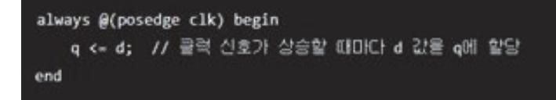
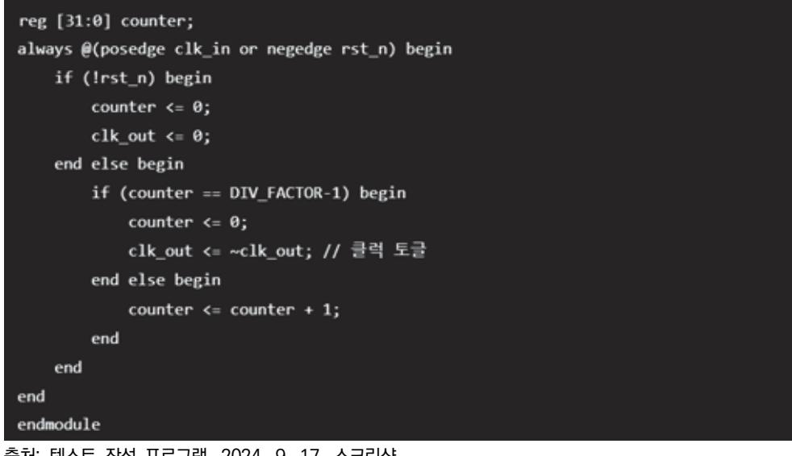
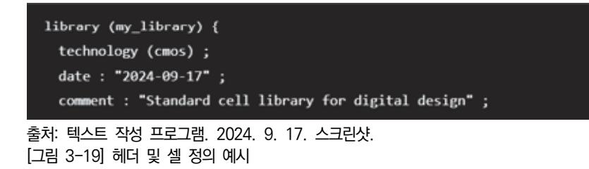

# NCS학습모듈 아날로그회로 시스템 설계


#### [NCS학습모듈 활용 시 유의 사항]

- 1. NCS학습모듈은 교육훈련기관에서 출처를 명시하고 교육적 목적으로 활용할 수 있습니다. 다 만, NCS학습모듈에는 국가(교육부)가 저작재산권 일체를 보유하지 않은 저작물(출처가 표기된 도표‧사진‧삽화‧도면 등)이 포함되어 있으므로, 이러한 저작물의 변형‧각색‧복제‧공연‧ 배포 및 공중 송신 등과 이러한 저작물을 활용한 2차적 저작물을 작성하려면 반드시 원작자 의 동의를 받아야 합니다.
- 2. NCS학습모듈은 개발 당시의 산업 및 교육 현장을 반영하여 집필하였으므로, 현재 적용되는 법령‧지침‧표준 및 교과 내용 등과 차이가 있을 수 있습니다. NCS학습모듈 활용 시 법령 ‧지침‧표준 및 교과 내용의 개정 사항과 통계의 최신성 등을 확인하시기를 바랍니다.
- 3. NCS학습모듈은 산업 현장에서 요구되는 능력을 교육훈련기관에서 학습할 수 있게 구성한 자 료입니다. 다만, NCS학습모듈 지면의 한계상 대표적 예시(예: 활용도 또는 범용성이 높은 제 품, 서비스) 중심으로 집필하였음을 이해하시기를 바랍니다.

## NCS학습모듈의 이해

※ 본 NCS학습모듈은 「NCS 국가직무능력표준」사이트(http://www.ncs.go.kr) 에서 확인 및 다운로드할 수 있습니다.

## Ⅰ NCS학습모듈이란?

- 국가직무능력표준(NCS: National Competency Standards)이란 산업현장에서 직무를 수행하기 위해 요구되는 지식·기술·소양 등의 내용을 국가가 산업부문별·수준별로 체계 화한 것으로 산업현장의 직무를 성공적으로 수행하기 위해 필요한 능력(지식, 기술, 태도) 을 국가적 차원에서 표준화한 것을 의미합니다.
- 국가직무능력표준(이하 NCS)이 현장의 '직무 요구서'라고 한다면, NCS학습모듈은 NCS
   의 능력단위를 교육훈련에서 학습할 수 있도록 구성한 '교수·학습 자료'입니다. NCS학습
   모듈은 구체적 직무를 학습할 수 있도록 이론 및 실습과 관련된 내용을 상세하게 제시하
   고 있습니다.


#### ○ NCS학습모듈은 다음과 같은 특징을 가지고 있습니다.

- 첫째, NCS학습모듈은 산업계에서 요구하는 직무능력을 교육훈련 현장에 활용할 수 있도 록 성취목표와 학습의 방향을 명확히 제시하는 가이드라인의 역할을 합니다.
- 둘째, NCS학습모듈은 특성화고, 마이스터고, 전문대학, 4년제 대학교의 교육기관 및 훈 련기관, 직장교육기관 등에서 표준교재로 활용할 수 있으며 교육과정 개편 시에도 유용하게 참고할 수 있습니다.


○ NCS와 NCS학습모듈 간의 연결 체계를 살펴보면 아래 그림과 같습니다.


O NCS학습모듈의 위치는 NCS 분류 체계에서 해당 학습모듈이 어디에 위치하는지를 한 눈에 볼 수 있도록 그림으로 제시한 것입니다.

| [NCS-학          | 습모듈              | 의 위치]    |          |  |
|-----------------|------------------|----------|----------|--|
|                 |                  |          |          |  |
| 대분류             | 내분류 문화·예술·디자인·방송 |          |          |  |
| 중분류             | 문화콘텐츠            |          |          |  |
| 소분류             |                  | 문화콘텐츠제작  |          |  |
|                 |                  |          |          |  |
| 세분류             |                  |          |          |  |
| 방송콘텐츠제작         |                  | 능력단위     | 학습모듈명    |  |
| 영화콘텐츠제작         |                  | 프로그램 기획  | 프로그램 기획  |  |
| 음악콘텐츠제작         |                  | 아이템 선정   | 아이템 선정   |  |
| 광고콘텐츠제작         |                  | 자료 조사    | 자료 조사    |  |
| 게임콘텐츠제작         |                  | 프로그램 구성  | 프로그램 구성  |  |
| 애니메이션<br>콘텐츠제작  |                  | 캐스팅      | 캐스팅      |  |
| 만화콘텐츠제작         |                  | 제작계획     | 제작계획     |  |
| 캐릭터제작           |                  | 방송 미술 준비 | 방송 미술 준비 |  |
| 스마트문화앱<br>콘텐츠제작 |                  | 방송 리허설   | 방송 리허설   |  |
| 영사              |                  | 야외촬영     | 야외촬영     |  |
|                 |                  | 스튜디오 제작  | 스튜디오 제작  |  |
|                 |                  |          |          |  |

학습모듈은

NCS 능력단위 1개당 1개의 학습모듈 개발 을 원칙으로 합니다. 그러나 필요에 따라 고용단위 및 교과단위를 고려하여 능력단위 몇 개를 묶어 1개 학습모듈로 개발할 수 있으며, NCS 능력단위 1개를 여러 개의 학습모듈로 나누어 개발할 수도 있습니다.

### 2. NCS학습모듈의 개요

#### ○ NCS학습모듈의 개요는 학습모듈이 포함하고 있는 내용을 개략적으로 설명한 것으로

| 학습모듈의 목표 , 선수학습 , 학습모듈의 내용 체계 , 핵심 용어 로 구성되어 있습니다. |                                                                              |  |  |
|----------------------------------------------------|------------------------------------------------------------------------------|--|--|
| 학습모듈의 목표                                           | 해당 NCS 능력단위의 정의를 토대로 학습 목표를 작성한 것입니다.                                        |  |  |
| 선수학습                                               | 해당 학습모듈에 대한 효과적인 교수·학습을 위하여 사전에 이수해야 하는 학습모<br>듈, 학습 내용, 관련 교과목 등을 기술한 것입니다. |  |  |
| 학습모듈의<br>내용 체계                                     | 해당 NCS 능력단위요소가 학습모듈에서 구조화된 체계를 제시한 것입니다.                                     |  |  |
| 핵심 용어                                              | 해당 학습모듈의 학습 내용, 수행 내용, 설비·기자재 등 가운데 핵심적인 용어를 제<br>시한 것입니다.                   |  |  |

### 제작계획 학습모듈의 개요

#### 학습모듈의 목표

본격적인 촬영을 준비하는 단계로서, 촬영 대본을 획정하고 제작 스태프를 조직하며 촬영 장비와 촬영 소품을 준비할 수 있다.

#### 선수학습

제작 준비(LM0803020105\_13v1), 섭외 및 제작스태프 구성(LM0803020104\_13v1), 촬영 제작(LM0803020106\_13v1), 촬영 장비 준비(LM0803040204\_13v1.4), 미술 디자인 협의하기(LM0803040203\_13v1.4)

#### 학습모듈의 내용체계

| 하스                | 하스 내용                                              | NCS 능력단위 요소       |                |
|-------------------|----------------------------------------------------|-------------------|----------------|
| 학습                | 학습 내용                                              | 코드번호              | 요소 명칭          |
| 1. 촬영 대본<br>확정하기  | 1-1. 촬영 구성안 검<br>토와 수정                             | 0803020114_16/3.1 | 촬영 대본<br>확정하기  |
| 2. 제작 스태프<br>조직하기 | 2-1. 기술 스태프 조직<br>2-2. 미술 스태프 조직<br>2-3. 전문 스태프 조직 | 0803020114_16v3.2 | 제작 스태프<br>조직하기 |
| 3. 촬영 장비<br>계획하기  | 3-1. 촬영 장비 점검<br>과 준비                              | 0803020114_16/3.3 | 촬영 장비<br>계획하기  |
| 4. 촬영 소품<br>계획하기  | 4-1. 촬영 소품 목록<br>작성<br>4-2. 촬영 소품 제작<br>의뢰         | 0803020114_16\3.4 | 촬영 소품<br>계획하기  |

#### 핵심 용어

촬영 구성안, 제작 스태프, 촬영 장비, 촬영 소품

#### 학습모듈의 목표는

학습자가 해당 학습모듈을 통해 성취해야 할 목표를 제시한 것으로, 교수자는 학습자 가 학습모듈의 전체적인 내용흐름을 파악하 도록 지도할 수 있습니다.

**6** • •

61

#### 선수학습은

교수자 또는 학습자가 해당 학습모듈을 교 수·학습하기 이전에 이수해야 하는 교과목 또는 학습모듈(NCS 능력단위) 등을 표기한 것입니다. 따라서 교수자는 학습자가 개별 학습, 자기 주도 학습, 방과 후 활동 등 다 양한 방법을 통해 이수할 수 있도록 지도하 는 것을 권장합니다.

|            | 핵심 용어는              |
|------------|---------------------|
|            | 률을 대표하는 주요 용어입니     |
|            | · 해당 학습모듈을 통해 학습    |
|            | 게될 주요 내용을 알 수 있습    |
|            | 5 국가직무능력표준」 사이트     |
| (www.ncs.g | jo.kr)의 색인 (찾아보기) 중 |
| 하나로 이용할    | 할 수 있습니다            |

#### 3. NCS학습모듈의 내용 체계

○ NCS학습모듈의 내용은 크게 학습, 학습 내용, 교수·학습 방법, 평가 로 구성되어 있습니다.

| 학습       | 해당 NCS 능력단위요소 명칭을 사용하여 제시한 것입니다.<br>학습은 크게 학습 내용, 교수·학습 방법, 평가로 구성되며 해당 NCS 능력단위의<br>능력단위 요소별 지식, 기술, 태도 등을 토대로 내용을 제시한 것입니다.                                                    |
|----------|----------------------------------------------------------------------------------------------------------------------------------------------------------------------------------|
| 학습 내용    | 학습 내용은 학습 목표, 필요 지식, 수행 내용으로 구성되며, 수행 내용은 재료·자<br>료, 기기(장비·공구), 안전·유의 사항, 수행 순서, 수행 tip으로 구성한 것입니다.<br>학습모듈의 학습 내용은 실제 산업현장에서 이루어지는 업무활동을 표준화된 프로세<br>스에 기반하여 다양한 방식으로 반영한 것입니다. |
| 교수·학습 방법 | 학습 목표를 성취하기 위한 교수자와 학습자 간, 학습자와 학습자 간 상호 작용이<br>활발하게 일어날 수 있도록 교수자의 활동 및 교수 전략, 학습자의 활동을 제시한<br>것입니다.                                                                            |
| 평가       | 평가는 해당 학습모듈의 학습 정도를 확인할 수 있는 평가 준거 및 평가 방법, 평<br>가 결과의 피드백 방법을 제시한 것입니다.                                                                                                         |


## [NCS-학습모듈의 위치]

| 대분류 | 전기<br>‧<br>전자 |          |        |
|-----|---------------|----------|--------|
| 중분류 |               | 전자 기기 개발 |        |
| 소분류 |               |          | 반도체 개발 |

| 세분류    |                  |                  |
|--------|------------------|------------------|
| 반도체 개발 | 능력단위             | 학습모듈명            |
| 반도체 제조 | 반도체 제품 기획        | 반도체 제품 기획        |
| 반도체 장비 | 반도체 아키텍처 설계      | 반도체 아키텍처 설계      |
| 반도체 재료 | 디지털 회로 설계        | 디지털 회로 설계        |
|        | 패키지 조립 공정 개발     | 패키지 조립 공정 개발     |
|        | 반도체 제품 기능·성능 검증  | 반도체 제품 기능·성능 검증  |
|        | 자동 배치 배선 레이아웃 설계 | 자동 배치 배선 레이아웃 설계 |
|        | 반도체 설계 검증        | 반도체 설계 검증        |
|        | 반도체 펌웨어 개발       | 반도체 펌웨어 개발       |
|        | 메모리 반도체 제조 공정 개발 | 메모리 반도체 제조 공정 개발 |
|        | 시스템 반도체 제조 공정 개발 | 시스템 반도체 제조 공정 개발 |
|        | 반도체 제조 단위 공정 개발  | 반도체 제조 단위 공정 개발  |
|        | 아날로그 회로 아키텍처 설계  | 아날로그 회로 아키텍처 설계  |
|        | 아날로그 회로 소자 레벨 설계 | 아날로그 회로 소자 레벨 설계 |
|        | 아날로그 회로 시스템 설계   | 아날로그 회로 시스템 설계   |

| 와이어 본딩 패키지 개발     | 와이어 본딩 패키지 개발     |  |
|-------------------|-------------------|--|
| 플립 칩 패키지 개발       | 플립 칩 패키지 개발       |  |
| 웨이퍼 레벨 패키지 개발     | 웨이퍼 레벨 패키지 개발     |  |
| 어드밴스드 팬 아웃 패키지 개발 | 어드밴스드 팬 아웃 패키지 개발 |  |
| 이종 접합 패키지 개발      | 이종 접합 패키지 개발      |  |
| 어드밴스드 언더필 패키지 개발  | 어드밴스드 언더필 패키지 개발  |  |
| 반도체 환경 시험         | 반도체 환경 시험         |  |
| 반도체 수명 시험         | 반도체 수명 시험         |  |
| 반도체 내성 시험         | 반도체 내성 시험         |  |
| 커스텀 레이아웃 적용 공정 분석 | 커스텀 레이아웃 적용 공정 분석 |  |
| 커스텀 레이아웃 설계       | 커스텀 레이아웃 설계       |  |
| 커스텀 레이아웃 검증       | 커스텀 레이아웃 검증       |  |

| 학습모듈의 개요              | 1  |  |  |
|-----------------------|----|--|--|
| 학습 1. 검증 환경 준비하기      |    |  |  |
| 1-1. 검증 환경 준비         | 3  |  |  |
| • 교수 ․ 학습 방법          | 18 |  |  |
| • 평가                  | 19 |  |  |
| 학습 2. 아날로그 회로 성능 검증하기 |    |  |  |
| 2-1. 아날로그 회로 성능 검증    | 21 |  |  |
| • 교수 ․ 학습 방법          | 38 |  |  |
| • 평가                  | 39 |  |  |
| 학습 3. IP 디자인 모델 설계하기  |    |  |  |
| 3-1. IP 디자인 모델 설계     | 42 |  |  |
| • 교수 ․ 학습 방법          | 65 |  |  |
| • 평가                  | 66 |  |  |
| 학습 4. 시스템 설계하기        |    |  |  |
| 4-1. 시스템 설계           | 68 |  |  |
| • 교수 ․ 학습 방법          | 94 |  |  |
| • 평가                  | 95 |  |  |
|                       |    |  |  |
| 참고 자료                 | 98 |  |  |

## 아날로그 회로 시스템 설계 학습모듈의 개요

#### 학습모듈의 목표

시험 보드의 제작 및 검사 장비의 활용을 통해 IP의 성능을 검증하고, 설계 IP의 다양한 정보를 포함한 디 자인 키트(Design Kit)를 제작하여 시스템 설계를 수행할 수 있다.

#### 선수학습

전자 회로, 회로 이론, 컴퓨터 프로그래밍, 집적 회로

#### 학습모듈의 내용체계

| 하스                    | 학습 내용              | NCS 능력단위 요소       |                    |
|-----------------------|--------------------|-------------------|--------------------|
| 학습                    |                    | 코드번호              | 요소 명칭              |
| 1. 검증 환경 준비하기         | 1-1. 검증 환경 준비      | 1903060120_23v5.1 | 검증 환경 준비하기         |
| 2. 아날로그 회로 성능<br>검증하기 | 2-1. 아날로그 회로 성능 검증 | 1903060120_23v5.2 | 아날로그 회로 성능<br>검증하기 |
| 3. IP 디자인 모델 설계<br>하기 | 3-1. IP 디자인 모델 설계  | 1903060120_23v5.3 | IP 디자인 모델<br>설계하기  |
| 4. 시스템 설계하기           | 4-1. 시스템 설계        | 1903060120_23v5.4 | 시스템 설계하기           |

#### 핵심 용어

회로 검증, IP(Intellectual Property), 아날로그 회로, 검증용 보드, 시스템 설계, 측정 환경

## 학습 1 검증 환경 준비하기

| 학습 2 | 아날로그 회로 검증하기   |
|------|----------------|
| 학습 3 | IP 디자인 모델 설계하기 |
| 학습 4 | 시스템 설계하기       |

## 1-1. 검증 환경 준비

|       | • 설계 IP의 검증에 필요한 입력 신호와 제어 신호의 세팅값에 따른 출력 결과와 외부 보드에     |
|-------|----------------------------------------------------------|
|       | 연결되어야 하는 소자 정보 등을 시험 계획서로 기술할 수 있다.                      |
|       | • 검증용 보드 제작을 위한 보드 회로 도면을 직접 설계하거나 설계한 도면이 적절하게 구성되      |
|       | 었는지 검토할 수 있다.                                            |
| 학습 목표 | • 검증용 보드 제작을 위한 아트워크(Artwork) 도면을 직접 설계하거나 설계한 도면이 설계 IP |
|       | 의 성능 열화를 유발하지 않는지 검토할 수 있다.                              |
|       | • 검증용 보드를 구성하는 소자들을 파악, 확보하여 검증 세트를 구성할 수 있다.            |
|       | • 검증에 필요한 장비 확인을 통해 측정 환경을 구성할 수 있다.                     |

## 필요 지식 /

- 숔 설계 IP 검증에 필요한 입력 신호와 제어 신호의 세팅값에 따른 출력 결과와 소자 정보 등의 시험 계획서 기술
  - 1. 설계 IP 검증의 중요성

설계 IP(Intellectual Property)는 SoC(System on Chip)에서 핵심적인 역할을 하며, 정확 한 기능 구현이 필수적이다. IP의 기능이 예상대로 동작하는지 확인하기 위해서는 검증을 해야 한다. 검증을 통해 IP의 성능, 신뢰성, 안정성을 확인하여, 시스템 통합 시 문제를 방 지할 수 있다.

- 2. 입력 신호와 제어 신호의 설정
  - (1) 입력 신호 설정

IP의 동작을 제어하는 기본적인 입력 신호로는 클럭, 리셋, 데이터 등이 있다. 각 신호 의 정확한 설정은 IP의 올바른 동작을 보장한다.

(가) 클럭 신호

클럭의 주파수와 타이밍은 IP의 동작 속도와 직접적으로 연관된다. 클럭 주기 내에

서 입력 및 출력 신호의 타이밍을 맞추는 것이 중요하다.

(나) 리셋 신호

시스템 초기화를 위해 리셋 신호의 설정과 해제 타이밍이 중요하다. 리셋 설정 및 해제 후 IP가 올바르게 초기화되는지를 확인해야 한다.

(다) 데이터 신호

데이터 신호에는 아날로그와 디지털 신호가 있다. 아날로그 신호는 신호의 진폭, 주 파수, 위상 등을 설정할 수 있으며, ADC(아날로그-디지털 변환기)를 통해 디지털 신 호로 변환할 수 있다. 디지털 신호는 특정 비트 패턴이나 신호 레벨(0 또는 1)을 통 해 설정된다.

(2) 제어 신호 설정

제어 신호는 IP의 특정 기능을 활성화하거나 비활성화하는 역할을 한다. 예를 들어, 인 에이블(Enable) 신호나 모드 셀렉트(Mode Select) 신호 등이 있다.

(가) 인에이블 신호

특정 기능을 활성화하는 신호로, 활성화 타이밍이 중요하다. 이 신호에 따라 IP가 원 하는 동작을 수행하는지 확인한다.

(나) 모드 셀렉트 신호

IP의 동작 모드를 선택하는 신호로, 다양한 모드에서의 동작을 검증할 수 있다.

#### 3. 출력 결과와 검증

(1) 출력 신호 분석

입력 및 제어 신호의 설정값에 따른 출력 결과를 예상하고, 실제 측정 결과와 비교한다.

(2) 정상 동작

예상되는 정상 출력 신호와 비교하여 IP가 제대로 동작하는지 확인한다.

(3) 에러 조건

입력 신호의 비정상적인 변화를 통해 발생할 수 있는 에러 조건을 정의하고 검증한다.

- 4. IP와 외부 소자 연결
  - (1) 외부 소자 및 인터페이스

IP와 상호 작용하는 외부 소자의 특성 및 연결 방법을 정의한다.

(2) 메모리 소자

IP가 메모리와 상호 작용하는 경우, 데이터 버스, 주소 버스의 연결 및 타이밍을 확인한 다.

- 5. 시험 계획서 작성
  - (1) 시험 계획서

입력 및 제어 신호의 설정, 예상 출력, IP와 외부 소자와의 인터페이스 정보가 포함되어 야 한다.

(2) 테스트 시나리오

다양한 입력 및 제어 신호 조건에 따른 테스트 시나리오를 설계하고 문서화한다.

(3) 결과 분석 방법

검증 결과를 어떻게 분석할 것인지, 예상 출력과 실제 출력을 비교하는 방법을 기술한 다.

- 숕 검증용 보드 제작을 위한 보드 회로 도면을 직접 설계하거나 설계한 도면이 적절하게 구성되었는지 검토
  - 1. 회로도 설계 기초
    - (1) 전자 부품 이해

저항, 커패시터, 인덕터 등 기본 전자 부품의 특성과 역할을 이해하고, 이를 회로도에 적절히 배치한다.

(2) 저항의 역할

전류 제한 및 전압 분배를 위해 적절한 저항값을 설정한다.

(3) 커패시터의 역할

신호 필터링 및 전력 공급 안정화를 위해 적절한 커패시턴스를 설정한다.

(4) 회로 분석 기법

키르히호프 전압 법칙(KVL)과 전류 법칙(KCL)을 활용하여 회로의 전압과 전류 흐름을 분석한다.

(가) 노드 분석

각 노드에서의 총 전류를 계산하고 총 전류의 합이 0이 되는지 확인하고, 회로가 의 도한 대로 동작하는지 확인한다.

(나) 루프 분석

폐회로(루프)에서의 총 전압을 분석하여 총 전압의 합이 0이 되는지 확인하고, 불필 요한 전력 소모나 과전류가 있는지 확인한다.

#### 2. PCB 설계 도구 사용

(1) PCB 설계 도구의 활용

OrCAD, Altium Designer, KiCAD와 같은 PCB 제작용 EDA 도구를 사용하여 PCB 스키매틱을 작성하고, PCB 레이아웃을 설계한다.

(가) 스키매틱 작성

PCB의 스키매틱을 작성하고, 부품 간의 연결을 정확하게 설정한다.

(나) 레이아웃 설계

PCB 레이아웃에서는 신호 무결성, 전력 분배, 열 관리를 고려하여 부품을 배치하고 트레이스를 배선한다.

- 3. 신호 및 전력 무결성 유지
  - (1) 임피던스 매칭

고속 신호 전송에서 임피던스 매칭은 필수적이므로, 설계 과정에서 트레이스 길이와 폭 을 조절하여 임피던스 특성을 맞춘다.

(2) 고속 신호 전송

고속 신호 전송 시 반사와 크로스 토크를 방지하기 위해, 트레이스 간격 및 층별 분리 를 고려한다.

- (3) 전력 무결성 적절한 전력 분배 네트워크(PDN)의 설계는 전력 공급의 안정성과 노이즈 억제를 위해 필수적이다.
- (4) 전원 공급망 설계 PCB 설계 시 전원 레일의 넓이, 접지 플레인 구성 등을 통해 전력 무결성을 유지한다.
- 4. 설계 도면 검토
- (1) DFM/DFT 고려 사항 제조 가능성(DFM)과 테스트 용이성(DFT)을 고려하여 설계 도면을 검토한다.
  - (2) 부품 배치 검토

부품이 적절히 배치되어 신호 간섭이 최소화되었는지, 열 관리가 적절한지 검토한다.

- (3) 테스트 포인트 추가 설계 도면 검증 및 디버깅을 위해 필요한 테스트 포인트가 적절히 추가되었는지 확인한 다.
- 숖 검증용 보드 제작을 위한 아트워크(Artwork) 도면을 직접 설계하거나 설계한 도면이 설계 IP의 성능 열화를 유발하지 않는지 검토
  - 1. PCB 아트워크 설계의 기초
    - (1) 아트워크 설계 원리 PCB 아트워크는 회로도의 전기적 성능을 실제로 구현하는 중요한 단계이다. 신호 무결 성, 전력 무결성, 열 관리 등이 모두 이 단계에서 결정된다.
    - (2) 레이어 구성

단층 PCB, 다층 PCB의 레이어 구성을 계획하고, 각 레이어의 역할(예: 전원층, 신호층) 을 명확히 정의한다.

(3) 배선 전략

신호 무결성을 유지하기 위한 배선 전략을 수립한다. 고속 신호, 클럭 신호, 전력 공급 라인은 특히 주의가 필요하다.

(4) 크로스 토크 방지

신호 간 크로스 토크를 방지하기 위해 트레이스 간격을 적절히 유지하고, 평행 배선을 최소화한다.

- 2. 고속 신호 설계 및 검토
  - (1) 전송 선로 이론

고속 신호가 전송 선로를 따라 이동할 때 발생할 수 있는 신호 반사, 스큐, 크로스 토크 등의 문제를 해결하기 위해 전송 선로 이론을 적용한다.

(2) 임피던스 제어

신호 반사를 방지하기 위해 PCB 레이어에서 임피던스를 제어하고, 고속 신호의 품질을 유지한다.

(3) 타이밍 분석

신호 전송 시 타이밍 분석을 통해 스큐 문제를 최소화한다. 클럭 신호와 데이터 신호 간의 타이밍 차이가 발생하지 않도록 설계한다.

#### 3. 전력 분배와 열 관리

- (1) 전력 분배 네트워크(PDN) 설계 PCB에서 전력을 효율적으로 분배하기 위해 전력 분배 네트워크(PDN)를 적절하게 설계 한다.
- (2) 전력 레일 배치

전력 레일의 배치와 크기를 결정하여 안정적인 전력 공급을 보장한다.

(3) 열 관리 전략

전력 소모가 높은 부품 주변에서 발생하는 열을 효율적으로 관리하기 위한 설계를 적용 한다.

(4) 열 방출 경로

히트 싱크, 열 패드 등을 사용하여 열 방출 경로를 계획한다.

- 4. 아트워크 도면 검토
  - (1) 신호 무결성 검토

아트워크 도면을 검토하여 설계된 신호 경로가 무결성을 유지하는지 확인한다.

(2) EMI/EMC 규격 준수

전자기 간섭(EMI)과 전자기 호환성(EMC) 규격을 충족하는지 검토한다.

#### 숗 검증용 보드를 구성하는 소자들을 파악, 확보하여 검증 세트 구성

- 1. 부품 선정 및 관리
  - (1) 부품 사양 분석 검증 보드에 필요한 각 부품의 전기적 사양(전압, 전류, 주파수 등)을 분석한다.
  - (2) 부품 선택 기준 성능, 비용, 재고 여부 등을 고려하여 적합한 부품을 선택한다.
  - (3) 대체 부품 전략 주요 부품이 공급되지 않을 경우를 대비하여 대체 부품을 미리 확보하고, 이들 부품으로 대체했을 경우의 영향에 대해 분석한다.
- 2. 부품 소싱 및 조달
  - (1) 공급망 관리 부품을 안정적으로 확보하기 위해 공급망을 관리하고, 부품의 재고를 지속적으로 모니터 링한다.
  - (2) 주문 및 재고 관리 필요한 부품을 주문하고, 재고를 효율적으로 관리하여 생산이 지연되지 않도록 한다.
- 3. 검증 환경 설정
  - (1) 부품 조립

확보한 부품을 검증 보드에 조립하고, 조립 과정에서 발생할 수 있는 문제를 사전에 방 지하기 위한 조치들을 마련한다.

(2) 초기 테스트

조립 후 초기 테스트를 통해 부품이 올바르게 배치되었고, 예상대로 동작하는지 확인한 다.

- 4. 데이터 시트 이해
  - (1) 데이터 시트 분석 부품의 전기적 특성, 핀 구성, 테스트 환경 조건 등을 이해하고, 이를 설계 IP와 비교하 여 분석한다.

(2) 호환성 확인

각 부품 간의 전기적 호환성을 확인하여, IP가 설계된 대로 동작할 수 있도록 한다.

- 5. 검증에 필요한 장비 확인을 통해 측정 환경 구성
  - (1) 검증 장비 이해
    - (가) 오실로스코프 사용법

신호 파형을 시각적으로 확인하기 위해 오실로스코프의 사용법을 익히고, 주요 기능 (트리거 설정, 채널 설정 등)을 이해한다.

(나) 로직 분석기 사용

디지털 신호를 분석하기 위한 로직 분석기의 사용법과 이를 활용한 디지털 프로세싱 검증 방법을 익힌다.

(다) 멀티미터 사용

전압, 전류, 저항 등을 측정하기 위한 멀티미터 사용법을 익힌다.

(라) 전력 분석기 사용

전력 소모를 분석하기 위한 전력 분석기의 활용 방법을 익힌다.

- (2) 측정 환경 구성
  - (가) 노이즈 저감

측정 환경에서 전원 노이즈를 최소화하기 위한 접지 설정, 케이블 관리, 실드 확보 등을 사용한다.

(나) 정확한 측정을 위한 환경 구성

온도, 습도 등의 환경 조건을 최적화하여 측정 결과의 정확도를 높인다.

- (3) 장비 캘리브레이션
  - (가) 캘리브레이션 절차

정확한 측정을 보장하기 위해 측정 장비를 정기적으로 캘리브레이션을 수행하고, 이 를 기록 및 관리한다.

(나) 장비 정확도 유지

측정 장비의 정확도를 유지하기 위해 제조사의 권장 절차를 따른다.

- (4) 데이터 수집 및 분석
  - (가) 데이터 로깅

측정된 데이터를 체계적으로 수집하고, 데이터 로깅 시스템을 사용하여 데이터를 분 석한다.

(나) 결과 분석 기법

수집된 데이터를 분석하여 검증 결과를 도출하고, 예상과 다른 결과가 발생했을 때 문제점을 식별한다.

(5) 테스트 리포팅

(가) 결과 문서화

검증 결과를 문서화하여 리포트를 작성하고, 관련된 모든 정보를 체계적으로 정리한 다.

(나) 이슈 트래킹 및 해결

검증 과정에서 발생한 이슈를 기록하고, 이를 해결하기 위한 조치를 문서화한다.

## 수행 내용 / 검증 환경 준비하기

#### 재료·자료

- 설계 IP 및 회로 설계 데이터
- PCB 설계 도면 및 아트워크 자료
- 검증에 필요한 장비 목록 및 측정 계획서

#### 기기(장비 ・ 공구)

- 오실로스코프
- 로직 분석기
- 프로그램 가능한 전원 공급기

#### 안전 ・ 유의 사항

- 전기적 안전 조치 및 ESD 보호에 유의해야 한다.
- 소자 보호 및 전기적 사양을 초과하지 않도록 올바르게 사용한다.
- 작업 환경 관리 및 장비 사용에 주의한다.

#### 수행 순서

- 숔 설계 IP의 검증에 필요한 입력 신호와 제어 신호의 세팅값에 따른 출력 결과와 외부 보드에 연결되 어야 하는 소자 정보 등을 시험 계획서로 기술한다.
  - 1. IP 사양서를 분석하고 검증 목표를 설정한다.
    - (1) 설계 IP의 사양서를 분석한다.

설계 IP의 기능, 성능 요구 사항, 입력 및 출력 신호의 상세 사양을 철저히 분석한다. 이 단계에서는 IP가 수행하는 모든 기능과 이를 지원하는 신호들을 파악해야 한다.

(2) 검증 목표를 설정한다.

검증의 주요 목표를 설정한다. 예를 들어, 특정 동작 모드에서의 성능 확인, 극한의 환 경에서의 동작 안정성 확인 등이 있을 수 있다. 각 목표에 맞춰 검증할 신호들을 결정 한다.

- 2. 입력 및 제어 신호를 정의한다.
  - (1) 신호 목록을 작성한다.

설계 IP와 상호 작용하는 모든 입력 신호(클럭, 리셋, 데이터 등)와 제어 신호를 목록화 한다. 각 신호에 대한 전기적 특성(전압, 주파수, 타이밍)을 상세히 기술한다.

(2) 세팅값을 설정한다.

각 신호의 구체적인 세팅값을 정의한다. 예를 들어, 클럭 신호의 경우 50MHz에서 200MHz까지의 주파수 변동에 따른 테스트 계획을 수립한다. 리셋 신호의 경우 리셋 타이밍(예: 전원이 켜진 후 100ms 이내에 리셋 해제)을 설정한다.

(3) 신호 간 타이밍 관계를 정의한다.

입력 신호와 제어 신호 간의 타이밍 관계를 정의한다. 예를 들어, 데이터 입력 신호가 클럭 에지에 맞추어 정확하게 샘플링되는지 확인한다.

- 3. 외부 보드와 연결되는 소자 정보를 기술한다.
  - (1) 외부 소자 인터페이스를 정의한다.

설계 IP와 외부 보드에 연결될 소자들(메모리 모듈, 센서, 통신 인터페이스 등)의 전기적 사양과 인터페이스 프로토콜을 상세히 기술한다. 각 소자의 핀 구성과 IP의 핀 간 매핑 을 구체적으로 설정한다.

(2) 소자 연결 방법을 정의한다.

각 소자와 보드 간의 전기적 연결 방식을 정의한다. 예를 들어, I2C 통신을 사용하는 센서의 경우 SCL, SDA 라인의 풀업 저항값과 I2C 프로토콜 및 모듈 연결 방법을 고려 한다.

- 4. 시험 시나리오를 작성한다.
  - (1) 테스트 케이스를 설계한다.

입력 및 제어 신호의 다양한 조합에 따른 테스트 케이스를 설계한다. 각 테스트 케이스 는 정상 동작 시나리오와 오류 상황을 모두 포함한다. 예를 들어, 데이터 입력 샘플 시 클럭 신호의 노이즈에 따른 데이터 오류 발생 여부를 검증한다.

(2) 예상 결과를 정의한다.

각 테스트 케이스에 따른 예상 출력 결과를 정의한다. 예를 들어, 특정 제어 신호가 활

성화되었을 때 예상되는 출력을 정의하여 실제 출력 결과와 비교할 수 있도록 한다.

(3) 결과 분석을 계획한다.

테스트 중 발생하는 모든 출력 결과를 기록하고, 이를 예상 결과와 비교하는 방법을 시 험 계획서에 기술한다. 결과가 상이할 경우 원인을 분석하는 절차도 포함한다.

- 숕 검증용 보드 제작을 위한 보드 회로 도면을 직접 설계하거나 설계한 도면이 적절하게 구성되었는지 검토한다.
  - 1. 검증용 보드 회로도를 설계한다.
    - (1) 보드 회로 설계 도구를 설정한다.

OrCAD, Altium Designer 등 보드 회로 설계 도구를 설정하고, 프로젝트를 시작한다. 설계 툴에서 필요한 라이브러리(부품 라이브러리, PCB 풋프린트 등)를 모두 사전에 준 비한다.

(2) 검증용 보드 회로도를 작성한다.

설계 IP와 관련된 모든 부품을 보드 회로도에 배치하고, 신호 라인을 연결한다. 각 부품 의 전기적 사양(예: 저항값, 커패시터 용량)을 정확하게 입력한다. 신호 무결성을 고려하 여 고속 신호는 가능한 짧고, 넓은 트레이스로 배선한다.

(3) 적절한 전력 공급 및 접지를 설계한다.

각 부품에 전력을 공급하는 보드 회로를 설계한다. 전원 공급 라인의 전압 강하를 방지 하기 위해 전력 라인의 너비와 길이를 조정하고, 적절한 바이패스 커패시터를 배치한다. 접지 라인은 넓고 연속적으로 설계하여 접지 전위 차이를 최소화한다.

- 2. 보드 회로도를 검토한다.
  - (1) 설계 검토 미팅을 통해 보드 회로도를 검토한다.

보드 회로도가 완성된 후 설계 검토 미팅을 개최하여 팀원들과 함께 검토한다. 보드 회 로도에서 신호 라인의 타이밍, 전력 공급의 안정성, 부품 간의 상호 간섭 가능성 등을 중점적으로 검토한다.

(2) 보드 회로 시뮬레이션을 수행한다.

보드 회로 시뮬레이션(예: SPICE)을 통해 예상되는 동작을 검증한다. 보드 회로의 전압 및 전류 분포를 시뮬레이션하고, 문제 발생 시 원인을 분석한다.

(3) 검토 결과를 문서화한다.

검토 결과를 문서화하고, 발견된 이슈와 이에 대한 수정 사항을 기록한다. 수정된 보드 회로도를 최종 검토한다.

3. 보드 회로도를 최종 검토 및 수정한다.

(1) 수정 사항을 반영한다.

검토 과정에서 제기된 문제점을 보드 회로도에 반영하고, 수정된 보드 회로도를 다시 검 토한다. 모든 문제점이 해결되었는지 확인한다.

(2) 최종 설계 승인 절차를 거친다.

수정된 보드 회로도를 팀원들과 함께 최종 검토한 후, 설계 승인 절차를 거친다.

#### DFM(Design for Manufacturability)

DFM은 제품이 쉽게 제조될 수 있도록 설계하는 과정을 의미한다. 이는 설계 단계에서부터 제조 공 정을 고려하여, 생산 비용을 최소화하고 생산성을 극대화하기 위한 방법론이다. DFM의 목표는 다음 과 같다. 첫 번째로, 제조 비용을 절감한다. 설계가 복잡하거나 불필요하게 정밀한 공정을 요구하지 않도록 최적화하여 제조 비용을 줄인다. 두 번째로, 품질을 향상한다. 설계가 일관된 품질의 제품을 생산할 수 있도록 보장하여 결함을 줄이고 신뢰성을 향상시킨다. 세 번째로, 생산 시간을 단축한다. 제조 공정이 단순하고 효율적이도록 설계하여 생산 시간을 줄인다. 마지막으로, 재작업 및 폐기물을 감소한다. 잘못된 설계로 인한 재작업이나 폐기물을 줄인다.

DFM의 주요 고려 사항은 다음과 같다. 첫 번째로, 공정 제약 조건이다. 사용되는 제조 공정의 한 계를 이해하고, 그에 맞는 설계를 수행한다. 예를 들어, 최소 선폭, 최소 간격, 층수 제한 등을 고려 한다. 두 번째로, 재료 선택이다. 재료의 가용성과 가공성을 고려하여 설계한다. 쉽게 구할 수 있고 가공이 용이한 재료를 선택하여 제조 공정을 단순화한다. 세 번째로, 부품 표준화이다. 표준화된 부 품과 모듈을 사용하여 조립 단계를 줄이고, 생산의 복잡성을 줄인다. 네 번째로, 어셈블리 용이성이 다. 조립 공정이 쉽도록 설계한다. 예를 들어, 부품의 방향성을 명확히 하거나 결합이 쉬운 설계를 적용한다. 마지막으로, 검사 용이성이다. 제품이 제조 후 쉽게 검사될 수 있도록 설계한다. 예를 들 어, 주요 기능을 쉽게 접근할 수 있는 위치에 배치하거나, 검사 포인트를 명확히 정의한다.

숖 검증용 보드 제작을 위한 아트워크(Artwork) 도면을 직접 설계하거나 설계한 도면이 설계 IP의 성능 열화를 유발하지 않는지 검토한다.

- 1. PCB 아트워크를 설계한다.
  - (1) 레이어 구성 및 배치 계획을 수립한다.

설계된 회로도를 기반으로 PCB 아트워크 설계를 시작한다. 다층 PCB의 경우 각 레이 어의 역할을 정의하고, 신호, 전원, 접지 등의 역할을 하도록 레이어를 효과적으로 배치 한다.

(2) 배선 전략을 수립한다.

고속 신호는 가능한 짧고, 직선으로 배선하며, 임피던스를 조절한다. 전원 공급 라인은 전압 강하를 최소화하도록 설계하고, 고주파 신호의 경우 크로스 토크를 방지하기 위해 배선 간격을 조정한다.

- (3) 전력 무결성 확보 및 접지 레이어를 설계한다.
  - 전원 공급망(PDN)을 최적화하여 전력 무결성을 확보한다. 접지 레이어는 최대한 넓게 설계하여 신호 라인의 리턴 패스를 최소화하고, 노이즈를 억제한다.
- 2. PCB 아트워크를 검토한다.
  - (1) 신호 무결성을 검토한다.

아트워크에서의 신호 무결성을 검토한다. 특히 고속 신호의 경우 임피던스 불일치로 인 한 반사, 신호 왜곡, 스큐 등의 문제를 중점적으로 점검한다.

(2) 전력 분배를 검토한다.

PCB 전반에 걸쳐 전력 분배가 균일하게 이루어졌는지 검토한다. 고전류가 흐르는 라인 에서는 전압 강하가 발생하지 않도록 특별히 신경 쓴다.

- (3) 열 관리를 검토한다. 열 발생이 예상되는 부품 주위에 히트 싱크, 열 방출 패드 등을 배치하여 열 관리 전략 을 검토한다.
- 3. 최종 아트워크를 검토 및 수정한다.
  - (1) 아트워크 수정 사항을 반영한다.

아트워크 검토 과정에서 발견된 문제를 수정한다. 예를 들어, 과도한 크로스 토크가 예 상되는 트레이스의 간격을 재조정한다.

- (2) 최종 설계를 검토한다. 수정된 아트워크 도면을 최종적으로 검토하여, 설계 목표와 일치하는지 확인한다. 필요 시 다른 엔지니어들의 피드백을 반영하여 최종 수정을 진행한다.
- (3) 제조용 데이터를 생성한다.

최종 승인된 아트워크 도면을 바탕으로 PCB 제조용 데이터를 생성하고, 제조업체로 전 달한다.

- 숗 검증용 보드를 구성하는 소자들을 파악, 확보하여 검증 세트를 구성한다.
  - 1. 부품 목록을 작성한다.
    - (1) 부품 사양을 확인한다. 검증용 보드에 사용되는 모든 부품의 전기적 사양을 확인하고, 이를 바탕으로 부품 목록 (BOM: Bill of Materials)을 작성한다.
    - (2) 대체 부품을 확인한다.

주요 부품이 조달되지 않을 경우를 대비하여 대체 가능한 부품을 조사하고, 그 특성과

성능이 기존 부품과 호환 가능한지 확인한다.

(3) 주문 및 재고를 관리한다.

필요한 부품을 공급업체에서 주문하고, 재고 상황을 지속적으로 모니터링한다.

- 2. 부품을 확보한다.
  - (1) 부품 조달 계획을 수립한다.

부품 조달의 리드 타임을 고려하여 조달 계획을 수립한다. 특정 부품의 경우 장기 공급 계약을 고려하여 안정적인 공급을 확보한다.

- (2) 부품이 정확히 입고되었는지 검수한다. 조달된 부품이 사양에 맞게 정확히 입고되었는지 검수하고, 불량 부품이 없는지 확인한 다.
- 3. 검증 세트를 구성한다.
  - (1) 조립 및 초기 테스트를 통해 부품의 동작을 확인한다. 검증 보드에 부품을 조립한 후, 초기 테스트를 통해 조립된 부품이 올바르게 동작하는지 확인한다. 초기 테스트는 주로 전원 공급, 기본적인 신호 입·출력 확인으로 시작한다.
  - (2) 최종 검증 세트를 구성한다.

모든 부품이 적절히 조립된 후, 설계된 검증 시나리오에 따라 테스트를 수행할 수 있는 환경을 구성한다. 이 단계에서는 설계 IP의 모든 기능을 검증하기 위한 장비와 소프트웨 어 설치를 포함한다.

#### 수 검증에 필요한 장비 확인을 통해 측정 환경을 구성한다.

- 1. 필요 장비 목록을 작성한다.
  - (1) 필요 장비를 확인한다.

설계 IP의 검증에 필요한 모든 측정 장비(오실로스코프, 로직 분석기, 전력 분석기 등)를 파악한다. 각 장비의 주요 사양(대역폭, 샘플링 속도 등)을 검토하여 검증 요구 사항을 충족하는지 확인한다.

(2) 장비 사양을 검토한다.

각 장비가 검증에 적합한지 사양을 검토하고, 필요시 추가 장비를 조달한다.

#### 2. 측정 환경을 구성한다.

(1) 측정 장비를 설치한다.

측정 장비를 설치하고, 검증용 보드와 올바르게 연결한다. 각 장비의 프로브와 연결 상 태를 점검하고, 신호 손실을 최소화하기 위한 최적의 배선을 구성한다.

(2) 환경 조건을 설정한다.

15

노이즈 억제, 접지 설정, 온도 관리 등을 통해 측정 환경을 최적화한다. 전자기 간섭 (EMI)을 최소화하기 위해 장비와 케이블 배치를 조정한다.

- 3. 캘리브레이션 및 초기 테스트를 진행한다.
  - (1) 장비 캘리브레이션을 수행한다.

측정 장비의 정확도를 유지하기 위해, 제조 업체의 지침에 따라 정기적으로 캘리브레이 션을 수행한다. 캘리브레이션 기록을 보관하여 향후 검증 결과의 신뢰성을 보장한다.

(2) 초기 테스트를 수행한다.

장비가 올바르게 작동하는지 초기 테스트를 수행한다. 측정 결과를 확인하여 입력 세팅 이 올바른지 점검하고, 필요시 입력 세팅을 조정한다.

- 4. 측정 및 데이터 수집을 준비한다.
  - (1) 데이터 로깅 시스템을 설정한다.

측정 데이터를 효과적으로 수집하기 위해 데이터 로깅 시스템을 설정한다. 각 테스트 케 이스에 따른 데이터를 자동으로 기록하고 저장할 수 있도록 시스템을 구성한다.

(2) 데이터 분석을 준비한다.

수집된 데이터를 분석하기 위한 소프트웨어와 분석 절차를 마련한다. 데이터 분석을 통 해 설계 IP의 성능을 평가하고, 예상 결과와의 차이를 분석한다.

#### 캘리브레이션(calibration)

캘리브레이션은 특정 장비의 측정값을 표준(reference)과 비교하고, 장비가 정확한 값을 제공하도록 조정하는 과정이다. 이를 통해 측정 장비의 성능이 일정 기준 내에서 유지되도록 한다. 캘리브레이 션을 하는 이유는 다음과 같다. 첫 번째로, 정확성을 유지할 수 있다. 측정 장비의 정확도를 보장하 여, 신뢰성 있는 데이터를 제공할 수 있다. 두 번째로, 신뢰성을 확보할 수 있다. 주기적인 캘리브레 이션을 통해 측정 장비의 신뢰성을 유지하고, 장비가 오랜 기간 동안 정확하게 동작하도록 한다. 세 번째로, 품질 관리가 가능하다. 제조 공정이나 실험 과정에서 정확한 측정값을 얻기 위해 캘리브레 이션이 필요한데, 이를 통해 제품의 품질을 일정하게 유지할 수 있다. 마지막으로, 산업 표준 및 규 정을 준수할 수 있다. 특정 산업 표준이나 규제 요구 사항에 따라 장비의 캘리브레이션이 필수적인 경우가 많다. 예를 들어, ISO 9001 등의 품질 관리 시스템에서는 정기적인 캘리브레이션을 요구한 다.

장비의 캘리브레이션은 정기적으로 수행된다. 일반적으로 장비 제조사에서 권장하는 주기를 따르며, 주기적으로 캘리브레이션을 하지 않으면 장비의 측정 정확도가 저하될 수 있다. 장비의 사용 빈도, 환경 조건(온도, 습도 등), 장비의 중요도에 따라 캘리브레이션 주기를 조정할 수 있다. 예를 들어, 자주 사용되거나 정밀한 측정이 필요한 장비는 더 자주 캘리브레이션이 필요하다.

#### 수행 tip

- 시험 계획서 작성 시, 입력 및 제어 신호의 세팅값을 명확 히 정의하고, 예상되는 출력 결과를 구체적으로 기술하여 검증의 기준을 명확히 한다.
- 검증용 보드 설계 시, 회로 도면과 아트워크가 설계 IP의 성능 요구사항을 충족하는지 철저히 검토하고, 신호 간섭 이나 전력 공급 문제가 없도록 설계한다.
- 검증에 필요한 모든 소자와 장비를 미리 확보하고, 측정 환경을 최적화하여 검증 결과의 신뢰성을 보장한다.

### 학습 1 교수·학습 방법

#### 교수 방법

- 설계 IP 검증의 이론적 배경을 먼저 설명하고, 실제 사례를 통해 시험 계획서 작성 방법을 시연한다.
- 학습자들이 직접 보드 회로 도면을 설계하거나 기존 도면을 분석하도록 과제를 부여하여 실 습 경험을 쌓게 지도한다.
- 그룹 활동을 통해 아트워크 도면 설계를 수행하고, 설계 IP의 성능 유지와 관련된 문제점을 토론하여 검토하는 시간을 갖도록 지도한다.
- 필요한 소자들을 파악하고, 이를 바탕으로 검증 세트를 구성하는 과정을 실습하도록 지도한 다.
- 측정 장비 사용법과 검증 환경 설정을 실습하며, 이론과 실습을 통합한 학습을 진행한다.

#### 학습 방법

- 이론 수업을 통해 설계 IP 검증의 핵심 요소와 시험 계획서 작성 방법을 학습한다.
- 실습 과제를 통해 직접 보드 회로 도면을 설계하거나 기존 도면을 분석하고 검토하는 경험 을 쌓는다.
- 그룹 프로젝트를 통해 아트워크 도면 설계를 수행하고, 이를 검토하여 성능 열화 문제를 탐 색한다.
- 필요한 소자 목록을 작성하고, 이를 기반으로 검증 세트를 구성하는 실습을 통해 실제 작업 환경을 체험한다.
- 측정 장비 사용법을 익히고, 이를 통해 검증 환경을 설정하고 테스트하는 과정을 학습한다.

## 학습 1 평 가

#### 평가 준거

- 평가자는 학습자가 학습 목표를 성공적으로 달성하였는지를 평가해야 한다.
- 평가자는 다음 사항을 평가해야 한다.

| 학습 내용    | 학습 목표                                                                                            | 성취수준 |   |   |
|----------|--------------------------------------------------------------------------------------------------|------|---|---|
|          |                                                                                                  | 상    | 중 | 하 |
| 검증 환경 준비 | - 설계 IP의 검증에 필요한 입력 신호와 제어 신호의 세팅값<br>에 따른 출력 결과와 외부 보드에 연결되어야 하는 소자 정<br>보 등을 시험 계획서로 기술할 수 있다. |      |   |   |
|          | - 검증용 보드 제작을 위한 보드 회로 도면을 직접 설계하거<br>나 설계한 도면이 적절하게 구성되었는지 검토할 수 있다.                             |      |   |   |
|          | - 검증용 보드 제작을 위한 아트워크(Artwork) 도면을 직접<br>설계하거나 설계한 도면이 설계 IP의 성능 열화를 유발하지<br>않는지 검토할 수 있다.        |      |   |   |
|          | - 검증용 보드를 구성하는 소자들을 파악, 확보하여 검증 세트<br>를 구성할 수 있다.                                                |      |   |   |
|          | - 검증에 필요한 장비 확인을 통해 측정 환경을 구성할 수 있<br>다.                                                         |      |   |   |

#### 평가 방법

• 평가자 체크리스트

| 학습 내용    | 평가 항목                                                | 성취수준 |   |   |
|----------|------------------------------------------------------|------|---|---|
|          |                                                      | 상    | 중 | 하 |
| 검증 환경 준비 | - 설계 IP 검증을 위한 시험 계획서 기술 및 검증용 보드 회<br>로 도면 구성 가능 여부 |      |   |   |
|          | - 검증용 보드 제작 아트워크 구성 가능 여부                            |      |   |   |
|          | - 최종적인 검증 세트 구성 가능 여부                                |      |   |   |
|          | - 측정 환경 구성 가능 여부                                     |      |   |   |

#### • 일지/저널

| 학습 내용    | 평가 항목                                                    | 성취수준 |   |   |  |
|----------|----------------------------------------------------------|------|---|---|--|
|          |                                                          | 상    | 중 | 하 |  |
| 검증 환경 준비 | - 설계 IP 검증을 위한 시험 계획서 기술 및 검증용 보드 회<br>로 도면 구성 정확성 수준 정도 |      |   |   |  |
|          | - 검증용 보드 제작 아트워크 구성 정확성 수준 정도                            |      |   |   |  |
|          | - 최종적인 검증 세트 구성 정확성 수준 정도                                |      |   |   |  |
|          | - 측정 환경 구성 정확성 수준 정도                                     |      |   |   |  |

#### • 구두 발표

| 학습 내용    | 평가 항목                                                          | 성취수준 |   |   |
|----------|----------------------------------------------------------------|------|---|---|
|          |                                                                | 상    | 중 | 하 |
| 검증 환경 준비 | - 설계 IP 검증을 위한 시험 계획서 기술 및 검증용 보드 회<br>로 도면 구성 내용을 설명할 수 있는 능력 |      |   |   |
|          | - 검증용 보드 제작 아트워크를 구성할 수 있는 능력                                  |      |   |   |
|          | - 최종적인 검증 세트 구성을 설명할 수 있는 능력                                   |      |   |   |
|          | - 측정 환경 구성을 정확히 설명할 수 있는 능력                                    |      |   |   |

#### 피드백

| 1. 평가자 체크리스트                                             |
|----------------------------------------------------------|
| - 설계 IP 검증을 위한 시험 계획서 기술 및 검증용 보드 회로 도면 구성, 검증용 보드 제작 아트 |
| 워크 구성, 최종적인 검증 세트 구성, 측정 환경 구성 수행 과정을 체크리스트를 활용해 평가한     |
| 후 부족한 사항을 표시하여 피드백 해준다.                                  |
| 2. 일지/저널                                                 |
| - 검증용 보드 회로 도면 구성 성취 수준이 높은 학습자의 경우에는 다양한 IP와 호환 가능한 보드  |
| 회로 도면 구성에 대하여 심화 설명해 준다.                                 |
| - 성취수준에 미달한 학습자들에게는 수준별로 검증용 보드 회로 구성에 대한 내용을 보충하고 학     |
| 습 수준이 높은 사람들의 결과물을 검토하여 그 결과를 제출하도록 한다.                  |
| 3. 구두 발표                                                 |
| - 검증 환경 구성 수행 과정 발표 시 질의 ‧ 응답을 통해 개선 사항 및 추가로 보완해야 할 사항에 |
| 대해 제시한다.                                                 |
| - 성취수준이 높은 학습자에게는 검증 환경 준비 계획서를 작성하게 해 주어 성취도를 극대화하게     |
| 해 준다.                                                    |
|                                                          |

| 학습 1 | 검증 환경 준비하기     |
|------|----------------|
| 학습 2 | 아날로그 회로 검증하기   |
| 학습 3 | IP 디자인 모델 설계하기 |
| 학습 4 | 시스템 설계하기       |

## 2-1. 아날로그 회로 검증

|       | • 전원을 인가하여 설계한 검증 보드가 설계 의도와 다르게 오픈(Open) 또는 쇼트(Short)된 부 |
|-------|-----------------------------------------------------------|
|       | 분이 있는지 확인할 수 있다.                                          |
|       | • 시험 계획서의 기술한 모드 변화를 변경하며, 각 모드별 출력 결과를 계측할 수 있다.         |
|       | • 측정 결과를 측정 환경을 포함하여 정리하고, 원하는 성능 기준을 만족하는지 점검할 수 있다.     |
| 학습 목표 | • 성능 열화 발생 시 시뮬레이션 결과와 측정 결과를 매칭시켜 원인이 되는 블록을 파악할 수       |
|       | 있다.                                                       |
|       | • 성능 열화의 원인이 되는 설계 블록 수정을 통해 설계 IP를 최적화할 수 있다.            |
|       | • 여러 개의 칩을 측정하여 칩 간 성능 편차가 충분히 만족할 만한지 확인할 수 있다.          |
|       | • 측정 결과의 통계적 분석을 통해 대량 양산 상황의 안전성을 점검할 수 있다.              |

## 필요 지식 /

- 숔 전원을 인가하여 설계한 검증 보드가 설계 의도와 다르게 오픈(Open) 또는 쇼트(Short)된 부분이 있는지 확인
  - 1. 기초 전기 회로 분석
    - (1) 회로 이론 기초

옴의 법칙, 키르히호프의 전류 및 전압 법칙(KCL, KVL) 등 기본적인 회로 이론 기초를 이해하여 회로에서의 전압 및 전류 분포를 분석할 수 있어야 한다.

- (2) 전원 공급 및 접지 라인의 설계 이해 전원 공급 및 접지(Ground) 라인 설계의 기본 원리, 접지 루프(Ground Loop) 방지 기술, 전원 및 접지 간의 임피던스 조절 방법 등을 이해해야 한다.
- 2. 회로 결함 탐지 기술
  - (1) 오픈 및 쇼트 결함

오픈(Open) 또는 쇼트(Short) 결함의 원인과 증상을 파악할 수 있어야 한다. 회로가 오

픈된 경우 신호가 전달되지 않아 출력이 예상과 다르게 나타날 수 있으며, 쇼트된 경우 과전류가 발생해 부품 또는 IP 내 회로 손상을 초래할 수 있다.

(2) 디지털 멀티미터(DMM) 사용법

멀티미터를 사용하여 전원 라인과 각 회로 노드의 오픈 및 쇼트 여부를 테스트하는 방 법을 익혀야 한다. 멀티미터를 이용한 저항 측정을 통해 오픈 및 쇼트 여부를 확인한다.

(3) 오실로스코프 및 로직 분석기 사용법

오실로스코프를 사용해 각 노드의 전압을 측정하고, 쇼트나 오픈으로 인해 발생하는 비 정상적인 신호 패턴을 식별할 수 있어야 한다. 로직 분석기를 통해 출력 데이터를 측정 하고 분석한다.

(4) 파라메트릭 테스트

파라메트릭 테스트 장비를 사용하여 각 노드의 전류와 전압을 측정하여, 예상 범위에서 벗어난 값이 있는지 확인한다.

#### 숕 시험 계획서의 기술한 모드 변화를 변경하며, 모드별 출력 결과 계측

- 1. 시험 계획서 해석 및 모드 제어
  - (1) 시험 계획서 해석

시험 계획서에 기술된 모드 변화를 이해하고, 회로의 각 모드에서 예상되는 동작을 명확 히 파악해야 한다.

(2) 모드 제어 신호

각 모드를 전환하는 제어 신호(예: 셀렉트 신호, 인에이블 신호 등)의 역할과 설정 방법 을 이해하고, 이를 용도에 맞게 정확히 제어할 수 있어야 한다.

- 2. 계측 장비 사용법 숙지
  - (1) 오실로스코프

모드에 따라 출력 신호의 주파수, 진폭, 위상 등을 측정하는 방법을 숙지해야 한다. 각 모드에서의 출력 신호의 타이밍과 파형을 정확히 계측하는 기술이 필요하다.

(2) 스펙트럼 분석기

아날로그 회로에서 주파수 성분을 분석하기 위해 스펙트럼 분석기를 사용하는 방법을 알아야 한다. 이는 특히 고주파 아날로그 회로 분석에 유용하다.

(3) 파워 미터 및 전력 분석기

각 모드에서의 전력 소모를 측정하고, 예상된 전력 소모와 비교하여 성능을 평가한다.

#### 숖 측정 결과를 측정 환경을 포함하여 정리하고, 원하는 성능 기준을 만족하는지 점검

- 1. 측정 데이터 해석
  - (1) 측정 데이터 분석

측정 데이터(예: 전압, 전류, 파형 등)를 해석하여, 설계 목표와 비교할 수 있는 능력이 필요하다. 각 모드에서 측정된 데이터를 시험 계획서에서 정의한 성능 기준과 비교하여 평가한다.

- (2) 결과 비교 및 문서화 측정된 결과를 표, 그래프 등으로 정리하고, 시험 계획서에서 정의한 성능 기준과의 차 이를 문서화할 수 있어야 한다.
- 2. 측정 환경의 영향 이해
  - (1) 노이즈 및 외란 요소 분석 측정 환경에서 발생할 수 있는 전자기 간섭(EMI), 열 잡음, 전원 리플 등 노이즈 요소를 이해하고, 측정 결과에 미치는 영향을 평가할 수 있어야 한다.
  - (2) 온도 및 환경 조건 이해 측정이 진행되는 환경의 온도, 습도 등이 회로 성능에 미치는 영향을 이해하고, 이를 측 정 결과에 반영한다.
- 3. 측정 데이터 문서화
  - (1) 보고서 작성

측정 환경, 측정 방법, 결과 및 분석을 모두 포함하는 측정 보고서를 작성하는 능력이 필요하다. 각 모드의 측정 결과를 일관되게 기록하고, 성능 기준을 만족하는지 여부를 명확히 기술한다.

(2) 데이터 시각화 측정 결과를 그래프, 표, 시각적 도구 등을 사용하여 명확하게 표현하는 방법을 익혀야 한다.

#### 숗 성능 열화 발생 시 시뮬레이션 결과와 측정 결과를 매칭시켜 원인이 되는 블록을 파악

- 1. 시뮬레이션 결과 해석
  - (1) SPICE 시뮬레이션

SPICE 기반 시뮬레이션 도구를 사용하여 회로의 전기적 특성을 분석하고, 시뮬레이션 결과를 실제 측정 결과와 비교할 수 있어야 한다.

(2) 모델링 기법

실제 회로의 동작을 정확하게 반영하는 회로 모델을 만들 수 있어야 하며, 시뮬레이션 결과가 실제 회로 동작과 일치하는지 평가할 수 있어야 한다.

2. 성능 열화 분석

(1) 열화 원인 분석

시뮬레이션 결과와 측정 결과 간의 차이를 분석하여, 성능 열화의 원인을 파악한다. 이 는 부품의 노화, 온도 상승, 전원 변동 등에 의해 발생할 수 있다.

- (2) 블록별 성능 분석 회로를 블록별로 나누어, 각 블록이 전체 성능에 미치는 영향을 평가한다. 문제가 발생 한 블록을 정확히 식별할 수 있어야 한다.
- 3. 문제 해결 및 최적화
- (1) 회로 수정 및 재설계 열화의 원인이 되는 블록을 수정하거나, 전체 회로를 재설계하여 성능을 최적화한다. 이 를 위해서는 회로의 전기적 특성 및 상호 요인을 깊이 이해하고 있어야 한다.
  - (2) 피드백 반영

수정된 회로를 시뮬레이션 및 재측정하여, 피드백이 반영되었는지 확인한다.

수 성능 열화의 원인이 되는 설계 블록 수정을 통해 설계 IP 최적화

- 1. 회로 최적화 기법
  - (1) 회로 최적화

각 블록의 성능을 극대화하기 위해 전기적 특성을 조정하는 방법을 익혀야 한다. 예를 들어, 이득을 최적화하거나 전력 소모를 줄이기 위해 트랜지스터의 크기 조정, 바이어스 전류 조절 등을 수행할 수 있다.

(2) 피드백 회로 설계

안정성과 성능을 개선하기 위해 피드백 회로를 도입하고, 이를 최적화하는 방법을 알아 야 한다.

- 2. 최적화 후 검증
  - (1) 재검증

최적화된 회로를 재검증하여, 성능이 요구 기준을 충족하는지 확인한다. 이 과정에서 기 존의 검증 절차와 동일한 방법으로 테스트를 수행하여 일관성을 유지한다.

(2) 신뢰성 평가

최적화된 회로가 장기적으로 안정적으로 동작할 수 있는지 평가하고, 이 과정에서 열화 나 성능 저하가 발생하지 않도록 설계한다.

숙 여러 개의 칩을 측정하여 칩 간 성능 편차가 충분히 만족할 만한지 확인

- 1. 통계적 분석 기법
  - (1) 통계적 분석

여러 개의 칩에서 측정된 데이터를 통계적으로 분석하여 성능 편차를 평가한다. 데이터 의 평균값, 표준 편차, 분산 등의 지표 분석을 통해 칩 간 성능 차이를 파악할 수 있어 야 한다.

- (2) 통계적 품질 관리 칩 제조 공정에서 발생할 수 있는 변동성을 이해하고, 이를 바탕으로 칩 간 성능 편차 를 예측하고 관리한다.
- 2. 칩 간 편차 분석 및 대응
  - (1) 편차 원인 파악

성능 편차의 원인을 분석한다. 제조 공정의 불일치, 칩 설계의 변동성 등을 고려한다.

(2) 성능 균일화를 위한 보정 및 조정

필요시 칩 간 성능을 균일화하기 위한 보정 및 조정 방법을 모색한다. 제조 공정의 개 선, 설계 변경, 테스트 조건 변경 등을 검토한다.

- 3. 품질 보증
  - (1) 검증 결과 문서화 성능 편차 분석 결과를 문서화하고, 모든 칩이 품질 기준을 충족하는지 기록한다.
  - (2) 품질 보증 절차

칩의 품질을 보증하기 위한 절차를 수립하고, 이후의 생산에서 품질을 유지하기 위한 방 법을 검토한다.

## 수행 내용 / 아날로그 회로 성능 검증하기

#### 재료·자료

- 검증 보드 및 테스트 칩
- 시험 계획서 및 설계 문서
- 측정 장비 및 분석 소프트웨어

#### 기기(장비 ・ 공구)

- 디지털 멀티미터
- 오실로스코프
- 데이터 분석 소프트웨어

#### 안전 ・ 유의 사항

- 전원 및 신호 인가 시 안전 조치를 수행해야 한다.
- 정전기 방지(ESD) 조치에 유의한다.
- 측정 장비 사용 시 안전 관리에 유의한다.

#### 수행 순서

숔 검증 보드를 준비한다.

1. 검증 보드를 구성한다.

검증 보드를 구성하는 단계에서는 테스트하려는 회로가 정확하게 구현되었는지 확인하고, 필요한 모든 테스트 포인트와 연결이 올바른지 점검한다.

(1) 회로 보드를 준비한다.

테스트할 회로를 포함하는 인쇄 회로 기판(PCB)을 준비한다. 이 보드는 설계된 회로 다 이어그램에 따라 미리 제작되어 있어야 하며, 구성 요소가 올바르게 납땜되었는지 확인 한다.

- (2) 주요 구성 요소를 확인한다.
  - (가) 전원 핀을 확인한다.

회로가 필요한 전원을 적절히 공급받을 수 있도록 전원 핀의 위치와 연결 상태를 점 검한다(+VCC, GND 핀의 위치와 각 전압 레벨을 확인한다).

(나) 테스트 포인트를 확인한다.

테스트 포인트는 신호 측정과 디버깅을 용이하게 하기 위해 중요한 위치에 배치된다. 각 테스트 포인트의 위치와 목적을 확인하고, 필요한 경우 핀 헤더를 사용해 연결을 준비한다.

(다) 신호 라우팅을 확인한다.

중요한 신호의 경로를 따라 전원 및 신호가 올바르게 연결되어 있는지 확인한다. 특 히 고속 신호의 경우 임피던스 매칭과 신호 무결성을 위해 라우팅이 적절한지 확인 한다.

2. 전원을 연결한다.

전원을 연결하는 단계에서는 보드가 전원을 올바르게 공급받고 안전하게 작동할 수 있는지 확인한다.

(1) 전원 공급 장치를 설정한다.

필요한 전압과 전류 제한을 설정한다. 예를 들어, 회로가 5V DC에서 작동하도록 설계 된 경우, 전원 공급 장치를 5V로 설정하고 과전류 보호를 위해 적절한 전류 제한을 설 정한다.

(2) 전원 핀에 연결한다.

전원 공급 장치를 회로 보드의 전원 핀에 연결한다(+VCC와 GND에 연결한다).

(3) 연결 상태를 점검한다.

전원이 공급되기 전에, 모든 전원 및 접지 연결이 올바른지 시각적으로 점검한다. 오실 로스코프와 멀티미터를 사용하여 전원 핀에 예상 전압이 나타나는지 확인한다.

(4) 안전 상태를 점검한다.

전원을 켜기 전에 쇼트가 있는지 확인한다. 이 경우 전원 연결을 끊고 문제를 해결한 후 다시 전원을 연결한다.

3. 장비를 설정한다.

멀티미터와 오실로스코프를 설정하여 오픈·쇼트 테스트와 신호 계측에 준비한다.

(1) 오픈을 확인한다.

오픈 테스트는 회로의 어느 부분이 연결되지 않았거나 제대로 작동하지 않는지 확인하 는 과정이다.

(가) 멀티미터를 설정한다.

멀티미터를 저항 모드(Ω)로 설정하여 회로의 각 부분의 저항을 측정한다.

(나) 전압 및 전류를 측정한다.

예상 위치에서 전압 및 전류를 측정하여 회로가 정상적으로 전류를 공급받고 있는지 확인한다. 전압 또는 전류가 측정되지 않는 경우 오픈된 회로일 가능성이 있다.

27

(다) 오픈된 회로를 식별한다.

의심되는 부분의 연결 상태를 확인하고, 전압 강하가 예상한 대로 나타나지 않는 부 분이 있는지 검사한다. 오실로스코프를 사용하여 신호를 확인하고, 회로 다이어그램 과 비교하여 올바르게 연결되어 있는지 확인한다.

(2) 쇼트를 확인한다.

쇼트 테스트는 회로에서 의도하지 않은 전기적 연결이 발생한 부분을 찾기 위해 수행한 다.

(가) 저항을 측정한다.

멀티미터를 저항 모드로 설정하여 각 부분의 저항을 측정한다. 두 지점 간의 저항이 비정상적으로 낮으면 쇼트된 부분일 수 있다.

(나) 쇼트된 회로를 식별한다.

저항값이 예상보다 낮은 지점을 찾는다. 이 지점의 주변 회로 요소를 점검하고, PCB 상에서 패턴이 겹쳐졌거나 부품이 납땜 불량으로 인해 쇼트가 발생했는지 확인한다.

(다) 쇼트를 제거한다.

문제가 되는 쇼트된 부분을 찾아 제거하거나 납땜을 재작업한다.

(3) 회로 다이어그램을 검토한다.

회로 다이어그램과 실제 회로를 비교하여 설계 의도와 일치하는지 확인한다.

(가) 회로를 비교한다.

회로 다이어그램과 실제 회로를 비교하여 각 부품이 올바른 위치에 있는지, 연결이 정확한지 확인한다.

(나) 부품 및 배선을 점검한다.

특정 부품이 올바른 값과 방향으로 배치되었는지 확인한다. 특히 극성이 중요한 부 품(예: 다이오드, 전해질 커패시터 등)은 극성이 정확한지 확인한다.

(다) 불일치를 해결한다.

설계 의도와 실제 회로가 다를 경우, 문제를 해결하고 테스트를 다시 수행한다.

숕 시험 계획서에 따른 모드 변화 및 출력을 계측한다.

1. 시험 계획서를 검토한다.

시험 계획서는 다양한 동작 모드에서 시스템이 어떻게 동작해야 하는지 정의하고, 각 모드 에서 테스트해야 할 항목과 방법을 명시한다. 시험 계획서를 철저히 검토하여 필요한 모든 테스트 항목을 이해하는 것이 중요하다.

(1) 동작 모드를 정의한다.

시험 계획서에서 정의된 모든 동작 모드를 파악한다. 예를 들어, 활성 모드(Active Mode), 절전 모드(Sleep Mode), 대기 모드(Standby Mode) 등이 있다.

(2) 테스트 조건을 확인한다.

각 모드에서 필요한 전압, 전류, 온도 등의 테스트 조건을 확인한다.

(3) 필요한 계측 항목을 확인한다.

각 모드에서 측정해야 하는 파라미터(예: 출력 전압, 전류, 주파수 응답, 잡음 등)를 확 인한다.

(4) 사용할 장비 목록을 확인한다. 필요한 계측 장비(오실로스코프, 멀티미터, 신호 분석기 등)와 각 장비의 설정 방법을 확 인한다.

#### 2. 모드를 변경한다.

각 동작 모드에서 회로가 정확하게 설정되고 작동하는지 확인하고, 필요한 경우 모드를 변 경하는 절차를 수행한다.

- (1) 모드를 설정한다.
  - (가) 모드 변경 방법을 확인한다.

각 모드를 설정하기 위해 사용해야 하는 스위치, 점퍼, 또는 소프트웨어 명령어를 확 인한다. 예를 들어, 하드웨어 스위치를 사용하여 절전 모드로 전환하거나, 점퍼를 설 정하여 특정 기능을 활성화할 수 있다. 소프트웨어 인터페이스가 있는 경우, 시리얼 명령어 또는 GUI를 통해 모드를 변경할 수 있다.

- (나) 모드 설정을 수행한다.
  - 1) 전원을 차단하고 설정을 준비한다.

회로에 전원이 공급되기 전에 모드 변경에 필요한 스위치나 점퍼를 조정한다.

2) 모드를 전환한다.

필요한 설정을 변경하여 회로가 새로운 모드로 전환되도록 한다. 예를 들어, 점퍼 를 특정 위치로 옮기거나, 소프트웨어 명령어를 통해 모드를 설정한다.

3) 전원을 공급한다.

설정이 완료되면 전원을 공급하여 회로가 설정된 모드로 동작하도록 한다.

#### (2) 출력을 계측한다.

(가) 계측 장비를 준비한다.

출력을 계측하기 위해 오실로스코프, 멀티미터, 신호 분석기 등을 준비한다.

(나) 각 모드에서 측정을 수행한다.

1) 활성 모드

오실로스코프를 사용하여 출력 주파수 응답을 측정한다. 신호의 주파수, 피크-피

크 전압, 신호 왜곡 및 잡음 수준을 측정한다. 멀티미터를 사용하여 출력 전압과 전류를 측정하여 회로가 예상 전력 소비 내에서 작동하는지 확인한다.

2) 절전 모드

전류 소모를 최소화해야 하는 절전 모드에서는 멀티미터를 사용하여 전력 소비를 측정한다. 예상보다 높은 전류 소모가 있다면, 불필요한 전류 경로가 있는지 확인 한다. 출력이 비활성화 상태로 유지되는지 확인한다. 오실로스코프를 사용하여 출 력 신호가 없는지, 또는 잡음이 적정 수준인지 확인한다.

3) 대기 모드

오실로스코프를 사용하여 신호가 대기 모드에서 정상적으로 유지되는지 확인한다. 대기 모드에서의 전압 안정성, 주파수의 정확성, 신호 대 잡음비(SNR) 등을 측정 한다.

(다) 계측 데이터를 기록한다.

모든 계측 데이터를 기록하고, 시험 계획서의 기댓값과 비교하여 분석한다. 예상치와 차이가 발생하는 경우, 그 원인을 분석하고 문제 해결을 위한 조치를 취한다.

3. 시험 결과를 분석 및 보고한다.

(1) 시험 결과를 비교한다.

각 모드에서 계측한 결과를 시험 계획서의 기준값과 비교하여 성능이 요구 사항을 충족 하는지 확인한다.

(2) 문제 해결 및 재테스트를 한다.

문제가 발견되면, 회로나 설정을 수정한 후 해당 모드에서 다시 테스트를 수행한다.

(3) 결과 보고서를 작성한다.

모든 계측 결과와 분석 내용을 포함한 시험 결과 보고서를 작성한다. 이 보고서에는 각 모드에서의 성능, 발견된 문제 및 해결 방법, 그리고 최종 결론이 포함되어야 한다.

- 숖 측정 결과 정리 및 성능 기준을 점검한다.
  - 1. 측정 결과를 기록한다.

측정한 데이터(전압, 전류, 주파수 등)를 표나 그래프 형태로 정리한다.

- (1) 데이터를 정리한다.
  - (가) 표 형식으로 정리한다.

측정 결과(전압, 전류, 주파수 등)를 표 형식으로 정리한다. 각 측정 항목에 대해 측 정값, 단위, 측정 위치, 모드 등을 명확히 표기한다.

(나) 그래프 형식으로 정리한다.

시각적으로 더 이해하기 쉽도록 그래프(예: 선 그래프, 막대 그래프, 산포도 등)를 사

용하여 데이터를 표현한다. 예를 들어, 주파수 응답은 주파수 대 전압(또는 전류) 그 래프로 나타낼 수 있으며, 전압 및 전륫값의 변화는 온도에 따른 그래프로 표현할 수 있다.

- (2) 결과 표본을 분석한다.
  - (가) 전압·전류를 측정한다.

각 모드에서 측정된 전압 및 전륫값을 기록하고, 최대, 최소, 평균값을 계산하여 표 에 정리한다.

(나) 주파수 응답을 측정한다.

주파수 응답 데이터를 주파수 범위와 관련된 전압 이득(dB) 또는 신호 대 잡음비 (SNR)로 그래프화하여 시스템의 성능을 분석한다.

(다) 오차 범위를 표시한다.

측정 데이터의 오차 범위를 표시하여 결과의 신뢰성을 나타낸다. 평균값, 표준 편차, 오차 막대 등을 사용해 불확실성을 시각화한다.

2. 측정 환경을 기록한다.

측정 결과의 재현성을 확보하고, 결과에 영향을 미칠 수 있는 외부 요인을 파악하기 위해 측정 환경을 철저히 기록한다.

- (1) 환경 조건을 기록한다.
  - (가) 온도

측정 중의 온도(예: 25°C)를 기록한다. 온도는 회로 성능에 큰 영향을 줄 수 있으므 로 반드시 기록해야 한다.

(나) 습도

습도(예: 50%RH)도 기록한다. 습도는 회로의 신뢰성과 절연 특성에 영향을 끼칠 수 있다.

(다) 기타 환경 조건

사용된 전원 공급 장치의 설정(전압, 전류 제한 등), 테스트 장비의 모델 및 설정(오 실로스코프의 시간 및 전압 스케일 등), 주변 전자기 간섭(EMI) 여부 등을 기록한다.

(2) 환경 조건 변경 시 기록한다.

측정 중 환경 조건이 변경된 경우, 각 측정 지점에서의 조건을 별도로 기록한다. 예를 들어, 온도가 변화했다면 각 온도에서의 측정 결과를 구분하여 기록한다.

- 3. 성능 기준을 점검한다.
  - (1) 성능 기준과 비교한다.

시험 계획서나 제품 사양서에서 제시된 성능 기준을 참조한다. 예를 들어, 최대 전압 오 차가 ±5%, 주파수 응답 범위가 2~27GHz, 신호 대 잡음비(SNR)가 60dB 이상 등과

31

같은 기준이 있을 수 있다.

(2) 데이터를 비교 분석한다.

측정 결과를 성능 기준과 비교하여 각 측정 항목이 허용 오차 내에 있는지 확인한다. 예 를 들어, 측정된 전압이 기준 전압의 ±5% 내에 있는지 확인한다. 기준을 초과하거나 부족한 결과가 있는 경우, 원인을 파악하고 해당 문제를 해결할 수 있는 방안을 모색한 다.

(3) 결과를 요약한다.

각 측정 항목에 대해 '합격(Pass)' 또는 '불합격(Fail)' 여부를 명시한다. 불합격인 경우, 필요한 조치나 추가 테스트에 대한 제안을 포함한다.

- (4) 결과를 문서화한다. 결과 보고서를 작성하고, 재현성 및 신뢰성을 확보한다.
- 숗 성능 열화 분석 및 시뮬레이션 결과를 매칭한다.
  - 1. 성능 열화를 분석한다.
    - (1) 문제를 분석한다.

성능이 기준에 미치지 못하는 경우, 문제의 원인을 분석한다. 예를 들어, 출력의 왜곡, 잡음 증가, 응답 시간 지연 등을 확인한다.

- (가) 출력 왜곡을 분석한다.
  - 1) 출력 신호의 왜곡을 분석한다.

오실로스코프를 사용하여 출력 신호의 파형을 관찰한다. 신호의 비대칭성, 피크 왜곡, 하모닉 왜곡 등을 확인한다.

2) 하모닉을 분석한다.

신호 분석기를 사용하여 하모닉 왜곡을 분석하고, 특정 주파수에서 예상보다 높 은 하모닉 성분이 있는지 확인한다.

3) 왜곡 원인을 추적한다.

출력 왜곡의 원인이 과도한 부하, 불안정한 전원 공급, 불량한 필터링 등일 수 있으므로 이러한 요소들을 점검한다.

- (나) 잡음 증가를 분석한다.
  - 1) 잡음을 측정한다.

신호 분석기 또는 스펙트럼 분석기를 사용하여 잡음 수준을 측정하고, 특정 주파 수에서의 잡음 전력 밀도(PSD: Power Spectral Density)를 확인한다.

2) 잡음 원인을 파악한다.

전원 노이즈, 접지 문제, 신호 간 간섭, 온도 변화 등 잡음의 원인을 조사한다.

특히, 외부 전자기 간섭(EMI)이나 신호 누출을 의심할 수 있다.

3) 잡음 감소 방법을 모색한다.

EMI 차폐, 접지 개선, 필터 추가 등을 통해 잡음을 줄일 수 있는 방안을 모색한 다.

- (다) 응답 시간 지연을 분석한다.
  - 1) 응답 시간을 측정한다.

입력 신호의 변화에 따른 출력 신호의 지연 시간을 측정한다. 오실로스코프를 사 용하여 트리거 기능을 통해 입력과 출력 간의 시간 차이를 측정한다.

2) 지연 원인을 분석한다.

회로에서 발생하는 응답 시간 지연의 원인을 분석한다. 예를 들어, 과도한 RC 상 수, 과도한 부하, 불량한 신호 경로 등이 원인이 될 수 있다.

3) 지연 개선 방안을 모색한다.

불필요한 회로 요소 제거, 신호 경로 최적화, 고속 부품 사용 등을 통해 응답 시 간을 줄일 수 있는 방법을 찾는다.

(2) 시뮬레이션과 비교한다.

(가) 시뮬레이션 모델을 설정한다.

1) 회로 모델을 구성한다.

회로 설계에 따라 정확한 시뮬레이션 모델을 설정한다. 이는 회로의 모든 요소(저 항, 커패시터, 트랜지스터, 전원 공급 등)를 포함하며, 각 요소의 실젯값과 특성을 반영해야 한다. 특정 문제 영역에 초점을 맞춰 모델을 설정한다. 예를 들어, 출력 왜곡이 문제인 경우, 비선형 요소나 하모닉 발생 요인을 중심으로 모델을 구성한 다.

2) 시뮬레이션 조건을 설정한다.

실제 측정 조건과 일치하도록 시뮬레이션 환경을 설정한다. 입력 전압, 주파수, 부하 조건, 온도 등 중요한 파라미터를 동일하게 설정하여 결과의 비교가 정확하 게 이루어지도록 한다. 시뮬레이션 도구(예: SPICE, Cadence, LTspice 등)를 사용하여 회로 시뮬레이션을 수행한다. 시뮬레이션 결과로 출력 신호, 주파수 응 답, 잡음 특성 등을 얻는다.

(나) 결과와 매칭한다.

1) 측정 결과와 시뮬레이션 결과를 비교한다.

우선, 오실로스코프와 시뮬레이션 소프트웨어에서 출력된 파형을 비교한다. 신호 의 진폭, 주기, 위상 등 세부적인 요소를 확인하여 일치 여부를 분석한다. 두 번 째로, 주파수 응답 그래프(예: Bode Plot)를 비교하여 시스템의 대역폭, 이득, 위 상 변화를 분석한다. 실제 회로에서의 응답이 시뮬레이션과 다를 경우, 회로 요소 의 값이 잘못되었거나 추가적인 비선형 요소가 포함된 것을 의미한다. 마지막으 로, 시뮬레이션에서 예측된 잡음 특성과 실제 측정된 잡음 수준을 비교한다. 잡음 증가의 원인을 파악하기 위해 잡음 소스(예: 전원 공급 잡음, 신호 간 간섭 등)를 분석한다.

2) 불일치 영역을 확인한다.

불일치하는 부분에서 문제가 발생한 것으로 판단할 수 있다. 예를 들어, 특정 주 파수에서 시뮬레이션 결과와 실측 결과가 크게 차이가 나는 경우, 해당 주파수 대역에서의 회로 특성(예: 공진, 필터링 등)에 문제가 있을 수 있다.

3) 원인을 분석하고 수정한다.

불일치의 원인을 분석하여 문제의 근본 원인을 파악한다. 예를 들어, 소잣값의 오 차, 제조 공정에서의 결함, 외부 간섭 등이 원인이 될 수 있다. 문제를 수정한 후, 다시 시뮬레이션과 측정을 수행하여 개선 여부를 확인한다.

- 2. 시뮬레이션과 실제 결과의 매칭을 통해 개선한다.
  - (1) 개선 결과를 평가한다.

수정된 설계에 대해 동일한 시뮬레이션과 측정을 반복하여 성능 개선이 이루어졌는지 평가한다.

- (2) 지속적인 피드백을 한다. 시뮬레이션 결과와 실제 결과가 일치하도록 설계를 조정하고, 필요시 설계 파라미터를 최적화한다.
- (3) 문서화 및 보고서를 작성한다.

모든 분석 과정과 개선 결과를 문서화하여 향후 개발에 참고할 수 있도록 한다.

수 설계 블록을 수정 및 최적화한다.

1. 문제 블록을 식별한다.

시뮬레이션과 측정 결과를 통해 성능 열화의 원인이 되는 회로 블록을 식별한다.

(1) 시뮬레이션과 측정 결과를 비교한다.

시뮬레이션 결과와 측정 결과를 비교하여 일치하지 않는 부분을 찾아낸다. 예를 들어, 특정 주파수 대역에서의 이득 감소, 출력 왜곡, 잡음 증가 등이 있을 수 있다.

(2) 문제 영역을 확인한다.

불일치하는 영역이 나타나는 회로 블록을 중심으로 문제를 식별한다. 예를 들어, 증폭기 블록에서 이득이 시뮬레이션보다 낮거나 필터에서 원하는 대역폭이 제대로 설정되지 않 았을 수 있다.

(3) 문제 원인을 파악한다.

(가) 소자 값의 오차가 원인이 될 수 있다.

실제 회로에서의 소잣값이 시뮬레이션 모델과 다를 수 있다. 이로 인해 회로 특성이 변할 수 있다.

(나) 비선형 요소의 영향이 있을 수 있다.

트랜지스터의 비선형 특성, 다이오드의 왜곡 등 비선형 요소로 인한 성능 열화를 확 인한다.

(다) 외부 간섭 또는 부하의 영향이 있을 수 있다.

외부 신호 간섭이나 부하의 불일치로 인해 성능 열화가 발생할 수 있다.

2. 블록을 수정한다.

문제를 해결하기 위해 설계 블록을 수정한다.

- (1) 필터링 및 주파수를 조정한다.
  - (가) 필터 회로를 수정한다.

필터의 차단 주파수, 대역폭, 감쇄 특성 등을 조정한다. 예를 들어, 저역 통과 필터 의 커패시턴스나 인덕턴스값을 조정하여 원하는 대역폭을 얻을 수 있다.

(나) 주파수 조정 회로를 수정한다.

발진기나 믹서 회로의 경우, 주파수 조정을 통해 원하는 출력 주파수를 얻는다. 예를 들어, 발진기의 이득이나 피드백 요소를 조정하여 발진 주파수를 변경한다.

- (2) 증폭기 설정을 변경한다.
  - (가) 이득을 조정한다.

증폭기 회로의 이득을 조정하여 필요한 출력 레벨을 확보한다. 이는 트랜지스터의 바이어스 전류를 조정하거나 피드백 네트워크를 변경함으로써 수행될 수 있다.

(나) 선형성을 개선한다.

출력 왜곡이 문제가 되는 경우, 피드백 회로를 추가하거나 증폭기의 클래스(Class A, B, AB 등)를 변경하여 선형성을 개선한다.

- (3) 기타 문제를 해결한다.
  - (가) 전원을 안정화한다.

전원 공급의 변동이 문제라면 디커플링 커패시터 추가, 전압 레귤레이터 변경 등을 통해 전원을 안정화한다.

(나) 신호 경로를 개선한다.

신호 간섭이나 잡음 문제가 있는 경우, 신호 라우팅을 재설계하거나 차폐를 추가하 여 문제를 해결할 수 있다.

3. 최적화된 설계 IP를 개발한다.

수정된 설계 블록을 테스트하여 성능이 개선되었는지 확인하고, 최적화된 설계 IP를 개발한 다.

(1) 수정된 설계 블록을 테스트한다.

(가) 검증 테스트를 수행한다.

수정된 설계 블록에 대해 동일한 시뮬레이션과 실제 테스트를 반복하여 성능이 개선 되었는지 확인한다.

(나) 성능을 비교한다.

수정 전후의 성능을 비교하여 개선된 부분과 추가로 보완해야 할 부분을 명확히 한 다. 예를 들어, 주파수 응답이 개선되었는지, 잡음이 감소했는지, 출력 왜곡이 줄어 들었는지 등을 확인한다.

- (2) 최적화된 설계 IP를 개발한다.
  - (가) 설계 블록을 통합한다.

각 최적화된 설계 블록을 통합하여 전체 회로 또는 시스템 설계 IP를 개발한다.

(나) 재사용 가능한 IP를 생성한다.

개발된 설계 IP가 다른 프로젝트나 회로 설계에서 재사용될 수 있도록 표준화된 인 터페이스와 문서를 작성한다.

(다) 성능 평가 및 검증을 한다.

최종 IP에 대해 성능 평가를 실시하고, 필요한 경우 추가적인 최적화를 수행한다.

(3) 문서화 및 보고서를 작성한다.

모든 설계 수정 및 최적화 과정, 테스트 결과, 성능 개선 사항 등을 문서화하여 향후 개 발에 활용할 수 있도록 한다. 보고서에는 수정된 블록의 상세 정보, 개선된 성능 데이 터, 향후 개발을 위한 제안 등이 포함되어야 한다.

- 숙 칩 간 성능 편차를 측정한다.
  - 1. 여러 칩을 측정한다.

여러 개의 칩을 동일한 조건에서 측정하여 성능을 비교한다.

2. 성능 편차를 분석한다.

측정된 성능 데이터를 분석하여 칩 간의 성능 편차를 평가한다.

3. 편차 허용 범위를 확인한다.

성능 편차가 설계 사양에서 허용하는 범위 내에 있는지 확인한다.

#### 수행 tip

- 전원을 인가하여 보드의 오픈 또는 쇼트 여부를 확인할 때 는 멀티미터와 오실로스코프를 사용해 각 노드의 전압과 전류를 세밀하게 측정한다.
- 모드 변화를 테스트할 때는 테스트 벤치를 구축하여 자동 화된 방식으로 각 모드의 출력 결과를 신속하게 계측하고 기록한다.
- 성능 열화의 원인을 분석할 때는 시뮬레이션 데이터와 실 제 측정 데이터를 비교하고, 통계적 분석을 통해 결과의 일관성과 대량 생산 시의 안전성을 평가한다.

## 학습 2 교수·학습 방법

#### 교수 방법

- 전원 인가 후 오픈 또는 쇼트 문제를 탐지하는 방법을 실습 예제를 통해 시연하고, 학습자 들이 직접 다양한 회로에서 이를 탐지하도록 실습 기회를 제공한다.
- 모드 변화에 따른 출력 계측을 설명할 때는 각 모드의 변화를 시뮬레이션하고, 실제 보드에 서 측정하는 실습을 병행하여 학습자들이 이론과 실습을 통합적으로 이해할 수 있도록 한다.
- 측정 결과를 정리하고 성능 기준을 평가하는 과정을 단계별로 안내하며, 학습자들이 측정 환경과 데이터 분석 방법을 체계적으로 익히도록 지도한다.
- 성능 열화 분석 및 원인 블록 파악에 대해서는 시뮬레이션 결과와 실제 측정 데이터를 비교 하는 실습을 통해 문제 해결 능력을 키우게 한다.
- 칩 간 성능 편차와 대량 양산의 안전성을 통계적으로 분석하는 방법을 가르치고, 이를 실제 데이터로 분석하는 과제를 통해 통계적 사고를 강화한다.

#### 학습 방법

- 전원 인가 후 회로의 오픈 또는 쇼트 문제를 탐지하는 방법을 실제 보드 실습을 통해 익히 며, 이론과 실습을 병행하여 학습한다.
- 시험 계획서에 따른 모드 변화 및 출력 계측 방법을 시뮬레이션과 실제 계측기를 사용해 실 습하며, 다양한 상황에서의 출력 결과를 분석한다.
- 측정 결과를 정리하고 성능 기준을 평가하는 과정을 팀 프로젝트로 수행하여 협력과 분석 능력을 함께 향상시킨다.
- 성능 열화 문제를 시뮬레이션 결과와 비교해 원인을 파악하는 과정을 통해 문제 해결 능력 을 배양한다.
- 여러 칩의 성능 편차와 통계적 분석을 학습하여, 대량 생산 시의 안전성을 평가하는 방법을 실습으로 익힌다.

## 학습 2 평 가

#### 평가 준거

- 평가자는 학습자가 학습 목표를 성공적으로 달성하였는지를 평가해야 한다.
- 평가자는 다음 사항을 평가해야 한다.

|                  |                                                                                 |   | 성취수준 |   |
|------------------|---------------------------------------------------------------------------------|---|------|---|
| 학습 내용            | 학습 목표                                                                           | 상 | 중    | 하 |
|                  | - 전원을 인가하여 설계한 검증 보드가 설계 의도와 다르게<br>오픈(Open) 또는 쇼트(Short)된 부분이 있는지 확인할 수<br>있다. |   |      |   |
|                  | - 시험 계획서의 기술한 모드 변화를 변경하며, 각 모드별 출<br>력 결과를 계측할 수 있다.                           |   |      |   |
|                  | - 측정 결과를 측정 환경을 포함하여 정리하고, 원하는 성능<br>기준을 만족하는지 점검할 수 있다.                        |   |      |   |
| 아날로그 회로 성능<br>검증 | - 성능 열화 발생 시 시뮬레이션 결과와 측정 결과를 매칭시<br>켜 원인이 되는 블록을 파악할 수 있다.                     |   |      |   |
|                  | - 성능 열화의 원인이 되는 설계 블록 수정을 통해 설계 IP를<br>최적화할 수 있다.                               |   |      |   |
|                  | - 여러 개의 칩을 측정하여 칩 간 성능 편차가 충분히 만족할<br>만한지 확인할 수 있다.                             |   |      |   |
|                  | - 측정 결과의 통계적 분석을 통해 대량 양산 상황의 안정성<br>을 점검할 수 있다.                                |   |      |   |

#### 평가 방법

• 평가자 체크리스트

|            |                                                                        |   | 성취수준 |   |
|------------|------------------------------------------------------------------------|---|------|---|
| 학습 내용      | 평가 항목                                                                  | 상 | 중    | 하 |
|            | - 오픈(Open) 또는 쇼트(Short)된 부분이 있는지 확인하고,<br>모드 변경에 따른 출력 결과를 계측할 수 있는 능력 |   |      |   |
|            | - 측정 환경에 따른 성능 정리 능력                                                   |   |      |   |
| 아날로그 회로 성능 | - 성능 열화 발생 시 시뮬레이션을 통한 원인 파악 여부                                        |   |      |   |
| 검증         | - 성능 열화 원인 블록 수정을 통한 IP 최적화 가능 여부                                      |   |      |   |
|            | - 칩 간 성능 편차 파악 가능 여부                                                   |   |      |   |
|            | - 대량 생산 안정성 점검 가능 여부                                                   |   |      |   |

#### • 일지/저널

|            |                                                                     |   | 성취수준 |   |
|------------|---------------------------------------------------------------------|---|------|---|
| 학습 내용      | 평가 항목                                                               | 상 | 중    | 하 |
|            | - 오픈(Open) 또는 쇼트(Short)된 부분이 있는지 확인하고,<br>모드 변경에 따른 출력 결과 계측 정확성 정도 |   |      |   |
|            | - 측정 환경에 따른 성능 정리 정확성 정도                                            |   |      |   |
| 아날로그 회로 성능 | - 성능 열화 발생 시 시뮬레이션을 통한 원인 파악 정확성 정<br>도                             |   |      |   |
| 검증         | - 성능 열화 원인 블록 수정을 통한 IP 최적화 가능 정확성<br>정도                            |   |      |   |
|            | - 칩 간 성능 편차 파악 가능 정확성 정도                                            |   |      |   |
|            | - 대량 생산 안정성 점검 가능 정확성 정도                                            |   |      |   |

• 구두 발표

|            |                                                                           |   | 성취수준 |   |
|------------|---------------------------------------------------------------------------|---|------|---|
| 학습 내용      | 평가 항목                                                                     | 상 | 중    | 하 |
|            | - 오픈(Open) 또는 쇼트(Short)된 부분이 있는지 확인하고,<br>모드 변경에 따른 출력 결과 계측을 설명할 수 있는 능력 |   |      |   |
|            | - 측정 환경에 따른 성능을 정리할 수 있는 능력                                               |   |      |   |
| 아날로그 회로 성능 | - 성능 열화 발생 시 시뮬레이션을 통한 원인을 설명할 수 있<br>는 능력                                |   |      |   |
| 검증         | - 성능 열화 원인 블록 수정을 통한 IP를 최적화할 수 있는<br>능력                                  |   |      |   |
|            | - 칩 간 성능 편차를 파악할 수 있는 능력                                                  |   |      |   |
|            | - 대량 생산 안정성 점검을 할 수 있는 능력                                                 |   |      |   |

#### 피드백

#### 1. 평가자 체크리스트

 - 아날로그 회로 성능 검증을 위한 모드 변경에 따른 출력 결과 계측, 측정 환경에 따른 성능 정리, 성능 열화의 원인 파악, 성능 열화 원인 블록 수정을 통한 IP 최적화, 칩 간 성능 편차 파악, 대 량 생산 안정성 점검 수행 과정을 체크리스트를 활용해 평가한 후 부족한 사항을 표시하여 피드 백해 준다.

#### 2. 일지/저널

- 성능 열화 원인 파악 및 블록 수정을 통한 IP 최적화 부분의 성취 수준이 높은 학습자의 경우에 는 아날로그 회로 성능의 트레이드 오프 및 최적화 방법에 대하여 심화 설명해 준다.
- 성능 열화 원인 파악 및 블록 수정을 통한 IP 최적화 부분의 성취 수준 기준에 미달한 학습자들 에게는 성능 열화 원인을 파악할 수 있도록 개별적으로 지도하고 최적화를 수행한 결과를 제출하 도록 한다.

#### 3. 구두 발표

- 검증 환경 구성 수행 과정 발표 시 질의 ‧ 응답을 통해 개선 사항 및 추가로 보완해야 할 사항에 대해 제시한다.
- 성취수준이 낮은 학습자에게는 검증 환경 구성 관련 필요 지식을 다시 설명해 주어 성취도를 높 여 준다.

| 학습 1 | 검증 환경 준비하기      |
|------|-----------------|
| 학습 2 | 아날로그 회로 성능 검증하기 |
|      | IP 디자인 모델 설계하기  |
| 학습 3 |                 |

## 3-1. IP 디자인 모델 설계

- 설계해야 하는 디자인 키트(Design Kit)의 구성 파일을 파악할 수 있다.
- 설계 회로, 측정 결과를 바탕으로 IP의 데이터 시트를 작성할 수 있다.
- 설계 IP의 제어 신호에 따른 기능을 모델링 한 베릴로그(Verilog) 파일을 설계할 수 있다.
- 설계 IP의 레아아웃 정보가 기술된 LEF, GDS 파일을 설계할 수 있다.

#### • 설계 IP의 클럭 신호와 부하 커패시턴스 조건에 따라 출력 파형의 타이밍 정보를 알 수 있는 .lib 파일을 설계할 수 있다.

• SoC 설계자 또는 IP 사용 고객과 합의하여, 요구하는 추가 파일의 목록과 전달 일정, 파일의 버전에 대하여 계획을 수립할 수 있다.

필요 지식 /

학습 목표

숔 디자인 키트(Design Kit)의 구성 파일 파악

1. 디자인 키트의 기본 개념

디자인 키트는 특정 공정 기술에 맞춰 설계와 검증을 지원하는 데이터와 도구의 집합이다. 반도체 설계에서 사용하는 디자인 키트는 공정, 셀 라이브러리, DRC/LVS 규칙 등으로 구 성된다.

2. 주요 파일 및 구성 요소

(1) Technology File(TF)

(가) 내용

공정 기술의 다양한 파라미터(공정 레이어, 전기적 특성 등)를 나타낸다.

(나) 형식

.tf, .pdk 등으로 표현한다.

(다) 목적

공정 규칙 및 기하학적 정보를 제공하기 위함이다.

(2) Cell Library(LEF)

(가) 내용

셀의 기하학적 및 전기적 특성을 나타낸다.

(나) 형식

.lef로 표현한다.

(다) 목적

표준 셀의 레이아웃 정보와 전기적 파라미터를 제공하기 위함이다.

- (3) Design Rule Check(DRC)
  - (가) 내용

각 레이어 간 물리적 간격, 크기, 밀도, 배치 등의 설계 규칙을 검증한다.

(나) 형식

.drc로 표현한다.

(다) 목적

설계가 공정 규칙을 준수하는지 검증하기 위함이다.

- (4) Layout Versus Schematic(LVS)
  - (가) 내용

설계된 레이아웃과 스키매틱이 일치하는지 검증한다.

(나) 형식

.lvs로 표현한다.

(다) 목적

레이아웃이 의도대로 이뤄졌는지, 최적화된 배치를 했는지 검증하기 위함이다.

- (5) SPICE Models
  - (가) 내용

회로의 전기적 동작을 시뮬레이션하기 위한 모델이다.

(나) 형식

.sp, .lib로 표현한다.

(다) 목적

회로의 동작을 시뮬레이션 및 분석하기 위함이다.

- 3. 파일 탐색 및 분석
  - (1) 파일 열기

텍스트 편집기 또는 CAD 도구를 사용하여 파일의 내용을 확인한다.

(2) 내용 검토

파일의 구조 및 내용이 요구 사항을 충족하는지 검토한다.

#### 숕 IP의 데이터 시트 작성

- 1. 데이터 시트 구성 요소
  - (1) 기본 정보
    - (가) 정의

IP의 기능, 기본 작동 원리 및 사용 방법을 나타낸다.

(나) 형식

텍스트 및 블록 다이어그램으로 표현한다.

- (2) 전기적 특성
  - (가) 정의

전압 범위, 전류 소비, 전력 소비를 나타낸다.

(나) 형식

표 및 그래프로 표현한다.

- (3) 성능 사양
  - (가) 정의

지연 시간, 속도, 대역폭, 노이즈 특성 등을 나타낸다.

(나) 형식

수치 및 그래프로 표현한다.

- (4) 핀 배치
  - (가) 정의

핀 배치도 및 각 핀의 기능을 나타낸다.

(나) 형식

핀 다이어그램으로 표현한다.

- (5) 환경 조건
  - (가) 정의

동작 및 저장 온도, 습도, 기타 환경적 요구 사항을 나타낸다.

(나) 형식

환경 조건을 표로 나타낸다.

2. 작성 절차

(1) 회로 분석

설계 회로도 및 측정 결과를 바탕으로 필요한 정보를 수집한다.

(2) 데이터 통합

측정 결과와 설계 사양서를 통합하여 데이터 시트를 작성한다.

(3) 문서화

정보가 명확하고 일관되게 문서화한다.

#### 숖 Verilog를 통한 기능 모델링

- 1. Verilog의 기본 개념
  - (1) 정의

디지털 시스템 설계를 위한 하드웨어 기술 언어(HDL: Hardware Description Language)로, 주로 FPGA(Field-Programmable Gate Array)와 ASIC(Application-Specific Integrated Circuit) 설계에 사용된다. Verilog는 디지털 회로를 설계하고 시뮬레이션하는 데 사용되며, 하드웨어의 동작을 기술한다.

- (2) 기본 개념
  - (가) 모듈(Module)

Verilog에서 설계의 기본 단위는 모듈이다. 모듈은 입력, 출력, 내부 신호 및 하위 모듈을 포함한다. 모듈은 Verilog 설계의 블록을 정의하며, 회로의 구성 요소나 시 스템의 주요 기능을 나타낸다.

출처: 텍스트 작성 프로그램. 2024. 9. 2. 스크린샷. [그림 3-1] 2개의 입력을 갖는 AND 게이트 모듈 정의 예제

#### (나) 데이터 타입(Data Types)

Verilog에는 회로의 신호와 상태를 나타내기 위한 다양한 데이터 타입이 있다.

1) wire

연결(연결선) 또는 네트워크를 나타내며, 주로 연산 결과나 다른 모듈의 출력과 연결될 때 사용된다.

2) reg

레지스터 또는 저장소를 나타내며, 주로 프로시저 블록(예: always 블록)에서 값

을 저장하고 갱신할 때 사용된다.

3) integer, real, time

시뮬레이션 용도로 사용되는 데이터 타입이다.

(다) 연산자(Operators)

Verilog는 다양한 연산자를 제공하여 논리 연산, 산술 연산, 비교 연산 등을 수행할 수 있다.

1) 기본 연산자

논리 연산(&(AND), |(OR), ~(NOT), ^(XOR)), 산술 연산(+(덧셈), -(뺄셈), \*(곱 셈), /(나눗셈)), 비교 연산(==(같음), !=(같지 않음), >(크다), <(작다)) 등이 있다.

- (라) 프로시저 블록(Procedural Blocks)
  - 1) initial 블록

시뮬레이션이 시작될 때 단 한 번만 실행되는 블록이다. 주로 테스트 벤치에서 초기화 및 테스트 시퀀스를 정의할 때 사용된다.

2) always 블록

특정 신호나 조건이 변경될 때마다 실행되는 블록으로, 동기식 및 비동기식 회로 의 동작을 정의할 수 있다.



출처: 텍스트 작성 프로그램. 2024. 9. 2. 스크린샷. [그림 3-2] always 블록 예제

#### (마) 동기식 및 비동기식 회로

Verilog는 동기식 회로(클럭 신호에 동기화된 회로)와 비동기식 회로(클럭 신호 없이 작동하는 회로)를 모두 설계할 수 있다. 아래 그림은 동기식 D 플립플롭 회로를 정 의하며, 클럭 상승 에지에서 데이터를 저장하고, 리셋 신호가 높을 때는 q 값을 초 기화한다.

출처: 텍스트 작성 프로그램. 2024. 9. 2. 스크린샷. [그림 3-3] 동기식 회로 예제

#### (바) 스테이트 머신(FSM: Finite State Machine)

Verilog는 복잡한 디지털 시스템 설계를 위해 FSM을 쉽게 구현할 수 있다. FSM은 상태(state)와 상태 전이(transition)를 정의하여 회로의 동작을 명확히 설명한다.

#### (사) 테스트벤치(Testbench)

Verilog에서는 설계한 모듈의 기능을 검증하기 위해 테스트벤치를 작성한다. 테스트 벤치는 시뮬레이션 환경에서 설계된 모듈에 다양한 입력을 제공하고, 예상 출력과 실제 출력을 비교하여 설계의 정확성을 검증한다.

출처: 텍스트 작성 프로그램. 2024. 9. 2. 스크린샷. [그림 3-5] 테스트벤치 예제

- 2. 파일 설계
  - (1) 모듈 정의

출처: 텍스트 작성 프로그램. 2024. 9. 2. 스크린샷. [그림 3-4] 스테이트 머신 예제

(가) 정의

IP의 기능 블록을 Verilog 모듈로 정의한다.

(나) 형식

module 블록으로 시작하며, 읽기·쓰기 포트 및 내부 구조를 정의한다.

- (2) 인터페이스 설명
  - (가) 정의

제어 신호, 데이터 경로를 명시한다.

(나) 형식

포트 선언 및 연결한다.

- (3) 기능 구현
  - (가) 정의

동작 설명 및 조건부 로직을 구현한다.

(나) 형식

always, if-else 구문을 사용하여 동작을 기술한다.

#### 3. 시뮬레이션 및 검증

(1) 도구 사용

ModelSim, Synopsys VCS 등을 사용하여 시뮬레이션을 수행한다.

(가) Synopsys VCS

Synopsys VCS(Verilog Compiled Simulator)는 Synopsys사가 제공하는 고성능 하드웨어 시뮬레이터로, Verilog 및 SystemVerilog를 포함한 다양한 하드웨어 기술 언어(HDL)를 지원하여 디지털 회로의 설계 및 검증에 널리 사용된다. VCS는 빠른 시뮬레이션 속도와 강력한 디버깅 기능을 제공하여 복잡한 설계 환경에서의 기능적 검증을 가능하게 한다. [그림 3-6]은 Synopsys VCS를 사용하여 간단한 Verilog 모 듈을 시뮬레이션하는 과정을 나타낸다.

출처: 텍스트 작성 프로그램. 2024. 9. 2. 스크린샷. [그림 3-6] Verilog 모듈 및 테스트 벤치 작성

출처: 텍스트 작성 프로그램. 2024. 9. 2. 스크린샷. [그림 3-7] VCS를 사용하여 컴파일 및 시뮬레이션

출처: 텍스트 작성 프로그램. 2024. 9. 2. 스크린샷. [그림 3-8] 파형 확인

(2) 테스트 벤치 작성

Verilog 테스트 벤치를 작성하여 모듈의 동작을 검증한다.

- 4. LEF 및 GDS 파일 설계
  - (1) LEF(Library Exchange Format)
    - (가) 정의

셀의 기하학적 및 전기적 정보를 정의한다.

(나) 형식

.lef로 표현한다.

- (2) GDS(Graphic Data System)
  - (가) 정의

물리적 레이아웃 정보를 정의한다.

(나) 형식

.gds로 표현한다.

- (3) 파일 설계
  - (가) LEF 파일 생성

셀의 기하학적 구조와 전기적 특성을 정의한다. 주요 항목에는 MACRO, PIN, TRACKS 등이 포함된다.

(나) GDS 파일 생성

실제 레이아웃과 레이어 정보를 정의한다. 주요 항목에는 BOUNDARY, PATH, SREF 등이 포함된다.

- (4) 검증
  - (가) 도구 사용

Cadence, Synopsys 등의 도구를 사용하여 LEF와 GDS 파일을 검증한다.

#### 5. .lib 파일을 통한 타이밍 정보 설계

- (1) .lib 파일 기본 개념
  - (가) 정의

클럭 신호와 부하 커패시턴스에 따른 타이밍 정보를 제공하는 파일이다.

(나) 형식

.lib으로 표현한다.

#### (2) 파일 설계

- (가) 타이밍 파라미터 정의
  - 1) 정의

cell, timing, delay, slew 등의 타이밍 정보를 정의한다.

2) 형식

LIBRARY, CELL, PIN, TIMING 블록을 포함한다.

- (나) 커패시턴스 조건
  - 1) 정의

다양한 부하 커패시턴스에 대한 전파 지연을 정의한다.

2) 형식

cell 블록 내에서 LOAD 및 TIMING을 정의한다.

(3) 검증

(가) 도구 사용

PrimeTime, Tempus 등의 도구를 사용하여 타이밍 정보를 분석하고 검증한다.

- 6. SoC 설계자 및 IP 사용 고객과의 협업 계획
  - (1) 추가 파일 목록 정의
    - (가) 요구 사항 수집 SoC 설계자 또는 고객의 요구 사항을 수집하고, 추가로 필요한 문서나 파일을 정의 한다.
    - (나) 파일 종류

문서, 테스트 데이터, 사용자 매뉴얼 등이 있다.

- (2) 전달 일정 계획
  - (가) 일정 조정

파일 전달 일정과 주요 마일스톤을 정의한다.

(나) 협의

고객과 일정 및 요구 사항을 협의하여 조정한다.

- (3) 파일 버전 관리
  - (가) 버전 명명 규칙

파일 버전을 체계적으로 관리하기 위한 규칙을 설정한다.

(나) 버전 기록

파일의 버전 변경 이력을 기록하고 관리한다.

## 수행 내용 / IP 디자인 모델 설계하기

#### 재료·자료

- IP 설계 사양서 및 회로도
- EDA 툴 및 라이브러리
- 측정 데이터 및 분석 결과

#### 기기(장비 ・ 공구)

- EDA 소프트웨어 툴
- 로직 시뮬레이터
- 시뮬레이션 환경 및 서버

#### 안전 ・ 유의 사항

• 소프트웨어 버전 관리 및 정기적으로 백업을 한다.

#### 수행 순서

- 숔 디자인 키트의 구성 파일을 파악한다.
  - 1. 디자인 키트의 개요를 파악한다.
    - (1) 기술 문서를 검토한다.

디자인 키트와 관련된 모든 파일을 파악하고, 각 파일의 목적과 구조를 이해한다. 디자인 키트에는 일반적으로 사용자 매뉴얼, 설치 가이드, 파일 설명서, 라이브러리 참조 매뉴얼 등의 문서가 포함되어 있다. 이러한 문서를 검토하여 각 파일의 목적과 용도를 파악한다.

(가) 사용자 매뉴얼을 확인한다.

디자인 키트의 전반적인 사용 방법과 요구 사항을 설명하는 문서이다. 매뉴얼에서 파일 구조, 설치 방법, 사용 환경 등에 대한 정보를 확인한다.

(나) 설치 가이드를 확인한다.

디자인 키트의 설치 절차와 환경 설정을 설명하는 문서로, 소프트웨어 및 파일 경로 설정 방법 등을 포함한다.

(다) 파일 설명서를 확인한다.

각 구성 파일의 역할, 데이터 형식, 사용 방법 등을 설명하는 문서이다. 설계자가 각 파일을 올바르게 이해하고 사용할 수 있도록 파일 구조와 파일 간의 의존 관계를 설

명한다.

(라) 라이브러리 참조 매뉴얼을 확인한다.

라이브러리 셀(cell)과 모델 파일에 대한 설명과 사용 예시를 제공한다. 각 셀의 기 능, 핀 구성, 모델 매개변수 등에 대한 정보가 포함된다.

(2) 구성 파일을 탐색한다.

디자인 키트의 구성 파일을 탐색하여, 설계에 필요한 자료를 수집한다.

(가) 디자인 키트의 디렉토리 구조를 탐색한다.

1) technology를 탐색한다.

반도체 공정 관련 파일(예: DRC 파일, LVS 파일, PDK 파일 등)이 포함된 디렉 토리이다.

2) libraries를 탐색한다.

설계 라이브러리 셀(cell)과 모델이 포함된 디렉토리이다. 이 디렉토리에는 표준 셀, I/O 셀, 메모리 셀 등이 포함된다.

3) models를 탐색한다.

SPICE 모델, Verilog-A 모델 등 시뮬레이션 모델 파일이 포함된 디렉토리이다. 트랜지스터 모델, 패시브 소자 모델, 비선형 소자 모델 등이 포함된다.

- (나) 구성 파일의 역할을 파악한다.
  - 1) DRC 파일을 파악한다.

디자인 규칙을 정의한 파일로, 레이아웃에서 규칙 위반을 검사하는 데 사용된다.

2) LVS 파일을 파악한다.

레이아웃과 회로도 간의 일치를 확인하는 데 사용되는 파일이다.

3) SPICE 파일을 파악한다.

트랜지스터와 같은 소자들의 동작 특성을 정의하는 시뮬레이션 모델 파일이다.

4) 기타 기술 파일을 파악한다.

설계 기술을 정의한 기술 파일로, 레이어 정보, 공정 파라미터, 전기적 특성 등을 포함한다.

<표 3-1> 디자인 키트 구성 요소 요약

| 구성 요소                        | 설명                    | 파일 형식     |
|------------------------------|-----------------------|-----------|
| Technology File(TF)          | 공정 기술의 세부 정보를 제공      | .tf, .pdk |
| Cell Library(LEF)            | 셀의 기하학적 및 전기적 정보      | .lef      |
| Design Rule Check(DRC)       | 설계 규칙을 검증하는 파일        | .drc      |
| Layout Versus Schematic(LVS) | 레이아웃과 회로도의 일치 검증      | .lvs      |
| SPICE Models                 | 전기적 특성을 시뮬레이션하기 위한 모델 | .sp, .lib |

숕 IP의 데이터 시트를 작성한다.

- 1. 데이터 시트를 구성한다.
  - (1) 기본 정보를 구성한다.

IP의 주요 기능과 용도를 간단하게 설명한다. 예를 들어, '본 IP는 고속 데이터 전송을 위한 고성능 CMOS 주파수 분할기로, 다양한 주파수 범위에서 안정적인 주파수 분할 기능을 제공한다.' 또한 전압, 전류, 전력 소비 등 전기적 사양을 명시한다.

(2) 성능 사양을 기술한다.

지연 시간, 속도, 대역폭, 노이즈 특성 등을 기술한다.

(가) 지연 시간을 기술한다.

IP의 데이터 전송 지연 시간을 설명한다.

(나) 속도를 기술한다.

데이터 전송 속도 또는 처리 속도를 기술한다.

(다) 대역폭을 기술한다.

IP가 지원하는 주파수 또는 데이터 대역폭을 명시한다.

(라) 노이즈 특성을 기술한다.

신호 대 잡음비(SNR), 왜곡, 하모닉 잡음 등 노이즈 특성을 기술한다.

#### (3) 핀을 구성한다.

각 핀의 기능과 위치를 다이어그램으로 제공한다.

(가) 핀 다이어그램을 기술한다.

IP의 모든 핀의 위치와 번호를 명확하게 나타내는 다이어그램을 제공한다.

(나) 각 핀의 기능 설명을 기술한다.

각 핀의 이름, 방향(읽기·쓰기), 기능을 명확히 기술한다.

- (4) 환경 조건을 명시한다. 동작 및 저장 온도, 습도 등의 조건을 명시한다.
- (5) 회로를 분석한다.

회로도와 측정 결과를 바탕으로 IP의 전기적 특성 및 성능을 명확히 기술한다.

(6) 문서화한다.

데이터 시트를 명확하고 일관되게 작성한다.

숖 Verilog 파일을 통한 기능 모델링을 한다.

1. Verilog 모듈을 설계한다.

출처: 텍스트 작성 프로그램. 2024. 9. 2. 스크린샷. [그림 3-9] Verilog 모듈 구조 예시

```
(1) 모듈을 정의한다.
```

IP의 기능 블록을 Verilog로 설계한다. 입력과 출력, 제어 신호에 따른 동작을 구현한 다.

(가) 모듈의 이름 및 파라미터를 정의한다.

모듈의 이름을 정의하고, 필요한 경우 파라미터를 사용하여 다양한 설정에서 모듈이 동작할 수 있도록 한다. 예를 들어, 주파수 분할기 IP를 설계할 경우, 'divider'라는 모듈 이름과 'DIV\_FACTOR'라는 파라미터를 정의할 수 있다.

```
출처: 텍스트 작성 프로그램. 2024. 9. 17. 스크린샷.
```

```
[그림 3-10] 모듈 이름 및 파라미터 정의 예시
```

(나) 모듈의 입력 및 출력 신호를 정의한다.

모듈의 입력 및 출력 신호를 정의한다. 입력에는 클럭 신호(clk), 리셋 신호(rst\_n), 제어 신호가 포함될 수 있으며, 출력에는 IP의 동작 결과가 포함된다.

출처: 텍스트 작성 프로그램. 2024. 9. 17. 스크린샷. [그림 3-11] 입력 및 출력 신호 정의 예시

(다) IP의 기능을 구현한다.

IP의 기능을 Verilog로 구현한다. 예를 들어, 주파수 분할기라면 입력 클럭을 DIV\_FACTOR로 나누는 카운터 기반의 로직을 구현한다.



출처: 텍스트 작성 프로그램. 2024. 9. 17. 스크린샷. [그림 3-12] 주파수 분할기 기능 구현 예시

(2) 인터페이스를 설명한다.

신호의 연결 관계를 명확히 정의하고, 동작을 시뮬레이션하여 검증한다.

(가) 입출력 신호 연결 관계를 정의한다.

각 신호의 역할과 상호 작용을 정의한다. 예를 들어, 클럭 신호는 동기 신호로 사용 되고, 리셋 신호는 초기화 시퀀스를 시작하는 데 사용된다.

(나) 신호 타이밍 및 제어 흐름을 정의한다.

신호의 타이밍 다이어그램을 제공하여, 입력이 주어졌을 때 출력이 어떻게 변하는지 설명한다. 예를 들어, 클럭 신호가 DIV\_FACTOR 주기마다 출력이 토글되는 것을 보여 준다.

(3) 테스트 벤치를 작성한다.

다양한 조건에서 IP의 동작을 검증하기 위해 테스트 시나리오를 작성한다.

(가) 테스트 시나리오를 작성한다.

테스트 벤치는 모듈 인스턴스화, 입력 신호 생성, 시뮬레이션 모니터링, 결과 확인 등을 포함해야 한다. 리셋 동작 테스트, 주파수 분할 테스트, 에지 케이스 테스트 등 다양한 테스트 케이스를 작성한다.

(나) 테스트 결과를 분석하고 문서화한다.

모든 테스트 케이스에 대해 시뮬레이션 결과를 분석하고, 예상 결과와 일치하는지 확인한다. 만약 예상과 다른 결과가 나오는 경우, Verilog 코드를 디버깅하여 문제 를 해결한다. 각 테스트 케이스의 시뮬레이션 결과와 분석 내용을 문서화하여, 검증 과정에서의 결론을 명확히 한다.

#### 숖 LEF 및 GDS 파일을 설계한다.

1. LEF 파일을 설계한다.

LEF 파일은 셀 라이브러리에서 셀의 기하학적 구조와 전기적 특성을 정의하는 파일 형식이 다. LEF 파일은 레이아웃 툴에서 셀을 배치하고 라우팅할 때 사용되며, 각 셀의 크기, 핀 위치, 전기적 연결 정보를 포함한다.

| MACRO ip_module        |
|------------------------|
| CLASS CORE ;           |
| FOREIGN ip_module ;    |
| ORIGIN (0, 0) ;        |
| SIZE 100 BY 200 ;      |
| PIN VDD                |
| DIRECTION INOUT ;      |
| USE POWER ;            |
| PORT                   |
| LAYER M1 ;             |
| RECT (10 10) (50 50) ; |
| END                    |
| END VDD                |
| // 추가적인 핀 및 레이어 정보     |
| END ip_module          |

출처: 텍스트 작성 프로그램. 2024. 9. 17. 스크린샷. [그림 3-13] LEF 파일 구조 예시

- (1) 셀의 기하학적 구조와 전기적 특성 정의
  - (가) 셀 정의 시작

LEF 파일은 MACRO 키워드를 사용하여 셀의 정의를 시작한다. 각 셀은 하나의 MACRO 블록으로 정의된다.

| 출처: 텍스트 작성 프로그램. 2024. 9. 17. 스크린샷.<br>[그림 3-14] 셀 정의 예시 |  |
|----------------------------------------------------------|--|

(나) 핀 정의

셀의 각 핀을 PIN 키워드로 정의한다. 핀의 이름, 방향(INPUT, OUTPUT, INOUT 등), 전기적 속성 등을 지정한다.

출처: 텍스트 작성 프로그램. 2024. 9. 17. 스크린샷. [그림 3-15] 핀 정의 예시

(다) 전기적 특성 정의

각 핀의 전기적 특성을 USE, SHAPE 등을 통해 지정할 수 있다. 예를 들어, 전원 핀의 경우 USE POWER로 지정할 수 있다.

```
출처: 텍스트 작성 프로그램. 2024. 9. 17. 스크린샷.
[그림 3-16] 전기적 특성 정의 예시
```

(라) 셀의 경계 및 금지 영역 정의

레이아웃에서 금지 영역을 정의하기 위해 OBS 키워드를 사용하여 각 레이어의 금지 영역을 설정한다. 이러한 정보는 배치 및 라우팅 과정에서 충돌을 방지하는 데 사용 된다.

| 출처: 텍스트 작성 프로그램. 2024. 9. 17. 스크린샷. |  |
|-------------------------------------|--|
| [그림 3-17] 셀의 경계 및 금지 영역 정의 예시       |  |

2. GDS 파일을 설계한다.

GDS 파일은 셀의 실제 레이아웃을 표현하는 파일 형식으로, 각 레이어와 도형(Polygon) 정보를 포함하여 칩 제조에 필요한 정보를 제공한다.

- (1) GDS 파일 생성 및 레이아웃 설계를 한다.
  - (가) 레이아웃 툴을 설정한다.

GDS 파일을 설계하기 위해 Cadence Virtuoso, Synopsys IC Compiler, Mentor Graphics Calibre 등의 레이아웃 도구를 사용한다.

(나) 셀 구조를 설계한다.

각 셀의 기하학적 구조를 설계한다. 메탈 레이어, 폴리실리콘 레이어, N-Well, P-Well 등 다양한 레이어를 사용하여 셀의 레이아웃을 구성한다.

(다) 핀 및 레이어를 정의한다.

핀의 위치와 각 레이어의 도형을 설계한다. 예를 들어, Metal 1 레이어에 핀이 위치 할 경우 해당 위치에 사각형(Rectangle)을 생성한다.

(라) DRC 및 LVS를 검사한다.

GDS 파일을 생성하는 동안 DRC와 LVS 검사를 수행하여 레이아웃 규칙 위반이나 회로도와 레이아웃 간의 불일치를 확인한다. DRC는 레이아웃이 제조 공정의 규칙을 준수하는지 확인하며, LVS는 레이아웃이 회로도와 일치하는지 확인한다.

3. 검증한다.

LEF와 GDS 파일의 정확성을 검증하는 단계는 설계가 올바르게 이루어졌는지 확인하고, 제 조 가능성을 보장하기 위한 필수 단계이다.

(1) 검증 도구를 설정한다.

(가) 검증 도구를 선택한다.

Cadence Virtuoso, Synopsys IC Validator, Mentor Graphics Calibre 등의 검 증 도구를 사용하여 LEF와 GDS 파일의 정확성을 검증한다.

- (2) DRC를 수행한다.
  - (가) 설계 규칙을 검증한다.

DRC를 수행하여 레이아웃 설계가 공정의 설계 규칙을 준수하는지 확인한다. DRC 는 금속 간 간격, 최소 피처 크기, 레이어 간의 거리 등 다양한 설계 규칙을 검사한 다.

(나) 오류를 수정한다.

DRC 결과에서 발생한 오류를 분석하고, 레이아웃을 수정하여 오류를 해결한다.

- (3) LVS를 수행한다.
  - (가) 회로도와 레이아웃 간의 일치를 검증한다.

LVS 검사를 수행하여 레이아웃이 회로도와 일치하는지 확인한다. LVS 검사는 네트 리스트 비교를 통해 회로 요소와 연결이 정확히 일치하는지 검증한다.

(나) 불일치를 해결한다.

LVS 검증 결과에서 발견된 불일치 문제를 해결한다. 예를 들어, 라우팅 오류나 핀 연결 문제가 있는 경우 이를 수정한다.

- (4) 추가 검증을 수행한다.
  - (가) PEX(Parasitic Extraction)를 검증한다.

기생 소자 추출을 수행하여 레이아웃에서 발생할 수 있는 기생 저항, 커패시턴스 등 의 영향을 분석한다.

(나) 타이밍 분석을 수행한다.

Static Timing Analysis(STA) 도구를 사용하여 최종 레이아웃의 타이밍 성능을 분 석하고, 필요한 경우 타이밍 최적화를 수행한다.

#### 숖 .lib을 통한 타이밍 정보를 설계한다.

1. .lib 파일을 설계한다.

출처: 텍스트 작성 프로그램. 2024. 9. 17. 스크린샷. [그림 3-18] .lib 파일 구조 예시

(1) 타이밍 파라미터를 정의한다.

클럭 신호, 부하 커패시턴스, 전파 지연, 셋업 및 홀드 타임 등을 정의한다.

(가) 클럭 신호를 정의한다.

클럭 신호는 동기 회로에서 모든 타이밍을 결정하는 기본 신호이다. 각 셀이 클럭 에지(상승 또는 하강)에 따라 동작할 수 있으므로, 클럭 신호의 속도, 주기, 듀티 사 이클 등을 정의해야 한다.

(나) 부하 커패시턴스를 정의한다.

셀의 출력이 구동해야 하는 부하 커패시턴스를 정의한다. 부하 커패시턴스는 전파 지연에 영향을 끼치는 중요한 요소이다. 일반적으로 여러 가지 부하 조건에서 셀의 성능을 정의한다.

(다) 전파 지연을 정의한다.

입력 신호가 변한 후 출력 신호가 변할 때까지의 시간을 전파 지연으로 정의한다. 이는 입력에서 출력까지의 경로에 대한 지연 시간을 의미하며, 다양한 부하 조건에 서 측정된다.

(라) 셋업 타임을 정의한다.

클럭 에지 이전에 데이터가 안정적으로 유지되어야 하는 최소 시간을 정의한다. 이 는 데이터가 제대로 샘플링되기 위한 필수 조건이다.

(마) 홀드 타임을 정의한다.

클럭 에지 이후에도 데이터가 일정 시간 동안 유지되어야 하는 최소 시간을 정의한 다. 이는 데이터가 충분히 안정적이어야 신호가 정확하게 전달되기 위함이다.

(2) 파일 구조를 작성한다.

.lib 파일은 셀의 타이밍, 전력, 면적 등의 정보를 포함하는 표준 라이브러리 파일이다. 각 타이밍 파라미터는 셀의 입력, 출력, 그리고 조건에 따라 구조화되어 기록된다.

(가) 헤더 및 셀을 정의한다.

.lib 파일은 library 키워드로 시작하며, 라이브러리 이름과 기술 노드(예: 65nm, 28nm 등)에 대한 정보를 포함한다.



(나) 셀을 정의한다.

cell 키워드를 사용하여 각 셀의 이름과 특성을 정의한다.


출처: 텍스트 작성 프로그램. 2024. 9. 18. 스크린샷. [그림 3-20] 셀 정의 예시

(다) 핀을 정의한다.

각 셀의 핀(입력, 출력)을 pin 키워드를 사용하여 정의하고, 방향(읽기·쓰기), 기능 등을 설명한다.

출처: 텍스트 작성 프로그램. 2024. 9. 18. 스크린샷. [그림 3-21] 핀 정의 예시

#### (라) 타이밍 정보를 정의한다.

각 입력에서 출력으로의 타이밍 정보를 정의한다. timing 블록은 related\_pin, timing\_sense, cell\_rise, cell\_fall, rise\_transition, fall\_transition 등을 포함한 다.

```
출처: 텍스트 작성 프로그램. 2024. 9. 18. 스크린샷.
```

[그림 3-22] 타이밍 정보 정의 예시

(3) 타이밍 정보를 검증한다.

타이밍 분석 도구를 사용하여 생성된 .lib 파일의 타이밍 정보를 검증한다.

(가) 타이밍 분석 도구를 설정한다.

Synopsys PrimeTime, Cadence Tempus, Mentor Graphics Questa 등의 타이 밍 분석 도구를 사용하여 타이밍 정보를 검증한다.

(나) 타이밍 분석을 수행한다.

1) 타이밍 분석을 설정한다.

타이밍 분석 도구를 통해 셀 라이브러리를 로드하고, 각 셀의 타이밍 파라미터가 정확하게 정의되었는지 검증한다. 정적 타이밍 분석(STA)을 수행하여 타이밍 위 반(Setup/Hold Violation)을 확인하고, 셀 간의 타이밍 경로가 문제없이 동작하 는지 확인한다.

2) 타이밍 위반을 확인 및 수정한다.

타이밍 위반이 발생하는 경우, 전파 지연, 설정 타임, 홀드 타임 등의 파라미터를 조정하여 문제를 해결한다. 타이밍 문제를 해결한 후, 다시 타이밍 분석을 수행하 여 모든 위반이 해결되었는지 확인한다.

(다) 최종 검증 및 문서화한다.

1) 타이밍 검증 결과를 문서화한다.

모든 검증 과정을 문서화하여, 타이밍 분석 결과와 발견된 문제, 수정 사항 등을 기록한다. 최종 검증 결과가 통과되면, .lib 파일을 설계 프로젝트에 포함하고 사 용자가 이를 참조할 수 있도록 배포한다.

#### 수행 tip

- Verilog, LEF, GDS, .lib 파일을 설계할 때는 각 파일의 형식과 요구 사항을 엄격히 준수하며, 시뮬레이션과 검증 도구를 활용해 정확성을 확인한다.
- SoC 설계자 또는 IP 사용 고객과 협의할 때는 요구 사항 을 명확히 이해하고, 체계적인 일정과 버전 관리 계획을 수립하여 프로젝트의 모든 단계가 원활히 진행되도록 조정 한다.

### 학습 3 교수·학습 방법

#### 교수 방법

- 이론 강의를 통해 디자인 키트의 구성 파일과 각 파일의 역할을 명확히 설명하고, 학습자들 이 이를 이해할 수 있도록 실제 사례를 함께 제공한다. 학습자들이 SoC 설계자 또는 고객 과의 협의 과정을 시뮬레이션하여, 파일 전달 일정과 버전 관리 계획을 체계적으로 수립하는 능력을 배양할 수 있게 지도한다.
- 실습 세션에서는 학습자들이 직접 설계 회로와 측정 결과를 바탕으로 IP 데이터 시트를 작 성하고, Verilog 파일을 설계하는 과제를 수행하도록 지도한다.
- 그룹 프로젝트를 통해 LEF, GDS, .lib 파일을 설계하고 검토하는 과정을 거치며, 팀원 간 협업을 통해 실무 능력을 키우도록 지도한다.
- 학습자들이 SoC 설계자 또는 고객과의 협의 과정을 시뮬레이션하여, 파일 전달 일정과 버 전 관리 계획을 체계적으로 수립하는 능력을 배양하도록 지도한다.
- 모든 과정에서 피드백과 토론을 통해 문제 해결 능력을 강화하도록 지도한다.

#### 학습 방법

- 이론 강의를 통해 디자인 키트의 구성 파일과 각 파일의 역할을 이해하고, 실제 사례를 통 해 이를 구체적으로 학습한다.
- 실습 과제를 통해 설계 회로와 측정 결과를 바탕으로 IP 데이터 시트를 작성하고, Verilog 파일을 설계하며 이론을 실제로 적용하는 경험을 쌓는다.
- 그룹 활동에서는 LEF, GDS, .lib 파일을 설계하고, 팀원들과 협력하여 검토 및 최적화 과정 을 진행한다.
- 시뮬레이션 기반 학습을 통해 SoC 설계자 또는 고객과의 협의 과정을 경험하고, 파일 전달 일정과 버전 관리 계획을 수립하는 능력을 배양한다.
- 피드백 세션을 통해 학습한 내용을 정리하고, 문제 해결 능력을 향상시킨다.

## 학습 3 평 가

#### 평가 준거

• 평가자는 학습자가 학습 목표를 성공적으로 달성하였는지를 평가해야 한다.

#### • 평가자는 다음 사항을 평가해야 한다.

|                  | 성취수준                                                                                 |   |   |   |
|------------------|--------------------------------------------------------------------------------------|---|---|---|
| 학습 내용            | 학습 목표                                                                                | 상 | 중 | 하 |
| IP 디자인 모델 설<br>계 | - 설계해야 하는 디자인 키트(Design Kit)의 구성 파일을 파<br>악할 수 있다.                                   |   |   |   |
|                  | - 설계 회로, 측정 결과를 바탕으로 IP의 데이터 시트를 작성<br>할 수 있다.                                       |   |   |   |
|                  | - 설계 IP의 제어 신호에 따른 기능을 모델링한 베릴로그<br>(Verilog) 파일을 설계할 수 있다.                          |   |   |   |
|                  | - 설계 IP의 레아아웃 정보가 기술된 LEF, GDS 파일을 설계<br>할 수 있다.                                     |   |   |   |
|                  | - 설계 IP의 클럭 신호와 부하 커패시턴스 조건에 따라 출력 파형의<br>타이밍 정보를 알 수 있는 .lib 파일을 설계할 수 있다.          |   |   |   |
|                  | - SoC 설계자 또는 IP 사용 고객과 합의하여, 요구하는 추가<br>파일의 목록과 전달 일정, 파일의 버전에 대하여 계획을 수<br>립할 수 있다. |   |   |   |

#### 평가 방법

• 평가자 체크리스트

|                  | 평가 항목                                                                    | 성취수준 |   |   |
|------------------|--------------------------------------------------------------------------|------|---|---|
| 학습 내용            |                                                                          | 상    | 중 | 하 |
| IP 디자인 모델 설<br>계 | - 디자인 키트 구성 파일 파악 가능 여부                                                  |      |   |   |
|                  | - IP의 데이터 시트 작성 가능 여부                                                    |      |   |   |
|                  | - 설계 IP 기능을 모델링한 베릴로그 파일 설계 능력                                           |      |   |   |
|                  | - 설계 IP의 LEF, GDS, .lib 파일 설계 가능 여부                                      |      |   |   |
|                  | - SoC 설계자 또는 IP 사용 고객이 요구하는 추가 파일의 목<br>록과 전달 일정, 파일의 버전에 대한 계획 수립 가능 여부 |      |   |   |

#### • 일지/저널

|                  | 평가 항목                                                                 | 성취수준 |   |   |
|------------------|-----------------------------------------------------------------------|------|---|---|
| 학습 내용            |                                                                       | 상    | 중 | 하 |
| IP 디자인 모델 설<br>계 | - 디자인 키트 구성 파일 파악 능력                                                  |      |   |   |
|                  | - IP의 데이터 시트 작성 능력                                                    |      |   |   |
|                  | - 설계 IP 기능을 모델링한 베릴로그 파일 설계 능력                                        |      |   |   |
|                  | - 설계 IP의 LEF, GDS, .lib 파일 설계 능력                                      |      |   |   |
|                  | - SoC 설계자 또는 IP 사용 고객이 요구하는 추가 파일의 목<br>록과 전달 일정, 파일의 버전에 대한 계획 수립 정도 |      |   |   |

#### • 작업장 평가

| 학습 내용            | 평가 항목                                                                    | 성취수준 |   |   |
|------------------|--------------------------------------------------------------------------|------|---|---|
|                  |                                                                          | 상    | 중 | 하 |
| IP 디자인 모델 설<br>계 | - 디자인 키트 구성 파일 파악 가능 여부                                                  |      |   |   |
|                  | - IP의 데이터 시트 작성 가능 여부                                                    |      |   |   |
|                  | - 설계 IP 기능을 모델링한 베릴로그 파일 설계 가능 여부                                        |      |   |   |
|                  | - 설계 IP의 LEF, GDS 파일 설계 가능 여부                                            |      |   |   |
|                  | - 설계 IP의 .lib 파일 설계 가능 여부                                                |      |   |   |
|                  | - SoC 설계자 또는 IP 사용 고객이 요구하는 추가 파일의 목<br>록과 전달 일정, 파일의 버전에 대한 계획 수립 가능 여부 |      |   |   |

#### 피드백

| 1. 평가자 체크리스트<br>- 디자인 키트 구성 파일 파악, IP 데이터 시트 작성, 설계 IP 기능을 모델링한 베릴로그 파일 설<br>계, 설계 IP의 LEF, GDS 파일 설계, 설계 IP의 .lib 파일 설계, 추가 파일 목록과 전달 일정 및<br>계획 수립 수행 과정을 체크리스트를 활용해 평가한 후 부족한 사항을 표시하여 피드백 해준다. |
|----------------------------------------------------------------------------------------------------------------------------------------------------------------------------------------------------|
| 2. 일지/저널                                                                                                                                                                                           |
| - 베릴로그 파일 설계 부분의 성취 수준이 높은 학습자의 경우에는 베릴로그 파일의 GDS화 방법에<br>대하여 심화 설명해 준다.                                                                                                                           |
| - 베릴로그 파일 설계 부분이 미흡할 때는 예시 파일을 보면서 시뮬레이션을 실시하게 한다.                                                                                                                                                 |
| 3. 구두 발표<br>- IP 디자인 모델 설계 수행 과정 발표 시 질의 ‧ 응답을 통해 개선 사항 및 추가로 보완해야 할<br>사항에 대해 제시한다.                                                                                                               |
| - IP 디자인 모델 설계 성취수준이 높은 학습자의 경우에는 심화 자료를 제공해 주어 성취도를 극<br>대화한다.                                                                                                                                    |

| 학습 1 | 검증 환경 준비하기     |
|------|----------------|
| 학습 2 | 아날로그 회로 검증하기   |
| 학습 3 | IP 디자인 모델 설계하기 |
|      |                |

## 학습 4 시스템 설계하기

## 4-1. 시스템 설계

|       | • 전달한 IP의 네트리스트(Netlist)가 개발 칩의 인접 블록과 적절한 신호로 연결되었는지, 시뮬<br>레이션을 통해 논리적 기능을 확인할 수 있다. |
|-------|----------------------------------------------------------------------------------------|
|       | • 전달한 IP의 GDS가 개발 칩의 전원, 입력 패드와 충분히 가까운지, 연결한 레이어(Layer)의                              |
|       | 폭이 충분한지, 인접 블록의 잡음 영향을 최소화하고 있는지 레이아웃 도면을 유관을 통해 점                                     |
|       | 검할 수 있다.                                                                               |
|       | • 전달한 IP의 전원과 입력 신호에 대해 ESD, EOS 대책이 충분한지 확인하고 이로 인한 신호                                |
| 학습 목표 | 왜곡은 발생하지 않는지 점검한다.                                                                     |
|       | • IP의 성능 확인을 위한 시험 모드에 대하여, 초기 세팅값을 정의하고, 해당 모드 조건의 전원                                 |
|       | 인가 방법, 입력 신호, 클럭 신호의 인가 방법, 출력 패드의 연결 상태를 점검할 수 있다.                                    |
|       | • 개발 칩에서 해당 IP의 양산 시험을 위한 시험 계획서와 보드 회로도, 스펙을 수립할 수 있다.                                |
|       | • 양산 시험 환경에서 칩의 평가 기준이 적절한지 확인할 수 있다.                                                  |
|       | • 수율의 급격한 하락은 측정 환경의 문제인지, 제조 공정의 문제인지 실험을 통해 원인 분석                                    |
|       | 및 개선 활동을 수행할 수 있다.                                                                     |

## 필요 지식 /

숔 네트리스트 검토 및 논리적 기능 시뮬레이션

- 1. 네트리스트 이해
  - (1) 네트리스트의 개념

네트리스트는 회로 설계의 구성 요소들을 연결하는 방식에 대한 정보를 제공하는 파일 이다. 설계된 IP 블록이 개발 칩의 인접 블록과 올바르게 연결되었는지 확인하기 위해 네트리스트를 분석해야 한다.

(2) 핵심 요소

각 소자의 이름, 연결된 핀의 이름, 네트(Net) 정보 등이 포함된다.

2. 시뮬레이션을 통한 기능 확인

- (1) 기능 검증 도구 기능 검증을 위해 사용하는 주요 시뮬레이션 도구는 ModelSim, VCS, Questa 등이 있 다.
- (2) 테스트 벤치 작성

논리적 기능 검증을 위해, 테스트 벤치를 작성하여 다양한 입력 조건에서 IP 블록의 동 작을 검증한다.

- (3) 시뮬레이션 결과 분석 시뮬레이션 결과를 분석하여 예상되는 출력과 실제 출력이 일치하는지 확인한다.
- 3. 사례 연구
  - (1) 실제 설계 예시

특정 데이터 전송 블록(IP)이 개발된 칩의 다른 블록과 어떻게 통신하는지 시뮬레이션을 통해 확인하는 과정이다.

#### 숕 GDS 레이아웃 및 물리적 설계 검토

- 1. GDS 파일의 구조와 구성 요소
  - (1) GDS 파일의 이해

GDS 파일은 EDA에서 널리 사용되는 파일 형식으로, IC 설계의 레이아웃 정보를 저장 하는 데 사용되며 이진(binary) 형식이다. GDS는 'Graphic Database System'의 약자 로, GDSII 또는 '스트림(Stream) 포맷'이라고도 불린다. GDS 파일은 웨이퍼 제조 공정 에서 포토마스크를 생성하는 데 사용되는 표준 포맷이다. 레이아웃의 여러 계층(Layer) 에 대한 정보를 포함하고 있으며, 각 계층은 반도체 제조 공정의 특정 마스크 레벨을 나타낸다.

(2) 계층 구조

GDS 파일은 '셀(Cell)'과 "구조(Structure)"로 구성되어 있다. 각 셀은 트랜지스터, 저항, 캐패시터 등의 기본 구성 요소 또는 더 복잡한 설계 블록을 나타낼 수 있다. 셀 내부에 는 도형(Geometry), 경계(Boundary), 패스(Path), 텍스트(Text) 등과 같은 요소가 정 의되어 있다. 도형 요소는 직사각형, 다각형 등의 모양으로 레이아웃 내의 물리적 구조 를 나타낸다. 경계 요소는 칩 내부의 경계를 정의하거나 영역을 구분하는 데 사용된다. 셀 참조(Cell Reference, SREF, AREF)는 다른 셀을 재사용하는 방식으로, 설계의 모듈 화와 효율적인 데이터 관리를 지원한다.

- 2. 레이아웃 도면 검토
  - (1) 유관 검사 방법

레이아웃 도면을 수작업으로 검토하면서, 전원 및 입력 패드가 적절히 배치되어 있는지 확인한다.

(2) 레이어 폭 검토

신호 무결성을 유지하기 위해 각 레이어의 폭이 충분한지 평가한다.

- (3) 잡음 영향 분석 인접 블록 사이의 잡음 간섭을 최소화하는 방법을 검토한다.
- 3. 레이아웃 최적화 기법
  - (1) DRC 및 LVS 검사 디자인 규칙 체크(DRC)와 레이아웃 vs. 스키매틱(LVS) 검사를 통해 레이아웃의 물리적 무결성을 검증한다.
  - (2) 전원 배분 최적화 전원 네트워크의 효율성을 높이기 위한 전원 그리드 설계 기법을 사용한다.

#### 숖 ESD 및 EOS 보호 설계

- 1. ESD 및 EOS 기본 원리
  - (1) 정전기 방전(ESD)
    - (가) 정전기 형성

정전기는 마찰과 유도에 의한 전하 축적으로 발생한다. 마찰에 의한 전하 축적은 2 개의 다른 물체가 접촉 후 분리될 때, 전하가 서로 이동하여 한쪽은 양전하를, 다른 한쪽은 음전하를 가지게 될 때 발생한다. 유도에 의한 전하 축적은 도체가 정전기장 에 노출되면, 도체 표면에 전하가 재배치되어 한쪽은 양전하, 반대쪽은 음전하가 축 적되어 발생한다.

(나) ESD의 발생

정전기적으로 충전된 물체가 접지된 물체나 다른 전위가 있는 물체와 접촉하게 되면, 높은 전위차로 인해 전하가 급격히 방전되어 ESD가 발생한다. ESD는 짧은 시간 동 안 매우 높은 전압과 전류를 발생시킬 수 있으며, 민감한 전자 소자에서는 미세한 회로를 손상시키거나 소자를 파괴할 수 있다.

(2) 전기 과스트레스(EOS)

EOS 발생의 주요 원인과 보호 대책을 수립한다.

- 2. 보호 회로 설계
  - (1) ESD 보호 다이오드 설계

전자 회로가 정전기 방전으로 인한 손상을 방지하기 위해 사용되는 중요한 보호 소자이

다. ESD 보호 다이오드는 민감한 회로에 과전압이 가해질 때 전류를 우회시켜 회로를 보호하는 역할을 한다.

(가) 기본 원리

ESD 보호 다이오드는 입력 핀과 전원 핀(또는 접지 핀) 사이에 배치되어, 높은 전압 이 가해질 때 전류를 안전하게 방전시킨다. 정전기 방전이 발생하면, 다이오드는 역 방향 바이어스 상태에서 동작하여 높은 전압을 낮추어 회로로 전파되지 않도록 한다. 다이오드의 전압이 ESD 한계 전압을 초과하면, 다이오드는 저항이 낮은 경로로 전 환되어 과전압을 빠르게 방출한다.

(2) 클램프 회로 설계

클램프 다이오드는 회로의 입력 핀과 전원 또는 접지 핀 사이에 연결되어 ESD 전류를 전원 또는 접지로 우회시킨다. 보통 다이오드 2개가 역방향으로 연결된 형태를 취하며, ESD 발생 시 높은 전압을 빠르게 방전시킨다.

(3) 신호 왜곡 최소화

ESD/EOS 보호 회로로 인한 신호 왜곡을 줄인다.

- 3. ESD/EOS 테스트
  - (1) 테스트 방법

ESD(정전기 방전) 테스트와 EOS(전기적 과부하) 테스트는 반도체 소자 및 전자 장비가 전기적인 스트레스에 대해 얼마나 견딜 수 있는지를 평가하기 위한 중요한 신뢰성 테스 트이다. 이 테스트는 제품의 품질과 내구성을 확인하고, 실제 사용 환경에서 발생할 수 있는 전기적 손상으로부터 보호할 수 있도록 설계하는 데 필수적이다. 테스트 방법에는 인체 모델(HBM), 기계 모델(MM), 충전 장치 모델(CDM) 등이 있다.

(2) 테스트 결과 분석

테스트 후 발생하는 문제를 분석하고 설계에 반영하는 방법이다.

- 숗 IP 성능 확인을 위한 시험 모드 설정
  - 1. 시험 모드의 정의 및 필요성
    - (1) 시험 모드의 역할
      - (가) IP의 기능 및 성능 검증
        - 시험 모드는 IP 코어의 다양한 기능을 개별적으로 또는 조합하여 테스트하기 위해 정의된다. 각 모드는 IP의 특정 기능이나 동작을 검증하는 데 초점을 맞추며, 이를 통해 모든 기능이 예상대로 작동하는지 확인할 수 있다.
      - (나) 설계 요구 사항에 따른 테스트 조건 설정

IP의 성능을 평가하기 위해서는 설계 사양에 맞는 테스트 조건을 설정해야 한다. 시 험 모드는 IP가 동작할 환경과 조건(전압, 클럭 주파수, 온도 등)을 정의하여, IP가 주어진 조건에서 요구된 성능을 충족하는지 평가한다.

(다) 테스트벤치 개발 가이드라인 제공

시험 모드는 IP를 검증하기 위한 테스트 벤치 설계에 필요한 가이드라인을 제공한 다. 시험 벤치에서는 각 시험 모드에 맞는 입력 신호를 생성하고, 해당 모드에서의 예상 출력 결과와 비교하여 IP의 동작을 검증한다.

(라) 성능 열화 확인 및 개선점 도출

시험 모드를 통해 IP의 다양한 사용 조건에서 성능 열화를 확인할 수 있다. 특정 모 드에서 발생하는 성능 저하나 문제를 발견하면, 이를 해결하기 위한 개선점을 도출 할 수 있다.

(마) IP 통합 환경에서의 상호 작용 확인

IP는 SoC(System on Chip) 설계에서 다른 IP 블록과 통합되어 사용되기 때문에, 시험 모드는 IP가 다른 블록과 상호 작용하는 방식도 검증해야 한다. 시험 모드를 통해 IP 간 신호 연결, 타이밍 관계, 전력 관리 등이 예상대로 동작하는지 확인할 수 있다.

(바) 시험 결과 분석 및 품질 보증

시험 모드는 각 IP의 성능 결과를 체계적으로 분석하는 데 중요한 역할을 한다. 각 모드에서의 테스트 결과를 분석하여, IP의 최종 성능이 설계 요구 사항을 충족하는 지, 어떤 조건에서 최적의 성능을 발휘하는지를 평가한다.

(2) 초기 세팅값 정의

초기 세팅값을 정의함으로써 IP가 정상적으로 작동하고 예상된 성능을 발휘할 수 있도 록 테스트 환경을 준비한다. 초기 세팅값은 테스트 시나리오에 따라 다양한 동작 조건을 정의하며, 각 세팅값은 IP의 기능, 동작 주파수, 전압, 온도 등의 조건을 포함할 수 있 다. 초기 세팅값을 정확히 정의하는 것은 IP 성능 검증의 정확성과 신뢰성을 보장하는 데 필수적이다.

- 2. 전원 및 클럭 신호 관리
  - (1) 전원 관리 설정
    - (가) 정상 전압 동작 테스트

설계 스펙에서 정의된 표준 전압 조건(예: 1.2V, 1.8V 등)에서 기본적인 동작이 정 상적으로 수행되는지 확인한다.

(나) 전압 변동 테스트

IP가 다양한 전압 조건에서 어떻게 동작하는지 확인한다.

- (2) 클럭 신호 관리 설정
  - (가) 정상 클럭 동작 테스트

설계 사양에서 정의된 정상 주파수(예: 500MHz, 1GHz 등)에서의 동작을 검증한다. 클럭 신호가 정상적으로 IP에 공급되고, 타이밍 요구 사항을 만족하는지 확인한다.

(나) 클럭 주파수 변동 테스트

저속 테스트와 고속 테스트를 통해 성능 및 타이밍 여유를 확인한다.

(다) 클럭 게이팅 테스트

전력 소비 최적화를 위한 클럭 게이팅을 적용하여 동작하지 않는 모듈의 클럭을 차 단하는 기능을 테스트한다.

(라) 멀티 클럭 도메인 테스트

IP가 여러 클럭 도메인에서 동작하는 경우, 각 클럭 도메인 간의 타이밍 동기화와 준안정성(Metastability) 문제를 검증한다.

#### 3. 입력 및 출력 신호 관리

(1) 입력 신호 관리 설정

입력 신호는 IP 코어의 동작을 결정하는 중요한 요소이다. 입력 신호의 값, 타이밍, 전 압 레벨, 주파수 등의 조건은 IP의 다양한 기능을 테스트하는 데 필요한 기본 요소를 제공한다. 입력 신호 관리를 통해 다양한 입력 조건에서 IP가 예상한 대로 작동하는지를 확인하고, 신호 왜곡, 지연, 전송 오류 등이 발생하지 않는지 검증한다. 신호 패턴 정의, 신호 타이밍 설정, 신호 전압 및 전류 조건 등을 설정할 수 있다.

(2) 출력 신호 관리 설정

출력 신호의 발생 타이밍을 정확히 측정하고, 지연, 리플, 글리치(Glitch) 등의 문제를 점검한다. 또한 출력 신호의 전압 스윙(High/Low 레벨)과 전류 드라이빙 능력을 점검 하여 외부 장치나 회로와의 호환성을 확인한다. 출력 신호가 다양한 부하(예: 커패시턴 스, 저항)에 대해 안정적으로 전송되는지를 확인한다.

#### 4. 시험 모드 검증

(1) 시험 모드에서의 성능 검증

다양한 동작 시나리오와 환경 조건에서 IP의 성능과 신뢰성을 확인한다. IP의 각 기능 이 예상대로 작동하는지 확인하고, 성능 요구 사항이 충족되는지를 평가한다.

(가) 기능적 성능 검증(Functional Performance Verification)

각 시험 모드에서 IP가 기대한 대로 기능을 수행하는지 확인한다. 예를 들어, 읽기· 쓰기, 데이터 처리, 신호 생성 등의 기능이 올바르게 작동하는지를 확인한다.

(나) 전기적 성능 검증(Electrical Performance Verification)

전압, 전류, 전력 소모 등 전기적 특성을 검증하여 IP가 전기적으로 안정적으로 동작

하는지를 평가한다.

- (다) 타이밍 성능 검증(Timing Performance Verification) 클럭 주파수와 읽기·쓰기 타이밍에 따른 성능을 평가하여, 타이밍 위반이나 데이터 무결성 문제가 발생하지 않는지 확인한다.
- (라) 열적 성능 검증(thermal performance verification) 다양한 온도 조건에서 IP의 성능을 검증하여, 고온 및 저온 상태에서 안정적인 동작 을 보장한다.
- (마) 스트레스 테스트(stress testing) 극한 조건에서 IP의 성능과 신뢰성을 테스트하여, 비정상적인 상황에서도 IP가 안정 적으로 동작하는지 확인한다.

#### 수 양산 시험 계획 수립

- 1. 양산 시험의 개념과 중요성
  - (1) 정의

양산 시험은 생산 라인에서 대량으로 제조된 제품에 대해 일관된 품질과 성능을 보장하 기 위해 수행되는 테스트이다. 설계 사양과 품질 표준을 충족하는지 확인하고, 각 제품 이 정상적으로 작동하는지 검증한다.

(2) 범위

양산 시험에서는 개별 장치의 전기적 특성, 기능적 동작, 환경 조건에서의 성능을 평가한다. 일반적으로 모든 장치는 자동화된 테스트 장비(ATE: Automated Test Equipment)를 통해 일괄적으로 테스트된다.

(3) 단계

예비 시험, 초기 생산 시험, 양산 시험을 거친다.

- 2. 보드 회로도 및 스펙 수립
  - (1) 보드 회로도 설계

보드 회로도는 테스트 환경에서 필요한 모든 회로 구성 요소(전원 공급 회로, 신호 제어 회로, 클럭 회로, I/O 인터페이스 회로 등)를 포함하며, 시험 계획에 명시된 테스트 항 목을 충족할 수 있도록 설계된다.

(2) 스펙 정의

양산 시험에 필요한 주요 스펙(전원, 입력 신호, 온도 등)을 포함한다.

(가) 테스트 환경 조건

온도 범위(-40°C~125°C), 습도 범위, 전원 전압 범위(예: 0.9V, 1.2V, 1.8V) 등을

포함한다.

(나) 전기적 특성 테스트 기준

허용 가능한 전압 변동, 전류 소모, 노이즈 레벨 등을 포함한다.

(다) 기능적 테스트 기준

데이터 처리 정확도, 응답 시간, 에러율 등을 포함한다.

(라) 타이밍 특성

클럭 신호의 지연, 지터 허용 범위, 데이터 설정/유지 시간 등을 포함한다.

#### 3. 양산 환경에서의 시험 방법

(1) 양산 시험 환경 구성

대량으로 생산된 제품이 설계 사양과 품질 기준을 충족하는지 확인하기 위해, 공정에서 적용할 시험 절차와 방법을 설정하는 중요한 과정이다. 양산 환경에서의 시험 방법은 주 로 자동화된 테스트 장비(ATE)를 사용하여 빠르고 정확하게 수행되며, 각 제품의 성능 과 신뢰성을 보장하는 데 필수적이다.

(가) 시험 목표 설정

양산 시험의 주요 목표는 모든 제품이 설계된 대로 작동하고, 예상된 성능을 발휘하 며, 품질 기준을 충족하는지를 확인하는 것이다. 이를 통해 불량 제품의 출하를 방지 하고, 고객에게 고품질의 제품을 제공할 수 있다.

(나) 시험 범위 정의

시험 범위는 제품의 전기적 특성, 기능적 동작, 환경 내구성 등 다양한 요소를 포함 하며, 제품의 유형과 요구 사항에 따라 결정된다. 양산 시험에서는 주로 기능 테스 트, 전기적 특성 테스트, 타이밍 테스트, 열적 스트레스 테스트 등이 수행된다.

(다) 시험 장비 선택

양산 시험에 적합한 자동화된 테스트 장비를 선택한다. ATE는 고속으로 반복 가능 한 테스트를 수행할 수 있으며, 데이터 수집 및 분석을 자동으로 수행하여 테스트의 정확성과 효율성을 높인다. 디지털, 아날로그 테스트 장비, 환경 테스트 체임버 등으 로 수행할 수 있다.

(2) 자동화된 시험 프로세스

대량으로 생산되는 제품에 대해 빠르고 정확하게 테스트를 수행하기 위해 자동화된 테 스트 장비와 소프트웨어를 활용하는 방법이다. 자동화된 프로세스는 인간의 개입을 최소 화하고, 일관된 시험 결과를 제공하며, 테스트 속도를 향상시켜 생산 효율성을 크게 높 인다.

숙 수율 분석 및 품질 관리

- 1. 수율 관리의 중요성
  - (1) 수율의 정의

제조 공정에서 수율이 무엇인지, 왜 중요한지에 대해 설명한다.

(2) 수율 저하의 원인

수율 저하를 초래하는 주요 원인들(공정 변동, 불량 소자 등)을 파악한다.

- 2. 수율 분석 방법
  - (1) 통계적 분석 기법

수율 데이터를 분석하기 위한 통계적 방법론(SPC, Cpk, Ppk 등)을 파악한다.

(2) 결함 분석

결함의 유형과 원인을 분석하여 수율 저하의 원인을 규명한다.

- 3. 수율 개선 활동
  - (1) 공정 개선

제조 공정의 문제를 개선하기 위한 방법론(DOE, 6시그마 등)을 파악한다.

(2) 환경 요인 분석

수율 저하가 측정 환경의 문제인지 확인하고, 환경 개선을 위한 실험 계획을 수행한다.

- 4. 사례 연구
  - (1) 수율 개선 사례

실제 수율 개선 활동을 통해 문제를 해결한 사례를 소개하여, 이론과 실무를 연결한다.

#### 숚 반도체 설계 및 제조 공정 기초 지식

- 1. 반도체 소자의 물리적 동작
  - (1) 반도체 소자의 기본 원리 트랜지스터, 다이오드 등의 반도체 소자들이 어떻게 동작하는지에 대해 이해한다.
  - (2) 전기적 특성

소자의 전기적 특성(IV 곡선, 저항, 커패시턴스 등)에 대한 깊이 있게 분석한다..

- 2. 제조 공정 이해
  - (1) 반도체 제조 공정

리소그래피, 이온 주입, 증착, 식각 등의 공정 단계와 각 공정의 목적 및 특징이 해당된 다.

(2) 공정 변동 관리

공정에서 발생하는 변동을 관리하고, 최적의 공정을 유지하기 위한 방법론이다.

- 3. 품질 관리 및 공정 제어
  - (1) SPC

통계적 공정 관리 방법을 통해 제조 공정의 품질을 보증한다.

(2) 공정 제어 기법 실시간 공정 제어(R2R, APC 등)를 통해 공정 변동을 최소화하는 방법이다.

## 수행 내용 / 시스템 설계하기

#### 재료·자료

- IP 설계 데이터
- EDA 도구
- 시험 계획서 및 양산 스펙

#### 기기(장비 ・ 공구)

- 로직 애널라이저, 오실로스코프
- 레이아웃 검토용 EDA 툴
- ESD/EOS 테스트 장비

#### 안전 ・ 유의 사항

- 정전기 방지 조치(ESD 보호 장비 사용)를 해야 한다.
- 고전압 및 전류 취급 시 안전 조치를 취해야 한다.
- 레이아웃 및 PCB 작업(납땜) 시 눈을 보호해야 한다.

#### 수행 순서

- 숔 네트리스트 검토 및 논리적 기능 시뮬레이션을 한다.
  - 1. 네트리스트를 분석한다.

(1) 목적을 숙지한다.

IP 블록이 개발된 칩의 인접 블록과 정확하게 연결되었는지 확인하고, 설계에서 의도한 신호 경로가 제대로 구현되었는지 검토한다.

(2) 목적에 따른 활동을 수행한다.

네트리스트 파일을 로드하여 각 신호가 올바르게 연결되었는지 검토하고, 중요한 신호 경로와 그 연결성을 확인한다.

(가) 네트리스트 파일을 로드한다.

설계 도구(Cadence Virtuoso, Synopsys Design Compiler 등)를 사용하여 네트 리스트 파일(.net, .v)을 로드한다. 이 파일에는 IP 블록과 다른 블록들이 어떻게 연 결되어 있는지에 대한 정보가 포함되어 있다.

(나) 신호 연결을 검토한다.

각 신호가 올바르게 연결되었는지 확인한다. 특히 전원(VDD, VSS) 신호, 클럭 신호, 리셋 신호와 같은 중요한 신호들이 올바른 위치에 연결되었는지 검토한다.

(다) 주요 신호 경로를 확인한다.

네트리스트에서 중요한 신호 경로(예: 데이터 경로, 제어 경로)를 추적하고, 이러한 경로가 적절하게 연결되어 있는지 확인한다. 예를 들어, 클럭 도메인 간의 신호가 제 대로 연결되어 있는지, 신호 간에 버스 크기가 맞는지 등을 검토한다.

(라) 연결성 오류를 식별한다.

신호 연결 오류(오류 연결, 비어 있는 연결, 잘못된 핀 연결 등)를 식별한다. 이를 통 해 설계 오류를 조기에 발견하고 수정할 수 있다.

(3) 결과를 도출한다.

모든 신호 경로가 적절하게 연결되어 있는 네트리스트를 확보한다.

#### 2. 시뮬레이션 환경을 설정한다.

(1) 목적을 숙지한다.

IP 블록의 논리적 기능을 검증하기 위한 시뮬레이션 환경을 구축하고, 필요한 모든 테스 트 벤치와 설정을 준비한다.

(2) 목적에 따른 활동을 수행한다.

시뮬레이션 도구를 설정하고, 시뮬레이션에 필요한 테스트 벤치를 작성한다.

(가) 시뮬레이션 도구를 설정한다.

논리 시뮬레이션 도구(예: ModelSim, Synopsys VCS, Cadence Xcelium 등)를 선 택하고, 도구 설정을 완료한다. 라이브러리 경로, 컴파일 옵션, 시뮬레이션 파라미터 등을 설정하여 도구가 올바르게 동작하도록 구성한다.

(나) 테스트 벤치를 작성한다.

IP의 다양한 기능을 검증하기 위한 테스트 벤치를 Verilog로 작성한다. 테스트 벤치 는 다양한 입력 조건과 시나리오를 제공하여 IP가 올바르게 동작하는지 확인한다.

(다) 시뮬레이션을 준비한다.

시뮬레이션을 실행하기 위한 환경 설정을 완료하고, 모든 필수 파일(네트리스트, 테 스트 벤치, 라이브러리 등)이 준비되었는지 확인한다.

(3) 결과를 도출한다.

시뮬레이션 실행 준비가 완료된 환경을 구축한다.

- 3. 논리 시뮬레이션 수행 및 결과를 분석한다.
  - (1) 목적을 숙지한다.

IP 블록이 다양한 입력 조건에서 논리적으로 올바르게 동작하는지 확인하고, 논리적 오 류와 타이밍 문제를 식별하여 수정한다.

(2) 목적에 따른 활동을 수행한다.

시뮬레이션을 실행하여 다양한 입력 조건에서 IP의 동작을 확인하고, 시뮬레이션 결과를 분석하여 논리적 오류 및 타이밍 문제를 식별한다.

(가) 시뮬레이션을 실행한다.

설정된 시뮬레이션 도구를 사용하여 논리 시뮬레이션을 실행한다. 테스트 벤치에 정 의된 다양한 입력 시나리오를 통해 IP의 동작을 검증한다. 각 신호의 파형을 확인하 여 논리적 동작이 예상대로 이루어지는지 분석한다.

(나) 시뮬레이션 결과를 분석한다.

시뮬레이션 결과를 기반으로 논리적 오류(예: 잘못된 출력 값, 타이밍 오류 등)를 식 별한다. 타이밍 다이어그램을 사용하여 클럭 주기, 데이터 전파 지연, 설정 타임 및 홀드 타임 조건이 제대로 충족되는지 확인한다.

(다) 버그 및 오류를 수정한다.

논리적 오류나 타이밍 문제가 발견되면, 원인을 분석하고 Verilog 코드 또는 설계 수정이 필요한 부분을 식별하여 수정한다. 수정된 설계를 기반으로 다시 시뮬레이션 을 수행한다.

(3) 결과를 도출한다.

논리적 오류가 수정되고 기능적으로 검증된 IP를 확보한다. 검증이 완료된 IP는 이후의 물리적 설계 단계로 넘어갈 수 있다.

- 숕 GDS 레이아웃 및 물리적 설계를 검토한다.
  - 1. GDS 파일을 검토한다.

(1) 목적을 숙지한다.

IP 블록의 물리적 배치가 적절한지, 인접 블록과의 연결성이 정확한지, 전원과 입력 패 드와의 근접성이 충분한지 확인한다.

(2) 목적에 따른 활동을 수행한다.

GDS 파일을 열어 레이어별 배치, 라우팅을 확인하고, 전원 및 입력 패드와의 근접성을 검토한다.

(가) GDS 파일을 연다.

레이아웃 도구(Cadence Virtuoso, Synopsys IC Compiler, Mentor Graphics Calibre 등)를 사용하여 GDS 파일을 열고, 각 레이어의 배치 및 라우팅을 시각적으 로 확인한다.

(나) 레이어별 배치 및 라우팅을 검토한다.

각 레이어(Metal1, Metal2, Poly, N-Well 등)의 배치가 설계 규칙을 따르는지 검토 한다. 레이어 간의 간격, 크기, 라우팅이 적절하게 이루어졌는지 확인한다. 전원 (VDD, VSS) 레이어의 배치가 적절한지 확인한다. 전원 분배 네트워크(PDN)가 효과 적으로 배치되어 있는지 검토하여 전력 전달이 원활한지 확인한다.

(다) 전원 및 입력 패드 근접성을 확인한다.

IP 블록과 인접한 전원 및 입력 패드의 위치를 검토하여, 신호 전달 경로가 짧고 효 율적으로 배치되었는지 확인한다. 전원과 패드 사이의 라우팅이 짧고 장애물 없이 잘 연결되었는지 확인한다.

(3) 결과를 도출한다.

최적의 물리적 배치를 가진 검증된 GDS 파일을 확보한다. 이 파일은 설계 규칙을 준수 하며, 배치 및 라우팅이 최적화된 상태로, 제조 준비가 완료된 상태이다.

#### 2. 레이어 폭 및 신호 경로를 검토한다.

(1) 목적을 숙지한다.

신호 경로의 전기적 무결성을 확인하고, 레이어 폭이 설계 기준에 맞는지 검토하여 신호 품질이 보장되는지 확인한다.

(2) 목적에 따른 활동을 수행한다.

주요 신호 라인의 레이어 폭을 검토하고 설계 기준에 맞는지 확인하고, 신호 경로의 전 기적 특성을 분석하여 적절한지 평가한다.

(가) GDS 파일을 연다.

레이아웃 툴에서 주요 신호 경로와 그에 따른 레이어를 시각화하여 분석한다.

(나) 주요 신호 라인의 레이어 폭을 검토한다.

각 신호 라인의 레이어 폭이 설계 규칙에 부합하는지 확인한다. 이 과정에서는 설계

도구의 DRC(Design Rule Check) 기능을 활용하여 자동 검사를 실시할 수 있다.

(다) 신호 경로의 전기적 특성을 분석한다.

신호 라인의 RC(저항-정전 용량) 지연, 신호 반사, 임피던스 매칭 등을 시뮬레이션하여 분석한다. 필요한 경우, 추가적인 전력 네트워크 분석(Power Integrity Analysis)나 신호 무결성 분석을 수행하여 신호 품질을 검증한다.

(3) 결과를 도출한다.

설계 기준에 맞는 레이어 폭과 전기적 무결성이 보장된 GDS 파일을 확보한다.

- 3. 잡음 영향 최소화 및 레이아웃을 최적화한다.
  - (1) 목적을 숙지한다.

인접 블록 간의 신호 간섭이나 잡음이 최소화된 레이아웃을 설계한다. 특히, 아날로그 신호와 디지털 신호 간의 간섭을 줄이기 위해 최적화를 수행한다.

(2) 목적에 따른 활동을 수행한다.

레이아웃을 분석하여 잡음 경로를 확인하고, 레이아웃 최적화를 통해 잡음을 최소화한 다.

(가) 잡음 경로를 분석한다.

레이아웃에서 인접 블록 간의 신호 경로를 분석하고, 잡음이 발생할 수 있는 경로를 식별한다. 이 과정에서 EDA 툴의 신호 무결성 분석 기능을 활용할 수 있다.

(나) 레이아웃을 최적화한다.

잡음 영향을 줄이기 위해 레이아웃의 블록 위치를 조정하거나 추가적인 차폐를 삽입 한다. 특히, 아날로그 블록은 디지털 블록과의 물리적 거리를 충분히 확보하여 잡음 간섭을 최소화한다. 필요시 공통 모드 잡음을 줄이기 위한 접지 계획도 재검토한다.

(3) 결과를 도출한다.

잡음 영향이 최소화된 최적화된 GDS 파일을 확보한다. 이를 통해 설계의 신뢰성을 높 이고, 제조 과정에서의 잠재적 문제를 예방한다.

- 숖 ESD 및 EOS 대책을 검토한다.
  - 1. ESD/EOS 기본 개념 및 중요성을 이해한다.
    - (1) 목적을 숙지한다. ESD(정전기 방전) 및 EOS(전기 과스트레스)의 기본 개념을 이해하고 이를 방지하기 위 한 대책을 수립한다.
      - (가) ESD를 이해한다.

ESD는 정전기가 쌓인 물체가 갑작스럽게 전하를 방전하는 현상을 의미한다. 이 현

81

상은 전자 부품, 회로 또는 시스템에 큰 손상을 줄 수 있다.

(나) EOS를 이해한다.

EOS는 전기적 스트레스가 전자 부품의 정격 전압, 전류 또는 전력 범위를 초과할 때 발생하는 현상으로, 부품의 영구적인 손상을 초래할 수 있다.

(다) 대책 수립의 중요성을 이해한다.

ESD/EOS 문제는 전자 장치의 신뢰성, 품질 및 수명에 큰 영향을 끼친다. 따라서, 이를 방지하기 위한 설계 및 보호 대책을 수립하는 것이 매우 중요하다.

(2) 목적에 따른 활동을 수행한다.

ESD/EOS 발생 원인 및 영향을 분석하고, 예방 대책을 수립하고 적용한다.

- (가) ESD/EOS 발생 원인 및 영향을 분석한다.
  - 1) ESD 발생 원인을 분석한다.

정전기 축적은 사람, 작업 환경, 기판 및 부품 간의 마찰, 그리고 기계적 취급 등 으로 인해 발생할 수 있다. 전자 부품, 특히 고집적 회로는 작은 전압의 ESD에 도 매우 민감할 수 있다. ESD는 민감한 전자 부품의 절연 파괴, 게이트 산화막 파괴 등을 유발할 수 있다.

2) EOS 발생 원인을 분석한다.

EOS는 전원 공급 불량, 연결 불량, 과도한 전류 또는 전압 피크 등으로 발생할 수 있다. 과전류와 과전압은 반도체 소자의 과열과 손상을 초래한다. EOS는 장 비의 오류, 전원 서지(Surge) 또는 기타 전기적 요인에 의해 발생할 수 있으며, 물리적 손상 및 회로 고장 등을 야기한다.

3) ESD/EOS의 영향을 이해한다.

ESD는 트랜지스터 및 다이오드 손상, IC 소자의 파괴, 시스템 리셋 및 데이터 손실을 초래할 수 있다. EOS는 부품의 영구적 손상, 회로의 동작 이상, 심각한 경우 시스템 전체 고장으로 이어질 수 있다.

(나) 예방 대책을 수립 및 적용한다.

1) ESD 예방 대책을 수립 및 적용한다.

작업자와 작업 환경의 전하를 안전하게 방전하기 위한 접지 시스템을 설계한다. 접지 매트, 손목 스트랩, 접지화 등을 사용한다. 두 번째로, TVS(Transient Voltage Suppressor), 다이오드, 저항기 등의 ESD 보호 소자를 회로에 설계하여, 고전압이 유입되는 것을 방지한다. 세 번째로, IC 패키지, 기판 설계 시 보호 레이어 및 메탈 커버를 추가하여 외부 정전기로부터 민감한 부분을 보호한다. 마지막으로, 작업 환경을 ESD 안전 구역으로 설정하고, 정전기 방지 가이드라인을 준수한다. 또한 정전기 방지 장비와 공구를 사용하고, 적절한 교육을 통해 작업자의 이해도를 높인다. 2) EOS 예방 대책을 수립 및 적용한다.

부품의 정격을 초과하지 않는 안전한 전압과 전류 범위 내에서 동작하도록 설계 한다. 전류 제한 저항기, 퓨즈, 서지 보호 장치 등을 사용한다. 두 번째로, 서지 흡수 장치(Surge Absorber)나 바리스터(Varistor)를 사용하여 급격한 전기적 변 동을 완화한다. 세 번째로, 전원 공급 장치의 전압 변동을 최소화하고, 전원 노이 즈를 필터링하기 위한 적절한 회로 설계를 적용한다. 마지막으로, PTC(Positive Temperature Coefficient) 소자나 회복형 퓨즈를 사용하여 과전류 상태에서 회 로를 보호한다.

(다) ESD/EOS 대책이 적용된 보호 회로 설계를 적용한다.

설계 단계에서부터 ESD/EOS 보호를 고려한 회로 설계를 적용한다. 보호 소자와 접 지 레이어를 포함하여, 회로의 물리적 배치와 라우팅이 적절하게 구성되었는지 확인 한다. 보호 회로가 적용된 PCB 설계와 반도체 소자 패키징이 올바르게 이루어졌는 지 검증한다.

- (3) 결과를 도출한다.
  - (가) ESD/EOS 보호 회로 설계를 확보한다.

효과적인 ESD/EOS 대책이 적용된 보호 회로 설계를 확보하고, 이를 기반으로 한 전자 시스템이 제조 및 테스트 과정에서 신뢰성을 유지할 수 있도록 한다.

(나) 품질 및 신뢰성을 향상한다.

ESD/EOS 문제로 인한 고장률이 낮아지며, 최종 제품의 품질 및 신뢰성이 크게 향 상된다. 이는 최종 사용자에게 높은 만족도를 제공하고, 제품의 장기적 안정성을 보 장한다.

#### 전기 과스트레스

전기 과스트레스(EOS: Electrical Overstress)는 전자 부품이나 회로가 설계된 전기적 한계를 초과 하는 전압, 전류 또는 전력에 노출될 때 발생하는 현상이다. 이는 부품이 정상 동작 범위를 넘어서 는 전기적 스트레스를 받을 때 발생하며, 결과적으로 회로의 성능 저하, 영구적인 손상 또는 고장을 초래할 수 있다. EOS로 인해 회로 손상, 기능 저하, 수명 단축 등의 문제점이 발생할 수 있다. EOS를 방지하기 위해서는 과전압 보호 회로, 정전기 방전(ESD) 보호, 전원 서지 억제 장치 등을 사용하여 안정적인 전원 공급이 필요하다.

#### 2. 보호 회로를 설계 및 적용한다.

(1) 목적을 숙지한다.

ESD/EOS로부터 중요한 IP 블록 및 회로를 보호하는 것이 주요 목표이다. 이는 회로의 손상을 방지하고 제품의 신뢰성을 보장한다.

(2) 목적에 따른 활동을 수행한다.

보호 다이오드, 클램프 회로 등을 설계하고, 보호 회로를 물리적 레이아웃에 적용한다.

(가) 보호 회로 소자를 설계한다.

1) 보호 다이오드를 설계한다.

ESD 이벤트 발생 시, 보호 다이오드는 전압 스파이크를 빠르게 클램핑(Clamping)하여 전류가 민감한 IP 블록으로 유입되지 않도록 방지한다. 설계 시, 다이오드의 클램핑 전압, 반응 속도, 전류 용량을 고려하여 선택한다. 일반적으로 TVS(Transient Voltage Suppressor) 다이오드를 사용하며, 낮은 정전 용량(Low Capacitance) TVS 다이오드 를 선택하여 신호 무결성을 유지한다.

2) 클램프 회로를 설계한다.

클램프 회로는 회로의 전압이 일정 수준 이상으로 상승하지 않도록 제한하는 역 할을 한다. 전압 조정기(Zener 다이오드), MOSFET 기반 클램프 회로, 또는 SCR(Silicon Controlled Rectifier) 등을 사용할 수 있다. 클램프 회로 설계 시, 최대 허용 전압과 전류, 반응 시간, 전력 소모 등을 고려한다.

3) 서지 보호 소자를 설계한다.

MOV(Metal Oxide Varistor), GDT(Gas Discharge Tube)와 같은 서지 보호 소자를 추가하여, 전기적 서지나 높은 에너지를 가진 EOS 이벤트에서 보호할 수 있다. 서지 이벤트의 지속 시간과 에너지 수준에 따라 적합한 소자를 선택한다.

- (나) 물리적 레이아웃을 설계한다.
  - 1) 소자 배치를 최적화한다.

보호 다이오드와 클램프 소자는 보호 대상 블록과 가까운 위치에 배치하여, 신호 전송 경로에서 최소한의 저항과 반사로 보호 효과를 극대화한다. 보호 소자가 전 원 레일과 접지 레일 사이에 적절히 배치되도록 설계한다. 이는 전류 경로의 길 이를 최소화하고, 효과적인 에너지 방출을 보장한다.

2) 전원/신호 라인 및 접지 레이어를 설계한다.

전원 레일과 접지 레이어는 넓고 충분한 면적을 확보하여 ESD 전류가 원활히 흐 를 수 있도록 설계한다. 또한 고속 신호가 전달되는 라인은 보호 소자와의 거리 를 최소화하고, 불필요한 반사와 신호 왜곡을 방지하도록 조정한다.

3) 접지 계획을 수립한다.

아날로그와 디지털 회로가 혼재하는 설계에서는 접지 계획을 세밀하게 고려해야 한다. 고속 신호 라인과 ESD/EOS 보호 소자 사이에 충분한 접지 면적을 확보하 고, 필수적인 경우 별도의 접지 레이어를 사용하여 전류 경로를 관리한다.

(3) 결과를 도출한다.

ESD/EOS 대책이 적용된 보호 회로가 IP와 주요 회로를 효과적으로 보호하며, 설계의 신뢰성과 안정성을 확보할 수 있다.

- 3. 신호 왜곡 방지 및 최적화를 진행한다.
  - (1) 목적을 숙지한다.

ESD/EOS 보호 대책이 신호 왜곡이나 성능 저하를 일으키지 않도록 회로 설계를 최적 화하여, 신호의 무결성을 보장한다.

(2) 목적에 따른 활동을 수행한다.

신호 왜곡을 분석 및 개선하고, 최적화된 보호 회로를 설계한다.

- (가) 신호 왜곡을 분석 및 개선한다.
  - 1) 신호 무결성을 분석한다.

신호 무결성 분석 도구를 사용하여, 보호 회로가 추가된 후의 신호 전송 특성을 시뮬레이션하고, 반사, 임피던스 불일치, 전파 지연 등의 문제를 분석한다. 설계 내에서 클램프 소자와 보호 다이오드가 신호 경로에 미치는 영향을 평가하고, 낮 은 정전 용량 및 빠른 응답 특성을 가진 소자를 사용하여 신호 품질을 최적화한 다.

2) 주파수 응답 및 노이즈를 분석한다.

주파수 대역 내에서 보호 회로가 신호의 고주파 성분을 감쇠시키는지 여부를 확 인한다. 필요한 경우, 회로에 추가적인 저항기나 필터를 설계하여 노이즈를 감소 시킨다. ESD 보호 회로에 의해 발생할 수 있는 인덕턴스 및 정전 용량 효과를 최소화하기 위해, 신호 라인과 접지 사이의 경로 길이를 조정하고, 부품 배치를 최적화한다.

- (나) 최적화된 보호 회로를 설계한다.
  - 1) 최적의 다이오드 및 클램프 소자를 선택한다.

신호 왜곡을 최소화하기 위해, 낮은 정전 용량(Low-capacitance) TVS 다이오드 및 고속 응답 클램프 소자를 선택한다. 이러한 소자는 고속 신호가 손실 없이 통 과할 수 있도록 설계되어야 한다.

2) 회로 레이아웃을 최적화한다.

신호 라인의 길이를 줄이고, 접지와의 불필요한 크로스오버를 방지하여 임피던스 매칭을 최적화한다. 불균형한 라우팅이 신호 왜곡을 유발할 수 있으므로, 균형잡 힌 레이아웃 설계를 적용한다.

3) 접지 및 전원 공급을 개선한다.

접지 레이어와 전원 공급 라인은 최대한 직관적이고 짧게 설계하여, 보호 소자가 신호를 왜곡하지 않도록 한다. 또한, 고속 회로와 아날로그 회로 간의 간섭을 방 지하기 위해 접지 분리를 효과적으로 수행한다.

(3) 결과를 도출한다.

신호 무결성과 성능을 저하시키지 않으면서도 ESD/EOS로부터 회로를 보호할 수 있는

최적화된 보호 회로 설계가 확보된다.

#### HBM ESD 테스트

HBM ESD(Human Body Model Electrostatic Discharge)는 반도체 소자 및 전자 부품의 ESD (정전기 방전) 내성을 평가하기 위한 테스트 모델 중 하나이다. 이 모델은 사람이 부품에 접촉할 때 발생할 수 있는 정전기 방전을 모사하여, 부품이 이러한 방전 상황에서 얼마나 견딜 수 있는지를 평 가한다. HBM은 사람의 몸이 정전기를 축적하고 있다가 전자 부품에 방전될 때 발생하는 전압과 전 류를 모사한다. HBM 테스트에서 일반적으로 사용되는 회로 모델은 100pF의 커패시터와 1.5kΩ의 저항으로 구성되며, 이를 통해 약 2kV에서 4kV의 전압이 부품에 인가된다. HBM ESD 테스트 절 차는 준비 단계, 전압 설정, 방전 수행, 결과 분석 등의 과정을 거친다. 부품이 HBM ESD 테스트 를 통과했는지 여부는 테스트 후 부품이 정상적으로 동작하는지에 따라 결정된다. HBM 등급은 부 품이 견딜 수 있는 최대 방전 전압을 나타낸다.

#### 숗 시험 모드 설정 및 성능을 검증한다.

- 1. 시험 모드 정의 및 초기 세팅을 진행한다.
  - (1) 목적을 숙지한다.

IP 블록의 기능과 성능을 검증하기 위해 필요한 시험 모드를 설정하고, 그에 맞는 초기 설정값을 정의하는 것이 목적이다. 이를 통해 다양한 운영 환경에서 IP가 예상대로 동작 하는지 확인할 수 있다.

(2) 목적에 따른 활동을 수행한다.

시험 모드에서 사용할 초기 세팅값을 정의하고, 전원 인가 및 클럭 신호를 설정한다.

- (가) 시험 모드에서 사용할 초기 세팅값을 정의한다.
  - 1) 시험 모드를 선택한다.

IP의 기능적 검증을 위해 필요한 다양한 시험 모드(예: 기본 모드, 고성능 모드, 저전력 모드 등)를 정의한다. 각 시험 모드에 따라 전압, 클럭 주파수, 초기 레지 스터값 등 필요한 설정값을 미리 정리한다.

2) 초기 레지스터를 설정한다.

시험 모드에 맞게 IP의 제어 레지스터 값을 설정한다. 예를 들어, 내부 버스의 동작 모드, 입력 데이터 포맷, 출력 데이터 처리 방식 등 레지스터값을 초기화한 다. 레지스터 초기화 값은 사양서나 테스트 계획서에 따라 결정된다.

(나) 전원 인가 및 클럭 신호를 설정한다.

1) 전원 인가를 설정한다.

시험 모드에서 필요한 전원 전압(VDD, VSS)을 설정한다. 이 과정에서 전원 공급 이 안정적이고 노이즈가 없는지 확인한다. 전원 시퀀싱을 고려하여 전원 인가 순 서를 설정한다. 특정 IP 블록에서는 전원을 단계적으로 인가해야 하는 경우가 있 으므로, 전원 시퀀스 다이어그램에 따라 전원을 설정한다.

2) 클럭 신호를 설정한다.

IP가 동작하는 데 필요한 클럭 주파수를 설정한다. 이때, PLL(Phase-Locked Loop)이 나 외부 클럭 소스를 통해 원하는 주파수로 클럭을 생성한다. 클럭의 주파수, 위상, 듀티 사이클 등을 검토하여 시험 모드에 맞게 최적의 조건을 설정한다.

3) 초기 입력 신호를 설정한다.

IP가 특정 동작을 수행하도록 초기 입력 신호(예: 리셋, enable 신호 등)를 설정 한다. 필요한 경우, 신호의 타이밍 다이어그램을 작성하여 정확한 인가 타이밍을 설정한다.

(3) 결과를 도출한다.

시험 모드에서 필요한 초기 세팅 및 전원, 클럭 신호 설정이 완료된 IP를 준비한다. 이 를 통해 다음 단계의 검증 작업을 효율적으로 수행할 수 있다.

#### 2. 전원 및 신호 관리를 진행한다.

(1) 목적을 숙지한다.

시험 모드에서 IP 블록의 전원 및 신호가 안정적으로 관리되는지 확인한다. 이는 시험 과정에서 발생할 수 있는 전원 불안정, 신호 노이즈 등을 방지하고 정확한 시험 결과를 얻기 위해 중요하다.

(2) 활동

입력 신호, 클럭 신호의 인가 방법을 설정하고, 출력 패드의 연결 상태를 점검한다.

- (가) 입력 신호, 클럭 신호의 인가 방법을 설정한다.
  - 1) 입력 신호를 관리한다.

시험 모드에서 사용될 입력 신호의 전압 레벨, 상승 및 하강 시간, 임피던스 매 칭 등을 검토하여 안정적인 신호 인가 방법을 설정한다. 시험 중 신호의 왜곡이 나 반사를 방지하기 위해, 버퍼나 드라이버 소자를 사용할 수 있다.

2) 클럭 신호를 관리한다.

시험 모드에 맞는 클럭 신호를 지속적으로 공급한다. 클럭 신호의 품질을 유지하 기 위해, 저지연(Low Jitter) 클럭 소스와 클럭 트리의 균형 잡힌 라우팅을 통해 클럭 신호를 관리한다. 클럭 신호가 IP 블록 내에서 적절히 분배되도록, 클럭 게 이팅이나 클럭 도메인 관리 등의 기술을 적용한다.

3) 리셋 신호를 설정한다.

시험 모드 진입 시, IP 블록을 초기 상태로 복구할 수 있도록 리셋 신호를 설정 하고 관리한다. 리셋 신호는 모든 블록이 동기화된 상태에서 초기화될 수 있도록 안정적으로 인가되어야 한다.

- (나) 출력 패드의 연결 상태를 점검한다.
  - 1) 출력 신호를 검증한다.

시험 모드에서 생성된 출력 신호가 예상된 전압 및 타이밍으로 나타나는지 확인 한다. 고속 신호의 경우, 오실로스코프 등을 사용하여 신호 파형을 직접 확인한 다.

2) 출력 패드 연결 상태를 관리한다.

출력 패드와 외부 장비 또는 다음 단계로 연결되는 신호 라인의 임피던스 매칭을 점검한다. 신호 반사나 노이즈를 방지하기 위해 출력 패드의 종단 저항을 최적화 한다.

3) 신호 무결성을 보장한다.

출력 신호의 품질을 보장하기 위해, 보호 다이오드나 클램프 회로 등의 보호 소 자를 점검한다. 이러한 보호 소자가 신호 무결성에 부정적인 영향을 끼치지 않도 록 최적화된 상태인지 확인한다.

(3) 결과를 도출한다.

전원 및 신호 관리가 최적으로 완료된 상태의 시험 모드가 설정된 IP를 확보한다. 이를 통해 신뢰할 수 있는 시험 결과를 도출할 수 있다.

#### 수 양산 시험 계획을 수립한다.

- 1. 양산 시험의 필요성과 목표를 수립한다.
  - (1) 목적을 숙지한다.

양산 단계에서 IP 블록의 성능, 신뢰성, 품질을 검증하기 위해 체계적인 시험 계획을 수 립하는 것이 목표이다. 이를 통해 대량 생산 과정에서 발생할 수 있는 문제를 미리 식 별하고, 모든 제품이 동일한 성능을 유지하도록 한다.

(2) 활동

양산 시험의 주요 목표를 설정하고, 평가 기준을 정의한다.

- (가) 양산 시험의 주요 목표를 설정한다.
  - 1) 기능을 검증한다.

IP가 양산 중에도 설계된 기능을 올바르게 수행하는지 확인한다. 이는 기본적인 작동, 데이터 처리, 입출력 제어, 오류 방지 기능 등을 포함한다.

2) 성능을 평가한다.

IP의 성능이 사양서에 명시된 대로 유지되는지 검증한다. 예를 들어, 전력 소비, 속도, 대역폭, 전압 레벨 등 주요 성능 매개 변수를 점검한다.

3) 신뢰성을 테스트한다.

환경 변화(온도, 습도, 전압 변화 등)에 따른 IP의 내구성을 평가한다. 장시간 작 동 시 발생할 수 있는 문제(열화, 드리프트 등)도 시험을 통해 확인한다.

4) 제조 품질을 보증한다.

제조 변동성에 따른 제품 간 성능 편차를 평가하고, 불량률을 최소화하기 위한 품질 기준을 설정한다.

- (나) 평가 기준을 정의한다.
  - 1) 기능 테스트 기준을 정의한다.

각 기능이 예상대로 동작하는지를 확인하기 위한 통과/실패 기준을 정의한다. 이 기준은 명확하고 정량적이어야 하며, 예를 들어 '출력 전압은 3.3V±5% 이내'와 같은 구체적인 수치로 정의한다.

2) 성능 측정 지표를 설정한다.

성능을 측정하는 주요 지표(주파수, 전력 소모, 신호 지연 등)를 설정하고, 각 지 표의 허용 범위를 명시한다.

3) 신뢰성 시험 기준을 설정한다.

온도 사이클 시험, 고온·고습 환경 시험, 전력 서지 및 ESD·EOS 내성 시험 등 신뢰성 시험 항목과 기준을 설정한다. 예를 들어, '온도 –40~125°C에서 1,000 시간 동안 정상 동작' 등의 기준을 설정한다.

4) 불량 허용 기준을 설정한다.

양산 중 검출되는 불량률(Failure Rate)에 대한 허용 범위를 설정한다. 예를 들 어, '불량률 0.1% 이하'와 같은 기준을 명확히 한다.

(3) 결과를 도출한다.

시험 계획서에는 시험의 목적, 목표, 평가 기준, 시험 방법론 등이 명확하게 문서화되어 있어야 하며, 이를 통해 일관된 시험 수행이 가능하게 한다.

#### 2. 보드 회로도 및 스펙을 수립한다.

(1) 목적을 숙지한다.

양산 시험에 필요한 시험 보드의 회로도 설계와 시험 스펙을 수립하는 것이 목표이다. 이를 통해 시험 환경이 실제 사용 환경과 유사하게 설정되고, 정확하고 반복 가능한 시 험 결과를 얻을 수 있다.

(2) 활동

보드 회로도를 설계하고, 시험 스펙을 수립한다.

(가) 보드 회로도를 설계한다.

1) 시험 보드의 역할을 정의한다.

시험 보드는 IP의 기능과 성능을 검증하기 위해 필요한 다양한 입출력 신호, 전 원 공급, 클럭 제공 등을 관리한다. 시험 대상 IP의 인터페이스(예: SPI, I2C, UART 등)를 정확히 지원하는지 확인한다.

2) 전원 및 클럭을 설계한다.

다양한 전압 레벨과 전류를 제공할 수 있는 전원 공급 회로를 설계한다. 시험 중 여러 조건을 시험할 수 있도록 가변 전압 소스를 사용할 수도 있다. 클럭 회로는 다양한 주파수와 위상, 듀티 사이클을 지원할 수 있도록 설계한다. PLL 회로나 분주 회로를 이용해 클럭 소스를 생성하고 분배한다.

3) 신호 라우팅 및 인터페이스를 설계한다.

신호 라인의 길이와 경로를 최적화하여 임피던스 매칭을 유지하고, 신호 무결성 을 보장할 수 있도록 설계한다. 고속 신호의 경우, 차폐 및 지면을 사용하여 신 호 간 간섭을 최소화한다.

4) 테스트 포인트 및 디버깅 인터페이스를 추가한다.

시험 중 신호를 모니터링하고 분석하기 위해 각 주요 노드에 테스트 포인트를 추 가한다. JTAG, UART 등의 디버깅 인터페이스도 설계에 포함하여 시험 중 실시 간으로 IP 상태를 확인할 수 있도록 한다.

- (나) 시험 스펙을 수립한다.
  - 1) 시험 항목 및 절차를 정의한다.

기능 시험, 성능 시험, 신뢰성 시험 등 각 시험 항목에 대한 구체적인 절차와 방 법을 정의한다. 각 항목별로 테스트 벤치, 필요한 장비, 예상 소요 시간 등을 명 시한다.

2) 테스트 환경을 설정한다.

시험을 수행할 환경 조건(온도, 습도, 전력 공급 조건 등)을 정의하고, 시험 중 발생할 수 있는 변수들을 관리하기 위한 절차를 설정한다.

3) 시험 데이터 수집 및 분석 기준을 설정한다.

시험 중 수집된 데이터를 기록하고 분석하기 위한 방법론을 수립한다. 데이터 로 깅, 분석 도구, 분석 기준(통과/실패 판정 기준 등)을 명확히 정의한다.

(3) 결과

설계된 시험 보드 회로도와 시험 스펙 문서를 통해 양산 시험이 효과적으로 수행될 수 있도록 준비한다. 이 문서는 제조와 시험 단계에서 참조할 수 있는 중요한 자료가 된다.

#### 숙 수율 분석 및 품질을 관리한다.

#### 1. 수율 분석의 중요성 및 방법을 파악한다.

(1) 목적

수율 분석은 제조 공정에서 발생하는 문제를 파악하고 개선할 기회를 찾는 데 중요한

도구이다. 이를 통해 결함 원인을 파악하고, 제조 공정의 효율성을 높이며, 최종적으로 비용 절감과 품질 향상을 목표로 한다.

(2) 활동

수율 데이터를 수집 및 분석하고, 주요 결함 유형을 파악한다.

- (가) 수율 데이터를 수집 및 분석한다.
  - 1) 수율을 정의한다.

수율은 생산된 총 제품 중에서 결함 없이 완성된 제품의 비율을 의미한다. 수율 분석은 제품의 결함 원인과 빈도를 식별하는 중요한 지표이다.

2) 데이터를 수집한다.

제조 공정에서 각 단계를 거칠 때마다 결함 여부를 확인하고, 각 공정에서 발생 하는 결함 데이터를 수집한다. 이 데이터는 결함 위치, 결함 유형, 공정 단계별 결함 빈도 등을 포함해야 한다. 수율 분석을 위한 데이터 수집에는 자동 광학 검 사(AOI), 불량 분석(FA), 전기적 시험(ET), 기능적 시험(FT) 등의 다양한 검사가 포함될 수 있다.

3) 통계 분석을 한다.

수집된 데이터를 기반으로 불량 발생 빈도를 파악하고, 공정 단계별로 불량률을 시각화한다. 파레토 차트, 히스토그램, 산점도 등을 활용하여 결함의 주된 원인을 시각적으로 분석한다.

4) 트렌드 분석을 한다.

특정 시간 동안의 수율 변화 추이를 분석하여 수율 저하의 원인을 파악한다. 예 를 들어, 특정 장비나 환경에서의 문제로 수율이 변동할 수 있다.

5) 결함 유형 분석을 한다.

특정 결함의 유형(예: 전기적 결함, 물리적 손상, 표면 결함 등)을 분류하고, 주요 결함 유형을 파악하여 공정별 개선점을 식별한다.

- (나) 주요 결함 유형을 파악한다.
  - 1) 전기적 결함을 파악한다.

불량이 발생한 제품에서 전기적 성능 문제(단락, 개방 회로 등)를 분석하여 해당 결함이 발생한 공정을 식별한다.

2) 물리적 결함을 파악한다.

표면 손상, 패키지 결함, 칩의 물리적 손상 등을 분석하여 해당 결함이 발생한 물리적 원인을 찾는다.

3) 환경적 결함을 파악한다.

온도, 습도 등의 환경적 요인이 수율에 영향을 미칠 수 있다. 제조 환경에서 이 러한 요인이 결함 발생에 어떤 영향을 주는지 분석한다.

91

(3) 결과

수율 분석을 통해 특정 공정이나 장비에서 발생하는 문제점을 파악하고, 결함의 주요 원 인을 명확하게 식별한다. 이러한 분석 결과는 향후 개선 활동에 중요한 기초 자료가 된 다.

#### 2. 개선 활동 및 품질 관리 체계를 강화한다.

(1) 목적

수율 분석 결과를 바탕으로 결함 원인을 개선하고, 품질 관리 체계를 강화하여 제조 공 정의 수율을 향상시키고, 불량률을 최소화하는 것이 목적이다.

(2) 활동

결함 원인 분석을 기반으로 개선 계획을 수립하고, 품질 관리 체계를 강화한다.

(가) 결함 원인 분석을 기반으로 개선 계획을 수립한다.

1) 결함 원인을 제거하고 공정을 개선한다.

수율 분석 결과에서 확인된 주요 결함 원인(예: 특정 공정의 불안정성, 장비 문 제, 재료 문제 등)에 따라 개선 계획을 수립한다.

2) 결함 재발을 방지한다.

결함 유형에 따라 발생 가능성이 높은 공정을 강화하고, 해당 공정에서의 재발 방지를 위한 절차를 수립한다. 이를 위해 FMEA(Failure Mode and Effects Analysis) 등의 위험 관리 도구를 활용할 수 있다.

- (나) 품질 관리 체계를 강화한다.
  - 1) 품질 관리 절차를 표준화한다.

제조 공정 전반에 걸쳐 품질 관리 절차를 표준화하여, 작업자가 일관된 방식으로 결함 예방 및 품질 검사를 수행하도록 한다. 공정 별로 품질 관리 기준을 명확히 정의하고, 작업 매뉴얼을 업데이트한다.

2) 실시간 품질 모니터링 시스템을 구축한다.

공정 중 실시간으로 제품의 품질을 모니터링할 수 있는 시스템을 구축하여, 즉각 적으로 결함을 발견하고 대응할 수 있도록 한다. 이를 위해 자동화된 검사 시스 템과 데이터를 연동한 모니터링 대시보드를 활용할 수 있다.

3) 교육 및 훈련을 한다.

작업자들에게 결함 원인 분석 및 품질 관리 방법에 대한 교육을 실시하여, 작업 현장에서 발생하는 문제를 사전에 방지할 수 있도록 한다. 이는 품질 문제를 현 장에서 즉각적으로 해결하는 데 중요한 역할을 한다.

(3) 결과

결함 원인을 제거하고, 품질 관리 체계를 강화함으로써 수율이 개선된 제조 공정을 확보

한다. 이로 인해 불량률이 감소하고, 제품의 품질과 신뢰성이 향상된다.

#### SPC

공정 제어 SPC(Statistical Process Control)는 통계적 기법을 사용하여 생산 공정의 변동성을 모 니터링하고 제어하는 방법이다. SPC는 공정이 통계적으로 안정적 상태인지 확인하고, 공정 내에 발 생하는 변동의 원인을 파악하여 이를 개선하는 데 도움을 준다. SPC는 공정 안정화, 불량 예방, 공 정 개선 등을 목적으로 한다. SPC를 활용한 공정 제어 단계는 공정 정의 및 측정 대상 선정, 데이 터 수집 및 관리도 작성, 변동 원인 및 수정 조치, 공정 능력 분석 및 개선 활동, 지속적 모니터링 및 개선으로 이루어져 있다.

#### 수행 tip

- 전달된 IP의 적절한 기능과 신호 연결 상태를 시뮬레이션 과 레이아웃 검토를 통해 철저히 확인해야 한다.
- ESD, EOS 대책 및 시험 모드 조건을 점검하여 양산 시 험 계획의 정확성을 보장하고, 수율 저하 시 원인 분석을 통한 개선 활동을 신속히 수행해야 한다.

### 학습 4 교수·학습 방법

#### 교수 방법

- 이론 강의를 통해 IP 네트리스트와 GDS의 기본 개념을 먼저 설명하고, 시뮬레이션 및 레이 아웃 점검의 중요성을 강조한다.
- 실습 세션에서는 학습자들이 직접 IP 네트리스트와 GDS를 시뮬레이션하고 레이아웃을 분석 하여 문제를 발견하고 해결하는 과정을 경험하도록 지도한다.
- 팀 프로젝트를 통해 ESD, EOS 대책의 점검과 IP 성능 확인을 위한 시험 모드 설정을 협력 하여 진행하도록 지도한다.
- 시험 계획서와 보드 회로도, 스펙 작성 실습을 통해 양산 시험 준비를 실질적으로 학습하며, 수율 분석을 위한 실험을 통해 문제 해결 능력을 강화하도록 지도한다.

#### 학습 방법

- IP 네트리스트와 GDS 파일의 개념 및 중요성을 학습한 후, 시뮬레이션 도구를 사용하여 직 접 IP의 논리적 기능과 레이아웃을 검토하는 실습을 진행한다.
- 다양한 측정 환경에서 칩의 평가 기준을 검토하고, 수율 분석을 위한 실험을 수행하여 문제 해결 능력을 강화한다.
- 팀 기반 프로젝트를 통해 ESD, EOS 대책의 중요성을 이해하고, 실습에서 이를 점검하는 방법을 익힌다.
- 시험 모드 설정과 관련된 실습을 통해 IP의 성능 검증 절차를 체득하고, 시험 계획서와 보 드 회로도, 스펙 작성법을 실제 사례를 통해 학습한다.
- 다양한 측정 환경에서 칩의 평가 기준을 검토하고, 수율 분석을 위한 실험을 수행하여 문제 해결 능력을 강화한다.

## 학습 4 평 가

#### 평가 준거

- 평가자는 학습자가 학습 목표를 성공적으로 달성하였는지를 평가해야 한다.
- 평가자는 다음 사항을 평가해야 한다.

|        | 학습 목표                                                                                                                           | 성취수준 |   |   |
|--------|---------------------------------------------------------------------------------------------------------------------------------|------|---|---|
| 학습 내용  |                                                                                                                                 | 상    | 중 | 하 |
| 시스템 설계 | - 전달한 IP의 네트리스트(Netlist)가 개발 칩의 인접 블록과<br>적절한 신호로 연결되었는지, 시뮬레이션을 통해 논리적 기<br>능을 확인할 수 있다.                                       |      |   |   |
|        | - 전달한 IP의 GDS가 개발 칩의 전원, 입력 패드와 충분히<br>가까운지, 연결한 레이어(Layer)의 폭이 충분한지, 인접 블<br>록의 잡음 영향을 최소화하고 있는지 레이아웃 도면을 유관<br>을 통해 점검할 수 있다. |      |   |   |
|        | - 전달한 IP의 전원과 입력 신호에 대해 ESD, EOS 대책이<br>충분한지 확인하고 이로 인한 신호 왜곡은 발생하지 않는지<br>점검한다.                                                |      |   |   |
|        | - IP의 성능 확인을 위한 시험 모드에 대하여, 초기 세팅값을<br>정의하고, 해당 모드 조건의 전원 인가 방법, 입력 신호, 클<br>럭 신호의 인가 방법, 출력 패드의 연결 상태를 점검할 수<br>있다.            |      |   |   |
|        | - 개발 칩에서 해당 IP의 양산 시험을 위한 시험 계획서와 보<br>드 회로도, 스펙을 수립할 수 있다.                                                                     |      |   |   |
|        | - 양산 시험 환경에서 칩의 평가 기준이 적절한지 확인할 수<br>있다.                                                                                        |      |   |   |
|        | - 수율의 급격한 하락은 측정 환경의 문제인지, 제조 공정의<br>문제인지 실험을 통해 원인 분석 및 개선 활동을 수행할 수<br>있다.                                                    |      |   |   |

#### 평가 방법

• 평가자 체크리스트

|        | 평가 항목                                       |  | 성취수준 |   |  |
|--------|---------------------------------------------|--|------|---|--|
| 학습 내용  |                                             |  | 중    | 하 |  |
| 시스템 설계 | - 전달한 IP의 네트리스트의 논리적 기능 확인 능력               |  |      |   |  |
|        | - 전달한 IP의 GDS의 유관을 통한 점검 능력                 |  |      |   |  |
|        | - 전달한 IP의 ESD, EOS 대책 확인 능력                 |  |      |   |  |
|        | - IP의 성능 확인을 위한 시험 모드 점검 능력                 |  |      |   |  |
|        | - IP의 양산 시험을 위한 시험 계획서 및 보드 회로도 수립<br>능력    |  |      |   |  |
|        | - 양산 시험 환경에서 칩 평가 기준 확인 및 수율 개선 활동<br>수행 능력 |  |      |   |  |

• 일지/저널

|        | 평가 항목                                           |  | 성취수준 |   |  |
|--------|-------------------------------------------------|--|------|---|--|
| 학습 내용  |                                                 |  | 중    | 하 |  |
| 시스템 설계 | - 전달한 IP의 네트리스트의 논리적 기능 확인 정확성 정도               |  |      |   |  |
|        | - 전달한 IP의 GDS의 유관을 통한 점검 정확성 정도                 |  |      |   |  |
|        | - 전달한 IP의 ESD, EOS 대책 확인 정확성 정도                 |  |      |   |  |
|        | - IP의 성능 확인을 위한 시험 모드 점검 정확성 정도                 |  |      |   |  |
|        | - IP의 양산 시험을 위한 시험 계획서 및 보드 회로도 수립<br>정확성 정도    |  |      |   |  |
|        | - 양산 시험 환경에서 칩 평가 기준 확인 및 수율 개선 활동<br>수행 정확성 정도 |  |      |   |  |

#### • 작업장 평가

|        | 평가 항목                                          |  | 성취수준 |   |  |
|--------|------------------------------------------------|--|------|---|--|
| 학습 내용  |                                                |  | 중    | 하 |  |
| 시스템 설계 | - 전달한 IP의 네트리스트의 논리적 기능 확인 가능 여부               |  |      |   |  |
|        | - 전달한 IP의 GDS의 유관을 통한 점검 가능 여부                 |  |      |   |  |
|        | - 전달한 IP의 ESD, EOS 대책 확인 가능 여부                 |  |      |   |  |
|        | - IP의 성능 확인을 위한 시험 모드 점검 가능 여부                 |  |      |   |  |
|        | - IP의 양산 시험을 위한 시험 계획서 및 보드 회로도 수립<br>가능 여부    |  |      |   |  |
|        | - 양산 시험 환경에서 칩 평가 기준 확인 및 수율 개선 활동<br>수행 가능 여부 |  |      |   |  |

#### 피드백

- 1. 평가자 체크리스트
- 전달한 IP의 네트리스트의 논리적 기능 확인, GDS의 유관을 통한 점검, ESD, EOS 대책 확인, IP의 성능 확인을 위한 시험 모드 점검, 시험 계획서 및 보드 회로도 수립, 양산 시험 환경에서 칩 평가 기준 확인 및 수율 개선 활동 수행 과정을 체크리스트를 활용해 평가한 후 부족한 사항 을 표시하여 피드백 해준다.
- 2. 일지/저널
- IP 성능 확인을 위한 시험 모드 점검 부분의 성취 수준이 높은 학습자의 경우에는 다양한 시험 환경에서 IP 성능을 확인하는 부분에 대하여 심화 설명해 준다.
- IP 성능 확인을 위한 시험 모드 점검 부분이 미흡한 학습자들에게는 시험 모드 초기 세팅 부분에 대해 구체적으로 설명해 주고 단계별로 시험 모드 점검을 실시하게 한다.
- 3. 구두 발표
- 시스템 설계 수행 과정 발표 시 질의 ‧ 응답을 통해 개선 사항 및 추가로 보완해야 할 사항에 대 해 제시한다.
- 시스템 설계 수행 성취수준이 높은 학습자에게는 관련 심화 자료를 제공해 주어 성취도를 극대화 하게 한다.

- 강문식·신경욱(2020). 『전자 회로 핵심 개념부터 응용까지』. 한빛아카데미.
- 방성완(2016). 『처음 만나는 회로 이론』. 한빛아카데미.
- 신경욱(2013). 『Verilog HDL을 이용한 디지털 시스템 설계 및 실습』. 카오스북.
- 신경욱(2014). 『CMOS 디지털 집적회로 설계: 기본 이론부터 실습까지』. 한빛아카데미.
- Behzad Razavi (2000). Design of Analog CMOS Integrated Circuit. New York City: McGraw-Hill Education.
- David Johns, Kenneth W. Martin (2007). Analog Integrated Circuit Design. New Jersey: John Wiley & Sons.
- Neil H. E. Weste, David Money Harris (2005). CMOS VLSI Design: A Circuits and Systems Perspective. Noida(INDIA): Pearson Education India.

| NCS학습모듈 개발이력 |                                     |     |                  |
|--------------|-------------------------------------|-----|------------------|
| 발행일          | 2024년 12월 31일                       |     |                  |
| 세분류명         | 반도체 개발((19030601)                   |     |                  |
| 개발기관         | 수원과학대학교 산학협력단(개발책임자: 윤창용) 한국직업능력연구원 |     |                  |
|              | 최준혁(수원대학교)*                         |     | 김종범(삼성전기)        |
|              | 계찬호(수원대학교)                          |     | 김한수(두원공과대학교)     |
|              | 김경호(폴리텍대학교)                         |     | 남승호(경기대학교)       |
|              | 김관하(폴리텍대학교)                         |     | 손승대(제이에스이엔씨(주))  |
| 집필진          | 김기순((주)영우디에스피)                      | 검토진 | 안광호(퓨쳐일렉트로닉스)    |
|              | 김도균(폴리텍대학교)                         |     | 이철오((주)한국전력안전공단) |
|              | 전동민(폴리텍대학교)                         |     |                  |

\*표시는 대표집필자임 (참고) 검토진으로 참여한 집필진은 본인의 원고가 아닌 타인의 학습모듈을 검토함

|                                                                                                          | 아날로그 회로 시스템 설계(LM1903060120_23v5) |  |
|----------------------------------------------------------------------------------------------------------|-----------------------------------|--|
| 저작권자                                                                                                     | 교육부                               |  |
| 연구기관                                                                                                     | 한국직업능력연구원                         |  |
| 발행일                                                                                                      | 2024. 12. 31.                     |  |
| ISBN                                                                                                     | 979-11-7175-754-1                 |  |
| ※ 이 학습모듈은 자격기본법 시행령(제8조 국가직무능력표준의 활용)에 의거하여 개발하였으며,<br>NCS통합포털사이트(http://www.ncs.go.kr)에서 다운로드 할 수 있습니다. |                                   |  |

