# NCS학습모듈 와이어본딩 패키지 개발

LM1903060121\_23v4

#### [NCS학습모듈 활용 시 유의 사항]

- 1. NCS학습모듈은 교육훈련기관에서 출처를 명시하고 교육적 목적으로 활용할 수 있습니다. 다 만, NCS학습모듈에는 국가(교육부)가 저작재산권 일체를 보유하지 않은 저작물(출처가 표기된 도표‧사진‧삽화‧도면 등)이 포함되어 있으므로, 이러한 저작물의 변형‧각색‧복제‧공연‧ 배포 및 공중 송신 등과 이러한 저작물을 활용한 2차적 저작물을 작성하려면 반드시 원작자 의 동의를 받아야 합니다.
- 2. NCS학습모듈은 개발 당시의 산업 및 교육 현장을 반영하여 집필하였으므로, 현재 적용되는 법령‧지침‧표준 및 교과 내용 등과 차이가 있을 수 있습니다. NCS학습모듈 활용 시 법령 ‧지침‧표준 및 교과 내용의 개정 사항과 통계의 최신성 등을 확인하시기를 바랍니다.
- 3. NCS학습모듈은 산업 현장에서 요구되는 능력을 교육훈련기관에서 학습할 수 있게 구성한 자 료입니다. 다만, NCS학습모듈 지면의 한계상 대표적 예시(예: 활용도 또는 범용성이 높은 제 품, 서비스) 중심으로 집필하였음을 이해하시기를 바랍니다.

## NCS학습모듈의 이해

※ 본 NCS학습모듈은 「NCS 국가직무능력표준」사이트(http://www.ncs.go.kr) 에서 확인 및 다운로드할 수 있습니다.

### Ⅰ NCS학습모듈이란?

- 국가직무능력표준(NCS: National Competency Standards)이란 산업현장에서 직무를 수행하기 위해 요구되는 지식·기술·소양 등의 내용을 국가가 산업부문별·수준별로 체계 화한 것으로 산업현장의 직무를 성공적으로 수행하기 위해 필요한 능력(지식, 기술, 태도) 을 국가적 차원에서 표준화한 것을 의미합니다.
- 국가직무능력표준(이하 NCS)이 현장의 '직무 요구서'라고 한다면, NCS학습모듈은 NCS
  의 능력단위를 교육훈련에서 학습할 수 있도록 구성한 '교수·학습 자료'입니다. NCS학습
  모듈은 구체적 직무를 학습할 수 있도록 이론 및 실습과 관련된 내용을 상세하게 제시하
  고 있습니다.

#### ○ NCS학습모듈은 다음과 같은 특징을 가지고 있습니다.

- 첫째, NCS학습모듈은 산업계에서 요구하는 직무능력을 교육훈련 현장에 활용할 수 있도 록 성취목표와 학습의 방향을 명확히 제시하는 가이드라인의 역할을 합니다.
- 둘째, NCS학습모듈은 특성화고, 마이스터고, 전문대학, 4년제 대학교의 교육기관 및 훈 련기관, 직장교육기관 등에서 표준교재로 활용할 수 있으며 교육과정 개편 시에도 유용하게 참고할 수 있습니다.

○ NCS와 NCS학습모듈 간의 연결 체계를 살펴보면 아래 그림과 같습니다.

O NCS학습모듈의 위치는 NCS 분류 체계에서 해당 학습모듈이 어디에 위치하는지를 한 눈에 볼 수 있도록 그림으로 제시한 것입니다.

| [NCS-학          | 습모듈              | 의 위치]    |          |  |
|-----------------|------------------|----------|----------|--|
|                 |                  |          |          |  |
| 대분류             | 대분류 문화·예술·디자인·방송 |          |          |  |
| 중분류             | 문화콘텐츠            |          |          |  |
|  소분류         |                  | 문화콘텐츠제작  |          |  |
|                 |                  |          |          |  |
| 세분류             |                  |          |          |  |
| 방송콘텐츠제작         |                  | 능력단위     | 학습모듈명    |  |
| 영화콘텐츠제작         |                  | 프로그램 기획  | 프로그램 기획  |  |
| 음악콘텐츠제작         |                  | 아이템 선정   | 아이템 선정   |  |
| 광고콘텐츠제작         |                  | 자료 조사    | 자료 조사    |  |
| 게임콘텐츠제작         |                  | 프로그램 구성  | 프로그램 구성  |  |
| 애니메이션 콘텐츠제작  |                  | 캐스팅      | 캐스팅      |  |
| 만화콘텐츠제작         |                  | 제작계획     | 제작계획     |  |
| 캐릭터제작           |                  | 방송 미술 준비 | 방송 미술 준비 |  |
| 스마트문화앱 콘텐츠제작 |                  | 방송 리허설   | 방송 리허설   |  |
| 영사              |                  | 야외촬영     | 야외촬영     |  |
|                 |                  | 스튜디오 제작  | 스튜디오 제작  |  |
|                 |                  |          |          |  |

학습모듈은

NCS 능력단위 1개당 1개의 학습모듈 개발 을 원칙으로 합니다. 그러나 필요에 따라 고용단위 및 교과단위를 고려하여 능력단위 몇 개를 묶어 1개 학습모듈로 개발할 수 있으며, NCS 능력단위 1개를 여러 개의 학습모듈로 나누어 개발할 수도 있습니다.

### 2. NCS학습모듈의 개요

#### ○ NCS학습모듈의 개요는 학습모듈이 포함하고 있는 내용을 개략적으로 설명한 것으로

| 학습모듈의 목표 , 선수학습 , 학습모듈의 내용 체계 , 핵심 용어 로 구성되어 있습니다. |                                                                              |  |  |
|----------------------------------------------------|------------------------------------------------------------------------------|--|--|
| 학습모듈의 목표                                           | 해당 NCS 능력단위의 정의를 토대로 학습 목표를 작성한 것입니다.                                        |  |  |
| 선수학습                                               | 해당 학습모듈에 대한 효과적인 교수·학습을 위하여 사전에 이수해야 하는 학습모 듈, 학습 내용, 관련 교과목 등을 기술한 것입니다. |  |  |
| 학습모듈의 내용 체계                                     | 해당 NCS 능력단위요소가 학습모듈에서 구조화된 체계를 제시한 것입니다.                                     |  |  |
| 핵심 용어                                              | 해당 학습모듈의 학습 내용, 수행 내용, 설비·기자재 등 가운데 핵심적인 용어를 제 시한 것입니다.                   |  |  |

### 제작계획 학습모듈의 개요

#### 학습모듈의 목표

본격적인 촬영을 준비하는 단계로서, 촬영 대본을 획정하고 제작 스태프를 조직하며 촬영 장비와 촬영 소품을 준비할 수 있다.

#### 선수학습

제작 준비(LM0803020105\_13v1), 섭외 및 제작스태프 구성(LM0803020104\_13v1), 촬영 제작(LM0803020106\_13v1), 촬영 장비 준비(LM0803040204\_13v1.4), 미술 디자인 협의하기(LM0803040203\_13v1.4)

#### 학습모듈의 내용체계

| -1.0              | 하스 내용                                              | NCS 능력단위 요소       |                |
|-------------------|----------------------------------------------------|-------------------|----------------|
| 학습                | 학습 내용                                              | 코드번호              | 요소 명칭          |
| 1. 촬영 대본 확정하기  | 1-1. 촬영 구성안 검 토와 수정                             | 0803020114_16/3.1 | 촬영 대본 확정하기  |
| 2. 제작 스태프 조직하기 | 2-1. 기술 스태프 조직 2-2. 미술 스태프 조직 2-3. 전문 스태프 조직 | 0803020114_16v3.2 | 제작 스태프 조직하기 |
| 3. 촬영 장비 계획하기  | 3-1. 촬영 장비 점검 과 준비                              | 0803020114_16/3.3 | 촬영 장비 계획하기  |
| 4. 촬영 소품 계획하기  | 4-1. 촬영 소품 목록 작성 4-2. 촬영 소품 제작 의뢰         | 0803020114_16\3.4 | 촬영 소품 계획하기  |

#### 핵심 용어

촬영 구성안, 제작 스태프, 촬영 장비, 촬영 소품

#### 학습모듈의 목표는

학습자가 해당 학습모듈을 통해 성취해야 할 목표를 제시한 것으로, 교수자는 학습자 가 학습모듈의 전체적인 내용흐름을 파악하 도록 지도할 수 있습니다.

**6** • •

61

#### 선수학습은

교수자 또는 학습자가 해당 학습모듈을 교 수·학습하기 이전에 이수해야 하는 교과목 또는 학습모듈(NCS 능력단위) 등을 표기한 것입니다. 따라서 교수자는 학습자가 개별 학습, 자기 주도 학습, 방과 후 활동 등 다 양한 방법을 통해 이수할 수 있도록 지도하 는 것을 권장합니다.

|            | 핵심 용어는              |
|------------|---------------------|
|            | 률을 대표하는 주요 용어입니     |
|            | · 해당 학습모듈을 통해 학습    |
|            | 게될 주요 내용을 알 수 있습    |
|            | 5 국가직무능력표준」 사이트     |
| (www.ncs.g | jo.kr)의 색인 (찾아보기) 중 |
| 하나로 이용할    | 할 수 있습니다            |

#### 3. NCS학습모듈의 내용 체계

○ NCS학습모듈의 내용은 크게 학습, 학습 내용, 교수·학습 방법, 평가 로 구성되어 있습니다.

| 학습       | 해당 NCS 능력단위요소 명칭을 사용하여 제시한 것입니다. 학습은 크게 학습 내용, 교수·학습 방법, 평가로 구성되며 해당 NCS 능력단위의 능력단위 요소별 지식, 기술, 태도 등을 토대로 내용을 제시한 것입니다.                                                    |
|----------|----------------------------------------------------------------------------------------------------------------------------------------------------------------------------------|
| 학습 내용    | 학습 내용은 학습 목표, 필요 지식, 수행 내용으로 구성되며, 수행 내용은 재료·자 료, 기기(장비·공구), 안전·유의 사항, 수행 순서, 수행 tip으로 구성한 것입니다. 학습모듈의 학습 내용은 실제 산업현장에서 이루어지는 업무활동을 표준화된 프로세 스에 기반하여 다양한 방식으로 반영한 것입니다. |
| 교수·학습 방법 | 학습 목표를 성취하기 위한 교수자와 학습자 간, 학습자와 학습자 간 상호 작용이 활발하게 일어날 수 있도록 교수자의 활동 및 교수 전략, 학습자의 활동을 제시한 것입니다.                                                                            |
| 평가       | 평가는 해당 학습모듈의 학습 정도를 확인할 수 있는 평가 준거 및 평가 방법, 평 가 결과의 피드백 방법을 제시한 것입니다.                                                                                                         |

## [NCS-학습모듈의 위치]

| 대분류 | 전기 · 전자 |          |        |
|-----|---------------|----------|--------|
| 중분류 |               | 전자 기기 개발 |        |
| 소분류 |               |          | 반도체 개발 |

| 세분류    |                  |                  |
|--------|------------------|------------------|
| 반도체 개발 | 능력단위             | 학습모듈명            |
| 반도체 제조 | 반도체 제품 기획        | 반도체 제품 기획        |
| 반도체 장비 | 반도체 아키텍처 설계      | 반도체 아키텍처 설계      |
| 반도체 재료 | 디지털 회로 설계        | 디지털 회로 설계        |
|        | 패키지 조립 공정 개발     | 패키지 조립 공정 개발     |
|        | 반도체 제품 기능·성능 검증  | 반도체 제품 기능·성능 검증  |
|        | 자동 배치 배선 레이아웃 설계 | 자동 배치 배선 레이아웃 설계 |
|        | 반도체 설계 검증        | 반도체 설계 검증        |
|        | 반도체 펌웨어 개발       | 반도체 펌웨어 개발       |
|        | 메모리 반도체 제조 공정 개발 | 메모리 반도체 제조 공정 개발 |
|        | 시스템 반도체 제조 공정 개발 | 시스템 반도체 제조 공정 개발 |
|        | 반도체 제조 단위 공정 개발  | 반도체 제조 단위 공정 개발  |
|        | 아날로그 회로 아키텍처 설계  | 아날로그 회로 아키텍처 설계  |
|        | 아날로그 회로 소자 레벨 설계 | 아날로그 회로 소자 레벨 설계 |
|        | 아날로그 회로 시스템 설계   | 아날로그 회로 시스템 설계   |

| 와이어 본딩 패키지 개발     | 와이어 본딩 패키지 개발     |
|-------------------|-------------------|
| 플립 칩 패키지 개발       | 플립 칩 패키지 개발       |
| 웨이퍼 레벨 패키지 개발     | 웨이퍼 레벨 패키지 개발     |
| 어드밴스드 팬 아웃 패키지 개발 | 어드밴스드 팬 아웃 패키지 개발 |
| 이종 접합 패키지 개발      | 이종 접합 패키지 개발      |
| 어드밴스드 언더필 패키지 개발  | 어드밴스드 언더필 패키지 개발  |
| 반도체 환경 시험         | 반도체 환경 시험         |
| 반도체 수명 시험         | 반도체 수명 시험         |
| 반도체 내성 시험         | 반도체 내성 시험         |
| 커스텀 레이아웃 적용 공정 분석 | 커스텀 레이아웃 적용 공정 분석 |
| 커스텀 레이아웃 설계       | 커스텀 레이아웃 설계       |
| 커스텀 레이아웃 검증       | 커스텀 레이아웃 검증       |

| 학습모듈의 개요            | 1  |
|---------------------|----|
| 학습 1. 패키지 가능성 확보하기  |    |
| 1-1. 제품 사양 검토       | 3  |
| 1-2. 리드 프레임 및 기판 설계 | 19 |
| 1-3. 주요 산출물 작성 및 검토 | 31 |
| • 교수 ․ 학습 방법        | 39 |
| • 평가                | 40 |
| 학습 2. 패키지 설계 최적화하기  |    |
| 2-1. 와이어 본딩 패키지 설계  | 43 |
| • 교수 ․ 학습 방법        | 61 |
| • 평가                | 62 |
| 학습 3. 본딩 방법 선정하기    |    |
| 3-1. 본딩 방법 선정       | 65 |
| • 교수 ․ 학습 방법        | 77 |
| • 평가                | 78 |
| 참고 자료               | 81 |

## 와이어 본딩 패키지 개발 학습모듈의 개요

#### 학습모듈의 목표

반도체 전 공정이 완료된 웨이퍼를 와이어 본딩 방식으로 패키지 가능성을 확보한 후 최적화된 패키지 설 계를 통하여 적합한 본딩 방법을 선정할 수 있다.

#### 선수학습

반도체 패키징 전 공정 장비 운영(LM1903060213\_19v4), 다이 본딩 장비 운영(LMN1903060236\_23v5), 와이어 본딩 장비 운영(LM1903060237\_23v5)

#### 학습모듈의 내용체계

|                     |                     | NCS 능력단위 요소       |              |
|---------------------|---------------------|-------------------|--------------|
| 학습                  | 학습 내용               | 코드번호              | 요소 명칭        |
| 1. 패키지 가능성 확보 하기 | 1-1. 제품 사양 검토       |                   |              |
|                     | 1-2. 리드 프레임 및 기판 설계 | 1903060121_23v4.1 | 패키지 가능성 확보하기 |
|                     | 1-3. 주요 산출물 작성 및 검토 |                   |              |
| 2. 패키지 설계 최적화 하기 | 2-1. 와이어 본딩 패키지 설계  | 1903060121_23v4.2 | 패키지 설계 최적화하기 |
| 3. 본딩 방법 선정하기       | 3-1. 본딩 방법 선정       | 1903060121_23v4.3 | 본딩 방법 선정하기   |

#### 핵심 용어

반도체 와이어 본딩 패키지, 기판 설계, 리드 프레임 설계, 구조(기계적)해석과 무결성, 열 해석과 무결성, 전기 해석과 무결성, 초음파 방식, 열압착 와이어 본딩 방식, 초음파 와이어 본딩 방식, 열 초음파 와이어 본딩 방식

| 학습 1 | 패키지 가능성 확보하기 |  |
|------|--------------|--|
| 학습 2 | 패키지 설계 최적화하기 |  |
| 학습 3 | 본딩 방법 선정하기   |  |

## 1-1. 제품 사양 검토

학습 목표 • 개발 초기에 패키지 가능성을 검토한 후 제품 설계자들에게 피드백할 수 있다.

## 필요 지식 /

숔 반도체 패키지 제품의 종류 반도체 패키지 내 와이어 본딩을 적용하기 위해 설계해야 하는 반도체 제품을 결정하기 위해 필요한 기본 지식은 아래와 같다.

1. 공정 단위 반도체 패키지의 분류

웨이퍼에서 칩 단위로 분리하고 패키지 공정을 진행하는 컨벤셔널 패키지(conventional p ackage)와 공정 일부 또는 전체 공정이 웨이퍼 단위로 진행된 후 분리되는 웨이퍼 레벨 패 키지(wafer level package)로 분류한다.

(1) 컨벤셔널 패키지(conventional package)

웨이퍼의 후면을 연마하고, 칩을 분리한 후 칩 단위로 패키지 공정이 진행되는 패키지 타입이다.

(가) 와이어 본딩 패키지(wire bonding package)

웨이퍼에서 칩 분리 후 몰딩하는 전통적인 패키징 방식으로 작고 가벼워 전기적 성 능과 열적 특성이 우수하다.

1) 특징

기판으로 리드 프레임을 채용하여 그 위에 칩(다이)을 부착하는 것으로서 리드 프 레임은 표면에 은(Ag)이 도금되어 있다.

2) 적용 분야

1970년대 삽입 실장형에서 핀 수의 증가와 PCB 디자인의 복잡화로 실장형 타입(리드 타입)으로 개선되었으며, 낮은 비용과 고속 특성이 필요가 없는 응용처에서 적용 중이다. QFP(quad flat no PKG), TSOP(thin small outline PKG) 등이 있다.

#### (나) 플립 칩 패키지(flip chip package)

웨이퍼에서 칩 분리 후 범프 소재를 사용하여 제작하는 와이어 본딩 패키지에 비해 작고 얇은 패키지이다.

#### 1) 특징

전통적인 와이어 본딩의 접합 기술의 한계를 극복하기 위해 범프(bump) 소재를 사용하여 접합하는 기술을 적용하여 와이어 본딩 방식에 비해 1/10의 임피던스 값을 가지며, 칩 단위(chip scale)까지 폼 팩터(form factor)를 감소시킬 수 있 으며 방열 효과가 우수하다.

#### 2) 적용분야

반도체의 집적화에 따라 28㎚ 미만 공정에서 솔더 범프(solder bump) 대신 Cu 필러 범프(pillar bump)를 적용하고 있으며 높은 집적도, 많은 I/O 수, 빠른 속 도 및 나은 신호 강도인 제품에 적용 중인 패키지이다.

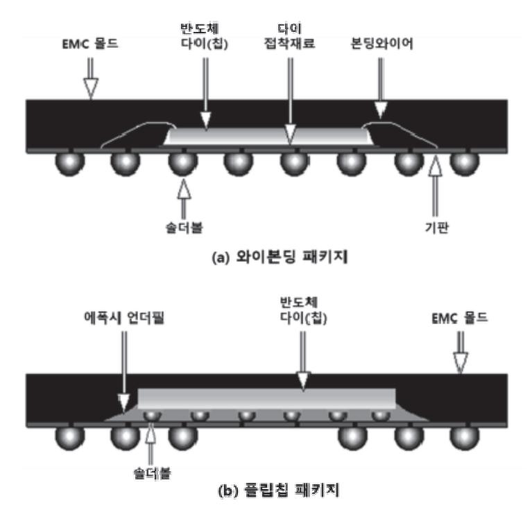

출처: 집필진 제작(2024) [그림 1-1] 와이어 본딩 패키지와 플립 칩 패키지의 단면 형상

(2) 이종 접합 패키지(hybrid bonding package) 개별적으로 제조된 여러 구성 요소들(AP, 메모리, 센서, MEMS 소자 등)을 단일 칩 크 기에 준하는 수준으로 패키지하는 타입이다. (가) 웨이퍼 레벨 패키지(wafer level package)

광의적으로 패키지 공정 일부를 재배선(redistribution layer), TSV(through silico n via) 등 웨이퍼 단위로 진행한 패키지 또는 패키지 공정 전체를 웨이퍼 단위로 진 행한 패키지 타입이다.

1) 팬인(pan in) 방식

웨이퍼 위에 패키지용 배선과 절연층 솔더볼을 형성한 패키지로 칩의 크기와 패 키지의 크기가 대등한 방식

가) 특징

고밀도 PCB 실장과 전기적 특성에 유리하며 칩의 크기와 비슷하여 고밀도 PC B 실장에는 유리하나, 패키지의 물리적 화학적 보호 기능이 약하다.

나) 적용 분야

고밀도 실장이 필요한 모바일 기기 등의 소자에 적용된다.

2) 팬아웃(pan out) 방식

팬인 방식의 단점을 극복하는 방법으로 높은 성능을 얻기 위해 입출력 배선을 칩 (다이) 외부로 재배치하는 방식을 적용하기 위해 칩 분리가 선행되어 캐리어 또는 몰드 컴파운드를 사용하여 재구성한다.

가) 특징

기판 없이 실장이 가능해 원가 경쟁력을 확보할 수 있으며, 칩(다이)의 설계 변 경 없이 요구 성능을 위해 재배선을 하여 소자를 구현할 수 있고 다양한 공정 조합이 가능하여 융합형 시스템 반도체의 구현이 유리하다.

나) 적용 분야

고밀도 실장 기술이 필요한 모바일 등에 적용하는 AP 및 메모리 등

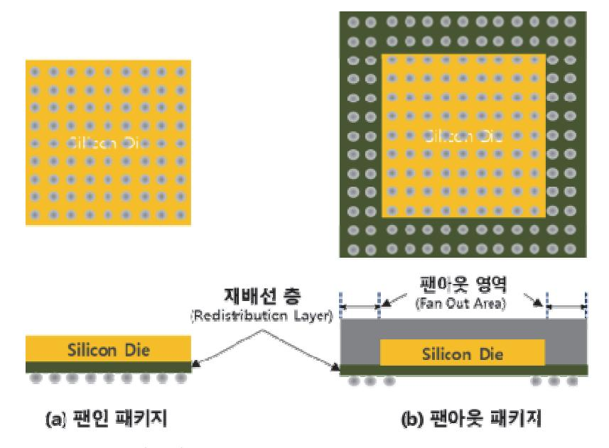

출처: 집필진 제작(2024)

[그림 1-2] 팬인(fan in) 패키지와 팬아웃(fan out) 패키지의 구조

(나) SIP(system in package)

서로 다른 기능의 소자들을 하나의 패키지로 제조하는 방식으로 소자 간 접속 경로 를 단축하여 고성능 및 우수한 전기적 특성을 얻을 수 있다.

1) 특징

개발된 칩(다이)의 큰 설계 변경 없이 사용할 수 있으므로 개발 비용이 적고 시 장 대응 시간이 짧아 소량 생산 대응이 가능하다. 다양한 소자들을 집적하여 단 일 패키지로 공급이 가능하여 소형화에 유리하고 경량화에도 대응 가능하다.

2) 적용 분야

RF와 무선 소자, 네트워크와 컴퓨팅, 이미지 센서 및 메모리 제품에 적용되고 있다.

(다) TSV(through silicon via)

Si 웨이퍼를 관통(through si via)시켜 전도성 재료로 채워 칩(다이)의 상면과 후면

- 을 전기적으로 연결하고 각 칩(다이)들의 상면과 후면에 범프를 형성하여 칩(다이)들
- 의 적층하는 공정
  - 1) 특징

와이어 본딩이 필요 없기 때문에 패키지 크기를 줄일 수 있고 빠른 전기 신호 전 달이 가능하고 시스템에 연결할 핀의 위치 선정과 개수를 증가시킬 수 있다.

2) 적용 분야

메모리칩(다이)들을 적층한 대용량 메모리나 CMOS 이미지 센서 등에 적용한다.

(라) PoP(package on package)

패키지와 패키지를 수직으로 적층하는 기술이다.

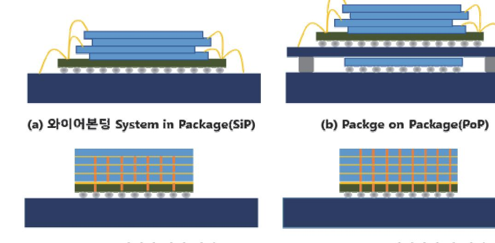

출처: 집필진 제작(2024) [그림 1-3] 패키지 단면 구조 1) 특징

패키지와 패키지를 수직으로 적층하는 패키지로 불량 패키지에 대한 재작업이 가 능하다. 다른 패키지 제조사의 제품을 적용할 수 있다.

2) 적용 분야

모바일, PDA, 디지털카메라 등 모바일 제품에 적용하고 있다.

2. 기능에 따른 반도체 분류

기능에 따라 패키징 방법의 적용은 차이를 발생할 수 있다.

(1) 메모리 반도체

정보를 기억, 저장하는 역할을 하는 반도체이며, 정보를 기록하고, 기록된 정보를 읽거 나 수정할 수 있는 램(RAM)과 기록된 정보를 읽을 수 있는 롬(ROM)으로 구분할 수 있 다.

(가) RAM(random access memory)

전자 기기에서 중앙 처리 장치의 연산을 도와 프로그램을 읽고 임시 저장 후 빠른 처리를 지원하는 메모리로서 전원이 끊기면 기록도 지워지기 때문에 램에 저장된 데 이터는 컴퓨터가 작동하는 동안 유지되며 컴퓨터의 전원이 커지면 램에 있는 데이터 는 삭제된다.

(나) ROM(read only memory)

전원이 꺼져도 데이터를 유지하여 중요한 정보와 프로그램이 보존된다. 일반적으로 데이터를 기록하지 못하고 읽기만 가능하고 저장된 데이터는 시간이 지나도 안정적 으로 유지된다. PROM(programmable ROM), EPROM(erasable programmable ROM), EEPROM(electrically erasable programmable ROM) 등이 있다.

(2) 마이크로 프로세서(microprocessor)

수백만 개의 트랜지스터를 포함한 집적회로로 구성되어 있으며 연산 능력과 초당 처리 할 수 있는 명령어 수로 정의되는 클록으로 처리 성능을 표기한다. 독립적으로 연산 처 리를 할 수 있는 여러 개의 다중 코어를 채용하고 있다. 개인용 PC, 모바일 기기, IOT 장치 그리고 임베디드 시스템 등에 적용되고 있다.

(3) GPU(graphic processing unit)

컴퓨터나 노트 PC 등 디스플레이용 그래픽 렌더링 및 병렬 처리를 담당하는 하드웨어 로서 수천 개의 작은 코어 구성으로 다수의 작업을 동시에 병렬 처리를 할 수 있다. 따 라서 디스플레이, 모사(simulation) 활용 등 병렬 연산 처리가 가능한 곳에 적합하다. 게임, 비디오 편집과 렌더링, 인공지능 및 머신 러닝 등에 활용되고 있다.

숕 반도체 와이어 본딩 패키지 설계 검토를 위해 필요한 정보

반도체 패키지 내 와이어 본딩을 적용하기 위해 설계해야 하는 반도체 제품을 결정하는 데 필 요한 기본 지식은 아래와 같다.

- 1. 반도체 다이 사양서(semiconductor die specifications) 특정 반도체 다이에 대한 상세한 기술 정보를 제공하는 문서로서 데이터 시트를 통해 해당 소자의 전기적 특성, 물리적 특성 및 패키지 설계에 도움이 되는 정보를 제공하는 문서이 다. 주요 문서 내용은 다음과 같다.
  - (1) 물리적 특성(physical properties)
    - (가) 다이 치수(die dimension): 다이의 길이, 너비, 두께
    - (나) 본딩 패드 레이아웃(bonding pad lay out): 와이어 본딩을 위한 본딩 패드의 위치, 크 기 및 배열
    - (다) 패시베이션층(passivation layer): 패시베이션층의 재료의 종류와 두께
    - (라) 스크라이브 라인(scribe line): 개별 다이를 웨이퍼에서 분리하기 위한 스크라이브 라인 의 폭과 간격
  - (2) 전기적 특성(electrical properties)
    - (가) 문턱 전압(threshold voltage, Vth): 트랜지스터가 도통을 시작하는 전압
    - (나) 온 저항(on resistance, Ron): 회로에서 전압이 가해졌을 때 전류의 흐름을 방해하는 값 으로 트랜지스터가 'on' 상태일 때 드레인과 소스 간의 저항
    - (다) 누설 전류(leakage current, Ileak): 트랜지스터가 'Off' 상태일 때 흐르는 전류
    - (라) 항복 전압 전압(breakdown voltage, Vbr): 소자가 견딜 수 있는 최대 전압
    - (마) 전류 정격: 반도체 다이가 동작할 수 있는 최대 전류
  - (3) 열적 특성(thermal properties)
    - (가) 접합 온도(Tj): 다이 접합부의 최대 동작 온도
    - (나) 열저항(Rth): 접합부에서 주변 환경으로의 열저항
    - (다) 전력 소모(Pd): 최대 접합 온도를 초과하지 않고 다이가 소모할 수 있는 최대 전력
  - (4) 기계적 특성(mechanical properties)
    - (가) 웨이퍼 두께: 다이가 절단된 웨이퍼의 두께
    - (나) 다이강도: 파단 강도 또는 파괴의 힘으로 측정되는 다이의 기계적 강도
    - (다) 표면 평탄도: 본딩 및 열방출을 위한 다이의 표면 평탄도
  - (5) 신뢰성 사양(reliability properties)
    - (가) 전자 이동 저항: 전자 흐름으로 인한 열화없이 견딜 수 있는 능력
    - (나) 시간 의존성 유전체 파괴(TDDB): 전기장의 스트레스 하에서 시간 경과에 따른 유전체

파괴 저항값

(다) 고온 캐리어 주입(hot carrier ion): 고에너지 캐리어로 인한 열화 저항

- (6) 패키지 호환성(package compatibility)
  - (가) 패키지 형태 호환성: 다이가 호환되는 패키지 유형 여부 확인
  - (나) 와이어 본딩 매개 변수: 권장 와이어 본딩 재료 및 직경, 본딩 힘, 초음파 및 온도
- 2. 패키지 공정 검토(process compatibility review)

반도체 패키지 제조 가능성을 점검하기 위한 확보된 장비 사양 및 공정 능력을 점검하고 제조 가능성을 타진해 본다.

(1) 다이 본딩 공정

칩(다이) 인식을 위한 인식 패턴, 픽업 툴 및 이젝트 툴, 본딩 재료 등을 검토한다.

(2) 와이어 본딩 공정

와이어 본딩 위치 확인, 캐필러리, 본딩 와이어 재료 등을 검토한다.

(3) EMC 몰딩 공정

와이어 본딩 패키지로서 EMC 몰딩 공정 시 공정 불량 발생이 높아 리드 프레임 및 기 판 설계와 와이어 본딩 공정의 완벽한 강건 설계가 될 수 있도록 보완 여부를 확인한다.

(4) 테스트 공정

정확한 테스트 공정을 위해 소켓 제작 여부와 측정 조건 및 양불 판정 기준을 점검한다.

## 수행 내용 / 와이어 본딩 패키지 설계 가능성 검토하기

재료·자료

- 반도체 다이 사양서
- 반도체 제품 사양서
- 반도체 패키징 공정 흐름도

#### 기기(장비 ・ 공구)

- 개인용 PC
- 안전 ・ 유의 사항
  - 해당 사항 없음.
- 수행 순서
- 숔 반도체 사양을 검토한다.

설계될 반도체 와이어 본딩 패키지의 목표 사양을 검토하고 대응 가능성을 확인한다.

1. 반도체 소자의 요구 성능을 검토한다.

반도체 소자가 적용될 응용 분야에 따라 동작 정격 전원과 전기적 성능, 열 방출 성능 그리 고 조립성에 영향을 주는 제품의 크기와 형상에 대한 적합도를 검토해야 하며 사용 환경에 서 성능 열화 정도와 같은 신뢰성 특성과 제품 수명 등의 대응 가능성을 검토한다.

- (1) 요구 성능에 대해 점검한다.
  - (가) 소모 전력, 동작 전압, 신호 전송 속도, 주파수 응답 속도 등 전기 성능 목표에 대해 검토 한다.

반도체 소자의 유형에 따라 요구되는 성능을 파악한다. 가령, 메모리 반도체의 경우 메모리의 크기(memory size), 데이터 버스 폭(data bus width), 액세스 시간(access time), 동작 전압(operation voltage) 등이다.

- 1) 소모 전력(power consumption): 소자의 동작 및 대기 중에 발생하는 소모 전력을 검토한다. 응용처에 따라 중요도의 차이가 있으나 모바일 기기 혹은 IOT기의 경우 에 매우 중요한 성능이다.
- 2) 동작 전압(operation voltage): 시스템 전원과 소자의 전압 가용 범위의 적절성을 검토한다.
- 3) 처리 성능(process performance): 소자가 처리할 수 있는 최대속도로서 시스템 요

구를 충족시킬 수 있는 주파수 사용인지를 점검한다.

- 4) 연산 성능(computational performance): 데이터를 처리할 수 있는 소자의 경우 연산성능을 확인한다.
- 5) 코어 수(number of core): 코어가 2개 이상의 멀티코어를 갖는 경우로 코어의 수 와 응용처의 요구에 맞는지를 검토한다.
- 6) 메모리의 크기(memory size): 반도체의 데이터의 용량으로 응용처에 따라 필요한 사양은 차이가 발생하게 된다.
- 7) 데이터 전송 속도: 메모리의 경우 데이터의 읽고 쓰는 속도, 전송 속도 등 적용 시 스템의 전반의 성능에 영향을 준다.
- 8) 접근시간(access time): 메모리에서 데이터에 접근하여 읽고 쓰기에 필요한 시간이 다.
- 9) 열 특성(thermal property): 소자 동작 중에 발생 열에 대해 적절한 방열 설계 확 보 여부를 검토한다.
- (나) 패키지의 타입에 따른 외곽 치수(dimension), 핀 정보 등을 검토한다.

반도체 패키지의 치수, 핀 정보 등을 파악한다. 대부분 표준에 근거한 치수와 핀 수 와 배열로 설계하게 된다. 예를 들어 QFP 패키지의 전형적인 외곽 치수는 5×5㎟에 서 32×32㎟이며 두께는 1.5~2.0㎜로 핀 피치(Pitch)는 0.4~0.8㎜이다.

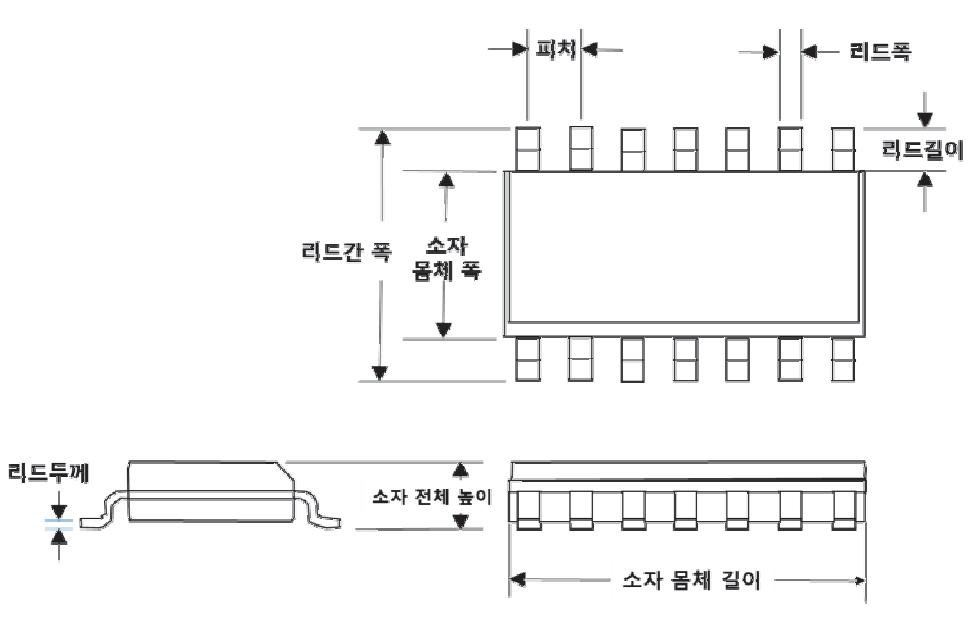

출처: 집필진 제작(2024) [그림 1-4] 표면실장(surface mount)형 반도체 소자의 주요 치수 부위

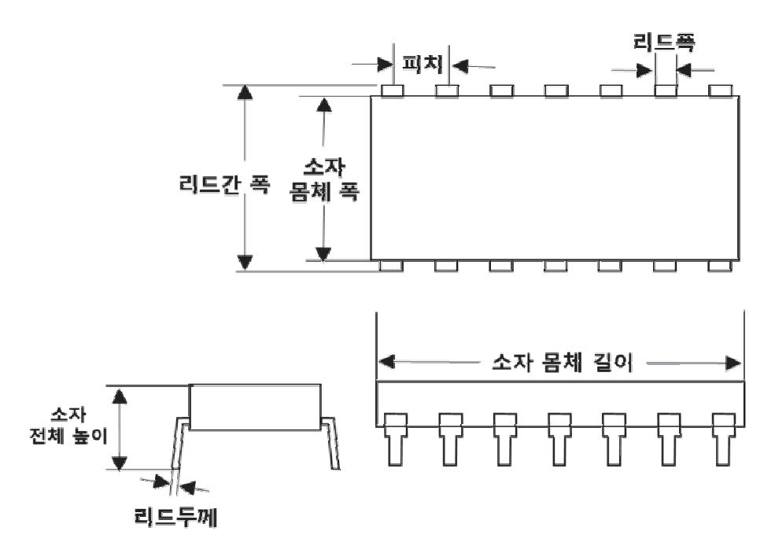

출처: 집필진 제작(2024)

[그림 1-5] 스루 홀(through hole)형 반도체 소자의 주요 치수 부위

(다) 제품 성능에 대한 적정한 측정 방법과 기준 등을 검토한다.

반도체 패키지 제품의 목표 성능을 평가하는 방법과 양품의 기준을 검토한다.

1) 전기적 성능 평가

반도체 소자가 정상적으로 전기적 성능으로 동작하는지를 평가하기 위함으로 전 압, 전류, 주파수 응답 및 신호 무결성 등의 특성들을 검토한다.

반도체 메모리의 경우 DC 특성들(동작 전압, 대기 전류, 동작 중 전류 등), AC 특성들(접근 시간, 클록 주기, 지연 시간 성능 등), 메모리의 신호 품질을 평가하 는 전파 지연, 스큐, 신호 상승 및 하강 시간과 반사율 등의 특성을 검토한다.

2) 기능 성능 평가

메모리 소자의 경우, 기본 동작 기능인 읽기, 쓰기, 소거 등의 동작 성능으로 랜 덤 접근 시간(random access time), 순차 접근 시간(sequential access time), 소거 시간(refresh time) 등을 평가하거나 메모리의 경우 데이터 보존 시간 및 메모리 오류에 따른 복구 기능(error correction code) 여부 성능을 검토한다.

3) 열적 특성 평가

반도체 제품의 저온 및 고온 환경에서 성능을 확보하기 위한 접합 온도 평가(jun ction temperature test)와 온도 사이클 테스트로서 반도체의 온도 성능을 평가 한다. 접합 온도는 최대 접합 온도(maximum junction temperature, Tjmax)와 정격 접합 온도(rated junction temperature)로 반도체 소자의 열특성을 검토한 다. 최대 접합 온도는 반도체 소자가 안정되게 동작할 수 있는 최고 온도를 의미

하며 일반적으로 125~150℃이다. 그리고 정격 접합 온도는 반도체 소자가 정상 적으로 동작할 수 있는 온도의 범위로 –40~125℃이다.

- (2) 사용 환경에 따른 성능 열화 정도에 대한 대응 가능성을 검토한다.
  - (가) 사용 환경에 대한 경계 조건을 확인한다.
    - 반도체 소자의 수명은 소자의 동작 조건 및 환경에 따라 변화하기 때문에 소자의 동 작 조건(동작 전압과 전류), 온도 조건(동작 온도, 보관 온도), 습도 조건 등의 경계 조건을 확인한다.
  - (나) 사용 환경에서의 요구 수명과 예측 수명을 검토한다.
    - 반도체 소자의 경계 조건이 확인되면, 유사 제품을 통해 예측 수명을 확인하고 사용 환경에 따른 예측 수명 확보 실험 계획을 수립한다. 소자의 예상 수명은 MTTF(mean time to failure, 고장 발생까지의 평균 시간으로 초기 성능 대비 열화 또는 고장률에 따라 수명을 결정하게 된다.)와 MTBF(mean time between failure로 연속적으로 발생하는 고장의 평균 시간이다.) 등이 있으며, 반도체 소자의 경우에는 수리가 어려우므로 MTTF를 사용한다. 솔리드스테이트 기술협회(JJESD22 등), 일본 전자공업 협회(EIAJED-4701, EIAJED-4701 등), 일본 공업 규격(JIS C7021, JISC7210 등), 미국 군용 규격(MIK-STD-750, MIL-STD-202, MIL-STD-883 등)을 참조하여 시험 조건과 시험 일정 계획을 수립한다.
  - (다) 사용 환경에 따른 열적 특성인 열충격과 ESD 특성에 대한 요구 성능을 검토한다. 소자의 사용 환경에 따라 견뎌낼 수 있는 내성 및 정전기 방전 등에 대한 요구되는 환경에서의 성능이 유지되는지를 확인한다.
- 2. 반도체 소자 설계 목표를 검토한다.

목표 성능을 달성하기 위한 기술, 제조 가능성 및 비용을 고려하여 점검한다.

- (1) 반도체 제품 타입 및 패키지 형태와 크기를 검토한다.
  - (가) 요구 사양에 적합한 반도체 제품 타입과 크기를 결정한다. 핀(pin) 간 거리(pitch), 높이 등이 표준 치수를 근거하여 결정한다.
  - (나) 패키지가 장착될 PCB와의 기계적, 전기적, 열적 특성을 고려하여 패키지의 구조화 형태 (form factor)가 적용될 수 있도록 한다.

(2) 목표 성능을 검토한다.

전기적 성능(동작 전압, 소비 전력, 신호 전송 속도, 응답 속도 등), 열(thermal) 성능, 기계 적 성능 등과 제품 수명 목표 등을 검토한다. 그리고 소자 성능의 평가 방법과 기준 및 신 뢰성 특성 평가 방법과 기준의 적절성을 검토한다.

(가) 칩(다이)과 패키지 간의 전기적 인터페이스 일치와 기생 인덕턴스 등을 고려한 전기적 목 표 특성을 설정한다.

와이어 본딩이 적용된 반도체 패키지의 경우 신호 무결성(signal integrity)을 위해

최적의 와이어 길이를 고려해야 한다. 특히 고주파에서 신호의 감소를 발생시키는 기생 인덕턴스를 최소화해야 한다. 따라서, 본딩 와이어, 트레이스들 사이의 임피던 스를 매칭을 고려해서 제품 설계에 충분히 반영되었는지를 검토한다.

- (나) 다이(칩), 와이어의 두께와 사용 재료의 특성들을 고려하여 최대 허용전류 한계(maximum current limit)가 요구 성능과 부합되는지 검토한다.
- (다) 구체적으로 와이어 본딩 패키지의 경우에 사용 전력 효율을 고려하기 위해 와이어를 통 해 저항손실(resistive loss)를 최소화해야 한다. 따라서 쓸모없는 구부러지는 영역을 최소화하는 등의 와이어의 길이를 최소화하도록 설계되었는지 검토한다.
- (라) 패키지 변형에 대한 기계적 강도와 본딩된 와이어의 접합 신뢰성에 대해 검토한다. 사용 환경에서의 외부 온도 변화와 동작 중에 발생하는 열에 의한 스트레스에 대한 내구성을 반영된 설계인지를 검토한다.
- (마) 목표 전기적 성능 등 소자 성능을 평가하는 방법과 평가 기준을 검토한다.
- (바) 방열 설계를 포함해 열 특성 목표를 설정한다.
  - 동작 중 온도 상승을 방지할 수 있도록 와이어의 두께를 설정해야 한다. 이를 통해 열적 손상이 없이 소자 동작 중에 발생하는 열을 방출할 수 있도록 와이어와 패키지 구조를 고려해야 하여 접합 온도(junction temperature)를 고려한다. 패키지의 열 방출 설계와 와이어 등의 열전도 특성을 고려하여 재료를 설정할 수 있도록 검토해 야 한다.
- (3) 기술적 측면에서 검토한다.

현재 성능 대비 목표 성능과의 차이가 있는 경우에 개선 또는 개발 항목을 정의하고 소 요 기간을 확인하는 점검 단계가 필요하다. 기술적 측면(성능, 기능 변경, 수명 등), 제조 가능 측면(신공정, 공정 개선 필요 여부 등) 등에서 검토한다.

(4) 제품 개발 비용 측면에서 검토한다.

설계 및 개발 비용을 포함하여 공정 난도 증가에 따라 신규 장비의 도입과 공정 단계의 증가 등의 제조 비용 상승, 테스트 비용의 증가 등을 고려하여 수익과 그에 따른 비용 분석이 필요하다.

- (가) 개발할 반도체 소자의 성능과 재료 비용을 고려하여 적절하게 사용 재료를 선정한다.
- (나) 반도체 소자를 제작하기 위한 공정의 복잡도(complexity) 등도 비용을 고려하여 적용 공 정 설계에 반영한다.
- (다) 현재 양산되는 공정 능력을 고려하고 목표 수율을 설정한다. 최소의 재작업(rework)과 불량률을 달성 가능성을 고려하여 공정별 장비 안정화의 가능성이 큰 조건에서 설정한 다.

숕 반도체 공정 가능성을 검토한다.

신규 와이어 본딩 패키지 제품을 제조하기 위해 관련 공정 진행 가능성을 검토한다.

1. 공정별 진행 가능성을 검토한다.

와이어 본딩 패키지 제품을 제조하기 위한 필요 공정과 공정 순서를 계획하고 공정별 공정 능력(process capability)과 한계를 파악하고 개선 가능 여부를 확인한다.

(1) 기존 생산 제품과의 생산 호환성 및 장비 성능 허용한계 등을 검토한다.

리드 프레임(lead frame)의 패드의 위치와 간격, 칩(다이) 패드와의 일대일 대응 위치 등 적절한 와이어 본딩이 진행될 수 있는지 검토한다.

(2) 잠재 불량 등 유사 반도체 제품의 생산 품질 사례를 참고하여 검토한다. 신규 리드 프레임 또는 기판 투입에 따른 예상되는 잠재 불량의 종류 등을 기존 불량

사례를 근거로 하여 예측해 본다. 그리고 사전에 해결하는 방법을 모색한다.

- (3) 공정별 생산 처리 시간을 확인한다.
  - 공정별, 장비별 생산성을 점검하기 위해 공정별 그리고 장비별 생산시간을 확인해 본다.

2. 공정 진행을 위해 변경이 필요한 공정 조건, 필요 치공구를 검토한다.

초기 2D, 3D 도면을 참조하여 공정별 조건과 관리 인자들을 검토하고 보완 사항을 정리한 다. 치공구는 공용화의 가능 및 변경 여부를 확인한다.

- (1) 다이 본딩 공정의 주요 검토 사항
  - (가) 반도체 패키지 스트립의 크기를 확인한다.
  - (나) 리드 프레임 및 기판의 다이 본딩 위치 방향, 위치 정보와 일치함을 확인한다.
  - (다) 다이 본딩 공정을 위해 다이의 크기와 두께를 확인하여 기판에 공차 적용 여부, 다이 본 더 공정 능력을 고려한 설계인지 확인한다.
  - (라) 진동, 충격, 기계적 피로와 같은 기계적 응력을 견딜 수 있는 본딩 강도를 확보할 만한 인장 강도(pull strength)와 전단 강도(shear strength)를 설정한다.
  - (마) 본딩 접착 방법은 액상과 고상(DAF: die attach film)으로 칩(다이)의 발열에 대한 방열 대책은 물론 원활한 공정을 위해 점성(viscosity), 큐어(cure) 온도 등을 고려해서 선택 한다.
  - (바) 치공구(픽업 툴, 이젝트 핀 등) 호환성을 확인하고 필요시 치공구를 제작 계획을 수립한다.
- (2) 와이어 본딩 공정의 주요 검토 사항
  - (가) 본딩 방식과 장비 성능을 확인하여 제조 가능 여부를 검토한다.
  - (나) 설계된 본딩 와이어의 재질, 루프(loop) 높이, 길이와 형태 적절성을 검토한다.
  - (다) 와이어와 기판 간의 본딩력 등 공정 판정 기준을 위한 인장 강도(pull strength)와 전단

강도(shear strength)의 기준 설정의 적절성을 검토한다.

- (라) 와이어 본딩 공정 설계를 통해 본딩 방식, 장비 조건 그리고 필요 툴에 대한 추가 여부 를 검토한다.
- (바) 리드 프레임과 기판 패드의 배치와 와이어 경로가 전기적 성능 저하되지 않도록 와이어 드 길이 및 굵기가 적절성을 검토한다.
- (3) EMC 공정의 주요 검토 사항
  - (가) 적용된 와이어 본딩의 형태를 고려해서 에폭시 재료를 선정 여부를 검토한다.
  - (나) 공정에 필요한 압력, 압력의 분포 및 EMC의 유동 등을 고려해서 리드 프레임과의 설계 요소를 검토한다.
  - (다) 몰딩 금형의 다른 제품과의 공용화 또는 수정 필요 여부를 검토한다.
  - (라) 몰딩 방식, 장비 및 각 공정 조건에 따른 결과를 예측하며 점검한다.
- (4) 포장 방법을 결정하고 다른 제품과의 호환성을 검토한다. 새로운 릴, 트레이 등이 필요하다면 양산 일정을 고려해서 확보 계획을 수립한다.
- (5) 공정별 필요 치공구 필요 여부 및 확보 계획을 수립한다. 공정 진행을 위한 공정 장비별 치공구 공용 사용 여부를 확인하고 필요시 확보 계획을 수립한다.
- 3. 제품 테스트를 위한 지그 및 소켓을 준비하고 특성별 판정 기준 등을 확정한다.
  - (1) 제품을 위한 테스트 계획서를 제작 검토하고 테스트 시간 감소를 위해 테스트 프로그램을 개 발하거나 기존 프로그램을 적용 검토한다.
  - (2) 테스트 공정의 측정을 위한 지그(jig) 및 소켓(socket) 확보 여부를 확인하고 제작 계획을 수 립한다.
  - (3) 테스트 조건 및 양불 기준을 결정한다.
- 4. 공정별로 설계될 패키지에 대한 공정 검토서를 작성한다. 공정별로 검토된 내용을 정리하여 전체 공정 검토서를 작성하고 일정 및 비용 등을 점검하 고 설계 변경이 필요한 경우에는 설계 변경 내용을 정리해서 통보한다.

숖 품질 관리 측면에서 검토한다.

- 1. 시장이나 고객 요구 성능을 개발 목표 성능에 반영 여부를 검토한다.
  - (1) 시장이 요구하는 응용처에 적합한 요구 성능을 개발에 반영하였는지를 검토한다.
  - (2) 개발 제품을 보유한 경쟁사 제품에 대한 분석 여부와 제품 차별화를 요소를 확인한다.
- 2. 신규 본딩 패키지 사양의 표준 준수 여부를 확인한다.

ISO 9001 또는 TS16949 등 국제 품질 관리 표준의 준수 여부를 확인한다. 제품 개발 프 로세스도 관련 표준 절차에 따라 진행된다.

- 3. 과거 유사 제품의 실패 사례 등을 참조하여 예상되는 품질 불량(설계, 공정, 신뢰성, 시장 불량 등)을 사전에 검토한다. 고객 요구 성능을 성취하기 위해 재료, 공정을 최적화하는 제품 설계 최적화를 할 수 있도 록 과거 실패 사례를 근거로 점검한다. (1) 새로운 패키지가 기존보다 더 복잡한 공정이 필요한지를 검토한다.

  - (2) 제조 과정에서 불량률의 상승 가능성 유무를 검토한다.
- 4. 패키지의 신뢰성 시험 조건과 기준, 장기 수명 데이터 확보 계획 등을 확인한다. 가속 수명 테스트, 환경 테스트 등의 신뢰성 검토 계획을 수립하고 유사 패키지의 신뢰성을 참조하여 신뢰성 평가를 진행한다.
- 5. 요구 성능을 갖춘 제품 개발 일정 준수와 목표 비용의 타당성을 검토한다.

숗 경제 타당성을 검토한다.

- 1. 개발 비용을 분석한다. 신규 패키지 제품을 개발하기 위해서 총비용을 분석하여 예상 투자 수익을 평가한다.
  - (1) 개발에 투입되는 자원(인력, 비용)을 분석한다.
  - (2) 장비나 시설 투자에 대한 비용을 평가한다.
- 2. 생산 비용을 분석한다. 양산 시에 발생할 생산 비용 등 제조 비용을 평가한다.
  - (1) 양산 가능성과 생산 원가 절감 계획을 검토한다.
  - (2) 생산 중에 발생하는 수율 목표의 타당성을 검토한다.
- 3. 투자비 회수 가능성을 검토한다. 판매 계획을 통해 투자비 회수 가능성을 분석한다. 목표 판매 가격과 수익성 분석을 평가하 고 투자액 회수 시점을 예측한다.

수행 tip

- 반도체 패키지 제품을 설계하기 위해서는 소자 성능 목표 를 파악하는 것이 우선이다. 우선, 반도체 다이의 성능 사 양을 파악하고 패키지를 설계함에 따라 열화되는 성능 항 목과 이를 개선하기 위한 설계 방안은 수립한다.
- 반도체 소자 성능, 측정 방법 및 양불 기준 등 평가 항목 을 미리 설정한다.
- 대량 생산을 위해 공정 불안 요소를 파악하고 개선 계획을 수립한다.

## 1-2. 리드 프레임 및 기판 설계

학습 목표 • 가능성 검토가 완료되면 패키지 도면, 툴 도면, 리드 프레임 도면, 서브 스트레이트 도면을 작 성할 수 있다. • 반도체 전 공정이 완료된 웨이퍼가 패키지 공정에 도착하기 전에 툴과 리드 프레임, 서브 스 트레이트들을 준비할 수 있다.

## 필요 지식 /

#### 숔 기판의 종류

패키지 기판은 칩(다이)과 외부 PC 기판과의 전기적으로 연결하거나 칩(다이)을 구조적으로 지 지하는 역할을 한다.

1. 리드 프레임(lead frame)

주로 플라스틱 패키지 내의 금속 기판으로 만들어지면 반도체 칩(다이)과 외부의 전기적 연 결과 칩(다이)을 지지하는 역할을 수행하는 재료이다.

(1) 재질

사용되는 재료는 코바(Kovar, Fe-No-Co 합금), 합금 42(Alloy42, Fe 57.7%, Ni 4 0%, Mn 0.8%, Co0.5%)로 Si과 유사한 열팽창 계수를 지니고 있다. 그리고 구리(Cu) 합금은 전기 전도도가 우수한 재질로써 일부는 Ag로 도금하게 된다.

(2) 구조

리드 프레임의 구조는 다이 패드(die pad), 리드(lead), 댐 바(dam bar) 등으로 되어 있으며 기능은 다음과 같다.

(가) 위치 홀, 몰드 파일럿 홀(pilot hole)

몰드 금형 내에서 위치를 잡아주기 위한 홀이다.

(나) 1번 핀 지시 마크(Pin #1 designator)

패키지 내의 첫 번째 핀의 위치를 명확하게 정의하는 것으로 일반적으로 특정 위치 에 표시하도록 표준화되어 있다.

(다) 리드(lead)

외부 회로와의 전기적 연결을 위한 도전성 부분이다.

1) 내부 리드(inner Lead)

칩(다이)과 패들 사이를 금속 선 등으로 연결하기 위함이다.

2) 외부 리드(outer lead)

외부 리드(outer lead)는 PCB와 납땜 등으로 접합해서 전기 및 신호를 통할 수

있도록 한다.

(라) 다이 본딩 패드(die bonding pad), 다이 패들(die paddle)

1) 반도체 다이를 물리적으로 지지하여 안정적으로 위치에 고정한다.

2) 다이에서 발생하는 열을 패키지 외부로 방출하여 과열을 방지한다.

(마) 다이 본딩 패드 딤플(die bonding pad dimple)

1) 다이 패드와 EMC 수지와의 접착력을 개선하여 제품 신뢰성을 향상한다.

2) 딤플의 깊이, 간격 등은 패드의 평탄도를 고려하여 설계에 유의해야 한다.

(바) 슬롯 홀(slot hole)

반도체 다이의 열 방출과 반도체 다이의 정렬시키는 마크로도 활용하고 있다.

(사) 댐 바(dam bar)

패키지 공정 중의 리드를 지지하고 몰딩할 때 완전 충진을 위한 완충 댐의 역할을 한 다. 도금할 때 전류 통로로서 역할도 수행하게 설계된다.

(아) 타원형 홀(oval hole)

EMC 몰딩 때 열팽창 응력 완화 및 리드 프레임 뒤집힘 감지를 위한 홀이다.

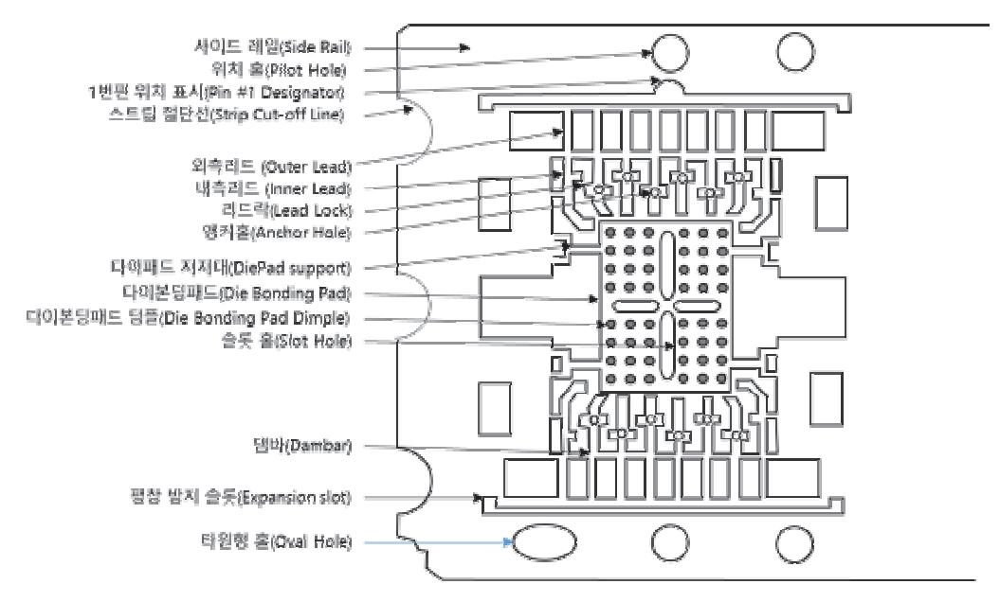

출처: 집필진 제작(2024)

[그림 1-6] 리드 프레임 대략적인 구조

(3) 리드 프레임의 제조 방법

리드 프레임의 형상 형성과 도금 등의 표면 처리 및 후처리 공정, 검사 및 포장을 거쳐 출하한다. 리드 프레임의 제조 방법은 에칭법(etching)과 스탬핑법(stamping)이 있다.

(가) 에칭(etching)법

리드 프레임의 패턴 형성을 위해 포토 레지스트를 금속판에 도포 후 부식액(etchan

t)을 노출시켜 미세한 리드 프레임을 제조하는 방법이다.

(나) 스탬핑(stamping)법

금형을 이용하여 리드 프레임을 제조하는 방법이다.

- (4) 대표적 종류
- (가) DIP(dual in line package)

패키지의 긴 변의 양쪽 아래 방향으로 리드가 늘어져 있고 범용 로직, EPROM 등에 사용되고 있다. 세라믹 DIP와 플라스틱 DIP가 적용되고 있다.

(나) TSOP(thin small outline package)

DIP의 리드 간격을 감소시키고 리드를 표면실장 하기 위해 리드 끝부분을 갈매기 날개 모양으로 되어 있다.

(다) QFP(quad flat package)

사각형의 형태로 네 변에 갈매기 날개 형태의 리드가 나와 있는 모양이며 봉지재의 형태에 따라 세라믹과 에폭시 수지로 되어 있다.

(라) QFN(quad flat non-leaded package)

칩(다이)의 네 변의 밑면에 전극 패드를 형성시키는 형태이며, 선택적으로 밑면에만 또는 밑면과 옆면으로 패드를 노출하는 형태가 있다. QFP에 비교하면 실장 면적이 작고 얇고 고밀도화가 가능하다.

2. 기판(substrate)

리드 프레임과 같이 주로 BGA 패키지에 이용되고 있으나 적용되는 제품에 따라 와이어 본 딩과 볼 본딩 방식을 혼용하여 사용한다. 외부 PCB 기판과 전기적으로 연결하는 역할을 하 고 있으며 칩(다이)을 지지해 주는 역할을 하고 있다.

(1) 기판 구조

기판의 구조는 코어(core) 재료로 BT레진이 함침된 유리 섬유 양면에 구리 포일을 붙여 진 것이다.

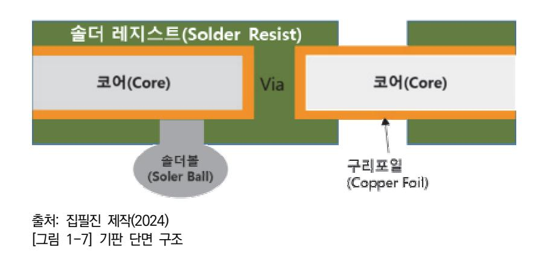

기판의 구조는 코어(core) 재료로 BT 레진이 함침된 유리 섬유 양면에 동박을 붙여진 것이다. 동박에 금속 배선을 형성시키고 솔더 레지스트가 형성되어 금속 패드를 노출하 고 보호막 역할을 한다.

(가) 프리프레그(prepreg)

유리 섬유와 같은 강화 유리에 BT(bismaleimide trazeine) 수지가 함침(impregnation)되 어 반경화된 중간 재료로서 기판의 코어로 사용된다.

(나) 구리 포일(copper foil)

기판의 전기적 연결선으로 사용된다.

(다) 솔더 레지스트(solder resist)

구리 회로를 보호하고 전기적 연결을 고려하여 선택적으로 절연막으로서 역할을 하 거나 외부의 열 또는 충격으로부터 기판 전체를 보호하는 역할을 하며, 와이어 본딩 및 볼 본딩되는 영역을 정의하게 된다.

(3) 기판의 종류

와이어 본딩이 적용되는 대표적인 기판의 종류는 다음과 같다.

(가) BOC(board on chip)

기판 중앙에 형성된 슬롯(slot)이 형성되어 있고 거꾸로(face down) 실장된 칩(다이) 과 기판을 와이어 본딩하여 메모리칩(다이)을 연결하는 방식으로 와이어 본딩 패드와 볼본딩 패드가 같은 층에 위치되어 있는 특징을 가지고 있으며 와이어 본딩용과 플 립 본딩용으로 구분한다.

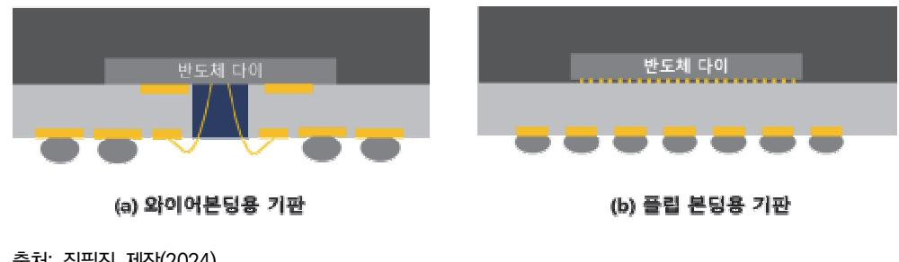

출처: 집필진 제작(2024) [그림 1-8] 기판의 종류

(나) MCP(multi chip pkg)

다수의 칩(다이)을 쌓아 올려 한 개의 패키지로 만든 것으로 부피를 적게 차지하면서 데이터 저장 용량을 향상할 수 있으므로 모바일 기기 등에 적용하는 낸드 플래시와 PS램(Pseudo SRAM) 등의 반도체 소자에 적용하고 있다. 다이 크기가 기판 면적의 80% 이상을 차지하고 있으며 와이어 본딩으로 연결하는 제품을 WBCSP라고 한다.

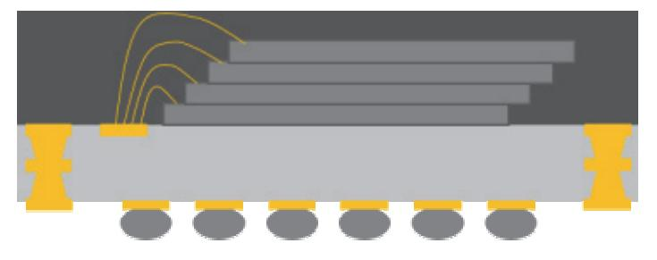

출처: 집필진 제작(2024) [그림1-9] 멀티칩(다이) 패키지 단면 구조

#### 숕 리드 프레임 및 기판 설계의 주요 산출물

리드 프레임 및 기판 설계를 완료하면, 설계 후 산출물을 정리하여 관련 부서에 정보를 제공한다.

- 1. 설계 도면
  - (1) 리드 프레임 레이아웃 도면: 공정, 품질, 신뢰성 그리고 표준화 정도를 확인할 수 있다.
  - (2) 핀 정보: 각 핀의 위치, 번호 및 형태를 상세하게 보여주는 도면이다.
  - (3) 단면도: 리드 프레임의 단면을 통해 두께, 층 구조 등을 나타내는 도면이다.
  - (4) 조립 도면: 리드 프레임과 함께 패키지될 구성 부품들을 포함한 전체 조립 도면이다.
- 2. 재료 명세서
  - (1) 리드 프레임에 적용된 재료에 관한 정보이다.
  - (2) 각 재료의 물리적, 전기적, 화학적 특성 등의 상세 정보를 기록해 놓았다.
- 3. 시뮬레이션 결과 보고서

전기적, 열적, 기계적 모사 결과 보고서를 별도 관리한다.

- 4. 제조 공정 문서
  - (1) 공정 흐름도: 리드 프레임 및 기판의 제조 공정의 각 단계를 나타내는 흐름도이다.
  - (2) 공정(작업) 지시서: 제조 공정별 작업 지침 및 표준 작업 절차를 명시한 문서이다.
  - (3) 수입 검사 기준 등 품질 문서: 품질 검사 기준 및 방법, 검사 주기 등의 품질 관리 계획 문 서이다.
- 5. 테스트 계획서와 결과 보고서
  - 전기, 기계, 열적 테스트 방법 및 기준을 명시하고 그 방법에 따른 결과 보고서이다.
- 6. 규격 준수 문서

제품 제원 서내에 표준 준수 증빙자료 및 유해 물질 분석 결과를 포함한다.

7. 조립 가이드 문서 리드 프레임 패키징 시에 주의 사항 등을 명시한 문서이다.

## 수행 내용 / 리드 프레임 및 기판 설계하기

#### 재료·자료

- 반도체 다이 사양서
- 반도체 제품 사양서
- 반도체 표준(JEDEC, IPC 등)

#### 기기(장비 ・ 공구)

• 개인용 PC, 기판 설계 소프트웨어

#### 안전 ・ 유의 사항

• 해당 사항 없음.

#### 수행 순서

- 숔 반도체 사양 검토(semiconductor specification review)하고 개념 설계를 시행한다. 설계될 반도체 와이어 본딩 패키지의 목표 사양을 검토하고 전기적, 열적, 기계적 특성을 고려 하여 리드 프레임 및 기판을 설계한다. 리드 프레임과 기판을 설계하기 위하여 반도체 소자의 목표 성능을 검토한다. 반도체 칩(다이)이 신규 개발 제품이 아닌 경우에는 기존 패키지 설계 시 고려했던 디자인 룰을 적용하여 검토하고, 신규 개발 칩(다이)의 경우에는 리드 프레임 및 기판 설계 검토를 신속하게 진행 후, 검토 결과를 칩(다이) 개발 담당자에게 피드백해야 한다.
  - 1. 반도체 소자의 목표 성능을 검토 및 정의하고 이를 설계하는 계획에 반영한다.
  - 리드 프레임에 설계에 영향을 주는 전기적 특성, 열적 특성. 기계적 특성에 대해 파악하고 요구 사항을 분석하고 정리한다. 따라서, 반도체의 전압, 전류, 신호 특성을 고려한 전기적 특성을 정의한다. 열적 특성은 칩(다이)의 발열 특성을 고려한 열 방출 경로와 관리 방법을 계획한다. 기계적 특성은 패키지의 형태와 리드 프레임과 기판의 강도 및 열팽창 특성을 고 려한 계획을 수립한다.
  - 2. 반도체 소자의 유형에 맞는 리드 프레임 또는 기판을 선택한다.
  - 3. 리드 프레임의 두께 및 재료를 선정한다. 반도체 소자의 성능, 비용, 제조 공정 능력, 그리고 제품 크기 및 디자인 제한 요소 등을 고려하여 선정하게 한다. 리드 프레임의 경우 0.1~0.3mm의 두께 범위에서 선정한다. 일반적으로 각각 적용되는 두 께는 아래와 같기에 설계 제품의 종류에 따라 선정하게 된다. 소형 신호 트랜지스터 및 IC 는 0.1~0.15mm, 표준 소형 패키지의 경우 0.15~0.25mm, 전력 반도체 소자의 경우 0.2

5~0.3mm이며 특수 사양에 대응하기 위한 두께를 선정하게 된다. 재료는 일반적으로 구리 나 구리 합금이 적용된다. 그리고 리드 프레임의 경우 표면 처리는 주석, 금, 은 등이 도금 될 수 있어 전기적 접촉 성능과 내구성을 개선할 수 있다.

- 4. 스케치 및 모델링을 진행한다. 리드 프레임의 기본 구조를 통해 2D 또는 3D 도면을 작성한다. 칩(다이)의 핀 배열 및 다이 패드 위치, 열 패드 등을 포함하며 이는 리드 프레임 및 기판 의 구조를 시각화하는 데 목적이 있다.
- 5. 목표 성능에 따라 전기적, 열적, 기계적으로 설계를 진행한다.
  - 리드 프레임과 기판 설계와 관련된 표준 및 디자인 룰을 적용하여 기본 기능과 제한 요소 등을 점검하며 제작한다. 전기적 설계는 각 리드의 전기적 경로를 정의하고, 기생 성분(기생 저항, 기생 인덕턴스, 기생 커패시턴스)을 고려하여 설계하며, 열적 설계는 칩(다이)에서 발 생한 열을 효과적으로 방출할 수 있도록 열저항을 최소화하는 방법을 선택하여 열전달 경 로를 설계한다. 기계적 설계는 리드 두께와 형상을 정의하여 기계적 강도와 전기적 특성을 최적화한다. 공정 중에 발생하는 스트레스를 견딜 수 있도록 리드 프레임의 강도를 설계한 다.
- 6. 리드 프레임과 기판 설계 과정을 통해 리드 프레임과 기판의 제작에 필요한 정보를 담은 문서를 작성한다.
  - (1) 리드 프레임과 기판 제조와 관련된 문서를 작성한다.
    - (가) 리드 프레임 및 기판 제작을 위한 거버(gerber) 파일은 기판의 층(layer)별 패턴 정보를 담고 있다. 비아(via) 위치, 공정 진행을 위한 구멍(hole), 패드 위치 및 각각의 치수 정 보 등 층별 구조 정보 등도 포함하고 있다.
    - (나) 리드 프레임 및 기판 제조에 대한 정보를 제공한다. 리드 프레임 구조, 기판 에칭 또는 스탬핑 적용 여부와 도금 사양 등을 기술하고 제조 과정에서의 품질 기준 및 검사 방법 과 허용 공차도 명시한다.
    - (다) 리드 프레임은 반도체 칩(다이)을 위한 다이 패드의 위치와 치수, 리드의 수, 모양 및 배 열을 설계하고 이 리드를 검사하기 위한 검사 방법, 기준(허용 공차) 등의 기준 등을 명 시한다.
    - (라) 도면에는 리드 프레임과 기판에 관한 스트립 정보, 층별 배선, 적용 재료 정보들이 있다. 기판의 경우 범프 패드 치수와 피치 간격, 본더 핑거 너비와 피치 간격, 트레이스의 피 치와 폭, 비아의 직경 치수, 패드의 직경 치수 및 딤플 깊이 등을 명시한다.
  - (2) 반도체 후공정을 진행하기 위한 문서를 작성한다. 리드 프레임과 기판의 설계 정보 중 공정 및 품질 담당자에게 공유할 특정 정보들(공정 별 인식 마크, 리젝트 마크, 더비 패턴 등)을 정리해서 문서로 작성한다.

25

숕 리드 프레임 주요 디자인 룰(design rule)을 확인한다.

- 1. 리드 프레임(lead frame) 설계를 위한 주요 디자인 룰 적용 항목 리드 프레임을 제작하는 데 필요한 사항들로 반도체 패키지의 타입, 제조 난이도에 따라 적 합한 디자인 룰을 적용해서 제작한다.
  - (1) 본딩 패드 주변부에 적용하는 디자인 룰
    - (가) 리드 프레임 스트립의 폭과 길이를 결정한다.
    - (나) 리드 프레임의 모따기: 리드 프레임의 이송 및 배출 시 구겨짐을 방지하기 위해 리드 프 레임의 양쪽 가장자리는 모따기를 한다.
    - (다) 사이드 레일에 있는 각종 홀
      - 1) 스트립의 열(row): 2열 에폭시 타입 Nand, DDP 제품 등, 3열은 LOC DRAM 등
      - 2) 피딩 홀(feeding hole): 공정을 위해 리드 프레임 이송을 위한 홀
      - 3) 센싱 홀(sensing hole): 제품 이송 에러 감지 위한 홀
      - 4) 몰드 파일럿 홀(mold pilot hole): 몰드 금형 내에 정확한 위치를 잡아주기 위한 홀
      - 5) 타원형 홀(oval hole): 몰딩할 때의 리드 프레임 열팽창에 따른 응력 완화 및 리드 프레임 뒤집힘 등을 감지하기 위한 홀
    - (라) #1핀 위치 표시(#1 pin designator): #1핀 위치 확인할 수 있는 홀
    - (마) 댐바(dambar): 리드를 지지하는 역할과 몰딩할 때 완전 충진을 위한 완충 댐의 역할을 하고 있으며, 도금할 때 전류 통로의 역할도 수행하게 된다.
    - (바) 로크 홀과 러그(lock hole & lug): 로크 홀은 EMC 수지가 채워지며 리드의 지지력을 보강하면서 리드 성형 시 리드가 빠지거나 패키지가 깨지는 것을 방지하고 러그는 패키 지 외부에서 수분의 침투 경로를 연장하기 위함이다.
    - (사) 타이 바(tie bar)
      - 1) 타이 바의 끝단은 V자 홈이나 폭이 좁아지는 형상으로 설계하여 절단할 때 패키지 깨짐이 발생하지 않도록 설계해야 한다.
      - 2) 공정 중 열팽창을 고려하여 긴 타이 바일 경우 신축할 수 있는 형상으로 설계하고 타이 바는 공정 중 다이 본딩 패드의 뒤틀림이 발생하지 않도록 설계한다.
  - (2) 다이 본딩 패드 부에 대한 디자인 룰
    - (가) 다이 본딩 패드
      - 다이 본딩 패드의 크기는 단축과 장축 비율이 1:2 이상으로 장축이 큰 경우에는 에 폭시 수지 넘침이 발생하지 않도록 설계한다. 가공 모서리는 버(burr)가 발생하지 않 도록 챔퍼 가공은 두께의 20% 미만으로 적용해서 본딩 패드의 평탄도를 유지하도록 한다. 패드의 모서리는 곡률을 주어서 응력 집중이 발생하지 않도록 한다.

(나) 슬롯 홀(slot hole)

슬롯 홀은 다이 패드와 리드 프레임의 크기에 따라 슬롯 홀의 크기도 차이가 다르며 일반적으로 폭은 50~200㎛이고 길이는 200~500㎛ 정도로 다이 중앙에 위치하도록 모서리가 둥근 직사각형 형태로 설계한다. 슬롯 홀은 다이본딩 패드와 EMC 수지와 의 접착력이 증가하여 신뢰성을 향상한다.

(다) 딤플(dimple)

딤플은 다이 패드와 EMC 수지 간의 접착력을 증대하기 위한 신뢰성을 향상하기 위 함이다. 딤플 배열의 형태, 간격 그리고 깊이는 다이 패드의 평탄도를 고려해서 선택 해야 하기에 기계적 모사(simulation)를 이용해서 최적 조건을 선택해야 한다.

(라) 리젝트 마크(reject Mark)

리드 프레임에 결함이 있는 공정이 진행되지 않도록 장비에서 자동으로 인식되도록 식별이 잘되는 점, 선, 숫자 등의 특수 기호의 형태로 표시한다.

(마) 더미(dummy) 유닛(unit) 패턴

실제 공정이 진행되지 않고 기계적 안정성, 공정의 효율성을 위해 추가하여 에칭 공 정에서 균일한 에칭 속도를 확보하고, 스탬핑 공정에서는 응력 집중을 분산시킴으로 써 구조적 강도를 높여 휘어짐이나 변형 등을 줄이고 패키지의 안정성을 유지하기 위해 적용하나, 비용 증가 또는 설계의 복잡성을 고려해서 적용한다.

#### 2. 기판(substrate) 설계를 위한 디자인 룰 적용 항목

다음은 Face up의 FBGA 패키지 기판을 설계하기 위해 다음과 같은 대표적인 적용 항목 을 선택해서 진행한다.

- (1) 페이스업(Face up) FPGA 기판 설계를 위한 디자인 룰
  - (가) 와이어 본딩 공정에서의 더미 뛰어넘기(skip) 방지 형상을 적용한다. 와이어 본딩 시에 반도체 다이가 없는 유닛을 건너뛰게 하는 역할을 하도록 기판 내부에 배선 형상을 만들어 주는 것으로 통상 VSS나 VSSQ 배선 상에 만들어 주고 기존 배선 형상과 다른 형상으로 설계하고 노출 패턴이 가장자리에 위치하지 않도록 한다.
  - (나) 몰드 플래시(mold flash)를 방지한다.

몰딩 공정 중에 회로가 있는 부분과 없는 부분 사이의 높이 차이에 의해 EMC가 새 어 나오는 현상(몰드 플래시, mold flash)이 발생할 수 있는 것을 방지하는 임의대 로 회로를 추가하는 설계가 필요하다. 이런 플래시 현상은 와이어 본딩 또는 솔더 볼 랜드에 영향을 미칠 수 있어서 이를 제거해야 하는 것은 매우 중요하다.

(다) 와이어 본딩의 단락(open)과 누전(short)을 감지하기 위해 설계에 반영한다.

일반적으로 몰드 게이트를 와이어 본더의 히터 블록 및 클램프가 접촉되도록 하는데 도금 라인을 몰드 게이트와 연결하고 각각 분리된 볼 랜드(ball land), 본드 핑거(ba

ll finger) 및 배선을 도금 라인과 모두 연결하도록 설계한다. 모든 연결된 도금 라 인은 싱귤레이션 공정 시에 모두 제거되게 된다.

#### (마) 유닛 설계 룰을 적용한다.

페이스 업(face up) 패키지에 적용되는 설계 룰을 적용한다.

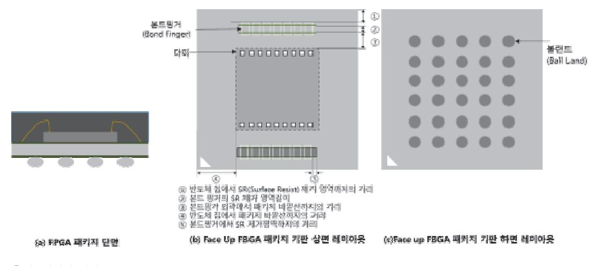

출처: 집필진 제작

[그림 1-10] FPGA 기판 유닛의 디자인 설계할 때 주요 고려 사항

(2) 페이스다운(face down) FBGA 설계 디자인 룰

(가) 와이어 본딩 공정 모니터링을 위해 설계에 반영한다.

와이어 본딩 공정 모니터링을 하기 위해 기판의 상면과 후면을 비아(via)를 통해 전 기적으로 연결하도록 설계에 반영한다.

(나) 페이스다운 패키지 기판 유닛 설계 디자인 룰을 적용한다.

페이스다운 FBGA 기판 내 유닛을 아래 그림을 고려해서 작성한다.

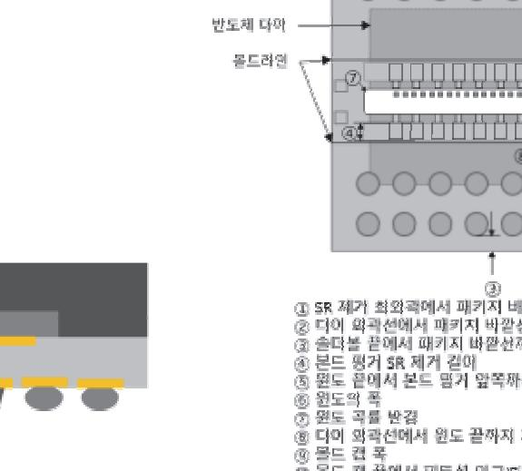

출처: 집필진 제작(2024)

[그림 1-11] Face down FPGA 기판 유닛 디자인 설계 시 주요 고려 항목

#### (3) 공통 적용 디자인 룰을 적용한다.

(가) 소잉(sawing)마크를 적용한다.

싱귤레이션 공정을 위한 마크로서 볼랜드 근처는 패키지 외곽선 근처에 적용하고 몰 드 게이트 방향에는 반도체 기판의 외곽에 적용하고, SR 오픈 영역에서는 구리 마크 에 비해 50㎛ 정도로 크게 설계한다.

(나) 프레임 마크를 적용한다.

반도체의 기판 혼입을 방지하기 위해 적용하는 것으로 글자 크기와 내용은 각 기판 제조사의 에칭 공정 능력을 고려하여 결정한다.

- (다) 다이본딩 인식 마크를 적용한다.
  - 1) x 방향과 y 방향 인식 마크를 설계하여 정확한 다이본딩이 발생할 수 있도록 한다.
  - 2) y 방향은 본드 핑거를 크게 설계하고 본드 핑거 가장자리를 홈 모양으로 설계한다.
  - 3) x 방향은 도금 라인을 반도체 칩(다이) 단자와 일치시켜 인식 정확도를 확인할 수 있다.
- (라) 배열 문자를 아래와 같이 적용한다.
  - 불량 분석을 위해 반도체 기판에 배열된 유닛의 위치를 문자로 표시한다.
    - 1) 열은 영문, 행은 숫자로 설계한다.
    - 2) 유닛의 가장자리 부분과 #1 마크의 대각선 부분에 삽입한다.

29

#### 숖 리드 프레임 및 기판 사양서 작성한다.

리드 프레임과 기판의 사양서를 작성하면서 각 항목에 대한 내용을 작성한다.

<표 1-1> 리드 프레임 및 기판 사양서 내 주요 내용

| No. | 구분                | 주요 항목                                                    |
|-----|-------------------|----------------------------------------------------------|
| 1   | 기본 정보             | - 제품명, 모델/파트 번호, 작성 일자, 작성자, 회사 및 소속 명                   |
| 2   | 설계 사양             | - 설계 도면 번호, 패키지 유형, 핀 수, 핀 배열, 리드 피치, 리드 폭               |
| 3   | 재료 사양             | - 기본 재료와 사양, 적용 두께, 도금 재료와 두께                            |
| 4   | 치수와 허용 오차         | - 스트립 치수, 개별 패키지 길이와 폭, 다이 패드 치수, 리드 길이 - 다이 다운 세트 높이 |
| 5   | 특성                | - 전기적 특성, 기계적 특성, 표면 거칠기와 도금 균일성                         |
| 6   | 환경 및 신뢰성 요구 사항 | - 동작 온도 범위, 온습도 시험 결과, 열충격 평가 결과                         |
| 7   | 포장 및 라벨링          | - 트레이 포장 및 테이핑 포장, 라벨 정보                                 |
| 8   | 품질 검사 항목          | - 외관 검사, 치사 검사, 전기적 및 기계적 검사 항목과 기준                      |
| 9   | 승인 정보             | - 검토자, 검토 날짜, 승인자, 승인날짜                                  |

수행 tip

- 리드 프레임과 기판의 영역별 치수 공차는 가공 능력을 고 려하여 적용한다.
- 리드 프레임과 기판의 디자인 룰은 보관 관리해야 하며, 지속해서 보강 보완해야 한다.
- 리드 프레임 및 기판 사양서를 작성할 때, 관리 항목을 선 정하여 품질 문서로 기록 보관해야 한다.

## 1-3. 주요 산출물 작성 및 검토

학습 목표 • 와이어 연결을 위한 도면을 작성하여 패키지 공정 엔지니어들에게 미리 공유할 수 있다. •와이어 본딩 패키지 방식으로 패키지 솔더 볼 배열, 패키지 크기 및 스펙을 제안할 수 있다.

## 필요 지식 /

숔 와이어 본딩 공정과 주요 산출물

신제품

1. 와이어 본딩 패키징의 전 공정과 관련 치공구

웨이퍼에서 칩(다이) 단위로 분리하고 패키지 공정을 진행하는 컨벤셔널 패키지와 공정 일 부 또는 전체 공정이 웨이퍼 단위로 진행된 후 분리되는 웨이퍼 레벨 패키지로 분류한다.

(1) 다이 본딩과 다이 본더

칩(다이)를 리드 프레임 또는 기판(substrate)에 접착제(adhesive)나 테이프(DAF: die a ttach tape)을 이용하여 붙이는 공정이라고 하며 사용 장비를 다이 본더라고 한다.

(가) 픽업 툴(pick up tool)

반도체 칩(다이)을 진공 홀 또는 채널을 통해 칩(다이)를 부착하여 다른 위치로 운반 하며 다이 본딩 공정, 웨이퍼 핸들링 및 칩 조립 등의 공정에 사용된다.

1) 재료와 모양

팁 부분은 내마모성 및 정전기가 발생하지 않는 텅스텐 카바이드, 세라믹 및 폴 리머 재질 등으로 만들어지며 본체는 알루미늄 및 스테인레스강으로 제작된다. 팁의 모양은 다이가 정확하게 위치할 수 있도록 오목한 팁의 모양으로 제작된다. [그림 1-12]에는 사용되는 몇 가지 다이본딩 픽업 툴에 대해 나타내었다. 툴의 안쪽이 역피라미드 형태로 되어 있으며 다이의 모서리를 잡고 이동시킬 수 있게 되어 있는 픽업 툴의 중의 하나이다. 픽업 툴의 캐비티(cavity) 내에 칩이 자연스 럽게 재정렬된다. 다이의 모서리와의 접촉을 최소화하기 위해 모서리에 릴리프(re lief)를 적용하여 설계할 수도 있다.

2) 구비 조건

픽업 툴에는 정확한 위치 정렬을 위해 정렬 핀 또는 홈이 구비되어 있어야 하며 수동 정렬 과정을 위해 정렬 표시가 추가되기도 한다.

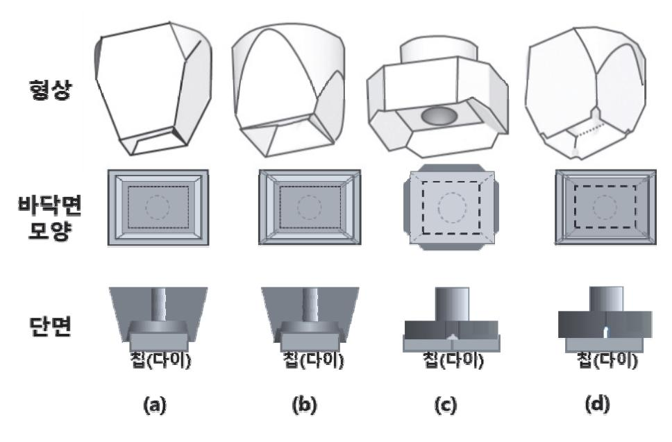

출처: 집필진 제작(2024)

[그림 1-12] 다양한 다이 본딩 픽업 툴[(a) 역 피라미드 형태, (b) 모서리 릴리프(relief)가 있는 역 피 라미드 형태, (c) 노치(notch)가 있는 역 피라미드 형태, (d) 모서리 릴리프(relief)와 노치가 있는 역피 라미드 형태]

(나) 접착제 도포 방법

기판의 종류와 칩의 종류에 따라 적용한다.

- 1) 디스펜서를 활용하는 방법
- 2) 스텐실 프린팅하는 방법
- 3) 고체상의 다이 본딩 필름(die bonding film)을 이용하는 방법
- (다) 배출핀(eject pin)

다이 본딩 공정 중에 테이프에서 칩을 분리하는 데 필요한 치공구로 칩의 크기에 따 라 변경될 수 있다.

(2) 와이어 본딩과 와이어 본더

기판에 붙어 있는 다이와 기판 또는 리드 프레임 사이에 전기적 연결을 위해 열 압착 또는 초음파를 이용하여 접합하는 공정을 와이어 본딩 공정(wire bonding process)이 라고 하며 사용하는 장비를 와이어 본더(wire bonder)라고 한다.

(가) 캐필러리의 선택

 패드의 면적, 간격과 배열이 결정되면 안정된 전기적인 연결을 위해 적절한 두께의 와이어의 재질과 두께가 결정되고 공정을 수행할 수 있는 캐필러리(capillary)도 결 정된다. 패키지 제품에 따라 전용 캐필러리, 본딩재료에 따라 웨지의 형태를 선택할 수 있다.

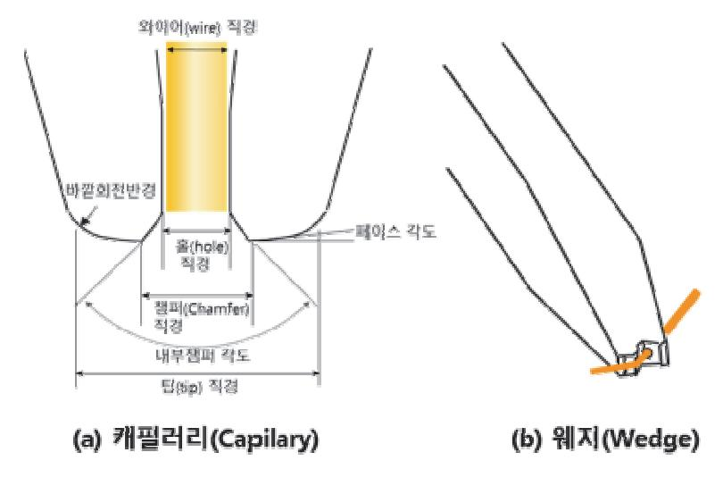

출처: 집필진 제작(2024)

[그림 1-13] 와이어 본딩을 위한(a) 캐필러리와(b) 웨지

(나) 클램프와 히트 블록

히트 블록은 리드 프레임 및 기판의 열전도성에 따라 히트 블록 소재와 설계를 변경 하여 최적 열전달을 보장하여 균일한 열 분포를 보장할 수 있도록 재설계를 통해 히 트 블록을 확보해야 한다. 리드 프레임 또는 기판의 캐비티(cavitity)의 위치와 간격 에 따라 와이어 본딩 창(wire bonding window)이 있는 클램프와 히트 블록을 제 작해야 한다.

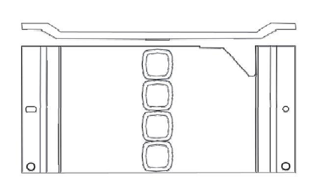

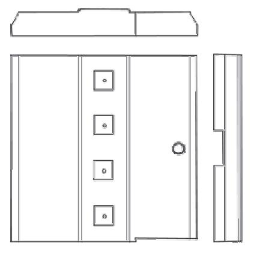

출처: 집필진 제작(2024) [그림 1-14] 와이어 본더 클램프와 히트 블록

2. 와이어 본딩 패키징의 후공정과 관련 치공구들

(1) EMC 몰딩 공정

와이어 본딩된 반제품을 열경화성 합성수지인 에폭시 몰딩 컴파운드(epoxy molding c ompound)를 이용하여 몰딩 다이(molding die)에 공급하여 반도체 외관 형태를 만드 는 공정이다. 리드 프레임 또는 기판의 형상 변화에 따라 몰딩 금형의 제작을 검토해야 한다.

(2) 싱귤레이션(singulation) 공정

기판의 종류에 따라 적용되는 공정은 다르다. 리드 프레임 타입은 트림(trim) 공정을 적용하기에 절단 펀치(cutting punch)를 적용하기에 리드 프레임의 변경에 따라 절단 펀치의 변경 여부를 확인해야 한다. 기판 타입은 블레이드를 이용한 절단(sawing) 진행한다.

(3) 패키지 테스트 공정

완성된 패키지의 전기적 성능을 측정하는 공정으로 잠재 불량을 초기에 제거하기 위한 TDBI(test during burn in)과 사용 환경에서 동작 조건에서 측정하는 테스트와 외관 검사가 있다. 신제품이 발생하게 되면 패키지를 측정하기 위한 전용 소켓 제작 여부를 확인해야 한다.

## 수행 내용 / 주요 산출물 작성 및 검토하기

#### 재료·자료

- 반도체 패키지 공정도
- 반도체 리드 프레임 및 기판 설계도
- 반도체 표준 및 규제

#### 기기(장비 ・ 공구)

- 개인용 PC
- 안전 ・ 유의 사항
  - 해당 사항 없음.
- 수행 순서
- 숔 리드 프레임과 기판 설계 후 산출물을 정리한다.
  - 1. 리드 프레임 및 기판 설계 도면을 준비한다. 설계된 리드 프레임과 기판의 2D, 3D 도면을 준비한다.

- 2. 접합 다이어그램을 작성한다.
  - (1) 패키지 와이어 본딩 등을 위한 표면 배치 정보를 제공하기 위해 리드 프레임과 당구대 사이 간의 전기적 연결을 나타내는 다이어그램이다.
  - (2) 본딩 다이어그램 구성 요소는 칩(다이)과 리드 프레임의 본딩 패드 간의 연결을 위해 패드에 번호 또는 이름을 부착하고 식별할 수 있도록 한다.
  - (3) 칩(다이)과 기판의 패드의 크기와 거리가 정의되기에 와이어 재료, 와이어의 두께, 캐필러리의 사양을 결정할 수 있고 와이어 본딩 공정 계획을 수립할 수 있다.
  - (4) 본딩 다이어그램(bonding diagram) 제작할 때 유의할 점은 다음과 같다.
    - (가) 정확한 패드의 정확한 위치를 유지한다.
    - (나) 와이어 길이와 경로는 최단으로 한다. 이는 임피던스에 의해 최단으로 진행한다.
    - (다) 패키지의 구조적 제약과 공간에 맞도록 최소화한다.
    - (라) 와이어 간격을 충분하게 고려한다.
    - (마) 와이어 본딩 작업 순서를 다이어그램에 명확하게 표기한다.
    - (바) 본딩 와이어가 전기적 간섭 또는 신호 손실을 최소화하는 설계를 진행해야 한다.
    - (사) 와이어 본딩 후 테스트 검사와 수리가 쉬워야 한다.
- 3. 리드 프레임 및 기판 제작 요청서를 작성한다.

리드 프레임과 기판을 제작하기 위해 제작 요청서를 작성한다.

- (1) 주문자 소속, 연락처 정보와 리드 프레임 및 기판 제조 기업 정보
- (2) 제품 정보 또는 프로젝트 개요
- (3) 리드 프레임 및 기판 사양을 정의한다. 패키지 유형, 리드 프레임 및 기판 재료, 치수 및 형태, 리드 배열 및 도금 사양 등을 정의한다.
- (4) 리드 프레임 및 기판 제조 공정에 필요한 정보를 기록한다. 리드 프레임과 기판에 대한 제조 공정에 대한 요구 사항, 검사 방법과 기준, 검사 및 품 질 기준 등을 기록한다.
- (5) 제작을 위해 필요한 자료로서 2D, 3D CAD 도면 파일과 거버 파일과 리포트 파일, 세부적 인 기술 사양을 기술한 기술 사양서를 작성해서 리드 프레임 제작업체에 제공한다.
- (6) 성능 평가 요청서로서 리드 프레임과 기판의 주요 성능을 파악할 수 있도록 요청한다.
- (7) 제작 일정 등의 납기를 명기해서 요청한다.
- (8) 포장 방법 및 관련 규제 준수 요청 사항을 정리해서 송부한다.
- (9) 요청자와 리드 프레임 및 기판 제조 기업의 승인 담당자 및 날짜를 입수한다.

숕 와이어 본딩 패키지 제조를 위한 공정 치공구를 확보한다.

와이어 본딩 패키지를 제조하기 위한 공정별 치공구를 설계 및 제작 확보하거나 다른 패키 지 제품의 치공구를 공용화하여 사용할 수 있도록 검토한 후 적용한다.

- 1. 공정별 필요 치공구를 설계하고 확보한다.
  - (1) 공정을 위해 필요한 치공구를 제작하기 위한 도면을 작성한다. 웨이퍼에서 절단된 다이를 조립하는 데 필요한 다이 본딩 공정, 와이어 본딩 공정, EM C 몰딩 공정, 싱귤레이션 공정 및 테스트 공정에 필요한 치공구 제작을 진행한다.
  - (2) 제작된 리드 프레임과 기판이 입고 후 공정 검토가 진행되기 때문에 프로토타입으로 제작하 여 공정 검토를 진행하고 최종 확정된 툴은 양산전에 확보한다.
  - (3) 주요 치공구의 설계 고려 사항
    - (가) 다이 픽업 툴(die pick up tool)

다이와의 접촉면을 최소화하고 강한 본딩력으로 본딩 패드까지 다이를 정확하게 이 동하는 목적이 있다. 다음을 고려하여 설계한다.

- 1) 다이 크기(dimension, 다이폭×다이 길이×다이 두께)를 고려한다.
- 2) 다이와의 맞물림(die engagement)을 고려한다.
- 3) 공정 진행 간 간섭을 고려한다.
- 4) 수직 릴리프(vertical relief) 공간 확보를 고려한다.
- 5) 사용하는 재료를 선택한다.

세라믹은 알루미나(Al2O3), 지르코니아(ZrO2), 텅스텐 카바이드, 플라스틱은 베스 펠(vespel), 델린(delrin), PEEK, PEEK ESD, POM-H, Torlon 등이 있으며 금 속은 스테인리스강, 고속강, 동, 구리 알루미늄 등이 사용될 수 있다.

6) 픽업 툴의 팁의 치수와 형상을 고려한다.

7) 다이 본더 장비의 메이커에 적용 호환성을 고려한다.

(나) 와이어 본딩 캐필러리(capillary)를 선정한다.

와이어 본딩 캐필러리는 본딩 패드의 크기, 본딩 패드 간 간격(피치, pitch), 와이어 루프 형태 등을 고려해서 선정한다.

1) [그림 1-11]에서와 같이 캐필러리 팁 직경(TD: tip diameter)은 본딩 패드 간격을 기준으로 선정한다.

팁의 크기가 클수록 긴 본드 길이와 스티치가 형성되어 높은 인장 시험 결과를 얻을 수 있으나, 피치 간격이 짧은 경우에 인접 루프와 접촉되는 등의 비정상적 인 접촉이 발생할 수 있다. 팁이 작은 경우에는 낮은 인장 시험으로 인해 불안한 공정을 일으킬 수 있다.

2) 챔퍼(chamfer)의 직경을 선정한다.

프리 에어볼(free air ball)을 구멍 중심에 모아 유지하여 접합된 볼의 크기와 두 께에 영향을 준다.

3) 캐필러리의 홀 직경(hole diameter)을 결정한다.

홀의 직경은 와이어의 루프를 형성시키기 위해 와이어의 크기 대비 1.3~1.4배 정도를 선정하는 것을 권장하고 있으며 캐필러리의 내부 표면은 와이어의 원활한 이송을 위해 매끈해야 한다.

4) 페이스 각도(face angle)를 결정한다.

페이스 각도는 피치 간격이 좁은 경우 일반적으로 8~11도 정도를 권장한다.

5) 내부 챔퍼 각도(inner chamfer angle)를 결정한다.

내부 챔퍼 각도는 각이 클수록 와이어의 손상 방지에는 좋지만 볼 전단(ball she ar) 값은 감소하게 되고 내부 챔퍼 각도가 작은 경우에는 칩(다이) 패드의 손상이 발생할 수도 있다.

(다) 윈도우 클램프(window clamp)와 히트 블록(heat block)을 확보한다.

반도체 다이와 리드 프레임(기판)의 캐비티(cavity)에 따라 제작한다. 윈도 클램프는 와이어 본딩 공정에 간섭을 발생시키지 않고, 히트 블록은 균일한 온도 제어를 고려 하여 제작하게 된다. 재질은 내구성을 보장할 수 있는 초합금(Super alloy), 스테인 리스강, 스테인리스 공구강 중에서 선택한다. 또 장비에 부착해야 하기에 운영 장비 제조사의 정보와 모델, 반도체 제품 정보 그리고 설계 버전의 정보 등을 포함하여 주문 제작한다.

(라) 몰딩 금형을 확보한다.

몰드 금형은 EMC가 고르게 캐비티를 채우며 패키지 형상을 형성하는 것이 중요하 다. 따라서 EMC가 고르게 공급될 수 있도록 게이트와 러너의 위치와 크기를 설계해 야 한다. 주요 대표적인 몰드 플래시와 기공의 형성을 방지할 수 있도록 모사법(sim ulation)으로 사전 검토를 하여 검증 후에 몰드를 제작해야 한다.

- (마) 리드 프레임 포밍(forming)과 커팅(cutting) 금형을 확보한다. 리드 형상를 만들기 위해 성형하고 패키지를 개별로 분리하는 공정으로 프레스 장비 에 부착된 금형을 이용하게 된다. 리드 형상을 만들어내기 위한 성형 금형과 리드를 분리해 내는 커팅 금형으로 구성되어 있다. 패키지와 리드의 종류에 따라 금형은 결 정되므로 미리 확보한다.
- 2. 패키지 제조 공정별 공정 검토서를 작성한다.

패키지 제품 제조를 위한 공정별로 초도 검토 결과를 작성한다.

(가) 공정별로 패키징 설계에 적용된 디자인 룰의 적합성을 확인한다.

패키지 설계에 적용된 디자인 룰이 계획된 제조 공정 내에서 요구하는 디자인 룰에 적합 여부를 확인한다.

37

(나) 개발된 패키지의 성능과 공정해 실패 요인을 고려한 설계 적용 여부를 확인한다.

#### 수행 tip

- 본딩 다이어그램은 본딩 와이어의 공정 불안 요소를 제거 하여 작성해야 하므로 와이어 본딩 공정 담당자의 철저한 검토가 선행되어야 한다.
- 신규 치공구에 대한 제작일과 제작사 및 버전(version) 등 치공구의 이력 관리를 위한 문서를 작성, 보관해야 한다.

### 학습 1 교수·학습 방법

#### 교수 방법

- 반도체 패키징의 공정 단위 분류 기준에 따른 와이어 본딩 패키지, 플립 칩 패키지, 이종 접합 패키지의 종류별 구조 차이, 특징, 제조 공정을 설명한다.
- 반도체 와이어 본딩 패키지 설계를 위해 검토해야 하는 주요 정보들을 설명한다.
- 반도체 와이어 본딩 패키지 공정, 필요 장비들과 치공구들을 설명한다.
- 반도체 와이어 본딩 패키지와 공정과 관련한 표준을 설명한다.
- 반도체 리드 프레임 및 기판 설계 때 적용되어야 하는 표준 기준 및 디자인 룰을 설명한다.
- 반도체 패키지 리드 프레임과 기판 설계의 주요 사양을 정의하는 사양서를 작성할 수 있도 록 항목과 제한 요소를 설명한다.
- 반도체 패키지 리드 프레임과 기판 설계의 주요 산출물의 종류에 관해 설명한다.
- 실습자의 수준에 따라 보충 학습과 심화 학습을 시행하여 학습 효과를 높인다.

#### 학습 방법

- 반도체 패키징의 공정 단위 분류 기준에 따른 와이어 본딩 패키지, 플립 칩 패키지, 이종 접합 패키지의 종류별 구조 차이, 특징, 제조 공정을 파악한다.
- 반도체 와이어 본딩 패키지 설계를 위해 검토해야 하는 주요 정보들을 점검한다.
- 반도체 와이어 본딩 패키지 공정, 필요 장비와 치공구를 이해하고 기본 도면을 작성한다.
- 반도체 와이어 본딩 패키지와 공정과 관련한 표준을 근거로 리드 프레임 및 기판 도면을 작 성한다.
- 반도체 패키지 리드 프레임과 기판 설계의 주요 사양을 정의하는 사양서를 세부 항목과 제 한 요소 고려하여 작성한다.
- 반도체 패키지 리드 프레임과 기판 설계와 관련된 주요 산출물을 작성한다.

## 학습 1 평 가

#### 평가 준거

- 평가자는 학습자가 학습 목표를 성공적으로 달성하였는지를 평가해야 한다.
- 평가자는 다음 사항을 평가해야 한다.

|                    |                                                                             | 성취수준 |   |   |
|--------------------|-----------------------------------------------------------------------------|------|---|---|
| 학습 내용              | 학습 목표                                                                       |      | 중 | 하 |
| 제품 사양 검토           | - 개발 초기에 패키지 가능성을 검토한 후 제품 설계자들에게 피드백할 수 있다.                             |      |   |   |
| 리드 프레임 및 기 판 설계 | - 가능성 검토가 완료되면 패키지 도면, 툴 도면, 리드 프레임 도면, 서브 스트레이트 도면을 작성할 수 있다.           |      |   |   |
|                    | - 반도체 전 공정이 완료된 웨이퍼가 패키지 공정에 도착하기 전에 툴과 리드 프레임, 서브 스트레이트들을 준비할 수 있 다. |      |   |   |
| 주요 산출물 작성 및 검토  | - 와이어 연결을 위한 도면을 작성하여 패키지 공정 엔지니어 들에게 미리 공유할 수 있다.                       |      |   |   |
|                    | - 와이어 본딩 패키지 방식으로 패키지 솔더 볼 배열, 패키지 크기 및 스펙을 제안할 수 있다.                    |      |   |   |

#### 평가 방법

• 서술형 시험

|                    | 평가 항목                                              |  | 성취수준 |   |  |
|--------------------|----------------------------------------------------|--|------|---|--|
| 학습 내용              |                                                    |  | 중    | 하 |  |
| 제품 사양 검토           | - 반도체 패키지의 종류와 특징 서술 능력                            |  |      |   |  |
|                    | - 반도체 와이어 본딩 패키지 설계를 위한 다이의 주요 사양 에 대한 상세 서술 능력 |  |      |   |  |
|                    | - 반도체 와이어 본딩 패키지 주요 공정에 대한 상세 서술 능력                |  |      |   |  |
| 리드 프레임 및 기 판 설계 | - 반도체 와이어 본딩 패키지를 위한 리드 프레임의 주요 구 조 등의 상세 서술 능력 |  |      |   |  |
|                    | - 반도체 와이어 본딩 패키지를 위한 기판의 구조 상세 서술 능력            |  |      |   |  |
| 주요 산출물 작성 및 검토  | - 반도체 와이어 본딩을 위한 전 공정과 주요 치공구의 고려 사항 서술 능력      |  |      |   |  |
|                    | - 반도체 와이어 본딩을 위한 후공정과 주요 치공구의 종류와 고려 사항 서술 능력   |  |      |   |  |

• 구두 발표

|                    |                                                               | 성취수준 |   |   |
|--------------------|---------------------------------------------------------------|------|---|---|
| 학습 내용              | 평가 항목                                                         | 상    | 중 | 하 |
| 제품 사양 검토           | - 반도체 와이어 본딩 패키지 제품 성능을 조사하여 발표하는 능력                       |      |   |   |
|                    | - 와이어 본딩 패키지 제품의 설계 목표 성능을 설정하는 데 고려해야 하는 요소를 조사하여 발표하는 능력 |      |   |   |
|                    | - 와이어 본딩 패키지 설계를 위해 공정별 검토해야 하는 항 목들을 조사하여 발표하는 능력         |      |   |   |
| 리드 프레임 및 기 판 설계 | - 리드 프레임 및 기판이 적용될 반도체 소자의 종류와 특징 을 조사하고 발표하는 능력.          |      |   |   |
|                    | - 리드 프레임과 기판 설계에 적용되는 주요 디자인 룰을 조 사하여 발표하는 능력              |      |   |   |
| 주요 산출물 작성 및 검토  | - 리드 프레임과 기판 설계를 통해 생성되는 산출물들을 조사 하여 발표하는 능력               |      |   |   |
|                    | - 와이어 본딩 패키지 제조를 위한 공정 치공구 설계를 위해 고려해야 하는 요소를 조사하여 발표하는 능력 |      |   |   |

- 와이어 본딩 공정을 진행하는 데 적용하는 장비와 치공구의 종류를 그 선택 이유를 설명해 준다.
- 리드 프레임 설계와 동반되는 여러 문서류와 이를 관리하는 절차 등에 관해 설명해 준다.
- 리드 프레임과 기판 설계에 적용되는 디자인 룰과 표준에 관해 이유를 들어 설명해 준다.
- 반도체를 소자의 종류와 특징을 기능과 성능 측면에서 설명해 준다.
- 주요 치공구 등을 설명해 준다.
- 와이어 본딩 패키지 공정의 특징과 장비의 주요 부품, 그리고 새로운 제품을 위해 고려해야 하는
- 반도체 와이어 본딩 패키지 설계의 목표를 제품의 차별화된 기능 측면에서 설명해 준다.
- 와이어 본딩이 적용되는 대표 제품에 와이어 공정이 적용되어야 하는 이유를 들어 소자의 종류와 특징을 보완하여 설명해 준다.
- 2. 구두 발표
- 딩 다이 패드 영역 등에 대해 적용해야 하는 디자인 룰을 고려해 설명해 준다. - 기판에 와이어 본딩을 적용하는 제품에 대한 부족한 답변에 대해 기판의 재료와 구조, 공정 능력 등을 고려해 설계해야 하는 필연성을 상세하게 설명해 준다.
- 사용 재료 및 관리 항목 등을 상세하게 설명해 준다. - 반도체 리드 프레임의 주요 구조에 대한 대답이 부족한 경우, 리드프레임이 구조의 공통 영역, 본
- 에 대해 상세하게 설명해 준다. - 반도체 와이어 본딩 패키지 주요 공정들에 대해 공정의 전체 흐름, 각 단위 공정별 목적과 기능,
- 기준에 대해 다시 한번 재정의하여 기능, 재료, 방법에 따라 상세하게 설명해 준다. - 반도체 패키지 설계를 위해 고려해야 하는 다이 사양에 대해 설계를 위해 고려해야 하는 항목들
- 1. 서술형 시험 - 반도체 패키지의 종류와 특징들에 대하여 분류 기준을 혼돈한 경우, 패키지 종류를 구분하는 분류

피드백

| 학습 1 | 패키지 가능성 확보하기 |  |
|------|--------------|--|
| 학습 2 | 패키지 설계 최적화하기 |  |
| 학습 3 | 본딩 방법 선정하기   |  |

## 2-1. 와이어 본딩 패키지 설계

| 학습 목표 | • 와이어 본딩 패키지 설계를 위하여 칩 패드 좌표, 칩 배열, 패키지 내부 연결 정보들을 칩 설 |
|-------|--------------------------------------------------------|
|       | 계 부서로부터 받을 수 있다.                                       |
|       | • 와이어 본딩 패키지 재료에 대한 정보를 기초로 패키지 양산성, 제조 공정, 공정 조건, 장비  |
|       | 특성이 고려된 디자인 규칙을 적용할 수 있다.                              |
|       | • 전기적 및 기계적 공정 최적화를 위해 열 해석, 전기 해석, 구조 해석을 통하여 설계에 반영  |
|       | 할 수 있다.                                                |
|       | • 패키지 구조와 리드 프레임, 서브 스트레이트 등을 확인하여 최적화된 와이어 본딩 패키지 설   |
|       | 계할 수 있다.                                               |

## 필요 지식 /

숔 반도체 제품을 최적화 설계 고려 사항

초도 설계 제품에 대한 관련 부서 및 사용자(고객)로부터 피드백을 받아 전기적, 열적, 기계적 특성을 고려하여 최적화 수정 설계를 진행한다.

1. 와이어 본딩 패키지 개발 과정

와이어 본딩 패키지 개발 과정은 아래와 같이 진행된다.

- (1) 제품 설명 분석
  - (가) 제품 제원 내의 전기적, 물리적, 신뢰성 등과 관련한 요구 사항을 검토하고 정의한다.
  - (나) 신제품(칩과 패키지 동시 개발) 또는 파생 제품(기존 양산 칩에 신규 패키지 제품 개발, 기존 양산 칩에 패키지 일부 변경) 여부 확인한다.
- (2) 재료 선정

제품 성능을 확보에 필요한 주요 패키지 재료를 결정한다.

(3) 초도 설계

(가) 와이어 본딩 패키지 설계 디자인 룰을 적용하여 초도 설계 진행한다.

(나) 초도 설계를 통해 발견된 제품 성능 또는 제조 공정 능력을 고려한 의견을 관련 부서에

피드백한다.

- (다) 제조 단위 공정별 공정 적용 가능성을 검토한다.
- (4) 설계 최적화 작업
  - (가) 와이어 본딩 패키지 설계 디자인 룰을 적용하여 초도 설계 진행한다.
  - (나) 초도 설계를 통해 발견된 제품 성능 또는 제조 공정 능력을 고려한 의견을 관련 부서에 피드백한다.
  - (다) 제조 단위 공정별 공정 적용 가능성을 검토한다.
- (5) 프로토타입 제작과 검증

신규 공정 또는 제품 성능과 수율 등에 영향을 주는 주요 공정에 관한 공정 검증이 필 요하면 초도 제품을 만들어서 진행한다.

(6) 신뢰성 테스트

제품 설명에서 정의된 동작 조건에서의 전기적 평가, 사용 가능 환경에서 패키지 제품의 신뢰성을 검증한다.

- (7) 양산 준비 및 검증
  - (가) 양산을 위한 공정 검토와 양품 수율 검증 등을 실시한다.
  - (나) 양산계획 수립에 따라 양산 체제를 준비한다.
- (8) 양산

양산을 진행하며 조기에 발생한 문제점은 즉시 조치한다.

2. 반도체 패키지 설계 표준

반도체 설계 표준은 소자의 설계, 제조, 장비 및 테스트 과정에서 일관성을 유지하고 품질 을 보장하는 데 필요한 규격과 가이드라인을 정의한다. 따라서 반도체 소자 설계, 제조, 장 비 및 테스트와 관련된 일련의 과정을 위해 관련된 표준을 참조하고 진행해야 한다.

- 주요 반도체 표준은 아래와 같다.
- (1) JEDEC(Joint Electron Device Engineering Council)

JEDEC은 반도체와 관련된 다양한 표준을 개발하는 글로벌 표준화 기구이며 JEDEC 표 준은 반도체 소자의 설계, 제조, 테스트, 신뢰성 및 성능 평가에 대한 지침을 제공하며 주요 JEDEC 표준은 아래와 같다.

- (가) JEDEC 표준의 중요성
  - 1) 품질 보증

반도체 소자의 품질과 신뢰성을 보장하며 다양한 환경 조건에서 소자의 성능을 평가하고 제조 공정의 일관성을 유지한다.

2) 호환성 확보

기업 간의 상호 호환성을 보장하고 설계 및 제조 과정에서 발생할 수 있는 문제 점을 최소화한다.

3) 혁신

신기술과 공정 개발을 위한 가이드라인을 제안하고 반도체 산업의 지속적인 혁신 을 촉진한다.

4) 국제 표준화

글로벌 표준으로 전 세계 반도체 산업의 공유 및 협력을 강화할 수 있다.

- (나) 주요 관련 표준
  - 1) JESD22: 신뢰성 테스트 방법으로 열충격, 가속 열, 습도 및 정전기 테스트 등
  - 2) JESD47: 반도체 소자의 신뢰성 요구 사항과 기준으로 테스트 절차와 기준 등
  - 3) JESD78: CMOS 소자의 래칭 업(latching up) 발생 여부 평가
  - 4) JESD88: JEDEC 등록 패키지 바깥 선으로 반도체 패키지의 치수 및 핀 배열을 규정
  - 5) JESD89: 방사선 효과 테스트
- (2) SEMI(Semiconductor Equipment and Materials International)

반도체 제조 장비 및 재료와 다양한 표준을 제공한다.

- (가) SEMI 표준의 중요성
  - 1) 글로벌 일관성과 산업 내 호환성: 글로벌 표준을 준수하여 반도체 제품의 품질과 성 능이 지역에 상관없이 일관되며 반도체 산업 내 공급자와 수요자 간의 상호 호환성 을 보장한다.
  - 2) 품질 및 신뢰성 보증: 제조 공정의 품질 관리 절차를 규정하여 제품의 신뢰성과 수 명을 증가시키며 다양한 환경 조건과 스트레스 테스트를 통해 제품의 신뢰성을 검증 하고 보장한다.
  - 3) 장비 활용 극대화와 최적화된 공정 확보: 장비 가동률과 생산성을 높이는 지침을 제 공하고 제조 공정 효율을 높이는 최적화된 방법과 절차를 제공하여 생산성을 향상하 고 생산 비용을 절감할 수 있다.
  - 4) 안전 및 환경보호: 제조 장비와 공정에서 안전기준을 적용하며 작업자의 안전을 보 장하고 사고를 예방하며 유해 물질 사용을 최소화하고 환경 보호를 위한 규정을 준 수하도록 지침을 제공한다.
  - 5) 신기술의 표준화와 R&D 가이드라인 제공: 개발된 신기술과 신공정을 신속하게 시 장에 도입시킬 수 있도록 표준화와 높은 품질을 유지하도록 지원한다.
- (나) 주요 관련 표준
  - 1) SEMI G1: 패키지 및 리드 프레임 치수 기준을 정의한다.
  - 2) SEMI G2: 다이 본딩 표준

- 3) SEMI G5: 본딩 와이어 재료 및 시험 방법
- 4) SEMI G7: 리드 프레임 재료 및 특성
- 5) SEMI G38: 와이어 본딩 공정 신뢰성 테스트
- 6) SEMI E10: 반도체 제조 장비의 생산성 측정
- 7) SEMI S2: 반도체 제조 장비의 환경, 건강 및 안전 측정
- 8) SEMI S8: 반도체 제조 장비의 인체 공학적 설계 지침
- (3) JEITA(Japan Electronics and Information Technology Industries Association) 일본 전자 및 정보 기술 산업의 표준화를 주도하는 기구이며 반도체, 전자 부품, 정보 기술 장비 등 다양한 분야에서 중요한 역할을 담당하고 있다.
  - (가) 주요 관련 표준
    - 1) JEITA EIAJ ED-4701: 반도체 소자의 신뢰성 평가
    - 2) JEITA ET-7500: 전자 부품의 환경 규제
    - 3) JEITA CP-5200: IC 카드 표준
    - 4) JEITA EIAJ ED-7300: 반도체 패키지 표준
- 3. 와이어 본딩 패키지 설계를 위한 디자인 룰(design rule for wire bonding package design) 반도체 소자 설계와 제조를 위한 일련의 가이드라인과 사양을 명시한 것으로 반도체 소자 가 신뢰성을 가지고 정확히 동작할 수 있도록 보장되어야 한다.
  - (1) 기계 디자인 룰
    - (가) 구조 무결성(structural integrity)
      - 1) 취급 및 동작 중에 발생하는 외부 스트레스에 견딜 수 있는 기계적인 안정성을 확 보해야 한다.
      - 2) 뒤틀림(warpage)과 같은 기계적인 변형을 최소화해야 한다.
    - (나) 적합한 재료의 선택(material compatibility)
      - 1) 재료 선택에는 박리(delamination) 및 열특성의 부정합을 방지하기 위해 재료를 선 택해야 한다.
      - 2) 다이와 배선을 보호하기 위해 신뢰도가 높은 봉지재(encapsulation materials)를 선택해야 한다.
  - (2) 전기 디자인 룰
    - (가) 신호의 무결성(signal integrity)
      - 1) 신호 추적(signal trace)을 위한 제어 임피던스를 유지한다.
      - 2) 추적 간격(trace spacing)과 추적 경로(trace routing)를 최적화하여 누화(cross ta lk)를 최소화한다.
      - 3) 노이즈를 줄이기 위한 적절한 그라운드 기술을 적용한다.

- (나) 사용 전력의 무결성(signal integrity)
  - 1) 전압 강하(voltage drop)를 최소화하기 위한 전원과 그라운드를 강건 설계한다.
  - 2) 안정된 전원 공급을 유지하기 위해 전략적으로 비결합형 축전기(decoupling capacitor)를 사용한다.
- (다) 핀 배열 정보(pin configuration)
  - 1) 패키지 형태에 근거한 핀 수와 간격을 확보한다.
  - 2) 유사한 신호 형태를 분류한다.
  - 3) 신호의 지연(latency)을 감소시키기 위해 가장 짧은 경로인 핀들에 중요한 신호를 할당한다.
- (3) 열 디자인 룰(thermal design rule)
  - (가) 열관리(thermal management)
    - 1) 효과적인 열 방출을 개선하기 위해 열 경로와 열 분산기를 사용한다.
    - 2) 추적 간격(trace spacing)과 추적 경로(trace routing)를 최적화하여 누화(cross ta lk)를 최소화한다.
    - 3) 노이즈를 줄이기 위한 적절한 그라운드 기술을 적용한다.
  - (나) 사용 전력의 무결성(signal integrity)
    - 1) 전압 강하(voltage drop)을 최소화하기 위한 전원과 그라운드를 강건 설계한다.
    - 2) 안정된 전원 공급을 유지하기 위해 전략적으로 비결합형 축전기(decoupling capacitor)를 사용한다.
  - (다) 핀 배열 정보(pin configuration)
    - 1) 패키지 형태에 근거한 핀 수와 간격을 확보한다.
    - 2) 유사한 신호 형태들을 분류한다.
    - 3) 신호의 지연(latency)를 감소시키기 위해 가장 짧은 경로를 갖는 핀들에 중요한 신 호를 할당한다.
- (4) 생산성과 공정성을 고려한 디자인 룰
  - (가) 양산성, 수율 및 비용적 측면
    - 1) 생산 수율을 개선하고 비용 축소를 고려해야 하기에 적용 공정 수를 최소화한다.
    - 2) 자동화 및 공정 단순화를 지향하고 표준 장비 및 표준 공정 적용이 가능하도록 설 계한다.
  - (나) 테스트 및 검사 공정
    - 1) 테스트가 단순하도록 위치 중복 및 통합이 필요하며 쉬운 측정과 디버깅을 할 수 있도록 한다.
    - 2) 자동화 광학 검사(automated optical inspection)와 X 레이 검사가 가능하게 한다.

- (5) 제품 신뢰성을 고려한 디자인 룰
  - (가) 주어진 사용 환경 내에서 견딜 수 있는 강건 설계가 필요하다.
  - (나) 제품 성능과 수명 등을 약화시킬 수 있는 요소를 제거하거나 잠재 공정 불량들에 대해 예측하여 그의 원인을 제거할 수 있어야 한다.
- (6) 표준 등 관련 규정 준수
  - (가) 반도체 설계와 생산과 관련된 표준을 준수해야 한다.
  - (나) 환경 규제(RoHS, REACH) 등을 준수해야 한다.
- 2. 패키지 최적화 과정

와이어 본딩 패키지 최적화 단계는 제품의 성능, 공정 및 신뢰성을 극대화하기 위하여 중요 요소별 설계 변수와 조건을 전산의 도움으로 해결하는 과정이다. 최적화 단계에서 검토하는 주요 항목은 패키지의 구조(기계적) 해석, 전기적 해석 그리고 열 해석이다.

(1) 최적화 단계 흐름

(가) 문제점 도출과 목표 설정

해결해야 하는 문제점을 정의하고 목표를 설정하며 제약 조건을 정의한다.

- (나) 현상에 대한 수학적 정의 원인과 결과에 대한 인과관계를 수학적으로 표현한다.
- (다) 모델링(modelling) 진행

모사(simulation)할 모델을 구축하고 변수와 매개 변수를 설정한다.

(라) 모사(simulation) 해석

다양한 조건에서 기능별 성능을 모사하고 결과를 분석한다.

(마) 결과 검증

목표 충족 여부를 검증하며 결과에 따라 설계에 적용 반영 여부를 결정한다.

- (바) 반복 및 개선 최적화 과정에서 도출된 결과를 바탕으로 반복적인 개선을 확인하고 최종 결과를 설 계에 반영하여 완료한다.
- (2) 패키지 구조 모사(package structural simulation)

와이어 본딩의 구조적 무결성과 성능을 보장하기 위하여 패키지 구조, 공정 및 사용 중 에 발생할 수 있는 기계적 스트레스, 열변형, 진동 및 기타 환경적 영향을 사전에 확인 하는 데 목적이 있다.

(가) 모사 해석 방법

유한 요소법(FEM: finite element method)이 주로 사용되며, 무한의 절점과 자유 도를 제한된 유한개의 절점과 자유도로 전환하고 선형 연립 방정식으로 구성하여 전 산으로 계산하는 방법이다.

(나) 해석할 때 필요 용어

기계적 해석을 위해 기본적으로 고려하는 요소는 아래와 같다.

1) 푸아송비(Poisson's ratio)

막대기의 길이 방향으로 단위 길이당 변화량과 지름 방향으로 단위 길이당 변화 량의 비를 일컫는다.

2) 열팽창 계수(coefficient of thermal expansion)

온도가 상승 또는 감소에 따라 재료는 팽창 또는 수축하게 된다. 일반적으로 팽 창과 수축은 온도와 선형적인 관계가 있으며 이를 열팽창 계수라고 부른다.

3) 응력(stress)

재료에 외부의 외력이 작용하였을 때, 그 외력에 저항하여 물체의 형태를 유지하 려는 물체 내에 생기는 내력을 일컬으며 단위는 압력으로 표현한다.

- (다) 구조 해석의 예
  - 1) 리드 프레임 또는 기판의 휨에 대한 해석

고온 공정을 진행함에 재료 내의 서로 다른 열특성으로 인해 발생하는 경우로서 같은 종류 재료는 열 분포의 차이, 그리고 이종 재료는 서로 다른 열팽창 계수로 인해 변형이 발생할 수 있다. 리드 프레임이나 기판의 경우에는 EMC 몰딩 과정 중에 서로 다른 열응력 분포가 달라서 변형이 발생할 수 있다.

2) EMC 몰딩 중의 와이어 변형에 대한 해석

반도체 내 와이어의 변형과 관련 모사를 통해 와이어 본딩 패키지의 강건 설계에 반영한다. 고온에서 진행되는 EMC 몰딩 공정은 몰딩 압력, 몰딩 재료, 와이어의 물성 등에 영향을 받기에 안정된 와이어 본딩을 확보하기 위해 사전 모사를 진행 하여 금형, 몰딩 공정 조건, 몰딩 재료 또는 와이어의 적절한 선택으로 최적화된 와이어 본딩 패키지를 확보한다.

(3) 패키지 전기 모사(package electrical simulation)

와이어 본딩 패키지의 전기적 성능을 최적화하는 데에 목적이 있다. 반도체의 고성능화 에 따라 신호(signal), 전력(power) 및 전자기(electromagnetic) 호환성 등의 문제를 해결하는 데 도움이 된다.

(가) 모사(simulation) 방법

패키지 설계 파일을 준비하며, 패키지 재료의 특성(전기 전도도, 유전율, 반도체 특 성 등)들을 수집한다. 패키지 내의 재료 특성이 포함된 구조물의 정보를 통해 3D 모 형화를 진행하고 제한된 경계 조건을 설정하여 모사를 진행한다.

(나) 해석 시 필요 용어

1) 저항(electrical resistance)

전류의 흐름을 방해하려는 요소로써 물체에 흐르는 단위 전류에 반비례한다.

2) 인덕턴스(inductance)

배선 내 전류 변화에 따른 전자기 유도로 생긴 역 기전력의 비율이다.

3) 커패시턴스(capacitance)

전하를 저장하는 능력으로 단위 전압당 축전기가 저장하는 용량이다.

- (다) 전기 해석의 예
  - 1) 신호 해석

디램에서 신호가 모바일 프로세서까지의 도달하기까지의 고속 디지털 신호의 품 질을 검증하고 개선점을 찾는 것이다.

2) 전력 해석

전원 공급 장치에서 메모리 또는 프로세서까지 전력의 저하되는 여부를 검증하고 개선점을 찾는 것이다.

3) 전자기 해석

동작 중에 발생하는 전자파에 대한 검증으로 RE(reflected emission)와 CE(conducted emission) 등이 있다.

(4) 패키지 열 해석(package electrical simulation)

반도체 소자의 동작 중에 발생하는 전력을 소모하고 그로 인해 발생하는 열로 인한 장 비의 기능, 신뢰성, 안전성에 문제를 발생시킨다. 따라서 적절한 방열 설계 및 대비책을 설계에 반영해야 한다.

(가) 모사 방법

패키지를 3D 모델링을 하고 각 구조의 특성과 경계 조건을 설정하고 지정된 시간과 주파수를 통해 진행한다.

- (나) 해석 시 필요 용어
  - 1) 전도(conductance)

고체 또는 유체의 정지한 매질에 온도 차이가 존재할 때 매질을 통해 발생하는 열전달 유형이다.

2) 대류(convection)

표면으로부터 운동하는 유체로서 열전달 유형이다.

3) 복사(radiation)

전자기파 또는 입자의 전파에 의해 열을 방출하는 유형이다.

4) 열 모사하기 위한 특정 위치에서의 온도 표현

Ta(ambient temperature, 패키지로부터 충분히 먼 분위기 온도), Tj[junction t emperature, 다이(칩)의 온도이며 특정 장비가 있어야만 측정이 가능한 온도], T c(Case Temperature, 패키지의 위 면의 가운데 지점 온도이며 간단한 장비로 측정이 가능), Tb(Board Temperature, 패키지의 가장자리의 중간 지점과 마주 하고 있는 곳의 기판 온도)이다.

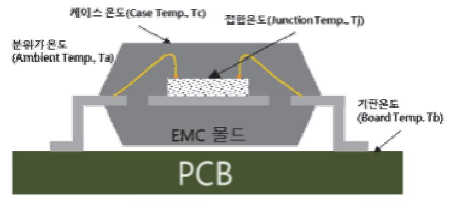

출처: 집필진 제작(2024)

[그림 2-1] 반도체 패키지의 주요 온도 특성 위치

- (다) 열 해석 사례
  - 1) SIP(system in package)에서 칩(다이) 다층 구조의 경우에 적층된 칩(다이)과 기 판, 몰드 재료의 열 방출 경로 등을 모사하여 해석할 수 있다.
  - 2) 반도체 소자를 적용한 PCB 기판에서 열 방출 특성을 예측하여 반도체 소자에 PCB 기판 실장 시에 방열에 대한 기술적 가이드를 제시할 수 있다.

## 수행 내용 / 와이어 본딩 패키지 설계하기

#### 재료·자료

- 반도체 패키지 표준
- 반도체 패키지 종류와 구조 자료
- 반도체 패키지 재료 특성 자료

#### 기기(장비 ・ 공구)

• 개인용 PC, 패키지 설계 소프트웨어, 패키지 구조/전기/열 해석 소프트웨어

#### 안전 ・ 유의 사항

- 해당 사항 없음.
- 수행 순서
- 숔 반도체 소자의 목표 특성을 파악하고 사양(specification)을 결정한다.
  - 1. 반도체 소자의 응용처에서의 요구 사항을 파악한다.
    - (1) 반도체 목표 성능을 파악한다. 응용 분야에 적용이 가능한 반도체 소자의 전기적 특성, 열적 특성 기계적 특성 등을 파악한 다.
    - (2) 적용 환경의 조건을 파악한다. 제품이 동작하는 온도와 습도 그리고 노출되는 오염물에 대한 정보를 확인한다.
    - (3) 소자의 요구 수평을 파악한다. 제품의 장수(longevity), 피로 저항성(fatigue resistance) 및 강건성(robustness) 등은 응용 제품에 따라 매우 중요한 요소로 고려할 수 있다.

#### 2. 전기 사양을 결정한다.

- (1) 소자가 견딜 수 있는 최대 저압, 전류, 전력 등의 한계치를 결정한다.
- (2) 소자가 정상적으로 동작할 수 있는 전압, 전류 범위 및 온도 범위를 결정한다.
- (3) 입출력 특성, 스위칭 특성, 소모 전력 등 세부적인 특성을 결정한다.
- 3. 구조적 사양을 결정한다.
  - (1) 패키지의 형태를 선정하고 패키지 크기, 다이 크기, 리드 프레임 등의 치수를 결정한다.
  - (2) 칩(다이)과 와이어 본딩이 가능한 패드의 치수와 위치를 결정한다.

- (3) 제품의 성능과 신뢰성 있는 패키지를 위한 기판, 리드 프레임, 본딩 와이어, 봉지재(encapsulation) 등의 재료를 선정한다.
- 4. 패키지 내 방열 설계 계획을 수립한다.
  - (1) 소자의 동작 중 발생하는 열을 방출할 열 경로 설계 계획을 수립한다.
  - (2) 필요에 따라서 부가적으로 필요한 TIM(thermal interface material)의 적용 여부를 결정한다.
- 5. 성능 평가 방법과 신뢰성 시험 계획을 수립한다.
  - (1) 전기/열/구조에 대한 측정 프로토콜을 정의하는 등 측정 장비와 측정법을 정의한다.
  - (2) 제품 성능 평가 결과에 따른 양품과 불량품의 측정 기준을 수립한다.

숕 재료를 선정한다.

- 1. 본딩 와이어 재료는 다음 기준으로 선정한다. 본딩 와이어는 전도성이 높은 금(Au), 은(Ag), 알루미늄(Al), 구리(Cu) 등을 사용한다. 재료 들의 선택은 아래와 같은 항목을 고려해서 선택한다.
  - (1) 본딩 와이어 선택할 때 고려 사항 본딩 와이어를 선택할 때 고려해야 하는 사항은 다음과 같다.
    - (가) 전기적 특성

낮은 전기 저항으로 신호 손실과 전력 손실을 최소화한다.

(나) 기계적 특성

공정 중에 쉽게 변형되지 않고 리드 프레임, 기판 및 칩(다이) 패드에서 접합력이 높 아야 한다.

(다) 열적 특성

와이어가 열을 효율적으로 전달할 수 있어야 하며, 열팽창 계수가 접합된 기판 및 칩(다이) 위에서 동일해야 한다.

(라) 화학적 안정성

공정 및 제품으로서 환경 조건에 대한 내산화성, 내부식성 등이 높아야 한다.

(마) 비용

재료 선택에 따른 비용이 목표 비용에 부합되어야 한다.

(2) 본딩 와이어 두께 선정할 때 고려 사항

본딩 와이어의 두께를 선택할 때 고려해야 하는 사항은 다음과 같다.

(가) 전기적 특성

와이어로 흐르는 최대 전류 용량과 두께는 비례하고 두꺼운 와이어일수록 낮은 신호

손실과 전력손실을 최소화한다.

(나) 기계적 특성

얇은 두께일수록 유연성이 좋아 좁은 공간에서 공정이 가능하고 두께가 두꺼울수록 기계적 강도가 높아 안정된 접합을 확보할 수 있다.

(다) 열적 특성

두꺼운 와이어에서 열전도도가 높아 열을 효과적으로 방출되며, 기판 재료와 동일한 열팽창 계수를 갖는 것이 유리하다.

(라) 공정 방법과 조건

두꺼운 와이어는 본딩 시 더 높은 압력과 열이 필요하며 제조 공정의 복잡성과 비용 이 증가할 수 있다. 본딩 와이어의 재료와 두께를 선정할 때는 와이어 본더의 가용 능력도 확인해야 한다. EMC 몰딩 공정에서 안정성을 갖추어야 한다.

(마) 응용 분야의 요구 조건

반도체 사양에 요구되는 수준을 만족시킬 수 있는지에 따라 최적의 두께를 선택해야 하고, 사용 환경에서 안정된 동작이 가능하도록 와이어 두께를 선택해야 한다.

2. EMC 재료를 선정한다.

EMC는 봉지재(encapsulation)로 칩(다이)을 외부로부터 물리적 화학적으로 보호, 프레스 공정 중에 충분한 유동성 확보, 기판 또는 칩(다이)과의 접착성, 칩(다이) 동작 시에 열 방 출 능력을 갖추고 있어야 한다. 또 반도체 소자는 응용처에 따라 요구 조건의 차이가 있으 므로 이에 대한 EMC 재료 내의 구성 성분비의 적절한 조절이 필요하다.

| 구성 재료      | 원재료                       | 역할                                    |
|------------|---------------------------|---------------------------------------|
| 필러(Filler) | Silica                    | 경화 수축, 열팽창 계수, 열전도율, 기계적 성질 등 을 조절 |
| 에폭시 수지     | OCN, Novolac. Bisphenol 등 | 유동성, 경화물의 기계적, 전기적, 열적 성질 등의          |
| 경화제        | 무수산, 아민류 등                | 기본 특성 결정                              |
| 촉매         | 잠재성 촉매 등                  | 에폭시와 경화제의 경화 반응 속도 조절                 |
| 이형제        | Wax                       | 성형 후 금형에서 자재의 분리가 쉬움, 이형성, 접착 성 결정 |

<표 2-1> EMC 구성 성분과 역할

숖 초도 설계를 진행한다.

1. 패키지 설계 표준을 참조한다.

- (1) 패키지 기본구조와 재료와 관련된 표준을 참조한다.
- (2) 공정 표준과 관련된 표준을 참조한다.
- (3) 공정 시험, 평가 및 신뢰성 시험과 관련한 표준을 참조한다.
- 2. 패키지 형태(QFN, LGA, FPBGA, BOC 등)와 치수(폼 팩터)를 결정한다.
- 3. 리드 프레임과 기판을 설계한다.
  - (1) 칩(다이) 위치와 방향을 결정한다.
  - (2) 칩(다이) 본딩 및 기판과의 전기적 연결할 수 있는 본딩 패드의 위치, 크기를 설계한다.
    - (가) 다이 본딩 패드의 크기는 칩(다이)의 크기와 다이 본딩 공정 능력(공정 오차)을 고려하여 적용한다.
    - (나) 와이어 본딩 패드는 칩(다이)의 패드의 위치와 간격을 고려하고 와이어의 두께를 고려해 서 결정한다. 패드의 크기는 와이어 두께의 3배 정도를 권장하고 있으며, 패키지의 높이 를 고려한 와이어의 최대 높이가 결정되는데 이는 리드 프레임과 기판 패드와의 거리를 결정하는 요소이다.
    - (다) 패드 간의 간격은 와이어 본딩 공정 능력과 신뢰성을 고려하여 결정하며 크로스토크와 같은 신호 간섭을 방지하기 위해 충분한 간격을 유지하되, 본딩 와이어의 길이를 최소화 할 수 있도록 설계한다.
  - (3) 신호 라우팅(signal routing)을 설계한다. 임피던스 불일치, 신호 크로스토크(crosstalk) 및 노이즈를 최소화하기 위해 계획한다.
  - (4) 기판의 신호 경로를 변경하거나 최적의 방열을 위해 비어 설계를 진행한다.
- 4. 초도 설계된 도면을 관련 부서에 피드백하고 예상 문제점 등을 점검한다. 초도 설계 도면은 칩(다이) 담당자, 패키지 공정 담당자 및 품질 담당자에게 피드백하고 검 증을 통해 문제점을 발견하여 설계에 반영할 수 있도록 한다.
- 숗 설계 최적화 작업을 진행한다.

와이어 본딩 패키지의 성능을 극대화하기 위해 불안 요소를 제거하여 높은 신뢰도를 갖춘 패 키지를 확보하기 위하여 전기적(신호, 전력), 열적 및 기계적 측면에서 해당 소프트웨어를 이용 하여 해석하고 설계에 반영하여 최적화하는 일련의 작업이다.

- 1. 전기적 최적화 작업
  - (1) 기생성분 최적화

리드 프레임과 기판은 반도체 칩(다이)들을 연결하거나 전원을 공급하는 선로로 구성되 어 있다. 따라서 와이어 본딩 패키지에서 본딩 수의 증가에 따라 패드 간의 간격은 줄 어들고 빠른 신호 전달 속도의 증가는 RLC 소자와 같은 동작을 하게 된다. 기판의 물 리적 형상과 구조는 본래의 신호 특성에 점점 더 큰 영향을 주고 기생 성분(parasitics) 들은 신호의 주파수가 증가하게 되면 더 큰 영향을 끼치게 된다. 기생 성분들은 신호의 지연, 전력 소비, 전력 분포 등에 영향을 주어 신뢰도에 영향을 주는 노이즈의 원인이 된다. 와이어 본딩 패키지는 적용되는 와이어 본딩을 고려하여 RLC 성분을 관련 소프 트웨어를 이용하여 추출한다.

패키지의 3D 모델을 생성하고 사용된 재료의 특성 등을 근거로 하여 모사(simulation) 전에 적절한 경계 조건을 설정한다.

- (가) 기생 저항 매트릭스 생성
  - 신호 경로의 저항을 분석하여 전력손실 및 전압강하를 분석하고 추출한다.
    - 1) DC 저항을 계산하고 트레이스, 비아, 본딩 와이어 등의 저항을 계산한다.
    - 2) 해석 소프트웨어를 이용하여 저항 매트릭스를 생성한다.
- (나) 기생 인덕턴스 매트릭스 생성

신호경으로의 인덕턴스를 분석하여 반사 및 EMI를 분석한다. 와이어 본딩 패키지의 경우 고속 신호 활용이 필요한 경우에 와이어 내에 기생 성분이 대부분 차지하고 있 다.

- 1) 트레이스와 비아의 인덕턴스를 계산한다.
- 2) 해석 소프트웨어를 이용하여 인덕턴스 매트릭스를 생성한다.
- (다) 기생 커패시턴스 매트릭스 생성
  - 신호 경로의 커패시턴스를 분석하여 신호왜곡 또는 지터를 분석한다.
    - 1) 인접한 트레이스 간의 커패시턴스를 계산한다.
    - 2) 해석 소프트웨어를 이용하여 커패시턴스 매트릭스를 생성한다.
- (라) 모사(simulation)를 통한 분석과 최적화
  - 1) 전기적 모사 소프트웨어를 통해 기생 성분(저항, 인덕턴스, 커패시턴스 등)을 분석한 다. 와이어를 포함한 전기 배선의 임피던스를 소스와 로드의 임피던스에 맞춰 이를 통해 반사를 최소화한다. 신호의 지연과 반사를 줄이기 위해 트레이스를 최적화한다.
  - 2) 크로스토크의 최소화를 위해 트레이스 간격을 최적화하고 민감한 신호 배선 사이에 는 그라운드 트레이스를 추가하여 크로스토크를 줄인다.
  - 3) 다층의 전도층을 갖는 기판의 경우에 적절한 임피던스를 제어하여 전력 및 그라운드 평면을 사용해서 신호 라인과 분리한다.
  - 4) 추가되는 비아는 인덕턴스와 커패시턴스의 유입을 의미하므로 최소화한다.
  - 5) 고속 신호 라우팅은 최대한 직선을 유지하며 불필요한 곡선을 피하거나 곡률을 크게 설계한다.
  - 6) 전력 및 그라운드 평면을 최적화하여 전력 무결성을 유지하며 전력 분배 네트워크의

임피던스를 낮추고 노이즈를 줄인다.

- 7) 적절한 위치에 디커플링 커패시터를 두어 전력 무결성을 유지한다.
- (마) 검증(verification)
  - 1) 신호의 응답 시간 측정, 신호 반사와 손실에 대한 부분을 분석한다.
  - 2) EMI와 EMC를 검증한다.
- 2. 방열 최적화 작업을 수행한다.

리드 프레임과 기판 설계의 열 방출 계획을 설계에 반영하는 것은 소자의 정상적인 동작과 사용 환경에서 소자의 신뢰도를 보장해 주는 데에 매우 중요한 요소이다. 효과적인 열관리 는 소자 성능의 열화(degradation)와 성능 불량을 발생시키는 고온 발열 등을 방지하는 데 도움을 준다. 패키지의 초도 설계를 통해 외곽과 적용되는 후보 재료(기판 재료, 다이 본딩 재료 및 본딩 와이어의 종류, EMC 몰딩 재료 등)를 선정한다. 주로 검토해야 하는 항목들 은 열저항(thermal resistance), 접합 온도(junction temperature), 패키지 표면 온도(cas e temperature), 가용 동작 온도 등이다.

(1) 패키지 3D 모델링을 진행한다.

정확한 모사 검증을 위해서는 실제 패키지 내의 구조와 동일하게 모델링해야 한다. CAD 소프트웨어를 이용하여 패키지의 3D 모델링을 한다. 패키지 내의 열적 요소에 기 여할 수 있는 모는 성분을 표현해야 한다. 반도체 칩(다이), 다이 본딩 접착 재료, 리드 프레임 또는 기판, 본딩 와이어의 재료와 적용 두께, EMC 몰딩 재료 등이며 리드의 형 태와 치수 및 간격 등도 모두 고려해야 한다.

(2) 구성 재료들의 열특성을 입력한다.

CAD 소프트웨어를 이용하여 패키지의 3D 모델링을 한다. 패키지 내의 열적 요소에 기 여할 수 있는 모는 성분을 표현해야 한다. 반도체 칩(다이), 다이본 딩 접착 재료, 리드 프레임 또는 기판, 본딩 와이어의 재료와 적용 두께, EMC 몰딩 재료 등이며 리드의 형 태와 치수 및 간격 등도 모두 고려되어야 한다.

- (가) 패키지 내 적용되는 모든 재료의 열 특성을 확보하고 입력한다.
- (나) 정확한 결과를 얻기 위해서는 특정 열 또는 열의 밀도 등을 모사 조건에 입력해야 한다.
- (3) 반도체 칩(다이)의 전력 손실(power dissipation)과 경계 조건을 정의하고 입력한다. 모사를 진행하기 위한 경계 조건으로 발열의 근원인 칩(다이)의 전력 손실(power dissipation)
  - 과 경계 조건을 정의한다. (가) 전력 손실 값의 반도체 칩(다이)의 특성을 반영해야 하므로 칩(다이) 사양서를 통해 평균
  - 값을 확보한다. (나) 외부로의 열전달 현상을 정의하기 위해 외부로의 열전달 과정에 대해 정의한다. 예를 들

전력 손실 값을 얻거나, 만약 반도체 칩(다이)을 얻게 된다면 직접 측정해서 전력 손실

어 칩(다이)에서 발생한 열이 다이본딩 접착제나 테이프를 통해 기판으로 열이 전달되거 나 본딩 와이어를 통해 기판으로 통과하는 등의 각각의 경로에 대한 경계 조건을 설정 하여 입력한다.

(4) 메싱(meshing) 처리를 활용한다.

정확한 결과를 얻어내기 위해 민감한 영역에 메싱을 진행한다. 열원이 되는 칩(다이) 영 역, 와이어 본딩 등이다.

(5) 모사 진행과 그의 결괏값을 확인한다.

열분석은 온도분포가 균일한 정적 상태(steady state)와 온도의 차이가 발생하는 천이(tr ansient) 분석으로 진행한다. 열분석 소프트웨어를 이용하여 패키지 내의 온도 분포 및 열 유속(heat flux), 열저항 등의 결과를 얻을 수 있다.

- (가) 모사 결괏값을 통해 패키지 전체에 대한 온도 분포를 통해 설계된 열 경로가 제대로 동 작하고 있는지 확인한다.
- (나) 패키지 내에 원활한 열 발산이 안 되는 부분이 있는지 확인한다.
- (다) 반도체 칩(다이)부터 외부 분위기까지의 열저항을 파악할 수 있다.
- (6) 결과를 반영하여 반도체 패키지 수정을 진행한다.
  - (가) 초도 설계에 반영된 구조, 재료 등에 대한 수정 사항을 확인한다.
  - (나) 적절한 와이어 본딩 사양 선택을 했는지 확인한다.
  - (다) 열 방출 경로 설계의 타당성을 확인하고 추가적인 열 방출 방법을 고려해야 할지를 판단해 본 다.
  - (라) 추가적인 열 개선 방법이 있다면, 패키지 제품 사용자에게 안내할 수 있도록 문서화를 시행한다.
- 3. 구조(기계적) 최적화를 수행한다.

와이어 본딩 패키지의 경우에는 리드 프레임 또는 기판과 다이와의 전기적 연결은 연성을 지닌 수십 ㎛ 두께인 와이어에 의존하기 때문에 와이어 본딩 공정 이후에 기판에 영향을 주는 기계적 열적 외부 영향에 의한 와이어 본딩의 품질 불안 요소가 발생할 수 있다. 이 중 가장 큰 사례가 외부 응력(stress)의 축적으로 발생하는 리드 프레임 또는 기판의 굽힘 (warpage)이다. 굽힘(warpage)이 발생하면 와이 본딩의 전기적 연결에 문제가 발생하거나 기계적 불량이 발생할 수 있다. 따라서, 굽힘(warpage)의 거동을 예측하기 위해 기계적 모 사 진행을 통해 완벽한 와이어 본딩 패키지를 확보한다.

(1) 패키지 3D 모델링을 진행한다.

정확한 모사 검증을 위해서는 실제 패키지 내의 구조와 동일하게 모델링해야 한다.

(2) 물질의 특성들을 입력한다.

영 모듈(Young's modulus), 푸아송비(Poisson's ratio), 열팽창 계수(coefficient of t hermal expansion) 등의 기계적 특성과 관련한 재료 특성들을 파악하고 입력한다.

(3) 모사 변수들을 정의한다.

외부의 물리적, 열적 하중으로 와이어 본딩 패키지의 공정 중 또는 사용 환경에서 겪는 하중을 정의한다. 경계 조건은 반도체 실제 반도체 소자의 실제 조건을 반영하여 설정하 는 것이 정확한 결과를 얻는 데 도움이 된다.

(4) 메싱 처리하기

재료의 물리적 성질의 변화를 예측해야 하기에 서로 다른 재료들이 접합된 영역이 불안 영역이 될 수 있다. 그래서 이런 영역들을 메싱(meshing) 처리하여 좀 더 정확한 결과 를 도출해야 한다.

(5) 모사와 검증하기

모사 소프트웨어를 이용해서 진행하며 굽힘(warpage) 정도, 응력과 응력 분포, 열 변형 (thermal deformation) 등을 파악할 수 있다.

- (6) 구조(기계)적 최적화하기
  - (가) Warpage와 응력을 줄이기 위한 재료 변경을 검토한다.
  - (나) warpage와 응력 축적을 최소화할 수 있도록 다이 본딩 패드의 위치와 와이어 본딩 패 드의 위치와 크기의 재조정 여부를 검토한다.
  - (다) 특정 영역에서 구조적인 보강 필요 여부를 확인한다.
- (7) 구조 최적화 결과에 대해 수정 사항을 확인 후 설계 수정을 진행한다.
- 수 프로토타입 제작과 검증을 진행한다.

최적화 단계를 마친 후, 리드 프레임 및 기판을 제작과 함께 필요 공정에 필요한 치공구를 제 작하여 공정 검토를 진행한다.

- 1. 리드 프레임 및 기판을 제작한다. 리드 프레임은 에칭 프레임을 이용하여 제작한다.
- 2. 새로운 와이어 본딩 패키지를 제조하기 위한 공정을 위한 관련된 공정 검토를 진행한다. 패키지 공정 검토를 통해 제작해 온 공정별 치공구와 공정 조건에 따라 공정 진행 가능성 과 추가 보완해야 할 사항을 점검하는 과정이다.
- 3. 와이어 본딩 패키지의 목표 성능을 검증한다. 제품의 성능 평가를 통해 목표 성능을 확인하는 단계이다. 본 단계에서는 앞서 언급된 다양 한 측정 조건에서 결과를 얻어내고 그 결과를 정리하여 와이어 본딩 제품 사양서에 반영하 게 된다.
- 4. 계획된 신뢰성 시험을 진행한다. 신뢰성 시험을 진행하여 제품의 완성도를 검증하는 단계이다.

5. 환경 및 규제 검토한다.

산업표준(JEDEC, IPC 등) 및 글로벌 필요 인증(CE, UL 등), 환경 시험 인증(RoHS, Reac h 등) 시험 계획을 수립하여 진행한다.

6. 문서화 작업한다.

와이어 본딩 패키지 제품에 대한 사양서, 공정 표준 및 품질 관리를 위한 문서들을 작성한다.

숙 양산 검증을 진행한다.

본격적인 양산을 준비하기 전에 대량의 제품을 통해 대량 생산 가능 여부를 검증하는 단계이 다. 양산에 적용될 예정인 장비, 치공구, 자재 등을 준비하고 대량의 샘플 제로를 통해 양산 능 력을 검증하는 단계이다. 이 과정 중에 설계 또는 공정 등에서 문제점이 발견된다면, 변경 프 로세스를 통해 변경도 가능하다.

1. 대량 생산을 위한 공정 장비 내의 치공구 및 관련 품질 문서를 사전에 확보한다.

리드 프레임 및 기판의 양산 검증 절차를 진행하기 위해서는 양산에 적용될 리드 프레임 및 기판에 대해 양산 전에 이미 승인을 얻어야 하고 관련된 원부자재 관리 품질, 장비나 치 공구 품질 관리 문서의 개정을 완료해야 한다.

2. 대량 생산을 위한 리드 프레임과 기판을 확보한다.

수입 검사 기준에 따라 리드 프레임을 검사한다. 주요 항목은 리드 프레임 및 기판 종류에 따라 차이가 발생할 수 있어서 리드 프레임 및 기판 설계안을 토대로 작성된 수입 검사서 의 항목 및 주요 사양을 토대로 검사를 시행한다.

3. 대량의 제품 생산을 통해 공정 능력을 평가한다.

다량의 리드 프레임과 기판은 공정별로 계획된 공정 조건으로 진행하고, 공정별 관리 지표 별로 통계적으로 공정 능력 분석을 진행한다. 공정 중에 발생하는 공정 불량을 포함한 문제 점들은 정리한다.

4. 대량의 제품 샘플에 대한 특성 확보 여부와 양품 수율을 평가한다.

초도 생산된 제품에 대한 목표 특성 및 수율에 대해 통계적 기법을 통해 분석을 진행한다.

#### 수행 tip

- 반도체 와이어 본딩 패키지 설계에서는 와이어 본딩과 관 련된 공정 불량과 신뢰성 불량을 사전에 차단하는 것이 중 요하다. 따라서, 안정한 재료의 선정과 충분한 공정 능력 의 검증을 통해 설계를 진행해야 한다.
- 프로토타입 및 대량 생산 검증 결과에서 설계뿐만 아니라 공정 중에 미흡한 점들을 발견한다면 즉시 수정 반영할 수 있도록 해야 한다.

### 학습 2 교수·학습 방법

#### 교수 방법

- 와이어 본딩 패키지의 전체 개발 과정과 단계별 목적과 주요 활동 내용을 지도한다.
- 반도체 패키지 설계와 관련된 국제 표준들의 종류 및 내용을 설명한다.
- 주요 패키지 선정할 때 고려 사항을 설명한다.
- 초도 설계 과정에 대한 단계별 수행 내용을 설명한다.
- 와이어 본딩 패키지 설계 최적화를 위해 구조(기계적), 전기적, 열적 최적화를 위한 주요 활 동 내용들을 알려 주며 모사법을 위한 소프트웨어 활용을 위한 추가 교육을 시행한다.
- 프로토타입 제작과 양산 검증은 와이어 본딩 패키지 설계의 강건 설계를 위해 매우 필요한 부분임을 설명한다.

#### 학습 방법

- 와이어 본딩 패키지의 전체 개발 과정과 단계별 목적과 주요 활동 내용을 학습한다.
- 반도체 패키지 설계와 관련된 국제 표준들의 종류 및 내용을 조사한다.
- 주요 패키지 선정할 때 고려해야 하는 사항들과 패키지별 차이점을 파악한다.
- 초도 설계 과정에 대한 단계별 수행 내용을 이해하고 수행한다.
- 와이어 본딩 패키지 설계 최적화를 위해 구조(기계적), 전기적, 열적 최적화 검증을 위한 모 사 소프트웨어 등은 추가 학습을 시행하여 활용법을 습득한다.
- 프로토타입 제작 후 검증과 양산 검증 결과에서 공정별 영향인자와 예상되는 결과들을 동료 들과 토의를 통해 발표 자료를 작성한다.

## 학습 2 평 가

#### 평가 준거

- 평가자는 학습자가 학습 목표를 성공적으로 달성하였는지를 평가해야 한다.
- 평가자는 다음 사항을 평가해야 한다.

| 학습 내용            | 학습 목표                                                                                   | 성취수준 |   |   |
|------------------|-----------------------------------------------------------------------------------------|------|---|---|
|                  |                                                                                         | 상    | 중 | 하 |
| 와이어 본딩 패키지 설계 | - 와이어 본딩 패키지 설계를 위하여 칩 패드 좌표, 칩 배열, 패키지 내부 연결 정보들을 칩 설계 부서로부터 받을 수 있다.               |      |   |   |
|                  | - 와이어 본딩 패키지 재료에 대한 정보를 기초로 패키지 양산 성, 제조 공정, 공정 조건, 장비 특성이 고려된 디자인 규칙 을 적용할 수 있다. |      |   |   |
|                  | - 전기적 및 기계적 공정 최적화를 위해 열 해석, 전기 해석, 구조 해석을 통하여 설계에 반영할 수 있다.                         |      |   |   |
|                  | - 패키지 구조와 리드프레임, 서브 스트레이트 등을 확인하여 최적화된 와이어 본딩 패키지 설계를 할 수 있다.                        |      |   |   |

#### 평가 방법

• 서술형 시험

|                  |                                                                       |   | 성취수준 |   |  |
|------------------|-----------------------------------------------------------------------|---|------|---|--|
| 학습 내용            | 평가 항목                                                                 | 상 | 중    | 하 |  |
|                  | - 와이어 본딩 패키지 개발 과정과 주요 항목과 내용 서술 능력                                   |   |      |   |  |
|                  | - 와이어 본딩 패키지 설계와 관련된 표준 정의와 적용 범위와 주요 내용 서술 능력                     |   |      |   |  |
|                  | - 와이어 본딩 패키지 설계를 위해 적용되는 디자인 룰에 대한 주요 항목과 내용 서술 능력                 |   |      |   |  |
| 와이어 본딩 패키지 설계 | - 와이어 본딩 패키지 설계 과정 중 전기적 최적화의 과정과 주요 내용 서술 능력                      |   |      |   |  |
|                  | - 와이어 본딩 패키지 설계 과정 중 패키지의 열적 특성, 구조 적(기계적) 특성의 최적화 과정과 주요 내용 서술 능력 |   |      |   |  |
|                  | - 와이어 본딩 패키지의 초도 제작 목적, 양산 검증 목적, 주요 검토 항목과 내용 서술 능력               |   |      |   |  |

• 구두 발표

|                  | 평가 항목                                                              |  | 성취수준 |   |  |
|------------------|--------------------------------------------------------------------|--|------|---|--|
| 학습 내용            |                                                                    |  | 중    | 하 |  |
| 와이어 본딩 패키지 설계 | - 와이어 본딩 패키지 개발 과정과 주요 내용 발표 및 설명 능 력                           |  |      |   |  |
|                  | - 와이어 본딩 패키지 설계와 관련된 표준에 대한 정의와 적용 범위와 주요 내용 발표 및 설명 능력         |  |      |   |  |
|                  | - 와이어 본딩 패키지 설계를 위해 적용되는 디자인 룰에 대한 주요 항목들과 내용 발표 및 설명 능력        |  |      |   |  |
|                  | - 와이어 본딩 패키지 설계 과정 중 전기적 최적화의 과정과 주요 내용 발표 및 설명 능력              |  |      |   |  |
|                  | - 와이어 본딩 패키지 설계 과정 중 패키지의 열적 특성의 최 적화 과정과 주요 내용 발표 및 설명 능력      |  |      |   |  |
|                  | - 와이어 본딩 패키지 설계 과정 중 패키지의 구조적(기계적) 특성의 최적화 과정과 주요 내용 발표 및 설명 능력 |  |      |   |  |
|                  | - 와이어 본딩 패키지의 제작 목적, 주요 검토 항목과 내용 발 표 및 설명 능력                   |  |      |   |  |
|                  | - 와이어 본딩 패키지의 양산 검증 목적, 주요 검토 항목과 내 용 발표 및 설명 능력                |  |      |   |  |

피드백

- 1. 서술형 시험 - 와이어 본딩 패키지 개발 과정과 내용에 대해 미흡한 점이 있다면, 개발 과정과 내용에 관해 상 세하게 설명해 주고 중요 항목에 대해서는 추가적인 자료를 이용하여 학습할 수 있도록 독려한다. - 와이어 본딩 패키지 설계와 관련된 표준에 혼돈이 있다면, 표준별 특화된 내용에 대해 구분해서 설명해 주고 추가적인 자료를 이용해서 학습할 수 있도록 독려한다. - 와이어 본딩 패키지 설계를 위해 적용되는 디자인 룰에 대한 주요 항목들과 내용들에 미흡한 점 들을 보완할 수 있도록 추가 참고 자료들을 소개하고 학습할 수 있도록 독려한다. - 와이어 본딩 패키지 설계의 최적화를 위해 전기적, 열적, 기계적 최적화를 위한 모사를 위한 툴의 주요 기능과 방법을 익힐 수 있도록 학습자를 독려한다. - 와이어 본딩 패키지 설계 과정 중의 프로토타입 검증과 양산 검증 항목에 대해 미흡한 점이 있다 면 검증의 목적과 검토 항목의 세부 내용에 대해 추가 학습할 수 있도록 독려해 준다. 2. 구두 발표 - 와이어 본딩 패키지를 설계하는 과정에 대한 설명이 부족한 점이 있다면, 단계별 이해도가 부족한 점들에 대해 상세하게 추가 설명해 준다. - 반도체 패키지 설계와 관련된 표준과 특징들에 대해 이해할 수 있도록 추가 설명해 주며 설계 과 정 중에 적용되는 디자인 룰의 이유에 대해 학습자가 이해하기 쉽도록 설명해 준다. - 와이어 본딩 패키지의 특징에 적합한 전기적, 열적, 기계적 최적화를 모사법을 이용하여 결과를 도출하고 산출물의 특징을 학습자에게 설명해 준다.
- 와이어 본딩 패키지 설계 과정 중, 프로토타입과 양산 검증 항목과 내용에 대해 학습자의 수준에 맞게 설명해 준다.

| 학습 3 | 본딩 방법 선정하기   |
|------|--------------|
| 학습 2 | 패키지 설계 최적화하기 |
| 학습 1 | 패키지 가능성 확보하기 |

## 3-1. 본딩 방법 선정

| • 열을 사용하지 않고 캐필러리에 초음파를 인가하는 초음파 방식을 검토할 수 있다. 학습 목표 • 열과 초음파를 한꺼번에 모두 이용하여 접착하는 열 초음파 방식을 검토할 수 있다. • 와이어 본딩의 접착 강도, 생산성, 공정 원가 등을 고려하여 최적의 본딩 방식을 선정할 수 있다. | • 본딩 패드와 캐필러리를 열로 데워 압착하는 열 압착 방식을 검토할 수 있다. |  |
|------------------------------------------------------------------------------------------------------------------------------------------------------------------------|----------------------------------------------|--|
|------------------------------------------------------------------------------------------------------------------------------------------------------------------------|----------------------------------------------|--|

## 필요 지식 /

숔 와이어 본딩 방법

반도체 소자 내 소자와 기판 간의 접합 기술은 얇은 전도성 금속선을 이용하는 와이어 본딩, 작은 범프를 이용하는 플립 칩 본딩(flip chip bonding) 또는 범프 본딩(bump bonding) 그리고 칩(다이)을 관통하는 TSV(through silicon via)가 있다. 와이어 본딩 방식에 대해 알아본다.

- 1. 와이어 형상에 따른 분류
  - (1) 볼 본딩(ball bonding) 방식

캐필러리를 통과한 얇은 금속선의 끝에 전기 스파크를 인가하여 부분 용융시켜 표면장 력으로 볼의 형태로 만든다. 이를 FAB(free air ball)이라고 한다. 일반적으로 칩(다이) 의 패드에는 볼 본딩으로 접합하고 기판 스티치(stitch) 본딩을 진행한다.

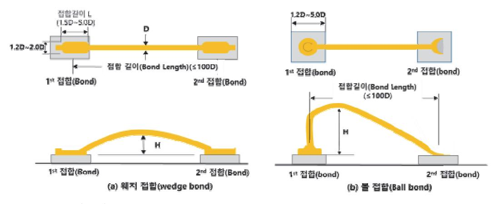

출처: 집필진 제작(2024)

[그림 3-1] 와이어 본딩 방식[(a) 웨지 본딩 방식, (b) 볼 본딩 방식]

(2) 웨지 본딩(wedge bonding)

칩(다이) 또는 리드 프레임 및 기판 본딩 패드 표면으로 30~60°로 장입되는 와이어가 초음파에 의해 접합하게 된다. 일반적으로 본딩 패드 위에 1차 본딩 후 2차 본딩은 기 판 패드 위에서 진행되며 1차 본딩 후 2차 본딩은 일직선으로만 가능하다.

(3) 볼 본딩과 웨지 본딩의 비교

웨지 본딩은 초음파 와이어 본딩 방식만이 적용되어야 하며, 이에 반면 볼 본딩은 열압 착 또는 초음파 열 압착 방식을 통해 접합할 수 있다.

〈표 3-1〉 볼 본딩과 웨지 본딩의 장단점

| 구분                       | 장점                                        | 단점                                                          |
|--------------------------|-------------------------------------------|-------------------------------------------------------------|
| 볼 본딩 (ball bonding)   | - 공정이 쉽고 공정 속도가 빠르다.                      | - 큰 본딩 패드가 필요하다. - 충분한 가열이 필요하다.                         |
| 웨지 본딩 (wedge bonding) | - 작은 본딩 패드가 가능하다. - 알루미늄의 경우 열이 필요 없다. | - 공정 속도가 느리다. - 한 방향으로만 본딩이 가능하다. - 접합 강도가 상대적으로 약하다. |

2. 열 압착(thermo compression) 방식 와이어 본딩 방식

기판과 칩(다이), 칩(다이)과 칩(다이) 또는 기판과 기판과의 전기적 연결을 위해 열과 기계 적 힘을 이용하여 온도, 가압 힘 및 시간을 제어하며 와이어와 접합 대상과 내부 상호 확산 을 발생시켜 와이어를 연결하는 방식이다. 접합할 때에 초음파를 이용하지 않는다.

3. 초음파(ultrasonic) 방식 와이어 본딩 방식

전혀 열을 사용하지 않고 캐필러리 대신 웨지 툴을 이용하며 접합 시 초음파를 이용하여 접합에 활용하는 방식으로 주로 Al wire를 접합하는 방식이다.

4. 열 초음파(thermosonic) 와이어 본딩 방식

가장 일반적인 방식으로 열 압착 방식과 초음파 방식을 결합한 방식으로 히트 블록(heat bl ock) 위에 리드 프레임과 기판을 가열하고 캐필러리나 웨지 툴에 초음파를 인가하면서 일 정 하중으로 가압 접합하는 방식으로 열 압착 방식보다는 낮은 온도에서 빠른 접합을 완성 할 수 있다.

2 재료 측면에서 고려해야 하는 접합 시스템

본딩 와이어 재료는 칩(다이) 패드를 포함하여 리드 프레임과 기판 위의 재료와 확산 결합하여 접합하게 된다. 본딩 와이어와 기판 재료의 종류에 따라 형성되는 금속 시스템을 고려하여 사 전에 예상되는 문제점들을 회피하여 와이어 본딩 공정 설계를 수립할 수 있다.

- 1. 주요 본딩 와이어 종류
  - (1) Au(금) 와이어
    - (가) 광범위하게 사용되는 재료로서 열 압착 본딩과 열 초음파 와이어 본딩 방식이 가능하다.
    - (나) 본딩 와이어의 표면이 청결할수록 접합 강도가 높고 캐필러리 내 구멍 막힘을 줄일 수 있다.
    - (다) 고속의 와이어 본딩 공정을 위해 초고순도의 Au 와이어에 Be, Cu를 도핑시키기도 한 다.
    - (라) 전도성이 높고 강도도 우수하여 신뢰성이 있는 접합에 연결한다. 높은 속도와 강한 접합 성능, 우수한 신뢰성을 갖는 대신 비용이 많이 들다.
    - (마) 다양한 본딩 패드 재료와 사용해도 큰 문제가 없다.
    - (바) 부식 저항성이 높다.
  - (2) Al(알루미늄) 와이어
    - (가) 고순도의 Al에 1% Si 또는 1% Mg을 섞어 강도를 보완해서 사용한다.
    - (나) 저비용, 높은 열전도도, Au와 Cu 와이어보다는 강도가 높다.
    - (다) 단점으로 Au와 Cu에 비해 상대적으로 높은 전기 전도도와 산화되기 쉽다.
  - (3) Cu(구리) 와이어
    - (가) 순도는 99.99% 이상이며 지름은 15~75㎛이다.
    - (나) Au보다 낮은 비용에 높은 전기 전도도, 열전도도가 좋다.
    - (다) Au보다 높은 강도가 높다.
    - (라) 와이어 본딩 시 산화가 쉽고 이는 강도와 전기 전도도를 약화할 수 있다.
  - (4) Ag(은) 와이어
    - (가) 순도는 99.99% 이상이며 지름은 15~75㎛이다.
    - (나) 열초음파 방식으로 접합한다.
    - (다) 전기 전도도와 열전도도가 좋고 접합 성능이 좋다.
    - (라) Au에 비해 비용이 낮다.
    - (마) 산화되기 쉽고 Au 와이어에 비해 기계적 강도가 낮다.
- 2. 와이어와 기판 패드 재료와의 접합
  - 본딩 와이어와 본딩 패드 재료에 따른 본딩할 때, 재료 조합에서 고려해야 하는 사항은 다 음과 같다.
  - (1) Au 와이어-Au 본딩 패드의 접합
    - 부식을 고려하지 않아도 되는 신뢰도 높은 접합 조합이다. 열 초음파 방식으로 신뢰도 높은 접합이 가능하다.

(2) Au 와이어-Al 본딩 패드의 접합

Au와 Al 간의 금속간 화합물의 형성으로 커캔달 기공(kirkendall voids)가 형성된다. 금속 간 화합물의 형성은 상온 접합 과정에서 발생하며 이는 신뢰도에 영향을 준다.

- (3) Au 와이어-Cu 본딩 패드 접합 Au와 Cu 와의 금속 간 화합물(Cu3Al, AuCu, Au3Cu)이 계면에서 형성하며 커캔달 기 공의 형성을 유도한다. 강한 접합을 위해서는 구리 패드의 청결도가 매우 중요하다.
- (4) Au 와이어- Ag 본딩 패드의 접합

고온에서 신뢰도 있는 접합을 할 수 있다. 금속 간 화합물은 형성하지 않고 부식도 잘 일어나지 않는다. 본딩에 문제가 발생하는 경우는 주로 황(S)으로 인한 Ag 본딩 패드 표면 오염이다.

- (5) Al 와이어-Al 본딩 패드의 접합 신뢰도가 높은 조합이며 초음파 접합이 가능하다.
- (6) Al 와이어-Ag 본딩 패드의 접합 계면에서 다양한 금속 간 화합물의 형성 가능성이 높고 습기에 약하며 염소(Cl)로 인해 쉽게 부식할 수 있다.
- (7) Cu 와이어-Al 본딩 패드의 조합 취성이 있는 Cu와 Al의 금속 간 화합물이 형성되어 결합력이 감소한다.

## 수행 내용 / 본딩 방법 선정하기

재료·자료

- 제품 사양서
- 기판 설계 도면
- 와이어 본딩 다이어그램
- 와이어 본딩 패키지 디자인 룰

기기(장비 ・ 공구)

- 설계 소프트웨어
- 안전 ・ 유의 사항
  - 해당 사항 없음.

#### 수행 순서

숔 와이어 본딩 계획을 수립한다.

본딩 패드 간격의 감소와 패드의 증가에 따라 안정된 와이어 본딩 공정을 확보하기 위해 본딩 계획을 수립한다.

1. 와이어 접합 최적화 계획을 수립한다.

목표 설정은 반도체 제품의 안정된 제조를 위한 적절한 접합 방법 선정, 최적화된 공정 조건 확보 및 장비 안정화 등이 있으며, 최종으로는 공정 운영자들의 교육 계획까지도 포함되어 있다.

(1) 목표 설정하기

공정 안정화를 위한 공정 능력(process capability)에 대한 목표 선정을 한다(예, 공정 수율, 와이어 끊김 횟수 등과 같은 공정 능력과 관련한 항목의 수치화된 목푯값 선정).

(2) 세부 개선 활동 선정하기

공정 안정화를 위한 공정 능력(process capability)에 대한 목표 선정을 한다(예, 공정 수율, 와이어 끊김 횟수 등과 같은 공정 능력과 관련한 항목의 수치화된 목푯값 선정)

(3) 개선 활동 수행하기

선정된 개선 활동 효과를 확인할 때까지 반복 수행한다.

(4) 도출된 개선점을 공정 계획에 반영하기

효과를 확인한 개선 활동의 결과를 와이어 본딩 계획에 반영하고 와이어 본딩 공정 운

#### 영자들 대상으로 교육 계획도 수립한다.

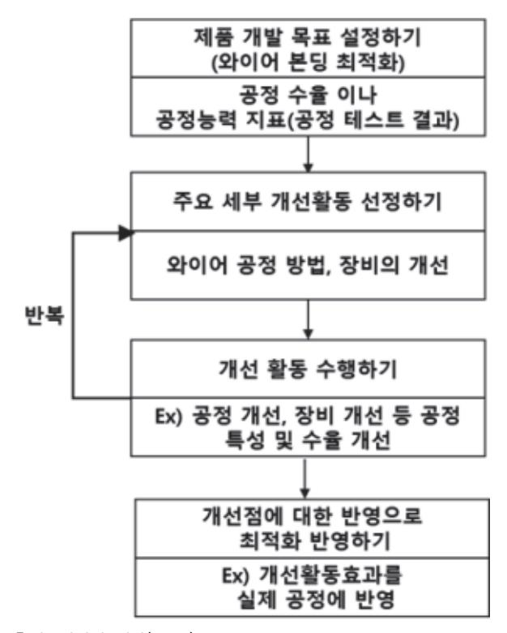

출처: 집필진 제작(2024) [그림 3-2] 와이어 본딩 최적화 수행 과정

2. 와이어 본딩을 설계한다.

최적의 와이어 본딩 설계는 공정과 관련한 잠재 불량을 최소화하는 것이다. 따라서 아래와 같은 설계안에 포함되는 내용은 다음과 같다.

- (1) 설계에 필요 정보 조사하기
  - (가) 적용된 칩(다이) 재료 및 두께
  - (나) 본딩 패드 재료, 피치, 길이, 너비 및 두께
  - (다) 클록 주파수
  - (라) 단위 길이당 최대 허용 접합 저항
  - (마) 커패시턴스 용량
  - (바) 트랜지스터의 전도 채널 저항
  - (사) 최대 허용 접합 인덕턴스
- (2) 본딩 와이어 재료 선정하기

본딩 와이어 재료의 전기적 성질과 기계적 성질을 고려하여야 한다.

(가) 본딩 와이어의 재료, 두께를 선정한다.

본딩 와이어의 주요 특성을 참조하여 재료와 두께를 선정한다. 주요 특성은 전기 전 도도, 인장 강도, 전단 강도, 탄성 계수, 푸아송비, 경도, 열팽창 계수 등

(나) 패드 재료의 특성

전도도, 접합력, 금속 간 화합물 형성 및 커켄달 기공 형성을 위한 활동도, 경도, 내 부식성, 열팽창 계수 등을 고려하여 선정해야 한다.

- (다) 본딩 와이어 재료와 패드 재료에 대한 가이드를 설정한다.
  - 1) Au 와이어-Cu 패드 재료 접합 조합은 고온 응용처에는 사용되면 안 된다.
  - 2) Au 와이어-Au 패드 재료 접합은 신뢰성이 매우 높다.
  - 3) Au 와이어-Ag 패드 재료는 고온에서 장시간 사용할 때 신뢰도가 높다.
  - 4) Ag 와이어-Al 패드 재료 조합은 주의가 필요하다.
  - 5) Ag 와이어의 사용할 때는 항상 높은 주의가 필요하다.
  - 6) Al 와이어 –Ni 패드 재료는 다양한 환경에서 안정적이다.
  - 7) Al 와이어- Al 패드 재료는 신뢰도가 높다.
  - 8) Cu 와이어는 EMC 몰딩 공정(encapsulation) 중의 안정성과 낮은 비용으로 유리하 다.
  - 9) 리드 프레임 또는 기판 위의 본딩 재료가 Ni, Cu 그리고 Cr을 본딩 패드 표면에 사용했다면 항상 경고문을 작성한다.
- (라) 강한 접합력을 보장하기 위해 본딩 패드의 표면은 항상 청결을 유지한다.
- (마) 와이어와 패드 재료의 경도값은 거의 유사한 경우에 높은 접합 강도를 확보할 수 있으므로 재료 신중한 재료 선정이 필요하다.
- (3) 본딩 디자인 계획하기

기판 설계할 때 고려한 패드의 위치와 크기는 칩(다이)의 본딩 패드 위치와 크기로 거의 결정된다. 아래는 와이어 본딩 방식의 선택할 때 고려하는 사항들이다.

- (가) 볼 본딩(ball bonding)
  - 1) 볼의 크기는 와이어 두께의 2~3배 정도이며, 피치가 좁을 때는 1.5배 정도이며, 큰 본딩 패드 응용에는 와이어 두께의 3~4배 정도로 형성, 적용한다.
  - 2) 본드 크기는 패드 크기의 3/4를 초과해서는 안 된다.
  - 3) Au 와이어-Ag 패드 재료는 고온에서 장시간 사용 시 신뢰도가 높다.
  - 4) 150㎛의 루프 높이는 일반적이지만 와이어의 두께와 응용처에 따라 다르게 설계할 수 있다.
  - 5) 루프의 길이는 와이어 두께보다 100배 작아야 한다. 그러나 특정 경우에는 긴 경우 도 있다.

- (나) 웨지 본딩(wedge bonding)
  - 1) 고강도 웨지 접합은 와이어 두께보다 불과 2~3㎛보다 커도 충분히 확보할 수 있다.
  - 2) 패드 길이는 웨지 본드의 길이는 물론 테일을 지탱할 수 있어야 한다.
  - 3) 패드의 장축은 와이어 동작 경로와 일치하도록 하여야 한다.
  - 4) 본드 피치와 함께 본딩 와이어 간의 간격은 일정하게 유지한다.
- (4) 와이어 본딩 장비 선정하기

와이어 본딩 장비는 사용 와이어의 종류와 본딩 방법에 따라 결정한다.

- (5) 와이어 본딩 공정 조건 확립하기
  - 와이어 본딩 공정 변수는 공정 수율과 강한 신뢰성 있는 제품을 확보하는 데 매우 중요 하다. 따라서, 와이어 본딩 공정에서 4가지 변수에 따라 최적의 공정 조건을 확립한다.
  - (가) 본드 하중과 압력 균일도(bond force and pressure uniformity)

와이어 본딩이 되는 지점을 누르는 힘이며 초음파가 동작 중에 작동된다. 과도한 힘 은 볼 높이를 낮게 하며, 칩(다이) 깨짐을 유발하고 스티치 부분에서 과도한 캐필러 리의 눌림을 발생시키기에 유의해야 한다.

(나) 본딩 온도(bonding temperature)

히트 블록의 열은 본드 파워와 함께 와이어와 패드 간의 접합 특성과 와이어의 유연 성에 큰 영향을 준다. 낮은 온도는 볼 접착력이 약해지고, 타이트한 루프 형성을 발 생시킬 수 있다. 과도한 온도에서는 접합 과정에서 볼의 지름이 증가하고 루프를 형 성할 때 처짐이 발생할 수 있다.

- (다) 본딩 시간(bonding time) 본딩 공정 내에 파워가 가해지는 시간이다.
- (라) 초음파 주파수와 파워(ultrasonic frequency and power) 초음파는 표면의 오염물을 제거하고 금속 간 결합을 유도한다.
- (6) 와이어 본딩 잠재 불량 파악하기

패드 오염(pad cleanliness)과 그 오염원, 접합 실패 현상으로 와이어 본딩 패드의 분 화구(cratering) 현상, 와이어 본딩 파손(fracture) 또는 들뜸(lift off), 일정하지 않은 테일 발생, 본딩 벗겨짐과 신뢰성 평가 실패 등에 대한 원인을 미리 문서화하고 이에 대한 대책을 세워 개선 계획을 수립한다.

## (가) 잠재 요인 발굴을 위한 어골도(fish bone diagram)와 파레토 챠트 작성하기 불안정한 와이어 본딩 공정에 의해 발생할 수 있는 결과들에 대한 인과관계 도표(ca use & effect diagram) 또는 어골도(fish bone diagram)를 작성하여 불량 현상들 에 대한 잠재 요인들을 발굴한다.

1) 해결해야 하는 불량에 대해서 원인과 결과에 대해 명확하게 정의할 수 있어야 한다.

- 2) 주요 원인에 대해 4M(man, material, method, machine) 1E(environment)의 범주에서 추정되는 원인을 발굴하여 추가한다.
- 3) 원인 중 불량에 대한 기여도 또는 중요도에 따라 우선순위를 파레토 차트 등을 이 용하여 기여도의 80% 이상 되는 요인을 우선 선발한다.
- 4) 먼저 해결해야 할 불량 유형에 대한 해결 방안을 수립하고 시행한다.

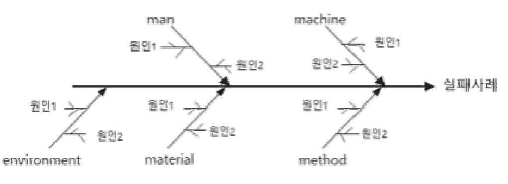

출처: 집필진 제작(2024) [그림 3-3] 어골도(fish bone diagram)

(나) 주요 잠재적 불량과 주요 원인에 대해 점검하기

1) 본딩 패드 오염(pad contamination)

패드 위의 오염에 따라 와이어 본딩의 본딩력과 신뢰성에 영향을 주는 가장 큰 요인이다. 주요 오염원은 다음과 같다.

- 가) 할로겐 원소로서 플라즈마 에칭 공정, 에폭시 등의 아웃가스(outgass), 감광제의 스트립(strip) 및 용제 등에서 오염될 수 있다.
- 나) 전해 도금 중에 발생하는 오염으로 광택제 수소 등에 오염할 수 있다.
- 다) 포장재, 대기로부터의 황(S)에 오염할 수 있다.
- 라) 사람에 의해 발생하는 입자 오염 등이다.
- 2) 본딩 패드의 표면 패임(cratering of bonding pad)
- 가) 초음파 에너지에 의해 발생하는 실리콘 격자에서의 적층 결함이 발생할 수 있다.
- 나) 웨지 본딩에서 너무 높은 힘 또는 너무 낮은 힘으로 발생할 수 있다.
- 다) 폭이 좁은 와이어 본딩 공정에서 금속패드에 강한 충돌이 발생할 수 있다.
- 라) 본딩 헤드의 패드로의 강하(drop)가 너무 빠르게 이루어질 때 패드에 충격이 갈 수 있다.
- 마) 과도한 파워를 인가하면 발생할 수 있다.
- 바) 본딩 과정 중의 기판고정이 미흡해 원하지 않는 움직임이 발생할 때 표면 패임이 발생할 수 있다.

- 사) 본딩 시간이 너무 긴 경우에 발생할 수 있다.
- 아) 히트 블록의 온도가 너무 높은 경우에 발생할 수 있다.
- 자) 본딩 패드의 표면 경도가 너무 높거나 패드의 두께가 너무 얇은 경우에 발생할 수 있다.
- 3) 볼과 웨지 본딩이 발생하지 않는 경우(ball/wedge not sticking to bond pad)
- 가) 초음파 에너지에 의해 발생하는 실리콘 격자에서의 적층 결함이 발생할 수 있다.
- 나) 기판으로 볼이 수직 운동이 이루어지지 않았을 때 발생할 수 있다.
- 다) 패드의 표면에 산화물 또는 오염이 되어 있으면 발생할 수 있다.
- 라) 형성된 볼의 크기가 너무 작으면 발생할 수 있다.
- 마) 유기물에 의한 오염이 발생하면 발생할 수 있다.
- 바) 클램프 고정이 느슨한 경우에 발생할 수 있다.
- 사) 적절하지 않은 파워와 힘이 가해질 때 발생할 수 있다.
- 아) 캐필러리의 불량으로 발생할 수 있다.
- 자) 힘이 약하거나, 본딩 시간이 너무 짧거나, 초음파가 너무 낮거나 너무 높을 때, 온 도가 너무 높거나 너무 낮을 때 발생할 수 있다.
- 4) 본딩 와이어 파손과 들뜸(wire bonding fracture and lift-off)
- 초음파 본딩 공정 후에 접합 부위에서 와이어의 파손 또는 들뜸 현상이 자주 발 생하게 되는데 Al 웨지 접합 공정에서 1차 본딩에서 그리고 Au 볼 본딩에서 2차 본딩에서 크랙의 형성이 자주 발생하게 된다. 이의 주요 원인은 다음과 같다.
- 가) 급격한 본딩 힐(heel)의 형성할 때 발생할 수 있다.
- 나) 1차 본딩 후 본딩 툴의 상승 전 또는 상승 과정에서 본더의 진동으로 발생할 수 있다.
- 다) 과도한 접합 변형으로 발생할 수 있다.
- 라) 와이어 루프의 높이가 급격하게 상승할 때 발생할 수 있다.
- 마) 1차 본딩 후의 빠른 본딩 툴의 이동으로 발생할 수 있다.
- 5) 와이어 루프의 처짐(sagging) 또는 물결(wavy) 모양 형성
  - 가) 와이어의 두께가 얇거나 루프의 길이가 긴 경우에 발생할 수 있다.
- 나) 연신율이 높은 와이어 사용의 경우에도 발생할 수 있다.
- 다) 홀의 크기가 작거나 너무 작은 챔퍼(chamfer) 또는 손상을 입은 챔퍼를 사용할 때 과도한 와이어 끌림(drag)을 발생시켜 발생할 수 있다.
- 6) 와이어 표면에 스크래치(scratch)의 발생
- 스크래치 있는 본딩 와이어의 공급이 있을 때 발생할 수 있다.
- 가) 클램프(clamp) 표면의 손상이 있을 때 발생할 수 있다.
- 나) 챔퍼 내부의 손상이 있을 때 발생할 수 있다.
- 다) 과도한 와이어 끌림(drag)이 있을 때 발생할 수 있다.

- 7) 공정 일관성 없는 테일의 형성(inconsistent tail formation)
- 가) 와이어 경로 내의 청결도가 좋지 않을 때 발생할 수 있다.
- 나) 부정확한 와이어 공급 각도에 의해서 발생할 수 있다.
- 다) 웨지 형성 시에 부분적으로 불량 발생이 동반되는 현상이다.
- 라) 오염된 와이어 본더의 클램프에 의해 발생할 수 있다.
- 마) 부정확한 클램프와의 간격이 형성되었을 때 발생할 수 있다.
- 바) 부정확한 클램프의 압력이 가해질 때 발생할 수 있다.
- 사) 불완전한 와이어 장입(feed) 및 끊기(tear) 과정에서 발생할 수 있다.
- 아) 본딩 와이어가 충분히 팽팽하지 않았을 때 발생할 수 있다.

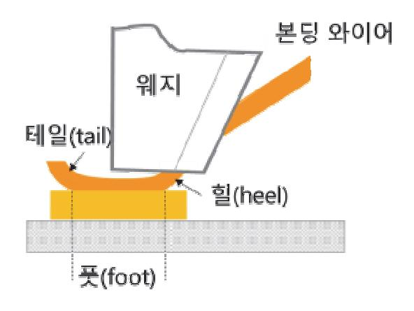

출처: 집필진 제작(2024) [그림 3-4] 웨지 본딩의 접합된 와이어의 구조와 주요 명칭

8) 와이어 본딩 패키지의 신뢰성과 관련된 불량 유형과 주요 원인

소자 장기 사용에 따라 발생하는 불량들과 추정되는 주요 원인은 아래와 같다.

- 가) 전기 노이즈(electrical noise)는 본드 패드 주변으로 누설 전류가 발생하는 경우 로서 크랙 등의 물리적 변화 등을 발견하지 못한 경우에도 발견되곤 한다.
- 나) EMC 공정 중에 발생한 와이어 스윕(wire sweep)에 의한 본딩 와이어의 단락과 쇼트 현상이 있다. 특히, 패키지와 수평으로 장입되는 EMC 수지로 인한 영향이 크다.
- 다) 소자의 사용 중에 금속 원자의 이동(metal atom migration)에 영향으로 와이어 에서 패드까지 금속 덴드라이트가 생성하여 성장하는 현상이 발생한다. 이와 같은 금속의 이동현 상은 브리지 영역에서 누설 전류의 증가 또는 쇼트를 발생시킬 수 도 있다. 특히, Ag(은), Pb(납), Ni(니켈), Au(금), Cu(구리) 등의 재료를 사용했을 경우 발생한다.
- 라) 리드 프레임에 누적되어 있던 잔류응력과 많은 표면 오염이 오히려 부식을 방지하

기 위해 적용된 도금층의 부식이 발생하는 경우가 있다. 이는 응력 부식 유도 크랙 (stress corrosion induced crack)을 일으키는 원인으로 작용하고 특히, 합금 42 재료에서 발생한다. 부식을 만들어내는 조건은 습기와 오염물이 있으며, 도금층에 있는 크랙과 기공 불량 영역에서 부식은 시작된다. 패키지 제품 내에 습기가 유입 되는 경로가 되는 민감한 영역은 몰딩 재료와 리드 프레임이 접한 계면이다.

- 마) 와이어 본딩 공정 중에 금속 간 화합물의 생성은 발생하는 전기 특성과 기계적 접 합 불량의 원인이 된다. 금속 간 화합물의 성장은 커켄달 기공(Kirkendall void)의 형성을 동반하게 됨에 따라 전기 저항의 상승과 기계적 접합 강도의 약화를 유도 하게 된다. 하지만, 이와 같은 현상은 고온(Au-Al 접합 시, 300~400℃) 조건이 필요하므로 정상적인 접합 공정과 동작 환경 중에서 발생하기는 쉽지 않다.
- 바) 열 피로(thermal fatigue)로 인한 파괴로 본딩된 와이어의 힐에서 발생한 미세 균 열(micro crack)이 전파되면서 파괴까지 발생하는 경우가 있다. 피로(fatigue)를 발생하게 하는 요인은 반복되는 저온과 고온 환경 내에서 접합 재료 간의 열팽창 계수의 차이로 인한 열 피로(thermal fatigue) 현상으로 발생한다.

#### 수행 tip

- 와이어 본딩을 적용한 패키지는 신뢰도 높은 소자 성능을 확보하기 위해서는 본딩 재료와 두께, 본딩 방법과 본딩 장비의 선택을 신중하게 진행해야 한다.
- 본딩 다이어그램은 패드의 크기, 패드의 간격 및 위치를 근거로 와이어 본딩 순서를 정의하여 최적의 와이어 본딩 공정이 진행될 수 있도록 정의한다.

## 학습 3 교수·학습 방법

#### 교수 방법

- 와이어 본딩 방식 중 볼 본딩과 웨지 본딩의 장단점을 설명한다.
- 와이어 본딩 방식 중 열압착 와이어 본딩 방식, 초음파 와이어 본딩 방식 그리고 열초음파 와이어 본딩 방식의 차이점을 설명한다.
- 본딩 와이어의 재료의 종류와 차이점을 적용 사례별로 지도한다.
- 와이어와 기판 재료 접합 조합의 종류와 유의 사항들을 지도한다.
- 와이어 본딩 설계 시에 공정 최적화하기 위해 고려해야 하는 사항을 설명한다.
- 와이어 본딩 공정과 관련한 다양한 잠재 불량들과 그의 원인을 설명한다.

#### 학습 방법

- 와이어 본딩 방식 중 볼 본딩과 웨지 본딩의 장단점을 숙지한다.
- 와이어 본딩 방식 중 열 압착 와이어 본딩 방식, 초음파 와이어 본딩 방식, 열 초음파 와이 어 본딩 방식의 차이점을 구분한다.
- 본딩 와이어 재료의 종류와 차이점을 이해하고 반도체 패키지 타입에 따라 본딩 와이어 재 료를 선정한다.
- 와이어와 기판 재료 접합 조합의 종류와 유의 사항들에 대해 이해하고 와이어 본딩 계획에 적용한다.
- 와이어 본딩 설계할 때 공정 최적화하기 위해 고려해야 하는 사항을 파악한다.
- 와이어 본딩 공정과 관련한 다양한 잠재 불량과 그의 원인을 이해하고 불량을 회피할 수 있 는 와이어 본딩 계획을 수립한다.

## 학습 3 평 가

#### 평가 준거

- 평가자는 학습자가 학습 목표를 성공적으로 달성하였는지를 평가해야 한다.
- 평가자는 다음 사항을 평가해야 한다.

|          | 학습 목표                                                       |  | 성취수준 |   |  |
|----------|-------------------------------------------------------------|--|------|---|--|
| 학습 내용    |                                                             |  | 중    | 하 |  |
| 본딩 방법 선정 | - 본딩 패드와 캐필러리를 열로 데워 압착하는 열 압착 방식 을 검토할 수 있다.            |  |      |   |  |
|          | - 열을 사용하지 않고 캐필러리에 초음파를 인가하는 초음파 방식을 검토할 수 있다.           |  |      |   |  |
|          | - 열과 초음파를 한꺼번에 모두 이용하여 접착하는 열 초음파 방식을 검토할 수 있다.          |  |      |   |  |
|          | - 와이어 본딩의 접착 강도, 생산성, 공정 원가 등을 고려하여 최적의 본딩 방식을 선정할 수 있다. |  |      |   |  |

#### 평가 방법

• 서술형 시험

|          | 평가 항목                                                                   |  | 성취수준 |   |  |
|----------|-------------------------------------------------------------------------|--|------|---|--|
| 학습 내용    |                                                                         |  | 중    | 하 |  |
| 본딩 방법 선정 | - 와이어 본딩 설계 시 볼 본딩과 웨지 본딩의 특징을 설명할 수 있는 능력                           |  |      |   |  |
|          | - 열 압착 와이어 본딩 방식, 초음파 와이어 본딩 방식 그리고 열 초음파 와이어 본딩 방식의 특징을 설명할 수 있는 능력 |  |      |   |  |
|          | - 와이어 본딩 재료의 차이점과 적용 시 고려해야 하는 사항 을 설명할 수 있는 능력                      |  |      |   |  |
|          | - 본딩 와이어와 기판 재료와의 접합 조합 시 고려해야 하는 주의 사항을 상세히 서술할 수 있는 능력             |  |      |   |  |
|          | - 와이어 본딩 설계 시 공정 최적화를 위해 고려해야 하는 사 항들을 상세하게 서술할 수 있는 능력              |  |      |   |  |
|          | - 와이어 본딩 공정과 관련한 잠재 불량의 유형과 원인을 상 세하게 서술할 수 있는 능력                    |  |      |   |  |

• 구두 발표

|          | 평가 항목                                                                  |  | 성취수준 |   |  |
|----------|------------------------------------------------------------------------|--|------|---|--|
| 학습 내용    |                                                                        |  | 중    | 하 |  |
| 본딩 방법 선정 | - 와이어 본딩 방식 선정 방식과 이유 주제 발표 능력                                         |  |      |   |  |
|          | - 열 압착 와이어 본딩 방식, 초음파 와이어 본딩 방식, 열 초 음파 와이어 본딩 방식의 동작 원리와 차이점 발표 능력 |  |      |   |  |
|          | - 본딩 와이어 재료의 종류와 특징 발표 능력                                              |  |      |   |  |
|          | - 본딩 와이어와 기판 재료와의 접합 조합을 위해 고려해야 할 요소 발표 능력                         |  |      |   |  |
|          | - 와이어 본딩 설계 시 공정 최적화를 위해 고려해야 하는 사 항 발표 능력                          |  |      |   |  |
|          | - 와이어 본딩 공정과 관련한 잠재 불량의 유형과 원인에 대 해 상세하게 발표할 수 있는 능력                |  |      |   |  |

피드백

- 1. 서술형 시험 - 와이어 본딩 설계 시 볼 본딩과 웨지 본딩의 특징을 구별하여 서술함이 부족한 학습자에게는 볼 본딩과 웨지 본딩에 대한 적용 사례를 추가 설명하며 이해를 돕는다.
- 열 압착 와이어 본딩 방식, 초음파 와이어 본딩 방식 그리고 열 초음파 와이어 본딩 방식의 특징 에 대한 답변이 부족한 학습자에게는 열, 초음파, 열과 초음파를 활용한 와이어 본딩의 특징에 대 한 설명을 장비의 구조와 함께 상세하게 설명하여 부족한 점을 보충해 준다.
- 와이어 본딩 재료의 차이점과 적용 사례에 대한 답변이 부족한 학습자에게는 근본 재료의 특성과 함께 보충 설명을 하면서 이해가 쉽도록 해 준다.
- 와이어와 기판 재료와의 접합 조합 시 고려해야 하는 주의 사항을 사용 재료의 특성과 같이 설명 하여 학습자가 이해하기 쉽도록 보완 설명해 준다.
- 와이어 본딩 설계 시 공정 최적화를 위해 고려해야 하는 사항들에 대해 이해가 부족한 학습자에 게는 와이어 본딩 재료와 굵기, 패드의 크기와 간격, 장비 등의 관점에서 안정된 공정에서 필요한 요소를 예를 들어 상세하게 설명해 준다.
- 와이어 본딩 공정과 관련한 잠재 불량의 유형과 원인 사례에 관해 보충 자료를 활용하여 설명하 고 각 원인과 결과의 인과관계를 상세하게 설명하여 학습자가 이해하도록 보완하여 설명해 준다.
- 2. 구두 발표
- 와이어 방식 선정 방식과 이유 주제에 대해 관련된 실패 사례를 조사하여 설명하여 간접 학습 효 과를 얻도록 유도한다.
- 열 압착 와이어 본딩 방식, 초음파 와이어 본딩 방식, 열 초음파 와이어 본딩 방식의 동작 원리와 차이점을 실제 반도체 공정에 적용되는 사례 조사와 함께 발표하게 한다.
- 와이어 본딩 재료들의 종류와 특징에 대한 정리하고 적용 사례를 조사하여 발표하게 한다.
- 와이어와 기판 재료와의 접합 조합의 실제 적용 사례를 조사하여 발표하게 한다.
- 와이어 본딩 설계 시 공정 최적화를 위해 계획 단계에서 점검 사항들을 이유와 예상 결과를 발표 하도록 지도한다.
- 와이어 본딩 공정과 관련한 잠재 불량의 유형과 원인을 조사하여 재료, 공정 등의 영향 인자를 연결하여 지도한다.

- 고광덕(2016). 『반도체 패키지』. 성안당.
- 서민석(2020). 『반도체의 부가가치를 올리는 패키지와 테스트』. 한올 출판사.
- 와이어 본딩 패키지(2024). Simmtech(https://www.simmtech.com/product/package01.aspx) 에서 2024. 08. 24. 검색.
- Cadence PCB Design & Ananlysis (2024). Lead-Frame Package: A technical Exploration(htt ps://resources.pcb.cadence.com/blog/2023-lead-frame-package-a-technical-explorati on).
- Franz Hickmann (2013). Wire bonding Basics Version 4.0. www.tpt.de
- Harrt A. Schaffft (1972). Testing and Fabrication of Wire-bond Electrical Connections-A Cmprehensive Suvey. NBS Technical Note 726. U.S. Department of Commerce.
- Lee levine (2020). Wire Bonding: The Ultrasonic bonding mechanism. IMAPS2020. p.230.
- MP micro point pro (2024). SMT tools(https://mpptools.com/category-/smt-tools/?utm\_m edium=cpc&utm\_source=google&utm\_campaign=mpp\_brand).
- Oricus Semicon Solutions (2024). Wire bonding heat block and clamp(https://oricus-semic on.com/products/wire-bond/ball-bonding/heat-block-inserts/).
- Peisheng Liu, Liangyu tong, Jinlan Wang, Lei Shie, Hao Tang (2012). Challenges and developments of copper wire bonding technology. Microelecronics Reliability. 52(2012). pp.1092~1098.
- Sashish Shah, Hui Xu, Bob Chylak, Nelson Wong (2015). Advances in Wire Bonding Technolo gy for Different Bonding wire Materials, International Symposium on Microelectronics. pp.406~412.
- Yoshihiro Nakamura, shigeki Katogi(2013). Technology trends and Future Histoy of Semico nductor Packaging Substrate material. Hitachi chemical Technical Report No.55. pp.24~2 9.

| NCS학습모듈 개발이력 |                                     |     |                  |
|--------------|-------------------------------------|-----|------------------|
| 발행일          | 2024년 12월 31일                       |     |                  |
| 세분류명         | 반도체 개발((19030601)                   |     |                  |
| 개발기관         | 수원과학대학교 산학협력단(개발책임자: 윤창용) 한국직업능력연구원 |     |                  |
|              | 최준혁(수원대학교)*                         |     | 김종범(삼성전기)        |
|              | 계찬호(수원대학교)                          |     | 김한수(두원공과대학교)     |
|              | 김경호(폴리텍대학교)                         |     | 남승호(경기대학교)       |
|              | 김관하(폴리텍대학교)                         |     | 손승대(제이에스이엔씨(주))  |
| 집필진          | 김기순((주)영우디에스피)                      | 검토진 | 안광호(퓨쳐일렉트로닉스)    |
|              | 김도균(폴리텍대학교)                         |     | 이철오((주)한국전력안전공단) |
|              | 전동민(폴리텍대학교)                         |     |                  |

\*표시는 대표집필자임 (참고) 검토진으로 참여한 집필진은 본인의 원고가 아닌 타인의 학습모듈을 검토함

| 와이어 본딩 패키지 개발(LM1903060121_23v4)                                                                         |                   |  |
|----------------------------------------------------------------------------------------------------------|-------------------|--|
| 저작권자                                                                                                     | 교육부               |  |
| 연구기관                                                                                                     | 한국직업능력연구원         |  |
| 발행일                                                                                                      | 2024. 12. 31.     |  |
| ISBN                                                                                                     | 979-11-7175-755-8 |  |
| ※ 이 학습모듈은 자격기본법 시행령(제8조 국가직무능력표준의 활용)에 의거하여 개발하였으며, NCS통합포털사이트(http://www.ncs.go.kr)에서 다운로드 할 수 있습니다. |                   |  |

