# LM1903060122\_23v4

## NCS학습모듈 플립칩 패키지 개발

| 대분류/19 전기·전자 | 중분류/03 |                 |        |         |
|-----------------|--------|-----------------|--------|---------|
|                 | 전자기기개발 | 소분류/06 반도체개발 | 세분류/01 |         |
|                 |        |                 | 반도체개발  | 능력단위/22 |

#### [NCS학습모듈 활용 시 유의 사항]

- 1. NCS학습모듈은 교육훈련기관에서 출처를 명시하고 교육적 목적으로 활용할 수 있습니다. 다 만, NCS학습모듈에는 국가(교육부)가 저작재산권 일체를 보유하지 않은 저작물(출처가 표기된 도표‧사진‧삽화‧도면 등)이 포함되어 있으므로, 이러한 저작물의 변형‧각색‧복제‧공연‧ 배포 및 공중 송신 등과 이러한 저작물을 활용한 2차적 저작물을 작성하려면 반드시 원작자 의 동의를 받아야 합니다.
- 2. NCS학습모듈은 개발 당시의 산업 및 교육 현장을 반영하여 집필하였으므로, 현재 적용되는 법령‧지침‧표준 및 교과 내용 등과 차이가 있을 수 있습니다. NCS학습모듈 활용 시 법령 ‧지침‧표준 및 교과 내용의 개정 사항과 통계의 최신성 등을 확인하시기를 바랍니다.
- 3. NCS학습모듈은 산업 현장에서 요구되는 능력을 교육훈련기관에서 학습할 수 있게 구성한 자 료입니다. 다만, NCS학습모듈 지면의 한계상 대표적 예시(예: 활용도 또는 범용성이 높은 제 품, 서비스) 중심으로 집필하였음을 이해하시기를 바랍니다.

## NCS학습모듈의 이해

※ 본 NCS학습모듈은 「NCS 국가직무능력표준」사이트(http://www.ncs.go.kr) 에서 확인 및 다운로드할 수 있습니다.

### Ⅰ NCS학습모듈이란?

- 국가직무능력표준(NCS: National Competency Standards)이란 산업현장에서 직무를 수행하기 위해 요구되는 지식·기술·소양 등의 내용을 국가가 산업부문별·수준별로 체계 화한 것으로 산업현장의 직무를 성공적으로 수행하기 위해 필요한 능력(지식, 기술, 태도) 을 국가적 차원에서 표준화한 것을 의미합니다.
- 국가직무능력표준(이하 NCS)이 현장의 '직무 요구서'라고 한다면, NCS학습모듈은 NCS
  의 능력단위를 교육훈련에서 학습할 수 있도록 구성한 '교수·학습 자료'입니다. NCS학습
  모듈은 구체적 직무를 학습할 수 있도록 이론 및 실습과 관련된 내용을 상세하게 제시하
  고 있습니다.

#### ○ NCS학습모듈은 다음과 같은 특징을 가지고 있습니다.

- 첫째, NCS학습모듈은 산업계에서 요구하는 직무능력을 교육훈련 현장에 활용할 수 있도 록 성취목표와 학습의 방향을 명확히 제시하는 가이드라인의 역할을 합니다.
- 둘째, NCS학습모듈은 특성화고, 마이스터고, 전문대학, 4년제 대학교의 교육기관 및 훈 련기관, 직장교육기관 등에서 표준교재로 활용할 수 있으며 교육과정 개편 시에도 유용하게 참고할 수 있습니다.

○ NCS와 NCS학습모듈 간의 연결 체계를 살펴보면 아래 그림과 같습니다.

O NCS학습모듈의 위치는 NCS 분류 체계에서 해당 학습모듈이 어디에 위치하는지를 한 눈에 볼 수 있도록 그림으로 제시한 것입니다.

| [NCS-학          | 습모듈              | 의 위치]    |          |  |
|-----------------|------------------|----------|----------|--|
|                 |                  |          |          |  |
| 대분류             | 대분류 문화·예술·디자인·방송 |          |          |  |
| 중분류             | 문화콘텐츠            |          |          |  |
| 소분류             | 문화콘텐츠제작          |          |          |  |
|                 |                  |          |          |  |
| 세분류             |                  |          |          |  |
| 방송콘텐츠제작         |                  | 능력단위     | 학습모듈명    |  |
| 영화콘텐츠제작         |                  | 프로그램 기획  | 프로그램 기획  |  |
| 음악콘텐츠제작         |                  | 아이템 선정   | 아이템 선정   |  |
| 광고콘텐츠제작         |                  | 자료 조사    | 자료 조사    |  |
| 게임콘텐츠제작         |                  | 프로그램 구성  | 프로그램 구성  |  |
| 애니메이션 콘텐츠제작  |                  | 캐스팅      | 캐스팅      |  |
| 만화콘텐츠제작         |                  | 제작계획     | 제작계획     |  |
| 캐릭터제작           |                  | 방송 미술 준비 | 방송 미술 준비 |  |
| 스마트문화앱 콘텐츠제작 |                  | 방송 리허설   | 방송 리허설   |  |
| 영사              |                  | 야외촬영     | 야외촬영     |  |
|                 |                  | 스튜디오 제작  | 스튜디오 제작  |  |
|                 |                  |          |          |  |

학습모듈은

NCS 능력단위 1개당 1개의 학습모듈 개발 을 원칙으로 합니다. 그러나 필요에 따라 고용단위 및 교과단위를 고려하여 능력단위 몇 개를 묶어 1개 학습모듈로 개발할 수 있으며, NCS 능력단위 1개를 여러 개의 학습모듈로 나누어 개발할 수도 있습니다.

### 2. NCS학습모듈의 개요

#### ○ NCS학습모듈의 개요는 학습모듈이 포함하고 있는 내용을 개략적으로 설명한 것으로

| 학습모듈의 목표 , 선수학습 , 학습모듈의 내용 체계 , 핵심 용어 로 구성되어 있습니다. |                                                                              |  |
|----------------------------------------------------|------------------------------------------------------------------------------|--|
| 학습모듈의 목표                                           | 해당 NCS 능력단위의 정의를 토대로 학습 목표를 작성한 것입니다.                                        |  |
| 선수학습                                               | 해당 학습모듈에 대한 효과적인 교수·학습을 위하여 사전에 이수해야 하는 학습모 듈, 학습 내용, 관련 교과목 등을 기술한 것입니다. |  |
| 학습모듈의 내용 체계                                     | 해당 NCS 능력단위요소가 학습모듈에서 구조화된 체계를 제시한 것입니다.                                     |  |
| 핵심 용어                                              | 해당 학습모듈의 학습 내용, 수행 내용, 설비·기자재 등 가운데 핵심적인 용어를 제 시한 것입니다.                   |  |

### 제작계획 학습모듈의 개요

#### 학습모듈의 목표

본격적인 촬영을 준비하는 단계로서, 촬영 대본을 획정하고 제작 스태프를 조직하며 촬영 장비와 촬영 소품을 준비할 수 있다.

#### 선수학습

제작 준비(LM0803020105\_13v1), 섭외 및 제작스태프 구성(LM0803020104\_13v1), 촬영 제작(LM0803020106\_13v1), 촬영 장비 준비(LM0803040204\_13v1.4), 미술 디자인 협의하기(LM0803040203\_13v1.4)

#### 학습모듈의 내용체계

| 하스                | 하는 데이                                              | NCS 능력단위 요소       |                |  |
|-------------------|----------------------------------------------------|-------------------|----------------|--|
| 학습                | 학습 내용                                              | 코드번호              | 요소 명칭          |  |
| 1. 촬영 대본 확정하기  | 1-1. 촬영 구성안 검 토와 수정                             | 0803020114_16/3.1 | 촬영 대본 확정하기  |  |
| 2. 제작 스태프 조직하기 | 2-1. 기술 스태프 조직 2-2. 미술 스태프 조직 2-3. 전문 스태프 조직 | 0803020114_16v3.2 | 제작 스태프 조직하기 |  |
| 3. 촬영 장비 계획하기  | 3-1. 촬영 장비 점검 과 준비                              | 0803020114_16/3.3 | 촬영 장비 계획하기  |  |
| 4. 촬영 소품 계획하기  | 4-1. 촬영 소품 목록 작성 4-2. 촬영 소품 제작 의뢰         | 0803020114_16\3.4 | 촬영 소품 계획하기  |  |

#### 핵심 용어

촬영 구성안, 제작 스태프, 촬영 장비, 촬영 소품

#### 학습모듈의 목표는

학습자가 해당 학습모듈을 통해 성취해야 할 목표를 제시한 것으로, 교수자는 학습자 가 학습모듈의 전체적인 내용흐름을 파악하 도록 지도할 수 있습니다.

**6** • •

61

#### 선수학습은

교수자 또는 학습자가 해당 학습모듈을 교 수·학습하기 이전에 이수해야 하는 교과목 또는 학습모듈(NCS 능력단위) 등을 표기한 것입니다. 따라서 교수자는 학습자가 개별 학습, 자기 주도 학습, 방과 후 활동 등 다 양한 방법을 통해 이수할 수 있도록 지도하 는 것을 권장합니다.

|            | 핵심 용어는              |
|------------|---------------------|
|            | 률을 대표하는 주요 용어입니     |
|            | · 해당 학습모듈을 통해 학습    |
|            | 게될 주요 내용을 알 수 있습    |
|            | 5 국가직무능력표준」 사이트     |
| (www.ncs.g | jo.kr)의 색인 (찾아보기) 중 |
| 하나로 이용할    | 할 수 있습니다            |

#### 3. NCS학습모듈의 내용 체계

○ NCS학습모듈의 내용은 크게 학습, 학습 내용, 교수·학습 방법, 평가 로 구성되어 있습니다.

| 학습       | 해당 NCS 능력단위요소 명칭을 사용하여 제시한 것입니다. 학습은 크게 학습 내용, 교수·학습 방법, 평가로 구성되며 해당 NCS 능력단위의 능력단위 요소별 지식, 기술, 태도 등을 토대로 내용을 제시한 것입니다.                                                    |
|----------|----------------------------------------------------------------------------------------------------------------------------------------------------------------------------------|
| 학습 내용    | 학습 내용은 학습 목표, 필요 지식, 수행 내용으로 구성되며, 수행 내용은 재료·자 료, 기기(장비·공구), 안전·유의 사항, 수행 순서, 수행 tip으로 구성한 것입니다. 학습모듈의 학습 내용은 실제 산업현장에서 이루어지는 업무활동을 표준화된 프로세 스에 기반하여 다양한 방식으로 반영한 것입니다. |
| 교수·학습 방법 | 학습 목표를 성취하기 위한 교수자와 학습자 간, 학습자와 학습자 간 상호 작용이 활발하게 일어날 수 있도록 교수자의 활동 및 교수 전략, 학습자의 활동을 제시한 것입니다.                                                                            |
| 평가       | 평가는 해당 학습모듈의 학습 정도를 확인할 수 있는 평가 준거 및 평가 방법, 평 가 결과의 피드백 방법을 제시한 것입니다.                                                                                                         |

## [NCS-학습모듈의 위치]

| 대분류 | 전기 · 전자 |          |  |
|-----|---------------|----------|--|
| 중분류 |               | 전자 기기 개발 |  |
| 소분류 |               | 반도체 개발   |  |

| 세분류    |                  |                  |
|--------|------------------|------------------|
| 반도체 개발 | 능력단위             | 학습모듈명            |
| 반도체 제조 | 반도체 제품 기획        | 반도체 제품 기획        |
| 반도체 장비 | 반도체 아키텍처 설계      | 반도체 아키텍처 설계      |
| 반도체 재료 | 디지털 회로 설계        | 디지털 회로 설계        |
|        | 패키지 조립 공정 개발     | 패키지 조립 공정 개발     |
|        | 반도체 제품 기능·성능 검증  | 반도체 제품 기능·성능 검증  |
|        | 자동 배치 배선 레이아웃 설계 | 자동 배치 배선 레이아웃 설계 |
|        | 반도체 설계 검증        | 반도체 설계 검증        |
|        | 반도체 펌웨어 개발       | 반도체 펌웨어 개발       |
|        | 메모리 반도체 제조 공정 개발 | 메모리 반도체 제조 공정 개발 |
|        | 시스템 반도체 제조 공정 개발 | 시스템 반도체 제조 공정 개발 |
|        | 반도체 제조 단위 공정 개발  | 반도체 제조 단위 공정 개발  |
|        | 아날로그 회로 아키텍처 설계  | 아날로그 회로 아키텍처 설계  |
|        | 아날로그 회로 소자 레벨 설계 | 아날로그 회로 소자 레벨 설계 |
|        | 아날로그 회로 시스템 설계   | 아날로그 회로 시스템 설계   |

| 와이어 본딩 패키지 개발     | 와이어 본딩 패키지 개발     |  |
|-------------------|-------------------|--|
| 플립 칩 패키지 개발       | 플립 칩 패키지 개발       |  |
| 웨이퍼 레벨 패키지 개발     | 웨이퍼 레벨 패키지 개발     |  |
| 어드밴스드 팬 아웃 패키지 개발 | 어드밴스드 팬 아웃 패키지 개발 |  |
| 이종 접합 패키지 개발      | 이종 접합 패키지 개발      |  |
| 어드밴스드 언더필 패키지 개발  | 어드밴스드 언더필 패키지 개발  |  |
| 반도체 환경 시험         | 반도체 환경 시험         |  |
| 반도체 수명 시험         | 반도체 수명 시험         |  |
| 반도체 내성 시험         | 반도체 내성 시험         |  |
| 커스텀 레이아웃 적용 공정 분석 | 커스텀 레이아웃 적용 공정 분석 |  |
| 커스텀 레이아웃 설계       | 커스텀 레이아웃 설계       |  |
| 커스텀 레이아웃 검증       | 커스텀 레이아웃 검증       |  |

## 차 례

| 학습 1. 패키지 가능성 확보하기 |    |
|--------------------|----|
| 1-1. 패키지 가능성 검토    | 3  |
| • 교수 ․ 학습 방법       | 23 |
| • 평가               | 24 |
| 학습 2. 패키지 설계 최적화하기 |    |
| 2-1. 설계 정보 수집 및 해석 | 27 |
| 2-2. 최적화된 패키지 설계   | 43 |
| • 교수 ․ 학습 방법       | 62 |
| • 평가               | 63 |
| 학습 3. 본딩 방법 선정하기   |    |
| 3-1. 본딩 방법 선정      | 67 |
| • 교수 ․ 학습 방법       | 91 |
| • 평가               | 92 |
| 참고 자료              | 95 |

## 플립 칩 패키지 개발 학습모듈의 개요

#### 학습모듈의 목표

반도체 전 공정이 완료된 웨이퍼를 플립 칩 방식으로 패키지 가능성을 확보한 후 최적화된 패키지 설계를 통하여 적합한 본딩 방법을 선정할 수 있다.

#### 선수학습

반도체 패키지, 반도체 재료, 반도체 제조, 반도체 장비

#### 학습모듈의 내용체계

| 하스                  | 하스 내요                                  | NCS 능력단위 요소       |                 |
|---------------------|----------------------------------------|-------------------|-----------------|
| 학습                  | 학습 내용                                  | 코드번호              | 요소 명칭           |
| 1. 패키지 가능성 확보 하기 | 1-1. 패키지 가능성 검토                        | 1903060122_23v4.1 | 패키지 가능성 확보하기 |
| 2. 패키지 설계 최적화 하기 | 2-1. 설계 정보 수집 및 해석 2-2. 최적화된 패키지 설계 | 1903060122_23v4.2 | 패키지 설계 최적화하기 |
| 3. 본딩 방법 선정하기       | 3-1. 본딩 방법 선정                          | 1903060122_23v4.3 | 본딩 방법 선정하기      |

#### 핵심 용어

플립 칩, 재배선, 솔더 범프, 골드 범프, 언더필, 캐필러리 언더필(CUF: Capillary UnderFill), 몰드 언더필 (MUF: Molded UnderFill), 언더 범프 메탈러지(UBM: Under Bump Metallugy), 비전도성 필름(NCF: Non Conductive Film), 비전도성 페이스트(NCP: Non Conductive Paste)

| 학습 1 | 패키지 가능성 확보하기  |
|------|---------------|
| 학습 2 | 패키지 설계 최적화 하기 |
| 학습 3 | 본딩 방법 선정하기    |

## 1-1. 패키지 가능성 검토

|       | • 개발 초기에 패키지 가능성을 검토한 후 제품 설계자들에게 피드백할 수 있다.        |
|-------|-----------------------------------------------------|
|       | • 가능성 검토가 완료되면 패키지 도면, 툴 도면, 서브 스트레이트 도면을 작성할 수 있다. |
|       | • 반도체 전 공정이 완료된 웨이퍼가 패키지 공정에 도착하기 전에 툴과 서브 스트레이트들을  |
| 학습 목표 | 준비할 수 있다.                                           |
|       | • 솔더 범프 연결을 위한 도면을 작성하여 패키지 공정 엔지니어들에게 미리 공유할 수 있다. |
|       | • 플립 칩 패키지 방식으로 패키지 솔더 볼 배열, 패키지 크기 및 스펙을 제안할 수 있다. |

## 필요 지식 /

- 숔 반도체 패키징
  - 1. 패키지의 정의 및 역할

전자 패키징 기술은 모든 전자 제품의 하드웨어 구조물과 관련된 기술로서, 반도체와 같은 능동소자 및 저항, 커패시터와 같은 수동 소자로 구성된다.

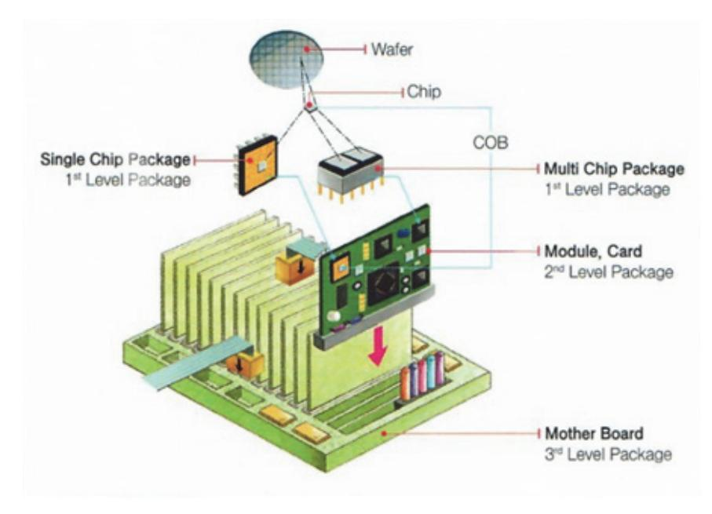

출처: 서민석(2020). 『패키지와 테스트』. 한올. p.25. [그림 1-1] 반도체 조립 과정

(1) 패키지의 정의

패키지의 사전적 의미는 포장된 물품을 뜻하며, 전자 제품에서는 반도체 칩 또는 소자를 외부로부터 보호하고 시스템에 연결하는 기능을 담당한다. 실리콘 웨이퍼에서 단일 칩을 잘라내어 단품화하고, 이를 모듈(Module)로 만든 후, 모듈을 카드 또는 보드(Board)에 장착하여 시스템을 완성하는 전체 과정을 패키지 또는 조립(Assembly)이라고 한다. 반 도체 업계에서 일반적으로 의미하는 반도체 패키지는 이 전체 과정 중에서 웨이퍼에서 칩을 잘라내고, 단품화하는 공정을 주로 의미한다.

- (2) 패키지의 역할
  - (가) 기계적 보호

반도체 패키지는 칩을 외부의 기계적 및 화학적 충격으로부터 보호한다. 반도체 칩은 매우 취약한 구조로, 실리콘과 같은 기본 재료는 쉽게 깨질 수 있다. 패키지는 EMC(Epoxy Mold Compound)와 같은 재료로 칩을 감싸서 이러한 충격을 방지한다.

(나) 전기적 연결

반도체 패키지는 칩과 외부 시스템 간의 전기적 신호를 전달하는 역할을 한다. 이는 칩에 전원을 공급하고, 기능을 수행하기 위한 신호를 입력 및 출력하는 통로를 제공 한다.

(다) 기계적 연결

패키지는 칩을 시스템에 물리적으로 고정하여 사용 중에 안정적으로 유지될 수 있도 록 한다. 이는 시스템 내에서 칩의 위치를 정확히 유지하고, 연결 부위의 물리적 강 도를 제공하는 역할을 포함한다.

(라) 열 방출

반도체 칩이 동작하면 전류가 흐르며 열이 발생한다. 패키지는 이러한 열을 효율적 으로 방출하여 칩의 과열을 방지한다. 열 방출이 제대로 이루어지지 않으면 칩이 과 열되어 성능 저하나 손상이 발생할 수 있다.

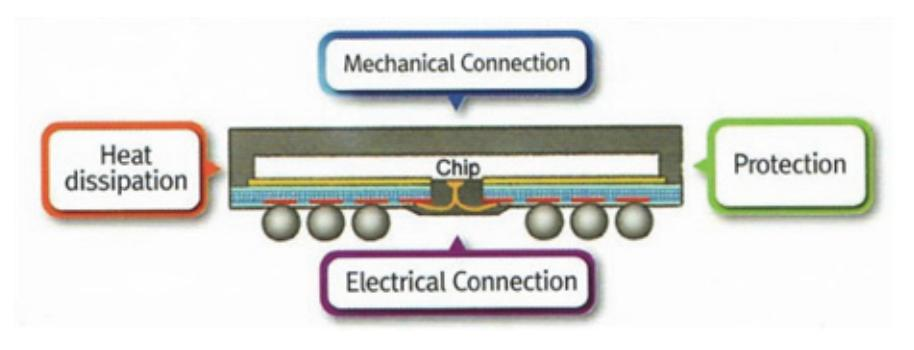

출처: 서민석(2020). 『패키지와 테스트』. 한올. p.27. [그림 1-2] 반도체 패키지의 역할

(3) 패키지의 중요성

반도체 패키징의 중요성은 반도체 기술의 발전에 따라 점점 더 커지고 있다. 반도체 제 품의 속도가 빨라지고, 기능이 복잡해짐에 따라 패키지의 냉각 역할과 전기적 연결의 중 요성이 더욱 강조된다. 새로운 패키지 기술은 반도체 칩의 성능과 신뢰성을 높이는 데 필수적인 요소로 작용하며, 이를 통해 고성능, 고신뢰성의 반도체 제품이 개발되고 있 다.

2. 반도체 제조 과정과 업종

 반도체 제조 과정은 칩 설계, 웨이퍼 제조, 패키징, 테스트의 4단계로 이루어진다. 이 과 정은 고도의 기술과 정밀성을 요구하며, 다양한 업종이 각 단계에서 중요한 역할을 한다.

(1) 반도체 제조 공정

 웨이퍼 공정, 패키지 공정, 테스트 순으로 진행된다. 반도체 제조의 프론트 엔드(Front End) 공정은 웨이퍼 제조 공정을 의미하며, 백 엔드(Back End) 공정은 패키지와 테스 트 공정을 뜻한다. 웨이퍼 제조 공정 내에서도 프론트 엔드와 백 엔드를 구분하는데, 프 론트 엔드는 CMOS를 만드는 공정을, 백 엔드는 CMOS를 만든 후에 진행되는 금속 배 선 형성 공정을 포함한다.

- (2) 반도체 업종
  - (가) 팹리스(Fabless)

반도체 설계만을 담당하는 업체를 팹리스라고 부른다. 이들은 공장을 소유하지 않고 설계에 집중한다. 대표적인 팹리스 업체로는 Q사와 A사 등이 있다.

(나) 파운드리(Foundry)

팹리스에서 설계된 칩을 실제로 웨이퍼 형태로 제작하는 업체를 파운드리라고 한다. 대만의 T〇MC가 대표적인 파운드리 업체이며, 국내에는 D하이텍과 M사 등이 있다.

- (다) OSAT(Out Sourced Assembly and Test) 웨이퍼로 제작된 칩을 패키지하고 테스트하는 전문 업체를 OSAT이라고 한다. A사, J사, M사 등이 대표적인 OSAT 업체이다.
- (라) IDM(Integrated Device Manufacturer)

설계, 웨이퍼 제조, 패키지와 테스트 모든 과정을 자체적으로 진행하는 종합 반도체 회사를 IDM이라고 한다. 우리나라의 대표적인 IDM 업체로는 S하이닉스가 있다.

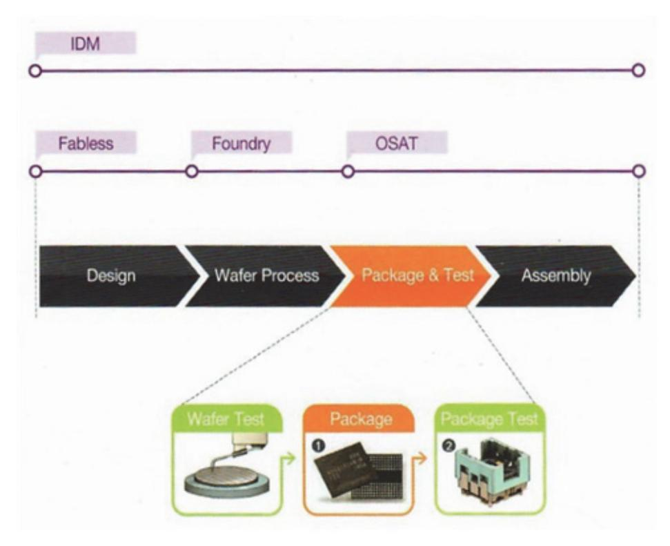

출처: 서민석(2020). 『패키지와 테스트』. 한올. p.6. [그림 1-3] 반도체 제조 과정과 반도체 업종의 연관

(3) 반도체 제조 과정

반도체 제조 과정은 웨이퍼 테스트, 패키지 공정, 패키지 테스트의 3단계로 이루어진다. 먼저, 웨이퍼 공정이 완료되면 웨이퍼 테스트가 진행된다. 이는 패키지 공정과 테스트 공정의 첫 번째 단계로, 웨이퍼 테스트를 통해 불량 제품을 걸러내고 다음 단계로 넘어 간다.

그다음으로는 패키지 공정이 진행된다. 이 과정에서는 웨이퍼에서 개별 칩을 잘라내어 단품화한 후 이를 패키지화한다. 패키지 공정은 반도체 칩을 보호하고, 전기적 및 기계 적으로 연결하는 중요한 역할을 한다. 마지막으로 패키지 공정이 완료되면 패키지 테스 트가 진행된다. 이는 최종 제품의 성능과 신뢰성을 보장하기 위한 단계이다.

(4) 반도체 테스트의 중요성

반도체 테스트의 주요 목적 중 하나는 불량 제품의 출하를 방지하는 것이다. 불량 제품 이 납품되면 고객의 신뢰를 잃어 매출 감소와 금전적 손실이 발생할 수 있다. 따라서 철저한 전수 검사 과정이 필요하며, 다양한 특성에 맞춰 품질과 신뢰성을 확보할 수 있 는 다양한 항목을 테스트한다.

테스트는 대상의 형태에 따라 웨이퍼 테스트와 패키지 테스트로 구분할 수 있으며, 테스 트 항목에 따라 온도별 테스트, 속도별 테스트, 동작별 테스트로 나눌 수 있다. 온도별 테스트는 제품의 동작을 고온, 저온, 상온에서 테스트하여 다양한 온도 환경에서의 동작 여부를 검증한다. 속도별 테스트는 제품의 동작 속도를 평가하는 것으로, 고속 동작이 필요한 반도체 제품에서 중요성이 크다. 동작별 테스트는 DC 테스트, AC 테스트, 기능 테스트로 나뉘며, 각각 전류 및 전압 특성, 동적 특성, 기능 동작 여부를 평가한다. 이 과정을 통해 반도체 제품의 품질과 신뢰성을 확보하고, 시장에서의 경쟁력을 유지할 수 있다.

3. 반도체 기술의 발전과 트렌드

반도체 기술의 역사는 20세기 중반으로 거슬러 올라간다. 1947년 벨 연구소에서 트랜지스 터가 발명된 것이 반도체 기술의 출발점이었다. 이후 1958년, TI사의 잭 킬비와 페어차일 드 반도체의 로버트 노이스가 독립적으로 집적 회로(IC)를 개발하면서 반도체 산업은 본격 적인 성장을 시작했다. 1960년대와 1970년대에는 I사, A사, TI사와 같은 기업들이 반도체 기술을 상용화하며 시장을 주도했다.

(1) 소형화와 성능 향상

1980년대는 반도체 패키지 기술의 초기 발전기로, 표면 실장 기술(SMT: Surface Mount Technology)이 도입되면서 반도체 소자의 소형화와 고밀도화를 가능하게 했다. 듀얼 인라인 패키지(DIP)에서 소형화된 패키지인 소형 아웃라인 패키지(SOP), 플라스틱 리드 칩 캐리어(PLCC) 등이 등장하며 전자기기의 집적도를 크게 향상하였다. 이 시기에 주로 사용된 세라믹 패키지는 기계적 강도가 높고 열전도성이 우수하여 고온 환경에서 도 안정적으로 동작할 수 있었다.

1990년대에는 반도체 패키지 기술이 더욱 다양화하고 고도화하였다. 플립 칩(Flip Chip) 기술이 본격적으로 도입되어 칩을 뒤집어 기판에 직접 연결하는 방식으로, 열 분 산과 전기적 성능이 개선되었다. BGA(Ball Grid Array) 패키징은 입출력 핀의 밀도를 높여, 고성능 프로세서와 같은 복잡한 반도체 소자에 적합한 솔루션을 제공했다. 이 시 기에는 또한 플라스틱 패키지가 점차 세라믹 패키지를 대체하면서 비용 절감과 경량화 가 이루어졌다.

(2) 모바일 시대의 도래

2000년대 초반, 반도체 패키지 기술의 주요 목표는 소형화와 열 분산 문제 해결에 집중 되었다. 이 시기에 모바일 기기와 노트북의 보급이 증가하면서, 더 작고 효율적인 패키 징 솔루션이 요구되었다. 플립 칩(Flip Chip)과 같은 기술은 칩의 표면을 아래로 향하게 하여, 직접 기판에 접착하는 방식으로 열을 효과적으로 분산시키고, 패키지의 크기를 줄 이는 데 기여했다. 또 BGA(Ball Grid Array) 패키징이 널리 사용되면서 높은 입출력 (I/O) 밀도를 구현할 수 있게 되었다.

(3) 고속 데이터 전송과 적층 기술

2010년대에 들어서면서, 반도체 패키지 기술은 성능 향상과 고속 데이터 전송을 목표로 더욱 발전했다. 3D 패키징 기술과 TSV(Through-Silicon Via)의 도입은 여러 칩을 수

직으로 적층하여 신호 전달 거리를 단축하고, 데이터 전송 속도를 크게 향상하였다. 이 러한 적층 기술은 메모리 반도체와 고성능 컴퓨팅 분야에서 중요한 역할을 했다. 동시 에, 팬아웃 웨이퍼 레벨 패키징(FOWLP) 기술이 등장하여 더 높은 집적도와 성능을 제 공하면서도 패키지의 크기를 줄일 수 있었다.

(4) 저비용과 신뢰성 향상

2020년대에는 반도체 패키지의 저비용화와 신뢰성 향상이 중요한 트렌드로 자리 잡았 다. AI와 IoT 기기의 폭발적인 증가로 인해 대량 생산이 필요하면서 패키징 비용을 절 감하는 기술이 중요해졌다. 칩렛(Chiplet) 아키텍처는 이러한 요구에 부응하는 기술로, 여러 작은 칩을 결합하여 하나의 시스템을 구성함으로써 비용 효율성을 높였다. 또 고급 소재와 열 관리 기술이 더욱 발전하여, 고출력 반도체 칩의 열 문제를 해결하고 신뢰성 을 높이는 데 기여했다. 구리 인터커넥트와 고성능 열전도 재료의 사용은 이러한 열 관 리 기술의 대표적인 예이다.

(5) 통합과 혁신의 시대

반도체 패키지 기술은 더욱 통합되고 혁신적인 방향으로 발전할 것으로 예상된다. 시스 템 인 패키지(SiP: System in Package) 기술은 다양한 기능을 하나의 패키지에 통합하 여, 소형화된 고성능 디바이스를 구현하는 데 필수적인 역할을 할 것이다. AI와 머신 러 닝을 활용한 설계 최적화는 패키지 설계의 복잡성을 줄이고, 성능과 신뢰성을 극대화할 것이다. 또 지속적인 연구 개발을 통해 새로운 소재와 구조가 도입되어 패키지의 열 관 리 성능과 전기적 특성이 더욱 향상될 것이다.

| 플립칩                    | WLP                 | PLP                  | SiP                    | 3D                    |
|------------------------|---------------------|----------------------|------------------------|-----------------------|
|                        |                     | A A                  |                        |                       |
| 와이어 본딩 없이 칩과 패키지 연결 | 웨이퍼 상태에서 한번에 패키징 | 패널을 활용하여 다양한 칩 실장 | 상이한 기술들을 단일 패키지에 구현 | 전자 이동통로 (TSV)로 칩연결 |

출처: 산업통상자원부(2021). 종합 반도체 강국 실현을 위한 「K-반도체 전략」 수립. p.12. [그림 1-4] 5대 첨단 패키징 기술

결론적으로, 반도체 기술은 지난 수십 년간 엄청난 발전을 이루어왔으며, 앞으로도 성능 향 상, 소형화, 고속 데이터 전송, 저비용화, 신뢰성 향상 등의 트렌드에 따라 지속해서 혁신할 것이다. 반도체 패키지 기술의 발전은 전자기기 성능의 핵심 요소로, 다양한 응용 분야에서 의 성능 향상과 효율성 증대를 이끌어갈 것이다. 특히, AI, 5G, 자율 주행차, IoT 등의 신 기술이 반도체 수요를 크게 증가할 것으로 예상된다. 이에 따라 고성능 컴퓨팅, 메모리 반 도체, 센서 등의 분야에서 기술 혁신이 활발히 이루어질 것이다.

#### 4. 반도체 패키지 개발 과정

반도체 패키지 개발은 복잡한 과정을 거쳐 이루어지며, 이는 크게 2가지 경우로 나눌 수 있으며 각각의 목적과 과정에서 차이가 있다.

(1) 새로운 반도체 칩 개발

새로운 반도체 칩을 개발할 때는 칩 설계와 패키지 설계를 병행해야 한다.

(가) 초기 검토 및 계획 수립

고객의 요구 사항을 분석하여 새로운 칩의 기능과 성능을 정의한 후, 패키지 설계 부서에 칩의 패키지 가능성 검토를 요청한다. 이는 칩이 실제 패키지화될 수 있는지, 전기적 및 열적 특성에 문제가 없는지 확인하기 위한 단계이다.

(나) 패키지 가설계 및 검토

패키지 설계 부서는 서브 스트레이트(substrate) 또는 리드 프레임(lead frame)의 배선을 설계하고, 전기/열/구조 해석을 통해 패키지 설계의 타당성을 검토한다. 검토 결과를 바탕으로 칩 설계 부서에 피드백을 제공하며, 패키지화가 가능하다는 검토 결과가 나와야만 칩 설계가 최종 완료된다.

(다) 웨이퍼 제작 및 패키지 준비

칩 설계가 완료되면 웨이퍼 제작이 시작된다. 이와 동시에 패키지 설계 부서는 패키 지 제작에 필요한 서브 스트레이트 또는 리드 프레임을 설계하고, 제작 업체를 통해 생산을 시작한다. 또 패키지 공정에 필요한 툴(Tool)과 장비를 준비한다.

(라) 패키지 제작 및 테스트

웨이퍼 테스트가 완료되면 웨이퍼는 패키지 부서로 전달된다. 패키지 부서는 준비된 서브 스트레이트 또는 리드 프레임을 사용하여 패키지 제작을 진행하며, 제작된 패 키지는 특성 및 신뢰성 테스트를 거쳐 설계와 공정이 제대로 이루어졌는지 확인한다.

(마) 문제 해결 및 반복

특성 및 신뢰성 테스트에서 문제가 발견되면 원인을 분석하고, 해당 문제를 해결할 수 있는 단계로 돌아가 다시 작업을 진행한다. 모든 테스트에서 만족스러운 결과가 나올 때까지 이 과정을 반복한다.

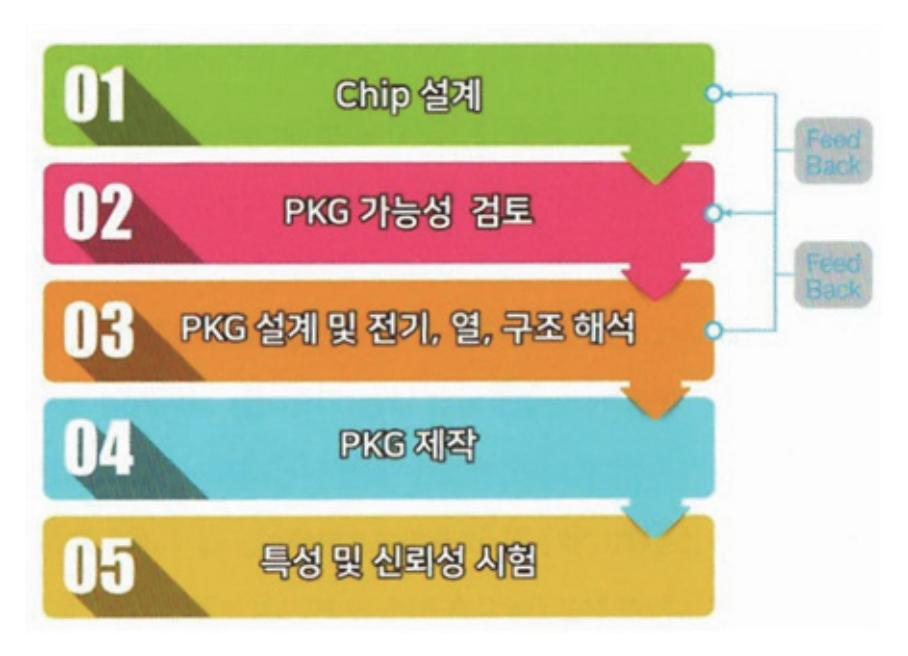

출처: 서민석(2020). 『패키지와 테스트』. 한올. p.32. [그림 1-5] 새로운 반도체 칩 개발 과정 모식도

(2) 새로운 패키지 기술 개발

새로운 패키지 기술을 개발하기 위해서는 기존의 검증된 반도체 칩을 사용하여 패키지 기술만을 검증한다.

(가) 기존 칩 선정 및 초기 검토

먼저 새로운 패키지 기술을 적용할 기존의 양산 칩을 선정하고, 새로운 패키지 기술 의 타당성을 검토하여 적용 가능성을 평가한다.

(나) 패키지 기술 설계

 새로운 패키지 기술에 맞춰 서브 스트레이트 또는 리드 프레임의 배선을 설계하고, 전기/열/구조 해석을 통해 설계의 유효성을 확인한다.

(다) 시제품 제작 및 테스트

 설계된 새로운 패키지 기술을 적용하여 시제품을 제작하고, 시제품에 대해 특성 및 신뢰성 테스트를 시행한다. 테스트 결과를 분석하여 새로운 패키지 기술의 유효성을 검증한다.

(라) 문제 해결 및 최종 검증

테스트에서 발견된 문제를 해결하고, 필요한 경우 설계를 수정한다. 모든 테스트에서 만족스러운 결과가 나올 때까지 이 과정을 반복한다.

이러한 일련의 과정을 통해 반도체 패키지는 지속해서 발전하며, 새로운 기술과 함께 보다 향상된 제품을 시장에 선보일 수 있게 된다.

반도체 패키지는 크게 컨벤셔널(Conventional) 패키지와 웨이퍼 레벨 패키지로 분류할 수 있 다. 컨벤셔널 패키지는 웨이퍼를 칩 단위로 잘라서 패키지 공정을 진행하는 방식이다. 반면, 웨 이퍼 레벨 패키지는 패키지 공정 일부 또는 전체를 웨이퍼 상태에서 진행한 후, 나중에 단품으 로 자르는 방식이다.

WLCSP는 웨이퍼 레벨 패키지의 대표적인 공정이다. 모든 공정을 웨이퍼 레벨에서 진행하며, 모든 공정이 완료된 후 개별 칩이 생성된다. 그러나 일부 공정만 웨이퍼 레벨에서 진행한 패키 지들도 WLP에 포함된다. 이에 해당하는 기술로는 RDL을 이용한 패키지, 플립 칩 패키지, TSV를 이용한 패키지가 있다.

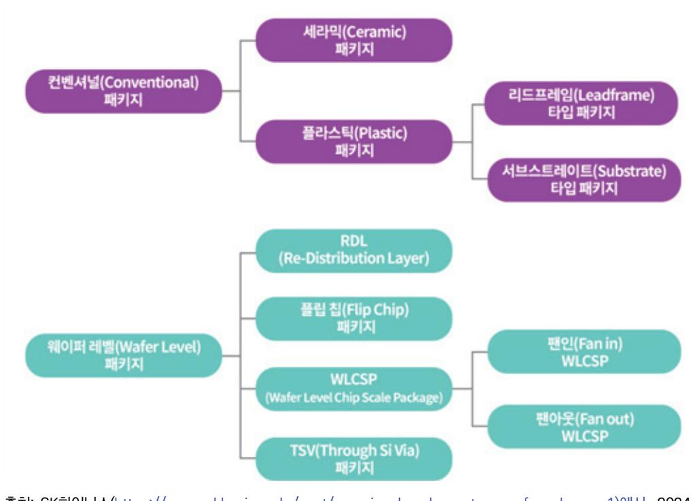

출처: SK하이닉스(https://news.skhynix.co.kr/post/seominsuk-column-types-of-packages-1)에서 2024. 6. 10. 스크린샷. [그림 1-6] 패키지 타입별 분류

## 수행 내용 / 패키지 가능성 검토하기

#### 재료·자료

- 칩 설계 데이터
- 패키지 요구 사항 문서

• 서브 스트레이트 사양서

• 시장 분석 보고서

• 전기적 설계 자료

• 기계적 구조 설계 자료

#### 기기(장비 ・ 공구)

- CAD 소프트웨어
- 시뮬레이션 소프트웨어
- 프로토타입 제작 장비
- 검사 및 테스트 장비

#### 안전 ・ 유의 사항

- 테스트용 반도체 제작 및 검사 시 안전한 작업 환경을 유지해야 한다.

- 설계 데이터와 시뮬레이션 데이터의 보안을 유지해야 한다.
- 초기 설계 및 시뮬레이션 시 정밀한 데이터 입력과 검토를 해야 한다.
- 모든 검토 과정과 결과를 문서화하여 추후 참고할 수 있도록 기록해야 한다.
- 칩 설계팀과 패키지 설계팀 간의 원활한 소통과 협력해야 한다.

#### 수행 순서

숔 제품 설계팀으로부터 요구 사항을 수집하고 분석한다.

이 과정에서는 패키지의 크기, 전기적 특성, 열 관리 요구 사항 등을 파악하여 초기 설계 가능 성을 평가한다.

#### 1. 사례를 분석한다.

I사와 A사 같은 IDM(Integated Device Manufacturer)들은 패키지 설계 초기에 제품의 전기적 특성, 열 관리 요구 사항 등을 철저히 분석한다. I사는 새로운 프로세서를 개발할 때 패키지 설계 단계에서부터 열 관리 솔루션을 통합하고, 전기적 특성을 최적화하기 위한 다양한 시뮬레이션을 수행한다. A사는 최신 라이젠(Ryzen) 프로세서의 설계에서 패키지의 전기적 성능을 개선하기 위해 멀티칩 모듈(MCM) 구조를 적용했다.

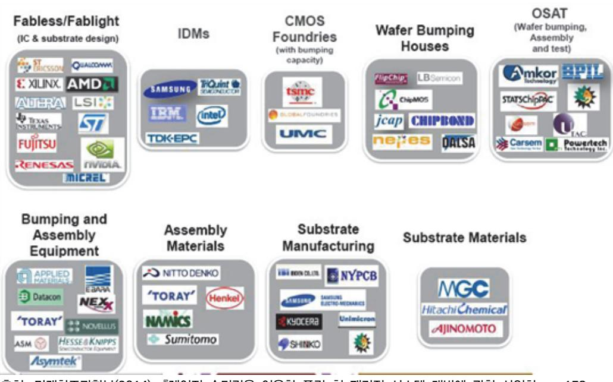

출처: 미래창조과학부(2014). 『레이저 솔더링을 이용한 플립 칩 패키징 시스템 개발에 관한 사업화』. p.153. [그림 1-7] 플립 칩 공급 사슬의 주요 참여자

#### 2. 데이터를 수집한다.

설계 요구 사항을 정리하고, 시장의 최신 기술 동향과 맞추어 검토한다. 최신 고성능 컴퓨 팅(HPC) 및 AI 칩의 설계 요구 사항을 분석하기 위해, 다양한 리서치 업체의 보고서 및 사 내 R&D 부서 보고서를 참조한다. 예를 들어, Y 리서치 업체는 반도체 패키징 기술의 최신 동향과 미래 전망에 대한 상세한 보고서를 제공한다. 이러한 자료를 통해 최신 기술 동향을 파악하고 이를 설계에 반영한다.

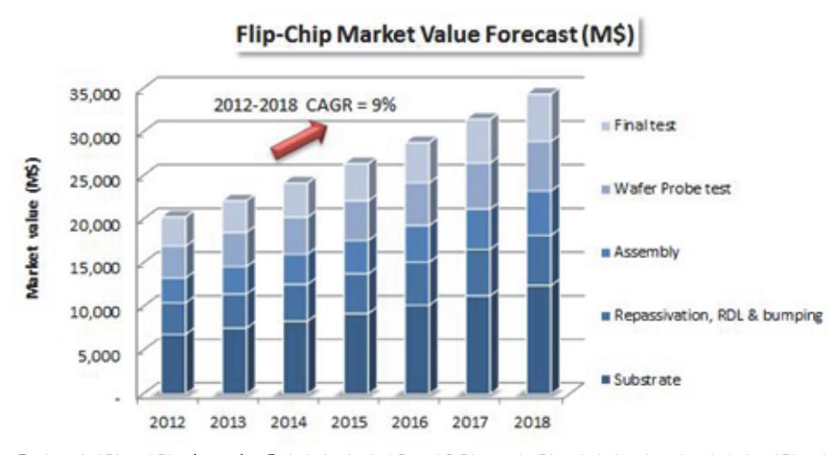

출처: 미래창조과학부(2014). 『레이저 솔더링을 이용한 플립 칩 패키징 시스템 개발에 관한 사업 화』. p.151.

[그림 1-8] 플립 칩 시장 전망

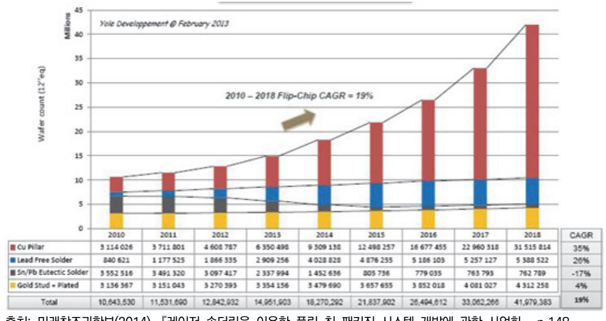

출처: 미래창조과학부(2014). 『레이저 솔더링을 이용한 플립 칩 패키징 시스템 개발에 관한 사업화』. p.148.

[그림 1-9] 범핑에 따른 플립 칩 웨이퍼 시장 전망

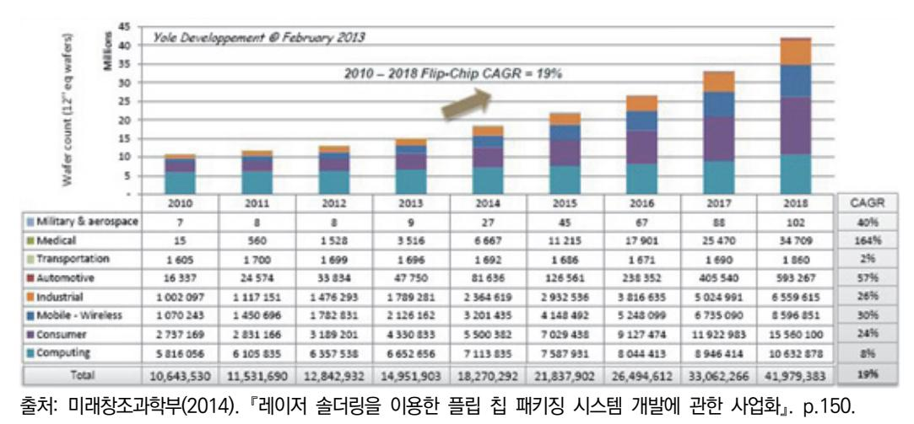

[그림 1-10] 산업 분야별 플립 칩 웨이퍼 시장 전망

#### 숕 패키지 가능성을 검토하고 피드백을 제공한다.

현재 기술 및 자원을 고려하여 패키지 구현 가능성을 평가한다. 사용 가능한 재료, 공정 기술, 비용 등을 종합적으로 분석한다. 평가 결과를 바탕으로 초기 설계 모델을 생성하고, 이를 제품 설계팀에 피드백하여 설계 변경 사항을 제안한다.

1. 기술을 평가한다.

최신 패키징 기술을 검토하고 적용 가능성을 평가한다. 예를 들어, Fan-Out 패키징은 기존 의 패키징 기술보다 더 높은 집적도와 우수한 열 관리를 제공할 수 있다.

Through-Silicon Via(TSV) 기술은 칩 간 연결을 효율적으로 할 수 있어 고성능 애플리케 이션에 적합하다. 이러한 기술들을 검토하고, 해당 기술이 프로젝트에 적합한지 평가한다.

(1) WLCSP(Wafer Level Chip Scale Package)

WLCSP는 반도체 칩을 웨이퍼 상태에서 패키징 후, 개별 칩으로 분리하는 방식이다.

(가) Fan-in WLP

Fan-In WLP는 입출력(I/O) 단자가 칩의 크기 안에 배치되는 방식이다. 이 방식은 칩 크기와 패키지 크기가 거의 동일하게 유지되기 때문에 소형화가 중요한 모바일 기기나 IoT 기기에 적합하다. Fan-In WLP는 제조 비용이 저렴하고, 전기적 성능과 신뢰성을 높이는 장점이 있다.

(나) Fan-out WLP

FOWLP는 칩 주변에 추가적인 재배선층(RDL)을 형성하여 입출력(I/O) 단자를 칩 크기 바깥으로 배치하는 방식이다. 이 방식은 더 많은 I/O 단자를 배치할 수 있어 높은 집적도와 성능을 제공한다. FOWLP는 칩 크기에 비해 패키지 크기가 커지지 만, 전기적 성능과 열 분산을 크게 향상할 수 있다. 이 기술은 특히 고성능 요구 사 항이 있는 모바일 기기와 웨어러블 기기에 적합하다.

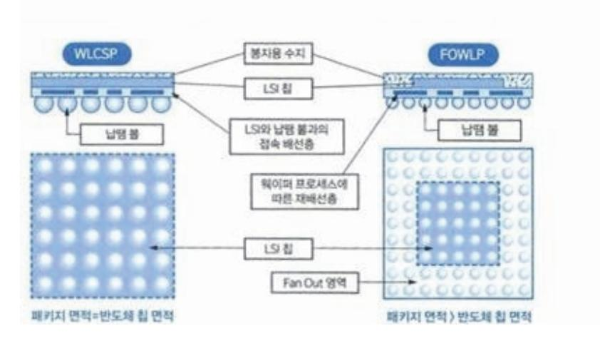

출처: 니시쿠보 야스히코 저(2023). 『반도체 구조원리 교과서』. 보누스. p.229. [그림 1-11] WLCSP(Fan-in WLP), FOWLP(Fan-out WLP) 비교

#### (2) RDL

재배선층(RDL)은 웨이퍼 위에 추가적인 금속 배선을 형성하여 입출력(I/O) 단자를 재배 치하는 기술이다. RDL을 통해 기존의 패키지 디자인을 개선하고, 전기적 성능을 향상시 킬 수 있다. 특히 팬아웃 웨이퍼 레벨 패키징(FOWLP)에서 중요한 역할을 하며, 칩 주 변에 더 많은 I/O 단자를 배치할 수 있게 한다. 이는 집적도를 높이고, 신호 간섭을 줄 이며, 전력 효율을 개선한다.

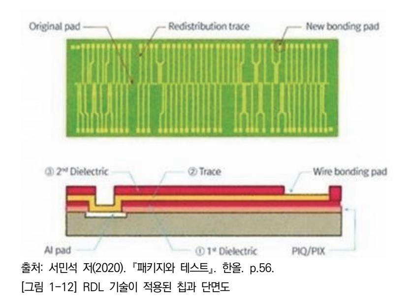

#### (3) 플립 칩

플립 칩 패키징은 칩을 뒤집어 기판에 직접 연결하는 방식으로, 전기적 성능과 열 분산 이 크게 개선된다. 이 기술은 고성능 프로세서와 같은 복잡한 반도체 소자에 널리 사용 된다. 웨이퍼 상태에서 범프(Bump)를 형성하고, 이후 칩을 개별로 잘라내어 기판에 부 착하는 과정을 포함한다. 플립 칩은 전력 손실을 줄이고, 신호 전송 속도를 향상하며, 패키지 크기를 줄이는 데 도움을 준다.

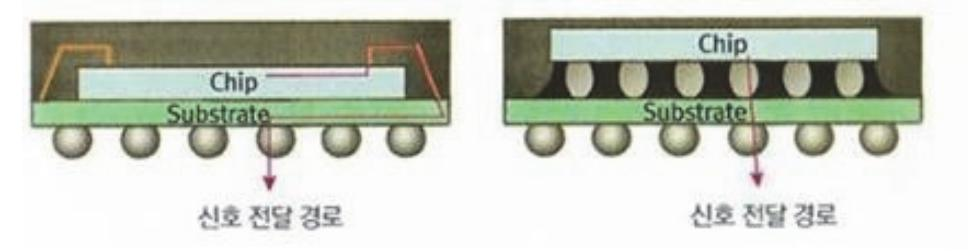

출처: 서민석 저(2020). 『패키지와 테스트』. 한올. p.59. [그림 1-13] 와이어 본딩 과 플립 친 본딩의 신호 전달 경로 비교

#### (4) TSV

 실리콘 관통 전극(TSV)은 실리콘 웨이퍼를 관통하는 전기적 연결을 만들어, 칩을 수직 으로 적층하는 기술이다. TSV는 데이터 전송 거리를 단축하고, 성능과 전력 효율성을 크게 향상할 수 있다. 3D 패키징에서 중요한 역할을 하며, 고성능 메모리와 프로세서에 서 주로 사용된다. TSV는 여러 칩을 쌓아 올림으로써 공간 효율성을 극대화하고, 통합 된 기능을 제공할 수 있다.

출처: 삼성반도체(https://semiconductor.samsung.com/kr). 2024. 6. 10. 스크린샷. [그림 1-14] 와이어 본딩 기술과 TSV 기술 비교

2. 비용을 분석한다.

리서치 업체의 보고서 및 사내 R&D 부서 보고서 최신 논문 등을 참고하여, 패키지 설계와 제조 비용을 분석한다. 비용 효율성을 위해 여러 공급 업체(OSAT)와의 협력 가능성을 탐색 한다. 예를 들어, A 그룹은 다양한 패키징 솔루션을 제공하며, A사는 전 세계적으로 다양한 패키징 기술을 활용할 수 있는 능력이 있다.

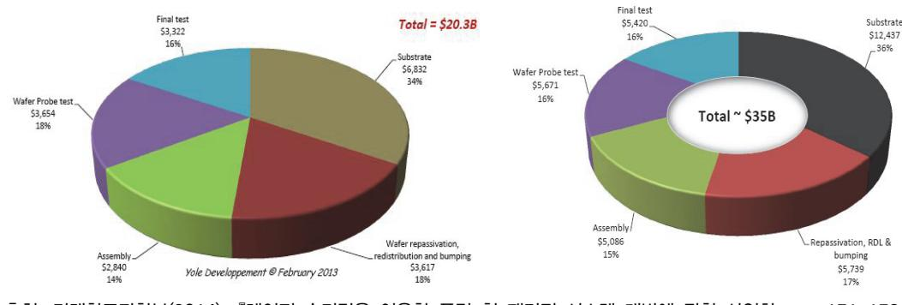

출처: 미래창조과학부(2014). 『레이저 솔더링을 이용한 플립 칩 패키징 시스템 개발에 관한 사업화』. pp.151~152. [그림 1-15] 2012년 vs 2018년 예상 플립 칩 공정별 시장

3. 초기 설계 결과를 설계팀과 공유하여, 실질적인 피드백을 받아 설계 개선안을 도출한다. 고객과의 긴밀한 협력을 통해 설계 초기 단계에서부터 피드백을 주고받아 최적의 설계를 도출한다. 이러한 접근 방식은 설계의 성공 가능성을 높이는 데 중요한 역할을 한다.

숖 반도체 전공정 완료 후 패키지 공정 시작 전에 필요한 툴과 서브 스트레이트를 준비한다. 툴의 상태를 점검하고, 서브 스트레이트 설계 도면을 작성하여 사전에 필요한 모든 자원이 준 비되었는지 확인한다.

1. 공정을 계획한다.

반도체 제조 공정의 특성상, 패키지 공정 전에 필요한 툴과 서브 스트레이트를 철저히 준비 하는 것이 중요하다. S전자는 패키지 공정 전에 모든 준비를 철저히 하는 것으로 유명하다. 이는 공정이 원활하게 진행될 수 있도록 보장한다.

2. 상태를 점검한다.

OSAT 업체는 패키지 공정 시작 전에 툴과 서브 스트레이트의 상태를 철저히 점검한다. 이 를 통해 공정 중 발생할 수 있는 문제를 예방하고, 최적의 생산 효율을 유지할 수 있다.

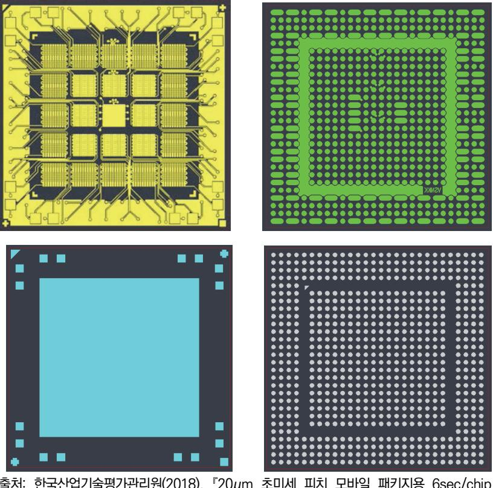

출처: 한국산업기술평가관리원(2018). 『20μm 초미세 피치 모바일 패키지용 6sec/chip 이하 고속 열 압착 접합 기술 개발』. 하나마이크론. 산업통상자원부. p.185. [그림 1-16] PCB unit design

숗 솔더 범프 연결을 위한 도면을 작성한다.

도면에는 솔더 볼의 위치, 크기, 간격 등의 정보가 포함된다. 작성된 도면을 패키지 공정 엔지 니어들과 공유하여 공정 과정에서 발생할 수 있는 문제점을 사전에 협의하고 피드백을 반영하 여 최종 도면을 완성한다.

1. 도면을 작성한다.

솔더 범프 연결 도면을 작성할 때, 전기적 성능과 열 관리를 고려한 설계를 반영한다. 이는 패키지의 성능과 신뢰성을 높이는 데 중요하다.

2. 공정 엔지니어와 협력한다.

작성된 도면을 패키지 공정 엔지니어들과 공유하여, 공정 과정에서 발생할 수 있는 문제점 을 사전에 협의한다. 이를 통해 설계와 공정 간의 일관성을 유지하고, 발생할 수 있는 문제 를 최소화한다.

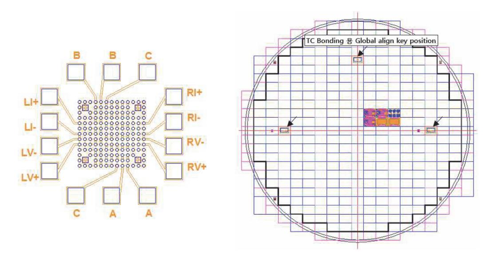

출처: 산업통상자원부(2017). 『300mm 대응 대구경 다층 구조의 복합 패키지 공정 및 장비 기술 개발』. p.27. [그림 1-17] TC Bonding 개발을 위한 Test vehicle 설계

수 플립 칩 패키지 방식으로 패키지 솔더 볼 배열, 크기 및 스펙을 설계한다.

배열은 전기적 성능과 열 관리를 고려하여 최적화되며, 패키지의 크기와 주요 스펙을 정의한 다. 최종 설계 제안서를 작성하여 제품 설계팀 및 공정 팀에 제출하고, 검토 및 승인을 받아 설계를 확정한다.

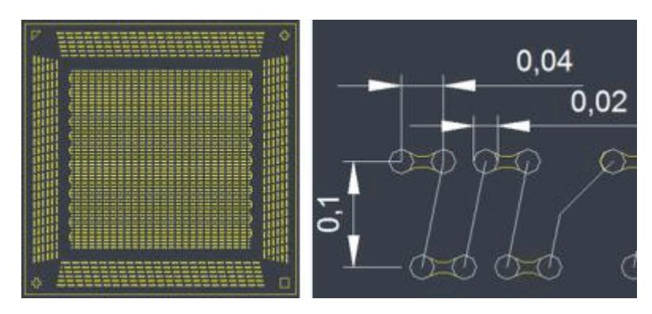

출처: 한국산업기술평가관리원(2018). 『20μm 초미세 피치 모바일 패키지용 6sec/chip 이하 고속 열 압착 접합 기술 개발』. 하나마이크론. 산업통상자원부. p.160. [그림 1-18] 칩 디자인 및 범프 디자인

1. 배열 설계를 한다.

플립 칩 패키지 방식으로 솔더 볼 배열을 설계할 때, 전기적 성능과 열 관리를 최적화하기 위해 다양한 요소를 고려한다. I사의 경우, 다양한 솔더 볼 배열을 통해 전기적 연결을 최 적화하고 열 분산을 향상시키는 설계를 채택한다. TE는 FCBGA 패키지에서 솔더 볼의 위 치, 크기, 간격을 최적화하여 전기적 신호 무결성과 열 관리 성능을 극대화한다.

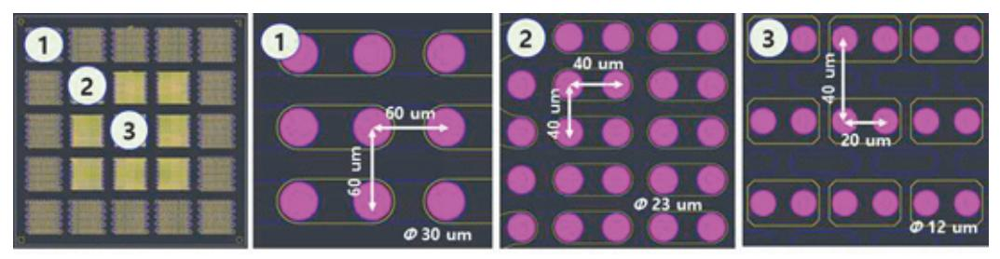

출처: 한국산업기술평가관리원(2018). 『20μm 초미세 피치 모바일 패키지용 6sec/chip 이하 고속 열 압착 접합 기술 개발』. 하나마이크론. 산업통상자원부. p.220. [그림 1-19] 칩 디자인 및 범프 디자인

#### 2. 크기 및 스펙을 정의한다.

패키지의 크기와 주요 스펙을 정의하는 과정에서는 패키지의 높이, 넓이, 솔더 볼 크기 등 이 포함된다. I사의 FCBGA 패키지 설계에서는 패키지의 전체 높이, 솔더 볼의 직경, 패키 지 몸체의 크기 등을 정의하여, 최종 패키지의 전기적 및 열적 성능을 보장한다. TE의 가 이드라인에 따르면, 솔더 볼 피치는 0.8mm에서 1.27mm까지 다양하게 설정되며, 패키지 크기는 응용 분야에 따라 최적화된다. I사의 설계 가이드라인에서도 패키지 크기와 솔더 볼 배열을 최적화하여 높은 신뢰성과 성능을 달성한다.

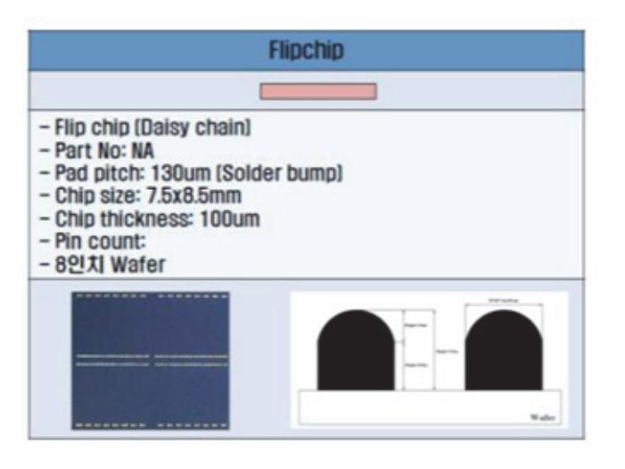

출처: 한국산업기술평가관리원(2017). 『차세대 초박형 MCP 인쇄 회로 기판 모듈 및 SIP용 임베디드 PCB 모듈』. p.471. [그림 1-20] Flipchip POP 구조 및 사용된 chip 사양

#### 3. 제안서를 작성 및 승인한다.

최종 설계 제안서를 작성하여 제품 설계팀 및 공정 팀에 제출하고, 검토 및 승인을 받아 설 계를 확정한다. 제안서에는 설계된 솔더 볼의 배열, 패키지 크기, 스펙, 예상되는 전기적 및 열적 성능 등이 포함된다. 이 과정에서 N사에서는 설계팀과 공정팀의 피드백을 반영하여 최종 설계를 수정하고 승인한다. 이를 통해 설계가 모든 요구 사항을 충족하고, 제조 공정 에 적합한지 확인한다.

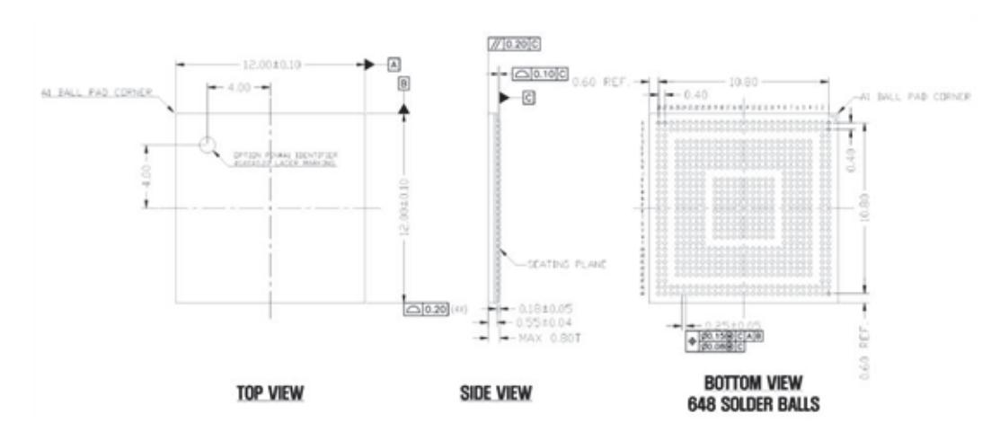

출처: 한국산업기술평가관리원(2018). 『20μm 초미세 피치 모바일 패키지용 6sec/chip 이하 고속 열 압착 접합 기술 개발』. 하나마이크론. 산업통상자원부. p.43. [그림 1-21] 패키지 외형 도면

### 학습 1 교수·학습 방법

#### 교수 방법

- 패키지 가능성 검토 방법과 이를 설계자에게 피드백하는 절차를 설명하고, 초기 개발 단계 에서의 중요성을 강조한다.
- 웨이퍼 도착 전에 필요한 툴과 서브 스트레이트 준비 절차를 안내하고, 사전 준비의 필요성 을 설명한다.
- 솔더 범프 연결 도면 작성 방법을 설명하고, 이를 패키지 공정 엔지니어와 사전에 공유하는 중요성을 강조한다.
- 플립 칩 패키지에서 솔더 볼 배열, 패키지 크기 및 스펙 제안 방법을 실무적으로 설명한다.

#### 학습 방법

- 패키지 가능성 검토 결과를 정리하고 설계자에게 피드백하는 연습을 한다.
- 솔더 범프 연결 도면을 작성하고, 이를 공정 엔지니어와 공유하는 실습을 진행한다.
- 플립 칩 패키지 방식의 솔더 볼 배열과 패키지 크기, 스펙을 제안하는 과제를 수행한다.

## 학습 1 평 가

#### 평가 준거

- 평가자는 학습자가 학습 목표를 성공적으로 달성하였는지를 평가해야 한다.
- 평가자는 다음 사항을 평가해야 한다.

|            | 학습 목표                                                          |  | 성취수준 |   |  |
|------------|----------------------------------------------------------------|--|------|---|--|
| 학습 내용      |                                                                |  | 중    | 하 |  |
| 패키지 가능성 검토 | - 개발 초기에 패키지 가능성을 검토한 후 제품 설계자들에게 피드백할 수 있다.                |  |      |   |  |
|            | - 가능성 검토가 완료되면 패키지 도면, 툴 도면, 서브 스트레 이트 도면을 작성할 수 있다.        |  |      |   |  |
|            | - 반도체 전공정이 완료된 웨이퍼가 패키지 공정에 도착하기 전에 툴과 서브 스트레이트들을 준비할 수 있다. |  |      |   |  |
|            | - 솔더 범프 연결을 위한 도면을 작성하여 패키지 공정 엔지니 어들에게 미리 공유할 수 있다.        |  |      |   |  |
|            | - 플립 칩 패키지 방식으로 패키지 솔더 볼 배열, 패키지 크기 및 스펙을 제안할 수 있다.         |  |      |   |  |

#### 평가 방법

• 서술형 시험

|            |                                                         |   | 성취수준 |   |  |
|------------|---------------------------------------------------------|---|------|---|--|
| 학습 내용      | 평가 항목                                                   | 상 | 중    | 하 |  |
| 패키지 가능성 검토 | - 패키지 가능성 검토 결과를 바탕으로 설계자에게 피드백을 제공할 수 있는 능력         |   |      |   |  |
|            | - 패키지 도면, 툴 도면, 서브 스트레이트 도면을 작성할 수 있는 능력             |   |      |   |  |
|            | - 반도체 전공정이 완료된 웨이퍼가 도착하기 전에 툴과 서브 스트레이트를 준비할 수 있는 능력 |   |      |   |  |
|            | - 솔더 범프 연결을 위한 도면을 작성하고 이를 공정 엔지니어 에게 공유할 수 있는 능력    |   |      |   |  |

• 논술형 시험

| 학습 내용      |                                                              |   | 성취수준 |   |  |
|------------|--------------------------------------------------------------|---|------|---|--|
|            | 평가 항목                                                        | 상 | 중    | 하 |  |
| 패키지 가능성 검토 | - 패키지 가능성 검토 과정에서 발생할 수 있는 문제를 분석하 고 해결할 수 있는 능력          |   |      |   |  |
|            | - 패키지 도면, 툴 도면, 서브 스트레이트 도면이 패키지 공정 에 미치는 영향을 평가할 수 있는 능력 |   |      |   |  |
|            | - 웨이퍼 도착 전 준비 과정이 패키지 공정에 미치는 영향을 분석할 수 있는 능력             |   |      |   |  |
|            | - 플립 칩 패키지에서 솔더 볼 배열과 패키지 크기를 최적화할 수 있는 능력                |   |      |   |  |

#### 피드백

| 1. 서술형 시험                                                                                                       |
|-----------------------------------------------------------------------------------------------------------------|
| - 패키지 가능성 검토 결과를 바탕으로 설계자에게 피드백을 제공할 수 있는 능력 성취수준이 낮은                                                           |
| 학습자의 경우, 패키지 가능성 검토의 핵심 요소(예: 열 관리, 신뢰성)를 다시 정리하고, 설계자에                                                         |
| 게 피드백을 제공할 때 고려해야 할 주요 항목을 구체적으로 설명한다. 학습자는 실제 사례를 통                                                            |
| 해 추가 연습을 하고, 설계자와의 소통 과정을 시뮬레이션하는 과제를 수행하여 이해를 강화한다.                                                            |
| - 성취수준이 높은 학습자의 경우, 다양한 시나리오에서 발생할 수 있는 문제를 분석하고, 이에 대                                                          |
| 한 피드백을 제공하는 심화 학습을 제안한다. 복잡한 패키지 설계 상황을 설정하여, 실무와 유사                                                            |
| 한 피드백 제공 연습을 통해 더욱 깊이 있는 학습을 유도한다.                                                                              |
| - 패키지 도면, 툴 도면, 서브 스트레이트 도면을 작성할 수 있는 능력 성취수준이 낮은 학습자의                                                          |
| 경우, 도면 작성의 기본 원리와 방법을 다시 설명하고, 이전에 학습한 예제를 재검토하도록 지도                                                            |
| 한다. 도면 작성 시 주의해야 할 기술적 세부 사항(정확한 치수, 기호 사용 등)에 대한 추가 학습                                                         |
| 자료를 제공하여 반복 학습을 통해 능력을 보완한다.                                                                                    |
| - 성취수준이 높은 학습자의 경우, 복잡한 도면 작성 과제를 부여하고, 도면에서 발생할 수 있는 잠                                                         |
| 재적 문제를 예측하고 해결하는 연습을 제안한다. 또 다른 공정과의 연계성을 고려한 도면 수정                                                             |
| 및 최적화 과제를 통해 심화 학습을 진행한다.                                                                                       |
| - 반도체 전공정이 완료된 웨이퍼가 도착하기 전에 툴과 서브 스트레이트를 준비할 수 있는 능력                                                            |
| 성취수준이 낮은 학습자의 경우, 툴과 서브 스트레이트 준비 절차에 대한 단계별 지침을 다시 설                                                            |
| 명하고, 각 단계의 중요성을 강조한다. 학습자는 준비 과정의 시뮬레이션을 통해 절차를 반복 학                                                            |
| 습하고, 체크리스트를 사용하여 자신의 진행 상황을 점검하며 학습을 보완한다.                                                                      |
| - 성취수준이 높은 학습자의 경우, 다양한 조건에서 툴과 서브 스트레이트 준비가 필요한 시나리오                                                           |
| 를 제시하고, 이를 최적화하는 방법을 모색하는 심화 과제를 제안한다. 또 다른 부서와의 협업을                                                            |
| 고려한 준비 절차 개선 방안을 논의하는 활동을 통해 실무적 감각을 더욱 높인다.                                                                    |
| - 솔더 범프 연결을 위한 도면을 작성하고 이를 공정 엔지니어에게 공유할 수 있는 능력 성취수준 이 낮은 학습자의 경우, 솔더 범프 연결 도면의 작성 방법과 주요 고려 사항을 다시 설명해 준다. |
| - 성취수준이 높은 학습자의 경우, 복잡한 연결 구조를 포함한 도면을 작성하는 과제를 부여하고,                                                           |
| 이를 다른 팀과 협의하여 최적의 도면으로 수정하는 심화 학습을 진행한다.                                                                        |
|                                                                                                                 |
|                                                                                                                 |

2. 논술형 시험

- 패키지 가능성 검토 과정에서 발생할 수 있는 문제를 분석하고 해결할 수 있는 능력 성취수준이 낮은 학습자의 경우, 패키지 가능성 검토 시 발생할 수 있는 주요 문제(예: 열 관리, 신뢰성 문제 등)에 대한 이론적 배경을 다시 설명한다. 학습자는 이러한 문제에 대한 추가 자료를 분석하며 보 충 학습을 진행하고, 문제 해결 전략을 시뮬레이션해 보는 기회를 통해 학습 효과를 높인다.
- 성취수준이 높은 학습자의 경우, 새로운 기술 트렌드를 고려하여 더 복잡한 문제를 분석하고, 해 결 방안을 제시하는 심화 학습을 제안한다. 학습자는 실제 사례를 바탕으로 복합적인 문제 해결 전략을 논리적으로 구성하여 실무 능력을 강화한다.
- 패키지 도면, 툴 도면, 서브 스트레이트 도면이 패키지 공정에 미치는 영향을 평가할 수 있는 능 력 성취수준이 낮은 학습자의 경우, 각 도면이 패키지 공정에 미치는 영향을 다시 설명한다. 학습 자는 구체적인 사례를 통해 도면의 중요성을 이해하고, 도면 작성이 잘못된 경우의 시나리오를 분 석하고 수정하는 과제를 통해 학습을 보완한다.
- 성취수준이 높은 학습자의 경우, 도면들이 다른 공정과 연계되어 미치는 복합적 영향을 분석하는 심화 과제를 제공한다. 학습자는 이러한 연계성을 고려한 도면 최적화 방안을 제시하고, 이를 통 해 공정의 효율성을 높이는 방법을 논의한다.
- 웨이퍼 도착 전 준비 과정이 패키지 공정에 미치는 영향을 분석할 수 있는 능력 성취수준이 낮은 학습자의 경우, 웨이퍼 도착 전 준비 과정의 중요성과 각 단계가 패키지 공정에 미치는 영향을 다시 설명한다. 학습자는 실패 사례를 분석하여 각 단계의 중요성을 이해하고, 실제 공정에서의 역할을 시뮬레이션하여 학습을 보완한다.
- 성취수준이 높은 학습자의 경우, 웨이퍼 도착 전 준비 과정의 최적화를 위한 개선 방안을 찾는 심화 과제를 제공한다. 학습자는 다양한 시나리오에서 준비 과정의 효율성을 높이는 방법을 제시 하고, 이를 공정에 적용할 수 있는 방안을 논의하는 학습을 진행한다.
- 플립 칩 패키지에서 솔더 볼 배열과 패키지 크기를 최적화할 수 있는 능력 성취수준이 낮은 학습 자의 경우, 솔더 볼 배열 및 패키지 크기 최적화의 기본 개념과 주요 고려 사항을 다시 설명한다. 학습자는 간단한 예제를 통해 이해를 높이고, 최적화 과정에서 발생할 수 있는 문제를 예측하고 해결하는 연습을 통해 학습을 보완한다.
- 성취수준이 높은 학습자의 경우, 고급 설계 기술과 새로운 솔더링 방법을 활용한 솔더 볼 배열 및 패키지 크기 최적화 과제를 제공한다. 학습자는 최신 기술 동향을 고려하여 더욱 혁신적인 설 계 전략을 제시하고, 이를 실무에 적용할 수 있는 방안을 모색한다.

| 학습 1 | 패키지 가능성 확보하기 |
|------|--------------|
| 학습 2 | 패키지 설계 최적화하기 |
| 학습 3 | 본딩 방법 선정하기   |

## 2-1. 설계 정보 수집 및 해석

|       | • 플립 칩 패키지 설계를 위하여 칩 패드 좌표, 칩 배열, 패키지 내부 연결 정보들을 칩 설계 |                |
|-------|-------------------------------------------------------|----------------|
|       |                                                       | 부서로부터 받을 수 있다. |
| 학습 목표 | • 전기적 및 기계적 공정 최적화를 위해 열 해석, 전기 해석, 구조 해석을 통하여 설계에 반영 |                |
|       |                                                       | 할 수 있다.        |

## 필요 지식 /

숔 플립 칩 패키지 설계 개요

1. 플립 칩 패키지의 정의 및 특징

플립 칩 패키지는 'Controlled Collapse Chip Connection(C4)'이라고도 불리며, 반도체 칩을 기판 또는 회로 기판에 직접 부착하는 고급 반도체 패키징 기술이다. 기존의 와이어 본딩 방식과 달리, 플립 칩 기술에서는 칩의 활성 면이 아래로 향하고, 전기적 연결은 주로 솔더 범프 또는 전도성 폴리머로 만들어진 작은 돌기를 통해 이루어진다. 이러한 방법은 높 은 밀도의 전기적 연결과 짧은 신호 경로를 제공하여 패키지의 성능을 크게 향상한다.

2. 플립 칩 패키지의 주요 응용 분야

플립 칩 패키지는 다양한 응용 분야에서 사용된다. 특히 고성능이 요구되는 모바일 장치, 고속 데이터 전송이 필요한 네트워크 장비, 그리고 높은 신뢰성이 요구되는 자동차 전자 장 치 등에 주로 사용된다. 예를 들어, A사는 모바일 애플리케이션 프로세서와 5G/6G 모뎀 칩에서 광범위하게 사용하고 있다. 이러한 패키지 기술은 작은 폼팩터(Form Factor)와 높 은 열 저항성을 제공하여 모바일 장치의 성능을 극대화한다.

3. 플립 칩 패키지 설계의 중요성

플립 칩 패키지 설계는 전반적인 시스템 성능을 최적화하는 데 중요하다. 신호 무결성, 전 력 전달 효율성, 그리고 열 관리 측면에서 전반적인 시스템 성능에 큰 영향을 끼친다. 예를 들어, N사는 고성능 GPU의 신호 무결성을 유지하기 위해 정밀한 배선 설계를 수행한다. 또 T사는 고객의 설계 요구를 반영하여 전기적 및 열적 해석을 통해 최적의 패키지 설계를 제공한다.

숕 칩 패드 좌표, 배열 및 내부 연결 정보

1. 칩 패드의 기능과 역할

칩 패드는 반도체 칩과 외부 회로 간의 전기적 연결을 제공하는 중요한 구성 요소이다. 칩 패드는 신호 전송, 전력 공급, 그리고 그라운드 연결 등의 기능을 수행한다. 각 패드는 특 정 기능을 가지며, 신호의 입력 및 출력, 전원 공급, 그리고 접지와 같은 역할을 한다. 패드 의 배치와 배열은 칩의 성능과 신뢰성에 직접적인 영향을 끼친다.

2. 칩 패드 좌표 데이터 수집 및 배열 최적화

칩 설계팀은 패드의 좌표 데이터를 수집하고, 이를 기반으로 최적의 배열을 설계한다. 이 과정에서는 칩의 크기, 핀 수, 패키지 타입 등을 고려하여, 패드 배열을 최적화한다. 예를 들어, T사와 같은 Foundry 업체는 고객으로부터 설계 데이터를 받아 패드 배열을 최적화 하는 데 필요한 데이터를 제공한다. N사와 A사와 같은 Fabless 업체들은 T사와 협력하여 이러한 데이터를 활용한다.

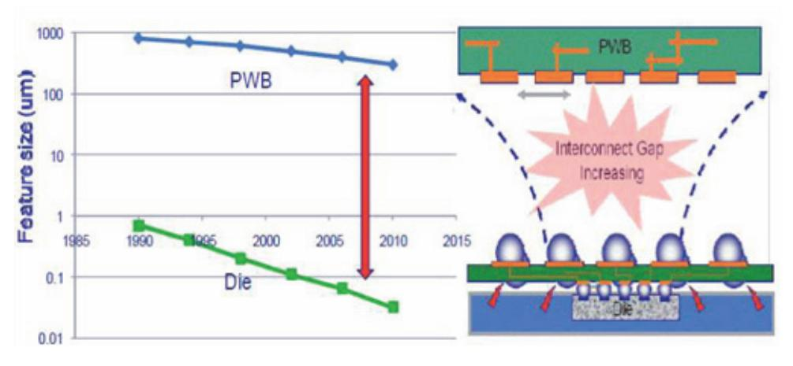

출처: 산업통상자원부(2017). 『300mm 대응 대구경 다층 구조의 복합 패키지 공정 및 장비 기술 개발』. p.3. [그림 2-1] 칩과 패드 사이즈의 변화

#### 3. 패키지 내부 배선 설계 원리 및 전기적 연결의 무결성 확보 방법

패키지 내부 배선은 칩 패드와 외부 회로 간의 신호 무결성을 유지하도록 설계된다. 이는 고속 데이터 전송을 위해 필수적이다. 전기적 시뮬레이션과 해석을 통해 신호 무결성 (Signal Integrity)을 검증하고, 전력 무결성(Power Integrity)을 보장한다. 예를 들어, N사 는 GPU 설계 시 신호 무결성을 유지하기 위해 정밀한 전기적 시뮬레이션을 수행한다. 이 는 고속 데이터 전송과 낮은 전력 소비를 가능하게 한다.

4. 기계적 연결의 안정성 확보 방법

기계적 연결은 패키지의 내구성과 신뢰성을 보장하기 위해 설계된다. 기계적 구조 해석을 통해 스트레스와 변형을 분석하고, 패키지의 강도와 안정성을 평가한다. 예를 들어, T 사와 같은 IDM 업체는 산업용 및 소비자 전자제품에 사용되는 반도체 패키지에서 기계적 강도 와 열적 안정성을 고려한 설계를 통해 높은 신뢰성을 보장한다. T사의 패키지는 특히 높은 신뢰성과 긴 수명을 요구하는 환경에서 안정적으로 작동하도록 설계된다. 이러한 접근은 특 히 고온 및 고진동 환경에서 중요한 역할을 한다.

#### 숖 시뮬레이션 및 해석

1. 전기 해석

전기적 시뮬레이션은 플립 칩 패키지 설계의 필수적인 단계로, 전기적 특성을 분석하고 신호 무결성(SI: Signal Integrity)과 전력 무결성(PI: Power Integrity), 전자기 간섭(EMI: Electromagnetic Interference)을 보장한다.

N사와 같은 Fabless 업체는 고성능 GPU 설계를 위해 정밀한 전기적 시뮬레이션을 수행한 다. 이를 통해 신호 전송의 품질을 유지하고 전력 손실을 최소화한다. T사와 같은 Foundry 업체는 고객의 요구 사항을 반영하여 전기적 특성을 최적화하는 배선을 설계한다. 이러한 시뮬레이션은 고속 데이터 전송 시 발생할 수 있는 크로스토크와 반사를 최소화하 는 데 도움이 된다.

(1) 신호 무결성(Signal Integrity) 해석

신호 무결성 해석은 데이터 전송 채널에서 신호 품질을 유지하는 데 중점을 둔다. A사 의 시뮬레이션 소프트웨어를 사용하여 신호 전송 경로에서 발생할 수 있는 지터, 손실, 그리고 크로스토크와 같은 문제를 분석한다. 이러한 분석을 통해 전송되는 디지털 신호 가 왜곡되지 않도록 하고, 데이터 전송의 신뢰성을 확보한다. S 소프트웨어는 3D 전파 시뮬레이션을 통해 이러한 문제를 해결한다.

(2) 전력 무결성(Power Integrity) 해석

전력 무결성 해석은 칩에 공급되는 전압이 안정적으로 유지되는지 확인하는 과정이다. A 프로그램은 전력 분배 네트워크(PDN: Power Distribution Network)의 풀웨이브 추출을 통해 소음을 줄이고 임피던스 프로파일을 검증한다. 이 과정에서 디커플링 커패 시터의 배치가 중요한 역할을 하며, 이를 통해 전력 공급의 안정성을 보장한다. 전력 무 결성 해석을 통해 전압 강하(IR Drop)와 스위칭 소음을 최소화할 수 있다.

(3) 전자기 간섭 해석

EMI(EMI: Electromagnetic Interference) 해석은 전자기 간섭을 최소화하기 위해 수행된다. EMI는 고속 신호 전송에서 발생할 수 있는 전자기 방사로 인한 간섭 현상이다. A사의 시뮬레이션 소프트웨어는 EMI 스캐닝 기능을 제공하여 PCB와 IC 패키지에서의 전자기 방사를 분석하고, 이를 최소화할 수 있는 설계 변경을 제안한다. D사의의 시뮬레이션 소프트웨어는 EMI 해석을 통해 시스템 레벨에서의 전자기 간섭 문제를 해결한다.

#### 2. 열 해석

열 해석은 패키지의 열 분포와 열 저항, 열전도 특성을 분석하는 단계이다. 플립 칩 패키지 는 높은 전력 밀도와 열 발생량을 처리해야 하므로, 열 해석을 통해 효과적인 열 관리 전략 을 수립해야 한다. C사의 FC QFN 패키지는 우수한 열 성능을 제공하며, 열 분포를 최적 화하여 패키지의 신뢰성을 높이다. A사의 시뮬레이션 소프트웨어는 전기적 시뮬레이션과 결 합된 열 해석을 통해 전체 시스템의 열 성능을 평가한다.

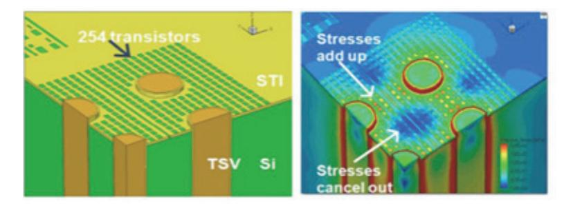

출처: 전자부품연구원・한국생산기술연구원・한국과학기술원(2019). 『이종/다수 반도체 소자 적층 통 합 패키지 및 모듈 원천 기술 개발』. 산업통상자원부. p.34. [그림 2-2] TSV 3D 구조체 해석 예시

3. 구조 해석

구조 해석은 패키지의 기계적 강도와 안정성을 평가하는 과정이다. IDM 업체는 산업용 및 소비자 전자제품에 사용되는 반도체 패키지에서 기계적 강도와 열적 안정성을 고려한 설계 를 통해 높은 신뢰성을 보장한다. TE는 특히 높은 신뢰성과 긴 수명이 필요한 환경에서 패 키지가 안정적으로 작동하도록 설계한다. 이러한 구조 해석은 스트레스와 변형을 분석하여 구조적 안정성을 확보한다.

(1) 휨 해석

패키지 공정 중 온도 변화에 따라 이종 재료 간의 열팽창 계수 차이로 인해 패키지가 휘어질 수 있다. 이를 방지하기 위해 제품의 구조와 재료의 열팽창 계수, 공정 온도와 시간 등을 고려하여 구조 해석을 진행한다. 예를 들어, T사와 같은 Foundry 업체는 플 립 칩 패키지의 열팽창과 관련된 문제를 해결하기 위해 열팽창 계수를 고려한 휨 해석 을 수행한다. 이러한 해석을 통해 휨을 예측하고 불량을 방지할 수 있다.

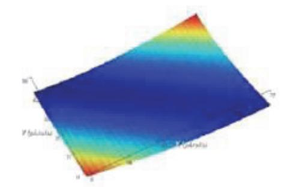

출처: 한국산업기술평가관리원(2017). 『차세대 초박형 MCP 인쇄 회로 기판 모듈 및 SIP용 임베디드 PCB 모듈』. p.472. [그림 2-3] wafer warpage

(2) 솔더 접합부 신뢰성

솔더는 반도체 패키지와 PCB 기판 사이에서 기계적 및 전기적 연결 역할을 한다. 솔더 접합부의 신뢰성은 매우 중요하며, 구조 해석을 통해 솔더 접합부의 신뢰성을 평가한다. I사와 같은 IDM 업체는 다양한 공정 조건과 사용 조건에서 솔더 접합부의 응력 정도를 해석하여 솔더 접합부의 신뢰성을 확보한다. 이는 솔더 접합부의 전단 균열과 인장 균열 을 방지하는 데 도움을 준다.

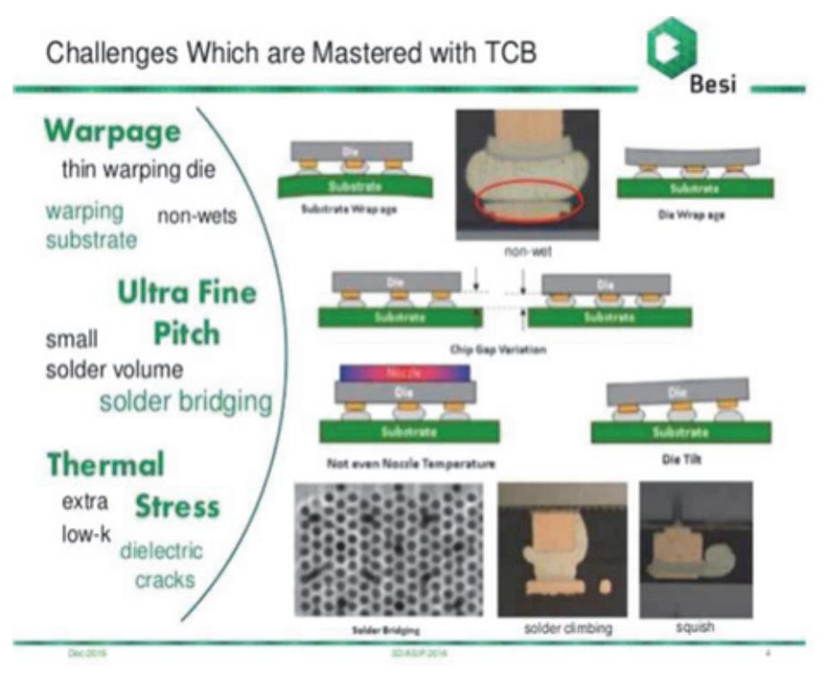

출처: 한국생산기술연구원(2020). 『20um급 미세 범프 플립 칩 패키지 원천 소재 및 공정 기술 개발』. p.3.

[그림 2-4] Bump soldering 접합부의 주요 이슈들

#### (3) 강도 해석

패키지는 외력으로부터 칩을 보호하는 기능을 하며, 외력에 대한 강건성을 대표하는 것이 패키지 강도이다. TE는 패키지의 강도를 평가하기 위해 3점 구부림(3 Point Bending) 또는 4점 구부림(4 Point Bending) 시험을 수행한다. 구조 해석에서는 이러한 시험을 모사하여 패키지 각 영역의 응력을 도출하고, 특정 소재의 파단 강도를 참고하여 제품의 파단 강도를 예측한다.

(4) 피로 수명 해석

반도체 패키지는 반복되는 열 사이클과 기계적 하중으로 인해 피로 파괴가 발생할 수 있다. 피로 수명 해석은 이러한 반복 하중 조건에서 패키지의 신뢰성을 평가하는 데 사 용된다. 예를 들어, A사의 시뮬레이션 소프트웨어는 열 사이클 동안 발생하는 피로를 예 측하여 패키지의 내구성을 평가한다. 이는 패키지의 피로 수명을 연장하고 신뢰성을 높 이는 데 중요하다.

#### (5) 충격 해석

패키지가 물리적 충격을 받을 때의 응답을 분석하여 구조적 무결성을 평가한다. Q사는 모바일 장치의 충격 저항성을 평가하기 위해 충격 해석을 수행한다. 이 해석을 통해 패 키지의 약점을 식별하고 설계를 개선하여 내충격성을 향상할 수 있다.

#### 재료·자료

- 칩 설계 데이터
- 기술 보고서 및 논문
- 시장 분석 자료

#### 기기(장비 ・ 공구)

- CAD 소프트웨어
- 시뮬레이션 소프트웨어
- 측정 및 검증 장비

#### 안전 ・ 유의 사항

- 칩 설계 정보는 민감한 데이터로서, 철저한 보안 관리가 필요하다.
- 수집된 데이터와 분석 자료는 정확히 검토하여 오류를 최소화해야 한다.
- 작업 과정에서의 안전 규정을 준수하고, 장비 사용 시 안전 장비를 착용한다.

#### 수행 순서

- 숔 제품 요구 사항에 따라 패키지 설계에 필요한 정보를 수집한다.
  - 1. 전기적 성능 정보를 수집한다.
    - (1) 전기적 특성을 분석한다.
      - (가) 신호 속도, 저항, 임피던스 특성 등의 세부 정보를 수집한다.
      - (나) 수집된 전기적 특성 정보는 패키지 구조 설계에 중요한 기준을 제공한다.
      - (다) 전기적 특성을 바탕으로 신호 전달 경로와 전력 분배 네트워크(PDN)의 효율성을 검토하 고 최적화한다. 전력 분배 네트워크의 효율성은 패키지 내 전력 공급의 안정성을 높여 신호 전송의 안정성을 보장하는 데 중요한 역할을 한다.
    - (2) 신호 전달 경로를 최적화한다.
      - (가) 신호 반사 및 크로스토크(Crosstalk) 문제를 최소화할 수 있도록 신호 전달 경로 정보를 수집한다. 이 정보는 신호가 전달되는 과정에서 발생할 수 있는 전기적 간섭 문제를 예 방하는 데 필수적이다.

33

- (나) 신호 경로의 길이, 폭, 및 상호 연결 구조를 최적화하여 신호 무결성을 유지한다. 최적화 된 경로 설계는 데이터 전송 속도와 신뢰성을 높이는 데 기여한다.
- (다) 수집된 정보를 바탕으로 최적의 패키지 구조를 결정하여 신호 손실을 최소화하고 고속 신호 전송을 보장한다. 이러한 설계를 통해 신호의 무결성을 유지하며, 최종 제품의 성 능을 극대화할 수 있다.
- 2. 칩 설계 정보를 수집한다.
  - (1) 칩 패드 좌표 및 배열을 확보한다.
    - (가) 칩 설계 부서로부터 칩 패드 좌표, 칩 배열, 내부 연결 정보 등을 수집한다. 이 정보는 플립 칩 패키지의 기본적인 설계 기준을 형성한다.
    - (나) 수집된 정보는 플립 칩 패키지의 범프(Bump) 디자인과 레이아웃을 결정하는 데 중요한 역할을 한다. 범프 디자인은 신호 전달 효율성 및 기계적 안정성을 확보하는 데 필수적 이다.
    - (다) 칩 패드와 범프 간의 최적화를 통해 신호 전달의 효율성을 극대화하고 신호 무결성을 보 장한다. 최적화된 배열은 패키지의 성능을 높이며, 신호 전송의 안정성을 강화한다.
  - (2) CAD 모델을 생성한다.
    - (가) 수집된 데이터를 정리하여 CAD 소프트웨어를 사용해 초기 설계 모델을 생성한다. 이 모 델은 패키지 설계의 기초가 되며, 향후 설계 검토와 최적화 작업의 기준이 된다.
    - (나) CAD 모델링을 통해 설계의 정확도를 높이고, 이후 설계 단계에서 발생할 수 있는 오류를 사전에 방지한다. 정확한 모델링은 개발 과정에서 시간과 비용을 절감하는 데 기여한다.
    - (다) 초기 CAD 모델을 기반으로 최종 패키지 설계를 검토하고, 필요시 수정한다. 이 과정에서 설계의 모든 요소가 최적화되고, 최종 제품의 성능 요구 사항을 충족하도록 보장한다.
- 3. 열 관리 정보를 수집한다.
  - (1) 열 발생량 및 전력 소모를 분석한다.
    - (가) 칩의 열 관리 전략을 수립하기 위해, 칩의 전력 소모 및 열 발생량 데이터를 수집한다. 이러한 정보는 열 관리 솔루션을 설계하는 데 필수적이다.
    - (나) 수집된 열 관리 정보는 패키지의 열적 성능을 최적화하는 데 필수적이다. 열적 성능 최 적화는 패키지의 안정적인 작동을 보장하는 데 중요한 역할을 한다.
    - (다) 열 발생이 집중되는 영역을 파악하여 효과적인 열 관리 솔루션을 설계한다. 집중적인 열 발생을 효율적으로 처리함으로써, 과열로 인한 성능 저하를 예방할 수 있다.
  - (2) 방열 솔루션을 설계한다.
    - (가) 수집된 열 관련 데이터를 바탕으로 방열 솔루션을 설계한다. 히트 싱크 및 열전도성 재 료 선택 등을 통해 패키지의 열 저항을 최소화한다.

- (나) 히트 싱크(heat sink) 및 열전도성 재료 선택 등을 통해 패키지의 열 저항을 최소화한 다. 이러한 재료 선택은 열 방출 효율성을 높여 패키지의 성능을 유지하는 데 기여한다.
- (다) 방열 솔루션을 최적화하여 패키지의 열 확산을 극대화하고, 과열로 인한 성능 저하를 방 지한다. 최적의 방열 솔루션은 장기적인 패키지 신뢰성을 보장한다.
- 숕 수집된 설계 정보를 분석하여 패키지 설계에 반영할 핵심 요소를 식별한다.
  - 1. 전기적 성능 요구 사항을 분석한다.
    - (1) 전기적 특성을 검토한다.
      - (가) 신호 무결성을 보장한다.
        - 1) 수집된 전기적 성능 요구 사항을 바탕으로 패키지 내 신호 무결성을 보장하기 위한 설계 요소를 도출한다.
        - 2) 여기에는 최적의 신호 전달 경로 설계와 전원 무결성(Power Integrity) 확보 방안 이 포함된다. 전원 무결성은 전력 공급의 안정성을 유지하여 신호 전송의 안정성을 높이는 데 필수적이다.

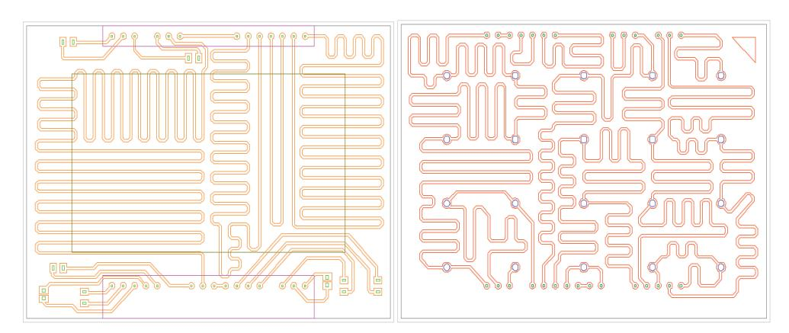

출처: 산업통상자원부(2017). 『300mm 대응 대구경 다층 구조의 복합 패키지 공정 및 장비 기술 개발』. p.27. [그림 2-5] RDL design 검증을 위한 Daisy-chain 설계

- (2) 신호 전달 경로를 설계한다.
  - (가) 최적화된 신호 경로를 구축한다.

신호 전달 경로를 최적화하여, 신호 반사와 크로스토크 문제를 최소화할 수 있는 설 계 요소를 식별한다. 신호 반사는 회로 내에서 신호가 반사되어 발생할 수 있는 간 섭 문제를 의미하며, 크로스토크는 인접한 신호 간섭을 줄이는 것을 목표로 한다. 이를 통해 패키지 내 전기적 성능을 극대화할 수 있도록 설계를 진행한다. 최적화된 신호 경로는 고속 신호 전송의 무결성을 유지하며, 데이터 전송 속도와 신뢰성을 높 이는 데 기여한다.

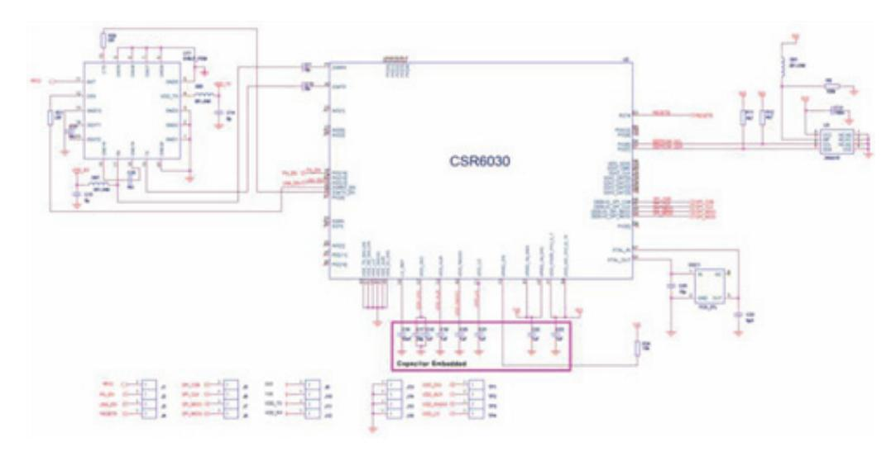

출처: 산업통상자원부(2017). 『300mm 대응 대구경 다층 구조의 복합 패키지 공정 및 장비 기술 개발』. p.26. [그림 2-6] 회로도

- 2. 최신 기술 동향을 분석하고 반영한다.
  - (1) 기술 동향을 파악한다.
    - (가) 최신 반도체 패키징 기술을 조사한다.

최신 반도체 패키징 기술과 동향을 파악하기 위해 반도체 리서치 보고서와 사내 R&D 부서의 보고서를 참조한다. 이 과정에서는 업계 표준, 신기술 도입 사례, 경쟁사 기술 분석 등을 포함하여 전반적인 기술 동향을 검토한다. 이를 통해 설계의 혁신성을 높이고, 향후 확장 가능성을 고려한 설계를 도출하고 플립 칩 패키지가 시장 경쟁력을 갖출 수 있도록 최신 기술을 반영한 설계를 추구한다.

- (2) 기술을 설계에 반영한다.
  - (가) 혁신적 설계를 구현한다.

파악된 최신 기술 동향을 설계에 반영하여, 플립 칩 패키지의 경쟁력을 강화한다. 예 를 들어, 새로운 재료나 패키지 구조를 도입하여 전기적 성능이나 열 관리 성능을 향상한다. 새로운 기술 적용을 통해 향후 기술적 확장성까지 고려한 설계를 수행한 다. 이 과정에서는 미래 기술 변화에 대응할 수 있는 유연성을 확보하는 것이 중요 하다. 이를 통해 패키지가 시장에서의 기술 변화에 빠르게 대응할 수 있게 한다.

- 3. 열 관리 요구 사항을 분석한다.
  - (1) 열적 특성을 최적화한다.
    - (가) 열 경로 설계를 수행한다.

열 관리 요구 사항을 바탕으로 패키지의 열적 특성을 최적화하기 위한 설계 요소를 식별한다. 패키지 내에서 발생하는 열이 효과적으로 방출될 수 있도록 열 경로를 설 계하여 과열을 방지한다.

열 경로 설계와 방열재 선택 등을 통해 열 저항을 최소화하고, 열 확산을 최적화한 다. 이를 통해 패키지의 열 관리 성능을 향상시키고, 장기적인 안정성을 확보한다.

- (2) 방열 솔루션을 설계한다.
  - (가) 열 관리 솔루션을 구현한다.

열 관리 솔루션을 설계하여, 플립 칩 패키지의 열적 안정성을 확보한다. 이를 위해 히트 싱크, 열 파이프, 액티브 냉각 시스템 등의 다양한 솔루션을 고려하여 최적의 방열 구조를 설계한다.

방열재 선택 및 구조 최적화를 통해 패키지의 열 성능을 극대화한다. 최적의 방열재 와 구조 설계를 통해 열이 패키지 외부로 효율적으로 방출될 수 있도록 한다. 이로 인해 패키지의 성능이 장기간에 걸쳐 유지되며, 과열로 인한 성능 저하를 방지할 수 있다.

- 숖 분석된 정보를 기반으로 패키지 설계의 잠재적인 문제점을 파악한다.
  - 1. 시뮬레이션 해석을 진행한다.
    - (1) 열 해석을 수행한다.
      - (가) 플립 칩 패키지의 열적 성능을 최적화한다.

플립 칩 패키지의 열적 성능을 최적화하기 위해 열 해석 시뮬레이션을 수행한다. 이 과정에서는 칩에서 발생하는 열이 패키지 내에서 어떻게 전달되고 분산되는지를 분 석한다. 열 해석 결과를 바탕으로, 과열로 인해 발생할 수 있는 성능 저하 및 열 관 련 신뢰성 문제를 식별한다. 예를 들어, 특정 부위에서의 열 집중 현상을 찾아내고, 이를 해결하기 위한 방안을 마련한다.

| 26°C     | 178°C | 218°C            | 259°C     | 223℃          | 30'C      |
|----------|-------|------------------|-----------|---------------|-----------|
|          | -     | -                |           | -             |           |
|          |       |                  |           |               |           |
| *        |       | + ( #175 ( 2000) | 1,010,000 | 1.00 × (mail) | 1.071.000 |
| -        | -     |                  | K /       |               | -         |
| 1.22.1.1 | 1     | 1-1-1-1-1        |           |               | -         |

출처: 한국산업기술평가관리원(2017). 『차세대 초박형 MCP 인쇄 회로 기판 모듈 및 SIP용 임베디드 PCB 모듈』. p.480. [그림 2-7] 온도별 warpage 양상

(2) 전기 해석을 수행한다.

(가) 플립 칩 패키지의 전기적 성능을 최적화한다.

패키지의 전기적 성능을 검토하고 최적화하기 위해 전기 해석을 진행한다. 여기에서 는 신호 전달 경로에서 발생할 수 있는 저항, 임피던스 불일치, 전기적 노이즈 등을 분석한다. 전기 해석을 통해 신호 전달의 효율성을 높이고, 전기적 노이즈를 최소화 할 수 있는 설계 방안을 도출한다. 이로 인해 데이터 무결성을 유지하고, 패키지의 전기적 성능을 최적화한다.

- (3) 구조 해석을 수행한다.
  - (가) 플립 칩 패키지의 기계적 안정성을 확보한다.

패키지의 기계적 안정성을 확인하기 위해 구조 해석 시뮬레이션을 수행한다. 이 과 정에서는 패키지와 기판 간의 물리적 결합 강도, 열팽창으로 인한 기계적 스트레스 등을 분석한다. 구조 해석을 통해 열팽창에 따른 스트레스 문제를 평가하고, 구조적 변형 가능성을 예측하여 보완책을 마련한다. 이를 통해 패키지의 기계적 신뢰성을 높이고, 장기적인 사용 중 발생할 수 있는 문제를 예방한다.

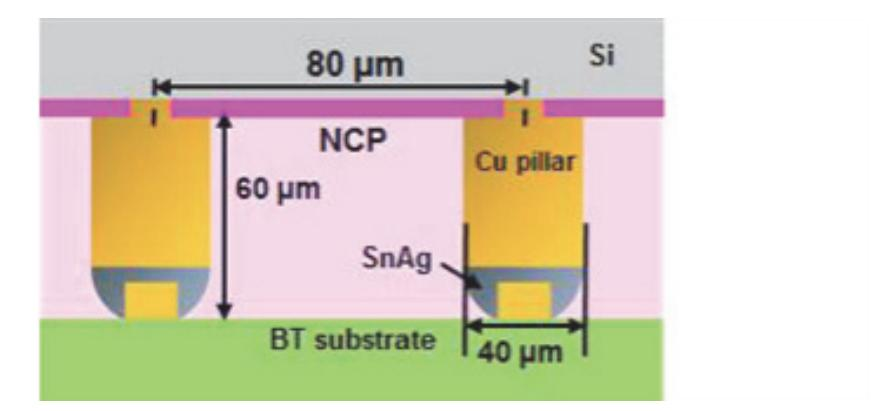

출처: 한국산업기술평가관리원(2018). 『20μm 초미세 피치 모바일 패키지용 6sec/chip 이하 고속 열 압착 접합 기술 개발』. 하나마이크론. 산업통상자원부. p.87. [그림 2-8] 해석을 위한 구리 기둥 범프의 모델링

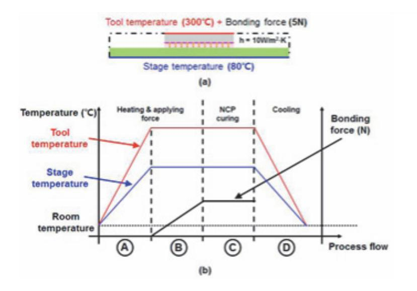

출처: 한국산업기술평가관리원(2018). 『20μm 초미세 피치 모바일 패키지용 6sec/chip 이하 고속 열 압착 접합 기술 개발』. 하나마이크론. 산업통상자원부. p.88. [그림 2-9] 열 압착 공정의 온도 및 압력 조건

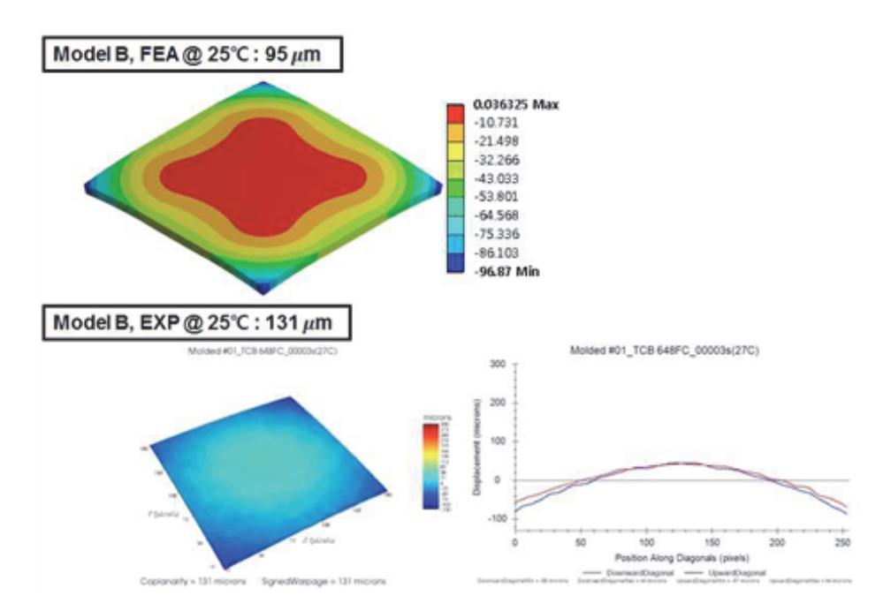

출처: 한국산업기술평가관리원(2018). 『20μm 초미세 피치 모바일 패키지용 6sec/chip 이하 고속 열 압착 접합 기술 개발』. 하나마이크론. 산업통상자원부. p.91. [그림 2-10] Molding 후 패키지의 휨 해석 결과 및 실제 측정 결과

#### 2. 신호 무결성 시뮬레이션을 수행한다.

(1) 신호 반사 및 크로스토크를 예측한다.

패키지 내부에서 발생할 수 있는 신호 반사와 크로스토크를 예측하기 위해 신호 무결성

시뮬레이션을 수행한다. 이 과정에서 신호 간섭이 발생할 수 있는 경로를 분석하고, 이 에 대한 해결책을 마련한다. 이러한 문제를 해결하기 위해 신호 경로의 최적화, 실드 (Shielding) 기술 도입 등을 고려하여 설계 변경 방안을 도출한다. 이로써 신호 무결성 을 유지하고, 전기적 성능을 향상한다.

(2) 지터 문제를 예측한다.

패키지에서 발생할 수 있는 지터(Jitter) 문제를 예측하기 위해 시뮬레이션을 수행한다. 지터는 데이터 전송 속도의 불안정성을 초래할 수 있으므로, 이에 대한 예측과 해결책을 마련하는 것이 중요하다.

지터를 최소화할 수 있는 설계 개선 방안을 제시하여, 데이터 전송의 신뢰성을 높인다. 이를 통해 고속 데이터 전송 시 발생할 수 있는 오류를 줄이고, 시스템의 전체 성능을 향상한다.

- 3. 기계적 스트레스 분석을 수행한다.
  - (1) 열팽창 차이를 분석한다.

패키지와 기판 간의 열팽창 차이로 인해 발생할 수 있는 구조적 문제를 분석한다. 열팽 창 차이로 인해 발생할 수 있는 스트레스를 예측하고, 이를 최소화할 수 있는 방안을 검토한다. 특히, 열 순환 시 발생할 수 있는 크랙이나 델라미네이션(Delamination) 가 능성을 평가하고, 이를 보완하기 위한 설계 변경 방안을 도출한다. 이를 통해 장기적인 사용 중 발생할 수 있는 구조적 문제를 예방한다.

(2) 설계 변경 방안을 도출한다.

기계적 스트레스 문제를 해결하기 위한 설계 변경 방안을 도출한다. 열팽창 차이로 인한 스트레스를 줄이기 위해, 재료 선택이나 구조적 디자인의 변경을 검토한다. 이를 통해 패키지의 기계적 안정성을 강화하고, 장기적인 신뢰성을 확보한다.

- 숗 파악된 문제점에 대해 개선 방안을 도출하여 설계에 반영한다.
  - 1. 설계 데이터를 검토하고 피드백을 반영한다.
    - (1) 설계 검토를 수행한다.

초기 설계 결과를 제품 설계팀과 공유한다. 설계팀, 제조팀, 품질 관리팀 등 여러 부서 와 협업하여 설계의 잠재적인 문제점과 개선 가능성을 논의한다. 이 과정에서는 각 부서 의 전문적인 관점을 반영해 설계의 기술적, 경제적 타당성을 검토한다.

각 팀에서 제공한 피드백을 분석하여, 설계의 완성도를 높이기 위한 수정 작업을 진행한 다. 예를 들어, 제조 가능성이나 비용 절감 방안에 대한 피드백이 있을 경우, 이를 설계 에 반영해 최적화한다.

피드백이 반영된 수정된 설계 모델을 다시 검토하여 최종 설계 모델로 확정한다. 이를

통해 제품 설계가 실제 제조 및 성능 요구 사항을 충족할 수 있도록 보장한다. 최종 설 계는 이후의 시제품 제작과 양산 준비에 중요한 역할을 한다.

(2) 신호 경로를 최적화한다.

신호 무결성 문제를 해결하기 위해, 설계에 새로운 신호 경로를 추가하거나 기존 경로의 길이 및 폭을 최적화한다. 신호 경로의 최적화는 신호 전달 속도와 품질을 유지하는 데 중요한 역할을 한다.

필요한 경우, 추가적인 디커플링 커패시터를 배치하여 신호 무결성을 강화한다. 디커플 링 커패시터는 전원과 신호 간의 간섭을 줄여 신호의 안정성을 높인다. 또 실드 기술을 도입하여 외부 간섭으로부터 신호를 보호한다. 실드 기술은 특히, 고속 신호 처리에서 중요한 역할을 하며, 전기적 간섭(EMI)으로 인한 신호 왜곡을 방지한다. 이러한 조치들 은 신호 전달의 정확성을 유지하고, 데이터 전송의 신뢰성을 높이는 데 기여하며, 최종 제품의 성능을 극대화한다.

#### 2. 열 관리 문제를 개선한다.

(1) 방열 솔루션을 설계한다.

열 관리 문제를 해결하기 위해, 히트 싱크(Heat Sink) 설계나 패키지 내 열전달 경로를 재설계한다. 히트 싱크는 열을 효과적으로 방출하여 패키지 내 열 축적을 줄이는 데 중 요한 역할을 한다.

고열 전도성 재료를 선택하여 패키지의 열 방출 특성을 향상한다. 이러한 재료는 열이 빠르게 분산되어 과열을 방지하는 데 도움을 준다.

열 발생이 집중되는 영역을 효율적으로 냉각하기 위한 추가적인 방열 솔루션을 도입한 다. 여기에는 액티브 냉각 시스템(예: 팬) 또는 패시브 냉각 시스템(예: 열 파이프, 방열 판)이 포함될 수 있다. 이러한 방열 솔루션을 통해 패키지의 열적 안정성을 강화하고, 과열로 인한 성능 저하 및 장기적인 신뢰성 문제를 예방한다.

- 3. 기계적 안정성을 개선한다.
  - (1) 범프 배열을 최적화한다.

패키지와 기판 간의 열팽창 차이를 최소화하기 위해, 범프의 배열을 최적화한다. 범프 배열은 열팽창으로 인한 스트레스를 균등하게 분산시켜 패키지의 기계적 안정성을 높인다. 범프의 크기 및 재료를 재선정하여 기계적 스트레스에 대한 저항성을 높인다. 예를 들어, 더 높은 강도를 가진 재료를 사용하거나 범프의 크기를 조정하여 기계적 강도를 향상할 수 있다.

이와 함께, 구조적 개선을 통해 열 순환 시 발생할 수 있는 크랙이나 델라미네이션 문제를 방지한다. 이러한 구조적 개선은 패키지의 장기적인 내구성을 확보하는 데 필수적이다. 최종적으로, 이러한 조치를 통해 패키지의 기계적 안정성을 강화하고, 제품의 신뢰성을 높이며, 장기적인 사용 중 발생할 수 있는 문제를 예방한다.

#### 수행 tip

- 팀 내 다른 구성원과 함께 데이터의 일관성을 확인한다.
- 주요 리서치 업체의 보고서를 정기적으로 검토하고, 학회
- 나 세미나에 참석하여 최신 정보를 습득한다.
- 주기적으로 설계 결과를 팀 내 공유하고, 제품 설계팀 및 공정팀의 피드백을 적극 반영한다.
- 피드백 내용을 문서화하여 추후 참고할 수 있도록 한다.

## 2-2. 최적화된 패키지 설계

학습 목표 • 플립 칩 패키지 재료에 대한 정보를 기초로 패키지 양산성, 제조 공정, 공정 조건, 장비 특성 이 고려된 디자인 규칙을 적용할 수 있다. • 패키지 구조와 서브 스트레이트 등을 확인하여 최적화된 플립 칩 패키지 설계를 할 수 있다.

## 필요 지식 /

- 숔 재료 특성 및 양산성 분석
  - 1. 재료 특성 분석
    - (1) 물리적, 화학적 특성 분석

사용되는 재료의 물리적, 화학적 특성을 철저히 이해하는 것은 설계의 신뢰성과 성능을 보장하는 데 필수적이다.

- (가) 물리적 특성 분석
  - 1) 열전도성

재료의 열전도성은 열 관리에 중요한 역할을 한다. 높은 열전도성을 가진 재료는 열을 효율적으로 분산시켜 패키지의 과열을 방지한다. 예를 들어, 구리(Cu)와 같 은 금속은 높은 열전도성을 제공하여 플립 칩 패키지에서 널리 사용된다.

2) 기계적 강도

재료의 기계적 강도는 패키지의 구조적 안정성을 결정한다. 강도가 높은 재료는 외부 충격이나 스트레스로부터 패키지를 보호한다. 실리콘 카바이드(SiC)와 같은 재료는 뛰어난 기계적 강도로 알려져 있다.

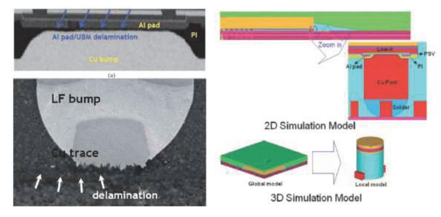

출처: 한국산업기술평가관리원(2018). 『20μm 초미세 피치 모바일 패키지용 6sec/chip 이하 고속 열 압착 접합 기술 개발』. 하나마이크론. 산업통상자원부. p.11. [그림 2-11] 구리 기둥 접합부의 파괴 및 수치 해석 모델링 사례

(나) 화학적 특성 분석

1) 내식성

패키지 재료는 외부 환경에 노출될 때 화학적으로 안정해야 한다. 내식성이 높은 재료는 장기간 사용 시에도 성능 저하를 방지한다. 예를 들어, 알루미늄 산화물 (Al2O3)은 내식성이 뛰어나 패키지 재료로 자주 사용된다.

#### 2) 화학적 반응성

재료의 화학적 반응성은 다른 재료와의 호환성을 결정한다. 재료 간의 화학적 반 응을 최소화하여 패키지의 성능과 신뢰성을 유지한다.

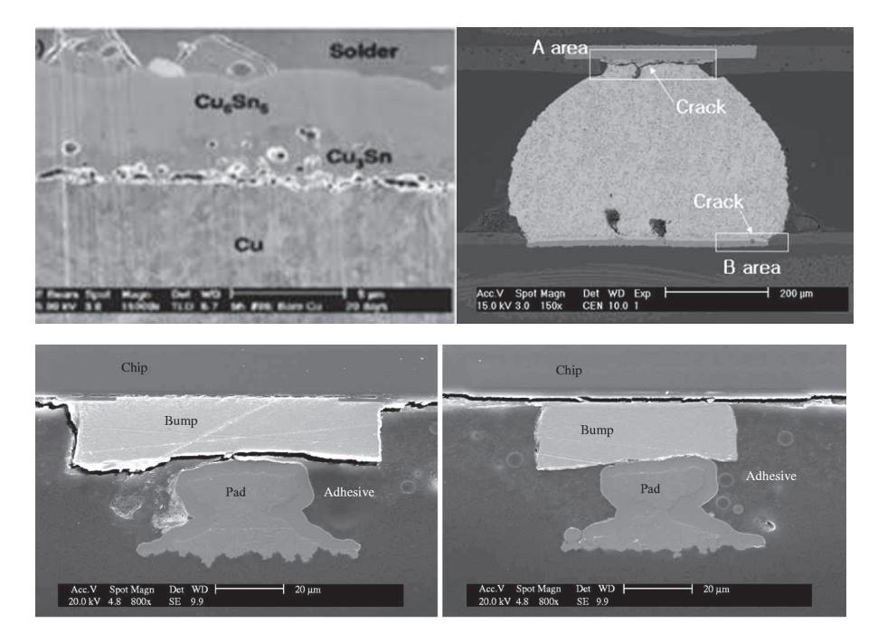

출처: 한국산업기술평가관리원(2018). 『20μm 초미세 피치 모바일 패키지용 6sec/chip 이하 고속 열 압착 접합 기술 개발』. 하나마이크론. 산업통상자원부. p.3. [그림 2-12] 솔더 접합부 주요 failure 발생 사례

(2) 열적, 전기적 특성 파악

재료의 열적 및 전기적 특성은 패키지의 성능을 크게 좌우한다.

- (가) 열적 특성
  - 1) 열팽창 계수(CTE)

재료의 열팽창 계수는 온도 변화에 따른 재료의 팽창 및 수축 정도를 나타낸다. 패키지 내 사용되는 재료들은 CTE가 유사해야 열응력으로 인한 균열을 방지할 수 있다. 실리콘(Si)과 구리(Cu)의 CTE 차이를 줄이기 위해 중간 계층을 사용하 는 방법도 있다.

2) 열 저항성

열 저항성이 낮은 재료는 열을 쉽게 전달하여 열 관리를 효율적으로 한다. 플립 칩 패키지에서 열 저항성이 낮은 재료를 사용하여 칩의 열을 빠르게 방출한다.

(나) 전기적 특성

1) 전도성

전기적 전도성이 높은 재료는 신호 전달의 효율성을 높이다. 금(Au)과 구리(Cu) 와 같은 재료는 높은 전도성을 제공, 패키지 내부 전기 연결에 사용된다.

2) 절연성

절연성이 높은 재료는 전기적 간섭을 방지하여 신호의 무결성을 유지한다. 실리 콘 산화물(SiO2)과 같은 절연 재료는 패키지 내부의 전기적 분리를 돕는다.

- 2. 양산성 고려
  - (1) 대량 생산 가능성 평가

양산성 평가는 패키지 설계가 대량 생산에 적합한지 여부를 판단하는 중요한 단계이다. 이는 경제적 효율성과 생산성을 극대화하는 데 필수적이다.

- (가) 재료의 가용성
  - 1) 공급 안정성

대량 생산을 위해서는 재료의 안정적인 공급이 보장되어야 한다. 이는 공급망의 안정성과 재료의 가격 변동성을 고려하여 평가한다. 예를 들어, 구리와 실리콘은 비교적 안정적인 공급망을 가지고 있어 대량 생산에 적합하다.

2) 가격 경쟁력

재료의 가격은 대량 생산 시 중요한 고려 요소이다. 가격이 안정적이고 저렴한 재료는 생산 비용을 낮추는 데 기여한다.

- (나) 생산 공정의 효율성
  - 1) 자동화 가능성

생산 공정의 자동화 수준이 높을수록 대량 생산의 효율성이 증가한다. 자동화 공 정은 생산 속도와 일관성을 높이며, 인건비를 절감할 수 있다. T사와 같은 파운 드리 업체는 높은 자동화 수준을 통해 효율적인 대량 생산을 구현하고 있다.

2) 생산 시간 단축

공정 시간이 짧을수록 생산량이 증가하고 비용이 절감된다. 생산 공정의 각 단계 를 최적화하여 시간을 단축시키는 전략이 필요하다.

- (2) 양산을 위한 최적화 전략 개발
  - (가) 공정 통합
    - 1) 단순화된 공정

생산 공정을 단순화하여 불필요한 단계를 줄이다. 이는 생산 속도를 높이고 오류

발생 가능성을 줄이는 데 도움이 된다.

2) 통합 공정

여러 공정을 하나로 통합하여 효율성을 높이다. 예를 들어, 다중 레이어 패키징 공정을 통합하여 생산성을 극대화할 수 있다.

- (나) 품질 관리
  - 1) 품질 보증 시스템

대량 생산에서 일관된 품질을 유지하기 위해 품질 보증 시스템을 구축한다. 이는 생산 과정에서 발생할 수 있는 결함을 사전에 식별하고 수정하는 데 도움이 된 다.

2) 모니터링 및 피드백 루프

실시간 모니터링 시스템을 통해 생산 공정을 지속해서 감시하고, 피드백을 통해 공정을 개선한다. 이는 품질을 유지하면서 생산 효율을 높이는 데 중요한 역할을 한다.

#### 숕 제조 공정 및 장비 특성 반영

- 1. 제조 공정 조건 반영
  - (1) 제조 공정의 제한 사항 분석

제조 공정의 제한 사항을 철저히 분석하는 것은 패키지 설계의 성공을 위해 매우 중요 한다. 제조 공정에서 발생할 수 있는 다양한 제한 요소를 이해하고, 이를 설계에 반영해 야 한다.

- (가) 공정 복잡성
  - 1) 복잡한 공정의 단순화

제조 공정이 복잡할수록 오류 발생 가능성이 높아진다. 공정을 단순화함으로써 효율성을 높이고 오류를 줄일 수 있다. 예를 들어, T사와 같은 파운드리 업체는 공정의 복잡성을 줄이기 위해 지속해서 프로세스를 개선하고 있다.

2) 공정 단계의 최적화

각 공정 단계를 최적화하여 전체 공정의 효율성을 극대화한다. 이는 생산 시간을 단축하고 비용을 절감하는 데 도움이 된다.

- (나) 재료와 공정의 호환성
  - 1) 재료 선택

 제조 공정과 호환되는 재료를 선택하는 것이 중요하다. 예를 들어, 구리(Cu)는 높은 열전도성과 전기 전도성을 제공하여 다양한 패키징 공정에서 선호된다.

2) 공정 조건에 따른 재료 특성

 재료의 특성이 제조 공정 조건에 적합한지 평가한다. 예를 들어, 높은 온도에서 안정적인 성능을 유지하는 재료를 선택해야 한다.

- (다) 환경적 요인
  - 1) 청정도

반도체 제조 공정은 청정도가 높은 환경에서 이루어져야 한다. 공정 중 발생할 수 있는 미세 입자나 오염 물질을 최소화하기 위해 청정도를 유지하는 것이 중요 하다.

2) 온도 및 습도 관리

제조 환경의 온도와 습도를 적절하게 관리하여 재료의 특성과 공정의 안정성을 보장한다.

(2) 공정 조건을 고려한 설계 조정

제조 공정 조건을 설계에 반영함으로써 공정 효율성과 제품 품질을 높일 수 있다.

- (가) 공정 매개변수 최적화
  - 1) 온도 조건

제조 공정에서의 온도 조건을 최적화하여 재료의 열적 특성을 최대한 활용한다. 예를 들어, 열접착 공정에서 최적의 접착 온도를 설정하여 접착 강도를 극대화한다.

2) 압력 조건

공정 중의 압력을 최적화하여 재료의 물리적 변형을 최소화한다. 이는 특히 다층 패키지 구조에서 중요하다.

#### (나) 공정 제어

1) 자동화된 공정 제어

자동화된 공정 제어 시스템을 도입하여 공정의 일관성을 유지한다. 이는 생산 속 도를 높이고 인적 오류를 줄이는 데 도움이 된다.

2) 실시간 모니터링

공정 중 실시간 모니터링을 통해 공정 조건을 지속해서 확인하고, 이상 발생 시 즉각적으로 대응할 수 있다.

#### 2. 장비 특성 반영

(1) 사용 장비의 특성 및 한계 파악

제조 장비의 특성과 한계를 정확히 파악하는 것은 성공적인 패키지 설계를 위해 필수적 이다. 각 장비의 기능과 성능을 이해하고, 이를 설계에 반영해야 한다.

(가) 장비의 기능 이해

1) 장비의 성능 파라미터

각 장비의 성능 파라미터를 정확히 이해하여 최적의 공정 조건을 설정한다. 예를

들어, 리소그래피 장비의 해상도와 정밀도를 고려하여 설계 패턴을 최적화한다.

2) 장비의 한계 인식

장비의 한계를 이해하고, 이를 설계에 반영하여 공정 중 발생할 수 있는 문제를 최소화한다.

- (나) 장비의 유지 보수
  - 1) 정기적 유지 보수 계획

장비의 성능을 최적화하기 위해 정기적인 유지 보수 계획을 수립한다. 이는 장비 의 수명을 연장하고, 공정의 안정성을 보장한다.

2) 장비 업그레이드

기술 발전에 따라 장비를 업그레이드하여 최신 기술을 반영할 수 있도록 한다. 예를 들어, 최신 리소그래피 기술을 도입하여 미세 공정의 정확성을 높이다.

(2) 장비에 맞춘 설계 최적화

장비의 특성에 맞춘 설계 최적화는 공정 효율성과 제품 품질을 높이는 데 중요한 역할 을 한다.

- (가) 장비 적합성 평가
  - 1) 장비와 설계의 적합성 평가

설계가 사용되는 장비와 얼마나 적합한지 평가한다. 이를 통해 공정 중 발생할 수 있는 문제를 사전에 식별하고 대응할 수 있다.

2) 장비 테스트

새로운 설계를 도입하기 전에 장비 테스트를 통해 공정 적합성을 확인한다. 이는 특히 새로운 재료나 공정을 도입할 때 중요하다.

- (나) 설계 최적화 전략
  - 1) 설계 패턴 조정

장비의 특성에 맞춰 설계 패턴을 조정한다. 예를 들어, 리소그래피 장비의 해상도 에 맞춰 설계 패턴의 크기와 간격을 최적화한다.

2) 공정 통합

장비의 기능을 최대한 활용할 수 있도록 공정을 통합한다. 이는 공정 단계를 줄 이고 생산성을 높이는 데 도움이 된다.

숖 패키지 구조 및 서브 스트레이트 최적화

- 1. 패키지 구조 분석
  - (1) 기존 패키지 구조의 장단점 분석

패키지 구조는 반도체 성능과 신뢰성에 큰 영향을 끼친다. 기존 패키지 구조의 장단점을

분석하여 개선 방안을 도출하는 것이 중요하다.

(가) 패키지 구조의 주요 요소

1) Fan-Out Wafer Level Package(FO-WLP)

이 구조는 더 많은 I/O를 처리할 수 있으며, 열 방출 성능이 우수하다. 그러나 제조 공정이 복잡하고 비용이 높을 수 있다.

2) Ball Grid Array(BGA)

높은 핀 수와 신뢰성을 제공하지만, 열 관리가 어려울 수 있다. 또 고온에서의 열팽창 차이로 인한 Warpage 문제도 발생할 수 있다.

- (나) 구조적 개선 방안 도출
  - 1) Warpage 최소화

 패키지 휨을 줄이기 위해서는 열팽창 계수(CTE)가 유사한 재료를 사용하는 것 이 중요하다. 예를 들어, P사의 새로운 기판 재료는 낮은 열팽창 계수를 가지고 있어 휨을 줄이는 데 효과적이다.

2) 열 방출 구조 개선

패키지 내 열 방출 경로를 최적화하여 열 관리 성능을 향상한다. 이를 위해 구리 열 방출 경로를 추가하거나, 열전도성이 높은 재료를 사용할 수 있다.

- 2. 서브 스트레이트 최적화
  - (1) 서브 스트레이트 재료 및 설계 검토

서브 스트레이트는 반도체 패키지의 핵심 구성 요소 중 하나로, 그 설계와 재료 선택이 매우 중요하다.

(가) 재료 특성

1) 열팽창 계수(CTE)

서브 스트레이트 재료의 CTE는 실리콘 칩과 유사해야 휨을 줄일 수 있다. P사의 기판 재료는 실리콘과 유사한 CTE를 가지고 있어 휨을 줄이는 데 도움을 준다.

2) 기계적 강도

기계적 강도가 높은 재료는 구조적 안정성을 제공한다. 이는 패키지의 신뢰성을 높이는 데 필수적이다.

(나) 설계 최적화

1) 다층 구조

다층 서브 스트레이트 설계는 신호 무결성을 유지하면서 더 많은 I/O를 처리할 수 있게 한다. 각 층은 신호와 전력을 효과적으로 분리하고 관리할 수 있다.

2) 최적화된 배선

서브 스트레이트의 배선을 최적화하여 신호 손실을 최소화하고 전기적 성능을 향 상한다. 최신 설계 기법을 사용하여 배선 경로를 최적화한다.

49

숗 설계 검증 및 최종 확정

- 1. 최종 설계 검증 및 테스트
  - (1) 설계된 패키지의 검증 및 테스트

최적화된 설계를 실제로 검증하고 테스트하는 단계는 설계의 신뢰성과 성능을 보장하는 데 중요하다.

(가) 프로토타입 제작

최적화된 설계를 바탕으로 프로토타입을 제작한다. 이는 설계가 실제 조건에서 어떻 게 작동하는지 확인하는 중요한 단계이다.

(나) 테스트 및 검증

열 사이클링, 전기적 테스트, 기계적 스트레스 테스트 등을 포함한 다양한 조건에서 프로토타입을 테스트하여 성능과 신뢰성을 검증한다.

테스트 결과를 분석하여 설계의 강점과 약점을 파악하고, 필요한 경우 설계를 수정 한다.

#### 2. 최종 설계 확정

(1) 검증된 설계를 바탕으로 최종 설계 도출

검증된 설계를 바탕으로 최종 설계를 확정, 이를 문서화하여 생산 준비를 완료한다.

(가) 최종 설계 도출

테스트 및 검증 과정을 통해 얻은 데이터를 바탕으로 최종 설계를 도출한다. 이는 모든 요구 사항을 충족하는지 확인한다.

(나) 설계 문서화 및 승인

최종 설계를 문서화하여 설계 팀과 공정 팀의 승인을 받는다. 이를 통해 생산 공정 으로의 원활한 전환을 보장한다.

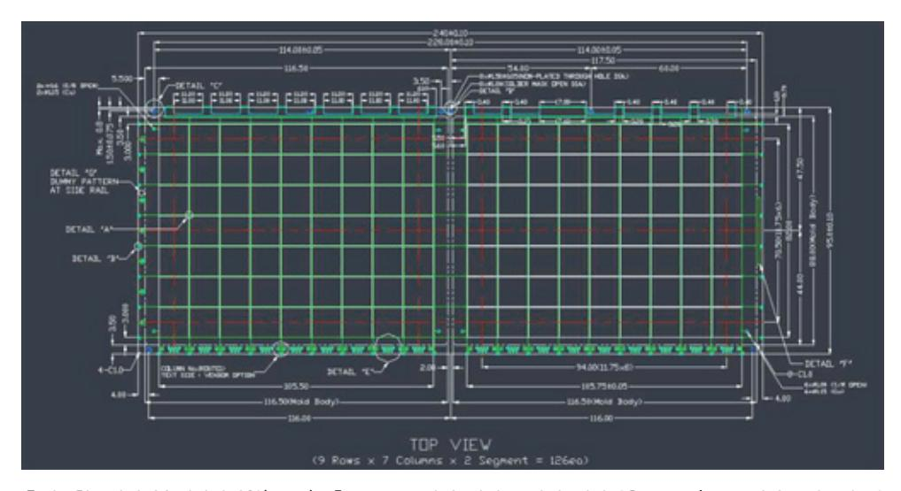

출처: 한국산업기술평가관리원(2018). 『20μm 초미세 피치 모바일 패키지용 6sec/chip 이하 고속 열 압 착 접합 기술 개발』. 하나마이크론. 산업통상자원부. p.124. [그림 2-13] 플립 칩 PCB 제작

## 수행 내용 / 최적화된 패키지 설계하기

#### 재료·자료

- 반도체, 패키지 열 관리 재료 특성 데이터
- CAD 설계 데이터
- 해석 결과 데이터
- 피드백 자료

#### 기기(장비 ・ 공구)

- CAD 소프트웨어
- 시뮬레이션 소프트웨어
- 측정 및 검증 장비

#### 안전 ・ 유의 사항

- 화학 물질 취급 시 보호 장비를 착용해야 한다.
- 재료는 적절한 환경 조건에서 보관해야 한다.

51

- 장비 사용 시 안전 규정을 준수해야 한다.
- 전기적 안전 절차를 준수해야 한다.
- 청정도 유지 및 온도 및 습도 관리를 해야 한다.
- 민감 데이터는 보안 관리를 철저히 해야 한다.
- 설계 및 검토 과정을 문서화 및 기록, 보관해야 한다.

#### 수행 순서

숔 재료 특성을 분석하고 양산성을 검토한다.

재료의 물리적, 화학적, 열적, 전기적 특성을 철저히 분석하여 플립 칩 패키지 설계에 적합한 재료를 선택한다. 특히 열전도성, 열팽창 계수(CTE), 기계적 강도, 내식성, 전기 전도성 및 절 연성 등의 요소를 중점적으로 고려한다. 이러한 재료 특성은 설계의 신뢰성과 성능에 직접적인 영향을 끼치며, 최적의 재료 선택은 패키지의 성능을 극대화할 수 있는 중요한 단계이다.

1. 물리적, 화학적 특성을 분석한다.

재료의 열전도성, 열팽창 계수(CTE), 기계적 강도, 내식성 등을 분석하여 설계에 적합한 재 료를 선정한다.

(1) 열적 특성을 분석한다. 재료의 열전도성과 열팽창 계수를 분석하여 열 관리와 관련된 설계 최적화를 도모하고, 높은 열전도성 재료는 열 방출을 효과적으로 관리하며, 열팽창 계수가 유사한 재료는 휨

과 같은 구조적 문제를 줄일 수 있다.

(2) 기계적 특성을 분석한다.

재료의 기계적 강도를 평가하여 외부 충격이나 스트레스에 대한 내성을 확보하고, 강도 가 높은 재료를 선택하여 패키지의 구조적 안정성을 유지한다.

(3) 화학적 특성을 분석한다.

내식성 및 화학적 안정성을 평가하여, 장기적으로 안정된 성능을 보이는 재료를 선택한 다. 외부 환경에서의 성능 저하를 방지하기 위해 내식성이 높은 재료를 고려한다.

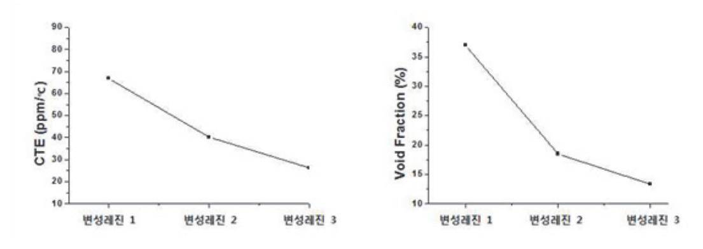

출처: 한국산업기술평가관리원(2018). 『20μm 초미세 피치 모바일 패키지용 6sec/chip 이하 고속 열 압착 접합 기 술 개발』. 하나마이크론. 산업통상자원부. p.59. [그림 1-14] 활성 수소계 함량에 따른 CTE 결과 그래프 및 보이드 분율 결과 그래프

2. 전기적 특성을 분석한다.

재료의 전기 전도성과 절연성을 평가하여, 패키지 내부에서 전기적 성능이 최적화되도록 설 계에 반영한다.

- (1) 전도성을 평가한다. 전기 전도성이 높은 재료를 선택하여 신호 전달의 효율성을 높이고, 구리(Cu)와 같은 재료는 높은 전도성을 제공하여 패키지 내부의 전기 연결에 사용된다.
- (2) 절연성을 평가한다. 절연성이 높은 재료를 선택하여 전기적 간섭을 방지하고 신호의 무결성을 유지하고, 실 리콘 산화물(SiO2)과 같은 절연 재료는 내부 전기적 분리를 돕는다.
- 3. 양산성을 검토한다.

선택한 재료가 대량 생산에 적합한지를 평가하며, 재료의 가용성, 가격 경쟁력, 공급망 안정 성 등을 포함한다.

(1) 재료의 가용성을 평가한다.

재료의 안정적인 공급이 가능한지 평가하고, 가격 변동성이 낮은 재료를 선택하여 대량 생산 시의 경제적 효율성을 확보한다.

- (2) 생산 공정의 자동화 가능성을 평가한다. 생산 공정의 자동화 수준을 고려하여 대량 생산의 효율성을 극대화할 수 있는 방법을 모색하고, 자동화가 가능한 공정은 생산 속도와 일관성을 높이며, 인건비 절감에 기여한다.
- (3) 생산 시간 단축 방법을 고려한다.

생산 시간을 줄일 수 있는 공정 최적화 방법을 모색하여 생산량을 증가시키고 비용을 절감한다.

수행 tip

- 재료 공급망을 안정적으로 유지할 대체 재료를 미리 확보 한다.
- 실제 공정에서 재료를 테스트하여 예상치 못한 문제를 방 지한다.
- 숕 제조 공정 조건 및 장비 특성을 반영한다.

제조 공정의 제한 사항과 장비의 특성을 면밀히 분석하여 설계에 반영한다. 제조 공정의 복잡 성을 줄이고, 재료와 공정의 호환성을 고려하여 최적화된 공정 조건을 설정한다. 예를 들어, 플 립 칩 패키지의 열 관리와 기계적 안정성을 확보하기 위해 적절한 온도와 압력 조건을 설정하 고, 이를 제조 공정에 반영한다.

1. 제조 공정 조건을 최적화한다.

제조 공정의 복잡성을 줄이고, 재료와 공정의 호환성을 고려하여 설계에 반영한다.

- (1) 공정 복잡성을 줄인다. 제조 공정에서 불필요한 단계를 제거하거나 단순화하여 효율성을 높인다. 공정 단계가 단순할수록 오류 발생 가능성이 줄어들고 생산 효율이 증가한다.
- (2) 재료와 공정의 호환성을 고려한다.

사용하는 재료가 제조 공정의 조건에 적합한지 평가한다. 예를 들어, 특정 재료가 공정 중 높은 온도나 압력에서도 안정적으로 유지될 수 있는지 확인한다.

2. 장비 특성을 설계에 반영한다.

사용하는 장비의 성능 파라미터와 한계를 명확히 이해하고, 이를 바탕으로 설계에 반영한 다.

(1) 장비의 성능 파라미터를 고려한다.

장비의 정밀도, 해상도, 처리 속도 등의 특성을 바탕으로 최적의 설계 패턴을 설정하고, 장비가 제공할 수 있는 최대 성능을 설계에 반영하여 공정의 일관성을 유지한다.

(2) 장비의 한계를 반영한다.

장비의 한계점을 명확히 파악하고, 공정 중 발생할 수 있는 문제를 최소화하기 위해 설 계를 조정한다. 필요한 경우, 장비의 한계를 극복하기 위해 업그레이드나 개선을 고려할 수 있다.

3. 장비 유지 보수 계획을 수립한다.

장비의 성능을 지속해서 최적화하고 공정의 안정성을 보장하기 위해 정기적인 유지 보수 계획을 수립한다.

- (1) 정기적인 유지 보수 계획을 수립한다. 장비의 성능을 일정하게 유지하기 위해 정기적인 유지 보수 일정을 설정하고, 이를 엄격 히 준수한다.
- (2) 장비 업그레이드를 검토한다.

기술 발전에 따라 장비를 업그레이드하여 최신 기술을 공정에 반영할 수 있도록 한다. 최신 장비를 도입하여 생산 효율성과 제품 품질을 개선한다.

#### 수행 tip

• 장비 캘리브레이션을 정기적으로 점검하여 정확도를 유지 한다.

• 공정 조건을 시뮬레이션으로 검토하여 최적화를 지원한다.

숖 패키지 구조 및 서브 스트레이트 설계를 최적화한다.

패키지 구조를 분석하여 개선할 점을 도출하고, 최적화된 설계를 구현한다. 특히, 플립 칩 패키 지에서 중요한 요소인 열팽창 계수(CTE)와 관련된 휨 현상을 최소화하기 위해, CTE가 유사한 재료를 선택하고, 열 방출 경로를 최적화하는 등의 구조적 개선을 진행한다. 또 열 방출 성능 을 향상하기 위해 구리와 같은 고전도성 재료를 사용하여 패키지의 열 관리 능력을 강화한다.

1. 패키지 구조를 분석하고 최적화한다.

패키지의 구조적 요소를 분석하여 개선할 부분을 도출하고, 최적화된 설계를 구현한다.

(1) 열팽창 계수(CTE)와 Warpage를 고려한다.

플립 칩 패키지의 휨 현상을 최소화하기 위해, 열팽창 계수가 유사한 재료를 선택한다. 이로 인해 패키지 내 열 스트레스가 줄어들며, 구조적 안정성이 강화된다.

(2) 열 방출 경로를 최적화한다.

패키지 내 열 관리 성능을 향상하기 위해, 구리와 같은 고전도성 재료를 사용하여 열 방출 경로를 최적화한다. 이는 패키지의 과열을 방지하고 장기적인 신뢰성을 보장한다.

2. 서브 스트레이트 설계를 최적화한다.

서브 스트레이트 설계를 다층 구조와 최적화된 배선 패턴을 통해 최적화하여 신호 무결 성과 전기적 성능을 유지한다.

(1) 다층 구조를 활용한다.

서브 스트레이트에 다층 구조를 적용하여, 신호 무결성을 유지하면서도 더 많은 I/O 핀 을 처리할 수 있도록 설계한다. 각 층은 전력 및 신호를 효과적으로 분리하여 신호 간 섭을 줄인다.

(2) 재료 특성을 고려한다.

서브 스트레이트의 재료 선택 시, 실리콘과 유사한 열팽창 계수(CTE)를 가진 재료를 선 택하여 휨을 줄인다. 또 기계적 강도가 높은 재료를 통해 구조적 안정성을 확보한다.

(3) 배선 패턴을 최적화한다.

서브 스트레이트의 배선을 최적화하여 신호 손실을 최소화하고 전기적 성능을 극대화한 다. 이를 위해 최신 설계 기법을 적용하여 배선 경로를 최적화하고, 전기적 간섭을 방지 한다.

수행 tip

• 설계 초기부터 열 관리 문제를 적극적으로 해결한다.

• 다층 설계 시 배선 경로를 최적화하여 신호 간섭을 최소화 한다.

숗 설계 데이터를 검토하고 피드백을 반영한다.

초기 설계 데이터를 제품 설계팀 및 관련 부서와 공유하여 종합적인 피드백을 받는다. 이 피드 백은 설계의 모든 측면이 요구 사항을 충족하는지 확인하는 중요한 과정이다. 피드백을 바탕으 로 설계 데이터를 수정하고, 필요한 경우 추가 해석 및 검토를 통해 설계의 신뢰성과 성능을 더욱 강화한다.

1. 초기 설계 데이터를 공유하고 피드백을 수집한다.

설계팀과 관련 부서에 초기 설계 데이터를 공유하고, 다양한 관점에서 피드백을 수집한다.

(1) 제품 설계팀과 협의한다.

제품 설계팀과 협의하여 설계가 요구 사항을 충족하는지, 그리고 제조 공정과의 호환성 이 적절한지 검토한다. 이 과정에서 제품의 기능적 요구와 생산성 목표를 동시에 달성할 수 있는지를 확인한다.

(2) 관련 부서와 피드백을 교환한다.

품질 관리, 생산, R&D 등 관련 부서와의 피드백을 통해 설계의 신뢰성과 생산성 향상 을 도모한다. 이때 각 부서의 전문성을 활용하여 설계의 잠재적 문제점을 조기에 발견하 고 해결할 수 있다.

2. 설계 데이터를 수정하고 추가 해석을 수행한다.

수집된 피드백을 반영하여 설계를 수정하고, 필요시 추가 해석 및 검토를 수행하여 설계의 완성도를 높인다.

(1) 피드백을 반영하여 설계를 수정한다.

수집된 피드백을 바탕으로 설계 데이터를 수정하여, 설계의 신뢰성과 성능을 강화한다. 이 과정에서 제품의 일관성과 기능적 요구를 유지하면서도, 생산성을 고려한 수정 작업

을 진행한다.

(2) 추가 해석 및 검토를 수행한다.

수정된 설계에 대해 추가적인 열 해석, 전기 해석, 구조 해석을 수행하여, 수정된 설계 가 기대한 성능을 발휘하는지 확인한다. 필요한 경우, 시뮬레이션을 통해 다양한 조건에 서의 성능을 검증한다.

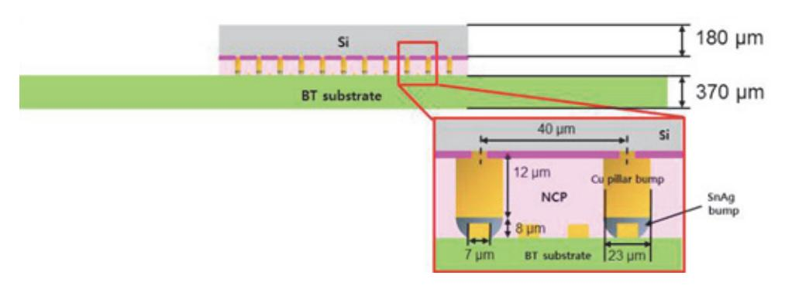

출처: 한국산업기술평가관리원(2018). 『20μm 초미세 피치 모바일 패키지용 6sec/chip 이하 고속 열 압 착 접합 기술 개발』. 하나마이크론. 산업통상자원부. p.160. [그림 2-15] 레이저 열 압착 패키지의 개념도

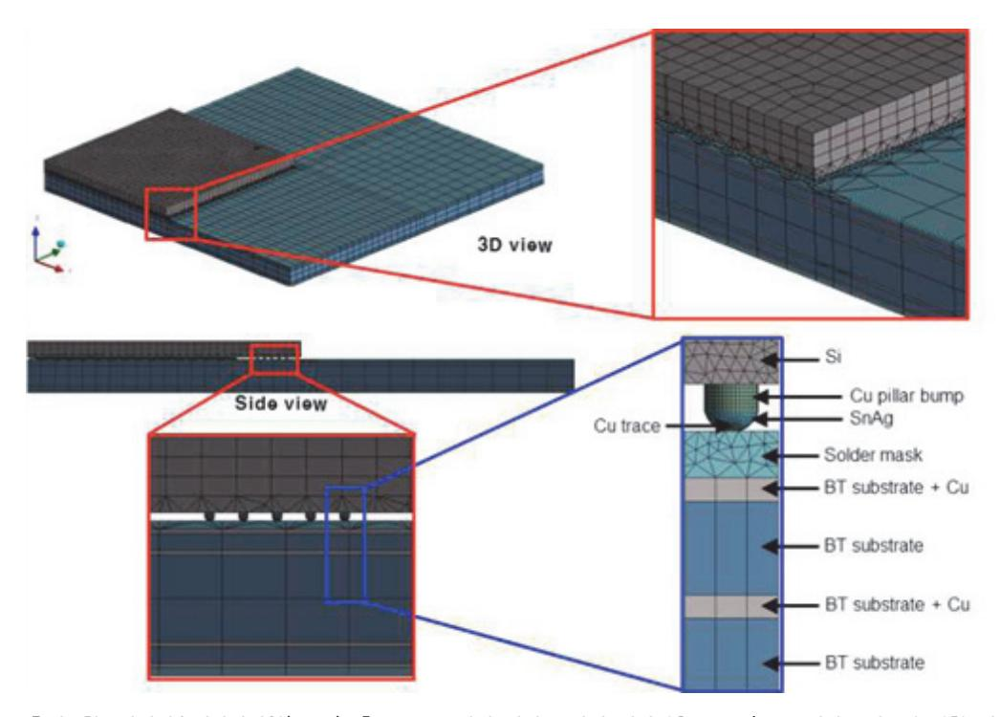

출처: 한국산업기술평가관리원(2018). 『20μm 초미세 피치 모바일 패키지용 6sec/chip 이하 고속 열 압착 접 합 기술 개발』. 하나마이크론. 산업통상자원부. p.161. [그림 2-16] 레이저 열 압착 패키지의 유한 요소 해석 모델

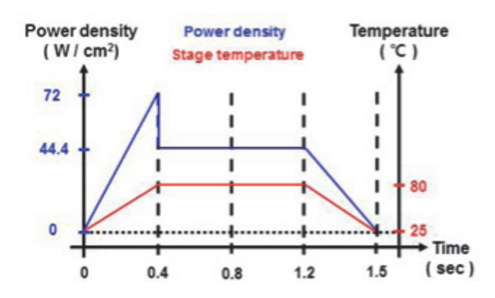

출처: 한국산업기술평가관리원(2018). 『20μm 초미세 피치 모바일 패키지용 6sec/chip 이하 고속 열 압착 접합 기술 개발』. 하나마이크론. 산업통상자원부. p.162. [그림 2-17] 레이저 열 압착 패키지의 열 로딩 조건

출처: 한국산업기술평가관리원(2018). 『20μm 초미세 피치 모바일 패키지용 6sec/chip 이하 고속 열 압 착 접합 기술 개발』. 하나마이크론. 산업통상자원부. p.163. [그림 2-18] 칩 표면 및 솔더 온도 열 해석 결과

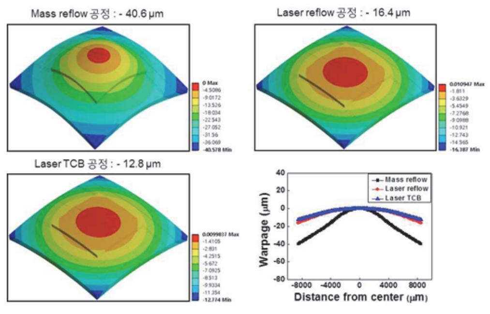

출처: 한국산업기술평가관리원(2018). 『20μm 초미세 피치 모바일 패키지용 6sec/chip 이하 고속 열 압착 접합 기술 개발』. 하나마이크론. 산업통상자원부. p.164. [그림 2-19] 공정별 구조 해석 결과

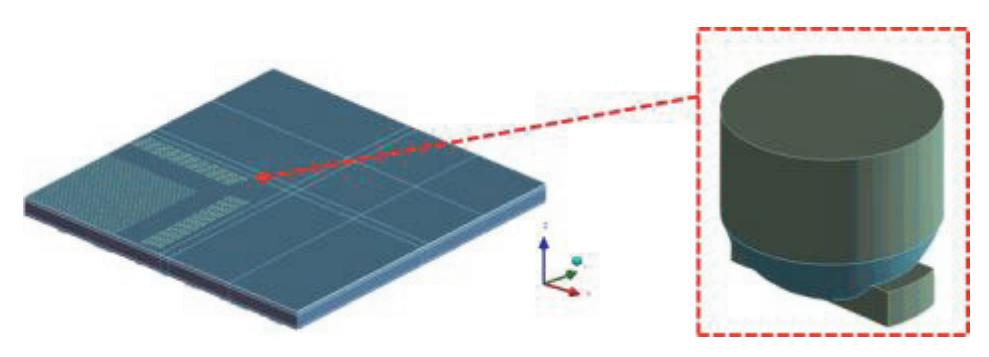

출처: 한국산업기술평가관리원(2018). 『20μm 초미세피치 모바일 패키지용 6sec/chip 이하 고속 열 압착 접합 기술 개발』. 하나마이크론, 산업통상자원부. p.168. [그림 2-20] 구리기둥 범프 취약부

|        | Start | 10,000 cycles | 15,000 cycles | 20,000 cycles | 25,000 cycles | 30,000 cycles |
|--------|-------|------------------|------------------|------------------|------------------|------------------|
| Тор    | 9     | 9                | 9                | 9                | 8                | 8                |
| Bottom | 6     | 6                | 9                | <b></b>          | <b>@</b>         | -                |

출처: 한국산업기술평가관리원(2018). 『20μm 초미세 피치 모바일 패키지용 6sec/chip 이하 고속 열 압착 접합 기술 개발』. 하나마이크론. 산업통상자원부. p.170. [그림 2-21] 열 반복 사이클에 따른 솔더 크랙 예측

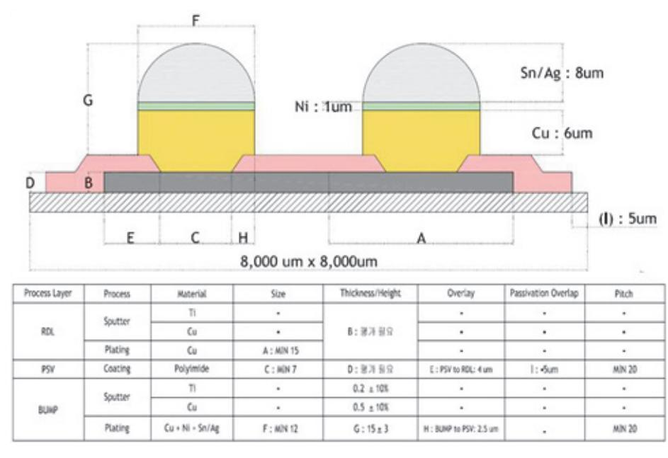

출처: 한국산업기술평가관리원(2018). 『20μm 초미세 피치 모바일 패키지용 6sec/chip 이하 고속 열 압착 접합 기술 개발』. 하나마이크론. 산업통상자원부. p.172. [그림 2-22] Cu pillar bump 제작 사양

3. 최종 설계를 검토하고 확정한다.

수정된 설계를 다시 검토하여 최종 설계 모델로 확정한다. 이 과정에서 설계의 일관성, 제 조 공정과의 적합성, 최종 제품의 신뢰성을 철저히 검토하여 설계의 완성도를 높인다.

(1) 최종 설계를 검토한다.

수정된 설계를 다시 한번 검토하여, 모든 요구 사항을 충족하는지, 그리고 설계가 생산 성과 신뢰성 목표를 달성할 수 있는지를 확인한다. 설계의 일관성과 각 단계 간의 적합 성을 중점적으로 검토한다.

(2) 최종 설계를 확정하고 문서화한다.

검토가 완료된 최종 설계를 확정하고, 이를 문서화하여 이후 단계로의 원활한 전환을 보 장한다. 문서화된 설계는 프로토타입 제작, 검증 및 양산 준비 과정에서 참조될 중요한 기준이 된다.

#### 수행 tip

• 피드백 루프를 강화하여 설계 수정 시간을 절감한다.

• 버전 관리 시스템을 활용하여 설계 데이터의 변화를 명확 히 관리한다.

### 학습 2 교수·학습 방법

#### 교수 방법

- 플립 칩 패키지 설계를 위해 필요한 칩 패드 좌표, 칩 배열, 패키지 연결 정보 내용을 설명 한다.
- 플립 칩 패키지 재료에 대한 정보를 이해하고 패키지 양산성, 제조 공정, 공정 조건, 장비 특성이 고려된 디자인 규칙을 설명한다.
- 전기적 및 기계적 공정 최적화를 위해 필요한 열 해석, 전기 해석, 구조 해석 내용과 설계 에 반영하는 방법을 설명한다.
- 패키지 구조와 서브 스트레이트 등을 확인하여 최적화된 플립 칩 패키지를 설계하는 방법을 설명한다.

#### 학습 방법

- 플립 칩 패키지 설계를 위해 필요한 칩 패드 좌표, 칩 배열, 패키지 연결 정보를 조사한다.
- 플립 칩 패키지 재료에 대한 정보와 패키지 양산성, 제조 공정, 공정 조건, 장비 특성이 고 려된 디자인 규칙을 학습한다.
- 전기적 및 기계적 공정 최적화를 위해 필요한 열 해석, 전기 해석, 구조 해석 내용과 설계 에 반영하는 방법을 이해하고 설계하는 실습을 진행한다.
- 패키지 구조와 서브 스트레이트 등을 확인하여 최적화된 플립 칩 패키지를 설계하는 방법을 이해하고 실제 설계하는 프로젝트를 진행한다.

## 학습 2 평 가

#### 평가 준거

- 평가자는 학습자가 학습 목표를 성공적으로 달성하였는지를 평가해야 한다.
- 평가자는 다음 사항을 평가해야 한다.

|            |                                                                                     |   | 성취수준 |   |  |
|------------|-------------------------------------------------------------------------------------|---|------|---|--|
| 학습 내용      | 학습 목표                                                                               | 상 | 중    | 하 |  |
| 설계 정보 수집 및 | - 플립 칩 패키지 설계를 위하여 칩 패드 좌표, 칩 배열, 패키 지 내부 연결 정보들을 칩 설계 부서로부터 받을 수 있다.            |   |      |   |  |
| 해석         | - 전기적 및 기계적 공정 최적화를 위해 열 해석, 전기 해석, 구조 해석을 통하여 설계에 반영할 수 있다.                     |   |      |   |  |
| 최적화된 패키지 설 | - 플립 칩 패키지 재료에 대한 정보를 기초로 패키지 양산성, 제조 공정, 공정 조건, 장비 특성이 고려된 디자인 규칙을 적용할 수 있다. |   |      |   |  |
| 계          | - 패키지 구조와 서브 스트레이트 등을 확인하여 최적화된 플 립 칩 패키지 설계를 할 수 있다.                            |   |      |   |  |

#### 평가 방법

#### • 서술형 시험

|                  |                                                               |   | 성취수준 |   |  |
|------------------|---------------------------------------------------------------|---|------|---|--|
| 학습 내용            | 평가 항목                                                         | 상 | 중    | 하 |  |
|                  | - 칩 설계 부서로부터 칩 패드 좌표, 배열, 내부 연결 정보를 정확하게 수집할 수 있는 능력       |   |      |   |  |
|                  | - 열 해석, 전기 해석, 구조 해석을 통한 설계 최적화 능력                            |   |      |   |  |
| 설계 정보 수집 및 해석 | - 수집된 설계 정보를 바탕으로 CAD 모델을 정확하게 생성할 수 있는 능력                 |   |      |   |  |
|                  | - 패키지 설계에 필요한 열 관리 정보를 정확하게 수집하고 분 석할 수 있는 능력              |   |      |   |  |
|                  | - 패키지 설계에 필요한 재료의 물리적, 화학적 특성을 정확하 게 분석하고 반영할 수 있는 능력      |   |      |   |  |
| 최적화된 패키지 설       | - 대량 생산을 고려한 재료의 양산성 및 공급 안정성을 평가할 수 있는 능력                 |   |      |   |  |
| 계                | - 제조 공정 조건을 최적화하고 이를 설계에 반영할 수 있는 능력                       |   |      |   |  |
|                  | - 패키지 구조와 서브 스트레이트 설계를 최적화하여 신호 무 결성과 열 관리 성능을 향상할 수 있는 능력 |   |      |   |  |

#### • 논술형 시험

|                 |                                                              | 성취수준 |   |   |
|-----------------|--------------------------------------------------------------|------|---|---|
| 학습 내용           | 평가 항목                                                        | 상    | 중 | 하 |
|                 | - 패키지 내부 신호 무결성을 확보하기 위한 설계 요소를 도출 할 수 있는 능력              |      |   |   |
| 설계 정보 수집 및      | - 패키지 열 관리 솔루션을 설계하고 최적화할 수 있는 능력                            |      |   |   |
| 해석              | - 기계적 스트레스를 분석하여 설계에 반영할 수 있는 능력                             |      |   |   |
|                 | - 최신 반도체 패키징 기술 동향을 분석하고 설계에 반영할 수 있는 능력                  |      |   |   |
|                 | - 패키지 설계 시 재료의 열전도성 및 열팽창 계수를 최적화하 여 구조적 안정성을 확보할 수 있는 능력 |      |   |   |
|                 | - 대량 생산을 위한 공정 통합 및 품질 관리 전략 파악 능력                           |      |   |   |
| 최적화된 패키지 설 계 | - 제조 장비의 성능 파라미터를 고려하여 최적의 설계 패턴을 설정할 수 있는 능력             |      |   |   |
|                 | - 패키지 구조 분석을 통해 기존 구조의 장단점을 평가하고 최 적화된 설계 방안을 도출할 수 있는 능력 |      |   |   |

피드백

- 1. 서술형 시험
- 칩 설계 부서로부터 칩 패드 좌표, 배열, 내부 연결 정보를 정확하게 수집할 수 있는 능력 성취 수준이 낮은 학습자의 경우, 칩 패드 좌표와 배열, 내부 연결 정보의 중요성을 다시 설명하고, 데 이터 수집 절차를 구체적으로 지도한다. 학습자는 반복 연습을 통해 정보 수집 능력을 향상시킬 수 있다. 성취수준이 높은 학습자의 경우, 복잡한 설계 시나리오를 추가로 제공하여 다양한 정보 수집 상황에서 정확성을 유지할 수 있도록 심화 학습을 진행한다.
- 열 해석, 전기 해석, 구조 해석을 통한 설계 최적화 능력 성취수준이 낮은 학습자의 경우, 열 해 석, 전기 해석, 구조 해석의 기본 개념을 재설명하고, 각 해석 결과를 설계에 반영하는 방법을 연 습하도록 지도한다. 성취수준이 높은 학습자의 경우, 해석 결과를 바탕으로 설계 최적화 전략을 심화 학습하고, 다양한 해석 시나리오를 추가로 분석하는 과제를 제공한다.
- 수집된 설계 정보를 바탕으로 CAD 모델을 정확하게 생성할 수 있는 능력 성취수준이 낮은 학습 자의 경우, CAD 소프트웨어 사용법을 다시 설명하고, 초기 설계 모델을 생성하는 과정을 반복 연습하도록 지도한다. 성취수준이 높은 학습자의 경우, 더 복잡한 설계 요소를 포함한 CAD 모델 을 생성하는 과제를 제공하고, 모델의 정확성을 높이기 위한 최적화 방법을 추가로 학습하도록 유 도한다.
- 패키지 설계에 필요한 열 관리 정보를 정확하게 수집하고 분석할 수 있는 능력 성취수준이 낮은 학습자의 경우, 열 관리 정보 수집의 중요성을 다시 설명하고, 데이터를 분석하여 설계에 반영하 는 연습을 반복하도록 지도한다.
- 성취수준이 높은 학습자의 경우, 다양한 열 관리 시나리오를 제공하여 복잡한 열 관리 문제를 해 결할 수 있도록 심화 학습을 진행한다.
- 패키지 설계에 필요한 재료의 물리적, 화학적 특성을 정확하게 분석하고 반영할 수 있는 능력 성 취수준이 낮은 학습자의 경우, 재료의 물리적, 화학적 특성을 다시 설명하고, 분석 결과를 설계에 반영하는 연습을 통해 학습을 보완하도록 지도한다. 성취수준이 높은 학습자의 경우, 복잡한 재료 특성을 포함한 추가 사례를 제공하여, 다양한 상황에서 분석 능력을 심화할 수 있는 학습을 진행 한다.
- 대량 생산을 고려한 재료의 양산성 및 공급 안정성을 평가할 수 있는 능력 성취수준이 낮은 학습 자의 경우, 재료의 양산성과 공급 안정성 평가 방법을 다시 설명하고, 실제 사례를 통해 이를 연 습하도록 지도한다. 성취수준이 높은 학습자의 경우, 복잡한 공급망 상황을 가정한 심화 학습을 통해 다양한 재료의 양산성 평가 능력을 향상할 수 있도록 유도한다.
- 제조 공정 조건을 최적화하고 이를 설계에 반영할 수 있는 능력 성취수준이 낮은 학습자의 경우, 제조 공정 조건 최적화의 기본 개념을 다시 설명하고, 단순화된 예제를 통해 이를 설계에 반영하 는 연습을 하도록 지도한다. 성취수준이 높은 학습자의 경우, 다양한 제조 공정 시나리오를 제공 하여 최적화된 공정 조건을 설계에 반영하는 능력을 심화 학습하도록 유도한다.
- 2. 논술형 시험
- 패키지 내부 신호 무결성을 확보하기 위한 설계 요소를 도출할 수 있는 능력 성취수준이 낮은 학 습자의 경우, 신호 무결성의 개념을 다시 설명하고, 신호 반사와 크로스토크 문제를 해결하기 위 한 설계 방법을 구체적으로 지도한다. 성취수준이 높은 학습자의 경우, 다양한 신호 무결성 문제 를 다루는 심화 과제를 제공하고, 이를 해결할 수 있는 설계 전략을 논의하도록 유도한다.
- 패키지 열 관리 솔루션을 설계하고 최적화할 수 있는 능력 성취수준이 낮은 학습자의 경우, 열 관리 솔루션의 기본 개념과 중요성을 다시 설명하고, 기본적인 방열 솔루션 설계 과제를 수행하도 록 지도한다. 성취수준이 높은 학습자의 경우, 복잡한 열 관리 시나리오를 추가하여 최적화된 방 열 솔루션을 설계하고, 그 성능을 평가하는 심화 학습을 진행한다.

- 기계적 스트레스를 분석하여 설계에 반영할 수 있는 능력 성취수준이 낮은 학습자의 경우, 기계적 스트레스의 개념을 다시 설명하고, 구조 해석 결과를 바탕으로 설계 수정 방안을 도출하는 과제를 수행하도록 지도한다. 성취수준이 높은 학습자의 경우, 다양한 기계적 스트레스 상황을 가정한 심 화 학습을 통해 설계 최적화 전략을 제시하도록 유도한다.
- 최신 반도체 패키징 기술 동향을 분석하고 설계에 반영할 수 있는 능력 성취수준이 낮은 학습자 의 경우, 최신 기술 동향에 대한 이해를 돕기 위해 관련 자료를 추가로 제공하고, 기술을 설계에 반영하는 방법을 구체적으로 지도한다. 성취수준이 높은 학습자의 경우, 더 복잡한 기술 동향을 분석하고, 이를 반영한 혁신적인 설계 아이디어를 제안하는 심화 학습을 진행한다.
- 패키지 설계 시 재료의 열전도성 및 열팽창 계수를 최적화하여 구조적 안정성을 확보할 수 있는 능력 성취수준이 낮은 학습자의 경우, 열전도성 및 열팽창 계수의 중요성을 다시 설명하고, 이를 최적화하는 설계 방법을 구체적으로 연습하도록 지도한다. 성취수준이 높은 학습자의 경우, 다양 한 열 관리 시나리오를 추가로 제공하여, 구조적 안정성을 극대화하는 심화 학습을 진행한다.
- 대량 생산을 위한 공정 통합 및 품질 관리 전략을 개발할 수 있는 능력 성취수준이 낮은 학습자 의 경우, 공정 통합과 품질 관리의 기본 개념을 다시 설명하고, 이를 설계에 적용하는 연습을 통 해 학습을 보완하도록 지도한다. 성취수준이 높은 학습자의 경우, 복잡한 생산 시나리오를 제공하 여 다양한 공정 통합 및 품질 관리 전략을 개발하는 심화 학습을 진행한다.
- 제조 장비의 성능 파라미터를 고려하여 최적의 설계 패턴을 설정할 수 있는 능력 성취수준이 낮 은 학습자의 경우, 제조 장비의 성능 파라미터를 다시 설명하고, 이를 고려한 설계 패턴을 설정하 는 연습을 반복하도록 지도한다. 성취수준이 높은 학습자의 경우, 다양한 장비 성능 시나리오를 제공하여, 최적의 설계 패턴을 도출하는 심화 학습을 진행한다.
- 패키지 구조 분석을 통해 기존 구조의 장단점을 평가하고 최적화된 설계 방안을 도출할 수 있는 능력 성취수준이 낮은 학습자의 경우, 기존 패키지 구조의 장단점을 다시 설명하고, 이를 평가하 는 방법을 연습하도록 지도한다. 성취수준이 높은 학습자의 경우, 복잡한 패키지 구조를 분석하여 최적화된 설계 방안을 도출하는 심화 학습을 통해 설계 능력을 강화하도록 유도한다.

| 학습 3 | 본딩 방법 선정하기   |
|------|--------------|
| 학습 1 | 패키지 가능성 확보하기 |
| 학습 2 | 패키지 설계 최적화하기 |

## 3-1. 본딩 방법 선정

|       | • 이방성 도전 필름을 사용하여 솔더 범프와 PCB 패드를 열 압착으로 접착하는 방식을 검토할 수         |
|-------|----------------------------------------------------------------|
|       | 있다. • 레이저에 의해 솔더를 녹여 솔더 범프와 PCB 패드를 열전도로 접합하는 방식을 검토할 수 있다. |
| 학습 목표 | • 리플로를 이용하여 접합부의 솔더를 녹여 솔더 범프와 PCB 패드를 높은 온도로 접합하는 방식을         |
|       | 검토할 수 있다.                                                      |
|       | • 플립 칩 본딩의 접착 강도, 생산성, 공정 원가 등을 고려하여 최적의 본딩 방식을 선정할 수 있다.      |

## 필요 지식 /

- 숔 본딩(Bonding)이란?
  - 1. 본딩의 개념

본딩은 전자 기기나 반도체 패키지에서 다양한 구성 요소를 물리적, 전기적으로 연결하는 과정을 의미한다. 이 과정은 2개 이상의 서로 다른 재료를 접착시키거나 연결하여 하나의 일체형 구조를 만드는 데 필수적이다. 본딩은 기계적 강도, 전기적 성능, 열 관리 등을 보 장하는 중요한 역할을 한다.

2. 본딩의 정의

본딩은 특정한 재료와 기술을 사용하여 두 표면을 영구적으로 연결하는 과정을 의미한다. 전자 기기에서 본딩은 주로 솔더링, 접착, 용접 등의 방법을 사용하여 전기적 연결과 기계적 강도를 제공한다. 본딩 기술은 반도체 소자, PCB(Printed Circuit Board), IC(Integrated Circuit) 등의 제조 공정에서 중요한 단계로 간주된다.

3. 본딩의 중요성

본딩은 전자 기기의 성능과 신뢰성을 결정짓는 중요한 요소이다. 정확하고 견고한 본딩은 전기적 신호의 무결성을 유지하고, 열을 효율적으로 관리하며, 외부 스트레스에 대한 저항 성을 높이다. 따라서 본딩 기술의 선택과 적용은 전자 기기의 전체적인 성능과 수명을 크게 좌우한다.

#### 솔더링(Soldering)

솔더링(Soldering)은 2개의 금속 부품을 결합하기 위해 사용되는 기술로, 용융된 솔더(납땜 재료)를 금속 표 면에 녹여서 결합시키는 방법이다. 솔더는 주로 주석과 납의 합금으로 구성되며, 이 합금이 녹아서 금속 표면 에 흐르면서 결합을 형성한다. 솔더링은 전자 기기, 배관, 금속 공예 등 다양한 분야에서 널리 사용된다.

솔더링이 효과적으로 이루어지기 위해서는 다음과 같은 조건들이 충족되어야 한다.

먼저, 용융된 솔더가 금속 표면에 잘 퍼져 나가야 한다. 솔더가 금속에 접촉되면 표면 장력에 따라 자연스럽 게 확산해야 한다. 이는 솔더가 금속 표면의 모든 요철과 흠집을 따라 흐르면서 금속 표면을 완전히 덮을 수 있도록 한다.

또 용융된 솔더가 금속 표면을 적시면서 접합될 부분의 틈새로 빨려 들어가야 한다. 이 현상을 모세관 현상이 라고 한다. 금속 표면과 솔더 간의 모세관 현상은 솔더가 리드와 기판 홀 사이의 작은 틈새로 자연스럽게 흘 러 들어가게 한다.

마지막으로, 용융된 솔더가 금속 표면에 퍼지면서 금속과 잘 융합되어야 한다. 이 과정에서 솔더는 금속 표면 과 화학적으로 반응하여 합금층이나 금속 간 화합물을 형성한다. 이러한 화합물이 접합의 강도를 결정짓는다. 금속 표면을 육안으로 보면 매끄럽게 보이지만, 현미경으로 확대해 보면 무수한 요철이나 결함이 존재한다. 용융 솔더는 모세관 현상으로 인해 이러한 금속면을 따라서 흘러 들어가고, 금속 결합이 생긴다. 일반적인 솔 더링에서는 합금층 또는 금속 간 화합물이 형성되며, 이 합금층이 금속끼리의 접합 품질에 중요한 영향을 끼 친다.

#### 숕 플립 칩 패키지에서의 접합 방식의 종류 및 사례

1. 플립 칩 패키지(Flip-Chip Package)

플립 칩 본딩은 칩이 뒤집힌 상태로 기판에 부착되며, 솔더 범프(Solder Bumps)나 다른 전도성 접합 기술을 통해 전기적 연결을 형성한다. 이 방식은 칩의 I/O 패드가 기판과 직 접 연결되어 신호 경로가 짧아지고, 신호 무결성과 전력 효율성을 높일 수 있다.

- 2. 접합 방식의 종류 및 사례
  - (1) 이방성 도전 필름(ACF) 접착 방식
    - (가) 개념

ACF(Anisotropic Conductive Film)는 전도성 입자가 포함된 필름을 사용하여 열 과 압력을 가해 접합하는 방식이다. ACF는 고밀도 접합에 유리하며, 주로 디스플레 이 패널과 같은 고정밀 접합에 사용된다.

- (나) 종류
  - 1) 열 압착 접착(Thermo-Compression Bonding, TCB)
  - 가) 열과 압력을 가해 ACF를 경화시키고 접합하는 방식이다.
  - 나) 일반적인 ACF 접착 방식으로, 비교적 높은 온도와 압력이 필요하다.
  - 다) 디스플레이 패널, 고밀도 PCB, 모바일 디바이스에 사용된다.
  - 라) 신뢰성 높은 접합, 다양한 응용 가능하다.
  - 마) 상대적으로 긴 공정 시간, 고온 요구된다는 점이 있다.

- 2) 초음파 접착(Ultrasonic Bonding)
- 가) 초음파 진동을 사용해 ACF를 가열 및 접합하는 방식이다.
- 나) 낮은 온도에서 빠른 접합이 가능하다.
- 다) 플립 칩 패키지와 소형 전자 기기에 사용된다.
- 라) 빠른 공정 시간이 가능하며, 열 손상을 최소화할 수 있다.
- 마) 하지만 장비 비용이 높고, 정밀한 제어가 필요하다.
- 3) 펄스 히트 접착(Pulsed Heat Bonding)
- 가) 펄스 형태의 열을 가해 ACF를 접합하는 방식이다.
- 나) 매우 짧은 시간 동안 고온을 적용한다.
- 다) 고속 접합이 필요한 경우나 열에 민감한 부품에 사용된다.
- 라) 열 손상을 최소화하면서도 고속 작업이 가능하다.
- 마) 정밀한 타이밍 제어가 필요하며, 장비 비용이 높다.
- 4) 레이저 접착(Laser Bonding)
- 가) 레이저를 사용해 국소적으로 ACF를 가열하여 접합하는 방식이다.
- 나) 매우 정밀한 열 제어가 가능하다.
- 다) 고밀도 회로나 소형 전자 부품에 사용된다.
- 라) 정밀한 열전달이 가능하고, 인접 부품의 손상을 최소화할 수 있다.
- 마) 초기 설치 비용이 높으며, 정밀한 제어가 필요하다.

#### (다) 메커니즘

- 1) 필름 배치
- ACF 필름을 두 접합 표면 사이에 위치시킨다.
- 2) 열 및 압력 적용
  - 열과 압력을 가하여 전도성 입자가 표면에 접착되어 전기적 연결을 형성한다.
- 3) 접합 형성
  - 열과 압력으로 인해 전도성 입자가 PCB 패드와 솔더 범프 사이에 물리적, 전기 적 연결을 형성한다.
- 4) 완성

열경화성 수지가 경화되어 전도성 입자를 고정하고, 안정적인 전기적 접촉을 유 지한다.

- (라) 사례
  - 1) 고해상도 디스플레이 패널에서 정밀한 전기적 연결을 제공한다.
  - 2) 고밀도 배선이 필요한 PCB에 사용된다.
  - 3) 스마트폰 및 태블릿과 같은 고밀도 전자 기기에 활용된다.
- (2) 레이저 솔더 접합 방식

- 4) 레이저가 꺼지고 솔더가 빠르게 냉각되어 고체화된다.
- 3) 녹은 솔더는 표면 장력에 의해 PCB 패드와 솔더 범프를 감싸며 전기적 및 기계적 연결을 형성한다.
- 2) 레이저 빔이 솔더 범프에 국소적으로 열을 가해 솔더를 녹인다.
- 1) 레이저 빔을 솔더 범프와 PCB 패드가 있는 접합부에 집중시킨다.
- 마) 정밀한 타이밍 제어와 고비용 장비가 필요하다.

나) 매우 짧은 시간 동안 고출력을 제공하여 열 영향을 최소화한다.

라) 열 손상을 최소화하면서 고속 작업이 가능하다.

다) 고속 접합과 열에 민감한 부품에 적용된다.

(다) 메커니즘

- 가) 펄스 형태의 레이저를 사용하여 솔더를 가열하는 방식이다.
- 4) 펄스 레이저 솔더링(Pulsed Laser Soldering)
- 마) 고가의 장비와 복잡한 제어 시스템이 필요하다.
- 라) 높은 정밀도와 효율성을 제공하며, 소형화가 가능하다.
- 다) 고정밀 전자 부품과 의료 기기에 주로 사용된다.
- 나) 매우 높은 출력 밀도와 정밀한 제어가 가능하다.
- 가) 파이버 레이저를 사용하여 솔더를 가열하는 방식이다.
- 3) 파이버 레이저 솔더링(Fiber Laser Soldering)
- 마) 복잡한 장비와 유지 보수 비용이 비싼 것이 단점이다.
- 라) 고출력으로 빠르게 가열할 수 있으며, 높은 에너지 효율을 갖춘다.
- 다) 자동차 전자 장치와 산업용 센서 같은 고출력 응용에 사용된다.
- 나) 높은 출력과 에너지 밀도를 제공한다.
- 가) YAG(Yttrium Aluminum Garnet) 레이저를 사용하여 솔더를 가열하는 방식이다.
- 2) YAG 레이저 솔더링(YAG Laser Soldering)

- 마 단점으로는 초기 설치 비용이 높고 정밀한 제어가 필요하다.
- 라) 매우 정확한 열 전달로 인접 부품 손상을 최소화한다.

- 다) 고밀도 회로 보드 및 소형 전자 부품에 적용된다.
- 나) 고정밀 열 제어와 빠른 응답 시간을 제공한다.

1) 다이오드 레이저 솔더링(Diode Laser Soldering)

- 가) 다이오드 레이저를 사용하여 국소적으로 열을 가해 솔더를 녹이는 방식이다.
- (나) 종류
- 레이저 솔더 접합 방식은 레이저를 사용하여 솔더를 녹여 접합하는 방식으로, 특정 영역에 집중된 열을 제공하여 솔더를 신속하고 정확하게 녹인다.
- (가) 개념

(라) 사례

1) 스마트폰의 카메라 모듈과 같은 소형 전자 부품에 사용된다.

2) 정밀도가 요구되는 의료 기기 및 MEMS(미세전자기계시스템)에서도 활용된다.

- (3) 리플로 솔더 접합 방식
  - (가) 개념

리플로 솔더 접합 방식은 리플로 오븐을 사용하여 솔더를 녹여 접합하는 방식이다. SMT(Surface Mount Technology) 공정에서 주로 사용되며 대량 생산에 적합하다.

(나) 종류

1) 적외선 리플로(Infrared Reflow)

가) 적외선 에너지를 사용해 솔더를 가열하는 방식이다.

- 나) 열을 직접 전달하지 않고 적외선 방사선을 통해 가열하여 열전달이 빠르다.
- 다) 열 민감도가 낮고, 높은 생산 속도가 필요한 경우에 사용된다.
- 라) 단점으로는 온도 분포가 균일하지 않으며, 부품 간 온도 차이가 클 수 있다.
- 2) 대류 리플로(Convection Reflow)
- 가) 열풍을 순환시켜 솔더를 가열하는 방식이다.
- 나) 온도 분포가 균일하며 넓은 범위의 PCB를 효율적으로 가열할 수 있다.
- 다) 일반적인 SMT 공정에 널리 사용된다.
- 라) 에너지 소비가 높고 열 손상의 가능성이 있다.
- 3) 적외선 + 대류 리플로(IR+Convection Reflow)
- 가) 적외선과 대류를 결합하여 가열하는 방식이다.
- 나) 적외선의 빠른 열전달과 대류의 균일한 온도 분포를 모두 활용할 수 있다.
- 다) 빠른 온도 상승과 균일한 가열이 동시에 필요한 경우에 사용된다.
- 라) 복잡한 장비와 초기 비용이 높다.
- 4) 질소 리플로(Nitrogen Reflow)
- 가) 질소(N2) 환경에서 솔더를 가열하는 방식이다.
- 나) 산화를 방지하기 위해 질소를 사용하여 솔더 접합부 품질을 높인다.
- 다) 산화에 민감한 고품질 전자 제품 제조에 사용된다.
- 라) 질소 공급 장치가 필요하며 운영 비용이 증가한다.
- 5) 레이저 리플로(Laser Reflow)
- 가) 레이저 빔을 사용해 국소적으로 솔더를 가열하는 방식이다.
- 나) 매우 정밀하게 특정 영역만 가열할 수 있으며 열 손상을 최소화한다.
- 다) 소형 전자 부품 및 고밀도 회로에 사용된다.
- 라) 정밀 제어가 필요하고 비용이 높다.
- 6) 증기 상 리플로(Vapor Phase Reflow)

- 가) 증기 상에서 열 전달을 통해 솔더를 가열하는 방식이다.
- 나) 온도 조절이 매우 정밀하며 균일한 열 분포를 제공하여 고신뢰성이 필요한 전자 제품 제조에 사용된다.
- 다) 공정 속도가 느리고 고비용 장비가 필요하다.
- (다) 메커니즘
  - 1) PCB 패드 위에 솔더 페이스트를 인쇄한다.
  - 2) 솔더 페이스트가 인쇄된 PCB 위에 전자 부품을 배치한다.
  - 3) 리플로 오븐에서 조립체를 가열하여 솔더를 녹인다.
  - 4) 솔더가 냉각되면서 솔더 범프와 PCB 패드를 접합한다.
- (라) 사례
  - 1) 대량 생산이 필요한 컴퓨터 메인보드에 사용된다.
  - 2) 고성능 GPU와 PCB 간 접합에 사용된다.
  - 3) 서버 및 데이터 센터 장비에서도 활용된다.

숖 접합 방식 비교 및 선택 가이드

플립 칩 패키지에서의 접합 방식은 각각 고유한 장점과 단점이 있으며, 응용 분야에 따라 최적 의 방식을 선택해야 한다.

- 1. 이방성 도전 필름(ACF) 접착 방식
  - (1) 비용 분석

ACF 접착 방식은 재료 비용이 높으나 고밀도 및 고정밀 응용에서 가치가 있다.

(2) 적용 가능성 및 제한 사항

디스플레이 패널, 모바일 디바이스, 고밀도 PCB 등에서 사용하며, 고온과 압력이 필요 하므로 열에 민감한 부품에는 제한적이다.

(3) 선택 기준 및 고려 사항

고밀도 및 정밀한 접합이 필요할 때 적합. 열과 압력을 제어할 수 있는 장비가 필요하다.

- 2. 레이저 솔더 접합 방식
  - (1) 비용 분석

초기 장비 비용이 높지만, 높은 정밀도와 빠른 공정 속도로 장기적으로 비용 효율적이 다.

(2) 적용 가능성 및 제한 사항 소형 전자 부품, 고밀도 회로, 열 민감한 부품에 적합. 정밀한 제어가 필요하며, 장비 설정이 복잡할 수 있다.

- (3) 선택 기준 및 고려 사항 정밀한 열 제어와 빠른 공정 속도가 필요할 때 적합. 초기 비용이 높고, 정밀 제어 시스 템이 필요하다.
- 3. 리플로 솔더 접합 방식
  - (1) 비용 분석

대량 생산에 적합하며, 상대적으로 낮은 비용으로 대규모 생산이 가능하다.

(2) 적용 가능성 및 제한 사항

대부분의 전자 제품 조립에 적합하며, 특히 SMT(Surface Mount Technology) 공정에 널리 사용된다. 열 분포가 균일하지 않을 수 있으며, 열 손상이 우려될 수 있다.

(3) 선택 기준 및 고려 사항

대량 생산이 필요하고, 다양한 부품 크기와 형태를 처리해야 하는 경우 적합. 비용 효율 성을 고려해야 하며, 열 관리가 중요한 요소이다.

숗 2D, 2.5D, 3D 기술에서의 플립 칩

 플립 칩 본딩 기술은 다양한 패키징 기술에서 그 활용도가 높아지고 있으며, 각각의 패키징 방식이 제공하는 장점을 통해 전자 기기의 성능과 효율성을 극대화하고 있다.

1. 2D 패키징에서의 플립 칩

2D 패키징은 반도체 칩을 단일 평면에 배치하는 전통적인 방식이다. 이 방식에서 칩들은 보통 PCB에 와이어 본딩이나 플립 칩 본딩으로 연결된다. FCBGA(Flip Chip Ball Grid Array) 기술은 칩을 뒤집어 기판에 직접 부착하여 신호 경로를 단축한다. 예를 들어, I사의 고성능 프로세서인 CPU는 플립 칩 FCBGA 패키지를 사용하여 신호 무결성을 유지하고 전 력 효율성을 높이다.

2. 2.5D 패키징에서의 플립 칩

2.5D 패키징은 칩들을 실리콘 인터포저(Silicon Interposer) 위에 배치하여 서로 연결하는 방식이다. 인터포저는 칩 간의 높은 밀도의 연결을 가능하게 한다. I사의 Kaby Lake-G 프 로세서는 CPU와 GPU를 동일 패키지 내에 배치하고, 플립 칩 본딩을 통해 실리콘 인터포 저와 연결한다. 이는 높은 데이터 전송 속도와 효율적인 열 관리를 가능하게 한다. A사의 Radeon Instinct MI25 GPU는 HBM2 메모리 스택을 플립 칩 본딩을 통해 실리콘 인터 포저 위에 배치하여 고성능 그래픽 연산을 수행한다.

3. 3D 패키징에서의 플립 칩

3D 패키징은 칩을 수직으로 쌓아 올리는 방식으로, 매우 높은 집적도를 제공하며 신호 경 로를 극단적으로 단축한다. T사의 CoWoS(Chip on Wafer on Substrate)는 2.5D 패키징 기술로, 여러 칩을 실리콘 인터포저에 배치하여 서로 연결한다. 이는 고성능 컴퓨팅과 데이 터 센터 응용 프로그램에 사용되며, 플립 칩 본딩을 통해 칩을 인터포저에 연결한다. 이러 한 패키지는 주로 고성능 AI 및 HPC 시스템에 사용된다.

## 수행 내용 / 본딩 방법 선정하기

#### 재료·자료

- 본딩 및 접합 재료
- 반도체 및 기판
- 설계 및 공정 데이터
- 품질 및 테스트 자료

#### 기기(장비 ・ 공구)

- 본딩 장비
- 검사 및 측정 ・ 분석 장비
- 재료 주입 및 경화 장비
- 기타 공구
- 안전 ・ 유의 사항
  - 레이저 보호 안경을 착용하고 작업 영역을 제한하여 안전을 확보한다.
- - 고온 장비 사용 시 내열 장갑을 착용하여 화상을 방지한다.

  - 언더필 재료 취급 시 보호 장비를 착용하고 환기 시스템을 가동한다.

  - 정전기 방지 장비를 사용하고 클린룸에서 청정도를 유지한다.

  - 장비를 정기적으로 점검하고 사용 전후로 상태를 확인한다.

숔 프로젝트 요구 사항을 분석하고 본딩 방법을 초기 검토한다.

1. 이방성 도전 필름(ACF) 방식을 검토한다.

ACF(Anisotropic Conductive Film) 방식은 전도성 입자가 포함된 필름을 사용하여 열과 압력을 가해 반도체 칩과 기판 간의 전기적 연결을 형성하는 방식이다. 이 방식은 특히 고 밀도 회로 및 정밀한 전기적 연결이 요구되는 응용 분야에 적합하다.

(1) 고밀도 및 미세 피치 접합을 고려한다.

ACF는 매우 좁은 간격에서도 높은 신뢰성을 유지하며, 전도성 입자가 특정 방향으로만 전기적 연결을 형성하여, 인접한 접합 간의 단락을 방지한다.

(2) 열 관리를 최적화한다.

ACF는 상대적으로 낮은 온도에서 접합이 가능하므로, 열에 민감한 부품의 손상을 최소 화할 수 있다.

(3) 적용 분야를 확인한다.

이 방식은 주로 디스플레이 패널, 웨어러블 기기, 스마트폰의 고밀도 인터커넥션 등에 사용된다.

2. 레이저 본딩 방식을 검토한다.

레이저 본딩 방식은 레이저를 이용해 국부적으로 집중된 열을 가하여 솔더를 녹이는 방식 이다. 이 방식은 정밀한 열 제어와 빠른 공정 속도를 요구하는 소형 전자 부품에 적합하다.

(1) 국부 가열을 통해 열 영향을 최소화한다.

레이저를 사용해 특정 부위에만 열을 가함으로써, 주변 부품에 미치는 열 영향을 최소화 하고, 열에 민감한 부품을 보호할 수 있다.

- (2) 고속 공정으로 생산성을 극대화한다. 레이저 본딩은 매우 빠른 속도로 진행할 수 있어, 대량 생산에서 효율성을 극대화할 수 있다.
- (3) 응용 분야를 확인한다.

스마트폰의 카메라 모듈, MEMS(미세 전자 기계 시스템) 및 정밀 전자 부품에 주로 사 용된다.

3. 리플로 본딩 방식을 검토한다.

리플로 본딩 방식은 솔더를 리플로 오븐에서 전체적으로 가열하여 반도체 칩과 기판을 접 합하는 방식이다. 이 방식은 대량 생산에 매우 적합하며, 다양한 전자 제품의 조립에 널리 사용된다.

(1) 균일한 열 분포를 유지한다.

리플로 공정에서는 전체 조립체를 균일하게 가열하여, 모든 접합부에 일관된 품질을 제 공할 수 있다.

(2) 대량 생산에 적합한지 검토한다.

이 방식은 많은 양의 제품을 효율적으로 처리할 수 있어, 비용 효율성이 높다.

(3) 적용 분야를 확인한다.

컴퓨터 메인보드, 고성능 GPU, 서버 및 데이터 센터 장비와 같은 대규모 생산 라인에 서 필수적인 공정이다.

- 숕 본딩 방법을 선택하고 프로토타입을 제작한다.
  - 1. 본딩 방법을 비교 분석한다.

프로젝트 요구 사항을 충족하기 위해, 검토된 본딩 방법들의 기술적 특성, 공정 비용, 신뢰 성, 생산성 등을 면밀히 비교 분석한다.

(1) 전기적 성능을 평가한다.

각 본딩 방법이 요구되는 전기적 특성을 얼마나 충족하는지 분석한다. 예를 들어, ACF 방식은 미세 피치 연결에서 우수한 전기적 신뢰성을 제공하며, 리플로 방식은 대규모 집 적 회로에서 일관된 전기적 성능을 보장한다.

(2) 열적 관리를 고려한다.

본딩 과정에서 발생하는 열이 제품의 성능에 미치는 영향을 고려하여, 열에 민감한 부품 을 보호하는 방법을 선정한다. 예를 들어, 레이저 본딩 방식은 국부적인 열 가열을 통해 주변 부품에 미치는 영향을 최소화할 수 있다.

(3) 기계적 강도 및 신뢰성을 검토한다.

접합부의 기계적 강도와 장기 신뢰성을 평가하여, 제품의 수명과 안정성을 보장하는 방 법을 선택한다. 각 본딩 방식이 고온, 고습, 진동 등의 환경 조건에서 얼마나 안정적인 지를 검토한다.

(4) 공정 비용 및 생산성을 분석한다.

각 본딩 방법의 장비 비용, 재료비, 공정 속도 등을 비교하여, 경제적 측면에서 최적의 선택을 도출한다. 대량 생산의 경우 리플로 방식이 비용 효율성이 높을 수 있으며, 소형 화된 고정밀 제품의 경우 레이저 본딩이 유리할 수 있다.

이와 같은 종합적인 비교 분석을 통해, 프로젝트의 요구 사항을 가장 효과적으로 충족할 수 있는 본딩 방법을 최종적으로 선정한다.

2. 프로토타입을 제작하고 성능을 검증한다.

선정된 본딩 방법을 바탕으로 프로토타입을 제작하고, 이를 통해 본딩 방식의 실질적인 성 능을 검증한다.

(1) 프로토타입을 제작한다.

최종 선정된 본딩 방법을 적용하여, 실제 크기의 샘플 또는 프로토타입을 제작한다. 이 과정에서 설계된 공정 파라미터(예: 온도, 압력, 시간)를 정확하게 적용하여, 일관된 접

합 품질을 확보한다.

(2) 전기적 성능을 검증한다.

프로토타입의 전기적 특성을 측정하여, 설계 목표와 일치하는지 확인한다. 예를 들어, 전기 저항, 전도성, 신호 무결성 등을 테스트하여 본딩 방식이 요구되는 전기적 성능을 제공하는지 평가한다.

(3) 열적 성능 및 관리 상태를 검증한다.

프로토타입이 열 스트레스 하에서 어떻게 동작하는지 평가하여, 열 방출, 열 저항, 열팽 창 등의 특성을 분석한다. 이 과정에서 과열에 따른 부품 손상이 없는지, 접합부의 열적 안정성이 유지되는지 확인한다.

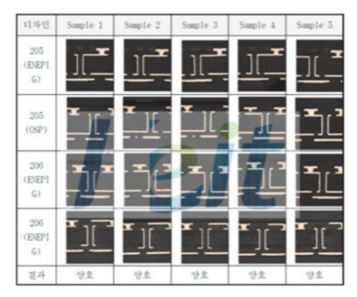

출처: 한국산업기술평가관리원(2017). 『차세대 초박형 MCP 인쇄 회로 기판 모듈 및 SIP용 임 베디드 PCB 모듈』. p.393. [그림 3-1] TC(Temperature Cycle) 시험

(4) 기계적 강도 및 신뢰성을 테스트한다.

프로토타입이 외부 충격, 진동, 온도 변화 등 다양한 환경에서 기계적 강도를 유지하는 지 평가한다. 추가로, 가속 수명 시험 등을 통해 장기적인 신뢰성을 검증한다.

(5) 결과를 분석하고 피드백을 반영한다.

모든 검증 결과를 종합적으로 분석하고, 필요시 공정 조건이나 설계를 조정한다. 프로토 타입 테스트에서 발견된 문제점이나 개선 사항을 반영하여, 최종 제품의 성능과 신뢰성 을 최적화한다.

숖 본딩 과정을 실행하고 검사를 수행한다.

1. 장비를 설정하고 재료를 배치한다.

선택된 본딩 방법에 따라 본딩 장비를 설정하고, 반도체 칩과 기판을 정확하게 배치하여 본 딩 준비를 완료한다.

(1) 본딩 장비를 설정한다.

본딩 방법에 따라 장비의 주요 파라미터(온도, 압력, 시간 등)를 설정한다. 예를 들어, ACF 방식의 경우, 열 압착에 필요한 온도와 압력을 설정하고, 리플로 방식의 경우 오븐 의 온도 프로파일을 설정한다. 설정된 조건이 실험적으로 검증된 값인지 확인하고, 필요 시 교정 작업을 진행한다.

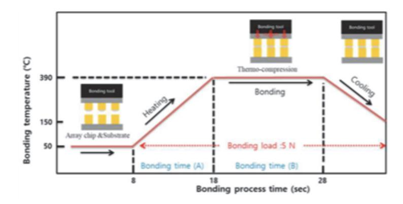

출처: 한국생산기술연구원(2020). 『20um급 미세 범프 플립 칩 패키지 원천 소재 및 공정 기술 개 발』. p.27. [그림 3-2] Flip chip 기반의 열 압착 접합 프로파일

(2) 재료를 정확하게 배치한다.

반도체 칩과 기판을 장비에 정확하게 배치하여, 접합 면이 완벽하게 일치하도록 한다. 이 과정에서 고정 장치나 정렬 장비를 사용하여 미세한 위치 조정이 가능하도록 하며, 칩 패드와 PCB 패드 간의 정렬이 최적화되었는지 확인한다. 위치 오차가 발생하지 않 도록 반복 확인하고, 자동화 장비를 사용하는 경우 프로그램이 정확히 작동하는지 사전 테스트를 실시한다.

(3) 환경 조건을 점검한다.

본딩이 이루어지는 환경(예: 청정도, 습도, 온도)을 점검하여, 외부 요인이 본딩 품질에 영향을 미치지 않도록 한다. 필요시, 클린 룸 조건을 유지하고, 작업자가 착용하는 장비 나 사용되는 도구가 오염을 방지하는지 확인한다.

2. 본딩 프로세스를 실행한다.

설정된 조건에 따라 본딩 공정을 수행하여, 솔더 범프와 PCB 패드 간의 전기적 및 기계적 접합을 형성한다.

(1) 본딩 공정을 시작한다.

설정된 파라미터에 맞춰 본딩 프로세스를 시작한다. 예를 들어, 리플로 방식의 경우 오 븐 내부의 온도와 시간 프로파일을 모니터링하며, ACF 방식의 경우 열 압착기의 온도 와 압력이 설정된 값에 도달했는지 확인 후 프로세스를 시작한다.

(2) 실시간 모니터링을 수행한다.

본딩 과정 중 실시간 모니터링을 통해 공정 상태를 확인한다. 주요 파라미터(예: 온도, 압력, 진동 등)를 지속해서 모니터링하여, 설정값에서 벗어나는 경우 즉각 조치할 수 있 도록 한다. 자동화된 모니터링 시스템을 활용하여, 데이터가 실시간으로 기록되고 분석 될 수 있도록 한다.

(3) 프로세스를 종료하고 냉각한다.

본딩이 완료되면, 설정된 절차에 따라 공정을 종료하고 접합부를 냉각시킨다. 리플로 방 식에서는 오븐 내부의 제품이 서서히 냉각되도록 하며, 레이저 본딩 방식에서는 레이저 가 꺼진 후 솔더가 빠르게 고체화되도록 한다. 냉각 과정에서 열 충격이 발생하지 않도 록 관리하며, 냉각이 완료된 후 장비에서 제품을 안전하게 제거한다.

3. 본딩 완료 후 검사하고 미세 구조를 분석한다.

본딩이 완료된 후, 접합 품질을 평가하고 미세 구조를 분석하여 신뢰성을 검증한다.

(1) X-ray 검사를 실시한다.

본딩된 부품의 내부 구조를 확인하기 위해 X-ray 검사를 실시한다. X-ray 검사를 통해 솔더 범프와 PCB 패드 간의 접합 상태, 기포 유무, 내부 결함 등을 검사한다. X-ray 이미지 분석을 통해, 접합부의 일관성과 품질을 평가하고, 문제가 발견되면 즉각 원인을 파악하여 대응한다.

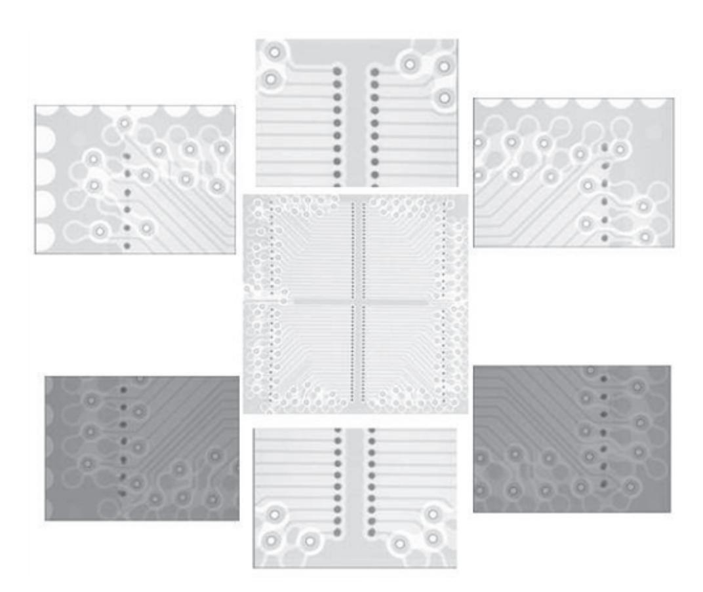

출처: 한국산업기술평가관리원(2017). 『차세대 초박형 MCP 인쇄 회로 기판 모듈 및 SIP용 임베디드 PCB 모듈』. p.462.

[그림 3-3] Cu pillar bumped flipchip mount 후 X-ray

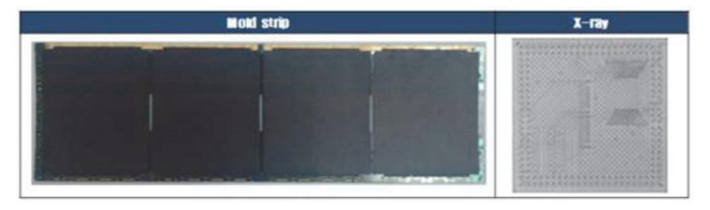

출처: 한국산업기술평가관리원(2017). 『차세대 초박형 MCP 인쇄 회로 기판 모듈 및 SIP용 임베디드 PCB 모듈』. p.478.

[그림 3-4] Mold 특성 검사(wire sweeping-X ray, void-SAT)

#### (2) SEM 분석을 수행한다.

SEM 분석을 통해 접합부의 미세 구조를 세밀하게 분석한다. SEM을 사용하여, 솔더 범 프와 PCB 패드 간의 물리적 연결 상태, 전도성 입자의 분포, 접합부의 미세 균열 여부 등을 확인한다. 이 과정에서 미세한 결함이나 표면의 불균일성을 식별하고, 장기 신뢰성 에 영향을 끼칠 수 있는 요소를 평가한다.

| 01.92 | ar tes | 8    |     |       |       |      |      |      | 0   |       |      | -        | 1000    |     |
|-------|--------|------|-----|-------|-------|------|------|------|-----|-------|------|----------|---------|-----|
|       | 2      | 3    |     | 5     |       | 7    |      |      | 18  | -     | -    | -        | -       | -   |
| 488.5 | 4250   | 437  | 457 | 480   | 48)3  | 4712 | 4352 | 4367 | 438 |       |      |          |         |     |
| 4857  | 01     | 4817 | 401 | e77.0 | 477.8 | 4014 | 4511 | 6161 | 45  | 426.1 | 4857 | 4577     | 192     | 13  |
| /HCL  | mode   | 9    |     |       |       |      |      |      |     | -     |      | Neiect / | an-ball | 171 |
| THE   | mode   | 21   |     |       | Ð     |      |      | 13   | 0   | -     |      | Next /   | 10-141  |     |
| man   |        |      |     | 1     | a     |      |      | •    |     |       | -    | 1        |         |     |

출처: 한국산업기술평가관리원(2017). 『차세대 초박형 MCP 인쇄 회로 기판 모듈 및 SIP용 임베디드 PCB 모 듈』. p.478.

[그림 3-5] Solder ball 특성 검사(Ball Shear 값)

#### (3) 신뢰성 테스트를 진행한다.

접합부가 다양한 환경 조건에서 안정적인 성능을 발휘하는지 확인하기 위해, 신뢰성 테 스트를 시행한다. 예를 들어, 온도 사이클링, 고습도 테스트, 열 충격 테스트 등을 통해 접합부의 장기적인 안정성을 검증한다. 테스트 결과는 향후 공정 개선과 품질 보증에 중 요한 데이터를 제공한다.

| Mode | Туре                 | Description                                                                                                                                                                                                                                | Illustration                                                                                        |
|------|----------------------|--------------------------------------------------------------------------------------------------------------------------------------------------------------------------------------------------------------------------------------------|-----------------------------------------------------------------------------------------------------|
| 1    | Ductile              | Solder ball fracture at or above the surface of the solder mask within the bulk solder material.                                                                                                                                  |                                                                                                     |
| 2    | Pad Lift             | Solder pad lifts with solder ball; lifted pad may include ruptured base material.                                                                                                                                                 | Pad separation at base material Lifted pad includes ruptured base material                          |
| 3    | Ball Lift            | Solder ball lifts from pad; pad is not completely covered by solder/intermetallic and the top surface of the pad plating is exposed.                                                                                        |                                                                                                     |
| 4    | Interfacial Break | The break is at the solder/intermetallic interface or intermetallic/base metal interface. The interfacial fracture may extend across the entire pad or be the dominant failure mode at the tool contact region. | or Dominant failure 100% interfacial fracture mode at tool contact is interfacial fracture |

출처: 미래창조과학부(2014). 『레이저 솔더링을 이용한 플립 칩 패키징 시스템 개발에 관한 사업화』. p.41. [그림 3-6] 전단 강도 측정 시험

- 숗 최종 설계를 확정하고 문서화한다.
  - 1. 검증 결과를 반영하여 설계를 확정한다.

프로토타입 제작 및 검증 과정에서 도출된 모든 데이터를 종합적으로 분석하여, 최종 설계 안을 확정한다.

(1) 데이터를 분석하고 피드백을 수집한다.

프로토타입의 전기적, 열적, 기계적 성능에 대한 검증 결과를 면밀히 분석한다. 분석 결 과는 설계 요구 사항과 비교하여, 목표 성능이 달성되었는지 확인한다. 또 테스트 과정 에서 발생한 모든 문제점과 개선 사항에 대한 피드백을 수집하여, 설계에 반영할 수 있 도록 한다.

(2) 설계를 수정하고 최적화한다.

분석된 데이터를 기반으로 설계 변경이 필요한 부분을 식별하고, 이를 수정하여 최종 설

계를 최적화한다. 예를 들어, 특정 본딩 방법에서 발생한 열 문제나 전기적 노이즈를 해 결하기 위해 설계의 일부를 수정할 수 있다. 이 과정에서 CAD 도면, 회로 설계, 소재 사양 등이 업데이트되며, 수정된 설계가 다시 검토된다.

(3) 최종 설계를 검토한다.

수정된 설계안이 모든 요구 사항을 충족하는지 최종 검토를 시행한다. 설계팀, 엔지니어 링팀, 품질 관리팀 등이 참여하여 설계의 완전성을 확인하고, 모든 사양이 표준 및 규격 에 부합하는지 검토한다. 이 검토 과정에서는 위험 요소가 제거되었는지, 최적의 성능을 보장할 수 있는지 다시 한번 확인한다.

(4) 설계를 확정한다.

최종 검토를 거친 설계가 모든 요구 조건을 만족하면, 설계안을 공식적으로 확정한다. 확정된 설계는 이후 양산 공정에 적용되며, 제품의 표준 사양으로 채택된다. 설계 확정 이후에는 변경이 어려우므로, 이 과정에서 모든 세부 사항이 정확히 반영되었는지 확인 하는 것이 중요하다.

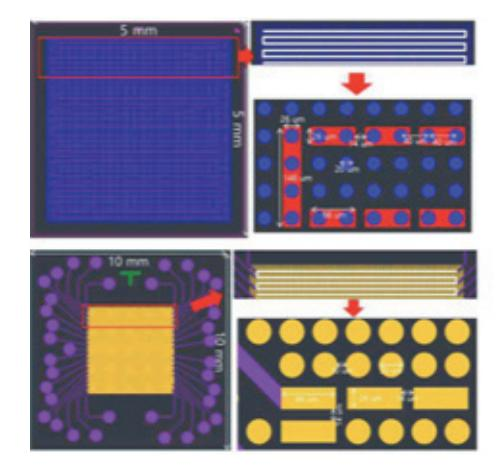

출처: 한국생산기술연구원(2020). 『20um급 미세 범프 플립 칩 패키지 원천 소 재 및 공정 기술 개발』. p.23. [그림 3-7] TEST 기판과 칩의 설계

2. 설계를 문서화하고 공유한다.

확정된 설계와 관련된 모든 정보를 체계적으로 문서화하여 프로젝트 팀 및 관련 부서와 공 유한다.

(1) 설계 문서를 작성한다.

최종 설계를 기반으로, 모든 기술 문서를 작성한다. 여기에는 최종 CAD 도면, 회로도, 소재 사양서, 공정 흐름도, 테스트 결과 보고서 등이 포함된다. 각 문서는 표준 형식에 따라 작성되며, 내용의 정확성을 보장하기 위해 철저한 검토 과정을 거친다.

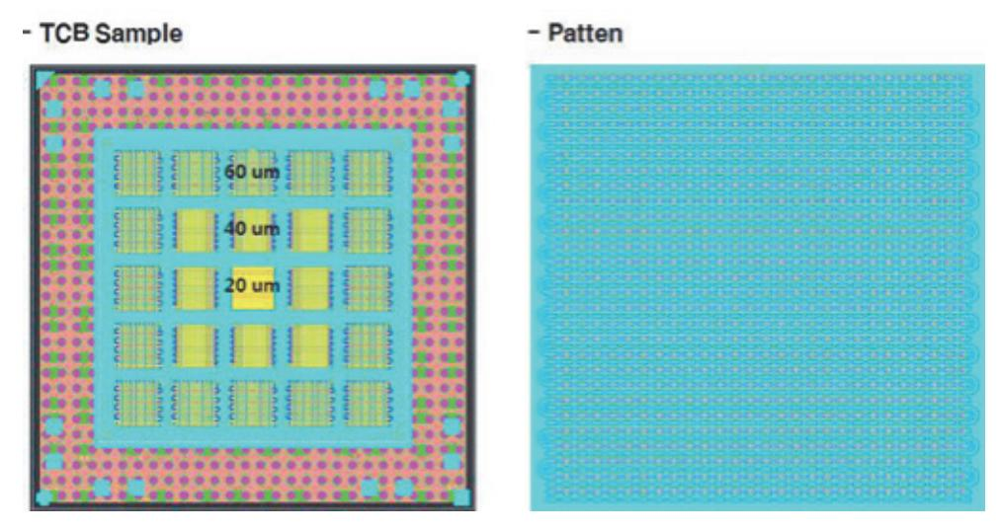

출처: 한국산업기술평가관리원(2018). 『20μm 초미세 피치 모바일 패키지용 6sec/chip 이하 고속 열 압 착 접합 기술 개발』. 하나마이크론. 산업통상자원부. p.204. [그림 3-8] 60/40/20um급 범프가 모두 설계된 초미세 피치 패키지 설계안

(2) 버전 관리 및 승인 절차를 따른다.

작성된 문서들은 버전 관리 시스템에 등록되어, 변경 이력과 함께 관리된다. 또 각 문서 는 관련 부서의 승인을 받아야 하며, 승인이 완료된 문서만이 공식적인 참조 자료로 사 용될 수 있다. 이 과정에서 문서의 무결성을 보장하고, 이후 변경 사항이 발생할 경우 신속하게 대응할 수 있도록 한다.

(3) 문서를 공유하고 배포한다.

최종 문서는 프로젝트팀, 생산 부서, 품질 관리 부서 등 관련 부서에 공유된다. 공유된 문서는 양산 준비와 품질 관리를 위한 기초 자료로 사용되며, 각 부서에서의 원활한 협 업을 지원한다. 이 과정에서는 모든 팀이 최신 정보를 기반으로 작업할 수 있도록 문서 의 배포 상태를 지속해서 관리한다.

(4) 교육 및 브리핑 세션을 진행한다.

중요한 설계 변경이나 새로운 공정이 포함된 경우, 관련 부서에 대해 교육 및 브리핑 세션을 진행한다. 이 세션에서는 새로운 설계와 공정 조건에 대한 이해를 돕고, 예상되 는 문제점이나 주의 사항을 사전에 공유한다. 이를 통해, 양산 과정에서 발생할 수 있는 오류를 최소화하고, 작업 효율성을 높인다.

- 수 양산 공정을 준비하고 초기 생산을 검토한다.
  - 1. 양산 공정 조건을 최적화한다. 대량 생산에 적합한 공정 조건을 설정하고, 생산 과정의 안정성과 일관성을 보장하기 위해 세부적인 최적화 작업을 수행한다.

(1) 공정 파라미터를 설정한다.

초기 프로토타입 제작 및 테스트 과정에서 수집된 데이터를 바탕으로, 양산에 필요한 주 요 공정 파라미터(온도, 압력, 시간 등)를 최적화한다. 예를 들어, 리플로 공정의 경우, 솔더의 완전한 녹임과 기판의 손상을 방지하기 위해 최적의 온도 프로파일을 설정한다. 이 파라미터는 생산 라인 전반에 걸쳐 일관되게 적용되어야 하며, 재현성이 확보되어야 한다.

(2) 장비 및 재료의 일관성을 확보한다.

양산 공정에서 사용되는 모든 장비와 재료의 일관성을 유지하기 위해, 정기적인 장비 교 정과 재료의 품질 검사를 시행한다. 예를 들어, 본딩 장비의 센서 및 제어 시스템이 정 확하게 작동하는지 확인하고, 사용되는 솔더 및 접착 필름의 품질이 일정하게 유지되는 지 검토한다. 이를 통해, 각 제품이 동일한 공정 조건에서 제조되어 균일한 품질을 유지 할 수 있다.

(3) 프로세스 제어 시스템을 구축한다.

실시간 모니터링 및 자동화된 피드백 시스템을 구축하여, 공정 중 발생할 수 있는 변동 을 즉시 감지하고 수정할 수 있도록 한다. 이러한 시스템은 생산 중 발생할 수 있는 이 상 상황을 실시간으로 모니터링하고, 자동으로 공정 파라미터를 조정하여 최적의 조건을 유지한다. 이는 생산 과정의 안정성을 높이고, 불량률을 최소화하는 데 기여한다.

2. 초기 생산을 통해 공정 안정성을 검토한다.

설정된 공정 조건에서 초기 생산을 수행하여, 양산 공정을 안정적으로 운영할 수 있는지 확 인하고, 제품의 품질이 요구되는 기준을 충족하는지 검토한다.

(1) 초기 생산 시범 운영을 시행한다.

소규모 초기 생산을 통해, 실제 양산 환경에서 공정 조건이 일관되게 유지되는지 확인한 다. 이 과정에서 생산된 제품의 품질을 샘플링하여, 설정된 공정 파라미터가 제대로 작 동하는지, 예상치 못한 문제가 발생하지 않는지 검토한다. 초기 생산 시범은 통상적으로 전체 생산량의 5% 이내로 설정하여, 공정 안정성을 검증한다.

(2) 품질 검사 및 데이터 분석을 수행한다.

초기 생산된 제품에 대해 상세한 품질 검사를 시행하고, 각 제품이 설계된 품질 기준을 충족하는지 확인한다. 이 과정에서는 전기적 테스트, 열적 테스트, 기계적 테스트 등을 통해 제품의 성능과 신뢰성을 평가한다. 검사 결과는 데이터베이스에 기록되며, 이를 바 탕으로 공정 조건의 미세 조정이 이루어질 수 있다.

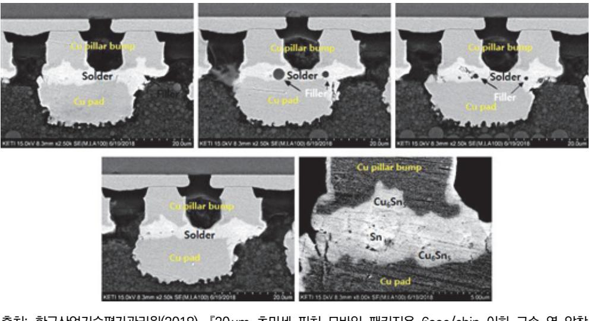

출처: 한국산업기술평가관리원(2018). 『20μm 초미세 피치 모바일 패키지용 6sec/chip 이하 고속 열 압착 접합 기술 개발』. 하나마이크론. 산업통상자원부. p.207. [그림 3-9] 20㎛ 범프 접합부 단면 분석

(3) 공정 안정성을 검토하고 피드백을 반영한다.

초기 생산 결과를 분석하여, 공정 조건을 지속해서 유지할 수 있는지, 생산된 제품이 목 표한 품질 기준을 일관되게 충족할 수 있는지 검토한다. 이 과정에서 발견된 문제점은 즉시 수정되며, 필요시 공정 파라미터나 장비 설정이 재조정된다. 피드백을 통해 공정 안정성을 강화하고, 양산 단계에서 발생할 수 있는 리스크를 최소화한다.

(4) 최종 양산 준비를 완료한다.

초기 생산 검토 결과가 긍정적이면, 본격적인 양산에 돌입할 준비가 완료된다. 모든 공 정 조건과 품질 관리 프로세스가 최종적으로 검토되고 승인된 후, 전면적인 양산 공정이 시작된다. 이 단계에서 지속적인 품질 모니터링과 공정 개선 활동을 통해 생산 효율성과 제품 품질을 지속해서 유지한다.

숙 후 처리 및 최종 품질 관리를 수행한다.

1. 언더필(Underfill)을 적용한다.

본딩된 부품의 기계적 강도와 신뢰성을 높이기 위해, 언더필 공정을 진행한다. 언더필은 플 립 칩 패키지의 솔더 범프와 기판 사이에 있는 빈 공간을 채워, 온도 변화나 기계적 스트레 스에 의한 솔더 범프의 파손을 방지하는 중요한 역할을 한다.

(1) 언더필 재료를 선택하고 준비한다.

제품의 사용 환경과 설계 요구 사항에 따라 적합한 언더필 재료를 선택한다. 선택된 재 료는 열팽창 계수(CTE), 점도, 경화 속도, 신뢰성 등의 특성을 기반으로 결정되며, 재료 가 본딩된 부품의 기계적 강도와 열적 신뢰성을 보장할 수 있는지 검토한다. 이후, 언더

#### 필 재료를 균일하게 적용하기 위한 사전 준비를 철저히 수행한다.

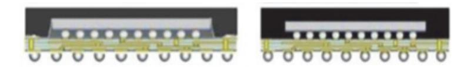

출처: 한국산업기술평가관리원(2017). 『차세대 초박형 MCP 인쇄회로기판 모듈 및 SIP용 임베디드 PCB 모듈』. p.484. [그림 3-10] Flipchip 구조 및 Underfill 공정 모식도

(2) 언더필 재료를 주입한다.

언더필 재료를 플립 칩 패키지의 솔더 범프 주변에 주입한다. 이 과정에서 공기 방울이 발생하지 않도록 주입 속도와 압력을 조절하며, 재료가 접합부 사이의 모든 공간을 균일 하게 채울 수 있도록 한다. 언더필 주입 과정은 자동화된 설비를 통해 수행되며, 주입 후 즉시 검사하여 균일하게 적용되었는지 확인한다.

(3) 경화 공정을 수행한다.

언더필 재료가 완전히 주입된 후, 설정된 온도와 시간 조건에서 경화 공정을 진행한다. 경화 과정에서 재료가 최적의 물리적 특성을 발휘할 수 있도록 조건을 엄격히 관리하며, 경화가 완료된 후에도 제품이 예상된 기계적 강도와 신뢰성을 유지하는지 확인한다.

(4) 언더필 품질을 검사한다.

경화된 언더필의 품질을 평가하기 위해 X-ray 검사나 초음파 검사를 시행한다. 이 과정 에서는 언더필이 솔더 범프와 기판 사이에 균일하게 분포되었는지, 공극이나 결함이 없 는지 평가하며, 이러한 검사를 통해 언더필이 실제 사용 환경에서 안정적으로 작동할 수 있는지 검증한다.

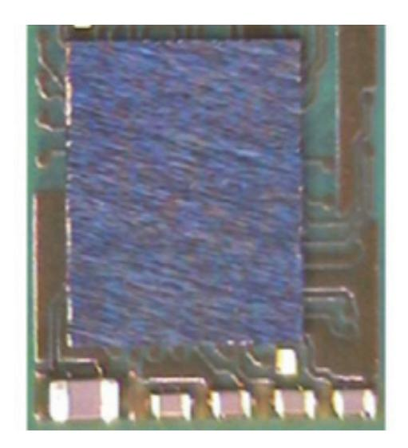

출처: 중소기업청(2013). 『플립 칩 언더필(Flip Chip Underfill)의 개발』. p.37. [그림 3-11] 플립 칩 패키지 시험 시편 언더필 신 뢰성 평가

2. 최종 검토 및 테스트를 수행한다.

최종 제품에 대해 포괄적인 기능 테스트와 품질 검사를 수행하여, 모든 기술적 요구 사항과 품질 기준을 충족하는지 확인한다.

(1) 기능 및 성능 테스트를 수행한다.

최종 제품의 모든 기능이 설계된 대로 동작하는지 확인하기 위해, 전기적 테스트, 기능 테스트 및 환경 스트레스 테스트 등을 실시한다. 여기에는 신호 무결성, 전력 소비, 반 응 속도, 열 관리 성능 등이 포함되며, 제품이 다양한 조건에서 예상되는 성능을 발휘하 는지 평가한다.

(2) 품질 검사 및 승인을 진행한다.

최종 제품이 모든 품질 기준을 충족하는지 확인하기 위해, 시각적 검사, X-ray 검사, 표면 분석 등을 통해 제품의 외관과 내부 구조를 세밀하게 평가한다. 모든 검사 결과는 기록되며, 품질 관리 기준에 부합하는지 검토된다. 품질 기준을 충족하지 못한 제품에 대해서는 원인 분석과 재작업이 이루어진다.

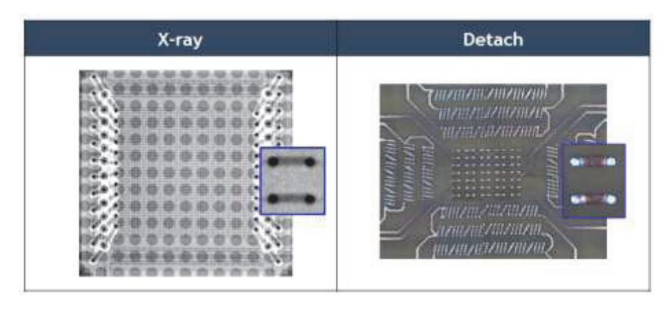

출처: 한국산업기술평가관리원(2018). 『20μm 초미세 피치 모바일 패키지용 6sec/chip 이하 고속 열 압착 접합 기술 개발』. 하나마이크론. 산업통상자원부. p.120. [그림 3-12] Chip attach 외관 및 X-Ray image

#### (3) 환경 내구성 테스트를 수행한다.

제품이 다양한 환경 조건에서 안정적으로 작동하는지 확인하기 위해, 고온, 저온, 습도, 진동 등의 테스트를 수행한다. 이러한 테스트는 제품의 장기 신뢰성을 보장하기 위한 필 수 과정이며, 테스트 결과를 바탕으로 제품의 수명을 예측하고, 품질 보증을 강화한다.

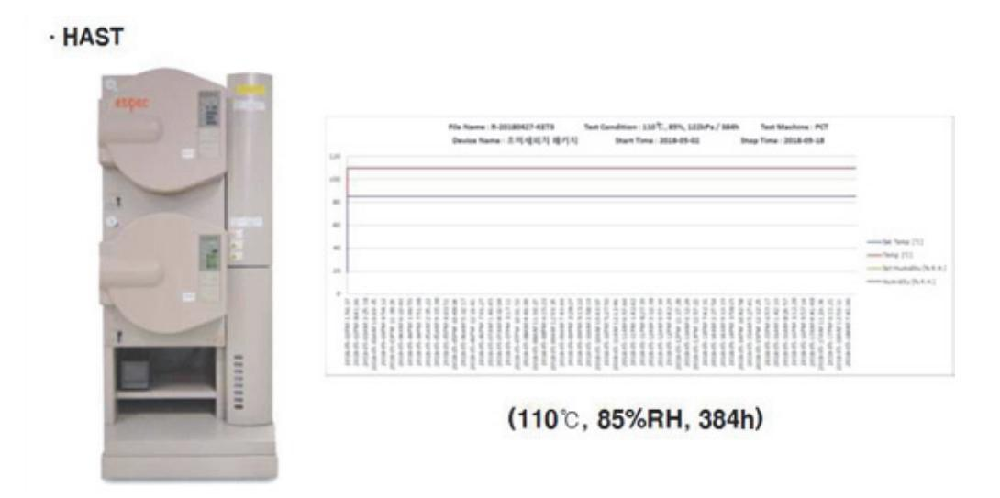

출처: 한국산업기술평가관리원(2018). 『20μm 초미세 피치 모바일 패키지용 6sec/chip 이하 고속 열 압착 접 합 기술 개발』. 하나마이크론. 산업통상자원부. p.213. [그림 3-13] 가속 고온·고습 평가

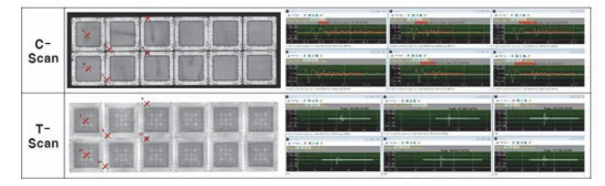

출처: 한국산업기술평가관리원(2018). 『20μm 초미세 피치 모바일 패키지용 6sec/chip 이하 고속 열 압착 접합 기술 개발』. 하나마이크론. 산업통상자원부. p.214.

[그림 3-14] 가속 고온·고습 시험 전, 초음파 분석 진행 결과

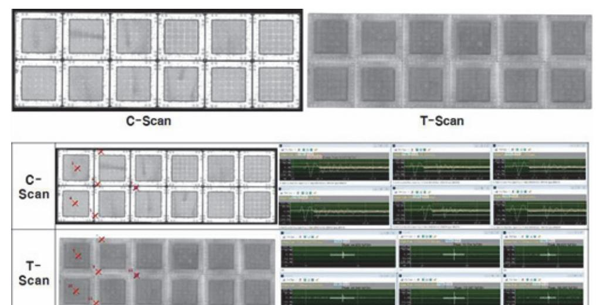

출처: 한국산업기술평가관리원(2018). 『20μm 초미세 피치 모바일 패키지용 6sec/chip 이하 고속 열 압착 접합 기술 개발』. 하나마이크론. 산업통상자원부. p.214. [그림 3-15] 가속 고온·고습 시험 후, 초음파 분석 진행 결과

#### (4) 최종 승인 및 출하 준비를 완료한다.

모든 테스트와 검사를 통과한 제품은 최종 승인을 받는다. 승인된 제품은 출하 준비를 위해 포장하고 라벨링하며, 고객에게 전달되기 전 최종 확인 절차를 거친다. 출하 준비 단계에서는 제품의 안전한 배송을 위한 포장 상태를 점검하고, 고객의 품질 요구 사항을 최종적으로 검토한다.

(5) 데이터를 기록하고 품질 피드백을 반영한다.

모든 테스트와 품질 검사 결과는 체계적으로 기록되며, 이러한 데이터는 제품 개선과 품 질 관리에 활용된다. 품질 피드백 시스템을 통해, 발견된 문제나 개선 사항이 다음 생산 단계에 즉시 반영될 수 있도록 관리하며, 이를 통해 제품의 품질을 지속해서 향상한다.

#### 수행 tip

- 본딩 방법 선택 시 비용과 신뢰성을 함께 고려한다.
- 본딩 공정 중 실시간 모니터링 시스템을 구축한다.
- 설계 변경 시 모든 수정 사항을 철저히 문서화한다.
- 양산 전에 반드시 초기 생산에서 공정 안정성을 확인한다.
- 최종 품질 검사 후 데이터를 기록하고 개선 피드백을 반영 한다.

### 학습 3 교수·학습 방법

#### 교수 방법

- 이방성 도전 필름을 사용하여 솔더 범프와 PCB 패드를 열 압착으로 접착하는 방법을 설명 하고 공정 조건과 본딩 방식의 특성을 소개한다.
- 레이저에 의해 솔더를 녹여 솔더 범프와 PCB 패드를 열전도로 접합하는 방식을 설명하고 적용 분야와 공정 조건을 지도한다.
- 리플로를 이용하여 접합부의 솔더를 녹여 솔더 범프와 PCB 패드를 높은 온도로 접합하는 방식과 리플로 공정의 특성을 설명한다.
- 플립 칩 본딩의 접착 강도, 생산성, 공정 원가 등을 고려하여 최적의 본딩 방식을 선정하는 방법을 설명한다.

#### 학습 방법

- 이방성 도전 필름을 사용하여 솔더 범프와 PCB 패드를 열 압착으로 접착하는 방법과 공정 의 특성을 파악하고 공정 조건을 파악한다.
- 레이저에 의해 솔더를 녹여 솔더 범프와 PCB 패드를 열전도로 접합하는 방식과 적용 분야 를 이해하고 공정을 진행한다.
- 리플로를 이용하여 접합부의 솔더를 녹여 솔더 범프와 PCB 패드를 높은 온도로 접합하는 방식을 이해하고 리플로 공정을 진행한다.
- 플립 칩 본딩의 접착 강도, 생산성, 공정 원가 등을 고려하여 최적의 본딩 방식을 선정하여 공정을 진행한다.

## 학습 3 평 가

#### 평가 준거

- 평가자는 학습자가 학습 목표를 성공적으로 달성하였는지를 평가해야 한다.
- 평가자는 다음 사항을 평가해야 한다.

|          | 학습 목표                                                               |  | 성취수준 |   |  |
|----------|---------------------------------------------------------------------|--|------|---|--|
| 학습 내용    |                                                                     |  | 중    | 하 |  |
| 본딩 방법 선정 | - 이방성 도전 필름을 사용하여 솔더 범프와 PCB 패드를 열 압착으로 접착하는 방식을 검토할 수 있다.       |  |      |   |  |
|          | - 레이저에 의해 솔더를 녹여 솔더 범프와 PCB 패드를 열전 도로 접합하는 방식을 검토할 수 있다.         |  |      |   |  |
|          | - 리플로를 이용하여 접합부의 솔더를 녹여 솔더 범프와 PCB 패드를 높은 온도로 접합하는 방식을 검토할 수 있다. |  |      |   |  |
|          | - 플립 칩 본딩의 접착 강도, 생산성, 공정 원가 등을 고려하 여 최적의 본딩 방식을 선정할 수 있다.       |  |      |   |  |

#### 평가 방법

• 서술형 시험

|          | 평가 항목                                                       |  | 성취수준 |   |  |
|----------|-------------------------------------------------------------|--|------|---|--|
| 학습 내용    |                                                             |  | 중    | 하 |  |
| 본딩 방법 선정 | - 이방성 도전 필름(ACF)을 사용하여 고밀도 회로에서 정밀한 전기적 연결을 형성할 수 있는 능력  |  |      |   |  |
|          | - 레이저 솔더링 방식을 이용하여 국부적인 열 영향을 최소화 하면서 전자 부품을 접합할 수 있는 능력 |  |      |   |  |
|          | - 리플로 솔더링 공정을 통해 다양한 부품 크기와 형태를 균일 하게 접합할 수 있는 능력        |  |      |   |  |
|          | - 본딩 장비의 주요 파라미터를 설정하여 일관된 접합 품질을 유지할 수 있는 능력            |  |      |   |  |

| • 논술형 시험 |  |
|----------|--|
|----------|--|

|        |                                                                       | 성취수준 |   |   |
|--------|-----------------------------------------------------------------------|------|---|---|
| 학습 내용  | 평가 항목                                                                 |      | 중 | 하 |
| 학습 내용명 | - 이방성 도전 필름(ACF) 접착 방식의 장단점을 분석하고, 특 정 응용 분야에 적합한지 평가할 수 있는 능력     |      |   |   |
|        | - 레이저 솔더링과 리플로 솔더링 공정 특성을 비교 분석하고, 프로젝트 요구 사항에 적합한 방식을 선택할 수 있는 능력 |      |   |   |
|        | - 플립 칩 패키지에서의 열 관리 전략을 분석하고, 각 본딩 방 식의 열적 영향을 평가할 수 있는 능력          |      |   |   |
|        | - 본딩 후 신뢰성 검사를 통해 접합부의 장기 안정성을 평가할 수 있는 능력                         |      |   |   |

피드백

1. 서술형 시험

- 이방성 도전 필름(ACF)을 사용하여 고밀도 회로에서 정밀한 전기적 연결을 형성할 수 있는 능력 성취수준이 낮은 학습자의 경우, ACF의 원리와 적용 방법을 다시 설명하고, 실제 사례를 통해 학 습자가 ACF의 작동 메커니즘을 이해하도록 지도한다. 추가 실습을 통해 ACF 접착 과정을 반복 학습하여 이해도를 높인다. 성취수준이 높은 학습자의 경우, 다양한 ACF 응용 사례를 분석하고, 학습자가 고밀도 회로에서 ACF를 효과적으로 적용할 수 있는 방법을 제안하는 심화 학습을 유도 한다.
- 레이저 솔더링 방식을 이용하여 국부적인 열 영향을 최소화하며, 전자 부품을 접합할 수 있는 능 력 성취수준이 낮은 학습자의 경우, 레이저 솔더링의 원리와 열 제어 방법을 다시 설명하고, 실습 을 통해 레이저 솔더링 과정을 반복하여 학습하도록 지도한다. 성취수준이 높은 학습자의 경우, 복잡한 부품 구조에서 레이저 솔더링의 응용을 분석하고, 고급 응용 사례를 제시하여 학습자가 심 화된 기술을 습득하도록 유도한다.
- 리플로 솔더링 공정을 통해 다양한 부품 크기와 형태를 균일하게 접합할 수 있는 능력 성취수준 이 낮은 학습자의 경우, 리플로 솔더링의 온도 프로파일 설정과 공정 과정을 다시 설명하고, 실습 을 통해 공정의 각 단계를 반복하여 학습하도록 지도한다. 성취수준이 높은 학습자의 경우, 리플 로우 솔더링 공정에서 발생할 수 있는 문제를 분석하고, 최적화 방안을 제시하는 심화 학습을 유 도한다.
- 본딩 장비의 주요 파라미터를 설정하여 일관된 접합 품질을 유지할 수 있는 능력 성취수준이 낮 은 학습자의 경우, 본딩 장비의 주요 파라미터(온도, 압력 등)를 설정하는 방법을 다시 설명하고, 실습을 통해 파라미터 설정을 반복하여 학습하도록 지도한다. 성취수준이 높은 학습자의 경우, 다 양한 본딩 조건에서 파라미터 변화를 실험하고, 최적의 설정값을 도출하는 심화 학습을 유도한다.
- 2. 논술형 시험
- 이방성 도전 필름(ACF) 접착 방식의 장단점을 분석하고, 특정 응용 분야에 적합한지 평가할 수 있는 능력 성취수준이 낮은 학습자의 경우, ACF의 장단점을 정리하고, 다양한 응용 분야에서의 적용 가능성을 분석하는 추가 학습을 통해 이해를 보완한다. 성취수준이 높은 학습자의 경우, 복 잡한 응용 사례를 바탕으로 ACF 접착 방식의 효용성을 논리적으로 평가하고, 심화된 응용 방안 을 제시하는 학습을 유도한다.
- 레이저 솔더링과 리플로 솔더링의 공정 특성을 비교 분석하고, 프로젝트 요구 사항에 적합한 방식 을 선택할 수 있는 능력 성취수준이 낮은 학습자의 경우, 두 솔더링 방식의 차이점과 공정 특성 을 다시 설명하고, 프로젝트 요구 사항을 분석하는 연습을 통해 학습을 보완한다. 성취수준이 높 은 학습자의 경우, 실제 프로젝트 사례를 통해 두 방식의 장단점을 비교 분석하고, 최적의 솔루션 을 제시하는 심화 학습을 유도한다.
- 플립 칩 패키지에서의 열 관리 전략을 분석하고, 각 본딩 방식의 열적 영향을 평가할 수 있는 능 력 성취수준이 낮은 학습자의 경우, 플립 칩 패키지의 열 관리 전략과 본딩 방식의 열적 영향을 다시 설명하고, 추가 자료를 통해 이해도를 높인다. 성취수준이 높은 학습자의 경우, 고온 환경에 서의 본딩 방식의 성능을 분석하고, 최적의 열 관리 방안을 제시하는 심화 학습을 유도한다.
- 본딩 후 신뢰성 검사를 통해 접합부의 장기 안정성을 평가할 수 있는 능력 성취수준이 낮은 학습 자의 경우, 신뢰성 검사 방법을 다시 설명하고, 실습을 통해 검사 과정을 반복하여 학습하도록 지 도한다. 성취수준이 높은 학습자의 경우, 다양한 환경 조건에서의 신뢰성 검사를 분석하고, 접합부 의 장기 안정성을 평가하는 심화 학습을 유도한다.

- 교육과학기술부(2010). 『플립 칩 패키징에서 모세관 언더필 유동의 측정 분석』.
- 미래창조과학부(2014). 『레이저 솔더링을 이용한 플립 칩 패키징 시스템 개발에 관한 사업화』.
- 산업통상자원부(2017). 『300mm 대응 대구경 다층구조의 복합 패키지 공정 및 장비 기술 개발』.
- 산업통상자원부(2021). 『종합 반도체 강국 실현을 위한 「K-반도체 전략」 수립』.
- 삼성반도체(https://semiconductor.samsung.com/kr). 2024. 6. 10. 스크린샷.
- 서민석(2020). 『패키지와 테스트』. 한올.
- 이혁(2017). 『반도체 후공정장비』. 북두출판사.
- 중소기업청(2013). 『플립 칩 언더필(Flip Chip Underfill)의 개발』.
- 최리노(2022). 『최리노의 한 권으로 끝낸느 반도체 이야기』. 양문.
- 한국생산기술연구원(2020). 『20um급 미세 범프 플립 칩 패키지 원천 소재 및 공정 기술 개발』.
- 한국산업기술평가관리원(2017). 『차세대 초박형 MCP 인쇄 회로 기판 모듈 및 SIP용 임베디드 PCB 모듈』.
- 한국산업기술평가관리원(2017). 『20μm 초미세피치 모바일 패키지용 6sec/chip 이하 고속 열 압착 접합 기술 개발』. 하나마이크론. 산업통상자원부.
- SK하이닉스(https://news.skhynix.co.kr/post/seominsuk-column-types-of-packages-1)에 서 2024. 6. 10. 스크린샷.
- 니시쿠보 야스히코 저(2023). 『반도체 구조원리 교과서』. 보누스.
- A. A. Bajwa, S. C. Jangam, S. Pal, and N. Marathe (2017). Heterogeneous Integration at Fine Pitch(≤10µm) Using Thermal Compression Bonding. IEEE 67th Electronic Compone nts and Technology Conference, 1276-1284.
- F. Inoue, J. Derakhshandeh, M. Lofrano, and E. Beyne (2021). Fine-Pitch Bonding Technolo gy with Surface-Planarized Solder Micro-Bump/Polymer Hybrid for 3D Integration. Japane se Journal of Applied Physics, 60(2), 026502.
- Intel (2021). Advanced Packaging Architectures for heterogeneous Integration(http://pwrs ocevents.com/wp-content/uploads/2021/11/0.2-Ravi-Mahajan-Advanced-Packaging-A rchitectures-for-Heterogeneous-Integration.pdf)

- J. Li, Y. Zhang, H. Zhang, and Z. Chen (2020). The Thermal Cycling Reliability of Copper Pillar Solder Bump in Flip Chip via Thermal Compression Bonding. Microelectronics Reliability. 104. 113543.
- John H. Lau (2023). State-of-the-Art in Chiplets Horizontal Communications. Journal of Microelectronics and Electronic Packaging(2023) 20, 43–64
- P. Bex, T. Wang, M. Lofrano, and V. Cherman (2017). Thermal Compression Bonding: Understanding Heat Transfer by In Situ Measurements and Modeling. IEEE 67th Electronic Components and Technology Conference, 392-398.
- P. H. Tsao, S. Hsu, Y. L. Kuo, and J. H. Chen (2016). Cu Bump Flip Chip Package Reliability on 28nm Technology. IEEE 66th Electronic Components and Technology Conference(ECT C). 1148-1153.
- S. Massa, D. Shahin, I. Wathuthanthri, and A. Drechsler (2019). Process Development for Flip Chip Bonding with Different Bump Compositions. International Wafer Level Packag ing Conference(IWLPC), 1-6.
- W. Bo, S. Zhang, F. Wang, and Z. Chen (2018). Micro Copper Pillar Interconnection Using Thermosonic Flip Chip Bonding. Journal of Electronic Packaging, 140(4), 044502.
- YOLE (2020). Advanced Packaging Current Trends & Challenges(https://www.semiconduct ors.org/wp-content/uploads/2020/09/Santosh-Kumar\_Yole\_Advanced-Packaging-Curr ent-Trends-and-Challenges.pdf).
- YOLE(2021). Status of the Advanced Packaging Industry 2021(https://medias.yolegroup.co m/uploads/2021/09/YINTR21223-Status-of-the-Advanced-Packaging-Industry-2021.pd f).
- YOLE(2022). Advanced Packaging Quarterly Market Monitor Q1 2022(https://medias.yoleg roup.com/uploads/2021/12/Advanced-Packaging-Quarterly-Market-Monitor-Q1-2022- Product-brochure-.pdf).
- YOLE(2023). Status of the Semiconductor Industry(https://medias.yolegroup.com/uploads /2023/06/yint-wsts-presentation-vienna-2023-final.pdf).
- YOLE(2023). Technology & Market Trends for Advanced Packaging(https://medias.yolegro up.com/uploads/2023/04/advanced-packaging\_ssi\_2023\_yole\_sch\_updated-1.pdf).

| NCS학습모듈 개발이력 |                                     |     |                  |  |
|--------------|-------------------------------------|-----|------------------|--|
| 발행일          | 2024년 12월 31일                       |     |                  |  |
| 세분류명         | 반도체 개발((19030601)                   |     |                  |  |
| 개발기관         | 수원과학대학교 산학협력단(개발책임자: 윤창용) 한국직업능력연구원 |     |                  |  |
|              | 최준혁(수원대학교)*                         |     | 김종범(삼성전기)        |  |
|              | 계찬호(수원대학교)                          |     | 김한수(두원공과대학교)     |  |
|              | 김경호(폴리텍대학교)                         |     | 남승호(경기대학교)       |  |
|              | 김관하(폴리텍대학교)                         |     | 손승대(제이에스이엔씨(주))  |  |
| 집필진          | 김기순((주)영우디에스피)                      | 검토진 | 안광호(퓨쳐일렉트로닉스)    |  |
|              | 김도균(폴리텍대학교)                         |     | 이철오((주)한국전력안전공단) |  |
|              | 전동민(폴리텍대학교)                         |     |                  |  |
|              |                                     |     |                  |  |

\*표시는 대표집필자임 (참고) 검토진으로 참여한 집필진은 본인의 원고가 아닌 타인의 학습모듈을 검토함

| 플립 칩 패키지 개발(LM1903060122_23v4)                                                                           |                   |  |
|----------------------------------------------------------------------------------------------------------|-------------------|--|
| 저작권자 교육부                                                                                              |                   |  |
| 연구기관                                                                                                     | 한국직업능력연구원         |  |
| 발행일                                                                                                      | 2024. 12. 31.     |  |
| ISBN                                                                                                     | 979-11-7175-756-5 |  |
| ※ 이 학습모듈은 자격기본법 시행령(제8조 국가직무능력표준의 활용)에 의거하여 개발하였으며, NCS통합포털사이트(http://www.ncs.go.kr)에서 다운로드 할 수 있습니다. |                   |  |

