# NCS학습모듈 웨이퍼 레벨 패키지 개발

LM1903060123\_23v4

#### [NCS학습모듈 활용 시 유의 사항]

- 1. NCS학습모듈은 교육훈련기관에서 출처를 명시하고 교육적 목적으로 활용할 수 있습니다. 다 만, NCS학습모듈에는 국가(교육부)가 저작재산권 일체를 보유하지 않은 저작물(출처가 표기된 도표‧사진‧삽화‧도면 등)이 포함되어 있으므로, 이러한 저작물의 변형‧각색‧복제‧공연‧ 배포 및 공중 송신 등과 이러한 저작물을 활용한 2차적 저작물을 작성하려면 반드시 원작자 의 동의를 받아야 합니다.
- 2. NCS학습모듈은 개발 당시의 산업 및 교육 현장을 반영하여 집필하였으므로, 현재 적용되는 법령‧지침‧표준 및 교과 내용 등과 차이가 있을 수 있습니다. NCS학습모듈 활용 시 법령 ‧지침‧표준 및 교과 내용의 개정 사항과 통계의 최신성 등을 확인하시기를 바랍니다.
- 3. NCS학습모듈은 산업 현장에서 요구되는 능력을 교육훈련기관에서 학습할 수 있게 구성한 자 료입니다. 다만, NCS학습모듈 지면의 한계상 대표적 예시(예: 활용도 또는 범용성이 높은 제 품, 서비스) 중심으로 집필하였음을 이해하시기를 바랍니다.

## NCS학습모듈의 이해

※ 본 NCS학습모듈은 「NCS 국가직무능력표준」사이트(http://www.ncs.go.kr) 에서 확인 및 다운로드할 수 있습니다.

### Ⅰ NCS학습모듈이란?

- 국가직무능력표준(NCS: National Competency Standards)이란 산업현장에서 직무를 수행하기 위해 요구되는 지식·기술·소양 등의 내용을 국가가 산업부문별·수준별로 체계 화한 것으로 산업현장의 직무를 성공적으로 수행하기 위해 필요한 능력(지식, 기술, 태도) 을 국가적 차원에서 표준화한 것을 의미합니다.
- 국가직무능력표준(이하 NCS)이 현장의 '직무 요구서'라고 한다면, NCS학습모듈은 NCS
  의 능력단위를 교육훈련에서 학습할 수 있도록 구성한 '교수·학습 자료'입니다. NCS학습
  모듈은 구체적 직무를 학습할 수 있도록 이론 및 실습과 관련된 내용을 상세하게 제시하
  고 있습니다.

#### ○ NCS학습모듈은 다음과 같은 특징을 가지고 있습니다.

- 첫째, NCS학습모듈은 산업계에서 요구하는 직무능력을 교육훈련 현장에 활용할 수 있도 록 성취목표와 학습의 방향을 명확히 제시하는 가이드라인의 역할을 합니다.
- 둘째, NCS학습모듈은 특성화고, 마이스터고, 전문대학, 4년제 대학교의 교육기관 및 훈 련기관, 직장교육기관 등에서 표준교재로 활용할 수 있으며 교육과정 개편 시에도 유용하게 참고할 수 있습니다.

○ NCS와 NCS학습모듈 간의 연결 체계를 살펴보면 아래 그림과 같습니다.

O NCS학습모듈의 위치는 NCS 분류 체계에서 해당 학습모듈이 어디에 위치하는지를 한 눈에 볼 수 있도록 그림으로 제시한 것입니다.

| [NCS-학          | 습모듈              | 의 위치]    |          |  |
|-----------------|------------------|----------|----------|--|
|                 |                  |          |          |  |
| 대분류             | 내분류 문화·예술·디자인·방송 |          |          |  |
| 중분류             | 문화콘텐츠            |          |          |  |
| 소분류             |                  | 문화콘텐츠제작  |          |  |
|                 |                  |          |          |  |
| 세분류             |                  |          |          |  |
| 방송콘텐츠제작         |                  | 능력단위     | 학습모듈명    |  |
| 영화콘텐츠제작         |                  | 프로그램 기획  | 프로그램 기획  |  |
| 음악콘텐츠제작         |                  | 아이템 선정   | 아이템 선정   |  |
| 광고콘텐츠제작         |                  | 자료 조사    | 자료 조사    |  |
| 게임콘텐츠제작         |                  | 프로그램 구성  | 프로그램 구성  |  |
| 애니메이션 콘텐츠제작  |                  | 캐스팅      | 캐스팅      |  |
| 만화콘텐츠제작         |                  | 제작계획     | 제작계획     |  |
| 캐릭터제작           |                  | 방송 미술 준비 | 방송 미술 준비 |  |
| 스마트문화앱 콘텐츠제작 |                  | 방송 리허설   | 방송 리허설   |  |
| 영사              |                  | 야외촬영     | 야외촬영     |  |
|                 |                  | 스튜디오 제작  | 스튜디오 제작  |  |
|                 |                  |          |          |  |

학습모듈은

NCS 능력단위 1개당 1개의 학습모듈 개발 을 원칙으로 합니다. 그러나 필요에 따라 고용단위 및 교과단위를 고려하여 능력단위 몇 개를 묶어 1개 학습모듈로 개발할 수 있으며, NCS 능력단위 1개를 여러 개의 학습모듈로 나누어 개발할 수도 있습니다.

#### 2. NCS학습모듈의 개요

#### ○ NCS학습모듈의 개요는 학습모듈이 포함하고 있는 내용을 개략적으로 설명한 것으로

| 학습모듈의 목표 , 선수학습 , 학습모듈의 내용 체계 , 핵심 용어 로 구성되어 있습니다. |                                                                              |  |  |
|----------------------------------------------------|------------------------------------------------------------------------------|--|--|
| 학습모듈의 목표                                           | 해당 NCS 능력단위의 정의를 토대로 학습 목표를 작성한 것입니다.                                        |  |  |
| 선수학습                                               | 해당 학습모듈에 대한 효과적인 교수·학습을 위하여 사전에 이수해야 하는 학습모 듈, 학습 내용, 관련 교과목 등을 기술한 것입니다. |  |  |
| 학습모듈의 내용 체계                                     | 해당 NCS 능력단위요소가 학습모듈에서 구조화된 체계를 제시한 것입니다.                                     |  |  |
| 핵심 용어                                              | 해당 학습모듈의 학습 내용, 수행 내용, 설비·기자재 등 가운데 핵심적인 용어를 제 시한 것입니다.                   |  |  |

### 제작계획 학습모듈의 개요

#### 학습모듈의 목표

본격적인 촬영을 준비하는 단계로서, 촬영 대본을 획정하고 제작 스태프를 조직하며 촬영 장비와 촬영 소품을 준비할 수 있다.

#### 선수학습

제작 준비(LM0803020105\_13v1), 섭외 및 제작스태프 구성(LM0803020104\_13v1), 촬영 제작(LM0803020106\_13v1), 촬영 장비 준비(LM0803040204\_13v1.4), 미술 디자인 협의하기(LM0803040203\_13v1.4)

#### 학습모듈의 내용체계

| 하스                | 하스 내용                                              | NCS 능력단위 요소       |                |
|-------------------|----------------------------------------------------|-------------------|----------------|
| 학습                | 학습 내용                                              | 코드번호              | 요소 명칭          |
| 1. 촬영 대본 확정하기  | 1-1. 촬영 구성안 검 토와 수정                             | 0803020114_16/3.1 | 촬영 대본 확정하기  |
| 2. 제작 스태프 조직하기 | 2-1. 기술 스태프 조직 2-2. 미술 스태프 조직 2-3. 전문 스태프 조직 | 0803020114_16v3.2 | 제작 스태프 조직하기 |
| 3. 촬영 장비 계획하기  | 3-1. 촬영 장비 점검 과 준비                              | 0803020114_16/3.3 | 촬영 장비 계획하기  |
| 4. 촬영 소품 계획하기  | 4-1. 촬영 소품 목록 작성 4-2. 촬영 소품 제작 의뢰         | 0803020114_16\3.4 | 촬영 소품 계획하기  |

#### 핵심 용어

촬영 구성안, 제작 스태프, 촬영 장비, 촬영 소품

#### 학습모듈의 목표는

학습자가 해당 학습모듈을 통해 성취해야 할 목표를 제시한 것으로, 교수자는 학습자 가 학습모듈의 전체적인 내용흐름을 파악하 도록 지도할 수 있습니다.

**6** • •

61

#### 선수학습은

교수자 또는 학습자가 해당 학습모듈을 교 수·학습하기 이전에 이수해야 하는 교과목 또는 학습모듈(NCS 능력단위) 등을 표기한 것입니다. 따라서 교수자는 학습자가 개별 학습, 자기 주도 학습, 방과 후 활동 등 다 양한 방법을 통해 이수할 수 있도록 지도하 는 것을 권장합니다.

|            | 핵심 용어는              |
|------------|---------------------|
|            | 률을 대표하는 주요 용어입니     |
|            | · 해당 학습모듈을 통해 학습    |
|            | 게될 주요 내용을 알 수 있습    |
|            | 5 국가직무능력표준」 사이트     |
| (www.ncs.g | jo.kr)의 색인 (찾아보기) 중 |
| 하나로 이용할    | 할 수 있습니다            |

#### 3. NCS학습모듈의 내용 체계

○ NCS학습모듈의 내용은 크게 학습, 학습 내용, 교수·학습 방법, 평가 로 구성되어 있습니다.

| 학습       | 해당 NCS 능력단위요소 명칭을 사용하여 제시한 것입니다. 학습은 크게 학습 내용, 교수·학습 방법, 평가로 구성되며 해당 NCS 능력단위의 능력단위 요소별 지식, 기술, 태도 등을 토대로 내용을 제시한 것입니다.                                                    |
|----------|----------------------------------------------------------------------------------------------------------------------------------------------------------------------------------|
| 학습 내용    | 학습 내용은 학습 목표, 필요 지식, 수행 내용으로 구성되며, 수행 내용은 재료·자 료, 기기(장비·공구), 안전·유의 사항, 수행 순서, 수행 tip으로 구성한 것입니다. 학습모듈의 학습 내용은 실제 산업현장에서 이루어지는 업무활동을 표준화된 프로세 스에 기반하여 다양한 방식으로 반영한 것입니다. |
| 교수·학습 방법 | 학습 목표를 성취하기 위한 교수자와 학습자 간, 학습자와 학습자 간 상호 작용이 활발하게 일어날 수 있도록 교수자의 활동 및 교수 전략, 학습자의 활동을 제시한 것입니다.                                                                            |
| 평가       | 평가는 해당 학습모듈의 학습 정도를 확인할 수 있는 평가 준거 및 평가 방법, 평 가 결과의 피드백 방법을 제시한 것입니다.                                                                                                         |

## [NCS-학습모듈의 위치]

| 대분류 | 전기 · 전자 |          |        |
|-----|---------------|----------|--------|
| 중분류 |               | 전자 기기 개발 |        |
| 소분류 |               |          | 반도체 개발 |

| 세분류    |                  |                  |
|--------|------------------|------------------|
| 반도체 개발 | 능력단위             | 학습모듈명            |
| 반도체 제조 | 반도체 제품 기획        | 반도체 제품 기획        |
| 반도체 장비 | 반도체 아키텍처 설계      | 반도체 아키텍처 설계      |
| 반도체 재료 | 디지털 회로 설계        | 디지털 회로 설계        |
|        | 패키지 조립 공정 개발     | 패키지 조립 공정 개발     |
|        | 반도체 제품 기능·성능 검증  | 반도체 제품 기능·성능 검증  |
|        | 자동 배치 배선 레이아웃 설계 | 자동 배치 배선 레이아웃 설계 |
|        | 반도체 설계 검증        | 반도체 설계 검증        |
|        | 반도체 펌웨어 개발       | 반도체 펌웨어 개발       |
|        | 메모리 반도체 제조 공정 개발 | 메모리 반도체 제조 공정 개발 |
|        | 시스템 반도체 제조 공정 개발 | 시스템 반도체 제조 공정 개발 |
|        | 반도체 제조 단위 공정 개발  | 반도체 제조 단위 공정 개발  |
|        | 아날로그 회로 아키텍처 설계  | 아날로그 회로 아키텍처 설계  |
|        | 아날로그 회로 소자 레벨 설계 | 아날로그 회로 소자 레벨 설계 |
|        | 아날로그 회로 시스템 설계   | 아날로그 회로 시스템 설계   |

| 와이어 본딩 패키지 개발     | 와이어 본딩 패키지 개발     |
|-------------------|-------------------|
| 플립 칩 패키지 개발       | 플립 칩 패키지 개발       |
| 웨이퍼 레벨 패키지 개발     | 웨이퍼 레벨 패키지 개발     |
| 어드밴스드 팬 아웃 패키지 개발 | 어드밴스드 팬 아웃 패키지 개발 |
| 이종 접합 패키지 개발      | 이종 접합 패키지 개발      |
| 어드밴스드 언더필 패키지 개발  | 어드밴스드 언더필 패키지 개발  |
| 반도체 환경 시험         | 반도체 환경 시험         |
| 반도체 수명 시험         | 반도체 수명 시험         |
| 반도체 내성 시험         | 반도체 내성 시험         |
| 커스텀 레이아웃 적용 공정 분석 | 커스텀 레이아웃 적용 공정 분석 |
| 커스텀 레이아웃 설계       | 커스텀 레이아웃 설계       |
| 커스텀 레이아웃 검증       | 커스텀 레이아웃 검증       |

| 학습모듈의 개요                  | 1  |
|---------------------------|----|
| 학습 1. 웨이퍼 레벨 공정 진행하기      |    |
| 1-1. 웨이퍼 레벨 패키지 공정 기술     | 3  |
| • 교수 ․ 학습 방법              | 33 |
| • 평가                      | 34 |
| 학습 2. 임베디드 웨이퍼 레벨 공정 진행하기 |    |
| 2-1. 임베디드 웨이퍼 레벨 공정 기술    | 37 |
| • 교수 ․ 학습 방법              | 60 |
| • 평가                      | 61 |
| 학습 3. nD 웨이퍼 레벨 공정 진행하기   |    |
| 3-1. nD 레벨 공정 기술          | 64 |
| • 교수 ․ 학습 방법              | 84 |
| • 평가                      | 85 |
| 참고 자료                     | 88 |

## 웨이퍼 레벨 패키지 개발 학습모듈의 개요

#### 학습모듈의 목표

반도체 전공정에서 생산된 웨이퍼 다이에 재배선을 통해 웨이퍼 레벨 패키지를 만들기 위하여 설계된 패키지 제 품의 요구 사항에 따라 반도체 조립 공정을 수행할 수 있다.

#### 선수학습

반도체 재료, 반도체 제조, 반도체 장비

#### 학습모듈의 내용체계

| 하스                         | 이미 사람                  | NCS 능력단위 요소       |                        |
|----------------------------|------------------------|-------------------|------------------------|
| 학습                         | 학습 내용                  | 코드번호              | 요소 명칭                  |
| 1. 웨이퍼 레벨 공정 진 행하기      | 1-1. 웨이퍼 레벨 패키지 공정 기술  | 1903060123_23v4.1 | 웨이퍼 레벨 공정 진행하기      |
| 2. 임베디드 웨이퍼 레 벨 공정 진행하기 | 2-1. 임베디드 웨이퍼 레벨 공정 기술 | 1903060123_23v4.2 | 임베디드 웨이퍼 레벨 공정 진행하기 |
| 3. nD 웨이퍼 레벨 공 정 진행하기   | 3-1. nD 레벨 공정 기술       | 1903060123_23v4.3 | nD 웨이퍼 레벨 공정 진행하기   |

#### 핵심 용어

웨이퍼 레벨 패키지, WLP(Wafer Level Pakage), 차세대 패키징, Embedded Die Packaging, nD 패키징, 3D 패키지, 2.5D

| 학습 1 | 웨이퍼 레벨 공정 진행하기      |
|------|---------------------|
| 학습 2 | 임베디드 웨이퍼 레벨 공정 진행하기 |
| 학습 3 | nD 웨이퍼 레벨 공정 진행하기   |

## 1-1. 웨이퍼 레벨 패키징 공정 기술

|       | • 웨이퍼 레벨 패키지를 WLCSP(Wafer Level Chip Scale Package), TSV(Through Silicon |
|-------|--------------------------------------------------------------------------|
|       | Via), Flip Chip, RDL(Redistribution Layer) 등이 포함된 어드밴스드 패키지(첨단 패키지)      |
|       | 공정으로 세분화할 수 있다.                                                          |
|       | • 패키지 공정 전체를 웨이퍼 레벨에서 진행하는 WLCSP는 패키지용 배선, 절연층, 접합층을                     |
| 학습 목표 | 만들어 솔더 볼을 패턴 웨이퍼의 전극 패드에 붙이는 방식으로, 칩의 크기 안에 배선을 하는                       |
|       | 팬 인(Fan In) WLCSP과 팬 아웃(Fan Out) WLCSP로 구분할 수 있다.                        |
|       | • WLP 공정을 진행하기 위하여 반도체 FAB 공정 및 전기 테스트가 완료된 웨이퍼를 준비할                     |
|       | 수 있다.                                                                    |
|       | • WLP 공정을 미니 팹 형태로 준비하여 개별 단위 공정으로 수행할 수 있다.                             |

## 필요 지식 /

숔 웨이퍼 레벨 패키징 공정

- 1. 재배선
  - (1) RDL 공정의 정의 및 개념

재배선층(RDL: Redistribution Layer) 기술은 웨이퍼상에 이미 형성된 본딩 패드를 금 속층을 통해 원하는 위치에 재배열하는 기술이다. 이 기술은 웨이퍼 레벨에서 패드 배열 을 변경하여 특정 위치에 다시 형성된 패드를 제공함으로써 칩 설계를 보다 더 유연하 게 할 수 있다. RDL은 주로 센터 패드 칩의 패드를 가장자리로 이동하는 데 사용하며, 이는 패키지 기판과의 접속을 쉽게 하고 칩 적층 등의 응용에 유리하다.

- (2) RDL 공정의 장점
  - (가) 유연한 설계

웨이퍼에 이미 있는 패드 배열을 변경할 수 있게 해 주기 때문에 고객이 원하는 대 로 맞춤형 칩을 만들 수 있다. 예를 들어, 특정 전자 제품에서 필요로 하는 특수한 패드 배열이 있다면, 새로운 웨이퍼를 제작하지 않고도 RDL 기술을 사용하여 기존 웨이퍼에 맞춤형 패드 배열을 추가할 수 있다. 이는 다양한 설계 요구에 신속하게 대응할 수 있는 장점이 있다.

(나) 고밀도 연결

칩과 기판 간의 더 많은 입출력(I/O) 연결을 가능하게 한다. 이는 고밀도 패키징에 유리하여 전자 기기의 성능을 크게 향상한다. 예를 들어, 스마트폰이나 컴퓨터처럼 많은 데이터를 빠르게 처리해야 하는 기기에서는 많은 I/O 연결이 필요하다. RDL 기술을 사용하면 이러한 연결을 효과적으로 구현할 수 있어, 기기의 성능을 최적화 할 수 있다.

(다) 공정 비용 절감

새로운 웨이퍼를 제작하는 것보다 기존 웨이퍼에 패드를 재배열하는 방식으로 비용 을 절감할 수 있다. 만약 고객이 특정한 패드 배열을 요청하면, 새로운 웨이퍼를 처 음부터 제작하는 대신 RDL 기술을 통해 기존 웨이퍼를 수정하여 비용을 절약할 수 있다. 이는 고객의 맞춤형 요구를 저비용으로 충족하는 데 많은 도움이 된다.

(라) 향상된 신뢰성

패드를 재배열함으로써 전기적 성능을 향상하고 신뢰성을 높인다. 패드가 최적의 위 치에 재배치되면, 신호 전송이 더 원활하게 이루어지고, 전자 기기의 안정성이 향상 된다. 예를 들어, 패드의 위치를 최적화하면 열 발생을 줄이고, 기기의 수명을 연장 할 수 있다. 이는 특히 고성능 전자 기기에서 중요한 장점이다.

- (3) RDL 공정의 단점
  - (가) 공정 복잡성

여러 단계를 거쳐야 하며, 매우 정밀한 작업이 필요하다. 이 공정은 패드를 재배열하 기 위해 다양한 기술과 장비를 사용해야 한다. 예를 들어, 웨이퍼에 새로운 금속층을 형성하고 이를 원하는 위치로 재배열하는 과정에서 정확한 위치 조정과 고도의 기술 이 필요하다. 이러한 복잡한 공정은 시간이 많이 걸리며, 작은 실수라도 제품의 성능 에 큰 영향을 끼칠 수 있다. 따라서 RDL 공정은 매우 세심한 관리와 정밀한 작업이 필요하다.

(나) 비용 문제

초기 설치 비용과 공정 비용이 상대적으로 높다. 이 공정을 수행하기 위해서는 특수 한 장비와 고도로 숙련된 기술이 필요하다. 이러한 장비와 기술을 확보하는 데 많은 비용이 들며, 이는 최종 제품의 가격 상승으로 이어질 수 있다. 예를 들어, RDL 공 정을 위한 장비는 매우 고가이며, 이를 운영하고 유지 보수하는 데도 추가 비용이 발생한다. 따라서 RDL 공정은 초기 투자 비용이 많이 드는 것이 단점이다.

(다) 열 문제

RDL 공정에서 재배열된 패드는 열팽창 계수 차이로 인한 스트레스에 취약할 수 있

다. 열팽창 계수는 재료가 열을 받을 때 팽창하는 정도를 나타내는 값이다. 서로 다 른 재료를 사용할 경우, 열을 받을 때 팽창하는 정도가 달라 스트레스가 발생할 수 있다. 이는 장기적인 신뢰성에 영향을 끼칠 수 있으며, 시간이 지나면서 접합부가 약 해지거나 고장이 발생할 수 있다. 예를 들어, 전자 기기가 작동하면서 발생하는 열로 인해 패드와 기판 사이의 접합부에 문제가 생길 수 있다.

(4) RDL 공정 기술 동향

 고성능 및 고밀도 패키징 요구가 증가하면서 RDL 소재 시장은 지속해서 성장하고 있 다. Y 그룹의 보고서에 따르면, RDL 소재 시장은 2027년까지 연평균 성장률 25.7%를 기록하며 약 7억 9,450만 달러에 이를 것으로 예상된다. 이러한 성장은 소형 전자 기기 와 고성능 컴퓨팅의 수요 증가에 기인한다. 특히, 중국, 대만, 우리나라가 포함된 아시아 태평양 지역이 주요 시장으로, 주요 반도체 기업들이 기술 발전을 주도하고 있다. 이로 인해 RDL 기술의 적용 범위는 계속 확대될 것이다.

- (가) 시장 성장 요인
  - 1) 소형 전자 기기 수요 증가
  - 2) 고성능 컴퓨팅 요구 증가
- (나) 아시아 태평양 지역의 중요성
  - 1) 주요 반도체 제조업체들의 위치
  - 2) 저렴한 인건비와 숙련된 전문가 존재
  - 3) 저비용 원자재 활용 가능
- (다) 주요 기업들의 역할
  - 1) 다양한 고성능 솔루션 제공
  - 2) 고성능 컴퓨팅 및 모바일 기기를 위한 플립 칩 솔루션 개발
  - 3) 메모리 칩과 고성능 프로세서 패키징 강화

#### 2. 플립 칩 패키징 공정

(1) 플립 칩 패키징 공정의 정의 및 개념

플립 칩(Flip Chip) 패키징 공정은 반도체 칩을 기판에 연결하는 방법 중 하나로, 칩을 뒤집어(Flip) 솔더 범프(Solder Bump)를 통해 기판에 직접 부착하는 기술이다. 전통적 인 와이어 본딩 방식과 달리, 플립 칩은 칩의 패드를 아래로 향하게 하여 기판과 접촉 시킨다. 이는 전기적 신호를 전달하는 경로를 짧게 만들어 성능을 향상하며, 칩의 전체 표면을 활용할 수 있게 한다.

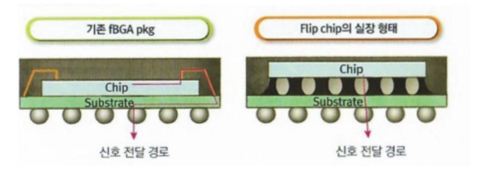

출처: 서민석(2020). 『패키지와 테스트』. 한올. p.59. [그림 1-1] 웨이퍼 레벨 리플로 장비

#### (2) 플립 칩 패키지 공정의 장점

웨이퍼 레벨에서 진행되는 공정은 전체 웨이퍼를 대상으로 하여 단일 칩 공정보다 효율 성과 생산성을 높이는 여러 장점이 있다.

(가) 생산성 향상

한 번에 여러 칩을 동시에 처리할 수 있어 생산성이 크게 향상된다. 이는 전체 웨이 퍼를 단위로 공정을 진행하기 때문에 가능한 일로, 대량 생산에서 특히 유리하다. 예 를 들어, 한 번에 수백 개의 칩을 동시에 패키징할 수 있어 시간과 비용을 절감할 수 있다.

(나) 공정 비용 절감

개별 칩 단위로 공정하는 것보다 비용이 효율적이다. 이는 한 번에 많은 칩을 처리 함으로써 공정 단계에서 발생하는 비용을 분산시킬 수 있기 때문이다.

(다) 높은 공정 일관성

모든 칩이 동일한 조건에서 처리하므로 공정 일관성이 높다. 이는 공정 품질을 일정 하게 유지하는 데 중요한 역할을 하며, 최종 제품의 성능과 신뢰성을 높이는 데 기 여한다.

(라) 공간 절약

웨이퍼 레벨에서의 플립 칩 패키징 공정은 개별 칩을 패키징하는 것보다 공간을 절 약할 수 있다. 이는 칩 간의 간격을 최소화하여 전체 웨이퍼를 더 효율적으로 사용 할 수 있기 때문이다.

(마) 전기적 성능 향상

웨이퍼 레벨에서의 플립 칩 패키징 공정은 신호 전달 경로가 짧고 균일하여 전기적 성능이 향상된다. 이는 데이터 전송 속도를 높이고 신호 손실을 줄여 준다.

(마) 열 관리 개선

웨이퍼 레벨에서의 공정은 칩과 기판 간의 열전달을 더 효율적으로 관리할 수 있다. 이는 열팽창 계수 차이로 인한 스트레스를 최소화하고, 각 칩의 열 분산을 균일하게 유지할 수 있도록 돕는다.

- (3) 플립 칩 패키지 공정의 단점
  - (가) 공정 복잡성

단일 칩이 아니라 전체 웨이퍼를 대상으로 작업이 이루어지므로 공정이 매우 복잡하 고 정밀한 작업이 필요하다.

(나) 비용 문제

특수한 장비와 높은 수준의 기술이 필요하며, 이는 초기 설치 비용과 공정 비용을 높인다.

(다) 열 관리 문제

웨이퍼 전체에 걸쳐 균일하게 열을 분산시키고, 각 칩이 열팽창으로 손상하지 않도 록 관리하는 것이 매우 중요하다.

(라) 수율 문제

웨이퍼 레벨에서의 공정은 높은 수준의 품질 관리와 모니터링이 필요하다. 하나의 결함이 전체 웨이퍼의 성능에 영향을 끼칠 수 있다.

(마) 수리 및 재작업의 어려움

문제 발생 시 수리 및 재작업이 어렵고, 전체 웨이퍼를 다시 처리해야 하는 경우가 많아 시간과 비용 측면에서 부담이 크다.

- (4) 플립 칩 패키징 시장 동향
  - (가) 시장 성장 요인

플립 칩 패키징 기술은 고성능 및 고밀도 패키징을 가능하게 하여 스마트폰, 태블릿, 고성능 컴퓨팅 장치 등 소형화된 전자 기기에서 중요한 역할을 한다. 플립 칩 기술 은 3D 통합과 높은 주파수 데이터 전송을 가능하게 하여 성능을 극대화한다.

(나) 지역별 성장

아시아 태평양 지역은 반도체 제조 허브로서 플립 칩 시장에서 큰 비중을 차지하고 있다. 주요 국가로는 중국, 대만, 우리나라, 일본 등이 있으며, 이들 국가는 높은 기 술력과 대규모 생산 능력을 바탕으로 시장을 주도하고 있다.

(다) 주요 기업의 역할

주요 반도체 기업들은 플립 칩 기술을 통해 소형화된 고성능 전자 기기를 구현하고 있으며, 지속적인 혁신과 투자로 시장을 확대하고 있다.

- 3. 전극 홀 가공(Through-Silicon Via, TSV)
  - (1) TSV의 정의

TSV는 'Through Silicon Via'의 약자로, 실리콘 웨이퍼를 관통하는 전도성 재료로 채 운 구멍을 뜻한다. 이 기술은 칩을 적층하는 방식 중 하나로, 기존에는 와이어로 칩과 칩 또는 칩과 서브 스트레이트를 연결했지만, TSV는 칩에 구멍을 뚫어 금속과 같은 전 도성 재료로 채워 수직으로 연결한다. 적층 과정에서 칩 단위로 공정을 진행하지만, 적 층 전에 TSV를 형성하고, 칩의 앞뒤에 솔더 범프를 추가하는 과정을 웨이퍼 단계에서 수행한다.

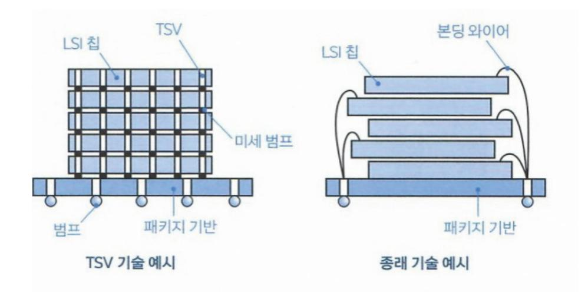

출처: 니시쿠보 야스히코(2023). 『반도체 구조원리 교과서』. 보누스. p.227. [그림 1-2] 적층 기술 구조 비교

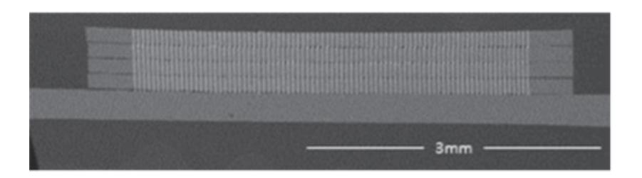

출처: 김준철・고용호・안승영(2019). 『이종/다수 반도체 소자 적층 통합 패키지 및 모듈 원천 기 술 개발 최종 보고서』. 산업통상자원부 전자부품연구원. p.7. [그림 1-3] TSV 및 마이크로 범프 기술을 이용한 적층 샘플

#### (2) TSV의 장점

(가) 성능 향상

TSV는 신호 전달 경로를 대폭 줄여 전기적 성능을 향상한다. 기존 와이어 본딩 방 식에서는 신호가 서브 스트레이트를 통해 돌아가야 했지만, TSV를 통해 직접 연결 되면서 빠른 신호 전달이 가능해진다.

(나) 패키지 크기 감소

복잡한 와이어 연결이 없어 패키지 크기를 줄일 수 있다. TSV를 사용하면 와이어가 필요 없어 공간이 절약된다.

(다) 핀 수 증가

TSV를 통해 더 많은 핀을 사용할 수 있어 데이터 전송량을 대폭 증가시킬 수 있다. 예를 들어, HBM(High Bandwidth Memory)에서는 TSV를 활용하여 X1024의 핀 구성을 구현할 수 있어, 기존 방식보다 훨씬 많은 데이터를 동시에 전송할 수 있다.

(라) 이종 디바이스 집적 가능

TSV를 사용하면 다양한 종류의 디바이스를 한 패키지 안에 집적할 수 있다. 예를 들어, 메모리와 프로세서를 하나의 3D 스택으로 결합하여 시스템 성능을 극대화하고 공간 효율성을 높일 수 있다. 이는 서로 다른 반도체 기술을 하나의 시스템에 통합 하는 것을 가능하게 한다.

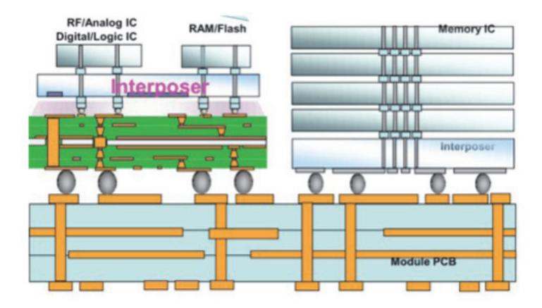

출처: 김준철・고용호・안승영(2019). 『이종/다수 반도체 소자 적층 통합 패키지 및 모듈 원천 기술 개발 최종 보고서』. 산업통상자원부 전자부품연구원. p.21. [그림 1-4] TSV를 이용한 3D Integration

#### 숕 팬 인(Fan in) WLCSP 공정 기술

1. Fan-in WLP의 정의 및 개념

Fan-in WLP(Fan-in Wafer Level Package)는 반도체 패키징 기술의 하나로, 웨이퍼 상 태에서 패키징 공정을 완료한 후 개별 칩으로 절단하는 방식이다. 이 기술에서는 칩 크기와 패키지 크기가 동일하게 유지되며, 솔더 볼은 모두 칩 내부에 배치된다. Fan-in WLP의 주 요 특징은 칩의 면적 내에서만 입출력 단자를 배치할 수 있다는 점이다. 이는 솔더 볼의 배 치가 칩 크기에 종속적이어서, 칩이 작아질수록 솔더 볼의 크기와 간격을 줄여야 한다. 이 러한 방식은 소형화된 고밀도 회로에 적합하며, 스마트폰, 태블릿, 웨어러블 기기 등 소형 전자 장치에서 널리 사용된다. Fan-in WLP는 웨이퍼 레벨에서 패키징이 이루어지기 때문 에, 공정이 단순하고 효율적이다. 이 기술은 전자 제품의 소형화와 고집적화를 실현하는 데 중요한 역할을 한다.

2. Fan-in WLP의 장점

(1) 소형화

팬 인 WLCSP의 큰 장점 중 하나는 칩 크기와 동일한 크기의 패키지를 구현할 수 있다 는 점이다. 전통적인 패키징은 칩을 서브 스트레이트(기판) 위에 배치하고 와이어 본딩 이나 플립 칩 본딩을 통해 연결하지만, Fan-in WLCSP는 서브 스트레이트 없이 웨이퍼 위에 직접 배선과 솔더 볼을 형성하여 패키징을 완료한다. 이는 패키지 크기를 최소화하 고, 소형화된 전자기기에 적합하게 만든다. 이로 인해 스마트폰, 웨어러블 디바이스와 같이 내부 공간이 제한된 전자기기에 매우 유리하며, 작은 패키지 크기는 기기의 전반적 인 크기를 줄이는 데 크게 기여한다.

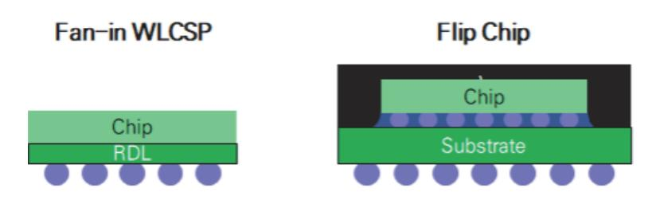

출처: 집필진 제작(2024) [그림 1-5] Fan-in WLCSP Flip Chip 비교

(2) 전기적 성능

전통적인 패키징과 비교하여 전기적 전달 경로가 짧아 신호 전달 속도가 빠르고 전기적 특성이 뛰어나다. 이는 고속 데이터 전송이 필요한 최신 전자 기기에서 특히 중요한 요 소이다. 짧은 전달 경로는 신호 왜곡을 줄이고, 전력 소모를 감소시켜 전체 시스템의 효 율성을 높인다.

(3) 비용 절감

웨이퍼 단위로 일괄 공정을 진행할 수 있어 대량 생산 시 비용 효율이 높다. 특히, 수율 이 높은 경우 전통적인 패키징 방식보다 낮은 비용으로 생산할 수 있다. 이는 생산 과 정에서의 경제성을 극대화하여, 최종 제품의 경쟁력을 높이는 데 중요한 역할을 한다. 또한, 서브 스트레이트나 와이어 같은 중간 매개체를 사용하지 않기 때문에 재료비가 절 감된다. 이는 환경친화적일 뿐만 아니라 경제적으로도 이점을 제공한다.

(4) 생산성 증가

웨이퍼 단위에서 일괄 공정을 통해 많은 칩을 동시에 패키징할 수 있어 생산 속도가 빨 라지고 효율성이 높아진다. 이는 제조업체가 더 빠르고 효율적으로 제품을 공급하는 데 도움을 주어, 시장의 요구에 신속하게 대응할 수 있게 한다.

3. Fan-in WLP 시장 동향

스마트폰 기능, 특히 전력 관리 IC(PMIC), WiFi/BT 콤보, 트랜시버, 이미지 센서, 아날로

그/디지털 기능 등에서의 수요 증가로 Fan-in WLP 시장은 최근 몇 년 동안 지속해서 성 장하고 있다. 소비자 전자 제품, 자동차, 통신 인프라, 의료 기기 등 다양한 분야에서 사용 되며, 특히 MEMS와 CMOS 이미지 센서, 아날로그 및 혼합 신호 IC 등의 적용이 두드러 진다.

이 기술은 지속적인 혁신을 통해 비용 절감과 폼 팩터 면에서 확실한 이점을 제공한다. 최 근에는 반도체의 측면 균열을 방지하고 전기적 성능을 향상하기 위한 다양한 보호 기술이 개발되고 있다. Fan-in WLP 시장은 앞으로도 안정적인 성장이 예상되며, 새로운 애플리케 이션과 기술 혁신을 통해 시장 점유율을 확장할 것으로 기대된다.

특히, 300mm 웨이퍼는 200mm 웨이퍼에 비해 약 2.5배 더 많은 칩을 생산할 수 있어 높 은 생산성과 비용 효율성을 제공하며, 업계 표준으로 자리 잡고 있다.

#### 숖 팬 아웃(Fan Out) WLCSP 공정 기술

1. FOWLP 정의 및 개념

Fan-out WLP(Fan-out Wafer Level Package)는 칩 크기보다 큰 패키지 크기를 통해 칩 외부에도 솔더 볼을 배치할 수 있는 첨단 패키징 기술이다. 이 기술은 칩을 먼저 절단한 후 양품만을 다시 배열하여 웨이퍼 형태로 재구성하고, 패키징을 진행함으로써 전기적 특성 향 상과 비용 절감을 동시에 달성할 수 있다. Fan-out WLP는 다양한 칩의 이종 결합이 가능 하여 유연한 설계를 제공하고, 빠르게 변화하는 시장의 요구에 대응할 수 있다.

2. Fan-in WLP와 Fan-out WLP의 비교

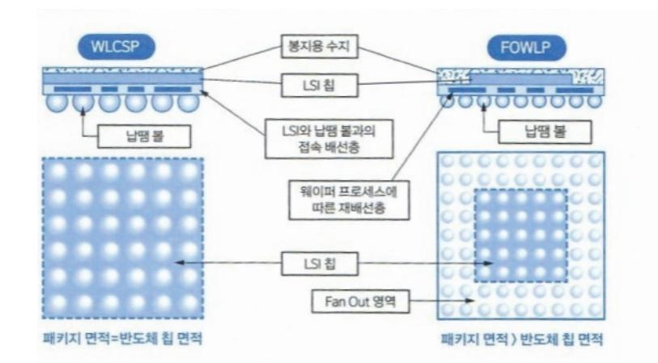

출처: 니시쿠보 야스히코(2023). 『반도체 구조원리 교과서』. 보누스. p.229. [그림 1-6] WLCSP(Fan-in WLP), FOWLP(Fan-out WLP) 비교

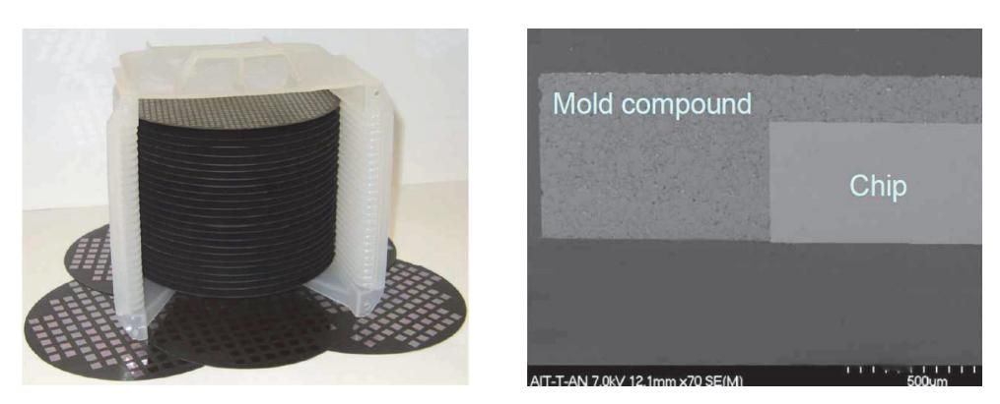

출처: 한국전자기계융합기술원・한국생산기술연구원・에이에프오・네패스・에이씨엔(2020). 『반도체 공정용 요 소 부품 및 패키징 장비 실증』. 산업통상자원부. p.16. [그림 1-7] FO-WLP 몰딩 웨이퍼

#### (1) 칩 크기와 패키지 크기의 관계

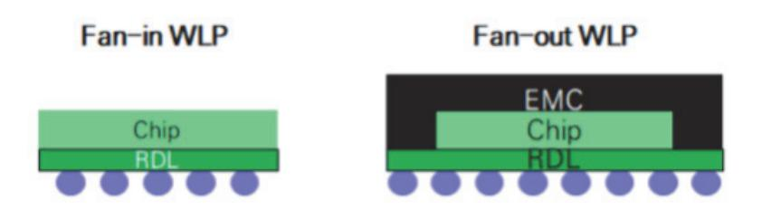

- 출처: 집필진 제작(2024)
- [그림 1-8] Fan-in WLP와 Fan-out WLP

#### (가) Fan-in WLP

웨이퍼 단계에서 패키징 공정을 완료한 후 개별 패키지로 절단하는 방식이다. 이로 인해 칩 크기와 패키지의 크기가 동일해지며, 솔더 볼은 칩 내부에만 배치된다. 이는 칩이 작아질수록 솔더 볼과 피치의 크기를 줄여야 하는 문제를 발생시키며, 표준화 된 볼 레이아웃을 유지하는 데 어려움이 있다.

(나) Fan-out WLP

칩을 절단 후 양품만을 다시 배열하여 웨이퍼 형태로 재구성한다. 이 과정에서 칩과 칩 사이의 간격을 조정할 수 있어 패키지 크기를 칩 크기보다 크게 만들 수 있다. 이는 더 많은 입출력 단자를 배치할 수 있게 하여 패키지의 전기적 성능을 향상하 고, 다양한 설계 요구에 맞춰 패키지 크기를 조절할 수 있는 유연성을 제공한다.

- (2) 솔더 볼 배열 차이
  - (가) Fan-in WLP

솔더 볼이 칩 내부에 배치되므로, 솔더 볼의 크기와 피치에 큰 제한이 있다. 이는 칩 의 크기가 작아질수록 더 두드러지며, 결과적으로 전기적 연결의 효율성을 저해할 수 있다.

(나) Fan-out WLP

솔더 볼을 칩 외부에도 배치할 수 있도록 설계되었다. 이는 더 많은 입출력 단자를 구현할 수 있으며, 전기적 특성을 최적화할 수 있다. 특히 고성능, 고집적 회로에서 중요한 장점으로 작용한다.

- 3. Fan-in WLP의 장점
  - (1) 설계 유연성 및 패키지 밀도 증가

Fan-out WLP는 칩을 재배열하여 패키지 크기를 조절할 수 있어 설계의 유연성을 제공 한다. 이를 통해 더 많은 입출력 단자를 배치할 수 있으며, 솔더 볼을 칩 외부로 확장 배치할 수 있어 패키지 밀도가 증가한다.

(2) 전기적 특성 향상

Fan-out WLP는 솔더 볼을 칩 외부로 확장 배치함으로써 신호 전송 경로가 짧아져 신 호 손실이 줄어들고, 전기적 특성이 향상된다. 이는 고속 신호 전송이 필요한 고성능 애 플리케이션에서 중요한 장점이다.

(3) 기존 인프라 활용 가능

Fan-out WLP는 기존 테스트 및 제조 장비를 그대로 사용할 수 있어, 새로운 장비에 대한 추가 투자가 필요 없다. 이는 기존 생산 라인을 효율적으로 활용할 수 있게 한다.

(4) 불량품 배제에 따른 공정 비용 절감

Fan-out WLP는 칩을 절단한 후 양품만을 다시 배열하여 패키징하기 때문에 불량 칩을 배제할 수 있다. 이는 공정 비용을 절감하고, 생산 효율을 높이는 데 기여한다.

(5) 다양한 칩의 이종 결합 가능성

Fan-out WLP는 다양한 칩을 하나의 패키지에 결합할 수 있는 유연성을 제공한다. 이 를 통해 다양한 기능을 통합한 고집적 모듈을 만들 수 있으며, 복잡한 시스템을 소형화 하고, 성능을 향상할 수 있다.

- 4. Fan-out WLP 기술 동향
  - (1) 기술 발전 및 적용 확대
    - (가) 고성능 애플리케이션

FOWLP 기술은 스마트폰, 태블릿, 웨어러블 기기와 같은 소비자 전자 제품뿐만 아 니라 고성능 컴퓨팅, 인공지능(AI), 데이터 센터 등 다양한 응용 분야에서 활발하게 적용되고 있다. 이 기술은 전기적 성능을 향상하고 소형화된 패키지를 구현할 수 있 어 이러한 고성능 애플리케이션에 적합하다.

(나) 5G 및 IoT의 확산

5G 기술은 높은 데이터 전송 속도와 낮은 지연 시간을 요구하며, IoT 기기는 소형

화와 저전력이 필요하다. FOWLP는 이러한 요구를 충족시킬 수 있는 이상적인 패키 징 기술로 자리 잡고 있다.

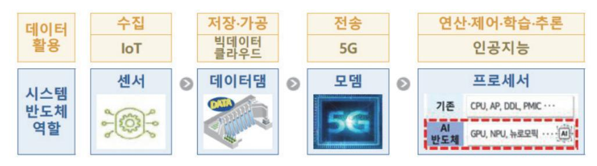

출처: 관계 부처 합동(2020. 10. 13). 인공지능(AI) 반도체 산업 발전 전략. p.3. [그림 1-9] AI 데이터 선순환 구조와 이를 구현하는 시스템 반도체 역할

- (2) 시장 성장 및 투자
  - (가) 시장 규모 확대

Fan-out WLP 시장은 2022년에 약 25억 달러 규모였으며, 2032년까지 약 50억 달러 규모로 성장할 것으로 예상된다. 연평균 성장률(CAGR)은 약 10%에 이를 것으 로 전망된다. 이는 소형화된 반도체 부품의 수요 증가와 함께 5G 및 IoT 기술의 확 산에 따른 것이다.

(나) 기술 투자 및 연구개발

주요 반도체 기업들은 FOWLP 기술에 대한 투자를 강화하고 있다. T사는 고성능 스 마트폰 애플리케이션 프로세서(AP) 시장에서 중요한 역할을 하고 있으며, 다양한 기 술 개발과 연구를 통해 FOWLP의 성능과 신뢰성을 더욱 향상하고 있다.

- (3) 기술적 도전과 해결 과제
  - (가) 열 관리 및 휨 현상

FOWLP 기술에서의 주요 도전 과제 중 하나는 열 관리와 휨 현상이다. 휨 현상은 패키징 공정에서 발생하는 변형으로, 이는 패키지의 신뢰성을 저하시킬 수 있다. 이 를 해결하기 위해 정밀한 RDL(재배선층) 생성 및 휨 현상 방지 기술 등이 연구되고 있다.

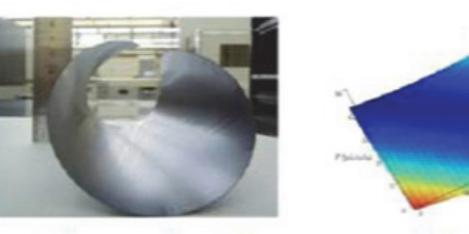

출처: 하나마이크론(2013). 『차세대 초박형 MCP 인쇄 회로기판 모듈 및 SIP용 별도 PCB 모듈』. 산업통상자원부 한국산업기술평가관리원. p.472. [그림 1-10] wafer warpage

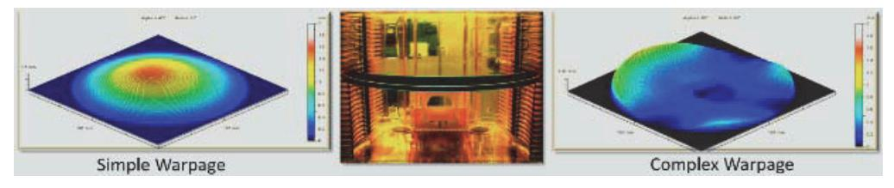

출처: IEEE(2023). HETEROGENEOUS INTEGRATION ROADMAP Chapter 23: Wafer-Level Packaging(WL P). https://eps.ieee.org/images/files/HIR\_2021/ch23-wlpfinal2.pdf. p.24. [그림 1-11] Examples of Molded Wafer Warpage

(나) 고밀도 패키징

FOWLP는 고밀도 패키징을 가능하게 하지만, 이를 구현하기 위해서는 높은 수준의 기술적 정밀도가 요구된다. 칩과 칩 사이의 간격을 조정하고 더 많은 입출력 단자를 배치하는 과정에서 발생하는 문제들을 해결하기 위해 지속적인 연구개발이 필요하다.

## 수행 내용 / Fan-in WLP 공정 진행하기

#### 재료·자료

- 웨이퍼(Wafer): 실리콘 웨이퍼 또는 기타 반도체 재료
- 포토레지스트(Photoresist): 포토리소그래피 공정에 사용되는 감광제
- 마스크(Mask): 포토리소그래피에 사용되는 패턴 마스크
- 패키지 기판(Substrate): 최종 패키지 기판
- 세정액(Cleaning Solution): 웨이퍼 세정에 사용되는 화학 물질
- 절연층 재료: 폴리이미드(Polyimide), 실리콘(Si) 기반 절연체
- 솔더 볼
- 배선 재료

#### 기기(장비 ・ 공구)

- 스퍼터링 장비(Sputtering Equipment): 금속 박막을 웨이퍼 표면에 증착
- 포토리소그래피 장비(Photolithography Equipment): 패턴을 웨이퍼에 인쇄
- 에칭 장비(Etching Equipment): 필요 없는 물질을 제거
- 클린 룸(Clean Room): 먼지가 없는 환경에서 작업
- 클린 룸 복장: 보호복, 장갑, 마스크, 안전 고글 등
- 솔더 볼 부착 장비
- 본딩 장비: 솔더 볼과 웨이퍼의 접합
- 평탄화 장비: 웨이퍼 표면 평탄화

#### 안전 ・ 유의 사항

- 포토레지스트 및 에칭 용액 사용 시 보호 장비(장갑, 고글, 방진 마스크)를 착용해야 한다.
- 고온 작업 시 화상 방지용 장비를 착용해야 한다.
- 클린 룸 규칙: 먼지나 오염 물질이 들어가지 않도록 클린 룸 규칙을 준수해야 한다.

- 민감한 전자 부품 보호를 위한 정전기 방지 조치(ESD 매트, 손목 스트랩)가 필요하다.
- 기기 작동 시 안전 매뉴얼을 준수해야 한다.

수행 순서

숔 웨이퍼의 표면을 클리닝하고 결함을 검사하여 패키징에 적합한 상태로 만든다.

웨이퍼 준비는 Fan-in WLP 공정의 첫 단계로, 웨이퍼의 표면을 깨끗하게 하여 공정에 적합한 상태로 만드는 과정을 포함한다. 이 공정은 주로 패키징을 중심으로 진행되며, 준비 단계는 패 키징 공정이 원활하게 이루어지도록 보장한다. Fan-in WLP 공정에서 '웨이퍼 준비' 단계는 IDM(Integrated Device Manufacturer)과 OSAT(Outsourced Semiconductor Assembly and Test)에서 각각 다른 방식으로 수행된다.

1. IDM에서 웨이퍼 준비를 진행한다.

IDM은 반도체 제조의 전공정(Front-End)과 후공정(Back-End)을 모두 내부에서 처리한다.

- (1) 웨이퍼 수령 및 검토를 수행한다.
  - (가) 전공정이 완료된 웨이퍼를 자체적으로 후공정 부서로 이송한다. 외부에서 웨이퍼를 수령 하는 과정은 필요하지 않으며 내부적으로 관리한다.
  - (나) 웨이퍼가 전공정에서 정확히 제조되었는지 확인하기 위해 기본적인 시각적 검토를 수행 한다. 이는 물리적 손상 여부를 확인하고, 패키징에 적합한지를 점검하기 위함이다.
- (2) 간단한 웨이퍼 클리닝을 수행한다.
  - (가) 주로 간단한 화학적 세정을 수행하여 표면의 가벼운 오염을 제거한다. 이는 후공정에서 불필요한 오염이 발생하지 않도록 하기 위한 조치이다.
  - (나) 복잡한 물리적 세정보다는 간단한 세정 기술을 적용하여 웨이퍼의 표면을 준비한다.
- (3) 표면 결함 검사를 수행한다.

웨이퍼 표면의 결함을 검사하여 패키징에 적합한지 확인하기 위하여 광학 검사를 진행 한다. IDM에서는 이러한 검사를 통해 신속하게 문제를 식별하고 바로잡을 수 있다.

2. OSAT에서 웨이퍼 준비를 진행한다.

OSAT는 주로 후공정과 패키징을 전문으로 하며, 웨이퍼를 외부에서 인수하여 처리한다.

- (1) 초기 수령 및 검토를 수행한다.
  - (가) 전공정이 완료된 웨이퍼를 반도체 제조사로부터 인수한다. 수령 시 웨이퍼의 상태를 시 각적으로 점검하여 결함 여부를 확인한다.
  - (나) 수령한 웨이퍼가 패키징에 적합한 상태인지 확인하기 위해 기본적인 품질 검사를 수행한 다.

17

- (2) 간단한 웨이퍼 클리닝을 수행한다.
  - (가) 고객의 요구에 따라 간단한 화학적 세정을 수행할 수 있다. 일반적으로 RCA 클리닝과 같은 복잡한 세정보다는 표면의 기본적인 클리닝에 집중한다.
  - (나) 필요에 따라 간단한 물리적 클리닝을 수행하여 표면의 입자와 오염물을 제거한다.
- (3) 표면 결함 검사를 수행한다.

웨이퍼의 물리적 결함을 검사하여 패키징 전 상태를 확인한다. 이는 패키징 품질을 보장 하는 과정이다.

(4) ESD 보호 조치를 한다.

다양한 장비와 절차를 사용하여 ESD(Electrostatic Discharge)로부터 웨이퍼를 보호하 며, 이는 민감한 반도체 부품의 안전을 보장하는 데 중요하다.

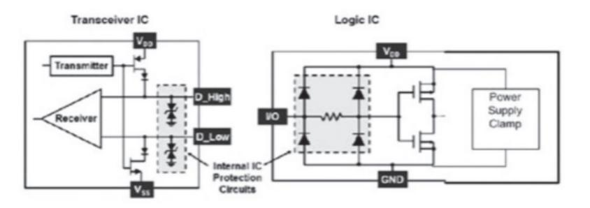

출처: 전자부품연구원(2019). 『이종/다수 반도 체소자 내장형 통합 패키지 및 모듈 원기술 개발』. 산업통상자원부 한국산업기술평가관리원. p.49. [그림 1-12] ESD 방지 보호 회로 예시

숕 포토레지스트를 도포하고, 자외선을 이용하여 원하는 패턴을 웨이퍼 표면에 전사한다. 웨이퍼 표면에 미세한 패턴을 형성하기 위한 과정으로, 포토레지스트를 웨이퍼에 코팅하고 자 외선을 통해 패턴을 노출시킨다.

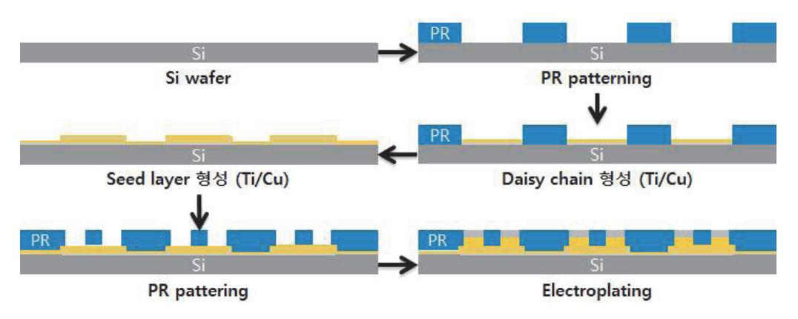

출처: 한국생산기술연구원(2020). 『20um급 미세범프 플립 칩 패키지 원천 소재 및 공정 기술 개발』. 과학기술 정보통신부 한국생산기술연구원. p.24. [그림 1-13] PR passivation 구조 이용한 test substrate와 chip 제작 모식도

- 1. 포토레지스트를 도포한다.
  - (1) 포토레지스트를 웨이퍼 표면에 균일한 두께로 도포하여 이후의 패턴 형성이 정확하게 이루어 지도록 한다. 액체 상태의 포토레지스트를 웨이퍼 중심에 도포하고 고속으로 회전시켜 균일한 막을 형성한다.
  - (2) 프리 베이크 단계에서 포토레지스트의 용매를 증발시켜 접착력을 강화하고, 웨이퍼 표면에 고 정성을 부여한다. 프리 베이크는 보통 90~120°C의 온도에서 60~120초 동안 진행한다.
- 2. 포토마스크를 정렬하고 자외선으로 패턴을 전사한다.
  - (1) 포토레지스트가 코팅된 웨이퍼와 포토마스크를 정밀하게 정렬한다. 포토마스크는 정확한 패턴 전사를 위해 철저히 검사해야 한다.
  - (2) 자외선을 사용하여 포토마스크의 패턴을 포토레지스트에 전사한다. 노광 시간과 광원의 강도 는 패턴의 정확성과 해상도를 결정짓는 중요한 요소이다.
- 3. 현상액으로 포토레지스트 제거 후 패턴을 세정·강화한다.
  - (1) 현상액을 사용하여 노광한 포토레지스트를 제거하고 패턴을 남긴다. 현상액의 농도와 시간을 최적화하여 정확한 패턴을 유지한다.
  - (2) 남아 있는 잔여물이나 오염 물질을 제거한다. 탈이온수로 헹굼 후 자동화된 장비를 사용하여 균일한 세정을 보장한다.
  - (3) 현상 후 남은 포토레지스트를 강화하고, 패턴의 내구성과 정밀성을 높인다. 이 과정은 패턴의 경계를 명확하게 하고, 후속 공정의 견고성을 높이는 데 중요한 역할을 한다.
- 숖 전사된 패턴을 따라 불필요한 물질을 제거하여 원하는 구조를 형성한다.

웨이퍼에 전사된 패턴을 기반으로 불필요한 물질을 제거하여 최종 구조를 형성하는 공정이다. 이 단계는 주로 건식 에칭 기술을 활용하여 패턴에 맞는 구조를 정확히 구현하는 것을 목표로 한다.

- 1. 건식 에칭을 수행한다.
  - (1) 기체 상태의 화학 물질을 사용하여 웨이퍼 표면의 불필요한 물질을 제거한다. 이 공정은 고 도로 정밀한 패턴 형성을 가능하게 하며, 웨이퍼의 특정 부분만을 선택적으로 제거한다.
  - (2) 건식 에칭은 에칭 챔버 내에서 수행되며, 높은 해상도로 패턴을 구현할 수 있다.
- 2. 습식 에칭을 수행한다(필요시).
  - (1) 특정 물질을 제거하기 위해 습식 에칭이 사용될 수 있다. 이는 금속층과 같은 물질에 대해 더 효과적일 수 있다.
  - (2) 습식 에칭은 화학 용액을 사용하여 웨이퍼 표면의 불필요한 물질을 제거한다.

3. 플라즈마 세정을 수행한다.

에칭 후, 웨이퍼 표면에 남아 있는 잔여 물질이나 오염을 제거하기 위해 플라즈마 세정을 실시한다. 플라즈마 세정은 웨이퍼의 표면을 깨끗하게 하고 패턴의 정확성을 보장하는 데 중요한 역할을 한다.

- 4. 패턴 형성 후 검토를 수행한다.
  - (1) 에칭과 플라즈마 세정이 완료된 후, 패턴이 정확하게 형성되었는지 확인하기 위해 추가 검토 를 수행한다. 이는 패턴의 일관성을 점검하고, 필요시 수정 작업을 진행하는 단계이다.
  - (2) 검토는 시각적 검사 또는 측정 장비를 사용하여 수행하며 최종 패턴의 품질을 보장한다.

#### 수행 tip

• Fan-in WLP 공정에서는 일반적으로 습식 에칭보다는 건 식 에칭이 더 자주 사용된다.

숗 패턴 형성 후 불필요한 포토레지스트를 제거하여 깨끗한 웨이퍼 표면을 확보한다.

패턴이 형성된 후, 남는 포토레지스트를 제거하여 웨이퍼 표면을 깨끗하게 만드는 공정이다. 이 단계는 후속 공정에서 불순물이 없도록 보장하는 데 중요한 역할을 한다.

1. 포토레지스트를 제거한다.

패턴 형성 후 남아 있는 불필요한 포토레지스트를 제거하기 위해 화학적 스트리핑 공정을 사용한다. 이 공정은 웨이퍼 표면의 모든 잔여 포토레지스트를 제거하여 깨끗한 표면을 제 공한다. 스트리핑은 주로 아세톤, NMP 등의 화학 용액을 사용하여 포토레지스트를 녹여내 는 방식으로 수행된다.

2. 표면을 세정하여 잔여물을 제거한다.

포토레지스트 제거 후, 웨이퍼 표면을 세정하여 남아 있는 물리적 잔여 오염물을 제거한다. 세정은 DI(탈이온) Water 또는 특수 세정제를 사용하여 웨이퍼 표면을 처리하며, 물리적 잔여물을 씻어낸다.

3. 플라즈마 처리를 통해 표면을 깨끗하게 한다.

웨이퍼 표면의 미세한 유기 잔여물이나 화학적 오염을 제거하기 위해 플라즈마 처리를 수 행한다. 이는 표면의 청정도를 높이고, 후속 공정에서의 품질을 보장한다. 플라즈마 처리는 잔여 유기물과 미세 입자를 제거하며 산소 플라즈마를 자주 사용한다.

4. 검사를 통해 품질을 확인한다.

포토레지스트 제거와 세정이 완료된 후, 웨이퍼 표면의 상태를 검사하여 결함이나 오염이 없는지 확인한다. 검사는 시각적 검사와 함께 광학 현미경을 사용하여 웨이퍼 표면의 품질

수행 tip

• 모든 단계가 완료된 후, 공정 데이터와 검사 결과를 기록 하고 저장하여 공정 추적성을 확보할 수 있다.

## 수 웨이퍼에 재배선층을 형성하여 전기적 연결을 위한 경로를 구축한다. 웨이퍼에 재배선층(RDL)을 형성하여 칩과 외부 간의 전기적 연결을 확립한다. 재배선층은 회로 의 재구성을 가능하게 하며, 미세한 배선을 통해 전기 신호를 효과적으로 전달한다.

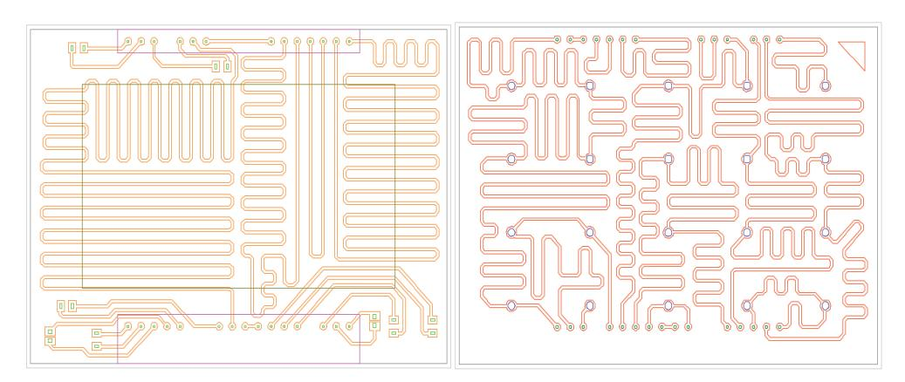

출처: 산업통상자원부(2017). 『300mm 대응 대구경 다층구조의 복합 패키지 공정 및 장비 기술 개발』. p.27. [그림 1-14] RDL design 검증을 위한 Daisy-chain 설계

#### 1. 재배선층 형성을 위해 웨이퍼 표면을 최적화한다.

이는 세정과 건조 과정을 포함하여 웨이퍼 표면의 오염 물질을 제거하고, 재배선층의 접착 성을 높인다.

(1) 세정(Cleaning)

화학적 세정과 물리적 세정을 통해 웨이퍼 표면의 오염 물질을 제거한다. 화학 용액을 사용하여 유기물과 금속 이온을 제거하고, 초음파 세정기를 이용해 미세 입자를 물리적 으로 제거한다.

(2) 건조(Drying)

세정 후 웨이퍼를 완전히 건조하여 수분이 남지 않도록 한다. 스핀 건조 또는 온풍 건 조 방법을 사용하여 표면의 잔여 수분을 제거한다.

2. 웨이퍼 표면에 절연층을 도포하여 재배선층의 전기적 단락을 방지한다.

절연층은 주로 폴리이미드나 벤조 사이클로 뷰테인(BCB)과 같은 폴리머 재질을 사용한다.

(1) 스핀 코팅(Spin Coating)

절연 재료를 웨이퍼에 균일하게 도포하여 일정한 두께를 유지한다. 웨이퍼를 고속으로 회전시켜 절연층이 고르게 퍼지도록 한다.

(2) 경화(Curing)

도포된 절연층을 경화하여 고정성을 확보한다. 오븐에서 일정 온도로 가열하여 재료를 단단하게 만든다.

3. 웨이퍼의 절연층 위에 금속층을 증착하여 전기적 경로를 형성한다.

금속층은 주로 구리를 사용하며, 스퍼터링 또는 화학적 기상 증착(CVD) 방법을 통해 증착한다.

(1) 스퍼터링(Sputtering)

플라즈마를 이용하여 금속을 균일하게 증착한다. 타깃 재료에 이온을 충돌시켜 금속 원 자를 분리하고, 이를 웨이퍼 표면에 증착한다.

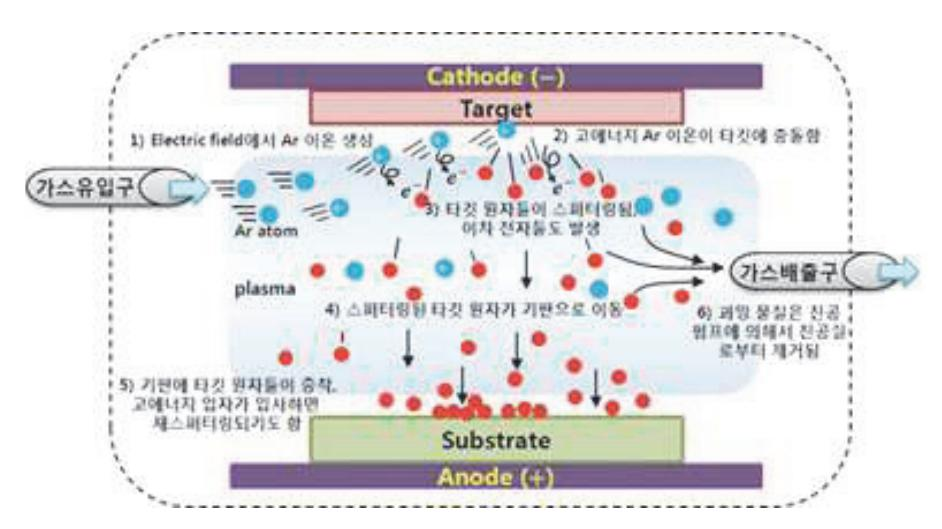

출처: 에이피시스템(주)(2019). 『반도체의 TSV 제조용 스퍼터 개발』. 산업통상자원부 한국산업기술 평가관리원. p.7. [그림 1-15] 스퍼터링 프로세스 개략도

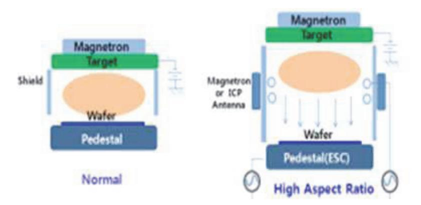

출처: 에이피시스템(주)(2019). 『반도체의 TSV 제조용 스퍼터 개발』. 산업통상자원부 한국 산업기술평가관리원. p.8.

[그림 1-16] Sputter 구성도 비교(좌: Normal, 우: 고 종횡비용)

(2) 화학적 기상 증착(CVD)

반응성 기체를 웨이퍼 표면에 도입하여 화학 반응을 통해 금속층을 형성한다.

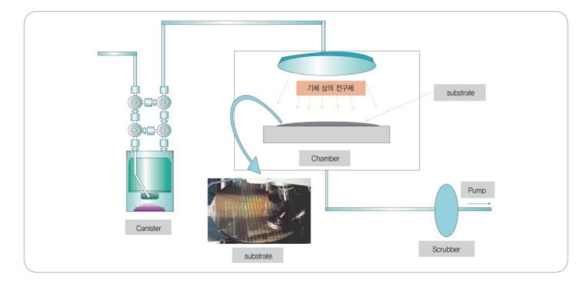

출처: 세향산업(주)(2013). 『CVD(Chemical Vapor Deposition)용 샤워 헤드 제작을 위한 스파크 본딩 (Spark Bonding) 장비 개발』. 산업통상자원부 한국산업단지공단. p.45. [그림 1-17] CVD 개략도

4. 패턴을 형성한다.

포토리소그래피를 통해 금속층에 원하는 패턴을 형성하여 전기적 경로를 만든다.

- (1) 포토레지스트 도포(Photoresist Coating) 금속층 위에 포토레지스트를 도포하여 패턴을 전사할 준비를 한다.
- (2) 노광 및 현상(Exposure and Development) 포토마스크를 사용하여 자외선을 통해 패턴을 전사하고, 현상 과정을 통해 불필요한 포 토레지스트를 제거한다.

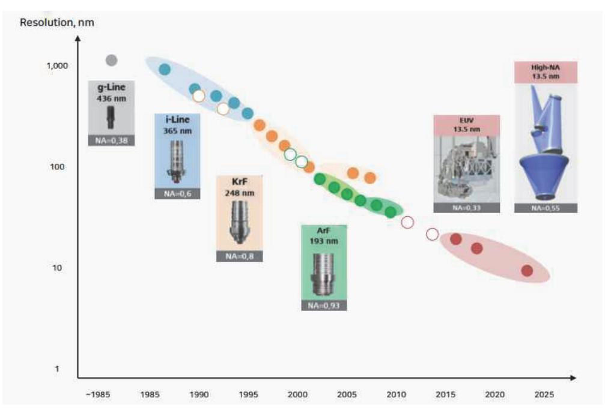

출처: 중소기업기술정보진흥원(2024). 『중소기업 전략 기술 로드맵 2024~2026-반도체 장비』. 중소벤처기업 부. p.55.

[그림 1-18] 노광 장비 발전 방향

#### 5. 에칭을 수행한다.

금속층의 불필요한 부분을 제거하여 원하는 패턴을 형성한다.

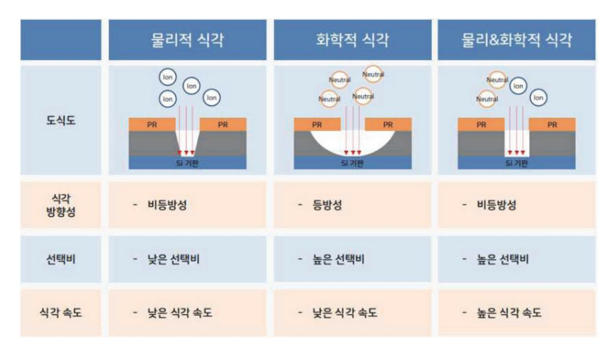

출처: 중소기업기술정보진흥원(2024). 『중소기업 전략 기술 로드맵 2024~2026-반도체 장비』. 중소벤처기업 부. p.44.

[그림 1-19] 식각(Etching, 에칭) 성격에 따른 분류

(1) 화학적 에칭(Chemical Etching)

화학 용액을 사용하여 웨이퍼 표면의 노출된 부분을 선택적으로 제거하는 과정이다. 습

식 에칭은 일반적으로 등방성(Isotropic)으로 작용하며, 모든 방향으로 물질을 제거한다. 이 방법은 상대적으로 빠르고 저렴하지만 미세 패턴에는 한계가 있을 수 있다.

(2) 건식 에칭(Dry Etching)

플라즈마를 이용하여 웨이퍼 표면을 가공하는 방법이다. 이는 주로 이방성(Anisotropic)으로 작용하여 수직 방향으로 정밀하게 물질을 제거할 수 있다. 물리적 에칭은 고밀도 및 고해상도 패턴을 형성하는 데 적합하며 플라즈마를 통해 고정밀 패턴 구현이 가능하다.

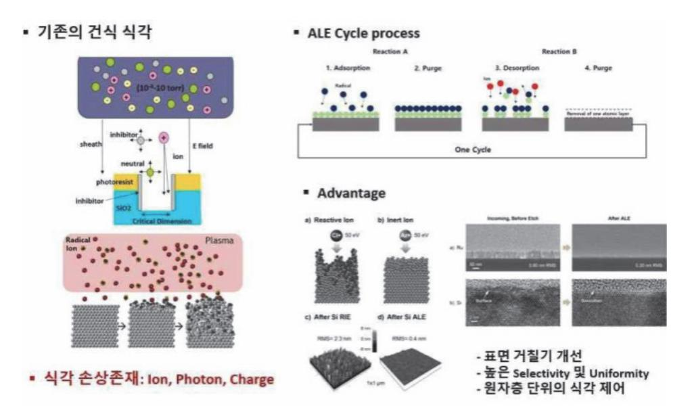

출처: 중소기업기술정보진흥원(2024). 『중소기업 전략 기술 로드맵 2024~2026-반도체 장비』. 중소벤처 기업부. p.152. [그림 1-20] 원자층 식각 공정 단계 및 특성

6. 후속 처리를 수행한다.

재배선층 형성 후 포토레지스트를 제거하고 웨이퍼 표면을 청결하게 유지한다.

| spect Ratio  | E/R increase with same |                                      |
|--------------|---------------------------|--------------------------------------|
| Aspec        |                           | 1                                    |
| 10000        |                           | Etch limitation by the depth loading |
|              | E                         | tch time                             |
|              | Conventional              | 10                                   |
| h Throughput | Low Temp.                 | - 18                                 |

출처: 중소기업기술정보진흥원(2024). 『중소기업 전략 기술 로드맵 2024~2026-반 도체 장비』. 중소벤처기업부. p.151. [그림 1-21] 극저온 식각 기술 공정 효율

- (1) 포토레지스트 제거 화학 용액이나 플라즈마를 사용하여 포토레지스트를 완전히 제거한다.
- (2) 청정(Cleaning) 세정 과정을 통해 남은 잔여물을 제거하여 웨이퍼의 청결을 유지한다.
- 숙 전기적 연결을 위해 다이의 패드 위에 솔더 범프를 배치하고 리플로 과정을 통해 결합한다.
- 칩의 전기적 연결을 확립하기 위해 솔더 범프를 형성하고 이를 리플로 과정을 통해 패드와 결 합하는 과정이다. 솔더 범프는 칩과 기판을 연결하여 전기 신호를 전달하며, 열적 및 기계적 결합을 제공한다.

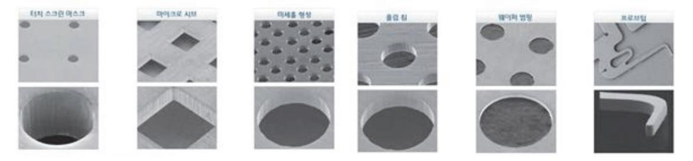

출처: (주)에스에스피(2014). 『300mm 웨이퍼 레벨 마이크로 솔더 볼 어태치 장비 개발 최종 보고서』. 산업통상자원부 한국산업기술평가관리원. p.15. [그림 1-22] 플럭스 & 솔더 볼 마스크

1. 솔더 볼을 정확히 다이의 패드 위에 배치하여 전기적 연결을 준비한다.

솔더 프린팅 또는 솔더 볼 플레이스먼트를 통해 이루어진다. 솔더 프린팅은 스텐실을 사용 하여 솔더 페이스트를 패드에 인쇄하는 방식이며, 솔더 볼 플레이스먼트는 개별 솔더 볼을 패드 위에 정밀하게 배치하는 방법이다.

- 2. 리플로(Reflow) 과정
  - (1) 프리 히트

웨이퍼를 서서히 가열하여 솔더 볼과 패드의 온도를 서서히 상승시킨다. 이는 열 충격을 방지하고 솔더가 균일하게 가열되도록 한다.

(2) 리플로

온도를 계속 상승시켜 솔더 볼이 녹아 패드와 결합하게 한다. 이 단계에서 솔더는 표면 장력에 의해 둥근 형태를 형성하며 패드와의 강력한 전기적 연결을 확립한다.

(3) 냉각

솔더가 패드와 결합된 후 서서히 냉각하여 솔더 범프를 경화시킨다. 이는 결합의 물리적 특성을 강화하고, 장기적인 안정성을 보장한다.

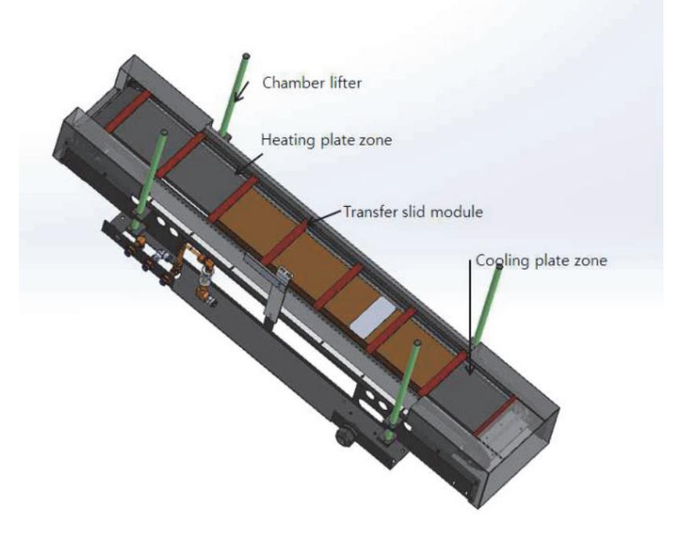

출처: 효광(2018). 「WLCSP 기반 리드 프레임 리스 벤치 광원 엔진 생산 공정 및 장비 개발」. 산업통상자원부 한국산업기술평가관리원. p.61. [그림 1-23] WLCSP Reflow bottom conduction plate 구조

3. 검사 및 확인

결합된 솔더 범프의 품질을 확인하기 위해 광학 검사와 X-ray 검사를 수행한다. 광학 검사 는 솔더 범프의 형상과 위치를 확인하며, X-ray 검사는 내부 결함을 확인하여 강력하고 안 정적인 전기적 연결을 보장한다.

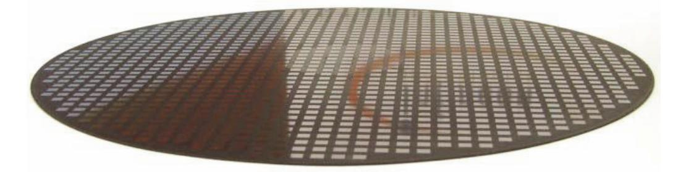

출처: (주)에스에스피(2014). 『300mm 웨이퍼 레벨 마이크로 솔더 볼 어태치 장비 개발 최종 보고서』. 산업통 상자원부 한국산업기술평가관리원. p.6.

[그림 1-24] WLCSP Reflow bottom conduction plate 구조

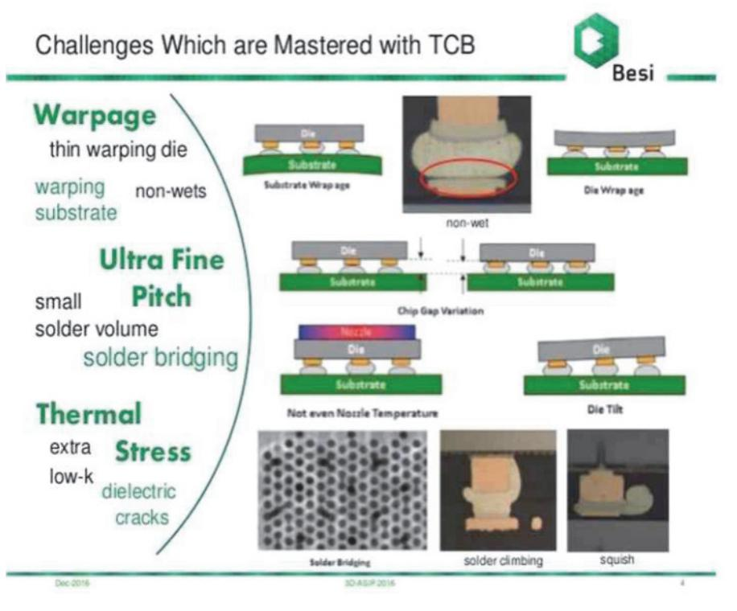

출처: 한국생산기술연구원(2019). 『20um급 미세 범프 플립 칩 패키지 원천 소재 및 공정 기술 개발』. 과학기술정보통신부. p.3. [그림 1-25] Bump soldering 접합부의 주요 이슈

숚 웨이퍼 표면을 외부 환경으로부터 보호하기 위해 보호층을 적용한다.

웨이퍼 표면에 보호층을 적용하여 외부 환경의 영향으로부터 민감한 회로를 보호하고, 패키지 의 신뢰성과 수명을 향상하는 과정이다.

1. 절연층을 도포하여 웨이퍼를 보호한다.

- (1) 스핀 코팅(Spin Coating) 웨이퍼 표면에 절연 재료를 균일하게 도포하기 위해 스핀 코팅 방법을 사용한다. 웨이퍼 를 고속으로 회전시켜 절연 재료가 균일하게 퍼지도록 한다.
- (2) 건조 및 경화(Drying and Curing) 도포된 절연층을 건조 및 경화하여 그 견고성을 확보한다. 이는 오븐 또는 핫 플레이트 에서 일정 온도로 가열하여 절연 재료를 단단하게 만든다.
- 2. 보호층을 형성하여 웨이퍼의 내구성을 강화한다.
  - (1) 화학적 기상 증착(CVD: Chemical Vapor Deposition) 반응성 기체를 사용하여 웨이퍼 표면에 보호층을 형성한다. 이 방법은 균일한 두께와 높 은 품질의 보호막을 제공한다.
  - (2) 물리적 기상 증착(PVD: Physical Vapor Deposition)

스퍼터링과 같은 방법을 통해 보호층을 형성하며, 이는 플라즈마를 이용하여 타깃 재료 를 이온화하고 웨이퍼 표면에 증착한다.

- 3. 보호층을 검사하여 품질을 보장한다.
  - (1) 두께 측정(Thickness Measurement) 보호층의 두께를 측정하여 규격에 맞는지 확인한다. 엘립소미터를 사용하여 웨이퍼 표면 의 반사된 빛을 분석함으로써 두께를 측정한다.
  - (2) 결함 검사(Defect Inspection) 주사 전자 현미경(SEM)을 사용하여 보호층의 표면 상태와 균일성을 확인한다. 이를 통 해 결함 여부를 확인하고 필요한 경우 수정한다.

#### 숛 웨이퍼의 뒷면을 처리하여 필요한 특성을 부여한다.

웨이퍼의 뒷면을 처리하여 물리적, 전기적 특성을 개선하고 패키징 공정에 필요한 요구 사항을 충족시킨다.

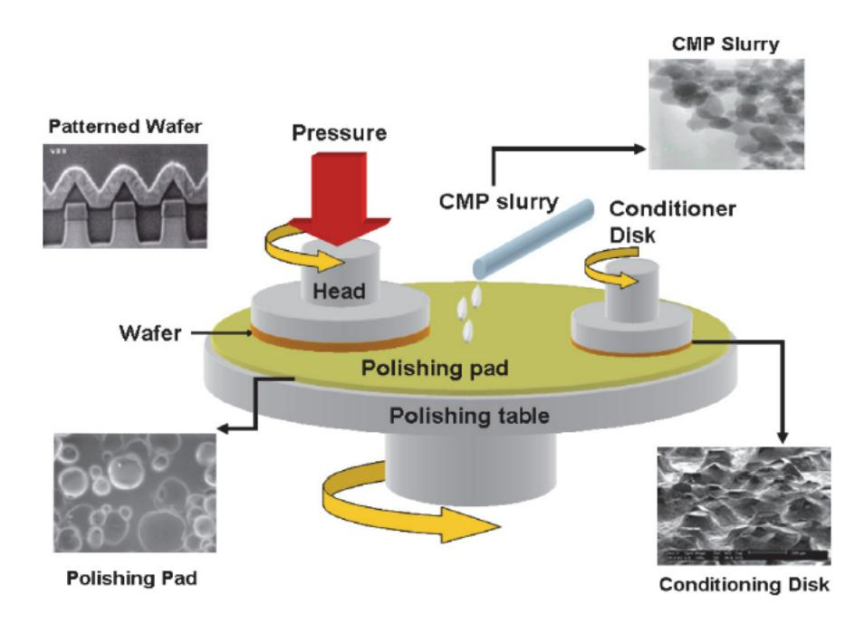

출처: 특허청(2017). 『반도체 분야 특허 심사 가이드』. 발간 등록 번호 11-1430000-000674-01. p.190. [그림 1-26] CMP 시스템 개략도

#### 1. 웨이퍼 뒷면 연마를 수행한다.

- (1) 기계적 연마(Mechanical Polishing) 웨이퍼의 두께를 균일하게 만들기 위해 기계적 연마를 수행한다. 이를 통해 웨이퍼의 표 면 평탄도를 향상하고, 후속 공정에서의 품질을 보장한다.
- (2) 화학적 연마(Chemical Polishing)

화학적 용액을 사용하여 웨이퍼의 뒷면을 연마한다. 이는 표면의 미세한 결함을 제거하 고, 웨이퍼의 전반적인 품질을 개선한다.

- 2. 뒷면 메탈라이제이션을 수행한다.
  - (1) 스퍼터링(Sputtering)

웨이퍼의 뒷면에 금속층을 증착하여 전기적 특성을 부여한다. 주로 알루미늄이나 구리와 같은 금속을 사용하여 전기적 전도성을 높인다.

- (2) 화학적 기상 증착(CVD) 반응성 기체를 사용하여 금속층을 균일하게 형성한다. 이 방법은 뒷면 메탈라이제이션의 균일한 두께와 높은 품질을 보장한다.
- 3. 뒷면 패시베이션을 수행한다.
  - (1) 절연층 도포(Insulating Layer Coating) 웨이퍼의 뒷면에 절연층을 도포하여 외부 환경으로부터 보호한다. 이는 주로 폴리이미드 나 실리콘 질화물을 사용하여 수행된다.
  - (2) 경화 및 검사(Curing and Inspection) 절연층을 경화하여 그 견고성을 높이고, 검사하여 표면 상태와 두께를 확인한다. 이를 통해 절연층의 품질과 내구성을 보장한다.

#### 순 개별 칩으로 분리하기 위해 웨이퍼를 절단한다.

다이싱(Dicing)이라고도 불리며, 이는 큰 웨이퍼를 개별 칩으로 분리하는 과정이다. 이 단계는 최종 패키징 전에 각 칩이 독립적으로 작동할 수 있도록 준비하는 데 필수적이다.

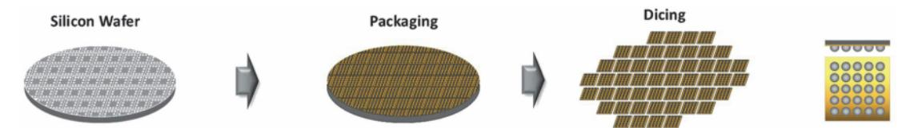

출처: IEEE(2023). HETEROGENEOUS INTEGRATION ROADMAP Chapter 23: Wafer-Level Packaging(WLP). https://eps.ieee.org/images/files/HIR\_2021/ch23-wlpfinal2.pdf. p.9. [그림 1-27] Fan-in WLP 공정 프로세스

1. 웨이퍼를 절단하기 위한 적절한 방법을 선택한다.

일반적으로 다이싱 톱(Dicing Saw) 또는 레이저 절단(Laser Dicing)이 사용된다.

- (1) 절삭 공구를 사용하여 웨이퍼를 정밀하게 절단한다. 고속으로 회전하는 블레이드를 이용하여 웨이퍼를 물리적으로 절단하는 방법이다. 물리 적 충격이 적고, 정밀한 절단이 가능하다.
- (2) 레이저 빔을 사용하여 웨이퍼를 절단한다.

물리적 접촉 없이 절단할 수 있어 미세한 칩에 손상을 줄일 수 있으며, 더욱 정교한 패 턴 절단이 가능하다.

2. 웨이퍼 절단 공정을 진행한다.

웨이퍼에 미리 형성된 절단 라인(Cut Line)을 따라 진행된다.

- (1) 절단 중 웨이퍼의 위치가 변하지 않도록 클램프를 사용하여 고정한다. 절단의 정확성을 높이는 데 중요하다.
- (2) 절단 속도와 깊이를 조절하여 균일하고 매끄러운 절단면을 확보한다. 속도와 깊이는 웨이퍼의 두께와 재질에 따라 달라진다.
- 3. 절단이 완료된 후 각 칩을 청결하게 유지하고 품질을 확인한다.
  - (1) 절단 중 발생한 먼지와 입자를 제거하기 위해 세정 공정을 수행한다. 초음파 세정이나 고압 세정 장비를 사용하여 깨끗한 상태를 유지한다.
  - (2) 개별 칩의 품질을 검사하여 결함이 없는지 확인한다. 주사 전자 현미경(SEM) 등을 사용하여 표면 상태와 구조적 결함을 확인한다.

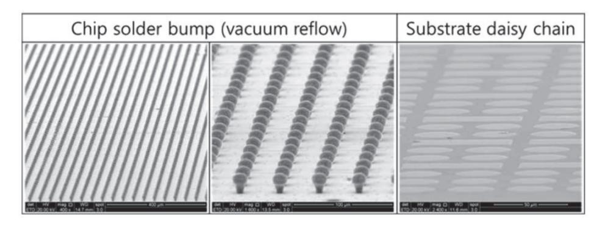

출처: 한국생산기술연구원(2020). 『20um급 미세 범프 플립 칩 패키지 원천 소재 및 공정 기술 개 발』. 과학기술정보통신부. p.24. [그림 1-28] 샘플 SEM 사진

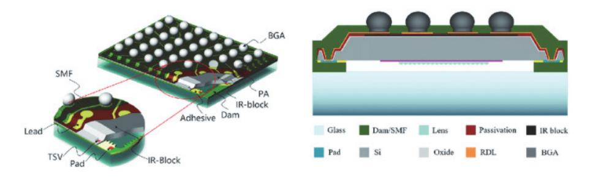

출처: IEEE(2023). HETEROGENEOUS INTEGRATION ROADMAP Chapter 23: Wafer-Level Packaging(WLP). https://eps.ieee.org/images/files/HIR\_2021/ch23-wlpfinal2.pdf. p.10. [그림 1-29] CIS-WLCSP 구조의 3D(왼쪽)와 CIS-WLCSP의 단면(오른쪽)

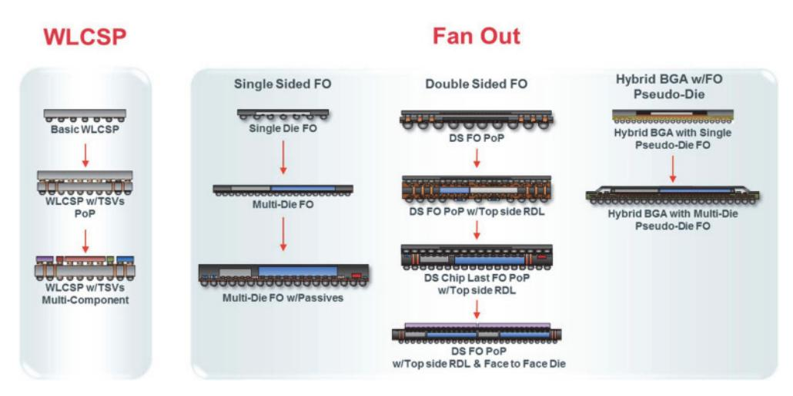

출처: IEEE(2023). HETEROGENEOUS INTEGRATION ROADMAP Chapter 23: Wafer-Level Packaging(WL P). https://eps.ieee.org/images/files/HIR\_2021/ch23-wlpfinal2.pdf. p.8. [그림 1-30] WLP를 이용한 이종 집적 패키지

### 학습 1 교수·학습 방법

#### 교수 방법

- 웨이퍼 레벨 패키지와 WLCSP의 개념을 설명하고, 팬 인과 팬 아웃 기술의 차이점을 제시 한다.
- WLP 공정의 전체 흐름과 각 단계를 세분화하여 설명한다.
- 반도체 FAB 공정이 완료된 웨이퍼의 전기 테스트 준비 과정을 설명하고 학습자가 확인하도 록 지도한다.
- 각 공정이 상호 연관되는 방식을 설명하고, 학습자가 이를 실제 공정에서 이해하고 적용하 도록 유도한다.

#### 학습 방법

- 웨이퍼 레벨 패키지 공정에 대한 기본 개념과 기술을 숙지한다.
- WLP 공정의 각 단계를 확인하고, 진행 과정을 점검한다.
- WLP 공정을 준비하는 데 필요한 웨이퍼와 준비 과정을 조사하고 정리한다.
- 각 공정 단계에서 발생할 수 있는 문제를 분석하고, 해결책을 공유하며 토의한다.
- 반도체 FAB 공정 및 전기 테스트가 완료된 웨이퍼를 확인하고, 각 테스트 단계의 결과를 분석한다.

## 학습 1 평 가

#### 평가 준거

• 평가자는 학습자가 학습 목표를 성공적으로 달성하였는지를 평가해야 한다.

#### • 평가자는 다음 사항을 평가해야 한다.

| 학습 내용               | 학습 목표                                                                                                                                                                                 | 성취수준 |   |   |
|---------------------|---------------------------------------------------------------------------------------------------------------------------------------------------------------------------------------|------|---|---|
|                     |                                                                                                                                                                                       | 상    | 중 | 하 |
| 웨이퍼 레벨 패키지 공정 기술 | - 웨이퍼 레벨 패키지를 WLCSP(Wafer Levei Chip Scale Package), TSV(Through Silicon Via), Flip Chip, RDL(Redistribution Layer) 등이 포함된 어드밴스드 패키 지(첨단 패키지) 공정으로 세분화할 수 있다. |      |   |   |
|                     | - 패키지 공정 전체를 웨이퍼 레벨에서 진행하는 WLCSP는 패키지용 배선, 절연층, 접합층을 만들어 솔더 볼을 패턴 웨 이퍼의 전극 패드에 붙이는 방식으로, 칩의 크기 안에 배선 을 하는 팬 인(Fan In) WLCSP과 팬 아웃(Fan Out) WLCSP로 구분할 수 있다.               |      |   |   |
|                     | - WLP 공정을 진행하기 위하여 반도체 FAB 공정 및 전기 테스트가 완료된 웨이퍼를 준비할 수 있다.                                                                                                                         |      |   |   |
|                     | - WLP 공정을 미니 팹 형태로 준비하여 개별 단위 공정으로 수행할 수 있다.                                                                                                                                       |      |   |   |

#### 평가 방법

#### • 서술형 시험

| 학습 내용               |                                                                               | 성취수준 |   |   |
|---------------------|-------------------------------------------------------------------------------|------|---|---|
|                     | 평가 항목                                                                         |      | 중 | 하 |
| 웨이퍼 레벨 패키지 공정 기술 | - WLCSP, TSV, Flip Chip, RDL 등의 어드밴스드 패키지 공정을 정의하고 각 공정의 특성 및 장단점 설명 능력    |      |   |   |
|                     | - Fan-In WLCSP와 Fan-Out WLCSP 공정에서 사용하는 배선 구조와 배치 방식의 차이를 설명할 수 있는 능력      |      |   |   |
|                     | - WLP 공정을 수행하기 위한 FAB 공정과 전기 테스트가 완 료된 웨이퍼 준비 절차를 설명할 수 있는 능력              |      |   |   |
|                     | - RDL(Redistribution Layer) 기술의 공정 흐름과 장단점을 설명하고, 고밀도 연결의 필요성에 따른 공정 적용 능력 |      |   |   |

• 논술형 시험

|                     |                                                                                                                                                                           | 성취수준 |   |   |
|---------------------|---------------------------------------------------------------------------------------------------------------------------------------------------------------------------|------|---|---|
| 학습 내용               | 평가 항목                                                                                                                                                                     |      | 중 | 하 |
| 웨이퍼 레벨 패키지 공정 기술 | - 웨이퍼 레벨 패키지를 WLCSP 등이 포함된 어드밴스드 패 키지 공정으로 세분화할 수 있는 방법 파악 여부                                                                                                          |      |   |   |
|                     | - 패키지 공정 전체를 웨이퍼 레벨에서 진행하는 WLCSP는 패키지용 배선, 절연층, 접합층을 만들어 솔더 볼을 패턴 웨 이퍼의 전극 패드에 붙이는 방식으로, 칩의 크기 안에 배선 을 하는 팬 인(Fan In) WLCSP과 팬 아웃(Fan Out) WLCSP로 구분할 수 있는 능력 |      |   |   |
|                     | - WLP 공정을 진행하기 위하여 반도체 FAB 공정 및 전기 테스트가 완료된 웨이퍼를 준비할 수 있는 능력                                                                                                           |      |   |   |
|                     | - WLP 공정을 미니 팹 형태로 준비하여 개별 단위 공정으로 수행할 수 있는 능력                                                                                                                         |      |   |   |

#### 피드백

- 1. 서술형 시험
- WLCSP와 TSV 개념 정의가 미흡할 때는 해당 공정들의 핵심 기능과 활용 사례를 구체적으로 설명해 준다. 공정의 장단점 이해가 부족한 학습자에게는 각 공정의 장점과 단점을 비교표로 작성 하게 하여 개념을 명확하게 정리하도록 한다. 성취수준이 높은 학습자에게는 WLCSP와 TSV 기 술이 최신 반도체 공정에서 어떻게 응용되고 있는지에 대해 심화 설명해 준다.
- 배선 구조 설명이 부족할 때는 Fan-In과 Fan-Out 방식에서의 솔더 볼 배치와 배선 경로 차이 를 시각 자료와 함께 설명해 준다. 차이점 이해가 미흡한 학습자에게는 두 방식의 실제 적용 사 례를 찾아 비교 분석하게 하여 공정 차이를 명확하게 이해하도록 한다. 성취수준이 높은 학습자에 게는 두 공정 방식이 전기적 성능과 비용 효율성에 미치는 영향을 심화하여 설명해 준다.
- FAB 공정 이해가 미흡할 때는 반도체 제조 공정에서 중요한 단계들을 세부적으로 설명하고, 각 단계의 목표를 명확히 이해시킨다. 성취수준이 낮은 학습자에게는 FAB 공정에서 발생하는 전기 테스트의 목적과 절차를 추가 학습 자료로 제공하고 복습하게 한다. 성취수준이 높은 학습자에게 는 전기 테스트에서 발생할 수 있는 오류 및 이를 보완하는 방법에 대해 심화 설명해 준다.
- RDL 공정 흐름 설명이 미흡할 때는 RDL을 통한 패드 재배열 과정과 재배치의 구체적 흐름을 도식과 함께 설명해 준다. 성취수준이 낮은 학습자에게는 RDL 기술을 적용한 실제 제품 사례를 조사하게 하여 고밀도 연결의 필요성을 더욱 명확하게 이해하도록 한다. 성취수준이 높은 학습자 에게는 RDL 기술이 고성능 컴퓨팅 장치에서 어떻게 활용되는지에 대해 심화 설명해 준다.
- 2. 논술형 시험
- 공정 복잡성 설명이 부족할 때는 플립 칩과 와이어 본딩에서 각 공정의 주요 단계를 구체적으로 설명하고, 그 복잡성을 시각화 자료로 보충해 준다. 비용 측면에 대한 이해가 부족한 학습자에게 는 두 공정의 비용 구조를 비교하는 표를 작성하게 하여 차이를 명확히 분석하도록 한다. 성취수 준이 높은 학습자에게는 플립 칩 패키징이 최신 기술에서 요구되는 고성능과 소형화에 어떻게 기 여하는지 심화 설명해 준다.

- TSV 적층 방식 설명이 부족할 때는 TSV 기술을 통해 신호 전달 경로가 짧아지는 원리를 구체적 으로 설명해 준다. 성취수준이 낮은 학습자에게는 TSV 기술을 활용한 실제 반도체 제품의 성능 개선 사례를 조사하게 하여 개념을 정리하게 한다. 성취수준이 높은 학습자에게는 TSV와 기존 적 층 방식의 차이점을 전기적 성능 향상 측면에서 심화하여 분석하게 한다.
- 2D와 3D 패키징 구조 차이에 대한 설명이 미흡할 때는 각 구조의 물리적 배치와 데이터 전송 경로에 따른 차이를 설명하고 보충 자료를 제공한다. 성취수준이 낮은 학습자에게는 2D와 3D 패 키징을 적용한 반도체 성능 사례를 비교하는 표를 작성하게 하여 성능 차이를 명확하게 이해하도 록 한다. 성취수준이 높은 학습자에게는 2.5D 패키징이 중간 단계에서 가지는 장점과 한계에 대 해 심화하여 분석하도록 유도한다.
- Fan-In과 Fan-Out 공정 적용 사례가 부족할 때는 두 공정의 실제 사례를 비교하면서 적용 환 경에 따른 차이를 구체적으로 설명해 준다. 성취수준이 낮은 학습자에게는 Fan-In과 Fan-Out 공정이 각각 어떤 전자 기기에 최적화되어 있는지 조사하고 정리하게 한다. 성취수준이 높은 학습 자에게는 Fan-Out 공정이 고밀도 및 다기능 칩에서 어떻게 성능을 향상하는지 심화 분석하도록 유도한다.

| 학습 1 | 팬 인 웨이퍼 레벨 공정 진행하기  |
|------|---------------------|
| 학습 2 | 임베디드 웨이퍼 레벨 공정 진행하기 |
| 학습 3 | nD 웨이퍼 레벨 공정 진행하기   |

## 2-1. 임베디드 웨이퍼 레벨 공정 기술

| 학습 목표 | • 수동 소자를 포함하는 웨이퍼 레벨 패키지 공정 기술을 적용할 수 있다. |
|-------|-------------------------------------------|
|       | • 신소재가 포함된 수동 소자를 포함하는 배선 공정 기술 적용할 수 있다. |
|       | • 여러 소자를 임베디드한 테이프와 칩 다이 본딩 기술을 적용할 수 있다. |
|       | • 전극 홀 가공을 통하여 새로운 패키징 기술을 수행할 수 있다.      |

## 필요 지식 /

#### 숔 기술적 배경

임베디드 기술은 PCB(Printed Circuit Board)의 빌드업 레이어에 능동 및 수동 소자를 포 함하기 위한 방법으로 지난 10년 이상 꾸준히 발전해 왔다. 이러한 기술은 PCB 제조 과정 에서 부품을 회로 기판에 내장함으로써 공간을 효율적으로 사용하고, 제품의 크기를 줄이 며, 성능을 향상하기 위한 것이다.

(1) 시스템 모듈화

임베디드 서브 시스템을 활용하여 여러 기능을 하나의 모듈로 결합할 수 있다. 이는 시 스템 설계의 유연성을 높이고, 다양한 애플리케이션에 쉽게 적응할 수 있도록 한다.

(2) 임베디드 전력 전자 기기의 소형화 및 성능 향상

전력 전자 기기의 소형화는 공간 절약과 비용 절감을 가능하게 한다. 성능 향상은 전력 효율성을 높여 에너지 소비를 줄이고 시스템의 신뢰성을 증가시킨다.

(3) 첨단 재료 활용

새로운 재료를 적용함으로써 임베디드 기술의 성능과 효율성을 극대화한다. 이러한 재료 들은 열 관리, 전기적 특성 개선, 기계적 강도 향상 등에 기여한다.

2. 2.5D 패키징과 실리콘 인터포저

2.5D 패키징 기술의 발전은 실리콘 인터포저(Silicon Interposer)의 중요성을 부각시켰다. 실리콘 인터포저는 여러 개의 반도체 칩을 물리적으로 연결하는 역할을 한다.

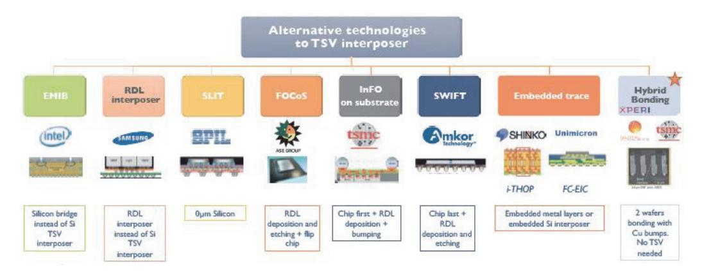

출처: 전자부품연구원(2019). 『이종/다수 반도체 소자 내장형 통합 패키지 및 모듈 원기술 개발』. 산업통상자원 부 한국산업기술평가관리원. p.239. [그림 2-1] TSV가 없는 2.5D/3D 기술

(1) 고밀도 배선

인터포저는 다양한 칩을 연결하여 복잡한 회로를 구성할 수 있게 한다. 이는 데이터 전 송 속도를 높이고, 신호 무결성을 유지하며, 전력 소모를 줄이는 데 기여한다.

- (2) RDL(Redistribution Layer) 및 TSV(Through-Silicon Via) 사용 RDL은 칩 간의 배선을 재배치하여 고밀도의 전기적 연결을 지원한다. TSV는 칩과 기 판 간의 수직적 연결을 가능하게 하며 이는 3D 통합의 기초가 된다.
- 3. 실리콘 인터포저와 TSV 기술의 단점
  - (1) 복잡한 제조 공정

TSV는 실리콘 웨이퍼에 미세한 구멍을 뚫고, 이를 금속으로 채우는 복잡한 공정이 필요 하다. 이러한 공정은 높은 정밀도와 기술적 전문성을 요구한다.

(2) 높은 비용

대형 실리콘 인터포저는 비용이 높고, 이를 사용하는 과정에서 수율(Yield)이 낮아질 수 있다. 제조 비용은 기판의 크기와 복잡성에 따라 급격히 증가한다.

(3) 수율 문제

기판의 크기가 커질수록 결함 발생 확률이 높아지고, 이는 전체 생산 공정의 수율을 저 하할 수 있다. 이러한 문제는 비용 상승의 주요 원인이 된다.

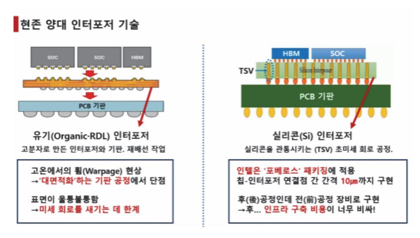

출처: 강해령(2024. 1. 27.). "삼성‧SK‧인텔이 지갑 열었다, 반도체 유리 기판 뭐길래? [강해령의 하이엔드 테크] <1편>". https://www.sedaily.com/NewsView/2D48VGUUCZ. 서울경제. [그림 2-2] 유기 인터포저와 실리콘 인터포저 비교

- 숕 eWLP의 개념
  - 1. eWLP의 개발 배경

임베디드 웨이퍼 레벨 공정(eWLP)은 실리콘 인터포저의 단점을 보완하기 위해 개발된 기술 이다. 실리콘 인터포저는 고성능 반도체 패키징을 구현하는 데 중요한 역할을 하지만, 제조 공정이 복잡하고 비용이 높다는 단점이 있다. eWLP는 이러한 문제를 해결하기 위해 고안 된 기술이다.

- 2. eWLP의 특징 및 장점
  - (1) 제조 공정의 단순화

eWLP는 TSV(Through-Silicon Via) 공정을 사용하지 않는다. TSV는 실리콘 웨이퍼에 미세한 구멍을 뚫고 금속으로 채우는 복잡한 과정이 필요하며, 이로 인해 제조 비용이 높아진다. eWLP는 TSV를 대체할 수 있는 방법을 사용하여 제조 공정을 단순화한다.

(2) 비용 절감

실리콘 인터포저에 비해 eWLP는 대면적의 실리콘을 사용하지 않아 비용이 절감된다. 생산 수율이 높아져 불량률이 낮아지고, 전체 생산 비용이 줄어든다.

(3) 고성능 인터커넥트 제공

eWLP는 칩과 칩 간의 고성능 인터커넥트를 제공하여 데이터 전송 속도를 높인다. 전력 소모를 줄여 에너지 효율성을 개선한다. 이러한 성능 향상은 모바일 기기, 데이터 센터, AI 시스템 등 다양한 분야에서 중요하다.

(4) 유연한 설계 및 맞춤형 솔루션

eWLP는 다양한 크기와 형태의 다이를 유연하게 조합할 수 있어 설계 유연성을 제공한 다. 고객의 요구에 따라 맞춤형 솔루션을 구현할 수 있다.

#### (5) 시스템 모듈화

여러 다이 간의 상호 접촉을 통해 시스템을 모듈화할 수 있다. 이는 시스템 성능을 향 상하고, 유지 보수와 업그레이드를 쉽게 한다.

3. 적용 분야와 전망

eWLP는 스마트폰, 태블릿, 웨어러블 디바이스 등 소형 전자기기에서 중요한 역할을 하고 있다. 특히, 고성능과 저전력 소모가 중요한 모바일 기기와 IoT(Internet of Things) 디바 이스에서 eWLP 기술은 필수적이다. 미래에는 더 복잡하고 집적도가 높은 시스템이 필요한 분야에서 eWLP의 활용을 확대할 것으로 예상된다. 이를 통해 반도체 패키징 기술의 발전 과 함께 다양한 산업에서의 혁신을 지원할 것이다.

#### 숖 기술의 세부 사례

각 회사는 고유의 방법론을 개발하여 고밀도, 고성능 패키징을 목표로 하고 있으며, 각 기술은 다양한 응용 분야에서 활용하고 있다. 이들 기술은 단일 패키징 공정보다 웨이퍼 레벨 공정을 사용하여 고성능 인터커넥트를 구현한다. 웨이퍼 레벨 공정은 웨이퍼 상태에서 반도체 칩을 처 리하고 패키징하여 높은 밀도의 연결과 효율적인 제조 공정을 가능하게 한다.

1. EMIB(Embedded Multi-die Interconnect Bridge)

EMIB는 작은 브리지 다이를 사용하여 여러 반도체 다이를 직접 연결하는 기술이다. 이 기 술은 TSV 공정을 피하면서도 실리콘 인터포저의 대형 기판을 사용하지 않고 고밀도 연결을 제공한다. EMIB는 비용 효율적이며, 다양한 크기의 다이를 유연하게 조합할 수 있는 장점 이 있다. 이러한 연결 방식은 다이를 높은 밀도로 연결하여 전력 소모를 줄이고 신호 무결 성을 개선한다.

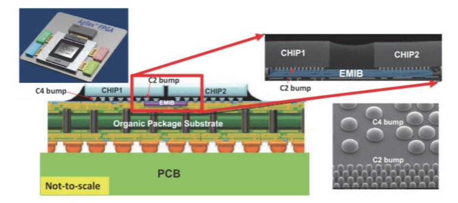

출처: John H. Lau (2021). State-of-the-Art and Outlooks of Chiplets Heterogeneous Integration and Hybrid Bonding. Journal of Microelectronics and Electronic Packaging(2021) 18. pp.145~160. [그림 2-3] Embedded Multi-die Interconnect Bridge 기술

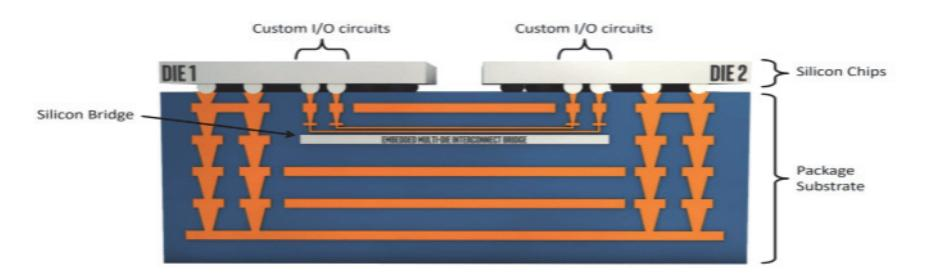

출처: Techsearch (2020). After 30 Years Why Are We Still Talking about Known Good Die?. https://events.meptec.org/wp-content/uploads/kgd2020/KGD2020s3p1Vardaman.pdf. [그림 2-4] Embedded Multi-die Interconnect Bridge 기술

2. LSI(Local Silicon Interconnect)

LSI는 다이 간의 고성능 인터커넥트를 제공하는 기술로, TSV나 실리콘 인터포저를 사용하 지 않고, 더 저렴한 방법으로 다이 간 연결을 구현한다. 이 기술은 생산 비용을 절감하고 전체 시스템의 비용 효율성을 높이는 데 기여한다. InFo 패키징의 일부로, LSI는 실리콘 브 리지를 통해 칩 간의 고속 연결을 제공한다.

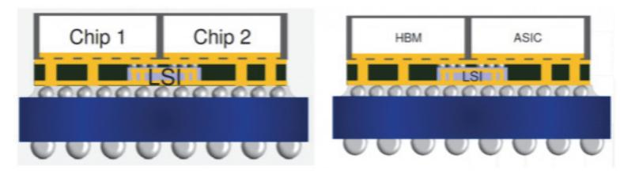

출처: Shannon Davis (2022. 7. 22.). Apple's M1 Ultra Does Use InFO\_LSI–or is it CoWoS-L?. Semiconductor Digest. https://www.semiconductor-digest.com/apples-m1-ultra-does-us e-info\_lsi-or-is-it-cowos-l/.

[그림 2-5] InFO\_LSI(왼) 과 CoWoS-L(오른쪽) 비교

#### 3. sFOCoS(Stacked Si Bridge Fan-Out Chip-on-Substrate)

sFOCoS는 광학 인터커넥트를 통해 데이터 전송을 처리하는 기술로, 기존의 전기적 연결 방식보다 효율적이고 비용 효과적이다. 이 기술은 특히, 고속 데이터 전송이 필요한 응용 분야에 유리하다. 팬 아웃 패키징에 실리콘 브리지를 내장하여 다이 간의 고속 연결을 지원 한다.

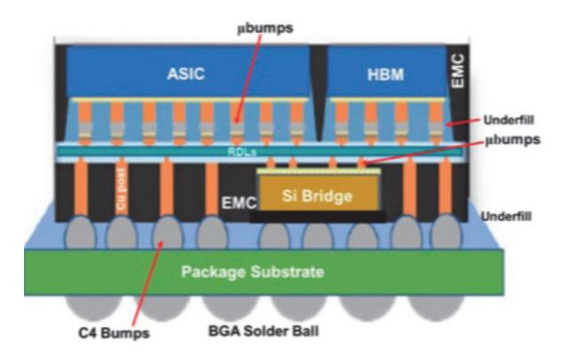

출처: John H. Lau (2023). State-of-the-Art in Chiplets Horizontal Communications. Journal of Microelectronics and Electronic Packaging(2023) 20. pp.43~64. [그림 2-6] sFOCoS 계략도

4. S-Connect

S-Connect는 다이 간의 신호 연결을 위해 고성능, 저비용 솔루션을 제공한다. 이 기술은 제조 공정을 단순화하고 다양한 크기와 형태의 다이를 유연하게 연결할 수 있다. 실리콘 브 리지를 내장한 팬 아웃 패키징으로 다이 간의 고밀도 인터커넥트를 제공한다.

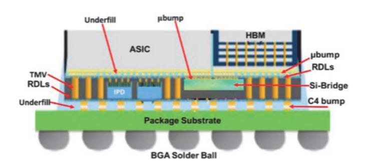

출처: John H. Lau (2023). State-of-the-Art in Chiplets Horizontal Communications. Journal of Microelectronics and Electronic Packaging(2023) 20. pp.43~64. [그림 2-7] S-Connect 계략도

5. Chip in Polymer

Chip in Polymer 기술은 반도체 다이를 폴리머 기판에 직접 통합하여 저비용으로 고성능 인터커넥트를 제공한다. 이는 기판의 유연성을 높여 다양한 응용 분야에 적용할 수 있으며, 제조 공정이 단순하여 비용 효율적이다. 다이를 폴리머 내부에 임베디드하여 고밀도 연결을 실현한다.

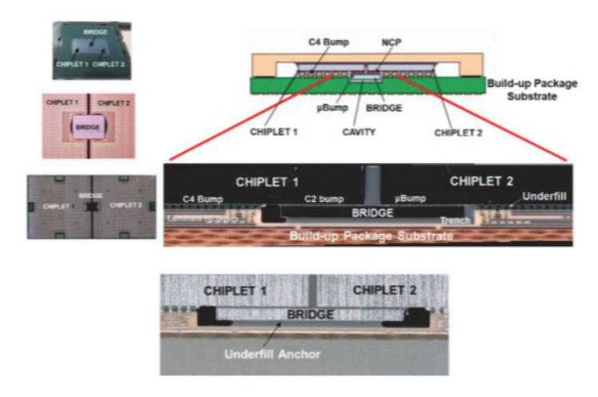

출처: John H. Lau (2023). State-of-the-Art in Chiplets Horizontal Communications. Journal of Microelectronics and Electronic Packaging(2023) 20. pp.43~64. [그림 2-8] Direct Bonded 이기종 통합 패키징

#### 6. FO-EB(Fan-Out Embedded Bridge)

FO-EB는 팬 아웃 패키징 기술을 사용하여 다이 간의 고속 연결을 제공하는 방법이다. 실 리콘 브리지를 EMC(Encapsulated Molding Compound)에 내장하고 RDL 기판에 연결하 여 고성능과 고밀도 인터커넥트를 구현한다. TSV 없이도 고속 데이터 전송과 전력 효율성 을 제공한다.

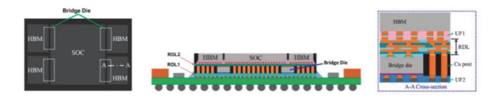

출처: John H. Lau (2023). State-of-the-Art in Chiplets Horizontal Communications. Journal of Microelectronic s and Electronic Packaging(2023) 20. pp.43~64. [그림 2-9] FO-EB 구조

#### 7. EFB(Elevated Fanout Bridge)

EFB는 팬 아웃 패키징과 유사한 방식으로 다이 간의 고속 연결을 제공한다. 전통적인 기판 임베디드 실리콘 브리지 아키텍처와 달리 표준 기판과 조립 기술을 사용하여 더 나은 정밀 도와 확장성, 높은 수율을 제공한다.

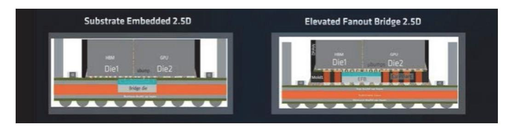

출처: IEEE(2023). HETEROGENEOUS INTEGRATION ROADMAP Chapter 23: Wafer-Level Packaging(WLP). https://eps.ieee.org/images/files/HIR\_2021/ch23-wlpfinal2.pdf. 20p [그림 2-10] Elevated Fan-out Bridge 기술

#### 숗 임베디드 기술의 비교

전통적인 Multi-Chip 패키지는 원가가 저렴하고 기술이 성숙하여 신뢰도가 높으며, KGD(Known Good Die)를 가려내기 쉽다. 그러나 칩과 패키지 기판 간의 연결 밀도와 다이 간 상호 연결 밀도가 상대적으로 낮고, 소비 전력이 높은 단점이 있다.

실리콘 인터포저는 다이와 인터포저 간, 그리고 칩 간의 상호 연결 밀도가 양호하며, 상호 연 결 소비 전력도 낮다. 그러나 대면적의 인터포저와 TSV 공정으로 인해 생산 원가가 비싸고 수 율이 낮은 편이다.

임베디드 기술은 실리콘 인터포저와 마찬가지로 칩과 실리콘 브리지 간의 연결 밀도와 칩 간 상호 연결 밀도가 양호하다. 실리콘 브리지의 면적이 실리콘 인터포저보다 좁기 때문에 수율이 높아져 생산 원가를 낮출 수 있다. 이 기술은 패키지 기판 사이에 실리콘 인터포저를 일부만 사용하는 방식으로, 실리콘 브리지라고도 불린다.

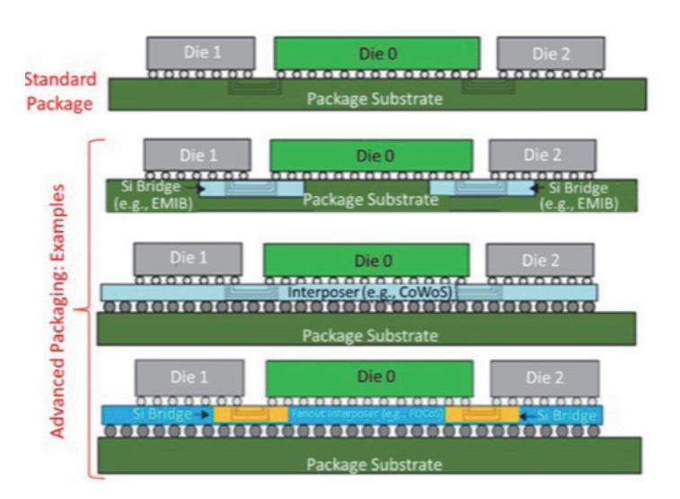

출처: John H. Lau (2023). State-of-the-Art in Chiplets Horizontal Communications. Journal of Microelectronics and Electronic Packaging(2023) 20. pp.43~64. [그림 2-11] Bridge가 포함된 임베디드 기술 종류

수 임베디드 기술과 TSV의 통합

1. TSV와 실리콘 브리지의 결합

반도체 회사들은 TSV(Through-Silicon Via)와 실리콘 브리지를 결합하여 고성능, 고밀도 인터커넥트를 제공하면서도 비용을 절감하고 제조 공정을 단순화하려 한다.

(1) 비용 효율성

TSV는 높은 성능을 제공하지만, 제조 공정이 복잡하고 비용이 높다. 실리콘 브리지는 이 문제를 해결할 수 있는 대안으로, 제조 공정이 단순하여 비용을 절감할 수 있다. 예를 들어, Intel의 EMIB(Embedded Multi-die Interconnect Bridge) 기술은 TSV 없이도 고밀도 연결을 제공하며, 필요에 따라 TSV를 추가하여 성능을 더욱 향상할 수 있다.

(2) 성능 향상

TSV는 수직적 연결을 통해 전기적 신호의 무결성을 유지하고 데이터 전송 속도를 높이 며, 전력 소모를 줄이는 데 탁월하다.

실리콘 브리지는 다이 간의 수평적 연결을 최적화하여 효율적인 신호 전달을 가능하게 한다. 이러한 결합은 TSV의 성능과 실리콘 브리지의 유연성을 동시에 활용할 수 있게 한다.

(3) 유연한 설계 및 제조 공정

실리콘 브리지는 다양한 크기와 형태의 다이를 유연하게 조합할 수 있어 맞춤형 솔루션 을 제공할 수 있다.

이는 반도체 패키징 설계의 유연성을 높이고, 다양한 응용 분야에 적응할 수 있게 한다. 예를 들어, AMD의 3D 칩렛 아키텍처는 TSV와 실리콘 브리지를 결합하여 높은 인터커 넥트 밀도를 제공하며, 전력 효율성과 성능을 극대화한다.

- 2. 주요 사례
  - (1) Co-EMIB(Embedded Multi-die Interconnect Bridge)

Co-EMIB 기술은 EMIB와 Foveros 기술을 결합하여 고성능, 고밀도 패키징 솔루션을 제공한다. 이를 통해 여러 3D 적층 Foveros 칩을 서로 연결하여 더 큰 시스템을 구성 할 수 있다. 이 접근 방식은 데이터 센터와 고성능 컴퓨팅 환경에서 높은 성능과 효율 성을 제공한다. Foveros 기술은 칩렛들을 3D로 쌓아올려 성능을 극대화하며, EMIB는 다이 간의 수평적 연결을 최적화한다.

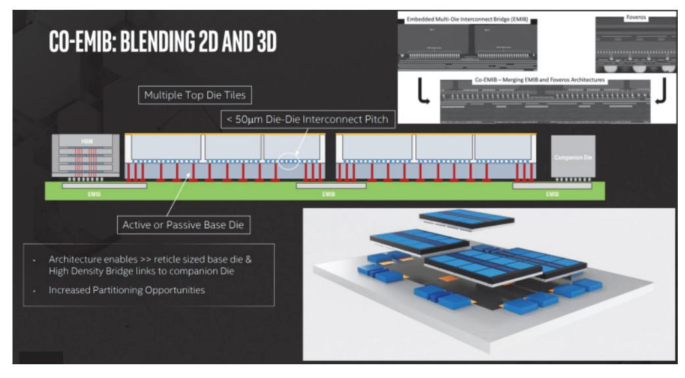

출처: Intel(2019). Advanced Packaging for Heterogeneous Integration. http://pwrsocevents.com/wp-con tent/uploads/2019-presentations/session\_2\_0\_keynote\_speaker\_pwrpack2019\_advanced\_architectur es\_for\_hi\_intel\_mahajan.pdf. p14. [그림 2-12] CO\_EMIB 구조

(2) FO-EB-T(Fan-Out Embedded Bridge with Through Silicon Vias)

FO-EB-T 기술은 팬 아웃 패키징에 실리콘 브리지와 TSV를 결합하여 다이 간의 전기 적 성능을 향상한다. FO-EB-T는 기존 FO-EB와 유사하지만, 브리지에 TSV를 포함하 여 더 나은 전기적 연결과 성능을 제공한다. 이 기술은 SoC와 메모리 또는 SoC와 다른 컴포넌트 간의 고성능 연결을 가능하게 한다.

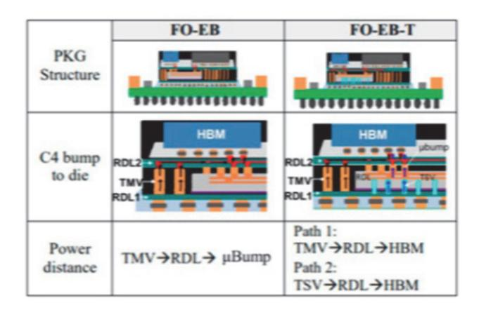

출처: John H. Lau (2023). State-of-the-Art in Chiplets Horizontal Communications. Journal of Microelectronics and Electronic Packaging(2023) 20. pp.43~64. [그림 2-13] FO-EB와 FO-EB-T 비교

(3) CoWoS(Chip-on-Wafer-on-Substrate)

CoWoS는 인터포저 형태에 따라 세부적으로 구분되며, 다양한 크기의 인터포저와 HBM(High Bandwidth Memory) 큐브를 통합하여 고성능 패키징을 구현한다.

#### (가) CoWoS-S

고성능 실리콘 인터포저를 사용한 첫 번째 버전이다. 실리콘 인터포저를 통해 다이 간의 연결 밀도를 높이고, 데이터 전송 속도를 향상시킨다.

(나) CoWoS-R

유기 인터포저를 사용하며, RDL(Redistribution Layer)을 활용한다. 이를 통해 유 연성을 제공하고, 전력 및 신호 전달의 효율성을 높인다.

(다) CoWoS-L

LSI(Local Silicon Interconnect) 칩을 사용하여 다이 간 연결 밀도를 높인다. RDL 을 통해 전력 및 신호 전달을 최적화하여 성능을 향상시킨다.

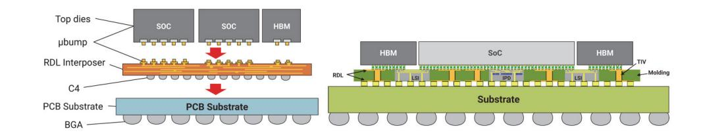

출처: Cedefop (2022). Challenging digital myths. Retrieved from. https://3dfabric.tsmc.com/english /dedicatedFoundry/technology/cowos.htm. [그림 2-14] CoWoS-R(왼쪽)와 CoWoS-L(오른쪽) 구조

(4) I-CubeE(Interposer Cube)

단일 로직 레이어와 적층형 메모리 반도체 레이어에 걸쳐 병렬 수평 칩 통합을 통해 높 은 속도와 우수한 열 성능을 제공한다. 이 기술은 TSV와 Backend of the Line 기술 을 사용하여 구현된다. 여러 칩의 특수 기능을 조화롭게 결합하여 시스템의 전반적인 효 율성을 높인다.

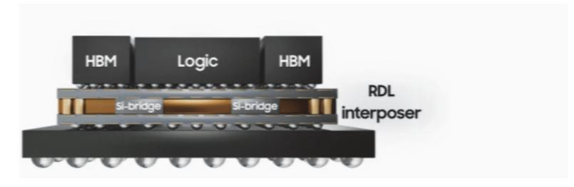

출처: samsung(2023). Samsung Advanced Packaging Helps Customers Bring Their Own Architecturefrom. https://semiconductor.samsung.com/emea/new s-events/tech-blog/samsung-advanced-packaging-helps-customers-bring -their-own-architecture/. [그림 2-15] I-CubeE 구조

## 수행 내용 / 임베디드 웨이퍼 레벨 공정 진행하기(EMIB 공정)

#### 재료·자료

- 반도체 웨이퍼
- 몰딩 컴파운드
- 포토레지스트
- 금속 증착 재료(Cu, Ni 등)
- 솔더 볼(Solder Balls)
- 케미컬 슬러리(CMP 공정용)

#### 기기(장비 ・ 공구)

- 다이 본딩 장비(Die Bonder)
- 웨이퍼 그라인더(Wafer Grinder)
- 증착 장비(PVD 또는 CVD)
- 노광 장비(Photolithography Tool)
- 리플로 오븐(Reflow Oven)
- 화학적 기계적 연마 장비(CMP Tool)
- 솔더 볼 장착 장비(Ball Attach Tool)

#### 안전 ・ 유의 사항

- 화학 물질 사용 시 보호구 착용(고글, 장갑, 마스크 등)을 철저히 하고, 누출 시 대처 방안 을 숙지한다.
- 고온 장비 사용 시 화상 및 장비 과열 방지에 주의하며, 방열 장갑 및 보호 장비를 착용한 다.
- 웨이퍼 작업 시 ESD(정전기) 보호 조치를 반드시 취하여 민감한 반도체 장치를 보호한다.
- 몰딩 컴파운드 및 케미컬 슬러리 사용 시 환기 시스템을 가동하여 작업 환경의 공기 질을 관리한다.

- 웨이퍼 그라인딩 공정 시 분진 발생을 최소화하고, 적절한 보호 마스크 및 안전 가드를 사 용한다.
- 노광 작업 중 UV 광선에 노출되지 않도록 주의하고, 장비 사용 매뉴얼에 따른 안전 절차를 준수한다.

#### 수행 순서

숔 Active Die 및 TSV Die를 Carrier에 배치한다.

이 공정 단계는 Active Die와 TSV Die를 임시 캐리어에 정확하게 배치하여, 후속 공정에서 안정적인 처리를 가능하게 하는 중요한 초기 단계다. 이 단계에서 사용되는 기술은 매우 정밀 하며, 패키지의 전기적 성능과 기계적 안정성에 큰 영향을 끼친다.

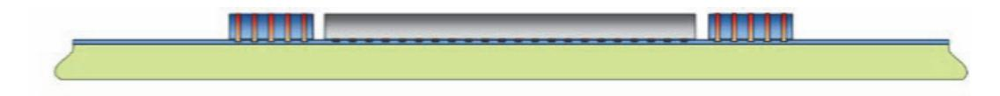

출처: IEEE(2023). HETEROGENEOUS INTEGRATION ROADMAP Chapter 23: Wafer-Level Packaging(WLP). https://eps.ieee.org/images/files/HIR\_2021/ch23-wlpfinal2.pdf). p.14. [그림 2-16] Active Die 및 TSV Die 배치 후 eWLP 개략도

- 1. 다이를 픽 앤 플레이스(Pick & Place)한다.
  - (1) 다이 핸들링을 준비한다.

Active Die와 TSV Die는 각각 웨이퍼 레벨에서 개별 칩으로 분리된 후 고속 픽 앤 플 레이스 장비를 사용해 핸들링한다. 이때 다이의 무결성과 위치 정밀도를 보장하기 위해 진공 그리퍼 또는 정전기 집게를 사용한다.

(2) 다이를 정밀하게 배치한다.

픽 앤 플레이스 장비는 비전 시스템을 이용해 다이의 정밀한 위치를 실시간으로 모니터 링하며, 정확한 위치에 다이를 배치한다. 이를 통해 다이의 패드 위치가 최종 패키지의 전기적 연결성과 일치하도록 조정된다. 다이는 임시 캐리어 위에 배치하며, 이 과정에서 수 마이크로미터 단위의 정밀도가 필요하다.

(3) 배치 후 보정 및 확인을 진행한다.

다이가 임시 캐리어에 배치되면, 보정 센서를 통해 다이의 위치와 정렬 상태를 확인한 다. 이때 정밀한 배치를 위해 추가적인 미세 조정이 필요할 수 있다. 모든 다이가 올바 르게 배치되었는지 확인한 후, 다음 공정으로 넘어간다.

- 2. 다이를 본딩(Bonding)한다.
  - (1) 다이 본딩을 준비한다.

다이가 임시 캐리어에 배치된 후, 이를 기계적으로 안정화하기 위해 본딩 공정을 준비한 다. 다이 본딩은 후속 몰딩 및 RDL 형성 과정에서 다이가 움직이지 않도록 고정하는 중요한 역할을 한다. 사용되는 본딩 기술은 다이와 캐리어 사이의 접착 강도와 신뢰성을 높인다.

(2) 본딩 공정을 수행한다.

본딩 공정은 주로 열 또는 압력을 이용해 수행된다. 열 본딩(Thermo compression) 방식에서는 다이와 캐리어 사이의 접착제를 가열하여 접착 강도를 높인다. 압력 본딩 방 식에서는 다이에 일정한 압력을 가해 캐리어에 안정적으로 고정한다. 이 과정에서는 다 이의 위치 변형을 방지하기 위해 균일한 힘이 적용된다.

(3) 본딩 품질을 확인한다.

본딩이 완료되면, 광학 또는 초음파 검사를 통해 접착 상태를 확인한다. 다이와 캐리어 사이에 빈틈이나 결함이 없는지 확인하고, 접착 강도가 기준에 부합하는지 평가한다. 본 딩이 적절하게 이루어진 경우, 다이는 캐리어에 단단히 고정되어 후속 공정을 위한 준비 가 완료된다.

#### 수행 tip

• 다이를 정밀하게 배치하여 전기적 성능을 최적화한다.

• 다이 배치 후 보정 센서를 통해 위치를 정확히 확인한다.

#### 숕 다이 및 TSV를 Overmold한다.

이 단계는 다이와 TSV를 보호하고 구조적으로 안정시키기 위한 몰딩 공정이다. 몰딩된 구조는 후속 공정에서 발생할 수 있는 물리적 충격을 방지하고, 패키지의 기계적 강성을 높인다.

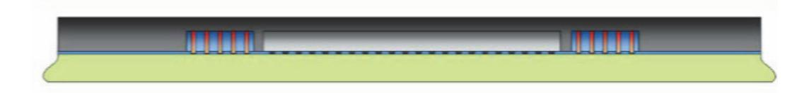

출처: IEEE(2023). HETEROGENEOUS INTEGRATION ROADMAP Chapter 23: Wafer-Level Packaging(WLP). https://eps.ieee.org/images/files/HIR\_2021/ch23-wlpfinal2.pdf. p.14. [그림 2-17] 몰딩 공정 후 eWLP 개략도

- 1. 다이 주변을 몰딩(Molding)한다.
  - (1) 몰딩 재료를 준비한다.

에폭시 기반의 몰딩 화합물을 준비하여 다이와 TSV 주변을 감싼다. 이 화합물은 높은 열적 안정성과 기계적 강도를 제공하여 패키지를 외부 환경으로부터 보호하는 역할을 한다.

(2) 몰딩 공정을 수행한다.

몰딩 장비를 사용하여 다이와 TSV 주변에 몰딩 재료를 정확하게 도포한다. 이때 몰딩 재료가 다이와 TSV 간의 공간을 완전히 메우고, 외부 충격으로부터 보호할 수 있도록 주의한다. 또한, 몰딩의 두께가 균일하게 유지되도록 조정한다.

(3) 몰딩 두께와 균일성을 확인한다.

몰딩 작업이 완료되면 몰딩 두께를 측정하여 기준에 맞는지 확인한다. 다이와 TSV 주변 에 빈 공간이 없고, 두께가 일정해야 한다. 이를 통해 공정의 품질을 보장하고, 후속 공 정에서 발생할 수 있는 문제를 예방한다.

- 2. 몰딩된 웨이퍼를 경화(Cure)한다.
  - (1) 경화 공정을 준비한다. 몰딩이 완료된 후, 몰딩 재료를 고정하고 최종 강도를 높이기 위해 경화 공정을 준비한 다. 경화는 열처리를 통해 몰딩 재료가 안정적으로 굳어지도록 하는 과정이다.
  - (2) 열을 가해 경화한다.

경화 장비를 사용해 몰딩된 웨이퍼를 일정 온도로 가열한다. 이 과정에서 몰딩 재료는 화학적 반응을 통해 강도가 증가하고 구조가 안정화된다. 이를 통해 몰딩의 기계적 특성 이 더욱 강화된다.

(3) 경화 상태를 확인한다.

경화가 완료되면, 몰딩 재료의 경도와 기계적 강도를 검사한다. 경화 상태가 충분한지 확인하고, 기준에 맞지 않을 경우 추가 경화 공정을 실시한다. 경화된 몰딩이 안정적일 경우, 다음 공정으로 넘어간다.

- 3. 웨이퍼 표면을 평탄화(Planarize)한다.
  - (1) CMP 공정을 준비한다.

몰딩된 웨이퍼의 표면이 고르지 않은 경우, 후속 공정에서 문제가 발생할 수 있다. 이를 해결하기 위해 CMP 공정을 준비하여 표면을 평탄화한다. CMP는 화학적 연마제를 사 용하여 웨이퍼 표면을 균일하게 만든다.

(2) CMP 공정을 수행한다.

CMP 장비를 사용해 몰딩된 웨이퍼의 표면을 연마한다. 연마 패드를 회전시켜 미세한 표면의 울퉁불퉁함을 제거하고, 웨이퍼의 표면이 매끄럽게 평탄화되도록 한다. 이 과정 에서는 다이와 TSV가 손상되지 않도록 주의해야 한다.

(3) 평탄화 상태를 확인한다.

CMP 공정 후, 웨이퍼 표면의 평탄도를 측정하여 기준에 맞는지 확인한다. 표면이 충분 히 평평해야 RDL(재배치층)을 형성할 때 문제가 발생하지 않는다. 평탄화 상태가 확인 되면, 다음 단계로 진행한다.

#### 수행 tip

- 몰딩 재료의 두께가 균일하도록 조정한다.
- 몰딩 후 경화가 충분히 이루어졌는지 확인한다.

숖 캐리어를 제거하고 Redistribution Layer(RDL) 1을 형성한다.

이 단계는 임시 캐리어를 제거하고, 다이와 외부 연결을 위한 첫 번째 배선층인 Redistribution Layer(RDL) 1을 형성하는 과정이다. 이 단계는 패키지의 전기적 성능을 좌우하는 중요한 역할을 한다.

1. 임시 캐리어를 제거한다.

출처: IEEE(2023). HETEROGENEOUS INTEGRATION ROADMAP Chapter 23: Wafer-Level Packaging(WL P). https://eps.ieee.org/images/files/HIR\_2021/ch23-wlpfinal2.pdf. p.14. [그림 2-18] RDL 1 형성 후 eWLP 개략도

- (1) 화학적 에칭 또는 레이저 기술을 사용해 캐리어를 제거한다. 화학적 에칭 기술 또는 레이저 기술을 사용하여 임시 캐리어를 안전하게 제거한다. 캐리 어 제거 과정에서 다이와 TSV가 손상되지 않도록 주의한다.
- (2) 표면을 정리하고 후속 공정을 준비한다.

캐리어가 제거된 후, 노출된 다이의 표면을 후속 공정을 위해 깨끗이 정리한다. 이 과정 에서 표면의 오염물질을 제거하여 RDL 형성에 적합한 상태로 만든다.

- 2. RDL 1을 형성한다.
  - (1) 포토레지스트를 도포하고 패턴을 형성한다.

포토레지스트를 웨이퍼 표면에 균일하게 도포한다. 그 후, 노광(Photolithography) 및 현상 공정을 통해 금속 배선 패턴을 형성할 영역을 설정한다.

(2) 금속을 증착(Deposition)한다.

구리(Cu)와 같은 금속을 웨이퍼 표면에 증착하여 RDL 1을 형성한다. 금속 증착은 다이 와 패키지 외부 간의 전기적 연결을 가능하게 하는 배선층을 구축하는 중요한 과정이다.

(3) 금속을 식각(Etching)하여 배선 패턴을 완성한다.

필요 없는 금속 부분을 선택적으로 제거하기 위해 식각 공정을 수행한다. 식각은 포토레 지스트 패턴에 따라 금속을 제거하여 원하는 배선 패턴을 완성하는 작업이다.

(4) 배선 패턴을 검사하고 품질을 확인한다.

식각이 완료된 후, 배선 패턴의 품질을 확인한다. 전기적 연결이 원활하게 이루어질 수 있도록 패턴의 균일성과 정밀도를 검사한 후, 다음 공정으로 진행한다.

수행 tip

• 캐리어 제거 시 다이 손상을 방지하는 것이 중요하다.

• RDL 형성 시 포토레지스트 패턴이 명확하게 만들어지도록 주의한다.

숗 Temporary Carrier를 부착하고 Fan-Out 웨이퍼를 얇게 만든다.

이 단계는 Fan-Out 웨이퍼의 기계적 안정성을 유지하면서 웨이퍼를 얇게 만들어 후속 공정을 위한 준비를 하는 과정이다.

출처: IEEE(2023). HETEROGENEOUS INTEGRATION ROADMAP Chapter 23: Wafer-Level Packaging(WLP). https://eps.ieee.org/images/files/HIR\_2021/ch23-wlpfinal2.pdf. p.14. [그림 2-19] 그라인딩 공정 후 eWLP 개략도

- 1. 임시 캐리어를 부착한다.
  - (1) 임시 캐리어를 준비하고 부착한다.

Fan-Out 웨이퍼의 구조적 보호를 위해 임시 캐리어를 준비한 후 부착한다. 이 캐리어 는 웨이퍼가 얇아지는 동안 물리적인 지지를 제공하여 변형이나 손상을 방지한다.

(2) 캐리어 부착 상태를 확인한다.

임시 캐리어가 웨이퍼에 균일하게 부착되었는지 확인한다. 부착 불량이 있으면 웨이퍼의 안정성이 저하될 수 있으므로 부착 상태를 철저히 검사한다.

- 2. 웨이퍼를 얇게 만든다.
  - (1) 그라인딩 공정을 통해 웨이퍼를 얇게 만든다.

그라인딩 장비를 사용하여 웨이퍼의 두께를 일정하게 얇게 만든다. 이 공정은 빠르게 웨 이퍼 두께를 줄이기 위한 첫 번째 단계다.

(2) CMP 공정을 수행하여 표면을 평탄화한다.

그라인딩 후, CMP(Chemical Mechanical Polishing) 공정을 통해 웨이퍼의 표면을 평탄하게 연마한다. 이를 통해 웨이퍼의 두께를 더욱 정밀하게 조정하고, TSV의 기능성 을 높인다.

(3) 웨이퍼 두께를 검사한다.

웨이퍼의 두께가 요구되는 사양에 맞는지 검사한다. TSV의 전기적 연결성과 기능이 효 과적으로 구현될 수 있도록 충분히 얇게 만들어졌는지 확인한다.

#### 수행 tip

• 웨이퍼를 얇게 할 때 두께를 균일하게 유지한다.

수 RDL 2를 형성한 후, 임시 캐리어를 제거한다.

이 단계는 두 번째 Redistribution Layer(RDL 2)를 형성하여, RDL 1과 다이 간의 추가적인 전기적 연결을 확립하는 중요한 과정이다.

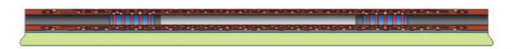

출처: IEEE(2023). HETEROGENEOUS INTEGRATION ROADMAP Chapter 23: Wafer-Level Packaging(WLP). https://eps.ieee.org/images/files/HIR\_2021/ch23-wlpfinal2.pdf. p.14. [그림 2-20] RDL 2 형성 후의 eWLP 개략도

- 1. 포토레지스트(Photolithography)를 도포하고 패턴을 형성한다.
  - (1) 포토레지스트를 균일하게 도포한다.

RDL 2 형성을 위해 웨이퍼 표면에 포토레지스트를 균일하게 도포한다. 도포된 포토레 지스트는 이후 노광 및 현상 공정을 통해 금속 배선 패턴을 정의하는 데 사용된다.

(2) 노광 및 현상 공정을 수행해 패턴을 형성한다.

포토레지스트 위에 노광 공정을 적용하여 특정 영역에 빛을 조사한다. 빛에 노출된 영역 은 현상 공정을 통해 제거되고, 이를 통해 금속 배선이 형성될 패턴이 남는다. 이 과정 은 배선층의 정밀한 형성을 위해 매우 중요하다.

- 2. 금속을 증착하고 식각한다.
  - (1) 전도성 금속을 증착한다.

RDL 2의 배선을 위해 구리(Cu) 또는 기타 전도성 금속을 웨이퍼 표면에 증착한다. 증

착된 금속은 다이와 외부 연결 간의 전기적 경로를 형성하게 된다.

(2) 불필요한 금속을 식각한다.

증착된 금속 중 필요한 배선 패턴 외의 부분을 식각 공정을 통해 제거한다. 이 공정에 서는 포토레지스트 패턴을 기준으로 불필요한 금속을 선택적으로 제거하여 원하는 배선 구조를 완성한다.

(3) 배선층의 품질을 확인한다.

식각 공정이 완료된 후, 배선층의 품질을 검사한다. RDL 2가 균일하고 정확하게 형성 되었는지, RDL 1과의 전기적 연결이 원활한지 확인하여 후속 공정을 위한 준비를 마친 다.

- 3. 임시 캐리어를 제거한다.
  - (1) 임시 캐리어를 제거한다. 얇게 만들어진 웨이퍼에서 임시 캐리어를 제거한다. 이 과정은 캐리어를 부드럽게 분리 하여 Fan-Out 구조가 손상되지 않도록 한다.
  - (2) Fan-Out 웨이퍼를 점검하고 후속 공정을 준비한다.

임시 캐리어를 제거한 후 Fan-Out 웨이퍼의 표면 상태를 점검한다. 후속 Redistribution Layer(RDL) 공정이 원활히 진행될 수 있도록 웨이퍼 표면을 정리하고 준비한다.

수행 tip

- 금속 증착 후 불필요한 금속을 정확하게 식각한다.
- RDL 1과 RDL 2 간의 전기적 연결 상태를 확인한다.
- 임시 캐리어를 제거할 때 웨이퍼가 손상되지 않도록 주의 한다.

숙 솔더 볼(Solder Ball)을 부착한다.

이 단계는 솔더 볼을 부착하여 패키지와 외부 회로 간의 전기적 연결을 확립하는 과정이다. 솔 더 볼은 다이 패드와 외부 기판 사이의 신호 전달을 위한 중요한 역할을 한다.

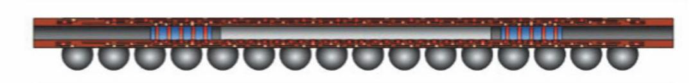

출처: IEEE(2023). HETEROGENEOUS INTEGRATION ROADMAP Chapter 23: Wafer-Level Packaging(WLP). https://eps.ieee.org/images/files/HIR\_2021/ch23-wlpfinal2.pdf. p.14. [그림 2-21] 솔더 볼이 부착된 eWLP 개략도

- 1. Under Bump Metallization(UBM)을 한다.
  - (1) UBM 층을 형성하기 위한 금속을 증착한다.

솔더 볼이 부착될 다이 패드 위에 니켈(Ni) 또는 구리(Cu) 등의 금속 층을 증착하여 UBM 층을 형성한다. 이 층은 솔더 볼과 다이 패드 간의 전기적 연결을 위한 기초 역할을 한다.

(2) UBM의 균일성을 확인한다.

증착된 UBM 층의 두께와 균일성을 검사하여 솔더 볼 부착 시 문제가 발생하지 않도록 한다. 이 과정에서 불균일한 금속 증착은 솔더 볼의 전기적 연결에 악영향을 끼칠 수 있다.

- 2. 솔더 볼을 부착한다.
  - (1) 솔더 볼을 정확한 위치에 배치한다.

자동화된 솔더 볼 배치 장비를 사용하여 솔더 볼을 다이 패드 위에 정확하게 배치한다. 솔더 볼이 올바른 위치에 있어야만 이후 리플로 공정에서 안정적인 전기적 연결을 확보 할 수 있다.

(2) 솔더 볼 배치 상태를 확인한다.

모든 솔더 볼이 정확한 위치에 배치되었는지 확인한다. 이 과정에서 잘못 배치된 솔더 볼은 수정하거나 제거하여 후속 공정에서 발생할 수 있는 불량을 방지한다.

- 3. 리플로(Reflow) 공정을 수행한다.
  - (1) 리플로 공정을 통해 솔더 볼을 녹인다.

솔더 볼을 일정한 온도로 가열하여 녹이는 리플로 공정을 수행한다. 이 공정을 통해 솔 더 볼이 다이 패드와 융합되어 전기적 연결을 확립한다.

(2) 리플로 후 전기적 연결 상태를 확인한다.

리플로가 완료된 후, 솔더 볼과 다이 패드 간의 전기적 연결 상태를 검사한다. 전기적 연결이 원활하게 이루어졌는지 확인하고, 불량이 발견되면 수정 작업을 수행한다.

#### 수행 tip

• 솔더 볼이 정확한 위치에 배치되었는지 확인한다.

• 리플로 후 전기적 연결 상태를 검사한다.

숚 상단 패키지를 Fan-Out 구조에 조립한다.

이 단계는 상단 패키지를 Fan-Out 구조에 적층하여 하단 패키지와 전기적 및 기계적으로 연결하는 중요한 단계다. 이 과정을 통해 전체 패키지의 전기적 연결과 구조적 안정성이 확립된다.

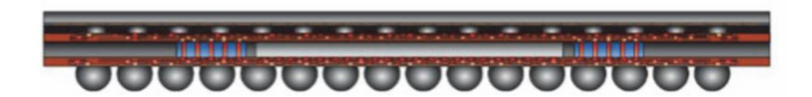

출처: IEEE(2023). HETEROGENEOUS INTEGRATION ROADMAP Chapter 23: Wafer-Level Packaging(WL P). https://eps.ieee.org/images/files/HIR\_2021/ch23-wlpfinal2.pdf. p.14. [그림 2-22] 완료된 eWLP 개략도

- 1. 상단 패키지를 배치한다.
  - (1) 상단 패키지를 Fan-Out 구조 위에 배치한다.

상단 패키지를 하단 Fan-Out 구조 위에 정확하게 적층하여 배치한다. 이 과정에서는 적층된 패키지 간의 정렬이 정확해야 하며, TSV(Through-Silicon Via)를 통해 상단과 하단 패키지 간의 전기적 연결이 이루어지도록 배치한다.

(2) TSV 연결을 확인한다.

TSV를 통해 상단 패키지와 하단 패키지 간의 전기적 연결이 올바르게 이루어졌는지 확 인한다. 전기적 연결 상태는 패키지의 성능에 중요한 영향을 끼치므로, 배치 후 정렬 상 태와 전기적 연결 상태를 철저히 검사한다.

#### 2. 최종 리플로 및 캡슐화를 수행한다.

(1) 최종 리플로 공정을 통해 상단 패키지와 하단 패키지를 연결한다.

최종 리플로 공정을 통해 상단 패키지와 하단 패키지 간의 전기적 및 기계적 연결을 확 실하게 한다. 이 공정은 상단과 하단의 배선과 솔더가 융합되어 전기적 경로가 안정적으 로 형성되도록 돕는다.

(2) 캡슐화 또는 몰딩을 통해 패키지를 보호한다.

필요할 경우 상단 패키지를 몰딩하거나 캡슐화하여 외부 환경으로부터 보호한다. 몰딩 및 캡슐화 공정은 패키지가 외부 충격이나 환경적 요인에 의해 손상되지 않도록 하는 중요한 보호 장치 역할을 한다.

(3) 최종 품질 검사를 수행한다.

리플로 및 캡슐화가 완료된 후, 상단과 하단 패키지 간의 전기적 연결 상태와 전체 패 키지의 품질을 검사한다. 모든 연결 상태가 정상적이고 패키지의 구조적 안정성이 보장 되었는지 확인한 후, 다음 공정 또는 출하 단계로 넘어간다.

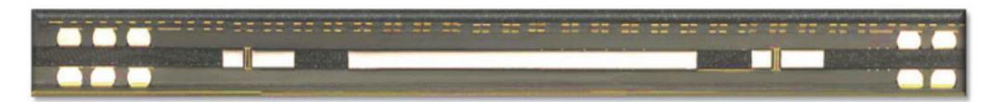

출처: IEEE(2023). HETEROGENEOUS INTEGRATION ROADMAP Chapter 23: Wafer-Level Packaging(WL P). https://eps.ieee.org/images/files/HIR\_2021/ch23-wlpfinal2.pdf. p.13. [그림 2-23] Embedded TSV Die 포함된 3D FOWLP

- TSV를 통해 상단 패키지와 하단 패키지 간의 전기적 연결 을 확인한다.
- 최종 리플로 후 패키지를 캡슐화하여 보호한다.

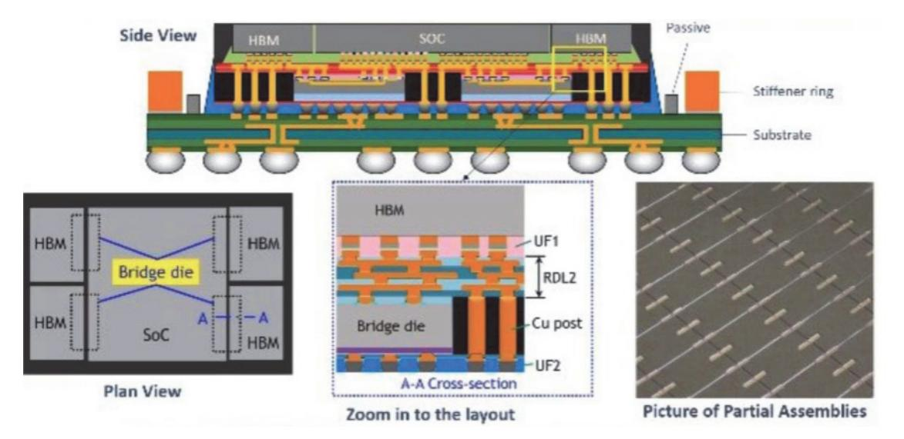

출처: IEEE(2023). HETEROGENEOUS INTEGRATION ROADMAP Chapter 23: Wafer-Level Packaging(WLP). https://eps.i eee.org/images/files/HIR\_2021/ch23-wlpfinal2.pdf. p.18. [그림 2-24] SPIL's Fan-Out Embedded Bridge(FOEB)

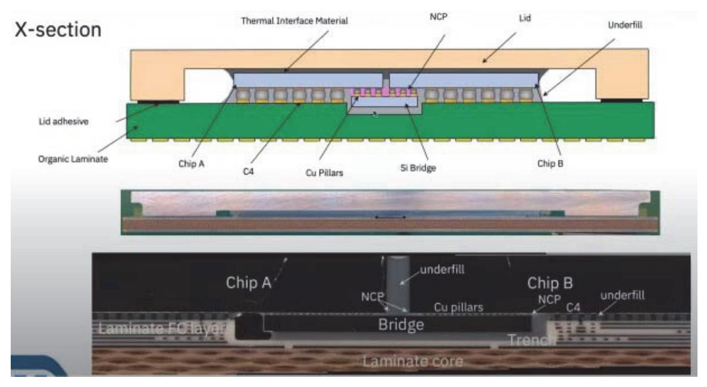

출처: IEEE(2023). HETEROGENEOUS INTEGRATION ROADMAP Chapter 23: Wafer-Level Packaging(WLP). https://eps. ieee.org/images/files/HIR\_2021/ch23-wlpfinal2.pdf. p.19.

[그림 2-25] IBM's Direct Bonded Heterogeneous Integration(DBHI) Silicon Bridge Technology

## 학습 2 교수·학습 방법

#### 교수 방법

- 수동 소자와 신소재가 포함된 웨이퍼 레벨 패키지 공정 기술을 설명하고, 적용 방법을 제시 한다.
- 여러 소자를 임베디드한 테이프와 칩 다이 본딩 기술의 주요 단계를 제시하고, 공정 흐름을 설명한다.
- 전극 홀 가공을 통한 새로운 패키징 기술을 적용하는 실습을 계획하고 유도한다.

#### 학습 방법

- 수동 소자와 신소재를 포함하는 웨이퍼 레벨 패키지 공정 기술을 숙지하고, 그 적용 방법을 정리한다.
- 임베디드 소자와 칩 다이 본딩 기술의 공정 단계를 확인하고, 실제 적용 사례를 조사하여 분석한다.
- 전극 홀 가공 기술을 실습하면서 수행 결과를 점검하고, 학습 내용을 공유한다.

## 학습 2 평 가

#### 평가 준거

- 평가자는 학습자가 학습 목표를 성공적으로 달성하였는지를 평가해야 한다.
- 평가자는 다음 사항을 평가해야 한다.

|                       |                                               | 성취수준 |   |   |
|-----------------------|-----------------------------------------------|------|---|---|
| 학습 내용                 | 학습 목표                                         | 상    | 중 | 하 |
| 임베디드 웨이퍼 레 벨 공정 기술 | - 수동 소자를 포함하는 웨이퍼 레벨 패키지 공정 기술을 적용 할 수 있다. |      |   |   |
|                       | - 신소재가 포함된 수동 소자를 포함하는 배선 공정 기술 적용 할 수 있다. |      |   |   |
|                       | - 여러 소자를 임베디드한 테이프와 칩 다이 본딩 기술을 적용 할 수 있다. |      |   |   |
|                       | - 전극 홀 가공을 통하여 새로운 패키징 기술을 수행할 수 있 다.      |      |   |   |

#### 평가 방법

• 서술형 시험

| 학습 내용                 |                                                       | 성취수준 |   |   |
|-----------------------|-------------------------------------------------------|------|---|---|
|                       | 평가 항목                                                 | 상    | 중 | 하 |
| 임베디드 웨이퍼 레 벨 공정 기술 | - 수동 소자가 포함된 웨이퍼 레벨 패키지 공정의 세부 단계를 설명할 수 있는 능력     |      |   |   |
|                       | - 신소재가 포함된 수동 소자의 배선 공정 기술을 적용할 수 있는 능력            |      |   |   |
|                       | - 2.5D 패키징과 3D 패키징의 차이점과 장단점을 비교할 수 있는 능력          |      |   |   |
|                       | - 임베디드 기술과 TSV 통합이 반도체 패키징 산업에 미치는 영향을 분석할 수 있는 능력 |      |   |   |

#### • 논술형 시험

| 학습 내용                 | 평가 항목                                           | 성취수준 |   |   |
|-----------------------|-------------------------------------------------|------|---|---|
|                       |                                                 | 상    | 중 | 하 |
| 임베디드 웨이퍼 레 벨 공정 기술 | - 임베디드된 테이프와 칩 다이 본딩 공정을 정확히 수행할 수 있는 능력     |      |   |   |
|                       | - 전극홀 가공을 통해 새로운 패키징 기술을 적용할 수 있는 능력         |      |   |   |
|                       | - 임베디드 웨이퍼 레벨 공정(eWLP)의 특징과 장점을 설명할 수 있는 능력  |      |   |   |
|                       | - 몰딩 공정이 eWLP에서 제품 신뢰성에 미치는 영향을 설명 할 수 있는 능력 |      |   |   |

#### 피드백

| - 수동 소자가 포함된 웨이퍼 레벨 패키지 공정의 세부 단계에 대해 설명이 미흡한 경우, 각 단계 별로 공정의 목적과 진행 방법을 구체적으로 설명한다. 성취수준이 낮은 학습자에게는 각 단계를 시각적 자료와 함께 제공하여 이해를 돕고, 성취수준이 높은 학습자에게는 공정의 세부 변수를 분 석하고 문제를 해결하는 심화 학습 기회를 제공한다. - 신소재가 포함된 수동 소자의 배선 공정 기술을 제대로 적용하지 못하는 경우, 신소재의 특성과 배선 공정의 상호작용에 대해 구체적으로 설명한다. 성취수준이 낮은 학습자에게는 배선 공정의 주요 변수와 신소재 적용 사례를 통해 반복 학습을 제공하고, 성취수준이 높은 학습자에게는 신소 |
|------------------------------------------------------------------------------------------------------------------------------------------------------------------------------------------------------------------------------------------------------------------------------------------------------------------------------------------------------------------------------|
|                                                                                                                                                                                                                                                                                                                                                                              |
|                                                                                                                                                                                                                                                                                                                                                                              |
|                                                                                                                                                                                                                                                                                                                                                                              |
|                                                                                                                                                                                                                                                                                                                                                                              |
|                                                                                                                                                                                                                                                                                                                                                                              |
|                                                                                                                                                                                                                                                                                                                                                                              |
| 재 기술의 최신 연구 동향을 소개하여 심화 학습을 유도한다.                                                                                                                                                                                                                                                                                                                                            |
| - 2.5D와 3D 패키징의 차이점과 장단점 비교가 부족한 경우, 두 기술의 구조적 차이와 응용 사례                                                                                                                                                                                                                                                                                                                     |
| 를 명확하게 제시한다. 성취수준이 낮은 학습자에게는 시각적 자료와 함께 패키징 기술의 발전 과                                                                                                                                                                                                                                                                                                                         |
| 정을 학습하게 하고, 성취수준이 높은 학습자에게는 2.5D와 3D 패키징의 성능 차이와 기술적 선                                                                                                                                                                                                                                                                                                                       |
| 택 이유를 분석하는 심화 학습을 제공한다.                                                                                                                                                                                                                                                                                                                                                      |
| - 임베디드 기술과 TSV 통합이 반도체 패키징 산업에 미치는 영향을 충분히 분석하지 못하는 경우,                                                                                                                                                                                                                                                                                                                      |
| 두 기술의 패키징 효율성과 비용 절감 효과를 구체적인 사례와 함께 설명한다. 성취수준이 낮은                                                                                                                                                                                                                                                                                                                          |
| 학습자에게는 임베디드 기술과 TSV의 기본 개념을 다시 학습하게 하고, 성취수준이 높은 학습자                                                                                                                                                                                                                                                                                                                         |
| 에게는 이들 기술의 경제적 및 산업적 영향에 대한 심화 분석을 유도한다.                                                                                                                                                                                                                                                                                                                                     |
| 2. 논술형 시험                                                                                                                                                                                                                                                                                                                                                                    |
| - 임베디드된 테이프와 칩 다이 본딩 공정 수행이 미흡한 경우, 본딩 공정의 세부 절차와 관련된                                                                                                                                                                                                                                                                                                                        |
| 실습 자료를 통해 구체적인 이해를 돕는다. 성취수준이 낮은 학습자에게는 본딩 공정에서 발생할                                                                                                                                                                                                                                                                                                                          |
| 수 있는 일반적인 문제와 그 해결책을 학습하게 하고, 성취수준이 높은 학습자에게는 다양한 본딩                                                                                                                                                                                                                                                                                                                         |
| 기술을 비교하고 차이를 분석하는 심화 학습을 제공한다. - 전극 홀 가공을 통한 패키징 기술 적용이 부족할 경우, 전극 홀 가공 기술의 작동 원리와 주요                                                                                                                                                                                                                                                                                     |
| 응용 분야를 구체적으로 설명한다. 성취수준이 낮은 학습자에게는 전극홀 가공 공정의 기초 이론                                                                                                                                                                                                                                                                                                                          |
| 과 실제 사례를 학습하게 하고, 성취수준이 높은 학습자에게는 다양한 가공 기술을 비교하고 성능                                                                                                                                                                                                                                                                                                                         |
| 을 분석하는 심화 학습 기회를 제공한다.                                                                                                                                                                                                                                                                                                                                                       |

- 임베디드 웨이퍼 레벨 공정의 특징과 장점에 대한 설명이 부족한 경우, eWLP 기술의 핵심 특징 과 이를 활용하는 이유를 구체적으로 설명한다. 성취수준이 낮은 학습자에게는 eWLP 기술의 장 점과 관련된 응용 사례를 학습하게 하고, 성취수준이 높은 학습자에게는 eWLP와 기존 기술의 차 이점에 대해 심화 분석하도록 유도한다.
- 몰딩 공정이 eWLP에서 제품 신뢰성에 미치는 영향을 충분히 설명하지 못한 경우, 몰딩 공정의 목적과 제품 신뢰성에 미치는 구체적인 영향을 상세히 설명한다. 성취수준이 낮은 학습자에게는 몰딩 공정의 기초 원리와 중요성을 다시 학습하게 하고, 성취수준이 높은 학습자에게는 몰딩 공정 중 발생할 수 있는 문제 해결 방안에 대한 심화 학습을 제공한다.

| 학습 1 | 팬 인 웨이퍼 레벨 공정 진행하기  |
|------|---------------------|
| 학습 2 | 임베디드 웨이퍼 레벨 공정 진행하기 |
| 학습 3 | nD 웨이퍼 레벨 공정 진행하기   |

## 3-1. nD 레벨 공정 기술

|       | • 기본적인 패키징 레벨에서부터 다양한 적층 기술을 적용하여 개발할 수 있다. • 와이어 본딩 패키지, 솔더 볼 패키지와 플립 칩 패키지를 포함한 여러 종류의 패키지 방식들 |
|-------|-----------------------------------------------------------------------------------------------------|
| 학습 목표 | 을 적용하여 개발할 수 있다. • 칩과 칩을 접합하고 칩과 웨이퍼를 접합하여 다양한 2차원 이상의 패키징 구조를 개발할 수 있다.                      |
|       | • 팹 공정에서 개발, 제조된 칩을 목적하는 용도에 맞게 다층 접합하여 2차원, 2.5차원, 3차원 패키지로 개발할 수 있다.                           |

## 필요 지식 /

숔 nD 패키징의 기본 개념

1. 정의

nD 패키징은 반도체 칩의 다양한 차원에서 적층 및 통합하는 기술을 의미하며, 'nD'는 2 차원(2D), 2.5차원(2.5D), 3차원(3D)을 포함하는 여러 차원을 나타낸다. 각 차원은 칩 간의 신호 전달 경로, 밀도, 효율성에 따라 구분된다.

- (1) 2D 패키징
  - 2D 패키징은 칩을 평면적으로 배열하는 방식이다.
  - (가) PoP(Package-on-Package)

2개 이상의 패키지를 수직으로 쌓아 올리는 방식으로, 일반적으로 모바일 AP(Application Processor) 위에 DRAM(Dynamic Random Access Memory)을 쌓는다. 이 방식은 공간을 절약하면서도 성능을 향상시킬 수 있다.

(나) MCM(Multi-Chip Module)

여러 칩을 하나의 모듈 기판에 패키징하여 기능을 결합한다. MCM은 칩 간의 전기 적 연결을 쉽게 하여 데이터 전송을 최적화한다.

(다) SiP(System-in-Package)

여러 칩과 수동 소자 등의 부품을 하나의 기판에 통합하여 시스템 수준의 기능을 제 공한다. 이는 다양한 전자 기기에서 비용 효율적이고 간단한 설계로 사용된다. 2D 패키징은 상대적으로 간단하고 저렴하며, 다양한 전자기기에서 널리 사용되고 있

(2) 2.5D 패키징

다.

2.5D 패키징은 기판 위에 실리콘 인터포저를 실장하고 그 위에 여러 칩을 배치하는 방 식이다.

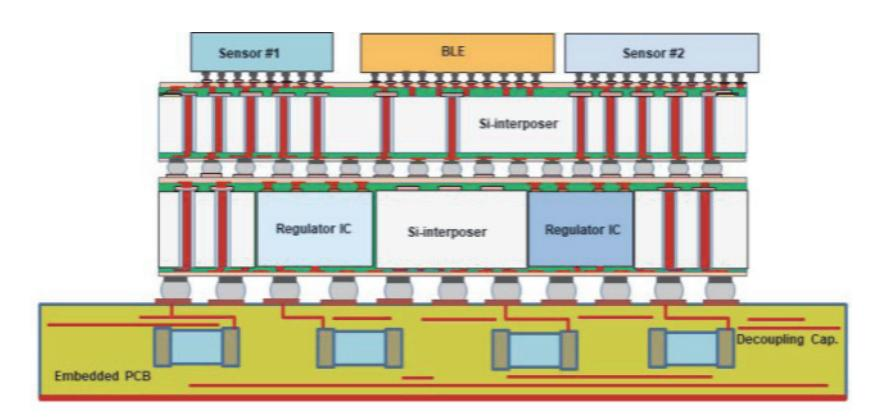

출처: 전자부품연구원(2019). 『이종/다수 반도체 소자 내장형 통합 패키지 및 모듈 원기술 개발』. 산 업통상자원부 한국산업기술평가관리원. p.18. [그림 3-1] 실리콘 인터포저가 내장된 2.5D 패키징

(가) 실리콘 인터포저

칩 간 연결 속도와 대역폭을 높이고 저전력을 구현하기 위해 사용된다. 실리콘 인터 포저는 수평적 연결을 제공하여 데이터 전송을 최적화하고 신호 무결성을 유지한다.

(나) 고성능 통합

CPU, HBM(High Bandwidth Memory) 등의 복수의 칩을 통합하여 고성능 패키징 을 구현한다. HBM은 메모리 대역폭을 크게 향상하는 역할을 한다.

(다) 비용 및 공정의 복잡성

실리콘 인터포저의 높은 비용과 TSV(Through-Silicon Via)를 통한 추가 공정 비용 이 발생한다. TSV는 기판과 인터포저 간의 전기적 연결을 제공하지만, 제조 공정이 복잡하고 비용이 높다.

(라) EMIB

비용 문제를 해결하기 위해 개발된 EMIB(Embedded Multi-die Interconnect Bridge) 기술은 실리콘 인터포저 대신 실리콘 브리지를 사용하여 다이 간의 전기적 연결을 제공한다. EMIB는 고성능 컴퓨팅과 AI 애플리케이션에 적합한 비용 효율적 인 솔루션이다.

(3) 3D 패키징

3D 패키징은 칩을 수직으로 적층하여 공간 효율성을 극대화하는 기술이다.

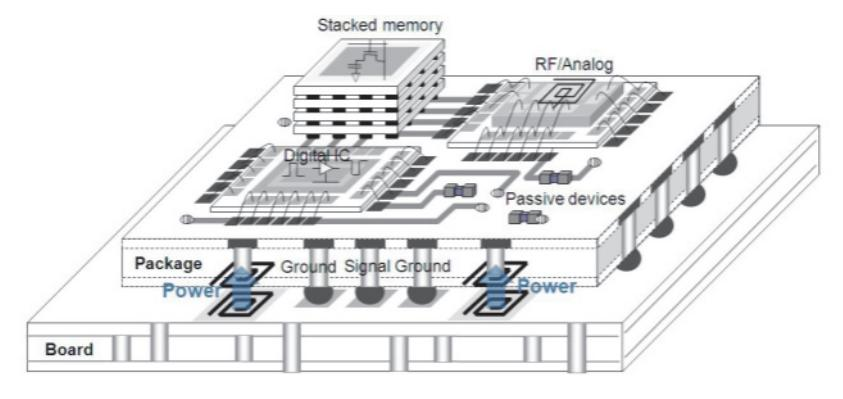

출처: 전자부품연구원(2019). 『이종/다수 반도체 소자 내장형 통합 패키지 및 모듈 원기술 개발』. 산업통상자원부 한국산업기술평가관리원. p.48. [그림 3-2] 3D package에서 무선 전력 전송 시스템의 예시

#### (가) TSV(Through-Silicon Via)

TSV를 통해 실리콘 웨이퍼를 수직으로 전기적 연결하여 다이를 적층한다. TSV는 고속 데이터 전송과 높은 집적도를 가능하게 하며, 3D 집적 회로와 메모리 스택에 사용된다.

(나) 공간 절약

칩을 수직으로 쌓아 공간을 절약하고, 전체 시스템의 크기를 줄인다.

(다) 고성능 및 효율성

3D 패키징은 최고의 성능과 공간 효율성을 제공하지만, 제조 공정이 복잡하고 비용 이 높다. 이러한 높은 비용은 고성능 요구가 있는 분야에서 정당화될 수 있다.

#### 숕 nD 패키지

- 1. nD 패키지 기술 종류
  - (1) CoWoS(Chip on Wafer on Substrate)

CoWoS 기술은 2.5D 패키징 방식으로, 실리콘 인터포저를 사용하여 여러 칩을 평면에 배치하고 연결한다. 실리콘 인터포저는 여러 개의 반도체 다이를 고밀도로 연결할 수 있 어 성능과 효율성을 극대화한다. 이 기술은 고성능 컴퓨팅 및 데이터 센터 애플리케이션 에 적합하다. CoWoS는 높은 집적도와 성능을 제공하지만, 제조 과정이 복잡하고 비용 이 높다는 단점이 있다.

<표 3-1> CoWoS 종류

| 표-머리    | CoWoS-S                                    | CoWoS-R                         | CoWoS-L                 |
|---------|--------------------------------------------|---------------------------------|-------------------------|
| 인터포저 종류 | 실리콘 인터포저                                   | RDL 인터포저                        | RDL + LSI 인터포저          |
| 특징      | 다양한 인터포저 사이즈와 HBM 큐브 수, 패키지 사 이즈를 지원 | 열전도성이 우수하고 신뢰 성이 높은 C4 범프 사용 | CoWoS-S 와 InFO 기술 통합 |
| 구조      |                                            |                                 |                         |

출처: 유진투자증권(2023). 『소부장 레시피 10』. p.82.

#### (2) Foveros

Foveros는 TSV(Through-Silicon Via)를 사용하여 칩을 수직으로 쌓아 고성능과 고밀 도 패키징을 제공하는 3D 패키징 기술이다. 이 기술은 다이 간의 직접적인 전기적 연결 을 통해 데이터 전송 속도와 성능을 극대화한다. Foveros는 주로 CPU와 메모리 집적 에 사용되며, 매우 높은 집적도와 성능을 제공하지만, 제조 과정이 매우 복잡하고 비용 이 높다.

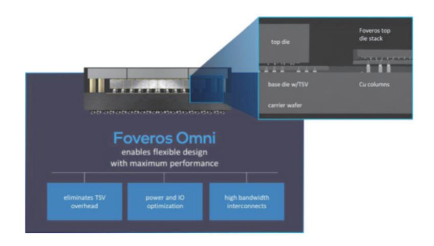

출처: Intel(2021). Advanced Packaging Architectures for heterogeneous Integration. p.13. [그림 3-3] CO\_EMIB 구조

#### (3) EMIB(Embedded Multi-die Interconnect Bridge)

EMIB는 실리콘 브리지를 사용하여 다이들을 연결하는 2.5D 패키징 기술이다. 실리콘 인터포저 대신 실리콘 브리지를 사용하여 다이 간의 전기적 연결을 가능하게 한다. 이 기술은 비용 효율적이며, 고성능 컴퓨팅 및 AI 애플리케이션에 적합하다. EMIB는 높은 성능과 유연성을 제공하지만, 실리콘 인터포저를 사용하는 기술에 비해 덜 복잡하다.

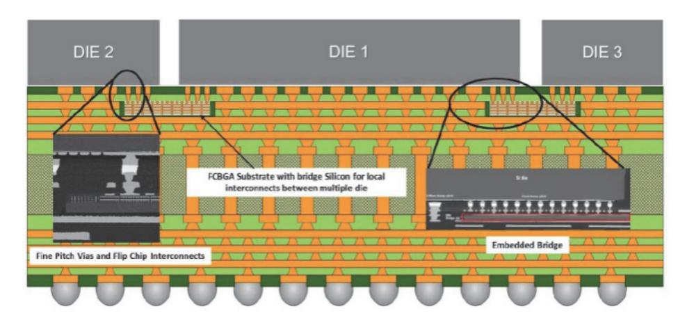

출처: IEEE(2023). HETEROGENEOUS INTEGRATION ROADMAP Chapter 23: Wafer-Level Packagin g(WLP). https://eps.ieee.org/images/files/HIR\_2021/ch23-wlpfinal2.pdf. p.18. [그림 3-4] Intel's Embedded Multi-Interconnect Bridge(EMIB) technology

#### (4) HBM(High Bandwidth Memory)

HBM(High Bandwidth Memory) 기술은 실리콘 인터포저와 TSV(Through-Silicon Via)를 활용하여 고성능 메모리 모듈을 제공하는 패키징 기술이다. 이 기술은 메모리와 로직 칩을 3D로 적층하여 높은 데이터 전송 속도와 성능을 제공한다.

HBM은 2.5D 및 3D 패키징 방식 모두에 적용될 수 있다. 2.5D 패키징에서는 실리콘 인터포저 위에 메모리 스택과 프로세서를 배치하여 칩 간의 수평적 연결을 강화하고, 대 역폭을 크게 향상한다. 3D 패키징은 TSV를 통해 메모리 칩을 수직으로 쌓아 높은 집적 도와 공간 효율성을 제공하며, 데이터 전송 경로를 단축하여 전력 소모를 줄인다.

이 기술은 AI 및 데이터 센터 애플리케이션에 최적화되어 있으며, 고성능 컴퓨팅과 그 래픽 처리 장치(GPU)에서의 활용이 증가하고 있다. HBM은 높은 대역폭과 전력 효율성 을 바탕으로 AI 모델 훈련과 대규모 데이터 처리에 이상적인 솔루션을 제공한다.

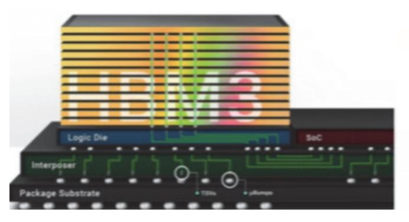

출처: 서진욱(2024. 5. 16.). "엔비디아발 훈풍에 SK하이닉스 '신고가'… 실적 발표까지 쭉?". 머니투데이. [그림 3-5] HBM

(5) InFO(Integrated Fan-Out)

InFO(Integrated Fan-Out) 기술은 팬 아웃 패키징 방식으로, 칩을 패널 형태로 배열 하여 높은 성능과 연결성을 제공한다. 이 기술은 실리콘 인터포저를 사용하지 않고, 팬 아웃 리디스트리뷰션 레이어(RDL)를 통해 칩 간의 연결을 구현한다.

InFO는 2D 및 3D 패키징 모두에 적용할 수 있다. 2D 패키징에서는 칩을 평면적으로 배열하여 공간 효율성을 극대화하고, 간단한 제조 공정과 저비용으로 패키징을 실현한 다. 3D 패키징에서는 칩을 수직으로 적층하여 공간 활용도를 높이고, RDL을 통해 고속 데이터 전송과 높은 연결 밀도를 제공한다.

이 기술은 모바일 기기와 고성능 컴퓨팅에 적합하며, 우수한 열 관리 성능과 비교적 낮 은 제조 비용을 자랑한다. InFO는 간단한 제조 공정과 낮은 비용 덕분에 다양한 전자 기기에서 널리 사용된다.

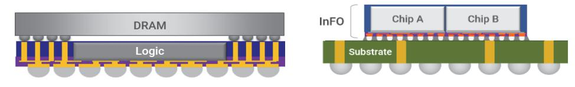

출처: TSMC(https://3dfabric.tsmc.com/english/dedicatedFoundry/technology/InFO.htm). 2024. 7. 1. 스크린샷. [그림 3-6] InFo\_PoP, InFo\_oS

#### (6) MCM(Multi-Chip Module)

MCM(Multi-Chip Module) 기술은 여러 반도체 칩을 하나의 모듈로 통합하여 높은 집적도와 성능을 제공하는 기술이다. 초기에는 2D 방식의 MCM이 주로 개발되었으나 이후 3D 요소가 추가되면서 현대의 3D 패키징 기술의 초석이 되었다. 이 기술은 칩 간의 연결 거리를 줄이고, 전력 분배를 최적화하며, 시스템 성능을 향상하는 이점이 있다.

MCM 기술은 2D, 2.5D, 3D 패키징 방식 모두에 적용될 수 있다. 2D 패키징은 칩을 평면적으로 배열하여 간단한 제조 공정과 비용 효율성을 제공한다. 2.5D 패키징은 실리콘 인터포저를 사용해 칩 간의 수평 연결을 지원하며, 고속 데이터 전송과 높은 대역폭을 구현한다. 3D 패키징은 칩을 수직으로 적층해 공간 효율성을 극대화하고, TSV(Through-Silicon Via)를 통해 성능을 대폭 향상한다.

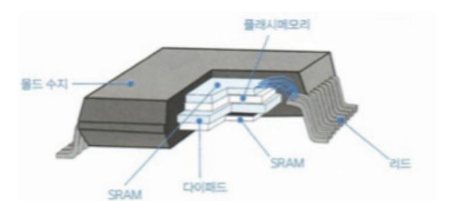

출처: 니시쿠보 야스히코(2023). 『반도체 구조원리 교과서』. 보누스. p.229. [그림 3-7] MCM 구조

(7) SiP(System-in-Package)

SiP(System-in-Package) 기술은 여러 개의 집적 회로(IC)와 수동 소자를 하나의 패키 지에 통합해 시스템 수준의 기능을 제공하는 기술이다. MCM(Multi-Chip Module) 기 술의 발전형으로, SiP는 기능 통합, 전력 소비 감소, 성능 향상, 소형화 등의 장점을 지 닌다. 이 기술은 스마트폰, IoT 장치, 웨어러블 디바이스, 자동차 전자 장치 등 다양한 응용 분야에서 사용된다.

SiP 기술은 2D, 2.5D, 3D 패키징 방식 모두에 적용될 수 있다. 2D 패키징은 칩과 수동 소자를 평면적으로 배열해 제조 공정이 간단하고 비용 효율적이다. 2.5D 패키징은 실리콘 인터포저를 사용해 칩 간의 수평적 연결을 지원하며, 데이터 전송 속도와 대역폭을 향상한다. 3D 패키징은 칩을 수직으로 적층해 공간 효율성을 극대화하고, TSV(Through-Silicon Via)를 통해 수직적 전기적 연결을 구현하여 성능을 높인다.

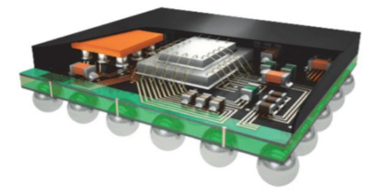

출처: ipc2u.com(2021). The road to Industry 4.0 or the nano flash storage standard. Retrived from. https://ipc2u.com/articles/knowledge-base/the-road-to-industr y-4-0-or-the-nano-flash-storage-standard-innodisk-s-nanossd/. [그림 3-8] SIP 구조

숖 nD WLP의 기술 동향

1. 주요 기업들의 기술 활용 사례

nD 웨이퍼 레벨 패키징(WLP)은 고성능 및 고밀도 통합을 목표로 반도체 산업에서 중요한

역할을 하고 있다. 주요 반도체 기업들은 이 기술을 활용하여 데이터 전송 속도를 높이고 전력 소비를 줄이며, 소형화된 전자 기기를 개발하는 데 주력하고 있다.

(1) S사와 H사

3D 패키징 기술을 통해 고성능 메모리와 프로세서 패키징을 강화하고 있다. 이 기술은 TSV(Through-Silicon Via)와 같은 고급 기술을 사용하여 칩 간 전기적 연결을 강화하 고, 데이터 전송 속도를 크게 향상한다. 이러한 기술 발전은 데이터 센터와 고성능 컴퓨 팅 장치에서 중요한 역할을 한다.

(2) T사와 I사

자동화된 제조 공정과 AI 기반 공정 제어 기술을 도입하여 생산 효율성을 높이고 불량 률을 줄이고 있다. 이는 고도의 정밀성과 일관성을 요구하는 nD 웨이퍼 레벨 패키징 공 정에서 매우 중요한 요소이다.

(3) A사

미국 애리조나에 새로운 첨단 패키징 및 테스트 시설을 구축하여 고성능 패키징 능력을 강화하고 있다. 이를 통해 고성능 및 소형화된 전자 기기의 개발을 촉진하고 있다.

2. 시장 동향 및 기업 전략

nD 웨이퍼 레벨 패키징 시장은 빠르게 성장하고 있으며, 주요 반도체 기업들은 이 기술에 대한 지속적인 투자를 통해 시장 점유율을 확대하고 있다.

(1) 시장 성장

Y Group의 보고서에 따르면, nD 웨이퍼 레벨 패키징 시장은 고성능 컴퓨팅, 데이터 센터, 모바일 기기, 웨어러블 디바이스 등 다양한 응용 분야에서 수요가 증가함에 따라 빠르게 성장하고 있다. 이 기술은 칩의 공간 효율성을 극대화하고, 효율적인 열 관리를 통해 고성능 칩의 안정성과 수명을 보장한다.

(2) 기업 전략

주요 기업들은 nD WLP 기술을 통해 성능을 극대화하고, 소형화된 전자 기기의 개발을 추진하며, 자동화된 공정과 AI 기반 제어 기술을 통해 제조 효율성을 높이고 있다. 이를 통해 반도체 산업에서의 경쟁력을 강화하고 있다.

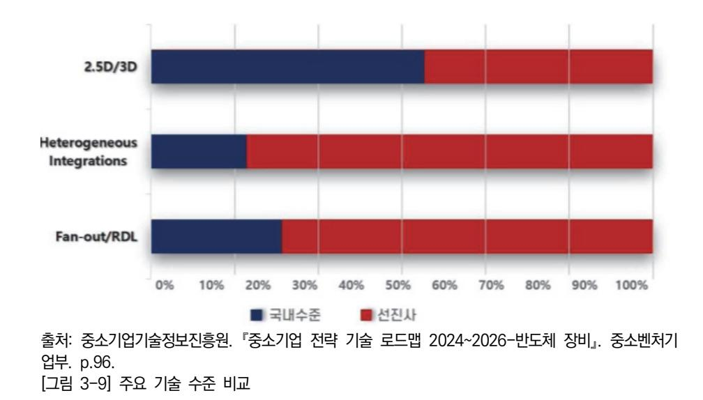

## 수행 내용 / nD 웨이퍼 레벨 공정 진행하기(TSV 패키지)

#### 재료·자료

- 실리콘 웨이퍼(Active Die 및 TSV 포함)
- 포토레지스트(Photolithography 용)
- 몰딩 컴파운드(Overmold 재료)
- 금속 증착 재료(Cu, Ni 등)
- 솔더 재료(Sn-Ag-Cu 합금)
- 절연재 및 패시베이션 재료

#### 기기(장비 ・ 공구)

- 다이 본딩 장비(Die Bonder)
- 노광 장비(Photolithography Tool)
- 드라이 에칭 장비(Dry Etcher)
- CVD 장비(Chemical Vapor Deposition Tool)
- 전해 도금 장비(Electroplating Tool)

- CMP 장비(Chemical Mechanical Polisher)
- 웨이퍼 그라인더(Wafer Grinder)
- 리플로 오븐(Reflow Oven)
- 웨이퍼 다이싱 장비(Wafer Dicer)

#### 안전 ・ 유의 사항

- CVD 및 전해도금 공정에서 사용되는 화학 물질(예: 산화제, 금속 전구체 등)은 독성이 있 을 수 있으므로, 적절한 보호 장비(장갑, 마스크, 보호복 등)를 착용하고 통풍이 잘되는 곳에 서 작업해야 한다.
- 드라이 에칭 공정에서 사용되는 가스(예: SF₆, C₄F₈ 등)는 독성이 있으며, 화재 및 폭발 위 험이 있으므로 적절한 환기 시스템과 안전 장비를 갖추어야 한다.
- 전해 도금 장비와 리플로 오븐 사용 시, 전기 충격 위험이 있으므로 장비의 전원을 차단하 고 작업해야 한다.
- 웨이퍼 그라인딩 및 CMP 공정에서는 기계적 손상 위험이 있으므로 적절한 보호 장비를 착 용하고 기계 작동 중에는 작업 영역에서 안전거리를 유지해야 한다.
- 리플로 오븐 및 오버몰드 장비 사용 시 고온에 노출될 수 있으므로, 고온 보호 장비를 착용 하고 화상에 주의해야 한다.
- 사용 후 남은 화학 물질 및 웨이퍼 조각은 적절히 분류 배출하고 환경 규제에 따라 폐기해 야 한다.

#### 수행 순서

숔 실리콘 웨이퍼에 트렌치 패턴을 형성하고 TSV를 에칭하여 채운다.

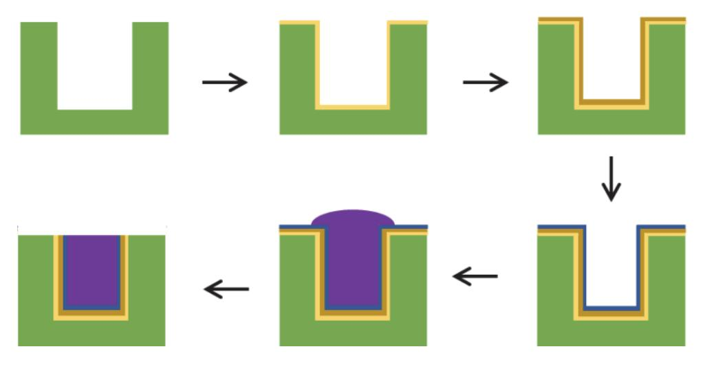

출처: 집필진 제작(2024) [그림 3-10] TSV etch, Cu fill, Cu CMP 공정

- 1. 웨이퍼 표면을 정리하고 평탄화하여 초기 준비를 완료한다. 공정은 웨이퍼 표면을 정리하고 평탄화하는 작업으로 시작한다. 초기 트랜지스터가 이미 형 성된 웨이퍼를 사용하며, TSV 형성을 위한 준비를 마친다.
- 2. 하드 마스크를 사용하여 TSV 패턴을 정밀하게 형성한다. TSV가 위치할 부분에 하드 마스크(Hard Mask)를 사용하여 정밀한 패턴을 형성한다. 이 마스크는 이후 에칭 과정에서 실리콘을 선택적으로 제거할 수 있도록 돕는다.
- 3. 드라이 에칭을 통해 실리콘을 깊게 에칭하여 트렌치를 만든다.

형성된 패턴을 따라 드라이 에칭 공정을 통해 실리콘을 깊게 에칭하여 트렌치(Trench)를 만든다. 이 과정에서 트렌치의 깊이와 폭을 정밀하게 제어하여 후속 공정에서의 정확성을 보장한다.

- 4. CVD 공정으로 에칭된 트렌치에 절연막을 형성한다. 에칭된 트렌치 내부에 산화물 등의 절연막을 CVD(Chemical Vapor Deposition, 화학 증 착) 공정을 통해 형성한다. 이 절연막은 TSV 내의 전기적 간섭을 방지하고 안정적인 전기 적 특성을 확보하는 데 중요한 역할을 한다.
- 5. 전해 도금으로 트렌치를 구리로 채워 전기적 연결을 만든다. 트렌치 내부에 금속 박막층(Seed/Barrier)을 형성한 후, 전해 도금(Electroplating) 공정을 통해 구리(Cu)를 채운다. 이 구리는 TSV가 칩 간 전기적 연결을 하는 데 사용하며, 전기 저항을 최소화하는 특성을 가진다.
- 6. CMP 공정을 통해 웨이퍼 표면을 평탄화하여 TSV를 완성한다. 화학적 기계적 연마(CMP: Chemical-Mechanical Polishing) 공정을 통해 웨이퍼 표면을

평탄화한다. 이 과정에서 트렌치 밖의 구리를 제거하고, 내부에만 구리가 남도록 하여 TSV 가 완성되도록 한다.

수행 tip

• 일관된 깊이는 웨이퍼 전체에서 균일한 TSV 성능에 필수 적이다.

숕 배선을 완료하고 웨이퍼 앞면에 솔더 범프를 형성한다.

- 1. 후속 배선 공정을 통해 전기적 연결을 완료한다. 추가적인 배선층을 형성하여 필요한 전기적 연결을 완성한다. 이 과정에서 TSV와 연결될 패드와 회로가 정밀하게 형성된다.
- 2. 웨이퍼 앞면에 솔더 범프 패턴을 형성한다.

솔더 범프가 형성될 위치에 패턴을 형성하여 정밀한 솔더 범프 배치를 준비한다. 이 단계에 서는 포토리소그래피 기법을 사용하여 범프 패턴을 정확하게 정의한다.

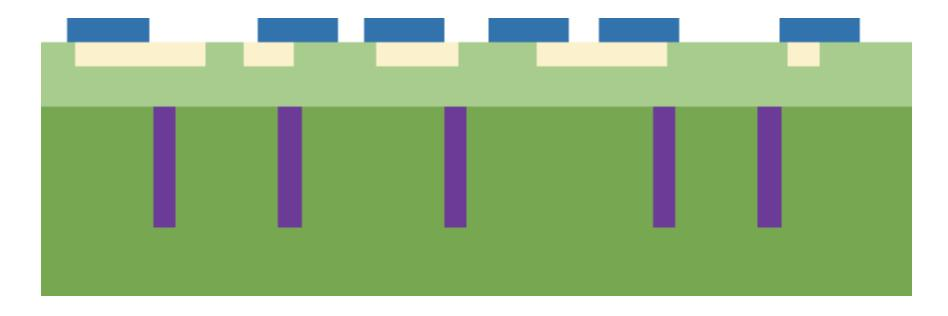

출처: 집필진 제작(2024) [그림 3-11] 알루미늄 패드 포함 BEOL metallization

#### 3. 솔더 범프를 형성하여 전기적 연결 준비를 완료한다.

솔더 재료를 사용하여 웨이퍼 앞면에 범프를 형성한다. 이 범프들은 후속 조립 공정에서 다 른 칩이나 기판과의 전기적 연결을 가능하게 한다.

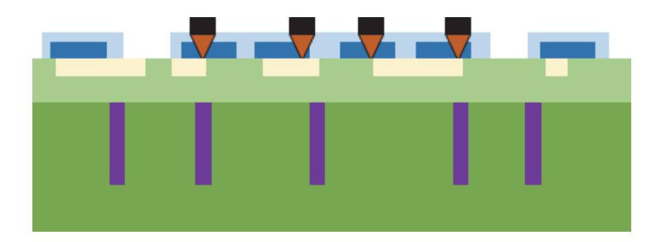

출처: 집필진 제작(2024) [그림 3-12] 전면 범프 형성

4. 솔더 리플로 공정을 통해 범프를 균일하게 형성한다.

리플로 오븐에서 솔더 범프를 녹여 표면 장력으로 인해 균일한 형태로 변형시킨다. 이 과정 을 통해 솔더 범프가 정밀하고 균일하게 형성되며, 안정적인 전기적 접속을 보장한다.

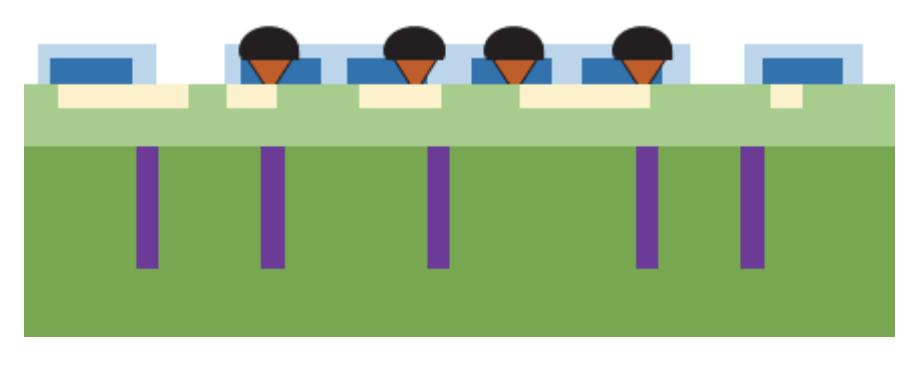

출처: 집필진 제작(2024) [그림 3-13] 웨이퍼 솔더 리플로

#### 수행 tip

- 열 팽창 불일치, 전기 마이그레이션과 같은 문제를 피하기 위해 TSV 공정과 호환되는 배선 및 솔더 범프 재료를 선 택해야 한다.
- 솔더 범프와 배선을 철저히 검사하고 테스트하여 결함을 식별한다. 공정 후반에 비용이 많이 드는 재작업을 방지할 수 있다.

숖 임시 캐리어 웨이퍼에 웨이퍼를 접합하고 그라인딩하여 TSV를 노출한다.

1. 웨이퍼를 백 그라인딩하기 위해 임시 캐리어 웨이퍼에 접합한다.

주 웨이퍼를 백 그라인딩 과정 동안 안전하게 지지하기 위해 임시 캐리어 웨이퍼에 접합한 다. 이 과정에서는 웨이퍼의 구조적 안정성을 유지하기 위한 접착 공정이 사용된다.

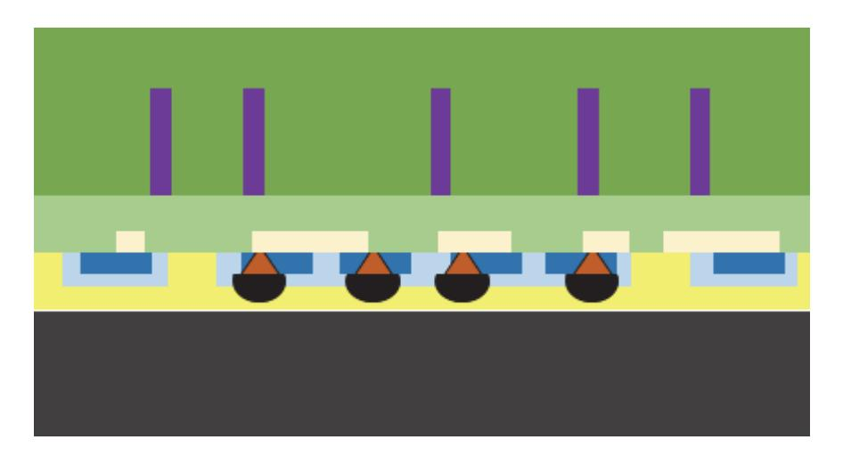

출처: 집필진 제작(2024) [그림 3-14] 임시 캐리어에 접합

2. 웨이퍼 후면을 그라인딩하여 TSV를 노출시킨다.

그라인딩 장비를 사용하여 웨이퍼의 후면을 기계적으로 연마하여 얇게 만든다. 이 과정은 TSV가 후면에서 노출될 때까지 진행되며 웨이퍼가 더욱 얇아진다.

출처: 집필진 제작(2024) [그림 3-15] 웨이퍼 후면 그라인딩

3. 노출된 TSV를 보호하기 위해 후면에 패시베이션 층을 형성한다.

TSV가 노출된 후, 후면에 새로운 패시베이션 층을 형성하여 웨이퍼를 보호한다. 이 과정은 외부 환경으로부터 웨이퍼를 보호하고 전기적 특성을 유지하는 데 중요하다.

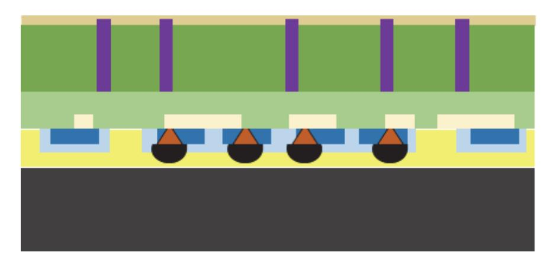

출처: 집필진 제작(2024) [그림 3-16] 패시베이션 층 형성

4. 패시베이션 층을 CMP 공정을 통해 평탄화하고 TSV 구리를 노출시킨다. 형성된 패시베이션 층을 CMP(Chemical-Mechanical Polishing) 공정을 통해 평탄화한다.

이 과정에서 TSV의 구리가 노출되어 후속 조립 및 전기적 연결이 가능하도록 한다.

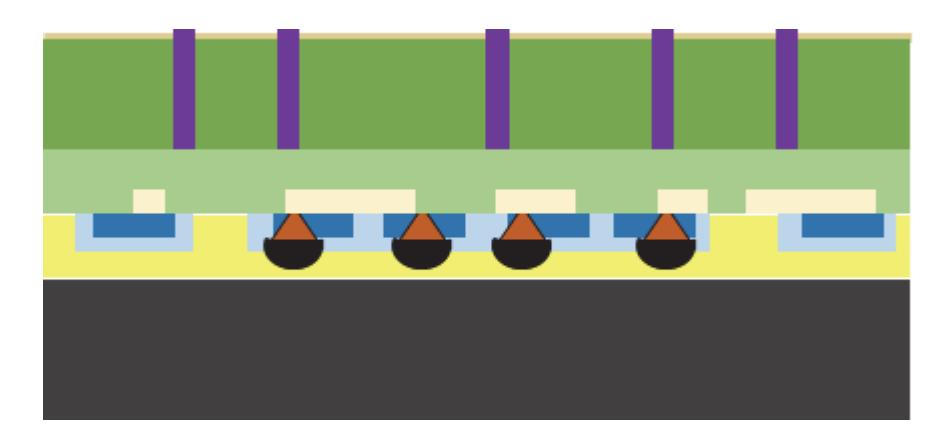

출처: 집필진 제작(2024) [그림 3-17] 평탄화

수행 tip

• 연삭 매개 변수를 미세 조정하면 웨이퍼 뒤틀림과 결함을 최소화하는 데 도움이 될 수 있다.

#### 숗 칩을 적층하고 패키지를 조립하여 최종 3D 구조를 완성한다.

1. 웨이퍼 후면에 솔더 범프를 형성하여 전기적 연결을 준비한다. 웨이퍼 후면에 솔더 범프를 형성하여, 후속 칩 적층 과정에서 다른 칩이나 기판과의 전기적 연결을 준비한다. 이 단계는 안정적인 전기적 접속을 보장하기 위해 중요하다.

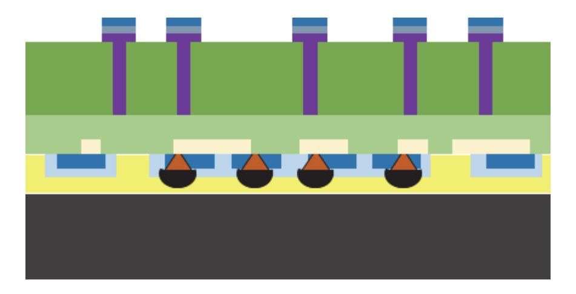

출처: 집필진 제작(2024) [그림 3-18] 솔더 범프 형성

#### 2. 임시 캐리어 웨이퍼를 제거하고 얇아진 웨이퍼를 테이프에 부착한다.

임시 캐리어 웨이퍼를 제거한 후, 얇아진 주 웨이퍼를 테이프에 부착하여 안정적으로 다룰 수 있도록 한다. 이 과정은 웨이퍼의 취약한 상태에서 안전한 작업을 보장한다.

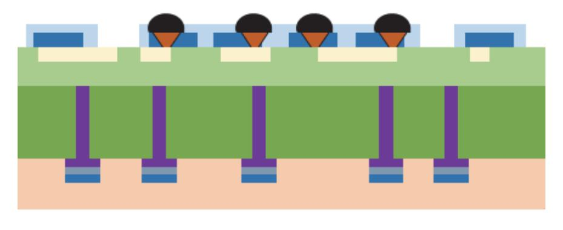

출처: 집필진 제작(2024)

3. 개별 칩을 절단하여 수직으로 적층한다.

웨이퍼에서 개별 칩을 절단한 후, 각 칩을 수직으로 쌓아 올려 3D 구조를 형성한다. 이 과

[그림 3-19] 캐리어 제거 후 반대편에 mount 테이프 부착

정에서는 TSV를 통해 칩 간의 전기적 연결이 이루어진다.

- (1) nD 패키지의 접합 방식
  - (가) 칩-칩 접합

칩-웨이퍼 접합 기술은 개별 칩을 웨이퍼에 직접 접합하는 방식이다. 이 방법은 여러 개의 칩을 단일 웨이퍼에 효율적으로 배치할 수 있어 생산성을 높이고 비용을 절감하는 데 유리하다. 특히, 2.5D 및 3D 패키징 기술에서 중요한 역할을 하며, TSMC와 인텔과 같은 기업들이 이 기술을 활용하여 고성능 반도체 패키지를 개발하고 있다. 예를 들어, TSMC의 CoWoS(Chip on Wafer on Substrate) 기술은 실리콘 인터 포저 위에 여러 칩을 배치하여 높은 집적도와 성능을 제공한다. 칩-웨이퍼 접합은 높은 밀도와 효율성을 제공하여 고속 데이터 전송과 열 관리 성능을 향상하는 데 기 여한다.

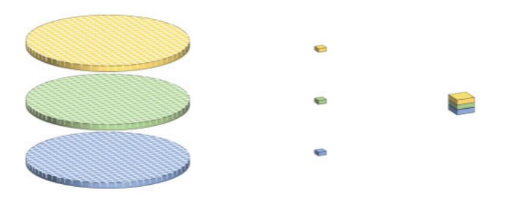

출처: 집필진 제작(2024) [그림 3-20] Chip to Chip 접합

(나) 칩-웨이퍼 접합

칩-웨이퍼 접합 기술은 개별 칩을 웨이퍼에 직접 접합하는 방식이다. 이 방법은 여 러 개의 칩을 단일 웨이퍼에 효율적으로 배치하여 생산성을 높이고 비용을 절감하는 데 유리하다. 칩-웨이퍼 접합은 특히 2.5D 및 3D 패키징 기술에서 중요한 역할을 하며, T사와 I사와 같은 기업들이 이 기술을 활용하여 고성능 반도체 패키지를 개발 하고 있다. 이 기술은 높은 밀도와 효율성을 제공하여 고속 데이터 전송과 열 관리 를 개선하는 데 기여한다.

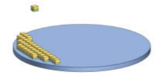

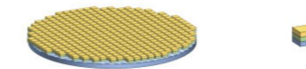

출처: 집필진 제작(2024) [그림 3-21] Chip to Wafer 접합

#### (다) 웨이퍼-웨이퍼 접합

웨이퍼-웨이퍼 접합 기술은 두 개의 웨이퍼를 서로 직접 접합하는 방식이다. 이 기 술은 주로 3D 패키징에 사용되며, 높은 집적도와 성능을 제공한다. 웨이퍼-웨이퍼 접합은 칩-웨이퍼 접합보다 더 높은 정밀도와 밀도를 가능하게 하며, 전기적 특성이 뛰어나고 열 관리가 용이하다. S전자와 T사는 이 기술을 통해 고성능 메모리와 프로 세서 통합을 구현하고 있다. 예를 들어, S전자의 3D NAND 플래시 메모리 기술은 웨이퍼-웨이퍼 접합을 통해 높은 데이터 저장 밀도와 빠른 접근 속도를 제공한다. 이 기술은 특히 AI와 데이터 센터 애플리케이션에서 중요한 역할을 한다.

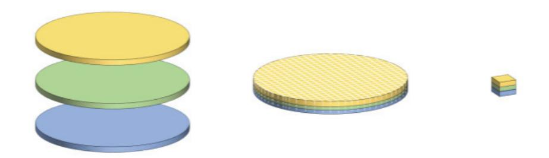

출처: 집필진 제작(2024) [그림 3-22] Wafet to Wafer 접합

#### 4. 패키지 조립을 통해 적층된 칩을 보호하고 통합한다.

적층된 칩을 보호하고 통합하기 위해 패키지를 조립한다. 이 단계에서는 칩과 패키지 간의 전기적 연결을 최적화하고, 기계적 강도를 제공하는 패키지 구조를 형성한다.

5. 오버몰드 처리를 통해 최종 패키지의 신뢰성을 강화한다.

패키지를 오버몰드(Overmold) 처리하여 외부 환경으로부터 칩을 보호하고 신뢰성을 강화 한다. 이 과정은 패키지의 물리적 보호와 전기적 안정성을 보장하는 데 중요하다.

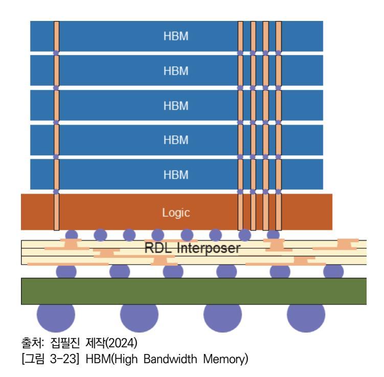

#### 수행 tip

- 히트 스프레더나 열 인터페이스 재료와 같은 열 관리 솔루 션을 통합하여 3D 구조에서 열 발산을 효과적으로 처리한 다.
- 열 사이클링 및 기계적 응력 테스트를 포함한 철저한 신뢰 성 테스트를 수행하여 최종 3D 패키지가 운영 응력을 견 뎌내고 시간이 지나도 성능을 유지할 수 있는지 확인한다.

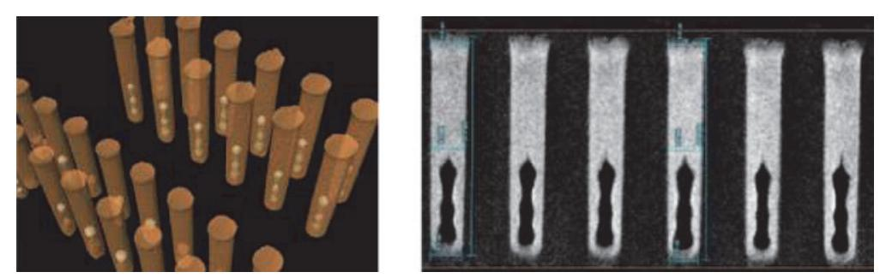

출처: 자비스(2020). 『ML-FOWLP 및 3D TSV 반도체 패키지 검사 공정용 200nm급 고해상도 X-ray 검 사 시스템 개발』. 산업통상자원부 한국산업기술평가관리원. p.2. [그림 3-24] TSV 내 보이드 결함에 대한 X-ray CT Image 및 Section Image

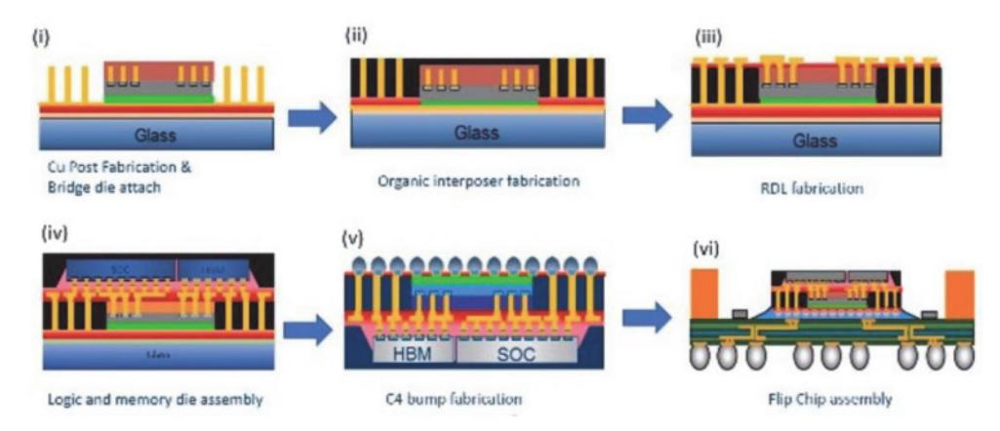

출처: IEEE(2023). HETEROGENEOUS INTEGRATION ROADMAP Chapter 23: Wafer-Level Packaging (WLP)(https://eps.ieee.org/images/files/HIR\_2021/ch23-wlpfinal2.pdf). p.19. [그림 3-25] SPIL's Fan-Out Embedded Bridge(FOEB)

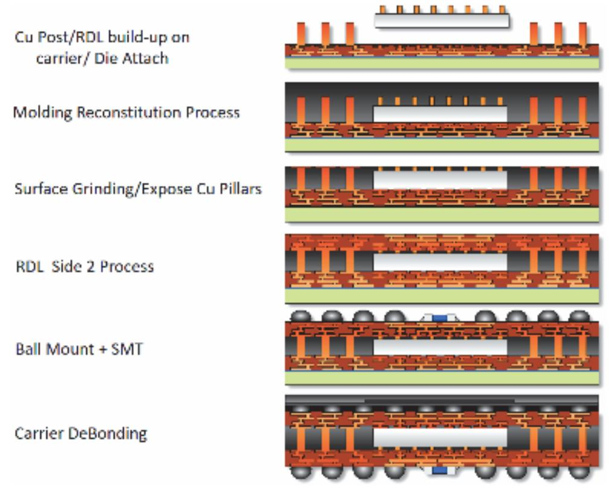

출처: IEEE(2023). HETEROGENEOUS INTEGRATION ROADMAP Chapter 23: Wafer-Level Packaging (WLP)(https://eps.ieee.org/images/files/HIR\_2021/ch23-wlpfinal2.pdf). p.15. [그림 3-26] 도금된 구리 Copper Through-Post가 있는 3D 팬 아웃 공정

### 학습 3 교수·학습 방법

#### 교수 방법

- 다양한 적층 기술을 활용한 패키징 개발 방법을 설명하고, 적용할 수 있는 기술을 제시한다.
- 와이어 본딩, 솔더 볼, 플립 칩 패키지 방식의 차이점과 응용 방법을 설명하고, 실제 개발 사례를 제시한다.
- 2차원 이상의 패키징 구조 개발을 위한 칩과 웨이퍼 접합 기술을 설명하고, 적용 방법을 지 도한다.
- 다층 접합 공정을 통한 2D, 2.5D, 3D 패키지 개발 과정을 설명하고, 공정 흐름을 확인하 도록 유도한다.

#### 학습 방법

- 다양한 적층 기술을 조사하고, 각 기술의 특징을 분석하여 정리한다.
- 와이어 본딩, 솔더 볼, 플립 칩 패키지 방식의 차이점과 적용 사례를 조사하고, 이를 분석하 여 학습한다.
- 칩과 웨이퍼의 접합 과정을 숙지하고, 이를 활용한 패키징 구조 개발을 실습한다.
- 다층 접합 공정을 적용한 2D, 2.5D, 3D 패키지 구조의 실습 결과를 점검하고, 학습 내용 을 공유한다.

## 학습 3 평 가

#### 평가 준거

- 평가자는 학습자가 학습 목표를 성공적으로 달성하였는지를 평가해야 한다.
- 평가자는 다음 사항을 평가해야 한다.

|             | 학습 목표                                                                        |  | 성취수준 |   |  |
|-------------|------------------------------------------------------------------------------|--|------|---|--|
| 학습 내용       |                                                                              |  | 중    | 하 |  |
| nD 레벨 공정 기술 | - 기본적인 패키징 레벨에서부터 다양한 적층 기술을 적용하여 개발할 수 있다.                               |  |      |   |  |
|             | - 와이어 본딩 패키지, 솔더 볼 패키지와 플립 칩 패키지를 포 함한 여러 종류의 패키지 방식들을 적용하여 개발할 수 있 다. |  |      |   |  |
|             | - 칩과 칩을 접합하고 칩과 웨이퍼를 접합하여 다양한 2차원 이상의 패키징 구조를 개발할 수 있다.                   |  |      |   |  |
|             | - 팹 공정에서 개발, 제조된 칩을 목적하는 용도에 맞게 다층 접합하여 2차원, 2.5차원, 3차원 패키지로 개발할 수 있다.    |  |      |   |  |

#### 평가 방법

• 서술형 시험

| 학습 내용       | 평가 항목                                                                   |  | 성취수준 |   |  |
|-------------|-------------------------------------------------------------------------|--|------|---|--|
|             |                                                                         |  | 중    | 하 |  |
| nD 레벨 공정 기술 | - 2D, 2.5D, 3D 패키징의 구조적 차이를 설명하고, 각각의 응용 분야를 설명할 수 있는 능력             |  |      |   |  |
|             | - TSV 기술의 공정 흐름과 이 기술이 3D 패키징 성능 향상 에 미치는 영향을 설명할 수 있는 능력            |  |      |   |  |
|             | - 칩-칩, 칩-웨이퍼, 웨이퍼-웨이퍼 접합 방식을 설명하고, 각 방식이 패키징 공정에 미치는 영향을 설명할 수 있는 능력 |  |      |   |  |
|             | - nD 패키징에서의 적층 기술을 설명하고, 고성능 패키지에서 적층 기술이 어떻게 사용되는지 설명할 수 있는 능력      |  |      |   |  |

• 논술형 시험

| 학습 내용       | 평가 항목                                                                      |  | 성취수준 |   |  |
|-------------|----------------------------------------------------------------------------|--|------|---|--|
|             |                                                                            |  | 중    | 하 |  |
| nD 레벨 공정 기술 | - 2D, 2.5D, 3D 패키징 기술의 발전이 반도체 성능과 비용 효율성에 미치는 영향을 분석할 수 있는 능력          |  |      |   |  |
|             | - TSV 기술을 활용한 3D 패키징에서 발생하는 열 관리 문제 와 그 해결 방안을 설명할 수 있는 능력              |  |      |   |  |
|             | - nD 패키징 공정에서 발생할 수 있는 신뢰성 문제(예: 접합 결함, 열팽창 등)와 이를 해결하는 방법을 설명할 수 있는 능력 |  |      |   |  |
|             | - nD 패키징 기술이 모바일 기기 및 웨어러블 디바이스의 소 형화와 성능 향상에 미치는 영향을 설명할 수 있는 능력       |  |      |   |  |

#### 피드백

1. 서술형 시험 - 구조적 차이점이 명확하지 않을 경우, 각 패키징 방식의 주요 기술적 요소를 세밀하게 설명하며 차이를 부각시켜 이해를 돕는다. 응용 분야에 대한 이해가 부족한 학습자에게는 다양한 패키징 방 식의 실제 응용 사례를 직접 조사하게 하여 구체적 예시를 통해 더욱 쉽게 접근할 수 있도록 유 도한다. 성취수준이 높은 학습자에게는 각 패키징 방식이 최신 기술에서 어떻게 활용되고 있는지 를 심화 설명하여 더 깊이 있는 이해를 가능하게 한다. - TSV 공정 흐름 설명이 부족할 경우, 공정 단계별 특징과 역할을 구체적으로 시각 자료와 함께 제시하여 이해를 높인다. 성취수준이 낮은 학습자에게는 TSV와 기존 패키징 기술을 비교하는 과 제를 통해 이 기술이 성능 향상에 어떻게 기여하는지 구체적으로 파악할 수 있게 한다. 성취수준 이 높은 학습자에게는 TSV 기술의 잠재적 발전 가능성과 반도체 산업에서의 향후 역할에 대해 심도 깊게 논의할 기회를 제공한다. - 접합 방식에 대한 설명이 미흡할 경우, 각 방식이 패키징 공정에 미치는 전기적, 열적 성능 영향 을 구체적으로 설명하여 학습자의 이해를 강화한다. 성취수준이 낮은 학습자에게는 접합 방식을 단계별로 정리한 표를 작성하게 하여 공정의 핵심 특징을 시각적으로 정리하도록 한다. 성취수준 이 높은 학습자에게는 접합 방식이 최신 패키징 기술의 혁신에 어떻게 기여할 수 있는지 논의하 게 하여 고차원적 이해를 유도한다. - 적층 기술 설명이 부족할 경우, 적층 구조에서 발생하는 열 관리 및 신호 전송 문제를 중심으로 기술적 원리와 해결책을 구체적으로 설명한다. 성취수준이 낮은 학습자에게는 적층 기술이 적용된 실제 제품 사례를 조사하게 하여 실용적 이해를 높인다. 성취수준이 높은 학습자에게는 고성능 반 도체 패키지에서 적층 기술이 미래 기술 발전에 어떤 역할을 할지에 대해 더 깊이 있는 분석과 토론을 진행하도록 유도한다. 2. 논술형 시험 - 성능과 비용 효율성 분석이 부족할 경우, 각 기술의 장단점을 세부적으로 비교하며 설명하고, 성 능 및 비용 효율성 간의 균형을 어떻게 맞출 수 있을지 구체적으로 논의하도록 한다. 성취수준이 낮은 학습자에게는 관련 기술의 비용 및 성능 자료를 제공하여 이를 바탕으로 표로 정리하고 분 석하게 하여 구조적인 사고를 촉진한다. 성취수준이 높은 학습자에게는 기술 발전이 반도체 성능

및 비용 절감에 어떻게 기여할지 심화 분석을 통해 더 높은 수준의 비판적 사고를 유도한다.

- 열 관리 문제 설명이 미흡할 경우, TSV 기반의 3D 패키징에서 발생하는 주요 열 문제를 상세히 설명하며, 기존 해결 방안의 효과와 한계를 구체적으로 논의한다. 성취수준이 낮은 학습자에게는 열 관리 문제 해결에 대한 사례 연구를 통해 직접 분석하고 이를 바탕으로 해결 방안을 도출하게 하여 실질적인 학습 경험을 제공한다. 성취수준이 높은 학습자에게는 미래 패키징 기술에서의 열 관리 개선 방안에 대해 심도 있게 논의하도록 유도한다.
- 신뢰성 문제 설명이 부족할 경우, nD 패키징에서 자주 발생하는 결함과 그 원인을 구체적으로 설 명하고, 이를 해결하는 다양한 기술적 방법을 제시한다. 성취수준이 낮은 학습자에게는 접합 결함 및 열 관리 문제와 관련된 실무 사례를 분석하게 하여 기술적 문제 해결 능력을 높인다. 성취수 준이 높은 학습자에게는 신뢰성 문제를 해결하기 위한 최신 연구 결과와 기술 트렌드를 탐구하게 하여 보다 고차원적인 해결 방안을 모색하게 한다.
- nD 패키징 기술이 모바일 기기 및 웨어러블 디바이스의 소형화와 성능 향상에 미치는 영향을 설 명하는 데 미흡할 경우, 해당 기술이 어떻게 칩 집적도를 높이고 전력 소비를 줄이는지 구체적으 로 설명해 준다. 성취수준이 낮은 학습자에게는 실제 모바일 기기와 웨어러블 디바이스에서 사용 되는 nD 패키징 사례를 조사하게 하여 기술적 이해를 쉽게 할 수 있도록 한다. 성취수준이 높은 학습자에게는 이러한 기술이 소형화뿐만 아니라 배터리 효율성, 데이터 처리 성능 등에 미치는 영 향을 심층적으로 분석하게 한다.

- 강해령(2024. 1. 27.). "삼성‧SK‧인텔이 지갑 열었다, 반도체 유리 기판 뭐길래? [강해령의 하이엔드 테크] 1편>". https://www.sedaily.com/NewsView/2D48VGUUCZ. 서울경제.
- 관계 부처 합동(2020. 10. 13). "인공지능(AI) 반도체 산업 발전 전략".
- 교육과학기술부(2010). 『플립 칩 패키징에서 모세관 언더필 유동의 측정 분석』.
- 김형준・이재학・송준엽(2013). 「반도체 패키지에서의 웨이퍼 레벨 몰딩 공정」. 『한국정밀공학회 학술발 표대회 논문집』. pp.509~510.
- 니시쿠보 야스히코(2023). 『반도체 구조원리 교과서』. 보누스.
- 박선명(2019). 「대구경 반도체 웨이퍼 레벨 패키지 몰딩 공정 해석」. 『한국정밀공학회 논문집』. 36(10). pp.809~817(ScienceOn).
- 박성호(2018). 「웨이퍼 레벨 패키지의 휨 특성에 관한 연구」. 『서울과학기술대학교 대학원 박사 학위 논문』.
- 산업통상자원부(2017). 『300mm 대응 대구경 다층구조의 복합 패키지 공정 및 장비 기술 개발.
- 산업통상자원부(2021). 『종합 반도체 강국 실현을 위한 「K-반도체 전략」 수립』.
- 삼성반도체(https://semiconductor.samsung.com/kr). 2024. 6. 10. 스크린샷.
- 서민석 저(2020). 『패키지와 테스트』. 한올. p.25.
- 서진욱(2024. 5. 16). "엔비디아발 훈풍에 SK하이닉스 '신고가'… 실적 발표까지 쭉?". 머니투데이.
- 세향산업(주)(2013). 『CVD(Chemical Vapor Deposition)용 샤워 헤드 제작을 위한 스파크 본딩 (Spark Bonding) 장비 개발』. 산업통상자원부 한국산업단지공단.
- 손윤철(2021). 「Fan-out wafer-level packaging(FOWLP) 기술 동향」. 『E²M 전기 전자와 첨단 소재』. 34(2). pp.4~11.
- 에스브이에스(2014). 『전자 융합 공정 기반 TSV 구리 박막 제조 장비용 핵심 모듈 개발」. 중소기업청 한국산업기술평가관리원.
- 에이피시스템(주)(2019). 『반도체의 TSV 제조용 스퍼터 개발』. 산업통상자원부 한국산업기술평가관리 원.
- 유진투자증권(2023). 『소부장 레시피 10』.
- 윤태식・김택수(2017). 「TSV 기반 3차원 소자의 열적-기계적 신뢰성」. 『J. Microelectron. Packag.

Soc.』. 24(1). 35-43.

- 이수진・고용호(2015). 『웨이퍼 레벨 패키징 기술』. 한국과학기술정보연구원(KISTI Repository).
- 이혁(2017). 『반도체 후공정 장비』. 북두출판사.
- 자비스(2020). 『ML-FOWLP 및 3D TSV 반도체 패키지 검사 공정용 200nm급 고해상도 X-ray 검사 시스템 개발』. 산업통상자원부 한국산업기술평가관리원.
- 전자부품연구원(2019). 『이종/다수 반도체 소자 내장형 통합 패키지 및 모듈 원기술 개발』. 산업통상자 원부 한국산업기술평가관리원.
- (주)정원기술(2014). 『레이저 솔더링을 이용한 플립 칩 패키징 시스템 개발 최종 보고서』. 미래창조과학 부.
- 중소기업기술정보진흥원(2024). 『중소기업 전략 기술 로드맵 2024~2026-반도체 장비』. 중소벤처기 업부.
- 중소기업청(2013). 『플립 칩 언더필(Flip Chip Underfill)의 개발』.
- 최리노(2022). 『최리노의 한 권으로 끝내는 반도체 이야기』. 양문.
- 특허청(2017). 『반도체 분야 특허 심사 가이드』. 발간 등록 번호 11-1430000-000674-01.
- 포항공과대학교(2018). 『실리콘 터포저와 칩을 내장한 3D IC SiP용으로 저전력 초고속 인터커넥트 회로 및 횡 설계에 관한 전반적인 연구』. 과학기술정보통신부 한국연구재단.
- 하나마이크론(2013). 『차세대 초박형 MCP 인쇄 회로 기판 모듈 및 SIP용 별도 PCB 모듈』. 산업통상자원 부 한국산업기술평가관리원.
- 한국생산기술연구원(2014). 『극저 열팽창 설계(CTE= 6ppm/℃) 독성 에폭시 몰딩 컴파운드 개발』. 미래창조과학부 한국생산기술연구원.
- 한국생산기술연구원(2020). 『20um급 미세 범프 플립 칩 패키지 원천 소재 및 공정 기술 개발』. 과학기술정보통신부 한국생산기술연구원.
- 한국전자기계융합기술원(2017). 『300mm 대응 대구경 다층 구조의 건설적 구성 및 장비 기술 개발』. 산업통상자원부 한국산업기술평가관리원.
- 한국전자기계융합기술원・한국생산기술연구원・에이에프오・네패스・에이씨엔(2020). 『반도체 공정용 요소부품 및 패키징 장비 실증』. 산업통상자원부.
- 효광(2018). 『WLCSP 기반 리드 프레임 리스 벤치 광원 엔진 생산 공정 및 장비 개발』. 산업통상자원부 한국산업기술평가관리원.
- samsung(2023). Samsung Advanced Packaging Helps Customers Bring Their Own Architecturefrom(https://semiconductor.samsung.com/emea/news-events/tech-blog/sa

msung-advanced-packaging-helps-customers-bring-their-own-architecture/).

- SK하이닉스(https://news.skhynix.co.kr/post/seominsuk-column-types-of-packages-1). 2024. 6. 10. 스크린샷.
- A. A. Bajwa, S. C. Jangam, S. Pal, and N. Marathe (2017). Heterogeneous Integration at Fine Pitch(≤10µm) Using Thermal Compression Bonding. IEEE 67th Electronic Components and Technology Conference, 1276-1284.
- Cedefop. (2022). Challenging digital myths. Retrieved from(https://3dfabric.tsmc.com/engl ish/dedicatedFoundry/technology/cowos.htm).
- F. Inoue, J. Derakhshandeh, M. Lofrano, and E. Beyne(2021). Fine-Pitch Bonding Technolog y with Surface-Planarized Solder Micro-Bump/Polymer Hybrid for 3D Integration. Japanese Journal of Applied Physics, 60(2), 026502.
- Garrou, P., & Tummala, R. (2008). Handbook of 3D Integration: Volume 1. Wiley-VCH.
- IEEE(2023). HETEROGENEOUS INTEGRATION ROADMAP 22: Interconnects for 2D and 3D Architectures(WLP). https://eps.ieee.org/images/files/HIR\_2021/ch23-wlpfinal2.pdf.
- IEEE(2023). HETEROGENEOUS INTEGRATION ROADMAP Chapter 23: Wafer-Level Packagi ng(WLP). https://eps.ieee.org/images/files/HIR\_2021/ch23-wlpfinal2.pdf.
- Intel (2019). Advanced Packaging for Heterogeneous Integration(http://pwrsocevents.com /wp-content/uploads/2019-presentations/session\_2\_0\_keynote\_speaker\_pwrpack2019\_ advanced\_architectures\_for\_hi\_intel\_mahajan.pdf)
- Intel (2021). Advanced Packaging Architectures for heterogeneous Integration(http://pwrs ocevents.com/wp-content/uploads/2021/11/0.2-Ravi-Mahajan-Advanced-Packaging-A rchitectures-for-Heterogeneous-Integration.pdf)
- ipc2u.com (2021). The road to Industry 4.0 or the nano flash storage standard. Retrived from(https://ipc2u.com/articles/knowledge-base/the-road-to-industry-4-0-or-the-nan o-flash-storage-standard-innodisk-s-nanossd/).
- J. Li, Y. Zhang, H. Zhang, and Z. Chen. (2020). The Thermal Cycling Reliability of Copper Pillar Solder Bump in Flip Chip via Thermal Compression Bonding. Microelectronics Reliability. 104. 113543.
- John H. Lau. (2021). State-of-the-Art and Outlooks of Chiplets Heterogeneous Integration and Hybrid Bonding. Journal of Microelectronics and Electronic Packaging(2021) 18. pp.14 5~160.

- John H. Lau. (2023). State-of-the-Art in Chiplets Horizontal Communications. Journal of Microelectronics and Electronic Packaging(2023) 20, pp.43~64.
- Kim, S. W., et al. (2020). Development of Warpage Control in Wafer-Level Packaging. Journal of Microelectronics. 29(5). pp.200-207.
- Liu, J., & Zhang, Y. (2016). Advanced Flip Chip Packaging. Springer.
- P. Bex, T. Wang, M. Lofrano, and V. Cherman. (2017). Thermal Compression Bonding: Understanding Heat Transfer by In Situ Measurements and Modeling. IEEE 67th Electronic Components and Technology Conference, 392-398.
- P. H. Tsao, S. Hsu, Y. L. Kuo, and J. H. Chen. (2016). Cu Bump Flip Chip Package Reliability on 28nm Technology. IEEE 66th Electronic Components and Technology Conference(ECT C). pp.1148-1153.
- Rao, R., et al. (2017). 3D IC and TSV Integration. In E. Harper(Ed.), Advances in Electronic Packaging. Wiley. pp.89~107.
- S. Massa, D. Shahin, I. Wathuthanthri, and A. Drechsler (2019). Process Development for Flip Chip Bonding with Different Bump Compositions. International Wafer Level Packagi ng Conference(IWLPC). pp.1~6.
- Shangguan, D. (2015). Flip Chip Technologies. In Y. Nishi(Ed.). Handbook of Semiconductor Manufacturing Technology(pp. 379-412). CRC Press.
- Shannon Davis.(2022. 7. 22). Apple's M1 Ultra Does Use InFO\_LSI–or is it CoWoS-L?. Semiconductor Digest.
- Techsearch(2020). After 30 Years Why Are We Still Talking about Known Good Die?(https:// events.meptec.org/wp-content/uploads/kgd2020/KGD2020s3p1Vardaman.pdf)
- TSMC(https://3dfabric.tsmc.com/english/dedicatedFoundry/technology/InFO.htm)에서 2 024. 07. 01. 스크린샷.
- Tummala, R. (2008). Fundamentals of Microsystems Packaging. McGraw-Hill.
- Tummala, R., & Swaminathan, M. (2002). Introduction to System-on-Package(SOP). IEEE Press.
- W. Bo, S. Zhang, F. Wang, and Z. Chen(2018). Micro Copper Pillar Interconnection Using Thermosonic Flip Chip Bonding. Journal of Electronic Packaging, 140(4), 044502.
- Xu, X., & Lee, Y.(2017). Wafer-level Packaging: Materials, Processing, and Reliability. McGraw-Hill.

- YOLE(2020). Advanced Packaging Current Trends & Challenges(https://www.semiconduct ors.org/wp-content/uploads/2020/09/Santosh-Kumar\_Yole\_Advanced-Packaging-Curr ent-Trends-and-Challenges.pdf).
- YOLE(2021). Status of the Advanced Packaging Industry 2021(https://medias.yolegroup.co m/uploads/2021/09/YINTR21223-Status-of-the-Advanced-Packaging-Industry-2021.pd f).
- YOLE(2022). Advanced Packaging Quarterly Market Monitor Q1 2022(https://medias.yolegr oup.com/uploads/2021/12/Advanced-Packaging-Quarterly-Market-Monitor-Q1-2022- Product-brochure-.pdf).
- YOLE(2023). Status of the Semiconductor Industry(https://medias.yolegroup.com/uploads /2023/06/yint-wsts-presentation-vienna-2023-final.pdf).
- YOLE(2023). Technology & Market Trends for Advanced Packaging(https://medias.yolegro up.com/uploads/2023/04/advanced-packaging\_ssi\_2023\_yole\_sch\_updated-1.pdf).
- Zhou, L., & Wong, C. (2010). Ultra-low CTE Epoxy Molding Compounds. IEEE Transactions on Components and Packaging Technologies, 33(3), pp.451~459.

Hu, J. (2022). Advanced Packaging Technologies for Semiconductor Devices. IEEE Press.

| NCS학습모듈 개발이력 |                                     |     |                  |
|--------------|-------------------------------------|-----|------------------|
| 발행일          | 2024년 12월 31일                       |     |                  |
| 세분류명         | 반도체 개발((19030601)                   |     |                  |
| 개발기관         | 수원과학대학교 산학협력단(개발책임자: 윤창용) 한국직업능력연구원 |     |                  |
|              | 최준혁(수원대학교)*                         |     | 김종범(삼성전기)        |
|              | 계찬호(수원대학교)                          |     | 김한수(두원공과대학교)     |
|              | 김경호(폴리텍대학교)                         |     | 남승호(경기대학교)       |
|              | 김관하(폴리텍대학교)                         |     | 손승대(제이에스이엔씨(주))  |
| 집필진          | 김기순((주)영우디에스피)                      | 검토진 | 안광호(퓨쳐일렉트로닉스)    |
|              | 김도균(폴리텍대학교)                         |     | 이철오((주)한국전력안전공단) |
|              | 전동민(폴리텍대학교)                         |     |                  |

\*표시는 대표집필자임 (참고) 검토진으로 참여한 집필진은 본인의 원고가 아닌 타인의 학습모듈을 검토함

| 웨이퍼 레벨 패키지 개발(LM1903060123_23v4)                                                                         |                   |  |
|----------------------------------------------------------------------------------------------------------|-------------------|--|
| 저작권자                                                                                                     | 교육부               |  |
| 연구기관                                                                                                     | 한국직업능력연구원         |  |
| 발행일                                                                                                      | 2024. 12. 31.     |  |
| ISBN                                                                                                     | 979-11-7175-757-2 |  |
| ※ 이 학습모듈은 자격기본법 시행령(제8조 국가직무능력표준의 활용)에 의거하여 개발하였으며, NCS통합포털사이트(http://www.ncs.go.kr)에서 다운로드 할 수 있습니다. |                   |  |

