# NCS학습모듈 어드밴스드 팬아웃 패키지 개발

LM1903060124\_23v4

#### [NCS학습모듈 활용 시 유의 사항]

- 1. NCS학습모듈은 교육훈련기관에서 출처를 명시하고 교육적 목적으로 활용할 수 있습니다. 다 만, NCS학습모듈에는 국가(교육부)가 저작재산권 일체를 보유하지 않은 저작물(출처가 표기된 도표‧사진‧삽화‧도면 등)이 포함되어 있으므로, 이러한 저작물의 변형‧각색‧복제‧공연‧ 배포 및 공중 송신 등과 이러한 저작물을 활용한 2차적 저작물을 작성하려면 반드시 원작자 의 동의를 받아야 합니다.
- 2. NCS학습모듈은 개발 당시의 산업 및 교육 현장을 반영하여 집필하였으므로, 현재 적용되는 법령‧지침‧표준 및 교과 내용 등과 차이가 있을 수 있습니다. NCS학습모듈 활용 시 법령 ‧지침‧표준 및 교과 내용의 개정 사항과 통계의 최신성 등을 확인하시기를 바랍니다.
- 3. NCS학습모듈은 산업 현장에서 요구되는 능력을 교육훈련기관에서 학습할 수 있게 구성한 자 료입니다. 다만, NCS학습모듈 지면의 한계상 대표적 예시(예: 활용도 또는 범용성이 높은 제 품, 서비스) 중심으로 집필하였음을 이해하시기를 바랍니다.

## NCS학습모듈의 이해

※ 본 NCS학습모듈은 「NCS 국가직무능력표준」사이트(http://www.ncs.go.kr) 에서 확인 및 다운로드할 수 있습니다.

## Ⅰ NCS학습모듈이란?

- 국가직무능력표준(NCS: National Competency Standards)이란 산업현장에서 직무를 수행하기 위해 요구되는 지식·기술·소양 등의 내용을 국가가 산업부문별·수준별로 체계 화한 것으로 산업현장의 직무를 성공적으로 수행하기 위해 필요한 능력(지식, 기술, 태도) 을 국가적 차원에서 표준화한 것을 의미합니다.
- 국가직무능력표준(이하 NCS)이 현장의 '직무 요구서'라고 한다면, NCS학습모듈은 NCS
  의 능력단위를 교육훈련에서 학습할 수 있도록 구성한 '교수·학습 자료'입니다. NCS학습
  모듈은 구체적 직무를 학습할 수 있도록 이론 및 실습과 관련된 내용을 상세하게 제시하
  고 있습니다.

#### ○ NCS학습모듈은 다음과 같은 특징을 가지고 있습니다.

- 첫째, NCS학습모듈은 산업계에서 요구하는 직무능력을 교육훈련 현장에 활용할 수 있도 록 성취목표와 학습의 방향을 명확히 제시하는 가이드라인의 역할을 합니다.
- 둘째, NCS학습모듈은 특성화고, 마이스터고, 전문대학, 4년제 대학교의 교육기관 및 훈 련기관, 직장교육기관 등에서 표준교재로 활용할 수 있으며 교육과정 개편 시에도 유용하게 참고할 수 있습니다.

○ NCS와 NCS학습모듈 간의 연결 체계를 살펴보면 아래 그림과 같습니다.

O NCS학습모듈의 위치는 NCS 분류 체계에서 해당 학습모듈이 어디에 위치하는지를 한 눈에 볼 수 있도록 그림으로 제시한 것입니다.

| [NCS-학          | 습모듈         | 의 위치]    |          |  |
|-----------------|-------------|----------|----------|--|
|                 |             |          |          |  |
| 대분류             | 문화·예술       | ··디자인·방송 |          |  |
| 중분류             | 문화콘텐츠       |          |          |  |
| 소분류             | 소분류 문화콘텐츠제작 |          |          |  |
|                 |             |          |          |  |
| 세분류             |             |          |          |  |
| 방송콘텐츠제작         |             | 능력단위     | 학습모듈명    |  |
| 영화콘텐츠제작         |             | 프로그램 기획  | 프로그램 기획  |  |
| 음악콘텐츠제작         |             | 아이템 선정   | 아이템 선정   |  |
| 광고콘텐츠제작         |             | 자료 조사    | 자료 조사    |  |
| 게임콘텐츠제작         |             | 프로그램 구성  | 프로그램 구성  |  |
| 애니메이션 콘텐츠제작  |             | 캐스팅      | 캐스팅      |  |
| 만화콘텐츠제작         |             | 제작계획     | 제작계획     |  |
| 캐릭터제작           |             | 방송 미술 준비 | 방송 미술 준비 |  |
| 스마트문화앱 콘텐츠제작 |             | 방송 리허설   | 방송 리허설   |  |
| 영사              |             | 야외촬영     | 야외촬영     |  |
|                 |             | 스튜디오 제작  | 스튜디오 제작  |  |
|                 |             |          |          |  |

학습모듈은

NCS 능력단위 1개당 1개의 학습모듈 개발 을 원칙으로 합니다. 그러나 필요에 따라 고용단위 및 교과단위를 고려하여 능력단위 몇 개를 묶어 1개 학습모듈로 개발할 수 있으며, NCS 능력단위 1개를 여러 개의 학습모듈로 나누어 개발할 수도 있습니다.

### 2. NCS학습모듈의 개요

#### ○ NCS학습모듈의 개요는 학습모듈이 포함하고 있는 내용을 개략적으로 설명한 것으로

| 학습모듈의 목표, 선수학습, 학습모듈의 내용 체계, 핵심 용어 로 구성되어 있습니다. |                                                                              |  |
|-------------------------------------------------|------------------------------------------------------------------------------|--|
| 학습모듈의 목표                                        | 해당 NCS 능력단위의 정의를 토대로 학습 목표를 작성한 것입니다.                                        |  |
| 선수학습                                            | 해당 학습모듈에 대한 효과적인 교수·학습을 위하여 사전에 이수해야 하는 학습모 듈, 학습 내용, 관련 교과목 등을 기술한 것입니다. |  |
| 학습모듈의 내용 체계                                  | 해당 NCS 능력단위요소가 학습모듈에서 구조화된 체계를 제시한 것입니다.                                     |  |
| 핵심 용어                                           | 해당 학습모듈의 학습 내용, 수행 내용, 설비·기자재 등 가운데 핵심적인 용어를 제 시한 것입니다.                   |  |

### 제작계획 학습모듈의 개요

#### 학습모듈의 목표

본격적인 촬영을 준비하는 단계로서, 촬영 대본을 획정하고 제작 스태프를 조직하며 촬영 장비와 촬영 소품을 준비할 수 있다.

#### 선수학습

제작 준비(LM0803020105\_13v1), 섭외 및 제작스태프 구성(LM0803020104\_13v1), 촬영 제작(LM0803020106\_13v1), 촬영 장비 준비(LM0803040204\_13v1.4), 미술 디자인 협의하기(LM0803040203\_13v1.4)

#### 학습모듈의 내용체계

| 하스                | 하스 내용                                              | NCS 능력단위 요소       |                |
|-------------------|----------------------------------------------------|-------------------|----------------|
| 학습                | 학습 내용                                              | 코드번호              | 요소 명칭          |
| 1. 촬영 대본 확정하기  | 1-1. 촬영 구성안 검 토와 수정                             | 0803020114_16/3.1 | 촬영 대본 확정하기  |
| 2. 제작 스태프 조직하기 | 2-1. 기술 스태프 조직 2-2. 미술 스태프 조직 2-3. 전문 스태프 조직 | 0803020114_16v3.2 | 제작 스태프 조직하기 |
| 3. 촬영 장비 계획하기  | 3-1. 촬영 장비 점검 과 준비                              | 0803020114_16/3.3 | 촬영 장비 계획하기  |
| 4. 촬영 소품 계획하기  | 4-1. 촬영 소품 목록 작성 4-2. 촬영 소품 제작 의뢰         | 0803020114_16\3.4 | 촬영 소품 계획하기  |

#### 핵심 용어

촬영 구성안, 제작 스태프, 촬영 장비, 촬영 소품

#### 학습모듈의 목표는

학습자가 해당 학습모듈을 통해 성취해야 할 목표를 제시한 것으로, 교수자는 학습자 가 학습모듈의 전체적인 내용흐름을 파악하 도록 지도할 수 있습니다.

**6** • •

61

#### 선수학습은

교수자 또는 학습자가 해당 학습모듈을 교 수·학습하기 이전에 이수해야 하는 교과목 또는 학습모듈(NCS 능력단위) 등을 표기한 것입니다. 따라서 교수자는 학습자가 개별 학습, 자기 주도 학습, 방과 후 활동 등 다 양한 방법을 통해 이수할 수 있도록 지도하 는 것을 권장합니다.

|            | 핵심 용어는              |
|------------|---------------------|
|            | 률을 대표하는 주요 용어입니     |
|            | · 해당 학습모듈을 통해 학습    |
|            | 게될 주요 내용을 알 수 있습    |
|            | 5 국가직무능력표준」 사이트     |
| (www.ncs.g | jo.kr)의 색인 (찾아보기) 중 |
| 하나로 이용할    | 할 수 있습니다            |

#### 3. NCS학습모듈의 내용 체계

○ NCS학습모듈의 내용은 크게 학습, 학습 내용, 교수·학습 방법, 평가 로 구성되어 있습니다.

| 학습       | 해당 NCS 능력단위요소 명칭을 사용하여 제시한 것입니다. 학습은 크게 학습 내용, 교수·학습 방법, 평가로 구성되며 해당 NCS 능력단위의 능력단위 요소별 지식, 기술, 태도 등을 토대로 내용을 제시한 것입니다.                                                    |  |
|----------|----------------------------------------------------------------------------------------------------------------------------------------------------------------------------------|--|
| 학습 내용    | 학습 내용은 학습 목표, 필요 지식, 수행 내용으로 구성되며, 수행 내용은 재료·자 료, 기기(장비·공구), 안전·유의 사항, 수행 순서, 수행 tip으로 구성한 것입니다. 학습모듈의 학습 내용은 실제 산업현장에서 이루어지는 업무활동을 표준화된 프로세 스에 기반하여 다양한 방식으로 반영한 것입니다. |  |
| 교수·학습 방법 | 학습 목표를 성취하기 위한 교수자와 학습자 간, 학습자와 학습자 간 상호 작용이 활발하게 일어날 수 있도록 교수자의 활동 및 교수 전략, 학습자의 활동을 제시한 것입니다.                                                                            |  |
| 평가       | 평가는 해당 학습모듈의 학습 정도를 확인할 수 있는 평가 준거 및 평가 방법, 평 가 결과의 피드백 방법을 제시한 것입니다.                                                                                                         |  |

## [NCS-학습모듈의 위치]

| 대분류 | 전기 · 전자 |          |
|-----|---------------|----------|
| 중분류 |               | 전자 기기 개발 |
| 소분류 |               | 반도체 개발   |

| 세분류    |                  |                  |
|--------|------------------|------------------|
| 반도체 개발 | 능력단위             | 학습모듈명            |
| 반도체 제조 | 반도체 제품 기획        | 반도체 제품 기획        |
| 반도체 장비 | 반도체 아키텍처 설계      | 반도체 아키텍처 설계      |
| 반도체 재료 | 디지털 회로 설계        | 디지털 회로 설계        |
|        | 패키지 조립 공정 개발     | 패키지 조립 공정 개발     |
|        | 반도체 제품 기능·성능 검증  | 반도체 제품 기능·성능 검증  |
|        | 자동 배치 배선 레이아웃 설계 | 자동 배치 배선 레이아웃 설계 |
|        | 반도체 설계 검증        | 반도체 설계 검증        |
|        | 반도체 펌웨어 개발       | 반도체 펌웨어 개발       |
|        | 메모리 반도체 제조 공정 개발 | 메모리 반도체 제조 공정 개발 |
|        | 시스템 반도체 제조 공정 개발 | 시스템 반도체 제조 공정 개발 |
|        | 반도체 제조 단위 공정 개발  | 반도체 제조 단위 공정 개발  |
|        | 아날로그 회로 아키텍처 설계  | 아날로그 회로 아키텍처 설계  |
|        | 아날로그 회로 소자 레벨 설계 | 아날로그 회로 소자 레벨 설계 |
|        | 아날로그 회로 시스템 설계   | 아날로그 회로 시스템 설계   |

| 와이어 본딩 패키지 개발     | 와이어 본딩 패키지 개발     |  |
|-------------------|-------------------|--|
| 플립 칩 패키지 개발       | 플립 칩 패키지 개발       |  |
| 웨이퍼 레벨 패키지 개발     | 웨이퍼 레벨 패키지 개발     |  |
| 어드밴스드 팬 아웃 패키지 개발 | 어드밴스드 팬 아웃 패키지 개발 |  |
| 이종 접합 패키지 개발      | 이종 접합 패키지 개발      |  |
| 어드밴스드 언더필 패키지 개발  | 어드밴스드 언더필 패키지 개발  |  |
| 반도체 환경 시험         | 반도체 환경 시험         |  |
| 반도체 수명 시험         | 반도체 수명 시험         |  |
| 반도체 내성 시험         | 반도체 내성 시험         |  |
| 커스텀 레이아웃 적용 공정 분석 | 커스텀 레이아웃 적용 공정 분석 |  |
| 커스텀 레이아웃 설계       | 커스텀 레이아웃 설계       |  |
| 커스텀 레이아웃 검증       | 커스텀 레이아웃 검증       |  |

| 학습모듈의 개요                            | 1  |
|-------------------------------------|----|
| 학습 1. 칩 우선(chip first) 팬 아웃 공정 진행하기 |    |
| 1-1. 칩 우선(chip first) 팬 아웃 공정 기술    | 3  |
| • 교수 ․ 학습 방법                        | 30 |
| • 평가                                | 31 |
| 학습 2. 칩 나중(chip last) 팬 아웃 공정 진행하기  |    |
| 2-1. 칩 나중(chip last) 팬 아웃 공정 기술     | 34 |
| • 교수 ․ 학습 방법                        | 53 |
| • 평가                                | 54 |
| 학습 3. 초고밀도 팬 아웃 공정 진행하기             |    |
| 3-1. 초고밀도 팬 아웃 공정 기술                | 56 |
| • 교수 ․ 학습 방법                        | 73 |
| • 평가                                | 74 |
| 참고 자료                               | 76 |

## 어드밴스드 팬 아웃 패키지 개발 학습모듈의 개요

#### 학습모듈의 목표

웨이퍼 레벨 패키지 기술에서 시작하여 고밀도, 고집적, 고기능의 새로운 웨이퍼 레벨 패키징 기술을 개발할 수 있다.

#### 선수학습

플립 칩 패키지 개발(LM1903060122\_23v4), 웨이퍼 레벨 패키지 개발(LM1903060123\_23v4), 패키지 조립 공정 개발(LM1903060108\_23v4)

#### 학습모듈의 내용체계

| 카스                                      | 하는 미요                                | NCS 능력단위 요소       |                                  |
|-----------------------------------------|--------------------------------------|-------------------|----------------------------------|
| 학습                                   | 학습 내용                                | 코드번호              | 요소 명칭                            |
| 1. 칩 우선(chip first) 팬 아웃 공정 진행하 기 | 1-1. 칩 우선(chip first) 팬 아웃 공 정 기술 | 1903060124_23v4.1 | 칩 우선(chip first) 팬 아웃 공정 진행하기 |
| 2. 칩 나중(chip last) 팬 아웃 공정 진행하 기  | 2-1. 칩 나중(chip last) 팬 아웃 공 정 기술  | 1903060124_23v4.2 | 칩 나중(chip last) 팬 아웃 공정 진행하기  |
| 3. 초고밀도 팬 아웃 공 정 진행하기                | 3-1. 초고밀도 팬 아웃 공정 기술                 | 1903060124_23v4.3 | 초고밀도 팬 아웃 공정 진행하기             |

#### 핵심 용어

웨이퍼 레벨(wafer level), 웨이퍼 레벨 패키지, 칩 재배열, 웨이퍼 레벨 몰딩, 재배선, RDL(redistribution of layer), 범프, 입출력(input/output, IO) 단자, 패키지 적층

| 학습 1 | 칩 우선(chip first) 팬 아웃 공정 진행하기 |  |
|------|-------------------------------|--|
| 학습 2 | 칩 나중(chip last) 팬 아웃 공정 진행하기  |  |
| 학습 3 | 초고밀도 팬 아웃 공정 진행하기             |  |

## 1-1. 칩 우선(chip first) 팬 아웃 공정 기술

| 학습 목표 | • 표준적인 웨이퍼 레벨 패키징 공정 기술을 이용하여 개발할 수 있다. • 패키지의 성능을 확장하는 다양한 공정 기술을 적용하여 개발할 수 있다. • 솔더 볼, 솔더 범프와 접합 기술을 적용하여 개발할 수 있다. • 칩을 다이 접착한 후 공정으로 사용하는 기판을 이용하여 적층하는 방법을 적용하여 공정할 수 있다. |
|-------|---------------------------------------------------------------------------------------------------------------------------------------------------------------------------------------------|
|-------|---------------------------------------------------------------------------------------------------------------------------------------------------------------------------------------------|

## 필요 지식 /

- 숔 팬 아웃 공정 기술
  - 1. 팬 아웃 패키징 기술의 개요 및 필요성
    - (1) 팬 아웃 패키징 기술 개요

스마트폰과 같은 모바일 디바이스에서 더 빠르고 얇고 작은 반도체의 필요성에 의해서 웨이퍼 레벨 패키징 기술이 도입되었다. 팬 아웃 패키징 기술은 반도체의 회로 선폭이 지속적으로 줄어들면서 칩의 크기가 작아지고 있고, 성능 향상을 위해서는 입출력(input/output, IO) 단자의 수가 늘어나야 하는 필요성에 의해서 도입된 기술이다.

(2) 웨이퍼 레벨 패키지(WLP)의 장점

웨이퍼 레벨 패키지(WLP)는 웨이퍼 상태에서 칩의 패키징을 완료한 후 칩을 분리하여 사용하는 방식으로 PCB를 사용하지 않으므로 반도체의 성능을 향상하고 전력 소모가 적으며, 반도체의 두께를 줄일 수 있는 장점이 있어 WLP를 적용한 반도체를 사용하는 스마트폰과 모바일 기기의 성능 향상, 두께 감소, 배터리 사용 시간 증가에 기여하고 있 다.

(3) WLP 방식의 한계와 팬 아웃 패키징 기술 도입

반도체의 선폭 미세화가 진행되어 칩의 크기가 지속해서 작아지면서 칩 크기와 패키지 크기가 동일한 WLP 방식으로는 칩 위에 만들 수 있는 I/O 수가 제한되어 있어서 필요

한 I/O를 패키지에 확보하기가 어렵게 되었다. 반도체의 성능을 올리기 위해 필요한 입 출력 단자를 만들 면적을 확보하기 위해 칩의 주위에 몰딩 재료를 이용해서 면적을 확 장하는 팬 아웃 패키징 기술(FOWLP)이 도입되었다.

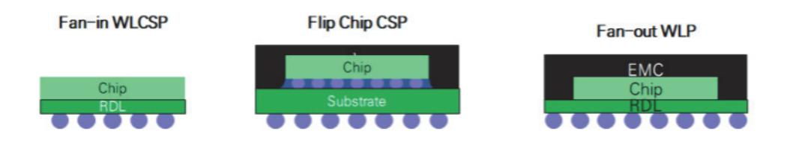

출처: 집필진 제작(2024) [그림 1-1] fan-In WLCSP, 플립 칩, fan out WLP 비교

#### (4) 팬 아웃 패키징 기술의 중요성

일반적으로 반도체 선폭이 20nm 이하로 줄어들기 시작하면서 WLP에서 팬 아웃 패키 징 방식이 중요해지기 시작했다. 모바일 기기에서 사용되는 반도체의 고성능화로 입출력 (I/O) 단자 수가 증가하고 있어서 팬 아웃 패키징 방식은 칩 면적이 작은 한계를 극복 할 수 있는 기술로 우수한 반도체 성능 구현이 가능해서 적용되는 반도체 제품이 증가 하고 있다.

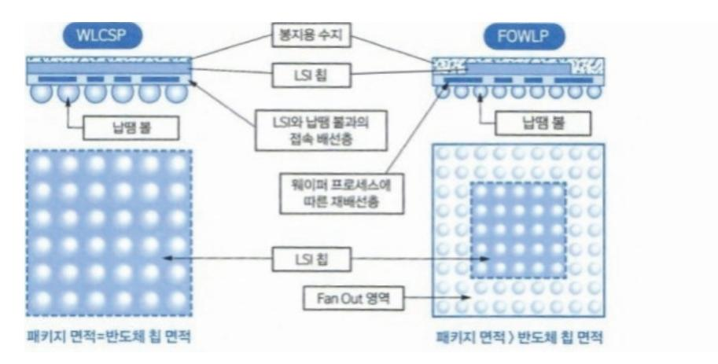

출처: 니시쿠보 야스히코 저(2023). 『반도체 구조원리 교과서』. 보누스. p.229. [그림 1-2] WLCSP(Fan-in WLP), FOWLP(Fan-out WLP) 비교

#### 2. 팬 아웃 패키징 기술의 구조 및 장점

(1) 팬 아웃 패키징 기술의 구조와 장점

팬 아웃 패키징 기술은 PCB를 사용하지 않고 칩 위에 재배선을 하여 칩과 칩 바깥 부 분의 입출력 단자를 연결시키는 방식이어서 반도체가 얇아지고 신호전달 경로가 짧아져 서 성능이 좋아지고, 열의 전달 경로가 짧아서 방열 특성이 향상된다.

(가) 다층 재배선 및 솔더 범프

다층으로 재배선을 하는 것이 가능하여 다층의 PCB를 대체할 수 있어서 연결선이 최적화되는 장점이 있다. 칩의 크기를 줄이면서 솔더 범프의 간격을 줄일 수 있어서 입출력 단자의 밀도를 높일 수 있다. 선폭/간격(Line/Space)을 10μm 이하로 할 수 있고 재배선층을 2층 이상으로 할 수 있어서 같은 면적에서 더 우수한 성능을 만들어 낼 수 있다.

(2) 몰딩 재료와 입출력 단자 확장

칩 주위를 몰딩재료로 확장하고 칩과 몰딩재료 전체 표면위에 재배선을 한 후 재배선한 단자에 솔더를 형성하여 칩의 입출력 단자의 수를 늘리는 방식이다. 팬 아웃 패키징 기 술은 최근에 스마트폰과 같은 모바일 기기에서 빠른 연산속도와 적은 전력소모, 얇은 두 께로 제작할 필요가 있는 어플리케이션 프로세서(AP)을 비롯한 다양한 반도체의 패키징 방식과, DRAM을 위에 AP를 아래에 적층한 형태인 PoP(Package on Package)로 제 작되어 사용되고 있다.

(3) 팬 아웃 패키징 기술의 장점

팬 아웃 패키징 기술은 PCB를 사용하지 않으므로 패키징에 필요한 부품의 공급망 간소 화, 소형화, 박형화가 가능하고, 전기적 성능과 열 성능이 우수하며, 서로 다른 반도체를 결합하는 이종 결합이 쉬운 방식이어서 적용되는 분야가 지속해서 증가하고 있다. 최근 에는 칩에 시스템을 구현하는 SoC(system on chip)에서 특정 기능을 하는 칩을 연결 하여 시스템을 구현하는 칩렛(chiplet) 개념이 부각하면서 팬 아웃 패키징 기술의 적용 범위가 늘어나고 있다.

#### 3. 팬 아웃 패키징 기술의 적용 및 발전

(1) 팬 아웃 패키징 기술의 적용과 발전

팬 아웃 패키징 기술은 반도체의 크기를 얇고 작게 하면서 전기적 성능을 높이고, 제조 비용을 절감하는 것이 가능한 기술이어서 다양한 반도체에 적용되고 있다.

(가) 2D 팬 아웃 패키징 기술

2D 팬 아웃 웨이퍼 레벨 패키지는 단일 FOWLP의 발전된 형태로, 여러 개의 칩을 포함하는 멀티칩 패키징이 가능해져 더 높은 집적도와 성능이 필요한 제품에 사용된 다. 이 기술은 다이를 평면적으로 배열하고 팬 아웃 RDL을 통해 I/O 단자를 재배치 하여 전기적 성능과 집적도를 극대화한다. 칩을 평면적으로 배열하여 재배선층(RDL) 을 통해 입출력 단자를 재배치하는 방식으로 제작한다.

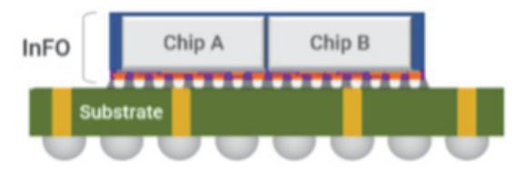

출처: TSMC(https://3dfabric.tsmc.com/english/dedicatedFoundry/technology/I nFO.htm). 2024. 7. 1. 스크린샷. [그림 1-3] 여러 개의 칩을 포함하는 FOWLP

#### (2) 팬 아웃 패키징의 확장성

팬 아웃 패키징 기술은 칩 주위를 몰딩 재료로 감싸서 칩 크기보다 패키지 면적을 크게 해서 칩 밖까지 Ball을 배치할 면적을 확장하는 방식으로 칩과 몰딩 재료 전면에 재배 선(RDL)을 한 후 솔더를 형성하는 방식으로 I/O 수를 늘리는 기술이다. 패키지 크기를 다이 크기보다 크게 할 수 있어서 WLP가 가지고 있는 한계를 극복할 수 있다.

#### (3) 패키지 적층 형태(PoP)와 성능 향상

스마트폰의 성능을 향상하기 위해 AP와 DRAM이 신호를 주고받는 거리를 최소화할 수 있도록 패키지 적층 형태인 패키지 온 패키지(PoP)로 제작하였다. AP를 아래에 두고 DRAM을 위에 적층하여 서로 신호를 주고받는 경로를 줄여서 스마트폰의 성능을 극대 화하고 있다.

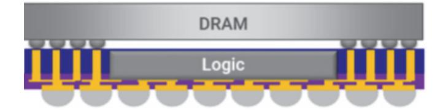

출처: TSMC(https://3dfabric.tsmc.com/english/dedicatedFoundry/technology/InFO. htm). 2024. 7. 1. 스크린샷. [그림 1-4] 팬 아웃 WLP 기술을 이용한 PoP

#### (4) 팬 아웃 패키징 공정의 확장

반도체의 종류에 따라 적용되는 다양한 선폭의 반도체를 연결할 수 있는 방법으로 패키 징 기술의 중요성이 커지면서 팬 아웃 패키징 기술의 종류도 표준 팬 아웃 기술, 고밀 도 팬 아웃 패키징 기술, 초고밀도 팬 아웃 패키징 기술로 발전하고 있다.

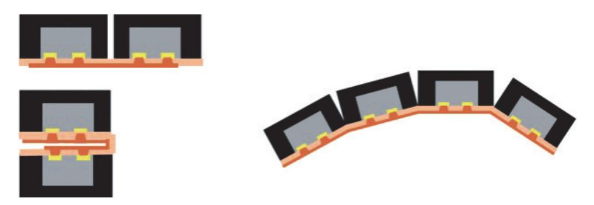

출처: TSMC(https://3dfabric.tsmc.com/english/dedicatedFoundry/technology/InFO.htm). 2024. 7. 1. 스크린샷. [그림 1-5] 팬 아웃 WLP 기술을 이용한 PoP

#### 4. 팬 아웃 패키징 기술의 공정 및 분류

(1) 팬 아웃 패키징 공정의 세부 분류

팬 아웃 패키징 기술은 웨이퍼에 있는 칩을 다이싱한 후에 정상적으로 동작하는 양품 칩을 이용해서 공정을 진행한다. 웨이퍼 레벨 패키지는 반도체 선폭이 미세화하면서 칩 의 크기가 작아지면 테스트를 하기 위한 시스템을 새로 만들어야 한다. 팬 아웃 패키징 기술은 칩 주위를 몰딩하고 재배선을 해서 반도체의 크기를 조절할 수 있으므로 웨이퍼 레벨 패키지가 기존의 패키지 테스트 인프라를 사용할 수 없는 단점을 극복할 수 있다.

(가) 생산 효율 향상

팬 아웃 패키징 기술은 칩 크기가 작아지면서 입출력 단자의 수가 제한되는 한계를 넘어설 수 있고, 양품의 칩을 골라서 패키징 하므로 생산 효율을 높일 수 있는 장점 이 있어 적용 범위가 지속해서 확대하고 있다.

(2) 팬 아웃 패키징의 몰딩 공정

팬 아웃 패키징 기술은 칩의 면적을 몰딩 재료를 이용하여 확장하는 개념이므로 칩을 일정 간격으로 배치하고 전체를 몰딩하는 공정을 필수로 진행해야 한다. 몰딩 공정은 칩이 일정 간격으로 배치된 부분에 액상이나 가루(powder), 입자(granule) 타입의 몰딩 재료를 액상 상태로 만들고 칩을 재배치한 캐리어를 접합해서 몰딩을 하며 압착(compression) 몰딩 방식으로 진행한다.

(3) 팬 아웃 패키징 공정의 분류

팬 아웃 패키징 기술은 칩을 배치하고, 재배선을 진행하는 순서에 따라 크게 3가지 공 정으로 분류할 수 있다. 칩 우선 팬 아웃 패키징 공정은 회로 면이 아래로 향하는 페이 스 다운과 회로 면이 위로 향하는 페이스 업 공정으로 구분할 수 있다. 팬 아웃 패키징 기술은 칩 우선 팬 아웃 페이스 다운 방식이 가장 먼저 진행되었고, 이후에 칩 우선 페 이스 업 공정, 그리고 칩 나중 팬 아웃 패키징 공정의 순서로 적용되었다.

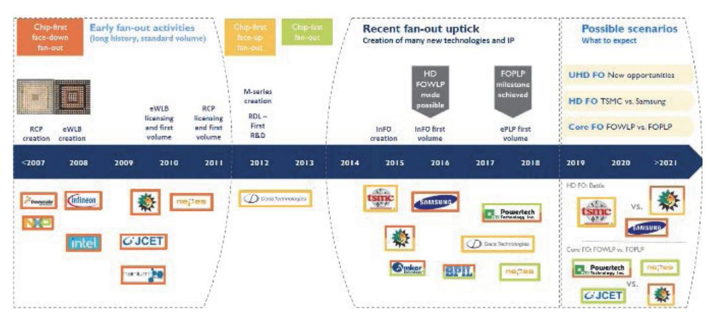

출처: IEEE(2023). HETEROGENEOUS INTEGRATION ROADMAP Chapter 23: Wafer-Level Packaging(WL P. https://eps.ieee.org/images/files/HIR\_2021/ch23-wlpfinal2.pdf. p.21. [그림 1-6] 몰딩 공정 후 eWLP 개략도

(가) 칩 우선 페이스 다운 공정

칩 우선 페이스 다운 팬 아웃 패키징 공정은 웨이퍼 모양의 캐리어에 접착 테이프를 붙이고, 그 위에 웨이퍼 다이싱 공정이 완료된 칩 중에서 동작이 되는 양품 칩을 일 정 간격으로 배열한다. 그다음에 전체 웨이퍼를 몰딩하여 칩과 칩 사이의 공간을 채 워서 새로운 형태의 웨이퍼를 만든다. 웨이퍼 몰딩이 완료되면 캐리어와 테이프를 분리한 후 전체 면에 재배선을 하고 솔더 범프나 솔더 볼을 부착한 후 낱개의 반도 체로 분리하면 공정이 완료된다.

(나) 칩 우선 페이스 업 공정

칩 우선 페이스 업 팬 아웃 패키징 공정은 웨이퍼에 있는 칩의 패드에 구리 기둥 (Cu Stud)을 형성한 후 진행한다. 웨이퍼 모양의 캐리어에 접착 테이프를 붙이고, 그 위에 양품 칩을 회로 면이 위로 가도록 해서 일정 간격으로 배열한다. 이후에 칩 이 배치되어 있는 캐리어의 윗면 전체를 몰딩한 후 구리 기둥이 들어 날 때까지 몰 딩 재료를 제거하는 백그라인딩을 진행한다. 칩 위의 구리 기둥을 노출시킨 후 재배 선을 하고 솔더 범프나 솔더 볼을 부착한 후 낱개의 반도체로 분리하면 공정이 완료 된다.

(다) 칩 나중 팬 아웃 공정

칩 나중 팬 아웃 패키징 공정은 캐리어 위에 재배선(RDL)층을 먼저 생성한 후에 칩 을 부착하는 재배선 우선 공정이라고 할 수 있으며, 재배선을 먼저하고 칩을 나중에 칩의 회로 면이 재배선층과 접합할 수 있도록 페이스 다운하여 접합한다.

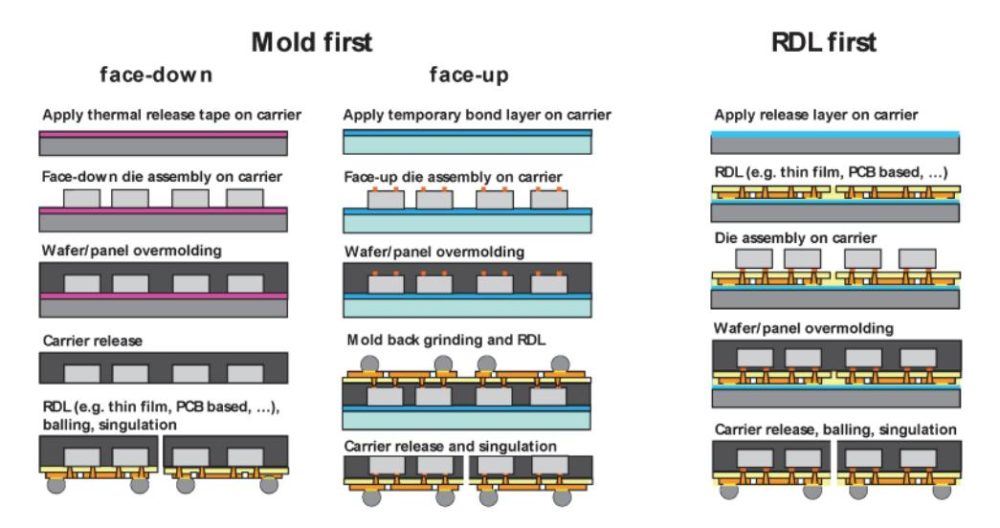

출처: Tanja Braun (2019). Fan-Out Wafer and Panel Level Packaging as Packaging Platform for Heterogeneous Integration. MDPI. [그림 1-7] FOWLP 공정 방법 비교

- 5. 팬 아웃 패키징 기술 연구 동향
  - (1) 최신 기술 동향

FOCF 공정 기술은 최근 5G 네트워킹, 고성능 컴퓨팅(HPC), AI 응용 분야에서 큰 성 장을 이루었다. 이 기술은 고밀도 및 고성능 요구가 높은 스마트폰, 태블릿, 웨어러블 기기와 같은 모바일 디바이스에서 많이 사용하고 있다. TSMC, 삼성 등 주요 반도체 제 조업체들이 이 기술을 적극 활용하여 제품의 성능과 소형화를 달성하고 있다.

(2) 기술적 개선 및 연구

(가) 열 관리

최신 연구는 팬 아웃 패키징에서 발생하는 열 관리 문제를 해결하기 위한 새로운 재 료와 설계 방식을 도입하고 있다. 예를 들어, 더 효과적인 열 방출을 위해 고성능의 열전도성 재료를 사용하는 방안을 모색하고 있다.

(나) 고밀도 배선

고밀도 배선을 위해 재배선층(RDL) 기술이 개선되고 있다. 초고밀도 fan out(UHD FO) 패키징은 I/O 밀도가 18개/제곱밀리미터 이상이며, 이는 고성능 네트워킹 및 데이터 센터 서버 응용 분야에서 큰 이점을 제공한다.

(다) 이종 집적

이종 집적(heterogeneous integration)은 서로 다른 기능을 가진 여러 칩을 하나의 패키지로 통합하는 기술로, 칩 퍼스트 팬 아웃(chip first fan out) 공정에서 중요한 역할을 하고 있다. 이 기술은 2.5D 인터포저를 대체할 수 있는 고성능, 비용 효율적 인 솔루션으로 자리 잡고 있다.

(3) 문제점

(가) 공정 복잡성

chip first fan out 공정은 높은 정밀도를 요구하며, 이는 제조 공정에서 생산 수율 을 낮추고 제조 비용을 높이는 요인이 된다. 특히, 재배선층 형성 과정에서 발생하는 문제들이 생산 효율성을 낮추고 있다.

(나) 대규모 생산의 안정성

대규모 생산에서의 공정 안정성과 일관성을 유지하는 데 어려움이 있다. 이는 대량 생산을 목표로 하는 반도체 제조업체에 중요한 과제이다.

- (4) 개발 계획
  - (가) 자동화 및 정밀도 향상

향후 제조 공정의 자동화와 정밀도를 높이기 위한 새로운 장비와 기술이 도입될 예 정이다. 이를 통해 생산 수율을 향상하고, 비용을 절감할 수 있을 것이다.

(나) 고성능 응용 분야 확장

chip first fan out 공정 기술은 5G 통신, AI, 자율 주행 차량 등의 새로운 기술들 과 결합하여 고성능 응용 분야에서의 사용이 증가할 것이다. 이는 고성능, 소형화, 에너지 효율성을 요구하는 시장의 요구를 충족시킬 것이다.

(5) 소비자 트렌드

소비자들은 더 높은 성능, 소형화, 에너지 효율성을 요구하고 있으며, 이는 스마트폰, 태 블릿, 웨어러블 디바이스 등에서 더 많은 기능을 제공하면서도 크기는 작고 배터리 수명 은 길어지기를 기대한다. 이러한 트렌드는 반도체 제조업체들이 FOCF 공정 기술을 계 속해서 개선하고 혁신하도록 압박하고 있다.

결론적으로, FOCF 공정 기술은 반도체 패키징 분야에서 중요한 위치를 차지하고 있으 며, 여러 문제점을 해결하기 위한 지속적인 노력이 필요하다. 앞으로의 개발 계획과 소 비자 트렌드는 이 기술의 발전을 더욱 가속화할 것이다.

| 구분       | 페이스 다운                               | 페이스 업                                       |
|----------|--------------------------------------|---------------------------------------------|
| 칩 배치 방식  | 칩의 회로 면이 아래로 가도록 캐리 어에 배치         | 칩의 회로 면이 위로 가도록 캐리어 에 배치                 |
| 초기 비용    | 높음.                                  | 낮음.                                         |
| 공정 관리    | 복잡                                   | 단순                                          |
| 전기적 성능   | 우수                                   | 다소 떨어짐.                                     |
| I/O 밀도   | 높음.                                  | 중간                                          |
| 열 방출     | 용이                                   | 어려움.                                        |
| 다이 손상    | 가능성 있음.                              | 낮음.                                         |
| 패키지 영역   | 제한적                                  | 넓은 패키지 가능                                   |
| 고성능 디바이스 | 적합                                   | 부적합                                         |
| 재배선층 형성  | 어렵다.                                 | 쉽다.                                         |
| 주요 적용 분야 | 모바일 AP, 메모리, 고성능 디바이 스, 고밀도 응용 분야 | 메모리, 센서, 중저가 모바일 디바이 스, 비용 효율이 중요한 대량 생산 |

<표 1-1> 페이스 다운 팬 아웃 공정과 페이스 업 팬 아웃 공정 비교

#### 숕 칩 우선(chip first) 페이스 다운(face down) 팬 아웃 공정

1. 칩 우선 팬 아웃 방식

칩 우선 팬 아웃 방식(FOCF: fan out chip first)은 칩을 캐리어 위에 일정 간격을 두고 배치한 후 몰딩을 하고 나서 재배선(RDL)과 솔더를 형성하여 팬 아웃 구조를 구현하는 반 도체 패키징 방식이다.

2. 칩 나중 팬 아웃 방식

칩 나중 팬 아웃 방식(FOCL: fan out chip last)은 캐리어에 재배선을 한 후에 칩의 회로 면을 아래로 해서 재배선이 된 영역에 부착하여 팬 아웃 패키지를 만드는 방식이다.

3. 칩 우선 팬 아웃 공정 기술

칩 우선 팬 아웃 공정 기술은 캐리어 위에 칩을 일정 간격을 두고 배치하고 전체 면에 몰 딩 공정을 진행한 후에 재배선층을 만들고 솔더를 형성하는 방식이다. 칩 우선 팬 아웃 공 정에서는 다이를 캐리어에 일정 간격으로 배치한 후 진행되는 공정에서 캐리어에 올려진 다이가 움직이는 다이 시프트가 만들어진 제품의 정밀도에 영향을 줄 수 있다.

4. 칩 우선 팬 아웃 패키징 공정의 분류

칩 우선 팬 아웃 패키징 공정은 캐리어에 칩을 배열할 때 칩의 회로 면을 아래쪽을 향하게 하는 페이스 다운(face down) 방식과 칩의 회로 면이 위쪽을 향하도록 하는 페이스 업

(face up) 방식이 있다.

(1) 칩 우선 페이스 다운 공정

칩 우선 페이스 다운 팬 아웃 패키징 방식은 칩을 접착 테이프를 부착한 캐리어에 칩의 회로 면이 아래를 향하도록 하고 일정 간격을 유지하면서 배치하는 방식이다. 캐리어에 칩을 모두 부착한 후 전체를 몰딩하고 몰딩한 칩을 캐리어의 접착 테이프와 분리하면 노출된 부분이 칩의 회로 면이 된다.

(2) 칩 배치 및 몰딩 공정

칩을 배치한 후 몰딩을 할 때 칩이 움직이지 않도록 주의해야 하고, 캐리어를 분리하는 공정 중에 다이 손상이 생길 수 있으므로 정밀한 공정 관리가 필요하다. 페이스 업 방 식에 비해서 신호 전달 경로가 짧아져 배선 길이가 짧고 전력 소모가 줄어든다.

(3) 고밀도 I/O 구현

고밀도 I/O 구현이 가능하여 복잡한 회로 설계에 유리하다. 캐리어를 분리한 후에 칩의 회로 면과 몰딩 면에 재배선을 하고 솔더를 형성한 후 전체 반도체를 소잉 공정을 통해 서 분리하면 팬 아웃 패키지가 완성된다.

#### 숖 칩 우선(chip first) 페이스 업 팬 아웃 패키징 공정

칩 우선 페이스 업 방식은 칩에 구리 기둥(pillar)을 형성한 후에 칩의 회로 면이 위를 향하 도록 하여 캐리어 위에 칩을 일정 간격으로 배치하고 몰딩을 하는 방식이다. 몰딩 후에는 구리 기둥이 노출될 때까지 백그라인딩을 하고 구리 기둥과 몰딩 면 위에 재배선 하고 솔 더를 형성하는 형태이다.

페이스 업 방식에서는 칩의 활성 면이 위쪽을 향하도록 배치하여, 다이 손상의 위험이 감소 한다. 이 방식은 열 방출이 쉬워 열 관리가 개선되고, 다이가 몰딩 콤파운드로 보호되어 물 리적 손상에 강하다. 그러나 배선 길이가 길어져 신호 전달 속도가 느려지고, 전기적 성능 이 다소 떨어질 수 있다. 또 몰딩 후 평탄화 단계가 포함되어 있어 추가적인 공정이 필요하 다. 페이스 업 방식은 다이 보호와 열 관리가 중요한 응용 분야에 적합하다. 페이스 업 방 식은 몰딩 후 평탄화가 필요하지만, 칩 배치와 재배선층 형성 과정이 상대적으로 단순할 수 있다.

공정은 다음과 같이 진행된다.

- 1. 다이 배열
  - (1) 다이 정렬
    - (가) 캐리어에 배치할 때, 다이의 회로 면이 위를 향하도록 한다. 이 과정에서 다이의 위치와 방향을 정확하게 맞추는 것이 중요하다.
    - (나) 공정을 진행할 칩 여러 개를 점착력이 있는 캐리어 표면의 정해진 위치에 정밀하게 배열

한다.

- (다) 다이가 임시 캐리어에 배치된 후, 정렬 상태와 접착 상태를 최종적으로 확인한다. 이 과 정에서 문제가 발견되면 즉시 조정하여 수정한다.
- (라) 고해상도 카메라를 사용하여 다이의 배치 상태를 검사한다. 이를 통해 미세한 위치 오차 나 접착 불량을 확인할 수 있다.
- 2. 몰딩 공정

재배열된 다이와 웨이퍼를 몰드에 배치한다. 몰드는 다이를 보호하고, 몰딩 콤파운드가 다 이와 웨이퍼 주변에 균일하게 분포되도록 한다. 몰드를 설치하기 전에 다이와 몰드의 정렬 상태를 확인하여 다이가 정확하게 위치하도록 한다.

- (1) 몰딩 콤파운드 준비
  - (가) 몰딩 콤파운드는 다이를 보호하고 외부 충격과 열 스트레스에 견딜 수 있어야 한다. 일 반적으로 에폭시 기반의 몰딩 콤파운드가 사용되며, 이는 높은 강도와 열 저항성을 제공 한다.
  - (나) 몰딩 콤파운드의 열전도성, 기계적 강도, 전기적 절연성 등의 특성을 확인하여 공정 요구 사항에 맞는 재료를 선택한다.
- (2) 혼합 및 준비
  - (가) 몰딩 콤파운드를 사용하기 전에 필요한 성분들을 정확한 비율로 혼합하여 준비한다. 이 는 콤파운드의 균일성과 성능을 보장하는 데 중요하다.
  - (나) 혼합된 몰딩 콤파운드에서 공기를 제거하는 탈기 과정을 통해 기포 발생을 방지한다. 기 포가 있으면 다이와 콤파운드 사이의 접착력이 약해질 수 있다.
- (3) 몰딩 진행
  - (가) 칩 면적의 한계를 극복할 수 있는 입출력 단자를 만들 수 있는 면적을 제공하기 위해서 몰딩 재료를 이용해서 몰딩을 진행한다.
  - (나) 몰딩 콤파운드를 몰드에 주입하여 다이와 웨이퍼 주변을 채운다. 이 과정에서는 몰딩 콤 파운드를 균일하게 분포하도록 주입 속도와 압력을 조절한다.
  - (다) 진공 상태에서 몰딩 콤파운드를 주입하면 기포 발생을 최소화하고, 몰딩 콤파운드가 다 이와 웨이퍼 사이의 빈 공간을 완전히 채울 수 있다.
  - (라) 몰딩은 다이와 재배선층(RDL)을 외부 충격과 환경 변화로부터 보호하며, 패키지의 기계 적 강도와 열 저항성을 높인다.
- (4) 경화 공정
  - (가) 몰딩 콤파운드를 주입한 후, 이를 경화하여 다이와 웨이퍼를 고정한다. 경화 공정은 일정 한 온도와 시간 동안 진행되며, 몰딩 콤파운드의 기계적 강도와 열 저항성을 높인다.

- (나) 일반적으로 열을 이용한 경화 공정을 통해 몰딩 콤파운드를 굳힌다. 경화 온도와 시간은 사용된 몰딩 콤파운드의 특성에 따라 결정된다.
- 3. 몰딩 된 부분 그라인딩
  - (가) 칩에 형성한 단자가 드러날 때까지 백그라인딩 공정을 통해서 몰딩 재료를 갈아내는 그 라인딩 과정이 필요하며, 칩과 재배선층 간 거리가 멀어 전기적 성능이 약간 떨어지고 열 관리가 어려울 수 있다.
  - (나) 몰딩 된 웨이퍼의 몰딩 부분 폴리싱은 face-up 팬 아웃 공정에서 중요한 후처리 단계 로, 이 과정을 통해 임시 캐리어를 제거하고 몰딩 된 웨이퍼의 두께를 균일하게 하여 표 면을 평탄화한다. 이 단계는 최종 패키지의 품질과 성능을 보장하는 데 있어 매우 중요 하다.
  - (다) 폴리싱은 몰딩 된 웨이퍼의 두께를 균일하게 만들고, 표면을 평탄화하는 과정이다. 이는 이후 공정의 정밀성과 최종 패키지의 품질을 향상하는 데 있어 중요하다.
  - (라) 그라인딩 후 화학적-기계적 폴리싱(CMP) 공정을 통해 웨이퍼 표면을 평탄화한다. CMP 는 화학적 슬러리와 폴리싱 패드를 사용하여 표면을 매끄럽게 연마한다.
  - (마) 폴리싱 과정에서 사용하는 슬러리는 웨이퍼 표면의 불순물을 제거하고, 화학적 반응을 통해 표면을 연마한다. 슬러리는 정밀하게 조절된 화학적 성분으로 구성되어 있다.
  - (바) 폴리싱이 완료된 후, 고해상도 현미경을 사용하여 웨이퍼 표면을 검사한다. 이를 통해 표 면의 평탄도와 거칠기를 확인하고, 결함 여부를 점검한다.
  - (사) 레이저 스캐닝을 통해 웨이퍼 표면의 평탄도와 두께 균일성을 측정한다. 레이저 스캐닝 은 비접촉 방식으로 고정밀 검사가 가능하다.

## 수행 내용 / chip first 팬 아웃 공정 기술 수행하기(Face down)

#### 재료·자료

- 반도체 웨이퍼: 다이싱된 반도체 칩들
- 에폭시 몰딩 화합물(EMC): 다이와 기판을 고정하기 위한 재료
- 재분배층(RDL) 재료: 구리 또는 기타 금속
- 솔더 볼: 외부 기판과의 전기적 연결을 위한 솔더 볼
- 보호 필름 및 절연 필름: 다이와 배선 보호용
- 캐리어 웨이퍼: 임시 지지용 웨이퍼

#### 기기(장비 ・ 공구)

- 다이싱 장비: 웨이퍼를 개별 다이로 절단
- 픽 앤 플레이스 기계: 다이를 캐리어 웨이퍼에 배치
- 몰딩 기계: 다이 주변에 EMC를 채워넣기
- 그라인딩 및 폴리싱 장비: 몰딩 된 웨이퍼의 두께를 균일하게 만들고 평탄화
- 리소그래피 장비: RDL 형성
- 증착 및 도금 장비: 금속 배선을 위한 증착 및 도금
- 솔더 볼 부착 장비: 솔더 볼을 부착
- 검사 장비: X-ray 검사, 전기적 테스트 장비 등

#### 안전 ・ 유의 사항

- 공정 중 모든 작업은 클린 룸에서 수행되어야 하며, 먼지와 오염을 최소화해야 한다.
- 에폭시 몰딩 화합물, 금속 증착 등 화학 물질을 사용할 때는 적절한 보호 장비를 착용하고, 화 학물질 취급 규정을 준수해야 한다.
- 다이싱, 그라인딩 등 기계를 사용할 때는 안전장치를 확인하고, 보호 장비를 착용해야 한다.
- 전기적 테스트를 수행할 때는 적절한 절연 장치를 사용하고, 안전 절차를 준수해야 한다.

수행 순서

숔 팬 아웃 패키징 공정에서 칩의 면적 주위에 입출력 단자를 배치할 면적을 확보하기 위해 다이를 일 정 간격으로 배치하고 몰딩을 진행한다.

칩을 일정 간격으로 배치할 캐리어에 다이의 위치와 정렬을 정확하게 맞추어 이후 공정의 품질 과 성능을 보장하는 역할을 한다. 접착 필름이 부착된 캐리어에 다이의 회로 면이 아래로 향하 도록 배치하고 몰딩 공정을 진행할 때 다이의 위치가 달라지지 않도록 유의한다.

1. 다이를 준비한다.

웨이퍼를 다이싱하여 칩을 분리시킨다.

2. 캐리어를 준비한다.

캐리어는 다이를 일정한 간격으로 배치하기 위해 사용한다. 다이가 이동하거나 손상되지 않 도록 안정적으로 지지해야 한다. 캐리어의 표면에는 다이를 접합할 수 있도록 접착 필름을 부착한다.

3. 캐리어 선택 시 주의 사항을 확인한다.

캐리어는 다이 배치 공정에서 다이를 안정적으로 고정하고 보호하는 역할을 한다. 적절한 캐리어 선택은 다이의 품질과 공정의 효율성을 보장하는 데 매우 중요하다.

- (1) 재질을 선택한다.
  - (가) 열 저항성을 고려한다.

캐리어 재질은 높은 온도에서도 변형되지 않고 안정성을 유지할 수 있어야 한다. 공 정 중 열을 가하는 단계가 있으므로 열 저항성이 중요한 요소이다(예: 세라믹, 실리 콘, 고온에 견딜 수 있는 폴리머 재료).

(나) 전기 절연성을 확보한다.

캐리어 재질은 전기적 절연성을 갖추어야 한다. 이는 다이와 외부 전기 신호 간의 간섭을 방지하고, 안전한 전기적 환경을 유지하기 위해 중요하다(예: 세라믹, 유리, 폴리머).

(다) 기계적 강도를 유지한다.

캐리어는 기계적 충격이나 압력에 견딜 수 있어야 한다. 이는 다이를 고정하고, 이동 중 손상을 방지하기 위해 중요하다(예: 금속 합금, 강화 유리, 고강도 플라스틱).

- (2) 표면 처리를 한다.
  - (가) 평탄도를 높인다.
    - 1) 캐리어의 표면은 매우 평탄해야 하며, 다이가 정확히 위치할 수 있도록 해야 한다. 이는 정밀한 다이 배치를 가능하게 한다.
    - 2) 표면 평탄도를 높이기 위해 연마나 코팅 처리가 필요할 수 있다.

- (나) 표면 에너지를 조정한다.
  - 1) 캐리어의 표면 에너지가 적절해야 다이가 잘 붙고, 공정 후 쉽게 제거될 수 있다. 이는 접착제의 선택과도 밀접한 관련이 있다.
  - 2) 표면 에너지가 너무 낮으면 접착이 잘 안되고, 너무 높으면 접착제가 과도하게 붙을 수 있다.
- (다) 오염 방지를 강화한다.
  - 1) 캐리어 표면은 오염 물질이 적어야 하며, 공정 중 오염이 발생하지 않도록 처리되어 야 한다. 이는 다이의 품질에 직접적인 영향을 미친다.
  - 2) 표면 코팅이나 클리닝 공정을 통해 오염 방지를 강화할 수 있다.
- (3) 캐리어를 설계한다.
  - (가) 정렬 및 위치 확인 마커를 추가한다.
    - 1) 캐리어에는 다이의 위치와 정렬을 쉽게 확인할 수 있는 마커가 있어야 한다. 이는 다이 배치의 정확성을 높이는 데 도움을 준다.
    - 2) 마커는 고해상도 카메라와 정밀 장비를 사용하여 다이 위치를 확인하는 데 사용된 다.
  - (나) 다이 배치 공간을 확보한다.
    - 1) 캐리어는 다이를 배치하기 위한 충분한 공간을 제공해야 하며, 다이 사이의 간격이 적절해야 한다. 이는 다이싱과 후속 공정의 효율성을 높이는 데 중요하다.
    - 2) 다이 사이의 간격은 공정 요구 사항에 따라 조정된다.
  - (다) 열팽창 계수를 고려한다.
    - 1) 캐리어의 열팽창 계수는 다이와 유사해야 한다. 이는 온도 변화에 따라 캐리어와 다 이 간의 변형 차이를 최소화하여 균열이나 손상을 방지한다.
    - 2) 열팽창 계수가 다를 경우 열응력으로 다이에 손상이 발생할 수 있다.
- 4. 캐리어 표면 처리를 한다.

캐리어의 표면은 다이가 잘 붙도록 처리해야 하며 표면 평탄도와 오염 방지가 중요하다. 또 캐리어 표면은 매우 평탄해야 하며 오염 물질이 없어야 한다. 이를 위해 캐리어를 세척하고 표면 처리를 한다.

- 5. 접착 필름을 부착한다.
  - (1) 다이를 임시 캐리어에 고정하기 위해 접착 필름을 사용한다. 접착제는 다이를 확실히 고정할 수 있어야 하며, 이후 공정에서 쉽게 제거될 수 있어야 한다.
  - (2) 접착 필름은 캐리어 전체에 고르게 분포되어야 한다.

숕 몰딩 공정

- (2) 고해상도 카메라를 사용하여 다이의 배치 상태를 검사한다. 이를 통해 미세한 위치 오차 나 접착 불량을 확인할 수 있다.
- (1) 다이가 임시 캐리어에 배치된 후, 정렬 상태와 접착 상태를 최종적으로 확인한다. 이 과 정에서 문제가 발견되면 즉시 조정하여 수정한다.
- 7. 다이 배치 상태를 확인한다.
- 의 위치를 세밀하게 조정한다.
- (나) 다이 배치 과정에서 미세 조정이 필요할 경우, 정밀한 위치 조정 장비를 사용하여 다이
- (가) 다이의 위치를 정확히 맞추기 위해 정렬 정확도는 매우 중요하다.
- (2) 정렬 정확도를 유지한다.
- 한 이동 메커니즘을 통해 다이의 위치를 정확하게 조정한다.
- 다이의 위치와 방향을 정확하게 맞추는 것이 중요하다. (나) 정밀한 정렬을 위해 자동 정렬 시스템을 사용한다. 이 시스템은 고해상도 카메라와 정밀
- (가) 다이를 임시 캐리어에 배치할 때, 다이의 활성 면이 아래로 향하도록 한다. 이 과정에서
- (1) 다이를 정렬한다.

출처: 집필진 제작(2024) [그림 1-9] 다이 배치 및 확인 Silicon chip attach

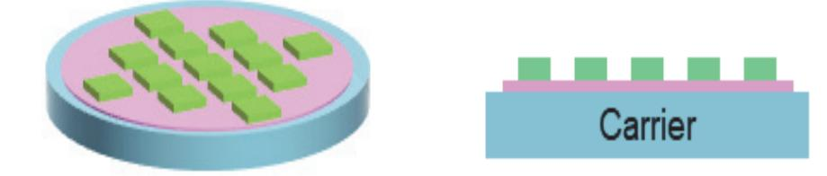

- 6. 다이를 배치한다.
- 출처: 집필진 제작(2024) [그림 1-8] 접착 필름 부착(Adhesive tape attach)

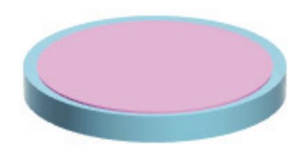

출처: 집필진 제작(2024) [그림 1-10] Wafer level EMC molding

- 1. 몰딩 콤파운드를 준비한다.
  - (1) 재료를 선택한다.
    - (가) 몰딩 콤파운드는 다이를 보호하고 외부 충격과 열 스트레스에 견딜 수 있어야 한다. 일 반적으로 에폭시 기반의 몰딩 콤파운드가 사용되며, 이는 높은 강도와 열 저항성을 제공 한다.
    - (나) 몰딩 콤파운드의 열전도성, 기계적 강도, 전기적 절연성 등의 특성을 확인하여 공정 요구 사항에 맞는 재료를 선택한다.
  - (2) 혼합 및 준비를 한다.
    - (가) 몰딩 콤파운드를 사용하기 전에 필요한 성분을 정확한 비율로 혼합하여 준비한다. 이는 콤파운드의 균일성과 성능을 보장하는 데 중요하다.
    - (나) 혼합된 몰딩 콤파운드에서 공기를 제거하는 탈기 과정을 통해 기포 발생을 방지한다. 기 포가 있으면 다이와 콤파운드 사이의 접착력이 약해질 수 있다.
- 2. 몰딩 공정을 진행한다.
  - (1) 몰드를 설치한다.
    - (가) 재배열된 다이와 웨이퍼를 몰드에 배치한다. 몰드는 다이를 보호하고, 몰딩 콤파운드가 다이와 웨이퍼 주변에 균일하게 분포되도록 한다.
    - (나) 몰드를 설치하기 전에 다이와 몰드의 정렬 상태를 확인하여 다이가 정확하게 위치하도록 한다.
  - (2) 몰딩 콤파운드를 주입한다.
    - (가) 몰딩 콤파운드를 몰드에 주입하여 다이와 웨이퍼 주변을 채운다. 이 과정에서는 몰딩 콤 파운드가 균일하게 분포되도록 주입 속도와 압력을 조절한다.
    - (나) 진공 상태에서 몰딩 콤파운드를 주입하면 기포 발생을 최소화하고, 몰딩 콤파운드가 다 이와 웨이퍼 사이의 빈 공간을 완전히 채울 수 있다.

19

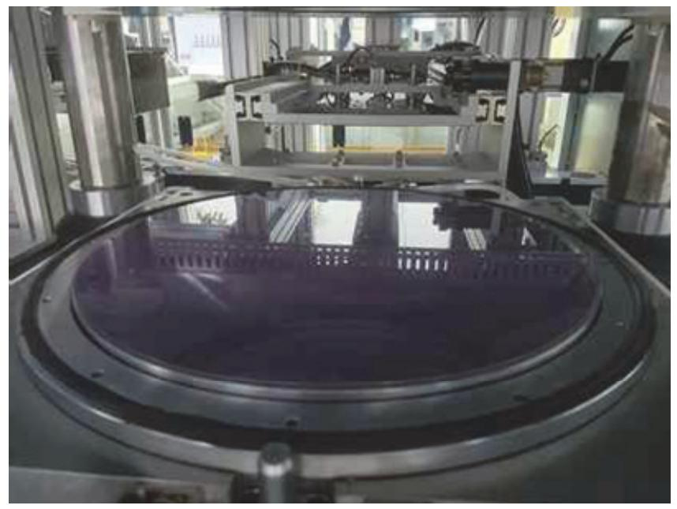

출처: 산업통상자원부(2017). 『300mm 대응 대구경 다층 구조의 복합 패키지 공정 및 장 비 기술 개발』. p.162. [그림 1-11] 몰딩 공정

- (3) 경화 공정을 진행한다.
  - (가) 몰딩 콤파운드를 주입한 후, 이를 경화하여 다이와 웨이퍼를 고정한다. 경화 공정은 일정 한 온도와 시간 동안 진행되며, 몰딩 콤파운드의 기계적 강도와 열 저항성을 높인다.
  - (나) 일반적으로 열을 이용한 경화 공정을 통해 몰딩 콤파운드를 굳힌다. 경화 온도와 시간은 사용된 몰딩 콤파운드의 특성에 따라 결정된다.

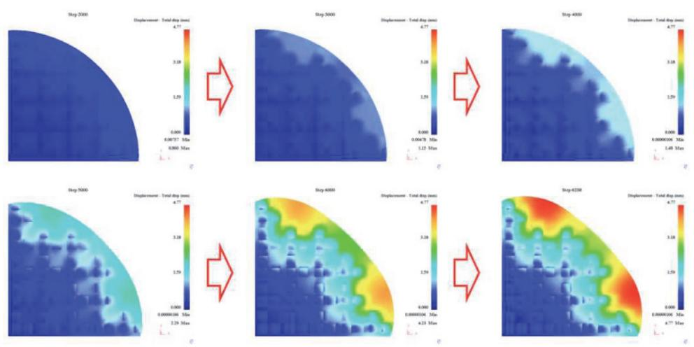

출처: 산업통상자원부(2017). 『300mm 대응 대구경 다층 구조의 복합 패키지 공정 및 장비 기술 개발』. p.142. [그림 1-12] EMC 유동성 평가(몰딩 공정 중 EMC 변위)

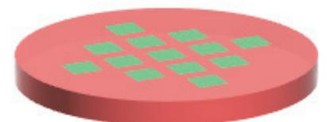

출처: 집필진 제작(2024)

[그림 1-13] 캐리어 제거(detach adhesive tape & carrier)

- 1. 접착 필름에서 분리한다.
  - (1) 열처리한다.

접착 필름에서 분리하기 위해 열을 가해 접착 특성을 약화시킨다. 이는 접착 필름을 쉽 게 제거할 수 있게 한다. 열처리는 일정 온도와 시간 동안 진행되며, 접착 필름의 특성 에 따라 조절된다.

- (2) 용매를 사용한다. 특정 용매를 사용하여 접착제를 용해하여 제거할 수 있다. 용매는 접착제와 반응하여 접 착력을 떨어뜨리고, 이를 통해 다이와 캐리어를 분리할 수 있다.
- (3) 기계적 방법을 사용한다. 경우에 따라서 접착제를 물리적으로 제거할 수 있다. 이는 정밀한 기계적 장비를 사용하 여 접착제를 긁어내거나 밀어내는 방식이다.
- 2. 캐리어를 분리한다.

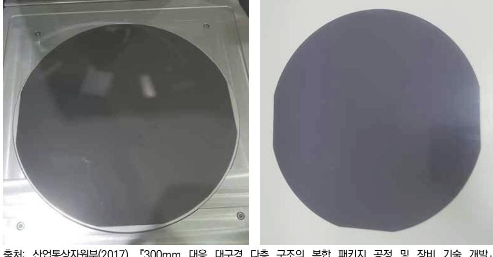

출처: 산업통상자원부(2017). 『300mm 대응 대구경 다층 구조의 복합 패키지 공정 및 장비 기술 개발』. p.163. [그림 1-14] 몰딩 웨이퍼(왼쪽), 캐리어 제거(오른쪽)

(1) 정밀 분리 장비를 사용한다.

캐리어를 안전하게 분리하기 위해 정밀한 장비를 사용한다. 이 장비는 다이에 최소한의 스트레스를 가하며, 캐리어를 안전하게 제거한다.

(2) 분리 후 검사를 한다.

캐리어 제거 후, 다이와 몰딩된 웨이퍼를 검사하여 손상 여부를 확인한다. 이를 통해 다 이와 웨이퍼가 손상되지 않았는지 확인할 수 있다.

숗 재배선(RDL: redistribution layer)을 형성한다.

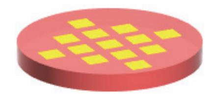

출처: 집필진 제작(2024) [그림 1-15] RDL 형성

재배선은 칩 위에 형성된 외부 연결 단자인 본딩 패드를 칩 전체 면적으로 확산하기 위해서 금속 배선을 원하는 위치에 형성시키는 재배열 공정이다. 층을 재배치한다는 의미로 Redistribution Layer 를 의미하며, RDL 기술이라고 한다. RDL 기술은 플립 칩, 웨이퍼 레벨 패키지, 팬 아웃 패키지를 구현하는 데 매우 중요한 기술이라고 할 수 있다. RDL 공정은 스퍼터링 공정으로 금속 박막층을 만들고, 빛을 이용해서 원하는 패턴을 형성하기 위해 포토레지스트(PR: photoresist)를 도포한다. 원하는 패턴이 만들어진 마스크를 통해 빛을 투사하는 포토 공정으로 PR층에 패턴을 만들고, 빛을 받아서 약해진 PR를 현상액을 이용하여 녹여낸다. PR에서 패턴으로 열린 부분에 전해 도금으로 선택한 금속을 도금하여 금속 배선을 형성한다.

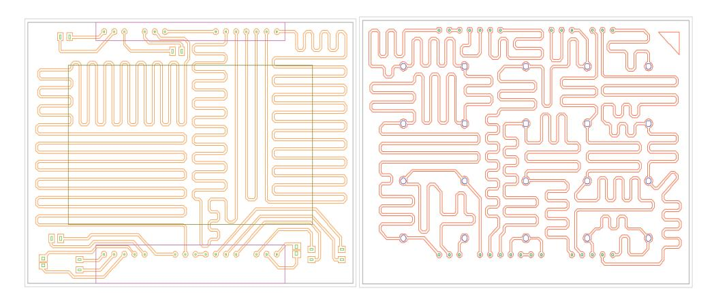

출처: 산업통상자원부(2017). 『300mm 대응 대구경 다층 구조의 복합 패키지 공정 및 장비 기술 개발』. p.27. [그림 1-16] RDL design 검증을 위한 Daisy-chain 설계

22

1. 웨이퍼를 준비한다.

- (1) 표면을 클리닝한다.
  - (가) RDL 형성 전, 몰딩된 웨이퍼의 표면을 깨끗하게 세척하여 오염 물질을 제거한다. 이는 RDL 패턴의 정확한 형성과 접착력을 보장하기 위해 중요하다.
  - (나) 화학 용제를 사용하여 표면을 세척하고, 미세한 입자와 유기물을 제거한다.
- (2) 표면을 활성화한다.
  - (가) 표면 클리닝 후, 웨이퍼 표면을 활성화하여 RDL 층이 잘 접착될 수 있도록 준비한다.
  - (나) 플라즈마 처리를 통해 웨이퍼 표면을 활성화하여 RDL 소재와의 접착력을 높인다.

#### 2. 절연층을 형성한다.

- (1) 절연층을 도포한다.
  - (가) 웨이퍼 표면에 절연층을 도포하여 다이와 RDL 사이의 절연을 유지한다. 절연층은 일반 적으로 폴리이미드나 실리콘 산화물과 같은 재료로 구성된다.
  - (나) 절연층 재료를 웨이퍼에 균일하게 도포하기 위해 스핀 코팅 기술을 사용한다. 웨이퍼를 회전시키면서 절연층을 고르게 분포시킨다.
- (2) 경화 공정을 진행한다.
  - (가) 절연층을 도포한 후, 이를 경화하여 물리적 강도와 열 저항성을 부여한다.
  - (나) 절연층을 일정한 온도에서 열 경화하여 견고하게 만든다. 경화 시간과 온도는 사용된 재 료에 따라 다르다.
- 3. 포토리소그래피 공정을 진행한다.
  - (1) 절연층 위에 포토레지스트(감광액)를 도포한다.
    - (가) 포토레지스트는 RDL 패턴을 형성하기 위한 중요한 재료이다.
    - (나) 포토레지스트를 웨이퍼에 균일하게 도포하기 위해 스핀 코팅 기술을 사용한다.
  - (2) 포토레지스트 도포 후, 패턴을 형성하기 위해 UV 광을 사용하여 노광한다.
    - (가) 이 과정에서 포토레지스트에 RDL 패턴이 전사된다.
    - (나) 고해상도 마스크와 UV 광원을 사용하여 정밀하게 노광한다.
    - (다) 노광된 포토레지스트를 현상하여 필요하지 않은 부분을 제거하고, RDL 패턴을 드러낸다.

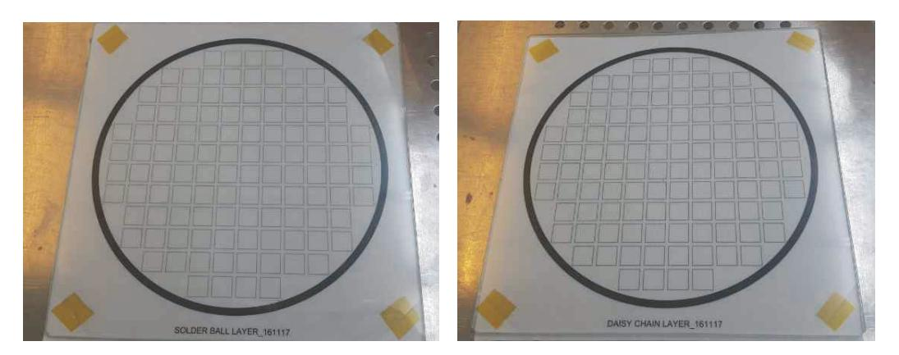

출처: 산업통상자원부(2017). 『300mm 대응 대구경 다층 구조의 복합 패키지 공정 및 장비 기술 개발』. p.172. [그림 1-17] 포토리소그래피 마스크

- 4. 금속 증착 공정을 진행한다.
  - (1) 스퍼터링이나 전해 증착(Electroplating) 기술을 사용하여 금속을 증착한다. 일반적으로 구리(Cu)나 알루미늄(Al)과 같은 금속이 사용된다.
  - (2) 금속 증착 후, 남아 있는 포토레지스트를 제거하여 최종 RDL 패턴을 형성한다. 포토레지스트 제거 공정을 통해 남아 있는 포토레지스트를 깨끗이 제거한다.

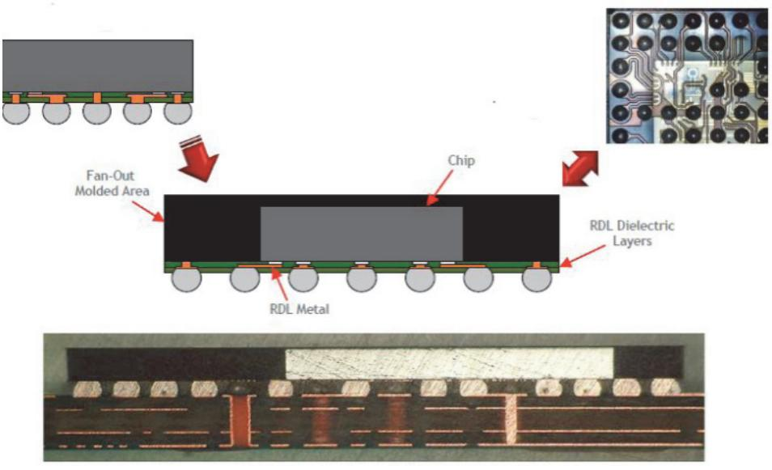

출처: (주)에스에스피(2014). 『300mm 웨이퍼 레벨 마이크로 솔더볼 어태치 장비 개발』. 최종 보고서. 중소기업청. 한국산업기술평가관리원. p.6. [그림 1-18] 웨이퍼 원판에 솔더 볼 어태치

- 5. 후처리 및 검사를 진행한다.
  - (1) 폴리이미드나 실리콘 산화물 등으로 구성된 패시베이션 층을 도포하여 RDL 패턴을 보호한다. 형성된 RDL 패턴을 보호하기 위해 패시베이션 층을 도포한다. 패시베이션 층은 RDL

패턴을 외부 환경으로부터 보호하고, 전기적 절연성을 제공한다.

- (2) 검사 및 테스트를 진행한다.
  - (가) 최종 RDL 패턴이 형성된 후, 패턴의 정확도와 전기적 성능을 검사한다.
  - (나) 전기적 테스트 장비를 사용하여 RDL 패턴의 전기적 연결 상태와 성능을 확인한다.
  - (다) 고해상도 현미경을 사용하여 패턴의 정밀도와 결함 여부를 검사한다.

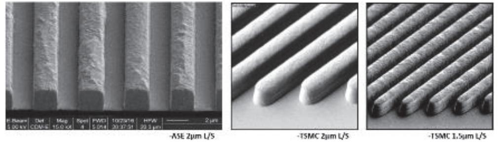

출처: IEEE(2023). HETEROGENEOUS INTEGRATION ROADMAP Chapter 23: Wafer-Level Packaging(WLP). https://eps.ieee.org/images/files/HIR\_2021/ch23-wlpfinal2.pdf. p.25. [그림 1-19] 웨이퍼 원판에 솔더 볼 어태치

수 솔더 볼 접합 공정을 진행한다.

솔더를 형성하는 방식은 이미 만들어져 있는 솔더 볼을 부착하는 방식과 솔더 범프를 형성하는 방식으로 구분할 수 있다.

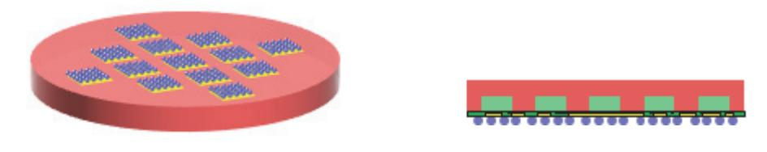

출처: 집필진 제작(2024) [그림 1-20] 솔더 볼 형성

- 1. 솔더 볼 접합 공정을 준비한다.
  - (1) 솔더 볼 접합 공정을 준비한다.

솔더 볼 접합은 개별 다이와 외부 기판을 전기적으로 연결하는 역할을 하는 솔더 볼을 부착하는 공정이며, 기존에 만들어진 솔더 볼을 이용한다. 이 과정은 최종 패키지의 전 기적 성능과 신뢰성에 큰 영향을 끼치므로 매우 정밀하게 수행되어야 한다.

- (2) 솔더 볼을 준비한다.
  - (가) 재료를 선택한다.

솔더 볼은 일반적으로 납(Sn)-납(Pb) 합금이나 무연 솔더(Sn-Ag-Cu)가 사용된다. 선택된 솔더 재료는 열적, 기계적 특성을 고려하여 결정한다. 솔더 볼의 크기, 합금 조성, 녹는 점 등을 확인하여 공정 요구 사항에 맞는 재료를 선택한다.

(나) 솔더 볼을 정렬한다.

솔더 볼은 다이의 패드에 정확하게 정렬되어야 한다. 이를 위해 정렬 장비를 사용하 여 솔더 볼의 위치를 조정한다. 고해상도 카메라와 정밀한 이동 메커니즘을 사용하 여 솔더 볼을 정확하게 정렬한다.

- (3) 솔더 볼 부착 공정을 수행한다.
  - (가) 플럭스를 도포한다.

솔더 볼을 부착하기 전에 다이 패드와 솔더 볼에 플럭스를 도포한다. 플럭스는 산화 물을 제거하고 솔더 볼의 접착력을 높이는 역할을 한다. 솔더 볼 재료와 호환되는 플럭스를 선택하여 도포한다.

(나) 솔더 볼을 배치한다.

정렬된 솔더 볼을 다이의 패드에 배치한다. 이 과정에서는 솔더 볼이 정확하게 위치 하도록 주의해야 한다. 자동화된 배치 장비를 사용하여 솔더 볼을 다이 패드에 신속 하고 정확하게 배치한다.

(다) 리플로 솔더링을 한다.

솔더 볼을 다이 패드에 부착한 후, 리플로 오븐을 사용하여 솔더 볼을 녹여 다이와 패드를 영구적으로 결합시킨다. 리플로 온도 프로파일을 설정하여 솔더 볼이 균일하 게 녹고 다이 패드와 완벽하게 결합되도록 한다.

리플로 과정은 예열, 플럭스 활성화, 솔더 볼 용융, 냉각 단계로 구성되며, 각 단계 에서 온도를 정확하게 제어하여 최적의 솔더링을 달성한다.

(라) 세척을 진행한다.

리플로 솔더링 후, 플럭스 잔여물을 제거하기 위해 세척 공정을 수행한다. 이는 패키 지의 신뢰성과 전기적 성능을 유지하기 위해 중요하다.

세척 용제를 사용하여 플럭스 잔여물을 제거한다. 이는 전기적 접촉 저항을 최소화 하고, 패키지의 신뢰성을 향상해 준다.

(마) 검사 및 테스트를 한다.

솔더 볼 부착 후, 솔더 조인트의 상태와 전기적 연결을 검사하여 결함 여부를 확인 한다.

X-ray 검사를 통해 솔더 조인트의 내부 상태를 비파괴 검사한다. 이를 통해 솔더 볼 의 균열, 빈 공간, 불량 연결 등을 확인할 수 있다.

전기적 테스트 장비를 사용하여 솔더 조인트의 전기적 성능을 검사한다. 이는 패키 지의 전기적 신뢰성을 확인하는 중요한 단계이다.

2. 솔더 범프 형성 공정

솔더 범프 형성은 재배선이 완료된 후 외부 연결 단자로 형성된 본딩 패드에 솔더 범프를 형성하는 공정이다. 솔더 범프 형성은 빛을 이용해서 원하는 패턴을 형성하기 위해 포토레 지스트(PR)를 도포한다. 원하는 패턴이 만들어진 마스크를 통해 빛을 투사하는 포토 공정으 로 PR층에 패턴을 만들고, 빛을 받아서 약해진 PR를 현상액을 이용해서 녹여낸다. PR에서 패턴으로 열린 부분에 솔더를 도금하여 솔더 범프를 형성한다.

(1) 포토리소그래피 공정을 진행한다.

- (가) 절연층 위에 포토레지스트(감광액)를 도포한다.
  - 1) 포토레지스트는 솔더 범프 패턴을 형성하기 위한 중요한 재료이다.
  - 2) 포토레지스트를 웨이퍼에 균일하게 도포하기 위해 스핀 코팅 기술을 사용한다.
- (나) 포토레지스트 도포 후, 패턴을 형성하기 위해 UV 광을 사용하여 노광한다. 이 과정에서 포토레지스트에 RDL 패턴이 전사된다.
  - 1) 고해상도 마스크와 UV 광원을 사용하여 정밀하게 노광한다.
  - 2) 노광된 포토레지스트를 현상하여 필요하지 않은 부분을 제거한다.
- (2) 솔더를 증착한다.
  - (가) 현상이 완료되어 PR에 의해 만들어진 패턴에서 드러난 재배선층의 패드 위에 솔더를 도 금하여 솔더를 형성한다.
  - (나) 솔더를 도금한 후, 남아 있는 포토레지스트를 제거하여 최종 솔더 범프를 형성한다.
- (3) 도금 공정을 통해 형성된 솔더 범프를 리플로 공정을 진행하면 솔더가 녹았다가 냉각되면서 구형의 솔더 범프를 형성한다.
  - (가) 도금 공정을 통해 형성된 솔더 범프에 플럭스를 도포한다.
  - (나) 리플로 과정은 예열, 플럭스 활성화, 솔더 용융, 냉각 단계로 구성되며, 각 단계에서 온 도를 정확하게 제어하여 최적의 솔더링을 달성한다.
- (4) 리플로 공정 후, 플럭스 잔여물을 제거하기 위해 세척 공정을 수행한다.
- (5) 검사 및 테스트를 진행한다.
  - (가) 솔더 범프 형성 후 결함 여부를 확인한다.
  - (나) 전기적 테스트 장비를 사용하여 솔더 범프의 전기적 성능을 검사한다. 이는 패키지의 전 기적 신뢰성을 확인하는 중요한 단계이다.

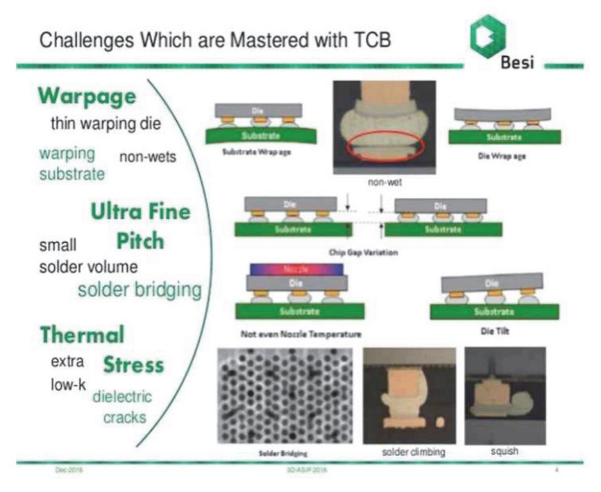

출처: 한국생산기술연구원(2019). 『20um급 미세 범프 플립 칩 패키지 원천 소재 및 공정 기술 개발』. 과학기술정보통신부. p.3. [그림 1-21] Bump soldering 접합부의 주요 이슈들

숙 개별 패키지로 절단하여 최종 제품을 완성한다.

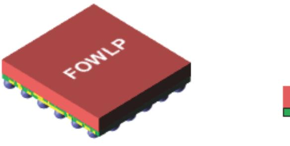

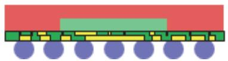

출처: 집필진 제작(2024)

[그림 1-22] Leser marking / Dicing

- 1. 팬 아웃 패키징된 웨이퍼를 검사한다.
  - (1) 최종 절단 전에 웨이퍼의 상태를 검사하여 결함 여부를 확인한다. 이는 불량 패키지가 최종 제품으로 나가는 것을 방지하기 위한 중요한 단계이다.
  - (2) 고해상도 현미경을 사용하여 웨이퍼의 표면 상태와 재배선층(RDL)의 상태를 확인한다.

- (3) 웨이퍼의 전기적 성능을 테스트하여 모든 다이가 정상적으로 동작하는지 확인한다.
- 2. 팬 아웃 패키징 된 웨이퍼를 절단한다.
  - (1) 웨이퍼를 절단하기 위한 다이싱 장비를 선정한다. 이 장비는 웨이퍼를 개별 다이로 정밀하게 절단하는 데 사용된다.
  - (2) 절단할 위치와 깊이를 정확히 맞추기 위해 장비를 조정한다. 이는 다이싱 공정의 정확도와 신뢰성을 높이기 위해 필수적이다.
  - (3) 웨이퍼를 절단하여 개별 패키지로 분리한다. 이 과정은 매우 정밀하게 수행되어야 하며, 다이 와 재배선층이 손상되지 않도록 해야 한다.
  - (4) 다이아몬드 톱을 사용하여 웨이퍼를 절단한다. 기계적 다이싱은 고정밀 절단을 가능하게 하 며, 웨이퍼의 손상을 최소화한다.
  - (5) 경우에 따라 레이저 다이싱을 사용하여 웨이퍼를 절단할 수도 있다. 레이저 다이싱은 매우 높은 정확도와 최소한의 기계적 스트레스를 제공한다.

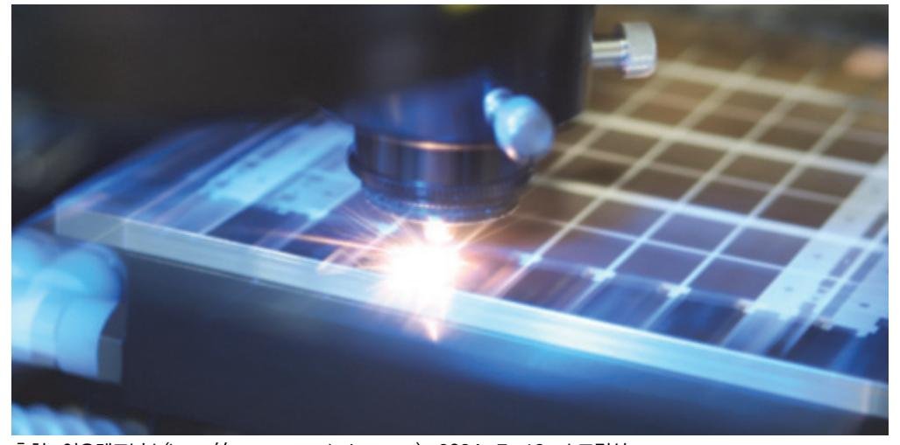

출처: 이오테크닉스(http://www.eotechnics.com). 2024. 7. 12. 스크린샷. [그림 1-23] 레이저 다이싱

- 3. 팬 아웃 패키징된 웨이퍼 절단 후 클리닝을 한다.
  - (1) 절단 후, 패키지를 세척하여 절단 과정에서 발생한 먼지나 불순물을 제거한다. 이는 최종 제 품의 품질과 신뢰성을 유지하기 위해 중요하다.
  - (2) 초음파 세척기를 사용하여 미세한 먼지와 불순물을 제거한다.

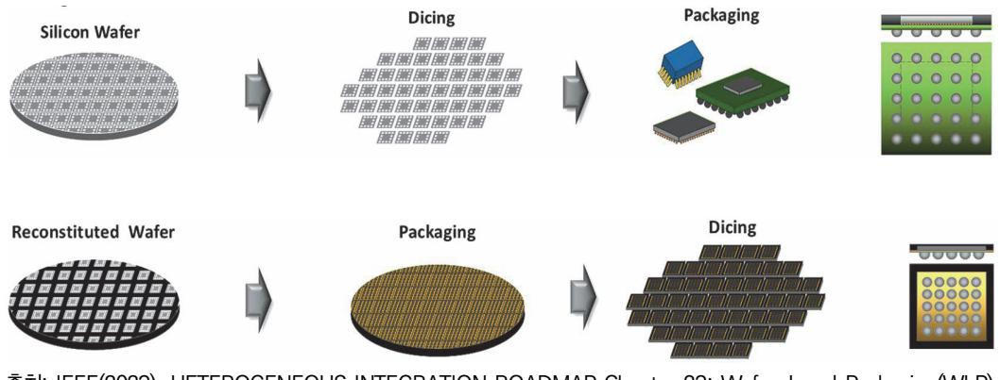

출처: IEEE(2023). HETEROGENEOUS INTEGRATION ROADMAP Chapter 23: Wafer-Level Packaging(WLP). https://eps.ieee.org/images/files/HIR\_2021/ch23-wlpfinal2.pdf. p.8, p.11. [그림 1-24] 개별 패키지 공정(위) 웨이퍼 레벨 패키지 공정(아래) 비교

- 4. 팬 아웃 패키징된 웨이퍼 절단 후 검사를 한다.
  - (1) 절단된 개별 패키지를 검사하여 결함 여부를 확인한다. 이 과정에서 결함이 발견되면 해당 패키지를 제거하거나 수정한다.
  - (2) 절단된 패키지의 가장자리를 고해상도 현미경으로 검사하여 균열이나 결함 여부를 확인한다.
  - (3) 절단된 패키지의 전기적 성능을 테스트하여 모든 연결이 정상적으로 이루어졌는지 확인한다.
- 5. 팬 아웃 패키지를 포장한다.
  - (1) 최종 패키지를 보호하기 위해 적절한 포장재를 사용하여 포장한다. 포장은 패키지를 외부 충 격과 환경 변화로부터 보호하는 역할을 한다.
  - (2) 진공 포장을 통해 패키지를 외부 환경으로부터 보호하고, 장기간 저장할 수 있도록 한다.

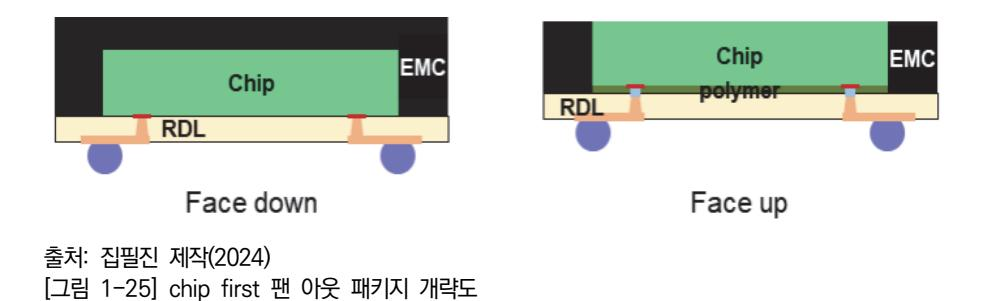

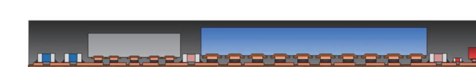

출처: IEEE(2023). HETEROGENEOUS INTEGRATION ROADMAP Chapter 23: Wafer-Level Packaging(WL P). https://eps.ieee.org/images/files/HIR\_2021/ch23-wlpfinal2.pdf. p.12. [그림 1-26] 몰딩 공정 후 eWLP 개략도

## 학습 1 교수·학습 방법

#### 교수 방법

- 칩 우선 팬 아웃 웨이퍼 레벨 패키징 공정 기술의 기본 개념과 중요성을 소개하여 학습자들 이 전체적인 틀을 이해하도록 한다. 또 패키지 성능 확장을 위한 다양한 공정 기술의 필요 성을 설명한다.
- 칩 우선 팬 아웃 웨이퍼 레벨 패키징 공정의 각 단계에 대해 상세히 설명하고, 각 단계의 목적과 절차를 숙지할 수 있도록 지도한다.
- 실제 산업에서 사용되는 팬 아웃 웨이퍼 레벨 패키징 공정 기술의 사례를 소개하여 학습자 들이 이론과 실무를 연결할 수 있도록 돕는다. 특히, 패키지 성능을 확장하는 다양한 공정 기술 적용 사례를 설명한다.
- 공정 기술의 이해를 돕기 위해 관련 비디오 강의를 활용하여 시각적인 이해를 높인다. 재배 선 기술, 솔더 볼과 솔더 범프 접합 기술법 등의 실제 공정 영상을 통해 이해를 돕는다.

#### 학습 방법

- 제공된 교재와 강의 자료를 통해 칩 우선 팬 아웃 웨이퍼 레벨 패키징 공정 기술과 패키지 성능을 확장하는 다양한 공정 기술의 기본 개념과 원리를 학습한다.
- 강의 전에 관련 자료를 미리 학습하여 강의 내용을 더욱 효과적으로 이해한다. 재배선, 솔 더 볼과 솔더 범프 접합 기술, 일정 간격을 유지하는 다이 배열 방법 등에 대해 사전에 파 악한다.
- 강의 중 중요한 내용과 이해되지 않는 부분을 노트에 필기하여 복습 시 참고한다. 특히 각 공정 기술의 단계별 절차와 목적을 상세히 기록한다.
- 강의에서 다루지 않은 추가적인 자료를 탐색하여 보다 심도 있는 학습을 진행한다. 패키지 성능 확장을 위한 최신 공정 기술 관련 논문이나 기사 등을 찾아 수업의 효과를 높인다.

## 학습 1 평 가

#### 평가 준거

- 평가자는 학습자가 학습 목표를 성공적으로 달성하였는지를 평가해야 한다.
- 평가자는 다음 사항을 평가해야 한다.

|                                | 학습 목표                                                        |  | 성취수준 |   |  |
|--------------------------------|--------------------------------------------------------------|--|------|---|--|
| 학습 내용                          |                                                              |  | 중    | 하 |  |
| 칩 우선(chip first) 팬 아웃 공정 기술 | - 표준적인 웨이퍼 레벨 패키징 공정 기술을 이용하여 개발할 수 있다.                   |  |      |   |  |
|                                | - 패키지의 성능을 확장하는 다양한 공정 기술을 적용하여 개 발할 수 있다.                |  |      |   |  |
|                                | - 솔더 볼, 솔더 범프와 접합 기술을 적용하여 개발할 수 있 다.                     |  |      |   |  |
|                                | - 칩을 다이 접착한 후 공정으로 사용하는 기판을 이용하여 적 층하는 방법을 적용하여 공정할 수 있다. |  |      |   |  |

#### 평가 방법

• 서술형 시험

| 학습 내용                          | 평가 항목                            |  | 성취수준 |   |  |
|--------------------------------|----------------------------------|--|------|---|--|
|                                |                                  |  | 중    | 하 |  |
| 칩 우선(chip first) 팬 아웃 공정 기술 | - 표준적인 웨이퍼 레벨 패키징 공정 기술 파악 여부    |  |      |   |  |
|                                | - 패키지의 성능을 확장하는 다양한 공정 기술을 적용 능력 |  |      |   |  |
|                                | - 솔더 볼, 솔더 범프와 접합 기술 적용 능력       |  |      |   |  |
|                                | - 칩을 다이 접착한 후 공정으로 사용하는 기판 이용 능력 |  |      |   |  |

• 구두 발표

|                                | 평가 항목                                                             |  | 성취수준 |   |  |
|--------------------------------|-------------------------------------------------------------------|--|------|---|--|
| 학습 내용                          |                                                                   |  | 중    | 하 |  |
| 칩 우선(chip first) 팬 아웃 공정 기술 | - 팬 아웃 패키징 기술의 발전과 적용 분야에 대해 발표할 수 있는 능력                       |  |      |   |  |
|                                | - 팬 아웃 패키징 공정에서 발생할 수 있는 문제점과 해결 방 안을 설명할 수 있는 능력              |  |      |   |  |
|                                | - 재배선층(RDL)의 형성 과정에서 발생할 수 있는 기술적 문 제를 설명할 수 있는 능력             |  |      |   |  |
|                                | - 칩 우선 팬 아웃 공정의 각 단계에서 발생할 수 있는 위험 요소와 이를 관리하는 방법을 설명할 수 있는 능력 |  |      |   |  |

#### 피드백

| 1. 서술형 시험                                             |
|-------------------------------------------------------|
| - 성취수준이 낮은 학습자에게는 팬 아웃 패키징 기술의 기본 개념과 웨이퍼 레벨 패키징      |
| (WLP) 기술과의 차이점을 다시 설명해 주고, 팬 아웃 패키징의 필요성과 장점을 구체적     |
| 으로 기술하도록 연습시킨다.                                       |
| - 성취수준이 높은 학습자에게는 팬 아웃 패키징의 다양한 응용 분야와 향후 기술 발전       |
| 가능성을 설명하도록 하여 깊이 있는 이해를 강화한다.                         |
| - 성취수준이 낮은 학습자에게는 RDL 형성 공정의 기본 원리와 과정을 반복적으로 연습      |
| 하게 하고, 포토리소그래피, 금속 증착, 도금 공정 등의 세부 과정을 다시 학습하도록 지     |
| 도한다.                                                  |
| - 성취수준이 높은 학습자에게는 RDL 형성 공정에서 발생할 수 있는 문제점과 이를 해결     |
| 하기 위한 고급 공정 기술을 설명하게 하여 심화 학습을 유도한다.                  |
| - 성취수준이 낮은 학습자에게는 다이 배치와 몰딩 공정의 기본 과정과 그 중요성을 다시      |
| 설명하고, 다이 배치의 정확성을 보장하기 위한 주의 사항을 구체적으로 연습하게 한다.       |
| - 성취수준이 높은 학습자에게는 몰딩 과정에서 발생할 수 있는 변형이나 결함을 분석하고      |
| 이를 최소화하는 방법을 제시하도록 지도한다.                              |
| - 성취수준이 낮은 학습자에게는 칩 우선 페이스 다운 방식과 페이스 업 방식의 기본적인      |
| 차이점과 특징을 다시 학습하도록 하고, 그 차이점을 구체적으로 서술하게 지도한다.         |
| - 성취수준이 높은 학습자에게는 두 방식의 전기적 성능과 열 관리 측면에서의 차이점을       |
| 심층적으로 설명하게 하여 심화 학습을 진행한다.                            |
| 2. 구두 발표                                              |
| - 성취수준이 낮은 학습자에게는 팬 아웃 패키징 기술의 주요 개념과 최근 적용 사례를 구두로 발 |
| 표할 수 있도록 지도하고, 발표 연습을 통해 개념을 정확히 전달하게 한다.             |
| - 성취수준이 높은 학습자에게는 팬 아웃 패키징 기술의 미래 발전 가능성과 신기술 적용      |
| 방향을 발표하게 하여 깊이 있는 토론을 유도한다.                           |

- 성취수준이 낮은 학습자에게는 공정 중 발생할 수 있는 일반적인 문제점과 기본적인 해 결 방안을 구체적으로 설명하게 하여 발표 능력을 강화시킨다.
- 성취수준이 높은 학습자에게는 실제 산업 현장에서 발생할 수 있는 복잡한 문제를 다루 고, 이를 해결하기 위한 고급 기술과 전략을 발표하도록 유도한다.
- 성취수준이 낮은 학습자에게는 RDL 형성 과정의 기본적인 문제점(예: 패턴 정렬 문제, 금속 도금 불량 등)을 설명하고, 이를 해결하기 위한 방법을 발표하도록 지도한다.
- 성취수준이 높은 학습자에게는 RDL 형성에서 발생할 수 있는 고밀도 배선 기술의 한계 와 이를 극복하기 위한 연구 동향을 발표하게 하여 고급 발표 능력을 개발하도록 한다.
- 성취수준이 낮은 학습자에게는 공정의 각 단계에서 발생할 수 있는 일반적인 위험 요소 (예: 몰딩 불량, 솔더 범프 형성 불량)를 설명하고, 그 관리 방법을 발표하도록 지도한다.
- 성취수준이 높은 학습자에게는 칩 우선 공정에서 발생할 수 있는 다양한 문제를 다루고, 이를 효과적으로 관리하는 방법을 발표하도록 하여 심화 학습을 진행한다.

| 학습 1 | 칩 우선(chip first) 팬 아웃 공정 진행하기 |
|------|-------------------------------|
| 학습 2 | 칩 나중(chip last) 팬 아웃 공정 진행하기  |
| 학습 3 | 초고밀도 팬 아웃 공정 진행하기             |

## 2-1. 칩 나중(chip last) 팬 아웃 공정 기술

| 학습 목표 | • 표준적인 웨이퍼 레벨 패키징 공정 기술을 이용하여 개발할 수 있다.            |
|-------|----------------------------------------------------|
|       | • 패키지의 성능을 확장하는 다양한 공정 기술을 적용하여 개발할 수 있다.          |
|       | • 솔더 볼, 솔더 범프와 접합 기술을 적용하여 개발할 수 있다.               |
|       | • 칩을 다이 접착한 후 공정으로 사용하는 기판을 이용하여 적층하는 방법을 적용하여 공정할 |
|       | 수 있다.                                              |

## 필요 지식 /

숔 chip last 팬 아웃 공정 기술

- 1. 개요
  - (1) 칩 나중 팬 아웃 공정 개요

칩 나중(chip last) 팬 아웃 공정 기술(FOCL: chip last fan out)은 반도체 패키징 기 술 중 하나로, 재배선층(RDL)과 팬 아웃 구조를 먼저 형성한 후 칩을 나중에 배치하는 방식이다. 이 기술은 웨이퍼 레벨 패키징(WLP) 기술을 기반으로 하여 개발되었으며, 기 존의 WLP 장비를 활용할 수 있는 경제적 이점을 제공한다.

(2) FOCL과 FOCF 공정의 차이점

FOCL 공정 기술은 칩 우선(chip first) 팬 아웃 공정 기술과 여러 면에서 차별화된다. FOCF 공정은 칩을 먼저 배치한 후 재배선층과 팬 아웃 구조를 형성하는 방식으로, 고 성능 및 고밀도 응용 분야에서 더 나은 전기적 성능과 열 관리 효율을 제공한다. FOCL 공정은 기존의 WLP 장비를 활용할 수 있어 초기 투자 비용이 낮다. 이는 새로운 장비 에 대한 투자를 최소화하면서도 기존 공정을 활용할 수 있는 장점이 있다.

(3) FOCL 공정의 예측 가능성과 안정성

재배선층과 팬 아웃 구조를 먼저 형성한 후 칩을 배치하기 때문에 공정의 예측 가능성 과 안정성이 높다. 이는 대규모 생산을 목표로 하는 반도체 제조업체에게 중요한 요소이 다.

(4) FOCL 공정의 응용 분야

FOCL 공정은 패키지 크기가 상대적으로 크지만, 고밀도와 고성능을 요구하는 응용 분 야에 적합하다. 주로 고성능 컴퓨팅, AI, 데이터 센터, 네트워킹 장비 등에서 사용되며, 그래픽 및 AI 제품, 통신 장비 등이 이에 해당한다. 패키지 크기와 열 관리 요구 사항 때문에 모바일 장치에서 사용하기에는 제한이 있을 수 있다. 특정한 경우에는 모바일 장 치에서도 사용될 수 있지만, 이는 주로 고성능 요구가 매우 높은 고급 스마트폰이나 태 블릿에 해당한다.

(5) 초기 팬 아웃 공정에서 FOCL의 선택

반도체 회사 대부분은 초기 팬 아웃 공정에서 FOCL(chip last) 방식을 선택하였다. 이 는 초기 투자 비용이 낮고 기존 장비를 활용할 수 있어 경제적 이점을 제공했기 때문이 다. FOCL 공정은 재배선층(RDL)과 팬 아웃 구조를 먼저 형성한 후 칩을 배치하는 방 식으로 초기 설정과 생산이 상대적으로 쉬웠다.

(6) FOCL 공정의 장비 활용과 안정성

기존의 웨이퍼 레벨 패키징(WLP) 장비를 대부분 활용할 수 있어 초기 투자 비용을 크 게 절감할 수 있었다. 공정의 복잡성이 상대적으로 낮아 대규모 생산 시 예측 가능성과 안정성을 보장할 수 있다.

- 2. 배경
  - (1) 공정 개요
    - (가) 칩 나중 팬 아웃 공정의 발전 배경

반도체 산업이 발전하면서 고성능, 고밀도, 고집적도의 요구가 증가함에 따라 다양한 패키징 기술이 개발되었다. 초기에는 와이어 본딩이 주로 사용되었지만, 집적도 상승 으로 플립 칩 본딩이 도입되었다. 그러나 이러한 기술들로는 최신 성능 요구를 만족 하기 어려워지면서 팬 아웃 웨이퍼 레벨 패키징(FOWLP)이 등장하였다. 칩 나중 팬 아웃 공정(chip last FOWLP)은 2000년대 후반에 기존 웨이퍼 레벨 패키징(WLP)을 기반으로 개발되었다. 이 공정은 먼저 재배선층(RDL)과 팬 아웃 구조를 형성한 후 칩을 배치하는 방식으로, 공정 복잡성을 낮추고 생산 효율을 높인다.

(나) 장점과 적용 분야

칩 나중 팬 아웃 공정은 기존 WLP 장비를 활용할 수 있어 초기 투자 비용과 기술 개발 비용을 절감할 수 있다는 장점이 있다. 주요 반도체 제조사들은 PC, 서버, 데 이터 센터와 같은 고성능 응용 분야에서 chip last 공정을 활용하고 있다. 이 공정 은 소형화 및 발열 관리보다 공정 안정성과 예측 가능성에 중점을 둔 기술이다. 특 히 대규모 생산에서 공정의 안정성과 신뢰성이 중요한 시장에서 널리 사용되고 있으 며, 고성능 프로세서, 그래픽 카드, 서버용 칩 제조에 적용되고 있다.

(2) 기술적 장점

- (가) 초기 투자 비용과 기술 개발 비용 절감
  - 칩 나중 팬 아웃 공정 기술의 가장 큰 장점 중 하나는 기존의 WLP 장비를 대부분 활용할 수 있다는 점이다. 이는 새로운 장비에 대한 투자를 최소화하면서도 기존 공 정을 활용할 수 있어 초기 단계에서의 낮은 기술 개발 비용을 가능하게 한다. 많은 반도체 회사들이 chip last 공정을 선택한 이유 중 하나는 이러한 비용 절감 효과 때문이다. 초기 모바일 디바이스 및 소비자 전자 제품 시장에서는 고성능 요구가 상 대적으로 낮았기 때문에, 기존 장비를 활용한 chip last 공정이 더 적합하였다.
- (나) 공정의 예측 가능성과 안정성
  - 칩 나중 공정은 재배선층과 팬 아웃 구조를 먼저 형성한 후 칩을 배치하는 방식으 로, 공정의 복잡성이 상대적으로 낮다. 이는 대규모 생산 시 공정의 예측 가능성과 안정성을 보장할 수 있다. 공정 안정성은 대량 생산을 목표로 하는 반도체 제조업체 에게 중요한 요소로, chip last 공정을 통해 안정적인 제품 공급을 가능하게 한다. 이러한 예측 가능성과 안정성은 대규모 생산에서 매우 중요한 요소로 작용한다.
- (3) 적용 분야의 다양성

칩 나중 공정은 고성능이 요구되는 다양한 응용 분야에 적합하다. 예를 들어, 고성능 프 로세서, 그래픽 카드, 서버 칩 등과 같은 고성능과 고집적도가 필요한 제품에 많이 사용 된다. 이러한 제품들은 주로 PC와 서버 시장을 타겟으로 하고 있으며, 고성능과 공정 안정성이 더 중요한 요소로 작용한다. chip last 공정을 사용하는 회사들은 주로 고성능 컴퓨팅 장치와 서버용 칩을 제조하며, 이러한 시장 요구를 충족시키기 위해 chip last 공정을 적극 활용하고 있다.

3. 장점

칩 나중 팬 아웃 공정 기술은 반도체 패키징 기술 중 하나로, 다양한 장점이 있어 최근 주 목받고 있는 기술이다.

(1) 유연한 설계 가능성

칩 나중 팬 아웃 공정 기술은 설계의 유연성을 크게 향상한다. 반도체 칩을 마지막에 배치하기 때문에, 패키지의 형상과 배선을 자유롭게 설계할 수 있다. 이는 다양한 형태 의 응용 제품에 맞춰 맞춤형 설계를 가능하게 하며, 고밀도 패키지 구현에 유리하다. 또 기존의 패키지 기술로는 구현하기 어려운 복잡한 구조도 쉽게 구현할 수 있다.

(2) 고성능 구현

칩 나중 팬 아웃 공정 기술은 전기적 성능을 향상하는 데 도움이 된다. 패키지 내부의 배선 길이를 최소화할 수 있어, 신호 전달 지연을 줄이고 전기적 특성을 개선할 수 있 다. 이는 고속 통신이 요구되는 현대의 전자 기기에 매우 중요하다. 또 배선 밀도를 높

여 더 많은 회로를 집적할 수 있어 고성능 칩 설계가 가능하다.

(3) 열 관리

열 관리 측면에서도 chip last 팬 아웃 공정 기술은 장점이 있다. 칩을 패키지의 상단 에 배치함으로써 열 방출이 쉬워진다. 이는 열 발생이 많은 고성능 칩에서 특히, 중요한 요소로, 패키지의 수명을 연장하고 안정적인 동작을 보장한다. 효율적인 열 관리 덕분에 고성능 시스템에서도 안정적인 작동이 가능해진다.

(4) 공간 효율성

칩 나중 팬 아웃 공정 기술은 공간 효율성 측면에서도 우수하다. 패키지 크기를 최소화 할 수 있어, 작은 크기의 전자 기기에도 쉽게 적용할 수 있다. 이는 모바일 기기, 웨어 러블 디바이스 등 공간이 제한된 응용 제품에 적합하며 제품의 소형화에 기여한다. 또 다층 구조로 설계할 수 있어, 동일한 면적에서 더 많은 기능을 구현할 수 있다.

(5) 생산성 향상

생산성 측면에서도 칩 나중 팬 아웃 공정 기술은 장점을 제공한다. 칩을 나중에 배치하 는 방식 덕분에, 공정 초기 단계에서의 불량률이 감소하고, 전체적인 수율(yield)이 향상 된다. 또 칩을 보호하는 레진 몰딩 등의 공정을 통해 외부 환경으로부터의 보호가 쉬워 져 제품의 신뢰성을 높일 수 있다. 이는 결과적으로 생산 비용 절감과 품질 향상으로 이어진다.

(6) 다기능 집적

칩 나중 팬 아웃 공정 기술은 다기능 집적에 유리하다. 여러 개의 칩을 하나의 패키지 에 통합하여 다양한 기능을 한 번에 구현할 수 있다. 이는 시스템의 복잡성을 줄이고, 더 작은 패키지 내에 다양한 기능을 집적할 수 있게 한다. 또 이종 칩(hybrid chip)의 통합도 가능해 다양한 기술과 재료를 결합한 혁신적인 제품 개발이 가능하다.

4. 단점

칩 나중 팬 아웃 공정 기술은 여러 장점을 가지고 있지만 일부 단점도 있다. 이러한 단점은 공정의 복잡성과 기술적 한계로 인해 발생하며, 이를 극복하기 위한 지속적인 연구와 개발 이 필요하다.

(1) 복잡한 공정 단계와 비용

칩 나중 공정은 재배선층과 팬 아웃 구조를 먼저 형성한 후 칩을 배치하는 방식으로, 공정의 복잡성이 상대적으로 높다. 이 과정에서 발생할 수 있는 여러 단계에서의 문제는 공정의 전체적인 안정성과 효율성을 떨어뜨릴 수 있다. 특히, 칩 배치 후의 정렬 및 접 합 과정에서 발생할 수 있는 오차는 최종 제품의 품질에 영향을 끼칠 수 있다.

(2) 신뢰성 문제

칩 나중 팬 아웃 공정은 기존의 WLP 장비를 활용할 수 있다는 점에서 초기 투자 비용

은 낮출 수 있지만, 복잡한 공정으로 인해 제조 비용이 증가할 수 있다. 특히, 높은 정 밀도와 복잡한 공정 관리를 요구하는 상황에서는 제조 비용이 급격히 상승할 수 있다. 이는 대량 생산을 목표로 하는 경우 전체 생산 비용에 큰 영향을 끼친다.

(3) 열 관리 문제

칩 나중 팬 아웃 방식은 칩의 비활성 면이 외부에 노출되지 않아 열 방출 경로가 복잡 할 수 있다. 이는 고성능 디바이스에서 열 관리의 어려움을 초래할 수 있으며, 특히 발 열이 많은 응용 분야에서 문제가 될 수 있다. 열 관리를 위한 추가적인 재료와 설계가 필요하며, 이는 전체 비용과 공정 복잡성을 증가시킬 수 있다.

(4) 수율 문제

칩 나중 팬 아웃 공정은 고성능 프로세서와 같은 응용 분야에서는 유리하지만, 초박형 초소형 디바이스에는 한계가 있을 수 있다. 모바일 기기와 같이 소형화가 중요한 응용 분야에서는 chip first 공정이 더 적합하다. chip last 공정은 상대적으로 큰 패키지 크 기와 무게를 가지며, 이는 초소형 기기에서는 단점으로 작용할 수 있다.

(5) 기술적 한계

칩 나중 팬 아웃 공정은 다단계 공정을 포함하며, 각 단계에서 높은 정밀도를 요구한다. 이는 전체 공정 시간을 증가시키며, 생산 속도를 늦출 수 있다. 공정 시간의 증가로 인 해 생산 라인의 효율성이 저하되고, 이는 대량 생산에서 중요한 문제로 작용할 수 있다. 특히, 고성능 응용 분야에서의 빠른 시장 출시 요구를 충족시키는 데 어려움이 있다.

- 숖 chip first Fan-Out 공정 기술과 chip last Fan-Out 공정 기술 비교
  - 1. 칩 우선 팬 아웃 공정과 칩 나중 팬 아웃 공정의 비교
    - 칩 우선 팬 아웃 공정 기술과 칩 나중 팬 아웃 공정 기술은 각각 고유한 장점과 단점이 있 으며, 다양한 응용 분야에 적합하다. 칩 우선 팬 아웃 공정은 칩을 먼저 웨이퍼 위에 배치 한 후 재배선층(RDL)을 형성하는 방식으로, 칩의 활성 면이 외부로 노출되어 열 방출이 쉽 고 전기적 성능을 극대화할 수 있다. 이 방식은 모바일 기기와 같이 소형화가 중요한 응용 분야에 적합하다.
  - 2. 칩 나중 팬 아웃 공정의 경제적 이점

반면, 칩 나중 팬 아웃 공정은 재배선층과 팬 아웃 구조를 먼저 형성한 후 칩을 배치하는 방식으로, 기존의 WLP 장비를 활용하여 초기 투자 비용과 기술 개발 비용을 절감할 수 있 다. 이 공정은 대규모 생산 시 공정의 예측 가능성과 안정성을 높일 수 있으며, 고성능 프 로세서, 그래픽 카드, 서버 칩 등과 같은 고성능과 고집적도가 중요한 PC와 서버 응용 분 야에 적합하다.

3. 열 관리 측면에서의 차이점

열 관리 측면에서 칩 우선 팬 아웃 공정은 칩의 비활성 면이 외부에 노출되어 열 방출이 쉽지만, 모바일 기기에서는 발열 문제가 클 수 있다. 반면, chip last 공정은 열 방출 경로 가 복잡할 수 있으나, 고성능 열전도성 재료와 설계 방식을 통해 열 관리 효율을 높일 수 있다.

#### 4. 응용 분야에 따른 차별화

응용 분야 측면에서 칩 우선 팬 아웃 공정은 소형화와 경량화가 중요한 모바일 기기와 소 비자 전자 제품에 많이 사용되며, 칩 나중 팬 아웃 공정은 고성능과 고집적도가 중요한 PC, 서버, 데이터 센터 응용 분야에 널리 사용된다. 결론적으로, 칩 우선 팬 아웃 공정 기 술은 모바일 기기에, 칩 나중 팬 아웃 공정 기술은 PC와 서버 응용 분야에 더 적합하며, 각 기술의 장점을 최대한 활용하여 다양한 시장의 요구를 충족시키고 있다.

<표 2-1> chip first fan-out 공정 기술과 chip last fan-out 공정 기술 비교

| 구분           | chip first fan-out             | chip last fan-out                 |
|--------------|--------------------------------|-----------------------------------|
| 공정 방식        | 칩을 먼저 배치 후 RDL 형성              | RDL과 팬 아웃 구조 형성 후 칩 배치            |
| 초기 투자 비용     | 높음.                            | 낮음.                               |
| 공정 복잡성 및 안정성 | 높은 정밀도와 복잡성 요구                 | 예측 가능성과 안정성 높음.                   |
| 전기적 성능       | 칩 간 간격 줄여 전기적 성능 향상            | 전기적 연결 최적화                        |
| 열 관리         | 열 방출 쉬우나 모바일 기기 발열 문제 발생 가능 | 열 방출 경로 복잡하나 고성능 재료와 설계로 해결 가능 |
| 소형화          | 소형화 및 경량화 가능                   | 소형화 필요성 낮음.                       |
| 응용 분야        | 모바일 기기와 소비자 전자 제품              | PC, 서버, 데이터 센터                    |
| 자동화와 생산 효율성  | 초기 투자 후 생산 효율성 높음.             | 자동화와 정밀도 향상으로 생산 수율과 효율성 높음.   |

## 수행 내용 / chip last 팬 아웃 공정 기술 수행하기

#### 재료·자료

- 반도체 웨이퍼: 기본 재료
- 재배선층 재료: 금속(주로 구리), 절연 재료
- 몰딩 콤파운드: 에폭시 레진
- 본딩 재료: 솔더 볼, 플립 칩 본딩 재료
- 플럭스: 솔더 볼 접착력 향상
- 세정 용액: 기판 청소.

#### 기기(장비 ・ 공구)

- 포토리소그래피 장비: 패턴 형성
- 증착 장비: 금속 및 절연층 증착
- 본딩 장비: 플립 칩 본딩용
- 오버몰딩 장비: 몰딩 콤파운드 적용
- 열 처리 장비: 몰딩 후 열 처리
- 리플로 오븐: 솔더 볼 부착
- 다이싱 장비: 최종 패키지 절단

#### 안전 ・ 유의 사항

- 포토레지스트, 에칭 용액 등 화학 물질 취급 시 보호 장비를 착용한다.
- 열 처리 장비 사용 시 화상에 주의한다.
- 고정밀 장비 사용 시 정밀 작업을 수행한다.
- 민감한 반도체 기판 취급 시 정전기 방지에 유의한다.

수행 순서

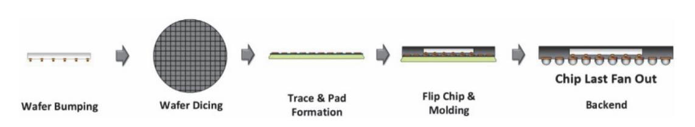

출처: IEEE(2023). HETEROGENEOUS INTEGRATION ROADMAP Chapter 23: Wafer-Level Packaging(WLP). https://eps.ieee.org/images/files/HIR\_2021/ch23-wlpfinal2.pdf. p.13. [그림 2-1] chip-last 공정

숔 캐리어를 준비한다.

캐리어 준비는 chip last 팬 아웃 공정의 첫 단계로, 반도체 다이 및 재배치층(RDL)을 형성하 는 동안 지지체 역할을 하는 임시 기판을 준비하는 과정이다. 캐리어는 기판의 안정성을 유지 하고, 공정 중 발생할 수 있는 손상을 방지하기 위해 필수적인 요소이다. 이 과정은 기판의 품 질과 최종 패키지의 성능에 중요한 영향을 끼친다.

- 1. 캐리어를 선택하고 준비한다.
  - (1) 재료를 선택한다.

캐리어는 일반적으로 실리콘, 유리 또는 특수 폴리머 재질로 제작된다. 재료 선택은 공 정의 요구 사항과 호환성, 열적 특성 등을 고려하여 결정된다.

(2) 표면 처리를 한다.

캐리어의 표면은 기판이 잘 부착될 수 있도록 처리된다. 플라즈마 처리를 통해 표면을 활성화하거나, 화학적 방법으로 표면을 깨끗이 하고, 접착 특성을 향상시킨다.

#### 2. 접착제를 도포한다.

(1) 접착제를 선택한다.

기판과 캐리어 사이의 접착을 위해 사용되는 접착제는 공정 조건과 요구 사항에 따라 선택된다. 일반적으로 열경화성 접착제 또는 UV 경화성 접착제가 사용된다.

(2) 접착체 도포한다.

접착제는 균일하게 도포되어야 한다. 도포 두께는 일반적으로 수십 마이크로미터 수준이 며, 균일한 도포를 위해 스핀 코팅 또는 슬릿 코팅 방법이 사용된다.

#### 3. 표면 처리를 한다.

(1) 정렬 및 부착을 한다.

준비된 기판을 캐리어 위에 정렬하고, 접착제를 통해 부착한다. 이 과정에서는 기판의 위치 정밀도가 매우 중요하며, 고정밀 정렬 장비가 사용된다.

(2) 경화를 한다.

 접착제를 경화시키기 위해 열 또는 UV를 가한다. 이 과정은 접착제의 종류에 따라 달 라지며, 열경화성 접착제는 오븐에서, UV 경화성 접착제는 UV 램프 아래에서 경화된 다. 경화 시간과 온도는 접착제의 특성에 따라 설정된다.

- 4. 검사 및 품질 관리를 한다.
  - (1) 접착 강도를 검사한다.

기판이 캐리어에 제대로 부착되었는지 확인하기 위해 접착 강도를 검사한다. 이는 기계 적 시험 또는 초음파 검사 등으로 수행된다.

(2) 표면 평탄도 검사를 한다.

기판의 표면 평탄도를 검사하여, 후속 공정에서 문제를 일으킬 수 있는 불균일한 부분이 없는지 확인한다. 레이저 스캐닝 또는 광학 검사를 통해 평탄도를 측정한다.

#### 수행 tip

• 재료 선택 시, 열팽창 계수가 비슷한 재료를 사용한다.

• 표면 처리 시, 플라즈마 처리를 통해 접착력을 향상한다.

• 경화 조건은 온도와 시간을 최적화하여 설정한다.

숕 RDL 형성(redistribution layer 형성) 과정을 진행한다.

chip last 팬 아웃 공정에서 매우 중요한 단계로, 다이의 입출력(I/O) 패드를 재배치하여 외부 기판과의 전기적 연결을 최적화하는 과정이다. 이 단계에서는 기판 위에 여러 층의 금속 패턴 과 절연층을 형성하여, 다이의 전기적 신호를 외부 패키지와 연결할 수 있도록 한다. RDL 형 성 과정은 고정밀 포토리소그래피와 도금 공정을 포함하며, 기판의 전기적 특성과 신뢰성을 크 게 좌우한다.

- 1. 스핀 코팅(spin coating) 방법을 사용하여 기판 위에 포토레지스트를 균일하게 도포한다. 스핀 코 팅 속도와 시간은 포토레지스트의 두께를 결정한다.
- 2. 노광 및 현상을 한다.
  - (1) 포토레지스트 도포 후, 기판을 마스크 정렬 장치에 넣고, 원하는 패턴을 형성하기 위해 자외 선(UV) 노광을 진행한다. 이 과정에서 마스크는 포토레지스트 위에 원하는 금속 패턴을 투영 한다.
  - (2) 노광된 포토레지스트를 현상액(developer)으로 현상하여 노광된 부분과 노광되지 않은 부분 을 분리한다. 이 과정에서 패턴이 기판 위에 형성된다.
- 3. 금속 도금을 진행한다.

- (1) 포토레지스트가 현상된 기판을 도금 탱크에 넣기 전에, 기판을 세척하여 불순물을 제거한다.
- (2) 전기 도금(electroplating) 또는 무전해 도금(electroless plating) 방법을 사용하여 기판 위 에 금속(주로 구리)을 도금한다. 도금 두께는 공정 조건에 따라 조절된다.
- (3) 도금 후, 남은 포토레지스트를 스트리핑 솔루션을 사용하여 제거한다.
- 4. 절연층을 형성한다.
  - (1) 금속 패턴 위에 절연층(주로 폴리이미드 또는 실리콘 산화물)을 도포한다. 스핀 코팅 또는 슬 릿 코팅 방법을 사용하여 균일하게 도포한다.
  - (2) 절연층을 경화하기 위해 열처리 또는 UV 경화 과정을 진행한다.
- 5. 다층 RDL이 필요한 경우, 2번부터 4번까지의 공정을 반복하여 여러 층의 금속 패턴과 절연층을 형성한다. 각 층은 정확하게 정렬되어야 하며, 고정밀 포토리소그래피 장비가 사용된다.
- 6 평탄화 및 검사를 진행한다.
  - (1) 다층 RDL 형성 후, 기판의 표면을 평탄화하기 위해 화학적 기계적 연마(CMP) 공정을 수행 할 수 있다.
  - (2) 최종적으로 RDL의 패턴과 전기적 특성을 검사하여, 결함이 없는지 확인한다. 전기적 테스트 와 광학 검사를 통해 RDL의 품질을 평가한다.

수행 tip

- 균일 도포를 위해 포토레지스트를 균일하게 도포한다.
- 정밀 노광을 위해 고해상도 마스크를 사용한다.
- 균일 도금을 위해 전류 밀도를 일정하게 유지한다.
- 숖 개별 반도체 다이를 기판에 정확하게 배열하고 부착하여, 최종 패키지의 전기적 연결성과 신뢰성을 확보한다.

해당 공정은 정밀도와 품질에 큰 영향을 끼치므로, 매우 신중하고 세심한 처리가 필요하다.

- 1. 다이를 준비한다.
  - (1) 웨이퍼에서 개별 다이를 절단하는 과정이다. 다이는 매우 얇게 가공되며, 기계적 손상을 최소 화하기 위해 특수한 장비와 기술이 사용된다.
  - (2) 절단된 다이를 세정하여 표면의 불순물과 잔여물을 제거한다. 이를 통해 부착 공정에서 접착 강도를 높이고, 불량률을 줄일 수 있다.

2. 기판을 준비한다.

기판에 있는 정렬 마크를 확인하여, 다이가 정확하게 위치할 수 있도록 준비한다. 정렬 마크는 포토리소그래피 공정에서 형성된 패턴으로, 다이의 정확한 위치를 지정하는 데 사용된다.

- 3. 다이를 픽 앤 플레이스 한다.
  - (1) 고정밀 픽 앤 플레이스 장비를 사용하여 다이를 기판에 배열한다. 이 장비는 진공 흡착 또는 그리퍼를 사용하여 다이를 집어 기판에 정확하게 배치한다.
  - (2) 다이를 기판 위의 정렬 마크에 맞추어 정밀하게 배열한다. 이 과정에서 다이의 위치 오차는 몇 마이크로미터 이내로 유지되어야 한다.
- 4. 다이를 본딩한다.
  - (1) 다이와 기판 사이에 본딩 접착제를 도포한다. 접착제는 일반적으로 열경화성 또는 UV 경화 성 소재로, 다이와 기판 간의 강한 접착력을 제공한다.
  - (2) 다이를 기판에 열 압착 본딩한다. 이 공정에서는 열과 압력을 가하여 다이를 기판에 단단히 부착한다. 본딩 온도와 압력은 접착제의 특성에 따라 조절된다.
  - (3) 일부 경우에는 플립 칩 본딩 기술을 사용하여 다이의 입출력(I/O) 패드를 기판의 패드와 직 접 연결한다. 이는 고주파 및 고속 신호 전송에 유리한 방식이다.
- 5. 본딩 강도 검사를 진행한다.
  - (1) 다이가 기판에 제대로 부착되었는지 확인하기 위해 전기적 테스트를 수행한다. 이는 다이와 기판 간의 전기적 연결 상태를 검사하는 과정이다.
  - (2) 본딩 강도를 확인하기 위해 기계적 강도 테스트를 수행한다. 이는 다이와 기판 간의 접착 강 도를 평가하는 과정이다.
- 6. 불량 검사 및 다이 위치를 재조정하거나 불량 다이를 교체한다.
  - (1) 고해상도 광학 현미경을 사용하여 다이의 위치와 부착 상태를 검사한다. 불량이 발견되면 수 정 작업을 수행한다.
  - (2) 필요시 픽 앤 플레이스 장비를 사용하여 다이의 위치를 재조정하거나, 불량 다이를 제거하고 새로운 다이로 교체한다.

#### 수행 tip

- 정밀 정렬을 위해 고정밀 픽 앤 플레이스 장비를 사용한 다.
- 본딩 조건은 온도와 압력을 정확히 조절한다.

45

숗 몰딩 콤파운드 공정을 진행한다.

몰딩 콤파운드 적용은 chip last 팬 아웃 공정의 중요한 단계로, 부착된 다이와 기판을 보호하 고 기계적 강도를 높이는 역할을 한다. 몰딩 콤파운드는 일반적으로 에폭시 기반의 재료로, 다 이와 기판을 감싸 물리적 충격과 환경적 스트레스로부터 보호한다. 이 과정은 패키지의 신뢰성 과 내구성을 보장하는 데 필수적이다.

- 1. 몰딩 콤파운드를 준비한다.
  - (1) 몰딩 콤파운드는 에폭시 수지 기반으로, 열적, 전기적, 기계적 특성에 따라 선택된다. 선택된 재료는 충격 저항, 열적 안정성, 전기 절연 특성이 우수해야 한다.
  - (2) 콤파운드 재료를 사용 전에 잘 혼합하여 균일한 성질을 가지도록 준비한다. 이는 경화 과정 에서 균일한 특성을 보장하기 위해 중요하다.
- 2. 몰딩 장비를 준비한다.
  - (1) 몰딩 공정을 위해 장비를 설정한다. 주요 설정 사항은 압력, 온도, 시간 등으로, 각각의 재료 와 공정 조건에 따라 다르다.
  - (2) 기판을 몰딩 장비에 넣기 전에 금형을 준비한다. 금형은 기판의 형태와 일치해야 하며, 몰딩 콤파운드가 균일하게 퍼질 수 있도록 설계된다.
- 3. 몰딩 공정을 진행한다.
  - (1) 준비된 기판을 몰딩 장비의 금형에 로딩한다. 기판은 정밀하게 위치시켜야 하며, 다이가 손상 되지 않도록 주의한다.
  - (2) 몰딩 콤파운드를 금형에 주입하여 기판과 다이를 감싸도록 한다. 이 과정에서는 기포가 생기 지 않도록 주의하며, 균일하게 퍼지도록 관리한다.
  - (3) 설정된 압력과 온도를 적용하여 몰딩 콤파운드를 경화시킨다. 이 과정은 콤파운드의 특성과 금형의 설계에 따라 몇 분에서 몇 시간까지 걸릴 수 있다.
- 4. 경화 및 냉각 공정을 진행한다.
  - (1) 콤파운드가 완전히 경화되도록 충분한 시간 동안 열과 압력을 유지한다. 경화가 완료되면 장 비의 온도를 천천히 낮추어 콤파운드를 안정화한다.
  - (2) 경화가 완료된 후, 기판을 장비에서 꺼내어 천천히 냉각시킨다. 급격한 온도 변화는 기계적 스트레스를 유발할 수 있으므로, 서서히 냉각하는 것이 중요하다.
- 5. 몰딩 공정 후 필요한 처리 작업을 진행한다.
  - (1) 몰딩 과정에서 금형의 틈으로 삐져나온 불필요한 콤파운드(플래시)를 제거한다. 이는 기계적 또는 화학적 방법을 사용하여 수행한다.
  - (2) 몰딩 후 기판의 표면을 검사하여, 균일하게 몰딩 되었는지 확인한다. 불량이 발생한 경우 재

작업을 실시한다.

- 6. 품질 검사를 진행한다.
  - (1) 몰딩 후 기판의 전기적 특성을 검사하여, 몰딩 과정에서 발생할 수 있는 전기적 손상을 확인 한다.
  - (2) 기판의 기계적 강도와 몰딩 콤파운드의 접착 강도를 검사하여, 품질 기준에 부합하는지 확인 한다.

수행 tip

• 균일 도포를 통해 기포 발생을 최소화한다.

• 경화 조건은 온도와 시간을 최적화하여 설정한다.

수 몰딩 콤파운드 적용 후에 임시 캐리어를 제거한다.

이 과정은 기판이 외부 기판 또는 패키지로 전기적 연결을 하기 전에 수행되며, 디본딩 과정에 서 기판의 물리적 손상을 최소화하는 것이 중요하다. 캐리어 디본딩은 정확하고 세심한 처리가 필요한 공정으로, 최종 패키지의 품질에 큰 영향을 미친다.

- 1. 디본딩 장비를 준비한다.
  - (1) 캐리어 디본딩을 위한 장비는 레이저, 화학, 열 방법 등을 사용한다. 선택된 장비는 공정 조 건과 캐리어 및 접착제의 특성에 따라 다르다.
  - (2) 디본딩 장비의 온도, 압력, 시간 등의 설정을 조정한다. 이는 캐리어와 접착제의 특성에 따라 최적화된다.
- 2. 디본딩을 준비한다.
  - (1) 몰딩이 완료된 기판을 디본딩 장비에 로딩한다. 이 과정에서는 기판의 위치를 정확히 맞추어, 디본딩 중에 발생할 수 있는 손상을 방지한다.
  - (2) 디본딩 과정에서 기판 표면이 손상되지 않도록 보호막을 적용할 수 있다. 이는 기계적 스트 레스나 화학적 반응으로부터 기판을 보호한다.
- 3. 디본딩 공정을 진행한다.
  - (1) 레이저 디본딩

레이저를 사용하여 접착제를 선택적으로 제거한다. 레이저 디본딩은 고정밀 처리가 가능 하며, 열 영향을 최소화할 수 있다. 레이저 빔을 접착제와 캐리어 경계에 정확히 맞추어 조사하여, 접착제를 연화 또는 증발시켜 캐리어를 분리한다.

(2) 열 디본딩

온도를 높여 접착제를 연화시켜 캐리어를 분리한다. 이 과정에서는 기판과 접착제가 손 상되지 않도록 온도와 시간을 정확히 조절해야 한다.

- (3) 화학 디본딩 화학 용제를 사용하여 접착제를 용해하여 캐리어를 분리한다. 화학 용제는 접착제에만 반응하여 기판에 손상을 주지 않도록 선택한다.
- 4. 캐리어를 제거한다.
  - (1) 디본딩 공정을 통해 접착제가 제거되면, 캐리어를 조심스럽게 기판에서 분리한다. 이 과정에 서 기판의 물리적 손상을 최소화하도록 주의한다.
  - (2) 캐리어가 제거된 후, 기판에 남아 있는 잔여 접착제를 제거한다. 이는 화학적 방법 또는 기 계적 방법을 사용하여 깨끗이 제거한다.

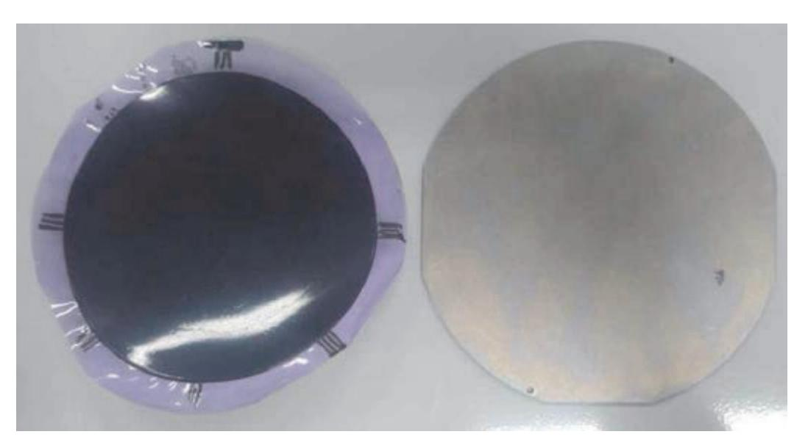

출처: 산업통상자원부(2017). 『300mm 대응 대구경 다층 구조의 복합 패키지 공정 및 장비 기술 개발』. p.142. [그림 2-2] De-bonded Molded Wafer from Ti-Carrier

5. 기판 검사 및 세정을 진행한다.

- (1) 캐리어가 제거된 기판의 표면을 검사하여, 손상이나 결함이 없는지 확인한다. 광학 현미경 또 는 비전 시스템을 사용하여 기판의 표면 상태를 평가한다.
- (2) 잔여 화학 물질이나 불순물을 제거하기 위해 기판을 세정한다. 이는 기판의 전기적 성능과 신뢰성을 보장하기 위해 중요하다.
- 6. 품질 관리를 위해 검사 및 테스트를 진행한다.
  - (1) 디본딩 후 기판의 전기적 특성을 검사하여, 디본딩 과정에서 발생할 수 있는 전기적 손상을

확인한다.

(2) 기판의 기계적 강도와 내구성을 검사하여, 품질 기준에 부합하는지 확인한다.

수행 tip

• 장비 설정 시 온도, 압력, 시간을 정확히 조절한다.

• 잔여물 제거를 위해 기판을 세정한다.

숙 솔더 볼 형성 공정을 진행한다.

다이와 외부 기판(PCB) 간의 전기적 연결을 확립하는 역할을 한다. 솔더 볼은 다이의 입출력 패드와 PCB의 패드를 연결하는 구체 역할을 하며, 전기적 신호의 전달과 기계적 결합을 동시 에 제공한다. 이 과정은 패키지의 전기적 성능과 신뢰성에 큰 영향을 끼치므로, 정밀하고 신중 한 처리가 필요하다.

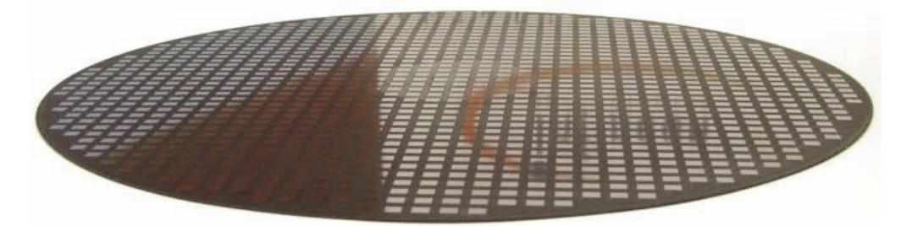

출처: (주)에스에스피(2014). 『300mm 웨이퍼 레벨 마이크로 솔더볼 어태치 장비 개발-최종 보고서』. 중소기 업청. 한국산업기술평가관리원. p.6. [그림 2-3] 웨이퍼 원판에 솔더 볼 어태치

1. 기판을 준비한다.

- (1) 솔더 볼 형성 전에 기판을 세정하여 표면의 불순물을 제거한다. 이는 솔더 볼의 부착성을 향 상하기 위해 중요하다.
- (2) 기판의 패드 위에 플럭스를 도포한다. 플럭스는 솔더 볼의 젖음을 개선하고, 산화물을 제거하 여 솔더 볼과 패드 간의 접착력을 높이는 역할을 한다.
- 2. 솔더 볼을 배치한다.
  - (1) 사용되는 솔더 볼의 크기와 재질을 선택한다. 일반적으로 솔더 볼은 납-주석(Sn-Pb) 합금 또는 무연 솔더(Sn-Ag-Cu)로 제조된다.
  - (2) 솔더 볼을 정확하게 배치하기 위해 고정밀 배치 장비를 설정한다. 장비는 솔더 볼을 기판의 각 패드에 정확히 놓을 수 있도록 프로그램한다.

- (3) 솔더 볼을 플럭스가 도포된 기판의 패드 위에 배치한다. 이 과정에서는 정밀한 위치 정렬이 중요하다.
- 3. 리플로(reflow) 공정을 진행한다.
  - (1) 리플로 공정을 위해 오븐의 온도 프로파일을 설정한다. 리플로 프로파일은 솔더 볼의 재질과 기판의 특성에 따라 최적화된다.
  - (2) 기판을 리플로 오븐에 넣어 가열한다. 이 과정에서 솔더 볼이 녹아 기판의 패드와 확실히 접 합된다. 리플로 공정은 온도 상승, 유지, 냉각 단계로 이루어지며, 각 단계의 온도와 시간은 매우 중요하다.
    - (가) 기판과 솔더 볼을 천천히 가열하여 열 충격을 방지한다.
    - (나) 일정 온도에서 유지하여 플럭스를 활성화하고 솔더 볼을 준비한다.
    - (다) 솔더 볼이 녹는 온도까지 가열하여 솔더 볼과 패드가 완전히 접합되도록 한다.
    - (라) 기판을 서서히 냉각하여 솔더 볼이 고체 상태로 변환되면서 강한 기계적 결합을 형성한 다.
- 4. 세정 및 검사를 진행한다.
  - (1) 리플로 후 기판을 세정하여 남는 플럭스를 제거한다. 이는 전기적 신뢰성을 보장하기 위해 필수적이다.
  - (2) 고해상도 광학 현미경을 사용하여 솔더 볼의 상태를 검사한다. 솔더 볼의 위치, 크기, 접합 상태 등을 확인하여 불량 여부를 판별한다.
  - (3) X-ray 검사를 통해 내부 결합 상태를 확인한다. 이는 솔더 볼 내부의 빈 공간(보이드)이나 불완전한 접합을 검사하는 데 유용한다.

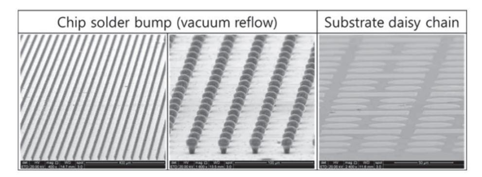

출처: 한국생산기술연구원(2020). 『20um급 미세 범프 플립 칩 패키지 원천 소재 및 공정 기술 개 발』. 과학기술정보통신부. 한국생산기술연구원. p.24. [그림 2-4] 샘플 SEM 사진

5. 전기적 테스트를 진행한다.

(1) 연속성 테스트

솔더 볼을 통해 전기적 신호가 제대로 전달되는지 확인한다. 각 패드 간의 전기적 연속 성을 테스트하여 접합 상태를 확인한다.

(2) 기계적 강도 테스트

솔더 볼의 기계적 강도를 테스트하여, 기판과의 접합이 강력한지 확인한다. 이는 충격이 나 진동에 대한 내구성을 평가하기 위함이다.

| Mode | Туре                 | Description                                                                                                                                                                                                                                | Illustration                                                               |
|------|----------------------|--------------------------------------------------------------------------------------------------------------------------------------------------------------------------------------------------------------------------------------------|----------------------------------------------------------------------------|
| 1    | Ductile              | Solder ball fracture at or above the surface of the solder mask within the bulk solder material.                                                                                                                                  |                                                                            |
| 2    | Pad Lift             | Solder pad lifts with solder ball; lifted pad may include ruptured base material.                                                                                                                                                 | Pad separation at base material                                            |
| 3    | Ball Lift            | Solder ball lifts from pad; pad is not completely covered by solder/intermetallic and the top surface of the pad plating is exposed.                                                                                        |                                                                            |
| 4    | Interfacial Break | The break is at the solder/intermetallic interface or intermetallic/base metal interface. The interfacial fracture may extend across the entire pad or be the dominant failure mode at the tool contact region. | 100% interfacial fracture de la tool contact is interfacial fracture |

출처: 미래창조과학부(2014). 『레이저 솔더 링을 이용한 플립 칩 패키징 시스템 개발에 관한 사업화』. p.41. [그림 2-5] 전단 강도 측정 시험

수행 tip

- 정밀 배치를 위해 고정밀 장비를 사용한다.
- 리플로 프로파일은 최적의 온도로 설정한다.

숚 최종 패키지를 절단한다.

최종 패키지 절단은 chip last 팬 아웃 공정의 마지막 단계로, 완성된 패키지를 개별 단위로 분리하는 과정이다. 이 단계는 패키지의 물리적 완성과 출하 준비를 위해 필수적이다. 절단 공 정은 기계적 정확성과 정밀도가 필요하며, 절단 과정에서 발생할 수 있는 손상을 최소화하는 것이 중요하다.

1. 기판을 준비한다.

- (1) 절단 전에 기판을 검사하여 손상이나 결함이 없는지 확인한다. 필요시 기판을 청소하여 먼지 나 불순물을 제거한다.
- (2) 기판 위에 미리 형성된 정렬 마크를 확인하여, 절단 위치를 정확히 파악한다.
- 2. 절단 공정을 설정한다.
  - (1) 절단에 사용할 장비를 선택한다. 일반적으로 레이저 절단기, 다이싱 소(Dicing Saw), 또는 플라즈마 절단기를 사용한다. 선택된 장비는 기판의 재질과 두께에 따라 달라진다.
  - (2) 절단 속도, 압력, 온도 등 공정 조건을 설정한다. 이는 절단의 정밀도와 기판의 손상을 최소 화하기 위해 최적화해야 한다.
- 3. 절단 방법을 확인하고, 선택한 뒤 절단을 진행한다.
  - (1) 고출력 레이저를 사용하여 기판을 절단한다. 레이저 절단은 높은 정밀도를 제공하며, 열 변형 이 적어 기판 손상을 최소화할 수 있다. 레이저 빔의 초점과 경로를 정확히 제어하여 원하는 절단 라인을 따라 절단한다.
  - (2) 다이싱 소를 사용하여 기판을 절단한다. 다이싱 쏘는 기계적 블레이드를 사용하여 기판을 물 리적으로 절단하며, 일반적으로 실리콘 웨이퍼와 같은 단단한 재료에 사용된다. 블레이드의 속도와 압력을 조절하여 깨끗하고 정밀한 절단을 수행한다.
  - (3) 플라즈마를 사용하여 기판을 절단한다. 플라즈마 절단은 기판을 높은 온도로 가열하여 절단하 는 방식으로, 정밀한 절단이 가능하며 특히 복잡한 패턴의 절단에 유리하다.
- 4. 절단 후 처리를 한다.
  - (1) 절단 후 기판에 남은 잔여물을 제거한다. 이는 기계적 방법(브러싱, 에어 블로) 또는 화학적 방법(세정액 사용)을 통해 수행할 수 있다.
  - (2) 절단된 개별 패키지를 검사하여, 손상이나 결함이 없는지 확인한다. 광학 현미경 또는 X-ray 검사를 통해 내부와 외부 상태를 평가한다.
- 5. 품질 검사를 진행한다.
  - (1) 절단된 개별 패키지의 전기적 성능을 검사한다. 모든 연결이 제대로 이루어졌는지 확인하고, 신호 전송이 원활한지 테스트한다.

- (2) 패키지의 기계적 강도와 내구성을 평가한다. 이는 패키지가 물리적 스트레스나 외부 충격에 견딜 수 있는지 확인하는 과정이다.
- 6. 포장 및 출하를 준비한다.
  - (1) 검사에서 통과한 개별 패키지를 보호 포장한다. 포장은 패키지를 외부 충격이나 환경적 요인 으로부터 보호하기 위해 중요한 단계이다.
  - (2) 최종 제품을 고객에게 출하하기 위해 준비한다. 각 패키지의 추적 정보를 기록하고, 출하 서 류를 준비한다.

#### 수행 tip

- 정렬 마크를 확인하여 정확한 절단 위치를 설정한다.
- 적절한 절단 장비를 기판 재질에 맞게 선택한다.
- 잔여물 제거를 위해 기판을 청소한다.

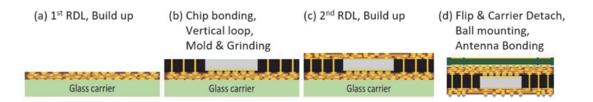

출처: ㈜네패스(2024). 『팬아웃 웨이퍼 레벨 패키지 (FOWLP) 기반 28GHz 밀리미터파 대역 안테나 집적형 패키지 모듈 개발』. 과학기술정보통신부. 정보통신기획평가원. p.36. [그림 2-6] FO-AiP 개발에 적용된 재배선 chip last 공법

## 학습 2 교수·학습 방법

#### 교수 방법

- 칩 나중 팬 아웃 웨이퍼 레벨 패키징 공정 기술의 기본 개념과 중요성을 소개하여 학습자들 이 전체적인 틀을 이해하도록 한다. 또 패키지 성능 확장을 위한 다양한 공정 기술의 필요 성을 설명한다.
- 칩 나중 팬 아웃 웨이퍼 레벨 패키징 공정의 각 단계에 대해 상세히 설명하고, 각 단계의 목적과 절차를 숙지할 수 있도록 지도한다.
- 실제 산업에서 사용되는 칩 나중 팬 아웃 웨이퍼 레벨 패키징 공정 기술의 사례를 소개하여 학습자들이 이론과 실무를 연결할 수 있도록 돕는다. 특히, 패키지 성능을 확장하는 다양한 공정 기술 적용 사례를 설명한다.
- 공정 기술의 이해를 돕기 위해 관련 비디오 강의를 활용하여 시각적인 이해를 높인다. 재배 선 기술, 솔더 볼과 솔더 범프 접합 기술법 등의 실제 공정 영상을 통해 이해를 돕는다.

#### 학습 방법

- 제공된 교재와 강의 자료를 통해 칩 나중 팬 아웃 웨이퍼 레벨 패키징 공정 기술과 패키지 성능을 확장하는 다양한 공정 기술의 기본 개념과 원리를 학습한다.
- 강의 전에 관련 자료를 미리 학습하여 강의 내용을 더욱 효과적으로 이해한다. 재배선, 솔 더 볼과 솔더 범프 접합 기술, 일정 간격을 유지하는 다이 배열 방법 등에 대해 사전에 파 악한다.
- 강의 중 중요한 내용과 이해되지 않는 부분을 노트에 필기하여 복습 시 참고한다. 특히, 각 공정 기술의 단계별 절차와 목적을 상세히 기록한다.
- 강의 중 이해되지 않는 부분을 질문할 수 있도록 준비하여 적극적으로 참여한다. 다이를 일 정 간격으로 배열한 후 재배선, 솔더 형성 등에 대해 구체적인 질문을 준비한다.
- 강의에서 다루지 않은 추가적인 자료를 탐색하여 보다 심도 있는 학습을 진행한다. 패키지 성능 확장을 위한 최신 공정 기술 관련 논문이나 기사 등을 찾아 수업의 효과를 높인다.

## 학습 2 평 가

#### 평가 준거

- 평가자는 학습자가 학습 목표를 성공적으로 달성하였는지를 평가해야 한다.
- 평가자는 다음 사항을 평가해야 한다.

|                 | 학습 목표                                                        |  | 성취수준 |   |  |
|-----------------|--------------------------------------------------------------|--|------|---|--|
| 학습 내용           |                                                              |  | 중    | 하 |  |
| 칩 나중(chip last) | - 표준적인 웨이퍼 레벨 패키징 공정 기술을 이용하여 개발할 수 있다.                   |  |      |   |  |
|                 | - 패키지의 성능을 확장하는 다양한 공정 기술을 적용하여 개 발할 수 있다.                |  |      |   |  |
| 팬 아웃 공정 기술      | - 솔더 볼, 솔더 범프와 접합 기술을 적용하여 개발할 수 있 다.                     |  |      |   |  |
|                 | - 칩을 다이 접착한 후 공정으로 사용하는 기판을 이용하여 적 층하는 방법을 적용하여 공정할 수 있다. |  |      |   |  |

#### 평가 방법

• 서술형 시험

|                 | 평가 항목                                                   |  | 성취수준 |   |  |
|-----------------|---------------------------------------------------------|--|------|---|--|
| 학습 내용           |                                                         |  | 중    | 하 |  |
|                 | - chip last 공정에서 캐리어 준비와 디본딩 절차를 설 명할 수 있는 능력        |  |      |   |  |
| 칩 나중(chip last) | - chip last 팬 아웃 공정에서 열 관리 방법을 설명할 수 있는 능력           |  |      |   |  |
| 팬 아웃 공정 기술      | - 재배선층(RDL) 형성 시 금속 도금 과정의 중요성을 설명할 수 있는 능력          |  |      |   |  |
|                 | - 다이 배열 및 플립 칩 본딩 과정에서 요구되는 정밀도 와 장비 사용을 설명할 수 있는 능력 |  |      |   |  |

• 구두 발표

|                 | 평가 항목                                                                          |  | 성취수준 |   |  |
|-----------------|--------------------------------------------------------------------------------|--|------|---|--|
| 학습 내용           |                                                                                |  | 중    | 하 |  |
|                 | - chip last 팬 아웃 공정의 전반적인 흐름을 설명하고, 각 단계에서의 주요 작업과 고려 사항 설명 능력              |  |      |   |  |
| 칩 나중(chip last) | - 재배선층(RDL) 형성 과정에서 포토리소그래피 기술의 중요성을 논의하고, 이 과정에서 고려해야 할 주요 변 수를 이해하는 정도 |  |      |   |  |
| 팬 아웃 공정 기술      | - 솔더 볼 형성 공정에서 리플로 공정의 역할과 최적의 온도 프로파일 설정의 중요성을 설명할 수 있는 능력                 |  |      |   |  |
|                 | - chip last 공정의 열 관리 문제를 정의하고, 이를 해 결하기 위한 방안을 제시할 수 있는 능력                  |  |      |   |  |

#### 피드백

- 1. 서술형 시험
- 성취수준이 낮은 학습자에게는 단계별 공정 장비 사용과 절차를 명확하게 정리할 수 있도록 단계 별 실습을 실시하게 한다. 성취수준이 높은 학습자에게는 각 단계의 불량 원인과 해결 방법에 대 해 심화 설명해 주어 공정 관리 능력을 강화한다.
- 성취수준이 낮은 학습자에게는 두 공정의 차이점을 중심으로 비교 도표 작성을 실시하게 하여 핵 심 차이를 쉽게 이해할 수 있도록 돕는다. 성취수준이 높은 학습자에게는 특정 응용 분야에서의 공정 선택 이유에 대해 심화 설명해 주어 응용 능력을 확장시킨다.
- 성취수준이 낮은 학습자에게는 다양한 몰딩 재료와 경화 조건의 사례 연구를 통해 재료 선택의 기초 원리를 파악하도록 지도한다. 성취수준이 높은 학습자에게는 몰딩 과정에서의 기포 발생 문 제 해결 방법을 심화 설명해 주어 생산성 개선 능력을 높인다.
- 성취수준이 낮은 학습자에게는 리플로 프로파일 기본 설정 조건을 정리하고, 실습을 통해 프로파 일 설정을 직접 경험하게 한다. 성취수준이 높은 학습자에게는 리플로 과정에서 발생할 수 있는 품질 문제와 그 해결 방안에 대해 심화 설명해 준다.
- 2. 구두 발표
- 성취수준이 낮은 학습자에게는 캐리어 선택 및 디본딩 방법에 대한 시각 자료를 제공해 절차를 명확히 이해하도록 돕는다. 성취수준이 높은 학습자에게는 캐리어 선택 시 고려해야 할 세부 조건 과 디본딩에서 발생하는 문제점 해결 방법을 심화 설명해 준다.
- 성취수준이 낮은 학습자에게는 열 방출 경로와 재료 선택의 기초 원리를 다시 설명하고 단순한 사례를 통해 열 관리 방법을 익히게 한다. 성취수준이 높은 학습자에게는 고성능 패키지에서의 열 관리 기술과 최신 재료 적용 사례에 대해 심화 설명해 준다.
- 성취수준이 낮은 학습자에게는 도금 과정의 장비 사용법과 도금 두께 관리에 대한 시각 자료를 제공해 절차를 이해하게 한다. 성취수준이 높은 학습자에게는 도금 두께 변화가 전기적 성능에 미 치는 영향과 다양한 도금 기술의 차이점을 심화 설명해 준다.
- 성취수준이 낮은 학습자에게는 다이 배열 과정에서의 정밀도 유지에 중점을 두고, 실제 장비 사용 방법을 보여주며 실습을 권장한다.

| 학습 1 | 칩 우선(chip first) 팬 아웃 공정 진행하기 |
|------|-------------------------------|
| 학습 2 | 칩 나중(chip last) 팬 아웃 공정 진행하기  |
| 학습 3 | 초고밀도 팬 아웃 공정 진행하기             |

## 3-1. 초고밀도 팬 아웃 공정 기술

|       | • 표준 팬 아웃 웨이퍼 레벨 패키징 공정 기술로 공정할 수 있다. • 기본 패키징 공정 기술을 이용하여 공정할 수 있다. |
|-------|-------------------------------------------------------------------------|
| 학습 목표 | • 플립 칩 공정 기술을 이용하여 공정할 수 있다.                                            |
|       | • 고밀도 칩을 이용하여 고성능 칩을 조립하는 공정으로 할 수 있다.                                  |
|       | • RDL, TSV, RDL 인터포저를 포함한 3D 인터커넥션 공정 기술을 개발할 수 있다.                     |

## 필요 지식 /

#### 숔 초고밀도 팬 아웃 공정 기술

1. 개요

초고밀도 팬 아웃 패키징(ultra-high density fan-out packaging)은 반도체 칩의 입출력 (I/O) 단자를 칩 외부로 확장해 더 많은 I/O를 지원하는 패키징 기술이다. 이 기술은 2D, 2.5D, 3D 패키지를 구현하여 성능과 효율성을 극대화한다. 2D 패키징은 단순하고 비용 효 율적이며, 2.5D 패키징은 높은 집적도와 성능을 제공하고, 3D 패키징은 최상의 성능과 공 간 효율성을 자랑한다.

2. 기술의 발전 배경

초고밀도 팬 아웃 패키징은 선폭과 간격을 미세하게 줄여 고밀도의 패키지를 구현하는 기 술이다. 팬 아웃 패키징은 WLP의 I/O 수 제한 문제를 해결하기 위해 개발되었으며, 칩 외 부에 재배선층(RDL)을 형성하여 I/O 수를 확장하고 성능을 높였다. 이를 통해 멀티칩 (MCP), 패키지 온 패키지(PoP), 시스템 인 패키지(SiP) 등의 다양한 패키지 제품을 구현할 수 있다.

3. 성능 향상과 효율성

초고밀도 팬 아웃 패키징 기술은 인터포저(interposer)를 사용하지 않기 때문에 고성능을 요구하는 응용 분야에서 비용 효율성을 제공한다. 이 기술은 칩 간의 거리를 줄여 데이터 전송 속도를 향상하고 전력 소모를 줄이는 데 기여하며, 특히 대규모 데이터 처리가 필요한 응용에서 성능을 극대화할 수 있다.

4. 기술 적용 사례

고밀도 재배선층(RDL)과 실리콘 관통 전극(TSV) 기술을 활용하여 스마트폰의 애플리케이션 프로세서(AP), DRAM 적층 구조를 구현할 수 있다. 이를 통해 PCB 사용 없이 전력 무결 성(PI)과 신호 무결성(SI)을 향상할 수 있다. 2.5D 및 3D 패키징 기술은 AI 및 5G 반도체, 자율 주행, 클라우드 컴퓨팅과 같은 고성능 시장에서 활용되고 있다.

5. 고밀도 및 초고밀도 팬 아웃 기술

팬 아웃 공정은 표준, 고밀도, 초고밀도로 구분된다.

- (1) 표준 밀도 팬 아웃: I/O 개수가 500개 미만이며, 재배선층 선폭이 15μm를 초과한다.
- (2) 고밀도 팬 아웃: 재배선층 선폭이 5μm~15μm이며, I/O 개수가 500개 이상이다.
- (3) 초고밀도 팬 아웃: 재배선층 선폭과 피치가 5μm 이하로, AI, 5G 반도체와 같은 고성능 응 용 분야에 적합하다.

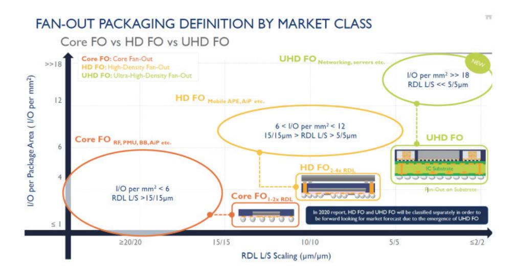

출처: Yole(2020). Fan-Out Packaging 2020(https://medias.yolegroup.com/uploads/2020/06/YDR20078\_Fa n-Out-Packaging-2020\_Sample.pdf). p.11. [그림 3-1] 팬 아웃 웨이퍼 레벨 패키징 기술 분류

6. 칩렛 구조와의 결합

최근 초고밀도 팬 아웃 패키징은 칩렛(chiplet) 구조와 결합되어 반도체 설계의 유연성을 크게 향상하고 있다. 이 구조는 다수의 작은 칩을 하나의 패키지 내에서 상호 연결하여 복 잡한 시스템을 더 작은 공간에서 효율적으로 구현할 수 있다. 이를 통해 고성능 시스템 반 도체를 경제적이고 신뢰성 있게 제조할 수 있다.

| Metrics     | inFO_PoP                                                                                                                            | inFO_oS & inFO_MS                                                                                                                     | inFO_AiP                                                                                                                          | inFO_MiM                                                                                          |
|-------------|-------------------------------------------------------------------------------------------------------------------------------------|---------------------------------------------------------------------------------------------------------------------------------------|-----------------------------------------------------------------------------------------------------------------------------------|---------------------------------------------------------------------------------------------------|
| PRODUCTION  | HVM since 2016                                                                                                                      | LVM since 2019                                                                                                                        | Qualification LVM expected in 2020                                                                                             | Qualification                                                                                     |
| STATUS      | High-volume production of Gen-3 Successful qualification of Gen-4                                                                | Successful qualification of multiple 16nm SoC chips. Better yield                                                                  | Enables low transmission loss and high antenna performance for mmWave system                                                | Validated better performance as compared to FC.                                                |
| APPLICATION | Mobile APE+Memory: Smartphone, smartwatches, tablets                                                                             | High Performance Computing: AI chips, servers; networking                                                                          | mmWave wireless communication: 5G, Wi-Fi, modems, sensors                                                                      | Advanced Mobile & HPC                                                                             |
| BENEFITS    | Integrate systems with lower TTV as compared to FC, at finer L/S for board-level I/O                                          | Enable better yield as compared to a single large die SoC                                                                          | Enable low transmission loss and high antenna performance for mmWave system                                                 | Validated and simulated better performance and form factor as compared to FC and TSV.       |
| SCHEMATIC   | DOM HER DOM                                                                                                                         | Info Chip A Chip B                                                                                                                    | RF chip MC                                                                                                                        | Nenoy Nanky Nenoy Bac                                                                       |
|             | Source:TSMC [Online].Avsilable: https://www.tamc.com/english/dedic atedFoundry/technology/InFO.htm [Accessed: 16-Mar-2020] | Source: TSMC [Online]. Available: https://www.tamc.com/english/dedic atedFoundry/technology/InFO.htm [Accessed: 16-Mar-2020] | Source: "InFO_AiP Technology for High Performance and Compact 5G Millimeter Wave System Integration" TSMC: ECTC, 2018 | Source: "3D-MiM (MUST-in-MUST) Technology for Advanced System Integration" TSMC: ECTC, 2019 |

출처: Yole(2020). Fan-Out Packaging 2020(https://medias.yolegroup.com/uploads/2020/06/YDR20078\_Fan-Out-Pa ckaging-2020\_Sample.pdf). p.40.

[그림 3-2] TSMC의 다양한 팬 아웃 패키징 기술

1. ePLP(embedded package on package)

스마트워치와 같은 애플리케이션을 위해 설계된 고밀도 패키징 기술이다. 이 기술은 매우 낮은 z-높이와 우수한 열 방산 성능을 제공하여 전력 효율성을 극대화한다. Exynos 9110 프로세서와 전력 관리 시스템(PMIC)을 하나의 패키지에 통합하여 스마트워치의 작은 폼 팩 터를 구현하는 데 사용되었다. 이는 기존 패키징 기술에 비해 소형화와 고성능을 동시에 달 성할 수 있도록 하며, 팬 아웃 패널 레벨 패키징(FO-PLP) 기술을 활용하여 RDL에 걸쳐 혁신적인 인터커넥션을 제공한다.

2. InFO(integrated fan out)

2D 및 3D 패키징 솔루션을 제공하며, 고밀도 재배치층(RDL)과 InFO를 통한 비아(TIV)를 특징으로 하는 혁신적인 웨이퍼 레벨 시스템 통합 기술 플랫폼이다. 이 기술은 모바일 애플 리케이션과 고성능 컴퓨팅 등에 사용되며, 칩의 크기를 줄이고 성능을 향상하며 전력 소모 를 줄이는 장점이 있다.

- (1) InFO\_oS(integrated fan out on substrate)-2D 고밀도 RDL을 사용하여 다중 고급 로직 칩을 통합하는 기술로 주로 고성능 컴퓨팅과 데이터 센터 애플리케이션에 사용된다.
- (2) InFO\_MS(memory on substrate)-2D

메모리와 로직 칩을 동일한 기판에 통합하는 기술로 고속 데이터 전송이 필요한 애플리 케이션에 적합하다.

- (3) InFO\_AiP(antenna in package)-2D, 3D 안테나를 패키지 내부에 통합하여 RF 성능을 향상하는 기술로 5G 네트워크와 같은 고 주파 애플리케이션에 사용된다.
- (4) InFO\_PoP(package on package) 3D 모바일 애플리케이션 프로세서(AP)와 DRAM을 적층하여 통합하는 기술로 고밀도 RDL 과 Through InFO Via(TIV)를 사용하여 성능과 전력 효율을 극대화한다.
- 3. FOCoS(fan out chip on substrate)

높은 핀 수의 볼 그리드 배열(BGA) 기판에 플립 칩 방식으로 장착된다. 이 기술은 재배치 층(RDL)을 사용하여 다이 간의 짧은 인터커넥션을 가능하게 한다. FOCoS는 2.5D 패키징 과 유사하게 작동하지만, 인터포저 없이 비용을 절감하고 전기적 성능을 향상하는 장점이 있다. 주로 고성능 컴퓨팅과 네트워크 애플리케이션에 사용된다.

- 4. FOWLP(fan out wafer level packaging) 웨이퍼 레벨에서 팬 아웃 공정을 적용하여 소형화 및 경량화된 패키지를 제공한다. 이 기술 은 모바일 AP와 웨어러블 장치용 센서에 사용되며, 패키지의 두께와 무게를 줄여 성능을 극대화한다.
- 5. FO-PLP(fan out panel level packaging) 대량 생산에 적합하고 비용 효율적인 기술이다. 이 기술은 DRAM 모듈과 5G 통신 모듈 등 다양한 고성능 애플리케이션에 사용하며, 패키징의 두께와 무게를 줄여 소형화와 경량화 를 동시에 달성할 수 있다. FO-PLP는 패널 단위로 다수의 칩을 동시에 패키징할 수 있어 생산성을 높이고 비용을 절감하는 데 효과적이다.
- 6. SLIM(silicon-less integrated module) 고밀도 패키지를 구현하는 혁신적인 기술이다. 이 기술은 후공정 기술과 조립 기반의 팬 아 웃 아키텍처를 결합하여 가능한 가장 얇은 형태와 높은 수준의 통합을 제공한다. SLIM 기 술은 뛰어난 라인 재분배층 기능을 갖추고 있으며, 패키지의 상하단에 대한 3D 접근성을 최적화한다. 이는 비용을 절감하고 대역폭을 향상하며, 특히 2.5D 및 팬 아웃 아키텍처에 서 높은 수율과 성능을 자랑한다. 이 기술은 고성능 컴퓨팅과 AI 가속기에 적합하며, 로컬 실리콘 인터커넥트를 사용하여 칩 간 통신을 최적화한다.
- 7. SWIFT(silicon wafer integrated fan out technology) 인터포저를 사용하여 고밀도 인터커넥트를 제공하는 2.5D 패키징 기술이다. 실리콘 웨이퍼 기반 팬 아웃 공정으로, 고밀도 인터커넥트를 제공한다. AI 프로세서와 통신 및 네트워크 프로세서에 사용되며, 고성능과 높은 집적도를 요구하는 응용 분야에 적합하다. 이 기술은

칩 간의 연결성을 극대화하고 패키지의 성능을 향상한다.

#### 8. 기타 패키징 기술과 향후 전망

그 밖에도 eWLB(embedded wafer level ball grid array), SiP(system in package) 등 의 기술이 있으며, 이들 기술은 팬 아웃 패키징의 다양한 응용 사례를 보여 준다. 팬 아웃 패키징 기술의 주요 문제점은 열 방출과 전력 소모를 관리하는 데 있으며, 이를 개선하기 위한 연구가 지속되고 있다. 앞으로는 더 높은 집적도와 성능을 제공할 수 있는 하이브리드 본딩 및 3D 팬 아웃 기술이 개발될 계획이다.

#### 숖 최신 동향 및 연구

1. 팬 아웃 패키징 기술 동향

최근 팬 아웃 패키징 기술은 성능과 집적도를 극대화하기 위해 다양한 혁신을 추구하고 있 다. InFO 기술과 FOCoS 기술은 고성능 모바일 프로세서와 복수의 칩을 하나의 기판에 통 합하여 고속 데이터 전송과 효율적인 열 관리를 제공한다.

또 하이브리드 본딩 기술이 주목받고 있다. 이 기술은 다이 간의 직접적인 전기적 연결을 가능하게 하여 전기적 성능을 크게 향상시킨다. 하이브리드 본딩 기술은 특히 고성능 컴퓨 팅, 인공지능(AI) 가속기, 데이터 센터 등에서 중요하게 사용되고 있다.

#### 2. 기술 개선 및 연구

특히, RDL(redistribution layer) 기술의 개선을 통해 더 높은 밀도의 회로를 형성하고 전 기적 성능을 향상하고 있다. 나노 소재와 같은 첨단 재료를 활용하여 팬 아웃 패키징의 성 능을 더욱 향상하려는 연구가 활발히 진행 중이다. 예를 들어, 그래핀과 같은 나노 소재는 뛰어난 전기적 특성과 열전도성을 제공하여 팬 아웃 패키징의 성능을 극대화할 수 있다. 또 3D 프린팅 기술을 활용하여 더욱 복잡한 구조를 구현하고, 생산 공정을 효율화하려는 연구 도 진행되고 있다. 이를 통해 생산 비용을 절감하고, 열 관리 효율성을 높이는 연구가 활발 히 이루어지고 있다.

#### 3. 문제점

주요 문제점 중 하나는 열 관리이다. 고성능 칩이 밀집되어 있을 경우 열 방출이 어려워져 칩의 성능이 저하될 수 있다. 이를 해결하기 위해 다양한 열 관리 기술이 개발되고 있다. 고성능 열전도성 소재를 사용하여 열 방출을 효율적으로 관리하거나, 액티브 쿨링 솔루션을 도입하여 칩의 온도를 유지하는 방법 등이 있다. 또 팬 아웃 패키징의 신뢰성과 수율 문제 도 중요하다. 복잡한 공정에서 발생할 수 있는 결함을 최소화하고, 높은 신뢰성을 유지하기 위해 자동화된 검사 시스템과 인공지능(AI)을 활용한 결함 예측 기술이 도입되고 있다.

4. 기술 개발 계획

차세대 팬 아웃 패키징 기술 개발 계획은 성능과 집적도를 극대화하는 데 초점을 맞추고 있다. 하이브리드 본딩, 3D 패키징, 고성능 소재 등 다양한 혁신 기술이 도입될 예정이다. 고속 데이터 전송을 지원하는 새로운 인터커넥트 기술과 저전력 소모를 위한 전력 관리 기 술도 중요한 개발 과제이다.

특히, 인공지능과 머신러닝을 활용한 스마트 패키징 기술이 주목받고 있다. 이 기술은 실시 간 데이터 분석을 통해 패키징 공정을 최적화하고, 결함을 사전에 예측하여 생산성을 높일 수 있다. 에너지 효율성을 극대화하는 그린 패키징 기술도 중요한 개발 목표 중 하나이다.

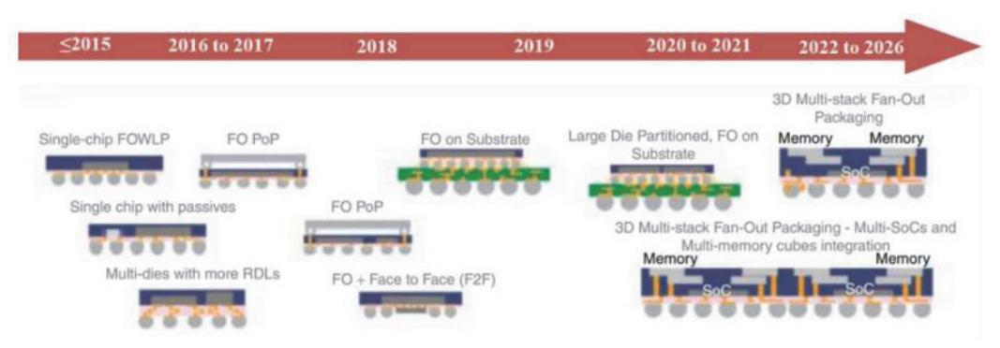

출처: 중소기업기술정보진흥원(2024). 『중소기업 전략 기술 로드맵 2024~2026-반도체 장비』. 중소벤처기업부. p.144. [그림 3-3] FOWLP 기술 개발 단계

5. 신소재 및 공정 개선 사례

초고밀도 팬 아웃 패키징 기술은 앞으로도 반도체 산업에서 중요한 역할을 할 것이다. 고성 능 컴퓨팅, 데이터 센터, 인공지능, 사물 인터넷(IoT) 등 다양한 응용 분야에서 팬 아웃 패 키징의 수요가 지속해서 증가할 것으로 예상된다. 특히, 5G 통신과 같은 고속 데이터 전송 기술의 발전은 팬 아웃 패키징의 중요성이 더욱 커질 것이다.

미래에는 자율 주행 자동차, 스마트 시티, 헬스 케어 등 새로운 응용 분야에서도 팬 아웃 패키징 기술이 핵심적인 역할을 할 것으로 보인다. 이를 위해 지속적인 연구 개발과 혁신이 필요하며, 다양한 산업과의 협력을 통해 기술 발전이 이루어질 것이다. 이러한 노력은 반도 체 산업의 지속 가능한 성장과 혁신을 이끄는 데 중요한 역할을 할 것이다.

#### 재료·자료

- 기판(Copper Clad Laminate, CCL)
- EMC (Epoxy Molding Compound)
- 구리 도금 재료
- 솔더 페이스트 및 Cu ball
- Tape (라미네이션용)
- 패키지 부품
- 화학 약품 (에칭용)
- 플럭스 (Flux)
- 레진 (Resin)
- 접착제 (Adhesives)
- 솔더 마스크 (Solder Mask)

#### 기기(장비 ・ 공구)

- Via hole 드릴링 장비
- 전기도금 장비
- 그라인딩 장비
- 몰딩 장비 (EMC Over Molded)
- 리플로 장비
- 패널 절단 장비 (Panelsaw)
- Pick & Place 장비
- 빌드업 장비

- 에칭 장비
- 솔더 페이스트 도포 장비
- 검사 장비 (Inspection Equipment)
- 온도 조절 장비
- 세정 장비
- X-ray 검사 장비

#### 안전 ・ 유의 사항

- 작업자는 반드시 안전 모자, 보호안경, 장갑, 방진복 등 개인 보호 장비를 착용해야 한다.
- 반도체 제조 및 패키징 과정에서 사용하는 화학 물질은 인체에 해로울 수 있으므로, 화학 물질 취급 시에는 주의해야 한다. 화학 물질은 지정된 장소에 보관하고, 사용 후에는 즉시 폐기 처분한다.
- 고전압 장비를 다룰 때는 항상 전원을 차단하고 작업을 수행해야 하며, 전기적 특성 측정 시에는 절연 보호 장비를 사용해야 한다.
- 반도체 제조 및 패키징 작업은 청정실에서 수행되어야 하며, 작업 환경의 청결을 유지하기 위해 정기적인 청소와 관리를 시행해야 한다.
- 공정 중 민감한 반도체 소자를 보호하기 위한 정전기 방지 조치를 한다.
- 전기도금, 에칭 공정 시 유해 화학물질 사용에 주의하며 적절한 보호구를 착용한다.
- 드릴링, 그라인딩, 몰딩 장비 사용 시 안전 수칙을 준수한다.
- 리플로 공정 중 온도 조절을 하고, 과열에 주의한다.
- 공정 중 미세 먼지나 오염 물질이 없도록 청정 환경을 유지한다.
- 칩 및 패키지 부품이 기계적으로 손상되지 않도록 주의한다.
- 레이저 드릴링 또는 절단 작업 시 눈과 피부 보호를 위한 보호 장비를 착용한다.
- 소음이 발생하는 장비 사용 시 귀마개 등 소음 방지 장비를 착용한다.
- 고온 작업 시 화재 예방 조치를 준수한다.

• 작업 중 비상 상황 발생 시 대피로와 대피 절차를 사전에 확인한다.

#### 수행 순서

숔 Via-frame 제작 공정을 진행한다.

기판을 준비하고, Via hole을 드릴링한 후 금속층을 형성하여 전기적 연결을 위한 Via-frame을 제작한다.

- 1. CCL 준비를 한다. 기판(CCL: copper clad laminate)을 준비하고, 공정에 적합한 재료를 선택한다.
- 2. Via hole을 드릴링한다. 기판에 설계된 위치에 맞춰 Via hole을 정확하게 드릴링한다.
- 3. 전기 도금(Electro Plating)을 진행한다. 드릴링 한 Via hole 내부에 금속층을 형성하여 전기적 연결을 위한 도금을 한다.
- 4. Hole plugging을 수행한다. 도금된 Via hole을 구리 또는 수지로 충진하여 구조적 안정성을 확보한다.
- 5. 그라인딩을 진행한다. 충진한 Via hole 표면을 평탄화하여 균일한 표면을 만든다.
- 6. 구리 도금을 추가로 진행한다. Via-frame 표면에 추가적인 구리 도금층을 형성하여 전기적 특성을 향상한다.
- 7. 구리 에칭(Cu Etching)을 진행한다. 불필요한 구리층을 제거하여 설계에 맞는 패턴을 형성한다.
- 8. 솔더 페이스트를 도포한다. Via-frame 패드 위에 솔더 페이스트를 균일하게 도포한다.
- 9. Cu ball drop, 리플로 및 절단을 진행한다. Cu ball을 패드 위에 배치하고, 리플로 공정을 통해 본딩한 후 패널을 개별 유닛으로 절단 한다.

[그림 3-4] Panelization 공정

- 숕 Panelization 공정을 수행한다.
  - 1. Tape lamination을 진행한다.

유리 캐리어 위에 테이프를 라미네이션하여 패널을 고정한다.

출처: 산업통상자원부(2017). 『300mm 대응 대구경 다층 구조의 복합 패키지 공정 및 장비 기술 개 발』. p.35. [그림 3-5] Panelization 공정

2. 부품을 임시 캐리어에 픽 앤 플레이스한다.

임시 캐리어 위에 소자 및 칩을 정밀하게 배치하여 위치를 고정한다.

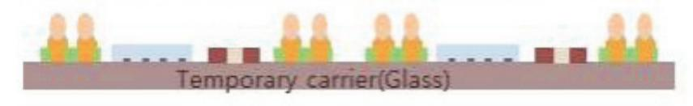

출처: 산업통상자원부(2017). 『300mm 대응 대구경 다층 구조의 복합 패키지 공정 및 장비 기술 개 발』. p.35. [그림 3-6] Panelization 공정

3. EMC(over molded)로 몰딩을 진행한다.

몰딩 재료인 EMC를 사용하여 패널을 몰딩하고, 패널 전체를 보호한다.

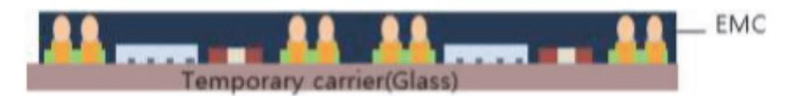

출처: 산업통상자원부(2017). 『300mm 대응 대구경 다층 구조의 복합 패키지 공정 및 장비 기술 개발』. p.35. [그림 3-7] Panelization 공정

4. EMC 백 그라인딩과 캐리어 제거를 진행한다.

EMC 표면을 평탄화하기 위해 백 그라인딩을 수행한 후, 캐리어를 제거하고 Cu 패드를 노 출한다.

출처: 산업통상자원부(2017). 『300mm 대응 대구경 다층 구조의 복합 패키지 공정 및 장비 기술 개 발』. p.35. [그림 3-8] Panelization 공정

- 숖 Build-up 공정을 진행한다.
  - 1. Tape lamination을 진행한다.

출처: 산업통상자원부(2017). 『300mm 대응 대구경 다층 구조의 복합 패키지 공정 및 장비 기술 개발』. p.39. [그림 3-9] Build-up 공정

프로세스 캐리어 위에 테이프를 라미네이션하여 패널을 고정한다.

2. 패널을 프로세스 캐리어에 부착한다.

준비된 패널을 프로세스 캐리어에 정확하게 위치시켜 부착한다.

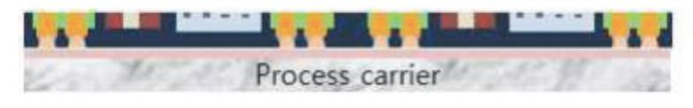

출처: 산업통상자원부(2017). 『300mm 대응 대구경 다층 구조의 복합 패키지 공정 및 장비 기술 개발』. p.39. [그림 3-10] Build-up 공정

#### 3. 상단에서 RCF, RDL, PSV 빌드업을 진행한다.

패널 상단에 RCF(리타일 좌표 프레임), RDL(재배선층), PSV(포스트 실리콘 검증) 공정을 수행한다.

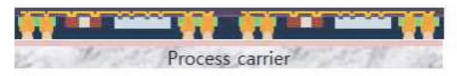

출처: 산업통상자원부(2017). 『300mm 대응 대구경 다층 구조의 복합 패키지 공정 및 장비 기술 개발』. p.39. [그림 3-11] Build-up 공정

(1) RCF(reticle coordinate frame)

RCF는 리타일 좌표 프레임을 의미하며, 반도체 제조 과정에서 패턴 정렬 및 위치 측정 을 위해 사용되는 좌표 시스템이다. 이 시스템은 고정밀 작업에서 칩의 위치를 정확하게 정의하는 데 필수적이다.

(2) RDL(redistribution layer)

RDL은 재배선층으로, 칩의 패드 위치를 조정하여 입력/출력 핀을 확장하고 회로 밀도 를 증가시키는 데 사용한다. 이 레이어는 도금과 에칭 과정을 통해 형성되며, 전기적 연 결을 최적화하는 데 중요한 역할을 한다.

(3) PSV (post silicon validation)

PSV는 포스트 실리콘 검증을 나타내며, 실리콘 칩이 제조된 후 기능 및 성능을 평가하 는 단계이다. 이 과정에서는 실제 하드웨어 환경에서의 테스트를 통해 디자인 결함을 찾 아내고 최종 제품이 설계 사양을 충족하는지 확인합니다.

4. 하단에서 RCF, RDL, PSV 빌드업을 진행한다.

패널 하단에도 동일한 RCF, RDL, PSV 공정을 수행하여 전기적 연결을 형성한다.

출처: 산업통상자원부(2017). 『300mm 대응 대구경 다층 구조의 복합 패키지 공정 및 장비 기술 개발』. p.39. [그림 3-12] Build-up 공정

5. Ball Drop을 진행한다.

패널의 칩 패드 위에 솔더 볼을 배치하여 연결을 위한 준비를 한다.

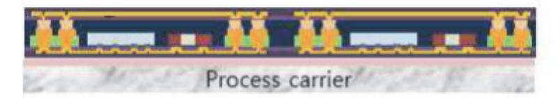

출처: 산업통상자원부(2017). 『300mm 대응 대구경 다층 구조의 복합 패키지 공정 및 장비 기술 개발』. p.39. [그림 3-13] Build-up 공정

6. 패널을 절단(panelsaw)한다.

최종적으로 패널을 개별 유닛으로 절단하여 각 칩의 형태로 완성한다.

출처: 산업통상자원부(2017). 『300mm 대응 대구경 다층 구조의 복합 패키지 공정 및 장비 기술 개발』. p.39. [그림 3-14] Build-up 공정

숗 패키지를 적층한다.

패널 위에 필요한 패키지(FOWLP, 플립 칩, WLCSP 등)를 정밀하게 배치하여 적층한다.

1. WLCSP 공정을 진행한다.

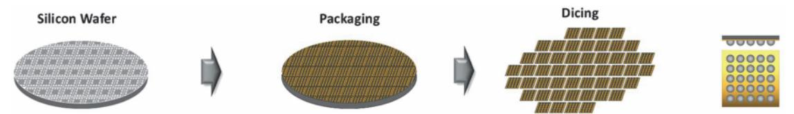

출처: IEEE(2023). HETEROGENEOUS INTEGRATION ROADMAP Chapter 23: Wafer-Level Packaging(WLP). https://eps.ieee.org/images/files/HIR\_2021/ch23-wlpfinal2.pdf. p.9. [그림 3-15] WLCSP 공정 순서

#### 2. 칩 퍼스트 (chip-first) 공정을 진행한다.

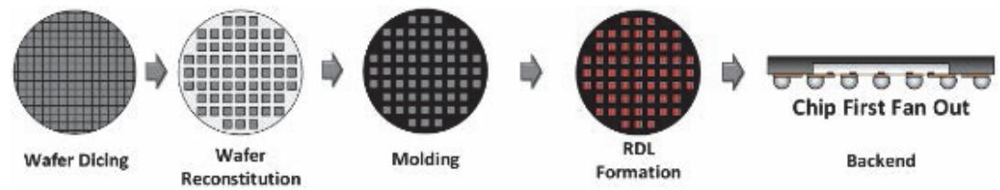

출처: IEEE(2023). HETEROGENEOUS INTEGRATION ROADMAP Chapter 23: Wafer-Level Packaging(WL P). https://eps.ieee.org/images/files/HIR\_2021/ch23-wlpfinal2.pdf. p.11. [그림 3-16] Chip-First FOWLP 공정 순서

#### 3. 칩라스트 (Chip-Last) 공정을 진행한다.

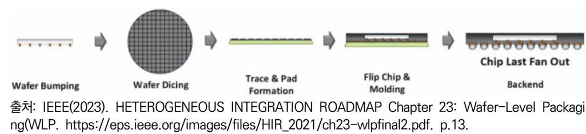

[그림 3-17] Chip-last FOWLP 공정 순서

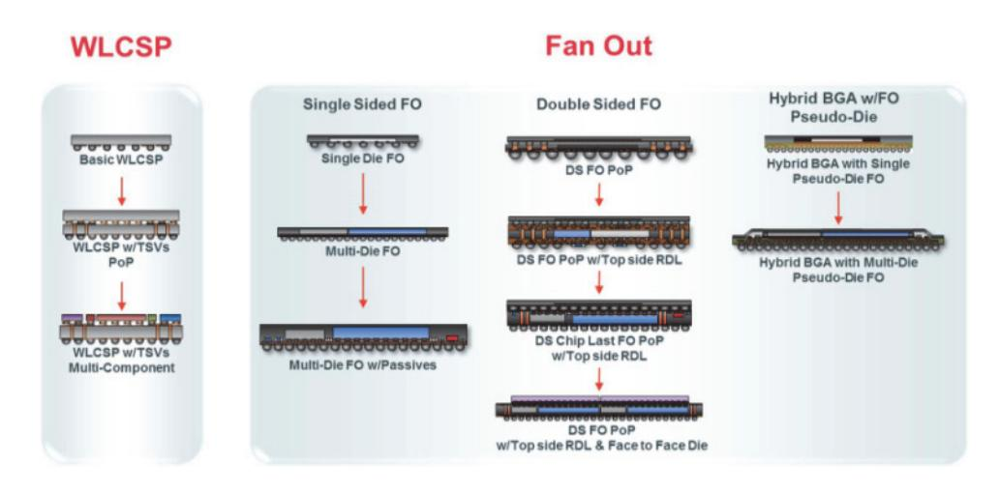

출처: IEEE(2023). HETEROGENEOUS INTEGRATION ROADMAP Chapter 23: Wafer-Level Pack aging(WLP). https://eps.ieee.org/images/files/HIR\_2021/ch23-wlpfinal2.pdf. p.8. [그림 3-18] Heterogeneous Integration using WLP

수 신뢰성 평가를 한다.

적층된 패키지의 내구성을 확인하기 위해 다양한 신뢰성 테스트를 수행한다.

1. 신뢰성 평가 항목을 확인한다.

| No. | Inspection item               | Method      |
|-----|-------------------------------|-------------|
| 1   | Chip to EMC delamination      | Destructive |
| 2   | Chip to RCF delamination      | Destructive |
| 3   | RCF to EMC delamination       | Destructive |
| 4   | Capacitor to EMC delamination | Destructive |
| 5   | VF to EMC delamination        | Destructive |
| 6   | VF to RCF delamination        | Destructive |
| 7   | RCF to RDL delamination       | Destructive |
| 8   | RDL crack                     | Destructive |
| 9   | RDL to PSV delamination       | Destructive |
| 10  | RCF / PSV crack               | Destructive |
| 11  | Capacitor to RDL joint crack  | Destructive |
| 12  | Ball to RDL joint crack       | Destructive |

출처: 산업통상자원부(2017). 『300mm 대응 대구 경 다층 구조의 복합 패키지 공정 및 장비 기술 개발』. p.40.

[그림 3-19] 신뢰성 평가 항목

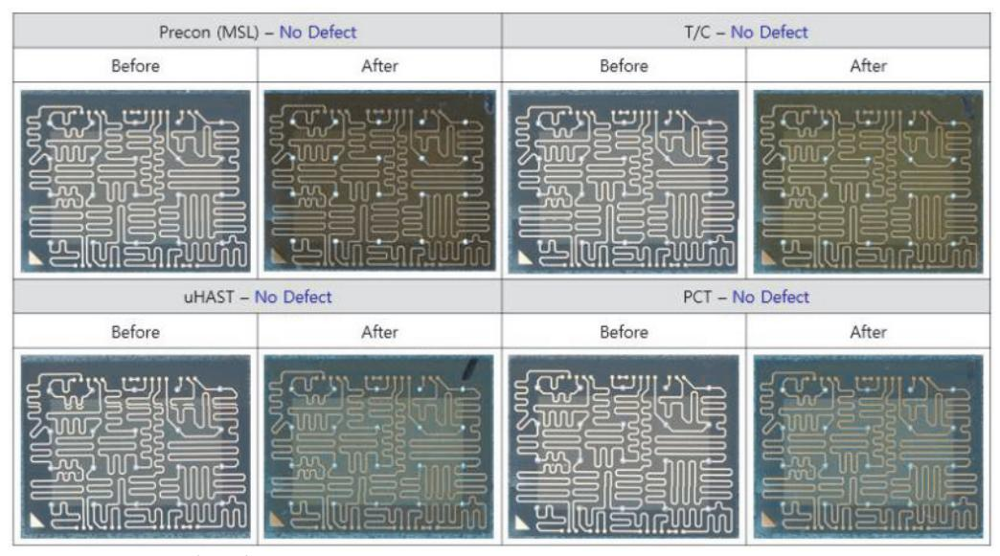

출처: 산업통상자원부(2017). 『300mm 대응 대구경 다층 구조의 복합 패키지 공정 및 장비 기술 개발』. p.41. [그림 3-20] Inspection 항목

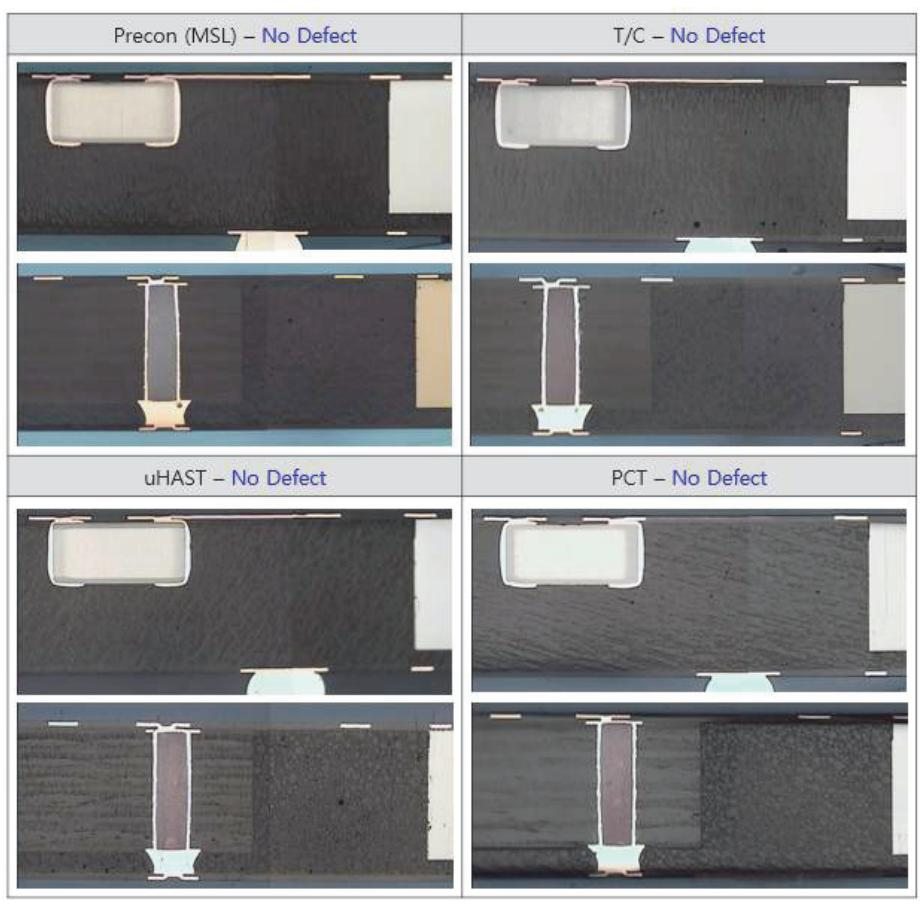

출처: 산업통상자원부(2017). 『300mm 대응 대구경 다층 구조의 복합 패키지 공정 및 장비 기술 개발』. p.42. [그림 3-21] SAT 이미지

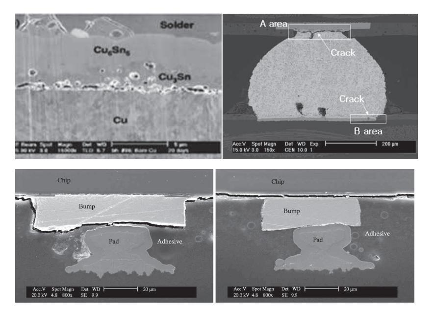

출처: 한국산업기술평가관리원(2018). 『20μm 초미세 피치 모바일 패키지용 6 sec/chip 이하 고속 열압착 접합 기술 개발. 하나마이크론』. 산업통상자원부. p.3. [그림 3-22] 솔더 접합부 주요 failure 발생 사례

#### 숙 최종 전기적 테스트를 수행한다.

완성된 패키지의 전기적 성능을 점검하여 설계 사양에 부합하는지 확인한다.

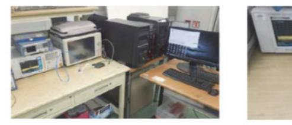

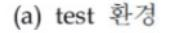

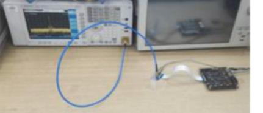

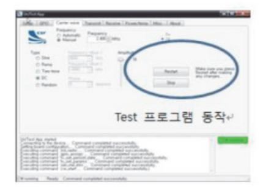

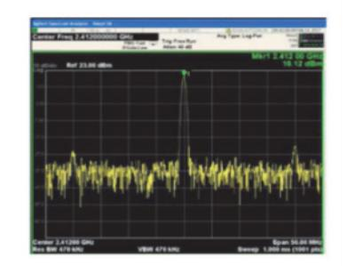

출처: 산업통상자원부(2017). 『300mm 대응 대구경 다층 구조의 복합 패키지 공정 및 장비 기술 개발』. p.50.

[그림 3-23] Sample Tx Power & Rx Sensitivity 측정

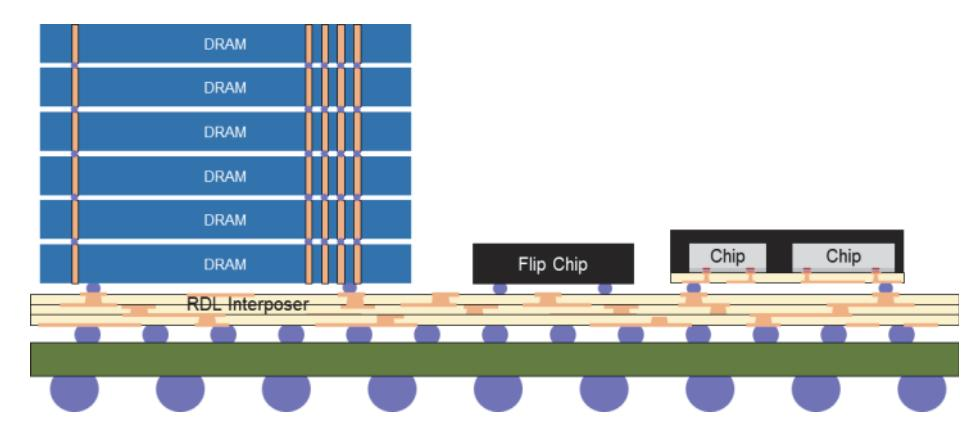

출처: 집필진 제작(2024) [그림 3-24] 초고밀도 팬아웃 패키지 개략도

## 학습 3 교수·학습 방법

#### 교수 방법

- 초고밀도 팬 아웃 웨이퍼 레벨 패키징 공정 기술의 기본 개념과 중요성을 소개하여 학습자 들이 전체적인 틀을 이해하도록 한다. 또 패키지 성능 확장을 위한 다양한 공정 기술의 필 요성을 설명한다.
- 초고밀도 팬 아웃 웨이퍼 레벨 패키징 공정의 각 단계에 대해 상세히 설명하고, 각 단계의 목적과 절차를 숙지할 수 있도록 지도한다.
- 실제 산업에서 사용되는 초고밀도 팬 아웃 웨이퍼 레벨 패키징 공정 기술의 사례를 소개하 여 학습자들이 이론과 실무를 연결할 수 있도록 돕는다. 특히, 패키지 성능을 확장하는 다양 한 공정 기술 적용 사례를 설명한다.
- 공정 기술의 이해를 돕기 위해 관련 비디오 강의를 활용하여 시각적인 이해를 높인다. 재배 선 기술, 솔더 볼과 솔더 범프 접합 기술법 등의 실제 공정 영상을 통해 이해를 돕는다.
- 강의 후 질의응답 시간을 통해 학습자들이 이해하지 못한 부분을 명확히 하고, 추가적인 설 명을 제공한다.

#### 학습 방법

- 제공된 교재와 강의 자료를 통해 초고밀도 팬 아웃 웨이퍼 레벨 패키징 공정 기술과 패키지 성능을 확장하는 다양한 공정 기술의 기본 개념과 원리를 학습한다.
- 강의 전에 관련 자료를 미리 학습하여 강의 내용을 더욱 효과적으로 이해한다. 재배선, 솔 더 볼과 솔더 범프 접합 기술, 일정 간격을 유지하는 다이 배열 방법 등에 대해 사전에 파 악한다.
- 강의 중 중요한 내용과 이해되지 않는 부분을 노트에 필기하여 복습 시 참고한다. 특히, 각 공정 기술의 단계별 절차와 목적을 상세히 기록한다.
- 강의에서 다루지 않은 추가적인 자료를 탐색하여 보다 심도 있는 학습을 진행한다. 패키지 성능 확장을 위한 최신 공정 기술 관련 논문이나 기사 등을 찾아 수업의 효과를 높인다.

## 학습 3 평 가

#### 평가 준거

• 평가자는 학습자가 학습 목표를 성공적으로 달성하였는지를 평가해야 한다.

#### • 평가자는 다음 사항을 평가해야 한다.

|                    | 학습 목표                                                  |  | 성취수준 |   |  |
|--------------------|--------------------------------------------------------|--|------|---|--|
| 학습 내용              |                                                        |  | 중    | 하 |  |
| 초고밀도 팬 아웃 공정 기술 | - 표준 팬 아웃 웨이퍼 레벨 패키징 공정 기술로 공정할 수 있다.               |  |      |   |  |
|                    | - 기본 패키징 공정 기술을 이용하여 공정할 수 있다.                         |  |      |   |  |
|                    | - 플립 칩 공정 기술을 이용하여 공정할 수 있다.                           |  |      |   |  |
|                    | - 고밀도 칩을 이용하여 고성능 칩을 조립하는 공정으로 할 수 있다.              |  |      |   |  |
|                    | - RDL, TSV, RDL 인터포저를 포함한 3D 인터커넥션 공정 기술을 개발할 수 있다. |  |      |   |  |

#### 평가 방법

• 서술형 시험

|                    | 평가 항목                                                                 |  | 성취수준 |   |  |
|--------------------|-----------------------------------------------------------------------|--|------|---|--|
| 학습 내용              |                                                                       |  | 중    | 하 |  |
| 초고밀도 팬 아웃 공정 기술 | - 초고밀도 팬 아웃 패키징의 개요와 그 기술적 발전 배경 설 명 능력                            |  |      |   |  |
|                    | - 재배선층과 실리콘 관통 전극을 포함한 3D 인터커넥션 공정 에서 각 기술이 고성능 패키징에 기여하는 방법 서술 능력 |  |      |   |  |
|                    | - 칩렛 구조와 초고밀도 팬 아웃 패키징의 결합을 통한 반도 체 설계의 유연성 향상을 설명할 수 있는 능력        |  |      |   |  |
|                    | - 초고밀도 팬 아웃 패키징 공정에서 열 관리 문제의 중요성 을 정의하고, 이를 해결하기 위한 방법 제시 여부      |  |      |   |  |

• 구두 발표

|                    | 평가 항목                                                                                |  | 성취수준 |   |  |
|--------------------|--------------------------------------------------------------------------------------|--|------|---|--|
| 학습 내용              |                                                                                      |  | 중    | 하 |  |
| 초고밀도 팬 아웃 공정 기술 | - 초고밀도 팬 아웃 공정의 전반적인 흐름을 설명하고, 각 공정 단계에서의 주요 작업을 설명할 수 있는 능력                      |  |      |   |  |
|                    | - 고밀도 및 초고밀도 팬 아웃 기술의 차이점과 각각의 응용 분야를 논의할 수 있는 능력                                 |  |      |   |  |
|                    | - Via-frame 제작 공정의 세부 단계를 설명하고, 각 단 계에서의 고려 사항을 명확히 설명할 수 있는 능력                   |  |      |   |  |
|                    | - 완성된 초고밀도 팬 아웃 패키지의 신뢰성 평가 항목 을 나열하고, 그 항목들이 패키지 성능 평가에 어떻게 기여하는지 설명할 수 있는 능력 |  |      |   |  |

#### 피드백

- 1. 서술형 시험 - 성취수준이 낮은 학습자에게는 팬 아웃 패키징의 기본 개념과 이 기술의 필요성을 쉽게 설명할 수 있는 사례를 제공해 준다. 성취수준이 높은 학습자에게는 초고밀도 패키징과 다른 패키징 기술 (예: 2D, 2.5D, 3D) 간의 차이점을 비교 분석하며 설명하도록 심화 학습을 제공한다. - 성취수준이 낮은 학습자에게는 RDL과 TSV의 기본 기능을 시각 자료를 통해 설명하며, 공정의 중요성을 간단히 설명하게 한다. 성취수준이 높은 학습자에게는 RDL 및 TSV의 전기적 특성 개 선에 대해 심화된 설명을 유도하고, 기술적 도전 과제와 해결 방안을 논의하도록 지도한다. - 성취수준이 낮은 학습자에게는 칩렛 구조와 팬 아웃 패키징이 반도체 설계에 미치는 영향을 사례 를 통해 간단하게 설명하게 하고, 기본 개념을 반복 학습하게 한다. 성취수준이 높은 학습자에게 는 칩렛 설계의 장점과 초고밀도 패키징을 통한 성능 개선 사례를 분석하게 한다. - 성취수준이 낮은 학습자에게는 열 관리의 기본 개념과 열전도성 재료의 선택 기준을 제공하며, 열 관리 문제의 중요성을 간단히 설명하게 한다. 성취수준이 높은 학습자에게는 열 방출 메커니즘과 열 관리 솔루션의 구체적인 사례를 통해 심화된 해결 방안을 제시하도록 유도한다. 2. 구두 발표 - 성취수준이 낮은 학습자에게는 공정의 주요 단계를 간단한 도식으로 정리하게 하고, 단계별 주요 작업을 명확히 설명하게 한다. 성취수준이 높은 학습자에게는 각 공정 단계에서 발생할 수 있는 문제점과 해결책을 추가로 논의하도록 심화 학습을 제공한다. - 성취수준이 낮은 학습자에게는 고밀도와 초고밀도 기술의 기본 차이를 시각 자료로 제공하고 성취수준이 높은 학습자에게는 응용 분야별 특성화된 요구 사항을 분석하도록 심화된 논의를 유도한다. - 성취수준이 낮은 학습자에게는 Via-frame 제작 단계별 작업을 간단히 나열하게 하고, 각 단계에 서의 주요 고려 사항을 정리하게 한다. 성취수준이 높은 학습자에게는 Via-frame 제작의 기술적 세부 사항을 논의하고, 공정에서 발생할 수 있는 문제와 해결 방안을 추가로 설명하게 유도한다.
  - 성취수준이 낮은 학습자에게는 신뢰성 평가 항목의 목적과 각 항목이 성능 평가에 어떻게 기여하는지 설명해 주고, 성취수준이 높은 학습자에게는 신뢰성 평가 결과에 따른 개선 방법을 논의하게 한다.

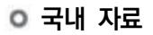

- ㈜네패스(2024). 「팬아웃 웨이퍼레벨 패키지 (FOWLP) 기반 28GHz 밀리미터파 대역 안테나 집적형 패키지 모듈 개발」. 과학기술정보통신부, 정보통신기획평가원.
- 니시쿠보 야스히코 저(2023). 『반도체 구조원리 교과서』. 보누스.
- 미래창조과학부(2014). 레이저 솔더링을 이용한 플립 칩 패키징 시스템 개발에 관한 사업화. 41p
- 산업통상자원부(2017). 300mm 대응 대구경 다층구조의 복합 패키지 공정 및 장비 기술 개발.
- 손윤철(2021). 「Fan-out wafer-level packaging (FOWLP) 기술 동향」. 『E²M 전기 전자와 첨단 소재』, 34(2), pp. 4-11.
- (주)에스에스피(2014). 『300mm 웨이퍼 레벨 마이크로 솔더볼 어태치 장비 개발』. 최종보고서. 중소기 업청. 한국산업기술평가관리원.
- 이오테크닉스(http://www.eotechnics.com/page/main/main.php). 2024. 07. 12. 스크린샷.
- 이오테크닉스(http://www.eotechnics.com). 2024. 07. 12. 스크린샷.
- 중소기업기술정보진흥원(2024). 중소기업 전략기술로드맵 2024~2026 반도체 장비. 중소벤처기업부. 144p
- 한국산업기술평가관리원(2018). 20μm 초미세피치 모바일 패키지용 6 sec/chip 이하 고속 열압착 접합 기술 개발. 하나마이크론, 산업통상자원부.
- 한국생산기술연구원(2020). 『20um급 미세 범프 플립 칩 패키지 원천 소재 및 공정 기술 개발』. 과학기술정보통신부. 한국생산기술연구원.
- Amkor (2022). Chip-Last HDFO(High-Density Fan-Out) Interposer-PoP.
- Amkor (2023). High-Density Fan-Out Packaging With Fine Pitch Embedded Trace RDL

• IEEE 71st ECTC (2021). Design and Development of High Density Fan-Out Wafer Level Package(HD-FOWLP) for Deep Neural Network(DNN) Chiplet Accelerators using Advanced Interface Bus(AIB). pp. 1258~1263

• IEEE(2023). HETEROGENEOUS INTEGRATION ROADMAP Chapter 23: Wafer-Level Packaging(WLP). https://eps.ieee.org/images/files/HIR\_2021/ch23-wlpfinal2.pdf.

• JEDEC (2014). ANSI/ESDA/JEDEC JS-002-2014 Charged Device Model –Device Level. https://www.jedec.org. Accessed 2015. 8. 20.

• Tanja Braun (2019). Fan-Out Wafer and Panel Level Packaging as Packaging Platform for Heterogeneous Integration. MDPI.

• TSMC(https://3dfabric.tsmc.com/english/dedicatedFoundry/technology/InFO.htm). 202 4. 7. 1. 스크린샷.

• Yole (2020). Fan-Out Packaging 2020. https://medias.yolegroup.com/uploads/2020/06/Y DR20078\_Fan-Out-Packaging-2020\_Sample.pdf.

| NCS학습모듈 개발이력 |                                     |     |                  |  |
|--------------|-------------------------------------|-----|------------------|--|
| 발행일          | 2024년 12월 31일                       |     |                  |  |
| 세분류명         | 반도체 개발((19030601)                   |     |                  |  |
| 개발기관         | 수원과학대학교 산학협력단(개발책임자: 윤창용) 한국직업능력연구원 |     |                  |  |
|              | 최준혁(수원대학교)*                         |     | 김종범(삼성전기)        |  |
| 집필진          | 계찬호(수원대학교)                          |     | 김한수(두원공과대학교)     |  |
|              | 김경호(폴리텍대학교)                         |     | 남승호(경기대학교)       |  |
|              | 김관하(폴리텍대학교)                         |     | 손승대(제이에스이엔씨(주))  |  |
|              | 김기순((주)영우디에스피)                      | 검토진 | 안광호(퓨쳐일렉트로닉스)    |  |
|              | 김도균(폴리텍대학교)                         |     | 이철오((주)한국전력안전공단) |  |
|              | 전동민(폴리텍대학교)                         |     |                  |  |
|              |                                     |     |                  |  |

\*표시는 대표집필자임 (참고) 검토진으로 참여한 집필진은 본인의 원고가 아닌 타인의 학습모듈을 검토함

| 어드밴스드 팬 아웃 패키지 개발(LM1903060124_23v4)                                                                     |                   |  |  |  |
|----------------------------------------------------------------------------------------------------------|-------------------|--|--|--|
| 저작권자                                                                                                     | 교육부               |  |  |  |
| 연구기관                                                                                                     | 한국직업능력연구원         |  |  |  |
| 발행일                                                                                                      | 2024. 12. 31.     |  |  |  |
| ISBN                                                                                                     | 979-11-7175-758-9 |  |  |  |
| ※ 이 학습모듈은 자격기본법 시행령(제8조 국가직무능력표준의 활용)에 의거하여 개발하였으며, NCS통합포털사이트(http://www.ncs.go.kr)에서 다운로드 할 수 있습니다. |                   |  |  |  |

