## LM1903060125\_23v4

# NCS학습모듈 이종접합 패키지 개발

| 대분류/19 전기·전자 | 중분류/03 전자기기개발 | 소분류/06 반도체개발 | 세분류/01 반도체개발 |         |
|-----------------|------------------|-----------------|-----------------|---------|
|                 |                  |                 |                 | 능력단위/25 |

#### [NCS학습모듈 활용 시 유의 사항]

- 1. NCS학습모듈은 교육훈련기관에서 출처를 명시하고 교육적 목적으로 활용할 수 있습니다. 다 만, NCS학습모듈에는 국가(교육부)가 저작재산권 일체를 보유하지 않은 저작물(출처가 표기된 도표‧사진‧삽화‧도면 등)이 포함되어 있으므로, 이러한 저작물의 변형‧각색‧복제‧공연‧ 배포 및 공중 송신 등과 이러한 저작물을 활용한 2차적 저작물을 작성하려면 반드시 원작자 의 동의를 받아야 합니다.
- 2. NCS학습모듈은 개발 당시의 산업 및 교육 현장을 반영하여 집필하였으므로, 현재 적용되는 법령‧지침‧표준 및 교과 내용 등과 차이가 있을 수 있습니다. NCS학습모듈 활용 시 법령 ‧지침‧표준 및 교과 내용의 개정 사항과 통계의 최신성 등을 확인하시기를 바랍니다.
- 3. NCS학습모듈은 산업 현장에서 요구되는 능력을 교육훈련기관에서 학습할 수 있게 구성한 자 료입니다. 다만, NCS학습모듈 지면의 한계상 대표적 예시(예: 활용도 또는 범용성이 높은 제 품, 서비스) 중심으로 집필하였음을 이해하시기를 바랍니다.

## NCS학습모듈의 이해

※ 본 NCS학습모듈은 「NCS 국가직무능력표준」사이트(http://www.ncs.go.kr) 에서 확인 및 다운로드할 수 있습니다.

## Ⅰ NCS학습모듈이란?

- 국가직무능력표준(NCS: National Competency Standards)이란 산업현장에서 직무를 수행하기 위해 요구되는 지식·기술·소양 등의 내용을 국가가 산업부문별·수준별로 체계 화한 것으로 산업현장의 직무를 성공적으로 수행하기 위해 필요한 능력(지식, 기술, 태도) 을 국가적 차원에서 표준화한 것을 의미합니다.
- 국가직무능력표준(이하 NCS)이 현장의 '직무 요구서'라고 한다면, NCS학습모듈은 NCS
  의 능력단위를 교육훈련에서 학습할 수 있도록 구성한 '교수·학습 자료'입니다. NCS학습
  모듈은 구체적 직무를 학습할 수 있도록 이론 및 실습과 관련된 내용을 상세하게 제시하
  고 있습니다.

#### ○ NCS학습모듈은 다음과 같은 특징을 가지고 있습니다.

- 첫째, NCS학습모듈은 산업계에서 요구하는 직무능력을 교육훈련 현장에 활용할 수 있도 록 성취목표와 학습의 방향을 명확히 제시하는 가이드라인의 역할을 합니다.
- 둘째, NCS학습모듈은 특성화고, 마이스터고, 전문대학, 4년제 대학교의 교육기관 및 훈 련기관, 직장교육기관 등에서 표준교재로 활용할 수 있으며 교육과정 개편 시에도 유용하게 참고할 수 있습니다.

○ NCS와 NCS학습모듈 간의 연결 체계를 살펴보면 아래 그림과 같습니다.

O NCS학습모듈의 위치는 NCS 분류 체계에서 해당 학습모듈이 어디에 위치하는지를 한 눈에 볼 수 있도록 그림으로 제시한 것입니다.

| [NCS-학          | 습모듈              | 의 위치]    |          |  |
|-----------------|------------------|----------|----------|--|
|                 |                  |          |          |  |
| 대분류             | 대분류 문화·예술·디자인·방송 |          |          |  |
| 중분류             | 문화콘텐츠            |          |          |  |
| 소분류             | 문화콘텐츠제작          |          |          |  |
|                 |                  |          |          |  |
| 세분류             |                  |          |          |  |
| 방송콘텐츠제작         |                  | 능력단위     | 학습모듈명    |  |
| 영화콘텐츠제작         |                  | 프로그램 기획  | 프로그램 기획  |  |
| 음악콘텐츠제작         |                  | 아이템 선정   | 아이템 선정   |  |
| 광고콘텐츠제작         |                  | 자료 조사    | 자료 조사    |  |
| 게임콘텐츠제작         |                  | 프로그램 구성  | 프로그램 구성  |  |
| 애니메이션 콘텐츠제작  |                  | 캐스팅      | 캐스팅      |  |
| 만화콘텐츠제작         |                  | 제작계획     | 제작계획     |  |
| 캐릭터제작           |                  | 방송 미술 준비 | 방송 미술 준비 |  |
| 스마트문화앱 콘텐츠제작 |                  | 방송 리허설   | 방송 리허설   |  |
| 영사              |                  | 야외촬영     | 야외촬영     |  |
|                 |                  | 스튜디오 제작  | 스튜디오 제작  |  |
|                 |                  |          |          |  |

학습모듈은

NCS 능력단위 1개당 1개의 학습모듈 개발 을 원칙으로 합니다. 그러나 필요에 따라 고용단위 및 교과단위를 고려하여 능력단위 몇 개를 묶어 1개 학습모듈로 개발할 수 있으며, NCS 능력단위 1개를 여러 개의 학습모듈로 나누어 개발할 수도 있습니다.

### 2. NCS학습모듈의 개요

#### ○ NCS학습모듈의 개요는 학습모듈이 포함하고 있는 내용을 개략적으로 설명한 것으로

| 학습모듈의 목표 , 선수학습 , 학습모듈의 내용 체계 , 핵심 용어 로 구성되어 있습니다. |                                                                              |  |
|----------------------------------------------------|------------------------------------------------------------------------------|--|
| 학습모듈의 목표                                           | 해당 NCS 능력단위의 정의를 토대로 학습 목표를 작성한 것입니다.                                        |  |
| 선수학습                                               | 해당 학습모듈에 대한 효과적인 교수·학습을 위하여 사전에 이수해야 하는 학습모 듈, 학습 내용, 관련 교과목 등을 기술한 것입니다. |  |
| 학습모듈의 내용 체계                                     | 해당 NCS 능력단위요소가 학습모듈에서 구조화된 체계를 제시한 것입니다.                                     |  |
| 핵심 용어                                              | 해당 학습모듈의 학습 내용, 수행 내용, 설비·기자재 등 가운데 핵심적인 용어를 제 시한 것입니다.                   |  |

### 제작계획 학습모듈의 개요

#### 학습모듈의 목표

본격적인 촬영을 준비하는 단계로서, 촬영 대본을 획정하고 제작 스태프를 조직하며 촬영 장비와 촬영 소품을 준비할 수 있다.

#### 선수학습

제작 준비(LM0803020105\_13v1), 섭외 및 제작스태프 구성(LM0803020104\_13v1), 촬영 제작(LM0803020106\_13v1), 촬영 장비 준비(LM0803040204\_13v1.4), 미술 디자인 협의하기(LM0803040203\_13v1.4)

#### 학습모듈의 내용체계

| 하스                | 하는 데이                                              | NCS 능력단위 요소       |                |  |
|-------------------|----------------------------------------------------|-------------------|----------------|--|
| 학습                | 학습 내용                                              | 코드번호              | 요소 명칭          |  |
| 1. 촬영 대본 확정하기  | 1-1. 촬영 구성안 검 토와 수정                             | 0803020114_16/3.1 | 촬영 대본 확정하기  |  |
| 2. 제작 스태프 조직하기 | 2-1. 기술 스태프 조직 2-2. 미술 스태프 조직 2-3. 전문 스태프 조직 | 0803020114_16v3.2 | 제작 스태프 조직하기 |  |
| 3. 촬영 장비 계획하기  | 3-1. 촬영 장비 점검 과 준비                              | 0803020114_16/3.3 | 촬영 장비 계획하기  |  |
| 4. 촬영 소품 계획하기  | 4-1. 촬영 소품 목록 작성 4-2. 촬영 소품 제작 의뢰         | 0803020114_16\3.4 | 촬영 소품 계획하기  |  |

#### 핵심 용어

촬영 구성안, 제작 스태프, 촬영 장비, 촬영 소품

#### 학습모듈의 목표는

학습자가 해당 학습모듈을 통해 성취해야 할 목표를 제시한 것으로, 교수자는 학습자 가 학습모듈의 전체적인 내용흐름을 파악하 도록 지도할 수 있습니다.

**6** • •

61

#### 선수학습은

교수자 또는 학습자가 해당 학습모듈을 교 수·학습하기 이전에 이수해야 하는 교과목 또는 학습모듈(NCS 능력단위) 등을 표기한 것입니다. 따라서 교수자는 학습자가 개별 학습, 자기 주도 학습, 방과 후 활동 등 다 양한 방법을 통해 이수할 수 있도록 지도하 는 것을 권장합니다.

|            | 핵심 용어는              |
|------------|---------------------|
|            | 률을 대표하는 주요 용어입니     |
|            | · 해당 학습모듈을 통해 학습    |
|            | 게될 주요 내용을 알 수 있습    |
|            | 5 국가직무능력표준」 사이트     |
| (www.ncs.g | jo.kr)의 색인 (찾아보기) 중 |
| 하나로 이용할    | 할 수 있습니다            |

#### 3. NCS학습모듈의 내용 체계

○ NCS학습모듈의 내용은 크게 학습, 학습 내용, 교수·학습 방법, 평가 로 구성되어 있습니다.

| 학습       | 해당 NCS 능력단위요소 명칭을 사용하여 제시한 것입니다. 학습은 크게 학습 내용, 교수·학습 방법, 평가로 구성되며 해당 NCS 능력단위의 능력단위 요소별 지식, 기술, 태도 등을 토대로 내용을 제시한 것입니다.                                                    |
|----------|----------------------------------------------------------------------------------------------------------------------------------------------------------------------------------|
| 학습 내용    | 학습 내용은 학습 목표, 필요 지식, 수행 내용으로 구성되며, 수행 내용은 재료·자 료, 기기(장비·공구), 안전·유의 사항, 수행 순서, 수행 tip으로 구성한 것입니다. 학습모듈의 학습 내용은 실제 산업현장에서 이루어지는 업무활동을 표준화된 프로세 스에 기반하여 다양한 방식으로 반영한 것입니다. |
| 교수·학습 방법 | 학습 목표를 성취하기 위한 교수자와 학습자 간, 학습자와 학습자 간 상호 작용이 활발하게 일어날 수 있도록 교수자의 활동 및 교수 전략, 학습자의 활동을 제시한 것입니다.                                                                            |
| 평가       | 평가는 해당 학습모듈의 학습 정도를 확인할 수 있는 평가 준거 및 평가 방법, 평 가 결과의 피드백 방법을 제시한 것입니다.                                                                                                         |

## [NCS-학습모듈의 위치]

| 대분류 | 전기·전자 |          |  |
|-----|-------|----------|--|
| 중분류 |       | 전자 기기 개발 |  |
| 소분류 |       | 반도체 개발   |  |

| 세분류    |                  |                  |
|--------|------------------|------------------|
| 반도체 개발 | 능력단위             | 학습모듈명            |
| 반도체 제조 | 반도체 제품 기획        | 반도체 제품 기획        |
| 반도체 장비 | 반도체 아키텍처 설계      | 반도체 아키텍처 설계      |
| 반도체 재료 | 디지털 회로 설계        | 디지털 회로 설계        |
|        | 패키지 조립 공정 개발     | 패키지 조립 공정 개발     |
|        | 반도체 제품 기능·성능 검증  | 반도체 제품 기능·성능 검증  |
|        | 자동 배치 배선 레이아웃 설계 | 자동 배치 배선 레이아웃 설계 |
|        | 반도체 설계 검증        | 반도체 설계 검증        |
|        | 반도체 펌웨어 개발       | 반도체 펌웨어 개발       |
|        | 메모리 반도체 제조 공정 개발 | 메모리 반도체 제조 공정 개발 |
|        | 시스템 반도체 제조 공정 개발 | 시스템 반도체 제조 공정 개발 |
|        | 반도체 제조 단위 공정 개발  | 반도체 제조 단위 공정 개발  |
|        | 아날로그 회로 아키텍처 설계  | 아날로그 회로 아키텍처 설계  |
|        | 아날로그 회로 소자 레벨 설계 | 아날로그 회로 소자 레벨 설계 |
|        | 아날로그 회로 시스템 설계   | 아날로그 회로 시스템 설계   |

| 와이어 본딩 패키지 개발     | 와이어 본딩 패키지 개발     |  |  |
|-------------------|-------------------|--|--|
| 플립 칩 패키지 개발       | 플립 칩 패키지 개발       |  |  |
| 웨이퍼 레벨 패키지 개발     | 웨이퍼 레벨 패키지 개발     |  |  |
| 어드밴스드 팬 아웃 패키지 개발 | 어드밴스드 팬 아웃 패키지 개발 |  |  |
| 이종 접합 패키지 개발      | 이종 접합 패키지 개발      |  |  |
| 어드밴스드 언더필 패키지 개발  | 어드밴스드 언더필 패키지 개발  |  |  |
| 반도체 환경 시험         | 반도체 환경 시험         |  |  |
| 반도체 수명 시험         | 반도체 수명 시험         |  |  |
| 반도체 내성 시험         | 반도체 내성 시험         |  |  |
| 커스텀 레이아웃 적용 공정 분석 | 커스텀 레이아웃 적용 공정 분석 |  |  |
| 커스텀 레이아웃 설계       | 커스텀 레이아웃 설계       |  |  |
|                   | 커스텀 레이아웃 검증       |  |  |

| 학습모듈의 개요                     | 1  |
|------------------------------|----|
| 학습 1. TSV Via Last 공정 진행하기   |    |
| 1-1. TSV Via Last 공정 진행      | 3  |
| • 교수 ․ 학습 방법                 | 17 |
| • 평가                         | 18 |
| 학습 2. TSV Via Middle 공정 진행하기 |    |
| 2-1. TSV Via Middle 공정 진행    | 21 |
| • 교수 ․ 학습 방법                 | 33 |
| • 평가                         | 34 |
| 학습 3. 하이브리드 범핑 공정 진행하기       |    |
| 3-1. 하이브리드 범핑 공정 진행          | 36 |
| • 교수 ․ 학습 방법                 | 57 |
| • 평가                         | 58 |
| 참고 자료 60                  |    |

## 이종 접합 패키지 개발 학습모듈의 개요

#### 학습모듈의 목표

웨이퍼 레벨 패키지 기술 가운데 3D 구조로 칩을 적층하기 위하여, 칩에 미세 홀을 뚫고, Cu 전극 물질로 채우고, RDL(재배선)하여 2.5D와 3D 구조로 적층하는 패키지 기술을 개발할 수 있다.

#### 선수학습

패키지 조립 공정 개발(LM1903060108\_23v4), 반도체 패키지 공정

#### 학습모듈의 내용체계

| 하스                           | 하스 내요                     | NCS 능력단위 요소       |                           |
|------------------------------|---------------------------|-------------------|---------------------------|
| 학습                           | 학습 내용                     | 코드번호              | 요소 명칭                     |
| 1. TSV Via Last 공정 진행하기   | 1-1. TSV Via Last 공정 진행   | 1903060125_23v4.1 | TSV Via Last 공정 진행하기   |
| 2. TSV Via Middle 공정 진행하기 | 2-1. TSV Via Middle 공정 진행 | 1903060125_23v4.2 | TSV Via Middle 공정 진행하기 |
| 3. 하이브리드 범핑 공 정 진행하기      | 3-1. 하이브리드 범핑 공정 진행       | 1903060125_23v4.3 | 하이브리드 범핑 공정 진행하기       |

#### 핵심 용어

반도체 패키지, TSV(Through Silicon Via), TSV vis last, TSV vis middle, 이종 접합 패키지, 하이브 리드 범핑, 마이크로 범핑, 하이브리드 본딩

| 학습 1 | TSV Via Last 공정 진행하기   |
|------|------------------------|
| 학습 2 | TSV Via Middle 공정 진행하기 |
| 학습 3 | 하이브리드 범핑 공정 진행하기       |

# 1-1. TSV Via Last 공정 진행

## 필요 지식 /

숔 3D 패키징의 필요성

반도체 산업의 발전은 계속해서 고도화되고 있으며, 그에 따라 패키징 기술의 중요성도 커지고 있다. 특히, 반도체 미세화 기술의 한계와 다양한 성능 요구에 대응하기 위해 패키징 공정의 진화가 필수적이다. 패키징 기술은 반도체 소자의 성능을 극대화하고, 다양한 기능을 지원하며, 비용 효율성을 높이는 데 중요한 역할을 하고 있다.

- 1. 패키징 기술의 발전
  - (1) 이종 접합 및 적층 기술(Stacking)
    - (가) 이종 접합

서로 다른 재료나 기능을 가진 칩을 결합하여 성능과 기능을 강화할 수 있다. 예를 들어, 메모리와 프로세서를 하나의 패키지에 통합함으로써 데이터 전송 속도와 처리 능력을 향상시킬 수 있다.

(나) 적층 기술

여러 개의 칩을 수직으로 적층하여 공간 효율성을 높이고, 데이터 전송 거리와 전력 소모를 줄일 수 있다. 이 방법은 특히 3D IC(Three-Dimensional Integrated Circuit) 기술에서 중요한 역할을 한다.

(2) 플립 칩(Flip Chip) 패키징 기술

플립 칩은 칩을 기판에 직접 연결하는 방식으로, 패키지의 크기를 줄이고 신호 전송 속 도를 개선할 수 있다. 이 기술은 패키지의 전기적 성능을 향상시키고, 열 방출을 효율적 으로 처리할 수 있게 한다.

- (3) 실리콘 관통 전극(TSV: Through Silicon Via) 기술 TSV는 칩에 수직으로 구멍을 뚫어 서로 다른 층의 칩 사이에 전기적 연결을 제공한다. 이 기술은 패키지의 크기를 줄이고, 신호 전송 속도를 높이며, 더 높은 대역폭을 지원한 다. HBM(High Bandwidth Memory)과 같은 메모리 기술에서 주요하게 사용된다.
- (4) SIP(System in Package) 기술

SIP는 하나의 패키지에 여러 개의 칩을 포함하여 시스템 기능을 구현하는 기술이다. 이 방법은 공간 절약과 시스템 통합을 통해 성능을 극대화하고, 전체 시스템의 신뢰성을 높 이는 데 기여한다.

- 2. 첨단 패키징 공정의 장점
  - (1) 속도와 전송 용량

고속 신호 전송과 대량 데이터 처리가 가능하여 성능이 크게 향상된다.

(2) 다양한 기능 구현

하나의 패키지에 여러 기능을 통합함으로써, 소형화와 기능성 강화가 이루어진다.

- (3) 비용 효율성 고성능 패키징 기술은 최종 제품의 성능을 개선하면서도, 생산 비용을 효율적으로 관리 할 수 있게 한다.
  - 3. 3차원 종합 패키지(3D Integration Package)의 필요성
    - (1) 패키지의 크기의 소형화
    - (2) 고성능화
    - (3) 디바이스 대역폭(Device Bandwidth) 향상
    - (4) 저 소비전력(Low Power Consumption) 감소
    - (5) 여러 종류 디바이스의 집적(Heterogeneous Integration)
    - (6) 제조 비용 감소

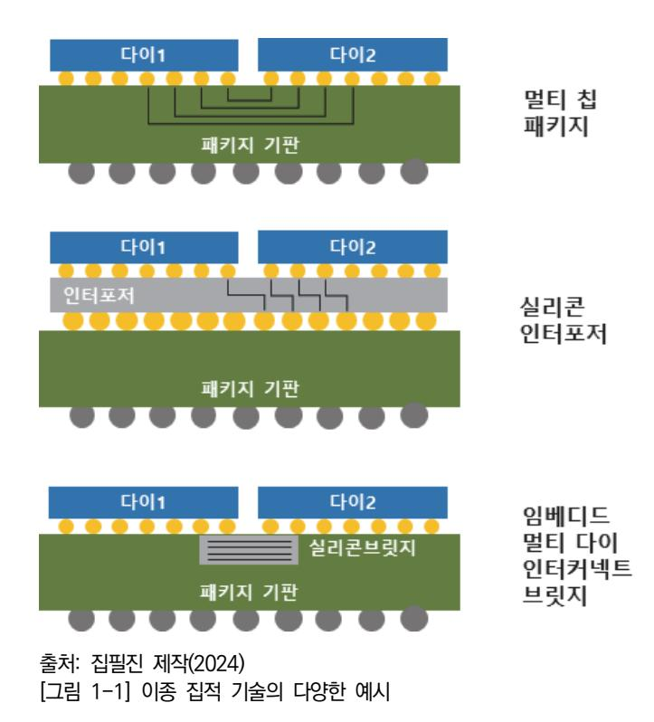

이와 같은 장점 덕분에 최근에는 3D Integration Package로 기술 개발이 진행되고 있으며 다수의 제품에 적용될 것이지만 앞에서 다루어진 3차원 적층 기술의 신호 경로보다 더 짧은 배선들이 고속, 저전력을 요구하는 제품에 더욱 필요해지고 있다. 이러한 요구를 충족하기 위 하여 개발된 기술이 실리콘 관통 전극(TSV: Through Silicon Via) 기술이다.

#### 숕 실리콘 관통 전극(TSV, Through Silicon Via)의 개념

기존의 와이어 본딩 기술 대신 TSV 기술은 칩에 아주 작은 구멍을 뚫어 상단과 하단 칩을 직 접 전극으로 연결하는 방식이다. 이 기술에서는 칩을 수백 마이크로미터 두께 수준으로 가공한 후, 구멍을 통해 상하단 칩 간의 금속 전극 연결을 구현한다. TSV 기술은 메모리 칩을 적층하 여 대용량 메모리를 구현하는 데 사용될 수 있으며, 전통적인 금선(Ag Wire)을 이용한 연결 방식보다 훨씬 빠른 속도와 소비 전력이 낮은 특징이 있다.

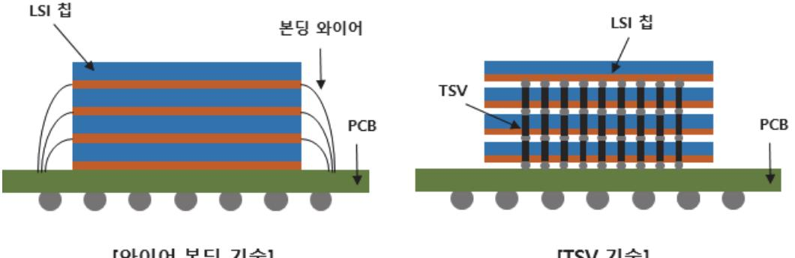

출처: 집필진 제작(2024)

[그림 1-2] 기존 와이어 본딩 기술과 실리콘 관통 전극 기술의 개념도

- 1. TSV의 장점
  - (1) TSV 기술은 실리콘 웨이퍼에 미세한 구멍을 뚫고, 그 구멍에 전도성 물질을 채워서 칩 내부 에 직접 전기적 연결 통로를 만드는 방식이다. 이 기술을 사용하면 칩 내부에 직접 연결 통 로가 형성되므로, 여러 개의 칩을 수직으로 쌓을 때 기존의 와이어 본딩 방식에서 발생할 수 있는 I/O(입출력) 수의 제한 문제와 단락 접촉 불량 등의 문제를 해결할 수 있다.
  - (2) TSV 기술은 추가적인 공간을 요구하지 않기 때문에 패키지의 크기를 줄이는 데 유리하다.
  - (3) 이 기술은 칩 간의 연결 길이를 단축시킬 수 있어, 빠른 신호 전송과 높은 용량, 저전력 구 동을 가능하게 한다.
- 2. TSV의 적용 분야
  - (1) CMOS 이미지 센서
  - (2) MEMS 응용 소자
  - (3) HB-LED 모듈
  - (4) DRAM, HBM(High Bandwidth Memory)
- 3. TSV의 요구 기술
  - (1) 비아 홀 형성 기술
  - (2) 기능성 박막 증착 기술
  - (3) 금속 물질 충전 기술
  - (4) 웨이퍼 연마 기술
  - (5) 칩 적층 기술
  - (6) 신뢰성 기술

숖 TSV를 이용한 3D IC 공정 기술의 분류

TSV를 이용한 3D IC 공정 기술은 TSV를 형성하는 시점에 따라 크게 3가지로 분류할 수 있다.

1. Via First

TSV를 먼저 형성한 후, 그 위에 소자를 제작하는 방식이다. 이 방법에서는 도핑된 폴리실 리콘을 사용하여 TSV를 채우는데, 이 공정은 다음에 이어지는 공정과의 열적, 재료적 호환 성을 확보하기 위해서이다. 다만, 도핑된 폴리실리콘은 금속에 비해 전도도가 낮아 단점이 될 수 있다.

2. Via Middle

소자를 제작한 후 TSV를 형성하고, 이를 채운 후 BEOL(Back End of Line) 공정을 진행 하는 방식이다. 이 방법에서는 텅스텐이나 구리를 사용하여 TSV를 채우며, 텅스텐은 내부 응력 문제로 인해 증착 두께에 제한이 있어 TSV의 aspect ratio에 제약이 있을 수 있다.

3. Via Last

소자를 제작하는 공정이 진행된 이후에 TSV 공정을 진행하는 방식이다. Via first, via middle 공정의 장점은 Via 크기가 작아 공정의 자유도가 높다는 것이고 via last 공정은 소자가 만들어지고 난 후에 TSV 공정이 진행되므로 TSV 공정 장비가 없는 제조 라인에서 도 진행할 수 있다는 것이 장점이라 할 수 있다. 어떤 제조 공정이 경제적인지는 3D IC 소자를 개발하거나 생산하는 곳의 제조 기술 및 제조 시설에 따라 달라질 수 있다고 볼 수 있다. 웨이퍼에 TSV 기술이 적용되면 칩의 면적이 증가하여 배선 길이가 증가하는 경우가 있으므로 TSV 기술 적용에 따라 배선 길이의 증가 여부를 상세히 검토해야 한다. 적층되는 칩 수와 집적도에 따라 달라질 수 있지만, TSV를 적용한다고 해서 배선의 수 또는 길이가 줄어들어 파생되는 기생 커패시턴스 성분을 감소시킬 수 있는 것이 아니다. TSV 위치 및 배열, 개수를 검토하여 총 배선 길이를 줄이고 기생 커패시턴스 등의 성분을 최소화하여 최 적의 TSV 설계를 해야 한다. 하지만 아직까지 이와 같은 문제를 해결할 수 있는 설계 프로 그램은 없는 상황이다. 또한 공정 진행 중 발생하는 불량이 칩 제조 공정 발생하는 것인지, TSV 공정에서 발생하는 것인지 특정하기 어려우므로 반도체 전 공정과 TSV 공정의 수율 각각의 관리가 중요하다.

숗 TSV via last 공정

TSV via-last 공정은 MEMS(Micro-Electromechanical Systems), CIS(CMOS Image Sensor), 지문 센서 등의 웨이퍼 레벨 패키징에 가장 적절한 공정이다. 이러한 칩들을 3D로 일체화할 때는 패키징 크기가 작아야 하며, 칩 크기가 감소하면서 패드의 크기도 작아지고 있 다. 따라서 기계적 기능을 유지하기 위해 특정 두께의 기판이 필요하므로, 수직 TSV 형상과

#### 높은 종횡비를 선호한다.

TSV와 관련된 또 다른 문제는 비아 주변의 기계적 응력이다. 이 응력은 구리와 실리콘 간의 열팽창 계수 차이로 발생할 수 있다. 이러한 스트레스는 활성 장치의 성능을 저하시킬 수 있으 며, 장치의 안정성에 문제를 일으킬 수 있다.

이러한 문제를 해결하기 위해 상향식 Cu 도금 대신 컨포멀 Cu 도금을 사용하여 칩 패드를 외 부에 연결한다. 부분적으로 채워진 Cu Via는 기계적 응력 문제를 줄이고 장치의 신뢰성을 높 인다. 또한 컨포멀 도금은 재분배층(RDL)도 동시에 형성할 수 있으며, 기존 Via Middle 공정 에서 필요한 CMP(Chemical Mechanical Polishing) 공정을 생략할 수 있어 비용을 절감할 수 있다.

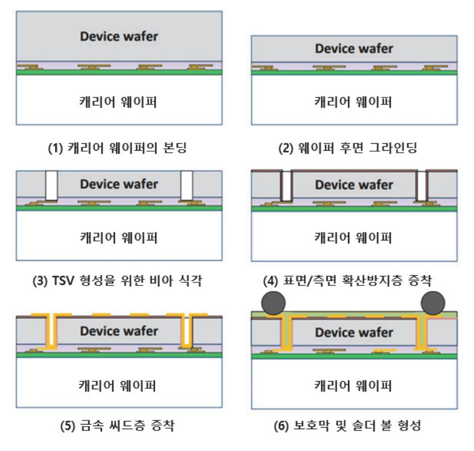

출처: 집필진 제작(2024)

[그림 1-3] TSV via last 공정 흐름도

## 수행 내용 / TSV Via Last 공정 진행하기

#### 재료·자료

- 웨이퍼 레벨 패키징 전문 자료
- 반도체 패키징 제조사와 파운드리 전문 제조사의 공정 기술
- 반도체 후공정 장비(도서)
- Temporary bonding materials
- Underfill
- μbumps, Copper pillars
- UBM materials
- 솔더볼, 솔더 범프, BGA 기판, 칩

#### 기기(장비 ・ 공구)

- 웨이퍼 두께 얇게 하는 장비
- TSV 패터닝 장비
- 본딩 및 조립 장비
- Dicing 장비
- 테스터

#### 안전 ・ 유의 사항

- TSV 공정 장비 운영의 안전 사항에 유의하여야 한다.
- TSV 공정 장비에 사용되는 화학 물질은 물질 안전 보건 자료를 미리 숙지하고 자료에 따라 취급 및 관련되어야 한다.

#### 수행 순서

- 숔 TSV 종류(Via first, middle, last)에 따른 공정 순서를 파악한다.
  - 1. Via First 공정

TSV를 형성한 후에 소자를 제작하는 방식이다. TSV를 먼저 형성함으로써 후속 공정에서 TSV의 위치가 정해지므로 소자의 설계와 제조가 좀 더 자유롭고 정밀하게 이루어질 수 있 다. 다만, 도핑된 폴리실리콘을 이용하는 경우가 많아 전도성 금속에 비해 저항이 높을 수 있으며, TSV와 다른 공정 간의 열적 재료 호환성이 중요하다.

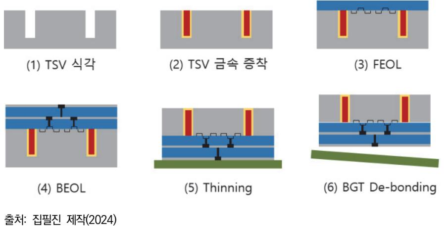

[그림 1-4] TSV Via First 공정 흐름도

2. Via Middle 공정

소자 제조 후에 TSV를 형성하고, 텅스텐이나 구리와 같은 금속으로 TSV를 채운 후 BEOL(Back End of Line) 공정을 진행하는 방식이다. TSV를 형성한 후 소자를 제조하기 때문에 TSV 공정과 소자 공정을 독립적으로 진행할 수 있다. 다만, 텅스텐의 경우 내부 응 력 문제로 TSV의 종횡비(Aspect ratio)에 제한이 있을 수 있다.

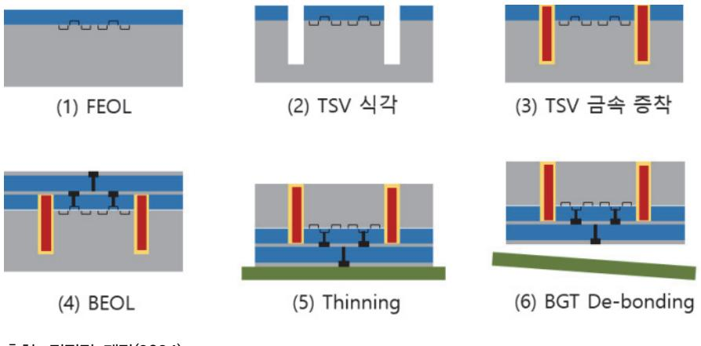

출처: 집필진 제작(2024) [그림 1-5] TSV Via Middle 공정 흐름도

3. Via Last 공정

BEOL까지 소자 제조를 완료한 후 TSV를 진행하는 방식이다. 소자 제작이 완료된 후 TSV 를 추가로 형성하기 때문에 소자의 제조 공정과 TSV 공정이 분리되어 처리될 수 있다. 다 만, 소자 공정 후 TSV를 추가로 진행하므로 공정의 복잡성으로 인해 후속 공정에서의 정밀 성이 요구된다.

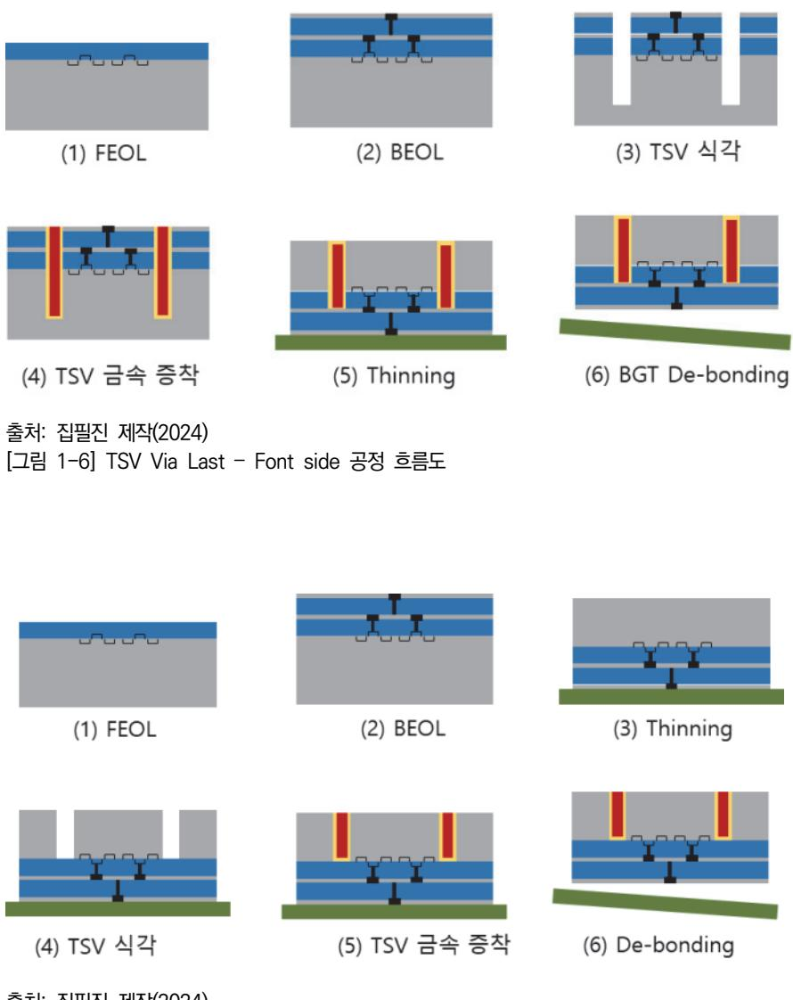

출처: 집필진 제작(2024) [그림 1-7] TSV Via Last – Back side 공정 흐름도

#### 숕 TSV를 형성한다.

#### 1. TSV의 공정 흐름을 이해한다.

TSV를 형성하는 기술로는 보시(Bosch) 공정으로 일반적으로 사용되는 DRIE(Deep Reactive Ion Etching) 공정과 UV 레이저를 이용하는 방법이 있다. 보시 공정은 플라즈마 식각 기술로서 보통 SF6 반응성 가스를 이용하여 실리콘을 식각하고, CFx 폴리머 막으로 via의 옆면을 보호하여(Passivation) 이방성 식각(Anisotropic Etching)을 하는 방법이다. 두 기술 모두 지름 1μm 이하의 TSV를 형성할 수 있으며 식각 공정 변수를 변화시켜 비아 벽면의 거칠기를 조절하여야 한다. [그림 1-8]은 TSV 공정의 흐름을 보여 준다. 실리콘 웨 이퍼 하드 마스크용 산화막을 증착하고 사진 공정을 통하여 원하는 패턴을 형성한다. 이후, 하드 마스크를 식각하고 PR(Photoresist)를 제거한 후 배리어층 및 Seed 층을 증착하고 구리 도금 및 CMP 공정이 진행된다.

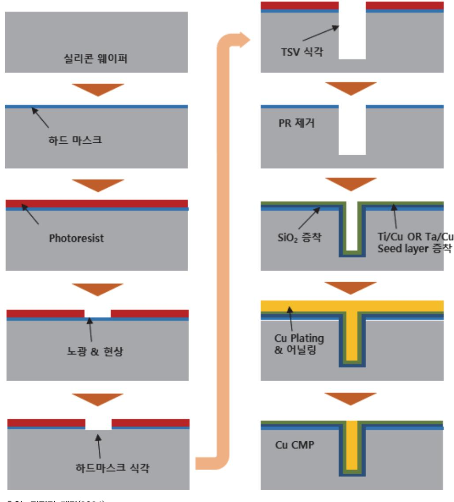

출처: 집필진 제작(2024) [그림 1-8] TSV 공정 순서도

#### 2. 비아(Via) 형성을 위한 식각 공정을 진행한다.

높은 종횡비(Aspect ratio)의 비아를 형성하기 위하여 실리콘의 DRIE(Deep Reactive Ion Etching)는 미세 구조 MEMS 분야 및 TSV(Through Silicon Via) 응용 분야의 중요 공정

중 하나이다. 그러나 일반적인 플라즈마 식각 공정은 수 마이크로미터의 식각 깊이를 위해 진행되었으며 식각 속도 및 식각 마스크와의 선택비가 부족하다. 보시 공정은 훌륭한 이방 성, 적절한 식각 속도 및 식각 마스크와의 선택비로 높은 종횡비의 패턴을 만들 수 있다. [그림 1-9]는 TSV 식각 공정의 흐름도로 패시베이션(Passivation), 비등방석 식각 및 실리 콘 등방성 식각의 3단계로 구성된다. 패시베이션 단계에서 CFx 폴리머는 트렌치 또는 비아 의 측벽과 바닥면에 형성된다. 비등방성 식각 단계에서는 하부 바이어스를 이용하여 패턴 바닥면의 폴리머를 선택적으로 제거하게 된다. 실리콘의 등방성 식각 단계에서는 패턴 바닥 면의 패시베이션 폴리머가 제거된 부분만 식각한다.

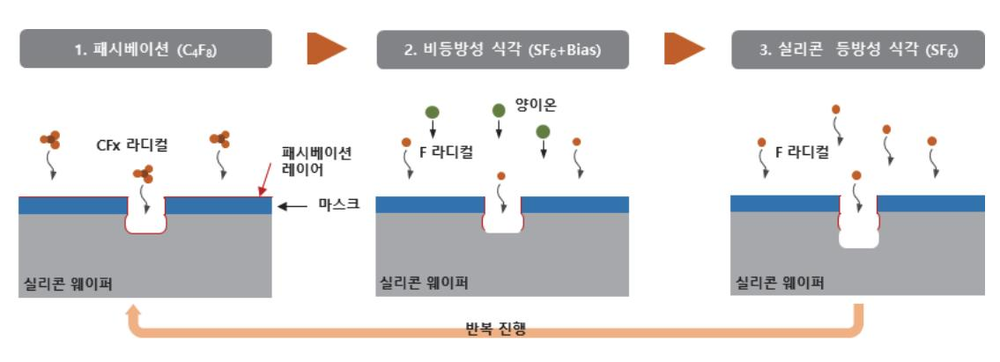

출처: 집필진 제작(2024)

[그림 1-9] TSV 식각 공정(Boshe Process)

숕 확산 방지층 및 접착층을 증착한다.

일반적으로 활용되는 전기 도금을 이용한 구리의 경우 구리가 실리콘으로 확산이 되지 않도록 하는 것이 매우 중요하다. 구리를 전기 배선 물질로 사용하는 via의 경우 Ti, Ta나 Ti와 Ta의 화합물을 확산 방지층(Barrier Layer)과 접착층(Adhesion Layer)으로 보편적으로 사용하고, 스퍼터링 공정으로 구리 도금을 위한 씨앗층(Seed Layer)을 증착한다. TiN이나 TaN이 많이 사용되는데 이것은 일랙트로마이그레이션(Electromigration)에 대한 저항성이 좋기 때문이다. Via의 A/R(종횡비, Aspect Ratio)가 클 경우에는 확산 방지층과 구리 씨앗층을 MOCVD로 증착하기도 한다.

숖 구리 전기 도금을 진행한다.

구리는 주로 씨앗층을 이용하여 전기 도금 공정으로 채워진다. TSV를 채우는 구리 금속 배선 중간에 void를 제거하기 위해 보편적으로 reverse pulse plating 공정 기술이 채택된다. 역방 향의 전류가 흐를 때 두껍게 도금된 구리가 일부 제거되어 적정한 두께가 유지되는 데 도움이 되고 펄스로 전류가 공급되어 새로운 도금 약액이 공급되도록 조절하는 것이 중요 공정 기술이 다. 일정하게 구리를 채우기 위해 비아 바닥면으로부터 구리가 채워질 수 있도록 bottom-up 공정을 이용하기도 한다. TSV 공정에서 가장 오랜 시간이 소요되고 공정 비용이 고가인 공정 이 구리 전기 도금 공정이다. 공정을 단순화하여 생산 비용과 시간을 단축하기 위한 다수의 연 구가 진행되고 있으며 구리 대신에 니켈을 사용하기도 하고 수지를 이용하여 TSV를 채우기도 한다.

#### 숗 웨이퍼 접합 및 Thinning 공정을 진행한다.

비아를 형성하기 위하거나 비아가 형성된 웨이퍼를 얇게 하기 위해서 thinning 공정과 적층을 위한 공정이 수행되어야 한다. Thinning 공정을 위해 웨이퍼를 캐리어 웨이퍼(Carrier Wafer)에 접합시킨 후에 공정을 진행하고 공정이 진행 된 후 소자가 만들어진 웨이퍼를 캐리어 웨이퍼에서 떼어내는 공정이 진행되어야 한다. 실질적으로 매우 중요한 공정으로 웨이퍼 제조 공정의 수율에 매우 큰 영향을 미치는 공정 중의 하나이다. 이는 웨이퍼와 같은 실리콘이 아닌 다른 물질로 형성된 비아가 있기 때문에 외부의 물리적인 충격에 매우 취약한 구조이기 때문이다. Thinning 공정은 back grinding 공정과 CMP 공정의 2단계로 이루어진다. Back grinding 공정은 일반적으로 웨이퍼 표면 5~10μm 깊이로 물리적인 손상을 주기 때문에 후속 공정으로 손상된 부분을 제거해야 한다. 이를 위하여 CMP 공정, 플라즈마 건식 식각이나 습식 식각을 통해 손상된 부분을 제거하고 표면 거칠기를 제어해야 한다. CMP 공정은 일반적으로 pH 10의 0.3μm 실리카 슬러리로 진행된다.

수 재배열 공정을 진행한다.

재배열 기술(Redistribution)은 3D 적층에서 I/O의 위치가 다르거나 I/O의 위치를 변경할 필요가 있을 때 실리콘 인터포저를 이용하여 접합할 때 사용된다. 이 기술은 칩이나 실리콘 인터포저 위에 유전체층과 금속 배선층을 여러 겹으로 쌓아 적층에 필요한 패드와 범프 또는 UBM(Under Bump Metallization)을 형성하는 방식으로 이루어진다. 현재까지 사용되는 일반적인 유전체는 BCB와 같은 고분자 재료이다. [그림 1-10]은 웨이퍼 위에 형성된 재배열층을 보여 주는 예이다.

- 출처: 집필진 제작(2024) [그림 1-10] 인터포저 재배선 공정 흐름도(RDL)
- 숙 삼차원 적층 공정을 진행한다.
  - 1. 삼차원 적층 공정의 구분
    - (1) 웨이퍼에 웨이퍼 적층

같은 크기의 웨이퍼를 서로 적층하는 방법이다. 이 방식은 메모리 칩과 같이 칩의 크기 가 같고 수율이 높은 경우 생산량이 높다는 장점이 있다. 하지만 웨이퍼 표면 관리가 매우 중요하다.

- (2) 웨이퍼에 칩 적층 웨이퍼 위에 개별 칩을 적층하는 방법이다. 이 기술은 좋은 품질의 칩만을 사용하므로 수율이 높지만, 생산량이 상대적으로 낮다.
- (3) 칩에 칩 적층

개별 칩 위에 또 다른 칩을 적층하는 방법이다. 이 방식은 칩의 종류나 크기, 소재에 구 애받지 않지만, 역시 생산량이 낮은 단점이 있다.

- 2. 3차원 적층에서 접합에 사용되는 방법
  - (1) 산화막을 이용한 방법
  - (2) 금속 확산을 이용한 방법
  - (3) 금속 간 화합물을 이용한 방법
  - (4) 폴리머 접착제를 이용한 방법
  - (5) 범프를 이용한 방법
  - (6) 위 방법들의 조합
  - 이들 접합 기구는 삼차원 적층 기술의 종류에 따라 선택적으로 사용된다. 특히 C2W(Chip to

Wafer) 또는 C2C(Chip to Chip) 적층 공정에서는 전통적으로 솔더나 금속 간 화합물을 많이 사용한다. 이는 공정 기구가 잘 이해되어 있고, 접합에 필요한 온도와 압력이 상대적으로 낮아 플립 칩 본딩 기술로 쉽게 구현할 수 있기 때문이다.

범프에 사용되는 재료로는 금, 구리, 솔더 등의 금속 재료가 있으며, 범프를 형성하기 위한 공정으로는 Evaporation, 전기 도금, 무전해 도금, bumping, 솔더 젯, 스크린 프린팅, 솔더 볼 등이 사용된다. 범프 형성 방법에 따라 생산 비용, 미세한 패턴의 대응 가능성, 공정 부산물 발생, 수율 등이 달라진다.

#### 수행 tip

- 일렉트로마이그레이션(Electromigration)은 금속의 전도 전자 사이 운동량의 전달로 인해 금속 내의 이온 등의 움 직임으로 인해 물질이 이동하는 현상으로 반도체 소자 내 의 전류 밀도가 증가하는 경우 금속 물질 자체의 이동으로 인해 금속 배선이 끊어지거나 합선이 발생한다.
- 플라즈마란 고체, 액체, 기체 다음의 상태로 많은 수의 자 유전자, 이온, 중성의 원자 또는 분자로 이루어진 집합체 를 말한다. 고체/액체/기체와 다르게 이온화되어 있어 부 분적으로 전기적 특성을 보인다. 자유 전자가 중성의 원자 나 분자에 충돌하여 이온화되어 플라즈마가 형성된다.
- 반응성 가스를 플라즈마를 형성하여 식각 공정에 이용하 는 것이 플라즈마를 이용한 건식 식각 공정이며 비아 형성 공정에 이용할 수 있다.

### 학습 1 교수·학습 방법

#### 교수 방법

- TSV 공정의 기본 개념과 원리를 설명한다.
- TSV 공정의 필요성에 대해 설명하고, 세부 공정인 Hard mask 형성, DRIE, 확산 방지층 및 접착층 형성, 구리 전기 도금, 재배열 공정 등에 대해 설명한다.
- TSV 공정 적용 시 장점 및 단점에 관해 설명한다.
- TSV 공정에 필요한 장비 및 재료에 괜해 설명하고 공정 진행 중 안전 주의 사항에 대해 지 도한다.
- 세부 공정 장비의 구성 요소 및 동작 원리에 대해 실습 전 설명하고 운용 방법에 대해 익히 게 하여 안전사고를 예방한다.

#### 학습 방법

- TSV 공정의 기본 개념과 원리에 대해 학습한다.
- TSV 공정의 필요성에 대해 학습하고, 세부 공정인 Hard mask 형성, DRIE, 확산 방지층 및 접착층 형성, 구리 전기 도금, 재배열 공정 등에 관해 학습한다.
- TSV 공정 적용 시 장점 및 단점에 관해 학습한다.
- TSV 공정에 필요한 장비 및 재료에 대해 학습하고, 공정 진행 중 안전 주의 사항에 대해 사전에 학습하여 공정 실습 시 안전을 확보한다.
- 세부 공정 장비의 구성 요소 및 동작 원리에 대해 실습 전 학습하고 운용 방법에 관해 익혀 안전사고를 예방한다.

## 학습 1 평 가

#### 평가 준거

- 평가자는 학습자가 학습 목표를 성공적으로 달성하였는지를 평가해야 한다.
- 평가자는 다음 사항을 평가해야 한다.

|                        | 학습 목표                                                       | 성취수준 |   |   |
|------------------------|-------------------------------------------------------------|------|---|---|
| 학습 내용                  |                                                             | 상    | 중 | 하 |
| TSV Via Last 공 정 진행 | - 반도체 셀 미세화 한계에 따른 칩 적층 방법을 적용하여 개 발할 수 있다.              |      |   |   |
|                        | - 칩(실리콘)에 관통하는 전극 홀 형성하는 기술을 적용하여 개발할 수 있다.              |      |   |   |
|                        | - 관통된 전극 홀에 재배선을 통해 서로 다른 칩과 패키지 연 결하는 기술 적용하여 개발할 수 있다. |      |   |   |
|                        | - 웨이퍼 범핑 또는 솔더볼을 부착하는 기술을 적용할 수 있 다.                     |      |   |   |
|                        | - 상·하 칩이 전기적으로 연결되는 기술을 개발하여 적용할 수 있다.                   |      |   |   |

#### 평가 방법

• 서술형 시험

| 학습 내용                  | 평가 항목                                      | 성취수준 |   |   |
|------------------------|--------------------------------------------|------|---|---|
|                        |                                            | 상    | 중 | 하 |
| TSV Via Last 공 정 진행 | - 3차원 패키지의 필요성 파악 여부                       |      |   |   |
|                        | - TSV의 개념 파악 여부                            |      |   |   |
|                        | - TSV의 장점, 적용 분야, 요구 기술의 파악 여부             |      |   |   |
|                        | - TSV Via first, middle, last 공정의 특징 이해 정도 |      |   |   |
|                        | - TSV Via last 공정의 진행 순서 파악 여부             |      |   |   |
|                        | - TSV Via last 형성을 위한 단위 공정 이해 정도          |      |   |   |

• 논술형 시험

| 학습 내용                  | 평가 항목                             | 성취수준 |   |   |  |
|------------------------|-----------------------------------|------|---|---|--|
|                        |                                   | 상    | 중 | 하 |  |
| TSV Via Last 공 정 진행 | - TSV Via last 공정의 진행 순서 제시 능력    |      |   |   |  |
|                        | - TSV Via last 형성을 위한 단위 공정 이해 정도 |      |   |   |  |

• 사례 연구

| 학습 내용                  | 평가 항목                              | 성취수준 |   |   |  |
|------------------------|------------------------------------|------|---|---|--|
|                        |                                    | 상    | 중 | 하 |  |
| TSV Via Last 공 정 진행 | - 최신 반도체 제품에서 2.5D 패키징 적용 사례 파악 여부 |      |   |   |  |
|                        | - 3D 패키징 개발 사례 파악 여부               |      |   |   |  |

• 구두 발표

| 학습 내용                  | 평가 항목                                      | 성취수준 |   |   |  |
|------------------------|--------------------------------------------|------|---|---|--|
|                        |                                            | 상    | 중 | 하 |  |
| TSV Via Last 공 정 진행 | - TSV의 개념 이해 여부                            |      |   |   |  |
|                        | - TSV의 장점, 적용 분야, 요구 기술의 파악 여부             |      |   |   |  |
|                        | - TSV Via first, middle, last 공정의 특징 이해 정도 |      |   |   |  |
|                        | - TSV Via last 공정의 진행 순서 파악 여부             |      |   |   |  |
|                        | - TSV Via last 형성을 위한 단위 공정 이해 정도          |      |   |   |  |

피드백

| 1. 서술형 시험 - TSV Via Last 공정 관련 성취수준이 높은 학습자에게는 각 단위 공정에서 필요한 재료 및 장비, 단위 공정 변수에 대해 추가로 설명해 준다. - 성취수준이 낮은 학습자에게는 동영상, 그림 등을 이용하여 구체적으로 설명하고 실습을 통하여 이해를 돕게 한다. |
|----------------------------------------------------------------------------------------------------------------------------------------------------------------------------|
| 2. 논술형 시험                                                                                                                                                                  |
| - TSV Via Last 공정 관련 성취수준이 높은 학습자에게는 세부 단위 공정의 최적화에 대해 추가로 설명해 준다.                                                                                                      |
| - 성취수준이 낮은 학습자에게는 세부 단위 공정의 개념 및 순서에 대해 그림 등을 이용하여 구체 적으로 설명하고 공정 순서에 따라 구조의 변화를 학습자가 직접 그려서 결과를 예측하게 한다.                                                               |
| 3. 사례 연구                                                                                                                                                                   |
| - TSV Via Last 공정 관련 성취수준이 높은 학습자에게는 3D 패키지 신기술 동향에 대해 추가 설 명해 준다.                                                                                                      |
| - 성취수준이 낮은 학습자에게는 국내외 사례를 설명하고 다른 사례를 찾게 한다.                                                                                                                               |
| 4. 구두 발표                                                                                                                                                                   |
| - TSV Via Last 공정 관련 성취수준이 높은 학습자에게는 구두 발표 자료 작성 방법 및 발표 스 킬에 대해 조언하여 발표의 완성도를 높게 한다.                                                                                   |
| - 성취수준이 낮은 학습자에게는 서술형 시험, 논술형 시험, 사례 연구 등에서 행해진 자료를 복습 하게 하고 구두 발표를 다시 진행한다.                                                                                            |

| 학습 1 | TSV Via Last 공정 진행하기   |
|------|------------------------|
| 학습 2 | TSV Via Middle 공정 진행하기 |
| 학습 3 | 하이브리드 범핑 공정 진행하기       |

# 2-1. TSV Via Middle 공정 진행

| 학습 목표 | • 반도체 셀 미세화 한계에 따른 칩 성능 향상을 위해 칩 적층 기술을 적용할 수 있다. • 인터페이스와 메모리 응용 칩 적층 기술을 적용할 수 있다. • 관통된 전극 홀에 재배선을 통해 와이어링하는 기술을 적용할 수 있다. |
|-------|-------------------------------------------------------------------------------------------------------------------------------------|
|       | • 다양한 칩을 BGA 기판에 조립하는 기술을 적용할 수 있다.                                                                                                 |

## 필요 지식 /

숔 TSV Via middle 공정

비아 미들(Via Middle) 공정이 적용되는 TSV 패키지의 전체 공정 흐름은 [그림 2-1]과 같다. 먼저, 웨이퍼 공정에서 FEOL 공정 진행 후 비아를 형성하고 패키지 공정을 진행할 때 웨이퍼 전면에 솔더 범프를 형성한 후 캐리어 웨이퍼를 접착한 후 백그라인딩 하고 웨이퍼 후면에 범 프를 형성한 후 칩 단위로 소잉(Sawing)해서 적층하는 순서로 공정을 진행한다.

- 1. 트랜지스터 형성(FEOL: Front End of Line) 웨이퍼 위에 CMOS 트랜지스터와 같은 반도체 소자를 먼저 형성한다.
- 2. 패턴 형성

TSV를 형성할 위치에 HM(Hard Mask)을 사용하여 패턴을 만든다. 이는 TSV를 만들기 위 한 기준 패턴 역할을 한다.

3. 트렌치 형성

HM이 없는 부분을 건식 식각 공정으로 제거하여 깊은 트렌치(Trench)를 만든다. 트렌치는 TSV가 위치할 홀(Hole)이다.

4. 절연막 형성

트렌치 내부에 절연막(예: 산화물)을 CVD(Chemical Vapor Deposition) 공정으로 증착한 다. 이 절연막은 트렌치를 금속(예: Cu)으로 채울 때, 금속이 실리콘(Si)과 직접 접촉하여 확산되지 않도록 한다.

5. 금속 박막층 형성

절연막 위에 금속 박막층(예: Seed/Barrier)을 형성한다. 이 금속 박막층은 후속 공정에서 금속을 채울 수 있도록 준비하는 층이다.

#### 6. 전해도금

금속 박막층을 이용하여 Cu와 같은 금속을 전해 도금한다. 이 공정으로 트렌치를 금속으로 채운다.

7. 평탄화

CMP(Chemical-Mechanical Polishing) 공정을 통해 웨이퍼의 표면을 평탄화하고, 웨이 퍼 윗면에 있는 Cu를 모두 제거하여 트렌치 내부에만 Cu가 남도록 한다.

8. 후속 공정(BEOL: Back End of Line)

이후 BEOL 공정을 진행하여 웨이퍼 공정을 완료한다. 이 단계에서는 추가적인 배선 작업 과 연결 공정이 포함된다.

#### HM(Hard Mask)

PR와 같이 목적은 식각 공정을 진행할 때 하부막을 보호하기 위한 물질이지만, 일반적으로 사용되는 PR보 다는 식각 저항성이 큰 물질로 상대적으로 미세한 패턴 구현이 가능하다. 그러나 HM 물질 자체는 빛에 반 응을 하지 않아서 HM 공정을 진행하기 위해서는 HM 층 위에 PR로 패터닝하고 HM을 식각하는 공정이 필요하다.

Via first와 via middle 공정은 TSV의 지름이 작아 라우팅의 자유도가 높다는 장점이 있다. 반면, Via last 공정은 소자 제작이 완료된 후 TSV 공정이 진행되므로 TSV 공정을 지원하지 않는 파운더리 산업에서도 제조가 가능하다는 장점이 있다. 어떤 공정의 채택이 더 유리한지는 3D IC 소자를 개발하거나 생산하는 제조 환경에 따라 선택할 수 있다. 특히, 웨이퍼에 TSV를 추가하면 칩의 면적이 증가하게 되며, 이로 인해 배선 길이도 늘어날 수 있다. 따라서 TSV 공 정이 배선 길이에 미치는 영향을 잘 분석하여 적절한 방법을 선택하는 것이 중요하다.

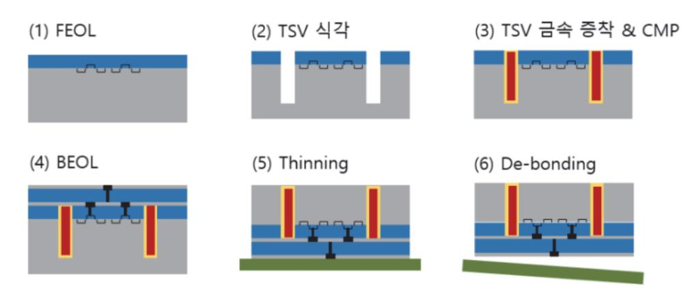

출처: 집필진 제작(2024) [그림 2-1] TSV via middle 공정

## 수행 내용 / TSV Via Middle 공정 진행하기

#### 재료·자료

- 웨이퍼 레벨 패키징 전문 자료
- 반도체 패키징 제조사와 파운드리 전문 제조사의 공정 기술
- 반도체 후공정 장비(도서)
- Temporary bonding materials
- Underfill
- μbumps, Copper pillars
- UBM materials
- 솔더볼, 솔더 범프, BG A기판, 칩

#### 기기(장비 ・ 공구)

- 웨이퍼 두께 얇게 하는 장비
- TSV 패터닝 장비
- 본딩 및 조립 장비
- Dicing 장비
- 테스터

#### 안전 ・ 유의 사항

- TSV 공정 장비 운영의 안전 사항에 유의하여야 한다.
- TSV 공정 장비에 사용되는 화학 물질은 물질 안전 보건 자료를 미리 숙지하고 자료에 따라 취급 및 관리되어야 한다.

#### 수행 순서

숔 CMOS 등의 트랜지스터를 형성한다. 만들고자 하는 제품 및 설계에 따라 트랜지스터 형성 등 FEOL(Front End Of Line) 공정을 진행한다.

숕 실리콘을 식각한다.

FEOL 공정 이후 실리콘 웨이퍼를 식각하여 비아를 형성한다. 식각 공정에 사용되는 PR(감광 액, Photoresist)만으로 실리콘 웨이퍼를 식각하기 어렵기 때문에 TSV는 비아를 형성할 때 하 드 마스크(HM: Hard mask)를 활용하여 식각을 진행한다. 비아는 깊고 종횡비(Aspect Ratio, A/R)가 크기 때문에 높은 선택비가 필요하기 때문이다. 이에 하드 마스크 형성 공정은 하드 마스크 재료로 사용될 산화물을 증착하고, 사진 공정을 통해 PR 패턴을 형성, 산화물 식각, PR 패턴 제거 순으로 진행된다.

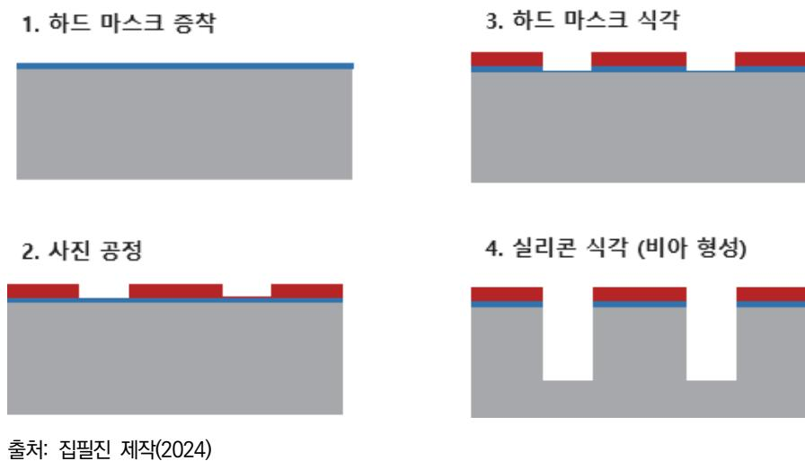

[그림 2-2] TSV 형성을 위한 Silicon etch 공정

숖 식각된 실리콘 바아에 구리를 채운다.

실리콘 웨이퍼에 형성된 비아에 구리(Cu)를 채우는 공정이다. 구리가 웨이퍼의 실리콘 부분에 확산할 경우 구리 부분에 실리콘이 확산하게 되어 실리콘 및 전도성 금속의 성능 저하를 일으 키게 된다. 이를 방지하기 위하여 구리를 채우기 전에 절연층(산화막 또는 질화막) 및 박막층 (Barrier, Seed)을 증착한다. 박막이 증착된 TSV 비아에 구리를 충진(Cu Fill) 공정을 진행한 다. 비아는 종횡비가 크기 때문에 비아 내부에 보이드(Void) 없이 구리를 채우는 것이 중요하 다.

숗 TSV Cu 표면에 CMP 공정을 진행한다. 웨이퍼 윗면의 불필요한 구리(Cu) 및 박막층을 제거하여 평탄화하는 공정이다. 불필요한 구리 및 박막층은 TSV 비아에 구리를 충진할 때 같이 형성된 것으로 웨이퍼 윗면에 위치하게 된다. 이 웨이퍼 윗면의 구리 및 박막층을 제거하여 TSV 비아에만 구리가 남도록 하는 공정이다.

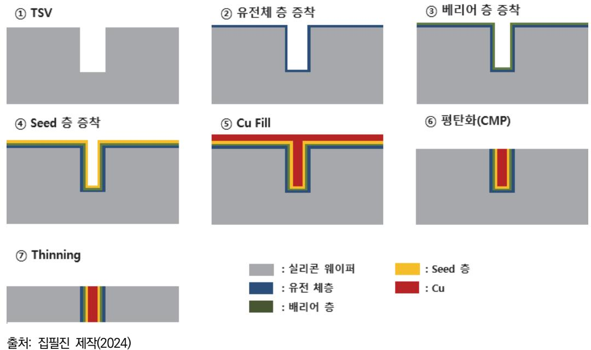

[그림 2-3] TSV Cu Fill & CMP 공정

#### 수 BEOL 금속 공정을 진행한다.

FEOL 공정이 끝난 소자는 외부와 전원 또는 신호를 서로 주고받지 못하면 소자는 아무런 역 할을 할 수 없기 때문에 외부와 전기적인 연결을 위해 금속선을 설계된 회로에 따라 이어 주고 금속 패드는 형성하게 된다. 외부와의 전기적인 연결을 위하여 사진, 식각, 증착, 세정 등의 공 정을 통해 소자에 전원을 공급해 주고 신호선을 연결해 주게 된다.

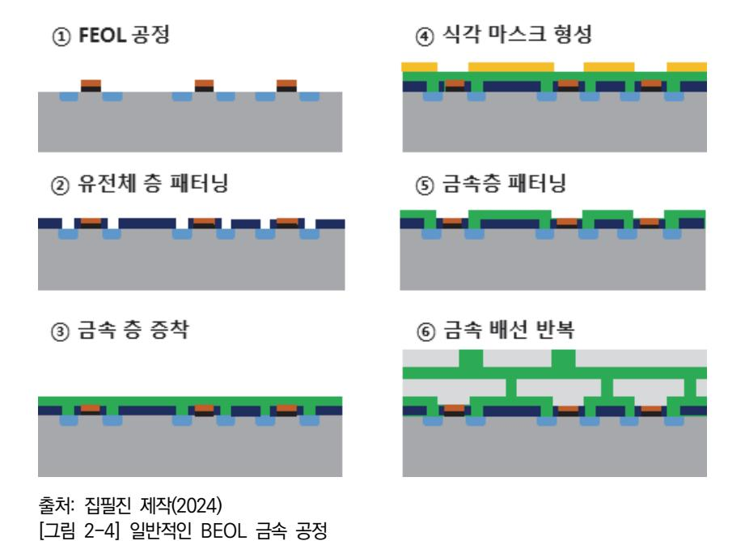

숙 웨이퍼 전면에 범프를 형성한다.

여러 층의 수직으로 적층된 칩을 전기적으로 연결하기 위하여 웨이퍼 양면에 범프를 형성해야 한다. 그 중 웨이퍼 전면에 범프를 형성하고 리플로(Reflow) 공정을 진행할 때 둥근 형태를 유 지하기 위하여 절연층을 형성한 후 금속층을 만들고 절연층을 제거한다.

숚 솔더의 리플로(Reflow) 공정을 진행한다.

열을 이용하여 솔더 범프를 구형으로 만드는 공정이다. 범프 간 높이 차이를 최소화하고, 범프 표면의 거친 정도를 최소화하며 산화물 제거가 진행된 볼 형태의 범프는 적층 과정에서 접합성 을 높이는 데 유리하다.

전 단계에서 만들어진 범프를 열을 이용하여 구형으로 만드는 공정이다. 범프 표면의 거칠기를 감소시키고 범프 간의 높이 차이를 줄여 범프의 적층 과정에서 접합성을 높인다.

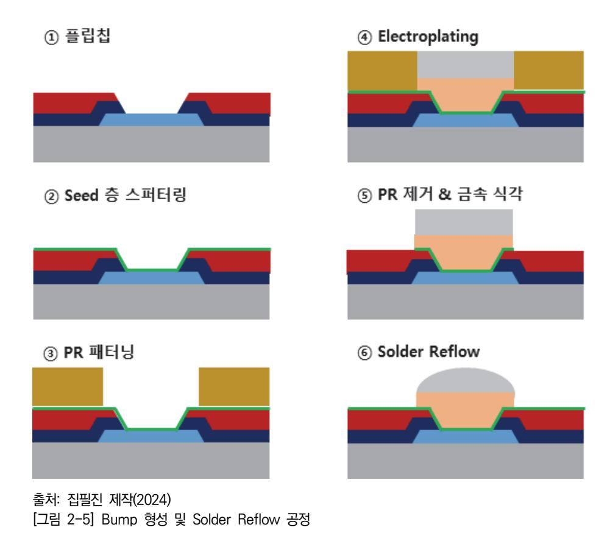

숛 캐리어 웨이퍼 접합 공정을 진행한다.

전 공정이 진행된 웨이퍼는 뒷면을 얇게 갈아내어 웨이퍼의 두께를 얇게 하여 전력 소모를 줄 이고, 열을 뒷면으로 빠르게 배출하여야 하며, 전 공정 진행 시 발생한 오염된 부분을 제거하 는 백그라인딩 공정이 필요하다. 백그라인딩 공정을 진행하기 위하여 웨이퍼에 캐리어를 붙여 주어야 한다. 캐리어 웨이퍼 본딩은 백그라인딩 공정을 진행할 때 웨이퍼의 핸들링을 도와주며 웨이퍼의 깨짐을 방지할 수 있다. 이를 위하여 일반적으로 웨이퍼 앞면에 테이프를 붙여 웨이 퍼 전면을 보호하지만, 웨이퍼 뒷면에 범프를 형성해야 하는 TSV 공정에서는 캐리어 웨이퍼를 부착한다.

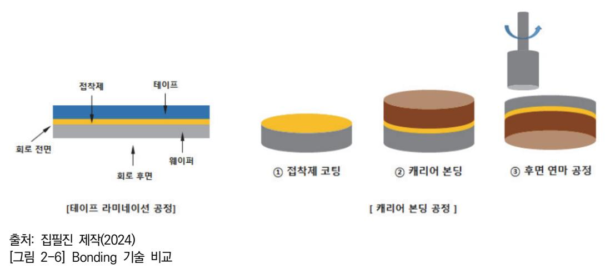

순 TSV 노출(Exposure) 및 후면 보호막 공정을 진행한다.

백그라인딩이 완료된 웨이퍼 뒷면의 두께는 감소했지만, 아직도 TSV는 웨이퍼 내부에 가려져 있다. 칩들을 전기적으로 연결하기 위해 TSV라는 전기적 연결 통로를 사용해야 하므로 식각 공정을 통해 가려진 TSV를 드러내는 과정이 필요하다. 그 후 노출된 TSV를 보호하기 위해 보 호막을 입히는 패시베이션 공정을 수행한다.

숝쇵 보호막의 CMP 공정 및 TSV Cu 노출(Exposure) 공정을 진행한다. 웨이퍼 표면은 TSV를 보호하기 위하여 패시베이션 공정이 진행된 상태로 절연층이 증착되어 있어 TSV는 절연층 내부에 가려져 있다. 이때 웨이퍼 표면에 CMP 공정을 진행하여 절연층을 평탄화시켜 가려진 TSV를 노출시키게 된다.

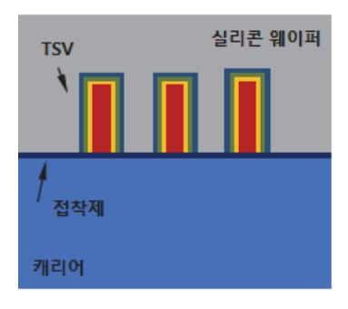

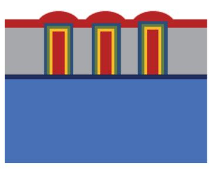

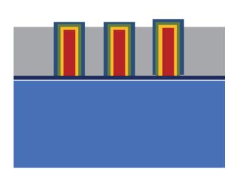

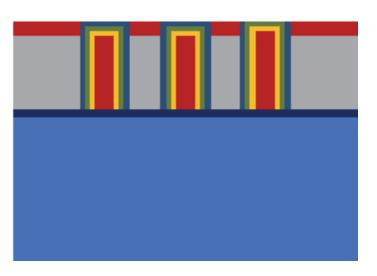

출처: 집필진 제작(2024) [그림 2-7] Back Side Passivation, Passivation CMP, TSV Cu Exposure 공정 흐름도

숝쇶 웨이퍼 후면 범프 형성 공정을 진행한다.

앞선 공정에서 범프를 웨이퍼 전면에 형성했다. 그러나 칩을 수직으로 쌓기 위해서는 전기적 연결 통로 역할을 하는 범프를 양쪽 면에 형성해야 한다. 앞선 공정에서 칩의 전면에 범프를 형성했으므로, 이번 공정에서는 칩의 후면에 범프를 형성하는 작업을 진행한다.

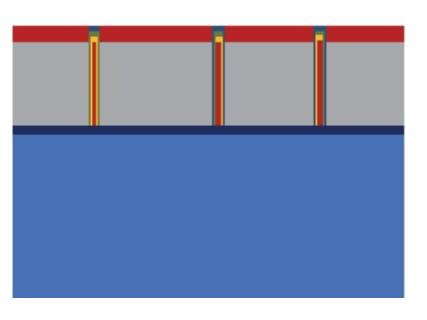

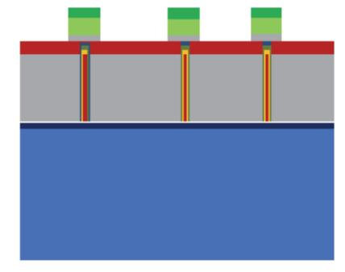

출처: 집필진 제작(2024) [그림 2-8] Back Side Bump Formation 공정

숝쇷 Carrier Wafer Debonding & Thin Wafer Mounting Tape 백그라인딩 공정(웨이퍼 후면을 얇게 갈아 내는 공정)에서 웨이퍼를 보호하기 위해 부탁했던 캐리어 웨이퍼를 제거한다. 캐리어 웨이퍼를 부착할 때 사용했던 가접착용 접착제의 잔여물이 남아 있지 않도록 세정 공정을 진행한다. 이후 웨이퍼를 개별 칩 단위로 절단할 때 웨이퍼가 휘는 현상을 방지하기 위하여 다이싱 공정을 위해 그라인딩된 얇은 웨이퍼 뒷면에 마운팅 테이프를 붙여 준다. 웨이퍼 후면을 얇게 하는 백그라인딩 공정에서 웨이퍼를 핸들링하고 보호하기 위해 부착한 캐 리어 웨이퍼를 제거한다. 캐리어 웨이퍼를 붙일 때 사용했던 접착제의 잔여물이 남지 않도록 세정 공정을 진행한다. 이후, 얇게 그라인딩된 웨이퍼 뒷면에 다이싱 공정을 위해 마운팅 테이 프를 부착한다. 웨이퍼 다이싱 공정 중 마운팅 테이프를 붙이는 이유는 다음과 같다.

1. 웨이퍼 지지

절단 과정에서 웨이퍼가 휘거나 부서지지 않도록 안정적으로 지지한다. 얇은 웨이퍼는 절단 중에 휘거나 깨질 수 있기 때문에 마운팅 테이프가 웨이퍼를 평평하게 유지해 준다.

2. 웨이퍼 이동 방지

절단 과정에서 웨이퍼가 이동하지 않도록 고정한다. 마운팅 테이프는 웨이퍼와 그라인딩 테 이블 사이의 마찰을 증가시켜 웨이퍼가 제자리에서 움직이지 않도록 돕는다.

3. 부착력 제공

웨이퍼의 뒷면에 부착하여 절단 후 개별 칩이 떨어지지 않도록 한다. 이는 절단 후 칩을 처 리하거나 추가 공정을 진행하는 데 유용하다.

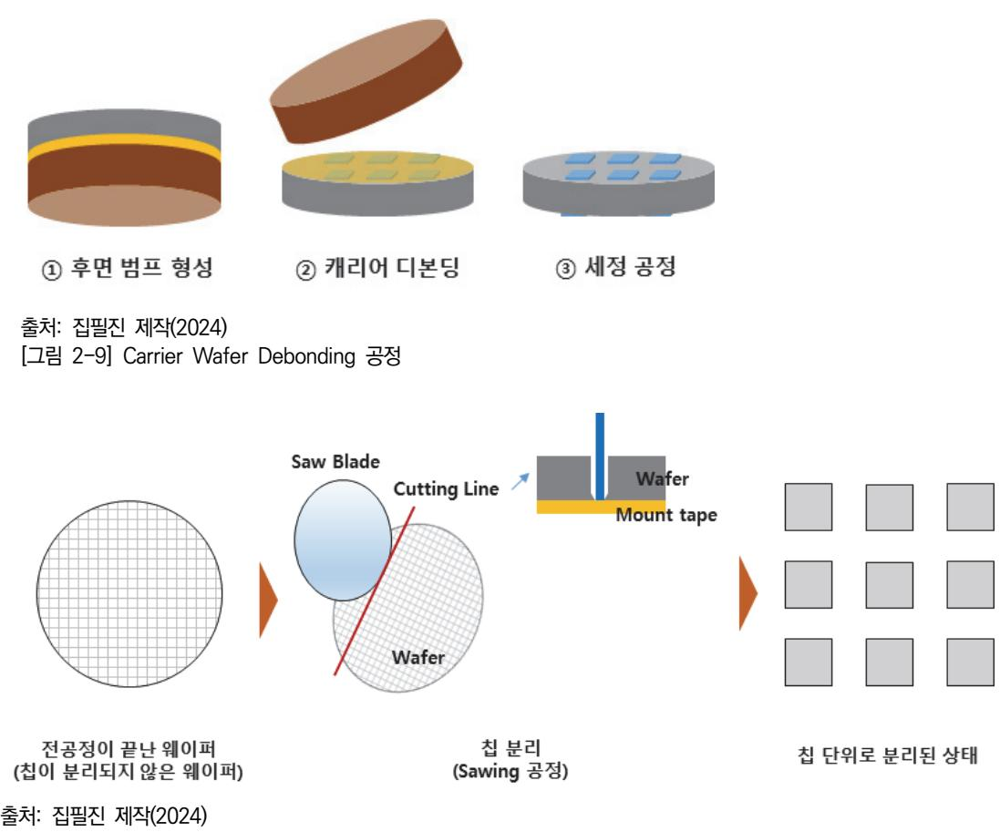

[그림 2-10] Thin Wafer Mounting Tape 공정

#### 숝숩 칩의 적층 및 패키지 어셈블리 공정을 진행한다.

TSV가 형성된 칩 앞면에 만들어진 범프와 뒷면에 만들어진 범프들을 본딩하여 칩 또는 인터포 저나 기판에 적층시키는 공정이다. 적층된 칩 간의 전기적 연결 통로를 만들어 주기 위함이며 현재 다음과 같은 본딩 기술이 적층 과정에서 이용되고 있다.

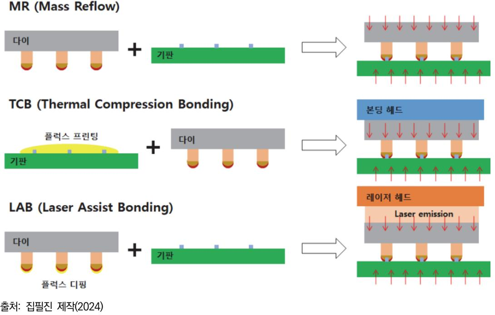

[그림 2-11] 칩의 적층 및 패키지 어셈블리 공정

1. MR(Mass Reflow)

범프가 형성된 칩을 리플로(Reflow) 장비에 통과시키면서 칩 전체에 열을 가하여 칩과 칩, 칩과 기판, 칩과 인터포저 등을 본딩하는 기술로 과거에는 많이 활용되었다. 하지만 범프의 크기가 작아지고, 범프 간 거리가 줄어들면서 열처리 과정에서 범프 사이에 브리지가 발생하는 문제가 발생하기도 한다. 칩의 두께 또한 얇아지면서 고열로 칩에 크랙이 발생하거나 휘는 문제가 발생하기도 한다. 문제의 원인은 기판 및 칩이 5~7분 가량 열을 받는다는 것이다.

2. TCB(Thermal Compression Bonding)

MR 본딩의 기술적 한계를 극복하기 위해 도입된 기술 중 하나가 TC 본딩이다. TC 본딩은 열과 압력을 이용해 본딩을 수행하는 기술로, 적층할 칩과 칩, 또는 칩과 기판, 칩과 인터 포저 사이에 절연 물질(페이스트, 필름 등)을 삽입한다. 이 절연 물질에 열과 압력을 가하여 범프 간의 연결을 최소한의 어긋남으로 진행한다. HBM 생산 공정에서는 최소 천 개 이상 의 범프가 필요하므로 매우 정밀한 작업이 요구된다.

3. LAB(Laser Assist Bonding)

레이저를 가하여 특정 부위의 온도를 정밀하게 조절하여 범프와 기판 또는 칩 사이의 접착 부위를 가열하여 공정을 진행한다. 이 과정에서 레이저는 열을 직접 가해 접착 성분을 활성 화하고 열전도성이 높은 부분에만 집중적으로 열을 전달한다. 이때 레이저로 가열된 범프와 기판 사이에 열과 압력이 동시에 작용하면 범프와 기판 사이의 결합이 강화될 수 있다. 레 이저를 사용함으로써 본딩 과정에서 필요한 열과 압력을 매우 정밀하게 조절할 수 있으므 로 범프 간의 연결이 정확하게 이루어져 제품의 신뢰성을 향상시킬 수 있다. 이 기술은 특 히 높은 밀도의 범프가 필요한 고성능 반도체 패키지에서 유용하며, 정확한 열 관리와 미세 조정이 가능하여 신뢰성과 품질을 높이는 데 유리하다.

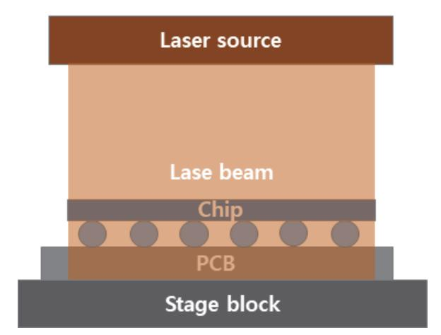

 출처: 집필진 제작(2024) [그림 2-12] LAB 공정의 개념도

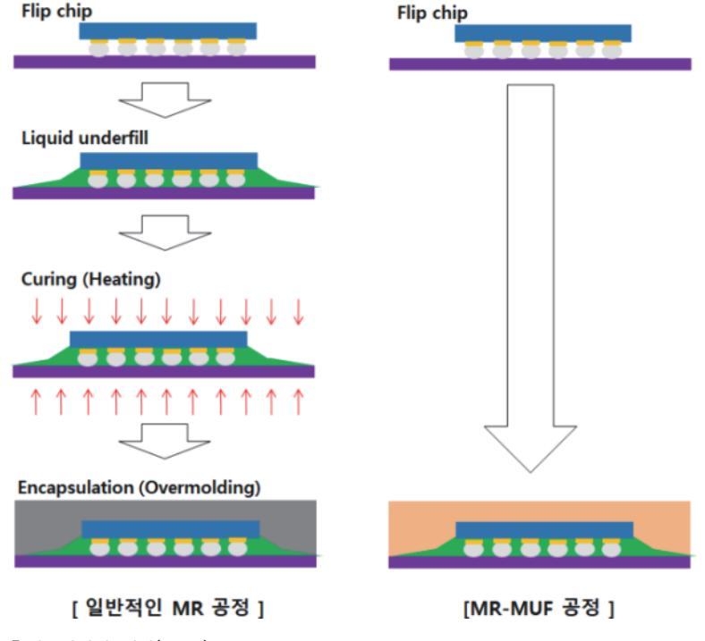

출처: 집필진 제작(2024)

[그림 2-13] MR & MR-MUF 본딩 기술 비교

#### 4. MR-MUF(Mass Reflow Molded Underfill)

MR 본딩을 진행한 이후 MUF(Molded Underfill) 공정을 진행하여 칩 사이의 빈틈을 메꿔 주는 동시에 몰딩 공정까지 한꺼번에 진행하는 공정이다. MR 공정에서 사용되는 재료를 개 선하여 공정 온도를 낮추어 기존 MR 공정이 고온에서 진행되며 발생되는 문제점을 일부 개선한 방법이다. 칩들 사이의 공백을 채우는 언더필 공정과 몰딩 공정을 동시에 진행하므 로 공정 속도가 상대적으로 적게 소요되는 장점이 있다.

#### 수행 tip

- 범프(Bump)는 반도체 소자의 배선 부분과 기판을 연결하 는 동그란 형태의 전도성 돌기를 말한다.
- TSV 공정은 웨이퍼 위에 범프를 형성하는 Front End 공 정과 범프를 형성한 칩을 적층하는 Back End 공정으로 구분한다.

## 학습 2 교수·학습 방법

#### 교수 방법

- TSV 공정의 개념 및 TSV Via Last 공정과 Via Middle 공정의 차이점에 대해 설명한다.
- 반도체 셀 미세화에 따른 칩 적층 기술에 대해 설명한다.
- TSV에 재배선을 통해 와이어링하는 기술에 대해 설명한다.
- TSV 세부 공정에 필요한 장비 및 재료에 대해 설명하고 공정 진행 중 안전 주의 사항에 대 해 지도한다.
- 세부 공정 장비의 구성 요소 및 동작 원리에 대해 실습 전 설명하고 운용 방법에 대해 익히 게 하여 안전사고를 예방한다.

#### 학습 방법

- TSV 공정의 개념 및 TSV Via Last 공정과 Via Middle 공정의 차이점에 대해 학습한다.
- 반도체 셀 미세화에 따른 칩 적층 기술에 대해 학습한다.
- TSV에 재배선을 통해 와이어링하는 기술에 대해 학습한다.
- TSV 공정에 필요한 장비 및 재료에 대해 학습하고, 공정 진행 중 안전 주의 사항에 대해 사전에 학습하여 공정 실습 시 안전을 확보한다.
- 세부 공정 장비의 구성 요소 및 동작 원리에 대해 실습 전 학습하고 운용 방법에 대해 익혀 안전사고를 예방한다.

## 학습 2 평 가

#### 평가 준거

• 평가자는 학습자가 학습 목표를 성공적으로 달성하였는지를 평가해야 한다.

#### • 평가자는 다음 사항을 평가해야 한다.

| 학습 내용                         | 학습 목표                                                 | 성취수준 |   |   |  |
|-------------------------------|-------------------------------------------------------|------|---|---|--|
|                               |                                                       | 상    | 중 | 하 |  |
| TSV Via Middle 공정 진행 | - 반도체 셀 미세화 한계에 따른 칩 성능 향상을 위해 칩 적 층 기술을 적용할 수 있다. |      |   |   |  |
|                               | - 인터페이스와 메모리 응용 칩 적층 기술을 적용할 수 있다.                    |      |   |   |  |
|                               | - 관통된 전극 홀에 재배선을 통해 와이어링하는 기술을 적용 할 수 있다.          |      |   |   |  |
|                               | - 다양한 칩을 BGA 기판에 조립하는 기술을 적용할 수 있다.                   |      |   |   |  |

#### 평가 방법

• 서술형 시험

| 학습 내용                         | 평가 항목                         | 성취수준 |   |   |
|-------------------------------|-------------------------------|------|---|---|
|                               |                               | 상    | 중 | 하 |
| TSV Via Middle 공정 진행 | - TSV Via Middle의 개념 파악 여부    |      |   |   |
|                               | - TSV Via Middle의 공정 순서 파악 여부 |      |   |   |
|                               | - TSV Via Middle의 세부 공정 파악 여부 |      |   |   |
|                               | - 재배선을 통해 와이어링하는 기술 파악 여부     |      |   |   |

#### • 논술형 시험

| 학습 내용                         | 평가 항목                         | 성취수준 |   |   |  |
|-------------------------------|-------------------------------|------|---|---|--|
|                               |                               | 상    | 중 | 하 |  |
| TSV Via Middle 공정 진행 | - TSV Via Middle의 공정 순서 이해 정도 |      |   |   |  |
|                               | - TSV Via Middle의 세부 공정 이해 정도 |      |   |   |  |

• 사례 연구

|                               |                               | 성취수준 |   |   |
|-------------------------------|-------------------------------|------|---|---|
| 학습 내용                         | 평가 항목                         |      | 중 | 하 |
| TSV Via Middle 공정 진행 | - TSV Via Middle의 세부 공정 파악 여부 |      |   |   |
|                               | - 재배선을 통해 와이어링하는 기술의 종류 파악 여부 |      |   |   |

• 구두 발표

|                               | 평가 항목                                   |  | 성취수준 |   |  |
|-------------------------------|-----------------------------------------|--|------|---|--|
| 학습 내용                         |                                         |  | 중    | 하 |  |
|                               | - TSV Via Middle의 공정 순서 파악 여부           |  |      |   |  |
| TSV Via Middle 공정 진행 | - TSV Via Middle의 세부 공정 진행에 따른 구조 파악 여부 |  |      |   |  |
|                               | - TSV에 재배선을 통해 와이어링 기술 적용 사례 파악 여부      |  |      |   |  |

#### 피드백

| 1. 서술형 시험 |  |
|-----------|--|
|-----------|--|

- TSV Via Middle 공정 관련 성취수준이 높은 학습자에게는 각 단위 공정에서 필요한 재료 및 장 비, 단위 공정 변수에 대해 추가로 설명해 준다.
- 성취수준이 낮은 학습자에게는 동영상, 그림 등을 이용하여 구체적으로 설명하고 실습을 통하여 이해를 돕게 한다.
- 2. 논술형 시험
- TSV Via Middle 공정 관련 성취수준이 높은 학습자에게는 세부 단위 공정의 최적화에 대해 추 가로 설명해 준다.
- 성취수준이 낮은 학습자에게는 세부 단위 공정의 개념 및 순서에 대해 그림 등을 이용하여 구체 적으로 설명하고 공정 순서에 따라 구조의 변화를 학습자가 직접 그려서 결과를 예측하게 한다.
- 3. 사례 연구
- TSV Via Middle 공정 관련 성취수준이 높은 학습자에게는 3D 패키지 신기술 동향에 대해 추가 설명해 준다.
- 성취수준이 낮은 학습자에게는 국내외 사례를 설명하고 다른 사례를 찾게 한다.
- 4. 구두 발표
- TSV Via Middle 공정 관련 성취수준이 높은 학습자에게는 구두 발표 자료 작성 방법 및 발표 스킬에 대해 조언하여 발표의 완성도를 높게 한다.
- 성취수준이 낮은 학습자에게는 서술형 시험, 논술형 시험, 사례 연구 등에서 행해진 자료를 복습 하게 하고 구두 발표를 진행한다.

| 학습 3 | 하이브리드 범핑 공정 진행하기       |
|------|------------------------|
| 학습 2 | TSV Via Middle 공정 진행하기 |
| 학습 1 | TSV Via Last 공정 진행하기   |

# 3-1. 하이브리드 범핑 공정 진행

| 학습 목표 | • 웨이퍼 범핑 기술 미세화로 인한 마이크로 범핑/범핑 레스 기술을 적용할 수 있다.                                               |
|-------|-----------------------------------------------------------------------------------------------|
|       | • 2.5D/3D TSV 칩 적층에 따른 마이크로 범핑 기술을 적용할 수 있다. • Si 인터포저와 다양한 칩 적층에 따른 마이크로 범핑 기술을 적용할 수 있다. |
|       | • 플립 칩 패키지 고도화에 따른 마이크로 범핑 기술을 적용할 수 있다.                                                      |

## 필요 지식 /

#### 숔 마이크로 범핑 공정

Bumping 공정은 fab out 웨이퍼를 기판에 연결할 수 있도록 접합체를 추가로 형성하는 공정이다. 과거에는 칩과 기판을 연결하는 방식으로 와이어 본딩(Wire Bonding) 방식이 주로 사용되었으나 최근 반도체 칩이 고성능, 고집적, 그리고 소형화되면서 와이어 본딩 방식은 기술적 한계에 직면했다. 대신 플립 칩 패키징(Flip Chip Packaging)이나 웨이퍼 레벨 칩 스케일 패키징(Wafer Level Chip Scale Packaging) 등의 패키징 방식의 수요가 증가하면서, Bumping 방식의 필요성도 커지고 있다.

1. 와이어 본딩(Wire Bonding)

와이어 본딩은 미세한 금속선을 패드에 접합시켜 내부 칩과 외부를 연결하는 방법으로 와 이어는 칩의 본딩 패드와 캐리어의 패드를 와이어로 연결한다. 이때 금속선은 전기적 신호 의 통로가 되는 고전적인 방법으로 반도체 개발 초창기부터 현재까지 사용하나 단위 면적 당 집적도에 한계가 있다.

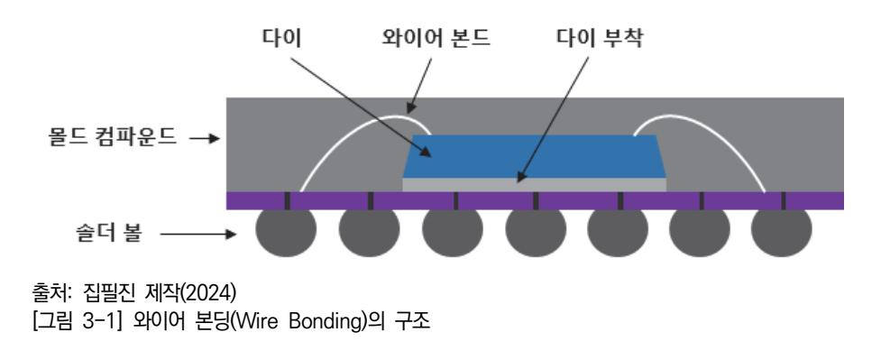

#### 2. Bumping 방식

반도체 칩 위에 돌기 형태의 범프를 직접 형성하여 기판과 전기적으로 연결한다. 이 방식이 적용된 칩을 플립 칩(Flip Chip)이라고 한다. 플립 칩은 반도체 칩을 기판에 부착할 때, 금 속 와이어를 추가로 사용하는 대신 칩의 하단 면에 있는 전극 패턴을 이용하여 직접 융착 하여 기판과 연결된다.

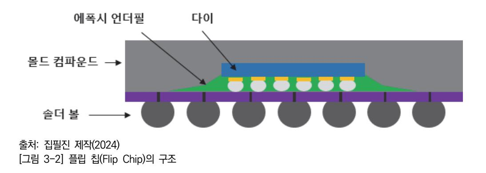

가장 일반적인 웨이퍼 범핑 공정은 [그림 3-3]과 같다. 플립 칩 범핑에 적용되는 범핑 공정의 공정 흐름도 및 구조를 나타낸 것이다.

(1) UBM 스퍼터링

전공정이 끝난 팹 아웃 웨이퍼에 스퍼터링을 통해 UBM(Under Bump Metallization) 공정을 진행한다. 반도체 칩의 알루미늄은 구리 전극에 직접적으로 범프를 형성하기 어 려우므로 전극과 범프 사이에 접합층, 확산 방지층, 습윤층(Wettable Layer)을 두어 접 착을 용이하게 한다.

(2) PR 패터닝

후속으로 진행되는 Ni, PbSn 등의 도금막을 둘 수 있는 형상을 만들기 위하여 PR 패 턴을 형성한다.

(3) Ni & PbSn 플레이팅

도금액을 이용하여 순차적으로 Ni, PbSn 도금층을 형성한다.

- (4) PR 제거 및 Cu/Ti 식각 에싱(Ashing) 공정으로 포토레지스트(PR)를 제거하고 Cu 및 Ti 등을 식각하면 UBM 층 위에 구리 기둥(Copper Pillar)이 형성된다.
  - (5) 범프 Shaping

범프 표면의 거칠기, 범프의 모양, 범프들 간의 높이 편차 등을 최소화하기 위하여 Shaping 공정이 진행된다.

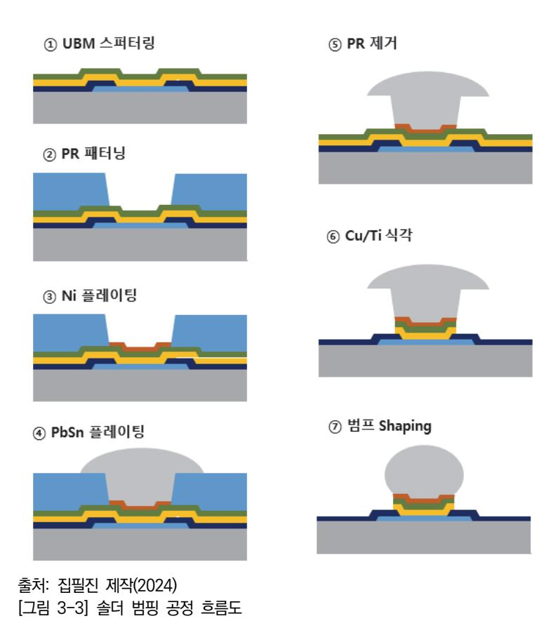

최근에는 TSV(Through-Silicon Via), 팬 아웃 패키징(Fan-out Packaging) 등 새로운 기술 이 적용되면서 범프의 크기가 더욱 미세화되고 있다. 이로 인해 정밀한 피치의 범프 기술이 경 쟁력의 핵심이 되고 있다. 선폭이 미세화됨에 따라 칩 면적은 줄어들고, I/O 단자 수는 증가하 게 된다. 그러나 이러한 미세한 솔더 범프를 사용하면서 칩과 기판 간의 간격이 너무 좁아져 언더필(Underfill) 공정의 난도가 증가하고, 범프 접속부에서 전류 밀도와 열에너지 밀도가 높 아지는 문제가 발생한다. 이러한 문제를 해결하기 위해서는 마이크로 범프(Micro Bump)와 마 이크로 필러 범프(Micro Pillar Bump)와 같은 정밀 피치 범프 기술이 필수적이다.

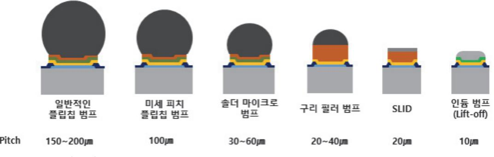

출처: 집필진 제작(2024) [그림 3-4] 범프 크기 및 피치(Pitch)의 발전

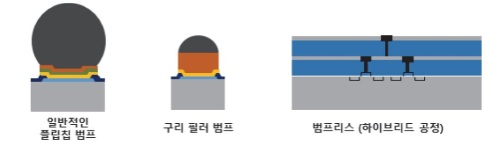

출처: 집필진 제작(2024) [그림 3-5] 기존 솔더 범프, 마이크로 범프, 범프리스 기술별 구조 변화

HBM(High Bandwidth Memory)에서 칩 사이 TSV(Through-Silicon Via)로 연결되는 부분 은 수십 마이크로미터 크기의 솔더 범프(Solder Bump)로 제작되어 있으며, 이는 칩 사이의 본딩 접착제 기능을 하면서 신호의 입출력 단자(I/O)가 된다. 일정한 면적에서 입출력 단자 수 를 증가시키기 위해서 칩 사이 연결 부분인 범프의 크기를 줄여야 하기 때문에 마이크로 범프 가 중요하다. 즉, 일정한 면적에서 범프의 집적도를 높여 소자의 입출력 대역폭을 증가시키는 데 매우 중요한 요소가 된다.

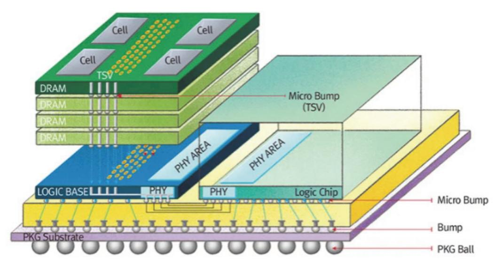

출처: 집필진 제작(2024) [그림 3-6] HBM을 이용한 2.5D 패키지 예

최근 마이크로 범프 기술 중 하나는 CPB(구리 기둥 범프)로, 이는 구리 기둥을 생성하여 칩과 칩, 칩과 기판 사이의 간격(본딩 간격)을 확대하고, 범프의 크기를 줄여 범프 간의 간격을 줄이는 방법이다. 이렇게 함으로써 범프 간의 접촉으로 인한 단락 문제를 예방할 수 있다. 그러나 HBM(고대역폭 메모리)에 서 마이크로 범프 공정에는 몇 가지 문제점이 존재한다. 언더필 공정은 본딩 후 범프 피치 간의 공간을 폴리머 등으로 채워 접합부의 신뢰성과 안정성을 향상시키고, 칩 간 및 칩과 기판 간의 열팽창 계수 차이에 따른 스트레스를 줄이며, 절연과 열전도 특성을 강화하기 위해 수행한다. 하지만 HBM의 TSV 수가 증가하면서 범프 간의 피치가 더욱 좁아지면, 언더필 공정에서 범프가 서로 붙거나 언더필 재료가 칩 중앙까지 고르게 채워지지 않는 문제가 발생할 수 있다. 또한 열 압착(TC: Thermo Compression) 및 리플로(MR: Mass Reflow) 방식의 본딩 과정에서는 고온과 압력 전달로 인해 칩 손상이나 TSV 정렬의 비대칭과 같은 문제가 생길 수 있다. 이러한 문제를 해결하기 위해 차세대 HBM에서는 범프를 사용하지 않고(Bumpless), 칩과 칩, 칩과 기판 사이의 구리를 직접 연결하는 하이브리드 본딩 기술이 새로운 인터커넥션 방식으로 주목받고 있다.

#### 숕 하이브리드 본딩 공정

하이브리드 본딩(Hybrid Bonding)은 다이렉트 본딩(Direct Bonding) 또는 구리-구리 본딩 (Cu to Cu Bonding)이라고도 불리는 기술이다. 이 기술은 칩과 칩을 범프 없이 직접 연결하 는 방식으로, 기존의 다이렉트 본딩과 구리 본딩의 장점을 결합하여, 칩 간의 유전체와 구리를 동시에 접합한다. 이러한 이유로 하이브리드 본딩이라는 이름이 붙었다. 하이브리드 본딩의 주 요 장점은 다음과 같다.

1. 높이 제한 감소

이 기술은 얇게 적층할 수 있어 구조의 높이에 대한 제한이 줄어든다.

2. 미세 피치 가능

마이크로 범프를 사용하지 않기 때문에 범프 간 간격(피치)을 줄일 수 있다.

3. 신호 손실 및 발열 문제 감소

시그널 로스가 적고 발열 문제도 상대적으로 적다.

하이브리드 본딩은 전력 및 신호 손실이 거의 없는 상태에서 모놀리식 설계에 매우 가까운 성 능을 구현할 수 있다. 하지만 경제적 비용 측면에서 주요 과제는 다이-다이 배열 오류를 최소 화하여 결함 없는 구리-구리 본딩을 구현하는 것이다. 이를 달성하기 위해서는 소자 설계뿐만 아니라 업스트림 및 다운스트림 공정을 대대적으로 수정하고, 집적 공정 개발 및 공동 최적화 가 필수적이다.

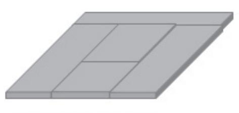

출처: 집필진 제작(2024) [그림 3-7] 모놀리식 및 칩렛의 개념도

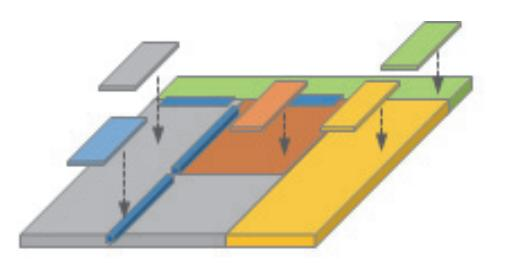

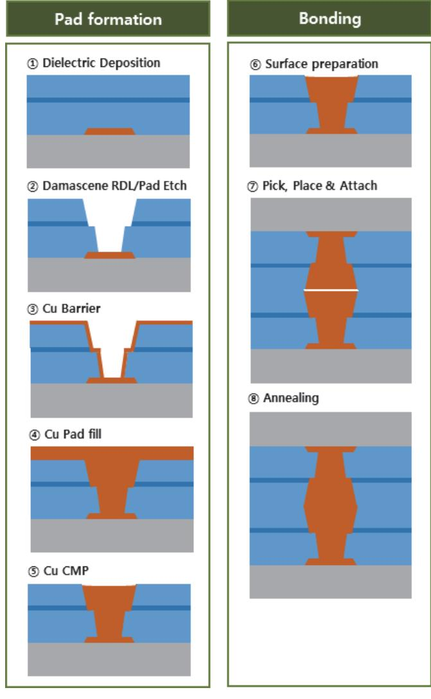

출처: 집필진 제작(2024) [그림 3-8] 하이브리드 본딩 공정 흐름도

하이브리드 본딩을 구분하면 [그림 3-8]과 같이 구리 패드 형성(Pad Formation)과 본딩 (Bonding)으로 나눌 수 있다. 유전체를 먼저 접합하고 금속을 붙인다. 유전체를 붙일 때는 압 력과 열을 이용하고 금속을 붙일 때는 열을 이용하여 팽창시켜 붙인다. 하이브리드 본딩은 크 게 다음과 같은 방식이 있다.

첫째는 [그림 3-9]와 같이 웨이퍼-웨이퍼 방식으로, CIS(CMOS Image Sensor) 및 낸드에서 사용되며 DRAM에 적용될 수 있다.

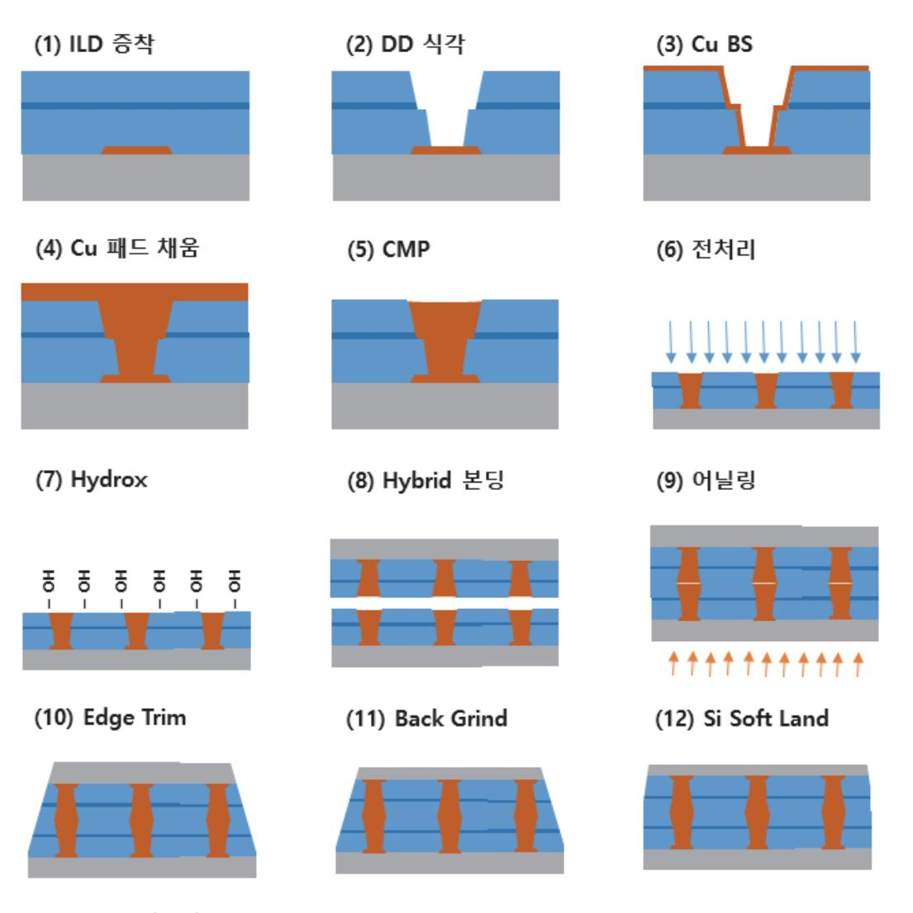

출처: 집필진 제작(2024) [그림 3-9] Wafer to Wafer 하이브리드 본딩 공정 흐름도

둘째는 다이-웨이퍼(Die to wafer) 하이브리드 본딩으로 [그림 3-10]과 같다. 이 공정에서는 각 칩렛이 한 번에 한 개씩 본딩된다. 이 방식은 변형하여 로직 및 고대역폭 메모리(HBM) DRAM에 적용할 수 있다.

| (1) ILD 증착    | (2) DD 식각     | (3) Cu BS   |
|---------------|---------------|-------------|
| (4) Cu 패드 채움  | (5) CMP       | (6) 싱귤레이션   |
| (7) 세정        | (8) 본딩        | (9) 어닐링     |
| (10) Gap Fill | (11) CMP      | (12) TOV 식각 |
| (13) Cu BS    | (14) TOV Fill | (15) CMP    |

출처: 집필진 제작(2024)

[그림 3-10] Die to Wafer 하이브리드 공정 흐름도

하이브리드 본딩은 유전체와 구리의 열팽창 계수 차이로 인해 접합 과정에서 기술적 난이도가 높고, I/O의 개수가 많아 정렬 정밀도가 어려운 점이 있다. 그럼에도 불구하고 하이브리드 본 딩은 칩의 두께를 줄이고, 많은 수의 TSV를 형성하여 신호 로스(Signal Loss)와 발열 문제를 줄일 수 있는 장점을 제공한다.

1. 하이브리드 본딩 공정의 핵심 요소

하이브리드 본딩에서는 아래와 같이 재료 및 공정 변수들이 중요하다.

- (1) 유전체 타입(Dielectric Type) 상부의 다이와 하부의 웨이퍼의 유전체가 일치해야 한다.
- (2) 표면의 거칠기(Surface Roughness) 금속의 Dishing이 형성되어야 하나 과하지 않아야 하며, 유전체는 평평해야 한다.
- (3) 청결도(Cleanliness)

다이싱 등 단위 공정이 진행될 때 파티클 및 오염이 없이 깨끗이 관리되어야 한다.

- (4) 플라즈마 활성화(Plasma Activation) 플라즈마를 이용하여 표면의 거칠기 제어를 하면서 표면의 오염을 제거하고 화학적으로 활성화해 준다.
- (5) 구리와 유전체의 공간 점유율(Precentage Area of Copper vs Dielectric)

어닐링을 진행하면 구리가 팽창하면서 Dishing의 빈 공간을 채우게 된다. 따라서 구리 와 유전체의 비율은 적절해야 한다. 즉, 마지막 어닐링 단계에서는 구리와 유전체(SiO2) 의 열팽창 계수 차이를 활용한 본딩이 이루어지기 때문에, Dishing으로 인해 변형된 구 리와 SiO2 간의 면적 비율을 정확하게 맞추는 것이 중요하다.

- (6) 배출 방법(Ejection Method) Pick & Place로 다이를 가져다 놓을 때 다이 내외부적으로 스트레스를 받지 않게 하여 야 하며 정확한 위치에 놓아야 한다.
- (7) 구리 패드의 분배(Distribution of Copper Pads) 구리 패드가 특정 부분에 많거나 적게 분포되어 있지 않고 전체적으로 고르게 분배되어 있어야 한다.
- (8) 유전체의 모양: 평탄 vs 둥근(Shape of Dielectric : Flat vs Round) 유전체가 평평해야 접합이 용이하다.
- (9) 구리 디싱의 표면 품질(Surface Quality of Copper Dishing) Dishing의 크기는 적절해야 하며 끝이 돌출되지 않아야 한다.

출처: 집필진 제작(2024) [그림 3-11] 구리 디싱의 표면 품질

- (10) TBM or tape 같은 매개물로부터 나온 잔여물(Residue from Holding Medium) 공정 재료로 사용되는 매개물로부터 나오는 어떤 잔여물도 없어야 한다.
- (11) 다이 모양(Die Shape)

본딩의 시작이 다수의 포인트가 아닌 단일 포인트에서 이루어져야 본딩 결함이 발생하 지 않는다.

(12) 열처리 시간과 단계(Annealing Time and Stages)

열처리의 단계별 온도의 증가율 및 유지 시간 등을 잘 관리해야 한다.

(13) 방전(ESD)

정전기가 칩에 인가되면 본딩이 잘되어도 칩의 성능이 저하되거나 칩이 동작하지 않으 니 정전기의 방전을 위하여 적절한 접지가 필요하다.

## 수행 내용 1 / 하이브리드 범핑 공정 진행하기

#### 재료·자료

- Ti, Cu, Al 등 금속 타깃
- PR, Develop 등 사진 공정 재료
- SnAg 등 솔더 재료

#### 기기(장비 ・ 공구)

- Wet station, Sputter, Track, Exposure, Asher, Dry etcher 등 공정 장비
- 공정 장비 가동을 위한 CDA, PCW, 반응성 가스 공급 등 유틸리티
- 구리 등 도금 장비, 열처리 장비, 어닐링 장비

#### 안전 ・ 유의 사항

- Sputtering system, Asher, Dry etcher 등의 장비 동작 시 진공 펌프 및 파워 제너레이 터 등에 냉각수가 공급되지 않을 경우 과열로 인한 문제가 발생할 수 있으므로 장비 가동 전 점검해야 한다.
- 사진 공정, 세정 공정, 도금 공정 등 화학 물질을 사용하는 공정에서는 반드시 물질 안전 보건 자료(MSDS)를 사전에 숙지하여야 한다.
- 플라즈마 처리 장비, 건식 식각 장비 및 어닐링 장비의 경우 고전압 및 고온으로 인해 장비 에 문제가 발생하거나 사용자의 안전을 위협할 수 있으므로 위험 요소를 사전에 파악해야 한다.

#### 수행 순서

숔 Incoming Wafer & Pre-clean 공정을 진행한다. 웨이퍼(Wafer)가 웨이퍼 레벨 패키지 공장에 오면 처음으로 웨이퍼에 이상이 있는지 검사를 진행한다. 그리고 웨이퍼 표면의 오염원을 제거하기 위하여 클리닝(Cleaning)을 실시한다.

#### 숕 Seed Metal 증착 공정을 진행한다.

PVD(Physical Vaporized Deposition) 방법 중의 하나인 Sputter 장비로 웨이퍼 표면에 Seed Metal을 증착한다. Seed Metal로는 타이타늄(Ti)과 구리(Cu)를 사용한다. Ti은 보통 1,000Å(Angstrom, 100nm) 증착하고 여기에 다시를 1,000~2,000Å 증착한다. Seed Metal 은 웨이퍼 표면의 여러 가지 재료, 즉 Al Metal, Metal 배선을 보호하기 위한 고분자 물질인 PIQ 등과 이후 도금 공정에서 대량으로 증착될 Cu와의 접착 성질을 제공한다.

#### 숖 포토 공정을 진행한다.

웨이퍼 표면 전체에 Ti을 증착하였고, 또한 그 위에 Cu를 증착하였으므로 표면에는 Cu Metal 만이 드러나 있게 된다. 이 중에서 우리가 원하는 패턴에만 이후 공정인 도금 공정에서 Cu를 올리게 되므로, Cu를 도금할 부분만 Seed Cu Metal을 남겨 놓아야 하는 것이다. 이를 위해 포토레지스트(Photoresist)를 스핀 코팅(Spin Coating) 방법으로 도포한다.

#### 숗 Expose 공정을 진행한다.

여기에 패턴을 넣은 마스크(Mask)를 제작한 후 스테퍼(Stepper)를 이용하여 노광하고 포토레 지스트를 제거하면 원하는 패턴에만 포토레지스트가 제거되어 열려 있게 된다. 노광은 보통 I-line Stepper를 사용하고 현상(Developing)은 2.38% TMAH 용액을 21℃에서 7분 정도 진 행한다. Di Water Rinse하고 건조시키면 공정이 완료된다.

#### 수 도금(Plating) 공정을 진행한다.

도금 욕조에 웨이퍼를 넣고 웨이퍼에 전극을 연결하고 도금을 한다. 먼저 구리(Cu)를 도금하고 보통 플립 칩 패키지의 경우에 예로 50m 이상 도금을 한다. 이 위에 다시 니켈(Ni)을 1~2km 도금한다. 니켈 도금하는 이유는 구리와 솔더의 주성분인 주석(Sn)이 열 공정 중 반응하게 되 어 구리와 솔더 사이의 금속 간 화합물(Intermetallic)이 발생하게 되며 이러한 반응을 막기 위해 솔더의 부피를 충분히 보장하기 위한 확산 방지층(Diffusion Barrier)으로 사용하기 위한 것이다. 니켈 위에 솔더인 Sn과 Ag의 이원계 도금액으로 SnAg을 도금한다.

#### 숙 포토레지스트 제거(Photoresist Stripping) 공정을 진행한다.

남아 있는 포토레지스트를 제거한다. 용제(Solvent)로는 각기 업체별로 추천하는 용제가 있으며 Dynaloy AP7700과 같은 용제의 경우, 60℃에서 90~150초 정도 Strip Time을 진행한다.

#### 숚 에칭(Etching) 공정 및 리플로(Reflow) 공정을 진행한다.

포토레지스트를 제거한 후에는 범프를 형성하지 않은 곳에도 초기 Seed Metal로 증착한 Cu와 Ti이 그대로 남아 있기 때문에 이 부분의 메탈을 제거해야만 한다. 에칭 용액을 이용하여 이 부분을 제거한다.

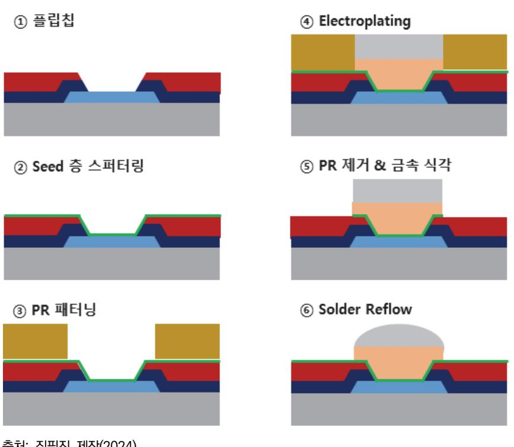

출처: 집필진 제작(2024) [그림 3-12] 플립 칩 범프(Flip chip bump) 형성 공정 순서

## 수행 내용 2 / 하이브리드 본딩 공정 진행하기

#### 재료·자료

- Ti, Ta, Cu 타깃 및 재료
- CMP용 슬러리
- 세정액
- 플라즈마 처리용 가스
- PR (감광제, Photoresist)

#### 기기(장비 ・ 공구)

- 물리 기상 증착(PVD) 장비
- PECVD 장비
- CMP 장비
- 세정 장비
- 플라즈마 처리 장비
- 열처리 장비
- 사진 공정 장비(트랙, 스핀코터, 핫 플레이트, 노광기, Wet station 등)
- 도금 장비

#### 안전 ・ 유의 사항

- Sputtering system 동작 시 진공 펌프 및 파워 제너레이터 등에 냉각수가 공급되지 않을 경우 과열로 인한 문제가 발생할 수 있으므로 장비 가동 전 점검해야 한다.
- CMP, 세정 공정, 도금 장비 등 화학 물질을 사용하는 공정에서는 반드시 물질 안전 보건 자료(MSDS)를 사전에 숙지하여야 한다.
- 사진 공정 장비 진행 시 감광제 및 현상 등을 사용하기 전 반드시 물질 안전 보건 자료 (MSDS)를 숙지하여야 하며, 노광기의 UV 노출에 대해 안전장치를 확보하여야 한다.
- 플라즈마 처리 장비 및 어닐링 장비의 경우 고전압 및 고온으로 인해 장비에 문제가 발생하 거나 사용자의 안전을 위협할 수 있으므로 위험 요소를 사전에 파악해야 한다.

#### 수행 순서

숔 하이브리드 본딩 공정에 사용되는 공정 기술에 대해 검토한다. 하이브리드 본딩을 하기 위해서는 전 공정의 기술이 필요하다. 후공정이 복잡해질수록 후공정 에서도 전공정의 기술이 점점 필요하다.

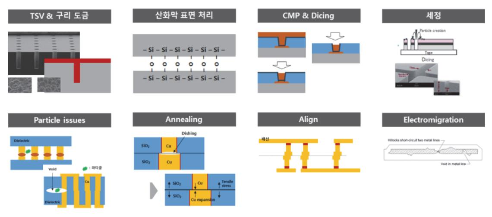

출처: 집필진 제작(2024) [그림 3-13] 하이브리드 본딩 공정에 사용되는 기술

1. Copper quality and fill의 기술에 대해 살펴본다.

앞에서 언급한 것과 같이 구리를 열로 팽창시켜서 붙이는 공정이기 때문에 구리 형성 공정 을 정확하게 제어하는 것이 중요하다. 따라서 구리의 속성 및 품질도 중요하고 구리를 얼마 만큼 어떻게 채워 넣었느냐도 중요한 요소이다.

2. 산화막 증착의 영향에 대해 검토한다.

결국 SiO2를 접착하기 때문에 산화막 증착 공정 및 막의 품질이 중요하다. 또한 좁아진 구 리와 구리 사이를 절연해 주고 매우 얇지만 언더필처럼 지지해 주는 기능을 할 수 있다고 도 볼 수 있다.

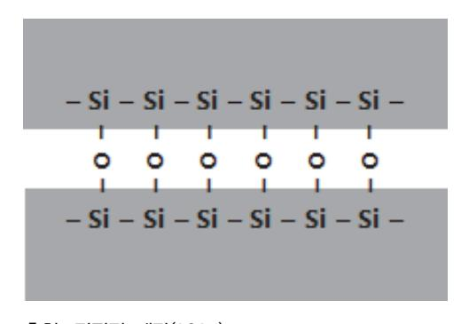

출처: 집필진 제작(2024) [그림 3-14] 하이브리드 본딩 공정의 산화막 표면 반응

#### 3. CMP 공정 중 Dishing의 현상에 대해 검토한다.

Dishing은 CMP 공정 중에서만 일어나는 독특한 결함의 한 종류로 다른 표면보다 깊게 파 이는 현상을 말한다. 이 Dishing을 이용해야 다음 단계에서 유전체끼리만 먼저 접착할 수 있기 때문에 CMP와 Dishing은 매우 중요하다.

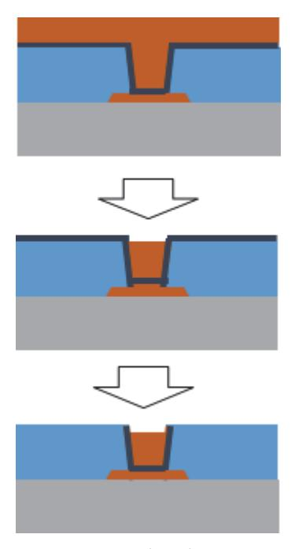

출처: 집필진 제작(2024) [그림 3-15] 하이브리드 본딩 공정의 평탄화

4. 다이싱 공정의 청정도에 대해 검토한다.

매우 미세한 접착 공정이기 때문에 시료 표면이 깨끗해야 하므로 칩의 Dicing 공정 중 결 함이 발생되지 않아야 하고 공정 중 불순물이 발생하지 않아야 한다.

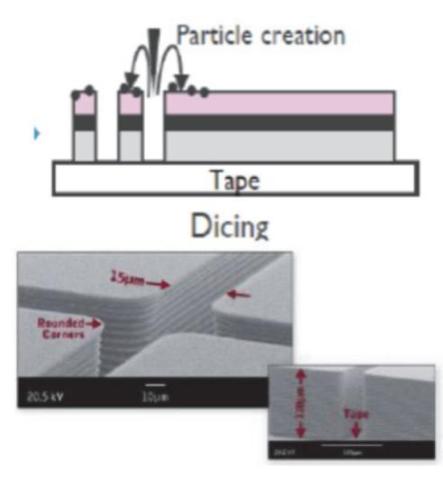

출처: 집필진 제작(2024) [그림 3-16] 하이브리드 본딩 공정의 다이 세정

5. 세정 공정 변수에 대해 검토한다.

미세한 패턴을 접착하는 공정이므로 앞서 진행된 공정의 청결도를 담보할 수 없으므로 세 정 공정을 진행해야 하며 하이브리드 본딩이 최적화될 수 있는 조건을 만족시킬 수 있도록 세정 공정 변수를 조정할 수 있어야 한다.

#### 6. 플라즈마 활성화 공정의 변수에 대해 검토한다.

두 번째 단계에서 유전체를 낮은 온도에서 접착시키기 위해서는 플라즈마로 표면을 활성화 해야 하기 때문에 플라즈마를 이용한 공정에서 공정 변수를 최적화하는 것이 중요하다.

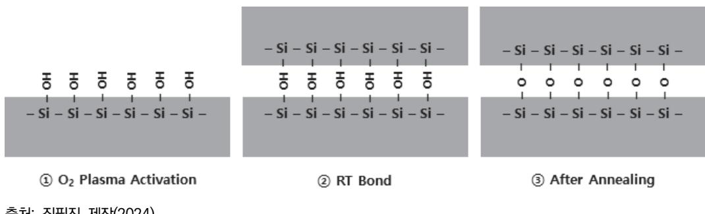

출처: 집필진 제작(2024) [그림 3-17] 하이브리드 본딩 공정의 플라즈마 처리

7. 본딩 형상에 대해 검토한다.

매우 세밀한 접착이기 때문에 본딩 형성이 제어되지 않으면 회로 배선의 연결 시 접촉 저 항이 커질 수 있거나 회로의 단락이 유발될 수 있으며, 유전체의 절연 능력의 저하가 발생 할 수 있으므로 본딩 형상이 정확히 형성되어야 한다.

8. 본딩 공정의 정렬에 대해 검토한다.

본딩을 위해 다이를 놓을 위치를 정확히 파악하기 위한 계측 기술, 놓은 위치에 정확히 이 동시키는 Pick & Place 기술이 검토되어야 한다. 예를 들면 Van Gogh bond head and vision system을 들 수 있다. 카메라가 위치를 확인해 주고 Bond head가 xyz 축으로 이 동해서 위치시켜 준다.

9. 본딩 공정 중 파티클 이슈 및 검사 공정에 대해 검토한다.

[그림 3-18]에서 볼 수 있듯이 TC 본딩에서는 미세한 파티클은 공정에 큰 영향을 끼치지 않으나 하이브리드 본딩 공정에서는 매우 미세한 파티클일지라도 금속 배선의 본딩에 영향 을 주어 단선이 발생하거나 접촉 저항이 증가하여 신호의 손실이 발생할 수 있으므로 본딩 공정에서 파티클이 표면에 없는 매우 깨끗한 상태를 유지하는 것이 중요하다.

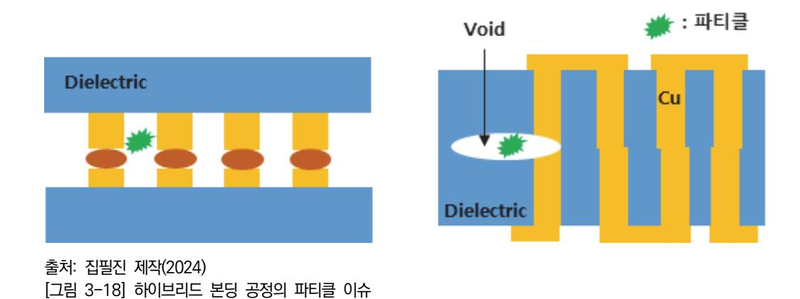

10. 어닐링 공정의 원리에 대해 검토한다.

SiO2끼리 붙어 있는 상태에서 구리가 Diching되어 있는 부분만 팽창되어 채울 수 있으면 서 SiO2가 서로를 밀어내지 않도록 Dicing의 형상 및 깊이, 공정의 미세한 조절을 하는 어 닐링 기술이 필요하다.

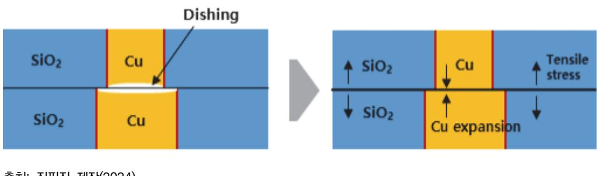

출처: 집필진 제작(2024) [그림 3-19] 하이브리드 본딩 공정의 어닐링

11. 전기적 특성에 대해 검토한다.

아래에 위치한 웨이퍼와 윗면의 다이를 비아 홀에 있는 구리끼리 본딩해서 전기적으로 연 결이 잘 되었는지 확인하는 것이 중요하다. 전기적 연결을 방해하는 요소에는 비아 홀끼리 정렬이 잘 되지 않아서 전기가 흐르지 않는 Mialignment나 어떤 빈 공간이 생겨서 전기적 연결이 끊어지는 Void가 있다.

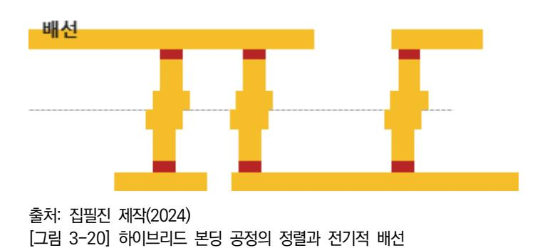

12. 신뢰성에 대해 검토한다.

앞선 공정으로 본딩된 구조가 가지는 신뢰성이 중요하다. 부식(Corrosion)이 발생되지 않아야 하며 열적으로 안정되어야 하는 내화학성, 내기계적 성질 등이 확보되어야 한다.

13. 일렉트로마이그레이션(Electromigration) 현상에 대해 검토한다.

배선 재료로 Al을 사용하면서 미세 선폭이 적용됨에 따라 RC Delay가 생기고 전류 밀도가 높아짐에 따라 일렉트로마이그레이션 문제가 발생하였다. 이로 인해 배선 중간에 Void나 Hillock이 발생할 수 있다. RC Delay를 해결하고자 배선 재료가 Al에서 Cu로 바뀌었으나 이러한 문제의 발생 확률은 줄일 수 있지만 완전히 제거하지 못한다.

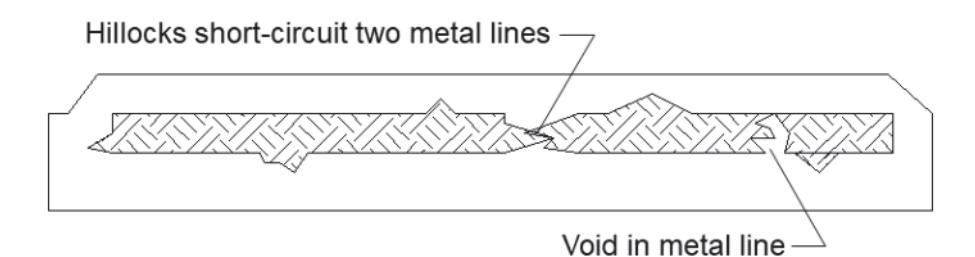

출처: 집필진 제작(2024) [그림 3-21] 하이브리드 본딩 공정의 Electromigration

숕 하이브리드 본딩 공정 3단계를 진행한다.

하이브리드 본딩은 기본적으로 아래와 같은 3단계로 이루어진다.

- 다이 표면 준비(Die Surface Preparation)
- 다이와 웨이퍼 본딩(Die to Wafer Bonding)
- 열처리(Annealing)

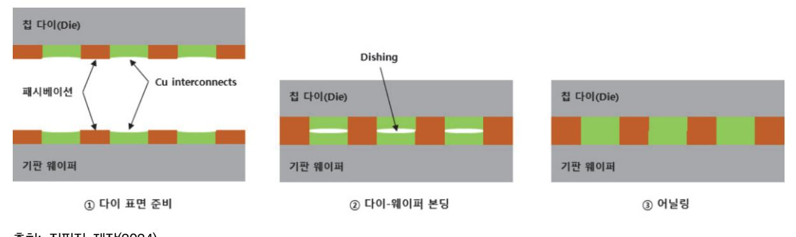

출처: 집필진 제작(2024) [그림 3-22] 하이브리드 본딩 공정 3단계 1. 다이 표면을 준비한다.

웨이퍼 전처리 단계라고 불린다. 이는 다이와 웨이퍼를 결합하기 위한 준비 과정이다. CMP 공정을 통해 유전체와 금속 부분을 평탄하게 만드는데, 금속 부분은 특별히 Dishing이라고 하는 약간 움푹한 형태로 준비되어야 한다. 또한 파티클이 없도록 세정 공정을 진행하고 마 지막으로 플라즈마를 사용해 본딩할 표면을 활성화한다.

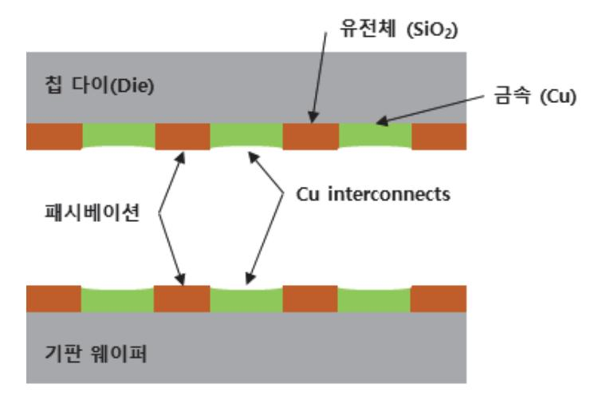

출처: 집필진 제작(2024) [그림 3-23] 다이 표면 준비

2. 다이와 웨이퍼를 본딩한다.

상온에서 진행하는 Pre-bonding 단계이다. 본딩의 주된 목적은 금속인 구리를 연결해 전 기가 흐르도록 하는 것으로, 실제로 메인 본딩은 상단과 하단의 비아 홀에 있는 구리들 간 의 본딩이며, SiO2의 본딩은 메인 본딩을 위한 Pre-bonding으로 볼 수 있다. 이 단계에서 는 상온에서 다이와 웨이퍼를 15N 이하의 낮은 압력으로 눌러서 결합한다. 이렇게 하면 Van der Waals 힘으로 인해 SiO2와 SiO2 분자 간에 수소 결합이 형성된다. SiO2는 서로 연결되어 있지만, 금속 부분은 Dishing으로 인해 틈이 있어 아직 연결되지 않은 상태이다.

3. 열처리를 진행한다.

온도를 상승시키며 어니링을 진행하는 단계이다. 여기에서는 본격적으로 구리의 본딩이 일 어난다. 열을 가해서 본딩이 일어나는데 열도 두 단계로 나뉘어서 가해 준다.

(1) 1단계: 저온 열처리(Low Temperature Annealing)

SiO2와 SiO2 간에는 Van der Waals의 힘으로 수소 결합이 형성된다. 이 수소 결합은 원자 간의 공유 결합보다 약한 분자 간의 결합이기 때문에, 이 결합을 더 강하게 만들 기 위해 온도를 상온에서 150℃ 수준으로 상승시킨다. 그러면 상호 확산이 일어나면서 공유 결합이 생성된다.

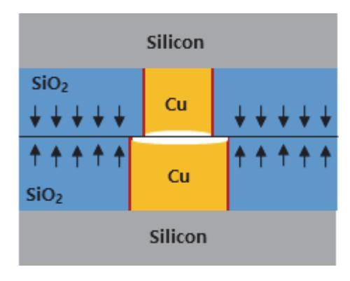

출처: 집필진 제작(2024) [그림 3-24] 저온 열처리

(2) 고온 열처리(Higher Temperature Annealing)

온도를 150℃에서 300~350℃로 상승시키면 구리가 팽창하여 Dishing으로 인한 빈틈을 메우고 윗면의 구리와 아랫면의 구리가 본딩하게 된다. 이후 구리들 간에 상호 확산 현 상이 발생하면서 금속 접합이 이루어지며, 최종적으로 금속(Cu)과 유전체(SiO2) 모두가 본딩이 완료된다.

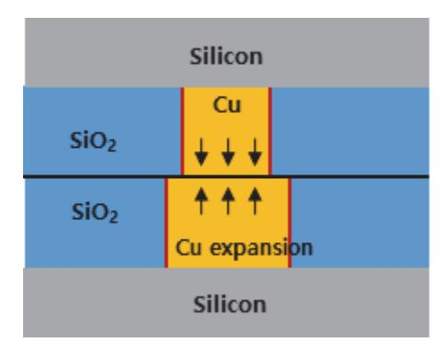

출처: 집필진 제작(2024) [그림 3-25] 고온 열처리

따라서 3단계는 [그림 3-26]과 같은 그래프처럼 일어난다고 볼 수 있다.

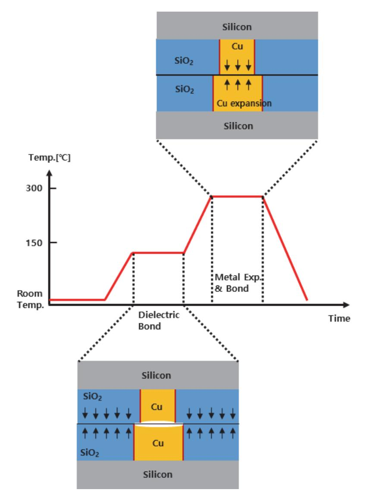

출처: 집필진 제작(2024) [그림 3-26] 어닐링 공정의 온도 프로파일에 따른 기능

## 학습 3 교수·학습 방법

#### 교수 방법

- 하이브리드 범핑 공정의 개념을 사전에 설명하고 실습에 필요한 자료를 준비하여 모든 학생 이 참여할 수 있도록 실험/실습을 진행한다.
- 하이브리드 범핑 공정에 사용되는 세부 공정 장비의 운용 방법, 사용되는 재료, 공정 후 계 측 방법 등에 대해 사전에 학습 과제를 부여한다.
- 하이브리드 범핑 공정 실습에 필요한 유틸리의 주요 점검 사항에 대해 사전에 설명한다.
- 하이브리드 범핑 공정 실습 후 실습 결과 보고서에 작성되어야 하는 세부 내용에 대해 설명 하고 실습 전 설명하고 계획이 수립될 수 있도록 지도한다.
- 하이브리드 범핑 공정 진행 완료 후 공정 진행 결과를 평가한다.

#### 학습 방법

- 하이브리드 범핑 공정의 개념 및 세부 공정의 개념 및 주요 장비에 대해 학습한다.
- 하이브리드 범핑 공정 실습 전 필요한 유틸리티의 종류 및 동작 원리, 필요성 등에 대해 학 습한다.
- 하이브리드 범핑 공정 후 계측 및 검사 장비에 대해 학습하고 계획을 수립한다.
- 하이브리드 범핑 공정 후 계측 및 검사 결과를 해석하는 방법에 대해 학습한다.
- 공정 레시피(Recipe) 작성 방법 및 진행 방법에 대해 학습한다.

## 학습 3 평 가

#### 평가 준거

• 평가자는 학습자가 학습 목표를 성공적으로 달성하였는지를 평가해야 한다.

#### • 평가자는 다음 사항을 평가해야 한다.

|                    | 학습 목표                                              | 성취수준 |   |   |
|--------------------|----------------------------------------------------|------|---|---|
| 학습 내용              |                                                    | 상    | 중 | 하 |
| 하이브리드 범핑 공 정 진행 | - 웨이퍼 범핑 기술 미세화로 인한 마이크로 범핑/범핑레스 기 술을 적용할 수 있다. |      |   |   |
|                    | - 2.5D/3D TSV 칩 적층에 따른 마이크로 범핑 기술을 적용 할 수 있다.   |      |   |   |
|                    | - Si 인터포저와 다양한 칩 적층에 따른 마이크로 범핑 기술을 적용할 수 있다.   |      |   |   |
|                    | - 플립 칩 패키지 고도화에 따른 마이크로 범핑 기술을 적용 할 수 있다.       |      |   |   |

#### 평가 방법

• 서술형 시험

|                    | 평가 항목                             | 성취수준 |   |   |
|--------------------|-----------------------------------|------|---|---|
| 학습 내용              |                                   | 상    | 중 | 하 |
|                    | - 범핑 공정의 파악 여부                    |      |   |   |
| 하이브리드 범핑 공 정 진행 | - 기존 범핑 기술 및 마이크로 범핑 기술의 차이 파악 여부 |      |   |   |
|                    | - 마이크로 범핑 공정 순서 파악 여부             |      |   |   |
|                    | - 인터포저 적용에 따라 범핑 공정 이해 정도         |      |   |   |
|                    | - 플립 칩 패키지 공정의 이해 정도              |      |   |   |

• 논술형 시험

|            |                       |   | 성취수준 |   |  |
|------------|-----------------------|---|------|---|--|
| 학습 내용      | 평가 항목                 | 상 | 중    | 하 |  |
| 하이브리드 범핑 공 | - 마이크로 범핑 공정 흐름 파악 여부 |   |      |   |  |
| 정 진행       | - 마이크로 범핑 세부 공정 파악 여부 |   |      |   |  |

• 사례 연구

|                    | 평가 항목                        | 성취수준 |   |   |  |
|--------------------|------------------------------|------|---|---|--|
| 학습 내용              |                              | 상    | 중 | 하 |  |
| 하이브리드 범핑 공 정 진행 | - 마이크로 범핑 공정이 적용되는 사례 파악 여부  |      |   |   |  |
|                    | - 플립 칩 패키지 공정이 적용되는 사례 파악 여부 |      |   |   |  |

• 구두 발표

| 학습 내용              | 평가 항목                        | 성취수준 |   |   |
|--------------------|------------------------------|------|---|---|
|                    |                              | 상    | 중 | 하 |
| 하이브리드 범핑 공 정 진행 | - 마이크로 범핑 공정 흐름 파악 여부        |      |   |   |
|                    | - 마이크로 범핑 세부 공정 이해 정도        |      |   |   |
|                    | - 마이크로 범핑 공정이 적용되는 사례 파악 여부  |      |   |   |
|                    | - 플립 칩 패키지 공정이 적용되는 사례 파악 여부 |      |   |   |

#### 피드백

| 1. 서술형 시험                                             |
|-------------------------------------------------------|
| - 하이브리드 범핑 공정 관련 성취수준이 높은 학습자에게는 각 단위 공정에서 필요한 재료 및 장 |
| 비, 단위 공정 변수에 대해 추가로 설명해 준다.                           |
| - 성취수준이 낮은 학습자에게는 동영상, 그림 등을 이용하여 구체적으로 설명하고 실습을 통하여  |
| 이해를 돕게 한다.                                            |
| 2. 논술형 시험                                             |

 - 하이브리드 범핑 공정 관련 성취수준이 높은 학습자에게는 세부 단위 공정의 최적화에 대해 추가 로 설명해 준다.

 - 성취수준이 낮은 학습자에게는 세부 단위 공정의 개념 및 순서에 대해 그림 등을 이용하여 구체 적으로 설명하고 공정 순서에 따라 구조의 변화를 학습자가 직접 그려서 결과를 예측하게 한다.

- 3. 사례 연구
- 하이브리드 범핑 공정 관련 성취수준이 높은 학습자에게는 3D 패키지 신기술 동향에 대해 추가 설명해 준다.
- 성취수준이 낮은 학습자에게는 국내외 사례를 설명하고 다른 사례를 찾게 한다.
- 4. 구두 발표
- 하이브리드 범핑 공정 관련 성취수준이 높은 학습자에게는 구두 발표 자료 작성 방법 및 발표 스 킬에 대해 조언하여 발표의 완성도를 높게 한다.
- 성취수준이 낮은 학습자에게는 서술형 시험, 논술형 시험, 사례 연구 등에게 행해진 자료를 복습 하게 하고 구두 발표를 재 진행한다.

- 고광덕(2019). 『반도체 패키지』. 성안당.
- 김대곤·김종응·하상수·정재필·신영의·문정훈·정승부(2006). 「3D 패키지용 관통 전극 형성에 관한 연구」. 『Journal of KWJS』. 24(2).
- 서민석(2020). 『반도체의 부가가치를 올리는 패키지와 테스트』. 한올출판사.
- 윤정원·김종웅·구자명·노보인·정승부(2008). 「Optoelectronic 패키징을 위한 Au-Sn 플립 칩 범핑 기술과 신뢰성」. 『大韓熔接․接合學會誌』.
- 윤정원·김종웅·구자명·하상수·노보인·문원철·문정훈·정승부(2007). 「전자 패키징의 플립 칩 본딩 기술과 신뢰성」. 『Journal of KWJS,』. 25(2).
- 이재학·송준엽·이영강·하태호·이창우·김승만(2014). 「TSV 기반 3차원 반도체 패키지 ISB 본딩 기술」. 『J. Korean Soc. Precis. Eng.』. 31(10).
- 이혁·신동길·김덕영·성홍석·이종성(2023). 『반도체 후공정 장비』. 복두출판사.
- 조도훈·강혜준·서성민·김장백·스리하리니 라젠드란·정재필(2021). 「TSV(Through-Si-Via) 기술을 이용한 반도체의 3차원 적층 실장」. 『 Journal of Welding and Joining』. 39(3).
- 최광성·엄용성·임병옥·배현철·문종태(2010). 「TSV 기술을 이용한 3D IC 개발 동향」. 『전자 통신 동향 분석』. 25(5).
- 최광성·이학선·배현철·엄용성(2013). 「플립 칩 본딩 기술의 최신 동향」. 『Electronics and Telecommunications Trends』. 28(5).
- 허주회(2024). 『반도체 후공정 기초』. 복두출판사.
- 현승민·이창우(2009). 「3D IC 패키지를 위한 TSV 요소기술」. 『Journal of KWJS』. 27(3). p.4.

| NCS학습모듈 개발이력      |     |                                     |
|-------------------|-----|-------------------------------------|
| 2024년 12월 31일     |     |                                     |
| 반도체 개발((19030601) |     |                                     |
|                   |     |                                     |
| 최준혁(수원대학교)*       |     | 김종범(삼성전기)                           |
| 계찬호(수원대학교)        |     | 김한수(두원공과대학교)                        |
| 김경호(폴리텍대학교)       |     | 남승호(경기대학교)                          |
| 김관하(폴리텍대학교)       |     | 손승대(제이에스이엔씨(주))                     |
| 김기순((주)영우디에스피)    | 검토진 | 안광호(퓨쳐일렉트로닉스)                       |
| 김도균(폴리텍대학교)       |     | 이철오((주)한국전력안전공단)                    |
| 전동민(폴리텍대학교)       |     |                                     |
|                   |     | 수원과학대학교 산학협력단(개발책임자: 윤창용) 한국직업능력연구원 |

\*표시는 대표집필자임 (참고) 검토진으로 참여한 집필진은 본인의 원고가 아닌 타인의 학습모듈을 검토함

| 이종 접합 패키지 개발(LM1903060125_23v4)                                                                          |                   |  |
|----------------------------------------------------------------------------------------------------------|-------------------|--|
| 저작권자                                                                                                     | 교육부               |  |
| 연구기관                                                                                                     | 한국직업능력연구원         |  |
| 발행일                                                                                                      | 2024. 12. 31.     |  |
| ISBN                                                                                                     | 979-11-7175-759-6 |  |
| ※ 이 학습모듈은 자격기본법 시행령(제8조 국가직무능력표준의 활용)에 의거하여 개발하였으며, NCS통합포털사이트(http://www.ncs.go.kr)에서 다운로드 할 수 있습니다. |                   |  |

