# NCS학습모듈 어드밴스드 언더필 패키지 개발

LM1903060126\_23v4

## [NCS학습모듈 활용 시 유의 사항]

- 1. NCS학습모듈은 교육훈련기관에서 출처를 명시하고 교육적 목적으로 활용할 수 있습니다. 다 만, NCS학습모듈에는 국가(교육부)가 저작재산권 일체를 보유하지 않은 저작물(출처가 표기된 도표‧사진‧삽화‧도면 등)이 포함되어 있으므로, 이러한 저작물의 변형‧각색‧복제‧공연‧ 배포 및 공중 송신 등과 이러한 저작물을 활용한 2차적 저작물을 작성하려면 반드시 원작자 의 동의를 받아야 합니다.
- 2. NCS학습모듈은 개발 당시의 산업 및 교육 현장을 반영하여 집필하였으므로, 현재 적용되는 법령‧지침‧표준 및 교과 내용 등과 차이가 있을 수 있습니다. NCS학습모듈 활용 시 법령 ‧지침‧표준 및 교과 내용의 개정 사항과 통계의 최신성 등을 확인하시기를 바랍니다.
- 3. NCS학습모듈은 산업 현장에서 요구되는 능력을 교육훈련기관에서 학습할 수 있게 구성한 자 료입니다. 다만, NCS학습모듈 지면의 한계상 대표적 예시(예: 활용도 또는 범용성이 높은 제 품, 서비스) 중심으로 집필하였음을 이해하시기를 바랍니다.

## NCS학습모듈의 이해

※ 본 NCS학습모듈은 「NCS 국가직무능력표준」사이트(http://www.ncs.go.kr) 에서 확인 및 다운로드할 수 있습니다.

## Ⅰ NCS학습모듈이란?

- 국가직무능력표준(NCS: National Competency Standards)이란 산업현장에서 직무를 수행하기 위해 요구되는 지식·기술·소양 등의 내용을 국가가 산업부문별·수준별로 체계 화한 것으로 산업현장의 직무를 성공적으로 수행하기 위해 필요한 능력(지식, 기술, 태도) 을 국가적 차원에서 표준화한 것을 의미합니다.
- 국가직무능력표준(이하 NCS)이 현장의 '직무 요구서'라고 한다면, NCS학습모듈은 NCS
  의 능력단위를 교육훈련에서 학습할 수 있도록 구성한 '교수·학습 자료'입니다. NCS학습
  모듈은 구체적 직무를 학습할 수 있도록 이론 및 실습과 관련된 내용을 상세하게 제시하
  고 있습니다.

## ○ NCS학습모듈은 다음과 같은 특징을 가지고 있습니다.

- 첫째, NCS학습모듈은 산업계에서 요구하는 직무능력을 교육훈련 현장에 활용할 수 있도 록 성취목표와 학습의 방향을 명확히 제시하는 가이드라인의 역할을 합니다.
- 둘째, NCS학습모듈은 특성화고, 마이스터고, 전문대학, 4년제 대학교의 교육기관 및 훈 련기관, 직장교육기관 등에서 표준교재로 활용할 수 있으며 교육과정 개편 시에도 유용하게 참고할 수 있습니다.

○ NCS와 NCS학습모듈 간의 연결 체계를 살펴보면 아래 그림과 같습니다.

O NCS학습모듈의 위치는 NCS 분류 체계에서 해당 학습모듈이 어디에 위치하는지를 한 눈에 볼 수 있도록 그림으로 제시한 것입니다.

| [NCS-학          | 습모듈         | 의 위치]    |          |  |
|-----------------|-------------|----------|----------|--|
|                 |             |          |          |  |
| 대분류             | 문화·예술       | ··디자인·방송 |          |  |
| 중분류             | 문화콘텐츠       |          |          |  |
| 소분류             | :분류 문화콘텐츠제작 |          |          |  |
|                 |             |          |          |  |
| 세분류             |             |          |          |  |
| 방송콘텐츠제작         |             | 능력단위     | 학습모듈명    |  |
| 영화콘텐츠제작         |             | 프로그램 기획  | 프로그램 기획  |  |
| 음악콘텐츠제작         |             | 아이템 선정   | 아이템 선정   |  |
| 광고콘텐츠제작         |             | 자료 조사    | 자료 조사    |  |
| 게임콘텐츠제작         |             | 프로그램 구성  | 프로그램 구성  |  |
| 애니메이션 콘텐츠제작  |             | 캐스팅      | 캐스팅      |  |
| 만화콘텐츠제작         |             | 제작계획     | 제작계획     |  |
| 캐릭터제작           |             | 방송 미술 준비 | 방송 미술 준비 |  |
| 스마트문화앱 콘텐츠제작 |             | 방송 리허설   | 방송 리허설   |  |
| 영사              |             | 야외촬영     | 야외촬영     |  |
|                 |             | 스튜디오 제작  | 스튜디오 제작  |  |
|                 |             |          |          |  |

학습모듈은

NCS 능력단위 1개당 1개의 학습모듈 개발 을 원칙으로 합니다. 그러나 필요에 따라 고용단위 및 교과단위를 고려하여 능력단위 몇 개를 묶어 1개 학습모듈로 개발할 수 있으며, NCS 능력단위 1개를 여러 개의 학습모듈로 나누어 개발할 수도 있습니다.

## 2. NCS학습모듈의 개요

## ○ NCS학습모듈의 개요는 학습모듈이 포함하고 있는 내용을 개략적으로 설명한 것으로

| 학습모듈의 목표, 선수학습, 학습모듈의 내용 체계, 핵심 용어 로 구성되어 있습니다. |                                                                              |  |
|-------------------------------------------------|------------------------------------------------------------------------------|--|
| 학습모듈의 목표                                        | 해당 NCS 능력단위의 정의를 토대로 학습 목표를 작성한 것입니다.                                        |  |
| 선수학습                                            | 해당 학습모듈에 대한 효과적인 교수·학습을 위하여 사전에 이수해야 하는 학습모 듈, 학습 내용, 관련 교과목 등을 기술한 것입니다. |  |
| 학습모듈의 내용 체계                                  | 해당 NCS 능력단위요소가 학습모듈에서 구조화된 체계를 제시한 것입니다.                                     |  |
| 핵심 용어                                           | 해당 학습모듈의 학습 내용, 수행 내용, 설비·기자재 등 가운데 핵심적인 용어를 제 시한 것입니다.                   |  |

## 제작계획 학습모듈의 개요

#### 학습모듈의 목표

본격적인 촬영을 준비하는 단계로서, 촬영 대본을 획정하고 제작 스태프를 조직하며 촬영 장비와 촬영 소품을 준비할 수 있다.

#### 선수학습

제작 준비(LM0803020105\_13v1), 섭외 및 제작스태프 구성(LM0803020104\_13v1), 촬영 제작(LM0803020106\_13v1), 촬영 장비 준비(LM0803040204\_13v1.4), 미술 디자인 협의하기(LM0803040203\_13v1.4)

#### 학습모듈의 내용체계

| 하스                | 하스 내용                                              | NCS 능력단위 요소       |                |
|-------------------|----------------------------------------------------|-------------------|----------------|
| 학습                | 학습 내용                                              | 코드번호              | 요소 명칭          |
| 1. 촬영 대본 확정하기  | 1-1. 촬영 구성안 검 토와 수정                             | 0803020114_16/3.1 | 촬영 대본 확정하기  |
| 2. 제작 스태프 조직하기 | 2-1. 기술 스태프 조직 2-2. 미술 스태프 조직 2-3. 전문 스태프 조직 | 0803020114_16v3.2 | 제작 스태프 조직하기 |
| 3. 촬영 장비 계획하기  | 3-1. 촬영 장비 점검 과 준비                              | 0803020114_16/3.3 | 촬영 장비 계획하기  |
| 4. 촬영 소품 계획하기  | 4-1. 촬영 소품 목록 작성 4-2. 촬영 소품 제작 의뢰         | 0803020114_16\3.4 | 촬영 소품 계획하기  |

## 핵심 용어

촬영 구성안, 제작 스태프, 촬영 장비, 촬영 소품

## 학습모듈의 목표는

학습자가 해당 학습모듈을 통해 성취해야 할 목표를 제시한 것으로, 교수자는 학습자 가 학습모듈의 전체적인 내용흐름을 파악하 도록 지도할 수 있습니다.

**6** • •

61

### 선수학습은

교수자 또는 학습자가 해당 학습모듈을 교 수·학습하기 이전에 이수해야 하는 교과목 또는 학습모듈(NCS 능력단위) 등을 표기한 것입니다. 따라서 교수자는 학습자가 개별 학습, 자기 주도 학습, 방과 후 활동 등 다 양한 방법을 통해 이수할 수 있도록 지도하 는 것을 권장합니다.

|            | 핵심 용어는              |
|------------|---------------------|
|            | 률을 대표하는 주요 용어입니     |
|            | · 해당 학습모듈을 통해 학습    |
|            | 게될 주요 내용을 알 수 있습    |
|            | 5 국가직무능력표준」 사이트     |
| (www.ncs.g | jo.kr)의 색인 (찾아보기) 중 |
| 하나로 이용할    | 할 수 있습니다            |

## 3. NCS학습모듈의 내용 체계

○ NCS학습모듈의 내용은 크게 학습, 학습 내용, 교수·학습 방법, 평가 로 구성되어 있습니다.

| 학습       | 해당 NCS 능력단위요소 명칭을 사용하여 제시한 것입니다. 학습은 크게 학습 내용, 교수·학습 방법, 평가로 구성되며 해당 NCS 능력단위의 능력단위 요소별 지식, 기술, 태도 등을 토대로 내용을 제시한 것입니다.                                                    |
|----------|----------------------------------------------------------------------------------------------------------------------------------------------------------------------------------|
| 학습 내용    | 학습 내용은 학습 목표, 필요 지식, 수행 내용으로 구성되며, 수행 내용은 재료·자 료, 기기(장비·공구), 안전·유의 사항, 수행 순서, 수행 tip으로 구성한 것입니다. 학습모듈의 학습 내용은 실제 산업현장에서 이루어지는 업무활동을 표준화된 프로세 스에 기반하여 다양한 방식으로 반영한 것입니다. |
| 교수·학습 방법 | 학습 목표를 성취하기 위한 교수자와 학습자 간, 학습자와 학습자 간 상호 작용이 활발하게 일어날 수 있도록 교수자의 활동 및 교수 전략, 학습자의 활동을 제시한 것입니다.                                                                            |
| 평가       | 평가는 해당 학습모듈의 학습 정도를 확인할 수 있는 평가 준거 및 평가 방법, 평 가 결과의 피드백 방법을 제시한 것입니다.                                                                                                         |

## [NCS-학습모듈의 위치]

| 대분류 | 전기·전자 |          |
|-----|-------|----------|
| 중분류 |       | 전자 기기 개발 |
| 소분류 |       | 반도체 개발   |

| 세분류    |                  |                  |
|--------|------------------|------------------|
| 반도체 개발 | 능력단위             | 학습모듈명            |
| 반도체 제조 | 반도체 제품 기획        | 반도체 제품 기획        |
| 반도체 장비 | 반도체 아키텍처 설계      | 반도체 아키텍처 설계      |
| 반도체 재료 | 디지털 회로 설계        | 디지털 회로 설계        |
|        | 패키지 조립 공정 개발     | 패키지 조립 공정 개발     |
|        | 반도체 제품 기능·성능 검증  | 반도체 제품 기능·성능 검증  |
|        | 자동 배치 배선 레이아웃 설계 | 자동 배치 배선 레이아웃 설계 |
|        | 반도체 설계 검증        | 반도체 설계 검증        |
|        | 반도체 펌웨어 개발       | 반도체 펌웨어 개발       |
|        | 메모리 반도체 제조 공정 개발 | 메모리 반도체 제조 공정 개발 |
|        | 시스템 반도체 제조 공정 개발 | 시스템 반도체 제조 공정 개발 |
|        | 반도체 제조 단위 공정 개발  | 반도체 제조 단위 공정 개발  |
|        | 아날로그 회로 아키텍처 설계  | 아날로그 회로 아키텍처 설계  |
|        | 아날로그 회로 소자 레벨 설계 | 아날로그 회로 소자 레벨 설계 |
|        | 아날로그 회로 시스템 설계   | 아날로그 회로 시스템 설계   |

| 와이어 본딩 패키지 개발     | 와이어 본딩 패키지 개발     |
|-------------------|-------------------|
| 플립 칩 패키지 개발       | 플립 칩 패키지 개발       |
| 웨이퍼 레벨 패키지 개발     | 웨이퍼 레벨 패키지 개발     |
| 어드밴스드 팬 아웃 패키지 개발 | 어드밴스드 팬 아웃 패키지 개발 |
| 이종 접합 패키지 개발      | 이종 접합 패키지 개발      |
| 어드밴스드 언더필 패키지 개발  | 어드밴스드 언더필 패키지 개발  |
|                   |                   |
| 반도체 환경 시험         | 반도체 환경 시험         |
| 반도체 수명 시험         | 반도체 수명 시험         |
| 반도체 내성 시험         | 반도체 내성 시험         |
| 커스텀 레이아웃 적용 공정 분석 | 커스텀 레이아웃 적용 공정 분석 |
| 커스텀 레이아웃 설계       | 커스텀 레이아웃 설계       |

| 학습모듈의 개요                      | 1  |
|-------------------------------|----|
| 학습 1. 캐필러리 언더필 패키지 진행하기       |    |
| 1-1. 캐필러리 언더필 공정 수행           | 3  |
| 1-2. 캐필러리 언더필 공정 재료 설명        | 14 |
| • 교수 ․ 학습 방법                  | 21 |
| • 평가                          | 22 |
| 학습 2. 몰드 언더필 패키지 진행하기         |    |
| 2-1. MUF(Molded Underfill) 설명 | 24 |
| 2-2. MUF 공정 수행                | 30 |
| • 교수 ․ 학습 방법                  | 37 |
| • 평가                          | 38 |
| 학습 3. 사전 적용 언더필 패키지 진행하기      |    |
| 3-1. NCP 공정 수행                | 40 |
| • 교수 ․ 학습 방법                  | 49 |
| • 평가                          | 50 |
| 학습 4. 웨이퍼 레벨 언더필 패키지 진행하기     |    |
| 4-1. 웨이퍼 레벨 언더필 공정 수행         | 52 |
| • 교수 ․ 학습 방법                  | 75 |
| • 평가                          | 76 |
| 참고 자료                         | 78 |

## 어드밴스드 언더필 패키지 개발 학습모듈의 개요

## 학습모듈의 목표

언더필을 IC와 기판 사이, 패키지와 패키지를 연결하고, Si 인터포저와 Si 마이크로 범프를 이용한 2.5D·3D 패키지를 상호 연결할 수 있다.

## 선수학습

플립 칩 패키지, 웨이퍼 레벨 패키지, 팬 아웃 패키지, 패키지 조립 공정 개발(LM1903060108\_23v4)

## 학습모듈의 내용체계

|                           |                               | NCS 능력단위 요소       |                        |  |
|---------------------------|-------------------------------|-------------------|------------------------|--|
| 학습                        | 학습 내용                         | 코드번호              | 요소 명칭                  |  |
| 1. 캐필러리 언더필 패 키지 진행하기  | 1-1. 캐필러리 언더필 공정 수행           |                   | 캐필러리 언더필 패키지 진행하기   |  |
|                           | 1-2. 캐필러리 언더필 공정 재료 설명        | 1903060126_23v4.1 |                        |  |
| 2. 몰드 언더필 패키지 진행하기     | 2-1. MUF(Molded Underfill) 설명 | 1903060126_23v4.2 | 몰드 언더필 패키지 진행하기     |  |
|                           | 2-2. MUF 공정 수행                |                   |                        |  |
| 3. 사전 적용 언더필 패 키지 진행하기 | 3-1. NCP 공정 수행                | 1903060126_23v4.3 | 사전 적용 언더필 패키지 진행하기  |  |
| 4. 웨이퍼 레벨 언더필 패키지 진행하기 | 4-1. 웨이퍼 레벨 언더필 공정 수행         | 1903060126_23v4.4 | 웨이퍼 레벨 언더필 패키지 진행하기 |  |

## 핵심 용어

언더필, 플립 칩, 캐필러리, 몰드 언더필, MUF(Molded Underfill), 웨이퍼 레벨 언더필, HBM 언더필, NCF, NCP

## 학습 1 캐필러리 언더필 패키지 진행하기

| 학습 2 | 몰드 언더필 패키지 진행하기     |
|------|---------------------|
| 학습 3 | 사전 적용 언더필 패키지 진행하기  |
| 학습 4 | 웨이퍼 레벨 언더필 패키지 진행하기 |

## 1-1. 캐필러리 언더필 공정 수행

학습 목표 • 기판에 플립 칩 부착 후 칩과 기판 사이의 공간에 언더필 소재를 도포하는 공정을 적용할 수 있다. • 디스펜서 노즐을 이용하여 언더필 공정을 패키지에 적용할 수 있다.

## 필요 지식 /

- 숔 캐필러리 언더필
  - 1. 캐필러리 언더필 개요

캐필러리 언더필(CUF)은 반도체 패키지 공정에서 칩과 기판 사이의 공간을 에폭시와 같은 절연 재료로 채워, 충격, 낙하, 진동으로부터 반도체 제품을 보호하는 공정이다. 또 칩과 기판의 열팽창 계수 차이로 발생할 수 있는 변형 및 파손을 방지하는 데에도 사용된다. 모세관 현상을 이용해 범프 사이의 공간을 채우며, 주로 플립 칩, BGA, CSP와 같은 패키지 기술에 적용된다.

- 2. 언더필의 주요 기능 및 역할
  - (1) 기계적 보호

언더필은 반도체 제품이 외부 충격, 낙하, 진동 등에 의해 손상되지 않도록 보호하며, 칩과 기판의 기계적 강도를 높인다.

(2) 환경 보호

먼지 및 습기에 의한 전기적 특성 변화를 방지하여 제품의 신뢰성을 향상시킨다.

(3) 열팽창 완화

칩과 기판의 열팽창 계수 차이를 완화하여 변형이나 파손을 방지한다.

- 3. 언더필의 적용 패키징 기술
  - (1) 플립 칩

플립 칩 패키징에서는 칩과 기판 사이의 범프 연결부에 언더필을 적용하여 기계적 강도

3

를 높이고, 열팽창 계수 차이에 따른 손상을 방지한다.

(2) BGA

BGA 패키지에서는 언더필을 사용해 솔더 조인트의 강성을 높이고, 열 충격 및 진동에 대한 신뢰성을 강화한다.

- (3) WLP(Wafer Level Package) 웨이퍼 레벨 패키지에서는 칩과 기판 사이의 응력을 줄여 제품의 수명을 연장한다.
- (4) HBM(High Bandwidth Memory) HBM 기술에서는 NCP, NCF, MUF와 같은 언더필 공정을 활용해 칩과 칩 사이의 공간 을 채운다.
- 4. 언더필 공정 분류
  - (1) 사후 적용(Post Applied)

본딩 후에 범프 사이의 공간을 채우는 방식으로, 대표적으로 캐필러리 언더필(CUF)과 몰드 언더필(MUF) 방식이 있다.

(가) 캐필러리 언더필(CUF)

캐필러리 언더필은 칩과 기판 사이를 모세관 현상을 이용하여 채우는 방식으로, 에 폭시를 칩 측면에 도포한 후, 열을 가해 경화시키는 공정이다.

(나) 몰드 언더필(MUF)

MUF는 에폭시 몰딩 컴파운드를 사용하여 몰딩과 언더필 공정을 동시에 진행하는 방식으로, 별도의 언더필 공정을 생략할 수 있는 장점이 있다.

(2) 사전 적용(Pre-Applied)

본딩 전에 언더필 재료를 미리 도포하는 방식으로, NCP(Non-Conductive Paste)와 NCF(Non-Conductive Film)가 있다.

#### 5. 언더필 재료와 구성 요소

(1) 에폭시

캐필러리 언더필에서는 낮은 점도의 에폭시를 사용해 모세관 현상으로 칩과 기판 사이 의 공간을 채운다. 공정에서 온도를 조절해 흐름성을 제어하고, 더 높은 신뢰성을 위해 다양한 점도의 에폭시가 사용된다.

(2) 필러

열팽창 계수를 낮추기 위해 실리카 필러가 사용되며, 필러의 함량은 40~70wt% 정도로 구성되어 있다.

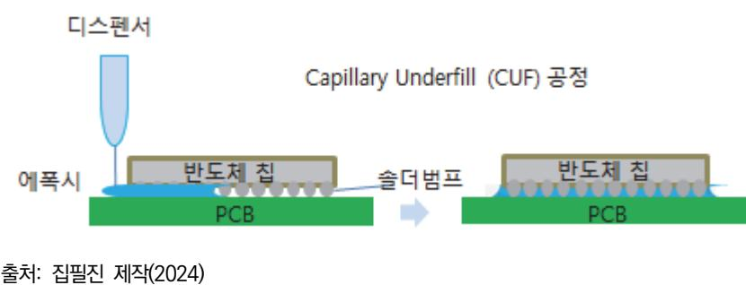

[그림 1-1] 캐필러리 언더필 CUF 공정

- 숕 언더필 공정의 구분
  - 1. 포스트 어플라이드(Post Applied) 언더필
    - (1) 캐필러리 언더필(CUF: Capillary Underfill)

캐필러리 언더필은 본딩 후 칩 옆에서 언더필 재료를 분사하여 칩과 기판 사이를 표면 장력으로 채우는 방식이다. 주로 폴리머나 액체 에폭시를 사용하며, PCB가 리플로 오븐 을 통과하는 동안 모세관 현상을 통해 반도체 아랫부분을 채운다.

(2) 몰드 언더필(MUF: Molded Underfill)

몰드 언더필은 에폭시 몰딩 컴파운드(EMC) 재료로 몰딩을 진행하면서 동시에 칩과 PC B 사이의 공간을 채우는 방식이다. 몰딩과 언더필 공정을 동시에 수행하여 별도의 언더 필 공정을 생략할 수 있는 장점이 있다.

## 숖 언더필 소재를 도포하는 공정

1. 언더필의 역할

언더필은 칩과 기판 사이의 범프 공간을 열경화성 에폭시 수지로 채운 후 경화하여 실리콘 칩과 PCB 간의 열팽창 차이로 발생할 수 있는 변형 및 파손을 방지하고, 충격, 낙하 및 진 동으로부터 제품을 보호하며 전기적 특성을 유지해 주는 역할을 한다.

2. 캐필러리 언더필 기술

캐필러리 언더필 공정은 플럭스 디스펜싱(Flex Dispensing), 플럭스 세척(Flex Cleaning), 솔더 범프 흐름(Solder Bump Flow), 언더필 디스펜싱과 흐름, 언더필 경화 시스템으로 구 분된다. 이를 통해 다양한 단계를 거쳐 언더필 소재를 칩과 기판 사이에 채운다.

- 3. 언더필 도포 방법
  - (1) 온도 및 예열

캐필러리 언더필은 약 80°C 정도로 예열한 후 진행한다.

(2) 비전 시스템

비전 시스템을 사용해 언더필 소재가 도포될 위치를 정확하게 찾고 언더필을 시작한다.

(3) 디스펜서 이용

수지가 담긴 용기의 끝에 니들을 부착하고, 디스펜서를 통해 수지를 일정량 다이의 가장 자리에 도포한다. 이때 수지는 일정한 속도로 다이와 기판 사이의 공간으로 모세관 현상 으로 인해 빨려 들어가며, 범프 사이의 빈 공간을 채운다.

(4) 경화

범프 사이에 수지가 채워지면 경화를 위해 가열 과정을 거친다.

4. 공정 조건과 변수

언더필 공정은 여러 변수가 영향을 끼친다. 칩과 기판 사이의 간격(범프의 높이), 범프 간 격, 언더필 소재의 종류, 수지 도포 위치, 도포 양, 공정 온도에 따라 공정 조건이 달라지므 로 이를 고려해 공정을 진행해야 한다.

#### 5. 문제 발생 가능성

공정 조건이 적절하지 않으면 여러 문제가 발생할 수 있다. 예를 들어, 언더필 수지의 흐름 이 느리면 범프 사이 공간을 완전히 채우기 전에 경화될 수 있고, 공기 흐름이 차단되면 에 어 트랩(Air Trap)이 발생할 수 있다. 캐필러리 언더필 공정에서 수지가 완벽히 채워지지 않으면, 열팽창 계수 차이로 열 하중이나 외부 충격으로 범프에 균열이 발생할 수 있어 전 기적 특성에 문제가 생길 수 있다.

#### 숗 디스펜서 노즐을 이용한 언더필 공정

1. 언더필의 역할

언더필은 플립 칩과 기판 사이의 갭을 채워, 전기 접점의 연결 강도를 향상시키고, 서로 다 른 재료의 열 팽창 차이를 보상하여 외부 충격 하중 및 환경 조건에서의 신뢰성을 높인다. 이는 제품 고장을 방지하고, 반도체의 내구성을 향상시키는 데 중요한 역할을 한다.

- 2. 언더필 공정의 원리
  - (1) 캐필러리 언더필 공정 모세관 현상을 이용하여 범프나 솔더 볼 사이의 공간을 열경화성 수지로 채운다. 플립 칩의 범프 사이 또는 BGA의 솔더 볼 사이 공간을 공극 없이 채워주는 것이 핵심이다.
  - (2) 에폭시 수지 처리

기판이 상온보다 높게 예열된 상태에서 공정을 진행해야 수지의 점도가 감소하여 공정 이 원활하게 진행된다.

3. 에어 트래핑(Air Trapping) 방지

언더필 도중, 공기가 갇히는 에어 트래핑 현상을 방지하는 것이 매우 중요하다. 수지의 침 투 속도 차이로 인해 공기가 완전히 빠지지 못하고 빈 공간을 만들면 반도체 성능에 악영 향을 줄 수 있다. 에어 트래핑이 발생하면 공기가 언더필 수지의 침투를 막아 공정이 제대 로 진행되지 않아 신뢰성 문제가 발생할 수 있다. 이를 방지하기 위해 언더필 공정 후에는 X-ray 분석 장비를 사용해 상태를 확인해야 한다.

- 4. 언더필 장비
  - (1) 정량 도포

언더필 장비는 정확한 양의 수지를 도포할 수 있어야 한다. 예열 장치는 유체의 점도를 낮춰 빠른 침투를 돕고, 여러 개의 노즐을 사용하는 Multi-Nozzle 설비는 Array 기판 의 언더필 속도를 향상시킬 수 있다. 또 PCB의 휨을 바로잡아 정량 도포가 가능하도록 돕는 장치도 필요하다.

(2) 경화 장치

경화 장치는 In-Line 및 Off-Line 방식이 있으며, Off-Line 경화 장치에서는 내열 매 거진이 필요하다. In-Line 장치의 경우 경화 시간이 짧으면 문제가 없으나, 경화 시간 이 길다면 수직형 경화 장치가 더 유리하다.

- 5. 언더필 소재와 공정 관리
  - (1) 필러 조정

다이와 PCB의 간격, 범프 간격에 따라 필러의 크기를 조정할 필요가 있다.

(2) 수지 관리

에폭시 수지의 점도를 고려하고, 기포가 발생하지 않도록 유의해야 한다.

(3) PCB 관리

공정 중 PCB가 휘어지면 언더필 품질이 떨어질 수 있으므로, 이를 방지해야 한다.

(4) 노즐 관리

노즐에 이물질이 존재하지 않는지 수시로 확인하여 공정 품질을 유지해야 한다.

## 수행 내용 / 캐필러리 언더필 공정 수행

#### 재료·자료

- 언더필 재료
- 캐필러리
- 캐필러리 언더필 공정 장비

## 기기(장비 ・ 공구)

• 해당 사항 없음.

## 안전 ・ 유의 사항

- 언더필 공정 장비의 특성을 파악하고, 언더필 공정 진행 온도, 언더필 재료 분사 속도의 영 향을 파악하여 언더필 공정 진행 후 언더필 특성이 잘 유지될 수 있어야 한다.
- 언더필 재료의 보관 조건과 사용 조건을 파악하여 언더필 공정 진행 후 언더필 특성이 잘 유지될 수 있어야 한다.

#### 수행 순서

숔 캐필러리 언더필(CUF: Capillary Underfill) 공정을 진행한다.

- 1. 언더필은 반도체의 신뢰성을 확보하는 데 중요한 공정으로 언더필의 역할은 다음과 같이 정의할 수 있다.
  - (1) 언더필은 모세관 현상을 이용해 범프 사이의 공간을 채우며, 주로 플립 칩, CSP, WLP와 같 은 패키지 기술에 적용된다.
  - (2) 칩과 기판 사이의 범프 공간을 열경화성 에폭시 수지로 채운 후 경화하여 충격, 낙하 및 진 동으로부터 제품을 보호하며 전기적 특성을 유지해 주는 역할을 한다.
  - (3) 언더필은 칩과 기판의 열팽창 계수 차이로 발생할 수 있는 변형 및 파손을 방지하는 데에 사 용된다.
- 2. 언더필 재료와 구성 요소를 파악한다.
  - (1) 에폭시

캐필러리 언더필에서는 낮은 점도의 에폭시를 사용해 모세관 현상으로 칩과 기판 사이 의 공간을 채운다. 공정에서 온도를 조절해 흐름성을 제어하고, 더 높은 신뢰성을 위해 다양한 점도의 에폭시가 사용된다.

(2) 필러

열팽창 계수를 낮추기 위해 실리카 필러를 사용하며, 필러의 함량은 40~70wt% 정도로 구성되어 있다.

- 3. 캐필러리 언더필 공정을 진행한다.
  - (1) 캐필러리 언더필은 플립 칩과 같은 반도체의 신뢰성을 확보하기 위해 반도체 패키지 공정에 서 칩과 기판 사이의 공간을 에폭시와 같은 절연 재료로 채우는 공정이다. 언더필 재료인 에 폭시를 이용해서 칩과 PCB 사이의 공간을 채운다.
  - (2) 캐필러리 언더필은 본딩 후 칩 옆에서 언더필 재료를 분사하여 칩과 기판 사이를 표면 장력 으로 채우는 방식으로 언더필을 진행한다. 언더필은 낮은 점도를 갖는 에폭시로 모세관 현상 을 이용하여 칩과 기판 사이의 공간을 채울 수 있다. 폴리머나 액체 에폭시를 사용하여 모세 관 현상을 이용해서 반도체의 아랫부분을 에폭시로 채운다. 공정 온도에 따라 에폭시의 흐름 특성을 조절할 수 있다.
  - (3) 캐필러리 언더필은 캐필러리로 칩 옆에서 언더필 재료를 분사해서 언더필 재료가 칩과 기판 사이를 표면 장력으로 채운다. 수지가 담긴 용기 끝에 니들을 달고 디스펜서로 수지를 일정 량 다이의 가장자리에 도포한다.
  - (4) 캐필러리 효과를 이용하여 언더필 재료를 칩과 기판 사이에 주입한다. 수지는 디스펜서 노즐 에서 나오면서 일정 속도를 가지고 있어서 다이의 내부로 모세관 현상에 의해서 범프 사이 빈공간이 채워진다.
- 4. 언더필 공정은 반도체 패키징에서 칩과 기판 사이의 간극을 메우기 위해 사용되는 접착제나 수지 를 사용하는 과정으로 공정 조건을 파악하여 진행한다.
  - (1) 재료 선택에서 언더필 재료는 열적 안정성과 전기적 절연성을 갖추어야 하며, 칩과 기판의 열팽창 계수에 맞는 것이어야 한다.
  - (2) 온도 습도 조건에서 공정 환경은 온도와 습도가 적절히 조절되어야 하며, 일반적으로 20~2 5℃에서 상대 습도 30~50%가 이상적이다.
  - (3) 언더필 공정을 시작하기 전에 칩과 기판을 프리히팅하여 재료의 유동성을 높이는 것이 중요 하다. 일반적으로 80~150℃ 사이에서 진행된다.
  - (4) 언더필 도포는 비전 시스템을 사용해 언더필 소재가 도포될 위치를 정확하게 찾고 언더필을 진행한다. 수지가 담긴 용기의 끝에 니들을 부착하고, 디스펜서를 통해 수지를 일정량 다이의 가장자리에 도포한다. 이때 수지는 일정한 속도로 다이와 기판 사이의 공간으로 모세관 현상 으로 빨려 들어가며, 범프 사이의 빈 공간을 채운다.
  - (5) 언더필 재료로는 에폭시를 사용하며 낮은 점도의 에폭시를 사용해 모세관 현상으로 칩과 기 판 사이의 공간을 채운다. 공정에서 온도를 조절해 흐름성을 제어하고, 더 높은 신뢰성을 위 해 다양한 점도의 에폭시를 사용한다.

9

- (6) 언더필 재료를 주입할 때 적절한 압력과 시간을 설정해야 하며, 이로 인해 공정의 효율성과 품질이 결정된다.
- (7) 캐필러리 언더필 공정은 플럭스 디스펜싱(flex dispensing), 플럭스 세척(flex cleaning), 솔 더 범프 흐름(solder bump flow), 언더필 디스펜싱과 흐름, 언더필 경화 시스템으로 구분되 며, 이러한 다양한 단계를 거치면서 언더필 소재를 칩과 기판 사이를 채운다.
- (8) 언더필 공정에 영향을 주는 인자는 칩과 기판 사이의 간격(범프의 높이), 범프 간격, 언더필 소재의 종류, 수지 도포 위치, 도포 양, 공정 온도가 있으며, 이러한 공정 조건에 따라 언더 필의 특성과 반도체의 신뢰성이 영향을 받으므로 언더필의 품질에 영향를 주는 여러 가지 인 자를 고려하여 공정을 진행해야 한다.
- (9) 반도체의 품질을 확보하기 위해서 언더필의 공정 조건에 영향을 주는 다양한 인자의 특성을 파악해야 한다. 언더필 수지의 흐름을 제어하면서 범프 사이 공간을 잘 채울 수 있도록 공정 조건을 제어해야 한다.
- 5. 언더필에 기공(Void)가 포함되지 않도록 공정을 진행한다.
  - (1) 캐필러리 언더필 과정에서 공기가 포함되지 않도록 주의한다.
  - (2) 언더필 기공은 반도체 패키징 과정에서 발생할 수 있는 결함으로, 언더필 소재가 칩과 기판 사이에 불균일하게 분배되면서 생기는 빈 공간을 지칭한다. 이러한 기공은 신뢰성 저하와 성 능 문제를 초래할 수 있다.
  - (3) 언더필 기공 발생의 주요 원인으로는 다음과 같은 것들이 있다. 재료 문제로 언더필 재료의 점도나 유동성이 부족할 경우 기공이 발생할 수 있다. 기계적 압력으로 패키징 과정에서의 압력 부족이나 불균형한 압력 분배가 기공을 초래할 수 있다. 온도 변화로 급격한 온도 변화 는 언더필 재료의 수축이나 팽창을 유발해 기공을 만들 수 있다. 적용 기술로 언더필을 적용 하는 기술이나 방법의 부정확성도 기공 발생에 영향을 끼칠 수 있다.
  - (4) 공정 조건이 적절하지 않으면 여러 문제가 발생할 수 있다. 언더필 수지의 흐름이 느리면 범 프 사이 공간을 완전히 채우기 전에 경화될 수 있고, 공기 흐름이 차단되면 에어 트랩(Air Trap)이 발생할 수 있다. 캐필러리 언더필 공정에서 수지가 완벽히 채워지지 않으면, 열팽창 계수 차이에 의한 열 하중이나 외부 충격으로 범프에 균열이 발생할 수 있어 전기적 특성에 문제가 생길 수 있다.
- 6. 언더필 경화 공정을 진행한다.
  - (1) 언더필 경화(Underfill Curing)는 반도체 패키징 공정에서 사용되는 기술로, 칩과 기판 사이 의 빈 공간을 메우기 위해 사용된다. 이 과정에서 언더필 수지가 칩과 기판 사이에 주입된다.
  - (2) 언더필 경화는 열 경화형(Thermosetting) 또는 UV 경화형(Ultraviolet Curing) 수지를 사 용하여 진행하며, 각 수지의 특성과 경화 조건에 따라 최적의 성능을 확보할 수 있다. 반도체 의 범프와 PCB 사이에 수지가 채워지면 경화를 위해 가열을 진행한다. 언더필은 플립 칩과

기판 사이의 공간을 채워서 반도체를 구성하는 다양한 재료의 열팽창 계수 차이에 따라 발생 할 수 있는 불량 문제를 방지하여 신뢰성을 확보하는 역할을 한다.

- (3) 언더필 경화의 주요 목적은 다음과 같이 정리할 수 있다. 기계적 안정성으로 칩과 기판 간의 결합을 강화하여 기계적 충격이나 진동에 대한 저항력을 높인다. 열 관리는 언더필이 열전도 성을 개선하여 칩의 발열을 효과적으로 관리할 수 있도록 한다. 습기 및 오염 방지는 외부 환경으로부터의 습기나 오염물질의 침투를 차단하여 전자기기의 신뢰성을 높인다.
- (4) 경화 조건: 언더필 재료의 경화 온도와 시간을 준수해서 경화 후에도 열적 특성을 유지한다.
- 7. 칩을 뒤집어서 PCB에 접합한 후 칩과 PCB 사이를 언더필 재료로 채우는 사후 적용(Post Applied) 언더필 공정과 사전 적용 언더필 공정에 대해서 이해한다.
  - (1) 캐필러리 언더필(CUF)

캐필러리 언더필은 칩과 기판 사이를 모세관 현상을 이용하여 채우는 방식으로, 에폭시 를 칩 측면에 도포한 후, 열을 가해 경화시키는 공정이다.

(2) 몰드 언더필(MUF)

MUF는 에폭시 몰딩 컴파운드를 사용하여 몰딩과 언더필 공정을 동시에 진행하는 방식 으로, 별도의 언더필 공정을 생략할 수 있는 장점이 있다.

(3) 사전 적용(Pre-Applied) 언더필

본딩 전에 언더필 재료를 미리 도포하는 방식으로, NCP(Non-Conductive Paste)와 NCF(Non-Conductive Film)가 있다.

- 숕 디스펜서 노즐을 이용한 언더필 공정을 진행한다.
  - 1. 캐필러리 언더필 공정을 진행한다.
    - (1) 언더필은 모세관 현상을 이용하여 범프나 솔더 볼 사이의 공간을 열경화성 수지로 채운다. 반도체와 PCB 사이에 있는 공간을 잘 채워 줄 수 있도록 한다.
    - (2) 언더필 장비는 정확한 양의 수지를 도포할 수 있어야 한다. 예열 장치는 유체의 점도를 낮춰 빠른 침투를 돕고, 여러 개의 노즐을 사용하는 Multi-Nozzle 설비는 Array 기판의 언더필 속도를 향상할 수 있다. 또 PCB의 휨을 바로잡아 정량 도포가 가능하도록 돕는 장치도 필요 하다.
  - 2. 온도 조건을 파악하여 언더필을 진행한다.
    - (1) 에폭시의 공정 특성을 파악하여 언더필 공정이 진행될 수 있는 온도 조건을 파악하여 최적의 온도 상태를 유지한 상태에서 공정을 진행할 수 있도록 한다.
    - (2) 기판이 상온보다 높게 예열된 상태에서 공정을 진행해야 수지의 점도가 감소하여 공정이 원 활하게 진행된다.

11

- 3. 언더필의 신뢰성을 확보할 수 있도록 한다.
  - (1) 언더필은 플립 칩과 기판 사이의 갭을 채워, 전기 접점의 연결 강도를 향상하고, 서로 다른 재료의 열팽창 차이를 보상하여 외부 충격 하중 및 환경 조건에서의 신뢰성을 높여 제품 고 장을 방지하고, 반도체의 내구성을 향상하는 데 중요한 역할을 하는데 이러한 성능을 확보할 수 있도록 언더필 공정을 진행한다.
  - (2) 언더필을 하는 과정에서 공기가 갇히는 에어 트래핑 현상을 방지하는 것이 중요하다. 수지의 침투 속도 차이로 인해 공기가 완전히 빠지지 못하고 빈 공간을 만들면 반도체 신뢰성에 문 제가 발생할 수 있다.
  - (3) 언더필 공정 후에는 X-ray 분석 장비를 통해 분석하여 언더필 공정이 공기로 인해 발생하는 기공 없이 진행되었는지 확인해야 한다.
- 4. 언더필 소재와 공정 관리를 수행한다.
  - (1) 언더필 소재와 공정 관리는 필러 조정과 수리 관리, PCB 관리로 구분할 수 있다.
  - (2) 필러 조정은 다이와 PCB의 간격, 범프 간격에 따라 필러의 크기를 조정할 필요가 있다.
  - (3) 수지 관리는 에폭시 수지의 점도를 고려하고, 기포가 발생하지 않도록 유의하는 내용이다.
  - (4) PCB 관리는 공정 중 PCB가 휘어지면 언더필 품질이 떨어질 수 있으므로, 이를 방지해야 한다.
  - (5) 노즐 관리는 노즐에 이물질이 존재하지 않는지 수시로 확인하여 언더필 공정의 품질을 유지 해야 한다.
  - (6) 언더필이 제대로 이루어졌는지 검사한다. 이 단계에서는 균일성, 결합 강도, 및 결함 여부를 확인한다.
  - (7) 언더필할 때는 공기가 갇히는 에어 트래핑(Air Trapping) 현상이 발생하지 않도록 공정 조건 을 셋업하고 공정을 진행해야 한다. 언더필 수지의 위치에 따른 침투 속도 차이로 인해서 공 기가 완전히 빠져나가지 못하고 빈 공간을 만들면 칩의 성능에 영향을 주게 된다.
  - (8) 에어 트래핑이 발생하면 공기가 언더필 수지의 침투를 막아 공정이 제대로 진행되지 않아 신 뢰성 문제가 발생할 수 있다. 이를 방지하기 위해 언더필 공정 후에는 X-ray 분석 장비를 사용해 상태를 확인해야 한다.

5. 언더필 장비 상태를 확인한다.

- (1) 정량 도포 개념으로 언더필 장비는 정확한 양의 수지를 도포할 수 있어야 한다. 예열 장치는 유체의 점도를 낮춰 빠른 침투를 돕고, 여러 개의 노즐을 사용하는 Multi-Nozzle 설비는 Array 기판의 언더필 속도를 향상할 수 있다. 또 PCB의 휨을 바로잡아 정량 도포가 가능하 도록 돕는 장치도 필요하다.
- (2) 경화 장치는 In-Line 및 Off-Line 방식이 있으며, Off-Line 경화 장치에서는 내열 매거진

이 필요하다. In-Line 장치의 경우 경화 시간이 짧으면 문제가 없으나, 경화 시간이 길다면 수직형 경화 장치가 더 유리하다.

## 1-2. 캐필러리 언더필 공정 재료 설명

학습 목표 • 필요한 양과 속도를 제어하는 방식의 기술을 적용하여 언더필 공정을 개발할 수 있다.

## 필요 지식 /

숔 캐필러리 언더필 재료의 개념 및 정의

- 1. 언더필 재료의 발전
  - (1) 반도체 칩과 기판 틈새에 열경화성 절연 수지를 보강하여 칩과 기판의 열팽창 계수 차이로 인한 스트레스를 흡수하고, 솔더 범프가 지니는 접착력을 보완하여, 최종적으로 전자 소자의 신뢰성을 향상하여 소자의 구동 성능을 높이는 반도체 패키징용 화학 재료이다.
  - (2) 반도체의 적용 분야가 확대되고 성능이 향상되면서 초미세 피치용 언더필 재료의 필요성이 증대되고 있으며, 이를 활용한 패키징 공정 기술의 중요성이 커지고 있다. 반도체 칩과 기판 틈새에 적용되어 반도체 소자의 신뢰성과 구동 성능을 높이는 언더필 소재는 반도체 소자와 기판 간의 간격이 미세화 트렌드로 인해 좁아짐에 따라 충진 시간 증가와 생산 수율이 감소 하는 문제점이 발생하여 이를 개선할 수 있는 초미세 피치용 언더필 소재 개발이 중요하다.
  - (3) 초미세 피치용 언더필 소재가 가져야 할 특성으로는, 경화되기 전에는 점도가 낮고 흐름성이 뛰어나 공정 시간을 단축하여 공극 현상을 최소화할 수 있어야 하고, 경화 시간이 짧아야 하 며, 경화된 후에는 적절한 유리 전이 온도와 높은 방열 특성 및 내습성을 가져 장치의 신뢰 성을 확보할 수 있어야 한다.
  - (4) 언더필 소재의 방열 특성 확보를 위해서는 무기 필러의 도입이 필수적인데, 이러한 무기 필 러를 언더필 내에 고필러 함량(>60wt%)으로 고충진하면 점도가 높아지기 때문에 고신뢰성인 미세 피치용 언더필 기술이 매우 중요하다.
- 2. 반도체 기술의 발전에 따른 언더필 재료의 중요성
  - (1) 인공지능, 자율 주행 차량, 우주 항공, IT, 5G 통신에 사용되는 반도체에 대한 더 많은 기능 과 성능에 대한 수요가 확대되면서 고성능, 초소형 반도체의 필요성이 커지고 있어서 고도화 된 반도체 칩의 고성능화를 가능케 하는 언더필 소재에 대한 요구가 커지고 있다.
  - (2) 반도체 칩과 기판 사이의 간격에 적용되어 반도체 소자의 신뢰성과 구동 성능을 높이는 언더 필 소재는 반도체 소자와 기판 간의 간격이 작아지면서 초미세 피치용 언더필 소재의 개발에 대한 필요성이 증가하고 있다.
  - (3) 언더필 소재의 밸류 체인은 에폭시, 경화제, 촉매, 고순도 미세 필러 등과 같은 원 소재, 고

성능과 고신뢰성의 언더필 소재인 중간재, 고집적 반도체 패키지/모듈인 부품으로 구분할 수 있으며 이러한 밸류 체인에 속해 있는 언더필 원 소재 기술, 액상 언더필 복합화 기술, 패키 지 공정 기술의 수준을 높이는 것이 매우 중요하다.

- (4) 이러한 기술은 고내열과 경화 기술, 미세 분말 기술, 액상 언더필 조성물 설계, 분산과 배합, 물성 제어 기술, 액상 언더필 충진 공정, 범프 어레이 설계/제조, 플립 칩 패키지 제조, 신뢰 성 확보 기술로 세분화할 수 있다.
- 3. 언더필 사용 반도체 기술 발전
  - (1) 첨단 패키징 기술인 플립 칩, WLP(Wafer Level Package), TSV(Through Silicon Via) 등의 패키징 기술은 입출력 단자의 수를 늘리기 위해 범프 크기가 작아지고, 피치 간격이 좁 아지는 추세에 있으며 플립 칩 패키지의 범프 피치는 현재 50㎛ 이하가 되고 있다.
  - (2) 반도체 소자와 기판 간 간격이 미세화되고 좁아짐에 따라, 언더필 소재의 점도와 요변성으로 인하여 충진 시간이 길어지고 생산 수율이 떨어지는 문제점이 발생함으로써 초미세 피치 반 도체 패키징에 적합한 고성능, 고신뢰성의 액상 언더필 소재가 필요하다.
  - (3) 반도체의 초미세 피치에 대응하여 흐름성과 내열 충격성을 확보할 수 있는 언더필 소재 기술 과 공정 기술 개발이 매우 중요하며, 이와 같은 더 높은 처리량 및 정밀도에 대한 한계를 더 욱 강화하기 위해 정교한 언더필을 하기 위한 기술 개발이 지속해서 진행되고 있다. 언더필 소재는 패키지 구성 원가의 2% 내외로 매우 높고 소재 기술 지배력이 강한 고부가 가치 산 업 분야이다.
- 숕 캐필러리 언더필 재료의 특성

캐필러리 언더필 재료는 열팽창 계수, 유리 전이 온도, 외부 충격에 견딜 수 있는 내열 충격성, 내인성 등이 매우 중요한 물성이며, 이러한 특성은 서로 Trade-off 관계에 있으므로 이를 해 결할 수 있는 언더필 기술 개발이 중요하다. 내·외부의 물리적 충격을 흡수하기 위한 적합한 레진 소재가 필요하고, 열 충격을 흡수하기 위한 열팽창 계수가 낮은 레진 소재를 적용해야 하 며, 열팽창 계수의 조절, 높은 신뢰성에 영향을 주는 구형 미세 필러의 함량을 높여야 한다. 그 러나 필러의 함량을 높일 경우, 점도가 높아지고 흐름성이 저하되는 문제점이 발생할 수 있어 이를 해결하는 것이 중요하다.

- 1. 언더필 수지의 특성
  - (1) 신뢰성

언더필 수지는 반도체의 품질을 좌우하는 중요한 소재이므로 물리적/화학적 신뢰성이 우수해야 한다. 언더필 재료의 열팽창 계수, 유리 전이 온도, 외부 충격에 견딜 수 있는 내열 충격성, 내인성 등이 매우 중요한 물성이다.

(2) 흐름성

언더필 수지는 모세관 현상을 이용하여 칩과 기판 사이의 틈을 효과적으로 채워야 하기 때문에 흐름성이 우수해야 한다. 상온과 고온에서 투입 공간으로의 침투 속도가 빨라야 한다. 필러의 함량에 따라 점도와 흐름성이 영향을 받게 된다.

- (3) 보관과 취급의 용이성 언더필 수지는 보관과 취급이 쉽고 보관 수명 및 상온 사용 수명이 길어야 한다. 언더
  - (4) 기포 관리

언더필 수지는 주사기 안에 기포가 함유되어 있지 않아야 한다.

필 수지의 보관과 취급 방법을 파악하여 조건에 맞추어야 한다.

(5) Repair의 용이성 언더필 수지는 Repair가 잘 되는 것이 좋다.

숖 언더필 재료의 종류

- 1. 높은 기계적 강도와 열전도성을 제공하는 저점도 일액형 에폭시계 언더필은 경화를 위해 혼합이 필요하지 않으며, 실온에서 무제한 작업 수명이어서 취급이 쉽기 때문에 빠른 경화가 필요한 마이 크로 전자 장치 패키징 적용에 널리 사용되고 있다.
- 2. 우수한 흐름성과 속경화가 가능한 언더필 소재는 미세 피치와 좁은 공극(Gap)에 우수한 충진력과 공극 현상 및 블리드 아웃을 방지하는 특성이 있다.
- 3. CSP(Chip scale package), Wafer-level CSP, BGA, LGA 등 다양한 부품군에 경화 메커니 즘을 중심으로 기술 개발을 진행하여, Narrow Gap에 적용할 수 있는 저점도 액상의 특성이 있 다.
- 4. 높은 유리 전이 온도와 낮은 열팽창 계수인 고온 발열 환경을 견딜 수 있는 디스펜싱형 언더필 소재가 있다.
- 5. 실리카가 함유된 에폭시계 언더필을 이중으로 경화시켜 안정성을 확보할 수 있는 소재가 있다. 모 세관 흐름에 의해 주입된 언더필은 UV 광으로 인해 1차로 가장자리 부분이 경화되어 위치가 고 정되고, 2차로 열경화 과정을 거쳐 경화되면서 언더필의 블리드 아웃 현상을 최소화하는 형태로 언더필을 구성한다.

## 수행 내용 / 캐필러리 언더필 공정 재료 파악하기

#### 재료·자료

- 언더필 재료
- 캐필러리 언더필 공정 장비

## 기기(장비 ・ 공구)

• 해당 사항 없음.

### 안전 ・ 유의 사항

- 언더필이 적용되는 공간의 높이와 피치, 적용되는 재료의 물성과 크기에 따른 언더필의 특 성과 필러의 크기 등을 파악하여 반도체의 신뢰성을 확보할 수 있는 언더필 공정을 진행할 수 있어야 한다.
- 언더필 재료의 보관 조건과 사용 조건을 파악하여 언더필 공정 진행 후 언더필 특성이 잘 유지될 수 있어야 한다.

수행 순서

- 숔 언더필 공정에 사용되는 언더필 재료의 종류와 특성을 파악하여 공정 진행 후 언더필 품질이 잘 나 타날 수 있도록 한다.
  - 1. 언더필 재료의 특성을 이해하고 언더필 재료를 선정한다.
    - (1) 반도체 칩과 기판 틈새에 열경화성 절연 수지를 보강하여 칩과 기판의 열팽창 계수 차이로 인한 스트레스를 흡수하고, 솔더 범프가 지니는 접착력을 보완하여, 전자 소자의 신뢰성을 향 상하여 소자의 구동 성능을 높이는 반도체 패키징용 화학 재료를 이해할 수 있도록 한다.
    - (2) 적용되는 반도체의 종류와 특성을 파악하고 언더필 공정 조건과 신뢰성을 만족할 수 있는 언 더필을 선정한다.
    - (3) 언더필 재료의 열팽창 계수, 유리 전이 온도, 외부 충격에 견딜 수 있는 내열 충격성, 내인성 등을 평가하여 결정한다.
    - (4) 반도체 소자와 기판 간의 간격이 미세화 트렌드로 인해 좁아짐에 따라 충진 시간 증가와 생 산 수율이 감소하는 문제점이 발생하여 이를 개선할 수 있는 초미세 피치용 언더필 소재에 대해 파악한다.
    - (5) 초미세 피치용 언더필 소재가 가져야 할 특성은 경화되기 전에는 점도가 낮고 흐름성이 뛰어 나 공정 시간을 단축하고 공극 현상을 최소화할 수 있어야 하고, 경화 시간이 짧아야 하며,

경화된 후에는 적절한 유리 전이 온도와 높은 방열 특성 및 내습성이 있어 장치의 신뢰성을 확보할 수 있어야 한다. 이러한 특성을 이해하여 반도체의 특성에 따라 언더필 소재를 선정 한다.

- 2. 언더필 소재의 구성과 특성을 파악한다.
  - (1) 에폭시, 경화제, 촉매, 고순도 미세 필러 등과 같은 원 소재, 고성능과 고신뢰성의 언더필 소 재인 중간재, 고집적 반도체 패키지/모듈인 부품의 특성을 파악한다.
  - (2) 언더필의 고내열과 경화 기술, 미세 분말 기술, 액상 언더필 조성물 설계, 분산과 배합, 물성 제어 기술, 액상 언더필 충진 공정, 범프 어레이 설계/제조, 플립 칩 패키지 제조, 신뢰성 확 보 기술을 파악한다.
  - (3) 반도체 칩과 기판 틈새에 열경화성 절연 수지를 보강하여 칩과 기판의 열팽창 계수 차이로 인한 스트레스를 흡수하고, 솔더 범프가 지니는 접착력을 보완하여, 최종적으로 전자 소자의 신뢰성을 향상할 수 있는 특성을 파악하도록 한다.
- 3. 언더필 공정 조건에 따른 언더필 재료의 특성을 이해한다.
  - (1) 언더필 흐름성을 확보할 수 있는 언더필을 선정하기 위해 언더필의 구성 재료에 대한 특성을 이해하고 공정 온도를 파악하여 공정을 진행한다.
  - (2) 언더필 재료의 성능이 잘 나타날 수 있는 온도와 습도 등의 보관과 취급 조건을 파악하여 이 에 따라 공정을 진행한다.
  - (3) 초미세 피치용 언더필 소재가 가져야 할 특성으로는, 경화되기 전에는 점도가 낮고 흐름성이 뛰어나 공정 시간을 단축하고 공극 현상을 최소화할 수 있어야 하고, 경화 시간이 짧아야 하 며, 경화된 후에는 적절한 유리 전이 온도와 높은 방열 특성 및 내습성을 가져 장치의 신뢰 성을 확보할 수 있어야 한다.
- 4. 언더필의 신뢰성을 확보할 수 있는 공정 조건을 이해한다.
  - (1) 언더필 공정 중에 기포가 발생하지 않도록 재료를 관리하고 공정 인자를 파악하여 공정을 진 행한다.
  - (2) 언더필 소재의 방열 특성 확보를 위해서는 무기 필러의 도입이 필수적인데, 이러한 무기 필 러를 언더필 내에 고필러 함량(>60wt%)으로 고충진하면 점도가 높아지기 때문에 고신뢰성을 가진 미세 피치용 언더필 기술을 파악할 수 있도록 한다.
  - (3) 반도체 소자와 기판 간 간격이 미세화되고 좁아지는 특성을 이해하여 충진 시간을 확보하고 생산 수율을 확보할 수 있는 초미세 피치 반도체 패키징에 적합한 고성능, 고신뢰성의 액상 언더필 소재에 대해서 이해할 수 있도록 한다.
  - (4) 초미세 피치의 반도체에서 흐름성과 내열 충격성을 확보할 수 있는 언더필 소재 기술과 공정 기술 개발을 확보할 수 있도록 한다.

숕 캐필러리 언더필 재료의 특성

- 1. 캐필러리 언더필 재료의 특성을 이해한다.
  - (1) 언더필 재료는 열팽창 계수, 유리 전이 온도, 외부 충격에 견딜 수 있는 내열 충격성, 내인성 에 대해 이해한다.
  - (2) 내·외부의 물리적 충격을 흡수하기 위한 적합한 레진 소재 선정, 열 충격을 흡수하기 위한 열팽창 계수가 낮은 레진 소재, 열팽창 계수에 대한 이해, 신뢰성에 영향을 주는 미세필러의 특성에 대해서 이해한다.
- 2. 언더필 수지의 신뢰성을 확보할 수 있도록 한다.
  - (1) 언더필 수지는 반도체의 품질을 좌우하는 중요한 소재이므로 물리적/화학적 신뢰성 확보가 중요하다. 언더필 재료의 열팽창 계수, 유리 전이 온도, 외부 충격에 견딜 수 있는 내열 충격 성, 내인성 영향에 대해서 이해한다.
  - (2) 언더필 재료의 흐름성을 이해한다. 언더필 수지는 모세관 현상을 이용하여 칩과 기판 사이의 틈을 효과적으로 채워야 하므로 흐름성이 우수해야 한다. 상온과 고온에서 투입 공간으로의 침투 속도에 대한 특성을 이해한다.
  - (3) 보관과 취급의 특성을 이해한다. 언더필 수지는 보관과 취급이 쉽고 보관 수명 및 상온 사용 수명이 길어야 한다. 언더필 수지의 보관과 취급 방법을 파악하여 조건에 맞추어야 한다.
  - (4) 언더필 수지의 기포 관리를 잘해야 한다. 언더필 수지는 주사기 안에 기포가 함유되어 있지 않아야 한다.
  - (5) 언더필 수지의 Repair 특성을 잘 이해한다.

숖 언더필 재료의 종류

- 1. 언더필 재료의 다양성을 이해한다. 높은 기계적 강도와 열전도성을 제공하는 저점도 일액형 에폭 시계 언더필은 경화를 위해 혼합이 필요하지 않으며, 실온에서 무제한 작업 수명이어서 취급이 쉬 우므로 이러한 특성을 잘 이해한다.
- 2. 미세 피치와 좁은 공극(Gap)에 대해 우수한 충진력과 공극 현상 및 블리드 아웃을 방지하는 특성 이 있으므로 이러한 특성을 잘 이해하고 공정을 진행한다.
- 3. CSP(Chip Scale Package), Wafer-level CSP, BGA, LGA 등 다양한 부품군에 경화 메커니 즘을 중심으로 기술 개발을 진행하여, Narrow Gap에 적용할 수 있는 저점도 액상의 특성이 있 다. 높은 유리 전이 온도와 낮은 열팽창 계수를 갖는 고온 발열 환경을 견딜 수 있는 디스펜싱형

언더필 소재를 이해한 후 공정을 진행한다.

4. 실리카가 함유된 에폭시계 언더필을 이중으로 경화시켜 안정성을 확보할 수 있는 소재가 있다. 모 세관 흐름에 의해 주입된 언더필은 UV 광으로 1차로 가장자리 부분이 경화되어 위치가 고정되 고, 2차로 열경화 과정을 거쳐 경화되면서 언더필의 블리드 아웃 현상을 최소화하는 형태로 언더 필을 구성하게 되는데 이러한 특성을 이해한 후 공정을 진행한다.

## 학습 1 교수·학습 방법

## 교수 방법

- 캐필러리 언더필의 원리와 방법 언더필 공정의 종류를 충분히 이해할 수 있도록 수업을 진 행한다.
- 캐필러리 언더필의 공정 진행 방법에 대해 이해하고 캐필러리 언더필 공정 장비의 구조와 각 모듈의 역할을 충분히 이해할 수 있도록 수업을 진행한다.
- 반도체 패키지의 종류에 따라 적용에 필요한 언더필의 특성을 설명한다.
- 언더필 공정 재료에 대해 이해하고, 언더필 공정을 수행하는 데 필요한 언더필 재료의 양과 속도를 조절하는 방법을 설명한다.
- 학습자가 준비한 보고서의 내용 및 발표 태도와 참관하는 다른 학습자의 태도도 유심히 살 펴보고 피드백해 준다.

## 학습 방법

- 캐필러리 언더필의 원리와 방법 언더필 공정의 종류에 대해 이해할 수 있도록 중요한 사항 을 정리하면서 언더필 공정을 학습한다.
- 언더필이 적용되는 반도체 패키지의 종류에 대해 찾아보고 적용되는 언더필의 종류와 특성 에 대해 파악하면서 중요 사항을 정리한다.
- 첨단 반도체 패키지 제품에서 언더필의 역할과 중요성을 확인하고 내용을 정리하여 발표해 보고 타 학습자의 내용과 비교한다.
- 다른 학습자의 발표 내용을 주의 깊게 듣고, 자신이 정리한 내용과 비교하면서 수정한다.

## 학습 1 평 가

## 평가 준거

• 평가자는 학습자가 학습 목표를 성공적으로 달성하였는지를 평가해야 한다.

#### • 평가자는 다음 사항을 평가해야 한다.

|                       | 학습 목표                                                       |  | 성취수준 |   |  |
|-----------------------|-------------------------------------------------------------|--|------|---|--|
| 학습 내용                 |                                                             |  | 중    | 하 |  |
| 캐필러리 언더필 공 정 수행    | - 기판에 플립 칩 부착 후 칩과 기판 사이의 공간에 언더필 소재를 도포하는 공정을 적용할 수 있다. |  |      |   |  |
|                       | - 디스펜서 노즐을 이용하여 언더필 공정을 패키지에 적용할 수 있다.                   |  |      |   |  |
| 캐필러리 언더필 공 정 재료 설명 | - 필요한 양과 속도를 제어하는 방식의 기술을 적용하여 언 더필 공정을 개발할 수 있다.        |  |      |   |  |

### 평가 방법

• 서술형 시험

| 학습 내용             | 평가 항목                                                    | 성취수준 |   |   |  |
|-------------------|----------------------------------------------------------|------|---|---|--|
|                   |                                                          | 상    | 중 | 하 |  |
| 캐필러리 언더필 공정 수행 | - 캐필러리 언더필 공정의 특성을 설명할 수 있는 능력                           |      |   |   |  |
|                   | - 언더필 공정 후 기공이 발생하지 않도록 언더필의 필요한 양과 속도를 제어하는 기술 파악 여부 |      |   |   |  |
| 캐필러리 언더필 재료 설명 | - 언더필 재료를 구성하는 물질의 종류와 특성 파악 여부                          |      |   |   |  |
|                   | - 기술 발전에 따른 언더필 재료의 필요한 특성 파악 여부                         |      |   |   |  |

• 구두 발표

| 학습 내용             | 평가 항목                                                              | 성취수준 |   |   |
|-------------------|--------------------------------------------------------------------|------|---|---|
|                   |                                                                    | 상    | 중 | 하 |
| 캐필러리 언더필 공정 수행 | - 캐필러리 언더필 공정의 특성을 설명할 수 있는 능력                                     |      |   |   |
|                   | - 언더필 공정 후 기공이 발생하지 않도록 언더필의 필요한 양과 속도를 제어하는 기술                 |      |   |   |
| 캐필러리 언더필 재료 설명 | - 언더필 재료를 구성하는 물질의 종류와 특성을 설명할 수 있는 능력                          |      |   |   |
|                   | - 기판에 플립 칩 부착 후 칩과 기판 사이의 공간에 언더필 재료의 기술 발전에 따라 필요한 특성을 설명하는 능력 |      |   |   |

피드백

- 1. 서술형 시험
  - 캐필러리 언더필의 개요, 캐필러리 언더필 공정 방법, 언더필의 신뢰성을 확보할 수 있는 방법에 관한 이론 시험 평가 후 각 문제에 대한 풀이를 시행한다.
  - 학습자가 시험에 대한 답안을 잘 작성하였을 경우에는 언더필 기술에 대한 심화 학습을 실시한다.
  - 학습자의 평가 결과 일정 점수 이하는 언더필 공정에 대한 보충 학습을 시행하여 잘 이해할 수 있도록 추가 학습 후 재평가한다.
  - 2. 구두 발표
  - 캐필러리 언더필의 개요, 캐필러리 언더필 공정 방법, 언더필의 신뢰성을 확보할 수 있는 방법에 관한 구두 발표를 시행한 후 성추수준이 낮은 학습자에게는 관련 사항을 보충 설명해 준다.
  - 캐필러리 언더필에 관한 구두 발표를 잘 수행한 학습자에게는 언더필 기술에 대한 심화 설명을 해 준다.
  - 캐필러리 언더필에 관해 구두 발표가 잘 진행되지 않은 학습자게는 언더필 공정에 대한 보충 학 습을 실시하여 잘 이해할 수 있도록 추가 학습 후 재평가한다.

| 학습 1 | 캐필러리 언더필 패키지 진행하기   |
|------|---------------------|
| 학습 2 | 몰드 언더필 패키지 진행하기     |
| 학습 3 | 사전 적용 언더필 패키지 진행하기  |
| 학습 4 | 웨이퍼 레벨 언더필 패키지 진행하기 |

## 2-1. MUF(Molded Underfill) 설명

학습 목표 • 기존 반도체 패키지용 몰드 소재와 기술을 그대로 이용하여 패키지에 적용할 수 있다.

## 필요 지식 /

- 숔 몰드 언더필
  - 1. 몰드 언더필 공정
    - (1) 언더필은 플립 칩 패키지에서 칩과 기판 사이의 공간을 특정 물질을 이용해서 채우는 공정으 로 플립 칩에 가해지는 외부 하중으로 인한 영향을 줄여 주어서 반도체의 신뢰성을 향상하는 데 중요한 역할을 하고 있다.
    - (2) 반도체의 성능을 향상하기 위해 반도체 선폭이 미세화되고 범프 크기와 범프 간 간격이 줄어 들면서 언더필 공정의 중요성이 커지고 언더필 공정 기술과 소재 기술의 고도화가 진행되고 있다.
    - (3) 몰드 언더필(MUF)은 몰딩을 하면서 언더필을 하는 방식으로 몰딩 공정과 언더필 공정을 한 번의 공정으로 진행하므로 별도의 언더필 공정 없이 MUF 공정을 통해서 칩과 기판 사이뿐 만 아니라 칩 패키지 전체를 보호하고 절연시키는 공정이다.
    - (4) 언더필에 사용되는 재료는 에폭시 몰딩 컴파운드(EMC)를 포함해서 액체 몰드 언더필 등의 다양한 재료가 사용되고 있다.
  - 2. 액상 MUF 재료의 사용
    - (1) 액체 몰드 언더필은 언더필과 오버필을 한 번에 진행하므로 공정 시간을 약 70% 단축할 수 있고 다른 형태의 언더필보다 속도가 빠른 장점이 있어서 생산성을 높이면서 반도체의 신뢰 성을 향상할 수 있다.
    - (2) AI 반도체에서 필수로 사용하고 있는 고대역폭 메모리 HBM은 MUF 방식에 의해 TSV 방식

으로 적층한 다이와 다이 사이의 공간을 빠른 속도로 채우면서 전체 몰딩을 할 수 있어서 MUF 공정은 HBM을 구현하는 유용한 방식으로 주목을 받고 있다. MUF 기술을 적용할 경 우 몰딩 공정을 진행하면서 칩과 칩 사이의 공간을 채울 수 있으므로 HBM 생산 시 효율을 증가시키는 데 활용되고 있다.

- (3) 최신 패키징 기술에서 반도체의 신뢰성 확보에 사용되는 액상 MUF(Liquid Mold Underfill) 재료는 높은 접착력, 낮은 CTE와 강성이 낮은 특징을 가지며 패키지에 있는 솔더에 걸리는 응력을 줄여 주어 신뢰성을 향상하는 역할을 한다. 액상 MUF 재료는 점도가 낮아서 기존의 고체 재료에 비해 작은 갭과 좁은 피치를 가진 플립 칩에 몰드 언더필을 진행하는 데 유리하 다.
- (4) 액상 MUF 재료의 프로세스는 인쇄, 분배 및 압축 성형에 적용할 수 있다. 인쇄 프로세스는 진공 인쇄 캡슐화 시스템(VPES) 및 압력 경화 시스템이 적용되고 있다. SiP(System In Package) 모듈용 MUF(Molded Underfill) 기술은 MUF 신뢰성 성능 향상과 SiP 모듈에서 플립 칩 범프 사이의 공극을 최소화하는 것이 중요하다.
- (5) Liquid MUF 재료는 높은 접착력, 낮은 CTE 및 낮은 모듈러스의 특징을 가진다. 패키지에 있는 솔더의 스트레스를 완화시키면서 신뢰성을 높이게 된다. Liquid MUF 재료는 낮은 점 도를 가지고 있어서 필러를 사용하는 복합 재료에 비해 작은 갭과 좁은 피치를 가진 대형 Flip Chip 장치에 상대적으로 낮은 스트레스로 몰드 언더필 될 수 있다. 액체 재료의 프로세 스는 진공 인쇄 캡슐화 시스템(VPES) 및 압력 경화 시스템이 적용된다.
- (6) 초저 휨 및 충진 능력이 우수한 액체 MUF의 수요는 지속해서 증가하고 있다. 반도체 소자 의 장기적인 추세는 성능이 향상되고 폼 팩터를 줄이는 방향으로 발전하고 있다. 팬-아웃 웨 이퍼 레벨 패키징 기술인 FOWLP는 지속해서 성장하고 있는 패키징 기술이다. FOWLP에 사용되는 에폭시 몰딩 컴파운드(EMC)의 수지는 반도체의 신뢰성을 만족시키고 열 특성을 확 보해야 한다.
- (7) 입출력 단자의 수가 증가하고 팬 아웃을 위해 WLSiP(Wafer Level System in Package)가 여러 반도체 다이를 통합하는 방식으로 등장하고 있다. 이러한 패키지 기술에서는 패키지의 휨과 공백이 줄어들면서 범프와 범프의 간격이 줄어들면서 이러한 좁은 공간을 채우는 것이 어려운 기술이 되고 있다. 액체 MUF 재료로 10미크론 미만의 간격을 채우는 것이 가능하다.
- 3. 캐필러리 언더필 공정 vs 몰드 언더필 공정
  - (1) 플립 칩 패키지의 캐필러리 언더필은 분사 공정 시간이 길고, 모세관 힘으로 채우기 위한 하 드 공정 제어, 패키지 크기, 언더필 방지 영역, 다이 크기에 대한 제한이 있다.

출처: 집필진 제작(2024) [그림 2-1] 몰드 언더필 MUF 공정

- (2) 언더필(Underfill)은 epoxy계 수지와 무기 filler의 복합 재료로서 flip-chip 패키징 공정 시 칩과 패키징용 회로 기판 사이를 채우기 위한 목적으로 사용된다. 이러한 언더필 공정의 중 요한 목적 중의 하나는 플립 칩과 회로기판 사이의 솔더 범프 접합의 신뢰성 문제, 즉 열팽 창 계수 차이로 인한 기계적인 파손으로부터 마이크로 솔더 링으로 인한 범프를 보호하기 위 함이다.
- (3) 이러한 목적의 언더필의 기술로 현재 반도체 패키징 용도로 사용되는 것으로서 크게 3가지 종류가 있다. 가장 많이 쓰이는 언더필 소재는 모세관 현상을 이용해서 플립 칩 다이의 주변 으로 언더필 패턴을 그려 넣어서 칩과 회로 기판 사이로 표면 장력으로 스며들게 하는 캐필 러리(capillary) 언더필이다. 칩과 회로기판 사이를 채우는 공정이 완료된 후에는 칩이 접합된 회로 기판을 경화 공정용 오븐에 넣어서 완전 경화하게 한다.
- (4) 몰드 언더필(MUF)은 반도체 패키징 프로세스에서 사용되어 반도체 칩과 패키징 기판 간의 간극을 채워 주어 물리적인 충격이나 온도 변화 등으로부터 전자 소자를 보호하고 안정성을 향상하는 역할을 수행한다. 고대역폭 메모리인 HBM은 비전도성 필름 방식의 언더필(NCF)을 사용하기도 하지만 실리콘 관통 전극(TSV) 공정 후 MUF를 적용하여 생산성과 공정의 개선 을 시도하고 있어 몰드 언더필 MUF(Molded Underfill) 소재, 부품, 장비 시장이 주목받고 있다.

## 수행 내용 / MUF(Molded Underfill) 설명

### 재료·자료

- 몰드 언더필 재료
- 몰드

### 기기(장비 ・ 공구)

• 해당 사항 없음.

### 안전 ・ 유의 사항

• 언더필 재료의 보관 조건과 사용 조건을 파악하여 언더필 공정 진행 후 언더필 특성이 잘 유지될 수 있어야 한다.

수행 순서

숔 반도체에 있는 범프와 PCB를 본딩 후에 몰드 언더필을 이용해서 범프 사이를 채우는 공정인 몰드 언더필 공정을 수행한다.

언더필은 플립 칩 패키지에서 칩과 기판 사이의 공간을 특정 물질을 이용해서 채우는 공정으로 플립 칩에 가해지는 외부 하중으로 인한 영향을 줄여 주어 반도체의 신뢰성을 향상하는 데 중 요한 역할을 하고 있다. 반도체 Molded Underfill 공정은 반도체 칩과 기판 간의 접착력을 높 이고, 열 및 기계적 스트레스를 줄이기 위해 사용된다. 몰드 언더필 공정은 몰딩 공정을 수행 하면서 몰딩 재료로 칩과 칩, 또는 칩과 기판 사이의 공간를 채워서 몰딩 공정과 언더필 공정 을 하나의 공정으로 진행한다. 반도체의 성능을 향상하기 위해 반도체 선폭이 미세화되고 범프 크기와 범프 간 간격이 줄어들면서 언더필 공정의 중요성이 커지고 언더필 공정 기술과 소재 기술의 고도화가 진행되고 있다. 몰드 언더필(MUF)은 몰딩을 하면서 언더필을 하는 방식으로 몰딩 공정과 언더필 공정을 한 번의 공정으로 진행하므로 별도의 언더필 공정 없이 MUF 공정 을 통해서 칩과 기판 사이뿐만 아니라 칩 패키지 전체를 보호하고 절연시키는 공정이다. 언더 필에 사용되는 재료는 에폭시 몰딩 컴파운드(EMC)를 포함해서 액체 몰드 언더필 등의 다양한 재료가 사용되고 있다.

- 1. 몰드 언더필(MUF: Molded Underfill) 공정을 진행한다.
  - (1) PCB에 반도체를 접합시킨다. 반도체 칩을 기판에 정확하게 위치시키고 부착한다.
  - (2) 몰딩을 하면서 언더필을 할 수 있는 재료를 준비한다. 언더필을 하기 위해 일반적으로는 액 체 상태로 재료를 사용하며 공정을 진행하는 데 필요한 점도와 유동 특성을 가져야 한다.

27

- (3) 언더필을 하면서 몰딩을 진행하기 위해 몰딩 금형을 준비하고 금형을 몰딩 공정을 진행하는 데 알맞은 온도공정 조건으로 준비한다.
- (4) 언더필 재료를 칩과 PCB 사이의 공간에 주입하면서 몰딩을 진행한다. 공정의 특성에 따라 진공 상태에서 이루어질 수 있다.
- (5) 언더필과 몰딩 공정을 완료하고 나면 재료를 경화시킨다. 경화 조건은 온도와 시간에 따라 달라지며, 경화 공정을 통해서 언더필 공정을 마무리한다.
- 2. 몰드 언더필(Molded Underfill, MUF) 재료 특성을 파악한다.
  - (1) 반도체에서 사용되는 MUF(Molded Underfill) 재료는 반도체 패키지의 신뢰성을 높이기 위 해 사용하며 다음과 같은 특성이 있다.
  - (2) 반도체에서 효율적인 열 분산을 위해 높은 열전도성을 가져야 하며, 이러한 특성은 반도체 소자의 열 분산을 통해 칩의 열을 효과적으로 관리한다.
  - (3) 전기적 간섭을 방지하기 위해 전기 절연성을 갖추어야 한다.
  - (4) 강력한 접착력을 제공하여 칩과 기판 사이의 결합을 강화하여 충격이나 진동에 대한 저항력 을 제공하여 패키지 내구성을 높인다.
  - (5) 습기 저항성은 수분 침투를 방지하여 반도체 소자의 부식을 방지한다.
  - (6) 패키징 공정을 진행할 때 저온에서 잘 흐를 수 있어야 하며, 이는 적절한 채움과 균일성을 보장할 수 있다.
  - (7) 화학적 안정성은 다양한 환경에서 안정성을 유지하며, 장기적인 사용에도 변형이나 열화를 최 소화할 수 있다. 에폭시는 저온에서도 경화가 가능하여, 다양한 제조 환경에 적합하다.
- 3. 몰드 언더필(MUF: Molded Underfill) 공정을 첨단 반도체 패키지인 플립 칩, 웨이퍼 레벨 패키 지, 고대역폭 메모리 HBM(High Bandwidth Memroy)에 적용 시 같게 되는 장점을 파악한다.
  - (1) 신뢰성 향상으로 언더필 재료가 칩과 기판 간의 간섭을 줄여 열 및 기계적 스트레스를 완화 하여 신뢰성을 높인다.
  - (2) 열전도성 확보가 가능하여 언더필 재료는 열전도성이 좋아 칩의 열 분산을 개선하여 과열을 방지한다.
  - (3) 소형화가 가능하여 몰딩 언더필 공정을 통해 패키지의 소형화를 가능하게 하여 공간 효율성 을 높일 수 있다.
  - (4) 언더필이 전기적 간섭을 줄여 전기적 성능을 향상한다.
  - (5) 습도, 온도 변화 등의 환경적 요인으로부터 반도체 제품을 보호하고 내구성을 향상한다.
  - (6) 첨단 반도체에서는 칩과 기판 사이의 범프 연결부에 언더필을 적용하여 기계적 강도를 높이 고, 열팽창 계수 차이에 따른 손상을 방지한다. 언더필을 사용해 솔더 부분의 강성을 높이고, 열 충격 및 진동에 대한 신뢰성을 강화한다. 웨이퍼 레벨 패키지에서는 칩과 기판 사이의 응

력을 줄여 제품의 신뢰성을 향상한다.

- 4. 칩의 크기가 크고, 범프 간 간격이 좁은 미세 피치를 가진 반도체에서 언더필 재료의 특성을 파 악한다.
  - (1) 칩의 크기가 크고 범프 간 간격이 좁은 경우에는 진공을 이용해서 몰드 언더필을 진행하여 몰딩 재료의 흐름 특성을 조절한다.
  - (2) 반도체 몰딩 언더필(Molded Underfill) 공정은 고밀도 패키징에서 중요하게 사용되는 기술 로, 미세 피치를 가진 반도체에 적용이 되면서 정밀한 제어, 열적 안정성, 신뢰성이 매우 중 요해지고 있다.
  - (3) 미세 피치 패키지의 경우, 언더필 소재의 주입과 분포가 중요해지면서 정밀한 주입 기술이 필요하다.
  - (4) 고온 환경에서도 안정성을 유지해야 하므로, 열전도성이 높고 열팽창 계수가 낮은 소재가 열 적 안정성이 있는 재료로 선호한다.
  - (5) 미세 피치 패키지는 기계적 스트레스에 취약할 수 있으므로, 언더필이 패키지를 잘 지지할 수 있도록 신뢰성을 확보하는 것이 매우 중요하다.
  - (6) 범프의 크기와 간격이 작아질수록 공정이 복잡해질 수 있으므로 그 특성을 반영하여 최적화 된 공정을 개발하는 것이 중요하다.

## 2-2. MUF 공정 수행

학습 목표 • 몰드 형태로 외곽을 감싸는 얇은막 형태의 성형 방법을 패키지에 적용할 수 있다. • 보호막을 입히는 형태로 언더필 방식을 패키지에 적용할 수 있다.

## 필요 지식 /

- 숔 MUF 공정 수행
  - 1. 언더필 공정 구분
    - (1) 언더필은 범프를 이용한 본딩 후에 범프 사이를 채우는 공정(Post Filling)과, 본딩 전에 언 더필 재료를 접합부에 미리 붙이는 공정(Pre-Application)으로 나눌 수 있다.
    - (2) 본딩 후 범프 사이를 채우는 공정은 채우는 방법에 따라 다시 캐필러리 언더필(CUF: Capillary Underfill)과 MUF로 분류된다. MUF는 반도체에 수천 개의 미세 구멍을 뚫어 위 아래로 연결하는 TSV 공정 후 반도체 사이에 주입하는 공정으로 유용하게 활용하고 있다. 수직으로 쌓아올린 여러 개의 반도체를 단단히 굳혀 접합하는 역할을 한다. MUF는 몰딩에 사용하는 에폭시 몰딩 컴파운드(EMC) 재료가 언더필 기능도 함께 해서 공정을 단순화한다.
  - 2. MUF 공정
    - (1) 반도체 소자와 전기적 기능을 방지하기 위해 언더필링, 경화, 성형, 포스트몰드(PMC) 공정이 진행된다. 금형의 보이드 원인은 압력, 온도, 게이트 위치 등의 성형 조건에 영향을 준다. EMC는 열팽창 계수, 강성 계수(Young's Modulus), 필러 크기, 필러 영향, 흐름성, 겔화 시간 성형 성능을 고려해야 한다.
    - (2) 일반적인 성형의 경우 진공 상태를 고려해야 한다. 캐비티 진공은 반도체의 내부 공극 발생 을 크게 줄일 수 있다. 진공을 금형 공구에 적용하여 공기가 들어오는 것을 방지하는 기술은 언더필을 균일하게 하는 데 있어 매우 중요하다.
    - (3) 칩 & 구성 요소 레이아웃에서 몰드 흐름 방향, 공기 환기구 진공 상태, PCB 웨이퍼 휨 등 금형 공정뿐만 아니라 고려가 필요하다. 금형 플래시, 불완전 금형 등의 성능 금형 공극뿐만 아니라 성형 시 공극이 발생한다.
    - (4) 중요한 공정 파라미터는 금형 온도, 클램프 힘, 예열 시간 및 이송 압력과 속도이다. 성형, 경화 및 냉각 조건을 제어해서 제품 내 잔류 응력을 최소화하고, 낮은 전달 압력 및 시간을 설정해야 한다. 시간이 지남에 따라 흐름 저항이 증가하므로 EMC 경화할 때 EMC 겔화 시 간에 최적화해야 한다.

3. MUF 공정 시 주의 사항

- (1) 리플로 온도는 물의 끓는점보다 훨씬 높은 온도이므로 플립 칩에 있는 습기는 리플로 시 증 기로 크게 팽창하면서 다이와 EMC 경계면에서 내부 층간 박리, 내부 미세 균열, 솔더 균열 로 이어질 수 있다,
- (2) 성형 공정 중에 성형 공극이 발생할 수 있으며, 이는 다이 크기, 범프 피치, 스탠드 등의 영향을 받는다. 다이의 오프 높이, 기판 설계 등 재료 특성, 표면과 같은 물리적 효과 기판 납땜 마스크의 장력과 습윤성, 다이 표면의 특성, 범프의 표면 장력 다이와 기판의 영향을 받는다.
- (3) MUF 공정의 Mold 흐름은 모세관 힘에 의한 언더필 흐름과는 다르다. MUF의 추진력 금형 은 전달 압력과 시간이며 흐름의 형태와 캐필러리 언더필의 경우와는 차이가 있다. 언더필 흐름에서 칩 표면 장력에 의해 칩과 PCB 사이에 유속 차이가 있다. 칩 위와 칩 아래. 유속 이 위의 칩은 언더 칩보다 빠른 경향이 있다. 구동력이 전달 금형 압력 또는 시간과 관련이 있으며 가해진 압력은 무시할 수 없다.
- (4) 흐름 저항 위치, IC 아래 솔더 볼, 칩과 패시브 칩은 도중 에어 트랩을 유발할 수 있다. 성 형 공정 불균형 유동 저항은 수지 유속을 감소시키고 수지 유속을 변화시키기 때문에 흐름 패턴이 다르다.
- (5) 다음과 같은 내용을 고려해야 한다. 첫째, 유사한 흐름 저항을 생성하고 감소시키기 위한 기 하학적 최적화를 위한 PCB의 구성 요소 레이아웃 플럭스에 의해 칩 위와 아래로 흘러가는 방해물 잔류물과 PCB 표면 상태이다. 둘째, 기판의 범프 및 부품 레이아웃 설계이다. 셋째, EMC 재료 특성, 필러 크기, 나선형 흐름 및 특성에서 젤화 시간 조절이 필요하다. 넷째, 최 적화된 게이트 & 에어로 진공 보조 몰딩 더 나은 흐름을 만들고 공기의 흐름을 좋게 하여 에어 트랩 발생을 줄여야 한다.
- 4. MUF 소재
  - (1) 몰드 언더필(MUF)은 반도체 패키징 프로세스에서 사용되는 재료이다. 이 재료는 반도체 칩 과 패키징 기판 간의 간극을 채워 주어 물리적 충격이나 온도 변화로부터 전자 소자를 보호 하고 안정성을 향상한다. MUF는 언더필(Underfill) 방식 중 하나로, 반도체 칩을 패키징 기 판에 본딩할 때 사용된다.
  - (2) 언더필은 칩과 범프 사이의 공간을 채워 주는 과정으로, MUF는 이러한 역할을 수행한다. MUF는 몰딩(Molding) 공정에서 사용되며, 칩과 칩 사이를 연결하고 동시에 전체 장치를 보호한다. 이러한 과정은 공정 단순화와 생산 효율성 향상에 기여한다.
  - (3) EMC(Epoxy Molding Compound) 몰딩 공정 시 사용하는 몰딩 장비를 그대로 활용하여 기존의 언더필 영역까지 채울 수 있는 소재를 사용한다. MUF 공정에서는 칩을 보호하기 위한 몰딩 공정에 별도의 언더필 공정이 없이 EMC를 이용해서 언더필 영역을 채우는 공정이 동시에 이루어지게 된다.

31

- (4) MUF 공정은 비용을 절감을 할 수 있는 플립 칩 공정 기술로, 캐필러리 언더필이나 기타 언 더필 소재를 활용하는 공정과 비교할 때 언더필과 몰딩을 하나의 공정으로 진행하여 공정의 단축, 공정 소요 시간의 감소, 하나의 소재 사용, 하나의 장비를 활용하는 부분에서 비용 절 감을 할 수 있다.
- (5) MUF를 발전시킨 Advanced MR-MUF를 사용하여 HBM(High Bandwidth Memory)과 같은 반도체 제품을 개발하고 있다. 이러한 고급 MUF는 열과 압력을 조절하여 칩 사이의 연결을 강화하며, 공정 단순화와 안정성 향상을 도모한다.
- (6) 플립 칩의 크기가 커지고 또한 플립 칩 범프 단자의 수가 많아지고 미세해질수록, 언더필과 회로 기판 사이의 간격이 작아질수록 MUF 공정의 중요성이 커지고 있다.
- 4. no-flow 언더필 방식
  - (1) 캐필러리 언더필 공정의 몇몇 문제점들에 대한 개선을 위해서 no-flow 언더필 방법이 제안 되었다. No-flow 언더필 기술은 캐필러리 언더필 기술에 비해서 flux 공정과 세정 공정을 제거함으로 공정 단계를 획기적으로 단축하게 되었으며, 캐필러리 언더필 적용 시 시간이 많 이 소요되는 언더필 토출 단계 및 상대적으로 느린 표면 장력 흐름의 진행 필요 없이 플립 칩 범프의 접합과 리플로, 언더필 경화를 하나의 공정 단계로 통합하므로 언더필 공정의 생 산 효율성을 크게 향상하였다.
  - (2) 이러한 no-flow 언더필 공정이 성공하기 위한 가장 중요한 요소 중의 하나는 no-flow 재 료의 배합과 열에 의한 경화 거동의 이해와 긴밀하게 연관되어 있다.
  - (3) No-flow 언더필은 공정상 수지가 경화가 일어나기 전에 솔더 링 접합으로 인한 금속 간 상 이 먼저 형성되어야 하므로 매우 높은 온도의 특정 조건에서는 수지가 충분히 낮은 점도를 유지해야 하며 일단 금속 간 상이 형성된 후에는 순간적으로 경화가 되어야 하는 특성을 가 져야 한다. 이러한 성질을 reaction latency라고 한다.
  - (4) 경화 반응 속도에 대한 특성이 만족하지 않게 되면 부분적으로 또는 완전히 경화된 언더필 수지에 의해서 용융된 솔더와 플립 칩 접합부와의 젖음성이 방해가 되고 전기적으로 단락으 로 인해 불량이 발생하거나 접합부의 신뢰성이 매우 취약하게 된다. 그러므로 no-flow 언더 필의 경화 거동과 특성을 정확하게 이해하는 것은 안정적이고 신뢰성 있는 공정 조건을 확보 하는 데 있어서 매우 중요하다.

5. MUF 공정의 특성 분석

- (1) MUF(Molded Underfill)는 비용을 절감하고 플립에서 처리량을 늘리기 위해 사용되고 있다. 더 얇은 포장을 가능하게 하고 열 성능을 향상시키면서 칩 어셈블리. MUF는 결합을 통해 기존의 CUF(Capillary Underfill) 프로세스에 비해 큰 발전을 제공한다. 언더필 및 오버몰드 프로세스를 단일 단계로 구성하여 단일 재료를 사용하면 공정을 줄일 수 있는 장점이 있다.
- (2) MUF는 차세대 저비용 플립 칩 패키징 공정기술로서 캐필러리 언더필과 no-flow 언더필에

32

비해서 공정의 간소화 공정 시간의 단축 소재와 장비의 가격 등 여러 측면에서 볼 때 많은 장점이 있다. MUF 공정에서 어려운 점은 공극(void)를 제거하기 위한 소재의 개발과 적절한 공정의 안정성 확보가 어렵다는 것이다.

- (3) 언더필 영역 내의 공극(Void) 현상은 SAT(Scanning Acoustic Tomography)를 통한 비파 괴 검사를 통해서 그 크기와 형상을 확인할 수 있으며 이 또한 전산 유체 역학에 따른 예측 결과가 잘 표현해 주고 있음을 확인할 수 있다.
- (4) MUF 공정의 몰드 형상에서 기존의 몰드를 사용하였을 경우는 여전히 언더필 영역 내부에 공극이 심하게 발생하는 것을 볼 수 있으나 몰드 vent를 사용한 경우는 이러한 공극을 획기 적으로 줄일 수 있다.
- (5) 공극과 관련한 효과는 몰드 게이트의 위치, MUF 내 filler의 최대 크기 등에도 영향을 받을 수 있다. MUF 공정에서의 void 문제를 해결할 수 있는 공정 개발이 매우 중요하다.
- (6) 자촉매(Autocatalytic) 반응을 설명하는 반응 속도 파라미터를 추출하기 위한 실험 방법과 새로운 경화 반응 모델을 제안하였다. 미분 주사선 열량계(DSC: Differential Scanning Calorimeter)를 활용하여 실리카 충전제의 함량에 따른 표면반응과 전체 반응의 변화를 확인하였다. 실험을 통한 결과를 볼 때 동일한 수지 내의 단위 질량당 반응열이 충전제 함량의 증가에 따라 선형적으로 증가하는 것을 확인하였다.

## 수행 내용 / 몰드 언더필 공정 수행 파악하기

#### 재료·자료

- 몰드 언더필 재료
- 몰드 언더필 공정 장비

### 기기(장비 ・ 공구)

• 해당 사항 없음.

### 안전 ・ 유의 사항

• 몰드 언더필 공정 장비의 특성을 파악하고, 몰드 언더필 공정 진행 온도, 몰드 언더필 재료 의 특성 영향을 파악하여 몰드 언더필 공정 진행 이후 언더필과 몰딩의 특성을 잘 유지할 수 있어야 한다.

#### 수행 순서

숔 MUF 공정을 진행한다.

MUF 공정은 비용 절감이 가능한 플립 칩 공정 기술로 캐필러리 언더필과 비교할 때 언더필과 몰딩을 하나의 공정으로 진행하여 공정의 단축, 공정 소요 시간의 감소, 하나의 소재 사용, 하 나의 장비를 활용하는 장점이 있다.

- 1. MUF 공정을 진행한다.
  - (1) 칩을 보호하기 위한 몰딩 공정을 진행할 때 몰딩 재료를 이용하여 언더필 영역을 채우는 공 정을 진행한다.
  - (2) MUF는 몰딩에 사용되는 에폭시 몰딩 컴파운드(EMC) 재료가 언더필 기능도 함께 해서 공정 을 단순화한다.
  - (3) 반도체 소자와 전기적 기능을 방지하기 위해 언더필링, 경화, 성형, 포스트 몰드(PMC) 공정 을 진행한다.
- 2. MUF의 신뢰성을 확보한다.
  - (1) MUF는 공정 중에 공극이 발생할 수 있으며, 다이 크기, 범프 피치, 스탠드 등의 영향을 고 려하고, 다이의 오프 높이, 기판 설계 등 재료 특성, 표면과 같은 물리적 효과 기판 납땜 마 스크의 장력과 습윤성, 다이 표면의 특성, 범프의 표면 장력 다이와 기판의 영향을 고려하면 서 공정을 진행해야 한다.
  - (2) 반도체 소자와 전기적 기능을 방지하기 위해 언더필링, 경화, 성형, 포스트 몰드(PMC) 공정

이 진행된다. 금형의 보이드 원인은 압력, 온도, 게이트 위치 등의 성형 조건에 영향을 준다. EMC는 열팽창 계수, 강성 계수(Young's Modulus), 필러 크기, 필러 영향, 흐름성, 겔화 시간 성형 성능을 고려해야 한다.

- (3) 일반적인 성형의 경우 진공 상태를 고려해야 한다. 캐비티 진공은 반도체의 내부 공극 발생 을 크게 줄일 수 있다. 진공을 금형 공구에 적용하여 공기가 들어오는 것을 방지하는 기술은 언더필을 균일하게 하는 데 매우 중요하다.
- (4) 칩 & 구성 요소 레이아웃에서 몰드 흐름 방향, 공기 환기구 진공 상태, PCB 웨이퍼 휨 등 금형 공정뿐만 아니라 고려가 필요하다. 금형 플래시, 불완전 금형 등의 성능 금형 공극뿐만 아니라 성형 시 공극이 발생한다.
- 3. MUF 공정의 특성을 파악한다.
  - (1) MUF 공정에서 Mold 흐름은 모세관 힘에 의한 언더필 흐름과는 다르다. MUF의 추진력은 전달 압력과 시간이며 흐름의 형태와 캐필러리 언더필의 경우와는 차이가 있다. 언더필 흐름 에서 칩 표면 장력으로 칩과 PCB 사이에 유속 차이가 있으므로 에어 트랩이 발생하지 않도 록 언더필을 진행한다.
  - (2) MUF 공정에서 중요한 공정 인자는 금형 온도, 클램프 힘, 예열 시간 및 이송 압력과 속도 이다. 성형, 경화 및 냉각 조건을 제어해서 제품 내 잔류 응력을 최소화하고, 낮은 전달 압력 및 시간을 설정해야 한다.
  - (3) MUF 시간이 지남에 따라 흐름 저항이 증가하기 때문에 EMC 경화할 때 EMC 겔화 시간에 최적화해야 한다.
- 4. MUF 공정 시 기공 생성이 되지 않아야 한다.
  - (1) 금형의 보이드 원인은 압력, 온도, 게이트 위치 등의 성형 조건에 영향을 준다.
  - (2) EMC의 경우에는 열팽창 계수, 강성 계수(Young's Modulus), 필러 크기, 필러 영향, 흐름 성, 겔화 시간 성형 성능을 고려해야 한다.
  - (3) 리플로 온도는 물의 끓는점보다 훨씬 높은 온도이므로 플립 칩에 있는 습기는 리플로 시 증 기로 크게 팽창하면서 die-EMC에서 내부 층간 박리, 내부 미세 균열, 솔더 균열로 이어질 수 있다,
  - (4) 성형 공정 중에 성형 공극이 발생할 수 있으며, 이는 다이 크기, 범프 피치, 스탠드 등의 영 향을 받는다. 다이의 오프 높이, 기판 설계 등 재료 특성, 표면과 같은 물리적 효과 기판 납 땜 마스크의 장력과 습윤성, 다이 표면의 특성, 범프의 표면 장력 다이와 기판의 영향을 받는 다.
- 5. MUF 공정의 특성을 이해한다.
  - (1) MUF 공정에서의 Mold 흐름은 모세관 힘에 의한 언더필 흐름과는 다르다. MUF의 추진력은

전달 압력과 시간이며 흐름의 형태와 캐필러리 언더필의 경우와는 차이가 있다.

- (2) 언더필 흐름에서 칩 표면 장력에 의해 칩과 PCB 사이에 유속 차이가 있다. 칩 위와 칩 아 래. 유속이 위의 칩은 언더 칩보다 빠른 경향이 있다.
- (3) MUF 공정에서는 칩을 보호하기 위한 몰딩 공정에 별도의 언더필 공정이 없이 몰딩 재료를 통해서 언더필 영역을 채우는 공정을 동시에 진행한다. 이러한 MUF 공정은 비용 절감이 가 능한 플립 칩 공정 기술로 캐필러리 언더필이나 기타 언더필 소재를 활용하는 공정과 비교할 때 언더필과 몰딩을 하나의 공정으로 진행하여 공정의 단축, 공정 소요 시간의 감소, 하나의 소재 사용, 하나의 장비를 활용한다.
- 6. MUF 공정의 중요성을 이해한다.
  - (1) 플립 칩의 크기가 커지고 또한 플립 칩 범프 단자의 수가 많아지고 미세해질수록, 또한 언더 필과 회로기판 사이의 간격이 작아질수록 MUF 공정의 중요성이 커지고 있다. 언더필 경화를 하나의 공정 단계로 통합하므로 언더필 공정의 생산 효율성을 향상할 수 있다.
  - (2) No-flow 언더필은 공정상 수지가 경화가 일어나기 전에 솔더 링 접합으로 인한 금속 간 상 을 먼저 형성해야 하기 때문에 상당히 높은 온도의 특정 조건에서는 수지가 충분히 낮은 점 도를 유지해야 하며 일단 금속 간 상이 형성된 후에는 순간적으로 경화가 되어야 하는 특성 이어야 한다.
  - (3) MUF는 차세대 저비용 플립 칩 패키징 공정 기술로서 캐필러리 언더필과 no-flow 언더필에 비해서 공정의 간소화 공정 시간의 단축 소재와 장비의 가격 등 여러 측면에서 볼 때 많은 장점을 가지고 있다.
  - (4) 언더필 영역 내의 공극(Void) 형상은 SAT(Scanning Acoustic Tomography)를 통한 비파 괴 검사를 통해서 그 크기와 형상을 확인하여 공정이 제대로 진행된 것을 확인한다.

#### 수행 tip

- MUF에서는 구동력이 전달 금형 압력 또는 시간, 흐름 저 항 위치, IC 아래 솔더 볼, 칩과 패시브 칩은 도중 에어 트랩을 유발할 수 있어서 주의해야 한다.
- 성형 공정 불균형 유동 저항은 수지 유속을 감소시키고 수 지 유속을 변화시키기 때문에 흐름 패턴이 다르므로 이러 한 인자를 잘 고려하여 공정을 진행한다.

## 학습 2 교수·학습 방법

## 교수 방법

- 몰드 언더필의 원리와 방법 언더필 공정의 종류에 대해 충분히 이해할 수 있도록 수업을 진 행한다.
- 몰드 언더필의 공정 진행 방법에 대해 이해하고 몰드 언더필 공정 장비의 구조와 각 모듈의 역할을 충분히 이해할 수 있도록 수업을 진행한다.
- 몰드 언더필이 적용되고 있는 반도체 패키지의 종류에 따른 공정과 언더필 재표의 특성에 대해 설명한다.
- 필러를 사용하는 언더필 재료와 액상 언더필 재료에 대해 이해하고, 언더필 공정을 진행하 는 방법을 설명한다.
- 학습자가 준비한 보고서의 내용 및 발표 태도와 참관하는 다른 학습자의 태도도 유심히 살 펴보고 피드백해 준다.

## 학습 방법

- 몰드 언더필의 원리와 방법 언더필 공정의 종류에 대해 이해할 수 있도록 중요한 사항을 정 리하면서 언더필 공정에 대해 이해한다.
- 몰드 언더필이 적용되는 반도체 패키지의 종류에 대해 찾아보고 적용되는 언더필의 종류와 특성에 대해 파악하면서 중요 사항을 정리한다.
- 첨단 반도체 패키지 제품을 구현하는 데 필수적인 언더필의 역할과 언더필 재료의 종류와 특성을 확인하고 내용을 정리하여 발표해 보고 타 학습자의 내용과 비교한다.
- 다른 학습자의 발표 내용을 주의 깊게 듣고, 자신이 정리한 내용과 비교하면서 수정한다.

## 학습 2 평 가

## 평가 준거

• 평가자는 학습자가 학습 목표를 성공적으로 달성하였는지를 평가해야 한다.

#### • 평가자는 다음 사항을 평가해야 한다.

| 학습 내용                       | 학습 목표                                               | 성취수준 |   |   |
|-----------------------------|-----------------------------------------------------|------|---|---|
|                             |                                                     | 상    | 중 | 하 |
| MUF(molded Underfill) 설명 | - 기존 반도체 패키지용 몰드 소재와 기술을 그대로 이용하여 패키지에 적용할 수 있다. |      |   |   |
| MUF 공정 수행                   | - 몰드 형태로 외곽을 감싸는 얇은 막 형태의 성형 방법을 패 키지에 적용할 수 있다. |      |   |   |
|                             | - 보호막을 입히는 형태로 언더필 방식을 패키지에 적용할 수 있다.            |      |   |   |

## 평가 방법

• 서술형 시험

| 학습 내용                       | 평가 항목                                                              | 성취수준 |   |   |  |
|-----------------------------|--------------------------------------------------------------------|------|---|---|--|
|                             |                                                                    | 상    | 중 | 하 |  |
| MUF(molded Underfill) 설명 | - MUF의 특징 파악 여부                                                    |      |   |   |  |
|                             | - MUF에 사용되는 재료의 특성을 이해하고 설명하는 능력                                   |      |   |   |  |
| MUF 공정 수행                   | - 기판에 플립 칩 부착 후 칩과 기판 사이의 공간에 몰딩 재 료를 도포하면서 MUF 공정을 적용할 수 있는 능력 |      |   |   |  |
|                             | - 몰딩을 하면서 언더필을 하는 기술과 공정 조건을 설명하는 능력                            |      |   |   |  |

• 구두 발표

| 학습 내용                       | 평가 항목                                                                | 성취수준 |   |   |  |
|-----------------------------|----------------------------------------------------------------------|------|---|---|--|
|                             |                                                                      | 상    | 중 | 하 |  |
| MUF(molded Underfill) 설명 | - MUF의 특징 설명 능력                                                      |      |   |   |  |
|                             | - MUF에 사용되는 재료의 특성을 파악하고 설명하는 능력                                     |      |   |   |  |
| MUF 공정 수행                   | - 기판에 플립 칩 부착 후 칩과 기판 사이의 공간에 몰딩 재 료를 도포하면서 MUF 공정을 적용하는 방법 설명 능력 |      |   |   |  |
|                             | - 언더필 하는 기술과 공정 조건 설명 능력                                             |      |   |   |  |

## 피드백

| 1. 서술형 시험                                                |
|----------------------------------------------------------|
| - MUF의 개요, MUF 공정 방법, 언더필의 신뢰성을 확보할 수 있는 방법에 관한 이론 시험 평가 |
| 후 각 문제에 대한 풀이를 시행하고 주요 사항을 체크해 준다.                       |
| - 성취수준이 높은 학습자에게는 MUF 기술에 대한 심화 학습을 시행한다.                |
| - 평가 결과 일정 점수 이하인 학습자에게는 MUF 공정에 관한 보충 학습을 시행하고 보완 사항을   |
| 설명해 준다.                                                  |
| 2. 구두 발표                                                 |
| - MUF의 개요, MUF 공정 방법, 언더필의 신뢰성을 확보할 수 있는 방법에 관한 구두 발표를 시 |
| 행한 후 취약한 부분을 보완할 수 있도록 보충 설명을 해 준다.                      |
| - MUF에 대한 학습자의 구두 발표가 잘 진행되었을 경우에는 MUF에 대한 심화 학습을 실시한다.  |
| - MUF에 대한 학습자의 구두 발표가 잘 진행되지 않았을 경우 MUF 공정에 대한 보충 학습을 실  |

시하여 잘 이해할 수 있도록 추가 학습 후 재평가한다.

| 학습 1 학습 2 | 캐필러리 언더필 패키지 진행하기 몰드 언더필 패키지 진행하기 |
|--------------|--------------------------------------|
| 학습 3         | 사전 적용 언더필 패키지 진행하기                   |
| 학습 4         | 웨이퍼 레벨 언더필 패키지 진행하기                  |

## 3-1. NCP 공정 수행

| 학습 목표 | • 니들 접촉 디스펜서 방법을 패키지에 적용할 수 있다. • 젯팅 디스펜서 방식을 패키지에 적용할 수 있다. • 필름형 언더필 방식을 패키지에 적용할 수 있다. |
|-------|-------------------------------------------------------------------------------------------------|
|-------|-------------------------------------------------------------------------------------------------|

## 필요 지식 /

숔 사전 적용 언더필

- 1. 사전 적용 언더필 개요
  - (1) 본딩 전에 언더필 재료를 적용하는 사전 적용 언더필은 칩 수준으로 하는 경우와 웨이퍼 수 준에서 하는 경우로 나눌 수 있다. 칩 수준에서 사전 적용 언더필을 하는 경우는 접합 부분 을 비전도성 페이스트로 접합부를 채우는 경우에는 NCP라고 하고, 비전도성 필름으로 채우 는 경우에는 NCF라고 한다.
  - (2) NCP와 NCF는 공정과 재료가 다르게 진행된다. 웨이퍼 단위로 언더필 재료를 사전에 적용 할 때는 주로 필름 타입(NCF)을 사용한다. NCP나 NCF와 같은 사전 적용 언더필 방식은 고집적 패키지 구조에서 선호하고 있다.
  - (3) 언더필 공정은 플립 칩, TSV를 이용한 칩 적층 등에서 접합부의 신뢰성을 확보하기 위해 필 요한 매우 중요한 공정이며 I/O 수와 패키지 통합 수준이 높아지고 범프 피치가 엄격해지면 서 부품을 응력으로부터 보호하고 장기적 기능 및 안정성을 확보하기 위해서는 차세대 플립 칩 및 PoP 장치를 보호하는 것이 중요하다.
  - (4) 공정에서 사용되는 재료는 초미세 피치, 낮은 범프 높이의 채워지는 공간에서의 충진성, 계면 접착력, 열팽창 계수, 열전도도, 내열성 등의 필요한 특성을 만족할 수 있어야 한다.
- 2. 비전도성 페이스트 NCP(Non-Conductive Paste)
  - (1) I/O가 많을 때 구리(Cu) 필러 기술로 범프 밀도를 높이면 캐필러리 언더필 공정의 경우 좁

은 간격에 언더필을 기공 없이 하는 것이 어려워질 수 있다. 사전 도포형 비전도성 페이스트 는 응력에 대비한 범프 보호 기능을 갖추고 있어 신뢰성이 우수하다.

- (2) 낮은 점도의 NCP는 고건전성 솔더 조인트 형성에 필요한 유동성, 대량 생산을 위한 빠른 경 화 기능, 높은 유리 전이 온도(TG)를 제공하여 신뢰성을 높일 수 있다.
- 3. 비전도성 필름 NCF(Non-Conductive Film)
  - (1) 3D TSV 스태킹 기술이 성장하고 초미세 피치 Cu 필러 기술이 적용되는 고대역폭 메모리 분야에서는 비전도성 필름인 NCF가 두께 100µm 미만의 다이를 위한 사전 도포형 재료로 부상하고 있다.
  - (2) 웨이퍼 수준에서 적용되는 NCF는 우수한 범프 보호 기능을 제공하여 웨이퍼에 사용이 가능 하다. NCF는 극미세 필러 제형으로 정밀한 치수를 적용할 수 있고, 흐름이 필렛 제어에 최 적화되어 밀접한 다이 배치가 가능하다.
  - (3) NCF 재료는 낮은 용융 점도로 만들어서 고성능 반도체의 패키징 기술에 활용되고 있다.

숕 니들 접촉 디스펜서 방식

- 1. 니들 접촉 디스펜서 개요
  - (1) 디스펜서는 액체 정밀 제어 기술을 통해서 원하는 양의 도포액을 토출하는 장치이다. 반도체 제조에서 디스펜서는 도포액의 공급을 정밀하게 제어하는 것이 매우 중요하며 생산성과 공정 효율성에 영향을 주는 중요한 공정이다.
  - (2) 솔더 디스펜서는 도포하는 재료의 특성에 따라 니들 접촉 디스펜서 방식, 젯팅 디스펜서 방 식으로 구분한다.
  - (3) 반도체 제조에서는 언더필 소재, 몰딩 소재, 표면 실장용 솔더 페이스트, EMI 실링제 등을 도포하는 데 디스펜싱 시스템을 사용한다. 디스펜싱 시스템은 위치 정밀도와 토출 용량에서 매우 정교한 정밀도가 요구된다.
  - (4) 플립 칩, CSP, BGA, WLP와 같은 미세 피치의 선폭을 가지는 반도체 제품의 경우에는 미 세한 패턴으로 언더필, 전도성 접착제, 솔더 페이스트를 토출할 수 있는 디스펜서의 역할이 매우 중요하다.
  - (5) 니들 방식의 디스펜서는 디스펜싱 분야에서 보편적으로 사용되고 있는 기술이며 유연성이 높 아서 PCB 설계를 변경하여도 추가적인 시스템 구성이 필요 없다. 주사기 같은 토출 밸브를 통해서 원하는 위치에 토출하기 때문에 밸브 어셈블리의 활용성이 높다. 전형적인 니들 기반 시스템은 분출 도트의 크기 변화를 위해서 다른 지름의 니들이 필요하다.

숖 젯팅 디스펜서 방식

- 1. 젯팅 디스펜서 개요
  - (1) 디스펜싱을 하고자 하는 대상물에 접촉하지 않고 도포액을 젯트 방식을 통해서 비접촉으로 도포하는 방식을 젯팅 디스펜서 방식이라고 한다.
  - (2) 젯팅 디스펜싱 방식은 연속해서 에폭시를 여러 번 분사하여 도트의 크기를 변화시킬 수 있 다. 따라서 멀티 니들 디스펜서 헤드를 사용하거나 니들을 교체하는 공정 시간을 줄일 수 있 는 장점이 있다.
  - (3) 비접촉이라는 장점이 있는 젯팅 디스펜스 시스템은 토출 밸브의 상하 운동 없이 정정 높이에 서 도트를 발사하여 일정한 형태의 토출 양을 얻을 수 있다. 상하 운동이 없으므로 x, y축 방향의 최대 속도로 이동하면서 디스펜싱 작업을 수행할 수 있다.
- 2. 디스펜싱 기술의 중요성
  - (1) 반도체 패키지와 SMT 공정용 디스펜서는 초고속 마이크로 디스펜싱 기술이 핵심 경쟁력으로 빠른 작업 시간과 정량 토출 성능이 있는 디스펜서가 매우 중요하다.
  - (2) 빠른 작업 시간과 낮은 불량률, 작업의 정확성은 생산 라인의 효율성과 생산성을 높이는 것 과 직결되는 매우 중요한 요소이다.
  - (3) SMT 라인의 칩 마운터의 장비의 속도를 따라가지 못하는 문제가 있었지만, 고속 칩 마운터 의 실장 속도에 대응하는 제트 방식의 디스펜서가 개발되면서 니들 방식의 접촉 디스펜싱에 비해 장점이 있는 디스펜싱 방식으로 주목받게 되었다.
- 3. 젯팅 디스펜싱 방식 특성
  - (1) 언더필 공정 시 도트 방식은 부품 높이보다 니들이 아래로 내려가 PCB에 최대한 근접하여 토출하여야 하지만, 언더필 공정에서 사용되는 젯팅 디스펜서는 언더필을 부품보다 높은 위치 에서 토출하므로 부품과 부품이 조밀하게 배치되어 있는 경우에 부품의 간섭없이 디스펜싱을 할 수 있는 장점이 있다.
  - (2) 젯팅 디스펜서는 토출하기 위해 수직 운동을 할 필요가 없어서 시간을 단축할 수 있고, 젯팅 디스펜싱 방식은 분출 용체의 특성에 따라 작업이 어려운 경우가 있는데 금속 성분이 함유된 용액을 적용하면 막힘이나 정밀도 저하 등이 발생할 수 있다.
  - (3) 젯팅 방식의 디스펜서는 흐름 속도가 빨라 가공성이 매우 뛰어난 재료로 사용할 수 있으며, 범프 높이가 극도로 낮은 하단의 부품 공간을 채워야 할 때 유용하게 사용할 수 있다.
  - (4) 초미세 피치용 언더필 소재가 지녀야 할 특성으로는 경화되기 전에는 점도가 낮고 흐름성이 뛰어나 공정 시간을 단축하여 공극 현상을 최소화할 수 있어야 하고, 경화 시간이 짧아야 하 며, 경화된 후에는 적절한 유리 전이 온도와 높은 방열 특성 및 내습성을 가져 장치의 신뢰 성을 확보할 수 있어야 한다.

숗 필름형 언더필 방식

- 1. 필름형 언더필 방식 개요
  - (1) NCF 방식은 다이 위에 NCF를 올려놓고 그 위에 다른 다이를 올려놓은 후 TC 본더를 사 용해서 열과 압력을 칩 전면에 가해 주면 NCF가 열과 압력에 의해 녹게 되면서 각 다이의 솔더가 녹으면서 접합이 이루어진다.
  - (2) 솔더 범프 간 공간은 필름이 녹아 채워지면서 언더필이 동시에 이루어진다. HBM 생산에 필 름형 언더필 소재(NCF:Non-conductive Film)를 쓰고 있다.

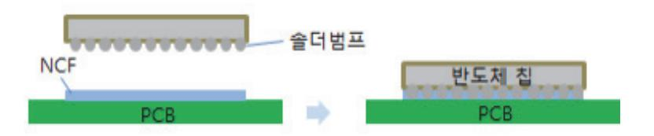

출처: 집필진 제작(2024)

[그림 3-1] NCF(Non Conductive Film)을 사용한 몰딩 공정

- (3) NCF를 사용하여 공정을 진행할 경우 칩을 하나씩 쌓으면서 공정을 진행하므로 칩이 휘는 웨 이퍼 휨 현상이 적고 칩간 정렬이 틀어지는 문제점이 적다.
- 2. 필름형 언더필 방식 특성
  - (1) NCF를 사용하는 경우 다이별로 공정을 진행하므로 필름이 놓고 다시 경화되는 시간이 10초 정도 필요하므로 생산성이 떨어질 수 있고, 필름이 범프 사이 공간을 고르게 채우지 못해서 기공이 발생하면서 방열 특성이 떨어질 수 있다.
  - (2) TC 본딩은 온도를 신속하게 올렸다가 접합 후에 빠르게 냉각시키는 정밀한 온도 제어 기술 과 솔더 범프에 일정한 온도와 압력을 전달하는 기술이 필요하다.
  - (3) 최근에는 필름 두께를 10μm 수준으로 줄여서 칩 간 피치를 줄이는 것이 가능해지면서 HBM의 적층 단수 확대가 용이해졌다.
  - (4) NCF의 경우 소재의 물성 변화가 크기 때문에 물성을 균일하게 유지하는 것이 필요하고, 필 름 형태를 가지고 있어서 열과 압력으로 녹일 때 필름이 다이의 바깥 부분으로 나오는 필렛 현상으로 제품의 신뢰성이 떨어질 수 있다.
  - (5) 필름이 녹으면서 다이가 같이 미끄러지는 슬립 현상이 발생하면서 범프 균열이 발생할 가능 성이 있다.

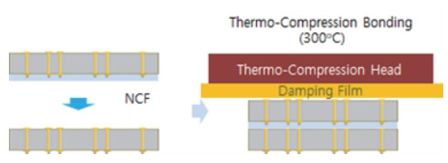

출처: 집필진 제작(2024) [그림 3-2] NCF(Non Conductive Film)을 이용한 HBM 공정

## 수행 내용 / 사전 적용 언더필 패키지 파악하기

## 재료·자료

- 언더필 재료
- NCP(Non-Conductive Paste)
- NCF(Non-Conductive Film)
- 기기(장비 ・ 공구)
  - 해당 사항 없음.
- 안전 ・ 유의 사항
  - NCP, NCF 재료의 보관 조건과 사용 조건을 파악하여 언더필 공정 진행 후 언더필 특성이 잘 유지될 수 있어야 한다.

수행 순서

- 숔 사전 적용 언더필 패키지 공정인 NCP, NCF를 이용해서 범프 사이를 채우는 공정인 언더필 공정을 진행한다.
  - 1. NCP를 사용해 사전 언더필 공정으로 다이 접합부를 채운다.
    - (1) 칩 수준에서 사전 적용 언더필을 하는 경우는 접합 부분을 비전도성 페이스트(NCP: Non-Conductive Paste)로 접합부를 채우는 경우에는 NCP를 적용한다.
    - (2) 비전도성 페이스트인 NCP 공정은 사전 적용 언더필 공정으로 사전에 NCP를 도포한 후에 다이를 올려놓는 방식으로 언더필을 진행한다.

- 2. NCP는 범프 밀도가 높은 I/O에서 캐필러리 언더필 대신 사용하며, 응력 대비 범프 보호와 신뢰 성을 제공한다.
  - (1) 비전도성 페이스트 NCP는 I/O가 많을 때 구리(Cu) 필러 기술로 범프 밀도를 높이면 캐필러리 언더필 공정의 경우 좁은 간격에 언더필을 기공없이 하는 것이 어려워질 수 있다.
  - (2) 사전 도포형 비전도성 페이스트(NCP)는 응력에 대비한 범프 보호 기능을 갖추고 있어 신뢰성이 우수하다.
  - (3) 낮은 점도의 NCP는 고건전성 솔더 조인트 형성에 필요한 유동성, 대량 생산을 위한 빠른 경화 기능, 높은 유리 전이 온도(TG)를 제공하여 신뢰성을 높일 수 있다.
- 3. NCF는 웨이퍼 단위 사전 언더필 공정으로 사용하며 다이 아래에 필름을 배치해 언더필을 진행한 다.
  - (1) 비전도성 필름(Non-Conductive Film, NCF)으로 채우는 NCF를 적용한다.
  - (2) 웨이퍼 단위로 언더필 재료를 사전에 적용할 때는 주로 필름 타입(NCF)을 사용한다.
  - (3) 비전도성 필름인 NCF 공정은 사전 적용 언더필 공정으로 사전에 NCF를 접한 시킨 후에 다이를 올려놓는 방식으로 언더필을 진행한다.
- 4. 언더필 재료는 충진성, 계면 접착력, 내열성 등을 만족하고 기공 형성을 방지하며 공정을 수행한 다.
  - (1) 공정에서 사용되는 재료는 초미세 피치, 낮은 범프 높이의 채워지는 공간에서의 충진성, 계면 접착력, 열팽창 계수, 열전도도, 내열성 등의 필요한 특성을 만족할 수 있어야 한다.
  - (2) 공정 과정에서 기공이 형성되는 경우 온도 변화에 의한 열 하중과 외부의 충격 하중에 취약할 수 있으며 방열 특성이 상대적으로 저하될 수 있으므로 언더필 공정이 잘 진행될 수 있도록 재료의 특성을 파악하고 공정을 진행해야 한다.
- 5. NCF는 3D TSV 스태킹과 초미세 피치 Cu 필러 기술이 적용된 고대역폭 메모리에서 사전 도포 형 재료로 사용된다.
  - (1) 비전도성 필름 NCF은 3D TSV 스태킹 기술이 성장하고 있다.
  - (2) 초미세 피치 Cu 필러 기술이 적용되는 고대역폭 메모리 분야에서는 NCF가 두께 100µm 미만의 다이를 위한 사전 도포형 재료로 부상하고 있다.
  - (3) 웨이퍼 수준에서 적용되는 NCF는 우수한 범프 보호 기능을 제공하여 웨이퍼에 사용한다.

숕 니들 접촉 디스펜서 방식을 진행한다.

1. 니들 접촉 디스펜서를 통해 도포액을 정밀하게 토출한다.

45

- (1) 니들 접촉 디스펜서는 액체 정밀 제어 기술을 통해서 원하는 양의 도포액을 토출하는 장치이다.
- (2) 반도체 제조에서 디스펜서는 도포액의 공급을 정밀하게 제어할 수 있도록 한다.
- 2. 반도체 제조에서 언더필, 솔더 페이스트 등 다양한 소재를 정밀하게 도포한다.
  - (1) 반도체 제조에서는 언더필 소재, 몰딩 소재, 표면 실장용 솔더 페이스트, EMI 실링제 등을 도포하는데 디스펜싱 시스템을 사용한다.
  - (2) 디스펜싱 시스템은 위치 정밀도와 토출 용량에서 매우 정교한 정밀도를 고려하여 작업을 수행한다.
- 3. 미세 피치 반도체 제품에 맞는 디스펜서를 사용해 언더필과 솔더 페이스트를 정밀하게 토출한다. 플립 칩, CSP(Chip Scale Package), BGA(Ball Grid Array), WLP(Wafer Level Package)와 같은 미세피치의 선폭을 가지는 반도체 제품의 경우에는 미세한 패턴으로 언더필, 전도성 접착제, 솔더 페이스트를 토출할 수 있는 디스펜서의 역할이 매우 중요하므로 디스펜서의 특성을 잘 이해하고 작업을 수행한다.
- 4. 니들 직경을 선택해 재료 특성에 맞춰 디스펜서를 활용하여 정확하게 도포한다. 솔더페이 디스펜서는 도포하는 재료의 특성에 따라 니들 접촉 디스펜서는 주사기 같은 토 출 밸브를 통해서 원하는 위치에 토출하기 때문에 밸브 어셈블리의 활용성이 높다. 전형적인 니들 기반 시스템은 분출 도트의 크기 변화를 위해서 니들의 지름을 적절하게 선 택하여 작업을 수행한다.
- 숖 젯팅 디스펜서 방식을 진행한다.
  - 1. 젯팅 디스펜서 방식으로 대상물에 비접촉 도포하며 도트 크기를 조절한다. 디스펜싱을 하고자 하는 대상물에 접촉하지 않고 도포액을 제트 방식을 통해서 비접촉으로 도포하는 방식을 젯팅 디스펜서 방식이라고 한다. 젯팅 디스펜싱 방식은 연속해서 에폭시를 여러 번 분사하여 도트의 크기를 변화시킬 수 있다.
  - 2. 멀티 니들 헤드를 사용해 공정 시간을 단축한다. 멀티 니들 디스펜서 헤드를 사용하거나 니들을 교체하는 공정 시간을 줄일 수 있는 장점이 있다.
  - 3. 비접촉 방식으로 x, y축 방향 최대 속도로 일정한 토출량을 유지하며 작업을 수행한다. 비접촉이라는 장점이 있는 젯팅 디스펜스 시스템은 토출 밸브의 상하 운동 없이 정정 높이 에서 도트를 발사하여 일정한 형태의 토출 양을 얻을 수 있다. 상하 운동이 없으므로 x, y 축 방향의 최대 속도로 이동하면서 디스펜싱 작업을 수행할 수 있다.
  - 4. 초고속 마이크로 디스펜싱 기술로 작업 시간을 단축하고 생산성을 높인다. 반도체 패키지와 SMT 공정용 디스펜서는 초고속 마이크로 디스펜싱 기술이 핵심 경쟁력으

로 빠른 작업 시간과 정량 토출 성능을 가진 디스펜서가 매우 중요하다. 빠른 작업 시간과 낮은 불량률, 작업의 정확성은 생산 라인의 효율성과 생산성을 높이는 데 직결되는 매우 중 요한 요소이다.

- 5. 젯팅 디스펜서로 조밀한 부품 간섭 없이 언더필을 토출한다. 언더필 공정에서 사용하는 젯팅 디스펜서는 언더필을 부품보다 높은 위치에서 토출하므로 부품과 부품이 조밀하게 배치한는 경우에 부품의 간섭없이 디스펜싱을 할 수 있다.
- 6. 젯팅 디스펜서는 금속 성분 용액 사용 시 막힘과 정밀도 저하를 주의한다. 젯팅 디스펜서는 토출하기 위해 수직 운동을 할 필요가 없어서 시간을 단축할 수 있고, 젯 팅 디스펜싱 방식은 분출 용체의 특성에 따라 작업이 어려운 경우가 있는데 금속 성분이 함유된 용액을 적용하면 막힘이나 정밀도 저하 등이 발생할 수 있다.
- 7. 제팅 방식으로 빠르게 작업한다. 젯팅 방식의 디스펜서는 흐름 속도가 빨라 가공성이 매우 뛰어난 재료 사용이 가능하며, 범 프 높이가 극도로 낮은 하단의 부품 공간을 채워야 할 때 유용하게 사용할 수 있다.
- 8. 초미세 피치용 언더필은 낮은 점도와 빠른 경화로 공극을 최소화하고, 경화 후 높은 방열성과 내 습성을 확보한다.

초미세 피치용 언더필 소재가 가져야 할 특성으로는, 경화되기 전에는 점도가 낮고 흐름성 이 뛰어나 공정 시간을 단축하고 공극 현상을 최소화하고, 경화 시간이 짧아야 하며, 경화 된 후에는 적절한 유리 전이 온도와 높은 방열 특성 및 내습성을 가질 수 있도록 장치의 신뢰성을 확보하면서 작업을 수행한다.

숗 필름형 언더필 방식을 진행한다.

- 1. NCF(Non-Conductive Film) 방식으로 다이 적층 시 열과 압력으로 솔더 접합과 언더필을 동시 에 진행한다. 필름형 언더필 소재를 사용하는 NCF 방식은 다이 위에 NCF를 올려 놓고, 그 위에 다른 다이를 올려 놓은 후 TC 본더를 사용해서 열과 압력을 칩 전면에 가해 주면 NCF가 열과 압력에 의해 녹게 되면서 각 다이의 솔더가 녹으면서 접합을 진행한다. 솔더 범프 간 공간은 필름이 녹아 채워지면서 언더필이 동시에 이루어질 수 있도록 한다.
- 2. NCF 공정으로 칩 적층 시 휨과 정렬 불량을 최소화한다.

NCF를 사용하여 공정을 진행할 경우 칩을 하나씩 쌓으면서 공정을 진행하므로 칩이 휘는 휨 현상이 적고 칩간 정렬이 틀어지는 문제점을 줄일 수 있도록 작업을 수행한다.

3. NCF 공정에서 물성을 균일하게 유지하고 필렛 및 슬립 현상을 방지한다.

(1) NCF의 경우 소재의 물성 변화가 크기 때문에 물성을 균일하게 유지하는 것이 필요하다.

47

- (2) 필름 형태를 가지고 있어서 열과 압력으로 녹일 때 필름이 다이의 바깥 부분으로 나오는 필렛 현상이 발생하지 않도록 한다.
- (3) 필름이 녹으면서 다이가 같이 미끌어지는 슬립 현상으로 인해서 발생할 수 있는 범프 균열에 유의한다.
- 4. TC 본딩은 온도를 신속하게 올렸다가 접합 후에 빠르게 냉각시키는 정밀한 온도제어 기술과 솔 더 범프에 일정한 온도와 압력을 전달할 수 있도록 한다.
- 5. NCF 공정을 진행한 후에 에폭시 몰딩 컴파운드(EMC)를 이용하여 몰딩 공정을 진행한다.

## 학습 3 교수·학습 방법

## 교수 방법

- 사전 적용 언더필의 원리와 방법 언더필 공정의 종류를 충분히 이해할 수 있도록 수업을 진 행한다.
- 사전 적용 언더필의 공정 진행 방법에 대해 이해하고 사전 적용 언더필 공정 장비의 구조와 각 모듈의 역할을 충분히 이해할 수 있도록 수업을 진행한다.
- 반도체 패키지의 종류에 따라 적용에 필요한 언더필의 특성을 설명한다.
- 언더필 공정 재료에 대해 이해하고, 언더필 공정을 수행하기 위해 필요한 언더필 재료의 양 과 속도를 조절하는 방법을 설명한다.
- 학습자가 준비한 보고서의 내용 및 발표 태도와 참관하는 다른 학습자의 태도도 유심히 살 펴보고 피드백해 준다.

## 학습 방법

- 사전 적용 언더필의 원리와 방법 언더필 공정의 종류에 대해 이해할 수 있도록 중요한 사항 을 정리하면서 언더필 공정을 학습한다.
- 언더필이 적용되는 반도체 패키지의 종류에 대해 찾아보고 적용되는 언더필의 종류와 특성 에 관해 파악하면서 중요 사항들을 정리한다.
- 첨단 반도체 패키지 제품에서 언더필의 역할과 중요성을 확인하고 내용을 정리하여 발표해 보고 다른 학습자의 내용과 비교한다.
- 다른 학습자의 발표 내용을 주의 깊게 듣고, 자신이 정리한 내용과 비교하면서 수정한다.

## 학습 3 평 가

## 평가 준거

• 평가자는 학습자가 학습 목표를 성공적으로 달성하였는지를 평가해야 한다.

## • 평가자는 다음 사항을 평가해야 한다.

| 학습 내용     | 학습 목표                           | 성취수준 |   |   |  |
|-----------|---------------------------------|------|---|---|--|
|           |                                 | 상    | 중 | 하 |  |
| NCP 공정 수행 | - 니들 접촉 디스펜서 방법을 패키지에 적용할 수 있다. |      |   |   |  |
|           | - 젯팅 디스펜서 방식을 패키지에 적용할 수 있다.    |      |   |   |  |
|           | - 필름형 언더필 방식을 패키지에 적용할 수 있다.    |      |   |   |  |

## 평가 방법

• 서술형 시험

|           | 평가 항목                                |   |   | 성취수준 |  |  |  |
|-----------|--------------------------------------|---|---|------|--|--|--|
| 학습 내용     |                                      | 상 | 중 | 하    |  |  |  |
| NCP 공정 수행 | - 니들 접촉 디스펜서 방법 파악 여부                |   |   |      |  |  |  |
|           | - 니들 접촉 디스펜서 공정 조건 파악 여부             |   |   |      |  |  |  |
|           | - 젯팅 디스펜서 방법의 특징과 다른 방법과 비교할 수 있는 능력 |   |   |      |  |  |  |
|           | - 젯팅 디스펜서 공정의 특성 파악 여부               |   |   |      |  |  |  |
|           | - 필름형 언더필 방식의 장점과 단점 파악 여부           |   |   |      |  |  |  |

• 구두 발표

|           |                                              | 성취수준 |   |   |  |
|-----------|----------------------------------------------|------|---|---|--|
| 학습 내용     | 평가 항목                                        | 상    | 중 | 하 |  |
| NCP 공정 수행 | - 니들 접촉 디스펜서 방법과 공정 조건을 설명할 수 있는 능력          |      |   |   |  |
|           | - 젯팅 디스펜서 방법의 특징과 다른 방법과 비교하고 설명할 수 있는 능력 |      |   |   |  |
|           | - 젯팅 디스펜서 공정의 특성을 설명할 수 있는 능력                |      |   |   |  |
|           | - 필름형 언더필 방식의 장점과 단점을 파악하고 설명할 수 있는 능력    |      |   |   |  |

## 피드백

- 1. 서술형 시험
- NCP의 개요, NCP 공정 방법, NCP의 신뢰성 확보 방법에 관한 이론 시험 평가 후 각 문제에 대한 풀이를 시행하고 보완 사항을 체크하여 설명해 준다.
- 학습자가 시험에 대한 답안을 잘 작성하였을 경우에는 NCP 기술에 대한 심화 학습을 시행한다.
- 학습자의 평가 결과 일정 점수 이하는 NCP 공정에 대한 보충 학습을 시행하여 쉽게 이해할 수 있도록 설명해 주고 재평가한다.
- 2. 구두 발표
- NCP의 개요, NCP 공정 방법, NCP의 신뢰성 확보 방법에 대한 구두 발표를 시행한 후 주요 사 항을 체크하여 피드백해 준다.
- NCP 관련한 구두 발표가 잘 진행한 학습자에게는 NCP에 관한 심화 학습을 시행한다.
- NCP 관련한 구두 발표가 잘 진행하지 못한 학습자에게는 NCP 공정에 대한 보충 학습을 시행하 여 쉽게 이해할 수 있도록 추가 설명을 해 주고 재평가한다.

| 학습 1 | 캐필러리 언더필 패키지 진행하기   |
|------|---------------------|
| 학습 2 | 몰드 언더필 패키지 진행하기     |
| 학습 3 | 사전 적용 언더필 패키지 진행하기  |
| 학습 4 | 웨이퍼 레벨 언더필 패키지 진행하기 |

## 4-1. 웨이퍼 레벨 언더필 공정 수행

|  | • 웨이퍼에 일체형으로 언더필하는 방법을 패키지에 적용할 수 있다. |  |  |  |  |  |
|--|---------------------------------------|--|--|--|--|--|
|--|---------------------------------------|--|--|--|--|--|

- 웨이퍼 전체를 일시에 덮는 형태의 언더필 방법을 패키지에 적용할 수 있다.
  - 웨이퍼 전체를 덮는 기술의 평탄화 방법을 포함하여 패키지에 적용할 수 있다.

## 필요 지식 /

학습 목표

- 숔 웨이퍼 레벨 패키지(WLP: Wafer Level Package)
  - 1. 웨이퍼 레벨 패키지 개요
    - (1) 웨이퍼 레벨 패키지는 웨이퍼 상태에서 패키징 공정을 모두 완료한 후 웨이퍼에 있는 칩을 절단하는 패키지로, 패키지 공정 전체를 웨이퍼 레벨로 진행한 패키지이다.
    - (2) WLP은 반도체의 성능, 크기, 전력 소모 부문에서 다른 패키징 방식에 비해 장점이 있어서 스마트폰에서 사용하는 부품에 많이 사용하고 있다.
    - (3) 스마트폰의 성능을 좋게 하고, 두께를 얇게 하고, 배터리 사용 시간을 길게 할 수 있어서 스 마트폰에서 사용되는 애플리케이션 프로세서인 AP를 포함하는 다양한 반도체를 WLP 방식으 로 패키징하여 사용한다.
  - 2. 웨이퍼 레벨 패키지 특징
    - (1) 웨이퍼 레벨 패키지 특징은 필름 형태의 언더필 재료를 사용하여 기판에 실장된 후에 칩과 기판을 연결하는 범프의 물리적 강도를 향상하고 각 재료의 열팽창 계수 차이에 따라 발생하 는 열응력으로부터 반도체를 보호하는 역할을 한다.
    - (2) 웨이퍼 전체를 NCF로 붙인 후 링에 부착된 다이싱 테이프에 웨이퍼를 올려놓은 후 다이싱 공정을 진행한다.
    - (3) 다이싱 공정 완료 후에 NCF가 붙어 있는 WLP를 기판에 본딩하고 TC(Thermo Compression) 본딩이나 리플로 공정을 진행하면 범프와 NCF가 칩과 기판을 본딩하면서 언더필 공정이 완료된다.

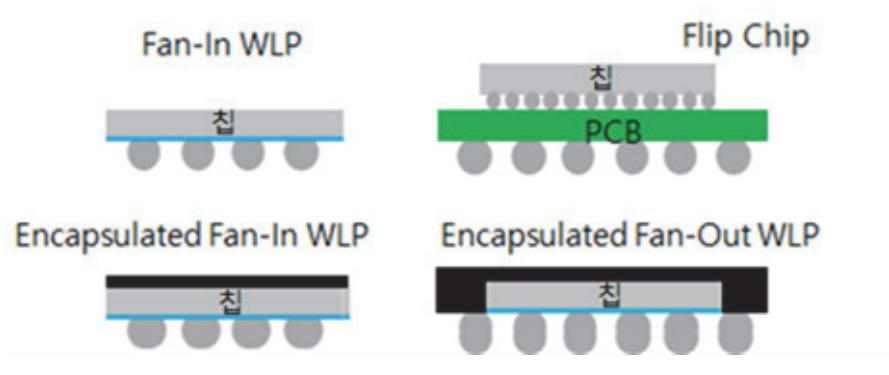

출처: 집필진 제작(2024) [그림 4-1] 팬인 WLP vs 플립 칩, 몰딩 팬인 WLP vs 팬 아웃 WLP

- (4) WLP는 패키지 크기와 다이 크기가 동일한 크기이므로 진정한 차원에서 칩 스케일 패키지 (CSP) 기술이라고 할 수 있다. 웨이퍼 레벨 패키징 방식으로 진행하면 반도체 웨이퍼 제조 후에 패키징, 테스트, 번인을 웨이퍼 레벨에서 진행하므로 PCB 설계와 제조에 필요한 기간 이 필요하지 않아서 반도체 제조 공정을 간소화할 수 있는 장점이 있다.
- 2. WLP 장점
  - (1) WLP는 웨이퍼 위에 바로 패키지용 배선과 절연층, 솔더 볼을 형성한 패키지로 컨벤셔널 패 키지와 비교하면 다양한 장점과 단점이 있다.
  - (2) WLP는 칩의 크기가 그대로 패키지 크기이므로 가장 작은 크기의 패키지 구현이 가능하다. 서브 스트레이트와 같은 매개체 없이 솔더 볼이 칩 위에 바로 붙기 때문에 전기적 전달 경로 가 상대적으로 짧아서 전기적 특성이 향상된다.
  - (3) 서브 스트레이트와 와이어 등의 패키지 재료를 사용하지 않고, 웨이퍼 단위에서 일괄적으로 공정이 진행되므로 웨이퍼에 칩 수, 네트 다이(Net Die) 수가 많고, 수율이 높은 경우엔 저 비용으로 공정이 가능하다.
- 3. WLP 단점
  - (1) WLP는 실리콘 Si 칩이 그대로 패키지이므로 패키지의 물리·화학적 보호 기능이 약하다. 패 키지가 Si 자체이므로, 패키지가 붙을 PCB 기판과 열팽창 계수 차이가 크다. 따라서 둘 사 이를 연결하는 솔더 볼에 더 많은 응력이 가해지므로 솔더 조인트 신뢰성이 상대적으로 취약 하다.
  - (2) 열팽창 계수(Coefficient of Thermal Expansion)는 온도의 변화에 따른 물체의 부피가 늘 어나는 정도를 의미하며, 보통 팽창이나 수축이 온도 증가나 감소와 선형적인 관계를 이루기 때문에 열팽창 계수(CTE)라고 한다. 솔더 조인트 신뢰성(Solder Joint Reliability)는 반도체 패키지와 PCB 기판을 솔더로 연결할 때, 패키지를 사용하는 동안 이 접합부가 본래의 역할 인 기계·전기적 연결을 제대로 할 수 있는지 보장해 주는 것을 의미한다.
  - (3) 메모리의 경우 용량이 같더라도 새로운 기술로 칩을 개발하면 칩 크기가 달라지며 이에 따라

팬인 WLP의 패키지 크기도 달라지므로 기존의 패키지 테스트 인프라(Infra)를 이용하지 못 한다. 또 패키지 볼 배열이 칩 크기보다 큰 경우에는 솔더 볼 배열을 패키지에 만들지 못하 여 아예 패키지가 불가능하다. 웨이퍼의 칩 수가 적고, 수율이 낮은 경우엔 컨벤셔널 패키지 비용보다 패키지 비용이 더 커진다.

- 4. 팬 아웃 웨이퍼 레벨 패키지
  - (1) 웨이퍼 레벨 패키지는 팬인(Fan-in)과 팬 아웃(Fan-out)의 2가지 종류로 구분할 수 있다.
  - (2) 팬 아웃은 팬인의 장점을 가지면서 동시에 단점을 극복할 수 있는 WLP 기술이다. 팬(Fan)은 칩 크기를 의미한다. 칩 크기 안에 패키지용 솔더 볼이 다 구현된 것이 팬인 WLP인 것이고, 패키지용 솔더 볼이 팬 밖에도 구현된 것이 팬 아웃 WLP이다. WLP는 웨이퍼 위에 바로 배선과 솔더 볼을 부착하는 팬인(Fan-in) WLP와 칩을 재배열하여 몰 딩 웨이퍼로 만들어 칩 크기보다 큰 패키지에 웨이퍼 레벨 공정으로 배선을 형성하여 솔더 볼을 부착하는 팬 아웃(Fan-out) WLP로 분류할 수 있다.
  - (3) 팬인 WLP 패키지에는 다이와 동일한 크기이며, 팬 아웃 WLP 패키지는 입출력 단자의 수 를 늘리기 위해 다이의 외부를 EMC로 확장한 후 재배선과 범프를 형성한 패키지 형태이다.

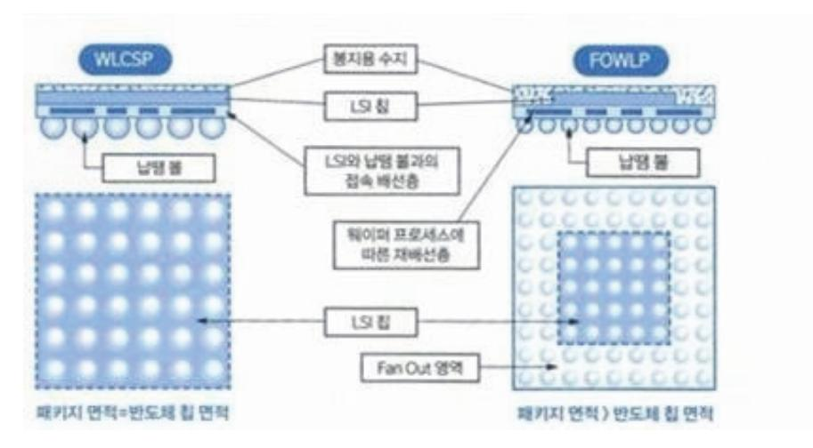

출처: 니시쿠보 야스히코 저(2023). 『반도체 구조 원리 교과서』. 보누스. p.229. [그림 4-2] WLCSP(Fan-in WLP), FOWLP(Fan-out WLP) 비교

(4) 팬인 WLP는 웨이퍼를 공정 중간에 자르지 않고 패키지 공정이 다 완료된 다음에 자른다. 이 때문에 칩 크기와 패키지 크기가 같을 수밖에 없고, 솔더 볼도 칩 크기 안에서 구현될 수 밖에 없다. 반면에 팬 아웃 WLP는 패키지 공정 전에 먼저 칩을 자르고, 잘린 칩들을 캐리 어(Carrier)에 배열하여 웨이퍼 형태를 다시 만든다. 이때 칩과 칩 사이는 EMC를 채워서 웨 이퍼 형태로 만든다. 이렇게 만든 웨이퍼를 캐리어에서 떼어내고, 그 위에 재배선 공정과 범 프 형성 공정을 진행한 후 절단하여 개별화된 팬 아웃 WLP를 완성한다.

- (5) 팬 아웃 WLP는 전기적 특성이 좋은 팬인 WLP의 장점은 그대로 가져간다. 그리고 WLP의 단점인 기존의 패키지 테스트 인프라를 사용할 수 없는 점, 패키지 볼 배열이 칩 크기보다 커지면 패키지를 만들 수 없는 점, 불량인 칩들도 패키지 해야 해서 공정 비용이 증가하는 점 등을 모두 극복할 수 있는 장점이 있는 패키지이다.
- (6) 팬 아웃 WLP는 먼저 칩을 자른 후에 공정을 진행한다. 따라서 웨이퍼 테스트에서 양품으로 판정된 칩만을 캐리어에 배열하여 불량품까지 패키지 공정을 진행하는 일은 없다. 팬 아웃 WLP는 칩을 재배열할 때 간격을 크게 하면 패키지 크기가 커지고, 작게 하면 패키지 크기 가 작아진다. 칩 간의 간격을 조절해 원하는 대로 패키지 크기를 조절할 수 있기 때문에 기 존의 패키지 테스트 인프라를 활용할 수 있게 패키지 크기를 조절할 수 있고, 원하는 패키지 볼 배열을 구현하기도 쉽다. 이러한 팬 아웃 WLP의 장점 때문에 최근에는 그 적용 범위가 커지고 있다.
- (7) 언더필 공정에서 웨이퍼의 앞면과 뒷면 사이에 응력 불균형이 있을 때 발생하는 웨이퍼 휨 현상을 줄이는 것이 필요하다. 웨이퍼 휨을 줄이기 위해서는 전체적으로 결함 없이 일관되게 공백을 채우는 것이 중요하다. 칩과 칩 사이의 30μm 수준의 공간을 기공 없이 채울 수 있 는 재료를 개발하고 공정 기술을 확보하는 것이 매우 중요하다.

<표 4-1> 언더필 방식에 의한 분류

| 방식     | Post-dispensing          | Pre-applied                      |             |  |  |
|--------|--------------------------|----------------------------------|-------------|--|--|
|        | CUF(Capillary Underfill) | NCP B-Stagable NUF            | NCF         |  |  |
|        | 디스펜싱                     | 디스펜싱 디스펜싱                     |             |  |  |
| 적용 방법  | 공기 제트(Jet) 진공      | 공기 제트(Jet) 공기 스프레이      | 회전 라미네이션 |  |  |
| 적용     | 다이 접착 기판                 | 기판                               | 기판 or 웨이퍼   |  |  |
| 플럭스 공정 | 필요                       | 필요 없음.                           |             |  |  |
| 다이 접합  | Mass reflow or TCB       | TCB(Thermal Compression Bonding) |             |  |  |

#### 숕 웨이퍼에 일체형으로 언더필하는 방법

- 1. 웨이퍼에 일체형으로 언더필 하는 방식
  - (1) 웨이퍼 레벨 언더필은 지속해서 다양하게 사용되고 있다. Non-Conductive Film(NCF)가 웨이퍼에 접착이 되는 방식으로 적용된다. NCF는 일정한 두께를 갖도록 하고 B-스테이지 (Stage) 상태로 만들게 된다.

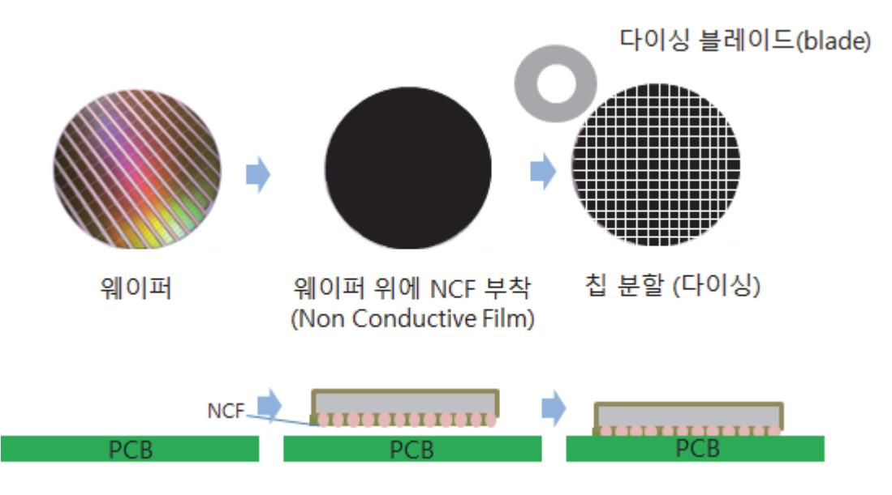

출처: 집필진 제작(2024) [그림 4-3] NCF를 웨이퍼에 부착하고 다이싱하는 방식

- (2) 에폭시와 경화제를 혼합하여 경화되는 단계는 3단계로 구분을 한다. A-스테이지는 주재료와 경화제가 바로 혼합된 상태로 반응이 시작하기 전의 상태이다. B-스테이지는 주재료와 경화 제가 만나 반응을 시작하여 고분자로 형성되는 경화 전까지의 상태이며 반경화 상태라고 한 다. C-스테이지는 주재료와 경화제가 완전하게 반응하여 경화 상태를 의미한다.
- (3) 주재료와 경화제를 혼합하는 열경화성 재료는 위와 언급한 3단계로 구분할 수 있으며 B-스 테이지를 이용해서 다향한 성형물을 만들 수 있다. 특정 물질에 에폭시를 결합한 후 중온이 나 고온에서 반경화를 하여 냉각하면 상온에서 고체인 상태가 되는데, 이 물질을 저온에서 보관하면 장기간 보관이 가능하며 필요에 따라 고온에서 압축 하중(TC-본딩)을 하면 원하는 제품을 만들 수 있다. 에폭시를 비롯한 대부분의 열경화성 수지를 반경화 상태(B-스테이지) 로 만들어서 활용하고 있다.
- (4) NCF가 웨이퍼 전체 면에 잘 접착되도록 하고 이후에 진행하는 칩을 분리하는 다이싱 공정에 서 치핑이나 균열과 같은 손상이 생기지 않도록 NCF의 특성을 확보하는 것이 중요하다. 다 이싱 공정 후에 WLP를 기판에 접착할 때는 열 압착 본딩 방식으로 진행한다.
- 2. Over Bump Applied Resin(OBAR) 웨이퍼 레벨 언더필 방식
  - (1) OBAR은 스핀 코팅 방식을 이용해서 범프 위에 언더필 물질을 덮는다. 스핀 코팅 방식은 반 도체 공정에서 일반적으로 사용되는 방식이어서 수월하게 사용할 수 있고 진공 상태에서 진 행되는 필름을 사용하는 접착 방식보다 비용이 적게 드는 공정이라고 할 수 있다.
  - (2) 스핀 코팅 방식은 액체 상태의 재료로 스핀 코팅 과정에서 사용하지 못하고 버려지는 재료가 많고 버려지는 재료를 모으는 시스템이 필요하다는 단점이 있다. 얇고 균일한 두께를 확보하 기 위해서는 점성이 낮은 재료가 필요하고 B-스테이지의 단계가 필수적이다.

- (3) NCF의 경우에는 수명이 길고, 진공 상태에서 진행되기 때문에 범프 분포의 영향을 덜 받는 장점을 가지고 있다. B 스테이지 단계가 불필요하고 재료 낭비가 적은 장점이 있다.
- (4) 스핀 코팅을 한 이후에 웨이퍼 레벨 언더필은 다음 공정인 다이싱 공정을 진행하기 위해 부 분적으로 경화(cure)를 진행하는 B-stage 경화 상태를 유지한다. 최종 공정은 열 압착 공정 인 TC(Thermo Compression) 본딩 공정이다.
- (5) 웨이퍼 레벨 언더필 공정에서 플럭스를 도포하고 리플로 공정 완료 후에 제거하는 크리닝 공 정은 진행되지 않는다. 언더필 재료에 플럭스 성분이 포함되어 있다. 리플로 공정은 범프를 접합시키면서 언더필 재료가 경화되면서 범프가 형성된 다이를 외부 충격에서 보호하는 기능 을 할 수 있도록 한다.
- (6) OBAR와 NCF 방식 모두 TC 본딩 방식은 필수적으로 적용이 된다.
- 숗 웨이퍼 전체를 덮는 기술의 평탄화 방법
  - 1. CMP(Chemical Mechanical Polishing) 공정 Metal CMP은 금속 배선 공정 후 평탄화에 적용된다. 금속 평탄화를 위해서는 금속 슬러

리가 필요하다. 구리(Cu)가 메인이고 알루미늄(Al)과 텅스텐(W)에도 적용된다.

- (1) 팬 아웃 웨이퍼 레벨 패키지를 구현할 때 실리콘 웨이퍼를 캐리어로 사용하여 칩을 회로 면 이 아래로 가는 형태로 일정 간격을 유지하면서 캐리어에 접합한 후 웨이퍼 전체를 몰딩한 다.
- (2) 이후에 웨이퍼를 떼어내거나 CMP(Chemical Mechanical Polishing) 공정을 통해 웨이퍼를 갈아내면서 웨이퍼를 일부 또는 전부 제거하고 재배선과 범핑 공정을 통해서 팬 아웃 패키지 를 구현한다.

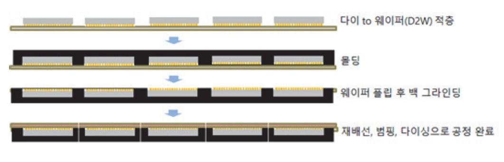

출처: 집필진 제작(2024) [그림 4-4] 반도체 칩을 웨이퍼에 D2W방식으로 접착 후 RDL 공정을 통해 FO-WLP 제조하는 흐름도

(3) 화학, 기계적으로 표면을 평평하게 만드는 공정으로 평탄화가 이루어져야 포토 공정에서 단차 문제가 해소된다. 적층 공정이 많을수록 사용량이 늘어난다.

- (4) 추가로 패키징 공정에서도 회로 배선 시 전공정 장비를 사용해 절연막, 배선 등을 형성하게 되면서 수요가 늘었다. 웨이퍼 두께가 얇아질수록 연마(CMP) 공정은 필수 공정이 되고 있으 며, 웨이퍼 두께에 따라 Dicing/연삭(그라인딩) 공정 순서가 바뀌기도 한다.
- (5) CMP 장비는 연마 장치, 세정 장치, 슬러리 공급 장치, 폐액 처리 장치, 공정 모니터로 구성 된다. CMP 장비는 버핑/산화물/금속 CMP 3가지로 분류되고 기술 난이도는 버핑 < 산화물 < 금속 CMP 순이다. 버핑 CMP는 산화물 CMP 공정 후 발생하는 흠집이나 이물질을 제거 하는 공정으로 산화물 CMP 공정이 많으면 버핑 CMP도 많아진다.
- (6) 금속 CMP가 후공정 기술 활발 등으로 수요 증가가 보장되어 있고 기술적으로도 가장 높다. Oxide CMP - 절연막 평탄화 - 소자 구분(도체~부도체 간)할 때 평탄화 작업이 진행되며 실 리카(SiO2), 세리아(CeO2)에도 적용할 수 있다.

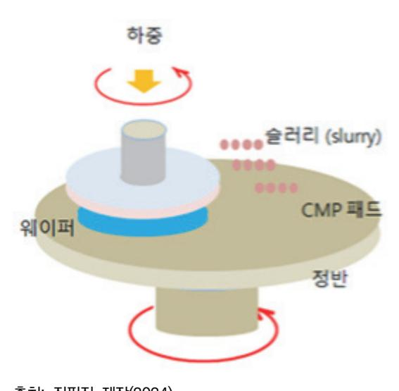

출처: 집필진 제작(2024) [그림 4-5] CMP 공정 메커니즘

## 수행 내용 / 웨이퍼 레벨 언더필 공정 수행하기

#### 재료·자료

- 언더필 재료
- 웨이퍼 레벨 언더필 방식에 대한 자료

## 기기(장비 ・ 공구)

- 해당 사항 없음.
- 안전 ・ 유의 사항
  - 언더필 재료의 보관 조건과 사용 조건을 파악하여 언더필 공정 진행 후 언더필 특성이 잘 유지될 수 있어야 한다.

수행 순서

- 숔 범프가 형성된 웨이퍼 전체에 언더필을 하는 Non-Conductive Film(NCF)을 부착하는 방식을 진행 한다.
  - 1. 웨이퍼 전체에 대해 NCF를 부착하는 형태로 언더필을 구현한다.
    - (1) 웨이퍼 레벨 패키지는 웨이퍼 상태에서 패키징 공정을 모두 완료한 후 웨이퍼에 있는 칩을 절단하는 패키지로, 패키지 공정 전체를 웨이퍼 레벨로 진행한 패키지이다. 웨이퍼 레벨 패키 지에 필름 형태의 언더필 재료를 사용하여 웨이퍼 전체에 부착한다.

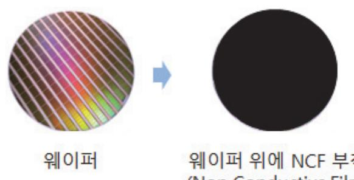

출처: 집필진 제작(2024) [그림 4-6] NCF를 웨이퍼에 부착하는 공정

(2) 웨이퍼 전체를 NCF로 붙인 후 링에 부착되어 있는 다이싱 테이프에 웨이퍼를 올려놓은 후

다이싱 공정을 진행한다. NCF가 웨이퍼에 접합이 된 상태에서 웨이퍼를 다이싱하여 칩을 개 별화한다.

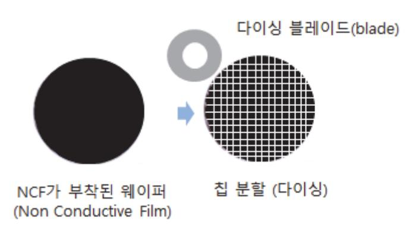

출처: 집필진 제작(2024) [그림 4-7] NCF가 부착된 웨이퍼를 다이싱하는 공정

- (3) NCF가 웨이퍼 전체 면에 잘 접착이 되도록 하고 이후에 진행하는 칩을 분리하는 다이싱 공 정에서 칩의 일부 부분이 깨지는 치핑이나 균열과 같은 손상이 생기지 않도록 한다.
- (4) 필름 형태의 언더필 재료를 사용하여 기판에 실장하는 경우 칩과 기판을 연결하는 범프의 물 리적 강도를 향상하고 각 재료의 열팽창 계수 차이에 따라 발생하는 열응력으로부터 반도체 를 보호하는 역할을 한다.
- (5) NCF의 경우에는 수명이 길고, 진공 상태에서 진행되기 때문에 범프 분포의 영향을 덜 받는 장점을 가지고 있다. B 스테이지 단계가 불필요하고 재료 낭비가 적은 장점이 있다.
- (6) B-스테이지를 이용해서 다양한 성형물을 만들 수 있다. 특정 물질에 에폭시를 결합한 후 중 온이나 고온에서 반경화하여 냉각하면 상온에서 고체인 상태가 되는데, 이 물질을 저온에서 보관하면 장기간 보관이 가능하다. 이후에 PCB에 접합하면 본 제품을 고온에서 압축하중 (TC-본딩)을 하여 제품에 접합한다. 에폭시를 비롯한 대부분의 열경화성 수지를 반경화 상태 (B-스테이지)로 만들어서 활용할 수 있다.
- (7) 에폭시와 경화제를 혼합하여 경화되는 단계는 3단계로 구분을 하는데, A-스테이지는 주재료 와 경화제가 바로 혼합된 상태로 반응이 시작하기 전의 상태이다. B-스테이지는 주재료와 경 화제가 만나 반응을 시작하여 경화 전까지의 단계이며 반경화 상태라고 한다. C-스테이지는 주재료와 경화제가 완전하게 반응하여 경화가 완료된 상태이다.
- (8) 주재료와 경화제를 혼합하는 열경화성 재료는 B-스테이지를 이용해서 다양한 제품을 만들 수 있다. 에폭시를 비롯한 대부분의 열경화성 수지를 반경화 상태인 B-스테이지로 만들어서 활용하고 있다. 특정 물질에 에폭시를 결합한 후 중온이나 고온에서 반경화하여 냉각하여 보 관한 후 사용할 때 고온에서 압축 하중(TC-본딩)을 하여 사용할 수 있다.

- (9) 웨이퍼 레벨 언더필 공정에서 플럭스를 도포하고 리플로 공정 완료 후에 제거하는 크리닝 공 정은 진행하지 않는다. 언더필 재료에 플럭스 성분이 포함되어 있으며, 리플로 공정을 통해 범프를 접합시키면서 언더필 재료가 경화되면서 범프가 형성된 다이를 외부 충격에서 보호하 는 기능을 하게 된다.
- 2. 다이싱 공정 후에 WLP를 기판에 접착할 때는 열 압착 방식(Thermo Compression, TC)으로 본딩을 진행한다.
  - (1) 다이싱 공정 완료 후에 NCF가 붙어 있는 웨이퍼 레벨 패키지를 기판에 올려놓고 TC(Thermo Compression) 본딩이나 리플로 공정을 진행하면 칩과 기판이 접합되면서 언더필 공정이 완료된다.

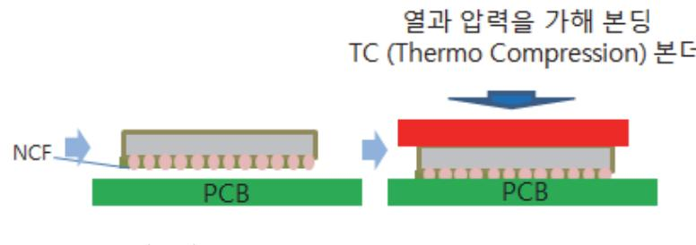

출처: 집필진 제작(2024) [그림 4-8] NCF가 부착된 칩을 PCB에 접합하는 공정

- (2) NCF의 특성에 맞게 온도 조건을 설정하고 칩이 손상되지 않는 하중 조건을 설정하여 본딩을 진행한다. 열 압착 본딩 공정을 통해서 에폭시를 경화시키면서 본딩을 완성한다.
- 숕 범프가 형성된 웨이퍼에 언더필을 하는 스핀 코팅을 통해 웨이퍼에 언더필 박막을 형성하는 방식을 진행한다.
  - 1. Over Bump Applied Resin(OBAR) 웨이퍼 레벨 언더필은 스핀 코팅 방식으로 범프 위에 언더 필 물질을 덮는다.
    - (1) OBAR은 스핀 코팅 방식을 이용해서 범프 위에 언더필 물질을 덮는다. 스핀 코팅 방식은 반 도체 공정에서 일반적으로 사용되는 방식이어서 수월하게 사용할 수 있다.

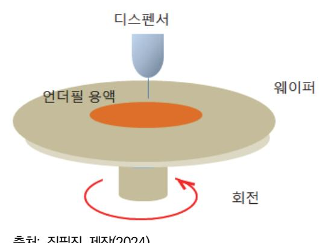

출처: 집필진 제작(2024) [그림 4-9] 스핀 코팅 방식으로 언더필 도포하는 공정

- (2) 스핀 코팅 방식은 진공 상태에서 진행되는 필름을 사용하는 접착 방식보다 비용이 적게 드는 공정이다.
- (3) 스핀 코팅 방식은 액체 상태의 재료로 스핀 코팅 과정에서 사용하지 못하고 버려지는 재료가 많고 버려지는 재료를 모으는 시스템이 필요하다. 얇고 균일한 두께를 확보하기 위해서는 점 성이 낮은 재료가 필요하고 B-스테이지 단계가 필수적이다.
- (4) 얇고 균일한 두께를 확보하기 위해서는 점성이 낮은 재료가 필요하다.
- (5) 스핀 코팅을 한 이후에 웨이퍼 레벨 언더필은 다음 공정인 다이싱 공정을 진행하기 위해 부 분적으로 경화(Cure)를 진행하는 B-stage 경화 상태를 진행한다. 최종 공정은 열 압착 공정 인 TC(Thermo Compression) 본딩 공정이다. OBAR와 NCF 방식 모두 TC 본딩 방식은 필수적으로 적용이 된다.
- (6) 웨이퍼에서 칩을 분리하는 다이싱 공정을 진행한다.
- (7) 열 압착 공정인 TC 본딩 공정을 통해 언더필을 형성하는 본딩을 완성한다. 열 압착 본딩에 서는 플럭스를 도포하고 리플로 공정 완료 후에 제거하는 클리닝 공정은 진행되지 않는다. 언더필 재료에 플럭스 성분이 포함되어 있다. OBAR와 NCF 방식 모두 TC 본딩 방식은 필 수로 적용된다.
- 숖 웨이퍼 전체를 덮는 몰딩 방식의 평탄화 공정
  - 1. 팬 아웃 웨이퍼 레벨 패키지를 구현할 때 실리콘 웨이퍼를 캐리어로 사용하여 칩을 회로 면이 아 래로 가는 형태로 일정 간격을 유지하면서 캐리어에 접합한 후 웨이퍼 전체를 몰딩한다.

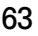

- (8) 칩을 일정 간격으로 배치하고 몰딩 공정을 진행한 후 캐리어가 제거 된 후 노출되어 있는 전 체 부분에 재배선과 범핑 공정을 통해서 팬 아웃 패키지를 구현한다.
- (7) 캐리어로 사용하는 웨이퍼를 갈아내는 방식의 경우 CMP(Chemical Mechanical Polishing) 연마 장치, 세정 장치, 슬러리 공급 장치, 폐액 처리 장치, 공정 모니터로 구성된다.
- 공정을 통해 웨이퍼를 갈아내면서 웨이퍼를 일부 또는 전부 제거한다. 화학, 기계적으로 표면 을 평평하게 만드는 공정으로 평탄화를 진행해서 칩 간에 단차가 발생하지 않도록 한다. CMP 공정은 화학적, 기계적으로 표면을 연마하여 평평하게 만드는 공정이다. CMP 장비는
- (6) 캐리어로 사용하는 웨이퍼를 갈아내는 방식의 경우 캐리어를 일정 두께로 연삭한다. 웨이퍼 두께에 따라 다이싱과 연삭(그라인딩) 공정 순서를 고려하여 진행한다.

출처: 집필진 제작(2024) [그림 4-11] 칩을 캐리어 위에 일정 간격으로 배치한 후 몰딩하고 캐리어를 분리한 상태

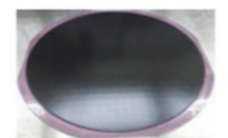

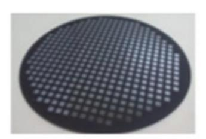

- (5) 캐리어와 몰딩된 부분을 떼어내는 방식으로 분리한다.
- (4) 칩이 배치되어 있는 캐리어 위에 몰딩 재료를 이용해서 몰딩을 진행한다.
- (3) 칩을 일정 간격을 유지하면서 캐리어 위에 캐리어 위에 배치한다.
- (2) 캐리어 위에 칩을 고정할 수 있는 접착 필름을 부착한다.
- (1) 칩을 일정 간격으로 배치할 수 있는 캐리어를 준비한다.

출처: 집필진 제작(2024) [그림 4-10] 칩을 캐리어 위에 일정 간격으로 배치한 후 몰딩하고 캐리어를 분리하는 공정

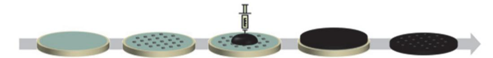

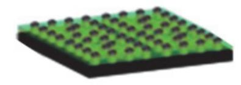

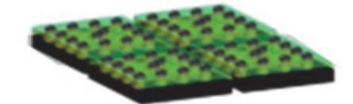

출처: 집필진 제작(2024) [그림 4-12] 웨이퍼 상태의 팬 아웃 웨이퍼 레벨 패키지 위에 재배선과 범프를 형성한 후 칩을 분리한 그 림

- (9) 팬 아웃 패키징 공정이 완료된 후에 Non-Conductive Film(NCF)을 부착하는 공정, 또는 언더필 재료를 스핀 코팅방식으로 도포하는 Over Bump Applied Resin(OBAR) 방식으로 팬 아웃 웨이퍼에 언더필 공정을 진행한다.
- (10) 팬 아웃 웨이퍼에 NCF 방식이나 OBAR 방식으로 언더필이 완료된 후 각각의 칩을 분리하 는 절단 공정을 통해서 팬 아웃 패키지 제품을 만드는 공정을 완성한다.
- 숗 팬 아웃 WLP 공정을 진행한다.
  - 1. 팬 아웃 WLP 공정의 다양한 방식을 이해한다.
    - (1) 웨이퍼 레벨 패키지는 팬인(Fan-in)과 팬 아웃(Fan-out)의 2가지 종류로 구분할 수 있다.
    - (가) 팬(Fan)은 칩 크기를 의미한다. 팬인 WLP 패키지는 다이와 동일한 크기이다. 칩 크기 안 에 입출력 단자인 솔더 볼이나 솔더 범프를 형성한다.
    - (나) 팬 아웃 WLP 패키지는 입출력 단자의 수를 늘리기 위해 다이의 외부를 EMC로 확장한 후 재배선과 범프를 형성한 패키지 형태이다. 칩의 외부로 확장된 몰딩 재료에 재배선이 이루어지고 입출력 단자를 형성한다.
    - (2) 팬 아웃 WLP는 팬인 WLP의 장점을 가지면서 단점을 극복할 수 있는 웨이퍼 레벨 패키지 기술이다. 패키지의 크기가 변하면서 기존의 패키지 테스트 인프라를 사용할 수 없는 부분, 칩 크기가 작아지면서 입출력 단자를 만들 수 있는 공간이 줄어드는 부분, 팬인 WLP의 경 우 불량 칩도 패키징하는 문제점을 극복할 수 있다.
    - (3) 팬 아웃 WLP는 칩과 칩을 일정 간격을 유지하도록 재배열하고 몰딩하여 칩의 외부에 일정 면적을 확보하고 재배선을 하여 팬인 WLP에 비해 입출력 단자의 수를 늘릴 수 있는 장점을 가지고 있다.
    - (4) 팬 아웃 WLP는 먼저 칩을 다이싱한 후에 웨이퍼 테스트에서 양품으로 판정된 칩만을 캐리 어에 배열하여 공정을 진행하는 방식이다. 팬 아웃 WLP는 칩을 재배열할 때 간격을 크게 하면 패키지 크기가 커지고, 작게 하면 패키지 크기가 작아진다. 칩 간의 간격을 조절해 원하 는 대로 패키지 크기를 조절할 수 있으므로 기존의 패키지 테스트 인프라를 활용할 수 있다.

패키지 크기를 조절할 수 있고, 원하는 패키지 볼 배열을 구현할 수 있어서 그 적용 범위가 커지고 있다.

- (5) 팬 아웃 WLP는 웨이퍼에 형성된 각각의 칩을 다이싱 공정을 통해 분리하고, 칩을 캐리어 (Carrier)에 일정 간격을 유지하도록 배열한 후 몰딩을 해서 칩과 칩 사이에 일정 공간이 있 는 웨이퍼 형태로 만든다.
- (6) 팬 아웃 WLP는 칩을 재배열할 때 간격을 크게 하면 패키지 크기가 커지고, 간격을 작게 하 면 패키지 크기가 작아진다. 칩 간의 간격을 조절해 원하는 대로 패키지 크기를 조절할 수 있다.
- (7) 팬 아웃 WLP로 제작하면 기존의 패키지 테스트 인프라를 활용할 수 있게 패키지 크기를 조 절할 수 있고, 원하는 패키지 볼 배열을 구현할 수 있다.
- (8) 언더필 공정에서 웨이퍼의 앞면과 뒷면 사이에 응력 불균형이 있을 때 발생하는 웨이퍼 휨 현상을 줄이는 것이 필요하다.
- (9) 캐리어에 칩을 일정 간격을 두고 배열하고 몰딩을 한 후에 캐리어를 떼어내거나 CMP(Chemical Mechanical Polishing) 공정을 통해 캐리어의 일부 또는 전부를 제거하고 나서 재배선과 범핑 공정을 진행해서 팬 아웃 WLP를 구현한다.
- (10) 언더필 공정에서 웨이퍼의 앞면과 뒷면 사이에 응력 불균형이 있을 때 발생하는 웨이퍼 휨 현상을 줄이는 것이 필요하다. 웨이퍼 휨을 줄이기 위해서는 전체적으로 결함 없이 일관되게 공백을 채우는 것이 중요하다. 칩과 칩 사이의 30μm 수준의 공간을 기공 없이 채울 수 있 는 재료를 개발하고 공정 기술을 확보하는 것이 매우 중요하다.
- 2. 칩 우선 (chip first) Face down 팬 아웃 WLP 방식으로 공정을 진행한다.
  - (1) 접착 필름이 부착된 캐리어에 다이의 회로 면이 아래로 향하도록 배치하고 몰딩 공정을 진행 하는 방식이 칩 우선 face down 팬 아웃 WLP 방식이다.
  - (2) 웨이퍼를 테스트하여 양품과 불량품을 선별하고 다이싱하여 칩을 개별화 시킨다.
  - (3) 다이를 일정한 간격으로 배치하기 위해 캐리어를 사용한다. 다이가 이동하거나 손상되지 않도 록 안정적으로 지지해야 한다.
  - (4) 캐리어의 표면에는 다이를 접합할 수 있도록 접착 필름을 부착한다. 접착 필름은 다이를 확 실히 고정할 수 있어야 하며, 이후 공정에서 쉽게 제거될 수 있어야 한다. 접착 필름은 캐리 어 전체에 고르게 부착한다.
  - (5) 팬 아웃 웨이퍼 레벨 패키지를 구현할 때 칩 회로 면이 아래로 가는 형태로 일정 간격을 유 지하면서 캐리어에 접합한 후 웨이퍼 전체를 몰딩한다. 몰딩을 진행할 때 다이의 위치가 달 라지지 않도록 유의한다.

출처: 집필진 제작(2024) [그림 4-13] 칩 우선 face down 방식의 팬 아웃 WLP에서 칩을 face down 해서 캐리어에 부착

- (6) 다이를 캐리어에 배치할 때, 다이의 회로 면이 아래로 향하도록 한다. 이 과정에서 다이의 위치와 방향을 정확하게 맞추는 것이 중요하다. 정밀한 정렬을 위해 자동 정렬 시스템을 사 용한다. 이 시스템은 고해상도 카메라와 정밀한 이동 메커니즘을 통해 다이의 위치를 정확하 게 조정한다.
- (7) 다이가 임시 캐리어에 배치된 후, 정렬 상태와 접착 상태를 최종적으로 확인한다. 고해상도 카메라를 사용하여 다이의 배치 상태를 검사한다. 이를 통해 미세한 위치 오차나 접착 불량 을 확인할 수 있다.
- (8) 몰딩 공정을 진행하기 위해 재배열된 다이가 있는 캐리어를 몰드에 배치한다. 몰드를 설치하 기 전에 다이와 몰드의 정렬 상태를 확인하여 다이가 정확하게 위치하도록 한다. 몰딩 재료 를 몰드 금형에 주입하여 다이와 웨이퍼 주변에 균일하게 분포되도록 주입 속도와 압력을 조 절한다. 진공 상태에서 몰딩 재료를 주입하면 기포 발생을 최소화하고, 몰딩 컴파운드가 다이 와 웨이퍼 사이의 빈 공간을 완전히 채울 수 있다.
- (9) 몰딩 재료를 주입한 후 몰딩 재료를 경화하여 다이와 캐리어를 고정한다. 경화 공정은 일정 한 온도와 시간 동안 진행되며, 몰딩 컴파운드의 기계적 강도와 열 저항성을 높인다.

출처: 집필진 제작(2024) [그림 4-14] 칩 우선 face down 방식의 팬 아웃 WLP에서 칩을 face down 해서 캐리어에 부착 후 몰딩

- (10) 몰딩 재료가 경화된 후 캐리어를 분리한다. 캐리어를 분리할 때 다이와 몰딩 재료가 손상되
  - 지 않도록 주의해야 한다.
  - (가) 캐리어와 몰딩 부분을 분리하기 위해 열을 가해 접착 특성을 약화하는 방식이 있다. 열 처리 방식은 일정 온도와 시간 동안 진행되며, 접착 필름의 특성에 따라 조절된다.
  - (나) 용매를 사용하여 접착 필름을 용해해 분리할 수 있다. 용매는 접착제와 반응하여 접착력 을 떨어뜨리고, 이를 통해 다이와 캐리어를 분리할 수 있다.
  - (다) 기계적으로 하중을 가해서 캐리어와 몰딩 부분을 정밀한 기계 장비를 사용하여 물리적으

로 분리할 수 있다. 다이에 최소한의 스트레스를 가하며, 캐리어를 안전하게 분리한다.

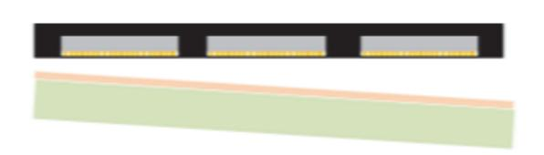

출처: 집필진 제작(2024) [그림 4-15] 칩 우선 face down 방식의 팬 아웃 WLP에서 캐리어 분리

- (10) 캐리어 분리 후, 다이와 몰딩된 웨이퍼를 검사하여 손상 여부를 확인한다. 이를 통해 다이 와 웨이퍼가 손상되지 않았는지 확인할 수 있다.
- (11) 재배선(ReDistribution Layer, RDL)을 형성한다. 재배선은 칩 위에 형성되어 있는 외부 연결 단자인 본딩 패드를 칩 전체 면적으로 확산하기 위해서 금속 배선을 원하는 위치에 형 성시키는 재배열 공정이다.
  - (가) 재배선 공정은 스포터링 공정을 통해서 웨이퍼 위에 금속 박막층을 만든다.
  - (나) 빛을 이용해서 원하는 패턴을 형성하기 위해 포토레지스트(PR: Photo Resist)를 도포한 다.
  - (다) 원하는 패턴이 만들어진 마스크를 통해 빛을 투사하는 포토 공정으로 PR 층에 패턴을 만들고, 빛을 받아서 약해진 PR를 현상액을 이용해서 제거한다.
  - (라) PR에서 패턴으로 열린 부분에 전해 도금으로 선택한 금속을 도금하여 금속 배선을 형성 한다.

출처: 집필진 제작(2024) [그림 4-16] 칩 우선 face down 방식의 팬 아웃 WLP에서 몰딩 부분에 재배선

- (12) 솔더를 형성하는 방식은 이미 만들어져 있는 솔더 볼을 부착하는 방식과 솔더 범프를 형성 하는 방식으로 구분할 수 있다.
  - (가) 솔더 볼 접합은 개별 다이와 외부 기판을 전기적으로 연결하는 역할을 하는 솔더 볼을 접합시키는 방식으로 이미 만들어져 있는 솔더 볼을 이용한다. 솔더 볼 접합은 패키지의 전기적 성능과 신뢰성을 결정하는 데 큰 영향을 끼치므로 매우 정밀하게 수행되어야 한

다.

(나) 솔더 범프는 빛을 이용해서 원하는 패턴을 형성하기 위해 포토레지스트 도포하고, 원하 는 패턴이 만들어진 마스크를 통해 빛을 투사하여 PR 층에 패턴을 만들고, 빛을 받아서 약해진 PR를 현상액을 이용해서 녹여서 PR에서 패턴으로 열린 부분에 솔더를 도금하 고, PR를 제거하고, 플럭스를 도포하고 리플로 한 후 플럭스를 세척하는 과정을 통해서 만들어 낸다.

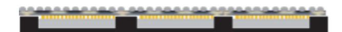

출처: 집필진 제작(2024) [그림 4-17] 칩 우선 face down 방식의 팬 아웃 WLP에서 재배선 이후 솔더 형성

- (13) 팬 아웃 WLP 위에 웨이퍼 언더필을 진행한다. Non-ductive Film이나 Over Bump Applied Resin(OBAR을 스핀 방식으로 팬 아웃 웨이퍼 위에 언더필 재료를 도포한다.
- (14) 팬 아웃 WLP 웨이퍼에 언더필 재료가 도포된 상태로 공정을 완료한 후에 개별 패키지로 절단하여 최종 제품을 완성한다.

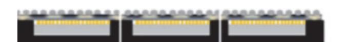

출처: 집필진 제작(2024) [그림 4-18] 칩 우선 face down 방식의 팬 아웃 WLP 절단에 의한 분리

- (15) 개별화된 팬 아웃 WLP의 상태를 검사하여 결함 여부를 확인하여 불량 제품을 선별한다. 고해상도 현미경을 사용하여 웨이퍼의 표면 상태와 재배선층(RDL)의 상태를 확인하고, 전기 적 성능을 테스트하여 정상 여부를 확인한다.
- (16) 공정이 완료된 팬 아웃 WLP를 포장한다. 포장은 패키지를 외부 충격과 환경 변화로부터 보호하는 역할을 한다. 진공 포장을 통해 패키지를 외부 환경으로부터 보호하고, 장기간 저장 할 수 있도록 한다.

#### 수행 tip

- 재료 선택: 열팽창 계수가 비슷한 재료를 사용한다..
- 표면 처리: 플라즈마 처리로 접착력을 향상한다.
- 경화 조건: 온도와 시간을 최적화한다.

- 3. 칩 우선 (chip first) Face up 팬 아웃 WLP 방식으로 공정을 진행한다.
  - (1) 칩 우선 Face up 팬 아웃 WLP 방식으로 공정을 진행하기 위해서는 웨이퍼 위에 미세한 지름인 구리 기둥을 형성하는 것이 필요하다. 구리 기둥을 형성한 후에 회로 부분이 위로 가 는 형태로 캐리어에 칩을 배치하고 몰딩을 한 후에 몰딩 부분을 구리 기둥이 드러날 때까지 그라인딩하여 몰딩 부분을 제거한 후 재배선, 솔더 형성 과정을 통해 제품을 완성한다.
  - (2) 접착 필름이 부착된 캐리어에 구리 기둥이 형성된 다이의 회로 면이 위로 향하도록 배치하고 몰딩 공정을 진행하는 방식이 칩 우선 face up 팬 아웃 WLP 방식이다.
  - (3) 웨이퍼를 테스트하여 양품과 불량품을 선별하고 다이싱하여 칩을 개별화 시킨다.
  - (4) 캐리어의 표면에는 다이가 접합될 수 있게 하도록 접착 필름을 부착한다. 접착 필름은 다이 를 확실히 고정할 수 있어야 하며, 이후 공정에서 쉽게 제거될 수 있어야 한다. 접착 필름은 케리어 전체에 고르게 부착한다.

출처: 집필진 제작(2024) [그림 4-19] 칩 우선 face up 방식의 팬 아웃 WLP에서 칩을 face up해서 캐리어에 부착

- (5) 다이를 캐리어에 배치할 때, 다이의 회로 면이 위로 향하도록 한다. 다이의 위치와 방향을 정확하게 맞추기 위해 정밀한 정렬을 위해 다이의 위치를 정확하게 조정하는 정렬 시스템을 사용한다.
- (6) 양품의 칩을 회로 면이 위로 가는 형태로 칩이 일정 간격을 유지하면서 캐리어에 접합한 후 웨이퍼 전체를 몰딩한다. 몰딩을 진행할 때 다이의 위치가 달라지지 않도록 유의한다.

|   |  |
|------|--|
|      |  |

출처: 집필진 제작(2024) [그림 4-20] 칩 우선 face up 방식의 팬 아웃 WLP에서 몰딩 공정 진행

(7) 몰딩 공정을 진행하기 위해 재배열된 다이가 있는 캐리어를 몰드에 배치한다. 몰드를 설치하 기 전에 다이와 몰드의 정렬 상태를 확인하여 다이가 정확하게 위치하도록 한다. 몰딩 재료 를 몰드 금형에 주입하여 다이와 웨이퍼 주변에 균일하게 분포되도록 주입 속도와 압력을 조

출처: 집필진 제작(2024) [그림 4-23] 칩 우선 face up 방식의 팬 아웃 WLP에서 재배선 부분 위에 솔더 형성

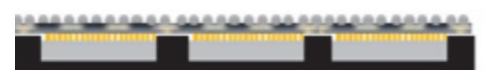

형성시킨다.

시키는 재배열 공정이다. (12) 재배선이 완료된 후 솔더 볼을 부착하는 방식이나 솔더 범프를 형성하는 방식으로 솔더를

(11) 재배선(RDL: Redistribution Layer)을 형성한다. 재배선은 칩 위에 형성되어 있는 외부 연 결 단자인 본딩 패드를 칩 전체 면적으로 확산하기 위해서 금속 배선을 원하는 위치에 형성

출처: 집필진 제작(2024) [그림 4-22] 칩 우선 face up 방식의 팬 아웃 WLP에서 CMP 공정으로 드러난 구리 기둥 면 위에 재배선

WLP를 구현한다.

절한다.

(10) CMP 공정을 통해서 구리 기둥이 드러난 웨이퍼에 재배선과 범핑 공정을 진행해서 팬 아웃

출처: 집필진 제작(2024) [그림 4-21] 칩 우선 face up 방식의 팬 아웃 WLP에서 구리 기둥이 드러날 때까지 CMP 공정 진행

(9) 몰딩 재료가 경화된 후 CMP(Chemical Mechanical Polishing) 방식으로 몰딩 부분을 웨이 퍼 위에 있는 구리 기둥(Copper Pillar)이 드러날 때까지 그라인딩한다.

(8) 몰딩 재료를 주입한 후 몰딩 재료를 경화하여 다이와 캐리어를 고정한다. 경화 공정은 일정 한 온도와 시간 동안 진행되며, 몰딩 컴파운드의 기계적 강도와 열 저항성을 높인다.

(13) 팬 아웃 WLP 위에 웨이퍼 언더필을 진행한다. Non-ductive Film이나 Over Bump Applied Resin(OBAR을 스핀 방식으로 팬 아웃 웨이퍼 위에 언더필 재료를 도포한다.

출처: 집필진 제작(2024) [그림 4-24] 칩 우선 face up 방식의 팬 아웃 WLP 솔더 형성 후 언더필 공정 진행

(14) 웨이퍼 상태로 팬 아웃 WLP 공정을 완료한 후에 개별 패키지로 절단하여 최종 제품을 완 성한다.

출처: 집필진 제작(2024) [그림 4-25] 칩 우선 face up 방식의 팬 아웃 WLP 공정 완료 후 절단 공정을 통해 개 별화 진행

- (15) 개별화된 팬 아웃 WLP의 상태를 검사하여 결함 여부를 확인하여 불량 제품을 선별한다. 고해상도 현미경을 사용하여 웨이퍼의 표면 상태와 재배선층(RDL)의 상태를 확인하고, 전기 적 성능을 테스트하여 정상 여부를 확인한다.
- (16) 공정이 완료된 팬 아웃 WLP를 포장한다. 포장은 패키지를 외부 충격과 환경 변화로부터 보호하는 역할을 한다. 진공 포장을 통해 패키지를 외부 환경으로부터 보호하고, 장기간 저장 할 수 있도록 한다.

수행 tip

- 웨이퍼에 구리 기둥 제작 후 공정 진행
- 몰딩 후 CMP 진행: 몰딩 후 웨이퍼의 구리 기둥이 나타 날 때까지 그라인딩 공정 진행.
- 웨이퍼의 회로 면이 손상되지 않도록 정교하게 CMP 진

- 4. 칩 나중 (chip last) Face down 팬 아웃 WLP 방식으로 공정을 진행한다.
  - (1) 칩 나중 팬 아웃 WLP는 재배선을 먼저하고 칩을 재배선된 패드에 접합시키는 방식이다. 캐 리어에 재배선(ReDistribution Layer, RDL)을 한 후 양품의 칩을 회로 면이 아래로 가도록 하여 캐리어의 재배선 패드 위치에 위치시킨다.
  - (2) 팬 아웃 WLP에서는 칩의 외부에 몰딩 재료를 형성하여 입출력 단자를 만들 수 있는 면적을 늘리는 방식이다. 제작할 칩과 몰딩 재료의 크기를 고려해서 캐리어 위에 재배선을 진행하며 칩이 재배선이 형성된 부분에 부착된 후 캐리어를 분리할 때 재배선 부분은 칩 위에 접합된 상태가 된다.

출처: 집필진 제작(2024) [그림 4-26] 칩 나중 (재배선 우선) face down 방식의 팬 아웃 WLP 공정에서 캐리어 위에 재배선 형성

- (3) 팬 아웃 WLP의 크기를 반영하여 칩 위에 형성되어 있는 외부 연결 단자인 본딩 패드를 칩 전체 면적으로 확산하는 금속 배선 공정인 재배선 공정을 캐리어 위에 진행한다.
- (4) 범프가 형성되어 있는 웨이퍼를 테스트하여 양품과 불량품을 선별하고 다이싱하여 칩을 개별 화 시킨다.
- (5) 칩 회로 면이 아래로 가도록 하여 재배선이 완료된 캐리어의 정해진 위치에 정렬시킨다. 다 이의 위치와 방향을 정확하게 맞추기 위해 정밀한 정렬을 할 수 있는 시스템을 사용한다.
- (6) 칩 회로 면이 아래로 가도록 하여 재배선이 되어 있는 캐리어 전체에 칩 배치를 완료한 후에 리플로 공정을 진행해서 칩이 재배선 패드에 고정되도록 한다.

출처: 집필진 제작(2024) [그림 4-27] 팬 아웃 WLP 공정에서 재배선 완료 후 칩을 face down 해서 부착 후 리플로로 칩 고정

- (7) 리플로 공정을 통해서 칩이 캐리어에 형성된 재배선 패드에 고정되면 전체 웨이퍼에 대해서 몰딩을 진행한다. 몰딩 재료를 몰드 금형에 주입하여 다이와 웨이퍼 주변에 균일하게 분포되 도록 주입 속도와 압력을 조절한다. 칩이 재배선된 캐리어에 리플로 공정을 통해서 고정된 상태이므로 몰딩을 진행할 때 다이의 위치가 달라지지 않는다.
- (8) 몰딩 재료를 주입한 후 몰딩 재료를 경화하여 다이와 캐리어를 고정한다. 경화 공정은 일정

한 온도와 시간 동안 진행되며, 몰딩 재료의 기계적 강도와 열 저항성을 높인다.

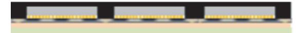

출처: 집필진 제작(2024) [그림 4-28] 팬 아웃 WLP 공정에서 칩이 부착되어 있는 캐리어 위에 몰딩

- (9) 몰딩 재료가 경화된 후 캐리어를 분리하는 캐리어 디본딩 공정을 수행한다. 캐리어는 재배선 된 부분과 분리되므로 재배선 부분은 몰딩 부분에 남아 있는 상태가 된다. 캐리어를 분리할 때 재배선 부분이 손상되지 않도록 주의해야 한다. 캐리어 디본딩은 정확하고 세심한 처리가 필요한 공정으로, 최종 패키지의 품질에 큰 영향을 미친다. 캐리어 디본딩 공정은 레이저 디 본딩, 열 디본딩, 화학 디본딩을 구분한다.
- (가) 레이저 디본딩은 레이저를 사용하여 접착제를 선택적으로 제거한다. 레이저 디본딩은 고정 밀 처리가 가능하며, 열 영향을 최소화할 수 있다. 레이저 빔을 접착제와 캐리어 경계에 정확히 맞추어 조사하여, 접착제를 연화 또는 증발시켜 캐리어를 분리한다.
- (나) 열 디본딩은 온도를 높여 접착제를 연화시켜 캐리어를 분리한다. 이 과정에서는 기판과 접착제가 손상되지 않도록 온도와 시간을 정확히 조절해야 한다.
- (다) 화학 디본딩은 화학 용제를 사용하여 접착제를 용해시켜 캐리어를 분리한다. 화학 용제는 접착제에만 반응하여 기판에 손상을 주지 않도록 선택한다.

출처: 집필진 제작(2024) [그림 4-29] 팬 아웃 WLP 공정에서 몰딩 공정 진행 후 캐리어 분리

- (10) 캐리어 분리 후, 다이와 몰딩된 웨이퍼를 검사하여 손상 여부를 확인한다. 이를 통해 다이 와 웨이퍼가 손상되지 않았는지 확인할 수 있다.
- (11) 재배선의 패드 부분에 솔더 볼을 부착하거나 솔더 범핑 공정을 이용해서 솔더를 형성한다.

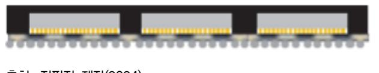

출처: 집필진 제작(2024) [그림 4-30] 팬 아웃 WLP 공정에서 솔더 형성

(12) 팬 아웃 WLP 위에 웨이퍼 언더필을 진행한다. Non-ductive Film이나 Over Bump Applied Resin(OBAR)을 스핀 방식으로 팬 아웃 웨이퍼 위에 언더필 재료를 도포한다.

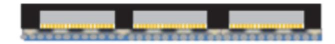

출처: 집필진 제작(2024) [그림 4-31] 팬 아웃 WLP 공정에서 언더필 도포

(13) 웨이퍼 상태로 팬 아웃 WLP 공정을 완료한 후에 개별 패키지로 절단하여 최종 제품을 완 성한다.

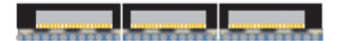

출처: 집필진 제작(2024) [그림 4-32] 팬 아웃 WLP 절단하여 개별화

- (14) 개별화된 팬 아웃 WLP의 상태를 검사하여 결함 여부를 확인하여 불량 제품을 선별한다. 고해상도 현미경을 사용하여 웨이퍼의 표면 상태와 재배선층(RDL)의 상태를 확인하고, 전기 적 성능을 테스트하여 정상 여부를 확인한다.
- (15) 공정이 완료된 팬 아웃 WLP를 포장한다. 포장은 패키지를 외부 충격과 환경 변화로부터 보호하는 역할을 한다. 진공 포장을 통해 패키지를 외부 환경으로부터 보호하고, 장기간 저장 할 수 있도록 한다.

## 수행 tip

- 캐리어에 형성된 재배선층에 칩을 배치할 때 정밀 제어 시 스템을 이용해서 배치한다.
- 재배선층의 선폭과 선과 선 간격이 미세해지면서 정밀한 제어가 중요하다. 팬 아웃 WLP 기술은 고밀도 기술(High Density), 초고밀도 기술(Ultra High Density) 기술로 발 전하고 있다.
- 칩을 재배선층에 리플로 공정을 통해 고정한 후 몰딩 공정 진행한다.

## 학습 4 교수·학습 방법

## 교수 방법

- 웨이퍼 레벨 언더필의 원리와 방법 언더필 공정의 종류를 충분히 이해할 수 있도록 수업을 진행한다.
- 웨이퍼 레벨 언더필의 공정 진행 방법, 웨이퍼 레벨 언더필 공정 장비의 구조와 각 모듈의 역할을 충분히 이해할 수 있도록 수업을 진행한다.
- NCF를 이용하는 언더필 방식과 스핀 코팅을 이용하는 언더필 방식에서의 공정 특성에 관 해 설명한다.
- 언더필 공정 재료에 대해 이해하고, 언더필 공정을 수행하는 데 필요한 언더필 재료의 특성 과 공정 방식을 설명한다.
- 학습자가 준비한 보고서의 내용 및 발표 태도와 참관하는 다른 학습자의 태도도 유심히 살 펴보고 피드백해 준다.

## 학습 방법

- 웨이퍼 레벨 언더필의 원리와 방법 언더필 공정의 종류에 대해 이해할 수 있도록 중요한 사 항을 정리하면서 언더필 공정에 대해 학습한다.
- 언더필이 적용되는 첨단 패키징 기술의 종류에 대해 알아보고 적용되는 언더필 방식에 대해 파악하면서 중요 사항들을 정리한다.
- 첨단 반도체 패키지 제품에서 언더필의 역할과 중요성을 확인하고 내용을 정리하여 발표해 보고 타 학습자의 내용과 비교한다.
- 다른 학습자의 발표 내용을 주의 깊게 듣고, 자신이 정리한 내용과 비교하면서 수정한다.

## 학습 4 평 가

## 평가 준거

• 평가자는 학습자가 학습 목표를 성공적으로 달성하였는지를 평가해야 한다.

#### • 평가자는 다음 사항을 평가해야 한다.

|                     |                                                  |   | 성취수준 |   |  |
|---------------------|--------------------------------------------------|---|------|---|--|
| 학습 내용               | 학습 목표                                            | 상 | 중    | 하 |  |
| 웨이퍼 레벨 언더필 공정 수행 | - 웨이퍼에 일체형으로 언더필 하는 방법을 패키지에 적용할 수 있다.        |   |      |   |  |
|                     | - 웨이퍼 전체를 일시에 덮는 형태의 언더필 방법을 패키지에 적용할 수 있다.   |   |      |   |  |
|                     | - 웨이퍼 전체를 덮는 기술의 평탄화 방법을 포함하여 패키지 에 적용할 수 있다. |   |      |   |  |

### 평가 방법

• 서술형 시험

|                     | 평가 항목                                                  |  | 성취수준 |   |  |
|---------------------|--------------------------------------------------------|--|------|---|--|
| 학습 내용               |                                                        |  | 중    | 하 |  |
| 웨이퍼 레벨 언더필 공정 수행 | - 웨이퍼 레벨 언더필 방식의 종류와 내용 파악 여부                          |  |      |   |  |
|                     | - Non-Conductive Film(NCF)을 이용한 웨이퍼 레벨 언더필 기술 파악 여부 |  |      |   |  |
|                     | - 스핀 코팅 방식을 이용해서 웨이퍼에 언더필 공정을 적용하 는 방식 파악 여부        |  |      |   |  |
|                     | - 팬 아웃 WLP의 다양한 공정 파악 여부                               |  |      |   |  |

### • 구두 발표

|                     |                                                           |   | 성취수준 |   |  |
|---------------------|-----------------------------------------------------------|---|------|---|--|
| 학습 내용               | 평가 항목                                                     | 상 | 중    | 하 |  |
| 웨이퍼 레벨 언더필 공정 수행 | - 웨이퍼 레벨 언더필 방식의 종류와 내용을 설명할 수 있는 능력                   |   |      |   |  |
|                     | - Non-Conductive Film을 이용한 웨이퍼 레벨 언더필 기술 을 설명할 수 있는 능력 |   |      |   |  |
|                     | - 스핀 코팅 방식을 이용해서 웨이퍼에 언더필 공정을 적용하 는 방식을 설명할 수 있는 능력    |   |      |   |  |
|                     | - 팬 아웃 WLP의 다양한 공정을 설명할 수 있는 능력                           |   |      |   |  |

## 피드백

- 1. 서술형 시험
  - 웨이퍼 레벨 언더필의 개요, 웨이퍼 레벨 언더필 공정 방법, 웨이퍼 레벨 언더필 공정 재료에 관 해 이론 시험 평가 후 각 문제에 대한 풀이를 시행하고 보완 사항을 설명해 준다.
  - 학습자가 시험에 대한 답안을 잘 작성하였을 경우에는 웨이퍼 레벨 언더필 기술에 대한 심화 학 습을 실시한다.
  - 학습자의 평가 결과 일정 점수 이하는 웨이퍼 레벨 언더필 공정에 대한 보충 학습을 실시하여 쉽 게 이해할 수 있도록 설명해 준다.
- 2. 구두 발표
- 웨이퍼 레벨 언더필의 개요, 웨이퍼 레벨 언더필 공정 방법, 웨이퍼 레벨 언더필 공정 재료에 관 해 평가한 후 해당 발표에 포함되어야 할 주요 내용에 대하여 보완 설명을 해 준다.
- 웨이퍼 레벨 언더필에 관해 구두 발표를 잘한 학습자에게는 웨이퍼 레벨 언더필에 대한 심화 학 습을 시행한다.
- 웨이퍼 레벨 언더필에 관해 구두 발표를 잘 하지 못한 학습자에게는 웨이퍼 레벨 언더필 공정에 대한 보충 학습을 실시하여 잘 이해할 수 있도록 추가 설명 후 재평가한다.

- 니시쿠보 야스히코(2023). 『반도체 구조원리 교과서』. 보누스.
- 유진투자증권(2023). 『소부장 레시피 10』.
- 윤태식・김택수(2017). 「TSV 기반 3차원 소자의 열적-기계적 신뢰성」. 『J. Microelectron. Packag. Soc.』, 24(1), 35-43.
- 자비스(2020). 『ML-FOWLP 및 3D TSV 반도체 패키지 검사 공정용 200nm급 고해상도 X-ray 검사 시스템 개발』. 산업통상자원부. 한국산업기술평가관리원.
- 조윤수(2013. 7. 9.). 반도체 수율, 공정별 불량 원인 분석에서 출발한다(https://www.epnc.co.kr/ne ws/articleView.html?idxno=12914). 전자 부품 인터넷 뉴스(EPNC).
- 중소기업청(2013). 『플립 칩 언더필(Flip Chip Underfill)』의 개발.
- IEEE(2023). HETEROGENEOUS INTEGRATION ROADMAP Chapter 23: Wafer-Level Packaging(WLP). https://eps.ieee.org/images/files/HIR\_2021/ch23-wlpfinal2.pdf.
- John H. Lau(2023). State-of-the-Art in Chiplets Horizontal Communications. Journal of Microelectronics and Electronic Packaging(2023) 20, 43–64
- ∙ Larson, C. (2022). Advanced polymer materials for electronics: High-temperature materials and their applications. Polymer Innovation Blog. Retrieved from. https://polymerinnovati onblog.com/advanced-polymer-materials-electronics.
- SK Hynix(2023. 9. 26). CMP는 무엇이고 반도체 공정에서 어떻게 활용될까?. https://news.skhynix. co.kr/post/cleaning-and-cmp-technical-manager. SK Hynix 뉴스룸.
- S. Massa, D. Shahin, I. Wathuthanthri, and A. Drechsle r(2019). Process Development for Flip Chip Bonding with Different Bump Compositions. International Wafer Level Packaging Conference(IWLPC), 1-6.

| NCS학습모듈 개발이력 |                                     |     |                  |  |  |
|--------------|-------------------------------------|-----|------------------|--|--|
| 발행일          | 2024년 12월 31일                       |     |                  |  |  |
| 세분류명         | 반도체 개발((19030601)                   |     |                  |  |  |
| 개발기관         | 수원과학대학교 산학협력단(개발책임자: 윤창용) 한국직업능력연구원 |     |                  |  |  |
|              | 최준혁(수원대학교)*                         |     | 김종범(삼성전기)        |  |  |
|              | 계찬호(수원대학교)                          |     | 김한수(두원공과대학교)     |  |  |
|              | 김경호(폴리텍대학교)                         |     | 남승호(경기대학교)       |  |  |
|              | 김관하(폴리텍대학교)                         |     | 손승대(제이에스이엔씨(주))  |  |  |
| 집필진          | 김기순((주)영우디에스피)                      | 검토진 | 안광호(퓨쳐일렉트로닉스)    |  |  |
|              | 김도균(폴리텍대학교)                         |     | 이철오((주)한국전력안전공단) |  |  |
|              | 전동민(폴리텍대학교)                         |     |                  |  |  |

\*표시는 대표집필자임 (참고) 검토진으로 참여한 집필진은 본인의 원고가 아닌 타인의 학습모듈을 검토함

|                                                                                                          | 어드밴스드 언더필 패키지 개발(LM1903060126_23v4) |  |  |  |
|----------------------------------------------------------------------------------------------------------|-------------------------------------|--|--|--|
| 저작권자                                                                                                     | 교육부                                 |  |  |  |
| 연구기관                                                                                                     | 한국직업능력연구원                           |  |  |  |
| 발행일                                                                                                      | 2024. 12. 31.                       |  |  |  |
| ISBN                                                                                                     | 979-11-7175-760-2                   |  |  |  |
| ※ 이 학습모듈은 자격기본법 시행령(제8조 국가직무능력표준의 활용)에 의거하여 개발하였으며, NCS통합포털사이트(http://www.ncs.go.kr)에서 다운로드 할 수 있습니다. |                                     |  |  |  |

