LM1903060127\_23v4

| 대분류/19 전기·전자 | 중분류/03 전자기기개발 | 소분류/06 반도체개발 |                 |         |
|-----------------|------------------|-----------------|-----------------|---------|
|                 |                  |                 | 세분류/01 반도체개발 | 능력단위/27 |

#### [NCS학습모듈 활용 시 유의 사항]

- 1. NCS학습모듈은 교육훈련기관에서 출처를 명시하고 교육적 목적으로 활용할 수 있습니다. 다 만, NCS학습모듈에는 국가(교육부)가 저작재산권 일체를 보유하지 않은 저작물(출처가 표기된 도표‧사진‧삽화‧도면 등)이 포함되어 있으므로, 이러한 저작물의 변형‧각색‧복제‧공연‧ 배포 및 공중 송신 등과 이러한 저작물을 활용한 2차적 저작물을 작성하려면 반드시 원작자 의 동의를 받아야 합니다.
- 2. NCS학습모듈은 개발 당시의 산업 및 교육 현장을 반영하여 집필하였으므로, 현재 적용되는 법령‧지침‧표준 및 교과 내용 등과 차이가 있을 수 있습니다. NCS학습모듈 활용 시 법령 ‧지침‧표준 및 교과 내용의 개정 사항과 통계의 최신성 등을 확인하시기를 바랍니다.
- 3. NCS학습모듈은 산업 현장에서 요구되는 능력을 교육훈련기관에서 학습할 수 있게 구성한 자 료입니다. 다만, NCS학습모듈 지면의 한계상 대표적 예시(예: 활용도 또는 범용성이 높은 제 품, 서비스) 중심으로 집필하였음을 이해하시기를 바랍니다.

# NCS학습모듈의 이해

※ 본 NCS학습모듈은 「NCS 국가직무능력표준」사이트(http://www.ncs.go.kr) 에서 확인 및 다운로드할 수 있습니다.

## Ⅰ NCS학습모듈이란?

- 국가직무능력표준(NCS: National Competency Standards)이란 산업현장에서 직무를 수행하기 위해 요구되는 지식·기술·소양 등의 내용을 국가가 산업부문별·수준별로 체계 화한 것으로 산업현장의 직무를 성공적으로 수행하기 위해 필요한 능력(지식, 기술, 태도) 을 국가적 차원에서 표준화한 것을 의미합니다.
- 국가직무능력표준(이하 NCS)이 현장의 '직무 요구서'라고 한다면, NCS학습모듈은 NCS
   의 능력단위를 교육훈련에서 학습할 수 있도록 구성한 '교수·학습 자료'입니다. NCS학습
   모듈은 구체적 직무를 학습할 수 있도록 이론 및 실습과 관련된 내용을 상세하게 제시하
   고 있습니다.

#### ○ NCS학습모듈은 다음과 같은 특징을 가지고 있습니다.

- 첫째, NCS학습모듈은 산업계에서 요구하는 직무능력을 교육훈련 현장에 활용할 수 있도 록 성취목표와 학습의 방향을 명확히 제시하는 가이드라인의 역할을 합니다.
- 둘째, NCS학습모듈은 특성화고, 마이스터고, 전문대학, 4년제 대학교의 교육기관 및 훈 련기관, 직장교육기관 등에서 표준교재로 활용할 수 있으며 교육과정 개편 시에도 유용하게 참고할 수 있습니다.

○ NCS와 NCS학습모듈 간의 연결 체계를 살펴보면 아래 그림과 같습니다.

O NCS학습모듈의 위치는 NCS 분류 체계에서 해당 학습모듈이 어디에 위치하는지를 한 눈에 볼 수 있도록 그림으로 제시한 것입니다.

| [NCS-학          | 습모듈     | 의 위치]    |          |  |
|-----------------|---------|----------|----------|--|
|                 |         |          |          |  |
| 대분류             | 문화·예술   | ··디자인·방송 |          |  |
| 중분류             | 문화콘텐츠   |          |          |  |
| 소분류             | 문화콘텐츠제작 |          |          |  |
|                 |         |          |          |  |
| 세분류             |         |          |          |  |
| 방송콘텐츠제작         |         | 능력단위     | 학습모듈명    |  |
| 영화콘텐츠제작         |         | 프로그램 기획  | 프로그램 기획  |  |
| 음악콘텐츠제작         |         | 아이템 선정   | 아이템 선정   |  |
| 광고콘텐츠제작         |         | 자료 조사    | 자료 조사    |  |
| 게임콘텐츠제작         |         | 프로그램 구성  | 프로그램 구성  |  |
| 애니메이션 콘텐츠제작  |         | 캐스팅      | 캐스팅      |  |
| 만화콘텐츠제작         |         | 제작계획     | 제작계획     |  |
| 캐릭터제작           |         | 방송 미술 준비 | 방송 미술 준비 |  |
| 스마트문화앱 콘텐츠제작 |         | 방송 리허설   | 방송 리허설   |  |
| 영사              |         | 야외촬영     | 야외촬영     |  |
|                 |         | 스튜디오 제작  | 스튜디오 제작  |  |
|                 |         |          |          |  |

학습모듈은

NCS 능력단위 1개당 1개의 학습모듈 개발 을 원칙으로 합니다. 그러나 필요에 따라 고용단위 및 교과단위를 고려하여 능력단위 몇 개를 묶어 1개 학습모듈로 개발할 수 있으며, NCS 능력단위 1개를 여러 개의 학습모듈로 나누어 개발할 수도 있습니다.

### 2. NCS학습모듈의 개요

#### ○ NCS학습모듈의 개요는 학습모듈이 포함하고 있는 내용을 개략적으로 설명한 것으로

| 학습모듈의 목표 , 선수학습 , 학습모듈의 내용 체계 , 핵심 용어 로 구성되어 있습니다. |                                                                              |  |
|----------------------------------------------------|------------------------------------------------------------------------------|--|
| 학습모듈의 목표                                           | 해당 NCS 능력단위의 정의를 토대로 학습 목표를 작성한 것입니다.                                        |  |
| 선수학습                                               | 해당 학습모듈에 대한 효과적인 교수·학습을 위하여 사전에 이수해야 하는 학습모 듈, 학습 내용, 관련 교과목 등을 기술한 것입니다. |  |
| 학습모듈의 내용 체계                                     | 해당 NCS 능력단위요소가 학습모듈에서 구조화된 체계를 제시한 것입니다.                                     |  |
| 핵심 용어                                              | 해당 학습모듈의 학습 내용, 수행 내용, 설비·기자재 등 가운데 핵심적인 용어를 제 시한 것입니다.                   |  |

### 제작계획 학습모듈의 개요

#### 학습모듈의 목표

본격적인 촬영을 준비하는 단계로서, 촬영 대본을 획정하고 제작 스태프를 조직하며 촬영 장비와 촬영 소품을 준비할 수 있다.

#### 선수학습

제작 준비(LM0803020105\_13v1), 섭외 및 제작스태프 구성(LM0803020104\_13v1), 촬영 제작(LM0803020106\_13v1), 촬영 장비 준비(LM0803040204\_13v1.4), 미술 디자인 협의하기(LM0803040203\_13v1.4)

#### 학습모듈의 내용체계

| 하스                | 하는 데이                                              | NCS 능력단위 요소       |                |
|-------------------|----------------------------------------------------|-------------------|----------------|
| 학습                | 학습 내용                                              | 코드번호              | 요소 명칭          |
| 1. 촬영 대본 확정하기  | 1-1. 촬영 구성안 검 토와 수정                             | 0803020114_16/3.1 | 촬영 대본 확정하기  |
| 2. 제작 스태프 조직하기 | 2-1. 기술 스태프 조직 2-2. 미술 스태프 조직 2-3. 전문 스태프 조직 | 0803020114_16v3.2 | 제작 스태프 조직하기 |
| 3. 촬영 장비 계획하기  | 3-1. 촬영 장비 점검 과 준비                              | 0803020114_16/3.3 | 촬영 장비 계획하기  |
| 4. 촬영 소품 계획하기  | 4-1. 촬영 소품 목록 작성 4-2. 촬영 소품 제작 의뢰         | 0803020114_16\3.4 | 촬영 소품 계획하기  |

#### 핵심 용어

촬영 구성안, 제작 스태프, 촬영 장비, 촬영 소품

#### 학습모듈의 목표는

학습자가 해당 학습모듈을 통해 성취해야 할 목표를 제시한 것으로, 교수자는 학습자 가 학습모듈의 전체적인 내용흐름을 파악하 도록 지도할 수 있습니다.

**6** • •

61

#### 선수학습은

교수자 또는 학습자가 해당 학습모듈을 교 수·학습하기 이전에 이수해야 하는 교과목 또는 학습모듈(NCS 능력단위) 등을 표기한 것입니다. 따라서 교수자는 학습자가 개별 학습, 자기 주도 학습, 방과 후 활동 등 다 양한 방법을 통해 이수할 수 있도록 지도하 는 것을 권장합니다.

|            | 핵심 용어는              |
|------------|---------------------|
|            | 률을 대표하는 주요 용어입니     |
|            | · 해당 학습모듈을 통해 학습    |
|            | 게될 주요 내용을 알 수 있습    |
|            | 5 국가직무능력표준」 사이트     |
| (www.ncs.g | jo.kr)의 색인 (찾아보기) 중 |
| 하나로 이용할    | 할 수 있습니다            |

### 3. NCS학습모듈의 내용 체계

○ NCS학습모듈의 내용은 크게 학습, 학습 내용, 교수·학습 방법, 평가 로 구성되어 있습니다.

| 학습       | 해당 NCS 능력단위요소 명칭을 사용하여 제시한 것입니다. 학습은 크게 학습 내용, 교수·학습 방법, 평가로 구성되며 해당 NCS 능력단위의 능력단위 요소별 지식, 기술, 태도 등을 토대로 내용을 제시한 것입니다.                                                    |
|----------|----------------------------------------------------------------------------------------------------------------------------------------------------------------------------------|
| 학습 내용    | 학습 내용은 학습 목표, 필요 지식, 수행 내용으로 구성되며, 수행 내용은 재료·자 료, 기기(장비·공구), 안전·유의 사항, 수행 순서, 수행 tip으로 구성한 것입니다. 학습모듈의 학습 내용은 실제 산업현장에서 이루어지는 업무활동을 표준화된 프로세 스에 기반하여 다양한 방식으로 반영한 것입니다. |
| 교수·학습 방법 | 학습 목표를 성취하기 위한 교수자와 학습자 간, 학습자와 학습자 간 상호 작용이 활발하게 일어날 수 있도록 교수자의 활동 및 교수 전략, 학습자의 활동을 제시한 것입니다.                                                                            |
| 평가       | 평가는 해당 학습모듈의 학습 정도를 확인할 수 있는 평가 준거 및 평가 방법, 평 가 결과의 피드백 방법을 제시한 것입니다.                                                                                                         |

# [NCS-학습모듈의 위치]

| 대분류 | 전기·전자 |          |
|-----|-------|----------|
| 중분류 |       | 전자 기기 개발 |
| 소분류 |       | 반도체 개발   |

| 세분류    |                  |                  |
|--------|------------------|------------------|
| 반도체 개발 | 능력단위             | 학습모듈명            |
| 반도체 제조 | 반도체 제품 기획        | 반도체 제품 기획        |
| 반도체 장비 | 반도체 아키텍처 설계      | 반도체 아키텍처 설계      |
| 반도체 재료 | 디지털 회로 설계        | 디지털 회로 설계        |
|        | 패키지 조립 공정 개발     | 패키지 조립 공정 개발     |
|        | 반도체 제품 기능·성능 검증  | 반도체 제품 기능·성능 검증  |
|        | 자동 배치 배선 레이아웃 설계 | 자동 배치 배선 레이아웃 설계 |
|        | 반도체 설계 검증        | 반도체 설계 검증        |
|        | 반도체 펌웨어 개발       | 반도체 펌웨어 개발       |
|        | 메모리 반도체 제조 공정 개발 | 메모리 반도체 제조 공정 개발 |
|        | 시스템 반도체 제조 공정 개발 | 시스템 반도체 제조 공정 개발 |
|        | 반도체 제조 단위 공정 개발  | 반도체 제조 단위 공정 개발  |
|        | 아날로그 회로 아키텍처 설계  | 아날로그 회로 아키텍처 설계  |
|        | 아날로그 회로 소자 레벨 설계 | 아날로그 회로 소자 레벨 설계 |
|        | 아날로그 회로 시스템 설계   | 아날로그 회로 시스템 설계   |

| 와이어 본딩 패키지 개발     | 와이어 본딩 패키지 개발     |  |  |
|-------------------|-------------------|--|--|
| 플립 칩 패키지 개발       | 플립 칩 패키지 개발       |  |  |
| 웨이퍼 레벨 패키지 개발     | 웨이퍼 레벨 패키지 개발     |  |  |
| 어드밴스드 팬 아웃 패키지 개발 | 어드밴스드 팬 아웃 패키지 개발 |  |  |
| 이종 접합 패키지 개발      | 이종 접합 패키지 개발      |  |  |
| 어드밴스드 언더필 패키지 개발  | 어드밴스드 언더필 패키지 개발  |  |  |
|                   |                   |  |  |
| 반도체 환경 시험         | 반도체 환경 시험         |  |  |
| 반도체 수명 시험         | 반도체 수명 시험         |  |  |
| 반도체 내성 시험         | 반도체 내성 시험         |  |  |
| 커스텀 레이아웃 적용 공정 분석 | 커스텀 레이아웃 적용 공정 분석 |  |  |
| 커스텀 레이아웃 설계       | 커스텀 레이아웃 설계       |  |  |

# 차 례

| 학습모듈의 개요         | 1  |
|------------------|----|
| 학습 1. 환경 시험 평가하기 |    |
| 1-1. 환경 시험 평가    | 3  |
| • 교수 ․ 학습 방법     | 59 |
| • 평가             | 60 |
| 학습 2. 환경 시험 분석하기 |    |
| 2-1. 환경 시험 분석    | 63 |
| • 교수 ․ 학습 방법     | 89 |
| • 평가             | 88 |
|                  |    |
| 참고 자료            | 93 |
| 부 록           | 94 |

# 반도체 환경 시험 학습모듈의 개요

#### 학습모듈의 목표

반도체 제품을 사용하는 환경상의 품질을 보증하기 위하여 온도·습도·압력 등 스트레스를 가속하여 제품의 구조 변형, 부식 불량 여부나 전기적 특성이 정상인지 판정하고 불량 발생 시 불량 유형과 원인을 분석할 수 있다.

#### 선수학습

패키지 조립 공정 개발(LM1903060108\_23v4), 반도체 패키징 전공정 장비 운영(LM1903060213\_19v4), 반도체 웨이퍼 레벨 테스트 장비 운영(LM1903060211\_19v4), 반도체 수명 시험(LM1903060128\_23v4)

#### 학습모듈의 내용체계

|               |               | NCS 능력단위 요소       |            |
|---------------|---------------|-------------------|------------|
| 학습            | 학습 내용         | 코드번호              | 요소 명칭      |
| 1. 환경 시험 평가하기 | 1-1. 환경 시험 평가 | 1903060127_23v4.1 | 환경 시험 평가하기 |
| 2. 환경 시험 분석하기 | 2-1. 환경 시험 분석 | 1903060127_23v4.2 | 환경 시험 분석하기 |

#### 핵심 용어

반도체 환경 시험, 신뢰성, 신뢰도, 고장률, 수명 곡선, 기계적 시험, 온·습도 시험, 전기적 시험, 화학적 시험, 스트레스 가속 시험

# 학습 1 환경 시험 평가하기 학습 2 환경 시험 분석하기

# 1-1. 환경 시험 평가

|       | • 다양한 환경 시험 항목의 종류와 각각의 목적을 이해하고 시험 계획을 수립할 수 있다. |
|-------|---------------------------------------------------|
| 학습 목표 | • 환경 시험 항목별 조건을 설정하고 설비를 이용하여 각각의 시험 방법을 갖출 수 있다. |
|       | • 환경 시험 항목별 평가 진행 조건이 정상인지 판정할 수 있다.              |

# 필요 지식 /

숔 반도체 환경 시험 개요

- 1. 환경 시험 정의
  - (1) 반도체 소자를 다양한 환경 조건(온도, 습도, 압력, 진동 등 다양한 스트레스 요소)에 노출시 켜 제품 성능과 신뢰성을 평가하는 과정이다.
  - (2) 실제 환경 요인에 의한 결과를 얻기 위해서는 장기간의 시간이 걸리기 때문에 실제 환경과 유사한 가속 환경에 의한 스트레스 가속 계수(stress acceleration factor)를 이용한다.
  - (3) 환경 시험의 결과로 제품의 외형 상태, 구조적 변형, 부식, 전기적 특성 변화 등을 측정한다.
- 2. 환경 시험 목적
  - (1) 다양한 스트레스 조건하에서 제품의 성능과 안정성을 검증한다.
  - (2) 환경 시험을 통해 잠재적 결함을 조기에 발견하고 개선한다.
  - (3) 고객에게 고품질 제품을 제공함으로써 신뢰성을 확보하고, 반도체 제품의 수명과 내구성을 향 상시켜 시장 경쟁력을 확보한다.
  - (4) 반도체 제품이 다양한 환경 조건에서도 높은 성능의 신뢰성과 경쟁력을 유지할 수 있도록 보 장한다.
- 3. 환경 시험 필요성
  - (1) 제품의 신뢰성을 보증한다.
  - (2) 제품 내구성 평가를 통한 수명을 연장한다.
  - (3) 품질 인증 및 생산 공정을 개선한다.

3

- (4) 제품 신뢰성을 바탕으로 고객 만족도를 향상한다.
- (5) 법규 및 표준 준수를 통한 경쟁력을 확보할 수 있다.
- (6) 양품률 제고에 따른 비용이 절감된다.
- 4. 환경 시험 관련 법규 및 표준
  - (1) 한국 표준 KS(Korean Industrial Standards)
    - (가) KS C 5011

전자 부품의 신뢰성 시험 방법에 대한 표준으로 반도체 소자의 환경 시험 방법을 규 정하고 있다.

(나) KS C 7651

전자 부품 및 기기의 고온 저장 시험 방법에 대한 표준으로 반도체 소자의 내열성을 평가한다.

(다) KS C 7652

전자 부품 및 기기의 온도 충격 시험 방법에 대한 표준으로 반도체 소자의 온도 변 화에 따른 내구성을 평가한다.

(라) KS C 7653

전자 부품 및 기기의 습도 시험 방법에 대한 표준으로 반도체 소자의 내습성을 평가 한다.

- (2) 국제 표준
  - (가) JEDEC(Joint Electron Device Engineering Council) 반도체 산업의 표준을 제정하고 관리하는 국제적인 기구이다.
  - (나) IEC(International Electrotechnical Commission) 60749 반도체 부품의 환경 시험 및 실험 방법에 대한 국제 표준 기구이다.
  - (다) ISO 16750

자동차 전기 전자 장치의 환경 시험 및 시험 방법에 대한 국제 표준으로, 반도체 관 련하여 신뢰성과 내구성을 보장하기 위해 다양한 환경 조건 및 테스트에 대한 표준 을 제시한다.

#### (3) 미국 표준

(가) MIL-STD-883

전자 부품, 특히 반도체 디바이스의 신뢰성, 내구성, 성능을 평가하기 위해 다양한 시험 방법을 규정하고 있다.

(나) ASTM(american society for testing and materials) D4169 반도체를 포함한 상품의 운송 패키징 시스템에 대한 성능 시험을 위한 표준 실무 지 침이다.

- (4) 유럽 표준
  - (가) EN 300019

EN 300019는 전자 통신 장비의 환경 조건 및 시험 방법에 관한 표준이다.

- (5) 일본 표준
  - (가) JIS C 60068

반도체 및 전자 기기의 다양한 환경 조건에서 제품의 신뢰성과 내구성을 평가하기 위한 시험 방법을 규정하는 표준이다.

#### 숕 환경 시험의 신뢰성

환경 시험 신뢰성의 정의는 반도체 소자의 정해진 사용 환경과 조건에서 의도하는 기간 동안 정해진 기능을 발휘하는 확률, 즉 신뢰도란 고장이 나지 않을 확률이고 신뢰성은 신뢰도라는 확률로 표현된다.

- 1. 신뢰도 함수
  - (1) R(t): 신뢰도 함수(생존 확률, reliability function) t 시점에서 고장 없이 작동될 확률
  - (2) F(t): 신뢰도 함수(누적 고장률, non-reliability function) t 시점까지의 누적 고장확률
  - (3) f(t): 고장 확률 밀도 함수(failure density function)
    - F(t) =∫f(t) dt
    - f(t) = dF(t) / dt
    - R(t) + F(t) = 1

(4) λ(t): 순간 고장률(failure rate 고장률 함수) 어느 t 시점까지 고장 없이 작동하고 그 이후 단위 시간에 고장날 확률 λ(t) = f(t) / R(t)=( dF(t) /dt ) / R(t) R(t) = Exp(-λ(t) dt) (t: 사용 시간)

2. 고장률 분포

- (1) IFR(increasing failure rate) 정규 분포
- (2) CFR(constant failure rate) 지수 분포
- (3) DFR(decreasing failure rate) weibul 분포

(4) 수명 곡선

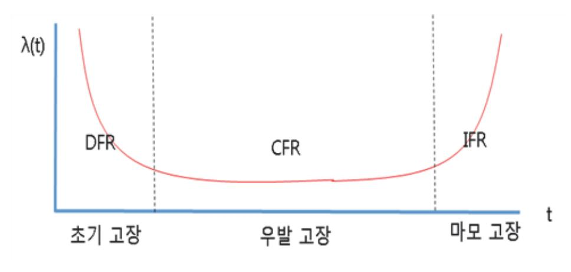

출처: 집필진 제작(2024) [그림 1-1] 수명 곡선

수명 곡선은 초기 고장 지대, 우발 고장 지대 및 마모 고장 지대로 시간이 지남에 따라 구간을 나눌 수 있다([그림 1-1]).

- (가) 초기 고장 지대(initial failure region)
  - 1) 고장률이 시간에 따라 급격히 감소
  - 2) 최종 고객의 가장 관심 있는 파라미터(parameter)로 완성 제품의 초기 불량을 일으 킬 수 있음.
  - 3) 주로 공정 결함에 의해 발생되고 번인(burn-In) 공정으로 최소화할 수 있음.
- (나) 우발 고장 지대(random failure region)
  - 1) 고장률이 시간에 따라 일정한 구간
  - 2) 기술(technology) 자체에 의해 결정됨.
- (다) 마모 고장 지대(wear-out failure region)
  - 1) 고장률이 시간에 따라 급격히 증가함.
  - 2) 수명이 다한 상태
- 3. 고장률 계산(failure rate calculation)
  - (1) 고장률 계산을 위해서는 고장률이 시간의 함수임을 이해해야 한다.
    - R(t) = Exp(-λ(t))
    - F(t) = 1-R(t)
    - λ: 평균 고장률, 1/λ: 평균 수명(MTTF)
    - 신뢰도 함수(reliability): R(t)
    - 고장률 함수(failure rate): λ(t)
    - 누적 고장률 함수(cumulative fail): F(t)
  - (2) 고장률(순간 고장률(λ(t)) 산출 방법
    - (가) 우발 고장 지대의 고장률 분포는 지수 함수로 분포함으로 고장률 λ(t)는 일정한 상수로

나타낸다.

(나) 고장률 계산

F.R = N / D \* H

[N = number of rejects

- D = total sample size
- H = Test hour
- 단위 : % / HR, % / 1000HR, FIT(FIT = F.R / 10E-9)
- (ex) 0.0000001 / HR = 0.00001% / HR = 0.001% / 1000HR = 100FIT

#### 4. 60% 신뢰율 고장률 계산(60% confidence level failure rate)

신뢰도 시험실에서 구한 고장률(F.R)이 실제의 고장률을 나타내지만 샘플링으로 인한 결과 이므로 모집단의 고장률을 알기 위해서는 통계적 처리가 필요하다. 즉, 신뢰율(confidence level)을 이용하여 고장률을 계산한다.

(ex) F.R(% / KHR @ 60%CL) = X2(0.60, 2R+2) \* 10E5 / 2\*D\*H

여기서 X2는 2R+2 자유도의 0.6에 해당하는 카이제곱(chi square) 값이다.

- 5. 신뢰성과 타당성을 확보하기 위한 다양한 방법
  - (1) 기존 문헌 조사(literature review)
  - (2) 잠재적인 리스크 분석(risk analysis)
  - (3) 시뮬레이션(simulation) 검증
  - (4) 파일럿 테스트(pilot testing) 검증
  - (5) 장비 검토 및 캘리브레이션(equipment review and calibration)
  - (6) 샘플링 계획(sampling plan)
  - (7) 시험 프로토콜 개발(test protocol development)
  - (8) 환경 조건 조정(environmental conditioning)

숖 환경 시험 계획 수립

환경 시험 계획 수립은 [그림 1-2]와 같은 절차로 진행하며 각 단계는 신뢰성 있는 결과를 얻 을 수 있도록 체계적으로 구성해야 한다.

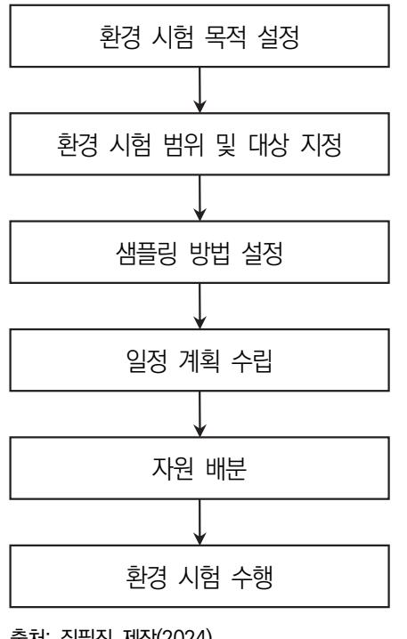

출처: 집필진 제작(2024) [그림 1-2] 환경 시험 계획 수립 절차

1. 목적 설정

환경 시험 항목에 대한 목적을 설정하는 것은 제품의 성능, 신뢰성 및 내구성 등을 평가하는 데 어떤 역할을 하는지를 명확히 하는 것이다. 이를 통해 시험의 방향성을 제시하고 시험 결과의 해석에 도움을 받을 수 있다.

2. 시험 범위 및 대상 정의

환경 시험 범위와 대상을 명확히 정의한다.

3. 샘플링 방법

반도체 환경 시험에서 샘플링은 시험의 대표성을 보장하고, 통계적으로 시험의 신뢰성과 유효성을 보장할 수 있도록 진행한다. [그림 1-3]은 반도체 환경 시험을 위한 샘플링 방법이다.

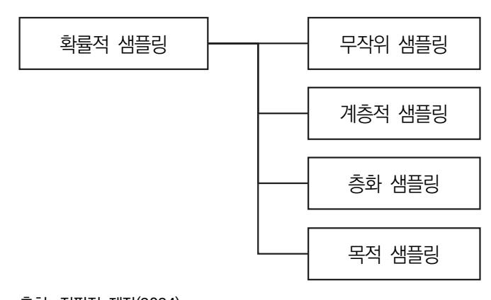

출처: 집필진 제작(2024) [그림 1-3] 샘플링 종류

- (1) 무작위 샘플링
  - (가) 시험 제품을 대상으로 무작위로 샘플을 선택한다.
  - (나) 시험 대상 모든 반도체 제품이 동등한 확률로 선택되는 방식이다.
  - (다) 편향 없이 전체 제품군을 대표하는 샘플을 선정할 수 있다.
  - (라) 무작위성 보장을 위해서는 충분한 수량의 샘플이 필요하다.
- (2) 계층적 샘플링
  - (가) 시험 제품을 대상으로 일정한 간격으로 샘플을 선택한다.
  - (나) 일정한 주기성을 가진 샘플을 쉽게 얻을 수 있다.
  - (다) 생산 주기와 간격이 맞아야 효과적으로 샘플을 추출할 수 있다.
- (3) 층화 샘플링
  - (가) 제품을 특정 기준(생산 시기, 라인, 배치 등)에 따라 구간화하고 각 구간에서 무작위로 샘플을 선택한다.
  - (나) 시험에 맞는 다양한 조건을 반영하여 대표성을 높일 수 있다.
  - (다) 구간화 기준 설정이 필요하다.
- (4) 목적 샘플링
  - (가) 특정한 기준이나 목적에 따라 샘플을 선택한다.
  - (나) 특정 테스트 조건에 맞춘 샘플을 선정할 수 있다.
  - (다) 대표성이 부족할 수 있다.
- 4. 일정 계획 수립
  - 환경 시험 수행을 위한 일정 계획 수립 시 검토 및 작성할 항목들이다.
  - (1) 시험 목표 및 범위 확인
  - (2) 시험 항목별 세부 일정 수립
  - (3) 자원 가용성 확인
  - (4) 타임라인 작성
  - (5) 일정 조정 및 최종 확정
- 5. 자원 배분

환경 시험을 수행하기 위한 분야별 자원(필요 인력, 장비 및 시설, 물자 및 소모품, 예산 등)을 적절히 배분한다.

숗 환경 시험 수행

#### 1. 환경 시험 수행 절차

선정된 시험 항목별로 다양한 환경 조건 하에서 환경 시험을 수행하는데 [그림 1-4]와 같은 절차로 수행한다.

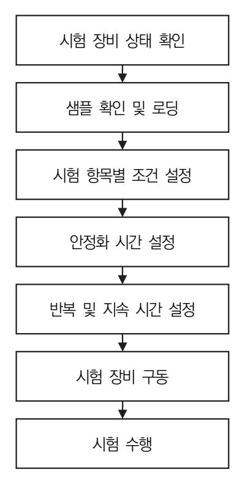

출처: 집필진 제작(2024) [그림 1-4] 환경 시험 수행 절차

#### 2. 환경 시험 항목

반도체 환경 시험은 반도체 소자가 다양한 환경 조건에서 안정적으로 작동하는지를 확인하 기 위해 다양한 시험을 수행한다. 주요 환경 시험 항목은 [그림 1-5]와 같이 분류한다.

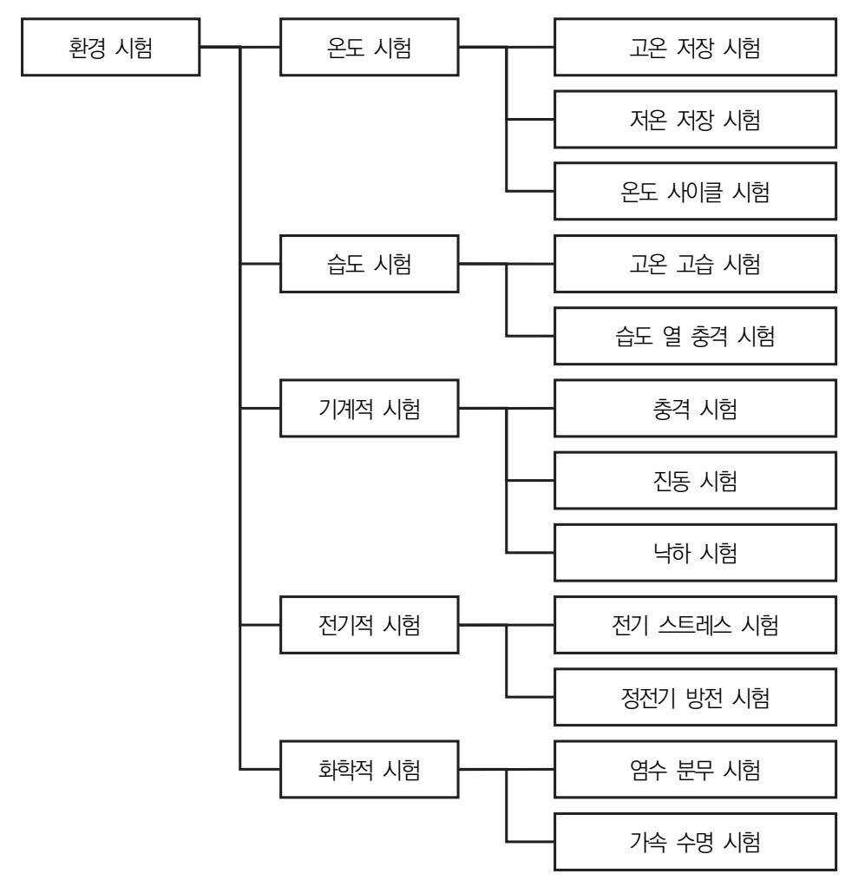

출처: 집필진 제작(2024) [그림 1-5] 환경 시험 항목 분류

- (1) 사전 환경 시험(pre-conditioning test)
  - (가) 반도체 제품 출하 후 이동 및 보관 과정을 거쳐 고객의 생산 과정 중에 발생할 수 있는 흡습 및 열적 스트레스로 인해 발생할 수 있는 신뢰성 내성을 평가하기 위한 시험이다.
  - (나) 제품을 판매하여 고객에게 운송되고 진공 포장을 개봉하여 시스템에 부착되는 순서에 대 해 유사한 조건으로 시뮬레이션하여 흡습 상태의 패키지 신뢰성을 평가하는 방법이며, 환경 신뢰성 시험의 전처리 조건으로 적용된다.
- (2) 온도 시험(temperature test)의 종류
  - (가) 고온 저장 시험(high temperature storage test)
  - (나) 저온 저장 시험(low temperature storage test)
  - (다) 온도 사이클 시험(temperature cycling test)
- (3) 습도 시험(humidity test)의 종류
  - (가) 고온 고습 시험(high temperature high humidity test)

(나) 습도 열 충격 시험(humidity thermal shock test)

- (4) 기계적 시험(mechanical test)의 종류
  - (가) 충격 시험(shock test)
    - 1) 반도체 소자의 내구성과 신뢰성 평가를 위한 테스트
    - 2) 특정한 충격을 가해 반응을 관찰하고 손상 여부와 성능 변화 분석
    - 3) 제품 품질 보증과 실제 사용 환경에서의 안정성 확인
  - (나) 진동 시험(vibration test)
    - 1) 랜덤 진동 특징
      - 가) 특정 주파수에 국한되지 않고 광범위한 주파수 대역에서 진동이 발생
      - 나) 실제 환경에서의 복잡한 진동 조건을 재현하는 데 유용
      - 다) 여러 주파수 성분이 동시에 존재하며, 특정 주파수에 지속적으로 노출되지 않음.
      - 라) 주요 용도는 항공, 우주, 자동차 및 전자 기기 등의 내구성 시험에 주로 사용
    - 2) 사인 진동의 특징
      - 가) 사인 진동은 단일 주파수에서 진폭이 사인파 형태로 변하는 진동
      - 나) 특정 주파수에서 제품의 응답을 분석하는 데 유용
      - 다) 특정 주파수에서의 공진 현상이나 구조적 결함을 확인
      - 라) 주요 용도는 공진 주파수를 찾거나 특정 주파수에서의 반응을 평가할 때 사용
    - 3) 스윕 진동의 특징
      - 가) 스윕 진동은 일정한 속도로 주파수를 변환시키며 진동을 가하는 시험
      - 나) 낮은 주파수에서 높은 주파수까지 연속적으로 주파수를 변화시키며 제품의 응답 을 확인
      - 다) 공진 주파수를 식별하고, 주파수 대역에 따른 제품의 거동을 평가
      - 라) 주요 용도는 제품의 전체 주파수 응답을 평가하고, 공진 주파수를 식별하며, 진동 내성을 확인할 때 사용
  - (다) 낙하 시험(drop test)
    - 1) 반도체 소자의 내구성과 신뢰성 평가를 위한 낙하 테스트
    - 2) 일정 높이에서 반도체를 떨어뜨려 충격을 가하고 손상 여부와 성능 변화를 분석
    - 3) 제품의 품질 보증과 실제 사용 환경에서의 안정성 확인
- (5) 전기적 시험(electrical test)의 종류
  - (가) 전기적 스트레스 시험(electrical stress test)
    - 1) 반도체 소자의 전기적 내구성과 신뢰성을 평가하기 위한 테스트
    - 2) 높은 전압, 전류 등 전기적 스트레스를 가해 성능 변화와 손상 여부를 분석
  - (나) ESD 시험(electrostatic discharge test)

- 1) 인체 모델(HBM: human body model)은 사람이 전하를 띠고 있을 때 발생할 수 있는 방전을 모사
- 2) 기계 모델(MM: machine model)은 기계 또는 도구가 정전기를 띤 상태에서 발생 할 수 있는 방전을 모사
- 3) 충전 장치 모델(CDM: charged device model)은 반도체 소자 자체가 정전기를 띠고 있을 때 방전되는 상황을 모사
- 4) ESD 관련 표준 및 권장 사항
  - 가) JEDEC JESD22-A114: 인체 모델(HBM) 기반 ESD 시험 절차 및 조건에 대 한 표준
  - 나) JEDEC JESD22-A115: 기계 모델(MM) 기반 ESD 시험 절차 및 조건에 대한 표준
  - 다) JEDEC JESD22-C101: 충전 장치 모델(CDM) 기반 ESD 시험 절차 및 조건 에 대한 표준
  - 라) IEC 61000-4-2: 전자기 호환성(EMC) 관련 ESD 시험 방법에 대한 국제 표준
- (6) 화학적 시험(chemical test)의 종류
  - (가) 염수 분무 시험(salt spray test)
    - 1) 반도체 소자의 내식성을 평가하기 위한 테스트
    - 2) 염수 분무 환경에 노출해 부식 발생 여부와 성능 변화를 분석
  - (나) 화학적 안정성 시험
    - 1) 반도체 소자가 특정 화학 물질과의 반응에서 성능을 유지하는지 평가하는 시험
    - 2) 다양한 화학 물질에 노출해 성능 변화와 손상 여부를 분석
  - (다) 가스 노출 시험
    - 1) 반도체 소자를 특정 가스 환경에 노출해 성능 변화를 평가하는 시험
    - 2) 가스와의 반응에서 손상 여부와 성능 변화를 분석
- (7) 환경적 시험(environmental test)의 종류
  - (가) 방진 시험(particle test)
    - 1) 반도체 소자의 방진 성능을 평가하기 위한 테스트
    - 2) 먼지와 입자 환경에 노출해 성능 변화와 손상 여부를 분석

#### 수 시험 평가 조건 검증(판정)

- 1. 환경 시험 조건 정상 여부 검증 방법
  - (1) 목표와 요구 사항 재확인

- (2) 시험 계획서 재검토
- (3) 조건 설정의 타당성 재검증
- (4) 장비와 환경 재확인
- (5) 조건 재검토 및 수정
- (6) 최종 검토 및 승인
- 2. 실시간 모니터링 및 데이터 기록 방법
  - (1) 센서와 측정 장비 사용
  - (2) 데이터 수집 시스템
  - (3) 실시간 모니터링
  - (4) 데이터 기록 및 저장
  - (5) 데이터 분석 및 보고서 작성
  - (6) 원격 모니터링
- 3. 평가 조건의 변동 상황 발생 시 대응 절차
  - (1) 변동 상황 감지
  - (2) 변동 원인 분석
  - (3) 즉각적인 조치
  - (4) 시험 재개 및 보완
  - (5) 보고 및 기록
  - (6) 예방 조치

# 수행 내용 / 환경 시험 수행하기

#### 재료·자료

- 시험용 반도체 소자
- 시험 대상 반도체 디바이스 데이터 시트
- 반도체 신뢰성 시험 규격(MIL-STD. 883, JESD22, EIAJ ED-4702, JIS, C7210)
- 시험 장비 매뉴얼
- 환경 시험 결과 데이터
- 보고서 작성 가이드

#### 기기(장비 ・ 공구)

- 컴퓨터(시험 계획, 데이터 기록)
- 소프트웨어(시험 설계 및 시뮬레이션)
- 시료 홀더
- 정밀 핀셋 및 작업대
- 정전기 방지 매트 및 손목 밴드
- 데이터 로거 및 모니터링 시스템
- 계측기(oscilloscope, DC parameter analysis, pulse generator)
- 고온 전자 분석기(hot electron analyser)
- 신뢰성 체임버(고온용, 고습용, 고온/고습용, 고압용, 고전압용, 열 충격용)
- 역 캡슐화/층 제거 장비(decapsulation/delayering system)
- 엑스레이 체임버(x-ray chamber)
- 전자 현미경(SEM: scanning electron microscope)
- 집속 이온 빔(FIB: focused ion beam)
- 초음파 시스템

#### 안전 ・ 유의 사항

- X-ray 차폐 시설의 이상 유무에 대해서 확인한다.
- Decapsulation/delayer용 화학 약품 보호 장구(방독면, 작업 가운, 장갑)의 유무를 확인하 고, 착용법을 숙지한다.
- 고온 체임버 개폐 시 화상에 주의한다.
- 시험 설계 시 안전성 확보를 위해 예상 위험 요소를 평가하고 안전 조치를 포함한다.
- 작업 공간의 안전 확보를 위해 깨끗하고 정돈된 작업 환경을 유지하여 사고를 예방한다.
- 정전기에 민감한 반도체 소자를 다룰 때 정전기 방지 보호구를 반드시 착용하고 사용해야 한다.
- 환경 시험 시 시료를 손상하지 않도록 주의하고 정밀하게 다룬다.
- 반도체 시험 시 이물질이나 오염을 방지하기 위해 작업 공간의 청결을 유지한다.
- 시험 장비의 사용법을 충분히 숙지하고 안전 지침을 준수하면서 시험을 수행한다.
- 고온 또는 고압 장비 사용 시 적절한 보호 장비를 착용하고 시험을 수행한다.
- 장비의 정기적인 점검과 유지 보수를 통해 안전하고 최적의 공정 상태를 유지할 수 있도록 한다.
- 데이터 손실을 방지하기 위해 정기적으로 데이터를 백업하고 수집된 데이터는 안전하게 보 관하고 접근 권한을 제한한다.
- 민감한 정보를 포함한 보고서와 발표 자료는 보안을 유지한다.

#### 수행 순서

숔 환경 시험의 필요성을 이해하고 항목별로 어떤 특성들이 있는지 파악한다.

- 1. 신뢰성 보증 측면에서의 환경 시험 필요성을 파악한다.
  - (1) 반도체 제품은 다양한 환경 조건에서 사용되며, 환경 시험을 통해 제품이 극한 조건에서도 안 정적으로 작동하는지 확인함으로써 출하되기 전에 제품의 신뢰성을 보증할 수 있다.
  - (2) 시험 결과를 바탕으로 제품이 실제 사용 환경에서 얼마나 신뢰성 있게 동작할지 판단한다.
- 2. 제품 수명 연장 측면에서의 환경 시험 필요성을 파악한다.

- (1) 환경 시험은 반도체 제품의 내구성을 평가하여 장기적으로 안정적인 성능을 유지할 수 있도 록 한다.
- (2) 이를 통해 제품의 수명을 연장하고 사용 중 발생할 수 있는 고장을 예방할 수 있다.
- 3. 품질 인증 및 개선 측면에서의 환경 시험 필요성을 파악한다.
  - (1) 시험 평가 결과가 품질 기준을 충족하는지 확인하고 이를 통해 품질을 인증한다.
  - (2) 환경 시험을 통해 잠재적인 결함과 약점을 조기에 발견하여 제품 개발 단계에서 개선할 수 있다.
  - (3) 분석 결과를 통해 제품의 설계, 재료, 제조 공정 등에서 개선이 필요한 부분을 식별하고, 향 후 개발 방향을 제시한다.
- 4. 고객 만족도 향상 측면에서의 환경 시험 필요성을 파악한다.
  - (1) 환경 시험을 거친 고품질의 반도체 제품은 신뢰성을 바탕으로 고객의 기대를 충족시킬 수 있 다.
  - (2) 이는 브랜드 신뢰도를 높이고, 고객 만족도를 향상하는 데 중요한 역할을 한다.
- 5. 법규 및 표준 준수 측면에서의 필요성에 대해 특성을 파악한다.
  - (1) 많은 국가와 산업에서 반도체 제품에 대한 환경 시험을 요구하는 법규와 표준이 있다.
  - (2) 이러한 규정을 준수함으로써, 제품의 시장 진입 장벽을 높이고, 글로벌 시장에서의 경쟁력을 확보할 수 있다.
- 6. 비용 절감 측면에서의 필요성을 파악한다.
  - (1) 환경 시험을 통해 제품의 결함을 사전에 발견하고 수정함으로써, 실제 사용 중 발생할 수 있 는 고장과 관련한 비용을 절감할 수 있다.
  - (2) 이는 장기적으로 유지 보수 비용을 낮추고, 제품의 총비용을 줄이는 데 도움이 된다.
- 숕 환경 시험의 신뢰성과 타당성을 확보하기 위한 다양한 방법들을 이해하고 세부적인 내용을 파악한다.
  - 1. 기존 문헌 조사(literature review)에 대한 세부 내용을 파악한다.
    - (1) 기존 연구 자료, 표준, 규격서 등을 검토하여 최적의 시험 조건과 방법을 선정한다.
    - (2) 이를 통해 과거의 경험과 데이터를 활용하여 효율적인 시험 설계를 한다.
  - 2. 잠재적인 리스크 분석(risk analysis)에 대한 세부 내용을 파악한다.
    - (1) 잠재적인 문제점과 위험 요소를 식별하고, 이에 대한 대응 방안을 마련한다.
    - (2) 시험 과정에서 발생할 수 있는 변수와 불확실성을 미리 파악하여 시험의 안정성을 높인다.
  - 3. 시뮬레이션(simulation)에 대한 세부 내용을 파악한다.

- (1) 컴퓨터를 이용해 시험 조건을 가상으로 구현하고, 예상 결과를 미리 검토한다.
- (2) 실제 시험 전에 문제점을 발견하고 수정할 수 있는 기회를 제공한다.
- 4. 파일럿 테스트(pilot test)에 대한 세부 내용을 파악한다.
  - (1) 소규모로 시험을 미리 수행하여 시험 계획의 타당성을 검증한다.
  - (2) 본격적인 시험 전에 파일럿 테스트를 통해 계획의 문제점을 확인하고 개선한다.
- 5. 장비 검토 및 캘리브레이션(equipment review and calibration)에 대한 세부 내용을 파악한다.
  - (1) 사용될 시험 장비의 성능과 정확도를 검토한다.
  - (2) 필요한 경우 캘리브레이션을 수행하여, 정확한 장비 사용을 통해 신뢰성 있는 시험 결과를 보 장한다.
- 6. 샘플링 계획(sampling plan)에 대한 세부 내용을 파악한다.
  - (1) 시험에 사용할 샘플의 수와 종류를 결정한다.
  - (2) 샘플링 방법을 설계하여 시험의 대표성과 신뢰성을 확보한다.
- 7. 시험 프로토콜 개발(test protocol development)에 대한 세부 내용을 파악한다.
  - (1) 시험 절차와 방법을 상세히 기술한 문서를 작성한다.
  - (2) 시험 수행 시 일관성을 유지하고, 재현성을 확보하기 위해 프로토콜을 명확히 정의한다.
- 8. 환경 조건 조정(environmental conditioning)에 대한 세부 내용을 파악한다.
  - (1) 시험실의 환경 조건(온도, 습도 등)을 목표 시험 조건에 맞게 조정한다.
  - (2) 정확한 환경 조건을 유지하여 시험 결과의 신뢰성을 높인다.

#### 수행 tip

•환경 시험의 신뢰성 및 타당성 확보 방법을 숙지하고 온라인상에 서 추가 자료들을 찾아 심화 학습할 수 있도록 한다.

- 숖 환경 시험 계획 수립 절차를 이해하고 단계별 내용을 파악한다.
  - 1. 샘플링 절차를 이해하고 단계별 세부 내용을 파악한다. 시험에 사용할 샘플을 추출하는 샘플링 절차를 알아본다. [그림 1-6]은 반도체 환경 시험을 위한 샘플링 절차이다.
    - (1) 샘플링 방법을 결정한다. 반도체 환경 시험의 목적(신뢰성 평가, 초기 품질 검증, 생산 공정 변화 확인 등)에 따라

샘플링 방법을 결정한다.

- (2) 샘플 크기를 결정한다.
  - (가) 일반적으로 많은 수의 샘플이 신뢰성을 높일 수 있다.
  - (나) 샘플이 많은 경우 시험 진행 및 결과 분석에 많은 시간이 소요된다.
  - (다) 통계적 신뢰성과 처리 시간을 고려하여 적절한 샘플 크기를 결정한다.
- (3) 샘플링 계획을 수립한다. 선택된 샘플링 방법에 따라 구체적인 계획(샘플 추출 주기, 위치, 시간 등)을 수립한다.
- (4) 샘플을 추출한다.

샘플링 계획에 따라 생산 라인이나 저장소에서 샘플을 추출한다.

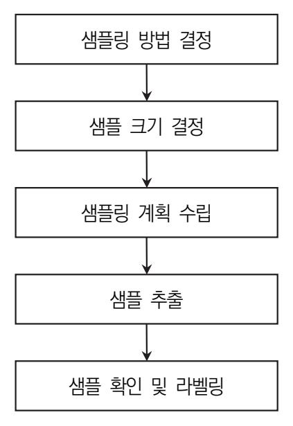

출처: 집필진 제작(2024) [그림 1-6] 샘플링 절차

(5) 샘플 확인 및 라벨링한다.

(가) 추출된 샘플의 실물을 확인하고 라벨을 붙여 추적 가능하게 한다.

(나) 각 샘플의 출처, 일련번호, 생산 날짜 등을 기록한다.

#### 수행 tip

• 샘플링에서 가장 중요한 부분은 시험 대상 제품에 대한 대 표성을 보장하고, 통계적으로 시험의 신뢰성과 유효성을 보장할 수 있도록 해야 한다.

- 2. 일정 계획 수립 항목을 이해하고 각 항목에 대한 특성을 파악한다.
  - (1) 시험 목표 및 범위를 설정한다.
    - (가) 시험의 목표(신뢰성 검증, 제품 수명 평가)를 명확히 정의한다.
    - (나) 각 시험 항목의 범위(온도 시험, 습도 시험 등)를 설정한다.
  - (2) 시험 항목별 세부 일정을 수립한다.
    - (가) 각 시험 항목별로 시작일과 종료일을 설정한다.
    - (나) 시험 진행 순서를 계획한다.
  - (3) 자원 가용성을 확인한다.
    - (가) 시험에 필요한 장비와 시설의 가용성을 확인한다.
    - (나) 담당 인력의 일정과 가용성을 고려한다.
  - (4) 타임라인을 작성한다.
    - (가) 시험 항목별로 구체적인 타임라인을 작성한다.
    - (나) 간트(gantt) 차트와 같은 시각적 도구를 활용하여 일정 관리의 효율성을 높인다. [그림 1-7]은 엑셀로 작성한 간트 차트의 예시이다.
  - (5) 일정 조정 및 최종 시험 일정을 확정한다.
    - (가) 초기 일정 계획을 관련 부서와 공유하고 피드백을 받는다.
    - (나) 필요 시 일정을 조정하고 최종 일정을 확정한다.

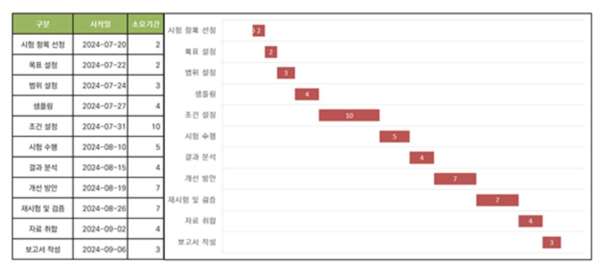

출처: 스프레드 시트 프로그램. 2024. 5. 24. 스크린샷. [그림 1-7] 간트 차트 예시

수행 tip

• 일정 계획 수립은 간트 차트를 활용하여 간결하게 정리할 수 있다. 간트 차트는 스프레드시트의 '가로 누적 막대' 차 트를 활용하여 작성할 수 있다.

3. 배분할 자원 항목을 정리한 후 각 항목에 대한 세부 내용을 파악한다.

자원 항목들을 배분할 때 참고할 내용을 알아본다. <표 1-1>은 자원 항목별로 배분한 예시 이다.

(1) 인력을 배분한다.

(가) 각 시험 항목별로 필요한 인력(엔지니어, 기술자 등)을 정의한다.

(나) 인력의 역할과 책임을 명확히한다.

(다) 인력의 전문성을 고려하여 적절한 업무를 배정한다.

(2) 장비 및 시설을 배분한다.

(가) 각 시험 항목에 필요한 장비(온도 체임버, 습도 체임버 등) 목록을 작성한다.

(나) 시험에 필요한 장비의 가용성을 확인하고 필요시 추가 장비를 확보한다.

(다) 장비의 유지 보수와 조정(calibration) 일정을 점검하여 시험 준비를 완료한다.

(3) 물자 및 소모품을 배분한다.

(가) 시험에 필요한 소모품과 물자(테스트 보드, 케이블 등)를 준비한다.

(나) 각 시험 항목별로 필요한 물자의 수량을 산출하고, 충분한 재고를 확보한다.

(4) 예산을 배분한다.

(가) 각 시험 항목에 필요한 예산을 책정한다.

(나) 시험 비용을 항목별로 상세히 계획하고, 총예산을 산정한다.

(다) 예산 사용 계획을 수립하고 필요시 예산 확보를 위한 절차를 진행한다.

(5) 일정을 배분한다.

(가) 각 시험 항목별로 시험 일정을 배분하여 일정 계획을 수립한다.

(나) 다른 자원들은 일정 계획에 맞추어 배분한다.

<표 1-1> 자원 배분 예시

| 분류    | 시험 항목 배분              |                 |  |
|-------|--------------------------|-----------------|--|
|       | 온도 시험                    | 5월 1일 ~ 5월 10일  |  |
|       | 습도 시험                    | 5월 11일 ~ 5월 20일 |  |
| 일정 계획 | 진동 시험 5월 21일 ~ 5월 30일 |                 |  |
|       | 충격 시험                    | 6월 1일 ~ 5월 10일  |  |
|       | 온도 시험                    | 엔지니어 2명, 기술자 1명 |  |
|       | 습도 시험                    | 엔지니어 1명, 기술자 1명 |  |
| 인력    | 진동 시험                    | 엔지니어 2명, 기술자 2명 |  |
|       | 충격 시험                    | 엔지니어 명, 기술자 1명  |  |
|       | 온도 체임버                   | 1대              |  |
|       | 습도 체임버                   | 1대              |  |
| 장비    | 진동 시험기                   | 1대              |  |
|       | 충격 시험기                   | 1대              |  |
|       | 온도 시험                    | 5,000,000원      |  |
|       | 습도 시험                    | 4,000,000원      |  |
| 예산    | 진동 시험                    | 6,000,000원      |  |
|       | 충격 시험                    | 4,500,000원      |  |

수행 tip

• 자원 배분을 위해 우선 일정 계획을 수립한 후 다른 자원 들을 그 일정에 맞추어 준비한다.

숗 환경 시험 항목들을 선정하고 절차에 따라 시험을 수행한다.

- 1. 사전 환경 시험의 목적을 이해하고 시험 수행 절차를 파악한다.
  - (1) 사전 환경 시험의 목적을 이해한다.

반도체 제품 출하 후 이동 및 보관을 거쳐 고객의 생산 과정 중에 발생할 수 있는 흡습 및 열적 스트레스로 인한 제품 신뢰성 및 내구성을 평가하기 위한 사전 시뮬레이션하는 시험이다.

(2) 사전 환경 시험 수행 절차를 이해하고 시험 단계별 내용을 파악한다.

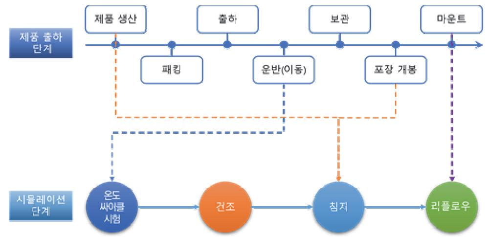

출처: 집필자 제작(2024) [그림 1-8] 사전 환경 평가 도식

[그림 1-8]은 제품 생산 후에 포장(packing), 출하, 운송 과정, 시스템의 부착 단계 등의 사용자 사용 순서에 의한 환경 스트레스와 평가 시뮬레이션과의 연관성을 도식한 것이다. 시뮬레이션 단계는 TC(온도 사이클 시험) → 건조 → 침지 → 리플로 순서로 진행된다.

- (가) TC 시험은 제품 운송 중에 발생할 수 있는 온도 변화 스트레스를 인가하는 것으로 조건 은 –40~60℃ 환경에서 5회 인가 테스트한다.
- (나) 건조(bake) 시험은 JEDEC에서 규정한 흡습량만큼을 주입하기 위해 이미 패키지 안에 있는 습기를 제거하는 과정으로 125℃ 24시간이면 모든 형태의 패키지가 탈습이 완료 되지만, 경우에 따라 제품의 탈습 특성을 평가하여 시험 시간을 단축할 수 있다.
- (다) 침지(soak) 시험은 JEDEC에서 규정한 흡습량을 주입하는 단계이며, 인증하고자 하는 MSL(moisture sensitivity level)에 따라 흡습 과정을 실시한다. MSL은 제품의 습도 민감도에 대한 내성을 등급으로 분류하여 수준을 객관화하고 사용 조건의 허용 범위를 규정화한 것이다. 흡습 시간을 단축하기 위해 가속 등가 조건을 활용할 수 있다. 가속 조건은 패키지 재료의 흡습과 관련한 분량에 대한 활성화 에너지가 0.4~0.48eV에 해당 하는 불량 형태에 적용한다.
- (라) 리플로 시험은 패키지 제품을 모듈 또는 기판에 실장하는 과정으로 패키지 형태 및 무연 여부에 따라 해당 온도 프로파일로 3회 리플로를 실시한다. 3회를 실시하는 이유는 단 면, 양면, 재작업의 공정이 적용될 수 있으므로 이를 보증해야 하기 때문이다. 환경 유해 물질의 사용 제한에 따른 RoHS 규제로 인해 Sn-Ag-Cu의 무연 솔더 사용으로 온도 프로파일이 기존 230℃에서 260℃로 상향되어 적용된다.

수행 tip

- 사전 환경 시험은 출하 후 이동 및 보관을 거쳐 고객의 생산 과정 중에 발생할 수 있는 흡습 및 열적 스트레스로 인한 제품 신뢰성 및 내구성을 평가하기 위해 모의(동일한 스트레스) 환경을 구축하고 사전 시뮬레이션하는 시험이다.
- 2. 온도 시험의 목적을 이해하고 시험 수행 절차를 파악한다.
  - (1) 온도 시험 목적을 이해한다.
    - (가) 반도체 소자가 다양한 온도 조건에서 어떻게 성능을 유지하는지 평가하기 위해 수행하는 시험이다.
    - (나) 반도체 소자가 극한의 고온 및 저온 환경에서 안정적으로 작동하는지 확인하며, 제품의 신뢰성, 내구성 및 품질을 보장하기 위해 실시한다.
    - (다) 제품의 열팽창 및 수축으로 인한 물리적 손상 및 성능 변화를 확인한다.
    - (라) 잠재적인 결함이나 물리적 손상을 발견하고, 제품의 수명을 예측하기 위해 수행한다.
  - (2) 온도 시험 절차를 파악하고 단계별 세부 특성을 확인한다.

[그림 1-9]는 반도체 온도 시험을 위한 절차이다.

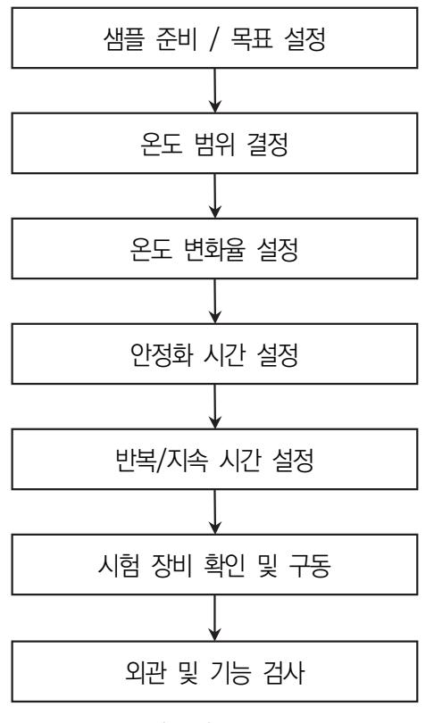

- 출처: 집필진 제작(2024) [그림 1-9] 반도체 온도 시험 절차
- (가) 온도 시험 종류를 이해하고 목표를 설정한다.
  - 1) 고온 저장 시험은 반도체 소자를 고온 환경에서 장기간 보관하면서 열적 안정성을 평가한다. [그림 1-10]은 고온 저장 시험을 위한 장치이다.

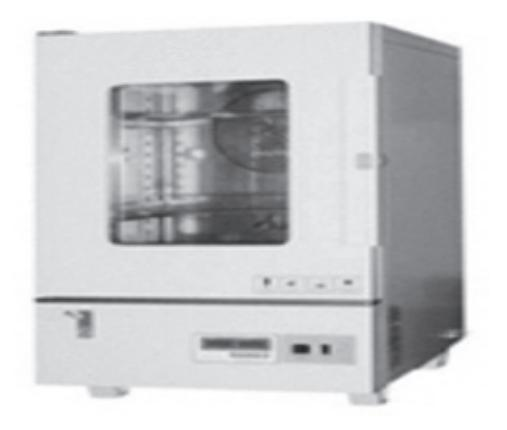

출처: 교육부(2018). 반도체 신뢰성 평가(LM9030601 10\_14v3). 한국직업능력개발원. p.11. [그림 1-10] 고온 저장 시험 장치

- 2) 저온 저장 시험은 반도체 소자를 저온 환경에서 장기간 보관하면서 저온 안정성을 평가한다.
- 3) 온도 사이클 시험은 극한 온도 변화에서 반도체 제품의 내구성을 평가하는 시험으 로, 고온과 저온 사이를 반복하여 온도 변화에 대한 신뢰성을 평가한다. <표 1-2>는 온도 사이클 시험 환경 설정 예시이다. [그림 1-11]은 온도 사이클 시험을 위한 장 치이다.

<표 1-2> 온도 사이클 시험 환경 설정 예시

| Condition | Temperature(°C) |      |  |  |
|-----------|-----------------|------|--|--|
|           | Low             | High |  |  |
| A         | -55             | +85  |  |  |
| B         | -55             | +125 |  |  |
| C         | -65             | +150 |  |  |

출처: 교육부(2018). 반도체 신뢰성 평가(LM903060110\_14v3). 한국직업능력개발원. p.10.

 출처: 교육부(2018). 반도체 신뢰성 평가(LM903060110 \_14v3). 한국직업능력개발원. p.10. [그림 1-11] 온도 사이클 시험 장치

4) 열 충격 시험은 실온에서 시작하여 낮은 온도와 높은 온도에 짧은 시간 노출되었다 가 실온으로 돌아오는 cycle을 반복하는 시험이며 검출 효과와 불량 발생 유형은 온 도 사이클(TC) 시험과 유사하다. <표 1-3>은 열 충격 시험의 온도 설정 예시이다.

<표 1-3> 열 충격 시험온도 설정 예시

| Condition | Temperature(°C) |             |  |
|-----------|-----------------|-------------|--|
|           | Low             | High        |  |
| A         | -50℃ ~ -40℃     | 85℃ ~ 95℃   |  |
| B         | -10℃ ~ 0℃       | 100℃ ~ 110℃ |  |
| C         | -65℃ ~ -55℃     | 125℃ ~ 135℃ |  |
| D         | -75℃ ~ -65℃     | 150℃ ~ 155℃ |  |

출처: 교육부(2018). 반도체 신뢰성 평가(LM903060110\_14v3). 한국직업능력개발원. p.11.

#### [그림 1-12]는 고온 열 충격 시험을 위한 장치이다.

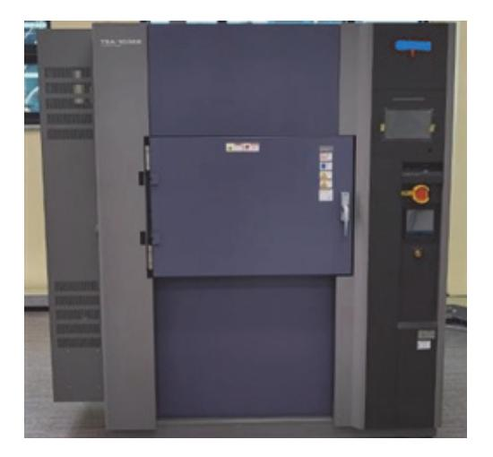

출처: 집필진 제작(2024) [그림 1-12] 고온 열 충격 시험 장치

(나) 온도 범위 결정하기

JEDEC, MIL-STD-883, IEC 60068 등 관련 표준을 참고하여 적절한 온도 범위 설 정하고, 반도체 소자의 데이터 시트에서 권장 온도 범위를 확인한다. <표 1-4>는 온 도 시험 범위 설정 예시이다.

<표 1-4> 온도 시험 범위 설정 예시

| 분류        | 온도          |
|-----------|-------------|
| 고온 저장 시험  | 125℃        |
| 저온 저장 시험  | - 65℃~- 40℃ |
| 온도 사이클 시험 | - 40℃~125℃  |

(다) 온도 변화율 설정하기

1) 온도 변화 속도를 설정하여 소자가 온도 변화에 어떻게 반응하는지 평가한다.

2) 관련 표준에서 권장하는 변화율을 참고한다(변화율: 1°C/분에서 10°C/분).

(라) 안정화 시간 설정하기

1) 설정된 온도에서 반도체 소자가 열적 평형에 도달할 시간을 설정한다.

2) 제품의 열적 특성에 따라 다를 수 있다(예시 시간: 최소 30분에서 1시간).

(마) 반복 및 지속 시간 설정하기

JEDEC, MIL-STD-883 등 관련 표준의 권장 조건을 참고하고, 설정된 온도에서의 유지 시간 및 반복 횟수를 결정한다. <표 1-5>는 온도 저장 시험 유지 시간 설정 예 시이다.

<표 1-5> 온도 저장 시험 유지 시간 설정 예시

| 유지 시간(hr/125℃) | 내용                          |
|----------------|-----------------------------|
| 168hr(1주)      | 단기 신뢰성 평가를 위한 기본 시험 시간      |
| 500hr          | 중기 신뢰성 평가를 위한 표준 시험 시간      |
| 1,000hr        | 장기 신뢰성 평가를 위한 가장 일반적인 시험 시간 |
| 2,000hr        | 매우 높은 신뢰성을 요구하는 경우 사용       |

(바) 시험 장비 확인하기

- 1) 필요한 온도 체임버와 온도 측정 장비를 준비한다.
- 2) 시험 전 장비의 캘리브레이션을 확인하여 정확한 온도 조건을 유지하는지 확인한다.
- 3) 샘플을 장비에 안착시킨 후 시험 레시피(recipe)가 정확하게 세팅되었는지 확인하고 장비를 구동한다.
- [그림 1-13]은 고온 시험 온도 레시피 설정 예시이다.

출처: 집필진 제작(2024) [그림 1-13] 고온 시험 온도 레시피 설정 예시

[그림 1-14] 저온 시험 온도 레시피 예시

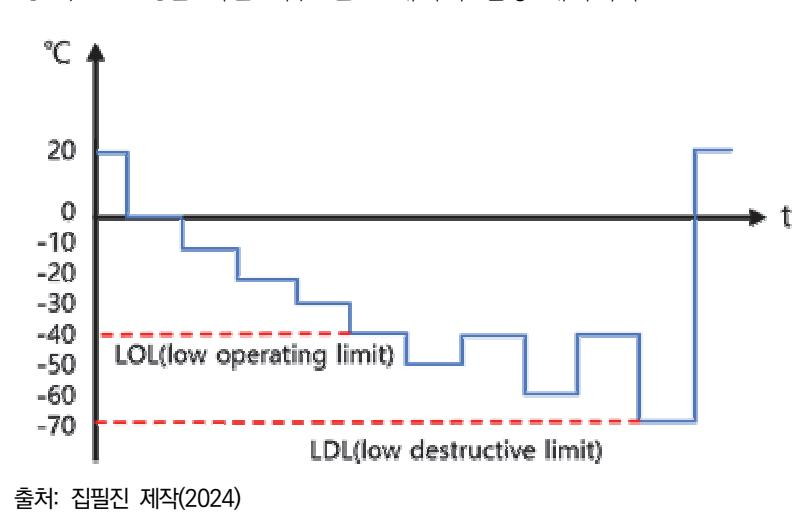

[그림 1-14]는 저온 시험 온도 레시피 설정 예시이다.

[그림 1-15]는 온도 사이클 고온 시험 온도 레시피 설정 예시이다.

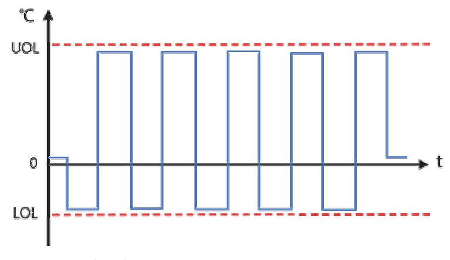

출처: 집필진 제작(2024) [그림 1-15] 온도 사이클 고온 시험 온도 레시피 예시

- (사) 외관 및 기능 검사하기
  - 1) 시험이 완료되면 외관, lead, seal, marking 상태를 확인한다.
  - 2) 온도 사이클(TC) 시험으로 가속된 불량이 있는지 전기 특성 시험(electrical test)을 실시한다.

수행 tip

• 온도 시험은 주로 부품이 특정 온도 조건에서 신뢰성 있게 동작할 수 있는지를 평가하는 데 사용된다

- 3. 습도 시험의 목적을 이해하고 시험 수행 절차를 파악한다.
  - (1) 습도 시험 목적을 이해한다.
    - (가) 습도 시험은 반도체 제품이 고습 환경에서 노출될 때의 내구성과 신뢰성을 평가하는 시 험이다.
    - (나) 고온과 고습으로 구성된 환경에서 제품을 노출해 부식, 산화, 절연체의 불량 등을 평가하 여 제품의 내구성을 확인한다.
  - (2) 습도 시험 절차를 파악하고 단계별 세부 특성을 확인한다. [그림 1-16]은 습도 시험 수행을 위한 절차이다.

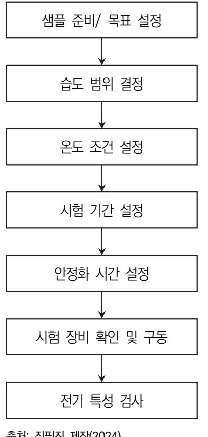

출처; 집필진 제작(2024) [그림 1-16] 습도 시험 수행 절차

(가) 시험 종류 파악 후 목표 설정하기

- 1) 고온 고습 전압 시험(THB: temperature, humidity, bias test)
  - 가) 고온, 고습 환경에서 반도체 소자의 장기 신뢰성을 평가한다.
  - 나) 전기적 바이어스가 인가된 상태에서 소자의 내구성을 확인한다.
  - 다) 열적 및 습도 스트레스 하에서 발생할 수 있는 잠재적 결함을 조기에 검출한다.

[그림 1-17]은 고온 고습 전압 시험을 위한 장치이다.

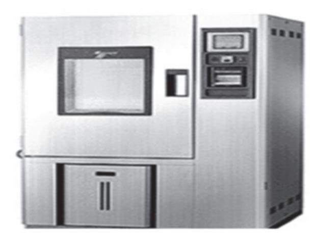

출처: 교육부(2018). 반도체 신뢰성 평가(LM903060110\_14v 3). 한국직업능력개발원. p.9. [그림 1-17] 고온 고습 전압 시험 장치

- 2) 고온 고압 고습 시험(PCT: pressure cooking test)
  - 가) 극한의 고온, 고압, 고습 환경에서 반도체 소자의 장기 신뢰성을 단기간에 평가 한다.
  - 나) 반도체 소자가 가혹한 환경 조건에서도 성능을 유지할 수 있는지 검증한다.
  - 다) 열적, 압력 및 습도 스트레스 하에서 발생할 수 있는 잠재적 결함을 조기에 탐 지한다.
- [그림 1-18]은 고온 고압 고습 시험을 위한 장치이다.

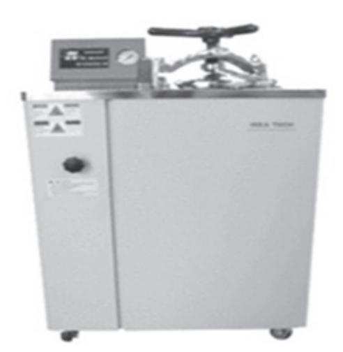

출처: 교육부(2018). 반도체 신뢰성 평가(LM90306 0110\_14v3). 한국직업능력개발원. p.10. [그림 1-18] 고온 고압 고습 시험 장치

(나) 습도 범위 결정하기

JEDEC, MIL-STD-883, IEC 60068 등 관련 표준을 참고하여 적절한 습도 범위 설 정하고, 반도체 소자의 데이터 시트에서 권장 습도 범위를 확인한다.

1) 고온 고습 전압 시험

상대습도 85% RH(±5%)를 설정한다.

2) 고온 고압 고습 시험

85% RH~100% RH(일반적으로 85% RH 사용)를 설정한다.

- (다) 온도 조건 설정하기
  - 고습 환경에서 적용할 표준의 권장 온도 조건을 참고한다.
    - 1) 고온 고습 전압 시험

온도는 85°C(±2°C)를 설정한다.

2) 고온 고압 고습 시험

온도는 110~130°C(일반적으로 110°C 또는 130°C 사용)를 설정한다.

(라) 시험 기간 설정하기

습도 조건에서 반도체 소자를 노출시킬 기간을 표준의 권장 시험 기간을 참고한다.

1) 고온 고습 전압 시험

일반적으로 1,000시간을 설정한다.

2) 고온 고압 고습 시험

일반적으로 96시간, 168시간 또는 264시간을 설정한다.

- (마) 안정화 시간 설정하기
  - 1) 설정된 습도 조건에서 반도체 소자가 평형 상태에 도달할 시간을 설정한다.
  - 2) 제품의 열적 및 습도 특성에 따라 다를 수 있다. ( (예시 시간: 최소 24시간)
- (바) 시험 장비 확인 및 구동하기
  - 1) 필요한 습도 체임버와 습도 측정 장비를 준비한다.
  - 2) 시험 전 장비의 캘리브레이션을 확인하여 정확한 습도 조건을 유지하는지 확인한다.
  - 3) 샘플을 장비에 안착시킨 후 시험 레시피(recipe)가 정확하게 세팅되었는지 확인하고 장비를 구동한다.
- (사) 전기 특성 검사하기
  - 1) 시험이 완료되면 전기적 특성 측정 및 물리적 상태를 확인한다.
  - 2) 온도 사이클(TC) 시험으로 가속된 불량이 있는지 전기 특성 시험(electrical test)을 실시한다.

수행 tip

• 습도 시험은 반도체 부품의 사용 습도 환경에서 내구성과 신뢰성을 평가하기 위한 시험이다.

- 4. 기계적 시험의 특성을 파악한다.
  - (1) 충격 시험을 수행한다.
    - (가) 충격 시험의 목적을 이해한다.
      - 1) 반도체 제품의 운송 중 또는 사용 환경에서 낙하 및 충돌 등의 충격에 대한 내구성 과 신뢰성을 평가한다.
      - 2) 충격으로 인한 물리적 손상 및 전기적 특성 변화를 확인한다.
      - 3) 극한의 물리적 스트레스에 대한 제품의 저항성을 검증한다.
    - (나) 충격 시험 수행 절차를 이해하고 단계별 세부 내용을 파악한다.
      - 1) 시험 목표 설정하기
        - 가) 반도체 소자가 충격 환경에서의 구조적 무결성과 성능을 평가한다.
        - 나) 물리적 손상 여부, 전기적 성능의 유지를 확인한다.
      - 2) 충격 가속도 및 지속 시간 설정하기
        - 가) 시험 시 적용할 충격 가속도를 설정한다.
        - 나) 충격이 적용되는 시간을 설정한다.
        - 다) 관련 표준(JEDEC, MIL-STD-883, IEC 60068 등)의 권장 조건을 참고한다.
        - 라) 헤머의 최고 가속은 500G 또는 1,500G으로 설정한다.
        - 마) 펄스 인가 시간은 0.5㎳, 11.0㎳로 설정한다.
        - 바) 낙하 시험은 1~1.2m 높이에서 수행한다.
      - 3) 충격 횟수 설정하기
        - 가) 각 방향에서 적용할 충격 횟수 설정한다.
        - 나) 관련 표준의 권장 횟수 참고한다(예시: 각 축(X, Y, Z)별 3회).
      - 4) 충격 방향 설정하기
        - 가) 충격을 가할 방향(X, Y, Z)을 설정한다. [그림 1-19]는 충격 가할 방향을 도식 화한 것이다.
        - 나) 제품 사용 환경을 고려하여 충격 방향을 설정한다.

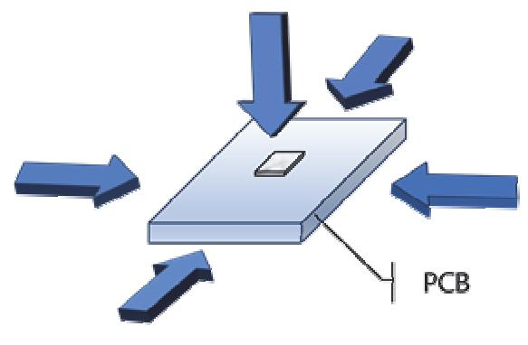

출처: 집필자 제작(2024) [그림 1-19] 충격 방향 예시

5) 온도 조건 설정하기

- 가) 충격 시험을 수행할 온도 조건 설정한다.
- 나) 관련 표준의 권장 온도 조건을 참고한다(예시 조건: -40°C에서 +125°C).
- 6) 시험 장비 확인 및 구동하기
  - 가) 필요한 충격 시험기 및 관련 장비를 준비한다(해머를 이용하여 충격을 인가하는 방법과 자유 낙하하여 충격을 인가하는 방법).

[그림 1-20]은 충격 시험 장치이다.

출처: 집필진 제작(2024) [그림 1-20] 충격 시험 장치

[그림 1-21]은 충격 시험 수행을 위한 절차이다.

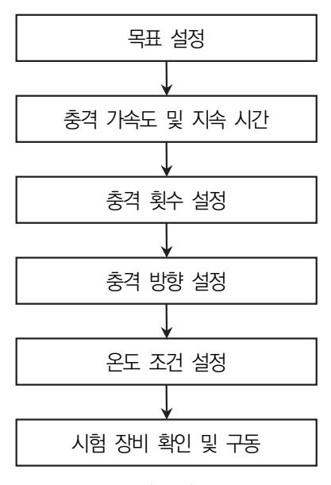

출처: 집필진 제작(2024) [그림 1-21] 충격 시험 절차

수행 tip

• 충격 시험은 반도체 제품의 운송 중 또는 사용 환경에서 발생할 수 있는 낙하 및 충돌 등의 충격에 대한 내구성과 신뢰성을 평가하기 위한 시험으로 동일한 충격 환경을 구 축하여 테스트한다.

- (2) 진동 시험(vibration test)을 수행한다.
  - (가) 진동 시험 목적을 파악한다.
    - 1) 진동 시험은 반도체 제품이 운송 중 발생할 수 있는 진동에 대한 내구성과 신뢰성을 평가하는 시험이다.
    - 2) 진동에 따른 기계적 피로 및 접합 부위의 강도를 확인한다.
    - 3) 특정 주파수 및 진폭 조건에서의 성능 유지 여부를 검증한다.
  - (나) 진동 시험 수행 절차를 이해하고 단계별 세부 내용을 파악한다.

[그림 1-22]는 진동 시험 수행하기 위한 절차이다.

[그림 1-23]은 진동 방향 설정 예시이다.

수행한다.).

- 가) 진동을 가할 방향을 설정한다. 나) 제품 사용 환경을 고려한 방향을 설정한다(예시: 3축 모두에 대해 진동 테스트
- 4) 진동 방향 설정하기
- 나) 관련 표준의 권장 가속도를 참고한다[가속도 5G에서 20G(중력 가속도 기준)].
- 가) 시험 시 적용할 진동 가속도 설정한다.
- 3) 진동 가속도 설정하기
- 다) 진폭 1.5㎜
- 나) 최고 가속 20G
- 수 범위를 설정한다(최소/최대 주파수 20Hz에서 2,000Hz).
- 가) 관련 표준(JEDEC, MIL-STD-883, IEC 60068 등)을 참고하여 적절한 주파
- 2) 진동 주파수 범위 결정하기
- 나) 진동에 따른 물리적 손상 여부, 전기적 성능의 유지 상태를 확인한다.
- 가) 반도체 소자가 진동 환경에서의 구조적 무결성과 성능을 평가한다.
- 1) 시험 목표 설정하기
- [그림 1-22] 진동 시험 절차

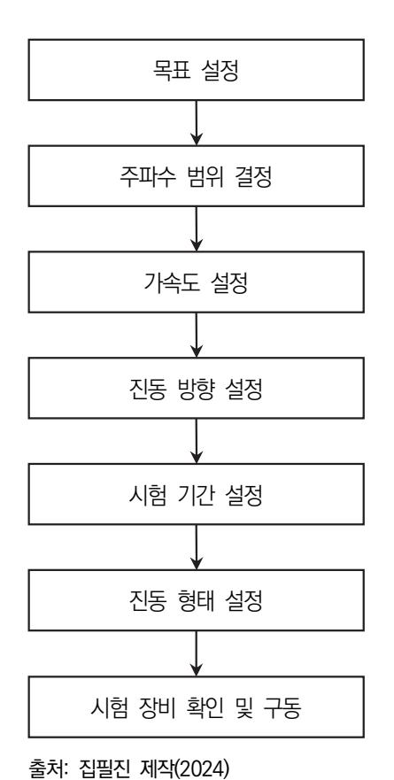

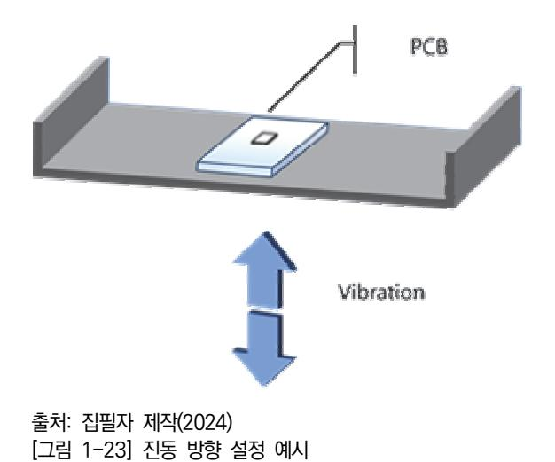

- 5) 시험 기간 설정하기
  - 가) 설정된 진동 조건에서 반도체 소자를 노출시킬 기간을 설정한다.
  - 나) 관련 표준의 권장 시험 기간을 참고한다(예시: 기간 1시간에서 8시간 이상, 축 별로 반복).
- 6) 진동 형태 설정하기
  - 가) 랜덤 진동, 사인 진동, 스윕 진동 등의 진동 형태 설정한다.
  - 나) 시험 목적에 맞는 진동 형태 선택한다.
- 7) 시험 장비 확인 및 장비 구동하기
  - 가) 필요한 진동 시험기 및 관련 장비를 준비한다.
  - 나) 시험 전 장비의 캘리브레이션을 확인하여 정확한 시험 조건을 유지한다.
  - 다) 샘플을 장비에 안착시킨 후 시험 레시피(recipe)가 정확하게 세팅되었는지 확인 하고 장비를 구동한다.

[그림 1-24]는 3축 복합 환경 진동 시험 장치이다.

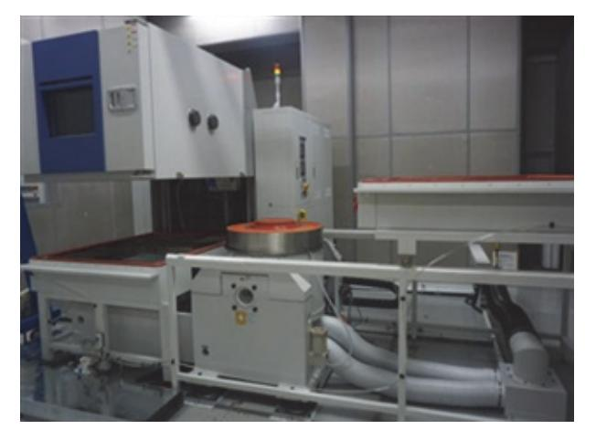

출처: 집필진 제작(2024) [그림 1-24] 3축 복합 환경 진동 시험기

수행 tip

- 진동 시험은 반도체 부품이 운송 중 발생할 수 있는 진동 환경에서의 내구성과 신뢰성을 평가하기 위해 동일한 진동 환경을 구축하여 테스트한다.
- (3) 낙하 시험(drop test)을 수행한다.
  - (가) 낙하 시험 목적을 파악한다.
    - 1) 일정 높이에서 반도체 소자를 낙하시켜 충격 내구성을 평가한다.
    - 2) 낙하 시험은 반도체 소자가 실제 사용 환경에서 발생할 수 있는 낙하 충격 상황에서 도 기능과 성능을 유지할 수 있는지 확인하기 위해 수행한다.
  - (나) 충격 시험 수행 절차를 이해하고 각 단계별 세부 내용을 파악한다.

[그림 1-25]는 진동 시험 수행을 위한 절차이다.

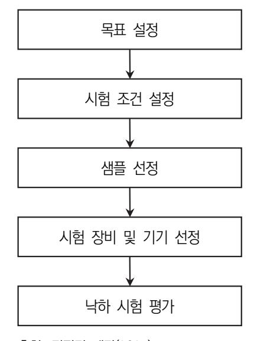

출처: 집필진 제작(2024) [그림 1-25] 낙하 시험 절차

- 1) 시험 목표 설정하기
  - 가) 제품이 예상치 못한 낙하 충격에 얼마나 잘 견디는지에 대한 내구성을 평가한 다.

라) 제품이 실제 사용 환경에서 발생할 수 있는 낙하 충격에 견딜 수 있는지 확인

나) 낙하 충격으로 인해 발생할 수 있는 잠재적 결함을 조기에 탐지한다.

다) 제품 설계의 충격 내구성을 검증하고 개선점을 도출한다.

2) 낙하 시험 조건 설정하기

하여 품질을 보증한다.

39

가) 낙하 높이, 각도, 표면 등의 시험 조건을 설정하여 실제 사용 환경을 모의한다.

나) 낙하 횟수 또는 반복 횟수를 설정하여 제품의 내구성을 평가한다.

3) 샘플 선정하기

테스트할 반도체 소자의 종류와 수량을 선정한다.

4) 시험 장비 확인 및 장비 구동하기

가) 낙하 시험 관련 적절한 장치를 준비한다.

나) 시험 전 장비의 캘리브레이션을 확인하여 정확한 시험 조건을 유지한다.

다) 샘플을 장비에 안착시킨 후 설정된 조건에 따라 제품을 낙하시킨다.

[그림 1-26]은 낙하 시험을 위한 장치이다.

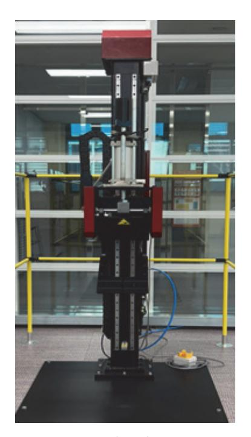

출처; 집필자 제작(2024) [그림 1-26] 낙하 시험기

5) 낙하 시험 평가하기

가) 낙하 시험 시 제품의 물리적 상태를 확인하고 데이터를 기록한다.

나) 낙하 시험 후 제품의 물리적 손상 및 전기적 특성 변화를 측정한다.

#### 수행 tip

• 낙하 시험은 반도체 부품의 운송 및 사용 환경에서 발생할 수 있는 가해지는 충격 조건에서 신뢰성 있게 동작할 수 있는지를 평가하는 시험이다.

- 5. 전기적 스트레스 시험(electrical stress test) 특성을 파악한다.
  - (1) 전기적 스트레스 시험 목적을 이해한다.

전기적 스트레스 시험은 반도체 소자가 다양한 전기적 조건에서 얼마나 안정적으로 동작 하는지 확인하고, 잠재적인 문제점을 사전에 발견하여 개선할 수 있도록 하여 신뢰성, 내구성, 성능을 확보하기 위해 실시한다.

- (2) 전기적 스트레스 시험의 종류를 알아보고 세부적인 내용을 파악한다.
  - (가) HTOL(high temperature operating life test)
    - 1) 고온 환경에서 소자의 신뢰성을 평가한다.
    - 2) 과전압 상태(예: 정격 전압의 1.2배)에서 고온(125°C)으로 설정하고 장시간(1,000시 간) 동안 동작시킨다.
    - 3) 소자의 동작 상태, 전기적 특성의 변화 및 열화 현상을 평가한다.
  - (나) ELFR(early life failure rate test)
    - 1) 초기 고장률을 평가한다.
    - 2) 과전압 상태(예: 정격 전압의 1.2배)에서 고온(125°C)으로 설정하고 단시간(48시간) 동안 동작시킨다.
    - 3) 초기 고장률 및 조기 고장 원인을 평가한다.
  - (다) HAST(highly accelerated stress test)
    - 1) 고온, 고습 환경에서 소자의 신뢰성을 평가한다.
    - 2) 고온(130°C)과 고습(85% RH) 환경에서 과전압(예: 정격 전압의 1.2배)을 인가하여 일정 시간(96시간) 동안 시험한다.
    - 3) 소자의 전기적 특성 변화, 고온·고습 환경에서의 내구성을 평가한다.
  - (라) ESD(electrostatic discharge test)
    - 1) 정전기 방전에 대한 소자의 내성을 평가한다.
    - 2) HBM 모델은 반도체가 기판에 접촉하면서 전하가 방전되는 상황을 시뮬레이션한다.
    - [그림 1-27]은 HBM 모델의 등가 회로 예시이다.

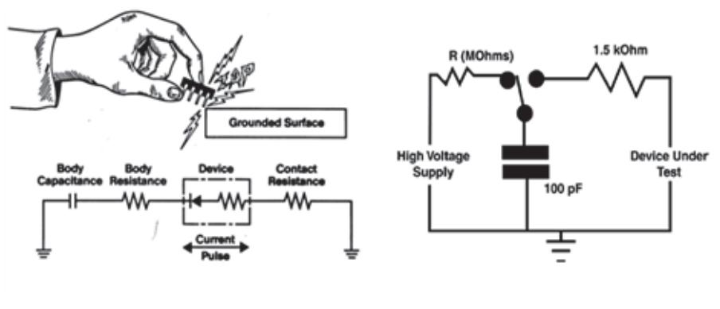

(a) HBM 방전 전류 경로 (b) HBM 등가 회로

출처: 교육부(2018). 반도체 신뢰성 평가(LM903060110\_14v3). 한국직업능력개발원. p.48. [그림 1-27] Human body model의 등가 회로 예시

- 가) 회로 구성은 100pF 커패시터와 1,500Ω 저항으로 한다.
- 나) 일반적으로 전압은 2kV에서 4kV 범위 내에서 테스트하며, 민감한 소자는 500 V부터 테스트한다.
- 다) 주요 용도는 반도체 소자 및 시스템의 ESD 내성 테스트이다.

[그림 1-28]은 HBM 모델의 1㎸ 방전 전류 파형 예시이다.

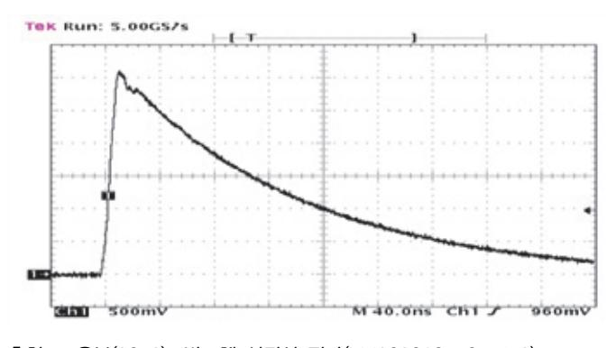

출처: 교육부(2018). 반도체 신뢰성 평가(LM903060110\_14v3). 한국직업능력개발원. p.48. [그림 1-28] HBM 1kV의 방전 전류 파형 예시

3) MM 모델은 HBM과 유사하지만 더 높은 전류 피크와 짧은 방전 시간을 가진다. [그림 1-29]는 MM 모델의 등가 회로 예시이다.

4) CDM 모델은 소자 자체가 커패시터 역할을 하며, 방전이 소자 표면에서 시작된다. [그림 1-31]은 CDM 모델의 등가 회로이다.

[그림 1-30] MM 방전 전류 파형 예시(400V)

출처: 교육부(2018). 반도체 신뢰성 평가(LM903060110\_14v3). 한국직업능력개발원. p.49.

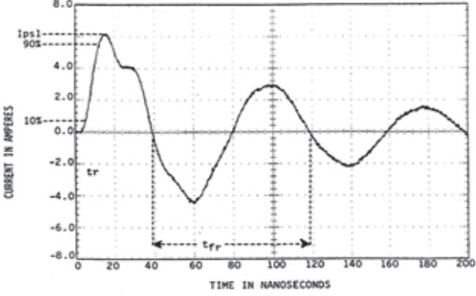

- [그림 1-30]은 MM 모델의 방전 전류 파형 예시이다.
- 다) 주요 용도는 제조 장비 및 자동화 시스템에서의 ESD 상황을 평가하는 데 사용 한다.
- 나) 일반적으로 전압은 200V에서 400V 범위 내에서 테스트한다.
- 가) 회로 구성은 200pF 커패시터와 0Ω 저항으로 한다.

출처: 교육부(2018). 반도체 신뢰성 평가(LM903060110\_14v3). 한국직업능력개발원. p.49. [그림 1-29] MM 등가 회로 예시

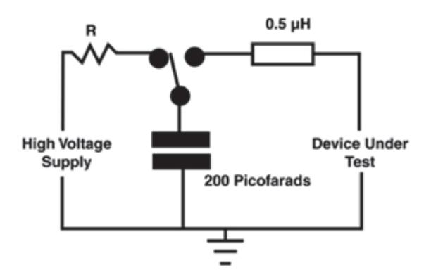

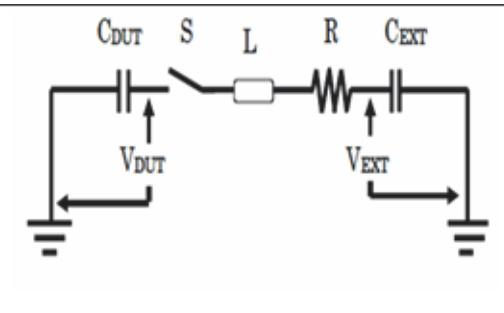

출처: 교육부(2018). 반도체 신뢰성 평가(LM90306011 0\_14v3). 한국직업능력개발원. p.50. [그림 1-31] CDM 등가 회로 예시

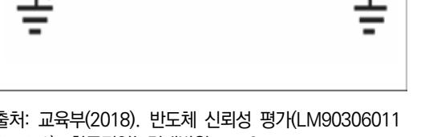

- 가) 회로 구성은 소자 자체의 기하학적 구조에 따라 커패시턴스가 결정된다.
- 나) 일반적으로 전압은 250V에서 1000V 범위 내에서 테스트하며, 민감한 소자는

- 125V부터 테스트한다.
- 다) 주요 용도는 반도체 패키지 및 기판의 ESD 내성 테스트에 사용한다.

[그림 1–32]는 CDM 모델의 방전 전류 파형 예시이다.

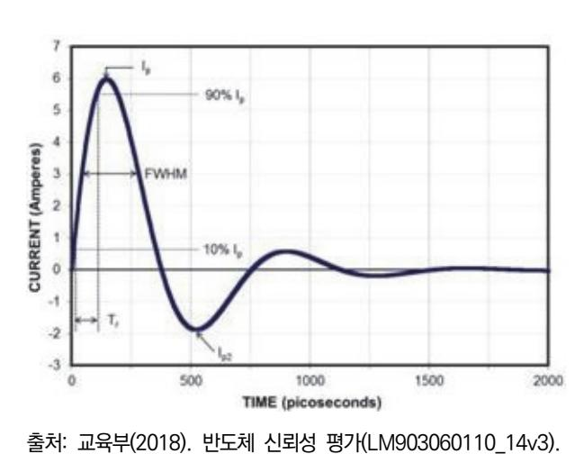

한국직업능력개발원. p.50.

[그림 1-32] CDM 방전 전류 파형 예시(250V)

[그림 1-33]은 정전기 테스트를 위한 체임버이다.

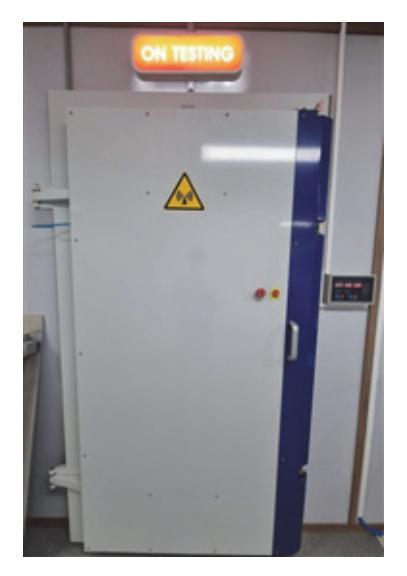

출처: 집필진 제작(2024) [그림 1-33] 정전기 체임버

(3) 전기적 스트레스 수행 절차 이해하고 단계별 세부 내용을 파악한다.

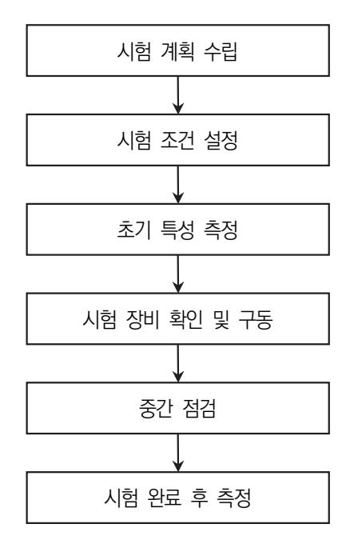

[그림 1-34]는 전기적 스트레스 시험 수행을 위한 절차이다.

출처: 집필진 제작(2024)

[그림 1-34] 전기적 스트레스 시험 절차

(가) 시험 계획 수립하기

- 1) 시험 목적과 목표를 명확히 설정한다.
- 2) 시험 대상 소자와 조건을 정의한다.
- 3) 필요한 장비와 자원을 준비한다.

(나) 시험 조건 설정하기

1) 시험 온도, 전압, 전류, 시간 등의 조건을 설정한다.

2) 국제 표준(예: JEDEC, MIL-STD) 및 규격에 맞춘 조건을 참조한다.

(다) 초기 특성 측정하기

1) 시험 전 소자의 초기 전기적 특성을 측정하여 기준 데이터를 확보한다.

(라) 시험 장비 확인 및 구동하기

1) 장비 상태를 확인한 후 시험 조건(전압, 전류, 온도, 습도, 시간)을 세팅한다.

2) 반도체 소자를 시험 장비에 설치한 후 장비를 구동한다.

[그림 1-35]는 초가속 스트레스 시험을 위한 장치이다.

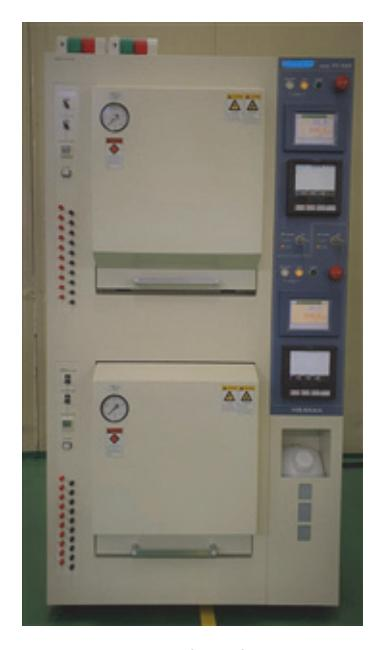

출처: 집필진 제작(2024) [그림 1-35] 초가속 스트레스 시험 기

(마) 중간 점검하기

장시간 시험의 경우, 중간에 소자의 상태를 점검하고 데이터를 기록한다.

(바) 시험 완료 후 측정하기

1) 시험 완료 후 소자의 전기적 특성을 다시 측정한다.

2) 초기 특성과 비교하여 변화 여부를 평가한다.

수행 tip

- 전기적 스트레스 시험은 반도체 부품의 사용 환경에서 발 생할 수 있는 전기적 스트레스를 모의한 환경에서 전기를 인가하여 신뢰성 있게 동작할 수 있는지를 평가하는 시험 이다.
- 6. 래치 업(latch-up)을 이해하고 특징을 파악한다.
  - (1) 래치 업 모델을 파악한다.
    - (가) 래치 업은 소자에 파워 공급 핀과 접지 간에 낮은 임피던스의 경로가 발생하는 상태를 말한다.
    - (나) 전류 주입이나 과전압에 의해서 유발되는데, 한번 작동이 되면 그 유발 인자가 사라져도 낮은 임피던스 경로는 그대로 존재하게 되어 이로 인한 과도한 전류 증가로 시스템에 치 명적인 손상을 주게 된다.
    - (다) 이를 해결하기 위해서는 파워를 껐다가 다시 켜야 한다.
    - [그림 1-36]은 NMOS와 PMOS 간의 PNPN 구조 예시이다.

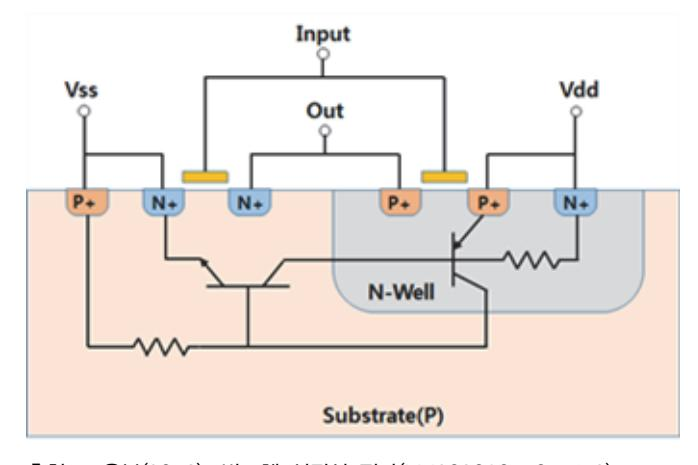

출처: 교육부(2018). 반도체 신뢰성 평가(LM903060110\_14v3). 한국직업능력개발원. p.71. [그림 1-36] NMOS와 PMOS 간의 PNPN 구조 예시

[그림 1-37]은 PNPN 구조 등가 회로 예시이다.

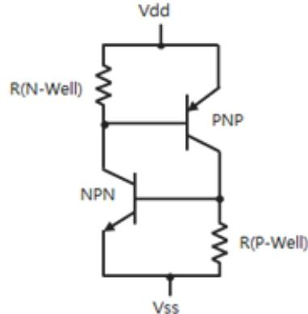

출처: 교육부(2018). 반도체 신뢰성 평가(L M903060110\_14v3). 한국직업능력개발원. p.71. [그림 1-37] PNPN 구조 등가 회로 예시

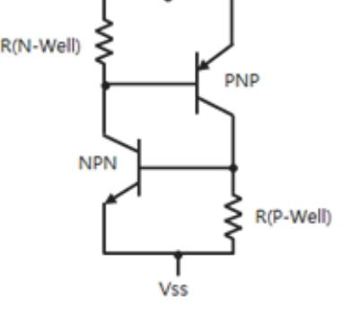

(라) 반도체 소자의 래치 업 현상을 평가한다.

- (마) 과전압(예: Vcc + 5V)과 과전류(예: Icc + 200mA) 조건에서 소자에 래치 업을 유도한다.
- (바) 래치 업 발생 여부, 소자의 회복 능력을 평가한다.
- (2) 래치 업 시험하기
  - (가) 모든 샘플은 ATE 테스트를 통해 소자의 규격을 만족하는지 확인한다.
  - (나) 래치 업 테스트 전에 소자의 소켓 연결 상태를 확인한다.
  - (다) 모든 파워 라인에 전원이 가해지고 테스트 대상 소자가 안정적인 상태에서 낮은 전류 상 태를 유지한다.
  - (라) 대상 소자를 테스트 온도에서 안정화시킨다.
  - (마) <표 1-6>를 기준으로 스트레스가 가해지지 않는 입력 핀은 low나 high 상태로 유지한 채 소자의 각 공급 전원 핀의 공급 전류를 측정한다.
  - (바) <표 1-6>의 모든 조건/조합으로 테스트를 진행한다.
    - 1) 전류 스트레스는 positive와 negative로 모든 non-supply 핀에 각각 가해진다.
    - 2) 과전압(over voltage) 스트레스는 각각의 전원 공급 핀에 가해진다.
  - (사) 소자의 모든 전원 공급핀의 각각의 공급 전류를 재측정한다.
  - (아) 만약 래치 업 스트레스 이후 공급 전류가 너무 높으면 래치 업 고장이 발생한 것이 된다.

〈표 1-6〉 래치 업 테스트 조건의 조합 예시

| 테스트 유형             | 테스트 되지 않는 입력 핀의 조건 | 테스트 온도 구분          | 공급 전원 조건               | latch-up 감지 기준            |
|--------------------|-----------------------|-----------------------|------------------------|------------------------------|
| I-test             | max logic high        | class l: 실온           | 각 전원 그룹별로의 최대 동작 전압 | 절대 Inom이                     |
|                    | min logic low         |                       |                        | 25mA 이하이면,                   |
| I-test V supply | max logic high        | class II: 최대 동작 온도 |                        | 절대 Inom+10 mA 또는 절대 Inom이 |
|                    | min logic low         |                       |                        |                              |
|                    | max logic high        |                       |                        | 25mA 이상이면,                   |
|                    | min logic low         |                       |                        | 1.4 X 절대 Inom                |

출처: 교육부(2018). 반도체 신뢰성 평가(LM903060110\_14v3). 한국직업능력개발원. p.74.

- (3) 래치 업 테스트 가이드 라인 확인하기
  - (가) 공급 전원은 규격을 기준한 최대 전원을 인가한다.
  - (나) 같은 전위의 공급 전원을 하나의 그룹으로 묶을 수 있으나 높은 전류 전원과 낮은 전류 전원은 분리한다.
  - (다) 모든 출력 핀은 자신에게 스트레스가 가해지지 않는 경우에는 floating시킨다.
  - (라) 스트레스 대상 핀은 positive I-test에서는 high로 하고, negative I-test에서는 low로 설정한다.
  - (마) 소자 동작상에 high로만 설정해야 하는 핀은 positive I-test만 수행하며, low로만 설정 해야 하는 핀은 negative I-test만을 실시한다.
  - (바) DUT의 모든 no connect(NC) 핀은 테스트 과정에서 open(floating)된 상태로 테스트 를 진행한다.
  - (사) DUT의 핀에 저항이나 커패시터 등의 수동 소자가 연결되는 특별한 경우 래치 업 가능
     성이 떨어지며, 테스트에서 인가되는 전류나 전압 크기에 따라 래치 업 트리거가 달라진
     다. 경우에 따라 no test로 분류해야 한다.
  - (아) I/O 핀은 가능한 모든 동작 상태나 최악의 동작 상태(변경 모드 I/O에서의 고임피던스) 에서 테스트해야 한다.
  - (자) 클록/타이밍 신호가 입력되어 정상 동작으로 안정적인 전류를 출력하는 소자(dynamic device)의 경우 래치 업 테스트를 진행할 때 보통은 클록/타이밍 신호 핀에 대해서 래치 업 테스트를 제외한다.
  - (차) 소자가 너무 복잡해서 최악 조건에서의 모든 변경 모드 1/0의 테스트가 가능하지 않다

면, 엔지니어의 판단에 따라 소자의 대표적 동작의 테스트 벡터 대표 조합으로 조건을 설정해야 한다.

- (카) I/O 핀이 고 임피던스 상태에서 래치 업 테스트가 될 수 없다면 적정한 로직 상태에서 테스트해야 한다.
- (타) 차동 입력단의 경우는 한쪽 입력을 high, 다른 쪽은 low로 유지해 준다.
- (파) 전압 조정기(VREF), VBAT, charge pump의 출력은 출력 핀으로 간주한다.
- (하) 가능하다면, 래치 업 테스트 전에 PLL은 동작을 중지시킨다.
- (4) 래치 업 테스트 조건 설정하기
  - (가) CMOS 표준 LV(low voltage) 소자의 클램프 전압 high와 low를 설정한다. 공급 전원 = 5V, 접지 = 0V
    - 데이터 시트상의 동작 최대 전압(Vmax) = 5V, 최소 전압(Vmin) = 0V
      - 1) <표 1-7>을 참조하여 클램프 전압 high/low를 구한다.
      - 2) I-test의 펄스 인가 시간, 전류 변화 및 인가 전압을 포함하는 타이밍 차트를 그려 본다.
  - (나) 고전압 소자의 클램프 전압 high와 low를 구한다.
    - 공급 전원(Vss) = 50V, 최대 동작 전압(Vmax) = 55V, 접지 = 0V
    - 소자의 최소 항복 전압(breakdown voltage) = 70V
    - 최대 스트레스 전압(MSV: maximum stress voltage) = 65V(항복 전압에 5V의 여유를 준 경우)
      - 1) <표 1-7>을 참조하여 클램프 전압 high/low를 구한다.
      - 이 경우 <표 1-7>에서의 조건에 해당하므로 MSV가 클램프 전압이나╶0.5Vmax 보다 크면 클램프 전압은 MSV가 된다.
      - 2) 클램프 전압 high(positive I-test)를 재계산한다.
      - 3) 클램프 전압 low(negative I-test)를 재계산한다.

| 테스트             | 트리거 펄스          |                                                                |  |  |
|-----------------|-----------------|----------------------------------------------------------------|--|--|
| 유형              | 전류/전압 인가 수준     | 전압/전류의 제한                                                      |  |  |
|                 | < 50㎃           |                                                                |  |  |
| positive I-test | 50 to < 100㎃    | 클램프 전압=Vmax+0.5(Vmax-Vmin)                                     |  |  |
|                 | 100 to < 150㎃   | 여기서                                                            |  |  |
|                 | 150 to < 200㎃   | Vmax=logic high, Vmin=logic low이며 클 램프 전압의 최대치는 1.5×Vmax이다. |  |  |
|                 | > = 200㎃        |                                                                |  |  |
|                 | > -50㎃          |                                                                |  |  |
|                 | -50 to > -100㎃  | 클램프 전압=Vmin╶0.5(Vmax-Vmin)                                     |  |  |
| negative I-test | -100 to > -150㎃ | MSV가 클램프 전압이나╶0.5Vmax보다 크                                      |  |  |
|                 | -150 to > -200㎃ | 면 클램프 전압=MSV                                                   |  |  |
|                 | < = -200㎃       |                                                                |  |  |
|                 |                 | 클램프 전류는 100mA+ Inom나 1.5×Ino                                   |  |  |
|                 |                 | m                                                              |  |  |
| over-voltage    | 1.5 x VDD나 MSV에 | Inom은 공급 전원이 서로 내부적으로 연결                                       |  |  |
| test            | 서 작은 쪽          | 되어 있고 같은 전원 값을 갖는 전원을 하나                                       |  |  |
|                 |                 | 의 전원 그룹으로 하고 이때의 정상 전원을                                        |  |  |
|                 |                 | 인가시의 공급 전류값                                                    |  |  |

<표 1-7> 래치 업 전류와 전압의 트리거 펄스 조건

출처: 교육부(2018). 반도체 신뢰성 평가(LM903060110\_14v3). 한국직업능력개발원. p.72.

#### 수행 tip

• 래치 업은 반도체 소자에 전원 공급 핀과 접지 간에 낮은 임피던스(저항)로 인해 경로가 발생(전류가 흐름)하여 소자 가 정상 동작하지 않는 현상을 말한다.

7. 화학적 시험(chemical test)의 특성을 파악한다.

- (1) 염수 분무 시험의 목적을 이해하고 시험 수행 절차를 파악한다.
  - (가) 염수 분무 시험 목적을 이해한다.
    - 1) 염분 환경에서 반도체 부품의 부식 저항성을 평가한다.
    - 2) 염수 침투로 인한 금속 부식 및 전기적 성능 저하 여부를 확인한다.
    - 3) 해안 지역 및 고염 환경에서의 신뢰성을 보장한다.
  - (나) 염수 분무 시험 수행 절차를 이해하고 단계별 세부 내용을 파악한다.

[그림 1-38]은 염수 분무 시험 수행을 위한 절차이다.

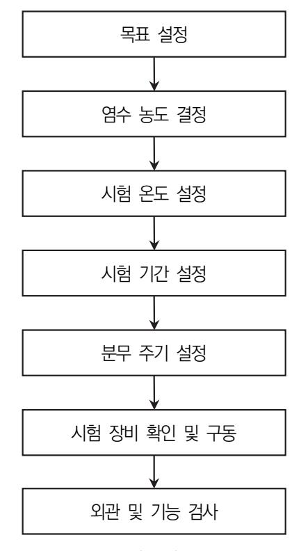

출처: 집필진 제작(2024) [그림 1-38] 염수 분무 시험 절차

- 1) 시험 목표 설정하기
  - 가) 반도체 소자가 염수 환경에서의 부식 저항성과 성능을 평가한다.
  - 나) 부식에 대한 내구성, 전기적 특성의 유지 여부 확인한다.
- 2) 염수 농도 결정하기

관련 표준(JEDEC, MIL-STD, IEC 60068 등)을 참고하여 적절한 염수 농도 설 정한다. (예시 농도: 5% NaCl(염화나트륨) 용액)

<표 1-8> 염수 분무 시험 환경 설정 예시이다.

<표 1-8> 염수 분무 시험 환경 설정 예시

| test condition(NaCl 5%, 35℃) | 시간 |
|------------------------------|----|
| A                            | 24 |
| B                            | 48 |
| C                            | 96 |

출처: 교육부(2018). 반도체 신뢰성 평가(LM903060110\_14v3). 한국직업능력개발원. p.12.

3) 시험 온도 설정하기

가) 염수 분무 시험 시 적용할 온도 조건을 설정한다.

- 나) 관련 표준의 권장 온도 조건을 참고한다(예시 조건: 35°C ± 2°C).
- 4) 시험 기간 설정하기
  - 가) 염수 분무 조건에서 반도체 소자를 노출시킬 기간을 설정한다.
  - 나) 관련 표준의 권장 시험 기간을 참고한다(예시 기간: 24시간에서 1,000시간, 제 품 요구에 따라 다름.).
- 5) 분무 주기 설정하기
  - 가) 염수 분무의 주기 및 지속 시간을 설정한다.
  - 나) 관련 표준의 권장 주기를 참고한다[예시 주기: 연속 분무 또는 주기적 분무(예: 2시간 분무 후 2시간 대기)].
- 6) 시험 장비 확인 및 구동하기
  - 가) 필요한 염수 분무 시험기 및 관련 장비를 준비한다.
  - 나) 시험 전 장비의 캘리브레이션을 확인하여 정확한 시험 조건을 유지한다.
  - 다) 샘플을 장비에 안착시킨 후 시험 레시피(recipe)가 정확하게 세팅되었는지 확인 하고 장비를 구동한다.
- [그림 1-39]는 염수 분무 시험을 위한 장치이다.

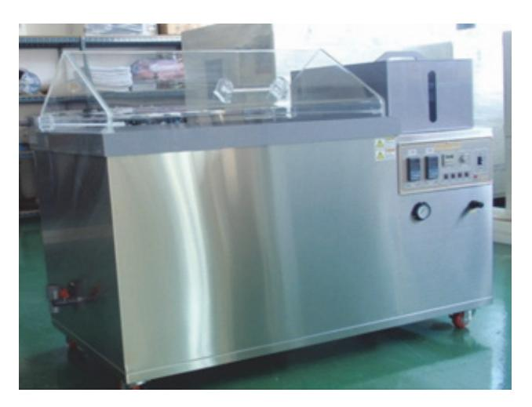

출처: 집필진 제작(2024) [그림 1-39] 염수 분무 시험 장치

- 7) 외관 및 기능 검사하기
  - 가) 시험이 완료되면 D/I water에서 염기를 충분히 제거한다.
  - 나) 시료 외관의 pitting(홀), blistering(부풀음), flaking(박리), corrosion(녹) 등을 검사한다.

다) 시료의 전기 특성 시험(electrical test)을 실시한다.

#### 수행 tip

- 염수 분무 시험은 반도체 부품에 염수를 분사시키는 조건 에서 신뢰성 있게 동작할 수 있는지를 평가하는 시험이다.
- 8. 환경적 시험의 특성을 파악한다.
  - (1) 방진 시험의 목적을 이해하고 시험 수행 절차를 파악한다.
    - (가) 방진 시험 목적을 이해한다.
      - 1) 먼지 및 입자가 많은 환경에서 반도체 부품의 보호 성능을 평가한다.
      - 2) 먼지 침투로 인한 회로 단락 및 성능 저하 여부를 확인한다.
      - 3) 산업 및 건설 환경에서의 안정성을 검증한다.
    - (나) 방진 시험 수행 절차를 이해하고 단계별 세부 내용을 파악한다.
      - 1) 시험 계획 수립하기
        - 가) 시험 목적과 목표를 명확히 설정한다.
        - 나) 시험 대상 소자와 조건을 정의한다.
        - 다) 필요한 장비와 자원을 준비한다.
      - 2) 시험 조건 설정하기
        - 가) 국제 표준(예: JEDEC, MIL-STD) 및 규격에 맞춘 조건을 참조한다.
        - 나) 먼지의 종류(예: 실리카 먼지), 농도(예: 10 mg/m³), 시험 시간(예: 8시간) 등 의 조건을 설정한다.
      - 3) 초기 특성 측정하기
      - 시험 전 소자의 초기 전기적 특성(저항, 전류, 전압 등)을 측정하여 기준 데이터 를 확보한다.
      - 4) 시험 장비 확인 및 구동하기
        - 가) 방진 시험을 위한 체임버를 준비한다.
        - 나) 체임버 내부를 청소하고, 설정된 조건에 맞는 먼지를 준비한다.
        - 다) 소자를 시험 장비에 설치한다.
        - 라) 소자가 정상적으로 설치되었는지 확인한다.
      - [그림 1-40]은 방진 시험을 위한 장치이다.

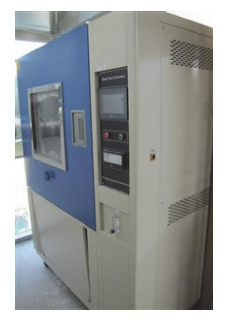

출처: 집필진 제작(2024) [그림 1-40] 방진 시험 체임버

- 5) 시험 수행하기
  - 가) 설정된 조건에서 체임버 내부에 먼지를 분사한다.
  - 나) 먼지 분사 농도는 10mg/m³로 설정한다.
  - 다) 정해진 시간(예: 8시간) 동안 소자가 먼지에 노출되도록 한다.
  - 라) 시험 중 소자의 상태를 지속해서 모니터링한다.
- 6) 시험 완료 후 측정하기
  - 가) 시험 완료 후 소자의 전기적 특성을 다시 측정한다.
  - 나) 초기 특성과 비교하여 변화 여부를 평가한다.

#### 수행 tip

• 방진 시험은 반도체 부품이 먼지 및 입자가 있는 환경 조 건에서 신뢰성 있게 동작할 수 있는지를 평가하는 시험이 다.

수 시험 평가 조건 검증(판정) 방법을 이해하고 세부 내용을 파악한다.

1. 시험 평가 항목별 조건이 정상적으로 선정 또는 설정되었는지 사전 검증하는 방법을 알아보고 상 세 내용을 파악한다.

- (1) 목표와 요구 사항을 재확인한다.
  - (가) 시험의 목적이 명확히 정의되었는지 확인한다. 예를 들어, 제품의 내구성 평가, 성능 검 증, 안전성 테스트 등 목적에 따라 평가 항목과 조건이 달라진다.
  - (나) 관련 표준, 규격, 고객 요구 사항 등을 확인하여 시험 조건이 해당 요구 사항을 충족하 는지 검토한다.
- (2) 시험 계획서를 재검토한다.
  - (가) 시험의 목적, 방법, 절차, 장비, 조건 등이 포함된 시험 계획서를 작성한다.
  - (나) 관련 전문가 또는 팀이 시험 계획서를 검토하고 승인한다. 이 과정에서 시험 조건이 타 당한지, 실현 가능한지, 일관성이 있는지 확인한다.
- (3) 조건 설정의 타당성을 재검증한다.
  - (가) 설정된 조건이 이론적으로 타당한지 검토한다. 이를 위해 관련 문헌, 데이터, 이전 시험 결과 등을 참조한다.
  - (나) 실제 시험에 앞서 소규모 또는 간이 시험을 수행하여 조건의 타당성을 검증한다. 이를 통해 설정된 조건이 실제로 목적에 부합하는지 확인한다.
- (4) 장비와 환경을 재확인한다.
  - (가) 시험에 사용되는 장비가 적절하게 교정되었는지 확인한다. 교정된 장비는 정확한 데이터 를 제공할 수 있어야 한다.
  - (나) 시험 환경이 설정된 조건을 만족하는지 확인한다. 예를 들어, 온도, 습도, 진동 등의 환 경 조건이 시험 요구 사항과 일치해야 한다.
- (5) 조건을 재검토하고 수정한다.
  - (가) 초기 시험 결과나 모의 시험 결과를 바탕으로 피드백을 수집한다. 문제가 발생하거나 조 건이 적절하지 않은 경우 이를 수정한다.
  - (나) 수집된 피드백을 반영하여 시험 조건을 수정하고, 수정된 조건이 타당한지 재검토한다.
- (6) 최종 검토한 결과를 승인한다.
  - (가) 모든 검증 과정을 종합하여 시험 조건이 설정된 목적과 요구 사항을 충족하는지 최종 검 토한다.
  - (나) 관련 부서나 전문가의 최종 승인을 받아야 시험이 정상적으로 진행될 수 있다.
  - (다) 이러한 단계별 검증 절차를 통해 시험 평가 항목별 조건이 정상적으로 선정 또는 설정되 었는지 확인할 수 있다. 이를 통해 시험의 신뢰성과 유효성을 높이고, 시험 결과의 정확 성을 보장할 수 있다.
- 2. 시험 도중 검증을 위한 실시간 모니터링 및 데이터 기록 방법을 알아보고 특성을 파악한다.

- (1) 센서와 측정 장비 사용한다.
  - (가) 온도, 습도, 진동, 압력 등 환경 조건을 측정하기 위한 다양한 센서를 시험 장비나 샘플 에 설치한다.
  - (나) 센서를 데이터 수집 장비나 로거(data logger)에 연결하여 실시간 데이터를 수집한다.
- (2) 데이터 수집 시스템을 사용한다.
  - (가) 데이터 로거를 사용하여 여러 센서에서 수집된 데이터를 실시간으로 기록하고 저장한다.
  - (나) 센서와 데이터 로거를 컴퓨터에 연결하고, 전용 소프트웨어를 사용하여 실시간 데이터를 모니터링하고 기록한다.
- (3) 실시간으로 모니터링한다.
  - (가) 실시간 데이터를 시각적으로 표시하는 대시보드를 사용한다. 이를 통해 시험 중인 조건을 실시간으로 확인할 수 있다.
  - (나) 특정 조건이 설정된 한계를 초과하면 알람이 울리도록 설정하여 이상 상황을 즉시 파악 할 수 있다.
- (4) 데이터를 기록하고 저장한다.
  - (가) 소프트웨어를 통해 수집된 데이터를 자동으로 저장한다. 데이터는 로컬 컴퓨터, 서버, 클 라우드 등에 저장될 수 있다.
  - (나) 데이터를 안전하게 보관하기 위해 주기적으로 백업한다. 이는 데이터 손실을 방지하는 데 중요하다.
- (5) 데이터 분석 및 보고서를 작성한다.
  - (가) 실시간으로 수집된 데이터를 분석하여 환경 조건의 변화와 시험 결과를 평가한다.
  - (나) 수집된 데이터를 기반으로 시험 결과 보고서를 작성한다. 이 보고서에는 시간 경과에 따 른 환경 조건 변화와 그에 따른 시험 샘플의 응답이 포함된다.
- (6) 원격으로 모니터링한다.
  - (가) 인터넷을 통해 원격으로 데이터에 접근하고 모니터링할 수 있는 시스템을 구축한다. 이를 통해 장소에 구애받지 않고 실시간 데이터를 확인할 수 있다.
  - (나) 일부 시스템은 모바일 앱을 통해 실시간 데이터를 모니터링하고 알람을 받을 수 있는 기 능을 제공한다. 이러한 방법을 통해 환경 시험 중 실시간 모니터링 및 데이터 기록이 가 능하며, 시험 조건을 정확하게 제어하고 평가할 수 있다.
- 3. 평가 조건의 변동 상황 발생 시 대응 방법을 알아보고 세부 내용을 파악한다.
  - (1) 변동 상황을 감지한다.

(가) 센서와 데이터 수집 시스템을 통해 실시간으로 시험 조건을 모니터링하여 변동 상황을

(2) 변동 원인을 분석한다.

(3) 즉각 조치한다.

신속하게 감지한다. (나) 설정된 한계를 초과하면 알람이 울리도록 설정하여 즉각 조치할 수 있도록 한다.

(4) 시험을 재개하고 보완한다.

확보한다.

시 참고할 수 있도록 한다.

지 않도록 한다.

로 대처할 수 있다.

(5) 보고하고 기록한다.

(6) 예방 조치한다.

(나) 센서나 측정 장비에 문제가 없는지 확인한다. 오작동이나 교정이 필요할 수 있다.

(나) 변동 상황이 시험 결과에 영향을 끼쳤을 경우, 추가 시험을 시행하여 데이터의 신뢰성을

(나) 시험 결과 보고서에 변동 상황과 이에 따른 대응 조치를 포함된다. 이를 통해 결과 해석

(가) 변동 상황의 원인을 바탕으로 시험 절차나 환경을 개선하여 향후 동일한 문제가 발생하

(나) 장비와 환경 조건에 대한 정기적인 점검과 유지 보수를 실시하여 안정적인 시험 환경을

유지한다. 이러한 대응 방법을 통해 환경 시험 도중 평가 조건의 변동 상황에 효과적으

(다) 외부 환경이나 시험실 조건의 변화가 시험 조건에 영향을 끼쳤는지 확인한다.

(가) 수집된 데이터를 분석하여 변동 상황의 원인을 파악한다.

(가) 시험 조건이 원래 설정된 값으로 돌아가도록 조정한다.

(다) 필요한 경우 센서나 측정 장비를 교체하거나 교정한다.

(가) 시험 조건이 다시 안정화될 때까지 모니터링을 강화한다.

(가) 변동 상황 발생 시점, 원인, 조치 내용 등을 상세히 기록한다.

(나) 상황에 따라 시험을 일시 중단하고 문제를 해결한 후 재개한다.

수행 tip

• 시험 평가 조건이 정상적으로 설정되었는지 사전 검증하는 방법, 시험 도중 검증하는 방법(데이터 저장과 피드백)과 조건 변경 시 대응 방법을 파악한다.

## 학습 1 교수·학습 방법

#### 교수 방법

- 반도체 소자의 전기적, 물리적 특성을 이해하고 IC 동작 원리와 방법을 충분히 인지할 수 있도록 반도체 소자의 기본 원리와 구조에 관한 시청각 자료를 통해 지도한다.
- 응용 분야별 반도체 소자의 종류 및 특성을 제시하고 학습자들이 소자별로 측정 방법과 구 동 방법을 이해하도록 수업을 진행한다.
- 반도체 소자의 환경 시험이 무엇이며, 왜 중요한지 이해하도록 환경 시험의 주요 요소(온도, 습도, 진동 등)와 연계해서 기본 개념을 설명하면서 지도한다.
- 반도체 소자의 신뢰성 특성과 제품별 요구 기준에 관한 국제규격을 숙지하고, 학습자들이 필요한 규격을 검색하고 해당 규격의 내용을 찾아서 활용할 수 있도록 지도한다.
- 각각의 신뢰성 항목에 대한 시험 목적과 시험 방법을 이해하고, 학습자들이 시험 계획을 수 립할 수 있도록 지도한다.
- 환경 시험을 수행하는 장비들의 종류를 시험 항목과 연계하여 설명하고 운영 사양서를 통해 시험 조건 설정을 학습하게 한다.

#### 학습 방법

- 반도체 소자의 전기적, 물리적 특성을 이해하고 IC 동작 원리와 방법, 소자별로 특성 측정 방법을 학습하고, 실습을 통해 충분히 숙지하고, 응용 분야별 반도체 소자의 종류 및 특성을 학습하고, 소자별로 측정 방법과 구동 방법을 파악한다.
- 반도체 소자의 환경 시험이 무엇이며, 왜 중요한지 이해하고, 환경 시험의 주요 요소(온도, 습도, 진동 등)와 연계해서 기본 개념을 학습한다.
- 반도체 소자의 신뢰성 특성과 제품별 요구 기준에 관한 국제 규격을 인터넷을 통해 검색하 고 필요한 규격의 내용을 찾아서 해당 제품에 맞게 신뢰성 시험 계획표를 작성한다.
- 신뢰성 시험 목적과 시험 방법에 대해 항목별로 공부하고, 각 시험 장비 활용법과 시험 도 구 제작법을 학습하여, 실습을 통해 충분히 숙지하고, 환경 시험을 수행하는 장비들의 종류 를 시험 항목과 연계하여 학습하며 운영 샤양서를 통해 시험 조건 설정 방법을 학습한다.

59

# 학습 1 평 가

#### 평가 준거

- 평가자는 학습자가 학습 목표를 성공적으로 달성하였는지를 평가해야 한다.
- 평가자는 다음 사항을 평가해야 한다.

| 학습 내용    | 학습 목표                                                | 성취수준 |   |   |
|----------|------------------------------------------------------|------|---|---|
|          |                                                      | 상    | 중 | 하 |
| 환경 시험 평가 | - 다양한 환경 시험 항목의 종류와 각각의 목적을 이해하고 시험 계획을 수립할 수 있다. |      |   |   |
|          | - 환경 시험 항목별 조건을 설정하고 설비를 이용하여 각각의 시험 방법을 갖출 수 있다. |      |   |   |
|          | - 환경 시험 항목별 평가 진행 조건이 정상인지 판정할 수 있 다.             |      |   |   |

#### 평가 방법

• 서술형 시험

|          | 평가 항목                                                    | 성취수준 |   |   |
|----------|----------------------------------------------------------|------|---|---|
| 학습 내용    |                                                          | 상    | 중 | 하 |
| 환경 시험 평가 | - 온도 ‧ 습도 스트레스 시험의 개념을 이해하고 각 시험 항목 의 특성을 파악할 수 있는 능력 |      |   |   |
|          | - 환경 시험 항목들의 특성을 파악하고 시험 계획을 수립할 수 있는 능력              |      |   |   |
|          | - 전기적 스트레스 시험의 개념을 이해하고 각 시험 항목의 특성을 파악할 수 있는 능력      |      |   |   |

#### • 평가자 질문

|          |                                                     | 성취수준 |   |   |
|----------|-----------------------------------------------------|------|---|---|
| 학습 내용    | 평가 항목                                               |      | 중 | 하 |
| 환경 시험 평가 | - 반도체 환경 시험의 목적 및 필요성을 정의할 수 있는 능력                  |      |   |   |
|          | - 기계적 스트레스 시험의 개념을 이해하고 각 시험 항목의 특성을 파악할 수 있는 능력 |      |   |   |
|          | - 환경 시험 평가 조건에 대한 검증 및 개선할 수 있는 능력                  |      |   |   |

#### • 평가자 체크리스트

|          | 평가 항목                                                 | 성취수준 |   |   |
|----------|-------------------------------------------------------|------|---|---|
| 학습 내용    |                                                       | 상    | 중 | 하 |
| 환경 시험 평가 | - 환경 시험의 신뢰성과 타당성을 확보하기 위한 다양한 방법 을 파악할 수 있는 능력    |      |   |   |
|          | - 환경 시험 도중에 조건 검증을 위한 실시간 모니터링 및 데 이터를 기록할 수 있는 능력 |      |   |   |
|          | - 환경 시험 도중에 평가 조건의 변동 상황 발생 시 원인을 분석하고 대응할 수 있는 능력 |      |   |   |

#### • 구두 발표

|          | 평가 항목                                                    |  | 성취수준 |   |  |
|----------|----------------------------------------------------------|--|------|---|--|
| 학습 내용    |                                                          |  | 중    | 하 |  |
| 환경 시험 평가 | - 환경 시험에서 샘플링 필요성을 이해하고 샘플링 절차 및 방법을 파악해서 정리할 수 있는 능력 |  |      |   |  |
|          | - 환경 시험에서 일정 계획 수립 항목을 파악하고 계획을 수 립할 수 있는 능력          |  |      |   |  |
|          | - 환경 시험 항목 중 ESD 시험의 모델링 방법을 이해하고 특 성을 정리할 수 있는 능력    |  |      |   |  |

피드백

- 1. 서술형 시험
- 온도 ‧ 습도 스트레스 시험의 개념을 이해하고 각 시험 항목의 특성을 파악할 수 있는 능력을 평가 한 후 성취도가 낮은 경우, 온습도 스트레스 시험의 개념을 이해시키고 시험 평가 항목들의 특성 을 재학습시킨다.
- 환경 시험 항목들의 특성을 파악하고 시험 계획을 수립할 수 있는 능력을 평가한 후 성취도가 낮 은 경우, 시험 평가 항목들의 특성과 시험 계획 수립 절차에 따라 다시 설명해 준다.
- 전기적 스트레스 시험의 개념을 이해하고 각 시험 항목의 특성을 파악할 수 있는 능력을 평가한 후 성취도가 낮은 경우, 환경 시험 평가의 개념과 시험 항목의 특성을 다시 설명해 준다.
- 2. 평가자 질문
- 반도체 환경 시험의 목적 및 필요성을 정의할 수 있는 능력을 평가한 후 성취도가 우수한 학습자 들은 스트레스 시험의 개념을 선행 학습할 수 있도록 지도한다. 성취도가 낮은 경우, 환경 시험의 목적과 필요성을 다시 설명해 준다.
- 기계적 스트레스 시험의 개념을 이해하고 각 시험 항목의 특성을 파악할 수 있는 능력을 평가한 후 성취도가 우수한 학습자들은 여러 시험 항목을 일목요연하게 표로 정리할 수 있도록 지도한다. 성취도가 낮은 경우, 시험 평가의 정의와 필요성을 다시 설명해 준다.
- 환경 시험 평가 조건에 대한 검증 및 개선할 수 있는 능력을 평가한 후 성취도가 우수한 학습자 들은 내용을 정리하여 발표를 통해 공유할 수 있도록 지도한다. 성취도가 낮은 경우, 시험 평가 조건에 대한 검증 및 개선 방법을 다시 설명해 준다.
- 3. 평가자 체크리스트
- 환경 시험의 신뢰성과 타당성을 확보하기 위한 다양한 방법들을 파악할 수 있는 능력을 평가한 후 성취수준이 높은 학습자들은 자료를 정리하여 발표를 통해 공유하고, 심화 학습할 수 있도록 한다. 성취도가 낮은 경우, 신뢰성과 타당성 확보를 위한 방법들을 다시 설명해 준다.
- 환경 시험 도중에 조건 검증을 위한 실시간 모니터링 및 데이터를 기록할 수 있는 능력을 평가한 후 성취도가 낮은 경우, 시험 도중 검증을 위한 실시간 모니터링 및 데이터 기록 방법을 다시 설 명해 준다.
- 환경 시험 도중에 평가 조건의 변동 상황 발생 시 원인을 분석하고 대응할 수 있는 능력을 평가한 후 성취도 높은 학습자들은 내용을 정리하여 발표 등을 통해 공유하고 학습 내용을 실습할 수 있 도록 지도한다. 성취도가 낮은 경우, 시험 도중 조건의 변동이 발생한 경우 대응 방법을 다시 설 명해 준다.
- 4. 구두 발표
- 환경 시험에서 샘플링 필요성을 이해하고 샘플링 절차 및 방법을 파악해서 정리할 수 있는 능력 을 평가한 후 성취도가 낮은 경우, 샘플링 필요성 및 절차를 다시 설명해 준다.
- 환경 시험에서 일정 계획 수립 항목을 파악하고 계획을 수립할 수 있는 능력을 평가한 후 성취도 가 낮은 경우, 일정 계획 수립 항목 및 특성을 다시 설명해 준다.
- 환경 시험 항목 중 ESD 시험의 모델링 방법을 이해하고 특성을 정리할 수 있는 능력을 평가한 후 성취도가 낮은 경우, 시험 평가의 정의와 필요성을 다시 설명해 준다.

# 학습 2 환경 시험 분석하기

# 2-1. 환경 시험 분석

|       | • 환경 시험 항목별 시험 결과에 따른 제품의 품질 수준을 판단할 수 있다.             |
|-------|--------------------------------------------------------|
| 학습 목표 | • 환경 시험 결과가 보증 규격을 만족하지 못하는 불량의 경우, 그 불량 유형을 파악할 수 있다. |
|       | • 환경 시험 불량의 원인을 분석할 수 있다.                              |

# 필요 지식 /

숔 환경 시험 분석 절차

- 1. 시료 준비
  - (1) 시료들은 환경 시험 후까지 적절하게 보관한다.
  - (2) 분석을 위해 필요한 경우 절단, 세척, 건조 등의 전처리 과정을 거친다.
- 2. 기준 설정
  - (1) 각 환경 시험 항목에 대해 산업 표준 또는 내부 기준을 설정한다.
  - (2) 각 시험 항목에서는 구조적 손상 여부 등을 기준으로 설정한다.
- 3. 데이터 수집 및 불량 분석
  - (1) 시험 결과 데이터를 수집하고, 이를 기준과 비교하여 분석한다.
  - (2) 데이터는 정량적(온도, 진동 주파수 등) 또는 정성적(외관 변화, 기능 저하 등)으로 정리한다.
  - (3) 다양한 불량 분석 기법들을 사용하여 원인을 분석한다.
- 4. 개선 조치 및 재평가
  - (1) 불합격 항목이 있을 경우, 해당 문제를 해결하기 위한 개선 조치를 취한다.
  - (2) 이를 통해 제품의 품질을 향상시키고, 다시 시험을 시행하여 품질 수준을 재평가한다.

숕 불량 유형 분석

1. 불량 유형의 분석 목적

반도체 신뢰성을 향상하기 위해 필요한 것은 신뢰성 고장 유형을 이해하는 것이다. 고장 유 형 분석을 통해 유형별 활성화 에너지(activation energy)를 추출하고, 이에 따른 가속 계 수를 산출함으로써 신뢰성을 예측할 수 있고 개선 대책을 수립할 수 있다.

2. 항목별 불량 유형

<표 2-1>은 불량 발생 유형의 예시를 보여 주고 있다. 각 환경 시험 항목별 확인할 수 있 는 불량 유형 및 불량 양상에 대해 정리하였다.

<표 2-1> 불량 발생 유형 예시

| 환경 시험 항목          | 확인할 수 있는 불량 유형                        | 불량 양상                                      |
|-------------------|---------------------------------------|--------------------------------------------|
| 온도 사이클 시험         | - 크랙 및 열 변형 - 전기적 특성변 화            | - 소자 표면에 균열 발생 - 성능 저하 및 기능 상실          |
| 습도 시험             | - 부식 및 산화 - 절연 저항 저하               | - 금속 부품의 녹 발생 - 절연 재료의 저항 감소            |
| 진동 시험             | - 기계적 파손 - 피로 균열                   | - 부품 탈락 - 기판 또는 접합부의 미세 균열              |
| 충격 시험             | - 물리적 파손 - 내부 연결 단선                | - 외부 케이스 파손 - 회로의 전기적 연결 손실             |
| 염수 분무 시험          | - 부식 - 표면 손상                       | - 금속 부품에 녹 발생 - 보호 코팅층 손상               |
| 온도·습도 복합 시험       | - 부식 - 열팽창에 의한 손상                  | - 금속 부품 부식 가속화 - 기판 및 부품의 열팽창에 의한 변형    |
| 자외선(UV) 노출 시 험 | - 색상 변색 - 재료 열화                    | - 플라스틱 및 페인트의 변색 - 폴리머 재료의 열화           |
| 방수 시험             | - 침수에 의한 내부 손상 - 전기적 단락            | - 내부 회로의 물 침투 - 전기적 회로 단락 발생            |
| 먼지 시험             | - 먼지 침투 - 전기적 접촉 불량                | - 내부 회로 및 부품에 먼지 쌓임. - 접촉 불량으로 인한 신호 간섭 |
| 고산 시험             | - 기압 변화에 따른 파손 - 내부 기체 누출          | - 케이스 변형 - 밀폐 부품의 기체 누출                 |
| 고온 고습 전압 시험       | - 전기적 특성 저하 - 부식 및 산화              | - 전기적 파라미터 변동 - 금속 부품 부식                |
| 고온 고습 고압 시험       | - 고온·고습·고압 조건에서의 재료 열화 - 전기적 특성 저하 | - 고온에서의 재료 열화 - 고습 및 고압 조건에서의 절연 저하     |
| 고온 보관 시험          | - 재료 열화 - 전기적 특성 변화                | - 장시간 고온 노출로 인한 재료 열화 - 전기적 성능 저하       |

3. 래치 업 고장 판정 기준

- (1) 트리거 테스트 조건에서 전류 전압의 클램프 한계치에서도 래치 업이 발생하지 않는다면, 그 핀은 테스트를 통과한 것이다.
- (2) I-test나 supply over-voltage 테스트 중에 래치 업 발생을 확인하기 위하여 모든 전원 공 급 그룹에 대한 공급 전류가 계속 측정되고 <표 3-9>의 기준을 벗어나면 래치 업의 fail이 발생한 것이다.
- (3) 만약 정상 전류(Inom) ≤ 25mA이면, 재측정된 공급 전류가(Inom+10mA) 이상인 경우 fail 이다.
- (4) Inom > 25mA이면, 재측정한 공급 전류가 1.4×Inom 이상인 경우 fail이다.
- (5) 공급 전류 테스트 결과에 이상이 없어도 ATE 테스트에서 pass 해야만 한다.
- (6) 공급 전류 판정과 ATE 테스트 결과에서 fail로 판정되면, 최대 스트레스 전압(MSV), 전류 한계치, 펄스 폭, 온도 등을 재검토해 보아야 한다.
- 4. 불량 원인 분석
  - (1) 불량 유형 modeling
    - (가) 아레니우스 방정식(arrhenius equation) 아레니우스 방정식은 화학 반응 속도와 관련된 모델링 방법으로, 활성화 에너지와 온 도의 관계를 설명하는 수학적 모델이다. 이 방정식은 주로 화학 과정이나 물리적 반 응 속도를 예측하는 데 사용되지만, 재료 과학에서는 환경 시험에서 재료의 안정성을 평가하는 데에도 적용된다.
      - 1) 아레니우스 방정식의 주요 개념
        - 가) 아레니우스 방정식은 반응 속도 상수 가 온도 의 역수에 비례한다는 관계를 나타낸다. 즉, 온도가 높아지면 반응 속도가 증가하는 경향이 있다.
        - 나) 반응이 발생하기 위해 필요한 최소 에너지인 활성화 에너지 를 포함하고 있 다. 이는 반응이 진행될 수 있도록 분자가 능동적으로 반응하기 위해 필요한 에 너지이다.
      - 2) 프리펙터(frequency factor): 반응 속도 상수 의 크기를 결정하는 상수로, 활성화 에너지와 관련된 전체적인 반응 조건을 나타낸다.
      - 아레니우스 방정식은 다음과 같이 표현된다.

∙

여기서,

- : 반응 속도 상수: 프리펙터, 활성화 에너지와 관련된 상수
- A : 빈도 인자 또는 전인자(pre-exponential factor), 반응이 일어날 수 있 는 최대 빈도
- : 활성화 에너지(activation energy), 반응이 일어나기 위해 필요한 최소

에너지

T: 절대 온도(켈빈 온도)

#### (나) 열팽창 계수(CTE: coefficient of thermal expansion)

- 1) 열팽창 계수의 정의
- 선형 열팽창 계수(linear coefficient of thermal expansion, a)
   길이 변화에 대한 열팽창 계수 수식

$$\alpha = \frac{1}{L_0} \frac{\Delta L}{\Delta T}$$

여기서 α는 선형 열팽창 계수, L0는 초기 길이, ΔL은 길이 변화, ΔT는 온도 변화

체적 열팽창 계수(volumetric coefficient of thermal expansion, β)
 부피 변화에 대한 열팽창 계수 수식

$$\beta = \frac{1}{V_0} \frac{\Delta V}{\Delta T}$$

여기서 β는 체적 열팽창 계수, V0 는 초기 부피, ΔV는 부피 변화, ΔT는 온 도 변화

일반적으로  $\beta \approx 3 \alpha$  로 근사할 수 있다.

2) 열팽창에 따른 길이 변화 모델링

온도 변화에 따른 길이 변화를 계산하기 위해 초기 길이 L0와 온도 변화를 고려 하여 다음과 같이 표현한다.

 $L(T) = L_0(1 + \alpha \Delta T)$ 

여기서 *L(T)*는 온도 변화 후의 길이를 나타낸다.

3) 복합 재료의 열팽창 계수

여러 재료가 결합된 복합 재료의 경우, 각 재료의 열팽창 계수를 가중 평균하여 계산한다.

$$\alpha composite = \sum_{i} \left( \alpha_i \cdot \frac{V_i}{V_{total}} \right)$$

여기서 *αcomposite*은 복합 재료의 평균 열팽창 계수, *αi* 는 각 구성 재료 의 열팽창 계수, *Vi* 는 각 구성 재료의 부피, *V*total은 전체 부피이다.

4) 열응력 계산

온도 변화로 인한 열응력은 다음과 같이 계산할 수 있다.

 $\sigma = E \alpha \varDelta T$ 

여기서 o는 열응력, E는 재료의 탄성 계수, a는 열팽창 계수,  $\Delta T$  는 온도 변

화이다.

- 5) 유한 요소 해석(FEA: finite element analysis)
  - 가) FEA를 이용한 열팽창 모델링은 복잡한 구조물의 열팽창과 열응력을 분석하기위해 유한 요소 해석을 사용한다.
  - 나) 각 요소의 열팽창 계수를 입력하여 전체 구조물의 변형과 응력 분포를 시뮬레이 션한다.
- (다) 픽스의 법칙(FICK's law)

픽스의 법칙은 확산 현상을 설명하는 데 사용되는 중요한 모델링 도구이다. 이 법칙 은 확산 과정에서 물질이 얼마나 빠르게 다른 위치로 이동하는지를 설명한다. 불량 유형 모델링에서는 특히 화학 물질이나 불순물의 확산과 관련한 문제를 분석하는 데 유용하게 활용될 수 있다.

1) 픽스의 제1법칙

정상 상태 조건하에서 단위 면적당 확산하는 물질의 유속은 농도 기울기에 비례 한다는 것을 나타낸다.

일차원 확산의 경우:  $J = -D \frac{dc}{dx}$ 

여기서, J: 단위 시간당 단위 면적을 통해 흐르는 물질의 양(확산 흐름)

D: 확산 계수(diffusion coefficient)

c: 농도(concentration)

 $\frac{dc}{dx}$ : 농도 c 의 공간 변화율

- 농도 변화율에 따른 확산 속도 J는 농도 변화율 *dc dx* 에 반비례하며, 확산 계 수 D에 비례한다. 이는 물질이 농도가 높은 곳에서 낮은 곳으로 자연스럽게 확 산하는 현상을 설명한다.
- 픽스의 법칙은 확산 과정이 선형적이고, 재료 내에서 균일한 조건에서만 적용 될 수 있다. 물질의 농도 변화와 확산 계수를 알고 있다면, 픽스의 법칙을 사 용하여 다양한 환경 조건에서의 확산 현상을 모델링하고 불량 발생 가능성을 예측할 수 있다.
- 2) 픽스의 제2법칙
- 비정상 상태 조건에서, 어떤 위치에서 시간에 따른 농도의 변화(동적 상태)는
   농도를 위치에 대해 2번 미분한 값과 비례한다는 것을 나타낸다.

$$\frac{\partial c}{\partial t} = D \frac{\partial^2 c}{\partial x^2}$$

67

여기서 c는 농도, D는 확산 계수

 $\frac{\partial c}{\partial t}$ 는 시간에 따른 농도의 변화율, 물질이 농도가 높은 곳에서 낮은 곳으로 이동하는 속도와 방향을 나타낸다.

 $\frac{\partial^2 c}{\partial x^2}$  위치(공간)에 따른 농도의 변화율, 농도가 어떻게 곡선을 이루며 변

화하는지를 설명한다.

- 이 법칙에 따르면 특정 위치에서의 농도 변화는 그 위치에서의 농도 곡률과 확
   산 계수으로 결정된다.
- (2) 불량 분석 기법
  - (가) 전기적 분석(electrical analysis)

전기적 특성(전류, 전압, 저항)을 측정하여 불량 전류 경로, 전기적 누설 등을 확인하 는 분석 방법

- 1) DC parameter test
- 2) HEA(hot electron analysis) 분석
- 3) E-Beam probing
- 4) 배선(layout) 분석 및 회로 추출
- 5) IV(전압-전류) 특성 곡선 분석
- (나) 물리적 분석(physical analysis)
  - 균열, 단선, 재료 열화 등의 물리적 손상 여부를 확인하는 분석 방법
    - 1) X-ray 촬영
    - 2) 역 캡슐화/층 제거(decapsulation/delayering)
    - 3) 표면 프로파일러(surface profilometry)
    - 4) 육안 검사(visual inspection)
    - 5) 광학 현미경(microscope)
    - 6) 주사 전자 현미경(SEM: scanning electron microscope)
    - 7) 단면 분석(FIB: focused ion beam)
- (다) 화학적 분석법
  - 제품 재료의 화학적 변화를 확인하는 분석 방법
    - 1) X-선 광전자 분광법(XPS, x-ray photoelectron spectroscopy)
    - 2) 에너지 분산형 X-선 분광법(EDS, energy dispersive x-ray spectroscopy)
    - 3) 라만 분광법(raman spectroscopy)
    - 4) 중량 측정법(weight loss method)

#### 4. 개선 방안 도출

- (1) 원인 분류
  - (가) 설계 오류

제품 설계 자체에 문제가 있는지 확인한다. 예를 들어, 열 관리 설계가 미흡하여 고 온에서 문제가 발생하는 경우

(나) 제조 결함

제조 공정에서 문제가 발생했는지 확인한다. 예를 들어, 패키징 공정에서의 불량, 납 땜 품질 저하 등이 원인인 경우

(다) 재료 결함

사용된 재료에 문제가 있는지 확인한다. 예를 들어, 부적절한 재료 선택으로 인해 고 습에서 부식이 발생하는 경우

(라) 시험 절차 문제

시험 절차 자체에 문제가 있는지 확인한다. 예를 들어, 시험 중 과도한 조건이 적용 된 경우

- (2) 개선 방안 마련
  - (가) 설계 수정

설계 결함이 발견된 경우, 원인이 되는 부분의 설계를 수정하여 문제를 해결한다. 예 를 들어, 열 관리 설계를 강화하거나, 충격 흡수 구조를 추가한다.

(나) 제조 공정 개선

제조 결함이 발견된 경우, 원인이 되는 제조 공정을 개선한다. 예를 들어, 더 높은 품질의 납땜 공정을 적용하거나, 청정 공정을 강화한다.

(다) 재료 변경

재료 결함이 발견된 경우, 적절한 재료로 변경한다. 예를 들어, 부식에 강한 재료를 사용하거나, 내열성을 강화한 재료를 사용한다.

(라) 시험 절차 재검토

시험 절차에 문제가 발견된 경우, 시험 절차를 재검토하고 수정한다. 예를 들어, 시 험 조건을 표준에 맞게 재조정한다.

- 5. 재시험 및 검증
  - (1) 개선된 제품 재시험

개선 방안을 적용한 후, 다시 환경 시험을 실시하여 개선된 제품이 기준을 충족하는지 확인한다.

(2) 결과 검증

재시험 결과를 검토하여 모든 항목에서 합격 판정을 받았는지 확인한다. 필요시 추가적 인 검증 절차를 수행한다.

#### 6. 문서화 및 보고

(1) 분석 결과 문서화

원인 분석 과정과 결과, 개선 방안, 재시험 결과 등을 문서화한다.

(2) 보고서 작성

분석 결과와 개선 사항을 포함한 최종 보고서를 작성하여 관련 부서에 공유한다.

## 수행 내용 / 환경 시험 분석하기

#### 재료·자료

- 시험 대상 시료(반도체 소자 또는 부품)
- 대조 시료 : 환경 시험
- 환경 시험 조건 상세 정보
- 시험 전후 측정 데이터(전기적 특성, 물리적 특성, 무게, 외관 등)
- 유한 요소 해석 소프트웨어(FEA, 열응력 분석을 위한 시뮬레이션 소프트웨어)
- 이미지 분석 소프트웨어(현미경 이미지의 분석 및 해석을 위한 소프트웨어)
- 스펙트럼 분석 소프트웨어(XPS, EDS 등의 스펙트럼 데이터를 분석하는 소프트웨어)
- 표준 및 가이드라인
- 시험 표준서/국제 표준
- 분석 가이드라인(시료 준비, 측정, 데이터 해석에 대한 내부 가이드라인 및 절차서)

기기(장비 ・ 공구)

- 보관 용기
- 세척 용액
- PC
- 역 캡슐화/층 제거 장비(decapsulation/delayering system)

- X-ray Chamber
- SEM(scanning electron microscope)
- FIB(focused ion beam)
- 초음파 시스템
- 정밀 저울
- 광학 현미경
- 주사 전자 현미경(SEM)
- 에너지 분산형 X-선 분광기(EDS)
- 열기계 분석기(TMA)
- X-선 광전자 분광기(XPS)
- X-선 회절기(XRD)
- 표면 프로파일러
- 전기 화학 분석기

#### 안전 ・ 유의 사항

- X-ray 장비 사용 시 차폐 시설의 동작 유무를 확인한다.
- Decapsulation/delayering용 화학 약품 보호 장구(방독면, 작업 가운, 장갑)의 유무를 확 인하고, 착용법을 숙지한다.
- 고온 체임버 개폐 시 화상에 주의한다.
- 시험 설계 시 안전성 확보를 위해 예상 위험 요소를 평가하고 안전 조치를 포함한다.
- 작업 공간의 안전 확보를 위해 깨끗하고 정돈된 작업 환경을 유지하여 사고를 예방한다.
- 정전기에 민감한 반도체 소자를 다룰 때 정전기 방지 보호구를 반드시 착용하고 사용해야 한다.
- 환경 시험 시 시료를 손상하지 않도록 주의하고 정밀하게 다룬다.

- 반도체 시험 시 이물질이나 오염을 방지하기 위해 작업 공간의 청결을 유지한다.
- 시험 장비의 사용법을 충분히 숙지하고 안전 지침을 준수하면서 시험을 수행한다.
- 고온 또는 고압 장비 사용 시 적절한 보호 장비를 착용하고 시험을 수행한다.
- 장비의 정기적인 점검과 유지 보수를 통해 안전하고 최적의 공정 상태를 유지할 수 있도록 한다.
- 데이터 손실을 방지하기 위해 정기적으로 데이터를 백업하고 수집된 데이터는 안전하게 보 관하고 접근 권한을 제한한다.
- 민감한 정보를 포함한 보고서와 발표 자료는 보안을 유지한다.

#### 수행 순서

숔 환경 시험 분석에 대한 이해와 상세 내용을 파악한다.

- 1. 환경 시험 분석의 목적을 파악한다.
  - (1) 반도체가 다양한 환경 조건에서 안정적으로 작동하는지 확인하여 제품의 신뢰성을 보장한다.
  - (2) 극한 환경에서 반도체가 얼마나 오래 견딜 수 있는지 예측하여 제품의 수명을 보장한다.
  - (3) 제조 공정에서 발생할 수 있는 잠재적인 결함을 조기에 발견하고 수정하여 전체 제품의 품질 을 높인다.
  - (4) 반도체 제품이 각종 산업(의료, 자동차, 항공 우주 등 고신뢰성을 요구하는 분야) 표준 및 규 제를 준수한다.
  - (5) 높은 품질과 신뢰성을 통해 시장에서의 경쟁력을 강화하고 고객의 신뢰를 얻는다.
- 2. 환경 시험 분석 절차를 파악한다.
  - (1) 기준 설정하기

각 환경 시험 항목에 대해 산업 표준 또는 내부 기준을 설정한다. 예를 들어, 고온 시험 에서는 특정 온도에서의 동작 여부, 진동 시험에서는 특정 주파수와 진폭에서의 구조적 손상 여부 등을 기준으로 설정한다.

- (2) 데이터 수집 및 분석하기 시험 결과 데이터를 수집하고, 이를 기준과 비교하여 분석한다. 데이터는 정량적(온도, 진동 주파수 등) 또는 정성적(외관 변화, 기능 저하 등)일 수 있다.
- (3) 판단 기준 적용하기

수집된 데이터를 기준으로 제품의 성능을 평가한다. 기준을 충족하면 합격, 기준을 충족 하지 못하면 불합격으로 판정한다.

(4) 종합 평가하기

각 환경 시험 항목에 대한 결과를 종합적으로 평가하여 전체 품질 수준을 판단한다. 일 부 항목에서 불합격이 나와도 전체적인 품질이 크게 저하되지 않는 경우가 있으므로, 종 합적인 판단이 중요하다.

(5) 개선 조치

불합격 항목이 있을 경우, 해당 문제를 해결하기 위한 개선 조치를 취합한다. 이를 통해 제품의 품질을 향상하고, 다시 시험을 시행하여 품질 수준을 재평가한다.

#### 3. 환경 시험 항목별 분석 및 평가 내용을 파악한다.

- (1) 온도 시험 종류별 분석 평가 방법을 파악한다.
  - (가) 고온 시험 분석 평가하기
    - 1) 반도체 칩을 125°C의 고온 환경에 48시간 동안 노출하여 성능 변화를 관찰한다.
    - 2) 시험 후 칩이 정상적으로 동작하는지 확인한다. 예를 들어, 프로세서 칩이 고온 환 경에서도 정상적으로 연산을 수행하면 합격이다.

[그림 2-1]은 고온 ‧ 고습 ‧ 고압 시험을 위한 장치이다.

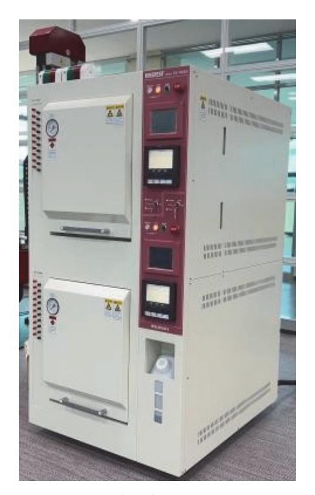

출처: 집필진 제작(2024) [그림 2-1] 고온 ‧ 고습 ‧ 고압 시험기

(나) 저온 시험 분석 평가하기

1) 반도체 칩을 -40°C의 저온 환경에 48시간 동안 노출하여 성능 변화를 관찰한다.

2) 시험 후 칩이 정상적으로 동작하는지 확인한다. 예를 들어, 메모리 칩이 저온 환경

1) 반도체 칩을 -40°C에서 125°C로 반복적으로 변화시키며 1,000번의 사이클을 진행

2) 시험 후 칩이 정상적으로 동작하는지 확인한다. 예를 들어, 전력 반도체 소자가 온

1) 반도체 패키지를 85°C/85% RH의 고습 환경에 1,000시간 동안 노출하여 부식,

2) 시험 후 패키지 내부에 수분이 침투하지 않고 정상적으로 동작하면 합격이다. 예를

1) 반도체 패키지를 습도와 온도가 변화하는 환경(예: 25°C/95% RH에서 65°C/50%

2) 시험 후 칩이 정상적으로 동작하는지 확인한다. 예를 들어, 센서 칩이 습도 변화 후

들어, 통신 칩이 고습 환경에서도 신호 전송이 원활하게 이루어지면 합격이다.

에서도 데이터 저장 및 읽기가 정상적으로 이루어지면 합격이다.

도 변화 후에도 안정적으로 전력을 제어하면 합격이다.

RH로 반복)에서 100번의 사이클 내구성을 평가한다.

[그림 2-2]는 급속 온도 변화 사이클 시험을 위한 장치이다.

에도 정확한 데이터를 측정하면 합격이다.

(다) 온도 사이클 시험 분석 평가하기

(2) 습도 시험 종류별 분석 평가 방법을 파악한다.

곰팡이 등의 영향을 평가한다.

(나) 습도 사이클 시험 분석 평가하기

한다.

(가) 고습 시험 분석 평가하기

74

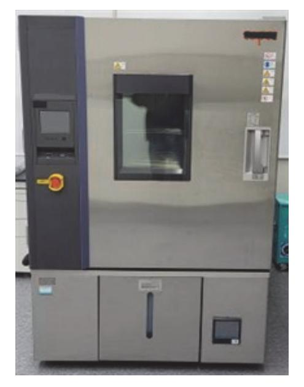

출처: 집필진 제작(2024) [그림 2-2] 급속 온도 변화 사이클 시험기

- (3) 진동 및 충격 종류별 분석 평가 방법을 파악한다.
  - (가) 진동 시험 분석 평가하기
    - 1) 반도체 모듈을 다양한 주파수와 진폭(10Hz-2,000Hz)의 진동 환경에 2시간 동안 노출해 구조적 안정성을 평가한다.
    - 2) 시험 후 모듈에 구조적 손상이 없고 정상적으로 동작하면 합격이다. 예를 들어, 메 모리 모듈이 진동 시험 후에도 데이터 전송이 문제없이 이루어지면 합격이다.
  - (나) 충격 시험 분석 평가하기

  - - 1) 반도체 패키지를 특정 높이(예: 1.5m)에서 떨어뜨려 충격을 가하여 견딜 수 있는

에도 데이터 손상 없이 정상적으로 작동하면 합격이다.

- 능력을 평가한다. 2) 시험 후 패키지가 정상적으로 동작하면 합격이다. 예를 들어, SSD가 충격 시험 후
- 4. 방수 및 방진 시험 종류별 분석 평가 방법을 파악한다.

  - (가) 방수 기능을 가진 반도체 패키지를 물속에 1미터 깊이로 30분간 잠가 놓아 방수 성능을 평가한다.
  - (나) 시험 후 패키지가 정상적으로 동작하고 물이 내부로 침투하지 않았으면 합격이다.
  - (2) 방진 시험 분석 평가하기

(1) 방수 시험 분석 평가하기

- (가) 반도체 모듈을 먼지 상자에 넣고 일정 시간 동안 먼지에 노출해 방진 성능을 평가한다.
- (나) 시험 후 모듈 내부에 먼지가 유입되지 않고 정상적으로 동작하면 합격이다. 예를 들어,

방진 기능을 갖춘 프로세서가 먼지 시험 후에도 정상적으로 동작하면 합격이다.

- 5. 내식성 시험의 분석 평가 방법을 파악한다.
  - (1) 반도체 패키지를 염수 분무 환경에 96시간 동안 노출해 부식 저항성을 평가한다.
  - (2) 시험 후 패키지에 부식이 발생하지 않으면 합격이다. 예를 들어, 전력 반도체 패키지가 염수 분무 시험 후에도 부식 없이 전력 제어 기능을 유지하면 합격이다.

[그림 2-3]은 염수 분무 시험을 위한 장치이다.

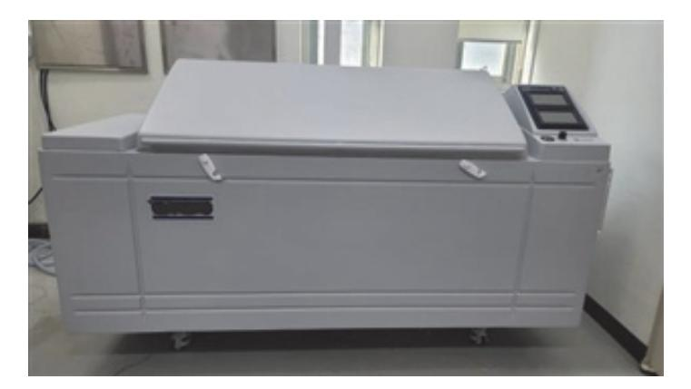

출처: 집필진 제작(2024) [그림 2-3] 염수 분무 시험 장치

- 6. 자외선 노출 시험의 분석 평가 방법을 파악한다.
  - (1) 반도체 패키지를 자외선(UV) 램프 아래에 500시간 동안 노출해 색상 변형, 재료 열화 등을 평가한다.
  - (2) 시험 후 패키지의 색상 변형이나 재료 열화가 없으면 합격이다. 예를 들어, 외부용 반도체 센 서 패키지가 UV 시험 후에도 변색이나 재료 열화 없이 정상적으로 작동하면 합격이다.
- 7. 열팽창 계수 모델링 분석 방법을 이해하고 상세 특성을 파악한다.
  - (1) 불량 유형 모델링에서 열팽창 계수는 재료가 열에 의해 얼마나 팽창되는지를 나타내는 중요 한 물리적 특성이다.
  - (2) 열팽창 계수 모델링은 재료의 디자인 및 환경 시험에서 불량 예측에 중요한 역할을 한다. 이 를 통해 재료가 다양한 온도 조건에서 어떻게 변형되는지를 이해하고, 이로 인한 잠재적인 불 량을 예측할 수 있다.
  - (3) 열팽창 계수는 재료의 길이, 너비 또는 높이가 초기 길이의 얼마까지 증가하는지를 나타내는 계수이다.
  - (4) 열팽창에 의한 물체의 팽창 비율을 나타내며, 보통 일정한 압력하에서 온도가 1℃ 올라갈 때 마다 부피 증가율로 표시한다.

- (5) 열팽창 계수 차이로 반도체 소자의 칩(chip)과 부동화(passivation) 간의 크랙(crack), 기능의 파라미터 이동(parameter shift), 단선(wire open) 등의 불량이 발생하는 원인이 된다.
- 숕 불량을 분석한다.
  - 1. 전기적 분석(DC parameter test)을 실시한다.

양산 tester에서 DC parametric fail로 선별된 시료에 대해 pin(port)별로 해당 parameter에 대한 특징을 측정하여 정확한 불량 분석 계획을 수립하기 위해 시행한다. 주로 아래와 같은 항목들에 대해서 테스트한다. [그림 2-4]는 디지털 신호 분석을 위한 장치이다.

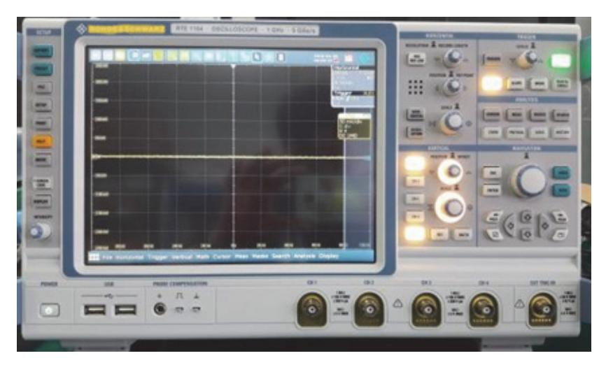

출처: 집필진 제작 [그림 2-4] 디지털 신호 분석기

- (1) input 전압 특성
- (2) input leakage current test
- (3) output 전류 / 전압 test
- (4) tri-state leakage current test
- (5) 소비 전류 test
- [그림 2-5]는 DC parameter test 운영 프로그램의 예시이다.

수행 tip

• Tri-state는 전자 공학에서 3가지 상태의 논리 회로를 말 한다. High (1): 논리적으로 연결 상태 Low (0): 논리적으로 끊긴 상태 High Impedance (Z): 높은 임피던스 상태로 회로가 연 결되지 않은 상태처럼 동작. 즉, H/W는 연결되었지만 논 리적으로 끊긴 상태

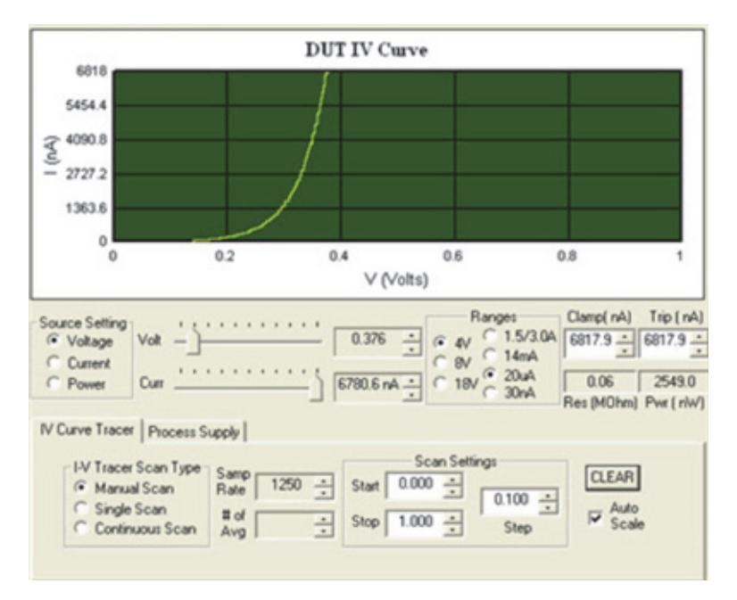

출처: 교육부(2018). 반도체 신뢰성 평가(LM903060110\_14v3). 한국직업능력개발 원. p.13. [그림 2-5] 사용 장비 예시

- 2. X-ray 촬영을 한다.
  - (1) X선은 방사선의 짧은 파장과 높은 에너지 때문에 쉽게 물질을 통과하는 특성과 물질을 구성 하는 원자재에 따라 투과율이 다른 원리를 이용하여 x-ray 검사 시스템을 이용하여 분석 시 료에 대한 파괴 검사 전에 시행한다.
  - (2) 주로 조립 공정에서 발생할 수 있는 wire boding, die attach, package lead frame 등 공정과 소재 결함에 대한 분석을 위해 시행한다.
  - (3) 유사한 분석 장비로 초음파 검사 장비인 SAT(scanning acoustic tomography)도 선택적으 로 사용한다.

[그림 2-6]에 x-ray상에서 wire bonding pad 상태를 보여 준다.

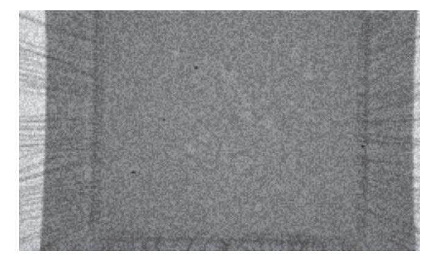

출처: 교육부(2018). 반도체 신뢰성 평가(LM903060110\_14v3). 한국 직업능력개발원. p.14. [그림 2-6] X-ray상에서의 wire bonding pad 상태

#### 수행 tip

- X-ray 장비 사용과 관련된 법적 규제와 요건을 준수해야 하고, 특히, 방사선 안전과 관련된 법적 요구 사항을 철저 히 따르는 것이 중요하다.
- 3. 패키지(package) decapsulation과 layer etching을 실시한다.
  - (1) 불량 시료에 대한 물리적인 분석을 위해 우선하여 시행해야 하는 과정이 패키지 decapsulation 작업이다.
  - (2) 반도체 chip 보호용 package를 구성하는 소재인 EMC(epoxy molding compound)의 제 거를 통해 wire bonding 상태 및 lead frame의 상태를 우선하여 살펴볼 수가 있으며, 다음 단계로 chip surface 상태는 물론 회로 배선상의 결함을 분석할 수 있다.
  - (3) 예전에는 엔지니어들이 화학 약품을 이용하여 직접 작업을 실시하였으나 최근에는 자동 설비 를 활용함으로써 해로운 화학 약품으로 인한 인체의 안전 문제를 많이 완화하였다.
  - [그림 2-7]은 IC auto decapsulator 및 작업 완료된 chip 표면 상태를 보여 준다.

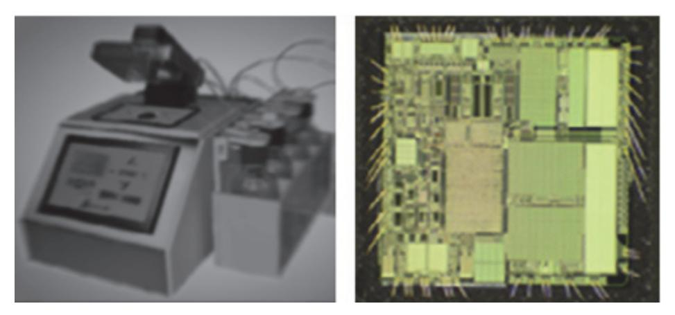

출처: 교육부(2018). 반도체 신뢰성 평가(LM903060110\_14v3). 한국직업능력개발원. p.14. [그림 2-7] IC auto decapsulator 및 작업 완료된 chip 표면 상태

#### 수행 tip

- decapsulation은 반도체 패키지의 외부 보호막을 제거하 여 내부 칩을 노출시키는 과정으로 반도체 칩(chip)에 대 한 표면 결함이나 손상 여부를 검사할 수 있다.
- layer etching은 노출된 칩의 각 층을 하나씩 제거하면서 층별로 배선 결함, 접합 불량, 산화물층의 문제 등을 분석 할 수 있다.
- 4. 육안 검사(visual inspection)를 실시한다.
  - (1) 현미경(microscope)

현미경은 육안 검사에서 주로 사용되며 [그림 2-8]과 같다.

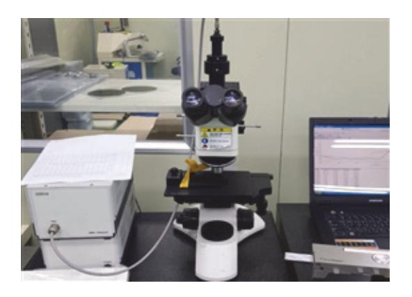

출처: 집필진 제작(2024) [그림 2-8] 현미경 예시

- (2) 주사 전자 현미경(SEM: scanning electron microscope)
  - (가) SEM은 육안으로 분석이 불가능한 시료의 미세한 부분을 확대하여 분석하는 데 사용한다.
  - (나) SEM은 통상 수천 배 수준의 광학 현미경에 비해 월등히 높은 배율(x100만)까지 관찰할 수 있어 불량 분석 부위를 규명하는 데 매우 유용하다.
  - (다) SEM은 전자 빔을 시료 표면에 주사할 때 시료 표면에서 방출되는 2차 전자를 검출기로 검출하여 모니터상에 주사함으로써 영상으로 형상화하는 원리로 제작되었다.

[그림 2-9]는 주사 현미경으로 본 반도체 소자 영상이다.

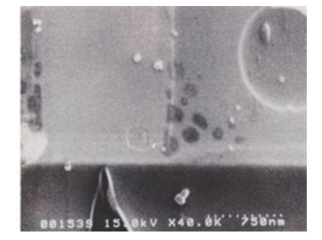

(a) 금속(metal) 배선 표면 (b) metal contact 불량 부위

출처: 교육부(2018). 반도체 신뢰성 평가(LM903060110\_14v3). 한국직업능력개발원. p.15. [그림 2-9] 주사 전자 현미경 영상의 예시

#### 수행 tip

• 비전도성 재료(세라믹, 고분자 등)나 매우 낮은 전도성을 가진 재료를 분석할 때 전자빔이 잘 통과하도록 금속으로 코팅하고, 금속 시료와 같은 전도성 재료는 코팅하지 않아도 된다.

5. HEA(hot electron analysis) 분석을 선택적으로 실시한다.

반도체 소자의 DC parametric 불량 또는 function 불량에 대해서 소자에 전기적인 신호 를 인가한 후 불량 위치에서 광자 방출(photon emission)을 검출하는 분석 방법으로써 소 자의 누설 전류(leakage current) 및 단락 고장(short fail) 발생 위치를 특정하기 위해 사 용한다. 이 외에도 열 방출 현미경(thermal emission microscope), 광자 방출 현미경 (photon emission microscope) 등을 이용하여 분석하기도 한다. [그림 2-10]은 광자 방

- 출 현미경 장치이다.
- (1) HEA 분석의 장점을 다음과 같다.
  - (가) 고온 전자 효과를 분석해 소자의 열화 및 고장을 조기에 발견할 수 있다.
  - (나) 다양한 조건에서 소자의 신뢰성을 정확하게 평가할 수 있다.
  - (다) 잠재적인 문제를 조기에 찾아 소자의 설계를 개선할 수 있다.
  - (라) 제조 공정 중 발생할 수 있는 문제를 분석하고 공정을 최적화할 수 있다.
  - (마) 전기적, 열적, 구조적 특성을 종합적으로 분석해 소자의 성능을 다각도로 평가할 수 있다.
- (2) HEA 분석의 한계는 다음과 같다.
  - (가) 극한의 시험 조건이 실제 사용 환경과 다를 수 있어 결과가 실제와 일치하지 않을 수 있다.
  - (나) 고가의 장비와 전문적인 기술이 필요해 비용이 많이 든다.
  - (다) 모든 잠재적 결함을 발견하지 못할 수 있어 완벽한 신뢰성 보장은 어렵다.
  - (라) 소자의 물리적 손상을 일으킬 수 있어 테스트 후 소자를 재사용하기 어려울 때가 있다.
  - (마) 소자의 특정 설계나 재료 특성에 따라 테스트 결과가 달라질 수 있어 일반화하기 어렵다.

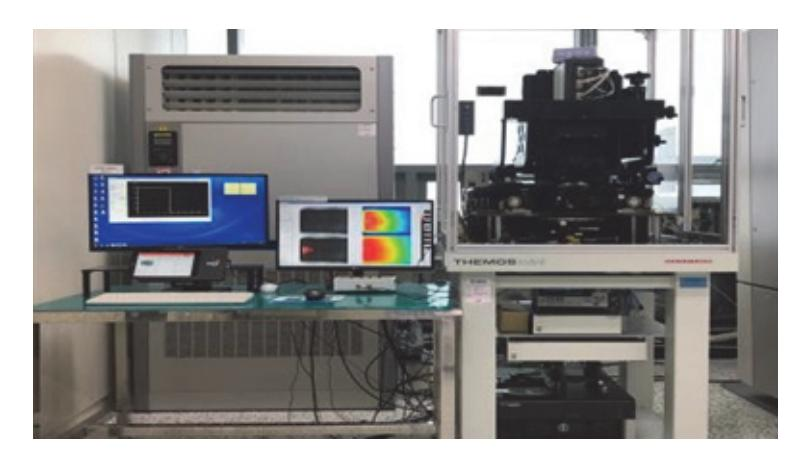

출처: 집필진 제작(2024) [그림 2-10] 광자 방출 현미경(photon emission microscope)

- (3) 분석 영역
  - (가) 소비 전류 결함(stop/standby current failure)
  - (나) 핀 누설 전류 결함[pin(port) leakage current failure]
  - (다) 회로 내 접촉 저항 결함(contact resistance failure)
  - (라) 금속 결핍(metal shortage)

(마) 다양한 기능적 결함(functional failure)

(4) 분석 사진

[그림 2-11]은 hot spot point를 촬영한 영상이다.

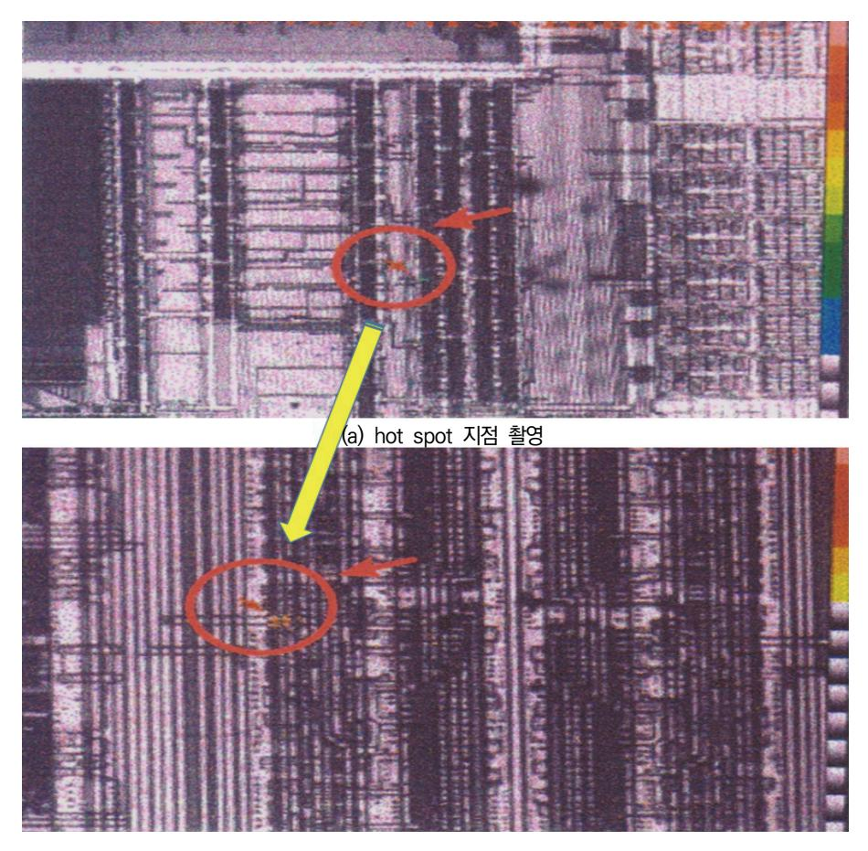

(b) spot 부위 확대

출처: 교육부(2018). 반도체 신뢰성 평가(LM903060110\_14v3). 한국직업능력개발원. p.16. [그림 2-11] hot spot point 촬영 영상 예시

- 6. E-Beam 프루빙을 선택적으로 실시한다(functional 불량의 경우 흔히 실시).
  - (1) E-Beam prober는 SEM의 기능을 활용한 불량 분석 장비로써, voltage contrast concept 를 이용하여 chip 표면에서 방출되는 E-beam을 통해 signal의 voltage와 timing을 측정함 으로써 Waveform을 확보할 수 있다.
  - (2) Waveform은 전기적인 신호가 인가되고 있는 metal, poly, junction 부위에서 측정되는데, 시간에 따라 변화되는 신호들에 대해서 추적 관찰이 가능하기 때문에 일정한 신호의 pattern 을 활용한 looping test를 통해서 정상 시료와 불량 시료 간의 차이점을 비교하여 불량 부위 를 영상으로 측정하는 데 유용하게 사용된다.

[그림 2-12]는 voltage contrast 개념을 응용한 파형 비교 예시이다.

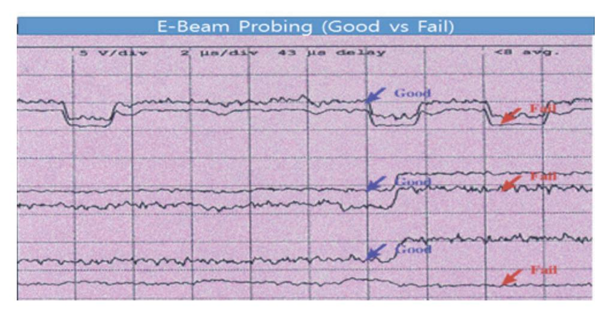

출처: 교육부(2018). 반도체 신뢰성 평가(LM903060110\_14v3). 한국직업능력개발원. p.17. [그림 2-12] voltage contrast 개념을 응용한 파형 비교

#### 7. 배선(layout) 분석 및 회로 추출을 실시한다.

E-Beam 프루빙이나 hot electron emission 기법을 이용하여 불량으로 추정되는 부위가 특정되면 그 부분에 대한 배선을 분석하고 여기에 해당하는 회로를 추출한다. [그림 2-13] 은 불량 발견 부위의 layout과 해당 부위의 회로를 추출한 예시이다.

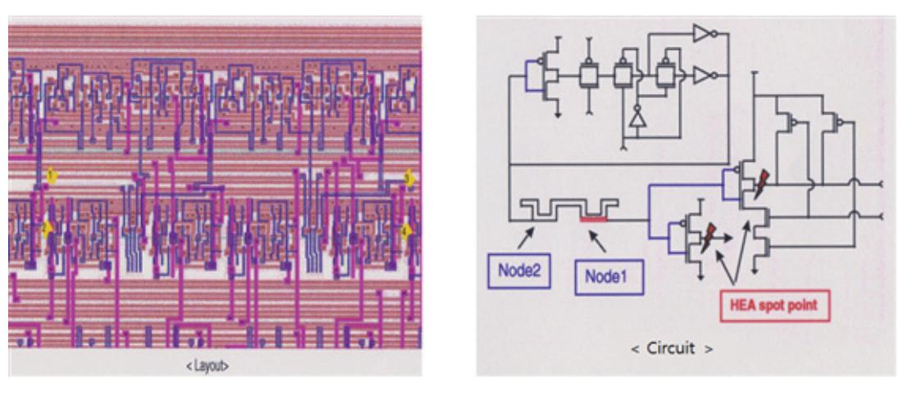

(a) layout 상의 hot spot 부위 정의 (b) 불량 해당 부위 회로 분석

출처: 교육부(2018). 반도체 신뢰성 평가(LM903060110\_14v3). 한국직업능력개발원. p.17. [그림 2-13] 불량 발견 부위의 layout 분석과 해당 부위의 회로 추출

8. 단면 분석을 실시한다(FIB: focused ion beam).

FIB는 시료의 원하는 미세 부위에 전자 빔을 주사하여 해당 부위를 절단하거나 metal을

증착하여 원하는 부위를 연결할 수 있으며, 불량 부위의 단면 분석을 시행할 수 있다. [그림 2-14]는 반도체 소자의 단면에 대한 영상이다.

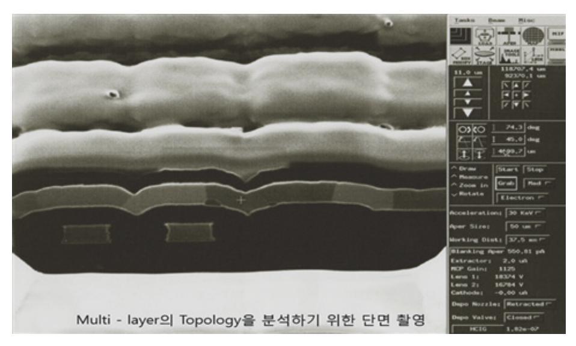

출처: 교육부(2018). 반도체 신뢰성 평가(LM903060110\_14v3). 한국직업능력개발원. p.18. [그림 2-14] FIB 촬영 단면도

- 9. 래치 업 불량을 분석 및 개선한다.
  - (1) 래치 업 테스트하기
    - (가) 모든 파워 라인에 전원을 가한다. 설정한 테스트 온도를 유지한다.
    - (나) 소자의 각 공급 전원 핀의 공급 전류(Isupply)를 측정한다.
    - (다) 모든 조건/조합으로 전류 스트레스와 over voltage 스트레스를 진행한다.
    - (라) 소자의 모든 전원 공급 핀의 각각의 공급 전류(Isupply)를 재측정한다.
    - (마) 래치 업 발생을 확인한다.
  - (2) 래치 업 불량 분석 및 개선하기
    - (가) 래치 업 불량 원인 분석하기

수준이 목표 수준을 통과하지 못한 경우는 반도체 소자의 불량 분석을 통하여 불량 의 원인을 파악한다.

- 1) 반도체 패키지의 decapsulation을 진행한다.
- 2) 불량 분석 장비인 EMMI(emission microscopy)와 OBIRCH(optical beam induced resistance change) 장비를 이용하여 칩 상에서의 손상 부위를 확인한다.
- 3) 래치 업 불량의 경우 과도 전류가 흘러 손상이 발생한 경우는 쉽게 불량 포인트를 찾을 수 있으나 래치 업에 의한 PIN 누설 전류가 발생하는 경우, power를 끄고 다 시 켜면 원상회복이 되는 문제의 경우는 위의 분석 장비로 불량 포인트 확인이 상당 히 어려울 수 있다.

- 4) 래치 업의 발생이 layout상의 원치 않는 PNPN 구조의 형성과 이들 소자의 동작 조건이 갖추어질 수 있는 점에 집중하여 불량이 발생한 PIN을 trace 하면서 layout 상의 요소를 수평과 수직 구조적으로 전체적으로 보면서 또한 parasitic 요소의 전 기적 연결 네트워크에 대해서도 살펴보아야 한다.
- (나) 래치 업 불량 개선하기
  - 1) PNPN 구조의 동작을 억제하는 layout 배치를 확인하고 수정하도록 한다.
  - 2) 가장 일반적인 방법은 래치 업을 유발하는 소자 간의 간격을 넓히거나 well bias를 적절히 배치하거나 이들 간에 guard-ring 구조물을 적절히 배치하는 것이다. 대부 분의 FAB 업체에서 가능성 있는 소자들 간격과 guard-ring 배치에 대한 설계 규칙 등이 제공되며, 설계 layout 과정에서 이를 적용하여야 하며, 또한 이러한 규칙이 맞게 layout 되어 있는지 검증하는 과정을 거쳐야 하며, 예상치 못한 부분에서 문제 가 발생하는 경우 layout 수정이나 회로 변경을 통해 개선해야 한다.

숖 개선 대책을 수립한다.

1. 불량 메커니즘(mechanism)을 이해한다.

Via contact 저항 성분으로 인한 기능 불량에 대한 메커니즘을 분석한 결과, 금속 부식 (metal corrosion)으로 인해 via void 현상이 발생한다. [그림 2-15]는 via contact 단면 도 비교 영상이다.

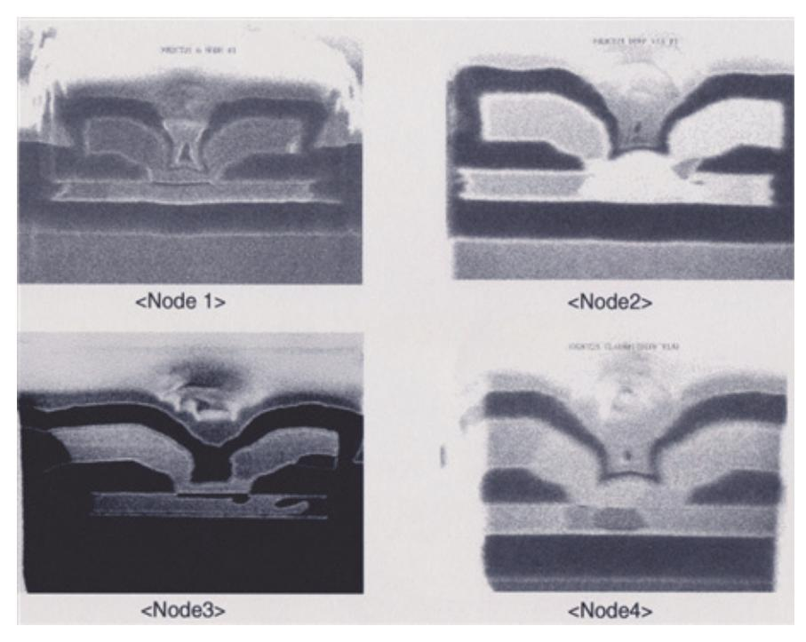

(a) Node 1, Node 3 - contact void (b) Node 2, Node 4 - 정상적인 contact

출처: 교육부(2018). 반도체 신뢰성 평가(LM903060110\_14v3). 한국직업능력개발원. p.18. [그림 2-15] via contact 단면도 비교 사진

#### 2. 불량 원인을 모델링(modeling)한다.

Via void 발생 원인은 아래의 모형도처럼 세정 공정에서 유발된 부식 성분이 고온의 가속 시험을 통해 반응하면서 저항 성분이 증가하기 때문이다. [그림 2-16]은 via void 불량을 도식화한 영상이다.

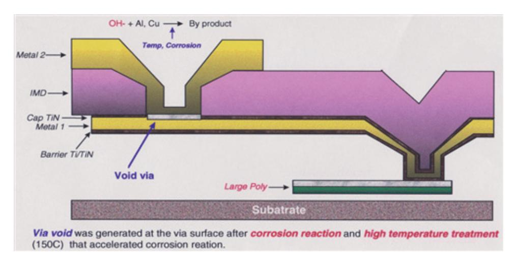

출처: 교육부(2018). 반도체 신뢰성 평가(LM903060110\_14v3). 한국직업능력개발원. p.19. [그림 2-16] 불량 메커니즘 도식

3. 개선 대책을 수립한다.

해당 제품의 공정 부문과 제품 기술 부문이 함께 모여서 개선 아이디어 협의를 실시하며 실 험 계획을 수립하고 개선 여부를 추적 관찰하는 반복 시험을 실시한다. [그림 2-17]은 개선 대책 수립을 도식화한 영상이다.

예제) 분석 결과 세정 부식으로 인한 via void 현상을 세정 단계에서 IPA 린스(rinse) 시간 을 증가시켜서 개선 효과를 검증한 후 공정에 확산 적용한다.

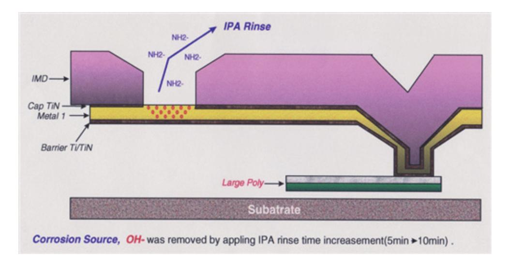

출처: 교육부(2018). 반도체 신뢰성 평가(LM903060110\_14v3). 한국직업능력개발원. p.19. [그림 2-17] 개선 대책 수립 도식

## 학습 2 교수·학습 방법

#### 교수 방법

- 반도체 소자의 전기적, 물리적 특성을 이해하고 IC 동작 원리와 방법을 충분히 인지하고, 학습자들로 하여금 소자별로 측정 방법과 구동 방법을 이해하도록 수업을 진행한다.
- 반도체 소자의 신뢰성 특성과 제품별 요구 기준에 관한 국제 규격을 숙지하고, 학습자들이 필요한 규격을 검색하고 해당 규격의 내용을 찾아서 활용할 수 있도록 지도하고, 신뢰성 항 목에 대한 시험 목적과 시험 방법을 이해하고, 학습자들이 분석 계획을 수립할 수 있도록 지 도한다.
- 반도체 환경 시험 분석 기법 종류들을 제시하고 각 방법의 내용을 파악해서 정리할 수 있도 록 지도하고, 반도체 환경 시험 항목별 불량의 유형을 정리하고 불량 양상(mechanism)을 분석할 수 있도록 지도한다.
- 반도체 환경 시험 불량 분류별 발생 유형을 정리하고 각 발생 유형에 따른 불량 양상을 분 석할 수 있도록 지도하고, 반도체 환경 시험 불량 유형별로 발생 원인을 정리하고 불량 발생 환경에 대한 내용을 설명하면서 충분히 인식할 수 있도록 사례를 들어 지도한다.

#### 학습 방법

- 반도체 소자의 전기적, 물리적 특성을 이해하고 IC 동작 원리와 방법, 소자별로 특성 측정 방법을 학습하고, 실습을 통해 충분히 숙지하고, 반도체 환경 시험 평가 결과 분석 필요성을 이해하고 항목별로의 특성을 찾아 정리한다.
- 반도체 소자의 신뢰성 특성과 제품별 요구 기준에 관한 국제 규격이 어떤 것이 있는지 학습 하고, 국제 규격에 대한 인증 기관을 인터넷으로 검색하고, 필요한 규격의 내용을 찾아서 해 당 제품에 맞게 신뢰성 시험 계획표를 작성한다.
- 신뢰성 시험 목적과 시험 방법을 항목별로 학습하고, 각 시험 장비 활용법과 시험 도구 제 작법을 학습하고 실습을 통해 충분히 숙지하고, 반도체 환경 시험 분석 기법 종류들을 분류 하여 각 방법의 내용을 파악해서 정리한다.
- 반도체 불량의 유형과 분석 방법을 이해하고, 간단한 사례들에 대해 시료를 확보하여 실험 을 수행하고, 결함 원인별 개선 방안을 마련하는 절차 및 방법에 대해 학습하고, 몇 개의 결 함 원인을 선정하여 실제 개선 방안을 마련하는 실습을 진행한다.

89

# 학습 2 평 가

#### 평가 준거

- 평가자는 학습자가 학습 목표를 성공적으로 달성하였는지를 평가해야 한다.
- 평가자는 다음 사항을 평가해야 한다.

| 학습 내용    | 학습 목표                                                      | 성취수준 |   |   |
|----------|------------------------------------------------------------|------|---|---|
|          |                                                            | 상    | 중 | 하 |
| 환경 시험 분석 | - 환경 시험 항목별 시험 결과에 따른 제품의 품질 수준을 판 단할 수 있다.             |      |   |   |
|          | - 환경 시험 결과가 보증 규격을 만족하지 못하는 불량의 경 우, 그 불량 유형을 파악할 수 있다. |      |   |   |
|          | - 환경 시험 불량의 원인을 분석할 수 있다.                                  |      |   |   |

#### 평가 방법

• 서술형 시험

| 학습 내용    | 평가 항목                                              | 성취수준 |   |   |
|----------|----------------------------------------------------|------|---|---|
|          |                                                    | 상    | 중 | 하 |
| 환경 시험 분석 | - 환경 시험 분석 절차를 파악하고 수행할 수 있는 능력                    |      |   |   |
|          | - 환경 시험 항목별로 파악하고 관련하여 발생하는 불량 유형 을 분석할 수 있는 능력 |      |   |   |
|          | - 환경 시험 불량 유형별로 분석하여 불량의 양상을 파악할 수 있는 능력        |      |   |   |

#### • 평가자 질문

|          |                                                      |   | 성취수준 |   |  |
|----------|------------------------------------------------------|---|------|---|--|
| 학습 내용    | 평가 항목                                                | 상 | 중    | 하 |  |
| 환경 시험 분석 | - 불량 분석 기법 중 전기적/물리적/화학적 분석 기법의 종류 를 파악할 수 있는지 여부 |   |      |   |  |
|          | - 환경 시험 분석 결과에 따른 개선 방안을 도출할 수 있는 능력              |   |      |   |  |
|          | - 개선 방안을 재시험하고 검증할 수 있는 능력                           |   |      |   |  |

#### • 구두 발표

|          | 평가 항목                                        |  | 성취수준 |   |  |
|----------|----------------------------------------------|--|------|---|--|
| 학습 내용    |                                              |  | 중    | 하 |  |
| 환경 시험 분석 | - 아레니우스 방정식을 이해하고 불량의 원인을 분석할 수 있 는 능력    |  |      |   |  |
|          | - 열팽창 계수 모델링 분석 방법을 통해 불량 유형을 파악할 수 있는 능력 |  |      |   |  |
|          | - 픽스의 법칙을 이해하고 불량의 원인을 분석할 수 있는 능 력       |  |      |   |  |

피드백

- 1. 서술형 시험
- 환경 시험 분석 절차를 파악하고 수행할 수 있는 능력을 평가한 후 부족한 부분이 있는 경우 분 석 절차에 대해 전체적으로 설명하면서 이해시킨다.
- 환경 시험 항목을 파악하고 관련하여 발생하는 불량 유형을 분석할 수 있는 능력을 평가한 후 부 족한 부분이 있는 경우 환경 시험 항목들을 나열하면서 재설명한다.
- 환경 시험 불량 유형별로 분석하여 불량의 양상을 파악할 수 있는 능력을 평가한 후 부족한 부분 에 대해서는 불량 유형별 불량의 양상을 재설명한다.
- 2. 평가자 질문
- 불량 분석 기법 중 전기적/물리적/화학적 분석 기법의 종류를 파악할 수 있는 능력을 평가한 후 성취수준이 높은 학습자들은 다음 단계인 각 종류에 따른 특성들을 이해할 수 있도록 유도하고, 성취수준이 낮은 학습자들은 분석 기법들을 나열하면서 재설명한다.
- 환경 시험 분석 결과에 따른 개선 방안을 도출할 수 있는 능력을 평가한 후 수준이 높은 학습자 들의 내용은 발표를 통해 공유하고, 개선 방안에 대한 재시험 및 검증 방법을 학습할 수 있도록 유도하고, 수준이 부족한 부분에 대해서는 개선 방안 도출하는 방법을 선정하여 재설명한다.
- 개선 방안을 재시험하고 검증할 수 있는 능력을 평가한 후 성취수준이 높은 학습자들은 추가 항 목들에 대해서도 재시험하고 검증할 수 있도록 지도하고, 성취수준이 부족한 학습자들에 대해서는 재시험 계획 수립 및 검증 진행에 대한 절차 및 방법들을 나열하면서 재설명한다.
- 3. 구두 발표
- 아레니우스 방정식을 이해하고 불량의 원인을 분석할 수 있는 능력을 평가한 후 부족한 부분에 대해서는 아레니우스 방정식의 기본 개념을 설명하고 실시 예를 통해 재교육한다.
- 열팽창 계수 모델링 분석 방법을 통해 불량 유형을 파악할 수 있는 능력을 평가한 후 부족한 부 분에 대해서는 열팽창 계수 모델링 분석 방법의 기본 개념을 설명하고 실시 예를 통해 재교육한 다.
- 픽스의 법칙을 이해하고 불량의 원인을 분석할 수 있는 능력을 평가한 후 부족한 부분에 대해서 는 픽스의 법칙 기본 개념을 설명하고 실시 예를 통해 재교육한다.

- 교육부(2018). 반도체 신뢰성 평가(LM1903060110\_14v3). 한국직업능력개발원.
- 교육부(2022). 반도체 생산성 향상(LM1903060210\_14v3). 한국직업능력연구원.
- 교육부(2022). 반도체 웨이퍼 레벨 테스트 장비 운영(LM1903060211\_19v4). 한국직업능력연구원.
- 교육부(2022). 반도체 유틸리티 운영(LM1903060215\_19v4). 한국직업능력연구원.
- 교육부(2022). 반도체 품질 관리(LM1903060209\_14v3). 한국직업능력연구원.
- 교육부(2022). 반도체 패키지 레벨 테스트 장비 운영(LM1903060212\_19v4). 한국직업능력연구원.
- 교육부(2022). 반도체 패키징 전공정 장비 운영(LM1903060213\_19v4). 한국직업능력연구원.
- 교육부(2022). 반도체 패키징 후공정 장비 운영(LM1903060214\_19v4). 한국직업능력연구원.
- 류장렬(2007). 『Semiconductor Device Engineering』. 형설출판사.
- 서민석(2020). 『반도체의 부가가치를 올리는 패키지와 테스트』. 한올출판사.
- 큐알티주식회사 홈페이지(https://qrtkr.com/kr/reliability/experiment/stress.php).
- 이성수(2021). 「자동차 반도체의 신뢰성 테스트 표준: AEC-Q100」. 『전기전자학회 논문지』. 제25권(3호). 578-583.
- ∙ JEDEC(2010). EIA/JESD22-A115: EIA/JEDEC Standard for Machine Model(MM) Testing. https://www.jedec.org. Accessed 2015.08.19.
- ∙ JEDEC(2014). ANSI/ESDA/JEDEC JS-001-2014 Human Body Model –Component Level. https://www.jedec.org. Accessed 2015.08.20.
- ∙ JEDEC(2014). ANSI/ESDA/JEDEC JS-002-2014 Charged Device Model –Device Level. https://www.jedec.org. Accessed 2015.08.20.
- ∙ JEDEC(2014). ANSI/ESD S20.20-2014, ESD Association Standard for the Development of an Electrostatic Discharge Control Program for Protection of Electrical and Electronic Parts, Assemblies and Equipment. https://www.jedec.org. Accessed 2015.08.22.
- ∙ JEDEC Standard(2012). JESD99(Terms, Definitions, and Letter Symbols for Microelectronic Devices2).
- ∙ JIS(1977). C7210(General rules for reliability assured discrete semiconductor devices: 신뢰성 보증 개별반도체 디바이스 통칙).

### 용어 설명

EFR(early failure rate)

반도체 제품의 초기 불량의 수준을 평가하는 수명 신뢰성 평가 항목

#### Endurance

플래시 메모리 등 ROM 계열 제품의 쓰기(program) 및 지우기(erase) 동작에 대한 주기적 (cycling) 한계 특성을 평가하는 항목

#### HALT(highly accelerated life test)

초가속 수명 시험으로 제품의 설계 단계에서 결함을 찾아 개선할 수 있도록 비교적 짧은 시간 에 시험하도록 설계된 가혹 시험의 일종

#### HAST(highly accelerated stress test)

습기 환경에서 동작하는 밀폐되지 않는(non-hermetic) 패키지의 신뢰성을 평가하는 데 사용된 다. 평가 방법은 THB와 동일하게 핀(pin)별 정적 바이어스(static bias)를 인가한 상태에서 온 도, 습도, 압력 스트레스(stress)를 인가함.

#### HTOL(high temperature operating life test)

제품을 실제 동작시키면서 온도 및 전압으로 스트레스(stress)를 인가함으로써 수명 신뢰성을 평가하는 항목

#### HTSL(high temperature storage life)

제품의 고온 방치 환경에서의 신뢰성을 평가하는 항목

#### JEDEC(joint electron device engineering council)

제조업체와 사용자 단체가 합동으로 집적 회로(IC) 등 전자 장치의 통일 규격을 심의, 책정하는 기구이고, 여기에서 책정되는 규격이 국제 표준이 되므로 JEDEC는 사실상 이 분야의 국제표준 화기구로 통함.

#### LOL(lower operation unit)

최소 동작 한계

#### LTOL(low temperature operating life test)

핫 캐리어(hot carrier) 영향에 대한 제품 불량 발생 가능성 평가를 하는 항목이나 전압 및 온

도가 인가되므로 다른 불량이 발생할 가능성도 있음.

#### LTSL(low temperature storage life)

제품의 저온 방치 환경에서의 신뢰성을 평가하는 항목

#### MSL(moisture sensitivity level)

제품의 습도 민감도에 대한 내성을 등급으로 분류하여 수준을 객관화(표준화)하고 사용 조건의 허용 범위를 규정화한 것.

PCT(pressure cooker test)

THS 및 THB보다 더욱 가혹(worse)한 시험으로 습기에 의한 내성을 조기 평가하기에 적합한 시험이며 오토클레이브(autoclave)라고도 함.

플라스틱 몰드 화합물(plastic mold compound)의 내습성 평가, 상대 습도 100%와 고압을 이용하여 습기 침투를 용이하게 하여 몰더빌리티(moldability)의 신뢰성을 평가한다. 또한 리드 (lead)와 리드 간 미세 틈(micro gap), 몰드(mold) 기공을 통한 습기 침투에 의한 불량을 검 출할 수 있음.

TC(thermal cycle)

여러 가지 사용자의 사용 환경 중 순간적인 온도의 변화에 대한 제품(device)의 내성을 시험하 기 위한 항목

#### TDBI

패키지 상태의 반도체 제품에 번인 스트레스(burn in stress)를 가하면서 동시에 테스트를 수 행하는 것으로, 가혹 조건을 인가하여 잠재적인 불량을 조기에 스크린(screen)하여 제품 수명 동안 판매된 제품의 불량을 최소화하는 것을 목적으로 함.

#### THB(temperature humidity bias)

제품에 전기적 바이어스(electric bias)를 인가한 상태에서 내습성을 평가함.

#### THS(temperature humidity storage)

고온 ‧ 고습에 대한 반도체 제품의 내성을 평가함.

#### TS(thermal shock)

열 충격(thermal shock)은 TC보다 급격한 온도 스트레스(stress)를 인가하는 항목으로 TC가 공기의 온도 차에 해당하는 스트레스를 가하는 것이면 TS는 액체 상태의 온도 차를 이용한 스 트레스를 가하는 것이므로 제품 측면에서 볼 때 스트레스의 크기가 더욱 크게 가함.

#### UHAST(unbiased highly accelerated stress test)

FBGA와 같은 기판 타입(substrate type)의 얇은 패키지에 대한 PCT와 유사한 스트레스를 인

가하여 패키지의 신뢰성을 평가하는 것.

VT(threshold voltage)

PN diode나 MOS TR에서 어떤 일정 전압이 되었을 때 전류가 흐르게 되는데, 이 전압을 문 턱 전압이라고 함.

#### 가속 등가(accelerated equivalent)

반도체 제품의 신뢰성을 평가할 때 실제 사용 시간 그대로 평가하면 평가하는 시간이 길어지므 로 가속 조건을 주어서 짧은 시간 평가하지만, 실제 시간에 주어지는 스트레스와 같게 만든 것.

데이터 리텐션(data retention)

플래시 메모리의 주요 신뢰성 요소로써 쓰인 정보(data)가 사라지지 않고 유지되는 특성

#### 부식(corrosion)

부식은 주위 환경과의 화학 반응으로 인하여 물질이 구성 원자로 분해되는 현상을 말하며, 일 반적으로 산소와 같은 산화체와 반응하여 금속이 전기‧화학적으로 산화하는 것.

#### 기가동 온도 구간(non-operating temperature range)

데이터 시트에서 규정한 반도체 제품의 동작 온도 구간 바깥의 온도 구간

#### 비틀림 시험(torsion test)

PCB가 비틀림에 의한 스트레스로 인해 솔더 접합부(solder joint) 및 제품 휨(device distortion) 불량 발생에 대한 내성을 평가하는 항목

#### 신뢰성(reliability)

제품의 규정된 요구 기준과 특성에 대해서 주어진 기간 동안 그 기능을 수행할 수 있는지를 나 타내는 척도

#### 열전도도

물질 이동의 수반 없이 열이 고온부에서 저온부로 전달되는 척도

#### 열팽창 계수(CTE)

일정한 압력 아래에서 온도가 높아짐에 따라 물체의 부피가 늘어나는 비율인데, 보통 팽창이나 수축은 온도 증가나 감소와 선형적인 관계를 이루므로 이를 열팽창 계수라 부름.

#### 오토클레이브(Autoclave)

일종의 고압 솥인 오토클레이브는 수분을 넣고 밀폐시킨 후 온도를 올려 수분을 증발시키면서 압력과 습도를 높여서 오토클레이브 안에 있는 시편에 필요한 조건을 만들어 주는 장비

#### 웨이퍼 번인(wafer burn in)

웨이퍼 상태로 온도와 전압을 인가하여 제품에 스트레스를 줌으로써 초기 불량 기간에 나타날 수 있는 불량들이 모두 드러나게 만드는 것.

#### 진동 시험(vibration test)

제품의 운송 중에 발생할 수 있는 진동에 대한 제품 내성을 평가하는 항목

#### 충격 시험(shock test)

취급 및 이동 중 발생할 수 있는 충격 시뮬레이션에 의한 내성을 평가하는 항목

#### 3점 구부림 시험(3 point bending)

검사하고자 하는 시편의 3점에 응력을 주어서 구부림으로써 강도 등을 측정하는 시험

#### 4점 구부림 시험(4 point bending)

검사하고자 하는 시편의 4점에 응력을 주어서 구부림으로써 강도 등을 측정하는 시험

#### BoD(board of directors)

JEDEC의 정책과 절차를 결정하고 JEDEC 표준의 최종 승인 기능을 하는 위원회

#### CE(conducted emisssion)

전도성 방출로 전도체를 통하여 전파되지 않는 전자파의 발생을 의미하며, 주변의 단말 또는 시스템 등 통신 설비에 오동작 등 장애를 일으키는 원인이 됨.

#### FN 터널링(fowler-nordheim tunneling)

양자역학에서 장벽의 높이보다 작은 에너지를 가진 입자라도 그 장벽을 넘어갈 수 있다는 것으 로 그중 특별히 전자가 전기장이 존재하는 절연막에서 절연막의 전도 밴드로 터널링이 발생한 이후 절연막의 전도 밴드에서 이동이 이루어지는 것을 FN 터널링이라 부름.

| NCS학습모듈 개발이력 |                                     |     |                  |  |
|--------------|-------------------------------------|-----|------------------|--|
| 발행일          | 2024년 12월 31일                       |     |                  |  |
| 세분류명         | 반도체 개발((19030601)                   |     |                  |  |
| 개발기관         | 수원과학대학교 산학협력단(개발책임자: 윤창용) 한국직업능력연구원 |     |                  |  |
|              | 최준혁(수원대학교)*                         |     | 김종범(삼성전기)        |  |
|              | 계찬호(수원대학교)                          |     | 김한수(두원공과대학교)     |  |
|              | 김경호(폴리텍대학교)                         |     | 남승호(경기대학교)       |  |
|              | 김관하(폴리텍대학교)                         |     | 손승대(제이에스이엔씨(주))  |  |
| 집필진          | 김기순((주)영우디에스피)                      | 검토진 | 안광호(퓨쳐일렉트로닉스)    |  |
|              | 김도균(폴리텍대학교)                         |     | 이철오((주)한국전력안전공단) |  |
|              | 전동민(폴리텍대학교)                         |     |                  |  |

\*표시는 대표집필자임 (참고) 검토진으로 참여한 집필진은 본인의 원고가 아닌 타인의 학습모듈을 검토함

| 반도체 환경 시험(LM1903060127_23v4)                                                                             |                   |  |  |  |
|----------------------------------------------------------------------------------------------------------|-------------------|--|--|--|
| 저작권자                                                                                                     | 교육부               |  |  |  |
| 연구기관                                                                                                     | 한국직업능력개발원         |  |  |  |
| 발행일                                                                                                      | 2024. 12. 31.     |  |  |  |
| ISBN                                                                                                     | 979-11-7175-761-9 |  |  |  |
| ※ 이 학습모듈은 자격기본법 시행령(제8조 국가직무능력표준의 활용)에 의거하여 개발하였으며, NCS통합포털사이트(http://www.ncs.go.kr)에서 다운로드 할 수 있습니다. |                   |  |  |  |

