LM1903060128\_23v4

# NCS학습모듈 반도체 수명시험

| 대분류/19 전기·전자 |  | 중분류/03 |                 |        |         |
|-----------------|--|--------|-----------------|--------|---------|
|                 |  | 전자기기개발 | 소분류/06 반도체개발 | 세분류/01 |         |
|                 |  |        |                 | 반도체개발  | 능력단위/28 |
|                 |  |        |                 |        |         |

#### [NCS학습모듈 활용 시 유의 사항]

- 1. NCS학습모듈은 교육훈련기관에서 출처를 명시하고 교육적 목적으로 활용할 수 있습니다. 다 만, NCS학습모듈에는 국가(교육부)가 저작재산권 일체를 보유하지 않은 저작물(출처가 표기된 도표‧사진‧삽화‧도면 등)이 포함되어 있으므로, 이러한 저작물의 변형‧각색‧복제‧공연‧ 배포 및 공중 송신 등과 이러한 저작물을 활용한 2차적 저작물을 작성하려면 반드시 원작자 의 동의를 받아야 합니다.
- 2. NCS학습모듈은 개발 당시의 산업 및 교육 현장을 반영하여 집필하였으므로, 현재 적용되는 법령‧지침‧표준 및 교과 내용 등과 차이가 있을 수 있습니다. NCS학습모듈 활용 시 법령 ‧지침‧표준 및 교과 내용의 개정 사항과 통계의 최신성 등을 확인하시기를 바랍니다.
- 3. NCS학습모듈은 산업 현장에서 요구되는 능력을 교육훈련기관에서 학습할 수 있게 구성한 자 료입니다. 다만, NCS학습모듈 지면의 한계상 대표적 예시(예: 활용도 또는 범용성이 높은 제 품, 서비스) 중심으로 집필하였음을 이해하시기를 바랍니다.

## NCS학습모듈의 이해

※ 본 NCS학습모듈은 「NCS 국가직무능력표준」사이트(http://www.ncs.go.kr) 에서 확인 및 다운로드할 수 있습니다.

### Ⅰ NCS학습모듈이란?

- 국가직무능력표준(NCS: National Competency Standards)이란 산업현장에서 직무를 수행하기 위해 요구되는 지식·기술·소양 등의 내용을 국가가 산업부문별·수준별로 체계 화한 것으로 산업현장의 직무를 성공적으로 수행하기 위해 필요한 능력(지식, 기술, 태도) 을 국가적 차원에서 표준화한 것을 의미합니다.
- 국가직무능력표준(이하 NCS)이 현장의 '직무 요구서'라고 한다면, NCS학습모듈은 NCS
   의 능력단위를 교육훈련에서 학습할 수 있도록 구성한 '교수·학습 자료'입니다. NCS학습
   모듈은 구체적 직무를 학습할 수 있도록 이론 및 실습과 관련된 내용을 상세하게 제시하
   고 있습니다.

#### ○ NCS학습모듈은 다음과 같은 특징을 가지고 있습니다.

- 첫째, NCS학습모듈은 산업계에서 요구하는 직무능력을 교육훈련 현장에 활용할 수 있도 록 성취목표와 학습의 방향을 명확히 제시하는 가이드라인의 역할을 합니다.
- 둘째, NCS학습모듈은 특성화고, 마이스터고, 전문대학, 4년제 대학교의 교육기관 및 훈 련기관, 직장교육기관 등에서 표준교재로 활용할 수 있으며 교육과정 개편 시에도 유용하게 참고할 수 있습니다.

○ NCS와 NCS학습모듈 간의 연결 체계를 살펴보면 아래 그림과 같습니다.

O NCS학습모듈의 위치는 NCS 분류 체계에서 해당 학습모듈이 어디에 위치하는지를 한 눈에 볼 수 있도록 그림으로 제시한 것입니다.

| [NCS-학           | 습모듈     | 의 위치]    |          |  |
|------------------|---------|----------|----------|--|
|                  |         |          |          |  |
| 대분류 문화·예술·디자인·방송 |         |          |          |  |
| 중분류              | 류 문화콘텐츠 |          |          |  |
|  소분류          |         | 문화콘텐츠제작  |          |  |
|                  |         |          |          |  |
| 세분류              |         |          |          |  |
| 방송콘텐츠제작          |         | 능력단위     | 학습모듈명    |  |
| 영화콘텐츠제작          |         | 프로그램 기획  | 프로그램 기획  |  |
| 음악콘텐츠제작          |         | 아이템 선정   | 아이템 선정   |  |
| 광고콘텐츠제작          |         | 자료 조사    | 자료 조사    |  |
| 게임콘텐츠제작          |         | 프로그램 구성  | 프로그램 구성  |  |
| 애니메이션 콘텐츠제작   |         | 캐스팅      | 캐스팅      |  |
| 만화콘텐츠제작          |         | 제작계획     | 제작계획     |  |
| 캐릭터제작            |         | 방송 미술 준비 | 방송 미술 준비 |  |
| 스마트문화앱 콘텐츠제작  |         | 방송 리허설   | 방송 리허설   |  |
| 영사               |         | 야외촬영     | 야외촬영     |  |
|                  |         | 스튜디오 제작  | 스튜디오 제작  |  |
|                  |         |          |          |  |

학습모듈은

NCS 능력단위 1개당 1개의 학습모듈 개발 을 원칙으로 합니다. 그러나 필요에 따라 고용단위 및 교과단위를 고려하여 능력단위 몇 개를 묶어 1개 학습모듈로 개발할 수 있으며, NCS 능력단위 1개를 여러 개의 학습모듈로 나누어 개발할 수도 있습니다.

### 2. NCS학습모듈의 개요

#### ○ NCS학습모듈의 개요는 학습모듈이 포함하고 있는 내용을 개략적으로 설명한 것으로

| 학습모듈의 목표 , 선수학습 , 학습모듈의 내용 체계 , 핵심 용어 로 구성되어 있습니다. |                                                                              |  |
|----------------------------------------------------|------------------------------------------------------------------------------|--|
| 학습모듈의 목표                                           | 해당 NCS 능력단위의 정의를 토대로 학습 목표를 작성한 것입니다.                                        |  |
| 선수학습                                               | 해당 학습모듈에 대한 효과적인 교수·학습을 위하여 사전에 이수해야 하는 학습모 듈, 학습 내용, 관련 교과목 등을 기술한 것입니다. |  |
| 학습모듈의 내용 체계                                     | 해당 NCS 능력단위요소가 학습모듈에서 구조화된 체계를 제시한 것입니다.                                     |  |
| 핵심 용어                                              | 해당 학습모듈의 학습 내용, 수행 내용, 설비·기자재 등 가운데 핵심적인 용어를 제 시한 것입니다.                   |  |

### 제작계획 학습모듈의 개요

#### 학습모듈의 목표

본격적인 촬영을 준비하는 단계로서, 촬영 대본을 획정하고 제작 스태프를 조직하며 촬영 장비와 촬영 소품을 준비할 수 있다.

#### 선수학습

제작 준비(LM0803020105\_13v1), 섭외 및 제작스태프 구성(LM0803020104\_13v1), 촬영 제작(LM0803020106\_13v1), 촬영 장비 준비(LM0803040204\_13v1.4), 미술 디자인 협의하기(LM0803040203\_13v1.4)

#### 학습모듈의 내용체계

| 하스                | 하는 데이                                              | NCS 능력단위 요소       |                |  |
|-------------------|----------------------------------------------------|-------------------|----------------|--|
| 학습                | 학습 내용                                              | 코드번호              | 요소 명칭          |  |
| 1. 촬영 대본 확정하기  | 1-1. 촬영 구성안 검 토와 수정                             | 0803020114_16/3.1 | 촬영 대본 확정하기  |  |
| 2. 제작 스태프 조직하기 | 2-1. 기술 스태프 조직 2-2. 미술 스태프 조직 2-3. 전문 스태프 조직 | 0803020114_16v3.2 | 제작 스태프 조직하기 |  |
| 3. 촬영 장비 계획하기  | 3-1. 촬영 장비 점검 과 준비                              | 0803020114_16/3.3 | 촬영 장비 계획하기  |  |
| 4. 촬영 소품 계획하기  | 4-1. 촬영 소품 목록 작성 4-2. 촬영 소품 제작 의뢰         | 0803020114_16\3.4 | 촬영 소품 계획하기  |  |

#### 핵심 용어

촬영 구성안, 제작 스태프, 촬영 장비, 촬영 소품

#### 학습모듈의 목표는

학습자가 해당 학습모듈을 통해 성취해야 할 목표를 제시한 것으로, 교수자는 학습자 가 학습모듈의 전체적인 내용흐름을 파악하 도록 지도할 수 있습니다.

**6** • •

61

#### 선수학습은

교수자 또는 학습자가 해당 학습모듈을 교 수·학습하기 이전에 이수해야 하는 교과목 또는 학습모듈(NCS 능력단위) 등을 표기한 것입니다. 따라서 교수자는 학습자가 개별 학습, 자기 주도 학습, 방과 후 활동 등 다 양한 방법을 통해 이수할 수 있도록 지도하 는 것을 권장합니다.

|            | 핵심 용어는              |
|------------|---------------------|
|            | 률을 대표하는 주요 용어입니     |
|            | · 해당 학습모듈을 통해 학습    |
|            | 게될 주요 내용을 알 수 있습    |
|            | 5 국가직무능력표준」 사이트     |
| (www.ncs.g | jo.kr)의 색인 (찾아보기) 중 |
| 하나로 이용할    | 할 수 있습니다            |

#### 3. NCS학습모듈의 내용 체계

○ NCS학습모듈의 내용은 크게 학습, 학습 내용, 교수·학습 방법, 평가 로 구성되어 있습니다.

| 학습       | 해당 NCS 능력단위요소 명칭을 사용하여 제시한 것입니다. 학습은 크게 학습 내용, 교수·학습 방법, 평가로 구성되며 해당 NCS 능력단위의 능력단위 요소별 지식, 기술, 태도 등을 토대로 내용을 제시한 것입니다.                                                    |
|----------|----------------------------------------------------------------------------------------------------------------------------------------------------------------------------------|
| 학습 내용    | 학습 내용은 학습 목표, 필요 지식, 수행 내용으로 구성되며, 수행 내용은 재료·자 료, 기기(장비·공구), 안전·유의 사항, 수행 순서, 수행 tip으로 구성한 것입니다. 학습모듈의 학습 내용은 실제 산업현장에서 이루어지는 업무활동을 표준화된 프로세 스에 기반하여 다양한 방식으로 반영한 것입니다. |
| 교수·학습 방법 | 학습 목표를 성취하기 위한 교수자와 학습자 간, 학습자와 학습자 간 상호 작용이 활발하게 일어날 수 있도록 교수자의 활동 및 교수 전략, 학습자의 활동을 제시한 것입니다.                                                                            |
| 평가       | 평가는 해당 학습모듈의 학습 정도를 확인할 수 있는 평가 준거 및 평가 방법, 평 가 결과의 피드백 방법을 제시한 것입니다.                                                                                                         |

## [NCS-학습모듈의 위치]

| 대분류 | 전기·전자 |          |        |  |  |
|-----|-------|----------|--------|--|--|
| 중분류 |       | 전자 기기 개발 |        |  |  |
| 소분류 |       |          | 반도체 개발 |  |  |

| 세분류    |                        |                  |
|--------|------------------------|------------------|
| 반도체 개발 | 능력단위                   | 학습모듈명            |
| 반도체 제조 | 반도체 제품 기획 반도체 제품 기획 |                  |
| 반도체 장비 | 반도체 아키텍처 설계            | 반도체 아키텍처 설계      |
| 반도체 재료 | 디지털 회로 설계              | 디지털 회로 설계        |
|        | 패키지 조립 공정 개발           | 패키지 조립 공정 개발     |
|        | 반도체 제품 기능·성능 검증        | 반도체 제품 기능·성능 검증  |
|        | 자동 배치 배선 레이아웃 설계       | 자동 배치 배선 레이아웃 설계 |
|        | 반도체 설계 검증              | 반도체 설계 검증        |
|        | 반도체 펌웨어 개발             | 반도체 펌웨어 개발       |
|        | 메모리 반도체 제조 공정 개발       | 메모리 반도체 제조 공정 개발 |
|        | 시스템 반도체 제조 공정 개발       | 시스템 반도체 제조 공정 개발 |
|        | 반도체 제조 단위 공정 개발        | 반도체 제조 단위 공정 개발  |
|        | 아날로그 회로 아키텍처 설계        | 아날로그 회로 아키텍처 설계  |
|        | 아날로그 회로 소자 레벨 설계       | 아날로그 회로 소자 레벨 설계 |

| 아날로그 회로 시스템 설계    | 아날로그 회로 시스템 설계    |  |  |
|-------------------|-------------------|--|--|
| 와이어 본딩 패키지 개발     | 와이어 본딩 패키지 개발     |  |  |
| 플립 칩 패키지 개발       | 플립 칩 패키지 개발       |  |  |
| 웨이퍼 레벨 패키지 개발     | 웨이퍼 레벨 패키지 개발     |  |  |
| 어드밴스드 팬 아웃 패키지 개발 | 어드밴스드 팬 아웃 패키지 개발 |  |  |
| 이종 접합 패키지 개발      | 이종 접합 패키지 개발      |  |  |
| 어드밴스드 언더필 패키지 개발  | 어드밴스드 언더필 패키지 개발  |  |  |
| 반도체 환경 시험         | 반도체 환경 시험         |  |  |
| 반도체 수명 시험         | 반도체 수명 시험         |  |  |
| 반도체 내성 시험         | 반도체 내성 시험         |  |  |
| 커스텀 레이아웃 적용 공정 분석 | 커스텀 레이아웃 적용 공정 분석 |  |  |
| 커스텀 레이아웃 설계       | 커스텀 레이아웃 설계       |  |  |
|                   | 커스텀 레이아웃 검증       |  |  |

## 차 례

| 학습모듈의 개요         | 1  |
|------------------|----|
| 학습 1. 수명 시험 평가하기 |    |
| 1-1. 수명 시험 평가    | 3  |
| • 교수 ․ 학습 방법     | 30 |
| • 평가             | 31 |

### 학습 2. 수명 시험 분석하기

|       | 2-1. 수명 시험 분석 | 34 |
|-------|---------------|----|
|       | • 교수 ․ 학습 방법  | 80 |
|       | • 평가          | 81 |
| 참고 자료 |               | 84 |
| 부     | 록             | 85 |

## 반도체 수명 시험 학습모듈의 개요

#### 학습모듈의 목표

반도체 제품의 동작 수명을 보증하기 위하여 높은 온도와 전압의 스트레스를 가속 평가하여 전기적 특성이 정상 인지 판정하고 불량 발생 시 불량 유형과 원인을 분석할 수 있다.

#### 선수학습

패키지 조립 공정 개발(LM1903060108\_23v4), 반도체 패키징 전공정 장비 운영(LM1903060213\_19v4), 반도체 웨이퍼 레벨 테스트장비 운영(LM1903060211\_19v4), 반도체 환경 시험(LM1903060127\_23v4)

#### 학습모듈의 내용체계

|               |               | NCS 능력단위 요소       |            |
|---------------|---------------|-------------------|------------|
| 학습            | 학습 내용         | 코드번호              | 요소 명칭      |
| 1. 수명 시험 평가하기 | 1-1. 수명 시험 평가 | 1903060128_23v4.1 | 수명 시험 평가하기 |
| 2. 수명 시험 분석하기 | 2-1. 수명 시험 분석 | 1903060128_23v4.2 | 수명 시험 분석하기 |

#### 핵심 용어

반도체 수명 시험, 신뢰도 함수, 신뢰성 이론, 고장률, 수명 예측, 신뢰성 보증, 스트레스 시험, 가속 모델 링

# 학습 1 수명 시험 평가하기 학습 2 수명 시험 분석하기

# 1-1. 수명 시험 평가

| 학습 목표 | • 수명 시험의 목적을 이해하고 시험 계획을 수립할 수 있다.                     |
|-------|--------------------------------------------------------|
|       | • 수명 시험 평가용 보드를 준비하고 전기적 Stress 조건을 설정하여 설비를 이용한 시험 방법 |
|       | 을 갖출 수 있다.                                             |
|       | • 수명 시험 평가 진행 조건이 정상인지 판정할 수 있다.                       |

## 필요 지식 /

숔 반도체 수명 시험 개요

1. 수명 시험 정의

반도체 수명 시험은 반도체 소자의 신뢰성과 내구성을 평가하기 위해 다양한 환경 및 작동 조건에서 소자의 성능을 테스트하여 예상되는 수명 동안 안정적으로 작동할 수 있는지를 검 증하는 과정이다.

2. 수명 시험 필요성

수명 시험은 신뢰성 보장, 품질 향상, 고장 분석, 수명 예측, 표준 준수 등을 위해 필요하 며, 세부적인 내용은 다음과 같다.

- (1) 신뢰성 보증
  - (가) 고장 예측 및 예방
  - (나) 품질 관리 및 개선
  - (다) 표준 준수 및 인증
- (2) 품질 향상
  - (가) 제조 공정 개선
  - (나) 제품 설계 최적화
  - (다) 피드백 시스템 구축
- (3) 고장 분석

(가) 고장 원인 분석

- (나) 데이터 수집 및 통계 분석
- (다) 개선 조치 마련
- (4) 수명 예측
  - (가) 가속 수명 시험
  - (나) 통계적 모델링
  - (다) 스트레스 분석
- (5) 표준 준수
  - (가) 국제 및 산업 표준 준수
  - (나) 인증 및 검증
  - (다) 표준 업데이트 반영
- 3. 수명 시험 관련 법규 및 표준

한국의 KS, 미국의 MIL-STD, 유럽의 CEN과 ETSI, 일본의 JEITA는 각 국가의 반도체 산 업에서 사용되는 표준으로, 국내 및 국제 시장에서 해당 규격을 준수하는 제품을 생산 및 판매하며, 국제적으로는 ISO에서 반도체 제품의 수명 시험 및 신뢰성 평가에 관한 국제 표 준을 제정하여 국제 시장에서의 상호 운용성과 품질 보증을 강화하고 있다.

(1) 한국 표준(KS)

한국산업기준위원회에서 제정한 반도체 제품의 수명 시험 표준으로, 국내 반도체 산업의 품질 보증 및 규제를 위해 사용된다.

(가) KS C 5011

전자 부품의 신뢰성 시험 방법에 대한 표준으로 반도체 소자의 수명 시험 방법을 규 정하고 있다.

(나) KS C 7651

전자 부품 및 기기의 고온 저장 시험 방법에 대한 표준으로 반도체 소자의 내열성을 평가한다.

(다) KS C 7652

전자 부품 및 기기의 온도 충격 시험 방법에 대한 표준으로 반도체 소자의 온도 변 화에 따른 내구성을 평가한다.

(라) KS C 7653

전자 부품 및 기기의 습도 시험 방법에 대한 표준으로 반도체 소자의 내습성을 평가 한다.

(2) 미국 표준(MIL-STD)

미국 국방부에서 사용하는 표준으로, 군사용/상용 반도체 제품의 수명 시험을 규정한다.

- (3) 유럽 표준
  - (가) 유럽 표준화 위원회(CEN)

유럽의 산업 표준화를 촉진하기 위해 설립된 기관으로, 반도체 제품의 수명 시험 및 품질 관련 표준을 제정한다.

(나) 유럽 전자 통신 표준화 위원회(ETSI)

유럽의 전자 통신 산업 표준화를 담당하는 기구로, 반도체 제품의 통신 및 네트워크 관련 표준을 제정한다.

- (4) 일본 표준(JEITA) 일본 전자 정보 기술 산업협회에서 발행하는 표준으로, 일본의 반도체 산업에서 사용되 며 국제적으로도 인정받고 있다.
- (5) 국제 표준(ISO) 국제적으로 표준을 제정하는 기구로, 반도체 제품의 수명 시험 및 신뢰성 평가에 관한 국제 표준을 제공한다.
- 숕 수명 시험의 이론적 배경
  - 1. 신뢰성의 정의 및 이론

신뢰성은 제품 또는 시스템이 일정 기간 동안 안정적으로 동작할 수 있는 확률에 대한 통계 적인 접근 방법이다. 즉, 신뢰도란 고장이 나지 않을 확률이고 신뢰성은 신뢰도라는 확률로 표현된다. 주로 공학 분야에서 제품의 신뢰성을 평가하고 예측하는 데에 사용되는데, 제품 의 수명과 장애 가능성을 평가하고, 이를 통해 제품을 설계, 제조 및 유지 보수하는 데 필 요한 의사 결정을 지원한다.

- (1) 신뢰도 함수
  - (가) R(t): 신뢰도 함수(생존 확률, reliability function)
    - t 시점에서 고장 없이 작동될 확률
  - (나) F(t): 신뢰도 함수(누적 고장률, non-reliability function) t 시점까지의 누적 고장 확률
  - (다) f(t) : 고장 확률 밀도 함수(failure density function)
    - F(t) =∫f(t) dt
    - f(t) = dF(t) / dt
    - R(t) + F(t) = 1

(라) λ(t): 순간 고장률(failure rate 고장률 함수)

어느 t 시점까지 고장 없이 작동하고 그 이후 단위 시간에 고장날 확률

λ(t) = f(t) / R(t) =(dF(t) /dt) / R(t) R(t) = Exp(-λ(t) dt) (t: 사용 시간)

(2) 고장률 분포

(가) 고장률 패턴(pattern)

- 1) IFR(increasing failure rate) 정규 분포
- 2) CFR(constant failure rate) 지수 분포
- 3) DFR(decreasing failure rate) Weibul 분포
- (나) 고장률 곡선

제품의 수명에 따른 고장 발생률에 대한 곡선은 다음과 같다.

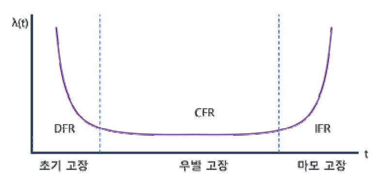

출처: 집필진 제작(2024) [그림 1-1] 고장률 곡선 예시

- 1) 초기 고장 지대(initial failure region)
  - 가) 고장률이 시간에 따라 급격히 감소하는 구간
  - 나) End user가 가장 관심 있는 parameter로 완성 set의 초기 불량을 일으킬 수 있음.
  - 다) 주로 공정 trouble로 발생하고 burn-in으로 screen 가능
- 2) 우발 고장 지대(random failure region)
  - 가) 고장률이 시간에 따라 일정한 고장률 λ로 간주하는 구간
  - 나) R(t) = Exp[-λ(t)][누적 고장률 F(t) = 1-R(t)]
- λ: 평균 고장률,
- 1/λ: 평균 수명(MTTF)
  - 다) Technology 자체에 의해 결정됨.
- 3) 마모 고장 지대(wear-out failure region)
  - 가) 고장률이 우발 고장 지대를 지나면서 시간에 따라 급격히 증가하는 구간

나) 수명이 다한 상태

- (3) 신뢰성 평가의 주요 개념
  - (가) 시간에 따라 제품이 고장날 확률 분포
  - (나) 고장 원인 분석을 통한 고장 발생률 예측
  - (다) 장애 시간 분석을 통한 고장 발생률 예측
  - (라) 제품의 신뢰성을 정량화하고 예측
- (4) 신뢰성 평가 적용 분야
  - (가) 제품 설계 개선 분야
  - (나) 유지 보수 및 교체 일정을 계획하는 분야
  - (다) 제품의 품질을 관리하는 분야
- 2. 고장 메커니즘

고장 메커니즘은 제품이나 시스템이 동작하지 않거나 기능을 수행하지 못하는 원인을 설명 하는 것을 의미한다. 제품의 고장 메커니즘을 이해하면 제품의 신뢰성을 향상하고 미래의 장애를 예방하는 데 도움이 된다.

- (1) 내부 요인에 의한 결함
  - (가) 재료의 결함에 따른 고장
  - (나) 설계 결함에 따른 고장
- (2) 외부 요인에 의한 결함
  - (가) 환경 요인에 의한 고장
  - (나) 사용자 오류에 의한 고장
- (3) 운영 및 유지 보수 오류에 의한 결함
  - (가) 유지 보수 부족 및 미비에 의한 고장
  - (나) 운영 오류에 따른 고장
- (4) 시간에 따른 노화에 의한 결함
  - (가) 물리적 노화에 따른 고장
  - (나) 기능적 노화에 따른 고장
- 3. 수명 시험 모델링

수명 시험 모델링은 제품이나 장치의 수명을 예측하고 평가하기 위해 사용되는 과학적인 접 근 방법인데, 제품의 신뢰성을 평가하고 개선하는 데 도움이 된다.

(1) 수명 분포 모델링

지수 분포 모델링은 고장이 랜덤하게 발생하는 경우에 적합하고, 와이블 분포 모델링은

7

고장률이 시간에 따라 변하는 경우에 적합하고, 로지스틱 분포 모델링은 고장 확률이 급 격히 변하는 경우에 적합하다. 각 분포의 적절한 사용을 통해 반도체 소자의 수명 예측 과 신뢰성 분석을 효과적으로 수행할 수 있다.

(가) 지수 분포(exponential distribution)

지수 분포는 반도체 소자의 고장이 발생하는 시간 간격을 모델링하는 데 사용하며, 주로 고장이 랜덤하게 발생하는 경우에 적용된다.

확률 밀도 함수(PDF):  $f(x;\lambda) = \lambda e^{-\lambda x}$  for  $x \ge 0$ 

여기서 사는 고장 발생률을 나타내는 파라미터이다.

- 평균 수명: 
$$\frac{1}{\lambda}$$
  
- 분산:  $\frac{1}{\lambda^2}$ 

(나) 와이블 분포(weibull distribution)

와이블 분포는 반도체 소자의 다양한 고장(초기 고장, 마모 고장) 패턴을 모델링하는 데 적합하다. 특히 제품의 수명 주기 평가 및 시간에 따른 고장률이 일정하지 않는 경우에 유용하다.

확률 밀도 함수(PDF):  $f(x;k,\lambda) = \frac{k}{\lambda} \left(\frac{x}{\lambda}\right)^{k-1} e^{-(x/\lambda)^k}$  for  $x \ge 0$ 

여기서 k는 형상 파라미터, k는 척도 파라미터이다.

 $\left\{ egin{array}{ll} k < 1 : 고장률이 시간에 따라 감소(초기 고장) \ k = 1 : 고장률이 일정(랜덤 고장) \ k > 1 : 고장률이 시간에 따라 증가(마모 고장) \end{array} 
ight.$ 

(다) 로지스틱 분포(logistic distribution)

로지스틱 분포는 반도체 소자의 수명 데이터를 분석하고 고장 확률을 예측하는 데 사용될 수 있으며, 특히 고장률이 급격히 변화하는 경우에 적합하다.

확률 밀도 함수(PDF): 
$$f(x;\mu,s) = rac{e^{-(x-\mu)/s}}{s(1+e^{-(x-\mu)/s})^2}$$

여기서 나는 위치 파라미터, s는 척도 파라미터이다.

(2) 가속 계수(acceleration factor)

- (가) 온도 가속 계수는 시료에 인가되는 가속 온도와 실제 사용 환경에서의 온도 간의 차이와 활성화 에너지(Ea)값이 적용된 아레니우스 방정식을 사용하여 도출한다.
- (나) 전압 가속 계수는 시료에 인가되는 가속 전압 bias와 시료의 oxide thickness의 상관관 계에 의해서 도출한다.
- (다) 총 가속 계수는 온도 가속 계수(TAF)와 전압 가속 계수의 곱으로 계산된다.

A.F = TAF \* VAF

(라) 활성화 에너지(activation energy)

활성화 에너지(Ea) 값은 반도체 소자가 각각 가지고 있는 고유의 값으로 분류될 수 있다. 통상 불량 mechanism에 따라 0.3eV에서 1.4eV까지의 값을 가진다.

- (3) 가속 시험 모델링 절차
  - (가) 시험 목적 정의
  - (나) 스트레스 요인 식별
  - (다) 시험 설계
  - (라) 가속 스트레스 적용
  - (마) 데이터 수집 및 분석
  - (바) 결과 해석 및 보고
  - (사) 피드백 및 개선
- (4) 노화 모델링 종류
  - (가) 물리적 노화 모델
  - (나) 기능적 노화 모델
- (5) 신뢰성 예측 종류
  - (가) 수명 예측
  - (나) 고장 예측
- 숖 수명 시험 항목

수명 시험은 테스트 대상의 특성과 테스트 목적에 따라 다양하게 선택되며, 세부 시험들은 다 음과 같다.

- 1. 초기 고장률(EFR: early failure rate)
- 2. 고온 동작 수명(HTOL: high temperature operating life test)
- 3. 저온 동작 수명(LTOL: low temperature operating life test)
- 4. 고온 보관 수명(HTSL: high temperature storage life)
- 5. 저온 보관 수명(LTSL: low temperature storage life)
- 6. 내구성 시험(endurance test)
- 7. 데이터 리텐션 시험(data retention test)

숗 수명 시험 계획 수립

반도체 수명 시험을 수행하기 위한 절차는 신뢰성 있는 결과를 얻기 위해 체계적으로 구성한 다.

- 1. 시험 시작 및 종료 시점을 결정
- 2. 선정된 시험 항목별로 상세한 일정표를 작성
- 3. 시험에 필요한 자원 및 인력을 배정
- 4. 모든 수명 시험 수행 절차 및 내용을 시험 절차서로 문서화
- 5. 시험 절차서는 필요 결재를 득하고 관련자들에게 공유

[그림 1-2]는 수명 시험 수행을 위한 절차이다.

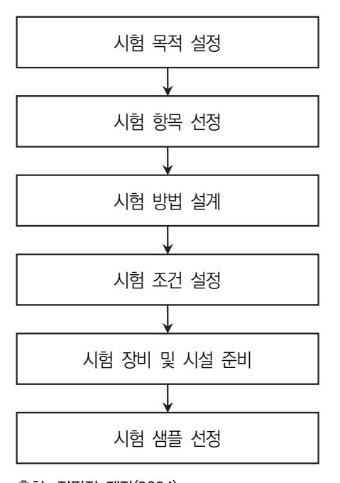

출처: 집필진 제작(2024) [그림 1-2] 수명 시험 수행 절차

- 수 수명 시험 수행
  - 1. 수명 시험 수행 절차
    - (1) 시험 목표 설정
      - (가) 시험의 궁극적인 목적을 명확히 정의한다.
        - (나) 고객이나 내부 요구 사항을 반영하여 시험 기준과 목표를 설정한다.

(다) 시험 결과를 통해 얻고자 하는 구체적인 데이터를 명확히한다.

(2) 수명 시험 항목 선정

(가) 반도체 소자의 어떤 특성을 시험할지 결정한다.

(나) 특성에 맞는 온도, 습도, 전기적 스트레스 등의 다양한 시험 항목을 선정한다.

(3) 시험 방법 설계

(가) 각 시험 항목에 대한 구체적인 절차와 방법을 정의한다.

(나) 시험 장비 및 환경 설정을 상세히 기술한다.

(다) 데이터 수집 방법 및 분석 절차를 명시한다.

#### (4) 시험 조건 설정

- (가) 각 시험 항목에 대한 구체적인 조건을 설정한다.
- (나) 온도 범위, 습도 수준, 전압 및 전류 값 등을 명시한다.
- (다) 시험 기간 및 반복 횟수를 결정한다.
- (5) 시험 장비 및 시설 준비
  - (가) 시험에 필요한 장비를 준비하고, 구동 조건을 확인한다.
  - (나) 시험 환경(온도, 습도, 전압 등)을 조절하고 유지한다.
  - (다) 시험 전 장비의 교정 및 검증을 실시한다.
- (6) 시험 샘플 선정
  - (가) 수명 시험에 사용될 시료는 테스트하고자 하는 제품의 특성을 대표해야 한다.
  - (나) 충분한 수의 시료를 사용하여 테스트 결과의 신뢰성을 보장하며, 수량은 테스트의 목적과 환경에 따라 결정한다.

2. 수명 시험 평가 조건 판단

수명 시험 평가 진행 조건이 정상인지를 판단하는 방법으로 정상 범위 내에서의 변동성을 확인한다.

- (1) 기준치와 비교 평가 방법을 통한 조건 판단
- (2) 통계적 지표 분석 방법을 통한 조건 판단

## 수행 내용 / 수명 시험 수행하기

#### 재료·자료

- 시험 대상 반도체 디바이스 데이터 시트
- 반도체 신뢰성 시험 규격(MIL-STD. 883, JESD22, EIAJ ED-4702, JIS, C7210)
- 시험 장비 매뉴얼
- 수명 시험 결과 데이터
- 보고서 작성 가이드

#### 기기(장비 ・ 공구)

- 컴퓨터(시험 계획, 데이터 기록)
- 소프트웨어(시험 설계 및 시뮬레이션)
- 시료 홀더
- 정밀 핀셋 및 작업대
- 정전기 방지 매트 및 손목 밴드
- 온도 사이클링 체임버
- 습도 시험 장비
- 전기적 스트레스 시험기(HTOL, HAST 등)
- 데이터 로거 및 모니터링 시스템

#### 안전 ・ 유의 사항

- 시험 설계 시 안전성 확보를 위해 예상 위험 요소를 평가하고 안전 조치를 포함한다.
- 작업 공간의 안전 확보를 위해 깨끗하고 정돈된 작업 환경을 유지하여 사고를 예방한다.
- 정전기에 민감한 반도체 소자를 다룰 때 정전기 방지 보호구를 반드시 착용하고 사용해야 한다.
- 수명 시험 시 시료를 손상하지 않도록 주의하고 정밀하게 다룬다.

- 반도체 시험 시 이물질이나 오염을 방지하기 위해 작업 공간의 청결을 유지한다.
- 시험 장비의 사용법을 충분히 숙지하고 안전 지침을 준수하면서 시험을 시행한다.
- 고온 또는 고압 장비 사용 시 적절한 보호 장비를 착용하고 시험을 시행한다.
- 장비의 정기적인 점검과 유지 보수를 통해 안전하고 최적의 공정 상태를 유지할 수 있도록 한다.
- 데이터 손실을 방지하기 위해 정기적으로 데이터를 백업하고 수집된 데이터는 안전하게 보 관하고 접근 권한을 제한한다.
- 민감한 정보를 포함한 보고서와 발표 자료는 보안을 유지한다.

수행 순서

숔 반도체 수명 시험의 개요를 파악한다.

- 1. 수명 시험의 목적을 파악한 후 각 목적의 구체적인 내용을 정의한다.
  - (1) 신뢰성 보증 차원에서의 목적을 이해한다.
    - (가) 고장 예측 및 예방 차원에서 반도체 소자의 초기 고장을 조기에 발견하고, 수명 예측을 통해 장기적인 신뢰성을 보장한다.
    - (나) 품질 관리 및 개선 차원에서 수명 시험 결과를 분석하여 제품의 성능과 품질을 지속해서 개선하고, 결함의 원인을 파악하여 제조 공정을 개선한다.
    - (다) 표준 준수 및 인증 차원에서 국제 및 산업 표준을 준수하여 제품의 신뢰성을 인증받고, 고객의 신뢰성 요구 사항을 충족한다.
  - (2) 품질 향상 차원에서의 목적을 이해한다.
    - (가) 제조 공정 개선 차원으로 생산 과정에서 발생하는 결함을 줄이기 위해 제조 공정을 지속 해서 모니터링하고 최적화한다.
    - (나) 제품 설계 최적화 차원에서 수명 시험과 신뢰성 분석 결과를 바탕으로 제품의 설계를 개 선하여 성능과 내구성을 향상한다.
    - (다) 피드백 시스템 구축 차원에서 고객 및 현장의 피드백을 반영하여 품질 문제를 신속하게 해결하고, 이를 통해 제품의 품질을 지속해서 향상한다.
  - (3) 고장 분석 차원에서의 목적을 이해한다.
    - (가) 원인 분석 차원에서 발생한 고장의 근본 원인을 파악하기 위해 물리적, 화학적, 전기적 분석을 수행한다.
    - (나) 데이터 수집 및 통계 분석 차원에서 고장 데이터를 체계적으로 수집하고, 통계적 방법을

통해 고장의 패턴과 빈도를 분석한다.

- (다) 개선 조치 마련 차원에서 분석 결과를 바탕으로 설계 변경, 공정 개선, 품질 관리 강화 등 고장을 예방하기 위한 개선 조치를 마련하고 실행한다.
- (4) 수명 예측 차원에서의 목적을 이해한다.
  - (가) 가속 수명 시험 차원에서 고온, 고습, 고전압 등의 극한 조건에서 가속 시험을 시행하여 소자의 장기적인 수명을 예측한다.
  - (나) 통계적 모델링 차원에서 수집된 데이터를 기반으로 통계적 모델을 구축하여 제품의 신뢰 성과 수명을 예측한다.
  - (다) 스트레스 분석 차원에서 반복적인 스트레스 및 작동 조건에서 소자의 피로와 마모를 분 석하여 수명을 예측하고, 예상 고장 시점을 파악한다.
- (5) 표준 준수 차원에서의 목적을 이해한다.
  - (가) 국제 및 산업 표준 준수 차원에서 JEDEC, ISO, MIL-STD 등 국제 및 산업 표준을 준 수하여 제품의 신뢰성과 품질을 보장한다.
  - (나) 인증 및 검증 차원에서 제품 개발 및 생산 과정에서 표준에 따른 인증 및 검증 절차를 거쳐 신뢰성을 입증한다.
  - (다) 표준 업데이트 반영 차원에서 최신 표준과 규정을 지속해서 모니터링하고, 이를 제품 설 계 및 제조 공정에 신속히 반영하여 규정 준수 상태를 유지한다.
- 2. 신뢰성 이론 내용을 이해하고 세부적인 내용이 수명 시험에 활용되는지 파악한다.
  - (1) 신뢰성 평가의 주요 개념들을 파악하고 상세 내용을 파악한다.
    - (가) 신뢰성 이론에서는 시간에 따른 제품 또는 시스템의 동작 상태를 나타내는 확률 분포를 사용하는데, 시간에 따라 제품이 고장날 확률을 나타낸다.
    - (나) 제품이 고장나는 주요 원인을 분석하여 제품의 설계나 제조 과정에서의 결함을 개선하는 데 도움을 준다.
    - (다) 제품이 고장 날 때까지의 시간을 분석하여 고장 발생률을 예측하는데, 장애 시간 간격의 분포를 파악하고 신뢰성을 평가한다.
    - (라) 제품의 수명 특성은 평균 수명, 평균 고장 간격, 고장 확률 등을 포함하는데, 제품의 신 뢰성을 정량화하고 예측하는 데 사용된다.
  - (2) 신뢰성 평가로 적용할 수 있는 분야를 파악한다.
    - (가) 신뢰성 이론은 제품을 설계할 때 잠재적인 결함을 식별하고 개선하는 데 사용한다. 이를 통해 제품의 수명을 연장하고 고장 확률을 줄일 수 있다.
    - (나) 제품의 수명 주기 동안 필요한 유지 보수 및 교체 일정을 계획하는 데에도 신뢰성 이론 을 활용한다. 예를 들어, 장애 발생률을 고려하여 예비 부품 및 유지 보수 인력을 할당

할 수 있다.

- (다) 신뢰성 이론은 제품의 품질을 관리하는 데 중요한 도구이다. 품질 문제를 식별하고 이를 해결하여 제품의 신뢰성을 향상하는 데 활용한다.
- [그림 1-3]은 신뢰성 테스트를 위한 장비이다.

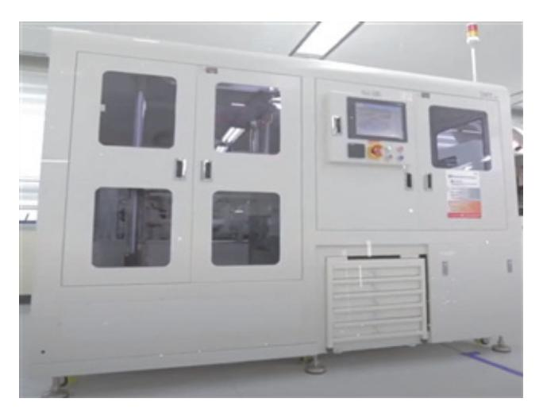

출처: 집필진 제작(2024) [그림 1-3] 신뢰성 테스트 장비 예시

- 3. 제품의 고장 메커니즘을 이해한다.
  - (1) 내부 요인에 의한 결함 발생 환경을 파악한다.
    - (가) 재료 결함은 제품을 제조하는 과정에서 사용된 재료의 결함(재료의 결합 부족, 불순물 포 함, 결정 구조의 결함 등)으로 인해 고장이 발생할 수 있다.
    - (나) 설계 결함은 제품 설계 과정에서 발생한 오류나 부적절한 설계(부적절한 부품 선택, 디자 인 오류, 시스템 상호 작용 문제 등)로 인해 고장이 발생할 수 있다.
  - (2) 외부 요인에 의한 결함 발생 환경을 이해한다.
    - (가) 환경 요인은 제품이나 시스템이 노출된 환경 조건(온도, 습도, 진동, 미세한 먼지나 천연 물 등)에 의해 손상되거나 영향을 받을 수 있다.
    - (나) 사용자 오류는 제품을 부적절하게 사용하거나 잘못된 조작(무리한 물리적 충격, 잘못된 전원 공급, 부적절한 유지 보수 등)으로 인해 고장이 발생할 수 있다.
  - (3) 운영 및 유지 보수 오류에 의한 결함 발생 환경을 이해한다.
    - (가) 유지 보수 부족은 제품의 정기적인 유지 보수가 부족하거나 미비(오일 교환 미수행, 필터 청소 미수행 등)할 경우 고장이 발생할 수 있다.
    - (나) 운영 오류는 제품을 부적절하게 운영하거나 잘못된 조작(과도한 부하, 오버 클럭킹, 잘못 된 설정 등)으로 인해 고장이 발생할 수 있다.

- (4) 시간에 따른 노화에 의한 결함 발생 환경을 이해한다.
  - (가) 물리적 노화는 시간이 지남에 따라 부품이 노화되고 손상(전기적 부품의 접속 부품의 노 화, 기계 부품의 마모, 화학적 변화 등)될 수 있다.
  - (나) 기능적 노화는 제품의 성능이 시간이 지남에 따라 저하(전자 기기의 배터리 수명이 감소 하거나 소프트웨어의 버그가 증가)될 수 있다.

#### 수행 tip

- 반도체 소자의 고장 메커니즘이란 결함 발생 환경의 원인 을 파악하고 결함 발생 환경에 의한 제품 변화를 분석하는 것이다.
- 4. 수명 시험 모델링의 주요 방법을 파악하고 각 방법에 대한 특성을 이해한다.
  - (1) 수명 분포 모델링 절차를 파악한다.
    - (가) 수명 분포 모델링에서는 제품이나 시스템의 수명을 설명하는 확률 분포를 선택하고, 가장 일반적인 확률 분포로는 지수 분포, 와이블 분포, 로지스틱 분포 등이 있다.
    - (나) 선택한 확률 분포의 모수를 추정하여 제품의 수명 특성을 결정한다.
  - (2) 가속 시험 모델링 절차 특성을 이해한다.
    - (가) 수명 시험에서는 일반적으로 제품의 수명을 가속화하기 위해 높은 온도, 고전압, 높은 주 파수 등의 가속화 조건을 사용하고, 가속 모델링은 제품의 실제 작동 조건에서 예상되는 수명을 가속화된 환경에서 추정하는 데 사용된다.
    - (나) 가속 모델링은 실제 환경과 가속 조건 사이의 관계를 파악하여 개발한다.
  - (3) 노화 모델링 종류와 특성을 이해한다.
    - (가) 물리적 노화 모델은 시간이 지남에 따라 부품이 노화되고 손상(재료의 마모, 결합부의 노 화 등)될 수 있는 과정을 모델링한다.
    - (나) 기능적 노화 모델은 제품의 성능이 시간이 지남에 따라 기능이 저하(전자 기기의 배터리 용량 저하, 소프트웨어 버그 증가 등)되는 과정을 모델링한다.
  - (4) 신뢰성 예측 종류와 특성을 이해한다.
    - (가) 모델링 결과를 기반으로 제품이나 시스템의 예상 수명을 예측하고, 이를 통해 제품의 수 명을 최적화하고 필요한 유지 보수 일정을 계획할 수 있다.
    - (나) 수명 시험 모델링을 통해 제품의 고장 확률과 고장 시기를 예측하고, 이를 통해 고장을 예방하고 신뢰성을 향상시킬 수 있다.

#### 수행 tip

• 반도체 소자의 수명 시험을 자연 상태에서 진행하려면 매 우 긴 시간과 많은 노력이 필요하고, 시험 결과를 피드백 해서 제품 개발에 활용하기 어렵다. 따라서, 다양한 분야 (온도, 전기, 수분, 압력 등)의 가속 환경(accelerated stress) 조건에서 시험하는 방법을 모델링하여 진행한다.

#### 5. 고장률을 계산한다.

- (1) 고장률 계산(failure rate calculation)하는 방법을 이해한다.
  - (가) 고장률 계산을 위해서는 고장률이 시간의 함수임을 이해해야 한다.
    - 1) 고장률 함수(failure rate): λ(t)
    - 2) 누적 고장률 함수(cumulative fail): F(t)
    - 3) 신뢰도 함수(reliability): R(t)
  - (나) 고장률(순간 고장률(λ(t)) 산출 방법을 이해한다.
    - 1) 우발 고장 지대의 고장률 분포는 지수함수로 분포함으로 고장률[λ(t)]은 일정한 상수 로 나타낸다. 그러므로 지수함수 분포를 이용하면 고장률을 아래와 같이 구한다.
    - 2) 고장률 계산
    - F.R = N / D \* H
    - N = Number of rejects
    - D = Total sample size
    - H = Test hour
    - 단위: % / HR, % / 1000HR, FIT(FIT = F.R / 10E-9)
- (2) 60% 신뢰율 고장률을 계산(60% confidence level failure rate)한다.

신뢰도 시험실에서 구한 고장률(F.R)이 실제의 고장률을 나타내지만 sampling에 의한 결과이므로 모집단의 고장률을 알기 위해서는 통계적 처리가 필요하다. 즉, 신뢰율 (confidence level)을 이용하여 고장률을 계산한다. (ex) F.R(% / KHR @ 60%CL) = X2(0.60, 2R+2) \* 10E5 / 2\*D\*H

여기서 X2는 2R+2 자유도의 0.6에 해당하는 카이 제곱(chi square) 값이다.

#### 숕 반도체 수명 시험의 계획 수립 절차를 이해한 후 내용을 파악한다.

- 1. 수명 시험 계획 수립에 필요한 항목들을 파악한 후 구체적인 계획을 수립한다.
  - (1) 테스트 환경 설정은 수명 시험에 적합한 온도, 습도, 진동 등의 외부 환경 조건과 전력, 전류 등의 내부 환경 조건을 포함하여 설정한다.
    - (가) 외부 환경 조건은 제품이나 장치가 사용될 외부 환경을 고려하여 온도, 습도, 진동 등의 외부 환경 조건은 실제 사용 환경에 최대한 근접하도록 설정한다.
    - (나) 내부 환경 조건은 제품 내부의 전력, 전류, 주파수 등의 환경 조건은 제품의 정상 작동 조건을 고려하여 설정한다.
  - (2) 테스트 종류 및 특성을 이해하고 시험 목적에 부합하는 방법을 선택한다.
    - (가) 가속 시험은 제품의 수명을 가속화하기 위해 높은 온도, 고전압, 높은 주파수 등의 조건 을 사용하여 시험을 진행하고, 가속 모델링을 통해 실제 사용 환경에서의 수명을 예측할 수 있다.
    - (나) 필드 시험은 제품을 실제 사용 환경 조건으로 수명을 평가하고 가속 시험 결과를 검증하 는 데 사용된다.
    - (다) 모의 시험은 실제 시험이 어려운 경우나 실제 시험하기 전에 위험 요인을 찾기 위해 컴 퓨터 시뮬레이션을 사용하여 제품의 수명을 예측하는 방법이다.
  - (3) 테스트 계획 수립 항목과 내용을 파악한다.
    - (가) 테스트 기간 및 주기는 테스트의 규모와 복잡성에 따라 테스트의 시작일, 종료일, 중간 결과 검토 및 보고일 등을 결정한다.
    - (나) 테스트의 규모와 복잡성을 고려하여 테스트에 필요한 인력, 장비, 시설 등의 자원을 할당 한다.
  - (4) 위험 관리 방안에 대한 내용을 파악한다.
    - (가) 테스트를 수행하는 과정에서 발생할 수 있는 위험을 사전에 식별하고 평가한다.
    - (나) 위험을 최소화하고 테스트의 성공을 보장하기 위해 각 위험에 대한 대응 계획을 수립한 다.
- 2. 시험에 필요한 샘플 선정 및 처리 방안에 대해 내용을 파악한다.
  - (1) 시험 샘플 선정 방법을 파악한다.
    - (가) 시험 샘플은 제품 또는 제품의 전체를 대표할 수 있어야 한다. 제조 공정의 모든 단계를 거치거나 제품의 모든 기능을 포함하는 샘플이어야 한다.
    - (나) 가능한 한 다양한 종류의 시험 샘플을 선택하여 제품의 다양한 특성을 대표할 수 있도록 하고, 제품이 다양한 용도나 환경에서 사용될 때 발생할 수 있는 다양한 상황을 고려하 는 것을 의미한다.
    - (다) 시험 샘플의 크기는 통계적으로 유효한 결과를 얻을 수 있도록 충분히 크게 선택되어야

하고, 표본이 너무 작으면 결과가 편향될 수 있으며, 표본이 너무 크면 시간과 비용이 증가할 수 있다.

- (라) 시험의 목적에 따라 시험 샘플을 선택한다. 예를 들어, 초기 고장률을 평가하기 위한 경 우 제조 과정 중에 발생할 수 있는 결함을 고려하여 샘플을 선택할 수 있다.
- (마) 시험 샘플의 선택은 연구 및 통계적 분석을 통해 근거를 갖추어야 하고, 데이터의 통계 적 유의성을 확보하기 위해 적절한 표본 크기와 다양성을 고려하여 샘플을 선택한다.
- (2) 선정된 시험 샘플을 대상으로 시료 처리의 필요성을 이해한 후 내용을 파악한다.
  - (가) 테스트의 정확성과 신뢰성을 향상하기 위해 시료를 정제하고 표준화하여 일관된 조건에 서 테스트를 수행할 수 있도록 한다.
  - (나) 대형 시료의 경우 테스트의 효율성과 자원 활용을 높이기 위해 적절한 크기로 분할하여 테스트를 수행한다.
- (3) 시료 식별 및 추적 방법을 파악한다.
  - (가) 테스트 결과를 분석하고 시료 간의 차이를 확인하기 위해 각 시료에 고유한 식별자를 부 여하여 추적할 수 있도록 한다.
  - (나) 부여한 식별자를 통해 시료의 처리 과정과 테스트 결과를 추적하여 테스트의 정확성을 보장한다.

수행 tip 샘플 선정 방법

• 시험에 필요한 샘플은 전체를 대상으로 시험할 수 없기 때 문에 일부 제품을 선별해서 진행할 수밖에 없다. 따라서, 여러 가지 샘플 선정(sampling) 방법이 있지만 선정된 샘 플은 기본적으로 제품 전체를 대표할 수 있어야 한다.

- 3. 수명 시험의 종류를 파악한 후 각 시험에 대한 특성을 파악한다.
  - (1) 초기 고장률 시험에 대한 특성을 파악한다.
    - (가) 패키지 상태의 반도체 제품에 번인 스트레스(burn-in stress)를 가하면서 테스트를 수행 하는 것으로, 가혹 조건을 인가하여 잠재적인 불량을 조기에 제거함으로 제품 사용 동안 제품의 불량률을 최소화하는 시험이다.
    - (나) 초기 불량의 수준을 평가하는 항목으로 초기 수준을 고객 사용 환경에서 약 1년으로 설 정한다. 일부 제품에 대해서는 6개월로 초기 수준을 설정하기도 한다. 고신뢰성이 요구 되는 제품의 경우 1년 이상으로 설정하기도 한다.
    - (다) 제품의 초기성 불량은 번인(burn-in) 장비를 통하여 불량이 발생될 가능성이 있는 제품 을 선별한다. 이렇게 선별된 제품의 잠재 불량률이 적정한 수준을 유지하는지 EFR로 검

증한다. [그림 1-4]는 TBDI를 위한 장비이다.

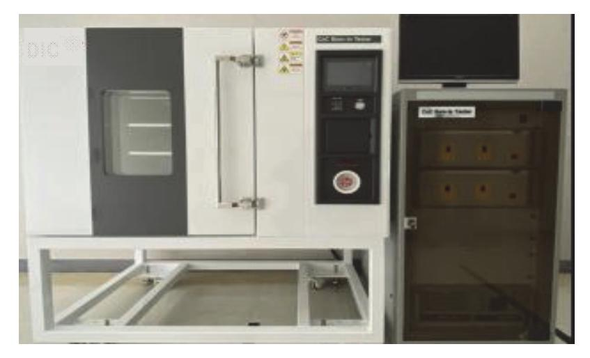

출처: 집필진 제작(2024) [그림 1-4] 번인(TBDI) 장비

- (라) TDBI 장비를 사용하여 반도체 제품의 적절한 온도와 전압에 대한 가속 인자를 이용하여 조건을 설정하고 평가한다.
- (마) 번인 선별 공정이 제조 라인의 공정 변동 및 이상 발생에 대해 적절하게 선별하고 있는 지를 모니터링하는 도구로써도 활용된다.
  - [그림 1-5]는 EFR 보증 구간에 대한 곡선 그래프이다.

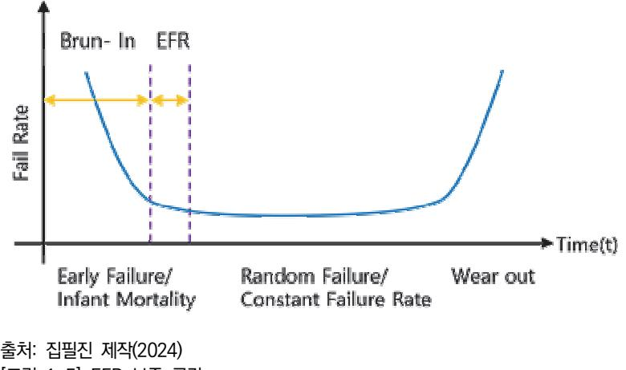

[그림 1-5] EFR 보증 구간

- (2) 고온 동작 수명 시험(HTOL)에 대한 특성을 파악한다.
  - (가) 제품을 실제 동작시키면서 온도 및 전압으로 스트레스를 인가함으로써 가장 효과적으로 제품의 전반적인 문제점을 검토하는 데 효율적인 시험이다.

- (나) 초기 고장 영역뿐만 아니라 우발 고장 영역 및 마모 고장 영역에 걸친 총체적 검증을 할 수 있는 시험이다.
- (다) 온도 조건을 파악한다.
  - 1) 온도 조건은 반도체 패키지 재료의 특성 상 높으면 높을수록 가속 평가 효과가 뛰어 나지만 너무 과할 경우 목적 외의 불량이 발행할 수 있다.
  - 2) 패키지 재료의 주종인 EMC(epoxy molding compound)의 물성 특성을 유지하는 최대 온도인 125℃를 기준으로 신뢰성 시험 및 번인 공정이 이루어진다.

[그림 1-6]은 HTOL 테스트를 위한 장비이다.

출처: 집필진 제작(2024) [그림 1-6] HTOL 장비 예시

[그림 1-7]은 HTOL 보증 구간 곡선이다.

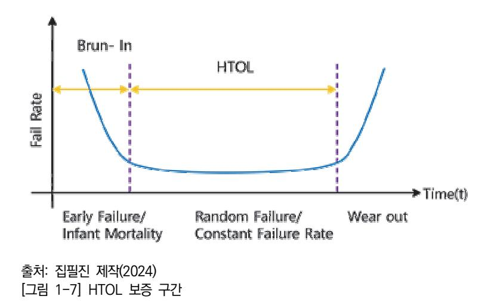

(라) 전압 조건을 이해한다.

기본적으로 제품 사양서에서 제시한 최대 전압을 인가하는 것이 이상적이나 초기 평 가하는 관점에서 부적합하므로 가속 계수와 고장률 등의 상관관계를 충분히 고려하 여 인가 전압을 결정한다.

- (3) 저온 동작 수명 시험에 대한 특성을 파악한다.
  - (가) LTOL 항목은 핫 캐리어(hot carrier) 영향에 대한 제품 불량 발생 가능성을 평가하는 항목이다.
  - (나) 저온 조건에서 핫 캐리어 효과가 발생하므로 일반적으로 –10℃ 조건으로 시험을 시행하 는데, IT 및 자동차용 반도체 제품의 경우 각 분야에서 요구하는 조건으로 변경하여 시 험할 수 있다.
  - (다) 시험 패턴 및 인가 시간 등은 HTOL(고온 동작 시험)과 동일하다.
- (4) 고온 보관 수명 시험에 대한 특성을 파악한다.
  - (가) HTSL 시험은 반도체 제품을 고온 환경에서 보관이라기보다는 방치 상태에 가까운 환경 에서 신뢰성을 평가하는 항목이다.
  - (나) 고온 방치 환경은, 확산, 산화, 금속 간 성장 및 패키지 물질의 화학적 열화의 영향으로 제품의 수명에 영향을 줄 수 있다.
  - (다) 기판의 변색 등 여러 가지 불량 양상들이 있는데, 필러 손상은 열 스트레스로 인한 열팽 창 계수 차이로 물리적인 피로 현상을 증대하여 불량을 유발하지만 고온 방치 시 오히려 더욱 가속화되는 경향이 있어서 신뢰성 영향성을 판단하는 데 용이하다.
  - (라) 키르켄달 보이드(kirkendall void)와 같이 와이어 본딩 등의 물질 접합 계면에서 금속 간 화합물의 접착력 문제를 HTSL을 통해 가속화할 수 있다.
  - (마) 온도 조건은 일반적으로 55~200℃ 내에서 진행되며 통상 150℃ 또는 175℃를 적용한다.

[그림 1-8]은 고온 저장 시험을 위한 장치이다.

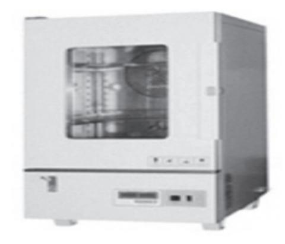

출처: 교육부(2018). 반도체 신뢰성 평가(LM903 060110\_14v3). 한국직업능력개발원. p.11. [그림 1-8] 고온 저장 시험 장치

- (5) 저온 보관 수명 시험에 대한 특성을 파악한다.
  - (가) LTSL 항목은 제품의 저온 방치 환경에서의 신뢰성을 평가하는 항목이다.
  - (나) 또한 제품의 데이터 시트에서 규정하는 비가동 온도 구간의 보증 여부를 평가하기 위해 수행될 수 있다.
  - (다) 온도 조건은 일반적으로 0~-65℃ 내에서 통상 –55℃ 또는 –65℃를 적용한다.
- (6) 내구성 시험에 대한 특성을 파악한다.
  - (가) 내구성 시험은 플래시 메모리 등 ROM 계열 제품의 쓰기 및 지우기 동작에 대한 주기적 한계 특성을 평가하는 시험이다.
  - (나) 낸드 플래시 메모리는 쓰기와 지우기를 수행할 때 FN 터널링 방식으로 동작되기 때문에 사용의 횟수에 대한 제한이 있다.
  - (다) 내구성과 관련된 불량 양상은 온도 및 전압에 대한 가속 조건이 없으므로 데이터 시트에 명시한 사이클 횟수만큼 실제 사용자와 같은 방식으로 쓰기, 지우기를 반복하여 평가한 다.
  - (라) 평가 시간을 단축하기 위해 부분 블록을 지정하여 단시간에 평가할 수 있다.
  - (마) 쓰기와 지우기 동작이 반복될수록 셀의 특성이 바뀌면서, 일반적으로 VT(임계 전압)가 높 아지는 방향으로 이동되면서 내구성 불량으로 나타난다.
- (7) 데이터 리텐션 시험에 대한 특성을 파악한다.
  - (가) 데이터 리텐션 시험은 플래시 메모리의 주요 신뢰성 요소로서, 메모리에 쓰인 정보가 사 라지지 않고 얼마나 오래 보존할 수 있는지를 평가한다.
  - (나) 셀 내에 저장된 정보가 전원의 공급이 없더라도 일정 시간을 유지하는 특성으로 일반적 인 동작 온도에서 사이클링 후 10년을 유지하는 것으로 규정한다.

23

- (다) 데이터 리텐션 시험 진행 절차는 다음과 같은 단계로 진행된다.
  - 1) 시험을 위한 특정 데이터를 소자에 기록한다.
  - 2) 기록된 데이터를 일정 시간 동안 유지한 후, 그 유지 시간을 측정한다.
  - 3) 유지 시간이 지난 후에도 데이터가 소실되지 않았는지 확인한다.
- (라) 테스트를 통해 데이터 손실이나 비정상적인 데이터 유지에 대한 문제를 식별하고, 제품의 신뢰성을 평가한다.

#### 수행 tip

• 우선 각종 수명 시험 항목들을 정리한 후 각 항목의 조건 설정이나 특성을 파악하는 방식을 학습하는 것이 좋다.

- 4. 시험 결과 기록 및 관리 필요성을 이해하고 각 항목의 작성 방법을 파악한다.
  - (1) 결과 기록 항목들을 파악하고 각 항목의 작성 방법을 파악한다.
    - (가) 시험 중 발생하는 각종 데이터(센서, 기기 또는 소프트웨어에서 생성)를 수집한다.
    - (나) 시험을 시행할 때 사용된 환경 조건(온도, 습도, 압력, 진동 등)과 시험 장비의 설정 데 이터를 기록한다.
    - (다) 시험의 진행 과정(시험 시작 시점, 중간 결과 및 시험 중)에 발생한 이벤트 및 예외 상황 등을 기록한다.
    - (라) 시험 결과의 해석과 검증을 위해 시험 중 발생한 모든 사건과 관찰 내용을 기록하는 시 험 일지를 작성한다.
  - (2) 테스트가 완료된 후 결과를 정리하여 보고서를 작성하고 각종 자료를 첨부하여 시험 결과를 공유한다.

수행 tip

• 수명 시험의 수행 과정 및 결과 전반에 걸쳐 기록하고 데 이터화한다. 모든 자료들은 보고서에 첨부하여 관리한다.

- 숖 수명 시험 수행 절차를 이해하고, 스트레스 종류 및 특성을 파악한다.
  - 1. 수명 시험 수행 절차를 파악한다.
    - (1) 평가용 보드를 준비 상태를 파악한다.

- (가) 반도체 소자의 성능과 신뢰성을 평가하기 위해 테스트에 사용될 보드를 준비한다.
- (나) 평가할 반도체 소자가 장착될 수 있도록 설계된 보드를 준비한다. 이 보드는 일반적으로 실제 사용 환경을 모사한 회로 구성이어야 한다.
- (다) 평가용 보드는 테스트 대상 반도체 소자뿐만 아니라, 이를 구동하고 모니터링하기 위한 전원 공급 장치, 제어 회로, 센서 등이 포함될 수 있다.
- (라) 평가용 보드를 조립하고, 기본 기능이 정상적으로 작동하는지 검증한다. 이를 통해 테스 트 준비 상태를 확인한다.
- (2) 각종 스트레스 종류를 나열하고 조건 설정 방법을 파악한다.
  - (가) 고전압 스트레스(high voltage stress)의 조건 설정 방법을 이해한다.
    - 1) 소자에 정격 전압 이상의 높은 전압을 인가하여 소자의 절연 특성과 내전압 특성을 평가한다.
    - 2) 전압 스트레스는 소자의 게이트 산화막이나 다른 절연체의 열화를 가속화하여 결함 을 유발하여 평가한다.
    - 3) 전압의 설정 범위는 소자의 정격 전압보다 10%에서 50% 높은 전압을 인가한다.
    - 4) 예시로 정격 전압이 5V인 경우 5.5V에서 7.5V 사이의 전압을 인가한다.
  - (나) 고전류 스트레스(high current stress)의 조건 설정 방법을 이해한다.
    - 1) 소자에 정격 전류 이상의 높은 전류를 흐르게 하여 전류 밀도 증가로 인한 발열과 전기적 열화를 평가한다.
    - 2) 이 시험은 주로 전력 반도체 소자나 고출력 소자에서 많이 사용된다.
    - 3) 전류의 설정 범위는 소자의 정격 전류보다 10%에서 50% 높은 전류를 인가한다.
    - 4) 예시로 정격 전류가 1A인 경우 1.1A에서 1.5A 사이의 전류를 인가한다.
  - (다) 온도 가속 스트레스(temperature accelerated stress)의 조건 설정 방법을 이해한다.
    - 1) 고온 조건에서 전기적(전압이나 전류) 스트레스를 가하여 열에 의한 열화를 가속화하 여 평가한다.(예: 고온 역방향 바이어스, HTRB).

[그림 1-9]는 초가속 수명 시험(HALT)를 위한 장비이다.

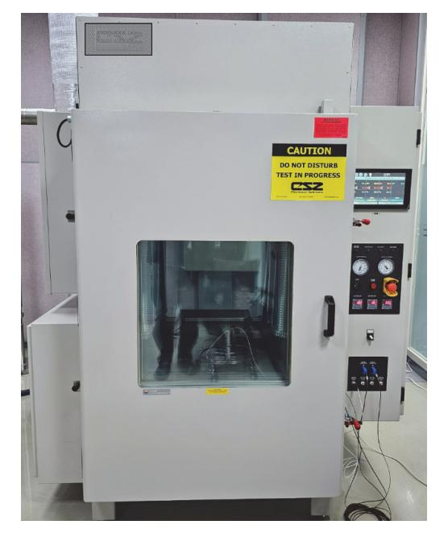

출처: 집필진 제작(2024) [그림 1-9] 초가속 수명 시험(HALT) 장비 예시

- 2) 아레니우스(arrhenius) 법칙을 이용하여 소자의 열화 속도를 추정하고, 활성화 에너 지를 계산할 수 있다. 활성화 에너지는 소자의 수명을 예측하고 신뢰성 모델을 구축 하는 데 활용된다.
- 3) 온도의 설정 범위는 일반적으로 소자의 작동 온도보다 85°C에서 150°C 높은 온도 를 인가한다.
- 4) 예시로 작동 온도가 25°C인 경우 125°C에서 150°C 사이의 온도를 인가한다.
- (라) 전기적 펄스 스트레스(electrical pulse stress)의 조건 설정 방법을 이해한다.
  - 1) 짧은 시간 동안 높은 전압 또는 전류 펄스를 가하여 소자의 순간적 과도 응답 특성 을 평가한다.
  - 2) ESD(electrostatic discharge) 시험이 대표적인 예이며, 2kV에서 4kV 사이의 펄 스 전압을 인가한다. [그림 1-10]은 ESD 시험을 위한 장치이다.
  - 3) 설정 범위는 짧은 시간 동안(10ns~100ns) 펄스 전압(1kV~5kV)를 인가한다.

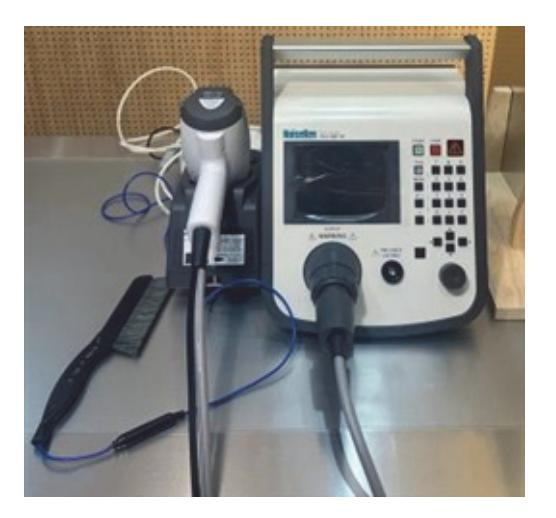

출처: 집필진 제작(2024) [그림 1-10] ESD 시험기

#### (마) 바이어스 스트레스(bias stress)의 조건 설정 방법을 이해한다.

- 1) 일정한 전압 또는 전류를 지속해서 인가하여 소자의 안정성과 내구성을 평가한다.
- 2) 바이어스 인가 범위는 신뢰성 데이터를 충분히 확보할 수 있도록 설정한다.
- 3) 예시로 정격 전압이 3.3V인 경우 3.3V를 지속해서 인가한다.

<표 1-1>는 바이어스별 전압 인가 시간 설정 예시이다.

#### <표 1-1> 바이어스별 전압 인가 시간 예시

| 바이어스 종류             | 인가 전압                      |
|---------------------|----------------------------|
| 단기 바이어스 스트레스        | 48시간에서 168시간(2일에서 7일)      |
| 장기 바이어스 스트레스        | 500시간에서 1,000시간(약 3주에서 6주) |
| 특별히 높은 신뢰성이 요구되는 경우 | 2,000시간 이상(약 3개월 이상)       |

- (바) 주기적 스트레스(cyclic stress)의 조건 설정 방법을 이해한다.
  - 1) 소자에 주기적으로 전기적 스트레스를 가하여 피로 특성을 평가한다.
  - 2) 주기적 전류나 전압 변화에 따른 소자의 열적 스트레스와 전기적 스트레스를 복합적 으로 평가한다.
  - 3) 설정 범위는 0V에서 정격 전압, 0A에서 정격 전류까지 주기적으로 변화될 수 있도 록 한다.

[그림 1-11]은 급속 온도 변화 사이클 시험을 위한 장치이다.

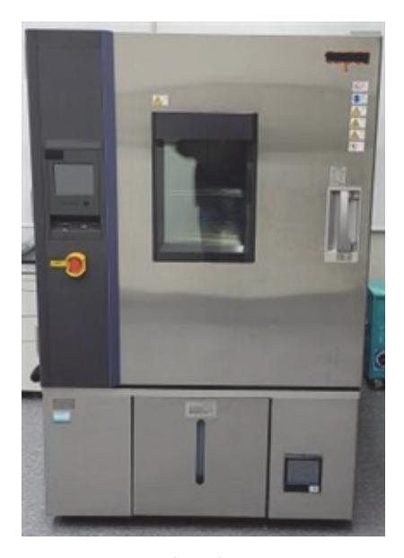

출처: 집필진 제작(2024) [그림 1-11] 급속 온도 변화 사이클 시험기

<표 1-2> 주기적 스트레스 설정 예시

|              | 범위                |            |            |  |
|--------------|-------------------|------------|------------|--|
| 분류           | 주기                | 전압         | 전류         |  |
| 단기 고속 스위칭 소자 | 수 ㎲ ~ 수 ㎳         |            |            |  |
| 일반적인 전력 소자   | 수 ㎳ ~ 수 s         | 0V ~ 정격 전압 | 0A ~ 정격 전류 |  |
| 장기적 안정성 평가   | 수 minute ~ 수 hour |            |            |  |

#### 수행 tip

• 각종 수명 시험 항목을 정리하고 항목별로 시험 조건 설 정 방법을 학습한 후 수명 시험을 시행할 수 있도록 한다.

- 2. 수명 시험 평가 조건 판단 방법을 이해하고 각 방법의 내용을 파악한다.
  - (1) 기준치와 비교 평가하는 방법을 파악한다.
    - (가) 수명 시험을 시작하기 전에 기대되는 소자의 동작 특성과 성능에 대한 기준치를 제품 명 세서, 업계 표준 또는 과거의 테스트 결과 등을 참고하여 설정한다.
    - (나) 수명 시험을 통해 얻은 결과 데이터(전압, 전류, 온도 등)를 시간에 따라 기준치와 비교 하여 소자의 동작 상태를 평가한다.

- (다) 비교 평가 결과가 허용 오차 내에서 안정적으로 유지되는 경우에는 수명 시험 평가가 정 상적으로 진행된 것으로 판단할 수 있고, 허용 오차에서 크게 벗어나는 경우에는 문제가 발생했을 가능성이 있으며 추가적인 조치가 필요하다.
- (2) 통계적 지표 분석 방법을 파악한다.
  - (가) 수명 시험 데이터를 통계적(평균, 표준 편차, 분포 등) 지표를 분석하여 정상 범위 내에 서의 변동성을 확인한다.
  - (나) 제어 차트(control chart)를 사용하여 시간에 따른 데이터의 변화 및 데이터의 이상 여부 를 확인한다.
  - (다) 통계적 분석 방법을 통해 이상치를 탐지하고, 이를 원인 분석하여 추가 조치를 한다.

#### 수행 tip

• 수명 시험 결과를 평가하기 위한 조건이 정상으로 설정되 었는지 판단하는 방법으로 기준 데이터와 비교하는 방법과 통계적 지표와 비교하는 방법 2가지가 있다.

### 학습 1 교수·학습 방법

#### 교수 방법

- 반도체 소자의 전기적, 물리적 특성을 이해하고 IC 동작 원리와 방법을 충분히 인지할 수 있도록 반도체 소자의 기본 원리와 구조에 관한 시청각 자료를 통해 학습시킨다.
- 응용 분야별 반도체 소자의 종류 및 특성을 제시하고 학습자들로 하여금 소자별로 측정 방 법과 구동 방법을 이해하도록 수업을 진행한다.
- 반도체 소자의 수명 시험이 무엇이며, 왜 중요한지 이해하도록 환경 시험의 주요 요소(온도, 습도, 진동 등)와 연계해서 기본 개념을 설명하면서 학습한다.
- 반도체 소자의 신뢰성 특성과 제품별 요구 기준에 관한 국제 규격을 숙지하고, 학습자들이 필요한 규격을 검색하고 해당 규격의 내용을 찾아서 활용할 수 있도록 지도한다.
- 각각의 신뢰성 항목에 대한 시험 목적과 시험 방법을 이해하고, 학습자들이 시험 계획을 수 립할 수 있도록 지도하고, 수명 시험을 시행하는 장비들의 종류를 시험 항목과 연계하여 설 명하고 운영 사양서를 통해 시험 조건 설정을 학습하게 한다.

#### 학습 방법

- 반도체 소자의 전기적, 물리적 특성을 이해하고 IC 동작 원리와 방법, 소자별로 특성 측정 방법을 학습하고, 실습을 통해 충분히 숙지한다.
- 반도체 소자의 신뢰성 특성과 제품별 요구 기준에 관한 국제 규격을 인터넷을 통해 검색하 고, 필요한 규격의 내용을 찾아서 해당 제품에 맞게 신뢰성 시험 계획표를 작성한다.
- 신뢰성 시험 목적과 시험 방법에 대해 항목별로 공부하고 각 시험 장비 활용법과 시험 도구 제작법을 학습하고, 실습을 통해 충분히 숙지한다.
- 반도체 불량의 유형과 분석 방법을 이해하고, 간단한 사례들에 대해 시료를 확보하여 실험 을 수행한다.
- 각각의 신뢰성 항목에 대한 시험 목적과 시험 방법을 이해하고, 시험 계획을 수립할 수 있 도록 학습한다.

## 학습 1 평 가

#### 평가 준거

- 평가자는 학습자가 학습 목표를 성공적으로 달성하였는지를 평가해야 한다.
- 평가자는 다음 사항을 평가해야 한다.

|          |                                                                     | 성취수준 |   |   |  |
|----------|---------------------------------------------------------------------|------|---|---|--|
| 학습 내용    | 학습 목표                                                               |      | 중 | 하 |  |
|          | - 수명 시험의 목적을 이해하고 시험 계획을 수립할 수 있다.                                  |      |   |   |  |
| 수명 시험 평가 | - 수명 시험 평가용 보드를 준비하고 전기적 Stress 조건을 설정하여 설비를 이용한 시험 방법을 갖출 수 있다. |      |   |   |  |
|          | - 수명 시험 평가 진행 조건이 정상인지 판정할 수 있다.                                    |      |   |   |  |

#### 평가 방법

• 서술형 시험

|          | 평가 항목                                               |  | 성취수준 |   |  |  |
|----------|-----------------------------------------------------|--|------|---|--|--|
| 학습 내용    |                                                     |  | 중    | 하 |  |  |
|          | - 수명 시험의 목적을 파악하고 각 목적의 구체적인 내용을 정의할 수 있는 능력     |  |      |   |  |  |
| 수명 시험 평가 | - 수명 시험 계획 수립 절차를 이해하고 단계별 필요한 항목 들을 파악할 수 있는 능력 |  |      |   |  |  |
|          | - 수명 시험 수행 절차를 이해하고 스트레스 종류 및 특성을 파악할 수 있는 능력    |  |      |   |  |  |

#### • 평가자 질문

|          | 평가 항목                                                      |  | 성취수준 |   |  |  |
|----------|------------------------------------------------------------|--|------|---|--|--|
| 학습 내용    |                                                            |  | 중    | 하 |  |  |
|          | - 신뢰성 보증 확보하는 차원에서의 수명 시험 목적을 정리할 수 있는 능력               |  |      |   |  |  |
| 수명 시험 평가 | - 수명 시험 관련 법규 및 표준을 파악하고 해당 시험에 대한 법규 및 표준을 정의할 수 있는 능력 |  |      |   |  |  |
|          | - 수명 시험에 필요한 시험 샘플 선정 방법 및 처리 방안을 정의할 수 있는 능력           |  |      |   |  |  |

#### • 평가자 체크리스트

|          |                                            | 성취수준 |   |   |
|----------|--------------------------------------------|------|---|---|
| 학습 내용    | 평가 항목                                      |      | 중 | 하 |
| 수명 시험 평가 | - 초기 고장률 시험에 대한 특성을 파악할 수 있는 능력            |      |   |   |
|          | - 수명 시험 계획 수립 절차를 이해하고 내용을 파악할 수 있 는 능력 |      |   |   |
|          | - 수명 시험의 종류를 파악하고 세부 진행 내용을 정리할 수 있는 능력 |      |   |   |

#### • 구두 발표

|          | 평가 항목                                                          |  | 성취수준 |   |  |
|----------|----------------------------------------------------------------|--|------|---|--|
| 학습 내용    |                                                                |  | 중    | 하 |  |
| 수명 시험 평가 | - 반도체 제품의 고장 메커니즘을 이해하고 발생 원인에 따른 결함을 정의할 수 있는 능력           |  |      |   |  |
|          | - 신뢰성 이론을 이해하고 신뢰성 평가 방법을 정의할 수 있 는 능력                      |  |      |   |  |
|          | - 수명 시험 평가 진행 조건이 정상인지 판단하는 방법을 이 해하고 각 방법의 내용을 정의할 수 있는 능력 |  |      |   |  |

피드백

- 1. 서술형 시험
- 수명 시험의 목적을 파악하고 각 목적의 구체적인 내용을 정의할 수 있는지 평가한 후 부족한 부 분에 대해서는 수명 시험 목적 및 내용을 수준별로 재학습한다.
- 수명 시험 계획 수립 절차를 이해하고 단계별 필요한 항목들을 파악할 수 있는지 평가한 후 부족 한 부분에 대해서는 수명 시험 계획 수립 절차 및 단계별 내용을 수준별로 재학습한다.
- 수명 시험 수행 절차를 이해하고 스트레스 종류 및 특성을 파악할 수 있는지 평가한 후 부족한 부분에 대해서는 수명 시험 수행 절차 및 단계별 내용을 수준별로 재학습한다.
- 2. 평가자 질문
- 신뢰성 보증 확보하는 차원에서의 수명 시험 목적을 정리할 수 있는지 평가한 후 성취수준이 우 수한 학습자들은 추가로 다른 차원에서의 수명 시험 목적을 정리할 수 있도록 지도한다. 성취수준 이 부족한 부분에 대해서는 수명 시험 목적을 재정립하고 신뢰성 보증 확보 측면에서의 내용을 재 학습한다.
- 수명 시험 관련 법규 및 표준을 파악하고 해당 시험에 대한 법규 및 표준을 정의할 수 있는지 평 가한 후 성취수준이 우수한 학습자들은 내용을 일목요연하게 표로 작성할 수 있도록 지도한다. 성 취수준이 부족한 부분에 대해서는 시험 항목별 관련 법규 및 표준 내용을 연계해서 재학습한다.
- 수명 시험에 필요한 시험 샘플 선정 방법 및 처리 방안을 정의할 수 있는지 평가한 후 성취수준 이 우수한 학습자들은 내용을 정리하여 발표 등을 통해 공유할 수 있도록 지도한다. 성취수준이 부족한 부분에 대해서는 시험 샘플 선정 방법에 대해 재설명하고 시험을 위한 샘플 처리의 필요성 위주로 재학습 한다.
- 3. 평가자 체크리스트
- 초기 고장률 시험에 대한 특성을 파악하고 있는지 평가한 후 부족한 부분에 대해서는 초기 고장 률 시험에 대해서 예시를 들어 정리해서 수준별 재학습이 될 수 있도록 피드백한다.
- 수명 시험 계획 수립 절차를 이해하고 단계별 내용을 파악하고 있는지 평가한 후 성취수준이 우 수한 학습자들은 수명 시험 계획서를 작성하는 실습을 할수 있도록 지도한다. 성취수준이 부족한 부분에 대해서는 단계별 핵심이 되는 주요 내용을 정리해서 수준별 재학습이 될 수 있도록 피드백 한다.
- 수명 시험의 종류를 파악하고 세부 내용을 정리할 수 있는지 평가한 후 부족한 부분에 대해서는 수명 시험의 종류를 재정의하고 연계하여 핵심이 되는 주요 내용을 정리해서 수준별 재학습이 될 수 있도록 피드백한다.
- 4. 구두 발표
- 반도체 제품의 고장 메커니즘을 이해하고 발생 원인에 따른 결함을 정의해서 발표했는지 확인한 후 부족한 부분에 대해서는 고장 메커니즘의 예시를 들어서 설명해 준다.
- 신뢰성 이론을 이해하고 신뢰성 평가 방법을 정리해서 발표했는지 평가한 후 부족한 부분에 대해 서는 신뢰성 이론을 이해할 수 있도록 예시를 들어 추가 설명해 준다.
- 수명 시험 평가 진행 조건이 정상인지 판단하는 방법을 이해하고 발표했는지 평가한 후 부족한 부분에 대해서는 평가 조건 판단 방법에 대해 예시를 추가 설명해 준다.

## 학습 2 수명 시험 분석하기

# 2-1. 수명 시험 분석

| 학습 목표 | • 수명 시험의 시험 결과에 따른 제품의 보증 가능한 품질 수준을 판단할 수 있다. • 수명 시험 결과가 보증 규격을 만족하지 못하는 불량의 경우, 그 불량 유형을 파악할 수 있 |
|-------|--------------------------------------------------------------------------------------------------------|
|       | 다.                                                                                                     |
|       | • 수명 시험 불량의 원인을 분석할 수 있다.                                                                              |

## 필요 지식 /

숔 수명 시험 데이터 분석

- 1. 수명 시험 분석 목적
  - (1) 데이터 기반의 신뢰성 평가
    - (가) 수명 시험을 통해 수집된 데이터를 분석하여 반도체 제품의 신뢰성을 평가한다.
    - (나) 데이터 분석을 통해 제품의 내구성을 확인하고, 예상 수명을 산출한다.
  - (2) 수명 예측 및 모델링
    - (가) 통계적 기법을 이용해 반도체의 수명을 예측하는 모델을 개발한다.
    - (나) 다양한 환경 조건에서의 작동 수명을 예측하여 실제 사용 환경에 대한 인사이트를 제공 한다.
  - (3) 제품 개선을 위한 피드백 제공
    - (가) 분석 결과를 바탕으로 제품의 약점과 개선점을 식별한다.
    - (나) 결함 원인을 분석하여 설계, 재료, 제조 공정 등의 개선 방안을 제시한다.
  - (4) 신뢰성 향상 전략 수립
    - (가) 분석 결과를 통해 반도체 제품의 신뢰성 향상을 위한 전략을 수립한다.
    - (나) 이를 통해 제품 개발 과정에서 신뢰성 문제를 예방하고 해결한다.
- 2. 수명 시험 분석 필요성
  - (1) 정확한 제품 수명 정보 제공

- (2) 제품 품질 관리 강화
- (3) 비용 절감 및 효율성 증대
- (4) 고객 만족도 향상
- (5) 규제 및 표준 준수 확인
- (6) 연구 및 개발 방향 설정
  - (가) 수명 시험 분석 결과를 통해 새로운 연구 및 개발 방향을 설정한다.
  - (나) 반도체 기술의 발전과 혁신을 도모하고, 차세대 제품 개발에 필요한 데이터를 제공한다.
- 3. 분석 전 데이터 정리 및 전처리 내용 파악
  - (1) 데이터 수집
    - (가) 데이터 수집 방법
      - 1) 수명 시험 장비를 이용하여 온도, 습도, 전압 등 다양한 조건에서 반도체의 작동 시 간을 기록한다.
      - 2) 데이터는 자동화된 시스템을 통해 실시간으로 수집되며, 주기적으로 저장한다.
    - (나) 데이터 포맷

수집된 데이터는 일반적으로 CSV, Excel, SQL 데이터베이스 등 다양한 형식으로 저장한다.

#### (2) 데이터 정리

(가) 데이터 통합

여러 시험 조건이나 반복 실험에서 수집된 데이터를 하나의 통합된 데이터 세트로 병합한다.

- (나) 결측값 처리
  - 1) 수집 과정에서 누락된 데이터나 오류 데이터를 식별하여 처리한다.
  - 2) 결측값은 삭제하거나, 평균값 또는 중간값으로 대체
- (다) 중복 데이터 제거

동일한 실험에서 반복적으로 수집된 중복 데이터를 제거하여 데이터의 순도를 높임.

- (3) 데이터 전처리
  - (가) 데이터 형식 변환

분석에 적합한 형식으로 데이터를 변환한다. 예를 들어, 날짜와 시간을 일관된 포맷 으로 통일하고, 필요한 경우 단위 변환을 수행한다.

(나) 이상치 검출

통계적 방법(예: Z-점수, IQR)이나 시각화 도구(예: 상자 그림)를 이용하여 이상치를 식별하고, 필요한 경우 해당 데이터를 제거하거나 수정한다.

35

(다) 변수 선택 및 생성

분석에 필요한 변수만을 선택하여 데이터 세트를 축소하고, 새로운 파생 변수를 생성 하여 추가적인 인사이트를 도출한다.

- (4) 데이터 정규화 및 스케일링
  - (가) 정규화

데이터의 범위를 0에서 1 사이로 변환하여 분석 모델의 성능을 향상한다.

(나) 스케일링

평균과 표준 편차를 이용하여 데이터를 표준화한다. 이는 데이터의 분포를 고르게 하 고, 다양한 변수 간의 비교가 용이하다.

#### (5) 데이터 분할

(가) 훈련 데이터와 테스트 데이터 분할

데이터를 훈련용과 테스트용으로 분할한다. 일반적으로 70~80%는 훈련 데이터로, 나머지는 테스트 데이터로 사용한다.

(나) 교차 검증

데이터 세트를 여러 부분으로 나누어 교차 검증을 수행하여 모델의 일반화 성능을 평가한다.

- (6) 데이터 시각화
  - (가) EDA(exploratory data analysis)

히스토그램, 상자 그림, 산점도 등을 활용하여 데이터의 분포와 특성을 시각적으로 탐색한다.

(나) 상관관계 분석

변수들 간의 상관관계를 파악하여 주요 영향을 끼치는 요인을 식별한다.

#### 숕 수명 시험 분석 기법

- 1. 생존 분석(survival analysis) 방법
  - (1) Kaplan-Meier 추정법
  - (2) 로그 순위 검정(log-rank test)
  - (3) Cox 비례 위험 모델(cox proportional hazards model)
- 2. 분포 기반 분석 방법
  - (1) Weibull 분포(Weibull distribution) 다양한 형태의 수명 분포를 표현할 수 있는 유연한 모델로, 위치, 형태, 규모 매개 변수

를 통해 제품의 수명 분포를 설명한다.

- (2) 로그 정규 분포(log-normal distribution) 수명이 로그 정규 분포를 따를 때 유용한 모델로, 데이터의 로그 값이 정규 분포를 따르 는 경우에 사용한다.
- (3) 지수 분포(exponential distribution) 일정한 고장률을 가지는 제품의 수명 분포를 나타내는 모델로, 무기억성을 가정하여 고 장률이 시간에 독립적인 경우 사용한다.
- 3. 신뢰성 함수와 분포 파라미터 추정 방법

반도체 수명 시험 분석에서는 신뢰성 함수와 분포 파라미터 추정이 중요한 역할을 한다. 이 2가지 요소는 제품의 신뢰성과 수명을 예측하는 데 필수적이다.

- (1) 신뢰성 함수(reliability function)
  - (가) 신뢰성 함수는 시간이 경과함에 따라 시스템이나 제품이 고장나지 않고 정상적으로 작동 할 확률을 나타낸다.
  - (나) 수명 분포의 특성을 이해하고 신뢰성을 평가하는 데 사용된다.
  - (다) 신뢰성 함수 R(t)는 시간 t에서 시스템이 고장나지 않을 확률을 의미하며, 생존 함수 (survival function)라고도 한다.

R(t) = P(T > t) = 1 - F(t)

여기서, *P*는 확률(probability), *T*는 고장 시간(time to failure)을 의미하는 랜덤 변수, *F(t*)는 누적 분포 함수(CDF: cumulative distribution function)이다. *R*(0)=1(초기 시점에서 고장 확률이 0), *t*가 증가함에 따라 신뢰성 함수 *R(t*)는 감소

한다.

(2) 분포 파라미터 추정(parameter estimation)

반도체 수명 시험에서 데이터의 분포를 모델링하고, 신뢰성 함수를 정확히 추정하기 위 해 분포의 파라미터를 추정한다. 일반적으로 사용되는 분포에는 weibull 분포, 로그 정 규 분포, 지수 분포 등이 있다.

(가) Weibull 분포

반도체 수명 데이터에서 많이 사용되는 분포로, 다양한 형태의 수명 분포를 표현할 수 있다.

- 확률 밀도 함수(PDF): 
$$f(t;\lambda,k) = \frac{k}{\lambda} \left(\frac{t}{\lambda}\right)^{k-1} e^{\left(-\left(\frac{t}{\lambda}\right)^k\right)}$$

여기서,  $\lambda$ 는 척도(scale parameter) 파라미터, k는 형태 파라미터

- 신뢰성 함수: 
$$R(t) = e^{\left(-\left(\frac{t}{\lambda}\right)^k\right)}$$

최대 우도 추정법(MLE: maximum likelihood estimation)이나 회귀 분석을 통해 파라미터 \와 k를 추정한다.

(나) 로그 정규 분포(log-normal distribution)

로그 변환한 데이터가 정규 분포를 따르는 경우의 분포이다.

- 확률 밀도 함수(PDF): 
$$f(t;\mu,\sigma) = \frac{1}{t\sigma\sqrt{2\pi}}e^{\left(-\frac{(\ln t-\mu)^2}{2\sigma^2}\right)}$$

여기서, #는 로그 수명 데이터의 평균, ~는 표준 편차이다.

- 신뢰성 함수: 
$$R(t) = 1 - \varPhi \! \left( \frac{\ln t - \mu}{\sigma} \right)$$

여기서, Φ는 표준 정규 분포의 누적 분포 함수이며, 로그 변환 후 정규 분포를 가정 하여 μ와 σ를 추정한다.

③ 불량 유형 분석

1. 불량 유형의 분석 목적

반도체 신뢰성을 향상하기 위해 필수적으로 요구되는 것은 신뢰성 고장 유형을 이해하는 것 이다. 고장 유형 분석을 통해 유형별 활성 에너지를 추출하고, 이에 따른 가속 계수를 산출 함으로써 신뢰성을 예측하고 개선 대책을 수립할 수 있다.

#### 2. 항목별 불량 유형

〈표 1-1〉은 시험 항목별 불량 발생 유형, 〈표 1-2〉는 불량 분류별 발생 유형에 대한 예시 이다.

#### <표 2-1> 시험 항목별 불량 발생 유형 예시

| 항목                             | 불량 유형                                                        | 불량 mechanism(불량 양상)                                                        |
|--------------------------------|--------------------------------------------------------------|----------------------------------------------------------------------------|
| 고온 고습 전압 시험 (THB)           | DC(open/short, leakage, 단자 접속 불량) function failure(기능 불량) | metal corrosion(금속 부식) ion migration passivation crack(보호막 균열) |
| 고온 고습 고압 시험 (PCT)           | DC(open/short, leakage) function failure                  | metal corrosion                                                            |
| 온도 사이클/열 충격 시험(TC/TS) | DC(open, leakage) function failure                           | wire bonding open passivation crack contamination, metal void  |
| 고온 보관 시험(HTS)                  | DC(open, leakage) function failure                           | passivation pinhole / crack wire bonding intermetallic                  |
| 염수 분무 시험(salt spray)  | DC(open/short, leakage) function failure                  | metal corrosion, void                                                      |

#### <표 2-2> 불량 분류별 발생 유형 예시

| 불량 분류  | 불량 유형  | 불량 양상                                 |
|--------|--------|---------------------------------------|
| 전기적 고장 | 전류 누설  | 정상 동작 중 과도한 전류가 흐르거나 비정상적인 전류 경로가 발생  |
|        | 단락     | 회로 내 두 지점이 의도치 않게 연결되어 전기 저항이 매우 낮아짐. |
|        | 개방 회로  | 회로 내 연결이 끊어져 전류가 흐르지 않음.              |
|        | 과전압 고장 | 과도한 전압으로 인해 반도체 소자의 손상 발생             |
| 열적 고장  | 열 폭주   | 과도한 열로 인해 반도체 소자의 성능 저하 및 고장 발생       |
|        | 과열     | 지속적인 고온 상태로 인해 소자의 물리적, 화학적 변화 초래     |
|        | 냉각 실패  | 냉각 시스템의 고장으로 인해 반도체의 온도가 비정상적으로 상승    |
| 기계적 고장 | 진동     | 진동으로 소자의 구조적 변형이나 접합부 손상 발생           |
|        | 충격     | 물리적 충격으로 인해 반도체 소자의 파손 또는 기능 저하       |
|        | 피로     | 반복적인 응력으로 인해 소자의 미세 균열 및 파손 발생        |
|        | 습기 침투  | 습기에 의해 소자의 부식이나 전기적 특성 변화 발생          |
| 환경적 고장 | 오염     | 먼지나 오염 물질에 의해 접촉 불량이나 전기적 특성 변화 초래    |
|        | 방사선    | 방사선 노출로 인한 소자의 전기적 특성 변화 및 고장         |
| 화학적 고장 | 부식     | 화학적 반응으로 금속 배선이나 접합부가 손상됨.            |
|        | 산화     | 산소 노출로 소자의 산화로 전기적 특성 저하              |
|        | 화학적 오염 | 화학 물질로 인한 소자의 손상이나 기능 저하 발생           |

반도체 수명 시험을 통해 보증할 수 있는 불량 유형은 주로 시간 경과에 따라 발생하는 고 장을 예측하고 방지하기 위한 것이다. 이를 통해 보증할 수 있는 불량 유형들은 <표 1-3> 과 같다.

<표 2-3> 불량 유형별 원인 및 발생 환경 예시

| 불량 유형                                           | 불량 원인                                                                | 발생 환경                                     |
|-------------------------------------------------|----------------------------------------------------------------------|-------------------------------------------|
| 전자 이동 (electromigration) 불량               | 금속 인터커넥션에서 전류가 흐름에 따라 금속 원자가 이동하여 발생하는 불량                         | 주로 높은 전류 밀도와 고온에서 발생                   |
| 열적 사이클링 (thermal cycling) 불량              | 반복적인 온도 변화로 인해 재료의 열팽창과 수축이 발생하며, 이로 인해 물리적 스트레스 가 가해져 발생하는 불량 | 본딩 와이어, 솔더 조인트, 패키지 내 구성 요소 등에 영향을 끼침. |
| 산화물 파괴(oxide breakdown) 불량                | 반도체 소자의 게이트 산화막이 시간이 지나면 서 열화되어 발생하는 불량                           | 높은 전압 스트레스와 연관됨.                          |
| 열적 스트레스 (thermal stress) 불량               | 지속적인 고온 환경에서의 작동으로 인해 반도 체 소자의 특성이 변화하거나 열화되는 불량                  | 열에 민감한 구성 요소들의 열화와 연관됨.                |
| 습도 스트레스 (humidity stress) 불량              | 높은 습도 환경에서의 작동으로 인해 패키징 결함을 통해 수분이 침투하여 발생하는 불량                   | 전기적 누설 경로 생성 및 부식 유발                      |
| 기계적 스트레스 ( m e c h a n i c a l stress) 불량 | 패키징 과정에서 발생하는 물리적 스트레스 또는 사용 중 기계적 충격으로 인해 발생하는 불량             | 본딩 와이어 파손, 솔더 조인트 균 열 등이 포함됨.          |
| 재료 열화(material degradation) 불량               | 시간 경과에 따른 반도체 소자의 재료 자체의 열화로 인해 발생하는 불량                           | 폴리머, 금속 등 다양한 재료가 포 함됨.                |
| 소프트 에러 (soft errors)                         | 방사선, 알파 입자 등에 의해 일시적으로 발생 하는 오류                                   | 메모리 셀의 비트 플립 현상 등                         |
| 전기적 과부하 (electrical over stress) 불량    | 과전압, 과전류 등으로 인해 반도체 소자가 손상되는 불량                                   | 전압 클램핑, ESD 보호 회로 등으 로 예방 가능           |

<표 1-3>과 같은 불량 유형들을 수명 시험을 통해 예측하고 평가할 수 있다. 수명 시험은 주로 가속화 시험 방법을 사용하여 짧은 시간 내에 장기간 사용 조건을 모사하며, 이를 통 해 제품의 신뢰성을 평가하고 보증한다.

#### 3. 불량 분석 기법

(1) 전기적 분석(electrical analysis) 방법 제품의 전기적 특성(전류, 전압, 저항)을 측정하여 불량 전류 경로, 전기적 누설 등을 확 인하는 분석 방법으로 다음과 같은 종류들이 있다.

- (가) DC parameter test
- (나) HEA(hot electron analysis) 분석
- (다) E-Beam probing
- (라) 배선(layout) 분석 및 회로 추출
- (마) IV(전압-전류) 특성 곡선 분석
- (2) 물리적 분석(physical analysis) 방법 제품의 균열, 단선, 재료 열화 등의 물리적 손상 여부를 확인하는 분석 방법으로 다음과 같은 종류들이 있다.
  - (가) X-ray 촬영
  - (나) 역 캡슐화/디레이어링(decapsulation/delayering)
  - (다) 표면 프로파일러(surface profilometry)
  - (라) 육안 검사(visual inspection)
  - (마) 광학 현미경(microscope)
  - (바) 주사 전자 현미경(SEM: scanning electron microscope)
  - (사) 단면 분석(FIB: focused ion beam)
- (3) 화학적 분석법

제품을 구성하는 재료의 화학적 변화를 확인하는 분석 방법으로 다음과 같은 종류들이 있다.

- (가) X-선 광전자 분광법(XPS: x-ray photoelectron spectroscopy)
- (나) 에너지 분산형 X-선 분광법(EDS: energy dispersive x-ray spectroscopy)
- (다) 라만 분광법(raman spectroscopy)
- (라) 라만 스펙트럼
- (마) 중량 측정법(weight loss method)
- 4. 개선 방안 도출 방법
  - (1) 원인별 분류
    - 수명 시험 분석 결과로 발생할 수 있는 대표적인 불량 원인들은 다음과 같다.
    - (가) 제품 설계 오류에서 발생한 문제
    - (나) 제조 공정에서 발생한 문제
    - (다) 재료 자체의 결함에서 발생한 문제
    - (라) 시험 절차상에서 발생한 문제
  - (2) 개선 방안 마련

대표적인 불량 원인에 대한 개선 방안들은 다음과 같다.

(가) 근본 원인의 설계를 수정

- 1) 설계 결함이 발견된 경우 원인이 되는 부분의 설계를 수정하여 문제를 해결한다.
- 2) 예를 들어, 열 관리 설계를 강화하거나 충격 흡수 구조를 추가한다.
- (나) 결함 발생한 제조 공정을 개선
  - 1) 제조 결함이 발견된 경우, 원인이 되는 제조 공정을 개선한다.
  - 2) 예를 들어, 더 높은 품질의 납땜 공정을 적용하거나 청정 공정을 강화한다.
- (다) 문제 되는 재료를 변경
  - 1) 재료 결함이 발견된 경우 적절한 재료로 변경한다.
  - 2) 예를 들어, 부식에 강한 재료를 사용하거나 내열성을 강화한 재료를 사용한다.
- (라) 시험 절차를 재검토
  - 1) 시험 절차에 문제가 발견된 경우 시험 절차를 재검토하고 수정한다.
  - 2) 예를 들어 시험 조건을 표준에 맞게 재조정한다.
- 5. 재시험 및 검증

준비된 개선 방안을 적용하고 검증한다.

(1) 개선 방안 적용 후 재시험

개선 방안을 적용한 후, 다시 수명 시험을 시행하여 개선된 제품이 기준을 충족하는지 확인한다.

- (2) 동일한 분석 방법으로 검증 재시험 결과를 분석하여 모든 항목에서 합격 판정을 받았는지 확인한다. 필요시 추가적 인 검증 절차를 수행한다.
- 6. 문서화 및 보고

수명 시험 전 과정에 대해 문서화하고 결과를 정리하여 관련 팀에 공유하고 피드백을 받는다.

(1) 분석 결과 문서화

원인 분석 과정과 결과, 개선 방안, 재시험 결과 등을 문서화한다.

(2) 원인 피드백 제공

분석 결과와 개선 사항을 관련 부서 및 팀원들과 공유하여 피드백을 수렴한다.

(2) 지속적인 개선

지속해서 수명 시험을 통해 결함을 모니터링하고, 추가적인 개선이 필요한 부분을 찾아 해결한다.

## 수행 내용 / 수명 시험 분석하기

#### 재료·자료

- 분석 모델 및 이론 자료
- 수명 시험 결과 데이터
- 통계적 분석 매뉴얼
- 분석 결과 데이터
- 보고서 작성 가이드
- 소프트웨어(시험 설계 및 시뮬레이션, 데이터 정제, 신뢰성 분석, 통계 분석, 시각화)

#### 기기(장비 ・ 공구)

- 파라메트릭 분석기(parametric analyzer)
- 오실로스코프(oscilloscope)
- LCR 미터(LCR meter)
- 열화상 카메라(thermal imaging camera)
- 열전도율 측정기(thermal conductivity meter)
- 전자 현미경(scanning electron microscope, SEM)
- X선 검사 장비(X-ray inspection system)
- ESD 시험기(electrostatic discharge tester)
- 컴퓨터(시험 계획, 데이터 기록, 분석용)
- 데이터 로거 및 모니터링 시스템

#### 안전 ・ 유의 사항

- 수행 실습 전 기계, 전기 등의 안전 수칙을 반드시 숙지하고 안전 보호구를 반드시 착용한 다.
- 수행 실습 시 사용하는 공구의 올바른 선택과 사용법 등을 숙지하여 기구물의 파손 등을 예

방하며 각종 안전사고에 유의한다.

- 수행 실습 시 사용한 측정 기기와 공구 등은 반드시 사용 후 각각 정해진 자리에 정리 정돈 하며 파손된 기구물과 공구 등은 정해진 절차에 따라 별도로 정리한다.
- 수행 실습 설계 시 안전성 확보를 위해 예상 위험 요소를 평가하고 안전 조치를 포함한다.
- 작업 공간의 안전 확보를 위해 깨끗하고 정돈된 작업 환경을 유지하여 사고를 예방한다.
- 정전기에 민감한 반도체 소자를 다룰 때 정전기 방지 보호구를 반드시 착용하고 사용해야 한다.
- 수행 실습 시 반도체 시료를 손상하지 않도록 주의하고 정밀하게 다룬다.
- 수행 실습 시 반도체 시료에 이물질이나 오염을 방지하기 위해 작업 공간의 청결을 유지한다.
- 시험 장비의 사용법을 충분히 숙지하고 안전 지침을 준수하면서 시험을 시행한다.
- 고온 또는 고압 장비 사용 시 적절한 보호 장비를 착용하고 시험을 시행한다.
- 장비의 정기적인 점검과 유지 보수를 통해 안전하고 최적의 공정 상태를 유지할 수 있도록 한다.
- 데이터 손실을 방지하기 위해 정기적으로 데이터를 백업하고 수집된 데이터는 안전하게 보 관하고 접근 권한을 제한한다.
- 민감한 정보를 포함한 보고서와 발표 자료는 보안을 유지한다.

#### 수행 순서

- 숔 수명 시험 데이터 분석 필요성에 대해 파악한다.
  - 1. 수명 시험은 반도체가 다양한 환경 조건에서 얼마나 오래 지속될 수 있는지를 평가하는 과정으로 이를 통해 제품의 내구성과 성능을 검증한다. 만약 수명 시험 결과가 불량하다면, 이는 제품 설계나 제조 공정에서 문제가 발생했음을 의 미할 수 있으며, 이를 수정하지 않으면 대규모 제품 리콜이나 심각한 시스템 장애로 이어질 수 있다.
  - 2. 고객 신뢰도 확보를 위해 고객들은 안정적이고 신뢰할 수 있는 제품을 원하며, 이를 제공하기 위 해서는 철저한 수명 시험과 결과 분석이 필요하다. 이를 통해 고객에게 제품의 신뢰성을 보장할 수 있으며, 기업의 이미지와 브랜드 가치를 높 일 수 있다.

- 초기 단계에서 제품의 수명과 성능을 충분히 검증하지 않으면, 제품이 시장에 출시된 후 예상치 못한 문제로 인해 막대한 비용이 발생할 수 있다.
   이러한 문제를 예방하기 위해 수명 시험을 통해 제품의 약점을 파악하고 개선하는 것이 중 요하다.
- 4. 수명 시험을 통해 얻은 데이터는 새로운 기술 개발과 기존 기술 개선에 중요한 참고 자료가 된다. 이를 통해 더 우수한 성능과 더 긴 수명을 가진 반도체 제품을 개발할 수 있으며, 이는 기 업의 경쟁력을 강화하는 데 도움을 준다.
- 2 수명 시험 분석 기법의 종류를 확인하고 특성을 파악한다.
  - 1. Kaplan-meier 추정법을 파악한다.
    - (1) Kaplan-meier 추정법의 개요에 대해 알아본다.

Kaplan-meier 추정법은 비모수(non-parametric) 방법으로, 특정 시간까지의 생존 확 률을 추정하는 데 사용된다. 이 방법은 생존 시간 데이터를 검열(censored)하는 경우에 도 효과적으로 사용할 수 있다. 검열 데이터는 관측 기간 동안 이벤트(예: 고장)가 발생 하지 않은 경우를 말한다.

- (2) Kaplan-meier 추정법의 적용 단계를 파악한다.
  - (가) 반도체 수명 시험 데이터를 수집한다.

여기에는 각 반도체의 수명(즉, 고장까지의 시간)과 검열 여부가 포함된다.

(나) Kaplan-meier 추정법은 생존 함수를 추정하기 위해 단계별로 계산을 수행한다. 생존 함수 *S*(*t*)는 시간 *t*까지 생존할 확률을 나타낸다.

$$S(t) = \prod_{t_i \,\leq\, t} \left( 1 - \frac{d_i}{n_i} \right)$$

- 여기서,  $t_i$ 는 이벤트(고장)가 발생한 시간,  $d_i$ 는  $t_i$ 에서 고장이 발생한 반도체 수,  $n_i$ 는  $t_i$  이전에 생존해 있는 반도체 수를 의미한다.
- (다) Kaplan-meier 생존 곡선을 작성하여 시간에 따른 생존 확률을 시각적으로 나타낸다.
  이 그래프를 통해 반도체의 신뢰성을 쉽게 파악할 수 있다.
- (라) 2개 이상의 생존 곡선을 비교하기 위해 로그 순위 검정(log-rank test)과 같은 통계적 검정을 수행할 수 있다.

이를 통해 서로 다른 조건에서 테스트한 반도체의 생존율을 비교할 수 있다.

- (3) Kaplan-meier 추정법의 장점을 파악한다.
  - (가) Kaplan-meier 추정법은 비교적 단순한 계산 과정으로 생존 확률을 추정할 수 있어 직

관적이다.

- (나) 검열된 데이터를 포함한 생존 분석이 가능하여 실제 데이터 상황에 적합하다.
- (다) 생존 곡선을 통해 시간에 따른 생존 확률 변화를 쉽게 파악할 수 있어 이해가 용이하다.
- (4) Kaplan-meier 추정법의 한계를 파악한다.
  - (가) Kaplan-meier 추정법은 단일 변수(시간)만을 고려하며, 여러 공변량이 존재하는 경우 이를 처리하기 어렵다.
  - (나) 표본 크기가 작거나 검열 데이터가 많을 경우 추정의 정확도가 떨어질 수 있다.
- 2. 로그 순위 검정을 파악한다.
  - 로그 순위 검정은 두 개 이상의 생존 곡선 간의 차이를 비교하는 데 사용되는 비모수 통계 검정 방법이다. 주로 생존 분석에서 Kaplan-meier 추정법으로 얻은 생존 곡선을 비교하기 위해 사용된다.
  - (1) 로그 순위 검정의 목적을 이해한다.
    - (가) 서로 다른 그룹 간의 생존 분포가 통계적으로 유의미하게 다른지를 판단하는 것이다. 예 를 들어, 특정 약물의 효과를 시험하는 임상 연구에서 치료군과 대조군 간의 생존 곡선 을 비교하거나, 서로 다른 제조 공정에서 생산된 반도체의 수명을 비교할 때 사용된다.
    - (나) 로그 순위 검정은 각 시간점에서 두 그룹의 기대 고장 수와 실제 고장 수를 비교하는 방 식으로 작동한다. 기본 가정은 두 그룹이 동일한 생존 분포를 따른다는 귀무가설(null hypothesis)이다. 이를 통해 시간에 따른 그룹 간의 생존율 차이를 평가한다.
  - (2) 로그 순위 검정의 절차를 이해한다.
    - (가) 두 그룹의 생존 데이터(시간과 사건 발생 여부)를 준비한다. 각 그룹의 Kaplan-meier 생존 곡선을 계산한다.
    - (나) 각 시간점  $t_i$ 에서 두 그룹의 실제 고장 수와 기대 고장 수를 계산한다. 기대 고장 수는 두 그룹의 생존 데이터가 동일한 분포를 따른다고 가정했을 때의 값이다.
    - (다) 로그 순위 검정 통계량은 다음과 같이 계산된다.

$$x^2 = \sum_i \frac{(O_{1i} - E_{1i})^2}{V_i}$$
여기서  $O_{1i}$ 는 시간  $t_i$ 에서 첫 번째 그룹의 실제 고장 수,  $E_{1i}$ 는 첫 번째 그룹의 기대 고장 수,  $V_i$ 는 분산이다.

- (라) 계산된 통계량을 카이제곱 분포(chi-square distribution)와 비교하여 귀무가설을 기각할 지 여부를 결정한다. 보통 유의 수준 α는 0.05로 설정되며, 통계량이 임곗값을 초과하면 두 그룹의 생존 곡선이 유의미하게 다르다고 판단한다.
- (3) 로그 순위 검정의 장점을 파악한다.

- (가) 로그 순위 검정은 비교적 간단한 계산으로 생존 곡선 간의 차이를 평가할 수 있다.
- (나) 다양한 분야에서 생존 분석에 널리 사용되며, 특히 의료 연구와 신뢰성 분석에서 유용하 다.
- (4) 로그 순위 검정의 한계를 파악한다.
  - (가) 두 그룹 간의 위험 비율이 시간에 따라 일정하다는 가정이 필요하다. 이 가정이 충족되 지 않으면 결과의 신뢰성이 떨어질 수 있다.
  - (나) 소수의 시간 점에서 큰 차이가 있으면 전체 결과에 큰 영향을 끼칠 수 있다.
- 3. Cox 비례 위험 모델(cox proportional hazards model)을 파악한다.
  - (1) Cox 비례 위험 모델의 개요를 파악한다.

Cox 비례 위험 모델은 특정 변수들이 생존 시간에 미치는 영향을 평가하는 데 사용된 다. 이 모델은 '비례 위험 가정'에 기반하여 시간에 따른 위험률이 각 설명 변수의 함수 로 표현될 수 있음을 가정한다.

(2) 모델의 수학적 표현을 이해한다.

Cox 비례 위험 모델에서 위험률 ℎ()는 다음과 같이 표현된다.

$$h(t|X) = h_0(t)e^{(\beta_1 X_1 + \beta_2 X_2 + \dots + \beta_p X_p)}$$

여기서

- (가) 는 시간 에서 설명 변수 가 주어졌을 때의 위험률
- (나) 는 기준 위험률(baseline hazard), 설명 변수가 0일 때의 위험률
- (다) ⋯ 는 설명 변수들
- (라) ⋯ 는 설명 변수들에 대한 회귀 계수
- (3) 비례 위험 가정을 이해한다.

Cox 모델의 핵심 가정은 비례 위험 가정(proportional hazards assumption)으로, 이는 시 간에 관계 없이 두 집단 간의 위험률 비율이 일정하다는 것을 의미한다. 즉, 특정 설명 변수 의 효과가 시간에 따라 변하지 않고 일정하게 유지된다는 가정이다.

- (4) 모델의 적합과 해석 방법을 이해한다.
  - (가) 생존 시간 데이터와 설명 변수 데이터를 수집한다. 설명 변수는 연속형, 범주형 모두 가능하다.
  - (나) 최대 우도법(maximum likelihood estimation)을 사용하여 모델을 최적화한다. 이 과정 에서 각 설명 변수의 회귀 계수를 추정한다.
  - (다) 추정된 회귀 계수 는 설명 변수 가 위험률에 미치는 영향을 나타낸다. 는 위 험비(hazard ratio)로, 가 한 단위 증가할 때 위험률이 몇 배 증가하는지를 의미한다.

- (라) 비례 위험 가정이 적절한지 검토하고, 모델의 적합도를 평가한다. 이를 위해 숀펠드 잔차 (schoenfeld residuals) 등을 사용할 수 있다.
- (5) Cox 비례 위험 모델의 장점을 파악한다.
  - (가) 여러 설명 변수를 동시에 고려하여 각 변수의 독립적인 효과를 평가할 수 있다.
  - (나) 기준 위험률 에 대해 특정 형태를 가정하지 않으므로, 유연하게 적용할 수 있다.
  - (다) 회귀 계수와 위험비를 통해 설명 변수의 효과를 직관적으로 이해할 수 있다.
- (6) Cox 비례 위험 모델의 한계를 파악한다.
  - (가) 비례 위험 가정이 충족되지 않으면 모델의 신뢰성이 떨어질 수 있다. 이 경우 비례 위험 가정을 만족하지 않는 데이터에 대해서는 다른 모델(예: 시간 의존적 Cox 모델)을 고려 해야 한다.
  - (나) 여러 변수와 상호 작용을 포함하는 경우 모델이 복잡해질 수 있으며, 해석이 어려워질 수 있다.

#### 숖 불량 유형을 분석한다.

1. 불량 유형의 분석 목적을 정의한다.

반도체 신뢰성을 향상하기 위해 필수적으로 요구되는 것은 신뢰성 고장 유형을 이해하는 것 이다. 고장 유형 분석을 통해 유형별 활성 에너지를 추출하고, 이에 따른 가속 계수를 산출 함으로써 신뢰성을 예측하고 개선 대책을 수립할 수 있다.

2. 항목별 불량 유형을 파악하고 불량 양상을 분석한다.

<표 2-4>와 같은 불량 유형들을 수명 시험을 통해 예측하고 평가할 수 있다. 수명 시험은 주로 가속화 시험 방법을 사용하여 짧은 시간 내에 장기간 사용 조건을 모사하며, 이를 통 해 제품의 신뢰성을 평가하고 보증한다.

| 불량 분류  | 불량 유형  | 불량 양상                                 |
|--------|--------|---------------------------------------|
| 전기적 고장 | 전류 누설  | 정상 동작 중 과도한 전류가 흐르거나 비정상적인 전류 경로가 발생  |
|        | 단락     | 회로 내 두 지점이 의도치 않게 연결되어 전기 저항이 매우 낮아짐. |
|        | 개방 회로  | 회로 내 연결이 끊어져 전류가 흐르지 않음.              |
|        | 과전압 고장 | 과도한 전압으로 인해 반도체 소자의 손상 발생             |
| 열적 고장  | 열 폭주   | 과도한 열로 인해 반도체 소자의 성능 저하 및 고장 발생       |
|        | 과열     | 지속적인 고온 상태로 인해 소자의 물리적, 화학적 변화 초래     |
|        |        |                                       |

<표 2-4> 불량 분류별 발생 유형 예시

| 기계적 고장 | 냉각 실패  | 냉각 시스템의 고장으로 인해 반도체의 온도가 비정상적으로 상승 |
|--------|--------|------------------------------------|
|        | 진동     | 진동으로 소자의 구조적 변형이나 접합부 손상 발생        |
|        | 충격     | 물리적 충격으로 인해 반도체 소자의 파손 또는 기능 저하    |
|        | 피로     | 반복적인 응력으로 인해 소자의 미세 균열 및 파손 발생     |
| 환경적 고장 | 습기 침투  | 습기에 의해 소자의 부식이나 전기적 특성 변화 발생       |
|        | 오염     | 먼지나 오염 물질로 접촉 불량이나 전기적 특성 변화 초래    |
|        | 방사선    | 방사선 노출로 소자의 전기적 특성 변화 및 고장         |
| 화학적 고장 | 부식     | 화학적 반응으로 금속 배선이나 접합부가 손상됨.         |
|        | 산화     | 산소 노출로 인한 소자의 산화로 전기적 특성 저하        |
|        | 화학적 오염 | 화학 물질로 인한 소자의 손상이나 기능 저하 발생        |

3. 전기적 불량 분석 기법에 대한 내용을 파악한다.

전기적 특성(전류, 전압, 저항)을 측정하여 불량 전류 경로, 전기적 누설 등을 확인하는 분 석 방법을 알아본다.

(1) DC parameter test를 적용하여 불량 원인을 분석하는 방법을 파악한다.

(가) 주요 DC parameter test 항목 및 특성을 파악한다.

- 1) IV 특성(current-voltage characteristics) 테스트의 특성을 파악한다.
  - 가) 소자의 전류와 전압 간의 관계를 파악하여 정상 동작 범위를 확인한다.
  - 나) 반도체 소자에 다양한 전압을 인가하고 그에 따른 전류를 측정. 반대로 전류를 인가하고 전압을 측정할 수 있다.
  - 다) IV 곡선을 통해 소자의 작동 영역, 포화 영역, 차단 영역 등을 확인하고 이상 여부를 판단한다.
- 2) 전류 누설(leakage current) 테스트의 특성을 파악한다.
  - 가) 소자의 비정상적인 전류 흐름을 감지하여 품질 및 신뢰성을 평가한다.
  - 나) 소자에 전압을 인가한 상태에서 누설 전류를 측정한다.
  - 다) 누설 전류가 허용 범위를 초과하면 소자의 결함을 의심할 수 있다.
- 3) 전류 이득(current gain, β) 테스트의 특성을 파악한다.
  - 가) 트랜지스터의 증폭 능력을 평가한다.
  - 나) 베이스 전류와 컬렉터 전류를 측정하여 전류 이득을 계산한다.
  - 다) 전류 이득이 일정 범위 내에 있어야 정상적인 트랜지스터로 판단한다.
- 4) 임계 전압(threshold voltage) 테스트의 특성을 파악한다.
  - 가) MOSFET의 임계 전압을 측정하여 소자의 스위칭 특성을 평가한다.
  - 나) 게이트 전압을 조정하며 드레인 전류를 측정하여 임계 전압을 결정한다.

다) 임계 전압이 설계 사양과 일치하는지 확인한다.

- 5) 저항 측정(resistance measurement) 테스트의 특성을 파악한다.
  - 가) 접촉 저항, 도선 저항 등을 측정하여 전기적 연결의 품질을 평가한다.
  - 나) 4-포인트 프로브를 사용하여 저항값을 정확히 측정한다.
  - 다) 저항값이 허용 범위 내에 있는지 확인하여 접촉 불량 여부를 판단한다.
- (나) DC parameter test의 분석 절차를 습득한다.
  - 1) 테스트 준비하기
    - 가) 반도체 소자를 테스트 장비에 적절히 연결하고, 테스트 조건을 설정한다.
    - 나) 테스트 환경(온도, 습도 등)을 제어하여 일관된 결과를 얻을 수 있도록 한다.
  - 2) 데이터 수집하기
    - 가) 각 테스트 항목에 대해 설정된 조건하에서 측정을 수행하고, 데이터를 기록한다.
    - 나) 여러 번 반복 측정하여 데이터의 신뢰성을 확보한다.
  - 3) 데이터 분석하기
    - 가) 수집된 데이터를 기반으로 각 테스트 항목의 결과를 분석한다.
    - 나) 이상 값(아웃라이어)을 식별하고, 그 원인을 분석하여 문제를 해결한다.
  - 4) 결과 해석하기
    - 가) 측정된 전기적 특성이 설계 사양과 일치하는지 비교한다.
    - 나) 허용 범위를 벗어나는 항목에 대해서는 원인 분석을 통해 개선책을 마련한다.
  - 5) 보고서 작성하기
    - 가) 분석 결과를 종합하여 보고서를 작성한다.
    - 나) 테스트 방법, 조건, 결과, 분석 및 결론 등을 포함하여 상세히 기술한다.

#### 수행 tip

- DC parameter test는 반도체 소자의 전기적인(전압, 전 류, 저항) 다양한 특성들(임곗값(threshold), 이득(gain), 누설(leak), IV Curve 등)을 검사한다.
- (2) HEA 분석을 통해 불량 원인을 분석하는 방법을 파악한다.

HEA는 반도체 소자 내에서 고에너지 전자의 거동을 분석하여 소자의 성능 및 내구성을 평가하는 기법이다.

(가) HEA 분석의 개요를 파악한다.

반도체 소자가 고전압이나 고주파에서 작동할 때, 전자들이 높은 에너지를 가지게 되 며, 이로 인해 소자의 열화나 고장이 발생할 수 있다. HEA는 이러한 고온 전자 효 과를 분석하여 소자의 신뢰성을 평가하고, 잠재적인 문제를 조기에 발견할 수 있다.

- (나) HEA 분석 방법을 파악한다.
  - 1) 시료를 준비한다.
    - 가) 테스트할 반도체 소자를 준비한다. 소자는 일반적으로 고전압, 고주파, 고온 환 경에서 테스트한다.
    - 나) 필요에 따라 소자를 클리닝하거나 특수 코팅을 적용한다.
  - 2) 시험 조건을 설정한다.
    - 가) 소자에 인가할 전압을 설정한다. 고온 전자 효과를 분석하기 위해 높은 전압을 사용한다.
    - 나) 온도 제어 장치를 사용하여 소자의 온도를 설정한다. 고온 및 저온 조건을 모두 테스트한다.
    - 다) 고주파 신호를 소자에 인가하여 주파수에 따른 전자 거동을 분석한다.
  - 3) 측정 장비를 사용한다.
    - 가) 파라메트릭 분석기를 사용하여 전류-전압 특성, 전압-전류 특성 등을 측정하여 소자의 전기적 특성을 평가한다.

[그림 2-1]은 전력 분석을 위한 장치이다.

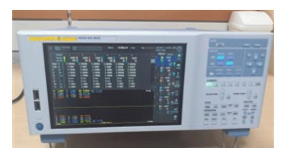

출처: 집필진 제작(2024) [그림 2-1] 전력 분석기

나) 프로브 스테이션을 활용하여 소자에 전기적 신호를 접촉하고 측정한다. [그림 2-2]는 소자의 전기적 신호 측정을 위한 프로브 스테이션 장치이다.

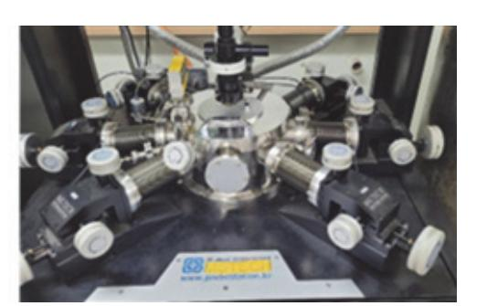

출처: 집필진 제작(2024) [그림 2-2] 프로브 스테이션

다) 온도 제어 체임버를 활용하여 다양한 온도 조건에서 소자를 테스트한다. [그림 2-3]은 온도 제어를 위한 체임버 장치이다.

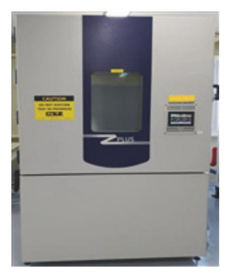

출처: 집필진 제작(2024) [그림 2-3] 온도 제어 체임버

라) 전자 이동도 측정기를 활용하여 소자의 전자 이동도를 측정하여 전자의 거동을 분석한다.

마) 광전자 분광기를 활용하여 소자의 표면 화학적 조성 및 전자 구조를 분석한다. [그림 2-4]는 광전자 분광 측정을 위한 장치이다.

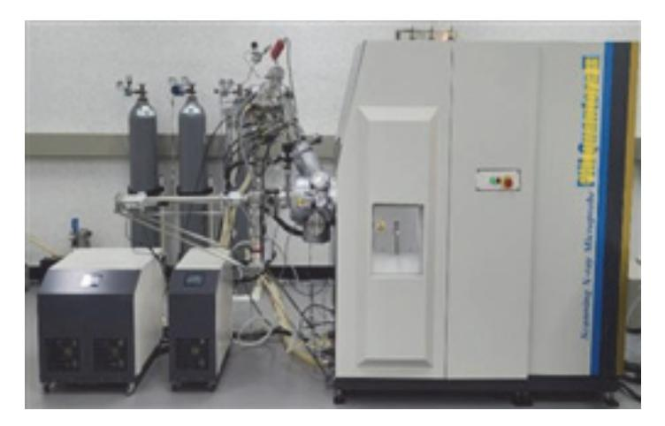

출처: 집필진 제작(2024) [그림 2-4] 광전자 분광기

바) SEM/TEM을 활용하여 소자의 미세 구조 및 결함을 고해상도로 분석한다. [그림 2-5]는 전계 방출형 주사 전자 현미경 장치이다.

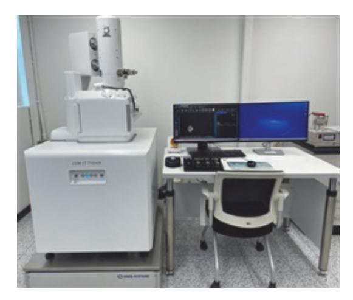

출처: 집필진 제작(2024) [그림 2-5] 전계 방출형 주사 전자 현미경

사) 고주파 측정기를 활용하여 고주파 조건에서 소자의 성능을 평가한다.

[그림 2-6]은 고주파 측정을 위한 장치이다.

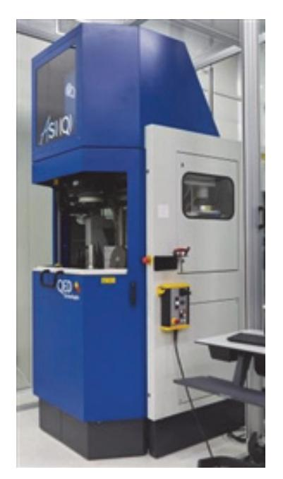

출처: 집필진 제작(2024) [그림 2-6] 고주파 측정기

4) 데이터를 수집한다.

- 가) 소자의 전류-전압 곡선, 전력 소비, 열 발생 등을 측정하여 데이터로 수집한다.
- 나) 소자의 온도 변화, 열 저항, 열전달 특성 등을 측정한다.
- 다) 고주파 조건에서의 소자의 응답 특성을 측정한다.
- 5) 데이터를 분석한다.

- 가) 수집된 전기적 특성을 분석하여 소자의 고온 전자 효과를 평가하고, 전류-전압 특성의 비선형성, 전력 소모의 증가 등을 분석한다.
- 나) 온도 변화에 따른 소자의 열적 거동을 분석하여 열화 정도를 평가한다.
- 다) SEM/TEM 이미지를 분석하여 소자의 미세 구조와 결함을 평가한다.
- 라) 고주파 조건에서 소자의 응답 특성을 분석하여 고온 전자 효과를 평가한다.
- 6) 결과 해석 및 보고서를 작성한다.
  - 가) 전기적, 열적, 구조적 데이터 및 고주파 응답 데이터를 종합적으로 분석하여 소 자의 고온 전자 효과를 평가한다.
  - 나) 소자의 신뢰성, 내구성, 성능 저하 요인을 평가하여 개선 방향을 도출한다.
  - 다) 분석 결과를 바탕으로 보고서를 작성하고, 소자의 설계 및 제조 공정 개선을 위 한 제안 사항을 포함한다.
- (다) HEA 분석의 장점을 파악한다.
  - 1) 고온 전자 효과를 분석해 소자의 열화 및 고장을 조기에 발견할 수 있다.
  - 2) 다양한 조건에서 소자의 신뢰성을 정확하게 평가할 수 있다.
  - 3) 잠재적인 문제를 조기에 찾아 소자의 설계를 개선할 수 있다.
  - 4) 제조 공정 중 발생할 수 있는 문제를 분석하고 공정을 최적화할 수 있다.
  - 5) 전기적, 열적, 구조적 특성을 종합적으로 분석해 소자의 성능을 다각도로 평가할 수 있다.
- (라) HEA 분석의 한계를 파악한다.
  - 1) 극한의 시험 조건이 실제 사용 환경과 다를 수 있어 결과가 실제와 일치하지 않을 수 있다.
  - 2) 고가의 장비와 전문적인 기술이 필요해 비용이 많이 든다.
  - 3) 모든 잠재적 결함을 발견하지 못할 수 있어 완벽한 신뢰성 보장은 어렵다.
  - 4) 소자의 물리적 손상을 일으킬 수 있어 테스트 후 소자를 재사용하기 어려울 때가 있다.
  - 5) 소자의 특정 설계나 재료 특성에 따라 테스트 결과가 달라질 수 있어 일반화하기 어 렵다.

#### 수행 tip

• HEA는 고온 전자 효과를 분석하여 반도체 소자의 신뢰성 을 평가하고, 수명을 예측하는 방법이다.

(3) E-beam probing을 적용하여 불량 원인을 분석하는 방법을 파악한다. 반도체 수명 시험 결과를 E-beam probing을 통해 반도체 소자의 미세한 전기적 특성과 구조적 결함을 고해상도로 관찰하여 결함의 원인을 규명한다.

(가) E-beam probing의 개요를 파악한다.

E-beam probing은 전자 빔을 이용하여 반도체 소자의 전기적 특성을 측정하고, 결 함 위치와 원인을 정확히 파악하는 기술이다. 이 방법은 특히 나노미터 수준의 미세 결함을 분석하는 데 효과적이며, 반도체 소자의 내부 구조를 고해상도로 관찰할 수 있다.

- (나) E-beam probing 절차를 파악한다.
  - 1) 시험 준비하기
    - 가) E-beam probing을 수행할 반도체 샘플은 수명 시험 후 불량이 발생한 소자로 선정한다.
    - 나) 샘플 표면의 전도성을 높이기 위해 금속 코팅을 하거나, 표면을 깨끗하게 세척 하는 과정을 통해 전자 빔 분석이 용이하도록 한다.
  - 2) E-beam probing 장비 설정하기
    - 가) 준비된 샘플을 E-beam probing 장비에 장착한다.
    - 나) 전자 빔 강도, 해상도, 초점 등을 조절하여 최적의 관찰 조건을 설정한다.
  - 3) 전기적 특성 측정하기
    - 가) 전자 빔을 사용하여 반도체 소자의 특정 지점의 전압, 전류, 저항 등의 전기적 특성을 파악하는 데 사용된다.
    - 나) 정상 소자와 불량 소자의 전기적 특성을 비교하여 결함이 발생한 위치와 원인을 추정할 수 있다.
  - 4) 데이터 해석 및 보고서 작성하기
    - 가) 전기적 특성 측정 결과와 구조적 분석 결과를 통합하여 불량 원인을 종합적으로 해석한다.
    - 나) 분석 결과를 바탕으로 시험 방법, 조건, 결과, 불량 원인 분석, 개선 방안 등을 포함한 보고서를 작성한다.
- (다) E-beam probing의 장점을 파악한다.
  - 1) 나노미터 수준의 미세 결함까지 정밀하게 분석할 수 있다.
  - 2) 전기적 특성 측정을 통해 결함 위치를 정확히 식별할 수 있다.
  - 3) 구조적 결함뿐만 아니라 전기적 특성의 변화를 동시에 분석할 수 있다.
- (라) E-beam probing의 한계를 파악한다.
  - 1) E-beam probing 시스템은 고가의 장비로 초기 투자 비용이 높다.
  - 2) 고도의 기술과 전문 지식을 가진 인력이 필요하다.
  - 3) 샘플 준비와 처리가 까다로울 수 있으며, 일부 샘플은 분석이 어려울 수 있다.

- E-beam probing은 전자 빔을 반도체 소자에 주사하여 샘플의 전기적 특성을 측정하고 전기적 결함을 분석한다.
- SEM은 전자 빔을 반도체 소자에 주사하여 샘플의 표면 구조와 결함을 고해상도로 이미지화하여 표면 형상 및 조 성을 분석한다.
- (4) 배선(layout) 분석 및 회로 추출을 통해 불량 원인을 분석하는 방법을 파악한다.

반도체 수명 시험 결과를 배선 분석 및 회로 추출을 통해 불량 원인을 분석하는 방법은 반도체 소자의 설계 및 제조 과정에서 발생한 문제를 식별하고, 이를 통해 불량의 근본 원인을 파악하는 중요한 과정이다.

- (가) 배선 분석 및 회로 추출의 개요를 파악한다.
  - 1) 배선 분석은 반도체 소자의 물리적 레이아웃을 분석하여 배선 구조와 연결 상태를 평가하는 과정이다.
  - 2) 회로 추출은 배선 분석 결과를 바탕으로 실제 회로 동작을 추출하여 설계와 일치하 는지 확인하는 과정으로 설계 결함, 제조 결함, 배선 결함 등을 식별할 수 있다.
- (나) 배선 분석 및 회로 추출 절차를 학습한다.
  - 1) 초기 데이터 수집하기
    - 가) 반도체 수명 시험 결과 데이터로 소자의 동작 특성, 불량 발생 시점, 환경 조건 등을 수집한다.
    - 나) 반도체 소자의 설계 파일(GDSII 등)과 회로도(netlist)를 준비한다.
  - 2) 배선(layout) 분석하기
    - 가) 설계 데이터를 바탕으로 소자의 물리적 배선 구조를 CAD를 사용하여 레이아웃 을 시각화하고, 배선 상태를 확인한다.
    - 나) 실제 제조된 반도체 소자의 레이아웃과 설계 파일을 비교하여 일치 여부를 확인 한다. 이 과정에서 미세한 배선 결함, 단락, 개방 등의 문제를 식별할 수 있다.
    - 다) 배선 분석을 통해 식별된 결함 위치를 기록하고, 해당 위치에서 발생한 불량 원 인을 추정한다.
  - 3) 회로 추출(circuit extraction)하기
    - 가) 배선 분석 결과를 바탕으로 회로 추출 도구를 사용하여 각 배선의 연결 상태와 소자의 전기적 특성을 고려하여 회로 동작을 추출한다.
    - 나) 추출된 회로를 바탕으로 시뮬레이션을 수행하여 소자의 동작을 분석하면 설계 의도와 실제 동작 간의 차이를 확인하는 데 도움이 된다.
- [그림 2-7]은 불량 발견 부위의 layout과 해당 부위의 회로를 추출한 예시이다.

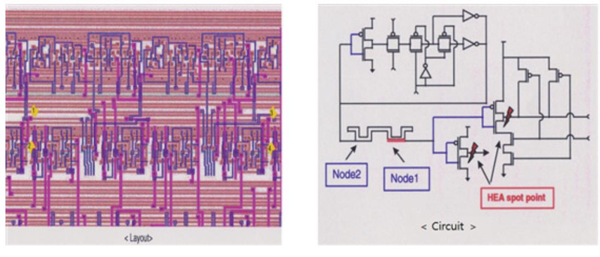

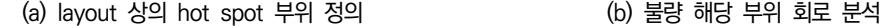

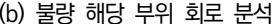

출처: 교육부(2018). 반도체 신뢰성 평가(LM903060110\_14v3). 한국직업능력개발원. p.17. [그림 2-7] 불량 발견 부위의 layout 분석과 해당 부위의 회로 추출

- 4) 데이터 분석하기
  - 가) 회로 추출 및 시뮬레이션 결과를 바탕으로 불량 원인을 분석해서 설계 결함, 제 조 결함, 배선 결함 등의 원인을 구체적으로 파악한다.
  - 나) 설계 데이터와 실제 회로 동작을 비교하여 차이점을 분석한 후 불량의 근본 원 인을 식별한다.
- 5) 결과 보고 및 개선 조치하기
  - 가) 분석 결과를 종합하여 배선 분석 및 회로 추출 과정, 결과, 불량 원인 분석, 개 선 방안 등이 포함된 보고서를 작성한다.
  - 나) 불량 원인에 대한 개선 조치를 마련하고, 설계 변경, 제조 공정 개선 등의 조치 를 실행한다.
- (다) 배선 분석 및 회로 추출의 장점을 파악한다.
  - 1) 미세한 배선 결함과 회로 결함을 정확히 식별할 수 있다.
  - 2) 설계 데이터와 실제 제조된 소자 간의 차이를 분석하여 문제를 정확히 파악할 수 있 다.
  - 3) 실제 회로 동작을 시뮬레이션하여 설계와 일치하는지 확인할 수 있다.
- (라) 배선 분석 및 회로 추출의 한계를 파악한다.
  - 1) CAD 도구와 회로 추출 도구가 필요하여 초기 투자 비용이 높다.
  - 2) 배선 분석 및 회로 추출 과정은 고도의 전문 지식을 요구한다.
  - 3) 미세한 배선 결함을 분석하는 과정이 시간 소모적일 수 있다.

57

수행 tip

• 배선 분석 및 회로 추출 방법은 반도체 수명 시험 결과 반도체 소자의 내부 배선 상태와 실제 회로 동작을 정밀하 게 분석하여 불량 원인을 체계적으로 조사할 수 있다.

(5) IV(전압-전류) 특성 곡선 분석을 통해 불량 원인을 분석하는 방법을 파악한다.

반도체 수명 시험 결과를 IV(전압-전류) 특성 곡선 분석을 통해 불량 원인을 분석하는 방법은 소자의 전기적 특성을 평가하여 불량의 원인을 파악하는 과정이다.

(가) IV 특성 곡선 분석 절차를 파악한다.

1) 시험 준비하기

가) 수명 시험을 마친 반도체 소자를 준비한다.

나) IV 특성 곡선을 측정할 수 있는 장비(예: 반도체 파라미터 분석기)를 설정한다. [그림 2-8]은 트랜지스터 IV 곡선의 예시이다.

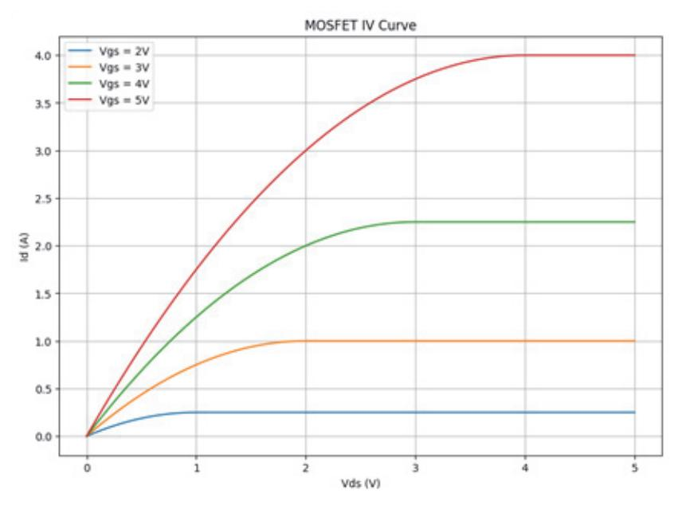

출처: 집필진 제작(2024) [그림 2-8] 트랜지스터 IV Curve 예시

[그림 2-9]는 다이오드 IV 곡선 예시이다.

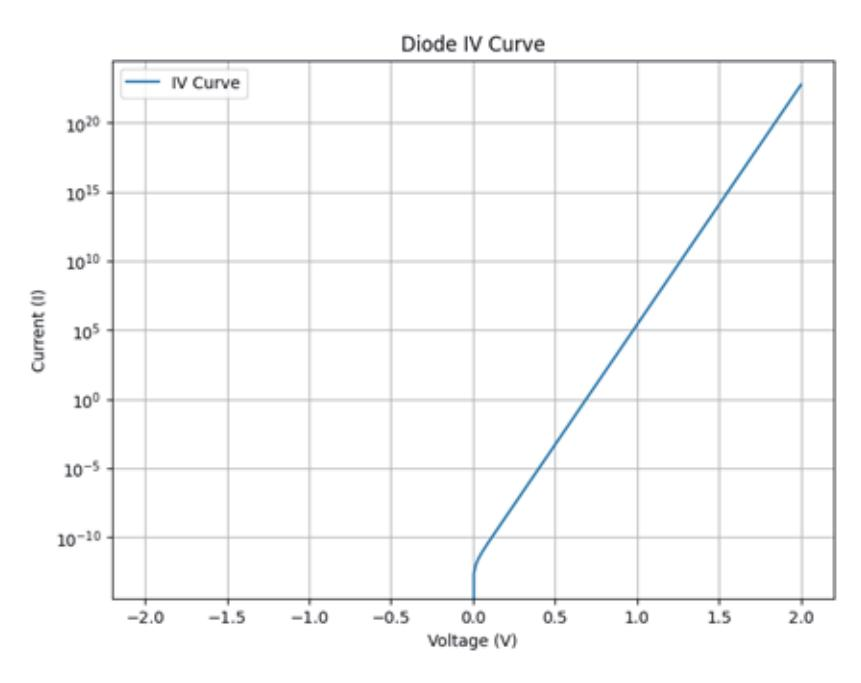

출처: 집필진 제작(2024) [그림 2-9] 다이오드 IV Curve 예시

- 2) IV 특성 곡선 측정하기
  - 가) 소자에 걸리는 전압을 일정 범위 내에서 변화시키며, 각 전압에 대응하는 전류 를 측정한다.
  - 나) 전압과 전류 데이터를 수집하여 IV 특성 곡선을 작성한다.
- 3) 특성 곡선 분석하기
  - 가) 수집된 IV 특성 곡선을 정상 동작 상태의 IV 곡선과 비교한다.
  - 나) 비정상적인 전류 변화, 급격한 전류 증가, 전류 포화 등의 비정상적 패턴을 식 별한다.
- 4) 불량 원인 추정하기
  - 가) IV 곡선이 특정 전압에서 급격한 전류 변화를 보이는 경우, 단락 또는 개방 결 함을 의심할 수 있다.
  - 나) 누설 전류가 정상 상태보다 높은 경우, 소자의 절연 파괴나 결함을 의심할 수 있다.
  - 다) MOSFET 등의 소자에서 임계 전압이 변하는 경우, 게이트 산화막의 열화 또는 불순물 이온 이동을 의심할 수 있다.
- 5) 결함 부위 확인하기
  - 가) 필요시 주사 전자 현미경(SEM)이나 투과 전자 현미경(TEM)을 사용하여 결함 부위를 정확히 확인한다.
  - 나) 전기적 특성 변화의 원인을 물리적으로 분석하여 결함의 형태와 위치를 파악한 다.

59

- 6) 데이터 통합 및 보고서 작성하기
  - 가) IV 특성 곡선 분석 결과와 다른 분석 방법(예: E-Beam probing, 배선 분석 등) 결과를 통합하여 종합적으로 불량 원인을 분석한다.
  - 나) 분석 결과를 바탕으로 불량 원인과 개선 방안을 포함한 보고서를 작성한다.
- (나) IV 특성 곡선 분석의 장점을 파악한다.
  - 1) IV 특성 곡선은 소자의 전기적 특성을 시각적으로 나타내주어 직관적으로 이해하기 쉽다.
  - 2) 단락, 개방, 누설 전류 증가 등 다양한 전기적 결함을 식별할 수 있다.
  - 3) 소자를 파괴하지 않고 전기적 특성을 측정할 수 있어 추가 분석이 용이하다.
- (다) IV 특성 곡선 분석의 한계를 파악한다.
  - 1) 온도, 습도 등 외부 환경 요인이 전기적 특성에 영향을 끼칠 수 있다.
  - 2) 미세한 결함이나 내부 결함을 정확히 식별하기 어려울 수 있다.
  - 3) IV 특성만으로는 모든 결함의 원인을 정확히 파악하기 어려워 추가적인 분석(예: SEM, TEM)이 필요할 수 있다.

수행 tip

• IV 특성 곡선은 반도체 소자의 작동 상태를 시각적으로 나 타내 주기 때문에, 이를 통해 소자의 성능과 신뢰성 문제 를 분석할 수 있다.

4. 물리적 분석(physical analysis) 방법을 파악한다.

반도체 균열, 단선, 재료 열화 등의 물리적 손상 여부를 확인하는 분석 방법이다.

- (1) X-ray 촬영을 이용한 분석 방법은 다음과 같은 절차로 진행된다.
  - (가) X-ray 촬영 분석 방법 개요를 파악한다.
    - 1) X-ray 촬영은 비파괴 검사로, 반도체 소자의 내부 구조와 결함을 확인하는 데 사용 된다.
    - 2) 고에너지 X-선을 반도체 소자에 투과시켜 내부 구조를 이미지화하는 기술이다.
    - 3) 반도체 패키지의 다양한 재료를 투과할 수 있으며, 각 재료의 밀도와 두께에 따라 다르게 흡수된다.
    - 4) 이를 통해 솔더 볼의 불량, 와이어 본딩 문제, 크랙 등의 내부 결함을 시각화할 수 있다.
  - (나) X-ray 촬영 절차는 다음과 같다.
    - 1) 수명 시험을 마친 반도체 소자는 청결하게 유지하며, 촬영을 방해할 수 있는 이물질

을 제거하여 샘플을 준비한다.

- 2) 일반적으로 사용하는 장비는 X-ray 현미경이나 컴퓨터 단층 촬영 장비를 활용하여 전압, 전류, 촬영 각도 등을 조정하면서 최적의 이미지를 얻을 수 있도록 한다.
- 3) 샘플을 X-ray 장비에 배치하고, 다양한 각도에서 X-ray를 투과시키면서 디텍터를 통해 내부 구조를 촬영하여 2D 또는 3D 이미지를 획득한다.
- 4) 전문 소프트웨어를 사용하여 획득한 X-ray 이미지를 분석 및 처리하고 내부 결함의 위치, 크기, 형태 등을 정확하게 시각화한다.
- 5) 분석 결과를 바탕으로 솔더 볼의 균열, 와이어 본딩 불량, 내부 크랙 등의 불량 원 인을 해석한다.
- 6) 분석 결과를 종합하여 촬영 방법, 조건, 분석 결과, 결론 등이 포함된 보고서를 작성 한다.

[그림 2-10]은 x-ray 형광 분석 장치이다.

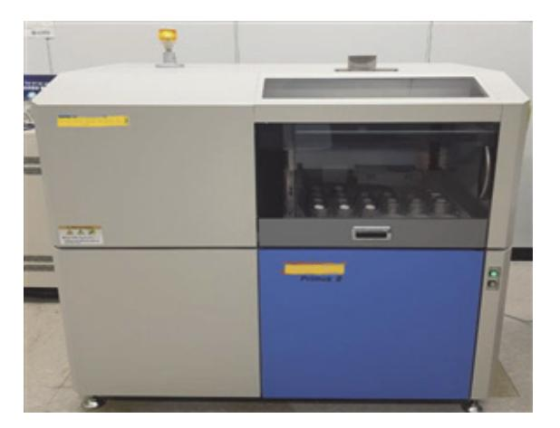

출처: 집필진 제작(2024) [그림 2-10] X-ray 형광 분석기

(다) X-ray 촬영의 장점은 다음과 같다.

1) 비파괴 검사로 반도체 소자를 파괴하지 않고 내부 결함을 분석할 수 있다.

2) 내부 결함의 위치, 크기, 형태를 정확하게 식별할 수 있다.

3) 반도체 패키지의 다양한 재료를 모두 분석할 수 있다.

(라) X-ray 촬영의 한계는 다음과 같다.

- 1) X-ray 촬영 장비는 고가이며, 전문적인 유지 보수가 필요하다.
- 2) 획득한 이미지를 해석하는 데 전문 지식과 경험이 필요하다.
- 3) 매우 작은 결함이나 미세 구조를 분석하는 데 한계가 있을 수 있다.

[그림 2-6]은 x-ray로 촬영한 wire bonding pad 영상이다.

출처: 교육부(2018). 반도체 신뢰성 평가(LM903060110\_14v3). 한국직업능 력개발원. p.14. [그림 2-11] X-ray로 촬영한 wire bonding pad 영상

#### 수행 tip

• X-ray 장비 사용과 관련된 법적 규제와 요건을 준수해야 하고, 특히, 방사선 안전과 관련된 법적 요구 사항을 철저 히 따르는 것이 중요하다.

(2) 역 캡슐화/디레이어링(decapsulation/delayering)을 통해 불량 원인을 분석하는 방법을 파악 한다.

역 캡슐화는 반도체 패키지의 외부 보호막을 제거하여 내부 칩을 노출시키는 과정이고, 디레이어링은 노출된 칩의 각 층을 하나씩 제거하면서 층별로 분석하는 과정이다. 이 2 가지 방법은 반도체 소자의 물리적 결함을 식별하고 분석하는 데 유용하다. 역 캡슐화/ 디레이어링으로 분석하는 방법은 다음과 같다.

- (가) 역 캡슐화/디레이어링 분석 절차를 파악한다.
  - 1) 수명 시험을 마친 반도체 소자는 깨끗하고 건조하게 유지한다.
  - 2) 반도체 패키지를 화학적 방법(예: 산 처리)이나 기계적 방법(예: 연마)을 사용하여 내 부 칩이 손상되지 않도록 주의하면서 외부 보호막을 제거한다.
  - 3) 보호막이 제거된 칩을 현미경으로 검사하여 표면 결함이나 손상 여부를 확인하는데 초기 검사에서 크기가 큰 결함을 발견할 수 있다.
  - 4) 노출된 칩의 각 층을 화학적 에칭(etching)이나 기계적 연마(polishing) 방법을 사용 하여 층을 제거하면서 현미경이나 SEM(주사 전자 현미경)으로 결함을 분석한다.
  - 5) 각 층을 제거한 후, 해당 층의 배선 결함, 접합 불량, 산화물층의 문제 등의 결함을 분석하고 층별 분석 결과를 종합하여 전체 결함의 원인을 파악한다.
  - 6) 분석 결과를 종합하여 역 캡슐화 및 디레이어링 과정, 각 층의 분석 결과, 결함 원 인 및 개선 방안 등이 포함된 보고서를 작성한다.

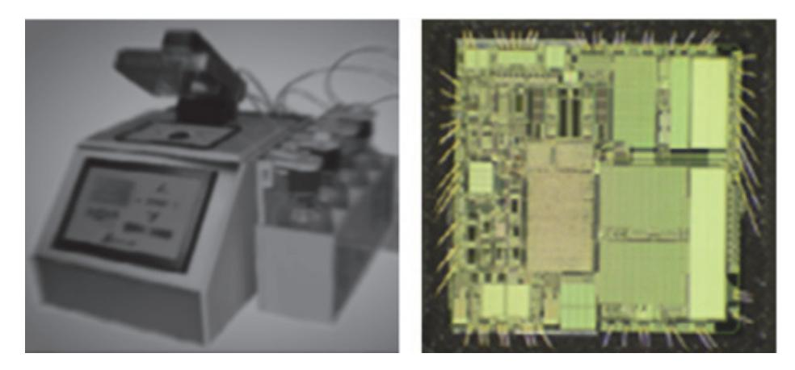

출처: 교육부(2018). 반도체 신뢰성 평가(LM903060110\_14v3). 한국직업능력개발원. p.14. [그림 2-12] IC auto decapsulator 및 작업 완료된 chip 표면 상태

[그림 2-12]는 IC auto decapsulator와 decapsulating 작업 완료된 chip 표면 상 태 영상이다.

- (나) 역 캡슐화/디레이어링 방법의 장점을 파악한다.
  - 1) 내부 결함을 직접 관찰하고 분석할 수 있다.
  - 2) 층별로 상세한 결함 분석이 가능하다.
  - 3) 배선 결함, 접합 불량 등 다양한 결함을 식별할 수 있다.
- (다) 역 캡슐화/디레이어링 방법의 한계를 파악한다.
  - 1) 화학적 및 기계적 처리 과정에서 칩이 손상될 수 있다.
  - 2) 각 층을 제거하는 과정이 시간 소모적이고 복잡하다.
  - 3) 전문적인 장비와 기술이 필요하다.

#### 수행 tip

- 역 캡슐화는 반도체 패키지의 외부 보호막을 제거하여 내 부 칩을 노출시키는 과정으로 반도체 칩(chip)에 대한 표 면 결함이나 손상 여부 검사 할 수 있다.
- 디레이어링은 노출된 칩의 각 층을 하나씩 제거하면서 층 별로 배선 결함, 접합 불량, 산화물층의 문제 등을 분석할 수 있다.
- (3) 표면 프로파일러를 통해 불량 원인을 분석하는 방법을 파악한다.

표면 프로파일러는 반도체 소자의 표면 형상을 3차원적으로 측정하여 표면 결함, 거칠 기, 평탄도 등을 분석하는 데 사용된다. 이 방법은 비접촉식과 접촉식 2가지 방식으로 나뉘며, 반도체 소자의 수명 시험 후 표면 상태를 정밀하게 분석할 수 있다.

(가) 표면 프로파일러를 이용한 분석 방법의 절차를 파악한다.

1) 샘플 준비

수명 시험을 마친 반도체 소자는 깨끗하게 세척하여 표면에 이물질이 없도록 샘 플을 준비한다.

- 2) 장비 설정
  - 가) 표면 프로파일러 장비를 설정한다.
  - 나) 비접촉식 프로파일러의 경우 레이저나 광학 장치를 사용하고, 접촉식 프로파일 러의 경우 탐침을 사용한다.
  - 다) 측정 조건(해상도, 측정 속도, 측정 범위 등)을 설정한다.
- 3) 표면 측정
  - 가) 샘플을 표면 프로파일러 장비에 장착한 후 소자의 표면을 스캔하여 3차원 형상 을 측정한다.
  - 나) 비접촉식 프로파일러는 레이저나 광학 센서를 사용하여 표면의 높낮이를 측정하 고, 접촉식 프로파일러는 탐침을 사용하여 표면을 따라 이동하면서 높낮이를 측 정한다.
- 4) 데이터 수집 및 분석
  - 가) 측정된 데이터를 수집하여 표면 거칠기, 평탄도, 결함 등의 3차원 프로파일을 생성한다.
  - 나) 소프트웨어를 사용하여 표면의 높낮이 분포, 프로파일 단면도 등을 시각화하고 분석한다.
- 5) 결과 해석
  - 가) 수집된 데이터를 바탕으로 표면 결함의 위치, 크기, 형태를 해석한다.
  - 나) 표면 거칠기와 평탄도를 평가하여 수명 시험 후 표면 상태의 변화를 분석한다.
  - 다) 표면 결함이 발생한 원인을 파악하고, 제조 공정이나 사용 환경에서 발생한 문 제점을 도출한다.
- 6) 분석 결과를 종합하여 표면 프로파일러 측정 방법, 측정 조건, 분석 결과, 결론 등이 포함된 보고서를 작성한다.
- (나) 표면 프로파일러 방식의 장점을 파악한다.
  - 1) 비접촉식 방식은 소자를 손상하지 않고 표면 형상을 측정할 수 있다.
  - 2) 고해상도의 3차원 표면 형상을 측정하여 정밀하게 분석할 수 있다.
  - 3) 표면 결함, 거칠기, 평탄도 등을 종합적으로 평가할 수 있다.
- (다) 표면 프로파일러 방식의 한계를 파악한다.
  - 1) 비접촉식 방식의 경우 반사율이 낮은 표면에서는 측정이 어려울 수 있다.

2) 접촉식 방식의 경우 탐침이 표면을 손상할 가능성이 있다.

3) 고가의 장비와 전문적인 지식이 필요하다.

#### 수행 tip

- 비접촉식 프로파일러의 경우 레이저나 광학 장치를 사용하 여 반도체 소자의 표면 거칠기, 평탄도, 결함 등의 3차원 프로파일 데이터를 생성한다.
- 접촉식 프로파일러의 경우 탐침을 사용하여 반도체 소자의 표면에 대한 3차원 프로파일 데이터를 생성한다.
- (4) 육안 검사을 통해 불량 원인을 분석하는 방법을 파악한다.

육안 검사는 반도체 소자의 외관을 직접 관찰하여 결함을 식별하는 방법이다. 이 방법은 주로 기계적 손상, 패키지 결함, 표면 오염 등을 확인하는 데 사용된다. 육안 검사는 간 단하고 빠르게 소자의 상태를 평가할 수 있는 장점이 있다.

- (가) 육안 검사 절차의 내용을 파악한다.
  - 1) 샘플 준비

수명 시험을 마친 반도체 소자는 깨끗하게 세척하여 표면에 이물질이 없도록 준 비한다.

- 2) 조명 및 확대 장비 설정
  - 가) 충분한 조명을 확보하여 소자의 표면을 명확하게 관찰할 수 있도록 한다.
  - 나) 필요시 확대경이나 현미경을 사용하여 작은 결함도 확인할 수 있도록 한다.
- 3) 외관 검사
  - 가) 반도체 소자의 패키지 외관을 관찰하여 크랙, 칩, 스크래치, 변형 등의 기계적 손상 여부를 확인한다.
  - 나) 소자의 리드(lead)나 단자(terminal) 부분을 확인하여 휘어짐, 부식, 변색 등의 문제를 식별한다.
- 4) 표면 상태 검사
  - 가) 소자의 표면을 관찰하여 오염, 얼룩, 불순물 등을 확인한다.
  - 나) 표면의 색상 변화를 확인하여 열적 손상이나 화학적 변화를 식별한다.
- 5) 결과 기록 및 분석
  - 가) 육안 검사 중 발견된 결함의 위치, 크기, 형태 등을 상세히 기록한다.
  - 나) 기록된 데이터를 바탕으로 결함의 원인을 추정하고, 수명 시험 중 발생한 문제 점을 도출한다.

6) 보고서 작성

육안 검사 결과를 종합하여 검사 방법, 발견된 결함, 결함 분석 및 결론이 포함된 보고서를 작성한다.

- (나) 육안 검사 방식의 장점을 파악한다.
  - 1) 간단하고 빠르게 수행할 수 있다.
  - 2) 별도의 고가 장비가 필요하지 않다.
  - 3) 기계적 손상, 표면 오염 등의 결함을 쉽게 식별할 수 있다.
- (다) 육안 검사 방식의 한계를 파악한다.
  - 1) 작은 결함이나 내부 결함을 식별하기 어렵다.
  - 2) 검사자의 경험과 주관에 따라 결과가 달라질 수 있다.
  - 3) 정밀한 분석이 필요할 경우 추가적인 검사 방법이 필요하다.

#### 수행 tip

• 육안 검사는 공정에서 사용하는 가장 일반적인 검사 방법 으로 다양한 조명과 확대경을 구비해서 검사를 진행한다. • 빠르다는 장점은 있지만 작은 결함은 보기 어렵고, 검사

결과의 편차가 높다는 단점이 있다.

- (5) 광학 현미경을 통해 불량 원인을 분석하는 방법을 파악한다.
  - 광학 현미경 검사는 반도체 소자의 표면 및 내부 결함을 확대하여 관찰하는 방법이다. 이 방법은 주로 기계적 손상, 표면 오염, 미세한 크랙 등을 확인하는 데 사용된다. 광학 현미경을 이용하면 육안 검사로는 식별하기 어려운 작은 결함까지도 확인할 수 있다.
  - (가) 광학 현미경 분석 절차 내용을 파악한다.
    - 1) 샘플 준비하기

수명 시험을 마친 반도체 소자는 깨끗하게 세척하여 표면에 이물질이 없도록 준 비한다.

- 2) 현미경 설정하기
  - 가) 광학 현미경을 설정하고 적절한 배율을 선택하여 소자의 표면을 확대하여 관찰 할 수 있도록 한다.
  - 나) 조명을 조정하여 명확한 이미지를 얻을 수 있도록 한다.
  - [그림 2-13]은 광학 현미경 사진이다.

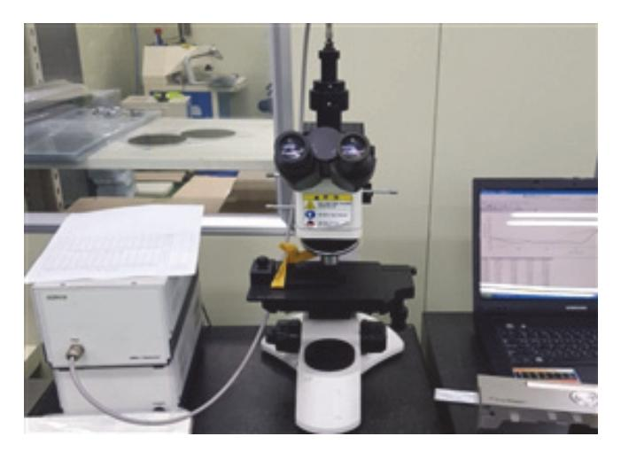

출처: 집필진 제작(2024) [그림 2-13] 광학 현미경 예시

- 3) 표면 관찰하기
  - 가) 반도체 소자의 기계적 손상, 크랙, 스크래치, 변형 등의 표면 결함을 현미경으로 관찰한다.
  - 나) 소자의 리드(lead)나 단자(terminal) 부분을 확대하여 휘어짐, 부식, 변색 등의 문제를 식별한다.
- 4) 결함 분석하기
  - 가) 표면 오염, 얼룩 및 불순물 등의 결함을 확대하여 관찰하고, 결함의 위치, 크기, 형태를 기록한다.
  - 나) 표면의 색상 변화를 확인하여 열적 손상이나 화학적 변화를 식별한다.
- 5) 데이터 수집 및 해석하기
  - 가) 현미경 관찰 결과를 사진이나 비디오로 기록한다.
  - 나) 수집된 데이터를 바탕으로 결함의 원인을 추정하고, 수명 시험 중 발생한 문제 점을 도출한다.
- 6) 보고서 작성하기

광학 현미경 검사 결과를 종합하여 검사 방법, 발견된 결함, 결함 분석 및 결론이 포함된 보고서를 작성한다.

- (나) 광학 현미경 방식의 장점을 파악한다.
  - 1) 육안으로 식별하기 어려운 작은 결함까지도 확대하여 관찰할 수 있다.
  - 2) 기계적 손상, 표면 오염 등의 결함을 명확하게 식별할 수 있다.
  - 3) 고해상도의 이미지를 통해 정확한 분석이 가능하다.
- (다) 광학 현미경 방식의 한계를 파악한다.
  - 1) 내부 결함을 식별하기 어렵다.
  - 2) 고배율에서만 결함을 정확히 식별할 수 있으므로, 시간 소모가 클 수 있다.

#### 수행 tip

• 육안 검사 다음으로 많이 사용하는 방법, 목적에 맞는 적 절한 렌즈의 배율을 선정하고 초점 맞추는 방법과 고배율 에서 결함을 찾는 방법 등을 사용 설명서를 통해 별도로 학습할 수 있도록 한다.

#### (6) 주사 전자 현미경을 통해 불량 원인을 분석하는 방법을 파악한다.

주사 전자 현미경(SEM)은 고해상도로 반도체 소자의 표면과 단면을 분석하는 데 사용된 다. SEM은 전자 빔을 시료에 주사하여 발생하는 2차 전자를 검출하여 이미지를 형성하 는 방식이다. 이를 통해 소자의 미세 구조와 결함을 정밀하게 분석할 수 있다.

- (가) 주사 전자 현미경 분석 절차 내용을 파악한다.
  - 1) 샘플 준비하기
    - 가) 수명 시험을 마친 반도체 소자는 깨끗하게 세척하여 표면에 이물질이 없도록 준 비한다.
    - 나) 필요한 경우, 샘플을 소형으로 절단하거나 단면을 노출시킨다.
  - 2) 샘플 코팅하기

반도체 소자는 전도성이 낮기 때문에, 전자 빔이 잘 통과하도록 금, 팔라듐 등의 금속으로 코팅한다.

3) SEM 장비 설정하기

SEM 장비를 설정하여 적절한 전압과 전류를 조정하여 최적의 이미지를 얻을 수 있도록 한다.

[그림 2-14]는 주사 현미경 영상의 예시이다.

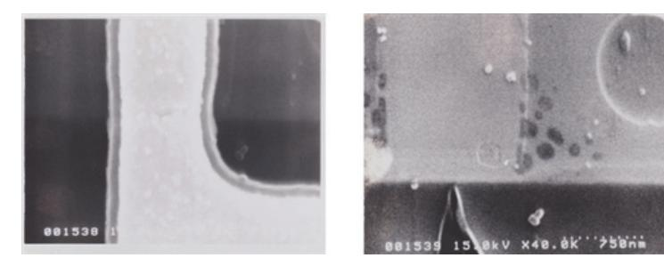

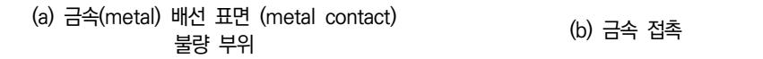

출처: 교육부(2018). 반도체 신뢰성 평가(LM903060110\_14v3). 한국직업능력개발원. p.15. [그림 2-5] 주사 전자 현미경 영상의 예시

4) 샘플 배치 및 진공 설정하기

샘플을 SEM 체임버에 배치한 후 SEM 체임버 내부를 진공 상태로 만든다.

- 5) 이미지 획득하기
  - 가) 전자 빔을 샘플에 주사하여 2차 전자를 검출한 후 이미지를 형성한다.
  - 나) 다양한 배율로 샘플의 표면과 단면을 관찰하여 이미지를 획득한다.
- 6) 결함 분석하기
  - 가) 획득한 SEM 이미지를 분석하여 표면 결함, 크랙, 빈틈 등의 미세 구조를 식별 한다.
  - 나) EDS(에너지 분산 X선 분광) 분석을 추가하여 원소 성분을 분석할 수 있다.

[그림 2-15]는 에너지 분산 x선 분광 장치이다.

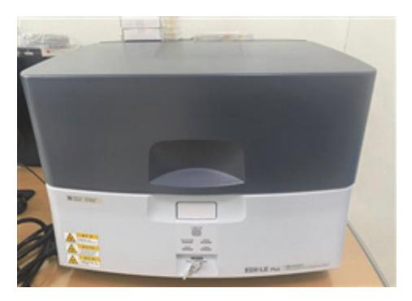

출처: 집필자 제작(2024) [그림 2-15] 에너지 분산 X선 분광 장치

7) 데이터 수집 및 해석하기

가) SEM 이미지와 EDS 데이터를 수집하여 결함의 원인을 해석한다.

나) 수명 시험 중 발생한 문제점을 도출하고, 결함의 위치, 크기, 형태를 기록한다.

8) 보고서 작성하기

SEM 검사 결과를 종합하여 검사 방법, 발견된 결함, 결함 분석 및 결론이 포함 된 보고서를 작성한다.

- (나) 주사 전자 현미경 방식의 장점을 파악한다.
  - 1) 고해상도로 반도체 소자의 미세 구조를 분석할 수 있다.
  - 2) 표면 결함, 크랙, 빈틈 등의 미세 결함을 정밀하게 식별할 수 있다.
  - 3) EDS 분석을 통해 원소 성분까지 분석할 수 있다.
- (다) 주사 전자 현미경 방식의 한계를 파악한다.
  - 1) 샘플 준비 과정이 복잡하고, 금속 코팅이 필요하다.
  - 2) 반도체 소자 내부 결함을 분석하는 데 한계가 있다.

3) 고가의 장비와 전문적인 지식이 필요하다.

#### 수행 tip

- 비전도성 재료(세라믹, 고분자 등)나 매우 낮은 전도성을 가진 재료를 분석할 때 전자 빔이 잘 통과하도록 금속으로 코팅하고, 금속 시료와 같은 전도성 재료는 코팅하지 않아 도 된다.
- 시료의 특정 단면을 관찰하거나 분석하기 위해 절단이 필 요하고, 외부 표면만 분석할 경우 절단이 필요하지 않다.
- 5. 화학적 분석법의 종류를 파악하고 분석 방법 및 절차를 이해한다.
  - (1) X-선 광전자 분광법(XPS)을 통해 불량 원인을 분석하는 방법 및 절차를 파악한다.
    - (가) 반도체 샘플의 표면을 깨끗하게 처리하여 오염 물질을 제거하고, 분석할 특정 영역을 선택한다.
    - (나) 준비된 샘플을 XPS 장비에 넣고, 장비를 진공 상태로 만든다.
    - (다) X-선을 샘플 표면에 조사하고, 표면 원자에서 방출된 광전자의 에너지와 개수를 측정한다.
    - (라) 측정된 데이터를 해석하여 샘플의 화학 조성과 상태를 분석하고, 샘플 표면의 화학적 변 화와 원소 조성을 확인한다.
    - (마) 반도체 표면의 산화 정도, 오염 물질 유무, 표면 구성 성분의 변화를 평가하고, 반도체의 수명과 신뢰성을 평가한다.
    - (바) 분석 결과를 바탕으로 반도체의 열화 및 성능 변화 원인을 파악하고, 필요한 경우 개선 방안을 도출한다.

#### 수행 tip

• 시료의 표면에서 1~10㎚ 범위의 깊이까지 분석이 가능하 고, 화학적 조성(산화 상태, 결합 상태 등)을 분석하는 데 적합하다.

- (2) 에너지 분산형 X-선 분광법(EDS)을 통해 불량 원인을 분석하는 방법 및 절차를 파악한다.
  - (가) 반도체 샘플의 표면을 깨끗하게 처리하여 오염 물질을 제거하고, 분석할 특정 영역을 선 택한다.
  - (나) 준비된 샘플을 주사 전자 현미경(SEM)에 장착하고, EDS 분석 모드를 설정하면 높은 공 간 해상도를 가질 수 있으므로 미세한 영역의 원소 분포를 분석할 수 있다.

- (다) 샘플 표면에 전자 빔을 조사하여 X-선을 방출시키고, 방출된 X-선을 EDS 검출기를 통 해 수집하고, 각각의 에너지에 해당하는 신호를 분석한다.
- (라) EDS 스펙트럼을 통해 샘플의 원소 조성을 파악하고, 특정 영역의 원소 분포를 매핑하여 분석한다.
- (마) 수집된 데이터를 해석하여 불량 원인을 규명하고, 원소 조성과 분포를 바탕으로 불량이 발생한 영역의 화학적 특성을 평가한다.
- (바) 반도체 표면 및 내부의 불량 원소 및 불순물의 존재 여부를 확인하고, 불량 원인과 관련 된 화학적 변화를 평가하고, 이를 통해 반도체의 열화 및 성능 저하 원인을 분석한다.
- (사) 분석 결과를 바탕으로 불량 원인을 제거하거나 최소화할 수 있는 개선 방안을 도출하고, 필요시 제조 공정의 변경이나 재료의 개선을 제안한다.

#### 수행 tip

• 시료의 표면에서 수 ㎛ 깊이까지 분석이 가능하고 높은 공 간 해상도를 가지기 때문에 미세한 영역의 원소 농도와 분 포를 분석하는 데 적합하다.

(3) 라만 분광법을 통해 불량 원인을 분석하는 방법 및 절차를 파악한다.

- (가) 반도체 샘플의 표면을 깨끗하게 처리하여 오염 물질을 제거하고, 분석할 특정 영역을 선 택한다.
- (나) 준비된 샘플을 라만 분광기에 장착하고, 적절한 레이저 파장을 선택하고, 분석 모드를 설 정한다.
- (다) 샘플 표면에 레이저를 조사하여 라만 산란을 유도하고, 방출된 라만 산란 신호를 분광기 를 통해 수집하고, 라만 스펙트럼을 기록한다.

[그림 2-16]은 라만 스페트럼의 에너지 준위를 도식화했다.

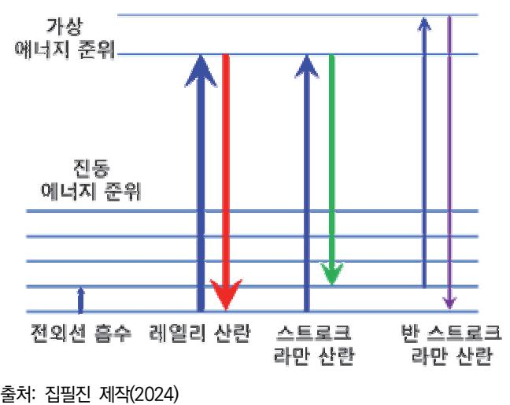

[그림 2-16] 라만 스펙트럼의 에너지 준위 도식화

(라) 측정된 라만 스펙트럼을 통해 샘플의 화학적 조성 및 분자 구조를 파악하고, 특정 영역 의 라만 스펙트럼을 비교하여 불량이 발생한 영역의 변화를 분석한다.

[그림 2-17]는 질소의 회전 라만 스펙트럼 그래프이다. 그래프의 오른쪽은 반 스트로 크, 왼쪽은 스트로크 선이다.

이 그래프를 활용하여 질소의 분자 구조 길이를 구할 수 있다.

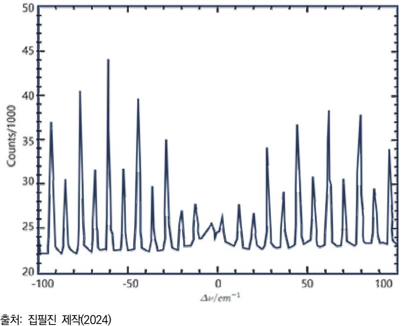

[그림 2-17] 질소의 회전 라만 스펙트럼

(마) 라만 스펙트럼의 피크 위치, 강도, 너비 등을 분석하여 샘플의 화학적 상태를 평가하고, 불량이 발생한 영역에서의 분자 구조 변화 및 응력 상태를 해석한다.

- (바) 반도체 표면 및 내부의 불량 원소 및 불순물의 존재 여부를 확인하고, 불량 원인과 관련 된 화학적 및 물리적 변화를 평가하고, 이를 통해 반도체의 열화 및 성능 저하 원인을 분석한다.
- (사) 분석 결과를 바탕으로 불량 원인을 제거하거나 최소화할 수 있는 개선 방안을 도출하고, 필요시 제조 공정의 변경이나 재료의 개선을 제안한다.

#### 수행 tip

• 분자의 최종 진동 에너지 준위가 처음 준위보다 더 많다면 스트로크 산란(stokes scattering), 더 적다면 반 스토로 크 산란(anti-stokes scattering), 동일하다면 레일리 산 란(rayleigh scattering)이라고 한다.

- (4) 중량 측정법을 통해 불량 원인을 분석하는 방법 및 절차를 파악한다.
  - (가) 반도체 샘플을 준비하고, 불량이 발생한 부분과 정상 부분을 구분하여 각각 샘플링한다.
  - (나) 고정밀 전자 저울을 사용하여 샘플의 초기 중량을 측정하고, 측정값을 기록하여 초기 상 태를 데이터화한다.
  - (다) 반도체 수명 시험을 진행하여 샘플에 스트레스(온도, 습도, 전기적 스트레스 등)를 가하 고, 일정 시간 동안 시험을 진행하고, 중간중간 샘플의 상태를 확인한다.
  - (라) 시험이 완료된 후, 다시 고정밀 전자 저울을 사용하여 샘플의 중량을 측정하고, 초기 중 량과 비교하여 중량 변화를 계산한다.
  - (마) 중량 변화 데이터를 분석하여 불량이 발생한 원인을 파악한다. 중량이 증가한 경우, 산화 물 형성이나 오염물의 부착 등을 의심하고, 중량이 감소한 경우 휘발성 물질의 손실이나 재료의 분해 등을 고려한다.
  - (바) 중량 변화와 관련된 화학적 및 물리적 변화를 평가하고, 불량 원인과 관련된 중량 변화 를 분석하여 반도체의 열화 및 성능 저하 원인을 규명한다.
  - (사) 분석 결과를 바탕으로 불량 원인을 제거하거나 최소화할 수 있는 개선 방안을 도출하고, 필요시 제조 공정의 변경이나 재료의 개선을 제안한다.

#### 수행 tip

• 수명 시험 후 고정밀 전자 저울로 중량(weight)을 측정한 결과 중량이 증가한 경우 산화물 형성이나 오염물의 부착 등을 의심하고, 중량이 감소한 경우, 휘발성 물질의 손실 이나 재료의 분해 등을 고려한다.

숗 결함 원인별 개선 방안을 마련한다.

- 1. 열 스트레스 개선 방안을 학습한다.
  - (1) 반도체 소자의 열 관리를 위해 고성능 프로세서 설계 시 멀티코어 구조를 도입하여 각 코어 의 열 발생을 분산시킬 수 있다.

또한 소자의 내부 레이아웃을 변경하여 열이 잘 전달되는 경로를 확보할 수 있다.

- (2) 반도체 제조 공정에서 웨이퍼의 온도 제어를 엄격하게 관리할 수 있다. 예를 들어, 웨이퍼 가공 중에 발생하는 열을 빠르게 제거하기 위해 고효율 냉각 시스템 을 도입하고 온도 변동을 최소화하는 공정 조건을 유지한다.
- (3) 열전도성이 높은 실리콘 카바이드(SiC)와 같은 고열 전도성 재료를 사용하여 열 방출을 촉진 한다.

SiC는 높은 열전도성과 내열성을 가지고 있어 고온 환경에서도 안정적인 성능을 유지할 수 있다.

- (4) 열 스트레스 시험 절차를 재검토하여 실제 사용 환경과 유사한 조건에서 테스트를 수행한다. 예를 들어, 소자의 열 방출 특성을 고려하여 다양한 온도 조건에서 장기 시험을 실시하 고, 열 시험을 통해 반복적인 온도 변화에 대한 내성을 평가한다.
- 2. 전기적 스트레스 개선 방안을 학습한다.
  - (1) 반도체 소자의 전기적 스트레스를 줄이기 위해 전원 관리 회로를 개선할 수 있다. 예를 들어, 전력 분배 네트워크(PDN)를 최적화하여 소자 내부에서 전압 강하를 최소화 하고, 안정적인 전력을 공급한다.
  - (2) 전기적 특성을 향상시키기 위해 제조 공정을 개선할 수 있다. 예를 들어, 이온 주입 공정을 개선하여 도핑 균일성을 높이고, 소자의 전기적 특성을 향 상한다.
  - (3) 더 나은 전기적 특성을 가진 재료를 사용하는 것이 효과적이다. 예를 들어, 구리 배선을 알루미늄 배선 대신 사용하여 저항을 줄이고, 전기적 스트레스 를 낮출 수 있다.
  - (4) 전기적 스트레스 시험 절차를 재검토한다. 예를 들어, 전압 변동 시험, 과전류 시험 등을 통해 소자의 전기적 내구성을 평가하고, 실제 사용 환경에서 발생할 수 있는 전기적 스트레스를 모사한다.
- 3. 환경 스트레스 개선 방안을 학습한다.
  - (1) 환경적 스트레스를 줄이기 위해 소자의 패키징 설계를 변경할 수 있다. 예를 들어, 밀폐형 패키지를 사용하여 습기와 먼지로부터 소자를 보호하고, 진동을 흡수 할 수 있는 구조를 설계한다.

- (2) 제조 공정에서 클린 룸 환경을 철저히 유지하고, 공정 중 오염을 최소화하는 절차를 도입한다. 예를 들어, 반도체 제조 공정에서 사용되는 모든 장비와 재료를 엄격하게 관리하고, 정 기적으로 청소하여 오염을 방지한다.
- (3) 환경적 내구성이 높은 재료를 사용하여 소자의 신뢰성을 향상시킬 수 있다. 예를 들어, 방수성과 내구성이 뛰어난 실리콘 젤을 소자의 보호층으로 사용하여 습기와 먼지로부터 소자를 보호한다.
- (4) 환경 스트레스 시험 절차를 재검토하여 다양한 환경 조건에서 소자의 내구성을 평가한다. 예를 들어, 온도 및 습도 사이클 시험, 진동 시험, 먼지 및 염분 노출 시험 등을 통해 실제 사용 환경을 모사하고, 소자의 내구성을 종합적으로 평가한다.

수 재시험 및 검증하는 방법을 파악한다.

- 1. 개선 방안 도출 후 재시험 준비 절차를 파악한다.
  - (1) 개선 사항을 반영한다.
    - (가) 도출된 개선 방안을 반도체 소자에 적용한다.
    - (나) 열 스트레스 개선을 위해 냉각 시스템을 업그레이드하거나, 전기적 스트레스를 줄이기 위 해 회로 설계를 변경한다.
  - (2) 시제품을 제작한다.
    - (가) 개선된 설계를 바탕으로 새로운 시제품을 제작한다.
    - (나) 제조 공정에서 개선 사항이 제대로 반영되었는지 확인하고, 재료 변경이나 공정 개선이 제대로 이루어졌는지 검증한다.
- 2. 재시험 계획 수립 절차를 파악한다.
  - (1) 시험 조건을 설정한다.
    - (가) 개선된 소자의 성능을 평가하기 위해 시험 조건을 설정한다.
    - (나) 기존 시험 조건과 비교하여 변경된 사항이 제대로 작동하는지 확인한다.
    - (다) 열 스트레스 시험에서는 다양한 온도 조건에서 테스트를 진행하고, 전기적 스트레스 시험 에서는 다양한 전압 및 전류 조건에서 테스트를 진행한다.
  - (2) 시험 프로토콜 작성한다.
    - (가) 시험 절차를 상세히 기록한 프로토콜을 작성한다.
    - (나) 이 프로토콜에는 시험 목적, 시험 방법, 사용 장비, 평가 기준 등이 포함된다.
    - (다) 모든 시험이 일관되고 체계적으로 수행될할 수 있도록 한다.
- 3. 재시험 수행 절차를 파악한다.

(1) 시험을 수행한다.

(가) 설정된 조건에 따라 시험을 수행한다.

- (나) 각 시험은 개선된 소자가 실제 사용 환경에서 어떻게 성능을 발휘하는지 평가하는 데 초 점을 맞춘다.
- (다) 열 스트레스 시험, 전기적 스트레스 시험, 환경 스트레스 시험 등을 각각 수행한다.
- (2) 데이터를 수집한다.
  - (가) 시험 결과를 체계적으로 수집하고 기록한다.
  - (나) 소자의 성능 변화, 결함 발생 여부, 수명 연장 여부 등을 상세히 기록하여 분석할 수 있 도록 한다.
- 4. 시험 결과 분석 및 검증 절차를 파악한다.
  - (1) 데이터를 분석한다.
    - (가) 수집된 데이터를 분석하여 개선된 소자가 기존 소자보다 향상된 성능을 보이는지 평가한 다.
    - (나) 각 시험에서 얻은 데이터를 비교 분석하여 개선 방안의 효과를 확인한다.
  - (2) 성능을 검증한다.
    - (가) 분석 결과를 바탕으로 개선된 소자의 성능을 검증한다.
    - (나) 개선된 소자가 목표한 성능 기준을 충족하는지 확인하고, 목표에 미치지 못하는 부분이 있다면 추가적인 개선 방안을 도출한다.
  - (3) 문제점 파악 및 피드백한다.
    - (가) 시험 결과에서 나타난 문제점을 파악하고, 이를 바탕으로 추가적인 개선 방안을 모색한 다.
    - (나) 이 과정에서 엔지니어와 연구진의 피드백을 적극 반영하여 지속해서 소자의 성능을 향상 한다.
- 5. 최종 검증 및 승인 절차를 파악한다.
  - (1) 반복 시험을 한다.
    - (가) 개선된 소자가 일관된 성능을 발휘하는지 확인하기 위해 여러 번 반복하여 시험을 수행 한다.
    - (나) 반복 시험을 통해 소자의 신뢰성을 최종 검증한다.
  - (2) 승인 절차를 밟는다.
    - (가) 최종 시험 결과를 바탕으로 개선된 소자가 상용화 기준을 충족하는지 검토하고, 승인 절 차를 밟는다.

(나) 승인된 소자는 대량 생산에 들어가고, 시장에 출시된다.

#### 수행 tip

• 개선 방안을 적용하여 재시험하는 방법과 재시험 결과를 객관적으로 검증하는 방법에 대해 학습한다.

숙 문서화, 보고 및 관리 방법을 파악한다.

- 1. 문서화 절차 및 방법을 파악한다.
  - (1) 시험 결과 기록하는 방법을 파악한다.

(가) 재시험 과정과 검증 결과를 상세히 기록한다.

- (나) 시험의 목적, 방법, 조건, 결과 등이 포함해서 기록한다. 다음과 같은 요소를 문서화한다.
  - 1) 시험의 목적, 범위, 관련 배경 정보 등의 시험 개요를 기록한다.
  - 2) 사용된 장비, 시험 조건, 절차 등의 시험 방법을 기록한다.
  - 3) 데이터 표, 그래프, 사진 등의 시험 결과를 기록한다.
  - 4) 결과의 해석, 개선 방안의 효과 평가 등을 기록한다.
- (2) 개선 사항을 문서화한다.
  - (가) 개선 방안을 적용한 구체적인 내용을 문서화한다.
  - (나) 설계 변경, 제조 공정 개선, 재료 변경 등 각 개선 사항을 상세히 기록하여 추후 참조할 수 있도록 한다.
- (3) 검증 과정을 기록한다.
  - (가) 검증 과정을 문서화하여 각 시험의 신뢰성을 확인할 수 있도록 한다.
  - (나) 반복 시험 결과, 성능 검증 과정, 문제점 파악 및 해결 과정 등을 포함한다.
- 2. 보고 방법 및 절차를 파악한다.
  - (1) 보고서 작성 방법을 파악한다.
    - (가) 재시험 및 검증 결과를 바탕으로 종합 보고서를 작성한다.
    - (나) 보고서는 이해관계자에게 개선 방안의 효과와 소자의 성능을 설명하는 데 사용한다. 보고 서에는 다음과 같은 내용이 포함된다.
      - 1) 시험의 목적 및 필요성에 대해 작성한다.
      - 2) 상세한 시험 방법과 절차에 대해 작성한다.

3) 시험 결과와 그에 대한 분석에 대해 작성한다.

4) 개선 방안의 효과, 추가 개선 필요성, 앞으로의 계획에 대해 작성한다.

- (2) 보고서 제출 및 발표한다.
  - (가) 작성된 보고서를 관련 부서나 상급자에게 제출하고, 필요에 따라 발표한다.
  - (나) 보고서 제출 시에는 요약본도 함께 제공하여 빠르게 핵심 내용을 파악할 수 있도록 한 다.
- 3. 관리 방법 및 절차를 파악한다.
  - (1) 문서 관리 시스템을 활용한다.
    - (가) 문서화된 시험 결과와 보고서를 체계적으로 관리하기 위해 문서 관리 시스템(DMS)을 사 용한다.
    - (나) DMS를 통해 모든 문서를 중앙에서 관리하고 필요시 쉽게 검색하고 참조할 수 있도록 한다.
  - (2) 기록을 보존한다.
    - (가) 모든 기록과 문서를 안전하게 보존한다.
    - (나) 향후 문제 발생 시 참고 자료로 활용할 수 있고 지속적인 품질 관리를 위해 필요하다.
    - (다) 기록 보존 정책을 마련하여 문서의 보존 기간, 접근 권한 등을 명확히 한다.
  - (3) 지속적인 모니터링 및 피드백을 한다.
    - (가) 개선된 소자가 실제 사용 환경에서 어떻게 작동하는지 지속해서 모니터링한다.
    - (나) 새로운 문제점이 발견되면 신속하게 대응할 수 있고, 추가적인 개선 방안을 도출할 수 있다.
    - (다) 정기적인 피드백 회의를 통해 결과를 공유하고, 팀원들의 의견을 반영한다.
  - (4) 교육 및 훈련을 한다.
    - (가) 개선된 절차와 방안을 관련 직원들에게 교육하고 훈련시킨다.
    - (나) 모든 직원이 새로운 방안을 이해하고 실무에 적용할 수 있도록 한다.
    - (다) 정기적인 교육 프로그램을 마련하여 지속적인 개선 문화를 확립한다.
- 4. 최종 검토 및 승인을 위한 절차를 확인한다.
  - (1) 내부적으로 검토한다.
    - (가) 최종 보고서와 문서를 내부 검토위원회에서 검토한다.
    - (나) 검토위원회는 개선 방안의 효과와 시험 절차의 적절성을 평가하고, 필요한 경우 추가 수 정 사항을 제안한다.
  - (2) 외부 검토 및 승인을 득한다.

(가) 필요시 외부 전문가나 관련 기관의 검토를 받아 최종 승인을 얻는다.

(나) 개선 방안의 객관성과 신뢰성을 확보할 수 있도록 한다.

수행 tip

• 수명 시험의 수행 과정, 결과 및 재검토 전반에 걸쳐 기록 하고 데이터화한다. 모든 자료들은 문서 관리 시스템 (DMS)에 의해 관리할 수 있도록 양식 및 체계에 따라 작 성해야 한다.

## 학습 2 교수·학습 방법

#### 교수 방법

- 반도체 소자의 전기적, 물리적 특성을 이해하고 IC 동작 원리와 방법을 충분히 인지하고, 학습자들이 소자별로 측정 방법과 구동 방법을 이해하도록 수업을 진행하고, 반도체 수명 시 험 평가 결과 분석 필요성에 대한 항목들을 이해시키고 항목별로의 특성을 찾아 정리할 수 있도록 지도한다.
- 반도체 소자의 신뢰성 특성과 제품별 요구 기준에 관한 국제 규격을 숙지하고, 학습자들이 필요한 규격을 검색하고 해당 규격의 내용을 찾아서 활용할 수 있도록 지도한다.
- 신뢰성 항목에 대한 시험 목적과 방법을 이해하고, 분석 계획을 수립할 수 있도록 지도한다.
- 반도체 수명 시험 분석 기법 종류들을 제시하고 각 방법의 내용을 파악해서 정리할 수 있도 록 지도하고, 반도체 수명 시험 항목별 불량의 유형을 정리하고 불량 양상(mechnism)을 분 석할 수 있도록 지도한다.
- 반도체 수명 시험 불량 발생 원인 및 발생 환경에 대해 충분히 인식하고, 불량을 정의하고, 분석과 원인 도출할 수 있도록 지도하고, 원인 도출 후 개선 대책을 수립하는 과정들을 공부 할 수 있도록 사례를 확보하여 활용한다.

#### 학습 방법

- 반도체 소자의 전기적, 물리적 특성을 이해하고 IC 동작 원리와 방법, 소자별로 특성 측정 방법을 학습하고, 실습을 통해 충분히 숙지한다.
- 반도체 소자의 신뢰성 특성과 제품별 요구 기준에 관한 국제 규격을 인터넷을 통해 검색하 고, 필요한 규격의 내용을 찾아서 해당 제품에 맞게 신뢰성 시험 계획표를 작성한다.
- 신뢰성 시험 목적과 시험 방법에 대해 항목별로 공부하고 각 시험 장비 활용법과 시험 도구 제작법을 학습하고, 실습을 통해 충분히 숙지한다.
- 반도체 수명 시험 분석 기법 종류들을 파악하고 각 방법의 내용을 정리하면서 숙지하고, 반 도체 불량의 유형과 분석 방법을 이해하고, 간단한 사례들에 대해 시료를 확보하여 실험을 수행한다.

## 학습 2 평 가

#### 평가 준거

- 평가자는 학습자가 학습 목표를 성공적으로 달성하였는지를 평가해야 한다.
- 평가자는 다음 사항을 평가해야 한다.

|          | 학습 목표                                                      | 성취수준 |   |   |  |
|----------|------------------------------------------------------------|------|---|---|--|
| 학습 내용    |                                                            | 상    | 중 | 하 |  |
| 수명 시험 분석 | - 수명 시험의 시험 결과에 따른 제품의 보증 가능한 품질 수 준을 판단할 수 있다.         |      |   |   |  |
|          | - 수명 시험 결과가 보증 규격을 만족하지 못하는 불량의 경 우, 그 불량 유형을 파악할 수 있다. |      |   |   |  |
|          | - 수명 시험 불량의 원인을 분석할 수 있다.                                  |      |   |   |  |

#### 평가 방법

• 서술형 시험

|          | 평가 항목                                                | 성취수준 |   |   |
|----------|------------------------------------------------------|------|---|---|
| 학습 내용    |                                                      | 상    | 중 | 하 |
| 수명 시험 분석 | - 수명 시험 데이터 분석 필요성을 정리할 수 있는 능력                      |      |   |   |
|          | - 수명 시험 분석 기법의 종류를 파악하고 각 기법에 대한 특 성을 파악할 수 있는 능력 |      |   |   |
|          | - 수명 시험 불량의 원인을 분석할 수 있는 능력                          |      |   |   |

#### • 평가자 질문

|          | 평가 항목                              |  | 성취수준 |   |  |
|----------|------------------------------------|--|------|---|--|
| 학습 내용    |                                    |  | 중    | 하 |  |
| 수명 시험 분석 | - 수명 시험의 전기적 분석법에 종류 및 분석 방법 파악 여부 |  |      |   |  |
|          | - 수명 시험의 물리적 분석법의 종류 및 분석 방법 파악 여부 |  |      |   |  |
|          | - 수명 시험의 화학적 분석법의 종류 및 분석 방법 파악 여부 |  |      |   |  |

#### • 평가자 체크리스트

|          | 평가 항목                                                       | 성취수준 |   |   |
|----------|-------------------------------------------------------------|------|---|---|
| 학습 내용    |                                                             | 상    | 중 | 하 |
| 수명 시험 분석 | - 수명 시험 분석 후 결함 원인별 개선 방안을 마련할 수 있 는 능력                  |      |   |   |
|          | - 개선 방안 마련 후 재시험 및 검증 절차를 이해하고 계획 수립 후 수행할 수 있는 능력       |      |   |   |
|          | - 재검증 후 자료에 대한 문서화, 보고 및 관리 방법을 이해하 고 각종 보고서 작성할 수 있는 능력 |      |   |   |

#### • 구두 발표

|          | 평가 항목                                                                              |  | 성취수준 |   |  |
|----------|------------------------------------------------------------------------------------|--|------|---|--|
| 학습 내용    |                                                                                    |  | 중    | 하 |  |
| 수명 시험 분석 | - 에너지 분산형 X-선 분광법(EDS)과 X-선 광전자 분광법 (XPS)을 비교하여 장단점 및 불량 원인 분석 방법 및 절차 정리 여부 |  |      |   |  |
|          | - IV(전압-전류) 특성 곡선 분석 방법을 이해하고 이를 통해 불량 원인 분석 여부                                 |  |      |   |  |
|          | - 전기적 분석법 중에서 E-beam probing 기법과 전자 빔 (SEM) 기법을 비교하여 장단점 및 불량 원인 분석 여부          |  |      |   |  |

피드백

- 1. 서술형 시험
- 수명 시험 데이터 분석 필요성을 정리할 수 있는지 평가한 후 성적이 일정 수준 이하인 경우 부 족한 부분에 대해서 다시 설명해 준다.
- 수명 시험 분석 기법의 종류를 파악하고 각 기법에 대한 특성을 파악할 수 있는지 평가한 후 성 적이 일정 수준 이하인 경우 부족한 부분에 대해서 다시 설명해 준다.
- 수명 시험 불량의 원인을 분석할 수 있는지 평가한 후 성적이 일정 수준 이하인 경우 부족한 부 분에 대해서 다시 설명해 준다.
- 2. 평가자 질문
- 수명 시험의 전기적 분석법, 물리적 분석법 및 화학적 분석법의 종류 및 분석 방법을 이해하고 있는지 평가자 질문을 통해 평가한 후 성취수준이 우수한 학습자들은 결함 원인별 개선 방안을 선행 학습할 수 있도록 지도한다. 성취수준이 일정 수준 이하인 경우 부족한 부분에 대해서 다시 설명해 주고 재학습한다.
- 3. 평가자 체크리스트
- 수명 시험 분석 후 결함 원인별 개선 방안을 마련하는 방법에 대해 평가한 후 성적이 일정 수준 이하인 경우 부족한 부분에 대해서 다시 설명해 준다.
- 개선 방안 마련 후 재시험 및 검증 절차를 이해하고 계획 수립 후 수행할 수 있는지 평가한 후 성취수준이 우수한 학습자들은 내용을 정리하여 발표 등 공유할 수 있도록 지도한다. 성취 수준이 일정 수준 이하인 경우 부족한 부분에 대해서 다시 설명해 준다.
- 재검증 후 자료에 대한 문서화, 보고 및 관리 방법을 이해하고 각종 보고서 작성할 수 있는지 평 가한 후 성취수준이 우수한 학습자들은 문서 작성 실습할 수 있도록 지도한다. 성취수준이 일정 수준 이하인 경우 부족한 부분에 대해서 다시 설명해 준다.
- 4. 구두 발표
- 에너지 분산형 X-선 분광법(EDS)과 X-선 광전자 분광법(XPS)을 비교하여 장단점 및 불량 원인 분석 방법 및 절차를 정리할 수 있는지 구두 발표로 평가한 후 성적이 일정 수준 이하인 경우 부 족한 부분에 대해서 다시 설명해 준다.
- IV(전압-전류) 특성 곡선 분석 방법을 이해하고 이를 통해 불량 원인을 분석할 수 있는지 평가한 후 성적이 일정 수준 이하인 경우 부족한 부분에 대해서 다시 설명해 준다.
- 전기적 분석법 중에서 E-beam probing 기법과 전자 빔(SEM) 기법을 비교하여 장단점 및 불량 원인을 분석할 수 있는지 평가한 후 성적이 일정 수준 이하인 경우 부족한 부분에 대해서 다시 설명해 준다.

- 교육부(2018). 반도체 신뢰성 평가(LM1903060110\_14v3). 한국직업능력개발원.
- 교육부(2022). 반도체 생산성 향상(LM1903060210\_14v3). 한국직업능력연구원.
- 교육부(2022). 반도체 웨이퍼 레벨 테스트 장비 운영(LM1903060211\_19v4). 한국직업능력연구원.
- 교육부(2022). 반도체 유틸리티 운영(LM1903060215\_19v4). 한국직업능력연구원.
- 교육부(2022). 반도체 품질관리(LM1903060209\_14v3). 한국직업능력연구원.
- 교육부(2022). 반도체 패키지 레벨 테스트 장비 운영(LM1903060212\_19v4). 한국직업능력연구원.
- 교육부(2022). 반도체 패키징 전공정 장비 운영(LM1903060213\_19v4). 한국직업능력연구원.
- 교육부(2022). 반도체 패키징 후공정 장비 운영(LM1903060214\_19v4). 한국직업능력연구원.
- 류장렬(2007). 『Semiconductor Device Engineering』. 형설출판사.
- 반도체의 수명은? 코알라형(2020. 11. 10.). https://blog.naver.com/koala80nav/22214068002 3. 2024년 6월 5일 방문.
- 서민석(2020). 『반도체의 부가가치를 올리는 패키지와 테스트』. 한올출판사.
- 이성수(2021). 「자동차 반도체의 신뢰성 테스트 표준: AEC-Q100」. 『전기전자학회논문지』. 제25권(3호). 578-583.
- 큐알티주식회사 홈페이지(https://qrtkr.com/kr/reliability/experiment/stress.php).
- IEC(2008). "IEC-61000-4-2: IEC System Level ESD Test Standard" http://www.iec.ch. Accessed 2015. 09. 20.
- JEDEC(2010). "EIA/JESD22-A115: EIA/JEDEC Standard for Machine Model(MM) Testing" https://www.jedec.org. Accessed 2015. 08. 19.
- JEDEC(2014). "ANSI/ESDA/JEDEC JS-002-2014 Charged Device Model -Device Level" https://www.jedec.org. Accessed 2015. 08. 20.
- JEDEC(2014). "ANSI/ESD S20.20-2014, ESD Association Standard for the Development of an Electrostatic Discharge Control Program for Protection of Electrical and Electronic Parts, Assemblies and Equipment" https://www.jedec.org. Accessed 2015. 08. 22.
- JIS(1977). C7210(General rules for reliability assured discrete semiconductor devices: 신뢰 성 보증 개별 반도체 디바이스 통칙).

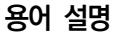

EFR(early failure rate)

반도체 제품의 초기 불량의 수준을 평가하는 수명 신뢰성 평가 항목

#### Endurance

플래시 메모리 등 ROM 계열 제품의 쓰기(program) 및 지우기(erase) 동작에 대한 주기적 (cycling) 한계 특성을 평가하는 항목

#### HALT(highly accelerated life test)

초가속 수명 시험으로 제품의 설계 단계에서 결함을 찾아 개선할 수 있도록 비교적 짧은 시간 에 시험하도록 설계된 가혹 시험의 일종

#### HAST(highly accelerated stress test)

습기 환경에서 동작하는 밀폐되지 않는(non-hermetic) 패키지의 신뢰성을 평가하는 데 사용된 다. 평가 방법은 THB와 동일하게 핀(pin)별 정적 바이어스(static bias)를 인가한 상태에서 온 도, 습도, 압력 스트레스(stress)를 인가함.

#### HTOL(high temperature operating life test)

제품을 실제 동작시키면서 온도 및 전압으로 스트레스(stress)를 인가함으로써 수명 신뢰성을 평가하는 항목

#### HTSL(high temperature storage life)

제품의 고온 방치 환경에서의 신뢰성을 평가하는 항목

#### JEDEC(joint electron device engineering council)

제조업체와 사용자 단체가 합동으로 집적 회로(IC) 등 전자 장치의 통일 규격을 심의, 책정하는 기구이고, 여기에서 책정되는 규격이 국제 표준이 되므로 JEDEC는 사실상 이 분야의 국제표준 화기구로 통함.

#### LOL(lower operation unit)

최소 동작 한계

#### LTOL(low temperature operating life test)

핫 캐리어(hot carrier) 영향에 대한 제품 불량 발생 가능성 평가를 하는 항목이나 전압 및 온

도가 인가되므로 다른 불량이 발생할 가능성도 있음.

#### LTSL(low temperature storage life)

제품의 저온 방치 환경에서의 신뢰성을 평가하는 항목

#### MSL(moisture sensitivity level)

제품의 습도 민감도에 대한 내성을 등급으로 분류하여 수준을 객관화(표준화)하고 사용 조건의 허용 범위를 규정화한 것.

#### PCT(pressure cooker test)

THS 및 THB보다 더욱 가혹(worse)한 시험으로 습기에 의한 내성을 조기 평가하기에 적합한 시험이며 오토클레이브(autoclave)라고도 함.

플라스틱 몰드 화합물(plastic mold compound)의 내습성 평가, 상대 습도 100%와 고압을 이용하여 습기 침투를 용이하게 하여 몰더빌리티(moldability)의 신뢰성을 평가한다. 또한 리드 (lead)와 리드 간 미세 틈(micro gap), 몰드(mold) 기공을 통한 습기 침투에 의한 불량을 검 출할 수 있음.

TC(thermal cycle)

여러 가지 사용자의 사용 환경 중 순간적인 온도의 변화에 대한 제품(device)의 내성을 시험하 기 위한 항목

#### TDBI

패키지 상태의 반도체 제품에 번인 스트레스(burn in stress)를 가하면서 동시에 테스트를 수 행하는 것으로, 가혹 조건을 인가하여 잠재적인 불량을 조기에 스크린(screen)하여 제품 수명 동안 판매된 제품의 불량을 최소화하는 것을 목적으로 함.

#### THB(temperature humidity bias)

제품에 전기적 바이어스(electric bias)를 인가한 상태에서 내습성을 평가함.

#### THS(temperature humidity storage)

고온 ‧ 고습에 대한 반도체 제품의 내성을 평가함.

#### TS(thermal shock)

열 충격(thermal shock)은 TC보다 급격한 온도 스트레스(stress)를 인가하는 항목으로 TC가 공기의 온도 차에 해당하는 스트레스를 가하는 것이면 TS는 액체 상태의 온도 차를 이용한 스 트레스를 가하는 것이므로 제품 측면에서 볼 때 스트레스의 크기가 더욱 크게 가함.

#### UHAST(unbiased highly accelerated stress test)

FBGA와 같은 기판 타입(substrate type)의 얇은 패키지에 대한 PCT와 유사한 스트레스를 인

가하여 패키지의 신뢰성을 평가하는 것.

VT(threshold voltage)

PN diode나 MOS TR에서 어떤 일정 전압이 되었을 때 전류가 흐르게 되는데, 이 전압을 문 턱 전압이라고 함.

#### 가속 등가(accelerated equivalent)

반도체 제품의 신뢰성을 평가할 때 실제 사용 시간 그대로 평가하면 평가하는 시간이 길어지므 로 가속 조건을 주어서 짧은 시간 평가하지만, 실제 시간에 주어지는 스트레스와 같게 만든 것.

데이터 리텐션(data retention)

플래시 메모리의 주요 신뢰성 요소로써 쓰인 정보(data)가 사라지지 않고 유지되는 특성

#### 부식(corrosion)

부식은 주위 환경과의 화학 반응으로 인하여 물질이 구성 원자로 분해되는 현상을 말하며, 일 반적으로 산소와 같은 산화체와 반응하여 금속이 전기‧화학적으로 산화하는 것.

#### 기가동 온도 구간(non-operating temperature range)

데이터 시트에서 규정한 반도체 제품의 동작 온도 구간 바깥의 온도 구간

#### 비틀림 시험(torsion test)

PCB가 비틀림에 의한 스트레스로 인해 솔더 접합부(solder joint) 및 제품 휨(device distortion) 불량 발생에 대한 내성을 평가하는 항목

#### 신뢰성(reliability)

제품의 규정된 요구 기준과 특성에 대해서 주어진 기간 동안 그 기능을 수행할 수 있는지를 나 타내는 척도

#### 열전도도

물질 이동의 수반 없이 열이 고온부에서 저온부로 전달되는 척도

#### 열팽창 계수(CTE)

일정한 압력 아래에서 온도가 높아짐에 따라 물체의 부피가 늘어나는 비율인데, 보통 팽창이나 수축은 온도 증가나 감소와 선형적인 관계를 이루므로 이를 열팽창 계수라 부름.

#### 오토클레이브(Autoclave)

일종의 고압 솥인 오토클레이브는 수분을 넣고 밀폐시킨 후 온도를 올려 수분을 증발시키면서 압력과 습도를 높여서 오토클레이브 안에 있는 시편에 필요한 조건을 만들어 주는 장비

#### 웨이퍼 번인(wafer burn in)

웨이퍼 상태로 온도와 전압을 인가하여 제품에 스트레스를 줌으로써 초기 불량 기간에 나타날 수 있는 불량들이 모두 드러나게 만드는 것.

#### 진동 시험(vibration test)

제품의 운송 중에 발생할 수 있는 진동에 대한 제품 내성을 평가하는 항목

#### 충격 시험(shock test)

취급 및 이동 중 발생할 수 있는 충격 시뮬레이션에 의한 내성을 평가하는 항목

#### 3점 구부림 시험(3 point bending)

검사하고자 하는 시편의 3점에 응력을 주어서 구부림으로써 강도 등을 측정하는 시험

#### 4점 구부림 시험(4 point bending)

검사하고자 하는 시편의 4점에 응력을 주어서 구부림으로써 강도 등을 측정하는 시험

#### BoD(board of directors)

JEDEC의 정책과 절차를 결정하고 JEDEC 표준의 최종 승인 기능을 하는 위원회

#### CE(conducted emisssion)

전도성 방출로 전도체를 통하여 전파되지 않는 전자파의 발생을 의미하며, 주변의 단말 또는 시스템 등 통신 설비에 오동작 등 장애를 일으키는 원인이 됨.

#### FN 터널링(fowler-nordheim tunneling)

양자역학에서 장벽의 높이보다 작은 에너지를 가진 입자라도 그 장벽을 넘어갈 수 있다는 것으 로 그중 특별히 전자가 전기장이 존재하는 절연막에서 절연막의 전도 밴드로 터널링이 발생한 이후 절연막의 전도 밴드에서 이동이 이루어지는 것을 FN 터널링이라 부름.

| NCS학습모듈 개발이력 |                                     |     |                  |  |  |
|--------------|-------------------------------------|-----|------------------|--|--|
| 발행일          | 2024년 12월 31일                       |     |                  |  |  |
| 세분류명         | 반도체 개발((19030601)                   |     |                  |  |  |
| 개발기관         | 수원과학대학교 산학협력단(개발책임자: 윤창용) 한국직업능력연구원 |     |                  |  |  |
|              | 최준혁(수원대학교)*                         |     | 김종범(삼성전기)        |  |  |
|              | 계찬호(수원대학교)                          |     | 김한수(두원공과대학교)     |  |  |
|              | 김경호(폴리텍대학교)                         |     | 남승호(경기대학교)       |  |  |
|              | 김관하(폴리텍대학교)                         |     | 손승대(제이에스이엔씨(주))  |  |  |
| 집필진          | 김기순((주)영우디에스피)                      | 검토진 | 안광호(퓨쳐일렉트로닉스)    |  |  |
|              | 김도균(폴리텍대학교)                         |     | 이철오((주)한국전력안전공단) |  |  |
|              | 전동민(폴리텍대학교)                         |     |                  |  |  |

\*표시는 대표집필자임 (참고) 검토진으로 참여한 집필진은 본인의 원고가 아닌 타인의 학습모듈을 검토함

| 반도체 수명 시험(LM1903060128_23v4)                                                                             |                   |  |  |  |
|----------------------------------------------------------------------------------------------------------|-------------------|--|--|--|
| 저작권자                                                                                                     | 교육부               |  |  |  |
| 연구기관                                                                                                     | 한국직업능력개발원         |  |  |  |
| 발행일                                                                                                      | 2024. 12. 31.     |  |  |  |
| ISBN                                                                                                     | 979-11-7175-762-6 |  |  |  |
| ※ 이 학습모듈은 자격기본법 시행령(제8조 국가직무능력표준의 활용)에 의거하여 개발하였으며, NCS통합포털사이트(http://www.ncs.go.kr)에서 다운로드 할 수 있습니다. |                   |  |  |  |

