## LM1903060129\_23v4

# NCS학습모듈 반도체 내성시험

대분류/19 전기·전자 중분류/03 전자기기개발 소분류/06 반도체개발 세분류/01 반도체개발 능력단위/29

#### [NCS학습모듈 활용 시 유의 사항]

- 1. NCS학습모듈은 교육훈련기관에서 출처를 명시하고 교육적 목적으로 활용할 수 있습니다. 다 만, NCS학습모듈에는 국가(교육부)가 저작재산권 일체를 보유하지 않은 저작물(출처가 표기된 도표‧사진‧삽화‧도면 등)이 포함되어 있으므로, 이러한 저작물의 변형‧각색‧복제‧공연‧ 배포 및 공중 송신 등과 이러한 저작물을 활용한 2차적 저작물을 작성하려면 반드시 원작자 의 동의를 받아야 합니다.
- 2. NCS학습모듈은 개발 당시의 산업 및 교육 현장을 반영하여 집필하였으므로, 현재 적용되는 법령‧지침‧표준 및 교과 내용 등과 차이가 있을 수 있습니다. NCS학습모듈 활용 시 법령 ‧지침‧표준 및 교과 내용의 개정 사항과 통계의 최신성 등을 확인하시기를 바랍니다.
- 3. NCS학습모듈은 산업 현장에서 요구되는 능력을 교육훈련기관에서 학습할 수 있게 구성한 자 료입니다. 다만, NCS학습모듈 지면의 한계상 대표적 예시(예: 활용도 또는 범용성이 높은 제 품, 서비스) 중심으로 집필하였음을 이해하시기를 바랍니다.

## NCS학습모듈의 이해

※ 본 NCS학습모듈은 「NCS 국가직무능력표준」사이트(http://www.ncs.go.kr) 에서 확인 및 다운로드할 수 있습니다.

### Ⅰ NCS학습모듈이란?

- 국가직무능력표준(NCS: National Competency Standards)이란 산업현장에서 직무를 수행하기 위해 요구되는 지식·기술·소양 등의 내용을 국가가 산업부문별·수준별로 체계 화한 것으로 산업현장의 직무를 성공적으로 수행하기 위해 필요한 능력(지식, 기술, 태도) 을 국가적 차원에서 표준화한 것을 의미합니다.
- 국가직무능력표준(이하 NCS)이 현장의 '직무 요구서'라고 한다면, NCS학습모듈은 NCS
  의 능력단위를 교육훈련에서 학습할 수 있도록 구성한 '교수·학습 자료'입니다. NCS학습
  모듈은 구체적 직무를 학습할 수 있도록 이론 및 실습과 관련된 내용을 상세하게 제시하
  고 있습니다.

#### ○ NCS학습모듈은 다음과 같은 특징을 가지고 있습니다.

- 첫째, NCS학습모듈은 산업계에서 요구하는 직무능력을 교육훈련 현장에 활용할 수 있도 록 성취목표와 학습의 방향을 명확히 제시하는 가이드라인의 역할을 합니다.
- 둘째, NCS학습모듈은 특성화고, 마이스터고, 전문대학, 4년제 대학교의 교육기관 및 훈 련기관, 직장교육기관 등에서 표준교재로 활용할 수 있으며 교육과정 개편 시에도 유용하게 참고할 수 있습니다.

○ NCS와 NCS학습모듈 간의 연결 체계를 살펴보면 아래 그림과 같습니다.

O NCS학습모듈의 위치는 NCS 분류 체계에서 해당 학습모듈이 어디에 위치하는지를 한 눈에 볼 수 있도록 그림으로 제시한 것입니다.

| [NCS-학          | 습모듈              | 의 위치]    |          |  |
|-----------------|------------------|----------|----------|--|
|                 |                  |          |          |  |
| 대분류             | 내분류 문화·예술·디자인·방송 |          |          |  |
| 중분류             | 문화콘텐츠            |          |          |  |
| 소분류             |                  | 문화콘텐츠제작  |          |  |
|                 |                  |          |          |  |
| 세분류             |                  |          |          |  |
| 방송콘텐츠제작         |                  | 능력단위     | 학습모듈명    |  |
| 영화콘텐츠제작         |                  | 프로그램 기획  | 프로그램 기획  |  |
| 음악콘텐츠제작         |                  | 아이템 선정   | 아이템 선정   |  |
| 광고콘텐츠제작         |                  | 자료 조사    | 자료 조사    |  |
| 게임콘텐츠제작         |                  | 프로그램 구성  | 프로그램 구성  |  |
| 애니메이션 콘텐츠제작  |                  | 캐스팅      | 캐스팅      |  |
| 만화콘텐츠제작         |                  | 제작계획     | 제작계획     |  |
| 캐릭터제작           |                  | 방송 미술 준비 | 방송 미술 준비 |  |
| 스마트문화앱 콘텐츠제작 |                  | 방송 리허설   | 방송 리허설   |  |
| 영사              |                  | 야외촬영     | 야외촬영     |  |
|                 |                  | 스튜디오 제작  | 스튜디오 제작  |  |
|                 |                  |          |          |  |

학습모듈은

NCS 능력단위 1개당 1개의 학습모듈 개발 을 원칙으로 합니다. 그러나 필요에 따라 고용단위 및 교과단위를 고려하여 능력단위 몇 개를 묶어 1개 학습모듈로 개발할 수 있으며, NCS 능력단위 1개를 여러 개의 학습모듈로 나누어 개발할 수도 있습니다.

#### 2. NCS학습모듈의 개요

#### ○ NCS학습모듈의 개요는 학습모듈이 포함하고 있는 내용을 개략적으로 설명한 것으로

| 학습모듈의 목표 , 선수학습 , 학습모듈의 내용 체계 , 핵심 용어 로 구성되어 있습니다. |                                                                              |  |  |
|----------------------------------------------------|------------------------------------------------------------------------------|--|--|
| 학습모듈의 목표                                           | 해당 NCS 능력단위의 정의를 토대로 학습 목표를 작성한 것입니다.                                        |  |  |
| 선수학습                                               | 해당 학습모듈에 대한 효과적인 교수·학습을 위하여 사전에 이수해야 하는 학습모 듈, 학습 내용, 관련 교과목 등을 기술한 것입니다. |  |  |
| 학습모듈의 내용 체계                                     | 해당 NCS 능력단위요소가 학습모듈에서 구조화된 체계를 제시한 것입니다.                                     |  |  |
| 핵심 용어                                              | 해당 학습모듈의 학습 내용, 수행 내용, 설비·기자재 등 가운데 핵심적인 용어를 제 시한 것입니다.                   |  |  |

#### 제작계획 학습모듈의 개요

#### 학습모듈의 목표

본격적인 촬영을 준비하는 단계로서, 촬영 대본을 획정하고 제작 스태프를 조직하며 촬영 장비와 촬영 소품을 준비할 수 있다.

#### 선수학습

제작 준비(LM0803020105\_13v1), 섭외 및 제작스태프 구성(LM0803020104\_13v1), 촬영 제작(LM0803020106\_13v1), 촬영 장비 준비(LM0803040204\_13v1.4), 미술 디자인 협의하기(LM0803040203\_13v1.4)

#### 학습모듈의 내용체계

| 하스                | 하스 내용                                              | NCS 능력단위 요소       |                |
|-------------------|----------------------------------------------------|-------------------|----------------|
| 학습                | 학습 내용                                              | 코드번호              | 요소 명칭          |
| 1. 촬영 대본 확정하기  | 1-1. 촬영 구성안 검 토와 수정                             | 0803020114_16/3.1 | 촬영 대본 확정하기  |
| 2. 제작 스태프 조직하기 | 2-1. 기술 스태프 조직 2-2. 미술 스태프 조직 2-3. 전문 스태프 조직 | 0803020114_16v3.2 | 제작 스태프 조직하기 |
| 3. 촬영 장비 계획하기  | 3-1. 촬영 장비 점검 과 준비                              | 0803020114_16/3.3 | 촬영 장비 계획하기  |
| 4. 촬영 소품 계획하기  | 4-1. 촬영 소품 목록 작성 4-2. 촬영 소품 제작 의뢰         | 0803020114_16\3.4 | 촬영 소품 계획하기  |

#### 핵심 용어

촬영 구성안, 제작 스태프, 촬영 장비, 촬영 소품

#### 학습모듈의 목표는

학습자가 해당 학습모듈을 통해 성취해야 할 목표를 제시한 것으로, 교수자는 학습자 가 학습모듈의 전체적인 내용흐름을 파악하 도록 지도할 수 있습니다.

**6** • •

61

#### 선수학습은

교수자 또는 학습자가 해당 학습모듈을 교 수·학습하기 이전에 이수해야 하는 교과목 또는 학습모듈(NCS 능력단위) 등을 표기한 것입니다. 따라서 교수자는 학습자가 개별 학습, 자기 주도 학습, 방과 후 활동 등 다 양한 방법을 통해 이수할 수 있도록 지도하 는 것을 권장합니다.

|            | 핵심 용어는              |
|------------|---------------------|
|            | 률을 대표하는 주요 용어입니     |
|            | · 해당 학습모듈을 통해 학습    |
|            | 게될 주요 내용을 알 수 있습    |
|            | 5 국가직무능력표준」 사이트     |
| (www.ncs.g | jo.kr)의 색인 (찾아보기) 중 |
| 하나로 이용할    | 할 수 있습니다            |

#### 3. NCS학습모듈의 내용 체계

○ NCS학습모듈의 내용은 크게 학습, 학습 내용, 교수·학습 방법, 평가 로 구성되어 있습니다.

| 학습       | 해당 NCS 능력단위요소 명칭을 사용하여 제시한 것입니다. 학습은 크게 학습 내용, 교수·학습 방법, 평가로 구성되며 해당 NCS 능력단위의 능력단위 요소별 지식, 기술, 태도 등을 토대로 내용을 제시한 것입니다.                                                    |
|----------|----------------------------------------------------------------------------------------------------------------------------------------------------------------------------------|
| 학습 내용    | 학습 내용은 학습 목표, 필요 지식, 수행 내용으로 구성되며, 수행 내용은 재료·자 료, 기기(장비·공구), 안전·유의 사항, 수행 순서, 수행 tip으로 구성한 것입니다. 학습모듈의 학습 내용은 실제 산업현장에서 이루어지는 업무활동을 표준화된 프로세 스에 기반하여 다양한 방식으로 반영한 것입니다. |
| 교수·학습 방법 | 학습 목표를 성취하기 위한 교수자와 학습자 간, 학습자와 학습자 간 상호 작용이 활발하게 일어날 수 있도록 교수자의 활동 및 교수 전략, 학습자의 활동을 제시한 것입니다.                                                                            |
| 평가       | 평가는 해당 학습모듈의 학습 정도를 확인할 수 있는 평가 준거 및 평가 방법, 평 가 결과의 피드백 방법을 제시한 것입니다.                                                                                                         |

## [NCS-학습모듈의 위치]

| 대분류 | 전기 · 전자 |          |        |
|-----|---------------|----------|--------|
| 중분류 |               | 전자 기기 개발 |        |
| 소분류 |               |          | 반도체 개발 |

| 세분류    |                  |                  |
|--------|------------------|------------------|
| 반도체 개발 | 능력단위             | 학습모듈명            |
| 반도체 제조 | 반도체 제품 기획        | 반도체 제품 기획        |
| 반도체 장비 | 반도체 아키텍처 설계      | 반도체 아키텍처 설계      |
| 반도체 재료 | 디지털 회로 설계        | 디지털 회로 설계        |
|        | 패키지 조립 공정 개발     | 패키지 조립 공정 개발     |
|        | 반도체 제품 기능·성능 검증  | 반도체 제품 기능·성능 검증  |
|        | 자동 배치 배선 레이아웃 설계 | 자동 배치 배선 레이아웃 설계 |
|        | 반도체 설계 검증        | 반도체 설계 검증        |
|        | 반도체 펌웨어 개발       | 반도체 펌웨어 개발       |
|        | 메모리 반도체 제조 공정 개발 | 메모리 반도체 제조 공정 개발 |
|        | 시스템 반도체 제조 공정 개발 | 시스템 반도체 제조 공정 개발 |
|        | 반도체 제조 단위 공정 개발  | 반도체 제조 단위 공정 개발  |
|        | 아날로그 회로 아키텍처 설계  | 아날로그 회로 아키텍처 설계  |
|        | 아날로그 회로 소자 레벨 설계 | 아날로그 회로 소자 레벨 설계 |
|        | 아날로그 회로 시스템 설계   | 아날로그 회로 시스템 설계   |

| 와이어 본딩 패키지 개발     | 와이어 본딩 패키지 개발     |  |
|-------------------|-------------------|--|
| 플립 칩 패키지 개발       | 플립 칩 패키지 개발       |  |
| 웨이퍼 레벨 패키지 개발     | 웨이퍼 레벨 패키지 개발     |  |
| 어드밴스드 팬 아웃 패키지 개발 | 어드밴스드 팬 아웃 패키지 개발 |  |
| 이종 접합 패키지 개발      | 이종 접합 패키지 개발      |  |
| 어드밴스드 언더필 패키지 개발  | 어드밴스드 언더필 패키지 개발  |  |
| 반도체 환경 시험         | 반도체 환경 시험         |  |
| 반도체 수명 시험         | 반도체 수명 시험         |  |
| 반도체 내성 시험         | 반도체 내성 시험         |  |
| 커스텀 레이아웃 적용 공정 분석 | 커스텀 레이아웃 적용 공정 분석 |  |
| 커스텀 레이아웃 설계       | 커스텀 레이아웃 설계       |  |
| 커스텀 레이아웃 검증       | 커스텀 레이아웃 검증       |  |

## 차 례

| 학습모듈의 개요         | 1  |
|------------------|----|
| 학습 1. 내성 시험 평가하기 |    |
| 1-1. 내성 시험 평가    | 3  |
| • 교수 ․ 학습 방법     | 27 |
| • 평가             | 28 |

#### 학습 2. 내성 시험 분석하기

| 2-1. 내성 시험 분석 | 31 |
|---------------|----|
| • 교수 ․ 학습 방법  | 56 |
| • 평가          | 57 |

|  | 참고 자료 |  | 60 |  |
|--|-------|--|----|--|
|--|-------|--|----|--|

## 반도체 내성 시험 학습모듈의 개요

#### 학습모듈의 목표

반도체 제품이 정전기나 과전류 등의 전기적 스트레스에 대해 내성이 있는지와 원하지 않는 전류 급증이 발생하지 않는지를 검증하여 시험 결과가 정상인지 판정하고 불량 발생 시 불량 유형과 원인을 분석할 수 있다.

#### 선수학습

와이어 본딩 패키지 개발(LM1903060121\_23v4), 패키지 조립 공정 개발(LM1903060108\_23v4), 반도 체 환경 실험(LM1903060127\_23v4), 반도체 수명 실험(LM1903060128\_23v4)

#### 학습모듈의 내용체계

|               |               | NCS 능력단위 요소       |            |
|---------------|---------------|-------------------|------------|
| 학습            | 학습 내용         | 코드번호              | 요소 명칭      |
| 1. 내성 시험 평가하기 | 1-1. 내성 시험 평가 | 1903060129_23v4.1 | 내성 시험 평가하기 |
| 2. 내성 시험 분석하기 | 2-1. 내성 시험 분석 | 190360129_23v4.2  | 내성 시험 분석하기 |

#### 핵심 용어

정전기 방전(ESD), 래치 업(Latch-up), 과전류(EOS), 내성 시험, 불량 분석(FA), 시험 계획, 시험 장비, 품질 수준 평가, 불량 유형 파악, 통계적 데이터 분석

## 학습 1 내성 시험 평가하기 학습 2 내성 시험 분석하기

## 1-1. 내성 시험 평가

| 학습 목표 | • 정전기(ESD), 래치 업(latch up), 과전류(EOS) 등 내성 시험 항목별 목적을 이해하고 각각의 |
|-------|---------------------------------------------------------------|
|       | 시험 계획을 수립할 수 있다.                                              |
|       | • 내성 시험 항목별 보드와 장비를 이용하여 각각의 시험 방법을 갖출 수 있다.                  |
|       | • 내성 시험 항목별 평가 진행 조건이 정상인지 판정할 수 있다.                          |

## 필요 지식 /

숔 내성 시험에 대한 필요성 및 이해

[그림 1-1]처럼, 반도체 소자는 일상적인 사용 중에 다양한 전기적 스트레스에 노출될 수 있다. 이러한 스트레스를 견디지 못하면 소자가 손상되거나 오작동할 수 있다.

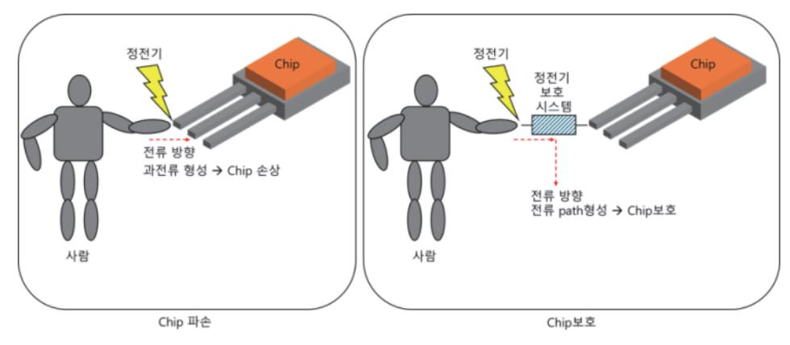

출처: 집필진 제작(2024) [그림 1-1] 내성 실험의 필요성

내성 시험은 이러한 상황을 미리 구현하고 평가하여 제품의 신뢰성과 안전성을 확인하기 위한 시험이다. 특히, 내성 시험을 통해 제품의 신뢰성이 보장되고 안정성이 확보된다. 현대 전자 기 기에서는 반도체 소자가 핵심 부품으로 활용된다. 이러한 소자는 다양한 환경에서 작동되어야 하며 예상치 못한 전기적 스트레스에 노출될 수 있다. 신뢰성이 높은 제품은 사용 중 예기치 않은 고장이나 오작동의 발생 확률이 낮아 고객의 만족도가 높아지고 제품의 브랜드 신뢰성도 향상된다. 안정성 확보 측면에서도 중요한 부분이 있다. 정전기 방전(ESD: electrostatic discharge)이나 과전류(EOS: electric over stress)와 같은 전기적 위협은 반도체 소자뿐만 아 니라 이를 사용하는 전체 시스템의 안전에도 영향을 끼칠 수 있다.

1. ESD

ESD는 전자 소자에서 발생하는 갑작스럽고 빠른 전하 이동으로, 두 표면 간의 전위차로 인 해 발생하며, 높은 전압이 민감한 전자 장치에 손상을 줄 수 있다. 정전기 축적과 방전으로 주로 발생하며, 절연층 파괴나 금속 손상으로 영구적인 고장이 발생할 수 있다. ESD를 방 지하기 위해 접지, 정전기 방지 장비, 습도 조절 등이 필요하며, 작업자와 작업 환경의 정 전기 축적을 방지하는 것이 중요하다.

2. EOS

EOS는 전자 소자에 정격을 초과하는 전압이나 전류가 인가되어 발생하는 손상을 말하며, 장시간에 걸쳐 소자에 스트레스를 가할 수 있다. 발생 원인으로는 전력 서지, 잘못된 설계, 외부 요인 등이 있으며, 전력 공급의 불안정, 낙뢰, 전자기 간섭 등이 주요 요인이다. 과열 과 파괴가 EOS의 주요 영향으로, 이를 방지하기 위해 보호 회로 설계, 정격 준수, 서지 보 호기와 퓨즈 설치 등이 필요하다.

3. ESD와 EOS는 발생 시간, 원인, 방지 방법

ESD는 짧은 시간에 발생하며 정전기 축적으로 인해 발생하고, EOS는 긴 시간에 걸쳐 전력 서지나 설계 결함 등으로 발생한다. ESD는 정전기 방지, EOS는 회로 설계와 전원 공급 안 정성에 중점을 둔다. 내성 시험은 반도체 소자가 다양한 전기적 스트레스 조건에서 얼마나 견딜 수 있는지를 평가하는 중요한 도구로, 자동차 전자 장치나 의료기기에서의 반도체 손 상을 예방하기 위해 필수적이다. 내성 시험을 통해 제품의 수명 연장과 유지 보수 비용 절 감이 가능하며 제품의 글로벌 품질과 신뢰성을 보장한다.

4. 래치 업(latch up)

래치 업은 CMOS 소자에서 발생하는 주요 불량으로, 기생 트랜지스터의 활성화로 인해 소 자가 지속해서 전류를 흘리며 과열과 손상을 초래한다. 첫 번째 원인은 CMOS 소자 내부의 기생성 PNP와 NPN 트랜지스터가 피드백 루프를 형성하여 래치 업 상태를 유발하는 것이 다. 두 번째로, ESD로 인한 과도 전류가 기생 트랜지스터를 활성화시켜 래치 업을 촉발할 수 있다. 세 번째로, 전력 공급의 급격한 증가로 래치 업을 유발할 수 있다. 이를 방지하기 위해 P형 웰과 N형 웰 사이의 거리 유지, 깊은 N형 웰 구조 도입, ESD 보호 다이오드 추 가 등의 설계 및 공정 개선이 필요하다. 또한, 고온 환경에서는 래치 업 발생 가능성이 높 아지므로 주의가 필요하다.

5. 내성 시험 국제 규격 표준, 평가 목적 그리고 방법

내성 시험 국제 규격 표준은 반도체 소자가 다양한 전기적 스트레스(ESD, EOS 등)에 대해

얼마나 견딜 수 있는지를 평가하는 기준을 제시한다. 이러한 표준은 제품의 성능과 안전성 을 보장하는 데 필수적이다. 주요 국제 규격 표준은 JEDEC에서 제정한 규격들이 있다. 이 표준들은 반도체 소자가 다양한 환경과 조건에서 신뢰성 있게 작동할 수 있도록 보장하기 위함이다.

(1) JEDEC(Joint Electron Device Engineering Council)

JEDEC 기준, JEDEC JESD22-A114, JEDEC JESD22-A115, JEDEC JESD22-C101 규 격을 활용해서 평가를 진행한다.

(가) JEDEC JESD22-A114(HBM)

JEDEC, JESD22-A114는 HBM(human body model) ESD 테스트에 대하 규격이 다. HBM은 인간이 반도체 소자에 접속할 때 발생할 수 있는 정전기 방전을 시뮬레 이션하는 모델이다.

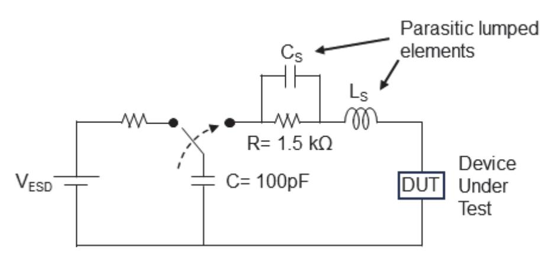

출처: 집필진 제작(2024) [그럼 1-2] HBM ESD 테스트 등가 회로

1) HBM 정의

인간이 반도체 소자에 접촉할 때 발생할 수 있는 정전기 방전을 시뮬레이션하는 모델이다.

2)테스트 목적

반도체 소자가 인간의 정전기에 얼마나 견딜 수 있는지를 평가한다.

3)테스트 구성([그림 1-2])

1,500Ω 저항과 100pF 커패시터를 사용하여 방전 경로를 구성한다.

4)1,500Ω 저항 역할

사람이 방전 시 제공할 수 있는 전형적인 경로 저항을 나타내며, 전류 흐름을 조 절하고 방전의 강도를 완화한다.

5)100pF 커패시터 역할:

사람의 몸이 일상적인 환경에서 축적할 수 있는 전하의 전형적인 수준을 나타내

며, 방전 시 발생하는 에너지를 결정한다.

6)저항과 커패시터의 중요성

전류의 피크 값을 줄이고 방전 시간 상수를 결정하며, 사람의 몸이 축적할 수 있 는 전하 용량을 잘 반영한 값으로 사용된다.

#### (나) JEDEC JESD22-A115(MM)

JEDEC, JESD22-A115는 MM(Machine Model) ESD 테스트에 대한 규격이다.

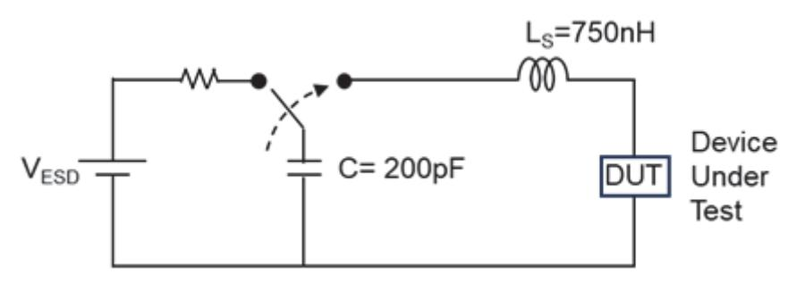

출처: 집필진 제작(2024) [그럼 1-3] MM ESD 테스트 등가 회로

1)MM ESD 테스트 목적

반도체 소자가 기계적 접촉으로 인해 발생할 수 있는 정전기 방전에 얼마나 견딜 수 있는지를 평가한다.

2)적용 분야

산업용 장비나 자동화 시스템에서의 기계적 접촉으로 인한 방전 가능성이 높은 경우이다.

3)테스트 특징

사람이 접촉할 때 발생하는 방전보다 빠르고 높은 전류 피크를 가지는 방전 평가 이다.

4)MM 모델 구성([그림 1-3])

0Ω 저항과 200pF 커패시터를 사용하여 기계적 정전기 방전의 특성을 재현한다.

5)0Ω 저항 역할

방전 경로에서 전류 흐름을 제한하지 않고, 순간적인 높은 전류 피크를 정확하게 재현한다.

6)200pF 커패시터 역할

기계와 소자 간의 접촉으로 인해 발생하는 전하 축적을 의미하며, 방전 중 전류 와 전압의 특성을 결정한다. 이때 방전은 사람이 접촉할 때 발생하는 전류보다 빠르고 높은 순간 전류를 가질 수 있다([그림 1-4]).

#### 7)평가 항목

테스트 소자는 방전 전류가 흐를 때 전압 스트레스와 전류 스트레스를 견딜 수 있어야 한다.

8)테스트 중요성

반도체 소자의 내구성과 신뢰성을 보장하고, 산업 환경에서 기계적 접촉으로 인 한 방전 위험을 줄이는 데 중요한 역할을 한다.

9)테스트 결과

MM ESD 테스트는 소자의 신뢰성과 내구성을 평가하는 데 필수적인 요소이다.

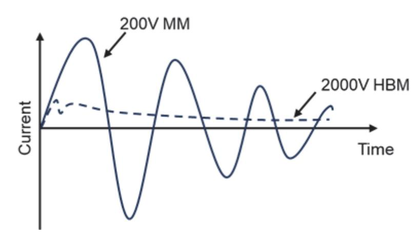

출처: 집필진 제작(2024) [그럼 1-4] MM ESD 전류 특성 및 HBM ESD 전류 비교

#### (다) JEDEC JESD22-C101(CDM)

JEDEC, JESD22-C101는 반도체 소자에 대한 CDM(charged device model) ESD 테스트의 국제 규격 표준이다.

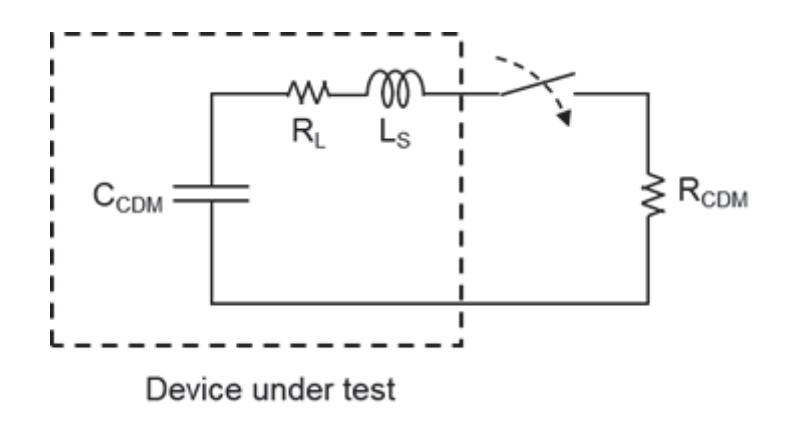

출처: 집필진 제작(2024) [그럼 1-5] CDM ESD 테스트 등가 회로

1) 목적

반도체 소자가 전하를 축적한 후 방전할 때 발생하는 상황을 모사하여 소자의 내 성을 평가한다.

2) CDM 테스트

소자가 자체적으로 발생하는 정전기 방전 상황에 대해 내성을 측정하는 중요한 방법이다.

HBM이나 MM 방전보다 짧은 시간 동안 발생하지만, 매우 높은 전류 피크를 가 질 수 있다. 특히 고속 디지털 회로나 RF 회로에서 중요한 요소이다.

3) CDM 모델 구성 요소(그림 1-5)

- 가) RL(저항): 소자를 일정한 속도로 충전하며, 전류의 급격한 변화를 완화한다.
- 나) LS(방전 인덕턴스): 전류 피크 값을 제한하는 역할을 한다.
- 다) RCDM(방전 저항): 방전 중 발생하는 전류의 피크 값을 줄이고, 소자의 방전 내성 을 평가한다.
- 4) CDM 스트레스 시뮬레이터 특성

CDM stress simulator는 DUT가 축적한 전하를 방출할 수 있도록 설계된 특수한 보드이다. 이 보드는 고전압 절연 재질로 제작되며, 각 핀에 연결된 도금된 구리 핀이나 실버 도금 핀이 포함되어 있다. 이러한 핀들은 신호 전송 손실을 최소화하고, 높은 전류 피크를 견딜 수 있는 강도를 제공한다. DUT는 비전도성 재료로 제작된 고정 클램프와 지지대를 통해 안정적으로 고정된다. 또한, 전하 축적 및 방전 경로가 명확히 정의되어 있어 각 핀에서 전하가 어떻게 흐를지를 시뮬레이션할 수 있다. 이를 통해 DUT의 전기적 스트레스를 효과적으로 분석할 수 있다.

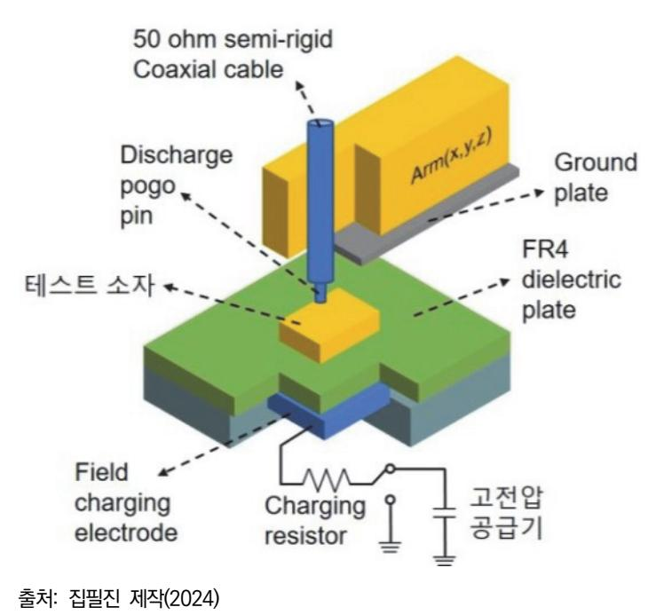

[그럼 1-6] CDM stress simulator

[그림 1-6]의 주요 구성 요소로는 아래와 같다.

- 테스트 소자: CDM 테스트를 위해 DUT가 장착되는 부분
- Discharge pogo pin: 방전 핀으로, DUT의 핀에 접촉하여 방전을 유도
- Ground plate: DUT의 접지를 위한 판
- FR4 dielectric plate: 고전압 절연성을 제공하는 FR4 재질의 절연판
- Field charging electrode: DUT에 전하를 축적하기 위한 충전 전극
- Charging resistor: 전하를 축적하는 동안 전류를 조절하는 저항
- 고전압 공급기: DUT에 전하를 제공하는 고전압 전원
- 50ohm semi-rigid coaxial cable: 방전 경로에 사용되는 50옴 반강성 동 축 케이블

(2) EOS 특성 평가

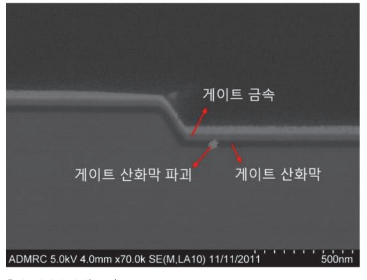

출처: 집필진 제작(2024) [그림 1-7] 게이트 산화막 파괴

EOS는 전자 소자에 정격을 초과하는 전압이나 전류가 인가되어 발생하는 손상으로, 이 는 장시간에 걸쳐 소자에 스트레스를 가할 수 있다. EOS의 발생 원인으로는 전력 서지, 잘못된 설계, 외부 요인 등이 있으며, 전력 공급의 불안정, 낙뢰, 전자기 간섭 등이 주 요 요인으로 작용한다. 이러한 스트레스는 반도체 소자의 특정 부분에 심각한 손상을 초 래할 수 있으며, 그 중에서도 MOSFET의 게이트(Gate) 부분에서 발생하는 이상 전압으 로 인한 게이트 산화막(Gate Oxide)의 파괴는 중요한 문제이다([그림 1-7]).

(가) 게이트 산화막의 역할

반도체 소자에서 게이트와 채널 사이의 전기적 절연을 담당하는 매우 얇은 절연층이 다. 일반적으로 전력 반도체 application의 경우, 100nm이고 channel 길이가 짧 은 고성능 스위칭 MOSFET의 경우, 수 나노미터(nm) 두께의 매우 얇은 구조로 구 성된다.

(나) EOS로 인한 게이트 산화막 파괴

과도한 전압이 게이트에 인가될 때 산화막의 전기적 내력이 초과되며, 산화막이 파 괴되어 게이트와 채널 간의 전기적 절연이 무너진다. 이로 인해 전류가 비정상적으 로 흐르고, 소자가 영구적으로 손상된다.

(다) 게이트 산화막 파괴(gate oxide breakdown) 영향

소자의 정상적인 작동을 방해한다. 과열과 전류 누설이 발생하며 소자의 전체적인 파괴로 이어진다.

- (라) EOS로 인한 게이트 산화막 파괴 방지 조치
  - 1) 보호 회로 설계
  - 2) 정격 준수
  - 3) 서지 보호기 및 퓨즈 설치
  - 4) Gate 영역에 Zener diode 삽입으로 current path 형성
- (마) 테스트 목적

소자가 극한의 전기적 스트레스 조건에서도 안정적으로 작동할 수 있도록 보장한다.

- (바) 측정 방법
  - 1) 전압 스트레스 인가

테스트 소자(DUT)에 정격을 초과하는 전압을 인가하여 스트레스 조건을 설정하 며 전압은 소자의 정격 전압을 초과하는 수준으로 점진적으로 증가시킨다.

2) 전류 스트레스 인가

DUT에 정격을 초과하는 전류를 인가하여 소자가 과부하 조건에서 어떻게 반응 하는지 확인한다. 전류는 정격 전류를 초과하는 수준으로 점진적으로 증가시킨다.

3) 온도 스트레스 적용

소자의 온도 조건을 제어하여 높은 온도에서의 스트레스 테스트를 수행하며, 온 도는 소자의 정격 온도를 초과하는 수준에서 설정한다.

(사) 측정 조건

1) 전압 범위

소자의 정격 전압을 초과하는 다양한 전압 수준(예: 1.2배, 1.5배, 2배 등)에서 테스트를 수행한다.

2) 전류 범위

소자의 정격 전류를 초과하는 다양한 전류 수준(예: 1.2배, 1.5배, 2배 등)에서 테스트를 수행한다.

#### 3) 온도 조건

소자의 동작 온도를 초과하는 높은 온도(예: 125°C, 150°C 등)에서 스트레스를 적용한다.

4) 스트레스 지속 시간

스트레스 인가 시간은 수 ms에서 수 분까지 다양하게 설정하여 테스트를 수행한 다.

5) 반복성

동일한 조건에서 반복적으로 테스트하여 소자의 신뢰성을 평가한다.

(아) 평가 조건

1) 파괴 임계점 분석

DUT가 파괴되거나 정상적인 기능을 상실하는 임계 전압 및 전류 수준을 평가한 다.

2) 전기적 특성 변화

스트레스 적용 전후의 DUT의 전기적 특성(예: I-V 특성, 누설 전류 등) 변화를 측정하고 분석한다.

3) 열화 평가

반복적인 스트레스 적용 후 소자의 열화 정도를 평가한다. DUT의 전기적 특성 및 기능에 대한 장기적인 영향을 분석한다.

4) 파괴 메커니즘 분석

DUT 파괴 시 발생한 내부 손상 메커니즘(예: 금속 간섭, 절연 파괴 등)을 분석 한다.

5) 신뢰성 데이터 수집

다양한 스트레스 조건에서 DUT의 신뢰성 데이터를 수집하여 제품의 내구성을 평가한다. 이러한 EOS 측정 방법과 조건을 통해 반도체 소자의 내구성을 평가하 고, 제품 설계 및 공정 개선을 위한 데이터를 확보할 수 있다.

## 수행 내용 / 내성 시험 평가하기

#### 재료·자료

- JEDEC JESD22-A114 표준 문서, 관련 DUT(반도체 소자) 준비
- JEDEC JESD22-C101 표준 문서, 관련 DUT(반도체 소자) 준비
- JEDEC JESD22-A115 표준 문서, 관련 DUT(반도체 소자) 준비
- HBM 테스트 보드
- CDM 테스트 보드
- MM 테스트 보드
- DUT(Device Under Test): 내성 시험을 수행할 대상 반도체 소자
- 절연 장갑 및 보호 안경(고전압과 기계적 스트레스로부터 보호하기 위한 개인 보호 장비)

#### 기기(장비 ・ 공구)

- ESD 발생기
- 고전압 공급 장치
- 오실로스코프
- 전류 프로브

#### 안전 ・ 유의 사항

- 고전압을 다룰 때는 반드시 절연 장갑을 착용하고, 주변에 전기적 위험 요소가 없는지 확인한다.
- ESD 발생기 사용 시, 정전기 방전으로 인한 손상을 방지하기 위해 모든 연결부가 확실히 고정되어 있는지 확인한다.
- 오실로스코프 및 전류 프로브를 사용할 때는 신호 접촉이 정확히 이루어져야 하며, 불필요 한 접촉으로 인해 노이즈가 발생하지 않도록 주의한다.
- 오실로스코프 및 전류 프로브를 사용할 때는 신호 접촉이 정확히 이루어져야 하며, 불필요 한 접촉으로 인해 노이즈가 발생하지 않도록 주의한다.

#### 수행 순서

숔 ESD 평가 진행 전 관련 항목의 문서를 학습한다.

HBM, CDM, MM 평가 항목에 대해서 학습하고 이해한다. [그림 1-8]처럼 ESD에 평가에 필 요한 소자를 준비한다. 또한, ESD 평가 목적을 이해하기 위해 JEDEC 홈페이지에서 회원 가입 후, JESD22-A114, JESD22-C101, JESD22-A115 문서를 내려받는다. 또한 [그림 1-8]처럼 평가 전 테스트 항목 및 목적에 대해서 학습을 진행한다.

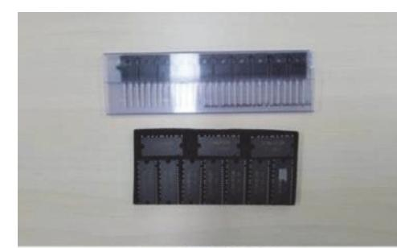

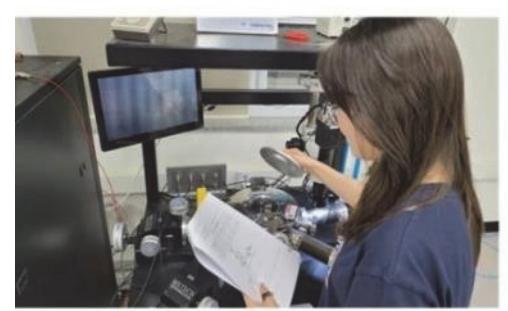

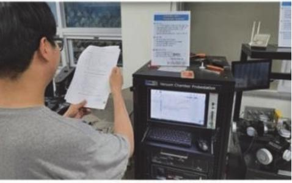

- 출처: 집필진 제작(2024)
- [그럼 1-8] ESD 평가용 샘플 준비 및 ESD 항목별 문서 확인
- 숕 테스트 보드 및 필요 부품을 준비한다.

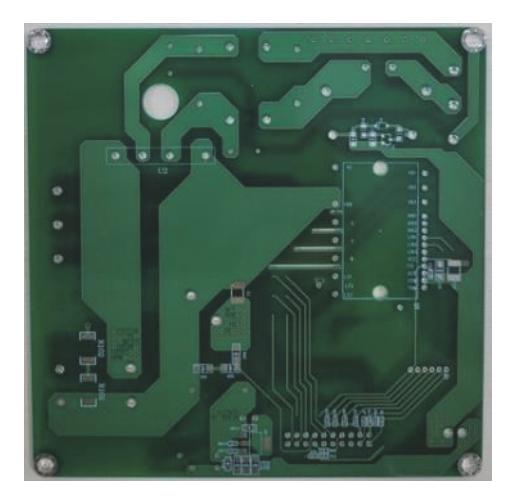

출처: 집필진 제작(2024) [그럼 1-9] 보드 이미지

- 1. HBM 테스트 보드를 확인한다.
  - (1) DUT 장착 및 ESD 발생기와 연결을 위한 특수 구조
  - (2) 고전압, 고전류를 견디는 절연 재질 사용(FR4, 폴리이미드, [그림 1-9])
  - (3) DUT의 모든 핀을 개별적으로 연결할 수 있는 소켓 마련
  - (4) 전류 측정 경로 설계 및 전압 측정 지점 포함
  - (5) ESD 발생기에서 생성된 고전압을 DUT에 전달할 수 있는 연결 포인트 제공
- 2. CDM 테스트 보드를 확인한다.
  - (1) DUT가 축적한 전하 방출을 위한 설계
  - (2) FR4 또는 폴리이미드 절연 재질 사용
  - (3) DUT의 핀과 정확하게 연결되는 전기적 접점 설계
  - (4) 전하 축적 및 방전 경로 명확하게 정의
- 3. MM 테스트 보드를 확인한다.
  - (1) 기계적 방전을 견디기 위한 설계
  - (2) FR4 또는 폴리이미드 절연 재질 사용, 10kV 이상의 전압과 전류 견딤.
  - (3) 금도금된 구리 핀 또는 실버 도금 핀으로 구성된 금속 접점 핀 사용
  - (4) DUT를 안전하게 고정하는 비전도성 클램프와 지지대 포함
  - (5) 전하 축적 및 방전 경로를 제공하는 회로 구성 요소 포함
  - (6) 각 핀에서의 전기적 경로 명확히 정의
- 4. 테스트에 필요한 부품 및 환경 확인을 확인한다.
  - (1) 다양한 DUT 핀 배열 수용을 위한 다용도 소켓(예: ZIF 소켓)
  - (2) 고전압 및 고전류 견디는 FR4 재질로 제작(내열성 및 전기적 절연 특성 우수)
  - (3) 고전압 전류 전달을 위한 고전압 커넥터(Amphenol 커넥터)
  - (4) 전류 측정을 위한 정확한 연결 지점(전류 프로브)
  - (5) 전압 측정을 위한 연결 지점(오실로스코프)
- 5. 필요 부품 및 계측 장비를 준비한다.

ESD 테스트는 노트북, 휴대전화(충전 포트) 등에 바로 전하를 입력할 수 있지만 PKG가 된 칩에 입력을 하기 위해서는 PCB 기판 및 부속 부품들이 필요하다. [그림 1-10]처럼 PKG 칩의 정상 동작을 확인하기 위해서는 칩이 구동할 수 있는 테스트 회로 구성에 필요한 부 품들이 필요하다. 또한 측정의 편의성을 위해서 멀티미터는 전원을 사용하는 장비 및 휴대 용 멀티미터의 확보도 필요하다. 회로 구성이 끝나고 평가용 칩의 실장이 끝나면 전압 및

#### 전류를 평가하기 위해서 다양한 장비들이 필요하다.

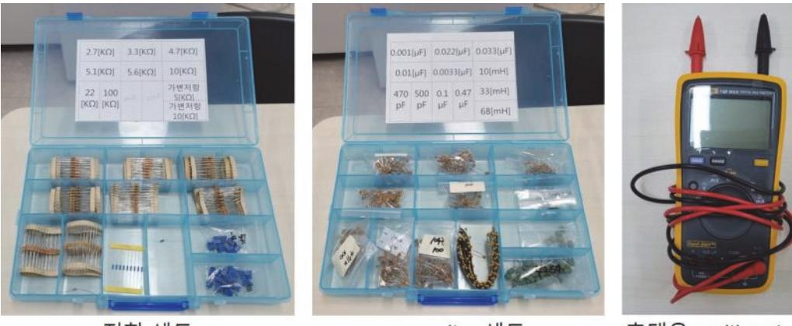

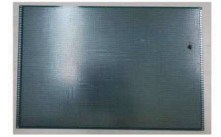

출처: 집필진 제작(2024) [그럼 1-10] 기판 구성 세트

또한 칩의 구동 특성을 평가하기 위해서는 다양한 계측 장비가 필요하다. IC칩의 입력 신호 를 줄 수 있는 function generator, 칩의 출력 신호를 확인할 수 있는 오실로스코프, 칩의 전원을 인가하는 데 필요한 power supply, 그리고 부분적인 전압 및 전류의 크기를 확인 할 수 있는 디지털 멀티미터 및 휴대용 멀티미터 등이 필요하다. 필요 장비는 [그림 1-11] 에 나타내었다. 주의 사항은 gate drive IC 및 전력 반도체로 double pule test를 진행할 경우, function generator 입력 신호를 인가할 때 게이트 전원의 길이 크기를 잘 숙지하 고 입력해야 한다. 너무 길게 입력할 경우, turn-on 시간이 길어지면서 전력 반도체의 높 은 전류가 부하에 인가되고 turn-off 시 고전류가 전력 반도체에 전달되기 때문에 항복 전 압에 도달해 소자가 파괴될 수 있다.

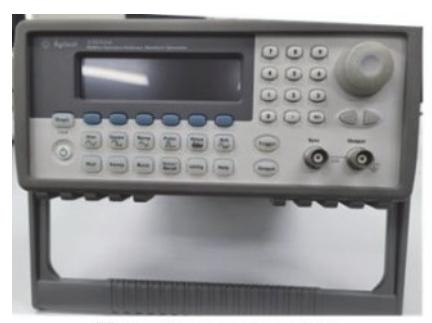

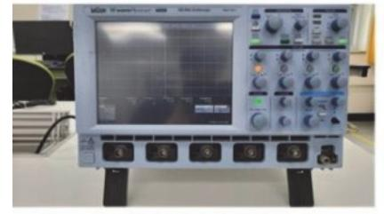

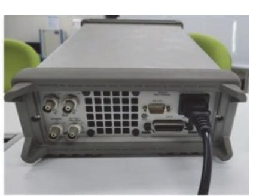

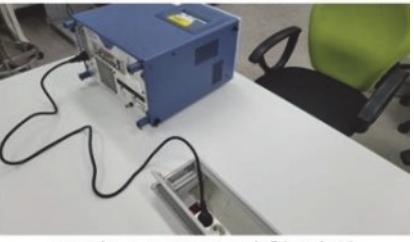

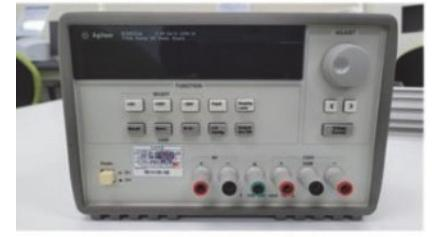

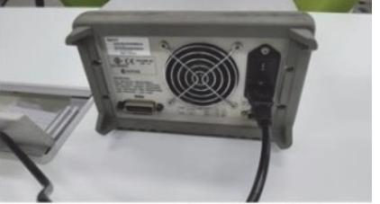

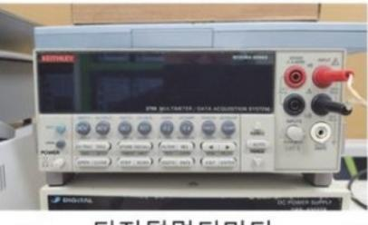

출처: 집필진 제작(2024) [그럼 1-11] 필요 장비 세트

계측 장비에서는 오실로스코프의 활용이 중요하다. 파형의 크기 및 프로브의 정밀도에 따라 서 측정의 정확도가 확보된다. 특히, horizontal 및 vertical 부분의 다이얼을 잘 조절하면 서 파형의 크기 및 정확도 확보가 중요하다. 정밀하게 측정하기 위해서 500MHz, 10:1급의 프로브도 준비하면 좋다. 통상적으로 시간에 따른 다양한 전압 파형 및 전류 파형을 평가하 기 위해서는 4채널 오실로스코프를 준비하는 것을 권장한다. 오실로스코프는 X축 및 Y축의 크기를 조절하면서 파형의 형태를 자세히 측정한다([그림 1–12]).

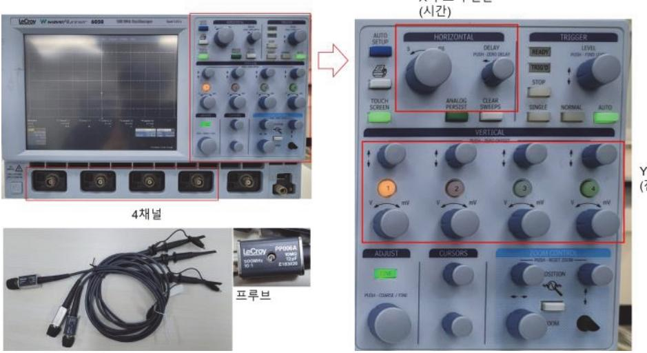

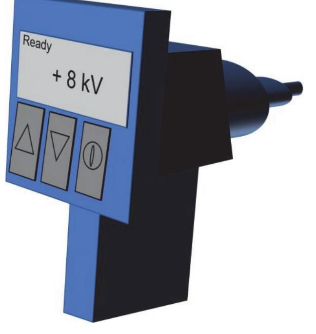

출처: 집필진 제작(2024) [그럼 1-13] ESD 건

출처: 집필진 제작(2024) [그럼 1-12] 오실로스코프

준비된 칩 및 보드로 소자의 정상 작동을 확인한 후 ESD 건([그림 1-13])으로 소자를 조사 하고 다시 소자가 정상 작동을 하는지 확인해야 한다. 고전압이 인가되기 때문에 평가 시 주변을 잘 정리하고 실험할 때 문제가 되지 않도록 한다.

HBM 테스트 경우, ±2kV, ±4kV, ±6kV, ±8kV 전압 수준으로 설정해서 방전을 진행한 다.

숖 테스트 장비 스펙을 확인한다.

- 1. 테스트 장비 스펙을 확인한다.
  - (1) HBM 테스트 장비 및 스펙은 다음과 같다.
    - (가) HBM ESD Simulator
      - 1) 전압 범위: ±2kV, ±4kV, ±6kV, ±8kV
      - 2) 방전 반복률: 0.1Hz ~ 1Hz
      - 3) 충전 시간: 1초 미만
    - (나) High Voltage Power Supply
      - 1) 출력 전압: 0 ~ ±10kV
      - 2) 최대 전류: 10mA
      - 3) 전압 조정 정밀도: 0.1%
    - (다) 디지털 오실로스코프
      - 1) 대역폭: 300MHz
      - 2) 샘플링 속도: 2.5GS/s
      - 3) 채널 수: 4개
    - (라) 전류 프로브
      - 1) 대역폭: 15MHz
      - 2) 최대 전류 측정: 50A
      - 3) 감도: 1mV/mA
    - (마) 용도
      - 1) HBM 테스트 수행에 필수적
      - 2) DUT의 ESD 내성 평가 및 데이터 제공
      - 3) 다양한 스트레스 조건에서 제품의 전기적 특성 분석 및 안정성 보장
  - (2) CDM 테스트 장비 및 스펙은 다음과 같다.
    - (가) CDM ESD Simulator
      - 1) 전압 범위: ±100V ~ ±1000V
      - 2) 최대 방전 전류 피크: 50A
    - (나) High Voltage Power Supply
      - 1) 출력 전압: 0 ~ ±10kV
      - 2) 최대 전류: 10mA
      - 3) 전압 조정 정밀도: 0.1%
    - (다) 디지털 오실로스코프

- 1) 대역폭: 300MHz
- 2) 샘플링 속도: 2.5GS/s
- 3) 채널 수: 4개
- 4) 메모리 깊이: 10kpts
- (라) 전류 프로브
  - 1) 대역폭: 15MHz
  - 2) 최대 전류 측정: 50A
- (마) 용도
  - 1) CDM 테스트 수행에 필수적
  - 2) DAUT의 전기적 특성 평가 및 다양한 전기적 스트레스 상황에서의 안정성 확인
- (3) MM 테스트 장비 및 스펙은 다음과 같다.
  - (가) MM ESD 발생기
    - 1) 전압 범위: ±100V ~ ±500V
    - 2) 최대 방전 전류 피크: 50A
    - 3) 방전 지속 시간: 1ns ~ 100ns
  - (나) 고전압 공급 장치
    - 1) 출력 전압: 0 ~ ±10kV
    - 2) 최대 전류: 10mA
    - 3) 전압 조정 정밀도: 0.1%
  - (다) 디지털 오실로스코프
    - 1) 대역폭: 300MHz
    - 2) 샘플링 속도: 2.5GS/s
    - 3) 채널 수: 4개
    - 4) 메모리 깊이: 10kpts
  - (라) 전류 프로브
    - 1) 대역폭: 15MHz
    - 2) 최대 측정 전류: 50A
    - 3) 감도: 1mV/mA
  - (마) 용도 및 역할

이 장비들은 MM 테스트 중 DUT의 전기적 특성을 정확하게 측정하고 평가하며, DUT가 기계적 방전 상황에서도 안정적으로 작동할 수 있는지를 평가한다.

숗 테스트 평가 조건을 확인핟다.

1. HBM 평가 조건은 다음과 같다.

(1) 목적

사람이 반도체 소자에 접촉했을 때 발생할 수 있는 정전기 방전을 시뮬레이션하여 제품 의 내구성을 평가하는 과정이다.

(2) 테스트 전압 수준

±2kV, ±4kV, ±6kV, ±8kV의 다양한 전압에서 방전을 수행하여 제품 성능을 평가한 다.

(3) 방전 전압 조건

다양한 전압 수준에서 정전기 방전에 대한 제품의 내성을 평가하여 극한의 전기적 스트 레스 상황에서의 안정성을 확인한다.

(4) 방전 횟수 조건

각 전압 단계에서 3번의 방전을 수행하여 반복적인 스트레스에 대한 제품의 반응과 장 기적인 신뢰성을 평가한다.

- (5) 손상 평가 조건 방전 후 소자의 전기적 특성과 성능을 분석하여 정상 작동 여부를 판단하고 제품의 내 구성을 평가한다.
- 2. CDM 평가 조건은 다음과 같다.
  - (1) CDM 테스트 목적

반도체 소자가 자체적으로 축적한 전하를 방출할 때 발생하는 방전을 시뮬레이션하여 전기적 스트레스 내성을 평가한다.

고속 디지털 회로나 RF 회로와 같은 민감한 전자 장치의 성능 평가에 필수적이다.

(2) 충전 전압 조건

소자가 축적할 수 있는 전하의 양을 시뮬레이션한다.

다양한 전압 범위(±100V ~ ±1,000V)에서 충전 및 방전을 수행하여 내성을 평가한다.

(3) 방전 속도

CDM 테스트에서 매우 빠른 방전 이벤트(ps ~ ns 범위)를 시뮬레이션한다. 방전 속도가 소자의 성능에 미치는 영향을 평가한다.

(4) 손상 평가

방전 후 소자의 정상 작동 여부를 평가하며 고속 디지털 회로나 RF 회로에서의 성능 변 화를 중점적으로 확인하여 신뢰성을 보장한다.

3. MM 평가 조건은 다음과 같다.

(1) MM 테스트 목적

반도체 소자가 기계적 접촉으로 인해 발생할 수 있는 정전기 방전을 시뮬레이션하여 내 성을 평가한다.

특히 반도체 제조 공정 중 발생할 수 있는 방전 조건 평가에 중요하다.

(2) 방전 전압 조건

±100V부터 ±500V까지의 전압 수준에서 방전을 수행하여 소자의 내구성을 평가한다. 극한의 기계적 스트레스 상황에서 소자가 얼마나 안정적으로 작동할 수 있는지 평가한 다.

(3) 방전 횟수

각 전압 단계에서 여러 번의 방전을 수행하여 소자가 반복적인 기계적 스트레스에 어떻 게 반응하는지 확인한다.

예: ±300V에서 10번의 방전을 수행한 후 소자의 정상 작동 여부를 평가한다.

(4) 손상 평가

방전 후 소자가 정상적으로 작동하는지 여부를 평가한다. 제조 공정 중 기계적 스트레스 에 의한 손상 여부를 확인한다.

(5) NoiseKen ESS-2000 스펙

±100V에서 ±500V 사이의 다양한 전압 수준에서 방전을 수행한다. 기계적 접촉에 의 한 방전을 정확하게 재현하여 DUT의 내성을 평가한다.

#### 4. EOS 평가 조건은 다음과 같다.

- (1) 측정 목적
  - (가) 제품 신뢰성 검증

소자가 정격을 초과하는 전기적 스트레스 조건에서 얼마나 안정적으로 작동하는지를 평가한다.

(나) 파괴 메커니즘 분석 및 설계 검증(최적화)

내부 파괴 메커니즘(예: 절연 파괴, 금속 손상 등)을 파악하고 개선점을 도출하며, 제 품 설계의 취약점을 파악하고 개선하기 위해 내성을 평가한다.

(다) 품질 보증

제조 공정에서 발생할 수 있는 전기적 스트레스에 대한 내성을 평가하여, 최종 제품 의 품질을 보장한다.

(라) 제품 수명 예측

반복적인 전기적 스트레스 적용 후 소자의 열화 상태를 평가하여 제품 수명을 예측 한다.

(마) 안전성 평가

극한의 전기적 스트레스 상황에서 소자의 안전성을 평가하여 잠재적 위험을 예방한

다.

(바) 표준 및 규격 준수 확인

국제 표준이나 규격에 따라 제품의 EOS 내성을 평가한다.

- (2) 측정 방법
  - (가) 전압 강하 테스트

소자에 일정한 전압을 인가하고, 전류와 전압 강하를 모니터링하여 소자의 내성을 측정한다.

(나) 전류 강하 테스트

소자에 일정한 전류를 인가하고, 소자의 저항 변화 및 파괴 여부를 측정한다.

(다) 펄스 전류/전압 테스트

소자에 펄스 형태의 전류나 전압을 인가하여 스트레스 조건에서 소자의 반응을 평가 한다.

(라) 온도 스트레스 테스트

온도를 변화시키면서 전기적 스트레스를 가하여 소자의 반응을 평가한다.

(마) 파형 분석 및 실시간 모니터링

스트레스 적용 시 발생하는 전류 및 전압 파형을 분석하여 소자의 내구성과 파괴 메 커니즘을 파악한다. 테스트 중 소자의 전류, 전압, 온도 등을 실시간으로 모니터링하 여 스트레스 상황에서의 변화를 기록한다.

- (바) 측정 조건
  - 1) 전압 범위: ±100V ~ ±500V(일반적인 스트레스 테스트 범위)
  - 2) 전류 범위: 1mA ~ 10A(테스트 목적에 따라 다르게 설정)
  - 3) 펄스 폭: 1ns ~ 100µs(펄스 스트레스 테스트 시 사용)
  - 4) 반복 횟수: 각 전압/전류 조건에서 10회 이상의 반복 테스트 수행
  - 5) 온도 조건: -40°C ~ +125°C(온도 스트레스 테스트 시 사용)
  - 6) 환경 조건: 습도, 압력 등 환경 조건을 일정하게 유지하여 테스트 정확성 보장
- (사) 평가 조건
  - 1) 전압 및 전류 한계치 및 파괴 여부

소자가 견딜 수 있는 최대 전압/전류를 기준으로 평가하며, 테스트 후 소자의 파 괴 여부를 평가하여 내구성을 확인한다.

2) 열화 정도 및 파형 분석 결과

반복적인 스트레스 후 소자의 열화 정도를 측정하여 장기적인 신뢰성을 평가하 며, 스트레스 적용 시 나타나는 전류/전압 파형을 분석하여 소자의 성능 변화를 평가한다.

3) 기능 평가

스트레스 후 소자의 정상 동작 여부를 확인하여, 기능적 손상 여부를 평가한다.

4) 표준 규격 준수

국제 규격(JEDEC)에 따른 내성 기준을 충족하는지 평가한다.

수 IC칩으로 내성 평가를 진행한다.

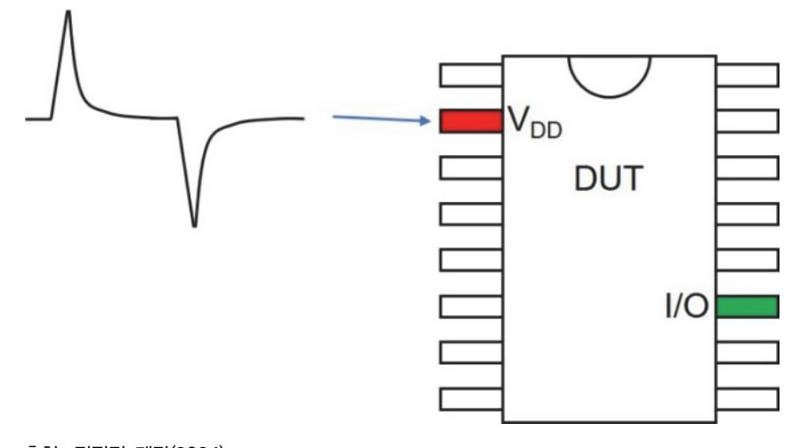

출처: 집필진 제작(2024) [그럼 1-14] ESD 테스트 구상도

[그림 1-14]처럼 ESD 테스트 평가 시 핀에 대한 ESD zapping은 4가지 방식으로 나뉜다( pin-to-VDD, pin-to-VSS, pin-to-pin, VDD-to-VSS). 이 핀 조합 중 가장 낮은 전압에서 고장 이 발생하는 조합을 통해 ESD 내구성이 결정된다. 반도체 소자 측정 장비를 활용하여 I-V 테 스트를 진행하면서 ESD 스트레스 전후의 전기적 특성을 확인하고 고장 여부를 판단한다.

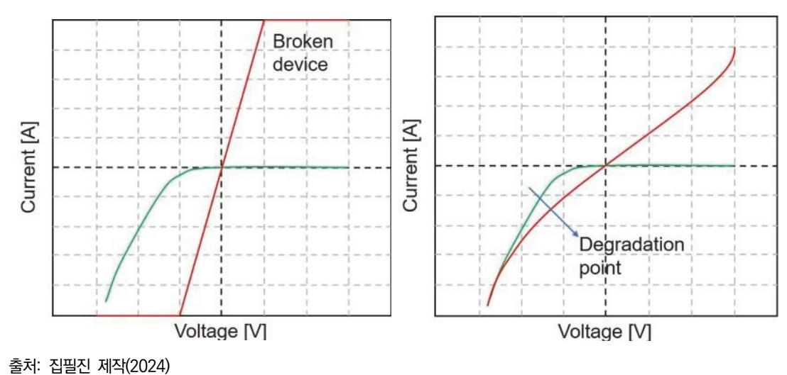

[그럼 1-15] ESD 테스트 전후 전류 특성 변화

[그림 1-15]처럼, 소자가 정상적으로 동작할 때의 특성과 short가 발생한 소자의 특성, 작동 시 전기적 열화 현상이 보이는 소자를 비교하여 그때의 전압을 측정한다. ESD 평가는 핀 조합 별로 ESD 방전을 3회 인가하고, 고장이 관측되기 전까지 50V씩 증가하면서 평가한다. 방전 횟수는 3회, 방전 간 시간은 1초로 진행한다. 테스트 샘플은 digital amp IC 칩으로 진행하 며, 본 실험의 목적은 IC 칩에 ESD 스트레스를 인가할 때 가장 낮은 전압값을 보여 주는 핀 조합을 도출하는 것이다.

- VDD-to-pin: 650V(+ mode), -700V(-mode)
- GND-to-pin: 800V(+ mode), -850V(-mode)
- pin-to-pin: 1200V(+ mode), -1200V(-mode)
- VDD-to-GND: 850V(+ mode), -900V(-mode)
- GVDD-to-DGND: 1200V(+ mode), -1200V(-mode)
- GND-to-DGND: 1600V(+ mode), -1600V(-mode)
- DGND-to-pin: 800V(+ mode), -700V(-mode)

위 실험에 의하면 power supply pin과 I/O pin의 조합이 가장은 낮은 전압을 보여 주고 가 장 약한 조합(VDD-to-pin)이라고 판단할 수 있다.

#### 숙 전력 반도체 칩으로 내성 테스트 평가 실습을 진행한다.

전력 반도체에서 ESD 평가는 IC칩에서 진행하는 방식과 조금은 다르다. 통상적으로 전력 반도 체의 경우, 외부에서 들어오는 surge 전류는 termination에서 억제한다. 하지만 게이트 pad 로 들어오는 높은 전류 또는 전압은 gate driver IC와 전력 반도체 사이의 ESD 소자가 억제 시키지만 최근에 출시되는 전력 반도체는 gate pad에 ESD 소자를 내장시켜서 출시한다. 그래 따라서 [그림 1-16]처럼 gate pad 내에 Zener 다이오드를 삽입시켜서 출시한다.

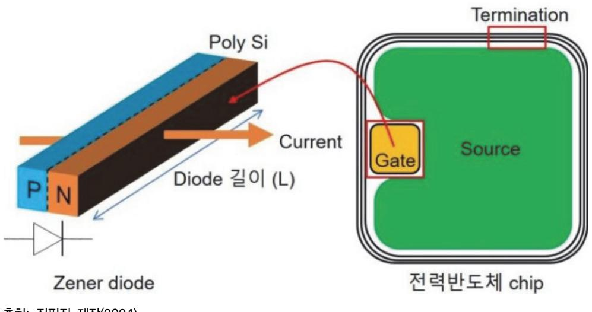

출처: 집필진 제작(2024) [그럼 1-16] EOS 상활 시 gate oxide층을 보호할 수 있는 Zener diode 구상도

[그림 1-18]은 게이트 영역에 제너 다이오드가 없는 경우, EOS 특성으로 소자의 게이트가 파

출처: 집필진 제작(2024) [그럼 1-18] 전력 반도체 내장용 ESD 제너 다이오드의 전류 특성 및 장비

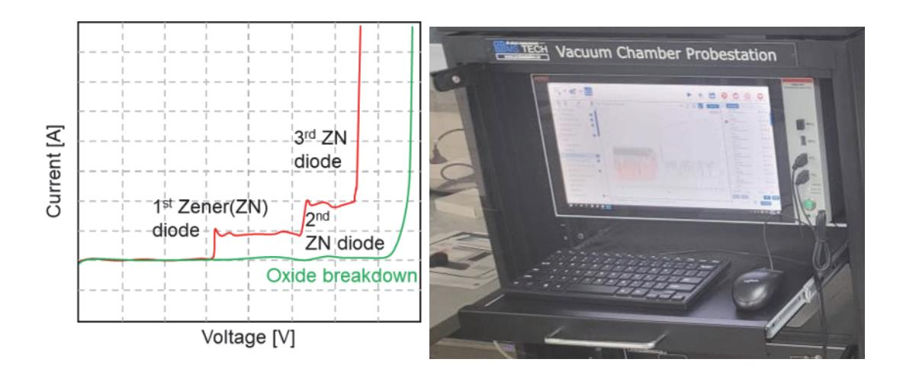

출처: 집필진 제작(2024) [그럼 1-17] 전력 반도체 내장용 ESD 제너 다이오드 구조

하록 설계한다.

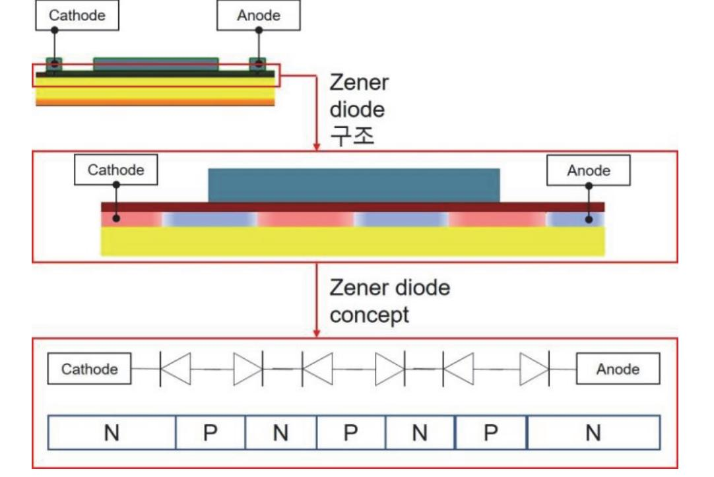

예상할 수 있다. 따라서 gate oxide의 파손을 막기 위해서 20V 이상의 전압이 인가되면 gate pad의 Zener diode가 작동하도록 설계한다. 실리콘 제너 다이오는 낮은 turn-on을 가지고 있기 때문에 [그림 1-17]처럼 직렬로 3개 또는 4개를 연결해서 ESD Zener 다이오드가 작동

통상적으로 gate 전압은 ±20V를 인가하고 그 이상의 전압이 인가되면 gate oxide의 파손을

손되어서 누설 전류가 증가하지만 제너 다이오드 등의 보호 소자를 활용할 경우, oxide breakdown 전압 전에서 전류가 흐르면서 게이트가 산화막이 보호되는 특성을 보여 준다. 이 러한 평가는 반도체 소자 측정 장비를 활용하면 측정이 가능하다.

#### 수행 tip

- JEDEC 문서를 제대로 이해하고 수행해야 한다.
- ESD 평가전 소자의 전기적인 특성을 면밀하게 평가를 진 행해야 한다.
- 장비 및 보드의 사전 점검: 모든 장비와 보드의 연결 상태 를 사전에 점검하여 시험 중에 발생할 수 있는 오류를 최 소화해야 한다. 특히 고전압 장비는 안전을 위해 반드시 연결과 동작 상태를 확인해야 한다.
- 테스트 환경의 청결 유지: 테스트 중에 미세한 먼지나 오 염 물질이 DUT의 성능에 영향을 끼칠 수 있다. 깨끗한 작업 환경을 유지하고, 정전기 방지를 위한 적절한 조치를 취해야 한다.
- 정확한 설정: 모든 테스트 장비와 보드를 정확하게 설정하 여 실험의 신뢰성을 보장한다. 각 핀의 연결 상태를 면밀 히 점검하고, 전압과 방전 조건을 정확하게 조절한다.
- 안전 우선: 항상 안전 절차를 준수하고, 고전압 및 기계적 스트레스와 관련된 위험을 최소화한다. 보호 장비를 착용 하고, 작업 공간을 정리하여 안전한 작업 환경을 유지한다.

#### 학습 1 교수·학습 방법

#### 교수 방법

- 내성 시험의 목적 및 원리에 대해서 설명하고 지도한다.
- 내성 시험의 국제적 규격 표준에 대해서 설명하고 지도한다.
- 내성 시험(HBM, CDM, MM)의 원리에 대해서 설명하고 지도한다.
- 내성 시험에 필요한 장비에 대해서 설명하고 지도한다.
- 내성 시험에 필요한 소자를 준비하고 ESD 평가를 하면서 원인을 설명하고 지도한다.

#### 학습 방법

- 내성 시험의 목적 및 원리를 학습한다.
- 내성 시험의 국제적 규격 표준을 학습한다.
- 내성 시험(HBM, CDM, MM)의 원리를 학습한다.
- 내성 시험에 필요한 장비 사용법을 학습한다.
- 내성 시험에 필요한 소자를 준비하고 ESD 평가를 하면서 원인을 학습한다.

### 학습 1 평 가

#### 평가 준거

• 평가자는 학습자가 학습 목표를 성공적으로 달성하였는지를 평가해야 한다.

#### • 평가자는 다음 사항을 평가해야 한다.

| 학습 내용    | 학습 목표                                                                                    | 성취수준 |   |   |  |
|----------|------------------------------------------------------------------------------------------|------|---|---|--|
|          |                                                                                          | 상    | 중 | 하 |  |
| 내성 시험 평가 | - 정전기(ESD), 래치 업(latch up), 과전류(EOS) 등 내성 시 험 항목별 목적을 이해하고 각각의 시험 계획을 수립할 수 있다. |      |   |   |  |
|          | - 내성 시험 항목별 보드와 장비를 이용하여 각각의 시험 방 법을 갖출 수 있다.                                         |      |   |   |  |
|          | - 내성 시험 항목별 평가 진행 조건이 정상인지 판정할 수 있 다.                                                 |      |   |   |  |

#### 평가 방법

• 서술형 시험

| 학습 내용    | 평가 항목                                      | 성취수준 |   |   |  |
|----------|--------------------------------------------|------|---|---|--|
|          |                                            | 상    | 중 | 하 |  |
| 내성 시험 평가 | - 내성 시험을 이해하고 각 시험 항목의 특성을 파악할 수 있 는 능력 |      |   |   |  |
|          | - 내성 시험 항목들의 시험 계획을 수립할 수 있는 능력            |      |   |   |  |
|          | - 내성 시험 항목들에 필요한 장비를 구축할 수 있는 능력           |      |   |   |  |

#### • 평가자 질문

| 학습 내용    | 평가 항목                      | 성취수준 |   |   |  |
|----------|----------------------------|------|---|---|--|
|          |                            | 상    | 중 | 하 |  |
| 내성 시험 평가 | - 내성 시험의 타당성을 언급할 수 있는 능력  |      |   |   |  |
|          | - 내성 시험 항목들의 시험 계획 파악 여부   |      |   |   |  |
|          | - 내성 시험 항목별 평가 진행 조건 파악 여부 |      |   |   |  |

#### • 평가자 체크리스트

|          | 평가 항목                                      | 성취수준 |   |   |  |
|----------|--------------------------------------------|------|---|---|--|
| 학습 내용    |                                            | 상    | 중 | 하 |  |
| 내성 시험 평가 | - 내성 시험 항목 파악 여부                           |      |   |   |  |
|          | - 내성 시험 항목들에 대해서 시험 계획을 제대로 세울 수 있 는 능력 |      |   |   |  |
|          | - 내성 시험 항목들에 필요한 장비를 설명하고 세팅할 수 있 는 능력  |      |   |   |  |

#### • 구두 발표

| 학습 내용    | 평가 항목                                                        | 성취수준 |   |   |  |
|----------|--------------------------------------------------------------|------|---|---|--|
|          |                                                              | 상    | 중 | 하 |  |
| 내성 시험 평가 | - 내성 시험에 대한 항목별 측정 방법 및 측정 목적을 설명할 수 있는 능력                |      |   |   |  |
|          | - 내성 시험 평가에 순차적인 실험 계획을 잘 수립하고 설명 할 수 있는 능력               |      |   |   |  |
|          | - 내성 시험 평가에 필요 장비를 선별해서 어떠한 상황에서 어떤 목적으로 측정할지 설명할 수 있는 능력 |      |   |   |  |

피드백

1. 서술형 시험 - 내성 시험은 실험 목적에 대한 이해 및 계획을 세우면서 필요한 장비의 세팅이 중요하므로 실험 항목별 성취수준이 낮은 학습자에게는 시험 평가 항목들의 특성을 재학습시킨다. - 내성 시험에 대한 성취수준이 높은 학습자에게는 추가적인 소자를 활용하여 내성 시험 평가를 진 행하게 한다. 2. 평가자 질문 - 내성 시험의 타당성에 대해서 성취수준이 낮은 경우는 ESD 항목에 대한 설명을 다시 성명해 준 다. - 성취수준이 높은 학습자의 경우, 다양한 소자의 제공 및 평가를 통해서 심도 있게 다양한 테스트 를 할 수 있도록 지도해 준다. 3. 평가자 체크리스트 - 내성 시험의 항목에 대해서 정확하게 이해를 하고 있는지 판단하는 것이 중요하므로 성취수준이 높은 학생의 경우, 다양한 테스트 환경에서 실험을 할 수 있도록 평가의 전압 범위를 넓게 정해 서 테스트의 다양성을 제공한다. - 성취수준이 낮은 경우, 학습자의 눈높이에 맞는 성명 및 기본 소자의 반복적인 학습이 필요하므로 보충 설명을 해 준다. 4. 구두 발표 - 내성 시험의 항목별 측정 방법에 대해서 학습 성취수준이 높은 학생은 다양한 상황에서 어떻게 변화할지 발표할 수 있도록 유도한다. - 성취수준이 낮은 학습자에게는 ESD 항목에 대해서 보충 설명을 해 주고, 이를 천천히 발표할 수 있도록 유도한다.

학습 2 내성 시험 분석하기

## 2-1. 내성 시험 분석

|       | • 내성 시험 항목별 시험 결과에 따른 제품의 품질 수준을 판단할 수 있다.             |
|-------|--------------------------------------------------------|
| 학습 목표 | • 내성 시험 결과가 보증 규격을 만족하지 못하는 불량의 경우, 그 불량 유형을 파악할 수 있다. |
|       | • 내성 시험 불량의 원인을 분석할 수 있다.                              |

## 필요 지식 /

숔 내성 시험 결과의 중요성

내성 시험은 전자 제품과 반도체 소자가 다양한 전기적 스트레스 상황에서 어떻게 반응하는지 를 평가하는 중요한 과정이다. 이 시험은 제품의 신뢰성과 내구성을 보장하며, 잠재적인 문제 를 사전에 발견하고 개선할 수 있도록 돕는다. 특히, JEDEC 기준은 이러한 내성 시험의 결과 를 해석하고 제품의 품질 수준을 평가하는 데 있어 중요한 가이드라인을 제공한다.

1. 품질 수준의 분류 및 기준(JEDEC 기준 포함)

제품의 내성 시험 결과는 제품이 다양한 전기적 스트레스 조건에서 얼마나 잘 견딜 수 있 는지를 평가하는 중요한 과정이다. 전자 제품과 반도체 소자는 일상적인 사용 환경에서 정 전기 방전(ESD), 전압 스파이크 및 기계적 충격과 같은 다양한 스트레스를 받을 수 있다. 이러한 내성 시험을 통해 제품의 신뢰성, 안전성 및 장기적인 성능을 보장할 수 있다. 따라 서 내성 시험 결과를 바탕으로 제품의 품질 수준을 평가하고, 이를 기준으로 제품의 개선 방향을 설정하는 것이 중요하다. 국제적으로 인정받는 JEDEC(Joint Electron Device Engineering Council) 기준에 따라 제품의 내성 시험 결과는 다음과 같이 나눈다.

(1) HBM 등급

HBM(human body model) 등급은 반도체 소자가 특정 전압 범위에서 얼마나 잘 견딜 수 있는지를 평가하는 기준으로 나뉜다. Class 1 등급은 가장 낮은 전압 범위를 대상으 로 하며, Class 1A, 1B, 1C는 각각 점차 높은 전압 범위를 포함한다. Class 2 등급은 그보다 더 높은 전압 범위를 포함하고, Class 3A와 3B는 매우 높은 전압 범위를 대상 으로 한다.

(2) CDM 등급

CDM(charged device model) 등급은 소자가 자가 충전된 상태에서 방전을 견딜 수 있는 능력을 평가한다. Class C1은 가장 낮은 전압 범위를 포함하며, Class C2부터 C7까지 전압 범위가 점차 증가한다. 각 등급은 소자가 견딜 수 있는 전압 범위에 따라 세분화된다.

(3) MM 등급

MM(machine model) 등급은 소자가 기계적 접촉에 의해 발생할 수 있는 전압 방전을 견딜 수 있는 능력을 평가하는 기준으로 나뉜다. Class M1은 가장 낮은 전압 범위를 포함하며, Class M2, M3, M4 등급은 점차 높은 전압 범위를 대상으로 한다. 각 등급은 소자가 특정 전압 범위에서 얼마나 잘 견딜 수 있는지를 평가하는 중요한 기 준으로 전압 범위는 단계별로 증가한다. 제품의 내성 시험 결과는 전기적 특성 변화, 물 리적 손상 여부, 기능적 성능 유지 여부를 기준으로 품질 수준을 평가한다. 이를 통해 제품이 다양한 환경 조건에서 얼마나 안정적으로 작동할 수 있는지를 판단할 수 있다.

#### 숕 내성 시험 결과에 따른 불량 유형 파악의 중요성

- 내성 시험은 전자 제품과 반도체 소자의 신뢰성과 내구성을 보장하기 위해 필수적이다. 이 과 정에서 ESD로 인한 불량은 제품의 기능 저하나 고장을 초래할 수 있어 특히 중요하다. 내성 시험 결과를 통해 불량 유형을 파악하고, 이를 분석하여 설계와 제조 공정을 개선함으로써 제 품의 품질을 향상시킬 수 있다. 다양한 불량 예시를 아는 것은 이러한 결과를 해석하고 문제를 해결하는 데 중요한 역할을 한다. 불량 유형과 원인을 이해하면 유사한 문제가 발생했을 때 신 속한 대응이 가능하다. 이는 제품의 신뢰성을 보장하고, 시장 경쟁력을 유지하는 데 필수적이 다. 결과적으로, 내성 시험을 통해 불량 유형을 파악하는 것은 성공적인 제품 개발과 생산에 중요한 요소이다.
  - 1. 내성 시험 불량 유형(단일 소자 구조적 불량 유형)

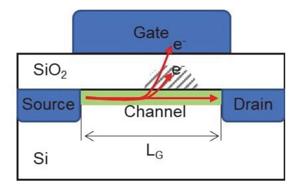

출처: 집필진 제작(2024) [그림 2-1] 불량 유형(예: hot carrier injection)

ESD로 인한 불량 유형은 소자의 구조와 기능에 따라 매우 다양하게 나타날 수 있다. [그림 2-1]처럼 핫 캐리어 주입(hot carrier injection)은 고에너지 전자가 트랜지스터 내부로 주입되어 전기적 특성을 변화시키는 현상이다. 특히, 이러한 현상은 short channel MOSFET에서 흔히 볼 수 있는 현상이다. 그래서 외부에서 큰 에너지가 인가되면 source(소스)와 drain(드레인) 사이에 강한 전계(V/cm)가 형성되면서 일어날 수 있다. 또한 이러한 현상은 트랜지스터의 이동도를 감소시키고, 임계 전압의 변화를 초래하며, 장기적으로는 성능 저하를 일으킬 수 있다.

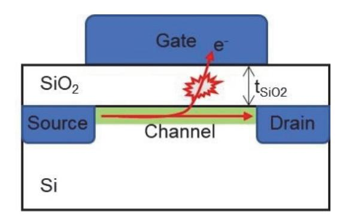

출처: 집필진 제작(2024) [그림 2-2] 불량 유형(예: gate oxide breakdown)

둘째, 게이트 산화막 파괴(gate oxide breakdown)는 ESD 이벤트가 소자의 게이트 산화 막을 관통하여 물리적 파괴를 일으키는 경우를 의미한다. 이로 인해 트랜지스터의 기능이 상실되거나, 누설 전류가 증가하며, 전체 소자가 고장에 이르게 된다([그림 2-2]).

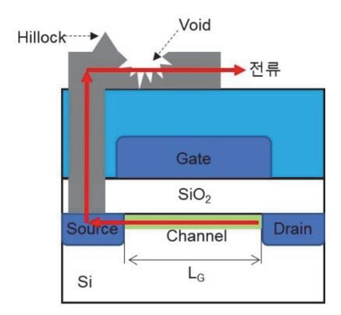

출처: 집필진 제작(2024) [그림 2-3] 불량 유형(예: 금속 line 파괴)

셋째, 용융 및 소손(melting and burnout)은 고전류로 인해 금속 상호 연결 구조가 과열 되어 물리적으로 파괴되거나 용융되는 현상을 말한다. 이러한 현상은 금속 상호 연결의 단 선이나 회로의 물리적 손상, 그리고 기능 상실을 초래할 수 있다([그림 2-3]).

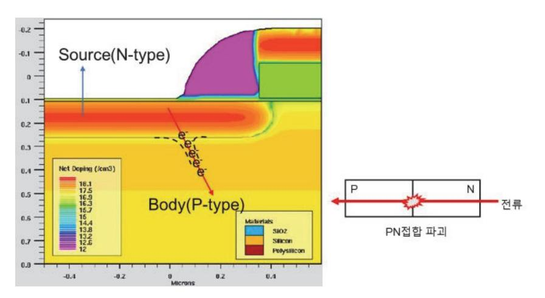

출처: 집필진 제작(2024) [그림 2-4] 불량 유형(예: PN 접합 파괴, N+ 소스 및 p-type Si 기판)

PN 접합 손상(PN junction damage)은 ESD 방전이 PN 접합을 통해 큰 전류를 흐르게 하여 접합 영역에 열적 손상을 유발하는 것을 의미한다. 이는 접합 영역의 결함을 초래하고, 전기적 특성의 변동과 소자의 기능 저하를 발생시킨다([그림 2-4]). 다섯째, 배선 손상(wiring damage)은 ESD 방전으로 인해 PCB나 칩 내부의 배선이 손상되는 경우를 의미한다. 이러한 손상은 배선 단선, 회로 간 신호 경로 손상, 그리고 기능 상실을 초래할 수 있다.

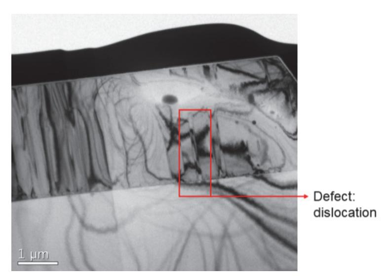

출처: 집필진 제작(2024) [그림 2-5] 불량 유형(defect, TEM 이미지)

여섯째, 회로 요소의 단락은 ESD 방전이 회로 요소 간의 단락을 유발하여 전류가 불필요한 경로를 통해 흐르게 만드는 경우를 말한다. 이는 소자의 기능 상실, 과열, 그리고 회로 전 체의 실패를 발생시킬 수 있다. 마지막으로, 기타 미세 결함(other microdefects)은 ESD 스트레스로 인해 발생하는 다양한 미세 구조 결함을 포함한다([그림 2-5]). 이러한 결함들은 소자의 기능 저하, 신뢰성 감소, 그리고 조기 실패로 이어질 수 있다. ESD로 인한 이러한 다양한 불량 유형들은 제품의 성능과 신뢰성에 심각한 영향을 끼치며, 이를 방지하고 개선 하기 위해 철저한 분석과 적절한 대응이 필요하다.

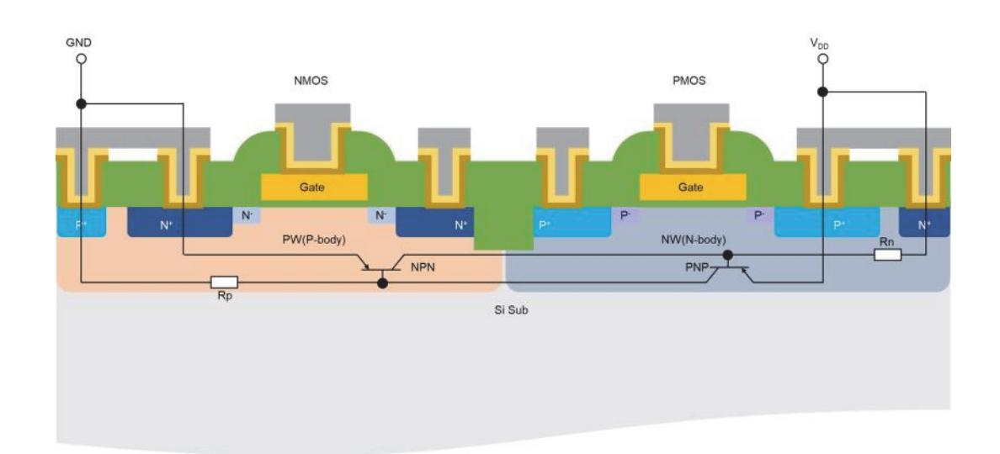

2. ESD 불량 유형(CMOS 소자 구조적 불량 유형)

래치 업([그림 2-6])은 반도체 소자의 성능과 신뢰성에 심각한 영향을 끼칠 수 있는 주요 불량 유형으로, 특히 CMOS(complementary metal-oxide-semiconductor) 기술에서 자 주 발생한다. 이 현상은 반도체 소자 내부의 기생 트랜지스터가 활성화되어 소자가 지속적 으로 전류를 흘리며 고전류 상태에 머물게 되는 결과를 초래한다. 이러한 상태는 소자의 과 열을 유발하고, 심각한 손상을 초래할 수 있다. 래치 업 발생 원인은 다음과 같이 정리 가 능하다.

- (1) 래치 업 발생 원인
  - (가) 기생 트랜지스터 구조의 활성화

CMOS 소자 내부에 의도치 않게 형성된 기생성 양극성 접합 트랜지스터(BJTs)로 인 해 발생한다. PMOS와 NMOS 트랜지스터 사이에 기생성 PNP 및 NPN 트랜지스터 가 형성되어 피드백 루프를 형성, 래치 업을 유발한다.

(나) ESD로 인한 과도 전류

ESD 이벤트로 인한 짧은 시간 동안 높은 전압과 전류가 기생성 트랜지스터를 활성 화한다. 지속적인 전류 흐름이 유지되어 래치 업 발생, 소자의 파괴로 이어진다.

(다) 전력 공급의 급격한 변동

전원 또는 접지에 발생한 급격한 전압 변동이 기생 트랜지스터를 활성화한다. 특히,

출처: 집필진 제작(2024) [그림 2-6] CMOS 구조(latch-up)

전원 공급의 온·오프 시퀀스에서 발생하는 전압 피크가 래치 업을 유발한다.

(라) 설계 결함

P형 웰과 N형 웰 사이의 거리 부족, 보호 다이오드 부재 등 설계상의 문제로 래치 업 발생이 가능하다. 래치 업 방지 메커니즘이 설계에 포함되지 않은 경우, 소자는 래치 업에 취약해진다.

(마) 고온 환경

고온으로 인해 기생 트랜지스터의 임계 전압이 낮아져 래치 업 발생 가능성이 증가 하며, 고온 상태에서 기생 트랜지스터의 전도도가 증가하여 작은 전기적 스트레스에 도 래치 업이 발생한다.

- (2) 래치 업 방지 방법
  - (가) 설계 측면
    - 1) P형 웰과 N형 웰 사이의 거리 유지
    - 2) 적절한 터미네이션 사용
    - 3) 깊은 N형 웰(NW) 구조 도입
    - 4) ESD 보호 다이오드 추가
  - (나) 공정 측면
    - 1) 고온 공정 중 기생성 트랜지스터 형성 방지
    - 2) 민감한 부분 보호를 위한 표면 패시베이션 처리 강화
  - (다) 전력 관리 측면
    - 1) 전력 공급의 온·오프 시퀀스 조정으로 급격한 전압 변동 최소화
    - 2) 전원 및 접지 라인 분리로 외부 스트레스로 인한 전류 흐름 방지
- 3. 제조 공정에서 발생하는 불량 원인

반도체 제조 공정은 고도의 정밀성과 복잡성을 요구하며, 공정 중 발생할 수 있는 불량 원 인은 매우 다양하다. 먼저, 포토리소그래피 공정의 정렬 불량이 있다. 포토리소그래피 공정 에서 마스크와 웨이퍼의 정렬이 불완전할 경우, 소자의 미세 구조가 왜곡되어 전기적 특성 에 영향을 끼친다.

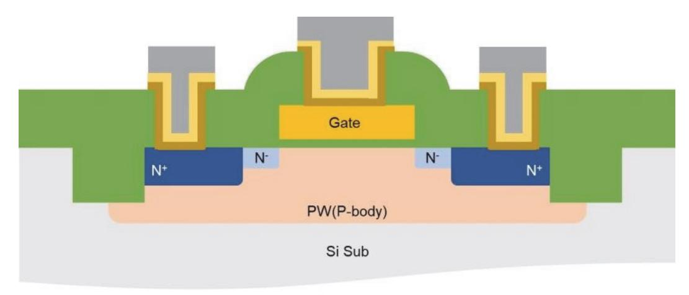

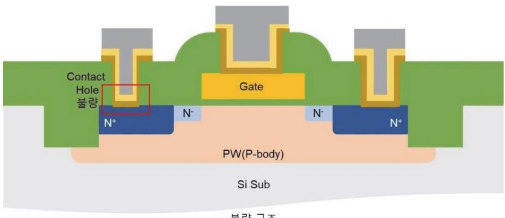

예를 들면, 소자 공정 후 contact hole 공정에서 포토리소그래피 공정 불량, 식각 공정의 불량 또는 금속 증착 공정의 불량이 발생하면 [그림 2-7]처럼 금속의 접촉면이 작아지면서 전류 특성이 감소할 수 있고 접촉 저항이 증가해서 고전류가 흐를 때 부분적으로 열이 발 생하고 열화 현상이 유발될 수 있다. 마지막으로, 고온 공정에서의 열적 손상 역시 제조 공 정에서 흔히 발생하는 문제이다. 고온 공정 중에 발생하는 열적 스트레스는 소자의 내부 결 함을 유발하거나, 재료의 특성을 변형시켜 소자의 성능을 저하시킬 수 있다. 열적 손상은 소자의 내구성을 약화시키고, 장기적인 신뢰성을 감소시키며, 결과적으로 제품의 품질과 수 명을 크게 떨어뜨린다.

출처: 집필진 제작(2024) [그림 2-7] contact hole 불량

### 수행 내용 / 내성 시험 분석하기

#### 재료·자료

- 내성 시험을 수행할 DUT
- DUT의 사양서 및 회로 다이어그램
- 제품 사양서(내성 시험 대상 제품의 상세 사양 및 데이터 시트)
- 내성 시험 보고서 템플릿
- 내성 시험 결과 해석에 도움이 되는 관련 논문 및 기술 문서

#### 기기(장비 ・ 공구)

- 고전압 공급 장치(ESD 발생기)
- 오실로스코프(전류 프로브 포함)
- 테스트 보드
- 광학 현미경
- 전자 현미경(SEM)
- 반도체 소자 특성 시스템(DUT의 전기적 특성을 측정)
- 열 분포 카메라

#### 안전 ・ 유의 사항

수행 순서

- 고전압 취급 시 안전에 유의한다(ESD 안전).
- 데이터 기록 및 관리를 철저히 한다.

- 고전압 장비 사용 시 전기적 안전을 철저히 준수한다.

• SEM 및 광학 현미경 사용 시 장비의 사용 지침을 따른다.

숔 내성 시험 결과에 따른 제품 품질 수준을 판단한다.

다. 반도체 장치의 신뢰성을 보장하기 위해 ESD 사건에 대한 신뢰성을 테스트하는 여러 가지 확립된 모델이 있다. 주요 ESD 테스트로는 인체 모델(HBM), 기계 모델(MM), 그리고 충전 소 자 모델(CDM)이 있다([그림 2-8]).

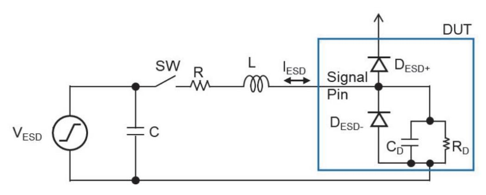

출처: 집필진 제작(2024) [그림 2-8] HBM, MM 그리고 CDM의 ESD 테스트 model

JEDEC 표준은 ESD 테스트의 효과성과 신뢰성을 보장한다. 이 3가지 테스트에 대한 테스트 구성([그림 2-8])은 VESD, C, SW, R, L이라는 5가지 요소로 구성되어 있다. 입력 VESD 전압은 스위치(SW)가 닫히기 전에 커패시터 C를 충전한다. SW가 닫히면, ESD 장치의 출력 임피던스 (R과 L)가 VESD 신호를 전달하고, 이는 테스트 대상 장치(DUT)로 전류(IESD)로 변환된다. 이때 ESD 전류는 DUT의 ESD 다이오드, 즉 DESD+와 DESD-를 통과한다. 만약 ESD 다이오드 중 하 나 또는 둘 다 고장 나거나 없으면, ESD 사건으로 인한 전류(IESD)는 다른 경로를 찾게 되는데, 이는 종종 DUT 회로 내로 더 깊이 침투하여 심각한 손상을 일으킬 수 있다. 아래 수식은 [그 림 2-8]의 테스트 회로에 대한 수학적 전달 함수를 나타낸다.

$$\frac{d^2(i)}{dt^2} + \frac{R}{L} \times \frac{di}{dt} + \frac{1}{L \times C} \times i = 0$$

이 구성은 신호 핀(signal pin) 접합부에서 순간적인 ESD 사건이 발생하게 하여 3가지 ESD 테스트 신호 사건 중 하나를 모방하며 DUT 신호 핀은 입력 또는 출력 장치 핀일 수 있으므로 주의해야 한다. 이 3가지 ESD 테스트에서 VESD, C, R, L 구성 요소의 값은 현실적인 ESD 사 건을 재현하기 위해 아래 값들로 설정한다.

1. HBM 테스트

- R: 1,5kΩ
- L: 750nH
- C: 100pF
- $V_{ESD}$ :  $\geq 2kV$
- 2. MM 테스트

- R: 20Ω
- L: 750nH
- C: 200pF
- VESD: 100V ~ 200V
- 3. CDM 테스트
  - R: 20Ω
  - L: 5nH
  - C: 2pF ~ 10pF
  - VESD: 200V ~ 1kV

위 3가지 모델은 RLC 직렬 회로와 펄스 발생기로 요약할 수 있지만, 모델 간에 회로 값과 펄 스 특성은 다르다. 그러나 3가지 테스트 모두 짧고 잘 정의된 ESD 펄스를 생성하며, 이는 실 제 ESD 사건 동안 경험할 수 있는 것과 유사한 수준의 전류(IESD)를 발생시키기 때문에 품질 수준을 판단할 수 있다. ESD 테스트를 비교해 보면, 이 3가지 테스트의 상승 시간은 약 10ns 로 유사하지만, HBM 및 MM 테스트의 총 지속 시간은 CDM 모델보다 약 200ns 더 길게 측 정이 될 것이다([그림 2-9]).

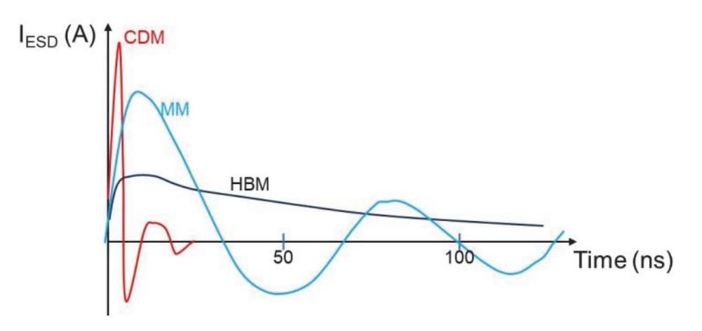

출처: 집필진 제작(2024) [그림 2-9] HBM, MM 그리고 CDM의 시간에 따른 ESD 전류 특성

[그림 2-9]는 HBM, MM, CDM ESD 테스트의 전류(IESD) 파형 특성을 보여 준다. 일반적으로 HBM ESD 테스트의 스트레스 수준은 MM ESD 테스트 조건보다 약 10배 더 높다. 또한 HBM 테스트의 보호 전압 수준은 일반적으로 2kV이며, MM 테스트는 200V, CDM 테스트는 500V이다. CDM, HBM, MM 간에는 상관관계가 없다. 따라서 HBM과 CDM 테스트가 일반 적으로 ESD 보호 회로 테스트에 사용된다. IESD의 지속 시간이 길어지면 on-chip ESD 구조 의 과열이 증가한다. HBM 및 MM 테스트 실패는 일반적으로 게이트 산화막 손상 또는 접합 손상으로 이어진다. 평가된 결과로 제품의 품질을 아래와 같이 정리할 수 있다.

#### 4. HBM 등급

- Class 1: voltage range (250V 이하)
- Class 1A: voltage range (250V ~ 500V 이하)
- Class 1B: voltage range (500V ~ 1,000V 이하)
- Class 1C: voltage range (1,000V ~ 2,000V 이하)
- Class 2: voltage range (2,000V ~ 4,000V 이하)
- Class 3A: voltage range (4,000V ~ 8,000V 이하)
- Class 3B: voltage range (8,000V 통과 및 이상)

#### 5. CDM 등급

- Class C1: voltage range (125V 이하)
- Class C2: voltage range (125V ~ 250V 이하)
- Class C3: voltage range (250V ~ 500V 이하)
- Class C4: voltage range (500V ~ 1,000V 이하)
- Class C5: voltage range (1,000V ~ 1,500V 이하)
- Class C6: voltage range (1,500V ~ 2,000V 이하)
- Class C7: voltage range (2,000V 통과)

#### 6. MM 등급

- Class M1: voltage range (100V 이하)
- Class M2: voltage range (100V ~ 200V 이하)
- Class M3: voltage range (200V ~ 400V 이하)
- Class M4: voltage range (400V 통과 및 이상)

#### 숕 내성 시험 결과에 따른 불량 원인 분석을 진행한다.

내성 시험 불량 원인 분석을 위한 수행 절차는 여러 단계로 구성되어 있으며, 각 단계는 DUT 의 불량 원인을 체계적으로 분석하는 데 중요한 역할을 한다.

시험 준비 단계에서는 먼저 내성 시험을 완료한 DUT(불량)를 준비하고, 사양서를 검토하여 래 치 업 발생 가능성이 있는 주요 부위를 파악한다. DUT를 테스트 보드에 정확하게 장착하고, 모든 핀이 올바르게 연결되었는지 확인하는 것은 필수적이다. DUT가 안전하게 장착된 후, 각 분석 장비의 상태를 점검하고 필요한 경우 캘리브레이션을 수행하여, 분석 조건에 맞게 세부 설정값을 조정한다. 여기에는 X-ray photoelectron spectroscope(XPS), secondary ion mass spectrometry(SIMS), focused ion beam(FIB), 투과 전자 현미경(TEM), 광학 현미경, 전자 현미경 그리고 반도체 소자 특성 시스템이 포함된다.

1. 불량 원인 분석

#### (1) 현미경 사용법

불량 원인 분석 절차로 들어가면, 첫 번째 단계는 광학 현미경 검사를 통해 DUT의 표면을 관찰하는 것이다. 광학 현미경을 사용하여 물리적 손상, 배선 손상, 용융 및 소손 등 표면에서 시각적으로 확인할 수 있는 불량을 세밀히 검사한다. 이 과정에서 손상 부위의 형태와 위치를 기록하는데, 예를 들어 DUT의 표면에 배선 손상이 의심되는 부위가 발견되면, 이를 광학 현미경으로 자세히 관찰하고 기록하여 초기 불량 상태를 파악한다.

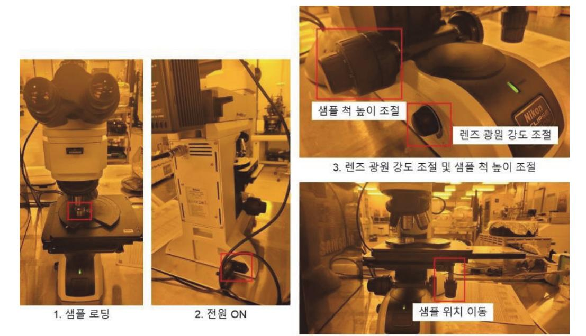

출처: 집필진 제작(2024) [그림 2-10] 현미경 사용법

현미경 사용법은 다음과 같다([그림 2-10]).

- (가) 측정할 샘플을 현미경 척에 올려 둔다.
- (나) 현미경의 전원을 On시킨다.
- (다) 샘플 척의 높이를 조절해서 샘플이 잘 보이도록 한다.
- (라) 다이얼을 돌려서 렌즈 광원의 세기를 조절한다.
- (마) 척 다이얼을 돌려서 샘플의 위치를 조절한다.

[그림 2-11]처럼, 불량 소자의 현미경 사진을 보고 MOSFET 소자에서 어떤 영역이 손 상을 받았는지 확인이 필요하다. 그리고 이러한 현상을 분석하기 위해서는 현재 본인이 분석하고 있는 소자의 구조를 잘 이해하고 있어야 한다.

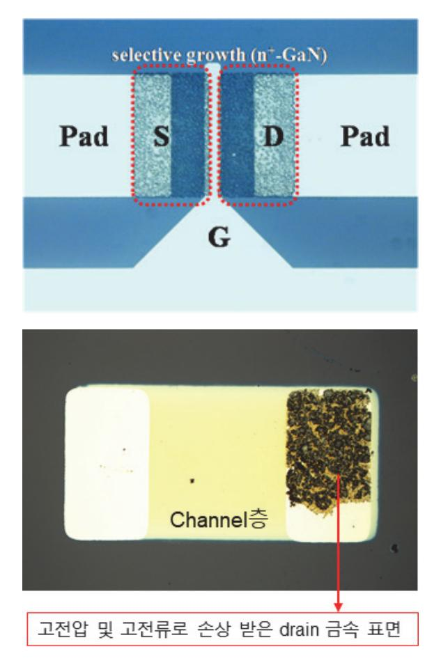

출처: 집필진 제작(2024)

[그림 2-11] 현미경 이미지(예: 소자 구조 및 손상 받은 소자 영역)

(2) 전기적 특성 평가

다음 단계에서는 반도체 소자 특성 시스템을 활용하여 DUT의 전기적 특성을 측정한다. 이 과정에서는 트랜지스터의 전기적 특성 변화나 누설 전류 증가 등의 불량을 평가할 수 있다. 예를 들어, DUT의 트랜지스터가 ESD 스트레스 후 정상적으로 작동하지 않을 경우 전기적 테스트를 통해 누설 전류가 증가했는지 또는 임계 전압이 변했는지 분석하 여 불량의 원인을 규명한다. 본 실험에서는 소자의 전기적인 특성을 평가할 수 있는 반 도체 소자 특성 시스템의 측정 방법에 대해서 알아본다. 전기적인 특성 평가는 ESD 평 가 후 DUT의 특성 상태를 확인할 수 있으므로 기초적으로 중요한 평가라고 할 수 있 다.

[그림 2-12]처럼 DUT를 로딩 후 측정 장비의 전원은 on시킨다. 그리고 configure를

출처: 집필진 제작(2024) [그림 2-12] 전기적 특성 평가 장비 사용 방법 1

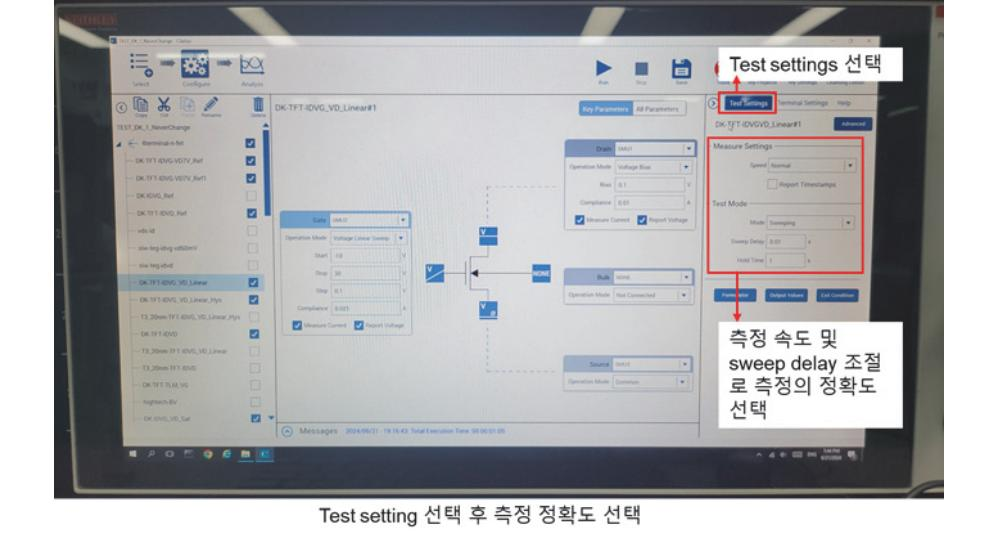

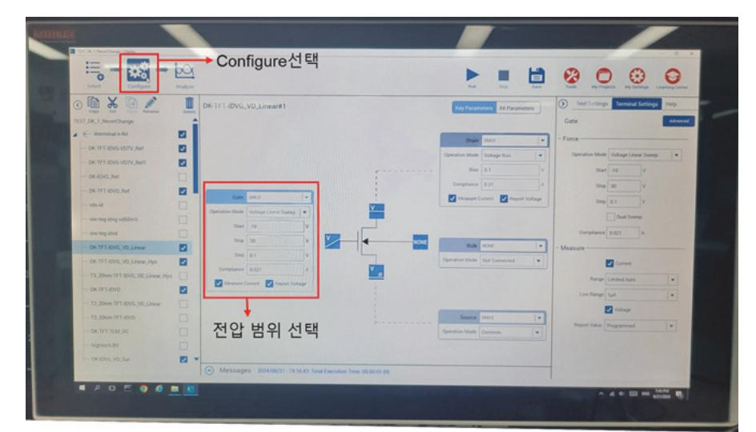

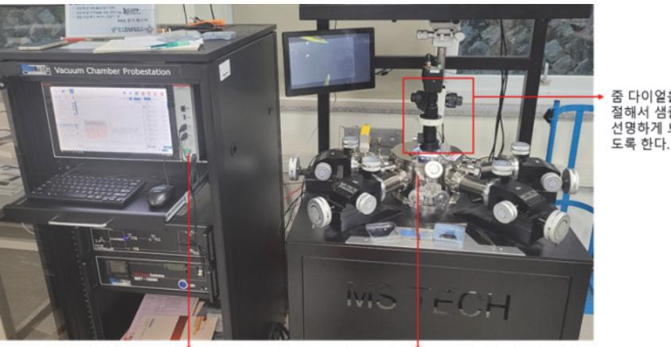

선택해서 소자 측정할 전압 범위를 입력한다. 그 후 test setting을 선택해서 측정 시 측정 속도를 선택한다. 측정에서 중요한 부분이 측정 전압 범위 설정 및 측정 속도 선 택이다. 너무 높은 전압을 설정하면 측정하면 소자가 쉽게 breakdown이 된다. 또한 정 밀한 측정을 위해서는 측정 속도를 최대한 천천히 설정하도록 한다. 하지만 측정 시간이 길며, 측정 시 소자가 스트레스를 받을 수 있어서 적절한 측정 속도가 필요하다.

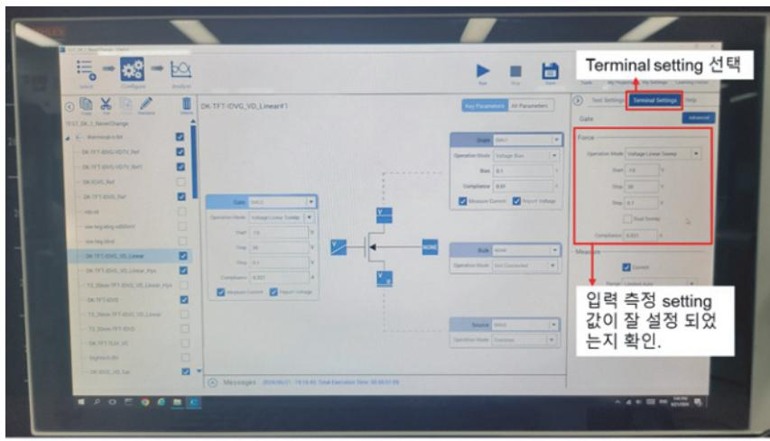

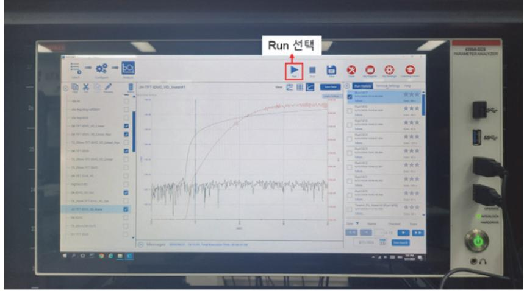

출처: 집필진 제작(2024) [그림 2-13] 전기적 특성 평가 장비 사용 방법 2

[그림 2-13]에서 보여 주는 것처럼, 측정 속도 설정 후 terminal 세팅에서 입력된 전압 범위가 제대로 인식되었는지 확인한다. 마지막으로 play 버튼을 클릭해서 소자를 측정 하고 전기적인 특성을 평가한다. 내성 시험 평가 후 소자에 문제가 없다면 측정 소자는 정상적인 작동을 한다. 하지만, 내성 시험 평가 시 소자 내부에 손상이 발생하게 되면 전기적 평가 특성에서 정상적인 전기적 특성을 보여 줄 수 없다.

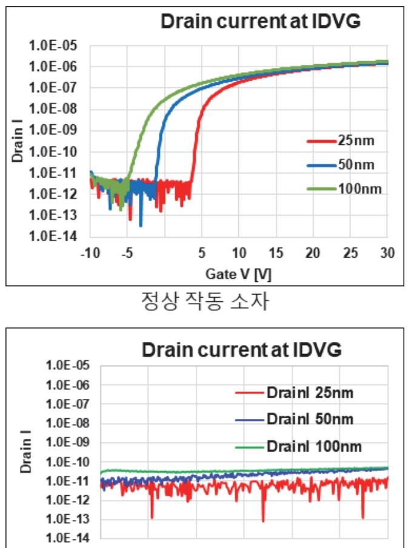

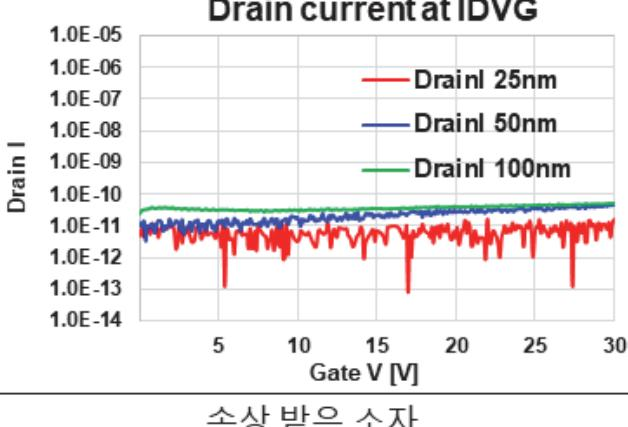

출처: 집필진 제작(2024)

[그림 2-14] 내성 시험 전후 소자의 전기적 특성 변화

소상 받은 소자의 경우, 마치 고저항성 반도체 특성([그림 2-14])처럼 또는 저항이 낮은 반도체 특성처럼 전류가 선형적으로 증가하는 것을 볼 수 있을 것이다.

(3) 이미지 특성 분석 평가

내성 평가 이후 문제가 발생한 소자의 경우, SEM 및 TEM을 활용하여 소자의 구조적 파괴를 이미지적으로 확인하고 분석을 시작한다. 전자 현미경을 사용하여 DUT의 미세 구조와 표면 결함을 고해상도로 분석한다. 이 장비는 게이트 산화막 파괴, PN 접합 손 상, 미세 구조 변형 등을 관찰하는 데 매우 유용하다. 예를 들어, DUT의 게이트 산화막 이 ESD로 인해 손상된 것으로 보일 때, SEM을 통해 손상된 산화막의 세부 구조를 분 석하고, 이를 통해 파괴 메커니즘을 심층적으로 조사한다. 전자 현미경 사용법은 [그림 2-15] 및 [그림 2-16]을 참고한다.

#### 출처: 집필진 제작(2024) [그림 2-16] 전자 현미경 사용법 2

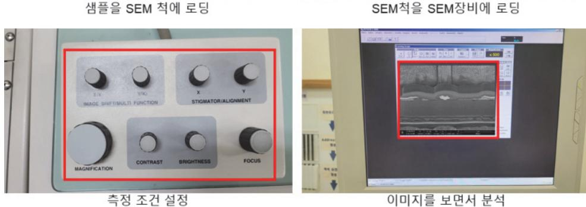

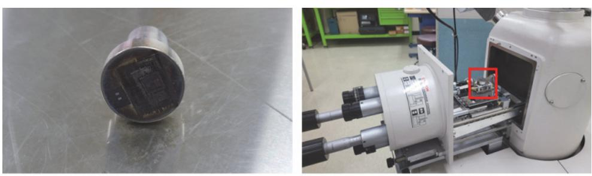

- (라) 전자 현미경의 칠러를 On시킨다.
- (다) 전자 현미경의 펌프의 상태를 확인한다.
- (나) 전자 현미경의 전원을 On시킨다.
- (가) 측정할 샘플을 현미경 척에 올려 둔다([그림 2-15]).

출처: 집필진 제작(2024) [그림 2-15] 전자 현미경 사용법 1

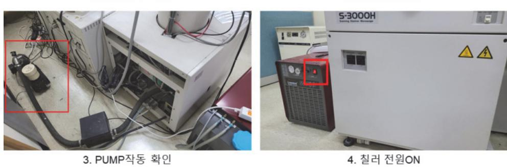

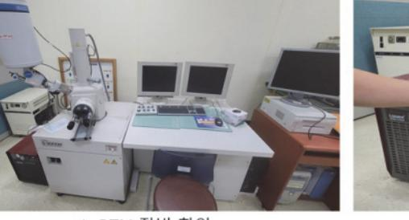

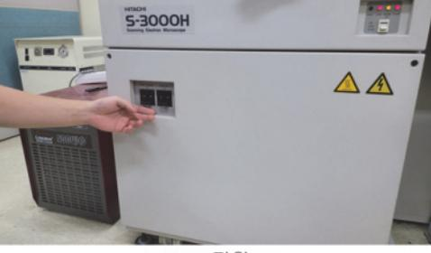

[그림 2-17]처럼, 측정된 이미지를 보면서 파손이 된 영역을 현미경에서 측정한 부분과 동일하게 측정한다. 이러한 측정으로 소자의 어떠한 원인으로 손상이 발생했고 주변 영

출처: 집필진 제작(2024) [그림 2-17] 전자 현미경 이미지(예: drain 금속 영역 손상 및 현미경 사진과 비교)

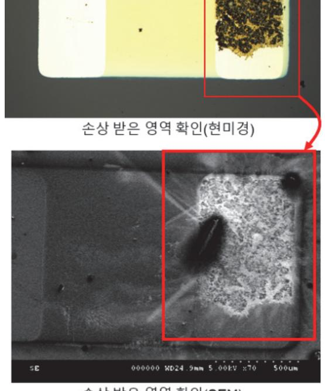

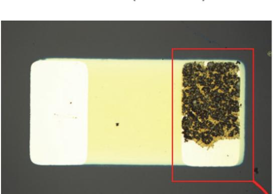

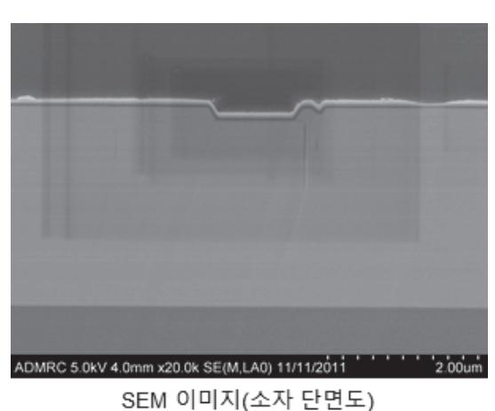

- (나) 전자 현미경 척을 장비에 로딩한다. (다) 각각의 다이얼을 돌리면서 샘플을 측정한다.
- (가) 전자 현미경 척에 측정할 샘플을 로딩한다([그림 2-16]).

역에 어떠한 영향을 끼치는지 확인할 수 있다. 또한 배선 재료의 열적 특성과 전도율이 적절하지 않으면, 내성 평가 시 고전류에 의해 손상을 입을 수 있어서 SEM 분석 시 주 의 깊은 확인이 필요하다. [그림 2-18]처럼 고전류로 인해 배선이 과열되면, 금속 상호 연결 구조가 녹거나 단선될 수 있다. 이 역시 SEM으로 손쉽게 측정할 수 있으니 측정 시 주의 깊게 소자의 주변을 살펴보아야 한다.

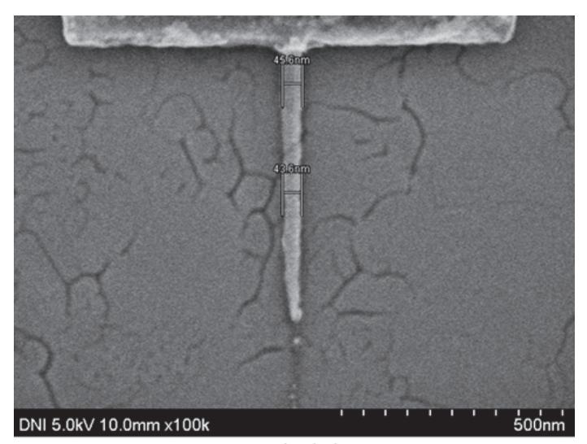

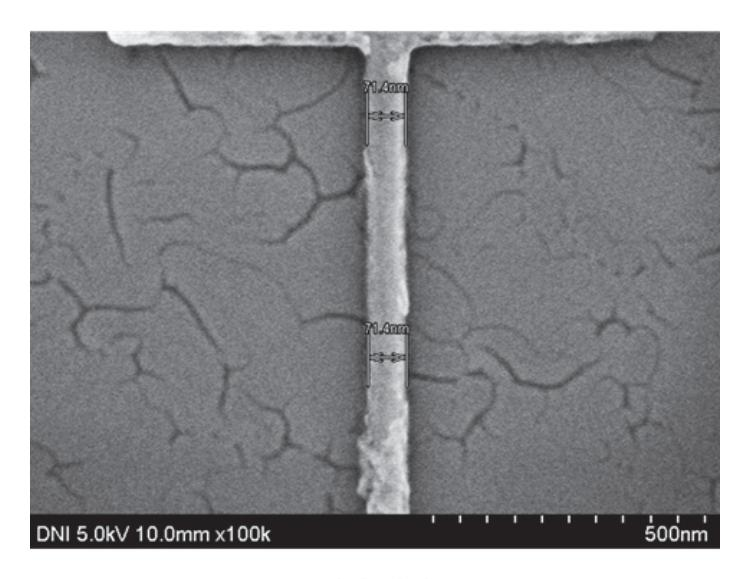

출처: 집필진 제작(2024) [그림 2-18] 전자 현미경 이미지(예: 전자 현미경 분석을 이용한 금속 라인 불량 분석)

#### (4) 그 외 고급 분석 기법을 활용한 불량 원인 분석

통상적으로 광학 현미경, 전자 현미경 그리고 반도체 특성 측정 시스템은 학교 및 중견 반도체 기업에서 구비가 가능하다. 하지만, 고급 분석 장비인 XPS, SIMS, FIB, TEM 장비 등은 전문 기관에서 운영하는 경우가 많고 통상적으로 분석 의뢰를 통해서 이루어 진다. 이때, 측정될 이미지 및 현상에 대해서는 어느 정도 유추를 하고 분석 의뢰 신청 을 하는 것이 유리하다. TEM 분석의 경우, TEM 전용 sampling이 필요하고 이때 사용 되는 장비는 FIB 장비를 이용해서 제작한다.

(가) FIB 장비를 활용한 분석 진행

FIB 진행 순서([그림 2-19])는 다음과 같다. FIB는 집중된 이온 빔을 사용하여 소자 의 미세 부위를 절단하거나 조작할 수 있으며, 이를 통해 내부 구조의 상세한 분석 이 가능하다.

- 1) 파손이 의심되는 영역 검색
- 2) 파손이 의심되는 영역에 MASK 물질 증착
- 3) Masking 물질 앞뒤로 Ga 소스를 활용해서 식각 진행
- 4) TEM 측정용 sample 추출

출처: 집필진 제작(2024)

[그림 2-19] FIB 장비를 활용한 TEM sampling 이미지

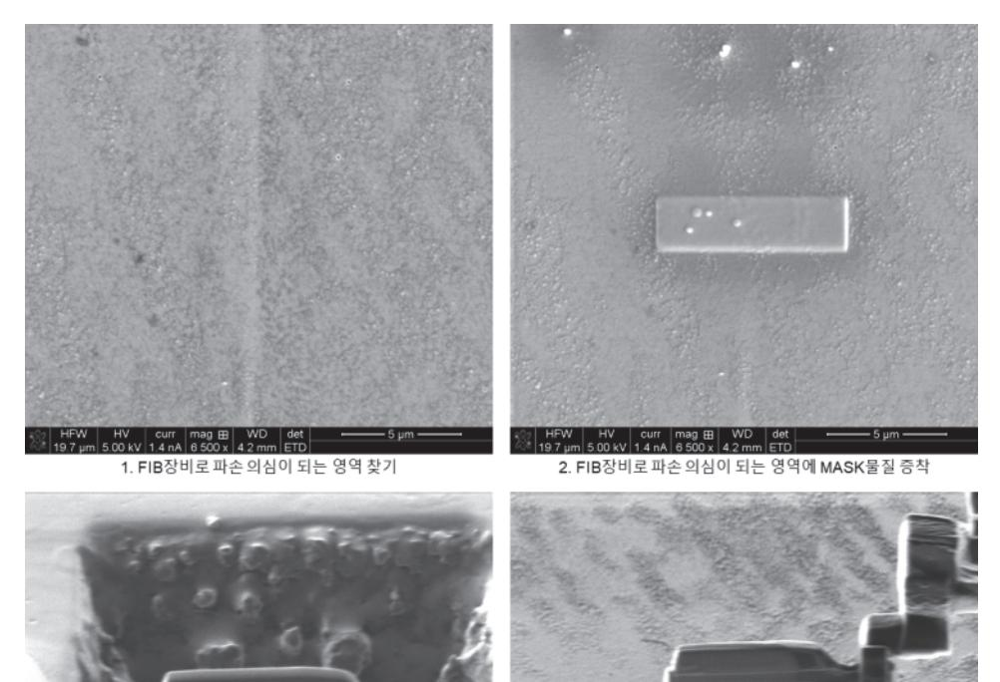

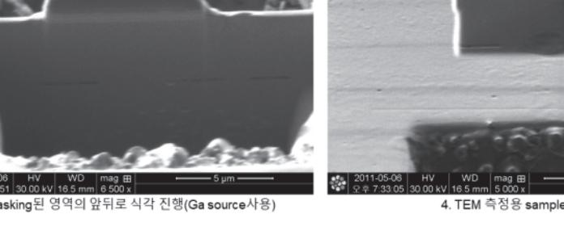

FIB 장비만 활용해도 소자의 단면도를 명확하게 볼 수 있기 때문에 배선 구조의 단

선이나 PN 접합의 손상 등을 상세히 분석할 수 있다.

(나) TEM 장비를 활용한 분석 진행

TEM(투과 전자 현미경)은 수십 나노미터의 소자 내부 미세 구조를 고해상도로 분석 하는 데 사용된다. TEM은 매우 얇은 단면을 통해 전자를 투과시켜 소자의 내부 구 조를 상세히 관찰할 수 있게 해 준다. 그래서 FIB 장비를 이용해서 측정할 샘플의 두께를 얇게 제작해야 한다. 참고로 샘플 두께 따라서 측정할 수 있는 항목이 다를 수 있기 때문에 주의해야 한다. 분석하고 싶은 항목에 따라서 샘플 두께를 선택한다.

- Lattice dislocation: 100마이크로미터
- Defect 및 수 나노미터의 단면도 분석: 100 마이크로미터 이하
  - 1) TEM 샘플 측정 진행
    - 측정 sample을 TEM 장비에 투입
    - 측정이 필요한 영역으로 TEM의 초점을 조정
  - 초점 조정 후 구조적 원인 분석 진행([그림 2-20])

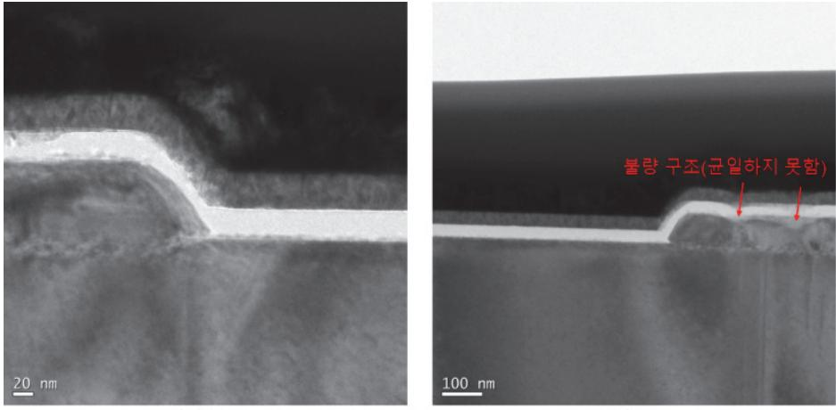

출처: 집필진 제작(2024) [그림 2-20] TEM 이미지(예: 소자 구조 불량)

위 샘플처럼, drain 영역의 구조가 균일하지 못할 경우, drain 고전압 시 전계의 분 포가 균일하여 edge 영역으로 전계가 모여 MOSFET 내성 시험 시 쉽게 파손될 수 있다.

#### (다) SIMS 장비를 활용한 분석 진행

SIMS 장비는 재료의 화학적 성분을 깊이별로 분석하여 불순물의 분포와 농도를 조 사하는 데 사용된다. SIMS는 표면에서 방출된 이차 이온을 질량 분석기로 분석함으 로써, 소자의 표면부터 깊이까지 다양한 층에서의 화학적 성분을 파악할 수 있다.

출처: 집필진 제작(2024) [그림 2-21] SIMS 결과 이미지(예: 깊이별 농도 확인)

- 1) SIMS 샘플 측정 진행
- Sample cleaning 진행
- Sample SIMS 장비에 로딩
- 측정 세팅 후 버튼 측정 버튼 클릭
- 불순물 및 농도 분석 진행([그림 2-21])
- 측정된 데이터를 excel로 복사 및 그래프 제작
- 불순물 확인 및 전기적 특성 변화 분석 진행

이러한 측정을 통해서 소자의 특정 깊이에서 발견된 불순물이 전기적 특성을 저하시 킨다면, SIMS 분석을 통해 그 원인을 규명하고 불순물을 제거하는 방안을 찾을 수 있다.

(라) XPS 장비를 활용한 분석 진행

XPS 장비는 소자의 표면 및 수 nm의 깊이로 화학적 상태와 결합 에너지를 분석하 고 성분을 분석할 수 있다. 성분 분석을 통해 수 nm의 성분 농도 확인이 가능하다. SIMS 분석은 수백 nm 분석이 필요할 때 선택하고 XPS는 수십 nm를 분석하고 싶 을 때 선택하면 된다.

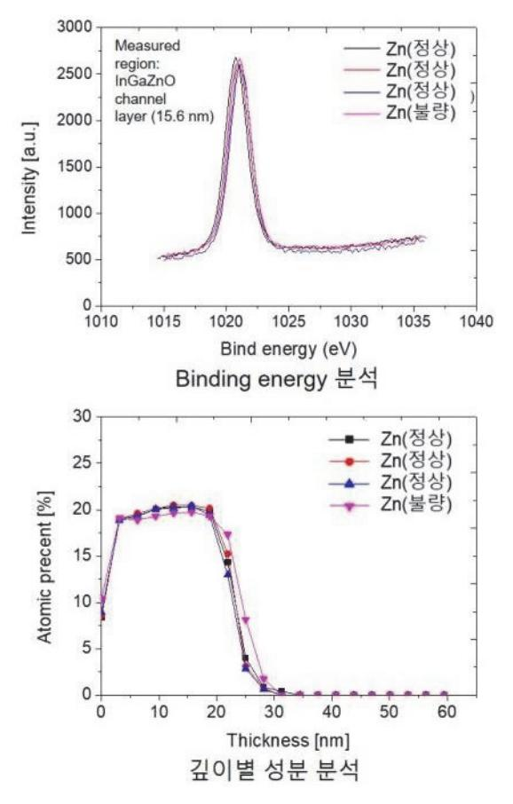

출처: 집필진 제작(2024) [그림 2-22] XPS 결과 이미지(예: InGaZnO TFT소자의 내성 시험 진행 후 Zn 확산 분석)

1) XPS 샘플 측정 진행

- 소자 샘플의 cleaning 진행
- 소자 샘플을 XPS 장비에 로딩
- 측정 세팅 후 버튼 측정 버튼 클릭
- Binding energy 및 수십 nm의 성분 분석 진행([그림 2-22])
- 측정된 데이터를 excel로 복사 및 그래프 제작

제작된 그래프를 보면서 손상된 소자의 몇 nm 영역에서 어떠한 binding energy로 형성되었는지 분석 진행할 수 있다. 예를 들어, [그림 2-19]처럼, 내성 시험 후 채널 을 형성하는 성분 중 어떤 물질이 고전압 및 고전류에 의해서 열화되어 확산이 되었 는지 분석할 수 있다.

2. 내성 시험 불량 분석 장비 정리

내성 시험 불량 분석 장비의 종류 및 분석할 수 있는 영역에 대해서 파악하는 것이 중요하 다. 그래서 장비별 불량 유형을 분석할 수 있는 리스트 정리가 필요하다.

(1) 광학 현미경(optical microscope)

소자의 물리적 손상을 육안으로 확인한다.

(2) 전자 현미경(SEM: scanning electron microscope)

소자의 미세 구조를 고해상도로 분석하여 표면 결함과 구조적 손상을 조사한다.

- 단면 측정 가능
- 상면도 측정 가능
- (3) 반도체 소자 특성 시스템(semiconductor parameter analyzer)

소자의 전기적 특성을 측정하여 기능적 손상이나 성능 변화를 평가한다.

- 전류-전압 측정 가능
- Capacitance-voltage 측정 가능
- (4) 집속 이온 빔(FIB: focused ion beam)

소자의 미세 구조를 선택적으로 추출할 수 있으며, 소자의 단면도를 고해상도로 분석할 수 있어 표면 결함 및 구조적 손상을 조사할 수 있다.

- 상면도 측정 불가능

- 측정 시 정확한 구조 선택에 주의(가로 10마이크로미터 추출 가능)

(5) 투과 전자 현미경(TEM: transmission electron microscope)

고속화된 전자를 샘플에 투과시켜 샘플의 격자 구조(defect 포함) 및 얇은 두께의 산화 막 등을 측정할 수 있으며, 소자의 단면도를 고해상도로 분석할 수 있어 표면 결함 및 구조적 손상을 조사할 수 있다.

- 상면도 측정 불가능
- 측정 진행 전 샘플의 두께 선택 주의가 필요(분석할 종목 선택 후 측정 진행)
- (5) 이차 이온 질량 분석기(SIMS: secondary ion mass spectrometry)
  - 이온화법을 이용하여 반도체 내부의 도핑 농도 및 불순물의 농도를 측정할 수 있다.
  - 깊은 영역(마이크로미터 단위)의 농도까지 측정 가능
  - 소자의 부분적인 측정 불가능(통상적으로 mm 단위의 샘플로 제작)
- (6) X선 광전자 분광법(XPS: x-rap photoelectron spectroscope)

X-선을 조사하여 방출되는 광전자의 에너지를 측정한다.

- 측정한 물질의 binding 에너지 측정 가능

- 열화 후 binding 에너지 상태 변화 분석 가능
- 수십 nm 깊이의 성분의 (이동)변화를 분석 가능

이러한 장비들은 각각의 내성 시험 불량 유형을 분석하고 소자의 전반적인 신뢰성을 평가 하는 데 필수적이다. 각 장비는 특정한 불량 유형을 정확하게 진단할 수 있도록 설계되어 있으며, 이를 통해 내성 시험 불량 분석을 효과적으로 해결할 수 있다.

#### 수행 tip

- 정확한 장비 교정: 내성 시험의 결과를 신뢰할 수 있으려 면 모든 장비가 정밀하게 교정되어야 한다. 시험 전에 ESD 발생기, 고전압 공급 장치, 오실로스코프 및 전류 프 로브와 같은 모든 장비의 교정 상태를 확인하고, 필요한 경우 재교정한다. 정확한 장비 설정은 시험 조건이 일관되 게 유지되도록 하며, DUT에 가해지는 전기적 스트레스가 시험 조건에 정확하게 맞도록 보장한다.
- DUT의 올바른 장착 및 연결: 시험 중 DUT가 올바르게 장착되고 연결되었는지 확인하는 것이 중요하다. DUT의 모든 핀이 테스트 보드와 정확히 접촉되어야 하며, 잘못된 연결은 시험 결과에 오류를 초래할 수 있다. 특히, DUT가 방전 중 안전하게 고정되도록 지지대를 사용하고, 연결 상 태를 지속적으로 점검하여 전기적 연결이 안정적으로 유지 되도록 해야 한다.
- 분석 중 발견된 작은 결함도 무시하지 말고 꼼꼼히 기록한 다. 작은 결함이 중요한 불량 원인일 수 있다.
- 각 장비의 사용법과 안전 지침을 숙지하여 장비를 안전하 게 사용하고, 데이터의 정확성을 유지한다.
- 광학 현미경을 활용하여 DUT 표면의 물리적 손상을 초기 단계에서 빠르게 식별하는 것이 중요하다. 이는 보다 세밀 한 분석이 필요한 영역을 조기에 발견하는 데 도움이 된 다.
- SEM과 반도체 소자 특성 시스템을 사용하여 미세 구조와 전기적 특성의 변화를 상세히 분석하면, 내성 평가 시 발 생한 내부 손상과 불량의 근본 원인을 더욱 명확하게 규명 할 수 있다. 이는 불량 원인을 정확하게 파악하고, 적절한 개선 방안을 제시하는 데 필수적이다.

### 학습 2 교수·학습 방법

#### 교수 방법

- 내성 시험 결과에 따른 제품 품질 수준을 설명하고 지도한다.
- 내성 시험 결과 불량 사례에 관하여 설명하고 지도한다.
- 내성 시험 결과에 따른 원인 분석을 설명하고 지도한다.
- 내성 시험 불량 평가를 위한 전기적 특성 평가 장비에 관하여 원리를 설명하고 지도한다.
- 내성 시험 불량 평가를 위한 시각적 특성 평가 장비에 관하여 원리를 설명하고 지도한다.

#### 학습 방법

- 내성 시험 결과에 따른 제품 품질 수준을 학습한다.
- 내성 시험 결과 불량 사례에 대해서 학습한다.
- 내성 시험 결과에 따른 원인 분석을 학습한다.
- 내성 시험 불량 평가를 위한 전기적 특성 평가 장비를 학습한다.
- 내성 시험 불량 평가를 위한 시각적 특성 평가 장비를 학습한다.

### 학습 2 평 가

#### 평가 준거

• 평가자는 학습자가 학습 목표를 성공적으로 달성하였는지를 평가해야 한다.

#### • 평가자는 다음 사항을 평가해야 한다.

|          | 학습 목표                                                         | 성취수준 |   |   |  |
|----------|---------------------------------------------------------------|------|---|---|--|
| 학습 내용    |                                                               | 상    | 중 | 하 |  |
|          | - 내성 시험 항목별 시험 결과에 따른 제품의 품질 수준을 판 단할 수 있다.                |      |   |   |  |
| 내성 시험 분석 | - 내성 시험 결과가 보증 규격을 만족하지 못하는 불량의 경 우, 그 불량 유형을 파악할 수 있다. |      |   |   |  |
|          | - 내성 시험 불량의 원인을 분석할 수 있다.                                     |      |   |   |  |

#### 평가 방법

#### • 서술형 시험

|          | 평가 항목                                              | 성취수준 |   |   |  |
|----------|----------------------------------------------------|------|---|---|--|
| 학습 내용    |                                                    | 상    | 중 | 하 |  |
|          | - 내성 시험 항목별 시험 결과에 따른 제품의 품질 파악 여부                 |      |   |   |  |
| 내성 시험 분석 | - 내성 시험 결과가 보증 규격을 만족하지 못하는 불량 유형 을 파악할 수 있는 능력 |      |   |   |  |
|          | - 내성 시험 불량의 원인을 분석할 수 있는 능력                        |      |   |   |  |

#### • 평가자 질문

|          | 평가 항목                                                            | 성취수준 |   |   |  |
|----------|------------------------------------------------------------------|------|---|---|--|
| 학습 내용    |                                                                  | 상    | 중 | 하 |  |
|          | - 내성 시험 불량에서 발생할 수 있는 유형 중 게이트 산화막 에서 일어날 수 있는 불량 유형을 언급하는 능력 |      |   |   |  |
| 내성 시험 분석 | - 내성 시험 분석 방법을 설명할 수 있는 능력                                       |      |   |   |  |
|          | - 내성 시험 불량 분석 중 하나를 선택해서 제대로 설명할 수 있는 능력                      |      |   |   |  |

• 평가자 체크리스트

|          | 평가 항목                          | 성취수준 |   |   |  |
|----------|--------------------------------|------|---|---|--|
| 학습 내용    |                                | 상    | 중 | 하 |  |
|          | - 내성 시험 불량 유형을 제대로 설명할 수 있는 능력 |      |   |   |  |
| 내성 시험 분석 | - 래치 업을 설명할 수 있는 능력            |      |   |   |  |
|          | - 내성 시험 불량 분석법을 설명할 수 있는 능력    |      |   |   |  |

• 구두 발표

|          | 평가 항목                                        | 성취수준 |   |   |  |
|----------|----------------------------------------------|------|---|---|--|
| 학습 내용    |                                              | 상    | 중 | 하 |  |
|          | - 내성 시험 불량 유형을 전부 언급하는 능력                    |      |   |   |  |
| 내성 시험 분석 | - CMOS 소자에서 발생할 수 있는 불량 유형을 언급하는 능력          |      |   |   |  |
|          | - 내성 시험 불량 분석법을 설명하면서 실험한 내용을 설명할 수 있는 능력 |      |   |   |  |

피드백

- 1. 서술형 시험 - 내성 시험 항목별 시험 결과에 따라서 제품의 품질 수준을 판단할 수 있는지 평가하고 학습자의 수행 능력이 부족할 경우, 항목별 제품의 품질 수준에 대해서 재교육을 진행한다.
- 성취수준인 높을 경우, TEM 및 XPS 같은 수준이 높은 분석 기법들은 더 심도 있게 학습할 수 있도록 지도한다.
- 2. 평가자 질문
- 내성 시험 불량의 결과를 보고 제품별 품질 수준을 평가할 수 있는지 질문하고 학습자의 수행 성 취 능력이 우수할 경우, 등급별 적용 가능한 application을 제시한다.
- 성취수준이 낮은 경우, 재교육을 통해서 학습자의 수행 성취를 발전시킬 수 있도록 유도하고 품질 수준 및 불량 발생 유형 대해서도 지도한다.
- 3. 평가자 체크리스트
- 내성 시험에 따른 등급 평가를 적절하게 하는지 판단하고 불량 발생 유형에 대해서 제대로 파악 하는지 확인한 후 학습자의 수행 성취 능력이 부족할 경우, 재교육을 통해서 학습자가 등급 평가 에 대해서 제대로 알 수 있도록 유도하고 불량 유형에 대해서도 원인을 제대로 알 수 있도록 유 도한다.
- 학습자의 수행 능력이 우수할 경우, 다양한 불량 유형을 제시하면서 적절한 답변이 유도될 수 있 도록 지도한다.
- 4. 구두 발표
- 내성 시험에 따른 등급 및 불량 유형을 제대로 발표하는지 확인한 후 수행 능력이 부족한 학습자 에게는 간단한 단위 소자부터 재교육을 진행하여 학습자가 제대로 파악할 수 있도록 유도한다.
- 학습자의 수행 능력이 우수할 경우, 불량 유형에서 다른 전압 및 다른 소자 구조에서는 어떻게 다를 수 있는지 질문하고 더 다양한 예시를 학습할 수 있도록 유도한다.

- 교육부(2018). 반도체 신뢰성 평가(LM1903060110\_14v3). 한국직업능력개발원.
- 교육부(2022). 반도체 생산성 향상(LM1903060210\_14v3). 한국직업능력연구원.
- ∙ JEDEC (2010). EIA/JESD22-A115: EIA/JEDEC Standard for Machine Model(MM) Testing. https://www.jedec.org. Accessed 2015. 08. 19.
- ∙ JEDEC (2014). ANSI/ESDA/JEDEC JS-001-2014 Human Body Model –Component Level. https://www.jedec.org. Accessed 2015. 08. 20.
- ∙ JEDEC (2014). ANSI/ESDA/JEDEC JS-002-2014 Charged Device Model –Device Level. https://www.jedec.org. Accessed 2015. 08. 20.
- ∙ JEDEC (2014). ANSI/ESD S20.20-2014, ESD Association Standard for the Development of an Electrostatic Discharge Control Program for Protection of Electrical and Electronic Parts, Assemblies and Equipment. https://www.jedec.org. Accessed 2015. 08. 22.
- ∙ Ajith Amerasekera and Charvaka(2002). ESD in Silicon Integrated Circuits(2nd Ed.). John Willey and Sons.
- ∙ Ming-Dou Ker and Sheng-Fu Hsu (2009). Transient-induced Latchup in CMOS Integtrated Circuits(1st Ed.). John Willey and Sons.
- ∙ Oleg Semenov. Hossein Sarbishaei and Manoj Sachedav (2008). ESD Protection Device and Circuit Design for Advanced CMOS Technologes, Springer.

| NCS학습모듈 개발이력 |                                     |     |                  |  |
|--------------|-------------------------------------|-----|------------------|--|
| 발행일          | 2024년 12월 31일                       |     |                  |  |
| 세분류명         | 반도체 개발((19030601)                   |     |                  |  |
| 개발기관         | 수원과학대학교 산학협력단(개발책임자: 윤창용) 한국직업능력연구원 |     |                  |  |
|              | 최준혁(수원대학교)*                         |     | 김종범(삼성전기)        |  |
|              | 계찬호(수원대학교)                          |     | 김한수(두원공과대학교)     |  |
|              | 김경호(폴리텍대학교)                         |     | 남승호(경기대학교)       |  |
|              | 김관하(폴리텍대학교)                         |     | 손승대(제이에스이엔씨(주))  |  |
| 집필진          | 김기순((주)영우디에스피)                      | 검토진 | 안광호(퓨쳐일렉트로닉스)    |  |
|              | 김도균(폴리텍대학교)                         |     | 이철오((주)한국전력안전공단) |  |
|              | 전동민(폴리텍대학교)                         |     |                  |  |

\*표시는 대표집필자임 (참고) 검토진으로 참여한 집필진은 본인의 원고가 아닌 타인의 학습모듈을 검토함

| 반도체 내성 시험(LM1903060129_23v4)                                                                             |                   |  |  |  |
|----------------------------------------------------------------------------------------------------------|-------------------|--|--|--|
| 저작권자                                                                                                     | 교육부               |  |  |  |
| 연구기관                                                                                                     | 한국직업능력연구원         |  |  |  |
| 발행일                                                                                                      | 2024. 12. 31.     |  |  |  |
| ISBN                                                                                                     | 979-11-7175-763-3 |  |  |  |
| ※ 이 학습모듈은 자격기본법 시행령(제8조 국가직무능력표준의 활용)에 의거하여 개발하였으며, NCS통합포털사이트(http://www.ncs.go.kr)에서 다운로드 할 수 있습니다. |                   |  |  |  |

