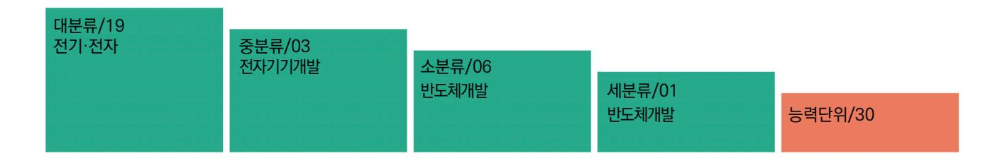

# NCS학습모듈 커스텀 레이아웃 적용 공정 분석

LM1903060130\_23v5

#### [NCS학습모듈 활용 시 유의 사항]

- 1. NCS학습모듈은 교육훈련기관에서 출처를 명시하고 교육적 목적으로 활용할 수 있습니다. 다 만, NCS학습모듈에는 국가(교육부)가 저작재산권 일체를 보유하지 않은 저작물(출처가 표기된 도표‧사진‧삽화‧도면 등)이 포함되어 있으므로, 이러한 저작물의 변형‧각색‧복제‧공연‧ 배포 및 공중 송신 등과 이러한 저작물을 활용한 2차적 저작물을 작성하려면 반드시 원작자 의 동의를 받아야 합니다.
- 2. NCS학습모듈은 개발 당시의 산업 및 교육 현장을 반영하여 집필하였으므로, 현재 적용되는 법령‧지침‧표준 및 교과 내용 등과 차이가 있을 수 있습니다. NCS학습모듈 활용 시 법령 ‧지침‧표준 및 교과 내용의 개정 사항과 통계의 최신성 등을 확인하시기를 바랍니다.
- 3. NCS학습모듈은 산업 현장에서 요구되는 능력을 교육훈련기관에서 학습할 수 있게 구성한 자 료입니다. 다만, NCS학습모듈 지면의 한계상 대표적 예시(예: 활용도 또는 범용성이 높은 제 품, 서비스) 중심으로 집필하였음을 이해하시기를 바랍니다.

## NCS학습모듈의 이해

※ 본 NCS학습모듈은 「NCS 국가직무능력표준」사이트(http://www.ncs.go.kr) 에서 확인 및 다운로드할 수 있습니다.

## Ⅰ NCS학습모듈이란?

- 국가직무능력표준(NCS: National Competency Standards)이란 산업현장에서 직무를 수행하기 위해 요구되는 지식·기술·소양 등의 내용을 국가가 산업부문별·수준별로 체계 화한 것으로 산업현장의 직무를 성공적으로 수행하기 위해 필요한 능력(지식, 기술, 태도) 을 국가적 차원에서 표준화한 것을 의미합니다.
- 국가직무능력표준(이하 NCS)이 현장의 '직무 요구서'라고 한다면, NCS학습모듈은 NCS
  의 능력단위를 교육훈련에서 학습할 수 있도록 구성한 '교수·학습 자료'입니다. NCS학습
  모듈은 구체적 직무를 학습할 수 있도록 이론 및 실습과 관련된 내용을 상세하게 제시하
  고 있습니다.

#### ○ NCS학습모듈은 다음과 같은 특징을 가지고 있습니다.

- 첫째, NCS학습모듈은 산업계에서 요구하는 직무능력을 교육훈련 현장에 활용할 수 있도 록 성취목표와 학습의 방향을 명확히 제시하는 가이드라인의 역할을 합니다.
- 둘째, NCS학습모듈은 특성화고, 마이스터고, 전문대학, 4년제 대학교의 교육기관 및 훈 련기관, 직장교육기관 등에서 표준교재로 활용할 수 있으며 교육과정 개편 시에도 유용하게 참고할 수 있습니다.

○ NCS와 NCS학습모듈 간의 연결 체계를 살펴보면 아래 그림과 같습니다.

O NCS학습모듈의 위치는 NCS 분류 체계에서 해당 학습모듈이 어디에 위치하는지를 한 눈에 볼 수 있도록 그림으로 제시한 것입니다.

| [NCS-학          | 습모듈         | 의 위치]    |          |  |
|-----------------|-------------|----------|----------|--|
|                 |             |          |          |  |
| 대분류             | 문화·예술       | ··디자인·방송 |          |  |
| 중분류             | 문화콘텐츠       |          |          |  |
| 소분류             | 소분류 문화콘텐츠제작 |          |          |  |
|                 |             |          |          |  |
| 세분류             |             |          |          |  |
| 방송콘텐츠제작         |             | 능력단위     | 학습모듈명    |  |
| 영화콘텐츠제작         |             | 프로그램 기획  | 프로그램 기획  |  |
| 음악콘텐츠제작         |             | 아이템 선정   | 아이템 선정   |  |
| 광고콘텐츠제작         |             | 자료 조사    | 자료 조사    |  |
| 게임콘텐츠제작         |             | 프로그램 구성  | 프로그램 구성  |  |
| 애니메이션 콘텐츠제작  |             | 캐스팅      | 캐스팅      |  |
| 만화콘텐츠제작         |             | 제작계획     | 제작계획     |  |
| 캐릭터제작           |             | 방송 미술 준비 | 방송 미술 준비 |  |
| 스마트문화앱 콘텐츠제작 |             | 방송 리허설   | 방송 리허설   |  |
| 영사              |             | 야외촬영     | 야외촬영     |  |
|                 |             | 스튜디오 제작  | 스튜디오 제작  |  |
|                 |             |          |          |  |

학습모듈은

NCS 능력단위 1개당 1개의 학습모듈 개발 을 원칙으로 합니다. 그러나 필요에 따라 고용단위 및 교과단위를 고려하여 능력단위 몇 개를 묶어 1개 학습모듈로 개발할 수 있으며, NCS 능력단위 1개를 여러 개의 학습모듈로 나누어 개발할 수도 있습니다.

#### 2. NCS학습모듈의 개요

#### ○ NCS학습모듈의 개요는 학습모듈이 포함하고 있는 내용을 개략적으로 설명한 것으로

| 학습모듈의 목표, 선수학습, 학습모듈의 내용 체계, 핵심 용어 로 구성되어 있습니다. |                                                                              |  |
|-------------------------------------------------|------------------------------------------------------------------------------|--|
| 학습모듈의 목표                                        | 해당 NCS 능력단위의 정의를 토대로 학습 목표를 작성한 것입니다.                                        |  |
| 선수학습                                            | 해당 학습모듈에 대한 효과적인 교수·학습을 위하여 사전에 이수해야 하는 학습모 듈, 학습 내용, 관련 교과목 등을 기술한 것입니다. |  |
| 학습모듈의 내용 체계                                  | 해당 NCS 능력단위요소가 학습모듈에서 구조화된 체계를 제시한 것입니다.                                     |  |
| 핵심 용어                                           | 해당 학습모듈의 학습 내용, 수행 내용, 설비·기자재 등 가운데 핵심적인 용어를 제 시한 것입니다.                   |  |

### 제작계획 학습모듈의 개요

#### 학습모듈의 목표

본격적인 촬영을 준비하는 단계로서, 촬영 대본을 획정하고 제작 스태프를 조직하며 촬영 장비와 촬영 소품을 준비할 수 있다.

#### 선수학습

제작 준비(LM0803020105\_13v1), 섭외 및 제작스태프 구성(LM0803020104\_13v1), 촬영 제작(LM0803020106\_13v1), 촬영 장비 준비(LM0803040204\_13v1.4), 미술 디자인 협의하기(LM0803040203\_13v1.4)

#### 학습모듈의 내용체계

| 하스                | 하스 내용                                              | NCS 능력단위 요소       |                |
|-------------------|----------------------------------------------------|-------------------|----------------|
| 학습                | 학습 내용                                              | 코드번호              | 요소 명칭          |
| 1. 촬영 대본 확정하기  | 1-1. 촬영 구성안 검 토와 수정                             | 0803020114_16/3.1 | 촬영 대본 확정하기  |
| 2. 제작 스태프 조직하기 | 2-1. 기술 스태프 조직 2-2. 미술 스태프 조직 2-3. 전문 스태프 조직 | 0803020114_16v3.2 | 제작 스태프 조직하기 |
| 3. 촬영 장비 계획하기  | 3-1. 촬영 장비 점검 과 준비                              | 0803020114_16/3.3 | 촬영 장비 계획하기  |
| 4. 촬영 소품 계획하기  | 4-1. 촬영 소품 목록 작성 4-2. 촬영 소품 제작 의뢰         | 0803020114_16\3.4 | 촬영 소품 계획하기  |

#### 핵심 용어

촬영 구성안, 제작 스태프, 촬영 장비, 촬영 소품

#### 학습모듈의 목표는

학습자가 해당 학습모듈을 통해 성취해야 할 목표를 제시한 것으로, 교수자는 학습자 가 학습모듈의 전체적인 내용흐름을 파악하 도록 지도할 수 있습니다.

**6** • •

61

#### 선수학습은

교수자 또는 학습자가 해당 학습모듈을 교 수·학습하기 이전에 이수해야 하는 교과목 또는 학습모듈(NCS 능력단위) 등을 표기한 것입니다. 따라서 교수자는 학습자가 개별 학습, 자기 주도 학습, 방과 후 활동 등 다 양한 방법을 통해 이수할 수 있도록 지도하 는 것을 권장합니다.

|            | 핵심 용어는              |
|------------|---------------------|
|            | 률을 대표하는 주요 용어입니     |
|            | · 해당 학습모듈을 통해 학습    |
|            | 게될 주요 내용을 알 수 있습    |
|            | 5 국가직무능력표준」 사이트     |
| (www.ncs.g | jo.kr)의 색인 (찾아보기) 중 |
| 하나로 이용할    | 할 수 있습니다            |

#### 3. NCS학습모듈의 내용 체계

○ NCS학습모듈의 내용은 크게 학습, 학습 내용, 교수·학습 방법, 평가 로 구성되어 있습니다.

| 학습       | 해당 NCS 능력단위요소 명칭을 사용하여 제시한 것입니다. 학습은 크게 학습 내용, 교수·학습 방법, 평가로 구성되며 해당 NCS 능력단위의 능력단위 요소별 지식, 기술, 태도 등을 토대로 내용을 제시한 것입니다.                                                    |  |
|----------|----------------------------------------------------------------------------------------------------------------------------------------------------------------------------------|--|
| 학습 내용    | 학습 내용은 학습 목표, 필요 지식, 수행 내용으로 구성되며, 수행 내용은 재료·자 료, 기기(장비·공구), 안전·유의 사항, 수행 순서, 수행 tip으로 구성한 것입니다. 학습모듈의 학습 내용은 실제 산업현장에서 이루어지는 업무활동을 표준화된 프로세 스에 기반하여 다양한 방식으로 반영한 것입니다. |  |
| 교수·학습 방법 | 학습 목표를 성취하기 위한 교수자와 학습자 간, 학습자와 학습자 간 상호 작용이 활발하게 일어날 수 있도록 교수자의 활동 및 교수 전략, 학습자의 활동을 제시한 것입니다.                                                                            |  |
| 평가       | 평가는 해당 학습모듈의 학습 정도를 확인할 수 있는 평가 준거 및 평가 방법, 평 가 결과의 피드백 방법을 제시한 것입니다.                                                                                                         |  |

## [NCS-학습모듈의 위치]

| 대분류 | 전기 · 전자 |          |
|-----|---------------|----------|
| 중분류 |               | 전자 기기 개발 |
| 소분류 |               | 반도체 개발   |

| 세분류    |                  |                  |
|--------|------------------|------------------|
| 반도체 개발 | 능력단위             | 학습모듈명            |
| 반도체 제조 | 반도체 제품 기획        | 반도체 제품 기획        |
| 반도체 장비 | 반도체 아키텍처 설계      | 반도체 아키텍처 설계      |
| 반도체 재료 | 디지털 회로 설계        | 디지털 회로 설계        |
|        | 패키지 조립 공정 개발     | 패키지 조립 공정 개발     |
|        | 반도체 제품 기능·성능 검증  | 반도체 제품 기능·성능 검증  |
|        | 자동 배치 배선 레이아웃 설계 | 자동 배치 배선 레이아웃 설계 |
|        | 반도체 설계 검증        | 반도체 설계 검증        |
|        | 반도체 펌웨어 개발       | 반도체 펌웨어 개발       |
|        | 메모리 반도체 제조 공정 개발 | 메모리 반도체 제조 공정 개발 |
|        | 시스템 반도체 제조 공정 개발 | 시스템 반도체 제조 공정 개발 |
|        | 반도체 제조 단위 공정 개발  | 반도체 제조 단위 공정 개발  |
|        | 아날로그 회로 아키텍처 설계  | 아날로그 회로 아키텍처 설계  |
|        | 아날로그 회로 소자 레벨 설계 | 아날로그 회로 소자 레벨 설계 |
|        | 아날로그 회로 시스템 설계   | 아날로그 회로 시스템 설계   |

| 와이어 본딩 패키지 개발     | 와이어 본딩 패키지 개발     |
|-------------------|-------------------|
| 플립 칩 패키지 개발       | 플립 칩 패키지 개발       |
| 웨이퍼 레벨 패키지 개발     | 웨이퍼 레벨 패키지 개발     |
| 어드밴스드 팬 아웃 패키지 개발 | 어드밴스드 팬 아웃 패키지 개발 |
| 이종 접합 패키지 개발      | 이종 접합 패키지 개발      |
| 어드밴스드 언더필 패키지 개발  | 어드밴스드 언더필 패키지 개발  |
| 반도체 환경 시험         | 반도체 환경 시험         |
| 반도체 수명 시험         | 반도체 수명 시험         |
| 반도체 내성 시험         | 반도체 내성 시험         |
| 커스텀 레이아웃 적용 공정 분석 | 커스텀 레이아웃 적용 공정 분석 |
| 커스텀 레이아웃 설계       | 커스텀 레이아웃 설계       |
| 커스텀 레이아웃 검증       | 커스텀 레이아웃 검증       |

| 학습모듈의 개요 |  | 1 |
|----------|--|---|
|----------|--|---|

#### 학습 1. 적용 공정 소자 분석하기

| 1-1. 적용 공정 소자 분석 | 3  |
|------------------|----|
| • 교수 ․ 학습 방법     | 37 |
| • 평가             | 38 |

#### 학습 2. 적용 공정 레이어 분석하기

| 2-1. 적용 공정 레이어 분석 | 40  |
|-------------------|-----|
| • 교수 ․ 학습 방법      | 111 |
| • 평가              | 112 |

| 참고 자료 | 114 |  |  |
|-------|-----|--|--|
|-------|-----|--|--|

## 커스텀 레이아웃 적용 공정 분석 학습모듈의 개요

#### 학습모듈의 목표

해당 공정에서 제공하는 PDK를 활용한 주요 소자의 이름과 구조를 확인하고, 디자인 룰에서 정의하고 있 는 다양한 소자 및 레이어 간 최소 설계 길이를 파악하여, 커스텀 레이아웃 설계를 적절하게 수행할 수 있도록 사전 공정 정보를 습득할 수 있다.

#### 선수학습

레이아웃 설계(LM1903060105\_14v3), 전기 회로, 전자 회로

#### 학습모듈의 내용체계

| 하스                   | 하스 내요             | NCS 능력단위 요소       |                   |  |  |
|----------------------|-------------------|-------------------|-------------------|--|--|
| 익답                   | 학습 학습 내용 코드번호 요소  |                   | 요소 명칭             |  |  |
| 1. 적용 공정 소자 분석 하기 | 1-1. 적용 공정 소자 분석  | 1903060130_23v5.1 | 적용 공정 소자 분석하기  |  |  |
|                      | 2-1. 적용 공정 레이어 분석 | 1903060130_23v5.2 | 적용 공정 레이어 분석하기 |  |  |

#### 핵심 용어

플로어 플랜(Floor Plan), 배치, 배선, 설계 규칙, DRC(Design Rule Heck), LVS(Layout Versus Schematic), LPE(Layout Parastic Extraction), 커스텀 레이아웃, 자동 배치 배선

## 1-1. 적용 공정 소자 분석

| 학습 목표 | • 커스텀 레이아웃에 사용하는 전압별 트랜지스터를 구분할 수 있다. • 전압별 트랜지스터의 구조적 차이를 설명할 수 있다. • BJT, 저항, 커패시터의 사용 레이어, 면적과 변화량을 파악할 수 있다. • 설계 공정에서 사용할 최적의 소자 형태를 선정할 수 있다. |
|-------|--------------------------------------------------------------------------------------------------------------------------------------------------------------|
|-------|--------------------------------------------------------------------------------------------------------------------------------------------------------------|

## 필요 지식 /

숔 반도체 소자의 공정별 전기적 특성 반도체 공정별 단위 소자의 전기적 특성은 각 소자의 동작 원리와 물리적 구조에 따라 다르다. 주요 반도체 공정에 사용되는 단위 소자에는 트랜지스터(MOSFET), 다이오드, 커패시터, 저항 등이 있으며, 이들의 전기적 특성은 다음과 같다.

- 1. MOSFET(Metal-Oxide-Semiconductor Field-Effect Transistor)
  - (1) N형 MOSFET(NMOS)
    - (가) 문턱 전압(Threshold Voltage, Vth): 소자가 켜지는 데 필요한 게이트 전압이며, NMOS의 경우, 게이트에 양의 전압을 인가할 때 전류가 흐르기 시작한다.
    - (나) 이동도(Mobility): 전자가 채널을 따라 이동하는 속도이며, 전자의 이동도는 반도체 재료 와 공정에 따라 달라지고, 주로 실리콘에서는 450 cm²/V·s 수준이다.
    - (다) 드레인 전류(Drain Current, Id): 게이트 전압에 의해 유도된 채널을 통해 흐르는 전류 이며, 는 게이트-소스 전압과 드레인-소스 전압에 따라 변화한다.
    - (라) 기생 저항 및 커패시턴스: 소자 구조와 레이아웃에 의해 결정되며, 회로 성능에 영향을 끼친다.
  - (2) P형 MOSFET(PMOS)
    - (가) 문턱 전압(Vth): PMOS의 경우, 게이트에 음의 전압을 인가할 때 전류가 흐르기 시작한 다.
    - (나) 이동도: 정공의 이동도는 NMOS의 전자 이동도보다 낮다. 실리콘에서는 약 150 cm²/V·s

수준이다.

- (다) 드레인 전류(Id): 게이트-소스 전압과 드레인-소스 전압에 따라 흐르는 전류이며, PMOS는 주로 플립플롭, 메모리 셀 등에서 사용된다.
- 2. 다이오드(Diode)
  - (1) PN 다이오드
    - (가) 순방향 전압 강하(Forward Voltage Drop): 전류가 흐를 때 발생하는 전압 강하, 일반 적으로 실리콘 다이오드는 약 0.7V이다.
    - (나) 역방향 누설 전류(Reverse Leakage Current): 다이오드가 역방향 바이어스 상태에서 흐르는 작은 전류이며 높은 순도가 필요하다.
    - (다) 역방향 항복 전압(Breakdown Voltage): 다이오드가 역방향 바이어스에서 파괴되지 않 고 견딜 수 있는 최대 전압이다.
  - (2) 쇼트 키 다이오드
    - (가) 낮은 순방향 전압 강하: 일반적으로 0.2~0.3V로, 전력 소모가 적다.
    - (나) 빠른 스위칭 속도: PN 다이오드보다 빠른 스위칭이 가능하여 고속 디지털 회로에 적합 하다.
- 3. 커패시터(Capacitor)
  - (1) MOS 커패시터
    - (가) 산화막 두께에 따른 용량: 얇은 산화막을 사용하여 높은 커패시턴스를 얻을 수 있다.
    - (나) 전하 저장 능력: 메모리 소자 등에서 전하를 저장하는 용도로 사용된다.
  - (2) MIM 커패시터(Metal-Insulator-Metal)
    - (라) 높은 커패시턴스 밀도: 박막 절연체를 사용하여 높은 커패시턴스를 제공한다.
    - (마) 낮은 누설 전류: 고품질 절연체를 사용하여 누설 전류를 최소화한다.
- 4. 저항기(Resistor)
  - (1) 폴리 실리콘 저항
    - (가) 저항값 조절 가능: 도핑 농도와 길이를 조절하여 저항값을 조절할 수 있다.
    - (나) 온도 계수: 저항값이 온도에 따라 변화하는 특성이며, 온도 보상을 위한 디자인이 필요할 수 있다.
  - (2) 금속 저항
    - (가) 낮은 저항값: 고전류 경로에 사용되며, 금속 재료의 종류에 따라 저항값이 결정된다.

각 단위 소자의 전기적 특성은 반도체 공정 기술과 소자의 설계 방법에 따라 달라진다. 정확한 전기적 특성을 이해하고 설계에 반영하는 것은 고성능, 저전력, 고신뢰성 반도체 소자를 개발 하는 데 필수적이다.

숕 반도체 공정별 단위 소자의 온도 특성

반도체 공정에서 제조된 단위 소자들은 온도에 따라 다양한 특성을 보인다. 온도 특성은 소자 의 동작 특성과 신뢰성에 큰 영향을 끼치므로, 이를 이해하고 관리하는 것이 중요하다. 각 소 자의 온도 특성을 살펴보면 다음과 같다.

- 1. MOSFET(Metal-Oxide-Semiconductor Field-Effect Transistor)
  - (1) NMOS 및 PMOS 온도 특성
    - (가) 문턱 전압(Threshold Voltage, Vth): 온도가 상승하면 문턱 전압이 감소한다. 이는 반 도체 재료에서의 밴드갭 에너지 감소와 관련이 있다.

1) 온도 계수: Vth의 온도 계수는 일반적으로 -2mV/°C에서 -5mV/°C 사이이다.

(나) 이동도(Mobility): 온도 상승 시 캐리어의 산란이 증가하여 전자와 정공의 이동도가 감소 한다.

1) 온도 계수: 이동도는 약 -2%/°C 정도로 감소할 수 있다.

- (다) 드레인 전류(Drain Current, Id): 온도 상승에 따라 문턱 전압 감소와 이동도 감소가 동 시에 발생하여 드레인 전류가 비선형적으로 변화한다.
- 2. 다이오드(Diode)
  - (1) PN 다이오드
    - (가) 순방향 전압 강하(Forward Voltage Drop): 온도가 상승하면 순방향 전압 강하가 감소 한다. 일반적인 실리콘 다이오드는 약 -2mV/°C의 온도 계수를 가진다.
    - (나) 역방향 누설 전류(Reverse Leakage Current): 온도가 상승하면 열적 생성으로 역방향 누설 전류가 급격히 증가한다. 이는 다이오드의 역방향 전압 특성을 악화시킬 수 있다.
    - (다) 역방향 항복 전압(Breakdown Voltage): 온도가 상승하면 항복 전압이 약간 감소할 수 있다.
  - (2) 쇼 트키 다이오드
    - (가) 온도 의존성: 쇼트 키 다이오드는 낮은 순방향 전압 강하로 인해 온도 의존성이 더 높 다. 이는 온도 변화에 따라 더 큰 전압 변동을 초래할 수 있다.
- 3. 커패시터(Capacitor)
  - (1) MOS 커패시터

(가) 전하 저장 용량: 온도가 상승하면 반도체 내의 전하 밀도가 변하여 전하 저장 용량이 변

5

화할 수 있다.

- (나) 산화막 누설 전류: 고온에서는 산화막을 통한 누설 전류가 증가할 수 있다.
- (2) MIM 커패시터
  - (가) 온도 안정성: 절연체의 특성에 따라 달라지며, 일반적으로 고온에서 누설 전류 증가와 전 기적 특성 변동이 발생할 수 있다.
- 4. 저항기(Resistor)
  - (1) 폴리 실리콘 저항
    - (가) 저항 온도 계수(TCR): 폴리 실리콘 저항의 저항값은 온도에 따라 변동한다. 일반적으로 양의 TCR을 가지며, 이는 온도가 상승하면 저항값이 증가함을 의미한다.
    - (나) 온도 안정성: 정확한 저항값을 유지하기 위해 온도에 따른 저항 변화율을 최소화하는 것 이 중요하다.
  - (2) 금속 저항
    - (가) 저항 온도 계수(TCR): 금속 저항은 일반적으로 매우 낮은 TCR을 가지며, 이는 저항값 이 온도에 거의 영향을 받지 않음을 의미한다. 그러나 고온에서는 저항값이 변동할 수 있다.

반도체 단위 소자의 온도 특성은 소자의 종류와 재료에 따라 다양하게 나타난다. 이를 이해하 고 고려하는 것은 소자의 동작 특성, 신뢰성 및 전체 회로의 성능을 최적화하는 데 매우 중요 하다. 특히 고온 환경에서의 안정성을 확보하기 위해 이러한 온도 특성을 철저히 분석하고 관 리해야 한다.

숖 반도체 공정별 단위 소자의 내압 특성

반도체 공정에서 제조된 단위 소자들의 내압 특성은 각 소자의 종류와 설계에 따라 크게 달라 진다. 내압 특성은 소자가 견딜 수 있는 최대 전압 범위를 의미하며, 소자의 신뢰성과 안전성 을 결정하는 중요한 요소이다. 주요 반도체 단위 소자들의 내압 특성을 살펴본다.

- 1. MOSFET(Metal-Oxide-Semiconductor Field-Effect Transistor)
  - (1) NMOS 및 PMOS 내압 특성
    - (가) 드레인-소스 항복 전압(Drain-Source Breakdown Voltage, V\_DSS): 소자 파괴 없이 드레인과 소스 사이에 가해질 수 있는 최대 전압이며, 일반적으로 NMOS와 PMOS의 V\_DSS는 설계에 따라 몇 십에서 수백 볼트까지 가능하다.
      - 1) 저전압 NMOS/PMOS: V\_DSS가 보통 1.8V에서 3.3V 범위이다.
      - 2) 고전압 NMOS/PMOS: V\_DSS가 수십 볼트에서 수백 볼트에 이른다. 예를 들어,

600V 고전압 MOSFET은 전력 전자 기기에 사용된다.

- (나) 게이트-소스 항복 전압(Gate-Source Breakdown Voltage, V\_GSS): 게이트와 소스 사이의 최대 허용 전압이며, 이 전압을 초과하면 게이트 산화막이 파괴될 수 있다. 일반 적으로 20V 이하이다.
- 2. 다이오드(Diode)
  - (1) PN 다이오드 내압 특성
    - (가) 역방향 항복 전압(Reverse Breakdown Voltage, V\_R): 역방향 바이어스에서 다이오드 가 파괴되지 않고 견딜 수 있는 최대 전압이며, 일반적으로 실리콘 다이오드는 수십에서 수백 볼트의 V\_R을 가진다.
      - 1) 저전압 다이오드: V\_R이 보통 50V 이하.
      - 2) 고전압 다이오드: V\_R이 수백 볼트에 달하며, 고전압 애플리케이션에 사용된다.
  - (2) 쇼트 키 다이오드 내압 특성
    - (가) 낮은 역방향 항복 전압: 일반적인 PN 다이오드보다 낮은 V\_R을 가지며, 일반적으로 50V 이하이다. 이는 쇼트 키 다이오드가 빠른 스위칭 특성이지만 높은 역방향 전압을 견디기 어려움을 의미한다.
- 3. 커패시터(Capacitor)
  - (1) MOS 커패시터 내압 특성
    - (가) 절연 파괴 전압(Dielectric Breakdown Voltage): 산화막을 통한 누설 전류가 급격히 증가하는 전압이며, MOS 커패시터의 내압은 산화막 두께와 재질에 따라 다르며, 일반 적으로 수십에서 수백 볼트이다.
  - (2) MIM 커패시터(Metal-Insulator-Metal) 내압 특성
    - (가) 절연 파괴 전압: 절연체의 특성에 따라 달라지며, 일반적으로 MOS 커패시터보다 높은 내압을 가질 수 있다. MIM 커패시터는 고주파 응용에서 사용된다.
- 4. 저항기(Resistor)
  - (1) 폴리 실리콘 저항 내압 특성
    - (가) 전력 소모 한계(Power Dissipation Limit): 저항기에서 발생할 수 있는 최대 전력이며, 저항기는 일반적으로 고전압에서 사용되지 않으며, 주로 회로 내에서 전압 강하를 위해 사용된다.
  - (2) 금속 저항 내압 특성
    - (가) 전류 한계: 금속 저항은 일반적으로 고전류를 견딜 수 있으나, 과도한 전류는 금속선을 과열시키고 파괴할 수 있다. 전류 용량은 저항의 크기와 소재에 따라 달라진다.

7

반도체 공정에서의 단위 소자들은 각 소자의 설계와 재료에 따라 다양한 내압 특성을 가진다. 이러한 특성은 소자의 신뢰성과 응용 가능 범위를 결정하는 중요한 요소이며, 설계자는 이를 고려하여 소자를 선택하고 설계해야 한다. 각 소자의 내압 특성을 이해하고 관리하는 것은 안 전하고 효율적인 전자 기기 설계에 필수적이다.

#### ④ 반도체 공정별 단위 소자의 전류 구동 능력 특성

반도체 단위 소자의 전류 구동 능력은 소자가 특정 전압 조건에서 전달할 수 있는 최대 전류를 의미하며, 소자의 종류, 공정, 설계에 따라 달라진다. 주요 단위 소자들의 전류 구동 능력 특성 을 아래와 같이 정리할 수 있다.

- 1. MOSFET(Metal-Oxide-Semiconductor Field-Effect Transistor)
  - (1) NMOS 및 PMOS 전류 구동 능력
    - (가) 이동도(Mobility): 전류 구동 능력은 전자(또는 정공)의 이동도에 따라 결정된다. NMOS 는 전자 이동도가 높아 일반적으로 PMOS보다 높은 전류 구동 능력을 가진다.
    - (나) 문턱 전압(Threshold Voltage, Vth): Vth가 낮을수록 소자가 쉽게 켜지며, 더 높은 드 레인 전류를 제공한다.
    - (다) 드레인 전류(Drain Current, Id): MOSFET의 Id는 다음 식으로 나타낼 수 있다.

$$I_d = \frac{1}{2} \mu C_{OX} \frac{W}{L} (V_{gs} - V_{th})^2$$

여기서  $\mu$ 는 이동도,  $C_{OX}$  는 산화막 커패시턴스, W와 L은 채널의 폭과 길이,

 $V_{qs}$ 는 게이트-소스 전압,  $V_{th}$  는 문턱 전압이다.

(라) 특성: 고전압 MOSFET은 높은 전압에서도 큰 전류를 제공할 수 있도록 설계되며, 일반 적으로 파워 MOSFET이라고 불린다.

#### 2. 다이오드(Diode)

- (1) PN 다이오드 전류 구동 능력
  - (가) 순방향 전류(Forward Current, I\_F): 다이오드가 순방향 바이어스 상태에서 전달할 수 있는 최대 전류이며, 다이오드의 크기와 소재에 따라 다르다.
  - (나) 역방향 전류(Reverse Current, I\_R): 역방향 바이어스에서의 누설 전류이며, 일반적으 로 낮아야 한다.
- (2) 쇼트 키 다이오드 전류 구동 능력
  - (가) 낮은 순방향 전압 강하: 일반적인 PN 다이오드보다 낮은 전압에서 더 큰 전류를 제공할 수 있으며, 전력 손실이 적다.
  - (나) 빠른 스위칭 속도: 높은 전류 구동 능력을 갖추고 있으며, 고속 스위칭 애플리케이션에

적합하다.

- 3. BJT(Bipolar Junction Transistor)
  - (1) NPN 및 PNP 트랜지스터 전류 구동 능력
    - (가) 전류 이득(Current Gain, β): 베이스 전류에 대해 수집된 전류의 비율이며, 전류 이득이 높을수록 트랜지스터의 전류 구동 능력이 증가한다.
    - (나) 전류 처리 능력: 전력 트랜지스터는 높은 전류와 전압을 처리할 수 있도록 설계되며, 파 워 BJT로 불린다.
- 4. 기타 소자
  - (1) 저항기(Resistor)
    - (가) 전류 처리 능력: 저항의 크기와 소재에 따라 달라지며, 저항기가 과열되지 않도록 최대 전류가 제한된다.
  - (2) 커패시터(Capacitor)
    - (가) 전류 치수(Current Rating) 커패시터는 전류 처리 능력보다는 전압과 전하 저장 능력이 중요하지만, 충전·방전 속도가 중요할 때 전류 치수도 고려된다.

각 소자의 전류 구동 능력 특성은 회로의 요구 사항에 맞춰 선택해야 하며, 높은 전류가 필요 한 애플리케이션에서는 이를 견딜 수 있는 소자가 필요하다. 소자의 전류 구동 능력은 반도체 공정의 특성과 설계 매개 변수에 따라 크게 달라질 수 있으며, 이를 최적화하는 것은 회로 성 능과 신뢰성을 보장하는 데 중요하다.

수 단위 소자의 평면 구조와 수직 구조

반도체 단위 소자의 구조는 평면적 구조와 수직적 구조로 나뉜다. 이 두 구조는 소자의 전기적 특성, 제조 공정, 응용 분야에 따라 선택된다. 각 구조는 고유한 장점과 단점이 있으며 다양한 요구 사항에 따라 최적화될 수 있다.

1. 평면적 구조(Planar Structure)

(1) 개요

평면적 구조는 전통적인 반도체 소자의 설계 방식으로, 소자 기능이 주로 웨이퍼 표면에 평면적으로 배치되는 방식이다.

(2) 특징

- (가) 제조 용이성: 평면적 구조는 기존 CMOS 공정에서 쉽게 구현할 수 있어 대량 생산에 유리하다.
- (나) 소자의 접근성: 평면적 설계는 각 소자에 대한 접근이 용이하여 테스트와 수리가 상대적 으로 쉽다.

- (다) 크기 제한: 웨이퍼 표면을 효율적으로 사용할 수 있지만, 고집적 회로에서는 면적 효율이 제한적일 수 있다.
- (3) 예시 소자
  - (가) 평면형 MOSFET: 전도 채널이 실리콘 표면에 형성되며, 소스와 드레인 영역이 동일 평 면상에 위치한다.
  - (나) 평면형 다이오드: P-N 접합이 웨이퍼 표면에 형성된다.
- 2. 수직적 구조(Vertical Structure)
  - (1) 개요

수직적 구조는 소자의 활성 영역이 웨이퍼 표면에 수직으로 형성되는 방식이다. 이는 소 자의 특정 특성을 개선하기 위해 개발되었다.

- (2) 특징
  - (가) 고전력 및 고전류 특성: 수직 구조는 소자의 전류 처리 능력을 향상시켜 고전력 애플리 케이션에 적합하다.
  - (나) 효율적인 면적 사용: 웨이퍼 표면적 사용 효율을 높일 수 있어 고집적 회로 설계에 유리 하다.
  - (다) 열 관리: 수직 구조는 열 방출 경로를 개선하여 고전력 소자의 열 관리를 용이하게 한다.
- (3) 예시 소자
  - (가) Vertical MOSFET(VMOS, LDMOS): 전도 채널이 수직으로 형성되어 소스와 드레인이 웨이퍼의 다른 층에 위치한다. 이는 고전압 및 고전류 애플리케이션에 적합하다.

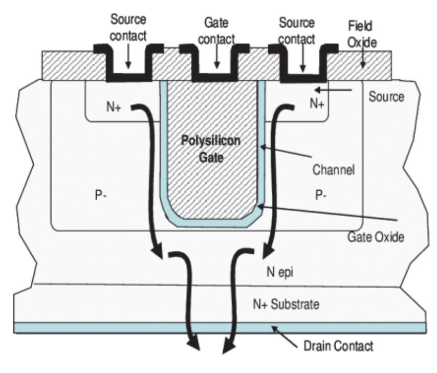

출처: 집필진 제작(2024)

[그림 1-1] Vertical MOSFET 구조

(나) IGBT(Insulated Gate Bipolar Transistor): 수직 구조를 사용하여 높은 전류와 전압을 처리할 수 있다.

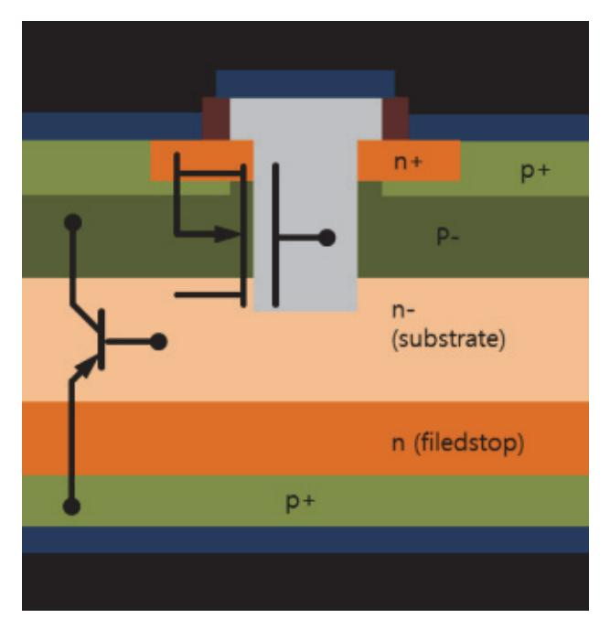

출처: 집필진 제작(2024) [그림 1-2] IGBT 수직 구조

(다) Vertical Diode: 전류가 수직 방향으로 흐르며, P-N 접합이 웨이퍼 두께를 따라 형성된 다.

평면적 구조와 수직적 구조는 각각 고유의 특성과 응용 분야를 가지며, 반도체 소자의 성능 최 적화를 위해 선택한다. 평면적 구조는 주로 CMOS 기술에 사용하며, 수직적 구조는 고전력 소 자나 고집적 회로에서 중요한 역할을 한다. 최신 반도체 기술 발전은 이러한 구조적 접근 방식 을 결합하여 더 높은 성능과 효율성을 달성하려는 노력의 한 방법이다.

숙 누설 전류 방지를 위한 레이아웃 방법

누설 전류는 반도체 소자의 효율성과 신뢰성에 영향을 미치는 중요한 문제 중 하나이다. 커스 텀 레이아웃 설계에서 누설 전류를 방지하기 위해 다양한 설계 기법을 적용할 수 있다. 주요 방법은 다음과 같다.

- 1. 채널 길이 최적화
  - (1) 설명: 채널 길이를 최적화하여 소자 간의 전류 누설을 최소화한다. 너무 짧은 채널은 소스와 드레인 간의 누설 전류를 증가시킬 수 있다.
  - (2) 방법: 채널 길이를 충분히 길게 설계하되, 성능과 면적 효율성을 동시에 고려한다.
- 2. 게이트 산화막 두께 조절
  - (1) 설명: 게이트 산화막은 게이트 전압에 의한 전계가 채널에 미치는 영향을 제어한다. 게이트 산화막 두께가 얇을수록 누설 전류가 증가할 수 있다.
  - (2) 방법: 적절한 산화막 두께를 유지하여 터널링 효과에 의한 누설 전류를 줄인다.
- 3. 웰 설계 최적화
  - (1) 설명: 웰은 특정 영역에 도핑된 영역으로, P-웰과 N-웰이 있다. 적절한 웰 설계는 소자 간 누설 전류를 감소시킬 수 있다.
  - (2) 방법: 웰 간격을 넓히고, P-웰과 N-웰의 도핑 농도를 조절하여 절연 효과를 강화한다.

4. 가드 링(Guard Ring) 사용

- (1) 설명: 가드 링은 누설 전류를 차단하고 외부 전기장의 영향을 줄이기 위해 사용된다.
- (2) 방법: 민감한 소자 주위에 가드 링을 배치하여 누설 경로를 차단한다. 이는 특히 아날로그 및 고전압 소자에서 중요하다.
- 5. 소자 간격 최적화
  - (1) 설명: 소자 간의 물리적 거리가 충분하지 않으면 전기적 간섭과 누설 전류가 발생할 수 있다. (2) 방법: 설계 규칙에 따라 소자 간의 최소 간격을 유지하고, 특히 고전압 소자의 경우 간격을

더 넓힌다.

- 6. 기생 소자 최소화
  - (1) 설명: 레이아웃 설계 시 기생 커패시턴스와 기생 저항을 최소화하여 누설 전류를 줄일 수 있 다.
  - (2) 방법: 전도체 간의 거리를 최적화하고, 접지면과 신호 라인 간의 격리를 유지하여 기생 소자 의 영향을 줄인다.
- 7. 보호 구조물 사용
  - (1) 설명: ESD(Electrostatic Discharge) 보호와 같은 구조물은 누설 전류를 줄이고 소자의 손 상을 방지한다.
  - (2) 방법: 소자의 입력 및 출력에 ESD 보호 구조물을 추가하여 전기적 손상을 방지하고, 누설 경로를 줄인다.

이러한 설계 방법을 적절히 조합하고 적용함으로써, 커스텀 레이아웃에서 누설 전류를 효과적 으로 줄일 수 있다. 이로 인해 소자의 효율성과 신뢰성을 향상시키고, 전체 시스템의 전력 소 비를 줄일 수 있다.

## 수행 내용 / 적용 공정 소자 분석하기

#### 재료·자료

- 설계 관련 자료: 회로도, 레이아웃 등
- 공정 관련 자료: 공정 설계 키트(Process Design Kit, PDK), 공정 기술 자료
- 시뮬레이션 및 모델링 자료: SPICE 모델, 기생 소자 모델(Parasitic Extraction), 시뮬레이 션 소프트웨어
- 설계 검증 보고서(Design Verification Report)
- 측정 결과 보고서(Measurement Report)
- 신뢰성 평가 보고서(Reliability Evaluation Report)

기기(장비 ・ 공구)

프로브 스테이션(Probe Station)

- 파라미터 분석기(Parameter Analyzer)
- 오실로스코프(Oscilloscope)
- 열 이미지 장치(Thermal Imaging Equipment)

#### 안전 ・ 유의 사항

• 해당 사항 없음.

#### 수행 순서

숔 커스텀 레이아웃 설계에 적용되는 공정의 소자를 분석한다.

커스텀 레이아웃 설계에서 공정에 적용되는 소자를 분석하는 것은 매우 중요한 작업이다. 커스 텀 레이아웃 설계는 표준 셀 라이브러리 대신 특정 요구 사항에 맞춰 소자를 배치하고 연결하 는 설계 방식으로, 시스템의 성능, 전력 소모, 면적 등을 최적화할 수 있다. 이 과정에서 공정 에 적용되는 각 소자의 특성과 그들이 레이아웃에 미치는 영향을 분석하는 것이 필수적이다. 다음은 커스텀 레이아웃 설계에 적용되는 소자 분석의 주요 요소들이다.

- 1. 소자의 종류와 특성을 분석한다.
  - (1) MOSFET(Metal-Oxide-Semiconductor Field-Effect Transistor)
    - (가) nMOS 및 pMOS 트랜지스터: nMOS는 전자를 운반하는 n형 트랜지스터이고, pMOS 는 정공을 운반하는 p형 트랜지스터이다. 이 둘은 기본적인 논리 게이트, 플립플롭, 메 모리 셀 등의 구성 요소이다.
    - (나) 문턱 전압(Vth): 트랜지스터가 켜지기 위해 필요한 게이트 전압이다. 문턱 전압은 소자의 스위칭 속도, 전력 소비 등에 중요한 영향을 끼친다.
    - (다) 이동도(μ): 채널에서 전자 또는 정공의 이동 속도를 결정하는 변수로, 소자의 전기적 성 능에 직접적인 영향을 끼친다.
    - (라) 게이트 산화막 두께(Tox): 얇을수록 전계 효과가 증가하여 성능이 향상되지만, 누설 전류 가 증가할 수 있다.
  - (2) 커패시터(Capacitor)
    - (가) MOS 커패시터: MOS 구조에서 게이트, 산화막, 반도체 기판으로 구성된 커패시터로, 전하 저장 및 필터링 역할을 한다.
    - (나) 고유전율 재료: 유전체로 사용되는 재료의 유전율이 높을수록 커패시턴스가 증가한다. 이 는 소형화된 소자에서도 높은 성능을 제공한다.
  - (3) 저항기(Resistor)

- (가) 폴리실리콘 저항: 일반적으로 CMOS 공정에서 사용되는 저항으로, 저항값을 조정하기 쉽고 안정적이다.
- (나) 메탈 저항: 낮은 저항값을 제공하며, 고속 회로에서 전력 손실을 줄이기 위해 사용된다.
- (4) 다이오드(Diode)
  - (가) PN 접합 다이오드: 전류를 한 방향으로만 흐르게 하는 기본 소자로, 정류기, 보호 회로 등에 사용된다.
  - (나) 쇼트 키 다이오드: 금속과 반도체의 접합으로 이루어진 다이오드로, 낮은 순방향 전압 강 하와 빠른 스위칭 속도를 제공한다.
- (5) 인덕터(Inductor)
  - (가) 집적 인덕터: 주로 RF 회로에서 사용되며, 자기장에 의해 에너지를 저장하고 신호를 필 터링하는 역할을 한다. 인덕터는 상대적으로 큰 면적을 차지할 수 있으므로, 레이아웃 설계 시 신중한 배치가 필요하다.
- 2. 소자의 레이아웃 설계 영향을 확인한다.
  - (1) 면적 및 밀도
    - (가) 소자의 크기: 소자의 물리적 크기는 레이아웃에서 차지하는 면적을 결정하며, 전체 칩 면 적과 비용에 직접적인 영향을 끼친다.
    - (나) 배선 밀도: 소자의 위치와 배치에 따라 배선의 길이와 복잡성이 결정된다. 최적의 레이아 웃은 배선 길이를 최소화하여 신호 지연과 전력 소모를 줄인다.
  - (2) 열 관리
    - (가) 전력 밀도: 고전력 소자는 더 많은 열을 발생시킨다. 소자의 위치와 배치는 열 분산을 고려해야 하며, 열이 많이 발생하는 소자 주변에는 열을 잘 분산할 수 있는 구조를 배치 해야 한다.
    - (나) 온도 영향: 온도는 소자의 전기적 특성에 영향을 미치므로, 열 관리가 중요한 소자(예: 고속 트랜지스터)는 열 발생을 최소화하는 방향으로 설계해야 한다.
  - (3) 전력 소모 및 성능
    - (가) 소자의 스위칭 속도: 레이아웃에서 소자의 위치와 연결 방식은 스위칭 속도에 영향을 끼친다. 고속 신호 경로에서는 스위칭 속도가 중요한 소자들을 배치하여 성능을 극대화한다.
    - (나) 전력 공급망 설계: 소자의 전력 소모량에 따라 전력 공급망을 설계하여 안정적인 전력 공급을 보장해야 한다.
- 3. 소자 간 상호 작용을 분석한다.
  - (1) 크로스토크(Crosstalk)

인접한 소자 간의 전기적 간섭 현상을 의미하며, 특히 고속 신호가 흐르는 트랜지스터나

15

배선 사이에서 발생할 수 있다. 레이아웃 설계에서 신호 간 간격을 충분히 두거나, 신호 선 사이에 그라운드선을 배치하여 크로스토크를 줄인다.

(2) 소자 매칭 정확도

아날로그 회로에서는 소자 간의 매칭이 매우 중요하다. 예를 들어, 차동 증폭기에서는 두 트랜지스터의 매칭이 정확해야 한다. 이를 위해 레이아웃에서 대칭성을 유지하거나 동일한 환경에 소자를 배치하는 방법을 사용한다.

(3) 배선 저항 및 기생 요소

배선의 길이와 폭에 따라 저항 및 기생 용량이 발생하며, 이는 회로의 동작 속도와 전 력 소모에 영향을 끼친다. 배선의 길이를 최소화하고, 중요한 신호 경로에서 저항을 줄 이기 위한 설계가 필요하다.

- 4. 제조 공정 변동성을 고려한다.
  - (1) 공정 변동성
    - (가) 제조 공정에서 발생할 수 있는 변동성(예: 도핑 농도, 산화막 두께 변화 등)을 고려하여, 소자의 전기적 특성이 변동성에 민감하지 않도록 설계한다.
    - (나) DFM(Design for Manufacturability): 제조 가능성을 고려한 설계를 통해 공정 변동성 으로 인한 성능 저하를 최소화한다.
  - (2) 공정 제어

소자 레이아웃에서 공정 제어 용이성을 고려하여, 공정 중 발생할 수 있는 문제를 최소 화한다. 예를 들어, 리소그래피 단계에서 패턴 왜곡을 방지하기 위해 패턴의 크기와 형 태를 최적화한다.

- 5. 시뮬레이션 및 검증을 한다.
  - (1) 전기적 시뮬레이션

SPICE 또는 기타 회로 시뮬레이션 도구를 사용하여, 레이아웃 설계된 소자의 전기적 특 성을 시뮬레이션한다. 소자의 동작이 설계 요구 사항을 충족하는지 확인한다.

- (2) 물리적 검증
  - (가) DRC(Design Rule Check) 레이아웃이 제조 공정의 설계 규칙을 준수하는지 검증한다. 소자 간 간격, 배선 폭, 접합 영역 등이 규칙에 맞는지 확인한다.
  - (나) LVS(Layout Versus Schematic) 레이아웃이 회로 설계도와 일치하는지 검증한다. 이 를 통해 회로 설계와 레이아웃 간의 불일치를 찾아 수정한다.
- 6. 결론 및 최적화한다.
  - (1) 레이아웃 최적화

분석 결과를 바탕으로 레이아웃을 최적화한다. 필요시 소자의 배치, 배선, 크기 등을 조

정하여 성능을 개선하고, 공정 변동성에 대한 민감도를 낮춘다.

(2) 피드백 및 반복

레이아웃 설계는 반복적인 과정을 통해 최적화된다. 각 분석 단계에서 얻은 피드백을 반 영하여 설계를 개선하고, 최종적으로 최적의 소자 레이아웃을 도출한다.

이와 같은 소자 분석 과정을 통해 커스텀 레이아웃 설계는 소자의 성능을 극대화하고, 제조 공 정에서 발생할 수 있는 문제를 최소화하며, 최종 제품의 신뢰성을 보장할 수 있다.

#### 숕 커스텀 레이아웃에 사용하는 전압별로 트랜지스터를 구분한다.

커스텀 레이아웃 설계에서 트랜지스터를 전압별로 구분하여 사용하는 것은 매우 일반적인 설계 방식이다. 각 전압에 맞는 트랜지스터를 선택하는 것은 회로의 안정성과 성능을 최적화하는 데 중요한 역할을 한다. 트랜지스터는 동작 전압에 따라 크게 저전압 트랜지스터와 고전압 트랜지 스터로 구분할 수 있으며, 각 유형은 특정 전압 범위에서 최적의 성능을 발휘하도록 설계된다. 트랜지스터의 선택은 설계의 요구 사항, 전원 공급 및 전압 레벨, 전류 요구 등에 따라 결정된 다. 각 트랜지스터의 특성을 고려하여 적합한 솔루션을 선택하는 것이 중요하다.

- 1. 저전압 트랜지스터(Low-Voltage Transistors)를 이해한다.
  - (1) 용도

저전압 트랜지스터는 일반적으로 디지털 회로, 저전력 회로, 모바일 기기, IoT 장치 등 에서 사용된다. 이들 회로에서는 전력 소모를 최소화하기 위해 낮은 전압에서 동작하는 트랜지스터가 필요하다.

(2) 전압 범위

저전압 트랜지스터는 주로 1.0V에서 1.8V 사이의 전압 범위에서 동작한다. 최신 CMOS 기술에서는 0.8V 이하의 전압에서도 동작하는 트랜지스터가 사용된다.

- (3) 특성
  - (가) 문턱 전압(Vth): 저전압 트랜지스터의 문턱 전압은 일반적으로 낮게 설정되어, 낮은 게이 트 전압에서도 트랜지스터가 활성화될 수 있도록 한다.
  - (나) 누설 전류: 저전압 환경에서 누설 전류를 최소화하기 위해 설계가 최적화된다. 누설 전류 는 전력 소모에 직접적인 영향을 끼친다.
  - (다) 스위칭 속도: 저전압 트랜지스터는 낮은 전압에서 빠른 스위칭을 가능하게 하여, 고속 디 지털 회로에서 중요한 역할을 한다.
- 2. 고전압 트랜지스터(High-Voltage Transistors)를 이해한다.
  - (1) 용도

고전압 트랜지스터는 전력 관리 회로, 디스플레이 드라이버, 전력 변환기, 아날로그 회 로 등에서 사용된다. 이들 회로는 높은 전압을 처리해야 하므로, 고전압에서 안정적으로 동작하는 트랜지스터가 필요하다.

(2) 전압 범위

고전압 트랜지스터는 주로 3.3V, 5V, 12V, 또는 그 이상의 전압에서 동작한다. 특정 전력 응용에서는 수십 볼트 이상의 전압에서 동작할 수 있다.

(3) 특성

- (가) 문턱 전압(Vth): 고전압 트랜지스터는 더 높은 문턱 전압을 가지며, 이는 높은 전압에서 의 안정적인 동작을 보장한다.
- (나) 전계 강도 관리: 고전압에서 발생하는 높은 전계를 견딜 수 있도록, 채널 길이와 산화막 두께가 상대적으로 증가하여 설계된다.
- (다) 전력 소모: 고전압 트랜지스터는 전압이 높으므로 전력 소모가 더 클 수 있지만, 높은 전압이 필요한 응용에서 필수적이다.
- 3. 전압별 트랜지스터의 설계 차이를 이해한다.
  - (1) 게이트 산화막 두께(Tox)

저전압 트랜지스터는 얇은 게이트 산화막을 사용하여 높은 전계 효과를 얻지만, 이는 고 전압에서 쉽게 파괴될 수 있다. 반대로, 고전압 트랜지스터는 두꺼운 게이트 산화막을 사용하여 높은 전압에서도 안정성을 유지한다.

(2) 채널 길이(L)

저전압 트랜지스터는 스위칭 속도를 높이기 위해 채널 길이가 짧은 반면, 고전압 트랜지 스터는 높은 전압을 견디기 위해 더 긴 채널 길이를 가질 수 있다.

(3) 전류 용량

고전압 트랜지스터는 더 높은 전류를 처리할 수 있도록 설계되며, 이는 전력 관리 및 드라이버 회로에서 중요하다. 저전압 트랜지스터는 전류 소모를 줄이기 위해 전류 용량 이 제한될 수 있다.

- 4. 커스텀 레이아웃 설계에서의 적용을 이해한다.
  - (1) 멀티-전압 설계

커스텀 레이아웃 설계에서는 하나의 칩에서 다양한 전압을 처리하는 경우가 많다. 이때 각 전압 범위에 맞는 트랜지스터를 선택하여 설계한다. 예를 들어, 코어 로직은 저전압 트랜지스터를 사용하고, 주변 회로나 전력 관리 회로는 고전압 트랜지스터를 사용할 수 있다.

(2) 전압 격리

저전압과 고전압 트랜지스터가 공존하는 회로에서 전압 격리가 필요하다. 이 격리는 서

로 다른 전압 레벨 간의 간섭을 방지하고, 안정적인 동작을 보장하기 위해 필수적이다.

(3) 전력 관리

전력 관리 회로에서는 전압 변환이나 조정이 필요하며, 이 과정에서 고전압 트랜지스터 가 사용된다. 저전력 설계에서는 전력 소모를 줄이기 위해 저전압 트랜지스터를 최적화 하여 사용한다.

- 5. 모델링 및 검증한다.
  - (1) 전압별 시뮬레이션

각 전압 범위에 따른 트랜지스터의 동작을 정확하게 모델링하고 시뮬레이션한다. 이를 통해 다양한 전압 조건에서 회로의 성능을 검증하고 최적화할 수 있다.

(2) 전압별 파라미터 조정

각 전압 범위에 맞는 트랜지스터의 파라미터를 조정하여, 전기적 특성을 최적화한다. 문 턱 전압, 이동도, 산화막 두께 등의 파라미터가 여기에 포함된다.

이와 같이, 커스텀 레이아웃 설계에서는 전압별로 최적화된 트랜지스터를 선택하여 설계함으로 써, 회로의 성능과 신뢰성을 극대화할 수 있다. 각 전압 범위에 맞는 트랜지스터를 사용하여 회로의 요구 사항을 충족시키는 것이 중요하다.

숖 전압별 트랜지스터의 구조적 차이를 구분하여 파악한다.

커스텀 레이아웃에 사용되는 전압별 트랜지스터의 구조적 차이를 분류하는 것은 전압 레벨에 따라 트랜지스터의 내부 구조 및 동작 특성에 차이가 있음을 의미한다. 일반적으로 다음과 같 은 분류를 따를 수 있다.

- 1. 구동 전압에 따른 트랜지스터의 특성을 파악한다.
  - (1) 저전압 트랜지스터(Low-Voltage Transistors)

(나) 구조

주로 MOSFET(Metal-Oxide-Semiconductor Field-Effect Transistor)가 사용된 다. 이러한 MOSFET은 주로 집적 회로(IC) 및 디지털 및 아날로그 응용에 사용된다.

(다) 특징

낮은 전압 및 소비 전력에 최적화되어 있으며, 고주파 응용 및 저전력 소비를 위한 고속 스위칭에 적합하다.

- (2) 고전압 트랜지스터(High-Voltage Transistors)
  - (가) 전압 범위

수십 볼트에서 수천 볼트 이상이다.

(가) 전압 범위: 보통 몇십 볼트에서 수백 볼트 미만

(나) 구조

고전압 및 고전류를 처리할 수 있는 BJT(Bipolar Junction Transistor) 또는 HV-MOSFET(High-Voltage MOSFET)가 주로 사용된다.

(다) 특징

고전압 및 고전류 응용에 적합하며, 전력 변환, 모터 제어, 전력 송수신 및 고전압 고주파 응용 등에 사용된다.

(3) 중간 전압 트랜지스터(Medium-Voltage Transistors)

(가) 전압 범위

수백 볼트에서 수천 볼트 사이이다.

(나) 구조

일부 특수한 응용을 위해 보다 중간 전압을 처리할 수 있는 트랜지스터가 사용된다. 예를 들어, IGBT(Insulated Gate Bipolar Transistor)는 중간 전압 응용에 사용될 수 있다.

(다) 특징

전력 변환, 레일 드라이버, 스위치 모드 전원 공급 장치 및 고전압 모터 제어와 같은 다양한 응용에 사용된다.

이러한 분류를 통해 각각의 전압별 트랜지스터가 다양한 응용 분야에 적합한 구조적 특징 과 동작 특성이 있음을 이해할 수 있다. 따라서 커스텀 레이아웃 설계 시 특정 전압 범위에 맞는 적절한 트랜지스터를 선택하여 사용하는 것이 중요하다.

2. 트랜지스터의를 구성하는 주요 구조에 따른 특성을 파악한다.

커스텀 레이아웃에서 사용하는 전압별 트랜지스터는 동작 전압에 따라 구조적으로 차이가 있다. 이 구조적 차이는 트랜지스터가 다루는 전압 범위에 따라 안정성, 성능, 신뢰성을 보 장하기 위한 것이다. 다음은 저전압 트랜지스터와 고전압 트랜지스터 간의 구조적 차이점에 대한 설명이다.

- (1) 게이트 산화막 두께(Tox)
  - (가) 저전압 트랜지스터
    - 1) 얇은 게이트 산화막: 저전압 트랜지스터는 게이트 산화막 두께가 얇다. 얇은 산화막 은 게이트 전압과 채널 사이에 강한 전계 효과를 발생시켜, 트랜지스터가 낮은 전압 에서도 효율적으로 동작할 수 있게 한다.
    - 2) 높은 게이트 전계: 얇은 산화막은 게이트에 걸리는 전계가 높아져 스위칭 속도를 빠 르게 하고, 낮은 전압에서도 효율적인 전류 흐름을 가능하게 한다.

#### (나) 고전압 트랜지스터

- 1) 두꺼운 게이트 산화막: 고전압 트랜지스터는 게이트 산화막이 두껍다. 이는 고전압 에서 발생하는 높은 전계를 견디고, 산화막이 파괴되는 것을 방지하기 위해 필수적 이다.
- 2) 전계 내성: 두꺼운 산화막은 전계 강도를 분산시키는 역할을 하여 고전압에서도 트 랜지스터가 안정적으로 동작할 수 있게 한다. 이로 인해, 고전압 트랜지스터는 낮은 전압에서는 덜 민감할 수 있지만, 전기적 내구성이 뛰어나다.
- (2) 채널 길이(L)
  - (가) 저전압 트랜지스터
    - 1) 짧은 채널 길이: 저전압 트랜지스터는 채널 길이가 짧다. 이는 스위칭 속도를 높이 고, 전류 흐름을 빠르게 하여 고속 디지털 회로에서 효율적으로 동작할 수 있도록 한다.
    - 2) 스케일링 효과: 짧은 채널 길이는 고밀도 집적이 가능하게 하며, 최신 CMOS 기술 에서는 채널 길이를 수 나노미터 수준으로 줄여 전력 소모를 최소화한다.
  - (나) 고전압 트랜지스터
    - 1) 긴 채널 길이: 고전압 트랜지스터는 채널 길이가 더 길다. 긴 채널 길이는 전류가 흐르는 동안 발생하는 전계를 더 넓게 분산시키고, 핫 캐리어 효과(Hot Carrier Effect)와 같은 고전압에 의한 손상을 줄인다.
    - 2) 내구성 강화: 긴 채널 길이는 고전압에서 트랜지스터의 신뢰성을 높이며, 주로 전력 관리 회로나 아날로그 회로에서 사용된다.
- (3) 드레인 확장 구조(Drain Extended Structure)
  - (가) 저전압 트랜지스터
    - 1) 표준 드레인 구조: 저전압 트랜지스터는 전압이 낮기 때문에 드레인 확장 구조가 필 요 없다. 전류 경로는 짧고, 스위칭 속도를 높이기 위해 간단한 드레인 구조를 채택 한다.
    - 2) 낮은 소스-드레인 저항: 저전압 트랜지스터는 소스-드레인 간 저항이 낮아, 전류 흐 름이 원활하게 이루어질 수 있다.
  - (나) 고전압 트랜지스터
    - 1) 드레인 확장 구조: 고전압 트랜지스터는 드레인 확장 구조를 가지고 있다. 이 구조 는 드레인에서의 전계 집중을 완화하고, 전압 분포를 균일하게 만들어 높은 전압에 서도 안정적인 동작을 보장한다.
    - 2) LDMOS(Laterally Diffused Metal-Oxide-Semiconductor): 고전압 트랜지스터 에서 흔히 사용되는 구조로, 드레인 확장을 통해 고전압 환경에서 뛰어난 내성을 발 휘한다. 이 구조는 고전압을 처리하면서도 낮은 온 저항[Rds(on)]을 유지한다.

(4) 바디 접지 및 절연 구조

- (가) 저전압 트랜지스터
  - 1) 표준 바디 접지: 저전압 트랜지스터는 바디 접지(Body Contact)를 통해 서브스트레 이트에 연결된다. 이는 일반적인 CMOS 공정에서 사용되는 방법으로, 간단하면서도 효과적이다.
  - 2) SOI(Silicon On Insulator) 옵션: 일부 저전압 트랜지스터는 SOI 기술을 사용할 수 있다. SOI는 소자의 바디를 절연체 위에 위치시켜, 누설 전류를 줄이고 속도를 높이는 데 유리하다.
- (나) 고전압 트랜지스터
  - 1) 절연 구조: 고전압 트랜지스터는 전압으로 인한 영향을 줄이기 위해 절연 구조가 더 강화된다. 바디가 절연되어 있는 구조를 통해 서브스트레이트와의 전기적 간섭을 줄 인다.
  - 2) PN 보호 다이오드: 고전압 트랜지스터는 전류가 역으로 흐르지 않도록 PN 접합 다 이오드를 포함한 보호 구조를 가질 수 있다. 이는 역방향 전압 내성을 강화한다.
- (5) 배선 및 레이아웃 고려 사항
  - (가) 저전압 트랜지스터
    - 1) 고밀도 레이아웃: 저전압 트랜지스터는 작은 크기와 높은 집적도를 갖출 수 있어, 회로 레이아웃에서 고밀도로 배치할 수 있다. 이는 칩 면적을 줄이고, 전력 소모를 최소화하는 데 유리하다.
    - 2) 짧은 배선: 스위칭 속도를 높이기 위해 배선이 짧고 간단하게 설계된다.
  - (나) 고전압 트랜지스터
    - 1) 확장된 레이아웃: 고전압 트랜지스터는 전계 분포와 발열을 관리하기 위해 더 넓은 면적이 필요할 수 있다. 배선 간격도 더 넓게 설계되어 전압 간섭을 줄인다.
    - 2) 열 관리: 고전압 트랜지스터는 높은 전력 소모로 인해 열이 많이 발생하므로, 레이 아웃 설계 시 열 분산을 고려해야 한다.

커스텀 레이아웃에서 전압별 트랜지스터의 구조적 차이는 주로 게이트 산화막 두께, 채널 길이, 드레인 확장 구조, 바디 접지 및 절연 구조, 배선 및 레이아웃에서 나타난다. 저전압 트랜지스터는 속도와 전력 효율성을 중시하며, 고전압 트랜지스터는 높은 전압을 견디기 위 한 내구성과 안정성을 중시한다. 이러한 구조적 차이는 각 트랜지스터가 설계된 전압 범위 에서 최적의 성능을 발휘할 수 있도록 설계되어 커스텀 레이아웃 설계에서 중요한 고려 사 항이 된다.

숗 BJT, 저항, 커패시터의 사용 레이어, 면적과 변화량을 파악한다.

커스텀 레이아웃에 사용되는 BJT(Bipolar Junction Transistor), 저항, 커패시터의 사용 레이 어, 면적 및 변화량은 제조 및 디자인 요구 사항에 따라 다르지만, 전자 소자의 일반적인 구현 방식을 살펴볼 수 있다.

이러한 전자 소자들은 각각 다른 레이어에서 형성되며, 각각의 디자인 및 제조 과정에 따라 변 화량이 발생할 수 있다. 디자인의 목적, 성능 요구 사항 및 제조 과정의 제약 사항을 고려하여 전자 소자들의 레이어 및 면적을 결정해야 한다.

1. BJT(Bipolar Junction Transistor)를 파악한다.

 BJT는 전자 소자로, 주로 실리콘 위에 형성된다. BJT는 NPN 또는 PNP 타입으로 형성될 수 있으며, 각 타입은 실리콘 칩 위에 서로 다른 레이어를 형성한다.

- (1) 사용 레이어를 파악한다.
  - (가) 에미터(Emitter): 주로 N+ 또는 P+ 도핑 레이어가 사용된다. 이 레이어는 전자를 주입 하는 역할을 하며, 고밀도 도핑으로 인해 매우 얇고 작게 설계된다.
  - (나) 베이스(Base): 에미터와 컬렉터 사이에 위치하며, N- 또는 P- 도핑 레이어가 사용된다. 이 레이어는 매우 얇고, 정밀한 도핑이 필요하다.
  - (다) 컬렉터(Collector): 전류를 모으는 역할을 하며, N 또는 P 도핑 레이어가 사용된다. 컬 렉터는 베이스와 에미터보다 더 깊고 넓은 영역을 차지할 수 있다.
  - (리) 금속 배선 레이어: BJT의 각 단자(에미터, 베이스, 컬렉터)는 금속 배선 레이어를 통해 연결된다. 이는 주로 상위 레이어(메탈 1, 메탈 2 등)에 위치한다.
- (2) 면적을 파악한다.
  - (가) 기본 면적: BJT는 MOSFET에 비해 더 큰 면적을 차지하는 경향이 있다. 이는 베이스-에미터 접합 및 컬렉터-베이스 접합이 필요하기 때문이다.
  - (나) 커스텀 레이아웃에서의 면적 최적화: BJT는 아날로그 회로에서 주로 사용되며, 트랜지스 터 매칭과 같은 요구 사항을 위해 면적이 조정될 수 있다. 예를 들어, 대칭성을 유지하 기 위해 더 큰 면적이 필요할 수 있다.
- (3) 변화량을 파악한다.
  - (가) 도핑 농도 변화: 제조 공정 중 도핑 농도의 변화가 발생할 수 있으며, 이는 BJT의 문턱 전압(Vth)과 전류 이득(β)에 영향을 끼친다.
  - (나) 레이어 두께 변화: 베이스 및 에미터 영역의 레이어 두께가 제조 공정 중 변동될 수 있 으며, 이는 BJT의 전기적 특성에 중요한 영향을 끼친다.
  - (다) 온도 변화: BJT는 온도에 민감하며, 온도 변화에 따라 전류 이득과 문턱 전압이 변동될 수 있다.

23

#### (4) 커스텀 레이아웃에서 BJT의 기판의 종류에 따른 면적의 변화를 파악한다.

BJT(Bipolar Junction Transistor)는 전력 증폭 및 스위칭 응용에 널리 사용되는 반도체 소자이다. BJT의 기판에 따른 면적의 영향은 다음과 같은 요소에 따라 결정 될 수 있다.

1) 소자 크기 및 구조

BJT의 크기와 구조는 사용되는 기판에 직접적인 영향을 끼친다. 소자의 크기가 클수록 면적도 커지게 된다. 또한 특정 구조의 BJT는 기판에서 차지하는 공간이 다를 수 있다. 예를 들어, NPN 및 PNP BJT의 형태와 구조에 따라 다른 면적을 차지할 수 있다.

2) 기판 소재

BJT는 다양한 종류의 기판 위에 형성될 수 있다. 실리콘, 강판, 유리판 등 다양 한 소재의 기판을 사용할 수 있으며, 이러한 기판 소재는 BJT의 면적에 영향을 줄 수 있다. 예를 들어, 기판의 열팽창 계수가 높은 경우 BJT의 크기를 더 크게 만들 수 있다.

3) 절연 및 보호 층

BJT는 보호 및 절연을 위해 추가적인 층을 갖는 경우가 있다. 이러한 층은 기판 에 추가적인 면적을 차지하게 되며, 전체적인 BJT의 면적에 영향을 줄 수 있다.

4) 패키징 및 연결 구성

BJT는 특정 패키지에 포함되어 외부에 연결되는 경우가 많다. 이러한 패키지와 연결 구성은 BJT의 전체적인 면적에 영향을 줄 수 있다. 더 큰 패키지 및 복잡 한 연결 구성은 더 많은 면적을 필요로 할 수 있다.

따라서 BJT의 기판에 따른 면적의 영향은 여러 요소에 따라 결정된다. 설계 단계에 서는 BJT의 크기와 기판 소재, 패키징 등을 고려하여 적절한 면적을 설정하는 것이 중요하다.

2. 저항(Resistor)

저항은 전기 신호의 흐름을 제어하는 역할을 하며, 주로 금속 층 위에 형성된다. 이러한 금 속 층은 일반적으로 실리콘 위의 저항 층과 연결된다.

(1) 사용 레이어

- (가) 폴리실리콘 저항: 폴리실리콘 레이어를 사용하여 저항을 형성하며, 도핑된 폴리실리콘이 저항값에 큰 영향을 끼친다. 폴리실리콘 저항은 주로 게이트 레이어와 같은 낮은 레이어 에 위치한다.
- (나) 메탈 저항: 메탈 레이어(예: 메탈 1, 메탈 2 등)를 사용하여 저항을 형성한다. 메탈 저항 은 전기 저항이 낮아, 낮은 저항값이 필요한 회로에 사용된다.
- (다) 저항성 레이어: 특정한 저항값을 가지도록 설계된 레이어(예: 고농도 도핑된 N+ 또는

P+ 레이어)도 사용될 수 있다.

- (2) 저항의 면적은 저항값 및 전류 처리 능력에 따라 달라지며, 디자인 요구 사항에 따라 조정된 다.
  - (가) 저항값(Resistance Value)

저항값이 낮을수록, 즉 전기적으로 더 효율적으로 전류를 흘려 보낼수록 저항의 면 적은 작아진다. 이는 전압을 낮추는 등의 방법으로 일어난다.

(나) 전류 처리 능력(Current Handling Capacity)

저항의 전류 처리 능력이 높을수록, 즉 더 많은 전류를 처리할 수 있는 경우 저항의 면적은 크게 될 것이다. 더 큰 면적이 필요한 이유는 저항의 내부 소재의 열을 효과 적으로 방출하기 위해서이다.

(다) 온도 상승(Temperature Rise)

저항에 전류가 흐를 때, 내부에서 발생하는 열에 따라 온도가 상승한다. 따라서 저항 의 면적은 이 열을 효과적으로 분산시키기 위해 충분히 커야 한다.

(라) 제조 공정 및 소자 형태

저항의 제조 공정 및 소자 형태도 면적에 영향을 줄 수 있다. 예를 들어, 특정 제조 공정에서는 더 많은 공간이 필요할 수 있으며, 이는 저항의 전체적인 면적에 영향을 줄 수 있다.

- (3) 변화량을 파악한다.
  - (가) 도핑 농도 변화: 도핑 레이어를 사용하는 저항의 경우, 제조 공정 중 도핑 농도의 변동 이 저항값에 직접적인 영향을 끼친다.
  - (나) 레이어 두께 변화: 폴리실리콘이나 메탈 레이어의 두께 변동은 저항값에 영향을 끼칠 수 있으며, 공정 제어가 중요하다.
  - (다) 온도 변화: 온도에 따라 저항값이 변동될 수 있으며, 온도 계수(Temperature Coefficient)를 고려한 설계가 필요하다.

따라서 저항값 및 전류 처리 능력이 높을수록 저항의 면적은 일반적으로 커질 것이다. 이러 한 요소들을 고려하여 저항의 최적의 면적을 결정해야 한다. 종합적으로, 디자인 요구 사항 과 제조 공정에 따라 저항의 면적을 조절하여 최적의 성능을 달성할 수 있다.

3. 커패시터(Capacitor)

커패시터는 전기적으로 축전된 2개의 판 사이의 전기적인 에너지를 저장하는 역할을 한다. 이러한 커패시터의 절연 층은 전기적인 절연을 제공하기 위해 단일 층의 절연 레이어 위에 형성된다.

(1) 사용 레이어를 파악한다.

(가) MIM 커패시터(Metal-Insulator-Metal): 금속 레이어 사이에 절연체(유전체) 레이어가

25

위치한 구조로, 고성능 커패시터를 제공한다. 주로 상위 메탈 레이어(메탈 3 이상)에 위 치한다.

- (나) MOS 커패시터: MOS 구조를 이용한 커패시터로, 게이트 산화막이 유전체 역할을 한다. 게이트 레이어와 반도체 기판 간의 커패시턴스가 형성된다.
- (다) 폴리-폴리 커패시터: 2개의 폴리실리콘 레이어 사이에 유전체가 위치한 구조로, 공정 변 동성이 적고 안정적인 커패시턴스를 제공한다.
- (2) 커패시터의 면적은 저장 용량과 전압 처리 능력에 따라 달라지며, 디자인 요구 사항에 따라 조정된다.
  - (가) 용량(Capacitance)

커패시터의 용량은 커패시터의 면적에 직접적으로 영향을 끼친다. 일반적으로 커패시 터의 용량이 커질수록 면적도 증가하게 된다.

(나) 전압 등급(Voltage Rating)

커패시터의 전압 등급은 사용되는 재료와 구조에 따라 달라진다. 더 높은 전압 등급 을 가지는 커패시터는 일반적으로 더 두꺼운 절연층을 필요로 하므로 면적도 크게 될 수 있다.

(다) 두께 및 절연 층(Thickness and Dielectric Layer)

커패시터의 두께와 절연 층의 두께는 면적에 직접적으로 영향을 끼친다. 더 두꺼운 절연 층이나 두꺼운 전극은 더 많은 공간을 차지하게 되어 면적이 증가할 수 있다.

(라) 패키지 및 구조(Package and Structure)

커패시터의 패키지 및 구조도 면적에 영향을 줄 수 있다. 특히 표면 실장 커패시터 (SMD)의 경우, 일반적으로 더 작은 면적을 차지하지만 플레이트 간의 거리를 최소 화하여 전기적 특성을 향상시키는 데 중요한 역할을 한다.

(마) 제조 공정 및 기술

커패시터의 제조 공정 및 기술은 면적에 영향을 줄 수 있다. 일부 고급 기술은 더 높은 밀도와 더 작은 면적을 달성할 수 있다.

- 이러한 인자들은 커패시터의 설계 및 제조 과정에서 고려되어야 한다. 면적을 최적화하 는 데에는 용량 요구 사항, 전압 등급, 신뢰성, 비용 등의 요소를 고려해야 한다.
- (3) 변화량을 파악한다.
  - (가) 유전체 두께 변화: 유전체 레이어의 두께가 제조 공정 중 변동될 수 있으며, 이는 커패 시턴스에 직접적인 영향을 끼친다.
  - (나) 전계 강도 변화: 고전압에서 유전체 내 전계 강도가 변할 수 있으며, 이는 커패시턴스와 누설 전류에 영향을 끼칠 수 있다.
  - (다) 온도 변화: 커패시터의 유전체는 온도에 따라 특성이 변할 수 있으며, 온도 변화에 따른

#### 커패시턴스의 변동을 최소화하기 위한 설계가 필요하다.

수 설계 공정에서 사용할 최적의 소자 형태를 선정한다.

커스텀 레이아웃의 설계 과정에서 사용할 최적의 소자 형태를 선정하는 것은 해당 설계의 목 적, 성능 요구 사항, 제조 공정 및 비용 등 다양한 요소를 고려해야 한다. 다음은 소자 형태를 선정할 때 고려해야 할 몇 가지 요소이다

1. 설계 목적 및 요구 사항을 파악한다.

커스텀 레이아웃 설계에서 최적의 소자 형태를 선정하기 위해 설계 목적 및 요구 사항을 명확히 파악하는 것은 필수적이다. 이는 설계가 요구하는 성능, 전력 효율, 신뢰성 등을 충 족하는 소자를 선택하는 데 핵심적인 역할을 한다. 아래는 설계 목적 및 요구 사항을 파악 하기 위한 주요 단계와 고려 사항이다.

- (1) 성능 요구 사항
  - (가) 처리 속도
    - 1) 정의: 회로가 데이터를 처리하는 속도이며, 높은 클럭 속도와 빠른 신호 전파 시간 이 필요할 수 있다.
    - 2) 고려 사항: 고속 스위칭이 가능한 소자(예: FinFET, 고속 CMOS)를 선택해야 한다.
  - (나) 전력 소비
    - 1) 정의: 회로의 전력 소모량이며, 낮은 전력 소비는 배터리 수명을 연장하고, 발열을 줄이는 데 중요한 역할을 한다.
    - 2) 고려 사항: 저전력 소자(예: 저전압 CMOS, Subthreshold CMOS)와 전력 효율이 높은 설계를 고려해야 한다.
  - (다) 신호 무결성
    - 1) 정의: 신호가 전송되는 동안 왜곡이나 손실 없이 전송되는 특성이다.
    - 2) 고려 사항: 낮은 기생 커패시턴스와 인덕턴스를 가진 소자를 선택하여 신호 무결성 을 유지한다.

(2) 환경 요구 사항

- (가) 작동 온도 범위
  - 1) 정의: 소자가 안정적으로 작동할 수 있는 온도 범위이다.
  - 2) 고려 사항: 고온·저온 환경에 적합한 소자(예: SiC, GaN)를 선택해야 한다.
- (나) 방사선 내성
  - 1) 정의: 방사선 노출 시에도 소자가 정상적으로 작동할 수 있는 능력이다.
  - 2) 고려 사항: 우주, 군사, 의료 응용에서는 방사선 내성을 고려해야 한다.

27

(3) 신뢰성 요구 사항

(가) 수명 및 고장률

1) 정의: 소자가 일정 기간 동안 정상적으로 작동할 확률이다.

2) 고려 사항: 고신뢰성 소자와 안정적인 공급망을 가진 소자를 선택한다.

(나) 전기적 스트레스 내성

1) 정의: 과전압, 과전류 상황에서도 견딜 수 있는 능력이다.

2) 고려 사항: 높은 내압과 강력한 보호 기능을 가진 소자를 선택해야 한다.

(4) 비용 및 가용성 요구 사항

(가) 생산 비용

1) 정의: 소자를 제조하는 데 드는 총비용이다.

2) 고려 사항: 경제적으로 효율적인 공정과 저렴한 재료를 사용하는 소자를 선택한다.

(나) 대량 생산 가능성

1) 정의: 대량 생산이 가능하고 공급망이 안정적인지의 여부이다.

2) 고려 사항: 공급망이 안정적이고, 대량 생산이 가능한 공정을 선택한다.

(5) 법적 및 규제 요구 사항

(가) 표준화 및 규제 준수

1) 정의: 산업 표준과 법적 규제를 충족하는지의 여부이다.

2) 고려 사항: 선택한 소자가 관련 표준과 규제를 준수하는지 확인한다.

커스텀 레이아웃 설계에서 최적의 소자 형태를 선택하기 위해서는 설계 목적과 각종 요구 사항을 명확히 정의해야 한다. 이를 통해 설계 목표를 달성하고, 성능, 신뢰성, 비용 효율성 을 최대화할 수 있는 소자를 선택할 수 있다. 이러한 분석을 통해 최종적으로 선택된 소자 는 시스템의 전반적인 성능과 신뢰성에 크게 기여할 것이다.

2. 전력 소비 및 전압 요구 사항을 파악한다.

커스텀 레이아웃 설계에서 최적의 소자 형태를 선정하기 위해 전력 소비와 전압 요구 사항 을 명확히 파악하는 것이 매우 중요하다. 이 정보는 소자의 선택과 최적화를 통해 시스템의 성능, 효율성, 신뢰성을 극대화하는 데 도움이 된다. 이를 위해 다음과 같은 요소들을 고려 해야 한다.

(1) 전력 소비 요구 사항

(가) 정적 전력 소비(Static Power Consumption)

- 1) 정의: 소자가 작동하지 않을 때 소비되는 전력. 주로 누설 전류에 의해 발생한다.
- 2) 관련 소자: 저전력 소자는 낮은 누설 전류를 가지는 소자가 필요하다. 예를 들어, 고밀도 로직 회로나 메모리 설계에서는 저전력 CMOS 공정이 적합하다.

(나) 동적 전력 소비(Dynamic Power Consumption)

- 1) 정의: 소자가 동작 중일 때 소비되는 전력. 스위칭 활동에 비례하며, 클럭 속도, 전 압, 커패시턴스에 의해 결정된다.
- 2) 관련 소자: 고속 처리가 필요한 경우, 전력 소모를 줄이기 위해 낮은 커패시턴스와 빠른 스위칭 속도를 가진 소자를 선택해야 한다. 고성능 로직 회로에서는 고속 CMOS나 BiCMOS 공정이 적합할 수 있다.
- (2) 전압 요구 사항
  - (가) 작동 전압(Operating Voltage)
    - 1) 정의: 소자가 정상적으로 동작하기 위해 필요한 전압 범위이다.
    - 2) 관련 소자: 저전압 소자는 낮은 전력 소비를 위해 저전압에서 동작할 수 있어야 하 며, 고전압 소자는 높은 전압에서도 안전하게 작동할 수 있어야 한다. 예를 들어, 이동 통신 기기에서는 1.8V 이하의 저전압 CMOS가, 전력 전자기기에서는 600V 이상의 고전압 MOSFET이 필요하다.
  - (나) 내압(Breakdown Voltage)
    - 1) 정의: 소자가 견딜 수 있는 최대 전압. 이를 초과하면 소자가 손상될 수 있다.
    - 2) 관련 소자: 고전압 애플리케이션에서는 높은 내압을 가진 소자가 필요하다. 예를 들 어, 전력 스위칭 소자로서 IGBT나 고전압 MOSFET이 사용된다.
- (3) 최적의 소자 형태 선정
  - (가) 저전력 저전압 소자
    - 1) 적합한 소자: 저전력 CMOS, FinFET
    - 2) 응용 분야: 모바일 디바이스, 웨어러블 기기, IoT 장치
  - (나) 고성능 저전압 소자
    - 1) 적합한 소자: 고속 CMOS, BiCMOS
    - 2) 응용 분야: 고성능 컴퓨팅, 통신 장비
  - (다) 고전압 소자
    - 1) 적합한 소자: 고전압 MOSFET, IGBT, LDMOS
    - 2) 응용 분야: 전력 전자 기기, 전력 공급 시스템, 모터 드라이브

최적의 소자 형태를 선정하기 위해 전력 소비와 전압 요구 사항을 철저히 분석해야 한다. 이를 통해 시스템의 요구에 맞는 소자를 선택하고, 전력 효율성과 성능을 최적화할 수 있 다. 소자의 선택은 시스템의 전체적인 성능과 신뢰성에 큰 영향을 끼치므로, 이러한 요구 사항을 기반으로 신중하게 결정해야 한다.

3. 속도 및 주파수 응답 특성을 파악한다.

커스텀 레이아웃 설계에서 최적의 소자 형태를 선정하기 위해 소자의 속도 및 주파수 응답 특성을 파악하는 것은 매우 중요하다. 이러한 특성은 소자의 동작 속도, 신호 무결성, 전력 소비 등에 큰 영향을 끼치기 때문에, 시스템의 성능을 최적화하는 데 필수적이다. 아래는 속도 및 주파수 응답 특성을 고려한 최적의 소자 형태를 선정하는 방법에 대한 설명이다.

- (1) 소자의 속도 특성
  - (가) 전자 이동도(Electron Mobility)
    - 1) 정의: 소자의 채널에서 전자가 이동하는 속도이며, 높은 이동도는 빠른 스위칭 속도 와 낮은 전력 소비를 의미한다.
    - 2) 관련 소자: CMOS에서 전자 이동도는 성능을 결정하는 중요한 요소이다. NMOS는 일반 적으로 PMOS보다 높은 이동도를 가지며, 이를 통해 고속 처리 능력을 제공한다.
  - (나) 문턱 전압(Threshold Voltage, Vth)
    - 1) 정의: 소자가 켜지기 시작하는 게이트 전압이며, 낮은 문턱 전압은 빠른 스위칭을 가능하게 하지만, 누설 전류가 증가할 수 있다.
    - 2) 관련 소자: 저전력 CMOS 소자는 일반적으로 낮은 Vth를 가져 빠른 스위칭과 낮은 전력 소비를 지원한다.
  - (다) 트랜지스터의 차단 시간(Cut-off Time)
    - 1) 정의: 트랜지스터가 꺼지는 데 걸리는 시간이며, 차단 시간이 짧을수록 고속 스위칭 이 가능하고, 고속 디지털 회로에서 중요하다.
    - 2) 관련 소자: 고속 CMOS, FinFET, HEMT(High Electron Mobility Transistor) 등
- (2) 주파수 응답 특성
  - (가) 차단 주파수(Cut-off Frequency, fT)
    - 1) 정의: 트랜지스터의 전류 이득이 1이 되는 주파수이며, 이 주파수는 트랜지스터의 속도를 결정하는 주요 지표이다.
    - 2) 관련 소자: 고주파 소자는 높은 fT를 가져야 하며, 이 특성은 주로 통신 기기나 RF 애플리케이션에 중요하다. 예를 들어, HEMT와 같은 고주파 소자는 매우 높은 fT를 제공한다.
  - (나) 이득 대역폭 곱(Gain Bandwidth Product, GBW)
    - 1) 정의: 소자의 주파수 응답 특성을 나타내며, 주파수 대역에서 증폭할 수 있는 최대 이득을 의미한다.
    - 2) 관련 소자: 연산 증폭기, RF 트랜지스터 등에서 중요하며, 주로 아날로그 신호 처리 에 고려한다.
- (3) 최적의 소자 형태 선정
  - (가) 고속 및 저전력 소자
    - 1) 적합한 소자: FinFET, 고속 CMOS
    - 2) 응용 분야: 고성능 컴퓨팅, 이동 통신, 신호 처리 등

- (나) 고주파 소자
  - 1) 적합한 소자: HEMT, SiGe HBT(Silicon-Germanium Heterojunction Bipolar Transistor)
  - 2) 응용 분야: RF 애플리케이션, 고속 데이터 통신 등
- (다) 저전력 소자
  - 1) 적합한 소자: 저전력 CMOS, Subthreshold CMOS
  - 2) 응용 분야: 모바일 디바이스, 웨어러블 기기, IoT 장치 등

속도 및 주파수 응답 특성은 커스텀 레이아웃 설계에서 소자를 선택하는 데 중요한 기준이 다. 시스템의 요구 사항에 맞는 소자를 선택하면 성능을 최적화하고 전력 효율성을 극대화 할 수 있다. 이러한 특성을 이해하고 적절히 활용하는 것은 고성능 및 고효율 시스템 설계 의 핵심 요소이다.

4. 제조 공정 및 가용 기술을 파악한다.

커스텀 레이아웃 설계에서 최적의 소자 형태를 선정하기 위해 제조 공정과 가용 기술을 파 악하는 것은 매우 중요하다. 이를 통해 소자의 성능, 비용, 생산 가능성 등을 최적화할 수 있다. 다음은 제조 공정 및 가용 기술을 고려하여 최적의 소자 형태를 선정하는 데 필요한 주요 요소들이다.

이러한 요소들을 고려하여 설계 목표와 요구 사항에 가장 적합한 소자 형태를 선택하는 것 이 중요하다. 종합적으로, 설계 과정에서는 다양한 소자 형태의 장단점을 고려하여 최적의 소자를 선택해야 한다.

(1) 제조 공정 기술

- (가) CMOS 공정
  - 1) 개요: CMOS 공정은 디지털 및 아날로그 회로에 널리 사용되는 대표적인 반도체 제조 기술이다.
  - 2) 장점: 저전력 소비, 고집적도, 다양한 기능 집적이 가능하다.
  - 3) 한계: 고전압 소자 제작에 제한적일 수 있다.
  - 4) 적합한 소자: 저전력 소자, 디지털 로직 소자, 아날로그 소자 등이 있다.
- (나) BiCMOS 공정
  - 1) 개요: CMOS와 Bipolar Junction Transistor(BJT)를 결합한 공정으로, CMOS의 저전력 특성과 BJT의 고속 및 고전류 특성을 모두 활용한다.
  - 2) 장점: 고속, 고전류 구동 가능하다.
  - 3) 한계: 복잡하고 비용이 높다.
  - 4) 적합한 소자: 고속 아날로그 · 디지털 혼합 신호 소자, RF 소자 등이 있다.
- (다) SOI(Silicon on Insulator) 공정

- 1) 개요: 실리콘 기판 위에 절연층을 두고 그 위에 소자를 형성하는 공정이다.
- 2) 장점: 낮은 기생 커패시턴스, 전력 소비 감소, 방사선 내성을 지니고 있다.
- 3) 한계: 비용이 많이 들고, 특정 응용에 적합하다.
- 4) 적합한 소자: 저전력 고속 소자, 방사선 내성이 필요한 소자 등이다.
- (라) GaN 및 SiC 공정
  - 1) 개요: 갈륨 나이트라이드(GaN)와 실리콘 카바이드(SiC)는 고전압 및 고온에서도 안 정적으로 동작하는 전력 소자 제조에 사용된다.
  - 2) 장점: 높은 전압과 전류 처리 능력, 고온 안정성이 있다.
  - 3) 한계: 생산 비용이 많이 들고, 특정 고전력 응용에 한정된다.
  - 4) 적합한 소자: 전력 변환기, RF 전력 증폭기 등이다.
- (2) 가용 기술 및 소자 선택
  - (가) FinFET 및 GAA(Gate-All-Around) 트랜지스터
    - 1) 특징: 트랜지스터의 채널을 삼차원 구조로 형성하여 성능과 전력 효율을 향상시킨다.
    - 2) 장점: 누설 전류 감소, 고속 동작이 가능하다.
    - 3) 적합한 공정: 첨단 CMOS 공정(10nm 이하)이다.
    - 4) 적합한 소자: 고성능 컴퓨팅 소자, 저전력 소자 등이 있다.
  - (나) 고전압 MOSFET 및 IGBT
    - 1) 특징: 고전압 및 고전류 처리가 가능하도록 설계된다.
    - 2) 장점: 높은 내압, 전력 스위칭이 효율적이다.
    - 3) 적합한 공정: LDMOS, GaN, SiC 공정이다.
    - 4) 적합한 소자: 전력 전자 기기, 전기차용 전력 제어 소자 등이다.
  - (다) RF 소자(HEMT, SiGe HBT)
    - 1) 특징: 고주파 응용에 최적화된 소자이다.
    - 2) 장점: 높은 주파수 응답, 낮은 잡음 특성을 지닌다.
    - 3) 적합한 공정: GaAs, GaN, SiGe 공정이다.
    - 4) 적합한 소자: 통신 장비, RF 전력 증폭기 등이 있다.
- (3) 최적의 소자 형태 선정 과정
  - (가) 응용 분야 및 요구 사항 정의: 시스템의 전력 소비, 전압, 속도 및 주파수 응답 요구 사 항을 명확히 정의한다.
  - (나) 공정 기술 평가: 각 공정의 특성과 장점을 평가하여 응용에 가장 적합한 공정을 선택한 다.
  - (다) 소자 성능 검토: 각 공정에서 제공할 수 있는 소자의 전기적 특성(속도, 전력 소비, 내압 등)을 검토한다.

- (라) 비용 및 생산성 고려: 선택된 소자가 경제적이고 대량 생산에 적합한지 평가한다.
- (마) 최종 선택: 모든 요소를 종합적으로 고려하여 최적의 소자 형태를 선정한다.

이러한 분석을 통해 커스텀 레이아웃 설계에 가장 적합한 소자 형태를 선정할 수 있으 며, 이를 통해 설계의 효율성, 성능, 및 신뢰성을 극대화할 수 있다.

5. 비용 및 가용성을 파악한다.

커스텀 레이아웃 설계에서 최적의 소자 형태를 선정하기 위해 비용과 가용성을 파악하는 것은 중요한 단계이다. 소자의 선택은 전체 프로젝트의 경제성과 성공 가능성에 큰 영향을 끼치며, 이를 위해 다양한 요소를 고려해야 한다.

- (1) 비용 요소 분석
  - (가) 제조 비용
    - 1) 공정 복잡성: 복잡한 제조 공정은 공정 단계가 많아져 비용이 증가한다. 예를 들어, FinFET이나 GAA 트랜지스터는 평면 CMOS보다 제조 공정이 복잡하고 비용이 많 이 든다.
    - 2) 웨이퍼 크기 및 사용률: 웨이퍼 크기와 사용률은 비용에 영향을 끼친다. 큰 웨이퍼 는 더 많은 소자를 생산할 수 있지만, 초기 설치 비용이 높을 수 있다.
    - 3) 재료 비용: 사용되는 재료의 희귀성과 비용도 중요한 요소이다. 예를 들어, SiC나 GaN은 실리콘보다 재료 비용이 많이 든다.
  - (나) 개발 비용
    - 1) 설계 비용: 새로운 소자 형태를 설계하는 데 필요한 비용이다. 이는 설계 도구, 엔 지니어링 인력, 개발 기간 등을 포함한다.
    - 2) 테스트 및 검증 비용: 소자의 테스트와 검증을 위한 비용으로, 시뮬레이션, 프로토타 이핑, 실험실 테스트가 포함된다.
  - (다) 운영 비용
    - 1) 전력 소비: 소자의 전력 효율성은 운영 비용에 직접적인 영향을 끼친다. 고전압 소 자나 고주파 소자는 일반적으로 전력 소비가 높다.
    - 2) 신뢰성 및 수명: 소자의 신뢰성과 수명이 운영 비용에 영향을 끼친다. 신뢰성이 낮 은 소자는 유지 보수 비용이 높아질 수 있다.
- (2) 가용성 요소 분석
  - (가) 기술적 가용성
    - 1) 공정 기술의 성숙도: 공정 기술의 성숙도는 가용성을 결정하는 주요 요소이다. 성숙 한 기술은 높은 생산성을 가지고 있으며, 예측 가능한 결과를 제공한다.
    - 2) 공급망 안정성: 소자에 사용되는 재료와 부품의 공급망 안정성도 중요하다. 공급망 이 불안정하면 생산 지연과 비용 상승이 발생할 수 있다.

33

- (나) 생산 능력
  - 1) 제조 파운드리의 용량: 제조 파운드리의 용량은 특정 공정 기술의 대량 생산 가능성 을 결정한다. 대량 생산이 가능한 공정은 비용 절감에 유리하다.
  - 2) 다양한 공급 업체: 여러 제조 파운드리에서 동일한 공정을 지원할 수 있다면 가용성 이 높아진다.
- (다) 표준화 및 규제
  - 1) 산업 표준화: 소자가 특정 산업 표준에 부합하는지 여부는 가용성을 결정한다. 표준 화된 소자는 여러 제조업체에서 쉽게 조달할 수 있다.
  - 2) 규제 요구 사항: 특정 응용 분야에서 요구되는 규제 조건(예: 의료, 군사 등)을 충족 해야 한다.
- (3) 최적의 소자 형태 선정 과정
  - (가) 요구 사항 정의: 전력 소비, 성능, 신뢰성, 비용 등에 대한 시스템의 요구 사항을 정의한 다.
  - (나) 비용 분석: 제조, 개발, 운영 비용을 포함한 총비용을 분석하여 가장 경제적인 소자 형태 를 평가한다.
  - (다) 가용성 평가: 기술적 성숙도, 공급망 안정성, 생산 능력, 표준화 상태 등을 평가하여 가 용성을 판단한다.
  - (라) 위험 평가: 기술적, 공급망, 규제상의 위험 요소를 평가하고, 이에 대한 대응 전략을 수 립한다.
  - (마) 최종 선정: 모든 요소를 종합적으로 고려하여 최적의 소자 형태를 선택한다.

이 과정을 통해 커스텀 레이아웃 설계에서 최적의 소자 형태를 선정할 수 있으며, 프로 젝트의 성공 가능성을 높이고 경제성을 확보할 수 있다.

6. 환경 및 신뢰성 요구 사항을 파악한다.

커스텀 레이아웃 설계에서 최적의 소자 형태를 선정하기 위해 환경 및 신뢰성 요구 사항을 파악하는 것은 매우 중요하다. 이러한 요구 사항은 소자의 장기적인 성능과 안정성에 큰 영 향을 끼치며, 특정 응용 분야에서 필수적인 고려 사항이다.

- (1) 환경 요구 사항
  - (가) 온도 범위
    - 1) 정의: 소자가 동작할 수 있는 온도 범위를 말한다.
    - 2) 중요성

온도가 높거나 낮을 때 소자의 특성이 변할 수 있다. 예를 들어, 온도가 높으면 누설 전류가 증가하고, 낮으면 회로가 제대로 동작하지 않을 수 있다.

3) 소자 선택

고온 환경에서는 고온 안정성을 가진 SiC 또는 GaN 소자를, 저온 환경에서는 적절한 온도 보상 회로를 포함한 소자를 선택한다.

- (나) 습도 및 부식 내성
  - 1) 정의: 소자가 작동 중에 견딜 수 있는 습도 및 부식 조건을 말한다.
  - 2) 중요성: 습도와 부식은 소자의 성능을 저하시킬 수 있다. 특히, 금속 배선과 접촉 패드에서 문제가 될 수 있다.
  - 3) 소자 선택: 금속 부식에 강한 소재와 보호 코팅을 가진 소자를 선택한다.
- (다) 방사선 내성
  - 1) 정의: 방사선 환경에서 소자가 견딜 수 있는 능력을 말한다.
  - 2) 중요성

우주, 군사, 의료 등 방사선에 노출될 수 있는 환경에서 중요하다. 방사선은 소자 의 전기적 특성을 변형시킬 수 있다.

3) 소자 선택

SOI(Silicon on Insulator) 소자와 같은 방사선 내성을 가진 소자를 선택한다.

- (2) 신뢰성 요구 사항
  - (가) 수명(Lifespan)
    - 1) 정의: 소자가 정상적으로 동작할 수 있는 기간을 말한다.
    - 2) 중요성

장기적인 사용이 요구되는 시스템에서 중요하며, 수명이 짧으면 유지 보수 비용 이 증가할 수 있다.

3) 소자 선택: 전력 및 열 관리가 잘 설계된 소자를 선택하여 수명을 최대화한다.

(나) 전기적 스트레스 내성(Electrical Stress Tolerance)

1) 정의: 소자가 최대 전압, 전류 등을 견딜 수 있는 능력을 말한다.

2) 중요성

과전압, 과전류 상황에서 소자의 신뢰성을 보장하기 위해 중요하다.

3) 소자 선택

높은 내압 특성을 가진 소자, ESD 보호 구조물을 갖춘 소자를 선택한다.

- (다) 열 관리(Thermal Management)
  - 1) 정의: 소자에서 발생하는 열을 효과적으로 방출하는 능력을 말한다.
  - 2) 중요성

열이 소자 내부에 축적되면 소자의 성능과 수명이 감소할 수 있다.

3) 소자 선택

열전도성이 높은 패키지와 열 방출 구조를 가진 소자를 선택한다.

(라) 고장률(Failure Rate)

1) 정의: 특정 시간 동안 소자가 고장이 날 확률을 말한다.

2) 중요성

신뢰성이 중요한 응용에서 중요하며, 고장률이 낮아야 유지 보수 비용이 줄어든 다.

3) 소자 선택

신뢰성 테스트를 통해 검증된 소자를 선택하고, 예비 부품을 확보한다.

(3) 최적의 소자 형태 선정

환경 및 신뢰성 요구 사항을 고려한 최적의 소자 형태를 선정하는 과정은 다음과 같다.

- (가) 응용 분야 및 환경 조건 정의: 소자가 사용될 환경(온도, 습도, 방사선 등)과 응용 분야 의 특성을 명확히 정의한다.
- (나) 소자 후보 선정: 다양한 소자 형태를 검토하여 각 소자가 제공하는 환경 및 신뢰성 특성 을 분석한다.
- (다) 신뢰성 테스트: 후보 소자에 대해 신뢰성 테스트를 수행하고, 결과를 분석하여 최적의 소 자를 선정한다.

(라) 최종 평가: 비용, 가용성, 성능 등을 종합적으로 고려하여 최종 소자를 선택한다.

이러한 절차를 통해 커스텀 레이아웃 설계에서 최적의 소자 형태를 선정할 수 있으며, 시스 템의 신뢰성과 안정성을 높일 수 있다.

#### 수행 tip

- 커스텀 레이아웃에 주요하게 활용되는 트랜지스터의 특징 을 충분히 이해를 바탕으로 최적화를 목표로 다양한 구조 적 차이와 주요 특성치에 대한 변화를 확인한다.
- 설계에서 사용할 제조 공정을 고려한 최적의 소자 선택할 수 있도록 소자의 구조를 고려한다.

### 학습 1 교수·학습 방법

#### 교수 방법

- 반도체 제품의 주요 규격이 응용처에 따라 적용하는 방법이 달라지는 경우를 설명한다.
- 반도체 제품의 규격 및 사양의 항목에 대해 이해도를 높이기 위해 현재 상용되는 반도체 제 품의 데이터시트 이용 등 사례를 활용하여 지도한다.
- 경쟁 제품 분석 및 사양 결정과 반도체 공정 결정에 대한 사례 분석을 통하여, 학습자가 실 무 관점으로 적용할 수 있도록 지도한다.
- 파운드리 업체와 종합 반도체 회사에 대한 자료를 이용하여 반도체 공정의 종류와 개발 제 작 방법을 설명하고, 공정 선택의 중요성과 고려해야 할 항목들에 관해 설명한다.
- 개발하려는 반도체 제품의 기능을 정의하고 각 기능별로 회로의 크기를 예측하여 그 면적을 계산하는 방법에 대해 설명한다.

#### 학습 방법

- 반도체 제품의 주요 규격이 응용처에 따라 다르게 사용되는 경우에 대한 내용을 조사하여 그 차이점을 정리하여 비교표를 작성해 본다.
- 현재 상용 반도체 제품의 데이터시트를 인터넷 또는 서적 등을 이용하여 입수하고, 반도체 제품의 규격 및 사양의 항목들이 무엇이 있고, 그 항목에 대해서 어떻게 설명이 되어 있는 지 몇 가지 제품을 선정하여 그 내용에 대해서 정리한다.
- 현재 반도체를 생산하고 있는 회사들에 대한 자료를 조사하여, 어떤 공정들이 있는지와 공 정별 특징에 대해 비교 분석한다.
- 개발하려는 반도체 제품의 기능을 정의하고 기능별로 회로의 크기에 대해서 학습자가 가정 하여 각 기능 블록 회로의 면적을 정의하고, 전체 면적을 계산하여 공정별 면적을 환산하여 전체 반도체 칩의 면적을 계산한다.

## 학습 1 평 가

#### 평가 준거

• 평가자는 학습자가 학습 목표를 성공적으로 달성하였는지를 평가해야 한다.

#### • 평가자는 다음 사항을 평가해야 한다.

|                 | 학습 목표                                           | 성취수준 |   |   |
|-----------------|-------------------------------------------------|------|---|---|
| 학습 내용           |                                                 | 상    | 중 | 하 |
| 적용 공정 소자 분 석 | - 커스텀 레이아웃에 사용하는 전압별 트랜지스터를 구분할 수 있다.        |      |   |   |
|                 | - 전압별 트랜지스터의 구조적 차이를 설명할 수 있다.                  |      |   |   |
|                 | - BJT, 저항, 커패시터의 사용 레이어, 면적과 변화량을 파악 할 수 있다. |      |   |   |
|                 | - 설계 공정에서 사용할 최적의 소자 형태를 선정할 수 있다.              |      |   |   |

#### 평가 방법

• 서술형 시험

|                 | 평가 항목                                                              | 성취수준 |   |   |
|-----------------|--------------------------------------------------------------------|------|---|---|
| 학습 내용           |                                                                    | 상    | 중 | 하 |
|                 | - 커스텀 레이아웃에 사용하는 설계 공정의 전압별로 트랜지 스터를 구분할 수 있는 능력                |      |   |   |
| 적용 공정 소자 분 석 | - BJT, 저항, 커패시터의 사용 레이어, 면적과 변화량을 파 악할 수 있는 능력                  |      |   |   |
|                 | - 설계 공정에서 사용할 최적의 소자 형태의 선정을 위해 속 도 및 주파수 응답 요구 사항을 파악할 수 있는 능력 |      |   |   |

#### • 평가자 체크리스트

|                 |                                                                   | 성취수준 |   |   |
|-----------------|-------------------------------------------------------------------|------|---|---|
| 학습 내용           | 평가 항목                                                             |      | 중 | 하 |
| 적용 공정 소자 분 석 | - 전압별 트랜지스터의 구조적 차이를 구분할 수 있는 능력                                  |      |   |   |
|                 | - 설계 공정에서 사용할 최적의 소자 형태의 선정을 위해 전 력 소비 및 전압 요구 사항을 파악할 수 있는 능력 |      |   |   |

#### 피드백

#### 1. 서술형 시험

- 커스텀 레이아웃에 사용하는 설계 공정의 전압별로 트랜지스터를 구분할 수 있는 능력을 평가한 후, 보완이 필요한 사항이나 주요 사항을 표시하여 피드백해 준다.
- 설계 공정에서 사용할 최적의 소자 형태의 선정을 위해 속도 및 주파수 응답 요구 사항을 파악할 수 있는 능력을 평가한 후, 보완이 필요한 사항이나 주요 사항을 표시하여 보충하여 설명해 준다.
- 평가 결과가 우수한 학습자와 미흡한 학습자를 구분하여 우수한 학습자들에게는 적용 사례 학습 을 통한 심화 학습으로 피드백해 주고, 미흡한 학습자들에게는 기초 지식에 관한 보충 설명을 통 해 일정 수준을 유지할 수 있도록 보완하여 지도해 준다.

#### 2. 평가자 체크리스트

- 평가자가 제시하는 전압별 트랜지스터의 구조적 차이를 구분할 수 있는 능력을 확인한 후 부족한 점을 지적하여 정확하게 처리할 수 있도록 보완하여 지도해 준다.
- 설계 공정에서 사용할 최적의 소자 형태의 선정을 위해 전력 소비 및 전압 요구 사항을 파악할 수 있는 능력을 평가한 후, 개선 및 보완 사항에 대한 내용을 정리하여 재학습할 수 있도록 피드 백 해 준다.
- 평가 결과가 우수한 학습자와 저조한 학습자를 구분하여 우수한 학습자들에게는 작업장 환경과 관련한 심화 학습 내용을 피드백해 주고, 저조한 학습자들에게는 기초 용어 설명을 통해 일정 수 준을 유지할 수 있도록 보완하여 지도해 준다.

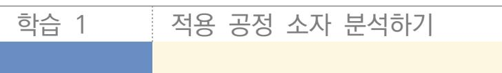

학습 2 적용 공정 레이어 분석하기

## 2-1. 적용 공정 레이어 분석

| 학습 목표 | • 설계 공정의 사용 가능한 레이어 수와 레이어별 두께를 확인할 수 있다. • 레이어별 전류 밀도 정보를 파악할 수 있다. • 레이어별 최대 폭, 최소 폭과 최소 간격 정보를 파악할 수 있다. • 수율을 고려한 레이어 폭의 변화가 있는지 확인할 수 있다. • 콘택트(Contact)와 비아(Via)의 최소 적용 개수를 확인할 수 있다. |
|-------|---------------------------------------------------------------------------------------------------------------------------------------------------------------------------------------------------------|
|-------|---------------------------------------------------------------------------------------------------------------------------------------------------------------------------------------------------------|

## 필요 지식 /

숔 반도체 제조 공정 개요

반도체 제조 공정에 대한 이해를 돕고자 각 공정의 주요 특성 및 업무 내용에 대해 공정 사진 과 함께 간략히 기술하였다. 이를 위해 반도체 관련 연구, 특허 문헌 등을 고찰하였다[출처: 산 업안전보건연구원(2012), 전자자료사(1997), 김정일(1997), 박동욱 등(2011), ACGIH(1989), Arisha A 등(2004), Bolmen RA(1998), Claussen W 등(2001), ILO(1998), OSHA(2005), Sato A(2004), Williams ME 등(1995)].

1. 반도체 제조 흐름도

반도체는 [그림 2-1]과 같이 웨이퍼 제조, 회로 설계 및 마스크 제작, 웨이퍼 가공, 칩 조 립 공정을 거쳐 제조한다.

(1) 웨이퍼 제조

실리콘(Si)을 고순도로 정제하여 기둥 모양의 잉곳(Ingot)을 만든 후 얇게 잘라서 원판 모양으로 만드는 공정이다.

(2) 회로 설계

회로 설계 프로그램을 이용하여 전자 회로를 설계하는 공정이다.

(3) 마스크 제작

설계된 전자 회로를 전자 빔 등의 설비를 이용하여 유리판에 옮기는 공정으로, 여기에서 제작된 마스크는 포토 공정에서 웨이퍼에 회로를 형성할 때 사용하게 된다.

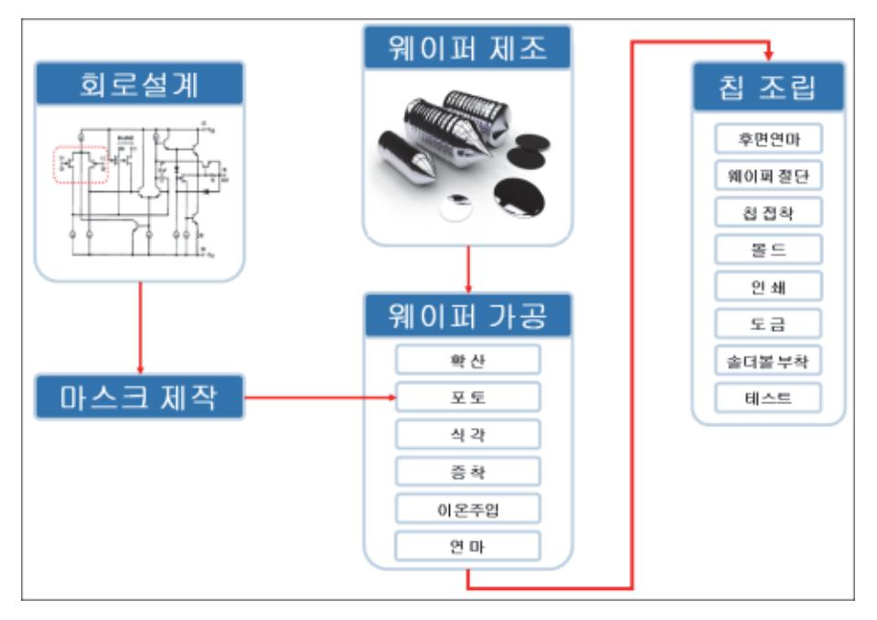

출처: 집필진 제작(2022)

[그림 2-1] 반도체 제조 흐름도

(4) 웨이퍼 제조

실리콘(Si)을 고순도로 정제하여 기둥 모양의 잉곳(Ingot)을 만든 후, 얇게 잘라서 원판 모양으로 만드는 공정이다

(5) 회로 설계

회로 설계 프로그램을 이용하여 전자 회로를 설계하는 공정이다.

(6) 마스크 제작

설계된 전자 회로를 전자 빔 등의 설비를 이용하여 유리판에 옮기는 공정으로, 여기에서 제작된 마스크는 포토 공정에서 웨이퍼에 회로를 형성할 때 사용하게 된다.

(7) 웨이퍼 가공

웨이퍼에 회로를 구성하기 위한 일련의 공정으로 확산, 포토, 식각, 증착, 이온 주입, 연 마 등의 세부 공정으로 구성된다.

(8) 칩 조립

가공된 웨이퍼를 낱개의 칩(chip)으로 잘라 리드 프레임 등에 부착하고, 금선 연결, 몰 드, 인쇄, 테스트 등을 통해 제품을 생산하는 공정이다.

#### 2. 웨이퍼 가공 라인 개요

웨이퍼 표면에 여러 종류의 막을 형성하거나 마스크를 사용하여 전자 회로를 그려 넣고 특 정 부분을 선택적으로 깎아 내는 작업을 되풀이함으로써 전자 회로를 구성해 나가는 일련 의 과정으로 FAB(Fabrication)이라고도 한다.

(1) 확산 공정(Diffusion)

고온(800∼1200℃)의 전기로에서 웨이퍼에 불순물(Dopant)을 확산시켜 반도체층 일부 분의 전도 형태를 변화시키는 공정으로 무기산, 아르신(삼수소화 비소), 실란 등이 사용 된다.

(2) 포토 공정(Photolithography)

반도체 웨이퍼에 감광 성질을 가지고 있는 포토레지스트(PR)를 도포한 후 마스크 패턴 을 올려놓고 UV(자외선) 등의 빛을 쬐어 회로 패턴을 형성하는 공정으로 사이클로헥사 논, 아이소프로필알콜 등 유기 용제와 감광성 수지 등이 사용된다.

(3) 식각 공정(Etch)

웨이퍼에 형성된 회로 패턴을 완성하기 위해 산 ․ 알칼리 용액 등을 이용한 습식 방법 또 는 반응성 가스를 이용한 건식 방법으로 불필요한 부분을 선택적으로 제거해 주는 공정 으로 무기산, 과산화수소, 할로겐 화합물 등이 사용된다.

(4) 증착 공정(Deposition)

화학적 반응 또는 물리적인 방법으로 전도성 또는 절연성 박막을 형성시키는 공정으로 디보란, 암모니아, 실란, 삼불화 염소 등이 사용된다.

(5) 이온 주입 공정(Ion Implantation)

반도체에 전도성을 부여하기 위해 비소, 인, 붕소 이온 등의 불순물을 주입하는 공정으 로 아르신(삼수소화 비소), 포스핀, 삼불화 붕소 등 사용되며 이온 주입 과정에서 전리 방사선이 발생한다.

- (6) 연마 공정(CMP: Chemical Mechanical Polishing) 웨이퍼 가공 과정에서 생성된 웨이퍼 표면의 산화막 등을 화학적 또는 물리적 방법으로 연마하여 평탄하게 하는 공정으로 불산, 염산, 질산, 암모니아수, 수산화 칼륨 등이 사용 된다.
- 숕 CMOS 제조 공정

CMOS 공정은 하나의 웨이퍼에 PMOS와 NMOS를 함께 제작하여 크기를 줄이고 서로의 단점 을 보완할 수 있다는 장점이 있으며 공정에서 정한 규칙(Design Rule)에 따라 반도체 소자가 설계된다.

1. CMOS 공정 순서

일반적인 CMOS 공정의 순서는 산화막과 질화막을 입히는 웨이퍼 공정, 절연층을 만드는 STI(Shallow Trench Isolation) 공정, N-well을 만드는 well 형성 공정, 게이트를 만드는 게이트 공정, 소스와 하수관을 만드는 소스 · 드레인 공정이 진행된다.

이후 표면 저항과 접촉 저항을 줄여 주는 salicaidation 공정, 실리콘층과 메탈층을 절연시키는

PMD(Pre-metal Dielectric) 공정, 실리콘과 메탈을 연결해 주는 콘택트 공정, 금속 배선을 만드는 메탈 공정, 메탈 1층과 메탈 2층을 절연해 주는 IMD(Inter-metal Dielectric)공정, 메탈 1과 메탈 2를 연결해 주는 via 공정이 진행되고 메탈 2로 배선을 만드는 메탈 2 공정, 메탈 2와 메탈 3을 절연해 주는 IMD 2공정, 이어서 via2 공정, 메탈 3 공정으로 이어지고 마지막으로 보호막을 입히는 passivation 공정이 진행되며 CMOS 소자가 완성된다.

2. CMOS FET를 제작하는 표준 공정

CMOS FET를 제작하는 표준 공정은 P형의 실리콘 웨이퍼를 사용하고, N형의 웰(well)과 여러 층의 금속 배선을 사용한다.

- (1) N웰 형성 공정
  - (가) CMOS 공정의 첫 번째 공정은 N웰을 형성하는 공정이며, 이를 위해 먼저 실리콘 기판 위에 실리콘 산화막(SiO )을 성장시킨다.

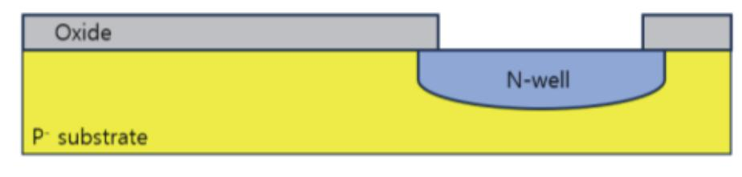

출처: 집필진 제작(2024) [그림 2-2] 확산에 의한 N-well 형성

(나) N웰 마스크(Mask)를 사용하여 앞 장에 설명한 포토 공정으로 N 웰이 형성되는 부분의 PR와 실리콘 산화막을 제거한다.

Wafer 표면을 보호하고 소자 간 절연 및 격리를 목적으로 형성시키는 산화막(Oxide)은 유전체 형성 및 이온 주입 시 Mask로도 사용되는데 산소가 결합해 형성한 막이고, 질화막은 질소가 결합한 것인데 최근에는 산화막이나 질화막에서 파생되어 발전된 여러 가지의 절연막이 활용되고 있다. 산소 형성을 위한 케미컬은 산소 가스 또는 물분자를 사용하여 800~1,200℃에서 가열하면 산화막이 형성되는데 최근에는 플라스마를 이용하기도 하며 질화막 형성을 위해서 질소 가스 또는 플라스마를 사용한다.

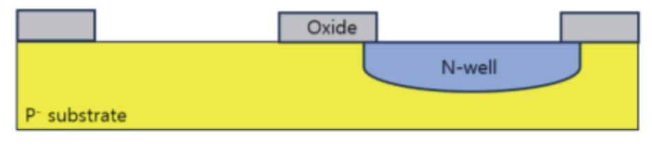

출처: 집필진 제작(2024) [그림 2-3] NMOS 제조를 위한 에칭 질화막보다는 산화막이 보다 강력한 절연 기능을 가지고 있기 때문에 절연막으로서는 산화막을 주로 사용하고, 질화막이 대부분 보조 역할을 한다. 산화막 형성에 사용되는 방식으로 건식 산화 방식은 산화 속도가 느려 Pad Oxide, Gate Oxide, STI Linear Oxide 등 얇은 산화막 형성에 사용되며 습식 산화 방식은 산화 속도가 매우 빨라 Field Oxide, 희생 산화막 등에 사용된다.

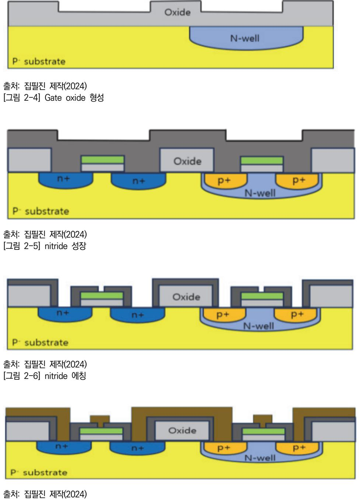

[그림 2-7] metal 에칭

(2) Field Oxide 공정

Field Oxide를 만들기 위해서 Si3N4(실리콘 나이트라이드)를 이용하여 질소(Nitride)로부터 기계적 스트레스(Mechanical Stress)로 인한 문턱 전압(Vth) 변화를 막기 위해 nitride를 적층(Deposition) 하기 전에 buffer oxide를 만든다.

초기 산화막 위에 질화막을 증착(Nitride Deposition)시키는 과정으로, 부품과 부품 간 의 절연을 하기 위한 필드 영역의 산화막을 성장시킬 때 액티브 영역의 산화막이 성장 하지 못하게 차단하기 위해 질소 화합물을 형성한다.

(3) Drive-in 공정

Drive-in은 field implant의 activation, diffusion을 하기 위한 고온 열처리 과정이며 LOCOS(Local Oxidation of Silicon) 공정은 소자 간 간섭을 없애기 위한 공정으로 field oxide를 만드는 과정이다. 하지만 0.5㎛ 이하의 미세 공정으로 갈수록 field oxide가 active area를 침범하는 Bird's Beak 현상이 발생하므로 최근에는 STI(Shallow Trench Isolation) 방법을 많이 이용한다. LOCOS 공정은 산화막이 증착되면서 기존에 있던 틈새의 산화막도 약간 증착되면서 양옆이 들려지게 되는 현상의 모양이 새의 부리 같다고 하여 Bird's Beak이 라고 한다.

(가) LOCOS 공정의 장단점

LOCOS 공정을 이용하면 소자 간 Isolation은 이루어질 수 있으나 Bird's Beak 문 제로 가용할 수 있는 Active 영역이 줄어들게 된다. STI를 형성하는 방법은 먼저 실 리콘 웨이퍼 위에 산화막과 질화막을 성장시키고 필드 산화막이 형성될 부분에 액티 브 마스크를 사용하여 질화막과 산화막 그리고 실리콘 내부까지 식각시킨다. 그 다 음 식각된 부분을 두꺼운 산화막으로 도포한 후 질화막을 제거하면 트랜치 구조의 필드 산화막을 만든다.

- 3. STI 공정
  - (1) 액티브 마스크

빛에 의해서 반응하는 감광막(PR: Photo Resist)을 씌우고 그 위에 액티브 마스크를 놓 고 빛을 쬐면 액티브 마스크가 없는 부위의 감광막은 빛에 의해 성질이 변하며 현상 공 정 후에는 액티브 영역의 감광막만 남는다. 액티브 마스크는 실제 트랜지스터의 크기를 정의하는 영역으로, 소자 간에 전기적 절연 역할을 하는 필드 영역(FOX: Field Oxide) 을 만드는 데 사용한다.

소자 간의 거리가 매우 짧으므로 두 소자 간에 원하지 않는 전류가 흐를 수 있으므로 이를 방지하는 역할이 FOX이다. 일반적으로 포지티브(Positive) PR를 사용하므로 빛을 받은 부분의 PR가 제거되기 때문에 N웰 마스크는 N웰이 형성되는 부분으로 액티브 (Active) 부분은 투명하고, N웰이 형성되지 않는 부분 필드(Field) 부분은 어두워야 한 다. 이런 형태의 마스크를 다크 필드 마스크(Dark Field Mask)라고 부른다.

(2) STI 영역 식각 및 FOX 형성

STI(Shallow Trench Isolation)은 좁은 도랑을 파서 서로 격리시킨다는 뜻으로 빛에 의해 photo resist가 녹아 없어진 부위의 질화막과 산화막을 없앤 후 그 부위의 웨이퍼 를 파낸다. 이를 '식각(Etching)'이라 부르며, NMOS와 PMOS 두 부품이 서로 쇼트 (Short)되지 않도록 절연하기 위함이다. 이와 같은 방법을 STI 영역에 P-well(담장)과 N-well을 만들어 부품 간에 절연을시킨다.

이어서 웨이퍼를 식각(eEtching)해 낸 부위, 즉 질화막이 없는 부위에 CVD(Chemical Vapor Depositon) 공법으로 산화막을 형성한 다음 질화막 위로 덮인 CVD Oxide층 을 식각한 후 질화막을 식각한다.

#### 4. Well 형성 공정

#### (1) P-well 생성

P-well mask로 3가원소인 붕소(bBoron) 이온을 주입시키면 P-well 영역이 만들어진 다. N-well 영역에는 마스크로 가려져 있어 붕소 이온이 침투되지 않는다.

#### (2) N-well 생성

P-well과 마찬가지로 N=well mask로 5가 원소인 인(P) 이온을 주입시켜 N-well을 만 든다.

#### 5. 전극 형성 공정

(1) Gate 형성 공정

gate는 소스에서 드레인으로 전류의 흐름을 제어하며 문턱 전압에 영향을 주기 때문에 두께가 정확해야 하며 또한 표면이 깨끗해야 한다.

(가) 희생 산화막 제조 공정

희생 산화막(Sacrificial Oxidation)은 gate oxide를 만들기 전, 표면의 defect와 contaminant를 제거하기 위해 oxidation을 한 이후 생성된 sacrificial oxide를 제거하는 과정이며 sacrificial oxide를 생성함으로써 표면의 Si가 소모되기 때문에 표면의 defect와 contaminant이 제거되는데 이때 oxide 내부의 interface trap, mobile trap, oxide trap, fix charge 등 다양한 요인으로 문턱 전압에 변화에 영 향을 준다.

이 중 interface trap은 oxide 표면의 dangling bond에 의한 trap이며 moblie trap은 contaminant에 의한 trap으로 칼륨, 나트륨 등 여러 moblie ion에 의한 것이고 oxide trap은 oxide 내부 defect에 의한 trap이며 마지막으로 fix charge 는 oxide가 성장할 때 불완전하게 성장한 SiO에 의한 trap이다.

#### (나) N 형의 불순물을 이온 주입 공정

그 다음 N 형의 불순물을 이온 주입 공정으로 실리콘 웨이퍼 속으로 주입시킨다. 웰 의 깊이가 3㎛ 이하로 불순물 이온이 비교적 웨이퍼 내부 깊숙이 박혀야 하므로 N 형의 불순물로는 원자 질량이 작은 인(Phosphorous) 원자를 사용한다. 인 원자 웨 이퍼 내부 투사 거리는 이온 주입 에너지에 따라 조절된다. 그 후 PR와 실리콘 산 화막을 제거하고 열처리해 주면 N 웰 형성이 완료된다. 이렇게 만들어진 N 웰은 실 리콘 웨이퍼 내부에서는 불순물의 농도가 크고 웨이퍼 표면으로 올수록 농도가 작아 지며 일반적으로 불순물의 농도는 웨이퍼 표면에서 가장 크고 웨이퍼 내부로 갈수록 감소한다.

액티브 영역은 FET가 형성되는 영역으로 산화막의 두께가 얇은 영역을 의미한다. 먼저 실리콘 웨이퍼 위에 얇은 두께의 산화막을 형성시킨다. 산화막 위에 CVD(Chemical Vap or Deposition)로 질화막을 증착시킨다. 그다음에 액티브 마스크를 사용하여 포토 공정으 로 액티브 영역을 패터닝을 한다. 액티브 마스크는 액티브 영역에 산화막, 질화막 및 PR가 남아 있어야 하기 때문에 클리어 필드가 되어야 한다. 산화막, 질화막과 PR가 제거되는 부분은 FET가 형성되지 않는 필드 부분이다.

(다) 채널 정지 이온 주입 공정

다음 공정은 채널 정지 이온 주입 공정이며 불순물 P형의 붕소(B) 이온을 사용한다. PR가 남아 있는 액티브 영역에는 붕소 이온이 웨이퍼 내부로 주입되지 못하고 PR가 없는 필드 영역에 붕소 이온이 주입된다. 주입된 붕소 이온은 필드의 문턱 전압을 증가시켜 누설 전류를 최대한 낮추어 주는 역할을 한다.

PR를 제거하고 산소 가스를 웨이퍼로 불어넣어 산화막을 성장시키면 질화막이 형성 된 부분은 산소를 통과시키지 않으므로 산화막이 성장되지 않고 질화막이 없는 부분 은 산화막이 두껍게 성장하여 필드 영역이 된다.

(라) 게이트 산화막 성장 공정

게이트 산화막 성장 공정 FET 게이트의 산화막을 형성시키기 때문에 FET의 품질을 결정하는 매우 중요한 공정이다. 1Å은 10 m이며 약 50 Å 두께의 산화막을 건식 산화법으로 성장시킨다. 게이트 산화막 성장 공정 다음 공정은 문턱 전압 조절을 위 한 이온 주입 공정이다. NMOS FET의 문턱 전압은 –0.2V에서 +0.5V 사이의 범위 에 분포하고 PMOS FET의 문턱 전압은 –2.0V에서 –1.5V 범위에 분포한다.

이들 문턱 전압들을 각각 +0.6V 정도로 만들기 위해서는 붕소 이온을 주입시켜 문 턱 전압을 양의 방향으로 이동시킨다. 보다 정교하게 문턱 전압을 조절하려면 별도 의 마스크가 필요한데 이 경우는 공정 원가가 높아진다. 폴리 게이트 또는 폴리 마 스크 형성 공정은 폴리실리콘을 웨이퍼 전면에 CVD로 0.2㎛ 정도 도포한 후, 폴리 게이트 마스크를 사용하여 포토 공정으로 게이트 영역을 패터닝한다. 폴리 게이트 마스크는 폴리 실리콘이 남아 있어야 하므로 클리어 필드가 되어야 한다.

- (2) Source, Drain 형성 공정
  - (가) NMOS 소스 및 드레인 형성(N+ MASK) 공정

다음으로 NMOS 소스 및 드레인 형성(N+ MASK) 공정은 다크 필드 N 플러스 마스 크를 사용하여 포토 공정으로 NMOS FET의 소스 드레인을 패터닝한다. N+ 이온 주입 공정은 N 형의 불순물인 아세나이드(As)를 10 정도의 고농도로 웨 이퍼 표면에 주입시킨다. 이때 PR로 인해 아세나이드 이온은 N 모스의 소스와 드레 인 및 N 웰에 바이어스를 인가하는 영역에만 주입된다. 반면에 게이트 아래의 실리 콘에는 폴리 게이트에 차단되어 아세나이드 이온이 들어가지 못한다. 이렇게 별도의 마스크를 사용하지 않고 게이트로 인해 소스 및 드레인 영역에 게이트와 자동으로 정렬되어 형성되는 공정을 자동 정렬(Self Align) 공정이라 부른다. 동시에 N 웰에 전원 전압을 인가하는 웰 플러그(Well Plug)도 형성된다.

(나) PMOS 소스 및 드레인 형성(P+ MASK) 공정

PMOS 소스, 드레인 형성(P+ MASK) 공정은 PMOS FET의 소스와 드레인을 형성 하는 공정이다. 다크 클리어 P 플러스 마스크를 사용하여 포토 공정으로 PMOS의 소스와 드레인 영역을 패터닝한 후 이온 주입 공정으로 붕소 이온을 주입한다. PMOS의 소스와 드레인은 게이트로 인해 자동 정렬되고, 동시에 웨이퍼에 그라운드 전압을 인가하는 기판 콘택트(Contact)도 형성되며 마지막으로 PR를 제거한다.

(다) Silicid/Salicide 공정

1) 스페이서(Spacer) 형성 공정

스페이서 형성 공정은 게이트 측벽에만 산화막을 형석하는 공정이다. 웨이퍼 전면에 얇은 산화막을 형성한 후 산화막을 식각시키면 게이트 산화막의 측면에만 얇은 산화막 이 남아 있고 이를 스페이서라고 부른다. '살리사이드(Salicide)' 형성 공정은 Self Alined Slicide의 약어로 폴리 게이트의 저항과 소스와 드레인의 콘택트 저항을 감소 시키기 위한 공정이다.

2) 살리사이드 공정

먼저 텅스텐이나 타이타늄과 같은 고융점 금속을 0.2㎛ 정도의 두께로 웨이퍼 전 면에 도포한 후 열처리한다. 열처리를 하게 되면 폴리 실리콘과 소스 및 드레인 부위에 증착된 금속은 실리사이드가 되어 저항이 매우 작게 되고, 산화막 위에 증착된 금속은 실리사이드로 변하지 않고 그대로 남아 있다. 웨이퍼를 금속 식각 용액에 넣으면 실리사이드는 식각되지 않고 산화막 위의 금속만 식각된다. 이렇 게 마스크를 사용하지 않고 실리사이드 콘택트와 폴리 게이트 부위에만 정렬시켜 형성하는 기술을 살리사이드 공정이라고 한다. 즉 자동 정렬 실리사이드란 의미 이다.

(라) LDD(Lightly Doped Drain) 공정

1) 핫 캐리어

MOSFET에서 소스 및 드레인 영역은 고농도의 불순물로 도핑되어 있기 때문에

채널 길이가 짧아짐에 따라 매우 강한 전계가 채널 내에 형성된다. 이 강한 전계 로 인하여 드레인 영역 근처에서 캐리어들이 큰 운동 에너지를 가지게 되어 산화 층으로 뚫고 들어간다. 이것을 핫 캐리어(Hot Carrier)라고 부른다.

2) LDD 구조

핫 캐리어는 기판 누설 전류를 증가시켜 FET 특성을 열화시킨다. 핫 캐리어 발 생을 방지하기 위하여 소스 및 드레인에 저농도와 고농도를 이중 농도로 불순물 을 주입한다.

먼저 게이트 전극을 형성시킨 후 저농도의 불순물을 스페이스를 통하여 자기 정 렬로 주입하면 실제 채널이 형성되는 소스 및 드레인 영역은 저농도의 불순물이 형성되고, 소스 및 드레인 콘택트가 형성되는 부분에는 고농도의 불순물이 형성 되어 핫 캐리어의 영향이 줄어들게 되며 이러한 구조를 LDD 구조라고 한다.

- 6. Contact 및 Metal 형성 공정
  - (1) Contact 형성 공정

콘택트(Contact) 형성 공정은 실리사이드가 형성된 게이트 및 소스와 드레인 부위에 금 속 배선과 전기적 통로를 형성하는 공정이다. 웨이퍼 전면에 산화막을 0.6㎛ 두께로 도 포시킨 후, 다크 필드인 콘택트 마스크를 사용하여 포토 공정으로 콘택트 패턴을 형성시 킨다. 콘택트가 형성되는 산화막 층을 ILD(Inter Layer Dielectric) 층이라고 부른다.

(2) Metal 형성 공정

Metal 형성 공정은 금속 배선을 형성하는 공정이다. 알루미늄 금속을 스퍼터링 방법으 로 웨이퍼 전면에 0.6㎛ 두께로 도포한다. 그 다음 메탈 마스크를 사용하여 포토 공정으 로 금속을 패터닝을 한다. 콘택트를 통하여 FET의 소스 및 드레인과 게이트가 금속 배 선과 전기적으로 연결된다.

7. Via 형성 공정

Via Contact 공정은 먼저 Metal 위에 산화막을 도포시킨다. 이 산화막 층은 Metal로 인 하여 굴곡이 생기기 때문에 Metal 층이 들어날 때까지 평탄화 작업을 한다. 그 후 다시 산 화막을 0.7㎛ 두께로 도포한다. 이 산화막 층을 IMD(Inter Metal Dielectric) 층이라고 부 른다. 그 다음 비아 콘택트 마스크를 사용하여 포토 공정으로 비아 및 콘택트 홀을 형성한 다.

8. Passivation 형성 공정

마지막으로 Passivation 공정은 실리콘 칩에 습기가 침투하는 것을 막고, 물리적인 충격에 대하여 실리콘 칩을 보호하기 위하여 CVD 방법으로 2㎛ 정도의 두꺼운 산화막층을 도포하 고 추가로 질화막도 도포한다. 그 다음 실리콘 칩을 외부 회로와 연결하기 위하여 패드 마 스크를 사용하여 패시베이션 층을 식각시켜 패드 영역을 만든다.

#### 숕 디자인 규칙의 이해 및 적용

#### 1. 디자인 규칙(Design Rule)

집적 회로는 레이아웃에 근거하여 만들어진 마스크를 이용하여 광 리소그래피 공정을 진행 하면서 그 패턴이 실제 웨이퍼 위에 생성된다. 레이아웃 도면 및 마스크는 2차원 패턴이지 만 그것에 근거하여 제작되는 패턴은 3차원 형상이므로 주어진 공정에서 정해진 규칙에 맞 추어 마스크 패턴이 만들어지지 않으면 실제 제작에서의 불량이 발생할 가능성이 높다. 예 를 들어, 어떠한 패턴의 폭이 어느 정도 이하로 너무 작게 되면 실제 웨이퍼 상에 제작되는 과정에서 선폭이 예상보다 가늘어져서 끊어질 가능성이 있다. 한편, 인접한 두 패턴의 폭이 어느 정도 이하로 너무 가깝게 되면 실제 웨이퍼 상에 제작되는 과정에서 두 선의 간격이 예상보다 가까워져서 붙어버릴 가능성이 있다.

(1) 레이아웃 설계 규칙의 필요성

공정을 진행하면서 만들어진 패턴 불량을 줄여서 수율을 높이기 위해서는 공정마다 설계 규칙(Design Rule)을 반드시 지켜야 하며 레이아웃 설계자는 그 규칙에 맞추어 레이어 패턴 도면을 완성한다. 레이아웃 설계 규칙은 대부분 '최소 크기' 또는 '최소 간격'으로 정의되는데, 예를 들어 폴리실리콘의 크기, 콘택트의 크기, 콘택트와 메탈이 겹치는 간격, 액티브와 콘택트 가 겹치는 간격(Enclosure), Well과 Well 사이의 간격(Space) 등을 정해 놓은 규칙이다. 이는 반도체 제조 공장(Fabrication)에서 집적 회로를 만드는 방법과 밀접한 관계가 있다. 각 제조 회사(Foundry) 별로 공정 방법과 크기가 다르기 때문에 공정 룰도 각각 다르다.

(2) CMOS 공정의 레이아웃 설계 규칙

일반적인 CMOS 공정을 위해서는 보통 수십 개의 레이어를 필요로 하고 각각의 레이어 에 해당하는 설계 규칙 및 레이어 사이에 적용되는 설계 규칙이 여러 항목으로 제공되 므로 대규모 집적 회로의 설계에서는 레이아웃 설계자가 일일이 그 모든 규칙을 수동으 로 확인하는 것이 거의 불가능하다. 따라서 모든 파운드리 업체에서는 해당 공정에 대한 레이아웃 설계 규칙을 그림 및 도표 문서로 설계자에게 미리 전달하고, 자동으로 프로그 래밍하여 설계 규칙을 검증할 수 있는 설계 규칙 파일을 제공한다.

(3) 파운드리 업체의 디자인 룰

모든 MOS는 파운드리 업체에서 제공하는 디자인 룰에 맞도록 그려야 한다. 디자인 룰 은 업체마다 부르는 이름이 다른데, 어떤 회사는 '디자인 룰(Design Rule)'이라고 하고 또 어떤 회사는 '레이아웃 룰(Layout Rule)'이라고 하며, 'topological layout rule(줄 여서 TLR)'이라고 하는 곳도 있다. 레이아웃 룰은 한마디로 레이어를 그릴 때 지켜야 하는 것들을 말한다. 실제로 모든 파운드리 업체들은 레이아웃을 수행할 때 참고하기 위 한 레이아웃 룰 문서(Layout Rule Document)를 제공한다. 이 문서를 보고서 거기에 나와 있는 규칙에 맞도록 그려야 한다.

#### (4) 레이아웃 룰에서 요구하는 값

레이아웃 룰 값은 크게 세 가지로 구분할 수 있다. 최솟값, 최댓값, 고정값 등이다. 레 이아웃룰에서 대부분의 룰 항목은 최솟값 항목이다. 고정값이나 최댓값 항목은 그리 많 지 않다. 레이아웃은 가능하면 최솟값 항목에 딱 맞추어서 작게 그릴수록 좋다. 예를 들 어 어떤 룰 항목이 최솟값 룰이고, 그 값이 0.1㎛라고 하면 0.1㎛보다 같거나 크게 그 리면 룰 상으로는 전혀 문제없다. 그러나 이 경우 가능하면 더 크게는 그리지 말고 딱 최솟값 0.1㎛에 맞추어서 그리는 것이 좋다.

#### (가) 임계 치수(CD: Critical Dimension)

반도체 공정 기술을 나타내는 대표적인 척도는 임계 치수이다. 이는 집적 회로에서 형성할 수 있는 패턴 중 가장 작은 패턴의 사이즈를 지칭하는 것으로 트랜지스터의 채널 길이(L: Length), 채널폭(W: Width), 배선의 폭 (a)와 간격 (b) 및 콘택트(Contact) 홀의 최소 크기 (c)를 의미한다. 일반적으로 이들의 최소 사이즈는 동일하지만, 보통 트랜지스터의 최소 채널 길이를 집적회로 공정 기술의 척도로 삼는다.

1) 임계 치수와 레이아웃 면적의 관계

45nm 공정이라 함은 트랜지스터 채널 길이, 즉 게이트의 길이가 45nm인 것을 의미한다. 따라서 이 숫자가 작을수록 발전된 공정이고 트랜지스터를 더 많이 집 적할 수 있다. 그리고 배선 패턴을 형성하는 기술의 척도는 배선 피치인데, 이는 배선 폭과 배선 간격을 합친 크기를 의미한다.

레이아웃은 작게 그릴수록 전체 레이아웃 면적은 줄어들어서 하나의 wafer에서 찍어낼 수 있는 칩의 개수가 더 많아지기 때문에 가능한 작게 그리지만 일부 특 별한 부분의 레이아웃에서 최솟값보다 크게 그려서 전류의 흐름을 좋게 하는 등 성능을 위해서 디자인 룰보다 크게 그리는 경우도 있다.

2) 공정에 따른 레이아웃 룰

레이아웃 룰은 파운드리 업체마다 조금씩 다르기도 하지만 전체적으로 같은 공정 이면 지켜야 할 항목은 거의 같다고 할 수 있다. 물론 항목의 수치는 조금씩 다 를 수 있다. 같은 회사라도 공정에 따라서 레이아웃 룰은 또 달라진다. 미세 공 정으로 갈수록 룰은 더 작아지게 된다. 즉 미세 공정일수록 레이아웃을 세밀하게 할 수 있다고 보면 된다.

(5) 디자인 룰의 구분 방식

디자인 룰은 크게 3가지로 구분을 하는데 일반적인 SCMOS(Scalable MOS), Submicron, Deep submircron이 있다. SCMOS룰은 1㎛ 이상의 공정에서, Submicron은 0.8㎛에서 0.35㎛ 공정에서, Deep submicron은 0.35㎛ 이하 공정에서 주로 사용한다. 한편 디자인 룰을 표시하는 방법에는 람다() 방식과 미크론(m) 방식이 있다.

(가) 람다() 방식

이 중 람다 방식은 공정의 크기를 1/2로 나눈 값을 1람다로 정하고 나머지는 이의 배수로 표시하는 방식이다. 공정 크기가 바뀌어도 람다 배수를 사용하기 때문에 사 용하기가 편리하다. 예를 들면 다음 그림과 같이 1㎛ 공정이란 게이트의 가로 길이 (Length)가 1㎛라는 것인데 1㎛를 2로 나누면 0.5㎛가 된다. 즉 1가 0.5㎛이다. 공정의 크기가 0.8㎛로 바뀌었을 경우 1rk 0.4㎛이 되므로 다른 레이어들도 이 람 다 값을 적용하면 된다.

(나) 미크론 방식

한편 미크론 방식은 모든 레이어의 크기와 간격을 미크론 단위의 크기로 표시할 수 있으며 람다 방식보다는 레이아웃 면적을 최소화할 수 있는 장점이 있다. 다음은 mos를 레이아웃할 때 꼭 지켜야 하는 레이아웃 룰이며 mos에 사용되는 레 이어가 업체마다 다르지 않듯이 지켜야 할 레이아웃 룰 항목도 거의 동일하다. 그러 나 룰 항목은 같을지라도 그 값은 조금씩 다를 수 있기 때문에 여기에서 그 수치를 언급하지는 않는다. 다만, 레이아웃을 할 때, 각각의 레이어에 대한 최소한의 룰이 있기 때문에 반드시 그것을 지켜서 그려야 한다.

#### 2. CMOS 단위공정 별 디자인 룰

(1) N-well Rule

N-well은 실리콘 기판이 P형으로 도핑된 웨이퍼를 사용할 때 필요한 Layer이다. P형 기판 위에 PMOS를 만들 수 없으므로 N-well이라고 하는 작은 N형 기판을 만들어 쓰 는 것이다.

Rule 1A의 최소 폭(Minimum Width)이란 N-well을 그릴 때 N-well의 폭(Width)의 최소 크기를 말한다. Rule 1B는 2개 이상의 Well을 그릴 때 다른 Well과의 거리를 말 한다. Rule 1C는 Nburied와 중첩(Overlap)되는 경우의 디자인 룰이다.

- (2) Oxide Rule
- (3) N+ Implant Rule
- (4) Poly Rule

Poly는 게이트를 만드는 레이어이다. Ruled 5A는 폴리의 최소 폭(Minimum Width)으 로 공정값이 된다. 이 값이 45nm이라면 45nm 공정이라고 부른다. 주어진 공정 크기 값으로 그려 준다.

(5) Contact Rule

Metal1과 Poly를 연결할 때 사용되는 레이어를 말한다. Oxide 또는 Nimp/Pimp에서 전극 형성을 위해서도 사용된다.

(6) Metal1 Rule

Metal 1은 Poly 또는 Active를 외부 단자와 연결해 주는 역할을 한다.

(7) Via Rule

Via는 Metal과 Metal을 연결하는 데 사용되는 레이어를 말한다.

(8) Capacitor Metal

Capacitor Metal은 금속과 금속으로 Capacitor를 만들 때 사용하는 레이어이다. 커패 시터의 아래 금속판은 일반 Metal을 사용하고 위 금속판은 CapMetal을 사용한다.

(9) Passivation

Passivation은 외부와 연결하기 위한 단자(Pad)를 만드는 레이어이다. 최종 보호막 (Passivation)을 성장시킬 때 이 Glass의 크기는 남겨 두고 보호막을 입힌다. 보통 Pad 의 크기와 간격은 60~100㎛를 사용하는데 IC의 크기와 핀 수에 따라서 달라진다.

(10) Latch-up rule

Latch-up은 CMOS 공정에서 발생하는 기생 바이폴라 트랜지스터로 인한 증폭 작용으 로 소자가 파괴되는 현상으로 NWVIA와 PSDarea 거리가 너무 멀어지며 이미터-베이 스 사이의 저항 성분이 커지고 이에 따라 바이폴라 트랜지스터가 Turn-on 될 수 있으 므로 너무 멀리 배치하지 말아야 한다.

- (11) Antenna Rules
- 3. 래치업(Latch-up) 방지를 위한 가드링(Guard Ring)

CMOS 공정은 PMOS와 NMOS를 하나의 웨이퍼에 제작하는 방법으로 서로 단점을 보완하 는 장점이 있지만 많은 소자들을 집적하다 보니 서로 간에 실제적인 연결은 되어 있지 않 아도 여러 가지 기생 성분들로 인해서 상호 간섭을 받게 되는 일종의 부작용이 발생한다. 래치업도 그러한 부작용 중의 하나로서 이로 인한 피해는 아주 심각하기 때문에 래치업을 최소화하기 위한 레이아웃 방법을 숙지하는 것이 중요하다.

(1) 래치업 문제

래치업이란 PMOS와 NMOS의 양 단자 사이에 pwell 또는 nwell을 매개로 하여 기생 바이폴라 트랜지스터(n-p-n-p)로 인한 SCR 구조가 형성되는 것을 말한다. 정상적인 조 건에서는 2개의 기생 바이폴라 트랜지스터가 off 상태로, 동작을 하고 있지 않다가 몇 가지 요인에 의해서 R1과 R2의 voltage drop이 발생하면서 BJT Q1과 BJT Q2가 turn-on이 되면서 두 트랜지스터의 이미터 증폭률이 곱해지면서 큰 전류가 Q2와 Q1 을 타고 흘러나가게 된다. 래치업의 가장 큰 문제는 과도한 전류의 흐름으로 인하여 칩 이 타버릴 수 있다.

(2) 래치업 해결 방안

래치업을 해결하려면 기생 저항을 작게 하여 voltage drop이 발생해도 BJT를 turn-on 시키 지 못할 정도로 만들면 된다. 기생 저항을 작게 하는 가장 좋은 방법은 CMOS 공정을 조절하는 방법이 있다. 즉, 고농도로 도핑된 epitaxial wafer를 사용하여 저항 성분을 낮춘다거나 소자

들을 완전히 격리하기 위해서 Deep nwell을 사용하는 triple-well 공정을 사용하는 방법이 있다. 그러나 이러한 방법은 레이아웃을 하는 사람이 결정할 수준은 아니고 공정을 조작하여 얻어지는 것이므로 간단하게 레이아웃을 통하여 래치업을 최소화하기 위한 방법은 다음과 같다.

(가) NMOS와 PMOS의 거리를 가급적 멀리 배치

이렇게 하면 바이폴라 트랜지스터의 전류 이득이 줄어드는 효과가 발생하여 래치업 의 피해를 줄일 수 있다. 즉, 레이아웃할 때 PMOS와 NMOS를 섞어서 그리지 않고 PMOS는 PMOS끼리 모아서 그리고 NMOS는 NMOS끼리 모아서 그리는 것도 래치 업 현상을 방지하기 위한 방법으로 PMOS와 NMOS를 멀리 배치하면 집적도 측면에 서는 불리하지만 큰 전류가 흐르는 mos가 있을 경우 래치업 현상도 강하게 일어나 므로 이럴수록 PMOS와 NMOS를 멀리 떨어뜨려서 배치해야 한다.

(나) nwell과 pwell 안에 각각 가능한 많은 수의 nwell-plug(ntap)과 pwell-plug(ptap)을 배치 이렇게 하면 이미터와 베이스 사이에 저항이 병렬로 형성되어 기생 저항 R1과 R2를

줄이는 효과가 있다. 즉 여러 개의 기생 저항이 병렬로 연결되는 효과와 동일하다. 기생 저항이 줄어들면 전압 강하가 발생하더라도 그 정도가 약해서 기생 BJT를 turn-on하기가 쉽지 않기 때문이다.

(다) guard-ring을 사용

두 번째 방법의 확장으로 guard-ring을 사용해서 NMOS와 pwell-plug(ptap) 또는 PMOS와 nwell-plug(ntap) 사이의 간격을 멀게 한다. 특히 최종 출력 단자의 mos 들은 guard-ring이 반드시 필요하다.

위에서 설명된 규칙은 레이아웃하는 데 기본적으로 지켜야 하는 레이아웃 규칙이며 실 제로도 파운드리에서 제공되는 모든 레이아웃 룰 문서(Layout Rule Document)는 레 이아웃 룰 항목에 해당하는 그림을 가지고 있어서 설계자가 정확이 어떤 것을 지켜야 하는지에 대해서 이해하기 쉽도록 표현해 놓았다. 레이아웃 룰은 레이어를 사용하여 어 떤 디바이스를 그릴 때나 그려진 디바이스들을 서로 연결할 때 가장 기본이 되는 것이 므로, 레이아웃 룰을 무시하고 그렸을 때에는 심각한 문제를 야기할 수 있다.

4. 안테나 룰(Antenna Rule)

Metal에 쌓인 전하가 gate oxide에 손상(Damage)을 줄 수 있는데 이러한 현상을 안테나 효과(Antenna Effect)라고 한다. 안테나 효과는 Process가 끝난 후가 아닌, process 진행 중에 문제가 발생한다. 반도체 공정 중 플라스마 식각 공정에서 강한 전자파가 발생되는데 반도체 레이아웃할 때 배선의 길이를 길게 하면 이 전파에 의해 배선에 유도 전류와 유도 전압이 생긴다. 이 배선이 트랜지스터의 게이트에 연결되어 있다면 게이트에는 유도 전압이 가해지고, 강한 전압에 의해 게이트 절연 산화막(SiO )이 파괴될 수 있다.

안테나 효과는 메탈의 면적이 게이트 면적보다 클수록 크게 나타내며 다음과 같이 정리될 수 있다.

(1) 안테나 효과를 감소

안테나 효과를 감소시키기 위해서 Metal 레이어를 Via 및 Jumper를 이용하여 자주 바 꾸어 주는 방법과 다이오드를 이용하는 방법, dummy 트랜지스터를 사용하는 방법이 자주 사용된다.

(가) 여러 층의 메탈 사용

일반적으로 전체 칩을 구성하면 상위 메탈일수록 사용 면적이 커지게 되므로 여러 층의 메탈을 사용하면 커패시터가 직렬로 연결되어 전체적으로 커패시터 값이 줄어 들 수 있으므로 상대적으로 축적되는 전하를 줄일 수 있다.

(나) 다이오드를 이용하는 방법

NMOS를 배치할 때 기판 위에 N-diode를 추가하고 PMOS를 배치할 때는 N-well 안에 P-diode를 사용하면 다이오드가 역방향으로 배치되어 있으므로 신호 전달에는 아무런 지장을 주지 않고, 과전압 또는 펄스 신호를 바이패스시켜 게이트 절연막을 보호한다. 트랜지스터마다 다이오드를 그려 넣어야 하므로 레이아웃 시간이 많이 걸 리지만 안정적인 회로를 만들 수 있다.

(다) Dummy 트랜지스터

Dummy 트랜지스터는 정상적으로 사용하는 트랜지스터 양쪽에 또는 한쪽에 동일한 트랜지스터를 병렬로 배치하는 것으로 dummy 트랜지스터를 이용하면 트랜지스터가 병렬로 연결되므로 게이트 폭이 커지고 결과적으로 게이트 내압이 높아져서 안테나 효과를 감소시킬 수 있다.

## 수행 내용 / 적용 공정 레이어 분석하기

#### 재료·자료

- 설계 관련 자료: 회로도, 레이아웃 등
- 공정 관련 자료: 공정 설계 키트(PDK: Process Design Kit), 공정 기술 자료
- 시뮬레이션 및 모델링 자료: SPICE 모델, 기생 소자 모델(Parasitic Extraction), 시뮬레이 션 소프트웨어
- 설계 검증 보고서(Design Verification Report)
- 측정 결과 보고서(Measurement Report)
- 신뢰성 평가 보고서(Reliability Evaluation Report)

#### 기기(장비 ・ 공구)

- 프로브 스테이션(Probe Station)
- 파라미터 분석기(Parameter Analyzer)
- 오실로스코프(Oscilloscope)
- 열 이미지 장치(Thermal Imaging Equipment)

#### 안전 ・ 유의 사항

• 해당 사항 없음.

#### 수행 순서

숔 커스텀 레이아웃을 위한 적용 공정 레이어를 분석한다.

커스텀 레이아웃을 위한 적용 가능한 공정 레이어는 설계 및 제조 프로세스에 따라 달라질 수 있지만, 전반적으로 다음과 같은 공정 레이어가 사용될 수 있다. 이러한 공정 레이어들은 커스텀 레이아웃의 설계 및 제조 과정을 위해 필요한 다양한 정보를

- 제공한다. 디자인 및 제조 과정에 따라 필요한 레이어를 적절히 선택하여 사용해야 한다.
- 1. 도면 및 레이아웃 설계 레이어를 분석한다.

커스텀 레이아웃을 위한 적용 공정에서 도면 및 레이아웃 설계 레이어를 분석하는 것은 설 계의 정확성과 최적화, 그리고 최종 제품의 성능을 보장하기 위한 핵심 단계이다. 도면 및 레이아웃 설계 레이어를 분석하는 과정은 설계가 실제 제조 공정에 얼마나 잘 적용될 수 있는지 평가하고, 잠재적인 문제를 사전에 식별하여 해결하는 데 초점을 맞춘다. 이 과정은 다음과 같은 주요 단계로 구성된다.

- (1) 도면 및 설계 레이어 정의
  - (가) 설계의 전체 구조를 파악하기 위해 도면과 레이아웃의 각 레이어를 정의한다. 이에는 배 선 레이어, 파워 플레인, 그라운드 플레인, 신호 레이어 등이 포함될 수 있다.
  - (나) 각 레이어의 역할과 기능을 명확히 이해하여, 이후 분석 과정에서 중점을 둘 부분을 결 정한다.
- (2) 설계 규칙 검토(DRC: Design Rule Check)
  - (가) 설계 레이어가 규정된 설계 규칙을 준수하는지 확인한다. 이는 레이어 간의 간격, 패드 크기, 트레이스 폭, 드릴 크기 등과 같은 물리적 규칙이 포함된다.
  - (나) 설계 규칙을 준수하지 않는 부분을 식별하고, 이를 수정하여 공정에서 발생할 수 있는 문제를 방지한다.
- (3) 전기적 특성 분석
  - (가) 각 레이어의 전기적 특성을 분석한다. 신호 전송 경로, 임피던스 제어, 크로스토크, 노이 즈 등을 고려하여 설계의 전기적 성능을 평가한다.
  - (나) 이러한 분석을 통해 설계가 원하는 전기적 특성을 만족하는지 확인하고, 필요시 수정한 다.
- (4) 레이아웃 최적화
  - (가) 레이아웃이 최적화되어 있는지 평가한다. 여기에는 신호 경로의 최소화, 전력 및 그라운 드 플레인의 효율적인 배치, 발열 관리 등이 포함된다.
  - (나) 레이아웃이 최적화되지 않은 부분을 찾아 개선함으로써 공정의 효율성과 제품의 성능을 높인다.
- (5) 공정 적합성 분석
  - (가) 도면 및 레이아웃이 실제 제조 공정에 적합한지 평가한다. 이 과정에서는 레이어의 두께, 물리적 치수, 제조 공정에서의 변동성 등을 고려한다.
  - (나) 설계가 제조 공정의 허용 오차 내에서 잘 구현될 수 있는지 확인하고, 필요시 도면을 수 정한다.
- (6) 레이아웃 시뮬레이션
  - (가) 레이아웃 설계를 시뮬레이션하여 실제 동작을 예측한다. 시뮬레이션을 통해 설계가 의도 한 대로 동작하는지, 또는 예상치 못한 문제점이 발생하는지 확인한다.
  - (나) 시뮬레이션 결과를 바탕으로 설계를 수정하거나 최적화한다.

- (7) 결과 검토 및 피드백
  - (가) 도면 및 레이아웃 설계 레이어에 대한 분석 결과를 종합하여, 설계가 제조 요구 사항을 충족하는지 검토한다.
  - (나) 피드백을 통해 설계 또는 레이아웃을 개선하고, 최종 도면을 확정한다.
- (8) 문서화 및 최종 검토
  - (가) 최종 설계 및 분석 결과를 문서화하여, 향후 공정에서 참고할 수 있도록 한다.
  - (나) 문서화된 자료를 기반으로 최종 검토를 진행하여, 모든 설계 요구 사항과 공정 조건이 충족되었는지 확인한다.

이러한 도면 및 레이아웃 설계 레이어의 분석은 공정의 성공을 위한 중요한 단계이다. 이를 통해 설계가 제조 가능하고, 공정에서 발생할 수 있는 문제를 최소화할 수 있으며, 최종 제 품의 성능을 극대화할 수 있다.

#### 2. 전기적 레이어를 분석한다.

전기적 특성을 설계하는 공정 레이어다. 이 레이어에는 전자 소자의 연결 및 전기적 특성을 나타내는 라인, 패드, 트랙 등이 포함될 수 있다.

이 내용을 바탕으로 커스텀 레이아웃의 전기적 레이어를 분석하여 반도체 소자의 성능과 신뢰성을 평가할 수 있다.

- (1) 주요 전기적 레이어
  - (가) 메탈 층(Metal Layers) 전기적 연결을 위한 도체 경로이다.
  - (나) 폴리실리콘(Polysilicon) 게이트 전극으로 사용되는 레이어이다.
  - (다) 게이트 산화막(Gate Oxide) 게이트 전극과 채널을 절연하는 역할을 한다.
  - (라) 확산 영역(Diffusion Regions) 소스와 드레인 영역을 형성하는 반도체 영역이다.
- (2) 전기적 레이어의 역할
  - (가) 인터커넥트(Interconnects) 메탈 층을 통해 소자 간의 전기적 연결을 형성한다.
  - (나) 게이트(Gate) 폴리실리콘을 통해 전류 흐름을 제어한다.
  - (다) 소스 및 드레인(Source and Drain) 확산 영역을 통해 전류가 흐르는 경로를 형성한다.
- (3) 분석 도구
  - (가) CAD 도구(CAD Tools) 레이아웃 설계 및 전기적 특성 분석을 위한 소프트웨어이다.
  - (나) 시뮬레이션 그래프(Analysis Graphs) 전기적 특성을 시뮬레이션하여 결과를 시각적으로 표현한다.
- (4) 전기적 레이 분석 과정

커스텀 레이아웃을 위한 적용 공정에서 전기적 레이어를 분석하는 것은 설계의 전기적

성능을 보장하고, 최종 제품이 요구되는 전기적 사양을 충족하도록 하는 데 매우 중요한 단계이다. 전기적 레이어를 분석하는 과정은 회로의 신호 무결성, 전력 분배, 노이즈 관 리 등을 평가하고 최적화하는 것을 목표로 한다. 이 과정은 다음과 같은 주요 단계로 구성될 수 있다.

- (가) 전기적 레이어 식별 및 정의
  - 1) 설계에서 전기적 기능을 수행하는 모든 레이어를 식별한다. 이러한 레이어에는 신호 레이어, 파워 플레인, 그라운드 플레인 등이 포함된다.
  - 2) 각 레이어의 역할과 기능을 명확히 정의하여 분석의 초점을 맞춘다.
- (나) 신호 무결성 분석
  - 1) 신호 레이어에서 신호 무결성을 분석한다. 이는 신호의 전송 경로, 반사, 크로스토 크, 전압 강하 등을 포함한 분석을 수행한다.
  - 2) 임피던스 매칭, 전송 지연, 그리고 신호 왜곡 등을 평가하여 신호가 손실 없이 정확 하게 전달될 수 있도록 설계를 최적화한다.
- (다) 전력 분배 분석
  - 1) 전력 플레인과 그라운드 플레인에서 전력 분배를 분석한다. 이는 전압 드롭, 전류 경로, 전력 분포 등을 평가하여 전원 공급이 안정적으로 이루어질 수 있는지 확인한 다.
  - 2) 전력 플레인의 두께, 넓이, 위치 등을 최적화하여 효율적인 전력 분배를 보장한다.
- (라) 노이즈 및 EMI 분석
  - 1) 레이어 간의 전기적 노이즈와 전자기 간섭(EMI)을 분석한다. 이는 특히 고속 신호가 전송되는 회로에서 중요한 요소로, 신호 간섭을 최소화하고 회로의 안정성을 높이는 데 중점을 둔다.
  - 2) 노이즈 필터링, 차폐, 배선 방식 등을 통해 노이즈와 EMI를 줄이는 방법을 제안하 고 설계를 조정한다.
- (마) 열 관리 및 전력 소비 분석
  - 1) 전기적 레이어의 열 분포와 전력 소비를 분석한다. 전류 흐름에 따른 발열을 평가하 고, 열 관리를 위한 설계적 조치를 검토한다.
  - 2) 발열이 중요한 문제인 경우, 열 전도 경로, 방열판 위치, 열 차폐 등을 설계에 반영 하여 열 관리 전략을 최적화한다.
- (바) 레이아웃 시뮬레이션
  - 1) 전기적 레이어를 시뮬레이션하여 실제 동작을 예측한다. 시뮬레이션을 통해 예상되 는 전기적 성능을 검토하고, 문제가 발생할 수 있는 부분을 사전에 식별한다.
  - 2) 시뮬레이션 결과를 바탕으로 설계를 조정하거나 최적화한다.
- (사) 전기적 테스트 및 검증

59

- 1) 시뮬레이션뿐만 아니라 실제 회로 테스트를 통해 전기적 성능을 검증한다. 이 단계 에서는 전압, 전류, 임피던스, 신호 품질 등을 측정하여 설계가 의도한 대로 동작하 는지 확인한다.
- 2) 테스트 결과를 통해 설계의 전기적 성능이 요구 사항을 충족하는지 평가하고, 필요 시 추가적인 수정이나 조정을 한다.
- (아) 결과 문서화 및 피드백
  - 1) 전기적 레이어 분석 결과를 문서화하여 공정과 설계의 개선 사항을 기록한다. 이 문 서화는 향후 설계 및 공정 개선에 중요한 참고 자료가 된다.
  - 2) 피드백을 바탕으로 설계와 공정에 대한 최종 조정을 수행하여 최종 제품이 높은 전 기적 성능을 달성할 수 있도록 한다.
- (자) 최종 검토 및 승인
  - 1) 모든 분석 및 테스트 결과를 종합하여 최종 검토를 진행한다. 전기적 레이어가 설계 요구 사항과 공정 조건을 충족하는지 확인하고, 최종 승인 단계를 거친다.

2) 승인된 결과는 제조 공정으로 전달되어 실제 제품 구현에 사용된다.

이러한 전기적 레이어의 분석 과정은 최종 제품의 전기적 성능을 보장하는 데 필수적이 며, 고품질의 전자 제품을 제조하는 데 중요한 역할을 한다.

3. 신호 레이어를 분석한다.

커스텀 레이아웃에서 신호 레이어는 회로의 신호가 전달되는 주요 경로로, 신호의 무결성, 속도, 전력 소모 등에 직접적인 영향을 끼친다. 신호 레이어를 분석하는 것은 레이아웃의 효율성을 높이고, 신호 간섭 및 지연을 최소화하는 데 중요하다. 다음은 커스텀 레이아웃에 서 신호 레이어를 분석하는 주요 방법과 고려 사항이다.

- (1) 신호 레이어의 정의
  - (가) 신호 레이어(Signal Layer)

신호 레이어는 회로 내에서 데이터를 전달하거나 제어 신호를 전달하는 경로를 형성 하는 레이어다. 일반적으로 금속 레이어(Metal Layer)가 사용되며, 레이아웃의 상위 레이어에서 하위 레이어까지 다양한 금속 층이 존재할 수 있다.

- (나) 주요 신호 레이어
  - 1) 메탈 1(M1): 가장 낮은 금속 레이어로, 트랜지스터와 직접 연결되며, 짧은 신호 경 로를 형성한다.
  - 2) 메탈 2(M2), 메탈 3(M3) 등: 중간 레벨 금속 레이어로, M1보다 긴 신호 경로를 형성하며, 상위 레이어로 갈수록 신호를 더 멀리 전달하는 데 사용된다.
  - 3) 상위 메탈 레이어: 메탈 4 이상은 전력 배선이나 주요 신호의 주 경로로 사용되며, 레이아웃에서 넓은 영역을 커버한다.

- (2) 신호 레이어 분석의 주요 요소
  - (가) 신호 지연(Time Delay)
    - 1) 저항 및 기생 용량: 신호 레이어의 저항(R)과 기생 용량(C)은 신호 지연(T) = RC로 결정된다. 신호 경로가 길어질수록 저항과 용량이 증가해 지연이 커진다.
    - 2) 레이어 선택: 저항이 낮은 상위 메탈 레이어를 사용하면 신호 지연을 줄일 수 있다. 따라서, 고속 신호는 상위 레이어로 라우팅하여 지연을 최소화하는 것이 중요하다.
  - (나) 신호 무결성(Signal Integrity)
    - 1) 크로스토크(Crosstalk): 인접한 신호 레이어 간의 간섭으로 인해 발생하는 크로스토 크를 최소화하기 위해 신호 간 간격을 유지하고, 필요시 접지(Ground) 레이어를 사 용하여 차폐한다.
    - 2) 반사(Reflection): 신호 레이어에서 임피던스 불일치로 인해 발생하는 신호 반사를 방지하기 위해, 임피던스 매칭이 중요한 구간에서는 트레이스 폭과 길이를 조절하여 반사를 최소화한다.
  - (다) 전력 소모(Power Consumption)
    - 1) 기생 용량의 영향: 신호 레이어의 기생 용량이 증가하면 전력 소모도 증가한다. 전 력 민감한 설계에서는 가능한 짧고 저항이 낮은 경로를 사용하여 전력 소모를 최소 화한다.
    - 2) 신호 경로 최적화: 전력 소모를 줄이기 위해 신호 경로를 최적화하여 불필요한 배선 을 제거하고, 고전력 신호는 별도의 전력 레이어를 통해 분리한다.
- (3) 신호 레이어의 구성
  - (가) 레이어 스택업(Layer Stackup)
    - 1) 레이어 순서: 레이아웃에서 신호 레이어는 일반적으로 전력 및 접지 레이어와 교차 하여 배치된다. 예를 들어, M1은 신호 레이어, M2는 전력 레이어, M3은 다시 신 호 레이어로 설정할 수 있다. 이러한 배치는 신호 간섭을 줄이고, 전력 배분을 효율 적으로 할 수 있다.
    - 2) 층간 간격: 신호 레이어 간의 간격은 크로스토크와 기생 용량에 영향을 끼친다. 층 간 간격을 넓히면 간섭을 줄일 수 있지만, 면적이 증가할 수 있다. 적절한 균형을 찾는 것이 중요하다.
  - (나) 배선 폭 및 간격(Wire Width and Spacing)
    - 1) 배선 폭: 신호의 전류 용량과 저항을 조절하기 위해 배선의 폭을 결정한다. 고속 신 호나 전류가 큰 신호는 더 넓은 배선을 사용한다.
    - 2) 배선 간격: 신호 간의 간섭을 방지하기 위해 배선 간격을 유지한다. 고속 신호의 경 우 배선 간격을 넓혀 크로스토크를 줄이는 것이 중요하다.

61

- (다) 신호 경로의 길이 및 임피던스
  - 1) 신호 경로 길이: 신호의 경로 길이는 신호 지연과 무결성에 영향을 끼친다. 길이가 짧을수록 신호 지연이 줄어들며, 길이가 길어지면 임피던스 매칭이 중요해진다.
  - 2) 임피던스 매칭: 신호가 전송되는 동안 반사를 최소화하기 위해 임피던스가 매칭되도 록 배선의 폭, 높이, 간격을 조정한다. 특히, 고속 신호에서는 임피던스 매칭이 필수 적이다.
- (4) 신호 레이어에서의 전력 및 접지 관리
  - (가) 전력 분배 네트워크(PDN: Power Distribution Network)

신호 레이어와 전력 레이어 간의 적절한 전력 분배를 위해 전력 네트워크를 설계한 다. 전력 레이어가 신호 레이어의 바로 위 또는 아래에 위치할 수 있으며, 이는 전압 강하와 전력 소모를 줄이는 데 도움이 된다.

(나) 접지 플레인(Ground Plane)

신호 레이어에서 발생할 수 있는 전자기 간섭(EMI)을 줄이기 위해 접지 플레인을 설 계한다. 접지 플레인은 신호 레이어 아래에 배치하여, 노이즈를 차단하고 신호의 무 결성을 유지한다.

- (5) 레이아웃에서 신호 레이어 분석의 피드백 및 최적화
  - (가) DRC(Design Rule Check)

레이아웃이 제조 공정의 설계 규칙을 준수하는지 확인하기 위해 DRC를 수행한다. 신호 레이어 간의 간격, 배선 폭, 층간 간격 등이 규칙에 맞는지 검토한다.

(나) LVS(Layout Versus Schematic)

레이아웃이 회로 설계도와 일치하는지 확인하기 위해 LVS 검사를 수행한다. 신호 레 이어의 연결 경로가 설계 의도대로 배치되었는지 검증한다.

(다) 신호 시뮬레이션

신호 무결성, 지연, 크로스토크 등의 분석을 위해 신호 시뮬레이션을 수행한다. 시뮬 레이션 결과를 바탕으로 신호 레이어의 배치를 최적화하고, 필요한 경우 배선 경로 를 재설계한다.

커스텀 레이아웃 설계에서 신호 레이어를 분석하는 것은 신호의 무결성, 속도, 전력 소모를 최적화하는 데 필수적이다. 신호 레이어의 구성, 배선의 폭과 간격, 전력 및 접지 관리 등 을 고려하여 신호 간섭을 최소화하고, 신호가 효율적으로 전달될 수 있도록 설계해야 한다. 이러한 분석과 최적화를 통해 회로의 성능을 극대화하고, 안정적인 동작을 보장할 수 있다.

4. 금속 및 전도성 레이어를 분석한다.

커스텀 레이아웃 설계에서 금속 및 전도성 레이어의 분석은 신호 전달, 전력 분배, 접지 등 에 중요한 역할을 한다. 이러한 레이어들은 회로의 성능, 신뢰성, 전력 소모 등에 직접적인 영향을 끼치기 때문에, 각 레이어의 특성과 배치, 사용 방법을 정확히 이해하고 최적화하는 것이 중요하다. 다음은 커스텀 레이아웃에서 금속 및 전도성 레이어를 분석하는 주요 요소 들이다.

- (1) 금속 및 전도성 레이어의 정의
  - (가) 금속 레이어(Metal Layers)
    - 1) 금속 레이어는 주로 알루미늄(Al), 구리(Cu), 텅스텐(W) 등의 전도성 재료로 이루어 져 있으며, 회로 내에서 전기 신호를 전달하거나 전력을 공급하는 데 사용된다.
    - 2) 레이아웃에서 금속 레이어는 메탈 1(M1)부터 시작하여 메탈 2(M2), 메탈 3(M3) 등 여러 층으로 구성되며, 각 레이어는 서로 다른 전압, 신호, 전력 배선을 담당한다.
  - (나) 전도성 레이어(Conductive Layers)
    - 1) 전도성 레이어는 금속뿐만 아니라, 폴리실리콘(Poly-Si), 도핑된 실리콘 등과 같은 재료로 구성되며, 트랜지스터의 게이트, 소스, 드레인 또는 저항과 같은 소자에 사용 된다.
    - 2) 이들 레이어는 회로의 특정 부분에서 전류를 제어하거나, 전압 분포를 관리하는 역 할을 한다.
- (2) 금속 및 전도성 레이어의 주요 요소 분석
  - (가) 레이어 저항(Resistance)
    - 1) 저항값: 금속 레이어의 저항값은 레이어의 재료, 두께, 폭에 따라 달라진다. 구리는 알루미늄보다 저항이 낮아 최신 공정에서는 주로 구리를 사용하여 전력 소모를 줄이 고, 신호 지연을 최소화한다.
    - 2) 저항의 영향: 저항이 높은 레이어는 신호 지연과 전력 소모를 증가시키므로 중요한 신호 경로나 고전류를 처리하는 배선에는 저항이 낮은 레이어를 사용한다.
  - (나) 기생 용량(Capacitance)
    - 1) 레이어 간 기생 용량: 금속 레이어와 그 사이의 절연 레이어 간에 발생하는 기생 용 량은 신호의 무결성에 영향을 끼칠 수 있다. 기생 용량이 크면 신호 지연이 증가하 고, 크로스토크(Crosstalk)가 발생할 수 있다.
    - 2) 용량 제어: 기생 용량을 줄이기 위해, 배선 간 간격을 넓히거나 절연 레이어의 두께 를 조절하여 전계 강도를 줄인다.
  - (다) 신호 반사 및 임피던스 매칭(Reflection and Impedance Matching)
    - 1) 임피던스 매칭: 고속 신호 전송에서 금속 레이어의 임피던스를 정확히 매칭해야 신 호 반사를 방지할 수 있다. 이를 위해 배선의 폭, 높이, 레이어 간 간격 등을 조절 한다.
    - 2) 신호 반사: 임피던스 불일치로 인한 신호 반사는 신호 왜곡과 지연을 초래할 수 있 다. 레이아웃에서 중요한 신호 경로는 임피던스 매칭이 잘되도록 설계해야 한다.

63

- (라) 전류 용량(Current Carrying Capacity)
  - 1) 전류 밀도: 금속 레이어가 처리할 수 있는 전류 밀도는 재료와 단면적에 따라 결정 된다. 고전류 경로에는 넓은 폭의 배선을 사용하여 전류 밀도를 낮추고, 전류에 의 한 발열을 줄인다.
  - 2) 전류 분배: 전류가 집중되는 경로에서 과열을 방지하기 위해, 전류를 여러 레이어에 분배하거나, 패러럴 배선을 통해 전류 용량을 증가시킬 수 있다.
- (3) 금속 및 전도성 레이어의 배치 및 활용
  - (가) 레이어 스택업(Layer Stackup)
    - 1) 레이어 순서: 금속 및 전도성 레이어의 순서는 신호 전달 및 전력 분배 효율성에 영 향을 끼친다. 상위 레이어는 주로 전력 및 신호의 주 경로로 사용되며, 하위 레이어 는 짧은 신호 경로 및 로컬 연결에 사용된다.
    - 2) 레이어 간 간격: 레이어 간 간격은 기생 용량과 신호 간 간섭에 영향을 끼친다. 상 위 레이어 간 간격은 더 넓게 하여, 고전압 또는 고속 신호 간 간섭을 줄이는 데 사용된다.
  - (나) 배선 패턴 및 폭(Wiring Pattern and Width)
    - 1) 배선 폭: 금속 배선의 폭은 신호의 전류 용량, 저항, 기생 용량을 조절하는 데 사용 된다. 고속 신호나 전류가 큰 경로에서는 더 넓은 배선을 사용하여 저항을 낮추고, 전력 소모를 줄인다.
    - 2) 배선 패턴: 배선의 패턴은 신호 전달 효율성에 영향을 끼친다. 직선형, 나선형, 또는 서로 다른 레이어 간 교차하는 패턴을 통해 신호 경로를 최적화할 수 있다.
  - (다) 전력 및 접지 레이어(Power and Ground Layers)
    - 1) 전력 레이어: 전력 레이어는 주요 전원 공급 경로를 담당하며, 저항이 낮고 넓은 배 선이 필요하다. 레이아웃에서 전력 레이어는 종종 상위 메탈 레이어에 배치된다.
    - 2) 접지 레이어: 접지 레이어는 신호 간 간섭을 차단하고, 안정적인 전압 레퍼런스를 제공한다. 접지 레이어는 전력 레이어와 교차 배치되어, 효과적인 전력 분배와 신호 차폐를 제공한다.
- (4) 공정 변동성 및 신뢰성 고려
  - (가) 제조 공정 변동성(Process Variability)
    - 1) 두께 및 폭 변동: 제조 공정 중 금속 및 전도성 레이어의 두께와 폭이 변동될 수 있다. 이러한 변동은 배선 저항과 기생 용량에 영향을 끼치며, 신호 지연과 전력 소 모에 영향을 줄 수 있다.
    - 2) 레이어 정렬 오류: 공정에서 레이어 간의 정렬 오류가 발생할 수 있으며, 이는 배선 간 간섭이나 임피던스 불일치를 초래할 수 있다. 이를 최소화하기 위해 정렬 공차를 고려한 설계가 필요하다.

- (나) EMI/EMC 및 열 관리
  - 1) 전자기 간섭(EMI) 금속 레이어 간의 전자기 간섭을 줄이기 위해, 신호 레이어와 접 지 레이어를 교차 배치하거나, 차폐 레이어를 추가할 수 있다.
  - 2) 발열 및 열 분산: 고전류 경로에서 발생하는 발열을 관리하기 위해 열을 효과적으로 분산할 수 있는 레이아웃을 설계한다. 예를 들어, 열이 집중되는 영역에 열전도성이 높은 레이어를 배치한다.
- (5) 신호 및 전력 무결성 분석
  - (가) 시뮬레이션 및 검증
    - 1) 신호 시뮬레이션: 금속 레이어의 신호 전달 경로에서 발생할 수 있는 지연, 반사, 크로스토크 등을 분석하기 위해 시뮬레이션을 수행한다. 시뮬레이션 결과를 바탕으 로 배선 경로를 최적화하고, 필요한 경우 재설계한다.
    - 2) 전력 무결성 분석: 전력 분배 네트워크(PDN)에서 전압 강하, 노이즈, 전력 소모 등 을 분석하여, 전력 레이어의 배치와 두께를 조정한다. 이를 통해 전력 무결성을 유 지하고, 안정적인 전원 공급을 보장한다.
  - (나) 레이아웃 검증
    - 1) DRC(Design Rule Check): 금속 및 전도성 레이어의 배선 간 간격, 폭, 레이어 간 간격 등이 설계 규칙을 준수하는지 검증한다.
    - 2) LVS(Layout Versus Schematic): 레이아웃이 회로 설계도와 일치하는지 확인하기 위해 LVS 검사를 수행한다. 금속 레이어 간 연결이 올바르게 이루어졌는지 검증한 다.

커스텀 레이아웃에서 금속 및 전도성 레이어를 분석하는 것은 신호 전달, 전력 분배, 접지 관리, 그리고 전체 회로 성능에 중요한 영향을 끼친다. 각 레이어의 저항, 기생 용량, 전류 용량 등을 정확하게 이해하고, 레이아웃에서의 배치를 최적화하여 신호 무결성과 전력 효율 성을 극대화하는 것이 필수적이다. 제조 공정 변동성과 신뢰성도 고려하여 최적의 성능을 제공하는 레이아웃을 설계해야 한다.

5. 절연 레이어를 분석한다.

커스텀 레이아웃 설계에서 절연 레이어는 소자 간 전기적 간섭을 방지하고, 신호 무결성을 유지하며, 공정 안정성을 보장하는 중요한 역할을 한다. 절연 레이어는 주로 금속 배선 간, 트랜지스터 간, 그리고 전력 레이어 간의 절연을 제공하며, 기생 용량을 조절하고, 열 관리 에 도움을 준다. 다음은 커스텀 레이아웃에서 절연 레이어를 분석하는 주요 요소들이다.

- (1) 절연 레이어의 역할
  - (가) 전기적 절연(Electrical Isolation)

1) 금속 배선 간 절연: 금속 배선 간 전기적 간섭을 방지하고, 크로스토크를 줄이기 위

해 절연 레이어가 사용된다. 이는 회로의 신호 무결성을 유지하는 데 필수적이다.

- 2) 소자 간 절연: 트랜지스터와 같은 소자 간 전기적 간섭을 방지하고, 소자가 독립적 으로 동작할 수 있도록 절연 레이어가 사용된다.
- (나) 기생 용량 조절(Capacitance Control)

절연 레이어는 금속 배선 간 기생 용량을 관리하는 역할을 한다. 적절한 두께와 재 료 선택을 통해 기생 용량을 최소화할 수 있다.

(다) 열 관리(Thermal Management)

절연 레이어의 재료와 두께는 열 전도성에 영향을 끼친다. 높은 열 전도성을 가진 절연 레이어는 발열을 효과적으로 분산시키는 역할을 한다.

- (2) 절연 레이어의 주요 종류
  - (가) 필드 산화막(Field Oxide, FOX)
    - 1) 역할: 필드 산화막은 트랜지스터 간의 전기적 절연을 제공하며, 소자 간 간섭을 방 지한다. 주로 트랜지스터 주변의 필드 영역에 사용된다.
    - 2) 특징: 두꺼운 산화막으로, 높은 절연 성능을 제공한다. 필드 산화막은 특히 CMOS 공정에서 많이 사용된다.
  - (나) 인터 레이어 다이렉트 산화막(ILD: Inter-Layer Dielectric)
    - 1) 역할: ILD는 금속 배선 레이어 간의 절연을 제공한다. 메탈 1(M1)과 메탈 2(M2) 사이에 위치하여, 배선 간 간섭을 방지한다.
    - 2) 특징: ILD는 얇고 균일한 층으로, 저유전율 재료(Low-k Materials)를 사용하여 기 생 용량을 최소화한다.
  - (다) 실리콘 산화막(Silicon Dioxide, SiO2)
    - 1) 역할: SiO2는 가장 일반적으로 사용되는 절연 재료로, 다양한 절연 목적에 사용된 다. 트랜지스터의 게이트 산화막, 필드 산화막, 그리고 ILD로 사용된다.
    - 2) 특징: SiO2는 높은 절연성과 열 안정성을 가지고 있으며, 다양한 두께로 증착할 수 있다.
  - (라) 실리콘 질화막(Silicon Nitride, Si3N4)
    - 1) 역할: 실리콘 질화막은 기계적 보호와 전기적 절연을 제공한다. 특히 패시베이션 레 이어(Passivation Layer)로 사용되어 소자를 외부 환경으로부터 보호한다.
    - 2) 특징: Si3N4는 높은 절연성과 내구성을 가지며, 산화막보다 높은 유전율을 가지고 있다.
  - (마) 저유전율 절연재(Low-k Dielectric)
    - 1) 역할: Low-k 절연재는 배선 간 기생 용량을 줄이기 위해 사용된다. 주로 ILD로 사 용되어, 고속 회로에서 신호 지연을 줄이는 데 기여한다.

- 2) 특징: Low-k 재료는 유전율이 낮아, 전기적 간섭을 최소화하고, 신호의 고속 전송 을 가능하게 한다.
- (3) 절연 레이어의 주요 분석 요소
  - (가) 절연 두께(Thickness)
    - 1) 두께와 절연 성능: 절연 레이어의 두께는 전기적 절연 성능과 기생 용량에 직접적인 영향을 끼친다. 두꺼운 절연 레이어는 높은 절연 성능을 제공하지만, 기생 용량이 증가할 수 있다.
    - 2) 두께 제어: 레이아웃에서 각 절연 레이어의 두께를 최적화하여, 신호 간섭과 기생 용량을 최소화해야 한다. 두께 제어는 제조 공정의 중요한 요소이다.
  - (나) 유전율(Dielectric Constant)
    - 1) 재료 선택: 절연 레이어의 유전율은 기생 용량에 영향을 끼친다. 유전율이 낮을수록 기생 용량이 줄어들어, 신호 지연을 감소시킬 수 있다.
    - 2) 저유전율 재료(Low-k Materials) 고속 신호 전송이 필요한 레이아웃에서는 저유전 율 재료를 사용하여, 배선 간 기생 용량을 최소화하는 것이 중요하다.
  - (다) 열 전도성(Thermal Conductivity)
    - 1) 열 분산: 절연 레이어의 열 전도성은 회로에서 발생하는 열을 효과적으로 분산시키 는 역할을 한다. 열 전도성이 높은 절연 재료는 발열을 줄이고, 회로의 신뢰성을 높 일 수 있다.
    - 2) 재료 선택: 발열이 큰 회로에서는 열 전도성이 높은 절연 재료를 선택하여, 발열 문 제를 해결할 수 있다.
- (4) 절연 레이어의 배치 및 구성
  - (가) 레이어 스택업(Layer Stackup)
    - 1) 절연 레이어 배치: 절연 레이어는 금속 레이어 사이에 배치되어, 각 금속 레이어 간 전기적 간섭을 방지한다. 절연 레이어는 또한 소자 간, 소자와 배선 간에 배치되어 절연을 제공한다.
    - 2) 층간 간격: 절연 레이어의 두께와 배치는 기생 용량에 영향을 끼친다. 배선 간 간격 을 넓히고, 절연 레이어의 두께를 조절하여 최적의 전기적 특성을 확보할 수 있다.
  - (나) 패시베이션 레이어(Passivation Layer)
    - 1) 역할: 패시베이션 레이어는 회로의 최상층에 위치하여, 외부 환경으로부터 소자를 보호한다. 이 레이어는 주로 실리콘 질화막(Si3N4) 또는 폴리이미드(Polyimide)와 같은 재료로 이루어진다.
    - 2) 특징: 패시베이션 레이어는 기계적, 화학적 보호를 제공하며, 특히 습도, 먼지, 기계 적 충격으로부터 회로를 보호한다.

67

- (5) 절연 레이어의 공정 변동성 및 신뢰성
  - (가) 공정 변동성(Process Variability)
    - 1) 두께 변동: 제조 공정에서 절연 레이어의 두께가 변동될 수 있다. 이러한 변동은 전 기적 성능에 영향을 끼치며, 특히 기생 용량과 절연 성능에 중요한 영향을 준다.
    - 2) 재료 변동: 절연 레이어의 재료 성질(유전율, 열 전도성 등)이 공정 변동성에 따라 달라질 수 있으며, 이는 신호 무결성과 회로 성능에 영향을 끼칠 수 있다.
  - (나) 신뢰성(Reliability)
    - 1) 전기적 파괴(Electrical Breakdown) 절연 레이어는 일정 전계 이상에서 전기적 파 괴가 일어날 수 있다. 절연 레이어의 두께와 재료 선택은 이러한 파괴를 방지하기 위해 중요한 요소이다.
    - 2) 온도 안정성: 절연 레이어의 재료는 온도 변화에 따라 특성이 변할 수 있다. 높은 온도 안정성을 가진 재료를 사용하여, 열 변동에 의한 회로 성능 저하를 방지해야 한다.
- (6) 절연 레이어의 분석 및 검증
  - (가) DRC(Design Rule Check) 절연 레이어의 두께와 배선 간 간격이 설계 규칙을 준수하는지 검증한다. 두께가 너 무 얇거나 간격이 좁으면, 전기적 간섭이 발생할 수 있다.
  - (나) 신호 시뮬레이션

신호 시뮬레이션을 통해 절연 레이어가 신호 전달에 미치는 영향을 분석한다. 기생 용량과 신호 지연을 분석하여, 최적의 절연 레이어 배치를 결정한다.

(다) LVS(Layout Versus Schematic)

절연 레이어가 회로 설계도와 일치하는지 검증하여, 배선 간 전기적 간섭이 없는지 확인한다.

커스텀 레이아웃 설계에서 절연 레이어의 분석은 회로의 신뢰성, 성능, 신호 무결성에 중요 한 역할을 한다. 절연 레이어의 두께, 유전율, 열 전도성 등을 분석하고 최적화하여, 전기적 간섭을 최소화하고 기생 용량을 조절하는 것이 필요하다. 또한 제조 공정에서 발생할 수 있 는 변동성과 신뢰성 문제를 고려하여 설계를 최적화해야 한다. 이러한 절연 레이어의 분석 을 통해 고성능, 고신뢰성의 회로 설계를 구현할 수 있다.

6. 실장 레이어를 분석한다.

커스텀 레이아웃 설계에서 실장 레이어(Implementation Layer, 또는 패키징 레이어)는 칩 이 외부 환경과 상호 작용할 수 있도록 하는 중요한 부분이다. 실장 레이어는 칩의 전기적 연결, 기계적 보호, 열 관리, 신호 무결성 등을 관리하며, 패키징 공정과 밀접하게 연관되어 있다. 실장 레이어의 분석은 칩의 성능과 신뢰성에 큰 영향을 끼치므로, 설계 과정에서 면

밀하게 검토해야 한다. 다음은 커스텀 레이아웃에서 실장 레이어를 분석하는 주요 요소들이 다.

- (1) 실장 레이어의 역할
  - (가) 전기적 연결(Electrical Interconnects)
    - 1) I/O 패드 및 범프: 실장 레이어는 칩 내부의 전기 신호를 외부 회로와 연결하는 역 할을 한다. I/O 패드 및 범프가 이 레이어에서 구현되어, PCB 또는 다른 칩과의 전기적 인터페이스를 제공한다.
    - 2) 본딩 와이어 또는 솔더 범프: 칩과 패키지 또는 기판 간의 전기적 연결을 위해 본딩 와이어나 솔더 범프가 사용된다. 이들은 신호 전송, 전력 공급, 접지 연결을 담당한 다.
  - (나) 기계적 보호(Mechanical Protection)
    - 1) 패시베이션 레이어: 실장 레이어는 칩의 상부에 패시베이션 레이어를 포함하여 외부 환경으로부터 소자를 보호한다. 이 레이어는 습기, 먼지, 기계적 충격으로부터 칩을 보호한다.
    - 2) 캡슐화(Encapsulation): 칩이 패키지 안에 캡슐화되어 물리적 손상으로부터 보호되 며, 패키징 재료가 이 역할을 수행한다.
  - (다) 열 관리(Thermal Management)
    - 1) 열 방출 경로: 실장 레이어는 칩에서 발생하는 열을 효과적으로 방출하는 경로를 제 공한다. 열 방출 패드를 통해 열을 PCB로 전달하거나, 히트 싱크와 같은 열 관리 장치로 전달한다.
    - 2) 열 전도성: 실장 레이어의 재료는 높은 열 전도성을 가져야 하며, 이를 통해 칩의 열을 효과적으로 분산시킬 수 있다.
  - (라) 신호 무결성 및 EMI 차폐(Signal Integrity and EMI Shielding)
    - 1) EMI 차폐: 실장 레이어는 전자기 간섭(EMI)을 차단하여 신호의 무결성을 유지한다. 실장 레이어의 설계에 따라 신호 전송 중 발생하는 전자기 간섭을 최소화할 수 있 다.
    - 2) 임피던스 매칭: 신호 무결성을 유지하기 위해 실장 레이어에서 임피던스 매칭이 잘 이루어져야 한다. 배선의 길이, 폭, 두께 등을 조절하여 임피던스를 조정한다.
- (2) 실장 레이어의 주요 구성 요소
  - (가) 패드 및 범프(Pads and Bumps)
    - 1) I/O 패드: I/O 패드는 칩과 외부 회로 간의 연결 지점이다. 패드는 주로 금(Au), 알루미늄(Al), 구리(Cu) 등의 금속으로 구성되며, 신호 패드, 전력 패드, 접지 패드 로 나뉜다.
    - 2) 솔더 범프: 솔더 범프는 플립칩 패키지에서 사용되며, 납(Pb) 또는 무연 솔더로 이

루어져 있다. 범프는 I/O 패드와 기판 간의 전기적 연결을 제공한다.

- (나) 본딩 와이어(Bonding Wires)
  - 1) 재료: 본딩 와이어는 금(Au), 알루미늄(Al), 구리(Cu) 등의 재료로 만들어지며, 칩과 패키지 사이의 전기적 연결을 제공한다.
  - 2) 구성: 본딩 와이어는 매우 얇은 직경을 가지며, 높은 전기 전도성과 낮은 저항을 제 공하여 신호 무결성을 유지한다.
- (다) 패키징 재료(Packaging Materials)
  - 1) 기판(Substrate): 실장 레이어에서 사용되는 기판은 PCB, 세라믹, 유리 에폭시 등 으로 구성되며, 칩을 물리적으로 지지하고 전기적 연결을 제공한다.
  - 2) 패키지 캡슐(Package Encapsulation): 실리콘, 에폭시, 세라믹 등의 재료로 구성된 패키지 캡슐은 칩을 외부 환경으로부터 보호하고, 물리적 손상을 방지한다.
- (라) 열 방출 패드(Thermal Pads)
  - 1) 역할: 열 방출 패드는 칩에서 발생하는 열을 효과적으로 전달하여, 열 축적을 방지 하고, 칩의 온도를 제어하는 역할을 한다.
  - 2) 재료: 주로 구리(Cu)와 같은 높은 열 전도성을 가진 재료로 구성되며, PCB의 열 분산 기능을 보강한다.
- (3) 실장 레이어의 주요 분석 요소
  - (가) 전기적 특성 분석
    - 1) 저항 및 인덕턴스: 실장 레이어의 저항과 인덕턴스는 신호 전송 속도와 전력 소모에 영향을 끼친다. 저항이 낮고 인덕턴스가 적은 경로를 설계하여 신호 지연을 최소화 한다.
    - 2) 임피던스 매칭: 패드와 범프 간, 또는 본딩 와이어 간의 임피던스를 매칭하여, 신호 반사를 줄이고, 신호의 무결성을 유지한다.
  - (나) 열 관리 분석
    - 1) 열 전도성 분석: 실장 레이어에서 사용되는 재료의 열 전도성을 분석하여, 열 방출 경로가 충분히 확보되었는지 평가한다. 열 전도성이 높은 재료를 사용하여, 칩의 온 도 상승을 억제한다.
    - 2) 발열 분석: 칩의 열 발생량을 계산하고, 실장 레이어에서 열이 효과적으로 분산되는 지 확인한다. 필요한 경우, 추가적인 열 방출 장치를 설계에 포함시킨다.
  - (다) 기계적 안정성 분석
    - 1) 내구성: 실장 레이어는 물리적 스트레스에 견딜 수 있어야 한다. 본딩 와이어의 기 계적 강도, 패드와 범프의 접착력 등을 평가하여, 물리적 손상에 대한 내구성을 확 보한다.
    - 2) 열팽창 계수(CTE) 기판과 칩 간의 열팽창 계수 차이를 분석하여, 열 스트레스로 인

한 크랙이나 접착 실패를 방지한다.

(라) 신호 무결성 및 EMI 분석

- 1) EMI 차폐 효과: 실장 레이어에서 EMI 차폐가 제대로 이루어지고 있는지 평가한다. 신호 경로와 접지 패드의 배치를 최적화하여 전자기 간섭을 최소화한다.
- 2) 신호 반사 및 지연 분석: 실장 레이어에서 신호 반사와 지연이 발생할 수 있는 지점 을 분석하고, 필요한 경우 배선 경로를 재설계한다.
- (4) 실장 레이어의 설계 최적화
  - (가) 레이아웃 최적화
    - 1) 전기적 경로 최적화: I/O 패드, 범프, 본딩 와이어의 배치를 최적화하여 신호 전송 경로를 단축하고, 신호 무결성을 유지한다. 전력 패드와 접지 패드의 위치도 최적화 하여, 전력 분배를 효율적으로 관리한다.
    - 2) 열 방출 경로 최적화: 열 방출 패드와 기판 간의 열 전도 경로를 최적화하여 칩에서 발생하는 열을 효과적으로 분산시킨다. 필요시 히트 싱크나 열 전도성 높은 재료를 추가한다.
  - (나) 공정 변동성 관리
    - 1) 재료 선택 및 공정 제어: 실장 레이어에서 사용되는 재료의 일관성을 유지하기 위해 공정 제어를 강화한다. 재료의 두께, 전도성, 열 전도성을 공정 변동성에 따라 평가 하고 이를 최적화한다.
    - 2) 기계적 공차 관리: 실장 레이어에서 발생할 수 있는 기계적 변동성을 관리하여 신뢰 성을 확보한다. 특히, 패드와 범프의 정렬, 본딩 와이어의 위치 등이 정확하게 유지 되도록 설계한다.
- (5) 실장 레이어의 검증 및 시뮬레이션
  - (가) 전기적 시뮬레이션
    - 1) 신호 및 전력 무결성 시뮬레이션: 전기적 경로의 신호 무결성, 전력 분배, EMI 차 폐 등을 시뮬레이션하여 설계가 최적화되었는지 확인한다. 필요시 경로를 재설계하 거나 재료를 변경한다.
    - 2) 전압 강하 및 전력 소모 분석: 전력 분배 경로에서 발생할 수 있는 전압 강하와 전 력 소모를 분석하고, 전력 효율을 최적화한다.
  - (나) 열 시뮬레이션
    - 1) 열 분산 시뮬레이션: 실장 레이어에서 열 분산이 어떻게 이루어지는지 시뮬레이션하 여 발열 문제를 확인한다. 필요한 경우 열 관리 설계를 개선한다.
    - 2) 온도 스트레스 테스트: 온도 변화에 따른 실장 레이어의 스트레스를 시뮬레이션하여 재료의 열 안정성을 검증한다.
- 커스텀 레이아웃 설계에서 실장 레이어의 분석은 칩의 전기적 성능, 신뢰성, 열 관리, 신호

71

무결성 등을 보장하기 위해 필수적이다. 실장 레이어의 구성 요소, 재료, 배치 등을 면밀히 분석하고 최적화하여 전기적 연결이 안정적이고, 열 관리가 효과적이며 신호 무결성이 유지 되는 설계를 구현할 수 있다. 이러한 분석과 검증 과정을 통해 고성능, 고신뢰성의 시스템 을 구현할 수 있다.

7. 측정 및 검사 레이어를 분석한다.

커스텀 레이아웃을 위한 적용 공정 레이어를 분석하는 과정에서 측정 및 검사 레이어를 분 석하는 것은 매우 중요한 단계이다. 이 과정은 반도체 제조, PCB 설계, 또는 기타 전자 기 기 설계에서 공정의 정확도와 신뢰성을 높이기 위해 필수적이다. 이 분석 과정에서 중요한 단계는 다음과 같다.

(1) 적용 공정 레이어 정의

커스텀 레이아웃에 적용될 공정 레이어를 정의한다. 이 레이어는 설계의 각 단계에서 특 정 기능을 수행하는 중요한 부분이다. 예를 들어, 금속 레이어, 절연 레이어, 도핑 레이 어 등이 있을 수 있다.

(2) 측정 및 검사 레이어 선택

공정의 정확도를 확인하기 위해 특정 레이어에서 측정 및 검사 활동이 필요하다. 이러한 레이어는 종종 전기적 특성, 물리적 치수, 두께, 밀도 등을 검사하는 데 사용된다.

(3) 검사 및 측정 방법

각 레이어에 대해 적절한 검사 및 측정 방법을 선택해야 한다. 예를 들어, 옵티컬 프로 파일러, SEM(주사 전자 현미경), XPS(엑스선 광전자 분광법) 등을 사용해 물리적 및 화 학적 특성을 측정할 수 있다.

(4) 데이터 분석

수집된 데이터를 분석하여 공정의 일관성, 정밀도, 그리고 예상치 못한 변동성을 확인한 다. 이 과정에서 통계적 분석, 비교 분석 등이 사용된다.

(5) 결과 검증 및 피드백

분석 결과를 바탕으로 공정이 설계 요구 사항을 충족하는지 확인하고, 필요시 피드백을 제공하여 공정 또는 레이아웃을 개선한다.

- 이 과정에서 측정 및 검사 레이어를 분석하는 것은 최종 제품의 품질과 신뢰성을 보장하는 중요한 역할을 한다.
- 8. 제조 및 가공 레이어를 분석한다.

커스텀 레이아웃을 위한 적용 공정에서 제조 및 가공 레이어를 분석하는 것은 전체 공정의 효율성과 제품의 품질을 보장하는 데 매우 중요한 역할을 한다. 이러한 분석을 통해 설계의 정확성, 공정의 일관성, 그리고 잠재적인 문제를 사전에 식별할 수 있다. 제조 및 가공 레 이어를 분석하는 과정은 다음과 같은 단계로 구성될 수 있다.

- (1) 제조 및 가공 레이어 식별
  - (가) 설계에 포함된 다양한 레이어 중에서 제조 및 가공에 직접적으로 관련된 레이어를 식별 한다. 이 레이어에는 예를 들어, 금속 배선 레이어, 절연 레이어, 패시베이션 레이어 등 이 포함될 수 있다.
  - (나) 각 레이어의 기능과 공정에서의 역할을 명확히 정의하여 분석의 초점을 맞춘다.
- (2) 공정 흐름 분석
  - (가) 각 레이어에 대해 적용되는 제조 및 가공 공정을 상세히 분석한다. 여기에는 에칭, 도금, 증착, 리소그래피 등 다양한 공정 단계가 포함될 수 있다.
  - (나) 공정의 순서를 분석하고, 각 공정이 설계에 미치는 영향을 이해하여 최적의 공정 조건을 설정한다.
- (3) 재료 특성 분석
  - (가) 각 레이어에 사용된 재료의 물리적, 화학적 특성을 분석한다. 재료의 두께, 밀도, 전기적 특성, 열적 안정성 등이 중요한 분석 요소이다.
  - (나) 이러한 분석을 통해 레이어 간의 상호 작용과 잠재적 문제점을 사전에 식별할 수 있다.
- (4) 제조 및 가공 허용 오차 분석
  - (가) 제조 및 가공 과정에서 발생할 수 있는 허용 오차를 분석한다. 이 과정에서 설계 사양과 실제 제조 공정 간의 차이를 최소화하는 방법을 찾는다.
  - (나) 공정에서 발생할 수 있는 변동성과 이로 인한 설계 오차를 분석하여, 공정의 신뢰성을 평가한다.
- (5) 공정 검증 및 최적화
  - (가) 제조 및 가공 공정의 결과물을 측정하고 검증하여, 설계 요구 사항을 충족하는지 확인한 다.
  - (나) 공정이 최적화될 수 있는 부분을 식별하고, 피드백을 제공하여 공정을 개선한다.
- (6) 결과 분석 및 피드백
  - (가) 제조 및 가공 레이어에 대한 분석 결과를 바탕으로 공정의 문제점을 식별하고, 설계 또 는 공정의 개선 사항을 제안한다.

(나) 피드백 루프를 통해 지속적으로 공정과 설계를 최적화하여 최종 제품의 품질을 보장한다. 이러한 제조 및 가공 레이어의 분석 과정은 커스텀 레이아웃의 성공적인 구현을 위한 필수 적인 단계이다. 이를 통해 공정의 일관성을 유지하고, 제품의 성능을 극대화할 수 있다.

숕 설계 공정의 사용 가능한 레이어 수와 레이어별 두께를 확인한다.

커스텀 레이아웃 설계를 위해 사용 가능한 레이어 수와 레이어별 두께를 확인하는 과정은 사용 되는 CAD 도구 및 설계 환경에 따라 다소 다를 수 있다. 일반적으로는 다음과 같은 절차를 따를 수 있다.

1. CAD 소프트웨어를 연다.

커스텀 레이아웃을 설계하는 데 사용되는 CAD 소프트웨어를 연다.

2. 레이어 목록을 확인한다.

CAD 소프트웨어의 레이어 패널 또는 레이어 관리 도구를 사용하여 현재 프로젝트에 사용 가능한 레이어 목록을 확인한다.

3. 레이어 속성 및 두께를 확인한다.

커스텀 레이아웃 적용 공정에서 레이어 분석을 위해 필요한 주요 요소는 다음과 같다.

- (1) 레이어 속성 확인
  - (가) 재료 종류: 각 레이어가 어떤 재료로 구성되어 있는지 확인한다. 예를 들어, 금속, 절연 체, 반도체 등
  - (나) 재료 특성: 재료의 전기적, 열적, 기계적 특성을 파악한다. 이는 공정 중 발생할 수 있는 문제를 예측하고 해결하는 데 중요하다.
- (2) 레이어 두께 측정
  - (가) 정밀 측정 기기 사용: 두께 측정을 위해 프로파일러, 엘립소미터, X-선 반사율(XRR) 등 의 기기를 사용한다.
  - (나) 측정 위치: 샘플의 여러 위치에서 두께를 측정하여 두께 균일성을 평가한다.
- (3) 분석 방법
  - (가) 광학 현미경 및 전자 현미경(SEM, TEM) 레이어 구조와 두께를 시각적으로 분석한다.
  - (나) 원자 간격 분석(AFM) 표면 거칠기와 두께 변화를 분석한다.
  - (다) X-선 회절(XRD) 레이어의 결정 구조를 분석한다.
  - (라) 에너지 분산형 X선 분광법(EDX) 레이어의 원소 조성을 확인한다.
- (4) 데이터 분석 및 해석
  - (가) 데이터 수집 및 정리: 측정된 데이터를 체계적으로 정리하고 분석한다.

  - (나) 결과 해석: 공정에 영향을 끼치는 레이어 속성 및 두께의 변화를 해석한다.
- (5) 문서화
  - (가) 보고서 작성: 분석 결과를 종합하여 보고서를 작성한다. 이 보고서에는 각 레이어의 속 성, 두께, 분석 방법 및 결과 해석이 포함되어야 한다.
  - (나) 공정 최적화: 분석 결과를 바탕으로 공정 조건을 최적화하여 레이어 품질을 향상시킨다.

이러한 절차를 통해 커스텀 레이아웃 적용 공정에서 각 레이어의 속성 및 두께를 정확히 확인하고, 이를 기반으로 공정을 최적화할 수 있다.

4. 레이어별 두께 비교 및 조정을 한다.

다양한 레이어의 두께를 비교하고 설계 요구 사항에 맞게 조정한다. 필요한 경우 두께를 변 경하거나 새로운 레이어를 추가하여 설계를 최적화할 수 있다.

5. 디자인 규격 및 제조 공정 요구 사항을 고려한다.

설계 규격 및 제조 공정 요구 사항을 고려하여 각 레이어의 두께를 결정한다. 일부 공정에 서는 특정 레이어의 두께에 제한이 있을 수 있으므로 이를 고려해야 한다.

커스텀 레이아웃 적용 공정에서 레이어 분석을 위해 디자인 규격 및 제조 공정 요구 사항 을 고려하는 것은 매우 중요하다. 이를 위해 다음과 같은 요소를 체계적으로 검토해야 한 다.

- (1) 디자인 규격 검토
  - (가) 기능적 요구 사항: 각 레이어가 설계된 기능을 제대로 수행하는지 확인한다. 예를 들어, 전도층의 저항값, 절연층의 유전 상수 등
  - (나) 기하학적 규격: 레이어의 두께, 폭, 간격 등이 설계 사양에 맞는지 확인한다. 이는 설계 도면과 실제 제조된 레이어를 비교하여 평가한다.
  - (다) 호환성: 여러 레이어 간의 화학적, 물리적 호환성을 평가한다. 이는 재료 선택과 배치에 영향을 끼친다.
- (2) 제조 공정 요구 사항
  - (가) 공정 용량: 제조 장비가 요구하는 레이어 두께와 균일성을 충족시킬 수 있는지 평가한다.
  - (나) 공정 순서: 레이어를 쌓아가는 순서가 제조 공정에 적합한지 검토한다. 이는 레이어 간의 결합력과 공정 난이도에 영향을 끼친다.
  - (다) 환경 조건: 제조 환경(온도, 습도 등)이 레이어 특성에 미치는 영향을 고려한다.
  - (라) 공정 시간 및 비용: 제조 공정이 효율적으로 이루어지는지, 비용 효과적인지 평가한다.
- (3) 레이어 두께 및 특성 측정
  - (가) 두께 측정: 각 레이어의 두께를 정확히 측정하고, 디자인 규격과 비교한다. 앞서 언급한 프로파일러, 엘립소미터 등의 기기를 사용한다.
  - (나) 특성 분석: 레이어의 전기적, 열적, 기계적 특성을 측정하고, 설계 요구 사항을 충족하는 지 확인한다.
- (4) 데이터 수집 및 분석
  - (가) 측정 데이터 수집: 다양한 측정 기기에서 수집된 데이터를 체계적으로 정리한다.
  - (나) 데이터 분석: 수집된 데이터를 분석하여 레이어의 두께 및 특성이 설계 규격과 일치하는

75

지 평가한다.

(5) 품질 관리 및 개선

- (가) 품질 평가: 측정 결과를 바탕으로 품질을 평가하고, 규격에 벗어나는 부분을 찾아낸다.
- (나) 공정 개선: 분석 결과를 바탕으로 제조 공정을 개선하여 레이어 품질을 향상시킨다. 예를 들어, 두께 편차를 줄이기 위한 공정 조건 최적화 등이 포함된다.
- (6) 문서화 및 보고
  - (가) 보고서 작성: 분석 결과와 공정 개선 사항을 포함한 종합 보고서를 작성한다. 이 보고서 는 설계 및 제조 팀 간의 의사소통을 원활하게 하는 데 중요하다.
  - (나) 지속적인 모니터링: 공정이 안정적으로 유지되는지 지속적으로 모니터링하고, 필요시 추 가 개선 작업을 수행한다.

이와 같은 절차를 통해 커스텀 레이아웃 적용 공정에서 레이어의 속성과 두께를 철저히 분 석하고, 디자인 규격 및 제조 공정 요구 사항을 충족할 수 있다.

6. 디자인 검토 및 최적화한다.

최종 디자인을 검토하고 필요한 경우 레이어의 두께를 최적화하여 설계를 완료한다.

숖 커스텀 레이아웃의 레이어별 전류 밀도 정보를 파악한다.

커스텀 레이아웃의 각 레이어에 대한 전류 밀도 정보를 파악하는 것은 설계 및 제조 과정에서 중요한 부분이다. 전류 밀도는 각 레이어의 두께, 저항, 전압 등에 따라 달라질 수 있다. 전류 밀도를 파악하기 위한 일반적인 절차는 다음과 같다.

1. 레이어 속성을 확인한다.

CAD 도구를 사용하여 각 레이어의 속성을 확인한다. 이때 레이어의 두께, 저항, 전압 등의 정보를 확인할 수 있다. 일반적으로 다음 단계를 따라 각 레이어의 속성을 확인할 수 있다.

(1) CAD 도구를 연다.

설계에 사용된 CAD 소프트웨어를 열고 커스텀 레이아웃 파일을 불러온다.

(2) 레이어 패널을 연다.

CAD 소프트웨어의 레이어 패널 또는 레이어 관리 도구를 열어 현재 사용되는 레이어 목록을 확인한다. 이 패널은 일반적으로 화면의 왼쪽이나 오른쪽에 있다.

(3) 속성 창을 연다.

레이어 패널에서 확인하려는 특정 레이어를 선택한 후 속성 창을 연다. 이 속성 창에는 해당 레이어의 다양한 속성 및 설정이 표시된다.

(4) 속성을 확인한다.

속성 창을 통해 선택한 레이어의 다양한 속성을 확인한다. 일반적으로 다음과 같은 속성

- 이 포함될 수 있다.
- (가) 이름

레이어의 이름 또는 식별자를 표시한다.

(나) 두께

레이어의 두께를 나타낸다.

(다) 재료

레이어에 사용된 재료를 표시한다.

(라)저항

레이어의 저항값을 나타낼 수 있다.

(마) 전류 밀도

레이어에서 허용되는 최대 전류 밀도를 설정할 수 있다.

(바) 기타 속성

필요에 따라 추가적인 속성이 포함될 수 있다.

(5) 속성을 수정한다.

필요에 따라 속성을 수정하고 저장할 수 있다. 예를 들어, 특정 레이어의 두께를 조정하 거나 전류 밀도를 변경할 수 있다.

(6) 다른 레이어를 확인한다.

원하는 경우 다른 레이어의 속성도 확인한다. 레이어마다 다양한 속성이 있을 수 있으므 로 필요한 정보를 확인한다.

CAD 도구에 따라 속성 창의 디자인 및 표시되는 속성이 다를 수 있으므로 사용 중인 소프 트웨어의 도움말이나 사용자 매뉴얼을 참조하는 것이 도움이 될 수 있다.

2. 전류 밀도를 계산한다.

전류 밀도는 전압과 저항에 따라 결정된다. 각 레이어의 저항은 레이어의 두께, 물성, 사용 된 재료 등에 따라 결정되며, 이를 통해 전류 밀도를 계산할 수 있다. 전류 밀도는 일반적 으로 레이어당 허용 전류를 초과하지 않도록 설계된다.

커스텀 레이아웃의 각 레이어별 전류 밀도를 계산하려면 해당 레이어의 전기적 특성을 고 려해야 한다. 전류 밀도는 전류가 흐르는 표면 단위당 전류의 밀도를 나타내며 일반적으로 아래의 방법을 통해 계산된다.

(1) 레이어의 전기적 특성을 확인한다.

각 레이어의 저항, 전압 및 전류에 대한 정보를 확인한다. 이 정보는 CAD 도구를 사용 하여 레이어의 속성을 확인하여 얻을 수 있다.

(2) 오믹스 법칙을 적용한다.

오믹스 법칙은 전류 밀도를 계산하는 데 사용된다. 이를 통해 전류 밀도 J 는 전류 와

레이어의 저항 R 사이의 관계로 나타낼 수 있다. 일반적으로 다음과 같은 수식을 사용 한다. J= <u>I</u> 여기서 A는 전류가 흐르는 표면의 면적을 나타낸다.

(3) 면적을 계산한다.

전류가 흐르는 표면의 실제 면적을 측정하거나 계산한다. 이는 레이어의 크기와 모양에 따라 다를 수 있다.

(4) 전류를 계산한다.

설계에서 예상되는 전류를 고려하여 전류 I를 결정한다.

(5) 전류 밀도를 계산한다.

위의 수식을 사용하여 전류 밀도 J를 계산한다. 이는 레이어의 특정 부분에 흐르는 전 류의 강도를 나타낸다.

전류 밀도는 설계의 안정성을 평가하는 데 중요한 지표 중 하나이며, 특히 고전력 레이아웃 의 경우 과열 및 손상을 방지하기 위해 신중하게 고려해야 한다. 전류 밀도가 너무 높으면 레이어가 오버히트되어 손상될 수 있으므로 적절한 레이어 두께 및 전류 처리 능력을 고려 하여 설계해야 한다.

3. 전류 경로를 분석한다.

전류가 흐르는 경로를 분석하여 전류 밀도가 가장 높은 부분을 식별한다. 이를 통해 특정 레이어의 전류 밀도가 과도하게 높지 않도록 설계할 수 있다.

커스텀 레이아웃의 레이어별 전류 경로를 분석하는 것은 전력 및 신호 전달의 안정성을 평 가하는 데 중요하다. 전류 경로 분석을 통해 전류가 흐르는 경로를 이해하고 전류가 흐르는 각 레이어의 역할을 파악할 수 있다.

(1) 레이어 구조를 분석한다.

각 레이어의 구조를 이해한다. 커스텀 레이아웃은 여러 레이어로 구성되어 있을 수 있으 며, 각 레이어는 서로 다른 기능을 수행할 수 있다.

(2) 전류의 시작 및 종료 지점을 식별한다.

전류의 시작점과 종료점을 식별한다. 이는 전력 또는 신호가 입력되는 위치와 출력되는 위치를 의미할 수 있다.

- (3) 전류의 경로를 추적한다. 각 레이어를 통해 전류가 흐르는 경로를 추적한다. 전류가 흐르는 경로는 전류가 가장 낮은 임피던스를 따라 흐른다.
- (4) 전류의 이동 및 변화를 분석한다.

각 레이어를 통과하는 전류의 이동 및 변화를 분석한다. 이는 전류가 흐르는 동안 발생 하는 저항, 열, 전압 등의 변화를 이해하는 것을 의미한다.

(5) 전류 경로의 영향을 파악한다.

각 레이어를 통해 전류가 흐를 때 발생하는 영향을 평가한다. 이는 전력 손실, 열 증산, 신호 감쇠 등의 영향을 평가하는 것을 의미한다.

(6) 문제 및 개선점을 식별한다.

전류 경로 분석을 통해 발견된 문제나 개선할 점을 식별한다. 예를 들어, 전류가 흐르는 경로에서 발생하는 열 문제를 해결하기 위해 레이어의 두께를 조정할 수 있다.

전류 경로 분석은 전력 전달의 효율성 및 신호 노이즈에 영향을 끼치는 다양한 요인을 이 해하는 데 도움이 된다. 이를 통해 설계의 안정성과 성능을 향상시킬 수 있다.

4. 열 분석을 한다.

전류가 흐르면서 발생하는 열도 고려해야 한다. 레이어 간의 열 전달과 열 축적이 전체 레 이아웃에서 발생하는 열 문제를 이해하는 데 도움이 된다.

커스텀 레이아웃에서 레이어별 전류 흐름에 따른 열 분석을 수행하는 것은 설계의 열 관리 및 안정성 평가에 중요하다. 이를 위해 다음의 절차에 따라 분석을 수행할 수 있다.

(1) 레이어 속성을 확인한다.

각 레이어의 열 전도도 및 열 발산 특성을 확인한다. 이 정보는 CAD 도구를 사용하여 레이어의 속성을 확인하여 얻을 수 있다.

(2) 전류 흐름을 분석한다.

각 레이어를 통해 전류가 흐르는 경로를 분석한다. 이전 단계에서 확인한 전류 밀도 및 전류 경로 정보를 사용하여 각 레이어에서 발생하는 전력 소비를 계산한다.

(3) 열 전도도를 계산한다.

각 레이어의 열 전도도를 고려하여 열 전도도가 높은 레이어일수록 열을 효과적으로 전 달할 수 있음을 고려한다. 열 전도도는 재료의 물성에 따라 결정되며, CAD 소프트웨어 를 통해 확인할 수 있다.

(4) 열 발산을 계산한다.

전류가 흐르면서 발생하는 열 발산을 고려한다. 레이어의 전압, 저항, 전류 밀도 등을 고려하여 각 레이어에서 발생하는 열의 양을 계산한다.

(5) 열 분포를 분석한다.

각 레이어에서 발생하는 열의 분포를 분석한다. 이를 통해 각 레이어의 열이 어떻게 분 산되고 전체 레이아웃의 열 문제가 어떻게 해결될 수 있는지 이해할 수 있다.

(6) 열 관리 및 설계 최적화하기

열 분석을 통해 발견된 문제나 개선할 점을 식별하고, 레이어의 두께, 재료, 배치 등을 최적화하여 열을 효과적으로 관리하고 설계의 안정성을 향상시킬 수 있다.

열 분석은 고전력 레이아웃 및 높은 속도 신호 전달을 요구하는 설계에서 특히 중요하다.

79

적절한 열 관리를 통해 레이아웃의 성능과 신뢰성을 향상시킬 수 있다.

5. 설계를 최적화한다.

전류 밀도가 과도하게 높은 부분이나 열 문제가 발생하는 부분을 식별하고 설계를 최적화 하여 안전하고 안정적인 레이아웃을 보장한다.

커스텀 레이아웃의 설계를 최적화하는 과정에서 전류 밀도를 고려하는 것은 전력 소비, 열 발산 및 신호 노이즈 관리 등에 중요한 역할을 한다. 전류 밀도를 고려한 설계 최적화를 위 해서는 다음의 단계를 검토하여 진행한다.

전류 밀도를 고려한 설계 최적화는 전력 소비와 열 관리를 개선하고 전체 시스템의 안정성 을 향상시키는 데 중요하다. 이를 통해 고전력 레이아웃 및 고주파 신호 전달을 요구하는 응용 분야에서 효율적인 설계를 할 수 있다.

(1) 전류 경로를 분석한다.

레이아웃에서 전류가 흐르는 경로를 분석하고 전류가 집중되는 영역을 식별한다. 이를 통해 전력 밀도가 높은 영역을 파악할 수 있다.

(2) 전류 밀도 분포를 계산한다.

각 구역에서의 전류 밀도를 계산하고 전력 소비의 분포를 분석한다. 이를 통해 전력 밀 도가 높은 지점을 확인하고 레이아웃의 취약한 부분을 파악할 수 있다.

(3) 레이아웃을 최적화한다.

전류 밀도가 높은 지점을 최적화하여 전류의 흐름을 균등하게 분산시키는 것이 중요하 다. 이를 위해 레이아웃의 구조를 조정하거나 전류가 흐르는 경로를 변경할 수 있다.

(4) 재료 및 두께를 최적화한다.

전류 밀도가 높은 영역에는 열 발산이 크기 때문에 열 전도도가 높은 재료를 사용하거 나 레이어의 두께를 증가시켜 열을 효과적으로 분산시킬 수 있다.

(5) 전류 밀도 제한을 설정한다.

전류 밀도에 대한 제한을 설정하여 전력 소비의 안정성을 보장할 수 있다. 과도한 전류 밀도는 오버히팅 및 기타 문제를 초래할 수 있으므로 적절한 제한이 필요하다.

(6) 시뮬레이션하고 검증한다.

최적화된 레이아웃을 시뮬레이션하여 전력 소비, 열 발산 및 전류 밀도를 평가하고 검증 한다. 이를 통해 설계의 안정성과 성능을 확인할 수 있다.

전류 밀도를 파악하는 것은 커스텀 레이아웃 설계의 중요한 측면 중 하나이다. 전류 밀도를 고 려하여 적절한 레이어 두께와 레이아웃을 선택하고 설계하는 것이 중요하다.

숗 커스텀 레이아웃의 레이어별 최대 폭, 최소 폭과 최소 간격 정보를 파악한다.

커스텀 레이아웃의 각 레이어별 최대 폭, 최소 폭 및 최소 간격 정보를 파악하기 위해서는 해 당 레이어의 설계 요구 사항 및 제조 공정의 제약 사항을 고려해야 한다. 커스텀 레이아웃의 최대 폭, 최소 폭, 및 최소 간격은 제조 공정, 기술 요구 사항, 디자인 규격, 및 사용되는 재료 에 따라 달라질 수 있으며, 이러한 요소들을 고려하여 결정되어야 한다. 일반적으로 다음의 절 차를 준용하여 해당 정보를 파악할 수 있다.

1. 제조 공정 및 기술 요구 사항을 확인한다.

해당 레이어의 제조 공정 및 기술 요구 사항을 확인한다. 이는 레이어의 최대 폭, 최소 폭 및 최소 간격을 결정하는 데 중요한 요소이다.

커스텀 레이아웃의 레이어별 최대 폭, 최소 폭 및 최소 간격 정보를 파악하기 위해서는 해당 제조 공정 및 기술 요구 사항을 확인해야 한다. 일반적으로 반도체 또는 PCB(Printed Circuit Board) 제조와 관련된 다음과 같은 제조 공정 및 기술 요구 사항을 고려할 수 있다.

(1) 패브리케이션 공정

PCB의 경우, 레이어별 최대 폭, 최소 폭 및 최소 간격은 PCB 제조 업체가 사용하는 PCB 패브리케이션 공정에 따라 결정된다. 일반적으로 PCB 제조업체는 제품 사양에 따 라 PCB를 제조하기 위해 내부적으로 고유한 공정을 사용한다.

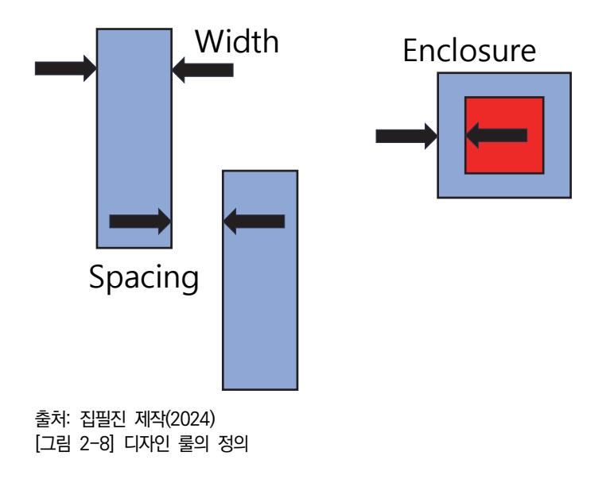

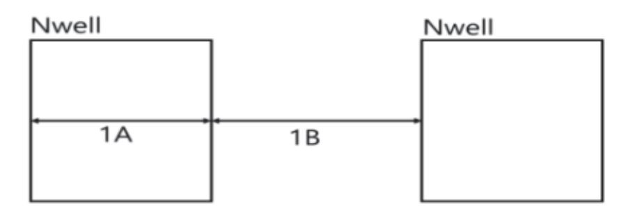

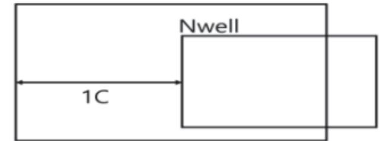

- 출처: 집필진 제작(2024)
- [그림 2-9] N-well Rule Description

#### <표 2-1> N-well에 관한 디자인 룰 사례

| Rule No. | Description                       |
|----------|-----------------------------------|
| 1A       | Minimum width of an Nwell.        |
| 1B       | Minimum space between two Nwell.  |
| 1C       | Minimum Nburied overlap of Nwell. |

#### <표 2-2> Oxide에 관한 디자인 룰 사례

| Rule No. | Description                              |
|----------|------------------------------------------|
| 2A       | Minimum width of an Oxide.               |
| 2B       | Minimum space between two Oxides.        |
| 2C       | Minimum Nwell overlap of Oxides.         |
| 2C       | Minimum Pwell overlap of Oxides.         |
| 2D       | Minimum spacing between Nwell and Oxide. |
| 2D       | Minimum spacing between Pwell and Oxide. |

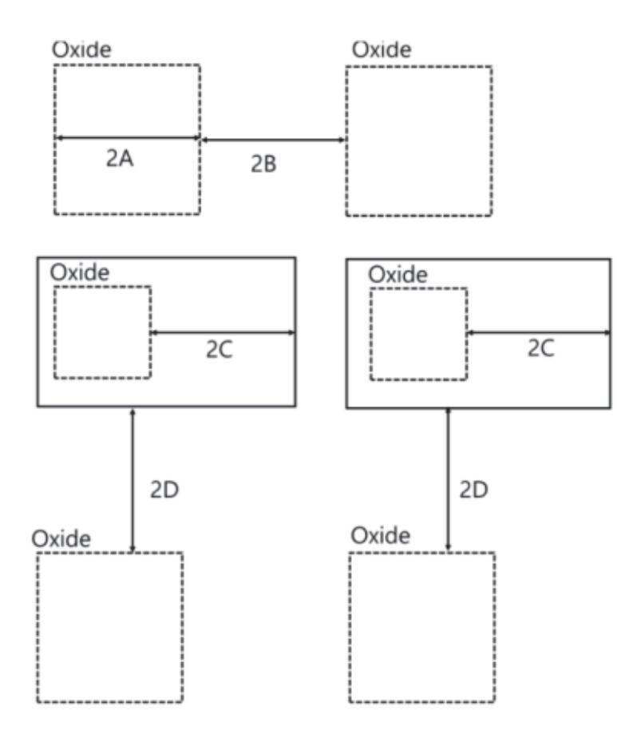

출처: 집필진 제작(2024)

[그림 2-10] Oxide Rule Description

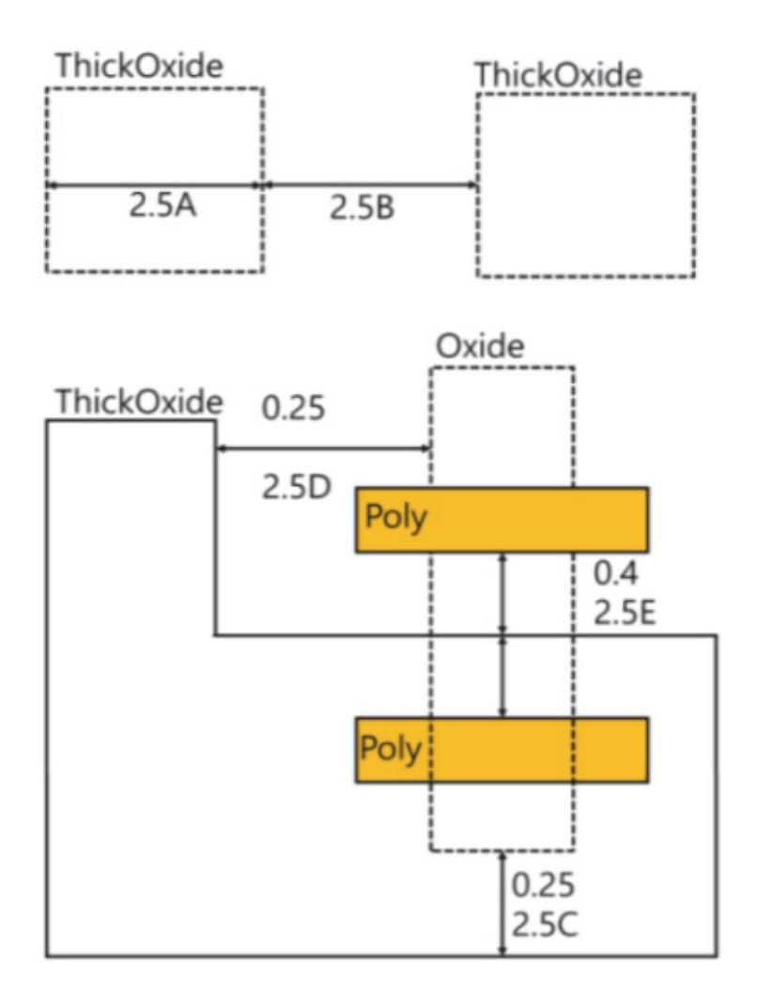

출처: 집필진 제작(2024) [그림 2-11] thick oxide rule

|  |  |  | <표 2-3> Thick oxide에 관한 디자인 룰 사례 |  |  |  |  |
|--|--|--|----------------------------------|--|--|--|--|
|--|--|--|----------------------------------|--|--|--|--|

| Rule No. | Description                       |
|----------|-----------------------------------|
| 2.5A     | Minimum width of an Oxide.        |
| 2.5B     | Minimum space between two Oxides. |
| 2.5C     | Thick Oxide to Oxide enclosure.   |
| 2.5D     | ThickOxide to Oxide spacing.      |
| 2.5E     | ThickOxide to Poly spacing.       |
| 2.5F     | ThickOxide to Poly enclosure.     |

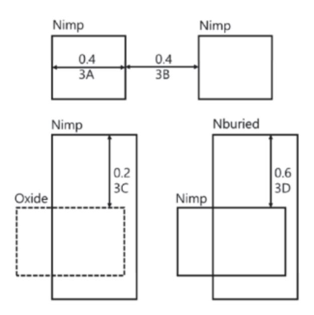

출처: 집필진 제작(2024) [그림 2-12] N+ implant rule

<표 2-4> N+ implant 디자인 룰 사례

| Rule No. | Description                      |
|----------|----------------------------------|
| 3A       | Minimum width of an Nimp         |
| 3B       | Minimum space between two Nimp.  |
| 3C       | Minimum Nimp overlap of Oxide.   |
| 3D       | Minimum Nburied overlap of Nimp. |

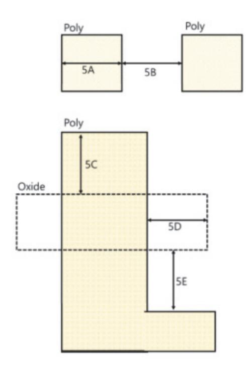

출처: 집필진 제작(2024)

[그림 2-13] poly rule

#### <표 2-5> poly 디자인 룰 사례

| Rule No. | Description                        |
|----------|------------------------------------|
| 5A       | Minimum width of an Poly.          |
| 5B       | Minimum space between two Poly.    |
| 5C       | Minimum Poly extension over Oxide. |
| 5D       | Minimum Oxide extension over Poly. |
| 5E       | Minimum Poly space to Oxide.       |

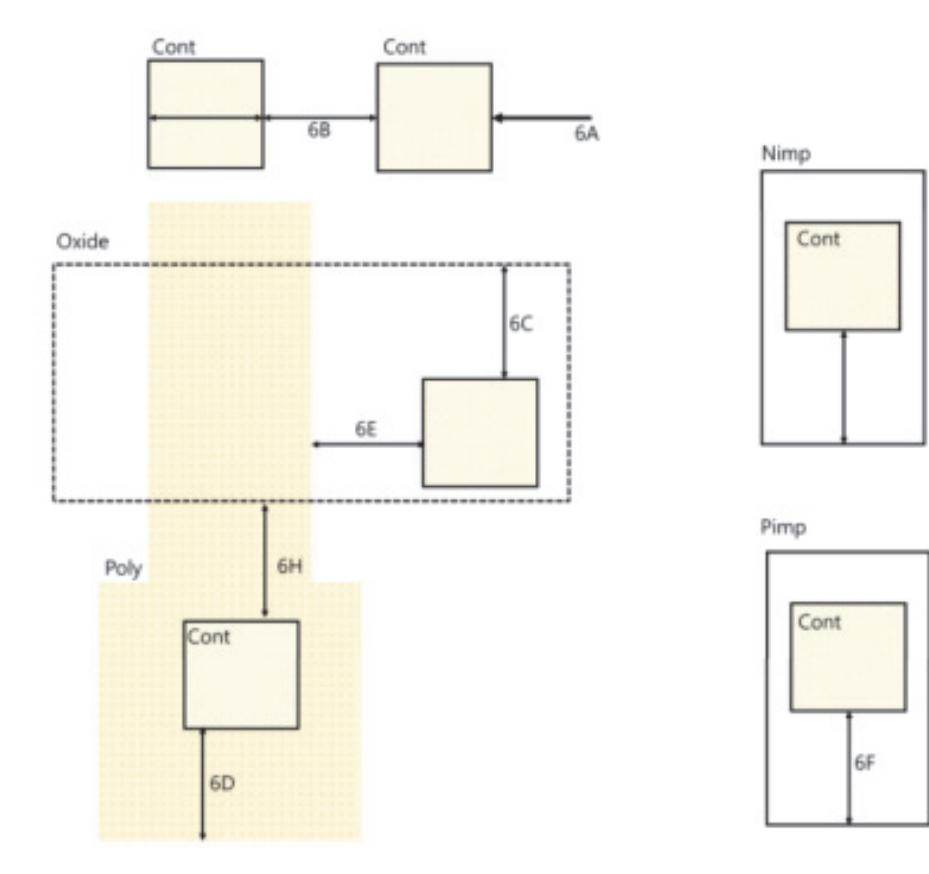

출처: 집필진 제작(2024) [그림 2-14] Poly Contact rule

<표 2-6> Poly Contact Rule에 관한 디자인 룰 사례

| Rule No. | Description                           |
|----------|---------------------------------------|
| 6A       | Absolute width and Length of Contact. |
| 6B       | Minimum space between two Contact.    |
| 6C       | Minimum Oxide overlap of Contact      |
| 6D       | Minimum Poly overlap of Contact.      |
| 6E       | Minimum Poly space to Contact.        |
| 6F       | Minimum Pimp overlap of Contact.      |
| 6G       | Minimum Nimp overlap of Contact.      |
| 6H       | Minimum Contact space to Oxide.       |

<표 2-7> Metal Rule에 관한 디자인 룰 사례

| Rule No.                                           | Description                        |
|----------------------------------------------------|------------------------------------|
| 7A,9A,11A,15A,17A,19A                              | Minimum width of an Metalx.        |
| 7B,9B,11B,15B,17B,19B                              | Minimum space between two Metalx.  |
| 7C                                                 | Minimum Metal1 overlap of Contact. |
| 9C,11C,15C,17C,19C                                 | Minimum Metalx overlap of Viax     |
| (Metalx, x = 1,2,3.4,5,6) (Viax, x= 1,2,3,4,5,) |                                    |

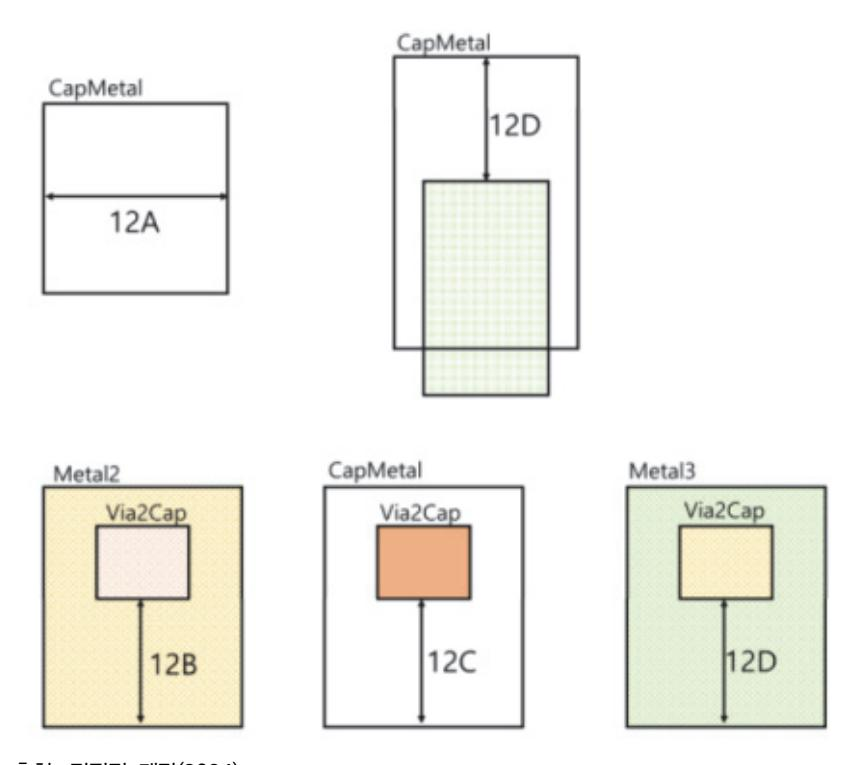

출처: 집필진 제작(2024) [그림 2-15] Capacitor metal rule

<표 2-8> Capacitor Metal Rule에 관한 디자인 룰 사례

| Rule No. | Description                                 |
|----------|---------------------------------------------|
| 12A      | Minimum width of an CapMetal.               |
| 12B      | Minimum Metal2 overlap of Via2 on CapMetal. |
| 12C      | Minimum CapMetal overlap of Via2.           |
| 12D      | Minimum Metal3 overlap of Via2 on Captetal. |
| 12E      | Minimum CapMetal overlap of Metal2.         |

(2) 패브리케이션 레이어

PCB의 경우, 여러 레이어로 구성된다. 각 레이어의 최대 폭, 최소 폭 및 최소 간격은 PCB의 레이어 구성과 관련이 있다. 예를 들어, 내층 및 외층 레이어의 최소 간격은 레 이어 간의 전기적 충돌을 방지하기 위해 정의될 수 있다.

(3) 패턴 및 트레이스 디자인하기

PCB의 경우, 트레이스와 패턴의 설계는 레이어별 최소 간격 및 최소 폭을 결정하는 데 중요한 요소이다. 트레이스와 패턴의 설계는 회로의 전기적 특성 및 신호의 전달에 영향 을 미치므로, 제조 가능한 기술 요구 사항을 고려해야 한다.

(4) 재료 특성 파악하기

PCB의 경우, 사용되는 재료의 특성은 레이어별 최대 폭, 최소 폭 및 최소 간격을 결정 하는 데 영향을 줄 수 있다. 재료의 열팽창 계수, 강도 및 안정성은 레이아웃 설계 및 제조에 중요한 요소이다.

(5) 공정 능력 파악하기

PCB 제조 공정의 능력은 최대 폭, 최소 폭 및 최소 간격의 결정에 영향을 줄 수 있다. PCB 제조 업체의 공정 능력을 고려하여 설계할 때, 공정의 제한과 제약 사항을 고려해 야 한다.

이러한 제조 공정 및 기술 요구 사항을 고려하여 레이어별 최대 폭, 최소 폭 및 최소 간격 을 결정할 수 있다. 이를 통해 PCB 레이아웃의 설계를 최적화하고 제조 가능한 제품을 생 산할 수 있다.

2. 디자인 규격 및 표준을 검토한다.

커스텀 레이아웃을 위한 디자인 규격과 표준을 검토한다. 이는 레이어의 최대 폭, 최소 폭, 및 최소 간격을 결정하는 데 도움이 된다.

커스텀 레이아웃의 레이어별 최대 폭, 최소 폭 및 최소 간격 정보를 파악하기 위해서는 해 당 디자인 규격과 표준을 검토해야 한다. 일반적으로 다음과 같은 과정을 거쳐 디자인 규격 및 표준을 검토할 수 있다.

(1) 산업 표준 및 규격 검토하기

관련 산업의 표준 및 규격을 검토한다. 예를 들어, PCB 디자인의 경우 IPC(Association Connecting Electronics Industries) 표준을 검토할 수 있다. 이러한 표준은 PCB 디자인의 최소 간격 및 폭에 대한 지침을 제공한다.

(2) 제품 사양 확인하기

해당 제품의 사양을 검토하여 디자인에 적용해야 하는 요구 사항을 이해한다. 제품의 기 능, 환경 및 제조 공정 요건 등을 고려해야 한다.

(3) 설계 툴의 제한 사항 검토하기

PCB 디자인 도구 또는 기타 디자인 툴에서 사용 가능한 레이아웃 제한 사항을 검토한 다. 이러한 제한 사항은 최대 폭, 최소 폭 및 최소 간격을 설정하는 데 도움이 된다.

(4) 이전 프로젝트의 경험을 공유하기

이전에 유사한 프로젝트에서 얻은 경험을 공유하고 해당 프로젝트의 최대 폭, 최소 폭 및 최소 간격 정보를 고려한다.

(5) 산업 동향 파악 및 업데이트하기

커스텀 레이아웃 디자인에 적용된 최근의 산업 동향 파악 및 업데이트를 검토한다. 기술 의 발전과 함께 최대 폭, 최소 폭 및 최소 간격이 변경될 수 있으므로 최신 정보를 확 인해야 한다.

디자인 규격 및 표준을 검토하여 커스텀 레이아웃의 레이어별 최대 폭, 최소 폭 및 최소 간 격 정보를 파악할 수 있다. 이러한 정보를 기반으로 PCB 레이아웃을 설계하고 제조할 때 제품의 품질과 신뢰성을 향상시킬 수 있다.

3. CAD 도구를 사용한 레이어를 분석한다.

CAD 도구를 사용하여 각 레이어의 최대 폭, 최소 폭, 및 최소 간격을 분석한다. 이를 통해 레이어의 물리적 제약 사항을 이해할 수 있다.

커스텀 레이아웃의 레이어별 최대 폭, 최소 폭 및 최소 간격 정보를 파악하기 위해서는 CAD(Computer-aided Design) 도구를 사용하여 레이어 분석을 수행할 수 있다. 다양한 CAD 도구가 있지만, 일반적으로 다음과 같은 과정을 거쳐 CAD 도구를 사용한 레이어 분 석을 할 수 있다.

(1) 레이아웃 디자인하기

레이아웃을 CAD 소프트웨어를 사용하여 설계한다. 이 때, 각 레이어의 트레이스, 패턴, 및 기타 구성 요소를 포함하여 디자인한다.

(2) 레이어 분석 도구 사용하기

CAD 도구에서 제공하는 레이어 분석 도구를 사용하여 각 레이어의 최대 폭, 최소 폭

및 최소 간격을 확인한다. 이를 통해 레이어 간 충돌이나 제조 공정에서 발생할 수 있 는 문제를 사전에 예방할 수 있다.

(3) 레이어 간격 검토하기

레이어 분석 도구를 사용하여 레이어 간의 최소 간격을 확인한다. 이를 통해 레이어 간 의 전기적 충돌이나 단락을 방지할 수 있다.

(4) 디자인 규칙 체크하기

CAD 도구에서 제공하는 디자인 규칙 체크 기능을 사용하여 최대 폭, 최소 폭 및 최소 간격이 설계 규칙에 부합하는지 확인한다. 필요에 따라 규칙을 수정하고 재검토할 수 있 다.

(5) 시뮬레이션 및 검증하기

CAD 도구를 사용하여 레이어 분석을 통해 얻은 정보를 기반으로 전기적, 기계적, 및 열적 시뮬레이션을 수행한다. 이를 통해 설계의 문제를 사전에 발견하고 수정할 수 있 다.

CAD 도구를 사용하여 레이어 분석을 수행하면 커스텀 레이아웃의 각 레이어의 최대 폭, 최소 폭 및 최소 간격을 파악할 수 있으며, 이를 통해 설계의 품질을 향상시킬 수 있다.

4. 제조 공정 및 재료의 특성 고려하기

레이어의 최대 폭, 최소 폭, 및 최소 간격은 해당 레이어의 제조 공정 및 사용되는 재료의 특성에 따라 달라질 수 있다. 이러한 요소를 고려하여 적절한 값들을 결정한다. 커스텀 레이아웃의 레이어별 최대 폭, 최소 폭 및 최소 간격 정보를 파악하기 위해서는 제 조 공정과 사용되는 재료의 특성을 고려해야 한다. 일반적으로 다음과 같은 과정을 거쳐 제

- 조 공정 및 재료의 특성 고려할 수 있다.
- (1) 제조 공정 이해하기

레이아웃을 제조할 때 사용되는 공정을 이해한다. PCB(Printed Circuit Board)의 경 우, 주로 사용되는 제조 공정에는 에칭, 도금, 인쇄, 및 가공 공정이 포함될 수 있다.

(2) 재료 특성 고려하기

사용되는 재료의 특성을 고려한다. PCB의 경우, 주로 사용되는 재료는 FR-4(Fiberglass Reinforced Epoxy)이며, 이 재료의 열팽창 계수, 기계적 강도, 전기적 특성 등을 고려해야 한다.

(3) 공정 제약 사항 확인하기

제조 공정에서 발생할 수 있는 제약 사항을 확인한다. 예를 들어, 에칭 공정에서 최소 폭 및 간격을 유지하기 위한 제약 사항이 있을 수 있다.

(4) 레이어 간의 전기적 충돌 방지하기

레이어 간의 최소 간격을 설정하여 전기적 충돌을 방지한다. 이를 통해 단락이나 기타

전기적 문제를 예방할 수 있다.

커스텀 레이아웃에서 수율을 고려한 레이어 폭의 변화를 확인하기 위한 기준 레이아웃 설계를 할 때 레이어 간의 전기적 충돌을 방지하기 위해 제조 공정과 재료의 특성을 고 려해야 한다. 이러한 접근 방법을 사용하여 커스텀 레이아웃의 기준 레이아웃을 설계한 다. 이를 통해 제조 공정에서의 문제를 사전에 예방하고 수율을 최적화할 수 있다.

(가) 레이어 간의 최소 간격 유지

레이어 간의 최소 간격을 유지하여 전기적 충돌을 방지한다. PCB 제조에서는 레이 어 간의 최소 간격이나 규정된 규격에 따라 설계해야 한다.

(나) 절연 재료 사용

레이어 간의 전기적 충돌을 방지하기 위해 절연 재료를 사용한다. 이는 PCB의 각 레이어를 분리하고 전기적으로 절연하는 역할을 한다.

(다) 층간 저항 최소화

레이어 간의 전기적 충돌을 방지하기 위해 층간 저항을 최소화한다. 이를 위해 전기 적으로 저항이 낮은 재료를 선택하고 적절한 제조 공정을 사용하여 레이어 간의 저 항을 최소화한다.

(라) 심볼 및 라벨링

각 레이어에 대한 적절한 심볼 및 라벨링을 추가하여 전기적 충돌을 방지한다. 이를 통해 설계자와 제조자가 각 레이어를 명확하게 인식할 수 있다.

(마) 전기적 시뮬레이션

전기적 충돌을 방지하기 위해 전기적 시뮬레이션을 수행한다. 이를 통해 레이어 간 의 전기적 상호 작용을 확인하고 문제가 있는 경우 조치를 취할 수 있다.

(바) 테스트 및 검증

설계된 기준 레이아웃을 테스트하고 검증하여 전기적 충돌이 발생하지 않음을 확인 한다. 이를 통해 제조 공정에서 발생할 수 있는 문제를 사전에 예방할 수 있다.

(5) 제조 공정의 한계 고려하기

제조 공정의 한계를 고려하여 최대 폭, 최소 폭 및 최소 간격을 설정한다. 이를 통해 실 제로 제조할 수 있는 레이아웃을 설계할 수 있다.

커스텀 레이아웃을 설계할 때는 제조 공정과 사용되는 재료의 특성을 고려하여 레이어별 최대 폭, 최소 폭 및 최소 간격을 설정해야 한다. 이를 통해 설계된 레이아웃이 제조 공정 에서 문제없이 제조될 수 있고, 제품의 품질을 향상시킬 수 있다.

5. 테스트 및 검증

최대 폭, 최소 폭, 및 최소 간격을 설정한 후에는 테스트 및 검증을 수행하여 디자인이 제 조 공정에 부합하는지 확인한다.

커스텀 레이아웃의 레이어별 최대 폭, 최소 폭 및 최소 간격 정보를 파악하기 위해서는 테 스트 및 검증 프로세스를 수행해야 한다. 일반적으로 다음과 같은 절차를 거쳐 테스트 및 검증을 할 수 있다.

(1) 테스트 계획 수립

각 레이어의 최대 폭, 최소 폭 및 최소 간격을 검증하기 위한 테스트 계획을 수립한다. 이 계획은 어떤 테스트가 수행되어야 하는지, 어떤 장비 또는 도구가 필요한지 등을 포 함해야 한다.

(2) 테스트 환경 설정

테스트를 수행하기 위한 적절한 환경을 설정한다. 이는 일반적으로 PCB 테스트 벤치, 측정 장비 및 검증 소프트웨어를 포함한다.

(3) 레이어 분석

각 레이어의 최대 폭, 최소 폭 및 최소 간격을 분석한다. 이를 위해 CAD 도구나 테스 트용 소프트웨어를 사용하여 레이어를 시각화하고 측정한다.

(4) 테스트 수행

테스트 계획에 따라 각 레이어의 최대 폭, 최소 폭 및 최소 간격을 측정한다. 이 과정에 서 실제로 제조될 때 발생할 수 있는 문제를 식별하고 검증한다.

(5) 결과 분석

테스트 결과를 분석하여 각 레이어의 최대 폭, 최소 폭 및 최소 간격이 설계 규격에 부 합하는지 확인한다. 필요한 경우 추가 조치를 취하여 문제를 해결한다.

(6) 보고 및 문서화

테스트 결과를 문서화하고 보고서로 작성한다. 이 보고서에는 각 레이어의 최대 폭, 최 소 폭 및 최소 간격에 대한 측정 결과 및 분석 내용이 포함되어야 한다.

테스트 및 검증 프로세스를 통해 커스텀 레이아웃의 각 레이어의 최대 폭, 최소 폭 및 최소 간격 정보를 신뢰할 수 있게 파악할 수 있다. 이를 통해 제품의 품질과 신뢰성을 향상시킬 수 있다.

수 수율을 고려한 레이어 폭의 변화가 있는지 확인한다.

커스텀 레이아웃에서 수율을 고려한 레이어 폭의 변화를 확인하는 것은 중요하다. 수율은 제조 프로세스에서 생산되는 제품의 품질과 비용에 영향을 미치는 중요한 요소이다. 따라서 레이어 폭의 변화가 수율에 어떤 영향을 끼칠지 확인하는 것이 중요하다. 커스텀 레이아웃에서 수율을 고려한 레이어 폭의 변화를 확인함으로써 제조 공정에서의 문제를 사전에 예방하고 수율을 최 적화할 수 있다. 일반적으로 다음과 같은 절차를 거쳐 커스텀 레이아웃에서 수율을 고려한 레 이어 폭의 변화를 확인할 수 있다.

1, 기준 레이아웃 설계

레이어 폭의 변화를 확인하기 위한 기준 레이아웃을 설계한다. 이는 일반적으로 최적의 수 율을 보장하는 레이아웃이다.

커스텀 레이아웃에서 수율을 고려한 레이어 폭의 변화를 확인하기 위한 기준 레이아웃 설 계를 할 때 레이어 간의 전기적 충돌을 방지하기 위해 제조 공정과 재료의 특성을 고려해 야 한다. 이를 위한 몇 가지 접근 방법은 다음과 같다.

(1) 레이어 간의 최소 간격 유지하기

레이어 간의 최소 간격을 유지하여 전기적 충돌을 방지한다. PCB 제조에서는 레이어 간의 최소 간격이나 규정된 규격에 따라 설계되어야 한다.

(2) 절연 재료 사용하기

레이어 간의 전기적 충돌을 방지하기 위해 절연 재료를 사용한다. 이는 PCB의 각 레이 어를 분리하고 전기적으로 절연하는 역할을 한다.

커스텀 레이아웃에서 수율을 고려한 레이어 폭의 변화를 확인하기 위한 기준 레이아웃 설계 시 레이어 간의 전기적 충돌을 방지하기 위해 사용되는 절연 재료는 여러 가지가 있다. 일반적으로는 다음과 같은 절연 재료가 사용될 수 있다.

(가) 박막 절연 재료

박막 절연 재료는 주로 산화물 또는 질화물을 기반으로 한다. 이러한 절연 재료는 얇은 박막으로 형성되어 레이어 간의 전기적 충돌을 방지하고 절연성을 제공한다.

(나) 폴리머 절연 재료

폴리머 절연 재료는 유기 화합물로 구성되어 있으며, 주로 폴리이미드나 폴리아미드 등이 사용된다. 이러한 절연 재료는 유연성이 높고 다양한 레이어 간의 전기적 충돌 을 방지할 수 있다.

(다) 유리 절연 재료

유리 절연 재료는 주로 유리 섬유로 형성된다. 이러한 절연 재료는 높은 열 내구성 과 전기 절연성을 제공하며, 레이어 간의 전기적 충돌을 효과적으로 방지할 수 있다.

(라) 에폭시 수지 절연 재료

에폭시 수지는 강한 절연성을 제공하는 고분자 소재이다. 레이어 간의 전기적 충돌 을 방지하고 전기적 안정성을 향상시키는 데 사용될 수 있다.

(마) 실리콘 절연 재료

실리콘 절연 재료는 높은 내열성과 절연성을 제공한다. 유연성이 뛰어나고 다양한 온도 조건에서 안정적으로 작동하여 전기적 충돌을 방지할 수 있다.

이러한 절연 재료들은 커스텀 레이아웃에서 레이어 폭의 변화를 확인하는 데 사용될 수 있으며, 전기적 충돌을 방지하고 전기적 안정성을 향상시키는 데 중요한 역할을 한다. 선택된 절연 재료는 설계 요구 사항 및 제조 공정에 따라 조정되어야 한다.

(3) 층간 저항 최소화

레이어 간의 전기적 충돌을 방지하기 위해 층간 저항을 최소화한다. 이를 위해 전기적으 로 저항이 낮은 재료를 선택하고 적절한 제조 공정을 사용하여 레이어 간의 저항을 최 소화한다.

(4) 심볼 및 라벨링

각 레이어에 대한 적절한 심볼 및 라벨링을 추가하여 전기적 충돌을 방지한다. 이를 통 해 설계자와 제조자가 각 레이어를 명확하게 인식할 수 있다.

(5) 전기적 시뮬레이션

전기적 충돌을 방지하기 위해 전기적 시뮬레이션을 수행한다. 이를 통해 레이어 간의 전 기적 상호 작용을 확인하고 문제가 있는 경우 조치를 할 수 있다. 커스텀 레이아웃에서 수율을 고려한 레이어 폭의 변화를 확인하기 위한 기준 레이아웃 설계에는 전기적 시뮬 레이션을 사용할 수 있다. 이를 통해 레이어 간의 전기적 충돌이나 다른 전기적 문제를 사전에 식별하고 해결할 수 있다.

위의 단계를 통해 전기적 시뮬레이션을 사용하여 커스텀 레이아웃에서 수율을 고려한 레이어 폭의 변화를 확인할 수 있다. 전기적 시뮬레이션은 다음과 같은 단계로 수행될 수 있다.

(가) 회로 설계

기준 레이아웃을 바탕으로 회로를 설계한다. 이는 각 레이어의 컴포넌트 및 전기적 연결을 포함한다.

(나) 모델링

설계된 회로를 전기적 시뮬레이션 프로그램에 입력하기 위해 모델링한다. 각 레이어 의 속성과 구성 요소를 정확하게 모델링하여 시뮬레이션에 사용될 수 있도록 준비한 다.

(다) 시뮬레이션 실행

전기적 시뮬레이션 프로그램을 사용하여 설계된 회로에 대한 시뮬레이션을 실행한다. 이를 통해 각 레이어 간의 전기적 상호 작용을 확인하고 전기적 충돌이나 다른 문제 를 식별한다.

(라) 결과 분석

시뮬레이션 결과를 분석하여 전기적 충돌이나 다른 전기적 문제를 식별한다. 레이어 폭의 변화에 따른 수율에 미치는 영향을 평가하고 최적의 레이어 폭을 결정하기 위 한 정보를 도출한다.

(마) 설계 최적화

식별된 문제를 해결하기 위해 설계를 최적화한다. 이는 레이어 폭의 조정 또는 다른 회로 구성 요소의 수정을 포함할 수 있다.

(바) 재시뮬레이션

최적화된 설계를 다시 전기적 시뮬레이션에 입력하여 문제가 해결되었는지 확인한다. 필요에 따라 여러 번의 재시뮬레이션을 수행하여 설계의 안정성과 신뢰성을 보장한 다.

(사) 문서화

전기적 시뮬레이션 결과를 문서화하여 보고서 형식으로 제공한다. 이 보고서에는 시 뮬레이션 결과 및 분석, 문제 해결 방법, 최적화된 설계에 대한 정보가 포함될 수 있 다.

(6) 테스트 및 검증

설계된 기준 레이아웃을 테스트하고 검증하여 전기적 충돌이 발생하지 않음을 확인한다. 이를 통해 제조 공정에서 발생할 수 있는 문제를 예방할 수 있다.

2. 레이어 폭 변화 설계

기준 레이아웃을 기반으로 레이어 폭을 변화시키는 다양한 디자인을 수행한다. 이때, 수율 을 고려하여 레이어 폭의 변화가 제조 공정에 어떤 영향을 끼칠지 고려해야 한다. 커스텀 레이아웃에서 수율을 고려한 레이어 폭의 변화를 확인하기 위한 레이어 폭 변화 설계는 다 음과 같은 단계를 포함할 수 있다.

(1) 기준 레이아웃 설계

먼저 수율을 고려한 기준 레이아웃을 설계한다. 이는 일반적으로 수율이 높은 기존의 레 이아웃을 기반으로 하며, PCB의 기능과 요구 사항을 충족해야 한다.

(2) 레이어 폭 변화 계획 수립

다양한 레이어 폭 변화를 시도하기 위한 계획을 수립한다. 이는 레이어 폭의 증가 또는 감소에 따른 수율 변화를 고려하여 다양한 시나리오를 고려하는 것을 포함한다.

(3) CAD 도구를 사용한 레이어 폭 변화

CAD(Computer-Aided Design) 도구를 사용하여 각각의 레이어 폭 변화를 디자인한 다. 이를 통해 레이어 간의 전기적 충돌 및 기타 제조 공정 관련 문제를 고려할 수 있 다.

(4) 시뮬레이션 및 분석

각각의 레이어 폭 변화에 대한 시뮬레이션을 수행하고, 수율 변화 및 다른 설계 요소에 대한 분석을 진행한다. 이를 통해 각각의 시나리오에서의 수율을 예측하고 문제를 식별 할 수 있다.

(5) 테스트 및 검증

설계된 레이어 폭 변화를 테스트하고 검증하여 수율 변화를 확인한다. 이를 통해 시뮬레 이션 결과의 신뢰성을 확인하고 제조 공정에서의 문제를 사전에 예방할 수 있다.

(6) 최적화 및 수정

시뮬레이션 및 테스트 결과를 바탕으로 최적의 레이어 폭 변화를 결정하고, 필요한 경우 설계를 수정하여 최종적인 레이어 폭 변화 설계를 완성한다.

이러한 과정을 통해 수율을 고려한 레이어 폭의 변화를 확인할 수 있으며, 제조 공정에서의 문제를 사전에 예방하고 최적의 설계를 도출할 수 있다.

3. 시뮬레이션 및 분석

CAD 도구나 다른 시뮬레이션 도구를 사용하여 각각의 레이어 폭 변화에 대한 시뮬레이션 을 수행한다. 이를 통해 각각의 레이어 폭이 제조 공정 및 제품 품질에 미치는 영향을 분석 한다. 시뮬레이션 및 분석을 통해 커스텀 레이아웃에서의 수율을 고려한 레이어 폭의 변화 를 정확하게 이해하고, 최적의 설계를 도출할 수 있다.

커스텀 레이아웃에서 수율을 고려한 레이어 폭의 변화를 확인하기 위한 시뮬레이션 및 분 석을 수행하는 과정은 다음과 같다.

(1) CAD 모델링

CAD 소프트웨어를 사용하여 기존 레이아웃의 CAD 모델을 생성한다. 이 모델은 레이 어 간의 물리적 및 전기적 상호 작용을 정확하게 반영해야 한다.

(2) 레이어 폭 변화 적용

CAD 모델에서 레이어 폭을 변경하고, 다양한 시나리오에 대한 레이어 폭 변화를 시뮬 레이션한다. 이 때, 레이어 간의 최소 간격 및 전기적 특성을 유지하면서 레이어 폭을 조절한다.

(3) 전기적 시뮬레이션

시뮬레이션 소프트웨어를 사용하여 각각의 시나리오에 대한 전기적 시뮬레이션을 수행 한다. 이를 통해 레이어 폭 변화가 전기적인 특성에 미치는 영향을 분석하고, 전기적 충 돌 및 기타 문제를 식별한다.

(4) 수율 분석

각 시나리오에서의 수율을 계산하고 분석한다. 이 때, 수율은 레이어 폭 변화에 따라 어 떻게 변하는지를 확인하고, 최적의 레이어 폭을 결정하는 데 도움이 된다.

(5) 기타 고려 사항 분석

레이어 폭 변화가 기타 설계 요소에 미치는 영향을 분석한다. 예를 들어, 열 배출, 기계 적 강도, 제조 용이성 등의 측면을 고려할 수 있다. 커스텀 레이아웃에서 수율을 고려한 레이어 폭의 변화가 기타 설계 요소에 미치는 영향을 분석하는 것은 중요하다. 레이어 폭의 변화는 전체 설계의 특성을 변경할 수 있으며, 이는 다음과 같은 다양한 측면에서 영향을 끼칠 수 있다.

(가) 전기적 특성

레이어 폭의 변화는 회로의 전기적 특성에 영향을 줄 수 있다. 더 넓은 레이어 폭은 전기적으로 더 낮은 임피던스를 가질 수 있으며, 회로의 전류 경로를 변경할 수 있 다.

(나) 열 특성

레이어 폭의 변화는 회로의 열 특성에도 영향을 줄 수 있다. 더 넓은 레이어 폭은 열 분산을 증가시킬 수 있으며, 따라서 회로의 열 관리에 영향을 줄 수 있다.

(다) 기계적 특성

레이어 폭의 변화는 회로의 기계적 특성에도 영향을 줄 수 있다. 더 넓은 레이어 폭 은 회로의 물리적 강도를 증가시킬 수 있지만, 더 큰 공간을 필요로 할 수 있다.

(라) EMI/EMC

Electromagnetic Interference(EMI) 및 Electromagnetic Compatibility(EMC) 요구 사항은 레이어 폭의 변화에도 영향을 받을 수 있다. 레이어 폭의 변화는 회로 의 전자기 환경을 변경할 수 있으며, 이는 EMI 및 EMC 문제를 초래할 수 있다.

(마) 제조 가능성

레이어 폭의 변화는 제조 가능성에도 영향을 줄 수 있다. 너무 작은 레이어 폭은 제 조 공정에서 어려움을 초래할 수 있으며, 반대로 너무 큰 레이어 폭은 필요 이상의 공간을 차지할 수 있다.

이러한 다양한 측면을 고려하여 레이어 폭의 변화가 기타 설계 요소에 미치는 영향을 분석해야 한다. 이를 통해 최종적으로 최적의 레이어 폭을 결정하고 전체 설계의 특성을 최적화할 수 있다.

(6) 결과 평가 및 보고

시뮬레이션 및 분석 결과를 평가하고, 최적 레이어 폭의 변화를 결정한다. 이러한 결과 를 문서화하여 관련 이해 관계자들에게 보고하고, 후속 조치를 계획한다.

4. 수율 분석

각각의 레이어 폭 변화에 대한 수율을 분석한다. 이때, 제조 공정에서 발생할 수 있는 문제 나 결함을 고려하여 수율을 측정한다.

이러한 단계를 통해 커스텀 레이아웃에서의 각 레이어 폭의 변화에 대한 수율을 분석하고, 제조 공정에서 발생할 수 있는 문제나 결함을 고려하여 최적의 설계를 도출할 수 있다. 커스텀 레이아웃에서 레이어 폭의 변화에 대한 각각의 레이어의 수율 분석과 제조 공정에 서 발생할 수 있는 문제나 결함을 고려한 수율 측정은 다음과 같은 단계를 포함할 수 있다.

(1) 레이어 폭 변화 시뮬레이션

CAD 소프트웨어를 사용하여 레이어 폭의 변화를 시뮬레이션한다. 각 레이어에 대해 폭 을 조정하고, 각각의 시나리오에 대해 레이어 폭의 변화를 적용한다.

커스텀 레이아웃에서 CAD 소프트웨어를 사용하여 레이어 폭의 변화를 시뮬레이션하는 것은 가능한다. 일반적으로 CAD 소프트웨어는 다양한 디자인 요소를 조작하고 시뮬레 이션하여 설계를 분석하고 최적화하는 데 사용된다. 이를 통해 레이어 폭의 변화가 설계 에 미치는 영향을 실제로 시각화하고 이해할 수 있다. 다음은 CAD 소프트웨어를 사용 한 레이어 폭의 변화 시뮬레이션의 일반적인 단계이다.

(가) CAD 모델링

CAD 소프트웨어를 사용하여 설계의 초기 모델을 생성한다. 이 모델에는 모든 레이 어의 요소와 구성이 포함된다.

(나) 파라미터 조정

레이어 폭을 조정하고 원하는 변화를 적용한다. CAD 소프트웨어를 사용하여 레이어 의 폭을 수정할 수 있으며, 이를 통해 다양한 레이어 폭의 시뮬레이션을 수행할 수 있다.

(다) 시뮬레이션 실행

수정된 디자인을 기반으로 시뮬레이션을 실행한다. CAD 소프트웨어는 레이어 폭의 변화가 설계에 미치는 영향을 시각화하고 분석할 수 있는 도구를 제공한다.

(라) 결과 분석

시뮬레이션 결과를 분석하여 레이어 폭의 변화가 설계에 미치는 영향을 이해한다. 이를 통해 설계의 다양한 측면에 대한 정보를 얻을 수 있으며, 최적의 레이어 폭을 결정하는 데 도움이 된다.

(마) 설계 최적화

분석 결과를 기반으로 설계를 최적화한다. 이는 레이어 폭뿐만 아니라 다른 디자인 요소도 고려할 수 있다.

CAD 소프트웨어를 사용한 레이어 폭의 변화 시뮬레이션은 설계 과정에서 중요한 도구 이다. 이를 통해 설계자는 레이어 폭의 변화가 설계에 미치는 영향을 빠르게 평가하고 최적의 설계 결정을 내릴 수 있다.

(2) 전기적 시뮬레이션

각각의 시나리오에 대해 전기적 시뮬레이션을 수행하여 레이어 간의 전기적 충돌이나 다른 전기적 문제를 확인한다. 레이어 폭의 변화가 전기적 특성에 미치는 영향을 분석한 다.

(3) 수율 분석

각 시나리오에서의 수율을 계산하고 분석한다. 수율은 레이어 폭 변화에 따라 어떻게 변 하는지를 확인하고, 제조 공정에서 발생할 수 있는 문제를 고려한다.

99

커스텀 레이아웃에서 레이어 폭의 변화에 대한 각각의 레이어의 수율 분석을 위한 일반 적인 방법은 다음과 같다.

(가) CAD 모델링 및 요소 배치

먼저 CAD 소프트웨어를 사용하여 설계의 초기 모델을 생성하고 각 요소를 해당 레 이어에 배치한다.

(나) 레이어별 요소 수 계산

각 레이어에 배치된 요소들의 수를 계산한다. 이는 해당 레이어의 수율을 파악하는 데 필수적이다.

(다) 레이어 면적 계산

각 레이어의 면적을 계산한다. 이는 레이어의 폭과 길이를 이용하여 수행할 수 있다.

(라) 수율 계산

레이어별 요소 수를 해당 레이어의 면적으로 나누어 수율을 계산한다. 수율은 해당 레이어의 공간을 최대한 활용하는 정도를 나타낸다.

(마) 폭 변화 적용

레이어 폭을 조정하여 원하는 변화를 적용한다.

(바) 수율 재계산

폭 변화가 적용된 후에는 각 레이어의 수율을 다시 계산한다. 이는 레이어 폭의 변 화가 수율에 미치는 영향을 파악하는 데 도움이 된다.

(사) 분석 및 비교

각 레이어의 수율을 분석하고 비교하여 레이어 폭의 변화가 수율에 미치는 영향을 확인한다. 어떤 레이어에서는 폭의 변화가 수율에 큰 영향을 끼칠 수 있으며, 다른 레이어에서는 영향이 적을 수 있다.

(아) 결과 해석

분석 결과를 바탕으로 레이어 폭을 최적화하는 결정을 내린다. 수율이 향상되는 방 향으로 설계를 조정하여 생산성을 향상시킬 수 있다.

- 이러한 방법을 통해 각각의 레이어에서의 수율을 파악하고, 레이어 폭의 변화가 설계에 미치는 영향을 신중하게 고려할 수 있다.
- (4) 제조 공정에서의 문제 고려

제조 공정에서 발생할 수 있는 문제나 결함을 고려하여 수율을 측정한다. 예를 들어, 레 이어 간의 최소 간격을 충족하지 못하거나, 전기적 충돌이 발생할 경우 수율이 감소할 수 있다.

(5) 실제 제조 테스트 최적의 레이어 폭을 결정한 후, 실제 제조 테스트를 통해 수율을 측정한다. 이 과정에서 발생하는 문제나 결함을 확인하고 수정하여 최종적으로 수율을 최적화한다.

(6) 수율 개선 및 최적화

수율을 개선하기 위해 필요한 추가 조치를 취하고, 최종적으로 수율을 최적화한다. 이는 레이어 폭의 조정뿐만 아니라 다른 설계 요소나 제조 공정에 대한 최적화도 포함할 수 있다.

5. 결과 평가 및 최적화

수율 분석 결과를 평가하고 필요한 경우 레이어 폭을 최적화한다. 이를 통해 수율을 최대화 하고 제조 공정에서의 문제를 해결할 수 있다.

커스텀 레이아웃에서 레이어 폭의 변화에 따른 수율의 분석 결과를 평가하고 최적화하기 위해 다음과 같은 절차를 따를 수 있다.

(1) 수율 분석 결과 평가

레이어 폭의 변화에 따른 각 시나리오에서의 수율 분석 결과를 종합적으로 평가한다. 각 시나리오에서의 장단점과 발생 가능한 문제를 식별한다.

(2) 목표 설정

레이어 폭의 변화에 대한 목표를 설정한다. 이 목표는 전체적인 수율 향상과 함께 다른 설계 요구 사항을 충족하는 것을 포함할 수 있다.

(3) 최적화 방안 도출

각 시나리오에서의 수율을 최대화하는 방안을 도출한다. 이는 레이어 폭의 조정뿐만 아 니라 다른 설계 요소나 제조 공정에 대한 최적화도 고려한다.

(4) 실제 제조 테스트

도출된 최적화 방안을 실제 제조 테스트를 통해 검증한다. 이 과정에서 발생하는 문제나 결함을 확인하고 수정하여 최종적인 최적화된 설계를 도출한다.

(5) 평가 및 수정

제조 테스트를 통해 얻은 결과를 평가하고, 필요한 경우 설계를 수정하여 추가적인 최적 화를 진행한다. 이는 수율 향상뿐만 아니라 다른 설계 요구 사항도 고려한다.

(6) 최종 평가 및 보고

최종적으로 얻은 최적화된 설계를 평가하고, 관련 이해 관계자들에게 보고한다. 이 보고 서에는 최적화된 설계의 특징, 장단점, 수율 향상 등이 포함될 수 있다.

위의 단계를 반복하여 레이어 폭의 변화에 따른 수율을 효과적으로 분석하고 평가하여 최 적화된 커스텀 레이아웃을 도출할 수 있다.

6. 보고 및 문서화

분석 결과를 문서화하고 보고서로 작성한다. 이 보고서에는 각 레이어 폭 변화에 대한 시뮬 레이션 및 수율 분석 결과가 포함되어야 한다.

커스텀 레이아웃에서 레이어 폭의 변화에 따른 수율의 분석 결과를 보고하고 문서화하는 과정은 프로젝트의 결정적인 부분 중 하나이다. 다음은 이를 위한 일반적인 절차이다.

(1) 분석 결과 요약

분석의 목적, 범위 및 사용된 방법에 대한 간단한 개요를 제공한다.

(2) 시나리오 설명

각 시나리오에서 사용된 레이어 폭의 변화와 해당 시나리오에서의 수율에 대해 설명한 다.

(3) 수집된 데이터

각 시나리오에서 발생한 수율에 대한 정량적 데이터를 제공한다. 이는 레이어 폭의 변화 에 따른 수율의 변화를 명확히 이해하는 데 도움이 된다.

(4) 분석 결과

각 시나리오에 대한 분석 결과를 상세히 설명한다. 수율의 증가 또는 감소에 영향을 끼 치는 주요 요인을 강조하고, 각 시나리오의 장단점을 비교하여 평가한다.

(5) 문제 및 해결책

분석 중 발견된 문제나 도출된 해결책에 대해 설명한다. 예를 들어, 수율이 감소한 시나 리오의 경우 문제점을 식별하고 다른 시나리오에서의 해결책을 제안한다.

(6) 의견 및 결론

분석의 결과를 종합하여 각 시나리오에 대한 의견을 제시하고, 최적의 레이어 폭을 결정 하는 데 필요한 추가 조치를 제안한다.

(7) 관련 자료 및 참고 문헌

분석에 사용된 자료나 참고 문헌을 명시하여 보고서의 신뢰성을 높인다.

(8) 보고서 형식

보고서는 일반적으로 워드 문서나 PDF 형식으로 작성되며, 각 섹션은 명확하게 구분되 어야 한다. 그래픽이나 차트를 포함하여 시각적으로 이해하기 쉽게 작성하는 것이 좋다. 이러한 보고서를 통해 프로젝트 관계자들은 레이어 폭의 변화에 따른 수율의 분석 결과를 명확하게 이해하고, 최적의 결정을 내릴 수 있다.

숙 커스텀 레이아웃에서 콘택트(Contact)와 비아(Via)의 최소 적용 개수를 확인한다.

커스텀 레이아웃에서 콘택트와 비아의 최소 적용 개수는 다양한 요인에 따라 달라질 수 있으며 다음의 요소들을 고려하여 경정한다.

1. 콘택트와 비아의 최소 적용 개수 결정 고려 요인을 파악한다.

(1) 전기적 요구 사항

콘택트와 비아의 최소 개수는 전기적 요구 사항에 의해 결정된다. 회로의 복잡성, 전기 적 특성, 신호의 속도 및 무결성 등을 고려하여 적절한 개수를 결정해야 한다.

(2) 열 분산 및 냉각

고밀도 레이아웃에서는 적절한 열 분산을 위해 콘택트와 비아를 추가로 배치할 수 있다. 또한 적절한 냉각을 위해서도 콘택트와 비아를 고려할 필요가 있다.

(3) 기계적 강도

레이아웃의 물리적 강도를 고려하여 콘택트와 비아의 위치와 개수를 결정할 수 있다. 특 히, 고밀도 PCB에서는 비아의 위치가 강도에 큰 영향을 끼칠 수 있다.

(4) EMI/EMC 요구 사항

전자기 간섭(EMI) 및 전자기 호환성(EMC)을 고려하여 콘택트와 비아의 위치와 개수를 조정할 수 있다. 이를 통해 전자기적 노이즈를 최소화하고 회로의 안정성을 높일 수 있 다.

(5) PCB 제조 공정

PCB 제조 공정의 제약 사항도 고려되어야 한다. PCB 제조 업체의 권장 사항 및 제약 사항을 고려하여 적절한 콘택트와 비아의 위치와 개수를 결정할 수 있다.

이러한 요소들을 고려하여, 커스텀 레이아웃에서 적절한 콘택트와 비아의 최소 적용 개수를 확인할 수 있다. 해당 PCB의 설계 요구 사항과 제약 사항을 고려하여 최적의 결정을 내릴 수 있다.

2. 전기적 요구 사항을 반영한 콘택트와 비아의 최소 적용 개수를 확인한다.

커스텀 레이아웃에서 전기적 요구 사항을 반영한 콘택트와 비아의 최소 적용 개수를 확인 하는 것은 회로의 복잡성, 신호의 속도, 무결성 등 여러 요소를 고려해야 한다. 이러한 요 소들을 고려하여 회로의 특성과 요구 사항을 충족하는 최소 콘택트와 비아의 개수를 결정 할 수 있다. 이는 신호 무결성, 회로의 안정성, 신호 경로의 최적화 등을 고려하여 결정되 어야 한다. 일반적으로 다음과 같은 접근 방법을 사용한다.

(1) 신호 무결성 유지하기

고속 디지털 신호나 고주파 신호를 다룰 때는 콘택트와 비아를 충분히 사용하여 신호 무결성을 유지해야 한다. 일반적으로 두 레이어 사이에는 적어도 하나의 콘택트 또는 비 아가 필요하며, 레이어 간 거리에 따라 추가적인 콘택트 또는 비아를 사용해야 할 수 있다.

(2) 전원 및 접지 평면 결정하기

전원 및 접지 평면은 회로의 안정성을 유지하는 데 중요하다. 전원 및 접지 평면과 회 로의 레이어 사이에는 충분한 수의 콘택트 또는 비아가 있어야 한다. 일반적으로 전원 및 접지 평면과 주요 신호선 간에는 콘택트나 비아를 배치하는 것이 일반적이다.

(가) 전원 및 접지 평면과 레이어 사이의 콘택트 또는 비아의 수 결정 시 고려 요소 커스텀 레이아웃에서 전원 및 접지 평면과 회로의 레이어 사이의 콘택트 또는 비아

의 수는 다음과 같은 요소들을 고려하여 결정될 수 있다.

1) 전원 및 접지 평면의 넓이에 따른 개수 연관성

전원 및 접지 평면이 PCB의 어느 정도 면적을 차지하느냐에 따라서 콘택트 또는 비아의 수가 결정된다. 더 넓은 평면을 사용하면 전원 및 접지 신호가 전체 PCB 를 통해 균일하게 전파되므로 더 적은 수의 콘택트 또는 비아가 필요할 수 있다.

2) 회로의 크기와 복잡도

회로가 더 복잡하고 큰 경우, 전원 및 접지 신호를 전달하는데 더 많은 콘택트 또는 비아가 필요할 수 있다. 회로의 크기와 복잡도를 고려하여 전원 및 접지 신 호가 적절히 공급될 수 있도록 콘택트 또는 비아의 수를 결정해야 한다.

3) 신호 무결성 요구 사항

신호 무결성을 유지하기 위해서는 전원 및 접지 신호가 회로에 적절히 전달되어 야 한다. 이를 위해 콘택트 또는 비아를 적절하게 배치하여 전원 및 접지 신호의 경로를 최적화해야 한다.

4) EMI/EMC 요구 사항

전자기 간섭(EMI) 및 전자기 호환성(EMC)을 고려하여 전원 및 접지 신호의 노이 즈와 간섭을 최소화하는 데 필요한 콘택트 또는 비아의 수를 결정해야 한다.

5) PCB 제조 공정 요구 사항

PCB 제조 공정에 따라 콘택트 또는 비아의 최소 간격이나 최소 크기에 제한이 있을 수 있다. PCB 제조 업체의 요구 사항을 고려하여 적절한 콘택트 또는 비아 의 수를 결정해야 한다.

이러한 요소들을 종합적으로 고려하여 전원 및 접지 평면과 회로의 레이어 사이에 적절한 수의 콘택트 또는 비아를 배치하고 최적화해야 한다. 일반적으로는 PCB 설 계의 목적과 요구 사항에 따라 적절한 수의 콘택트 또는 비아를 결정할 수 있다.

(3) 적절한 신호 경로 결정하기

신호 선이 길어질수록 더 많은 콘택트나 비아가 필요하다. 신호 선을 최단 경로로 배치 하고, 공간 제약을 고려하여 콘택트나 비아를 추가해야 한다.

커스텀 레이아웃에서 콘택트와 비아의 수를 최소화하기 위해서는 다음과 같은 신호 경 로 결정 방법을 고려할 수 있다.

(가) 신호의 직접 경로 활용

신호가 최대한 직접적인 경로로 전달되도록 설계한다. 신호가 회로의 경로를 따라 직접 흐를 수 있도록 경로를 최적화하여 콘택트나 비아를 사용하지 않거나 최소화한 다.

(나) 다중 레이어 활용

다중 레이어를 사용하여 신호의 경로를 최적화한다. 신호가 여러 레이어를 통해 흐 를 수 있도록 설계하여 콘택트나 비아의 수를 최소화한다.

(다) 근접 레이어의 활용

신호가 인접한 레이어를 통해 전달될 수 있도록 설계한다. 근접한 레이어를 사용하 여 콘택트나 비아의 수를 최소화하고 신호의 전달 효율을 높이다.

(라) 플렉스 레이아웃 고려

필요에 따라 플렉스 레이아웃을 고려하여 신호의 경로를 최적화한다. 플렉스 레이아 웃을 사용하면 신호가 직접 경로로 전달되어 콘택트나 비아의 수를 최소화할 수 있 다.

(마) 최적 경로 분석 및 시뮬레이션

PCB 설계 소프트웨어를 사용하여 각 신호의 최적 경로를 분석하고 시뮬레이션한다. 이를 통해 신호의 전달 효율을 최대화하고 콘택트나 비아의 수를 최소화할 수 있다.

(바) 고속 신호에 대한 고려

고속 신호의 경우 신호의 전달 시간과 노이즈를 최소화하기 위해 경로를 최적화하고 콘택트나 비아의 수를 최소화해야 한다.

이러한 방법들을 종합적으로 고려하여 신호 경로를 결정하고 콘택트와 비아의 수를 최 소화하는 것이 중요하다. 하지만 이 과정에서 노이즈, 신호 무결성 및 전력 소모 등의 다양한 요소를 고려해야 한다.

(4) EMI/EMC 관련 요구 사항 반영하기

전자기 간섭(EMI) 및 전자기 호환성(EMC)을 준수하기 위해 콘택트나 비아를 적절히 배 치해야 한다. 신호 경로를 최적화하여 노이즈와 간섭을 최소화할 수 있도록 해야 한다. 커스텀 레이아웃에서 콘택트과 비아의 수를 최소화하여 EMI/EMC(전자기파 간섭/전자 기파 호환성)를 줄이기 위해 몇 가지 접근 방법이 있다.

- (가) EMI/EMC를 줄이기 위한 접근 방법
  - 1) 신호 경로 최적화

신호의 전달 경로를 최적화하여 불필요한 콘택트와 비아를 제거하거나 최소화한 다. 직접적인 경로를 통해 신호가 전달되도록 설계하여 EMI/EMC를 감소시킨다. 2) 저 임피던스 디자인

저 임피던스 디자인을 채택하여 노이즈와 전기적 간섭을 줄이다. 저 임피던스 신 호 경로를 사용하면 신호의 전달 효율을 높이고 EMI/EMC를 감소시킬 수 있다.

3) 콘택트 및 비아 위치 최적화

콘택트와 비아의 위치를 최적화하여 EMI/EMC를 줄이다. 민감한 신호나 고주파 신호가 통과하는 경로에는 콘택트와 비아를 최소화하고, 노이즈가 발생할 수 있

는 영역에서는 적절한 위치에 배치한다.

4) 저 EMI/EMC 소재 사용

콘택트와 비아에 저 EMI/EMC 소재를 사용하여 전자기파 간섭을 줄인다. 저 EMI/EMC 소재를 사용하면 노이즈 발생을 최소화하고 전자기파 호환성을 향상할 수 있다.

5) 쉴드링

민감한 신호가 흐르는 영역을 쉴드링하여 외부 전자기파 간섭을 차단한다. 쉴드 링을 사용하면 EMI/EMC를 줄이고 시스템의 안정성을 높일 수 있다.

이러한 접근 방법들을 종합적으로 고려하여 콘택트와 비아의 수를 최소화하고 EMI/EMC를 줄이는 것이 중요하다. 또한 PCB 설계 시 EMI/EMC 표준 및 가이드 라인을 준수하여 신뢰성 높은 제품을 생산하는 것이 중요하다.

(5) PCB 제조 제약 사항 반영하기

PCB 제조 업체의 권장 사항 및 제약 사항을 고려하여 적절한 콘택트와 비아의 최소 적 용 개수를 결정해야 한다. PCB 제조 공정에 따라서는 최소한의 콘택트 또는 비아 개수 가 필요할 수 있다.

커스텀 레이아웃에서 콘택트과 비아의 수를 최소화하고 PCB 제조 제약 사항을 준수하 기 위해 몇 가지 고려해야 할 사항이 있다.

(가) 최소 비아 크기 및 간격

PCB 제조 업체의 능력과 제약 사항에 따라 최소 비아 크기와 간격이 정해진다. 이 를 고려하여 비아의 수를 최소화하고 PCB 레이아웃을 최적화해야 한다.

(나) 적절한 레이어 사용

레이어 수를 최소화하고 신호 경로를 최적화하여 PCB 제조 비용을 줄일 수 있다. 그러나 신호 무결성과 EMI/EMC 관련 요구 사항을 충족하기 위해 적절한 레이어를 사용해야 한다.

(다) 콘택트 위치 최적화

콘택트의 위치를 최적화하여 필요한 경우 레이어 간 콘택트를 최소화한다. 이는 PCB 제조 과정에서 적은 수의 콘택트가 필요하므로 제조 비용을 절감할 수 있다.

(라) 최적화된 레이아웃

PCB 레이아웃을 최적화하여 신호 경로를 단축하고, 불필요한 비아를 최소화하여 제 조 비용을 줄이다. 이를 통해 PCB 제조 과정에서 문제가 발생할 가능성을 줄일 수 있다.

(마) PCB 제조 업체와의 협의

PCB 제조 업체와의 협의를 통해 실제 제조 과정에서 발생할 수 있는 제약 사항을 고려하여 PCB 레이아웃을 설계해야 한다. 제조 업체의 특정 요구 사항을 고려하여 PCB 디자인을 최적화할 수 있다.

이러한 요소들을 종합적으로 고려하여 PCB 레이아웃을 최적화하고 콘택트와 비아의 수 를 최소화하는 것이 중요하다. 이를 통해 PCB 제조 과정에서 생산성을 높이고 제조 비 용을 절감할 수 있다.

3. 열분산과 냉각을 고려한 콘택트과 비아의 수를 최소화한다.

커스텀 레이아웃에서 열분산과 냉각을 고려하여 콘택트과 비아의 수를 최소화하는 것은 중 요한 과제이다. 열분산과 냉각을 고려하지 않으면 PCB가 과열되어 성능 저하나 심지어 손 상을 초래할 수 있다. 이를 고려하여 다음과 같은 방법으로 콘택트와 비아의 수를 최소화할 수 있다.

이러한 과정을 통해 열분산과 냉각을 고려한 콘택트와 비아의 수를 최소화할 수 있으며, 이 는 PCB의 성능과 신뢰성을 향상시키는 데 도움이 된다.

(1) 열 분산 경로 최적화하기

열이 적절하게 분산되도록 PCB 레이아웃을 설계한다. 이를 위해 열이 많이 발생하는 부품 주변에 더 많은 도체를 배치하거나, 열이 적게 발생하는 부분에 열을 빠르게 전달 할 수 있는 구조를 고려한다.

커스텀 레이아웃에서 열분산 경로를 최적화하는 것은 PCB 디자인의 중요한 측면 중 하 나이다. 열분산을 최적화하는 것은 부품의 온도를 낮추고 안정적인 성능을 유지하는 데 도움이 된다. 아래는 열분산 경로를 최적화하는 데 도움이 될 수 있는 몇 가지 방법이 다.

(가) 적절한 부품 배치하기

열을 많이 발생시키는 부품을 가능한 한 떨어뜨려 배치하고, 열을 많이 흡수하는 부 품과 히트 싱크를 직접 연결한다. 이렇게 함으로써 열이 효율적으로 분산될 수 있다.

(나) 넓은 구리 평면 사용하기

PCB 레이아웃에서 가능한 한 많은 구리 평면을 사용하여 열을 효율적으로 분산한 다. 구리 평면은 열을 효율적으로 전도하고, 부품 주변의 열을 흡수하여 분산하는 데 도움이 된다.

(다) 적절한 열 전도 레이어 사용하기

PCB 내부에 열 전도성 레이어를 추가하여 열이 효율적으로 전달될 수 있도록 한다. 열 전도성 레이어는 PCB의 두께와 상호 작용하여 열분산을 최적화하는 데 도움이 된다.

(라) 열을 효과적으로 전달하는 재료 사용하기

PCB의 재료를 선택할 때 열을 효과적으로 흡수하고 전달할 수 있는 재료를 선택한 다. 열을 빠르게 전달할 수 있는 재료를 사용하여 열분산 경로를 최적화할 수 있다. 이러한 방법들을 사용하여 PCB의 열분산 경로를 최적화하면 부품의 온도가 안정화되고 PCB의 신뢰성이 향상될 수 있다.

(2) 열 전도성 레이어 사용하기

PCB의 내부 레이어 중 열을 효율적으로 전도할 수 있는 레이어를 사용한다. 열 전도성 레이어는 열이 효과적으로 분산되도록 도와준다.

커스텀 레이아웃에서 열분산과 냉각을 위해 열전도성 레이어를 사용하는 것이 중요하다. 열전도성 레이어는 PCB의 내부에 배치되어 부품의 발열을 효율적으로 전도하고 열을 분산하는 역할을 한다.

일반적으로 PCB의 내부 레이어 중 하나를 열전도성 레이어로 사용한다. 이 레이어는 구리 또는 알루미늄과 같은 열 전도성 물질로 만들어지며, PCB의 부품들이 발생하는 열을 효과적으로 흡수하고 분산시킨다. 이는 부품들의 온도를 안정화시키고 PCB 전체의 열분산을 도와준다. 또한 PCB의 최상층 및 최하층에 구리 평면을 배치하여 열전도성을 높일 수 있다. 이러한 구리 평면은 열을 효과적으로 전도하고 PCB의 온도를 안정화시 키는 데 도움이 된다.

열전도성 레이어와 구리 평면은 PCB의 열 관리를 향상시키는 데 중요한 역할을 한다. 그러나 이러한 레이어를 설계할 때에는 전기적인 결함이나 인접 레이어 간의 충돌 등을 고려하여 설계해야 한다.

(3) 적절한 냉각 조치하기

PCB에 냉각 팬이나 열이 효율적으로 전달되는 히트 싱크를 추가하여 PCB의 온도를 낮 출 수 있다. 이를 통해 PCB의 열적 특성을 개선하고 열 분산을 돕는다.

(4) 적절한 콘택트 및 비아 배치하기

열이 많이 발생하는 부분에는 콘택트나 비아를 더 많이 배치하여 열을 효율적으로 전달 한다. 그러나 너무 많은 콘택트나 비아를 추가하면 PCB의 복잡성이 증가하고 제조 비 용이 증가할 수 있으므로 적절한 밸런스를 유지해야 한다.

커스텀 레이아웃에서 열분산과 냉각을 고려한 적절한 콘택트 및 비아의 배치는 다음과 같은 요소를 고려하여 이루어진다.

(가) 열 생성 원인 파악하기

PCB 내에서 열이 발생하는 주요 부품들을 파악하고, 이러한 부품들 주변에 콘택트 와 비아를 배치한다.

(나) 열전도성 레이어 활용하기

열분산을 위해 PCB의 내부 레이어 중 하나를 열전도성 레이어로 사용하고, 이를 활 용하여 열을 효율적으로 전달할 수 있도록 설계한다.

(다) 부품 간 간격 배치하기

PCB 상에서 부품 간에 충분한 간격을 유지하여 열이 효율적으로 분산되도록 한다. 너무 가까운 간격으로 배치될 경우 열이 쌓여서 과열이 발생할 수 있다.

(라) 적절한 비아 및 콘택트 배치하기

열이 발생하는 부품들 주변에 비아 및 콘택트를 적절하게 배치하여 열을 분산시키고 냉각을 돕는 역할을 한다. 특히 열이 많이 발생하는 부품들과 열전도성 레이어 간의 콘택트와 비아를 효과적으로 배치해야 한다.

(마) 열 전달 경로 최적화하기

열전도성 레이어와 비아를 통해 열이 효과적으로 전달될 수 있도록 경로를 최적화한 다. 열이 효율적으로 전달될 수 있도록 짧고 직접적인 경로를 유지하고, 열이 빠르게 흐를 수 있도록 무리한 변곡이나 장애물을 피한다.

(바) 회로 및 레이어 구조 최적화하기

PCB의 회로 구조와 레이어 배치를 최적화하여 열이 효율적으로 분산되도록 한다. 이를 통해 열이 특정 지점에 집중되는 현상을 최소화하고, PCB 전체적으로 균일한 온도 분포를 유지할 수 있다.

이러한 요소들을 종합적으로 고려하여 콘택트와 비아의 적절한 배치를 결정하고, 열분산 과 냉각을 효과적으로 이룰 수 있도록 설계한다.

(5) 열 분산 시뮬레이션하기

PCB 설계 단계에서 열 분산 시뮬레이션을 수행하여 PCB의 열적 특성을 분석하고 열 분산을 최적화할 수 있다. 이를 통해 실제 제조 및 테스트 과정에서 발생할 수 있는 문 제를 사전에 예측하고 대응할 수 있다.

커스텀 레이아웃에서 콘택트와 비아의 수를 최소화하여 열 분산을 시뮬레이션하기 위해 다음과 같은 단계를 거칠 수 있다.

(가) 열 생성 지점 식별하기

PCB 디자인에서 열이 발생하는 주요 지점을 식별한다. 이는 특정 부품, 전원 소자, 또는 높은 전력을 소비하는 부분 등을 포함할 수 있다.

(나) 열 전달 경로 분석하기

열이 발생하는 지점에서 다른 부분으로의 열 전달 경로를 분석한다. 이를 통해 열이 흐르는 경로와 특정 지점에서 발생하는 열이 어디로 향하는지를 이해할 수 있다.

(다) 콘택트와 비아의 배치 시뮬레이션하기

열 전달 경로를 고려하여 콘택트와 비아의 배치를 시뮬레이션한다. 이를 통해 콘택 트와 비아의 수를 최소화하면서도 효과적인 열 분산을 달성할 수 있는 최적의 위치 를 찾는다.

(라) 열 분산 효과 분석하기

각 콘택트와 비아의 위치에 따른 열 분산 효과를 시뮬레이션하여 분석한다. 이를 통 해 어떤 위치에 콘택트와 비아를 배치하는 것이 가장 효과적인 열 분산을 가져오는 지를 확인할 수 있다.

(마) 시뮬레이션 결과 평가하기

시뮬레이션 결과를 평가하고 필요한 경우 다른 배치 옵션을 고려하여 시뮬레이션을 반복한다. 이를 통해 최소한의 콘택트와 비아를 사용하면서도 효과적인 열 분산을 달성할 수 있는 최적의 디자인을 도출할 수 있다.

이러한 시뮬레이션을 통해 열 분산을 최적화하고 콘택트와 비아의 수를 최소화하여 PCB의 성능을 향상시킬 수 있다.

#### 수행 tip

- 커스텀 레이아웃에 주요하게 활용되는 트렌지스터의 특징 을 충분히 이해를 바탕으로 최적화를 목표로 다양한 구조 적 차이와 주요 특성치에 대한 변화를 확인한다.
- 설계에서 사용할 제조 공정을 고려한 최적의 소자 선택할 수 있도록 소자의 구조를 고려한다.

## 학습 2 교수·학습 방법

#### 교수 방법

- 교수의 주도로 고객 요구 사항을 반영할 수 있도록 적합한 툴을 선정하여 레이아웃에 필요 한 요소를 응용 예시를 제시한다.
- 공정의 설계 권고 사항을 설명하고 해당 내용에 대한 레이아웃 실습이 이루어지도록 지도한 다.
- 공정의 설계 규칙에 따라 반도체 소자에 대한 레이아웃 실습이 이루어지도록 지도한다.
- 공정의 설계 검증 규칙에 따라 레이아웃 상에서 기능 블록을 배치 및 배선할 수 있도록 작 업 순서에 따라 단계적으로 실습이 이루어지도록 지도한다.
- 공정의 레이어별 매개 변수를 고려하여 특성에 변화가 없도록 레이아웃을 수행할 수 있도록 작업 순서에 따라 단계적으로 지도한다.

#### 학습 방법

- 고객 요구 사항을 반영할 수 있도록 적합한 툴을 선정하여 레이아웃에 필요한 요소 전반에 대해 이해한다.
- 공정의 설계 권고 사항을 숙지하고 해당 내용을 레이아웃 실습에 적용한다.
- 공정의 설계 규칙에 따라 반도체 소자에 대한 레이아웃을 수행할 수 있도록 학습 및 실습한 다.
- 공정의 설계 검증 규칙에 따라 레이아웃 상에서 기능 블록을 배치 및 배선하는 방법을 숙지 할 수 있도록 반복 연습한다.
- 공정의 레이어별 매개 변수를 고려하여 특성에 변화가 없도록 레이아웃을 수행하는 실습한 다.

## 학습 2 평 가

#### 평가 준거

• 평가자는 학습자가 학습 목표를 성공적으로 달성하였는지를 평가해야 한다.

#### • 평가자는 다음 사항을 평가해야 한다.

|                       | 학습 목표                                           | 성취수준 |   |   |
|-----------------------|-------------------------------------------------|------|---|---|
| 학습 내용                 |                                                 | 상    | 중 | 하 |
| 적용 공정 레이어 분석 | - 설계 공정의 사용 가능한 레이어 수와 레이어별 두께를 확인할 수 있다.    |      |   |   |
|                       | - 레이어별 전류 밀도 정보를 파악할 수 있다.                      |      |   |   |
|                       | - 레이어별 최대 폭, 최소 폭과 최소 간격 정보를 파악할 수 있다.          |      |   |   |
|                       | - 수율을 고려한 레이어 폭의 변화가 있는지 확인할 수 있다.              |      |   |   |
|                       | - 콘택트(Contact)와 비아(Via)의 최소 적용 개수를 확인할 수 있다. |      |   |   |

#### 평가 방법

• 서술형 시험

|                       | 평가 항목                                                        | 성취수준 |   |   |
|-----------------------|--------------------------------------------------------------|------|---|---|
| 학습 내용                 |                                                              | 상    | 중 | 하 |
| 적용 공정 레이어 분석 | - 커스터 레이아웃을 위한 도면 및 레이아웃 설계 레이어를 분석할 수 있는 능력              |      |   |   |
|                       | - 커스텀 레이아웃의 각 레이어별 전류 밀도를 계산을 위해 레이어의 전기적 특성을 확인할 수 있는 능력 |      |   |   |

#### • 평가자 체크리스트

| 학습 내용                    | 평가 항목                                                              | 성취수준 |   |   |
|--------------------------|--------------------------------------------------------------------|------|---|---|
|                          |                                                                    | 상    | 중 | 하 |
| 적용 공정 레이어 분석 분석 | - 소자의 전기적 특성을 설계하는 커스터 레이아웃의 전기적 레이어를 분석할 수 있는 능력               |      |   |   |
|                          | - 커스텀 레이아웃의 각 레이어별 전류 밀도가 가장 높은 부 분을 식별하기 위해 전류 경로를 분석할 수 있는 능력 |      |   |   |

#### 피드백

| 1. 서술형 시험 - 커스터 레이아웃을 위한 도면 및 레이아웃 설계 레이어를 분석할 수 있는 능력을 평가한 후, 보 완이 필요한 사항이나 주요 사항을 표시하여 피드백해 준다.    |
|------------------------------------------------------------------------------------------------------------|
| - 커스텀 레이아웃의 각 레이어별 전류 밀도를 계산을 위해 레이어의 전기적 특성을 확인할 수 있                                                      |
| 는 능력을 평가한 후, 보완이 필요한 사항이나 주요 사항을 표시하여 보충하여 설명해 준다. - 평가 결과가 우수한 학습자와 미흡한 학습자를 구분하여 우수한 학습자들에게는 심화 학습 내용 |
| 을 피드백해 주고, 미흡한 학습자들에게는 기초 필요 지식에 대한 설명을 통해 일정 수준을 유지                                                       |
| 할 수 있도록 보완하여 지도해 준다.                                                                                       |
| 2. 평가자 체크리스트                                                                                               |
| - 소자의 전기적 특성을 설계하는 커스텀 레이아웃의 전기적 레이어를 분석할 수 있는 능력을 확인                                                      |
| 한 후 부족한 점을 지적하여 올바로 처리할 수 있도록 보완하여 지도해 준다.                                                                 |
| - 커스텀 레이아웃의 각 레이어별 전류 밀도가 가장 높은 부분을 식별하기 위해 전류 경로를 분석                                                      |
| 할 수 있는 능력을 평가한 후, 개선 및 보완 사항에 대한 내용을 정리하여 재학습할 수 있도록                                                       |
| 피드백한다.                                                                                                     |
| - 평가 결과가 우수한 학습자와 저조한 학습자를 구분하여 우수한 학습자들에게는 작업장 환경과                                                        |
| 관련한 심화 학습 내용을 피드백해 주고, 저조한 학습자들에게는 기초 용어에 대한 설명을 통해                                                        |
| 일정 수준을 유지할 수 있도록 보완하여 지도해 준다.                                                                              |

- ∙ 강성호·김대정·이승준·이찬호(2004). 『SoC 및 IP 설계 기법』. 홍릉과학출판사.
- ∙ 공진흥·김남영·김동욱·이재철(1997). 『VLSI설계, 이론과 실습』. 홍릉과학출판사.
- ∙ 조영록(2009). 『CMOS 공정을 이용한 Analog Layout』. 홍릉과학출판사
- ∙ 조준동(2010). 『알기 쉬운 최신 VLSI설계』. 한빛미디어.
- ∙ Saburo Muroga (1982). VLSI system design. when and how to design very-large-scale integrated circuits. U.S.A: John Wiley & Sons, Inc.
- ∙ Neil H. E. Weste, David Harris (2005). CMOS VLSI Design. A Circuits and Systems Perspective. U.S.A: Addison Wesley.

| NCS학습모듈 개발이력 |                                     |     |                  |  |  |
|--------------|-------------------------------------|-----|------------------|--|--|
| 발행일          | 2024년 12월 31일                       |     |                  |  |  |
| 세분류명         | 반도체 개발((19030601)                   |     |                  |  |  |
| 개발기관         | 수원과학대학교 산학협력단(개발책임자: 윤창용) 한국직업능력연구원 |     |                  |  |  |
|              | 최준혁(수원대학교)*                         |     | 김종범(삼성전기)        |  |  |
|              | 계찬호(수원대학교)                          |     | 김한수(두원공과대학교)     |  |  |
|              | 김경호(폴리텍대학교)                         |     | 남승호(경기대학교)       |  |  |
|              | 김관하(폴리텍대학교)                         |     | 손승대(제이에스이엔씨(주))  |  |  |
| 집필진          | 김기순((주)영우디에스피)                      | 검토진 | 안광호(퓨쳐일렉트로닉스)    |  |  |
|              | 김도균(폴리텍대학교)                         |     | 이철오((주)한국전력안전공단) |  |  |
|              | 전동민(폴리텍대학교)                         |     |                  |  |  |

\*표시는 대표집필자임 (참고) 검토진으로 참여한 집필진은 본인의 원고가 아닌 타인의 학습모듈을 검토함

| 커스텀 레이아웃 적용 공정 분석(LM1903060130_23v5)                                                                   |                   |  |  |  |
|--------------------------------------------------------------------------------------------------------|-------------------|--|--|--|
| 저작권자                                                                                                   | 교육부               |  |  |  |
| 연구기관                                                                                                   | 한국직업능력연구원         |  |  |  |
| 발행일                                                                                                    | 2024. 12. 31.     |  |  |  |
| ISBN                                                                                                   | 979-11-7175-764-0 |  |  |  |
| ※ 이 학습모듈은 자격기본법 시행령(제8조 국가직무능력표준의 활용)에 의거하여 개발하였으며, NCS통합포털사이트(http://www.ncs.go.kr)에서 다운로드 할 수 있다. |                   |  |  |  |

