LM1903060131\_23v5

# NCS학습모듈 커스텀 레이아웃 설계

#### [NCS학습모듈 활용 시 유의 사항]

- 1. NCS학습모듈은 교육훈련기관에서 출처를 명시하고 교육적 목적으로 활용할 수 있습니다. 다 만, NCS학습모듈에는 국가(교육부)가 저작재산권 일체를 보유하지 않은 저작물(출처가 표기된 도표‧사진‧삽화‧도면 등)이 포함되어 있으므로, 이러한 저작물의 변형‧각색‧복제‧공연‧ 배포 및 공중 송신 등과 이러한 저작물을 활용한 2차적 저작물을 작성하려면 반드시 원작자 의 동의를 받아야 합니다.
- 2. NCS학습모듈은 개발 당시의 산업 및 교육 현장을 반영하여 집필하였으므로, 현재 적용되는 법령‧지침‧표준 및 교과 내용 등과 차이가 있을 수 있습니다. NCS학습모듈 활용 시 법령 ‧지침‧표준 및 교과 내용의 개정 사항과 통계의 최신성 등을 확인하시기를 바랍니다.
- 3. NCS학습모듈은 산업 현장에서 요구되는 능력을 교육훈련기관에서 학습할 수 있게 구성한 자 료입니다. 다만, NCS학습모듈 지면의 한계상 대표적 예시(예: 활용도 또는 범용성이 높은 제 품, 서비스) 중심으로 집필하였음을 이해하시기를 바랍니다.

## NCS학습모듈의 이해

※ 본 NCS학습모듈은 「NCS 국가직무능력표준」사이트(http://www.ncs.go.kr) 에서 확인 및 다운로드할 수 있습니다.

## Ⅰ NCS학습모듈이란?

- 국가직무능력표준(NCS: National Competency Standards)이란 산업현장에서 직무를 수행하기 위해 요구되는 지식·기술·소양 등의 내용을 국가가 산업부문별·수준별로 체계 화한 것으로 산업현장의 직무를 성공적으로 수행하기 위해 필요한 능력(지식, 기술, 태도) 을 국가적 차원에서 표준화한 것을 의미합니다.
- 국가직무능력표준(이하 NCS)이 현장의 '직무 요구서'라고 한다면, NCS학습모듈은 NCS
   의 능력단위를 교육훈련에서 학습할 수 있도록 구성한 '교수·학습 자료'입니다. NCS학습
   모듈은 구체적 직무를 학습할 수 있도록 이론 및 실습과 관련된 내용을 상세하게 제시하
   고 있습니다.

#### ○ NCS학습모듈은 다음과 같은 특징을 가지고 있습니다.

- 첫째, NCS학습모듈은 산업계에서 요구하는 직무능력을 교육훈련 현장에 활용할 수 있도 록 성취목표와 학습의 방향을 명확히 제시하는 가이드라인의 역할을 합니다.
- 둘째, NCS학습모듈은 특성화고, 마이스터고, 전문대학, 4년제 대학교의 교육기관 및 훈 련기관, 직장교육기관 등에서 표준교재로 활용할 수 있으며 교육과정 개편 시에도 유용하게 참고할 수 있습니다.

○ NCS와 NCS학습모듈 간의 연결 체계를 살펴보면 아래 그림과 같습니다.

O NCS학습모듈의 위치는 NCS 분류 체계에서 해당 학습모듈이 어디에 위치하는지를 한 눈에 볼 수 있도록 그림으로 제시한 것입니다.

| [NCS-학          | 습모듈         | 의 위치]    |          |  |
|-----------------|-------------|----------|----------|--|
|                 |             |          |          |  |
| 대분류             | 문화·예술       | ··디자인·방송 |          |  |
| 중분류             | 문화콘텐츠       |          |          |  |
| 소분류             | :분류 문화콘텐츠제작 |          |          |  |
|                 |             |          |          |  |
| 세분류             |             |          |          |  |
| 방송콘텐츠제작         |             | 능력단위     | 학습모듈명    |  |
| 영화콘텐츠제작         |             | 프로그램 기획  | 프로그램 기획  |  |
| 음악콘텐츠제작         |             | 아이템 선정   | 아이템 선정   |  |
| 광고콘텐츠제작         |             | 자료 조사    | 자료 조사    |  |
| 게임콘텐츠제작         |             | 프로그램 구성  | 프로그램 구성  |  |
| 애니메이션 콘텐츠제작  |             | 캐스팅      | 캐스팅      |  |
| 만화콘텐츠제작         |             | 제작계획     | 제작계획     |  |
| 캐릭터제작           |             | 방송 미술 준비 | 방송 미술 준비 |  |
| 스마트문화앱 콘텐츠제작 |             | 방송 리허설   | 방송 리허설   |  |
| 영사              |             | 야외촬영     | 야외촬영     |  |
|                 |             | 스튜디오 제작  | 스튜디오 제작  |  |
|                 |             |          |          |  |

학습모듈은

NCS 능력단위 1개당 1개의 학습모듈 개발 을 원칙으로 합니다. 그러나 필요에 따라 고용단위 및 교과단위를 고려하여 능력단위 몇 개를 묶어 1개 학습모듈로 개발할 수 있으며, NCS 능력단위 1개를 여러 개의 학습모듈로 나누어 개발할 수도 있습니다.

### 2. NCS학습모듈의 개요

#### ○ NCS학습모듈의 개요는 학습모듈이 포함하고 있는 내용을 개략적으로 설명한 것으로

| 학습모듈의 목표, 선수학습, 학습모듈의 내용 체계, 핵심 용어 로 구성되어 있습니다. |                                                                              |  |
|-------------------------------------------------|------------------------------------------------------------------------------|--|
| 학습모듈의 목표                                        | 해당 NCS 능력단위의 정의를 토대로 학습 목표를 작성한 것입니다.                                        |  |
| 선수학습                                            | 해당 학습모듈에 대한 효과적인 교수·학습을 위하여 사전에 이수해야 하는 학습모 듈, 학습 내용, 관련 교과목 등을 기술한 것입니다. |  |
| 학습모듈의 내용 체계                                  | 해당 NCS 능력단위요소가 학습모듈에서 구조화된 체계를 제시한 것입니다.                                     |  |
| 핵심 용어                                           | 해당 학습모듈의 학습 내용, 수행 내용, 설비·기자재 등 가운데 핵심적인 용어를 제 시한 것입니다.                   |  |

### 제작계획 학습모듈의 개요

#### 학습모듈의 목표

본격적인 촬영을 준비하는 단계로서, 촬영 대본을 획정하고 제작 스태프를 조직하며 촬영 장비와 촬영 소품을 준비할 수 있다.

#### 선수학습

제작 준비(LM0803020105\_13v1), 섭외 및 제작스태프 구성(LM0803020104\_13v1), 촬영 제작(LM0803020106\_13v1), 촬영 장비 준비(LM0803040204\_13v1.4), 미술 디자인 협의하기(LM0803040203\_13v1.4)

#### 학습모듈의 내용체계

| 하스                | 하스 내용                                              | NCS 능력단위 요소       |                |
|-------------------|----------------------------------------------------|-------------------|----------------|
| 학습                | 학습 내용                                              | 코드번호              | 요소 명칭          |
| 1. 촬영 대본 확정하기  | 1-1. 촬영 구성안 검 토와 수정                             | 0803020114_16/3.1 | 촬영 대본 확정하기  |
| 2. 제작 스태프 조직하기 | 2-1. 기술 스태프 조직 2-2. 미술 스태프 조직 2-3. 전문 스태프 조직 | 0803020114_16v3.2 | 제작 스태프 조직하기 |
| 3. 촬영 장비 계획하기  | 3-1. 촬영 장비 점검 과 준비                              | 0803020114_16/3.3 | 촬영 장비 계획하기  |
| 4. 촬영 소품 계획하기  | 4-1. 촬영 소품 목록 작성 4-2. 촬영 소품 제작 의뢰         | 0803020114_16\3.4 | 촬영 소품 계획하기  |

#### 핵심 용어

촬영 구성안, 제작 스태프, 촬영 장비, 촬영 소품

#### 학습모듈의 목표는

학습자가 해당 학습모듈을 통해 성취해야 할 목표를 제시한 것으로, 교수자는 학습자 가 학습모듈의 전체적인 내용흐름을 파악하 도록 지도할 수 있습니다.

**6** • •

61

#### 선수학습은

교수자 또는 학습자가 해당 학습모듈을 교 수·학습하기 이전에 이수해야 하는 교과목 또는 학습모듈(NCS 능력단위) 등을 표기한 것입니다. 따라서 교수자는 학습자가 개별 학습, 자기 주도 학습, 방과 후 활동 등 다 양한 방법을 통해 이수할 수 있도록 지도하 는 것을 권장합니다.

|            | 핵심 용어는              |
|------------|---------------------|
|            | 률을 대표하는 주요 용어입니     |
|            | · 해당 학습모듈을 통해 학습    |
|            | 게될 주요 내용을 알 수 있습    |
|            | 5 국가직무능력표준」 사이트     |
| (www.ncs.g | jo.kr)의 색인 (찾아보기) 중 |
| 하나로 이용할    | 할 수 있습니다            |

#### 3. NCS학습모듈의 내용 체계

○ NCS학습모듈의 내용은 크게 학습, 학습 내용, 교수·학습 방법, 평가 로 구성되어 있습니다.

| 학습       | 해당 NCS 능력단위요소 명칭을 사용하여 제시한 것입니다. 학습은 크게 학습 내용, 교수·학습 방법, 평가로 구성되며 해당 NCS 능력단위의 능력단위 요소별 지식, 기술, 태도 등을 토대로 내용을 제시한 것입니다.                                                    |
|----------|----------------------------------------------------------------------------------------------------------------------------------------------------------------------------------|
| 학습 내용    | 학습 내용은 학습 목표, 필요 지식, 수행 내용으로 구성되며, 수행 내용은 재료·자 료, 기기(장비·공구), 안전·유의 사항, 수행 순서, 수행 tip으로 구성한 것입니다. 학습모듈의 학습 내용은 실제 산업현장에서 이루어지는 업무활동을 표준화된 프로세 스에 기반하여 다양한 방식으로 반영한 것입니다. |
| 교수·학습 방법 | 학습 목표를 성취하기 위한 교수자와 학습자 간, 학습자와 학습자 간 상호 작용이 활발하게 일어날 수 있도록 교수자의 활동 및 교수 전략, 학습자의 활동을 제시한 것입니다.                                                                            |
| 평가       | 평가는 해당 학습모듈의 학습 정도를 확인할 수 있는 평가 준거 및 평가 방법, 평 가 결과의 피드백 방법을 제시한 것입니다.                                                                                                         |

## [NCS-학습모듈의 위치]

| 대분류 | 전기·전자 |          |
|-----|-------|----------|
| 중분류 |       | 전자 기기 개발 |
| 소분류 |       | 반도체 개발   |

| 세분류    |                  |                  |
|--------|------------------|------------------|
| 반도체 개발 | 능력단위             | 학습모듈명            |
| 반도체 제조 | 반도체 제품 기획        | 반도체 제품 기획        |
| 반도체 장비 | 반도체 아키텍처 설계      | 반도체 아키텍처 설계      |
| 반도체 재료 | 디지털 회로 설계        | 디지털 회로 설계        |
|        | 패키지 조립 공정 개발     | 패키지 조립 공정 개발     |
|        | 반도체 제품 기능·성능 검증  | 반도체 제품 기능·성능 검증  |
|        | 자동 배치 배선 레이아웃 설계 | 자동 배치 배선 레이아웃 설계 |
|        | 반도체 설계 검증        | 반도체 설계 검증        |
|        | 반도체 펌웨어 개발       | 반도체 펌웨어 개발       |
|        | 메모리 반도체 제조 공정 개발 | 메모리 반도체 제조 공정 개발 |
|        | 시스템 반도체 제조 공정 개발 | 시스템 반도체 제조 공정 개발 |
|        | 반도체 제조 단위 공정 개발  | 반도체 제조 단위 공정 개발  |
|        | 아날로그 회로 아키텍처 설계  | 아날로그 회로 아키텍처 설계  |
|        | 아날로그 회로 소자 레벨 설계 | 아날로그 회로 소자 레벨 설계 |
|        | 아날로그 회로 시스템 설계   | 아날로그 회로 시스템 설계   |

| 와이어 본딩 패키지 개발     | 와이어 본딩 패키지 개발     |
|-------------------|-------------------|
| 플립 칩 패키지 개발       | 플립 칩 패키지 개발       |
| 웨이퍼 레벨 패키지 개발     | 웨이퍼 레벨 패키지 개발     |
| 어드밴스드 팬 아웃 패키지 개발 | 어드밴스드 팬 아웃 패키지 개발 |
| 이종 접합 패키지 개발      | 이종 접합 패키지 개발      |
| 어드밴스드 언더필 패키지 개발  | 어드밴스드 언더필 패키지 개발  |
| 반도체 환경 시험         | 반도체 환경 시험         |
| 반도체 수명 시험         | 반도체 수명 시험         |
| 반도체 내성 시험         | 반도체 내성 시험         |
| 커스텀 레이아웃 적용 공정 분석 | 커스텀 레이아웃 적용 공정 분석 |
| 커스텀 레이아웃 설계       | 커스텀 레이아웃 설계       |
| 커스텀 레이아웃 검증       | 커스텀 레이아웃 검증       |

| 학습모듈의 개요 |                      | 1   |
|----------|----------------------|-----|
|          | 학습 1. 회로도 이해하기       |     |
|          | 1-1. 회로도 파악          | 3   |
|          | • 교수 ․ 학습 방법         | 40  |
|          | • 평가                 | 41  |
|          | 학습 2. 레이아웃 방법 결정하기   |     |
|          | 2-1. 레이아웃 방법 결정      | 43  |
|          | • 교수 ․ 학습 방법         | 87  |
|          | • 평가                 | 88  |
|          | 학습 3. 레이아웃 설계 툴 사용하기 |     |
|          | 3-1. 레이아웃 설계 툴 사용    | 90  |
|          | • 교수 ․ 학습 방법         | 116 |
|          | • 평가                 | 117 |
|          | 학습 4. 커스텀 레이아웃 수행하기  |     |
|          | 4-1. 커스텀 레이아웃 수행     | 119 |
|          | • 교수 ․ 학습 방법         | 146 |
|          | • 평가                 | 147 |
| 참고 자료    |                      | 149 |

## 커스텀 레이아웃 설계 학습모듈의 개요

#### 학습모듈의 목표

아날로그 설계 회로 도면에 근거하여 회로도의 성능과 가장 유사한 성능의 반도체 칩이 구현될 수 있도록 커스텀 레이아웃 툴을 활용하여 물리적 구조의 반도체 소자 및 수동 소자를 배치·배선할 수 있다.

#### 선수학습

레이아웃 설계(LM1903060105\_14v3), 전기 회로, 전자 회로

#### 학습모듈의 내용체계

|                              | 학습 내용             | NCS 능력단위 요소       |                  |
|------------------------------|-------------------|-------------------|------------------|
| 학습                           |                   | 코드번호              | 요소 명칭            |
| <ol> <li>회로도 이해하기</li> </ol> | 1-1. 회로도 파악       | 1903060131_23v5.1 | 회로도 이해하기         |
| 2. 레이아웃 방법 결정하 기          | 2-1. 레이아웃 방법 결정   | 1903060131_23v5.2 | 레이이웃 방법 결정하기     |
| 3. 레이아웃 설계 툴 사 용하기        | 3-1. 레이아웃 설계 툴 사용 | 1903060131_23v5.3 | 레이아웃 설계 툴 사용하기   |
| 4. 커스텀 레이아웃 수행 하기         | 4-1. 커스텀 레이아웃 수행  | 1903060131_23v5.4 | 커스텀 레이아웃 수행하기 |

#### 핵심 용어

floor plan, 배치, 배선, 설계 규칙, DRC(design rule check), LVS(layout versus schematic), LPE(layout parasitic extraction), 커스텀 레이아웃, 자동 배치 배선

## 학습 1 회로도 이해하기

| 학습 2 | 레이아웃 방법 결정하기   |
|------|----------------|
|      |                |
| 학습 3 | 레이아웃 설계 툴 사용하기 |
| 학습 4 | 커스텀 레이아웃 수행하기  |

## 1-1. 회로도 파악

| 학습 목표 | • 레이아웃에 반영되는 다양한 회로도를 파악하고 레이아웃에 필요한 요소를 파악할 수 있다.  |
|-------|-----------------------------------------------------|
|       | • 레이아웃 적용에 필요한 다양한 레이아웃 설계 방법을 적용할 수 있다.            |
|       | • 최적의 배치가 될 수 있도록 레이아웃에 사용되는 수동 소자와 능동 소자를 선정하고 레이아 |
|       | 웃에 반영할 수 있다.                                        |

## 필요 지식 /

숔 커스텀 레이아웃 설계를 위한 반도체 수직 구조

커스텀 레이아웃 설계를 위한 반도체 수직 구조의 이해를 위해 필요한 지식은 매우 다양하다. 반도체 수직 구조는 소자의 성능과 신뢰성에 큰 영향을 끼치기 때문에 설계자는 이러한 구조의 각 층과 그 특성에 대해 깊이 이해해야 한다. 아래는 필요한 주요 지식과 개념을 정리한 내용 이다.

- 1. 반도체 물리학 기초
  - (1) 밴드 갭(band gap)
    - (가) 정의: 전도대와 가전자대 사이의 에너지 차이를 말한다.
    - (나) 중요성: 소자의 전기적 특성과 온도에 따른 동작에 영향을 끼친다.
  - (2) 도핑(doping)
    - (가) 정의: 반도체 내에 불순물을 첨가하여 전기적 특성을 조절하는 과정이다.
    - (나) 종류: n형 도핑(전자 제공), p형 도핑(정공 제공)이 있다.
    - (다) 중요성: 소자의 전기적 특성과 동작에 필수적이다.
- 2. CMOS 트랜지스터 구조
  - (1) NMOS와 PMOS 트랜지스터
    - (가) NMOS: n형 채널을 가지며, 전자가 주요 캐리어이다.

(나) PMOS: p형 채널을 가지며, 정공이 주요 캐리어이다.

(다) 구조: 게이트, 소스, 드레인, 벌크(body)로 구성된다.

- (2) 게이트 산화막(gate oxide)
  - (가) 정의: 게이트와 채널 사이의 절연층이다.
  - (나) 중요성: 높은 절연 특성과 얇은 두께로 소자의 스위칭 특성을 좌우한다.
- (3) 폴리실리콘 게이트(polysilicon gate)
  - (가) 정의: 게이트 전극으로 사용되는 도전성 물질이다.
  - (나) 중요성: 게이트 산화막 위에 위치하며, 전류 흐름을 제어한다.

#### 3. 반도체 수직 구조

- (1) 실리콘 기판(rilicon rubstrate)
  - (가) 정의: 반도체 소자의 기본 층이다.
  - (나) 종류: P형 또는 N형 웨이퍼가 있다.
- (2) 웰(well) 구조
  - (가) 정의: 특정 도핑 농도를 가진 영역이다.
  - (나) 종류: P-well, N-well가 있다.
  - (다) 중요성: 소자의 전기적 특성 및 동작을 제어한다.
- (3) 소스/드레인(rource/drain) 영역
  - (가) 정의: 채널의 양쪽 끝에 위치하며, 전류가 흐르는 경로이다.
  - (나) 중요성: 도핑 농도가 높아 전류가 원활하게 흐른다.
- (4) 메탈층(metal layers)
  - (가) 정의: 전기적 신호를 전달하는 금속 배선 층이다.
  - (나) 종류: 여러 층의 메탈층이 있을 수 있다.
  - (다) 중요성: 회로의 전기적 연결을 담당한다.
- 4. 절연층 및 패시베이션(insulating and passivation layers)
  - (1) 필드 산화막(field oxide)
    - (가) 정의: 소자 간 전기적 절연을 위해 형성된 산화막이다.
    - (나) 중요성: 소자 간 간섭을 방지한다.
  - (2) 인터 레이어 다이렉트 산화막(ILD: inter-layer dielectric)
    - (가) 정의: 메탈층 사이의 절연을 위한 산화막이다.
    - (나) 중요성: 메탈층 간의 전기적 간섭을 방지한다.

4

- (3) 패시베이션 층(passivation layer)
  - (가) 정의: 소자를 보호하기 위해 최상층에 형성된 절연층이다.
  - (나) 중요성: 외부 환경으로부터 소자를 보호한다.
- 5. 공정 기술(process technology)
  - (1) 리소그래피(lithography)
    - (가) 정의: 미세 패턴을 웨이퍼에 전사하는 기술이다.
    - (나) 중요성: 소자의 크기와 해상도를 결정한다.
  - (2) 에칭(etching)
    - (가) 정의: 불필요한 물질을 제거하는 과정이다.
    - (나) 종류: 습식 에칭, 건식 에칭이 있다.
    - (다) 중요성: 정확한 패턴 형성을 위해 필요하다.
  - (3) 증착(deposition)
    - (가) 정의: 웨이퍼에 물질을 증착하는 과정이다.
    - (나) 종류: 화학 기상 증착(CVD), 물리적 기상 증착(PVD)이 있다.
    - (다) 중요성: 다양한 층을 형성하는 데 사용한다.

#### 6. 전기적 특성 분석

- (1) IV 특성 곡선(IV characteristics)
  - (가) 정의: 전류와 전압의 관계를 나타내는 곡선이다.
  - (나) 중요성: 소자의 동작 특성을 평가한다.
- (2) 커패시턴스(capacitance)
  - (가) 정의: 전하를 저장하는 능력이다.
  - (나) 중요성: 소자의 스위칭 속도와 관련이 있다.
- (3) 저항(resistance)
  - (가) 정의: 전류의 흐름을 방해하는 정도이다.
  - (나) 중요성: 소자의 전력 손실 및 열 발생과 관련이 있다.

커스텀 레이아웃 설계를 위해서는 반도체 수직 구조와 관련된 다양한 지식을 이해해야 한다. 이를 통해 소자의 성능과 신뢰성을 최적화할 수 있다. 각 층의 역할과 특성을 정확히 파악함으 로써, 고품질의 반도체 소자를 설계하고 제조할 수 있다.

숕 커스텀 레이아웃에서 반도체 공정의 전기적 특성

커스텀 레이아웃에서 반도체 공정의 전기적 특성을 이해하기 위해서는 다양한 기술적 지식과 개념을 파악해야 한다. 이러한 지식은 소자의 성능을 최적화하고, 신뢰성을 확보하는 데 필수 적이다. 아래는 커스텀 레이아웃에서 전기적 특성을 이해하기 위해 필요한 주요 지식들을 정리 한 내용이다.

- 1. 트랜지스터의 동작 원리
  - (1) MOSFET(metal-oxide-remiconductor field-effect transistor)
    - (가) 구조: 게이트, 드레인, 소스, 벌크로 구성된다.
    - (나) 동작: 게이트 전압을 통해 채널의 전도성을 제어하여 전류 흐름을 조절한다.
    - (다) IV 특성: 드레인 전류와 게이트 전압 및 드레인 전압의 관계가 있다.
  - (2) CMOS 기술(complementary MOS)
    - (가) NMOS와 PMOS 트랜지스터: NMOS는 n형 채널, PMOS는 p형 채널을 가진다.
    - (나) 인버터 구조: CMOS 인버터는 전력 소모가 적고, 고속 동작이 가능하다.
- 2. 전기적 특성 측정
  - (1) IV 특성 곡선(IV characteristics)
    - (가) 측정 방법: 전류-전압 특성을 측정하여 소자의 동작을 분석한다.
    - (나) 분석 내용: 임계 전압, 온 상태 저항, 누설 전류를 분석한다.
  - (2) 정전 용량(capacitance)
    - (가) C-V 특성: 전압에 따른 정전 용량 변화를 측정한다.
    - (나) MIM 커패시터: 금속-절연체-금속 구조의 커패시터 특성을 분석한다.
  - (3) 저항(resistance)
    - (가) 저항 측정: 소자의 저항값 측정 및 분석한다.
    - (나) 온도 계수: 온도 변화에 따른 저항의 변화이다.
- 3. 기생 요소 분석
  - (1) 기생 저항(parasitic resistance)
    - (가) 정의: 회로 내 예상치 못한 저항 성분이다.
    - (나) 영향: 전력 손실 및 신호를 왜곡한다.
  - (2) 기생 커패시턴스(parasitic capacitance)
    - (가) 정의: 소자 간의 불필요한 커패시턴스이다.
    - (나) 영향: 신호 지연 및 전력 소모가 증가한다.
- 4. 소자의 열적 특성

- (1) 온도 계수(temperature coefficient)
  - (가) 정의: 온도 변화에 따른 전기적 특성의 변화율이다.
  - (나) 영향: 소자의 동작 안정성 및 신뢰성이 있다.
- (2) 열 분산(thermal dissipation)
  - (가) 정의: 소자에서 발생하는 열을 외부로 방출하는 능력이다.
  - (나) 영향: 과열 방지 및 성능을 유지한다.
- 5. 소자의 신뢰성
  - (1) 스트레스 테스트(srtress testing)
    - (가) 전압 스트레스: 높은 전압을 가해 소자의 내구성 평가이다.
    - (나) 온도 스트레스: 극한 온도 조건에서 소자의 동작 평가이다.
  - (2) 수명 예측(lifetime prediction)
    - (가) 가속 수명 시험: 가속된 조건하에서 소자의 수명을 예측한다.
    - (나) 신뢰성 모델: 소자의 신뢰성 예측을 위한 모델링이다.
- 6. 설계 및 시뮬레이션 도구
  - (1) SPICE 시뮬레이션
    - (가) 목적: 회로 시뮬레이션을 통해 전기적 특성을 예측한다.
    - (나) 내용: 소자의 모델링 및 시뮬레이션 결과를 분석한다.
  - (2) EDA 도구(electronic design automation tools)
    - (가) 레이아웃 설계: 레이아웃을 설계하고 검증하는 도구이다.
    - (나) DRC와 LVS: 설계 규칙 검증 및 레이아웃-회로 일치를 검증한다.
- 7. 설계 규칙 및 공정 변동성
  - (1) 설계 규칙(design rules)
    - (가) 목적: 제조 공정에서 발생할 수 있는 문제를 최소화하기 위한 규칙이다.
    - (나) 내용: 최소 선폭, 간격, 레이어 정렬 등이 있다.
  - (2) 공정 변동성(process variability)
    - (가) 영향: 제조 공정에서 발생하는 변동성이 소자의 전기적 특성에 미치는 영향이다.
    - (나) 대응: 변동성을 고려하여 설계하고 최적화한다.

커스텀 레이아웃에서 반도체 공정의 전기적 특성을 이해하기 위해서는 반도체 물리학, 트랜지 스터의 동작 원리, 전기적 특성 측정, 기생 요소 분석, 열적 특성, 신뢰성, 설계 및 시뮬레이션 도구, 설계 규칙 및 공정 변동성에 대한 폭넓은 지식이 필요하다. 이러한 지식을 바탕으로 소 자의 성능을 최적화하고, 신뢰성을 높이는 설계를 할 수 있다.

숖 커스텀 레이아웃에서 반도체 회로 해석

커스텀 레이아웃에서 반도체 회로 해석을 위해 필요한 지식은 다양하며, 설계의 정확성과 효율 성을 확보하기 위해 필수적이다. 이 지식은 소자의 전기적 특성을 이해하고, 회로의 동작을 예 측하며, 문제를 해결하는 데 도움을 준다. 다음은 커스텀 레이아웃에서 반도체 회로 해석을 위 해 필요한 주요 지식을 정리한 내용이다.

- 1. 회로 해석 기법
  - (1) DC 해석
    - (가) 정상 상태 동작 분석: 소자의 동작점 및 전압, 전류 계산을 한다.
    - (나) 바이어스 설정: 적절한 바이어스를 통해 소자의 최적 동작점을 설정한다.
  - (2) AC 해석
    - (가) 주파수 응답 분석: 회로의 주파수 특성 및 이득 분석을 한다.
    - (나) 소신호 모델: 소신호 조건에서의 회로 동작 분석을 한다.
  - (3) 트랜지언트 해석
    - (가) 시간 영역 해석: 시간에 따른 회로의 동작 특성 분석을 한다.
    - (나) 스위칭 특성: 스위칭 속도 및 전력 손실 분석을 한다.
- 2. SPICE 시뮬레이션
  - (1) SPICE 모델
    - (가) 정의: 소자의 전기적 특성을 모델링하여 시뮬레이션한다.
    - (나) 목적: 회로 해석 및 성능 예측을 한다.
  - (2) 시뮬레이션 기법
    - (가) DC, AC, 트랜지언트 해석: 다양한 조건에서 회로의 동작 특성을 분석한다.
    - (나) 파라미터 스윕: 소자의 특성 변화에 따른 회로 성능을 분석한다.
- 3. 설계 규칙 및 검증
  - (1) 설계 규칙 검증(DRC: design rule check)
    - (가) 목적: 레이아웃이 공정 규칙을 준수하는지 확인한다.
    - (나) 내용: 최소 선폭, 간격, 레이어 정렬 등
  - (2) 레이아웃 대비 회로(LVS: layout versus schematic)

- (가) 목적: 레이아웃이 회로도와 일치하는지 검증한다.
- (나) 내용: 소자와 연결 관계를 확인한다.
- 4. 전력 분석
  - (1) 전력 소모(power consumption)
    - (가) 정의: 회로가 소비하는 전력의 양이다.
    - (나) 분석: 동작 전력, 대기 전력, 피크 전력 등
  - (2) 전력 무결성(power integrity)
    - (가) 정의: 전력 공급 네트워크의 안정성이다.
    - (나) 영향: 전력 공급의 변동이 회로 성능에 미치는 영향 분석이다.
- 5. 신호 무결성
  - (1) 신호 지터(signal jitter)
    - (가) 정의: 신호의 시간적 변동이다.
    - (나) 영향: 신호 왜곡 및 데이터 오류가 있다.
  - (2) 크로스토크(crosstalk)
    - (가) 정의: 인접한 신호 라인 간의 간섭이다.
    - (나) 영향: 신호 간섭으로 인해 성능이 저하된다.
- 6. 신뢰성 평가
  - (1) 스트레스 테스트(stress testing)
    - (가) 전압 스트레스: 높은 전압을 가해 소자의 내구성을 평가한다.
    - (나) 온도 스트레스: 극한 온도 조건에서 소자의 동작을 평가한다.
  - (2) 수명 예측(lifetime prediction)
    - (가) 가속 수명 시험: 가속된 조건하에서 소자의 수명을 예측한다.
    - (나) 신뢰성 모델: 소자의 신뢰성 예측을 위한 모델링이다.

커스텀 레이아웃에서 반도체 회로 해석을 위해서는 반도체 물리학, MOSFET 동작 원리, 회로 해석 기법, 기생 요소 분석, 열적 특성, SPICE 시뮬레이션, 설계 규칙 및 검증, 전력 및 신호 무결성 분석, 신뢰성 평가 등에 대한 폭넓은 지식이 필요하다. 이러한 지식을 바탕으로 회로의 성능을 최적화하고, 신뢰성을 높이며, 효과적으로 문제를 해결할 수 있다.

## 수행 내용 / 회로도 이해하기

#### 재료·자료

- 기본 회로도 및 계측적 회로도
- 물리적 레이아웃 및 DRC(design rule check) 보고서
- SPICE 모델 파일 및 시뮬레이션 파라미터
- LVS(layout versus rchematic) 보고서 및 기생 소자 추출(parasitic extraction) 보고서

#### 기기(장비 ・ 공구)

- 공정 설계 키트(PDK: process design kit)
- 프로브 카드(probe card)
- 컴퓨터 기기

#### 안전 ・ 유의 사항

• 해당 사항 없음.

#### 수행 순서

숔 커스텀 레이아웃의 회로도를 파악한다.

커스텀 레이아웃의 회로도를 파악하는 것은 해당 회로가 어떻게 구성되어 있는지 이해하는 것 을 의미한다. 이를 위해서는 다음과 같은 단계를 따를 수 있다. 이러한 단계를 통해 커스텀 레 이아웃의 회로도를 파악할 수 있으며, 이를 통해 시스템을 이해하고 개선할 수 있다.

1. 회로도를 확인한다.

먼저 해당 레이아웃의 회로도를 확인한다. 회로도는 전기 회로의 구성 요소와 각 요소 간의 연결을 도식화한 그림이다.

2. 요소를 식별한다.

회로도를 통해 회로에 포함된 각 구성 요소를 식별한다. 전원 공급부터 시작하여 저항, 콘 덴서, 트랜지스터, 다이오드 등의 요소를 식별한다.

커스텀 레이아웃의 회로도에서 요소를 식별하는 것은 해당 회로의 각 부분에 사용된 전자 부품을 파악하는 것을 의미한다. 이러한 단계를 통해 커스텀 레이아웃의 회로도에서 요소를 식별할 수 있으며, 이를 통해 회로의 동작을 이해하고 분석할 수 있다. 이를 위해서는 다음 과 같은 단계를 따를 수 있다.

(1) 전체 회로도 확인한다.

먼저 전체 회로도를 살펴본다. 회로도는 전기 회로의 구성 요소와 각 요소 간의 연결을 도식화한 그림이다.

- (2) 기본 부품 확인한다. 회로도를 통해 기본적인 전자 부품을 확인한다. 이에는 저항, 콘덴서, 트랜지스터, 다이 오드 등이 포함될 수 있다.
- (3) 부품 특성 이해한다. 각 부품의 특성을 이해한다. 저항의 경우 저항값을, 콘덴서의 경우 용량값을, 트랜지스 터의 경우 전류 감쇠 계수나 전압 특성 등을 파악한다.
- (4) 부품 식별한다.

회로도에서 각 부품을 식별한다. 이를 위해 부품의 기호나 표시를 찾아보고, 해당 부품 의 종류와 역할을 이해한다.

- (5) 추가 정보 확인한다. 부품의 기호나 표시가 애매하거나 읽기 어려운 경우, 회로도를 작성한 사람이 제공한 추 가 정보를 확인한다. 이를 통해 부품의 정확한 식별이 가능하다.
- (6) 부품 목록 작성한다. 각 부품을 목록으로 작성하여 회로도를 분석하는 데 도움이 되도록 한다. 부품의 이름, 부품 번호, 특성 등을 명시한다.

#### 3. 전기적 동작을 이해한다.

각 구성 요소의 전기적 동작을 이해한다. 이를 통해 전압, 전류, 저항, 용량 등의 전기적 특 성을 이해할 수 있다.

각 부품이 회로에서 어떤 역할을 하는지를 파악한다. 예를 들어, 저항은 전류를 제한하거나 전압을 나누는 역할을 할 수 있다.

커스텀 레이아웃의 회로도에서 각 요소의 기능적 역할을 파악하는 것은 회로의 동작을 이 해하고 분석하는 데 중요하다. 일반적으로 다음과 같은 기본적인 전자 부품들이 회로에서 다양한 기능을 수행한다.

(1) 저항(resistor)

전류의 흐름을 제한하거나 조절하여 회로의 전압과 전류를 조절하며, 회로의 전압 분할 기로 사용되어 회로에 일정한 전압을 제공한다.

(2) 커패시터(capacitor)

전기 에너지를 저장하고 방출하여 일시적인 전압 변화를 완화하거나 전기 신호를 평준 화한다.

고주파 신호를 통과시켜 노이즈를 제거하거나 회로를 안정화시키는 데 사용될 수 있다.

(3) 트랜지스터(transistor)

전압이나 전류를 제어하여 신호를 증폭하거나 스위칭하는 데 사용되며, 주로 증폭기, 스 위치 또는 반도체 장치로 사용되어 전기 신호의 처리나 제어를 수행한다.

(4) 다이오드(diode)

전류의 흐름을 한 방향으로만 허용하여 전류를 정류하거나 특정 전압을 유지하는 데 사 용되며, 회로에서 반, 전압 정류기, 스위치 또는 보호 장치로 사용될 수 있다.

(5) 인덕터(inductor)

전류가 변화할 때 에너지를 저장하고 방출하여 전압을 유지하거나 변화시키며, 주로 에 너지 저장, 전압 변환, 노이즈 필터링 등에 사용된다.

이러한 전자 부품들은 회로에서 다양한 역할을 수행하며, 이를 이해하고 파악하여 회로의 동작을 분석하는 데 도움이 된다. 각 요소의 기능적 역할을 파악하여 회로 전체의 동작 원 리를 이해할 수 있다.

4. 회로의 동작을 분석한다.

회로의 동작을 분석하여 입력과 출력 간의 관계를 이해한다. 이를 통해 회로가 어떻게 작동 하는지를 이해할 수 있다.

커스텀 레이아웃의 회로도에서 회로의 동작을 분석하는 데는 몇 가지 단계가 있다. 이러한 단계를 거쳐 커스텀 레이아웃의 회로도에서 회로의 동작을 분석할 수 있다. 이를 통해 회로 의 동작을 이해하고 설계를 개선할 수 있다.

(1) 회로도를 이해한다.

먼저 회로도를 자세히 살펴보고 각 구성 요소의 기능을 이해해야 한다. 다이오드, 저항, 콘덴서, 트랜지스터 등이 어떻게 연결되어 있는지를 파악한다.

(2) 전압 및 전류 분석한다

각 노드에서의 전압과 전류를 계산하고 이해한다. 옴의 법칙을 적용하여 회로의 각 부분 에서의 전압 강하와 전류 흐름을 파악한다.

커스텀 레이아웃의 회로의 전압과 전류를 분석하는 것은 회로의 동작을 이해하고 설계 를 평가하는 데 중요하다. 전압 및 전류 분석을 수행하는 일반적인 단계는 다음과 같다.

(가) 회로도를 확인한다.

먼저 회로도를 자세히 확인하여 각 구성 요소의 연결 및 배치를 이해한다. 각 요소 의 특성과 역할을 파악한다.

(나) 옴의 법칙을 적용한다.

전압 및 전류 분석에는 옴의 법칙(키르히호프 법칙)이 사용된다. 이 법칙에 따라 회 로의 각 부분에서 전압 강하와 전류 흐름을 계산한다.

(다) 노드를 분석한다.

회로의 각 노드에서 전압을 측정하고 기록한다. 각 노드에서의 전압은 해당 노드와 공통으로 연결된 지점의 전압과 같다.

(라) 전류 경로를 분석한다.

회로의 전류 경로를 이해하고 각 부분에서의 전류를 계산한다. 특히 병렬 및 직렬 연결된 부분에서의 전류 분배를 고려한다.

(마) 전원 및 접지를 분석한다.

회로에서의 전원 및 접지 연결을 분석하여 회로의 동작을 이해한다. 전원 및 접지 연결이 올바르게 이루어졌는지 확인한다.

(사) 전류와 전압의 관계를 분석한다.

전류와 전압 사이의 관계를 분석한다. 특정 부분에서의 전류 변화가 전압에 어떻게 영향을 끼치는지 이해한다.

(자) 부하 및 전압 드롭을 분석한다.

부하가 있는 회로의 경우, 전압 드롭을 분석하여 회로의 안정성을 평가한다. 부하에 따라 전압이 어떻게 변하는지 확인한다.

(차) 모의 실험 및 시뮬레이션을 한다.

계산된 결과를 토대로 회로의 동작을 모의 실험하거나 시뮬레이션을 수행하여 회로 의 동작을 확인한다.

이러한 단계를 통해 커스텀 레이아웃의 회로의 전압과 전류를 분석하여 회로의 동작을 이해하고 평가할 수 있다.

(3) 전력 소비 및 발산을 분석한다.

회로에서의 전력 소비와 발산을 확인한다. 각 구성 요소의 전력 특성을 고려하여 회로 전체의 전력 소비량을 예측한다.

커스텀 레이아웃의 회로에서 소비 전력과 발산을 분석하는 것은 회로의 전체적인 효율 성과 안정성을 평가하는 데 중요하다. 이를 위해 다음과 같은 단계를 따를 수 있다.

- (가) 소비 전력을 분석한다.
  - 1) 각 구성 요소의 전압과 전류를 기반으로 소비 전력을 계산한다.
  - 2) 전압과 전류를 곱하여 각 구성 요소의 소비 전력을 측정한다.
  - 3) 회로 전체의 소비 전력은 모든 구성 요소의 소비 전력의 합으로 계산한다.
- (나) 발산을 분석한다.
  - 1) 회로가 정상적으로 동작할 때 발산이 발생하지 않는지 확인한다.
  - 2) 발산은 회로가 비정상적인 전압 또는 전류를 생성하여 예기치 않은 동작을 유발할 수 있다.
  - 3) 회로의 각 부분에서 발산이 발생하는지 확인하고 해당 부분을 수정하여 회로의 안정

성을 향상시킨다.

- (다) 전력 손실을 분석한다.
  - 1) 회로의 각 부분에서 전력 손실이 발생하는지 확인한다.
  - 2) 전력 손실은 저항, 스위칭 손실 등으로 인해 발생할 수 있다.
  - 3) 전력 손실을 최소화하고 효율성을 높이기 위해 회로를 최적화한다.
- (라) 열 분석을 한다.
  - 1) 전력 손실이 발생하는 부분에서 열이 어떻게 생성되는지 확인한다.
  - 2) 열 발생 부분을 식별하여 적절한 열 관리 방법을 적용한다.
  - 3) 열이 과도하게 발생할 경우 소자의 수명을 단축시키거나 회로의 안정성에 영향을 줄 수 있으므로 이에 대한 조치가 필요하다.
- (마) 모의 실험 및 시뮬레이션을 한다.
  - 1) 계산된 결과를 토대로 회로의 동작을 모의 실험하거나 시뮬레이션을 수행하여 소비 전력과 발산을 확인한다.
  - 2) 시뮬레이션을 통해 회로의 동작을 빠르게 평가하고 문제를 해결할 수 있다.

이러한 분석을 통해 커스텀 레이아웃의 회로에서 소비 전력과 발산을 이해하고 회로의 효율성을 높이고 안정성을 향상시킬 수 있다.

(4) 동작 모드를 분석한다.

특정 입력 조건에서 회로가 어떻게 동작하는지를 분석한다. 특히 트랜지스터가 있는 경 우, 트랜지스터의 작동 모드를 확인하고 회로의 동작을 결정한다.

커스텀 레이아웃의 회로에서 트랜지스터의 동작 모드는 트랜지스터가 어떤 상태에서 어 떤 역할을 하는지를 나타낸다. 대표적으로 일반적으로 사용되는 MOSFET 트랜지스터의 경우에는 다음과 같은 3가지 동작 모드가 있다.

- (가) 전류가 흐르지 않는 전기 차단 모드(cutoff mode)
  - 1) 트랜지스터의 게이트-소스 전압이 기준 전압보다 낮을 때, 트랜지스터는 전류가 차 단되고 전기적으로 오프 상태에 있다.
  - 2) 이 모드에서 트랜지스터는 전압과 전류가 흐르지 않으며, 회로에서 영향을 끼치지 않는다.
- (나) 선형 모드(linear mode 또는 triode mode)
  - 1) 트랜지스터의 게이트-소스 전압이 일정 기준 이상으로 올라가면 트랜지스터는 전류 를 조절한다.
  - 2) 게이트에 인가된 전압에 따라 트랜지스터의 전류가 선형적으로 변화하며, 이 모드에 서는 트랜지스터가 약간의 전압을 드롭시키는 역할을 한다.
- (다) 최대 전류가 흐르는 전기 포화 모드(saturation mode)
  - 1) 트랜지스터의 게이트-소스 전압이 일정 기준 이상으로 올라가면 트랜지스터는 최대

전류를 허용하는 포화 상태에 도달한다.

2) 이 모드에서는 트랜지스터의 채널이 완전히 열려 있으며, 전류의 흐름이 최대로 유 지된다.

커스텀 레이아웃의 회로에서 트랜지스터의 동작 모드를 분석하려면 해당 트랜지스터의 게이트 전압과 소스-드레인 사이의 전압을 고려하여 동작 모드를 결정해야 한다. 또한 트랜지스터의 작동 조건과 회로의 요구에 따라 올바른 동작 모드를 선택하고 설계해야 한다.

(5) 신호 처리 및 신호 경로를 분석한다.

회로에서의 신호 처리 및 신호 경로를 분석한다. 각 부분에서의 신호가 어떻게 처리되는 지를 이해하여 회로의 전체적인 동작을 파악한다.

커스텀 레이아웃의 회로도에서 신호 처리 및 신호 경로를 분석하는 것은 회로가 어떻게 작동하고 데이터 또는 신호가 어떻게 전달되는지 이해하는 데 도움이 된다. 이를 위해 다음과 같은 단계를 따를 수 있다. 이러한 분석을 통해 커스텀 레이아웃의 회로도에서 신호 처리 및 신호 경로를 효과적으로 이해하고 최적화할 수 있다.

(가) 회로도를 이해한다.

먼저 회로도를 자세히 살펴보고 각 구성 요소의 기능과 연결을 이해한다. 이를 통해 회로의 기본 동작 원리를 파악할 수 있다.

(나) 신호 경로를 식별한다.

회로도에서 신호가 시작되는 곳과 종료되는 곳을 식별한다. 이를 통해 어떤 신호가 회로를 통해 전달되는지 알 수 있다.

(다) 신호 처리를 분석한다.

각 구성 요소에서 신호가 어떻게 처리되는지 분석한다. 이를 통해 각 구성 요소가 신호를 어떻게 변환하거나 처리하는지 이해할 수 있다. 예를 들어, 트랜지스터는 신 호를 증폭하거나 전류를 제어하는 데 사용될 수 있다.

커스텀 레이아웃의 회로도에서 신호 처리를 분석하는 것은 해당 회로가 입력 신호를 어떻게 처리하고 출력으로 전달하는지를 이해하는 것을 의미한다. 이를 위해 다음과 같은 단계를 따를 수 있다.

1) 입력 신호를 식별한다.

먼저 회로도에서 입력 신호를 식별한다. 입력 신호는 회로에 들어오는 외부 신호 이며, 이를 통해 회로의 동작이 시작된다.

2) 신호 처리 경로를 추적한다.

입력 신호가 회로에서 어떻게 처리되는지를 추적한다. 각 구성 요소를 따라가면 서 입력 신호가 어떻게 변형되고 처리되는지를 확인한다.

3) 중간 단계를 분석한다.

입력 신호가 회로를 통과하면서 발생하는 중간 단계를 분석한다. 각 구성 요소에 서 입력 신호에 가해지는 변화를 이해하고 중간 단계에서 발생하는 신호의 특성 을 확인한다.

4) 출력 신호를 확인한다.

입력 신호가 처리된 후 최종적으로 출력되는 결과를 확인한다. 출력 신호는 회로 의 최종 결과물이며, 이를 통해 회로의 작동 상태를 평가할 수 있다.

5) 신호 처리 방식을 이해한다.

각 구성 요소에서 신호가 처리되는 방식을 이해한다. 이를 통해 회로의 작동 원 리를 파악하고 문제가 발생할 경우 신속하게 대응할 수 있다.

6) 신호 처리의 성능를 평가한다.

회로가 입력 신호를 어떻게 처리하는지를 평가한다. 이를 통해 회로의 성능을 평 가하고 개선할 수 있는 방안을 모색할 수 있다.

이러한 단계를 통해 커스텀 레이아웃의 회로도에서 신호 처리를 분석하여 회로의 작 동 원리를 이해하고 성능을 개선할 수 있다.

(라) 신호 경로를 확인한다.

회로에서 신호가 어떻게 이동하는지 확인한다. 이를 통해 회로의 특정 부분에서 신 호가 어떻게 전달되는지 이해할 수 있다.

커스텀 레이아웃의 회로도에서 신호 처리 경로를 확인하기 위해서는 다음과 같은 단 계를 따를 수 있다.

이러한 단계를 통해 커스텀 레이아웃의 회로도에서 신호 처리 경로를 확인할 수 있 다. 이를 통해 회로의 동작을 이해하고, 필요한 경우 수정하거나 최적화할 수 있다.

1) 회로도를 분석한다.

먼저 회로도를 자세히 분석하여 각 구성 요소와 연결된 신호 경로를 파악한다. 회로도를 통해 어떤 신호가 입력으로 들어오고, 어떤 신호가 출력으로 나가는지 를 확인한다.

2) 신호의 출발점과 도착점을 확인한다.

각 신호의 출발점과 도착점을 식별한다. 입력 신호는 어떤 구성 요소에서 시작되 는지, 출력 신호는 어떤 구성 요소에서 끝나는지를 파악한다.

3) 신호의 흐름을 이해한다.

신호가 각 구성 요소를 통과하면서 어떻게 변화하는지를 이해한다. 각 구성 요소 에서 입력 신호가 어떻게 처리되고, 출력으로 전달되는지를 확인한다.

4) 경로를 추적한다.

회로도를 따라가면서 각 신호의 경로를 추적한다. 입력부터 출력까지의 경로를 따라가면서 각 구성 요소를 거치는 방법을 파악한다.

5) 다중 경로를 처리한다.

경우에 따라 하나의 신호가 여러 경로를 통해 처리될 수 있다. 이 경우 각 경로 를 모두 확인하고, 각 경로의 동작을 이해한다.

6) 출력을 확인한다.

각 신호 처리 경로를 따라가면서 출력을 확인한다. 각 경로에서 출력이 예상한 대로 나오는지를 확인하고, 필요에 따라 신호의 품질을 평가한다.

(마) 신호의 전달 및 처리 속도를 분석한다.

회로에서 신호가 얼마나 빠르게 전달되는지 분석한다. 이를 통해 회로의 작동 속도 와 신호의 지연 시간을 파악할 수 있다.

커스텀 레이아웃의 회로도에서 신호의 전달 및 처리 속도를 분석하는 것은 회로의 동작을 이해하고 최적화하는 데 중요하다. 이를 위해 다음과 같은 단계를 따를 수 있다.

아래의 단계를 통해 커스텀 레이아웃의 회로도에서 신호의 전달 및 처리 속도를 분 석하고 개선할 수 있다.

1) 회로 속도 결정 요소를 식별한다.

회로 속도는 주로 회로에 사용된 구성 요소와 레이아웃의 물리적 특성에 의해 결 정된다. 각 구성 요소의 전달 시간과 처리 속도에 영향을 주는 요소를 파악한다. 예를 들어, 트랜지스터의 전환 시간, 캡셔럴 및 피에 속도 등이 이에 해당한다.

2) 파라미터를 분석한다.

회로의 동작에 영향을 끼치는 주요 파라미터를 분석한다. 이는 캡셔럴 대역폭, 상 승/하강 시간, 전압 및 전류 스윙, 프로세스 지연 등을 포함할 수 있다. 커스텀 레이아웃의 회로도에서 신호의 전달 및 처리 속도를 파악하기 위한 주요 파라미터 분석에는 다음과 같은 요소가 포함될 수 있다.

가) 캡셔럴 대역폭(bandwidth)

회로가 처리할 수 있는 최대 주파수 범위를 결정한다. 고주파 신호를 처리하 는 데 필요한 캡셔럴 대역폭이 충분한지 확인한다.

나) 상승 및 하강 시간(rise and fall time)

신호가 전환되는 데 소요되는 시간이다. 이는 트랜지스터나 다른 전자 소자의 전환 속도에 따라 결정된다.

다) 지연 시간(delay time)

신호가 회로를 통과하는 데 소요되는 시간이다. 주로 전기적인 경로의 길이와 속도에 영향을 받는다.

라) 전압 및 전류 스윙(voltage and current swing)

신호가 전달되는 동안 발생하는 전압 및 전류의 변화 범위를 확인한다. 이는 신호의 강도와 속도에 영향을 줄 수 있다.

마) 프로세스 지연(process delay)

반도체 프로세스의 특성에 따라 발생하는 지연 시간이다. 주로 반도체 제조 공정에 따라 달라질 수 있다.

바) 파장 속도(propagation speed)

회로의 물리적 특성에 의해 결정되는 신호의 전파 속도이다. 회로 레이아웃에 서 신호가 흐르는 경로와 물리적 거리에 따라 달라질 수 있다.

사) 소자 특성

사용된 소자(트랜지스터, 커패시터, 저항 등)의 전기적 특성을 고려한다. 특히 트랜지스터의 전환 시간과 속도에 주목한다.

이러한 파라미터를 통해 회로의 전달 및 처리 속도를 분석하여 회로의 동작을 평 가하고 최적화할 수 있다. 전기적 시뮬레이션 도구를 사용하여 이러한 파라미터 를 평가하고 실제 회로의 동작을 모델링할 수도 있다.

3) 레이아웃 설계를 검토한다.

회로의 레이아웃을 검토하여 신호의 전달 경로와 처리 경로를 확인한다. 회로의 각 부분이 어떻게 연결되어 있는지, 어떤 경로를 통해 신호가 흐르는지를 이해한 다.

4) 시뮬레이션 도구를 사용한다.

전기적 시뮬레이션 도구를 사용하여 회로의 동작을 모델링하고 분석한다. 이를 통해 각 구성 요소와 레이아웃의 전달 및 처리 속도를 예측하고 평가할 수 있다. 5) 지연 시간을 분석한다.

회로의 각 부분에서 발생하는 지연 시간을 분석한다. 이는 각 구성 요소의 전환 시간, 신호가 전달되는 경로의 길이 등을 고려하여 수행된다.

6) 병목 지점을 확인한다.

회로에서 신호가 가장 느린 지점 또는 병목 지점을 식별한다. 이는 신호 처리 속 도를 개선하기 위해 수정할 수 있는 영역을 찾는 데 도움이 된다.

7) 최적화를 한다.

회로의 전달 및 처리 속도를 개선하기 위해 최적화 기법을 적용한다. 이는 회로 의 레이아웃을 수정하거나 새로운 구성 요소를 도입하여 수행될 수 있다.

(바) 신호 경로를 최적화한다.

신호가 최적의 경로를 통해 전달되도록 회로를 최적화한다. 이를 통해 신호의 전달 속도를 향상시키고 회로의 효율성을 높일 수 있다.

커스텀 레이아웃의 회로도에서 신호 경로를 최적화하는 데는 여러 가지 방법이 있다. 몇 가지 중요한 고려 사항은 다음과 같다.

1) 신호 경로를 최적화한다.

회로의 신호 경로를 최적화하여 전기적 특성을 최대한 개선한다. 이를 위해 회로 의 물리적 배치와 레이아웃을 최적화하여 신호가 가능한 빠르게 흐를 수 있도록 한다.

2) 트랜지스터를 배치한다.

트랜지스터의 배치를 최적화하여 전달되는 신호의 전환 시간을 최소화한다. 신호 경로상에 있는 트랜지스터의 수와 위치를 조정하여 전파 지연을 최소화한다.

3) 콘텍트(contact) 및 비아(via)를 최적화한다.

콘텍트와 비아의 수를 최소화하여 신호가 전달되는 동안 발생하는 전류 경로를 최적화한다. 이를 통해 신호의 전달 속도를 향상시킬 수 있다.

4) 전원 및 접지 평면을 사용한다.

전원 및 접지 평면을 사용하여 신호 경로를 안정화하고 전압 손실을 최소화한다. 적절한 전원 및 접지 평면을 사용하여 전류 경로를 최적화한다.

5) 신호선 트레이스 레이아웃

신호선의 레이아웃을 최적화하여 신호의 전파 경로를 최소화하고 교차 포인트를 최대한 피한다. 이를 통해 신호의 전달 속도를 향상시킬 수 있다.

6) EMI/EMC 고려한다.

전자기 규제 및 호환성을 준수하기 위해 EMI(전자기 간섭) 및 EMC(전자기 호환 성) 요구 사항을 고려하여 회로를 최적화한다. 이를 통해 회로의 신호 품질을 향 상시킬 수 있다.

이러한 최적화를 통해 커스텀 레이아웃의 회로도에서 신호 경로를 최적화할 수 있으 며, 전기적 특성을 향상시켜 회로의 성능을 향상시킬 수 있다.

5. 신호 경로를 추적한다.

회로도를 통해 신호의 경로를 추적하고, 각 구성 요소에서 어떻게 처리되는지를 이해한다. 이를 통해 신호가 회로를 통해 어떻게 전달되고 변환되는지를 파악할 수 있다.

커스텀 레이아웃의 회로도에서 신호 경로를 추적하는 것은 회로의 동작을 이해하고 개선하 는 데 중요한 단계이다. 이를 통해 회로의 성능을 최적화하고 원하는 동작을 달성할 수 있 다.

커스텀 레이아웃의 회로도에서 신호 경로를 추적하는 것은 회로의 동작을 이해하고 특정 신호가 어떻게 전달되는지 이해하는 데 도움이 된다. 일반적으로 다음과 같은 단계를 따른 다.

(1) 회로도를 분석한다.

먼저 회로도를 자세히 분석하여 각 구성 요소의 동작을 이해한다. 이해해야 할 주요 구 성 요소에는 트랜지스터, 저항기, 커패시터, 인덕터 등이 있다.

(2) 신호 소스를 식별한다.

신호 경로를 추적한다 전에 회로에서 어디서 신호가 시작되는지 식별한다. 주로 클럭 발 생기나 신호 발생기가 신호 소스 역할을 한다.

커스텀 레이아웃의 회로도에서 신호 소스를 식별하는 것은 해당 회로의 동작을 이해하 고 신호의 경로를 추적하는 데 중요한 단계이다. 신호 소스는 회로에서 신호가 시작되는 지점을 나타내며, 주로 다음과 같은 요소에 해당한다.

(가) 클럭 발생기

디지털 회로에서는 클럭 발생기가 신호의 주요 소스일 수 있다. 클럭 발생기는 회로 의 동작 주기를 결정하고 다른 신호의 타이밍을 조절하는 역할을 한다.

(나) 신호 발생기

신호 발생기는 주파수 발생기나 파형 발생기 등의 형태로 존재할 수 있다. 이러한 발생기는 특정 신호를 생성하거나 입력할 수 있다.

(다) 외부 입력

회로가 외부 장치나 센서와 상호 작용하는 경우, 외부 입력이 신호의 주요 소스가 될 수 있다. 이러한 경우 외부 입력 신호를 추적하여 회로에서 어떻게 처리되는지 확인할 수 있다.

(라) 전원 공급

아날로그나 디지털 회로 모두 전원 공급이 신호의 소스가 될 수 있다. 전원 공급 회 로는 회로 전체의 동작을 제어하고 전원이 공급되는 방식을 결정한다.

신호 소스를 식별하기 위해 회로도를 주의 깊게 살펴보고 각 구성 요소의 기능과 상호 작용을 이해하는 것이 중요하다. 이를 통해 신호의 출발점을 정확하게 식별하여 신호 경 로를 추적할 수 있다.

(3) 신호의 전달 경로을 추적한다.

신호의 전달 경로를 추적하여 신호가 흐르는 경로를 이해한다. 이를 위해 회로도를 따라 신호가 흐르는 경로를 추적하고 각 구성 요소에서의 신호 변화를 관찰한다.

커스텀 레이아웃의 회로도에서 신호의 전달 경로를 추적하는 것은 해당 회로의 동작을 이해하고 신호가 어떻게 흐르는지를 파악하는 데 중요하다. 신호 전달 경로를 추적하기 위해서는 다음과 같은 단계를 따를 수 있다.

(가) 회로도를 분석한다.

먼저 회로도를 자세히 분석하여 각 구성 요소와 연결된 신호의 경로를 이해한다. 이 때 주요한 부품들과 그들 간의 연결 관계를 주의 깊게 살펴보는 것이 중요하다.

(나) 신호의 출발점을 식별한다.

회로도에서 신호의 출발점을 찾는다. 이는 신호가 생성되는 지점이거나 외부에서 입 력되는 지점일 수 있다.

(다) 신호의 도착점을 식별한다.

신호의 도착점을 찾아 신호가 최종적으로 도달하는 지점을 확인한다. 이는 신호가 처리되거나 출력되는 지점이다.

(라) 신호 경로를 추적한다.

출발점에서 도착점까지의 신호 경로를 추적한다. 이를 위해 각 구성 요소를 따라가 면서 신호가 어떻게 흘러가는지를 확인한다. 각 구성 요소의 입력과 출력을 확인하 여 신호가 어떻게 변형되는지를 이해한다.

(마) 신호의 중간 과정을 파악한다.

신호가 각 구성 요소를 거치면서 어떤 변화를 겪는지 파악한다. 이를 통해 신호의 전달 과정을 완전히 이해할 수 있다.

(바) 신호 경로를 최적화한다.

필요에 따라 신호 경로를 최적화하여 신호의 전달 속도를 향상시키거나 회로의 성능 을 향상시킬 수 있다.

이러한 과정을 통해 회로도에서 신호의 전달 경로를 정확하게 추적할 수 있으며, 이는 회로의 동작을 이해하고 개선하는 데 도움이 된다.

(4) 신호 경로를 평가한다.

각 구성 요소를 통과하는 신호의 속성을 평가한다. 이는 각 구성 요소에서의 전압, 전 류, 시간 지연 등을 고려하는 것을 포함한다.

커스텀 레이아웃의 회로도에서 신호 경로를 평가하는 것은 해당 회로의 동작을 이해하 고 신호가 어떻게 흐르는지를 파악하는 과정이다. 이를 통해 회로의 성능을 평가하고 개 선할 수 있다. 여기에는 몇 가지 중요한 단계가 포함될 수 있다.

이러한 평가를 통해 회로의 동작을 완전히 이해하고 개선할 수 있으며, 이는 최종적으로 제품의 성능을 향상시키는 데 도움이 된다.

(가) 신호의 전달 및 처리를 확인한다.

신호가 회로를 따라 어떻게 전달되고 처리되는지를 확인한다. 이를 통해 신호의 동 작을 이해하고 신호가 예상대로 작동하는지를 확인할 수 있다.

(나) 신호의 속도 및 지연을 평가한다.

회로에서 신호가 전달되는 데 걸리는 시간을 평가한다. 이를 통해 회로의 전체적인 응답 시간을 이해하고 신호의 처리 속도를 개선할 수 있는지를 파악할 수 있다. 커스텀 레이아웃의 회로도에서 신호의 속도 및 지연을 평가하는 것은 회로의 동작을 이해하고 향상시키는 데 중요한 부분이다. 이를 위해서는 다음과 같은 단계를 따를 수 있다.

1) 신호 경로를 분석한다.

먼저 회로의 신호 경로를 이해하고 어떻게 신호가 흐르는지를 파악해야 한다. 이 를 통해 신호가 어떻게 전달되는지와 각 구성 요소에서 발생하는 지연을 이해할 수 있다.

2) 전송 라인을 모델링한다.

회로에서 신호가 흐르는 전송 라인을 모델링하여 전기적 특성을 분석한다. 이를 통해 신호의 전파 속도와 회로의 전체적인 응답 시간을 추정할 수 있다.

3) 지연 시간을 측정한다.

회로에서 각 구성 요소의 지연 시간을 측정하여 신호의 전체적인 지연을 계산한 다. 이를 통해 회로의 전체적인 응답 시간을 정량화할 수 있다.

4) 프로페셔널 설계 도구를 사용한다.

전문적인 설계 도구를 사용하여 회로의 속도 및 지연을 시뮬레이션하고 분석한 다. 이를 통해 회로의 동작을 시각화하고 최적화할 수 있다.

5) 최적화 및 개선을 한다.

속도 및 지연을 평가한 후에는 필요에 따라 회로를 최적화하고 개선한다. 이를 통해 신호의 전달 속도를 높이고 지연을 최소화하여 회로의 성능을 향상시킬 수 있다.

이러한 절차를 통해 신호의 속도 및 지연을 평가하여 회로의 성능을 최적화할 수 있 다.

(다) 신호의 안정성을 평가한다.

신호가 회로를 따라 안정적으로 전달되는지를 평가한다. 이는 신호가 회로에서 손실 되거나 왜곡되는지 여부를 확인하고, 이를 개선하여 신호의 안정성을 향상시키는 것 을 의미한다.

커스텀 레이아웃의 회로도에서 신호의 안정성을 평가하는 것은 회로가 예상대로 작 동하고 예기치 않은 문제가 발생하지 않도록 보장하는 것을 의미한다. 이를 위해서 는 다음과 같은 단계를 따를 수 있다.

1) 노이즈 및 왜곡을 분석한다.

회로에서 발생하는 노이즈 및 왜곡을 분석하여 신호의 안정성에 영향을 끼치는 요인을 확인한다. 이를 통해 예기치 않은 신호 변형이나 오류를 예방할 수 있다.

2) 파워 인텐티션을 분석한다.

회로의 각 부분에서 소비되는 전력과 전압 변화를 분석하여 회로의 안정성을 평 가한다. 이를 통해 회로가 설계된 파워 요구 사항을 충족하고 안정적으로 작동하 는지 확인할 수 있다.

3) 신호 간섭을 분석한다.

회로에서 발생하는 신호 간섭을 분석하여 다른 신호와의 간섭이나 잡음이 없는지 확인한다. 이를 통해 회로의 안정성을 보장하고 신호의 정확성을 유지할 수 있다. 4) 실시간 테스트 및 시뮬레이션을 한다.

회로를 실제 환경에서 테스트하거나 시뮬레이션하여 예상치 못한 문제를 식별하 고 안정성을 평가한다. 이를 통해 회로가 예상대로 작동하고 안정적으로 동작하 는지 확인할 수 있다.

5) 오류 및 결함을 분석한다.

회로에서 발생하는 오류나 결함을 분석하여 신호의 안정성에 영향을 끼치는 원인 을 파악한다. 이를 통해 오류를 수정하고 안정성을 향상시킬 수 있다.

이러한 절차를 통해 커스텀 레이아웃의 회로도에서 신호의 안정성을 평가하여 안정 적으로 작동하고 예기치 않은 문제가 발생하지 않도록 보장할 수 있다.

(라) 신호의 품질 및 정확성을 평가한다.

회로에서 신호가 얼마나 정확하고 정밀하게 처리되는지를 평가한다. 이는 회로에서 발생하는 잡음이나 왜곡을 최소화하고, 신호의 품질을 향상시키는 것을 의미한다. 커스텀 레이아웃의 회로도에서 신호 품질 및 정확성을 평가하는 것은 신호가 의도한 대로 정확하게 전달되고 있는지 확인하는 것을 의미한다. 이를 위해 다음과 같은 단 계를 따를 수 있다.

1) 신호 품질을 분석한다.

회로에서 발생하는 신호의 품질을 분석하여 신호의 왜곡, 노이즈, 왜곡 등을 확인 한다. 이를 통해 신호의 품질을 개선할 수 있는 방안을 모색한다.

2) 신호 간섭을 분석한다.

회로에서 발생하는 다른 신호와의 간섭을 분석하여 신호의 정확성에 영향을 끼치 는 요인을 확인한다. 이를 통해 신호 간섭을 최소화하고 정확성을 유지할 수 있 다.

3) 전압 및 전류를 측정한다.

회로에서 발생하는 전압과 전류를 측정하여 신호의 정확성을 확인한다. 이를 통 해 회로가 설계된 대로 작동하고 있는지 확인할 수 있다.

4) 시뮬레이션 및 테스트를 한다.

회로를 시뮬레이션하거나 테스트하여 신호의 정확성을 검증한다. 이를 통해 회로 가 예상대로 작동하고 있고 신호가 정확하게 전달되고 있는지 확인할 수 있다. 5) 오차 및 오류를 분석한다.

회로에서 발생하는 오차나 오류를 분석하여 정확성에 영향을 끼치는 원인을 파악

23

한다. 이를 통해 오차를 최소화하고 신호의 정확성을 향상시킬 수 있다.

커스텀 레이아웃의 회로도에서 신호 품질 및 정확성을 평가하여 정확하고 안정적으 로 작동하는지 확인할 수 있다.

(마) 신호 경로를 최적화한다.

필요에 따라 신호 경로를 최적화하여 전달 속도를 높이고 안정성과 회로의 성능을 향상시킬 수 있다.

커스텀 레이아웃의 회로도에서 신호 경로의 최적화는 회로의 성능을 향상시키고 전 력 소비를 최소화하기 위해 중요하다. 신호 경로의 최적화를 위해 다음과 같은 단계 를 따를 수 있다.

커스텀 레이아웃의 회로도에서 신호 경로의 최적화를 통해 회로의 성능을 향상시키 고 전력 소비를 최소화할 수 있다.

1) 신호 경로를 분석한다.

회로의 구조를 분석하여 신호가 흐르는 경로를 이해한다. 이를 통해 신호가 통과 하는 핵심 구성 요소 및 경로를 식별할 수 있다.

2) 신호 경로 간격을 최소화한다.

신호가 통과하는 경로의 길이를 최소화하여 신호의 전달 속도를 향상시킨다. 짧 은 경로는 신호의 전달 시간을 줄이고 회로의 응답 속도를 높일 수 있다.

3) 신호 경로의 회로 레이아웃을 최적화한다.

회로의 레이아웃을 최적화하여 신호가 최단 경로로 흐를 수 있도록 한다. 이를 통해 신호의 전달 지연을 최소화하고 회로의 성능을 향상시킬 수 있다.

4) 신호 간섭을 최소화한다.

인접한 신호와의 간섭을 최소화하여 신호의 정확성을 유지하고 신호의 왜곡을 방 지한다. 이를 위해 신호 경로를 격리하거나 적절한 차폐를 적용할 수 있다.

5) 신호 라우팅을 최적화한다.

회로 보드 상에서 신호가 흐르는 경로를 최적화하여 신호의 전달 속도와 정확성 을 향상시킨다. 이를 통해 회로의 성능을 최적화할 수 있다.

6) 시뮬레이션 및 검증을 한다.

최적화된 신호 경로를 시뮬레이션하고 검증하여 회로의 성능을 확인한다. 이를 통해 최적화된 신호 경로가 회로의 요구 사항을 충족시키는지 확인할 수 있다.

6. 시뮬레이션 및 검증을 한다.

회로의 동작을 시뮬레이션하고 검증하여 설계가 제대로 작동하는지 확인한다. 시뮬레이션 도구를 사용하여 회로의 동작을 모사하고, 이를 통해 회로의 동작을 예측할 수 있다.

커스텀 레이아웃의 회로도를 이해하고 성능을 검증하기 위해 시뮬레이션 및 검증 과정을 수행할 수 있다. 이를 위해 일련의 단계를 따를 수 있다.

(1) 회로도를 이해한다.

먼저 회로도를 자세히 분석하여 각 구성 요소의 역할과 상호 작용을 이해한다. 회로의 전체 구조와 각 부분의 기능을 파악하는 것이 중요하다.

(2) 시뮬레이션 도구를 선택한다.

회로를 시뮬레이션하고 검증하기 위해 적절한 시뮬레이션 도구를 선택한다. SPICE(rim ulation program with integrated circuit emphasis)와 같은 전자 회로 시뮬레이터 가 널리 사용된다.

(3) 회로를 모델링한다.

선택한 시뮬레이션 도구를 사용하여 회로를 모델링한다. 각 구성 요소의 특성을 정확하 게 모델링하여 회로의 동작을 시뮬레이션할 수 있도록 한다.

커스텀 레이아웃에서 시뮬레이션 도구를 사용하여 회로를 모델링하는 과정은 다음과 같 다.

(가) 회로도를 분석한다

먼저 설계된 회로도를 자세히 분석하여 각 구성 요소의 동작과 상호 작용을 이해한 다. 회로의 목적과 요구 사항을 파악하는 것이 중요하다.

(나) 시뮬레이션 도구를 선택한다

회로를 모델링하기 위해 적합한 시뮬레이션 도구를 선택한다. SPICE(simulation program with integrated circuit emphasis)가 일반적으로 사용되는데, LTspice, OrCAD PSpice, NI Multisim 등이 널리 알려진 시뮬레이션 도구이다.

(다) 회로를 모델링한다

선택한 시뮬레이션 도구를 사용하여 회로를 모델링한다. 각 구성 요소(저항, 콘덴서, 트랜지스터 등)를 정확하게 모델링하고 회로의 구조를 입력한다.

(라) 요소를 모델링한다

각 구성 요소의 특성을 모델링한다. 사용하는 시뮬레이션 도구의 모델 라이브러리를 활용하거나 사용자 지정 모델을 만들어야 할 수도 있다.

마) 회로를 구성한다.

모델링된 각 구성 요소를 회로에 연결하여 전체 회로를 구성한다. 회로의 입력과 출 력을 정의하고 초기 조건을 설정한다.

(4) 시뮬레이션을 실행한다.

모델링된 회로를 시뮬레이션 도구에 입력하고 시뮬레이션을 실행한다. 이를 통해 회로의 동작을 가상으로 확인할 수 있다.

커스텀 레이아웃에서 시뮬레이션 도구를 사용하여 모델링된 회로에 대한 시뮬레이션은 다음과 같은 단계로 진행된다.

(가) 회로를 설정한다.

시뮬레이션을 시작한다 전에 회로의 초기 조건을 설정한다. 이는 회로의 입력 및 출 력 신호, 전원 및 접지 설정 등을 포함한다.

커스텀 레이아웃에서 시뮬레이션 도구를 사용하여 모델링된 회로에 대한 초기 조건 을 설정하는 방법은 다음과 같다.

1) 회로를 설계한다.

먼저 시뮬레이션을 위한 회로를 설계한다. 회로의 구성 요소를 선택하고 배치하 고, 회로의 입력 및 출력을 결정한다.

2) 회로를 모델링한다.

선택한 회로를 시뮬레이션 도구에서 모델링한다. 각 구성 요소의 속성을 지정하 고, 연결을 설정하고, 초기 조건을 적용한다. 이 단계에서 모든 구성 요소의 속성 을 정확하게 설정해야 한다.

3) 시작 조건을 설정한다.

초기 조건은 회로의 시작 상태를 정의한다. 이는 회로의 초기 전압, 초기 전류, 초기 접지 및 초기 조건 등을 포함한다. 초기 조건 설정을 통해 시뮬레이션 시작 시 회로가 어떤 상태에서 시작할지 결정한다.

4) 결과를 분석한다.

시뮬레이션 결과를 분석하여 초기 조건이 회로에 미치는 영향을 이해한다. 초기 조건이 부적절하거나 문제가 발생할 경우, 다시 조정하여 시뮬레이션을 실행하고 결과를 분석한다.

(나) 시뮬레이션 유형을 선택한다.

회로의 특성에 따라 적절한 시뮬레이션 유형을 선택한다. 주요 시뮬레이션 유형으로 는 DC 분석, AC 분석, 시간 영역 분석(transient analysis), 주파수 응답 분석 (frequency response analysis) 등이 있다.

커스텀 레이아웃에서 시뮬레이션 도구를 사용하여 모델링된 회로에 대한 다양한 시 뮬레이션 유형이 있다. 일반적으로 다음과 같은 유형의 시뮬레이션이 사용된다.

1) DC 시뮬레이션

직류(DC) 시뮬레이션은 회로의 DC 전압 및 전류를 분석한다. 회로의 정적인 상 태를 평가하고 DC 전원이 적용된 상태에서의 회로 동작을 시뮬레이션한다.

2) AC 시뮬레이션

교류(AC) 시뮬레이션은 주파수 응답을 분석하여 회로의 주파수 응답을 평가한다. 주로 회로의 전압 및 전류의 주파수 응답을 분석하여 필터, 증폭기 및 오실로스 코프 등의 회로를 평가하는 데 사용된다.

3) 변동 시뮬레이션(transient rimulation)

변동 시뮬레이션은 시간에 따른 회로의 동작을 분석한다. 회로에 주어진 입력 신 호에 대한 회로의 동적 응답을 시뮬레이션하여 회로의 동작을 이해하는 데 사용 된다.

4) 몬테카를로 분석(Monte Carlo analysis)

몬테카를로 분석은 회로의 요소들에 대한 변동성을 고려하여 여러 시뮬레이션을 수행하고 그 결과를 통계적으로 분석하는 데 사용된다. 이를 통해 회로의 안정성 및 신뢰성을 평가할 수 있다.

5) 파라미터 스윕(parameter sweep)

파라미터 스윕은 회로의 특정 파라미터를 변화시키면서 여러 시뮬레이션을 수행 하는 기술이다. 이를 통해 회로의 특정 파라미터에 대한 영향을 평가할 수 있다.

6) 모든 모드 분석(modal analysis)

모든 모드 분석은 회로의 고유 모드 및 공명 주파수를 분석하는 데 사용된다. 이 는 회로의 안정성 및 공진 주파수를 평가하는 데 도움이 된다.

- 이러한 다양한 시뮬레이션 유형을 사용하여 커스텀 레이아웃의 회로를 평가하고 최 적화할 수 있다.
- (다) 시뮬레이션을 실행한다.

선택한 시뮬레이션 유형에 따라 시뮬레이션을 실행한다. 시뮬레이션 도구에서는 입력 된 회로에 대한 수학적 모델을 해석하여 결과를 생성한다.

(라) 결과를 분석한다.

시뮬레이션 결과를 분석하여 회로의 동작을 이해하고 평가한다. 예를 들어 DC 분석 의 경우 각 노드 및 부하에 대한 전압 및 전륫값을 확인할 수 있으며, AC 분석의 경우 주파수 응답을 확인할 수 있다.

(마) 오류 해결 및 최적화를 한다.

시뮬레이션 결과에서 발생한 문제나 오류를 식별하고 해결한다. 회로의 설계를 최적 화하기 위해 다양한 시뮬레이션을 실행하고 결과를 비교하여 최적의 해결책을 찾는 다.

이러한 단계를 반복하여 시뮬레이션을 통해 회로의 동작을 이해하고 개선할 수 있다.

(5) 결과를 분석한다.

시뮬레이션 결과를 분석하여 회로의 동작을 평가한다. 전압, 전류, 출력 등의 파라미터 를 검토하고 회로의 요구 사항을 충족하는지 확인한다.

커스텀 레이아웃에서 시뮬레이션 도구를 사용하여 모델링된 회로에 대한 시뮬레이션 결 과를 분석하는 것은 중요한 단계이다. 시뮬레이션 결과를 분석하여 회로의 동작 및 성능 을 이해하고 최적화할 수 있다. 다음은 시뮬레이션 결과를 분석하는 일반적인 단계이다. 이러한 단계를 통해 시뮬레이션 결과를 효과적으로 분석하고 회로의 성능을 향상시킬 수 있다.

(가) 결과를 확인한다.

먼저 시뮬레이션 도구에서 제공된 결과를 확인한다. 이는 전압, 전류, 신호 레벨, 파 형 등의 결과를 포함할 수 있다.

(나) 주요 특성을 확인한다.

결과를 통해 주요 특성을 확인한다. 이는 전압 또는 전류의 최대 및 최솟값, 주파수 응답의 피크 및 너비, 신호의 안정성 등을 포함할 수 있다.

(다) 이상 상태를 식별한다.

이상 상태를 식별하고 문제를 해결한다. 이상 상태는 오버플로, 언더플로, 과도한 리 프트 등의 문제를 포함할 수 있다.

커스텀 레이아웃에서 시뮬레이션 도구를 사용하여 모델링된 회로에 대한 시뮬레이션 결과에서 이상 상태를 식별하는 것은 중요한 단계이다. 이상 상태를 식별하여 회로 를 개선하거나 수정함으로써 설계의 안정성과 신뢰성을 향상시킬 수 있다. 이상 상 태를 식별하기 위한 몇 가지 일반적인 접근 방법은 다음과 같다.

1) 파형을 분석한다.

회로에서 발생하는 전압 및 전류 파형을 분석한다. 이상한 현상이나 비정상적인 변화를 확인할 수 있다. 예를 들어, 과도한 리프트, 오버플로, 언더플로, 진동 등 의 문제가 발생할 수 있다.

2) 파라미터를 분석한다.

주요 파라미터를 검토하여 이상한 값이나 예상하지 못한 동작을 확인한다. 전압, 전류, 저항, 용량 등의 파라미터를 확인하고 예상하지 못한 값이 있는지 확인한 다.

3) 주파수 응답을 분석한다.

회로의 주파수 응답을 분석하여 이상한 주파수 피크나 너비를 확인한다. 이러한 특징은 회로의 안정성을 저해할 수 있다.

4) 스펙트럼을 분석한다.

주파수 영역에서 신호의 스펙트럼을 분석하여 불규칙한 주파수 성분이 있는지 확 인한다. 이러한 불규칙한 성분은 회로의 동작에 부정적인 영향을 끼칠 수 있다.

5) 충돌을 분석한다.

시뮬레이션 결과에서 회로의 다른 부분 간의 충돌을 확인한다. 이는 회로의 설계 또는 구현상의 문제를 나타낼 수 있다.

6) 온도 및 전력을 분석한다.

회로의 온도 및 전력 소비를 분석하여 예상치 못한 과열 또는 전원 소비량 증가 를 확인한다.

이러한 방법을 사용하여 시뮬레이션 결과에서 이상 상태를 식별하고, 이를 해결하기 위한 조치를 취할 수 있다.

(라) 주요 특성을 비교한다.

다른 시뮬레이션 조건 또는 회로 버전 간에 주요 특성을 비교하여 성능 향상을 위한 옵션을 식별한다.

커스텀 레이아웃에서 시뮬레이션 도구를 사용하여 모델링된 회로에 대한 시뮬레이션 의 결과를 비교하여 성능 향상을 위한 옵션을 식별하는 것은 중요한 단계이다. 다양 한 시뮬레이션 조건 또는 회로 버전 간에 주요 특성을 비교하여 어떤 조건이 더 나 은 성능을 제공하는지 확인할 수 있다. 이를 위해 다음 단계를 따를 수 있다.

1) 다양한 시뮬레이션 조건을 설정한다.

다양한 시뮬레이션 조건을 설정하여 회로를 모델링한다. 이는 입력 전압/전류, 주 파수, 온도, 부하 조건 등을 포함한다. 각 조건에서의 회로 동작을 시뮬레이션하 여 결과를 얻는다.

2) 주요 특성을 비교한다.

각 시뮬레이션 조건 또는 회로 버전 간에 주요 특성을 비교한다. 이는 전압/전류 응답, 주파수 응답, 시간 응답, 손실 및 효율성 등을 포함한다. 어떤 조건이 더 우수한 성능을 제공하는지 확인한다.

3) 성능 향상을 위한 옵션을 식별한다.

주요 특성을 비교하여 성능 향상을 위한 옵션을 식별한다. 예를 들어, 입력 전압 을 조절하거나 회로의 특정 부분을 최적화하여 성능을 향상시킬 수 있다.

4) 모델 수정 및 재시뮬레이션을 한다.

식별된 옵션을 기반으로 회로 모델을 수정하고, 다시 시뮬레이션하여 성능을 평 가한다. 이를 통해 선택한 옵션이 실제로 성능을 향상시키는지 확인할 수 있다.

5) 결과 평가 및 최종 결정을 한다.

모든 시뮬레이션 결과를 종합적으로 평가하여 최적의 옵션을 결정한다. 이는 회 로의 전체적인 성능과 요구 사항을 고려하여 이루어진다.

(마) 파라미터를 최적화한다.

결과를 기반으로 회로의 파라미터를 조정하여 최적의 성능을 달성할 수 있는지 확인 한다.

커스텀 레이아웃에서 시뮬레이션 도구를 사용하여 모델링된 회로에 대한 시뮬레이션 결과의 파라미터 최적화는 회로의 성능을 향상시키고 요구 사항을 충족시키기 위해 중요한 단계이다. 이를 위해 다음과 같은 절차를 따를 수 있다.

1) 파라미터를 결정한다.

먼저 시뮬레이션을 수행하기 전에 최적화할 파라미터를 결정해야 한다. 이는 전

압, 전류, 저항, 용량 등의 요소들을 포함한다. 최적화할 파라미터를 선택하는 데 에는 회로의 성능과 요구 사항을 고려해야 한다.

2) 시뮬레이션을 수행한다.

선택된 파라미터를 기반으로 시뮬레이션을 수행한다. 이를 통해 각각의 파라미터 값에 따른 회로의 동작을 분석하고 결과를 얻을 수 있다.

3) 파라미터를 조정한다.

시뮬레이션 결과를 분석하여 최적의 성능을 얻기 위해 파라미터를 조정한다. 이 는 파라미터의 범위를 설정하고, 최적값을 찾기 위해 반복적으로 시뮬레이션을 실행하고 결과를 평가하는 과정을 포함한다.

4) 최적화 알고리즘를 적용한다.

파라미터 최적화를 위해 다양한 최적화 알고리즘을 적용할 수 있다. 이는 그리드 탐색, 경사 하강법, 유전 알고리즘 등을 포함할 수 있다. 각 알고리즘은 다른 접 근 방식을 사용하여 최적의 파라미터 값을 찾는다.

5) 성능을 평가한다.

최적화된 파라미터 값을 사용하여 회로의 성능을 평가한다. 이는 전압, 전류, 주 파수 응답, 시간 응답 등의 주요 특성을 평가하는 것을 포함한다. 최종적으로 요 구 사항을 충족하는지 확인한다.

6) 결과 분석 및 최종 결정을 한다.

시뮬레이션 결과를 분석하고 최적의 파라미터 값을 결정한다. 이를 통해 회로의 성능을 최대화하고 요구 사항을 충족하는 최적의 디자인을 도출한다.

이러한 절차를 따르면 커스텀 레이아웃에서 시뮬레이션 결과의 파라미터를 최적화하 여 회로의 성능을 향상시킬 수 있다.

(바) 신호 또는 회로 설계를 변경한다.

결과를 통해 신호 또는 회로 설계를 변경해야 할 필요가 있는지 확인하고 필요한 변 경 사항을 적용한다.

커스텀 레이아웃에서 시뮬레이션 도구를 사용하여 모델링된 회로에 대한 시뮬레이션 결과를 기반으로 신호 또는 회로 설계를 변경하는 과정은 다음과 같은 단계를 포함 할 수 있다.

1) 시뮬레이션 결과를 분석한다.

먼저 시뮬레이션 결과를 신중하게 분석하여 회로의 동작과 성능을 이해한다. 이 를 통해 회로의 어떤 부분이 요구 사항을 충족하지 못하거나 개선이 필요한지를 식별한다.

2) 변경 필요성을 평가한다.

시뮬레이션 결과를 평가하여 변경이 필요한 부분을 결정한다. 예를 들어, 신호의

전압이나 전류가 요구 사항과 다를 수 있거나, 회로의 반응 속도가 느릴 수 있 다.

3) 설계 변경 계획을 수립한다.

변경이 필요한 부분에 대한 설계 변경 계획을 수립한다. 이는 변경할 구성 요소, 회로의 레이아웃 수정, 파라미터 조정 등을 포함한다.

4) 설계 변경을 구현한다.

변경 계획에 따라 설계를 변경한다. 이는 회로도의 수정, 구성 요소의 추가 또는 삭제, 회로 레이아웃의 조정 등을 포함할 수 있다.

5) 시뮬레이션을 재실행한다.

변경된 설계에 대한 시뮬레이션을 다시 실행한다. 이를 통해 변경된 회로의 동작 을 확인하고 수정이 요구 사항을 충족시키는지 확인한다.

6) 반복 및 최적화를 한다.

필요에 따라 시뮬레이션을 여러 번 반복하고 설계를 최적화한다. 이는 성능 향상 을 위해 추가적인 변경이 필요한 경우에도 포함될 수 있다.

7) 최종 검증을 한다.

변경된 설계가 요구 사항을 충족시키는지 확인하기 위해 최종 검증을 수행한다. 이는 시뮬레이션 결과와 실제 하드웨어 테스트를 비교하여 확인될 수 있다.

이러한 과정을 통해 시뮬레이션 도구를 사용하여 모델링된 회로에 대한 결과를 기반 으로 신호 또는 회로 설계를 변경할 수 있다.

(사) 안정성 및 신뢰성을 확인한다.

회로의 안정성과 신뢰성을 확인하고 필요한 경우 추가적인 시뮬레이션을 수행하여 확인한다.

커스텀 레이아웃에서 시뮬레이션 도구를 사용하여 모델링된 회로에 대한 시뮬레이션 의 결과의 안정성 및 신뢰성을 확인하는 과정은 다음과 같은 단계를 포함할 수 있 다.

1) 결과를 검증한다.

먼저 시뮬레이션 도구를 사용하여 얻은 결과를 검증한다. 이는 동일한 조건에서 실제 하드웨어 테스트 또는 이론적 계산 결과와 비교하여 확인할 수 있다.

2) 파라미터 민감도를 분석한다.

시뮬레이션 결과가 입력 파라미터에 얼마나 민감한지 분석한다. 이는 입력 변수 의 변화에 따른 출력의 변화를 확인하여 모델의 신뢰성을 평가하는 데 도움이 된 다.

3) 몬테카를로 시뮬레이션을 한다.

불확실성이 있는 입력 파라미터를 고려하여 몬테카를로 시뮬레이션을 수행한다.

31

이는 다양한 입력 조건에서 시뮬레이션 결과의 분산을 평가하여 신뢰성을 확인하 는 데 도움이 된다.

4) 오차 및 노이즈를 고려한다.

모델링된 회로에 대한 시뮬레이션 결과에는 오차와 노이즈가 포함될 수 있다. 따 라서 이러한 요소를 고려하여 결과를 분석하고 신뢰성을 확인해야 한다.

5) 실제 하드웨어와 비교한다.

시뮬레이션 결과를 실제 하드웨어 테스트 결과와 비교하여 신뢰성을 확인한다. 이를 통해 모델링된 회로가 실제 동작과 얼마나 잘 일치하는지를 평가할 수 있 다.

6) 신뢰성 평가 지표를 사용한다.

결과의 신뢰성을 평가하기 위해 사용할 수 있는 다양한 지표를 고려한다. 예를 들어, 표준 편차, 최대 오차, 특정 이벤트의 확률 등을 고려할 수 있다.

7) 검증 및 검토를 한다.

마지막으로, 시뮬레이션 결과를 검증하고 검토하여 모델의 안정성과 신뢰성을 확 인한다. 필요한 경우 결과를 다시 검토하고 수정하여 최종적으로 안정성이 보장 되도록 한다.

위의 단계를 따라 커스텀 레이아웃에서 시뮬레이션 도구를 사용하여 모델링된 회로 에 대한 시뮬레이션의 결과의 안정성 및 신뢰성을 확인할 수 있다.

(6) 오류 식별 및 수정을 한다.

시뮬레이션 결과에서 발생한 오류나 문제를 식별하고 수정한다. 회로의 설계를 최적화하 거나 부적절한 구성 요소를 수정하여 회로의 성능을 향상시킨다.

커스텀 레이아웃에서 시뮬레이션 도구를 사용하여 모델링된 회로에 대한 시뮬레이션의 결과의 오류를 식별하고 수정하는 과정은 다음과 같은 단계를 포함할 수 있다.

(가) 결과를 검토한다.

먼저 시뮬레이션 결과를 주의 깊게 검토하여 잠재적인 오류를 찾는다. 이러한 오류 는 회로 구성, 모델링 오류, 입력 파라미터 설정 등 다양한 요소에서 발생할 수 있 다.

(나) 시뮬레이션 설정을 확인한다.

시뮬레이션 설정 및 입력 파라미터를 다시 확인하여 올바르게 설정되었는지 확인한 다. 잘못된 설정은 부정확한 결과를 초래할 수 있으므로 신중하게 검토해야 한다.

(다) 모델을 검증한다.

사용된 모델의 정확성을 다시 확인한다. 모델이 회로의 동작을 충분히 잘 설명하고 있는지를 확인하고, 필요한 경우 모델을 수정하거나 보완한다.

(라) 결과의 이상치를 확인한다.

시뮬레이션 결과에서 이상치를 확인하고 이를 분석한다. 이상치는 종종 오류의 표시 일 수 있으므로 주의 깊게 살펴보아야 한다.

(마) 입력 데이터를 검토한다.

시뮬레이션에 사용된 입력 데이터를 검토하여 데이터의 정확성과 유효성을 확인한다. 잘못된 입력 데이터는 부정확한 결과를 초래할 수 있으므로 신중하게 검토해야 한다.

(바) 회로 구성 및 모델링 오류를 수정한다.

시뮬레이션 결과에서 발견된 오류의 원인이 회로 구성이나 모델링 오류에 있다면 이 를 수정한다. 이를 통해 정확한 모델을 보다 더 정확하게 모델링할 수 있다.

(사) 재시뮬레이션 및 검증을 한다.

수정된 회로 모델을 사용하여 재시뮬레이션을 수행하고 결과를 다시 검증한다. 이러 한 반복적인 과정을 통해 오류가 수정되었는지를 확인하고 최종적으로 올바른 결과 를 얻을 수 있다.

(아) 문서화한다.

모든 수정 사항을 문서화하여 추후에 동일한 문제가 다시 발생하지 않도록 한다. 오 류의 원인과 수정된 내용을 명확하게 기록하는 것이 중요하다.

위의 단계를 따라 커스텀 레이아웃에서 시뮬레이션 도구를 사용하여 모델링된 회로에 대한 시뮬레이션의 결과의 오류를 식별하고 수정할 수 있다.

(7) 검증을 한다.

시뮬레이션을 통해 얻은 결과를 실제 회로에 대한 검증 데이터와 비교하여 신뢰성을 확 보한다. 필요에 따라 실제 회로에 대한 실험을 수행하여 검증한다.

커스텀 레이아웃에서 시뮬레이션 도구를 사용하여 모델링된 회로에 대한 시뮬레이션 결 과를 실제 회로에 대한 검증 데이터와 비교하여 신뢰성을 확보하는 것은 중요하다. 이를 위해 다음과 같은 절차를 따를 수 있다.

(가) 실제 회로를 구현한다.

시뮬레이션 결과와 비교할 실제 회로를 구현한다. 이 회로는 시뮬레이션 모델과 동 일한 구성과 기능을 갖도록 설계되어야 한다.

(나) 실제 측정 데이터를 수집한다.

구현된 회로에 대한 실제 측정 데이터를 수집한다. 이 데이터는 회로의 동작을 정확 하게 반영해야 하며, 가능한 한 많은 입력 조건과 상황에서 수집되어야 한다.

(다) 시뮬레이션 결과를 비교한다.

수집된 실제 측정 데이터를 시뮬레이션 결과와 비교한다. 입력 조건, 출력 신호의 형 태, 주파수 응답 등을 비교하여 두 데이터 간의 일치도를 확인한다.

(라) 불일치 요인을 확인한다.

시뮬레이션 결과와 실제 측정 데이터 간에 불일치가 발생한 경우, 해당 불일치를 설 명할 수 있는 요인을 확인한다. 회로의 모델링 오류, 파라미터 불일치, 회로 구현 오 차 등이 불일치의 원인일 수 있다.

(마) 수정 및 재시뮬레이션을 한다.

불일치를 설명할 수 있는 요인을 확인한 후, 필요한 수정을 가하여 시뮬레이션 모델 을 개선한다. 이후 수정된 모델을 사용하여 재시뮬레이션을 수행하고, 결과를 다시 검증한다.

(바) 반복 및 최적화를 한다.

필요한 경우 수정 및 재시뮬레이션을 반복하여 실제 회로와의 일치도를 높이고, 신 뢰성을 확보한다. 추가적인 최적화 작업을 통해 시뮬레이션 결과를 더욱 신뢰할 수 있도록 한다.

위의 절차를 따라 커스텀 레이아웃에서 시뮬레이션 도구를 사용하여 모델링된 회로에 대한 시뮬레이션 결과를 실제 회로에 대한 검증 데이터와 비교하여 신뢰성을 확보할 수 있다.

7. 문서화를 한다.

회로도를 문서화하여 나중에 참조할 수 있도록 한다. 각 구성 요소의 역할과 회로의 동작에 대한 설명을 추가하여 이해하기 쉽게 만든다.

커스텀 레이아웃에 사용된 회로도를 문서화하는 방법에는 여러 가지가 있다. 일반적으로 회 로도 문서화에는 다음과 같은 단계가 포함될 수 있다.

(1) 회로도를 그린다.

먼저 사용된 회로도를 그린다. 이를 위해 전자 회로 설계 소프트웨어를 사용하여 회로도 를 그리거나, 펜과 종이를 사용하여 수동으로 작성할 수 있다.

(2) 회로도를 설명한다.

각 구성 요소와 회로의 동작을 설명하는 부분을 추가한다. 이를 통해 독자가 회로를 이 해하고 분석할 수 있도록 도와준다.

(3) 전기적 요소 및 속성을 명시한다.

회로도에 사용된 각 전기적 요소의 명칭과 속성을 명시한다. 예를 들어, 저항의 경우 저 항값을, 콘덴서의 경우 용량값을 표기한다.

(4) 전류 및 전압을 표기한다. 회로도에서 전류 및 전압이 흐르는 방향과 크기를 명시한다. 이는 회로의 동작을 이해하 는 데 필수적이다.

(5) 회로 동작를 설명한다. 각 구성 요소의 동작 방식과 회로 전체의 동작을 설명한다. 이를 통해 회로의 동작 메 커니즘을 이해하는 데 도움이 된다.

(6) 레이아웃 및 연결을 설명한다.

회로도에 표시된 요소들 간의 연결 방식과 레이아웃을 설명한다. 이는 회로의 물리적 구 성을 이해하는 데 도움이 된다.

(7) 실제 구현과 비교한다.

가능한 경우, 회로도를 실제 구현과 비교하여 얼마나 일치하는지를 확인한다. 이를 통해 회로 설계의 정확성을 검증할 수 있다.

(8) 부가적인 정보를 포함한다.

필요에 따라 추가적인 정보를 회로도에 포함할 수 있다. 예를 들어, 설계자의 연락처 정 보나 참고 자료의 출처를 포함할 수 있다.

커스텀 레이아웃에 사용된 회로도를 문서화할 때 이러한 단계를 따르면 다른 사용자들이 회로를 이해하고 분석하는 데 도움이 될 것이다.

숕 레이아웃 적용에 필요한 다양한 레이아웃 설계 방법을 적용한다.

커스텀 레이아웃 적용에 필요한 다양한 레이아웃 설계 방법을 적용하는 것은 매우 중요하다. 이는 반도체 설계의 효율성, 성능, 및 신뢰성을 극대화하는 데 필수적이다. 회로도로부터 파악 된 내용을 바탕으로 아래의 커스텀 레이아웃 설계를 위한 다양한 방법론과 그 적용 방법을 선 택하여 적용한다.

1. 표준 셀 레이아웃(standard cell layout) 설계를 한다.

(1) 개요

- (가) 정의: 기본적인 논리 게이트 및 플립플롭과 같은 디지털 회로의 표준 셀을 사용하여 설 계
- (나) 장점: 일관성 있는 설계, 빠른 설계 주기, 반복 가능한 성능
- (2) 적용 방법
  - (가) 셀 라이브러리 선택: 설계에 적합한 표준 셀 라이브러리를 선택한다.
  - (나) 배치 및 배선: EDA 도구를 사용하여 셀을 배치하고 배선한다.
  - (다) 타이밍 분석: STA(static timing analysis)를 통해 타이밍 검증을 수행한다.
- 2. 풀 커스텀 레이아웃(full custom layout) 설계를 한다.
  - (1) 개요
    - (가) 정의: 모든 트랜지스터와 배선을 직접 설계하는 방법
    - (나) 장점: 최대의 설계 유연성과 최적화 가능성, 최고의 성능과 최소의 전력 소모

35

- (2) 적용 방법
  - (가) 트랜지스터 레벨 설계: 트랜지스터의 배치 및 배선을 직접 설계한다.
  - (나) 레이아웃 편집기 사용: Cadence Virtuoso 등 레이아웃 편집기를 사용하여 레이아웃을 작성한다.
  - (다) 검증: DRC(design rule check)와 LVS(layout versus schematic)를 통해 설계 검증 을 수행한다.
- 3. 하프 커스텀 레이아웃(semi-custom layout) 설계를 한다.
  - (1) 개요
    - (가) 정의: 표준 셀 레이아웃과 풀 커스텀 레이아웃의 혼합 형태
    - (나) 장점: 일부 모듈에서 커스텀 설계를 적용하여 성능을 최적화하면서도 표준 셀의 장점을 활용
  - (2) 적용 방법
    - (가) 모듈 선택: 성능이 중요한 모듈을 커스텀 설계하고, 나머지는 표준 셀을 사용한다.
    - (나) 통합: 커스텀 모듈과 표준 셀 모듈을 통합하여 전체 칩을 설계한다.
    - (다) 검증: 통합된 레이아웃에 대해 DRC, LVS, 타이밍 분석을 수행한다.
- 4. 아날로그 레이아웃(analog layout) 설계를 한다.
  - (1) 개요
    - (가) 정의: 아날로그 회로의 특성을 고려한 레이아웃 설계 방법
    - (나) 장점: 높은 신호 무결성과 저 노이즈 특성
  - (2) 적용 방법
    - (가) 대칭성 유지: 디바이스의 대칭성과 매칭을 유지하여 오프셋과 노이즈를 최소화한다.
    - (나) 가드 링 사용: 가드 링을 사용하여 아날로그 회로의 간섭을 방지한다.
    - (다) 그라운드 플래닝: 적절한 그라운드 플래닝을 통해 신호 무결성을 유지한다.
- 5. 혼합 신호 레이아웃(mixed-signal layout) 설계를 한다.
  - (1) 개요
    - (가) 정의: 디지털 및 아날로그 회로를 통합한 설계 방법
    - (나) 장점: 디지털과 아날로그 회로의 통합 설계 가능
  - (2) 적용 방법
    - (가) 영역 분리: 디지털과 아날로그 영역을 물리적으로 분리하여 간섭을 최소화한다.
    - (나) 전원 및 그라운드 분리: 아날로그 및 디지털 회로의 전원과 그라운드를 분리하여 노이즈

를 줄인다.

(다) 인터페이스 관리: 디지털-아날로그 변환기와 같은 인터페이스 회로를 최적화한다.

6. 레이아웃 자동화 도구(EDA tools)를 사용한다.

(1) 개요

- (가) 정의: Cadence, Synopsys, Mentor graphics 등 EDA 도구를 사용하여 레이아웃을 자동화
- (나) 장점: 설계 시간 단축, 오류 감소, 반복 가능한 결과

(2) 적용 방법

(가) 도구 선택: 설계 요구사항에 맞는 EDA 도구를 선택한다.

(나) 자동 배치 및 배선: EDA 도구의 자동 배치 및 배선 기능을 사용한다.

(다) 검증: 도구의 검증 기능을 사용하여 설계 규칙을 준수한다.

이러한 다양한 레이아웃 설계 방법을 이해하고 적용함으로써 반도체 설계의 효율성과 성능을 최적화할 수 있다.

- 숖 최적의 배치를 위해 레이아웃에 사용되는 수동 소자와 능동 소자를 선정하고 레이아웃에 반영한다. 최적의 배치를 위해 레이아웃에 사용되는 수동 소자와 능동 소자를 선정하고 레이아웃에 반영 하는 과정은 고도로 정밀한 설계 과정이다. 이 과정에서 전기적 성능, 열적 안정성, 신호 무결 성 등을 고려해야 한다. 다음의 단계를 적용해서 수동 소자와 능동 소자를 선정하고 레이아웃 에 반영한다.
  - 1. 다음의 선정 기준을 적용해서 수동 소자 및 능동 소자를 선정
    - (1) 수동 소자(passive components)

(가) 저항(resistors)

1) 특성: 저항값, 전력 소모, 온도 계수

2) 선정 기준: 회로의 전류 제한, 전압 분배 및 신호 필터링 목적

(나) 커패시터(capacitors)

- 1) 특성: 정전 용량, ESR(equivalent series resistance), 전압 등급
- 2) 선정 기준: 신호 결합, 디커플링, 필터링
- (다) 인덕터(inductors)

1) 특성: 인덕턴스 값, 직류 저항, 자기 포화 특성

- 2) 선정 기준: 전력 변환, 필터링, 에너지 저장
- (2) 능동 소자(active components)

- (가) 트랜지스터(transistors)
  - 1) 특성: 타입(NPN, PNP, NMOS, PMOS), 전류 이득, 차단 전압
  - 2) 선정 기준: 증폭, 스위칭, 전력 제어
- (나) 다이오드(diodes)
  - 1) 특성: 정류기 전압, 전류 용량, 역 회복 시간
  - 2) 선정 기준: 정류, 신호 클램핑, 전압 보호
- (다) 집적 회로(ICs: integrated circuits)
  - 1) 특성: 기능(프로세서, 메모리, 인터페이스 등), 전력 소비, 패키징 타입
  - 2) 선정 기준: 시스템 요구 사항에 따른 기능 통합, 성능 최적화
- 2. 다음의 내용을 적용해서 레이아웃을 설계한다.
  - (1) 전기적 고려 사항
    - (가) 최소화된 경로 길이: 신호 경로를 최소화하여 저항과 인덕턴스를 줄인다.
    - (나) 전력 및 그라운드 레이아웃: 전력과 그라운드 라인을 충분히 넓게 설계하여 전압 강하와 노이즈를 최소화한다.
  - (2) 열적 관리
    - (가) 열 분산: 고전력 소자를 PCB의 가장자리나 열이 잘 분산되는 위치에 배치한다.
    - (나) 쿨링 솔루션: 히트 싱크, 열 패드, 팬 등 쿨링 솔루션을 사용하여 열을 효과적으로 관리 한다.
  - (3) 신호 무결성
    - (가) 크로스토크 방지: 고속 신호 라인 간의 간격을 충분히 확보하여 신호 간섭을 최소화한다.
    - (나) 차폐: 민감한 신호 라인을 보호하기 위해 그라운드 라인을 사용하여 차폐한다.
- 3. 레이아웃에 반영한다.
  - (1) 수동 소자 배치
    - (가) 디커플링 커패시터: 전력 핀 근처에 디커플링 커패시터를 배치하여 전력 안정성을 확보 한다.
    - (나) 필터 구성 요소: 신호 라인 근처에 필터 저항과 커패시터를 배치하여 신호 품질을 향상 시킨다.
  - (2) 능동 소자 배치
    - (가) 트랜지스터: 열이 많이 발생하는 트랜지스터는 열이 잘 분산되는 위치에 배치한다.
    - (나) ICs: 주요 IC는 중앙에 배치하여 연결 길이를 최소화하고, 각 IC 주변에 필요한 수동 소 자를 배치한다.

4. 디자인 룰 체크(DRC) 및 레이아웃 검증을 한다.

(1) DRC 수행: 설계 규칙 검사를 통해 제조 가능한 설계인지 확인한다.

(2) LVS 검증: 레이아웃과 회로도가 일치하는지 확인한다.

(3) EMC/EMI 분석: 전자기 간섭(EMI) 및 전자기 호환성(EMC)을 분석하여 문제를 해결한다. 최적의 배치를 위해 수동 소자와 능동 소자를 적절히 선정하고 이를 레이아웃에 반영하는 과정 은 전기적, 열적, 신호 무결성 등의 여러 측면을 고려한 종합적인 접근이 필요하다. 이를 통해 고품질의 반도체 설계를 달성할 수 있다.

수행 tip

• 산업체에서 활용되는 회로도를 입수하여 이 내용을 기준으 로 회로도를 파악하고 레이아웃에 필요한 요소를 파악한 다.

• 레이아웃 최적화를 위해 고려되는 인자들에 대해 우선순위 를 고려하여 수동 소자 및 능동 소자를 선정해서 레이아웃 에 반영한다.

### 학습 1 교수·학습 방법

#### 교수 방법

- MOSFET 트랜지스터의 기능, 종류 및 구조를 설명할 때 수시로 학습자의 이해도를 확인하 고, 이해도가 낮을 경우 사례 등을 제시하면서 설명한다.
- process design kit를 통해 소자를 불러오고, 이를 연결하여 회로를 구성하는 방법을 빔 프로젝트를 통해 사전 시연 후 개별 실습을 통해 사용법을 지도한다.
- schematic 회로도로부터 netlist를 추출하는 과정을 빔 프로젝트를 통해 사전 시연 후 개 별 실습을 통해 사용법을 지도한다.
- 회로 설계 환경 선정 및 단위 소자 특성 분석을 위한 주요 구조 및 동작 원리에 대한 중요 사항을 학습자가 직접 체크리스트로 작성할 수 있도록 지도 한다.
- 회로 설계 환경 선정과 단위 소자 특성에 대한 주요 사항을 학습자가 구두 발표할 수 있도 록 개별 발표 및 조별 상호 경합이 되도록 지원한다.

#### 학습 방법

- SPICE 툴은 기초 사용법을 실습을 통해, 동료 학습자와 중요 사항에 대해 토론한다.
- process design kit를 통해 소자를 불러오고, 회로 구성을 위한 실습을 통해 중요 사항 및 문제점 등을 발표한다.
- schematic 회로도로부터 netlist를 추출하는 과정을 이해하고 개별 실습을 통해 사용법을 충분히 숙지한다.
- 시뮬레이션 진행 방법 및 출력 결과물에 대해 문서와 그래프에서 각각 중요하게 확인해야 하는 항목을 이해하고 개별 실습을 통해 사용법을 숙지한다.
- 회로 설계 환경 선정과 단위 소자 특성에 대한 주요 사항 및 절차를 작성한다.

## 학습 1 평 가

#### 평가 준거

• 평가자는 학습자가 학습 목표를 성공적으로 달성하였는지를 평가해야 한다.

#### • 평가자는 다음 사항을 평가해야 한다.

| 학습 내용  | 학습 목표                                                               | 성취수준 |   |   |
|--------|---------------------------------------------------------------------|------|---|---|
|        |                                                                     | 상    | 중 | 하 |
| 회로도 파악 | - 레이아웃에 반영되는 다양한 회로도를 파악하고 레이아웃에 필요한 요소를 파악할 수 있다.               |      |   |   |
|        | - 레이아웃 적용에 필요한 다양한 레이아웃 설계 방법을 적용 할 수 있다.                        |      |   |   |
|        | - 최적의 배치가 될 수 있도록 레이아웃에 사용되는 수동 소 자와 능동 소자를 선정하고 레이아웃에 반영할 수 있다. |      |   |   |

#### 평가 방법

• 서술형 시험

| 학습 내용  | 평가 항목                                                         | 성취수준 |   |   |  |
|--------|---------------------------------------------------------------|------|---|---|--|
|        |                                                               | 상    | 중 | 하 |  |
| 회로도 파악 | - 레이아웃에 포함되어 있는 회로도의 전기적 동작(R, L, C, 트랜지스터 등)을 이해할 수 있는 능력 |      |   |   |  |
|        | - 신호가 회로를 통해 어떻게 전달되고 변환되는지를 파악할 수 있는 능력                   |      |   |   |  |
|        | - 회로의 동작을 시뮬레이션하고 검증하여 설계가 제대로 작동 하는지 확인할 수 있는 능력          |      |   |   |  |

#### • 평가자 체크리스트

| 학습 내용  | 평가 항목                                                                              | 성취수준 |   |   |  |
|--------|------------------------------------------------------------------------------------|------|---|---|--|
|        |                                                                                    | 상    | 중 | 하 |  |
| 회로도 파악 | - 평가자가 제시하는 레이아웃에 반영되어 있는 회로도를 파악 하고 회로의 동작을 분석하여 입력과 출력 간의 관계를 이 해할 수 있는 능력 |      |   |   |  |
|        | - 레이아웃 적용이 가능한 레이아웃 설계 방법을 선정할 수 있는 능력                                          |      |   |   |  |
|        | - 시뮬레이션 결과를 기반으로 회로의 파라미터를 조정하여 최 적의 성능을 달성할 수 있는지 확인할 수 있는 능력                  |      |   |   |  |
|        | - 시뮬레이션 결과에서 발생한 오류나 문제를 식별하고 수정할 수 있는 능력                                       |      |   |   |  |

#### 피드백

- 1. 서술형 시험
- 레이아웃에 포함되어 있는 회로도의 전기적 동작(R, L, C, 트랜지스터 등)을 이해할 수 있는 능 력을 평가한 후, 보완이 필요한 사항이나 주요 사항을 표시하여 피드백해 준다.
- 신호가 회로를 통해 어떻게 전달되고 변환되는지를 파악할 수 있는 능력을 평가한 후, 보완이 필 요한 사항이나 주요 사항을 표시하여 보충 설명을 해 준다.
- 평가 결과가 우수한 학습자와 미흡한 학습자를 구분하여 우수한 학습자들에게는 서술형 평가 내 용의 적용 사례 학습을 통한 심화 학습으로 피드백해 주고, 미흡한 학습자들에게는 기초 지식에 대한 설명을 통해 일정 수준을 유지할 수 있도록 보완하여 지도해 준다.
- 2. 평가자 체크리스트
- 시뮬레이션 결과를 기반으로 회로의 파라미터를 조정하여 최적의 성능을 달성할 수 있는지 확인 할 수 있는 능력을 확인한 후 부족한 점을 지적하여 정확하게 처리할 수 있도록 보완하여 지도해 준다.
- 시뮬레이션 결과에서 발생한 오류나 문제를 식별하고 수정할 수 있는 능력을 평가한 후, 개선 및 보완 사항에 대한 내용을 정리하여 재학습할 수 있도록 피드백해 준다.
- 평가 결과가 우수한 학습자와 저조한 학습자를 구분하여 우수한 학습자들에게는 작업장 환경에 적용할 수 있는 심화 학습 내용을 피드백해 주고, 저조한 학습자들에게는 기초 용어에 대한 설명 을 통해 일정 수준을 유지할 수 있도록 보완하여 지도해 준다.

| 학습 1 | 회로도 이해하기       |
|------|----------------|
| 학습 2 | 레이아웃 방법 결정하기   |
| 학습 3 | 레이아웃 설계 툴 사용하기 |
| 학습 4 | 커스텀 레이아웃 수행하기  |

## 2-1. 레이아웃 방법 결정

|       | • 레이아웃 방법에 따라 반도체의 주요 규격을 분석할 수 있다.      |
|-------|------------------------------------------|
| 학습 목표 | • 레이아웃 수행 계획에서 각 단계별 주요 설계 내용을 작성할 수 있다. |
|       | • 회로 설계의 난이도에 따라 레이아웃 업무 분장을 할 수 있다.     |

## 필요 지식 /

숔 레이아웃 방법에 따라 반도체의 주요 규격 분석

커스텀 레이아웃을 사용하여 반도체를 설계할 때, 해당 반도체의 주요 규격을 분석하는 것이 중요하다. 주요 규격은 해당 반도체가 제품으로서 어떻게 동작하고 성능이 어떻게 평가되는지 를 결정하는 중요한 요소이다. 주요 규격 분석에는 다음과 같은 요소가 포함될 수 있다. 이러한 주요 규격을 분석하여 커스텀 레이아웃을 설계하고 해당 반도체를 제작하는 데 필요한 요구 사항을 파악할 수 있다.

1. 전압 규격 분석

반도체가 동작하는 데 필요한 전압 범위 및 전압 안정성에 대한 규격을 분석한다. 이는 주 로 전원 공급 및 전압 레벨 변동에 관련된다.

레이아웃 방법은 반도체의 전압 규격에 영향을 줄 수 있다. 여러 요소가 전압 규격에 영향 을 끼치지만, 일반적으로 레이아웃 방법이 전력 소비, 전압 안정성 및 노이즈에 영향을 끼 친다. 다음은 레이아웃 방법이 전압 규격에 미치는 영향을 설명하는 몇 가지 예시이다.

(1) 전력 소비 분석

레이아웃 방법은 반도체의 전력 소비에 직접적인 영향을 끼친다. 예를 들어, 표준 셀 레 이아웃은 보다 일관된 성능을 제공하고 효율적인 전력 설계를 할 수 있지만, 커스텀 레 이아웃은 특정한 요구 사항에 맞추어 최적화된 전력 소비를 제공할 수 있다.

(2) 전압 안정성 분석

레이아웃의 경로 및 배치는 전압 안정성에 영향을 줄 수 있다. 적절한 레이아웃 설계는 전압 드롭을 최소화하고 전압 안정성을 유지할 수 있도록 한다.

(3) 노이즈 분석

레이아웃 방법은 반도체의 노이즈에도 영향을 줄 수 있다. 레이아웃의 배치와 경로는 신 호 노이즈를 줄이고 전압 규격을 유지하는 데 중요한 역할을 할 수 있다.

(4) 환경 조건 분석

레이아웃은 반도체의 작동 환경에 따라 전압 규격에 영향을 줄 수 있다. 따라서 레이아 웃은 환경 조건에 따라 최적화되어야 한다.

이러한 영향들을 고려하여 레이아웃 방법을 선택하고 설계를 진행해야 한다. 전압 규격을 충족시키기 위해 적절한 레이아웃 방법을 선택하는 것이 중요하다.

2. 전류 규격 분석

반도체가 소비하는 전류 및 전류 공급에 대한 규격을 분석한다. 전류 규격은 반도체의 전원 소비와 발열 등의 측면에 영향을 끼친다.

커스텀 레이아웃의 레이아웃 방법이 반도체의 전류 규격에 영향을 끼치는 몇 가지 요소가 있다. 이러한 요소들을 고려하여 레이아웃을 설계하고, 전류 규격을 충족시키는 것이 중요 하며, 적절한 레이아웃 방법과 설계 기술을 사용하여 반도체의 전류 규격을 유지하고 안정 성을 확보해야 한다.

(1) 레이아웃 구조 분석

레이아웃의 구조는 전류 경로 및 전류의 흐름 방향을 결정한다. 전류가 특정 경로를 통 해 흐르도록 레이아웃을 설계하고 구현해야 한다. 이는 전류의 효율적인 이동을 보장하 고 전류의 규격을 충족하는 데 중요하다.

(2) 전압 드롭 분석

레이아웃의 전압 드롭은 전류 규격에 직접적인 영향을 끼친다. 전압 드롭이 클 경우 전 류가 적절하게 이동하지 못할 수 있으며, 이는 회로의 안정성을 해치고 규격을 위반할 수 있다. 따라서 전압 드롭을 최소화하는 레이아웃 설계가 필요하다.

커스텀 레이아웃의 레이아웃 방법이 반도체의 전류 규격에 영향을 끼칠 때 전압 드롭은 중요한 고려 사항 중 하나이다. 전압 드롭은 전원 공급 라인의 저항으로 인해 발생하며, 전압이 회로를 통해 전달될 때 일어난다. 이러한 전압 드롭은 다음과 같은 방식으로 반 도체의 전류 규격에 영향을 줄 수 있다.

(가) 전원 안정성 분석

전압 드롭이 크면 회로의 전원 안정성이 감소할 수 있다. 특히 고전류 회로의 경우, 전원 라인의 저항에 의한 전압 드롭이 회로의 동작을 방해할 수 있다.

(나) 소자 동작 분석

전압 드롭은 반도체 내의 소자 동작에도 영향을 끼칠 수 있다. 예를 들어, 전압 드롭 이 크면 소자의 동작 속도가 감소할 수 있고, 이로 인해 회로의 성능이 저하될 수 있다.

(다) 전력 손실 분석

전압 드롭은 전력 손실로 이어질 수 있다. 전압 드롭이 발생하면 전력이 열로 소멸 되므로, 회로의 효율성이 감소하고 전력 손실이 증가할 수 있다.

(라) 신호 무결성 분석

전압 드롭은 신호 무결성에도 영향을 줄 수 있다. 특히 고주파 신호의 경우, 전압 드 롭이 신호의 정확성과 안정성에 영향을 끼칠 수 있다.

따라서 전압 드롭을 최소화하고 전원 라인의 안정성을 유지하는 것이 중요하다. 이를 위 해 적절한 레이아웃 설계와 전원 공급 라인의 크기 조절 등의 조치를 취할 필요가 있다.

(3) 저항 분석

레이아웃의 저항은 전류의 흐름에 직접적인 영향을 끼친다. 저항이 높을수록 전류의 이 동이 더 어려워지며, 전류 규격을 충족하기 어려울 수 있다. 따라서 저항을 최소화하는 레이아웃 설계가 필요하다.

커스텀 레이아웃의 레이아웃 방법이 반도체의 전류 규격에 영향을 끼칠 때 저항은 중요 한 요소이다. 저항은 전류가 흐를 때 회로에 의해 발생하는 임피던스이며, 전력을 소비 하고 전압 드롭을 유발한다. 따라서 저항이 전류 규격에 영향을 끼칠 수 있는 몇 가지 방법은 다음과 같다.

(가) 전원 라인의 저항 분석

전원 라인의 저항이 증가하면 전압 드롭이 발생하고 전류가 감소할 수 있다. 따라서 전원 라인의 저항을 최소화하여 전류의 안정성을 유지하는 것이 중요하다.

(나) 접지 저항 분석

접지는 전류가 흐르는 경로를 제공하며, 접지 저항이 크면 회로의 전압이 상승하거 나 전류가 불규칙하게 흐를 수 있다. 따라서 접지 저항을 최소화하여 전류의 안정성 을 유지하는 것이 중요하다.

(다) 소자 저항 분석

반도체 내부의 소자도 저항을 가지고 있으며, 이는 전류 규격에 영향을 끼칠 수 있 다. 특히 고주파 회로의 경우, 소자 저항이 신호의 손실을 유발할 수 있다.

(라) 연결선 및 트레이스의 저항 분석

레이아웃에서 사용되는 연결선과 트레이스도 저항을 가지고 있으며, 이는 전류 규격 에 영향을 끼칠 수 있다. 따라서 적절한 레이아웃 설계와 저항을 최소화하여 전류의 안정성을 유지하는 것이 중요하다.

이러한 요소들을 고려하여 레이아웃을 설계하고, 전류 규격을 충족시키는 것이 중요하

45

다. 저항을 최소화하고 전류의 안정성을 유지하여 회로의 성능을 최적화하는 것이 필요 하다.

(4) 전류 밀도 분석

레이아웃에서 전류 밀도가 높을수록 열 발생이 증가하고, 이는 전류 규격을 위반할 수 있다. 따라서 레이아웃을 설계할 때 전류 밀도를 고려하여 전류가 규격을 충족하는 범위 내에 있도록 해야 하다.

커스텀 레이아웃에서 레이아웃 방법에 따른 반도체의 전류 규격 분석에서 전류 밀도는 중요한 요소이다. 전 류밀도는 특정 부분을 통과하는 전류의 양을 나타내며, 해당 부분 의 크기와 전류의 분포에 따라 변한다. 전류 밀도가 높을수록 부품이나 회로가 발생할 수 있는 열의 양이 증가하므로, 온도 상승과 열에 의한 손실이 발생할 가능성이 있다. 전류 밀도를 줄이기 위한 몇 가지 방법은 다음과 같다.

(가) 적절한 레이아웃 설계

전류가 흐르는 경로를 최적화하여 전류 밀도를 균일하게 분산시킨다. 적절한 트레이 스 너비, 층간 전환 및 열 분산을 고려하여 전류의 흐름을 최적화한다.

(나) 저항 증가 고려

저항을 증가시켜 전류를 제한함으로써 전류 밀도를 줄일 수 있다. 하지만 이는 전원 효율성에 영향을 줄 수 있으므로 신중하게 고려해야 한다.

(다) 적절한 소자 선택

고효율이고 전류 밀도가 낮은 소자를 선택하여 회로를 설계하다. 저항이 낮은 소자 를 선택하면 전류 밀도가 높아질 가능성이 높으므로 적절한 소자 선택이 필요하다.

(마) 열 관리

전류 밀도가 높은 부분에 열 관리 장치를 추가하여 열을 효과적으로 분산시킨다. 이 는 회로의 신뢰성과 수명을 향상시키는 데 도움이 될 수 있다.

이러한 요소들을 고려하여 전류 밀도를 줄이고 회로의 안정성을 유지하는 것이 중요하 다. 특히 고밀도 회로 및 고주파 응용에서는 전류 밀도를 관리하는 것이 더욱 중요하다.

3. 주파수 규격 분석

반도체가 동작하는 주파수 범위와 주파수 안정성에 대한 규격을 분석한다. 이는 주로 반도 체가 특정 응용 분야에서 필요한 성능을 제공하는지를 확인하는 데 사용된다.

커스텀 레이아웃의 레이아웃 방법이 반도체의 주파수 규격에 영향을 끼치는 몇 가지 요소 가 있다. 이러한 요소들을 고려하여 적절한 레이아웃 방법을 선택하고, 반도체의 주파수 규 격을 충족시키는 것이 중요하며, 신호의 안정성과 정확성을 보장하기 위해 전문가의 지식과 경험이 필요하다.

(1) 회로 설계 분석

레이아웃 방법은 회로의 전체적인 설계에 직접적으로 영향을 준다. 회로 설계는 주파수 응답에 큰 영향을 미치며, 고주파 또는 저주파 회로에 맞는 레이아웃 방법이 필요하다. 커스텀 레이아웃에서 레이아웃 방법에 따른 반도체의 주파수 규격 분석에서 회로 설계 는 중요한 영향을 끼친다. 회로 설계는 주파수 응답을 결정하는 데 관련된 여러 요소들 을 포함하며, 이는 레이아웃에 영향을 준다.

(가) 트랜지스터 선택 및 배치 분석

주파수 규격은 회로에 사용된 트랜지스터의 종류와 배치에 따라 결정된다. 고주파 응용에서는 고주파 트랜지스터를 선택하고, 적절한 배치를 통해 커패시턴스와 인덕턴 스를 최소화하여 주파수 응답을 최적화한다.

(나) 커패시턴스 분석

커패시턴스는 주파수 응답에 큰 영향을 끼친다. 레이아웃 설계에서는 커패시턴스를 최소화하기 위해 적절한 배치와 경로를 선택한다. 또한 레이아웃을 최적화하여 커패 시턴스의 영향을 최소화하고 회로의 대역폭을 확보한다.

(다) 신호 경로 및 전송선 분석

고주파 응용에서는 신호 경로와 전송선의 길이, 폭, 층 간 구성 등이 주파수 응답에 영향을 준다. 레이아웃 설계에서는 이러한 요소들을 고려하여 적절한 신호 경로를 설계하고 전송선을 최적화한다.

(라) 전력 공급 및 접지 분석

고주파 응용에서는 전력 공급 및 접지도 주파수 응답에 영향을 끼친다. 적절한 전력 공급 및 접지 레이아웃을 설계하여 회로의 안정성과 성능을 보장한다.

따라서 회로 설계는 주파수 규격에 큰 영향을 끼치며, 레이아웃 설계 과정에서 이러한 요소들을 고려하여 최적화해야 한다.

(2) 신호 경로 및 길이 분석

주파수 규격을 고려할 때는 신호 경로의 길이와 각 요소 간의 거리가 중요하다. 고주파 신호의 경우 신호가 빠르게 전파되므로 신호 경로가 짧고 반도체 간의 거리가 가까워야 한다.

커스텀 레이아웃에서 레이아웃 방법에 따른 반도체의 주파수 규격 분석에서는 신호 경 로 및 길이가 주요한 영향을 끼친다. 이에 대한 몇 가지 중요한 점을 살펴보면 다음과 같다.

(가) 신호 경로의 길이 고려

고주파 응용에서는 신호 경로의 길이가 주파수 응답에 큰 영향을 끼친다. 신호 경로 가 길수록 커패시턴스와 인덕턴스가 증가하며, 이는 주파수 응답의 감쇠와 지연을 초래할 수 있다. 따라서 가능한 한 신호 경로를 짧게 유지하여 회로의 주파수 응답 을 최적화해야 한다.

(나) 신호 경로의 형태 고려

신호 경로의 형태도 주파수 응답에 영향을 준다. 고주파 응용에서는 일반적으로 직 선적인 경로보다는 트랙을 곡선 또는 각도로 배치하여 커패시턴스와 인덕턴스를 최 소화하는 것이 이상적이다. 또한 적절한 경로 폭과 층 간 구성을 선택하여 커패시턴 스를 최소화해야 한다.

(다) 심볼릭 레이아웃 설계

고주파 응용에서는 전체 신호 경로를 고려하여 심볼릭 레이아웃 설계를 수행하는 것 이 중요하다. 이를 통해 회로의 주파수 응답을 사전에 예측하고 최적화할 수 있다.

(라) 신호의 손실 및 반사 고려

신호 경로의 길이가 증가하면 신호의 손실과 반사도 증가할 수 있다. 따라서 레이아 웃 설계 과정에서 신호의 손실과 반사를 최소화하기 위한 적절한 기술을 적용해야 한다.

이러한 요소들을 고려하여 적절한 레이아웃 설계를 수행하면 회로의 주파수 응답을 향 상시킬 수 있다.

(3) 적합한 레이아웃 기술 적용

고주파 회로에서는 적합한 레이아웃 기술이 필요하다. 미세한 디테일과 균일한 트레이스 간격이 필요할 수 있으며, 이는 주파수 응답에 영향을 끼친다.

고주파 영역의 레이아웃 기술은 반도체의 주파수 규격에 큰 영향을 끼친다. 여기에는 몇 가지 중요한 영향 요인이 있다.

(가) 회로 토폴로지 및 배치

고주파 응용에서는 회로 토폴로지 및 배치가 주파수 응답에 큰 영향을 끼친다. 회로 요소들의 위치와 배치는 커패시턴스와 인덕턴스를 결정하고, 따라서 주파수 응답을 결정한다. 적절한 회로 토폴로지 및 배치를 선택하여 고주파 특성을 최적화해야 한 다.

(나) 트랙 및 비아 설계

고주파 응용에서는 트랙 및 비아의 설계도 중요하다. 트랙의 폭과 층 간 구성, 비아 의 위치 및 크기는 신호의 전달 및 반사, 커패시턴스 및 인덕턴스 등을 결정한다. 따 라서 적절한 트랙 및 비아 설계를 통해 고주파 특성을 최적화할 수 있다.

(다) 미세한 레이아웃 디테일 설계

고주파 응용에서는 미세한 레이아웃 디테일도 중요하다. 이에는 트랙 및 비아의 둥 근 모서리 처리, 층 간 접지 및 전원 평면의 배치, 미세한 규칙에 따른 트랙 및 비 아의 배치 등이 포함된다. 이러한 디테일은 신호의 손실과 반사를 최소화하고 고주 파 특성을 향상시킨다.

(라) 소자 및 소자 모델 선택

고주파 응용에서는 적절한 소자 및 소자 모델의 선택도 중요하다. 고주파 소자의 특 성은 레이아웃 설계에 큰 영향을 끼치며, 따라서 적절한 소자 모델을 선택하여 실제 회로의 주파수 응답을 정확하게 모델링해야 한다.

이러한 레이아웃 기술을 통해 고주파 영역의 반도체 주파수 규격을 최적화할 수 있다.

(4) 전달 능력 분석

주파수 규격을 충족하기 위해서는 레이아웃이 충분한 전달 능력을 가져야 한다. 이는 적 절한 레이아웃 재료와 신호 경로의 최적화를 통해 달성할 수 있다.

커스텀 레이아웃에서 레이아웃 방법에 따른 반도체의 주파수 규격 분석에서 전달 능력 은 중요한 요소이다. 여기에는 몇 가지 영향 요소가 있다.

(가) 트랙 및 비아 디자인 분석

레이아웃에서 트랙과 비아의 디자인은 신호의 전달 능력에 직접적인 영향을 끼친다. 적절한 트랙 폭, 층 간 거리, 비아 크기 및 위치는 전달 능력을 최적화하는 데 중요 하다. 트랙의 너비가 좁거나 비아가 작을 경우 신호가 손실되거나 반사될 수 있으므 로 주의가 필요하다.

(나) 회로 구성 및 배치 분석

회로 요소들의 구성 및 배치도 전달 능력에 영향을 준다. 적절한 회로 토폴로지 및 배치를 선택하여 신호의 전달을 최적화해야 한다. 불필요한 커패시턴스 또는 인덕턴 스를 줄이고 신호의 전달 속도를 향상시키는 것이 중요하다.

(다) 소자 및 소자 모델 선택 분석

사용된 소자 및 소자 모델은 전달 능력에 큰 영향을 끼친다. 고주파 응용에서는 적 절한 소자 모델을 선택하여 실제 회로의 전달 특성을 정확하게 모델링해야 한다. 부 적절한 소자 모델을 사용할 경우 신호의 전달 능력이 저하될 수 있다.

(라) 층간 접지 및 전원 평면 분석

적절한 층간 접지 및 전원 평면의 배치도 전달 능력을 향상시키는 데 중요하다. 층 간 접지 및 전원 평면은 신호의 반환 경로를 최적화하고 신호의 노이즈를 줄이는 데 도움이 된다.

이러한 요소들을 고려하여 레이아웃을 설계하면 전달 능력을 향상시킬 수 있다. 적절한 레이아웃 기술을 사용하여 신호의 손실을 최소화하고 전달 특성을 최적화하는 것이 중 요하다.

(5) 전기적 특성 분석

레이아웃의 전기적 특성은 주파수 응답에 영향을 끼친다. 이에는 적절한 저항, 커패시 터, 인덕터 등의 사용이 포함된다.

커스텀 레이아웃에서 레이아웃 방법에 따른 반도체의 주파수 규격 분석에서 전기적 특

49

성은 주파수 응답과 관련된 여러 가지 요소에 영향을 끼친다. 몇 가지 중요한 영향 요 소는 다음과 같다.

(가) 트랙 및 비아 디자인 분석

레이아웃에서 트랙과 비아의 디자인은 주파수 응답에 직접적인 영향을 끼친다. 고주 파 신호의 경우 트랙의 길이, 폭, 두께 및 층 간 거리 등이 주파수 응답에 큰 영향 을 끼친다. 적절한 트랙 및 비아 디자인을 선택하여 전달 능력을 향상시키고 주파수 응답을 최적화해야 한다.

(나) 소자 모델링 분석

레이아웃에 사용된 소자의 모델링은 전기적 특성에 큰 영향을 준다. 고주파 응용에 서는 적절한 소자 모델을 선택하여 실제 회로의 동작을 정확하게 모델링해야 한다. 잘못된 소자 모델을 사용할 경우 주파수 응답이 왜곡되거나 예측할 수 없는 결과가 발생할 수 있다.

(다) 회로 구성 및 배치 분석

회로 요소들의 구성 및 배치도 주파수 응답에 영향을 준다. 고주파 회로에서는 적절 한 회로 토폴로지와 배치를 선택하여 임피던스 매칭을 최적화하고 임피던스 불일치 로 인한 반사와 손실을 최소화해야 한다.

(라) 층간 접지 및 전원 평면 분석

적절한 층간 접지 및 전원 평면의 배치도 주파수 응답에 중요한 영향을 끼친다. 층 간 접지 및 전원 평면은 고주파 회로의 반환 경로를 최적화하고 회로의 임피던스를 안정화시키는 데 도움이 된다.

이러한 요소들을 고려하여 레이아웃을 설계하면 전기적 특성을 최적화하여 고주파 응용 에서의 성능을 향상시킬 수 있다.

(6) 소자 및 소자 간 상호 작용 분석

반도체 내부의 소자 간 상호 작용도 주파수 응답에 영향을 줄 수 있다. 따라서 레이아 웃 설계 시 소자 간의 상호 작용을 고려해야 한다.

커스텀 레이아웃에서 레이아웃 방법에 따른 반도체의 주파수 규격 분석에서 소자 간 상 호 작용은 주파수 응답에 중요한 영향을 끼친다. 이러한 상호 작용은 주로 다음과 같은 요소들로 인해 발생한다.

(가) 커플링 커패시턴스 고려

인접한 소자들 간의 커플링 커패시턴스는 주파수 응답에 영향을 준다. 특히 고주파 에서는 커플링 커패시턴스가 주변 소자들 간의 상호 작용을 증가시키고 회로의 임피 던스를 변화시킨다.

(나) 크로스톡 고려

인접한 소자들 간의 신호가 서로에게 간섭을 일으키는 현상으로, 주로 고주파에서

발생한다. 크로스톡은 주파수 응답을 왜곡시키고 신호의 누설을 초래할 수 있다.

(다) 이음새 효과 고려

레이아웃에서 이음새가 있는 경우, 이는 고주파에서 신호의 누설 및 간섭을 초래할 수 있다. 이음새 효과는 회로의 전달 능력과 주파수 응답을 저해할 수 있다.

(라) 횡단 이득 고려

고주파 회로에서는 횡 단이득이 주변 소자들 간의 상호 작용을 증가시킬 수 있다. 이는 회로의 주파수 응답을 변경하고 신호의 누설을 초래할 수 있다.

이러한 소자 간 상호 작용을 고려하여 레이아웃을 설계하고 주파수 응답을 최적화해야 한다. 적절한 레이아웃 기술과 소자 배치를 선택하여 상호 작용을 최소화하고 회로의 전 기적 특성을 최적화할 수 있다.

4. 온도 규격 분석

반도체의 동작 온도 범위와 온도 안정성에 대한 규격을 분석한다. 온도 규격은 반도체의 신 뢰성 및 성능에 영향을 끼친다.

커스텀 레이아웃의 레이아웃 방법이 반도체의 온도 규격에 영향을 끼치는 몇 가지 요소가 있다. 여기에는 다음과 같은 요소가 포함된다.

(1) 열 분산 및 냉각 분석

레이아웃 방법은 반도체의 열 분산 및 냉각에 영향을 줄 수 있다. 레이아웃이 얼마나 효율적으로 열을 분산시키고, 적절한 냉각 기술이 사용되는지가 온도 규격을 결정할 수 있다.

- (2) 소자 배치 분석 레이아웃 방법은 소자의 배치에 영향을 줄 수 있다. 예를 들어, 소자 간의 거리가 가까 울수록 열이 빠르게 전달되어 열 분산이 향상될 수 있다.
- (3) 전원 및 접지 평면 분석 전원 및 접지 평면의 레이아웃 방법도 온도 규격에 영향을 줄 수 있다. 적절한 전원 및 접지 평면은 열 분산을 돕고 안정성을 높일 수 있다.
  - (4) 열전도성 레이어 사용 고려

레이아웃 방법에 따라 열전도성 레이어를 적절하게 사용할 수 있다. 열전도성 레이어는 열을 효율적으로 전달하여 온도 상승을 최소화할 수 있다.

(5) 환경 영향 분석

레이아웃 방법은 주변 환경과의 상호 작용에 따라 온도 규격에 영향을 줄 수 있다. 예 를 들어, 외부 열원이나 환경 온도의 변화에 대응하기 위해 적절한 레이아웃 방법이 필 요할 수 있다.

이러한 요소들을 고려하여 적절한 레이아웃 방법을 선택하고, 반도체의 온도 규격을 충족시

키는 것이 중요하다. 온도가 관련된 신뢰성 및 안정성을 보장하기 위해 전문가의 지식과 경 험이 필요하다.

5. 신호 및 레이어 규격 분석

반도체의 입출력 신호 규격과 레이아웃 규격을 분석한다. 이는 주로 반도체가 다른 장치 또 는 시스템과 상호 작용하는 방법에 관련된다.

커스텀 레이아웃의 레이아웃 방법이 반도체의 신호 및 레이어 규격에 영향을 끼친다.

이러한 요소들을 고려하여 적절한 레이아웃 방법을 선택하고, 신호 및 레이어 규격을 최적 화하는 것이 중요하다. 이를 통해 신호의 안정성과 신뢰성을 확보할 수 있다. 이와 관련하 여 중요한 측면은 다음과 같다.

(1) 신호 레이어 간 거리 및 경로 분석

레이아웃 방법은 신호 레이어 간의 거리 및 신호 경로를 결정한다. 신호 레이어 간 거 리가 짧을수록 신호가 더 빠르게 전달되고 신호 간 간섭이 줄어들 수 있다. 따라서 레 이아웃 방법을 선택할 때 이러한 요소를 고려해야 한다.

(2) 신호 레이어 및 신호 트레이스 규격 분석

레이아웃 방법은 각 신호 레이어 및 신호 트레이스의 두께, 폭, 간격 등의 규격을 결정 한다. 이러한 규격은 신호의 전달 속도, 잡음 특성, 신호 왜곡 등에 영향을 줄 수 있다. 레이아웃 방법에 따라 반도체의 신호 레이어 및 신호 트레이스 규격을 분석할 때 고려 해야 할 중요한 요소는 다음과 같다.

(가) 레이어 및 트레이스 규격 분석

각 신호 레이어의 두께, 재료, 트레이스의 길이, 폭 및 간격과 같은 기본 규격은 회 로의 전기적 특성에 직접적인 영향을 끼친다. 이러한 규격은 신호의 전달 속도, 임피 던스 매칭, 신호의 노이즈 및 간섭에 영향을 줄 수 있다.

(나) 심볼릭 레이어 및 파워 레이어 분석

레이아웃에서는 주로 심볼릭 레이어와 파워 레이어를 사용하여 신호와 전원 및 접지 를 분리한다. 이들 간의 간섭을 최소화하고 신호 간의 결합을 방지하기 위해 적절한 레이어 간 구분이 필요하다.

(다) 트레이스 경로 및 간격 분석

신호 트레이스의 경로 및 간격은 신호의 전달 속도 및 임피던스 매칭에 영향을 준 다. 특히 고주파에서는 트레이스 간의 균일한 간격과 적절한 지향성이 중요하다.

(라) 인피니티 프리 경계 및 회로 흐름 분석

레이아웃에서는 각 트레이스와 레이어 간의 인피니티 프리 경계와 회로의 흐름을 고 려해야 한다. 이러한 경계는 신호의 전파를 제어하고 신호의 노이즈 감소에 도움을 줄 수 있다.

(마) 실리콘 제작 공정 요구 사항 분석

반도체 제작 공정의 특성과 요구 사항에 따라 레이아웃의 신호 레이어 및 트레이스 규격이 달라질 수 있다. 이러한 요구 사항은 반도체 제조사와 협력하여 결정되어야 한다.

이러한 요소들을 종합적으로 고려하여 적절한 레이아웃 방법을 선택하고 반도체의 신호 레이어 및 트레이스 규격을 분석하는 것이 중요하다.

(3) 레이어 스택 업 및 재질 분석

레이아웃 방법은 레이어 스택 업 및 각 레이어의 재질을 결정한다. 신호가 특정 레이어 를 통과할 때 발생하는 손실 및 잡음은 레이어의 물리적 특성에 따라 다를 수 있다. 레이아웃 방법에 따른 반도체의 레이어 스택 업 및 재질 규격을 분석하는 것은 회로의 전기적 특성과 물리적 특성에 큰 영향을 끼친다. 일반적으로 레이어 스택 업은 다음과 같은 요소들을 고려하여 설계된다.

(가) 레이어 순서 분석

레이어 스택 업은 주로 신호 레이어, 전원 및 접지 레이어, 실리콘 및 절연 레이어로 구성된다. 신호 레이어와 전원/접지 레이어 사이에는 절연 레이어가 삽입되어 각 신 호 간의 간섭을 최소화하고 전원과 접지를 분리한다.

(나) 재질 특성 분석

각 레이어의 재질은 회로의 전기적 특성뿐만 아니라 열 및 기계적 특성에도 영향을 끼친다. 예를 들어, 신호 전달에 사용되는 레이어는 낮은 디렉티브 상수와 손실 탄성 모듈을 가진 재질을 사용하여 신호의 전달 속도와 신호 품질을 유지한다.

(다) 레이어 두께 분석

각 레이어의 두께는 회로의 전기적 특성에 직접적인 영향을 끼친다. 특히 트레이스 의 두께와 간격은 신호의 임피던스 매칭과 전달 속도를 결정한다.

(라) 절연 두께 및 디렉티브 상수 분석

절연 레이어의 두께와 디렉티브 상수는 레이어 간의 전기적 결합을 제어하고 전력 분산을 최소화하는 데 중요하다. 디렉티브 상수가 낮을수록 신호의 전달 속도가 빨 라지고 전기적 노이즈가 줄어든다.

(마) 열 전도성 레이어 분석

레이아웃에는 열 전도성 레이어도 포함될 수 있다. 이러한 레이어는 열을 효과적으 로 분산하여 회로의 온도를 안정화시키고 온도 변화에 따른 전기적 특성의 변화를 관리한다.

레이어 스택 업 및 재질 규격은 반도체 디자인의 핵심 요소 중 하나이며, 회로의 전기 적 특성과 물리적 특성에 큰 영향을 끼치므로 신중하게 한다.

(4) 신호 및 전원 평면 분석

레이아웃 방법은 신호 및 전원 평면의 위치 및 구성을 결정한다. 올바른 평면 구성은 신호 레이어 간의 균일한 전원 공급을 보장하고 신호 품질을 향상시킬 수 있다. 레이아웃 방법에 따라 반도체의 신호 및 전원 평면은 회로의 전기적 성능과 안정성에 중요한 영향을 끼친다. 여기에는 다음과 같은 요소들이 포함된다.

(가) 신호 평면 분석

1) 신호 레이어

신호 레이어는 주로 신호 트레이스를 포함하며, 회로의 신호 전달에 사용된다. 이 러한 레이어는 신호 경로를 최적화하고 전기적 특성을 유지하기 위해 주변 레이 어와 적절히 분리되어야 한다.

2) 신호 트레이스

신호 트레이스는 주로 신호를 전달하는 경로로 사용된다. 이러한 트레이스는 적 절한 폭과 간격을 유지하여 신호의 임피던스 매칭을 보장하고, 신호의 지연 및 전력 손실을 최소화하기 위해 설계된다.

- (나) 전원 평면 분석
  - 1) 전원 및 접지 레이어

전원 및 접지 레이어는 회로에 전원을 공급하고 접지를 제공하는 역할을 한다. 이러한 레이어는 저잡음과 안정적인 전원 공급을 위해 신호 레이어와 충분히 분 리되어야 한다.

2) 파워 플레인

대규모 IC 디자인에서는 전원 및 접지 레이어를 파워 플레인과 그라운드 플레인 으로 구분하여 사용하기도 한다. 이러한 설계는 전력 분산 및 신호 노이즈를 최 소화하고 전원 안정성을 향상시킨다.

레이아웃 방법에 따른 신호 및 전원 평면의 설계는 회로의 전기적 특성을 유지하고 전 력 공급의 안정성을 보장하는 데 중요하다. 따라서 신호 레이어와 전원 평면은 적절한 레이아웃 방법에 따라 신중하게 설계되어야 한다.

6. 기타 규격 분석

필요에 따라 기타 규격도 분석될 수 있다. 예를 들어, 반도체의 크기, 무게, 패키지 유형 등 의 물리적 특성에 대한 규격도 고려될 수 있다.

커스텀 레이아웃의 레이아웃 방법이 반도체의 기타 규격에 영향을 끼칠 수 있는 몇 가지 중요한 측면은 다음과 같다.

이러한 요소들을 고려하여 적절한 레이아웃 방법을 선택하는 것이 중요하다. 이를 통해 반 도체의 기타 규격을 충족시키고 최종 제품의 성능과 품질을 향상시킬 수 있다.

(1) 연결성 및 신호 무결성 분석

레이아웃 방법은 반도체 내의 연결성과 신호 무결성에 직접적인 영향을 끼친다. 올바른 레이아웃 설계는 신호가 원활하게 전달되고 전송되는 동안 신호 무결성이 유지되도록 보장한다.

레이아웃 방법에 따라 반도체의 연결성과 신호 무결성을 분석하는 것은 중요하다. 여기 에는 다음과 같은 요소들이 포함된다.

(가) 신호 경로 및 길이 매칭 분석

레이아웃 방법은 주로 회로의 신호 경로를 결정하며, 이에 따라 신호의 전달 경로와 길이가 달라질 수 있다. 이로 인해 신호 간의 시간 차이가 발생할 수 있으며, 이를 최소화하여 신호의 매칭을 유지해야 한다.

(나) 신호 레이어 간의 격리 분석

다양한 신호 레이어가 서로 간섭하지 않도록 적절히 격리되어야 한다. 이는 크로스 트토크와 같은 문제를 방지하고 신호의 무결성을 보장한다.

(다) 신호 트레이스의 폭과 간격 분석

신호 트레이스의 폭과 간격은 임피던스 매칭을 유지하고 신호 무결성을 보장하는 데 중요하다. 적절한 폭과 간격을 유지하여 신호의 전달 특성을 최적화해야 한다.

(라) 패러서플렉스 및 캡시턴스 분석

레이아웃 방법에 따라 패러서플렉스 효과와 캡시턴스가 변화할 수 있다. 이러한 요 소들은 회로의 고주파 특성에 영향을 미치므로 적절한 모델링과 분석이 필요하다.

(마) 파워 및 접지 평면의 설계 분석

적절한 파워 및 접지 평면을 설계하여 전력 분산과 그라운드 루프를 최소화해야 한 다. 이는 회로의 안정성과 신호 무결성을 유지하는 데 중요하다.

레이아웃 방법에 따른 연결성 및 신호 무결성 분석은 회로의 전기적 특성을 확인하고 회로가 정확하게 동작하는지를 보장하는 데 중요하다. 따라서 이러한 분석은 설계 과정 의 초기부터 신중하게 수행되어야 한다.

(2) 반도체의 크기와 형태 분석

레이아웃 방법은 반도체의 크기와 형태를 결정하며, 따라서 최종 제품의 크기 및 형태에 직접적인 영향을 끼친다.

 레이아웃 방법에 따라 반도체의 크기와 형태가 다양하게 변할 수 있다. 주로 고려해야 할 몇 가지 요소는 다음과 같다.

(가) 크기 및 치수 분석

레이아웃 방법에 따라 반도체의 크기는 다를 수 있다. 이는 제품의 용도, 기능 및 성 능 요구 사항에 따라 결정된다. 일부 애플리케이션에서는 작고 고밀도로 집적된 반 도체가 필요할 수 있으며, 다른 경우에는 큰 크기의 반도체가 필요할 수 있다.

(나) 형태 및 배치 분석

반도체의 형태와 배치는 레이아웃 방법에 따라 다양하게 변할 수 있다. 일부 반도체 는 플랫 형태로 설계되어 있고, 다른 경우에는 다층 구조 또는 다양한 형태의 패키 지로 제공될 수 있다.

(다) 칩 디자인 분석

레이아웃 방법은 반도체 칩의 디자인에 영향을 끼친다. 일부 디자인은 싱글 코어 또 는 멀티코어 구조를 갖추고 있으며, 다른 경우에는 특정 기능을 수행하는 다양한 블 록이 통합되어 있을 수 있다.

(라) 패키지 형태 분석

반도체는 다양한 패키지 형태로 제공될 수 있다. 예를 들어, 소형 디바이스는 칩 온 보드(COB) 또는 소형 패키지 형태로 제공될 수 있으며, 대형 디바이스는 더 큰 패 키지 형태로 제공될 수 있다.

(마) 칩 및 패키지 관계 분석

레이아웃 방법은 칩과 패키지 간의 관계에도 영향을 줄 수 있다. 예를 들어, 칩 온 보드 디바이스의 경우 칩과 패키지 간의 전기적 및 기계적 연결을 고려해야 한다. 레이아웃 방법에 따라 반도체의 크기와 형태는 설계 과정의 초기부터 고려해야 한다. 이 를 통해 제품의 성능, 신뢰성 및 생산성을 향상시킬 수 있다.

(3) 열 관리 및 냉각 분석

레이아웃 방법은 반도체의 열 관리 및 냉각에도 영향을 줄 수 있다. 적절한 레이아웃 설계는 발열 부품을 효율적으로 냉각하고 장치의 안정성을 유지하는 데 도움이 된다. 레이아웃 방법에 따라 반도체의 크기와 형태가 다양하게 변할 수 있다. 주로 고려해야 할 몇 가지 요소는 다음과 같다.

(가) 크기 및 치수 분석

레이아웃 방법에 따라 반도체의 크기는 다를 수 있다. 이는 제품의 용도, 기능 및 성 능 요구 사항에 따라 결정된다. 일부 애플리케이션에서는 작고 고밀도로 집적된 반 도체가 필요할 수 있으며, 다른 경우에는 큰 크기의 반도체가 필요할 수 있다.

(나) 형태 및 배치 분석

반도체의 형태와 배치는 레이아웃 방법에 따라 다양하게 변할 수 있다. 일부 반도체 는 플랫 형태로 설계되어 있고, 다른 경우에는 다층 구조 또는 다양한 형태의 패키 지로 제공될 수 있다.

(다) 칩 디자인 분석

레이아웃 방법은 반도체 칩의 디자인에 영향을 끼친다. 일부 디자인은 싱글 코어 또 는 멀티코어 구조를 갖추고 있으며, 다른 경우에는 특정 기능을 수행하는 다양한 블 록이 통합되어 있을 수 있다.

(라) 패키지 형태 분석

반도체는 다양한 패키지 형태로 제공될 수 있다. 예를 들어, 소형 디바이스는 칩 온 보드(COB) 또는 소형 패키지 형태로 제공될 수 있으며, 대형 디바이스는 더 큰 패 키지 형태로 제공될 수 있다.

(마) 칩 및 패키지 관계 분석

레이아웃 방법은 칩과 패키지 간의 관계에도 영향을 줄 수 있다. 예를 들어, 칩 온 보드 디바이스의 경우 칩과 패키지 간의 전기적 및 기계적 연결을 고려해야 한다. 레이아웃 방법에 따라 반도체의 크기와 형태는 설계 과정의 초기부터 고려되어야 한다. 이를 통해 제품의 성능, 신뢰성 및 생산성을 향상시킬 수 있다.

(4) 제조 가능성 및 비용 분석

레이아웃 방법은 반도체의 제조 가능성과 비용에도 영향을 끼친다. 적절한 레이아웃 설 계는 제조 공정에서의 문제를 최소화하고 생산성을 향상시키는 데 도움이 된다. 커스텀 레이아웃에서 레이아웃 방법이 반도체의 제조 가능성과 비용에 미치는 영향은 중요한 측면이다. 여러 요소를 고려하여 해당 분석을 수행할 수 있다.

(가) 제조 공정 호환성 분석

레이아웃 방법은 선택한 제조 공정과의 호환성을 고려해야 한다. 예를 들어, 특정 레 이아웃 방법은 특정 공정에서 적합하지 않을 수 있다. 또한 공정의 기술적 제한 사 항을 고려하여 레이아웃을 설계해야 한다.

(나) 복잡성 및 크기 분석

레이아웃 방법에 따라 반도체의 복잡성과 크기가 변할 수 있다. 더 복잡한 레이아웃 은 더 많은 제조 공정 및 자원이 필요할 수 있으며, 이는 제조 가능성과 비용에 영 향을 끼친다.

(다) 소자 밀도와 크기 분석

레이아웃 방법은 반도체 소자의 밀도와 크기에 직접적인 영향을 끼친다. 소자가 더 작고 밀집되면 제조하는 데 더 많은 비용과 기술적인 어려움이 발생할 수 있다.

(라) 재료 및 소모품 분석

특정 레이아웃 방법은 특정 재료 또는 소모품이 필요할 수 있다. 이러한 재료 및 소 모품의 가격과 사용량을 고려하여 제조 비용을 계산해야 한다.

(마) 생산량과 생산 시간 분석

레이아웃 방법은 생산량과 생산 시간에도 영향을 끼친다. 특정 레이아웃 방법은 생 산량을 늘리는 데 적합하거나 생산 시간을 단축할 수 있다.

(바) 재작업 및 재설계 비용 분석

잘못된 레이아웃 방법은 추가적인 재작업 또는 재설계가 필요할 수 있다. 이는 비용 을 증가시킬 수 있다.

(사) 시장 경쟁력 분석

레이아웃 방법이 반도체 제품의 시장 경쟁력에도 영향을 끼친다. 경쟁사의 제품과 비교하여 비용 효율성 및 제조 가능성을 고려해야 한다.

이러한 요소들을 종합적으로 고려하여 레이아웃 방법이 반도체의 제조 가능성과 비용에 미치는 영향을 분석할 수 있다.

## 수행 내용 / 레이아웃 방법 결정하기

#### 재료·자료

- 패드 정보 기술서
- 계측기 매뉴얼
- 실험 계획서
- 샘플 제조 정보서
- 파라스틱 netlist
- 테스트 벤치

기기(장비 ・ 공구)

- 전원 및 신호 공급용 장비
- 전원 발생기(power rupply)
- 신호 발생기(rignal generator, pattern generator, TMDS 등)
- 오실로스코프
- 측정 결과 계측용 장비
- 파형 분석 계측 장비(oscilloscope, logic analyzer, rpectrum analyzer, J-bert 등)
- LRC값 측정 장비(LCR 미터)

- 분석용 장비
- 컴퓨터 기기, 프린터, 워크스테이션, 인터넷

#### 안전 ・ 유의 사항

해당 사항 없음.

#### 수행 순서

숔 커스텀 레이아웃에서 레이아웃 방법을 결정한다.

커스텀 레이아웃을 설계할 때 레이아웃 방법을 결정하는 것은 중요한 단계이다. 이 결정은 설 계의 복잡성, 성능 요구 사항, 제작 가능성 등 다양한 요소를 고려해야 한다. 일반적으로 다음 과 같은 절차를 따른다.

이러한 단계를 거쳐 레이아웃 방법을 결정하고 성공적인 커스텀 레이아웃을 개발할 수 있다.

1. 요구 사항을 분석한다.

먼저 해당 디바이스나 시스템의 요구 사항을 분석한다. 이는 기능, 성능, 전력 소비, 크기, 제조 공정 등을 포함한다.

2. 기술 검토를 한다.

다양한 레이아웃 기술과 방법을 검토하여 어떤 것이 해당 요구 사항을 가장 잘 충족하는지 결정한다. 이 과정에는 표준 셀 기반 레이아웃, 커스텀 레이아웃, 스칼라 레이아웃 등이 포 함될 수 있다.

3. 프로토타입 및 시뮬레이션을 한다.

각 레이아웃 방법에 대한 프로토타입을 제작하고 시뮬레이션을 실행하여 성능을 평가한다. 이 단계에서는 레이아웃의 성능, 전력 소비, 안정성 등을 확인할 수 있다.

4. 비용 및 생산성을 평가한다.

각 레이아웃 방법의 비용과 생산성을 평가한다. 이 단계에서는 제작 가능성, 제조 비용, 제 조 시간 등을 고려해야 한다.

5. 의사를 결정한다.

위의 단계를 토대로 가장 적합한 레이아웃 방법을 선택한다. 이 결정은 프로젝트의 목표와 제한 사항을 고려하여 이루어져야 한다.

- 6. 디자인 및 개발을 한다. 선택된 레이아웃 방법을 기반으로 실제 디자인 및 개발을 시작한다. 이 단계에서는 레이아 웃의 세부 사항을 설계하고 제작한다.
- 7. 검증 및 최적화한다.

디자인된 레이아웃을 검증하고 필요한 경우 최적화를 수행하여 최종 제품을 완성한다.

숕 레이아웃 수행 계획에서 단계별 주요 설계 내용을 작성한다.

레이아웃 수행 계획을 다음과 같은 단계로 작성한다. 각 단계는 프로젝트의 특성과 요구 사항 에 따라 유연하게 조정될 수 있다. 이를 위해 팀원 간의 협력과 효율적인 커뮤니케이션이 필요 하다.

- 1. 요구 사항을 분석한다.
  - (1) 사용자 및 시스템 요구 사항을 이해하고 문서화한다.
  - (2) 레이아웃 설계의 목표와 범위를 설정한다.
  - (3) 필요한 하드웨어 및 소프트웨어 요구 사항을 파악한다.
- 2. 기능을 설계한다.
  - (1) 요구 사항을 바탕으로 레이아웃의 주요 기능을 정의한다. 커스텀 레이아웃의 레이아웃 수행 계획에서 요구 사항을 바탕으로 레이아웃의 주요 기 능을 정의하는 단계는 다음과 같이 수행될 수 있다.
    - (가) 요구 사항을 분석한다.
      - 1) 사용자 및 시스템 요구 사항을 분석하여 이해한다.
      - 2) 레이아웃의 목적과 기대되는 기능을 파악한다.
    - (나) 주요 기능을 식별한다.
      - 1) 요구 사항을 바탕으로 레이아웃이 수행해야 하는 주요 기능을 식별한다.
      - 2) 기능을 구체적으로 설명하고 우선순위를 정한다.
    - (다) 기능의 세부 사항을 정의한다.
      - 1) 각 주요 기능에 대해 세부 사항을 정의한다.
      - 2) 기능이 수행되는 방식, 필요한 입력 및 출력, 예상되는 동작 등을 명확히 한다.
    - (라) 기능 간의 관계 및 종속성 파악한다.
      - 1) 다양한 기능 간의 상호 작용 및 종속성을 파악한다.
      - 2) 어떤 기능이 다른 기능의 성공적인 수행에 영향을 끼치는지를 이해한다.
    - (마) 우선순위를 설정한다.
      - 1) 각 기능의 중요도와 긴급성에 따라 우선순위를 설정한다.
      - 2) 중요한 기능부터 구현되도록 계획을 수립한다.
    - (바) 기능을 명세화한다.
      - 1) 각 기능을 명세화하여 문서화한다.
      - 2) 기능의 명확한 정의와 기대되는 결과를 문서로 남긴다.

(사) 팀원 간에 검토 및 협의를 한다.

1) 기능 정의를 팀원들과 공유하고 검토한다.

2) 의견을 교환하고 필요한 수정을 수행한다.

(아) 최종 기능 명세서를 작성한다.

1) 최종 기능 명세서를 작성하여 프로젝트 팀원 및 이해관계자에게 배포한다.

2) 모든 이해관계자가 동의하는 명확하고 완전한 기능 정의를 보장한다.

이러한 단계를 거쳐 레이아웃의 주요 기능이 명확히 정의되고 이해되도록 하여 프로젝 트의 성공에 필요한 기반을 마련한다.

(2) 시스템의 기능적인 부분을 모델링하고 구성한다.

커스텀 레이아웃의 레이아웃 수행 계획에서 시스템의 기능적인 부분을 모델링하고 구성 하는 과정은 다음과 같은 단계를 포함할 수 있다.

(가) 시스템 아키텍처를 설계한다.

시스템의 전반적인 아키텍처를 설계한다. 이는 주로 블록 다이어그램이나 시스템 구 성도로 표현될 수 있다.

커스텀 레이아웃의 레이아웃 수행 계획에서 시스템의 아키텍처 설계는 아래와 같은 단계로 이루어질 수 있다.

위의 단계를 준수하여 시스템의 아키텍처를 설계하면 프로젝트의 목표를 달성하고 요구 사항을 충족하는 견고한 시스템을 개발할 수 있다.

1) 시스템 아키텍처 요구 사항을 분석한다.

프로젝트의 목표와 요구 사항을 분석하고 이를 기반으로 시스템의 아키텍처에 필 요한 기능과 제약사항을 도출한다. 커스텀 레이아웃의 레이아웃 수행 계획에서 시스템 아키텍처 요구 사항을 분석하는 데에는 다음과 같은 단계가 포함될 수 있 다.

가) 시스템 요구 사항을 정의한다.

먼저 시스템이 충족해야 하는 전반적인 요구 사항을 정의한다. 이를 통해 시 스템이 제공해야 하는 기능과 비기능적 요구 사항을 이해할 수 있다.

나) 시스템 아키텍처를 분석한다.

시스템의 아키텍처를 분석하여 주요 기능 요구 사항을 파악한다. 이를 통해 시스템의 구성 요소와 그들 간의 관계를 이해하고, 각 구성 요소가 수행해야 하는 역할을 확인할 수 있다.

다) 시스템 구성 요소를 식별한다.

아키텍처 분석을 통해 시스템을 구성하는 주요 요소들을 식별한다. 이는 하드 웨어, 소프트웨어, 통신 인터페이스 등을 포함한다.

61

라) 시스템 간 상호 작용을 분석한다.

각 구성 요소 간의 상호 작용을 분석하여 시스템이 원활하게 동작하기 위한 인터페이스를 정의한다. 이는 데이터 플로, 제어 흐름, 메시지 전달 등을 고려 한다.

마) 비기능적 요구 사항을 고려한다.

성능, 안정성, 보안 등의 비기능적 요구 사항을 고려하여 시스템 아키텍처를 설계한다. 이를 통해 시스템이 요구된 수준의 성능과 신뢰성을 제공할 수 있 도록 보장한다.

바) 프로토콜 및 표준을 준수한다.

시스템 간 통신에 사용될 프로토콜과 관련 표준을 고려하여 시스템 아키텍처 를 설계한다. 이를 통해 시스템의 상호 운용성과 호환성을 확보할 수 있다. 사) 아키텍처를 문서화한다.

시스템 아키텍처를 문서화하여 이해관계자들과 공유한다. 이를 통해 시스템의 구조와 동작 방식을 명확히 전달하고, 설계 결정에 대한 이해를 높인다.

위의 단계를 통해 시스템의 아키텍처 요구 사항을 분석하여 효과적인 레이아웃 수행 계획을 수립할 수 있다.

2) 시스템 아키텍처 유형을 결정한다.

시스템의 복잡성, 성능 요구 사항, 확장성 등을 고려하여 적절한 아키텍처 유형을 결정한다. 예를 들어, 단일 프로세서, 다중 프로세서, 클라이언트-서버, 마이크로 서비스 등의 아키텍처를 선택할 수 있다.

커스텀 레이아웃의 레이아웃 수행 계획에서 시스템 아키텍처의 유형을 결정하는 것은 매우 중요하다. 시스템 아키텍처의 유형은 시스템의 복잡성, 확장성, 성능 등에 영향을 끼치기 때문이다. 다음은 시스템 아키텍처의 유형을 결정하는 일반 적인 단계이다.

가) 단일 프로세서와 다중 프로세서를 분석한다.

시스템이 단일 프로세서로 작동할 것인지, 아니면 다중 프로세서로 작동할 것 인지를 결정해야 한다. 다중 프로세서 아키텍처는 병렬 처리를 통해 성능을 향상시킬 수 있지만, 설계와 구현이 복잡할 수 있다.

나) 중앙 집중식과 분산식을 분석한다.

시스템의 모든 기능을 중앙 집중식으로 구현할 것인지, 아니면 기능을 분산하 여 여러 장치나 노드에 분배할 것인지를 결정해야 한다. 분산 시스템은 확장 성과 신뢰성을 향상시킬 수 있지만, 통신과 동기화에 대한 복잡성이 증가할 수 있다.

다) 소프트웨어 아키텍처를 분석한다.

시스템의 소프트웨어 구조를 결정해야 한다. 이는 모놀리식 아키텍처, 마이크 로 서비스 아키텍처, 이벤트 기반 아키텍처 등 다양한 형태일 수 있다. 소프 트웨어 아키텍처는 시스템의 유지 보수성, 확장성 및 성능에 영향을 끼친다. 라) 네트워크 아키텍처를 분석한다.

시스템의 네트워크 아키텍처를 결정해야 한다. 이는 중심 집중식 네트워크, 피어 투 피어 네트워크, 클라우드 기반 네트워크 등 다양한 형태일 수 있다. 네트워크 아키텍처는 시스템의 통신 효율성과 확장성에 영향을 끼친다.

마) 데이터베이스 아키텍처를 분석한다.

시스템의 데이터베이스 아키텍처를 결정해야 한다. 이는 중앙 집중식 데이터 베이스, 분산 데이터베이스, NoSQL 데이터베이스 등 다양한 형태일 수 있다. 데이터베이스 아키텍처는 데이터의 접근성과 일관성에 영향을 끼친다.

시스템의 요구 사항과 목표에 따라 적절한 아키텍처 유형을 선택하는 것이 중요 하다. 선택한 아키텍처가 시스템의 성능, 확장성, 유지 보수성 등을 충족시킬 수 있도록 신중하게 고려해야 한다.

3) 시스템 아키텍처 컴포넌트를 정의한다.

시스템을 구성하는 주요 컴포넌트를 식별하고 각 컴포넌트의 책임과 인터페이스 를 정의한다. 이 단계에서는 각 컴포넌트 간의 관계와 의존성을 고려한다.

커스텀 레이아웃의 레이아웃 수행 계획에서 시스템 아키텍처 컴포넌트를 정의하 는 것은 시스템을 이해하고 설계하는 데 중요한 단계이다. 아키텍처 컴포넌트를 정의함으로써 시스템의 구성 요소와 그들 간의 관계를 명확히 파악할 수 있다. 아래는 시스템 아키텍처 컴포넌트를 정의하는 일반적인 단계이다.

가) 요구 사항을 분석한다.

시스템의 전체적인 요구 사항을 분석하고 이해한다. 이 단계에서는 시스템이 제공해야 하는 기능, 성능, 신뢰성, 보안 등의 요구 사항을 파악한다.

나) 시스템 기능을 분해한다.

시스템을 기능적으로 분해하여 각 기능을 수행하는 컴포넌트를 식별한다. 이 단계에서는 시스템의 주요 기능을 세분화하고 각 기능을 담당할 컴포넌트를 정의한다.

다) 컴포넌트를 정의한다.

각 기능을 수행하는 데 필요한 컴포넌트를 정의한다. 이때 컴포넌트의 역할, 기능, 인터페이스, 의존성 등을 명확히 정의해야 한다. 컴포넌트는 시스템의 기능적인 단위로서 독립적으로 개발, 테스트, 배포할 수 있어야 한다.

63

라) 컴포넌트 간의 관계를 정의한다.

각 컴포넌트 간의 의존성과 상호 작용을 정의한다. 이 단계에서는 컴포넌트 간의 통신 및 데이터 교환 방식을 결정한다. 또한 컴포넌트 간의 인터페이스 와 프로토콜을 명확히 정의하여 상호 연동성을 보장한다.

마) 아키텍처 설계를 문서화한다.

정의된 컴포넌트와 그들 간의 관계를 문서화하여 시스템 아키텍처 설계를 완 성한다. 이 문서에는 각 컴포넌트의 기능적 요구 사항, 인터페이스 정의, 시스 템 전체 구조 등이 포함되어야 한다.

컴포넌트 정의는 시스템 아키텍처 설계의 핵심 요소이며, 시스템을 효율적으로 이해하고 관리할 수 있도록 도와준다. 이를 통해 개발자들은 각자의 역할을 명확 히 이해하고 협업하여 시스템을 구축할 수 있다.

4) 시스템 아키텍처 설계를 구체화한다.

시스템의 아키텍처를 구체화하여 설계한다. 이는 주로 다이어그램(예, 시퀀스 다 이어그램, 컴포넌트 다이어그램, 클래스 다이어그램)을 사용하여 표현될 수 있다. 시스템 아키텍처 설계를 구체화하는 것은 시스템의 구조를 명확하게 이해하고 개 발하는 데 중요한 단계이다. 아키텍처 설계를 구체화하기 위한 과정은 다음과 같 다.

가) 시스템 요구 사항을 분석한다.

먼저 시스템이 충족해야 하는 모든 요구 사항을 분석하고 문서화해야 한다. 이는 시스템의 기능적 요구 사항, 성능 요구 사항, 보안 요구 사항, 확장성 요 구 사항 등을 포함한다.

나) 아키텍처 스타일 선택한다.

시스템 아키텍처를 설계할 때 사용할 아키텍처 스타일을 선택해야 한다. 일반 적으로 사용되는 스타일에는 계층형, 마이크로 서비스, 이벤트 기반, 피어 투 피어 등이 있다. 시스템의 특성에 따라 가장 적합한 스타일을 선택해야 한다. 다) 모듈 정의 및 인터페이스를 설계한다.

다음으로 시스템을 구성하는 모듈을 정의하고 각 모듈 간의 인터페이스를 설 계해야 한다. 모듈은 시스템의 기능을 분리하고 각 모듈은 잘 정의된 역할을 수행해야 한다. 각 모듈의 인터페이스는 입력 및 출력을 명확하게 정의하여 모듈 간의 통신을 가능하게 해야 한다.

라) 시스템 구조를 설계한다.

시스템의 논리 및 물리적 구조를 설계한다. 이 단계에서는 모듈의 배치, 네트 워크 토폴로지, 데이터 흐름 등을 고려하여 시스템의 전체적인 구조를 설계한 다.

마) 시스템 보안 및 확장성을 고려한다.

시스템 아키텍처에는 보안 및 확장성 측면도 있다. 시스템의 보안 요구 사항 에 따라 적절한 보안 기술 및 메커니즘을 도입해야 하고, 시스템의 확장성을 고려하여 쉽게 확장할 수 있는 아키텍처를 설계해야 한다.

바) 아키텍처를 문서화한다.

최종적으로 시스템 아키텍처를 문서화해야 한다. 이 문서에는 시스템의 구조, 모듈 및 인터페이스 정의, 시스템 보안 및 확장성 계획 등이 포함되어야 한 다. 이 문서는 시스템을 개발하고 유지보수하는 데 필요한 중요한 참조 자료 가 될 것이다.

위의 단계를 통해 시스템 아키텍처 설계를 구체화하여 명확하고 효율적인 방향으 로 시스템을 개발할 수 있다.

5) 시스템 아키텍처 인터페이스를 정의한다.

각 컴포넌트 간의 인터페이스를 정의하고 표준화하여 통신과 데이터 교환을 지원 한다. 이는 API, 메시지 포맷, 프로토콜 등을 포함할 수 있다.

시스템 아키텍처의 인터페이스를 정의하는 것은 시스템의 각 구성 요소 간의 상 호 작용 및 통신 방법을 명확히 하는 것을 의미한다. 아래는 시스템 아키텍처 인 터페이스를 정의하는 데 도움이 될 수 있는 과정이다.

가) 인터페이스 목록을 작성한다.

먼저 시스템의 각 구성 요소 간의 인터페이스 목록을 작성한다. 이 목록에는 모듈 간의 데이터 및 제어 흐름을 포함하여 시스템에서 사용되는 모든 인터페 이스를 포함해야 한다.

나) 인터페이스 유형 정의한다.

각 인터페이스의 유형을 정의한다. 데이터 인터페이스, 제어 인터페이스, 하드 웨어 인터페이스 등 다양한 유형의 인터페이스를 고려해야 한다.

다) 인터페이스 형식 및 프로토콜을 정의한다.

각 인터페이스의 형식과 통신 프로토콜을 정의한다. 예를 들어, 데이터 인터 페이스의 경우 데이터 형식 및 전송 방법을 정의하고, 제어 인터페이스의 경 우 제어 명령 및 응답 형식을 정의한다.

라) 인터페이스 규약을 정의한다.

인터페이스 간의 통신 규약을 정의한다. 이는 데이터 포맷, 메시지 전송 방법, 오류 처리 및 복구 방법 등을 포함할 수 있다.

마) 인터페이스 문서화한다

최종적으로 각 인터페이스를 문서화하여 개발팀의 이해를 돕는다. 이 문서에 는 각 인터페이스의 목적, 사용 방법, 형식, 프로토콜, 규약 등이 자세히 기술 되어야 한다.

바) 인터페이스 검증과 검토를 한다.

마지막으로 시스템 아키텍처 인터페이스를 검증하고 검토한다. 이를 통해 인 터페이스가 명확하고 일관성 있으며 시스템의 요구 사항을 충족하는지 확인할 수 있다.

이러한 단계를 통해 시스템 아키텍처의 인터페이스를 명확히 정의하고 시스템 개 발 및 통합을 용이하게 할 수 있다.

6) 시스템 아키텍처를 검증한다.

설계된 아키텍처를 검토하고 이해관계자의 피드백을 수렴하여 필요한 수정을 수 행한다. 이는 주로 협업과 토의를 통해 이루어진다.

시스템 아키텍처의 검증은 시스템이 설계된 방식대로 동작하고 필요한 요구 사항 을 충족시키는지 확인하는 과정이다. 아래는 시스템 아키텍처를 검증하는 데 도 움이 될 수 있는 몇 가지 방법이다.

가) 모델 기반을 검증한다.

시스템 아키텍처를 수학적 모델로 변환하여 모델 기반 검증을 수행한다. 이를 통해 시스템의 동작을 시뮬레이션하고 예상되는 동작을 확인할 수 있다.

나) 시뮬레이션을 검증한다.

시스템의 주요 기능을 시뮬레이션하여 예상대로 동작하는지 확인한다. 이를 통해 시스템의 성능, 안정성 및 신뢰성을 검증할 수 있다.

다) 프로토타입을 검증한다.

시스템 아키텍처의 프로토타입을 제작하고 테스트하여 시스템의 동작을 확인 한다. 프로토타입을 통해 시스템의 실제 동작을 확인하고 필요한 수정을 식별 할 수 있다.

라) 시스템 통합을 테스트한다.

시스템의 각 구성 요소를 통합하고 전체 시스템의 동작을 검증하는 테스트를 수행한다. 이를 통해 시스템의 상호 작용 및 통합 문제를 식별하고 해결할 수 있다.

마) 요구 사항을 검증한다.

시스템 아키텍처가 요구 사항을 충족하는지 확인하기 위해 요구 사항 명세서 와 비교하여 검증한다. 모든 요구 사항이 충족되었는지 확인하고 누락된 요구 사항이 있는지 확인한다.

바) 유닛을 테스트한다.

시스템의 각 구성 요소를 개별적으로 테스트하여 기능을 확인한다. 이를 통해 개별 구성 요소의 정확성과 동작이 검증된다.

사) 시스템 리뷰를 하고 이를 검토한다.

시스템 아키텍처에 대한 전체적인 리뷰 및 검토를 수행한다. 이를 통해 설계 결함이나 개선점을 식별하고 시스템의 품질을 향상시킬 수 있다.

이러한 검증 활동을 통해 시스템 아키텍처가 요구 사항을 충족하고 안정적으로 동작하는지 확인할 수 있다.

7) 시스템 아키텍처를 아키텍처 문서화한다.

최종적으로 설계된 아키텍처를 문서화하여 프로젝트 팀원과 이해관계자에게 공유 한다. 이는 주로 아키텍처 설계 문서와 API 문서 등으로 작성될 수 있다. 시스템 아키텍처의 문서화는 시스템의 구조, 구성 요소 및 상호 작용에 대한 이해를 돕 는 중요한 단계이다.

아래는 시스템 아키텍처를 문서화하는 데 사용할 수 있는 몇 가지 주요 요소이 다.

가) 시스템 아키텍처 개요

시스템의 전반적인 개요를 제공하는 문서이다. 시스템의 목적, 범위, 주요 기 능 및 기대되는 이점을 설명한다.

나) 시스템 아키텍처 다이어그램

시스템의 구조와 구성 요소 간의 관계를 시각적으로 보여 주는 다이어그램이 다. 다양한 레이어, 서브 시스템 및 인터페이스를 포함할 수 있다.

다) 시스템 구성 요소 설명

시스템을 구성하는 주요 요소들에 대한 설명을 포함하는 문서이다. 각 구성 요소의 역할, 기능, 인터페이스 및 종속성을 상세히 설명한다.

#### 라) 인터페이스 설명

시스템 간의 인터페이스와 통신 프로토콜에 대한 설명을 포함하는 문서이다. 인터페이스의 형식, 프로토콜, 데이터 형식 등을 정의한다.

마) 시스템 아키텍처 표준

시스템 아키텍처를 설계하고 문서화하는 데 사용되는 표준 및 지침을 정의하 는 문서이다. 표준화된 양식, 명명 규칙 및 문서화 요구 사항을 포함할 수 있 다.

바) 시스템 아키텍처 변경 이력

시스템 아키텍처에 대한 변경 사항 및 수정 내역을 추적하는 문서이다. 변경

67

사항의 이유, 적용 범위 및 영향을 기록한다.

사) 시스템 아키텍처 관련 문서 연계

시스템 아키텍처와 관련된 다른 문서 및 자료와의 연계를 기술하는 문서이다. 요구 사항 명세서, 설계 문서, 테스트 계획 등과의 관련성을 설명한다.

시스템 아키텍처 문서화는 시스템을 이해하고 개발하는 데 있어서 중요한 도구이 며, 향후 유지 보수 및 변경에도 도움이 될 수 있다. 따라서 문서화 과정은 신중 하게 수행되어야 한다.

(나) 기능적 요구 사항 도출한다.

사용자 및 시스템의 요구 사항을 기반으로 시스템이 가져야 할 기능을 도출한다.

커스텀 레이아웃의 레이아웃 수행 계획에서 시스템의 기능적 요구 사항을 도출하기 위한 절차는 다음과 같을 수 있다.

1) 요구 사항을 식별하고 수집한다.

프로젝트 팀과 이해관계자들과의 회의를 통해 시스템에 대한 요구 사항을 식별하 고 수집한다. 이때, 이해관계자들의 의견을 듣고 문서화하여 정확한 요구 사항을 도출한다.

2) 요구 사항을 문서화한다.

수집한 요구 사항을 문서화하여 명확하고 이해하기 쉽도록 작성한다. 이는 주로 요구 사항 명세서 또는 요구 사항 추적 매트릭스로 작성될 수 있다.

3) 요구 사항을 분석하고 우선순위화한다.

수집된 요구 사항을 분석하여 시스템의 기능적 요구 사항을 식별하고 우선순위를 정한다. 이때, 각 요구 사항의 중요도와 영향도를 고려하여 우선순위를 부여한다. 4) 기능적 요구 사항을 정의한다.

각 요구 사항을 상세히 기술하여 시스템이 가져야 할 기능을 명확하게 정의한다. 이때, 기능적 요구 사항은 사용자의 요구를 충족시키는 기능과 시스템이 수행해 야 할 작업을 포함한다.

5) 요구 사항을 검증한다.

정의된 기능적 요구 사항을 검토하고 이해관계자들과 협의하여 요구 사항이 완전 하고 정확하며 일관되는지 확인한다. 이를 통해 요구 사항의 품질을 향상시키고 불일치되는 되는 부분을 해결한다.

6) 요구 사항을 관리한다.

요구 사항이 변경될 경우 변경 관리 프로세스를 통해 변경 사항을 관리하고 추적 한다. 이를 통해 요구 사항의 무결성과 추적성을 유지한다.

위의 절차를 통해 기능적 요구 사항을 도출하여 레이아웃 수행 계획에 반영하면 프 로젝트의 목표를 명확히 이해하고 시스템을 설계할 수 있다.

(다) 기능적으로 모델링한다.

각 기능을 모델링하여 이해관계자와 공유한다. 이는 주로 유스케이스 다이어그램이나 활동 다이어그램으로 표현될 수 있다.

커스텀 레이아웃의 레이아웃 수행 계획에서 시스템의 기능적 모델링을 위한 절차는 다음과 같을 수 있다.

1) 시스템 구성 요소를 식별한다.

시스템을 구성하는 주요 기능 요소들을 식별한다. 이는 시스템이 제공해야 할 기 능을 이해하는 데 도움이 된다.

가) 하드웨어 구성 요소

- ➀ 프로세서: 시스템의 핵심 처리 장치로 사용된다.
- ➁ 메모리: 데이터와 명령을 저장하고 접근하는 데 사용된다.
- ➂ 입출력 장치: 데이터를 시스템에 입력하고 결과를 출력하는 데 사용된다.
- ➃ 센서 및 액추에이터: 외부 환경에서 데이터를 수집하고 제어하는 데 사용 된다.
- 나) 소프트웨어 구성 요소
- ➀ 운영 체제: 하드웨어 자원을 관리하고 응용 프로그램을 실행하는 데 사용 된다.
- ➁ 응용 프로그램: 사용자의 요구에 따라 특정 기능을 수행한다.
- ➂ 드라이버 및 라이브러리: 하드웨어와 상호 작용하고 기능을 확장하는 데 사용된다.
- 다) 통신 인터페이스
  - ➀ 내부 통신 버스: 하드웨어 구성 요소 간의 데이터 및 제어 신호를 교환하 는 데 사용된다.
- ➁ 외부 통신 인터페이스: 다른 시스템 또는 장치와의 통신을 위한 인터페이 스이다.
- 라) 데이터 구조
  - ➀ 데이터베이스: 시스템에서 사용되는 데이터를 저장하고 관리하는 데 사용 된다.
- ➁ 데이터 흐름: 시스템 내에서 데이터가 이동하는 방법을 설명한다.
- ➂ 데이터 모델: 시스템에서 사용되는 데이터의 구조와 관계를 정의한다.

#### 마) 제어 구조

69

- ➀ 상태 머신: 시스템의 상태 및 전이를 모델링하는 데 사용된다.
- ➁ 이벤트 처리기: 외부 이벤트에 응답하여 시스템 동작을 제어한다.
- ➂ 제어 흐름: 시스템 내에서 프로세스 및 작업의 흐름을 설명한다.
- 바) 보안 및 권한
  - ➀ 접근 제어: 시스템 리소스에 대한 접근을 제어하고 보안을 강화한다.
  - ➁ 암호화: 민감한 데이터를 보호하기 위해 사용된다.
  - ➂ 인증 및 권한 부여: 사용자 신원을 확인하고 적절한 권한을 부여하는 데 사용된다.

이러한 구성 요소를 식별하여 시스템의 기능을 모델링하고 설계할 수 있다. 각 구성 요소는 시스템의 기능을 지원하고 필요한 동작을 수행하는 데 필수적이다.

#### 2) 기능적 상호 작용을 모델링한다.

각 구성 요소 간의 기능적 상호 작용을 모델링한다. 이는 각 요소가 어떻게 상호 작용하여 기능을 제공하는지 이해하는 데 도움이 된다. 상호 작용 모델은 시스템 의 작동 방식을 이해하는 데 도움이 된다.

커스텀 레이아웃의 레이아웃 수행 계획에 포함되는 시스템의 기능적 모델링을 위 해 기능적 상호 작용 모델링을 수행할 수 있다. 이를 위해서는 다음과 같은 단계 를 따를 수 있다.

가) 시스템 기능 식별

먼저 시스템이 제공해야 하는 기능을 식별한다. 이를 위해 요구 사항 분석 및 사용자의 요구를 고려한다. 예를 들어, 자동차 시스템의 경우 주행, 브레이크, 조명 등의 기능이 있을 수 있다.

나) 기능 간의 관계 파악

각 기능 간의 의존성 및 상호 작용을 이해한다. 예를 들어, 주행 기능은 가속 및 제동 기능에 의존할 수 있다.

다) 기능적 흐름 모델링

각 기능 간의 흐름을 모델링하여 기능 간의 상호 작용을 파악한다. 이를 통해 시스템이 어떻게 동작해야 하는지 이해할 수 있다.

라) 이벤트 및 상태 모델링

시스템 내에서 발생하는 이벤트 및 상태를 모델링하여 각 기능이 언제 활성화 되어야 하는지 파악한다. 예를 들어, 브레이크가 작동해야 하는 시점에 브레 이크 기능이 활성화되어야 한다.

마) 기능적 시나리오 테스트

시스템의 기능적 모델을 사용하여 다양한 시나리오를 시뮬레이션하고 테스트 한다. 이를 통해 시스템이 요구 사항을 충족시키는지 확인할 수 있다.

바) 모델 검증 및 수정

모델을 검증하고 필요한 경우 수정하여 시스템의 기능적 요구 사항을 완벽하 게 충족시킨다.

기능적 상호 작용 모델링을 통해 시스템의 기능적 요구 사항을 명확히 이해하고 시스템의 설계와 구현에 필요한 기반을 마련할 수 있다.

3) 기능 흐름 다이어그램 작성한다.

각 기능 요소의 입력과 출력을 기반으로 기능 흐름 다이어그램을 작성한다. 이는 시스템이 어떻게 데이터와 정보를 처리하는지 시각적으로 보여 준다.

커스텀 레이아웃의 레이아웃 수행 계획에 포함되는 시스템의 기능적 모델링을 위 해 기능 흐름 다이어그램을 작성할 수 있다. 기능 흐름 다이어그램은 시스템의 기능들 간의 흐름과 상호 작용을 시각적으로 표현하는 도구이다. 다음은 기능 흐 름 다이어그램을 작성하는 단계이다.

가) 기능을 식별한다.

먼저 시스템이 제공해야 하는 기능을 식별한다. 이를 위해 요구 사항 분석을 수행하고 사용자의 요구를 고려한다.

나) 기능 간의 관계를 파악한다.

각 기능 간의 의존성 및 상호 작용을 이해한다. 이를 통해 시스템의 기능적 흐름을 파악할 수 있다.

다) 다이어그램을 구성한다.

기능 흐름 다이어그램을 작성하기 위해 다이어그램을 구성한다. 이를 위해 주 요 기능을 다이어그램 상에 배치하고 각 기능 간의 흐름을 화살표로 표시한 다.

라) 기능 흐름을 표현한다.

다이어그램 상에 배치된 기능들 간의 흐름을 표현한다. 각 기능 간의 연결 및 데이터 흐름을 시각적으로 표현하여 기능의 동작 흐름을 이해할 수 있도록 한 다.

마) 상태를 표현한다.

필요한 경우 각 기능의 상태를 표현하여 기능의 활성화 상태와 비활성화 상태 를 명확히 구분한다. 이를 통해 시스템의 기능적 동작을 더 잘 이해할 수 있 다.

바) 다이어그램을 검토하고 수정한다.

작성된 기능 흐름 다이어그램을 검토하고 필요한 경우 수정하여 시스템의 기 능적 요구 사항을 완벽하게 반영한다.

기능 흐름 다이어그램을 통해 시스템의 기능적 동작을 시각적으로 파악하고 이를 기반으로 시스템의 설계와 구현에 필요한 기반을 마련할 수 있다.

4) 시나리오를 모델링한다.

다양한 시나리오를 고려하여 시스템이 어떻게 작동해야 하는지 모델링한다. 이는 사용자의 요구 사항을 충족시키기 위해 시스템이 어떻게 작동해야 하는지 이해하 는 데 도움이 된다.

커스텀 레이아웃에서 시스템의 기능적 모델링을 위해 시나리오 모델링을 수행할 수 있다. 시나리오 모델링은 시스템이나 제품이 사용될 상황을 간단하고 명확하 게 설명하는 것이다. 이를 통해 시스템의 동작을 이해하고 요구 사항을 더 명확 하게 파악할 수 있다. 다음은 시나리오 모델링을 수행하는 단계이다.

가) 시나리오를 식별한다.

먼저 시스템이나 제품이 사용될 가능한 시나리오를 식별한다. 이를 위해 사용 자와 이해관계자와의 의사소통을 통해 시스템의 다양한 사용 사례를 파악한 다.

나) 시나리오를 작성한다.

각 시나리오에 대한 설명을 작성한다. 시나리오는 사용자의 행동, 시스템의 반응, 그리고 시스템의 상태 변화를 설명하는 간단한 이야기 형태로 작성될 수 있다.

다) 시나리오 다이어그램을 작성한다.

작성된 시나리오를 바탕으로 시나리오 다이어그램을 작성한다. 시나리오 다이 어그램은 사용자의 행동과 시스템의 반응을 그림으로 표현한 것이다.

라) 시나리오를 검토한다.

작성된 시나리오를 이해관계자와 함께 검토하고 수정한다. 시나리오가 시스템 의 요구 사항을 명확하게 반영하고 있는지를 확인한다.

마) 시나리오 모델링 결과를 문서화한다.

최종적으로 작성된 시나리오 모델링 결과를 문서화한다. 이를 통해 시스템의 기능적 요구 사항을 명확하게 문서화하고 이해관계자들 간의 의사소통을 원활 하게 한다.

시나리오 모델링을 통해 시스템의 기능적 요구 사항을 보다 더 명확하게 파악하 고 이를 바탕으로 시스템의 설계와 개발을 진행할 수 있다.

5) 기능적 요구 사항과 일치하는지 확인한다.

모델링된 기능이 시스템의 기능적 요구 사항과 일치하는지 확인한다. 이는 시스 템이 사용자의 요구를 충족시키는지 확인하는 데 도움이 된다.

커스텀 레이아웃의 레이아웃 수행 계획에는 시스템의 기능적 모델링을 위한 기능 적 요구 사항과의 일치 확인이 중요하다. 이를 위해 다음과 같은 절차를 따를 수 있다.

가) 기능적 요구 사항을 분석한다.

먼저 시스템이나 제품의 기능적 요구 사항을 분석한다. 이를 통해 시스템이 제공해야 할 기능과 기능 간의 관계를 이해한다.

나) 기능적으로 모델링한다.

기능적 요구 사항을 바탕으로 시스템의 기능적 모델을 개발한다. 이는 사용자 의 요구 사항을 반영하고 시스템이 제공해야 할 기능을 정의하는 것을 포함한 다.

다) 레이아웃 설계와 비교한다.

개발된 기능적 모델을 바탕으로 레이아웃 설계를 수립한다. 이때 기능적 모델 과 레이아웃 설계를 비교하여 각 기능이 올바르게 반영되었는지 확인한다. 라) 기능적 요구 사항과 일치하는지 확인한다.

레이아웃 설계가 완료되면 기능적 요구 사항과의 일치를 확인한다. 각 기능이 정확하게 구현되었는지, 시스템이 요구 사항을 충족시키는지를 검토한다.

마) 검증과 검토를 한다.

기능적 요구 사항과 일치하는지 검증하기 위해 이해관계자와의 검토를 진행한 다. 시스템의 기능적 모델과 레이아웃 설계가 요구 사항을 올바르게 반영하는 지를 확인한다.

바) 보완 및 수정을 한다.

필요한 경우 기능적 모델이나 레이아웃 설계를 보완하고 수정하여 요구 사항 과의 일치를 보장한다.

기능적 요구 사항과의 일치 확인을 통해 시스템이 사용자의 요구를 충족시키는지 를 확인하고, 이를 통해 레이아웃 설계의 효율성과 정확성을 높일 수 있다.

6) 모델 검증 및 검토한다.

모델이 시스템의 기능을 정확하게 반영하고 있는지 검증하고 이해관계자들과 함 께 모델을 검토한다. 이를 통해 모델의 품질을 향상시키고 불일치 사항을 해결한 다.

커스텀 레이아웃의 레이아웃 수행 계획에 포함되는 시스템의 기능적 모델링을 위 한 모델 검증 및 검토는 시스템이 사용자 요구 사항을 충족시키고 올바르게 동작 하는지를 확인하는 과정이다. 이를 위해 다음 단계를 따를 수 있다.

가) 모델을 검증한다.

시스템의 기능적 모델을 개발한 후에는 이를 검증하여 모델이 정확하게 설계 되었는지를 확인한다. 이 단계에서는 모델의 정확성, 완결성, 일관성 등을 평 가한다.

나) 시뮬레이션 및 테스트한다.

모델을 시뮬레이션하거나 테스트하여 실제 시스템의 동작을 예측하고 검증한 다. 시뮬레이션 및 테스트 결과를 분석하여 모델의 정확성을 확인하고 필요한 수정을 식별한다.

다) 이해관계자와 검토한다.

모델을 개발한 후에는 이해관계자와의 검토를 통해 모델의 일치성을 확인한 다. 이해관계자는 일반 사용자부터 시스템 설계자, 개발자, 관리자 등 다양한 역할을 맡을 수 있다.

라) 요구 사항과 일치하는지 확인한다.

모델을 검토하여 기능적 요구 사항과 일치하는지 확인한다. 이를 통해 모델이 사용자 요구 사항을 충족시키는지를 평가하고 필요한 수정을 식별한다.

마) 보완 및 수정을 한다.

검토 및 검증 과정에서 필요한 보완 및 수정을 수행한다. 모델의 미비점을 보 완하고 정확성을 향상시킨다.

바) 문서화한다.

최종적으로 검증 및 검토 과정에서 얻은 결과를 문서화하여 기록한다. 이는 후속 작업에서 모델을 사용하는 데 도움이 된다.

이러한 모델 검증 및 검토 과정을 통해 시스템의 기능적 모델이 정확하게 개발되 고 요구 사항을 충족시키는지를 확인할 수 있다.

(라) 기능적 모델을 검증한다.

모델링된 기능을 이해관계자와 검토하고 피드백을 수렴하여 정확성과 완전성을 검증 한다.

커스텀 레이아웃의 레이아웃 수행 계획에서 시스템의 기능적 모델을 검증하는 데에 는 다음과 같은 단계가 포함될 수 있다.

1) 요구 사항을 검토한다.

먼저 시스템의 기능적 요구 사항을 다시 검토하고 이해관계자와 함께 검증한다. 이를 통해 모델이 요구되는 기능을 정확하게 반영하고 있는지 확인할 수 있다. 2) 모델을 검증한다.

모델의 정확성과 일관성을 검증하기 위해 다양한 검증 기법을 사용할 수 있다. 예를 들어, 정적 검토, 시뮬레이션 및 시스템 테스트 등을 통해 모델을 검증할 수 있다.

가) 정적을 검토한다.

모델의 문서 및 다이어그램을 검토하여 오류와 불일치를 찾는다. 이를 통해 모델의 구조적인 문제나 모순점을 식별할 수 있다.

나) 시뮬레이션한다.

모델을 시뮬레이션하여 시스템이 예상대로 작동하는지 확인한다. 시뮬레이션 은 시스템의 동작을 모의 실험하는 데 사용된다. 시뮬레이션 결과를 기반으로 모델의 정확성을 평가할 수 있다.

다) 시스템을 테스트한다.

모델을 기반으로 한 시스템 테스트를 수행하여 실제 시스템이 예상대로 작동 하는지 확인한다. 이를 통해 모델이 실제 환경에서의 동작을 모사하는 데 성 공적인지 확인할 수 있다.

3) 이해관계자와 협업한다.

이해관계자와의 협업을 통해 모델의 정확성을 검증하고 피드백을 받는다. 이는 모델이 이해관계자의 요구 사항을 충족시키고 있는지 확인하는 데 중요하다.

(마) 시스템을 구성한다.

기능적 모델을 기반으로 시스템을 구성한다. 이는 각 기능을 수행하는 하위 시스템 또는 모듈로 나누는 과정을 포함한다.

커스텀 레이아웃의 레이아웃 수행 계획에 포함되는 시스템의 기능적 모델을 기반으 로 시스템을 구성하는 과정은 다음과 같다.

1) 시스템 요구 사항을 분석한다.

시스템의 기능적 모델을 기반으로 사용자 요구 사항을 분석한다. 이해관계자의 요구 사항을 이해하고 문서화하여 시스템이 제공해야 하는 기능을 정의한다.

2) 기능적 모델링을 한다.

사용자 요구 사항에 따라 시스템의 기능적 모델을 개발한다. 이 단계에서는 시스 템이 제공해야 하는 주요 기능을 식별하고 기능 간의 관계를 모델링한다.

3) 구성 요소을 식별한다.

기능적 모델을 기반으로 시스템을 구성하는 각 요소를 식별한다. 이 단계에서는 시스템을 구성하는 하드웨어, 소프트웨어, 네트워크 등의 요소를 정의한다.

4) 시스템 아키텍처를 설계한다.

구성 요소를 기반으로 시스템의 아키텍처를 설계한다. 시스템의 구성 요소 간의 상호 작용을 고려하여 시스템의 전체적인 구조를 정의한다.

5) 인터페이스를 정의한다.

시스템의 구성 요소 간의 인터페이스를 정의한다. 각 요소 간의 통신 및 상호 작 용을 위한 인터페이스를 설계하여 시스템의 효율성과 확장성을 확보한다.

6) 구성 요소를 검증한다.

정의된 구성 요소를 검토하고 검증하여 시스템이 기능적 요구 사항을 충족시키는 지를 확인한다. 이를 통해 시스템의 정확성과 완결성을 보장한다.

7) 시스템을 통합한다.

정의된 구성 요소를 통합하여 전체 시스템을 구축한다. 각 구성 요소 간의 상호 작용을 테스트하고 시스템이 예상대로 동작하는지를 확인한다.

8) 시스템을 검증한다.

구축된 시스템을 검증하여 사용자 요구 사항을 충족시키는지를 확인한다. 이를 통해 시스템의 품질과 신뢰성을 보장한다.

이러한 과정을 통해 시스템의 기능적 모델을 기반으로 효율적이고 안정적인 시스템 을 구성할 수 있다.

(바) 인터페이스를 정의한다.

시스템 구성 요소 간의 인터페이스를 정의한다. 이는 각 모듈 또는 하위 시스템이 상호 작용하는 방식을 명시하는 것을 의미한다.

커스텀 레이아웃의 레이아웃 수행 계획에 포함되는 시스템의 기능적 모델을 기반으 로 시스템 구성 요소 간의 인터페이스를 정의하는 과정은 다음과 같다.

1) 인터페이스를 식별한다.

시스템의 기능적 모델을 기반으로 시스템의 구성 요소 간의 인터페이스를 식별한 다. 이를 위해 각 구성 요소가 제공하는 기능과 요구되는 입력 및 출력을 분석한 다.

2) 인터페이스를 정의한다.

식별된 인터페이스를 문서화하여 정의한다. 이를 통해 각 구성 요소 간의 통신 방식, 데이터 형식, 프로토콜 등을 명확하게 정의한다.

#### 3) 통신 프로토콜을 정의한다.

각 인터페이스에 대해 사용될 통신 프로토콜을 정의한다. 예를 들어, 시리얼 통 신, 이더넷, USB 등의 프로토콜을 선택하고 해당 프로토콜의 사용 방법을 명세 한다.

#### 4) 데이터 포맷을 정의한다.

각 인터페이스를 통해 전달되는 데이터의 형식을 정의한다. 데이터의 구조, 크기, 인코딩 방식 등을 명확하게 정의하여 데이터의 정확성과 일관성을 보장한다. 5) 통신 방법을 정의한다.

각 인터페이스 간의 통신 방법을 정의한다. 이를 통해 데이터의 송수신 방식, 주 기, 시간 동기화 등을 명확하게 정의하여 효율적인 통신을 보장한다.

6) 인터페이스를 문서화한다.

정의된 인터페이스를 문서화하여 시스템 설계 문서에 포함한다. 이를 통해 시스 템의 구성 요소 간의 상호 작용 방법을 명확하게 전달하고 향후 개발 및 유지 보 수에 도움이 된다.

시스템 구성 요소 간의 인터페이스를 정의하는 과정은 시스템의 효율성과 확장성을 확보하는 데 중요한 역할을 한다. 이를 통해 각 구성 요소가 명확하게 정의된 방식 으로 상호 작용할 수 있고 시스템 전체적으로 일관된 동작을 보장할 수 있다.

(사) 시스템 아키텍처를 검토한다.

설계된 시스템 아키텍처를 이해관계자와 검토하고 피드백을 수렴하여 필요한 수정을 수행한다.

커스텀 레이아웃의 레이아웃 수행 계획에 포함되는 시스템의 기능적 모델을 기반으 로 시스템 아키텍처를 검토하는 과정은 다음과 같다.

1) 아키텍처 설계를 검토한다.

시스템의 기능적 모델을 바탕으로 설계된 아키텍처를 검토한다. 각 구성 요소의 역할과 기능, 상호 작용 방식 등이 설계에 부합하는지 확인한다.

2) 모듈화 및 계층화를 검토한다.

시스템 아키텍처가 적절하게 모듈화되어 있는지 검토한다. 각 모듈이 잘 정의되 어 있고 모듈 간의 의존성이 적절하게 관리되는지 확인한다. 또한 시스템이 적절 한 계층화를 갖추고 있는지 검토하여 시스템의 확장성과 유지 보수성을 보장한 다.

3) 성능 및 확장성을 검토한다.

시스템 아키텍처가 요구되는 성능과 확장성을 충족시키는지 검토한다. 시스템이 처리해야 하는 데이터 양이나 트래픽에 대한 처리 능력을 고려하여 아키텍처가 적절히 설계되었는지 확인한다.

4) 신뢰성 및 안정성을 검토한다.

시스템의 신뢰성과 안정성을 보장하기 위한 아키텍처 요소들을 검토한다. 예를 들어, 여러 가용성 옵션을 고려하여 시스템의 장애 내성을 검토하고, 데이터의 무 결성을 보장하기 위한 방법을 검토한다.

5) 보안 요구 사항을 검토한다.

시스템 아키텍처가 보안 요구 사항을 충족시키는지 검토한다. 데이터의 기밀성, 무결성 및 가용성을 보호하기 위한 적절한 보안 메커니즘이 아키텍처에 통합되어 있는지 확인한다.

6) 유지 보수성 및 확장성을 검토한다.

시스템 아키텍처가 유지 보수 및 확장에 용이한지 검토한다. 새로운 요구 사항에 대응하거나 시스템의 기능을 확장하는 데 필요한 조치들이 아키텍처에 고려되어 있는지 확인한다.

7) 문서화를 검토한다.

시스템 아키텍처가 적절하게 문서화되어 있는지 검토한다. 아키텍처 설계 문서가 명확하고 이해하기 쉽게 작성되어 있는지 확인하여 전체 팀이 이를 쉽게 참고하 고 사용할 수 있도록 한다.

시스템의 기능적 모델을 기반으로 시스템 아키텍처를 검토함으로써 시스템의 설계와 구현 단계에서 발생할 수 있는 잠재적인 문제를 사전에 발견하고 해결할 수 있다.

(아) 최종 시스템 아키텍처를 문서화한다.

최종 시스템 아키텍처를 문서로 작성하여 프로젝트 팀원 및 이해관계자에게 공유한 다. 이러한 과정을 통해 시스템의 기능적인 부분을 모델링하고 구성함으로써 프로젝 트의 목표와 요구 사항을 충족하는 시스템 아키텍처를 설계할 수 있다.

시스템의 기능적 모델을 기반으로 최종 시스템 아키텍처를 문서화하는 과정은 다음 과 같다.

1) 시스템 아키텍처를 개요를 작성한다.

시스템의 주요 기능 및 아키텍처의 목적과 범위를 설명하는 개요를 작성한다. 이 는 전체 시스템의 이해를 돕고, 문서의 구조를 소개한다.

2) 시스템 아키텍처 다이어그램을 사용한다.

시스템의 주요 구성 요소와 그들 간의 관계를 보여 주는 다이어그램을 작성한다. 이는 시각적으로 시스템의 아키텍처를 이해하기 쉽게 한다.

3) 시스템 구성 요소 설명한다.

각 구성 요소에 대한 상세한 설명을 제공한다. 이는 각 구성 요소의 역할, 기능, 인터페이스, 종속성 등을 명확히 정의한다.

4) 인터페이스를 정의한다.

각 구성 요소 간의 인터페이스를 명확히 정의한다. 이는 각 구성 요소 간의 통신 및 데이터 교환 방법을 설명한다.

5) 프로토콜 및 통신 규약에 대해 설명한다.

시스템에서 사용되는 프로토콜 및 통신 규약에 대한 설명을 포함한다. 이는 시스 템 간의 통신 방법과 표준을 명시한다.

6) 성능 및 확장성을 파악한다.

시스템의 성능 및 확장성 요구 사항을 문서화하고, 이를 어떻게 충족시킬 것인지 에 대한 계획을 제시한다.

7) 보안 및 인증을 파악한다.

시스템의 보안 및 인증 요구 사항을 문서화하고, 이를 어떻게 해결할 것인지에 대한 계획을 제시한다.

8) 유지 보수성 및 확장성을 파악한다.

시스템의 유지 보수성과 확장성 요구 사항을 문서화하고, 이를 어떻게 보장할 것 인지에 대한 계획을 제시한다.

- 9) 시스템 아키텍처 문서화를 검토한다.
  - 가) 작성된 시스템 아키텍처 문서를 다양한 이해관계자들에게 검토하고 피드백을 수 렴하여 완성도를 높인다.
  - 나) 최종적으로 완성된 시스템 아키텍처 문서를 형식에 맞게 정리하고, 이를 관련 이해관계자들에게 배포한다.
- 시스템의 기능적 모델을 기반으로 문서화된 시스템 아키텍처는 전체적인 시스템의 이해도를 높이고, 개발 및 유지 보수 과정에서 유용한 참고 자료가 될 것이다.
- (3) 각 기능 간의 관계와 상호 작용을 설계한다.

시스템의 각 기능 간의 관계와 상호 작용을 설계하기 위해 다음과 같은 절차를 따를 수 있다.

이러한 과정을 통해 각 기능 간의 관계와 상호 작용을 명확하게 이해하고, 시스템이 예 상대로 작동할 수 있도록 설계할 수 있다.

(가) 기능을 분석한다.

각 기능을 자세히 분석하여 기능의 목적과 요구 사항을 이해한다. 이를 통해 각 기 능이 무엇을 수행해야 하는지를 파악한다.

(나) 기능 간 관계를 도출한다.

각 기능 간의 관계를 파악하고, 이들 간의 상호 작용을 결정한다. 이를 위해 요구 사 항 분석 및 기능 명세서를 참조한다.

시스템의 각 기능 간의 관계를 도출하는 데에는 다음과 같은 절차를 따를 수 있다.

1) 요구 사항을 분석한다.

시스템이 가져야 하는 요구 사항을 분석한다. 이를 통해 시스템이 어떤 기능을 가져야 하는지를 파악한다.

2) 기능 명세서를 작성한다.

각 기능에 대한 명세서를 작성한다. 이 명세서에는 각 기능이 수행해야 하는 작 업과 기대되는 결과가 포함된다.

3) 기능 간의 종속성을 분석한다.

각 기능이 다른 기능에 종속적인지를 분석한다. 종속성이 있다면, 이를 명확히 기 술하고 어떻게 상호 작용해야 하는지를 결정한다.

4) 상호 작용 및 통신을 도출한다.

각 기능이 상호 작용하고 통신하는 방법을 도출한다. 이는 데이터 교환 방법, 메 시지 형식, 프로토콜 등을 명세하는 것을 포함한다.

5) 상호 작용을 모델링한다.

기능 간의 상호 작용을 모델링하고 시뮬레이션하여 각 기능이 어떻게 상호 작용 하는지를 시각화한다.

6) 상호 작용을 우선순위화한다.

각 기능 간의 상호 작용을 우선순위에 따라 정렬한다. 이를 통해 핵심적인 상호 작용을 먼저 설계하고 테스트할 수 있다.

7) 통합 테스트 계획을 수립한다.

상호 작용을 검증하기 위한 통합 테스트 계획을 수립한다. 이를 통해 각 기능 간 의 관계가 예상대로 작동하는지를 확인한다.

이러한 절차를 통해 각 기능 간의 관계를 명확히 파악하고, 시스템이 원활하게 작동 할 수 있도록 설계할 수 있다.

(다) 상호 작용을 설계한다.

각 기능 간의 상호 작용을 설계한다. 이는 각 기능이 어떻게 데이터를 교환하고 서 로 통신하는지를 명확히 정의하는 것을 의미한다.

시스템의 각 기능 간의 상호 작용을 설계하기 위해서는 다음과 같은 절차를 따를 수 있다.

1) 요구 사항을 분석한다.

시스템의 요구 사항을 분석하여 각 기능이 어떤 작업을 수행해야 하는지를 이해 한다.

2) 기능을 명세화한다.

각 기능에 대한 명확한 명세를 작성한다. 이 명세에는 각 기능이 처리해야 하는 입력, 출력, 동작 및 제약 조건 등이 포함된다.

3) 상호 작용 포인트를 식별한다.

각 기능 간의 상호 작용 포인트를 식별한다. 이는 데이터 흐름이나 제어 흐름이 교환되는 지점을 의미한다.

#### 4) 인터페이스를 설계한다.

각 기능 간의 상호 작용을 위한 인터페이스를 설계한다. 이는 데이터 교환 방법, 프로토콜, 메시지 형식 등을 명세화하는 것을 포함한다.

5) 통신 프로토콜 및 데이터 형식을 정의한다.

각 기능 간의 통신을 위한 프로토콜과 데이터 형식을 정의한다. 이를 통해 데이 터 교환의 효율성과 안정성을 보장할 수 있다.

6) 상호 작용 테스트 계획을 수립한다.

상호 작용을 검증하기 위한 테스트 계획을 수립한다. 이를 통해 각 기능 간의 상 호 작용이 예상대로 작동하는지를 확인할 수 있다.

7) 상호 작용을 모델링한다.

상호 작용을 모델링하고 시뮬레이션하여 시스템의 작동을 시각화한다. 이를 통해 설계한 상호 작용이 예상대로 작동하는지를 확인할 수 있다.

8) 통합 테스트 및 검증한다.

설계한 상호 작용을 통합하여 전체 시스템이 예상대로 작동하는지를 검증한다. 이를 통해 시스템의 완성도와 안정성을 확인할 수 있다.

이러한 과정을 통해 각 기능 간의 상호 작용을 명확히 정의하고, 시스템이 원활하게 통합되고 작동할 수 있도록 할 수 있다.

(라) 인터페이스를 정의한다.

각 기능 간의 인터페이스를 명확히 정의한다. 이는 각 기능이 어떻게 통신할 것인지, 어떤 데이터를 주고받을 것인지를 명시하는 것을 의미한다.

시스템의 각 기능 간의 인터페이스를 정의하기 위해서는 다음과 같은 단계를 따를 수 있다.

1) 요구 사항을 분석한다.

먼저 시스템의 요구 사항을 분석하여 각 기능이 어떤 작업을 수행해야 하는지를 이해한다.

2) 기능을 명세화한다.

각 기능에 대한 명확한 명세를 작성한다. 이 명세에는 각 기능이 처리해야 하는 입력, 출력, 동작 및 제약 조건 등이 포함된다.

3) 인터페이스를 식별한다.

각 기능 간의 상호 작용을 위한 인터페이스를 식별한다. 이는 데이터 흐름이나 제어 흐름이 교환되는 지점을 의미한다.

4) 인터페이스 명세화한다.

각 인터페이스에 대한 명세를 작성한다. 이 명세에는 데이터나 제어 신호의 형식, 프로토콜, 통신 방법 등이 포함된다.

5) 통신 프로토콜 및 데이터 형식을 정의한다.

각 인터페이스를 위한 통신 프로토콜과 데이터 형식을 정의한다. 이는 데이터 교 환의 효율성과 안정성을 보장할 수 있다.

6) 인터페이스를 문서화한다.

정의된 각 인터페이스에 대한 문서화를 작성한다. 이는 시스템 개발자들이 각 인 터페이스를 이해하고 구현할 수 있도록 도와준다.

81

7) 인터페이스를 테스트 및 검증한다.

정의된 인터페이스를 테스트하여 상호 작용이 예상대로 작동하는지를 검증한다. 이를 통해 시스템의 완성도와 안정성을 확인할 수 있다.

인터페이스 정의는 시스템의 각 기능이 서로 효율적으로 통신하고 상호 작용할 수 있도록 도와주는 중요한 단계이다. 명확하고 일관된 인터페이스 정의는 시스템의 개 발 및 유지 보수를 용이하게 만든다.

(마) 통합 테스트 계획을 수립한다.

각 기능 간의 상호 작용을 검증하기 위한 통합 테스트 계획을 수립한다. 이를 통해 각 기능이 예상대로 상호 작용하는지를 확인한다.

시스템의 각 기능 간의 통합 테스트 계획을 수립하기 위해서는 다음과 같은 절차를 따를 수 있다.

1) 기능별 테스트 목록을 작성한다.

시스템의 각 기능에 대해 테스트할 목록을 작성한다. 이 목록에는 해당 기능의 모든 입력과 출력을 포함하여 기능이 예상대로 작동하는지 확인해야 한다.

2) 테스트 시나리오를 작성한다.

각 테스트 목록에 대한 시나리오를 작성한다. 이 시나리오에는 각 기능을 테스트 하는 데 필요한 단계와 예상 결과를 포함한다.

3) 테스트 환경을 구성한다.

테스트를 수행할 환경을 구성한다. 이는 테스트용 하드웨어, 소프트웨어, 시뮬레 이터 등을 포함한다.

4) 테스트 데이터 및 입력 정의한다.

각 테스트 시나리오에 필요한 데이터와 입력을 정의한다. 이를 통해 테스트의 일 관성과 완전성을 보장할 수 있다.

5) 테스트 실행 및 결과를 기록한다.

테스트를 실행하고 결과를 기록한다. 이 과정에서 예상되는 결과와 실제 결과를 비교하여 테스트의 성공 여부를 판단한다.

6) 결과 분석과 수정을 한다.

테스트 결과를 분석하고 발견된 결함이나 문제를 수정한다. 이를 통해 시스템의 안정성과 신뢰성을 확보할 수 있다.

7) 재테스트 및 검증한다.

수정된 시스템에 대해 재테스트를 수행하여 문제가 해결되었는지 확인한다. 이를 통해 시스템의 완성도를 검증한다.

8) 문서화 및 보고서를 작성한다.

각 테스트 결과를 문서화하고 보고서를 작성한다. 이를 통해 테스트 수행 내역과

결과를 기록하여 추후에 참고할 수 있도록 한다.

통합 테스트 계획은 시스템의 모든 기능이 효과적으로 상호 작용하고 예상대로 작동 하는지 확인하는 중요한 단계이다. 이를 통해 시스템의 완성도와 안정성을 보장할 수 있다.

(바) 테스트 및 검증한다.

설계된 상호 작용을 바탕으로 시스템을 테스트하고 검증한다. 이를 통해 각 기능 간 의 상호 작용이 예상대로 이루어지는지를 확인한다.

커스텀 레이아웃에서 시스템의 각 기능 간의 테스트 및 검증을 위한 계획은 다음과 같은 단계를 포함할 수 있다.

1) 테스트 목표를 설정한다.

각 기능의 목표와 기대되는 동작을 명확하게 설정한다. 이를 통해 테스트의 방향 성을 제시하고 결과를 평가할 수 있다.

2) 테스트 케이스를 개발한다.

각 기능에 대한 테스트 케이스를 개발한다. 이 케이스에는 입력값, 예상되는 출력 값, 실행 조건 등을 명시하여 테스트의 일관성과 완전성을 확보한다.

3) 테스트 환경을 구성한다.

테스트를 수행할 환경을 구성한다. 이는 테스트용 하드웨어, 소프트웨어, 시뮬레 이터 등을 포함하며, 테스트 대상 시스템을 실제 운영 환경과 유사하게 설정해야 한다.

4) 테스트 실행과 결과를 기록한다.

개발한 테스트 케이스를 사용하여 테스트를 실행하고 결과를 기록한다. 실행된 테스트의 상태와 결과를 문서화하여 추후 분석과 검토에 활용할 수 있도록 한다.

5) 결과 분석을 하고 문제를 해결한다.

테스트 결과를 분석하여 발견된 문제점을 확인하고 해결 방안을 도출한다. 문제 해결을 위해 필요한 수정 및 보완 사항을 식별하고 적용한다.

6) 재테스트하고 검증한다.

수정된 시스템에 대해 재테스트를 수행하여 문제가 해결되었는지 확인한다. 이를 통해 시스템의 안정성과 신뢰성을 보장한다.

7) 보고서를 작성하고 문서화한다.

각 테스트 결과를 문서화하고 보고서를 작성한다. 이를 통해 테스트 수행 내역과 결과를 기록하여 추후 참고 및 검토에 활용할 수 있도록 한다.

위와 같은 과정을 통해 시스템의 각 기능 간의 테스트 및 검증을 체계적으로 수행하 여 시스템의 완성도와 안정성을 보장할 수 있다.

(사) 피드백하고 개선한다.

테스트 및 검증 결과를 바탕으로 필요한 경우 설계를 개선하고 수정한다. 이를 통해 시스템의 각 기능 간의 관계와 상호 작용을 더욱 효율적으로 설계할 수 있다. 테스트 및 검증 결과를 바탕으로 설계를 개선하고 수정하는 것은 중요한 단계이다. 이를 위해 다음과 같은 절차를 따를 수 있다.

1) 테스트하고 검증 결과를 분석한다.

수행된 테스트 및 검증 결과를 철저하게 분석한다. 이 과정에서 발견된 결함과 문제점을 정확히 파악한다.

2) 문제점 우선순위를 결정한다.

발견된 문제점의 심각성을 평가하고 우선순위를 결정한다. 시스템의 핵심 기능에 영향을 끼치는 결함이나 심각한 문제점은 우선하여 처리해야 한다.

3) 설계 수정을 하고 개선한다.

발견된 문제점을 해결하기 위해 설계를 수정하고 개선한다. 이 과정에서 새로운 기능을 추가하거나 기존 기능을 변경할 수 있다.

4) 시뮬레이션과 검증을 한다.

수정된 설계에 대해 시뮬레이션을 수행하고 추가적인 검증을 진행한다. 이를 통 해 수정된 설계의 안정성과 신뢰성을 확인한다.

5) 재테스트한다.

수정된 설계에 대해 이전에 수행한 테스트를 재실행하여 문제가 해결되었는지 확 인한다. 필요한 경우 새로운 테스트 케이스를 개발하여 추가적인 검증을 수행한 다.

6) 문서화하고 보고한다.

수정된 설계 내역과 테스트 결과를 문서화하고 보고서를 작성한다. 이를 통해 변 경 내역과 테스트 결과를 기록하여 추후 참고 및 검토에 활용할 수 있도록 한다.

7) 팀 내 협의 및 검토를 한다.

수정된 설계에 대한 팀 내 협의 및 검토를 진행한다. 팀원들 간의 의견을 수렴하 고 피드백을 반영하여 최종적으로 수정된 설계를 확정한다.

8) 생산 환경에 적용한다.

수정된 설계를 생산 환경에 적용하고 시스템을 다시 빌드하거나 배포한다. 이를 통해 실제 운영 환경에서의 성능과 안정성을 확인할 수 있다.

위와 같은 절차를 통해 테스트 및 검증 결과를 바탕으로 설계를 개선하고 수정하여 시스템의 품질을 향상시킬 수 있다.

4. 소프트웨어를 설계한다.

(1) 필요한 소프트웨어 모듈을 식별하고 설계한다.

(2) 펌웨어 또는 소프트웨어 알고리즘을 작성하고 구현 방법을 고려한다.

- (3) 소프트웨어와 하드웨어 간의 인터페이스를 설계한다.
- 5. 전체 시스템을 통합한다.
  - (1) 하드웨어와 소프트웨어를 통합하고 시스템의 전체적인 동작을 검증한다.
  - (2) 인터페이스의 일관성을 확인하고 각 구성 요소 간의 상호 작용을 테스트한다.
  - (3) 시스템의 안정성과 신뢰성을 검증한다.
- 6. 테스트와 디버깅을 한다.
  - (1) 설계된 시스템을 테스트하기 위한 계획을 수립한다.
  - (2) 테스트 케이스를 작성하고 실행하여 시스템의 기능을 확인한다.
  - (3) 발견된 버그나 오류를 디버깅하고 수정한다.
- 7. 검증과 검토를 한다.
  - (1) 시스템을 검증하고 사용자 또는 이해관계자의 요구를 확인한다.
  - (2) 설계 문서 및 테스트 결과를 검토하고 필요한 수정을 수행한다.
  - (3) 완성된 시스템이 요구 사항을 충족하는지 확인한다.
- 8. 배포하고 유지 보수를 한다.
  - (1) 시스템을 배포하고 사용자에게 제공한다.
  - (2) 사용자 피드백을 수집하고 필요한 업데이트를 반영한다.
  - (3) 시스템의 유지 보수 및 업그레이드를 계획하고 수행한다.
- 숗 회로 설계의 난이도에 따라 레이아웃 업무를 분장한다.

회로 설계의 난이도에 따라 레이아웃 업무를 분장하는 것은 프로젝트의 복잡성과 요구 사항에 따라 다를 수 있다. 하지만 일반적으로는 다음과 같은 방식으로 업무를 분장할 수 있다.

1. 단순한 회로 설계를 한다.

낮은 복잡성을 가진 회로 설계의 경우, 회로 설계 엔지니어가 동시에 레이아웃 설계를 담당 할 수 있다. 이는 회로와 레이아웃 간의 밀접한 관계가 있는 경우에 적용된다.

2. 중간 정도의 복잡성을 가진 회로 설계를 한다.

중간 수준의 복잡성을 가진 회로 설계의 경우, 회로 설계 엔지니어와 레이아웃 엔지니어가 협력하여 작업할 수 있다. 회로 설계 엔지니어는 회로를 설계하고, 레이아웃 엔지니어는 회 로 설계를 기반으로 PCB 레이아웃을 설계한다.

3. 높은 복잡성을 가진 회로 설계를 한다. 높은 복잡성을 가진 회로 설계의 경우, 전문적인 팀이 필요할 수 있다. 회로 설계 엔지니어 는 회로 설계를 담당하고, 레이아웃 엔지니어는 회로 설계를 바탕으로 PCB 레이아웃을 설 계한다. 또한 시뮬레이션 엔지니어가 회로의 성능을 평가하고 최적화하는 데 참여할 수 있 다.

4. 매우 복잡한 회로를 설계한다.

매우 복잡한 회로 설계의 경우, 다양한 전문 분야의 엔지니어들이 협력하여 작업할 수 있 다. 이러한 프로젝트에는 회로 설계, 레이아웃 설계, 시뮬레이션, 제작 및 검증 등을 담당하 는 전문가들이 모여 있는 팀이 필요할 수 있다.

이러한 업무 분장은 프로젝트의 규모와 복잡성, 그리고 사용 가능한 리소스에 따라 다를 수 있 다. 각각의 엔지니어가 자신의 전문 분야에 집중함으로써 효율성을 높일 수 있다.

수행 tip

- 레이아웃에서 활용되는 반도체의 주요 규격을 산업 현장에 서 활용되는 소자를 준용해서 분석한다.
- 레이아웃의 업무 분장을 수행 회로 설계의 난이도와 구성 원의 역량을 고려한다.

## 학습 2 교수·학습 방법

#### 교수 방법

- 계층적 설계법인 블록 단위 설계와 상세 회로 단위 설계 방법의 개요에 대해 설명한다.
- 블록의 구분 기준 및 주요 포트들의 정의 방법에 대해 설명한다.
- 회로 도면 작성 툴을 위한 기본 환경 설정 및 활용 소자들을 정의한 라이브러리 파일을 사 전에 실습 기자재 별로 준비한다.
- 회로 도면 작성 툴의 블록 생성 과정에 대해 프로젝트를 통해 사전 시연 후 개별 실습을 통 해 사용법을 지도한다.
- 회로 도면 작성 툴의 라이브러리와 셀의 생성 방법에 대해 프로젝트를 통해 사전 시연 후 개별 실습을 통해 사용법을 지도한다.
- 기본적인 소자들을 불러들이고, 각 소자의 연결을 통한 회로 구성 방법에 대해 프로젝트를 통한 사전 시연 후 개별 실습을 통해 사용법을 지도한다.

#### 학습 방법

- 계층적 설계법인 블록 단위 설계와 상세 회로 단위 설계 방법의 개요에 대해 학습한다.
- 블록의 구분 기준 및 주요 포트들의 정의 방법에 대해 학습한다.
- 회로도면 작성 툴의 블록 생성 과정에 대해 프로젝트를 통해 사전 숙지 후 개별 실습을 통 해 사용법을 숙지한다.
- 회로 도면 작성 툴의 라이브러리와 셀의 생성 방법에 대해 프로젝트를 통해 사전 숙지 후 개별 실습을 통해 사용법을 숙지한다.
- 기본적인 소자들을 불러들이고, 각 소자의 연결을 통한 회로 구성 방법에 대해 프로젝트를 통한 사전 숙지 후 개별 실습을 통해 사용법을 숙지한다.

## 학습 2 평 가

#### 평가 준거

• 평가자는 학습자가 학습 목표를 성공적으로 달성하였는지를 평가해야 한다.

#### • 평가자는 다음 사항을 평가해야 한다.

|            | 학습 목표                                        | 성취수준 |   |   |  |
|------------|----------------------------------------------|------|---|---|--|
| 학습 내용      |                                              | 상    | 중 | 하 |  |
| 레이아웃 방법 결정 | - 레이아웃 방법에 따라 반도체의 주요 규격을 분석할 수 있 다.      |      |   |   |  |
|            | - 레이아웃 수행 계획에서 각 단계별 주요 설계 내용을 작성 할 수 있다. |      |   |   |  |
|            | - 회로 설계의 난이도에 따라 레이아웃 업무 분장을 할 수 있 다.     |      |   |   |  |

#### 평가 방법

• 서술형 시험

|            |                                                    |   | 성취수준 |   |  |
|------------|----------------------------------------------------|---|------|---|--|
| 학습 내용      | 평가 항목                                              | 상 | 중    | 하 |  |
| 레이아웃 방법 결정 | - 요구 사항을 바탕으로 레이아웃의 주요 기능을 정의할 수 있는 능력          |   |      |   |  |
|            | - 시스템의 기능적인 부분을 모델링하고 구성할 수 있는 능력                  |   |      |   |  |
|            | - 커스텀 레이아웃의 레이아웃 수행 계획에서 기능적 요구 사 항 도출할 수 있는 능력 |   |      |   |  |

• 평가자 체크리스트

|            | 평가 항목                                                      |  | 성취수준 |   |  |
|------------|------------------------------------------------------------|--|------|---|--|
| 학습 내용      |                                                            |  | 중    | 하 |  |
| 레이아웃 방법 결정 | - 커스텀 레이아웃의 레이아웃 수행 계획에서 각 기능 간의 관계와 상호 작용을 설계할 수 있는 능력 |  |      |   |  |
|            | - 레이아웃 수행 계획 내용의 단계를 파악하고 해당 단계의 설계 내용을 수행할 수 있는 능력     |  |      |   |  |
|            | - 회로 설계 엔지니어와 레이아웃 엔지니어가 협력하여 작업할 수 있는 능력               |  |      |   |  |

피드백

| 레이아웃 방법 결정 | - 커스텀 레이아웃의 레이아웃 수행 계획에서 각 기능 간의 관계와 상호 작용을 설계할 수 있는 능력 |  |  |
|------------|------------------------------------------------------------|--|--|
|            | - 레이아웃 수행 계획 내용의 단계를 파악하고 해당 단계의 설계 내용을 수행할 수 있는 능력     |  |  |
|            | - 회로 설계 엔지니어와 레이아웃 엔지니어가 협력하여 작업할 수 있는 능력               |  |  |
|            |                                                            |  |  |

- 1. 서술형 시험
- 요구 사항을 바탕으로 레이아웃의 주요 기능을 정의할 수 있는 능력을 평가한 후, 보완이 필요한 사항이나 주요 사항을 표시하여 피드백해 준다.
- 시스템의 기능적인 부분을 모델링하고 구성할 수 있는 능력을 평가한 후, 보완이 필요한 사항이나

  - 주요 사항을 표시하여 보충 설명해 준다.
- 평가 결과가 우수한 학습자와 미흡한 학습자를 구분하여 우수한 학습자들에게는 서술형 평가 내 용의 적용 사례 학습을 통한 심화 학습으로 피드백해 주고, 미흡한 학습자들에게는 기초 용어에

  - 대한 설명을 통해 일정 수준을 유지할 수 있도록 보완하여 지도해 준다.

하여 지도해 준다.

- 레이아웃 수행 계획 내용의 단계를 파악하고 해당 단계의 설계 내용을 수행할 수 있는 능력을 확 인한 후 부족한 점을 지적하여 정확하게 처리할 수 있도록 보완하여 지도해 준다.
- 2. 평가자 체크리스트

- 회로 설계 엔지니어와 레이아웃 엔지니어가 협력하여 작업할 수 있는 능력을 평가한 후, 개선 및

 - 평가 결과가 우수한 학습자들에게는 작업장 환경에 적용할 수 있는 심화 학습 내용을 피드백해 주고, 저조한 학습자들에게는 기초 지식에 대한 설명을 통해 일정 수준을 유지할 수 있도록 보완

보완 사항에 대한 내용을 정리하여 재학습할 수 있도록 피드백한다.

89

| 학습 1 | 회로도 이해하기       |  |
|------|----------------|--|
| 학습 2 | 레이아웃 방법 결정하기   |  |
| 학습 3 | 레이아웃 설계 툴 사용하기 |  |
|      |                |  |

## 3-1. 레이아웃 설계 툴 사용

|       | • 고객의 요구 사항을 반영할 수 있도록 적합한 레이아웃 툴을 선정하여 레이아웃에 필요한 요         |
|-------|-------------------------------------------------------------|
|       | 소를 파악할 수 있다.                                                |
| 학습 목표 | • 공정의 설계 권고 사항(design rule guide)을 숙지하여 해당 툴에 레이아웃에 필요한 사항들 |
|       | 을 적용할 수 있다.                                                 |
|       | • 레이아웃 환경에 맞도록 설계 환경을 구축할 수 있다.                             |

## 필요 지식 /

숔 레이아웃 설계 툴 사용을 위한 하드웨어를 디자인한다.

1. 전체 레이아웃의 하드웨어 구성 요소를 설계한다.

커스텀 레이아웃의 레이아웃 수행 계획에서 전체 레이아웃의 하드웨어 구성 요소를 설계하 는 것은 중요한 단계이다. 이를 위해서는 다음과 같은 절차를 따를 수 있다. 다음의 절차를 따르면 커스텀 레이아웃의 레이아웃 수행 계획에 포함된 전체 하드웨어 구

성 요소를 설계할 수 있다.

(1) 요구 사항을 분석한다.

먼저 시스템의 요구 사항을 정확히 이해하고 문서화한다. 이를 통해 필요한 하드웨어 구 성 요소를 파악하고 명확하게 정의할 수 있다.

(2) 하드웨어 구성 요소를 선정한다.

요구 사항에 맞는 하드웨어 구성 요소를 선정한다. 이때 고려해야 할 요소로는 성능, 전 력 소비, 크기, 비용, 표준 및 호환성 등이 있다.

커스텀 레이아웃의 레이아웃 수행 계획에서 전체 레이아웃의 하드웨어 구성 요소를 선 정하는 것은 중요한 단계이다. 이를 위해 다음과 같은 절차를 따를 수 있다.

(가) 요구 사항을 분석한다.

먼저 시스템의 요구 사항을 상세히 분석한다. 이는 시스템이 수행해야 하는 기능, 성

능, 전력 소비, 크기, 비용 등에 대한 명확한 이해를 제공한다.

(나) 하드웨어 구성 요소를 조사한다.

시스템의 요구 사항을 바탕으로 적절한 하드웨어 구성 요소를 조사한다. 이는 CPU, 메모리, 그래픽 카드, 저장 장치, 통신 인터페이스 등을 포함할 수 있다.

(다) 하드웨어 선정 기준을 정의한다.

선정된 하드웨어 구성 요소를 평가하고 비교하는 기준을 정의한다. 이는 성능, 가격, 전력 효율성, 호환성, 지원하는 인터페이스 등을 고려할 수 있다.

(라) 하드웨어 구성 요소를 선정한다.

정의된 기준을 바탕으로 하드웨어 구성 요소를 선정한다. 이때 주의할 점은 시스템 의 전체 구성을 고려하여 각 구성 요소가 서로 호환되고 최적의 성능을 발휘할 수 있도록 선택해야 한다.

(마) 프로토타입을 제작하고 테스트한다.

선정된 하드웨어 구성 요소를 바탕으로 프로토타입을 제작하고 테스트한다. 이를 통 해 실제 시스템의 성능을 확인하고 문제점을 발견할 수 있다.

(바) 수정하고 최적화한다.

필요한 경우 하드웨어 구성을 수정하고 최적화한다. 이는 성능 향상이나 전력 소비 감소 등의 목적으로 이루어질 수 있다.

(사) 문서화한다.

선정된 하드웨어 구성 요소에 대한 정보를 문서화하여 기록한다. 이는 추후 설계 변 경이나 유지 보수에 도움이 된다.

위의 절차를 따르면 커스텀 레이아웃의 레이아웃 수행 계획에서 전체 레이아웃의 하 드웨어 구성 요소를 선정할 수 있다.

(3) 하드웨어를 설계한다.

선택한 하드웨어 구성 요소에 기반하여 전체 시스템의 하드웨어 아키텍처를 설계한다. 이 단계에서는 각 구성 요소의 배치, 연결 및 상호 작용을 고려해야 한다.

커스텀 레이아웃의 레이아웃 수행 계획에서 전체 시스템의 하드웨어 아키텍처를 설계하 는 것은 시스템의 성능, 확장성, 안정성 등을 보장하기 위해 중요한 과정이다. 이를 위 해 다음과 같은 절차를 따를 수 있다.

(가) 요구 사항 분석한다.

먼저 시스템이 충족해야 하는 기능적 및 비기능적 요구 사항을 분석한다. 이는 시스 템이 처리해야 하는 작업의 유형, 성능 목표, 사용 환경, 안전성 요구 등을 포함한 다.

(나) 하드웨어 구성 요소를 선정한다.

앞서 언급한 대로 적절한 하드웨어 구성 요소를 선정한다. 이는 CPU, 메모리, 그래 픽 카드, 저장 장치, 네트워크 인터페이스 등을 포함할 수 있다.

(다) 시스템 아키텍처를 설계한다.

선정된 하드웨어 구성 요소를 기반으로 전체 시스템의 아키텍처를 설계한다. 이는 하드웨어 간의 연결 및 통신 방식, 데이터 흐름, 보안 및 안전성을 고려하여 수립된 다.

(라) 모듈화하고 계층화한다.

시스템을 모듈화하고 계층화하여 각 기능을 분리하고 관리하기 쉽도록 설계한다. 이 는 유지 보수성 및 확장성을 높일 수 있다.

(마) 신뢰성과 안정성을 고려한다.

시스템의 신뢰성과 안정성을 고려하여 여러 가용성 및 복구 메커니즘을 구현한다. 이는 장애 발생 시 시스템이 적절히 대응할 수 있도록 도와준다.

(바) 성능을 최적화한다.

성능이 중요한 경우, 하드웨어 아키텍처를 최적화하여 시스템이 요구 사항을 충족하 면서도 최상의 성능을 발휘할 수 있도록 한다.

(사) 시스템 보안 고려한다.

보안이 중요한 시스템의 경우 보안 기능을 내장하여 시스템의 안전성을 보장한다. 이는 데이터 보호, 암호화, 인증 및 권한 관리 등을 포함할 수 있다.

(아) 테스트하고 검증한다.

설계된 하드웨어 아키텍처를 테스트하고 검증하여 요구 사항을 충족시키는지 확인한 다. 이는 시뮬레이션, 프로토타입 제작, 실제 하드웨어 테스트 등을 포함할 수 있다.

(자) 문서화한다.

설계된 하드웨어 아키텍처에 대한 정보를 문서화하여 기록한다. 이는 추후 설계 변 경이나 유지 보수에 도움이 된다.

위의 절차를 따르면 커스텀 레이아웃의 레이아웃 수행 계획에서 전체 시스템의 하드웨 어 아키텍처를 설계할 수 있다.

(4) 시뮬레이션하고 검증한다.

설계한 하드웨어 구성 요소에 대한 시뮬레이션을 수행하고 검증을 진행한다. 이를 통해 설계의 정확성과 안정성을 확인할 수 있다.

커스텀 레이아웃의 레이아웃 수행 계획에서 설계된 전체 시스템의 하드웨어 구성 요소 에 대한 시뮬레이션을 수행하고 검증하는 것은 시스템의 성능, 안정성 및 신뢰성을 보장 하기 위해 중요하다. 이를 위해 다음과 같은 절차를 따를 수 있다.

(가) 시뮬레이션 환경을 설정한다.

시스템의 하드웨어 구성 요소를 포함하는 시뮬레이션 환경을 설정한다. 이는 시스템 의 구성 요소를 정확하게 모델링하고, 시뮬레이션 도구를 선택하여 환경을 설정하는 것을 의미한다.

(나) 입력 데이터 및 조건을 설정한다.

시뮬레이션을 위해 적절한 입력 데이터 및 조건을 설정한다. 이는 시스템이 다룰 데 이터의 형식, 양, 처리 방법 등을 포함한다.

(다) 시뮬레이션을 실행한다.

설정된 환경에서 시뮬레이션을 실행한다. 이는 각 하드웨어 구성 요소의 동작을 모 의하여 전체 시스템의 작동을 시뮬레이션한다.

(라) 성능 및 안정성을 평가한다.

시뮬레이션 결과를 분석하여 시스템의 성능 및 안정성을 평가한다. 이는 처리 속도, 에너지 효율성, 온도 상승 등을 고려하여 수행될 수 있다.

(마) 검증하고 디버깅한다.

시뮬레이션 결과를 검증하고 문제가 발견된 경우 디버깅을 수행한다. 이는 하드웨어 의 동작 불량, 성능 저하, 안정성 문제 등을 확인하고 수정하는 것을 의미한다.

(바) 시뮬레이션 결과를 문서화한다.

시뮬레이션 결과를 문서화하여 기록한다. 이는 시스템의 성능 향상을 위한 개선점을 파악하거나 추후 비교를 위해 필요한 정보를 기록하는 것을 의미한다.

(사) 반복하고 최적화한다.

필요한 경우 시뮬레이션을 반복하여 성능을 최적화한다. 이는 하드웨어 구성 요소의 변경이나 설정 조정 등을 통해 수행할 수 있다.

위의 절차를 따라 커스텀 레이아웃의 레이아웃 수행 계획에서 설계된 전체 시스템의 하 드웨어 구성 요소에 대한 시뮬레이션을 수행하고 검증할 수 있다.

(5) 부가 기능을 추가한다.

필요한 경우 부가적인 기능이나 모듈을 추가하여 하드웨어 구성을 보완할 수 있다. 이는 시스템의 기능을 확장하거나 향상시키는 데 도움이 된다.

(6) 프로토타입을 제작한다.

설계한 하드웨어 구성 요소를 바탕으로 프로토타입을 제작하고 테스트한다. 이를 통해 실제 제품의 동작을 확인하고 문제점을 발견할 수 있다.

커스텀 레이아웃의 레이아웃 수행 계획에서 설계된 전체 시스템의 하드웨어 구성 요소 를 바탕으로 프로토타입을 제작하는 과정은 다음과 같은 단계를 따를 수 있다.

(가) 하드웨어 설계 확인한다.

설계된 하드웨어 구성 요소의 디자인을 검토하고 확인한다. 이는 회로도, PCB 레이

아웃, 기계 부품 등의 설계를 포함한다.

(나) 부품을 조달한다.

설계된 하드웨어에 필요한 부품을 조달한다. 이는 전자 부품, PCB 보드, 케이스, 케 이블 등을 포함한다.

(다) 프로토타입을 제작한다.

부품을 사용하여 실제 프로토타입을 제작한다. 이는 PCB를 제작하고 부착하는 과정, 기계 부품을 조립하는 과정 등을 포함한다.

(라) 테스트하고 검증한다.

제작된 프로토타입을 테스트하고 검증한다. 이는 회로의 동작 확인, 전원 공급 확인, 통신 기능 확인 등을 포함한다.

(마) 디버깅하고 수정한다.

테스트 중 발견된 문제를 해결하고 프로토타입을 수정한다. 이는 회로 수정, PCB 재 설계, 소프트웨어 수정 등을 포함한다.

(바) 성능 평가를 한다.

제작된 프로토타입의 성능을 평가한다. 이는 테스트 결과를 분석하고 성능 지표를 확인하는 과정을 포함한다.

(사) 사용자 피드백을 수집한다.

프로토타입을 사용하여 사용자 피드백을 수집한다. 이는 사용자의 요구 사항을 충족 시키는지 확인하고 개선점을 파악하는 데 도움이 된다.

(아) 최종 보고서를 작성한다.

프로토타입 제작 및 테스트 과정에 대한 보고서를 작성한다. 이는 제작된 하드웨어 의 성능, 문제점, 수정 내역 등을 기록하는 과정을 포함한다.

위의 단계를 따라 커스텀 레이아웃의 레이아웃 수행 계획에서 설계된 전체 시스템의 하드웨어 구성 요소를 바탕으로 한 프로토타입을 제작할 수 있다.

(7) 최적화한다.

설계된 하드웨어 구성 요소에 대해 최적화 작업을 수행한다. 이는 성능을 향상시키거나 전력 소비를 줄이는 등의 목적으로 이루어질 수 있다.

하드웨어 구성 요소의 최적화는 설계된 시스템의 성능, 비용, 전력 소비 등을 개선하는 데 중요하다. 최적화를 위한 몇 가지 단계 및 고려해야 할 사항은 다음과 같다.

(가) 성능을 분석한다.

각 하드웨어 구성 요소의 성능을 평가하고 병목 현상을 식별한다. 이를 통해 성능을 향상시킬 수 있는 영역을 파악한다.

(나) 비용을 분석한다.

각 하드웨어 구성 요소의 비용을 고려하여 비용 효율적인 솔루션을 찾는다. 저렴한 대체품을 고려하거나, 다른 구성 요소와의 성능 대 가격을 비교하여 최상의 선택을 할 수 있다.

(다) 전력 소비를 분석한다.

전력 소비를 최적화하여 배터리 수명을 연장하거나 전력 공급에 대한 부담을 줄일 수 있다. 저전력 소비 디자인이나 슬립 모드와 같은 기술을 적용하여 전력 소비를 최소화한다.

(라) 재료 또는 기술을 선택한다.

고급 재료 또는 최신 기술을 사용하여 성능을 향상시키고 전력 소비를 줄일 수 있 다. 예를 들어, 고속 반도체 장치를 선택하거나 저전력 소비 장치를 사용할 수 있다.

(마) 회로 및 레이아웃을 최적화한다.

회로 및 레이아웃을 최적화하여 전체적인 시스템 성능을 향상시킬 수 있다. 회로를 최적화하여 신호 경로를 최소화하거나 전력 효율을 향상시키는 등의 작업을 수행할 수 있다.

(바) 실험하거나 시뮬레이션한다.

설계 변경 사항을 실험하거나 시뮬레이션을 통해 성능을 평가하고 검증한다. 이를 통해 최적화된 결과를 얻을 수 있다.

(사) 지속해서 개선한다.

설계된 하드웨어 구성 요소를 지속해서 모니터링하고 개선하는 프로세스를 수행한다. 새로운 기술이나 개선된 재료가 나타날 때마다 시스템을 업그레이드하여 최신 기술 과 트렌드를 반영한다.

이러한 단계를 따르면 설계된 하드웨어 구성 요소의 최적화가 가능하며, 최종적으로 성 능 향상과 비용 절감을 이끌어 낼 수 있다.

(8) 문서화한다.

하드웨어 구성 요소에 대한 설계 내역을 문서화하여 기록한다. 이는 추후 수정이나 유지 보수에 도움이 된다.

하드웨어 구성 요소에 대한 설계 내역을 문서화하는 것은 프로젝트의 투명성과 협업을 증진시키는 데 중요하다. 이를 위해 다음과 같은 내용을 포함할 수 있다.

(가) 하드웨어 구성 요소 목록을 작성한다.

설계된 하드웨어 구성 요소의 전체 목록을 제공한다. 각 구성 요소에는 이름, 기능, 제조사, 모델 번호, 사용 용도 등의 정보가 포함될 수 있다.

(나) 회로를 설계한다.

각 하드웨어 구성 요소의 회로 설계를 자세히 설명한다. 회로 다이어그램, 스키마틱,

95

블록 다이어그램 등의 그래픽을 포함하여 설명할 수 있다.

(다) 설계를 결정한다.

각 하드웨어 구성 요소의 설계에 대한 결정 사항을 문서화한다. 예를 들어, 특정 재 료의 선택 이유, 회로 구성의 변경 사항 등을 기록할 수 있다.

(라) 기능적 요구 사항을 명시한다.

각 하드웨어 구성 요소가 충족해야 하는 기능적 요구 사항을 명시한다. 이를 통해 설계가 기능적 요구 사항을 충족하는지 확인할 수 있다.

(마) 인터페이스 설명을 문서화한다.

하드웨어 구성 요소 간의 인터페이스에 대한 설명을 포함한다. 이는 시스템 전체의 통합에 중요한 역할을 한다.

(바) 설계 변경 사항을 문서화한다.

설계 과정 중에 발생한 변경 사항에 대한 기록을 유지한다. 이는 설계의 추적성과 변경 관리를 위해 중요하다.

(사) 시뮬레이션 및 검증 결과를 문서화한다.

각 하드웨어 구성 요소의 시뮬레이션 결과 및 검증 결과를 문서화한다. 이는 설계의 신뢰성을 보장하기 위해 필요하다.

(아) 테스트 계획과 결과를 문서화한다.

각 하드웨어 구성 요소의 테스트 계획과 결과를 기록한다. 이는 설계의 검증 및 검 토를 위해 필요하다.

(자) 참고 자료를 문서화한다.

설계에 사용된 참고 자료 및 문서에 대한 링크 또는 정보를 제공한다.

하드웨어 구성 요소에 대한 설계 내역 문서는 프로젝트의 성공적인 완료를 위해 중요한 자료이므로 정확하고 상세하게 작성하는 것이 중요하다.

2. 보드의 크기, 층수, 레이어 배치 등을 결정한다.

설계된 하드웨어 구성 요소의 보드의 크기, 층수 및 레이어 배치는 전체 시스템의 성능과 기능에 영향을 끼치므로 신중하게 결정되어야 한다. 이러한 결정은 설계 목표, 기능적 요구 사항, 비용 및 일정 등을 고려하여 이루어져야 하며, 전문가 팀의 협력과 공동 노력을 통해 최적의 보드 설계 결정을 내리는 것이 중요하다. 이러한 결정은 다음과 같은 요소를 고려하 여 이루어진다.

(1) 크기를 결정한다.

보드의 크기는 전체 시스템의 크기와 형태를 결정한다. 작은 크기의 보드는 시스템을 콤 팩트하게 유지할 수 있지만, 더 많은 기능을 수용하기 어려울 수 있다. 큰 크기의 보드 는 더 많은 기능을 수용할 수 있지만, 시스템의 크기와 비용을 증가시킬 수 있다.

하드웨어 구성 요소의 보드의 크기 결정은 다양한 요소를 고려하여 이루어진다. 주요 고 려 사항은 다음과 같다.

(가) 기능 및 기능 요구 사항을 고려한다.

보드의 크기는 시스템이 제공해야 하는 기능과 기능 요구 사항에 따라 결정된다. 시 스템이 처리해야 하는 데이터 양, 입력 및 출력 인터페이스의 수, 통신 및 연결성 요 구 사항 등을 고려해야 한다.

(나) 공간 제약 고려한다.

보드가 들어갈 공간에 대한 제약 사항이 있다. 시스템의 물리적 크기 및 형태, 장치 가 배치될 공간의 제한 등을 고려하여 보드의 크기를 결정해야 한다.

(다) 열 관리를 고려한다.

보드의 크기는 시스템 내의 열 발생과 열 관리를 고려하여 결정되어야 한다. 작은 보드는 열이 더 높아질 수 있으며, 열 분산을 위한 추가적인 조치가 필요할 수 있다.

(라) 제조 및 조립 영향을 고려한다.

보드의 크기는 제조 및 조립 프로세스에도 영향을 준다. 큰 보드는 더 많은 재료 및 더 많은 제조 및 조립 시간이 필요할 수 있다.

(마) 비용을 고려한다.

보드의 크기는 제조 및 소유 비용에 직접적인 영향을 끼친다. 큰 보드는 더 많은 재 료 및 더 많은 생산 비용을 초래할 수 있다.

이러한 요소들을 종합적으로 고려하여 최적의 보드 크기를 결정해야 한다. 이는 프로젝 트 목표와 요구 사항을 충족하면서도 제조, 조립, 열 관리 및 비용 측면에서 효율적인 솔루션을 찾는 것을 의미한다.

(2) 층수를 결정한다.

보드의 층수는 설계된 회로 및 구성 요소의 복잡성에 따라 결정된다. 다층 보드는 더 많은 회로를 수용할 수 있으며, 신호 및 전원 플레인을 분리하여 잡음을 감소시킬 수 있다. 그러나 다층 보드의 제작 및 조립 비용이 더 높을 수 있다.

하드웨어 구성 요소의 보드의 층수 결정은 다음과 같은 요소를 고려하여 이루어진다.

(가) 신호 및 전원 계층을 고려한다.

다층 PCB(printed circuit board)를 사용하면 신호 및 전원을 구분하여 더 나은 신 호 무결성을 유지할 수 있다. 더 많은 층은 보드에 더 많은 전원 및 신호 계층을 추 가할 수 있으며, 이는 더 복잡한 회로를 지원할 수 있음을 의미한다.

(나) 배선 및 레이아웃의 복잡성을 고려한다.

보드의 층수는 배선과 레이아웃의 복잡성에 직접적인 영향을 끼친다. 복잡한 회로 및 신호 경로를 지원하기 위해 더 많은 층이 필요할 수 있다.

(다) 열 관리를 한다.

다층 PCB는 열을 분산하는 데 도움이 될 수 있다. 더 많은 층은 열전도성을 향상시 키고 열이 더 효과적으로 분산되도록 할 수 있다.

(라) 크기 및 무게 제약을 확인한다.

보드의 층수는 제품의 물리적 크기와 무게에도 영향을 끼친다. 더 많은 층은 더 높 은 무게와 더 큰 크기를 야기할 수 있으므로 제품의 크기와 무게 제약을 고려해야 한다.

(마) 비용을 고려한다.

다층 PCB는 제조 및 조립 비용이 더 많이 소요될 수 있다. 따라서 층수를 결정할 때 비용도 고려해야 한다.

이러한 요소들을 종합적으로 고려하여 적절한 층수를 결정해야 한다. 제품의 기능, 성능 및 비용 목표를 달성하기 위해 필요한 최적의 층수를 결정하는 것이 중요하다.

(3) 레이어 배치를 결정한다.

레이어 배치는 보드의 회로 및 신호 경로를 결정한다. 적절한 레이어 배치는 신호 무결 성을 유지하고 전기적 성능을 최적화하는 데 중요하다. 또한 전원 및 접지 평면을 올바 르게 배치하여 전원 공급의 안정성을 보장할 수 있다. 하드웨어 구성 요소의 레이어 배 치 결정은 다음과 같은 요소를 고려하여 이루어진다.

(가) 신호 및 전원 계층을 고려한다.

전원 평면 및 신호 계층의 배치는 신호 무결성과 전원 공급의 안정성을 보장하기 위 해 중요하다. 전원 평면은 보드의 여러 층에 균일하게 분산되어야 하며, 신호 계층은 최적의 신호 경로를 따라 배치되어야 한다.

(나) 신호 경로 최적화를 고려한다.

신호 경로는 가능한 한 짧고 직선적이어야 한다. 따라서 관련된 컴포넌트와 연결이 가까이 위치하도록 배치되어야 한다.

(다) 열 관리 고려한다

열이 적절하게 분산되도록 하기 위해 열을 발생하는 구성 요소는 열을 효율적으로 배출할 수 있는 위치에 배치되어야 한다. 열 생성이 높은 구성 요소는 열이 덜 생성 되는 구성 요소 주변에 배치되어야 한다.

(라) 신호 간 간섭을 고려한다.

서로 다른 신호 간의 간섭을 최소화하기 위해 민감한 신호 경로는 가능한 한 떨어져 있어야 한다.

(마) 보드 크기 및 무게 제약

보드의 레이어 배치는 제품의 물리적 크기와 무게 제약에 부합해야 한다.

(바) 설계의 편의성을 고려한다.

설계 및 레이아웃 수정을 용이하게 하기 위해 레이어 배치는 관련된 구성 요소 및 신호 경로를 논리적으로 그룹화해야 한다.

이러한 요소들을 종합적으로 고려하여 적절한 레이어 배치를 결정해야 한다. 설계의 효 율성, 신호 무결성, 열 관리 및 제품의 물리적 제약을 고려하여 최적의 레이어 배치를 결정하는 것이 중요하다.

3. 각 구성 요소의 위치와 연결 방식을 정의한다.

하드웨어 구성 요소의 위치 및 연결 방식을 정의하는 것은 전체 시스템의 성능과 신호 무 결성에 매우 중요하다. 이를 위해 다음과 같은 단계를 거칠 수 있다.

이러한 단계를 거쳐 하드웨어 구성 요소의 위치와 연결 방식을 정의하고 설계함으로써 전 체 시스템의 성능과 신뢰성을 보장할 수 있다.

(1) 하드웨어 구성 요소 배치를 고려한다.

각 하드웨어 구성 요소의 위치를 결정한다. 이때 고려해야 할 사항은 각 구성 요소의 기능, 상호 작용, 신호 간 간섭, 열 관리 등이다.

각 하드웨어 구성 요소의 배치는 전체 시스템의 성능과 신호 무결성에 큰 영향을 끼친 다. 이를 위해 다음과 같은 절차를 따를 수 있다.

(가) 하드웨어 요소의 기능을 이해한다.

각 하드웨어 구성 요소의 기능과 역할을 이해한다. 이를 통해 각 구성 요소가 어떤 기능을 수행하고 다른 요소들과 어떻게 상호 작용하는지 이해할 수 있다.

(나) 신호 경로 및 연결을 고려한다.

각 하드웨어 요소의 신호 경로를 고려하여 배치한다. 신호가 최대한 짧고 직접적인 경로로 이동하도록 배치하고, 신호 무결성을 유지할 수 있도록 지향한다. 또한 주요 신호 경로에 대한 플래닝을 수행하여 잠재적인 간섭을 방지한다.

(다) 열 관리를 고려한다.

각 구성 요소의 발열량을 고려하여 배치한다. 발열이 높은 구성 요소는 서로 충분한 간격을 두어 냉각을 유지하고, 열을 효율적으로 분산할 수 있도록 한다.

(라) 전력 및 지상 계획을 고려한다.

전원 및 지상 평면을 최적화하여 전원 공급의 안정성과 신호 무결성을 보장한다. 이 를 위해 전원 및 지상 평면을 적절한 위치에 배치하고, 신호와 지상 계획을 최대한 분리하여 잡음을 최소화한다.

(마) 보안 및 접근성을 고려한다.

필요한 경우 보안 및 접근성을 고려하여 구성 요소를 배치한다. 민감한 정보를 포함 하는 요소는 물리적인 접근을 제한하는 영역에 위치시키고, 접근이 용이해야 하는 요소는 쉽게 접근할 수 있는 위치에 배치한다.

(바) 설계 검토 및 최적화한다.

최종적으로 배치된 구성 요소를 검토하고 필요에 따라 최적화를 수행한다. 이를 통 해 시스템의 성능을 향상시키고 신호 무결성을 유지할 수 있다.

이러한 단계를 거쳐 각 하드웨어 구성 요소의 배치를 결정함으로써 전체 시스템의 성능 과 신뢰성을 보장할 수 있다.

(2) 신호 경로를 정의한다.

각 구성 요소 간의 신호 경로를 정의한다. 이때 신호가 최대한 짧고 직선적인 경로를 통해 전달되도록 배치한다.

각 구성 요소 간의 신호 경로를 정의하는 것은 시스템의 신호 흐름을 명확히 이해하고 신호의 전달을 최적화하는 데 중요하다. 이를 위해 다음과 같은 절차를 따를 수 있다.

(가) 신호 소스 및 목적지를 식별한다.

먼저 각 구성 요소에서 신호의 소스와 목적지를 식별한다. 이를 통해 각 신호의 전 달 경로를 파악할 수 있다.

(나) 신호 경로 플로 다이어그램을 작성한다.

각 구성 요소 간의 신호 경로를 시각화하기 위해 신호 플로우 다이어그램을 작성한 다. 이 다이어그램은 각 구성 요소와 신호가 어떻게 연결되는지를 나타내어 전체 시 스템의 신호 흐름을 이해하는 데 도움이 된다.

(다) 신호 경로를 최적화한다.

각 구성 요소 간의 신호 경로를 최적화하여 신호의 전달을 빠르고 안정적으로 만든 다. 이를 위해 신호가 최소한의 경로를 통해 이동하도록 배치하고, 잠재적인 신호 간 섭을 방지하기 위해 주의를 기울인다.

(라) 신호 무결성을 보장한다.

각 구성 요소 간의 신호 경로를 설계할 때는 신호 무결성을 보장해야 한다. 즉, 신호 가 전달되는 동안 잡음이나 왜곡이 최소화되도록 해야 한다. 이를 위해 적절한 신호 레이아웃 및 지상 평면을 사용하여 신호의 안정성을 유지한다.

(마) 신호 경로를 검증한다.

최종적으로 설계된 신호 경로를 검증하여 시스템의 신호 흐름이 의도한 대로 동작하 는지 확인한다. 이를 통해 잠재적인 문제를 사전에 감지하고 수정할 수 있다.

- 위의 단계를 따라 각 구성 요소 간의 신호 경로를 정의하고 최적화함으로써 전체 시스 템의 성능과 신뢰성을 향상시킬 수 있다.
- (3) 신호 및 전원 계층을 배치한다.

전원 평면 및 신호 계층을 결정하고, 각각의 위치와 레이어를 정의한다. 전원 평면은 전

원 공급의 안정성을 보장하기 위한 것이다.

각 구성 요소의 신호 및 전원 계층을 배치하는 것은 전체 시스템의 안정성과 성능에 중 요한 영향을 끼친다. 이를 위해 다음과 같은 단계를 따를 수 있다.

(가) 신호 계층을 분리한다.

먼저 신호를 분리하여 각각의 계층에 배치한다. 일반적으로는 디지털 신호, 아날로그 신호, 전원 신호 등을 별도의 계층으로 분류한다.

(나) 신호 계층을 배치한다.

각 신호 계층을 적절한 위치에 배치한다. 디지털 신호는 주로 신호의 높은 빈도 특 성 때문에 상위 레이어에 배치되고, 아날로그 신호는 노이즈와의 간섭을 최소화하기 위해 더 낮은 레이어에 배치될 수 있다.

(다) 전원 계층을 배치한다.

전원 신호는 시스템 전체에 공급되어야 하므로 전원 계층을 설계할 때 주의가 필요 하다. 이러한 신호는 가능한 한 모든 구성 요소에 균일하게 전달되어야 하며, 전원 공급의 안정성을 보장해야 한다.

(라) 지연 및 잡음을 최소화한다.

신호 및 전원 계층을 배치할 때는 신호 간의 지연을 최소화하고 잡음을 최소화하는 것이 중요하다. 이를 위해 각 계층의 레이아웃을 최적화하여 신호의 전달 경로를 최 적화하고 잡음의 영향을 최소화한다.

(마) 신호 경로 교차를 최소화한다.

서로 다른 신호 계층 간의 교차를 최소화하여 신호 간의 간섭을 방지한다. 이를 위 해 각 계층을 가능한 한 분리하여 배치하고, 신호 경로를 교차하는 경우에는 적절한 보호 및 차폐를 적용한다.

이러한 절차를 따라 설계된 각 구성 요소의 신호 및 전원 계층을 배치함으로써 전체 시 스템의 안정성과 성능을 향상시킬 수 있다.

(4) 실제 레이아웃을 작성한다.

이러한 정보를 기반으로 PCB 레이아웃을 작성한다. 각 구성 요소의 위치와 연결을 반 영하여 보드의 레이아웃을 설계한다.

- 설계된 각 구성 요소의 실제 레이아웃 작성은 다음과 같은 단계로 이루어질 수 있다.
- (가) 레이아웃 설계를 준비한다.

각 구성 요소의 설계에 필요한 사양 및 요구 사항을 고려하여 레이아웃 설계를 준비 한다. 이 단계에서는 해당 구성 요소가 어떻게 동작해야 하는지에 대한 이해를 바탕 으로 레이아웃을 계획한다.

(나) 레이아웃을 작성한다.

준비된 설계에 따라 각 구성 요소의 레이아웃을 작성한다. 이 단계에서는 전자 설계 도구를 사용하여 회로를 배치하고 라우팅한다. 레이아웃은 해당 구성 요소의 크기, 형태, 신호 경로 및 전원 배선 등을 고려하여 작성한다.

(다) 신호 및 전원 레이어를 배치한다.

각 구성 요소의 레이아웃에는 신호 및 전원 레이어의 배치도 포함된다. 이 단계에서 는 앞서 언급한 것처럼 신호와 전원의 경로를 최적화하여 신호 노이즈를 최소화하고 전원 공급을 안정화한다.

(라) 신호 경로 및 전원을 연결한다.

레이아웃 작성 과정에서 각 구성 요소의 신호 경로 및 전원 연결을 완료한다. 이 과 정에서는 각 요소 간의 연결이 올바르게 이루어졌는지 확인하고, 필요한 경우 추가 적인 라우팅이나 보강 작업을 수행한다.

(마) 보완하고 검토한다.

작성된 레이아웃을 보완하고 검토한다. 이 단계에서는 레이아웃이 요구 사항을 충족 시키고 신호의 안정성과 신뢰성을 보장하는지를 확인한다. 필요한 경우 추가적인 수 정이나 최적화 작업을 수행한다.

(바) 문서화한다.

작성된 레이아웃에 대한 문서화를 수행한다. 이 단계에서는 레이아웃의 설계 및 구 성에 관한 정보를 기록하고, 필요한 경우 사용자 및 개발자에게 제공할 수 있는 문 서를 작성한다.

(사) 검증하고 검토한다.

마지막으로 작성된 레이아웃을 검증하고 검토한다. 이 과정에서는 레이아웃이 설계된 요구 사항을 충족시키고 안정적으로 동작하는지를 확인한다. 필요한 경우 추가적인 수정이나 개선 작업을 수행한다.

이러한 단계를 거쳐 각 구성 요소의 실제 레이아웃을 작성함으로써 전체 시스템의 구성 요소를 완성할 수 있다.

(5) 연결 방식을 결정한다.

구성 요소 간의 연결 방식을 결정한다. 이때 고려해야 할 사항은 전기적 특성, 신호 무 결성, EMC(전자기 호환성), 보드의 크기 및 복잡성 등이다.

각 구성 요소 간의 연결 방식을 결정하는 것은 설계된 시스템의 구성과 기능에 따라 달 라질 수 있다. 일반적으로 사용되는 몇 가지 연결 방식은 다음과 같다.

(가) 와이어링 한다.

각 구성 요소를 전선으로 직접 연결하는 방식이다. 이 방법은 간단하고 직관적이지 만 복잡한 시스템에서는 많은 양의 전선이 필요할 수 있으며, 오류 발생 가능성이 높을 수 있다.

(나) 버스를 구성한다.

여러 구성 요소를 하나의 버스에 연결하여 데이터 또는 제어 신호를 공유하는 방식 이다. 버스는 병렬 또는 직렬로 구성될 수 있으며, 다수의 장치 간에 효율적인 통신 을 제공할 수 있다.

(다) 네트워크를 구성한다.

구성 요소 간의 통신을 위해 네트워크를 사용하는 방식이다. 이 방법은 다수의 장치 간에 유연한 통신을 제공하며, 원격 위치에 있는 장치와도 통신할 수 있다.

(라) 버스 토폴로지를 구성한다.

구성 요소를 버스로 연결하는 데 사용되는 토폴로지 방식이다. 주로 병렬 또는 직렬 로 연결되며, 다수의 구성 요소가 효율적으로 통신할 수 있다.

(마) 스타 토폴로지를 구성한다.

중앙에 허브 또는 스위치가 있는 토폴로지 방식이다. 각 구성 요소는 중앙 허브 또 는 스위치에 연결되어 통신하며, 중앙 허브 또는 스위치가 데이터를 전달한다.

(바) 메시 토폴로지를 구성한다.

각 구성 요소가 직접적으로 다른 구성 요소에 연결된 토폴로지 방식이다. 이 방식은 높은 신뢰성과 유연성을 제공하지만 복잡성이 증가할 수 있다.

설계된 시스템의 특성과 요구 사항을 고려하여 적절한 연결 방식을 선택하고, 각 구성 요소 간의 효율적인 통신을 보장해야 한다.

(6) 설계를 검토하고 수정한다.

최종적으로 설계된 레이아웃을 검토하고 필요에 따라 수정한다. 이때 신호 무결성과 전 력 효율성을 고려하여 구성 요소의 위치 및 연결 방식을 최적화한다.

설계된 각 구성 요소의 설계를 검토하고 필요한 경우 수정하는 것은 중요한 단계이다. 이를 위해 다음 단계를 따를 수 있다.

(가) 설계 검토 회의를 한다.

설계된 각 구성 요소에 대한 검토 회의를 개최한다. 관련 전문가들과 함께 모여 설 계를 검토하고 문제점을 식별한다.

(나) 검토 문서를 작성한다.

각 구성 요소에 대한 검토 문서를 작성한다. 이 문서에는 설계된 기능, 기술적인 측 면, 발견된 문제 및 제안된 수정 사항 등이 포함되어야 한다.

(다) 문제를 해결하고 수정한다.

발견된 문제에 대해 해결 방법을 모색하고 필요한 수정을 수행한다. 수정된 설계는 다시 검토되어야 한다.

(라) 재검토한다.

수정된 설계에 대해 추가적인 검토를 수행한다. 이 과정에서는 이전에 발견되지 않 았던 새로운 문제가 없는지 확인해야 한다.

(마) 최종 승인한다.

수정된 설계가 모든 관련 이해관계자들의 승인을 받을 때까지 검토를 반복한다. 최 종적으로 승인된 설계는 다음 단계로 진행될 수 있다.

## 수행 내용 / 레이아웃 설계 툴 사용하기

#### 재료·자료

- 설계 규격서(design specification)
- 모의 실험 모델 특성 문서(spice model parameter)
- 도면 설계 규칙서(design rule)
- 패키지 특성 문서

#### 기기(장비 ・ 공구)

- 컴퓨터, 프린터, 워크스테이션, 인터넷
- 시뮬레이션 툴
- 레이아웃 툴
- 안전 ・ 유의 사항
  - 해당 사항 없음.

#### 수행 순서

- 숔 고객의 요구 사항을 반영할 수 있도록 적합한 레이아웃 툴을 선정하여 레이아웃에 필요한 요소 파악한 다.
  - 1. 고객의 요구 사항을 반영할 수 있도록 적합한 레이아웃 툴을 선정한다. 고객의 요구 사항을 반영할 수 있는 적합한 레이아웃 툴을 선정할 때 고려해야 할 요소는 다음과 같다.

(1) 기능과 기능성을 파악한다.

고객의 요구 사항을 충족시키기 위해 필요한 기능과 기능성이 레이아웃 툴에 포함되어 있는지 확인해야 한다. 회로 설계, PCB 레이아웃, 시뮬레이션, 제조용 파일 생성 등이 필요한지 확인하고 이에 맞는 툴을 선택해야 한다.

(2) 사용자 인터페이스를 파악한다.

사용자가 쉽게 작업할 수 있는 직관적이고 사용하기 편리한 인터페이스가 중요하다. 레 이아웃 툴의 사용자 인터페이스를 평가하여 프로젝트 팀이 빠르고 효율적으로 작업할 수 있는지 확인해야 한다.

(3) 가용성과 비용을 파악한다.

선택한 레이아웃 툴의 라이선스 모델, 가격 및 구독 옵션을 고려해야 한다. 프로젝트 예 산에 맞는 툴을 선택하고 라이선스 모델이 프로젝트 요구에 부합하는지 확인해야 한다.

(4) 지원 및 업데이트를 파악한다.

레이아웃 툴의 지원 및 업데이트 정책을 확인하여 프로젝트 기간 동안 필요한 지원을 받을 수 있는지 확인해야 한다. 또한 업데이트를 통해 최신 기능과 보안 패치를 받을 수 있는지도 고려해야 한다.

(5) 성능과 안정성을 파악한다.

선택한 레이아웃 툴의 성능과 안정성을 평가하여 프로젝트의 요구에 충족되는지 확인해 야 한다. 복잡한 회로 및 레이아웃을 다룰 수 있는지, 안정성과 신뢰성이 확보되는지 확 인해야 한다.

(6) 확장성과 유연성을 파악한다.

레이아웃 툴이 프로젝트의 성장에 따라 확장 가능하고 유연한지 확인해야 한다. 필요에 따라 플러그인이나 확장 기능을 추가할 수 있는지, 다양한 포맷으로 내보내거나 가져올 수 있는지 등을 고려해야 한다.

이러한 요소들을 종합적으로 고려하여 고객의 요구 사항을 가장 잘 반영할 수 있는 레이아 웃 툴을 선택해야 한다.

2. 고객의 요구 사항을 반영하여 선정된 툴의 레이아웃에 필요한 요소를 파악한다.

고객의 요구 사항을 반영하여 선정된 레이아웃 툴에는 다음과 같은 요소들이 포함될 수 있 다.

(1) 다양한 부품 라이브러리를 파악한다.

다양한 종류의 부품을 포함한 라이브러리가 필요하다. 고객이 사용하는 부품들이 라이브 러리에 포함되어 있어야 한다.

(2) 사용자 정의 가능한 레이아웃 템플릿을 파악한다.

고객의 특정 요구에 맞게 사용자가 레이아웃을 자유롭게 조정할 수 있는 템플릿이 필요 하다.

(3) 직관적인 인터페이스을 사용한다.

사용자가 쉽게 사용할 수 있는 직관적이고 사용하기 편리한 인터페이스가 필요하다.

(4) 시뮬레이션 기능을 파악한다.

회로의 동작을 시뮬레이션하여 검증할 수 있는 기능이 필요하다. 이는 회로의 전기적 특 성을 분석하고 회로의 동작을 확인할 수 있는 기능을 포함한다.

(5) 제조용 파일 생성 기능을 사용한다.

PCB 제조를 위한 제조용 파일을 생성할 수 있는 기능이 필요하다. 이는 PCB 레이아웃 을 제조업체에 제공하기 위한 gerber 파일 및 BOM 파일을 생성할 수 있는 기능을 포 함한다.

(6) 다양한 출력 형식 지원을 파악한다.

다양한 출력 형식을 지원하여 고객이 필요로 하는 형식으로 결과물을 출력할 수 있어야 한다.

- (7) 실시간 협업 기능을 파악한다, 다수의 사용자가 동시에 작업할 수 있고 작업 내용을 실시간으로 공유하고 협업할 수 있는 기능이 필요할 수 있다.
- (8) 커스터마이징 가능한 보고서 생성 기능을 파악한다.

고객이 프로젝트의 진행 상황을 모니터링하고 보고서를 생성할 수 있는 기능이 필요하 다.

(9) 고급 레이아웃 분석 도구를 파악한다.

고객이 레이아웃을 분석하고 최적화할 수 있는 고급 도구가 필요할 수 있다.

(10) 안정성 및 신뢰성을 파악한다.

안정적이고 신뢰성 있는 작업 환경을 제공하여 고객의 요구를 충족시킬 수 있어야 한다. 이러한 요소들을 파악하여 고객의 요구를 최대한 반영할 수 있는 레이아웃 툴을 선택해야 한다.

숕 공정의 설계 권고 사항(design rule guide)을 숙지하여 해당 툴에 레이아웃 시 필요한 사항을 적용 한다.

공정의 설계 권고 사항(design rule guide)을 숙지하여 해당 툴에 레이아웃 시 필요한 사항들 을 적용하는 것은 매우 중요하다. 이를 위해 다음과 같은 절차를 따를 수 있다.

1. 설계 권고 사항을 분석한다. 공정의 설계 권고 사항을 자세히 분석하여 레이아웃 설계에 적용해야 할 사항들을 파악한 다. 이는 레이아웃의 물리적 제약 사항이나 기술적 요구 사항 등을 이해하는 데 도움이 된 다.

| Nwell |    | Nwell |
|-------|----|-------|
|       |    |       |
|       | 4  |       |
| 1A    | 1B |       |
|       |    |       |

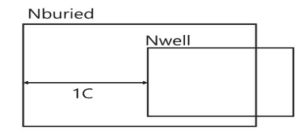

- 출처: 집필진 제작(2024)
- [그림 3-1] N-well Rule Description

#### <표 3-1> N-well에 관한 디자인 룰 사례

| Rule No. | Description                       |
|----------|-----------------------------------|
| 1A       | Minimum width of an Nwell.        |
| 1B       | Minimum space between two Nwell.  |
| 1C       | Minimum Nburied overlap of Nwell. |

#### <표 3-2> Oxide에 관한 디자인 룰 사례

| Rule No. | Description                              |
|----------|------------------------------------------|
| 2A       | Minimum width of an Oxide.               |
| 2B       | Minimum space between two Oxides.        |
| 2C       | Minimum Nwell overlap of Oxides.         |
| 2C       | Minimum Pwell overlap of Oxides.         |
| 2D       | Minimum spacing between Nwell and Oxide. |
| 2D       | Minimum spacing between Pwell and Oxide. |

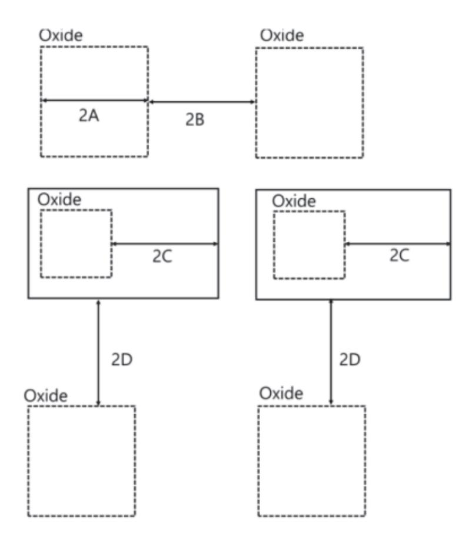

출처: 집필진 제작(2024)

[그림 3-2] Oxide Rule Description

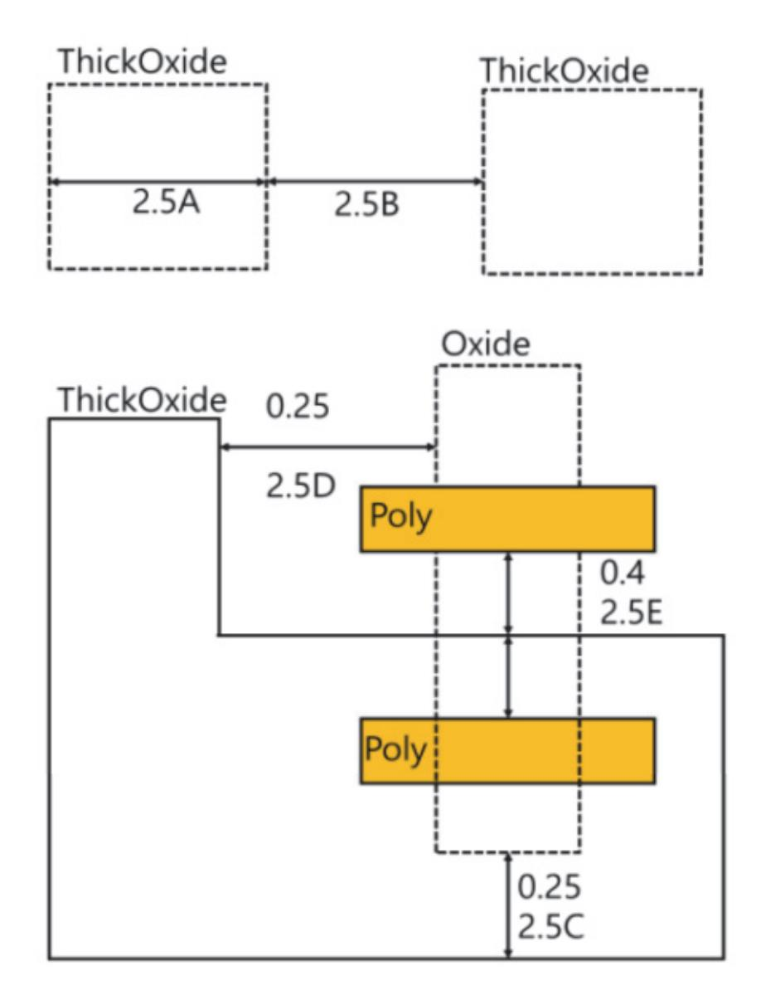

출처: 집필진 제작(2024)

[그림 3-3] thick oxide rule

|  | <표 3-3> Thick oxide에 관한 디자인 룰 사례 |
|--|----------------------------------|
|--|----------------------------------|

| Rule No. | Description                       |
|----------|-----------------------------------|
| 2.5A     | Minimum width of an Oxide.        |
| 2.5B     | Minimum space between two Oxides. |
| 2.5C     | Thick Oxide to Oxide enclosure.   |
| 2.5D     | ThickOxide to Oxide spacing.      |
| 2.5E     | ThickOxide to Poly spacing.       |
| 2.5F     | ThickOxide to Poly enclosure.     |

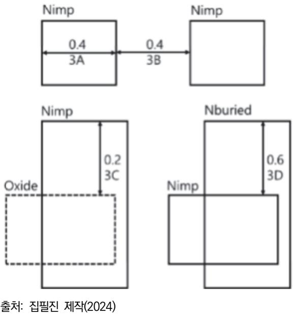

[그림 3-4] N+ implant rule

#### <표 3-4> N+ implant 디자인 룰 사례

| Rule No. | Description                      |
|----------|----------------------------------|
| 3A       | Minimum width of an Nimp.        |
| 3B       | Minimum space between two Nimp.  |
| 3C       | Minimum Nimp overlap of Oxide.   |
| 3D       | Minimum Nburied overlap of Nimp. |

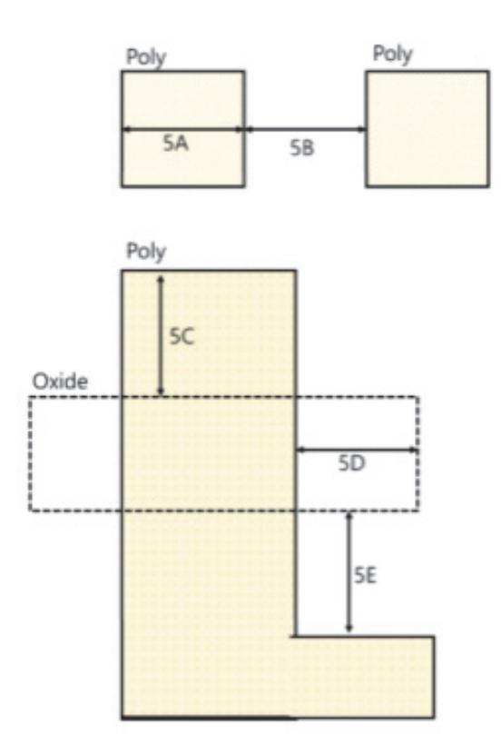

출처: 집필진 제작(2024) [그림 3-5] poly rule

<표 3-5> poly 디자인 룰 사례

| Rule No. | Description                        |
|----------|------------------------------------|
| 5A       | Minimum width of an Poly.          |
| 5B       | Minimum space between two Poly.    |
| 5C       | Minimum Poly extension over Oxide. |
| 5D       | Minimum Oxide extension over Poly. |
| 5E       | Minimum Poly space to Oxide.       |

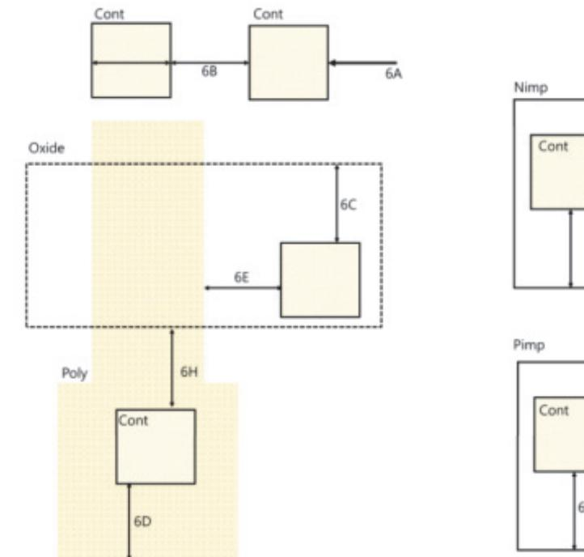

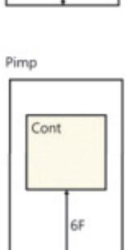

출처: 집필진 제작(2024) [그림 3-6] Poly Contact rule

<표 3-6> Poly Contact Rule에 관한 디자인 룰 사례

| Rule No. | Description                           |
|----------|---------------------------------------|
| 6A       | Absolute width and Length of Contact. |
| 6B       | Minimum space between two Contact.    |
| 6C       | Minimum Oxide overlap of Contact.     |
| 6D       | Minimum Poly overlap of Contact.      |
| 6E       | Minimum Poly space to Contact.        |
| 6F       | Minimum Pimp overlap of Contact.      |
| 6G       | Minimum Nimp overlap of Contact.      |
| 6H       | Minimum Contact space to Oxide.       |

<표 3-7> Metal Rule에 관한 디자인 룰 사례

| Rule No.                                                | Description                        |
|---------------------------------------------------------|------------------------------------|
| 7A,9A,11A,15A,17A,19A                                   | Minimum width of an Metalx.        |
| 7B,9B,11B,15B,17B,19B                                   | Minimum space between two Metalx.  |
| 7C                                                      | Minimum Metal1 overlap of Contact. |
| 9C,11C,15C,17C,19C                                      | Minimum Metalx overlap of Viax.    |
| (Metalx, x=1, 2, 3, 4, 5, 6) (Viax, x=1, 2, 3, 4, 5) |                                    |

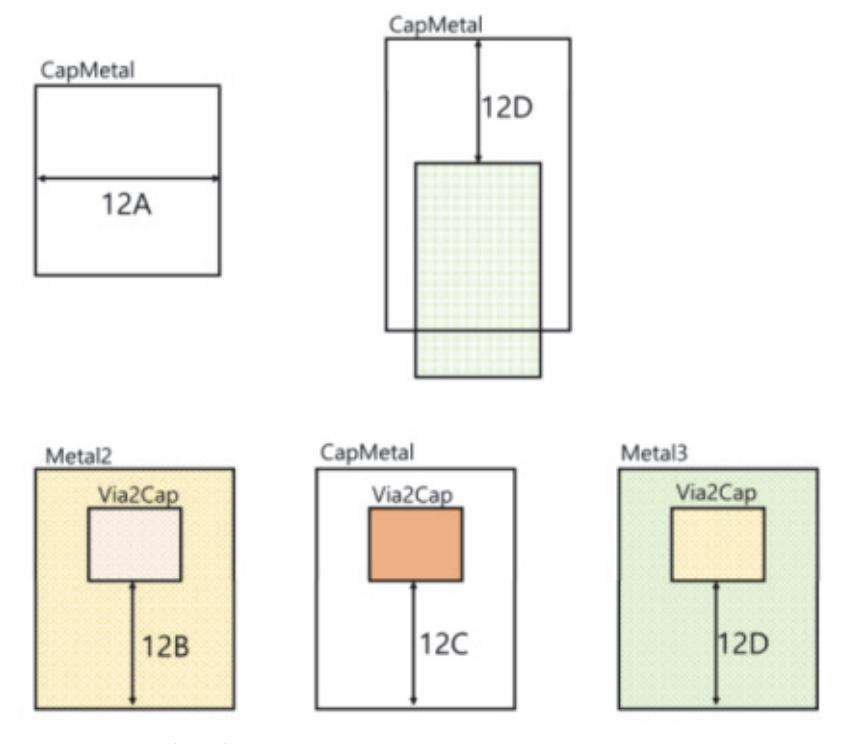

출처: 집필진 제작(2024) [그림 3-7] Capacitor metal rule

|  |  | <표 3-8> Capacitor Metal Rule에 관한 디자인 룰 사례 |  |  |  |  |  |  |
|--|--|-------------------------------------------|--|--|--|--|--|--|
|--|--|-------------------------------------------|--|--|--|--|--|--|

| Rule No. | Description                                 |
|----------|---------------------------------------------|
| 12A      | Minimum width of an CapMetal.               |
| 12B      | Minimum Metal2 overlap of Via2 on CapMetal. |
| 12C      | Minimum CapMetal overlap of Via2.           |
| 12D      | Minimum Metal3 overlap of Via2 on Captetal. |
| 12E      | Minimum CapMetal overlap of Metal3.         |

#### 2. 툴 설정을 한다.

선택한 레이아웃 툴에서 설계 권고 사항을 적용할 수 있는 설정을 확인하고 적절히 구성한 다. 이는 레이아웃 툴의 환경 설정이나 룰 검사 도구를 이용하여 수행된다.

3. 레이아웃을 디자인한다.

설계 권고 사항을 고려하여 레이아웃을 디자인한다. 이는 툴 내에서 레이아웃을 그리고 배 치하는 단계에서 적용된다.

4. 룰 검사를 한다.

레이아웃을 완성한 후에는 툴의 룰 검사 기능을 사용하여 설계 권고 사항을 위반하는 부분 을 찾는다. 이를 통해 레이아웃의 안정성과 신뢰성을 확인할 수 있다.

5. 수정 및 최적화를 한다.

룰 검사 결과를 기반으로 레이아웃을 수정하고 최적화한다. 이는 레이아웃 툴을 사용하여 필요한 변경 사항을 적용하는 과정을 포함한다.

6. 검증한다.

최종적으로 수정된 레이아웃을 검증하여 설계 권고 사항을 모두 준수하는지 확인한다. 이는 레이아웃의 시뮬레이션 및 물리적 검증을 통해 수행될 수 있다.

이러한 절차를 통해 설계 권고 사항을 숙지하고 해당 툴에 적용함으로써 레이아웃의 품질을 향 상시킬 수 있다.

숖 레이아웃 환경에 맞도록 설계 환경을 구축한다.

커스텀 레이아웃을 위한 적절한 설계 환경을 구축하는 것은 효율적인 작업을 수행하고 프로젝 트를 원활하게 진행하기 위해 중요하다. 이를 위해 다음 단계를 따를 수 있다.

1. 툴 및 소프트웨어를 선택한다.

레이아웃 설계를 위한 적절한 툴과 소프트웨어를 선택한다. 이는 레이아웃 설계에 필요한 기능과 공정에 대한 지원을 고려하여 결정된다. 대표적으로 CAD 도구, 레이아웃 편집기, 시뮬레이션 도구 등이 있다.

2. 환경 설정을 한다.

선택한 툴 및 소프트웨어를 설치하고 환경 설정을 완료한다. 이는 사용자 프로필, 작업 폴 더, 프로젝트 설정 등을 포함한다. 또한 필요한 플러그인이나 확장 기능을 추가할 수도 있 다.

3. 라이브러리 및 모델 관리를 파악한다.

사용할 라이브러리 및 모델을 관리한다. 이는 커스텀 라이브러리를 구축하거나 제조 업체에 서 제공하는 라이브러리를 활용하여 필요한 부품 및 모델을 적절히 관리하는 것을 의미한 다.

4. 사용자 지정을 설정한다.

사용자의 작업 환경에 맞게 툴을 사용자 지정한다. 이는 사용자 인터페이스의 배치, 단축키 설정, 화면 배치 등을 포함한다. 이러한 설정은 개인의 작업 스타일과 선호도에 따라 다를 수 있다.

5. 작업 흐름 및 프로세스를 정의한다.

설계 환경에 맞는 작업 흐름과 프로세스를 정의한다. 이는 레이아웃 설계에서부터 검증 및 검토까지의 작업 흐름을 명확하게 정의하는 것을 의미한다.

6. 프로젝트를 관리한다.

프로젝트를 관리하고 문서화하는 방법을 결정한다. 이는 프로젝트 파일의 구성, 버전 관리, 문서화 방법 등을 포함한다.

7. 교육 및 교육 자료를 제공한다.

사용자들이 새로운 환경을 익히고 최대한 활용할 수 있도록 교육 자료를 제공하고 교육을 실시한다. 이는 툴의 기능에 대한 이해, 작업 흐름 및 프로세스, 공정에 대한 이해 등을 포 함한다.

커스텀 레이아웃의 설계 환경 구축은 팀원들 간의 협업과 작업의 효율성을 높이는 데 중요한 역할을 한다. 따라서 신중한 계획과 설정이 필요하다.

수행 tip

- 파운드리 서비스를 제공하는 회사의 업무 메뉴얼을 참고하 여 고객의 요구 사항을 반영하는 내용을 참고해서 해당 레 이아웃 작업에 적합한 레이아웃 툴을 선정한다.
- 실무 환경을 참고하여 레이아웃 환경에 맞는 설계 환경을 구축한다.

## 학습 3 교수·학습 방법

#### 교수 방법

- 작성한 회로도에서 netlist를 추출하는 방법을 사전 설명 후 실습을 통해 사용법을 지도한 다.
- 테스트 벤치의 파일명 작성법 및 코너별 테스트 벤치에 따른 모델 파라미터의 정의 방법에 대해 설명한다.
- 코너 조건에 대한 시뮬레이션 진행 및 출력 결과를 상대적으로 비교하는 방법을 설명하고, 이를 통해 최적점을 찾아가는 과정을 설명한다.

#### 학습 방법

- 추출한 netlist에서 문서로 각 소자의 연결 정보를 기술하고 있는 방법에 대해 학습한다.
- 모델 파라미터 파일을 열어 각 소자들의 입력 크기에 따라 반영되는 값의 변화를 학습한다.
- 테스트 벤치의 초기 선언, 회로 정보, 분석 방법, 출력 방법 등의 주요 입력 정보에 대한 기 술 방법을 학습한 후, Vi 에디터를 활용한 실습을 통해 직접 작성할 수 있도록 한다.
- spice 툴을 활용한 시뮬레이션 실행 방법을 학습한 후 실습을 통해 사용법을 익힌다.
- 코너 조건에 대한 시뮬레이션 진행 및 출력 결과를 상대적으로 비교하는 방법을 학습하고, 이를 통해 최적점을 찾아가는 과정을 이해한다.
- 시뮬레이션 결과를 확인하면서, 레이아웃에 영향을 끼칠 수 있는 소자들에 대해 사전 이해 하고 블록의 배치 및 주의 사항의 기술 방법에 대해 학습한다.

## 학습 3 평 가

#### 평가 준거

• 평가자는 학습자가 학습 목표를 성공적으로 달성하였는지를 평가해야 한다.

#### • 평가자는 다음 사항을 평가해야 한다.

|                       |                                                                            |   | 성취수준 |   |  |  |
|-----------------------|----------------------------------------------------------------------------|---|------|---|--|--|
| 학습 내용                 | 학습 목표                                                                      | 상 | 중    | 하 |  |  |
|                       | - 고객의 요구 사항을 반영할 수 있도록 적합한 레이아웃 툴 을 선정하여 레이아웃에 필요한 요소를 파악할 수 있다.        |   |      |   |  |  |
| 레이아웃 설계 툴 사용 | - 공정의 설계 권고 사항(design rule guide)을 숙지하여 해 당 툴에 레이아웃에 필요한 사항들을 적용할 수 있다. |   |      |   |  |  |
|                       | - 레이아웃 환경에 맞도록 설계 환경을 구축할 수 있다.                                            |   |      |   |  |  |

#### 평가 방법

• 서술형 시험

|                       |                                                            |   | 성취수준 |   |  |  |
|-----------------------|------------------------------------------------------------|---|------|---|--|--|
| 학습 내용                 | 평가 항목                                                      | 상 | 중    | 하 |  |  |
| 레이아웃 설계 툴 사용 | - 고객의 요구 사항을 파악하고 이를 반영할 수 있도록 적합 한 레이아웃 툴을 선정할 수 있는 능력 |   |      |   |  |  |
|                       | - 공정의 설계 권고 사항으로부터 설계 권고 사항을 분석할 수 있는 능력                |   |      |   |  |  |
|                       | - 레이아웃 환경에 파악하고 이에 적합한 툴과 소프트웨어를 선택할 수 있는 능력            |   |      |   |  |  |

#### • 평가자 체크리스트

|                       | 평가 항목                                                        | 성취수준 |   |   |
|-----------------------|--------------------------------------------------------------|------|---|---|
| 학습 내용                 |                                                              | 상    | 중 | 하 |
| 레이아웃 설계 툴 사용 | - 고객의 요구 사항을 파악하고 이를 반영할 수 있도록 레이 아웃에 필요한 요소를 파악할 수 있는 능력 |      |   |   |
|                       | - 고객의 요구 사항을 파악하고 선정된 툴을 기반으로 레이아 웃을 디자인 할 수 있는 능력        |      |   |   |
|                       | - 레이아웃 환경에 파악하고 설계 환경에 맞는 작업 흐름과 프로세스를 정의할 수 있는 능력        |      |   |   |

#### 피드백

| 1. 서술형 시험 - 고객의 요구 사항을 파악하고 이를 반영할 수 있도록 적합한 레이아웃 툴을 선정할 수 있는 능력 |
|---------------------------------------------------------------------|
| 을 평가한 후, 보완이 필요한 사항이나 주요 사항을 표시하여 피드백해 준다.                          |
| - 공정의 설계 권고 사항으로부터 설계 권고 사항을 분석할 수 있는 능력을 평가한 후, 보완이 필              |
| 요한 사항이나 주요 사항을 표시하여 보충 설명해 준다.                                      |
| - 평가 결과가 우수한 학습자들에게는 서술형 평가 관련 적용 사례 학습을 통한 심화 학습으로 피               |
| 드백해 주고, 미흡한 학습자들에게는 기초 용어에 대해 설명해 주어 일정 수준을 유지할 수 있도                |
| 록 보완하여 지도해 준다.                                                      |
| 2. 평가자 체크리스트                                                        |
| - 고객의 요구 사항을 파악하고 선정된 툴을 기반으로 레이아웃을 디자인할 수 있는 능력을 확인한               |
| 후 부족한 점을 지적하여 정확하게 처리할 수 있도록 보완하여 지도해 준다.                           |
| - 레이아웃 환경에 파악하고 설계 환경에 맞는 작업 흐름과 프로세스를 정의할 수 있는 능력을 평               |
| 가한 후, 개선 및 보완 사항에 대한 내용을 정리하여 재학습할 수 있도록 피드백해 준다.                   |
|                                                                     |
| - 평가 결과가 우수한 학습자들에게는 작업장 환경에 적용할 수 있는 심화 학습 내용을 피드백해                |
| 주고, 저조한 학습자들에게는 기초 용어에 대한 설명을 통해 일정 수준을 유지할 수 있도록 보완                |

| 학습 4 | 커스텀 레이아웃 수행하기  |
|------|----------------|
| 학습 3 | 레이아웃 설계 툴 사용하기 |
| 학습 2 | 레이아웃 방법 결정하기   |
| 학습 1 | 회로도 이해하기       |

## 4-1. 커스텀 레이아웃 수행

| 학습 목표 | • 공정의 설계 규칙에 따라 반도체 소자에 대한 레이아웃을 수행할 수 있다.              |
|-------|---------------------------------------------------------|
|       | • 공정의 설계·검증 규칙에 따라 레이아웃 상에서 기능 블록을 배치 및 배선할 수 있다.       |
|       | • 공정의 레이어별 매개 변수(parameter)를 고려하여 특성에 변화가 없도록 레이아웃을 수행할 |
|       | 수 있다.                                                   |

## 필요 지식 /

숔 공정의 설계 규칙에 따라 반도체 소자에 대한 레이아웃을 수행한다.

반도체 레이아웃 설계를 수행할 때는 공정의 설계 규칙을 준수해야 한다. 이를 효과적으로 수 행하기 위해 다음과 같은 단계를 따를 수 있다.

1. 공정 규칙을 이해한다.

먼저 사용하는 공정에 대한 규칙을 이해해야 한다. 이는 반도체 제조 체나 설계 도구 제공 업체에서 제공하는 설계 규칙 가이드를 통해 얻을 수 있다. 공정 규칙은 길이, 너비, 간격 등의 요소에 대한 제한 사항을 포함한다.

반도체 소자의 레이아웃을 수행하기 위해 공정의 설계 규칙을 이해하는 것은 매우 중요하 다. 이러한 규칙은 반도체 제조 공정에서 필요한 제약 조건을 정의하고, 반도체 소자가 원 활하게 작동하고 안정적으로 동작할 수 있도록 보장한다. 아래는 일반적으로 고려되는 몇 가지 공정 규칙의 예시이다.

(1) 미세한 기하학적 제한

반도체 소자의 레이아웃은 미세한 기하학적인 제한을 준수해야 한다. 이는 인접한 소자 간의 간섭을 최소화하고, 소자의 성능을 최적화하기 위함이다.

(2) 층간 간격 및 절연

다양한 층(레이어) 간의 간격과 절연 두께가 정의되어야 한다. 이는 다른 층간의 간섭을 방지하고, 전기적인 격리를 보장한다.

(3) 메탈 라인 너비와 간격

메탈 라인(반도체에서 전기적 연결을 담당하는 선)의 너비와 간격은 전자 흐름과 전기적 특성에 큰 영향을 끼친다. 이러한 규칙은 전기적 성능과 안정성을 보장하기 위해 정의된 다.

(4) 측면 벽 규칙

반도체 소자의 측면 벽에는 일정한 거리가 필요하다. 이는 측면 벽에 대한 레이아웃이 어떻게 정의되고 구성되는지를 제어한다.

(5) 마스크 정확성 및 오버레이

반도체 레이아웃을 제작하기 위해 사용되는 마스크는 정확성과 오버레이(다른 층 간의 정렬 정확성)를 준수해야 한다.

(6) 소자 특정 요구 사항

특정한 종류의 반도체 소자에는 해당 소자의 동작을 보장하기 위한 특정 요구 사항이 있을 수 있다. 예를 들어, 특정 종류의 트랜지스터에는 게이트와 드레인 간의 최소 거리 가 필요할 수 있다.

공정의 설계 규칙을 이해하고 준수하는 것은 반도체 소자의 정확하고 안정적인 작동을 보 장하는 데 중요하다. 이를 통해 제조 공정에서 생산성을 향상시키고 불량률을 줄일 수 있 다.

2. 레이아웃 도구 설정

사용하는 레이아웃 도구에서 해당 공정 규칙을 설정한다. 대부분의 레이아웃 도구는 공정 규칙을 적용할 수 있는 기능을 제공한다. 이를 통해 설계 중에도 규칙을 준수할 수 있다. 반도체 소자에 대한 레이아웃을 수행하기 위해서는 공정의 설계 규칙을 준수하는 레이아웃 도구를 설정해야 한다. 이를 위해 다음과 같은 단계를 따를 수 있다.

이러한 단계를 따라 공정의 설계 규칙에 따라 반도체 소자에 대한 레이아웃을 효과적으로 수행할 수 있다.

(1) 도구 선택

공정의 설계 규칙을 준수하는 레이아웃 도구를 선택해야 한다. 이러한 도구는 주로 반도 체 디자인을 위해 특별히 개발된 CAD(circuit design) 도구이다.

(2) 규칙 설정

선택한 레이아웃 도구에서는 공정의 설계 규칙을 설정할 수 있는 기능이 제공된다. 이를 통해 길이, 너비, 간격 등의 제한을 설정하고, 반도체 소자의 레이아웃을 이에 맞게 설 계할 수 있다.

(3) 라이브러리 및 모델 사용

레이아웃 도구에서는 다양한 반도체 소자의 라이브러리와 모델을 제공한다. 이를 활용하 여 필요한 소자를 선택하고, 공정의 설계 규칙에 맞게 배치할 수 있다. 반도체 소자에 대한 레이아웃을 수행하기 위해 사용되는 레이아웃 도구는 다양한 라이브러리와 모델을 제공한다. 이러한 라이브러리와 모델은 공정의 설계 규칙을 준수하고 반도체 소자의 레 이아웃을 정확하게 설계하는 데 도움이 된다. 주로 사용되는 라이브러리와 모델에는 다 음과 같은 것들이 있다.

(가) 표준 셀 라이브러리

표준 셀 라이브러리는 일반적으로 사용되는 기본적인 논리 게이트 및 기능 블록의 모음이다. 이러한 라이브러리는 논리 설계에 필요한 다양한 기능을 제공하며, 공정의 설계 규칙을 준수하여 제작된다.

(나) 애널로그 및 디지털 라이브러리

반도체 소자에는 디지털 및 아날로그 회로 모두가 포함될 수 있다. 따라서 애널로그 및 디지털 라이브러리는 다양한 아날로그 및 디지털 기능을 포함하고 있다.

(다) 반도체 프로세스 모델

반도체 제조 공정의 특성을 설명하는 모델이다. 이러한 모델은 반도체 소자의 물리 적 특성 및 동작을 이해하는 데 도움이 된다.

(라) 전기적 모델

전기적 모델은 반도체 소자의 전기적 특성을 설명한다. 이러한 모델은 소자의 전기 적 특성을 모의 실험하여 설계 단계에서 소자의 동작을 예측하는 데 사용된다.

(마) 레이아웃 템플릿

레이아웃 템플릿은 반도체 소자의 레이아웃을 설계하는 데 사용되는 초기 구조를 제 공한다. 이러한 템플릿은 공정의 설계 규칙을 준수하고 레이아웃을 최적화하는 데 도움이 된다.

이러한 라이브러리와 모델을 사용하여 반도체 소자의 레이아웃을 설계하면 공정의 설계 규칙을 준수하고 레이아웃을 정확하게 구성할 수 있다. 이는 제조 및 테스트 단계에서의 문제를 줄이고, 제품의 품질과 성능을 향상시키는 데 도움이 된다.

(4) 시뮬레이션 및 검증

설정된 레이아웃을 토대로 시뮬레이션을 수행하고, 설계 규칙을 준수하는지 검증해야 한 다. 이를 통해 소자의 동작 및 성능을 확인하고, 필요한 경우 수정할 수 있다.

(5) 자동 레이아웃 생성

일부 레이아웃 도구에서는 자동 레이아웃 생성 기능을 제공한다. 이를 통해 공정의 설계 규칙을 자동으로 적용하여 레이아웃을 생성할 수 있다.

(6) 적용된 규칙 검토

생성된 레이아웃에 적용된 규칙을 검토하고, 필요한 경우 수정해야 한다. 이를 통해 공 정의 설계 규칙을 준수하면서도 최적의 레이아웃을 얻을 수 있다.

3. 레이아웃 작업

레이아웃을 수행할 때 공정 규칙을 준수하는 것이 중요하다. 예를 들어, 길이와 너비의 제 한 사항, 간격 요구 사항 등을 고려하여 반도체 소자의 레이아웃을 설계한다.

공정의 설계 규칙에 따라 반도체 소자에 대한 레이아웃을 수행하는 레이아웃 작업은 다음 과 같은 단계로 이루어질 수 있다.

(1) 레이아웃 설계 요구 사항 분석

고객이나 프로젝트 요구 사항을 이해하고, 반도체 소자의 기능 및 성능 명세를 파악한 다.

(2) 디자인 규칙 검토

공정의 설계 규칙을 검토하고, 반도체 제조 공정에 적합한 디자인 규칙을 설정한다.

(3) 레이아웃 플로우 설계

반도체 소자의 레이아웃을 위한 효율적인 작업 흐름을 설계한다. 이 단계에서는 레이아 웃 도구 및 소프트웨어 환경을 선택하고, 작업 일정을 계획한다.

(4) 레이아웃 디자인

레이아웃 도구를 사용하여 반도체 소자의 레이아웃을 디자인한다. 이때 공정의 설계 규 칙을 준수하여 레이아웃을 최적화하고, 레이아웃의 물리적 형태를 결정한다.

(5) 시뮬레이션 및 검증

레이아웃을 시뮬레이션하여 설계한 기능과 성능이 요구 사항을 충족시키는지 검증한다. 이 과정에서는 회로 시뮬레이션, 전기적 및 기계적 검증 등을 수행한다.

(6) 디자인 수정 및 최적화

시뮬레이션 결과를 바탕으로 디자인을 수정하고 최적화한다. 이 단계에서는 공정의 설계 규칙을 준수하면서도 레이아웃의 성능을 향상시키는 방법을 탐색한다.

(7) 최종 검토 및 승인

디자인을 최종 검토하고, 관련 이해당사자들과 협의하여 승인한다. 이 단계에서는 모든 요구 사항이 충족되었는지 확인하고, 필요한 경우 추가 수정을 수행한다.

(8) 문서화

레이아웃 디자인에 대한 문서를 작성하고, 관련된 모든 정보를 기록한다. 이는 추후 디 자인 변경이나 유지보수를 위해 필요한 정보를 제공한다.

(9) 제조 및 생산

최종적으로 승인된 레이아웃을 바탕으로 반도체 소자를 제조하고, 생산한다. 이 과정에

서는 레이아웃을 실제로 제조하기 위한 여러 공정 단계를 거치게 된다.

4. 검증 및 시뮬레이션

레이아웃이 완료된 후에는 공정 규칙을 준수하는지 확인하기 위해 검증 및 시뮬레이션을 수행한다. 이를 통해 설계 과정에서 발생한 잠재적인 문제를 식별하고 수정할 수 있다. 반도체 소자에 대한 레이아웃을 수행하기 전에 공정의 설계 규칙에 따라 레이아웃을 검증 하고 시뮬레이션하는 것이 중요하다. 이를 위한 일반적인 절차는 다음과 같다. 이러한 과정을 통해 레이아웃이 공정의 설계 규칙을 준수하며, 원하는 성능과 기능을 제공 할 수 있도록 보장할 수 있다.

(1) 레이아웃 검증 규칙 설정

해당 공정의 설계 규칙을 이해하고, 반도체 소자의 레이아웃에 적용될 검증 규칙을 설정 한다. 이는 레이아웃이 제조 공정에서 문제 없이 제작될 수 있도록 보장하는 데 중요하 다.

(2) 레이아웃 검증 도구 선택

공정의 설계 규칙에 따라 검증을 수행할 수 있는 적절한 레이아웃 검증 도구를 선택한 다. 이 도구는 레이아웃의 물리적 특성을 검증하고, 가능한 문제점을 식별할 수 있도록 도와준다.

(3) 레이아웃 시뮬레이션

선택된 레이아웃 검증 도구를 사용하여 레이아웃을 시뮬레이션한다. 이는 레이아웃이 공 정의 설계 규칙을 준수하며, 원하는 성능과 기능을 제공하는지 확인하는 데 도움이 된 다.

(4) 시뮬레이션 결과 분석

시뮬레이션 결과를 분석하여 가능한 문제점을 식별하고 해결 방법을 모색한다. 이는 레이아웃을 최적화하고, 공정의 설계 규칙을 준수하는 데 도움이 된다.

(5) 디자인 수정 및 최적화

시뮬레이션 결과를 바탕으로 레이아웃을 수정하고 최적화한다. 이는 레이아웃이 공정의 설계 규칙을 완벽하게 준수하면서도 원하는 성능과 기능을 제공할 수 있도록 도와준다.

(6) 검증 및 확인

수정된 레이아웃을 다시 검증하고 확인하여 모든 요구 사항이 충족되었는지 확인한다. 필요한 경우 추가 수정을 수행하고, 최종적으로 검증을 완료한다.

5. 반도체 제조사와 협력

반도체 제조사와의 협력을 통해 설계된 레이아웃이 실제로 제조될 수 있는지 확인할 수 있 다. 제조사는 공정 규칙을 준수하는 레이아웃을 요구하며, 협력을 통해 이를 달성할 수 있 다.

이러한 절차를 통해 공정 규칙을 준수하면서 반도체 소자에 대한 레이아웃을 효과적으로 수행할 수 있다.

## 수행 내용 / 커스텀 레이아웃 수행하기

#### 재료·자료

- 제품 사양서
- 툴 매뉴얼
- 공정의 설계·검증 규칙 파일

#### 기기(장비 ・ 공구)

- 컴퓨터, 프린터, 워크스테이션, 인터넷
- 커스텀 레이아웃 툴
- 자동 배치 배선 레이아웃 툴
- 레이아웃 검증 툴
- 안전 ・ 유의 사항
  - 해당 사항 없음.

#### 수행 순서

숔 공정의 설계 규칙에 따라 반도체 소자에 대한 레이아웃을 수행할 수 있다.

커스텀 레이아웃 설계를 위해 반도체 소자에 대한 레이아웃을 공정의 설계 규칙에 따라 수행하 는 것은 매우 중요한 단계다. 이 과정에서는 특정 공정의 기술적 요구 사항을 충족하면서 설계 의 성능, 전력 소비, 면적 등을 최적화하는 것을 목표로 한다. 다음은 커스텀 레이아웃 설계를 수행하기 위한 주요 절차다.

- 1. 공정 기술 및 설계 규칙을 파악한다.
  - (1) 공정 기술 분석

설계하려는 반도체 소자가 어떤 공정에서 제조될 것인지를 명확히 파악한다. 예를 들어, 7nm, 14nm, 또는 28nm 공정 등 다양한 공정 기술이 있다.

(2) 설계 규칙 검토

각 공정 기술마다 고유의 설계 규칙이 있다. 이러한 규칙은 배선 간격, 층간 두께, 최소 피치, 접촉 크기, 트랜지스터 채널 길이 등과 관련된 규칙을 포함한다. 설계 규칙 책자 (DRC: design rule check)를 참고하여 설계에 반영한다.

- 2. 소자 정의 및 초기 배치를 한다.
  - (1) 소자 정의

반도체 소자의 종류(예: NMOS, PMOS 트랜지스터, 커패시터, 저항 등)를 정의하고, 각 소자가 차지하는 면적과 배선 경로를 대략적으로 설정한다.

(2) 초기 배치 계획

소자의 위치를 대략적으로 배치하여, 타이밍 요구 사항과 전력 분포를 고려한 초기 레이 아웃을 설계한다.

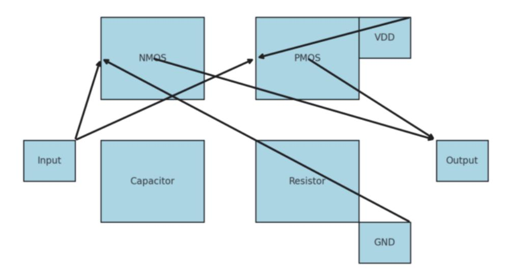

출처: 집필진 제작(2024) [그림 4-1] 커스텀 레이아웃의 초기 소자 배치 개념도

- 3. 레이아웃 설계를 수행한다.
  - (1) 소자 레이아웃 배치 소자들을 설계 규칙에 따라 배치한다. 각 소자가 공정에서 요구하는 최소 크기, 간격 등 을 준수하도록 배치해야 한다.
  - (2) 전력 및 그라운드 레이아웃을 한다. 전력 및 그라운드 배선을 레이아웃에 포함하여 안정적인 전원 공급을 보장한다. 전력 플 레인과 그라운드 플레인의 위치를 최적화하여 전력 무결성을 유지한다.
  - (3) 클럭 신호 배선을 한다.

클럭 신호를 배선할 때 타이밍 요구 사항을 충족하도록 클럭 트리의 구조를 설계한다.

(4) 입출력(IO) 배선을 한다.

외부와의 신호 교환을 위해 입출력 핀을 배치하고, 신호 간 간섭을 최소화하도록 배선한 다.

- 4. 설계 규칙 검사(DRC)를 한다.
  - (1) DRC 수행

설계 규칙 검사를 통해 레이아웃이 공정의 설계 규칙을 준수하는지 확인한다. DRC 도 구를 사용하여 배선 간격, 접촉 크기, 층 간 간격 등이 규칙을 준수하는지 검토한다.

(2) 위반 사항 수정

DRC에서 발견된 위반 사항을 수정하고, 설계 규칙을 모두 충족할 때까지 반복하여 검 사를 수행한다.

- 5. 레이아웃 최적화를 한다.
  - (1) 면적 최적화

레이아웃의 면적을 최소화하도록 설계를 재조정한다. 이는 제조 비용을 줄이고, 성능을 극대화하는 데 중요하다.

(2) 타이밍 최적화

레이아웃에서 신호 지연이 최소화되도록 배선 경로와 소자의 위치를 조정한다. 필요시 버퍼 삽입이나 게이트 크기 조정을 통해 타이밍 경로를 최적화한다.

(3) 전력 최적화

전력 소모를 최소화하기 위해 저전력 설계 기법을 적용한다. 전력 게이팅, 멀티 Vth 셀 사용 등을 통해 전력 효율성을 높인다.

#### 6. 레벨 간 배선을 한다.

(1) 층간 배선(via)

소자 간 연결을 위해 다양한 층간 배선을 설계한다. 층간 간섭을 최소화하고, 신호 무결 성을 유지하도록 설계한다.

- (2) 메탈 레이어 활용 여러 메탈 레이어를 사용하여 복잡한 배선을 효율적으로 구성한다. 메탈 레이어의 저항 및 용량을 고려하여 신호 전송 경로를 최적화한다.
- 7. 타이밍 분석 및 신호 무결성 검토를 한다.
  - (1) Static Timing Analysis(STA) 타이밍 분석을 수행하여 설계가 타이밍 요구 사항을 충족하는지 확인한다.
  - (2) 신호 무결성 분석

신호 간 간섭, 전자기 방출(EMI) 등을 분석하고, 필요한 경우 쉴드 배선이나 필터링 기 법을 적용하여 문제를 해결한다.

- 8. 레이아웃 검증(LVS)을 한다.
  - (1) LVS(layout versus schematic) 검증 레이아웃이 원래 설계한 회로 스키매틱과 동일한지 검증한다. 이를 통해 논리적 오류나 배선 오류를 사전에 발견하고 수정할 수 있다.
- 9. 최종 검토 및 테이프아웃 준비를 한다.
  - (1) 최종 검토

모든 검증을 완료한 후, 최종적으로 레이아웃을 검토한다. 모든 설계 규칙, 타이밍, 전력 요구 사항이 충족되었는지 확인한다.

(2) 테이프아웃 준비

검증된 레이아웃은 테이프아웃을 준비하며, 제조 공정으로 전달될 데이터를 생성한다. 이 과정은 매우 정밀하고 반복적인 작업을 요구한다. 커스텀 레이아웃 설계를 통해 공정에 최 적화된 반도체 소자를 제작함으로써, 고성능, 저전력, 작은 면적을 갖춘 반도체 칩을 구현할 수 있다.

숕 공정의 설계·검증 규칙에 따라 레이아웃상에서 기능 블록을 배치 및 배선한다.

커스텀 레이아웃에서 공정의 설계 및 검증 규칙에 따라 기능 블록의 배치와 배선을 수행하는 것은 매우 중요하다. 이를 위한 일반적인 절차는 다음과 같다.

이러한 과정을 통해 기능 블록의 배치와 배선이 공정의 설계 및 검증 규칙에 따라 적절하게 수 행될 수 있다.

1. 기능 블록을 배치한다.

먼저, 레이아웃상에 기능 블록을 배치한다. 이때 공정의 설계 규칙을 고려하여 각 기능 블 록의 위치를 결정한다. 공정의 설계 규칙에는 최소 공간 요구 사항, 레이아웃의 전력 및 냉 각 요구 사항 등이 포함될 수 있다.

커스텀 레이아웃에서 기능 블록의 배치는 공정의 설계 및 검증 규칙을 따라야 한다. 이를 위해 다음과 같은 단계를 따를 수 있다.

이러한 단계를 통해 공정의 설계 및 검증 규칙에 따라 기능 블록을 효과적으로 레이아웃 상에 배치할 수 있다.

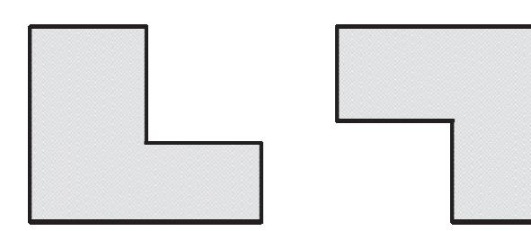

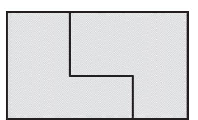

출처: 교육부(2015). 레이아웃 설계(LM1903060105\_14v3). 한국직업능력개발원. p.4. [그림 4-2] 블록 배치의 가이드 라인

(1) 요구 사항을 분석한다.

먼저, 고객의 요구 사항을 분석하고 기능 블록을 식별한다. 이때 각 기능 블록의 역할과 요구 사항을 명확히 이해해야 한다.

(2) 블록을 분류한다.

식별된 기능 블록을 분류하고 관련성이 있는 블록들을 그룹화한다. 이때 유사한 기능을 가진 블록들을 같은 그룹으로 묶어야 한다.

(3) 블록 배치 계획을 세운다.

각 블록 그룹을 레이아웃상에 배치하는 계획을 수립한다. 이때 공정의 설계 규칙을 고려 하여 각 블록의 위치를 결정한다. 예를 들어, 전원 공급과 열 배출을 고려하여 블록들을 배치할 수 있다.

츨처: 교육부(2015). 레이아웃 설계(LM1903060105\_14v3). 한국직업능력개발원. p.4. [그림 4-3] 유휴 면적 활용 방법

(4) 배치를 최적화한다.

블록들의 배치를 최적화하여 공간을 효율적으로 활용하고 전원 및 신호 노이즈를 최소 화한다. 이때 고객의 요구 사항과 공정의 설계 규칙을 모두 고려해야 한다.

(5) 배치를 검토 및 수정한다.

최종 배치를 검토하고 필요한 경우 수정 한다. 이때 다른 블록들과의 간섭 또는 충돌을 방지하고, 각 블록이 원하는 기능을 올바르게 수행할 수 있도록 한다.

(6) 시뮬레이션 및 검증을 한다.

최종 배치를 시뮬레이션하여 각 블록이 상호 작용하는 방식을 확인하고 검증한다. 이때 시뮬레이션 결과를 바탕으로 필요한 수정을 수행하여 최종적인 배치를 확정한다.

2. 배선을 계획한다.

기능 블록이 배치된 후, 각 블록 간의 신호 및 전원 배선을 계획한다. 이때 배선이 최적화 되어야 하며, 신호의 경로가 최소화되고 노이즈가 최소화되도록 설계되어야 한다. 커스텀 레이아웃에서 기능 블록의 배선 계획을 수립하는 것은 공정의 설계 및 검증 규칙을 따르는 중요한 단계이다. 이러한 단계를 통해 공정의 설계 및 검증 규칙에 따라 기능 블록 의 배선을 효과적으로 계획하고 구현할 수 있다. 이를 위해 다음과 같은 절차를 따를 수 있 다.

(1) 신호 경로를 분석한다.

각 기능 블록 간의 신호 경로를 분석하여 신호가 흐르는 방향과 흐름을 이해한다. 이때 신호의 종류와 특성을 고려하여 각각의 신호에 대한 경로를 결정한다. 커스텀 레이아웃 에서 기능 블록 간의 신호 경로를 분석하는 것은 설계의 핵심 부분 중 하나이다. 이를 위해 다음과 같은 절차를 따를 수 있다.

(가) 기능 블록을 정의한다.

먼저 각 기능 블록이 무엇을 수행하는지 명확히 정의해야 한다. 이를 통해 각 블록 이 어떤 신호를 입력으로 받고 어떤 신호를 출력으로 생성하는지 이해할 수 있다.

(나) 신호 유형 및 특성을 분석한다.

다음으로 각 신호의 유형과 특성을 분석한다. 이때 신호의 종류(디지털, 아날로그 등) 와 전압/전류 레벨, 주파수 등을 고려해야 한다.

(다) 신호 경로를 확인한다.

각 기능 블록 간의 신호 경로를 확인한다. 이를 위해 각 블록의 입력과 출력을 연결 하는 경로를 식별하고 각 경로의 방향을 결정한다.

(라) 신호 간 상호 작용을 분석한다.

각 신호가 다른 신호와 어떻게 상호 작용하는지 분석한다. 이때 신호가 교차되거나 인접한 경로로 통과할 때 발생할 수 있는 간섭을 고려한다.

(마) 신호 경로를 최적화한다.

각 신호 경로를 최적화하여 전원 및 지상 선과의 교차를 최소화하고 노이즈를 감소 시킨다. 이를 위해 최단 경로를 선정하고 필요한 경우 신호 경로를 조정한다.

(바) 경로 문제를 해결한다.

신호 경로에서 발생하는 문제를 해결하고 최적의 해결책을 찾는다. 이때 문제가 되 는 부분을 식별하고 수정 및 개선을 수행한다.

(사) 시뮬레이션 및 검증을 한다.

분석된 신호 경로를 시뮬레이션하여 각 신호의 전달이 올바르게 이루어지는지 확인 하고 검증한다. 이때 시뮬레이션 결과를 바탕으로 필요한 수정을 수행하여 최종적인 신호 경로를 확정한다.

이러한 절차를 통해 공정의 설계 및 검증 규칙에 따라 기능 블록 간의 신호 경로를 효 과적으로 분석하고 구현할 수 있다.

(2) 신호 간 간섭을 분석한다.

다른 신호와의 간섭을 최소화하기 위해 각 신호 경로를 신중하게 설계한다. 이때 신호가 교차되거나 인접한 경로로 통과할 때 발생할 수 있는 간섭을 고려하여 배선을 계획한다. 기능 블록 간의 신호 간섭은 레이아웃 설계에서 주요한 고려 사항 중 하나이다. 이를 분석하기 위해서는 다음과 같은 단계를 따를 수 있다.

(가) 신호 유형을 분석한다.

먼저 각 기능 블록에서 생성되는 신호의 유형을 분석한다. 디지털 신호, 아날로그 신 호, 전원 신호 등 다양한 유형의 신호가 있을 수 있다.

(나) 신호 경로를 식별한다.

각 신호의 경로를 식별하여 기능 블록 간에 전달되는 방법을 이해한다. 이를 통해 각 신호가 어떻게 전달되는지, 어떤 경로를 통과하는지 파악할 수 있다.

(다) 신호 간섭을 식별한다.

다른 신호와 교차하는 신호 경로를 식별하여 신호 간의 간섭이 발생하는지 확인한다. 이를 통해 각 신호가 어떤 신호와 상호 작용하는지 이해할 수 있다.

(라) 신호 간섭 효과를 분석한다.

각 신호 간섭이 주는 영향을 분석한다. 이때 주로 발생하는 문제는 노이즈, 교차토 크, 신호 왜곡 등이 있다.

(마) 신호 간섭 해결책을 도출한다.

신호 간섭을 해결하기 위한 방법을 도출한다. 이를 위해 필요한 조치는 신호 경로의 재배치, 신호 선의 격리, 쉴드 레이어 추가 등이 있다.

(바) 시뮬레이션 및 검증을 한다.

각 신호 간섭 해결책을 시뮬레이션하여 효과를 검증한다. 이때 발생하는 문제를 식 별하고 수정하여 최종적인 해결책을 도출한다.

이러한 절차를 통해 공정의 설계 및 검증 규칙에 따라 레이아웃상에서 기능 블록 간의 신호 간섭을 효과적으로 분석하고 해결할 수 있다.

(3) 신호 경로를 최적화한다.

각 신호 경로를 최적화하여 전원 및 지상 선과의 교차를 최소화하고 노이즈를 감소시킨

다. 이를 위해 최단 경로를 선정하고 신호가 효과적으로 전달될 수 있는 방법을 찾는다. 기능 블록 간의 신호 경로 최적화는 레이아웃 설계의 중요한 부분 중 하나이다. 이를 위해 다음과 같은 절차를 따를 수 있다.

(가) 신호 경로를 분석한다.

먼저 각 기능 블록에서 생성되는 신호의 경로를 분석한다. 이를 통해 신호가 어떻게 전달되는지, 어떤 경로를 통과하는지를 이해한다.

(나) 신호 경로 최적화 대상을 식별한다.

각 신호 경로에서 지연, 속도 등의 문제가 발생하는 부분을 식별한다. 이를 통해 어 떤 신호 경로가 최적화가 필요한지를 파악한다.

(다) 최적화 대상에 대한 해결책을 도출한다.

최적화가 필요한 신호 경로에 대해 최적화를 위한 해결책을 도출한다. 이를 위해 필 요한 조치는 신호 경로의 재배치, 신호선의 길이 조절, 버퍼 및 리피터의 추가 등이 있다.

(라) 시뮬레이션 및 검증을 한다.

각 최적화 대상에 대한 해결책을 시뮬레이션하여 효과를 검증한다. 이때 발생하는 문제를 식별하고 수정하여 최종적인 해결책을 도출한다.

(마) 적용 및 검증을 한다.

최종적으로 도출된 해결책을 레이아웃에 적용하고 다시 시뮬레이션하여 검증한다. 이 때 발생하는 문제를 식별하고 수정하여 최종적인 최적화된 신호 경로를 얻는다. 이러한 절차를 통해 공정의 설계 및 검증 규칙에 따라 레이아웃상에서 기능 블록 간의 신호 경로를 효과적으로 최적화할 수 있다.

(4) 배선 레이아웃을 작성한다.

계획된 신호 경로를 바탕으로 레이아웃상에 배선을 작성한다. 이때 각 신호의 경로를 명 확하게 표시하고 다른 신호와의 간섭을 고려하여 배선을 배치한다.

기능 블록 간의 배선 레이아웃을 작성하는 과정에서는 다음과 같은 단계를 거칠 수 있 다.

(가) 신호 경로를 결정한다.

각 기능 블록 간의 신호 경로를 결정한다. 이는 각 블록에서 생성되는 신호가 어떤 경로를 통해 전달될지를 결정하는 것을 의미한다.

(나) 신호선을 배치한다.

결정된 신호 경로를 바탕으로 각 신호선의 배치를 계획한다. 이는 레이아웃상에서 어떤 경로로 신호선이 흐를지를 결정하는 것을 의미한다.

(다) 레이아웃을 설계한다.

각 신호선의 배치를 고려하여 레이아웃을 설계한다. 이 과정에서는 레이아웃 툴을 사용하여 각 신호선이 배치될 위치를 정하고 불필요한 교차 및 오버랩을 피하도록 배치한다.

(라) 신호선 길이를 조절한다.

각 신호선의 길이를 조절하여 신호 지연을 최소화하고 신호의 왜곡을 방지한다. 이 를 통해 신호의 안정성과 신호 품질을 향상시킬 수 있다.

(마) 배선 레이아웃을 검증한다.

완성된 배선 레이아웃을 시뮬레이션 및 검증하여 신호의 안정성과 품질을 확인한다. 이 과정에서는 신호의 지연, 왜곡, 신호 간 간섭 등을 분석하여 문제를 해결하고 최 적화한다.

(바) 적용 및 수정한다.

검증을 통해 발견된 문제를 해결하고 배선 레이아웃을 수정한다. 이후 다시 검증하 여 문제가 해결되었는지 확인한다.

(사) 최종 레이아웃을 생성한다.

최종적으로 검증을 통해 문제가 해결된 배선 레이아웃을 생성한다. 이는 반도체 디 자인의 중요한 단계 중 하나로, 실제 제품에 적용될 레이아웃을 생성하는 과정이다.

이러한 과정을 통해 공정의 설계 및 검증 규칙에 따라 레이아웃상에서 기능 블록 간의 배선 레이아웃을 효과적으로 작성할 수 있다.

(5) 배선 검토 및 수정한다.

작성된 배선을 검토하고 필요한 경우 수정한다. 이때 각 신호의 경로가 올바르게 설정되 었는지 확인하고 신호 간의 간섭이 최소화되도록 조정한다.

(6) 시뮬레이션 및 검증한다.

작성된 배선을 시뮬레이션하여 각 신호의 전달이 올바르게 이루어지는지 확인하고 검증 한다. 이때 시뮬레이션 결과를 바탕으로 필요한 수정을 수행하여 최종적인 배선을 확정 한다.

기능 블록 간의 배선 시뮬레이션 및 검증을 위해서는 다음과 같은 단계를 따를 수 있다. (가) 회로 시뮬레이션 도구를 사용한다.

먼저 선택한 레이아웃 도구를 사용하여 회로 시뮬레이션을 수행한다. 이를 통해 각 기능 블록의 배선이 회로 전체에 미치는 영향을 분석할 수 있다.

(나) 신호 무결성을 분석한다.

회로 시뮬레이션을 통해 각 신호의 무결성을 확인한다. 이 과정에서는 신호의 지연, 왜곡, 노이즈 등을 분석하여 신호의 품질을 평가한다.

(다) 신호간 간섭을 분석한다.

각 기능 블록 간의 신호가 서로 간섭하지 않는지를 확인한다. 이를 통해 신호 간의 충돌이나 노이즈가 발생하는지를 확인하고, 필요한 경우 이를 해결한다.

(라) 파워 노이즈를 분석한다.

회로 시뮬레이션을 통해 전원 신호의 노이즈를 분석한다. 이를 통해 전원 신호의 안 정성을 평가하고, 필요한 경우 노이즈를 제거하거나 최소화한다.

(마) 시간 도메인 및 주파수 도메인을 분석한다.

시간 도메인 및 주파수 도메인에서 각 신호의 특성을 분석한다. 이를 통해 신호의 주파수 응답과 시간 응답을 평가하고, 필요한 경우 이를 최적화한다.

(바) 결과 평가 및 수정한다.

시뮬레이션 결과를 평가하고, 필요한 경우 레이아웃을 수정한다. 이를 통해 레이아웃 상에서 기능 블록 간의 배선이 공정의 설계 및 검증 규칙에 부합하도록 보장한다.

(사) 최종 검증한다.

수정된 레이아웃을 다시 시뮬레이션하여 최종 검증을 수행한다. 이를 통해 레이아웃 상에서 기능 블록 간의 배선이 공정의 설계 및 검증 규칙에 완벽하게 부합하는지를 확인한다.

이러한 과정을 통해 커스텀 레이아웃에서 기능 블록 간의 배선 시뮬레이션 및 검증을 효과적으로 수행할 수 있다.

3. 배선 레이아웃을 한다.

배선 계획에 따라 레이아웃상에 배선을 실제로 배치한다. 이때 공정의 설계 규칙을 준수하 고, 배선이 깔끔하고 효율적으로 배치되도록 해야 한다.

4. 검증 및 시뮬레이션한다.

배선이 완료된 후에는 레이아웃을 검증하고 시뮬레이션하여 배선이 올바르게 작동하는지 확 인해야 한다. 이때 공정의 검증 규칙을 준수하고, 배선이 원하는 성능을 제공하는지 확인해 야 한다.

레이아웃상에서 기능 블록의 배치 및 배선을 검증하고 시뮬레이션하는 과정은 다음과 같은 단계로 진행될 수 있다.

(1) 기능 블록 배치 검증한다.

먼저, 레이아웃상에 기능 블록을 적절히 배치하는 것이 중요하다. 이를 위해 공정의 설 계 및 검증 규칙을 준수하여 배치가 효율적이고 충돌이 없도록 확인한다.

기능 블록 배치 검증은 공정의 설계 및 검증 규칙을 준수하여 레이아웃상에 기능 블록 을 적절히 배치하는 과정을 말한다. 이를 위해서는 다음과 같은 단계를 따를 수 있다.

(가) 공정의 규칙 및 요구 사항을 이해한다.

먼저 공정의 설계 및 검증 규칙을 이해하고, 기능 블록 배치에 관련된 요구 사항을

파악한다. 이는 레이아웃이 제조 가능한지를 확인하는 데 중요하다.

(나) 레이아웃의 기능 블록 배치 계획을 수립한다.

기능 블록의 역할과 위치를 고려하여 레이아웃의 기능 블록 배치 계획을 수립한다. 각 기능 블록의 배치는 회로의 동작과 성능에 영향을 끼치므로 신중하게 결정해야 한다.

(다) 기능 블록 간 충돌 및 간섭을 분석한다.

기능 블록을 배치한 후에는 각 기능 블록 간의 충돌이나 간섭 여부를 분석한다. 이 를 통해 레이아웃의 물리적인 제약 사항을 고려하고 문제를 해결할 수 있다.

(라) 기능 블록 배치를 최적화한다.

기능 블록의 배치를 최적화하여 레이아웃의 공간을 효율적으로 활용하고 회로의 성 능을 향상시킨다. 이를 통해 회로의 크기를 줄이고 성능을 최대화할 수 있다.

(마) 배치 검증 및 시뮬레이션한다.

기능 블록의 배치를 검증하고 시뮬레이션하여 회로의 동작을 확인한다. 이를 통해 회로의 성능이 기대한 대로 동작하는지를 확인하고 문제를 해결한다.

(바) 요구 사항 및 규칙 준수를 확인한다.

최종적으로 기능 블록의 배치가 공정의 설계 및 검증 규칙을 준수하는지 확인한다. 이를 통해 레이아웃이 제조 가능하고 고객의 요구 사항을 충족시키는지를 보장할 수 있다.

위의 단계를 따라 기능 블록 배치를 검증하고 최적화하여 레이아웃상에서 효율적이고 성능이 우수한 설계를 구현할 수 있다.

(2) 배선 경로를 검증한다.

각 기능 블록 간의 배선 경로를 검증하여 신호의 최적 경로를 확보한다. 이를 통해 신 호의 지연을 최소화하고 신호의 무결성을 유지할 수 있다.

기능 블록 배선 경로의 검증은 레이아웃 설계 과정에서 매우 중요한 단계이다. 이를 위 해 다음과 같은 단계를 수행할 수 있다.

(가) 신호 경로를 분석한다.

기능 블록 간의 신호가 올바르게 연결되고 있는지를 분석한다. 이는 회로의 기능을 보장하고 신호의 정상적인 전달을 확인하는 데 중요하다.

(나) 신호 무결성을 검토한다.

기능 블록 간의 신호 경로가 신호 무결성을 보장하는지를 확인한다. 이는 신호가 올 바른 타이밍과 전압 수준으로 전달되는지를 확인하는 데 중요하다.

(다) 신호 간 간섭을 분석한다.

기능 블록 간의 신호가 간섭을 일으키지 않고 올바르게 배선되었는지를 분석한다.

이는 신호 간의 교차 및 노이즈가 최소화되고 회로의 안정성이 보장되는지를 확인하 는 데 중요하다.

(라) 전력 및 지상 배선을 확인한다.

기능 블록에 대한 전원 및 지상 배선이 적절하게 이루어졌는지를 확인한다. 이는 회 로의 안정성과 신호 무결성을 보장하는 데 중요하다.

(마) 시뮬레이션 및 검증한다.

신호 경로가 적절히 배선되었는지를 확인하기 위해 회로 시뮬레이션 및 검증을 수행 한다. 이를 통해 회로의 동작을 확인하고 문제를 식별할 수 있다.

(바) 규칙을 준수한다.

마지막으로, 공정의 설계 규칙을 준수하는지 확인한다. 이는 레이아웃이 제조 가능하 고 안정적인지를 보장하는 데 중요하다.

기능 블록 배선 경로의 검증을 통해 레이아웃이 공정의 규칙을 준수하고 회로의 성능을 보장할 수 있는지를 확인할 수 있다.

(3) 시뮬레이션 및 검증한다.

배선된 기능 블록 간의 시뮬레이션을 수행하여 회로의 동작을 확인한다. 이를 통해 신호 의 전송 특성, 신호 간섭, 파워 노이즈 등을 분석하고 검증한다.

기능 블록 간의 배선된 경로에 대한 시뮬레이션은 회로의 동작을 확인하고 신호의 전달 을 검증하는 중요한 단계이다. 이를 위해 다양한 시뮬레이션 도구 및 기법을 사용할 수 있다. 일반적으로 다음과 같은 시뮬레이션을 수행할 수 있다.

(가) 전기적 시뮬레이션을 진행한다.

회로의 전기적 동작을 확인하기 위해 SPICE(simulation program with integrated circuit emphasis)와 같은 전기적 시뮬레이션 도구를 사용한다. 이를 통해 전압, 전 류, 전력 등의 신호를 시뮬레이션하고 회로의 동작을 검증할 수 있다.

(나) 신호 무결성 시뮬레이션을 진행한다.

신호가 회로에서 올바른 시간에 정확한 전압 수준으로 전달되는지를 확인하기 위해 신호 무결성 시뮬레이션을 수행한다. 이를 통해 신호의 지연, 오버 샘플링, 안정성 등을 확인할 수 있다.

(다) 전자기장 시뮬레이션을 진행한다.

레이아웃에서의 신호 배선이 전자기적 상호 작용을 고려한 것인지 확인하기 위해 전 자기장 시뮬레이션을 수행할 수 있다. 이를 통해 신호 간의 간섭, 교차 허용 등을 확 인할 수 있다.

(라) 소음 시뮬레이션을 진행한다.

레이아웃에서의 신호 배선이 외부 소음에 얼마나 강건한지를 확인하기 위해 소음 시

뮬레이션을 수행할 수 있다. 이를 통해 회로의 안정성 및 성능에 미치는 영향을 확 인할 수 있다.

(마) 온도 시뮬레이션을 진행한다.

레이아웃에서의 배선이 회로의 온도에 얼마나 민감한지를 확인하기 위해 온도 시뮬 레이션을 수행할 수 있다. 이를 통해 회로의 열악한 환경에서의 동작을 검증할 수 있다.

위와 같은 다양한 시뮬레이션을 통해 레이아웃상에서 배선된 기능 블록 간의 동작을 확 인하고 문제를 식별하여 개선할 수 있다.

(4) 신호 무결성 분석을 진행한다.

시뮬레이션을 통해 각 신호의 무결성을 분석하고 검증한다. 이를 통해 신호의 왜곡이나 잡음이 있는지를 확인하고, 필요한 경우 수정한다.

배선된 기능 블록 간의 시뮬레이션 결과를 통한 신호 무결성 분석은 회로에서의 신호가 올바르게 전달되고 있는지를 확인하는 중요한 단계이다. 이를 위해 다음과 같은 과정을 수행할 수 있다.

(가) 시뮬레이션 데이터 분석을 진행한다.

시뮬레이션 결과를 분석하여 신호의 전압 수준, 지연, 오버 샘플링, 노이즈 등의 특 성을 확인한다.

- (나) 시간 도메인 및 주파수 도메인 분석을 진행한다. 시간 도메인에서는 신호의 변화를 시간에 따라 분석하고, 주파수 도메인에서는 신호 의 주파수 특성을 분석하여 회로의 동작을 확인한다.
- (다) 신호의 안정성 분석을 진행한다.

시뮬레이션 결과를 통해 신호가 안정적으로 전달되고 있는지를 확인한다. 이를 통해 회로의 신뢰성과 안정성을 평가한다.

(라) 신호의 간섭 및 교차 허용 분석을 진행한다.

시뮬레이션 결과를 통해 신호 간의 간섭이나 교차 허용을 확인하여 회로의 안전성을 평가한다.

(마) 경계 조건을 분석한다.

시뮬레이션 결과를 통해 회로의 경계 조건에서의 동작을 확인하여 신호의 불안정성 을 방지한다.

(바) 문제 식별 및 해결책을 도출한다.

시뮬레이션 결과를 통해 발견된 문제를 식별하고, 이에 대한 해결책을 도출하여 회 로의 성능을 향상시킨다.

이러한 과정을 통해 배선된 기능 블록 간의 시뮬레이션 결과를 신뢰할 수 있는 신호 무

결성 분석을 수행할 수 있다.

(5) 파워 노이즈를 분석한다.

회로의 파워 노이즈를 분석하여 전원 신호의 안정성을 확인하고 검증한다. 이를 통해 회 로가 안정적으로 동작할 수 있는지를 확인한다.

레이아웃상에서 배선 및 배치된 기능 블록의 파워 노이즈 분석은 전원 공급 네트워크와 기능 블록 간의 상호 작용을 평가하여 회로의 안정성과 성능을 보장하는 과정이다. 이를 위해 다음과 같은 단계를 수행할 수 있다.

(가) 전원 공급 네트워크를 모델링한다.

전원 공급 네트워크의 특성을 모델링하여 회로의 전원 공급 안정성을 평가한다. 이 는 전원 공급 라인, 접지 네트워크, 디커플링 커패시터 등을 포함한다.

(나) 파워 노이즈를 시뮬레이션한다.

모델링된 전원 공급 네트워크를 기반으로 회로의 파워 노이즈를 시뮬레이션한다. 이 는 전원 공급 네트워크의 변동 및 노이즈가 회로에 미치는 영향을 분석한다.

(다) 디커플링 커패시터 최적화를 한다.

디커플링 커패시터의 위치, 용량 및 타입을 최적화하여 회로의 전원 안정성을 향상 시킨다. 이는 파워 노이즈를 감소시키고 회로의 안정성을 향상시킨다.

(라) 전원 및 지상 플레인 설계를 한다.

전원 및 지상 플레인의 배선과 배치를 최적화하여 회로의 전원 공급과 접지를 최적 화한다. 이는 전원 공급의 안정성과 지상 루프의 형성을 방지한다.

(마) 회로 레이아웃 설계를 검토한다.

레이아웃상에서 기능 블록의 배선 및 배치를 검토하여 파워 노이즈의 발생 가능성을 분석하고, 필요한 경우 수정하여 회로의 안정성을 보장한다.

(바) 파워 노이즈 분석 및 해결책을 도출한다.

시뮬레이션 결과를 분석하여 파워 노이즈의 원인을 식별하고, 필요한 경우 추가적인 필터링 또는 보상 회로를 적용하여 노이즈를 감소시킨다.

(사) 시뮬레이션 및 검증한다.

수정된 레이아웃을 다시 시뮬레이션하여 파워 노이즈가 감소되었는지를 확인하고, 회 로의 안정성과 성능을 검증한다.

위의 단계를 통해 레이아웃상에서 배선 및 배치된 기능 블록의 파워 노이즈를 분석하여 회로의 안정성을 보장할 수 있다.

(6) 시간 도메인 및 주파수 도메인을 분석한다.

각 신호의 시간 도메인 및 주파수 도메인에서의 특성을 분석하여 검증한다. 이를 통해 신호의 주파수 응답과 시간 응답을 평가하고, 필요한 경우 최적화한다.

레이아웃상에서 배선 및 배치된 기능 블록의 시간 도메인 및 주파수 도메인 분석은 회 로의 동작을 시간적 및 주파수적인 측면에서 평가하는 과정을 의미한다. 이를 위해 다음 과 같은 단계를 수행할 수 있다.

- (가) 시간 도메인을 분석한다.
  - 1) 시간 도메인에서 기능 블록의 동작을 분석한다.
  - 2) 회로의 입력 및 출력 신호를 시간적인 변화에 따라 모니터링하고, 신호의 시간적인 특성을 확인한다.
  - 3) 신호의 변화율, 상승/하강 시간, 지연 등을 평가하여 회로의 동작을 분석한다.
- (나) 주파수 도메인을 분석한다.
  - 1) 주파수 도메인에서 기능 블록의 동작을 분석한다.
  - 2) 주파수 응답을 평가하기 위해 주파수 도메인에서 회로의 전달 함수를 계산한다.
  - 3) 주파수 응답을 분석하여 회로의 주파수 특성을 확인하고, 회로의 대역폭, 공진 주파 수 등을 파악한다.
- (다) 전송 함수 계산을 파악한다.
  - 1) 전송 함수를 계산하여 회로의 입력과 출력 간의 관계를 파악한다.
  - 2) 주파수 응답을 통해 전송 함수를 계산하고, 이를 시간 도메인으로 변환하여 회로의 동작을 평가한다.
- (라) 시뮬레이션 및 검증한다.
  - 1) 계산된 시간 도메인 및 주파수 도메인의 결과를 시뮬레이션하여 회로의 동작을 검증 한다.
  - 2) 시간 도메인에서는 회로의 동작이 기대한 대로 이루어지는지 확인하고, 주파수 도메 인에서는 회로의 주파수 특성을 검증한다.
- (마) 특성을 분석한다.
  - 1) 분석된 결과를 토대로 회로의 특성을 분석한다.
  - 2) 주파수 특성을 통해 공진 주파수, 통과 주파수 및 차단 주파수를 확인하고, 시간 도 메인에서는 신호의 지연 및 변화율 등을 평가한다.
- (바) 설계 검토 및 수정한다.
  - 1) 분석된 결과를 바탕으로 회로의 설계를 검토하고 필요한 경우 수정을 수행한다.
  - 2) 회로의 동작이 기대한 대로 이루어지지 않거나 주파수 특성이 부적합한 경우, 레이 아웃을 수정하여 회로의 성능을 개선한다.
- 위의 단계를 통해 레이아웃상에서 배선 및 배치된 기능 블록의 시간 도메인 및 주파수 도메인 분석을 수행하여 회로의 동작을 평가할 수 있다.
- (7) 결과 평가 및 수정한다.

시뮬레이션 결과를 평가하고 필요한 경우 레이아웃을 수정한다. 이를 통해 기능 블록 배

치와 배선이 공정의 설계 및 검증 규칙을 준수하는지를 확인한다.

(8) 최종 검증을 한다.

수정된 레이아웃을 다시 시뮬레이션하여 최종 검증을 수행한다. 이를 통해 레이아웃상에 서 기능 블록 배치와 배선이 공정의 설계 및 검증 규칙에 부합하는지를 확인한다.

이러한 과정을 통해 레이아웃상에서 기능 블록의 배치와 배선을 검증하고 시뮬레이션할 수 있다.

5. 디자인을 수정하고 최적화한다.

검증 및 시뮬레이션 결과를 바탕으로 디자인을 수정하고 최적화해야 한다. 이때 필요한 경 우 배치나 배선을 조정하여 공정의 설계 규칙을 준수하고, 원하는 성능을 달성할 수 있도록 한다.

공정의 설계 및 검증 규칙에 따라 레이아웃 디자인을 수정하고 최적화하는 과정은 다음과 같은 단계로 이루어질 수 있다.

(1) 디자인을 검토한다.

- (가) 레이아웃 디자인을 공정의 설계 및 검증 규칙에 따라 검토한다.
- (나) 설계 오류, 규칙 위반 사항 및 성능 문제를 식별한다.

(2) 수정 계획을 수립한다.

- (가) 검토된 디자인에 대한 수정 계획을 수립한다.
- (나) 필요한 수정 사항과 최적화 방안을 결정한다.

#### (3) 디자인을 수정한다.

- (가) 필요한 수정 사항을 반영하여 레이아웃 디자인을 수정한다.
- (나) 오류를 수정하고 규칙 위반 사항을 해결한다.

#### (4) 최적화를 한다.

- (가) 디자인을 최적화하여 성능을 향상시킨다.
- (나) 크기, 소비 전력, 신호 노이즈 등을 최소화하고, 성능 향상을 위한 조치를 취한다.
- (5) 시뮬레이션 및 검증한다.
  - (가) 수정된 디자인을 시뮬레이션하여 성능을 평가한다.
  - (나) 변경된 사항이 디자인에 어떤 영향을 끼치는지를 확인하고, 성능이 기대한 대로 개선되 었는지를 검증한다.
- (6) 검토 및 수정을 반복한다.
  - (가) 수정된 디자인을 다시 검토하고 필요한 경우 추가 수정을 수행한다.
  - (나) 최적화된 결과를 달성할 때까지 디자인을 반복적으로 검토하고 수정한다.

(7) 문서화한다.

(가) 수정된 디자인 및 최적화 과정을 문서화한다.

(나) 변경 사항 및 최종 디자인에 대한 문서를 작성하여 추후 참조 및 공유에 활용한다. 위의 과정을 통해 공정의 설계 및 검증 규칙에 따라 레이아웃 디자인을 수정하고 최적화하 여 원하는 성능과 품질을 달성할 수 있다.

6. 최종 검증을 진행한다.

최종적으로 수정된 디자인을 검증하여 모든 요구 사항이 충족되었는지 확인한다. 이때 필요 한 경우 추가 수정을 수행하고, 최종적으로 검증을 완료한다.

레이아웃 디자인의 최종 검증은 공정의 설계 및 검증 규칙을 따라 수행된다. 이 과정은 다 음과 같은 단계를 포함할 수 있다.

#### (1) 규칙을 검사한다.

(가) 레이아웃 디자인이 지정된 공정 설계 규칙을 준수하는지 확인한다.

(나) 금속 규칙, 다이오드 규칙 등과 같은 공정 규칙을 포함한다.

- (2) 전기적 검증을 한다.
  - (가) 레이아웃이 전기적으로 올바르게 작동하는지 확인한다.
  - (나) 신호 경로, 신호 무결성, 전원 공급 등의 측면을 평가한다.

#### (3) 물리적 검증을 한다.

- (가) 레이아웃이 물리적으로 적합한지 확인한다.
- (나) 레이아웃의 크기, 형태, 배치 등을 평가하여 물리적 제약 조건을 준수하는지 확인한다.
- (4) 시뮬레이션 검증을 한다.
  - (가) 시뮬레이션 도구를 사용하여 레이아웃을 검증한다.
  - (나) 신호 경로, 노이즈, 파워 노이즈 등의 측면을 시뮬레이션하여 전체 시스템의 동작을 평가 한다.
- (5) 검토 및 수정한다.
  - (가) 검증 결과를 분석하고 필요한 경우 디자인을 수정한다.
  - (나) 수정된 디자인이 규칙을 준수하고 전체 시스템의 요구 사항을 충족하는지 다시 검토한다.
- (6) 최종 보고서를 작성한다.
  - (가) 최종 검증 결과를 문서화하고 보고서를 작성한다.
  - (나) 검증된 디자인의 성능 및 품질에 대한 정보를 기록하고 이를 관련 이해관계자와 공유한 다.
- (7) 승인 및 릴리즈를 진행한다.

(가) 최종 검증을 완료하고 관련 이해관계자로부터 승인을 받는다.

(나) 승인된 디자인을 릴리즈하고 제품 생산 단계로 전환한다.

이러한 과정을 통해 레이아웃 디자인의 최종 검증을 수행하여 원하는 품질과 성능을 달성 할 수 있다.

숕 공정의 레이어별 매개 변수(parameter)를 고려하여 특성에 변화가 없도록 레이아웃을 수행한다. 커스텀 레이아웃을 수행할 때 공정의 레이어별 매개 변수를 고려하여 특성에 변화가 없도록 작 업하는 것은 매우 중요하다. 이를 위해 다음과 같은 절차를 따를 수 있다. 이러한 절차를 따르면 커스텀 레이아웃을 수행할 때 공정의 매개 변수에 영향을 최소화하고 특 성에 변화가 없도록 할 수 있다.

1. 공정의 매개 변수를 이해한다.

해당 공정의 각 레이어에 적용되는 매개 변수를 이해한다. 이는 주로 제조 업체의 공정 기 술 문서를 통해 얻을 수 있다.

공정의 레이어별 매개 변수는 반도체 제조 및 레이아웃 설계 과정에서 중요한 역할을 한다. 이러한 매개 변수는 반도체를 제조하는 공정에서 사용되는 재료 및 기술에 따라 다양하게 정의될 수 있다. 일반적으로 공정의 레이어별 매개 변수는 다음과 같은 요소를 포함할 수 있다.

(1) 금속 레이어의 두께를 파악한다.

금속 레이어는 전기적 연결 및 전기적 특성에 중요한 영향을 끼친다. 따라서 금속 레이 어의 두께는 특히 중요하며, 이는 전기적 특성 및 장치의 성능에 영향을 줄 수 있다.

(2) 절연물 레이어의 두께 및 유전율를 파악한다.

절연물 레이어는 인접한 레이어 간의 전기적 및 기계적 상호 작용을 방지하는 역할을 한다. 이 레이어의 두께와 유전율은 전기적 특성 및 신호 무결성에 영향을 줄 수 있다.

- (3) 금속 및 절연물 레이어의 특성을 파악한다. 각 레이어의 재료 특성은 전체 반도체 디바이스의 특성에 영향을 줄 수 있다. 이러한 특성에는 저항, 용량, 열전도도 등이 포함될 수 있다.
- (4) 포토리소그래피 및 레지스트 공정 매개 변수를 파악한다. 반도체 제조에서는 포토리소그래피 및 레지스트 공정이 필수적이다. 이러한 공정의 매개 변수에는 노광(wavelength), 노광 광량(exposure dose), 레지스트 유동성 등이 포함될 수 있다.
- (5) 도파인 메탈 및 비도파인 메탈 레이어의 선형성 및 비선형성를 파악한다.

메탈 레이어의 도파인 메탈과 비도파인 메탈의 특성은 반도체 소자의 성능에 큰 영향을 끼친다. 선형성 및 비선형성은 반도체 소자의 작동 범위와 특성을 결정하는 중요한 요소

이다.

이러한 공정의 레이어별 매개 변수는 반도체 제조 및 레이아웃 설계 과정에서 한다. 이러한 매개 변수를 이해하고 적절하게 처리함으로써 제조된 반도체 소자의 품질과 성능을 향상시 킬 수 있다.

2. 레이아웃을 설계한다.

레이아웃을 설계할 때 공정의 각 레이어에 영향을 주는 요소를 고려한다. 이러한 요소에는 금속 및 절연물의 두께, 저항 및 용량 등이 포함될 수 있다.

3. 시뮬레이션하고 검증한다.

설계된 레이아웃을 시뮬레이션하여 각 레이어에 대한 매개 변수의 영향을 분석한다. 이를 통해 레이아웃이 공정 매개 변수에 민감하게 반응하는 부분을 식별하고 수정할 수 있다. 커스텀 레이아웃에서 시뮬레이션을 통해 각 레이어에 대한 매개 변수의 영향을 분석하는 것은 반도체 디바이스의 설계 및 제조 과정에서 매우 중요하다. 이를 위해 다음과 같은 단 계를 따를 수 있다.

(1) 시뮬레이션 환경을 설정한다.

먼저 시뮬레이션을 위한 적합한 환경을 설정해야 한다. 이는 시뮬레이션 도구를 선택하 고 해당 도구를 사용하는 방법을 이해하는 것을 의미한다. 대표적인 시뮬레이션 도구로 는 SPICE가 있다.

(2) 레이어별 매개 변수를 이해한다.

각 레이어에 적용되는 매개 변수의 역할과 영향을 이해해야 한다. 이는 반도체 디바이스 의 제조 공정에 따라 다양한데, 예를 들어 레이어의 두께, 절연체 특성, 전기적 특성 등 이 해당될 수 있다.

(3) 매개 변수 변화 시뮬레이션을 진행한다.

각 레이어에 대한 매개 변수를 변화시키면서 시뮬레이션을 수행한다. 이는 특정 매개 변 수의 변화가 반도체 디바이스의 특성에 어떤 영향을 끼치는지를 이해하는 데 도움이 된 다.

(4) 결과를 분석한다.

시뮬레이션 결과를 분석하여 각 레이어의 매개 변수가 반도체 디바이스의 특성에 미치 는 영향을 파악한다. 이는 전기적 특성, 기계적 특성, 열적 특성 등을 포함할 수 있다.

(5) 최적화 및 수정한다.

분석 결과를 바탕으로 각 레이어의 매개 변수를 최적화하고 수정할 필요가 있을 수 있 다. 이는 반도체 디바이스의 성능 향상을 위해 필수적인 단계이다.

(6) 재시뮬레이션 및 검증한다.

최적화 및 수정된 레이아웃에 대해 재시뮬레이션을 수행하여 결과를 검증한다. 이는 최

종적으로 반도체 디바이스의 설계 및 제조에 적합한 레이아웃을 도출하는 데 도움이 된 다.

이러한 단계를 통해 시뮬레이션을 통한 각 레이어에 대한 매개 변수의 영향을 분석할 수 있으며, 이는 반도체 디바이스의 설계 및 제조 과정에서 매우 중요한 요소이다.

4. 매개 변수를 보호한다.

설계된 레이아웃에 공정 매개 변수에 따라 변화가 없도록 보호 기능을 추가한다. 이는 레이 아웃 디자인 도구에서 제공하는 제약 조건이나 스크립트를 사용하여 수행할 수 있다. 커스텀 레이아웃에서 설계된 레이아웃이 공정의 매개 변수에 따라 변화가 없도록 보호하는 것은 중요한 과제이다. 이를 위해 다음과 같은 보호 기능을 추가할 수 있다.

(1) 디자인 룰 검사(DRC)를 진행한다.

레이아웃에 적절한 디자인 룰 검사 기능을 추가하여, 설계된 레이아웃이 공정의 매개 변 수에 따라 준수해야 하는 규칙을 검사한다. 이를 통해 레이아웃이 변화될 가능성을 줄일 수 있다.

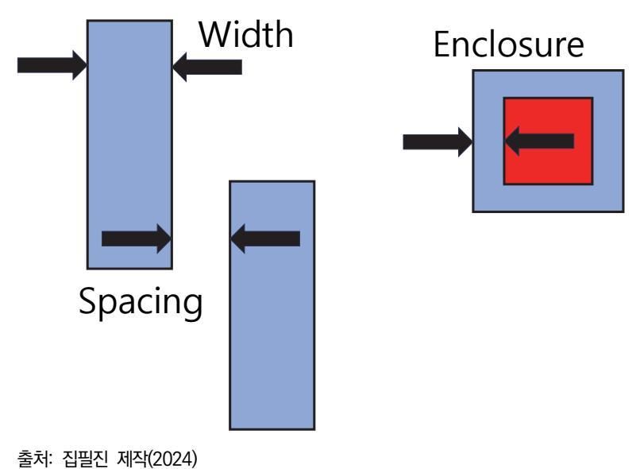

[그림 4-4] 디자인 룰의 정의

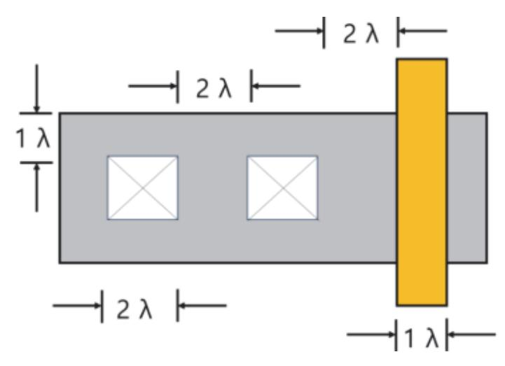

출처: 집필진 제작(2024) [그림 4-5] 람다에 의한 디자인 룰 표시

(2) 레이아웃 자동 최적화 기능을 사용한다.

설계된 레이아웃에 자동 최적화 기능을 추가하여, 공정의 매개 변수에 따라 레이아웃이 최적화되도록 할 수 있다. 이를 통해 레이아웃이 공정에 대응할 수 있도록 보호할 수 있다.

- (3) 매개 변수 의존성 분석 및 경고 시스템을 사용한다. 레이아웃에 매개 변수 의존성을 분석하는 기능을 추가하여, 공정의 매개 변수에 따라 레 이아웃이 어떻게 변할 수 있는지를 파악한다. 이를 통해 공정의 매개 변수가 변경될 때 사용자에게 경고를 표시하여 적절한 조치를 취할 수 있다.
- (4) 자동 백업 및 롤백 기능을 사용한다.

설계된 레이아웃에 자동 백업 및 롤백 기능을 추가하여, 공정의 매개 변수 변경으로 인 해 문제가 발생할 경우 이전 상태로 쉽게 되돌릴 수 있다.

(5) 시뮬레이션 및 검증 도구를 사용한다.

레이아웃에 매개 변수에 따른 변화를 시뮬레이션하고 검증하는 기능을 추가하여, 레이아 웃이 공정의 매개 변수에 영향을 받는 방식을 이해하고 대응할 수 있다.

이러한 보호 기능을 통해 설계된 레이아웃이 공정의 매개 변수에 따라 변화가 없도록 보호 할 수 있다.

5. 실제 제작해 보고 테스트한다. 레이아웃을 실제로 제작한 후 테스트하여 공정 매개 변수에 대한 영향을 확인한다. 이를 통 해 설계의 정확성을 확인하고 필요한 경우 수정한다.

수행 tip

- 파운드리 서비스를 제공하는 회사에서 요구하는 공정의 설 계 규칙을 참고하여 해당 요구 사항을 준용하는 레이아웃 을 수행한다.
- 공정의 레이어별 매개 변수를 고려한 블록 배치 및 배선을

수행한다.

### 학습 4 교수·학습 방법

#### 교수 방법

- 고객 요구 사항을 반영할 수 있도록 적합한 툴을 선정하여 레이아웃에 필요한 요소를 응용 예시를 제시한다.
- 공정의 설계 권고 사항을 설명하고 해당 내용에 대한 레이아웃 실습이 이루어지도록 지도한 다.
- 공정의 설계 규칙에 따라 반도체 소자에 대한 레이아웃 실습이 이루어지도록 지도한다.
- 공정의 설계 검증 규칙에 따라 레이아웃상에서 기능 블록을 배치 및 배선할 수 있도록 작업 순서에 따라 단계적으로 실습이 이루어지도록 지도한다.
- 공정의 레이어별 매개 변수를 고려하여 특성에 변화가 없도록 레이아웃을 수행할 수 있도록 작업 순서에 따라 단계적으로 지도한다.

#### 학습 방법

- 고객 요구 사항을 반영할 수 있도록 적합한 툴을 선정하여 레이아웃에 필요한 요소 전반에 대해 파악한다.
- 공정의 설계 권고 사항을 숙지하고 해당 내용을 레이아웃 실습에 적용한다.
- 공정의 설계 규칙에 따라 반도체 소자에 대한 레이아웃을 수행할 수 있도록 학습 및 실습한 다.
- 공정의 설계 검증 규칙에 따라 레이아웃상에서 기능 블록을 배치 및 배선하는 방법을 숙지 할 수 있도록 반복 연습한다.
- 공정의 레이어별 매개 변수를 고려하여 특성에 변화가 없도록 레이아웃을 수행해 본다.

## 학습 4 평 가

#### 평가 준거

• 평가자는 학습자가 학습 목표를 성공적으로 달성하였는지를 평가해야 한다.

#### • 평가자는 다음 사항을 평가해야 한다.

| 학습 내용           | 학습 목표                                                            | 성취수준 |   |   |
|-----------------|------------------------------------------------------------------|------|---|---|
|                 |                                                                  | 상    | 중 | 하 |
| 커스텀 레이아웃 수 행 | - 공정의 설계 규칙에 따라 반도체 소자에 대한 레이아웃을 수행할 수 있다.                    |      |   |   |
|                 | - 공정의 설계·검증 규칙에 따라 레이아웃상에서 기능 블록을 배치 및 배선할 수 있다.              |      |   |   |
|                 | - 공정의 레이어별 매개 변수(parameter)를 고려하여 특성에 변화가 없도록 레이아웃을 수행할 수 있다. |      |   |   |

#### 평가 방법

• 서술형 시험

| 학습 내용           | 평가 항목                                                            | 성취수준 |   |   |
|-----------------|------------------------------------------------------------------|------|---|---|
|                 |                                                                  | 상    | 중 | 하 |
| 커스텀 레이아웃 수 행 | - 공정의 설계·검증 규칙에 따라 레이아웃상에서 기능 블록 배 치를 최적화할 수 있는 능력            |      |   |   |
|                 | - 공정의 설계·검증 규칙에 따라 배선 레이아웃을 수행하고 이 에 대한 검증 및 시뮬레이션을 할 수 있는 능력 |      |   |   |
|                 | - 공정의 레이어별 매개 변수(parameter)를 파악할 수 있는 능력                      |      |   |   |

#### • 평가자 체크리스트

|                 | 평가 항목                                                                        |  | 성취수준 |   |  |
|-----------------|------------------------------------------------------------------------------|--|------|---|--|
| 학습 내용           |                                                                              |  | 중    | 하 |  |
| 커스텀 레이아웃 수 행 | - 공정의 설계·검증 규칙에 따라 레이아웃상에서 검증 및 시뮬 레이션을 할 수 있는 능력                         |  |      |   |  |
|                 | - 공정의 설계·검증 규칙에 따라 수행된 배선 레이아웃 검증 및 시뮬레이션 결과로부터 디자인을 수정하고 최적화할 수 있는 능력 |  |      |   |  |
|                 | - 공정의 레이어별 매개 변수(parameter)를 고려하여 이를 보 호하기 위한 절차를 수행할 수 있는 능력             |  |      |   |  |

#### 피드백

1. 서술형 시험 - 공정의 설계·검증 규칙에 따라 레이아웃 상에서 기능 블록 배치를 최적화 할 수 있는 능력을 평 가한 후, 보완이 필요한 사항이나 주요 사항을 표시하여 피드백 해 준다. - 공정의 설계·검증 규칙에 따라 배선 레이아웃을 수행하고 이에 대한 검증 및 시뮬레이션을 할 수 있는 능력을 평가한 후, 보완이 필요한 사항이나 주요 사항을 표시하여 보충 설명해 준다. - 평가 결과가 우수한 학습자들에게는 서술형 평가 내용과 관련한 적용 사례를 심화하여 피드백해 주고, 미흡한 학습자들에게는 기초 필요 지식을 설명해 주고 일정 성취 수준을 유지할 수 있도록 보완하여 지도해 준다. 2. 평가자 체크리스트 - 공정의 설계·검증 규칙에 따라 수행된 배선 레이아웃 검증 및 시뮬레이션 결과로부터 디자인을 수정하고 최적화 할 수 있는 능력을 확인한 후 부족한 점을 지적하여 정확하게 처리할 수 있도록 보완하여 지도해 준다. - 공정의 레이어별 매개 변수를 고려하여 이를 보호하기 위한 절차를 수행할 수 있는 능력을 평가 한 후, 개선 및 보완 사항에 대한 내용을 정리하여 재학습할 수 있도록 피드백해 준다. - 평가 결과가 우수한 학습자와 저조한 학습자를 구분하여 우수한 학습자들에게는 작업장 환경에 적용할 수 있는 심화 학습으로 피드백해 주고, 저조한 학습자들에게는 기초 용어에 대한 설명을 통해 일정 수준을 유지할 수 있도록 보완하여 지도해 준다.

- ∙ 강성호, 김대정, 이승준, 이찬호(2004). 『SoC 및 IP 설계기법』. 홍릉과학출판사.
- ∙ 공진흥, 김남영, 김동욱, 이재철(1997). 『VLSI설계, 이론과 실습』. 홍릉과학출판사.
- ∙ 교육부(2015). 레이아웃 설계(LM1903060105\_14v3). 한국직업능력개발원.
- ∙ 조영록(2009). 『CMOS 공정을 이용한 Analog Layout』. 홍릉과학출판사
- ∙ 조준동(2010). 『알기쉬 운 최신 VLSI설계』. 한빛미디어.
- ∙ Saburo Muroga (1982). VLSI system design: when and how to design very-large-scale integrated circuits. U.S.A: John Wiley & Sons, Inc.
- ∙ Neil H. E. Weste, David Harris (2005). CMOS VLSI Design: A Circuits and Systems Perspective. U.S.A: Addison Wesley.

| NCS학습모듈 개발이력 |                                     |     |                  |  |
|--------------|-------------------------------------|-----|------------------|--|
| 발행일          | 2024년 12월 31일                       |     |                  |  |
| 세분류명         | 반도체 개발((19030601)                   |     |                  |  |
| 개발기관         | 수원과학대학교 산학협력단(개발책임자: 윤창용) 한국직업능력연구원 |     |                  |  |
|              | 최준혁(수원대학교)*                         |     | 김종범(삼성전기)        |  |
|              | 계찬호(수원대학교)                          |     | 김한수(두원공과대학교)     |  |
|              | 김경호(폴리텍대학교)                         |     | 남승호(경기대학교)       |  |
|              | 김관하(폴리텍대학교)                         |     | 손승대(제이에스이엔씨(주))  |  |
| 집필진          | 김기순((주)영우디에스피)                      | 검토진 | 안광호(퓨쳐일렉트로닉스)    |  |
|              | 김도균(폴리텍대학교)                         |     | 이철오((주)한국전력안전공단) |  |
|              | 전동민(폴리텍대학교)                         |     |                  |  |

\*표시는 대표집필자임 (참고) 검토진으로 참여한 집필진은 본인의 원고가 아닌 타인의 학습모듈을 검토함

| 커스텀 레이아웃 설계(LM1903060131_23v5)                                                                         |                   |  |  |  |
|--------------------------------------------------------------------------------------------------------|-------------------|--|--|--|
| 저작권자                                                                                                   | 교육부               |  |  |  |
| 연구기관                                                                                                   | 한국직업능력연구원         |  |  |  |
| 발행일                                                                                                    | 2024. 12. 31.     |  |  |  |
| ISBN                                                                                                   | 979-11-7175-765-7 |  |  |  |
| ※ 이 학습모듈은 자격기본법 시행령(제8조 국가직무능력표준의 활용)에 의거하여 개발하였으며, NCS통합포털사이트(http.//www.ncs.go.kr)에서 다운로드 할 수 있다. |                   |  |  |  |

