LM1903060132\_23v5

# NCS학습모듈 커스텀 레이아웃 검증

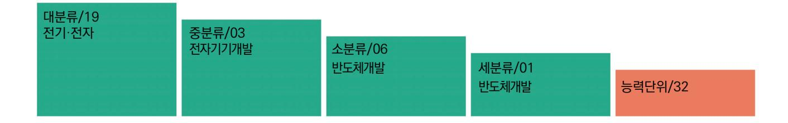

#### [NCS학습모듈 활용 시 유의 사항]

- 1. NCS학습모듈은 교육훈련기관에서 출처를 명시하고 교육적 목적으로 활용할 수 있습니다. 다 만, NCS학습모듈에는 국가(교육부)가 저작재산권 일체를 보유하지 않은 저작물(출처가 표기된 도표‧사진‧삽화‧도면 등)이 포함되어 있으므로, 이러한 저작물의 변형‧각색‧복제‧공연‧ 배포 및 공중 송신 등과 이러한 저작물을 활용한 2차적 저작물을 작성하려면 반드시 원작자 의 동의를 받아야 합니다.
- 2. NCS학습모듈은 개발 당시의 산업 및 교육 현장을 반영하여 집필하였으므로, 현재 적용되는 법령‧지침‧표준 및 교과 내용 등과 차이가 있을 수 있습니다. NCS학습모듈 활용 시 법령 ‧지침‧표준 및 교과 내용의 개정 사항과 통계의 최신성 등을 확인하시기를 바랍니다.
- 3. NCS학습모듈은 산업 현장에서 요구되는 능력을 교육훈련기관에서 학습할 수 있게 구성한 자 료입니다. 다만, NCS학습모듈 지면의 한계상 대표적 예시(예: 활용도 또는 범용성이 높은 제 품, 서비스) 중심으로 집필하였음을 이해하시기를 바랍니다.

## NCS학습모듈의 이해

※ 본 NCS학습모듈은 「NCS 국가직무능력표준」사이트(http://www.ncs.go.kr) 에서 확인 및 다운로드할 수 있습니다.

## Ⅰ NCS학습모듈이란?

- 국가직무능력표준(NCS: National Competency Standards)이란 산업현장에서 직무를 수행하기 위해 요구되는 지식·기술·소양 등의 내용을 국가가 산업부문별·수준별로 체계 화한 것으로 산업현장의 직무를 성공적으로 수행하기 위해 필요한 능력(지식, 기술, 태도) 을 국가적 차원에서 표준화한 것을 의미합니다.
- 국가직무능력표준(이하 NCS)이 현장의 '직무 요구서'라고 한다면, NCS학습모듈은 NCS
  의 능력단위를 교육훈련에서 학습할 수 있도록 구성한 '교수·학습 자료'입니다. NCS학습
  모듈은 구체적 직무를 학습할 수 있도록 이론 및 실습과 관련된 내용을 상세하게 제시하
  고 있습니다.

#### ○ NCS학습모듈은 다음과 같은 특징을 가지고 있습니다.

- 첫째, NCS학습모듈은 산업계에서 요구하는 직무능력을 교육훈련 현장에 활용할 수 있도 록 성취목표와 학습의 방향을 명확히 제시하는 가이드라인의 역할을 합니다.
- 둘째, NCS학습모듈은 특성화고, 마이스터고, 전문대학, 4년제 대학교의 교육기관 및 훈 련기관, 직장교육기관 등에서 표준교재로 활용할 수 있으며 교육과정 개편 시에도 유용하게 참고할 수 있습니다.

○ NCS와 NCS학습모듈 간의 연결 체계를 살펴보면 아래 그림과 같습니다.

O NCS학습모듈의 위치는 NCS 분류 체계에서 해당 학습모듈이 어디에 위치하는지를 한 눈에 볼 수 있도록 그림으로 제시한 것입니다.

| [NCS-학          | 습모듈         | 의 위치]    |          |  |
|-----------------|-------------|----------|----------|--|
|                 |             |          |          |  |
| 대분류             | 문화·예술       | ··디자인·방송 |          |  |
| 중분류             | 문화콘텐츠       |          |          |  |
| 소분류             | :분류 문화콘텐츠제작 |          |          |  |
|                 |             |          |          |  |
| 세분류             |             |          |          |  |
| 방송콘텐츠제작         |             | 능력단위     | 학습모듈명    |  |
| 영화콘텐츠제작         |             | 프로그램 기획  | 프로그램 기획  |  |
| 음악콘텐츠제작         |             | 아이템 선정   | 아이템 선정   |  |
| 광고콘텐츠제작         |             | 자료 조사    | 자료 조사    |  |
| 게임콘텐츠제작         |             | 프로그램 구성  | 프로그램 구성  |  |
| 애니메이션 콘텐츠제작  |             | 캐스팅      | 캐스팅      |  |
| 만화콘텐츠제작         |             | 제작계획     | 제작계획     |  |
| 캐릭터제작           |             | 방송 미술 준비 | 방송 미술 준비 |  |
| 스마트문화앱 콘텐츠제작 |             | 방송 리허설   | 방송 리허설   |  |
| 영사              |             | 야외촬영     | 야외촬영     |  |
|                 |             | 스튜디오 제작  | 스튜디오 제작  |  |
|                 |             |          |          |  |

학습모듈은

NCS 능력단위 1개당 1개의 학습모듈 개발 을 원칙으로 합니다. 그러나 필요에 따라 고용단위 및 교과단위를 고려하여 능력단위 몇 개를 묶어 1개 학습모듈로 개발할 수 있으며, NCS 능력단위 1개를 여러 개의 학습모듈로 나누어 개발할 수도 있습니다.

### 2. NCS학습모듈의 개요

#### ○ NCS학습모듈의 개요는 학습모듈이 포함하고 있는 내용을 개략적으로 설명한 것으로

| 학습모듈의 목표, 선수학습, 학습모듈의 내용 체계, 핵심 용어 로 구성되어 있습니다. |                                                                              |  |
|-------------------------------------------------|------------------------------------------------------------------------------|--|
| 학습모듈의 목표                                        | 해당 NCS 능력단위의 정의를 토대로 학습 목표를 작성한 것입니다.                                        |  |
| 선수학습                                            | 해당 학습모듈에 대한 효과적인 교수·학습을 위하여 사전에 이수해야 하는 학습모 듈, 학습 내용, 관련 교과목 등을 기술한 것입니다. |  |
| 학습모듈의 내용 체계                                  | 해당 NCS 능력단위요소가 학습모듈에서 구조화된 체계를 제시한 것입니다.                                     |  |
| 핵심 용어                                           | 해당 학습모듈의 학습 내용, 수행 내용, 설비·기자재 등 가운데 핵심적인 용어를 제 시한 것입니다.                   |  |

### 제작계획 학습모듈의 개요

#### 학습모듈의 목표

본격적인 촬영을 준비하는 단계로서, 촬영 대본을 획정하고 제작 스태프를 조직하며 촬영 장비와 촬영 소품을 준비할 수 있다.

#### 선수학습

제작 준비(LM0803020105\_13v1), 섭외 및 제작스태프 구성(LM0803020104\_13v1), 촬영 제작(LM0803020106\_13v1), 촬영 장비 준비(LM0803040204\_13v1.4), 미술 디자인 협의하기(LM0803040203\_13v1.4)

#### 학습모듈의 내용체계

| 하스                | 하스 내용                                              | NCS 능력단위 요소       |                |
|-------------------|----------------------------------------------------|-------------------|----------------|
| 학습                | 학습 내용                                              | 코드번호              | 요소 명칭          |
| 1. 촬영 대본 확정하기  | 1-1. 촬영 구성안 검 토와 수정                             | 0803020114_16/3.1 | 촬영 대본 확정하기  |
| 2. 제작 스태프 조직하기 | 2-1. 기술 스태프 조직 2-2. 미술 스태프 조직 2-3. 전문 스태프 조직 | 0803020114_16v3.2 | 제작 스태프 조직하기 |
| 3. 촬영 장비 계획하기  | 3-1. 촬영 장비 점검 과 준비                              | 0803020114_16/3.3 | 촬영 장비 계획하기  |
| 4. 촬영 소품 계획하기  | 4-1. 촬영 소품 목록 작성 4-2. 촬영 소품 제작 의뢰         | 0803020114_16\3.4 | 촬영 소품 계획하기  |

#### 핵심 용어

촬영 구성안, 제작 스태프, 촬영 장비, 촬영 소품

#### 학습모듈의 목표는

학습자가 해당 학습모듈을 통해 성취해야 할 목표를 제시한 것으로, 교수자는 학습자 가 학습모듈의 전체적인 내용흐름을 파악하 도록 지도할 수 있습니다.

**6** • •

61

#### 선수학습은

교수자 또는 학습자가 해당 학습모듈을 교 수·학습하기 이전에 이수해야 하는 교과목 또는 학습모듈(NCS 능력단위) 등을 표기한 것입니다. 따라서 교수자는 학습자가 개별 학습, 자기 주도 학습, 방과 후 활동 등 다 양한 방법을 통해 이수할 수 있도록 지도하 는 것을 권장합니다.

|            | 핵심 용어는              |
|------------|---------------------|
|            | 률을 대표하는 주요 용어입니     |
|            | · 해당 학습모듈을 통해 학습    |
|            | 게될 주요 내용을 알 수 있습    |
|            | 5 국가직무능력표준」 사이트     |
| (www.ncs.g | jo.kr)의 색인 (찾아보기) 중 |
| 하나로 이용할    | 할 수 있습니다            |

#### 3. NCS학습모듈의 내용 체계

○ NCS학습모듈의 내용은 크게 학습, 학습 내용, 교수·학습 방법, 평가 로 구성되어 있습니다.

| 학습       | 해당 NCS 능력단위요소 명칭을 사용하여 제시한 것입니다. 학습은 크게 학습 내용, 교수·학습 방법, 평가로 구성되며 해당 NCS 능력단위의 능력단위 요소별 지식, 기술, 태도 등을 토대로 내용을 제시한 것입니다.                                                    |
|----------|----------------------------------------------------------------------------------------------------------------------------------------------------------------------------------|
| 학습 내용    | 학습 내용은 학습 목표, 필요 지식, 수행 내용으로 구성되며, 수행 내용은 재료·자 료, 기기(장비·공구), 안전·유의 사항, 수행 순서, 수행 tip으로 구성한 것입니다. 학습모듈의 학습 내용은 실제 산업현장에서 이루어지는 업무활동을 표준화된 프로세 스에 기반하여 다양한 방식으로 반영한 것입니다. |
| 교수·학습 방법 | 학습 목표를 성취하기 위한 교수자와 학습자 간, 학습자와 학습자 간 상호 작용이 활발하게 일어날 수 있도록 교수자의 활동 및 교수 전략, 학습자의 활동을 제시한 것입니다.                                                                            |
| 평가       | 평가는 해당 학습모듈의 학습 정도를 확인할 수 있는 평가 준거 및 평가 방법, 평 가 결과의 피드백 방법을 제시한 것입니다.                                                                                                         |

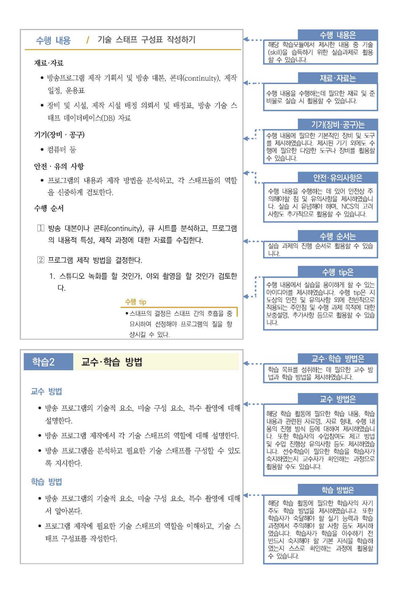

## [NCS-학습모듈의 위치]

| 대분류 | 전기·전자 |          |
|-----|-------|----------|
| 중분류 |       | 전자 기기 개발 |
| 소분류 |       | 반도체 개발   |

| 세분류    |                  |                  |
|--------|------------------|------------------|
| 반도체 개발 | 능력단위             | 학습모듈명            |
| 반도체 제조 | 반도체 제품 기획        | 반도체 제품 기획        |
| 반도체 장비 | 반도체 아키텍처 설계      | 반도체 아키텍처 설계      |
| 반도체 재료 | 디지털 회로 설계        | 디지털 회로 설계        |
|        | 패키지 조립 공정 개발     | 패키지 조립 공정 개발     |
|        | 반도체 제품 기능·성능 검증  | 반도체 제품 기능·성능 검증  |
|        | 자동 배치 배선 레이아웃 설계 | 자동 배치 배선 레이아웃 설계 |
|        | 반도체 설계 검증        | 반도체 설계 검증        |
|        | 반도체 펌웨어 개발       | 반도체 펌웨어 개발       |
|        | 메모리 반도체 제조 공정 개발 | 메모리 반도체 제조 공정 개발 |
|        | 시스템 반도체 제조 공정 개발 | 시스템 반도체 제조 공정 개발 |
|        | 반도체 제조 단위 공정 개발  | 반도체 제조 단위 공정 개발  |
|        | 아날로그 회로 아키텍처 설계  | 아날로그 회로 아키텍처 설계  |
|        | 아날로그 회로 소자 레벨 설계 | 아날로그 회로 소자 레벨 설계 |
|        | 아날로그 회로 시스템 설계   | 아날로그 회로 시스템 설계   |

| 와이어 본딩 패키지 개발     | 와이어 본딩 패키지 개발     |
|-------------------|-------------------|
| 플립 칩 패키지 개발       | 플립 칩 패키지 개발       |
| 웨이퍼 레벨 패키지 개발     | 웨이퍼 레벨 패키지 개발     |
| 어드밴스드 팬 아웃 패키지 개발 | 어드밴스드 팬 아웃 패키지 개발 |
| 이종 접합 패키지 개발      | 이종 접합 패키지 개발      |
| 어드밴스드 언더필 패키지 개발  | 어드밴스드 언더필 패키지 개발  |
| 반도체 환경 시험         | 반도체 환경 시험         |
| 반도체 수명 시험         | 반도체 수명 시험         |
| 반도체 내성 시험         | 반도체 내성 시험         |
| 커스텀 레이아웃 적용 공정 분석 | 커스텀 레이아웃 적용 공정 분석 |
| 커스텀 레이아웃 설계       | 커스텀 레이아웃 설계       |
| 커스텀 레이아웃 검증       | 커스텀 레이아웃 검증       |

## 차 례

| 학습모듈의 개요       | 1   |
|----------------|-----|
| 학습 1. DRC 검증하기 |     |
| 1-1. DRC 검증    | 3   |
| • 교수 ․ 학습 방법   | 53  |
| • 평가           | 54  |
| 학습 2. LVS 검증하기 |     |
| 2-1. LVS 검증    | 56  |
| • 교수 ․ 학습 방법   | 74  |
| • 평가           | 75  |
| 학습 3. LPE 검증하기 |     |
| 3-1. LPE 검증    | 77  |
| • 교수 ․ 학습 방법   | 108 |
| • 평가           | 109 |
|                |     |

| 참고 자료 |  |  |  |  |  |  |  |  |  |  |  |  |  | 111 |  |
|-------|--|--|--|--|--|--|--|--|--|--|--|--|--|-----|--|
|-------|--|--|--|--|--|--|--|--|--|--|--|--|--|-----|--|

## 커스텀 레이아웃 검증 학습모듈의 개요

#### 학습모듈의 목표

설계된 레이아웃 도면이 공정의 설계 규칙에 맞게 디자인 되었는지를 판단, DRC(Design Rule Check)하고 회로도와 일치 LVS(Layout vs. Schematic)하는지 여부와 레이아웃 과정 중 발생하는 기생 성분을 추출 LPE(Layout Parasitic Extraction)할 수 있다.

#### 선수학습

레이아웃 설계(LM1903060105\_14v3), 전기 회로, 전자 회로

#### 학습모듈의 내용체계

|             |             | NCS 능력단위 요소       |          |  |  |
|-------------|-------------|-------------------|----------|--|--|
| 학습          | 학습 내용       | 코드번호              | 요소 명칭    |  |  |
| 1. DRC 검증하기 | 1-1. DRC 검증 | 1903060132_23v5.1 | DRC 검증하기 |  |  |
| 2. LVS 검증하기 | 2-1. LVS 검증 | 1903060132_23v5.2 | LVS 검증하기 |  |  |
| 3. LPE 검증하기 | 3-1. LPE 검증 | 1903060132_23v5.3 | LPE 검증하기 |  |  |

#### 핵심 용어

플로어 플랜(Floor Plan), 배치, 배선, 설계 규칙, DRC(Design Rule Heck), LVS(Layout Versus Schematic), LPE(Layout Parastic Extraction), 커스텀 레이아웃, 자동 배치 배선

# 학습 1 DRC 검증하기

| 학습 2 | LVS 검증하기 |
|------|----------|
| 학습 3 | LPE 검증하기 |

# 1-1. DRC 검증

| 학습 목표 | • 공정의 설계 규칙(DRC: Design Rule Checking) 파일을 숙지하고 이해할 수 있다. |
|-------|-----------------------------------------------------------|
|       | • 설계 검증 툴을 적용하여 오류를 찾을 수 있다.                              |
|       | • 디자인 규칙에 위배되는 부분을 수정하여 설계 규칙 적용이 어려울 경우 대책을 수립할 수 있      |
|       | 다.                                                        |

## 필요 지식 /

숔 커스텀 레이아웃에서 공정의 설계 규칙

디자인 룰 체크(DRC: Design Rule Check)는 반도체 커스텀 레이아웃 설계에서 매우 중요한 단계이다. DRC는 레이아웃이 제조 공정의 규칙을 준수하는지 확인하여 결함 없는 칩을 생산 하는 데 필수적이다. DRC 설계 규칙은 다양한 레이어 간의 간격, 최소 크기, 배치 등 여러 가 지 규칙을 포함한다. 아래는 주요 DRC 설계 규칙에 대한 설명이다.

- 1. 기본 설계 규칙
  - (1) 최소 선폭(Minimum Width)

(가) 정의: 각 레이어의 선폭이 특정 최소 값을 넘어야 한다.

예: 폴리실리콘, 메탈 라인의 최소 선폭

- (2) 최소 간격(Minimum Spacing)
  - (가) 정의: 인접한 레이어 간의 최소 간격
    - 예: 두 메탈 라인 간의 최소 간격, 폴리실리콘 간의 최소 간격

#### 2. 레이어 간 규칙

- (1) 레이어 오버랩(Layer Overlap)
  - (가) 정의: 특정 레이어가 다른 레이어와 정확히 겹쳐야 하는 규칙 예: 소스/드레인 영역과 콘택트 영역의 오버랩
- (2) 레이어 간 최소 간격(Inter-Layer Spacing)

(가) 정의: 다른 레이어 간의 최소 간격

예: 메탈 1과 메탈 2 간의 최소 간격

#### 3. 콘택트 및 비아 규칙

- (1) 콘택트 크기(Contact Size)
  - (가) 정의: 콘택트의 최소 및 최대 크기
    - 예: 소스/드레인 콘택트의 최소 크기
- (2) 콘택트 간 최소 간격(Contact Spacing)
  - (가) 정의: 콘택트 간의 최소 간격
    - 예: 인접한 콘택트 간의 최소 간격
- (3) 비아 크기(Via Size)
  - (가) 정의: 비아의 최소 및 최대 크기
    - 예: 메 탈1에서 메탈2로 연결되는 비아의 크기
- (4) 비아 간 최소 간격(Via Spacing)
  - (가) 정의: 비아 간의 최소 간격
    - 예: 인접한 비아 간의 최소 간격

#### 4. 특별한 구조 규칙

- (1) 핀(Pin) 규칙
  - (가) 정의: 핀의 최소 크기 및 간격
    - 예: 입력/출력 핀의 크기와 위치.
- (2) 웰(Well) 규칙

#### <표 1-1> N-well에 관한 디자인 룰 사례

| Rule No. | Description                       |
|----------|-----------------------------------|
| 1A       | Minimum width of an Nwell.        |
| 1B       | Minimum space between two Nwell.  |
| 1C       | Minimum Nburied overlap of Nwell. |

|    | Nwell |
|----|-------|
|    |       |
|    |       |
|    | -     |
| 18 |       |
|    |       |
|    | • 1B  |

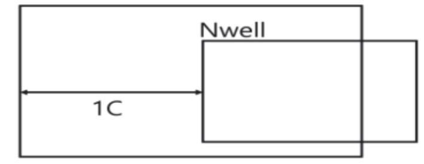

출처: 집필진 제작(2024)

[그림 1-1] N-well Rule Description

- (가) 정의: 웰의 최소 크기 및 간격 예: n-well, p-well의 크기와 간격
- (3) 가드 링(Guard Ring) 규칙
  - (가) 정의: 가드 링의 배치 및 크기

예: ESD 보호를 위한 가드 링의 크기와 위치

5. 복잡한 구조 규칙

- (1) 다중 패턴(Multi-Patterning) 규칙
  - (가) 정의: 다중 패턴 공정에서 레이어 간 간격과 배치 규칙 예: 메탈 라인의 다중 패턴 간 최소 간격
- (2) 텐션 및 컴프레션(Tension and Compression) 규칙
  - (가) 정의: 스트레스가 가해지는 구조에서의 설계 규칙
    - 예: 텐션 및 컴프레션에 의한 변형을 방지하기 위한 규칙.
- 6. 전기적 규칙(ERC: Electrical Rule Check)
  - (1) 전력 및 그라운드 규칙
    - (가) 정의: 전력 라인과 그라운드 라인의 크기 및 간격
    - 예: 전력 라인의 최소 너비, 그라운드 라인의 최소 너비
  - (2) 전기적 연결 규칙

(가) 정의: 소자의 전기적 연결을 위한 규칙

예: 입력 핀과 출력 핀 간의 연결 상태

- 7. 기타 규칙
  - (1) 핸드링(Handling) 규칙

(가) 정의: 레이아웃의 제조 및 테스트 핸드링을 위한 규칙

예: 테스터 핀의 위치와 크기

(2) 기계적 규칙

(가) 정의: 제조 공정 중 기계적 스트레스에 대한 규칙

예: 레이어 간의 기계적 접합 상태

DRC 설계 규칙은 반도체 제조 공정에서 레이아웃이 정확하게 제작되도록 보장하기 위한 필수 요소이다. 최소 선폭, 간격, 콘택트 및 비아 크기, 레이어 간 규칙, 특별한 구조 규칙 등 다양 한 규칙들을 준수함으로써, 결함 없는 칩을 제조할 수 있다. 이를 통해 설계자는 높은 신뢰성 과 성능을 가진 반도체 소자를 생산할 수 있다.

숕 파운드리에서 제공하는 커스텀 레이아웃의 DRC 설계 규칙

파운드리에서 제공하는 커스텀 레이아웃의 DRC(Design Rule Check) 설계 규칙은 다양한 규 칙을 포함하며, 반도체 제조 공정의 특성과 요구 사항에 따라 달라질 수 있다. 아래는 일반적 으로 파운드리에서 제공하는 DRC 설계 규칙의 주요 사례를 정리한 내용이다.

- 1. 최소 선폭(Minimum Width)
  - (1) 금속 라인(Metal Line)
    - (가) 규칙: 금속 라인의 최소 폭은 0.14㎛ 이상이어야 한다.

예시: MINWIDTH M1 0.14㎛

(2) 폴리실리콘(Polysilicon)

(가) 규칙: 폴리실리콘 라인의 최소 폭은 0.10㎛ 이상이어야 한다. 예시: MINWIDTH POLY 0.10㎛

<표 1-2> poly 디자인 룰 사례

| Rule No. | Description                        |
|----------|------------------------------------|
| 5A       | Minimum width of an Poly.          |
| 5B       | Minimum space between two Poly.    |
| 5C       | Minimum Poly extension over Oxide. |
| 5D       | Minimum Oxide extension over Poly. |
| 5E       | Minimum Poly space to Oxide.       |

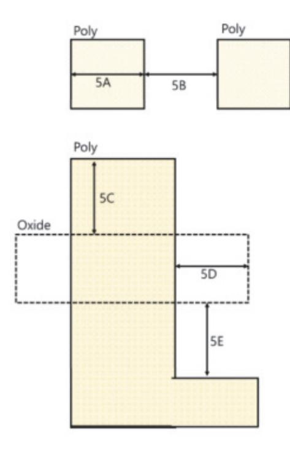

출처: 집필진 제작(2024) [그림 1-2] poly rule

- 2. 최소 간격(Minimum Spacing)
  - (1) 금속 라인 간격(Metal Line Spacing)
    - (가) 규칙: 인접한 금속 라인 간의 최소 간격은 0.14㎛ 이상이어야 한다. 예시: MINSPACING M1 0.14㎛

<표 1-3> Metal Rule에 관한 디자인 룰 사례

| Rule No.                                                   | Description                        |
|------------------------------------------------------------|------------------------------------|
| 7A, 9A, 11A, 15A, 17A, 19A                                 | Minimum width of an Metalx.        |
| 7B, 9B, 11B, 15B, 17B, 19B                                 | Minimum space between two Metalx.  |
| 7C                                                         | Minimum Metal1 overlap of Contact. |
| 9C, 11C, 15C, 17C, 19C                                     | Minimum Metalx overlap of Viax     |
| (Metalx, x = 1, 2, 3, 4, 5, 6) (Viax, x= 1, 2, 3, 4, 5) |                                    |

(2) 콘택트 간격(Contact Spacing)

#### (가) 규칙: 인접한 콘택트 간의 최소 간격은 0.12㎛ 이상이어야 한다.

예시: MINSPACING CONT 0.12㎛

<표 1-4> Poly Contact Rule에 관한 디자인 룰 사례

| Rule No. | Description                           |
|----------|---------------------------------------|
| 6A       | Absolute width and Length of Contact. |
| 6B       | Minimum space between two Contact.    |
| 6C       | Minimum Oxide overlap of Contact.     |
| 6D       | Minimum Poly overlap of Contact.      |
| 6E       | Minimum Poly space to Contact.        |
| 6F       | Minimum Pimp overlap of Contact.      |
| 6G       | Minimum Nimp overlap of Contact.      |
| 6H       | Minimum Contact space to Oxide.       |

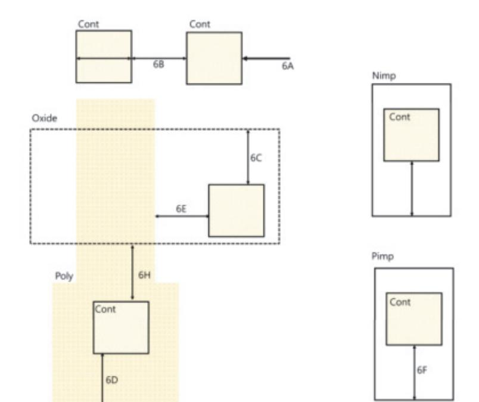

출처: 집필진 제작(2024) [그림 1-3] Poly Contact rule

- 3. 레이어 오버랩(Layer Overlap)
  - (1) 소스/드레인과 콘택트(Source/Drain and Contact)
    - (가) 규칙: 소스/드레인 영역과 콘택트 영역이 최소 0.05㎛ 이상 오버랩되어야 한다.
      - 예시: MINOVERLAP S/D CONT 0.05㎛
- 4. 콘택트 및 비아
  - (1) 콘택트 크기
    - (가) 규칙: 콘택트의 최소 크기는 0.08㎛ x 0.08㎛ 이상이어야 한다. 예시: MINSIZE CONT 0.08㎛
  - (2) 비아 크기(Via Size)
    - (가) 규칙: 비아의 최소 크기는 0.10㎛ x 0.10㎛ 이상이어야 한다.
  - 예시: MINSIZE VIA 0.10㎛
- 5. 특별한 구조 규칙
  - (1) 핀 크기(Pin Size)
    - (가) 규칙: 핀의 최소 크기는 0.15㎛ x 0.15㎛ 이상이어야 한다. 예시: MINSIZE PIN 0.15㎛
  - (2) 웰 간격(Well Spacing)

- (가) 규칙: 인접한 N-well과 P-well 간의 최소 간격은 0.20㎛ 이상이어야 한다. 예시: MINSPACING N-WELL P-WELL 0.20㎛
- 6. 전력 및 그라운드 규칙(Power and Ground Rules)
  - (1) 전력 라인 폭(Power Line Width)
    - (가) 규칙: 전력 라인의 최소 폭은 0.20㎛ 이상이어야 한다.
      - 예시: MINWIDTH POWER 0.20㎛
  - (2) 그라운드 라인 폭(Ground Line Width)
    - (가) 규칙: 그라운드 라인의 최소 폭은 0.20㎛ 이상이어야 한다. 예시: MINWIDTH GROUND 0.20㎛
- 7. 기생 요소 규칙(Parasitic Element Rules)
  - (1) 기생 커패시턴스(Parasitic capacitance)
    - (가) 규칙: 특정 영역의 기생 커패시턴스는 1fF 이하로 유지되어야 한다. 예시: MAXCAP PARASITIC 1fF

<표 1-5> Capacitor Metal Rule에 관한 디자인 룰 사례

| Rule No. | Description                                 |
|----------|---------------------------------------------|
| 12A      | Minimum width of an CapMetal.               |
| 12B      | Minimum Metal2 overlap of Via2 on CapMetal. |
| 12C      | Minimum CapMetal overlap of Via2.           |
| 12D      | Minimum Metal3 overlap of Via2 on Captetal. |
| 12E      | Minimum CapMetal overlap of Metal3.         |

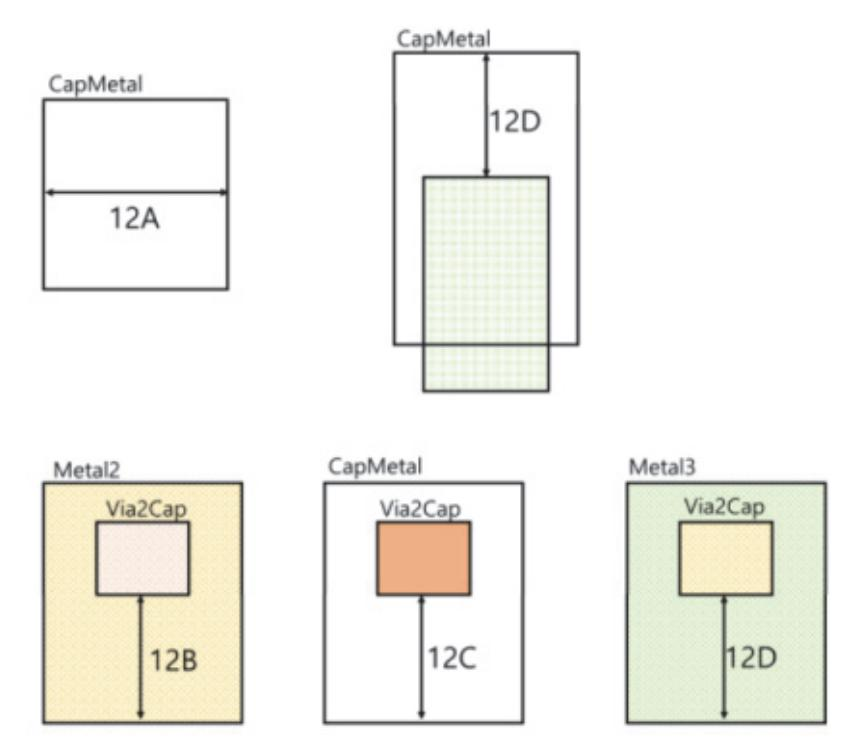

출처: 집필진 제작(2024) [그림 1-4] Capacitor metal rule

- (2) 기생 저항(Parasitic Resistance)
  - (가) 규칙: 특정 영역의 기생 저항은 100Ω 이하로 유지되어야 한다.
    - 예시: MAXRES PARASITIC 100Ω
- 8. 고급 설계 규칙(Advanced Design Rules)
  - (1) 다중 패턴(Multi-Patterning)
    - (가) 규칙: 다중 패턴 레이어 간의 최소 간격은 0.12㎛ 이상이어야 한다. 예시: MINSPACING MULTI\_PATTERN 0.12㎛
  - (2) 전류 밀도(Current Censity)
    - (가) 규칙: 메탈 라인의 최대 전류 밀도는 1mA/㎛² 이하로 유지되어야 한다. 예시: MAXCURRENTDENSITY M1 1mA/㎛²
- 9. 레이어 간 규칙(Inter-Layer Rules)
  - (1) 메탈 1과 메탈 2 간 간격(Spacing between Metal 1 and Metal 2) (가) 규칙: 메탈 1과 메탈 2 간의 최소 간격은 0.14㎛ 이상이어야 한다. 예시: MINSPACING M1 M2 0.14㎛
  - (2) 웰 오버랩(Well Overlap)

(가) 규칙: N-well과 P-well의 최소 오버랩은 0.10㎛ 이상이어야 한다.

예시: MINOVERLAP N-WELL P-WELL 0.10㎛

10. 기타 규칙

- (1) 핸드링 규칙(Handling Rules)
  - (가) 규칙: 테스터 핀의 최소 크기와 간격은 0.15㎛ 이상이어야 한다.

예시: MINSIZE TEST\_PIN 0.15㎛

- (2) 기계적 규칙(Mechanical Rules)
  - (가) 규칙: 제조 공정 중 기계적 스트레스를 방지하기 위해 최소 두께는 0.5㎛ 이상이어야 한 다.

예시: MINTHICKNESS MECHANICAL 0.5㎛

파운드리에서 제공하는 커스텀 레이아웃의 DRC 설계 규칙은 다양한 레이어 간의 최소 간격, 최소 선폭, 레이어 오버랩, 콘택트 및 비아 크기 등 여러 가지 규칙을 포함한다. 이러한 규칙들 을 준수함으로써 제조 가능성을 높이고 결함 없는 반도체 소자를 생산할 수 있다. 각 규칙은 공정 변동성에 대응하고 소자의 신뢰성을 확보하는 데 중요한 역할을 한다.

#### 숖 DRC 설계 검증 툴을 활용

커스텀 레이아웃에서 설계 검증 툴을 적용하여 오류를 찾기 위해서는 다양한 기술적 지식과 실 습이 필요하다. 설계 검증 툴을 효과적으로 사용하기 위해 필요한 주요 지식과 기술은 다음과 같다.

- 1. 설계 규칙 및 DRC 기본 개념 이해
  - (1) DRC의 목적
    - (가) 정의: 레이아웃이 제조 공정의 설계 규칙을 준수하는지 검증하는 과정
    - (나) 목적: 제조 가능성을 높이고 결함 없는 소자를 제작하기 위함.
  - (2) 설계 규칙의 종류
    - (가) 최소 선폭(Minimum Width): 각 레이어의 선폭이 특정 최솟값을 넘어야 함.
    - (나) 최소 간격(Minimum Spacing): 인접한 레이어 간의 최소 간격
    - (다) 레이어 오버랩(Layer Overlap): 특정 레이어가 다른 레이어와 정확히 겹쳐야 하는 규칙

#### 2. 설계 검증 툴 사용법

- (1) 주요 EDA 툴
  - (가) Cadence Assura/DRC: Cadence의 DRC 검증 도구
  - (나) Mentor Graphics Calibre: 업계 표준 DRC 검증 도구

- (2) LVS 검증 절차
- (나) 목적: 설계의 전기적 일관성 확보
- (가) 정의: 레이아웃이 회로도와 일치하는지 검증하는 과정
- (1) LVS의 목적
- 5. LVS(Layout Versus Schematic) 검증 이해
- (나) 재검증: 수정된 레이아웃을 다시 DRC 검증하여 오류가 수정되었는지 확인
- (가) 레이아웃 수정: 발견된 오류를 수정하여 설계 규칙에 맞게 조정
- (4) DRC 오류 수정
- (나) 오류 유형 분석: 최소 선폭, 최소 간격, 레이어 오버랩 등 오류 유형 분석
- (가) 오류 위치 파악: 검증 결과에서 오류 위치 확인
- (3) DRC 오류 분석
- (나) GUI 사용: 그래픽 사용자 인터페이스를 통해 DRC 검증 실행
- (가) 명령어 실행: 명령어를 통해 DRC 검증 실행
- (2) DRC 검증 실행
- (나) DRC 검증 환경 설정: 레이아웃 데이터를 검증 툴에 로드하고, DRC 규칙 파일 적용
- (가) 레이아웃 데이터 준비: GDSII, OASIS 등의 레이아웃 파일 포맷
- (1) 레이아웃 준비
- 4. DRC 검증 절차
- (나) 레이어 매핑: 레이어 정보와 설계 규칙 매핑
- (가) 설계 규칙 파일 로드: DRC 검증을 위한 규칙 파일 로드
- (2) PDK 사용법
- (다) 기생 소자 모델: 기생 저항, 기생 커패시턴스 모델
- (나) 설계 규칙 파일: 최소 선폭, 최소 간격 등 설계 규칙이 포함된 파일
- (가) 레이어 정보: 각 레이어의 물리적, 전기적 특성
- (1) PDK 구성 요소
- 3. PDK(Process Design Kit) 이해
- (나) 환경 설정: 툴 사용을 위한 초기 설정, 라이선스 설정
- (가) 툴 설치: 설계 검증 툴의 설치 과정 이해
- (2) 툴 설치 및 환경 설정

(나) 불일치 항목 분석: 회로도와 레이아웃 간의 불일치 항목 분석 및 수정

- 6. 기생 소자 추출(Parasitic Extraction) 이해
  - (1) 기생 소자 모델링
    - (가) 정의: 레이아웃에서 발생하는 기생 소자(저항, 커패시턴스, 인덕턴스)를 모델링
    - (나) 목적: 정확한 전기적 특성 시뮬레이션을 위해 필요
  - (2) 기생 소자 추출 절차
    - (가) 레이아웃 분석: 레이아웃 데이터를 분석하여 기생 소자 추출
    - (나) 기생 소자 모델 생성: 추출된 기생 소자를 기반으로 모델 생성
- 7. 전기적 규칙 검증(ERC: Electrical Rule Check)
  - (1) ERC의 목적
    - (가) 정의: 전기적 규칙을 검증하는 과정
    - (나) 내용: 전력/그라운드 네트워크의 일관성, 전류 밀도 검증
  - (2) ERC 검증 절차
    - (가) 전력 네트워크 검증: 전력 라인의 일관성 및 연결 상태 확인
    - (나) 전류 밀도 검증: 전류 밀도가 규정된 한계 내에 있는지 확인

#### 8. 실습 및 사례 분석

- (1) 실습
  - (가) DRC 실행 실습: 실제 레이아웃을 사용하여 DRC 검증 실행
  - (나) 오류 수정 실습: 발견된 오류를 수정하고 재검증
- (2) 사례 분석
  - (가) 실제 사례 연구: 실제 프로젝트에서 발생한 DRC 오류와 수정 방법 분석
  - (나) 베스트 프랙티스: 최적의 설계 검증 방법과 사례 공유

커스텀 레이아웃에서 설계 검증 툴을 적용하여 오류를 찾기 위해서는 DRC의 기본 개념 이해, EDA 툴 사용법, PDK 이해, DRC 검증 절차, LVS 검증, 기생 소자 추출, ERC 검증 등 다양 한 지식과 기술이 필요하다. 이러한 지식을 통해 설계자는 효율적으로 DRC 검증을 수행하고, 오류를 수정하여 높은 품질의 반도체 소자를 설계할 수 있다. 실습과 사례 분석을 통해 실제 상황에서의 문제 해결 능력을 강화하는 것도 중요하다.

숗 커스텀 레이아웃에서 공정 레이어별 매개 변수

커스텀 레이아웃에서 공정 레이어별 매개 변수를 이해하기 위해서는 다양한 반도체 공정 기술

과 설계 규칙에 대한 깊은 이해가 필요하다. 각 레이어는 반도체 소자의 특정 기능과 전기적 특성을 형성하며, 이러한 레이어의 매개 변수를 정확하게 이해해야 고성능의 소자를 설계할 수 있다. 아래는 공정 레이어별 매개 변수를 이해하기 위해 필요한 주요 지식과 개념을 정리한 내 용이다.

- 1. 공정 레이어의 기본 개념 이해
  - (1) 공정 레이어의 정의
    - (가) 정의: 반도체 제조 공정에서 각기 다른 기능을 수행하는 물질의 층 예: 폴리실리콘, 금속, 산화막 등
  - (2) 레이어의 역할
    - (가) 폴리실리콘: 게이트 전극 형성
    - (나) 금속: 전기적 신호 전달
    - (다) 산화막: 절연 및 보호 역할
- 2. 주요 공정 레이어 및 매개 변수
  - (1) 활성 영역(Active Area)
    - (가) 정의: 소자가 형성되는 영역
    - (나) 매개 변수: 도핑 농도, 크기, 형태
    - (다) 특징: n형 또는 p형 도핑에 따라 소자의 전기적 특성이 결정됨.
  - (2) 폴리실리콘(Polysilicon)
    - (가) 정의: 게이트 전극으로 사용되는 레이어
    - (나) 매개 변수: 두께, 도핑 농도, 선폭
    - (다) 특징: 높은 전도성과 열 안정성
  - (3) 금속 레이어(Metal Layers)
    - (가) 정의: 전기적 신호를 전달하는 금속 층
    - (나) 매개 변수: 두께, 선폭, 간격, 재질(알루미늄, 구리 등)
    - (다) 특징: 낮은 저항과 높은 전도성
  - (4) 산화막(Oxide Layer)
    - (가) 정의: 절연을 위한 실리콘 다이옥사이드(SiO2) 층
    - (나) 매개 변수: 두께, 품질(유전 상수)
    - (다) 특징: 높은 절연 특성과 안정성
- 3. 도핑 및 이온 주입(Doping and Ion Implantation)

- (1) 도핑 농도
  - (가) 정의: 반도체 기판에 불순물을 첨가하여 전기적 특성을 조절
  - (나) 매개 변수: 도핑 농도, 도핑 깊이
  - (다) 특징: n형 또는 p형 도핑에 따라 전도성 조절
- (2) 이온 주입 에너지
  - (가) 정의: 이온을 기판에 주입하는 에너지
  - (나) 매개 변수: 주입 에너지, 주입량
  - (다) 특징: 주입 깊이와 농도를 제어
- 4. 리소그래피(Lithography)
  - (1) 해상도
    - (가) 정의: 리소그래피에서 구현할 수 있는 최소 선폭
    - (나) 매개 변수: 해상도, 패턴 밀도
    - (다) 특징: 고해상도일수록 미세 패턴 구현 가능
  - (2) 레지스트 두께
    - (가) 정의: 포토레지스트의 두께
    - (나) 매개 변수: 두께, 감광성
    - (다) 특징: 패턴의 정확성과 밀접한 관련
- 5. 에칭(Etching)
  - (1) 건식 에칭(Cry Etching)
    - (가) 정의: 플라즈마를 이용한 에칭 공정
    - (나) 매개 변수: 에칭 속도, 선택성
    - (다) 특징: 높은 해상도와 정밀도
  - (2) 습식 에칭(Wet Etching)
    - (가) 정의: 화학 용액을 이용한 에칭 공정
    - (나) 매개 변수: 에칭 속도, 균일성
    - (다) 특징: 상대적으로 간단하고 비용 효율적
- 6. 증착(Ceposition)
  - (1) 화학 기상 증착(CVD: Chemical Vapor Deposition)
    - (가) 정의: 화학 반응을 통해 물질을 증착하는 공정
    - (나) 매개 변수: 증착 속도, 두께, 균일성

- (다) 특징: 다양한 재료 증착 가능
- (2) 물리적 기상 증착(PVD: Physical Vapor Deposition)
  - (가) 정의: 물리적 방법을 통해 물질을 증착하는 공정
  - (나) 매개 변수: 증착 속도, 두께, 균일성
  - (다) 특징: 고순도 재료 증착 가능
- 7. 전기적 특성 분석
  - (1) IV 특성(Current-voltage Characteristics)
    - (가) 정의: 전류와 전압의 관계를 나타내는 특성
    - (나) 매개 변수: 임계 전압, 온 상태 저항, 누설 전류
    - (다) 특징: 소자의 전기적 성능 평가
  - (2) C-V 특성(Capacitance-voltage Characteristics)
    - (가) 정의: 정전 용량과 전압의 관계를 나타내는 특성
    - (나) 매개 변수: 용량, 유전 상수
    - (다) 특징: 소자의 주파수 응답 특성 평가

#### 8. 온도 및 열적 특성

- (1) 열 분산(Thermal Cissipation)
  - (가) 정의: 소자가 생성하는 열을 분산시키는 능력
  - (나) 매개 변수: 열 저항, 열전도도
  - (다) 특징: 소자의 안정성 및 신뢰성에 영향
- (2) 온도 계수(Temperature Coefficient)
  - (가) 정의: 온도 변화에 따른 전기적 특성의 변화
  - (나) 매개 변수: 저항 온도 계수, 전류 온도 계수
  - (다) 특징: 소자의 온도 의존성 평가

커스텀 레이아웃에서 공정 레이어별 매개 변수를 이해하기 위해서는 반도체 공정 기술의 기본 개념, 주요 공정 레이어 및 매개 변수, 도핑 및 이온 주입, 리소그래피, 에칭, 증착, 전기적 특 성 분석, 온도 및 열적 특성 등에 대한 종합적인 지식이 필요하다. 이러한 지식을 바탕으로 고 성능의 반도체 소자를 설계하고 제조할 수 있다.

## 수행 내용 / DRC 검증하기

#### 재료·자료

- 공정의 설계 권고 사항
- 제품 사양서
- 툴 매뉴얼
- 공정의 설계·검증 규칙 파일
- IP/셀 라이브러리

#### 기기(장비 ・ 공구)

- 컴퓨터, 프린터, 워크스테이션, 인터넷
- 커스텀 레이아웃 툴
- 자동 배치 배선 레이아웃 툴
- 레이아웃 검증 툴

#### 안전 ・ 유의 사항

해당 없음.

#### 수행 순서

숔 공정의 설계 규칙(DRC: Design Rule Checking) 파일을 숙지하고 이해한다.

공정의 설계 규칙(DRC) 파일은 레이아웃 설계 단계에서 매우 중요한 요소이다. 이 파일은 반 도체 제조 공정에서 필요한 디자인 룰을 정의하고 있으며, 레이아웃이 이러한 규칙을 준수하는 지를 검증하는 데 사용된다. DRC 파일을 숙지하고 이해하는 것은 레이아웃 설계의 성공에 있 어 매우 중요하다.

DRC 파일은 주로 제조 공정 업체나 디자인 툴 제공 업체에서 제공된다. 이 파일은 일반적으 로 텍스트 형식으로 되어 있으며, 다음과 같은 내용을 포함할 수 있다.

DRC 파일을 이해하고 숙지하는 것은 레이아웃 설계 과정에서 필수적이다. 이를 통해 레이아 웃이 제조 공정에서 올바르게 작동할 수 있도록 보장할 수 있다. 또한 DRC 파일을 업데이트 하고 수정하여 새로운 제조 공정이나 요구 사항에 대응할 수도 있다.

#### 1. 레이아웃 규칙을 정의한다.

DRC 파일은 레이아웃의 크기, 간격, 연결 등과 관련된 다양한 규칙을 정의한다. 이러한 규 칙은 레이아웃이 반도체 제조 공정에서 올바르게 제작될 수 있도록 보장한다.

커스텀 레이아웃에서 공정의 설계 규칙(DRC) 파일에서 포함될 수 있는 일반적인 레이아웃 규칙에는 다음과 같은 것들이 있을 수 있다.

이러한 규칙은 반도체 제조 공정에서 레이아웃이 올바르게 제작되고 공정에서 문제가 발생 하지 않도록 보장하기 위해 사용된다. DRC 파일에 정의된 이러한 규칙을 준수하는 것은 레이아웃 설계의 핵심 요소 중 하나이다.

출처: 교육부(2015). 레이아웃 설계(1903060105\_14v3). 한국직업능력개발원. p. 62. [그림 1-5] 설계 규칙 파일 예

(1) 길이와 너비를 정의한다.

길이와 너비의 최솟값과 최댓값에 대한 규칙이 정의된다. 이는 측정 도구의 정확도 및 반도체 제조 공정의 제약 조건을 고려하여 결정된다.

(2) 간격을 정의한다.

선과 선 또는 레이어와 레이어 간의 최소 간격이 정의된다. 이는 오버레이어 및 미세한 노출 및 정합 문제를 방지하기 위해 중요하다.

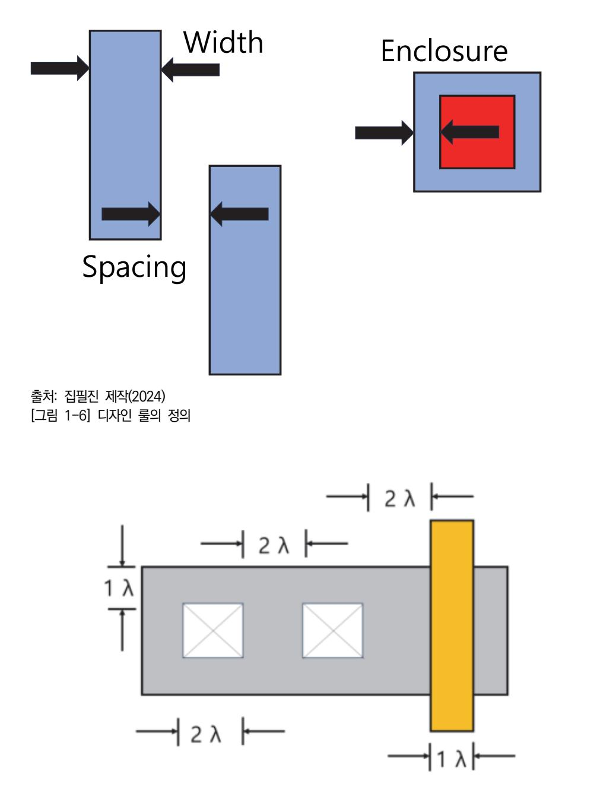

출처: 집필진 제작(2024) [그림 1-7] 람다에 의한 디자인 룰 표시

(3) 금속 규칙을 정의한다.

금속 레이어의 규칙은 연결선 및 다른 금속 레이어와의 간격, 길이 및 너비 등을 정의 한다. 이는 전기적 특성과 반도체 제조 공정에서의 제한 사항을 고려하여 설정된다. 공정의 설계 규칙(DRC) 파일에서 금속 레이어에 대한 규칙은 다양한 제조 공정 및 기 술 노드에 따라 달라질 수 있지만 일반적으로 다음과 같은 규칙이 포함될 수 있다.

- (가) 금속 레이어의 최소 선폭을 정의한다.
  - 1) 금속 레이어의 최소 선폭을 정의하여 선 간의 최소 간격을 유지한다. 이것은 금속 선의 정확성과 제조 가능성을 보장한다.
  - 2) 금속 레이어의 최소 간격: 금속 선과 다른 레이어 간의 최소 간격을 정의하여 각 레 이어 간의 간섭을 방지한다.
- (나) 금속 레이어의 최소/최대 길이를 정의한다.

금속 선의 최소 및 최대 길이를 정의하여 일정한 길이 범위 내에서만 금속 라인이 생성되도록 한다.

(다) 금속 레이어의 최소/최대 오버랩을 정의한다.

금속 선과 다른 레이어 간의 최소 및 최대 오버랩을 정의하여 경계 영역에서의 정확 성을 보장한다.

(라) 금속 레이어의 오버레이를 정의한다.

다른 레이어와의 정확한 오버레이를 보장하기 위해 금속 레이어 간의 정렬 규칙을 정의한다.

(마) 금속 레이어의 면적 비율을 정의한다.

금속 레이어의 전체 면적에 대한 비율을 제한하여 공정의 특정 요구 사항을 충족시 킨다.

이러한 규칙은 금속 레이어의 정확성과 제조 가능성을 보장하기 위해 필요하다. 특정 제 조 공정 및 기술 노드에 따라 이러한 규칙의 세부 사항이 다를 수 있다.

(4) 마스크 규칙를 정의한다.

마스크 레이어의 규칙은 마스크와 기판 또는 다른 레이어 간의 간격, 마스크의 정확한 위치 및 크기 등을 정의한다.

공정의 설계 규칙(DRC) 파일의 마스크 규칙은 레이아웃의 마스크 또는 패턴에 대한 요 구 사항을 정의한다. 이러한 규칙은 제조 공정의 요구 사항과 기술적인 제한 사항을 충 족시키기 위해 사용된다. 일반적으로 포함될 수 있는 몇 가지 마스크 규칙에는 다음이 있다.

이러한 마스크 규칙은 제조 공정의 특성과 기술 노드에 따라 달라질 수 있으며, 레이아 웃의 정확성과 제조 가능성을 보장하기 위해 주의 깊게 고려되어야 한다.

(가) 마스크 간격을 정의한다.

마스크 간의 최소 간격을 정의하여 서로 간섭하지 않도록 한다. 마스크 간의 간격이 충족되지 않으면 패턴의 정확성과 제조 가능성에 문제가 발생할 수 있다.

(나) 마스크 크기 및 형상을 정의한다.

각 마스크의 크기, 형상 및 위치에 대한 제한 사항을 정의한다. 이러한 규칙은 패턴 의 정확성과 마스크 정렬을 보장한다.

(다) 마스크 정렬을 정의한다.

서로 다른 마스크 간의 정렬에 대한 요구 사항을 정의한다. 예를 들어, 2개의 마스 크가 정확하게 정렬되어야 하는 경우가 있다.

(라) 마스크 군집화을 정의한다.

동일한 마스크 패턴이나 패턴 집합 간의 균형을 유지하기 위한 규칙을 정의한다.

(마) 마스크 인접성을 정의한다.

서로 다른 마스크 간의 최소 및 최대 거리를 정의하여 오버레이어 문제를 방지한다.

(바) 마스크 경계 조건을 정의한다.

마스크 경계 조건을 정의하여 경계 영역에서의 마스크 정확성을 보장한다.

(5) 반도체 구조 및 레이아웃 규칙을 정의한다.

반도체 제조 공정에서 요구되는 특정 구조 및 레이아웃에 관련된 규칙이 포함될 수 있 으며, 이는 반도체 소자의 제조 공정 및 기기 제작 과정에 필요한 규칙을 반영한다. 공정의 설계 규칙(DRC) 파일은 반도체 구조 및 레이아웃에 대한 여러 규칙을 정의한다. 이러한 규칙은 반도체 구조 및 레이아웃의 정확성과 제조 가능성을 보장하기 위해 필요 하다. 특정 제조 공정 및 기술 노드에 따라 이러한 규칙의 세부 사항이 다를 수 있다. 일반적으로 다음과 같은 규칙이 포함될 수 있다.

(가) 이음선 및 경계 간격을 정의한다.

반도체 구조 요소 사이의 최소 간격을 정의하여 이음선 간의 간섭을 방지하고 반도 체 장치의 정확성을 보장한다.

(나) 금속 레이어의 최소 선폭 및 간격을 정의한다.

금속 레이어 사이의 최소 선폭과 금속 레이어와 다른 레이어 간의 최소 간격을 정의 하여 선 간의 간섭을 방지하고 반도체 장치의 전기적 성능을 유지한다.

(다) 접지 및 전원 연결 규칙을 정의한다.

전원 및 접지 레이어의 연결 방식과 간격을 정의하여 전력 공급 및 접지의 안정성을 보장한다.

공정의 설계 규칙(DRC) 파일에서 접지 및 전원 연결 규칙은 반도체 디자인에서 매 우 중요하다. 이러한 규칙은 전원 및 접지 레이어의 연결 방식과 간격을 정의하여 전력 공급 및 접지의 안정성을 보장한다. 이러한 규칙에는 다음과 같은 내용이 포함 될 수 있다.

1) 접지 및 전원 레이어의 연결 방식을 정의한다.

반도체 장치에서는 전원 및 접지가 핵심적인 역할을 한다. 따라서 접지 및 전원

레이어의 연결 방식을 제대로 정의해야 한다. 이 규칙은 접지 및 전원 레이어 간 의 연결 방식을 명확하게 정의하여 전원 공급 및 접지에 대한 안정성을 보장한 다.

2) 접지 및 전원 레이어 간격을 정의한다.

접지 및 전원 레이어 사이의 최소 간격을 정의하여 각 레이어 간의 간섭을 방지 하고 전기적인 안정성을 유지한다. 이 간격은 각 레이어의 두께와 공정에 따라 다를 수 있다.

3) 접지 및 전원 레이어의 선폭을 정의한다.

접지 및 전원 레이어의 선폭은 전원 및 접지 신호의 전달을 보장하기 위해 충분 히 넓어야 한다. 이 규칙은 접지 및 전원 레이어의 최소 선폭을 정의하여 전력 공급 및 접지의 안정성을 확보한다.

4) 접지 및 전원 패턴의 일관성을 정의한다.

접지 및 전원 패턴은 일관되고 반복적이어야 한다. 이 규칙은 접지 및 전원 패턴 의 일관성을 유지하고 각 레이어 간의 연결을 보장하여 전력 공급 및 접지의 안 정성을 향상시킨다.

(라) 다중 금속 레이어 간격을 정의한다.

여러 금속 레이어 사이의 최소 간격을 정의하여 다중 금속 레이어 간의 간섭을 방지 하고 반도체 장치의 전기적 성능을 최적화한다.

다중 금속 레이어 간격은 공정의 설계 규칙(DRC) 파일에서 중요한 요소 중 하나이 다. 이 규칙은 다음을 포함할 수 있다.

1) 다중 금속 레이어 간 최소 간격을 정의한다.

서로 다른 금속 레이어 간의 최소 간격은 레이아웃에서 충돌을 방지하고 금속 레 이어 간의 간섭을 최소화한다. 이 간격은 공정의 제한 사항과 기술 노하우에 따 라 정의된다.

2) 금속 레이어와 다른 레이어 간 최소 간격을 정의한다.

금속 레이어와 다른 레이어 간의 최소 간격은 금속 레이어와 절연 또는 다른 금 속 레이어 간의 충돌을 방지한다. 이러한 간격은 전기적으로 절연되거나 서로 간 섭하지 않도록 금속 레이어와 다른 레이어 사이의 최소 공간을 유지한다.

3) 다중 금속 레이어 간의 정렬 규칙을 정의한다.

다중 금속 레이어 간에는 정렬 규칙이 적용될 수 있다. 이는 레이어 간의 정렬을 통해 시스템의 안정성과 신뢰성을 향상시키고 공정 제조의 복잡성을 줄인다.

이러한 다중 금속 레이어 간격 규칙은 레이아웃 디자인에서 공정의 제한 사항을 준 수하고 반도체 장치의 제조 과정을 안정화하는 데 중요하다. 이러한 규칙을 준수함 으로써 레이아웃의 신뢰성을 향상시키고 잠재적인 제조 결함을 줄일 수 있다.

(마) 패턴 매칭 규칙을 정의한다.

특정 패턴이나 구조의 매칭을 확인하여 반도체 장치의 일관된 제조를 보장한다. 패턴 매칭 규칙은 공정의 설계 규칙(DRC) 파일에서 중요한 요소 중 하나이다. 이 규칙은 특정 패턴이나 구조가 레이아웃에 올바르게 적용되고 있는지를 확인한다. 이 는 주로 다음과 같은 목적으로 사용된다.

1) 특정 패턴의 유효성을 검사한다.

특정 패턴이나 구조의 유효성을 확인하여 디자인 규격을 준수하는지 확인한다. 예를 들어, 반도체 레이아웃에서는 반복적인 패턴이나 셀 구조가 올바르게 반복 되고 있는지를 확인할 수 있다.

2) 특정 패턴의 정렬을 검사한다.

특정 패턴이나 구조가 정확한 위치에 배치되어 있는지 확인한다. 이는 레이아웃 의 정렬을 보장하고 시스템의 안정성을 향상시키는 데 도움이 된다.

3) 패턴 간의 간격 및 상호 작용를 검사한다.

서로 다른 패턴 간의 간격과 상호 작용을 검사하여 간섭이나 충돌을 방지한다. 이는 레이아웃의 물리적인 안정성을 보장하고 공정 제조 과정에서 문제가 발생하 지 않도록 한다.

- (바) 금속 및 연결선의 최대 길이를 파악한다.
  - 금속 및 연결선의 최대 길이를 제한하여 신호의 지연을 제어하고 반도체 장치의 전 기적 성능을 최적화한다.
- (사) 패턴의 최소 및 최대 크기를 제한한다.

특정 패턴이나 구조의 최소 및 최대 크기를 제한하여 반도체 장치의 정확성을 보장 한다.

2. 오류 및 경고 조건을 파악한다.

DRC 파일에는 레이아웃에서 발생할 수 있는 다양한 오류 및 경고 조건이 명시되어 있다. 이는 간격이 너무 작거나 연결이 너무 길거나 지정된 영역을 벗어날 경우와 같은 상황을 포함한다. 이러한 오류 및 경고 조건은 레이아웃의 정확성 및 공정 호환성을 보장하기 위해 디자이너가 고려해야 하는 중요한 요소이다. 오류 및 경고 조건을 신속하고 효율적으로 해 결하여 제품의 품질을 향상시키고 제조 프로세스의 안정성을 유지하는 것이 중요하다. 커스텀 레이아웃에서 공정의 설계 규칙(DRC: Design Rule Checking) 파일에서 발생할 수 있는 일반적인 오류 및 경고 조건은 다음과 같다.

(1) 길이 및 너비 오류을 파악한다.

선의 길이나 너비가 규칙에 위배될 경우 발생한다. 이는 불충분한 연결 또는 오버레이어 문제를 일으킬 수 있다.

(2) 간격 오류를 파악한다.

선과 선 또는 레이어 간의 최소 간격이 충족되지 않을 경우 발생한다. 이는 측정 도구 의 정확도 및 오버레이어 문제를 고려하여 설정된다.

(3) 금속 규칙 오류를 파악한다.

금속 레이어 간의 최소 간격, 길이 또는 너비가 규칙에 위배될 경우 발생한다. 이는 전 기적 특성과 반도체 제조 공정에서의 제한 사항을 고려하여 설정된다.

(4) 마스크 규칙 오류를 파악한다.

마스크와 기판 또는 다른 레이어 간의 최소 간격, 마스크의 정확한 위치 또는 크기에 대한 오류가 발생할 경우 발생한다.

(5) 반도체 구조 및 레이아웃 오류를 파악한다.

반도체 소자의 제조 공정 및 기기 제작 과정에서 필요한 특정 구조 및 레이아웃에 관련 된 오류가 발생할 수 있다.

(6) 경고 조건을 파악한다.

일부 DRC 규칙은 오류로 간주되지 않지만, 레이아웃의 품질이나 제조 공정에 영향을 줄 수 있는 잠재적인 문제를 식별하는 데 사용될 수 있다.

패턴 매칭 규칙은 레이아웃의 신뢰성과 안정성을 향상시키는 데 중요한 역할을 한다. 이러 한 규칙을 통해 레이아웃이 공정의 제한 사항을 준수하고 제조 과정에서 발생할 수 있는 잠재적인 문제를 사전에 방지할 수 있다.

#### 3. 유효성 검사 규칙을 파악한다.

DRC 파일은 각 규칙이 적용되는 범위와 규칙이 적용되는 방법에 대한 정보를 제공한다. 이는 레이아웃의 특정 부분에만 적용되는 규칙이 있을 수 있음을 의미한다.

커스텀 레이아웃에서 공정의 설계 규칙(DRC) 파일의 유효성 검사 규칙은 다양한 측면에서 레이아웃의 정확성과 제조 가능성을 보장하기 위해 설정된다. 이러한 규칙은 특정 공정이나 기술 노드에 따라 다를 수 있지만, 일반적으로 다음과 같은 유효성 검사 규칙이 포함될 수 있다.

이러한 규칙은 제조 공정의 특성, 기술 노드 및 디자인 요구 사항에 따라 다양할 수 있으 며, 레이아웃의 정확성과 제조 가능성을 보장하기 위해 주기적으로 검토되고 수정된다.

(1) 길이 및 너비 규칙을 정의한다.

선의 최소 길이 및 최소/최대 너비를 정의하여 길이 및 너비에 대한 규정을 제공한다. 이 규칙은 연결의 안정성 및 선의 성능에 영향을 준다.

(2) 간격 규칙을 정의한다.

선과 선 또는 다른 레이어 간의 최소 간격을 정의하여 오버레이어 및 단락 문제를 방지 한다.

(3) 금속 규칙을 정의한다.

금속 레이어 간의 최소 간격, 길이 및 너비를 정의하여 전기적 특성 및 제조 가능성을 보장한다.

(4) 마스크 규칙을 정의한다.

마스크 및 마스크 간의 최소 간격, 마스크의 크기 및 위치를 정의하여 마스크 정렬 및 오버레이어 문제를 방지한다.

(5) 반도체 구조 및 레이아웃 규칙을 정의한다.

특정 반도체 제조 공정이나 기술 노드에서 필요한 특정 구조 및 레이아웃 규칙을 정의 한다.

(6) 경고 규칙을 정의한다.

레이아웃에 대한 경고를 생성하는 규칙을 정의하여 디자이너에게 잠재적인 문제를 알린 다. 이러한 규칙은 오류로 간주되지는 않지만, 제조 공정에 영향을 줄 수 있는 문제를 식별할 수 있다.

패턴 매칭 규칙은 레이아웃의 신뢰성과 안정성을 향상시키는 데 중요한 역할을 한다. 이러 한 규칙을 통해 레이아웃이 공정의 제한 사항을 준수하고 제조 과정에서 발생할 수 있는 잠재적인 문제를 사전에 방지할 수 있다.

#### 숕 설계 검증 툴을 적용하여 오류를 찾는다.

1. 디자인 룰을 설정한다.

레이아웃 툴에서 사용할 디자인 룰을 설정한다. 이는 반도체 제조 공정에 따라 다양한 규칙 을 포함할 수 있다. 이 규칙은 레이아웃이 어떻게 배치되고, 연결되고, 구조화되어야 하는지 를 정의한다.

공정의 설계 규칙 파일(DRC)에서 디자인 룰은 해당 공정에서 디자인이나 레이아웃 작업을 수행할 때 준수해야 하는 규칙을 정의한다. 이러한 룰은 반도체 레이아웃이나 다른 전자 제 품의 디자인에서 발생할 수 있는 잠재적인 문제를 예방하고 제조 과정에서의 안정성을 보 장하기 위해 사용된다.

디자인 룰은 공정의 특성과 요구 사항에 따라 다양하게 설정될 수 있다. 일반적으로 다음과 같은 디자인 룰이 포함될 수 있다.

(1) 금속 규칙을 정의한다.

금속 레이어의 두께, 간격, 정렬 등을 관리하여 회로의 성능과 안정성을 보장한다.

(2) 패턴 규칙을 정의한다.

특정 패턴이나 구조의 위치, 정렬, 간격 등을 관리하여 디자인의 일관성을 유지한다.

(3) 금속 및 다이오드 핀치드(Pinched) 규칙을 정의한다.

금속 및 다이오드 피싱쳐의 크기, 위치 및 간격을 설정하여 레이아웃의 안정성을 보장한

다.

(4) 접지 및 전원 연결 규칙을 정의한다.

접지 및 전원 레이어 간의 연결 및 간격을 설정하여 회로의 전력 공급을 보장한다.

(5) 패턴 매칭 규칙을 정의한다.

특정 패턴이나 구조의 정렬과 일관성을 확인하여 레이아웃의 안정성을 유지한다.

(6) 이중성 및 오류 감지 규칙을 정의한다.

오류 감지 및 이중성을 확인하여 레이아웃의 무결성을 보장한다. 이와 같은 디자인 룰은 공정 제조 과정에서 발생할 수 있는 문제를 사전에 예방하고 제품 의 품질을 향상시키는 데 도움이 된다. 또한 이러한 룰은 공정의 특성과 제조 과정의 요구 사항에 맞게 조정될 수 있다.

2. DRC를 실행한다.

디자인 룰을 설정한 후에는 DRC를 실행하여 레이아웃이 규칙에 따라 설계되었는지 확인한 다. DRC는 레이아웃에 대해 설정된 디자인 룰을 기반으로 각종 오류를 탐지하고 보고한다. 커스텀 레이아웃에서 설계 검증 툴을 사용하여 DRC(Design Rule Checking)를 실행하는 것은 설계의 오류를 식별하고 수정하는 데 도움이 된다. 이를 위해 일반적으로 다음 단계를 따른다.

|           | ·····                                                  |       |
|-----------|--------------------------------------------------------|-------|
|           |                                                        |       |
|           |                                                        |       |
| 🗌 🔚 MyDRo | C Pro 2013                                             |       |
| Project   | W2015_NCS학습모듈개발\MyCAD\Wayout.prj Browse                |       |
| Project   | m2010J4C346287894migCAD mayour,pij Browse              | Run   |
| Cell      | INV 👻                                                  |       |
| Rule      | C:#MyCADPro#Demo#IDS#INVERTER#Ve Browse                | Close |
|           | -Rule Type                                             |       |
|           | MyChip C DRACULA                                       |       |
|           |                                                        |       |
|           | WRITE THE VERIFICATION GDSII FILE                      | ^     |
| WRITE     | THE 'RESULT, GDS' FILE TO RECORD THE VERIFICATION GDSI |       |
| *******   | CLOSE THE VERIFICATION ERROR FILE                      |       |
| CLOSE     | E THE 'DRC' FILE TO RECORD THE VERIFICATION ERRORS     |       |
|           | CLOSE THE VERIFICATION REPORT FILE                     |       |
|           | ***************************************                |       |
|           | E THE 'DRC' FILE TO RECORD THE VERIFICATION REPORT     |       |
| * TOTAL   | LERROR(S) : DISPLAY[ 1]/OUTPUT[ 0] *                   |       |
| CTAPT 6   | EXECUTION TIME - 07-42-41                              |       |
| END E     | EXECUTION TIME : 07:43:41 KECUTION TIME : 07:43:53  |       |
|           | ******                                                 |       |
|           |                                                        |       |
|           |                                                        |       |

출처: 교육부(2015). 레이아웃 설계(LM1903060105\_14v3). 한국직업능력개발원. p. 64. [그림 1-8] DRC 툴 실행 화면

(1) 디자인을 준비한다.

DRC를 실행하기 전에 레이아웃 디자인을 완료하고 검증할 디자인 파일을 준비한다.

(2) 설계 검증 툴을 선택한다.

산업 표준 설계 검증 툴 중 하나를 선택한다. 대표적으로 Cadence의 Virtuoso, Synopsys의 IC Validator, Mentor Graphics의 Calibre 등이 있다.

커스텀 레이아웃에서 DRC 설계 검증 룰을 선택하는 것은 해당 설계의 특성과 요구 사 항을 고려하여 이루어져야 한다. 일반적으로 다음과 같은 단계를 따른다.

(가) 표준 규칙을 검토한다.

주요 반도체 기업 및 산업 표준 조직에서 제공하는 표준 DRC 규칙을 검토한다. 이 러한 규칙은 산업의 범용적인 디자인 룰을 포함하고 있으며, 일반적으로 품질과 신 뢰성을 보장하기 위한 목적으로 사용된다.

(나) 고객 요구 사항을 파악한다.

고객이나 프로젝트 팀이 특정한 DRC 규칙을 요구하는 경우, 해당 요구 사항을 고려 하여 규칙을 선택한다. 고객이나 프로젝트 팀의 요구 사항은 종종 특정한 산업 표준 이상의 요구를 포함할 수 있다.

(다) 설계 목적을 파악한다.

설계의 목적과 사용 환경을 고려하여 DRC 규칙을 선택한다. 예를 들어, 고속 디지 털 회로의 경우 시그널 무결성을 보장하기 위한 규칙이 필요할 수 있다. 반면에 저 전력 디자인의 경우 전력 소모를 최소화하기 위한 규칙이 중요할 수 있다.

(라) 테스트 및 검증를 진행한다.

선택한 DRC 규칙이 설계의 목적과 요구 사항을 충족시키는지 확인하기 위해 테스트 및 검증을 수행한다. 이는 간단한 테스트 레이아웃을 사용하여 DRC 규칙을 적용하 고 결과를 분석하는 것으로 이루어질 수 있다.

설계 검증 툴을 사용하여 DRC 설계 검증 룰을 테스트하고 검증하는 과정은 다음과 같다.

1) DRC 룰을 설정한다.

설계 검증 툴에서 사용할 DRC 규칙을 선택하고 설정한다. 이러한 설정은 특정 공정과 기술 노드에 따라 다를 수 있다.

2) 테스트 레이아웃을 생성한다.

테스트 레이아웃을 생성하여 DRC 규칙을 적용할 디자인을 포함시킨다. 이는 실 제 디자인에 비해 작고 간단한 레이아웃일 수 있다.

3) DRC을 실행한다.

설정한 DRC 규칙을 적용하여 설계 검증 툴에서 DRC를 실행한다. 이 과정에서 툴은 레이아웃에 적용된 각 규칙을 검사하고 오류 또는 경고를 식별한다.

4) 검증 결과를 분석한다.

DRC 실행 후 검증 결과를 분석하여 발생한 모든 오류 또는 경고를 확인한다. 이러한 결과는 툴에서 제공되는 보고서 형식으로 제공된다.

5) 오류 수정 및 재검증한다.

발생한 오류 또는 경고를 해결하고 디자인을 수정한 후, 다시 DRC를 실행하여 검증한다. 이 과정을 반복하여 모든 오류를 해결할 때까지 반복한다.

6) 최종 검증한다.

모든 오류가 해결되고 DRC 결과가 허용 가능한 수준으로 나올 때까지 반복된 후, 최종 검증을 수행한다. 이는 전체 디자인에 대해 DRC를 실행하여 최종 검증 보고서를 생성하는 과정을 포함한다.

DRC 테스트 및 검증은 설계 프로세스의 중요한 단계이며, 고객 요구 사항을 충족시 키고 디자인의 무결성을 보장하는 데 중요한 역할을 한다.

(마) 최적화를 한다.

필요에 따라 DRC 규칙을 최적화하거나 사용자 정의할 수 있다. 이는 설계의 특정한 요구 사항이나 제약 조건을 고려하여 규칙을 조정하는 것을 의미한다.

DRC 설계 검증 룰을 선택할 때는 설계의 특성, 요구 사항, 목적 등을 종합적으로 고려 하여 적절한 규칙을 결정해야 한다.

(3) DRC 규칙을 설정한다.

선택한 설계 검증 툴을 사용하여 DRC 규칙을 설정한다. 이는 레이아웃의 공정 규칙과 제조사 규칙을 기반으로 한다.

커스텀 레이아웃에서 설계 검증 툴을 사용하여 DRC 규칙을 설정하는 과정은 다음과 같 다.

(가) 설계 요구 사항을 이해한다.

먼저 해당 프로젝트나 공정의 설계 요구 사항을 이해해야 한다. 이는 특정 기술 노 드나 공정에 맞는 규칙을 선택하는 데 도움이 된다.

(나) 설계 검증 툴을 연다.

설계 검증을 위한 툴을 연다. 대표적인 툴로는 Cadence Virtuoso, Synopsys IC Validator, Mentor Calibre 등이 있다.

(다) DRC 규칙을 설정한다.

열린 툴에서 DRC 규칙을 설정한다. 이는 특정 공정이나 기술 노드에 따라 다양한 규칙이 있을 수 있다. 일반적으로 금속 레이어 간격, 다이오드와 트랜지스터의 거리, 메탈과 양극 사이의 규칙 등이 포함된다.

(라) 규칙 파라미터를 조정한다.

설정된 각 규칙의 파라미터를 조정하여 특정 디자인에 적합하도록 맞추어야 한다.

이는 해당 디자인의 요구 사항과 공정의 특성에 따라 달라질 수 있다.

(마) 규칙 검증 및 수정한다.

설정된 규칙을 기반으로 DRC를 실행하여 결과를 확인한다. 이 과정에서 발생하는 오류나 경고를 확인하고 필요한 경우 규칙을 수정하여 재검증해야 한다.

(바) 최적화한다.

검증 결과를 토대로 규칙을 최적화하고 디자인에 더 적합한 규칙을 설정한다. 이는 반복적인 과정일 수 있으며, 필요에 따라 여러 번의 수정과 검증이 필요할 수 있다.

(사) 최종 검증한다.

모든 설정과 수정이 완료되면 최종적으로 설정된 DRC 규칙을 기반으로 전체 디자인 에 대한 최종 검증을 수행한다.

이러한 과정을 통해 적합한 DRC 규칙을 설정하여 디자인의 무결성을 보장할 수 있다.

(4) DRC을 실행한다.

설정된 DRC 규칙에 따라 설계 검증 툴을 실행하여 레이아웃을 분석한다. 이 과정에서 오류와 경고가 발생할 수 있다.

3. 오류를 확인한다.

DRC 실행 후 발견된 오류를 확인하고 수정한다. 이는 반복적인 과정일 수 있으며, 오류 유형에 따라 다양한 수정 방법을 적용할 수 있다.

설계 검증 툴을 사용하여 DRC를 실행한 후 발견된 오류를 확인하는 과정은 다음과 같다. 이러한 과정을 통해 설계 검증 툴을 사용하여 발견된 DRC 오류를 확인하고 수정하여 레이 아웃의 무결성을 보장할 수 있다.

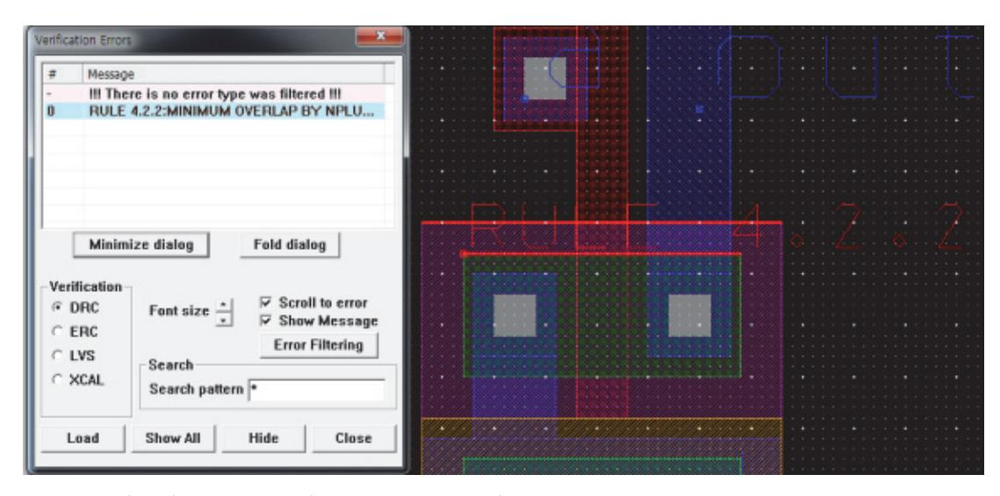

출처: 교육부(2015). 레이아웃 설계(LM1903060105\_14v3). 한국직업능력개발원. p.65. [그림 1-9] DRC 오류 화면

(1) DRC를 실행한다.

설계 검증 툴에서 DRC를 실행한다. 이를 통해 레이아웃의 규칙 위반 사항을 확인할 수 있다.

(2) 오류 보고서를 확인한다.

DRC 실행 후 생성된 오류 보고서를 확인한다. 이 보고서에는 발견된 각 오류와 해당 위치에 대한 정보가 포함되어 있다.

커스텀 레이아웃에서 DRC 검증은 설계가 제조 가능한지, 규정된 설계 규칙을 준수하는 지 확인하는 중요한 단계이다. DRC 검증에서 발생할 수 있는 모든 오류 및 경고를 확 인하는 것은 설계의 품질과 제조 가능성을 보장하는 데 필수적이다. 일반적으로 DRC 검증 과정에서 발생할 수 있는 오류 및 경고는 다음과 같다.

- (가) 레이아웃 간격 오류(Spacing Violations)
  - 1) 트레이스 간격 오류: 배선 간의 간격이 너무 좁아 단락(Short) 위험이 있는 경우
  - 2) 패드 간격 오류: 패드 간의 간격이 설계 규칙에서 요구하는 최소 간격보다 작은 경 우
  - 3) 전력 및 신호 레이어 간의 간격: 전력 플레인과 신호 레이어 사이의 간격이 규정된 값을 벗어난 경우
- (나) 레이어 중첩 오류(Overlap Violations)
  - 1) 패드와 배선의 중첩 오류: 패드와 배선이 부적절하게 중첩되는 경우
  - 2) 비아(Via) 중첩 오류: 비아가 다른 요소와 부적절하게 중첩되거나 위치한 경우
  - 3) 기판 경계 중첩: 설계 요소가 기판 경계를 넘어서 배치된 경우
- (다) 크기 오류(Dimension Violations)
  - 1) 트레이스 폭 오류: 배선의 폭이 설계 규칙에서 요구하는 최소 또는 최댓값을 벗어난 경우
  - 2) 비아 크기 오류: 비아의 크기가 규정된 값보다 작거나 큰 경우
  - 3) 패드 크기 오류: 패드의 크기가 허용된 범위를 벗어난 경우
- (라) 비아 연결 오류(Via Connection Violations)
  - 1) 비아가 연결되지 않음: 비아가 상하층의 배선과 연결되지 않거나, 전기적으로 연결 이 되어 있지 않은 경우
  - 2) 비아 간격 오류: 비아 간의 간격이 너무 좁아 단락 위험이 있는 경우
- (마) 전기적 오류(Electrical Violations)
  - 1) 짧은 회로 오류(Short Circuit): 2개 이상의 전기적 노드가 비정상적으로 연결된 경 우
  - 2) 플로팅 네트(Floating Net): 회로에 연결되지 않고 떠 있는 신호선이 존재하는 경우 3) 전력 네트 오류: 전력 플레인이나 그라운드 플레인에 예상치 못한 간격이나 결합이

있는 경우

- (바) 배치 오류(Placement Violations)
  - 1) 컴포넌트 간 간격 오류: 부품 간의 간격이 규정된 최소 간격을 벗어난 경우
  - 2) 부품 방향 오류: 부품의 방향이 잘못 배치된 경우
  - 3) 부품이 기판 경계를 벗어남: 부품이 기판 경계를 벗어나 배치된 경우
- (사) 기타 경고 및 오류
  - 1) 미연결 신호 경고: 설계에 사용된 네트나 신호가 어느 곳과도 연결되지 않은 경우
  - 2) 중복 요소 경고: 동일한 요소나 기능이 중복되어 설계에 포함된 경우
  - 3) 저항성 결함: 지나치게 높은 저항으로 인해 신호 전송에 문제가 생길 수 있는 경로 가 있는 경우
  - 4) 열 분포 경고: 특정 부위에서 열이 과도하게 집중될 가능성이 있는 경우
- (아) 제조 가능성 오류(Manufacturability Violations)
  - 1) 솔더 마스크 오류: 솔더 마스크의 크기나 위치가 규정된 범위를 벗어난 경우
  - 2) 실크스크린 겹침: 실크스크린이 패드, 비아, 배선 등과 겹치는 경우
  - 3) 장착 가능성 문제: 부품이 특정 방향에서 장착하기 어려운 위치에 배치된 경우
- (자) 디자인 규칙 위반(Custom Rule Violations)

맞춤형 설계 규칙 오류: 사용자가 설정한 맞춤형 규칙을 위반한 경우이다.

- (차) 신호 무결성 관련 오류(Signal Integrity Violations)
  - 1) 임피던스 불일치: 특정 트레이스의 임피던스가 요구 조건을 만족하지 않는 경우
  - 2) 신호 경로 오류: 신호 전송 경로에 비합리적인 꺾임이 있거나, 불필요한 루프가 형 성된 경우

이러한 오류와 경고는 설계가 성공적으로 제조되고, 예상대로 동작하기 위해 반드시 해 결해야 한다. DRC 도구를 사용하여 이러한 오류와 경고를 체계적으로 확인하고, 문제 를 해결함으로써 설계의 신뢰성과 제조 가능성을 크게 향상시킬 수 있다.

(3) 오류 유형을 파악한다.

보고서를 통해 발견된 오류의 유형을 파악한다. 이는 각 오류의 원인을 이해하고 수정하 는 데 도움이 된다.

설계 검증 툴을 사용하여 DRC를 실행한 후 발견된 오류의 유형은 다양할 수 있다. 주 요한 오류 유형은 다음과 같다.

- (가) 금속 간격 위반 규칙을 파악한다.
  - 금속 레이어 간의 간격이 설계 규칙에 어긋나는 경우 발생한다. 이는 레이아웃에서 인접한 금속 레이어 간의 최소 간격을 확인하는 규칙 위반이 될 수 있다.
- (나) 금속 오버랩 규칙을 파악한다.

금속 레이어가 서로 겹치는 경우 발생한다. 이는 서로 겹치는 금속 레이어 간의 간 격을 확인하는 규칙 위반으로 인식된다.

(다) 패턴 미스매치 규칙을 파악한다.

반도체 구조물이나 레이아웃 디자인에서 정의된 패턴과 일치하지 않는 경우 발생한 다. 이는 반도체 구조물의 패턴이나 레이아웃 디자인에 대한 규칙을 위반하는 것을 나타낸다.

(라) 이중 및 단일 비어있는 영역 규칙을 파악한다.

레이아웃에 금속이 없거나 적은 영역이 있는 경우 발생한다. 이는 설계 규칙에 따라 금속이 있어야 하는 영역에 금속이 없는 경우에 해당한다.

(마) 접지 및 전원 연결 오류 규칙을 파악한다.

설계에서 접지 또는 전원에 연결되지 않은 레이어가 있는 경우 발생한다. 이는 접지 또는 전원 연결이 필요한 부분에 해당하는 레이어가 해당 연결에 포함되어 있지 않 은 경우에 해당한다.

(바) 금속 핀치드(Pinched) 규칙을 파악한다.

금속 레이어 간의 핀치드(Pinched)가 생기는 경우 발생한다. 이는 설계에서 원치 않 는 금속 레이어 사이에 피싱처가 생성된 경우에 해당한다.

이러한 오류 유형은 설계 검증 툴에서 자동으로 식별되고 오류 보고서에 기록된다. 이를 통해 디자인 과정에서 발생한 문제를 신속하게 해결할 수 있다.

(4) 오류 위치를 확인한다.

보고서에서 각 오류의 위치를 확인한다. 이를 통해 어떤 부분에서 오류가 발생했는지 정 확히 파악할 수 있다.

- (가) 설계 검증 툴을 사용하여 DRC를 실행한 후 발견된 오류의 위치를 확인하는 방법은 툴 에 따라 다를 수 있다. 일반적으로는 툴이 오류를 식별하고 해당 오류가 발생한 위치를 포함한 오류 보고서 를 생성한다.
- (나) 보통 오류 보고서에는 발견된 각 오류에 대한 세부 정보와 함께 해당 오류가 발생한 위 치가 제공된다. 이를 통해 디자인에서 문제가 발생한 구체적인 부분을 파악한다. 오류 보고서를 통해 오류가 발생한 위치를 확인하고 해당 위치에서 디자인을 검토하

거나 수정한다.

(다) 일부 설계 검증 툴은 사용자에게 오류를 시각적으로 표시하여 디자인에서 오류가 발생한 위치를 직접 확인할 수 있는 기능을 제공하기도 한다.

따라서 해당 툴의 사용자 설명서를 참조하여 오류를 확인한다.

(5) 오류를 수정한다.

발견된 오류를 수정한다. 이는 설계 검토 및 수정을 통해 이루어질 수 있다. 예를 들어, 오류가 금속 레이어 간격에 관련된 것이라면 레이아웃을 수정하여 간격을 조정한다. DRC 실행 후 발견된 오류를 수정하는 과정은 다음과 같다.

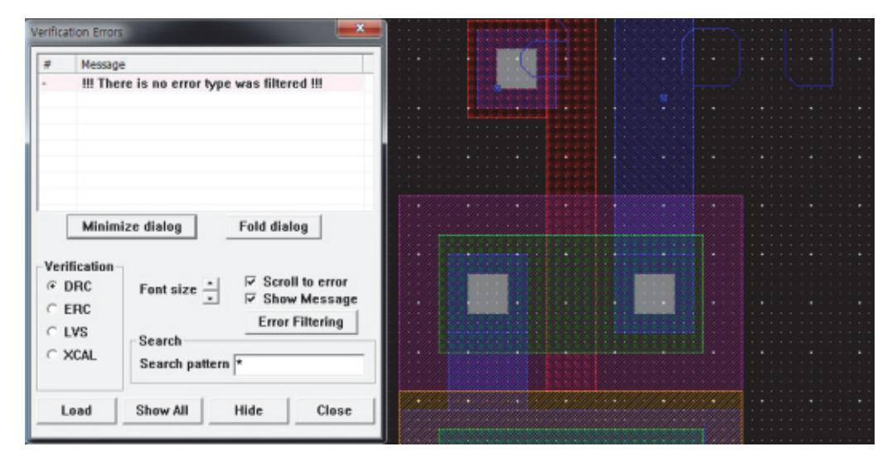

출처: 교육부(2015). 레이아웃 설계(LM1903060105\_14v3). 한국직업능력개발원. p.65. [그림 1-10] DRC 오류 수정 화면

(가) 오류 보고서 사례

DRC 검증 오류 보고서는 설계자가 레이아웃 설계에서 발생할 수 있는 다양한 규칙 위반을 명확히 이해하고 수정할 수 있도록 돕는 중요한 문서이다. 아래는 커스텀 레 이아웃에서 DRC 검증 오류 보고서의 예시이다.

- 1) DRC 검증 오류 보고서
  - 가) 프로젝트 이름: Custom Layout Project A
  - 나) 검증 날짜: 2024-08-12
  - 다) 검증 도구: XYZ DRC Tool v2.5
  - 라) 검토자: John Doe
- 2) 요약
  - 가) 총 검증된 규칙: 120개
  - ① 발생한 오류: 15개
  - ② 발생한 경고: 10개
  - ③ 검증 상태: Fail
- 3) 세부 오류 및 경고 내역
  - 가) 레이어 간격 오류(Spacing Violations)
  - ① 오류 ID: SP001
  - ② 오류 유형: 배선 간격 부족

- ③ 설명: 레이어 2에서 Net\_1과 Net\_2 사이의 간격이 최소 요구 간격인 8㎛보 다 적은 5㎛로 확인됨.
- ④ 위치: X: 125.6㎛, Y: 75.2㎛
- ⑤ 해결 방안: Net\_1 또는 Net\_2의 위치를 조정하여 최소 간격을 확보해야 한 다.
- 나) 크기 오류(Dimension Violations)
- ① 오류 ID: DM002
- ② 오류 유형: 비아 크기 부족
- ③ 설명: 레이어 3에서 사용된 비아의 직경이 최소 요구 크기인 10㎛보다 작은 8 ㎛로 확인됨.
- ④ 위치: X: 200.3㎛, Y: 150.4㎛
- ⑤ 해결 방안: 비아 크기를 10㎛ 이상으로 수정해야 한다.
- 다) 전기적 오류(Electrical Violations)
- ① 오류 ID: EL003
- ② 오류 유형: 플로팅 네트
- ③ 설명: Net\_4이(가) 어느 곳과도 연결되지 않음. 회로 설계에서 의도적으로 플 로팅된 것인지 확인 필요.
- ④ 위치: X: 315.7㎛, Y: 205.9㎛
- ⑤ 해결 방안: 플로팅이 의도된 것이 아니라면, Net\_4을 다른 회로와 연결해야 한 다.
- 라) 배치 오류(Placement Violations)
- ① 오류 ID: PL004
- ② 오류 유형: 부품이 기판 경계를 벗어남
- ③ 설명: 부품 U1의 핀이 기판 경계를 0.5㎛ 벗어남.
- ④ 위치: X: 45.2㎛, Y: 90.3㎛
- ⑤ 해결 방안: 부품 U1의 위치를 재조정하여 기판 경계 내에 포함되도록 해야 한 다.
- 마) 제조 가능성 오류(Manufacturability Violations)
- ① 오류 ID: MF005
- ② 오류 유형: 솔더 마스크 부족
- ③ 설명: 패드 P1의 솔더 마스크 오프셋이 잘못 설정되어 있어, 제조 시 솔더 브 리지가 발생할 가능성이 있음.
- ④ 위치: X: 150.8㎛, Y: 80.6㎛
- ⑤ 해결 방안: 솔더 마스크 오프셋을 적절하게 수정해야 한다.
- 바) 경고(Warnings)

- ① 경고 ID: WR001
- ② 경고 유형: 트레이스 폭 경고
- ③ 설명: 레이어 1에서 Net\_5의 트레이스 폭이 12㎛로 설정되어 있으며, 이는 권 장 폭 15㎛보다 작음.
- ④ 위치: X: 100.2㎛, Y: 50.1㎛
- ⑤ 해결 방안: 이 경고는 제조 가능성에 영향을 줄 수 있으므로, 트레이스 폭을 15㎛로 확대하는 것을 권장한다.
- 4) 결론 및 권장 사항

보고서에 나타난 오류는 설계에서 반드시 수정해야 하며, 특히 전기적 오류와 제 조 가능성 오류는 최종 제품의 신뢰성에 큰 영향을 끼칠 수 있다. 수정 후 재검 증을 통해 모든 오류가 해결되었는지 확인하는 것이 필요하다.

- DRC 검증에 대한 추가적인 질문이나 지원이 필요하면 연락한다.
- 검토자 서명: \_\_\_\_\_\_\_\_\_\_\_\_\_\_\_\_\_\_
- 날짜: 2024-08-12
- 이 예시는 DRC 검증 오류 보고서의 일반적인 형식을 나타내며, 각 항목에는 오류의 유형, 위치, 설명, 해결 방안 등이 포함되어 있다. 이를 통해 설계자는 명확하게 문 제를 파악하고 수정할 수 있다.
- (나) 오류 수정 과정
  - 1) 오류를 식별한다.
  - 먼저 설계 검증 툴이 생성한 DRC 보고서를 통해 발견된 오류를 식별한다. 각 오류에 대한 세부 정보와 발생 위치를 확인한다.
  - 2) 오류를 해결한다.

발견된 오류를 하나씩 확인하고 수정한다. 이는 오류가 발생한 구체적인 디자인 부분을 수정하여 해당 오류를 해결하는 것을 의미한다. 예를 들어, 오류가 너비가 너무 좁거나 간격이 너무 넓은 경우에는 이를 조정하여 규칙을 준수하도록 디자 인을 수정해야 한다.

3) 재검증한다.

수정한 후에는 다시 설계 검증 툴을 사용하여 DRC를 실행하여 오류가 모두 해 결되었는지 확인한다. 이 과정을 통해 수정한 디자인이 모든 규칙을 준수하고 있 는지 다시 한 번 확인할 수 있다.

4) 반복한다.

필요한 경우 위의 과정을 반복하여 모든 오류를 수정하고 확인한다. 이는 디자인 이 모든 DRC 규칙을 준수하도록 보장하기 위한 중요한 단계이다.

오류를 수정하는 과정에서는 디자인의 특성과 오류의 종류에 따라 다양한 방법을

사용할 수 있다. 가능한 한 각 오류에 대한 해결책을 탐구하고, 주의 깊게 수정 하여 디자인의 품질을 향상시키는 것이 좋다.

5) 재검증한다.

오류를 수정한 후 다시 DRC를 실행하여 확인한다. 이 과정을 통해 수정된 디자 인이 규칙을 준수하는지 다시 한 번 확인할 수 있다.

6) 최종 확인한다.

모든 오류가 수정되고 규칙을 준수하는 디자인이 완성되었을 때, 최종적으로 DRC를 실행하여 모든 오류가 해결되었는지 확인한다.

4. 다시 실행한다.

수정 후에는 다시 DRC를 실행하여 수정 사항이 올바르게 적용되었는지 확인한다. 이 과정 을 통해 모든 디자인 룰을 준수하는 레이아웃을 얻을 수 있다.

(1) 보고서를 생성한다.

마지막으로, 검증 결과를 요약하는 보고서를 생성하여 문제 해결 과정을 문서화한다.

숖 디자인 규칙에 위배되는 부분을 수정하여 설계 규칙 적용이 어려울 경우 대책을 수립한다.

디자인 규칙에 위배되는 부분을 수정하여 설계 규칙을 적용하는 것이 어려울 때에는 다음과 같 은 대책을 고려할 수 있다. 이러한 대책들을 통해 디자인 규칙 위반을 최소화하고 설계의 안정 성을 유지하면서도 효율적인 커스텀 레이아웃을 개발할 수 있다.

1. 디자인을 변경한다.

먼저 디자인을 변경하여 설계 규칙을 준수하도록 수정할 수 있다. 이는 오류를 수정하는 것 과 동일한 과정을 거치게 될 수 있지만, 때로는 보다 심층적인 변경이 필요할 수 있다. 디자인 규칙에 위배되는 부분을 수정하여 설계 규칙을 적용하는 것이 어려울 경우 다음과 같은 디자인 변경을 고려할 수 있다.

디자인 변경은 기존의 디자인을 완전히 재고하고 수정해야 할 수 있으며, 이는 추가적인 시 간과 노력이 필요할 수 있다. 그러나 디자인 변경을 통해 설계 규칙을 준수하는 더욱 안정 적이고 효율적인 레이아웃을 개발할 수 있다.

(1) 레이아웃을 재구성한다.

디자인을 재구성하여 규칙을 준수하도록 레이아웃을 변경할 수 있다. 이 과정에서 기존 의 레이아웃을 완전히 새롭게 구성할 필요가 있을 수 있다.

디자인 규칙을 준수하는 것이 어려운 경우, 레이아웃을 재구성하여 문제를 해결할 수 있 다. 이를 위해 다음과 같은 절차를 따를 수 있다.

(가) 문제를 식별한다.

디자인 규칙을 위배하는 부분을 식별하고 문제가 발생하는 원인을 파악한다. 이를

통해 어떤 부분을 수정해야 할지에 대한 방향성을 얻을 수 있다.

(나) 레이아웃을 재구성한다.

디자인 규칙을 준수하는 새로운 레이아웃을 설계한다. 이 과정에서 문제를 일으키는 요소들을 수정하고 새로운 배치 및 연결 방식을 고려한다.

(다) 시뮬레이션 및 검증한다.

수정된 레이아웃을 시뮬레이션 및 검증하여 성능 및 신뢰성을 확인한다. 이를 통해 새로운 레이아웃이 예상대로 작동하는지 확인할 수 있다.

(라) 피드백 및 수정한다.

필요한 경우 팀원들이나 전문가들에게 피드백을 받고 레이아웃을 수정한다. 이를 통 해 문제를 보다 더 효과적으로 해결할 수 있다.

(마) 최종 검토한다.

최종적으로 수정된 레이아웃을 다시 검토하고 디자인 규칙을 준수하는지 확인한다. 필요한 경우 추가적인 수정을 수행한다.

레이아웃을 재구성함으로써 디자인 규칙을 준수하는 새로운 디자인을 얻을 수 있으며, 이를 통해 문제를 해결하고 고품질의 레이아웃을 얻을 수 있다.

(2) 요소 위치 및 크기를 조정한다.

디자인 요소의 위치 및 크기를 조정하여 규칙을 준수할 수 있다. 이는 요소들 간의 간 격을 조절하거나 크기를 변경함으로써 수행될 수 있다.

디자인 규칙을 준수하기 어려울 때 요소의 위치와 크기를 조정하는 것은 일반적인 해결 책 중 하나이다. 이를 통해 디자인을 보다 균형 있고 안정적으로 만들 수 있다. 이를 위 한 단계는 다음과 같다.

(가) 디자인 규칙을 이해한다.

먼저 어떤 디자인 규칙이 위배되었는지를 이해해야 한다. 이해가 부족할 경우, 설계 규칙을 다시 검토하고 문제가 되는 부분을 식별한다.

(나) 요소 위치를 조정한다.

디자인을 수정하여 규칙을 준수하는 위치로 요소를 이동한다. 이때 인접한 요소들과 의 간격을 유지하고 레이아웃의 균형을 유지해야 한다.

(다) 요소 크기를 조정한다.

요소의 크기를 조정하여 규칙을 준수하도록 한다. 이때 요소의 기능을 유지하면서 필요한 만큼 크기를 조절해야 한다.

(라) 시뮬레이션 및 검증한다.

수정된 디자인을 시뮬레이션하고 검증하여 성능과 안정성을 확인한다. 이를 통해 요 소 위치 및 크기 조정이 원하는 결과를 가져오는지 확인할 수 있다.

(마) 피드백 및 수정한다.

필요한 경우 팀원이나 전문가들에게 피드백을 받고 디자인을 수정한다. 이를 통해 보다 효과적으로 디자인을 개선할 수 있다.

요소 위치와 크기 조정은 디자인 규칙을 준수하고 안정성을 유지하기 위해 중요한 단계 이다. 따라서 이를 신중하게 수행해야 한다.

(3) 신호 경로를 재배치한다.

신호 경로를 재배치하여 규칙을 준수할 수 있다. 이는 신호가 흐르는 경로를 변경하여 레이아웃의 구조를 개선하는 것을 의미한다.

디자인 규칙을 준수하기 어려운 경우, 신호 경로를 재배치하여 디자인을 개선할 수 있 다. 이를 위해 몇 가지 단계를 따를 수 있다.

(가) 문제를 식별한다.

먼저 어떤 디자인 규칙이 위배되었는지를 식별한다. 이를 통해 수정이 필요한 부분 을 파악할 수 있다.

(나) 신호 경로를 분석한다.

디자인의 현재 상태에서 신호가 어떻게 흐르는지를 분석한다. 이를 통해 어떤 부분 이 문제를 일으키는지를 이해할 수 있다.

(다) 재배치 계획을 수립한다.

문제를 해결하기 위한 신호 경로의 새로운 배치 계획을 수립한다. 이때 규칙을 준수 하면서도 신호의 효율성과 안정성을 최대화해야 한다.

(라) 재배치를 구현한다.

새로운 신호 경로를 디자인에 반영한다. 이때 이웃한 요소들과의 간섭을 최소화하고, 전체적인 레이아웃에 영향을 미치지 않도록 조심해야 한다.

(마) 시뮬레이션 및 검증한다.

수정된 디자인을 시뮬레이션하고 검증하여 신호 경로의 안정성과 성능을 확인한다. 이를 통해 재배치가 원하는 결과를 가져오는지를 확인할 수 있다.

(바) 피드백 및 수정한다.

필요한 경우 피드백을 받고 디자인을 수정한다. 이를 통해 보다 효과적으로 디자인 을 개선할 수 있다.

신호 경로의 재배치는 디자인의 성능과 안정성을 향상시키는 데 중요한 요소이다. 따라 서 이를 신중하게 수행해야 한다.

(4) 레이아웃 레이어을 변경한다.

레이아웃의 각 레이어를 변경하여 규칙을 준수할 수 있다. 이는 층 간의 간격이나 두께 등을 조정하여 수행될 수 있다.

디자인 규칙을 준수하기 어려운 경우 레이아웃 레이어를 변경하여 문제를 해결할 수 있 으며, 다음과 같은 단계를 거친다.

(가) 문제를 식별한다.

먼저 어떤 디자인 규칙이 위배되었는지를 확인한다. 이를 통해 어떤 부분을 수정해 야 하는지를 파악할 수 있다.

(나) 적절한 레이아웃 레이어를 선택한다.

디자인 규칙을 준수하기 위해 현재 사용 중인 레이아웃 레이어가 적합하지 않을 수 있다. 새로운 레이아웃 레이어를 선택하여 문제를 해결할 수 있다.

(다) 레이아웃 변경 계획을 수립한다.

새로운 레이아웃 레이어를 선택한 후에는 해당 레이어를 적용하기 위한 변경 계획을 수립한다. 이는 기존 디자인을 수정하고 새로운 레이아웃 레이어를 통합하는 것을 포함할 수 있다.

(라) 디자인을 변경한다.

새로운 레이아웃 레이어를 적용하여 디자인을 변경한다. 이때 문제를 일으키는 부분 을 해결하고 규칙을 준수할 수 있는 방향으로 디자인을 수정해야 한다.

(마) 시뮬레이션 및 검증한다.

수정된 디자인을 시뮬레이션하고 검증하여 새로운 레이아웃 레이어가 원하는 결과를 가져오는지 확인한다. 이를 통해 디자인의 안정성과 성능을 보장할 수 있다.

(바) 피드백 및 수정한다.

필요한 경우 피드백을 받고 디자인을 수정한다. 이를 통해 보다 효과적으로 문제를 해결하고 규칙을 준수할 수 있다.

레이아웃 레이어 변경은 디자인을 새로운 방향으로 이동시키고 문제를 해결하는 데 유 용한 방법이다. 그러나 변경이 전체적인 디자인에 미치는 영향을 신중히 고려해야 한다.

(5) 디자인 요소 추가 또는 제거한다.

필요에 따라 새로운 디자인 요소를 추가하거나 기존의 요소를 제거하여 규칙을 준수할 수 있다.

디자인 규칙을 준수하기 어려운 경우, 디자인 요소를 추가하거나 제거하여 문제를 해결 할 수 있다. 이를 통해 규칙을 준수하고 원하는 디자인 결과를 달성할 수 있다. 다음은 이를 위한 일반적인 절차이다.

(가) 문제를 식별한다.

먼저 어떤 디자인 규칙이 위배되었는지를 확인한다. 이를 통해 어떤 요소를 추가하 거나 제거해야 하는지를 파악할 수 있다.

(나) 디자인 요소 추가 또는 제거 계획을 수립한다.

디자인 규칙을 준수하기 위해 필요한 디자인 요소를 추가하거나 제거하는 계획을 수 립한다. 이는 기존 디자인을 수정하고 새로운 요소를 통합하는 것을 포함할 수 있다.

(다) 요소 추가 또는 제거한다.

계획에 따라 디자인 요소를 추가하거나 제거한다. 이때 주의할 점은 디자인의 안정 성과 기능성을 보장하는 것이다.

(라) 시뮬레이션 및 검증한다.

수정된 디자인을 시뮬레이션하고 검증하여 변경 사항이 원하는 결과를 가져오는지 확인한다. 이를 통해 디자인의 안정성과 성능을 보장할 수 있다.

(마) 피드백 및 수정한다.

필요한 경우 피드백을 받고 디자인을 수정한다. 이를 통해 보다 더 효과적으로 문제 를 해결하고 규칙을 준수할 수 있다.

요소 추가 또는 제거는 디자인을 새로운 방향으로 이동시키고 문제를 해결하는 데 유용 한 방법이다. 그러나 변경이 전체적인 디자인에 미치는 영향을 신중히 고려해야 한다.

2. 예외 규칙을 적용한다.

일부 디자인 요소가 특정 규칙을 준수하기 어려운 경우, 해당 부분에 대한 예외 규칙을 적 용할 수 있다. 이를 통해 특정 상황에 대한 유연성을 확보하면서도 디자인의 안정성을 유지 한다.

- (1) 디자인 규칙에 위배되는 부분을 수정하여 설계 규칙을 적용하는 것이 어려울 경우에는 예외 규칙을 적용할 수 있다. 이러한 예외 규칙은 특정한 조건이나 상황에 대한 예외를 정의하고, 해당 예외 상황에서 는 특별한 규칙을 적용하도록 한다. 이를 통해 디자인의 특정 부분에서는 규칙을 유연하 게 적용한다.
- (2) 예를 들어, 특정한 레이아웃 영역이 디자인 규칙을 위배하지만 해당 영역에서는 다른 영역과 의 상호 작용이 없거나 특별한 제약이 없다고 판단된다면, 해당 영역에 대한 예외 규칙을 정 의한다.

이를 통해 해당 영역에 대해서만 특정 조건을 완화하거나 다른 규칙을 적용한다.

(3) 예외 규칙 적용 고려 사항

예외 규칙을 적용할 때에는 주의 깊게 고려해야 한다. 예외 규칙이 잘못 정의되거나 남 용될 경우에는 디자인의 일관성을 해치거나 문제를 발생시킬 수 있다. 따라서 예외 규칙 을 정의할 때에는 그것이 전체적인 디자인에 미치는 영향을 신중하게 고려해야 한다. 예외 규칙을 적용할 때 고려해야 할 사항은 다음과 같다.

(가) 합당성을 평가한다.

예외 규칙이 필요한 이유를 명확히 이해해야 한다. 그것이 전체적인 디자인에 미치

는 영향을 고려하여 합당성을 평가해야 한다.

(나) 예외 범위를 제한한다.

예외 규칙은 특정한 상황에만 적용해야 한다. 디자인의 다른 부분에는 영향을 미치 지 않도록 예외 범위를 제한해야 한다.

(다) 예외 규칙의 명확성을 정의한다.

예외 규칙은 명확하고 간단하게 정의해야 한다. 혼동을 줄이기 위해 가능한 한 간결 하게 작성해야 한다.

(라) 예외 규칙의 문서화를 진행한다.

예외 규칙은 명확하게 문서화해야 한다. 해당 예외가 언제, 왜, 어떻게 적용되는지를 설명해야 한다.

(미) 예외 규칙을 검토한다.

예외 규칙은 디자인 팀이나 관련 이해관계자들과 함께 검토해야 한다. 다양한 시각 을 반영하여 적절한 결정을 내릴 수 있도록 한다.

(바) 예외 규칙을 유지 보수한다.

예외 규칙은 디자인 변경이나 환경 변화에 따라 정기적으로 검토해야 한다. 필요한 경우 업데이트해야 한다.

이러한 사항들을 고려하여 예외 규칙을 적용하면 전체적인 디자인의 일관성과 효율성을 유지하면서도 특정한 조건에 대한 유연성을 확보할 수 있다.

#### 3. 규칙을 완화한다.

경우에 따라서는 일부 규칙을 완화하여 디자인의 유연성을 높일 수 있다. 이는 설계 규칙의 엄격한 적용이 디자인의 품질에 부정적인 영향을 끼칠 수 있는 경우에 유용할 수 있다. 디자인 규칙이 엄격하게 적용되는 경우, 때로는 이러한 규칙을 완화하여 설계를 진행해야 할 수 있다. 규칙을 완화함으로써 디자인 과정의 유연성을 높일 수 있지만, 그에 따른 추가 적인 검토와 검증이 필요하다. 특히 안정성과 신뢰성을 보장하기 위해 보정 및 보완 작업이 중요하다. 이를 위한 고려해야 할 사항은 다음과 같다.

(1) 영향을 분석한다.

규칙을 완화하기 전에 어떤 영향이 발생하는지를 분석해야 한다. 완화된 규칙이 디자인 에 어떤 영향을 끼치는지 이해하고, 이로 인해 발생할 수 있는 잠재적인 문제를 파악해 야 한다.

커스텀 레이아웃에서 디자인 규칙을 완화하여 적용하는 경우, 이에 따른 영향 분석은 매 우 중요하다. 다음은 규칙 완화에 따른 영향을 체계적으로 분석하는 방법이다.

(가) 설계 성능 영향을 분석한다.

1) 성능 저하를 파악한다.

규칙 완화가 성능에 미치는 영향을 평가한다. 예를 들어, 트랜지스터 크기를 줄이 면 속도가 저하될 수 있다.

2) 전력 소모를 파악한다.

전력 소비량 변화를 분석한다. 작은 크기의 배선이나 더 밀집된 배선은 전력 소 모를 증가시킬 수 있다.

3) 신호 무결성를 파악한다.

4) 신호 간섭, Crosstalk 및 신호 지연 문제를 평가한다.

- (가) 신뢰성 영향 분석을 파악한다.
  - 1) 열 관리를 분석한다.

완화된 규칙이 열 발생에 어떤 영향을 끼치는지 분석한다. 예를 들어, 더 밀집된 배선은 더 많은 열을 발생시킬 수 있다.

2) 수명을 분석한다.

설계의 수명과 장기 신뢰성에 대한 영향을 평가한다. 예를 들어, 전류 밀도가 높 아지면 금속 배선의 전기 이온 이동(Electromigration) 문제가 발생할 수 있다.

- (다) 제조 가능성을 분석한다.
  - 1) 제조 수율을 분석한다.

완화된 규칙이 제조 수율에 미치는 영향을 분석한다. 완화된 규칙이 제조 공정의 변동성에 어떻게 영향을 미치는지 평가한다.

2) 결함 발생을 분석한다.

결함률이 증가할 가능성을 평가한다. 좁은 배선 간격이나 작은 비아(Via) 크기 등 은 결함 발생률을 높일 수 있다.

- (라) 코스트 영향을 분석한다.
  - 1) 제조 비용을 분석한다.

제조 비용 증가 여부를 평가한다. 예를 들어, 더 정밀한 제조 공정이 필요할 경 우 비용이 증가할 수 있다.

- 2) 테스트 비용을 분석한다.
- 더 많은 테스트와 검증이 필요할 경우, 이에 따른 추가 비용을 평가한다.
- (마) 기타 영향을 분석한다.
  - 1) 디자인 복잡성: 완화된 규칙이 설계 복잡성을 어떻게 증가시키는지 평가한다. 복잡 한 설계는 설계 시간과 비용을 증가시킬 수 있다.
  - 2) 규제 및 표준: 산업 표준과 규제 준수 여부를 평가한다. 규칙 완화가 표준을 위반할 경우, 이를 해결하기 위한 대책을 마련해야 한다.
  - 3) 영향 분석 수행 절차
    - 가) 데이터를 수집한다.

현재 설계와 규칙 완화 후의 설계 데이터를 수집한다.

나) 모델링 및 시뮬레이션한다.

CAD 툴을 사용하여 완화된 규칙의 영향을 시뮬레이션한다.

다) 비교 및 평가한다.

기존 규칙 적용 설계와 완화된 규칙 적용 설계를 비교하여 성능, 신뢰성, 제 조 가능성, 비용 등의 영향을 평가한다.

라) 피드백을 수렴한다.

분석 결과를 기반으로 이해 관계자들로부터 피드백을 수렴한다.

마) 최종 결정한다.

분석 결과와 피드백을 종합하여 규칙 완화 여부를 최종 결정한다.

이러한 절차를 통해 규칙 완화에 따른 설계의 영향을 철저히 분석하고, 설계의 성능 과 신뢰성을 보장할 수 있다.

(나) 보정 및 보완한다.

규칙을 완화하기로 결정했다면, 완화된 규칙이 안정적인 디자인을 유지하도록 보정 및 보완 작업이 필요하다. 이를 통해 규칙을 완화하더라도 디자인의 안정성을 유지 할 수 있다.

커스텀 레이아웃에서 디자인 규칙에 위배되는 부분을 수정하여 설계 규칙을 적용하 는 데 어려움이 있는 경우, 규칙 완화에 따른 보정 및 보완 방법을 고려해야 한다. 이를 통해 설계의 성능, 신뢰성, 제조 가능성을 유지하면서도 디자인 규칙을 준수할 수 있다. 다음은 규칙 완화에 대한 보정 및 보완 방안이다.

1) 다중 경로 및 리던던시(Redundancy)를 도입한다.

가) 다중 경로를 배선한다.

신호 경로를 복수로 배치하여 하나의 경로에 문제가 생겼을 때 다른 경로가 신호를 전달할 수 있도록 한다.

나) 리던던시를 도입한다.

중요한 회로 요소에 리던던시를 추가하여 특정 요소의 고장 시 다른 요소가 기능을 대신할 수 있도록 한다.

#### 2) 보완 구조를 추가한다.

가) 실딩(Shielding)을 추가한다.

신호 간섭을 줄이기 위해 중요한 신호 경로에 실딩을 추가한다.

나) 가드 링(Guard Ring)을 추가한다.

민감한 아날로그 회로 주변에 가드 링을 추가하여 노이즈를 차단한다.

3) 전력 및 신호 무결성을 강화한다.

가) 디커플링 캐패시터(Decoupling Capacitors)를 배치한다.

전력 무결성을 유지하기 위해 회로 곳곳에 디커플링 캐패시터를 배치한다.

나) 신호 터미네이션(Signal Termination)를 추가한다.

반사파를 줄이기 위해 신호 라인에 터미네이션을 추가한다.

- 4) 설계 매개 변수를 조정한다.
  - 가) 폭과 간격을 조정한다.
  - 배선 폭과 간격을 조정하여 전류 밀도와 전압 강하를 관리한다.
  - 나) 레이어를 변경한다.
  - 배선 레이어를 변경하거나 추가 레이어를 사용하여 배선을 최적화한다.
- 5) 소자 및 배치를 최적화한다.
  - 가) 소자 크기를 조정한다.

트랜지스터 등 소자의 크기를 최적화하여 성능을 유지한다.

나) 배치를 최적화한다.

소자 배치를 최적화하여 신호 경로를 최소화하고, 성능을 향상시킨다.

- 6) 온도를 관리한다.
  - 가) 히트 싱크(Heat Sink)를 추가한다.
  - 고열 발생 지역에 히트 싱크를 추가하여 열 관리를 강화한다.
  - 나) 온도 센서를 배치한다.
    - 온도 모니터링을 위해 온도 센서를 배치하여 과열을 방지한다.
- 7) EDA 툴을 이용한 시뮬레이션 및 검증한다.
  - 가) DRC 룰 테스트를 한다.
  - EDA 툴을 사용하여 완화된 디자인 규칙을 적용한 후, DRC 테스트를 실행하 여 잠재적 문제를 확인한다.
  - 나) LVS(레아웃 대 스키매틱 검증)를 확인한다.
  - 레이아웃이 설계 스키매틱과 일치하는지 확인하여 전기적 정합성을 검증한다. 다) DRC 오류 검토 및 수정한다.
  - 발견된 DRC 오류를 검토하고, 규칙을 완화하면서도 오류를 최소화하는 방안 을 찾다.
- 8) 추가 검토 및 피드백해 준다.
  - 가) 전문가 검토를 한다.
    - 설계 전문가와 함께 검토하여 보정 및 보완 방안을 논의한다.

나) 피드백을 반영한다.

검토 결과와 피드백을 반영하여 최종 설계를 조정한다.

9) 문서화 및 관리를 한다.

가) 변경 사항 문서화를 진행한다.

나) 모든 설계 변경 사항을 문서화하여 추적 가능하도록 한다.

10) 규칙 완화 사유 기록을 작성한다.

규칙 완화의 사유와 보완 방안을 기록하여 향후 참조할 수 있도록 한다.

이러한 방법들을 통해 규칙 완화에 따른 설계 보정을 체계적으로 수행하고, 설계의 안정성과 성능을 유지할 수 있다.

(다) 테스트 및 검증한다.

규칙을 완화한 후에는 수정된 디자인을 테스트하고 검증해야 한다. 이를 통해 완화 된 규칙이 디자인의 안정성과 성능에 어떤 영향을 끼치는지를 확인할 수 있다.

커스텀 레이아웃에서 디자인 규칙에 위배되는 부분을 수정하고 설계 규칙 적용이 어 려운 경우, 규칙 완화를 진행한 후에는 철저한 테스트 및 검증 과정을 거쳐야 한다. 이를 통해 수정된 설계가 실제로 규칙 완화에 따른 영향을 최소화하고 기능적 요구 사항을 충족하는지 확인할 수 있다. 다음은 규칙 완화 후 테스트 및 검증을 위한 절 차이다.

1) DRC(Design Rule Checking)를 재실행한다.

가) DRC 검사한다.

규칙 완화 후, 다시 DRC 검사를 실행하여 수정된 레이아웃이 새로운 설계 규칙을 준수하는지 확인한다.

나) 오류를 검토한다.

발견된 오류와 경고를 검토하고, 여전히 남아 있는 문제를 해결한다.

2) LVS(Layout vs. Schematic) 검증한다.

가) LVS 실행한다.

레이아웃이 설계된 회로도(Schematic)와 일치하는지 확인하기 위해 LVS 검 사를 실행한다.

나) 정합성을 검토한다.

레이아웃과 회로도 간의 전기적 연결이 일치하는지 확인하고, 불일치가 발견 될 경우 수정한다.

3) PVT(Process, Voltage, Temperature) 시뮬레이션한다.

가) 공정 변동성 시뮬레이션한다.

공정 변동성에 따른 레이아웃의 성능 변화를 시뮬레이션한다.

나) 전압 및 온도 시뮬레이션한다.

다양한 전압과 온도 조건에서 레이아웃의 성능을 검증한다.

- 4) 신호 무결성(Signal Integrity)을 검증한다.
  - 가) 신호 무결성을 분석한다.
  - 신호 반사, 지터, 크로스토크 등을 분석하여 신호 무결성을 확인한다.
  - 나) 터미네이션 및 매칭을 진행한다.
  - 신호 무결성을 향상시키기 위해 필요한 터미네이션과 매칭 조치를 검토한다.
- 5) 전력 무결성(Power Integrity) 검증한다.
  - 가) 전력 분배 네트워크(PDN) 분석한다.

전력 분배 네트워크의 무결성을 검토하고, 전압 강하와 전류 밀도를 확인한 다.

나) 디커플링 캐패시터를 추가한다.

필요시, 디커플링 캐패시터를 추가하여 전력 무결성을 강화한다.

- 6) EMI/EMC(Electromagnetic Interference/Compatibility) 검증
  - 가) EMI 시뮬레이션을 진행한다.
  - 레이아웃이 전자기 간섭을 최소화하는지 시뮬레이션을 통해 검증한다.
  - 나) EMC 규격을 준수한다.

설계가 EMC 규격을 준수하는지 확인한다.

- 7) 기능 테스트(Functional Testing)를 진행한다.
  - 가) 기능 검증을 진행한다.
  - 모든 기능 블록이 예상대로 동작하는지 시뮬레이션을 통해 확인한다.
  - 나) 코너 케이스 테스트를 진행한다.
    - 최악의 시나리오에서도 설계가 올바르게 동작하는지 테스트한다.
- 8) 성능 검증(Performance Verification)을 진행한다.
  - 가) 타이밍 분석을 진행한다.
    - 전체 타이밍 분석을 통해 타이밍 제약 조건을 만족하는지 확인한다.
  - 나) 전력 분석을 진행한다.
  - 전력 소모를 분석하여 설계가 전력 요구 사항을 충족하는지 검증한다.
- 9) 물리적 검증(Physical Verification)을 진행한다.
  - 가) 유효성 검사을 진행한다.
    - 레이아웃이 실제 제조 공정에서 제조 가능한지 검토한다.
  - 나) 제조 가능성을 확인한다.

계가 제조 공정의 한계를 벗어나지 않는지 확인한다.

10) 보완 조치를 파악한다.

가) 결과를 분석한다.

모든 검증 결과를 분석하여 잠재적인 문제점을 파악한다.

나) 수정 및 보완한다.

필요한 경우, 설계를 수정하고 보완 조치를 취한다.

다) 반복 검증한다.

수정된 설계에 대해 다시 테스트와 검증을 반복한다.

11) 문서화 및 보고한다.

가) 검증 결과 문서화를 진행한다.

모든 테스트 및 검증 결과를 문서화한다.

나) 보고서를 작성한다.

결과를 기반으로 최종 보고서를 작성하여 이해관계자에게 보고한다.

이러한 과정을 통해 설계 규칙 완화 후에도 설계의 기능성과 신뢰성을 확보할 수 있 으며, 문제 발생 시 신속하게 대응할 수 있다.

(라) 피드백을 수렴한다.

완화된 규칙을 적용한 후 피드백을 수렴한다. 디자인 팀 및 이해관계자들과의 소통 을 통해 완화된 규칙이 디자인 목표를 충족시키는지를 평가하고, 필요한 경우 추가 조치를 취한다.

커스텀 레이아웃에서 디자인 규칙에 위배되는 부분을 수정하고 설계 규칙 적용이 어 려운 경우, 완화된 규칙을 적용한 후 피드백을 수렴하는 것은 중요한 단계이다. 피드 백을 통해 완화된 규칙이 실제로 효과적인지, 설계에 미치는 영향을 평가하고 필요 한 조치를 취할 수 있다. 다음은 이 과정에 대한 자세한 절차이다.

1) 완화된 규칙을 적용한다.

가) 규칙 완화를 적용한다.

설계에서 디자인 규칙 위반을 수정하기 위해 완화된 규칙을 적용한다.

나) 레코드를 유지한다.

어떤 규칙이 완화되었는지, 왜 완화되었는지, 적용된 완화 내용에 대한 기록 을 유지한다.

2) DRC 및 기타 검증을 수행한다.

가) DRC을 재실행한다.

완화된 규칙을 적용한 후 DRC를 다시 실행하여 새로운 설계가 다른 디자인

규칙을 위반하지 않는지 확인한다.

나) LVS 검증한다.

레이아웃과 회로도의 일치성을 확인하는 LVS(Layout Versus Schematic) 검 증을 다시 실행한다.

나) 기능적 검증을 진행한다.

완화된 규칙이 기능적 요구 사항에 미치는 영향을 평가하기 위해 기능적 검증 을 수행한다.

3) 시뮬레이션 및 성능을 테스트한다.

가) 신호 무결성 시뮬레이션한다.

완화된 규칙이 신호 무결성에 미치는 영향을 평가하기 위한 시뮬레이션을 실 행한다.

나) 전력 무결성을 분석한다.

전력 무결성에 대한 분석을 통해 전력 공급 네트워크의 무결성을 확인한다. 다) 타이밍을 분석한다.

전체 타이밍 분석을 통해 완화된 규칙이 타이밍 제약 조건을 만족하는지 확인 한다.

4) 피드백을 수집한다.

가) 팀 내 피드백을 반영한다.

설계 팀, 검증 팀 등 내부 팀 구성원들로부터 완화된 규칙의 적용 결과에 대 한 피드백을 수집한다.

나) 고객 및 이해관계자의 피드백을 수집한다.

고객 및 다른 이해관계자들로부터 설계 변경 사항에 대한 피드백을 받는다. 다) 문서화한다.

피드백 내용을 상세히 기록하여 이후 참조할 수 있도록 문서화한다.

5) 피드백을 분석한다.

가) 피드백을 검토한다.

수집된 피드백을 검토하여 문제점을 식별하고, 설계에 미치는 영향을 평가한 다.

나) 추가 검증 필요성을 평가한다.

피드백에 따라 추가 검증이 필요한 부분을 식별한다.

6) 설계 수정 및 최적화한다.

가) 피드백을 반영한다.

피드백을 바탕으로 설계를 수정하고 최적화한다.

나) 추가 검증을 한다.

수정된 설계에 대해 추가 검증을 수행하여 피드백에서 제기된 문제들이 해결 되었는지 확인한다.

7) 반복 검증 및 최종 승인을 진행한다.

가) 반복 검증한다.

필요에 따라 여러 번 검증 및 수정 과정을 반복한다.

나) 최종 승인한다.

모든 피드백을 반영하여 최종 설계를 확정하고, 최종 승인 절차를 거친다.

8) 보고서 작성 및 배포를 진행한다.

가) 결과 보고서를 작성한다.

피드백 수렴 과정과 결과에 대한 상세 보고서를 작성한다.

나) 배포 및 공유한다.

보고서를 관련 팀 및 이해관계자들과 공유하여 설계 변경 사항에 대한 공감을 이끌어 낸다.

이러한 과정을 통해 완화된 규칙이 설계에 미치는 영향을 최소화하고, 설계의 품질 과 성능을 유지하면서 고객과 이해관계자의 요구 사항을 충족시킬 수 있다.

(마) 문서화한다.

규칙을 완화한 이유와 그에 따른 변경 내용을 문서화해야 한다. 이를 통해 나중에 디자인 변경의 이유와 배경을 추적하고, 유사한 상황에서의 결정을 더욱 신속하게 내릴 수 있다.

4. 고급 기술 및 도구를 사용한다.

고급 기술 및 도구를 사용하여 설계 규칙을 준수하는 더 나은 방법을 찾을 수도 있다. 이는 디자인의 복잡성을 고려할 때 특히 유용할 수 있다.

디자인 규칙을 준수하기 위해 기존 디자인을 수정하는 것이 어려울 때, 고급 기술 및 도구 를 사용하여 이러한 문제를 해결할 수 있다. 그 접근 방법은 다음과 같다.

(1) 자동화된 도구 및 스크립팅을 사용한다.

고급 스크립트 및 도구를 사용하여 디자인 규칙을 자동으로 검사하고 수정할 수 있다. 이를 통해 반복적이고 번거로운 작업을 자동화할 수 있으며, 인간의 실수를 줄일 수 있 다.

(2) 고급 레이아웃 기술을 사용한다.

고급 레이아웃 기술을 사용하여 디자인을 최적화하고 규칙을 준수할 수 있다. 예를 들

어, 고급 경로 최적화 알고리즘을 사용하여 전원 및 신호 경로를 최적화할 수 있다.

(3) 머신 러닝 및 인공 지능을 사용한다.

머신 러닝 및 인공 지능 기술을 활용하여 디자인을 분석하고 수정할 수 있다. 이러한 기술을 사용하면 디자인 규칙을 자동으로 학습하고 적용할 수 있다.

(4) 고급 시뮬레이션 및 분석 도구를 사용한다.

고급 시뮬레이션 및 분석 도구를 사용하여 디자인의 성능을 분석하고 최적화할 수 있다. 예를 들어, 고속 시뮬레이션 및 전력 분석 도구를 사용하여 디자인의 전력 소모를 최적 화할 수 있다.

(5) 전문가 컨설팅을 받는다.

전문가의 도움을 받아 디자인을 수정하고 최적화할 수 있다. 전문가는 고급 기술과 도구 를 활용하여 디자인 문제를 해결하는 데 도움을 줄 수 있다.

이러한 고급 기술과 도구를 사용하여 디자인 규칙을 준수하고 디자인을 최적화할 수 있다. 그러나 이러한 접근 방법은 보다 더 많은 시간과 노력이 필요할 수 있으며, 전문적인 지식 과 경험이 필요할 수 있다.

5. 추가 검토 및 검증한다.

경우에 따라 다른 설계자나 전문가들과 협업하여 디자인을 추가로 검토하고 검증하는 것이 도움이 될 수 있다. 이를 통해 다양한 시각과 전문 지식을 활용하여 문제를 해결할 수 있 다.

디자인 규칙을 준수하는 것이 어려울 때 추가적인 검토 및 검증 단계를 수행하여 문제를 해결할 수 있다. 그 접근 방법은 다음과 같다.

(1) 수동 검토한다.

디자인을 다시 검토하고 디자인 규칙을 위배하는 부분을 식별한다. 이를 통해 디자인의 어떤 부분이 문제를 일으키는지 이해하고 문제를 해결하는 데 도움이 될 수 있다.

(2) 시뮬레이션 및 테스트한다.

수정된 디자인을 시뮬레이션 및 테스트하여 성능 및 신뢰성을 검증한다. 이를 통해 디자 인 변경이 예상대로 작동하는지 확인할 수 있다.

- (3) 전문가 의견을 수렴한다. 전문가나 동료의 의견을 듣고 검토한다. 다른 전문가의 시선을 통해 새로운 관점을 얻을 수 있으며, 문제를 해결하는 데 도움이 될 수 있다.
- (4) 반복적인 수정 및 검토한다.

디자인을 수정하고 다시 검토하여 문제를 해결한다. 이러한 과정을 반복하여 최종적으로 디자인 규칙을 준수하는 디자인을 얻을 수 있다.

(5) 팀 간 협업을 한다.

팀 간 협업을 통해 다양한 관점을 수렴하고 문제를 해결하는 데 도움을 받을 수 있다. 팀원들과의 협력을 통해 보다 효율적으로 문제를 해결할 수 있다.

이러한 추가적인 검토 및 검증 단계를 통해 디자인 규칙을 준수하는 최종적인 디자인을 얻을 수 있다.

수행 tip

- 파운드리별 제공하는 디자인룰이 다르기 때문에 이에 유의 하여 DRC를 진행한다.
- DRC 검증에 유의해야 다음 단계에 진행하는 LVS와 LPE 진행이 순조롭게 됨을 명심한다.

### 학습 1 교수·학습 방법

#### 교수 방법

- 반도체 소자 및 공정, 공정 소자의 전기적 특성 및 레이어별 매개 변수, 공정의 설계·검증 규칙, 공정의 설계 권고 사항 등의 내용을 포함하는 강의 자료를 준비한다. 가능한 많은 예 시 그림을 포함하도록 한다.
- 레이아웃 DRC 수행 및 오류 해석 기술, 레이아웃 LVS 수행 및 네트리스트 추출 및 검증 오류 해석 기술에 대한 내용을 이론으로 설명한 후, 관련 툴 실습을 통해 훈련시킨다.
- 기본적인 지식은 강의를 통해 학습하도록 하며, 상세하고 친절한 실습 매뉴얼을 준비하여 학습자가 혼자서도 단계적으로 실습이 가능하도록 한다.
- 관련 툴을 확보하여 전 과정을 작업 순서에 따라 단계적으로 학습 및 실습이 이루어지도록 하는데, 여건상 툴 확보가 힘들 경우 전 과정을 나타내는 충분한 그림 및 사진, 동영상 자료 를 확보하여 학습자의 이해를 돕는다.

#### 학습 방법

- 반도체 소자 및 공정, 공정 소자의 전기적 특성 및 레이어별 매개 변수, 공정의 설계·검증 규칙, 공정의 설계 권고 사항 등의 내용을 교수자가 제시하는 학습 자료를 기본으로 학습하 고, 그 밖에 필요한 부분은 인터넷 검색이나 참고 도서 등을 통하여 보충한다.
- 레이아웃 DRC 수행 및 오류 해석 기술, 레이아웃 LVS 수행 및 네트리스트 추출 및 검증 오류 해석 기술에 대한 내용을 교수자가 제공하는 실습 매뉴얼을 참고하여 단계적으로 실습 하면서 기능을 익히도록 한다.
- 관련 툴은 학습자가 구매하기는 어려우나 보통 툴 벤더에서는 평가용 버전을 무료로 배포하 기도 하므로 그것을 설치하여 실습한다. 툴 확보가 어려울 경우, 인터넷 검색을 통해 레이아 웃 DRC 및 LVS에 관련된 그림 및 사진, 동영상 자료 등을 확보하여 이해하는 데 참고한 다. 또한 툴 벤더의 교육 프로그램에 참여하여 학습한다.

## 학습 1 평 가

#### 평가 준거

• 평가자는 학습자가 학습 목표를 성공적으로 달성하였는지를 평가해야 한다.

#### • 평가자는 다음 사항을 평가해야 한다.

| 학습 내용  | 학습 목표                                                        | 성취수준 |   |   |
|--------|--------------------------------------------------------------|------|---|---|
|        |                                                              | 상    | 중 | 하 |
| DRC 검증 | - 공정의 설계 규칙(DRC: Design Rule Checking) 파일을 숙지하고 이해할 수 있다. |      |   |   |
|        | - 설계 검증 툴을 적용하여 오류를 찾을 수 있다.                                 |      |   |   |
|        | - 디자인 규칙에 위배되는 부분을 수정하여 설계 규칙 적용이 어려울 경우 대책을 수립할 수 있다.    |      |   |   |

#### 평가 방법

#### • 서술형 시험

| 학습 내용  | 평가 항목                          | 성취수준 |   |   |
|--------|--------------------------------|------|---|---|
|        |                                | 상    | 중 | 하 |
| DRC 검증 | - 공정의 설계 규칙 파일 파악 여부           |      |   |   |
|        | - 설계 검증 툴을 적용하여 오류를 찾을 수 있는 능력 |      |   |   |
|        | - 디자인 규칙에 위배되는 부분을 수정할 수 있는 능력 |      |   |   |

#### • 평가자 체크리스트

| 학습 내용  | 평가 항목                                                  | 성취수준 |   |   |
|--------|--------------------------------------------------------|------|---|---|
|        |                                                        | 상    | 중 | 하 |
| DRC 검증 | - 공정의 설계 규칙 파일의 내용을 해석할 수 있는 능력                        |      |   |   |
|        | - 설계 검증 툴을 적용하여 오류를 찾고 그 해결책을 제안할 수 있는 능력           |      |   |   |
|        | - 디자인 규칙에 위배되는 부분의 설계 규칙 적용이 어려울 경우 대책을 수립할 수 있는 능력 |      |   |   |

피드백

- 1. 서술형 시험 - DRC 검증 관련 사항을 평가한 후, 보완이 필요한 사항이나 주요 사항을 표시하여 피드백해 준 다.
  - DRC 검증과 관련하여 보완이 필요한 사항이나 주요 사항을 표시하여 보충 설명해 준다.
  - 평가 결과가 우수한 학습자와 미흡한 학습자를 구분하여 우수한 학습자들에게는 서술형 평가 관 련 내용을 심화하여 피드백해 주고, 미흡한 학습자들에게는 기초 용어에 대한 설명을 통해 일정 수준을 유지할 수 있도록 보완하여 지도해 준다.
  - 2. 평가자 체크리스트
  - DRC 검증 능력을 확인한 후 부족한 점을 지적하여 정확하게 처리할 수 있도록 보완하여 지도해 준다.
  - DRC 검증 능력을 평가한 후, 개선 및 보완 사항에 대한 내용을 정리하여 재학습할 수 있도록 피드백해 준다.
  - 평가 결과가 우수한 학습자와 저조한 학습자를 구분하여 우수한 학습자들에게는 작작업장 환경에 적용할 수 있는 심화 학습으로 피드백해 주고, 저조한 학습자들에게는 기초 지식에 대한 설명을 통해 일정 수준을 유지할 수 있도록 보완하여 지도해 준다.

| 학습 1 | DRC 검증하기 |
|------|----------|
| 학습 2 | LVS 검증하기 |
| 학습 3 | LPE 검증하기 |

## 2-1. LVS 검증

| 학습 목표 | • 레이아웃 도면과 회로 설계 도면의 연결 상태를 검증하는 설계 검증(LVS: Lay-Out Versus |
|-------|------------------------------------------------------------|
|       | Schematic) 파일을 이해할 수 있다.                                   |
|       | • 설계 검증 툴을 적용하여 회로도와의 차이점을 찾을 수 있다.                        |
|       | • 오류가 발생한 레이아웃 도면을 수정할 수 있다.                               |

## 필요 지식 /

숔 커스텀 레이아웃에서 LVS(Lay-Out Versus Schematic) 파일의 이해

LVS(Lay-Out Versus Schematic)는 커스텀 레이아웃 설계에서 레이아웃 도면과 회로 설계 도면의 연결 상태를 검증하는 중요한 과정이다. 이는 설계된 레이아웃이 의도된 회로 설계와 정확히 일치하는지를 확인하는 절차이다.

LVS 파일의 이해는 커스텀 레이아웃에서 매우 중요한 과정이다. 이를 통해 레이아웃 도면과 회로 설계 도면이 정확히 일치하도록 하고, 설계 오류를 사전에 방지할 수 있다. 효율적인 LVS 검증을 위해서는 설계 규칙 파일의 정확한 이해와 반복적인 검증 및 수정을 통한 최종 일치 상 태 확인이 필요하다.

1. LVS의 목적

레이아웃 도면과 회로 설계 도면 사이의 일치성을 확인하여 레이아웃에서의 오류를 식별한 다.

- (1) 일치성 확인
  - (가) 회로 일치 보장

레이아웃 도면이 회로 설계 도면과 동일한 전기적 연결이 있는지 확인하여 설계 의 도대로 회로가 구성되었는지 보장한다.

(나) 소자 일치 보장

회로 설계 도면에 정의된 모든 소자가 레이아웃 도면에 정확히 반영되었는지 확인한 다.

(2) 오류 탐지

(가) 설계 오류 발견

설계 과정에서 발생할 수 있는 오류(예: 잘못된 연결, 소자 누락, 핀 위치 오류 등)를 조기에 발견하여 수정한다.

(나) 제조 오류 방지

설계 오류를 사전에 제거하여 제조 공정에서 발생할 수 있는 문제를 예방한다.

- (3) 설계 신뢰성 보장
  - (가) 설계 무결성 유지

레이아웃과 회로 설계 간의 일치성을 보장함으로써 설계의 무결성을 유지한다.

(나) 제품 품질 향상

신뢰성 높은 설계를 통해 최종 제품의 품질을 향상시킨다.

- (4) 제조 준비성 확보
  - (가) 제조 적합성

레이아웃 도면이 제조 공정에 적합한지 확인하여, 제조 시 발생할 수 있는 잠재적 문제를 사전에 식별하고 해결한다.

(나) 시간 및 비용 절감

사전에 오류를 수정함으로써 제조 단계에서 발생할 수 있는 추가 시간 및 비용을 절 감한다.

- (5) 설계 최적화
- (가) 설계 개선 기회 LVS 검증을 통해 설계의 문제점을 파악하고 개선할 수 있는 기회를 제공한다.
  - (나) 성능 향상

- - 설계의 전기적 성능을 최적화하여 최종 제품의 성능을 향상시킬 수 있다.
- (6) 규정 준수
  - (가) 산업 표준 준수

LVS 검증을 통해 설계가 산업 표준 및 규정을 준수하고 있는지 확인한다.

고객의 요구 사항을 충족시키기 위해 설계가 정확히 구현되었는지 확인한다.

(나) 고객 요구 사항 충족

57

(나) 향후 참조

LVS 검증 결과를 문서화하여 설계 변경 이력과 검증 이력을 체계적으로 관리한다.

- (가) 설계 이력 기록

(7) 문서화 및 이력 관리

검증 결과와 수정 내역을 기록하여 향후 설계 및 검증 과정에서 참조할 수 있도록 한다.

LVS 검증의 주된 목적은 레이아웃 도면과 회로 설계 도면 간의 일치성을 확인하여 설계 오 류를 조기에 발견하고 수정함으로써 설계의 신뢰성, 제조 적합성, 성능, 및 규정 준수를 보 장하는 것이다. 이를 통해 시간과 비용을 절감하고 최종 제품의 품질을 향상시킬 수 있다.

2. LVS 파일의 구성 요소

LVS(Layout Versus Schematic) 검증 과정에서 사용되는 파일은 레이아웃 도면과 회로 설 계 도면 간의 일치성을 검토하기 위해 필요한 다양한 구성 요소들을 포함한다. 각 구성 요 소는 정확한 비교와 오류 검출을 위해 중요하다. 다음은 LVS 검증 파일의 주요 구성 요소 이다.

- (1) 네트리스트 파일
  - (가) 회로 설계 네트리스트(Schematic Netlist)
    - 1) 회로 설계 도면에서 추출된 소자와 연결 정보를 포함한다.
    - 2) 소자 유형, 핀 이름, 연결된 네트 등의 정보를 포함한다.
  - (나) 레이아웃 네트리스트(Layout Netlist)
    - 1) 레이아웃 도면에서 추출된 소자와 연결 정보를 포함한다.
    - 2) 레이아웃에 배치된 각 소자와 그들의 연결 상태를 반영한다.
- (2) 레이아웃 데이터 파일
  - (가) GDSII 또는 OASIS 파일
    - 1) 레이아웃 설계의 물리적 정보를 저장한 파일이다.
    - 2) 각 레이어의 패턴과 소자의 배치, 배선을 포함한다.
- (3) 기술 파일(Technology File)
  - (가) 기술 규칙 파일(Tech File)
    - 1) 레이아웃과 회로 설계의 소자 및 레이어 정보에 대한 기술적 규칙을 정의한다.
    - 2) 레이어의 특성, 소자 크기, 접합 규칙 등을 포함한다.
- (4) LVS 규칙 파일
  - (가) LVS 검증 규칙 파일
    - 1) LVS 검증 과정에서 사용되는 규칙을 정의한 파일이다.
    - 2) 소자 매핑, 연결 상태 비교 방법, 특정 오류 조건 등을 설정한다.
- (5) 매핑 파일
  - (가) 소자 매핑 파일
    - 1) 회로 설계 도면과 레이아웃 도면 간의 소자 매핑 규칙을 정의한다.
    - 2) 예를 들어, MOSFET 소자가 회로 설계와 레이아웃에서 어떻게 매핑되는지 설명한

다.

- (6) 설정 파일
  - (가) 환경 설정 파일
    - 1) LVS 검증 도구의 실행 환경을 설정한다.
    - 2) 검증 도구가 참조해야 할 라이브러리 경로, 출력 파일 위치 등을 정의한다.
- (7) 오류 리포트 파일
  - (가) 오류 리포트(Error Report)
    - 1) LVS 검증 과정에서 발견된 오류를 기록한 파일이다.
    - 2) 일치하지 않는 소자, 연결 오류, 핀 불일치 등의 상세 오류 정보를 포함한다.
- (8) 검증 결과 파일
  - (가) 검증 결과 보고서(Verification Report)
    - 1) 전체 LVS 검증 과정의 결과를 요약한 파일이다.
    - 2) 성공 여부, 발견된 주요 오류, 수정 이력 등을 포함한다.
- (9) 각 파일의 역할 및 내용
  - (가) 네트리스트 파일

설계와 레이아웃의 소자와 연결 정보를 포함하여 서로 비교할 수 있게 한다.

- (나) 레이아웃 데이터 파일 레이아웃의 물리적 구조를 정의하고 저장한다.
- (다) 기술 파일

설계 및 레이아웃에서 사용되는 기술적 세부 정보를 제공한다.

(라) LVS 규칙 파일

비교 기준 및 규칙을 정의하여 검증 과정의 정확성을 보장한다.

(마) 매핑 파일

회로와 레이아웃 간의 소자 매칭을 명확히 한다.

(바) 설정 파일

검증 도구의 실행 환경을 설정한다.

(사) 오류 리포트 파일

검증 과정에서 발생한 오류를 상세히 기록하여 수정에 참고한다.

(아) 검증 결과 파일

최종 검증 결과를 요약하여 설계의 신뢰성을 확인한다.

이러한 구성 요소들이 잘 통합되어야 LVS 검증이 원활히 이루어지며, 설계의 일관성과 정확성을 확보할 수 있다.

#### (3) 주요 용어

(가) 디바이스 매칭

레이아웃에서 사용된 소자들이 회로 설계와 일치하는지 확인한다.

(나) 넷 매칭

회로 설계와 레이아웃 간의 전기적 연결 상태가 동일한지 확인한다.

(다) 핀 매칭

소자와 연결된 핀이 정확히 매칭되는지 확인한다.

## 수행 내용 / LVS 검증하기

#### 재료·자료

- 공정의 설계 권고 사항
- 제품 사양서
- 툴 매뉴얼
- 공정의 설계·검증 규칙 파일
- IP/셀 라이브러리

#### 기기(장비 ・ 공구)

- 컴퓨터, 프린터, 워크스테이션, 인터넷
- 커스텀 레이아웃 툴
- 자동 배치 배선 레이아웃 툴
- 레이아웃 검증 툴

#### 안전 ・ 유의 사항

해당 사항 없음.

#### 수행 순서

숔 커스텀 레이아웃의 설계 검증(LVS: Lay-Out Versus Schematic) 파일을 이해할 수 있다.

LVS(Lay-Out Versus Schematic) 검증은 커스텀 레이아웃 도면과 회로 설계 도면(스키매틱) 이 일치하는지 확인하는 과정이다. 이 검증은 설계자가 레이아웃에서 의도한 회로가 정확히 구 현되었는지 확인하고, 두 도면 간의 불일치를 찾아내어 수정하는 데 매우 중요하다. LVS 검증 파일은 이 과정에서 발생한 비교 결과를 포함하며, 설계자에게 도면 간의 연결 상태와 불일치 부분을 명확히 보여 준다.

LVS 파일을 이해하기 위해서는 다음과 같은 요소의 이해가 필요하다.

1. LVS 파일의 구성 요소를 이해한다.

LVS 파일은 일반적으로 다음과 같은 섹션으로 구성된다.

- (1) 헤더(Headers)
  - (가) LVS 검증 도구 및 버전 정보
  - (나) 프로젝트 이름 및 검증 날짜
  - (다) 사용된 기술 라이브러리 정보
- (2) 네트리스트 비교 결과(Netlist Comparison)
  - (가) 네트리스트 매칭: 레이아웃 도면과 스키매틱 도면에서 추출된 네트리스트 간의 매칭 결 과.
  - (나) 네트 차이(Net Discrepancies): 레이아웃과 스키매틱 간의 차이점이 발견된 네트에 대 한 상세 정보.
- (3) 소자 매칭 결과(Device Matching)
  - (가) 소자 일치(Device Matches): 레이아웃과 스키매틱에서 동일하게 인식된 소자들
  - (나) 소자 불일치(Device Mismatches): 레이아웃과 스키매틱 간에 일치하지 않는 소자들, 즉 레이아웃에만 있거나 스키매틱에만 존재하는 소자
- (4) 핀 매칭 결과(Pin Matching)
  - (가) 핀 일치(Pin Matches): 각 소자의 핀이 레이아웃과 스키매틱에서 동일하게 연결된 경우
  - (나) 핀 불일치(Pin Mismatches): 핀의 연결 상태가 일치하지 않는 경우, 예를 들어 레이아 웃에서 특정 핀이 잘못 연결되었거나 누락된 경우
- (5) 요약(Summary)
  - (가) 검증 결과 요약: 전체 매칭된 네트 및 소자의 개수, 불일치의 개수, 경고 및 오류의 요 약
  - (나) 최종 검증 상태: 설계가 검증에 통과했는지 또는 불일치로 인해 실패했는지를 나타냄.
- 2. LVS 파일의 주요 항목을 해석한다.

(1) 네트리스트 매칭 결과

- (가) Matched Nets: 레이아웃과 스키매틱 간에 동일하게 존재하는 네트이다. 이 항목이 많 을수록 레이아웃이 스키매틱과 잘 일치하고 있음을 나타낸다.
- (나) Unmatched Nets: 레이아웃과 스키매틱에서 일치하지 않는 네트들이다. 예를 들어, 레 이아웃에만 존재하거나 스키매틱에만 존재하는 네트가 여기에 포함된다.
- (다) Extra Nets: 레이아웃 또는 스키매틱 중 한 곳에만 존재하는 네트들이다. 이는 설계 오 류를 나타낼 수 있다.
- (2) 소자 매칭 결과
  - (가) Matched Devices: 레이아웃과 스키매틱에서 동일하게 존재하는 소자들이다. 이 항목은 설계의 정확성을 나타낸다.
  - (나) Unmatched Devices: 일치하지 않는 소자들이다. 예를 들어, 레이아웃에서 추가되었거 나 누락된 소자가 있을 경우 이 섹션에 표시된다.
  - (다) Device Parameter Mismatches: 소자의 전기적 특성(예: 저항, 용량 등)이 레이아웃 과 스키매틱 간에 일치하지 않는 경우이다. 이 부분에서의 불일치는 성능에 영향을 끼칠 수 있으므로 중요하다.
- (3) 핀 매칭 결과
  - (가) Correctly Connected Pins: 레이아웃과 스키매틱에서 핀이 동일하게 연결된 경우이다. 모든 핀이 제대로 연결되어 있어야만 회로가 의도대로 동작한다.
  - (나) Incorrectly Connected Pins: 핀이 잘못 연결되었거나 누락된 경우이다. 이러한 불일치 는 회로의 오류를 초래할 수 있다.
- 3. LVS 오류를 해결한다.

LVS 파일에서 발견된 오류와 불일치 사항은 설계에서 반드시 수정해야 한다. 일반적인 해 결 과정은 다음과 같다.

- (1) 불일치 분석: LVS 파일에서 보고된 불일치 사항을 분석하여 문제가 발생한 위치와 원인을 파악한다.
- (2) 설계 수정: 레이아웃 또는 스키매틱에서 해당 불일치 사항을 수정한다. 경우에 따라 두 도면 모두 수정이 필요할 수 있다.
- (3) 재검증: 수정 후 LVS 검증을 다시 실행하여 모든 불일치가 해결되었는지 확인한다.
- 4. LVS 파일의 중요성을 파악한다.

LVS 검증은 커스텀 레이아웃 설계가 정확하고 일관되게 구현되었는지 확인하는 데 필수적 이다. 이 검증을 통해 설계자는 실수나 오류를 조기에 발견하여 수정할 수 있으며, 최종 제 품이 기대하는 성능을 발휘할 수 있도록 보장할 수 있다.

LVS 파일은 복잡할 수 있지만, 그 내용을 잘 이해하고 분석하는 것은 고품질의 전자 제품

을 설계하고 제조하는 데 매우 중요하다.

숕 설계 검증 툴을 적용하여 회로도와의 차이점을 찾을 수 있다.

1. LVS 과정을 검증한다.

회로 설계(네트리스트)와 레이아웃(물리적 구현)을 비교하여 연결 상태, 소자 종류 및 특성 이 일치하는지 검증한다.

LVS는 레이아웃 도면과 회로 설계 도면의 연결 상태를 비교하여 검증하는 중요한 단계이 다. 이 과정은 다음과 같은 단계를 거친다.

LVS 과정은 레이아웃 도면과 회로 설계 도면의 일치성을 검증하여 설계 오류를 식별하고 수정하는 중요한 과정이다. 네트리스트 추출, 비교, 오류 분석 및 수정, 최종 검증 및 문서 화의 단계를 통해 설계의 신뢰성과 제조 적합성을 확보할 수 있다.

- (1) 준비 단계
  - (가) 설계 데이터를 준비한다.
    - 1) 회로 설계 데이터(Schematic): 설계 소자와 네트리스트 정보이다.
    - 2) 레이아웃 데이터(Layout Data): 레이아웃 소자 및 연결 정보이다.
  - (나) 툴을 설정한다.
    - 1) LVS 검증 툴을 설정하고 필요한 라이브러리와 모델 파일을 로드한다.
    - 2) DRC 규칙이 포함된 설정 파일을 준비합니다한다.
- (2) 데이터를 추출한다.

커스텀 레이아웃 검증을 위해 LVS 데이터를 추출하는 과정은 레이아웃과 회로도가 일치 하는지 확인하는 중요한 절차이다. LVS 검증은 EDA 도구를 사용하여 수행되며, 이를 위해 다음 단계를 거친다.

- (가) 설계 데이터 준비
  - 1) 회로도 준비
    - 가) netlist 생성: 설계된 회로도의 netlist를 생성한다. netlist는 회로의 연결 정보 를 포함하는 텍스트 파일로, 각 소자의 핀 연결 정보를 제공한다.

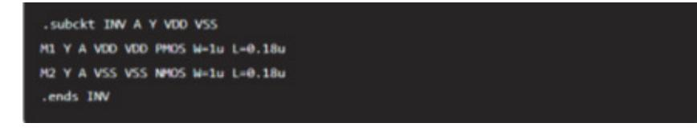

출처: 코드 작성 프로그램. 2024. 8. 6. 스크린샷. [그림 2-1] netlist 예시

- 2) 레이아웃 준비
  - 가) GDSII 파일: 레이아웃 데이터를 GDSII 또는 OASIS 포맷으로 저장한다. 이 파 일은 레이아웃의 물리적 구조와 계층 정보를 포함한다.
  - 나) 계층화: 각 레이어와 계층 구조가 명확히 정의되어야 한다.
- (나) LVS 검증 도구 설정
  - 1) EDA 도구 선택
    - 가) Cadence Virtuoso: 통합된 설계 환경을 제공하며, LVS 검증을 위한 다양한 기능을 포함한다.
    - 나) Synopsys IC Compiler: 물리적 설계 및 검증에 강력한 도구이다.
    - 다) Mentor Graphics Calibre: 업계 표준의 검증 도구로, DRC와 함께 LVS 검증 을 제공한다.
  - 2) 설정 파일 준비
    - 가) Rule Deck: LVS 검증을 위한 규칙 파일을 준비한다. 이 파일에는 설계 규칙, 레이어 매핑, 검증 조건 등이 포함된다.

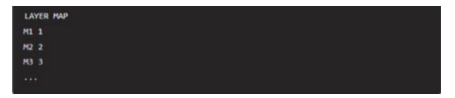

출처: 코드 작성 프로그램. 2024. 8. 6. 스크린샷. [그림 2-2] 설정 파일 예시

- (다) LVS 데이터 추출 및 실행
  - 1) netlist 추출(Layout Netlist Extraction)
    - 가) 레이아웃 netlist 생성: EDA 도구를 사용하여 레이아웃에서 netlist를 추출한 다. 이 단계는 레이아웃에 정의된 모든 소자와 연결을 식별한다.

출처: 코드 작성 프로그램. 2024. 8. 6. 스크린샷. [그림 2-3] 추출 명령 예시

- 2) LVS 실행
  - 가) 명령 실행: 추출된 레이아웃 netlist와 회로도 netlist를 비교하여 LVS 검증을 수행한다.

출처: 코드 작성 프로그램. 2024. 8. 6. 스크린샷. [그림 2-4] LVS 실행 명령 예시

- (라) 결과 분석
  - 1) LVS 보고서 확인
    - 가) 일치 여부: LVS 보고서를 검토하여 레이아웃과 회로도가 일치하는지 확인한다.
    - 나) 오류 분석: 불일치 항목과 오류를 식별하고, 원인을 분석한다.

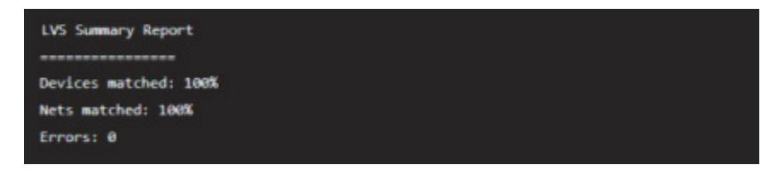

 출처: 코드 작성 프로그램. 2024. 8. 6. 스크린샷. [그림 2-5] 보고서 예시

2) 오류 수정

- 가) 설계 수정: LVS 불일치가 발생한 경우, 레이아웃 또는 회로도를 수정하여 일치 하도록 한다.
- 나) 재검증: 수정 후 LVS 검증을 다시 수행하여 모든 오류가 해결되었는지 확인한 다.

LVS 검증은 레이아웃과 회로도가 정확히 일치하는지 확인하는 중요한 과정이다. 이를 위해 회로도와 레이아웃 데이터를 준비하고, EDA 도구를 설정하여 netlist를 추출하고 비교한다. 검증 결과를 분석하고 오류를 수정하여 최종 설계의 정확성을 확보할 수 있 다. 이 과정에서 사용되는 주요 도구와 기술들은 반도체 설계에서 필수적인 요소로, 설 계의 신뢰성과 성능을 보장하는 데 중요한 역할을 한다.

(3) 네트리스트를 비교한다.

LVS 검증 과정에서 LVS 데이터를 비교하는 것은 레이아웃과 회로도가 일치하는지 확인 하는 중요한 단계이다. 이 과정에서는 설계한 레이아웃이 원래의 회로도와 정확히 동일 한 전기적 특성을 가지는지 확인하기 위해 레이아웃에서 추출한 네트리스트와 회로도 네트리스트를 비교한다. 아래는 LVS 검증 과정에서 데이터를 비교하는 절차와 주요 방 법이다.

(가) 준비 단계

1) 설계 데이터 준비

- 가) 회로도 네트리스트(Schematic Netlist): 회로 설계 툴(Cadence Virtuoso, Synopsys 등)에서 회로도의 네트리스트를 추출한다.
- 나) 레이아웃 네트리스트(Layout Netlist): 레이아웃 데이터에서 추출된 네트리스트 이다. 이는 물리적 레이아웃에 기반한 전기적 연결 정보를 포함한다.
- 2) LVS 설정 파일 준비
  - 가) LVS Rule Deck: LVS 검증을 위한 규칙 파일로, 레이어 매핑, 설계 규칙, 비 교 조건 등을 포함한다.
- (나) LVS 실행 단계
  - 1) 네트리스트 추출
    - 가) 레이아웃 네트리스트 추출: EDA 도구를 사용하여 레이아웃에서 네트리스트를 추출한다. 예를 들어 Cadence Virtuoso에서 아래 명령어를 사용할 수 있다.

 출처: 코드 작성 프로그램. 2024. 8. 6. 스크린샷. [그림 2-6] 네트리스트 추출 명령

- 2) LVS 비교 실행
  - 가) 명령 실행: 추출된 레이아웃 네트리스트와 회로도 네트리스트를 비교하여 LVS 검증을 수행한다. 예를 들어, Mentor Graphics의 Calibre 도구에서는 아래 명 령어를 사용한다.

 출처: 코드 작성 프로그램. 2024. 8. 6. 스크린샷. [그림2-7] LVS 비교 실행

- (다) 결과 분석 단계
  - 1) LVS 보고서 확인
    - 가) 보고서 검토: LVS 보고서를 검토하여 레이아웃과 회로도의 일치 여부를 확인한 다.
    - 나) Matched device: 일치하는 소자의 수
    - 다) Matched Nets: 일치하는 네트의 수
    - 라) Errors: 발견된 오류의 수

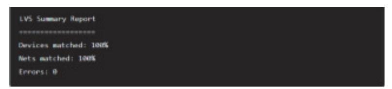

출처: 코드 작성 프로그램. 2024. 8. 6. 스크린샷. [그림 2-8] LVS 보고서

- 2) 오류 분석 및 수정
  - 가) 불일치 항목 확인: 불일치 항목(오류)을 확인하고, 해당 오류의 원인을 분석한 다.
  - 나) Missing devices: 레이아웃에 존재하지 않는 소자이다.
  - 다) Extra devices: 회로도에 존재하지 않는 소자이다.
  - 라) Shorts: 예상치 않은 연결이다.
  - 마) 설계 수정: 발견된 오류를 수정한다. 레이아웃 또는 회로도의 네트리스트를 수 정하여 불일치 항목을 제거한다.
- 3) 재검증
  - 가) 수정 후 LVS 재검증: 설계를 수정한 후, 다시 LVS 검증을 수행하여 모든 오류 가 해결되었는지 확인한다.
- (라) 최종 확인
  - 1) DRC(Design Rule Check)
    - 가) 설계 규칙 검증: LVS 검증 후, 레이아웃이 제조 공정의 설계 규칙을 준수하는 지 확인한다.
  - 2) 기능 검증
    - 가) 기능적 시뮬레이션: LVS 검증을 통과한 설계는 기능적 시뮬레이션을 통해 전기 적 성능을 확인한다.

LVS 검증을 통해 레이아웃과 회로도의 일치를 확인함으로써 설계의 정확성을 보장할 수 있다. 이를 위해 EDA 도구를 사용하여 네트리스트를 추출하고, 규칙 파일을 설정하며, 비교 결과를 분석하여 오류를 수정한다. 이러한 과정은 설계의 신뢰성과 제조 가능성을 높이는 데 필수적이다.

2. LVS 오류를 분석한다.

커스텀 레이아웃 검증을 위해 LVS 오류를 분석하는 것은 매우 중요한 과정이다. 이 과정에 서 레이아웃과 회로도 간의 불일치를 찾아내고 수정하여 설계의 정확성과 제조 가능성을 보장할 수 있다. 아래는 LVS 오류 분석의 주요 단계와 방법을 설명한다.

(1) LVS 오류 유형 이해

(가) 소자 관련 오류

- 1) Missing devices: 레이아웃에 존재하지 않는 소자가 회로도에 있는 경우
- 2) Extra devices: 회로도에 존재하지 않는 소자가 레이아웃에 있는 경우
- 3) device Mismatch: 레이아웃과 회로도 간의 소자 특성(예: 길이, 폭 등)이 다른 경 우
- (나) 네트 관련 오류
  - 1) Shorts: 2개 이상의 네트가 예상치 않게 연결된 경우
  - 2) Open Nets: 네트가 끊어져 회로도가 완전히 연결되지 않은 경우
  - 3) Pin Mismatch: 소자의 핀 연결이 레이아웃과 회로도 간에 다른 경우
- (2) LVS 보고서 분석
  - (가) 보고서 구조 이해
    - 1) Summary Section: 전체 오류 개요를 제공하며, 일치하지 않는 소자와 네트의 수 를 보여 준다.
    - 2) Details Section: 각 오류에 대한 세부 정보를 제공한다.
  - (나) 주요 오류 항목 확인
    - 1) Matched devices and Nets: 일치하는 소자와 네트의 수를 확인하여 전체적인 일 치도를 파악한다.
    - 2) Unmatched devices and Nets: 일치하지 않는 소자와 네트를 확인하여 구체적인 문제점을 파악한다.
- (3) 오류 분석 및 수정 방법
  - (가) 소자 관련 오류 수정
    - 1) Missing devices: 회로도에서 존재하는 소자가 레이아웃에 누락된 경우, 레이아웃 에 해당 소자를 추가한다.
    - 2) Extra devices: 레이아웃에 불필요한 소자가 존재하는 경우, 레이아웃에서 해당 소 자를 제거한다.
    - 3) device Mismatch: 소자 특성이 일치하지 않는 경우, 레이아웃 또는 회로도에서 소 자의 특성을 일치시키도록 수정한다.
  - (나) 네트 관련 오류 수정
    - 1) Shorts: 의도하지 않은 연결이 발생한 경우, 레이아웃을 수정하여 불필요한 연결을 제거한다.
    - 2) Open Nets: 네트가 끊어진 경우, 레이아웃을 수정하여 올바른 연결을 재구성한다.
    - 3) Pin Mismatch: 핀 연결이 일치하지 않는 경우, 레이아웃을 수정하여 올바른 핀 연 결을 재설정한다.
- (4) 검증 및 재검증

- (가) 수정 사항 검증
  - 1) DRC(Design Rule Check): 수정 후 레이아웃이 설계 규칙을 준수하는지 확인한 다.
  - 2) LVS 재검증: 수정된 레이아웃과 회로도를 다시 비교하여 모든 오류가 해결되었는지 확인한다.
- (나) 시뮬레이션
  - 1) 기능적 시뮬레이션: 최종 LVS 검증을 통과한 후, 전기적 특성을 확인하기 위해 기 능적 시뮬레이션을 수행한다.
- (5) 예시
  - (가) LVS 보고서에서 확인된 오류

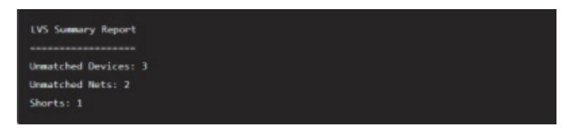

 출처: 코드 작성 프로그램. 2024. 8. 6. 스크린샷. [그림 2-9] LVS 보고서에서 확인된 오류

#### (나) 오류 분석 및 수정

- 1) Unmatched devices
  - 가) device M1: Missing in Layout
  - 나) device M2: Extra in Layout
  - 다) device M3: Mismatch in Width
- 2) Unmatched Nets
  - 가) Net N1: Open
  - 나) Net N2: Pin Mismatch
- 3) Shorts
  - 가) Short between Net N3 and Net N4
- (다) 수정 방법
  - 1) Missing device M1: 레이아웃에 M1 소자를 추가한다.
  - 2) Extra device M2: 레이아웃에서 M2 소자를 제거한다.
  - 3) device mismatch M3: 레이아웃에서 M3의 폭을 수정한다.
  - 4) Open Net N1: 레이아웃에서 N1 네트 연결을 수정한다.
  - 5) Pin Mismatch N2: 레이아웃에서 N2 네트 핀 연결을 재설정한다.
  - 6) Shorts N3 and N4: 레이아웃에서 N3와 N4 간의 불필요한 연결을 제거한다.

LVS 오류를 분석하고 수정하는 과정은 레이아웃과 회로도의 정확성을 보장하는 데 필수적 이다. 각 오류를 체계적으로 분석하고 수정하여 설계의 신뢰성을 높일 수 있다. 이를 통해 제조 가능하고 고성능의 반도체 소자를 설계할 수 있다.

- 3. 최종 검증 및 문서화한다.
  - (1) 최종 검증한다.
    - (가) 모든 오류가 해결되었는지 최종 검증을 수행한다.
    - (나) 최종 LVS 결과가 일치함을 확인한다.
  - (2) 결과를 문서화한다.
    - (가) 검증 결과를 문서화하여 기록한다.
    - (나) 설계 변경 이력과 검증 이력을 체계적으로 관리한다.
- 4. 피드백 및 최적화한다.
  - (1) 피드백을 수렴한다.
    - (가) 설계 팀과 협력하여 검증 결과에 대한 피드백을 수렴한다.
    - (나) 필요시 추가 최적화 작업을 진행한다.
  - (2) 최적화 및 최종 검증한다.
    - (가) 피드백을 반영하여 설계를 최적화하고 최종 검증을 수행한다.
- 5. LVS 검증 절차를 파악한다.
  - (1) 초기 설정을 파악한다.
    - (가) 환경 설정: LVS 검증을 수행할 환경을 설정한다. 필요한 소프트웨어 도구와 라이브러리 를 준비한다.
    - (나) 네트리스트 생성: 회로 설계 도면에서 네트리스트를 추출한다.
    - (다) 레이아웃 추출: 레이아웃 도면에서 물리적 설계 데이터를 추출한다.
  - (2) LVS 검증 도구를 사용한다.
    - (가) LVS 실행: 설계 검증 도구(예: Calibre, Assura)를 사용하여 LVS 검증을 실행한다.
    - (나) 검증 규칙 파일 로드: LVS 검증에 사용할 규칙 파일을 로드한다. 이 파일에는 디바이스 매칭, 넷 매칭, 핀 매칭 등의 규칙이 포함된다.
    - (다) 비교 실행: 네트리스트와 레이아웃 데이터를 비교한다.
  - (3) LVS 결과를 분석한다.
    - (가) 일치/불일치 보고서 확인: LVS 검증 도구가 생성한 보고서를 확인하여 일치하는 부분과 불일치하는 부분을 식별한다.

(나) 오류 분석: 불일치하는 부분에 대한 상세한 분석을 수행한다. 소자 매칭 오류, 연결 오 류, 핀 매칭 오류 등을 분석한다.

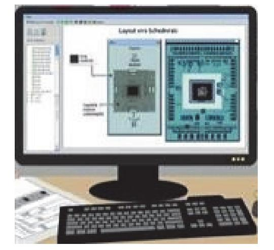

출처: 집필진 제작(2024) [그림 2-10] LVS 검증 사례

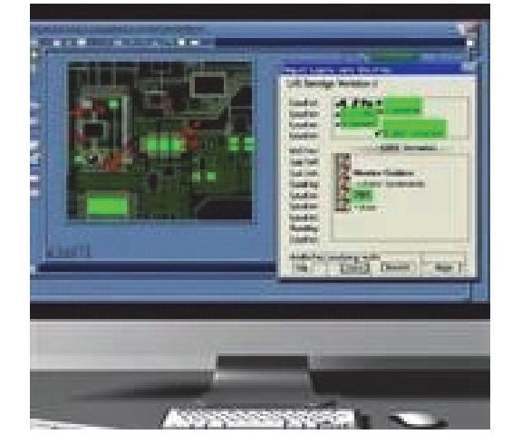

출처: 집필진 제작(2024) [그림 2-11] LVS 검증 절차

숗 오류가 발생한 레이아웃 도면을 수정한다.

LVS(Lay-Out Versus Schematic) 검증에서 오류가 발생한 레이아웃 도면을 수정하는 것은 설계의 정확성을 확보하기 위해 매우 중요한 작업이다. 오류를 수정하는 과정은 다음 단계로 이루어질 수 있다.

1. LVS 오류 분석

우선, LVS 검증 도구가 생성한 오류 보고서를 분석한다. 오류는 다음과 같은 유형으로 나 타날 수 있다.

- (1) Unmatched Nets(네트 불일치): 레이아웃과 스키매틱 간에 일치하지 않는 네트가 있을 때 발생한다.
- (2) Unmatched Devices(소자 불일치): 레이아웃과 스키매틱 간에 소자가 일치하지 않는 경우 발생한다.
- (3) Parameter Mismatches(소자 매개 변수 불일치): 레이아웃과 스키매틱에서 소자의 전기적 특성(예: 저항값)이 다를 때 발생한다.
- (4) Pin Connectivity Issues(핀 연결 문제): 핀 연결이 잘못되었거나 누락된 경우 발생한다.
- 2. 오류 원인 파악

LVS 오류 보고서를 기반으로, 오류의 원인을 식별한다. 다음을 확인해야 한다.

(1) 네트 이름 불일치: 네트 이름이 레이아웃과 스키매틱에서 일치하는지 확인한다. 네트 이름이

다른 경우, 하나로 통일해야 한다.

- (2) 소자 위치 및 연결 상태: 레이아웃에서 소자가 스키매틱과 동일한 위치 및 연결 상태를 유지 하는지 확인한다.
- (3) 소자 매개 변수: 레이아웃과 스키매틱에서 사용된 소자의 매개 변수가 동일한지 확인한다. 매 개 변수가 다를 경우, 스키매틱에 맞게 수정해야 한다.
- (4) 핀 연결 상태: 각 핀이 올바르게 연결되었는지, 또는 연결이 누락되었는지 확인한다.
- 3. 레이아웃 도면 수정

오류 원인을 파악한 후, 레이아웃 도면을 수정한다. 다음과 같은 방법으로 수정할 수 있다.

- (1) 네트 연결 수정 네트가 스키매틱과 일치하도록 레이아웃에서 연결 상태를 수정한다. 네트 이름이 불일치 한 경우, 올바르게 변경한다. 만약 누락된 연결이 있다면, 추가로 배선을 하여 모든 소자가 올바르게 연결되도록 한 다.
- (2) 소자 배치 수정

소자가 올바른 위치에 배치되어 있는지 확인하고, 필요한 경우 위치를 조정한다. 잘못된 소자가 사용되었거나 불필요한 소자가 추가된 경우, 해당 소자를 올바르게 수정 하거나 제거한다.

(3) 소자 매개 변수 수정

소자의 매개 변수(예: 저항값, 커패시턴스 등)가 스키매틱과 일치하도록 수정한다. 레이아웃에서 사용된 소자가 스키매틱과 다른 특성을 가지는 경우, 해당 소자의 특성을 일치시키거나 올바른 소자로 교체한다.

(4) 핀 연결 상태 수정

핀이 스키매틱과 동일하게 연결되어 있는지 확인하고, 올바른 연결 상태를 유지하도록 수정한다. 핀 연결이 잘못되었을 경우, 연결을 수정하거나 누락된 연결을 추가한다.

4. 수정 내용 재검토 및 재검증

수정을 완료한 후, 다음을 수행한다.

- (1) 재검토: 수정된 레이아웃을 다시 검토하여 모든 오류가 제대로 수정되었는지 확인한다.
- (2) 재검증: 수정된 레이아웃을 다시 LVS 검증 도구에 입력하여 오류가 해결되었는지 확인한다.
- 5. 반복적 수정 및 검증

LVS 검증에서 모든 오류가 해결될 때까지 이 과정을 반복한다. 반복적인 수정과 검증을 통 해 최종적으로 레이아웃과 스키매틱이 완전히 일치하는 상태를 달성한다.

#### 6. 문서화 및 최종 승인

수정 및 검증이 완료되면, 모든 변경 사항을 문서화하고 최종 승인을 받는다. 이렇게 하면, 설계의 모든 단계가 기록으로 남고, 향후 문제 발생 시 참조할 수 있다.

이 과정은 레이아웃의 정확성과 일관성을 보장하여 최종 제품이 의도한 대로 동작할 수 있도록 하는 데 필수적이다. LVS 검증에서 발견된 오류를 정확히 수정함으로써, 높은 품질의 설계를 달성할 수 있다.

수행 tip

- 파라미터를 수정해 가면서 LVS, DRC 등의 영향을 분석 한다.
- layout 오류의 원인을 유형별로 정리한다.

## 학습 2 교수·학습 방법

#### 교수 방법

- 고객 요구 사항을 반영할 수 있도록 적합한 툴을 선정하여 레이아웃에 필요한 요소를 응용 예시를 제시한다.
- 공정의 설계 권고 사항을 설명하고 해당 내용에 대한 레이아웃 실습이 이루어지도록 지도한 다.
- 공정의 설계 규칙에 따라 반도체 소자에 대한 레이아웃 실습이 이루어지도록 지도한다.
- 공정의 설계 검증 규칙에 따라 레이아웃상에서 기능 블록을 배치 및 배선할 수 있도록 작업 순서에 따라 단계적으로 실습이 이루어지도록 지도한다.
- 공정의 레이어별 매개 변수를 고려하여 특성에 변화가 없도록 레이아웃을 수행할 수 있도록 작업 순서에 따라 단계적으로 지도한다.

#### 학습 방법

- 고객 요구 사항을 반영할 수 있도록 적합한 툴을 선정하여 레이아웃에 필요한 요소 전반에 대해 파악한다.
- 공정의 설계 권고 사항을 숙지하고 해당 내용을 레이아웃 실습에 적용한다.
- 공정의 설계 규칙에 따라 반도체 소자에 대한 레이아웃을 수행할 수 있도록 학습 및 실습한 다.
- 공정의 설계 검증 규칙에 따라 레이아웃 상에서 기능 블록을 배치 및 배선하는 방법을 숙지 할 수 있도록 반복 연습한다.
- 공정의 레이어별 매개 변수를 고려하여 특성에 변화가 없도록 레이아웃을 수행하는 실습한 다.

## 학습 2 평 가

#### 평가 준거

• 평가자는 학습자가 학습 목표를 성공적으로 달성하였는지를 평가해야 한다.

#### • 평가자는 다음 사항을 평가해야 한다.

|        | 학습 목표                                                                                      | 성취수준 |   |   |  |
|--------|--------------------------------------------------------------------------------------------|------|---|---|--|
| 학습 내용  |                                                                                            | 상    | 중 | 하 |  |
| LVS 검증 | - 레이아웃 도면과 회로 설계 도면의 연결 상태를 검증하는 설계 검증(LVS: Lay-Out Versus Schematic) 파일을 이 해할 수 있다. |      |   |   |  |
|        | - 설계 검증 툴을 적용하여 회로도와의 차이점을 찾을 수 있다.                                                        |      |   |   |  |
|        | - 오류가 발생한 레이아웃 도면을 수정할 수 있다.                                                               |      |   |   |  |

#### 평가 방법

• 서술형 시험

|        | 평가 항목                                     | 성취수준 |   |   |
|--------|-------------------------------------------|------|---|---|
| 학습 내용  |                                           | 상    | 중 | 하 |
|        | - 레이아웃 도면과 회로 설계 도면의 차이점을 구분할 수 있 는 능력 |      |   |   |
| LVS 검증 | - 오류가 발생한 레이아웃 도면을 수정할 수 있는 방법 파악 능력   |      |   |   |

#### • 평가자 체크리스트

|        | 평가 항목                                                                        | 성취수준 |   |   |  |
|--------|------------------------------------------------------------------------------|------|---|---|--|
| 학습 내용  |                                                                              | 상    | 중 | 하 |  |
|        | - 회로 설계 도면의 연결 상태를 검증하는 설계 검증(LVS, Lay-Out Versus Schematic) 절차에 대한 숙지 여부 |      |   |   |  |
| LVS 검증 | - 오류가 발생한 LVS 파일로부터 수정 과정을 거치고 최종 LVS 검증을 수행할 수 있는 능력                     |      |   |   |  |
|        | - 오류가 발생한 레이아웃 도면을 수정할 수 있는 능력                                               |      |   |   |  |

피드백

- 1. 서술형 시험
- 레이아웃 도면과 회로 설계 도면의 차이점을 구분할 수 있는 능력을 평가한 후, 보완이 필요한 사항이나 주요 사항을 표시하여 피드백해 준다.
- 오류가 발생한 레이아웃 도면을 수정할 수 있는 능력을 평가한 후, 보완이 필요한 사항이나 주요 사항을 표시하여 보충 설명해 준다.
- 평가 결과가 우수한 학습자와 미흡한 학습자를 구분하여 우수한 학습자들에게는 서술형 평가 내 용의 적용 사례 학습을 통한 심화 학습으로 피드백해 주고, 미흡한 학습자들에게는 기초 용어에 대한 설명을 통해 일정 수준을 유지할 수 있도록 보완하여 지도해 준다.
- 2. 평가자 체크리스트
- 오류가 발생한 LVS 파일로부터 수정 과정을 거치고 최종 LVS 검증을 수행할 수 있는 능력을 확 인한 후 부족한 점을 지적하여 정확하게 처리할 수 있도록 보완하여 지도해 준다.
- 회로 설계 도면의 연결 상태를 검증하는 설계 검증 절차에 대한 숙지 여부를 평가한 후, 개선 및 보완 사항에 대한 내용을 정리하여 재학습할 수 있도록 피드백 해 준다.
- 평가 결과가 우수한 학습자와 저조한 학습자를 구분하여 우수한 학습자들에게는 작작업장 환경에 적용할 수 있는 심화 내용을 피드백해 주고, 저조한 학습자들에게는 기초 지식에 대한 설명을 통 해 일정 수준을 유지할 수 있도록 보완하여 지도해 준다.

| 학습 1 | DRC 검증하기 |
|------|----------|
| 학습 2 | LVS 검증하기 |
| 학습 3 | LPE 검증하기 |

## 3-1. LPE 검증

| 학습 목표 | • 레이아웃 도면의 매개 변수를 추출하기 위해 LPE(Lay-Out Parasitic Extraction) 파일을 숙 |
|-------|-------------------------------------------------------------------|
|       | 지할 수 있다.                                                          |
|       | • 해당 파일을 활용하여 아날로그 회로 설계에 필요한 포스트 네트리스트(Post Netlist)를 추출         |
|       | 할 수 있다.                                                           |

## 필요 지식 /

#### 숔 LPE 파일 포함 정보

LPE(Layout Parasitic Extraction) 파일은 반도체 설계에서 레이아웃의 기생 소자를 추출하여 회로의 전기적 특성을 더 정확하게 시뮬레이션하는 데 사용된다. 커스텀 레이아웃 검증을 위한 LPE 파일에는 다양한 기생 요소와 관련된 정보가 포함된다. 아래는 LPE 파일에 포함되는 주 요 내용이다.

- 1. 기본 정보
  - (1) 파일 헤더
    - (가) 내용: 파일의 기본 정보와 형식을 정의하는 헤더
    - (나) 포함 항목: 파일 형식 버전, 생성 날짜, 공정 정보
- 2. 기생 저항(Parasitic Resistance)

커스텀 레이아웃의 LPE 검증에서 기생 저항값을 계산하기 위해서는 정확한 기생 저항값을 추출하여 회로의 전기적 특성을 분석할 수 있다.

- (1) 기생 저항의 기본 개념
  - (가) 도체와 반도체의 저항
    - 1) 정의: 전류의 흐름을 방해하는 정도를 나타내는 물리량
    - 2) 특성: 도체와 반도체의 저항 특성 차이 이해
  - (나) 옴의 법칙(Ohm's Law)

1) 정의: 전압(V), 전류(I), 저항(R) 간의 관계 V=IR

2) 적용: 회로 내에서 저항값 계산의 기초로 사용

(2) 레이아웃 기생 요소 이해

(가) 기생 저항

1) 정의: 레이아웃에서 예상치 못하게 발생하는 저항 성분

2) 영향: 전력 손실, 신호 왜곡, 성능 저하

(나) 기생 커패시턴스 및 인덕턴스

1) 정의: 기생 커패시턴스와 인덕턴스도 저항과 함께 레이아웃에서 중요한 기생 요소

2) 영향: 회로의 동작 속도 및 신호 무결성에 영향

(3) 반도체 공정 및 레이어 구조

(가) 반도체 공정 이해

1) 정의: 반도체 소자를 제조하기 위한 일련의 공정

2) 단계: 리소그래피, 에칭, 증착, 도핑 등

(나) 레이어 구조

1) 정의: 반도체 소자의 각 층의 구조.

2) 레이어 종류: 활성 영역, 폴리실리콘, 메탈층, 산화막 등

(4) 레이아웃 설계 규칙

(가) 최소 선폭(Minimum Width)

1) 정의: 각 레이어의 최소 선폭 규칙

2) 영향: 선폭이 저항값에 미치는 영향 이해

(나) 최소 간격(Minimum Spacing)

1) 정의: 인접한 레이어 간의 최소 간격 규칙

2) 영향: 간격이 기생 요소에 미치는 영향 이해

(5) 기생 저항 계산 원리

(가) 저항의 기본 계산

1) 공식: 저항  $R = \rho \frac{L}{A}$ 

가) ρ: 저항률(Resistivity)

나) *L*: 길이(Length)

다) A: 단면적(Cross-sectional Area)

2) 적용: 레이아웃의 도체 길이와 단면적을 사용하여 저항 계산

(나) 기생 저항 모델링

1) 모델: 도체의 형태에 따른 기생 저항 모델

예시: 직선 도체, 복잡한 도체 구조 등

(6) EDA 도구 사용법

- (가) 주요 EDA 도구
  - 1) Cadence Virtuoso: 레이아웃 설계 및 검증 도구
  - 2) Mentor Graphics Calibre: 기생 요소 추출 및 검증 도구
- (나) LPE 설정
  - 1) 설정: EDA 도구에서 LPE 검증을 위한 설정 방법
  - 2) 파라미터: 추출할 기생 저항 파라미터 설정
- (7) 저항값
  - (가) 내용: 각 레이어와 경로의 기생 저항값
  - (나) 포함 항목: 저항의 시작과 끝 노드, 저항값
- (8) 저항 네트워크
  - (가) 내용: 저항 네트워크의 연결 정보
  - (나) 포함 항목: 각 저항이 연결된 소자의 노드 정보
- 3. 기생 커패시턴스(Parasitic Capacitance)
  - 커스텀 레이아웃의 LPE 검증에서 기생 커패시턴스는 반도체 소자의 성능과 신뢰성에 큰 영 향을 미치므로 정확한 계산이 필수적이다.
  - (1) 기생 커패시턴스의 기본 개념
    - (가) 커패시턴스의 기본 원리
      - 1) 정의: 두 도체 사이에 전기장을 형성하는 능력
        - 가) 공식:  $C = \varepsilon \frac{A}{d}$
        - 나) C: 커패시턴스
        - 다) *ɛ*: 유전율(유전체의 특성)
        - 라) A: 도체의 면적
        - 마) d: 도체 사이의 거리
    - (나) 전자기학 기초
      - 1) 전기장과 전위차: 도체 간의 전기장 형성 원리
      - 2) 유전체 특성: 유전체의 유전율과 전기적 특성
  - (2) 반도체 공정 및 레이어 구조
    - (가) 반도체 공정 이해
      - 1) 공정 단계: 리소그래피, 에칭, 증착, 도핑 등

2) 각 공정의 역할: 각 단계가 레이아웃에 미치는 영향

(나) 레이어 구조

1) 정의: 반도체 소자의 각 층의 구조.

2) 레이어 종류: 활성 영역, 폴리실리콘, 메탈층, 산화막 등

(3) 레이아웃 설계 규칙

(가) 최소 간격(Minimum Spacing)

1) 정의: 인접한 레이어 간의 최소 간격

2) 영향: 간격이 기생 커패시턴스에 미치는 영향 이해

(나) 레이어 오버랩(Layer Overlap)

1) 정의: 특정 레이어가 다른 레이어와 겹쳐야 하는 규칙

2) 영향: 레이어 간 오버랩이 기생 커패시턴스에 미치는 영향

2) 실제 레이아웃에서의 계산: 복잡한 구조에서 커패시턴스 계산 방법

1) 모델: 도체의 형태에 따른 기생 커패시턴스 모델

1) Cadence Virtuoso: 레이아웃 설계 및 검증 도구

1) 설정: EDA 도구에서 LPE 검증을 위한 설정 방법

2) 파라미터: 추출할 기생 커패시턴스 파라미터 설정

2) Mentor Graphics Calibre: 기생 요소 추출 및 검증 도구

(4) 기생 커패시턴스 계산 원리

(가) 커패시턴스의 기본 계산

(나) 기생 커패시턴스 모델링

(5) EDA 도구 사용법

(나) LPE 설정

(6) 커패시턴스 값

(7) 커패시턴스 네트워크

(가) 주요 FDA 도구

예시: 평행판 모델, 원통형 모델 등.

1) 평행판 커패시턴스:  $C = \varepsilon \frac{A}{d}$ 

80

(나) 포함 항목: 각 커패시턴스가 연결된 소자의 노드 정보

(나) 포함 항목: 커패시턴스의 시작과 끝 노드, 커패시턴스 값

(가) 내용: 각 레이어와 경로의 기생 커패시턴스 값

(가) 내용: 커패시턴스 네트워크의 연결 정보

- 4. 기생 인덕턴스(Parasitic Inductance)
  - (1) 기생 인덕턴스의 기본 개념

커스텀 레이아웃의 LPE 검증에서 기생 인덕턴스는 고속 신호 전송 및 RF 회로에서 중 요한 역할을 하며, 이를 정확하게 추출하고 분석하는 것이 매우 중요하다.

(가) 인덕턴스의 기본 원리

1) 정의: 전류의 변화에 대해 유도 전압을 생성하는 능력

- 2) 공식:  $L = \frac{\mu N^2 A}{I}$ 
  - 가) *L*: 인덕턴스
  - 나) μ: 자기 투과율
  - 다) N: 권선 수
  - 라) A: 단면적
  - 마) *l*: 길이

(나) 전자기학 기초

1) 패러데이 법칙: 전자기 유도 법칙

2) 자기장과 전류: 전류가 생성하는 자기장 및 상호 작용

(2) 반도체 공정 및 레이어 구조

- (가) 반도체 공정 이해
  - 1) 공정 단계: 리소그래피, 에칭, 증착, 도핑 등

2) 각 공정의 역할: 각 단계가 레이아웃에 미치는 영향

(나) 레이어 구조

1) 정의: 인접한 레이어 간의 최소 간격

1) 정의: 반도체 소자의 각 층의 구조.

(가) 최소 간격(Minimum Spacing)

(나) 레이어 오버랩(Layer Overlap)

2) 영향: 간격이 기생 인덕턴스에 미치는 영향 이해

1) 정의: 특정 레이어가 다른 레이어와 겹쳐야 하는 규칙

2) 영향: 레이어 간 오버랩이 기생 인덕턴스에 미치는 영향

- (3) 레이아웃 설계 규칙

- 2) 레이어 종류: 활성 영역, 폴리실리콘, 메탈층, 산화막 등

- (4) 기생 인덕턴스 계산 원리
  - (가) 인덕턴스의 기본 계산

- 지선 도체 인덕턴스: L = μ0/2π ln(2l/r)
  가) μ0: 자유 공간의 자기 투과율
  나) l: 도체의 길이
  다) r: 도체의 반지름
  2) 원형 코일 인덕턴스: L = μN2A/l
  - 가) µ: 자기 투과율
  - 나) N: 권선 수
  - 다) A: 단면적
  - 라) l: 코일의 길이
- (나) 기생 인덕턴스 모델링
  - 1) 모델: 도체의 형태에 따른 기생 인덕턴스 모델
  - 예시: 직선 도체 모델, 원형 코일 모델 등
- (5) EDA 도구 사용법
  - (가) 주요 EDA 도구
    - 1) Cadence Virtuoso: 레이아웃 설계 및 검증 도구
    - 2) Mentor Graphics Calibre: 기생 요소 추출 및 검증 도구
  - (나) LPE 설정
    - 1) 설정: EDA 도구에서 LPE 검증을 위한 설정 방법
    - 2) 파라미터: 추출할 기생 인덕턴스 파라미터 설정
- (6) 인덕턴스 값
  - (가) 내용: 각 레이어와 경로의 기생 인덕턴스 값
  - (나) 포함 항목: 인덕턴스의 시작과 끝 노드, 인덕턴스 값
- (7) 인덕턴스 네트워크
  - (가) 내용: 인덕턴스 네트워크의 연결 정보
  - (나) 포함 항목: 각 인덕턴스가 연결된 소자의 노드 정보
- 5. 상호 기생 요소(Mutual Parasitic Elements)
  - (1) 상호 커패시턴스
    - (가) 내용: 두 노드 사이의 상호 기생 커패시턴스 값
    - (나) 포함 항목: 상호 커패시턴스의 노드 쌍과 커패시턴스 값
  - (2) 상호 인덕턴스

- (가) 내용: 두 노드 사이의 상호 기생 인덕턴스 값
- (나) 포함 항목: 상호 인덕턴스의 노드 쌍과 인덕턴스 값
- 6. 노드 정보(Node Information)
  - (1) 노드 정의
    - (가) 내용: 회로 내 각 노드의 정의 및 속성
    - (나) 포함 항목: 노드 이름, 노드의 물리적 위치, 노드의 전기적 속성
  - (2) 노드 연결
    - (가) 내용: 각 노드의 연결 관계.
    - (나) 포함 항목: 노드 간의 연결 정보, 연결된 소자 정보
- 7. 네트리스트 정보(Netlist Information)
  - (1) 네트리스트 정의
    - (가) 내용: 회로의 네트리스트 정보
    - (나) 포함 항목: 각 네트의 이름과 연결된 노드
  - (2) 네트 속성
    - (가) 내용: 각 네트의 전기적 속성
    - (나) 포함 항목: 네트의 저항, 커패시턴스, 인덕턴스 값
- 8. 모델 및 시뮬레이션 파라미터
  - (1) 소자 모델
    - (가) 내용: 기생 소자를 포함한 소자의 모델 정보
    - (나) 포함 항목: 소자의 종류, 기생 요소 포함된 모델 파라미터
  - (2) 시뮬레이션 조건
    - (가) 내용: 시뮬레이션을 위한 환경 설정
    - (나) 포함 항목: 온도, 전압 조건, 시뮬레이션 시간
- 9. 분석 및 검증 정보
  - (1) 검증 결과
    - (가) 내용: LPE 파일 생성 시 검증한 결과
    - (나) 포함 항목: 기생 소자 추출의 정확성 검증 결과, 오류 로그

(2) 분석 보고서

- (가) 내용: LPE 파일의 분석 결과를 포함한 보고서
- (나) 포함 항목: 기생 소자 영향 분석, 성능 예측

10. 추가 정보

(1) 메타데이터

(가) 내용: LPE 파일에 대한 추가 메타데이터

(나) 포함 항목: 파일 생성자, 검증자, 사용된 도구 버전

(2) 주석 및 설명

(가) 내용: LPE 파일 내 주석과 설명.

(나) 포함 항목: 주요 섹션에 대한 설명, 주석 추가

LPE 파일에는 레이아웃의 기생 소자와 관련된 다양한 정보가 포함된다. 이 파일은 저항, 커패 시턴스, 인덕턴스 등의 기생 요소값과 연결 정보를 포함하며, 노드 정보와 네트리스트, 모델 및 시뮬레이션 파라미터, 검증 결과 등이 포함된다. 이러한 정보를 통해 설계자는 레이아웃의 전 기적 특성을 정확하게 분석하고, 최적의 성능을 가진 반도체 소자를 설계할 수 있다.

숕 네트리스트 정보

커스텀 레이아웃에서 네트리스트 정보는 회로의 전기적 연결 및 소자 구성을 나타내는 중요한 데이터이다. 네트리스트는 설계의 기초가 되며, 레이아웃과 회로도의 일치 여부를 검증하는 데 사용된다. 다음은 커스텀 레이아웃에서 네트리스트 정보를 이해하고 활용하기 위해 필요한 주 요 사항들이다.

1. 네트리스트의 정의 및 구성

(1) 네트리스트 정의

(가) 정의: 회로를 구성하는 소자들과 이들을 연결하는 전기적 경로를 나타내는 리스트

(나) 역할: 설계의 전기적 특성 분석, 시뮬레이션 및 검증에 사용

(2) 네트리스트 구성 요소

(가) 소자(Components): 트랜지스터, 저항, 커패시터 등

(나) 노드(Nodes): 소자 간의 연결점

(다) 네트(Nets): 노드들을 연결하는 전기적 경로

2. 네트리스트 형식

(1) SPICE 네트리스트

(가) 형식: SPICE 시뮬레이션을 위한 표준 네트리스트 형식

(나) 구성: 소자 정의, 노드 연결, 소자 파라미터

(다) 예시

M1 1 2 3 4 NMOS W=10u L=1u

- R1 1 2 1k
- C1 2 0 10p
- (2) Verilog-A 네트리스트
  - (가) 형식: 아날로그 회로 설계를 위한 HDL(Hardware Description Language)
  - (나) 구성: 모듈 정의, 인스턴스화, 파라미터 설정
  - (다) 예시

module my\_circuit(in, out);

input in;

output out;

nmos M1(out, in, Vss, Vdd);

pmos M2(out, in, Vdd, Vss);

resistor R1(in, out, 1k);

capacitor C1(out, Vss, 10p);

endmodule

- 3. 네트리스트 생성
  - (1) 회로도에서 네트리스트 생성
    - (가) 툴 사용: EDA 도구(예: Cadence Virtuoso)에서 회로도 작성 후 네트리스트 자동 생 성
    - (나) 절차: 회로도 작성 → 네트리스트 생성 명령 실행 → 네트리스트 파일 저장
  - (2) 레이아웃에서 네트리스트 생성(Extracted Netlist)
    - (가) LVS(Layout Versus Schematic): 레이아웃과 회로도를 비교하여 네트리스트 추출
    - (나) 절차: 레이아웃 작성 → LVS 실행 → 네트리스트 추출 및 검증
- 4. 네트리스트 검증
  - (1) DRC(Design Rule Check)
    - (가) 목적: 레이아웃이 설계 규칙을 준수하는지 검증
    - (나) 절차: DRC 도구 실행 → 오류 검출 및 수정
  - (2) LVS(Layout Versus Schematic)
    - (가) 목적: 레이아웃과 회로도가 일치하는지 검증
    - (나) 절차: LVS 도구 실행 → 네트리스트 비교 → 불일치 항목 수정
- 5. 기생 소자 포함 네트리스트(Post-Layout Netlist)
  - (1) LPE

- (가) 목적: 레이아웃에서 기생 소자(저항, 커패시턴스, 인덕턴스)를 추출하여 네트리스트에 포 함
- (나) 절차: 레이아웃 작성 → LPE 실행 → 기생 소자 포함 네트리스트 생성
- (2) SPICE 모델 통합
  - (가) 목적: 기생 소자를 포함한 회로의 시뮬레이션을 위한 SPICE 모델 생성
  - (나) 절차: LPE 파일 로드 → SPICE 모델 생성 → 시뮬레이션 실행

#### 6. 네트리스트 시뮬레이션

- (1) 시뮬레이션 환경 설정
  - (가) 조건 설정: 온도, 전압, 주파수 등의 시뮬레이션 조건 설정
  - (나) 툴 사용: SPICE, Spectre, HSPICE 등 시뮬레이션 도구 사용
- (2) 시뮬레이션 실행
  - (가) 명령어 실행: 시뮬레이션 명령어 실행
  - (나) 결과 분석: 시뮬레이션 결과 분석을 통해 회로의 전기적 특성 평가
- 7. 네트리스트 최적화 및 재검증
  - (1) 최적화
    - (가) 기생 소자 최소화: 기생 소자를 줄이기 위한 레이아웃 최적화
    - (나) 성능 향상: 회로 성능을 향상시키기 위한 파라미터 최적화
  - (2) 재검증
    - (가) LVS 재검증: 최적화 후 LVS를 다시 실행하여 레이아웃과 회로도의 일치 여부 확인
    - (나) DRC 재검증: 최적화 후 DRC를 다시 실행하여 설계 규칙 준수 여부 확인

커스텀 레이아웃에서 네트리스트 정보를 이해하고 활용하기 위해서는 네트리스트의 정의 및 구 성, 네트리스트 형식, 생성 방법, 검증 절차, 기생 소자 포함 네트리스트 생성, 시뮬레이션, 최 적화 및 재검증 등의 종합적인 지식이 필요하다. 이러한 지식을 통해 설계자는 정확한 네트리 스트를 생성하고, 이를 기반으로 회로의 전기적 특성을 분석 및 최적화하여 높은 성능과 신뢰 성을 가진 반도체 소자를 설계할 수 있다.

#### 재료·자료

- 공정의 설계 권고 사항
- 제품 사양서
- 툴 매뉴얼
- 공정의 설계·검증 규칙 파일
- IP/셀 라이브러리

#### 기기(장비 ・ 공구)

- 컴퓨터, 프린터, 워크스테이션, 인터넷
- 커스텀 레이아웃 툴
- 자동 배치 배선 레이아웃 툴
- 레이아웃 검증 툴

#### 안전 ・ 유의 사항

해당 사항 없음.

#### 수행 순서

숔 LPE(Layout Parasitic Extraction) 파일을 숙지한다.

커스텀 레이아웃 도면의 매개 변수 추출을 위한 LPE 사용 방법은 주로 EDA 도구를 사용하여 수행되며, 여기에서는 일반적인 절차를 설명한다. 각 도구마다 구체적인 명령어와 인터페이스는 다를 수 있지만, 기본적인 원리는 유사하다.

LPE 파일을 사용하여 커스텀 레이아웃 도면의 매개 변수를 추출하기 위해서는 EDA 도구의 설 치 및 설정, 레이아웃 데이터 준비, 설계 규칙 파일 로드, LPE 설정 및 실행, 결과 분석, 모델 및 시뮬레이션, 검증 및 최적화 등의 단계가 필요하다. 이러한 과정을 통해 기생 소자를 정확 히 추출하고, 이를 기반으로 회로의 전기적 특성을 분석 및 최적화한다.

출처: 집필진 제작(2024)

[그림 3-1] cmos 공정에서 생성되는 기생 회로

#### 1. 기본 준비를 확인한다.

- (1) EDA 도구 설치 및 설정한다.
  - (가) 필요 도구: Cadence Assura, Mentor Graphics Calibre, Synopsys StarRC 등
  - (나) 환경 설정: 도구 설치 후, 프로젝트 파일 경로 및 라이선스를 설정한다.
- (2) 레이아웃 데이터를 준비한다.
  - (가) 파일 형식: GDSII, OASIS 등의 레이아웃 파일을 포맷한다.
  - (나) 레이어 정의: 각 레이어의 물리적, 전기적 특성을 명확히 정의한다.

#### 2. 설계 규칙 파일 로드를 확인한다.

- (1) PDK(Process Design Kit)를 준비한다.
  - (가) 구성 요소: 레이어 정보, 설계 규칙 파일, 기생 소자 모델 등
  - (나) 로드 방법: EDA 도구에서 PDK 파일을 로드하여 설정한다.
- (2) 설계 규칙을 설정한다.
  - (가) 설정 방법: PDK에서 제공하는 설계 규칙 파일을 검토하고, 필요한 경우 사용자 정의 규 칙 추가한다.
- 3. 레이아웃 데이터 로드를 확인한다.
  - (1) 레이아웃 파일 불러오는 방법을 파악한다.
    - (가) 파일 형식: GDSII 또는 OASIS 파일 형식
    - (나) 로드 방법: EDA 도구의 인터페이스를 통해 레이아웃 파일 불러오기
  - (2) 레이어 매핑을 한다.

커스텀 레이아웃에서 LPE 검증을 위해 레이아웃 데이터의 레이어 매핑은 매우 중요하 다. 레이어 매핑은 설계 규칙과 제조 공정에 따라 레이아웃 데이터의 각 레이어를 정확 하게 정의하는 것을 의미한다. LPE는 레이아웃에서 기생 소자(기생 저항, 기생 커패시턴 스 등)를 추출하여 실제 회로 성능을 예측하는 데 사용된다. 정확한 레이어 매핑을 통해 이러한 기생 소자의 추출 정확성을 높일 수 있다.

(가) 레이어 매핑의 개요

1) 정의

레이아웃 디자인에서 사용된 각 레이어를 특정 공정 또는 설계 규칙에 맞추어 정 의하고, 이러한 레이어가 실제 물리적 레이어에 어떻게 대응하는지 지정하는 것 이다.

- 2) 중요성
  - 가) 정확한 레이어 매핑은 LPE의 정확성을 높이며, 이는 최종 칩의 성능 예측에 중 요하다.
  - 나) 제조 공정과 설계 규칙에 따라 올바른 매핑이 이루어져야 한다.
- (나) 레이어 매핑 설정
  - 1) 기본 레이어
    - 가) Active Layer(ACT): 소자가 형성되는 실리콘 영역
    - 나) Poly Layer(POLY): 게이트 전극을 형성하는 폴리실리콘 영역
    - 다) Diffusion Layer(DIFF): 소스/드레인 확산 영역
    - 라) Metal Layers(M1, M2, ...): 배선을 형성하는 금속층
    - 마) Via Layers(V1, V2, ...): 금속층 간의 전기적 연결을 위한 비아

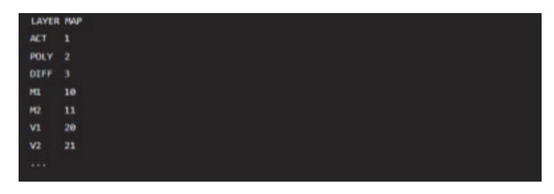

출처: 코드 작성 프로그램. 2024. 8. 6. 스크린샷. [그림 3-2] 레이어 매핑 설정 예시

(다) 레이어 매핑 절차

- 1) 레이어 정의
  - 가) 각 레이어의 목적과 역할을 정의한다.

예시: Active 레이어는 소자의 실리콘 영역, Poly 레이어는 게이트 전극

- 2) 레이어 번호 할당
  - 가) 각 레이어에 고유한 번호를 할당한다.
  - 나) 이 번호는 레이아웃 도구와 LPE 도구에서 일관되게 사용된다.

- 3) 매핑 파일 작성
  - 가) 레이어 매핑 정보를 포함하는 파일을 작성한다.
  - 나) 매핑 파일에는 레이어 이름, 레이어 번호, 레이어 타입(예: 도핑, 금속 등)이 포 함된다.
- (라) LPE 검증 도구 설정
  - 1) 도구 선택
    - 가) Cadence QRC(Quantus RC Extraction): 기생 소자 추출을 위한 도구
    - 나) Synopsys StarRC: 고성능 기생 소자 추출 도구
    - 다) Mentor Graphics Calibre xRC: 정확한 기생 소자 추출을 위한 업계 표준 도 구
  - 2) 설정 파일 준비
    - 가) Rule Deck: LPE 검증을 위한 규칙 파일. 이 파일에는 레이어 매핑 정보, 기 생 소자 추출 규칙 등이 포함된다.
- (마) 레이어 매핑 및 LPE 검증 실행
  - 1) 매핑 파일 적용
    - 가) LPE 도구 설정에서 작성한 레이어 매핑 파일을 적용한다.
    - 나) 설정 예시(Cadence QRC)

출처: 코드 작성 프로그램. 2024. 8. 6. 스크린샷. [그림 3-3] 레이어 매핑 파일 적용

- 2) LPE 실행
  - 가) LPE 검증을 실행하여 레이아웃에서 기생 소자를 추출한다.
  - 나) 실행 명령 예시(Calibre xRC)

출처: 코드 작성 프로그램. 2024. 8. 6. 스크린샷. [그림 3-4] 실행 명령 예시(Calibre xRC)

- (바) 결과 분석
  - 1) 기생 소자 데이터 확인

가) 추출된 기생 소자 데이터를 검토하여 설계에 미치는 영향을 분석한다.

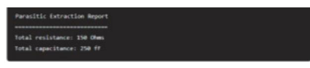

출처: 코드 작성 프로그램. 2024. 8. 6. 스크린샷. [그림 3-5] 레이어 매핑 보고서 예시

- 2) 성능 분석
  - 가) 기생 소자가 회로 성능에 미치는 영향을 분석하고, 필요시 설계를 수정한다.
  - 나) 타이밍 분석: 기생 저항 및 커패시턴스가 타이밍에 미치는 영향을 분석한다.
  - 다) 전력 분석: 기생 소자가 전력 소모에 미치는 영향을 분석한다.

레이아웃 데이터의 정확한 레이어 매핑은 LPE 검증의 성공을 위해 필수적이다. 이를 통 해 기생 소자의 정확한 추출과 분석이 가능해지며, 최종 회로 성능 예측과 최적화에 중 요한 역할을 한다. 정확한 레이어 매핑 설정과 LPE 도구의 올바른 사용을 통해 고품질 의 반도체 설계를 달성할 수 있다.

4. LPE 설정 및 실행한다.

(1) 추출 파라미터를 설정한다.

커스텀 레이아웃 LPE 검증을 위해 추출 파라미터를 설정하는 과정은 매우 중요하다. 정 확한 파라미터 설정을 통해 레이아웃에서 기생 소자를 정확하게 추출하고 분석할 수 있 다. 아래는 LPE 검증을 위한 주요 추출 파라미터와 설정 방법에 대한 설명이다.

(가) 레이어 매핑(Layer Mapping)

1) 각 레이어를 특정 공정 레이어와 매핑하여 추출이 정확하게 이루어지도록 설정한다.

| LAYER | MAP |
|-------|-----|
| MET1  | 1   |
| MET2  |     |
| MET3  |     |
| VIA1  | 10  |
| VIA2  | 11  |
| VIAZ  |     |

출처: 코드 작성 프로그램. 2024. 8. 6. 스크린샷. [그림 3-6] 매핑 파일 예시

- (나) 기생 저항(Parasitic Resistance)
  - 1) 금속 배선의 저항을 추출하기 위한 설정이다.
  - 2) 파라미터
    - 가) Sheet Resistance(Rs): 금속 레이어의 단위 면적당 저항.
    - 나) Contact Resistance(Rc): 비아 및 콘택트의 저항

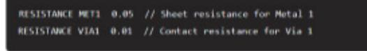

출처: 코드 작성 프로그램. 2024. 8. 6. 스크린샷. [그림 3-7] 기생 저항 설정 예시

- (다) 기생 커패시턴스(Parasitic Capacitance)
  - 1) 배선 간의 커패시턴스를 추출하기 위한 설정이다.
  - 2) 파라미터
    - 가) Fringe capacitance(Cf): 배선 가장자리의 커패시턴스
    - 나) Area capacitance(Ca): 배선 면적에 따른 커패시턴스

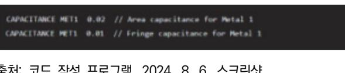

출처: 코드 작성 프로그램. 2024. 8. 6. 스크린샷. [그림 3-8] 기생 커패시턴스 설정 예시

- (라) 기생 인덕턴스(Parasitic Inductance)
  - 1) 고주파 설계에서 중요한 배선의 인덕턴스를 추출하기 위한 설정이다.
  - 2) 파라미터
    - 가) Inductance Per Unit Length(L): 단위 길이당 인덕턴스

출처: 코드 작성 프로그램. 2024. 8. 6. 스크린샷.

[그림 3-9] 기생 인덕턴스 설정 예시

- (2) 설정 파일 작성
  - (가) 레이어 매핑 파일
    - 1) 레이어 매핑 파일을 작성하여 각 레이어를 특정 공정 레이어와 매핑한다.

| LAYER MA ACT 1 POLY 2 DEFF 3 |
|---------------------------------------|
| POLY 2 DEFF 3                      |
|                                       |
|                                       |
|                                       |
| <b>MET1 10</b>                        |
| MET2 11                               |
| VEAL 20                               |
| VEA2 21                               |

출처: 코드 작성 프로그램. 2024. 8. 6. 스크린샷. [그림 3-10] 레이어 매핑 파일

(나) 추출 파라미터 설정 파일

1) 기생 저항, 커패시턴스, 인덕턴스 등의 추출 파라미터를 설정한다.

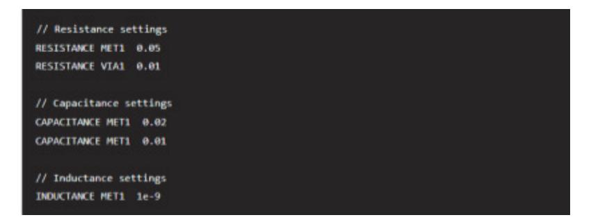

출처: 코드 작성 프로그램. 2024. 8. 6. 스크린샷. [그림 3-11] 추출 파라미터 설정

- (3) LPE 도구 설정 및 실행
  - (가) 도구 설정
    - 1) LPE 도구(예: Cadence QRC, Synopsys StarRC, Mentor Graphics Calibre xRC)를 설정하여 추출 파라미터 파일을 불러온다.

출처: 코드 작성 프로그램. 2024. 8. 6. 스크린샷. [그림 3-12] Cadence QRC 설정 예시

(나) LPE 실행

LPE 검증을 실행하여 레이아웃에서 기생 소자를 추출한다.

출처: 코드 작성 프로그램. 2024. 8. 6. 스크린샷. [그림 3-13] LPE(Cadence QRC) 기생 소자 추출 실행 예시

(4) 결과 분석

(가) 기생 소자 데이터 확인

추출된 기생 소자 데이터를 검토하여 설계에 미치는 영향을 분석한다.

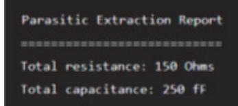

출처: 코드 작성 프로그램. 2024. 8. 6. 스크린샷. [그림 3-14] 결과 보고서 예시

(나) 성능 분석

1) 기생 소자가 회로 성능에 미치는 영향을 분석하고 필요시 설계를 수정한다.

2) 타이밍 분석: 기생 저항 및 커패시턴스가 타이밍에 미치는 영향을 분석한다.

3) 전력 분석: 기생 소자가 전력 소모에 미치는 영향을 분석한다.

LPE 검증을 위해 추출 파라미터를 정확하게 설정하는 것은 회로의 성능을 예측하고 최 적화하는 데 필수적이다. 정확한 레이어 매핑과 기생 소자 추출 파라미터 설정을 통해 고품질의 반도체 설계를 달성할 수 있다.

(5) 추출 영역을 정의한다.

커스텀 레이아웃의 LPE 검증을 위해 추출 영역을 정의하는 것은 기생 소자(기생 저항, 기생 커패시턴스 등)를 정확하게 추출하고 분석하는 데 필수적이다. 추출 영역을 정확히 정의하면 특정 영역의 기생 소자를 집중적으로 분석할 수 있으며, 설계 최적화와 성능 예측에 유리하다. 다음은 LPE 검증을 위한 추출 영역을 정의하는 방법과 절차이다.

(가) 추출 영역 정의의 필요성

1) 이유

가) 특정 영역에 집중하여 기생 소자의 영향을 분석할 수 있다.

나) 중요 회로 영역에 대한 상세한 분석을 통해 성능 최적화를 도모할 수 있다.

다) LPE 도구의 성능을 향상시키고 검증 시간을 단축할 수 있다.

(나) 추출 영역 정의 방법

1) 레이어 기반 추출 영역 정의

가) 레이어 매핑: 레이어 매핑 파일을 사용하여 특정 레이어의 기생 소자를 추출하 도록 설정한다.

| LAYER | MAD |
|-------|-----|
| ACT   |     |
| POLY  |     |
| DIFF  |     |
| MET1  | 10  |
| MET2  | 11  |
| VIA1  | 20  |
| VIA2  | 21  |

출처: 코드 작성 프로그램. 2024. 8. 6. 스크린샷. [그림 3-15] 레이어 기반 추출 영역 정의

- 2) 영역 기반 추출 정의
  - 가) 추출 영역 설정: 특정 좌표나 영역을 정의하여 해당 영역 내에서 기생 소자를 추출하도록 설정한다.

 출처: 코드 작성 프로그램. 2024. 8. 6. 스크린샷. [그림 3-16] 영역 기반 추출 정의

- 3) 기능 블록 기반 추출 정의
  - 가) 기능 블록: 특정 기능 블록(예: 아날로그 회로, 디지털 회로 등) 내에서 기생 소 자를 추출하도록 설정한다.

 출처: 코드 작성 프로그램. 2024. 8. 6. 스크린샷. [그림 3-17] 기능 블록 기반 추출 정의

(다) LPE 도구 설정

1) 도구 설정 파일 작성

| LAYER | _wp                             |
|-------|---------------------------------|
| MET1  | 1                               |
| MET2  | 2                               |
| МЕТЗ  | 3                               |
| VIA1  | 10                              |
| VIA2  | 11                              |
|       |                                 |
| EXTRA | CT_REGION (100, 100) (500, 500) |

출처: 코드 작성 프로그램. 2024. 8. 6. 스크린샷. [그림 3-18] Calibre xRC 설정 예시

2) LPE 실행

LPE 실행 명령: 설정 파일을 사용하여 LPE 검증을 실행한다. 실행 예시(Calibre xRC)

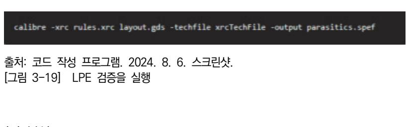

- (라) 결과 분석
  - 1) 기생 소자 데이터 확인

추출된 기생 소자 데이터를 검토하여 설계에 미치는 영향을 분석한다.

| Parasitic Extraction Report                               |                 |  |
|-----------------------------------------------------------|-----------------|--|
| Region: (100, 100) to (500, Total resistance: 150 Ohms | <del>0</del> 0) |  |
| Total capacitance: 250 fF                                 |                 |  |

출처: 코드 작성 프로그램. 2024. 8. 6. 스크린샷. [그림 3-20] 예시 보고서

#### 2) 성능 분석

- 기생 소자가 회로 성능에 미치는 영향을 분석하고 필요시 설계를 수정한다.
  - 가) 타이밍 분석: 기생 저항 및 커패시턴스가 타이밍에 미치는 영향을 분석한다.
  - 나) 전력 분석: 기생 소자가 전력 소모에 미치는 영향을 분석한다.
- (마) 최적화 및 재검증
  - 1) 설계 수정
    - 가) 결과 분석을 통해 파악된 문제점을 수정하고, LPE 검증을 다시 실행하여 수정 사항을 검증한다.
    - 나) 재검증: 설계를 수정한 후, 다시 LPE 검증을 수행하여 모든 오류가 해결되었는 지 확인한다.

추출 영역을 정의하는 것은 커스텀 레이아웃 LPE 검증에서 중요한 단계이다. 정확한 추 출 영역 정의를 통해 기생 소자의 정확한 추출과 분석이 가능해지며, 이는 최종 회로 성능 예측과 최적화에 큰 도움을 준다. 이러한 과정을 통해 고품질의 반도체 설계를 달 성할 수 있다.

(6) LPE 실행한다.

(가) 명령어 실행: EDA 도구의 명령어를 사용하여 LPE를 실행한다.

(나) GUI 사용: 그래픽 사용자 인터페이스를 통해 LPE를 설정 및 실행한다.

5. LPE 결과를 분석한다.

커스텀 레이아웃 검증에서 LPE 검증 결과를 분석하는 과정은 레이아웃에서 추출된 기생 소 자(기생 저항, 기생 커패시턴스, 기생 인덕턴스 등)의 데이터를 검토하여 회로 성능에 미치 는 영향을 평가하는 것이다. 이 분석을 통해 최종 회로 성능을 예측하고 최적화할 수 있다. 아래는 LPE 검증 결과를 분석하는 주요 단계와 방법이다.

- (1) LPE 검증 결과 파일 이해
  - (가) LPE 결과 파일 포맷
    - 1) SPEF(Standard Parasitic Exchange Format): 기생 소자 데이터를 표현하는 표 준 포맷
    - 2) RSPF(Reduced Spice Parasitic Format): 기생 저항과 커패시턴스에 대한 간략화 된 포맷
    - 3) DSPF(Detailed Standard Parasitic Format): 기생 소자에 대한 상세한 정보를 제 공하는 포맷
  - (나) 주요 구성 요소
    - 1) Netlist: 각 네트에 대한 기생 소자 정보
    - 2) Resistance(R): 배선과 비아의 저항값
    - 3) Capacitance(C): 배선 간 및 배선과 기판 간의 커패시턴스 값
    - 4) Inductance(L): 배선의 인덕턴스 값(고주파 설계에서 중요)
- (2) LPE 결과 분석 단계
  - (가) 기생 저항 분석
    - 1) 목적: 각 배선의 저항값을 확인하여 신호 경로의 전압 강하와 저항을 평가한다.
    - 2) 분석 방법: 저항이 높은 경로를 식별하고, 해당 경로에서 발생할 수 있는 전압 강하 를 평가한다.

| R1 net1 net2 0.05 R2 net2 net3 0.07 | *RESISTANCE     |
|----------------------------------------|-----------------|
| R2 net2 net3 0.07                      | R1 net1 net2 0. |
|                                        | R2 net2 net3 0. |

출처: 코드 작성 프로그램. 2024. 8. 6. 스크린샷. [그림 3-21] 기생 저항 분석

(나) 기생 커패시턴스 분석

1) 목적: 각 네트의 커패시턴스 값을 확인하여 신호 전파 지연과 커플링 효과를 평가한 다.

2) 분석 방법: 커패시턴스가 큰 네트를 식별하고, 해당 네트에서 발생할 수 있는 신호 지연과 간섭을 평가한다.

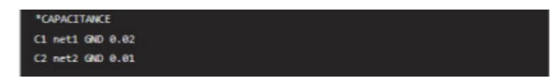

출처: 코드 작성 프로그램. 2024. 8. 6. 스크린샷. [그림 3-22] 기생 커패시턴스 분석

#### (다) 기생 인덕턴스 분석

- 1) 목적: 고주파 회로에서 인덕턴스가 신호 무결성에 미치는 영향을 평가한다.
- 2) 분석 방법: 인덕턴스가 높은 배선을 식별하고, 고주파 신호 전송 시 발생할 수 있는 문제를 평가한다.

|  | 출처: 코드 작성 프로그램. 2024. 8. 6. 스크린샷. |
|--|-----------------------------------|

[그림 3-23] 기생 인덕턴스 분석

#### (3) 성능 분석

- (가) 타이밍 분석
  - 1) 목적: 기생 소자가 타이밍 경로에 미치는 영향을 평가한다.
  - 2) 분석 방법:(STA: Static Timing Analysis) 도구를 사용하여 타이밍 경로를 분석하 고, 기생 저항 및 커패시턴스가 타이밍에 미치는 영향을 평가한다.
  - 3) 도구: Synopsys PrimeTime, Cadence Tempus 등
- (나) 전력 분석
  - 1) 목적: 기생 소자가 전력 소비에 미치는 영향을 평가한다.
  - 2) 분석 방법: Power analysis 도구를 사용하여 기생 소자에 의한 전력 소모를 평가 하고, 저전력 설계를 최적화한다.
  - 3) 도구: Synopsys PrimePower, Cadence Voltus 등
- (다) 신호 무결성 분석
  - 1) 목적: 기생 소자가 신호 무결성에 미치는 영향을 평가한다.
  - 2) 분석 방법: Signal Integrity 분석 도구를 사용하여 크로스토크, EMI, 전압 강하 등 을 평가한다.
  - 3) 도구: Cadence Sigrity, Ansys HFSS 등

- (4) 결과 해석 및 최적화
  - (가) 문제점 식별
    - 1) 고저항 경로: 저항이 높은 경로를 식별하여 전압 강하 문제를 해결한다.
    - 2) 고커패시턴스 경로: 커패시턴스가 높은 경로를 식별하여 신호 지연과 간섭 문제를 해결한다.
    - 3) 고인덕턴스 경로: 인덕턴스가 높은 경로를 식별하여 고주파 신호 무결성 문제를 해 결한다.
  - (나) 설계 수정
    - 1) 배선 최적화: 저항과 커패시턴스를 줄이기 위해 배선을 재배치하고 최적화한다.
    - 2) 비아 추가: 전기적 경로를 개선하기 위해 비아를 추가한다.
    - 3) 레이아웃 수정: 신호 무결성을 개선하기 위해 레이아웃을 수정한다.
- (5) 재검증
  - (가) 재검증 수행

수정된 레이아웃에 대해 다시 LPE 검증을 수행하여 모든 문제가 해결되었는지 확인 한다.

(나) 반복적 최적화

필요에 따라 설계 수정과 검증 과정을 반복하여 최적의 성능을 달성한다.

LPE 검증 결과를 분석하는 것은 커스텀 레이아웃에서 기생 소자가 회로 성능에 미치는 영향을 평가하고 최적화하는 중요한 과정이다. 정확한 분석과 설계 수정을 통해 회로의 타이밍, 전력 소모, 신호 무결성을 최적화할 수 있다. 이를 통해 고품질의 반도체 소자 를 설계할 수 있다.

- 6. 기생 소자 영향을 분석한다.
  - (1) 전기적 특성: 기생 소자가 회로의 전기적 특성에 미치는 영향을 분석한다.
    - (가) 결과 파일을 분석한다.
      - 1) LPE 결과 파일 형식
        - 가) 형식: .spf, .extraction 등
        - 나) 내용: 기생 저항, 커패시턴스, 인덕턴스 값과 연결 정보를 확인한다.
      - 2) 결과 파일 로드
        - 가) EDA 도구 사용: Cadence Virtuoso, Mentor Graphics Calibre 등
        - 나) 데이터 시각화: 추출된 데이터를 시각적으로 표현하여 분석한다.
    - (나) 기생 저항을 분석한다.
      - 1) 저항값을 확인한다.
        - 가) 값 확인: 각 경로의 기생 저항값을 확인한다.

- 나) 영향 분석: 저항값이 높은 경로가 회로 성능에 미치는 영향을 분석한다.
- 2) 저항 네트워크를 확인한다.
  - 가) 네트워크 분석: 저항 네트워크를 통해 주요 전류 경로를 분석한다.
  - 나) 전력 손실 평가: 저항에 의한 전력 손실을 평가한다.
- (다) 기생 커패시턴스를 분석한다.
  - 1) 커패시턴스 값을 확인한다.
    - 가) 값 확인: 각 경로의 기생 커패시턴스 값을 확인한다.
    - 나) 영향 분석: 커패시턴스 값이 높은 경로가 신호 지연과 왜곡에 미치는 영향을 분 석한다.
  - 2) 커패시턴스 네트워크를 확인한다.
    - 가) 네트워크 분석: 커패시턴스 네트워크를 통해 주요 커패시턴스 경로를 분석한다.
    - 나) 신호 무결성 평가: 커패시턴스에 의한 신호 무결성 문제를 분석한다.
- (라) 기생 인덕턴스를 분석한다.
  - 1) 인덕턴스 값을 확인한다.
    - 가) 값 확인: 각 경로의 기생 인덕턴스 값을 확인한다.
    - 나) 영향 분석: 인덕턴스 값이 높은 경로가 고속 신호와 RF 회로에 미치는 영향을 분석한다.
  - 2) 인덕턴스 네트워크을 확인한다.
    - 가) 네트워크 분석: 인덕턴스 네트워크를 통해 주요 인덕턴스 경로를 분석한다.
    - 나) 신호 무결성 및 전력 전송 평가: 인덕턴스에 의한 신호 무결성과 전력 전송 문 제를 분석한다.
- (마) 시뮬레이션 및 모델링한다.
  - 1) SPICE 시뮬레이션을 진행한다.
    - 가) 목적: 기생 소자가 포함된 회로의 전기적 특성 시뮬레이션
    - 나) 설정: 시뮬레이션 환경 설정(온도, 전압 등)
    - 다) 실행: SPICE 시뮬레이션 실행 및 결과를 분석한다.
  - 2) 결과를 해석한다.
    - 가) 전압-전류 특성(IV Characteristics): 기생 소자가 포함된 회로의 IV 특성을 분 석한다.
    - 나) 주파수 응답(Frequency Response): 기생 커패시턴스와 인덕턴스가 주파수 응 답에 미치는 영향을 분석한다.
- (바) 분석 도구 및 방법을 파악한다.
  - 1) EDA 도구를 사용한다.
    - 가) Cadence Virtuoso: 레이아웃 설계 및 기생 소자 추출 도구

- 나) Mentor Graphics Calibre: 기생 소자 추출 및 검증 도구
- 다) Synopsys HSPICE: 시뮬레이션 도구
- 2) 분석 방법을 파악한다.
  - 가) DC 분석: 정전 상태에서 기생 소자가 전류와 전압에 미치는 영향을 분석한다.
  - 나) AC 분석: 주파수에 따른 기생 소자의 커패시턴스와 인덕턴스 영향을 분석한다.
  - 다) 트랜지언트 분석: 시간에 따른 기생 소자의 동적 특성을 분석한다.
- (사) 최적화 및 개선한다.
  - 1) 기생 소자 최소화한다.
    - 가) 레이아웃 최적화: 기생 저항, 커패시턴스, 인덕턴스를 최소화하기 위한 레이아웃 을 수정한다.
    - 나) 설계 규칙 준수: 설계 규칙을 준수하여 기생 소자 발생을 최소화한다.
  - 2) 성능을 개선한다.
    - 가) 재설계: 필요한 경우 회로를 재설계하여 성능을 향상한다.
    - 나) 재검증: 최적화 후 다시 LPE 및 시뮬레이션을 수행하여 개선 효과를 검증한다.
- (아) 문서화 및 보고한다.
  - 1) 분석 결과 문서화한다.
    - 가) 보고서 작성: 기생 소자 분석 결과를 문서화하여 보고서를 작성한다.
    - 나) 주요 결과 및 추천 사항: 주요 분석 결과와 성능 개선을 위한 추천 사항 포함 한다.
  - 2) 팀과 공유한다.
    - 가) 결과 공유: 분석 결과를 팀과 공유하여 설계 과정에 반영한다.

나) 피드백 수집: 팀의 피드백을 수집하여 추가 개선 사항을 도출한다.

커스텀 레이아웃의 LPE 결과에서 기생 소자의 전기적 특성에 미치는 영향을 분석하기 위해서는 기생 소자에 대한 기본 개념 이해, LPE 결과 파일 분석, 기생 저항, 커패시턴 스, 인덕턴스 분석, 시뮬레이션 및 모델링, 최적화 및 개선, 문서화 및 보고 등의 종합 적인 지식과 절차가 필요하다. 이러한 과정을 통해 설계자는 회로의 전기적 특성을 정확 하게 분석하고 최적화하여 높은 성능과 신뢰성을 가진 반도체 소자를 설계할 수 있다.

(2) 성능 평가: 추출된 기생 소자를 기반으로 회로 성능을 평가한다.

커스텀 레이아웃의 LPE 결과에서 추출된 기생 소자를 기반으로 회로 성능을 평가하는 과정은 다음과 같은 단계로 이루어진다. 이 과정은 기생 소자가 회로 성능에 미치는 영 향을 정확하게 분석하고, 최적화하여 설계의 신뢰성과 성능을 보장하는 데 필수적이다.

- (가) LPE 결과를 이해한다.
  - 1) 기생 소자 정보을 파악한다.
    - 가) 기생 저항(Parasitic Resistance): 도체 경로의 저항값

- 나) 기생 커패시턴스(Parasitic capacitance): 도체 간 커패시턴스 값
- 다) 기생 인덕턴스(Parasitic Inductance): 도체 경로의 인덕턴스 값
- 2) 결과 파일 형식을 파악한다.
  - 가) 형식: 일반적으로 .spf, .extraction 등의 파일 형식
  - 나) 내용: 각 경로의 기생 소자값과 연결 정보
- (나) SPICE 네트리스트 생성을 확인한다.
  - 1) 기생 소자 포함 네트리스트를 생성한다.
    - 가) EDA 도구 사용: Cadence Virtuoso, Synopsys StarRC 등
    - 나) 설정: LPE 결과 파일을 로드하여 기생 소자가 포함된 SPICE 네트리스트를 생 성한다.
    - 다) 파일 형식: .cir, .sp 등의 SPICE 파일 형식
  - 2) 네트리스트를 구성한다.
    - 가) 기본 소자 정의: 트랜지스터, 저항, 커패시터 등 회로 소자
    - 나) 기생 소자 추가: LPE 결과에서 추출된 기생 저항, 커패시턴스, 인덕턴스 값을 추가한다.
- (다) 시뮬레이션 환경을 설정한다.
  - 1) 시뮬레이션 조건을 설정한다.
    - 가) 온도 조건: 다양한 온도 범위에서의 성능 평가를 진행한다.
    - 나) 전압 조건: 동작 전압 범위를 설정한다.
    - 다) 주파수 조건: 고주파 회로의 경우 주파수 범위를 설정한다.
  - 2) 시뮬레이션 도구를 사용한다.
    - 가) SPICE 시뮬레이터: HSPICE, Spectre 등
    - 나) 설정 파일: 시뮬레이션 파라미터 설정 파일을 작성한다.
- (라) 시뮬레이션 실행 및 결과를 분석한다.
  - 1) 시뮬레이션을 실행한다.
    - 가) 명령어 실행: SPICE 시뮬레이션 명령어를 실행한다.
    - 나) 시뮬레이션 시간: 시뮬레이션 시간을 고려하여 실행한다.
  - 2) 결과를 분석한다.
    - 가) DC 분석: 정전 상태에서의 회로 성능을 분석한다.
    - 나) AC 분석: 주파수 응답 및 안정성을 분석한다.
    - 다) 트랜지언트 분석: 시간에 따른 동적 성능을 분석한다.
    - 라) 파형 분석: 출력 파형을 통해 신호 왜곡, 지터, 노이즈를 확인한다.
- (마) 기생 소자의 영향을 분석한다.
  - 1) 기생 저항의 영향을 확인하다.

가) 전압 강하: 저항에 의한 전압 강하를 분석한다.

나) 전력 소모: 저항에 의한 전력 소모 증가를 평가한다.

- 다) 신호 감쇠: 신호 경로에서의 저항으로 인한 신호 감쇠를 분석한다.
- 2) 기생 커패시턴스의 영향을 확인한다.
  - 가) 신호 지연: 커패시턴스로 인한 신호 지연 및 시간 상수 증가 분석한다.
  - 나) 신호 왜곡: 고주파 신호의 경우 커패시턴스에 의한 왜곡을 분석한다.
  - 다) 용량성 결합: 인접 도체 간의 커패시턴스에 의한 신호 결합 분석한다.
- 3) 기생 인덕턴스의 영향을 확인한다.
  - 가) 전압 스파이크: 인덕턴스로 인한 전압 스파이크 및 링잉 현상 분석한다.
  - 나) 전력 전송: 고주파 신호에서의 인덕턴스 영향을 분석한다.
  - 다) 신호 왜곡: 인덕턴스에 의한 신호 왜곡 및 안정성을 평가한다.
- (바) 최적화 및 개선한다.
  - 1) 기생 소자를 최소화한다.
    - 가) 레이아웃 수정: 기생 저항, 커패시턴스, 인덕턴스를 최소화하기 위한 레이아웃을 수정한다.
    - 나) 배선 최적화: 배선 길이와 폭을 최적화하여 기생 소자를 감소한다.
  - 2) 성능을 개선한다.
    - 가) 소자 파라미터 조정: 트랜지스터 크기, 저항값, 커패시터 값을 조정한다.
    - 나) 회로 구조 변경: 필요시 회로 구조를 변경하여 기생 소자의 영향을 최소화한다.

#### (사) 재검증한다.

- 1) DRC/LVS 재검증한다.
  - 가) DRC(Design Rule Check): 수정된 레이아웃이 설계 규칙을 준수하는지 재검 증한다.
  - 나) LVS(Layout Versus Schematic): 수정된 레이아웃과 회로도의 일치 여부 재 검증한다.
- 2) 재시뮬레이션한다.
  - 가) 시뮬레이션 재실행: 최적화 후 시뮬레이션을 다시 실행하여 성능을 평가한다.
  - 나) 결과 비교: 초기 결과와 최적화 후 결과를 비교 분석한다.
- (아) 문서화 및 보고한다.
  - 1) 분석 결과 문서화한다.
    - 가) 보고서 작성: 기생 소자 분석 결과를 문서화하여 보고서를 작성한다.
    - 나) 주요 결과 및 추천 사항: 주요 분석 결과와 성능 개선을 위한 추천 사항을 포 함한다.
  - 2) 팀과 공유한다.

가) 결과 공유: 분석 결과를 팀과 공유하여 설계 과정에 반영한다.

나) 피드백 수집: 팀의 피드백을 수집하여 추가 개선 사항을 도출한다.

커스텀 레이아웃의 LPE 결과에서 추출된 기생 소자를 기반으로 회로 성능을 평가하기 위해서는 기생 소자에 대한 기본 개념 이해, LPE 결과 파일 분석, SPICE 네트리스트 생성, 시뮬레이션 환경 설정, 시뮬레이션 실행 및 결과 분석, 기생 소자의 영향 분석, 최적화 및 개선, 재검증, 문서화 및 보고 등의 절차를 체계적으로 수행해야 한다. 이러 한 과정을 통해 설계자는 회로의 전기적 특성을 정확하게 분석하고 최적화하여 높은 성 능과 신뢰성을 가진 반도체 소자를 설계할 수 있다.

7. 모델 및 시뮬레이션한다.

(1) SPICE 모델 생성를 확인한다.

(가) 목적: 추출된 기생 소자를 포함한 회로의 SPICE 모델을 생성한다.

(나) 방법: EDA 도구에서 SPICE 모델 자동 생성 기능을 사용한다.

(2) 시뮬레이션을 설정한다.

(가) 환경 설정: 시뮬레이션을 위한 온도, 전압 조건을 설정한다.

(나) 파라미터 조정: 시뮬레이션 파라미터 조정 및 최적화한다.

(3) 시뮬레이션을 실행한다.

(가) 명령어 실행: SPICE 시뮬레이션 명령어를 실행한다.

(나) 결과 분석: 시뮬레이션 결과를 통해 회로의 전기적 특성을 분석한다.

8. 검증 및 최적화한다.

(1) DRC/LVS 검증한다.

(가) 목적: 레이아웃의 설계 규칙 준수 여부 및 회로도 일치 여부를 검증한다.

(나) 방법: EDA 도구의 DRC/LVS 기능을 사용한다.

(2) 최적화한다.

(가) 기생 소자 최소화: 기생 소자의 영향을 최소화하기 위한 레이아웃을 수정한다.

(나) 성능 향상: 회로 성능을 향상시키기 위한 파라미터를 최적화한다.

숕 포스트 네트리스트(Post Netlist)를 추출한다.

아날로그 회로 설계에 필요한 포스트 네트리스트(Post Netlist)를 추출하는 과정을 단계별로 설 명한다. 여기에 예시로 Cadence Virtuoso와 Mentor Graphics Calibre 도구를 사용한 과정 이 포함된다.

1. 레이아웃 도면을 준비한다.

- (1) Cadence Virtuoso를 사용하여 레이아웃을 설계한다. 레이아웃 설계 예시다.
  - (가) 작업 화면
    - 1) 도구: Cadence Virtuoso Layout Editor
    - 2) 설명: 트랜지스터, 저항, 커패시터 등 아날로그 회로 소자들을 배치하고 연결하여 레 이아웃을 설계한다.
- (2) 레이아웃DRC 및 LVS를 검증을 검증한다.DRC 및 LVS 검증한다.
  - (가) DRC(Design Rule Check)
    - 1) 도구: Cadence Assura DRC
    - 2) 설명: 레이아웃이 설계 규칙을 준수하는지 검증한다.
  - (나) LVS(Layout Versus Schematic)
    - 1) 도구: Mentor Graphics Calibre LVS
    - 2) 설명: 레이아웃과 회로도가 일치하는지 검증한다.
- 2. LPE 설정 및 실행한다.
  - (1) PDK(Process Design Kit)를 로드한다.PDK 로드 예시
    - (가) 작업 화면
      - 1) 도구: Cadence Virtuoso
      - 2) 설명: 공정 정보, 설계 규칙 파일, 기생 소자 모델 등을 로드한다.
  - (2) LPE 설정한다.
    - (가) 작업 화면
      - 1) 도구: Mentor Graphics Calibre xRC
      - 2) 설명: 기생 저항, 커패시턴스, 인덕턴스 값을 추출할 설정을 한다.
  - (3) 레이아웃 데이터를 로드한다.
    - (가) 작업 화면
      - 1) 도구: Calibre xRC
      - 2) 설명: 레이아웃 파일(GDSII, OASIS 등)을 로드한다.
  - (4) LPE 실행한다.
    - (가) 작업 화면
      - 1) 도구: Calibre xRC
      - 2) 설명: 설정된 LPE를 실행하여 기생 소자를 추출한다.
- 3. LPE 결과 파일 생성 및 분석한다.
  - (1) 결과 파일을 생성한다.
    - (가) 작업 화면

- 1) 도구: Calibre xRC
- 2) 설명: 추출된 기생 소자 데이터를 포함한 결과 파일(.spf, .extraction 등)을 생성한 다.
- (2) 결과 파일 로드 및 분석한다.
  - (가) 작업 화면
    - 1) 도구: Cadence Virtuoso
    - 2) 설명: LPE 결과 파일을 로드하여 분석한다.
- 4. 포스트 레이아웃 네트리스트를 생성한다.
  - (1) 기생 소자 포함 네트리스트를 생성한다.
    - (가) 작업 화면
      - 1) 도구: Cadence Virtuoso
      - 2) 설명: LPE 결과에서 추출된 기생 소자를 포함한 SPICE 네트리스트를 생성한다.
- 5. 시뮬레이션 환경을 설정한다.
  - (1) 시뮬레이션 조건 설정
    - (가) 작업 화면
      - 1) 도구: Cadence Spectre
      - 2) 설명: 시뮬레이션 조건(온도, 전압 등)을 설정한다.
- 6. 시뮬레이션 실행 및 결과를 분석한다.
  - (1) 시뮬레이션을 실행한다.
    - (가) 작업 화면
      - 1) 도구: Cadence Spectre
      - 2) 설명: SPICE 시뮬레이션을 실행하여 결과를 분석한다.
  - (2) 결과를 분석한다.
    - (가) 작업 화면
      - 1) 도구: Cadence Virtuoso ADE(Analog Design Environment)
      - 2) 설명: DC, AC, 트랜지언트 분석 결과를 통해 회로 성능을 평가한다.
- 7. 기생 소자의 영향을 분석한다.
  - (1) 작업 화면
    - (가) 도구: Cadence Virtuoso ADE
- (나) 설명: 기생 저항, 커패시턴스, 인덕턴스가 회로 성능에 미치는 영향을 분석한다. 8. 레이아웃 최적화 및 개선한다.

(1) 작업 화면

(가) 도구: Cadence Virtuoso Layout Editor

(나) 설명: 기생 소자를 최소화하기 위해 레이아웃을 수정하고 최적화한다.

9. 재검증한다.

(1) DRC/LVS 재검증한다.

(가) 작업 화면

1) 도구: Mentor Graphics Calibre

2) 설명: 수정된 레이아웃을 DRC/LVS를 통해 재검증한다.

커스텀 레이아웃의 LPE 결과에서 추출된 기생 소자를 기반으로 아날로그 회로 설계에 필요한 포스트 네트리스트를 추출하는 과정은 체계적이고 세심한 단계를 통해 수행된다. 위의 예시 그 림들과 설명을 통해 각 단계의 중요성을 이해하고, 이를 기반으로 회로 성능을 최적화할 수 있 다.

### 학습 3 교수·학습 방법

#### 교수 방법

- 반도체 소자 및 공정, 공정 소자의 전기적 특성 및 레이어별 매개 변수, 공정의 설계·검증 규칙, 공정의 설계 권고 사항 등의 내용을 포함하는 강의 자료를 준비한다. 가능한 많은 예 시 그림을 포함하도록 한다.
- 레이아웃 DRC 수행 및 오류 해석 기술, 레이아웃 LVS 수행 및 네트리스트 추출 및 검증 오류 해석 기술에 대한 내용을 이론으로 설명한 후, 관련 툴 실습을 통해 훈련시킨다.
- 기본적인 지식은 강의를 통해 학습하도록 하며, 상세하고 친절한 실습 매뉴얼을 준비하여 학습자가 혼자서도 단계적으로 실습이 가능하도록 한다.
- 관련 툴을 확보하여 전 과정을 작업 순서에 따라 단계적으로 학습 및 실습이 이루어지도록 하는데, 여건상 툴 확보가 힘들 경우 전 과정을 나타내는 충분한 그림 및 사진, 동영상 자료 를 확보하여 학습자의 이해를 돕는다.

#### 학습 방법

- 반도체 소자 및 공정, 공정 소자의 전기적 특성 및 레이어별 매개 변수, 공정의 설계·검증 규칙, 공정의 설계 권고 사항 등의 내용을 교수자가 제시하는 학습 자료를 기본으로 학습하 고, 그 밖에 필요한 부분은 인터넷 검색이나 참고 도서 등을 통하여 보충한다.
- 레이아웃 DRC 수행 및 오류 해석 기술, 레이아웃 LVS 수행 및 네트리스트 추출 및 검증 오류 해석 기술에 대한 내용을 교수자가 제공하는 실습 매뉴얼을 참고하여 단계적으로 실습 하면서 기능을 익힌다.
- 관련 툴은 학습자가 구매하기는 어려우나 보통 툴 벤더에서는 평가용 버전을 무료로 배포하 기도 하므로 그것을 설치하여 실습한다. 툴 확보가 어려울 경우, 인터넷 검색을 통해 레이아 웃 DRC 및 LVS에 관련된 그림 및 사진, 동영상 자료 등을 확보하여 이해하는 데 참고한 다. 또한 툴 벤더의 교육 프로그램에 참여하여 학습한다.

## 학습 3 평 가

#### 평가 준거

• 평가자는 학습자가 학습 목표를 성공적으로 달성하였는지를 평가해야 한다.

#### • 평가자는 다음 사항을 평가해야 한다.

|        | 학습 목표                                                                        |  | 성취수준 |   |  |
|--------|------------------------------------------------------------------------------|--|------|---|--|
| 학습 내용  |                                                                              |  | 중    | 하 |  |
|        | - 레이아웃 도면의 매개 변수를 추출하기 위해 LPE(Lay-Out Parasitic Extraction) 파일을 숙지할 수 있다. |  |      |   |  |
| LPE 검증 | - 해당 파일을 활용하여 아날로그 회로 설계에 필요한 포스트 네트리스트(Post Netlist)를 추출할 수 있다.          |  |      |   |  |

#### 평가 방법

• 서술형 시험

|        | 평가 항목                                                          |  | 성취수준 |   |  |  |
|--------|----------------------------------------------------------------|--|------|---|--|--|
| 학습 내용  |                                                                |  | 중    | 하 |  |  |
|        | - 레이아웃 도면의 LPE 파일 내용 숙지 여부                                     |  |      |   |  |  |
| LPE 검증 | - LPE 파일을 활용하여 아날로그 회로 설계에 필요한 포스트 네트리스트를 추출할 수 있는 방법 파악 여부 |  |      |   |  |  |

#### • 평가자 체크리스트

|        | 평가 항목                                                   |  | 성취수준 |   |  |  |
|--------|---------------------------------------------------------|--|------|---|--|--|
| 학습 내용  |                                                         |  | 중    | 하 |  |  |
|        | - 레이아웃 도면의 LPE 파일 내용을 파악할 수 있는 능력                       |  |      |   |  |  |
| LPE 검증 | - LPE 파일을 활용해 아날로그 회로 설계에 필요한 포스트 네트리스트를 추출할 수 있는 능력 |  |      |   |  |  |

피드백

### 1. 서술형 시험 - 레이아웃 도면의 LPE(Lay-Out Parasitic Extraction) 파일 내용의 숙지 여부를 평가한 후, 보완 이 필요한 사항이나 주요 사항을 표시하여 피드백해 준다. - LPE(Lay-Out Parasitic Extraction) 파일을 활용하여 아날로그 회로 설계에 필요한 포스트 네트 리스트(Post Netlist)를 추출할 수 있는 능력을 평가한 후, 보완이 필요한 사항이나 주요 사항을 표시하여 보충 설명해 준다. - 평가 결과가 우수한 학습자와 미흡한 학습자를 구분하여 우수한 학습자들에게는 서술형 평가 내 용의 적용 사례 학습을 통한 심화 학습으로 피드백해 주고, 미흡한 학습자들에게는 기초 용어에

- 2. 평가자 체크리스트
- 레이아웃 도면의 LPE(Lay-Out Parasitic Extraction) 파일 내용에 대한 파악 여부을 확인한 후 부족한 점을 지적하여 정확하게 처리할 수 있도록 보완 지도해 준다.

대한 설명을 통해 일정 수준을 유지할 수 있도록 보완하여 지도해 준다.

- LPE 파일을 활용해 아날로그 회로 설계에 필요한 포스트 네트리스트(Post Netlist)를 추출할 수 있는 능력을 평가한 후, 개선 및 보완 사항에 대한 내용을 정리하여 재학습할 수 있도록 피드백 해 준다.
- 평가 결과가 우수한 학습자들에게는 작업장 환경에 서술형 평가 내용의 적용 사례 학습을 통한 심화 학습으로 피드백 해 주고, 저조한 학습자들에게는 기초 용어에 대한 숙지를 통해 일정 수준 을 유지할 수 있도록 보완하여 지도해 준다.

- ∙ 강성호·김대정·이승준·이찬호(2004). 『SoC 및 IP 설계 기법』. 홍릉과학출판사.
- ∙ 공진흥·김남영·김동욱·이재철(1997). 『VLSI 설계, 이론과 실습』. 홍릉과학출판사.
- ∙ 교육부(2015). 레이아웃 설계(LM1903060105\_14v3). 한국직업능력개발원.
- ∙ 조영록(2009). 『CMOS 공정을 이용한 Analog Layout』. 홍릉과학출판사
- ∙ 조준동(2010). 『알기쉬운 최신 VLSI설계』. 한빛미디어.
- ∙ Saburo Muroga (1982). VLSI system design: when and how to design very-large-scale integrated circuits. U.S.A: John Wiley & Sons, Inc.
- ∙ Neil H. E. Weste, David Harris (2005). CMOS VLSI Design: A Circuits and Systems Perspective. U.S.A: Addison Wesley.
- ∙ Saburo Muroga(1982). VLSI system design: when and how to design very-large-scale integrated circuits. U.S.A: John Wiley & Sons, Inc.
- ∙ Neil H. E. Weste, David Harris(2005). CMOS VLSI Design: A Circuits and Systems Perspective. U.S.A:Addison Wesley.

| NCS학습모듈 개발이력 |                                     |     |                  |  |  |
|--------------|-------------------------------------|-----|------------------|--|--|
| 발행일          | 2024년 12월 31일                       |     |                  |  |  |
| 세분류명         | 반도체 개발((19030601)                   |     |                  |  |  |
| 개발기관         | 수원과학대학교 산학협력단(개발책임자: 윤창용) 한국직업능력연구원 |     |                  |  |  |
|              | 최준혁(수원대학교)*                         |     | 김종범(삼성전기)        |  |  |
|              | 계찬호(수원대학교)                          |     | 김한수(두원공과대학교)     |  |  |
|              | 김경호(폴리텍대학교)                         |     | 남승호(경기대학교)       |  |  |
|              | 김관하(폴리텍대학교)                         |     | 손승대(제이에스이엔씨(주))  |  |  |
| 집필진          | 김기순((주)영우디에스피)                      | 검토진 | 안광호(퓨쳐일렉트로닉스)    |  |  |
|              | 김도균(폴리텍대학교)                         |     | 이철오((주)한국전력안전공단) |  |  |
|              | 전동민(폴리텍대학교)                         |     |                  |  |  |

\*표시는 대표집필자임 (참고) 검토진으로 참여한 집필진은 본인의 원고가 아닌 타인의 학습모듈을 검토함

| 커스텀 레이아웃 검증(LM1903060132_23v5)                                                                         |                   |  |  |
|--------------------------------------------------------------------------------------------------------|-------------------|--|--|
| 저작권자                                                                                                   | 교육부               |  |  |
| 연구기관                                                                                                   | 한국직업능력연구원         |  |  |
| 발행일                                                                                                    | 2024. 12. 31.     |  |  |
| ISBN                                                                                                   | 979-11-7175-766-4 |  |  |
| ※ 이 학습모듈은 자격기본법 시행령(제8조 국가직무능력표준의 활용)에 의거하여 개발하였으며, NCS통합포털사이트(http.//www.ncs.go.kr)에서 다운로드 할 수 있다. |                   |  |  |

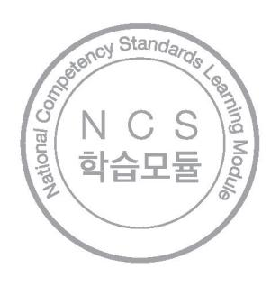