# NCS학습모듈 반도체용 웨이퍼 재료 제조

LM1903060401\_20v2

#### [NCS학습모듈 활용 시 유의 사항]

- 1. NCS학습모듈은 교육훈련기관에서 출처를 명시하고 교육적 목적으로 활용할 수 있습니다. 다 만, NCS학습모듈에는 국가(교육부)가 저작재산권 일체를 보유하지 않은 저작물(출처가 표기된 도표‧사진‧삽화‧도면 등)이 포함되어 있으므로, 이러한 저작물의 변형‧각색‧복제‧공연‧ 배포 및 공중 송신 등과 이러한 저작물을 활용한 2차적 저작물을 작성하려면 반드시 원작자 의 동의를 받아야 합니다.
- 2. NCS학습모듈은 개발 당시의 산업 및 교육 현장을 반영하여 집필하였으므로, 현재 적용되는 법령‧지침‧표준 및 교과 내용 등과 차이가 있을 수 있습니다. NCS학습모듈 활용 시 법령 ‧지침‧표준 및 교과 내용의 개정 사항과 통계의 최신성 등을 확인하시기를 바랍니다.
- 3. NCS학습모듈은 산업 현장에서 요구되는 능력을 교육훈련기관에서 학습할 수 있게 구성한 자 료입니다. 다만, NCS학습모듈 지면의 한계상 대표적 예시(예: 활용도 또는 범용성이 높은 제 품, 서비스) 중심으로 집필하였음을 이해하시기를 바랍니다.

## NCS학습모듈의 이해

※ 본 NCS학습모듈은 「NCS 국가직무능력표준」사이트(http://www.ncs.go.kr) 에서 확인 및 다운로드할 수 있습니다.

### Ⅰ NCS학습모듈이란?

- 국가직무능력표준(NCS: National Competency Standards)이란 산업현장에서 직무를 수행하기 위해 요구되는 지식·기술·소양 등의 내용을 국가가 산업부문별·수준별로 체계 화한 것으로 산업현장의 직무를 성공적으로 수행하기 위해 필요한 능력(지식, 기술, 태도) 을 국가적 차원에서 표준화한 것을 의미합니다.
- 국가직무능력표준(이하 NCS)이 현장의 '직무 요구서'라고 한다면, NCS학습모듈은 NCS
  의 능력단위를 교육훈련에서 학습할 수 있도록 구성한 '교수·학습 자료'입니다. NCS학습
  모듈은 구체적 직무를 학습할 수 있도록 이론 및 실습과 관련된 내용을 상세하게 제시하
  고 있습니다.

#### ○ NCS학습모듈은 다음과 같은 특징을 가지고 있습니다.

- 첫째, NCS학습모듈은 산업계에서 요구하는 직무능력을 교육훈련 현장에 활용할 수 있도 록 성취목표와 학습의 방향을 명확히 제시하는 가이드라인의 역할을 합니다.
- 둘째, NCS학습모듈은 특성화고, 마이스터고, 전문대학, 4년제 대학교의 교육기관 및 훈 련기관, 직장교육기관 등에서 표준교재로 활용할 수 있으며 교육과정 개편 시에도 유용하게 참고할 수 있습니다.

○ NCS와 NCS학습모듈 간의 연결 체계를 살펴보면 아래 그림과 같습니다.

O NCS학습모듈의 위치는 NCS 분류 체계에서 해당 학습모듈이 어디에 위치하는지를 한 눈에 볼 수 있도록 그림으로 제시한 것입니다.

| [NCS-학          | 습모듈            | 의 위치]    |          |  |
|-----------------|----------------|----------|----------|--|
|                 |                |          |          |  |
| 대분류             | 류 문화·예술·디자인·방송 |          |          |  |
| 중분류             | 문화콘텐츠          |          |          |  |
| 소분류             |                | 문화콘텐츠제작  |          |  |
|                 |                |          |          |  |
| 세분류             |                |          |          |  |
| 방송콘텐츠제작         |                | 능력단위     | 학습모듈명    |  |
| 영화콘텐츠제작         |                | 프로그램 기획  | 프로그램 기획  |  |
| 음악콘텐츠제작         |                | 아이템 선정   | 아이템 선정   |  |
| 광고콘텐츠제작         |                | 자료 조사    | 자료 조사    |  |
| 게임콘텐츠제작         |                | 프로그램 구성  | 프로그램 구성  |  |
| 애니메이션 콘텐츠제작  |                | 캐스팅      | 캐스팅      |  |
| 만화콘텐츠제작         |                | 제작계획     | 제작계획     |  |
| 캐릭터제작           |                | 방송 미술 준비 | 방송 미술 준비 |  |
| 스마트문화앱 콘텐츠제작 |                | 방송 리허설   | 방송 리허설   |  |
| 영사              |                | 야외촬영     | 야외촬영     |  |
|                 |                | 스튜디오 제작  | 스튜디오 제작  |  |
|                 |                |          |          |  |

학습모듈은

NCS 능력단위 1개당 1개의 학습모듈 개발 을 원칙으로 합니다. 그러나 필요에 따라 고용단위 및 교과단위를 고려하여 능력단위 몇 개를 묶어 1개 학습모듈로 개발할 수 있으며, NCS 능력단위 1개를 여러 개의 학습모듈로 나누어 개발할 수도 있습니다.

### 2. NCS학습모듈의 개요

#### ○ NCS학습모듈의 개요는 학습모듈이 포함하고 있는 내용을 개략적으로 설명한 것으로

| 학습모듈의 목표 , 선수학습 , 학습모듈의 내용 체계 , 핵심 용어 로 구성되어 있습니다. |                                                                              |  |  |
|----------------------------------------------------|------------------------------------------------------------------------------|--|--|
| 학습모듈의 목표                                           | 해당 NCS 능력단위의 정의를 토대로 학습 목표를 작성한 것입니다.                                        |  |  |
| 선수학습                                               | 해당 학습모듈에 대한 효과적인 교수·학습을 위하여 사전에 이수해야 하는 학습모 듈, 학습 내용, 관련 교과목 등을 기술한 것입니다. |  |  |
| 학습모듈의 내용 체계                                     | 해당 NCS 능력단위요소가 학습모듈에서 구조화된 체계를 제시한 것입니다.                                     |  |  |
| 핵심 용어                                              | 해당 학습모듈의 학습 내용, 수행 내용, 설비·기자재 등 가운데 핵심적인 용어를 제 시한 것입니다.                   |  |  |

### 제작계획 학습모듈의 개요

#### 학습모듈의 목표

본격적인 촬영을 준비하는 단계로서, 촬영 대본을 획정하고 제작 스태프를 조직하며 촬영 장비와 촬영 소품을 준비할 수 있다.

#### 선수학습

제작 준비(LM0803020105\_13v1), 섭외 및 제작스태프 구성(LM0803020104\_13v1), 촬영 제작(LM0803020106\_13v1), 촬영 장비 준비(LM0803040204\_13v1.4), 미술 디자인 협의하기(LM0803040203\_13v1.4)

#### 학습모듈의 내용체계

| 하스                | 하스 내용                                              | NCS 능력단위 요소       |                |
|-------------------|----------------------------------------------------|-------------------|----------------|
| 학습                | 학습 내용                                              | 코드번호              | 요소 명칭          |
| 1. 촬영 대본 확정하기  | 1-1. 촬영 구성안 검 토와 수정                             | 0803020114_16/3.1 | 촬영 대본 확정하기  |
| 2. 제작 스태프 조직하기 | 2-1. 기술 스태프 조직 2-2. 미술 스태프 조직 2-3. 전문 스태프 조직 | 0803020114_16v3.2 | 제작 스태프 조직하기 |
| 3. 촬영 장비 계획하기  | 3-1. 촬영 장비 점검 과 준비                              | 0803020114_16/3.3 | 촬영 장비 계획하기  |
| 4. 촬영 소품 계획하기  | 4-1. 촬영 소품 목록 작성 4-2. 촬영 소품 제작 의뢰         | 0803020114_16\3.4 | 촬영 소품 계획하기  |

#### 핵심 용어

촬영 구성안, 제작 스태프, 촬영 장비, 촬영 소품

#### 학습모듈의 목표는

학습자가 해당 학습모듈을 통해 성취해야 할 목표를 제시한 것으로, 교수자는 학습자 가 학습모듈의 전체적인 내용흐름을 파악하 도록 지도할 수 있습니다.

**6** • •

61

#### 선수학습은

교수자 또는 학습자가 해당 학습모듈을 교 수·학습하기 이전에 이수해야 하는 교과목 또는 학습모듈(NCS 능력단위) 등을 표기한 것입니다. 따라서 교수자는 학습자가 개별 학습, 자기 주도 학습, 방과 후 활동 등 다 양한 방법을 통해 이수할 수 있도록 지도하 는 것을 권장합니다.

|            | 핵심 용어는              |
|------------|---------------------|
|            | 률을 대표하는 주요 용어입니     |
|            | · 해당 학습모듈을 통해 학습    |
|            | 게될 주요 내용을 알 수 있습    |
|            | 5 국가직무능력표준」 사이트     |
| (www.ncs.g | jo.kr)의 색인 (찾아보기) 중 |
| 하나로 이용할    | 할 수 있습니다            |

#### 3. NCS학습모듈의 내용 체계

○ NCS학습모듈의 내용은 크게 학습, 학습 내용, 교수·학습 방법, 평가 로 구성되어 있습니다.

| 학습       | 해당 NCS 능력단위요소 명칭을 사용하여 제시한 것입니다. 학습은 크게 학습 내용, 교수·학습 방법, 평가로 구성되며 해당 NCS 능력단위의 능력단위 요소별 지식, 기술, 태도 등을 토대로 내용을 제시한 것입니다.                                                    |
|----------|----------------------------------------------------------------------------------------------------------------------------------------------------------------------------------|
| 학습 내용    | 학습 내용은 학습 목표, 필요 지식, 수행 내용으로 구성되며, 수행 내용은 재료·자 료, 기기(장비·공구), 안전·유의 사항, 수행 순서, 수행 tip으로 구성한 것입니다. 학습모듈의 학습 내용은 실제 산업현장에서 이루어지는 업무활동을 표준화된 프로세 스에 기반하여 다양한 방식으로 반영한 것입니다. |
| 교수·학습 방법 | 학습 목표를 성취하기 위한 교수자와 학습자 간, 학습자와 학습자 간 상호 작용이 활발하게 일어날 수 있도록 교수자의 활동 및 교수 전략, 학습자의 활동을 제시한 것입니다.                                                                            |
| 평가       | 평가는 해당 학습모듈의 학습 정도를 확인할 수 있는 평가 준거 및 평가 방법, 평 가 결과의 피드백 방법을 제시한 것입니다.                                                                                                         |

## [NCS-학습모듈의 위치]

세분류

| 대분류 | 전기·전자 |        |       |
|-----|-------|--------|-------|
| 중분류 |       | 전자기기개발 |       |
| 소분류 |       |        | 반도체개발 |

| 반도체개발 |  | 능력단위                 | 학습모듈명                |  |
|-------|--|----------------------|----------------------|--|
| 반도체제조 |  | 반도체용 웨이퍼 재료 제조       | 반도체용 웨이퍼 재료 제조       |  |
| 반도체장비 |  | 반도체용 금속(Target)재료 제조 | 반도체용 금속(Target)재료 제조 |  |
| 반도체재료 |  | 반도체용 패키지 재료 제조       | 반도체용 패키지 재료 제조       |  |
|       |  | 반도체 재료 개발            | 반도체 재료 개발            |  |
|       |  | 반도체 재료 생산관리          | 반도체 재료 생산관리          |  |
|       |  | 반도체 재료 품질관리          | 반도체 재료 품질관리          |  |
|       |  | 반도체 재료 안전관리          | 반도체 재료 안전관리          |  |
|       |  | 반도체용 마스크 재료 제조       | 반도체용 마스크 재료 제조       |  |
|       |  | 반도체용 플립칩 재료 제조       | 반도체용 플립칩 재료 제조       |  |
|       |  | 반도체용 CMP 재료 제조       | 반도체용 CMP 재료 제조       |  |
|       |  | 반도체용 식각공정 가스 제조      | 반도체용 식각공정 가스 제조      |  |
|       |  | 반도체용 세정공정 가스 제조      | 반도체용 세정공정 가스 제조      |  |
|       |  | 반도체용 박막공정 가스 제조      | 반도체용 박막공정 가스 제조      |  |

| 반도체용 이온주입공정 가스 제조 | 반도체용 이온주입공정 가스 제조 |
|-------------------|-------------------|
| 반도체용 박막공정 전구체 제조  | 반도체용 박막공정 전구체 제조  |
| 반도체용 포토공정 재료 제조   | 반도체용 포토공정 재료 제조   |
| 반도체용 트랙공정 재료 제조   | 반도체용 트랙공정 재료 제조   |
| 반도체용 SOD공정 재료 제조  | 반도체용 SOD공정 재료 제조  |
| 반도체용 박막도금공정 재료 제조 | 반도체용 박막도금공정 재료 제조 |
| 반도체용 세정공정 재료 제조   | 반도체용 세정공정 재료 제조   |
| 반도체용 CMP슬러리 재료 제조 | 반도체용 CMP슬러리 재료 제조 |

| 학습모듈의 개요                               | 1  |
|----------------------------------------|----|
| 학습 1. 반도체용 금속(Target) 재료 제조 요구 사항 파악하기 |    |
| 1-1. 금속 공정 원리 및 재료 파악                  | 3  |
| 1-2. 품질관리 문제점 분석                       | 11 |
| • 교수・학습 방법                             | 17 |
| • 평가                                   | 18 |
| 학습 2. 반도체용 금속(Target) 재료 준비하기          |    |
| 2-1. 금속 재료의 장점과 단점 분석                  | 20 |
| 2-2. 재료의 문제점 분석 및 해결                   | 32 |
| • 교수・학습 방법                             | 39 |
| • 평가                                   | 40 |
| 학습 3. 반도체용 금속(Target) 제조 하기            |    |
| 3-1. 금속 제조 공정별 특징 파악                   | 42 |
| 3-2. 금속 재료별 공정 도출 및 문제점 해결             | 52 |
| • 교수・학습 방법                             | 62 |
| • 평가                                   | 63 |
|                                        |    |
| 참고 자료                                  | 84 |
|                                        |    |
| 부 록                                 | 85 |

## 반도체용 웨이퍼 재료 제조 학습모듈의 개요

#### 학습모듈의 목표

반도체 제조에 필요한 웨이퍼 재료의 요구사항을 파악하여 선정하고, 제조 및 검증할 수 있다.

#### 선수학습

반도체 제조 공정 개발(1903060106\_14v3), 반도체 재료 생산(1903060409\_14v1), 반도체 재료 품질관 리(1903060410\_14v1)

#### 학습모듈의 내용체계

|                             |                                    | NCS 능력단위 요소       |                          |
|-----------------------------|------------------------------------|-------------------|--------------------------|
| 학습                          | 학습 내용                              | 코드번호              | 요소 명칭                    |
|                             | 1-1. 제조 공정 파악                      |                   | 반도체용 웨이퍼 재료 요구사항 파악하기 |
| 1. 반도체용 웨이퍼 재료 요구사항 파악하기 | 1-2. 고객 요구사항 파악                    | 1903060401_20v2.1 |                          |
|                             | 1-3. 품질관리 문제점 파악                   |                   |                          |
| 2. 반도체용 웨이퍼 재료 선정하기      | 2-1. 웨이퍼 재료 장단점 파악 및 선정         |                   | 반도체용 웨이퍼 재료 선정하기      |
|                             | 2-2. 선정된 웨이퍼 재료 문제점 해결          | 1903060401_20v2.2 |                          |
| 3. 반도체용 웨이퍼 제조              | 3-1. 제조 공정별 장단점 파악 및 제조 파라미터 적용 | 1903060401_20v2.3 | 반도체용 웨이퍼 제조하기            |
| 하기                          | 3-2. 제조 공정의 문제점 해결                 |                   |                          |
| 4. 반도체용 웨이퍼 제품              | 4-1. 분석·시험 시 문제점 해결                |                   | 반도체용 웨이퍼 제품특성 검증하기    |
| 특성 검증하기                     | 4-2. 평가·검증 시 문제점 해결                | 1903060401_20v2.4 |                          |

#### 핵심 용어

반도체용 웨이퍼 재료, 고객 요구사항, 품질, 시장, 웨이퍼 제조 공정, 분석·시험, 평가·검증

1

| 학습 1 | 반도체용 웨이퍼 재료 요구사항 파악하기 |
|------|--------------------------|
| 학습 2 | 반도체용 웨이퍼 재료 선정하기         |
| 학습 3 | 반도체용 웨이퍼 제조하기            |
| 학습 4 | 반도체용 웨이퍼 제품특성 검증하기       |

## 1-1. 제조 공정 파악

학습 목표 • 최종 제품의 생산에 필요한 웨이퍼 공정을 파악할 수 있다.

## 필요 지식 /

#### 숔 반도체산업 특징

반도체산업은 현재의 전자 및 정보화 사회를 주도하고 있는 산업으로서 1960년대 집적회로 (IC: Integrated Circuit)가 개발된 이래 디지털 정보 통신 시대로의 본격적 도래에 따라 그 적용 영역이 비약적으로 확산되고 있으며, 이는 반도체산업의 구조 및 공정 등에 광범위한 변 화를 일으키고 있다. 반도체의 고성능화 및 소형화 요구에 따른 고집적화, 미세화 기술 등이 향후 반도체산업의 중요한 기술적 방향성으로 진행될 것이다.

1. 세계 반도체 시장 현황

세계 반도체 시장은 디지털 가전, 휴대폰 수요의 증가에 따른 반도체 수요 증가로 지속적인 성장과 투자 확대가 이루어지고 있다.

WSTS(World Semiconductor Trade Statistics group, 세계반도체시장통계기관)에 따르 면, 2014년 기준 세계 반도체 시장 규모는 3,378억 달러이며, 2017년에는 3,649억 달러 에 도달할 전망으로, 스마트폰, 태블릿 등 모바일 기기의 시장이 급속히 성장하고, 자동차, 헬스케어, 전력 등 수요처가 다변화·고도화되면서 시장 규모가 지속적으로 확대되고 있다.

2010년 이후 세계 경기 회복에 따라 IT기기 수요 증가로 반도체 투자 비중이 확대됨에 따 라 2010년은 전년 대비 약 33%의 급격한 성장세를 보였으나 이후 안정적인 성장세를 형성 하고 있다.

특히 iPhone, Galaxy 등의 성공은 스마트폰 중심의 모바일 시장을 급성장시켜 반도체 산 업의 패러다임을 변경시키는 기폭제로 작용하였으며 주요 응용처로 부상하였다.

가장 강력한 반도체 수요처로 모바일 기기가 등장함에 따라 메모리 반도체 시장은 전체 비

3

중이 축소되고 있으나, 2013년 약 655억 달러에서 2016년까지 연 6.7% 안정적으로 성장 하여 686억 달러에 도달할 것으로 전망되고 있다.

이처럼 스마트폰 및 태블릿 PC 등장으로 기존 PC가 대체되고 있으며 이는 메모리 수요 급 감과 시스템반도체 구조로의 전환을 요구하고 있다.

주요 이슈로는 DRAM(dynamic random access memory) 시장에서 2013년 일본의 엘피 다를 인수한 마이크론이 SK하이닉스의 중국 우수 공장 화재 직후 잠시 점유율 2위로 올라 서기도 했으나, SK하이닉스에 재역전을 허용한 이후로는 격차가 많이 벌어져 DRAM 시장 에서는 한국이 독주 중이다. 2014년 기준 메모리반도체 점유율은 삼성전자 40.4%, SK하이 닉스 27.4%, 마이크론 24.6%로 3회사의 과점 체제를 이루고 있다.

시스템 반도체의 경우 2013년 시장규모는 2,022억 달러로 2016년까지 연 4.9% 성장하여 2,362억 달러에 도달할 것으로 전망되며, 삼성전자와 인텔을 제외한 대부분 업체가 45nm 이하에서 제조 부분을 아웃소싱하며 Fab-lite화\*가 진행되고 있다.

#### Fab-lite화

반도체 생산 업체들이 고정비를 낮추기 위해 자체 생산 시설은 줄이는 대신 파운드리 업체를 통한 위탁 생 산을 늘리는 경향

#### 2. 국내 반도체 시장 현황

우리나라 반도체 산업은 1982년 일괄 양산체제를 갖춘 후 커다란 수출 비중을 차지하는 주 력산업으로 자리 잡았고, 2014년 주력 제품인 메모리반도체 시장의 성공을 통해 전체 반도 체 시장에서 입지를 공고히 하며, 세계시장 성장률의 약 2배를 기록하며 세계 반도체 시장 점유율 16.5%로 2013년에 이어 세계 2위를 유지하고 있다.

그중 DRAM은 세계 1위로 67.8%를 점유함으로써 가장 경쟁력 있는 산업으로 발전하였고 주요업체로는 삼성전자가 10.6%(338.23억불)로 2위를, SK하이닉스는 4.0%(128.1억불)로 5 위를 기록하고 있으나, 시스템 반도체는 미국 67.6%, 일본 8.6%, 대만 6.7%, 한국 5.8% 수준에 불과하여 선진국과의 생산 기술 격차가 큰 실정이다.

국내 시스템 반도체의 경우 2014년 생산액은 스마트폰, 태블릿 등 모바일 제품에서 중국 업체들의 위협적인 성장으로 전년 대비 15.9% 감소한 약 90억 달러를 기록하였으나, 국내 기업들이 모바일 제품의 성과를 기반으로 꾸준한 성장세를 보이며 다양한 분야로 확대를 모색하고 있어 그 성과가 조만간 나올 것으로 기대해 본다.

3. 반도체산업 가치사슬(Value Chain)

반도체산업은 크게 제조 장비 및 중간재, 완제품으로 구분하는데 각각의 세부 내용은 아래 와 같이 정리할 수 있다.

<표 1-1> 반도체산업 가치사슬

| 메모리반도체 |                                                                                                                                               | Fab공정                                                                                                                                                                                          |                                                                                                                   |                                                                     |  |
|--------|-----------------------------------------------------------------------------------------------------------------------------------------------|------------------------------------------------------------------------------------------------------------------------------------------------------------------------------------------------|-------------------------------------------------------------------------------------------------------------------|---------------------------------------------------------------------|--|
| 시스템반도체 | 재료                                                                                                                                            | Fabless Foundry                                                                                                                                                                             | 패키징                                                                                                               | 테스팅                                                                 |  |
| 반도체 장비 | 재료 장비                                                                                                                                         | 공정 장비                                                                                                                                                                                          | 패키징 장비                                                                                                            | 테스팅 장비                                                              |  |
| 세부 내용  | 주요 재료 : 크게 웨이퍼, 포 토마스크, 리드 프레임 등으로 구분되며, 웨이 퍼 시장은 폴리 실리콘과 함께 반도체 전반에 높은 영 향력을 미치는 중요한 재료 산 업임 | 설계전문업체 (Fabless) : 시스템 반도체 시장 의 성장으로 다품종 다량생산이 주가 되 며 반도체 디자인만 을 전문으로 하는 공 정 분야 위탁생산(Foundry) : Fabless 및 일관공정 업체(IDM)에서 디자 인된 반도체의 생산 을 담당하는 공정 분 야 | 패키징 : Fabless/Foun dry로 구분지어 생산하는 산업 이 성장함에 따 라 조립 전문 공정인 외주 위 탁 패키징 분야 가 구분되어 성 장함 | 테스팅 : 패키징과 함께 후 공정으로 분류되 며 패키징 후 반 도체 칩을 검사하 는 분야 |  |
|        | 재료 장비 : 폴리실리콘을 이 용해 웨이퍼를 생산하는 공정에 필요한 장비                                                                                       | 공정 장비 : 반도체 디자인을 하 는 장비 및 다양한 반도체를 제조하는 장비                                                                                                                                      | 패키징 장비 : 웨이퍼에 가공 된 칩을 절단하 고 조립하는데 사용되는 장비                                                       | 테스팅 장비 : 가공된 반도체 칩 의 전기적 특성이 나 기능을 최종 검사하는 장비     |  |

#### 4. 반도체용 웨이퍼 시장 현황

2010년 이후 스마트폰과 자동차 전자부품용 시장 확장으로 사상 최대치를 기록하면서 2013년부터 2014년까지 커다란 성장을 기록하며 웨이퍼 수요가 증가하였다. 신에츠 (ShinEtsu), 썸코(SUMCO) 등의 일본 기업은 엔화 약세에 따른 효과로 2013년 대비 10% 이상의 매출 상승을 기록하였고, 향후 저가형 단말기를 비롯한 스마트폰, 자동차용 전자부 품을 중심으로 한 시장의 성장으로 웨이퍼 수요가 증가할 것으로 보인다.

최고업체인 신에츠(ShinEtsu)는 전체 웨이퍼 시장에서 약 27%의 점유율을 보이고 있는데 스마트폰 등 전자부품의 폭넓은 수요에 따라 전년 대비 8%의 매출 증가를 기록하였고, 주 로 IDM이나 파운드리(foundry) 기업에 웨이퍼를 공급하고 있다.

썸코(SUMCO)는 신에츠(ShinEtsu)와 더불어 반도체 웨이퍼 최대 공급업체로 약 26%의 시 장을 점유하고 있으며, 최근 300mm 웨이퍼 판매량이 호조를 보이며, 2015년 2분기 기준 풀가동 생산 상태가 지속되고 있다고 한다. 또한, 2012년부터 사업 구조조정의 일환으로 태양광용 단결정 기판사업 매각, 실리콘 웨이퍼 생산 거점의 재편·통합에 따라 실적 및 수

익 개선을 도모해 오고 있다. 2015년 3월에는 600억 엔의 공모증자를 발표하고 그중 300 억 엔을 실리콘 웨이퍼 생산 설비 확대에 투자할 것이라고 발표하였다.

실트로닉(Siltronic AG)은 독일 Wacker Chemical의 자회사로 유럽, 미국, 아시아에 공급 망을 구축하고 있으며 약 14%의 웨이퍼 시장을 점유하고 있다. 인피니온(Infineon Technologies), Global Foundries, 삼성전자에 웨이퍼를 주로 공급하고 있으며, 국내 삼 성전자와 전략적인 제휴로 아시아 지역에서 매출이 25.6% 증가하였다.

SunEdison Semiconductor는 2013년 9월에 SunEdison의 반도체 사업 부분이 독립해 설립된 웨이퍼 제조회사로 국내 삼성전자가 주요 주주로서 장기 구매계약을 체결하여 전략 적인 제휴 관계에 있다.

LG 실트론은 한국 최대 웨이퍼 제조업체로, 삼성전자, SK하이닉스 등 한국 반도체 기업에 주로 공급하고 있으며, 해외 메이저 기업 확보에 많은 노력을 기울이고 있으나 최근 일본 기업의 엔저 영향으로 시장 점유율이 축소되었다.

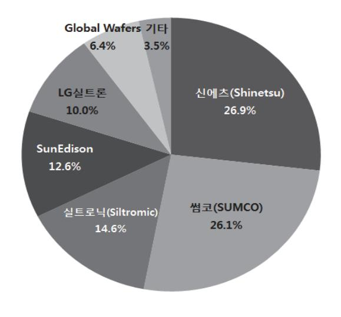

출처: 교육부(2016). 반도체용 웨이퍼 재료 제조 (LM1903060401\_14v1). 한국직업능력개발원. p.6. [그림 1-1] 기업별 웨이퍼 세계시장 점유율

숕 반도체용 웨이퍼 제조공정

일반적인 실리콘(Silicon, 통상 Si이라 부르며 폴리머인 Silicone과는 전혀 다른 물질이다.) 웨 이퍼 제조공정은 크게 단결정성장, 단결정평가, 웨이퍼 가공으로 나뉘고 고기능 기판의 경우 제조된 웨이퍼 표면에 CVD(chemical vapor deposition : 기판 상에 원료 가스를 흘리고, 외부 에너지를 부여함으로써 원료 가스를 분해하여 기상반응으로 박막을 형성하는 기술)방법으 로 고품질의 단결정 층을 증착하는 에피텍시얼 성장(Epitaxial Growth) 공정이 추가된다.

1. 단결정 성장(Crystal Growth)

다결정 실리콘을 단결정 Ingot의 형태로 만드는 공정으로 주요 목적은 결정 결함을 제어하 는 것이다.

2. 단결정 평가(Ingot Evaluation)

단결정 성장 공정에서 생산된 ingot의 품질을 평가하고, 고객의 요구에 부합되는 제품인지 를 평가하여 가공 처리 후, 차후 웨이퍼ing공정으로 연결되는 중간 매개체적인 공정으로 고 체 품질을 평가하는 공정들이 속해 있는 부분이다.

3. 웨이퍼 가공(웨이퍼ing Process)

웨이퍼 가공(웨이퍼ing)공정은 크게 Shaping, Polishing, Cleaning, Evaluation로 특성과 순서에 따라 나눌 수 있다. 기판 가공의 첫 번째 단계인 Shaping은 웨이퍼 형태로 가공하 는 과정으로 um단위의 형상을 제어하며, 연마(Polishing)은 웨이퍼 표면 경면 연마로 nm 단위의 평탄도를 제어하고 세정(Cleaning)은 다양한 세정공정을 통해 nm단위의 청정도를 제어한다.

4. 에피텍시얼 성장(Epitaxial Growth)

에피텍시얼 성장은 제작된 Si 기판 위에 고품질의 단결정 층을 형성하는 것이 주목적으로 표면에 존재하는 Organic Contamination과 Native Oxide를 제거하는 H2 Baking의 전 처리 과정을 거친 후 원하는 고품질 층을 성장한다.

특수하게 고온(1,200℃ 이상)의 수소나 질소, 혼합가스 분위기하에서 장기간(diffusion anneal) 또는 단시간 열처리(rapid thermal anneal)를 통해 웨이퍼의 표면과 내부를 재구 성하는 경우도 있는데 여기에서는 생략한다.

## 수행 내용 / 제조공정 파악하기

#### 재료·자료

- 기술 보고서, 전문 조사기관 보고서, 신제품 보고서
- 기술 서적, 기술 논문, 학회 발표자료, 제조공정도, 제품 시방서
- 경쟁사 제품 성능지침서(Spec. Sheet), 고객 요청서, 제품 사양서 등

기기(장비 ・ 공구)

- PC 또는 노트북, 스크린, 빔 프로젝터, 프린터, 복사기, 인터넷 장비, 칠판(화이트보드)
- 문서 작성프로그램 등
- 안전 ・ 유의 사항
  - 제품 제조 공정상 사용 및 발생 물질의 사용에 대한 관련 법규 및 ESH(Environment Safety Health, 환경·안전·보건) 적합 여부에 대해 사전 검토한다.

#### 수행 순서

#### 숔 반도체용 웨이퍼 제조 공정 파악을 파악한다.

반도체 소자에 적합한 Silicon 웨이퍼의 제조공정에 대한 목적 및 방법을 파악한다.

1. 단결정 성장 공정에 대해 세부 내용을 파악한다.

단결정 성장 공정의 세부 내용 파악에 앞서 이해를 돕기 위해 모식도를 살펴본다.

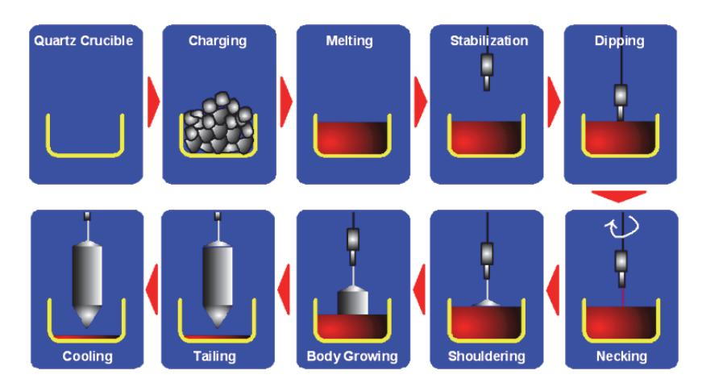

출처: 교육부(2016). 반도체용 웨이퍼 재료 제조(LM1903060401\_14v1). 한국직업능력 개발원. p.8. [그림 1-2] 단결정 성장 공정 세부 절차

#### (1) Charge preparation

Ingot 생산에 필요한 다결정 Si(poly silicon), 고순도 석영도가니(quartz crucible), seed, dopant, 기타 consumable들을 공급하는 역할로 growing에서 가장 먼저 일어나는 공정이다. 그리고, 생산 제품의 품질 규격(비저항, Oi 등)에 적합한 원부자재 (poly silicon 순도 와 charge 양, dopant 종류 및 양, seed orientation등)와 결정성장로 기종 등을 선 정함으로써 후속 공정의 작업이 원활히 이루어질 수 있도록 하는 데 목적이 있다.

(2) Stacking (적층 공정)

Hot zone parts 조립이 완료된 후, 고순도 석영도가니를 장착하고 그 내부에 다결정 Si을 적층하는 공정을 말한다. 이 공정은 작업자의 행동이 직접 행해지는 부분이므로 각 종 사고의 가능성이 존재한다. 특히 material의 혼용, 파손 등의 문제가 자주 발생하므 로 항상 주의를 기울여야 하는 공정이다

(3) Pumping

결정 성장로(Grower) 내부의 활성 gas 성분을 제거하기 위해 압력을 대기압 상태에서 준 진공 상태로 낮추는 공정을 말하며, 목표 압력에 도달하면 결정 성장로의 진공 차폐 여부를 점검한다. 이는 결정 성장로 내부의 원부자재를 사용함에 있어 유리한 환경을 조 성하기 위한 것으로, graphite가 산화되고, 실리콘이 산화되는 것을 막아 원활한 공정 이 진행될 수 있는 조건을 만들어 주는 것이다.

(4) Melting

Melting공정은 고체 상태인 다결정 silicon을 단결정 silicon으로 결정 상태를 전환하 기 위해 액체 상태로 녹이는 공정으로 melting 방법은 크게 두 가지로 구분된다. 그 첫 번째는 열원인 그라파이트에 전기를 가해 발생하는 고열을 이용한 일반적인 방법이고, 다른 한 가지는 HEAT SHIELD 적용 장비의 melting이다. 이 공정이 후속 공정에 주는 영향이 크다고 할 수 있으므로 많은 신경을 써야 한다.

(5) 온도 안정화(Temperature Stabilization)

Poly Silicon의 용융점이 1,420℃이기 때문에 투입되는 파워는 그 이상이어야 한다. 그 러므로 고체의 poly silicon이 완전히 녹은 후의 온도는 이보다 훨씬 높다고 할 수 있 다. 이는 실리콘보다 용융점이 낮은 것이 접촉될 시 그 고체를 용융시켜 버린다. 또한, 실리콘이 접촉되더라도 짧은 시간 내에 녹여버리게 된다. 그래서 과도하게 높은 용융 실 리콘의 온도를 단결정 성장에 적합한 온도로 변화시켜 주기 위해 알맞은 파워로 내려 주게 된다. 이러한 작업을 온도 안정화(Temperature Stabilization) 공정이라고 한다.

(6) Necking

Necking공정은 dip 공정이 안정되게 수행되면 진행되는 공정으로, dip 공정 중 열에 의해 발생된 적층결함(dislocation)을 제거함으로써 dislocation free neck을 얻는 공 정을 말한다. 이는 단결정의 직경을 축소하는 행위로 결정 내에 발생된 dislocation을 diameter 외부로 빠져나가도록 하는 것이다. 보통 target diameter는 4~5mm 정도이 고, length는 120~300mm 정도 작업을 한다.

#### (7) Shouldering

Necking 공정이 완료된 후, seed 인상 속도 및 heater 온도를 하강시켜 단결정의 수 평 성장을 유도한다. 온도가 계속 ramp down 되므로 인해 단결정은 부드러운 성장을 할 것이다. 여기서도 온도제어는 아주 중요한 요소이다. 온도 상태에 따라 단결정의 구 조가 유지 될 수 있고, 반대로 파괴될 수도 있기 때문이다.

(8) Body Growth

실질적인 웨이퍼 제품을 생산하는 공정으로써, 원하는 Target diameter로 목적하는 길 이까지 단결정을 수직 성장시키는 공정을 말하는 것이다. 주로 생산되는 품목은 100mm, 125mm, 150mm, 200mm, 300mm이다. diameter별 구분 외에도 type(N, P 등) 및 orientation (1-0-0, 1-1-1)으로 구분된다. 그러므로 반도체 공정의 필요성에 따라 수많은 종류의 제품이 생산된다는 것을 알 수 있다.

(9) Tailing

Body Growth공정이 마무리되면 단결정의 최대 길이를 확보하기 위해 tailing이라는 공정을 진행하게 되는데, 이 공정을 진행하는 이유는 단결정과 잔류 melt(pot-loss)가 분리될 때 발생되는 체적 수축과 열 충격에 의한 dislocation으로부터 단결정을 보호하 기 위해 그 직경을 서서히 줄여 가는 것을 말한다.

(10) 냉각 및 제거(Cooling & Removal)

Cooling이란 Tailing 공정이 완료되면 뜨거운 상태의 단결정을 상온에 가깝도록 식혀 주는 공정을 말하는 것으로 grower의 상단 부위로 서서히 인상하면서 Ar(argon) gas 와 냉각수(cooling water)를 그 매개체로 하여 공정을 진행하게 된다. 이때 heater 파 워를 차단하고 cooling 공정을 진행하는 normal cooling과 heater 파워를 가동한 상 태로 cooling을 진행하는 slow cooling의 두 가지로 구분된다.

#### 2. 단결정 평가 공정에 대해 세부 내용을 파악한다.

(1) Cropping 공정

단결정 성장 공정에 의해 생산된 Ingot의 절단 및 검사 시료 (Slug) 채취를 위해 그 기 준을 설정하며 선정된 정확하고, 효과적인 절단 위치에 따라 절단 작업이 이루어진다.

(2) Etching 공정

이 공정은 cropping 공정과 measurement 공정의 중간에 위치하는 공정으로써, cropping 공정의 샘플 채취 시 발생되는 샘플 표면의 물리적 손상인 saw damage를 화학 약품으로 식각시켜, 샘플 표면을 경면 기판(polished 웨이퍼)의 표면처럼 만들어 주어 측정 공정에서 필요로 하는 품질 data의 반복성을 확보하기 위한 공정이다. 여기 에 사용되는 장비를 'Wet etch station'이라 한다.

(3) Ingot Grinding 공정

이 공정은 단결정의 방위를 측정해 표시하고 Ingot의 외주를 원하는 직경으로 갈아내는 공정이다.

3. 웨이퍼 가공(Wafering)공정에 대해 세부 내용을 파악한다.

웨이퍼 공정의 세부 내용 파악에 앞서 이해를 돕기 위해 모식도를 살펴본다.

출처: 교육부(2016). 반도체용 웨이퍼 재료 제조(LM1903060401\_14v1). 한국직업능력개발원. p.11. [그림 1-3] 웨이퍼 가공 공정 세부 절차

(1) Ingot Mounting

Slicing 공정을 진행하기 위한 준비 공정으로써, 작업대(Work Plate) 위에 Carbon Graphite Beam을 접착하고 그 위에 Ingot을 Epoxy를 이용하여 접착시켜서, Ingot의 절단 시 발생할 수 있는 Exit Edge Chip을 방지하고 웨이퍼가 정확한 결정방향을 가질 수 있게 하여, 일정한 상태로 절단될 수 있도록 하는 공정이다.

따라서 Ingot의 접착 시 작업대(Work Plate), Carbon Graphite Beam, Ingot 등이 일정한 방향을 가지게 정확히 조정되어야 하며, 이들이 정해진 방법을 벗어나지 않도록 관리하여야 한다.

(2) Slicing(주로 Wire Saw사용)

반도체용 웨이퍼의 Slicing은 I.D Slicing이나 Wire가 주로 사용되고 있다. 내주도는 도넛형의 얇은 SUS 판의 내주 부분에 Diamond 입자를 Nickel Bond로 전착(Electro Plating)한 것으로 O.D부분을 회전체에 고정하고 고속회전하면서 가공한다. 강성을 얻 기 위해 외주부분으로부터 장력을 가하여 당겨 주어서 정도를 좋게 하고, 적은 양의 Kerf Loss를 발생시키면서 가공 가능한 특징을 가지고 있다.

최초 탄생이 잘못된 웨이퍼는 몇 개의 공정을 거쳐도 좋아지지 않는다. 예를 들면 Warpage 등은 Slicing후의 Lapping이나 Polishing에서 교정은 불가능하다고 알려져 있다. 또한 후 공정에서의 원활한 흐름을 가지도록 좋은 표면 거칠기를 지닌 상태로 Slicing하는 것이 매우 중요하다.

한편 웨이퍼의 가격(Cost)을 가장 크게 점유하는 요소의 하나인 원재료비에서 Slicing이 차지하는 영향이 크다는 데 그 중요성이 있다. 단결정으로부터 웨이퍼까지의 원료 투입 대비 Out량 Yield가 50% 정도이나 그 중 Slicer로 절단 시 Loss가 15~20% 정도 차 지한다. 이러한 관점에서 경제적인 Multi Wire Saw방법은 200mm Ingot의 Slicing에 적용되기 시작해 300㎜ Ingot의 Slicing에 전면적으로 채용되고 있다.

(3) Edge Grinding

Si 자체의 경도(72.6 Rockwell A Hardness Scale, 9.8DGa)는 강하지만 특정 축 방 향(일명 벽개 방향)이라고 하는 <110> 방향의 경도는 극도로 약하기 때문에 Slicing이 끝난 상태의 날카로운 웨이퍼 Edge(가장자리)는 매우 취약하다,

그러므로 후 공정 진행시 Edge에 발생할 수 있는 조각(Chip)이나 깨짐(Broken)을 방지 하고, Epitaxial 성장 공정에서 웨이퍼 Edge부에 Si가 이상 성장되는 Crown현상으로 인한 Photo Mask손상, 전사 Pattern의 얼룩 등 Device 수율 저하요인을 제거할 목적 으로 Edge Grinding을 실시한다.

Edge Grinding에 의해 웨이퍼의 Edge의 기계적 강도를 높이고 소성 변형(Edge의 Chip이나 Crack으로부터 핵성장 되어지는 Slip Dislocation)의 발생을 줄일 수 있다.

(4) Laser Marking과 Sorting

Edge Grinding 및 PSE(Plain Slice Evaluation)를 거친 웨이퍼는 Lapping전에 웨이 퍼의 두께 분류 및 웨이퍼의 Lot 관리를 위해 Laser Marking된다. Sorting은 자동 두 께 분류장비로 수행되며, Lapping을 하기 위해 5㎛단위로 웨이퍼를 분류시킨다. Wire Saw로 절단된 웨이퍼는 별도의 두께 Sorting은 필요 없다.

(5) Lapping

Lapping 가공은 가공물과 연마 정반 간에 Abrasive를 섞은 액체를 흘려 넣어 행하는 표면 가공법으로, 평면도, 평행도 등이 쉽게 얻어지는 가공법으로 재료 산업에 넓게 이 용된다.

Si 웨이퍼의 Lapping 공정 목적은 Slicing한 웨이퍼를 소정의 두께로 만들고 평행도, 평탄도 등의 필요한 형상 정도를 얻는데 있다.

(6) Etching

기계적인(Mechanical) 웨이퍼링 단계에서 발생한 다양한 깊이의 Damage Layer를 제거하기 위한 공정이 Etching이다. 즉 Slicing, Edge Grinding, Lapping 등의 Step을 거치면서 웨 이퍼 표면 또는 Edge에 가공 변질 층이 생겨나는데 이들이 웨이퍼에 잔존하지 않게 제거해 주는 공정이 Etching이다.

이 잔존 Damage층은 반도체용 웨이퍼의 Quality를 확보하기 위해서는 반드시 제거 되어야 한다.

이들을 제거하기 위한 Removal Process는 대부분 Chemical Etching을 활용하는데

화학용액으로는 KOH, NaOH 또는 HF/HNO3와 함께 첨가제(Additive)들이 사용된다.

(7) 열처리 공정(Heat Treatment)

열처리 공정의 주목적은 비저항의 안정화와 Donor의 제거에 있다. CZ 실리콘 결정 중 에는 ∼1018Atoms/Cm3 의 산소 원자가 불순물로 존재한다.

실리콘 단결정 중의 산소 원자는 통상 단독으로는 전기적으로 중성이나 300∼500℃ 범 위(특히 ∼450℃)에서 열처리를 받으면 복수의 원자가 모여서 전자를 방출하고 Donor 화 한다. 이것은 융점(1,415℃)근방에서 융액으로부터 고화되어 성장한 Silicon 단결정 이 Grower내에서 ∼400℃까지 장시간 냉각 과정을 거친다.

이 사이에 단결정은 산소 Donor 생성 온도 영역에서 장시간 열처리되는 것에 의해 ∼ 1016Atoms/Cm3 의 산소 Donor가 발생한다. 결국, 일종의 도전형과 저항률을 얻기 위 해 일정량의 Dopant를 첨가하여도 산소 Donor로 인하여 목표로 하는 저항률을 얻을 수 없다. 또한 P형이 N형으로 변환되는 것도 일어난다.

그러나 다행인 것은 산소 Donor는 600∼800℃의 온도에서 단시간 열처리 하는 것에 의해 제거할 수 있다. 통상 이 산소 Donor 제거는 웨이퍼를 불활성 가스(N2)중에서 650∼700℃의 온도로 20∼30분간 열처리를 하면 된다. 열처리 후 ∼450℃의 체재 시 간을 매우 짧게 하기 위해 급랭이 필요하다.

(8) Polishing

Polishing 공정이란 Mechano-Chemical적인 반응을 상호 병행하여 전 공정에서 받은 Damage을 제거(약 9㎛ Removal, 단면 기준)하는 연마 경면 공정으로 정의된다. 웨이 퍼 부착 방식에 따라 Wax/Waxless Polishing으로 크게 구분하고, 가공 방식에 따라 Single Side/Double Side Polishing으로 크게 구분된다.

(9) Cleaning

세정의 필요성은 웨이퍼 표면에 잔존 하는 금속 불순물을 제거하지 않으면 이들이 열처 리 과정에서 Bulk 쪽으로 파고들어 내부 결함이 되기 때문이다. 이들 금속 불순물은 웨 이퍼의 전기적 특성을 열화시키는데 특히 Minority Carrier Lifetime에 가장 민감하게 작용한다.

세정 장비는 크게 Chemical Bath와 Rinse Bath로 구성되며 각 Chemical Bath를 거 친 후 반드시 Rinse가 이루어지게 되어 있다. Chemical Bath는 SC-1, SC-2, HF Bath 등으로 구성되며 이들 각각에 대한 혼합비 및 사용 조건은 사용 회사별로 상이하 다.

(10) Evaluation

Process 완료 후 웨이퍼의 면 상태 및 가장자리(Edge) 결함을 100% 전수 검사 하는 공정으로써 Kodak Light를 이용하여 검은 커튼을 드리운 Dark 분위기의 Clean Air Bench 내에서 검사를 진행한다.

이때 이용되는 Kodak Light의 최고 밝기는 25만 Lux며, 웨이퍼를 기울여서 빛이 직각 을 이루지 않게 하여 면 상태를 검사 한다. 웨이퍼를 잡을 때 사용하는 Vacuum Wand는 주기적인 세정을 통하여 자국이 남지 않도록 주의하여야 한다. 검사자들은 품 질부서의 검사원 인증 절차에 의거하여 인증을 받아야 하며, 주기적인 검사 교육을 수료 한 자만이 검사에 임할 수 있다.

(11) Packing

최종 제품을 안전하게 포장하는 단계로 웨이퍼를 담는 카세트(Cassette)와 Cassette를 감싸는 정전방지 비밀 및 알루미늄 덮개의 2중 진공포장과 이것을 넣기 위한 BOX(Cassette 개수에 따라 1개, 2개, 4개들이 존재)와 여러 박스를 한 패키지로 묶은 카툰으로 분류한다.

각각의 포장단위는 기본적으로 오염과 습기로부터 안전하며, 전기적으로 안정화돼 정전 기 발생이 되질 않고 생화학적 반응이 일어나지 않는 재료들을 사용한다.

4. 에피텍시얼 성장(Epitaxial Growth)공정에 대해 세부 내용을 파악한다.

에피텍시얼 성장 공정의 세부 내용 파악에 앞서 이해를 돕기 위해 모식도를 살펴본다.

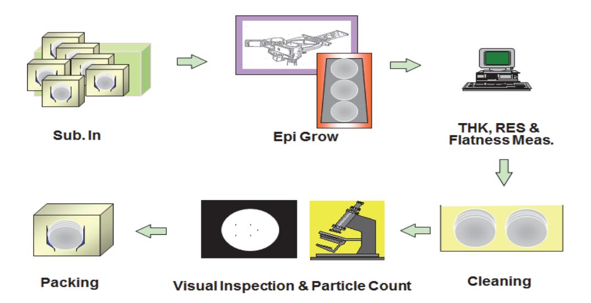

출처: 교육부(2016). 반도체용 웨이퍼 재료 제조(LM1903060401\_14v1). 한국직업능력개발원. p.14. [그림 1-4] 에피텍시얼 성장 공정 세부 절차

(1) H2 Baking

단결성 기판 위에 존재하는 유기물 오염(Organic Contamination)과 자연 산화막(Native Oxide Layer)을 제거하는 공정으로 가열된 단결정 기판 위에 H2 가스를 흘려보내 표면의 오염물과 산화막을 제거해 순수한 Si 원자가 성장할 수 있도록 하는 전처리 공정이다.

(2) Epitaxial Growth

실리콘 에피텍시얼 성장이란 단결정 기판 위에 단위 격자가 2차원적으로 배열하도록

단결정 박막이 성장하는 공정으로, 에피텍시얼 공정은 고농도 도핑된(Heavily Doped) 기판 위에 저농도 도핑된 층(Lightly Doped Layer)을 만들 수 있는 유일한 공정이며, 에피텍시얼 공정을 통해 얻어지는 단결정 막은 균일한 농도로 만들 수 있고, 기판에 비 해 EPI Layer는 결정 결함이 거의 없는 고순도 결정을 만들 수 있으며, 이를 이용하여 무결점의 Device Active Area를 얻을 수 있다.

(3) Backseal(optional)

고농도 도핑된 웨이퍼의 뒷면에 실리콘 산화막을 입혀서 후 공정(Epi)의 고온 Process 에서 Dopant들이 Auto Doping 되는 현상을 방지시키는 데 있다. SiO2를 웨이퍼 뒷면에 입히는 공정으로써 실란(SiH4)Gas를 흘려주면서 Si가 산소와 결 합하여 막을 생성시킨다. 현재 양산 공정에서 사용 중인 방법은 대기압 상태에서 Chemical을 흘려 막을 입힌다 하여 APCVD(Atmospheric Pressure Chemical

Vapor Deposition) 라고도 한다. 여기서 사용되는 SiH4 Gas는 공기 중에 노출되면 곧 바로 발화하기 때문에 N2 Gas를 흘려 Sealing을 하고 배관의 Leak가 없게 철저한 관 리가 요구된다.

(4) Evaluation & Cleaning

Epi 및 세정 공정이 완료 후 웨이퍼의 평탄도와 이물질(particles)을 포함한 결함을 100% 전수 검사 하는 공정으로써 자동화된 장비인 Flatness 측정기와 Particle Counter 를 사용하여 전자동으로 검사를 진행한다.

#### 수행 tip

• 신규 제조공정은 숙련된 연구원이나 엔지니어에 의한 검토 를 통해 기존 공정과의 차이점을 파악한다.

## 1-2. 고객 요구사항 파악

학습 목표 • 고객의 요구사항에 의한 웨이퍼 재료를 파악할 수 있다.

## 필요 지식 /

#### 숔 고객의 소리(VOC : Voice of Customer) 수집

외부(고객, 경쟁사, 전문가 인터뷰, 학회 참가, 전시회 참석, 전문 조사기관의 분석 자료와 특정 기관·컨설팅 업체를 통해 조사된 보고서, 특허 분석 등)와 내부 구성원을 통해 다양하고 심층적 인 자료를 수집해 반도체 기술 발전 방향에 대해 조사하고 주요 업체의 연구개발 동향을 파악 한다.

1. 반도체 기술 발전 방향

반도체는 장난감에서부터 첨단 산업에까지 다양한 산업에 전반적으로 사용되고 있으며, 현 재 반도체가 가장 많이 이용되는 분야로는 PC와 가전제품, 모바일 폰, 자동차 등이며, 사용 범위가 점차적으로 확대되고 있는 추세이다.

메모리 반도체의 경우 제조 기술의 한계로 신개념의 차세대 소자 연구개발 경쟁이 메인 메 모리 중심에서 대용량 스토리지 중심으로 이동할 것으로 전망되며, 3차원 cell 기술 적용 제품의 출현 하였다. 미국은 NSF(National Science Foundation, 국가과학재단)사업으로 연간 약 1,820만 달러를 투자하여 인텔, IBM, TI(Texas Instrument), AMD(Advanced Micro Devices), Freescale, Micron Technology 등 기업과 대학을 연계하여 차세대 메 모리 원천 기술을 개발 중이다.

시스템 반도체는 고성능, 저전력 로직 반도체 구현을 위한 새로운 구조·재료를 사용한 소자 와 미세공정 설계를 위한 Process Design Kit 개발 등이 중요해질 것으로 전망되고 있으 며, 10nm 이하의 초고속·저전력 3D 로직 반도체 개발, 초저전압 동작 가능한 신개념 소자 개발 등이 진행되고 있다.

선두업체인 인텔은 첨단 로직기술 선도를 통해 CPU 표준을 주도하여 부가가치를 독점 중 으로 최근 3차원 트랜지스터(3D Tr.)기술은 이 과정의 연장선으로 추정할 수 있다.

반도체 공정/장비 분야에서는 미세화, EUV(extreme ultra violet, 극자외선), 450mm 대 구경화 기술 및 3D 패키징 기술 개발에 따른 투자비 부담과 risk 부담 경감을 위해 국제 컨소시엄을 통한 공동개발이 활발히 진행 중인데, 특히 G450C 중심의 450mm 대구경화 장비 공동 개발 및 SEMATECH, IMEC 중심의 EUV 리소 장비 공동 개발이 활발하게 진행 중이다. 또한 다기능화, 소형화, 고성능화, 저전력화 등을 위해 TSV(Through Silicon Via

의 약자로, '실리콘 관통전극'이라고도 부른다. D램 칩을 일반 종이 두께의 절반보다도 얇 게 깎은 후, 미세한 구멍을 뚫어 칩 상하단의 구멍을 전극으로 연결하는 패키징 기술)기술 이 개발되어 일부 양산에 적용 중이다.

반도체 재료 분야는 미세화, 450mm 대구경화 등 차세대 공정 대응을 위한 핵심 소재 개 발이 진행되고 있고, EUV용 포토레지스트와 450mm 대구경화 재료 및 TSV(Through Silicon Via, 실리콘 관통전극)용 재료 등이 개발되고 있다.

향후 2020년까지 반도체 산업은 메모리와 시스템 반도체의 분야의 뚜렷한 구분이 없는 TOTAL SOLUTION화를 지향하고, 메모리 분야에서도 메모리의 통합화가 가속될 것으로 전망된다. 또 스마트 소자화가 기대되며, 집적도가 증가하여 2020년에는 10나노급 공정으 로 DRAM은 256G급, 플래시 메모리는 512G급 양산 수준에 도달할 것으로 보인다.

시스템 반도체 분야에서는 S/W통합 능력이 확대될 전망이며, SOC(system on a chip)화 의 전환이 빠르게 진행되어 전환 요구가 확대될 것으로 전망된다. 특히 자동차, 바이오, 로 봇분야에 적극적으로 활용될 것으로 예측된다.

#### 2. 반도체 주요업체 현황

반도체는 장난감에서부터 우주·항공 산업에 이르기까지 다양하게 사용되고 있으며, 미래 산 업의 키워드인 산업 융합화 및 유비쿼터스 사회 구축을 뒷받침하는 핵심부품으로 위치하고 있다. 현재 반도체는 PC를 비롯하여 TV, DVD 등 가전제품뿐만 아니라 통신 기기, 자동 차, 산업용 기계, 로봇, 시계 등 다양한 분야에 걸쳐 이용되고 있다.

그중에서도 자동차, 휴대폰 등은 최근에 새로운 시장으로 부상하여 각국에서 개발 경쟁을 치열하게 벌이고 있으며, 자동차는 달리는 전자제품이라고 할 정도로 많은 반도체가 사용되 고 있다. 특히 마이크로컨트롤러는 일반 승용차에 약 80개 정도, 고급 승용차에 약 250개 나 사용되고 있다.

반도체 기업들은 자사의 기술 역량, 자금, 반도체 경기 등에 따라 전략적으로 생산에 참여 하고 있으며 제조 공정에 따라 크게 일관공정업체(IDM: Integrated Device Manufacturer), 설계 전문업체(fabless), 수탁 제조업체(foundry), IP 개발업체(chipless) 등의 전공정(front-end process)업체와 후공정(back-end process)의 어셈블리 및 테스트 전문업체로 구분한다.

메모리 분야는 대부분 일관공정체제(IDM)이며, 비메모리분야는 부가가치 체인별 분업화가 잘 이루어져 있다. 특히 IP전문업체(chipless 비즈니스)는 새로운 수익 모델 기업으로 등장 하고 있으며, 이는 반도체 칩을 완제품으로 설계하지 않고 칩의 아키텍처 설계, 규격 설정, IP개발 등 R&D부문에 가까운 분야를 특화한 기업들이다.

설계전문(fabless) 비즈니스도 고속 성장하고 있으며, 이는 반도체 칩을 직접 생산하지 않고 특정 용도 IC의 설계 및 마케팅에 특화한 기업이다. 또한 이들 기업을 뒷받침하는 파운드리 (foundry) 비즈니스도 활발히 성장하고 있다. 생산 기술 및 생산 코스트의 우위성을 바탕으

17

로 설계 업체의 위탁에 의해 제조만을 전문하며, 대만, 한국, 중국이 치열한 경쟁을 벌이고 있다.

국가별로 보면 대체로 일본과 한국은 수직 계열화의 종합기업들이 대부분이기 때문에 여전 히 자신들이 사용할 반도체를 생산하는 설비를 보유하고 있으며, 미국과 유럽은 반도체 전 문업체가 많은 편이다.

숕 고객의 소리(VOC : Voice of Customer) 분석

외부(고객, 경쟁사, 전문가 인터뷰, 학회 참가, 전시회 참석 등)와 내부 구성원의 수집된 자료를 분석하여 웨이퍼 재료를 파악한다. 특히 고객의 소리를 구체적이고, 측정 가능한 고객 핵심 요 구사항(Critical Customer Requirement)으로 변환하는 것은 정확한 Process 척도 (Indicator)를 정의하는 데 필요하다.

- 1. 다양하고 면밀한 정보 수집.
- 2. 고객 요구 사항의 구체화, 정량화
- 3. 정확한 분석을 위해 내부 조직 또는 전문 업체와 제한적인 협업 실시

## 수행 내용 / 고객 요구사항 파악하기

#### 재료·자료

- 시장 및 기술 동향 분석 보고서, 사내 분석보고서
- 경영층 인터뷰 자료, 전문가 인터뷰 자료, 출장보고서
- 전문 기술 자료(논문, 특허, 학회 발표자료, 서적 등)
- 제품개발지도(PRM: Product Road Map), 기술개발지도(TRM: Technology Road Map), 설계개발지도(DRM: Design Road Map),
- 경쟁사 제품 성능지침서(Spec. Sheet), 회사 소개 팸플릿 등

#### 기기(장비 ・ 공구)

- PC 또는 노트북, 빔 프로젝터, 프린터, 복사기, 인터넷 장비, 칠판(화이트보드)
- 문서작성 프로그램, 통계처리 프로그램 등

#### 안전 ・ 유의 사항

안전·유의 사항 없음

#### 수행 순서

- 숔 고객 요구사항을 수집한다. 전문 조사기관을 통해 적합한 보고서를 구매하거나 조직 내·외부를 망라한 다양하고 가능한 모 든 수단을 통해 많은 정보를 확보한다.
  - 1. 검색 전 자료 수집 및 검색 작업을 체계적으로 할 수 있도록 계획한다. 자료 수집 및 검색을 위해서는 반도체 기술 지식, 반도체 성능 지침서 해독 지식, 시장 조 사 및 분석 방법론, 특허 검색 및 해석 방법 등을 숙지한다.
  - 2. 기술 정보는 반도체 전문기관을 통해 구체적으로 확인하도록 한다. 반도체 기술 전문기관에 대한 체크리스트는 아래와 같다.

<표 1-2> 반도체 기술 사이트

| 구분                           | 사이트 주소(URL)                         | 세부 내용                                |
|------------------------------|-------------------------------------|--------------------------------------|
|                              | http://www2.imec.be                 | Imec Technology Forum                |
|                              | http://www.itrs.net                 | ITRS : 기술로드맵 주도                      |
|                              | https://www.vlsiresearch.co m    | VLSI Research(업계·기술동향)               |
|                              | http://www.semi.org                 | SEMICON Show 및 기술 동향                 |
|                              | http://www.nanokorea.or.kr          | 나노기술 관련 최신 기술 정보 및 지식 공유             |
| 전문 연구기관 소자 장비 재료 | http://www.kcs.cosar.or.kr          | 한국반도체 학술대회                           |
|                              | http://www.mrs.org                  | 미국 재료공학회 :                           |
|                              | http://www.electrochem.org          | 미국 화학공학회 :                           |
|                              | http://www.gadest.org               | 반도체 Gettering과 Defect Engineering 기술 |
|                              | http://www.vlsisymposium.or g    | VLSI Technology symposium            |
|                              | http://www.ssdm.jp                  | 국제 반도체 소자 및 재료 컨퍼런스                  |
|                              | http://www.intel.com                | 미국의 시스템업체(인텔)                        |
|                              | http://www.ibm.com                  | 미국의 설계업체(IBM)                        |
|                              | http://www.samsung.com/se           | 한국의 메모리업체(삼성전자)                      |
|                              | c http://www.tsmc.com/           | 대만의 파운드리업체(TSMC)                     |
|                              | http://www.skhynix.com              | 한국의 메모리업체(SK하이닉스)                    |
|                              | http://www.appliedmaterials. com | 세계 최대 반도체 장비 업체                      |
|                              | http://www.asml.com/asml            | Lithography 장비 전문업체                  |
|                              | http://www.tel.com                  | 도쿄일렉트론, 열처리 장비 전문 업체                 |
|                              | http://www.kla-tencor.com           | 측정기 전문 업체                            |
|                              | http://www.shinetsu.co.jp           | 일본의 반도체 재료업체(신에츠)                    |
|                              | http://www.siltronic.com            | 독일의 반도체 재료업체(바커 실트로닉)                |
|                              | http://www.sunedisonsemi.c om    | 미국의 반도체 재료업체(선에디슨)                   |
|                              | http://www.lgsiltron.co.kr          | 한국의 반도체 재료업체                         |
|                              | http://www.amkor.com                | 미국의 패키징업체                            |
|                              | http://www.jsr.co.jp/jsr_e          | 일본의 화학용액업체(포토레지스트 등)                 |
| 특허                           | http://www.kipi.or.kr/main.do       | 한국 특허청                               |
|                              | http://www.uspto.gov                | 미국 특허청                               |
|                              | http://www.jpo.go.jp/               | 일본 특허청                               |
|                              | http://www.sipo.gov.cn/             | 중화인민공화국 국가지식 산권국                     |
|                              | http://www.epo.org/                 | 유럽 특허청                               |

시장 정보는 해당 산업, 제품에 국한치 말고 거시적인 경제 정보를 포함해 인터넷을 활용해 검색 하며 반도체 시장 전문기관에 대한 체크리스트는 아래와 같다.

| 〈표 1-3〉 반도체 시장 전문기관 사이트 | 반도체 시장 전문기관 사이트 |
|-------------------------|-----------------|
|-------------------------|-----------------|

| 구분             | 기관명                                     | 사이트 주소(URL)                       | 세부 내용                                    |  |  |
|----------------|-----------------------------------------|-----------------------------------|------------------------------------------|--|--|
| 일반 경제 현황 | National Bureau of Economic Research | http://www.nber.org               | 경제 정책에 대한 평가 및 경 현상에 대한 계량적 분석        |  |  |
|                | EIU Country Report                      | http://www.eiu.com/index          | 국가별 경제동향 및 주요 산업별 분석 및 전망             |  |  |
|                | KDI 경제정보센터                              | http://epic.kdi.re.kr             | 국내외 경제정보 제공                              |  |  |
|                | Global Window                           | http://www.globalwindow.org       | KOTRA 무역투자정보포탈                           |  |  |
|                | 기획재정부                                   | http://www.mofe.go.kr             | 국민소득계정(GDP, GNI, 경제상 장률, 경제활동별 성장률 등) |  |  |
|                | 대한상공회의소                                 | http://www.korcham.net            | 기업 경영정보, 경제정보 제공                         |  |  |
|                | 전자 정보 센터                                | http://www.eic.re.kr              | 전자산업동향, IT통계 자료,                         |  |  |
|                | 국제반도체장비재료협회                             | http://www.semi.org               | 세계 반도체장비재료 산업동향                          |  |  |
| 반도체 산업      | 한국반도체산업협회                               | http://www.ksia.or.kr             | 반도체 산업동향                                 |  |  |
|                | 세계반도체통계                                 | http://www.wsts.org               | 세계 반도체 산업동향                              |  |  |
|                | 미국반도체산업협회                               | http://www.semiconductors. org | 세계 반도체 산업동향                              |  |  |
|                | 메모리반도체가격                                | http://www.dramexchange.c om   | Dramexchange                             |  |  |
|                | ZDNet                                   | http://www.zdnet.co.kr            | IT산업/기술 동향                               |  |  |
| 주요             | KIET                                    | http://www.kiet.go.kr             | 해외시장동향 전문조사                              |  |  |
| 뉴스 ···         | 과학기술정보 포털 서비스                           | http://www.yeskisti.net           | 논문/기술 분석 보고서, 국가연구 개발보고서, 특허 검색       |  |  |
|                | 팹 테크                                    | http://www.technomaps.com         | 반도체 생산 팹 동향                              |  |  |

4. 관련 기관, 조직 또는 업체로부터 다양한 자료를 확보한다.

정보의 확보 방법은 인터넷뿐만 아니라 전문 시장 조사기관의 분석 자료, 주요 전시회, 출장 보고
 서 등 가능한 모든 수단을 통해 극대화한다.

숕 고객 요구사항을 분석한다.

각종 매체, 설문지, 전시회 등을 통해 수집된 자료를 기능별, 성능별로 분류해 검토한다.

- 1. 고객 요구 사항에 대한 정확한 이해와 우선순위에 대한 평가를 위해 다양한 정보의 원천으로부터 정보를 수집하고 면밀하게 조사한다.
- 2. 고객 중심 마인드로 고객의 요구사항을 기록하고, 가능별, 성능별로 분류하며 핵심 요구 사항을 구체화, 정량화한다.
- 3. 실제 핵심 요구 사항을 파악하는 방법으로 여러 통계 수단을 사용한다.
- 4. 확정된 고객 요구사항과 당사의 여건을 고려한 생산 가능성을 검토한다.

#### 수행 tip

- 문서 작성 중 외부 발표 자료나 보고서, 출력물을 인용 시 에는 저작권을 침해하지 않도록 한다.
- 외부 발표 자료나 보고서의 경우 출처 등을 반드시 확인하 고 매체, 일시, 내용, 단위 등 주요 항목에 대해 정확히 표기한다.

## 1-3. 품질관리 문제점 파악

학습 목표 • 품질관리를 위한 문제점을 파악할 수 있다.

## 필요 지식 /

숔 품질관리(quality management)

품질(quality)의 정의는 다양하지만 아르망 발랭 파이겐바움(Armand Vallin Feigenbaum)에 의하면 '제품이나 서비스에 대해 고객의 다양한 요구사항과 기대에 부응하는 생산, 기술 및 마 케팅에 대한 전체적 특성'이라고 말한다.

또한 관리라는 용어는 영어로 management와 control이 있는데 management는 경영·품질의 방침과 계획을 세우고 조직을 만들어 이것을 실행하고, 그 과정에 필요한 통제를 가한다고 하 는 의미를 가지며, control은 항상 기준이나 한계를 정하여 그것에 대비시키면서 어떤 행동을 제어해 나가는 것을 의미한다. 기존의 quality control은 제조품질의 불량을 줄이는 것이었으 나 최근의 품질활동은 설계품질의 중요성 때문에 quality management라고 부른다.

1. 품질관리 기법

웨이퍼 재료의 생산 시 품질관리 기법은 기존의 반도체 재료 생산과 매우 유사하므로 여기 서는 생략한다. 세부적인 내용은 반도체 재료 생산(1903060409\_14v1)와 반도체 재료 품질 관리(1903060410\_14v1)를 참조한다.

숕 웨이퍼 주요 품질관리 항목

웨이퍼의 주요 품질 관리 항목은 공정별로 분류하는 것이 일반적이다. 또한 고객의 특별 요구 사항도 있는 경우가 있어 제품 Specification(규격, 이하 Spec.으로 표기)을 확인한 후 기존 품질관리 항목에 추가해 관리하면 효과적이다.

주요 품질 관리 항목 도출에 활용코자 시스템 IC 업체인"I"사의 첨단제품에 사용하는 300mm 웨이퍼의 요구 Spec.중 일부를 제시한다.

| Quality Items                                | 300mm Epi Wafer for MPU |                                   |     |                      |
|----------------------------------------------|-------------------------|-----------------------------------|-----|----------------------|
| Parameter                                    | Unit                    | Metric Criteria                | EE* | Pattern              |
| Conductivity Type                            | Type                    | P                                 | 0   | NA                   |
| Dopant Element                               | Name                    | Boron                             | 0   | NA                   |
| Resistivity                                  | ohm-cm                  | 0.005~0.01                        | 0   | ≥ C e n t e r Pt. |
| Resistivity Radial Gradient            | Percent                 | Max=15                            | NA  | ≥2pt                 |
| Oxygen, Concentration                        | ppma                    | 21~27                             | 0   | ≥ C e n t e r Pt. |
| Oxygen Radial Gradient                       | Percent                 | Max=10                            | NA  | ≥2pt                 |
| Carbon content                               | ppma                    | Max=1                             | 0   | ≥ C e n t e r Pt. |
| Declination(ABS)                             | Degrees                 | 0.15~0.7,Target≤0.5               | NA  | NA                   |
| Swirl                                        | Defects/Wafer           | None                              | 0   | NA                   |
| Bulk Cu                                      | Atoms/cm3               | ≤5E12                             | NA  | NA                   |
| Bulk Fe                                      | Atoms/cm3               | ≤1E11                             | NA  | NA                   |
| EPI Conductivity Type                     | Type                    | P                                 | 0   | NA                   |
| EPI Dopant Element                        | Name                    | Boron                             | 0   | NA                   |
| Epi Dopant Concentration               | Atoms/cm3               | Avg.=1.0E16±0.1E16                | NA  | ≥9Pt.                |
| Epi Thickness                                | micron                  | Avg.=2.75±0.04                    | NA  | ≥9Pt.                |
| Doping Transition Width                      | micron                  | 0~1.0                             | 0   | NA                   |
| Microscopic Slip                             | mm                      | Noslip>95%,MAX=3mm,acc u.≤10mm | 0   | NA                   |
| Diameter                                     | mm                      | 299.8~300.2                       | NA  | NA                   |
| Thickness Average                         | micron                  | 778±10,Min=750,Max=800            | 3   | All                  |
| TTV                                          | micron                  | Max=0.7                           | 3   | All                  |
| Warpage                                      | micron                  | Max=30                            | 3   | All                  |
| LPD > 0.065um                             | LPD/Wafer               | 99%≤30                            | 3   | NA                   |
| LPD > 0.090um                             | LPD/Wafer               | 99%≤15                            | 3   | NA                   |
| BMD Density                                  | Count/cm3               | NA                                |     |                      |
| Surface Cu, Al, Ca, Cr, Fe, K, Na, Ni, Zn | Atoms/cm2               | Max=1E10                          | NA  | NA                   |
| SFQR-Partical site                        | micron/26x8m m2      | 99%≤0.040                         | 3   | All                  |

<표 1-4> "I"사 \*\*nm급 300mm Epi 웨이퍼 주요 Specification

출처: "I"사 Spec. sheet 정리

#### EE (Edge Exclusion)

품질 평가 시 웨이퍼의 가장자리 분석의 어려움과 장비 상의 오차를 방지하기 위해 가장자리로부터 평가를 제외시켜주는 영역으로 점차 줄어들고 있다.

## 수행 내용 / 품질관리 문제점 파악하기

#### 재료·자료

- 생산 공정 흐름도, 품질관리매뉴얼, 장비관리매뉴얼
- 공정관리지침서, 장비운영지침서, 제품 및 공정관리 보고서
- 품질 불량 발생보고서, 품질 불량 분석보고서 등

#### 기기(장비 ・ 공구)

- 생산 기기
- 분석·시험기기
- 평가·검증기기

#### 안전 ・ 유의 사항

제품 제조 시 필요한 관련된 생산 기기, 분석·시험, 기기, 평가·검증기기, 장치 및 Utility의 안전관리 지침과 비상대책 시나리오를 숙지한다.

#### 수행 순서

숔 품질관리에 대한 기본 내용을 파악한다.

반도체용 웨이퍼의 생산과 이에 따르는 품질관리는 기존의 반도체 재료 생산과 품질관리와 매 우 유사하기 때문에 일반적인 내용은 반도체 재료 생산(1903060409\_14v1)과 반도체 재료 품 질관리(1903060410\_14v1)를 사전 학습하고 여기에서는 반도체용 웨이퍼의 품질관리를 위한 추가 내용만 파악하도록 한다.

1. 반도체용 웨이퍼의 생산 공정을 파악하기 위해 웨이퍼 생산 공정에 대해 본 학습 모듈의 '학습1. 반도체용 웨이퍼 재료 요구사항 파악하기'학습에서 '1-1. 제조 공정' 학습 내용을 숙지한다.

25

- 2. 파악된 생산 공정에 사용하는 생산기기, 분석·시험기기, 평가·검증기기의 주요 파라미터에서 웨이 퍼의 품질과 연관된 내용을 파악한다.
- 3. 품질 항목에서의 주요 불량과 빈번한 문제점을 확인하고 이들 항목의 관리를 위해 어떤 조치를 취할 지에 대해 생각해보고 상호 의견을 교환 후 교수진의 확인을 받는다.
- 4. 품질 불량과 관련된 주요 항목의 현상과 문제점, 원인 규명 및 해결 방안 등에 대해 One-Point Lesson 등의 보고서 양식을 활용해 정리한다.
- 숕 웨이퍼의 주요 품질관리 항목을 파악한다.

웨이퍼의 품질 관리 항목은 매우 다양하고 광범위하나 주요 공정별로 살펴보면 단결정 성장 및 평가, 웨이퍼 가공, 그리고 에피텍시얼 공정에서 관리해야 할 주요 품질 관리 항목으로 분류할 수 있으며, 공정 별로 중복으로 평가할 수 있는 품질관리 항목이 있을 수 있다.

- 1. 단결정 성장 및 평가 시 품질관리 항목을 파악한다.
  - (1) Charge weight

Poly Silicon을 Grower에 Charge 하기 전 정확한 무게인지 검사하는 것이다.

(2) Dopant weight

Manufacturing Specification에서 의도한 전기적인 특성을 부여하는 Dopant의 양을 정확히 투입하는지 검사하는 것이다.

(3) Growth parameter

Single Crystal을 성장시키는 Crystal Grower의 Growing Program에 Loading되는 Parameter가 등록된 프로그램과 일치하는지 확인하는 것이다.

(4) Crystal Length

성장한 Crystal중에서 웨이퍼로 사용이 가능한 Body부분의 길이를 측정하는 것이다.

(5) Crystal diameter

성장한 Crystal의 diameter를 측정하는 것이다.

(6) Slug thickness

품질을 평가하기 위해 채취되는 Slug의 두께가 규정된 Thickness에 부합하는지 확인하 는 것이다.

(7) Resistivity / RRG

Crystal이 가지고 있는 비저항 값과 비저항 구배를 측정하는 것이다.

(8) Oi / ORG

Crystal이 가지고 있는 Interstitial Oxygen의 농도와 구배를 측정하는 것이다.

(9) OiSF

Crystal Growing공정 중 발생한 결정 결함을 일정 조건의 열처리를 거친 후에 Visual Inspection을 통해 확인하는 것이다.

(10) EPD(Etch pit defect)

단결정성장 공정 중 발생한 Dislocation 존재 유무를 확인하는 것으로서 일정 조건의 Etching후에 확인하는 것이다.

(11) Flat depth

Grinding공정 중 가공된 Flat의 Depth를 측정, 확인하는 것이다.

(12) Flat orientation

단결정의 방향성을 이용하여 Chip의 절단 시 용이하도록 웨이퍼의 방향성을 표시하는 Flat가공을 하는데 이때 가공된 Flat의 방향이 올바르게 되었는지 확인하는 것이다.

(13) Notch depth

Flat과 동일한 역할을 하나, Device의 수율을 높이기 위해 Flat 대신에 "V"자형 홈 가 공을 하는데 이것을 Notch라 하고 이 깊이를 확인하는 것이다.

(14) Ingot orientation

단결정의 결정방향이 <100>인지, <111>인지 확인하는 것이다.

- 2. 웨이퍼 가공(Wafering Process)시 품질관리 항목을 파악한다.
  - (1) Warpage

웨이퍼의 휘어진 정도를 나타내는 것으로 두께의 1/2지점을 연결한 면의 기준면으로부 터 최고점과 최저점의 합으로 정의한다.

(2) Resistivity(비저항)

Dopant의 농도에 의해서 결정되며 전하 형태는 Dopant의 화학성분에 의해서 결정되 며 단결정상태에서 가공을 위한 항목이 아닌 제품 단계에서 확정되는 값이다.

- (3) RRG(Resistivity Radial Gradient) 웨이퍼 반경 방향으로의 비저항 편차를 말한다.
- (4) Type

Dopant의 종류에 따라 P Type, N Type으로 구분하며 P Type에는 Boron, N Type 에는 Phosphorous, Antimony 등의 dopant가 사용된다.

(5) 산소농도 (Oi, ORG)

Oi(Interstitial Oxygen)란 Silicon 원소 격자 사이에 분포한 산소원자농도를 말하며 ORG(Oxygen Radial Gradient)는 웨이퍼 반경반 향으로의 산소 원자 농도 편차를 말한다.

(6) 평탄도(Flatness)

웨이퍼 표면이 기준면으로부터 이탈되는 정도를 말하며, TTV(Total Thickness Variation),

TIR(Total Indicator Reading), STIR(Site Total Indicator Reading) 등을 사용한다.

(7) Particle

웨이퍼 표면의 면지, 입자 등을 말한다.

(8) Scratch

웨이퍼 표면의 공정 damage로 결함으로 검출된다.

(9) Metallic Impurity

웨이퍼 표면 및 내부의 금속물질의 농도를 말한다.

(10) OISF(Oxidation Induced Stacking Fault)

온도와 관계있는 실리콘 단결정의 점 결함에 의해서 발생하는 석출결함을 말한다.

(11) Cs

탄소원자가 결정격자에 존재하는 실리콘 원자와 치환되어 있는 것이다.

(12) MCLT(Minority Carrier Life Time)

웨이퍼에 에너지를 가하여 과잉전자가 기저상태에서 여기상태로 천이했다가 에너지가 제거되었을 때 기저상태로 복귀하는데 걸리는 시간으로 웨이퍼가 금속 불순물 등으로 오염되면 Lifetime이 떨어진다.

3. 에피텍시얼 성장(Epitaxial Growth)시 품질관리 항목을 파악한다.

웨이퍼 가공(웨이퍼ing Process)시 품질관리 항목과 거의 동일하게 에피텍시얼 층에 대해 진행하는데 고온의 열반응기인 APCVD를 거쳤기 때문에 특히 표면 변성(Haze 등)이나 금 속 오염 등에 대해 정밀하게 관리한다.

### 학습 1 교수·학습 방법

#### 교수 방법

- 최근 반도체 산업 현황(시장 환경 및 기술 동향 등)에 대하여 충분히 인지하고, 학생들이 이를 이해할 방법을 모색하여 수업을 진행한다.
- 관련 시장 환경 및 기술 변화를 통합 검색 사이트나 한국반도체산업협회의 홈페이지 (www.ksia.or.kr) 등에서 찾아 활용할 수 있도록 지도한다.
- 반도체 웨이퍼 재료 요구사항에 필요한 내용을 확인하고, 관련 자료를 확보해 학생들에게 제시 후 파악 여부를 확인한다.
- 통계소프트웨어, 문서 작성프로그램 또는 일정관리 프로그램 등의 활용은 현장에서 직접 작 성토록 하여 문제가 되는 내용이 무엇인지를 파악하고, 이를 실무에 적용할 수 있도록 지도 한다.

#### 학습 방법

- 반도체 산업 현황(시장 환경 및 기술 동향 등)과 관련 기관을 구체적으로 확인하도록 하고, 이 기관과 관련된 다양한 자료를 인터넷으로 검색하고 분류하여 문서로 정리한다.
- 반도체용 웨이퍼 재료 요구사항 항목이 선정된 양식에 맞추어 특정 소자에 대한 요구사항을 작성해 본 후, 여기에 첨부되는 자료의 종류와 기록 내용 전반을 숙지하고, 가능하다면 소자 별로 분류해 본다.
- 반도체용 웨이퍼 재료 요구사항에 대한 시장 및 기술, 비용의 조사, 수집 및 분석을 통해 생산에 필요한 목표를 설정하고 분류된 자료를 활용하여 생산 가능성을 예측해 본다.
- 생산 시 예상되는 품질관리 문제점을 파악하고 해결책을 수립하는 현장의 업무를 이해하고, 정해진 양식에 따라 보고서를 작성해 본다.

## 학습 1 평 가

#### 평가 준거

• 평가자는 학습자가 학습 목표를 성공적으로 달성하였는지를 평가해야 한다.

#### • 평가자는 다음 사항을 평가해야 한다.

|                 | 학습 목표                              |  | 성취수준 |   |  |
|-----------------|------------------------------------|--|------|---|--|
| 학습 내용           |                                    |  | 중    | 하 |  |
| 제조 공정 파악        | - 최종 제품의 생산에 필요한 웨이퍼 공정을 파악할 수 있다. |  |      |   |  |
| 고객 요구사항 파악   | - 고객의 요구사항에 의한 웨이퍼 재료를 파악할 수 있다.   |  |      |   |  |
| 품질관리 문제점 파 악 | - 품질관리를 위한 문제점을 파악할 수 있다.          |  |      |   |  |

#### 평가 방법

• 문제 해결 시나리오

|                 | 평가 항목                                             |  | 성취수준 |   |  |
|-----------------|---------------------------------------------------|--|------|---|--|
| 학습 내용           |                                                   |  | 중    | 하 |  |
| 제조 공정 파악        | - 웨이퍼 제조를 위한 제조공정의 발생 가능한 문제점 파악 여 부           |  |      |   |  |
| 고객 요구사항 파악   | - 각종 매체, 설문지, 전시회 등을 통해 수집한 고객 요구사항 정보의 정확성 검증 |  |      |   |  |
| 품질관리 문제점 파 악 | - 제조시 주요 품질관리 문제점에 대한 다양한 해결안                     |  |      |   |  |

• 서술형 시험

|               | 평가 항목                  | 성취수준 |   |   |
|---------------|------------------------|------|---|---|
| 학습 내용         |                        | 상    | 중 | 하 |
| 제조 공정 파악      | - 웨이퍼 공정에 대한 기반 기술 이해도 |      |   |   |
| 고객 요구사항 파악 | - 고객 요구사항 분석의 정확성      |      |   |   |

• 논술형 시험

|                 | 평가 항목                            |  | 성취수준 |   |  |
|-----------------|----------------------------------|--|------|---|--|
| 학습 내용           |                                  |  | 중    | 하 |  |
| 제조 공정 파악        | - 제조공정에 대한 기술적 근거에 대한 이해도        |  |      |   |  |
| 품질관리 문제점 파 악 | - 주요 품질관리 문제점에 대한 해결안의 실현 가능성 예측 |  |      |   |  |

• 사례 연구

|                 |                                | 성취수준 |   |   |
|-----------------|--------------------------------|------|---|---|
| 학습 내용           | 평가 항목                          |      | 중 | 하 |
| 제조 공정 파악        | - 웨이퍼 공정에 대한 기술 동향 및 개선 활동 계획안 |      |   |   |
| 품질관리 문제점 파 악 | - 주요 품질관리 문제점에 대한 개선안 도출 여부    |      |   |   |

#### 피드백

| 1. 문제 해결 시나리오                                         |
|-------------------------------------------------------|
| - 문제 해결 방법 제시에 대해 평가한 후 주요 사항을 표시하여 돌려주고 실행 능력을 관찰하는  |
| 과정에서 평가한다.                                            |
| 2. 서술형 시험                                             |
| - 시험 내용을 평가하고 기준에 미달한 학생들에게는 수준별로 해당 학습 내용을 보충하고 스스로  |
| 복습한 후 그 결과를 제출하도록 한다.                                 |
| 3. 논술형 시험                                             |
| - 실현 가능성 예측에 대한 기술적 근거를 판단하고 추가로 보완해야 할 분야 및 해당 내용에 대 |
| 해 세부적으로 제시한다.                                         |
| 4. 사례 연구                                              |
| - 파악된 계획안과 개선안에 대해 주요 내용 파악 여부를 판단하고 개선 및 추가로 보완해야 할  |
| 사항에 대해 제시한다.                                          |

| 학습 1 | 반도체용 웨이퍼 재료 요구사항 파악하기 |  |  |  |
|------|-----------------------|--|--|--|
| 학습 2 | 반도체용 웨이퍼 재료 선정하기      |  |  |  |
| 학습 3 | 반도체용 웨이퍼 제조하기         |  |  |  |
| 학습 4 | 반도체용 웨이퍼 제품특성 검증하기    |  |  |  |

## 2-1. 웨이퍼 재료 장단점 파악 및 선정

학습 목표 • 반도체 공정별 웨이퍼 재료의 장점과 단점을 파악할 수 있다. • 반도체 집적회로 제조 공정에 적합한 웨이퍼 재료를 선정할 수 있다.

## 필요 지식 /

#### 숔 반도체용 웨이퍼 특성 및 종류

반도체용 웨이퍼로는 메모리 및 시스템 IC용 실리콘 웨이퍼, 디스플레이 및 LED용 사파이어 웨이퍼, 특수 용도의 화합물 웨이퍼 등이 있으나 여기에서는 메모리 및 시스템 IC용 실리콘 웨 이퍼에 대해 세부적으로 기술하고자 한다.

#### 1. 실리콘 웨이퍼

실리콘은 다이아몬드형 입방정(Diamond Cubic) 결정 구조를 가지고 있으며, 격자상수 (Lattice parameter)는 5.43Å이다. 실리콘 웨이퍼는 고순도의 다결정 실리콘을 용융시켜 특정 방향으로 성장시킨 단결정 실리콘 잉곳을 얇게 자른 것으로, 여기서 방향이란 밀러지 수(Miller index)로 정의된 [100], [111], [110] 등 결정방향을 일컫는다.

이 결정방향에 따라 기계적 특성은 물론이고 물리, 화학적 특성도 변하며, 이는 소자제조공 정인 증착(Deposition), 이온주입(Ion Implantation), 확산(Diffusion), 식각(Etching), CMP(Chemical Mechanical Polishing)등의 공정에 영향을 미치고 소자 특성에도 영향을 미친다. 단결정으로 성장시킨 실리콘 결정에는 전기 전도도를 위해 의도적으로 첨가한 불순 물(B, P, As, Sb) 이외에는 가능한 한 불순물을 억제시켜야 한다.

의도적으로 첨가한 불순물은 그 특성에 따라 N-type, P-type으로 나뉘며, 도체 (Conductor)와 부도체(Insulator) 사이의 전기 전도도를 가진다. 반도체(Semiconductor) 는 일반적으로 실온에서의 전기 비저항으로 구분되는데, 그 크기는 일반적으로 10E-2에서 10E9 ohm-cm이고, 온도에 매우 민감하게 변화한다.

절연체를 대략 10E14 ohm-cm이상인 물체라고 정의하는데, 순수(Intrinsic)하고 완전한

결정체인 반도체 물질은 절대온도 0K 에서는 대부분 절연체가 된다.

실리콘 웨이퍼의 표면은 소자제조공정(Device Process)의 원활함과 고품질 회로를 구성하 기 위해, 회로 제조 시 치명적인 영향을 주는 표면 Damage나 미량의 화학적 성분이 존재 해서도 안 되며, 고도의 평탄도(Flatness)가 요구된다.

#### 2. 사파이어(Sapphire) 웨이퍼

알루미누(Al2O3)를 2,300℃ 이상에서 단결정으로 성장된 결정체를 사파이어라고 하며 실리 콘보다 복잡한 Hexagonal(a=4.765Å, c=13.001Å)/rhombohedral의 결정구조를 가지고 있으며 LED(light emitting diode)용 웨이퍼, 카메라 렌즈 커버, 스마트 기기용 Window 로 사용되고 있다.

사파이어의 특성으로는 극저온에서 초고온까지 상변태 없이 매우 안정적이며, 우수한 기계 적 성질 (Knoop 2,000)로 경도가 Mohs 9로써 다이아몬드 다음으로 높아 산과 알칼리에 매우 강하다. 또한 뛰어난 광학특성으로 빛의 투과성이 가장 뛰어난 재료(Index of refraction : 1.769)이며, 세라믹 재료 중에서 금속과 맞먹는 우수한 열전도도 (20-25w/m/k)를 가졌고, Dielectric constant(7.5 to 13), Electrical resistance (1014ohm/cm at 500℃)를 가진 재료이다.

사파이어는 Hexagon/rhombohedral의 복잡한 구조로 많은 특성이 결정의 방향에 따라 결정이 되기 때문에 원하는 특성을 구현하기 위한 에피텍시얼 성장 시에는, 다른 결정 방향 은 epi 물질과 일치하는 격자 상수의 범위를 가져야 한다.

사파이어 웨이퍼 중 C-plane 사파이어 웨이퍼는 Blue LED에 사용되는 GaN 과 같은 3-5 족과 2-4족에 사용되어지고. 더욱이, C-plane은 항공·우주·군사 분야의 IR(infrared) detector의 적용분야에 유용하다.

A-plane 기판은 일정한 유전율을 가지고, hybrid microelectronics application에 사용 되어지는 높은 절연성을 가지는데 High Temperature superconductor 은 이 기판을 사 용하여서 만들어질 수가 있다.

R-plane 기판은 microelectronics IC에 사용을 위해서 실리콘의 Hetero-epitaxial 증착 에 사용되어진다.

사파이어는 높은 유전율 때문에 microwave IC 와 같은 hybrid 기판에 사용이 적합해 현 재 LED와 디스플레이용 웨이퍼로 산업적으로 활용되고 있다.

#### 3. 화합물 웨이퍼

실리콘과 Ge을 제1세대 반도체용 웨이퍼라 하고, GaAs, GaP, InP 등을 제2세대 화합물 반도체용 웨이퍼라 하면, WBG(Wide Bandgap) 화합물 반도체용 웨이퍼는 제3세대 반도 체용 웨이퍼로 분류할 수 있다.

WBG 화합물 반도체용 웨이퍼는 에너지 갭이 Si나 GaAs의 1.1eV, 1.4eV보다 높아 약 2eV 이상인 반도체 재료를 지칭하며, SiC, BN, AlN, GaN, InN, ZnSe 등의 화합물 반도

체가 이에 해당한다.

이러한 WBG화합물반도체는 녹색-청색-자외선에 해당하는 광소자에 이용될 수 있고, 또한 물리 화학적으로 안정되어 내환경 소자로써 응용영역이 매우 넓은 장점이 있다. 현재 세계 반도체 시장 점유율 6% 정도의 화합물 반도체가 광통신 및 이동통신의 발전과 함께 단파장 광소자의 출현으로 그 영역을 빠른 속도로 넓혀가고 있다.

WBG 반도체는 20여 년간의 기초 연구의 숙성단계를 거쳐 왔으며 최근에서야 가시적인 기 술개발의 결과가 나오기 시작하였고, 그 기술개발 속도가 점차 가속화되고 있다.

무선통신 서비스의 다양화, 고속화, 대형화는 무선통신 기술의 고주파 화를 의미하며, 이에 부응하여 소자기술로서 고주파 저 잡음, 고출력 소자의 개발과 소형화/경량화/저소비전력화 를 필요로 하고 있다.

## 수행 내용 / 웨이퍼 재료 장단점 파악 및 선정하기

#### 재료·자료

- 실리콘 웨이퍼 제조기술, 반도체 소자 제조 기술, 전자 공학
- 사파이어 웨이퍼 제조 및 응용 기술, 화합물 웨이퍼 제조 및 응용 기술,
- 생산 장비 리스트 및 운영 매뉴얼

#### 기기(장비 ・ 공구)

- 단결정 성장 장비·단결정 가공 평가 장비
- 웨이퍼링 공정 장비(Wire-Saw, Grinder, Polisher, Cleaner 등)
- 평가 장비(Flatness 측정기, Particle Counter 등)
- 안전 ・ 유의 사항
  - 웨이퍼 제조업체는 선정한 웨이퍼가 자사의 공정 능력과 경제성이 부합하는지 철저히 평가 되어야 한다.

#### 수행 순서

숔 실리콘 웨이퍼의 종류를 파악한다.

실리콘 웨이퍼는 직경에 따라 125mm, 150mm, 200mm, 300mm가 상용화되었고, 제조 방 법 및 기능에 따라 Polished 웨이퍼, Epitaxial 웨이퍼, 특수목적용 웨이퍼(SOI, Annealed, RTP, Diffused, NTD 등)로 나눈다.

1. Polished 웨이퍼에 대해 세부 내용을 파악한다.

Polished 웨이퍼는 둥글고 납작한 원판 모양의 실리콘 단결정으로, 고순도의 다결정 실리 콘으로부터 용융, 결정성장, 절단, 연마, 세정의 과정을 통해 제조되는 제품으로 DRAM, Flash memory, LCD driver 등과 같은 반도체 소자에 주로 사용된다. 사용 용도에 따라, 결정 방향, Dopant의 종류, 비저항 등의 특성과 구경, 두께 등 기계적 인 모양으로 구분되는 여러 종류의 제품이 있다.

MOS(Metal Oxide Semiconductor) 소자용 Silicon 웨이퍼에 대해 요구되는 가장 중요한 요소는 Gate Oxide의 안정성 및 Device 영역 내의 무결함성 확보 측면과 오염원에 대한 불순물 Gettering 능력 측면이라 할 수 있으며, 지금까지 이러한 두 가지의 요구에 대해 여러 가지 개선이 이루진 폴리시드 웨이퍼가 고안되어 실용화되어 왔다.

한편 디바이스 제조 공정에서도 이러한 관점에서의 여러 가지 시도들이 행해지고 있는데 현재는 300mm Si 웨이퍼가 주로 사용되고 있지만 design rule 10nm급에서는 300mm Si 웨이퍼보다 면적이 2.25배 이상인 450mm Si 웨이퍼를 채택할 것으로 예측된다. 특히 Device의 생산성 증대에 따른 생산 비용 절감이라는 측면에서 design rule 10nm 이하 시대에는 450mm Si 웨이퍼가 주력으로 자리 잡을 것으로 예측되며, 이에 따라 IST(INTEL, SEC, TSMC) 등은 차세대 웨이퍼로서 450mm Si 웨이퍼를 적극적으로 검토하고 있다.

#### 2. Epitaxial 웨이퍼에 대해 세부 내용을 파악한다.

Czochralski(CZ)법으로 성장된 단결정 실리콘에서 발생되는 결정 결함은 결정성장 시 성장 계면에서 용융 실리콘이 응고될 때 발생되는 점 결함과 용융 Melt로부터 유입된 산소 등이 결정의 냉각에 의해 응집되면서 발생된다.

점 결함에는 실리콘 격자가 비어 있는 공공과 격자 간 실리콘이 있으며 결정이 냉각되면서 과포화된 공공의 응집에 의해 2차 결함인 COP(Crystal Originated Pit)와 FPD(Flow Pattern Defect)가 형성되고 과포화된 격자 간 실리콘에 의해 LDP(Large Dislocation Pit)가 형성된다.

CZ법으로 성장된 웨이퍼에서 COP를 제거하여 디바이스 수율 향상 및 신뢰성 향상을 위해 Epitaxial 웨이퍼를 적용할 수 있다. Epitaxial 웨이퍼는 Polished 웨이퍼와 거의 같은 모 양이지만, Polished 웨이퍼 위에 수 um 두께로 실리콘 단결정 층을 추가로 증착시킨 제품 으로 기판과 증착층의 Dopant 종류와 비저항의 수준을 각각 변화시킬 수 있으므로, 각 층 의 Type과 비저항, 두께에 따라 다양한 제품이 있다.

 p/p- Epitaxial 웨이퍼의 경우 주요 품질 이슈는 표면 결정 결함과 편평도이며, p/p+ Epitaxial 웨이퍼는 고농도 도펀트에 의한 도펀트 내부 확산(auto-doping)에 대한 이슈가 추가적으로 포함된다.

웨이퍼 제조비용이 고가로 주로 고부가가치 제품인 Micro-processor, CMOS Image Sensor, Power device 등과 같은 고성능 반도체 소자에 주로 사용되며 이러한 제품은 다 양한 고기능의 반도체 소자에 요구되는 기판 구조와 보다 균일한 비저항, 오염제어 기능을 구현해야 한다.

#### 3. 특수 목적용 웨이퍼에 대해 세부 내용을 파악한다.

(1) SOI(Silicon On Insulator) 웨이퍼

지금까지의 반도체 소자는 두께가 수백 ㎛의 실리콘 웨이퍼로 제조되고 있지만, 반도체 소자로써 사용되고 있는 것은 표면에서 수십 ㎛이하의 영역이다.

나머지의 영역은 반도체 소자를 지지하는 역할로서 사용되고 있지만, 이 지지 영역 때문에 여분의 전력이 사용되고 더욱이 반도체 소자의 속도를 떨어뜨리는 요인이 되고 있다.

SOI 웨이퍼는 반도체 소자로서 사용되고 있는 표면에서 수백 ㎛이하의 영역의 실리콘 단결정 층을 절연층의 위에 형성하여 이 절연층에 의해 지지 영역으로부터의 영향을 분 리해 고속화와 저소비전력화 모두를 실현할 수 있다.

SOI 응용의 장점은 SOI 소자가 내열성이 뛰어나며 우주선이나 방사선에도 강하기 때문 에, 비교적 오래전부터 항공우주의 분야에 있어서는 실용화되어 왔고, 미세화에 의한 LSI의 성능 향상이 한계에 도달한 지금에 와서, SOI는 그 한계를 한 단계 끌어 올려주 는 기술로서, 동(Cu)배선, Low-K 절연막 재료와 함께 주목되고 있다.

(2) Annealed, RTA(rapid thermal anneal) 웨이퍼

고온 열처리 (High Temperature Annealed) 웨이퍼는 열 확산방식을 이용하는 Diffusion Anneal 방식과 열 복사방식을 이용하는 Rapid Thermal Anneal방식이 있 으며, 과거에는 Diffusion Anneal이 양산 및 시장을 주도하였으나 현재는 Rapid Thermal Anneal방식이 시장을 지배하고 있다.

(3) Diffused 웨이퍼(DW)

고온 열처리 기술 중 하나로 웨이퍼에 고농도 에피 층을 형성 후 고온 열처리로 브로 드한 저항 프로파일을 형성하는데 DW는 Transition Width가 넓어 내고압성이 우수하 므로 Power Tr, IGBT(Insulated Gate Bipolar Transistor, 고전력 스위칭용 반도체) 등에 쓰인다.

웨이퍼에 다른 저항 막을 형성하기 위해 에피탁시얼 기술만 적용 시에 급격한 저항의 차이로 Junction(Transition Width)이 좁아서 갑자기 전압이 걸리면 경계면이 터지는 현상의 발생을 방지하기 위한 제품이다.

(4) NTD(Neutron Transmutation Doping, 중성자 변환 도핑법) 웨이퍼

균일한 n-type doped Si를 만들기 위해 FZ(Float-Zone) Si결정에 도입된 것으로 부 도체인 고순도의 실리콘 단결정에 thermal neutron을 조사하여 실리콘 원자핵 중 극 미량을 인(P: Phosphorus)으로 핵변환 시키는 중성자 변환 도핑(NTD)기술을 이용해 만든 반도체 재료이다. 실리콘 내의 인(P)의 분포가 고를수록 더 높은 전압과 전류에 사 용할 수 있는데 중성자 변환 도핑 기술을 이용하면 실리콘에 인을 직접 투입하는 일반 적인 화학 공정보다 인이 균일하게 분포돼 고속전철, 하이브리드 자동차의 인버터 (inverter) 등 고가의 대전력용 반도체 소자 제조에 이용된다. 현재 프랑스, 네덜란드, 호주, 벨기에, 독일, 미국, 일본 등의 15개 연구용 원자로에서

NTD 반도체를 공급하고 있으며, 국내의 한국원자력연구원 하나로에서도 NTD-Si 반도체 용 잉곳 생산을 위한 조사공이 2개가 있어, 2002년에 125mm NTD 잉곳 생산 기술을 자 체 개발하여 상용화하고, 이어 2005년과 2008년부터는 150mm와 200mm 반도체용 잉곳 도 개발하여 생산하고 있다.

#### 숕 실리콘 웨이퍼 선정 시의 고려사항을 파악한다.

실리콘 웨이퍼의 선정 시 소자에 적용되는 design rule에서 요구하는 웨이퍼 설계 항목과 소

자의 용도를 최우선으로 고려한다.

|  | 1. 소자의 Design Rule에 대응하는 웨이퍼의 요구사항을 파악한다. |  |  |  |  |  |
|--|-------------------------------------------|--|--|--|--|--|
|--|-------------------------------------------|--|--|--|--|--|

| Technology Certification Date                                            | 2011                                   | 2013                                   | 2013                                   | 2015                                   | 2017       | 2019       |
|--------------------------------------------------------------------------|----------------------------------------|----------------------------------------|----------------------------------------|----------------------------------------|------------|------------|
| Wafer Diameter, (mm)                                                     | 300                                    | 300                                    | 300                                    | 300                                    | 300        | 300        |
| Wafer Type                                                               | P/P+ epi                               | P/P+ epi                               | P/P+ epi                               | P/P+ epi                               | P/P+ epi   | P/P+ epi   |
| EPI Thickness, (µm)                                                      | 2.75± 0.15                             | 2.75± 0.15                             | 2.75±0.15                              | 2.75± 0.15                             | 2.75±0.15  | 2.75± 0.15 |
| Potential New Wafer Types                                                | -                                      | -                                      | P/P- epi                               | -                                      | -          | OES        |
| EE FQA (Fixed Quality Area Radius), (mm)                              | 2 148                                  | 2 148                                  | 2 148                                  | 2 148                                  | 2 148      | 2 148      |
| Flatness SFQR P/F sites, (µm)                                            | 0.040/0.040                            | 0.040/0.040                            | 0.040/0.040                            | 0.028/0.028                            | TBD        | TBD        |
| Average ZDD, nm/mm/mm                                                    | Min= -70 Max= -5                    | Min= -40 Max= 0                     | Min= -40 Max= 0                     | Min= -30 Max=0                      | TBD        | TBD        |
| Nanotopography, (nm) 2 X 2 mm 2 10 X 10 mm 2 | <= 9 <=24                           | <= 9 <= 24                          | <= 9 <= 24                          | <= 9 <= 24                          | TBD TBD | TBD TBD |
| FS LPD Critical Size, (nm) 2                                  | 46                                     | 46                                     | 46                                     | 46                                     | 46/37      | TBD        |
| FS Metals, (atoms/cm 2 )                                      | Max=1E10                               | Max=1E10                               | Max=1E10                               | Max=1E10                               | TBD        | TBD        |
| Bulk Metals (Reference Technique) (atoms/cm³)                         | Cu: < 5E12 Ni: < 1E12 Fe: < 1E11 | Cu: < 5E12 Ni: < 1E12 Fe: < 1E11 | Cu: < 5E12 Ni: < 1E12 Fe: < 1E11 | Cu: < 5E12 Ni: < 1E12 Fe: < 1E11 | TBD        | TBD        |

출처: 교육부(2016). 반도체용 웨이퍼 재료 제조(LM1903060401\_14v1). 한국직업능력개발원. p.38. [그림 2-1] I사의 기술로드맵에 대응되는 웨이퍼 요구사항

#### 2. Polished(경면) 웨이퍼의 설계 시 고려하는 세부 내용을 파악한다.

웨이퍼를 디자인할 때는 많은 고려사항이 있으나 크게 소자 동작영역의 무결함, Lithography공정에서 필요한 표면 초평탄화, 이온주입 및 열처리 등의 이물질 관리인 초고 청정 표면과 공정 진행 시 불량을 줄여줄 수 있는 Gettering 능력을 요구받고 있다.

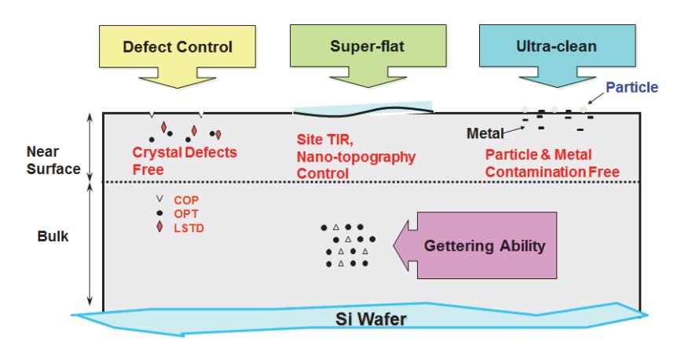

출처: 교육부(2016). 반도체용 웨이퍼 재료 제조(LM1903060401\_14v1). 한국직업능력개 발원. p.38. [그림 2-2] 웨이퍼 설계 시 고려사항 모식도

## 2-2. 선정된 웨이퍼 재료 문제점 해결

학습 목표 • 선정된 반도체 웨이퍼 재료의 도출된 문제점에 대한 해결방안을 제시할 수 있다.

## 필요 지식 /

#### 숔 단결정 성장 시 요구기술

웨이퍼를 만드는 처음 단계인 단결정 성장 시에 필요한 주요 기술 과제를 도출하였다.

1. 대구경 단결정 성장기술

디바이스 회사의 주도로 경제성을 향상하기 위한 목적으로 웨이퍼의 대구경화를 요구받고 있다.

현재는 300mm Si 웨이퍼가 주로 사용되고 있으나 차세대 design rule 10nm급의 차세대 반도체 소자에서는 300mm Si 웨이퍼보다 면적이 2.25배 이상인 450mm Si 웨이퍼를 채 택할 것으로 예측되고 있다.

Device의 생산성 증대에 따른 생산 비용 절감이라는 측면에서 Design Rule 10nm급 이하 시대에는 450mm Si 웨이퍼가 주력으로 자리 잡을 것으로 예측되며, 이에 따라 IST(INTEL, SEC, TSMC) 등은 차세대 웨이퍼로서 450mm Si 웨이퍼를 적극적으로 검토 하고 있다.

2. 무결함 성장 기술

MOS(Metal Oxide Semiconductor) Device용 폴리시드 웨이퍼는 Gate Oxide의 안정성 및 Device 영역 내의 무결함성 확보 측면과 오염원에 대한 불순물 게터링(Gettering) 능력 이 매우 중요한 요소이다.

이러한 두 가지의 요구에 대해 여러 가지 개선이 지속적으로 이루어졌고 앞으로도 새로운 기술이 고안되고 실용화될 것이다.

현재는 디바이스의 세분화가 더욱 진행하여 미량 또는 미소한 불순물이나 결정결함에 의해 서도 그 특성이 현저히 파괴되는 단계에 도달해 있어, 이와 같이 반도체 회로가 고집적화됨 에 따라 사용되는 실리콘 웨이퍼의 규격이 더욱 엄격해지고 있다.

숕 웨이퍼 가공 시 요구기술

원기둥 블록 형태의 실리콘을 낱장으로 만드는 웨이퍼 가공 시에 필요한 주요 기술 과제를 도 출하였다.

39

1. 웨이퍼 warp/bow 제어 기술

가공물의 직경과 부피가 크게 증가하기 때문에 이를 가공 시 많은 시간이 소요되어 가공물 의 열화현상과 가공 품질이 매우 열악해진다. 통나무를 톱으로 자를 때 큰 통나무의 경우 작은 통나무에 비해 자르는 시간도 많이 소요되고 자르기도 어려우며 커다란 톱을 사용하 는 것과 같은 이치이다.

2. 가공 진동 제어 기술

웨이퍼 가공 장비는 생산성을 위해 많은 가공물을 동시에 처리하기 때문에 가공 시 많은 소음과 진동이 발생하는데 이는 가공물의 미세 가공 제어에 큰 어려움을 발생시킨다. 이를 위해 수치 해석, 모듈화, 내부 구조물 최적화 등을 통해 가공 장비의 많은 발전이 이루어지 고 있다.

3. 가공 압력 분포 제어 기술

Design Rule이 미세화됨에 따라 요구되는 웨이퍼의 두께 균일성 등 물리적인 항목에 대해 극한의 균일성을 요구받고 있는데 이를 실현하기 위해 가공 장비의 압력 세기와 균일성, 웨 이퍼 내 분포는 그 품질 달성에 매우 중요하다. 이를 위해 가공 장비 구조물의 변경과 측정 시스템의 강화, in-situ공정 모니터링 등 많은 기술 발전이 필요하다.

- 4. 표면 미세 굴곡 제어 기술
- 5. 표면 오염/결함 제어 기술

4. 5.의 경우도 3.과 마찬가지로 Design Rule이 미세화됨에 따라 요구되는 웨이퍼의 표면 평탄화와 고청정도, 미세 결함의 미검출 등 고도의 가공 기술과 작업 환경, 나노급의 평가 를 필요로 해 혁신적이고 복합적인 공정 및 장비 기술 개발과 더불어 생산 시설의 물류 시 스템화에 대한 검토도 다각도로 이루어지고 있다.

숖 Epitaxial 성장 시 요구기술

Polished 실리콘 웨이퍼 위에 고품질의 에피 층을 성장시키는 에피텍시얼 성장 시에 필요한 주요 기술 과제를 도출하였다.

1. Epi 용 고농도 단결정 성장기술

Epi 웨이퍼에서 COP 제거 메커니즘은, COP가 {111} 면을 가진 표면 pit이기 때문에 70.53〫의 각도를 가지고 있다.

따라서 {100} 면에 COP가 존재하는 실리콘 웨이퍼 위에 단결정 Epi 실리콘을 성장시키면 COP 부분인 {111} 면에서 {100} 표면보다 약 2배 정도의 성장이 빠르기 때문에 COP가 제거된다.

고성능 소자에 쓰이는 p/p+ Epi 웨이퍼는 고농도 도펀트에 의한 도펀트 내부 확산 (auto-doping)에 대한 이슈가 생기고 p/p+ Epi 웨이퍼의 도펀트 내부 확산은 Epi 층 두 께를 제한하므로 p/p- Epi 웨이퍼처럼 두께를 얇게 할 수 없으며, 또한 Epi 두께가 두꺼 워짐에 따라 웨이퍼의 편평도가 나빠지게 되는 문제가 발생한다.

2. Epi 용 웨이퍼 가공기술

Epi용 웨이퍼는 고온의 열처리 공정이 추가되기 때문에 일반 Polished 웨이퍼 제조와는 다 르게 설계·관리 되어야 하고 선진업체의 경우 Epi용 웨이퍼를 생산하는 라인은 기존 웨이퍼 제조 라인과 별도로 운영하는 경우가 많다. Epi 성장공정에 적합도록 표면 연마공정을 개발 해 고품질의 Epi 웨이퍼를 가능토록 한다.

#### 3. Epi 층 성장기술

Epi 웨이퍼에서 COP 제거 메커니즘은, COP가 {111} 면을 가진 표면 pit이기 때문에 70.53〫의 각도를 가지고 있다.

따라서 {100} 면에 COP가 존재하는 실리콘 웨이퍼 위에 단결정 Epi 실리콘을 성장시키면 COP 부분인 {111} 면에서 {100} 표면보다 약 2배 정도의 성장이 빠르기 때문에 COP가 제거된다.

고성능 소자에 쓰이는 p/p+ Epi 웨이퍼는 고농도 도펀트에 의한 도펀트 내부 확산 (auto-doping)에 대한 이슈가 생기고 p/p+ Epi 웨이퍼의 도펀트 내부 확산은 Epi 층 두 께를 제한하므로 p/p- Epi 웨이퍼처럼 두께를 얇게 할 수 없으며, 또한 Epi 두께가 두꺼 워짐에 따라 웨이퍼의 편평도가 나빠지게 되는 문제가 발생한다.

## 수행 내용 / 선정된 웨이퍼 재료 문제점 해결하기

#### 재료·자료

- 실리콘 웨이퍼 제조기술, 반도체 소자 제조 기술, 전자 공학
- 생산 장비 리스트 및 운영 매뉴얼

#### 기기(장비 ・ 공구)

- 단결정 성장 장비·단결정 가공 평가 장비
- 웨이퍼링 공정 장비, Epitaxial 성장기(Epi Reactor)
- 평가·검증 장비

#### 안전 ・ 유의 사항

안전·유의 사항 없음.

#### 수행 순서

숔 단결정 성장 시 문제점을 해결할 방법을 파악한다.

단결정 성장 시의 사소한 하나하나의 문제점에 대한 해결책보다는 기반 기술의 요구사항에 대 한 해결책을 알아보도록 한다.

1. 고중량 지지 기술을 파악해 본다.

고중량 지지기술에는 현재 Thick Neck, 무네킹, Mechanical Holding System 등 3가지 방향으로 기술 연구가 진행 중이며, 각각의 기술은 다음과 같은 장단점이 있다.

Mechanical Holding System의 경우 가장 많은 특허가 등록되어 있으나 프로세스보다 장 치 구조에 대한 특허가 많고 장치가 복잡해지며 TEST 비용이 많이 들고, 실험하기가 용이 하지 않다는 단점을 가지고 있다.

무네킹의 경우 공정 프로세스 및 Seed 재료 등 광범위하게 특허가 경쟁사에 의해 등록이 되어있어, 특허 회피 및 대응 특허 작성이 필요하며, Seed 재활용 문제 및 Pre-Necking 공정의 단순화 등의 연구가 필요하다.

Thick Neck 기술의 경우 특허가 적으며 현재 Necking 공정과 가장 유사한 Process를 사 용할 것으로 예상된다. 하지만 Seed dipping시 발생하는 열 충격으로 인해 발생하는 Dislocation의 근본 원인 및 제어 방법 등 기반기술에 대한 연구가 필요하다.

2. 대용량 melt 제어 기술을 파악해 본다.

대구경 잉곳을 경제적으로 생산하기 위해서는 대용량 Quartz Crucible(약 1,000Kg

Charge Size)이 필요하고 이와 같은 대용량 Quartz Crucible 내의 Si melt는 기존의 유 동과는 다른 복잡한 운동을 한다. 이 Melt유동의 완벽한 제어를 위해 공정기술뿐만 아니고 히터(heater) 용량의 확대 및 구조 변경(하단부의 히터 추가 포함), 인가 자기장 형태의 변 경 및 세기 강화 등 Hot Zone 설계 기술과 밀접하게 관련이 있다.

3. Hot Zone 설계 기술을 파악해 본다.

Crystal 장대화, 무결함 단결정 및 Epi Sub.용 단결정 생산을 위해서는 용도에 맞는 450mm Crystal 장대화를 위해서는 H/Z 설계 및 적용이 필요하다. 예를 들면 내부 및 외부 단열 강화 및 Heat Shield Design 변경을 통한 결정 열이력 제 어 와 공정 기술을 통한 Si melt 대류를 최적화 등 재료, 장비, 공정기술 등 모든 복합적인 요소가 고려되어야하므로 매우 중요하다.

숕 웨이퍼 가공 시 문제점을 해결할 방법을 파악한다.

웨이퍼 가공 시의 사소한 하나하나의 문제점에 대한 해결책보다는 기반 기술의 요구사항에 대 한 해결책을 알아보도록 한다.

- 1. 가공 정밀 제어 및 온도 분포 제어 기술을 파악한다.
- 2. 가공 장비 기구 해석 및 설계기술을 파악한다.
- 3. 시스템 설계 기술을 파악한다.
- 4. 웨이퍼 물류 시스템 자동화 설계 기술을 파악한다.
- 5. 상기 해결 방안을 웨이퍼 가공 공정과 연관해 좀 더 세분화해 보면 표와 같다. 해결 방안은 기존 기술의 연장선상에 있지만 일부 기술, 예를 들면 연마 및 세정의 균일성 확보 기술 등의 경우에 있어 신규 기술의 개발이 필요하다.

| 구분   |         | 필요기술                                                           |
|------|---------|----------------------------------------------------------------|
| 가공기술 | Slicing | Ingot절단기술, Warp & Bow 제어 기술                                    |
|      | 황삭      | 양면 가공 기술, 평탄도 제어 기술, 유체 제어 기술                                  |
|      | 연삭      | 양면 가공기술, 평탄도 제어 기술, 진동 제어 기술, Diamond(abrasive) 입도 제어 기술 |
|      | 연마      | 양면 가공기술, 평탄도 제어 기술, 진동 제어 기술, 오염 제어 기술                         |
|      | 에칭/세정   | 온도 제어 기술, 유체 제어 기술, 화학약품 제어 기술, 친환경 에칭·세정 기술, 오염 제어 및 방지 기술 |

<표 2-1> 가공시의 문제점 해결을 위한 필요기술

숖 Epitaxial 성장 시 문제점을 해결할 방법을 파악한다.

Epitaxial 성장 시의 사소한 하나하나의 문제점에 대한 해결책보다는 기반 기술의 요구사항에 대한 해결책을 알아보도록 한다.

1. 도판트 및 3원소 도핑 기술

Si내에서 각 도판트별 Max. Solubility가 다르기 때문에, 기존의 도판트로 만들 수 없는 고농도 도핑된 즉슨 낮은 비저항을 갖는 경우나 매우 높은 비저항을 갖는 경우에 필요한 도핑기술이다.

일반 제품의 비저항은 1~30Ω-cm 대역이나 고농도 결정은 0.01Ω-cm 미만으로 E18~E19 atoms/cm3 농도로 Heavily Doped된 결정의 경우이다. 고농도용으로 사용가능 한 도판트인 Red-P의 경우 문헌상 0.7mΩ-cm까지 가능하다고 한다.

2. 웨이퍼 Edge 정밀 가공 기술

Epi용 웨이퍼의 평탄도를 제어하기 위해 표면 연마공정과 에피 성장공정 조건을 조정해 Epi후에도 웨이퍼의 고평탄화를 유지토록 한다.

3. Backseal막 성장기술

다양한 제품의 출현(예를 들면 고정밀 CIS소자나 스마트폰의 머리인 Application Processor 등)으로 다양한 요구가 있기 때문에 이를 구현하기 위해서는 Backseal막이 없 는 성장기술과 더불어 기존의 Backseal막 성장기술도 up-grade가 필요하다.

4. 에피 전/후 표면 처리 기술

에피 전 자연 산화막과 이물질을 제거하기 위한 기존 H2 열처리 기술과 에피 후 표면의 소 수성을 친수화해 안정화하는 오존 처리기술 등의 개발과 개선이 필요하다.

5. 상기 해결 방안을 Epi층 성장 공정 및 주요 항목과 연관해 좀 더 세분화해 보면 표와 같다.

| 구분         |                | 필요기술                                                        |
|------------|----------------|-------------------------------------------------------------|
|            | 두께 균일도         | 에피 두께 제어기술, 무결함 에피 성장 기술                                    |
| Epi층 성장 | 에피 비저항         | 에피 비저항 제어 기술, Auto-doping 제어 기술                             |
|            | Site Flatness  | 고평탄도 웨이퍼 가공 기술, ERO(Edge Roll-off) 제어 기술                    |
|            | Nanotopography | in-situ doping 기술, ex-situ doping 기술, Thermal Activation 기술 |
|            | Bulk Metal     | 오염원 제어 및 방지 기술, 저온 성장기술                                     |

<표 2-2> Epi 층 성장시 문제점 해결을 위한 필요기술

## 학습 2 교수·학습 방법

#### 교수 방법

- 반도체 공정에 실제 사용되는 웨이퍼에 흥미를 갖도록 실제 관련 웨이퍼나 모형(예를 들면 300mm Polished Si 웨이퍼, 100mm 사파이어 웨이퍼, 150mm GaAs 웨이퍼 등)을 전시 하고 차이점을 발견토록 유도해 본다.
- 반도체 공정에 적합한 웨이퍼의 종류별 장·단점에 대해 숙지하고, 모식도나 응용 사례 등을 제시하여 학생들이 이를 이해할 수 있도록 지도한다.
- 반도체 웨이퍼에 대한 전문 용어를 파악하고, 선정된 웨이퍼의 예측 가능한 문제점을 도출 해 해결 방안에 대해 제시할 수 있도록 지도한다.

#### 학습 방법

- 전시된 웨이퍼나 모형 등을 통해 반도체용 웨이퍼의 종류와 차이점에 대해 확인하거나, 웨 이퍼 제조업체에서 제공하는 다양한 자료를 인터넷으로 검색 또는 활용한다.
- 집적회로 제조 공정에 적합한 웨이퍼는 검색 또는 수집된 재료별 장단점을 분류하여 문서로 정리한 후 선정한다.
- 반도체용 웨이퍼 재료에 대한 전문 용어를 숙지하고, 검색 또는 수집되어 분류된 정보를 활 용하여 선정된 웨이퍼의 문제점을 도출하고 도출된 문제점은 브레인스토밍 등 집단 토의를 통해 해결 방안을 제시한다.
- 상기 절차에 의해 진행되는 모든 내용은 기록하고 정리해 정해진 양식으로 정리하고 최종 결과물로써 보고서를 작성한다.

## 학습 2 평 가

#### 평가 준거

• 평가자는 학습자가 학습 목표를 성공적으로 달성하였는지를 평가해야 한다.

#### • 평가자는 다음 사항을 평가해야 한다.

|            |                                   |   | 성취수준 |   |  |
|------------|-----------------------------------|---|------|---|--|
| 학습 내용      | 학습 목표                             | 상 | 중    | 하 |  |
|            | - 반도체 공정별 웨이퍼 재료의 장점과 단점을 파악할 수 있 |   |      |   |  |
| 웨이퍼 재료 장단점 | 다.                                |   |      |   |  |
| 파악 및 선정    | - 반도체 집적회로 제조 공정에 적합한 웨이퍼 재료를 선정할 |   |      |   |  |
|            | 수 있다.                             |   |      |   |  |
| 선정된 웨이퍼 재료 | - 선정된 반도체 웨이퍼 재료의 도출된 문제점에 대한 해결방 |   |      |   |  |
| 문제점 해결     | 안을 제시할 수 있다.                      |   |      |   |  |

#### 평가 방법

• 문제 해결 시나리오

|                       | 평가 항목                                  | 성취수준 |   |   |  |
|-----------------------|----------------------------------------|------|---|---|--|
| 학습 내용                 |                                        | 상    | 중 | 하 |  |
| 웨이퍼 재료 장단점 파악 및 선정 | - 웨이퍼 재료의 장점과 단점 파악 여부                 |      |   |   |  |
|                       | - 반도체 소자에 적합한 웨이퍼 선정 기준의 적합성           |      |   |   |  |
| 선정된 웨이퍼 재료 문제점 해결  | - 선정된 웨이퍼의 주요 문제점에 대한 다양한 해결안 제시 여부 |      |   |   |  |

#### • 서술형 시험

|                       | 평가 항목                      | 성취수준 |   |   |  |
|-----------------------|----------------------------|------|---|---|--|
| 학습 내용                 |                            | 상    | 중 | 하 |  |
| 웨이퍼 재료 장단점 파악 및 선정 | - 웨이퍼별 장·단점에 대한 이해도        |      |   |   |  |
|                       | - 웨이퍼 선정 기준에 대한 기술적 이해도    |      |   |   |  |
| 선정된 웨이퍼 재료 문제점 해결  | - 웨이퍼 문제점에 대해 제시된 해결안의 적절성 |      |   |   |  |

• 논술형 시험

|                       |                           | 성취수준 |   |   |
|-----------------------|---------------------------|------|---|---|
| 학습 내용                 | 평가 항목                     |      | 중 | 하 |
| 웨이퍼 재료 장단점 파악 및 선정 | - 장단점 기준 및 선정에 대한 기술적 적합성 |      |   |   |
| 선정된 웨이퍼 재료 문제점 해결  | - 도출된 문제점에 대한 해결안의 실현 가능성 |      |   |   |

• 사례 연구

|                       | 평가 항목                                                     |  | 성취수준 |   |  |
|-----------------------|-----------------------------------------------------------|--|------|---|--|
| 학습 내용                 |                                                           |  | 중    | 하 |  |
| 웨이퍼 재료 장단점 파악 및 선정 | - 장단점을 바탕으로 기준을 설정해 선정된 웨이퍼 실 사례(분 석된 성공이나 실패 요인의 적합성) |  |      |   |  |
| 선정된 웨이퍼 재료 문제점 해결  | - 도출된 문제점에 대한 해결안의 적용 사례(분석된 성공이나 실패 요인의 적합성)          |  |      |   |  |

#### 피드백

| 1. 문제 해결 시나리오                                          |
|--------------------------------------------------------|
| - 제시된 문제 해결 방법에 대해 웨이퍼의 기술적 이해도를 평가한 후 주요 사항을 표시하여 돌려  |
| 주고 수행 능력을 관찰하는 과정에서 평가한다.                              |
| 2. 서술형 시험                                              |
| - 시험 내용을 평가하고 기준에 미달한 학생들에게는 수준별로 해당 학습 내용을 보충하고 스스로   |
| 복습한 후 그 결과를 제출하도록 한다.                                  |
| 3. 논술형 시험                                              |
| - 해결안의 적절성에 대한 기술적 근거를 판단하고 추가로 보완해야 할 분야 및 해당 내용에 대해  |
| 세부적으로 제시한다.                                            |
| 4. 사례 연구                                               |
| - 실 사례의 분석 내용에 대해 주요 내용 파악 여부를 판단하고 개선 및 추가로 보완해야 할 사항 |
| 에 대해 제시한다.                                             |

| 학습 1 | 반도체용 웨이퍼 재료 요구사항 파악하기 |
|------|-----------------------|
| 학습 2 | 반도체용 웨이퍼 재료 선정하기      |
| 학습 3 | 반도체용 웨이퍼 제조하기         |
| 학습 4 | 반도체용 웨이퍼 제품특성 검증하기    |

# 3-1. 제조 공정별 장단점 파악 및 제조 파라미터 적용

학습 목표 • 반도체 웨이퍼의 제조 공정별 장점과 단점을 파악할 수 있다.

• 반도체 웨이퍼 재료별 제조(공정/장비) 파라미터를 파악하고 적용할 수 있다.

## 필요 지식 /

#### 숔 웨이퍼 제조 기술의 발전방향

웨이퍼 제조 공정별 장단점은 적용 소자에 따라 결정되기 때문에 웨이퍼의 기술 발전방향에 대 해 이해하는 것이 더 큰 도움이 되리라 생각된다.

#### 1. 웨이퍼 대구경화

현재 상용화되어있는 웨이퍼의 직경은 300mm인데 450mm 웨이퍼를 사용하면 300mm 웨이퍼를 사용하는 것에 비해 웨이퍼의 면적이 2.25배로 늘어나기 때문에, 웨이퍼 한 장에 서 얻을 수 있는 칩의 수를 두 배 이상 늘릴 수 있다. 이와 같이 반소체소자의 획기적인 생산성 향상이 기대되기 때문에 반도체 칩을 제작하는 제조업체(예를 들면 Intel, 삼성전자, TSMC 등)와 일부 웨이퍼 업체에서 450mm 웨이퍼에 대한 관심이 높아지고 있다. 450mm 웨이퍼에 대한 표준화는 mechanical grade 웨이퍼에 대한 M74 표준, test grade 웨이퍼에 대한 M76 표준이 각각 2008년 11월과 2010년 7월에 발표되었고, 최근 SEMICON WEST2011 및 SEMICON JAPAN2011에서 2011년 5월 draft document 5090을 기반으로 Prime 웨이퍼에 대한 논의가 진행되고 있고 SEMI standard M1 revision에 반영되고 있어 양산시 적용 가능한 제품 기준이 제시되어 있는 상태이다. 2008년 5월 삼성, 인텔, TSMC 3개사는 2012년 450mm 전환협력에 합의하는 등 450mm 실리콘 웨이퍼에 대한 전략적인 기술 개발의 필요성 대두하여 진행되고 있다.

2. 품질의 고도화

실리콘 웨이퍼의 주된 적용분야는 고성능 메모리 및 시스템 IC 반도체 소자이기 때문에 이 들 소자의 발전 방향에 맞게 웨이퍼 품질의 고도화가 지속적으로 진행되어 왔다. 현재는 디 바이스의 세분화가 더욱 진행하여 미량 또는 미소한 불순물이나 결정결함에 의해서도 그 특성이 현저히 파괴되는 단계에 도달해 있으며, 또한 반도체 회로가 고집적화 됨에 따라 사 용되는 실리콘 웨이퍼의 규격이 더욱 엄격해질 뿐 아니라, 가격경쟁력을 유지하기 위한 목 적으로 동시에 저가화도 요구되고 있다.

반도체 산업은 Design Rule 미세화 등 기술의 진보가 매우 빠르게 전개되는 첨단사업이기 이에 따라 고객의 첨단 제품과 요구에 대응하기 위해 웨이퍼 품질 및 기술을 고도화하기 위한 많은 노력을 기울이고 있다.

결정분야에서는 단결정 성장기술을 결정결함이 없는 단결정을 개발하고 가공분야에서는 Damage의 최소화로 표면의 초평탄화와 고청정을 달성하기 위한 공정기술 및 장비 기술개 발이 병행되고 있다.

이와 동시에 급격하게 성장하고 있는 모바일 제품의 핵심 부품인 애플리케이션 프로세서 (AP: application processor)를 비롯한 마이크로프로세서(MPU, CPU), 플레쉬 메모리, CIS(CMOS Image Sensor) 등의 제품들에 이미 채용된 300mm 에피 웨이퍼 기술은 벌써 세계적으로 양산, 판매가 활발히 진행 중이다.

#### 3. 차세대 웨이퍼 기술

기존 Si 웨이퍼의 한계를 극복하기 위한 차세대 웨이퍼 기술로 스트레인 웨이퍼 기술과 신 물질 및 하이브리드 웨이퍼 기술을 들 수 있다. 이와 같은 고성능 트랜지스터를 위한 차세 대 웨이퍼 기술 개발은 위험이 커 기업의 독자적 개발보다는 주로 컨소시엄 프로젝트 형태 로 공동으로 진행 중이다.

벨기에에 위치한 산․학․연 연구센터인 IMEC에서 주도적으로 Uni-axial 스트레인 웨이퍼 기 술, Ge 웨이퍼에 기반을 둔 MOSFET, 화합물 반도체 웨이퍼에 기반을 둔 MOSFET 등 차 세대 웨이퍼 재료를 이용한 다양한 연구가 진행 중이며 이미 가시적인 결과물들을 내놓고 있다. 일본에서는 주로 정부 주도의 컨소시엄 프로젝트인 MIRAI 프로젝트에서 주로 진행 중인데 동경대 Takagi 교수와 도시바에서는, condensation 방법을 이용한 strained Si 웨이퍼 제조 기술 및 GOI (Ge on insulator) 웨이퍼 기술을 독창적으로 개발하여, p-MOSFET의 홀 이동도 향상 연구 개발을 활발히 진행하고 있다.

NMOS는 Bi-axial strained Si SGOI 기술을 적용하고 PMOS에는 Uni-axial strained SGOI 기술을 적용하여 고성능 CMOS 기술개발을 진행하고 있다.

숕 공정·장비 및 주요 파라미터

각각의 웨이퍼별 세부 제조 공정·장비 및 주요 파라미터는 약간 상이할 수 있으나 크게 봐서는

동일 개념으로 볼 수 있어 가장 많이 사용되고 있는 Polished 웨이퍼를 기준으로 기술코자 한 다.

#### 1. 단결정 성장공정·장비 및 주요 파라미터

단결정 성장공정은 Charge preparation - Stacking(적층 공정) - Pumping – Melting -온도 안정화(Temperature Stabilization) - Necking – Shouldering - Body Growth – Tailing - 냉각 및 제거(Cooling & Removal)로 이루어진다.

이때 사용 장비는 단결정 성장로(Grower)라고 하며 Poly Si과 고순도 Quartz Crucible, N2·Ar Gas, 고순도 Graphite 등이 원부재료로 사용된다.

그리고 생산 제품의 품질 규격(비저항, Oi 등)에 적합한 원부자재(poly silicon 순도와 charge 양, dopant 종류 및 양, seed orientation등)와 결정성장로 기종 등 주요 파라미 터를 선정한다.

#### 2. 단결정 평가공정·장비 및 주요 파라미터

단결정 성장된 잉곳은 웨이퍼로 가공 전 단결정 평가공정을 거치는데 Cropping 공정 - Etching 공정 - Ingot Grinding 공정으로 진행된다.

이때 사용 장비로는 Ingot의 절단 및 검사 시료 (Slug) 채취를 위해 Band Saw, Wet Station(Etcher), Cylindrical Grinder가 필요하며, 절단 길이, 표면 거칠기 제어를 위한 케미컬 조성 및 온도, 반응 시간, 직경 가공치 등의 파라미터를 제어해야 한다.

#### 3. 웨이퍼 가공공정·장비 및 주요 파라미터

웨이퍼 가공(웨이퍼ing)공정은 크게 Shaping, Polishing, Cleaning, Evaluation으로 특성 과 순서에 따라 나누는데 Ingot Mounting – Slicing - Edge Grinding - Laser Marking과 Sorting - Lapping - Etching - 열처리 공정 - Polishing - Cleaning - Evaluation – Packing 순으로 이루어진다.

사용 장비로는 Ingot Mounter, Slicer(Wire saw), Edge Grinder, Laser Marker, Thickness Sorter, Lapper, Etcher, RTA or Diffusion Furnace, Polisher, Cleaner(Wet station), 평가 장비, Packaging Machine 등이 이용된다.

경면 웨이퍼를 만드는 단계이기 때문에 직경, 두께, 평탄도, 오염 수준 등을 충족시키기 위 한 파라미터가 선정되어 관리한다.

#### 4. 에피텍시얼 성장공정·장비 및 주요 파라미터

(에피텍시얼 성장공정은 단결정위에 추가적인 층을 성장하는 것으로 H2 Baking - Epitaxial Growth - Backseal(optional) - Evaluation & Cleaning으로 이루어진다. 통상 상압에서 운영하는 CVD(Atmospheric Pressure chemical vapor deposition)와 Final Cleaner(Wet station), 평가 장비, Packaging Machine 등이 이용된다.

추가적인 층을 형성하기 위한 공정이기 때문에 성장층의 두께, 비저항, 오염 정도 등이 파 라미터로 관리된다.

재료·자료

- 제품 제조 방법 검토보고서, 제품제조 절차서
- 제조 공정도, 장비 리스트, 제조 장비 운영지침, 시설 및 유틸리티 운영지침
- 제품제조 공정별 목표 검토서, 기타 자료 등

기기(장비 ・ 공구)

- PC 또는 노트북, 빔 프로젝터, 프린터, 인터넷 장비, 칠판(화이트보드)
- 전사적 자원 관리(ERP)
- 제조 일정관리 프로그램 등

안전 ・ 유의 사항

- 목표 및 시장 상황에 맞는 제조 능력 소요를 검토해 본다.
- 제조 장비 최적 상태를 파악해 진행한다.
- 가용 설비의 문제 상태 등을 고려한다.
- 제품마다 요구되는 특성에 맞춰 생산량 및 생산 가능량이 달라질 수 있음을 이해한다.
- 개발 제품의 초기 제조 시에는 다양한 대응 방법을 사전 점검하여 실행한다.

수행 순서

숔 웨이퍼의 기술 방향을 분석한다.

1. 폴리시드 웨이퍼의 기술 발전에 대해 세부적으로 이해하고 향후 변화를 예측해 본다.

반도체 산업은 "공정기술 미세화"와 "웨이퍼 대구경화 " 로 제조비용과 가격을 낮추며 시 장을 확장시켜 왔다. 새로이 개발되는 메모리칩의 능력은 18~24개월에 약 2배가 된다'는 미국 인텔사의 창시자인 전 회장 무어(Gordon Moore)가 1965년에 제언한 이후, 기술 발 전은 꾸준히 이루어져 왔고 이 법칙은 아직까지는 적용되고 있다. Moore의 법칙은 반도체의 미세 가공 기술의 발전을 근거로 하고 있기 때문에, 2010년대 에는 미세화가 원자 레벨에까지 도달할 것으로 예상되고 무어의 법칙이 더는 적용하기 힘

들 것이라는 예측도 있다.

이러한 기술 장벽에 도전하기 위한 노력으로 chip 면적의 증가, 3차원 구조 실현, 웨이퍼 대구경화 등을 통해 극복하는 방안과 Moore의 법칙을 뛰어넘는 신기술 (high-k, metal gate 등)의 구현, FinFET 등의 3차원 기술 개발을 지속적으로 진행하고 있다.

(1) 고성능화 : node 전환의 기술적 어려움

node 전환주기가 6Xnm 이후 2년에서 3년으로 늦어지고, 미세화를 위한 추가 기술 도 입 등 난도가 높아져 예상되었던 발전 속도가 지연되고 있다.

(2) 미세화 : 생산 비용의 상승

미세화를 위한 추가기술 공정개발 및 장비 (DPT, EUV 등) 비용이 추가되면서 제조 원 가 상승 폭이 커져 고성능의 제품을 값싸게 만드는데 어려움을 겪게 되었다.

(3) 대구경화 : 300mm 생산성 향상의 한계

디바이스의 제조비용을 낮추기 위한 노력의 일환으로 technology shrink, productivity improvement, yield up의 노력을 진행하고 있다.

앞선 기술 한계에 부딪힐 경우 웨이퍼 size up을 통해 디바이스 제조 비용을 낮추어 왔 다. 웨이퍼 size up은 매 10~15년 주기로 이루어져 왔고 30~50%의 cost down의 효 과를 실현하여 왔다.

과거 ITRS (International Technology Roadmap for Semiconductors)의 기술 동향 에 따르면 2012년 450mm로의 전환이 필요하다고 역설하고 있고 300mm 생산성은 이미 200mm 수준까지 도달하였고, 설비 upgrade를 통한 원가절감은 효과도 미미할뿐 더러 추가 개발 비용을 발생시켜 새로운 전환이 필요하다고 주장하고 있다.

#### 2. 450mm 웨이퍼의 개발 동향에 대해 파악한다.

초기부터 450mm 개발은 천문학적으로 많은 비용과 큰 사업적 위험요소(리스크)가 존재해 개별 기업의 독자개발이 아닌 이해 당사자들 간의 컨소시엄을 구성해 추진하고 있는데 그 중 Intel, 삼성전자, TSMC 등의 주도로 구성된 G450C의 450mm 데모 팹 추진 현황을 확인해 전체적인 진행 수준을 알아보자.

(1) 글로벌 복합 컨소시엄 구성 이유

기술 발전 동향에 따라 가까운 미래에 450mm로의 전환이 예측되고 있지만, 일부를 제 외하고는 회의적인 견해가 팽배하다. 장비업체(Toolmaker)의 경우 450mm 장치 초기 개발 부담이 과다하고 chip maker의 지원 없이는 어렵다는 입장이다. 또한 300mm의 경우 장비 개발 후 평가를 진행할 chip maker가 10개 이상 있었지만, 현재 동향으로 는 3개사를 제외하고는 장비를 평가해 줄 수 있는 maker가 없는 상황이다.

한편 450mm 장비를 개발하여도 sales가 힘들다는 이유이다. 장비 평가가 가능한 업체 가 3개사뿐인 상황에서 이를 제외하고는 구매할 수 있는 업체가 없다는 것이다. Chip maker의 경우에도 '450mm line을 건설하는데 초기 투자비용이 과다하고, 300mm의 경우에 비해 양산 안정화 기간이 길고, 웨이퍼뿐만 아니라 공정에 수반되는 각종 원부자

재의 단가가 상승하므로 450mm로의 전환이 이루어진다고 해도 이전의 웨이퍼 size up에 비해 큰 장점은 없다'라는 입장이다. 하지만 전환 시기를 저울질하고 있을 뿐이고 450mm로 전환을 하여야 한다는 사실에는 이견이 없다.

450mm 데모 팹은 천문학적인 건설대금이 필요하므로 참여 업체만의 funding만으로는 불가능하며, 또한 데모 팹의 건설이 로컬 산업의 발전에 기여하는 바가 크므로 유치하는 지역의 대규모 funding이 있어야 한다는 입장이다.

(2) 미국 현황

각국은 450mm Test Line 구축의 실효성(테스트 시간 단축을 통한 소자·장비·재료산업 주도 가능성 등)을 검토하였으나 뉴욕 주의 funding 결정으로 Albany에 450mm Test Line 건설이 결정되었다.

미국의 경우에는 'IT 뉴욕'의 슬로건 아래 반도체 및 나노 산업을 적극적으로 유치하고 있는 뉴욕 주에서 알바니에 ISMI 450mm 프로그램을 유치하기 위해 이미 \$20million 을 Phase I에 투자한 상태이다.

(3) 주요 국가 현황

대만은 450mm 전환을 도약의 계기로 활용코자 한때 국가적 차원에서 적극적으로 ISMI 데모 팹의 유치를 검토하였으나 신용위기에 따른 반도체 경기 침체로 대만 반도체 업계의 구조조정을 겪으며 한발 물러섰고, 국내에서도 450mm 전환 프로그램 데모 팹 의 유치를 한때 검토하였으나 경기의 하강에 의한 450mm 전환 프로그램의 동력이 약 화되면서 검토가 유보되어 있는 상태이다.

일본은 SEMI Japan의 ESG(Equipment Supply Group, 장비 공급자 그룹)를 중심으 로 450mm 표준화에 대응하며 소규모 Test Bed를 검토 중에 있다.

(4) 450mm 기술개발 현황

(가) 표준화

450mm 웨이퍼를 위한 "M74-1108 Specification for 450mm diameter mechanical handling polished 웨이퍼" 표준과 450mm 웨이퍼를 위한 "M76-0710 Specification for developmental 450mm diameter polished single crystal silicon 웨이퍼"의 표준이 이미 제정되어 완료되었고 초기 생산을 위 한 상업용에 대한 표준도 제시되어 지속적으로 up-date되고 있다.

또한 ISMI을 중심으로 450mm 표준을 위한 test를 통해 FOUP, transfer 등 표준 화를 위한 활동을 진행으로 여러 부분에서 결과물을 내놓고 있다. 현재는 G450C에 서 그 운영과 개발을 위한 실행을 주도하고 있다.

(나) 기술개발

450mm 기술개발의 경우 300mm개발 시의 적극적인 홍보전과 달리 매우 비밀리에 진행되고 있어 실제 진행사항을 알기에는 한계가 있어 학계나 외부 발표 등을 통해 정리된 주요 기술 이슈를 정리하는 것으로 대신한다.

먼저 결정성장 시의 Necking과 Point Defects 이슈이다. 웨이퍼의 크기가 커지면 그 재료가 되는 실리콘 결정의 직경을 확대해야 할 필요가 있으며, 무게도 증가한다. 450mm 웨이퍼용 실리콘 결정은 1,000kg에 달하며 종래의 방법으로는 이 무게를 감당할 수 없다. 따라서 핵심적으로 필요한 것이 신개념의 Necking 기술이다. Point Defects 이슈는 종래에도 계속 제기되었던 문제로 Hot zone 설계기술개발 Growth Rate 제어 등을 통해 풀어나가야 한다. 아래에 결정성장시 의 차이점을 비 교해 기술적 이슈를 정리하였다.

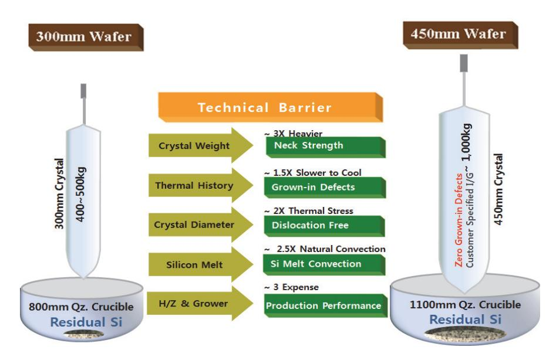

출처: 교육부(2016). 반도체용 웨이퍼 재료 제조(LM1903060401\_14v1). 한국직업능력개발원. p.54. [그림 3-1] 대구경 결정성장 시의 기술적 이슈

웨이퍼 가공 시의 문제는 웨이퍼 Shaping(형상)과 Thickness(두께) 등이다. 반도체 공정인 Lithography 기술과 연계되어 그 스펙이 갈수록 타이트 해지고 있다. 직경 이 넓어질수록 Gravity Sag Control이 어려워지고 웨이퍼 Breakage 및 Near Edge Surface Flatness 문제 등에 봉착할 수 있다.

웨이퍼 Thickness는 웨이퍼 Shaping과 연관이 큰데 대구경이 Thermal Stress, Sag에 대응하여 안정된 웨이퍼 Strength를 가지기 위해서는 현재보다 25 ~ 50㎛ 증가한 Thickness가 필요하게 된다. 따라서 이들을 제어할 수 있는 고도의 기술들 이 요구되고 있다.

아래에 대구경 웨이퍼 가공 시의 차이점을 비교해 기술적 이슈를 정리하였다.

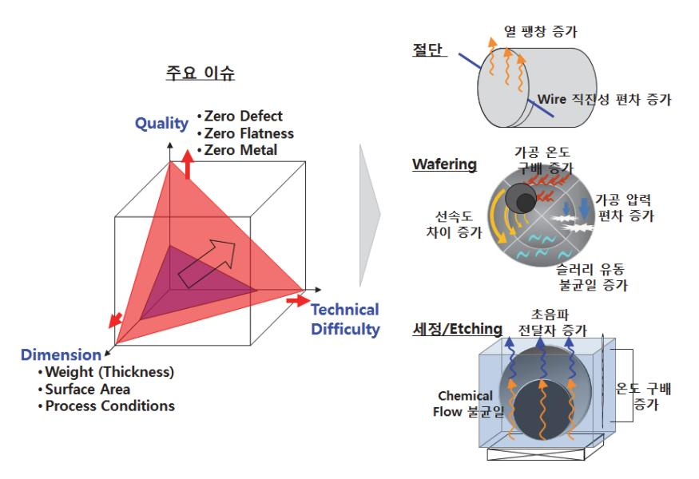

출처: 교육부(2016). 반도체용 웨이퍼 재료 제조(LM1903060401\_14v1). 한국직업능력개발 원. p.55. [그림 3-2] 대구경 웨이퍼 가공 시의 기술적 이슈

(다) 제품개발

해외의 경우 M76-0710에 준한 450mm polished single crystal silicon 웨이퍼 시작품을 개발한 상태이며, 국내의 경우 M74-0710에 준한 450mm polished single crystal silicon 웨이퍼 시제품 개발 후 M76-0710 시제품 개발을 위한 연 구가 진행 중이다.

주요업체별 현황을 정리하면 아래와 같다.

<표 3-1> 450mm 웨이퍼 개발 현황

| 업체·기관           | 최근 개발현황                                           | 파라메타     | 개발단계   |
|-----------------|---------------------------------------------------|----------|--------|
| Shin-Etsu       | 450mm polished single crystal silicon | M76-071  | 시제품 개발 |
|                 | wafer                                             | 0        |        |
| SUMCO           | 450mm polished single crystal silicon | M76-071  | 시제품 개발 |
|                 | wafer                                             | 0        |        |
| Si l t r o ni c | 450mm mechanical handling polished       | M74-110  | 샘플     |
| AG              | wafer                                             | 8        |        |
| LG Siltron      | 450mm mechanical handling polished       | M76-071  |        |
|                 | wafer                                             | 0        | 시작품 개발 |
| G450C           | 450mm 장비 등 standard 제정 중                          | SEMI std | 진행 중   |

450mm 웨이퍼의 품질 수준은 G450C에 의하면 웨이퍼 공급 업체의 지속적인 품질 개선을 통해 SEMI standard M76의 모든 품질 항목을 만족하고 있는데. 웨이퍼의 particle best 수준은 LLS의 경우 (31ea/ 450mm 웨이퍼, ≥ 35nm) 정도이다. 웨이퍼 표면의 금속 오염 수준도 <1010 atoms/cm2 이고, 450mm 결정 품질의 수

#### 숕 공정·장비 별로 적용할 제조 파라미터를 파악한다.

Polished 웨이퍼를 제조하기 위해 주요 단계별로 구분해 세부 제조 공정·장비 및 제조 파라미 터를 조사하여 파악한다. 그 결과를 아래에 정리하였다.

#### 1. 단결정 성장공정

#### <표 3-2> 단결정 성장공정·장비 및 제조 파라미터

| 단결정 성장 공정                                           | 주장비(부대장비·원부자재 )                                         | 제조 파라미터                                                |
|-----------------------------------------------------|---------------------------------------------------------|--------------------------------------------------------|
| Charge preparation                                  | Grower(quartz crucible, seed, dopant, 기타 consumable) | Grower기종, consumable 규격                                |
| Stacking(적층 공정)                                     | Grower(quartz crucible)                                 | Poly Si 량(Nugget, Chip type), Seed종류, dopant 종류 및 양 |
| Pumping                                             | Grower(pump)                                            | 압력                                                     |
| Melting                                             | Grower                                                  | 온도                                                     |
| 온도 안정화 ( T e m p e r a t u r e Stabilization) | Grower                                                  | 온도                                                     |
| Necking                                             | Grower(seed)                                            | 온도, seed orientation                                   |
| Shouldering                                         | Grower                                                  | 도가니 및 시드 회전수                                           |
| Body Growth                                         | Grower                                                  | 도가니 및 시드 회전수, 자기장                                      |
| Tailing                                             | Grower                                                  | 인상속도, 온도                                               |
| 냉각 및 제거 (Cooling & Removal)                      | Grower                                                  | 온도, Ar가스 량                                             |

#### 2. 단결정 평가공정

#### <표 3-3> 단결정 성장공정·장비 및 제조 파라미터

| 단결정 평가 공정         | 주장비                 | 제조 파라미터                         |
|-------------------|---------------------|---------------------------------|
| Cropping 공정       | Band Saw            | 절단길이                            |
| Etching 공정        | Etcher(Wet station) | Chemical 종류, 혼합 비율, 온도, 반응시간 |
| Ingot Grinding 공정 | Cylindrical Grinder | 직경 치수                           |

#### 3. 웨이퍼 가공공정

#### <표 3-4> 웨이퍼 가공공정·장비 및 제조 파라미터

| 웨이퍼 가공 공정                    | 주장비                                     | 제조 파라미터                                       |  |  |
|------------------------------|-----------------------------------------|-----------------------------------------------|--|--|
| Ingot Mounting               | Ingot Mounter                           | Graphite Beam 크기, 접착 강도                       |  |  |
| Slicing                      | Slicer(Wire saw)                        | 두께, Wire saw 속도, Wire 두께 등                    |  |  |
| Edge Grinding                | Edge Grinder                            | Grinder feed속도, Pad 거칠기                       |  |  |
| Laser Marking과 Sorting | Laser Marker, Thickness Sorter | Laser 용량, 깊이, 크기, 두께                          |  |  |
| Lapping                      | Lapper                                  | 슬러리 종류, 양, 정반 회전속도 등                          |  |  |
| Etching                      | Etcher                                  | Chemical 종류, 혼합 비율, 온도, 반응시간               |  |  |
| 열처리 공정                       | RTA or Diffusion Furnace                | 반응가스, 시간, 온도 Recipe 조건                        |  |  |
| Polishing                    | Polisher                                | 헤드 압력, 슬러리 종류, 양, 정반 회전속 도 등               |  |  |
| Cleaning                     | Cleaner(Wet station)                    | Bath구조, Chemical 종류, 혼합 비율, 온도, 반응시간, 건조방법 |  |  |
| Evaluation                   | 평가 장비                                   | 장비별 평가 Recipe                                 |  |  |
| Packing                      | Packaging Machine                       | 고객별 요구 Package 방법 준용                          |  |  |

#### 4. 에피텍시얼 성장공정

<표 3-5> 에피텍시얼 성장공정·장비 및 제조 파라미터

| 에피텍시얼 성장공정            | 주장비                                                                    | 제조 파라미터                                                     |  |  |
|-----------------------|------------------------------------------------------------------------|-------------------------------------------------------------|--|--|
| H2 Baking             | APCVD                                                                  | 온도, 투입 수소가스 량, 시간                                           |  |  |
| Epitaxial Growth      | APCVD                                                                  | 온도, 시간, 도판트 가스 종류                                           |  |  |
| Backseal (optional)   | APCVD                                                                  | 온도, 가스 종류 및 투입량                                             |  |  |
| Evaluation & Cleaning | 평가장비(Particle Counter 등), Final Cleaner, Packaging Machine | 이물질 오염정도, 층 두께, 농도 Chemical 종류, 혼합 비율, 온도, 반응시간, 건조방법 |  |  |

## 3-2. 제조 공정의 문제점 해결

학습 목표 • 반도체 웨이퍼 재료별 제조 공정의 도출된 문제점에 대한 해결방안을 제시할 수 있다.

## 필요 지식 /

숔 단결정 성장·단결정 평가 공정 시 불량

1. 단결정 성장법과 기술적 문제점

자연계에 주로 존재하는 결정체인 다결정체( poly crystal )를 이용하여 단결정으로 제조한 다. 하지만 이러한 단결정 성장 과정이 많은 변수들에 의해서 지배를 받기 때문에 과거부터 많은 문제들이 존재하여 왔다. 그러나 오늘날의 정밀 계측 제어기술의 눈부신 발달에 의해 서 단결정 성장공정의 초정밀 제어가 가능하고 대구경으로 가는 추세에 있다

(1) 초크랄스키법(Czochralski Method, CZ법)

실리콘 단결정 성장방법은 phase growing method에 따라서 네 가지 방법으로 구분 할 수 있다.

용융상 성장법(Melt Growth, 용융상을 응고하여서 결정을 얻는 방법), 용액 성장법 (Solution Growth), 기상 성장법(Vapor Growth), 고상 성장법(Solid Growth)으로 나 눌 수 있고 이 방법들 중에서 용융상 성장법을 현재 가장 많이 사용한다.

초크랄스키법은 1918년 J. Czochralski에 의해 처음으로 시도되었고 그 이름을 따서 불리고 있다. 그러나 현재 널리 이용되는 용융액으로부터 단결정을 끌어올리는(pulling) 방식은 Teal과 Little에 의해서 개발되었다. 작은 반경의 CZ 실리콘이 1960년대 초반 IC 제조에 처음 사용되었으며, 1960년대말 무전위(dislocation free) 성장 기법과 자동 직경 제어(ADC: automatic diameter control) 기술이 발전하면서 이후 20년 동안 실 리콘의 직경과 로(crucible)의 충전량(charge size)은 급속도로 증가하였다.

아래에 용융상 성장법의 종류와 특징을 정리하였다.

<표 3-6> 용융상 성장법 종류와 특징

| 결정성장 방법                        | 특징 및 장·단점                   |
|--------------------------------|-----------------------------|
| 초크랄스키법 (Czochralski Method) | 대구경화 가능, 가장 보편화             |
| 브리지만법                          | 도가니의 한계성, 응고성에 의한 체적팽창,     |
| (Bridgman Method)              | 대구경화의 어려움                   |
| 부유대용융법                         | 재료상의 한계성, 유동의 구동력에 의한 결함발생, |
| (Float Zone Method)            | 대구경화의 어려움                   |

#### (2) 초코랄스키법(Czochralski Method)의 문제점

CZ 단결정 성장법에 있어서도 많은 문제점은 존재한다.

- Melt와 Crucible이 접하므로써 오는 불순물의 혼입
- 응고계면(Melt interface)근처에 존재하는 자유표면 문제
- 자연대류(natural convection)현상에 기인한 melt내에서의 유동(flow)문제
- CZ 단결정 성장계를 구성하는 세 개의 대칭축들이 보여주는 비대칭성 문제
- Melt후 겪게 되는 열 이력( Thermal History )에 기인한 결정 결함의 생성

그러므로 위와 같이 많은 요소들을 가지고 있으므로 CZ 단결정 성장계의 열 및 물질 전달 현상과 온도분포를 이해하는 것이 중요하다.

결론적으로 CZ 단결정 성장에서의 가장 중요한 요소는 열 및 물질전달 현상에 대한 정 교한 제어에 있다.

또한 결함핵 형성에 큰 영향을 끼치는 인자로는 결정 중의 산소농도, 탄소농도, 응고 시 에 결정에 생성되는 점 결함의 종류와 농도, 성장로 내에서의 열 이력이 있다.

점 결함, 산소 원자, 탄소 원자가 열 이력에 의해 어느 부분에서 응집, 반응을 거쳐 최 종적인 결함의 핵을 형성한다. 다른 구조의 성장로에서 인상된 경우 산소와 탄소의 농도 가 동일해도 결함 발생에 차가 생기는데 이는 특히 열 이력이 중요한 영향을 끼친다고 볼 수 있다.

결정성장 시 결정 내부의 결함에 기인한 웨이퍼 표면의 particle로 검출되는 COP는 As-grown 결정 중에 존재하는 결함이 웨이퍼의 세정 중에 선택 에칭된 피트로 검증되었는 데 COP의 원인이 되는 결함이 산소 석출물과 OSF의 핵과 다른 형성과정을 겪는다.

숕 웨이퍼 가공 공정 시 불량

1. 웨이퍼 가공공정과 기술적 문제점

웨이퍼 가공공정과 문제점을 Slicing과 Shaping, Polishing과 Cleaning으로 나누어 살펴

보자.

(1) Slicing과 Shaping

Slicing 기술 분야에는 대구경 웨이퍼의 절단 필요성에 의해 Wire Saw 기술이 주로 사 용되고 Cost, Handling, 형상의 경시변화 및 환경 측면 등 몇 가지 기술 과제가 남아 있다. 또 종래의 내주도 절단 기술에는 신기술(요동 Saw, Sori Servo Control System, Auto Bow Control System. etc)의 도입, 전개가 도모되고 있다. 모두 주변 기술의 Level상이 중요하다.

웨이퍼의 절단 정도는, 동시 절단한 웨이퍼 간의 두께변동(중심 두께변동), 1매의 웨이퍼내 두께변동(평행도, TTV), 웨이퍼의 Warpage로 평가한다.

중심두께 변동은 Main Roller의 Pitch 가공 정도가 결정한다. 고정도의 NC 가공기를 사 용하면 ±10㎛이하의 Pitch 정도가 얻어져서 중심 두께 정도를 좋게 하는 것이 가능하다. 대체로 Actual Data가 최대 최소치에서 약 10~12㎛ 정도의 Range를 나타낸다. TTV 및 Warpage에 대해서는 절단 중의 Wire 열과 가공재료의 위치관계를 일정히 유지하는 기술이 중요하다. 다시 말하면 Wire의 궤도가 수평면으로부터 직각을 이루는 면으로부터 치우치면 Warp이 형성되고 각 Wire의 치우침이 다르면 TTV가 나빠진다.

Lapping 기술은 가공 정도의 향상과 Etching 및 polishing 공정의 운영에 적합한 웨 이퍼 형태 등의 개선을 요구받고 있다. 그러나 상기의 요구가 실현되면서 전·후 공정을 포함한 최적화를 차후에는 고려할 필요가 있다.

Edge Grinding 기술은 Edge Grinding부의 경면화 가공이 제품에 채용되어 그 효과가 나타나기 시작했으나 Cost 측면의 문제가 남아있다. 경면화 가공에 의해 Particle의 Generation이 저하하고 열처리 시의 Slip 발생을 억제하는 효과 등이 나타나고 있다. Etching시 Roughness는 좋은 값을 가지나. Polishing 이후 TTV, LTV를 개선하기 위 해서는 Etching공정에서 Flatness를 더 개선해야 하며 이를 위해서는 새로운 Etching mechanism에 대한 연구와 도입이 필요하다.

(2) Polishing과 Cleaning

이 공정의 목적을 간단히 말하면 고평탄화와 표면의 고청정도 달성이다.

연마공정으로 소자제작이 이루어지는 표면의 손상과 결함을 제거해 주는 경면 연마 (polishing) 공정까지 거친 웨이퍼를 말한다.

소자의 미세화에 따른 대응방안인 축소노광기술은, 스태퍼에 의한 Lithography기술과 미세 가공기술의 진보에 의한 것이다.

Polishing 공정의 핵심기술은 Wafer mounting block 및 Turn table의 평탄도와 Polishing pad의 성능이다. 현재 이를 개선하기 위해서는 Ceramic material을 이용한 Block 및 Turn table에 대한 기술적인 검토와 Hardness를 향상시킨 Polishing pad 의 적용 등이 검토되고 있다.

가공 공정 중 마지막 제조공정인 세정공정은, 웨이퍼 표면에 있는 Metallic, Ionic, Organic 등의 불순물을 얼마나 완벽하게 제거하는가가 그 관건으로써, 분석 장비로는, 주로 SIMS(Secondary Ion Mass Spectroscopy), AA(Atomic Absorption Spectroscopy), RBS(Rutherford Back Scattering), GC(Gas Chromatography) 등 이 사용되고 있다. Cleaning 효과를 개선하기 위해서는 고품질의 부품으로 제작된 장비 와 Clean room 설비의 개선, 고순도의 Utility와 Chemical 등이 필요하다. 최근 그 중요성이 커지고 있는 Clean room environment 및 Utility는 웨이퍼가 대구 경화 됨에 따라 사람이 직접 웨이퍼를 취급할 수 없으므로, Robot에 의한 자동화가 될 수밖에 없고, 결국 Clean room내의 Clean tunnel 안에서의 Robot에 의한 자동화로 Clean Room 내의 Particle 관리는 해결할 수 있으리라 판단되나, Clean room에서 가장

많이 사용되는 초순수의 품질을 높이는 데는 많은 어려움이 있을 것으로 보인다.

특히, 유기물 (TOC : Total Organic Carbon)과 용존산소 (DO : Dissolved Oxygen) 의 함유량이 많이 줄어들 것으로 보이며 이에 대한 해결책은 TOC와 DO 소거에 사용 되는 장치의 고성능화 및 처리기술의 진보에 의존할 수밖에 없는 것으로 보인다.

#### 숖 에피텍시얼 성장 공정 시 불량

#### 1. 에피텍시얼 성장공정과 기술적 문제점

Epitaxy 기술은 전자 Device 제조상에 각종의 매력적인 측면을 가졌다. MOS Memory용 웨이퍼에 대해서 내 Latch-up성의 향상, α선 Error의 감소로 발해지는 특성을 간단히 부 가 가능하다. Discreet 소자에는 확산법보다 정밀하게 Dopant 농도가 제어된 Layer를 가 능하게 한다. 또 Bipolar IC 제조에는 불가결한 제조 기술이다. 그러나 문제가 없다는 의 미는 아니다. Epitaxial 성장에 동반하여 몇 개의 독특한 품질 저하 문제가 있다.

#### (1) CVD성장법

반도체 Device에 사용되는 결정을 그 성장 방법으로 분류하면, Bulk 결정과 Epitaxial 로 나눌 수 있다. 일반적으로 Bulk 결정은 CZ법으로 성장시킨 단결정을 박편으로 Slice 해서 표면을 경면상으로 연마한 Polished 웨이퍼로 사용된다. 이 Polished 웨이퍼에 Epitaxial 기술로 다양하게 단결정 박막을 성장시킨 것이 Epitaxial 웨이퍼이다.

Epitaxial 단결정의 표면에는 Polished 웨이퍼와 같이 연마에 의한 손상이나 Distortion은 원리적으로는 존재하지 않는다. 산소나 탄소농도는 CZ 결정에 비해서 매 우 적다. 또 Epi층 중의 미소 결함도 CZ 결정에 비해 적다.

Epitaxial 웨이퍼의 기판으로 되는 CZ 단결정의 산소농도와 열처리를 Control하고 기 판의 Backside에 Poly silicon을 형성하기도 하는 Gettering 기술을 이용함으로써 금 속불순물이 적은 Epitaxial 층을 얻을 수 있다.

(2) CVD의 문제점

Epitaxial 웨이퍼에는 기판이 되는 웨이퍼의 연마기술 향상이 필요하게 되고 동시에 Epitaxial 성장에 있어서도 기판 웨이퍼의 평탄도를 열화시키지 않는 기술이 필요하다. Epitaxial 성장에서의 평탄도 열화 원인은

- Epitaxial층의 두께 분포

- Epitaxial 성장 시의 웨이퍼 Backside에의 불균일한 Poly퇴적

- Epitaxial 성장 시의 웨이퍼 Backside에의 Etching 등이 있다.

Epitaxial층의 두께분포는 특히 웨이퍼 위로 흘리는 원료 Gas의 흐름의 영향이 크고 종 형로나 Cylinder형 로에는 Susceptor의 형상, Gas의 유량, Gas Nozzle의 위치 등의 최적화를 행하는 것에 의해 ±5% 정도의 균일성이 얻어지고 있다.

매엽식 종형로에는 300mm 웨이퍼에서 ±1.5% 정도의 균일성이 얻어지고 있다.

Epitaxial 성장 전후에서 평탄도는 거의 변하지 않는다.

Epitaxial 성장 시의 웨이퍼 Backside에의 불균일한 Poly Si 퇴적은 종형로에서 현저 하게 나타나고, 또 웨이퍼 Backside 면의 Etching은 Cylinder형로에서 현저하게 나타 나나 어느 것이나 웨이퍼 Backside 면에의 SiO2 피복한 성장조건의 최적화 등으로서 억제하는 것이 가능하다.

앞에서 기술한 것 이외의 Edge Grinding부에서의 Facet 성장에 동반한 평탄도의 열화 가 있다. (100)Epitaxial 웨이퍼에는 웨이퍼 Edge부에서의 Epitaxial층의 Crown이 발 생하고, Epitaxial층의 두께가 두꺼워 지는 것이 현저히 나타난다.

또한 Device Process에서 웨이퍼의 Warp은 Chucking 및 반송 Trouble의 원인이 되 기 때문에 제어하지 않으면 안 되는 품질이다. 저 저항 웨이퍼 기판 위에 고저항의 Epitaxial층을 형성한 Epi 웨이퍼에 있어서 Dopant 불순물의 종류 및 농도 차에 의해 기판과 Epitaxial층과의 격자 상수 부정합이 일어나 그 원자층간의 Distortion을 완화 하기 때문에 warpage나 Misifit 전위가 발생한다.

저 저항 기판 웨이퍼가 B첨가의 경우 B는 공유결합 반경이 Silicon보다 작기 때문에 凸 측 완상의 휘어진 상태로 변형한다.

## 수행 내용 / 제조 공정의 문제점 해결하기

#### 재료·자료

- 제품 제조 방법 검토보고서, 제품제조 절차서, 불량 발생보고서, 기술보고서
- 제조 공정흐름도, 장비 리스트, 제조 장비 운영지침, 시설 및 유틸리티 운영지침
- 제품제조 공정별 목표 검토서, 기타 자료 등

#### 기기(장비 ・ 공구)

- PC 또는 노트북, 빔 프로젝터, 프린터, 인터넷 장비, 칠판(화이트보드)
- 전사적 자원 관리(ERP)
- 제조 일정관리 프로그램 등

#### 안전 ・ 유의 사항

제조에 앞서 제조계획 수립 시 발생 가능한 모든 문제점에 대해 도출하고 치명적인 문제점 에 대해서는 치밀하고 다양한 대응 방법을 검토 후에 생산을 실행한다.

#### 수행 순서

- 숔 단결정 성장·단결정 평가 공정 시 불량 항목에 대해 파악한다. 단결정 성장·단결정 평가 공정 시의 문제점을 해결하기 위해서는 불량 원인과 제어 방법에 대 해 이해하고 파악해 공정 중에 정밀 제어해 제거해야 한다. 대표적인 결함의 원인과 제어방법에 대해 파악해 보자.
  - 1. 온도분포

CZ법에 의한 Si 단결정은 보통 1mm/min.정도의 속도로 인상된다. 결정은 응고되면서부터 외부로 꺼낼 때까지 응고 온도로부터 성장로 내의 상부온도까지 서랭되어지고, 이 냉각과정 을 열 이력이라 부른다.

열 이력은 성장로의 크기와 내부 구조에 따른 온도분포와 인상속도에 의존한다. 온도분포는 예를 들면 Seed에 열전대를 매달고 결정을 성장시키므로 고액 계면 위치로부터의 거리에 따른 온도를 구할 수 있다.

더욱 간편한 방법으로써 결정에 몇 개의 구멍을 뚫고 여기에 열전대를 넣어서 결정 내의 온도를 측정하는 방법이 있다. 이때 결정을 도가니중의 용액에 녹여 간다면 결정의 인상과 정과는 반대로 결정이 받게 되는 온도변화를 구할 수 있다. 이 방법에서는 응고 시 발생하

는 잠열의 기여가 실제의 인상 중일 때와는 반대가 되어 고액계면형상도 달라지므로 고액 계면 인접한 온도는 인상 중일 때와는 엄밀히는 일치하지 않을 것이지만 이외에는 거의 일 치하리라 생각된다.

열이력, 즉 어느 온도영역을 냉각시켜가기 위해 어느 정도의 시간이 필요한가라는 문제를 풀기 위해서는 적어도 1,000C이하의 온도 영역에서는 성장로 내의 분위기 온도 측정 결과 를 사용하고, 1,000C이상의 액면 위치에서의 응고 온도에 추정한다면 고온에서의 열 이력 도 큰 오차 없이 예측하고 제어할 수 있다.

2. 산소 석출핵

산소 석출량은 결정의 반경 방향으로 분포를 하고 있다. 그 분포의 형태는 열처리온도에 따 라 변한다. 열처리 온도가 800C이하의 경우에는 산소석출은 결정 중심부가 외주부보다 많 이 일어나고, 열처리 온도가 850C보다 높은 경우 석출량은 전체적으로 적어지지만 저온열 처리의 경우와 반대로 외주부에서 석출이 많이 발생한다.

전자의 분포를 저온 열처리형, 후자를 고온 열처리형이라 부를 수 있다. 산소석출의 반경 방향 분포를 그라인딩전의 결정의 외주로부터의 거리 함수로 표시할 수 있는데, 저온 열처 리형의 석출불균일성은 산소농도의 반경 방향 분포를 반영하고 있고, 이 경우 산소농도는 외주부에서 낮게 되는 분포를 가진다.

저온 열처리를 한 결과 산소석출물이 균일하게 나타나는 경우 산소농도가 반경 방향으로 균일한 결정인 것을 보여준다.

이것에 반해 고온 열처리형의 석출불균일성은 산소농도가 균일해도 결국 나타난다. 탄소농 도가 산소석출을 촉진하는 것을 잘 알려져 있지만 탄소농도가 측정 오차범위 내에서 균일 해도 고온열처리형의 석출 불균일성은 나타난다.

이상과 같이 산소석출물의 반경 방향 분포는 열처리 온도와 산소농도 불균일성의 정도에 따라 변화된다.

성장한 결정 내부 핵의 밀도를 평가하기 위해서 각각의 온도에서 장시간의 열처리를 하고 이 결과 발생된 석출물 밀도를 선택 에칭해서 구하여 그것을 그 열처리 온도에서 성장할 수 있는 핵의 밀도로 산출한다. 석출물 밀도는 체적 밀도로 표시하지만 이것은 단위 면적당 밀도로 선택 에칭의 깊이로부터 구한다.

석출물 밀도 대신에 산소 석출률을 나타낸 ORR(Oxygen Reduction Ratio)를 구하는 경 우도 있는데, 이것은 열처리 전후의 고용산소농도차로 열처리 전후의 농도에 대한 비율이 다.

3. OSF(Oxidation Stacking Faults) 핵

OSF 핵은 비교적 단시간의 열처리에서 발생하는 OSF로서 장시간의 열처리에서 산소석출물 의 성장으로 발생하는 OSF는 언급하지 않는다. 특히 OSF가 결정 내부의 특정 영역에서 발 생한다는 것과 열이력이 OSF 핵형성에 중요한 영향을 끼친다는 것이다. OSF 핵밀도의 평 가는 산소석출물의 경우와 동일하게 열처리에서 발생된 OSF밀도를 말한다.

1,100C 근처에서 열처리할 경우 OSF는 결정 내부에서 특징적 분포를 가지고 발생하는 경 우가 많다. 특히, 결정의 상단부에서는 역U자형의 영역으로 분포하는 경향이 있는데 이 영 역을 OSF의 발생영역이라고 부르고 Seed쪽에도 산소석출이 과다한 영역이 존재한다. 이 발생위치는 인상조건에 따라서 아래위로 이동하는데 인상속도가 빠르면 영역은 상단측이 되 고 느리면 낮은 위치로 이동한다. 그리고 이 상하변동은 고액 계면형상이 평탄해지는 위치 와 일치하고 있다. 즉, 고액 계면형상은 결정의 가장 상단부는 아래로 볼록하지만, 차츰 평 탄해지면서 역으로 위로 오목하게 된다. 이 고액 계면형상이 거의 평탄해지는 위치가 OSF 발생위치와 대응하고 있는 것이다.

서로 다른 인상속도에서 성장시키며 OSF 발생영역을 지나면서부터 인상을 1시간 정지하는 인상 정지 실험을 실시한 해당 영역에는 열처리를 해도 OSF가 발생하지 않았다. 결국 OSF 핵의 형성은 고온 열이력에서는 억제된다. 그러나 인상을 1시간 정지시킨 후 재개해서 얼마 되지 않은 경우 OSF 발생영역이 나타나고 있다.

이 경우 Seed의 인상을 정지하면 잠열의 영향을 받게 되어 중심부의 온도가 낮아져서 중앙 부에서는 조금씩 응고가 진행되기 때문에 고액계면이 아래로 볼록하게 된다. 인상을 재개하 면 점차 평탄형상을 거쳐서 재차 위로 오목하게 되면서 평탄하게 된 위치의 중심부로부터 OSF가 발생한다.

이것들의 실험결과는 OSF의 최초 핵형성이 열 이력에 따른다는 것보다도 고액계면형상과 연관된 응고 시의 점 결함 침입에 강하게 지배된다는 것을 보여준다. 고액계면형상의 변화 에 수반해서 용액 대류가 변화하는 것이 가능성으로 제시되지만 계면형상의 변화에 대응한 열응력의 기여도 검토해야 한다.

#### 숕 웨이퍼 가공 공정 시 불량 항목에 대해 파악한다.

웨이퍼 가공 공정은 많은 공정과 다양한 장비들로 이루어져 매우 복잡한 양상을 보이고 있기 때문에 주요 공정의 불량 원인과 제어 방법에 대해 개념을 이해해야 해당 공정을 정밀 제어해 제거할 수 있다. 웨이퍼 가공 단위 공정 중에 중요한 불량(또는 품질) 항목과 그 제어 방법에 대해 아래와 같이 정리하였다.

| 공정                           | 불량 항목              | 제어 방법                                            |
|------------------------------|--------------------|--------------------------------------------------|
| Slicing                      | 웨이퍼 휘어짐(Warp. Bow) | Wire 하강 속도, Main roller, Dressing time 등         |
|                              | 웨이퍼 평탄도            | Wire Saw Tension, feed speed 등                   |
|                              | Surface damage     | SiC Abrasive 입도 등                                |
|                              | 금속 오염              | 원·부재료 순도 관리                                      |
| Lapping/Grindi ng/Etching | TTV, LTV           | 정반의 신재질 개발과 평탄도 수정 방법 개선                         |
|                              | Warp. Bow          | 정반의 신재질 개발과 평탄도 수정 방법 개선                         |
|                              | 금속 오염              | 정반 재질 관리, Etchant의 잔류 및 불순물 오염제어                 |
|                              | TTV, LTV           | 정반의 신재질 개발과 평탄도 수정 방법 개선                         |
|                              | u-roughness        | Polishing헤드 압력, 시간 등 recipe조정                    |
| Polishing                    | 파티클                | 표면 상태 제어                                         |
|                              | Surface damage     | Surface damage 측정 방안 및 제어 대책                     |
|                              | 금속 오염              | 원부재료 순도 관리                                       |
|                              | Particles          | 세정기 구성, 세정 시간 등 recipe조정                         |
| Cleaning                     | 표면 금속 오염           | 세정 공정의 조합, 세정 recipe조정 자연 산화막 질 평가 및 개선       |
|                              | 표면 및 내부 금속 오염      | 세정 공정의 조합, 원부재료 순도 관리                            |
| 기타                           | 청정도                | Line 자동화 및 웨이퍼 자동 반출입 시스템 등                      |
|                              | 검사                 | 검사 시스템의 자동화                                      |
|                              | 관리 고도화             | 가공 정도의 자동 Monitoring System으로 품질관리 의 정확도와 고속화 |
|                              | 물류 흐름              | 생산성, FOUP시스템 최적화 및 공장 무인화                        |

<표 3-7> 가공 공정의 불량 항목 및 제어 내용

숖 에피텍시얼 성장 공정 시 불량 항목에 대해 파악한다.

1. Metal 오염

에피 웨이퍼의 가장 큰 문제점은 소수 캐리어의 수명이 짧다는 것이다. CZ 웨이퍼에서는 5~10ms이지만, 에피 웨이퍼에서는 100us 정도와 1 단위 이상 짧다. 이것은 CZ 웨이퍼의 쪽이 결정성이 우수하다는 것을 의미한다. 수명이 짧으면 PN 접합의 역방향 전류가 증대해 버린다. 이 이유로 Metal 오염을 생각할 수 있다.

보통 에피 성장 직전에 웨이퍼 표면은 HCl 가스에서 세정한다. 그러나 현재 상태의 에피택

셜 성장에 사용하는 HCl 가스의 공급계에서는 Fe, Ni, Cr, Mn 등 Stainless 성분의 오염 은 피할 수 없다. Process 배관의 용접부(비트부)와 비트부 주변의 부식 때문이다.

이 부식의 문제는 다음과 같이 해결할 수 있다. 즉 부식의 원인이 되는 Stainless 속의 Mn 의 함유량은 이제까지의 0.65%에서 0.01%로 감소하는 것이다, 용접 시에 고온이 되는 시 간을 짧아지도록 용접 방법을 변화시키고, 용접 비트부를 포함하여 접함 가스 표면 전체에 Cr2O3 보호막을 설치 가능한 Ferrite계 Stainless 배관을 도입하는 것 등이 있다.

#### 2. Auto Doping

Auto Doping은 Epi 성장 시에 불순물이 비산에 의해 날아 나온 것이나 HCl에 의한 Etching에 의해 일부분 기판 외로 떨어져 나온 것이 다시 Epi층에 들어가는 현상으로 기 판 중에 들어가서 면방향의 Lateral Auto Doping과 고불순물 기판농도로부터 주변부에 의한 Vertical Auto Doping이 있다. 또 기판으로부터 Epi 성장층으로의 고농도 확산도 포함하는 경우도 있다.

Auto doping 현상은 Epi 성장 온도 압력 등의 Epi조건이나 불순물 원소의 종류에 의해서 다른 특성을 나타내나 Lateral Auto doping실험에서 관찰이 용이하다. Graef등은 Antimony, 비소, 인, Boron에 관한 전반적인 Auto doping 현상에 대해, Ogirima등은 비소의 Lateral Auto doping에 관해서 조사하고 있다.

그 결과로부터 Auto doping 현상에 관해서 대략 정리하면,

- Silicon Source 영향 ; Boron은 Source에 함유된Cl 성분이 많아지는 것에 비례해서 Auto doping이 증가하나 Antimony, 비소는 영향이 작다.
- Epi 성장온도 ; Epi 성장온도를 올리면 Antimony비소에는 Auto doping이 감소하나 Boron에는 역으로 증대한다.
- 반응로 내압 ; 반응로 내압을 낮추면 Antimony, 비소에는 Auto doping이 감소하나 Boron에는 역으로 증대한다.
- Pre-Anneal ; Antimony, 비소는 Anneal 온도를 올리고, 시간을 길게 하는 방향이 Auto doping을 감소하게 하나 Boron은 온도를 낮추고, 시간을 짧게 하는 쪽이 좋다. 실험 환경 등에 의해서 상기 현상과 동일하지 않을 수도 있지만, 불순물 원소에 의해서 Auto doping 현상이 같지는 않다는 것을 전제로 해서 Epi 조건 등을 검토하는 것이 타당하다.

#### 3. Micro-roughness(미세거칠기)

Micro-roughness는 크게 두 가지의 공정에 의해 발생한다. 불활성 가스 또는 진공 속에 둔 고온 열처리 공정과 세정 공정이다.

고온 열처리 공정에서는 예를 들어 Ar 분위기 속에서 800~900℃인 온도에 웨이퍼를 가하 면, CZ 웨이퍼와 FZ 웨이퍼에서 팽창한 Micro-roughness가 발생한다. 진공 속과 불활성 가스 속에서 표면을 종단하는 수소가 분리하여 이탈하는 550℃ 이상으로 웨이퍼의 온도를 올리면 Si 표면은 마치 凹凸이 돼버린다. H2 분위기 속에서 온도를 높일 경우에는, 표면의 Micro-roughness는 증대하지 않는다.

세정 공정은 예를 들어 RCA 세정의 일부인 NH4OH / H2O2 / H2O (APM) 세정이다. CZ 웨이퍼와 FZ 웨이퍼에서 APM 세정 후에 고온 초순수 Rinse로 처리하면 웨이퍼와 웨이퍼 캐리어에 부착하여 들어간 NH3에 의해 초순수가 pH 8~9인 알칼리 수용액이 되어 이방성 에칭을 일으키기 때문이다. 이 APM 세정에 있어서도, 에피 웨이퍼는 Micro-roughness는 증대하지 않는다.

4. Shallow pit

Shallow pit는 선택 Etching시 나타나는 미소 Fit로 그 형상으로부터 Saucer Pit라고 부 른다. Shallow pit는 주로 금속 오염에 의해서 Leak 전류의 원인이 되기 때문에 내압특성 을 중시하는 소자에서는 특히 중요한 품질 요소이다. Shallow pit의 발생은 B.S.D(Back Side Damage)나 I.G(Intrinsic Gettering) 등을 부가하여 Gettering 능력을 높이는 것에 의해서 억제하는 것이 가능하나 동시에 EP Process의 Clean化를 추구하여 발생원을 제거 하는 것이 더 중요하다. Shallow pit의 검사수단으로 본 경우 다른 금속오염 관련의 평가 방법(Lifetime 측정, SPV법에 의한 Fe-B대 농도 측정 등)과 비교해서 신뢰성이 열화를 평 가하는 방법이 간단하고, 결과가 바로 나오기 때문에 Epi로의 Condition을 곧 파악하여 대응이 가능한 점에서 유용하다.

5. Haze

Haze는 웨이퍼 표면의 미소한 요철로 집광 Lamp 등으로 보면 난반사해서 희게 흐려져 보 이는 것이다.

Silicon 웨이퍼는 여러 가지 원인에 의해 표면에 「흐림」이 발생한다. 보존 중의 웨이퍼가 Poly 용기로부터 미량의 불순물 Gas 발생에 의해 흐리게 되기도 하고, 세균의 증식으로 흐 리게 되는 경우도 있다. 그러나 Epi의 Haze는 Epi성장 기구에 직접 결부된 내인적인 것으 로 성장온도와의 관계가 깊다.

6. LPD (Light Point Defect)

LPD는 집광 Lamp로 Epi 웨이퍼를 볼 때 휘점으로 관찰되는 결함의 총칭으로서 단지 Particle이 부착되어 있는 경우를 포함하고 있는 경우도 있다. 결함으로는 Mound SF(적층 결함), Pit류로 크게 분류된다.

7. Slip

Slip은 Epi 성장 Process 중의 열응력에 의해서 결정이 미끄럼 변형 하는 것에 의해 웨이 퍼 표면에 단차 발생이 생기는 결함이다.

일반적으로 결정은 최밀면 상에서 최밀 방향으로 가장 미끄러지기 쉽다. 결국 최밀면에는 {111} 면과 웨이퍼 표면 교선의 방향에 선 형상의 결함으로 관찰된다. Slip은 Epi의 독특 한 결함이 아니나 Epi로는 확산로에 비해서 Epi의 막 두께 균일성도 밝혀내지 않으면 안 되는 것으로서, 온도의 균일성이 나쁘면 Slip 발생이 쉽다.

특히 Pancake형로의 경우 특별한 주의가 필요하다. 종형로는 Susceptor를 유도 가열해서

그 위에 놓아둔 웨이퍼를 간접적으로 가열하기 때문에 웨이퍼의 Front/Back에서 온도 차 가 발생하고, Backside는 Frontside보다 큰 열팽창을 하여 웨이퍼는 凹형으로 휘어진다.

그 때문에 웨이퍼 주변은 Susceptor로부터 떠올라 온도가 중심부보다 떨어지게 된다. 이 열응력에 의해서 Slip이 발생한다.

#### 8. Misfit 전위

Epi의 Substrate는 Junction FET나 일부의 CCD용 용도를 제외하면 Heavily doped 제 품이다. Heavily doped 웨이퍼는 dopant 원자와 Silicon 원자의 크기가 달라 격자 정수 가 변화한다. 이 Epi Sub 계면에서의 격자 정수 변화를 해소하기 위해 발생하는 전위가 Misfit 전위이다.

Boron, 인을 doping한 경우는 격자 정수가 작고, Antimony를 doping한 경우는 크게 변 화한다. 비소의 경우는 거의 변화하지 않는 Level로 생각하면 된다.

#### 9. OSF (Oxidation deduced Stacking Fault)

일반적으로 Epi 웨이퍼는 OSF가 나오기 어려운 것이 큰 장점 중의 하나이다. 결국 Epi Process 중이나 그 전후에 꽤 이상한 오염을 받는 경우를 제외하면 거의 문제가 되는 경우 는 없다. 단 하나의 Epi 웨이퍼의 특유한 OSF 발생의 경우가 있는데 주의할 필요가 있다. 그것은 Backseal용도의 Backside 산화막이 부착된 Sb doped <100>의 Substrate를 SiCl4나 SiHCl3로 Epi 성장 후 산화막을 HF로 제거하는 경우에 후의 산화 공정에서 OSF 가 발생하기 쉽게 된다. 원인은 HF의 영향이나 산화막 중의 Sb의 영향 혹은 Sb 기판의 Gettering력의 약화 등의 관계가 추정되나 확실한 것은 밝혀지지 않았다.

### 학습 3 교수·학습 방법

#### 교수 방법

- 반도체 산업에서 특히 실리콘 웨이퍼가 필요한 이유와 기술에 대한 이론적 지식을 충분히 설명한다.
- 반도체 웨이퍼의 발전 방향과 그 기술적 어려움을 숙지하고, 학생들이 이를 이해할 수 있도 록 실제 관심을 갖는 분야(게임, 운동 등)의 예를 들어 설명한다.
- 반도체 웨이퍼의 공정은 주요 기술에 대한 개념 이해에 치중하고 공정 장비는 글로벌 공정 장비업체의 자료를 활용하고 제어해야 할 파라미터를 공정과 연관해 매칭 가능토록 지도한 다.
- 반도체 웨이퍼의 제조 공정 시 도출된 문제는 대부분 품질 불량의 경우이므로 불량의 원인 과 결함의 발생 메커니즘에 대해 이해할 수 있도록 관련 기술 자료와 제작된 모형물을 활용 할 수 있도록 지도한다.

#### 학습 방법

- 반도체 공정에 이용되는 다양한 웨이퍼 종류와 실리콘 웨이퍼의 장단점에 대해 학습한다.
- 반도체 웨이퍼의 발전 방향과 그 기술적 내용에 대해 숙지하고 그것을 실행하기 위해 어떤 준비(시장 상황, 기술 동향, 장비, 공정조건, 신기술 등)가 필요한지 조사해 보고 정리한다.
- 결정학과 반도체 개론 등의 사전 학습을 통해 반도체 웨이퍼의 주요 공정 기술에 대한 개념 을 이해하고, 공정 장비와 제어해야 할 품질 항목을 조사한다.
- 반도체 웨이퍼의 불량과 결함에 대해 이론적으로 정통해 웨이퍼 제조 시 도출되는 문제점에 대해서는 해결 방향을 설정하고 관측된 Data사례 등을 제시할 경우 체계적인 해석이 가능 해지도록 숙달한다.

## 학습 3 평 가

#### 평가 준거

• 평가자는 학습자가 학습 목표를 성공적으로 달성하였는지를 평가해야 한다.

#### • 평가자는 다음 사항을 평가해야 한다.

|                                  | 학습 목표                                              |  | 성취수준 |   |  |
|----------------------------------|----------------------------------------------------|--|------|---|--|
| 학습 내용                            |                                                    |  | 중    | 하 |  |
| 제조 공정별 장단점 파악 및 제조 파라미터 적용 | - 반도체 웨이퍼의 제조 공정별 장점과 단점을 파악할 수 있 다.            |  |      |   |  |
|                                  | - 반도체 웨이퍼 재료별 제조(공정/장비) 파라미터를 파악하고 적용할 수 있다     |  |      |   |  |
| 제조 공정의 문제점 해결                 | - 반도체 웨이퍼 재료별 제조 공정의 도출된 문제점에 대한 해결방안을 제시할 수 있다 |  |      |   |  |

#### 평가 방법

• 문제 해결 시나리오

|                                  | 평가 항목                                             | 성취수준 |   |   |
|----------------------------------|---------------------------------------------------|------|---|---|
| 학습 내용                            |                                                   | 상    | 중 | 하 |
| 제조 공정별 장단점 파악 및 제조 파라미터 적용 | - 반도체 웨이퍼의 제조 공정별 장점과 단점 파악 여부                    |      |   |   |
|                                  | - 반도체 웨이퍼의 제조 파라미터 파악 여부                          |      |   |   |
| 제조 공정의 문제점 해결                 | - 반도체 웨이퍼 재료별 제조 공정의 도출된 문제점에 대한 다양한 해결안 제시 여부 |      |   |   |

• 서술형 시험

|                    | 학습 내용 평가 항목                               | 성취수준 |   |   |
|--------------------|----------------------------------------------|------|---|---|
|                    |                                              | 상    | 중 | 하 |
| 제조 공정별 장단점         | - 웨이퍼의 제조 공정별 장단점에 대한 이해도                    |      |   |   |
| 파악 및 제조 파라미터 적용 | - 웨이퍼의 제조 파라미터 적용에 대한 기술적 이해도                |      |   |   |
| 제조 공정의 문제점 해결   | - 웨이퍼 재료별 제조 공정의 도출된 문제점에 대해 제시된 해결안의 적절성 |      |   |   |

• 논술형 시험

|                                  | 평가 항목                                       | 성취수준 |   |   |
|----------------------------------|---------------------------------------------|------|---|---|
| 학습 내용                            |                                             | 상    | 중 | 하 |
| 제조 공정별 장단점 파악 및 제조 파라미터 적용 | - 파악된 장단점을 통해 적용된 제조 파라미터의 정합성              |      |   |   |
| 제조 공정의 문제점 해결                 | - 도출된 문제점의 다양한 해결안에 대한 비교 분석 내용과 결론의 정합성 |      |   |   |

• 사례 연구

|                                  |                                                               | 성취수준 |   |   |
|----------------------------------|---------------------------------------------------------------|------|---|---|
| 학습 내용                            | 평가 항목                                                         | 상    | 중 | 하 |
| 제조 공정별 장단점 파악 및 제조 파라미터 적용 | - 웨이퍼의 제조 공정별 장단점을 바탕으로 적용된 제조 파라 미터의 활용 사례 분석             |      |   |   |
| 제조 공정의 문제점 해결                 | - 웨이퍼 재료별 제조 공정의 도출된 문제점에 대한 해결안 적용 사례 분석(성공이나 실패 요인의 적합성) |      |   |   |

#### 피드백

| 1. 문제 해결 시나리오                                                        |
|----------------------------------------------------------------------|
| - 문제 해결 방법 제시에 대해 평가한 후 주요 사항을 표시하여 돌려주고 실행 능력을 관찰하는 과정에서 평가한다.   |
| 2. 서술형 시험                                                            |
| - 시험 내용을 평가하고 기준에 미달한 학생들에게는 수준별로 해당 학습 내용을 보충하고 스스로                 |
| 복습한 후 그 결과를 제출하도록 한다.                                                |
| 3. 논술형 시험                                                            |
| - 실현 가능성 예측에 대한 기술적 근거를 판단하고 추가로 보완해야 할 분야 및 해당 내용에 대                |
| 해 세부적으로 제시한다.                                                        |
| 4. 사례 연구                                                             |
| - 파악된 계획안과 개선안에 대해 주요 내용 파악 여부를 판단하고 개선 및 추가로 보완해야 할 사항에 대해 제시한다. |
|                                                                      |

| 학습 4 | 반도체용 웨이퍼 제품특성 검증하기    |
|------|-----------------------|
| 학습 3 | 반도체용 웨이퍼 제조하기         |
| 학습 2 | 반도체용 웨이퍼 재료 선정하기      |
| 학습 1 | 반도체용 웨이퍼 재료 요구사항 파악하기 |

## 4-1. 분석·시험 시 문제점 해결

학습 목표 • 반도체 웨이퍼의 분석 시 문제점에 대한 해결방안을 제시할 수 있다. • 반도체 웨이퍼의 시험 시 문제점에 대한 해결방안을 제시할 수 있다.

## 필요 지식 /

숔 웨이퍼 제품특성 분석·시험 기술

웨이퍼의 제품특성에 대한 분석·시험과 평가·검증을 정확히 구분하기에는 어렵지만 웨이퍼 제품 특성 중 물리·화학적 물성에 대한 분석·시험과 소자 제작 시의 전기적 물성을 고려한 평가·검증 으로 나누어 기술하고자 한다.

#### 1. 물리적 물성에 대한 분석·시험 방법

웨이퍼의 내부(bulk)나 표면 및 표면에 근접한 내부(near surface)의 결정 결함과 표면 형 상을 알아보기 위한 분석·시험기술이다. 결정 결함으로는 COP(crystal originated particle), FPD(flow pattern defect), SEPD(secco etch pit), LSTD(laser scattering tomography defect), MIP(Metal Induced Particle), PID(Polishing induced Defect) 등이 있고 표면 형상 분석·시험항목으로는 Flatness에서 Warpage과 SBIR을 Waviness에 서 Nanotopography, Roughness에서는 영역별 미소 거칠기 등이다.

사용 장비로는 SEM(Scanning electron microscope), TEM(transmission electron microscope, 투과전자현미경), AFM(Atomic Force Microscope), Flatness gauge, Nanomapper, Profiler 등이 사용된다.

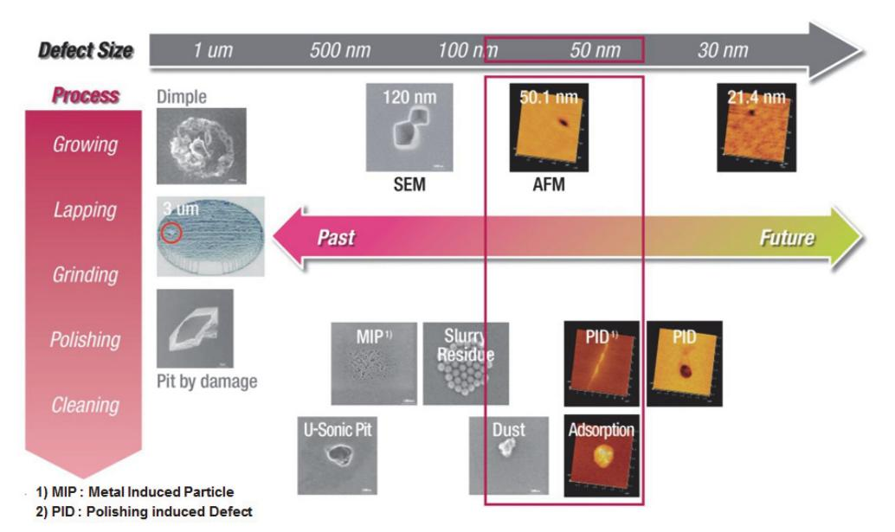

출처: 교육부(2016). 반도체용 웨이퍼 재료 제조(LM1903060401\_14v1). 한국직업능력개발원. p.74. [그림 4-1] 공정 별 표면 결함의 분포에 대한 분석·시험 실시 예

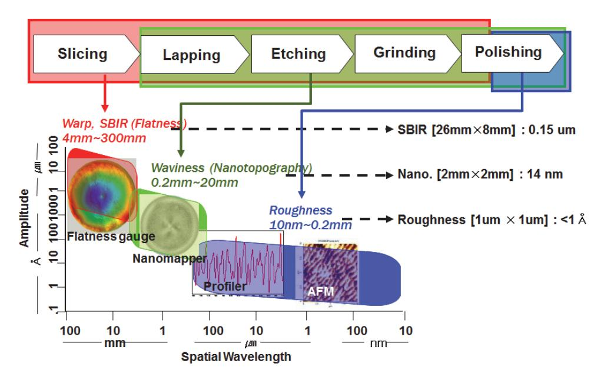

출처: 교육부(2016). 반도체용 웨이퍼 재료 제조(LM1903060401\_14v1). 한국직업능력개발원. p.74. [그림 4-2] 공정 별 표면 형상에 대한 분석·시험 실시 예

#### 2. 화학적 물성에 대한 분석·시험 방법

웨이퍼의 표면 및 표면에 근접한 내부(near surface)와 내부(bulk)의 오염 정도를 알아보기 위한 분석·시험기술이다. 이때 분석·시험 항목으로는 산화막 내 금속 농도, 유기물 농도, 파 티클 성분, 금속오염 농도, 모바일 이온농도 등으로 LTOD(Low temperature out-diffusi on)와 PUTP(Poly-silicon ultra-trace profiling) 방법 등이 활용된다.

사용 장비로는 VPD ICP-MS(Vapor phase decomposition Inductively coupled plas

ma-Mass spectrometer), WOS-GCMS(Wafer outgas system-Gas chromatograph m ass spectrometer), SEM-EDS(Scanning electron microscope-Energy dispersive spe ctroscopy), TXRF(Total x-ray reflection fluorescence), Dynamic-SIMS(Dynamic Se condary ion mass spectrometer)등이 사용된다.

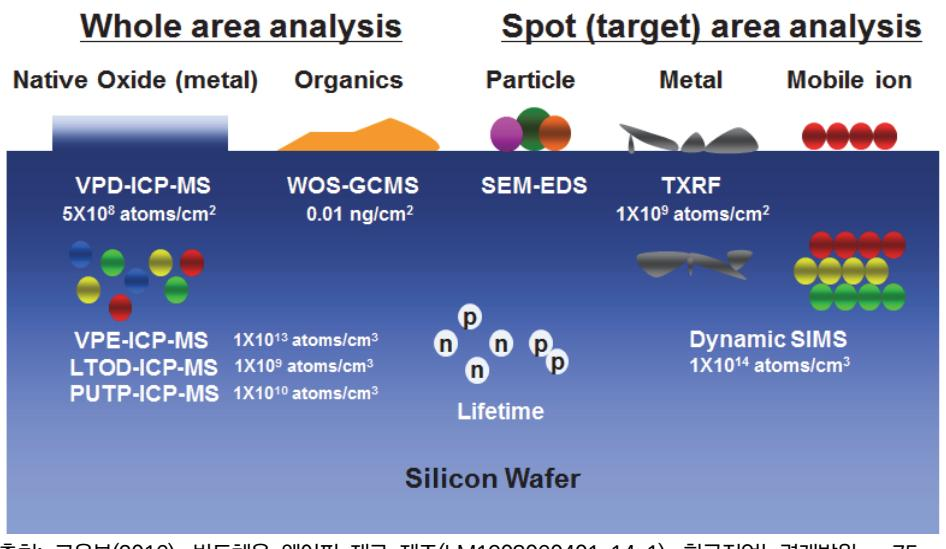

출처: 교육부(2016). 반도체용 웨이퍼 재료 제조(LM1903060401\_14v1). 한국직업능력개발원. p.75. [그림 4-3] 표면 및 내부 오염에 대한 분석·시험 항목 개요

## 수행 내용 / 분석·시험 시 문제점 해결하기

#### 재료·자료

- 불량 발생보고서, 생산계획서, 분석·시험 의뢰서,
- 분석·시험 결과(Raw Data), 분석·시험 결과보고서, F/T(Feasibility Test) Report, 분석보 고서
- 분석·시험실 운영 지침, 분석·시험 장비 매뉴얼

#### 기기(장비 ・ 공구)

- 분석기기(장비·공구)
- 시험기기(장비·공구)
- LIMS(Laboratory Information Management Systems, 실험실 정보 관리 시스템)

#### 안전 ・ 유의 사항

- 청정실(Clean Room) 출입 시 담당자의 사전 승인을 받는다.
- 분석·실험실 사용은 위기 대응(화재, 유독 Gas 누출, chemical 누출, Etching 용액 누수 등) 시나리오에 대해 사전 학습 후 안전관리지침을 준수하여 사용하고 특히 방사선 사용 장 비의 경우 담당자의 승인을 얻어 출입한다.
- 분석·실험 의뢰 시 해당 분석·실험 장비 담당자가 문제점을 정확히 인지토록 정확한 정보를 제공하고 필요시 결과보고서 작성 시 긴밀히 상호 협의한다.

수행 순서

- 숔 웨이퍼 분석·시험 절차를 파악한다. 웨이퍼 제품특성 중 물리·화학적 물성에 대한 대표적인 장비의 분석·시험 방법과 사례를 학습 함으로써 그 세부내용을 파악토록 한다.
  - 1. 물리적 분석·시험 절차와 실시 사례
    - (1) SEM & EDX

SEM은 가속 전자 beam을 광원으로 이용하여 가속전자와 고체표면의 반응으로 발생된 2차 전자를 전자 검출기로 검출하여 CRT 스크린에 영상화하는 원리이다. 이때, 가속전 자빔을 TV스크린에서처럼 시료의 표면을 주사시키고 동시에 검출된 2차 전자신호도 CRT의 해당하는 위치로 주사하여 영상으로 나타낸다. 전자 검출기가 4개 부착되어 있 는 경우 3차원 영향을 얻을 수 있다.

EDX는 X-선을 검출하는 방법으로 Si(Li)단결정의 n-p-n 반도체 소자를 이용하여 발생 되는 X-선을 에너지의 형태로 검출하는 방법이다.

이 장비는 고체 표면의 고배율 형상 관찰 및 이물질의 성분 분석에 이용된다.

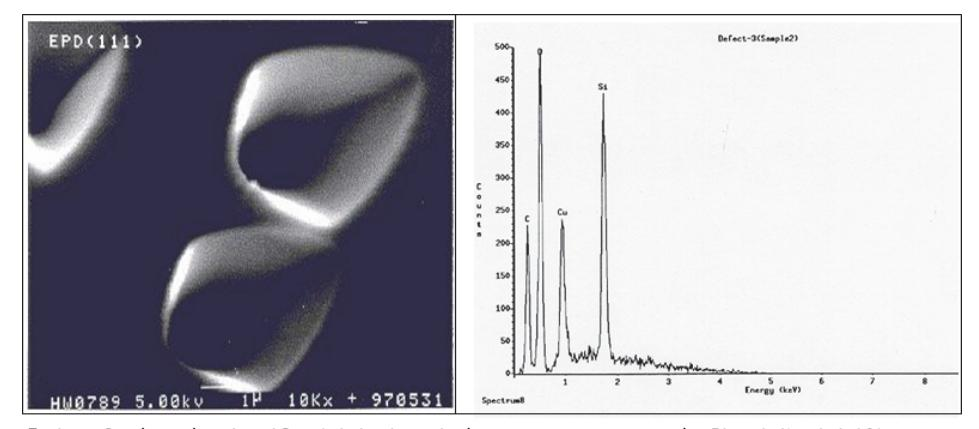

출처: 교육부(2016). 반도체용 웨이퍼 재료 제조(LM1903060401\_14v1). 한국직업능력개발원. p.77. [그림 4-4] SEM의 분석·시험 실시 예 [그림 4-5] EDX의 분석·시험 실시 예

#### (2) AFM(Atomic Force Microscope)

AFM은 Tip Radius가 500Å정도인 Probe를 이용하여 표면을 Scanning 하면서 Tip 과 표면 사이의 Atomic Force를 감지하여 표면의 미세형상을 고찰한다.

현재 Silicon 웨이퍼의 표면 거칠기가 Spec.으로 정해지지 있으며, 256GDRAM급 제품 의 Ra(Roughness Average)는 0.5~1.0Å 정도이다.

주요 용도로는 Polished 웨이퍼 표면의 Micro-roughness 측정과 Micro-defects 형 상 관찰, 웨이퍼 표면의 미세 형상 관찰(Å unit)에 쓰인다.

출처: 교육부(2016). 반도체용 웨이퍼 재료 제조(LM1903060401\_14v1). 한국직업능력개발원. p.77.

[그림 4-6] AFM의 분석·시험 실시 예 [그림 4-7] AFM의 분석·시험 실시 예 (COP 3D Image) (FPD 3D Image)

#### (3) TEM((Transmission Electron Microscope, 투과 전자현미경)

TEM은 미세 결함이나 웨이퍼 내부를 직접 눈으로 확인할 수 있는 매우 파워풀한 측정 장비로 수 pm 정도의 매우 짧은 파장의 전자선을 매우 얇게 만든 재료(시편)에 투과시 킨 후, 미시적인 내부 구조를 수백만 배 이상으로 확대하여 직접 육안으로 관찰할 수 있으며, TEM에 부착되어 있는 EDS(Energy Dispersive X-ray Spectroscopy)를 이용 해 미세 영역의 화학 조성 분석까지도 정확하게 분석할 수 있다. EDS란 입사된 전자가 시편과 상호 작용 후, 시편에서 나오는 X-선의 Energy와 그 양을 분광 분석하여 미소 부위의 성분을 분석하는 tool을 의미하는데 EDS를 이용한 성분 분석의 경우, 극미세 영 역에 대해서는 극미소량 성분 분석이 어려운 한계를 지닌다.

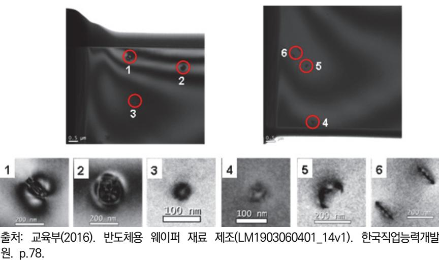

[그림 4-8] TEM의 분석·시험 실시 예 (Bulk 내부의 결함에 대한 Plan View Image)

#### 2. 화학적 분석·시험 절차와 실시 사례

(1) ICP-MS(Inductively Coupled Plasma Mass Spectrometer, 유도결합 플라즈마 질량분 석)

ICP-MS가 측정 가능한 주 분석 물질은 용액으로 고온의 유도 결합 플라즈마를 이용하 여 분석대상 원소를 1가의 양이온으로 이온화시켜 이를 질량별로 차별화하는 Mass Filter를 거쳐 정성 및 정량화한다.

주로 반도체용 고순도 Chemical 순도 분석, 반도체 웨이퍼 표면의 고순도 정밀 분석과 Cu, Zn, Fe 등 필수 원소의 정량분석, Hg, Cd, Pb같은 해로운 중금속 분석도 할 수 있다. 동종 간 간섭 예측이 가능하고 간섭이 없는 동위 원소를 선택해 간섭으로 인한 오차를 최소화할 수 있는 장점이 있다.

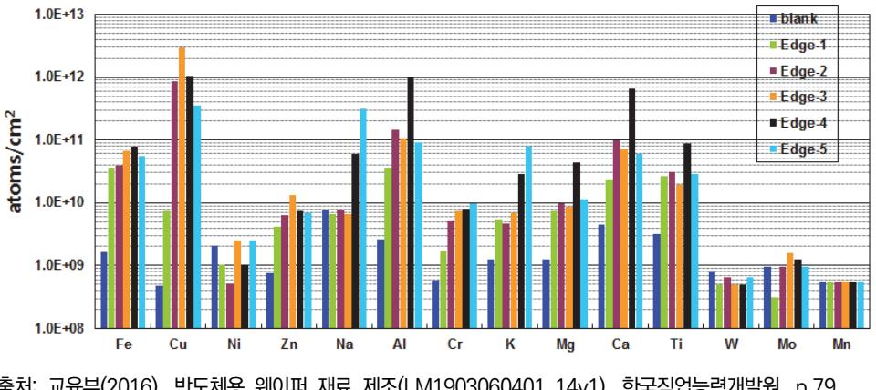

출처: 교육부(2016). 반도체용 웨이퍼 재료 제조(LM1903060401\_14v1). 한국직업능력개발원. p.79. [그림 4-9] ICP-MS의 분석·시험 예 (300mm Polished 웨이퍼의 가장자리 금속오염 평가)

(2) AAS(Atomic Absorption Spectroscopy, 유도결합 플라즈마 질량분석) 원자가 Ground State에서 Excite State로 가기 위해서 필요한 파장 에너지는 원소마 다 특정한 파장을 갖고 있으며, 이 성질을 이용하여 액체 시료 속의 특정 원소의 미량 의 농도를 측정한다.

즉, 예를 들어 Fe 원자가 Excite되기 위한 파장만을 갖는 Fe Lamp의 빛을 시료에 주 입하면서 시료를 고온에서 원자화시키면 시료에 포함된 Fe 원자에 의해 입사되는 빛의 일부가 흡수되는데 입사 전후의 빛의 Intensity를 측정하여 흡수된 양을 구하고 이를 정 량화 시켜 시료 속의 Fe양을 계산한다.

주 용도로는 Chemical 및 D.I Water(De-Ionized Water, 초순수, 복잡한 공정을 거 쳐 수중 오염 물질을 전부 제거한 순수한 물) 등의 Liquid 내에 포함된 불순물의 극미 량 분석과 웨이퍼 표면의 불순물(특히 Metal Impurity)의 극미량 분석에 사용되는데, AAS System에 VPD(Vapor Phase Decomposition)라는 시료 전처리 기능을 첨가해 웨이퍼 표면의 극미량 불순물 농도 측정에 이용하고 있다.

3. 분석·시험 시 사용하는 Etchant 종류

실리콘 웨이퍼의 결함을 관찰코자 할 때 직접 볼 수 없는 경우가 많아 몇 가지 방법을 사 용해 분석·시험이 가능토록 하는데 이때 사용하는 Etchant의 종류와 활용 방법에 대해 파 악한다.

| 구분               | Wright                                                                                                                      | Secco                                                                                 | Secco                                                        |
|------------------|-----------------------------------------------------------------------------------------------------------------------------|---------------------------------------------------------------------------------------|--------------------------------------------------------------|
| 구성               | HF+HNO3+CrO3+Cu(NO3)+ H2O+CH3COOH                                                                                        | HF+K2Cr2O7+H2O ※ Total HF:H2O=1:2                                                  | HF+CrO3+H2O ※ Total HF:H2O=1:1                            |
| 제법               | 1) 45g CrO3 (in 90ml H2O) 2) 6g Cu(NO3) (in H2O) 3) 2) (in 180ml H2O) 4) 90ml HNO3+180mlCH3COOH +180ml HF | 1) 44g K2Cr2O7 (in 100ml H2O) 2) 50% HF 50ml                           | 1) 50g CrO3 (in 100ml H2O) 2) 50% HF 100ml |
| Etchin g-rate | approx. 1.0㎛/min                                                                                                            | approx. 1.5㎛/min                                                                      | approx. 3.5㎛/min                                             |
| 응용               | -표면 오염 -표면 및 Bulk 결함 관측에 적 합 (BMD, OiSF, COP)                                                                         | -(100) 기판에 적용 -Highly boron doped 웨 이퍼에는 적합하지 않음. -비방향성 표면결함 관측에 적합 (FPD) | -(111) 기판에 적용 -Etching heats up the etchant   |

<표 4-1> 분석·시험 시 사용하는 Etchant 종류

출처: M. Wright Jenkins (1997). 「A New Preferential Etch for Defects in Silicon Crystals」, 『J. Electrochem. Soc.,』, 124, 757~762 Secco d'Aragona (1972). 「Dislocation Etch for (100) Planes in Silicon」, 『J. Electrochem. Soc.,』, 119(7), 948~951 E.Sirtl & A.Alder (1961). 「 Etch Pattern of Swirl Defects in Silicon 」, 『Z.f. Metallkunde』, 52, 529-531

## 4-2. 평가·검증 시 문제점 해결

학습 목표 • 반도체 웨이퍼의 평가 시 문제점에 대한 해결방안을 제시할 수 있다. • 반도체 웨이퍼의 검증 시 문제점에 대한 해결방안을 제시할 수 있다.

## 필요 지식 /

#### 숔 웨이퍼 평가·검증기술

반도체 웨이퍼의 최종 평가 및 검증은 소자 제작해 적용 여부를 결정해야 하나 실제 많은 시간 과 노력이 소요되어 소자 제작 시를 고려한 Gate Oxide의 안정성 및 Device 영역 내의 무결 함성 확보 측면과 오염원에 대한 불순물 Gettering 능력 측면의 전기적 물성을 고려한 평가· 검증 기술이 필요하다.

1. 전기적 방법

웨이퍼 표면 및 내부의 비저항이나 분포, minority carrier profile, lifetime map, 깊은 준위의 결함을 알아보기 위한 평가·검증기술이다. 사용 장비로는 비저항측정기(SRP: sheet resistance profiler), Lifetime Tester, DLTS(Deep level transient spectroscopy) 등이 사용된다.

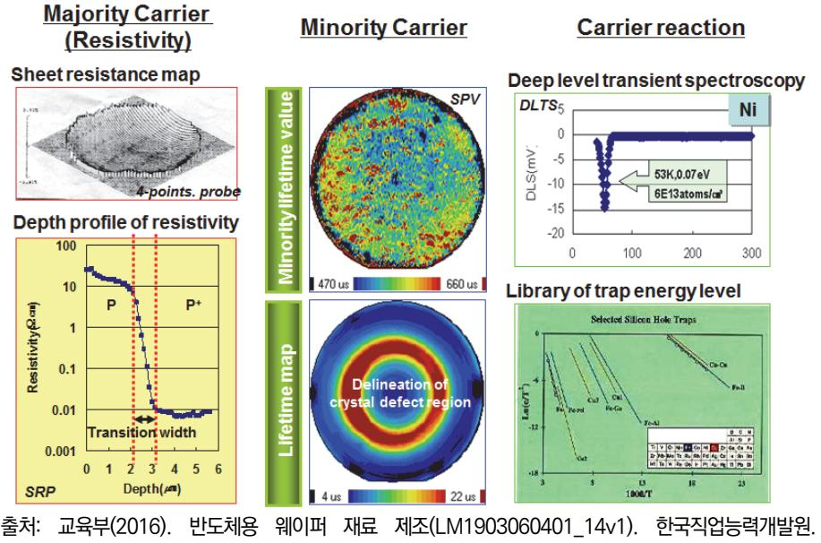

p.81. [그림 4-10] 전기적 평가·검증 실시 예

#### 2. GOI(Gate Oxide Integrity) 방법

Gate Oxide의 품질 정도를 평가·검증하는 방법으로, 전압을 증가하면서 누설전류가 파괴 전류가 될 때의 전압(BV, 파괴전압)으로 나타낸다. GOI 측정 System으로는 통상 HP System 또는 Kethley 236 System 등으로 구성되며, 그 결과를 확인하기 위해 Particle Counter의 결함평가·검증모드, NSMD(Near Surface Micro Defect)등의 부가적인 장비들 이 사용된다.

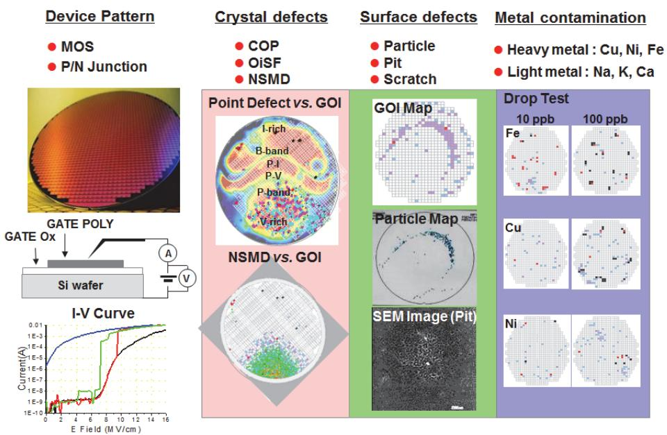

출처: 교육부(2016). 반도체용 웨이퍼 재료 제조(LM1903060401\_14v1). 한국직업능력개발원. p.82. [그림 4-11] GOI 평가·검증 실시 예

## 수행 내용 / 평가·검증 시 문제점 해결하기

#### 재료·자료

- 제품 시방서, 제품 및 품질 평가·검증 의뢰서
- 제품 및 품질 평가·검증 결과(Raw Data), 제품 및 품질평가·검증 결과보고서
- F/T(Feasibility Test) Report, Analysis Report
- 평가·검증실 운영 지침(필요시 QA/QC Lab. 운영 지침 등), 평가·검증 장비 매뉴얼

기기(장비 ・ 공구)

- 제품 및 품질 평가기기(장비·공구)
- 제품 및 품질 검증기기(장비·공구)
- LIMS(Laboratory Information Management Systems, 실험실 정보 관리 시스템)

#### 안전 ・ 유의 사항

- 청정실(Clean Room) 출입 시는 반드시 담당자의 사전 승인을 받는다.
- 평가·검증실 사용은 위기 대응(화재, 유독 Gas 누출, chemical 누출, Etching 용액 누수 등) 시나리오에 대해 사전 학습 후 안전관리지침을 준수하여 사용한다.
- 평가·검증 의뢰 시 평가·검증 담당자가 문제점을 정확히 인지토록 정확한 정보를 제공하고 필요시 결과보고서 작성 시 긴밀히 상호 협의한다.

#### 수행 순서

숔 웨이퍼의 평가·검증 기술을 파악한다.

반도체 웨이퍼의 최종 평가 및 검증 기술에는 전기적 방법과 GOI 방법이 있는데 그 세부내용 에 대해 파악도록 한다.

- 1. 전기적 평가·검증 방법과 실시 사례
  - (1) Lifetime Scanner

u-PCD 측정법에 의한 실리콘 웨이퍼의 재결합 시간(Recombination Lifetime)을 측 정하는 장비로서 Laser를 웨이퍼에 조사시킨 후 발생된 과잉 Carrier를 u-Wave로 검 출하여 Lifetime을 측정하는 장비이다.

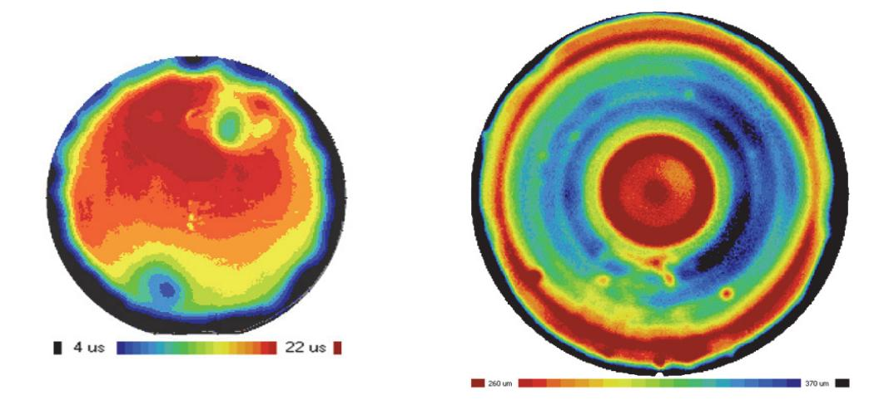

출처: 교육부(2016). 반도체용 웨이퍼 재료 제조(LM1903060401\_14v1). 한국직업능력개발원. p.84. [그림 4-12] Lifetime Scanner 평가·검증 사례 (200mm 웨이퍼 전체 Mapping결과) [그림 4-13] Lifetime Scanner 평가·검증 사례 (300mm 웨이퍼 전체 Mapping결과)

#### (2) SPV(Surface Photo Voltage)

Silicon 웨이퍼의 내부 Fe 농도를 평가·검증하는 장비로 Halogen Lamp로 웨이퍼에 단색광을 조사하여, 과잉 Carrier가 생성되면 나타나는 웨이퍼 표면의 Voltage변화를 이용하여 Diffusion Length를 측정한다.

주 용도로는 Silicon 웨이퍼의 Diffusion Length를 이용하여 이를 이용하여 저농도의 Bulk Fe를 계산해 낼 수 있다.

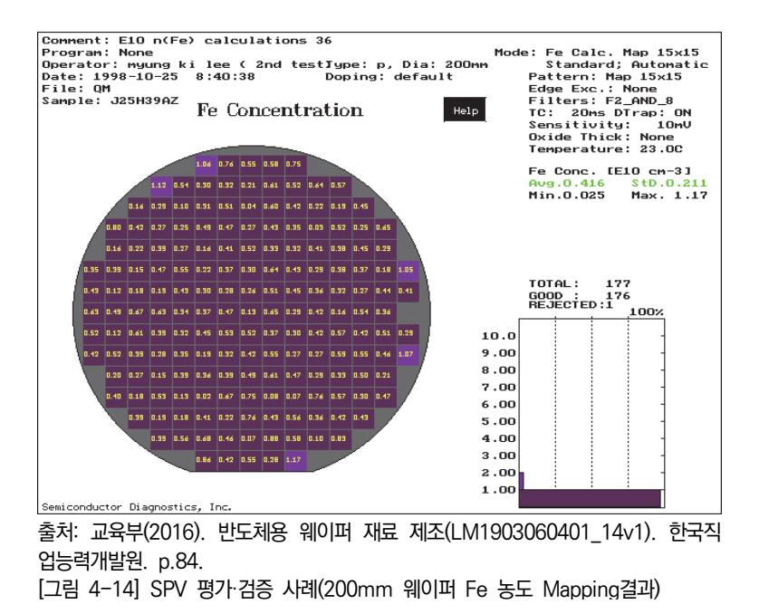

#### (3) BV(Breakdown Voltage, 항복전압)

Silicon 웨이퍼의 위에 간단히 만들어진 p/n소자에 I/V Tester를 이용해 전압·전류를 인가하고 Gate Oxide가 Breakdown 될 때까지 Gate에 전압을 증가시키면서 Current 를 측정한다.

전압을 계속 증가시키면 보면 어느 인가전압에서 Current양이 갑자기 증가하는데 이때 Oxide Breakdown이 일어났다고 하고 Breakdown 일어났을 때의 인가전압에 따라 Fail Mode를 결정한다.

이를 통해 BV(Oxide Breakdown Voltage)와 TDDB(Time Dependent Dielectric Breakdown) QBD\*(Charge to breakdown) 측정 및 그 외 Device Parameter를 측정하 는 것이다.

푸르브 시스템(Probe System)을 갖추면 웨이퍼 전면에 대해 BV 평가 및 검증이 가능 해 소자 제작 시의 수율 예측이 가능하다.

#### QBD(Charge to breakdown)

Dielectric이 Breakdown 되기 전까지 함유할 수 있는 Charge양을 나타내며 단위는 C/cm2 으로, 평가·검증방법에는 CCST(Constant Current Stress Test), CVST(Constant Voltage Stress Test), V-Ramp, J-Ramp 등이 있다.

출처: 교육부(2016). 반도체용 웨이퍼 재료 제조(LM1903060401\_14v1). 한국직업능력개발원. p.85. [그림 4-15] BV 평가·검증 사례(200mm 웨이퍼 BV Mapping결과)

#### 2. GOI 평가·검증 절차와 문제점 해결방법

GOI(Gate Oxide Integrity)는 반도체 소자의 Gate Oxide에 대한 완전 무결성을 평가·검증 하는 방법으로 MOS 소자(DRAM, Non-Memory, etc.)의 중요 부분인 Gate의 특성을 반영 하는 방법이다. GOI 평가·검증을 위해서는 사전 준비가 필요한데 먼저 평가·검증 대상 웨이 퍼인 샘플을 준비하고 그 위에 패턴을 제작하며 GOI를 평가하고 Data를 해석해 검증한다. 여기서 패턴 제작은 Si 웨이퍼 준비 - 표면 산화막 형성 - Poly Si 증착/Anneal - PR Coating – Exposure/Develop - Poly + PR Etching 순으로 이루어진다.

이때 만들어지는 Die 수는 200mm의 경우 850개, 300mm의 경우 2100개이며, 실제 측 정 수는 200mm의 경우 213개, 300mm의 경우 351개 수준이다.

GOI에 영향을 미치는 인자로는 As-Grown Defect(COP, OISF)와 Oxygen Precipitate(BMD, 산소 석출물)로 대표되는 결정 결함과 Metal Contamination, Surface Roughness, Organic Contamination, Particle 같은 표면 특성이 있으며, 이들 인자 간 의 복합 효과도 존재한다.

아래에 실제 사용하는 패턴 종류와 그를 이용한 평가·검증 결과를 표시하였다.

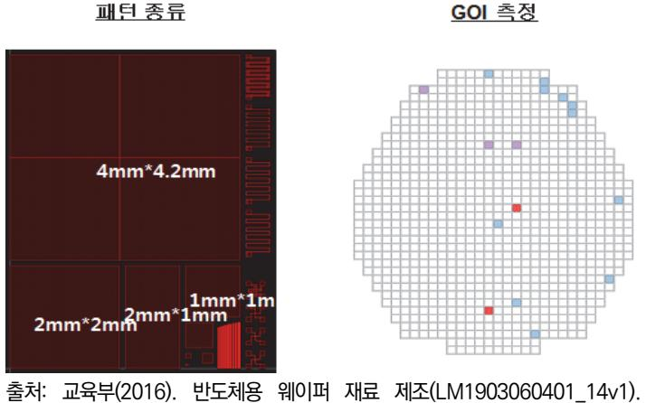

한국직업능력개발원. p.86.

[그림 4-16] GOI 평가·검증 사례(300mm 웨이퍼 BV Mapping결과)

## 학습 4 교수·학습 방법

#### 교수 방법

- 반도체 웨이퍼의 분석·시험과 평가·검증을 구분하기 위해 그 기준을 제시하고, 학생들이 이 를 이해할 수 있도록 실제 사례 위주의 방법을 모색하여 수업을 진행한다.
- 반도체 재료의 분석·시험 및 평가·검증과 관련된 장비나 공정에 대해서 서울대반도체공동연 구소 등 외부 기관을 이용해 활용할 수 있도록 지도한다.
- 반도체 웨이퍼의 분석·시험과 평가·검증 결과를 분석하기 위해 실제 결과 Data등을 확보하 여 학생들에게 제시하고 이론에 근거해 해석도록 유도한다.
- 반도체 웨이퍼의 분석·시험과 평가·검증 시 실제 문제의 원인이 되는 인자에 대해 세부 내용 이 무엇인지를 제시해, 실무 시 이를 활용할 수 있도록 지도한다.

#### 학습 방법

- 반도체 웨이퍼의 분석·시험과 평가·검증을 구분하기 위해 분석·시험과 평가·검증 시의 사례 를 숙지하고 그 결과물에 대해 유형별 종류와 내용 전반을 숙지하고 분류해 본다.
- 반도체 재료의 분석·시험 및 평가·검증과 관련 기관을 구체적으로 확인하도록 하고, 이 기관 과 관련된 다양한 기술 자료를 인터넷으로 검색하여 분석·시험 및 평가·검증 유형별로 분류 하여 문서로 정리한다.
- 반도체 웨이퍼의 분석·시험과 평가·검증 결과의 분석은 사전에 이론적인 개념에 대한 이해를 통해 방향을 설정하고 관측된 Data사례 등을 통해 이론에 근거해 해석된 결과물을 도출해 현장에서의 해석과 비교해 본다.
- 반도체 웨이퍼의 분석·시험과 평가·검증 시 실제 문제의 원인이 되는 인자에 대해 세부적으 로 파악하여, 제시된 분석·시험과 평가·검증 시 관측된 Data 사례에 대해 유형별 분류와 해 석이 가능토록 숙달한다.

## 학습 4 평 가

#### 평가 준거

• 평가자는 학습자가 학습 목표를 성공적으로 달성하였는지를 평가해야 한다.

#### • 평가자는 다음 사항을 평가해야 한다.

|            | 학습 목표                                      |  | 성취수준 |   |  |
|------------|--------------------------------------------|--|------|---|--|
| 학습 내용      |                                            |  | 중    | 하 |  |
| 분석·시험 시 문제 | - 반도체 웨이퍼의 분석 시 문제점에 대한 해결방안을 제시할 수 있다. |  |      |   |  |
| 점 해결       | - 반도체 웨이퍼의 시험 시 문제점에 대한 해결방안을 제시할 수 있다. |  |      |   |  |
| 평가·검증 시 문제 | - 반도체 웨이퍼의 평가 시 문제점에 대한 해결방안을 제시할 수 있다. |  |      |   |  |
| 점 해결       | - 반도체 웨이퍼의 검증 시 문제점에 대한 해결방안을 제시할 수 있다. |  |      |   |  |

#### 평가 방법

• 문제 해결 시나리오

| 학습 내용              | 평가 항목                             | 성취수준 상 중 하 |  |  |
|--------------------|-----------------------------------|---------------------|--|--|
| 분석·시험 시 문제 점 해결 | - 반도체 웨이퍼 분석 시 문제점에 대한 해결방안 제시 여부 |                     |  |  |
|                    | - 반도체 웨이퍼 시험 시 문제점에 대한 해결방안 제시여부  |                     |  |  |
| 평가·검증 시 문제 점 해결 | - 반도체 웨이퍼 평가 시 문제점에 대한 해결방안 제시 여부 |                     |  |  |
|                    | - 반도체 웨이퍼 검증 시 문제점에 대한 해결방안 제시 여부 |                     |  |  |

• 서술형 시험

| 학습 내용      | 평가 항목                          | 성취수준 상 중 하 |  |  |
|------------|--------------------------------|---------------------|--|--|
| 분석·시험 시 문제 | - 반도체 웨이퍼 분석 시 문제점에 대한 기술적 이해도 |                     |  |  |
| 점 해결       | - 반도체 웨이퍼 시험 시 문제점에 대한 기술적 이해도 |                     |  |  |
| 평가·검증 시 문제 | - 반도체 웨이퍼 평가 시 문제점에 대한 기술적 이해도 |                     |  |  |
| 점 해결       | - 반도체 웨이퍼 검증 시 문제점에 대한 기술적 이해도 |                     |  |  |

• 논술형 시험

|                    |                        |   | 성취수준 |   |  |
|--------------------|------------------------|---|------|---|--|
| 학습 내용              | 평가 항목                  | 상 | 중    | 하 |  |
| 평가·검증 시 문제 점 해결 | - 평가·검증 시 문제점 해결안의 정합성 |   |      |   |  |

• 사례 연구

|                    |                                                           |   | 성취수준 |   |  |
|--------------------|-----------------------------------------------------------|---|------|---|--|
| 학습 내용              | 평가 항목                                                     | 상 | 중    | 하 |  |
| 분석·시험 시 문제 점 해결 | - 분석·시험 시 도출된 문제점에 대한 해결안의 적용 사례(분 석된 성공이나 실패 요인의 적합성) |   |      |   |  |
| 평가·검증 시 문제 점 해결 | - 평가·검증 시 도출된 문제점에 대한 해결안의 적용 사례(분 석된 성공이나 실패 요인의 적합성) |   |      |   |  |

피드백

- 1. 문제 해결 시나리오
  - 문제 해결 방법 제시에 대해 평가한 후 주요 사항을 표시하여 돌려주고 실행 능력을 관찰하는 과정에서 평가한다.
- 2. 서술형 시험
  - 시험 내용을 평가하고 기준에 미달한 학생들에게는 수준별로 해당 학습 내용을 보충하고 스스로 복습한 후 그 결과를 제출하도록 한다.
- 3. 논술형 시험
  - 해결안에 대한 정합성에 대해 기술적 근거를 판단하고 추가로 보완해야 할 내용에 대해 세부적으 로 제시한다.
- 4. 사례 연구
  - 파악된 계획안과 개선안에 대해 주요 내용 파악 여부를 판단하고 개선 및 추가로 보완해야 할 사항에 대해 제시한다.

- ∙ 교육부(2016). 반도체용 웨이퍼 재료 제조(LM1903060401\_14v1). 한국직업능력개발원.
- ∙ 문재경, 민병규, 김동영, 장우진, 김성일, 강동민, 남은수(2012). 「차세대 고효율/고출력 반도체: GaN 전력소자 연구개발 현황」, 『전자통신동향분석』, 27(4), 96-106.
- ∙ 신진이(2015). 『2014산업기술백서』, 한국산업기술진흥협회.
- ∙ R&D정보센터(2014). 『유망소재 부품산업 기술/시장 경쟁력 분석』, 지식산업정보원.
- ∙ 이원재(2015). 『소재기술백서 2015』. KIMS재료연구소, 639-668.
- ∙ 한국반도체산업협회(2015). 『반도체산업 현황과 전망』, 대홍기획.
- ∙ Ohmsha([1997] 1997). 『전자공학입문(電子工學入門)』. 박한종(역). 성안당.
- ∙ C.H. Jan(2010). 「RF CMOS Technology Scaling in High-k/Metal Gate Era for RF SoC (System-on-Chip) Applications, Intel」,『Electron Devices Meeting(IEDM)』, 27(2), 1-4.
- ∙ E. Sirtl & A. Alder(1961). 「 Etch Pattern of Swirl Defects in Silicon」, 『Z.f. Metallkunde』, 52, 529-531.
- ∙ Global 450 Consortium(2014). 『Update to the 450mm Equipment Performance Metrics v7.0. 』, G450C 450mm Publications.
- ∙ Golla Eranna(2014). 『Crystal Growth and Evaluation of Silicon for VLSI and ULSI』, CRC Press.
- ∙ H. Cui, J. G. Park, J. Park, S. Yun, and E. B. Seo(2014). 「Reduction of Metal Contaminants Level on the Silicon Wafer Surface Using Chemical Additive during Chemical Mechanical Polishing」, 『225th ECS(Electrochemical Society) Meeting』, P1 CMP Poster Session, 1437.
- ∙ Howard R. Huff, H. Iwai, H. Richter(2006). 『Silicon Materials Science and Technology X』, The Electrochemical Society.
- ∙ J.D. Murphy1, K. Bothe, M. Olmo, V.V. Voronkov, R.J. Falster(2010). 「Minority carrier lifetime in Czochralski silicon containing oxide precipitates」,『ECS Transactions』, 33(11), 121-132.
- ∙ Jean-Pierre Colinge(2004). 『Silicon-on-Insulator Technology: Materials to VLSI』, Springer Science & Business Media.
- ∙ Karen Reinhardt, Werner Kern(2008). 『Handbook of Silicon Wafer Cleaning Technology』, William Andrew.

- ∙ K J Dwyer, J M Pomeroy, D S Simons, K L Steffens and J W Lau(2014). 「Enriching 28Si beyond 99.9998% for semiconductor quantum computing」, 『Journal of Physics D: Applied Physics』, 47(34), 5105-5110.
- ∙ Margaret Wright Jenkins(1997). 「A New Preferential Etch for Defects in Silicon Crystals」, 『SOLID-STATE SCIENCE AND TECHNOLOGY 』, 124, 757~762.
- ∙ Secco d'Aragona(1972). 「Dislocation Etch for (100) Planes in Silicon」, 『SOLID‐STATE SCIENCE AND TECHNOLOGY - Technical Papers』, 119(7), 948~951.
- ∙ Sorin Cristoloveanu, Sheng Li(2013).『Electrical Characterization of Silicon-on-Insulator Materials and Devices』, Springer Science & Business Media.
- ∙ Takao Abe and Toru Takahashi(2010). 「Point Defects in Silicon Melt Growth from the Experimental Results」, 『ECS Transactions』, 33(11), 75-100.
- ∙ T. Fukami, T. Takaku(2000). Polishing agent used for polishing semiconductor silicon wafers and polishing method using the same. US patent 6,060,396.
- ∙ XIAOHONG ZHANG(2007).「Chemical Mechanical Polishing and Grinding of Silicon Wafers」. 박사학위논문, Kansas State University Department of Industrial & Manufacturing Systems Engineering.
- ∙ 松本信雄(2004). 『シリコンの 科學』, 電子情報通信学会.
- ∙ 山谷正明(2011). 『シリコーン: 広がる応用分野と技術動向』, 化学工業日報社.
- ∙ 黄如(2005). 『SOI CMOS技术及其应用』, 科学出版社.

| NCS학습모듈 개발이력 |                                   |     |                |
|--------------|-----------------------------------|-----|----------------|
| 발행일          | 2016년 12월 31일                     |     |                |
| 세분류명         | 반도체재료(19030604)                   |     |                |
| 개발기관         | 대덕대학교, 한국직업능력연구원                  |     |                |
|              | 김관하(대덕대학교)*                       |     | 권기백(대덕대학교)     |
|              | 강필승(메그나칩반도체)                      |     | 김동표(케이디전자)     |
|              | 김상용(한국폴리텍대학)                      |     | 박태진(대덕대학교)     |
|              | 김종식(드림테크)                         |     | 여순일(한국전자통신연구원) |
|              | 양민철(서울공업고등학교)                     |     | 정용철(한국생산기술연구원) |
| 집필진          | 우종창(이너센서)                         | 검토진 |                |
|              | 이병철(비드앤마이크로)                      |     |                |
|              | 장현경(강원대학교)                        |     |                |
|              | 정재복(메이플테크)                        |     |                |
|              | 제창한(한국전자통신연구원)                    |     |                |
|              | 홍진균((前) LG실트론)                    |     | *표시는 대표집필자임    |
| 발행일          | 2024년 12월 31일                     |     |                |
| 학습모듈명        | 반도체용 웨이퍼 재료 제조(LM1903060401_20v2) |     |                |
|              |                                   |     |                |

개발기관 수원과학대학교 산학협력단(개발책임자: 김선희), 한국직업능력연구원

| 반도체용 웨이퍼 재료 제조(LM1903060401_20v2)                                                                        |               |  |
|----------------------------------------------------------------------------------------------------------|---------------|--|
| 저작권자                                                                                                     | 교육부           |  |
| 연구기관                                                                                                     | 한국직업능력연구원     |  |
| 발행일                                                                                                      | 2024. 12. 31. |  |
| ※ 이 학습모듈은 자격기본법 시행령(제8조 국가직무능력표준의 활용)에 의거하여 개발하였으며, NCS통합포털사이트(http://www.ncs.go.kr)에서 다운로드 할 수 있습니다. |               |  |

