# NCS학습모듈 반도체용 금속(Target) 재료 제조

LM1903060404\_23v3

#### [NCS학습모듈 활용 시 유의 사항]

- 1. NCS학습모듈은 교육훈련기관에서 출처를 명시하고 교육적 목적으로 활용할 수 있습니다. 다 만, NCS학습모듈에는 국가(교육부)가 저작재산권 일체를 보유하지 않은 저작물(출처가 표기된 도표‧사진‧삽화‧도면 등)이 포함되어 있으므로, 이러한 저작물의 변형‧각색‧복제‧공연‧ 배포 및 공중 송신 등과 이러한 저작물을 활용한 2차적 저작물을 작성하려면 반드시 원작자 의 동의를 받아야 합니다.
- 2. NCS학습모듈은 개발 당시의 산업 및 교육 현장을 반영하여 집필하였으므로, 현재 적용되는 법령‧지침‧표준 및 교과 내용 등과 차이가 있을 수 있습니다. NCS학습모듈 활용 시 법령 ‧지침‧표준 및 교과 내용의 개정 사항과 통계의 최신성 등을 확인하시기를 바랍니다.
- 3. NCS학습모듈은 산업 현장에서 요구되는 능력을 교육훈련기관에서 학습할 수 있게 구성한 자 료입니다. 다만, NCS학습모듈 지면의 한계상 대표적 예시(예: 활용도 또는 범용성이 높은 제 품, 서비스) 중심으로 집필하였음을 이해하시기를 바랍니다.

## NCS학습모듈의 이해

※ 본 NCS학습모듈은 「NCS 국가직무능력표준」사이트(http://www.ncs.go.kr) 에서 확인 및 다운로드할 수 있습니다.

### Ⅰ NCS학습모듈이란?

- 국가직무능력표준(NCS: National Competency Standards)이란 산업현장에서 직무를 수행하기 위해 요구되는 지식·기술·소양 등의 내용을 국가가 산업부문별·수준별로 체계 화한 것으로 산업현장의 직무를 성공적으로 수행하기 위해 필요한 능력(지식, 기술, 태도) 을 국가적 차원에서 표준화한 것을 의미합니다.
- 국가직무능력표준(이하 NCS)이 현장의 '직무 요구서'라고 한다면, NCS학습모듈은 NCS
  의 능력단위를 교육훈련에서 학습할 수 있도록 구성한 '교수·학습 자료'입니다. NCS학습
  모듈은 구체적 직무를 학습할 수 있도록 이론 및 실습과 관련된 내용을 상세하게 제시하
  고 있습니다.

#### ○ NCS학습모듈은 다음과 같은 특징을 가지고 있습니다.

- 첫째, NCS학습모듈은 산업계에서 요구하는 직무능력을 교육훈련 현장에 활용할 수 있도 록 성취목표와 학습의 방향을 명확히 제시하는 가이드라인의 역할을 합니다.
- 둘째, NCS학습모듈은 특성화고, 마이스터고, 전문대학, 4년제 대학교의 교육기관 및 훈 련기관, 직장교육기관 등에서 표준교재로 활용할 수 있으며 교육과정 개편 시에도 유용하게 참고할 수 있습니다.

○ NCS와 NCS학습모듈 간의 연결 체계를 살펴보면 아래 그림과 같습니다.

O NCS학습모듈의 위치는 NCS 분류 체계에서 해당 학습모듈이 어디에 위치하는지를 한 눈에 볼 수 있도록 그림으로 제시한 것입니다.

| [NCS-학          | 습모듈   | 의 위치]    |          |  |
|-----------------|-------|----------|----------|--|
|                 |       |          |          |  |
| 대분류             | 문화·예술 | ··디자인·방송 |          |  |
| 중분류             | 문화콘텐츠 |          |          |  |
| 소분류             |       | 문화콘텐츠제작  |          |  |
|                 |       |          |          |  |
| 세분류             |       |          |          |  |
| 방송콘텐츠제작         |       | 능력단위     | 학습모듈명    |  |
| 영화콘텐츠제작         |       | 프로그램 기획  | 프로그램 기획  |  |
| 음악콘텐츠제작         |       | 아이템 선정   | 아이템 선정   |  |
| 광고콘텐츠제작         |       | 자료 조사    | 자료 조사    |  |
| 게임콘텐츠제작         |       | 프로그램 구성  | 프로그램 구성  |  |
| 애니메이션 콘텐츠제작  |       | 캐스팅      | 캐스팅      |  |
| 만화콘텐츠제작         |       | 제작계획     | 제작계획     |  |
| 캐릭터제작           |       | 방송 미술 준비 | 방송 미술 준비 |  |
| 스마트문화앱 콘텐츠제작 |       | 방송 리허설   | 방송 리허설   |  |
| 영사              |       | 야외촬영     | 야외촬영     |  |
|                 |       | 스튜디오 제작  | 스튜디오 제작  |  |
|                 |       |          |          |  |

학습모듈은

NCS 능력단위 1개당 1개의 학습모듈 개발 을 원칙으로 합니다. 그러나 필요에 따라 고용단위 및 교과단위를 고려하여 능력단위 몇 개를 묶어 1개 학습모듈로 개발할 수 있으며, NCS 능력단위 1개를 여러 개의 학습모듈로 나누어 개발할 수도 있습니다.

#### 2. NCS학습모듈의 개요

#### ○ NCS학습모듈의 개요는 학습모듈이 포함하고 있는 내용을 개략적으로 설명한 것으로

| 학습모듈의 목표, 선수학습, 학습모듈의 내용 체계, 핵심 용어 로 구성되어 있습니다. |                                                                              |  |
|-------------------------------------------------|------------------------------------------------------------------------------|--|
| 학습모듈의 목표                                        | 해당 NCS 능력단위의 정의를 토대로 학습 목표를 작성한 것입니다.                                        |  |
| 선수학습                                            | 해당 학습모듈에 대한 효과적인 교수·학습을 위하여 사전에 이수해야 하는 학습모 듈, 학습 내용, 관련 교과목 등을 기술한 것입니다. |  |
| 학습모듈의 내용 체계                                  | 해당 NCS 능력단위요소가 학습모듈에서 구조화된 체계를 제시한 것입니다.                                     |  |
| 핵심 용어                                           | 해당 학습모듈의 학습 내용, 수행 내용, 설비·기자재 등 가운데 핵심적인 용어를 제 시한 것입니다.                   |  |

### 제작계획 학습모듈의 개요

#### 학습모듈의 목표

본격적인 촬영을 준비하는 단계로서, 촬영 대본을 획정하고 제작 스태프를 조직하며 촬영 장비와 촬영 소품을 준비할 수 있다.

#### 선수학습

제작 준비(LM0803020105\_13v1), 섭외 및 제작스태프 구성(LM0803020104\_13v1), 촬영 제작(LM0803020106\_13v1), 촬영 장비 준비(LM0803040204\_13v1.4), 미술 디자인 협의하기(LM0803040203\_13v1.4)

#### 학습모듈의 내용체계

| 하스                | 하는 데이                                              | NCS 능력단위 요소       |                |
|-------------------|----------------------------------------------------|-------------------|----------------|
| 학습                | 학습 내용                                              | 코드번호              | 요소 명칭          |
| 1. 촬영 대본 확정하기  | 1-1. 촬영 구성안 검 토와 수정                             | 0803020114_16/3.1 | 촬영 대본 확정하기  |
| 2. 제작 스태프 조직하기 | 2-1. 기술 스태프 조직 2-2. 미술 스태프 조직 2-3. 전문 스태프 조직 | 0803020114_16v3.2 | 제작 스태프 조직하기 |
| 3. 촬영 장비 계획하기  | 3-1. 촬영 장비 점검 과 준비                              | 0803020114_16/3.3 | 촬영 장비 계획하기  |
| 4. 촬영 소품 계획하기  | 4-1. 촬영 소품 목록 작성 4-2. 촬영 소품 제작 의뢰         | 0803020114_16\3.4 | 촬영 소품 계획하기  |

#### 핵심 용어

촬영 구성안, 제작 스태프, 촬영 장비, 촬영 소품

#### 학습모듈의 목표는

학습자가 해당 학습모듈을 통해 성취해야 할 목표를 제시한 것으로, 교수자는 학습자 가 학습모듈의 전체적인 내용흐름을 파악하 도록 지도할 수 있습니다.

**6** • •

61

#### 선수학습은

교수자 또는 학습자가 해당 학습모듈을 교 수·학습하기 이전에 이수해야 하는 교과목 또는 학습모듈(NCS 능력단위) 등을 표기한 것입니다. 따라서 교수자는 학습자가 개별 학습, 자기 주도 학습, 방과 후 활동 등 다 양한 방법을 통해 이수할 수 있도록 지도하 는 것을 권장합니다.

|            | 핵심 용어는              |
|------------|---------------------|
|            | 률을 대표하는 주요 용어입니     |
|            | · 해당 학습모듈을 통해 학습    |
|            | 게될 주요 내용을 알 수 있습    |
|            | 5 국가직무능력표준」 사이트     |
| (www.ncs.g | jo.kr)의 색인 (찾아보기) 중 |
| 하나로 이용할    | 할 수 있습니다            |

#### 3. NCS학습모듈의 내용 체계

○ NCS학습모듈의 내용은 크게 학습, 학습 내용, 교수·학습 방법, 평가 로 구성되어 있습니다.

| 학습       | 해당 NCS 능력단위요소 명칭을 사용하여 제시한 것입니다. 학습은 크게 학습 내용, 교수·학습 방법, 평가로 구성되며 해당 NCS 능력단위의 능력단위 요소별 지식, 기술, 태도 등을 토대로 내용을 제시한 것입니다.                                                    |
|----------|----------------------------------------------------------------------------------------------------------------------------------------------------------------------------------|
| 학습 내용    | 학습 내용은 학습 목표, 필요 지식, 수행 내용으로 구성되며, 수행 내용은 재료·자 료, 기기(장비·공구), 안전·유의 사항, 수행 순서, 수행 tip으로 구성한 것입니다. 학습모듈의 학습 내용은 실제 산업현장에서 이루어지는 업무활동을 표준화된 프로세 스에 기반하여 다양한 방식으로 반영한 것입니다. |
| 교수·학습 방법 | 학습 목표를 성취하기 위한 교수자와 학습자 간, 학습자와 학습자 간 상호 작용이 활발하게 일어날 수 있도록 교수자의 활동 및 교수 전략, 학습자의 활동을 제시한 것입니다.                                                                            |
| 평가       | 평가는 해당 학습모듈의 학습 정도를 확인할 수 있는 평가 준거 및 평가 방법, 평 가 결과의 피드백 방법을 제시한 것입니다.                                                                                                         |

## [NCS-학습모듈의 위치]

| 대분류 | 전기·전자 |        |
|-----|-------|--------|
| 중분류 |       | 전자기기개발 |
| 소분류 |       | 반도체개발  |

| 세분류 |  |
|-----|--|
|     |  |

| 반도체개발 | 능력단위                             | 학습모듈명                |  |
|-------|----------------------------------|----------------------|--|
| 반도체제조 | 반도체용 웨이퍼 재료 제조                   | 반도체용 웨이퍼 재료 제조       |  |
| 반도체장비 | 반도체용 금속(Target)재료 제조             | 반도체용 금속(Target)재료 제조 |  |
| 반도체재료 | 반도체용 패키지 재료 제조 반도체용 패키지 재료 제조 |                      |  |
|       | 반도체 재료 개발                        | 반도체 재료 개발            |  |
|       | 반도체 재료 생산관리                      | 반도체 재료 생산관리          |  |
|       | 반도체 재료 품질관리                      | 반도체 재료 품질관리          |  |
|       | 반도체 재료 안전관리                      | 반도체 재료 안전관리          |  |
|       | 반도체용 마스크 재료 제조                   | 반도체용 마스크 재료 제조       |  |
|       | 반도체용 플립칩 재료 제조                   | 반도체용 플립칩 재료 제조       |  |
|       | 반도체용 CMP 재료 제조                   | 반도체용 CMP 재료 제조       |  |
|       | 반도체용 식각공정 가스 제조                  | 반도체용 식각공정 가스 제조      |  |
|       | 반도체용 세정공정 가스 제조                  | 반도체용 세정공정 가스 제조      |  |
|       | 반도체용 박막공정 가스 제조                  | 반도체용 박막공정 가스 제조      |  |

| 반도체용 이온주입공정 가스 제조 | 반도체용 이온주입공정 가스 제조 |
|-------------------|-------------------|
| 반도체용 박막공정 전구체 제조  | 반도체용 박막공정 전구체 제조  |
| 반도체용 포토공정 재료 제조   | 반도체용 포토공정 재료 제조   |
| 반도체용 트랙공정 재료 제조   | 반도체용 트랙공정 재료 제조   |
| 반도체용 SOD공정 재료 제조  | 반도체용 SOD공정 재료 제조  |
| 반도체용 박막도금공정 재료 제조 | 반도체용 박막도금공정 재료 제조 |
| 반도체용 세정공정 재료 제조   | 반도체용 세정공정 재료 제조   |
| 반도체용 CMP슬러리 재료 제조 | 반도체용 CMP슬러리 재료 제조 |

| 학습모듈의 개요                               | 1  |
|----------------------------------------|----|
| 학습 1. 반도체용 금속(Target) 재료 제조 요구 사항 파악하기 |    |
| 1-1. 금속 공정 원리 및 재료 파악                  | 3  |
| 1-2. 품질관리 문제점 분석                       | 10 |
| • 교수・학습 방법                             | 16 |
| • 평가                                   | 17 |
| 학습 2. 반도체용 금속(Target) 재료 준비하기          |    |
| 2-1. 금속 재료의 장점과 단점 분석                  | 19 |
| 2-2. 재료의 문제점 분석 및 해결                   | 31 |
| • 교수・학습 방법                             | 38 |
| • 평가                                   | 39 |
| 학습 3. 반도체용 금속(Target) 제조 하기            |    |
| 3-1. 금속 제조 공정별 특징 파악                   | 41 |
| 3-2. 금속 재료별 공정 도출 및 문제점 해결             | 52 |
| • 교수・학습 방법                             | 63 |
| • 평가                                   | 64 |
|                                        |    |
| 참고 자료                                  | 66 |
|                                        |    |
| 부 록                                 | 67 |

## 반도체용 금속(Target)재료 제조 학습모듈의 개요

#### 학습모듈의 목표

반도체 제조에 필요한 금속(Target) 재료의 요구사항을 파악하여 선정하고, 제조 및 검증할 수 있다.

#### 선수학습

반도체 제조 공정 개발(1903060106\_14v3), 디스플레이 박막 공정개발(1903070104\_14v2), 디스플레이 생산공정관리(1903070203\_14v2), 반도체 공정, 반도체 장비기술

#### 학습모듈의 내용체계

|                                  |                               |                   | NCS 능력단위 요소             |  |
|----------------------------------|-------------------------------|-------------------|-------------------------|--|
| 학습 학습 내용                      |                               | 코드번호              | 요소 명칭                   |  |
| 1.반도체용 금속(Target) 재료 제조 요구 사항 | 1-1. 금속 공정 원리 및 재료 파악         | 1903060404_23v3.1 | 반도체용 금속(Target)         |  |
| 파악하기                             | 1-2. 품질관리 문제점 분석              |                   | 재료 요구사항 파악하기            |  |
| 2. 반도체용 금속(Target)               | 2-1. 금속 재료의 장점과 단점 분석      | 1903060404_23v3.2 | 반도체용 금속(Target)         |  |
| 재료 준비하기                          | 2-2. 재료의 문제점 분석 및 해결          |                   | 재료 선정하기                 |  |
| 3. 반도체용 금속(Target) 제조 하기      | 3-1. 금속 제조 공정별 특징 파악          | 1903060404_23v3.3 | 반도체용 금속(Target) 제조하기 |  |
|                                  | 3-2. 금속 재료별 공정 도출 및 문제점 해결 |                   |                         |  |

#### 핵심 용어

반도체 금속재료, Aluminium, Copper, 금속 비저항, 면저항, Metal 물성 분석법, 시험성적서

| 학습 1 | 반도체용 금속(Target) 재료 제조 요구 사항 파악하기 |
|------|-------------------------------------|
| 학습 2 | 반도체용 금속(Target) 재료 준비하기             |
| 학습 3 | 반도체용 금속(Target) 제조 하기               |

## 1-1. 금속 공정 원리 및 재료 파악

| • 생산 관련 부서로부터 필요한 금속(Target) 제조 사양서를 입수할 수 있다. |                                                            |  |  |
|------------------------------------------------|------------------------------------------------------------|--|--|
| 학습 목표                                          | • 금속(Target) 제조 사양서를 바탕으로 제품명, 품질 기준, 제품 사양, 납기 등을 파악할 수 있 |  |  |
|                                                | 다.                                                         |  |  |

## 필요 지식 /

숔 개요

설계된 회로를 실리콘 기판 위에 구현해 내기 위해서는 식각을 통한 패턴 형성, 불순물 주입 및 박막 증착 등의 공정을 거쳐야 한다. 반도체 공정을 전후로 나누어 트랜지스터를 형성하는 앞 공정 (Front End of Line: FEOL) 과 배선을 형성하는 뒤 공정 (Back End of Line : BEOL) 으로 구분할 수 있다. Back end 공정은 크게 금속화 공정과 절연막의 증착 및 평탄화 공정으로 구분할 수 있다. 이때 금속화 공정은 전기 신호 소통을 위한 금속 배선 공정에 해당 한다.

1. 금속 공정의 종류

금속화 공정은 소자 제조 공정의 마지막 단계로 집적 회로 공정에서 특히 수율과 신뢰도에 가장 큰 영향을 주는 결정적인 공정이다. 소자에서의 금속화 공정은 소자에의 접촉과 소자 들의 연결 기능이 있다. 이처럼 소자에서는 신호가 전달되기 위해서는 전선 제조 공정에 해 당하는 금속화 공정이 필요하다. 이때 전선과 전선을 연결하기 위해 홀을 메우는 공정을 plug 공정이라 하며 전선 제조 공정을 배선 공정이라 한다.

(1) 컨택(Contact) 공정

배선과 소자의 Active Parts를 연결하는 것으로 트랜지스터 등의 소자는 반도체 기판 내에 형성되는데, 그것들의 상호 접속은 금속 배선을 사용하기 때문에 정류성이 없는 저 저항인 오믹(ohmic) 접합을 형성해야 한다. 오믹 컨택에서 요구되는 조건은 다음과 같 다.

(가) 정류성이 없이 낮은 저항이 되도록 실리사이드 공정

- (나) 제조 공정 중 고온 처리에서 안정성과 신뢰성
- (다) 주로 CVD W(텅스텐) 통한 Contact hole 첨부.
- (2) VIA 공정
  - (가) 하부의 금속 배선과 상부의 금속 배선을 연결
  - (나) CVD W을 채워 줌 (METAL-1 상부 비아가 VIA-1)
- (3) 금속 배선 연결 (Interconnection)
  - (가) 외부와 Active Parts 또는 Active Parts들 간을 연결하여 신호를 전달하는 기능
  - (나) Metal(AL) : 배선을 형성하는 금속
- 2. 금속막 (Metal Film)의 종류
  - (1) 실리사이드
    - (가) Si과 금속의 접촉 저항을 감소시키기 위한 공정으로 속과 접촉하는 Junction(source, drain)이나 Gate는 모두 Si 상태이다. 특히, Gate의 Polysilicon은 Rs가 매우 높다. 따 라서, chip의 구동 속도를 향상하기 위해서는 Junction과 Gate에서 금속 배선과 연결 되는 부위의 Rs를 낮추어야 한다. Si 상부에 금속을 증착한 후 열처리를 실시하여, Junction과 Gate의 Si와 금속의 반응으로 Rs가 작은 혼합물(compound)를 형성시키는 기술이다.
    - (나) Ti(티타늄) 또는 Co(코발트)를 Sputtering 방식으로 증착한다.
  - (2) 베리어(Barrier)

CVD W을 deposition시 하부 막과의 반응을 방지하기 위해 Contact이나 VIA 형성 후 증착한다.

(3) Plug W(텅스텐)

Contact이나 VIA 형성 후 구멍을 채우는 금속을 말한다.

(4) Metal(AL)

[그림 1-1]에서 보는 것처럼, 배선을 형성하는 금속으로, Ti/TiN/Al/TiN, Ti/Al/Ti/TiN, Ti/Al/TiN 등의 구조가 주로 사용된다.

출처: 교육부(2016).반도체용 금속(Target)재료 제조(LM1903060404\_14v1). 한국직업능력개발원. p.5. [그림 1-1] 금속 공정 흐름도

3. 다층 배선 공정

다층 배선은 배선 층과 절연막 층을 반도체 웨이퍼 위에서 번갈아 겹쳐 쌓은 구조이고 상· 하의 배선 층은 층간 절연막에 설치된 접속 홀(contact hole)을 통해서 상호 접속된다. 이 때 집적회로에서 다층 배선이 필요한 주된 이유는 다음과 같다.

- (1) 교차 배선을 가능하게 해서 회로 설계의 자유도를 향상시킨다.
- (2) 배선의 다층화에 의해서 회로를 보다 작은 면적 내에 형성해서 집적도의 향상을 도모한다.
- (3) 배선의 길이를 단축하여 배선 저항과 기생 정전 용량을 감소함으로써 배선에 수반되는 신호 지연 시간을 짧게 해서 소자 동작 속도의 향상을 도모한다.
- 숕 배선물질의 요구 사항

금속 배선 물질은 [표 1-1]에서와 같은 많은 요구조건이 필요하며, 금속 공정에 사용되는 금속 종류 및 실리사이드 물질에 따른 물리적 특징을 확인해야 한다. (비저항, 녹는점, 실리콘과 반 응 시 안정된 온도 범위)

- 1. 공정의 적합성
  - (1) 적합한 금속 박막

박막 형성 시 소자나 재료에 소자로의 오염원으로 작용하지 않아야 하고 세정 (cleaning) 화학적으로 반응하지 않아야 한다.

(2) 접착성

박막이 형성되면 금속이 기판에서 떨어져는 안된다.

(3) 패턴 형성

금속은 쉽게 마스크 작업과 에칭 작업이 이루어져야 한다.

(4) 열에 대한 적합성

높은 온도에 대한 안정성뿐 아니라 팽창에 대한 적합성도 의미한다.

- (5) 접속성 (bondability) 알루미늄 배선은 plug 물질과 선 접촉이 잘되도록 해야 한다.
- 2. 전기적 조건
  - (1) 낮은 접촉 저항

선 저항이나 회로소자의 저항에 비해 접촉저항이 작아야 한다. 예를 들어 알루미늄은 Pi-Si에 이어 두 번째로 실리콘과 좋은 접촉을 형성한다.

(2) 실리콘과 한정적 반응

낮은 저항의 음성 접촉이 되기 위해서는 실리콘과 적당히 반응이 필요하다. 그러나 너무 많이 반응하는 경우 소자를 파괴할 수 있다.

(3) 높은 전도도

전도도는 높을수록 좋은데 이는 낮은 비저항을 의미한다.

|                | 비저항       | 녹는점  | 열 팽창 계수  | Si와 반응온도   |
|----------------|-----------|------|----------|------------|
| Metal or Alloy | ρ (μΩcm)  | (℃)  | (10-6℃)  | (degree ℃) |
| Al             | 2.7 ~ 3.0 | 660  | 24       | 250        |
| MO             | 6 ~ 15    | 2620 | 5        | 400        |
| W              | 6 ~ 15    | 3410 | 4.4      | 600        |
| Cu             | < 2.0     | 1083 | 16.5     | -          |
| Ti             | 42        | 1667 | 8.9      | -          |
| MoSi2          | 40~100    | 1980 | 8.25     | 1000       |
| TaSi2          | 38-50     | 2200 | 8.8~10/7 | 1000       |
| TiSi2          | 13~16     | 1540 | 12.5     | 900        |
| WSi2           | 30~70     | 2165 | 6.25~7.9 | 1000       |
| CoSi2          | 10~18     | 1326 | 10.04    | 950        |
| PtSi           | 28~35     | 1229 | -        | 750        |
| TiN            | 25~200    | 2880 | 9.35     | -          |

<표 1-1> 반도체 소자의 금속 배선 재료의 물리적 특성

## 수행 내용 / 금속 공정 원리 및 재료 파악하기

#### 재료·자료

- Metal, Target, Aluminium
- ASTM, ISO, JTS, SEMI, KS 표준화 문서
- ITRS 로드맵 (International Technology Roadmap for Semiconductor)
- 반도체 로드맵
- 반도체 제조 공정도
- MSDS, RoHS, WEEE(Waste Electrical and Electronic Equipment)
- 시험성적서

#### 기기(장비 ・ 공구)

- Metal, Target 물성 분석기
- 전하이동도, 전기저항 측정 장치
- 제조공장 인트라넷
- 컴퓨터, 프린터, 복사기
- 문서 작성 프로그램

안전 ・ 유의 사항

- 제조 공정 장비란 제품을 제조하기 위한 장비로서 규정에 따라 관리되어야 하며, 일정 주기 와 방법에 따라 장비 성능이 평가되어야 한다.
- 제조 공정 시 응급상황대처 능력이란, 반도체 금속(Target) 제조 시 돌발적으로 발생하는 불량률의 급증사태를 정상으로 복구하는 능력이다.
- 평가/분석/계측기란 제품의 물성이나 특성을 평가하는 검사를 하는 장비로서 규정에 따라 관리되어야 하며 일정 주기와 방법에 따라 검, 교정을 하는 장비를 의미한다.
- CoA (Certificate of Analysis)는 가스의 순도 및 불순물 등 해당 제품의 품질 및 Specification을 나타낸다.

#### 수행 순서

#### 숔 기술동향 및 금속 공정의 필요사항을 파악한다.

1. 최근 동향 ITRS 로드맵

|  |  |  | <표 1-2> ITRS 로드맵 금속 사용 |  |  |
|--|--|--|------------------------|--|--|
|--|--|--|------------------------|--|--|

| 구분        | 장비                              | 공정 예                                  |  |  |
|-----------|---------------------------------|---------------------------------------|--|--|
|           | PECVD (HPCVD/HAR P/SACVD) | STI Fill / Undoped Ox / Flowable CVD  |  |  |
|           |                                 | SiN Etch Stop / Liner                 |  |  |
|           | Dielectric                      | SiN, SiCN Barrier / Etch Stop / Cap   |  |  |
|           | CVD                             | Low-k Dielectric                      |  |  |
| Non-Metal |                                 | Inter-Level Dielectric                |  |  |
|           |                                 | Dielectric / Gate Spacer              |  |  |
|           | ALD                             | High-k Dielectric                     |  |  |
|           | Epitaxy                         | SiGe                                  |  |  |
|           | In-situ Mold                    | Oxide / Nitride Multi-stack           |  |  |
|           | Amorphous                       | Mandrel for self-aligned spacer pitch |  |  |
|           | Carbon                          | doubling                              |  |  |
|           |                                 | Al Pad                                |  |  |
|           | PVD                             | Silicide Metal                        |  |  |
|           |                                 | Gate Electrode Metal                  |  |  |
|           |                                 | Capacitor Dielectric                  |  |  |
| Metal     | PVD, ALD                        | Ti / TiN Barrier for W                |  |  |
|           | Reactive Sputter, CVD,       | TiN Hard Mask for Damascene           |  |  |
|           | ALD                             | TaN / Ta Barrier, Cu Seed             |  |  |
|           | CVD                             | Tungsten Plug                         |  |  |

2. 배선을 형성하는 뒤 공정(Back End of Line: BEOL)을 이해한다.

#### 숕 반도체 금속 공정에 대해서 이해한다.

1. 반도체 제품의 금속공정

금속화 공정은 소자 제조 공정의 마지막 단계로 집적 회로 공정에서 특히 수율(yield)과 신 뢰도(reliability)에 가장 큰 영향을 주는 결정적인 공정이다. 이러한 공정에는 컨택 공정, VIA 공정, 금속 배선 공정 등이 있다.

#### 2. 배선을 형성 후 공정(Back End of Line: BEOL)

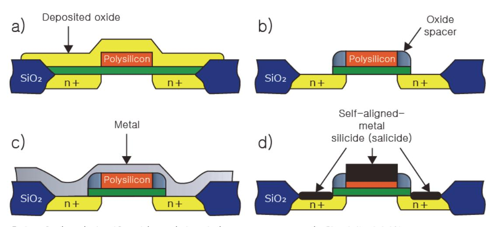

출처: 교육부(2016).반도체용 금속(Target)재료 제조(LM1903060404\_14v1). 한국직업능력개발원. p.9. [그림 1-2] 실리사이드 Process Flow

(1) 절연막

Si과 금속의 접촉 저항을 감소시키기 위한 공정으로 속과 접촉하는 Junction(source, drain)이나 Gate는 모두 Si 상태이다.

(2) 금속막

배선을 형성하는 금속으로, Ti/TiN/AL/TiN(상부 Cap), Ti/AL/Ti/TiN, Ti/AL/TiN 등 의 구조가 주로 적용된다.

- (3) 패터닝
- (4) 다층 배선

다층 배선은 배선 층과 절연막 층 (층간 절연막)을 반도체 웨이퍼 위에서 번갈아 겹쳐 쌓은 구조이고 상·하의 배선 층은 층간 절연막에 설치된 접속 홀(contact hole)을 통해 서 상호 접속된다.

- 3. 공정 순서
  - (1) 실리사이드
    - (가) Polycide (Polisilicon-Silicide)
    - (나) Salicide : TiSi2, CoSi2, low resistivity(~ 15 uΩ-Cm), high thermal stability(850 ~ 900℃)
    - (다) 저항변화
  - (2) 베리어 메탈 : Ti, TiN 등등
  - (3) 플러그 공정

숖 반도체 소자의 금속 배선 재료의 물리적 특성을 이해한다.

금속 배선 재료의 물리적 특성을 이해하기 위해서는 비저항, 저항, 녹는점 등의 요구조건을 파 악하여 확인해야 한다.

숗 금속공정의 종류에 대하여 파악한다.

#### 1. 금속 공정의 종류

금속화 공정은 소자 제조 공정의 마지막 단계로 집적 회로 공정에서 특히 수율(yield)과 신 뢰도(reliability)에 가장 큰 영향을 주는 결정적인 공정은 컨택(plug) 공정, VIA 공정, 금속 배선 공정이다.

- 2. 금속막 (Metal Film)의 종류 실리사이드, 베리어(Barrier), Plug W(텅스텐), Metal(Al) 등등이 있다.
- 3. 다층 배선 공정

다층 배선은 배선 층과 절연막 층을 반도체 웨이퍼 위에서 번갈아 겹쳐 쌓은 구조이고 상· 하의 배선 층은 층간 절연막에 설치된 접속 홀을 통해서 상호 접속된다.

수 배선물질의 요구 사항에 맞게 파악한다.

1. 공정의 적합성

적합한 금속 박막을 선택하여 접착성, 패턴 형성, 열에 대한 적합성, 접속성 (bondability) 등등을 고려하여 판단한다.

2. 전기적 조건

금속 박막의 조건들은 낮은 접촉 저항, 실리콘과 한정적 반응, 높은 전도도 등등을 가지고 있는 박막을 선택하여야 한다.

수행 tip

• 같은 제품이라도 공정에 따라 주요 변수가 달라질 수 있다.

## 1-2. 품질관리 문제점 분석

학습 목표 • 파악된 내용을 바탕으로 금속(Target) 제조 시 발생할 수 있는 문제점을 검토할 수 있다.

### 필요 지식 /

숔 금속 재료 품질과 계측 장비

반도체 금속 공정의 원리를 이해하고, 공정에 쓰이는 금속 공정용 품질은 신뢰성과 직접적인 관련이 있으므로 이를 이해할 수 있다.

#### 1. 품질과 신뢰성

금속 공정이 집적회로의 마지막 단계로써 품질관리 조건은 다음과 같다.

- (1) 표면이 고르게 덮여야 한다. 이것은 금속 박막 형성 방법에 달려 있다.
- (2) 전기적 이동이 일어나지 않아야 한다. 즉 전류로 인해 금속 선이 없어져서는 안 된다. 이것 은 재료의 구성, 구조, 형태에 관계한다.
- (3) 부식이 잘 되지 않아야 한다. 이것은 특히 플라스틱 패기지의 경우 필수적인 조건이다. 예를 들면, 알루미늄이나 구리는 나쁘고 금은 좋다.
- (4) 전체적으로 산화가 되지 않아야 한다. 다만 알루미늄은 공기에 노출되면 표면에 미세한 산화 물이 발생하는데 저절로 보호막을 형성하여 전체 산화를 방지한다.
- (5) 열적으로 화학적으로 안정해야 한다. 즉 재결정이 되거나 접속 금속과 접합 부분에서 반응이 일어나면 안 된다.
- 2. 측정 장비
  - (1) 면저항 측정기 (4-Point Probe)

4-point probe 기술은 반도체의 비저항, 특히 절연체 위에 형성된 금속 박막의 저항률 을 측정하는데 있어서 가장 널리 사용되는 방법으로 특별한 보정 절차가 필요 없는 측 정으로 매우 간단하고 정확한 방법이다. 4-point probe는 4개의 probe tip이 일정한 간격으로 떨어져서 일렬로 정렬되어 있으며 가장자리 두 Probe에 일정한 전류를 흘려 주고 가운데 두 Probe 사이의 전압을 측정하여 전압과 전류 사이의 비율을 이용하여 저항률을 계산한다.

#### (2) TXRF (Total Reflection X-Ray Fluorescence Spectrometer)

TXRF 장비는 장비 이름에서도 알 수 있듯이 X-ray의 전반사 (total reflection)를 이 용하여 시료를 분석하는 장비로서 X-ray를 low angle로 측정 시편으로 조사하였을 때 시편으로부터 발생하는 fluorescent X-ray를 분석하여 시편 표면에 존재하는 금속에 대한 정보를 얻는 측정 장비이다. 이 장비는 비파괴 분석으로 미량의 금속원소를 검출할 수 있을 뿐만 아니라 장비의 외형도 작아 in-line 측정 tool로 적당하므로 현재 대부분 반도체회사에서 이 장비를 채택하여 금속오염에 대한 in-line monitoring tool로 사용 하고 있다. TXRF 장비의 장점은 상기 서술된 비파괴 in-line 측정이 가능하다는 점 이 외에도 타 분석 장비보다 분석이 빨라 throughput이 좋다는 점을 들 수 있으며 단점으 로는 data를 얻는 영역이 X-ray가 입사되는 수 cm2의 극소영역이기 때문에 wafer 전 부에 대한 대표성이 부족하다는 점과 표면 거칠기에 민감하여 금속 오염 monitoring 시 wafer front 면을 사용하여 분석해야 한다는 점을 들 수 있다.

(3) ICP-MS (Inductively Coupled Plasma - Mass Spectrometer)

- ICP-MS 장비는 비록 파괴 분석이기는 하나 오염원 검출능력이 탁월하여 108 atoms/cm2 농도 범위의 미량원소도 분석할 수 있어 TXRF 와 더불어 미량원소 검출 에 많이 사용하고 있는 분석 장비이다. ICP–MS 방법은 분석하고자 하는 표면에 불산을 이용하여 녹여 낸 뒤 이 용액을 Ar 플라스마 내로 주입하여 용액 내에 존재하는 원소들 을 이온화하거나 분자화된 형태의 이온빔으로 만들고 이를 magnetic analyzer를 통과 시켜 각 이온들의 휘어짐 정도를 검출하여 원소를 분석하는 방법이다. ICP-MS의 장점 은 검출능력이 탁월하다는 점과 TXRF와는 달리 wafer 전면을 분석할 수 있다는 점을 들 수 있다. 그러나 ICP-MS의 경우 금속오염원이 wafer 전반에 걸쳐 이루어지지 않고 국부적으로 발생할 경우 분석이 wafer 전면적으로 이루어지기 때문에 상대적으로 오염 농도가 희석되는 단점이 있어 TXRF 와 상호 보완이 필요하다.
- (4) 주사전자 현미경 (SEM, Secondary Electron Microscopy)

주사전자 현미경은 전자빔을 이용하여 광학 현미경에 의해 볼 수 있는 이미지와 비교해 훨씬 높은 해상도로 표면의 미세 구조를 형상화하는 분석 장치이다. 가느다란 전자빔을 시료 표면에 주사시켜 이차 전자를 발생하게 하고 발생한 이차 전자를 포집, 분석하여 입체감 있는 시료의 표면상을 얻는다. 이러한 표면상을 관찰하면 시료의 구성 원소 및 조직의 치밀성 등을 평가할 수 있다. 또, 주사전자 전자현미경에 에너지 분산형 분광기 (EDS)를 사용하여 동시에 분석하면 비교적 단시간에 어떤 원소로 구성되어 있는지를 알 수 있다.

- (5) 이차이온 질량 분석기 (SIMS, Secondary Ion Mass Spectrometry)
  - 이차이온 질량 분석기는 약 1~20 keV의 운동 에너지를 가진 일차 이온 빔을 고체 시 료 표면에 충돌시켜 고체 표면의 원자들을 이온화 상태로 스퍼터링 시킨 후 이때 생성 된 이차이온을 분석기를 통해 질량에 따라 분리, 검출하는 분석 장치이다. 상대적으로 낮은 에너지의 이온 빔 전류로 표면의 원자와 분자의 조성 상태를 분석하기 위한 정적 방법 (Static SIMS)과 비교적 큰 이온 빔 전류를 이용하여 깊이에 따른 원소의 분포 상 태를 분석하는 동적 방법이 있다.

상태 등을 분석할 수 있게 된다. 에너지원으로 X-선이 사용되어 절연체에 적용할 수

(6) X-선 광전자 분광기 (XPS, X-ray Photoelectron Spectroscopy) XPS는 시료의 표면에 특성 X-선을 입사하여, 방출하는 광전자의 에너지를 측정함으로 써 시료 표면의 조성 및 화학적인 결합상태를 알 수 있다. 광전자를 방출하는 원자의 고유한 성질인 결합 에너지를 측정함으로써 원소의 정성적, 정량적 분석 및 화학 결합

있음으로 도체 및 반도체 절연박막의 분석에 큰 장점이 있다.

## 수행 내용 / 품질관리 문제점 분석하기

#### 재료·자료

- Metal, Target, Aluminium
- ASTM, ISO, JTS, SEMI, KS 표준화 문서
- MSDS, RoHS, WEEE(Waste Electrical and Electronic Equipment)
- 평가 분석 방법론

#### 기기(장비 ・ 공구)

- Metal, Target 물성 분석기
- 전하이동도, 전기저항 측정 장치
- 제조공장 인트라넷
- 컴퓨터, 프린터, 복사기, 문서 작성 프로그램

#### 안전 ・ 유의 사항

- 제조 공정 장비란 제품을 제조하기 위한 장비로서 규정에 따라 관리되어야 하며, 일정 주기 와 방법에 따라 장비 성능이 평가되어야 한다.
- 제조 공정 시 응급상황대처 능력이란, 반도체 금속(Target) 제조 시 돌발적으로 발생하는 불량률의 급증사태를 정상으로 복구하는 능력이다.
- 평가/분석/계측기란 제품의 물성이나 특성을 평가하는 검사를 실시하는 장비로서 규정에 따 라 관리되어야 하며 일정 주기와 방법에 따라 검, 교정을 실시하는 장비를 의미한다.
- CoA (Certificate of Analysis)는 가스의 순도 및 불순물 등 해당 제품의 품질 및 Specification을 나타낸다.

수행 순서

- 숔 반도체 금속 재료의 필요한 신뢰성 항목을 이해한다.
- 숕 반도체 금속분석에 필요한 장비를 파악한다.
- 숖 적용 결과를 분석한다.
- 숗 금속 재료 품질과 계측 장비를 이해하고 파악한다.
  - 1. 품질과 신뢰성
    - (1) 표면이 고르게 덮여야 한다. 이것은 금속 박막 형성 방법에 달려 있다.
    - (2) 전기적 이동이 일어나지 않아야 한다. 즉 전류로 인해 금속 선이 없어져서는 안 된다. 이것 은 재료의 구성, 구조, 형태에 관계한다.
    - (3) 부식이 잘 되지 않아야 한다. 이것은 특히 플라스틱 패기지의 경우 필수적인 조건이다. 예를 들면, 알루미늄이나 구리는 나쁘고 금은 좋다.
    - (4) 전체적으로 산화가 되지 않아야 한다. 다만 알루미늄은 공기에 노출되면 표면에 미세한 산화 물이 발생하는데 저절로 보호막을 형성하여 전체 산화를 방지한다.
    - (5) 열적으로 화학적으로 안정해야 한다. 즉 재결정이 되거나 접속 금속과 접합 부분에서 반응이 일어나면 안 된다.
  - 2. 측정장비
    - (1) 면저항 측정기 (4-Point Probe)

4-point probe 기술은 반도체의 비저항, 특히 절연체 위에 형성된 금속 박막의 저항률 을 측정하는데 있어서 가장 널리 사용되는 방법으로 특별한 보정 절차가 필요 없는 측 정으로 매우 간단하고 정확한 방법이다.

- (2) TXRF (Total Reflection X-Ray Fluorescence Spectrometer) TXRF 장비는 장비 이름에서도 알 수 있듯이 X-ray의 전반사를 이용하여 시료를 분석 하는 장비로서 X-ray를 low angle로 측정 시편으로 조사하였을 때 시편으로부터 발생 하는 fluorescent X-ray를 분석하여 시편 표면에 존재하는 금속에 대한 정보를 얻는 측정 장비이다.
- (3) ICP-MS (Inductively Coupled Plasma Mass Spectrometer) ICP-MS 장비는 비록 파괴 분석이기는 하나 오염원 검출능력이 탁월하여 108atoms/cm2농도 범위의 미량원소도 분석할 수 있어 TXRF와 더불어 미량원소 검출 에 많이 사용하고 있는 분석 장비이다.
- (4) 주사전자 현미경 (SEM, Secondary Electron Microscopy) 주사전자 현미경은 전자빔을 이용하여 광학 현미경에 의해 볼 수 있는 이미지와 비교해 훨씬 높은 해상도로 표면의 미세 구조를 형상화하는 분석 장치이다.
  - (5) 이차이온 질량 분석기 (SIMS, Secondary Ion Mass Spectrometry) 이차이온 질량 분석기는 약 1~20 keV의 운동 에너지를 가진 일차 이온 빔을 고체 시 료 표면에 충돌시켜 고체 표면의 원자들을 이온화 상태로 스퍼터링 시킨 후 이때 생성 된 이차이온을 분석기를 통해 질량에 따라 분리, 검출하는 분석 장치이다.
  - (6) X-선 광전자 분광기 (XPS, X-ray Photoelectron Spectroscopy) XPS는 시료의 표면에 특성 X-선을 입사하여, 방출하는 광전자의 에너지를 측정함으로 써 시료 표면의 조성 및 화학적인 결합상태를 알 수 있다.

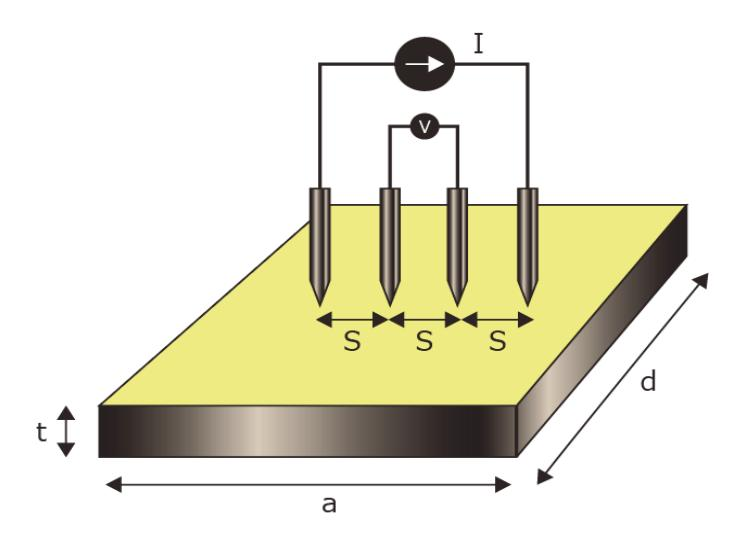

출처: 교육부(2016).반도체용 금속(Target)재료 제조(LM1903060404\_14v1). 한국직업능력개발원. p.15. [그림 1-3] 4-Point Probe 개략도

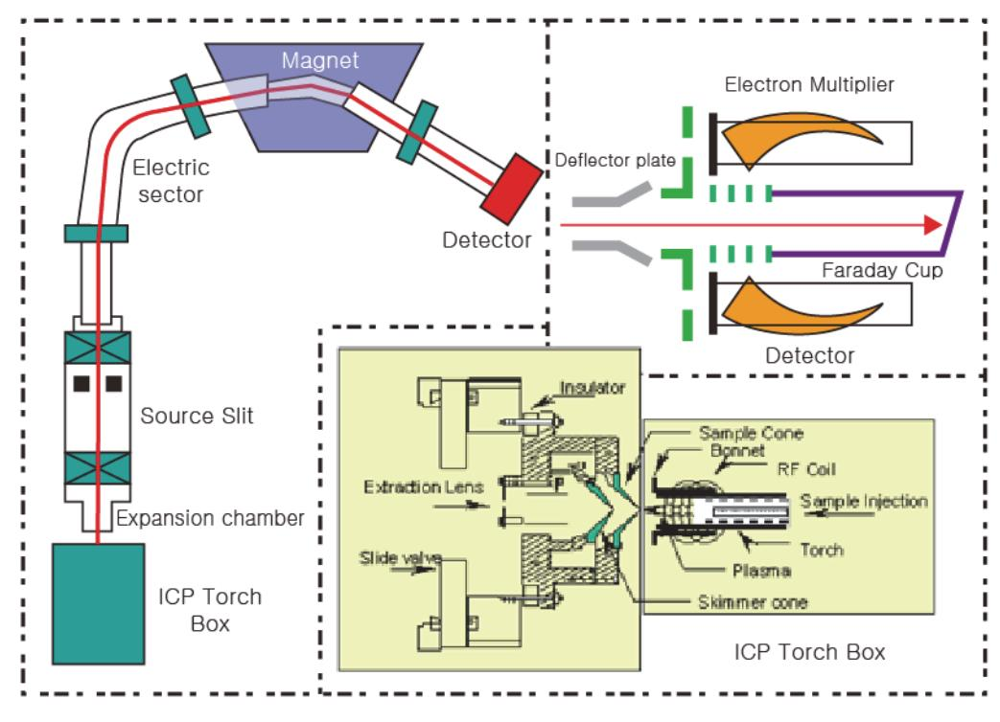

출처: 교육부(2016).반도체용 금속(Target)재료 제조(LM1903060404\_14v1). 한국직업능력개발원. p.16. [그림 1-4] ICP-MS Tool 구조도

수행 tip

• 같은 제품이라도 공정에 따라 주요 변수가 달라질 수 있다.

### 학습 1 교수·학습 방법

#### 교수 방법

- 반도체 금속 재료 제조공정을 쉽게 설명한다.
- 교수 주도로 현장에서 표준화한 공정 매뉴얼과 관련 공정 재료에서 제공되는 자료 등의 내 용을 PPT 자료로 제시한 후에 설명한다.
- 가능한 한 사전에 제조 현장에서 사용하는 사례를 수집하여 자료를 준비하고 이해하기 쉬운 방법을 논의하는 방식의 문제 해결식 수업을 한다.
- 최근 반도체 산업 현황(시장 환경 및 기술 동향 등)에 대하여 충분히 인지하고, 학생들이 이 를 이해할 수 있는 방법을 모색하여 수업을 진행한다.
- 관련 시장 환경 및 기술 변화를 통합 검색 사이트나 한국반도체산업협회의 홈페이지 (www.ksia.or.kr) 등에서 찾아 활용할 수 있도록 지도한다.
- 반도체 금속재료 요구사항에 필요한 내용을 확인하고, 관련 자료를 확보해 학생들에게 제시 후 파악 여부를 확인한다.

#### 학습 방법

- 반도체 산업 현황(시장 환경 및 기술 동향 등)과 관련 기관을 구체적으로 확인하도록 하고, 이 기관과 관련된 다양한 자료를 인터넷으로 검색하고 분류하여 문서로 정리한다.
- 반도체용 금속 재료 요구사항 항목이 선정된 양식에 맞추어 특정 소자에 대한 요구사항을 작성해 본 후, 여기에 첨부되는 자료의 종류와 기록 내용 전반을 숙지하고, 가능하다면 소자 별로 분류해 본다.
- 반도체용 금속 재료 요구사항에 대한 시장 및 기술, 비용의 조사, 수집 및 분석을 통해 생 산에 필요한 목표를 설정하고 분류된 자료를 활용하여 생산 가능성을 예측해 본다.
- 생산 시 예상되는 품질관리 문제점을 파악하고 해결책을 수립하는 현장의 업무를 이해하고, 정해진 양식에 따라 보고서를 작성해 본다.

## 학습 1 평 가

#### 평가 준거

• 평가자는 학습자가 학습 목표를 성공적으로 달성하였는지를 평가해야 한다.

#### • 평가자는 다음 사항을 평가해야 한다.

|                |                                                                 | 성취수준 |   |   |
|----------------|-----------------------------------------------------------------|------|---|---|
| 학습 내용          | 학습 목표                                                           |      | 중 | 하 |
| 금속 공정 원리 및     | - 생산 관련 부서로부터 필요한 금속(Target) 제조 사양서를 입수할 수 있다.               |      |   |   |
| 재료 파악          | - 금속(Target) 제조 사양서를 바탕으로 제품명, 품질 기준, 제품 사양, 납기 등을 파악할 수 있다. |      |   |   |
| 품질관리 문제점 분석 | - 파악된 내용을 바탕으로 금속(Target) 제조 시 발생할 수 있 는 문제점을 검토할 수 있다.      |      |   |   |

#### 평가 방법

• 서술형 시험

|                     |                               | 성취수준 |   |   |
|---------------------|-------------------------------|------|---|---|
| 학습 내용               | 평가 항목                         |      | 중 | 하 |
| 금속 공정 원리 및 재료 파악 | - 반도체용 제품 생산 금속(Target) 공정 파악 |      |   |   |
|                     | - 반도체용 금속(Target) 재료 파악       |      |   |   |
| 품질관리 문제점 분석      | - 반도체용 금속 재료 문제점 파악           |      |   |   |

#### • 사례 연구

| 학습 내용          |                               |   | 성취수준 |   |  |
|----------------|-------------------------------|---|------|---|--|
|                | 평가 항목                         | 상 | 중    | 하 |  |
| 금속 공정 원리 및     | - 반도체용 제품 생산 금속(Target) 공정 설명 |   |      |   |  |
| 재료 파악          | - 반도체용 금속(Target) 재료 선정하여 설명  |   |      |   |  |
| 품질관리 문제점 분석 | - 반도체용 금속 재료 문제점 제시하고 설명      |   |      |   |  |

• 구두 발표

|                | 평가 항목                         |  | 성취수준 |   |  |
|----------------|-------------------------------|--|------|---|--|
| 학습 내용          |                               |  | 중    | 하 |  |
| 금속 공정 원리 및     | - 반도체용 제품 생산 금속(Target) 공정 발표 |  |      |   |  |
| 재료 파악          | - 반도체용 금속(Target) 재료 발표       |  |      |   |  |
| 품질관리 문제점 분석 | - 반도체용 금속 재료 문제점 발표           |  |      |   |  |

피드백

- 1. 서술형 시험
- 평가 결과에 대한 일정 점수 누락에 해당하는 학생은 재평가를 통하여 학습을 이수할 수 있도록 지도한다.
- 2. 사례 연구
- 학습한 내용이 효과적으로 전달되지 않은 경우에는 발표방법에 대한 추가 지도를 수행한다.
- 3. 구두 발표
- 반도체 금속 공정이 필요한 이유를 질문하고 부족한 부분에 대해 보완하도록 한다.
- 금속 증착법의 종류에 대한 질문을 하고 부족한 부분에 대해 보완하도록 한다.
- 반도체 금속재료 종류에 대한 질문을 하고 미비한 부분에 대해 보완하도록 한다.
- 금속 재료의 품질을 확보하기 위한 방법을 질문하고 미비한 부분은 보완하도록 한다.

| 학습 1 | 반도체용 금속(Target) 재료 제조 요구 사항 파악하기 |
|------|----------------------------------|
| 학습 2 | 반도체용 금속(Target) 재료 준비하기          |
| 학습 3 | 반도체용 금속(Target) 제조 하기            |

## 2-1. 금속 재료의 장점과 단점 분석

학습 목표 • 반도체 공정별 금속(Target) 재료에 필요한 원재료의 종류를 파악할 수 있다. • 반도체 공정별 금속(Target) 재료의 규격 및 장단점을 파악할 수 있다.

## 필요 지식 /

#### 숔 반도체 금속 재료

반도체를 막을 증착하는 방법에는 화학 증착법, 물리 증착법, sol-gel법, 프린팅 및 전해/무전 해도금법 등을 주로 사용한다. 다양한 방법에 의해 형성되는 박막은, 두께 및 후막으로 구분한 다. 박막은 대략 수 ㎛두께 이하의 것으로 주로 CVD 및 PVD 방법을 사용하며, 수백 ㎛ 이상 두께의 막을 후막이라 하고 Ceramic Paste 또는 Silk printing과 같은 방법에 따라 증착한 다. 박막과 후막 사이의 두께 막은 금속 알콕사이드 또는 카르복실레이트 화합물 등으로 가수 분해와 중합 반응의 과정을 거치는 Sol-gel법 등을 사용한다.

<표 2-1> 재료구분

| 구 분   | 박막       | ~           | 후막                          |
|-------|----------|-------------|-----------------------------|
| 박막 두께 | < 수 ㎛    | 수 ㎛ ~ 100 ㎛ | > 100 ㎛                     |
| 증착 방법 | CVD, PVD | Sol-gel     | Ceramic Paste Silk Printing |

1. Al 합금

Al은 Si, SiO2 등에 대한 접착력이 우수하고, 고농도로 도핑된 n+, p+ 실리콘과 Ohmic 저항 특성을 지니며, 전기 비저항 값이 타 금속들에 비해 비교적 낮다는 장점들로 인해 반 도체의 금속 배선 재료로써 가장 널리 사용되어온 재료이다. 이러한 Al은 저융점 (660℃) 금속이라는 특징으로 인해 electro-migration(EM), stress-migration(SM), junction spiking 등의 현상을 공정 중에 유발하여 소자의 신뢰성에 악영향을 미친다.

(1) Junction Spiking

Junction spiking이란 실리콘과 Al 이 상호 확산함으로 인하여 Si 기판의 junction이 파괴되는 현상으로써 이를 방지하기 위하여 Al 에 소량의 Si 을 첨가하여 Al 막으로 Si 확산을 억제하거나 Si과 Al 사이에 확산 방지 역할을 하는 금속층을 형성시키는 것이 일반적이다.

(2) 실리콘 Nodule

Junction spiking 방지를 위해 Al에 많이 고용시킨 실리콘이 후속 열 공정 중에 석출 되어 Al 배선 중에 게재된 것을 실리콘 nodule이라 한다. 이러한 실리콘 nodule은 Al 배선의 EM, SM 특성을 악화시킬 수 있으며, contact에서 석출될 경우는 contact의 접 촉 저항 불량을 유발할 수 있다. 따라서 barrier 금속 공정의 발전으로 인하여 Al 합금 에 Si의 첨가를 줄일 수 있게 되었다.

(3) 힐록 (Hilloock)

박막 형성 후 알루미늄 박막을 관찰해 보면 힐록이 성장한 것을 발견할 수 있다. 힐록 의 크기와 밀도는 박막 두께의 증가에 따라 증가하며 증착 변수의 영향을 받는다. 또한, 힐록은 스퍼터링이나 열증착 등 형성방법에 관계없이 형성된다.

2. Ti/TiN 확산 방지막 (Diffusion Barrier Metal)

Barrier metal 즉 확산 방지막이란 컨택에서 junction spiking 방지를 위해 Al과 실리콘 junction 사이에 증착되는 확산 방지용의 금속과 CVD 텅스텐 증착 시에 원료 기체인 WF6의 침투 방지를 위한 확산 방지막이 있다. 이때 Al과 실리콘 junction 사이에 증착되 는 확산 방지막은 Al 및 Si과의 반응성이 없어야 하고, 고온 안정성이 우수해야 하며 Al, Si 등의 확산 억제 능력이 높고 실리콘과 Ohmic성 컨택 저항을 지니는 금속이어야 한다. 현재 가장 일반적으로 사용되는 금속으로는 TiN이 사용된다. TiN은 Ti와 N 간의 화학 당 량비가 barrier 특성에 큰 영향을 주며 1:1일 경우에 가장 바람직하다. Si 접합부에 TiN이 바로 접촉할 경우 TiN 자체의 높은 비저항으로 인하여 컨택 저항의 증가 원인이므로 보통 의 경우 Ti/TiN의 적층 구조를 사용하며, TiN은 ARC(anti refectory coating)로도 널리 사용된다. 확산 방지막은 금속과 실리콘의 상호작용을 억제하기 위해 넣어주는 박막으로 우 수한 화학적 불활성, 접착력, 기계적 성질, 열전달성 등을 가져야 하고 금속과 실리콘의 전 자이동은 허용하고 원자들을 침투시키지 않아야 한다.

3. CVD 텅스텐(W)

텅스텐은 고융점의 내열 금속으로서 Si와의 열적 안정성이 우수하며, 전기 비저항 값이 5~10 mW-cm 로서 비교적 낮기 때문에 장벽막이나 plug로서 사용되고 있다. 이러한 텅 스텐의 증착 방법은 스퍼터링 증착법이나 화학 증착법으로 모두 가능하나 화학 증착법이 가장 주목받고 있다. 즉 소자의 집적도가 증가함에 따라 컨택의 크기가 감소하고 aspect ratio는 증가하기 때문에 스퍼터링에 의한 증착 방법은 미세 컨택에서 충분한 step coverage을 얻을 수 없기 때문에, 컨택에서의 단선 불량 가능성이 크다. 따라서 화학 증착

법에 의한 텅스텐을 이용하여 plug 형성 공정이 소자의 미세 컨택에서 필수 불가결한 공정 이 되고 있다. 기본적인 텅스텐의 저압 화학 증착 반응식은 식 (1), (2)와 같다.

> → →

4. CVD TiN

종래에 장벽 층과 텅스텐 막의 접합 층으로 사용되어온 sputter된 TiN막은 소자가 고집적 화됨에 따라, 컨택이나 aspect ratio 증가에 따른 TiN막의 층 덮임 불량으로, Al막의 장벽 이나 텅스텐 막의 접합 층으로 사용이 어렵게 되었다. 즉 sputter된 TiN막은 낮은 측벽 층 덮임과 콘택 입구 함몰(over hang)이 문제 되었다. 반면 CVD-TiN막은 높은 층 덮임과 생산성 그리고 우수한 barrier 특성 때문에 최근 많이 연구되고 있다. 상기와 같이 현재까 지는 텅스텐과 알루미늄 기술이 중점적으로 발전되었다. 그러나 소자가 축소됨에 따라 소자 의 동작 주파수는 증가하며 고속화도 필연적으로 요구된다. 소자의 신호전송지연은 소자 고 유의 지연과 배선 지연에 의해 지배되는데 소자가 미세화됨에 따라, 소자의 신호전달지연은 배선 지연에 의해 지배된다. 향후 소자에서는 배선지연 감소를 고려하면, Al 합금보다는 저 저항, migration 내성이 큰 배선 재료가 요구되고 있다.

5. 구리(Cu)

반도체 소자의 고성능화/경량화/소형화를 위하여 집적도의 증가 및 금속 배선 층수의 증가 가 이루어져 왔다. 소자의 집적도가 증가함에 따라 금속 배선의 폭 및 굵기가 감소하고 접 합 층과 연결되는 컨택의 크기는 감소하는 반면 그 깊이는 점차 높아져 간다. 따라서 저항 은 점차 증가하여 소자의 신호전달 속도를 늦출 뿐만 아니라 알루미늄을 사용할 경우 EM 현상이 심각하게 되어 소자의 신뢰성에 문제가 발생하게 된다. 따라서 비저항은 더 낮고 EM 저항은 더욱 큰 물질의 이용이 필요하게 되었다. 즉, 소자 크기가 sub-micron으로 감 소함에 따라 W 및 Al을 사용한 금속 배선은 형성과 신뢰도 등에 다음과 같은 문제점을 내 포하고 있다.

- (1) 높은 배선 저항으로 인해 과다한 신호지연 야기 및 동작 속도를 제한
- (2) EM 및 SM에 의한 단선
- (3) 힐록(hillock) 형성으로 인한 interlevel short circuit 발생 및 다층 금속화 공정 문제

그러므로 0.13μm 기술 이하의 고집적 소자 개발을 위해서는 낮은 비저항과 높은 신뢰성을 갖은 배선재료가 요구되고 있다. 높은 녹는점을 갖는 금속은 열적으로 안정하고, 원자량이 큰 금속은 일반적으로 EM 저항이 크다. 현재 사용되고 있는 Al이나 Al alloy에 비해 구리 를 이용하여 알루미늄 금속 배선을 대체하면 구리가 알루미늄보다 40% 정도 낮은 비저항 으로 인하여 RC delay time을 줄여주어 소자의 동작 속도를 증가시키며 electro-migration에 대한 저항이 높아져 소자의 신뢰성을 향상시킬 수 있다. 구리 배선 형성 공정으로는 PVD법, CVD법, 전해법, 무전해법이 있으나 현재 상용화된 구리배선 공정 으로는 무전해법을 이용한다.

#### 숕 반도체 금속 재료의 장·단점

1. Al 금속 배선

Al 금속 배선은 DRAM 제조 공정에서 절대적으로 스퍼터 방식을 의존하고 있다. Al-CVD 용 화합물은 알킬 알루미늄계(R2AlR) 화합물과 알랜계 (AlH3:L) 화합물로서 분류할 수 있 다. 초기 Al-CVD는 알킬 알루미늄계를 사용하였는데 알킬 알루미늄계 화합물은 TIBA, TMA, DMAH, TEA 등으로 상온에서 액체이고, 증기압이 높은 열적 안정성이 우수한 전구 체이다. 그러나 Al-CVD는 증착 온도가 높아 ( >300℃) 탄소 등의 불순물이 박막 내 침투 되기도 하고, 대기 중에 노출 시 폭발적인 자연발화성을 갖는 위험요소를 내포하고 있다. 알랜 계열 화합물은 증착 온도가 100℃ ~ 180℃ 사이의 낮은 온도에서 고순도의 Al 박막 증착을 가능하게 한다. 화합물 DREAA는 우수한 Al-CVD 전구체이지만 상온 보관 시 서서 히 열분해가 발생하는 공정용 전구체로서 치명적 단점을 가지고 있다. 이에 따라 알랜계 (AlH3:L) 화합물의 특성을 보유함과 동시에, 보다 우수한 열적 안정성을 확보할 수 있으며 충분한 증기압을 갖는 대체 액체 전구체로 MPA(H3Al:MP(methylpyrrolidire)가 대한민국 의 기술에 의해 상용화되면서 화합물 MPA는 알랜계(AlH3:L) 화합물의 특성을 보유하고 있 다.

- (1) 열적 안정성이 개선
- (2) 액체의 전구체로 충분한 증기압
- (3) 대기 노출 시에도 인화성이 급감
- (4) 130℃의 낮은 온도에서 Al-CVD 증착 가능 전구체

화합물 MPA의 CVD 공정 메커니즘은 [그림 2-1]과 같이 진행되며 낮은 온도에서 고순도 Al 박막 증착이 가능하다.

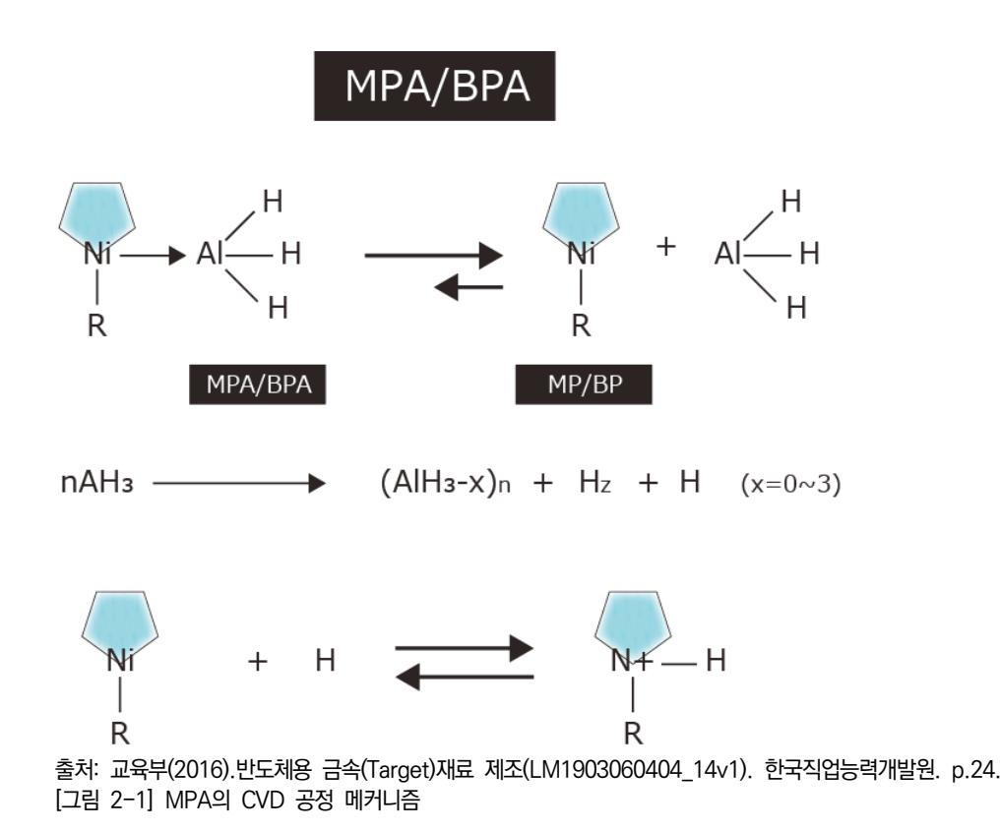

#### 2. Cu 금속 배선

구리(Cu)은 전기 저항도가 다른 금속에 비해 낮아 전자 소자의 신호 전달 속도에 적합하다. logic device에 있어 배선 재료로서 Cu의 경우는 초기 사용단계로 무전해 도금 법으로 공 정한다. 신호 전달 속도 향상은 향후 고속화, 고 기능화를 추구하는 반도체 소자에 있어 핵 심적으로 개선되어야 할 중요한 사안이다. Cu는 ~1.676μΩ㎝에 불과하기 때문에 반도체 소자의 제조 공정에 있어 핵심 기술이다. 구리 박막의 화학 증착은 Cu-CVD 기술에는 전 구체로 Cu(II) 화합물과 Cu(I) 화합물이 이용되었다. Cu(II) 화합물은 고체상으로 화합물 증 기압이 낮기 때문에 증착에 증기압을 이용하여 전구체에 가온을 인가한다. 그리고 기화된 전구체의 응축을 방지하기 전구체 저장 용기의 출구에서 증착이 발생하는 챔버까지 가열을 한다. 또한, 박막 증착 온도(340℃ - 390℃, >1,100℃)가 높아 C, O, F 와 같은 원하지 않는 불순물이 증착되는 구리 박막 내 침투하기도 한다. Cu(II) 화합물은 대부분 상온에서 고체로 존재함으로 증착 공정의 재현성에 영향을 주는 가스 비율을 조절하는데 있어서 어 려움이 있을 수 있다. 이처럼 Cu(II) 화합물을 사용한 Cu-CVD에 있어서는 부산물의 불안 정, 낮은 증기압, 낮은 증착 속도, 높은 증착 온도 및 박막 내 불순물 침투와 같은 문제점 들이 있어 우수한 CVD 증착으로 선택에 어려움을 가지고 있다. Cu(I) 화합물은 구리금속 의 요구 결합 배위수를 충족시키기 위하여 상온에서 Tetramer로 존재함으로써 낮은 증기 압을 나타낸다. 증기압은 10-4 Torr에서 100℃로 가열되었고 박막 증착 온도는 400℃의 고온에서 이루어졌다. 고온 공정으로 인하여 증착된 구리 박막은 5%의 oxygen 불순물을 포함한다고 알려져 있다. Cu-CVD 또한 고순도의 Cu 박막을 낮은 온도에서 증착할 수 있 다. 지금까지 진행된 Cu-CVD로 증착한 Cu(I) 화합물을 사용한 CVD 결과는 Cu(II) 화합 물을 사용 시 결과에 비해 낮은 증착 온도, 빠른 증착 속도, 고순도의 막질 등 여러 가지 면에서 우수성을 보여주고 있다.

3. Metal Nitride 금속 배선

질화 금속(metal nitride) 박막은 뛰어난 경도와 높은 녹는점 그리고 유기용매나 산에 대한 저항력과 같은 성질들을 가진다. 금속 배선으로 사용되는 알루미늄(Al) 및 구리(Cu)가 실리 콘 기판 속으로 확산 되는 것을 방지하는 확산 방지막으로 질화 금속(metal nitride) 박막 및 질화 규화 금속 박막 등이 사용되며 특히 질화 탄탈늄(TaN), 질화 탄탈 실리콘(TaSiN) 박막의 특성이 확산 방지막으로 사용되고 있다. 이것은 원자층 증착법 및 화학 증착법으로 증착한다. TaN 박막은 disordered grain boundary 구조를 갖고 있어 Al 또는 Cu가 기 판 속으로 확산되는 것을 막을 수 있고 또한 금속 Ta는 copper와 반응하지 않아 안정성이 뛰어나기 때문이다. 삼원소 세라믹 Ta-Si-N 박막과 같은 물질은 amorphous 구조를 갖기 때문에 grain boundary가 없어서 구리의 확산을 억제한다. 원자층 증착법 또는 화학 증착 법을 이용한 질화(규화)금속(TiN, ZrN, VN, TaN, NbN, TaSiN) 박막의 증착은 주로 금속 염화물(MCln) 금속 불화물(MFn) 또는 금속 아미드〔metal amide: M(MR2)n〕 등의 전구체 를 기체 질소, 알르곤 또는 암모니아(NH3) 및 실란(SiH4) 가스 분위기에서 열 분해시켜 증 착한다. 질화티타늄(TiN)의 CVD 공정 시 염화티타늄(TiCl4)은 높은 증기압으로 열 안정성 이 뛰어난 액체로 CVD 전구체로서 많은 장점을 보유하고 있다. 그러나 TiCl4의 사용에 주 의해야 할 사항으로 전구체 자체에 존재하는 염소 원자가 증착된 질화티타늄 박막에 유입 되어 배선재료인 알루미늄의 부식을 유발할 수 있고, 증착 온도가 600℃ 정도로 고온 공정 이기 때문에 녹는점이 낮은 알루미늄 배선의 경우에는 사용이 어렵다. 공정 중에 염화티타 늄 암모니아착물 [TiCl4:(NH3)x] 및 염화암모늄염 (NH4Cl) 과 같은 비휘발성 부산물을 형 성으로 인해 증착되는 TiN 박막 내에 입자(particle)의 침착이 가능하기 때문에 반도체 소 자 TiN CVD 제조공정에 사용의 제한 되고 있다. TaN 박막 전구체 화합물은 TaF5 TaCl5, TaBr5, TaI5와 같은 무기 화합물과 Ta(NMe2)5, Ta(NEt2)5, Ta(NEtMe)5, TBTDET, TBTEMAT와 같은 유기금속 화합물로 구분할 수 있다. TaF5, TaCl5, TaBr5, TaI5와 같은 무기 화합물은 증착 공정에 있어 전구체는 일정한 증기압을 확보하기가 어렵 다. 또한 TaF5, TaCl5 등을 전구체로 사용 시, 때때로 증착되는 박막에 F, Cl 등이 침투 하기도 한다. 또한, 박막증착 온도가 높은 단점도 있다. 이에 비해 낮은 온도에서 박막 증 착이 가능하며, 높은 증기압 특성을 보이고, 액체 유기 금속 화합물인 탄탈 아마이드 화합 물이 CVD 및 ALD 전구체로 활용되고 있다.

## 수행 내용 / 금속 재료의 장점과 단점 분석하기

#### 재료·자료

- Metal, Target, Aluminium
- ASTM, ISO, JTS, SEMI, KS 표준화 문서
- ITRS 로드맵 (International Technology Roadmap for Semiconductor)
- 반도체 로드맵
- 반도체 제조 공정도
- MSDS, RoHS, WEEE(Waste Electrical and Electronic Equipment)
- 평가 분석 방법론
- 시험성적서
- 평가/분석/검증 결과보고서

#### 기기(장비 ・ 공구)

- Metal, Target 물성 분석기
- 전하이동도, 전기 저항 측정 장치
- 제조공장 인트라넷
- 컴퓨터, 프린터, 복사기, 문서 작성 프로그램

#### 안전 ・ 유의 사항

- 제조 공정 장비란 제품을 제조하기 위한 장비로서 규정에 따라 관리되어야 하며, 일정 주기 와 방법에 따라 장비 성능이 평가되어야 한다.
- (제조) 응급상황대처 능력이란, 반도체 금속(Target) 제조 시 돌발적으로 발생하는 불량률의 급증사태를 정상으로 복구하는 능력이다.
- 평가/분석/계측기란 제품의 물성이나 특성을 평가하는 검사를 실시하는 장비로서 규정에 따 라 관리되어야 하며 일정 주기와 방법에 따라 검, 교정을 실시하는 장비를 의미한다.
- 작업표준에는 공정순서 및 조건(온도, 시간, 환경)을 포함한다.

- 작업 절차서는 생산을 끝마치기까지의 절차, 순서를 체계적으로 작성한 생산행위의 계획서 로서, 생산을 바르게 실시할 목적으로 생산을 위한 절차와 생산에 사용하는 재료, 장치의 준 비 및 사용방법, 그리고 생산을 실시하는데 필요한 주의사항을 나타내는 문서이다.
- 품질관리에서는 통계를 활용한 금속(Target)의 품질 관리를 통하여 불량의 발생 및 불량 원 인을 조사하여 개선함으로써 품질의 균일성(6-시그마)을 확보하여야 한다.
- CoA (Certificate of Analysis)는 가스의 순도 및 불순물 등 해당 제품의 품질 및 Specification을 나타낸다.
- 검, 교정계획이란 품질에 영향을 미칠 수 있는 해당 제품의 특성에 대해 측정하는 장비에 대한 측정 오차나 정밀도를 높이는 작업 계획을 말하며, 이러한 내용은 검, 교정 관리대장에 기술한다.

#### 수행 순서

- 숔 반도체 금속 재료를 이해하고 파악한다.
  - 1. Al 합금

Al은 Si, SiO2 등에 대한 접착력이 우수하고, 고농도로 doping된 n+, p+ 실리콘과 Ohmic 저항 특성을 지니며, 전기 비저항 값이 타 금속들에 비해 비교적 낮다는 장점들로 인해 반도체의 금속 배선 재료로써 가장 널리 사용되어온 재료이다.

(1) Junction Spiking

Junction spiking이란 실리콘과 Al이 상호 확산됨으로 인하여 Si 기판의 junction이 파괴되는 현상으로써 이를 방지하기 위하여 Al 에 소량의 Si을 첨가하여 Al 막으로 Si 확산을 억제하거나 Si과 Al 사이에 확산 방지 역할을 하는 금속 장벽 층을 형성시키는 것이 일반적이다.

(2) 실리콘 Nodule

Junction spiking 방지를 위해 Al에 많이 고용시킨 실리콘이 후속 열 공정 중에 석출 되어 Al 배선 중에 게재된 것을 실리콘 nodule 이라 한다.

(3) 힐록

박막 형성 후 알루미늄 박막을 관찰해 보면 힐록이 성장한 것을 발견할 수 있다.

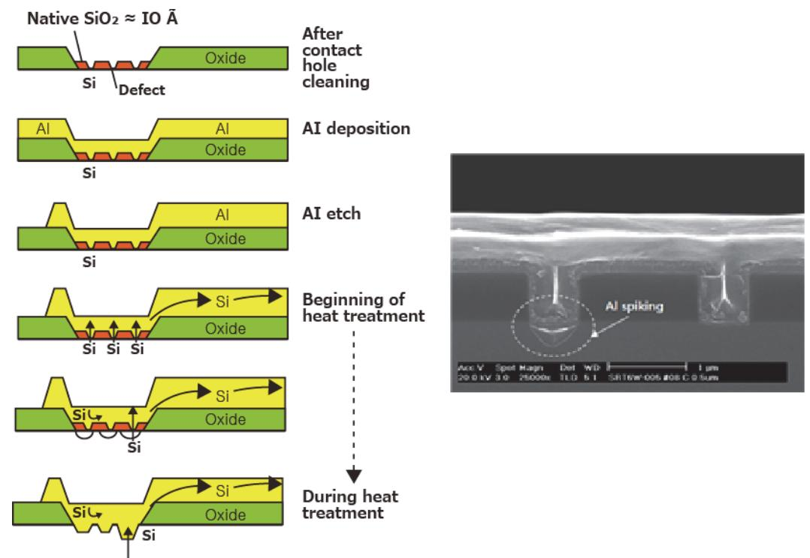

출처: 교육부(2016).반도체용 금속(Target)재료 제조(LM1903060404\_14v1). 한국직업능력개발원. p.28. [그림 2-2] 실리콘 Contact 위에 알루미늄 형성된 구조에서 Junction spiking

2. Ti/TiN 확산 방지막 (Diffusion Barrier Metal)

금속 장벽 즉 확산 방지막이란 컨택에서 junction spiking 방지를 위해 Al과 실리콘 junction 사이에 증착되는 확산 방지용의 금속과 CVD 텅스텐 증착 시에 원료 기체인 WF6 의 침투 방지를 위한 확산 방지막이 있다.

3. CVD 텅스텐(W)

텅스텐은 고융점의 내열 금속으로서 Si와의 열적 안정성이 우수하며, 전기 비저항 값이 5~10 mW-cm 로서 비교적 낮기 때문에 barrier막이나 plug로서 사용되고 있다.

4. CVD TiN

종래에 장벽 층과 텅스텐 막의 접합 층으로 사용되어온 sputter된 TiN막은 소자가 고집적 화됨에 따라, 컨택이나 aspect ratio 증가에 따른 TiN막의 층 덮임 불량으로, Al막의 장벽 이나 텅스텐 막의 접합 층으로 사용이 어렵게 되었다.

5. 구리(Cu)

반도체 소자의 고성능화/경량화/소형화를 위하여 집적도의 증가 및 금속 배선 층수의 증가 가 이루어져 왔다. 소자의 집적도가 증가함에 따라 금속 배선의 폭 및 굵기가 감소하고 접 합 층과 연결되는 컨택의 크기는 감소하는 반면 그 깊이는 점차 높아져 간다.

② 반도체 금속 재료의 장·단점을 이해하고 파악한다.

1. AI 금속 배선

알루미늄 (Al) 금속 배선은 DRAM 제조 공정에서 절대적으로 스퍼터(Sputter) 방식을 의존하고 있다. Al-CVD용 화합물은 알킬 알루미늄계(R2AlR) 화합물과 알랜계 (AlH3:L) 화합물로서 분류 할 수 있다.

- (1) 열적 안정성이 개선
- (2) 액체의 전구체로 충분한 증기압
- (3) 대기 노출 시에도 인화성이 급감
- (4) 130℃의 낮은 온도에서 AI-CVD 증착 가능 전구체

| 〈표 2-2〉 | AI 증착용 | 전구체 | 화합물 |
|---------|--------|-----|-----|
|---------|--------|-----|-----|

| 명칭                                                              | 상태                  | 그룹 | V.P (Torr/℃) | 비고                             | 장·단점                     |
|-----------------------------------------------------------------|---------------------|----|-----------------|--------------------------------|--------------------------|
| TIBA Al(Bu)₃                                                 | Colorless liquid | R  | 0.1/27          |                                | 발화 높은 증착 온도           |
| TMA Al(CH 3 ) 3                        | Colorless liquid | R  | 11/27           | Al 2 O 3 | 발화 높은 증착 온도 오염(Al) |
| DMAH Al(CH₃)₂H                                               | Colorless liquid | R  | 2/25            |                                | 발화 높은 점성              |
| TMAA(1:1) AIH 3 :(NMe 3 ) 2 | White solid      | А  | 1/25            |                                | 열저하 고체                   |
| TMAA(1:2) AIH3:(NMe3)2                                       | White solid      | А  | 2/25            |                                | 열저하 고체                   |
| DMEEA AIH3:NMe2 Et                                           | Colorless liquid | А  | 1.5/25          |                                | 열저하 고체                   |
| MPA AIH₃:MP                                                  | Colorless liquid | А  | 1.5/25          | AI-CVD                         | 반도체 양산공정적용               |

#### 2. Cu 금속 배선

구리(Cu)는 전기 저항도 (electrical resistivity)가 다른 금속에 비해 낮아 전자 소자의 신호 전달 속도에 적합하다. logic device에 있어 배선 재료로서 Cu의 경우는 초기 사용단계로 무 전해 도금법으로 공정한다. 대표적 화합물은 [표 2-2]와 같으며 Cu(II) 화합물은 대부분 β -diketonate 리간드 화합물인 Cu(hfac)2, Cu(tmhd)2, Cu(acac)2, 등이 Cu(I) 화합물은 주로 (β-diketonate)CuL의 구조를 갖는다.

| 〈표 2-3〉 Cu 증착용 전구쳐 | 화합물 |
|--------------------|-----|
|--------------------|-----|

| Compound                                                           | Deposition Conditions                | Selectivity                                             | Deposition Rate            | File Impurities                                 |
|--------------------------------------------------------------------|-----------------------------------------|---------------------------------------------------------|----------------------------|-------------------------------------------------|
| Cu(hfac) 2                                              | H 2 Carrier/atm. Pressure | Not Selective for Glass                              | Max 180Å/min               | None(XRD)                                       |
| Cu(hfac)₂ Cu(dpm)₂                                              | No Carrier gas                          | Selective for SiO 2 not Si                | Not Reported               | C, O no F (SIMS)                                |
| Cu(hfac) 2                                              | Ar Carrier/atm Pressure}340℃         | Nor Reported                                            | 340℃ 40Å/min               | >340°C−C, O, F, 340~390°C−None (XPS, RBS) |
| Cu(hfac) 2                                              | H 2 Carrier/ Cold wall    | Not Selective for Si, TiN, SiO 2       | 120~180Å/min               | None(RBS, AES, EDX, XPS)                     |
| Cu(nana-f) 2                                            | H₂ Carrier/ 270~350℃                 | Selective for SiO2 not Si                            | 700Å/min                   | None                                            |
| [Cu−O−t−Bu]₄                                                       | 400℃                                    | Not Selective for Al,Borosilicate glass, Si, C | Not Reported               | O no C (AES)                                    |
| (t–Bu–O)Cu (PMe₃)                                               | 400℃                                    | Not Selective for Pt, SiO 2               | 6~100Å/min                 | C, O, P (AES)                                   |
| (n 5 -C 5 H 5 )CuPMe 3 | 260~450°C                               | Not Selective for Pt, SiO 2               | 6~100Å/min                 | C no P (AES)                                    |
| (n₅−C₅H₅)CuPEt₃                                                    | 150~220°C                               | Selective for W not SiO 2                 | 210°C 2200Å/min            | None (AES)                                      |
| (hfac)CuPMe₃                                                       | 150~400°C Hot wall                   | (150~300℃)Pt not SiO₂                                | Max 2000Å/min              | None (AES)                                      |
| (acac)CuPMe 3                                           | 80~400℃ Hot wall                     | ⟨80℃ Pt not SiO₂                                     | 300Å/min                   | None (AES)                                      |
| (thac)CuPMe 3                                           | 100∼400℃ Hot wall                    | <100℃ Pt not SiO₂                                    | 1000Å/min                  | None (AES)                                      |
| (hfac)CuPMe 3                                           | 170~250℃ 10~50 mTorr Cold wall    | Selective W, not PECVD SiO2                       | 210℃/50mTorr 2200Å/min  | None (AES)                                      |
| (hfac)Cu(VTMS)                                                     | 150~250°C                               | 150~180℃ TiN not SiO 2                    | 1000Å/min                  | None (AES)                                      |
| (hfac)Cu (1.5-COD)                                              | 120~250℃ 10~50 mTorr Cold wall    | Not selective W, not PECVD SiO 2       | 160℃/50mTorr 3000Å/min  | None (AES)                                      |
| (hfac)Cu (2–Butyne)                                             | 150~250℃ 10~50 mTorr Cold wall    | Not selective W, not PECVD SiO 2       | 190°C/50mTorr 9000Å/min | None (AES)                                      |

#### 3. Metal Nitride 금속 배선

질화 금속 박막은 뛰어난 경도와 높은 녹는점 그리고 유기용매나 산에 대한 저항력과 같은 성 질들을 가진다. 금속 배선으로 사용되는 알루미늄(Al) 및 구리(Cu)가 실리콘 기판 속으로 확산 되는 것을 방지하는 확산 방지막으로 질화 금속 박막 및 질화 규화 금속 박막 등이 사용되며 특히 질화 탄탈늄(TaN), 질화 탄탈 실리콘(TaSiN) 박막의 특성이 확산 방지막으로 사용되고 있다. TiN-CVD 전구체를 요약하여 보면 [표 2-4]) 과 같다.

| 명칭    | 분자식             | 물리적 상태 | 끓는점          | 증기압           |
|-------|-----------------|--------|--------------|---------------|
| TiCl4 | TiCl4           | 무색 액체  | 136.4℃       | 23mmHg/38℃    |
| TEMAT | Ti[N(CH3)C2H5]4 | 노랑색 액체 | 80℃/0.1mmHg  | 1 Torr/78℃    |
| TDMAT | Ti[N(CH3)2]4    | 노랑색 액체 | 52℃/0.5mmHg  | 0.11 Torr/25℃ |
| TDEAT | Ti[N(C2H5)2]4   | 노랑색 액체 | 112℃/0.1mmHg | 0.1 Torr/98℃  |
|       |                 |        |              |               |

<표 2-4> TiN 증착용 전구체 화합물

금속과 금속 간 확산 방지막으로 사용되는 TaN 이지만 대부분 CVD 의 경우 Ta 금속 산화수 에 유리함을 보이는 절연체 Ta3N5 박막이 증착된다. 일반적으로 사용되는 Ta(V) 산화 상태 이 므로 CVD 공정을 진행 시 Ta3N5 박막이 생성되는 경우가 많고 특히 저온 공정에서 Ta(III) 산화 상태인 TaN 박막을 얻기가 쉽지 않다. 화합물은 Ta, N, Si 이 존재하며 화합물을 [표 2-5]과 같다.

| <표 2-5> TaN 증착용 전구체 화합물 |  |
|-------------------------|--|
|-------------------------|--|

| 명칭       | 분자식                           | 물리적 상태                             | 끓는점          |
|----------|-------------------------------|------------------------------------|--------------|
| TMSTEMAT | TiCl4                         | Colorless to Pale Yellow liquid | 85℃/0.1mmHg  |
| TBITEMAT | [(CH3)(C2H5)N]3TaNC(C H3)3 | Colorless to Pale Yellow liquid | 85℃/0.1mmHg  |
| TBTDET   | [(C2H5)2N]3TaNC(CH3)3         | Pale Yellow liquid                 | 90℃/0.1mmHg  |
| PEMAT    | Ta[N(CH3)(C2H5)]5             | Orange liquid                      | 85℃/0.1mmHg  |
| PDEAT    | Ta[N(C2H5)2]5                 | Orange liquid                      | 100℃/0.1mmHg |
| PDMAT    | Ta[N(CH3)2]5                  | Orange liquid                      | 95℃/0.1mmHg  |
| TaF5     | TaF5                          | Offwhite solid                     | 229℃         |

## 2-2. 재료의 문제점 분석 및 해결

학습 목표 • 반도체 제조 공정에 적합한 반도체 금속(Target) 재료를 준비할 수 있다.

## 필요 지식 /

숔 금속 공정 증착 방법

반도체 금속 공정 재료의 주요 구성물을 파악하고 그 기술을 이해한다면, 재료의 도출된 문제 점을 해결할 수 있다. 스퍼터링, 화학기상증착, 무전해 도급 공정을 이용하여 금속 박막을 증착 한다.

- 1. 스퍼터링
  - (1) DC 스퍼터링

박막 속도는 여러 종류의 금속에 대해 일정하게 형성할 수 있고 전류량과 박막 두께가 정비례하게 나타나서 두께 조절이 가능하다. 또한, 면적이 넓은 곳에서도 균일도가 우수 하며, 높은 에너지의 공정에서도 밀착 강도가 높다.

(2) RF 스퍼터링

RF 스퍼터링은 타겟이 절연체일 경우에 사용되며, RF는 13.56MHz 진동수로 플라스마 공정을 이용하여 진동 전원과 함께 사용한다.

(3) Magnetron 스퍼터링

Magnetron 스퍼터링은 DC 스퍼터링와 비슷하지만, 음극에 자석을 이용하여 타겟 표면 으로부터 평행하게 자기장을 이루어 자석을 통해 반응하게 하는 것을 말한다.

- 2. 화학기상 증착
  - (1) 플라스마 화학기상 증착 CVD (Plasma enhanced CVD)

플라스마 챔버 내부에 주입된 가스의 해리와 플라스마가 반응하게 하는 방법으로 반응 에 필요한 활성화 에너지를 가소 시켜 낮은 온도에서도 박막 증착이 가능하게 한다.

- 3. 증발 공정
  - (1) 열증발 증착

진공에서 높은 열을 금속원과 유기물에 의해 기화되어 상대적으로 온도가 낮은 기판에 박막을 형성하는 방법으로 고체가 승화된 후 기판에 증착되는 것을 말한다.

#### 4. 무전해 도금 공정

(1) 무전해 도금 증착

금속염과 가용성 환원제가 공존하는 용액에 피도금물을 접촉 시켜 얻어지는 도금으로 환원제의 산화에 의해 방출되는 전자가 금속이온에 전이하여 금속 피막이 생성되어 전 기력에 의하지 않고 증착되는 것을 말한다.

#### 숕 반도체 금속의 대표적 재료 및 문제점

반도체 금속 공정은 실리콘 기판 위에 형성된 다양한 디바이스의 구조들을 전기적으로 서로 연 결하는 금속층에 대한 공정을 다루는 작업으로 Al 박막 공정, Cu 박막 공정이 있다. 이것들은 가장 많이 쓰이며 IC fabrication에서 중요한 공정 단계 중의 하나이다.

1. Al 금속

Al은 낮은 저항력을 가지고 있고 SiO2와 접착성이 우수하여 적합한 물질이다. 금속 공정 물질로써 Al의 단점은 660℃의 낮은 녹는점이고 Al-Si 합금은 577℃이다. 이는 Al 층이 도 포된 후의 최대 공정 온도를 제한하게 된다. Al 금속층은 sputtering에 의한 PVD 공정으 로 도포된다. 순수한 Al 이외에 다른 물질과 합금을 하게 되면 다른 성능을 내기도 한다. 산소에 노출되는 정도에 따라 Al은 기판 표면에 얇은 산화막(Al2O3)을 형성한다. 이와 같은 산화막은 Al 층의 접촉 저항성을 증가시킨다. 이는 또한 Al 박막의 sputtering 과 etching 을 방해하여 공정진행에 어려움을 초래하기도 한다. 다른 예로, Al에 약간의 구리를 첨가하 게 되면 잠재적인 electromigration effect를 감소시킬 수 있고 silicon을 첨가하여 "spike" 현상을 줄일 수도 있다.

2. Cu 금속

Cu는 과거부터 현재까지 주로 쓰이고 있지만 근래 들어 Al을 서서히 대체 되고 있다. 주요 특징으로는 낮은 저항력을 가지며 Al 보다 낮은 electromigration으로 수명이 길고 힐록이 덜 발생하며 dry etch를 하지 못하므로 CMP 공정으로 대체 되고 Si 층을 오염시키기 때 문에 오염을 막아 줄 층이 있어야 한다.

3. Electromigration

Electromigration은 전자가 이동하면서 원자와 부딪히면서 원자가 다른 위치로 이동할 수 있을 만큼의 에너지를 제공하여 원자가 다른 위치로 이동하는 현상을 말한다. Electromigration에 의해서 전자와 원자가 고갈되는 void와 이동한 원자들이 쌓이는 힐록 이 생기게 된다. Void가 생성되면 배선이 끊어지게 된다. Electromigration 이 중요한 이 슈가 된 것은 얼마 안 돼서 아직 많은 연구가 되지는 않았지만. 반도체나 CPU의 chip 같 은 곳의 수십 μm 금속 배선에서 이러한 현상으로 인해 배선이 많이 끊어지는 현상이 일어

나고, 또한 신뢰성이 많이 낮아지고 있다.

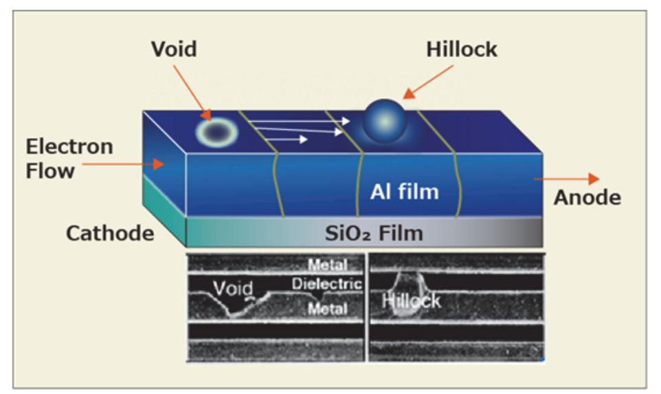

출처: 교육부(2016).반도체용 금속(Target)재료 제조(LM1903060404\_14v1). 한국직업능력개발원. p.34. [그림 2-3] Viod 와 힐록 현상

## 수행 내용 / 금속 재료 선정 및 문제점 해결하기

#### 재료·자료

- Metal, Target, Aluminium
- ASTM, ISO, JTS, SEMI, KS 표준화 문서
- ITRS 로드맵 (International Technology Roadmap for Semiconductor)
- 반도체 제조 공정도
- 반도체 기술/시장/표준 동향 분석서
- MSDS, RoHS, WEEE(Waste Electrical and Electronic Equipment)
- 평가/분석/검증 결과보고서

#### 기기(장비 ・ 공구)

- Metal, Target 물성 분석기
- 전하이동도, 전기저항 측정 장치
- 제조공장 인트라넷
- 컴퓨터, 프린터, 복사기, 문서 작성 프로그램

#### 안전 ・ 유의 사항

- 제조 공정 장비란 제품을 제조하기 위한 장비로서 규정에 따라 관리되어야 하며, 일정 주기 와 방법에 따라 장비 성능이 평가되어야 한다.
- 제조 공정 시 응급상황대처 능력이란, 반도체 금속(Target) 제조 시 돌발적으로 발생하는 불량률의 급증사태를 정상으로 복구하는 능력이다.
- 평가/분석/계측기란 제품의 물성이나 특성을 평가하는 검사를 실시하는 장비로서 규정에 따 라 관리되어야 하며 일정 주기와 방법에 따라 검, 교정을 실시하는 장비를 의미한다.
- CoA (Certificate of Analysis)는 가스의 순도 및 불순물 등 해당 제품의 품질 및 Specification을 나타낸다.

#### 수행 순서

숔 반도체 금속 제조 공정 증착 방법을 이해하고, 공정에 재료의 특성을 파악한다.

반도체 금속 공정 재료의 주요 구성물을 파악하고 그 기술을 이해한다면, 재료의 도출된 문제 점을 해결할 수 있다. 스퍼터링, 화학기상증착, 부전해 도급 공정을 이용하여 금속 박막을 증작 한다.

1. DC 스퍼터링

박막 속도는 여러 종류의 금속에 대해 일정하게 형성할 수 있고 전류량과 박막 두께가 정 비례하게 나타나서 두께 조절이 가능하다. 또한, 면적이 넓은 곳에서도 균일도가 우수하며, 높은 에너지의 공정에서도 밀착 강도가 높다.

2. RF 스퍼터링

RF 스퍼터링은 타겟이 절연체일 경우에 사용되며, RF는 13.56MHz 진동수로 플라스마 공 정을 이용하여 진동 전원과 함께 사용한다.

3. Magnetron 스퍼터링

Magnetron 스퍼터링은 DC 스퍼터링와 비슷하지만, 음극에 자석을 이용하여 타겟 표면으

로부터 평행하게 자기장을 이루어 자석을 통해 반응하게 하는 것을 말한다.

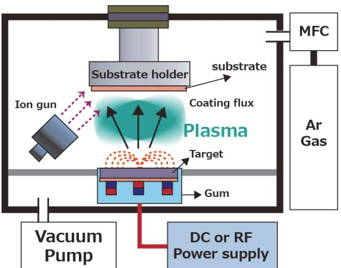

출처: 교육부(2016).반도체용 금속(Target)재료 제조(LM1903060404\_14v1). 한국직업능력개발원. p.36. [그림 2-4] 스퍼터링 장치의 기본 개념도

- 4. 화학기상 증착
  - (1) 플라스마 화학기상 증착 CVD (Plasma enhanced CVD) 플라스마 챔버 내부에 주입된 가스의 해리와 플라스마가 반응하게 하는 방법으로 반응 에 필요한 활성화 에너지를 가소 시켜 낮은 온도에서도 박막 증착이 가능하게 한다.

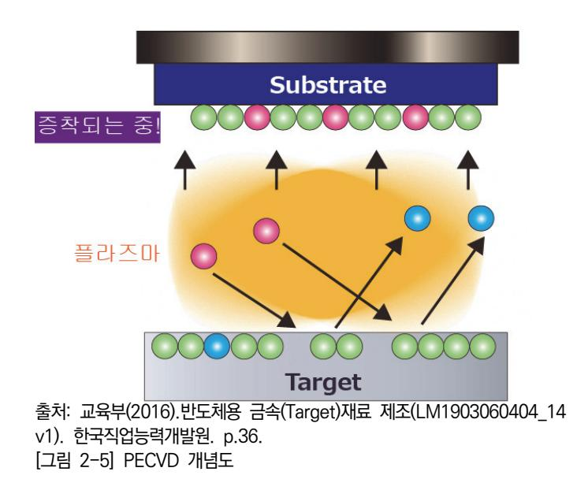

#### 5. 증발 공정

#### (1) 열증발 증착

진공에서 높은 열을 금속원과 유기물에 의해 기화되어 상대적으로 온도가 낮은 기판에 박막을 형성하는 방법으로 고체가 승화된 후 기판에 증착되는 것을 말한다.

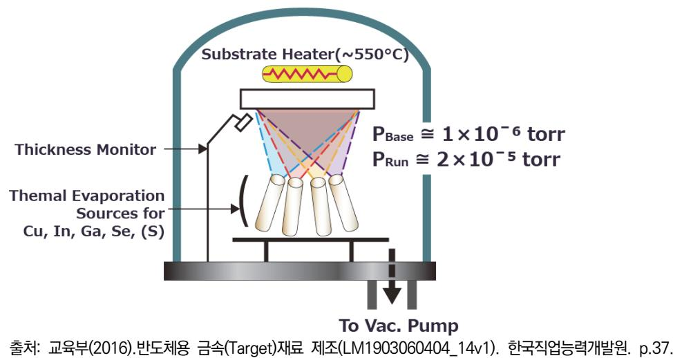

[그림 2-6] 열증발 증착 장비 모식도

#### 6. 무전해 도금 공정

(1) 무전해 도금 증착

금속염과 가용성 환원제가 공존하는 용액에 피도금물을 접촉 시켜 얻어지는 도금으로 환원 제의 산화에 의해 방출되는 전자가 금속이온에 전이하여 금속 피막이 생성되어 전기력에 의하지 않고 증착되는 것을 말한다.

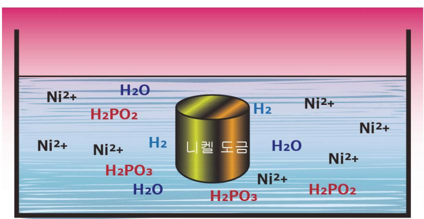

출처: 교육부(2016).반도체용 금속(Target)재료 제조(LM1903060404\_14v1). 한국직업능력 개발원. p.37.

[그림 2-7] 무전해 니켈도금의 반응 메커니즘

#### 숕 반도체 금속의 대표적 재료 두 가지 도출 및 된 문제점을 파악하고 해결한다.

반도체 금속 공정은 실리콘 기판 위에 형성된 다양한 디바이스의 구조들을 전기적으로 서로 연 결하는 금속층에 대한 공정을 다루는 작업으로 Al 박막 공정, Cu 박막 공정이 있다. 이것들은 가장 많이 쓰이며 IC fabrication에서 중요한 공정 단계 중의 하나이다.

1. Al (Aluminum)

Al은 낮은 resistivity를 가지고 있고 SiO2와 접착성이 우수하여 적합한 물질이다.

2. Cu (Copper)

Cu는 낮은 resistivity를 가지며 Al 보다 낮은 electromigration으로 수명이 길다.

3. Electromigration

Electromigration은 전자가 이동하면서 원자와 부딪히면서 원자가 다른 위치로 이동할 수 있 을 만큼의 에너지를 제공하여 원자가 다른 위치로 이동하는 현상을 말한다.

### 학습 2 교수·학습 방법

#### 교수 방법

- 반도체 금속 재료 제조공정을 쉽게 설명한다.
- 교수 주도로 현장에서 표준화한 공정 매뉴얼과 관련 공정 재료에서 제공되는 자료 등의 내 용을 PPT 자료로 제시한 후에 설명한다.
- 가능한 한 사전에 제조 현장에서 사용하는 사례를 수집하여 자료를 준비하고 이해하기 쉬운 방법을 논의하는 방식의 문제 해결식 수업을 한다.
- 최근 반도체 산업 현황(시장 환경 및 기술 동향 등)에 대하여 충분히 인지하고, 학생들이 이 를 이해할 수 있는 방법을 모색하여 수업을 진행한다.
- 관련 시장 환경 및 기술 변화를 통합 검색 사이트나 한국반도체산업협회의 홈페이지 (www.ksia.or.kr) 등에서 찾아 활용할 수 있도록 지도한다.
- 반도체 금속재료 요구사항에 필요한 내용을 확인하고, 관련 자료를 확보해 학생들에게 제시 후 파악 여부를 확인한다.

#### 학습 방법

- 반도체 산업 현황(시장 환경 및 기술 동향 등)과 관련 기관을 구체적으로 확인하도록 하고, 이 기관과 관련된 다양한 자료를 인터넷으로 검색하고 분류하여 문서로 정리한다.
- 반도체용 금속 재료 요구사항 항목이 선정된 양식에 맞추어 특정 소자에 대한 요구사항을 작성해 본 후, 여기에 첨부되는 자료의 종류와 기록 내용 전반을 숙지하고, 가능하다면 소자 별로 분류해 본다.
- 반도체용 금속 재료 요구사항에 대한 시장 및 기술, 비용의 조사, 수집 및 분석을 통해 생 산에 필요한 목표를 설정하고 분류된 자료를 활용하여 생산 가능성을 예측해 본다.
- 생산 시 예상되는 품질관리 문제점을 파악하고 해결책을 수립하는 현장의 업무를 이해하고, 정해진 양식에 따라 보고서를 작성해 본다.

## 학습 2 평 가

#### 평가 준거

• 평가자는 학습자가 학습 목표를 성공적으로 달성하였는지를 평가해야 한다.

#### • 평가자는 다음 사항을 평가해야 한다.

|                     | 학습 목표                                              |  | 성취수준 |   |  |
|---------------------|----------------------------------------------------|--|------|---|--|
| 학습 내용               |                                                    |  | 중    | 하 |  |
| 금속 재료의 장점과 단점 분석 | - 반도체 공정별 금속(Target) 재료에 필요한 원재료의 종류를 파악할 수 있다. |  |      |   |  |
|                     | - 반도체 공정별 금속(Target) 재료의 규격 및 장단점을 파악 할 수 있다.   |  |      |   |  |
| 재료의 문제점 분석 및 해결  | - 반도체 제조 공정에 적합한 반도체 금속(Target) 재료를 준 비할 수 있다.  |  |      |   |  |

#### 평가 방법

• 서술형 시험

|                     | 평가 항목                    | 성취수준 |   |   |
|---------------------|--------------------------|------|---|---|
| 학습 내용               |                          | 상    | 중 | 하 |
| 금속 재료의 장점과 단점 분석 | - 반도체 공정별 금속재료 장점과 단점 작성 |      |   |   |
|                     | - 반도체 집적회로 제조 공정 금속재료 작성 |      |   |   |
| 재료의 문제점 분석 및 해결  | - 반도체 금속재료 문제점 해결방안 작성   |      |   |   |

• 사례 연구

|                     | 평가 항목                    | 성취수준 |   |   |
|---------------------|--------------------------|------|---|---|
| 학습 내용               |                          | 상    | 중 | 하 |
| 금속 재료의 장점과 단점 분석 | - 반도체 공정별 금속재료 장점과 단점 제시 |      |   |   |
|                     | - 반도체 집적회로 제조 공정 금속재료 선정 |      |   |   |
| 재료의 문제점 분석 및 해결  | - 반도체 금속재료 문제점 해결방안 제시   |      |   |   |

• 구두 발표

|                    | 평가 항목                         | 성취수준 |   |   |
|--------------------|-------------------------------|------|---|---|
| 학습 내용              |                               | 상    | 중 | 하 |
| 금속 재료의 장점과         | - 반도체 공정별 금속재료 장점과 단점 이해하여 설명 |      |   |   |
| 단점 분석              | - 반도체 집적회로 제조 공정 금속재료 선정하여 설명 |      |   |   |
| 재료의 문제점 분석 및 해결 | - 반도체 금속재료 문제점 해결방안 제시하여 설명   |      |   |   |

#### 피드백

- 1. 서술형 시험
- 평가 결과에 대한 일정 점수 누락에 해당하는 학생은 재평가를 통하여 학습을 이수할 수 있도록 지도한다.
- 2. 사례 연구
- 학습한 내용이 효과적으로 전달되지 않은 경우에는 발표방법에 대한 추가 지도를 수행한다.
- 3. 구두 발표
- 반도체 금속 공정이 필요한 이유를 질문하고 부족한 부분에 대해 보완하도록 한다.
- 금속 증착법의 종류에 대한 질문을 하고 부족한 부분에 대해 보완하도록 한다.
- 반도체 금속재료 종류에 대한 질문을 하고 미비한 부분에 대해 보완하도록 한다.
- 금속 재료의 품질을 확보하기 위한 방법을 질문하고 미비한 부분은 보완하도록 한다.

| 학습 3 | 반도체용 금속(Target) 제조 하기            |
|------|----------------------------------|
| 학습 2 | 반도체용 금속(Target) 재료 준비하기          |
| 학습 1 | 반도체용 금속(Target) 재료 제조 요구 사항 파악하기 |

## 3-1. 금속 제조 공정별 특징 파악

학습 목표 • 생산 관련 부서로부터 입수한 생산 계획에 따라 장비 운용 계획을 수립할 수 있다. • 작업 지시서와 장비 운용 매뉴얼에 따라 반도체 금속(Target) 재료를 제조할 수 있다.

## 필요 지식 /

숔 금속 공정 증착법

금속 공정 증착법에 관한 특징들을 다음과 같이 정리하였다.

#### <표 3-1> 금속 공정 증착법

|       | 물리적 기상 증착법 (Physical Vapor Deposition)                                                         | 화학적 기상 증착법 (Chemical Vapor Deposition)             |
|-------|---------------------------------------------------------------------------------------------------|-------------------------------------------------------|
| 공정    | - 스퍼터링(Sputtering) - 증발법(Evaporation) MBE(Molecular Beam Epitaxy) - 전자빔 증발법(Ion Plating) | - 저압 CVD - Plasma Enhanced CVD - 고밀도 Plasma CVD |
| 특징    | - 물질적 수단에 의한 소스 물질의 증발 - Line-of-Sight Process                                                 | - 가스의 화학적 반응에 의해 다양한 박막 형성 가능                      |
| 장점    | - 오염이 낮은 공정 - 양호한 증착력 - 낮은 증착 온도                                                            | - Good step coverage                                  |
| 단점    | - Post step Coverage                                                                              | - 높은 증착 온도 - Toxic 가스 사용 - 높은 불순물 수준            |
| 금속 물질 | - Al, W, Ti, TiN, etc                                                                             | - W, Ti, TiN, WSi, etc                                |

#### 1. 금속 공정 증착 기술

(1) 화학 기상 증착법(Chemical Vapor Deposition)

CVD는 반도체 공정에서 필요한 박막 재료를 구성하고 있는 원소를 포함하는 일종 또는 그 이상의 화합물을 기체 상태로 외부에서 공급하여 기체 상태 또는 기판 표면에서의 화학 반응에 의하여 원하는 재료를 형성시키는 방법이다.

e.g.) SiH4(g) → Si(s) + 2H2(g)

3SiH2Cl2(g) + 4NH3(g) → Si3N4(s) + 6HCl(g) + 6H2(g)

세부적으로 CVD 반응 내부에서 일어나는 단계적인 과정을 살펴보면 다음과 같다.

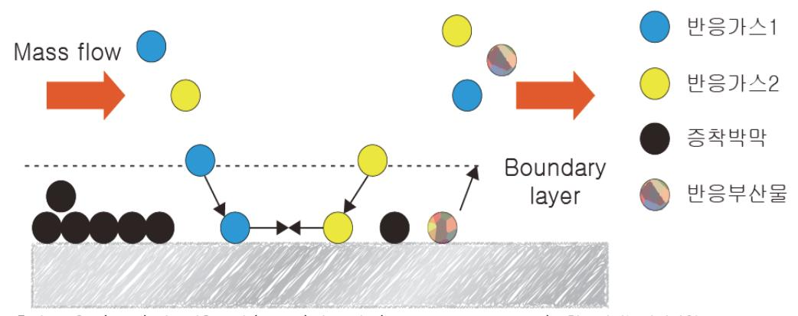

출처: 교육부(2016).반도체용 금속(Target)재료 제조(LM1903060404\_14v1). 한국직업능력개발원. p.43. [그림 3-1] 화학기상증착 메커니즘

- (가) 강제 흐름에 의한 반응기 내부로 반응기체의 확산
- (나) 경계층을 통한 반응기체의 확산
- (다) 확산된 화학종의 기판 표면 흡착
- (라) 표면 화학 반응 → 핵 성장과 막 성장
- (마) 표면 반응 부산물의 탈착
- (바) 반응 부산물이 경계층 밖으로 이동

위의 반응 메커니즘 중 속도가 느린 어느 한 과정 혹은 둘 이상의 과정에 의하여 증 착 속도가 결정된다. 만약 (가), (나), (바)의 과정이 증착 속도를 결정하면 물질 전달 율속 단계(mass transfer limited)이고 (다), (라), (마)의 과정이 증착 속도를 결정하 면 표면 반응 율속 단계(surface reaction limited)이다. 공정에서는 증기압이 충분 히 높은 반응물이 있어야 하고 또한 반응물은 기판표면에서 쉽게 분해됨과 동시에 반응 부산물은 휘발성이 있어야 한다는 등의 공정상의 제한과 반응 메커니즘 규명이 어렵다는 단점이 있다. 그러나 물리적인 증착법과 비교할 때 비교적 높은 증착 속도 및 우수한 층 덮임 (Step coverage)을 얻을 수 있는 큰 장점을 지니고 있다.

(사) 율 속 (Rate Controlling)

한 화학반응이 몇 개의 작은 과정으로 이루어질 때는 그중에서 가장 느린 작은 과정 에 의해 화학 반응속도 전체를 결정하는데 이때의 작은 과정. 예를 들면 용액 내 분 자가 확산하여 충돌하면 반드시 반응하며 그러한 화학반응이 완성되기까지의 시간이 매우 짧은 경우는 분자의 확산속도가 반응속도를 결정하게 된다. 이 경우는 확산이 율속단계가 된다. 이 상황을 확산 율속이라고 표현하기도 한다.

(아) 인자

온도, 압력, 농도, Reactant flux, Residence time, 증착 속도 = A\* exp(-Ea/kT)Pa\*Pb\*\*\*Pn

(자) 질량 전달 제어 (Mass Transport Limit)

반응 온도가 충분히 높아서 표면에서의 반응 속도가 표면으로의 반응 물질 전달 속 도 보다 클 경우에 전체 반응 속도는 반응 물질의 전달 속도가 지배한다. 이 경우 균일한 박막을 얻기 위해서는 챔버 내의 모든 wafer 표면에 반응 물질이 균일하게 전달 될 수 있도록 반응실의 설계가 매우 중요하다.

(차) 표면 반응 제어 (Reaction Rate Limit)

증착 온도가 낮아지면 반응 물질이 표면에 도착하는 속도가 표면에서의 반응 속도보 다 크게 되면 전체 반응 속도는 표면에서의 반응 속도가 지배하게 되는데 이 경우 전체 반응 속도는 온도에 지배되므로 챔버 내의 균일한 온도 제어가 매우 중요하다.

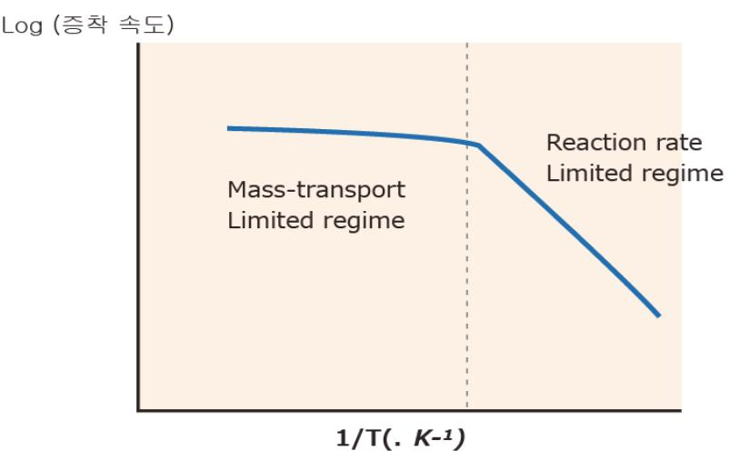

출처: 교육부(2016).반도체용 금속(Target)재료 제조(LM1903060404\_14v1). 한국직업능력개발원. p.44. [그림 3-2] 증착율의 온도 의존성

#### (2) 물리적 증착법 (Physical Deposition)

물리 증착법의 증착 과정은 증착 재료의 증기화, 증기화 된 재료의 기판으로의 이동, 기 판에서의 증착 등 3단계로 이루어지는데 이 과정들이 화학적 반응 없이 이루어지므로 화학 증착법에 대응하여 물리 증착법이라 한다. 이러한 물리 증착법에는 재료를 증기화 시키는 방법에 따라 sputtering, evaporation, ion plating 등 여러 방법이 있는데 이 들 중에서 반도체 소자의 제조공정에서 가장 일반적으로 사용되고 있는 sputtering 방 법에 대하여 설명하고자 한다.

(가) 플라스마(Plasma) 개요

플라스마 상태란 전기적으로 양성 입자, 음성 입자, 그리고 중성 입자들이 전체적으 로 가중성 상태를 유지하고 있는 이온화 된 기 상태를 말하며 고체, 액체, 기체 상태 에 이어 제4의 상태라 일컬어진다. 이러한 플라스마는 전자들의 에너지 밀도에 따라 물리 증착법이나 화학 증착법에서 주로 이용되는 플라스마는 glow discharge 플라 스마이다. 플라스마는 일반적으로 전기장이나 자기장에 의하여 활성화된 기체 분자에 의하여 발생하며, 사용되는 전기장은 직류, 고주파 교류, microwave 등이 이용된다. 플라스마 발생을 위해 가해진 전기장은 음극 (cathode) 전압과 접합 인접 부분에 주 로 전달되는데 이 부분을 cathode sheath라고 하며, cathode sheath 부근의 플라 스마 내에 존재하는 양성 입자는 이러한 sheath potential에 의해 가속되어 cathode를 가격하기 때문에 cathode에서 sputtering 현상이 발생하게 된다.

(나) Sputtering 증착 메커니즘

외부에서 가해진 전압은 저압의 기체(Ar)를 이온화(플라스마화)시켜서 기체 이온을 형성시키며 기체 이온은 sheath potential에 의해서 가속되어 cathode target을 때린다. 기체 이온의 충돌에 의해 target의 원자가 튀어나와 기판(substrate)까지 기 상 이동하여 기판 표면에서 응축, 성장하게 되는데 이 과정이 sputtering 증착 과정 이다. 이러한 sputtering 증착법은 화학 증착법에 비하여 일반적으로 저온 공정이며, 공정 방법이 비교적 단순하다는 장점으로 인하여 현재 소자의 금속 증착법으로 이용 되고 있다. 그러나, 물리적 증착법은 대부분 고진공 하에서 이루어지기 때문에 금속 원자의 평균 자유 경로가 길어지고 증착 온도가 낮아 흡착된 원자의 이동성이 떨어 지며 부착계수가 높다. 이 경우 입사각으로부터 가까워져 있거나 입사각과 평행한 면에는 박막이 거의 증착되지 않는 우수한 층 덮임을 얻기가 어렵다.

(다) Sputtering의 종류

1) DC(Direct Current) Sputtering

가스의 방전으로 챔버 내에 가스를 주입한 상태에서 전류가 흐르는 것이다. 챔버 의 양단(target 및 wafer)에 DC 전압을 인가하고 전압을 서서히 증가시키면, 전 류가 서서히 증가하고 전압이 600V를 넘어서는 순간 전류가 급속히 증가하여 전 압이 증가하지 않아도 전류가 증가한다.

#### 2) Magnetron Sputtering

Target의 뒷면에 영구자석이나 전자석을 배열함으로써 전기장에 의해 Cathode 로부터 방출되는 전자를 Target 바깥으로 형성되는 자기장 내에 국부적으로 모 아 Ar 기체 원자와의 충돌을 촉진시킴으로써 Sputter yield를 높이는 방법이다.

3) Bias Sputtering

Sputter를 진행하기 전 기판에 (-) bias를 걸어주어 기판을 Sputter하는 Sputter etch와 sputtering 하는 동안 Target보다 훨씬 작은 (-) bias를 기판에 걸어주 어 (-) ion과 전자들이 기판과 충돌하는 것을 막는 bias sputter로 나눌 수 있 다. sputter etch(back sputtering)에서는 기판에 –100V ~ - 200V 정도의 RF 또는 DC (-) bias를 걸어주어 Ar+ 이온을 기판에 충돌하게 함으로써 기판의 표 면에 존재하는 불순물 등을 제거한다. bias sputtering에서는 target에 약 – 1 kV 정도, 기판에 –60 ~ -100V 정도의 (-)bias를 걸어주면, Ar+ 이온은 Target 에 충돌하여 sputter 시킨다. 또한, 진공 챔버 중에 존재하는 O-2 이온과 전자 들이 기판에 걸린 (-)bias에 의해 기판에서 멀어지므로 박막 내에 혼입되는 산소 의 양을 감소시킬 수 있다. 일반적으로 박막 제조에서는 산소의 침투가 박막의 산화 등 나쁜 영향을 주기 때문에, 산화되기 쉬운 원소의 sputter (Ta, Mo, Nb, Cr, 등)에서는 bias sputtering이 필수적이다.

4) RF Sputtering

DC Sputtering에서는 Target이 산화물이나 절연체일 경우 Sputtering 되지 않 는다. 이러한 단점은 RF sputtering 함으로써 해결될 수 있으며, 특히 낮은 Ar 압력에서도 플라스마가 유지될 수 있다. RF Sputtering은 금속 이외에도 비금속, 절연체, 산화물, 유전체 등의 sputtering이 가능하며 주로 13.56MHz의 고주파 저원을 사용한다.

(3) 원자층 증착 (ALD: Atomic Layer Deposition)

반도체 제조 공정 중 화학적으로 달라붙는 단원자 층의 현상을 이용한 나노 박막 증착 기술로 기판 표면에서 분자의 흡착과 치환을 번갈아 진행함으로 원자층 두께의 초미세 층간(layer-by-layer) 증착이 가능하고, 산화물과 금속 박막을 최대한 얇게 쌓을 수 있 다.

(4) 무전해 도금 공정

전기도금의 정의는 전기에너지를 이용하여 금속 또는 비금속 소지에 다른 금속의 피막 을 만들어주는 방법이다. 또한, 외부로부터 전기에너지를 공급받아 물리적 또는 화학적 변화를 일으키는 것을 전기 분해(electrolysis)라 하며, 전기분해 시 전해조는 양극 (anode)과 음극(cathode)인 두 전극 (electrode)과 이 두 전극 사이에 존재하는 전해질 (electrolyte)로 구성되어 있다. 즉, 금속의 전기도금은 도금 금속이 용해된 용액에 전도 체 표면이 담긴 상태로 진행되며, 이 전도면은 외부 전원 공급기에 전기적으로 연결되어 있으며 전류는 금속 표면을 통해 용액 속으로 흘러들어 간다. 이렇게 되면 금속이온 (M2+)이 전자(e-)와 반응하여 금속이 만들어지는 원리로 증착이 진행되는 과정이다. 아 래 그림은 전기도금이 진행되는 간략한 개략도를 나타내는 것인데 cathode에서는 metal reduction, H2가 생성되는 반응이 일어나며, anode에서는 metal oxidation, O2가 생성되는 반응이 일어난다. 즉, 백금전극을 전해질인 황산수용액에 넣은 전기분해 를 생각해 보면, electrolytic cell(전해조)에 외부 직류전원으로부터 외부 전기회로인 금 속 도체를 통하여 electron은 한쪽 전극에 흘러들어 가며 반대로 다른 전극으로부터는 전자가 외부 회로로 흘러나온다. 또한, 전해액 중에는 수소이온(H+)과 황산이온(SO42-) 이 이동하여 전하가 운반된다. 전극과 전해액에서는 전극 내의 전자와 전해액 중의 이온 과의 사이에서 전하의 주고받는 반응, 즉 전하 이동 반응(charge transfer reaction)이 진행된다. 즉 그림에서 왼쪽 전극은 외부 회로에서 전자가 들어가고 있다. 이 전극과 전 해액의 계면에서는 들어오는 전자와 용액 중의 수소이온이 반응하여 다음식과 같이 수 소가스가 발생한다. 이 반응은 수소이온이 전하와 결합하는 반응이므로 환원반응이다.

Cathode : Metal Reduction, H2 evolution

$$\begin{array}{l} M2 + 2e^- => M \\ 2H^+ + 2e^- => H_2 \end{array}$$

용액 중에서는 과 SO42-이온이 전하를 운반하나 SO42-이온이 운반되는 전극 쪽에서는 전극과 전해액 계면에서 SO42-이온이 방전되지 않고 물의 해리에 의해 미량으로 생긴 수산이온 OH-가 다음식과 같이 방전하여 전자를 외부 회로에 준다. 전자가 외부로 나 오는 전극, 즉 전극반응이 산화 반응인 전극을 양극(anode)이라 하며, 이와 반대로 전 자가 외부 회로로부터 흘러들어 가는 전극, 즉 전극반응이 환원반응인 전극을 음극 (anode)이라 한다.

## 수행 내용 / 금속 제조 공정별 특징 파악하기

#### 재료·자료

- Metal, Target, Aluminium
- ASTM, ISO, JTS, SEMI, KS 표준화 문서
- ITRS 로드맵 (International Technology Roadmap for Semiconductor)
- 반도체 로드맵
- 반도체 제조 공정도
- 반도체 기술/시장/표준 동향 분석서
- MSDS, RoHS, WEEE(Waste Electrical and Electronic Equipment)
- 시험성적서
- 평가/분석/검증 결과보고서

#### 기기(장비 ・ 공구)

- Metal, Target 물성 분석기
- 전하이동도, 전기저항 측정 장치
- 제조공장 인트라넷
- 컴퓨터, 프린터, 복사기, 문서 작성 프로그램

안전 ・ 유의 사항

- 제조 공정 장비란 제품을 제조하기 위한 장비로서 규정에 따라 관리되어야 하며, 일정 주기 와 방법에 따라 장비 성능이 평가되어야 한다.
- 제조 공정 시 응급상황대처 능력이란, 반도체 금속(Target) 제조 시 돌발적으로 발생하는 불량률의 급증사태를 정상으로 복구하는 능력이다.
- 평가/분석/계측기란 제품의 물성이나 특성을 평가하는 검사를 실시하는 장비로서 규정에 따 라 관리되어야 하며 일정 주기와 방법에 따라 검, 교정을 실시하는 장비를 의미한다.
- 품질관리에서는 통계를 활용한 금속(Target)의 품질 관리를 통하여 불량의 발생 및 불량 원

인을 조사하여 개선함으로써 품질의 균일성(6-시그마)을 확보하여야 한다.

CoA (Certificate of Analysis)는 가스의 순도 및 불순물 등 해당 제품의 품질 및 Specification을 나타낸다.

#### 수행 순서

숔 금속 공정 증착법에 의한 특징을 파악하고 이해한다.

- 1. 금속 공정 증착 기술
  - (1) 화학 기상 증착법(Chemical Vapor Deposition) CVD는 화학 기상 증착의 약자이며 반도체 공정에서 필요한 박막 재료를 구성하고 있는 원 소를 포함하는 일종 또는 그 이상의 화합물을 기체 상태로 외부에서 공급하여 기체 상태 또 는 기판 표면에서의 화학 반응에 의하여 원하는 재료를 형성하는 방법이다.
  - (2) 물리적 증착법 (Physical Deposition)

물리 증착법이란 기판 상부에 증착 재료를 물리적 기구(mechanism)에 의해 증착 시키 는 방법을 일컫는다.

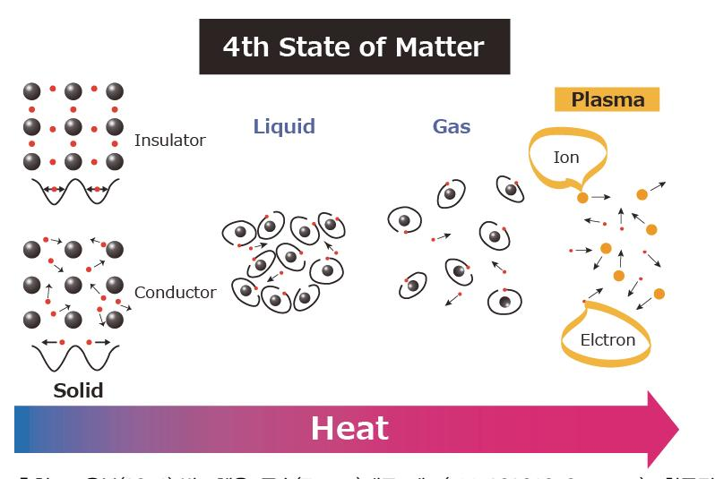

출처: 교육부(2016).반도체용 금속(Target)재료 제조(LM1903060404\_14v1). 한국직업능력개발 원. p.49. [그림 3-3] 플라스마의 모식도

#### (가) 플라스마(Plasma) 개요

플라스마 상태란 [그림 3-4]에 도식적으로 나타내었듯이 전기적으로 양성 입자, 음성 입자, 그리고 중성 입자들이 전체적으로 가중성 상태를 유지하고 있는 이온화 된 기 상태를 말하며 고체, 액체, 기체 상태에 이어 제4의 상태라 일컬어진다.

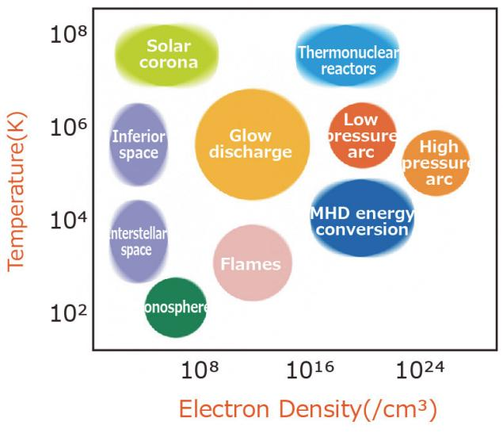

출처: 교육부(2016).반도체용 금속(Target)재료 제조(LM1903060404\_14v1). 한국직업능력 개발원. p.50. [그림 3-4] 플라스마의 종류

(나) Sputtering 증착 기구(Mechanism)

[그림 3-5]에 기본적인 sputtering 증착 기구를 도시하였다.

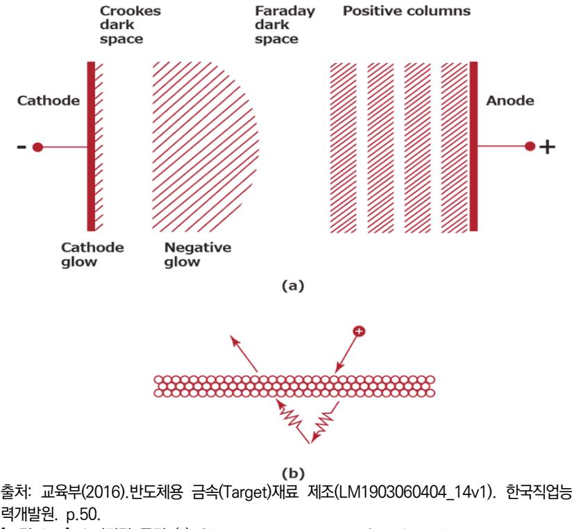

[그림 3-5] 스퍼터링 공정 (a) Characteristic regions of a glow discharge; (b) Momentum transfer through phonon interaction

- (다) Sputtering의 종류
  - 1) DC(Direct Current) Sputtering

가스의 방전(Discharge)이란 용기(chamber)내에 가스를 주입한 상태에서 전류 가 흐르는 것이다.

2) Magnetron Sputtering

Target의 뒷면에 영구자석이나 전자석을 배열함으로써 전기장에 의해 Cathode 로부터 방출되는 전자를 Target 바깥으로 형성되는 자기장 내에 국부적으로 모 아 Ar 기체 원자와의 충돌을 촉진시킴으로써 Sputter yield를 높이는 방법이다.

3) Bias Sputtering

Sputter를 진행하기 전 기판에 (-) bias를 걸어주어 기판을 Sputter하는 Sputter etch와 sputtering 하는 동안 Target보다 훨씬 작은 (-) bias를 기판에 걸어주 어 (-) ion과 전자들이 기판과 충돌하는 것을 막는 bias sputter로 나눌 수 있 다.

4) RF Sputtering

DC Sputtering에서는 Target이 산화물이나 절연체일 경우 Sputtering 되지 않는 다.

(3) 원자층 증착 (ALD: Atomic Layer Deposition)

반도체 제조 공정 중 화학적으로 달라붙는 단원자 층의 현상을 이용한 나노 박막 증착 기술로 기판 표면에서 분자의 흡착과 치환을 번갈아 진행함으로 원자층 두께의 초미세 층간(layer-by-layer) 증착이 가능하고, 산화물과 금속 박막을 최대한 얇게 쌓을 수 있 다.

(4) Electroplating Process

전기도금의 정의는 전기에너지를 이용하여 금속 또는 비금속 소지에 다른 금속의 피막 을 만들어주는 방법이다.

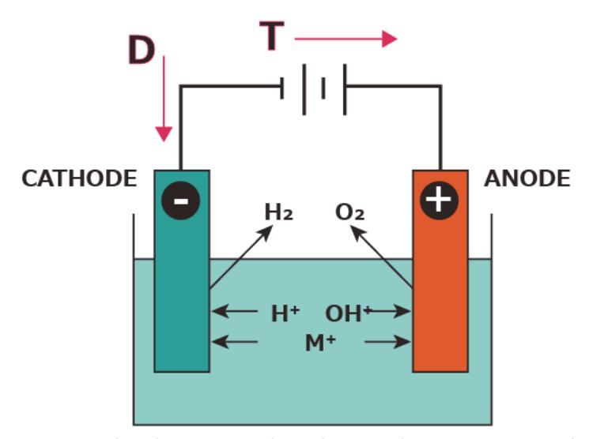

출처: 교육부(2016).반도체용 금속(Target)재료 제조(LM1903060404\_14v1). 한국직업능력개발원. p.51.

[그림 3-6] Electroplating Process

## 3-2. 금속 재료별 공정 도출 및 문제점 해결

학습 목표 • 반도체 금속(Target) 재료별 제조 단계에서 발생한 문제점을 파악하고 해결 방안을 도출할 수 있다.

## 필요 지식 /

#### 숔 금속 제조 공정의 도출된 문제점 및 해결

반도체 금속 공정 원리를 이해하고, 각 공정별 재료에 사용되는 파라미터의 문제점 및 공정을 알아야 한다.

#### 1. 층 덮임(Step coverage)

Sputtering 공정에 의한 Al 합금이나 Ti, TiN 등의 금속 박막 증착 시 장점으로는 박막의 두께 균일도(uniformity) 우수성과 높은 접착성 등을 들 수 있으나 가장 큰 문제점 중의 하나로서 열악한 step coverage를 들 수 있다. Step coverage 은 contact의 topology와 금속 재료의 종류 등에 따라서 차이가 큰데, Al 합금의 경우는 Al 원자들의 Ar 이온들과의 충돌에 의한 scattering 현상과 contact 모서리에서 발생하는 그림자 효과(shadow effect) 등에 의하여 TiW이나 TiN 보다도 상대적으로 단차 Step coverage가 열악하다. Step coverage를 극복하기 위하여 다음의 여러 가지 sputtering 기술이 응용되고 있다.

#### (1) 고온(High Temperature) Sputtering

저온에서 Al 합금을 일정 두께(전체 목표치 두께의 반 정도 증착하여 Contact 측벽에 Al 합금이 연속적으로 연결되도록 한 후 연속하여 고온에서 (약 450℃ 이상의 온도) Al 합금을 증착하여 Contact가 Al 합금으로 완전히 매립하는 기술이다. 단차 피복성을 더 욱 향상시키기 위하여 저온 Al 합금의 증착 이전에 Ti을 약 500Å정도로 얇게 증착하여 TiAl3 등의 새로운 합금을 생성하는 기술이 현재 보편적이다.

(2) 집속(Collimated) Sputtering

Target과 기판 사이에 벌집 모양의 장치(Collimator)를 설치하여 Sputter된 원자들의 Flux 방향성을 비교적 일정하게 유지하여 Contact 바닥면에서의 단차 Step coverage 가 향상된다.

(3) 이온화(Ionized) Sputtering

Sputter된 원자들이 활성화(Activation)되어 이온 상태로 되며, 기판 방향으로 음극 전 압이 인가되어 이온들의 방향성을 기판과 수직이 되게끔 유도하여 단차 Step coverage 를 향상 시킨다.

(4) 고압(High Pressure) Sputtering

저온에서 Al 합금을 증착 후 또 다른 챔버에서 약 400℃ 이상의 온도에서 70 Mpa 정 도의 고압으로 압력을 가하여 강제적으로 Al 결정립들이 Contact 바닥 방향으로 이동 하도록 한다.

(5) Long Through Sputtering

Target과 기판과의 간격을 30∼40㎝로 아주 길게 하여 Sputter된 원자들의 평균 자유 행정(Mean Free Path)이 길어지도록 하여 증착된 금속 박막의 단차 Step coverage를 향상시킨다.

2. W(텅스텐) volcano

CVD 텅스텐 공정에서 텅스텐 박막의 스트레스 조절은 매우 중요하며 만약 박막의 스트레 스가 너무 높다라면 박막이 peeling 되어 소자 특성 열화를 유발한다. 또한, 증착 초기 과 도한 WF6 도입이나 확산 방지막(TiN) 열화는 확산 방지막의 하지 층인 Ti와 WF6의 F과 반응하여 화산 폭발 형태의 volcano 현상을 유발한다.

#### 숕 반도체 표준 규격 및 산업 폐기물 관리 지침

반도체 표준 규격에 맞게 금속 제조 공정별 재료들의 선정과 산업 폐기물 관리 지침에 의해 정 의되어야 한다.

- 1. 반도체 표준 규격
  - (1) SEMI (Semiconductor Equipment and Materials International)

SEMI는 세계 반도체 장비 재료, 디스플레이, 태양광, 미세전자 산업 협회이다. 세계 2,100여 개 회원사를 두고 있으며, 11개 해외 지역 사무소를 운영하고 있다. 주요업무 는 국제 표준 제정, 환경, 해외 비지니스 지원, 시장 및 산업 정보 제공, 전시회 및 컨 퍼런스 운영 등이다. SEMI는 1970년에 미국 마운틴 뷰에서 설립되었고, 현재 1,000억 달러 시장규모의 세계 반도체 장비, 재료 산업 및 평판 디스플레이(FPD) 산업을 대표하 는 세계 유일의 국제 협회이다.

(가) 대상 분야

반도체 장비 재료, 디스플레이, 태양광 등

(나) 주요 역할

표준규격 제정, 마켓자료 발행, 중소기업 해외 진출 지원 등

(다) 표준화 대상

표준규격 제정, 마켓자료 발행, 중소기업 해외 진출 지원 등

1) 가스

벌크가스, 특성가스, 구성요소, 가스분포 시스템에 대한 표준을 제정한다. 이 기

술 위원회는 가스와 재료를 담고 수송하기 위해 사용되는 가스 및 재료를 평가하 기 위한 분석방법과 벌크가스, 특성가스, 재료를 수송하기 위해 사용되는 것들에 대한 요구사항 및 오염과 연관된 이슈 및 분석방법 그리고 가스 분포시스템과 구 성요소에 대한 성능 요구사항 그리고 하부 시스템 및 구성요소에 대한 물리적 인 터페이스 요구사항을 대상으로 한다. 또한, 정의, 사용, 핸들링, 설치에 대한 가이 드도 제시한다.

2) 액체 화학가스

다음과 같은 액체 화학약품 및 액체 화학 분포와 연관된 표준을 제정한다. 이 기 술위원회에서는 담고, 수송하기 위해 사용되는 액체 화학약품 및 재료를 평가하 기 위한 분석방법, 수송하는데 사용하는 액체 화학약품과 재료에 대한 요구사항 및 가이드라인, 액체 화학분포 시스템 및 구성요소에 대한 성능 요구사항, 하부 시스템과 구성요소에 대한 물리적 인터페이스 요구사항, 그리고 정의, 사용, 핸들 링, 설치에 대한 가이드를 제시한다.

- 2. 산업 폐기물 관리 지침
  - (1) 폐기물 관리 지침
    - (가) 적용범위

당사의 사업 활동으로 인하여 발생하는 폐기물에 대한 관리체계 및 그 운영에 관하여 적용한다.

(나) 목적

환경에 영향을 미치는 폐기물을 적절하게 처리하여 자연환경 및 생활환경을 청결히 하 고 폐기물 처리 기준을 설정하여 실천하면 직원과 지역주민이 쾌적한 환경 아래에서 생 활하도록 함에 그 목적이 있다.

- (다) 용어의 정의
  - 1) 폐기물

쓰레기 ․ 연소재 ․ 오니 ․ 폐유 ․ 폐산 ․ 폐알칼리 ․ 동물의 사체 등을 사람의 생활 이나 사업 활동에 필요하지 아니하게 된 물질이다.

2) 생활폐기물

사업장폐기물 외의 폐기물이다.

3) 사업장폐기물

대기환경 보전법 ․ 수질환경보전법 또는 소음 ․ 진동규제법의 규정에 의하여 배출 시설을 설치 ․ 운영하는 사업장, 지정폐기물을 배출하는 사업장, 폐기물을 평균 30kg/일 이상 배출하는 사업장, 폐기물을 1 Ton/1회 또는 1Ton/1주 이상 배출 사는 사업장에서 배출되는 폐기물이다.

4) 지정폐기물

사업장폐기물 중 폐유 ․ 폐산 등 주변 환경을 오염시킬 수 있는 유해한 물질로서 폐 산, 폐알카리, 폐유, 폐유기용제, 폐합성 고분자화합물, 폐석면, 광재, 분진, 폐주물 사 및 샌드블라스트폐사, 폐내화물 및 재벌구이 전에 시유 된 도자기 편류, 소각 잔 재물, 안정화 또는 고형화처리물, 폐촉매, 폐흡착제 및 폐흡수제, 폐농약, 폴리 클로 리네이티드비 페닐함유, 폐기물(액상), 오니, 기타 주변 환경을 오염시킬 수 있는 유 해한 물질로서 환경부 장관이 지정 ․ 고시하는 물질이다.

5) 처리

폐기물의 소각 ․ 중화 ․ 파쇄 ․ 고형화 등에 의한 중간처리와 매립 ․ 해역 배출 등에 의한 최종처리를 말한다.

6) 재활용

폐기물을 재생하거나 재이용하는 것을 말한다.

- (라) 환경관리 기준(환경목표) 및 배출허용기준
  - 1) 폐기물 관리법의 폐기물의 수집, 운반, 보관, 처리에 구체적 기준 및 방법에 의하여 관리한다.
  - 2) 당사의 환경목표는 궁극적으로 폐기물을 매년 10% 감축하는데 있다.
- (마) 관리절차
  - 1) 어떠한 폐기물(SCRAP, 폐통, 기타 환경오염유발물질)도 폐기물 보관장 이외의 투기 및 방치를 금한다.
  - 2) 해당 팀장은 폐기물을 지정된 장소에 종류별로 구분하여 보관한다.
  - 3) 폐기물은 장소에 따라 다음과 같이 구분 분리하며, 분리수거를 철저히 한다.
  - 4) 폐유, 기름걸레 등 주변 환경을 오염시킬 수 있는 물질은 우수나 OPEN DITCH로 누출되지 않도록 보관한다.
  - 5) 재활용 가능 폐기물은 발생원에서 분리, 보관하여야 한다.
  - 6) 혼합 보관 및 현장 보관에 관한 관리책임은 발생 팀에 있다.
  - 7) 일회용 자재의 사용을 지양한다.
  - 8) 마대 등 내용물이 보이지 않는 폐기물은 발생 폐기물명, 발생부서를 표시하여 보관 한다.
  - 9) 폐기물이 혼합, 보관되지 않도록 한다.
  - 10) 자재 반입 시 포장재 및 포장 폐기물은 납품자가 전량수거 회수토록 한다.
  - 11) 공장 내에서는 작업종료 10분 전에는 주변 청소를 실시하여 깨끗하고 안전한 환경 에서 작업할 수 있도록 하여야 한다.
- (바) 운반
  - 1) 폐유 등 드럼으로 발생된 폐기물은 발생 팀에서 지정된 장소에 따로 보관한다.
  - 2) 운반 시 폐기물이 흩날리거나, 흘러나오거나, 악취가 발생하거나, 오수가 흘러나오지

않도록 조치하여야 한다.

(사) 보관

- 1) 수거한 폐기물은 집하장에 종류별로 구분하여 보관한다.
- 2) 재활용 가능 폐기물은 분리, 보관한다.
- 3) 폐기물을 보관할 때에는 비산, 유출, 지하침투 및 악취가 발생하지 않도록 한다.
- 4) 액체 또는 유동성 폐기물을 보관할 때에는 전용 탱크 또는 용기를 사용하고 혼합 등에 따라 생기는 위험을 피할 것.
- 5) 폐기물의 보관 장소는 파리, 모기 등 해로운 벌레에 의한 보건 위생상의 위해가 발 생하지 않도록 필요한 조치를 할 것.
- 6) 기타 보관방법은 폐기물 관리법에 따른다.
- (아) 최종처리 및 재활용
  - 1) 일반폐기물과 지정 폐기물 혼합처리 금지
  - 2) 집하장에 장기 적체되는 일이 없도록 자가 및 위탁 처리하여야 한다.
  - 3) 재활용 가능 자원은 최대한 재활용하여야 한다.
  - 4) 일반폐기물의 경우 관할 시청에 300kg/일 이상 또는 1톤/1회 이상 발생 시 신고하 여야 한다.
  - 5) 위탁 처리 시에는 업체의 처리능력 등을 감안하여 적법하게 선정한다.
  - 6) 폐기물 처리업체에 대하여는 협력업체 평가 절차서(KNAL-QP-6-2)에 따라 사전, 사후 관리하여야 한다.

## 수행 내용 / 금속 재료별 공정 도출 및 문제점 해결하기

#### 재료·자료

- Metal, Target, Aluminium
- 작업절차서 및 작업 표준서
- ASTM, ISO, JTS, SEMI, KS 표준화 문서
- ITRS 로드맵 (International Technology Roadmap for Semiconductor)
- 반도체 로드맵
- 반도체 제조 공정도
- 제조 설비 점검기록서
- 설비 및 장비 리스트
- MSDS, RoHS, WEEE(Waste Electrical and Electronic Equipment)
- 평가 분석 방법론
- 시험성적서
- 평가/분석/검증 결과보고서

기기(장비 ・ 공구)

- Metal, Target 물성 분석기
- 전하이동도, 전기 저항 측정 장치
- 제조공장 인트라넷
- 컴퓨터, 프린터, 복사기, 문서 작성 프로그램

#### 안전 ・ 유의 사항

- 제조 공정 장비란 제품을 제조하기 위한 장비로서 규정에 따라 관리되어야 하며, 일정 주기 와 방법에 따라 장비 성능이 평가되어야 한다.
- 제조 공정 시 응급상황대처 능력이란, 반도체 금속(Target) 제조 시 돌발적으로 발생하는

불량률의 급증사태를 정상으로 복구하는 능력이다.

- 평가/분석/계측기란 제품의 물성이나 특성을 평가하는 검사를 실시하는 장비로서 규정에 따 라 관리되어야 하며 일정 주기와 방법에 따라 검, 교정을 실시하는 장비를 의미한다.
- 작업표준에는 공정순서 및 조건(온도, 시간, 환경)을 포함한다.
- 작업 절차서는 생산을 끝마치기까지의 절차, 순서를 체계적으로 작성한 생산행위의 계획서 로서, 생산을 바르게 실시할 목적으로 생산을 위한 절차와 생산에 사용하는 재료, 장치의 준 비 및 사용방법, 그리고 생산을 실시하는데 필요한 주의사항을 나타내는 문서이다.
- 품질관리에서는 통계를 활용한 금속(Target)의 품질 관리를 통하여 불량의 발생 및 불량 원 인을 조사하여 개선함으로써 품질의 균일성(6-시그마)을 확보하여야 한다.
- CoA (Certificate of Analysis)는 가스의 순도 및 불순물 등 해당 제품의 품질 및 Specification을 나타낸다.

#### 수행 순서

숔 금속 제조 공정의 도출된 문제점 및 해결방안을 파악한다.

1. 층 덮임(Step coverage)

Step coverage 은 contact의 topology와 금속 재료의 종류 등에 따라서 차이가 큰데, Al 합금의 경우는 Al 원자들의 Ar 이온들과의 충돌에 의한 scattering 현상과 contact 모서리 에서 발생하는 것이다.

(1) 고온(High Temperature) Sputtering

저온에서 Al 합금을 일정 두께(전체 목표치 두께의 반 정도) 증착하여 Contact 측벽에 Al 합금이 연속적으로 연결되도록 한 후 연속하여 고온에서(약 450℃ 이상의 온도) Al 합금을 증착하여 Contact가 Al 합금으로 완전히 매립 [그림 3-7] (a)와 (b)) 되도록 하 는 기술이다.

(2) 집속(Collimated) Sputtering

Target과 기판 사이에 벌집 모양의 장치(Collimator)를 설치하여 Sputter된 원자들의 Flux 방향성을 비교적 일정하게 유지하여 Contact 바닥면에서의 단차 Step coverage 가 향상된다.

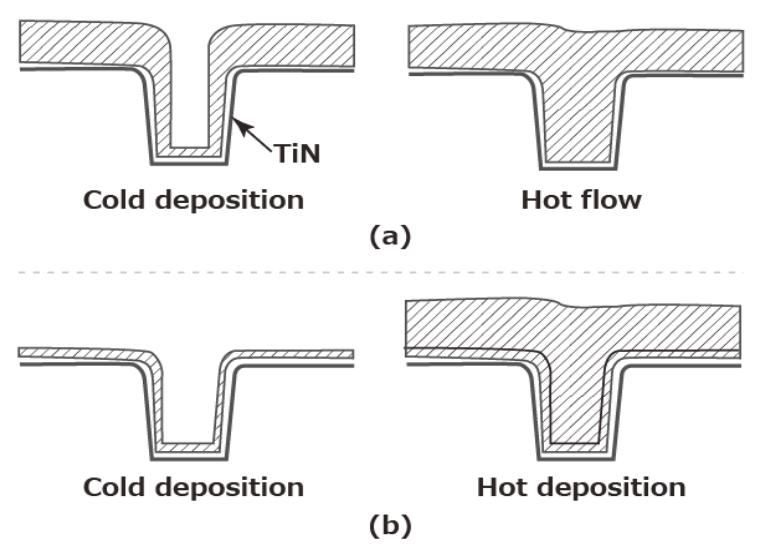

출처: 교육부(2016).반도체용 금속(Target)재료 제조(LM1903060404\_14v1). 한국직업능력개발원. p.59.

[그림 3-7] (a)와 (b) Reflow Al plug processes

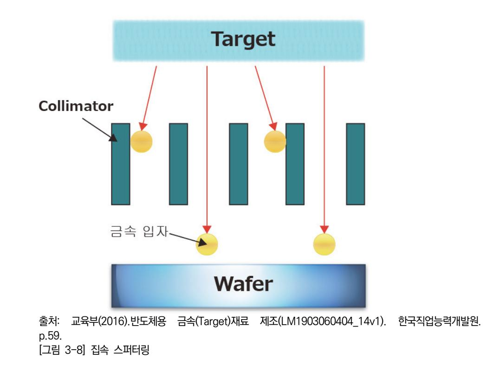

#### (3) 이온화(Ionized) Sputtering

Sputter된 원자들이 활성화(Activation)되어 이온 상태로 되며, 기판 방향으로 음극 전 압이 인가되어 이온들의 방향성을 기판과 수직이 되게끔 유도하여 단차 Step coverage 를 향상 시킨다.

#### (4) 고압(High Pressure) Sputtering

저온에서 Al 합금을 증착 후 또 다른 챔버 안에서 약 400℃ 이상의 온도에서 70Mpa 정도의 고압으로 압력을 가하여 강제적으로 Al 결정시키는 것이다.

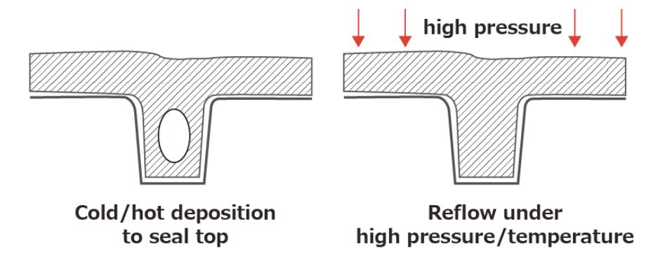

출처: 교육부(2016).반도체용 금속(Target)재료 제조(LM1903060404\_14v1). 한국직업능력개발원. p.60. [그림 3-9] High Pressure Reflow

(5) Long Through Sputtering

Target과 기판과의 간격을 30∼40㎝로 아주 길게 하여 Sputter된 원자들의 평균 자유 행정이 길어지도록 하여 증착된 금속 박막의 단차 Step coverage 를 향상시킨다.

2. W(텅스텐) volcano

CVD 텅스텐 공정에서 텅스텐 박막의 스트레스 조절은 매우 중요하며 만약 박막의 스트레 스가 너무 높다라면 박막이 peeling 되어 소자 특성 열화를 유발한다.

- (1) 원인 : 과도한 Ti + WF6 →TiF3(volatile) + W
- (2) 해결 : TiN 박막 밀도 강화 및 Step coverage 개선

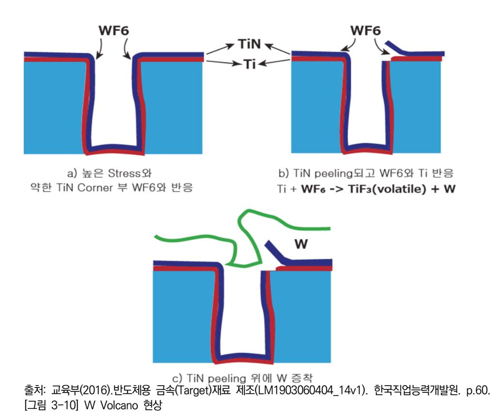

숕 반도체 표준 규격 및 산업 폐기물 관리 지침을 파악하여 이해하고 행동한다.

#### 1. 반도체 표준 규격

- (1) SEMI (Semiconductor Equipment and Materials International) SEMI는 1970년에 미국 마운틴 뷰에서 설립되었고, 현재 1,000억 달러 시장규모의 세계 반도체 장비, 재료 산업 및 평판 디스플레이(FPD) 산업을 대표하는 세계 유일의 국제 협회 이다.
  - (가) 대상 분야

반도체 장비 재료, 디스플레이, 태양광 등

(나) 주요 역할

표준규격 제정, 마켓자료 발행, 중소기업 해외 진출 지원 등

(다) 표준화 대상

표준규격 제정, 마켓자료 발행, 중소기업 해외 진출 지원 등

1) 가스

벌크가스, 특성가스, 구성요소, 가스분포 시스템에 대한 표준을 제정한다.

2) 액체 화학가스

다음과 같은 액체 화학약품 및 액체 화학 분포와 연관된 표준을 제정한다.

2. 산업 폐기물 관리 지침

- (1) 폐기물 관리 지침
  - (가) 적용범위

당사의 사업 활동으로 인하여 발생하는 폐기물에 대한 관리체계 및 그 운영에 관하 여 적용한다.

(나) 목적

환경에 영향을 미치는 폐기물을 적절하게 처리하여 자연환경 및 생활환경을 청결히 하고 폐기물 처리 기준을 설정하여 실천하면 직원과 지역주민이 쾌적한 환경 아래에 서 생활하도록 함에 그 목적이 있다. 환경관리 기준(환경목표), 배출허용기준, 관리절 차, 운반, 보관, 최종처리 및 재활용을 통해 정확하게 관리되어야 한다.

(다) 용어의 정의

폐기물, 생활폐기물, 사업장폐기물, 지정폐기물, 처리, 재활용 등을 이해하고 정의 하 여 활용하여야 한다.

### 학습 3 교수·학습 방법

#### 교수 방법

- 반도체 금속 재료 제조공정을 쉽게 설명한다.
- 교수 주도로 현장에서 표준화한 공정 매뉴얼과 관련 공정 재료에서 제공되는 자료 등의 내 용을 PPT 자료로 제시한 후에 설명한다.
- 가능한 한 사전에 제조 현장에서 사용하는 사례를 수집하여 자료를 준비하고 이해하기 쉬운 방법을 논의하는 방식의 문제 해결식 수업을 한다.
- 관련 시장 환경 및 기술 변화를 통합 검색 사이트나 한국반도체산업협회의 홈페이지 (www.ksia.or.kr) 등에서 찾아 활용할 수 있도록 지도한다.
- 반도체 금속재료 요구사항에 필요한 내용을 확인하고, 관련 자료를 확보해 학생들에게 제시 후 파악 여부를 확인한다.

#### 학습 방법

- 반도체 산업 현황(시장 환경 및 기술 동향 등)과 관련 기관을 구체적으로 확인하도록 하고, 이 기관과 관련된 다양한 자료를 인터넷으로 검색하고 분류하여 문서로 정리한다.
- 반도체용 금속 재료 요구사항 항목이 선정된 양식에 맞추어 특정 소자에 대한 요구사항을 작성해 본 후, 여기에 첨부되는 자료의 종류와 기록 내용 전반을 숙지하고, 가능하다면 소자 별로 분류해 본다.
- 반도체용 금속 재료 요구사항에 대한 시장 및 기술, 비용의 조사, 수집 및 분석을 통해 생 산에 필요한 목표를 설정하고 분류된 자료를 활용하여 생산 가능성을 예측해 본다.
- 생산 시 예상되는 품질관리 문제점을 파악하고 해결책을 수립하는 현장의 업무를 이해하고, 정해진 양식에 따라 보고서를 작성해 본다.

## 학습 3 평 가

#### 평가 준거

• 평가자는 학습자가 학습 목표를 성공적으로 달성하였는지를 평가해야 한다.

#### • 평가자는 다음 사항을 평가해야 한다.

|                             | 학습 목표                                                   |  | 성취수준 |   |  |
|-----------------------------|---------------------------------------------------------|--|------|---|--|
| 학습 내용                       |                                                         |  | 중    | 하 |  |
| 금속 제조 공정별 특징 파악          | - 반도체 금속(Target)의 제조 공정별 장점과 단점을 파악할 수 있다.           |  |      |   |  |
|                             | - 반도체 금속(Target) 재료별 제조(공정/장비) 파라미터를 파 악하고 적용할 수 있다. |  |      |   |  |
| 금속 재료별 공정 도출 및 문제점 해결 | - 반도체 금속 재료별 제조 공정의 도출된 문제점에 대한 해 결방안을 제시할 수 있다.     |  |      |   |  |

#### 평가 방법

• 서술형 시험

|                             | 평가 항목                          |  | 성취수준 |   |  |
|-----------------------------|--------------------------------|--|------|---|--|
| 학습 내용                       |                                |  | 중    | 하 |  |
| 금속 제조 공정별 특징 파악          | - 반도체 금속 제조 공정 장점과 단점 서술       |  |      |   |  |
|                             | - 반도체 금속 재료별 제조(공정/장비) 파라미터 서술 |  |      |   |  |
| 금속 재료별 공정 도출 및 문제점 해결 | - 반도체 금속 재료별 제조 공정 문제점 해결방안 서술 |  |      |   |  |

• 사례 연구

|                                                        |                              | 성취수준 |   |   |
|--------------------------------------------------------|------------------------------|------|---|---|
| 학습 내용                                                  | 평가 항목                        |      | 중 | 하 |
| 금속 제조 공정별 특징 파악                                     | - 제조 공정 장점과 단점을 확인하여 제시      |      |   |   |
|                                                        | - 재료별 제조(공정/장비) 파라미터 설정하여 제시 |      |   |   |
| 금속 재료별 공정 - 재료별 제조 공정 문제점 해결방안 제시 도출 및 문제점 해결 |                              |      |   |   |

• 구두 발표

|                             | 평가 항목                      | 성취수준 |   |   |
|-----------------------------|----------------------------|------|---|---|
| 학습 내용                       |                            | 상    | 중 | 하 |
| 금속 제조 공정별 특징 파악          | - 금속 제조 공정 장점과 단점 파악하여 발표  |      |   |   |
|                             | - 금속 재료별 제조(공정/장비) 파라미터 발표 |      |   |   |
| 금속 재료별 공정 도출 및 문제점 해결 | - 금속 재료별 제조 공정 문제점 제시 후 발표 |      |   |   |

피드백

- 1. 서술형 시험
- 평가 결과에 대한 일정 점수 누락에 해당하는 학생은 재평가를 통하여 학습을 이수할 수 있도록 지도한다.
- 2. 사례 연구
- 학습한 내용이 효과적으로 전달되지 않은 경우에는 발표방법에 대한 추가 지도를 수행한다.
- 3. 구두 발표
- 반도체 금속 공정이 필요한 이유를 질문하고 부족한 부분에 대해 보완하도록 한다.
- 금속 증착법의 종류에 대한 질문을 하고 부족한 부분에 대해 보완하도록 한다.
- 반도체 금속재료 종류에 대한 질문을 하고 미비한 부분에 대해 보완하도록 한다.
- 금속 재료의 품질을 확보하기 위한 방법을 질문하고 미비한 부분은 보완하도록 한다.

- ∙ 교육부(2016). 반도체용 금속(Target)재료 제조(LM1903060404\_14v1). 한국직업능력개발원.
- ∙ 국제반도체장비재료협회(2003). 반도체 재료 시장. http://www.semi.org/ko/node/8821에서 2016.07.22. 검색.
- ∙ 김우철 외 9명 저 (2006). 『통계학 개론』. 영지문화사.
- ∙ 김학동(2013). 『반도체 재료』. 홍릉과학출판사.
- ∙ 박문수, 김봉식, 이대수, 이진국 (2003).『고분자화학 입문』. 자유아카데미.
- ∙ 신판우, 조승래 (2011).『유기공업화학』. 보성문화사.
- ∙ 심용대·장영대(2006). 『품질검사기초』. 중소기업진흥공단 중소기업연수원.
- ∙ 염근영 저 (2012). 『플라스마 식각 기술』. 도서출판 YOUNG.
- ∙ 윤영섭, 강성준 저 (2012). 『VLSI 공정기술』. 홍릉과학출판사.
- ∙ 이순룡 저 (2002) 『현대품질경영』. 도서출판 법문사.
- ∙ 전야창홍 저 (2002). 『생활속의 통계분석』. 윤병창 역. ㈜북스힐.
- ∙ 채재우(2010). 『소재기술백서2010』. 재료연구소.
- ∙ 한국반도체산업협회(2006). 『반도체재료기술 로드맵 조사·연구보고서』. 한국반도체산업협회.
- ∙ 화학정보센터(2011). 『2011 일본 화학산업 동향 <반도체용 화합물 산업>』. 한구화학연구원.
- ∙ 황호정 저 (2003).『반도체 공정기술』. 생능출판사.
- ∙ James E. Brady, Neil D. Jespersen, Alison Hyslop (2013).『일반화학 (Chemistry : The Molecular Nature of Matter, Sixth Edition)』. 일반화학교재연구회. 자유아카데미.
- ∙ Michael Quirk, Julian Serda 원저 (2013). 『반도체 소자 공정기술』. 최성재 역. 자유아카데미.
- ∙ S. Wolf, R.N. Tauber (20008).『Silicon Processing for the VLSI Era』. Lattice Press.
- ∙ William Beown, Thomas Poon (2011).『유기화학 입문(Introduction to Organic Chemistry)』. 유기화학교재연구회. 자유아카데미.

## 용어정리

- 6-시그마란 제품의 품질관리를 위한 통계적 접근방법으로서 품질관리에 필요한 모든 요소를 논리적으로 관리하고, 발생 가능한 오류를 최소화하기 위한 관리기법이다.
- 표준분석법이란 ASTM, JIS, ISO, SEMI, KS와 같은 상호 공인 또는 사내의 표준분석법을 뜻하며, 전처리, 용량, 분석기기, 분석방법을 자세히 규정한 분석법을 말한다.
- ASTM(American Society for Testing and Materials : 미국재료시험협회)란 미국의 재료 규격 및 재료 시험에 관한 기준을 정하는 기관으로 표준화와 연구업무의 추진을 목적으로 한다.
- ISO(International Standardization Organization : 국제표준화기구)란 국제간에 이용되 는 규격으로 각국의 공업규격을 조정·통일하고, 물자와 서비스의 국제적 교류를 유도하며, 과학적·지적·경제적 활동 분야의 협력을 증진하는 것을 목적으로 한다.
- JIS(Japanese Industrial Standards : 일본 공업 규격)란 일본에서 사용되는 국가 기술 표 준으로, 많은 분야의 공업제품에 관한 규격이 제정되었다. 국제규격으로 ISO, IEC와 제휴되 어 있다.
- SEMI(Semiconductor Equipment and Material Institute)란 반도체 제조 장비 재료 협 회로서 케미컬(C), 제조 장치(하드, 소프트(E)), 재료(M), 그리고 패키징(G), 마이크로 패터닝 (P) 및 안전성 부회에서 SEMI International Standards를 간행하고 있다.
- KS(Korean Industrial Standards : 한국 공업 규격)란 공업 표준화를 위해 제정된 공업 규격을 보급ㆍ활용하여 제품의 품질 개선과 생산능률의 향상, 거래의 단순화와 공정화의 도 모 및 소비자 보호를 위해 만들어진 제도를 말한다.
- RoHS(Restriction of the use of Hazardous Substances in EEE)란 전기전자제품에 납, 카드뮴, 수은, 크롬, 난연제(PBBs, PBDEs)와 같은 유해물질 사용을 제한하는 유해물질사용 제한지침을 말한다.
- WEEE(Waste Electrical and Electronic Equipment)란 폐가전제품의 의무재활용에 관한 규제로서 폐전기 전자제품의 재활용 비용을 생산자가 부담하는 제도를 말한다.
- MSDS(Material Safety Data Sheet)란 화학물질을 안전하게 사용하고 관리하기 위하여 필

요한 정보를 기재한 Sheet로서 제조자명, 제품명, 성분과 성질, 취급상의 주의, 적용법규, 사고시의 응급처치방법 등이 기입되어 있는 Data Sheet를 말한다.

| NCS학습모듈 개발이력 |                                         |     |                |
|--------------|-----------------------------------------|-----|----------------|
| 발행일          | 2016년 12월 31일                           |     |                |
| 세분류명         | 반도체재료(19030604)                         |     |                |
| 개발기관         | 대덕대학교, 한국직업능력연구원                        |     |                |
|              | 김관하(대덕대학교)*                             |     | 권기백(대덕대학교)     |
|              | 강필승(메그나칩반도체)                            |     | 김동표(케이디전자)     |
|              | 김상용(한국폴리텍대학)                            |     | 박태진(대덕대학교)     |
|              | 김종식(드림테크)                               |     | 여순일(한국전자통신연구원) |
|              | 양민철(서울공업고등학교)                           |     | 정용철(한국생산기술연구원) |
| 집필진          | 우종창(이너센서)                               | 검토진 |                |
|              | 이병철(비드앤마이크로)                            |     |                |
|              | 장현경(강원대학교)                              |     |                |
|              | 정재복(메이플테크)                              |     |                |
|              | 제창한(한국전자통신연구원)                          |     |                |
|              | 홍진균((前) LG실트론)                          |     | *표시는 대표집필자임    |
| 발행일          | 2024년 12월 31일                           |     |                |
| 학습모듈명        | 반도체용 금속(Target)재료 제조(LM1903060404_23v3) |     |                |
| 개발기관         | 수원과학대학교 산학협력단(개발책임자: 김선희), 한국직업능력연구원    |     |                |

| 반도체용 금속(Target)재료 제조(LM1903060404_23v3)                                                                  |               |  |
|----------------------------------------------------------------------------------------------------------|---------------|--|
| 저작권자                                                                                                     | 교육부           |  |
| 연구기관                                                                                                     | 한국직업능력연구원     |  |
| 발행일                                                                                                      | 2024. 12. 31. |  |
| ※ 이 학습모듈은 자격기본법 시행령(제8조 국가직무능력표준의 활용)에 의거하여 개발하였으며, NCS통합포털사이트(http://www.ncs.go.kr)에서 다운로드 할 수 있습니다. |               |  |

