# NCS학습모듈 반도체용 패키지 재료 제조

LM1903060406\_20v2

### [NCS학습모듈 활용 시 유의 사항]

- 1. NCS학습모듈은 교육훈련기관에서 출처를 명시하고 교육적 목적으로 활용할 수 있습니다. 다 만, NCS학습모듈에는 국가(교육부)가 저작재산권 일체를 보유하지 않은 저작물(출처가 표기된 도표‧사진‧삽화‧도면 등)이 포함되어 있으므로, 이러한 저작물의 변형‧각색‧복제‧공연‧ 배포 및 공중 송신 등과 이러한 저작물을 활용한 2차적 저작물을 작성하려면 반드시 원작자 의 동의를 받아야 합니다.
- 2. NCS학습모듈은 개발 당시의 산업 및 교육 현장을 반영하여 집필하였으므로, 현재 적용되는 법령‧지침‧표준 및 교과 내용 등과 차이가 있을 수 있습니다. NCS학습모듈 활용 시 법령 ‧지침‧표준 및 교과 내용의 개정 사항과 통계의 최신성 등을 확인하시기를 바랍니다.
- 3. NCS학습모듈은 산업 현장에서 요구되는 능력을 교육훈련기관에서 학습할 수 있게 구성한 자 료입니다. 다만, NCS학습모듈 지면의 한계상 대표적 예시(예: 활용도 또는 범용성이 높은 제 품, 서비스) 중심으로 집필하였음을 이해하시기를 바랍니다.

### NCS학습모듈의 이해

※ 본 NCS학습모듈은 「NCS 국가직무능력표준」사이트(http://www.ncs.go.kr) 에서 확인 및 다운로드할 수 있습니다.

### Ⅰ NCS학습모듈이란?

- 국가직무능력표준(NCS: National Competency Standards)이란 산업현장에서 직무를 수행하기 위해 요구되는 지식·기술·소양 등의 내용을 국가가 산업부문별·수준별로 체계 화한 것으로 산업현장의 직무를 성공적으로 수행하기 위해 필요한 능력(지식, 기술, 태도) 을 국가적 차원에서 표준화한 것을 의미합니다.
- 국가직무능력표준(이하 NCS)이 현장의 '직무 요구서'라고 한다면, NCS학습모듈은 NCS
  의 능력단위를 교육훈련에서 학습할 수 있도록 구성한 '교수·학습 자료'입니다. NCS학습
  모듈은 구체적 직무를 학습할 수 있도록 이론 및 실습과 관련된 내용을 상세하게 제시하
  고 있습니다.

### ○ NCS학습모듈은 다음과 같은 특징을 가지고 있습니다.

- 첫째, NCS학습모듈은 산업계에서 요구하는 직무능력을 교육훈련 현장에 활용할 수 있도 록 성취목표와 학습의 방향을 명확히 제시하는 가이드라인의 역할을 합니다.
- 둘째, NCS학습모듈은 특성화고, 마이스터고, 전문대학, 4년제 대학교의 교육기관 및 훈 련기관, 직장교육기관 등에서 표준교재로 활용할 수 있으며 교육과정 개편 시에도 유용하게 참고할 수 있습니다.

○ NCS와 NCS학습모듈 간의 연결 체계를 살펴보면 아래 그림과 같습니다.

O NCS학습모듈의 위치는 NCS 분류 체계에서 해당 학습모듈이 어디에 위치하는지를 한 눈에 볼 수 있도록 그림으로 제시한 것입니다.

| [NCS-학          | 습모듈              | 의 위치]    |          |  |
|-----------------|------------------|----------|----------|--|
|                 |                  |          |          |  |
| 대분류             | 대분류 문화·예술·디자인·방송 |          |          |  |
| 중분류             | 문화콘텐츠            |          |          |  |
|  소분류         |                  | 문화콘텐츠제작  |          |  |
|                 |                  |          |          |  |
| 세분류             |                  |          |          |  |
| 방송콘텐츠제작         |                  | 능력단위     | 학습모듈명    |  |
| 영화콘텐츠제작         |                  | 프로그램 기획  | 프로그램 기획  |  |
| 음악콘텐츠제작         |                  | 아이템 선정   | 아이템 선정   |  |
| 광고콘텐츠제작         |                  | 자료 조사    | 자료 조사    |  |
| 게임콘텐츠제작         |                  | 프로그램 구성  | 프로그램 구성  |  |
| 애니메이션 콘텐츠제작  |                  | 캐스팅      | 캐스팅      |  |
| 만화콘텐츠제작         |                  | 제작계획     | 제작계획     |  |
| 캐릭터제작           |                  | 방송 미술 준비 | 방송 미술 준비 |  |
| 스마트문화앱 콘텐츠제작 |                  | 방송 리허설   | 방송 리허설   |  |
| 영사              |                  | 야외촬영     | 야외촬영     |  |
|                 |                  | 스튜디오 제작  | 스튜디오 제작  |  |
|                 |                  |          |          |  |

학습모듈은

NCS 능력단위 1개당 1개의 학습모듈 개발 을 원칙으로 합니다. 그러나 필요에 따라 고용단위 및 교과단위를 고려하여 능력단위 몇 개를 묶어 1개 학습모듈로 개발할 수 있으며, NCS 능력단위 1개를 여러 개의 학습모듈로 나누어 개발할 수도 있습니다.

### 2. NCS학습모듈의 개요

### ○ NCS학습모듈의 개요는 학습모듈이 포함하고 있는 내용을 개략적으로 설명한 것으로

| 학습모듈의 목표 , 선수학습 , 학습모듈의 내용 체계 , 핵심 용어 로 구성되어 있습니다. |                                                                              |  |  |
|----------------------------------------------------|------------------------------------------------------------------------------|--|--|
| 학습모듈의 목표                                           | 해당 NCS 능력단위의 정의를 토대로 학습 목표를 작성한 것입니다.                                        |  |  |
| 선수학습                                               | 해당 학습모듈에 대한 효과적인 교수·학습을 위하여 사전에 이수해야 하는 학습모 듈, 학습 내용, 관련 교과목 등을 기술한 것입니다. |  |  |
| 학습모듈의 내용 체계                                     | 해당 NCS 능력단위요소가 학습모듈에서 구조화된 체계를 제시한 것입니다.                                     |  |  |
| 핵심 용어                                              | 해당 학습모듈의 학습 내용, 수행 내용, 설비·기자재 등 가운데 핵심적인 용어를 제 시한 것입니다.                   |  |  |

### 제작계획 학습모듈의 개요

#### 학습모듈의 목표

본격적인 촬영을 준비하는 단계로서, 촬영 대본을 획정하고 제작 스태프를 조직하며 촬영 장비와 촬영 소품을 준비할 수 있다.

#### 선수학습

제작 준비(LM0803020105\_13v1), 섭외 및 제작스태프 구성(LM0803020104\_13v1), 촬영 제작(LM0803020106\_13v1), 촬영 장비 준비(LM0803040204\_13v1.4), 미술 디자인 협의하기(LM0803040203\_13v1.4)

### 학습모듈의 내용체계

| 하스                | 하스 내용                                              | NCS 능력단위 요소       |                |
|-------------------|----------------------------------------------------|-------------------|----------------|
| 학습                | 학습 내용                                              | 코드번호              | 요소 명칭          |
| 1. 촬영 대본 확정하기  | 1-1. 촬영 구성안 검 토와 수정                             | 0803020114_16/3.1 | 촬영 대본 확정하기  |
| 2. 제작 스태프 조직하기 | 2-1. 기술 스태프 조직 2-2. 미술 스태프 조직 2-3. 전문 스태프 조직 | 0803020114_16v3.2 | 제작 스태프 조직하기 |
| 3. 촬영 장비 계획하기  | 3-1. 촬영 장비 점검 과 준비                              | 0803020114_16/3.3 | 촬영 장비 계획하기  |
| 4. 촬영 소품 계획하기  | 4-1. 촬영 소품 목록 작성 4-2. 촬영 소품 제작 의뢰         | 0803020114_16\3.4 | 촬영 소품 계획하기  |

### 핵심 용어

촬영 구성안, 제작 스태프, 촬영 장비, 촬영 소품

### 학습모듈의 목표는

학습자가 해당 학습모듈을 통해 성취해야 할 목표를 제시한 것으로, 교수자는 학습자 가 학습모듈의 전체적인 내용흐름을 파악하 도록 지도할 수 있습니다.

**6** • •

61

### 선수학습은

교수자 또는 학습자가 해당 학습모듈을 교 수·학습하기 이전에 이수해야 하는 교과목 또는 학습모듈(NCS 능력단위) 등을 표기한 것입니다. 따라서 교수자는 학습자가 개별 학습, 자기 주도 학습, 방과 후 활동 등 다 양한 방법을 통해 이수할 수 있도록 지도하 는 것을 권장합니다.

|            | 핵심 용어는              |
|------------|---------------------|
|            | 률을 대표하는 주요 용어입니     |
|            | · 해당 학습모듈을 통해 학습    |
|            | 게될 주요 내용을 알 수 있습    |
|            | 5 국가직무능력표준」 사이트     |
| (www.ncs.g | jo.kr)의 색인 (찾아보기) 중 |
| 하나로 이용할    | 할 수 있습니다            |

### 3. NCS학습모듈의 내용 체계

○ NCS학습모듈의 내용은 크게 학습, 학습 내용, 교수·학습 방법, 평가 로 구성되어 있습니다.

| 학습       | 해당 NCS 능력단위요소 명칭을 사용하여 제시한 것입니다. 학습은 크게 학습 내용, 교수·학습 방법, 평가로 구성되며 해당 NCS 능력단위의 능력단위 요소별 지식, 기술, 태도 등을 토대로 내용을 제시한 것입니다.                                                    |
|----------|----------------------------------------------------------------------------------------------------------------------------------------------------------------------------------|
| 학습 내용    | 학습 내용은 학습 목표, 필요 지식, 수행 내용으로 구성되며, 수행 내용은 재료·자 료, 기기(장비·공구), 안전·유의 사항, 수행 순서, 수행 tip으로 구성한 것입니다. 학습모듈의 학습 내용은 실제 산업현장에서 이루어지는 업무활동을 표준화된 프로세 스에 기반하여 다양한 방식으로 반영한 것입니다. |
| 교수·학습 방법 | 학습 목표를 성취하기 위한 교수자와 학습자 간, 학습자와 학습자 간 상호 작용이 활발하게 일어날 수 있도록 교수자의 활동 및 교수 전략, 학습자의 활동을 제시한 것입니다.                                                                            |
| 평가       | 평가는 해당 학습모듈의 학습 정도를 확인할 수 있는 평가 준거 및 평가 방법, 평 가 결과의 피드백 방법을 제시한 것입니다.                                                                                                         |

### [NCS-학습모듈의 위치]

| 대분류 | 전기·전자 |        |       |
|-----|-------|--------|-------|
| 중분류 |       | 전자기기개발 |       |
| 소분류 |       |        | 반도체개발 |

| 세분류 |
|-----|
|     |
|     |

| 반도체개발 | 능력단위                 | 학습모듈명                |
|-------|----------------------|----------------------|
| 반도체제조 | 반도체용 웨이퍼 재료 제조       | 반도체용 웨이퍼 재료 제조       |
| 반도체장비 | 반도체용 금속(Target)재료 제조 | 반도체용 금속(Target)재료 제조 |
| 반도체재료 | 반도체용 패키지 재료 제조       | 반도체용 패키지 재료 제조       |
|       | 반도체 재료 개발            | 반도체 재료 개발            |
|       | 반도체 재료 생산관리          | 반도체 재료 생산관리          |
|       | 반도체 재료 품질관리          | 반도체 재료 품질관리          |
|       | 반도체 재료 안전관리          | 반도체 재료 안전관리          |
|       | 반도체용 마스크 재료 제조       | 반도체용 마스크 재료 제조       |
|       | 반도체용 플립칩 재료 제조       | 반도체용 플립칩 재료 제조       |
|       | 반도체용 CMP 재료 제조       | 반도체용 CMP 재료 제조       |
|       | 반도체용 식각공정 가스 제조      | 반도체용 식각공정 가스 제조      |
|       | 반도체용 세정공정 가스 제조      | 반도체용 세정공정 가스 제조      |
|       | 반도체용 박막공정 가스 제조      | 반도체용 박막공정 가스 제조      |

| 반도체용 이온주입공정 가스 제조 | 반도체용 이온주입공정 가스 제조 |
|-------------------|-------------------|
| 반도체용 박막공정 전구체 제조  | 반도체용 박막공정 전구체 제조  |
| 반도체용 포토공정 재료 제조   | 반도체용 포토공정 재료 제조   |
| 반도체용 트랙공정 재료 제조   | 반도체용 트랙공정 재료 제조   |
| 반도체용 SOD공정 재료 제조  | 반도체용 SOD공정 재료 제조  |
| 반도체용 박막도금공정 재료 제조 | 반도체용 박막도금공정 재료 제조 |
| 반도체용 세정공정 재료 제조   | 반도체용 세정공정 재료 제조   |
| 반도체용 CMP슬러리 재료 제조 | 반도체용 CMP슬러리 재료 제조 |

| 학습모듈의 개요                        | 1  |
|---------------------------------|----|
| 학습 1. 반도체용 패키지 재료 요구사항 파악하기     |    |
| 1-1. 패키지 공정 파악                  | 3  |
| 1-2. 패키지 재료 및 품질관리사항 파악         | 21 |
| • 교수・학습 방법                      | 25 |
| • 평가                            | 26 |
| 학습 2. 반도체용 패키지 재료 선정하기          |    |
| 2-1. 공정별 패키지 재료의 장·단점 파악        | 28 |
| 2-2. 집적회로 제조 공정에 적합한 재료 선정      | 37 |
| 2-3. 선정 재료의 도출된 문제점에 대한 해결방안 제시 | 44 |
| • 교수・학습 방법                      | 48 |
| • 평가                            | 49 |
| 학습 3. 반도체용 패키지 재료 제조하기          |    |
| 3-1. 제조 공정별 장·단점 파악             | 51 |
| 3-2. 재료별 제조(공정/장비) 파라미터 파악 및 적용 | 56 |
| 3-3. 제조 공정의 도출된 문제점 해결방안 제시     | 63 |
| • 교수・학습 방법                      | 69 |
| • 평가                            | 70 |
|                                 |    |

### 학습 4. 반도체용 패키지 제품특성 검증하기

| 4-1. 분석 시 문제점에 대한 해결방안 제시 |     | 72 |
|---------------------------|-----|----|
| 4-2. 시험 시 문제점에 대한 해결방안 제시 |     | 84 |
| 4-3. 평가 시 문제점에 대한 해결방안 제시 |     | 90 |
| 4-4. 검증 시 문제점에 대한 해결방안 제시 |     | 98 |
| • 교수・학습 방법                | 104 |    |
| • 평가                      | 107 |    |
|                           |     |    |

|  | 참고 자료 |  | 109 |  |  |
|--|-------|--|-----|--|--|
|--|-------|--|-----|--|--|

### 반도체용 패키지 재료 제조 학습모듈의 개요

### 학습모듈의 목표

반도체 제조에 필요한 패키지 재료의 요구사항을 파악하여 선정하고, 제조 및 검증할 수 있다.

### 선수학습

반도체 재료 생산(1903060409\_14v1), 반도체 재료 품질관리(1903060410\_14v1)

### 학습모듈의 내용체계

|                           |                                     | NCS 능력단위요소        |                     |  |
|---------------------------|-------------------------------------|-------------------|---------------------|--|
| 학습                        | 학습 내용                               | 코드번호              | 요소명칭                |  |
| 1. 반도체용 패키지 재             | 1-1. 패키지 공정 파악                      |                   | 반도체용 패키지            |  |
| 료 요구사항 파악하 기           | 1-2. 패키지 재료 및 품질관리사항 파악             | 1903060406_20v2.1 | 재료 요구사항 파악하기     |  |
|                           | 2-1. 공정별 패키지 재료의 장·단점 파악            |                   |                     |  |
| 2. 반도체용 패키지 재             | 2-2. 집적회로 제조 공정에 적합한 재료 선정          | 1903060406_20v2.2 | 반도체용 패키지            |  |
| 료 선정하기                    | 2-3. 선정 재료의 도출된 문제점에 대한 해결방 안 제시 |                   | 재료 선정하기             |  |
|                           | 3-1. 제조 공정별 장·단점 파악                 |                   |                     |  |
| 3. 반도체용 패키지 재 료 제조하기   | 3-2. 재료별 제조(공정/장비) 파라미터 파악 및 적용  | 1903060406_20v2.3 | 반도체용 패키지 재료 제조하기 |  |
|                           | 3-3. 제조 공정의 도출된 문제점 해결방안 제시         |                   |                     |  |
|                           | 4-1. 분석 시 문제점에 대한 해결방안 제시           |                   |                     |  |
| 4. 반도체용 패키지 제 품특성 검증하기 | 4-2. 시험 시 문제점에 대한 해결방안 제시           |                   | 반도체용 패키지            |  |
|                           | 4-3. 평가 시 문제점에 대한 해결방안 제시           | 1903060406_20v2.4 | 제품특성 검증하기           |  |
|                           | 4-4. 검증 시 문제점에 대한 해결방안 제시           |                   |                     |  |

### 핵심 용어

패키지 공정, 시험 성적서, 패키지 재료, MSDS, 반도체 표준규격, 패키지 평가, 패키지 시험, 품질불량, 계측공학, 통계적 품질관리

1

| 학습 1 | 반도체용 패키지 재료 요구사항 파악하기 |
|------|--------------------------|
| 학습 2 | 반도체용 패키지 재료 선정하기         |
| 학습 3 | 반도체용 패키지 재료 제조하기         |
| 학습 4 | 반도체용 패키지 제품특성 검증하기       |

## 1-1. 패키지 공정 파악

학습 목표 • 최종 제품의 생산에 필요한 패키지 공정을 파악할 수 있다.

### 필요 지식 /

숔 패키지 공정의 필요성

반도체 제조 공정은 웨이퍼 위에 회로를 형성시키는 전 공정과 칩을 패키지 하여 제품화하는 후 공정으로 구분된다. 일반적으로 반도체 칩은 수많은 미세 전기 회로가 집적되어 있으나 그 자체로는 반도체 완성품으로서의 역할을 할 수 없으며, 외부의 물리적 또는 화학적 충격에 의 해 손상될 가능성이 존재한다. 따라서 반도체를 패키징(Packaging) 하는 가장 큰 목적은 아래 와 같다.

- 1. 반도체 칩에 필요한 전원 공급
- 2. 반도체 칩과 메인 PCB간의 신호 연결
- 3. 반도체 칩에서 발생되는 열 방출
- 4. 반도체 칩을 외부의 습기나 불순물로부터 보호
- 숕 패키지의 구성 요소별 기능

반도체 패키지는 일반적으로 실리콘 칩과 기판, 금속선(or 범프), 솔더볼(or 리드프레임), 몰딩 (molding) 컴파운드(compound), 접착제 등으로 구성되어 있다. 각 구성 요소별 기능을 살펴 보면 다음과 같다. 관련 재료 모습이 [그림 1-1]에 도시되어있다.

1. 기판(Substrate)

반도체 칩을 실장 하는 용기이며, 칩과 메인PCB 간 전기적 신호의 연결통로의 역할을 한

3

다. 절연층 위에 전기적 신호를 전달할 수 있는 도체를 배열한 구조로서, 칩의 미세한 배선 을 메인 PCB의 스케일로 변환시켜 준다. 이동 전자기기(Mobile Device)와 PC의 핵심 반 도체에 사용되는 Package 기판으로 사용된다. 고가의 반도체를 직접 메인 기판에 부착하게 될 때 사용되며, 발생하는 조립 불량과 비용을 줄일 수 있다.

2. 금속선(Metal Wire)

반도체 칩과 기판 사이를 연결하며, 주로 금(Au)이나 구리(Cu) 등이 사용된다. 최근에는 칩 의 패드(Pad) 위에 돌기를 형성시킨 범프(Bump)가 금속선 대신 사용되기도 한다.

3. 솔더볼(Solder Ball)

기판과 메인 PCB를 연결시켜준다. 솔더 볼이 사용되기 이전에는 리드프레임이 사용됐었으 며, 현재도 리드프레임 기반 반도체 패키지가 주로 사용되고 있다.

### 4. 몰딩 컴파운드(Molding Compound)

제품 최종성형 및 부품고정을 위해 사용된다. 몰딩 컴파운드(molding compound)의 재료 는 세라믹, 금속, 플라스틱 등이 사용되는데, 현재는 저가격의 플라스틱 재질이 주류를 이루 고 있다. 에폭시 수지에 실리카 등의 무기재료와 각종 부재료(경화재, 난연재, 이형제 등)가 첨가된 EMC(Epoxy Molding Compound)가 주로 사용된다.

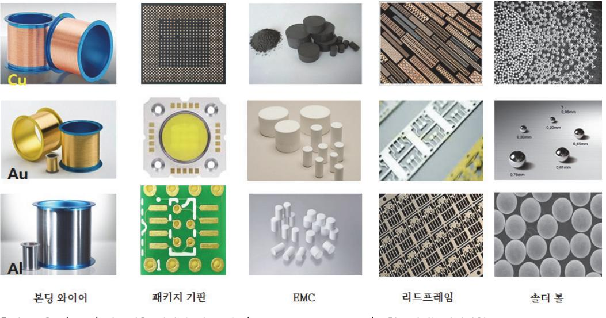

출처: 교육부(2016).반도체용 패키지 재료 제조(LM1903060406\_14v1). 한국직업능력개발원. p.4. [그림 1-1] 패키지 제작에 사용되는 주요 구성 재료

#### 숖 패키지 주요 공정

반도체 패키징이 필요한 이유는 전기적인 연결이라는 관점에서 볼 때, 반도체 칩과 전자제품 메인보드의 회로 폭에 차이가 있기 때문이다. 전자 제품을 동작시키는 역할의 반도체 칩은 그 자체로는 아무런 역할을 할 수 없고, 전자 제품을 구성하는 회로에 연결되어야 비로소 반도체 칩의 기능을 수행할 수 있다. 반도체 칩을 회로 위에 바로 장착할 수 없으므로 상호 간의 회로 폭 차이를 완충시켜 줄 수 있는 역할을 반도체 패키징이 담당하게 된다. 반도체 패키징 공정을 대략적으로 살펴보면 다음과 같다. 리드프레임 패키지, 모듈형 패키지, BGA 패키지에 대한 공 정흐름도가 [그림 1-2], 관련 주요공정에 대한 모습이 [그림 1-3]에 도식되어있다.

1. Back Grinding 공정

전 공정에서 가공된 웨이퍼의 후면을 얇게 갈아내는 공정

- 2. Sawing(Dicing) 공정 웨이퍼를 개별 단위(net die)로 잘라내는 공정
- 3. Die Attaching 공정 회로기판(substrate)에 칩을 붙여 고정하는 공정
- 4. Wire Bonding Gold Wire로 칩을 전기적으로 연결하는 공정
- 5. Molding EMC 물질로 칩이 실장된 기판을 감싸는 공정
- 6. Marking 레이저로 개별 제품에 제품 정보를 새기는 공정
- 7. Solder Ball Mount 회로기판에 솔더 볼을 붙여 아웃단자를 만드는 공정
- 8. PKG Sawing 모듈/보드/카드에 실장하도록 개별 반도체로 잘라내는 공정
- 9. Trimming 댐바(dambar)는 리드와 리드 사이, 몰딩 시에 액체 상태의 컴파운드가 외부 리드로 흘러넘 치는 것을 방지하는 댐역할을 하며, 이 댐바를 잘라주는 공정
- 10. Form

리드선을 PCB 보드에 결선하기 용이하도록 구부려 형태를 만드는 공정

11. 리드 도금

리드선의 저항을 줄이기 위해 전도성 금속을 입히는 공정

12. Test

패키지 공정이 완료된 단위 패키지 제품의 양품을 선별하는 공정

13. Marking

테스트 공정에서 양품 판정을 받은 제품에 제조일, 회사, 제품명 등의 제품의 이력을 레이 저를 이용하여 각인하는 공정

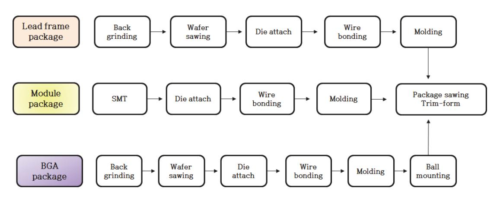

출처: 교육부(2016).반도체용 패키지 재료 제조(LM1903060406\_14v1). 한국직업능력개발원. p.6. [그림 1-2] 패키지 공정 흐름도

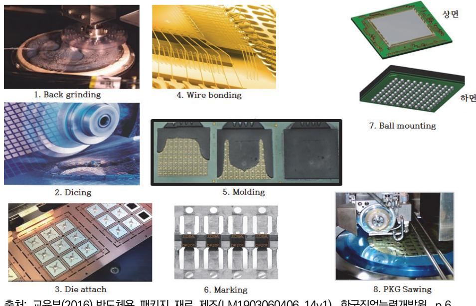

출처: 교육부(2016).반도체용 패키지 재료 제조(LM1903060406\_14v1). 한국직업능력개발원. p.6. [그림 1-3] 주요 공정 모습

숗 패키지 테스트

반도체 패키징 공정이 완료되면 패키징 제품의 불량 여부를 확인하는 테스트 공정이 진행된다. 반도체 패키징 테스트 공정은 패키징된 반도체를 검사장비에 넣고 다양한 조건의 전압 및 전류 등 전기신호와 온도 등을 인가하여 제품의 전기적 특성, 기능적 특성, 그리고 동작 속도 등을 측정한다. 테스트 공정은 반도체의 종류에 따라 달라질 수 있는 데 동적 임의접근 기억장치 (DRAM:Dynamic Random Access Memory)의 경우 다음과 같은 테스트 공정을 진행한다.

- 1. Assembly Out 제품 종류, 수량, I/O 수 (bit) 수 등을 확인하는 공정
- 2. DC Test & Loading / Burn-In 선행 공정을 거치면서 발생된 불량을 선별한 후 제품에 고온, 고전압 등의 극한 조건을 가 하여 신뢰성을 확인하는 공정
- 3. Post Burn-In 상온 및 저온에서 전기적 특성 및 기능을 검사하는 공정
- 4. Final Test Burn-In 테스트 이후 제품의 작동 여부를 검사하는 공정
- 수 반도체 패키지 종류 구조

반도체 부품을 구현하는 패키지는 다양한 모습으로 존재하고, 제조에 사용되는 재료도 패키지 종류에 따라 다르다.

1. QFN(Quad Flat No-Lead)

QFN 패키징 방식은 구리 리드프레임 위에 반도체 칩이 올라가고 와이어 본딩을 한 후 몰 딩을 한 형태로 리드가 없어서 작고 가벼우며 전기적 성능과 열적 특성이 우수하고 신뢰성 이 좋다. QFN 패키징 방식은 반도체 패키징 중 가장 저렴하면서도 지속적으로 사용되는 패키징 방식이다. [그림 1-4]에 구성요소와 적용제품의 예시가 도시되어있다.

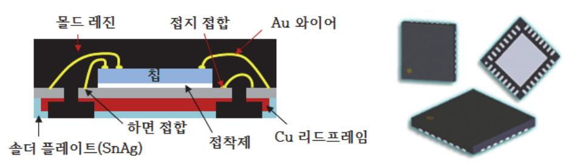

출처: 교육부(2016).반도체용 패키지 재료 제조(LM1903060406\_14v1). 한국직업능력개발원. p.8. [그림 1-4] QFN 패키지 구조와 적용 제품 모습

2. TSOP(Thin Small Outline Package)

PC에 사용되는 메모리 패키지로 리드프레임을 사용하는 가장 일반적으로 사용되는 TSOP 는 리드프레임 위에 칩을 올리고 와이어 본딩 몰딩을 한 후 리드를 구부려 완성하는 패키 지 구조이다. DRAM, SRAM, 유턴 메모리 패키지로 주로 사용된다. 패키지 두께가 1mm 이하이고, 리드 간 피치가 0.5mm 이하이다. [그림 1-5]에 구성요소와 적용제품의 예시가 도시되어있다.

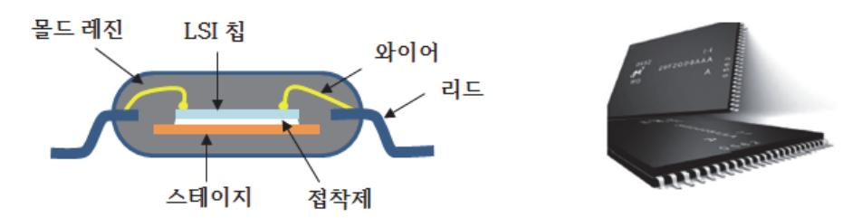

출처: 교육부(2016).반도체용 패키지 재료 제조(LM1903060406\_14v1). 한국직업능력개발원. p.8. [그림 1-5] TSOP 패키지 구조와 적용 제품 모습

3. BOC(Board On Chip)

PC와 노트북에서 리드프레임이 아닌 PCB 형태의 메모리 패키지로 사용되는 BOC (Board On Chip)는 기판에 메모리칩의 본딩면이 부착된 형태로 칩의 본딩 패드와 기판의 본딩 패 드를 기판의 중앙에 형성된 슬롯을 통하여 와이어 본딩으로 기판의 본딩 패드와 접속하는 구조로 이루어져 있다. 기판의 본딩면과 솔더볼 면이 한 평면상에 있는 것이 특징이며, 기존 의 리드프레임을 라미네이트 기판으로 대체하여 입출력 핀 수의 다양화와 칩의 수직적층도 가능하여 고속화 및 대용량화가 용이하여 메모리칩에 광범위하게 사용하고 있다. 와이어 본 딩이 슬롯을 통해 이루어지므로 전체 크기를 TSOP에 비해 작고 얇으며 고속화가 가능한 장 점을 가지고 있다. [그림 1-6]에 구성요소와 적용 제품의 예시가 도시되어있다.

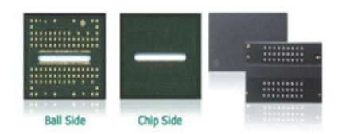

출처: 교육부(2016).반도체용 패키지 재료 제조(LM1903060406\_14v1). 한국직업능력개발원. p.9. [그림 1-6] BOC 패키지 구조와 적용 제품 모습

4. MCP(Multi Chip Package)

MCP는 박판의 기판 위에 50~80um의 얇은 칩을 여러 개 적층하여 용량과 성능을 증가시 킨 구조로 모바일기기에 사용되는 메모리에 사용된다. 패키지 형태로는 FBGA (Fine Pitch Ball Grid Array)이다. 이와 같은 패키지를 구현하기 위해서는 웨이퍼를 얇게 하는 기술 얇은 칩을 적층하고 와이어 본딩하는 기술이 필요하다. 메모리 소자는 칩을 2층 쌓는 DDP(Double Die Packaging), 3층 쌓는 TDP(Triple Die Packaging), 4층 쌓는 QDP(Quad Die Packaging)가 사용되고 있으며, 최근에는 소자 안에 컨트롤러를 내장한 eMMC(embedded Multi Media Card), eMCP (embedded Multi Chip Package)가 모 바일 기기용 메모리 소자로 사용되는 추세이다. 첫 번째로, MCP용 핵심 Package 공정 기 술을 살펴보면 박형 패키지 구현을 위해서는 얇은 PCB 기판 위에 MCP형태로 메모리칩을 적층한 후 얇게 몰딩하는 기술이 필요하다. 칩 두께를 얇게 백그라인딩해야 하는데 50um 두께까지는 일반 Mechanical Grinding과 Polishing으로 진행하고, 50um 이하의 두께는 DBG(Dicing Before Grinding) 공정 방식을 도입해야 한다. DBG공정은 백그라인딩을 하 기 전에 웨이퍼를 Sawing하고, 테이프를 마운팅 함으로써 칩을 얇게 백그라인딩 할 때 발 생하는 칩 휨 현상(Chip Warpage)을 방지할 수 있다. 그리고 50um 이하의 얇은 칩을 Sawing하기 위해서는 Laser를 이용하여 칩에 손상이 없도록 최적화해야 한다. 또한, 얇은 칩을 웨이퍼 마운트 테이프에서 떼어 PCB에 붙이는 기술이 필요한 데 이를 위해 Pin을 사 용 하지 않는 특별한 키트 개발이 필요하다. 이후 와이어 본딩 공정에서는 두께가 얇아져서 와이어 본딩하기 어려운 협소한 공간에 매우 낮은 높이로 와이어 본딩을 진행하여 칩에 손 상이 없도록 해야 한다. [그림 1-7]에 구성요소와 적용제품의 예시가 도시되어있다.

출처: 교육부(2016).반도체용 패키지 재료 제조(LM1903060406\_14v1). 한국직업능력개발원. p.10. [그림 1-7] MCP 패키지 구조와 적용 제품 모습

5. FCB(Flip Chip Bonding)

 Flip Chip 본딩 패키지는 칩 위의 패드와 PCB 또는 리드프레임을 연결하는 방법으로 와 이어 본딩 대신에 칩의 본딩패드 위치와 동일하게 기판에 범핑패드를 만들어 솔더 볼을 이 용해 연결한 패키지 형태이다. 와이어 본딩을 했을 때보다 전기적 특성이 좋고, 와이어 본 딩 루프의 높이가 없어 좁은 면적으로 칩 실장 밀도를 높일 수 있다. Flip Chip 본딩 방식은 전체 표면을 전기적 연결 통로로 사용할 수 있어 입출력 단자의 수

를 늘릴 수 있는 장점을 가지고 있다. DRAM 등의 메모리 소자와 Flash 메모리의 패키지 로 사용된다. [그림 1-8]에 구성요소와 적용제품의 예시가 도시되어있다.

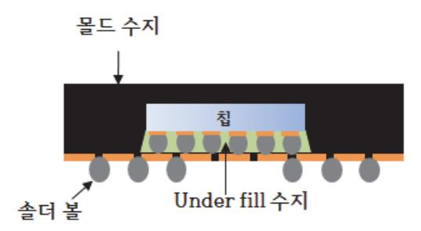

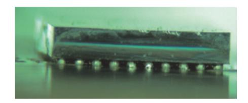

출처: 교육부(2016).반도체용 패키지 재료 제조(LM1903060406\_14v1). 한국직업능력개발원. p.10. [그림 1-8] FCB 패키지 구조와 적용 제품 모습

6. SiP(System in Package)

SiP는 기판 위에 서로 다른 기능의 능동소자들을 올린 후에 하나의 패키지로 몰딩해서 소 자 간 접속 경로의 단거리 확보를 통한 고성능과 우수한 전기적 특성을 확보할 수 있는 패 키지 형태이다. SiP는 와이어 본딩과 Flip Chip 범프의 복합기술로 칩의 수직적층과 다른 기능의 칩을 병렬로 배열하여 초경량 초소형의 반도체 기능을 확보하는 것이 가능하다. [그 림 1-9]에 구성요소와 적용 제품의 예시가 도시되어있다.

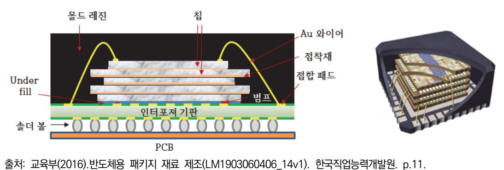

[그림 1-9] SiP 패키지 구조와 적용 제품 모습

### 7. WLCSP(Wafer Level Chip Scale Package)

WLCSP는 가장 작은 크기를 구현할 수 있는 칩 크기의 패키지로 전기적 특성이 좋고 저렴 하게 생산할 수 있는 장점이 있다. 스마트폰에 들어가는 많은 소자가 WLCSP 형태로 제작 되어 소형이면서도 빠른 스피드를 구현하는 방향으로 개발이 이루어지고 있다. [그림 1-10] 에 구성요소와 적용 제품의 예시가 도시되어있다.

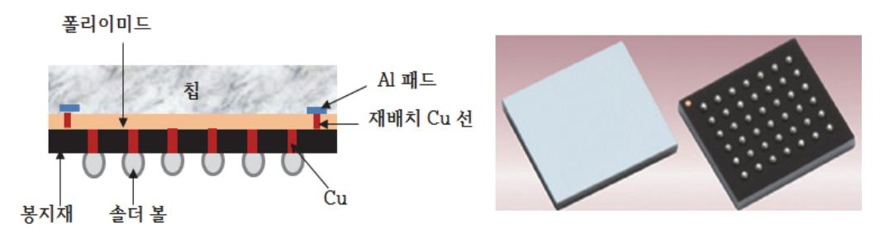

출처: 교육부(2016).반도체용 패키지 재료 제조(LM1903060406\_14v1). 한국직업능력개발원. p.11. [그림 1-10] WLCSP 패키지 구조와 적용 제품 모습

8. POP(Package On Package)

스마트폰 및 태블릿 PC에서는 수직적 확장으로 3차원 패키지를 구현하기 위해 AP(Application Process), 베이스 밴드 칩과 메모리를 적층하는 POP 형태를 사용하여 부 품 크기를 최소화하고 신호 전달이 빠르게 이루어질 수 있도록 하고 있다. POP는 연결배 선의 길이를 최소화할 수 있어 이차원 배열 시 발생하는 신호 지연, 임피던스 부정합 등의 손실을 최소화할 수 있고, 공간적으로 수직 방향을 활용하므로 단위 면적당 실장 면적을 극 대화하여 대용량, 초소형 부품을 구현할 수 있다. 기존에는 로직 기능을 하는 패키지와 메 모리 패키지를 평면에 2차원적으로 배치하여 보드의 공간을 많이 차지하고, 한 가지 패키지 사양이 변경되면 보드를 새로 제작해야 하므로 추가 비용이 필요하다. 반면에 로직과 메모 리 소자를 하나의 패키지로 제작하면 둘 중 하나가 바뀌면 전체 테스트 프로그램과 테스트 보드를 수정해야 하므로 시간과 비용이 많이 들었다. POP는 로직 패키지와 메모리 패키지 를 각각 테스트한 후 패키지를 적층하므로 변동 발생 시 해당 패키지의 테스트 도구만 변 경하면 되므로 시간과 비용을 획기적으로 줄일 수 있는 장점이 있어 제작을 용이하게 하고 소자의 성능과 집적도를 향상시키는 효율적인 방법이 되고 있다.[그림 1-11]에 구성요소와 적용 제품의 예시가 도시되어있다.

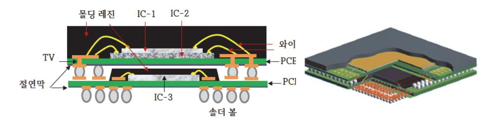

출처: 교육부(2016).반도체용 패키지 재료 제조(LM1903060406\_14v1). 한국직업능력개발원. p.12. [그림 1-11] POP 패키지 구조와 적용 제품 모습

9. FOWLP(Fan Out Wafer Level Package)

일반적인 WLP(Wafer Level Package)는 패키지 I/O(Input/Output) 단자를 모두 칩 안쪽

에 배치시켜야 하므로 칩 사이즈가 작아지면 볼 크기와 피치를 줄여야 하므로 표준화된 볼 레이아웃을 사용할 수 없다. 이러한 문제를 해결하기 위해 칩 바깥쪽에 패키지 I/O 단자를 배치시키는 형태인 팬 아웃 웨이퍼 레벨 패키지(FOWLP:Fan-Out Wafer Level Package) 가 제안되고 있는데, 이 경우, 칩 크기가 작아지더라도 표준화된 볼 레이아웃을 그대로 사 용할 수 있는 장점이 있다. FOWLP는 패키지 공정이 간단하고, 두께를 얇게 구현할 수 있 어서 BGA보다 소형화와 박형화가 가능하고 열 특성과 전기적 특성이 우수하여 모바일 제 품에 적합하다. 경박단소형의 장점이 있는 FOWLP는 초기 I/O 150~250 핀의 집적회로를 시작으로 점차 300 핀 이상의 집적회로로 확대가 될 것으로 예상되며, 적용 소자도 베이스 밴드와 아날로그 집적회로, RF(Radio Frequency)소자에 적용되기 시작하여 AP(Application Processor)와 PMU(Power Management Unit)에 확대 적용될 예정이다. FOWLP는 PCB를 이용하는 일반적인 POP보다 더 컴팩트하게 구현할 수 있으며 POP의 휨 현상 발생으로 인한 문제를 해결 할 수 있다. FOWLP는 기존 패키지 대비 칩 크기를 1/16 정도의 수준으로 줄일 수 있고, 인쇄회로 기판을 사용하지 않아서 기존 패키지 공정 대비 원가 경쟁력이 높다. 또한, 하나의 패키지에 다양한 기능의 칩들을 실장하는 SiP가 가 능해 빠르게 변하는 모바일 기기와 사물 인터넷 시장에서 매우 유리한 패키징 기술이다. [그림 1-12]에 패키지 개념도가 도시되어있다.

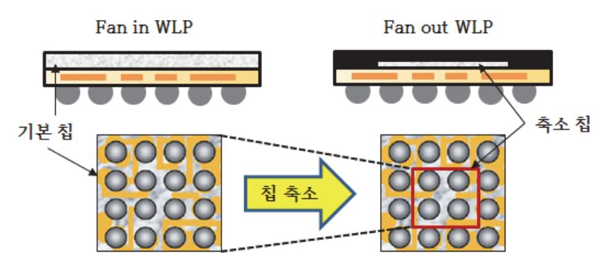

출처: 교육부(2016).반도체용 패키지 재료 제조(LM1903060406\_14v1). 한국직업능력개발원. p.13. [그림 1-12] FOWLP 패키지 개념도

10. TSV기술(Through Silicon Via)

반도체 소자의 집적도를 높이는 방법으로 칩들을 적층하여 와이어 본딩하는 MCP와 패키지 를 적층하는 POP가 일반적으로 사용되고 있지만, 최근 처리속도를 높이기 위한 방법으로 두 개 이상의 칩을 수직으로 적층하고 실리콘을 관통하는 전극을 통하여 회로를 연결하는 TSV기술이 적용되고 있다. TSV기술은 실리콘 웨이퍼의 상부와 하부를 전극으로 연결하여 최단거리의 신호 전송경로를 제공하므로 패키지의 경박단소화에 가장 유리하다.

특히, TSV기술은 CMOS 이미지 센서에 적용되어 활용되고 있으며, CPU 위에 TSV 기술

와이드 I/O로 메모리를 연결하는 제품, 캐시 메모리로 고속 메모리를 올리는 제품, 휴대전 화에 들어가는 베이스밴드 프로세서 위에 TSV기술로 메모리를 올리는 제품, RF를 포함한 무선 칩에 TSV기술을 적용하여 전원과 그라운드를 연결해서 고주파 성능을 향상시키는 제 품, 애플리케이션과 베이스밴드 프로세서를 TSV기술 인터포저를 이용해 모듈화하는 부품 개발 등으로 적용하여 진행되고 있다. TSV기술이 양산 제품에 적용되기 위해서는 아직도 여러 가지 문제를 해결해야 하는데 특히, 열관리, 비아 형성, 박형 웨이퍼 취급 등에 주의 해야 하며, 이 외에도 설계 및 공정 파라미터 최적화, 본딩 환경, W2W(Wafer to Wafer) 본딩 정렬, 웨이퍼 뒤틀림, 웨이퍼 휨, 검사, 결합 신뢰성, 제조 수율 확보 등 고려해야 할 부분들이 많이 있다. [그림 1-13]에 구성요소와 적용제품의 예시가 도시되어있다.

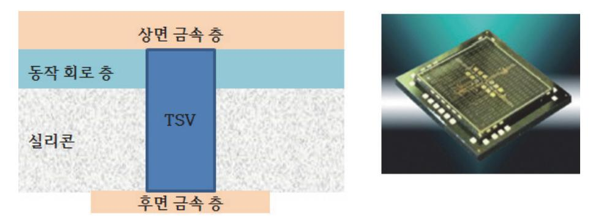

출처: 교육부(2016).반도체용 패키지 재료 제조(LM1903060406\_14v1). 한국직업능력개발원. p.14. [그림 1-13] TSV 패키지 구조와 적용 제품 모습

11. 인터포저(Interposer)

최근 반도체 패키징 업계에서는 차세대 시스템 패키징 기술로 TSV기술 인터포저가 주목을 받고 있다. 인터포저는 서킷 보드와 칩 사이에 들어가는 기능성 패키지 기판으로 시스템 온 칩(SoC)과 달리 물성이 다른 칩들을 넣을 수 있고, 비교적 패키징 수율이 높다. 지금까지 인쇄회로기판(PCB)이나 유기(Organic) 기판이 쓰였으나 전도성이 낮고 열을 제시간에 방출 하지 못했었다. TSV기술 인터포저는 실리콘 웨이퍼 위에 칩들을 얹거나 실장하고 기판에 구멍을 뚫은 후 내부를 전도체로 채워 칩 간 또는 칩과 PCB 간을 연결한다. CPU와 메모 리칩의 소자 고밀도와 회로의 복잡성 때문에 크기나 핀 수가 다른 CPU와 메모리칩을 부착 시키기 위해서는 설계의 자유도나 성능에 제약이 따를 수 있다. 따라서 인터포저는 서로 다 른 피치 크기, 위치의 패드를 가진 다양한 칩 간에 전기적 연결을 제공하는 중간 매체로 실 리콘, 글라스 등이 사용되며 면적과 크기가 작고, 고성능 및 저비용을 실현할 수 있다. [그 림 1-14]에 구조와 구성요소가 도시되어있다.

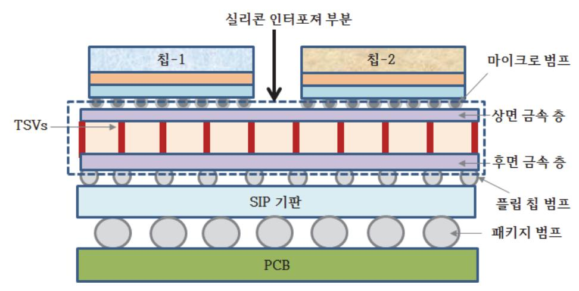

출처: 교육부(2016).반도체용 패키지 재료 제조(LM1903060406\_14v1). 한국직업능력개발원. p.14. [그림 1-14] 인터포져 패키지 구조와 적용 제품 모습

12. 유연 패키지 기술(Flexible Package)

제품 사용의 편의성을 강조하기 위해 휘어지거나 접을 수 있는 전자제품에 대한 요구가 증 가하고 있다. 전자제품이 유연해지기 위해서는 사용되는 반도체 부품 또한, 유연성을 가져 야 한다. 실리콘 반도체 소자는 두께가 80μm 이상일 경우는 딱딱한 성질을 가지고 있고, 그 이하가 되면 유연한 특성을 가지게 된다. 실리콘 소자를 80μm 이하로 얇게 한 후 유연 한 기판에 접합시키고 소자 간을 연결하면 유연한 반도체 소자를 확보할 수 있다. 이러한 과정을 통해 자유자재로 휘어지는 메모리를 만들어 낼 수 있어서 의류 및 신발 등 웨어러 블(Wearable) 제품에 적용할 수 있는 장점이 있다.

### 숙 반도체 제품 기술동향과 패키지 기술 발전 방향

무어의 법칙에서처럼, SoC 기술이 기하급수적인 속도로 발달함에 따라 SoC 기술이 향후 어떠 한 방향으로 발전할 것인지, 트랜지스터의 크기와 집적도는 어느 정도나 될 것인지, 어떠한 기 술이 장애 요인이 되고 어떠한 방법으로 극복할 것인지 등에 관한 동향을 예측하기가 점점 어 려워지고 있다. SoC 기술은 단순히 반도체를 설계하기만 하면 되는 것이 아니라 반도체 설계, 칩 제조 공정, 패키지 공정, 재료, 생산, 시스템, 설비 등의 여러 가지 분야가 하나의 프레임워 크 내에서 유기적인 관계를 이루어 함께 발전해 나가야하기 때문에 이들 분야를 통합적으로 분 석하고 동향을 예측하는 일이 SoC 기술 발전에서 중요한 몫을 차지하고 있다.

향후 15년 동안의 반도체 기술 동향을 예측하고 반도체 및 관련 산업이 발전해 나가는 가

1. ITRS(International Technology Roadmap for Semiconductor) 미국 반도체 산업 협회인 SIA(Semiconductor Industry Association) 주도로 반도체 기술 의 장기적인 기술 동향을 예측한 로드맵이다. ITRS는 비상업적인 순수한 기술 로드맵이며 이드라인을 제시한다. ITRS는 매 2년마다 한 번씩 정식 로드맵이 발표되며 로드맵이 발표 되지 않는 중간 해에는 전년도의 로드맵에 대한 업데이트를 발표한다. 1993년 미국 SIA 단 독으로 NTRS(National Technology Roadmap for Semiconductor)를 발표한 것을 시 작으로 1999년에는 한국의 KSIA, 유럽의 EECA, 일본의 EIAJ, 대만의 TSIA가 참가하여 국제적인 반도체 기술 로드맵인 ITRS가 결성되었다.

2. ITRS 기술 로드맵

SoC 기술의 발전 동향을 단기 동향(2004~2009년)과 장기 동향(2010~ 2018년)으로 나누 고 있다. 최근 전자제품의 급속한 발전을 가능하게 한 반도체 산업의 4가지 핵심기술로는 반도체 기술, 반도체 패키징 기술, 제조공정 기술, 소프트웨어 기술을 들 수 있다. 반도체 기술은 마이크로 이하 나노 단위의 선폭, 천만 개 이상의 셀 (Cell), 고속 동작, 많은 열 방 출 등 다양한 형태로 발전하고 있으나 상대적으로 이를 완벽하게 패키징하는 기술이 뒷받 침되지 못하면서 반도체의 전기적 성능이 반도체 기술 자체의 성능보다는 패키징 기술과 이에 따른 전기적 접속에 의해 결정되어지고 있다. 또한, 반도체 기술은 시스템 구현에 필 요한 다기능 고집적 반도체 기술인 시스템 반도체와 고주파소자, 이차전지, 전력용반도체 등을 포함하는 특화디바이스, 정보기억 능력이 구현되는 메모리반도체, 반도체를 생산하기 위한 반도체 제작 공정, 반도체 장비, 반도체 소재, 반도체 패키징, 인쇄회로기판 (PCB:Printed Circuit Board) 기술 등을 포함하여 광범위하게 접근해야 한다. 반도체 기 술 중 웨이퍼에 반도체 회로를 구현하는 전 공정의 발전이 현재는 소자 간 간격축소 및 종 횡비 상승으로 전 공정 기술을 통한 성능 및 집적도 개선 한계 등 기술적 어려움에 부딪히 고 있는 상황에 이르렀으며, 이러한 환경 속에 28nm 이하의 반도체 전 공정 투자에 대한 비용이 증가하고 있기 때문에 반도체 전 공정 기술의 한계를 극복하고, 저전력, 고성능, 소 형 반도체를 위해 미세공정의 대안으로 후 공정 투자를 유도하여 기존 2차원에서 3차원으 로 반도체 구조를 변화시키고자 하는 반도체 패키징 기술이 주목받고 있는 상황이다. 실제 고속 전자제품의 전체 전기신호 지연은 50% 이상이 칩과 칩 사이에서 발생하는 패키징 지 연에 의해 발생하고, 향후 시스템의 크기가 클수록 전기신호 지연이 더 증가할 것으로 예상 되고 있으므로 반도체 패키징 기술이 중요하게 인식되고 있으며, 반도체 전 공정의 기술 도 약과 함께 반도체 패키징 산업도 동반 성장할 수 있어야 한다. 패키징 기술 발전을 위해서 는 위에 서술한 조건들을 극복하는 패키징 재료의 개발이 시급하다.

### 수행 내용 / 패키지 공정 파악하기

#### 재료·자료

- 패키지 공정 흐름도, 패키지 종류별 사양 및 특성
- 반도체 기판, 패키지 종류별 제품

### 기기(장비 ・ 공구)

- 백 그라인더, 소어, 다이본더, 와이어 본더, 플라스마 장비, 탭 본더, 에쳐, 레이저 장비
- 접합 강도 시험기, 광학현미경, 비파괴 X-RAY 분석 장비

### 안전 ・ 유의사항

장비 취급 시 안전사항을 준수해야 한다.

#### 수행 순서

- 숔 패키지 단위 공정에 대하여 흐름을 파악하고, 레시피(recipe)를 작성한다.
  - 1. Back Grinding 공정에 대하여 흐름도와 레시피(recipe)를 작성한다.
    - (1) 개발제품에 맞는 공정 흐름도를 작성한다.
    - (2) 흐름도에 속한 단위 세부 공정의 레시피를 작성한다.
    - (3) 필요 장비에 대한 사양을 검토한다.
    - (4) 전후 공정의 검사를 실시한다.
    - (5) 공정 마진이 넓은 최적조건을 설정한다.
    - (6) 생산에 수율과 신뢰성을 높일 수 있는 레시피를 작성한다.
  - 2. Sawing(Dicing) 공정에 대하여 레시피를 작성한다.
    - (1) 개발제품에 맞는 공정 흐름도를 작성한다.
    - (2) 흐름도에 속한 단위 세부 공정의 레시피를 작성한다.
    - (3) 필요 장비에 대한 사양을 검토한다.
    - (4) 전후 공정의 검사를 실시한다.
    - (5) 공정 마진이 넓은 최적조건을 설정한다.
    - (6) 생산에 수율과 신뢰성을 높일 수 있는 레시피를 작성한다.
  - 3. Die Attaching 공정에 대하여 최적 조건을 갖는 레시피를 작성한다.

- (1) 개발제품에 맞는 공정 흐름도를 작성한다.
- (2) 흐름도에 속한 단위 세부 공정의 레시피를 작성한다.
- (3) 필요 장비에 대한 사양을 검토한다.
- (4) 전후 공정의 검사를 실시한다.
- (5) 공정 마진이 넓은 최적조건을 설정한다.
- (6) 생산에 수율과 신뢰성을 높일 수 있는 레시피를 작성한다.
- 4. Wire Bonding 공정에 대하여 최적 조건을 갖는 레시피를 작성한다.
  - (1) 개발제품에 맞는 공정 흐름도를 작성한다.
  - (2) 흐름도에 속한 단위 세부 공정의 레시피를 작성한다.
  - (3) 필요 장비에 대한 사양을 검토한다.
  - (4) 전후 공정의 검사를 실시한다.
  - (5) 공정 마진이 넓은 최적조건을 설정한다.
  - (6) 생산에 수율과 신뢰성을 높일 수 있는 레시피를 작성한다.
- 5. Molding 공정에 대하여 최적 조건을 갖는 레시피를 작성한다.
  - (1) 개발제품에 맞는 공정 흐름도를 작성한다.
  - (2) 흐름도에 속한 단위 세부 공정의 레시피를 작성한다.
  - (3) 필요 장비에 대한 사양을 검토한다.
  - (4) 전후 공정의 검사를 실시한다.
  - (5) 공정 마진이 넓은 최적조건을 설정한다.
  - (6) 생산에 수율과 신뢰성을 높일 수 있는 레시피를 작성한다.
- 6. Marking 공정에 대하여 최적 조건을 갖는 레시피를 작성한다.
  - (1) 개발제품에 맞는 공정 흐름도를 작성한다.
  - (2) 흐름도에 속한 단위 세부 공정의 레시피를 작성한다.
  - (3) 필요 장비에 대한 사양을 검토한다.
  - (4) 전후 공정의 검사를 실시한다.
  - (5) 공정 마진이 넓은 최적조건을 설정한다.
  - (6) 생산에 수율과 신뢰성을 높일 수 있는 레시피를 작성한다.
- 7. Solder Ball Mount 공정에 대하여 최적 조건을 갖는 레시피를 작성한다.
  - (1) 개발제품에 맞는 공정 흐름도를 작성한다.
  - (2) 흐름도에 속한 단위 세부 공정의 레시피를 작성한다.

- (3) 필요 장비에 대한 사양을 검토한다.
- (4) 전후 공정의 검사를 실시한다.
- (5) 공정 마진이 넓은 최적조건을 설정한다.
- (6) 생산에 수율과 신뢰성을 높일 수 있는 레시피를 작성한다.
- 8. PKG Sawing 공정에 대하여 최적 조건을 갖는 레시피를 작성한다.
  - (1) 개발제품에 맞는 공정 흐름도를 작성한다.
  - (2) 흐름도에 속한 단위 세부 공정의 레시피를 작성한다.
  - (3) 필요 장비에 대한 사양을 검토한다.
  - (4) 전후 공정의 검사를 실시한다.
  - (5) 공정 마진이 넓은 최적조건을 설정한다.
  - (6) 생산에 수율과 신뢰성을 높일 수 있는 레시피를 작성한다.

숕 패키지 테스트 항목과 시험규격, 시험조건을 확인하고 장비를 이용해 시험한다.

- 1. Assembly Out 항목과 시험규격, 시험조건을 확인하고 장비를 이용해 시험한다.
  - (1) 제품 종류를 파악한다.
  - (2) 수량을 확인한다.
  - (3) I/O 수 (bit) 등을 확인한다.
- 2. DC Test 항목과 시험규격, 시험조건을 확인하고 장비를 이용해 시험한다.
  - (1) 선행 공정을 거치면서 발생된 불량을 선별한다.
  - (2) 시험항목과 규격 및 시험조건을 확인한다.
  - (3) 시험 장비를 선정한다.
  - (4) 시험 흐름도를 작성한다.
  - (5) 시험 프로그램을 작성하고 장비에 실장한다.
  - (6) 시험을 실시한다.
  - (7) 불량이 발생하면 재시험을 시행한다.
  - (8) 시험결과를 분석하고 통계적 분석을 실시한다.
  - (9) 시험결과를 생산에 피드백하여 재발 방지를 한다.
- 3. Burn-In 시험항목과 시험규격, 시험조건을 확인하고 장비를 이용해 시험한다. 제품에 고온, 고전압 등의 극한 조건을 가하여 신뢰성을 확인하는 공정

- (1) 선행 공정을 거치면서 발생된 불량을 선별한다.
- (2) 시험항목과 규격 및 시험조건을 확인한다.
- (3) 시험 장비를 선정한다.
- (4) 시험 흐름도를 작성한다.
- (5) 시험 프로그램을 작성하고 장비에 실장한다.
- (6) 시험을 실시한다.
- (7) 불량이 발생하면 재시험을 시행한다.
- (8) 시험결과를 분석하고 통계적 분석을 실시한다.
- (9) 시험결과를 생산에 피드백하여 재발 방지를 한다.
- 3. Burn-In 후 테스트 항목과 시험규격, 시험조건을 확인하고 장비를 이용해 시험한다.
  - (1) 선행 공정을 거치면서 발생된 불량을 선별한다.
  - (2) 시험항목과 규격 및 시험조건을 확인한다.
  - (3) 시험 장비를 선정한다.
  - (4) 시험 흐름도를 작성한다.
  - (5) 시험 프로그램을 작성하고 장비에 실장한다.
  - (6) 시험을 실시한다.
  - (7) 불량이 발생하면 재시험을 시행한다.
  - (8) 시험결과를 분석하고 통계적 분석을 실시한다.
  - (9) 시험결과를 생산에 피드백하여 재발 방지를 한다.

숖 각종 패키지 종류와 특성을 파악하고, 합리적인 재료를 선정한다.

- 1. QFN(Quad Flat No-Lead) 패키지 구조와 구성 재료에 대하여 선정한다.
  - (1) 패키지 설계도를 확인한다.
  - (2) 제작에 필요한 재료 구성표를 작성한다.
  - (3) 적합한 재료를 제조회사의 사양서를 비교하여 선정한다.
- 2. TSOP(Thin Small Outline Package) 패키지 구조와 구성 재료에 대하여 선정한다.
  - (1) 패키지 설계도를 확인한다.
  - (2) 제작에 필요한 재료 구성표를 작성한다.
  - (3) 적합한 재료를 제조회사의 사양서를 비교하여 선정한다.
- 3. BOC(Board On Chip) 패키지 구조와 구성 재료에 대하여 선정한다.

- (1) 패키지 설계도를 확인한다.
- (2) 제작에 필요한 재료 구성표를 작성한다.
- (3) 적합한 재료를 제조회사의 사양서를 비교하여 선정한다.
- 4. MCP(Multi Chip Package) 패키지 구조와 구성 재료에 대하여 선정한다.
  - (1) 패키지 설계도를 확인한다.
  - (2) 제작에 필요한 재료 구성표를 작성한다.
  - (3) 적합한 재료를 제조회사의 사양서를 비교하여 선정한다.
- 5. FCB(Flip Chip Bonding) 패키지 구조와 구성 재료에 대하여 선정한다.
  - (1) 패키지 설계도를 확인한다.
  - (2) 제작에 필요한 재료 구성표를 작성한다.
  - (3) 적합한 재료를 제조회사의 사양서를 비교하여 선정한다.
- 6. SiP(System in Package) 패키지 구조와 구성 재료에 대하여 선정한다.
  - (1) 패키지 설계도를 확인한다.
  - (2) 제작에 필요한 재료 구성표를 작성한다.
  - (3) 적합한 재료를 제조회사의 사양서를 비교하여 선정한다.
- 7. WLCSP(Wafer Level CSP) 패키지 구조와 구성 재료에 대하여 선정한다.
  - (1) 패키지 설계도를 확인한다.
  - (2) 제작에 필요한 재료 구성표를 작성한다.
  - (3) 적합한 재료를 제조회사의 사양서를 비교하여 선정한다.
- 8. POP(Package On Package) 패키지 구조와 구성 재료에 대하여 선정한다.
  - (1) 패키지 설계도를 확인한다.
  - (2) 제작에 필요한 재료 구성표를 작성한다.
  - (3) 적합한 재료를 제조회사의 사양서를 비교하여 선정한다.
- 9. FOWLP(Fan Out Wafer Level Package) 패키지 구조와 구성 재료에 대하여 선정한다.
  - (1) 패키지 설계도를 확인한다.
  - (2) 제작에 필요한 재료 구성표를 작성한다.
  - (3) 적합한 재료를 제조회사의 사양서를 비교하여 선정한다.
- 10. TSV(Through Silicon Via) 패키지 구조와 구성 재료에 대하여 선정한다.
  - (1) 패키지 설계도를 확인한다.

- (2) 제작에 필요한 재료 구성표를 작성한다.
- (3) 적합한 재료를 제조회사의 사양서를 비교하여 선정한다.
- 11. 유연 패키지(Flexible Package) 패키지 구조와 구성 재료에 대하여 선정한다.
  - (1) 패키지 설계도를 확인한다.
  - (2) 제작에 필요한 재료 구성표를 작성한다.
  - (3) 적합한 재료를 제조회사의 사양서를 비교하여 선정한다.

## 1-2. 패키지 재료 및 품질관리사항 파악

학습 목표 • 고객의 요구사항에 의한 패키지 재료를 파악할 수 있다.

• 품질관리를 위한 문제점을 파악할 수 있다.

### 필요 지식 /

### 숔 패키지 재료와 품질 문제

1. 패키지 기판

BGA(ball grid array), CSP(chip scale package), SIP(system in package) 같은 반도체 패키지들에 대한 수요가 증가함에 따라 수반되는 회로기판에 수요도 증가하고 있다. 회로 기판은 패키지에 장착되어 물리적 장치들의 기본 위치를 제공하고 전기적인 인터페이스를 제공하는 부품이다. 패키지 회로 기판에는 여러 종류가 있지만 크게 rigid 타입과 tape 형 태가 있다. [그림 1-2]에 3층 적층기판을 사용하는 SIP의 경우가 예시되어있다.

(1) Rigid 회로 기판

기판은 고정된 모양을 취하고 있다. 초기 rigid 기판의 재질은 세라믹이 주류를 이루어 오다가 현재는 유기 기판이 여러 패키지에서 점점 광범위하게 쓰이고 있다.

(2) Tape 기판

Tape 기판의 주요 장점은 디스크 드라이브나 프린터처럼 움직임이 많은 디바이스들에 회로를 장착할 수 있다는 것이다. 또한, Tape 기판은 가볍고 단가가 낮다. 단점으로는 공정 중 다루기가 힘들고, 휨(warpage) 문제와 열팽창계수가 다른 물질과 상당히 다른 점이 있다.

2. 에폭시 수지

에폭시는 실리콘 칩이 실장 되는 패키지기판(IC substrate), EMC 봉지재, 언더필, 칩과 기 판을 접착하는 다이본딩재, 솔더레지스트, 전도성 페이스트, PCB 등 다양한 분야에 응용되 고 있는 반도체 패키징의 핵심유기소재로써, 우수한 내열특성·절연특성·내화학성·기계적 물 성 등으로 인하여 현재까지 널리 이용되고 있다.

3. 리드프레임(lead frame)

Lead Frame은 반도체 IC를 구성하는 핵심부품으로서 반도체 Chip과 PCB 기판과의 전기 신호를 전달하고, 외부의 습기, 충격 등으로부터 Chip을 보호하며, 지지해 주는 골격 역할 을 한다. 이는 칩을 비로소 외부와 연결하는 die paddle과 leads로 구성된다.

### 4. Wire bonding 재료

Wirebonding 기술은 매우 작은 접착 공간(fine-fitch bonding)에서의 작업과 같은 진보 된 패키징 기술에 있어서 접착하는 선의 적절한 선택은 매우 중요 하게 된다. Wire를 선택 할 때 먼저 고려해야 할 사항은 사용될 패키지의 종류이다.

5. solder

녹는점·경도에 따라 연납과 경납으로 나뉘는데, 어느 것이나 납땜 대상 금속의 녹는점보다 도 낮은 온도에서 녹아야 하며, 합금을 만들어 잘 밀착시켜야 한다. 연납은 보통 납-주석계 합금의 총칭으로서 일반적으로 말하는 땜납은 이것을 말한다. 용도에 따라 여러 가지로 조 성된 것이 있으나, 보통 주석 40~50%의 것이 많이 사용된다.

- (1) 기판과 부품의 내열성
- (2) 은(Ag) 또는 부품 Lead의 금속조성
- (3) Solder의 강도
- (4) Solder 합금 분말의 입도
- (5) Solder paste의 점성
- (6) Solder의 보관
- 6. Flux

금속 또는 합금을 용해할 때 용해한 금속면이 직접대기에 닿으면 산화하거나 대기 속의 수 분과 반응하여 수소를 흡수하여 불편한 경우가 있으므로, 대기와 닿는 것을 방해할 목적으 로 금속의 표면에 용해한 염류에 의한 얇은 층을 만들 것을 생각하게 되었다. 이를 위해서 는 용해한 금속과 반응하여 자체로부터 불순물이 들어갈 염려가 없는 염을 섞어서 공정(共 晶)을 이용하여 녹는점을 내려 녹아 있는 금속보다 융점을 낮게 하면 녹은 염은 금속의 액 체보다 비중이 가벼우므로 염류가 녹은 것이 금속액체의 표면에 떠서 얇은 층을 이루어 이 것을 뒤덮는다. 이를 위해 사용하는 혼합 염을 플럭스라고 한다.

### 수행 내용 / 패키지 재료 및 품질관리사항 파악하기

### 재료·자료

- 물질안전보건자료(MSDS), RoHS, 패키지 재료 규격 및 보관에 관한 문서
- 에폭시 수지, 리드프레임, 솔더, Wire(Au, Al, Cu), Flux

### 기기(장비 ・ 공구)

컴퓨터, 인터넷, 아래한글 등 소프트웨어, 프린터, 제본기

### 안전 ・ 유의사항

- 화학 공정에서 일어날 수 있는 위험요소를 파악한다.
- 사내 물질 안전보건자료를 활용한다.
- 법적관리 대상 화학물질 및 유해성에 대해 파악한다.
- 발생할 수 있는 모든 사고에 대비하여 작업 안전계획서를 작성한다.

#### 수행 순서

숔 패키지 재료의 물리/화학/전기적/역학적 특성을 파악하고 상호 비교한다.

- 1. 패키지의 종류는 매우 다양하다. 재료의 파악은 아래의 사항에 의하여 수행한다.
  - (1) 재료의 구조에 대하여 파악한다.
  - (2) 재료의 성분요소들을 파악한다.
  - (3) 재료의 물리적 특성을 파악한다.
  - (4) 재료의 화학적 특성에 대하여 파악한다.
  - (5) 재료의 역학적 특성에 대하여 파악한다.
  - (6) 재료의 전기적 특성에 대하여 파악한다.
  - (7) 재료의 환경적 유해요소에 대하여 파악한다.
  - (8) 기 개발된 재료들에 대하여 위 사항을 상호 비교한다.
  - (9) 개발할 재료의 특징을 수립한다.
  - (10) 적용될 패키지에서 요구되는 특성을 파악한다.
  - (11) 요구특성에 맞는 재료의 특성조건을 작성한다.
  - (12) 고객에 요구조건이 수용되는 재료의 특성표를 작성한다.

- 2. 필수적으로 파악되어야하는 재료는 아래와 같고, 수행순서는 1항과 같이 작성한다.
  - (1) 에폭시 수지
  - (2) 리드프레임
  - (3) 각종 와이어(wire)
  - (4) 솔더(solder)
  - (5) Flux
  - (6) 기판
- 숕 품질관리 관련 문제점을 조사하고, 조사한 내용을 토대로 문제 해결방안을 수립한다.
  - 1. 품질관리 파악 사항은 아래와 같이 수행한다.
    - (1) 품질 관리도를 작성한다.
    - (2) 품질관리 항목을 설정한다.
    - (3) 품질 시험항목/조건/판정 기준을 설정한다.
    - (4) 품질 시험/분석에 관련된 방법과 계측 장비를 선정한다.
    - (5) 품질 관련 사례자료를 파악한다.
    - (6) 시험에서 발생된 문제를 분석한다.
    - (7) 문제점이 기 분석된 자료와 비교하여 유사성을 검색한다.
    - (8) 유사성이 없을 경우 분석을 통하여 문제점을 파악한다.
    - (9) 재발 방지를 위한 대책을 수립한다.
    - (10) 수립된 대책을 적용하고 결과를 분석한다.
    - (11) anspw 해결을 위한 수행과정과 내용을 보고서로 작성한다.
  - 2. 필수적으로 품질관리 하는 재료는 아래와 같다.
    - (1) 에폭시 수지
    - (2) 리드프레임
    - (3) 각종 와이어(wire)
    - (4) 솔더(solder)
    - (5) Flux
    - (6) 기판

### 학습 1 교수·학습 방법

### 교수 방법

- 반도체 조립 전체 공정 순서 및 단위 공정별로 사용되는 장비를 소개할 때 각각의 장비 용 도에 대한 이해를 높이기 위하여 동영상과 그림을 이용하여 세부적으로 설명한다.
- 반도체 조립 공정을 체험하고 현장에서 사용되는 전문용어에 대해 전체적으로 설명한다.
- 단위 공정에서 발생하는 불량 사례를 유형별로 분류하고 해결 방안을 교육대상자들과 토론 및 질문을 유도하여 학습자의 깊은 관심을 유발한다.
- 다양한 측정기기를 이용하여 개별 공정의 특성 값 측정 및 평가 방법을 개별 공정 사례를 적용하여 설명한다.
- 다양한 패키지의 종류에 대하여 구조 및 재료 특성에 대하여 설명한다.
- 다양한 패키지 제조 재료의 구조 및 재료 특성에 대하여 설명한다.
- 다양한 패키지 제조 재료의 품질관리 시 유의할 사항에 대하여 사례를 들어 설명한다.

### 학습 방법

- 전체 공정 순서를 파악하고 단위 공정의 목적을 사전에 학습하여 기초 능력을 배양한다.
- 단위 공정별로 적용되는 재료와 특성을 사전에 알아보고 이해하도록 노력한다.
- 반도체 조립 공정에서 사용되는 전문용어에 대해 학습을 통하여 기초 지식을 함양한다.
- 단위 공정에서 발생하는 불량 사례를 파악하고 개선방향을 사례별로 확인한다.
- 광학현미경 등 간단한 측정기기에 대한 사용법을 사전에 학습한다.
- 다양한 패키지의 종류에 대하여 구조 및 재료 특성에 대하여 학습한다.
- 다양한 패키지 제조 재료의 구조 및 재료 특성에 대하여 학습한다.
- 다양한 패키지 제조 재료의 품질관리 시 유의할 사항에 대하여 사례를 조사하고, 학습한다.

### 학습 1 평 가

### 평가 준거

• 평가자는 학습자가 학습 목표를 성공적으로 달성하였는지를 평가해야 한다.

#### • 평가자는 다음 사항을 평가해야 한다.

|                          | 학습 목표                                     | 성취수준 |   |   |
|--------------------------|-------------------------------------------|------|---|---|
| 학습 내용                    |                                           | 상    | 중 | 하 |
| 패키지 공정 파악             | - 최종 제품의 생산에 필요한 패키지 공정에 대하여 파악할 수 있다. |      |   |   |
| 패키지 재료 및 품질관리사항 파악 | - 고객의 요구사항에 의한 패키지 재료를 파악할 수 있다.          |      |   |   |
|                          | - 품질관리를 위한 문제점을 파악할 수 있다.                 |      |   |   |

### 평가 방법

• 서술형 시험

| 학습 내용                    |                                |   | 성취수준 |   |  |  |
|--------------------------|--------------------------------|---|------|---|--|--|
|                          | 평가 항목                          | 상 | 중    | 하 |  |  |
| 패키지 공정 파악             | - 패키지 공정 이해 능력                 |   |      |   |  |  |
| 패키지 재료 및 품질관리사항 파악 | - 고객의 요구사항에 의한 패키지 재료를 파악하는 능력 |   |      |   |  |  |
|                          | - 품질관리를 위한 문제점을 파악하는 능력        |   |      |   |  |  |

• 사례 연구

|                          |                                  | 성취수준 |   |   |
|--------------------------|----------------------------------|------|---|---|
| 학습 내용                    | 평가 항목                            |      | 중 | 하 |
| 패키지 공정 파악             | - 단위 공정의 이해 능력                   |      |   |   |
|                          | - 패키지 종류별 특성 및 구조의 이해 능력         |      |   |   |
| 패키지 재료 및 품질관리사항 파악 | - 고객의 요구사항에 의한 패키지 재료 선정 능력      |      |   |   |
|                          | - 품질관리를 위한 문제점을 파악하고 해결할 수 있는 능력 |      |   |   |

피드백

1. 서술형 시험

2. 사례 연구

- 시험의 답안에 대한 채점 결과와 오답 이유를 설명한다.

- 평가 결과 수준 미달인 학생은 부족한 부분 재교육, 우수한 자는 심화 교육 실시한다.

 - 패키지 분류 능력의 부족한 점을 동영상으로 미비한 부분 보완교육을 실시한다. - 패키지 구성 재료에 대한 불충분한 지식은 향상교육을 통하여 보완교육을 실시한다. - 패키지 품질관리 문제파악능력 미흡 시 여러 사례들을 통한 시청각 보완교육을 실시한다.

- 단위공정 대한 설명이 미비한 부분 실습을 통한 보완교육을 실시한다.

28

| 학습 1 | 반도체용 패키지 재료 요구사항 파악하기 |  |
|------|-----------------------|--|
| 학습 2 | 반도체용 패키지 재료 선정하기      |  |
| 학습 3 | 반도체용 패키지 재료 제조하기      |  |
| 학습 4 | 반도체용 패키지 제품특성 검증하기    |  |

## 2-1. 공정별 패키지 재료의 장·단점 파악

학습 목표 • 반도체 공정별 패키지 재료의 장점과 단점을 파악할 수 있다.

### 필요 지식 /

숔 반도체 패키지 공정별 주요 재료 패키지의 일반 공정 흐름과 내용은 학습 1에서 살펴보았다. 공정 장비들의 소요 재료들도 있지 만, 이들 공정 중 일반적으로 패키지 재료가 직접 소요되는 공정과 그 주요 재료는 아래와 같 이 정리할 수 있다. [그림 2-1]에 기본 구조를 구성하는 소요 패키지 재료가 도시되어 있다.

- 1. 다이 부착(die attach) 공정 기판, 리드프레임, 접착제
- 2. 본딩(bonding) 공정 와이어(wire) : 금(Au), 알루미늄(Al), 구리(Cu)
- 3. 몰딩(molding) 공정 EMC(epoxy mold compound)
- 4. 솔더 볼(solder ball) 실장 솔더 볼, 플럭스(Flux)

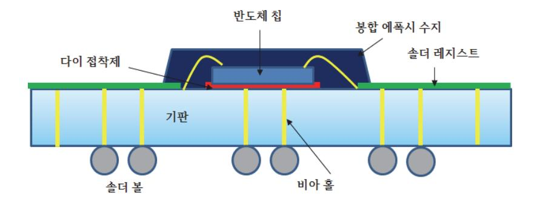

출처: 교육부(2016).반도체용 패키지 재료 제조(LM1903060406\_14v1). 한국직업능력개발원. p.31. [그림 2-1] 패키지 주요 재료가 사용된 패키지 구조

#### 숕 다이 부착 공정 재료

다이 부착 공정은 웨이퍼 레벨 테스트에서 양품 판정을 받은 개별 칩들을 물리적인 방법으로 기판이나 주 리드프레임에 부착하는 공정이다. 이 공정에서 중요한 사항은 기판이나 리드프레 임과의 접착 강도이다. 그래서 이 공정에서 중요한 소재는 기판, 리드프레임, 접착제가 된다.

- 1. 기판(Substrate)
  - (1) Rigid 회로 기판

기판은 고정된 모양을 취하고 있다. 초기 rigid 기판의 재질은 세라믹이 주류를 이루어 오다가 현재는 유기 기판이 여러 패키지에서 점점 광범위하게 쓰이고 있다. Rigid 기판 은 얇은 판이 여러 층 쌓여 적층기판이라고도 부른다. 이러한 적층형 기판을 만드는데 여러 가지 다른 물질들이 사용되는데 에폭시계의 FR4 와 고성능을 갖춘 레진 기반의 Bismalemide-Triazine(BT)가 주로 사용된다. BT 레진은 유리전이점(Tg)이 높고, 낮은 절연 상수와 절연성이 좋기 때문에 적층 재질로 제조회사에서 많이 쓰이고 있다. BT는 BGA 패키지 제작 시는 표준 기판 재료의 기준으로 사용되며 CSP에서도 많이 쓰이고 있다.

(2) Tape 기판

폴리이미드(polyimide )같은 고강도, 고온 폴리머(polymer) 물질로 이루어져 있다. Tape 기판의 주요 장점은 디스크 드라이브나 프린터처럼 움직임이 많은 디바이스들에 회로를 장착할 수 있다는 것이다. 또한, Tape 기판은 가볍고 단가가 낮다. 단점으로는 공정 중 다루기가 힘들고, 휨(warpage) 문제와 열팽창계수가 다른 물질과 상당히 다른 점이 있다. IC 패키지의 기판으로서의 역할 이외에 칩의 I/O를 연결할 때에도 쓰인다. 이와 같은 일을 수행하기 위해서 기판은 내부에 금속 절연체를 가지고 있어야 한다. 이 것은 기판에 하나 이상의 층에 연결되어 구리 식각의 형태로 구성되어져 있다. 기판의 구리층은 니켈층 위에 금(Au)을 주입한 층으로 마무리된다. 니켈은 구리 땜납이 퍼지는 것을 방지하고, 금은 산화되는 것을 방지함과 동시에 고형화 능력(solderability)를 강화

한다. 적층기판은 일반적인 PCB 기판과 같이 through-hole에 의해 서로 연결되는 여 러 금속판으로 구성된다. BT 기판들은 종종 짝수개의 전송로를 가진다. 예를 들어 적층 이 4개일 경우 맨 위층과 맨 아래층은 I/O 전송로이고, 가운데 두 개 층은 접지와 전압 을 위해 쓰인다.

2. 에폭시 수지

에폭시는 실리콘 칩이 실장 되는 패키지기판(IC substrate), EMC 봉지재, 언더필, 칩과 기 판을 접착하는 다이본딩재, 솔더레지스트, 전도성 페이스트, PCB 등 다양한 분야에 응용되 고 있는 반도체 패키징의 핵심유기소재로써, 우수한 내열특성·절연특성·내화학성·기계적 물 성 등으로 인하여 현재까지 널리 이용되고 있다. 그러나 최근의 급속한 반도체 패키징 기술 의 발전으로 인하여 기존 에폭시 소재의 한계가 인식되면서, 차세대 패키징용 신규 에폭시 소재의 개발에 대한 관심이 증대되고 있다. 예를 들어 박형화·고기능화를 위해 여러 개의 박형 칩을 적층하는 패키징의 경우, 박형 기판에 부과되는 응력 발생이 크게 문제가 되므로 응력 발생을 효율적으로 저감할 수 있는 재료개발이 요구되고 있고, pb-free 솔더링에 의 한 실장 온도증가는 더 우수한 내열특성 및 흡습성 등을 가진 에폭시 소재 기술을 요구하 고 있다.

3. 리드프레임(lead frame)

Lead Frame은 반도체 IC를 구성하는 핵심부품으로서 반도체 Chip과 PCB 기판과의 전기 신호를 전달하고, 외부의 습기, 충격 등으로부터 Chip을 보호하며, 지지해 주는 골격 역할 을 한다. 이는 칩을 비로소 외부와 연결하는 die paddle과 leads로 구성된다. 웨이퍼 상에 잘린 칩들은 금(Au)선으로 연결단자에 wire bonding을 통해 연결된다. 플라스틱 패키지 lead frame은 합금으로 만들어지는데 다음과 같은 특징이 있다. 화합물에 접착성이 우수, 칩과 화합물 사이의 우수한 열 확장성, 높은 강도, 형 변형 우수, 높은 열 전도성 등이 있 다. Alloy42(57.7% Fe, 41% Ni, 0.8% Mn, and 0.5% Co)는 그와 같은 합금물의 좋은 예이다. Lead Frame을 사용하는 패키지는 원가가 저렴한 구리 lead frame을 사용하기 때 문에 생산원가가 저렴하다는 장점을 가진다. 대체로 전형적인 패키지 구조를 가지며, 구조 가 상대적으로 간단해 출력 단자 수가 적은 소자에 적합하다. 특히, 저렴한 가격과 작은 크 기, 그리고 우수한 전기 및 열적 특성 때문에 무선 이동통신 제품에 많이 사용된다. Lead Frame 은 철(Fe) 과 동계(Cu)으로 구분되는데 발열량이 큰 IC 에는 열전도율이 좋은 동 (Cu)을 주성분으로 한 lead frame을 사용하며 특성이 중시되는 경우는 Silicon 과 열팽창 율이 비슷한 Fe-Ni 합금 계열인 Alloy lead frame을 사용한다.

#### 숖 본딩 공정 재료

본딩 공정은 기판이나 리드프레임에 부착된 칩과 기판이나 리드프레임의 패드 부분과 전기적

31

배선을 연결하는 공정이다. 이 공정에서 중요한 재료는 와이어(wire) 이다.

- 1. 패키지별 와이어 구별
  - (1) Gold wire 는 hermetic 패키지에서는 고온을 견디지 못하므로 사용할 수 없다.
  - (2) 알루미늄 wire는 hermetic 조립에서는 표준으로 쓰인다.
  - (3) 플라스틱 패키지에서는 Gold wire

전도성이 좋아 신호 전달 속도가 더 빠르고, 사용하기 쉽고, 가격 대비 성능이 우수하므 로 이상적인 선택이 될 수 있다. 다음으로 고려해야 할 사항은 wire의 직경이다.

- 2. 칩의 직경
  - (1) 칩의 wire 접착점이 작을수록 더욱 가느다란 wire가 필요
  - (2) 높은 전류를 흘린다든지 발열이 중요한 회로의 경우 두꺼운 wire가 더 효율적이다.
- 3. 인장강도, 신장성(elongation property)

인장 강도는 크면 클수록 좋은 것이고, Wire bonding 시 신장성이 크면 모양을 만드는데 어렵기 때문이다. 그렇기 때문에 wire bonding 시 신장성이 크지 않은 것을 골라야 한다. 마지막으로 고려해야 할 사항은 열에 영향을 받는 영역의 범위이다.

4. 열 특성

공정 시 녹으면서 볼 모양이 되었을 때 고온으로 인해 끝부분의 볼에 가까운 부분은 나뭇 결 구조를 확대 시킨다. Wire의 그 부분은 쓸 수 없으므로 버려야 한다.

숗 몰딩 공정 재료

몰딩 공정은 와이어 본딩이 끝난 반도체가 공기 또는 외부에 대한 부식 등 여러 가지 원인에 의한 열화로부터 보호하고, 기계적인 안정성, 반도체에서 발생하는 열의 효과적인 발산, 열경화 성수지인 EPOXY MOLD COMPOUND(EMC)를 사용하여 밀봉하는 공정으로 기술된 내용에 부합된 재료선정이 중요사항이다.

- 1. 양호한 EMC 조건
  - (1) 성형성

유도성, 경화성, 이형성, 금형오염성, 금형마모성, 장시간 보존성, 패키지외관

(2) 내열성

내열안정성, 유리전이온도(Tg), 열팽창성, 열전도성, 내열충격성(고온 및 저온의 반복 순 환과정상)

(3) 내습성

흡습속도, 포화흡습량, Soldering 후 내습성

(4) 부식성

이온성 불순물, 분해가스

(5) 접착성

실리콘다이, 금속리드 프레임, 다이패드(도금막), 다이 표면의 절연막이나 보호막 등과의 (특히 고온고습에서) 접착성

(6) 전기특성

각종 환경에서의 전기절연성, 고주파특성, 대전성 등

(7) 역학특성

인장 및 굽힘 특성(강도, 탄성률, 변형률의 고온 특성), 강인성(파괴인성치)

(8) 기타

마킹성(잉크. Laser), 난연성, 착색성

- 2. EMC 종류별 특성
  - (1) 열경화성(THERMO SET PLASTIC) 수지

선상구조의 저분자 단량자들이 열을 받으면 레진(RESIN)이나 촉매(CATALYST) 등에 의 해 다른 성분들과 급속히 중합 반응(CROSS-LINKING))하여 얻어지는 복잡한 망상구조 의 불용성 고분자 물질이다.

(가) 패놀(PHENOL) 수지

패놀류는 부가 축합반응에 의해 얻어진다. 공업적으로 가장 많이 이용되는 것은 패 놀과 포말디하이드(FORMALDEHYDE, CH2O)와의 반응에 의해 얻어지는 중합형 패 놀 수지이다.

(나) 에폭시(EPOXY) 수지

1개의 분자 속에 에폭시기를 2개 이상 가진 화합물을 말하며 현재 공업적으로 이용 되고 있는 것은 주로 비스패놀-A(BISPHENOL-A)와 에피클로르하이드라인 (EPICHLOROHYDRINE)과의 생성물이다.

- (2) 에폭시 수지 특징
  - (가) 에폭시 수지는 패놀 수지에 비해 연쇄밀도가 상당히 높다.
  - (나) 열팽창 계수, 경도, 화학약품에 대한 저항, 방습성 등에서 패놀 수지에 비해 우수
  - (다) IC 제조공정에서는 에폭시 수지로 몰드 화합물로 사용
- (3) 열가소성(THERMO PLASTIC) 수지

구성 단량체들이 저분자 선상구조 물질이나 외부로부터 열을 받아도 각 단량체가 선상 으로만 연결되어 선상구조의 가용성 물질이다.

### 수 솔더(solder)

BGA 공정의 경우 양면 판을 회로 가공하여 표면에 Chip, 이면에 Solder Ball을 탑재한 다음 에 몰드수지로 봉합한 구조로 밑면의 솔더 볼이 부품의 리드(Lead) 역할을 하게 되므로 소형의 부품으로도 많은 리드의 구성이 가능하며 각종 전자기기 및 통신기기 등 제품의 소형화, 경량 화, 고기능회로 PC board 및 부품도 소형화하여야 함에 따라 고안된 차세대 부품이라 할 수 있다. 이 부품에 사용되는 가장 중요 소재가 솔더이다. 이 솔더는 paste, 볼의 기본 재료가 된 다. 재료의 선정사항은 아래와 같다.

1. 기판과 부품의 내열성

225℃ 이상의 고온 solder는 Ceramic Package, Ceramic 기판용으로 적합하고, Plastic Package와 Glass Epoxy 기판에는 63% Sn – 37% Pb의 solder paste나 저융점 solder paste가 사용된다.

2. 은(Ag) 또는 부품 Lead의 금속조성

Ag-Pd 소성·도체 등은 Ag의 확산을 억제하기 위하여 Sn-Pb에 Ag를 1∼3% 첨가한 Solder 합금이 사용된다. Au단자에는 In-Pb solder가 Au의 확산을 억제하기 위하여 사용된다.

3. Solder의 강도

고온에서의 인장강도나 선단강도가 필요한 때에는 Sn-Sb 합금이 사용된다.

4. Solder 합금분말의 입도

Fine Pitch화로 진행되면 될수록 Metal Mask의 개구부가 좁게 되기 때문에 입도 분포가 작은 Solder 합금분말을 사용하지 않으면 안 된다. 입경은 개구부의 20%에 합금분말의 최 대 입경을 설정할 필요가 있다. 또한, Solder 합금분말의 입경이 작아지게 되면 표면적이 증가하고 합금 분말은 산화되기 쉬우며 Solder Ball의 영향을 준다. 현재 Pitch 간격이 0.5㎜의 Fine Pitch용에 설정된 solder paste의 입경은 20∼50㎛의 합금분말이 사용된다.

5. Solder paste의 점성

solder paste의 점성은 인쇄성능과 Soldering 성능에 미치는 영향이 크고, 일반적으로 점 도와 Thixotropy지수로 나타낸다. Thixotropy성은 인쇄 속도가 증가함에 따라 점도가 낮 아지는 성질이 있고 Thixotropy 지수는 인쇄 속도를 변화시켜 점도를 측정하는 것에 의해 구하는 것이 가능하다. 점도는 너무 높으면 판 떨어짐이 나빠지고 Rolling이 저하되어 번짐 이 발생한다. 점도가 너무 낮으면 인쇄 무너짐이 일어나기 쉽게 되는 경향이 있다. 또한, Thixotropy 지수는 높고 Rolling성이 나쁘며 판 떨어짐성은 좋지 않게 되면 인쇄 무너짐 은 줄어든다. Thixotropy 지수가 작고 인쇄 무너짐이 발생하지만 판 떨어짐 특성은 좋은 경향이 있다. 현재 시판되고 있는 Fine Pitch 대응 solder paste의 점성은 점도 15∼30만 CPS/25℃ Thixotropy 지수는 0.4∼0.7의 범위에 있다.

### 수행 내용 / 공정별 패키지 재료의 장단점 파악하기

#### 재료·자료

- 패키지 공정 흐름도, 패키지 종류별 사양 및 특성
- 반도체 기판, 패키지 종류별 제품

### 기기(장비 ・ 공구)

- 백 그라인더, 소어, 다이본더, 와이어 본더, 플라스마 장비, 탭 본더, 에쳐, 레이저 장비
- 접합 강도 시험기, 광학현미경, 비파괴 X-RAY 분석 장비

### 안전 ・ 유의사항

장비 취급 시 안전사항을 준수한다.

#### 수행 순서

- 숔 패키지 공정에 소요되는 중요재료에 대하여 조사하고, 보고서를 작성한다.
  - 1. 다이 부착공정에 사용되는 재료에 대하여 아래 사항에 따라 보고서를 작성한다.
    - (1) 재료의 시험규격서를 검토한다.
    - (2) 재료의 환경 안정성에 대하여 조사한다.
    - (3) 재료의 물리/화학/역학적 특징을 파악한다.
    - (4) 제조공정 시 미치는 문제점에 대하여 파악한다.
    - (5) 보관/품질관리 문제점을 파악한다.
    - (6) 위 사항을 기준으로 적용재료에 대한 보고서를 작성한다.
  - 2. 본딩 공정에 사용되는 재료에 대하여 아래 사항에 따라 보고서를 작성한다.
    - (1) 재료의 시험규격서를 검토한다.
    - (2) 재료의 환경 안정성에 대하여 조사한다.
    - (3) 재료의 물리/화학/역학적 특징을 파악한다.
    - (4) 제조공정 시 미치는 문제점에 대하여 파악한다.
    - (5) 보관/품질관리 문제점을 파악한다.
    - (6) 위 사항을 기준으로 적용재료에 대한 보고서를 작성한다.
  - 3. 몰딩 공정에 사용되는 재료에 대하여 아래 사항에 따라 보고서를 작성한다.

- (1) 재료의 시험규격서를 검토한다.
- (2) 재료의 환경 안정성에 대하여 조사한다.
- (3) 재료의 물리/화학/역학적 특징을 파악한다.
- (4) 제조공정 시 미치는 문제점에 대하여 파악한다.
- (5) 보관/품질관리 문제점을 파악한다.
- (6) 위 사항을 기준으로 적용재료에 대한 보고서를 작성한다.
- 4. 솔더 링 공정에 사용되는 재료에 대하여 아래 사항에 따라 보고서를 작성한다.
  - (1) 재료의 시험규격서를 검토한다.
  - (2) 재료의 환경 안정성에 대하여 조사한다.
  - (3) 재료의 물리/화학/역학적 특징을 파악한다.
  - (4) 제조공정 시 미치는 문제점에 대하여 파악한다.
  - (5) 보관/품질관리 문제점을 파악한다.
  - (6) 위 사항을 기준으로 적용재료에 대한 보고서를 작성한다.

숕 다이 부착 공정 재료별 선정 기준을 수립한다.

- 1. 기판(Substrate) 재료의 종류와 특성에 대하여 조사한다.
  - (1) Rigid 기판에 대한 특성에 대하여 조사한다.
  - (2) Tape 기판에 대한 특성에 대하여 조사한다.
- 2. 에폭시 재료에 대한 종류와 적용 영역을 조사한다.
- 3. 리드프레임을 구성하는 재료에 대한 종류와 특성을 조사한다.

숖 본딩 공정 재료별 선정 기준에 대한 사항을 조사한다.

- 1. 패키지별 와이어 구별을 하는 방법을 작성한다.
  - (1) Gold wire 사용 특징을 조사한다.
  - (2) 알루미늄 wire의 사용 특징을 조사한다.
  - (3) 플라스틱 패키지에서의 Gold wire의 필요성에 대하여 조사한다.
- 2. 칩의 직경에 따른 와이어 선정 기준을 조사한다.
- 3. 와이어의 인장강도, 신장성(elongation property) 영향에 대하여 조사한다.

4. 와이어의 열 특성에 대하여 조사한다.

숗 몰딩 공정 재료의 종류와 특성에 대하여 조사한다.

- 1. 양호한 EMC 재료의 조건에 대하여 조사한다.
  - (1) 성형성
  - (2) 내열성
  - (3) 내습성
  - (4) 부식성
  - (5) 접착성
  - (6) 전기특성
  - (7) 역학특성
  - (8) 기타 : 마킹성(잉크. Laser), 난연성, 착색성
- 2. EMC 종류별 특성에 대하여 조사한다.
  - (1) 열경화성(THERMO SET PLASTIC) 수지
    - (가) 패놀(PHENOL) 수지의 기본 구성에 대하여 조사한다.
    - (나) 에폭시(EPOXY) 수지의 기본 구성에 대하여 조사한다.
  - (2) 에폭시 수지 특징에 대하여 조사한다.
  - (3) 열가소성(THERMO PLASTIC) 수지 특징에 대하여 조사한다.
- 수 솔더(solder)를 구성하는 기본 물질에 대하여 조사한다.
  - 1. 기판과 부품의 내열성에 대한 구성요소를 조사한다.
  - 2. 솔더 형성에서 은(Ag) 또는 부품 Lead의 금속조성비를 조사한다.
  - 3. 솔더의 강도 증진을 위해 사용되는 합금이 무엇인지 조사한다.
  - 4. 솔더의 합금분말의 입도가 솔더 볼 제조 시 미치는 영향에 대하여 조사한다.
  - 5. Solder paste의 점성이 솔더링 공정에 미치는 영향을 조사한다.

## 2-2. 집적회로 제조 공정에 적합한 재료 선정

학습 목표 • 반도체 집적회로 제조 공정에 적합한 패키지 재료를 선정할 수 있다.

### 필요 지식 /

- 숔 전통적인 패키지
  - 1. 금속형 패키지

반도체 산업의 초기 보편적인 패키징 방법으로 사용된 패키지 유형이다. 현재는 이산 소자 응용과 소규모 직접회로 소자 제작에서 사용된다. 다이는 리드의 선 접속과 금도금 된 헤더 (header)의 중앙에 부착되며, 유리 봉인은 리드 주변에 형성되고, 금속 커버는 밀봉된 용접 을 만들어 내기 위한 몸체에 용접된다. 그림 2-2에 일반적인 금속패키지 모습이 도시되어 있다. 금속덮개가 캐버티에 의해 형성된 내부공간을 봉지하도록 패키지 몸체에 솔더로 부착 되어 있으며, 반도체 칩과 그 전기적인 연결부위가 외부환경으로부터의 보호되는 구조를 갖 고 있다. 반도체 칩은 패키지 몸체 안쪽 바닥면에 고온 실버 글래스(silver glass;25)로 부 착된다. 그리고 이 반도체 칩 패키지는 패키지 몸체의 안쪽 바닥면에 금도금 층으로 형성된 회로패턴과 반도체 칩이 도전성 금속선으로 와이어 본딩(wire bonding)되어 접속되고 그 회로패턴과 패키지 몸체의 외부로 노출되어 있는 외부접속 단자가 연결되어 전기적인 연결 을 이룬다.

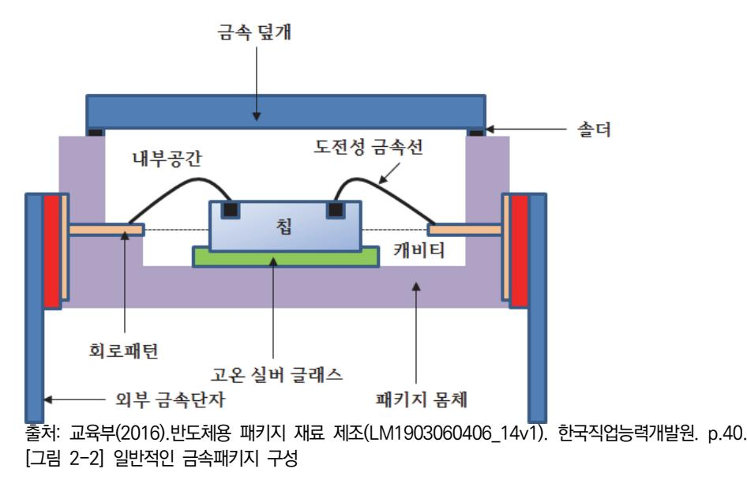

### 숕 플라스틱 패키지

플라스틱 패키징은 융용 공정을 통하여 다이와 리드프레임을 봉합하기 위해 에폭시 폴리머를 사용한다. 대개 대량생산 제품 생산에 이용되는데 다이가 부착되고, 금속선이 접속되면 리드프 레임은 제거된다. 플라스틱 패키지는 다양한 형태로 존재하고, 대부분 대량 역류 납땜에 의해 서 인쇄회로기판(PCB) 위에 대응되는 패드에 부착된다.

1. 특징

- (1) 낮은 원가와 가벼운 무게
- (2) 교차 연결 폴리머의 차원적 안전성 이온적 안정
- (3) 공정온도에서의 저항성
- (4) 에폭시 파라미터들의 낮은 습기 흡수율
- (5) 확장 온도계수(TCE)를 위한 주입기의 추가

2. 종류

- (1) PIH용 플라스틱 이중 인 라인(in-line) 패키지(DIP)
- (2) 단일 인 라인(in-line) 패키지(SIP)
- (3) 날개형 표면 돌출 리드를 갖는 TSOP
- (4) 이중 인 라인 메모리 모듈(DIMM)
- (5) 날개형 표면 돌출 리드를 갖는 QFT
- (6) 표면 외부에 J- 리드를 갖는 PLCC
- (7) 리드가 필요 없는 칩 캐리어(LCC)

### 숖 세라믹 패키지

세라믹 패키지는 용접 밀봉을 갖는 최대의 신뢰성과 높은 전력을 요구하는 분야의 IC 패키징 에 사용되는 기술이다. 내화성 세라믹과 적층 세라믹 2가지 방법이 있다. 세라믹 기술은 다수 의 신호, 접지, 전력, 접합, 봉인된 혼합패키지 제조에 유용하다.

1. 내화성 세라믹(refractory ceramic)

일반적으로 IC 패키징에 사용된다. 세라믹 기판은 적당한 유릿가루와 슬러리를 형성시키는 유기용제가 혼합된 알루미나(Al2O3) 가루 재료들로 만들어진다. 주요 재료는 특성은 아래 와 같다.

(1) 슬러리

1 mil 두께와 건조된 얇은 시트로 주조

(2) 패턴화

다층 세라믹 기판으로 맞춤 배선 회로들은 금속화된 비아들로 개별적인 층에 증착된다.

(3) 세라믹시트

정밀하게 얇게 잘려져 있고, 모놀리딕 몸체 구성을 위해 1600℃ 가열되는 HTCC(high temperature cofired ceramic) 방법과 800~1050℃로 가열되는 LTCC( low temperature cofired ceramic) 방법이 있다.

(4) 황동 핀

주조되며, 핀 격자 배열(PGA)의 경우에는 600개 정도의 핀이 사용된다.

2. 적층 세라믹(laminated ceramic)

두 세라믹 개체 사이에 리드프레임을 위치시키고 칩 선 접속 후 두 개의 세라믹을 압축하 는 기술이다. 세라믹 층들은 낮은 온도의 유리 밀봉을 사용하여 용접하는 방식이다. [그림 2-3]에 CERDIP 패키지의 구성이 도시되어 있다. 중요 재료는 세라믹, 유리, 에폭시, 리드 프레임이다.

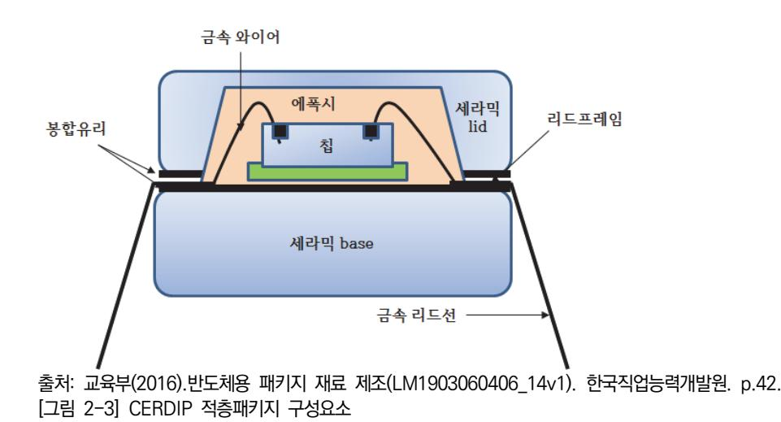

숗 진보된 응용 패키지

저 비용에서 신뢰성, 고속, 고밀도를 갖는 패키징 기술이 IC 패키지의 발전 방향이다. 결국, 내 부 상호연결의 수를 감소시키고 칩의 밀도를 증가시키는 것이다. 이런 기술의 결과는 전기적 성은에 영향을 주는 고장 가능성의 감소, 회로저항 감소, 기생축전회로 감소를 이룰 수 있다.

1. 플립 칩 패키지

플립 칩은 기술은 기판에 칩 결합 패드의 내부연결을 위해 주석과 납으로 합금 된 솔더로 형성된 범프를 사용한다. 기판은 세라믹이나 플라스틱 재질을 기반으로 유연성 있는 폴리마 이드 회로가 사용된다. 플립 칩의 신뢰도는 칩과 기판 사이에 열팽창 계수(CTE)가 매우 중

요하다. 과도가 CTE 불일치는 접합부의 응력을 발생시키고 땜납의 크랙에 의한 고장을 유 발한다. 이 문제는 칩과 기판 사이에 흐르는 에폭시 언더필(underfill)을 사용함으로 해결할 수 있다. 솔더 접합부에서 응력 감소를 언더필 에폭시 사용으로 10배 이상 줄일 수 있다. 일반적인 구조가 [그림 2-4]에 도시되어있다. 주요 재료는 솔더 범프, 언더필(underfill)용 에폭시, 기판이다.

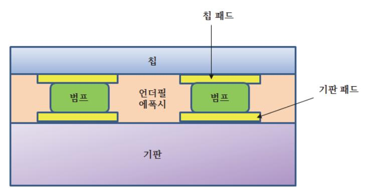

출처: 교육부(2016).반도체용 패키지 재료 제조(LM1903060406\_14v1). 한국직업능력개발원. p.43. [그림 2-4] 플립 칩 기본구조 및 구성 재료

2. BGA(ball grid array)

핀 격자 배열(PGA)과 유사하나 핀 대신 솔더 볼을 사용한다는 점이 다르다. 그래서 가장 중요한 재료는 동일 사이즈, 접합과 인장 강도가 우수한 솔더 볼의 선택이 매우 중요하다. 대개 주석과 납의 합금 볼을 사용한다. 기판은 열적 안정성이 강한 플라스틱을 사용한다. 플라스틱 기판은 신호지연이 줄어드는 낮은 절연율을 갖고 있다.

3. 기판 위의 칩(COB)

COB는 SMT와 PIH 부품들과 함께 기판 위에서 직접 IC 칩을 설계하기 위해 개발된 기술 이다. IT 기술의 급속한 발전에 따라 전자기기는 소형화뿐만 아니라 카메라, 통신, 게임 등 의 융복합된 기기로 변화하고 있으며, 이를 위해 반도체 소자 및 회로소자를 기판에 패키징 하기 위해 신기술이 필요하였다. 본 기술에서 중요한 재료는 복잡한 회로를 구성하는 회로 기판이다. 우수한 열방출, 고유전율, 열팽창 계수가 양호한 기판이 요구된다.

4. 테이프 자동 접속(TAB)

칩 캐리어로 플라스틱 테이프를 사용하는 고성능 입/출력 패치징 기술이다. 테이프는 폴리 마이드 절연 막의 2개 층 사이에 겹쳐진 얇은 구리 막으로 형성된다. 구리는 칩에 부착되 는 범프를 위한 내부 단자 접속 영역과 회로기판의 납땜 부착을 위한 외부 단자 접속 영역 을 갖는 칩 접속 패드에 정합되는 단자를 구성하기 위해 식각된다. 칩 부착 후 칩 보호를 위해 에폭시 수지로 봉합된다. 중요재료는 식각과 회로선 구성에 있어서 식각 저항성과 강 한 접착성이 요구되는 테이프와 봉합되는 에폭시 수지이다.

### 5. 다중 칩 모듈(MCM)

하나의 기판 위에 각각의 다이를 장착한 하나의 패키지이다. 중요한 재료는 기판으로 세라 믹 또는 고밀도 칩으로 발전된 인쇄회로가 쓰인다.

6. 칩 스케일링 패키지(CSP) CSP 패키지는 다이의 1.2배가량의 크기를 가지는 패키지 기술이다. 플립 칩과 BGA 기술 의 혼합체이다. 재료도 플립 칩과 BGA에서 쓰이는 재료와 동일하다.

### 수행 내용 / 집적회로 제조공정에 적합한 재료 선정하기

#### 재료·자료

- 패키지 재료 규격 및 보관에 관한 문서
- 에폭시 수지, 리드프레임, 솔더, Wire(Au, Al, Cu), Flux
- 다양한 종류별 패키지 시료

### 기기(장비 ・ 공구)

컴퓨터, 인터넷, 아래한글 등 소프트웨어, 프린터, 제본기

### 안전 ・ 유의사항

시료 취급 시 일어날 수 있는 위험요소를 파악한다.

#### 수행 순서

- 숔 전통적 IC 패키지 구조와 소요되는 중요 재료에 대하여 조사하고, 보고서를 작성한다.
  - 1. 금속패키지의 기본적 구조와 소요되는 중요 재료에 대하여 조사한다.
    - (1) 재료의 시험규격서를 검토한다.
    - (2) 재료의 환경 안정성에 대하여 조사한다.
    - (3) 재료의 물리/화학/역학적 특징을 파악한다.
    - (4) 제조공정 시 미치는 문제점에 대하여 파악한다.
    - (5) 보관/품질관리 문제점을 파악한다.
    - (6) 위 사항을 기준으로 적용재료에 대한 보고서를 작성한다.
  - 2. 플라스틱 패키지의 기본적 구조와 소요되는 중요 재료에 대하여 조사한다.

- (2) 재료의 환경 안정성에 대하여 조사한다.
- (1) 재료의 시험규격서를 검토한다.
- 3. 기판 위의 칩 패키지의 구조와 중요 재료에 대하여 조사하고, 보고서를 작성한다.
- (6) 위 사항을 기준으로 적용재료에 대한 보고서를 작성한다.
- (5) 보관/품질관리 문제점을 파악한다.
- (4) 제조공정 시 미치는 문제점에 대하여 파악한다.
- (3) 재료의 물리/화학/역학적 특징을 파악한다.
- (1) 재료의 시험규격서를 검토한다.

(2) 재료의 환경 안정성에 대하여 조사한다.

- 2. BGA 패키지의 구조와 중요 재료에 대하여 조사하고, 보고서를 작성한다.
- (6) 위 사항을 기준으로 적용재료에 대한 보고서를 작성한다.
- (5) 보관/품질관리 문제점을 파악한다.
- (4) 제조공정 시 미치는 문제점에 대하여 파악한다.
- (3) 재료의 물리/화학/역학적 특징을 파악한다.
- (2) 재료의 환경 안정성에 대하여 조사한다.
- (1) 재료의 시험규격서를 검토한다.
- 1. 플립칩 패키지의 구조와 중요 재료에 대하여 조사하고, 보고서를 작성한다.
- 숕 전통적 IC 패키지 구조와 소요되는 중요 재료에 대하여 조사하고, 보고서를 작성한다.
- (3) 내화성 패키지와 적층형 패키지의 차이점을 조사한다.
- (2) 적층형 패키지에 소요되는 재료에 대하여 조사한다.
- (1) 내화성 패키지에 소요되는 재료에 대하여 조사한다.
- 3. 세라믹 패키지의 기본적 구조와 소요되는 중요 재료에 대하여 조사한다.
- (6) 위 사항을 기준으로 적용재료에 대한 보고서를 작성한다.
- (5) 보관/품질관리 문제점을 파악한다.
- (4) 제조공정 시 미치는 문제점에 대하여 파악한다.
- (3) 재료의 물리/화학/역학적 특징을 파악한다.
- (2) 재료의 환경 안정성에 대하여 조사한다.
- (1) 재료의 시험규격서를 검토한다.

- (4) 제조공정 시 미치는 문제점에 대하여 파악한다.
- (5) 보관/품질관리 문제점을 파악한다.
- (6) 위 사항을 기준으로 적용재료에 대한 보고서를 작성한다.
- 4. 테이프 자동 접속(TAB) 패키지 중요 재료에 대하여 조사하고, 보고서를 작성한다.
  - (1) 재료의 시험규격서를 검토한다.
  - (2) 재료의 환경 안정성에 대하여 조사한다.
  - (3) 재료의 물리/화학/역학적 특징을 파악한다.
  - (4) 제조공정 시 미치는 문제점에 대하여 파악한다.
  - (5) 보관/품질관리 문제점을 파악한다.
  - (6) 위 사항을 기준으로 적용재료에 대한 보고서를 작성한다.
- 5. 다중칩모듈(MCM) 패키지의 중요 재료에 대하여 조사하고, 보고서를 작성한다.
  - (1) 재료의 시험규격서를 검토한다.
  - (2) 재료의 환경 안정성에 대하여 조사한다.
  - (3) 재료의 물리/화학/역학적 특징을 파악한다.
  - (4) 제조공정 시 미치는 문제점에 대하여 파악한다.
  - (5) 보관/품질관리 문제점을 파악한다.
  - (6) 위 사항을 기준으로 적용재료에 대한 보고서를 작성한다.
- 6. 칩 스케일 패키지(CSP)의 중요 재료에 대하여 조사하고, 보고서를 작성한다.
  - (1) 재료의 시험규격서를 검토한다.
  - (2) 재료의 환경 안정성에 대하여 조사한다.
  - (3) 재료의 물리/화학/역학적 특징을 파악한다.
  - (4) 제조공정 시 미치는 문제점에 대하여 파악한다.
  - (5) 보관/품질관리 문제점을 파악한다.
  - (6) 위 사항을 기준으로 적용재료에 대한 보고서를 작성한다.

## 2-3. 선정 재료의 도출된 문제점 해결방안 제시

학습 목표 • 선정된 반도체 패키지 재료의 도출된 문제점에 대한 해결방안을 제시할 수 있다.

### 필요 지식 /

### 숔 시험규격 검토

재료에 대한 문제점을 해결하기 위한 첫 번째 단계는 재료에 대한 수입검사인데 이 검사를 위 해서는 규격의 검토가 선행되어야 한다. 재료 제조회사는 제품 생산 후 최종 검사에 해당된다.

1. 개요

국가마다 재료시험 규격이 있다. 그 내용에는 재료시험의 방법과 도면이 첨부되어 있다. 또 한, 필요할 때는 재료의 생산 방법, 화학 성분, 열처리 조건, 재료 선택법 및 기계적 시험 내용에 관련된 조항도 규격화되어 있다.

2. 경도시험의 재료 시험 규격

경도란 재료표면에 특수한 압 입자를 사용하여 중력이 작용하는 수직 방향으로 일정하중을 가하거나 무게가 일정한 해머(추)를 일정한 높이에서 낙하시켰을 때 재료표면의 변형에 대 한 저항력을 수치로 나타내는 값으로서 재료의 단단한 정도를 파악하고자 시험하는 것이다. 재료에 정적 하중을 경화 처리된 강구(steel ball)나 다이아몬드(원추, 각 추형)를 통하여 부 하하여 발생된 압흔의 면적이나 표면적 또는 깊이 등으로 경도를 나타내는 시험법으로 브 리넬 경도시험(KS B 0805), 로크웰 경도시험(KS B 0806), 비커스 경도시험(KS B 0811) 등이 있다.

3. 인장시험의 재료 시험 규격

저온 및 고온 시험용 시험편 가열, 냉각법에 대한 규격이다. 미국에서는 ASTM E8~50과 E8~52T, 영국은 BSI 8. 독일은 DIN 50125, DIN 50146 및 50149, 일본은 JISB 7701 호 등으로 지시되어 있다. 우리나라에서는 KS B 0801로 규정되어 있다.

4. 충격시험의 재료 시험 규격

KS B 0809, KS B 0810 등에 의하면 충격 시험은 충격 하중을 부하하는 방법에 따라 충격 인장, 충격 압축, 충격 비틀림 등으로 구분되고 있으나 일반적으로 이용되는 것은 노치 시험편 을 사용한 충격 굽힘 시험이며, KS B 0810에 샤르피(Charpy)충격 시험으로 규정되어 있다.

5. 조직시험의 재료 시험 규격

조직시험편은 주로 현미경 조직관찰을 위해 제작되는 시험편이다. 다양한 방법으로 조

45

직시험이 이루어진다.

6. 피로 시험의 재료시험 규격

재료는 항복 강도나 인장 강도 보다 매우 낮은 응력이 발생되는 반복적인 하중이 부하되어 도 재질이 경화 또는 취약하게 변화되면서 미세 균열이 발생하고 이 균열이 점차 진행되어 최후에는 파단에 이르게 된다. 이와 같은 과정들을 재료의 피로 현상이라고 하며 피로 시험 은 재료의 반복 하중에 대한 강도뿐만 아니라 그 형상, 크기, 가공방법 및 하중 부하 방법 의 영향을 구하기 위하여 실시되며 관련 규정은 KS B ISO 1099, KS B ISO 1352등이 있다.

### 숕 시험제품 정보 및 시험재료의 확인

공정 중에 문제가 발생되는 경우 맨 처음 행하여야 하는 활동은 장비와 공정을 조사해야 하고, 만일 이상이 없다면 입고된 제품의 재료 이력을 살펴보아야 한다. 본 교재에서는 와이어 본딩 에 주재료인 금에 대한 시험재료의 예를 들어 설명하고자한다.

1. 시험제품에 대한 정보수집

개발제품에 문제가 발생되면 최우선으로 재료에 대한 생산처로부터 생산과정에 대한 모든 이력을 검토해야 한다.

#### 2. 시험재료의 확인

먼저 시험재료의 현재 상태확인을 위해 시험재료의 제조공정에 대한 정보를 파악한다. 시험 재료에 대한 화학성분 및 물리적 성질을 파악하여 시험 수행 시 검토한다. 재료 제조업체가 발행하는 재료 성적서를 확인한다.

3. 물리적 특성 파악

본딩의 주재료인 금 와이어의 경우 비중 면에서 금은 19.3이라는 비중을 갖기 때문에 용융 상태에서 교반이 일어나지 않는 한 맨 아래층에 잔류하게 되고 비중이 가벼운 금속들은 위 로 떠오르게 됨을 알 수가 있다.

### 4. 화학적 특성 파악

질산을 썼을 때 금은 반응하지 않으므로 금 자체 그대로 있는 반면 은과 동은 질산은 또는 질산구리로 변하여 액체상태가 된다. 따라서 금만 남고 나머지는 액체 상태이므로 이것을 여과지에 걸러내면 금과 질산에 녹지 않은 소량의 금속만 남게 된다.

### 수행 내용 / 선정된 재료의 문제점 해결방안 제시하기

### 재료·자료

- 시험의뢰서, 시험절차서, KS 및 관련 규격
- 시험장비 사양서, 시험재료 성적서, 작업지침서

### 기기(장비 ・ 공구)

컴퓨터, 인터넷, 아래한글 등 소프트웨어, 프린터, 제본기

### 안전 ・ 유의사항

- 과도한 하중이 가해지지 않도록 조작한다.
- 각종 약품 등의 취급은 파손과 화기에 유의하여 취급한다.
- 시험방법이나 시료는 정해진 규격을 사용하여 시험을 진행한다.
- 시험목적에 적합한 시험기기를 선택하여야 한다.
- 시료의 채취, 시료의 가공 및 시험조건 등의 결정은 시험목적에만 사용해야 한다.

#### 수행 순서

숔 시험 규격 검토 작업을 수행한다.

- 1. 고객으로부터 접수한 요구 자료를 검토한다.
  - (1) 국가별 재료시험 규격을 조사한다.
  - (2) 재료시험의 방법과 도면을 확보한다.
  - (3) 재료의 생산 내용에 관련된 조항의 규격화를 확인한다.
    - (가) 방법
    - (나) 화학 성분
    - (다) 열처리 조건
    - (라) 재료 선택법 및 기계적 시험방법
- 2. 시험의뢰서에서 요구하는 시험수행을 위해 가장 적합한 절차를 확정한다.
  - (1) 시험의뢰서를 검토한다.

- (2) 시험항목을 설정한다.
- (3) 시험조건을 설정한다.
- (4) 판정규격서를 작성한다.
- (5) 시험장비를 설정한다.
- (6) 시험계획과 일정을 수립한다.
- 3. 시험제품 정보 및 시험재료를 확인한다.
  - (1) 시험제품에 대한 정보를 수집한다.
    - (가) 공정 이력
    - (나) 구성 성분 분포 파악
  - (2) 시험재료의 성적서를 확인한다.
  - (3) 물리적 특성 파악
  - (4) 화학적 특성 파악
- 4. 시험에 대한 표준매뉴얼 또는 작업사양서를 검토한다.
- 5. 수행해야 할 재료시험의 시험규격을 검토한다.
  - (가) 인장시험의 규격 검토 작업을 수행한다.
  - (나) 경도시험의 규격 검토 작업을 수행한다.
  - (다) 충격시험의 규격 검토 작업을 수행한다.
  - (라) 피로시험의 규격 검토 작업을 수행한다
  - (마) 굽힘 시험의 규격 검토 작업을 수행한다.
  - (바) 물리적 재료시험의 규격을 검토한다.
  - (사) 화학적 재료시험의 규격을 검토한다.
  - (아) 코팅성능 재료시험의 규격을 검토한다.
- 숕 시험방법을 결정한다.
  - 1. 시험규격을 정확히 이해하여 올바른 시험방법을 선택하도록 한다.
  - 2. 고객 요구사항과 규격을 검토하여 시험방법을 결정한다.
  - 3. 고객의 요구조건을 만족할 수 있는 시험방법을 선정한다.
- 숖 시험절차서를 작성한다.
  - 1. 시험에 대한 표준매뉴얼 또는 작업사양서를 검토하여 시험절차서를 작성한다.
  - 2. 작업자가 참조할 수 있는 작업지시서를 작성한다.

### 학습 2 교수·학습 방법

### 교수 방법

- 반도체 패키지 공정별 주요 재료에 대하여 설명한다.
- 전통적 IC 패키지 구조와 소요되는 중요 재료에 대하여 설명한다.
- 진보된 IC 패키지 구조와 소요되는 중요 재료에 대하여 설명한다.
- 시험재료의 확인을 위해 시험재료의 제조공정에 대한 정보를 파악할 수 있게 한다.
- 시험재료에 대한 화학성분 및 물리적 성질을 파악하여 시험 수행 시 검토하도록 한다.
- 시험재료에 대한 화학성분 및 재료 물성치를 파악하여 시험 수행 시 활용하도록 한다.
- 시험절차서 작성 방법에 대하여 설명한다.
- 시험장비 설정에 대하여 설명한다.

### 학습 방법

- 반도체 패키지 공정별 주요 재료에 대하여 조사한다.
- 전통적 IC 패키지 구조와 소요되는 중요 재료에 대하여 조사한다.
- 진보된 IC 패키지 구조와 소요되는 중요 재료에 대하여 조사한다.
- 시험재료의 확인을 위해 시험재료의 제조공정에 대한 정보를 조사한다.
- 시험재료에 대한 화학성분 및 물리적 성질을 파악한다.
- 시험재료에 대한 화학성분 및 재료 물성치를 파악하여 시험 수행 시 활용한다.
- 시험절차서 작성 방법에 대하여 학습한다.
- 시험장비 설정에 대하여 학습한다.

### 학습 2 평 가

### 평가 준거

• 평가자는 학습자가 학습 목표를 성공적으로 달성하였는지를 평가해야 한다.

### • 평가자는 다음 사항을 평가해야 한다.

|                                   | 학습 목표                                             |  | 성취수준 |   |  |
|-----------------------------------|---------------------------------------------------|--|------|---|--|
| 학습 내용                             |                                                   |  | 중    | 하 |  |
| 공정별 패키지 재료 의 장·단점 파악           | - 반도체 공정별 패키지 재료의 장/단점을 파악할 수 있다.                 |  |      |   |  |
| 집적회로 제조 공정 에 적합한 재료 선 정     | - 반도체 직접회로 제조공정에 적합한 패키지 재료를 선정할 수 있다.         |  |      |   |  |
| 선정 재료의 도출된 문제점에 대한 해결 방안 제시 | - 선정된 반도체 패키지 재료의 도출된 문제점에 대한 해결방 안을 제시할 수 있다. |  |      |   |  |

### 평가 방법

• 서술형 시험

|                                   |                                   |   | 성취수준 |   |  |
|-----------------------------------|-----------------------------------|---|------|---|--|
| 학습 내용                             | 평가 항목                             | 상 | 중    | 하 |  |
| 공정별 패키지 재료 의 장·단점 파악           | - 반도체 공정별 패키지 재료의 장/단점을 파악하는 능력   |   |      |   |  |
| 집적회로 제조 공정 에 적합한 재료 선 정     | - 반도체 IC 제조공정에 적합한 패키지 재료 선정하는 능력 |   |      |   |  |
| 선정 재료의 도출된 문제점에 대한 해결 방안 제시 | - 선정된 반도체 패키지 재료의 도출된 문제점 분석 능력   |   |      |   |  |

• 사례 연구

|                                   |                                    |   | 성취수준 |   |  |
|-----------------------------------|------------------------------------|---|------|---|--|
| 학습 내용                             | 평가 항목                              | 상 | 중    | 하 |  |
| 공정별 패키지 재료 의 장·단점 파악           | - 반도체 공정별 패키지 기술동향 조사 능력           |   |      |   |  |
| 집적회로 제조 공정 에 적합한 재료 선 정     | - 반도체 IC 제조공정에 적합한 패키지 재료 종류 조사 능력 |   |      |   |  |
| 선정 재료의 도출된 문제점에 대한 해결 방안 제시 | - 문제 해결을 위한 사례 조사 능력               |   |      |   |  |

### 피드백

+

| 1. 서술형 시험                                         |
|---------------------------------------------------|
| - 시험의 답안에 대한 채점 결과와 오답 이유를 설명한다.                  |
| - 평가 결과 수준 미달인 학생은 부족한 부분 재교육, 우수한 자는 심화 교육 실시한다. |
| 2. 사례 연구                                          |
| - 신기술에 대한 보완교육                                    |
| - 패키지 분류 능력의 부족한 점을 동영상으로 미비한 부분 보완교육을 실시한다.      |
| - 불량 사례에 대한 동영상으로 미비한 부분 보완교육을 실시한다.              |
|                                                   |

| 학습 1 | 반도체용 패키지 재료 요구사항 파악하기 |  |  |  |
|------|-----------------------|--|--|--|
| 학습 2 | 반도체용 패키지 재료 선정하기      |  |  |  |
|      | 반도체용 패키지 재료 제조하기      |  |  |  |
| 학습 3 |                       |  |  |  |

## 3-1. 제조 공정별 장·단점 파악

학습 목표 • 반도체 패키지의 제조 공정별 장점과 단점을 파악할 수 있다.

### 필요 지식 /

### 숔 반도체 패키지 기술의 필요성

전자제품의 기술개발은 4가지 핵심기술로 나누어진다. 첫 번째는 반도체 칩 제조기술, 두 번째 는 반도체 패키징 기술, 세 번째는 제조기술, 네 번째는 소프트웨어 기술을 들 수 있다. 반도체 기술은 미세 선폭, 셀(cell)의 고 집적화, 고속신호, 열 방출 문제 해결을 중심으로 눈부시게 발 전하고 있는 반면 패키징 기술은 진보가 없어 반도체 자체의 성능 보다는 패키징과 이에 따른 전기 접속에 의해 결정되고 있는 실정이다. 이런 측면에서 볼 때 패키지 제조기술의 중요성이 무엇보다 절실하다. 패키지 제조 공정기술에서 고려해야 할 사항은 4가지이다. [그림 3-1]에 그 관계가 도시되어 있다.

1. 전력 공급

저잡음 전력/접지 회로 구현, 관련 재료, 공정

2. 신호 연결

신호의 전달속도, 연결의 신뢰성, 회로설계, 도체/부도체 재료, 접속기술

3. 열 방출

패키징은 소자에서 발생되는 열을 방출시키는 역할을 충분히 해야 한다. 소자에서 발생되는 열은 반도체 소자의 성능을 저하시키고, 결국 신뢰성에 중대한 영향을 준다.

#### 4. 외부로부터의 보호

기계적, 자연적, 화학적, 열적 환경 변화에 강한 신뢰성

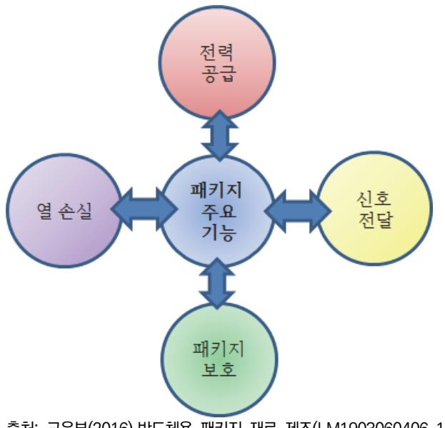

출처: 교육부(2016).반도체용 패키지 재료 제조(LM1903060406\_14v1). 한국직업능력개발원. p.55. [그림 3-1] 패키지 공정기술의 고려사항

### 숕 제조공정의 장단점 비교 항목

반도체 패키징 제조공정기술에 있어서 고려되어야 할 중요한 사항은 4가지이며 이 사항들은 결 국 패키지 제조공정의 장단점을 파악하는 기준이 된다.

1. 성능 측면

기계적 안정성, 전기적 속도와 안정성, 열 방출 능력, 신뢰성 등의 성능 요구특성을 만족해 야 한다. 성능은 전기적인 특성을 나타내며 판단은 시간 지연 항목이다. 시간 지연과 연관 된 변수는 아래와 같고, 결국 이런 구조와 설계를 구현하는 공정이 이루어져야 한다.

- (1) 회로의 집적도
- (2) 접속 길이
- (3) 패키지 재료
- 2. 패키지 크기 측면

칩이 소형화되더라도 패키지의 크기가 줄어들지 않으면 의미가 없다. 즉 패키지 효율을 높 이는 것은 패키지의 소형화와 성능에 큰 영향을 미친다. 이는 최종 실장 되는 전자제품의 크기를 결정하기 때문이다. 패키지 크기를 줄이는 방법은 아래와 같고, 소형화를 구현하기 위한 제조공정이 필요하다.

- (1) 4면 주변형(peripheral)에서 격자형(area array) 접속
- (2) 리드의 피치 축소
- 3. 생산성과 가격 측면

아무리 좋은 설계와 구조를 갖고 있더라도 숙련된 생산기술이 없으면 무의미하다. 더불어

53

저가의 생산기술은 패키지의 경쟁력을 강화한다. 가격 경쟁력이 있는 패키지의 설계, 재료, 공정과 계속적인 생산성 향상이 매우 중요하다.

4. 신뢰성 측면

시스템의 신뢰성은 각 부품의 결함 발생률에 의해 결정된다. 패키지의 신뢰성은 열, 전기 적 특성에 좌우된다. 열적 신뢰성 증진은 설계와 재료 선택을 구현할 수 있다. 전기적 신뢰 성 증진은 잡음을 줄이기 위한 신호와 접지 면을 분리하는 것이다. 이를 구현하기 위해서는 설계, 적절한 재료 선별과 아울러 제조공정기술이 매우 중요하다. 어떤 제조공정을 사용하 느냐에 따라 소자 특성이 완전히 달라지기 때문이다.

### 수행 내용 / 제조 공정별 장단점 파악하기

### 재료·자료

- 패키지 공정 흐름도, 패키지 종류별 사양 및 특성
- 반도체 기판, 패키지 종류별 제품

### 기기(장비 ・ 공구)

광학현미경, 비파괴 X-RAY 분석 장비

### 안전 ・ 유의사항

시료 취급 시 안전사항을 준수해야 한다.

### 수행 순서

- 숔 반도체 패키지 기술의 필요성에 대하여 조사한다.
  - 1. 전력 공급에 관련된 필요한 사항에 대하여 조사한다.
  - 2. 신호 연결에 관련된 필요한 사항에 대하여 조사한다.
  - 3. 열 방출에 대한 역할에 대하여 조사한다.
  - 4. 외부로부터의 보호에 대하여 조사한다.
- 숕 제조공정의 장단점 비교 항목에 대하여 조사하고, 보고서를 작성한다.
  - 1. 성능 측면에서 장단점이 되는 항목에 대하여 조사한다..

- 2. 패키지 크기 측면에서 개선을 주는 방법에 대하여 조사한다.
- 3. 생산성과 가격 측면에서 장점이 되어야 하는 사항에 대하여 조사한다.
- 4. 신뢰성과 관련된 항목에 대하여 조사한다.
- 5. 장단점 파악에 관련된 보고서를 작성한다.

숖 제조공정기술별 장단점을 조사하고, 보고서를 작성한다.

- 1. CSP 공정기술이 다른 제조공정기술과 다른 점을 조사한다.
  - (1) 장점에 대하여 조사한다.
  - (2) 단점에 대하여 조사한다.
- 2. MCM 공정기술이 다른 제조공정기술과 다른 점을 조사한다.
  - (1) 장점 사항에 대한 이유에 대하여 조사한다.
    - (가) 소형경량화
    - (나) 높은 전기적 성능
    - (다) 전력사용의 감소
    - (라) 칩/기판 면적 증가
    - (마) 수리 가능
  - (2) 단점에 대하여 조사한다.
- 3. 플립 칩 공정기술이 다른 제조공정기술과 다른 점을 조사한다.
  - (1) 장점 사항에 대한 이유에 대하여 조사한다.
    - (가) 사이즈, 높이, 무게의 감소
    - (나) 기능성의 증가
    - (다) 성능의 향상
    - (라) 신뢰성의 향상
    - (마) 열 특성의 향상
    - (바) 저비용
  - (2) 단점에 대하여 설명한다.
- 4. SIP (System In Package) 공정기술이 다른 제조공정기술과 다른 점을 조사한다.
  - (1) 단일형 패키지 기술과 비교한 장점에 대하여 조사한다.
  - (2) SoC(system on chip) 기술과 비교한 장점에 대하여 조사한다.

- (3) 비교표를 작성한다.
- (4) 현재 개발 기술동향에 대하여 조사한다.
- (5) 기 개발제품의 특성과 공정기술에 대하여 조사한다.
- (6) 현재 개발방향과 기 공정기술의 차이점을 비교한다.
- (7) 신제품 개발에 특징될 만한 사항을 수립한다.
- (8) 보고서를 작성한다.

### 3-2. 재료별 제조(공정/장비) 파라미터 파악 및 적용

학습 목표 • 반도체 패키지 재료별 제조(공정/장비) 파라미터를 파악하고 적용할 수 있다.

### 필요 지식 /

### 숔 개요

본 학습에서는 패키지 제조공정 시 사용되는 주요 재료의 적용 공정/장비 관련 변수 (parameter)들에 대하여 알아본다. 주요 재료는 접착제, 솔더(solder), EMC 몰드 수지 등이 다. 물론 다른 재료도 많이 쓰이지만 언급한 3가지 재료들은 공정변수와 연관성이 깊어 본 학 습에서 다루고자 한다.

### 숕 접착제

다이 본딩 공정에서 사용된다. 접착제의 종류가 [그림 3-2]에 도시되어있다. 이 재료들 중 에 폭시 수지에 대하여 알아본다.

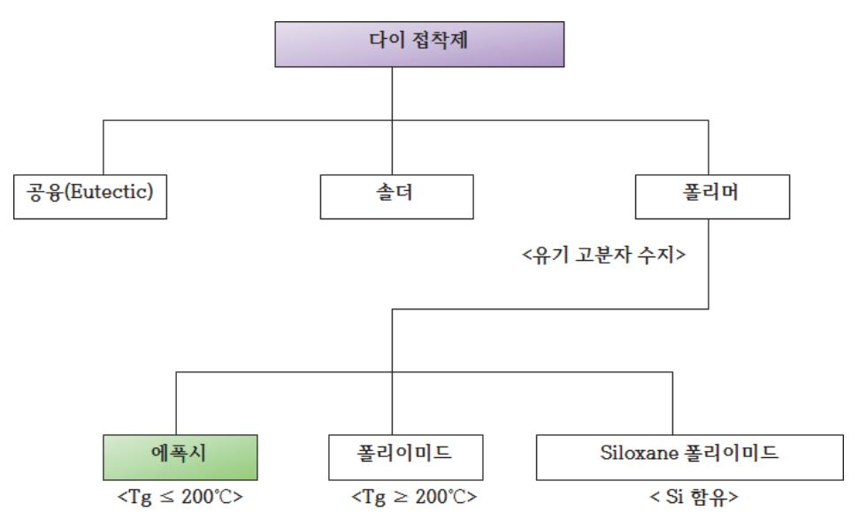

출처: 교육부(2016).반도체용 패키지 재료 제조(LM1903060406\_14v1). 한국직업능력개발원. p.59. [그림 3-2] 다이 부착 공정에 사용되는 접착제의 종류

1. 접착의 원리

계면에서의 Epoxy와 이종물질 간 접착 메커니즘은 여러 가지 상호 작용력이 작용하고 있 으며 특별히 어떤 힘이 주도적인지는 정확히 규명되지 않고 있다. 두 가지 요인으로 축약할 수 있다.

- (1) 에폭시 접착제 말단기의 화학결합(접착력의 약, 5%)
- (2) 에폭시 접착제와 피 접착제와의 기계적 결합(95%)

피 접착제의 공간(기판표면)에 접착제가 침투하여 쐐기처럼 서로 물리며, 이것이 경화 시 접착력을 발생한다.

2. 주요 공정 변수

경화 시 온도와 시간이 매우 중요하다. [그림 3-3]에 경화 시 시간과 온도 변수에 대한 관 계가 도시되어 있다.

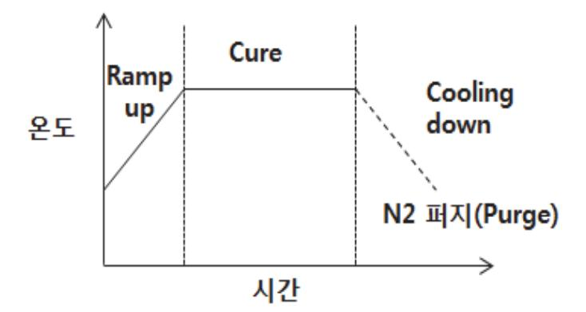

출처: 교육부(2016).반도체용 패키지 재료 제조(LM1903060406\_14v1). 한국직업능력개발원. p.60. [그림 3-3] 다이 부착 공정에서 경화 시 시간과 온도 관계도

3. 장비 변수

다이 본더(bonder)의 변수는 패키지 종류에 따라 2가지로 구분되는데 <표 3-1>과 <표 3-2>에 변수에 대한 조건을 나타내었다.

|  |  | <표 3-1> 일반적인 FBGA type 장비 변수 |  |  |  |  |
|--|--|------------------------------|--|--|--|--|
|--|--|------------------------------|--|--|--|--|

| Package     | Bond Force | Bond Time | Pickup Force | Pickup Time | UV Tape | Pin Height Non-U V Tape | Pin Speed |
|-------------|---------------|--------------|-----------------|----------------|------------|-------------------------------|-----------|
| Unit        | gf            | msec         | gf              | msec           |            | mm                            | mm/sec    |
| FBGA(Epoxy) | Max 1000      | Max 2000     | Max 100         | Max 100        |            | Max 0.5 Max 1.5               | Max 50    |
| FBGA(Film)  | 500~ 5000     | 500~ 3000    | Max 100         | Max 800        |            | Max 0.5 Max 1.5               | Max 50    |

〈표 3-2〉 일반적인 USB type 장비 변수

| Package         | Bond Force | Bond Time | Pickup Force | Pickup Time | Pin Height | Pin Speed | Stage Temp. |
|-----------------|---------------|--------------|-----------------|----------------|---------------|-----------|----------------|
| Unit            | gf            | msec         | gf              | msec           | mm            | mm/sec    | °C             |
| DA1(Control IC) | 70~ 150       | Max 500      | Max 100         | Max 800        | Max 0.5       | Max 50    | -              |
| DA2 (Epoxy)     | Max 1000      | Max 2000     | Max 100         | Max 800        | Max 0.5       | Max 50    | -              |
| DA3~5(WBL)      | 1500±500      | Max 1000     | Max 100         | Max 800        | Max 0.5       | Max 50    | 150±5          |
| DA6~9(WBL)      | 1500±500      | Max 1000     | Max 100         | Max 800        | Max 0.5       | Max 50    | 160±5          |

3 EMC 몰드

패키지 제품은 EMC를 이용하여 칩을 환경으로부터 화학적 물리적 보호 역할, 열 방출 역할, 열/습기로부터 신뢰성 확보를 한다.

- 1. 주요 공정 변수
  - (1) 온도(Temperature)

몰드 컴파운드 속에 있는 레진(resin)과 큐어링제(curing agent)는 온도의 영향을 크게 받으며 반응하여 열경화성 물질이 된다. 관리 온도는 3부분이다.

(가) 보관 온도

4°C 이하의 낮은 온도에서 보관한다.

(나) 사용 온도

냉동고에서 꺼낸 후 실내 온도에 도달될 때까지 24시간 실내에 두고, 통상 실내 온 도에 이른 후 6일 이내에 사용한다.

(다) 몰딩 온도

몰드 컴파운드에 따라 차이가 있다. 일반적으로 큐어(cure) 온도는 170℃ 정도이다.

(라) 몰딩 후 베이크 온도(PMC, Post Mold Cure)

몰드 성형 이후 베이킹을 하는 주된 이유는 EMC를 완전히 경화시키기 위해서이다. 몰딩 완료 후에 밀봉된 제품을 전기오븐에 175℃에서 3 ~ 4시간이나 150℃에서 8 시간 정도 베이킹(baking)한다.

- (2) 압력(Pressure)
  - (가) 클램프 압력(Clamp Pressure)

클램프 압력이란 상하 몰드 다이가 닫혔을 때 서로 미는 힘이다.

(나) 램 압력(Ram Pressure)

램 압력은 램 포트에 펠렛(pellet)을 넣은 후 램으로 미는 힘이다. 랩 압력은 제품의 밀도(package density)와 관련이 깊다. 램 압력이 충분해야 높은 압력 아래에서 플 라스틱이 성형되어 적정 밀도를 유지하게 되고, 적정 밀도가 유지되어야만 내습성과

기계적 특성이 좋아진다.

(3) 시간(Time)

온도와 시간은 서로 관련되어 큐어링(curing)에 크게 영향을 준다. 즉, 시간에 따른 경 화의 정도가 다르다. 또한, 온도와 시간은 몰드 컴파운드의 점도(viscosity)에 결정적인 영향을 주는 요인들이다.

(4) 램 속도(Ram Speed)

펠렛(pellet)을 트랜스퍼 램으로 미는 속도를 말한다. 몰드 컴파운드는 일정 온도의 몰드 다이에서 고체 상태> 겔 상태 > 고체 상태로 변화를 한다. 따라서 겔 상태에서 몰드 컴 파운드를 캐비티(cavity)까지 충진을 한다. 램 속도가 너무 빠르거나 느리면 wire sweeping 발생이 증가하게 된다. 따라서 패키지 형상에 따라 최적의 램 속도를 결정해 야 한다.

(5) 램 압력(Ram Pressure)

트랜스퍼 램으로 펠렛을 밀 때의 압력으로 몰딩 공정의 중요한 조건 중 하나이다.

2. 몰드 장비

몰딩 작업은 몰딩 프레스에서 이루어진다. 몰드 프레스 주요 변수는 아래와 같다.

- (가) EMC를 밀어내는 램(ram) 압력과 속도
- (나) EMC가 몰드 다이의 동공(cavity)에 충전된 후 일정 시간 머무는 시간(In-mold cure time)
- 숗 솔더 볼 접합

기판 기반의 패키지에서 몰딩 공정이 완료된 후에 PCB에 솔더 볼(solder ball)을 접합하여 전 기적으로 연결 시켜주는데 이를 SBM(Solder Ball Mount) 공정이라 한다.

1. SBM 공정순서

PCB의 구리 패드(pad) 위에 플럭스(flux)를 도팅(dotting)한 다음 솔더 볼을 임시적으로 부착시킨 후 리플로우(reflow)에서 솔더 볼의 용융 온도 이상이 되면 솔더 볼은 PCB에 완 전한히 부착이 이루어지게 된다. 이때 솔더 볼과 구리 패드 사이에서 금속 간 화합물 (Intermetallic Comopund)이 형성되어 단단하게 부착된다. 리플로우(Reflow) 공정이 최 대변수이다. 리플로우 공정은 솔더 볼을 PCB 위에 부착하기 위해서 고온을 가하여 솔더 볼 과 PCB 사이에 있는 솔더를 용융시키어 접합하는 공정이다.

2. 리플로우(Reflow) 공정변수

리플로우 공정 중에서 가장 중요한 변수는 온도 곡선이다. 이온도 곡선은 시간에 따른 온도 변화를 그래프로 나타낸다. [그림 3-4]에 온도 곡선이 도시되어있다.

[그림 3-4] 리플로우 공정 온도 곡선

(가) 예열 구간(Preheating Time, Pre Dwell)

솔더 볼 온도가 서서히 올라가는 구간으로, 플럭스의 유기 용재 성분이 증발되는 온 도까지 서서히 예열한다.

(나) 유지구간(Dwell Time)

솔더 볼의 용융 온도 이하에서 유지되는 시간으로, 솔더링의 양 · 불량 기준이 되는 구간이다.

- (다) 최고 온도 구간(Peak Temperature) 리플로우에서 최고 높은 온도 구간으로, 솔더 볼이 용융되어 PCB에 접합된다.
- (라) 온도 하강 구간(Cool down)

솔더 볼이 경화되는 구간으로, 솔더 볼의 표면 상태를 결정하는 요소이다.

(마) 램프 업(Ramp-up), 램프 다운(Ramp-Down)

 램프 업은 예열구간에서 최고온도 구간 사이의 온도 상승 기울기를 말하며, 램프 다운은 최고온도에서 상온까지 온도 하강 기울기를 나타낸다.

### 수행 내용 / 재료별 제조(공정/장비) 파라미터 파악 및 적용하기

재료·자료

- 패키지 재료 규격 및 보관에 관한 문서, 장비 매뉴얼
- 에폭시 수지, EMC, 솔더 볼
- 다양한 종류별 패키지 시료

기기(장비 ・ 공구)

- 컴퓨터, 인터넷, 아래한글 등 소프트웨어, 프린터, 제본기
- 리플로우(reflow) 장비, 다이 본더(bonder), EMC 몰딩 장비

### 안전 ・ 유의사항

- 재료 취급 시 일어날 수 있는 위험요소를 파악한다.
- 장비 취급 시 일어날 수 있는 위험요소를 파악한다.

### 수행 순서

숔 다이 접착제 재료에 대하여 공정과 장비에 대한 변수(파라미터)를 도표화 한다.

- 1. 접착의 원리에 대하여 조사한다.
- 2. 접착제 재료의 종류를 조사한다.
- 3. 다이 본딩 공정에 대하여 조사한다.
- 4. 다이 본딩 공정의 변수를 조사한다.
- 5. 다이 본딩 공정에서 경화 시 시간과 온도 관계도를 그려본다.
- 6. 일반적인 FBGA type 장비 변수들을 조사하고 도표화 한다.
- 7. 일반적인 USB type 장비 변수들을 조사하고 도표화 한다.
- 숕 EMC 몰딩 재료에 대하여 공정과 장비에 대한 변수(파라미터)를 도표화 한다.
  - 1. 주요 공정 변수에 대하여 조사한다.
    - (1) 온도(Temperature) 의존성에 대하여 조사한다.

- (가) 보관 온도
- (나) 사용 온도
- (다) 몰딩 온도
- (라) 몰딩 후 베이크 온도(PMC, Post Mold Cure)
- (2) 압력(Pressure) 의존성에 대하여 조사한다.
  - (가) 클램프 압력(Clamp Pressure)
  - (나) 램 압력(Ram Pressure)
- (3) 시간(Time) 의존성에 대하여 조사한다.
- (4) 램 속도(Ram Speed) 의존성에 대하여 조사한다.
- (5) 램 압력(Ram Pressure) 의존성에 대하여 조사한다.
- 2. 몰드 장비 변수에 대하여 조사하고, 도표화 한다.
  - (1) EMC를 밀어내는 램(ram) 압력과 속도 의존성에 대하여 조사한다.
  - (2) EMC가 몰드 다이의 동공(cavity)에 충전된 후 일정 시간 머무는 시간(In-mold cure time) 의존성에 대하여 조사한다.
- 숖 솔더 볼 접합공정과 장비에 대한 변수(파라미터)를 조사하고, 도표화 한다.
  - 1. SBM 공정순서를 작성해본다.
  - 2. 리플로우(Reflow) 공정변수 대하여 조사한다.
    - (1) 온도 곡선에 관련된 변수에 대하여 조사한다.
      - (가) 예열 구간(Preheating Time, Pre Dwell)
      - (나) 유지구간(Dwell Time)
      - (다) 최고 온도 구간(Peak Temperature)
      - (라) 온도 하강 구간(Cool down)
      - (마) 램프 업(Ramp-up), 램프 다운(Ramp-Down)
    - (2) 리플로우 공정 온도 곡선을 작성해본다.

## 3-3. 제조 공정의 도출된 문제점 해결방안 제시

학습 목표 • 반도체 패키지 재료별 제조공정의 도출된 문제점에 대한 해결방안을 제시할 수 있다.

### 필요 지식 /

숔 공정 문제점 해결방안을 위한 점검사항

공정과 장비에 의한 문제점을 해결하기 위한 첫 번째 단계는 공정의 규격서 검토가 먼저 선행 되어야 한다. 공정 규격서는 수행되어야 할 사용 재료, 공정 조건, 판정조건, 사용 장비에 규정 하고 있다. 재료 부분에 있어서는 규격에 맞지 않는 재료 사용 시 불량이 발생할 확률이 매우 높다. 비록 생산에서 문제가 발생하지 않을지라도 제품 사용 중에 실장 된 제품에 고장을 유발 하는 요소가 된다. 문제점을 제시하기 위해서는 아래와 같은 점검이 이루어져야 한다.

1. 재료

재료의 수명, 보관 기간을 점검해보고, 제조회사의 연구팀과 회의를 통하여 개선점을 도출 해야 한다.

2. 공정

개발된 공정 조건이 해당 패키지 제품에 맞는지 공정개발팀과 회의를 통해서 개선점을 도 출해야 한다. 이를 위해서는 공정 파라미터별 공정 데이터의 통계적 분석이 이루어져야 한 다. 또한, 품질보증팀에서 관리하는 불량보고서 중에서 유사한 불량현상을 사례연구하여 대 응 방안을 마련해야 시간을 줄일 수 있다.

3. 장비

먼저 주어진 패키지 제품 생산에 맞는 규격을 갖는 장비가 사용되었는지 점검한다. 문제가 없다면 장비의 성능유지와 관련된 자료들을 장비 엔지니어와 회의를 통하여 점검해야 한다. 예를 들어 정기적인 유지 보수 데이터를 통해 입고 시 장비 사양과 비교 검토하는 것이다.

4. 반도체 칩 제조과정

반도체 칩 제조과정에서의 패드의 문제성 때문에 발생되는 경우도 있으므로 웨이퍼 제조회 사와의 회의를 통해 점검되어야 한다.

5. 분석

불량요인이 무엇인지 패키지의 구조분석, 화학분석을 통하여 정확히 진단해야 한다.

### 숕 불량 사례

가장 기본이 되는 와이어와 솔더 볼을 사용하는 공정에 대하여 살펴보자.

1. 와이어 본딩 공정 불량현상

와이어 본딩 공정에서는 본드와 패드 계면의 강도나 스티치 본딩의 강도를 적절하게 확보 하는 것이 우선적인 점검 사항이지만, 와이어 스위핑, 와이어 스웨이, 와이어 새깅, 힐 크 랙, 본드 변형과 다양한 불량 현상이 발생하므로 이를 확인할 필요가 있다.

(1) 볼 리프트

볼이 본드 패드에 충분하게 붙지 않아 볼이 패드에서 떨어져 나가는 현상으로 볼 본드 와 패드에 가해지는 에너지가 충분하지 않거나, 본드 패드가 오염되어 있는 경우 발생한 다. 재료 측면에서는 순도가 낮은 와이어 재질의 사용이다.

(2) 2nd 본드가 리드에 붙지 않음

스티치 본딩을 진행한 골드와이어가 리드에 붙지 않는 현상은 본딩될 때의 에너지가 충 분하지 않았거나, 와이어 클램핑이 적절하지 않았을 경우, 캐피러리가 오염되어 있을 경 우, 리드가 오염되어 있을 경우 등에 발생할 수 있다. 이는 리드프레임 재료를 필히 점 검해야하는 사항이다.

(3) 볼 쇼트

본딩 패러미터가 커서 볼이 많이 변형되거나 스티치 본드가 불안정해서 생길 수 있다. 재료 측면에서는 순도와 열팽창 계수, 탄성계수가 다른 와이어 재질의 사용이다.

(4) 볼 변형

와이어의 물성이 적절하지 않거나, free air ball의 크기가 너무 작거나 클 때, 그리고 본딩 패러미터가 충분하지 않을 때 발생할 수 있다.

(5) 와이어 처짐 (wire sagging)

와이어의 루프가 적절하지 않고나 핸들링을 주의하지 않을 때 와이어 처짐이 생긴다. 이 문제는 장비와 공정, 재료의 탄성과 연관되어 있다.

(6) 와이어 끊어짐 (Broken wire)

외부로부터 응력이 가해지거나, 루프 형성이 너무 타이트 하게 되어 있는 경우, 또는 루 프형성 과정 중에서 반동이 발생하면서 와이어가 끊어질 수 있다. 이 문제는 장비와 공 정, 재료의 탄성과 연관되어 있다.

(7) 크레이터링 (Cratering)

본드 패드 아래 부분이 분화구처럼 통째로 떨어져 나오는 현상이 크레이터링이며, 패드 의 메탈층이 너무 얇을 경우 발생할 수 있다. 이 문제는 칩 제조 시 패탈 메탈인 알루 미늄과 연관성이 깊다.

2. 패키지 휨(warpage) 변형

(1) 반도체 패키지에 사용되는 재료 파악

반도체 패키지를 구성하는 몇 가지 중요한 재료가 있다. 실리콘 칩, 칩을 고정해 전기적 인 배선을 가능하게 하는 리드프레임 또는 폴리머 소재의 기판, 실리콘 칩과 리드프레 임, 기판에 접착시키는 열경화성수지 접착제, 플립 칩의 경우 언더 필 수지, 그리고 이 전체를 봉합하는 EMC (Epoxy Molding Compound)가 있다. 더불어 실리콘 칩과 리 드프레임을 연결하여 전기적 도통을 이루는 와이어/범프가 있다.

(2) 발생원인

반도체 조립 공정은 위에서 언급한 소재들을 대략 낮게는 10℃부터 높게는 260~300℃ 까지 온도를 가하며 실리콘 칩을 중심으로 각 소재를 서로 접합시키는 일련의 과정이다. 이 과정에서 사용된 재료들에 온도를 가하면 모두가 팽창하기 시작한다. 재료별로 팽창 하는 정도가 각기 다르다. 열팽창 정도를 실리콘 칩과 비교할 때 재료별로 7~100배 정 도 차이가 있다. 접착제, EMC 등으로 감싸고 접합한 상태에서 온도를 올리거나 내리게 되면 어떤 재료는 덜 팽창 혹은 수축하려고 하고, 어떤 재료는 많이 팽창 혹은 수축하 려다 보니 변형이 유발된다.

- (3) 보드 레벨에서의 휨 불량이 BGA 솔더 접합부에 미치는 영향
  - 패키지의 변형 문제는 패키지 실장에서 큰 문제가 된다. 패키지를 보드에 부착한 후 반 복적인 온도 변화 환경을 겪어야 한다. 이때는 패키지와 보드 사이의 열팽창 차이로 솔 더 접합부의 수명에 영향을 미친다. 솔더 접합부에 반복적인 변형이 발생하면 피로가 가 중되어 결국 갈라짐 현상이 발생할 수 있다. 솔더 접합부의 피로 수명을 높이기 위해서 는 보드와 패키지 사이에 열팽창 차이를 줄이는 것이다.
- (4) 패키지 휨 변형을 최소화하는 방법
  - (가) 공정 온도를 낮춘다.
  - (나) 열팽창에 의한 재료 간 불일치를 최소화하기 위해 낮은 열팽창 계수 재료 선택
  - (다) 물리적 계수(modulus)가 낮은 재료 선택
  - (라) 재료의 열팽창 유효 면적과 길이를 줄인다.

### 수행 내용 / 제조 공정의 도출된 문제점 해결방안 제시하기

### 재료·자료

- 시험의뢰서, 시험절차서, KS 및 관련 규격
- 시험장비 사양서, 시험재료 성적서, 작업지침서

### 기기(장비 ・ 공구)

컴퓨터, 인터넷, 아래한글 등 소프트웨어, 프린터, 제본기

### 안전 ・ 유의사항

- 과도한 하중이 가해지지 않도록 조작한다.
- 각종 약품 등의 취급은 파손과 화기에 유의하여 취급한다.
- 시험방법이나 시료는 정해진 규격을 사용하여 시험을 진행한다.
- 시험목적에 적합한 시험기기를 선택하여야 한다.
- 시료의 채취, 시료의 가공 및 시험조건 등의 결정은 시험목적에만 사용해야 한다.

#### 수행 순서

- 숔 공정 문제점 해결방안을 위한 점검사항을 작성한다.
  - 1. 공정의 규격서를 검토한다.
    - (1) 사용 재료에 대하여 조사한다.
      - (가) 재료의 수명을 확인한다.
      - (나) 보관 기간을 점검한다.
      - (다) 제조회사의 연구팀과 회의를 통하여 개선점을 도출한다.

(2) 공정 조건을 확인한다.

- (가) 공정 파라미터별 공정 데이터의 통계적 분석을 실시한다.
- - (나) 공정 조건이 해당 패키지 제품에 맞는지 확인한다.
- (3) 판정조건을 확인한다.
- (4) 사용 장비를 확인한다.
  - (가) 주어진 패키지 제품 생산에 맞는 규격장비가 사용되었는지 점검한다.

(나) 장비의 성능유지와 관련된 자료들을 점검한다.

정기적인 유지보수 데이터를 통해 입고 시 장비 사양과 비교 검토한다.

(5) 반도체 칩 제조과정을 확인한다.

반도체 칩 제조과정에서의 패드의 문제성 때문에 발생되는 경우도 있으므로 웨이퍼 제 조회사와의 회의를 통해 점검한다.

(6) 분석결과를 정확히 진단한다. 불량요인이 무엇인지 패키지의 구조분석, 화학분석을 통하여 정확히 진단한다.

#### 숕 불량사례를 조사한다.

- 1. 각종 매체를 통하여 불량사례를 조사한다.
- 2. 자사가 가지고 있는 불량과 유사성을 확인한다.
- 3. 주요 불량사항에 대한 자료를 조사해본다.
  - (1) 와이어 본딩 불량사례를 조사해본다.
    - (가) 볼 리프트
    - (나) 2nd 본드가 리드에 붙지 않음
    - (다) 볼 쇼트
    - (라) 볼 변형
    - (마) 와이어 처짐 (wire sagging)
    - (바) 와이어 끊어짐 (Broken wire)
    - (사) 크레이터링 (Cratering)
  - (2) 패키지 휨(warpage) 변형 불량사례를 조사한다.
    - (가) 반도체 패키지에 사용되는 재료의 상태를 파악한다.
      - 1) 실리콘 칩
      - 2) 칩을 고정해 전기적인 배선을 가능하게 하는 리드프레임
      - 3) 폴리머 소재의 기판
      - 4) 실리콘 칩과 리드프레임
      - 5) 기판에 접착시키는 열경화성수지 접착제
      - 6) 플립 칩의 경우 언더 필 수지
      - 7) EMC (Epoxy Molding Compound)
      - 8) 와이어/범프
    - (나) 발생원인은 조사한다.

- 1) 각 재료별 열팽창 계수를 확인한다.
- 2) 재료가 공정에 사용될 때 허용된 온도인지 확인한다.
- 3) 재료 간 상호 온도 팽창 관계에 대하여 조사한다.
- 4) 실리콘 칩과 리드프레임과의 열팽창관계를 조사한다.
- (다) 보드 레벨에서의 휨 불량이 BGA 솔더 접합부에 미치는 영향을 조사한다.
  - 1) 패키지와 보드와의 열팽창계수를 조사한다.
  - 2) 온도 사이클을 조사해본다.
- (라) 패키지 휨 변형을 최소화하는 방법을 제시한다.
  - 1) 공정 온도를 낮춘다.
  - 2) 열팽창에 의한 재료 간 불일치를 최소화하기 위해 낮은 열팽창 계수 재료선택
  - 3) 물리적 계수(modulus)가 낮은 재료 선택
  - 4) 재료의 열팽창 유효 면적과 길이를 줄인다.

숖 불량분석 보고서를 작성한다.

- 1. 각종 시험 결과를 분석한다.
- 2. 신뢰성 시험 결과를 분석한다.
- 3. 칩 제조공정의 문제점 여부 결과를 정리한다.
- 4. 사례연구를 정리한다.
- 5. 불량 분석 결과를 정리한다.
- 6. 위 사항을 정밀 분석하여 해결방안을 정리한다.
- 7. 보고서를 작성한다,

### 학습 3 교수·학습 방법

### 교수 방법

- 반도체 패키지 기술의 필요성에 대하여 설명한다.
- 반도체 패키지 제조공정의 장단점을 성능, 패키지 크기, 생산성과 가격, 신뢰성 측면에서 비 교 설명한다.
- 반도체 패키지 제조공정기술별 장단점에 대하여 설명한다.
- 반도체 패키지 재료별 제조(공정/장비) 파라미터를 설명한다.
- 반도체 패키지 공정 문제점 해결방안을 위한 점검사항에 대하여 설명한다.
- 반도체 패키지 시험 규격서에 대하여 설명한다.
- 반도체 패키지 불량사례에 대하여 설명한다.

### 학습 방법

- 반도체 패키지 기술의 필요성에 대하여 학습한다.
- 반도체 패키지 제조공정의 장단점을 성능, 패키지 크기, 생산성과 가격, 신뢰성 측면에서 비 교한 자료를 학습한다.
- 반도체 패키지 제조공정기술별 장단점에 대하여 학습한다.
- 반도체 패키지 재료별 제조(공정/장비) 파라미터를 학습한다.
- 반도체 패키지 공정 문제점 해결방안을 위한 점검사항에 대하여 학습한다.
- 반도체 패키지 시험 규격서 작성에 대하여 학습한다.
- 반도체 패키지 불량사례에 대하여 자료정보 매체들을 통하여 조사하고, 학습한다.

### 학습 3 평 가

### 평가 준거

• 평가자는 학습자가 학습 목표를 성공적으로 달성하였는지를 평가해야 한다.

#### • 평가자는 다음 사항을 평가해야 한다.

|                                     |                                                     |   | 성취수준 |   |  |
|-------------------------------------|-----------------------------------------------------|---|------|---|--|
| 학습 내용                               | 학습 목표                                               | 상 | 중    | 하 |  |
| 제조 공정별 장·단점 파악                   | - 반도체 패키지의 제조 공정별 장점과 단점을 파악할 수 있 다.             |   |      |   |  |
| 재료별 제조(공정/장비) 파라미터 파악 및 적용 | - 반도체 패키지 재료별 제조(공정/장비) 파라미터를 파악하고 적용할 수 있다.     |   |      |   |  |
| 제조 공정의 도출된 문제점 해결방안 제시        | - 반도체 패키지 재료별 제조공정의 도출된 문제점에 대한 해 결방안을 제시할 수 있다. |   |      |   |  |

### 평가 방법

• 서술형 시험

|                                     |                                  |   | 성취수준 |   |  |
|-------------------------------------|----------------------------------|---|------|---|--|
| 학습 내용                               | 평가 항목                            | 상 | 중    | 하 |  |
| 제조 공정별 장·단점 파악                   | - 반도체 패키지의 제조 공정의 이해 능력          |   |      |   |  |
| 재료별 제조(공정/장비) 파라미터 파악 및 적용 | - 반도체 패키지 재료별 제조(공정/장비) 변수 파악 능력 |   |      |   |  |
| 제조 공정의 도출된 문제점 해결방안 제시        | - 반도체 패키지 재료별 제조공정의 문제 파악 능력     |   |      |   |  |

• 사례 연구

|                                     |                                 | 성취수준 |   |   |
|-------------------------------------|---------------------------------|------|---|---|
| 학습 내용                               | 평가 항목                           | 상    | 중 | 하 |
| 제조 공정별 장·단점 파악                   | - 반도체 패키지의 제조 공정의 기술동향 조사 능력    |      |   |   |
| 재료별 제조(공정/장비) 파라미터 파악 및 적용 | - 반도체 패키지 재료별 제조공정 분류 능력        |      |   |   |
| 제조 공정의 도출된 문제점 해결방안 제시        | - 반도체 패키지 재료별 제조공정의 문제점 사례조사 능력 |      |   |   |

피드백

| 1. 서술형 시험                                         |  |
|---------------------------------------------------|--|
| - 시험의 답안에 대한 채점 결과와 오답 이유를 설명한다.                  |  |
| - 평가 결과 수준 미달인 학생은 부족한 부분 재교육, 우수한 자는 심화 교육 실시한다. |  |
| 2. 사례 연구                                          |  |
| - 신기술에 대한 보완교육을 실시한다.                             |  |
| - 불량 사례에 대한 동영상으로 미비한 부분 보완교육을 실시한다.              |  |
|                                                   |  |

| 학습 4 | 반도체용 패키지 제품특성 검증하기    |
|------|-----------------------|
| 학습 3 | 반도체용 패키지 재료 제조하기      |
| 학습 2 | 반도체용 패키지 재료 선정하기      |
| 학습 1 | 반도체용 패키지 재료 요구사항 파악하기 |

## 4-1. 분석 시 문제점에 대한 해결방안 제시

학습 목표 • 반도체 패키지의 분석 시 문제점에 대한 해결방안을 제시할 수 있다.

### 필요 지식 /

숔 분석의 필요성

제품의 품질을 향상시키고 최적화하기 위해서는 검사기준 설계, 생산과정과 생산 이후의 제품에 대하여 물성 평가, 통계적 품질분석 등을 연속적으로 수행해야 한다. 일반적으로 제품 분석은 개 발단계에서 발생되는 불량제품에 대하여 행하여진다. 물론 양품도 표준제품으로 제품 규격서를 작성하기 위해 분석이 이루어진다. 이후 불량제품은 이 표준제품과 비교 분석된다. 생산과정에서 의 제품 분석은 재료, 장비, 공정의 최적화를 이루기 위해 행하여진다. 시장에서 발생되는 제품 고장분석은 고객의 불만을 해소시키기 위해 수행 된다.불량분석의 사전적 의미는 제품의 기능이 작동하지 않거나 작동은 하나 성능이 요구 수준을 만족하지 못하는 경우 제품의 제조 공정이나 사용 중 발생한 불량의 원인을 분석하는 활동이며, 이 활동을 통하여 불량의 존재 여부 파악, 근본 원인 파악, 개선 대책을 수립한다. 결국, 분석은 생산 제품의 불량분석과 사용제품의 고장 분석으로 대별되지만 본 학습에서는 불량분석이란 용어로 통일하여 서술한다. 분석을 통해 얻은 결과들은 품질 관리 담당자가 일정 기간 불량품의 발생현황을 파악하고 추이를 분석하여 발생빈 도가 높은 유형 또는 불량품이 증가되는 품목 등의 우선순위를 부여한 감소 계획을 수립하여 실 시하여야 한다.

숕 불량 분석의 원칙

정확한 분석을 위해서는 몇 가지 지켜야할 원칙이 있다.

1. 불량을 명확히 정의해야 한다.

분쟁의 원인, 불량재현의 기준, 제품규격

- 2. 불량은 복합적인 스트레스의 결과임을 인식해야 한다. 다양한 스트레스 + 잠재적인 원인
- 3. 왜곡된 정보에 의한 선입견을 버려야 한다.
- 4. 통계적 기법에 근거해 고장의 의미를 파악한다. 누적도수도, 산포도, 히스토그램 등
- 5. 논리적이고 합리적으로 접근한다.
- 6. 불량은 가능한 한 재현하여 검증해야 한다.
- 숖 불량분석의 절차 및 방법

불량분석은 논리적 체계를 가지고 진행되어야 정확한 결과를 얻을 수 있다. 분석절차에 관한 한 흐름도가 [그림 4-1]에 도시되어 있다. 절차에 따른 세부 단계에 대하여 살펴본다.

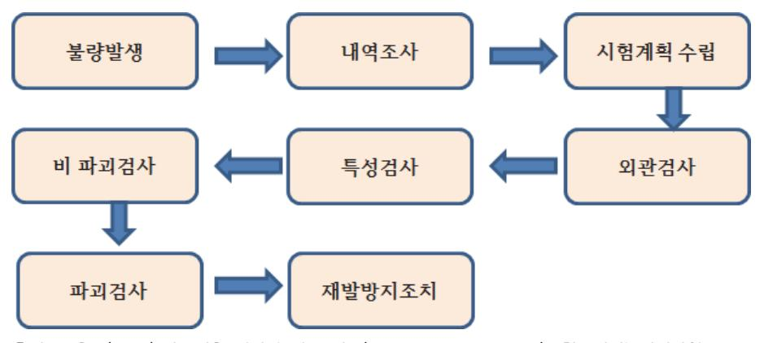

출처: 교육부(2016).반도체용 패키지 재료 제조(LM1903060406\_14v1). 한국직업능력개발원. p.76. [그림 4-1] 불량분석 절차도

1. 내역조사

불량이 발생되었을 때 맨 처음 해야 하는 작업은 출하검사서의 파악이다. 출하검사란 출하 전 완제품에 대한 검사계획을 수립하여 검사 실시 후 그 결과를 분석하여 고객의 요구사항 을 만족하는지를 확인하고 부적합이 발생할 경우 이에 대한 제품 품질을 유지 보수하기 위 한 것이다. 출하검사서 및 동봉된 검사성적서, 불량항목을 통해 불량현상 및 원인을 파악할 수 있다. 출하검사는 두 가지 방법으로 실시한다.

(1) 전수조사

고객에게 인도할 모든 제품에 대해 검사방식

(2) 선별조사

고객에게 인도할 제품 중 일부를 무작위 검사방식

2. 시험계획 수립

실험계획법에 의한 불량요인 확인 단계로써 주어진 자원(비용, 인력, 시간 등) 안에서 최대 의 정보를 얻고자 실험방법과 분석방법을 계획하는 것으로, 출력변수에 영향을 미치는 입력 변수의 종류 및 영향력 가중치를 도출하여 최적화하는 것이 목적이다. 이를 통해 불량의 주 요한 원인 공정을 집중적으로 개선하여 제품 생산의 수율 향상이 가능하다. 실험계획법은 크게 3단계로 구분되며 각 단계에 적합한 실험의 유형이 있다. [그림 4-2]에 단계별 수행사 항이 도시되어 있다.

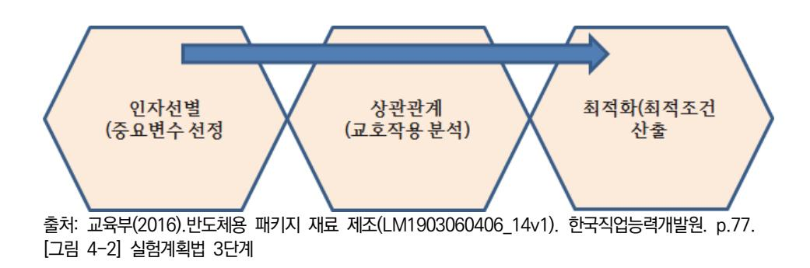

(1) 인자선별 (Screening)

입력 인자 중에서 영향력이 큰 중요변수를 선별하는 단계이며 부분 요인 실험이 적합 하다. 부분 요인 실험은 수준 및 처리 조합의 수를 줄여서 진행한다.

(2) 상관관계 (Characterization)

중요 인자들의 출력변수에 미치는 특성을 파악하고, 정량화하는 단계이며 부분 요인 실 험 및 완전 요인 실험을 진행한다.

(3) 최적화 (Optimization)

입력 인자의 최적 조건을 도출하는 단계로 반응 표면 실험 또는 다구찌 실험계획법을 통해 진행한다.

3. 외관 검사

광학현미경을 이용하여 패키지 제품의 외관 결함이 없는지 먼저 확인하는 단계이다.

4. 특성 검사

패키지 제품의 전기적 특성을 측정하는 단계이다. 검사는 4가지로 분류하여 실시한다.

(1) 단락(Short)

회로가 합선된 상태

(2) 단선(Open)

회로가 연결되지 않은 상태

- (3) 일정하게 정상 값을 벗어나는 특성치 변화(Parameter Shift)
- (4) 시간에 따라 변화하는 특성치 불안정(Electric Instability)
- 5. 비파괴 검사

파괴 검사 전 비파괴 방법으로 패키지 제품의 내부 불량을 확인하는 단계이다. 검사방법 및 장비에 대하여 알아본다.

(1) X-선 검사

X 선은 전자 방사선 형태의 짧은 파장을 갖는 광선의 일종으로 에너지가 크기 때문에 물질을 쉽게 투과할 수 있으며, 투과 시에 물질의 밀도 및 구성 원자에 따라 X선의 투 과율이 달라지는 원리를 이용하여 비파괴검사장비로 널리 사용되고 있다. 패키지 내부의 Au 와이어, 리드프레임 형태 및 불량 양상을 확인할 수 있을 뿐만 아니라, PCB의 Tracer와 솔더 볼의 기공(void) 분포 정도 등의 이상 유무도 확인이 가능하다.

(2) X-선 컴퓨터 단층촬영(X-Ray Computed Tomography System)

물체의 횡단면을 여러 각도에서 X선을 투사하여 얻은 많은 영상(다중투시:Multiple Projection)으로부터 내부구조를 단층 영상으로 재구성할 수 있다. 플립 칩 범프 기공과 결합 깨짐, DAF 기공과 PCB 패턴 깨짐, 와이어 본딩 단락 불량을 관찰할 수 있다.

(3) SAT 검사 (Scanning acoustic tomography)

가청 주파수 이외의 주파수를 갖는 초음파의 물리적인 성질을 이용하여 전자 부품 내부 의 결함, 즉 깨짐, 박리 현상의 위치 및 크기를 측정을 할 수 있는 비파괴 분석 장비 검 사이다. 에너지 변환기(transducer)에서 발생한 초음파는 소재 내부로 침투되어 진행하 며 초음파의 진행 경로 상에 결함이 존재할 경우 그 결함에 의해 초음파는 반사되어 되 돌아오게 되는데 그 음파를 감지하여 초음파가 진행한 거리만큼 디지탈 오실로스코프의 화면에 펄스 신호가 나타나게 된다. 이때 모니터 화면에 나타난 신호의 위치와 크기를 읽어 결함에 대한 크기와 위치를 평가할 수 있다. SAT 검사는 스캔(scan)방식에 따라 다양한 부분을 관찰할 수 있다.

(가) A-Scan

오실로스코프에 나타난 반사파의 위상과 크기로 불량 유무검사가 장점이며, 초음파 검사방법 중 가장 정확한 검사방법이다. 그러나 단점은 초음파가 투과되고 있는 그 지점만 분석이 가능하다는 것이다.

(나) B-Scan

반도체의 각 계면에서 돌아오는 신호의 크기와 전파시간을 수집하여 그 단면의 이미 지를 볼 수 있다. 패키지 깨짐, 기울임, 기공 관찰이 용이하다. 장점은 불량이 존재 하는 위치(높낮이) 판단이 가능하다는 점이다.

(다) C-Scan

검사 하고자 하는 접합면에 초점하여 검사하는 방법이다. 반사파의 위상과 크기를 분석하여 접합면의 상태를 보여줄 수 있다. 들뜸(Delamination), 칩 깨짐을 관찰할 수 있다. 장점은 초음파 검사방법 중 가장 정밀한 검사방법이다. 그러나 단점으로 숙 련된 전문가가 필요하다는 점이다.

(라) TAMI-Scan

반도체 내부를 수평으로 1~99등분 하여 검사 가능하고, 전문가가 필요 없다.

(마) T-Scan

패키지를 향해 초음파를 발생시킨 다음 그 반도체를 투과해 나오는 초음파를 분석하 는 방식으로 모든 초음파검사의 가장 기초적인 방법이다. 장점은 초보자의 경우도 실수 없이 검사 가능하다는 점이고, 단점은 불량 유무만 알 수 있고 크기와 위치는 알 수 없다는 것이다. 들뜸(Delamination) 불량이 존재할 경우에는 발생 위치에서 는 초음파가 반사되어 리시버(Receiver)에 도달하지 못해 검은색으로 표시된다.

- (4) HEA(Hot Electron Analyzer)
  - (가) 광자 방출 분석 시스템(PHEMOS, Photon Emission Microscope) 웨이퍼 또는 패키지 상태의 소자에 전기적 신호를 인가한 후 불량 위치에서 발생하 는 미약한 광자(photon)을 검출하는 시스템으로, 소자의 누설 전류 및 단락 불량 위 치를 검출할 수 있다. 대기 전류(Standby Current) 불량, 핀(Pin) 누설 불량, 정전 기(ESD) 불량을 관찰할 수 있다.
  - (나) 열 방출 분석 시스템(THEMOS, Thermal Emission Microscope)

소자에 전기적 신호를 인가한 후 불량 위치에서 발생하는 열을 검출하는 시스템으로, 소자의 누설 전류 및 단락 불량 위치를 검출할 수 있다. 금속 패턴 단락, 컨텍 저항 이상 부위 관찰이 가능하다. 소자의 이상 위치 관찰이 가능하다.

- 6. 파괴검사
  - (1) EMC 봉합제거(Decapsulation) 검사방법

패키지 내부의 칩을 보호하기 위한 EMC를 제거하여 내부의 칩 또는 Au 와이어, 리드 프레임 등을 관찰하기 위한 방법이다. 두 가지 방법으로 진행한다.

(가) EMC의 일부분을 선택적으로 제거하는 Hole decapsulation

내부의 와이어와 본딩 패드에 손상 없이 EMC를 제거하여 추가적인 전기적 측정이 가능하다.

- (나) EMC 전부를 제거하는 Full decapsulation
- (2) 절단 단면 검사방법

물리, 화학적 방법으로 비파괴 검사로부터 관찰한 불량 부분을 직접 절단하여 광학현미

경으로 관찰하는 방법이다. 시료제작 방법은 수동적인 방법, 이온 밀링(Ion milling) 방 법, 플라스마 식각 방법이 있다.

(가) 수동적인 방법

패키지의 단면을 관찰하는 데 사용하는데 원하는 부위의 단면 확인을 통해 구조 분 석 및 불량의 원인을 검출하는 방법이다. 비파괴 검사 단계인 SAT(Scanning acoustic tomography)를 통해 검출된 박리 현상에 대해 정확한 불량 부위를 확인 하는 방법이다.

(나) 이온 밀링(milling) 방법

미소, 미세불량 단면가공과 단면, 평면을 이온으로 갈아내어 관찰하는 방법이다. 진 공 중에서 이온을 만들고, 이온 방향을 가지런히 하고, 가속한 것을 조사하여 가공을 하는 방법이다. 정밀한 가공을 효율적으로 할 수 있다는 장점이 있다.

(다) 플라스마 식각 방법

화학용품을 사용하지 않고 식각 가스를 이용하여 실리콘 칩, DAF, 폴리이미드 보호 층을 선택적으로 식각하여 광학현미경으로 불량 부위를 관찰한다. [그림 4-3]에 플라 스마 식각법에 의한 불량관찰 순서도가 도시되어 있다.

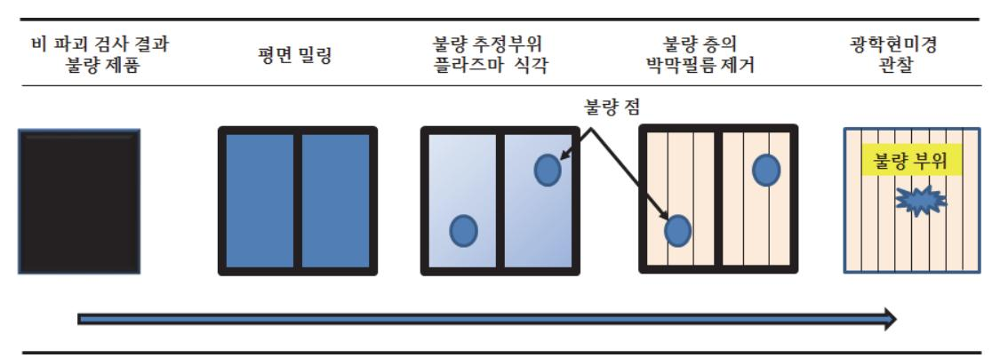

출처: 교육부(2016).반도체용 패키지 재료 제조(LM1903060406\_14v1). 한국직업능력개발원. p.80. [그림 4-3] 플라스마 식각법에 의한 불량관찰 순서도

- (3) 전자-광학적 기기에 의한 검사방법
  - (가) 주사형 전자현미경 검사(SEM, Scanning Electron Microscope Inspection) 관찰하고자 하는 시료의 미세한 부분을 확대하여 관찰하고 분석하는 데 사용한다. 1,500배 정도의 배율로 관찰할 수 있는 광학현미경에 비하여 SEM 은 80만 배 이상 의 높은 배율로 시료의 관찰이 가능하다. SEM 은 전자 빔(Beam)을 시료 표면에 주 사할 때 시료 표면에서 방출되는 2차 전자 (Secondary electron)를 검출기로 검출 하고 증폭하여 모니터 상에 동기로 주사하며 표면의 높낮이를 나타내는 영상으로 형

성화하는 분석 방법이다.

(나) EDX(Energy dispersive X-ray spectroscope) 검사

미지의 시료의 화학 조성을 분석하기 위한 장비로서, 시료에서 발생되는 특성 X-선 Characteristic X-ray)을 검출기 결정을 구성하는 실리콘 단결정의 p-i-n 반도체소 자를 이용하여 에너지의 형태로 검출, 증폭하여 스펙트럼(Spectrum) 형태로 보여주 게 된다.

- (다) 푸리에 변환 적외선 분광법(FT-IR, Fourier transform infrared spectroscopy) 검사 미지시료나 구성성분을 알고자 하는 시료에 대해 적외선(IR) 빔의 광 흡광도 및 투과 도를 측정하여 시료가 가지고 있는 적외선 빔에 대한 지문영역을 이용하여 정성, 정 량을 측정하는 방법이다. 유기물 및 무기물, 반도체 웨이퍼, 폴리머(Polymer)의 화합 물을 연구할 수 있으며 반응속도, 성분측정, 미소샘플 검사에 이용된다. 패키징 공정 유기 이물질 분석과 고체, 필름, 겔(gel)형 성분 분석. 촉매 및 금속표면에 증착된 박 막 등의 미세시료 분석에 사용하는 방법이다.
- 7. 재발 방지 조치
  - (1) 시정 및 예방 조치

잠재적 불량을 효과적으로 예방하고, 부적합사항이 발생되었을 경우에 처리절차를 명확 히 함으로써 효과적인 시정 및 예방조치가 이루어지고 기술축적과 품질안정을 도모함에 그 목적이 있다.

- (2) 시정 및 예방 조치 계획
  - (가) 시정 조치 실시 팀장은 시정 및 예방 조치를 실시하여야 하며, 담당자는 불량 사항에 대 한 원인을 분석하기 위하여 필요한 경우 관련 팀과 대책 회의를 실시하여야 한다.
  - (나) 대책 회의 결과 수립된 실시 계획은 다음의 내용을 기재하여 팀장의 승인을 득한 후 실 시 계획에 따라 진행한다.
- (3) 시정 및 예방 조치 실시
  - (가) 시정 조치 실시 담당자는 승인된 실시 계획에 따라 시정 조치를 실시하여야 하며, 실시 도중 계획 변경이 필요한 경우에는 협의 후 실시한다.
  - (나) 요구 팀 시정 조치 담당자는 시정 조치의 진행사항을 확인해야 하며, 팀장은 접수된 시 정 및 예방 조치 계획서에 따라 실시 상태가 미흡할 경우 확인 독려한다.

숗 불량사례를 통한 문제점 해결방안 제시 및 분석기법

1. 문제점 해결방안

분석 시 발생되는 문제점을 제시하기 위해서는 사례에 대한 폭넓은 지식을 갖고 있어야 한

다. 지식 확보를 위해서는 관련 특허, 논문 조사와 아울러 인터넷을 이용하여 불량 유형의 모습을 조사하여야 한다. 분석자가 가져야 기본적인 지식에 관한 관계도가 [그림 4-4]에 도 시되어있다. 그림에서 보다시피 기본적으로 갖추어야 할 조건은 크게 3가지 분야이다. 재료 의 불량에서 오는 요인 분석기술, 제조공정 상에서 오는 불량요소의 파악을 위한 통계적 분 석기술, 전기적 특성을 측정하여 규격과 대비해서 벗어나는 요인을 찾기 위한 측정기술 및 설계에 관련된 회로 분석기술이다.

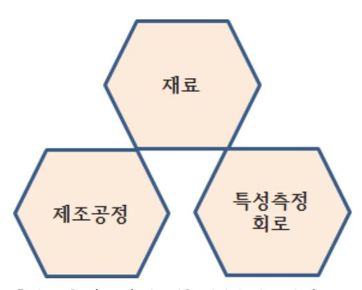

출처: 교육부(2016).반도체용 패키지 재료 제조(LM1903060406\_14v1). 한국직업능력개발원. p.82. [그림 4-4] 분석가가 갖추어야할 필수 3대 분석기술

2. 분석기법

분석이 끝난 후 분석된 결과로 개선해야 할 항목을 도출해야 한다. 일반적으로 통계적 기법 이 사용되고, 대표적인 방법이 식스 시그마 방법이다.

(1) 식스 시그마의 개요

모든 종류의 프로세스에서 결함을 제거하고 목표로부터의 이탈을 최소화하여 이득 및 고객 만족을 최대화하려는 경영 전략이다. 식스 시그마 기법을 토대로 생산품질뿐만 아 니라 회사의 모든 부서의 업무에 적용이 가능한 통계학적 기법이다. 식스 시그마는 정규 분포에서의 표준편차를 나타내며, 표준편차는 100만 개의 샘플 중에 3.4 개에 해당하는 것으로 불량률이 0에 가까움을 뜻한다.

(2) 식스 시그마 기법

식스 시그마 활동은 크게 5단계로 이루어진다. DMAIC, DMADV 두 가지 방식이 존재 하는데 DMAIC가 결함의 감소에 중점을 둔다면 DMADV는 결함을 방지하는 데 목적을 둔다.

(가) DMAIC (Define, Measure, Analyze, Improve, Control)

1) Define (정의) : 제품 생산의 목표(수율 등)를 정한다.

2) Measure (측정) : 목표에 영향을 미치는 요소를 찾아낸다.

3) Analyze (분석) : X인자의 Y에 대한 영향력을 분석한다.

4) Improve (개선) : 영향력이 큰 X인자를 제어하여 Y인자를 개선한다.

5) Control (관리) : 개선된 입력 변수의 변동성을 관리한다.

(나) DMADV (Define, Measure, Analyze, Design, Verify)

### 수행 내용 / 분석 시 문제점에 대한 해결방안 제사하기

### 재료·자료

- 패키지 공정 내역서, 설계도, 재료 수입검사서, 전기 테스트 데이터
- 불량과 양품 제품

### 기기(장비 ・ 공구)

- SEM, EDS, WDS, XRD, ICP, AES, XRF, XPS, AFM, TEM, RBS
- 광학현미경, 비파괴 X-RAY 분석 장비

### 안전 ・ 유의사항

장비 취급 시 안전사항을 준수한다.

#### 수행 순서

- 숔 분석에 대한 필요성에 대하여 표준규격을 수립한다.
  - 1. 분석의 목적을 숙지한다.
  - 2. 분석에 사용되는 표준 규격을 확인하고, 수립한다.

숕 불량 분석의 원칙에 대하여 조사한다.

- 1. 불량을 명확히 정의해야 한다.
- 2. 불량은 복합적인 스트레스의 결과임을 인식해야 한다. 다양한 스트레스 + 잠재적인 원인

- 3. 왜곡된 정보에 의한 선입견을 버려야 한다.
- 4. 통계적 기법에 근거해 고장의 의미를 파악한다.
- 누적도수도, 산포도, 히스토그램 등
- 5. 논리적이고 합리적으로 접근한다.
- 6. 불량은 가능한 한 재현하여 검증해야 한다.
- 숖 불량분석의 절차 및 방법에 대한 흐름도를 작성한다.
  - 1. 절차서를 작성한다.
  - 2. 시험방법과 흐름도를 작성한다.
- 숗 불량분석 시 필요한 자료를 확보한다.
  - 1. 불량이 발생한 시료의 설계 자료를 조사한다.
  - 2, 불량이 발생한 시료의 원자재 수입검사서 자료를 조사한다.
  - 3. 불량이 발생한 시료의 공정과정에서의 불량 자료를 분석한다.
  - 4. 불량이 발생한 시료의 신뢰성 평가 자료를 분석한다.
  - 5. 불량 시료를 확보한다.
  - 6. 양품과 불량품 사이의 전기적, 전자적 특성을 조사한다.

수 실험 계획서를 작성한다.

- 1. 취합된 공정, 장비, 재료 이력에서 불량에 관계된 인자를 설정한다,
- 2. 인자 간 상관관계 (Characterization)를 추출한다.
- 3. 최적화 (Optimization) 조건을 도출한다.
- 4. 분석, 확인, 관리에 대한 실험과 실행일정 계획을 수립한다.

숙 불량부위에 대한 관찰과 보고서를 작성한다.

- 1. 전기적 특성 검사를 실시하고 자료를 정리해 보고서를 작성한다.
  - (1) 저항 측정을 통해 단락(Short) 사항을 확인한다.
  - (2) 저항 측정을 통해 단선(Open) 사항을 확인한다.

- (3) 전류-전압 특성을 측정한다.
- (4) 보고서를 작성한다.
- 2. 광학현미경을 이용하여 불량시료의 표면/외관 검사를 실시하고 보고서를 작성한다.
  - (1) 저 배율로 불량부위를 관찰한다.
  - (2) 고 배율로 불량부위를 세밀하게 관찰한다.
  - (3) 불량 유형을 사례와 비교해본다.
  - (4) 보고서를 작성한다.
- 3. 비파괴 검사방법을 조사하고 불량 제품과 양품을 비교 분석한다.
  - (1) X-선 검사 방법에 대하여 조사한다.
  - (2) X-선 컴퓨터 단층촬영을 통해 불량부위를 관찰한다.
  - (3) SAT 검사 방법에 대하여 조사한다.
    - (가) A-Scan 검사 방법에 대하여 조사한다.
    - (나) B-Scan 검사 방법에 대하여 조사한다.
    - (라) C-Scan 검사 방법에 대하여 조사한다.
    - (마) TAMI-Scan 검사 방법에 대하여 조사한다.
    - (바) T-Scan 검사 방법에 대하여 조사한다.
    - (사) 실험을 수행하고 보고서를 작성한다.
  - (4) HEA 검사방법을 조사하고 불량 제품과 양품을 비교 분석한다.
    - (가) 광자 방출 분석 검사 방법에 대하여 조사한다.
    - (나) 열 방출 분석 시스템 검사 방법에 대하여 조사한다.
    - (다) 실험을 수행하고 보고서를 작성한다.
- 4. 파괴 검사방법을 조사하고 불량 제품과 양품을 비교 분석한다.
  - (1) EMC 봉합제거(Decapsulation) 검사방법 조사한다.
    - (가) Hole decapsulation
    - (나) Full decapsulation
  - (2) 절단 단면 검사방법 조사한다.
    - (가) 수동적인 방법
    - (나) 이온 밀링(milling) 방법
    - (다) 플라스마 식각 방법
- 5. 파괴 검사방법을 조사하고 불량 제품과 양품을 비교 분석한다.

- (1) 전자-광학적 기기에 의한 검사방법에 대하여 조사하고 설명한다.
  - (가) 주사형 전자현미경 검사(SEM, Scanning Electron Microscope Inspection)
  - (나) EDX(Energy dispersive X-ray spectroscope) 검사
  - (다) 푸리에 변환 적외선 분광법 검사
- (2) 불량 부위를 조사한다.
- (3) 보고서를 작성한다.
- 숚 재발 방지 조치 계획서를 작성한다.
  - 1. 시정 및 예방 조치 방법에 대하여 설명한다.
  - 2. 시정 및 예방 조치 계획서를 작성한다.
- 숛 불량사례를 통한 문제점 해결방안을 제시한다.
  - 1. 관련 특허, 논문 조사와 아울러 인터넷을 이용하여 불량 유형의 모습을 조사한다.
  - 2. 관련 불량에 대한 비교 분석을 통해 보고서를 작성한다.

## 4-2. 시험 시 문제점에 대한 해결방안 제시

학습 목표 • 반도체 패키지의 시험 시 문제점에 대한 해결방안을 제시할 수 있다.

### 필요 지식 /

### 숔 패키지 제품의 성능시험

패키징 공정을 통하여 최종제품이 완성되면 칩을 포함한 올바른 기능을 시험한다. 시험항목은 웨이퍼 수준에서 측정한 항목과 동일하게 이루어진다. 즉, 패키지 시험(Package Test)은 패키 지 형태로 만들어진 제품의 최종 불량 유무를 선별하는 시험이다. 이 시험은 완제품 형태를 갖 춘 후, 검사가 진행되기 때문에 최종 시험(Final Test) 이라고도 한다. 패키지 시험은 반도체를 시험장비(Tester)에 넣고 다양한 조건의 전압이나 전기신호, 온도 등을 가해 제품의 전기적 특 성, 기능적 특성, 동작 속도 등을 측정하여 불량 유무를 구별한다. 또한, 시험 중 발생하는 데 이터를 수집·분석해 그 결과를 제조공정이나 조립공정에 피드백하여 제품의 질을 개선하는 역 할을 한다. 반도체는 각 제품별로 그에 적합한 패키지 시험을 거친다. 본 학습에서는 메모리 제품인 DRAM을 기준으로 시험에 관한 사항을 알아본다. [그림 4-5]에 패키지 시험 흐름도가 도시되어 있다.

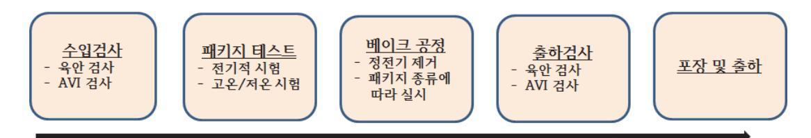

출처: 교육부(2016).반도체용 패키지 재료 제조(LM1903060406\_14v1). 한국직업능력개발원. p.87. [그림 4-5] 패키지 제품 시험 흐름도

### 숕 시험장비 선정

패키지 제품 성능시험 장비 선정도 기본적으로 웨이퍼 레벨의 경우와 같다. 이유는 시험 항목 도 동일하고 제품 규격도 같기 때문이다. 물론 고객이 요구하는 사항에 따라 다소 달라질 수 있지만 거의 유사하다고 보면 된다. 중요한 사항은 주검사기는 동일하지만 칩을 테스트 위치로 이송하는 역할을 하는 핸들러 시스템, 칩을 고정시키고 시험 입출력 배선에 연결시키는 지그나 소켓 보드(board), 웨이퍼 레벨에서 수행하지 못했던 번인(burn-in) 항목을 시험 하도록 환경 을 제공하는 번인 시스템과의 최적의 조건을 이루는 장비를 선정해야 한다. 이 사항에 대해서

는 NCS 학습모듈 중분류(전자기기 개발), 소분류(반도체 개발), 세분류(반도체 개발)에 있는 반 도체 제품 기능/성능 모듈을 참조하기 바란다.

### 숖 시험 종류

1. 제품 수입 검사

제품의 첫 시험관문은 공정 완료된 제품 종류, 수량, I/O 수(Bit 수) 등의 확인이다. 확인 후 제품 검사지(Lot Card)를 작성한다. 제품 검사지에는 모든 공정 과정과 시간, 수율, 담 당자, 사용 프로그램 등이 기록되어야 한다. 이 검사지는 입고 시부터 제품과 함께 이동하 고, 출고 후에도 일정 기간 보관한다.

2. DC 시험 & 번인(Burn-in) 시험

DC 시험은 FAB 및 조립공정을 거치면서 발생된 불량을 선별하는 시험이다. 시험 항목은 단락(short)과 단선(open)이다. 패키지에서 배선의 형태를 확연히 구분할 수 있는 항목이 다. 이 단계를 거치면 초기불량의 선별을 위한 번인(Burn-in) 시험이 진행된다. 번인 시험 은 불량 가능성이 있는 제품을 사전에 제거하기 위한 시험이다. 제품에 고전압, 고온, 전기 신호 등 극한 조건을 가하게 되며 이후 별도의 시험을 통해 양품과 불량품을 선별한다. 이 러한 검증 과정을 통과해야만 PC나 IT제품 등의 전자기기가 오류 없이 동작할 수 있는 신 뢰성을 확보하게 된다.

3. AC 시험

패키지 제품의 교류와 관련된 전기적 특성을 측정한다. DUT(design under test)입력 단자 에 펄스 신호를 인가하여 입출력 운반지연, 출력 신호의 시작/종료 시간 등을 판단하여 속 도 등급을 판정한다.

4. 번인 시험 모니터링(MBT, Monitoring Burn-in & Test)

MBT 시험은 제품에 열적, 전기적인 극한 조건을 가하는 과정에 부가하여 시험 기능까지 추가된다. 일반 번인 시험에 비해 불량분석 기간을 단축할 수 있고, 품질 불량을 보다 강화 할 수 있는 장점이 있다. 패키지 상태에서의 번인(PLBI: package level burn-in)공정은 메모리 소자들을 번인 보드의 소켓에 삽입한 뒤 챔버 안에 넣고, 일반적으로 125℃에서 일 정 시간 동안 소자에 일련의 기능 테스트를 수행하여 제품의 기능이 정상 혹은 비정상인지 가려낸다.

5. 기능 시험(functional test)

상온 및 저온에서 진행되는 DC와 번인 시험을 통과한 패키지 제품들은 패키지의 미세한 접촉 불량을 가려내기 위해 고온에서 반도체의 전기적 특성 및 기능을 시험한다.

### 숗 메모리 시험 항목

메모리 IC와 메모리 모듈의 테스트 항목은 크게 DC 테스트, AC 테스트, function 테스트로 나누어진다.

### 1. DC 시험

DUT(device under test)에 규정된 전압을 인가하여 단선/단락(open/short), 입력 전류, 출력 전압, 전원 전류 등의 DC 특성을 측정한다.

2. AC 시험

DUT의 입력단자에 펄스 신호를 인가하여 입출력 운반 지연 시간, 출력 신호의 시작/종료 시간 등의 동작 특성을 측정한다.

### 3. 기능 시험

각 메모리 셀의 읽기, 쓰기 기능이나 상호 간섭 등을 시험하며, 패턴 발생기에서 발생한 시 험 패턴을 규정된 레벨로 변환한 펄스를 DUT에 인가하여 DUT의 출력 신호를 규정된 레 벨과 비교한다. 그 비교 결과를 패턴 발생기에서 발생한 출력 기대 패턴과 비교하여 동작의 양/불량을 시험한다. 일반적으로 AC 시험과 기능 시험을 겸한 다이나믹(dynamic) 기능 시 험을 한다.

### 수 문제점 파악사항

설계 시 중요한 파라미터를 정확히 이해하고 규격에 맞도록 시험하여 문제점 해결 방안을 설계 자에게 피드백해야 한다. 공정에 관련된 문제는 불량분석 보고서를 통하여 공정관리팀에 피드 백한다.

### 수행 내용 / 시험 시 문제점에 대한 해결방안 제시하기

재료·자료

- 정전 방지 손 장갑, 조립품 보관 박스, 테스트 소켓
- 테스터/핸들러 장비 매뉴얼, 패키지 레벨 테스트 항목 규격서
- 펌웨어 소프트웨어 프로그램 실행 및 명령어 설명서

기기(장비 ・ 공구)

- 기능 및 성능 측정 장비, 가변 온도 장치, 컴퓨터, 프린터
- 번인 보드, 진공 트위져

안전 ・ 유의사항

칩의 내부 온도가 제품 규격상의 한계 수준을 넘지 않도록 주의한다.

수행 순서

- 숔 패키지 제품의 성능시험의 필요성에 대하여 설명하고, 흐름도를 작성한다.
  - 1. 패키지 제품의 성능시험의 목적에 대하여 조사한다.
  - 2. 성능시험의 필료성에 대하여 조사한다.
  - 3. 성능시험의 흐름도를 작성한다.

숕 시험장비 선정 조건에 대하여 조사하고 계획서를 작성한다.

- 1. 테스터에 기능에 대하여 조사한다.
- 2. 핸들러 기능을 조사한다.
  - (1) 메모리 소자의 개별 및 모듈 시험 핸들러의 구조를 파악한다.
  - (2) 비메모리 소자의 로직과 시험 핸들러의 구조를 파악한다.
- 3. 소켓 & PCB 기능에 대하여 조사한다.
- 4. 번인 장비에 대하여 기능을 조사한다.
- 5. 데이터 처리 시스템에 대하여 장비 연동 관계를 조사한다.

숖 시험 종류에 대하여 조사한다.

- 1. 제품 수입 검사에 대하여 조사한다.
- 2. DC 시험에 대하여 조사한다.
- 3. 번인(Burn-in) 시험에 대하여 조사한다.
- 4. AC 시험에 대하여 조사한다.
- 5. 번인 시험 모니터링(MBT, Monitoring Burn-in & Test)에 대하여 조사한다.
- 6. 기능 시험(functional test)에 대하여 조사한다.

숗 메모리 시험 항목에 대하여 조사한다.

- 1. DC 시험 항목에 대하여 조사한다.
- 2. AC 시험 항목에 대하여 조사한다.
- 3. 기능 시험 항목에 대하여 조사한다.

수 패키지 제품을 시험 평가하고 보고서를 작성한다.

- 1. 패키지 주 검사 장비, 핸들러(handler), 소켓을 확인한다.
- 2. 표준 샘플 시험을 실시한다.
- 3. 해당 공정 조건 이상 유무를 확인한다.
- 4. 시험하고자 하는 프로그램이 제대로 로딩(loading)되었는지 확인한다.
- 5. 선두 패키지 위치가 정확한지 확인한다.
- 6. 접촉 방식/양산 방식을 확인한다.
- 7. 선정된 샘플의 시험을 실시한다.
- 8. 저 수율 발생 시 발생 원인을 분석한다 .
- 9. 이상 처리 발생 시 장비 점검 및 시험 프로그램을 점검한다.
- 10. 시험 결과를 작성, 정리하여 보고서를 작성한다.
  - (1) 시험결과를 정리한다.
  - (2) 표준 시료와 비교한다.
  - (3) 통계적 기법에 의하여 두 자료를 분석한다.

숙 문제점 파악사항 및 사례연구를 통한 비교분석 자료와 대응방안을 제시한다.

- 1. 설계 부분을 파악한다.
- 2. 공정 중 이상 발생을 조사한다.
- 3. 재료의 문제점을 파악한다.
- 4. 불량사례를 조사한다.
- 5. 설계와 최종 제품의 규격을 비교한다.
- 6. 보고서를 작성/배포하고, 시정된 샘플의 시험을 행하고 최종보고서를 작성한다.

## 4-3. 평가 시 문제점에 대한 해결방안 제시

학습 목표 • 반도체 패키지의 평가 시 문제점에 대한 해결방안을 제시할 수 있다.

### 필요 지식 /

### 숔 평가의 필요성

표면실장기술의 눈부신 발전에 힘입어 전자부품의 배선 간격 미세화와 프린트회로기판(PCB)이 광범위하게 사용되기 시작하면서 열 피로에 의한 솔더 깨짐이나 전자이동(electron migration) 등에 의한 단락 고장이 표면화되고 있다. 또한, 환경규제에 따른 무연재료의 사용, 휴대기기나 자동차 등 사용 환경의 다양화, 신재료 및 신구조의 채용, 저 비용화 등으로 인해 고장을 일으키는 조건이 증가하고 있다. 패키징 기술의 신뢰성은 제품 전체 신뢰성의 큰 부분 을 차지하게 되어 새로운 신뢰성 기술의 개발이 요구된다. 신뢰성 평가를 통해서 설계 변경 위 험(초기고장, 설계 마진 및 내구성 부족》감소, 고장 원인 규명 및 사고대책 수립, 계약 요구사 항, 국제시험규격 (JEDEC, MIL)만족, 신뢰도 예측, 설계 및 시험의 기초자료와 고장 메커니즘 조사, 시험방법 검토 등 기술 정보 수집 등이 가능하다.

### 1. 신뢰성 평가기술의 개발순서

소비자가 사용 시 고장을 재현하는 것과 같은 시험조건이나 방법을 찾는 것은 먼저 실제 사용 환경조건을 세밀하게 조사해야 한다. 또한, 제품에 인가되는 스트레스(stress)와 고장 메커니즘(mechanism)을 알아야 한다. [그림 4-6]에 기본적인 신뢰성 평가기술의 접근 방 법을 도시하였다.

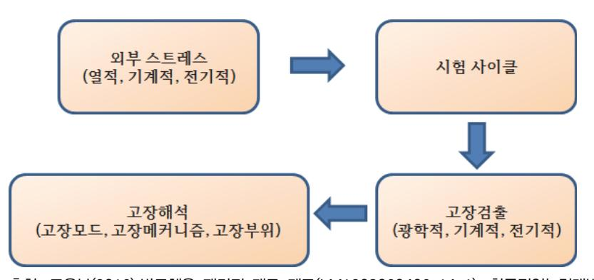

출처: 교육부(2016).반도체용 패키지 재료 제조(LM1903060406\_14v1). 한국직업능력개발원. p.93. [그림 4-6] CERDIP 적층패키지 구성요소

환경 스트레스로서는 열적, 전기적, 기계적 스트레스 등이 주원인인 경우가 많다. 시험샘플 은 설계 개발단계에서 재료, 디자인 등의 선정평가에 있어서 주로 기준테스트패턴으로 평가 되며, 양산을 고려한 평가는 실제 제품으로 평가하는 경우가 많다. 기준테스트패턴으로 실 시할 경우에는 실제 제품에 가까운 설계조건과 제조방법으로 샘플을 제작하여 시험을 진행 한다. 설계 치수나 제조공정에 대한 기본적인 요소평가와 그때의 외부 스트레스에 대한 내 성을 평가할 수 있게 된다. 또한, 재료나 부품이 가진 기능이나 성능의 경시변화, 스트레스 에 대한 강도, 외관의 변화 등 고장에 이르는 파라미터의 측정을 실시하여, 다른 종류의 파 라미터를 종합적으로 판단하여 문제점을 발견하고 해결방법을 모색해야 한다.

(1) 전기적 파라미터

도전성과 절연특성

- (2) 기계적 파라미터 인장강도와 전단강도
- (3) 광학적 파라미터

변형, 깨짐, 구부러짐, 들뜸, 변색 등

2. 스트레스의 종류와 고장모드

인가되는 스트레스와 고장메커니즘은 관계가 매우 밀접하다. <표 4-1> 패키지 제품에 가해 지는 환경 스트레스와 고장메커니즘, 고장모드의 예를 나타내었다. 스트레스 중에서 열적(온 도, 습도 등), 기계적(진동, 응력 등), 전기적(전압, 전류) 스트레스가 주요인이다.

| 스트레스        | 고장메커니즘 | 고장유형          |  |  |
|-------------|--------|---------------|--|--|
| 열적(온도, 습도)  | 열피로    | 통전 불량(단선, 오픈) |  |  |
| 기계적(진동, 충격) | 클립     | 절연 불량(단락, 누설) |  |  |
| 전기적(전압, 전류) | 충격     | 접촉 불량         |  |  |
| 생물적         | 취성 관리  | 솔더 깨짐(crack)  |  |  |
| 가스          | 산화, 환원 | 저항치 증가        |  |  |
| 약품          | 전기분해   | 변색, 변형        |  |  |
| 광 에너지       | 이중금속접촉 | 부식            |  |  |
|             | 국부전자   | 흡착            |  |  |
|             | 가수분해   | 오염            |  |  |
|             | 용해     | 소실, 화재        |  |  |
| 방사선         | 흡착, 흡습 | 느슨함           |  |  |
|             | 호흡작용   | 변형            |  |  |
|             | 확산     | 오작동           |  |  |
|             | 팽창, 수축 | 노이즈           |  |  |

<표 4-1> 스트레스에 따른 고장메커니즘과 고장유형

- 3. 고장메커니즘과 시험방법의 사례
  - (1) 부식, 마모에 의한 접촉(접점)불량
    - (가) 인공먼지, 인공땀을 부여한 상태에서 환경시험. 접촉저항 값을 모니터링.
    - (나) 인공먼지를 부여한 상태에서 진동시험. 접촉저항 값을 모니터링.
  - (2) 열 피로, 충격에 의한 통전 불량
    - (가) 열 사이클 시험 중에서 전기저항 변화를 모니터링
    - (나) 열 충격 시험 중에 전기저항 변화를 모니터링
    - (다) 진동 또는 토크 시험 중 전기저항 변화를 모니터링
  - (3) 전자이동(electron migration, EM)

고온시험 중 스트레스 전류를 인가하면서 전기저항 값을 모니터링

(4) 이온이동에 의한 절연 불량

고온고습시험 중 스트레스 전압을 안가하면서 절연저항값을 모니터링

- (5) 열 피로, 크립, 충격에 의한 솔더 접합 불량(solder crack)
  - (가) 열 사이클 또는 충격저항시험 중 도체저항 변화를 모니터링
  - (나) 기계적 응력을 가한 상태에서 도체저항 변화를 모니터링
- 숕 기본 신뢰성 테스트항목

제품 개발단계와 대량생산 하기에 앞서 신구조나 재료 선정, 프로세스 등이 최적화되었는지 패 키지 레벨에서 평가하는 필수적인 신뢰성 검사 항목에 대하여 알아본다.

1. 열 사이클 시험(TCT, Thermal Cycling Test)

열 사이클 시험은 제품 구동 ON/OFF 상태에서 패키지 내부 온도가 상승/하강하는지의 여 부를 평가한다. 이는 반도체 패키지를 탑재한 전자기기들이 북극과 같이 추운 지역, 적도와 같이 더운 지역에서 사용될 수 있으며, 봄, 여름, 가을, 겨울 환경온도가 다르기 때문에 그 환경 속에서 얼마만 한 성능을 갖는지 평가하는 항목이다. 즉 반복되는 고온과 저온 상황에 노출되었을 때 패키지의 성능이 일정하게 유지되는지 시험하는 항목이다. 반복되는 고온-저 온에 노출되면 패키지에 사용되는 재료의 열팽창계수가 달라서 위로 불룩하거나 아래로 불 룩한 변형(Warpage라고 부름)을 반복적으로 하게 되어 계면 박리나 깨짐 등과 같은 불량 이 생길 수 있고, 그러한 물리적 결함이 전기적인 신호 경로인 솔더나 와이어 연결 접합 부 분에 과도한 스트레스를 유발해 떨어지게 하여 전기적으로 열림(open) 불량이 발생한다. 범용으로 사용하는 온도 조건은 조건 B(-55℃~125℃)와 조건 C(-65℃~150℃) 이며, 각각 1000 사이클, 500 사이클을 가해서 규정하는 판정 범위 내에서 패키지 내 외부 기계적 결

함 없어야 하고, 전기적 열림/단락(Open/Short) 시험에서 통과해야 한다. 조건 B, C는 각 각 기판을 이용하는 제품, 구리금속 리드프레임을 사용하는 제품에 적용한다. 관련 JDEC 규격은 JESD22-A104이다.

2. 온도/습도 시험(THT, Temperature / Humidity Test)

온도-습도 조건에서 패키지의 내구성을 시험하는 항목이다. 조건은 온도 85℃, 습도 85 시 간은 1000 hrs이다. 온도-습도 조건에 1000 hrs로 장기간 노출한 뒤 TCT와 같이 내외부 기계적, 전기적 결함 없이 통과해야 한다. 관련 JEDEC 규격은 J-STD-020D.1이다.

- (1) 원인
  - (가) Epoxy Mold Compound를 통해 흡수된 수분에 의한 본딩 패드에 부식 발생이다. 열림 (open) 불량이 발생한다.
  - (나) 습기에 따른 패키지 내 금속 접합부의 금속이온 이동이다. 결과는 누설 불량이나 산화에 따른 고 저항, 열림(open) 불량으로 나타난다.
- (2) 대책
  - (가) 침투가 어려운 재질로 패키지 한다.
  - (나) EMC의 내습성을 높인다.
- 3. 높은 가속 시험(HAST, Highly Accelerated Stress Test)

온도-습도 바이어스(THB, temperature humidity bias) 시험의 긴 시험시간을 보완하기 위해서 개발된 시험항목이다. THB 시험시간이 1000 시간인 반면, HAST 는 96~264 시간 내에 결과를 얻을 수 있다. HAST 역시 칩의 금속 배선과 박막 레지스터(resistor) 부식을 가속시킨다. 판정조건은 열림/단락 시험결과이다.

4. 고온 저장 시험(HTST, High Temperature Storage Test)

패키지가 고온에서 장시간 노출 됐을 때의 내구성 시험항목이다. 조건은 온도가 150℃이며, 표준은 EIAJ / JEDEC / MIL Standard (JESD22-A103)에 규정되어있다. 용도는 반도체 소자 및 부품의 환경관련 내열성을 평가, 반도체 소자 및 부품의 인증시험, 보증시험에 사 용된다. 관련 JDEC 규격은 JESD22-A110이다.

(1) 원인

패키지를 구성하고 있는 물질들의 확산 작용을 활성화 시켜 전기적인 불량 (Open)을 발생시키고, 열에 약한 물질들의 기계적 파손이다.

- (2) 대책
  - (가) 고온에서도 확산이 일어나지 않는 물질로 교체
  - (나) 고온에서의 장기간 노출 금지
- 5. 정전 방전(ESD, electro-static-discharge)

정전하는 정지 상태인 불균형 전하이다. 일반적으로 절연체 표면을 서로 비비거나 잡아당겨 서 분리할 때 생성되며, 한 표면은 전자를 얻고 다른 표면은 전자를 상실합니다. 그 결과로 전기적 불균형 상태인 정전하가 생성된다. 정전하가 한 표면에서 다른 표면으로 이동하면 ESD(정전 방전)가 되고 작은 번개의 형태로 두 표면 사이에서 이동한다. 정전하가 이동하 면 게이트 산화막, 금속층 및 접합부를 손상시킬 수 있는 전류가 발생한다. 결국, 패키지 자체가 수지를 많이 사용하기 때문에 이 때문에 정전기가 유발되어 칩에 손상을 준다. 이런 정전기에 얼마나 견디는지 여부를 시험하는 항목이다. JEDEC에서는 크게 두 방법으로 ESD를 테스트한다.

(1) 인체 모델(HBM, human body model)

신체 동작이 디바이스-접지를 통해 누적 정전하를 방전하는 현상을 시뮬레이션(simulation)하 기 위해 개발된 부품 수준 스트레스 시험이다.

(2) 하전된 소자 모델(CDM, Charged Device Model) JEDEC JESD22-C101 사양에 따라 생산 장비 및 공정에서 발생하는 충전 및 방전 이 벤트를 시뮬레이션하는 부품 수준 스트레스 시험이다.

6. 고온/고압 시험(PCT, Pressure Cooker Test)

고온, 고습 환경에서의 EMC와 PCB나 리드프레임 사이의 접합상태를 시험하는 항목이다. 조건은 온도 121℃, 습도 100%, 압력 2기압이고 판정은 열림/단락 시험결과이다.

(1) 원인

EMC (Epoxy Mold Compound) 오수 PCB 사이에 틈새가 있을 경우 이 틈새을 통해 수분이 침투하여 본딩 패드 부위를 부식시키고 열림(open) 불량을 발생시킨다.

- (2) 대책
  - (가) EMC의 화학적인 성분을 개선하여 L/F 또는 PCB와의 접착력을 높인다.
  - (나) PCB의 표면처리를 개선하여 EMC의 접착력을 높인다.
- 7. 열 충격 시험(TST, thermal shock test)

열 충격 시험은 고온-저온부로의 온도변화를 20초 이내로 규정하고 있어 단시간 내 최악의 열 충격을 주어 패키지의 기계적, 전기적 신뢰성을 평가하는 항목이다. 관련 JEDEC 규격은 JESD22-A106이다.

8. 바이어스된 고 가속 스트레스 시험(BHAST, biased highly accelerated stress test) BHAST는 HAST 조건에 온습도뿐만 아니라 실제 디바이스의 동작 전압을 인가하여 패키지 의 성능을 시험하는 항목이다. 관련 JEDEC 규격은 JESD22-A101이다.

숖 제품 응용에 따른 구분 및 추가 신뢰성 테스트항목

제품의 사용 환경이나 응용별로 아래와 같은 신뢰성 항목들이 추가될 수 있다.

- 1. 휴대용 전자제품 낙하 시험, 휨 시험
- 2. 네트웍 서버(Network server) & 그래픽 카드전자제품 휨 시험, 충격 시험
- 3. 자동차 전자제품 진동시험, 파워 사이클 시험, 고온/수천 시간의 장시간 시험

### 수행 내용 / 평가 시 문제점에 대한 해결방안 제시하기

#### 재료·자료

- 시험의뢰서, 시험절차서, KS 및 관련 규격, JEDEC 규격
- 시험장비 사양서, 시험재료 성적서, 작업지침서

### 기기(장비 ・ 공구)

신뢰성평가 장비, 비파괴 분석 장비

### 안전 ・ 유의사항

- 각종 약품 등의 취급은 파손과 화기에 유의하여 취급한다.
- 시험방법이나 시료는 정해진 규격을 사용하여 시험을 진행한다.
- 시험목적에 적합한 시험기기를 선택하여야 한다.
- 시료의 채취, 시료의 가공 및 시험조건 등의 결정은 시험목적에만 사용해야 한다.

수행 순서

- 숔 신뢰성 평가의 필요한 파라미터를 조사하고 설정한다.
  - 1. 신뢰성 개발의 시기에 대하여 조사한다.

- 2. 신뢰성 평가기술의 개발순서도를 그려본다.
- 3. 전기적 파라미터에 대하여 조사한다.
- 4. 기계적 파라미터에 대하여 조사한다.
- 5. 광학적 파라미터에 대하여 조사한다.
- 6. 스트레스의 종류와 고장유형에 대하여 조사한다.
- 7. 고장메커니즘과 시험방법을 조사한다.
  - (1) 부식, 마모에 의한 접촉(접점) 불량의 모니터링 방법을 조사한다.
  - (2) 열 피로, 충격에 의한 통전 불량의 모니터링 방법을 조사한다.
  - (3) 전자이동(electron migration, EM)의 모니터링 방법을 조사한다.
  - (4) 이온이동에 의한 절연 불량의 모니터링 방법을 조사한다.
  - (5) 열 피로, 크립, 충격에 의한 솔더 접합 불량(solder crack)의 방법을 조사한다.
- 숕 기본 신뢰성 테스트항목에 대하여 조사하고 선정한다.
  - 1. JDEC 규격인 JESD22-A104 항을 조사한다.
  - 2. 열 사이클 시험(TCT, Thermal Cycling Test)에 대하여 정의하고 조사한다.
  - 3. JEDEC 규격인 J-STD-020D.1 항을 조사한다.
  - 4. 온도/습도 시험(THT, Temperature / Humidity Test)에 대하여 정의하고 조사한다.
    - (1) 불량 발생 원인에 대하여 조사한다.
    - (2) 대책에 대하여 조사한다.
  - 5. 높은 가속 시험(HAST, Highly Accelerated Stress Test)에 대하여 정의하고 조사한다.
  - 6. JDEC 규격인 JESD22-A110 항을 조사한다.
  - 7. 고온 저장 시험(HTST, High Temperature Storage Test)에 대하여 조사한다.
    - (1) 불량 발생 원인에 대하여 조사한다.
    - (2) 대책에 대하여 조사한다.
  - 8. JEDEC 규격인 JESD22-C101 항을 조사한다.
  - 9. 정전 방전(ESD, electro-static-discharge)에 대하여 정의하고 설명한다.
    - (1). 인체 모델(HBM, human body model)에 대하여 정의하고 설명한다.
    - (2) 하전된 소자 모델(CDM, Charged Device Model)에 대하여 정의하고 설명한다.

- 10. 고온/고압 시험(PCT, Pressure Cooker Test)에 대하여 정의하고 설명한다.
  - (1) 불량 발생 원인에 대하여 설명한다.
  - (2) 대책에 대하여 설명한다.
- 11. JEDEC 규격인 JESD22-A106 항을 조사한다.
- 12. 열 충격 시험(TST, thermal shock test)에 대하여 정의하고 조사한다.
- 13. JEDEC 규격인 JESD22-A101항을 조사한다.
- 14. 바이어스된 고 가속 스트레스 시험에 대하여 정의하고 조사한다.
- 숖 제품 응용에 따른 구분 및 추가 신뢰성 테스트항목을 조사한다.
  - 1. 휴대용 전자제품에 대한 시험항목에 대하여 조사한다.
  - 2. 네트웍 서버 & 그래픽 카드 전자제품에 대한 시험항목에 대하여 조사한다.
  - 3. 자동차 전자제품에 대한 시험항목에 대하여 조사한다.

## 4-4. 검증 시 문제점에 대한 해결방안 제시

학습 목표 • 반도체 패키지의 검증 시 문제점에 대한 해결방안을 제시할 수 있다.

### 필요 지식 /

숔 실장 검증 테스트

새로운 제품이 개발되어 하드웨어 정합시험과 신뢰성 시험이 성공하게 되면 실제 제품이 사용 될 곳과 동일한 환경을 구축하여 지속적인 성능 검증과 개선 방안을 도출하는 것을 실장 또는 현장시험이라 하며, 개발 제품을 출시할지 보강 개발을 할지를 결정하는 중요한 시험이다. 이 시험은 최종 생산자가 행하는 것이 보편적이고, 자체적으로 실행하기에는 어려운 시험이다. 본 학습모듈에서는 일반적인 사항에 대하여 언급하며 좀 더 자세한 내용은 아래에 제시한 NCS 사이트의 학습모듈(전자기기 개발(중분류)/전자부품개발(소분류), 전자기기 개발(중분류)/반도체 개발(소분류)/반도체 개발(세분류)/반도체 제품 기능/성능 검증)을 참조하길 바란다. 검증은 한 마디로 축약하면 설계 검증이다. 얻고자 하는 사항은 아래와 같다.

- 1. 설계 대안의 평가
- 2. 성능 또는 수명에 대한 환경조건의 영향 조사
- 3. One shot device의 정상 작동 여부 확인
- 4. 안전 시험: 제품책임
- 5. 상이한 소비자 환경조건에서 사용 가능함을 승인하기 위함
- 6. 공정 변동 또는 robustness 조사: 설계 마진
- 7. 외주업체 관리: 부품선정 및 적용
- 8. screening 의 필요성 결정
- 9. 인간과의 관계성 조사
- 10. 보전활동의 평가(필요성, 주기)
- 11. 대형 또는 복잡한 시스템의 어셈블리의 치명도 평가
- 12. 시스템의 연속작동을 위한 소프트웨어/하드웨어 중복설계 영향 확인

숕 실장 검증시험 절차

1. 현장시험 절차서 분석

실장 검증시험 절차서를 분석하여 시험 항목과 시험의 범위, 시험 조건들을 분석한다.

- 2. 현장시험 계획 수립 실장 검증시험에 필요한 인력과 장비 확보, 준비, 수행, 평가 및 결과보고를 포함하여 전체 시험일정을 수립한다.
- 3. 사전 시험

수행할 제품들의 기능과 성능을 사전 시험하여 이상 유무를 검증하는 단계이다.

4. 시험 제품 설치

시험할 제품의 환경이 실장 검증시험 절차서에서 규정하고 있는 조건과 동일한지 확인한다.

5. 시험

정해진 시험 기간 동안 시험을 진행하며 시험 시작 시간과 종료 시간, 환경 정보를 기록하 고, 시험 도중 이상이 발생했을 경우 어떤 동작 중에 어떤 이상이 발생하였는지를 점검한 다.

6. 시험 보고서 작성

현장시험 내용과 절차, 결과를 보고서에 작성한다.

7. 시험 평가

시험 담당자, 개발자 및 전문가로 구성된 평가단에 의해 시험 결과를 평가한다.

숖 시험용 장비

시험용 장비는 하드웨어 장비와 소프트웨어로 구분할 수 있으며, 시험하고자 하는 패키지 제품 의 종류에 따라 시험에 필요한 장비의 종류와 성능은 크게 차이가 나므로 시험 품의 성능을 정 확히 시험할 수 있는 장비를 선정하여야 한다.

1. 하드웨어 장비 구성

장비의 사양은 동시에 시험하고자 하는 패키지 제품 수와 전송 데이터양을 고려하여 하드 웨어 장비를 선정하여야 한다.

2. 소프트웨어 구성

현장시험을 위해 필요한 소프트웨어로는 서버 구동, 암호화, 문서 변환, 단말기 인터페이 스 프로그램 등 다양한 프로그램이 필요하며, 시험 품의 특정한 기능을 시험하기 위하여 자체적으로 개발한 프로그램이 사용되는 경우도 많이 있다.

### 숗 시험환경 구축

시험을 통해 시험 품의 문제점을 발견하기 위하여 원인 추적이 가능한 시험환경 구축이 필요하 며 이를 위해 시험 신호를 입력하기 위한 입력 장치, 시험 품의 동작 상태를 측정할 수 있는 측정 장치, 시험 품의 출력 신호를 측정하기 위한 측정 장치가 필요하다.

1. 시험 신호 발생기

현장시험을 하는 시험 품은 다양한 입력을 신호로 받을 수 있으며 시험 품 내에 온도, 습 도,압력, 위치 등을 측정하는 센서가 내장되어 있는 경우도 있고, 외부로부터 입력을 받는 경우도 있으며 보통의 경우 입력 범위는 정해져 있다. 센서가 내장된 경우 시험 환경을 그 대로 측정하여 시험할 수 있으나, 이런 경우 각각의 센서의 입력 범위의 전 구간에서 시험 이 불가능하므로 외부 환경 신호 발생기를 사용하여 각각의 센서들이 전 입력 범위에서 시 험이 가능하도록 할 수 있다.

2. 내부 신호 측정 장치

측정 장치는 시험을 수행하는 중 시험 품의 상태를 모니터링하기 위하여 사용하며 보통 측 정 데이터를 저장할 수 있는 기능이 필요하다. 이상 발생 시 알람 체계도 필요하다.

3. 출력 신호 측정 장치

출력되는 시험 품의 다양한 신호가 정상적인 동작인지 이상 동작인지를 판별할 수 있어야 한다. 또한, 시간의 변화에 따른 출력 신호의 변화를 측정할 수 있어야 한다. 데이터 전송 에 있어서 시험 단말기의 출력이 이상 없더라도 네트워크의 문제로 데이터가 정상 전송이 되지 못하는 경우도 발생하므로 무선 단말기에서 데이터 전송 여부를 확인하는 시스템을 갖추어야 한다.

#### 수 시험 방법

시험은 전자부품의 하드웨어 시험과 전자부품 내부 소프트웨어 시험으로 구분할 수 있다.

1. 소프트웨어 시험 방법

개발된 프로그램을 실행시키지 않고 명세서나 코드만 보고 시험하는 정적 시험(Static Test)과 개발된 프로그램에 주어진 입력 신호를 인가하고 프로그램을 실행하여 출력이나 동 작이 정상적으로 되는지를 시험하는 동적 시험(Dynamic Test)으로 나눌 수 있으며, 이 두 시험방식들은 블랙박스 시험(Black Box Test)과 화이트박스 시험(White Box Test)으로 나눌 수 있다.

(1) 블랙박스 시험

개발된 프로그램을 실행하지도 않고 소스코드도 없이 소프트웨어 개발 명세서를 분석하 여 명세서의 완결성과 정확성, 일관성 등을 판단하는 시험이다.

101

(2) 화이트박스 시험

개발된 프로그램을 실행하지는 않고, 소스코드를 분석하여 오류를 검사하는 시험이다.

#### 숙 시험 결과 분석 절차

하드웨어 시험 결과의 분석을 위해서는 시험 환경에 대한 이해와 시험 품의 기능을 이해하고, 시험 품의 단위 기능 시험 항목과 통합 기능 시험 항목들의 시험 내용과 판정 기준을 분석할 수 있어야 한다.

1. 시험 장소의 분석

운용 시험 계획서에 제시된 시험 환경과 실제 시험이 수행된 시험환경을 분석하여 이상이 없는지 확인한다.

#### 2. 시험 환경 분석

운용 시험 계획서에 제시된 시험 품을 측정하기 위한 측정기와 시험 품에 입력 신호를 공 급하기 위한 시험 신호 발생기의 규격을 비교 검토하고, 출력 신호를 측정하기 위한 장치의 규격과 측정 장비들의 규격을 실제 시험에서 사용한 장비의 규격과 비교 확인한다.

3. 현장시험 기간 분석

운용 시험 계획서에서 제시한 시험 기간을 준수하였는지 확인한다.

4. 시험 항목별 시험 결과 분석

운용 시험 계획서에 제시된 시험 항목과 판정 기준, 실제 현장시험을 통해 측정된 결과 값 을 비교하여 시험 결과를 검토한다.

5. 결과보고서 작성

시험 결과를 분석하여 결과보고서를 작성하고, 현장시험 결과보고서를 근거로 하드웨어, 소 프트웨어 개발자에게 오류 수정이나 기능 개선을 요청한다.

숚 시험 결과보고서 구성

현장시험 결과보고서에는 현장시험을 수행한 시험환경과 시험 방법과 절차, 시험 결과와 분석, 그리고 오류가 발생한 내용들에 대해 어떻게 조치했는지를 모두 기재하여야 한다.

1. 시험환경 작성

시험 절차서의 변경 시에는 시험의 신뢰성에 영향을 줄 수 있기 때문에 반드시 변경된 내 용들에 대해서는 기록을 하여야 한다.

#### 2. 시험 방법 및 절차

시험을 수행한 방법을 사진으로 찍어 첨부하고, 수행한 시간과 시험 진행 중에 전원 차단이

나 제품 불량으로 시험 진행이 안 된 경우 등 다양한 특이 사항들에 대해 모두 기록 하여 야 한다.

3. 시험 결과 및 분석

모든 시험 결과를 확인하여 시험 항목의 기준 값과 측정값을 비교하여 결과 판정이 올바로 되었는지 확인하고, 불량이 발생한 시험 항목에 대해서는 불량 발생 내용과 원인을 분석하 여 기록한다.

4. 오류 사항 조치

시험에서 불량이 발생한 시험 품, 혹은 불량이 발생한 시험 항목들에 대해서는 시험 품 개 발자에게 불량 발생 내용과 시험 품을 전달하여야 한다. 전달 시 불량의 원인을 이해하고 찾을 수 있도록 불량이 발생한 현장시험 상황과 증상, 나타나는 현상들을 전달해야 한다. 오류 처리 절차는 아래와 같다.

- (1) 오류 보고.
- (2) 오류 개선 담당자 지정.
- (3) 오류 수정.
- (4) 확인 시험
- (5) 오류 처리 완료
- (6) 오류보고서 작성

### 수행 내용 / 검증 시 문제점에 대한 해결방안 제시하기

#### 재료·자료

- 현장시험 절차서, 제품사용설명서, 패키지 데이터시트, 소프트웨어 설계서, 하드웨어 회로도
- 불량 분석 보고서, 수율 분석 보고서

### 기기(장비 ・ 공구)

컴퓨터, 멀티미터, 오실로스코프, 전원공급기

### 안전 ・ 유의사항

- 기자재의 사용 방법을 숙지하여 파손 및 안전사고에 주의한다.
- 실습 중 기자재에 문제가 발생한 경우 임의로 처리하지 말고 반드시 관리자에게 알린다.
- 리드선에 의한 안전 취급에 유의한다.
- 고압이나 높은 전류가 흐르는 하드웨어를 시험할 때에는 별도의 차단기를 사용한다.
- 신체의 감전을 예방하기 위해 어스밴드와 정전기 장갑을 착용한다.

#### 수행 순서

#### 숔 시험절차서를 검토한다.

- 1. 시험 방법과 내용을 분석한다.
  - (1) 시험할 제품의 구성도, 하드웨어 회로도, 소프트웨어 설계서를 분석한다.
  - (2) 전자부품 데이터 시트를 분석한다.

### 2. 시험 범위와 시험 장소, 시험 일정을 분석한다.

현장시험을 위해 보유하고 있는 시설과 장비, 현재 시험하고 있는 다른 일정들을 참고하여 새로 진행할 현장시험의 범위와 장소 조건, 요구 일정들을 분석하여 시험에 따른 문제점들 을 파악하여 제시된 일정동안 시험을 완료할 수 있을지 판단하여 필요한 지원을 받을 수 있도록 한다.

숕 시험에 필요한 장비와 공구를 검토한다.

(1) 스위치, 케이블 등 다양한 부품들을 확인한다.

- (2) 안전을 위하여 전기 차단기와 소화기를 별도로 준비한다.
- (3) 교육을 통해 시험 장비 운용법을 숙지한다.
- 3. 안전 및 유의사항을 분석한다.
- 숖 부품 용도에 맞는 시험 적용 시스템을 결정한다.
  - 1. 시험에 필요한 시험환경을 결정한다.
    - (1) 개별적으로 시험하여 검증할 수 있는 단위시험 환경을 분석한다.
      - (가) 전원 공급 장치
      - (나) 입력 장치
      - (다) 출력 장치
      - (라) 자동 분석 및 모니터링 장치
  - 2. 통합시험 환경을 구축한다.

숗 시험 구축 장소를 결정한다.

- 1. 시험 구축 장소의 청정도를 확인한다.
- 2. 온도와 습도 조정이 용이한 곳인지 확인한다.
- 3. 전력은 충분하게 공급되는 곳인지 확인한다.
- 4. 환경규제 지역인 확인한다.

수 시험용 장비를 결정한다.

- 1. 장비 사양서를 검토한다.
- 2. 시험용 지그를 제작한다.

숙 시험방법을 결정한다.

- 1. 소프트웨어 시험 방법에 대하여 조사한다.
  - (1) 블랙박스 시험에 대하여 조사한다.
  - (2) 화이트박스 시험에 대하여 조사한다.

- 숚 시험 결과 분석 보고서를 작성한다.
  - 1. 시험 장소/환경을 분석한다.
  - 2. 시험 기간을 분석한다.
  - 3. 시험 항목별 시험 결과를 분석한다.
  - 4. 결과보고서를 작성한다.
    - (1) 시험환경을 작성한다.
    - (2) 시험 방법 및 절차를 작성한다.
    - (3) 시험 결과 및 분석결과를 작성한다.
    - (4) 오류 사항을 조치하고, 결과보고서를 작성한다.

### 학습 4 교수 · 학습 방법

### 교수 방법

- 패키지 제품의 불량분석 필요성, 원칙, 절차 및 방법에 대하여 설명한다.
- 패키지 제품의 불량분석 시 필요한 자료 확보방법을 설명한다.
- 패키지 제품의 불량분석 결과보고서 작성방법을 설명한다.
- 패키지 제품의 성능시험의 필요성, 시험 종류에 대하여 설명한다.
- 패키지 제품의 성능시험 결과보고서 작성방법을 설명한다.
- 패키지 제품의 신뢰성 평가 시험의 필요성, 개방 절차, 평가항목에 대하여 설명한다.
- 패키지 제품의 신뢰성 평가 결과보고서 작성방법을 설명한다.
- 패키지 제품의 실장검증 시 검증시험 절차, 장비, 시험환경, 시험방법, 분석절차를 설명한다.
- 패키지 제품의 실장검증 결과보고서 작성방법을 설명한다.

### 학습 방법

- 패키지 제품의 불량분석 필요성, 원칙, 절차 및 방법에 대하여 학습한다.
- 패키지 제품의 불량분석 시 필요한 자료 확보방법을 학습하고, 자료를 조사한다.
- 패키지 제품의 불량분석 결과보고서 작성방법을 학습하고, 작성한다.
- 패키지 제품의 성능시험의 필요성, 시험 종류에 대하여 학습한다.
- 패키지 제품의 성능시험 결과보고서 작성방법을 학습하고, 작성한다.
- 패키지 제품의 신뢰성 평가 시험의 필요성, 개방 절차, 평가항목에 대하여 학습한다.
- 패키지 제품의 신뢰성 평가 결과보고서 작성방법을 학습하고, 작성한다.
- 패키지 제품의 실장검증 시 검증시험 절차, 장비, 시험환경, 시험방법, 분석절차를 학습한다.
- 패키지 제품의 실장검증 결과보고서 작성방법을 학습하고, 작성한다.

### 학습 4 평 가

### 평가 준거

• 평가자는 학습자가 학습 목표를 성공적으로 달성하였는지를 평가해야 한다.

### • 평가자는 다음 사항을 평가해야 한다.

|                               |                                            |   | 성취수준 |   |  |
|-------------------------------|--------------------------------------------|---|------|---|--|
| 학습 내용                         | 학습 목표                                      | 상 | 중    | 하 |  |
| 분석 시 문제점에 대한 해결방안 제시 | - 반도체 패키지의 분석 시 문제점에 대한 해결방안을 제시할 수 있다. |   |      |   |  |
| 시험 시 문제점에 대한 해결방안 제시 | - 반도체 패키지의 시험 시 문제점에 대한 해결방안을 제시할 수 있다. |   |      |   |  |
| 평가 시 문제점에 대한 해결방안 제시 | - 반도체 패키지의 평가 시 문제점에 대한 해결방안을 제시할 수 있다. |   |      |   |  |
| 검증 시 문제점에 대한 해결방안 제시 | - 반도체 패키지의 검증 시 문제점에 대한 해결방안을 제시할 수 있다. |   |      |   |  |

### 평가 방법

### • 서술형 시험

| 학습 내용                         |                      | 성취수준 |   |   |
|-------------------------------|----------------------|------|---|---|
|                               | 평가 항목                |      | 중 | 하 |
| 분석 시 문제점에 대한 해결방안 제시 | - 반도체 패키지의 불량 분석 방법  |      |   |   |
| 시험 시 문제점에 대한 해결방안 제시 | - 반도체 패키지의 성능시험 방법   |      |   |   |
| 평가 시 문제점에 대한 해결방안 제시 | - 반도체 패키지의 신뢰성 평가 방법 |      |   |   |
| 검증 시 문제점에 대한 해결방안 제시 | - 반도체 패키지의 실장검증 방법   |      |   |   |

• 사례 연구

|                               | 평가 항목                                       |  | 성취수준 |   |  |
|-------------------------------|---------------------------------------------|--|------|---|--|
| 학습 내용                         |                                             |  | 중    | 하 |  |
| 분석 시 문제점에 대한 해결방안 제시 | - 반도체 패키지의 불량 문제점을 유사한 사례와 비교 분석하 는 능력   |  |      |   |  |
| 시험 시 문제점에 대한 해결방안 제시 | - 반도체 패키지의 성능시험 문제점을 유사한 사례와 비교 분 석하는 능력 |  |      |   |  |
| 평가 시 문제점에 대한 해결방안 제시 | - 반도체 패키지의 신뢰성 문제점을 유사한 사례와 비교 분석 하는 능력  |  |      |   |  |
| 검증 시 문제점에 대한 해결방안 제시 | - 반도체 패키지의 실장검증 문제점을 유사한 사례와 비교 분 석하는 능력 |  |      |   |  |

### 피드백

- 1. 서술형 시험
- 시험의 답안에 대한 채점 결과와 오답 이유를 설명한다.
- 평가 결과 수준 미달인 학생은 부족한 부분 재교육, 우수한 자는 심화 교육 실시한다.

2. 사례 연구

- 신기술에 대한 보완교육을 실시한다.
- 불량 사례에 대한 동영상으로 미비한 부분 보완교육을 실시한다.

- ∙ 교육부(2016). 반도체 재료 품질관리(LM1903060410\_14v1). 한국직업능력개발원.
- ∙ 고광덕(2013). 『반도체 패키지』. 성안당.
- ∙ 교육인적자원부(2003).『금속 처리(하)』. 대한교과서주식회사.
- ∙ 김경섭·유정희(2009). 『반도체 패키지와 인쇄회로기판』. 학진북스.
- ∙ 김경섭(2012). 『플립 칩』. 기술보증기금 기술정보 분석 보고서.
- ∙ 신무환·김재필(2008). 『LED 패키징 기술 입문』. 북스힐.
- ∙ 안기현(2012). 『반도체 산업의 이해』. 비전기획.
- ∙ 이동준(1987). 『반도체』. 금조출판사.
- ∙ 이혁·신동길·김덕영·성홍석·이종성(2015). 『반도체후공정장비』. 복두출판사.
- ∙한국기술교육대학교 반도체장비기술교육센터(2010).『반도체조립공정』. 명현문화사.
- ∙ 한국산업인력공단(2015). 『반도체 패키지 공정 & 테스트 검증과정』. 네패스.
- ∙ IT 차세대 성장동력 기획보고서 (IT SoC), 정보통신연구진흥원, 2003. 11.
- ∙"International Technology Roadmap for Semiconductors 2003 Edition," ITRS, http://public.itrs.net/Files/2003ITRS/Home2003.htm, 2003. 12.
- ∙ SK하이닉스(2015). 『패키지 개론』. SK하이닉스.

| 발행일   |                                      |     |                |
|-------|--------------------------------------|-----|----------------|
|       | 2016년 12월 31일                        |     |                |
| 세분류명  | 반도체재료(19030604)                      |     |                |
| 개발기관  | 대덕대학교, 한국직업능력연구원                     |     |                |
|       | 김관하(대덕대학교)*                          |     | 권기백(대덕대학교)     |
|       | 강필승(메그나칩반도체)                         |     | 김동표(케이디전자)     |
|       | 김상용(한국폴리텍대학)                         |     | 박태진(대덕대학교)     |
|       | 김종식(드림테크)                            |     | 여순일(한국전자통신연구원) |
|       | 양민철(서울공업고등학교)                        |     | 정용철(한국생산기술연구원) |
| 집필진   | 우종창(이너센서)                            | 검토진 |                |
|       | 이병철(비드앤마이크로)                         |     |                |
|       | 장현경(강원대학교)                           |     |                |
|       | 정재복(메이플테크)                           |     |                |
|       | 제창한(한국전자통신연구원)                       |     |                |
|       | 홍진균((前) LG실트론)                       |     | *표시는 대표집필자임    |
| 발행일   | 2024년 12월 31일                        |     |                |
| 학습모듈명 | 반도체용 패키지 재료 제조(LM1903060406_20v2)    |     |                |
| 개발기관  | 수원과학대학교 산학협력단(개발책임자: 김선희), 한국직업능력연구원 |     |                |

| 반도체용 패키지 재료 제조(LM1903060406_20v2)                                                                        |               |
|----------------------------------------------------------------------------------------------------------|---------------|
| 저작권자                                                                                                     | 교육부           |
| 연구기관                                                                                                     | 한국직업능력연구원     |
| 발행일                                                                                                      | 2024. 12. 31. |
| ※ 이 학습모듈은 자격기본법 시행령(제8조 국가직무능력표준의 활용)에 의거하여 개발하였으며, NCS통합포털사이트(http://www.ncs.go.kr)에서 다운로드 할 수 있습니다. |               |

