# NCS학습모듈 반도체 재료 생산관리

LM1903060409\_23v3

#### [NCS학습모듈 활용 시 유의 사항]

- 1. NCS학습모듈은 교육훈련기관에서 출처를 명시하고 교육적 목적으로 활용할 수 있습니다. 다 만, NCS학습모듈에는 국가(교육부)가 저작재산권 일체를 보유하지 않은 저작물(출처가 표기된 도표‧사진‧삽화‧도면 등)이 포함되어 있으므로, 이러한 저작물의 변형‧각색‧복제‧공연‧ 배포 및 공중 송신 등과 이러한 저작물을 활용한 2차적 저작물을 작성하려면 반드시 원작자 의 동의를 받아야 합니다.
- 2. NCS학습모듈은 개발 당시의 산업 및 교육 현장을 반영하여 집필하였으므로, 현재 적용되는 법령‧지침‧표준 및 교과 내용 등과 차이가 있을 수 있습니다. NCS학습모듈 활용 시 법령 ‧지침‧표준 및 교과 내용의 개정 사항과 통계의 최신성 등을 확인하시기를 바랍니다.
- 3. NCS학습모듈은 산업 현장에서 요구되는 능력을 교육훈련기관에서 학습할 수 있게 구성한 자 료입니다. 다만, NCS학습모듈 지면의 한계상 대표적 예시(예: 활용도 또는 범용성이 높은 제 품, 서비스) 중심으로 집필하였음을 이해하시기를 바랍니다.

## NCS학습모듈의 이해

※ 본 NCS학습모듈은 「NCS 국가직무능력표준」사이트(http://www.ncs.go.kr) 에서 확인 및 다운로드할 수 있습니다.

### Ⅰ NCS학습모듈이란?

- 국가직무능력표준(NCS: National Competency Standards)이란 산업현장에서 직무를 수행하기 위해 요구되는 지식·기술·소양 등의 내용을 국가가 산업부문별·수준별로 체계 화한 것으로 산업현장의 직무를 성공적으로 수행하기 위해 필요한 능력(지식, 기술, 태도) 을 국가적 차원에서 표준화한 것을 의미합니다.
- 국가직무능력표준(이하 NCS)이 현장의 '직무 요구서'라고 한다면, NCS학습모듈은 NCS
   의 능력단위를 교육훈련에서 학습할 수 있도록 구성한 '교수·학습 자료'입니다. NCS학습
   모듈은 구체적 직무를 학습할 수 있도록 이론 및 실습과 관련된 내용을 상세하게 제시하
   고 있습니다.

#### ○ NCS학습모듈은 다음과 같은 특징을 가지고 있습니다.

- 첫째, NCS학습모듈은 산업계에서 요구하는 직무능력을 교육훈련 현장에 활용할 수 있도 록 성취목표와 학습의 방향을 명확히 제시하는 가이드라인의 역할을 합니다.
- 둘째, NCS학습모듈은 특성화고, 마이스터고, 전문대학, 4년제 대학교의 교육기관 및 훈 련기관, 직장교육기관 등에서 표준교재로 활용할 수 있으며 교육과정 개편 시에도 유용하게 참고할 수 있습니다.

○ NCS와 NCS학습모듈 간의 연결 체계를 살펴보면 아래 그림과 같습니다.

O NCS학습모듈의 위치는 NCS 분류 체계에서 해당 학습모듈이 어디에 위치하는지를 한 눈에 볼 수 있도록 그림으로 제시한 것입니다.

| [NCS-학          | 습모듈              | 의 위치]    |          |  |
|-----------------|------------------|----------|----------|--|
|                 |                  |          |          |  |
| 대분류             | 대분류 문화·예술·디자인·방송 |          |          |  |
| 중분류             | 문화콘텐츠            |          |          |  |
|  소분류         |                  | 문화콘텐츠제작  |          |  |
|                 |                  |          |          |  |
| 세분류             |                  |          |          |  |
| 방송콘텐츠제작         |                  | 능력단위     | 학습모듈명    |  |
| 영화콘텐츠제작         |                  | 프로그램 기획  | 프로그램 기획  |  |
| 음악콘텐츠제작         |                  | 아이템 선정   | 아이템 선정   |  |
| 광고콘텐츠제작         |                  | 자료 조사    | 자료 조사    |  |
| 게임콘텐츠제작         |                  | 프로그램 구성  | 프로그램 구성  |  |
| 애니메이션 콘텐츠제작  |                  | 캐스팅      | 캐스팅      |  |
| 만화콘텐츠제작         |                  | 제작계획     | 제작계획     |  |
| 캐릭터제작           |                  | 방송 미술 준비 | 방송 미술 준비 |  |
| 스마트문화앱 콘텐츠제작 |                  | 방송 리허설   | 방송 리허설   |  |
| 영사              |                  | 야외촬영     | 야외촬영     |  |
|                 |                  | 스튜디오 제작  | 스튜디오 제작  |  |
|                 |                  |          |          |  |

학습모듈은

NCS 능력단위 1개당 1개의 학습모듈 개발 을 원칙으로 합니다. 그러나 필요에 따라 고용단위 및 교과단위를 고려하여 능력단위 몇 개를 묶어 1개 학습모듈로 개발할 수 있으며, NCS 능력단위 1개를 여러 개의 학습모듈로 나누어 개발할 수도 있습니다.

### 2. NCS학습모듈의 개요

#### ○ NCS학습모듈의 개요는 학습모듈이 포함하고 있는 내용을 개략적으로 설명한 것으로

| 학습모듈의 목표 , 선수학습 , 학습모듈의 내용 체계 , 핵심 용어 로 구성되어 있습니다. |                                                                              |  |  |
|----------------------------------------------------|------------------------------------------------------------------------------|--|--|
| 학습모듈의 목표                                           | 해당 NCS 능력단위의 정의를 토대로 학습 목표를 작성한 것입니다.                                        |  |  |
| 선수학습                                               | 해당 학습모듈에 대한 효과적인 교수·학습을 위하여 사전에 이수해야 하는 학습모 듈, 학습 내용, 관련 교과목 등을 기술한 것입니다. |  |  |
| 학습모듈의 내용 체계                                     | 해당 NCS 능력단위요소가 학습모듈에서 구조화된 체계를 제시한 것입니다.                                     |  |  |
| 핵심 용어                                              | 해당 학습모듈의 학습 내용, 수행 내용, 설비·기자재 등 가운데 핵심적인 용어를 제 시한 것입니다.                   |  |  |

### 제작계획 학습모듈의 개요

#### 학습모듈의 목표

본격적인 촬영을 준비하는 단계로서, 촬영 대본을 획정하고 제작 스태프를 조직하며 촬영 장비와 촬영 소품을 준비할 수 있다.

#### 선수학습

제작 준비(LM0803020105\_13v1), 섭외 및 제작스태프 구성(LM0803020104\_13v1), 촬영 제작(LM0803020106\_13v1), 촬영 장비 준비(LM0803040204\_13v1.4), 미술 디자인 협의하기(LM0803040203\_13v1.4)

#### 학습모듈의 내용체계

| 하스                | 하스 내용                                              | NCS 능력단위 요소       |                |
|-------------------|----------------------------------------------------|-------------------|----------------|
| 학습                | 학습 내용                                              | 코드번호              | 요소 명칭          |
| 1. 촬영 대본 확정하기  | 1-1. 촬영 구성안 검 토와 수정                             | 0803020114_16/3.1 | 촬영 대본 확정하기  |
| 2. 제작 스태프 조직하기 | 2-1. 기술 스태프 조직 2-2. 미술 스태프 조직 2-3. 전문 스태프 조직 | 0803020114_16v3.2 | 제작 스태프 조직하기 |
| 3. 촬영 장비 계획하기  | 3-1. 촬영 장비 점검 과 준비                              | 0803020114_16/3.3 | 촬영 장비 계획하기  |
| 4. 촬영 소품 계획하기  | 4-1. 촬영 소품 목록 작성 4-2. 촬영 소품 제작 의뢰         | 0803020114_16\3.4 | 촬영 소품 계획하기  |

#### 핵심 용어

촬영 구성안, 제작 스태프, 촬영 장비, 촬영 소품

#### 학습모듈의 목표는

학습자가 해당 학습모듈을 통해 성취해야 할 목표를 제시한 것으로, 교수자는 학습자 가 학습모듈의 전체적인 내용흐름을 파악하 도록 지도할 수 있습니다.

**6** • •

61

#### 선수학습은

교수자 또는 학습자가 해당 학습모듈을 교 수·학습하기 이전에 이수해야 하는 교과목 또는 학습모듈(NCS 능력단위) 등을 표기한 것입니다. 따라서 교수자는 학습자가 개별 학습, 자기 주도 학습, 방과 후 활동 등 다 양한 방법을 통해 이수할 수 있도록 지도하 는 것을 권장합니다.

|            | 핵심 용어는              |
|------------|---------------------|
|            | 률을 대표하는 주요 용어입니     |
|            | · 해당 학습모듈을 통해 학습    |
|            | 게될 주요 내용을 알 수 있습    |
|            | 5 국가직무능력표준」 사이트     |
| (www.ncs.g | jo.kr)의 색인 (찾아보기) 중 |
| 하나로 이용할    | 할 수 있습니다            |

#### 3. NCS학습모듈의 내용 체계

○ NCS학습모듈의 내용은 크게 학습, 학습 내용, 교수·학습 방법, 평가 로 구성되어 있습니다.

| 학습       | 해당 NCS 능력단위요소 명칭을 사용하여 제시한 것입니다. 학습은 크게 학습 내용, 교수·학습 방법, 평가로 구성되며 해당 NCS 능력단위의 능력단위 요소별 지식, 기술, 태도 등을 토대로 내용을 제시한 것입니다.                                                    |
|----------|----------------------------------------------------------------------------------------------------------------------------------------------------------------------------------|
| 학습 내용    | 학습 내용은 학습 목표, 필요 지식, 수행 내용으로 구성되며, 수행 내용은 재료·자 료, 기기(장비·공구), 안전·유의 사항, 수행 순서, 수행 tip으로 구성한 것입니다. 학습모듈의 학습 내용은 실제 산업현장에서 이루어지는 업무활동을 표준화된 프로세 스에 기반하여 다양한 방식으로 반영한 것입니다. |
| 교수·학습 방법 | 학습 목표를 성취하기 위한 교수자와 학습자 간, 학습자와 학습자 간 상호 작용이 활발하게 일어날 수 있도록 교수자의 활동 및 교수 전략, 학습자의 활동을 제시한 것입니다.                                                                            |
| 평가       | 평가는 해당 학습모듈의 학습 정도를 확인할 수 있는 평가 준거 및 평가 방법, 평 가 결과의 피드백 방법을 제시한 것입니다.                                                                                                         |

## [NCS-학습모듈의 위치]

세분류

| 대분류 | 전기·전자 |        |       |
|-----|-------|--------|-------|
| 중분류 |       | 전자기기개발 |       |
| 소분류 |       |        | 반도체개발 |

| 반도체개발 |                                  | 능력단위                 | 학습모듈명                |
|-------|----------------------------------|----------------------|----------------------|
| 반도체제조 |                                  | 반도체용 웨이퍼 재료 제조       | 반도체용 웨이퍼 재료 제조       |
| 반도체장비 |                                  | 반도체용 금속(Target)재료 제조 | 반도체용 금속(Target)재료 제조 |
| 반도체재료 | 반도체용 패키지 재료 제조 반도체용 패키지 재료 제조 |                      |                      |
|       |                                  | 반도체 재료 개발            | 반도체 재료 개발            |
|       |                                  | 반도체 재료 생산관리          | 반도체 재료 생산관리          |
|       |                                  | 반도체 재료 품질관리          | 반도체 재료 품질관리          |
|       |                                  | 반도체 재료 안전관리          | 반도체 재료 안전관리          |
|       |                                  | 반도체용 마스크 재료 제조       | 반도체용 마스크 재료 제조       |
|       |                                  | 반도체용 플립칩 재료 제조       | 반도체용 플립칩 재료 제조       |
|       |                                  | 반도체용 CMP 재료 제조       | 반도체용 CMP 재료 제조       |
|       |                                  | 반도체용 식각공정 가스 제조      | 반도체용 식각공정 가스 제조      |
|       |                                  | 반도체용 세정공정 가스 제조      | 반도체용 세정공정 가스 제조      |
|       |                                  | 반도체용 박막공정 가스 제조      | 반도체용 박막공정 가스 제조      |

| 반도체용 이온주입공정 가스 제조 | 반도체용 이온주입공정 가스 제조 |  |  |
|-------------------|-------------------|--|--|
| 반도체용 박막공정 전구체 제조  | 반도체용 박막공정 전구체 제조  |  |  |
| 반도체용 포토공정 재료 제조   | 반도체용 포토공정 재료 제조   |  |  |
| 반도체용 트랙공정 재료 제조   | 반도체용 트랙공정 재료 제조   |  |  |
| 반도체용 SOD공정 재료 제조  | 반도체용 SOD공정 재료 제조  |  |  |
| 반도체용 박막도금공정 재료 제조 | 반도체용 박막도금공정 재료 제조 |  |  |
| 반도체용 세정공정 재료 제조   | 반도체용 세정공정 재료 제조   |  |  |
| 반도체용 CMP슬러리 재료 제조 | 반도체용 CMP슬러리 재료 제조 |  |  |

| 학습모듈의 개요           | 1  |
|--------------------|----|
| 학습 1. 재료생산 기획하기    |    |
| 1-1. 생산능력 계산       | 3  |
| 1-2. 생산 소요자원 수급계획  | 12 |
| 1-3. 생산 계획서 작성     | 20 |
| • 교수・학습 방법         | 27 |
| • 평가               | 28 |
| 학습 2. 생산장비 운영하기    |    |
| 2-1. 생산 장비 운영안 작성  | 30 |
| 2-2. 생산설비 점검항목 설정  | 40 |
| 2-3. 설비 이상 발생 시 조치 | 52 |
| • 교수・학습 방법         | 56 |
| • 평가               | 57 |
| 학습 3. 생산공정 수행하기    |    |
| 3-1. 작업 절차서 작성     | 59 |
| 3-2. 작업 표준서 작성     | 67 |
| 3-3. 공정 모니터링 실시    | 73 |
| • 교수・학습 방법         | 81 |

• 평가 82

| 참고 자료 | 84 |
|-------|----|
|       |    |
| 활용 서식 | 85 |

## 반도체 재료 생산관리 학습모듈의 개요

#### 학습모듈의 목표

개발된 반도체 재료의 생산기획 수립과 표준화된 장비 운영, 효율적인 생산공정 기법을 수행하여 생산하고 관리할 수 있다.

#### 선수학습

반도체 재료, 반도체용 웨이퍼 재료 제조(1903060401\_14v1) 외 기타 재료제조

#### 학습모듈의 내용 체계

|              |                    | NCS 능력단위 요소       |           |
|--------------|--------------------|-------------------|-----------|
| 학습           | 학습 내용              | 코드 번호             | 요소 명칭     |
| 1. 재료생산 기획하기 | 1-1. 생산능력 계산       |                   |           |
|              | 1-2. 생산 소요자원 수급계획  | 1903060409_23v3.1 | 재료생산 기획하기 |
|              | 1-3. 생산 계획서 작성     |                   |           |
| 2. 생산장비 운영하기 | 2-1. 생산 장비 운영안 작성  |                   |           |
|              | 2-2. 생산설비 점검항목 설정  | 1903060409_23v3.2 | 생산장비 운영하기 |
|              | 2-3. 설비 이상 발생 시 조치 |                   |           |
|              | 3-1. 작업 절차서 작성     |                   |           |
| 3. 생산공정 수행하기 | 3-2. 작업 표준서 작성     | 1903060409_23v3.3 | 생산공정 수행하기 |
|              | 3-3. 공정 모니터링 실시    |                   |           |

#### 핵심 용어

반도체 재료, 생산기획, 생산능력, 생산설비능력, 생산 계획, 생산공정 모니터링

## 학습 1 재료생산 기획하기 학습 2 생산장비 운영하기 학습 3 생산공정 수행하기

## 1-1. 생산능력 계산

|       | • 설비목록을 통하여 설비별 최고 생산능력을 계산할 수 있다.  |
|-------|-------------------------------------|
| 학습 목표 | • 생산공정도를 통하여 배치별 생산량을 산출할 수 있다.     |
|       | • 배치별 생산량을 통하여 실제 생산 가능량을 추정할 수 있다. |

## 필요 지식 /

- 숔 생산능력
  - 1. 생산능력(Capacity) 개념

생산능력이란 생산 공정이 정상적인 상태에서 일정 기간에 달성할 수 있는 부가가치활동의 최대수준이라고 Slack은 정의하였다. 다시 말하면 기업에서 설비나 공정, 인력이나 조직이 일정한 시간 동안 달성할 수 있는 최대생산량을 의미한다. 일반적으로 다양한 현장의 변화 를 즉시 파악하고 문제가 발생하였을 경우 바로 신속하게 조치를 취하기 위하여 생산능력 을 파악하고 시간당 생산량을 관리한다.

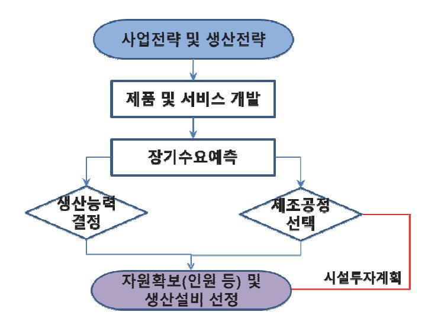

출처: 교육부(2016). 반도체 재료 생산(LM1903060409\_14v1). 한국 직업능력개발원. p.3. [그림 1-1] 생산능력 결정과 절차

#### 2. 생산능력 척도

생산능력을 측정하거나 판단할 때 사용하는 능력의 척도는 세 가지로 구분할 수 있다.

(1) 설계능력(Design Capacity)

설계상에 표시된 용량이나 성능을 말하는 것으로 생산시스템의 여건에 상관없이 생산 시설이나 설비에서 일정 기간 중 생산이 가능한 최대산출량을 의미한다.

(2) 유효능력(Effective Capacity)

생산시스템의 내적과 외적 요인의 주어진 여건에서 일정 기간 중에 정상적으로 생산 가 능한 산출량을 말한다. 시스템 능력이라고도 하며 실제로 수행하여 달성할 수 있는 능력 을 의미한다.

(3) 실제 능력(Actual Capacity)

용하여 측정하게 된다.

현재의 활용 가능한 생산자원의 여건으로 실제로 달성 가능한 산출량을 말한다. 일반적 으로 제품의 품질이나 생산성 등을 극대화하는 수준의 최적생산량을 의미하며 기계 고 장이나 불량 발생 등 기타요인으로 인하여 유효능력을 초과할 수 없다. 이상의 세 가지 능력 척도는 시스템의 유효성을 측정하는 데 있어 이용률과 효율을 활

이용률(utilization) = 실제생산량 설계능력

- 3. 생산능력 분석
  - (1) 생산능력 검토

생산능력은 연간 생산과 월간 생산 계획을 고려하여 검토되어야 한다. 또한, 일별 또는 주 간별 생산실적에 따라 자체적으로 생산량을 조절할 수 있도록 지속적인 검토가 필요하다.

- (2) 생산능력 산출
  - (가) 품목별 및 작업장별로 인원현황을 파악한다.
  - (나) 설비별로 생산능력을 파악한다.
  - (다) 월별로 실제로 가동한 작업 일수 등을 파악한다.

(3) 부하량 산출

- (가) 품목별로 생산 계획서를 충실히 작성한다.
- (나) 작성된 생산 계획서를 근거로 공정, 설비 그리고 품목별 소요시간을 산출한다.
- (4) 평준화 관리

(가) 생산능력이 부하량보다 클 경우엔 생산능력의 부족으로 병목현상이 발생 하지 않도록 작

4

업자나 설비를 충원하여 부하율을 증가시켜준다.

- (나) 생산능력이 부하량보다 작을 경우엔 생산능력을 증대시킬 수 있도록 작업자나 시간을 늘 리거나 고객의 납기를 연기하는 등 부하율을 감소시켜준다.
- (5) 일일 계획 관리
  - (가) 생산관리 담당자는 월간 생산 계획서를 근거로 일일 생산 계획과 실적을 비교하고 재고 를 고려하여 생산실적을 지속해서 관리한다.

(6) 생산능력 관리

생산능력을 결정한다는 것은 장기수요변화에 따라 생산설비의 규모와 크기 등을 조정해 야 할 필요가 있다. 하지만 수요는 점진적으로 증감하는 반면 생산설비는 그렇지 못하게 어떤 시점을 두고 큰 폭으로 증가하기도 하고 감소하기도 한다. 따라서 생산능력을 수립 하는 데는 다음 세 가지 전략에 따라 장단기적으로 실제 생산량을 결정해 나간다.

- (가) 공격전략(생산능력 > 수요): 여유생산능력을 확보하기 위해 사전확장
- (나) 방어전략(생산능력 〈 수요): 부족한 설비를 사후증설을 통해 투자효율을 높임
- (다) 평균전략(생산능력 ≒ 수요): 기업이 시간적으로 기대치 유지하는 전략

2 설비능력의 산정

1. 실제 설비능력

전체생산능력이 결정되면, 제품을 생산하는 데 필요한 각 설비의 능력을 결정해야 한다. 하 지만 설비의 실제 능력은 불량률과 자투리 발행률 등이 고려된 다음과 같은 설비효율로 나 타낼 수 있다.

설비효율(E) = 
$$\frac{$$
가동시간 $H}{$ 조업시간 $D}$   
=  $1.00 - \frac{DT(고장시간) + ST(가공, 준비시간)}{D(조업시간)}$ 

이는 기계별 설비능력은 일정 시간에 대한 설비의 가용시간으로 표시되는데, 가용시간에는 기계준비시간이나 불량품 생산시간, 기계고장시간 등이 포함되어 있어서 기계의 유휴시간을 파악할 수 있다.

#### 2. 공정별 설비소요량

(1) 단일공정의 설비소요량

 $N = \frac{T}{60} \times \frac{P}{D \times E}$ 

N : 작업장에서 필요한 설비소요량(기계 대 수)

T : 제품 단위당 가공시간(min)

- P : 작업장의 생산율(일정 기간의 생산량)
- D : 조업시간(1교대 8시간, 3교대 24시간)
- E : 설비효율
- (2) 연속공정의 설비소요량

여러 단계의 가공공정을 거쳐서 생산 활동을 전개하는 경우에는 선행공정(i-1)에서 후속 공정(i)에 넘겨줄 가공물 수는 후속 공정에서 필요로 하는 양품 수와 당해 공정에서 발 생할 불량품 수를 고려하여 결정해야 한다. 선행공정과 후속 공정과의 관계를 고려한 후 속 공정의 생산율(Pi)은 다음과 같으며, 수행내용의 예시를 통하여 공정별 생산량과 설 비소요량을 계산해 볼 수 있다.

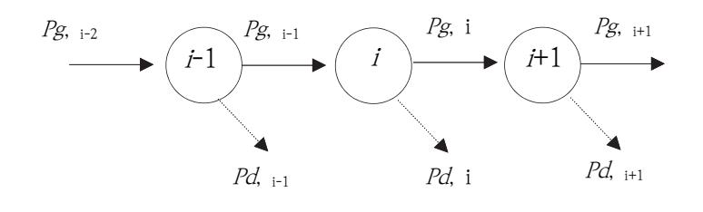

최종공정의 설비소요량부터 산출하여 거슬러 올라가며 공정 별 설비소요량 산정

[그림 1-2] 설비소요량 산정예시

$$P_i = P_{g,i-1} = P_{g,i} + P_{d,i}$$

 선행공정으로부터넘겨받은양품 후속공정에서의양품 후속공정에서의불량품

숖 생산 일정 성과지표

생산 일정 계획을 수립하고 관련 업무를 수행한 후에는 적절한 성과를 평가하기 위한 몇 가지 지표를 사용한다.

1. 총 소요시간

생산을 수행하면서 처음 시작부터 최종 제품을 완료하는데 걸리는 총 시간을 의미하며 시 간이 단축될수록 경쟁력이 향상된다.

총 소요시간 = 최종 생산 작업 완료시간 - 처음 작업 시작시간

2. 작업 흐름 시간

작업할 준비시간, 대기시간, 작업장별 이동시간, 고장 조치시간 등을 포함하여 생산이 진행

6

되어 처리되는 소요시간을 말한다.

작업 흐름 시간 = 완료시간 - 작업장별 처음 준비시간

3. 이용률

이용률이란 종업원이나 생산 설비가 실질적으로 생산에서 수행된 시간의 비율을 의미한다.

이용률 = <u>총가용작업시간</u> 실제생산작업시간

4. 총 재고

생산과정에서 총 재고를 파악하는 것은 일정계획이 얼마나 정확하고 효과적으로 수립되었는지 를 알 수 있다.

총 재고 = 재공품 재고 + 총 보유 재고

### 수행 내용 / 생산능력 계산하기

#### 재료·자료

- 생산목표, 생산실적자료
- 생산설비현황, 가동률

#### 기기(장비·공구)

- 컴퓨터(프린터)
- 생산 관리 시스템(MRP), 전사적 자원 관리(ERP)
- 문서 작성 프로그램

#### 안전 · 유의 사항

- 상황에 맞는 생산능력 소요를 검토해 본다.
- 가용 설비 최적 상태를 파악한다.
- 설비의 문제 상태 등을 고려한다.
- 제품마다 요구되는 특성에 맞춰 생산량 및 생산 가능량이 달라질 수 있음을 이해한다.

#### 수행 순서

#### 생산설비 효율에 대한 용어를 이해하고 파악한다.

1. 가동률

일반적인 정의는 사람 또는 기계에서의 실동(實動)시간에 대한 유효 실동시간의 비율로써 얼마 동안 설비가 정지하지 않고 가동되었는가를 나타낸다.

반도체 제조장치에서의 가동률은 유효 가동시간 및 가동시간에서 각 장치의 정지시간을 빼 서 계산한다.

- 가동시간 = 공장 전 조업시간 예정된 정지시간 (= 공장이 조업하고, 장치가 가동해야 하는 시간)
- 유효 가동시간 = 공장 전 조업시간 모든 정지시간 (= 실제로 생산에 사용된 시간)

• 모든 정지시간 = 예정된 정지시간 + 예정되지 않은 정지시간

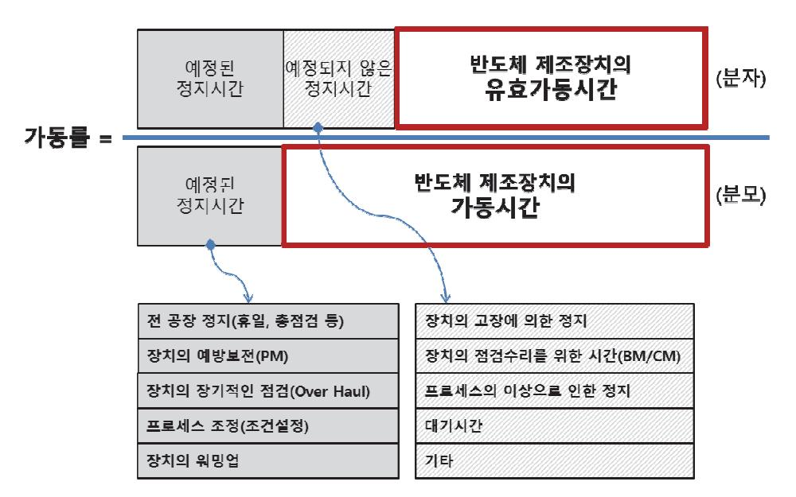

출처: 교육부(2016). 반도체 재료 생산(LM1903060409\_14v1). 한국직업능력개발원. p.9. [그림 1-3] 가동률 계산공식

가장 이상적인 가동률 계산에서, 분모는 24시간, 24시간x30일, 24시간x365일이 된다. 하 지만 일반적인 기준으로 현실에서는 70~90% 정도라고 보고 있다. 단, 사용자별로 그 기준 에 조금씩 차이가 있다고 할 수 있으므로 상황에 적절한 기준에 따라 산출하면 된다. 따라 서, 가동률을 높이기 위해서는 고장 즉, '예정되어 있지 않은 정지시간'을 어떻게 하면 감소 시킬 수 있을까 하는 것이 문제가 된다. 단적으로 말해 장치의 다운 타임(고장으로 인해 멈 추어 있는 시간)을 감소시키는 것이 된다.

#### 2. 양품률

투입 제품 수 대비 양품으로 나온 제품 비율을 나타낸다.

3. 텍 타임(Tact time)

하나의 설비가 제품을 생산하는 데 있어서 하나의 제품과 다음 제품을 투입되는 데 소요되 는 시간을 나타내며 생산량에 영향을 준다.

4. 리드 타임(Lead time)

연속된 설비 구성을 하나의 단위로 묶어서 제품이 첫 번째 설비로 투입된 후, 마지막 설비 를 빠져나오는 데 소요되는 시간을 나타낸다.

2 생산능력 및 생산량을 도출한다.

생산능력의 산출근거는 전체공정 중 병목현상(Bottle-neck)을 보이는 공정의 시간당 생산 수

량, 수율, Downtime, 품질현황 등의 기타 변수를 적용하여 일일생산능력을 계산하고, 일일생 산능력에 일수를 곱하여 월 생산능력을 산출한다.

1. 생산량

공정에서 생산 가능한 수량을 산출한다.

일별생산가능수량 = <u>24시간×60분×60초</u> 텍타임(*tacktime*) 월별생산가능수량 = 일별생산가능수량×30일

2. 공정 생산량

단위 공정별 가동률, 텍 타임(tact time)을 기준으로 월간 가동일 수를 곱해서 산출한다.

실질생산량 = 월생산가능매수 × 가동률 × 양품률

가동률은 단위 공정의 설비에 대해서 이론상 가능한 최대치를 기준으로 하여 비가동에 의 한 손실을 제외하고 산출한다. 또한, 가동률과 양품률이 동일할 때 생산량에 영향을 주는 공정별 텍 타임(tact time)에 따라 생산량이 달라질 수 있다는 사항도 염두에 둔다. 일반적인 비가동에 의한 로스(Loss)로는

- 설비 고장에 의한 미사용 시간
- 제품 생산을 위한 준비 시간
- 제품 변경에 따른 조정 시간
- 제품 생산 없이 설비만 가동되는 시간
- 설비 가동 도중에 발생하는 순간 정지
- 제품 생산 도중 발생하는 불량에 의한 가동 중단 등을 포함한다.
- (예시) 최종 공정 #3 에서의 생산필요량 500개일 때, 공정별 생산율과 설비소요량을 계산 해 본다.

| 생 산 설비 | (D) 조업시간 | (T) 단위당 가공시간 | (DT) 평균고장시간 | (ST) 평균준비시간 | (p) 불량률 |
|-----------|-------------|-----------------|----------------|----------------|------------|
| #1        | 480분        | 15분             | 80분            | 16분            | 6%         |
| #2        | 480분        | 10분             | 90분            | 30분            | 4%         |
| #3        | 480분        | 20분             | 40분            | 8분             | 9%         |

(1) 공정별 생산율 산정

$$P3 = \frac{P_{g,3}}{(1-p_3)} = \frac{500}{(1-0.09)} = 549.5 = 550(7\%)$$

$$P2 = \frac{P_{g,2}}{(1-p_2)} = \frac{550}{(1-0.04)} = 572.9 = 573(7\%)$$

$$P1 = \frac{P_{g,1}}{(1-p_1)} = \frac{573}{(1-0.06)} = 609.6 = 610(7\%)$$

(2) 공정별 설비소요량 산정

$$N_{1} = \frac{T_{1}}{60} \cdot \frac{P_{1}}{D \times E_{1}} = \frac{15}{60} \cdot \frac{610}{(8) \cdot (0.80)} = \frac{9150}{384} = 24(\text{T})$$

$$N_{2} = \frac{T_{2}}{60} \cdot \frac{P_{2}}{D \times E_{2}} = \frac{10}{60} \cdot \frac{573}{(8) \cdot (0.75)} = \frac{5730}{360} = 16(\text{T})$$

$$N_{3} = \frac{T_{3}}{60} \cdot \frac{P_{3}}{D \times E_{3}} = \frac{20}{60} \cdot \frac{550}{(8) \cdot (0.90)} = \frac{11000}{432} = 26(\text{T})$$

#### 수행 tip

- 생산 관련하여 기본 용어에 대한 지식이 필요하다.
- 단위 공정별 텍타임(tact time), 가동률, 양품률에 대한 사 전 지식이 필요하다.

## 1-2. 생산 소요자원 수급계획

학습 목표 • 파악된 생산 가능량을 통하여 원료, 에너지, 인력, 설비 등 소요자원 수급계획을 수립할 수 있 다.

## 필요 지식 /

숔 총괄생산 계획(Aggregate production planning: APP)

총괄계획은 한정된 전체 생산자원에 대해 예측된 총괄수요를 충족하기 위해서 납기조정, 고용 수준, 재고수준 및 생산율 등을 결정하는 중기계획의 핵심이다. 이러한 총괄생산 계획은 자금 계획, 판매계획, 조달계획, 인력계획 등과 밀접한 관계가 있어 이를 효율적으로 배분하고 관련 비용을 최소화하고 합리적으로 사용하기 위해 전체 제품을 총괄하는 관점에서 생산 수량을 계 획하는 것을 의미한다.

- 1. 총괄생산 계획 목적
  - (1) 비용 최소화하고 이윤을 극대화한다.
  - (2) 고객 서비스를 우선시하고 최대화한다.
  - (3) 재고에 대한 투자를 최소화한다.
  - (4) 산출률에서 변동을 최소화한다.
  - (5) 고용수준에서 변동을 최소화한다.
  - (6) 공장과 장비에 대한 이용률을 최대화한다.
- 2. 총괄생산 계획 전략

예측된 수요변동에 적절히 대처하고 총괄생산 계획의 전략 대안을 결정하기 위해 생산관리자는 내부적으로 통제 가능한 다음 변수들을 중심으로 생산비용을 최소화할 수 있는 전략을 수립하 게 된다.

- 고용수준의 조정: 작업자의 고용이나 해고, 임시고용, 잔업, 작업 유휴시간, 작업자 수
- 생산율의 조정: 생산시설의 재배치, 조업도
- 재고수준의 조정: 재고 유지비, 납기지연 손실
- 납기의 조정: 하청
- 이상의 전략변수를 사용하여 선택할 수 있는 총괄계획의 전략으로는 다음과 같다.
- (1) 순수전략(Pure Strategy)

수요변동을 흡수하기 위해 하나의 변수를 사용하는 전략이며 대표적으로 추종 전략과 평준화 전략으로 나누어 설명할 수 있다.

(가) 추종 전략(Chase Strategy)

수요량의 변동에 따라서 인원에 대한 충원, 해고 등을 통해 고용수준을 적정하게 조 정하거나 단축근무, 잔업 등을 통해 산출률(생산율)을 맞추는 전략이다.

(나) 평준화 전략(Level Strategy)

고용수준이나 산출률을 일정하게 유지하면서 변동하는 수요를 재고의 증가 또는 감소에 의해 탄력적으로 대응하는 전략이다.

(2) 혼합전략(Mixed Strategy)

두 개 이상의 변수를 함께 사용하는 전략으로 위에서 언급한 추종 전략이나 평준화 전 략 등을 혼합적으로 사용한다. 시장의 다양성과 빠른 변화에 대응하기 위해 많은 기업에 서는 혼합전략을 활용하고 있다.

또한, 이상의 전략변수를 고려하여 총괄생산 계획을 수립할 때 고려해야 할 비용은 정규 생산비용, 고용과 해고비용, 잔업과 하청비용, 재고유지비용 등이 있다.

3. 총괄생산 계획 기법

수요를 생산기간에 배분하는 총괄생산 계획의 전략 대안을 결정하기 위해서는 작업자의 고용이 나 해고, 작업 유휴시간과 재고 수준의 변동, 추후 납품정책, 하청이나 임시작업자 등의 여러 가지 사항을 고려하여 적절한 총괄계획기법이 적용되어야 한다.

(1) 도시법(Graphic & Chart Method) 또는 시행착오법(trial & error method)

예측된 수요와 현재의 생산능력을 비교할 수 있도록 간단한 표와 그래프를 이용하여 생산 계획을 수립하는 방법이다. 이는 그래프나 차트를 이용하는 시행착오적 방법으로 최적계획 을 도출하기는 어렵지만 비교적 단순하고 이해하기가 쉽다는 장점도 있다.

(2) 수리적 최적화 기법(mathematical optimization method)

수학적인 모형을 이용하여 총괄생산 계획을 수립하는 방법으로 수송계획법(예측 수요와 생 산능력을 고려하여 총 비용의 합을 최소로 하는 것을 찾는 방법으로 하는 선형계획법 배분 모형이라고도 함)과 선형의사결정규칙(고용수준과 생산율 등을 문제를 계량화하고 2차 비용 함수를 최소화할 수 있는 방법을 사용함)이 있다.

(3) 휴리스틱 계획모형(heuristic programming model)

과거의 시행착오나 실험에 의한 학습된 경험을 통해 모형을 만들고 문제를 해결하는 방법 이다.

(가) 경영계수모형

과거 경영자의 판단이나 결정을 바탕으로 추정한 의사결정의 계수를 회귀분석을 이용하 여 고용수준이나 생산율을 결정하는 방법이다.

(나) 매개변수에 의한 생산 계획

고용수준과 생산율의 매개변수를 조합하여 총 생산비용을 최소로 하는 방법이다.

(다) 생산전환 탐색법

차기의 생산량은 현 재고에 의해 결정된다는 계획기법이다

(라) 탐색 의사결정 규칙

수학적 모형 형태의 제한을 줄이고 현실적인 문제를 반영하는 것으로 컴퓨터를 활용하 여 총비용을 감소시키는 방향으로 점점 더 나은 해를 찾아가는 방법이다.

숕 자재 소요계획(Material Requirements Planning :MRP)

생산재고를 계획하고 통제하는 데 사용되는 기법으로 생산관리의 효율적인 관리를 목적으로 개 발되었으며 이후 MRP-II(제조자원계획)와 ERP(전사적 자원관리)로 확장되었다.

1. MRP 개념

주 생산 계획으로부터 최종품목 소요량을 구하고 그 품목과 부품의 자재명세서와 재고 파 일의 재고현황을 통하여 총 소요량과 순소요량을 산출하게 되며, 모든 부품에 대해서 단계 별로 결정한다.

- (1) 확정적 주문: 부품에 대한 예정발주량과 시기를 자동적으로, 그리고 계속적으로 통제
- (2) 소요량의 연계화: 특정 사용처 파일을 만드는 데서 시작되고 제품구조 상의 상위소요량을 추 적할 수 있다.
- (3) 우선순위의 계획과 통제: 생산되는 품목에 중요도를 할당하는 것으로 주문생산과 가장 관련성 이 높다.
- 2. MRP시스템의 구조와 설계

완제품 주 생산 일정계획과 자재 명세서를 기초로 특정 자재의 소요량 및 소요시점을 계산 하고, 그 시점의 예상재고량을 감안하여 적정한 주문량을 자동으로 산정해주는 컴퓨터 프로 그램으로 최종 품목을 적시에 완성할 수 있도록 발주생산 및 조립의 일정계획을 수립하여 야 하며 이를 용이하게 하도록 설계되었다.

MRP의 목적은 다음과 같다.

- (1) 재고수준의 통제
- (2) 구매 및 생산 우선순위의 결정
- (3) 생산능력을 계획

또한, MRP시스템이 성공적으로 운영되기 위해서는 정확한 자료가 요구되는데 이는 컴퓨터 가 제공하는 정보를 가지고 의사결정이 이루어지기 때문이다. 우선 자재명세서(BOM)가 정 확해야 하는데, 이를 위해서는 제품설계, 공정 또는 조립과정이 수정되면 즉시 BOM에 반 영되어야 한다. 이뿐만 아니라 재고기록과 조달 기간 등을 정확하게 파악되어야 시스템이 성공적으로 운영될 수 있다.

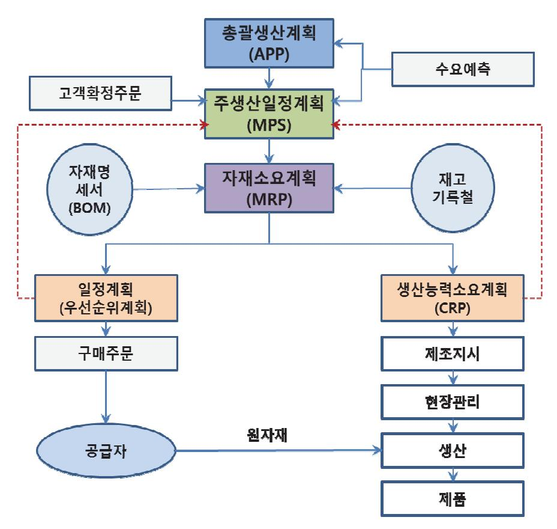

출처: 교육부(2016). 반도체 재료 생산(LM1903060409\_14v1). 한국직업능력개발원. p.15. [그림 1-4] MRP 시스템

## 수행 내용 / 생산 소요자원 수급계획하기

#### 재료·자료

- 생산관리 규정
- 생산·재고·자재 현황 목록(MRP 또는 ERP 시스템)
- 품목별 연간 수요금액 자료
- 생산 실적 자료

#### 기기(장비 ・ 공구)

- 컴퓨터(프린터)
- 생산관리 프로그램, 문서관리 프로그램, 통계품질관리 프로그램

#### 안전 ・ 유의 사항

적절한 프로그램을 이용하여 ABC 분석에 따른 도표까지 작성하고 의미를 해석해 본다.

#### 수행 순서

숔 생산소요 자원 수급계획의 일환으로 ABC 분석법을 이해하고 실시한다.

1. ABC 분석단계

ABC 분석은 일반적으로 제조공정에서 사용되는 모든 품목을 중요도(금액적 가치)에 따라 효과 적으로 관리하기 위한 기본적인 방법이다. ABC 분석 프로세스는 그리 복잡하지 않으며 [그림 1-5]와 같이 간단하게 3단계로 수행할 수 있으며, 해당 데이터를 엑셀과 같은 스프레드시트를 활용하면 더욱 효과적으로 정리해볼 수 있다.

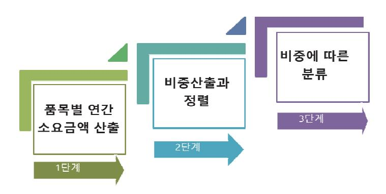

출처: 교육부(2016). 반도체 재료 생산(LM1903060409\_14v1). 한국직업 능력개발원. p.16. [그림 1-5] ABC 분석 실행단계

- 2. ABC 분석 방법
  - (1) 다음의 해당 데이터를 수집한다.
    - MRP 또는 ERP 시스템을 통해 사용하는 모든 품목(또는 부품) 리스트를 확보한다.
    - 각 품목별(또는 부품별) 원가 데이터를 파악한다.

 - 일정 기간(일반적으로 1년)에 대한 품목별로 사용량을 파악한다. 이때 수량은 경우에 따라 예상수요일 수도 있고, 실적수요일 수 있으며 월별, 분기별, 반기별, 연차별로 결정 한다.

- (2) 품목별로 파악한 예상수요(또는 실적 수요)와 사용량을 곱하여 그 기간동안 생산에 사용되는 품목별 총 사용금액을 산출한다.
- (3) 산출한 사용금액의 규모가 큰 것부터 순차로 정렬한다.
- (4) 이때 사용금액을 퍼센트로 바꾸어 각각 차지하는 비중을 산출한다.
- (5) 상기 내용을 바탕으로 ABC 등급별로 나누어 분류하는 ABC 분석도를 작성한다.

#### 3. ABC 재고 분류법

ABC 분석을 통해 사용하는 품목들을 등급별로 분류하게 되면 다음의 <표 1-1>과 같이 정리 할 수 있으며, 등급별로 관리수준을 달리함으로써 전체 품목들(또는 부품들) 관리의 효율성을 높일 수 있음은 물론 품목에 대한 체계적인 관리를 효과적으로 할 수 있다.

<표 1-1> ABC 등급 기준

| 등급 | 품목의 구성비율 | 전체 사용금액 Volume비율 |  |
|----|----------|------------------|--|
| A  | 15~20%   | 75~80%           |  |
| B  | 30~35%   | 10~15%           |  |
| C  | 50~60%   | 5~10%            |  |

- (1) 재고 품목을 연간 사용 금액의 크기에 따라 분류하여 선별적으로 해당 수준에 맞게 통제와 관리를 전개할 수 있다.
- (2) A등급의 품목은 엄격한 관리와 통제가 필요한 복합적이며, 연간 사용 금액이 큰 고가품과 정 기적으로 빈번하게 사용되는 품목으로서 전체 품목 비용의 80% 정도를 차지한다.
- (3) B등급으로 분류되는 품목은 A등급과 C등급의 중간에 위치한 품목들로, 중간 정도의 관리와 통제가 필요한 수준의 적정재고로서 전체 품목 비용의 약 15%를 차지한다.
- (4) C등급으로 분류되는 품목은 관리와 통제가 거의 필요 없고 상대적으로 매우 낮은 가격의 다 종 소량의 저가 품목들로써 연간 사용 금액이 적은 품목이며 전체 품목 비용의 약 10% 이 내에 해당된다.

숕 ABC 분석법을 실시한다.

1. 품목별 연간 소요금액 산출 단계 현재 기업에서 사용하는 품목에 대한 연간 사용(수요)금액을 검토하여 각각에 대하여 소요금액 을 산출하는 단계로써 <표 1-2>와 같이 품목별 연간 소요금액을 예시로 산출해 볼 수 있다.

| 품목 번호 | 연간 사용량 | 품목 단가(천원) | 연간 소요금액(천원) |
|-------|--------|-----------|-------------|
| 1     | 1,500  | 5         | 7,500       |
| 2     | 6,450  | 20        | 129,000     |
| 3     | 5,000  | 45        | 225,000     |
| 4     | 200    | 12        | 2,400       |
| 5     | 20,000 | 35        | 700,000     |
| 6     | 84     | 250       | 21,000      |
| 7     | 800    | 80        | 64,000      |
| 8     | 300    | 5         | 1,500       |
| 9     | 10,000 | 35        | 350,000     |
| 10    | 2,000  | 65        | 130,000     |

#### <표 1-2> 품목별 연간 소요 금액

#### 2. 품목별 비중 산출 및 정렬 단계

연간 소요 금액에 따라 품목별로 각각 비중을 계산하고 비중이 높은 순서대로 정렬을 진 행하는 단계로 <표 1-3>과 같이 구성비율(%)에 따라 정리해 볼 수 있다.

<표 1-3> 품목별 연간 소요 금액과 비중에 따른 정렬

| 품목 번호 | 연간 소요 금액(천원) | 구성 비율(%) |  |
|-------|--------------|----------|--|
| 5     | 700,000      | 42.9     |  |
| 9     | 350,000      | 21.5     |  |
| 3     | 225,000      | 13.8     |  |
| 10    | 130,000      | 8.0      |  |
| 2     | 129,000      | 7.9      |  |
| 7     | 64,000       | 3.9      |  |
| 6     | 21,000       | 1.3      |  |
| 1     | 7,500        | 0.5      |  |
| 4     | 2,400        | 0.1      |  |
| 8     | 1,500        | 0.1      |  |

#### 3. 품목별 비중에 따른 분류 단계

품목별로 비중을 살펴보면 품목5와 품목9의 비중이 전체 비중의 약 64.4%를 차지하여 A로 분 류한다. 그다음으로는 품목3과 품목10의 비중을 합하면 약 21.8%를 나타내어 B로 분류한다. 나머지 6가지 품목에 대한 비중은 약 13.8%로 나타나고 이를 C로 분류할 수 있으며, <표 1-4>로 정리해 볼 수 있다. 또한, 품목별 비중에 따른 ABC 곡선은 통계분석 프로그램인 미니

탭 등을 이용하면 [그림 1-6]과 같은 Pareto 차트를 도표화 하여 나타낼 수 있으며, 시각화된 도표로 나타냄으로 인해 품목에 대한 관리를 더 쉽게 할 수 있도록 해준다.

<표 1-4> 분류별 품목과 비중

| 분류 | 품목          | 연간 소요 금액(천원) | 비중(%) |
|----|-------------|--------------|-------|
| A  | 5, 9        | 1,050,000    | 64.4  |
| B  | 3, 10       | 355,000      | 21.8  |
| C  | 1,7,6,1,4,8 | 225,400      | 13.8  |
|    | 합 계         | 1,631,900    | 100   |

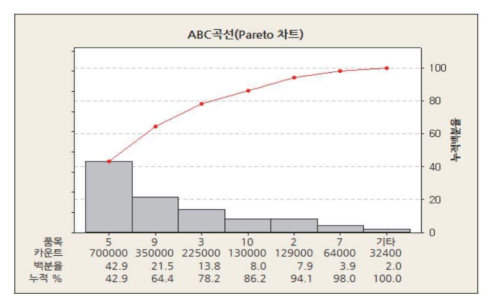

출처: 교육부(2016). 반도체 재료 생산(LM1903060409\_14v1). 한국직업능력개발원. p.19. [그림 1-6] ABC 분류에 따른 도표

수행 tip

- 단계별 필수 사항을 숙지하여 수행한다.
- 재고 발생 원인을 파악한다.

## 1-3. 생산 계획서 작성

학습 목표 • 고객이 주문한 제품에 대하여 납기 내 공급할 수 있는 생산 계획서를 작성할 수 있다. • 생산목표를 달성하기 위한 대응전략을 수립할 수 있다.

### 필요 지식 /

#### 숔 생산 계획

생산 계획(production planning)이란 예측된 시장의 수요를 충족시키기 위하여 생산 활동을 어떻게 운영해 나갈 것인가를 장단기적으로 계획하는 것을 말한다. 즉, 기업은 재화나 서비스 를 효율적으로 생산하기 위하여 주문이나 판매 예측을 토대로 생산할 제품의 종류와 수량, 가 격 등과 함께 생산 방법, 장소 및 일정 등 인적, 물적 생산요소를 가장 경제적이고 합리적인 계획을 세우게 된다. 또한, 모든 계획과정에서 이용 가능한 공급능력과 요구되는 공급능력과의 조화가 필요하다. 이러한 생산 계획의 수립과정에는 생산관리자 이외에도 최고경영자가 참여해 야 하며 마케팅 부서 등 관련 부문과의 밀접한 협조와 조정이 이루어져야 한다. 또한, 계획 활 동이 효율적으로 성취되기 위해서는 모든 조직구성원이 그 시스템에 대하여 신뢰감을 가져야 한다.

제조업에서는 총괄생산 계획에 의하여 중기계획이라 할 수 있는 주생산 일정계획을 수립하고, 단기계획인 자재 소요계획(MRP)을 수립하는 절차가 일반적이다. 이러한 계획들에 의해서 생산 명령이 있으면 작업 일정계획을 수립하여 구체적인 생산일정을 짜게 된다.

#### 1. 주요 생산 계획 활동

(1) 장기계획

향후 2년에서 10년 사이에 달성해야 할 조직의 목표를 수립하는 것으로 기업대내외적인 환경과 조직능력의 범위내에서 성취될 목표인 기업전략계획과 시장 또는 제품별 마케팅계 획 그리고 투자수익 및 재무적인 타당성이 분석된 재무계획 등을 수립한다.

(2) 중기계획

일반적으로 월별 또는 분기별로 수립되는 것으로 6개월에서 18개월의 기간을 대상으로 수 요를 예측하고 이를 충족시킬 수 있는 상세한 판매 및 생산 계획을 수립한다. 주요 제품군 별 산출요구량을 나타내는 총괄생산 계획(aggregate production plan: APP)과 완제품의 생산량과 생산 시기를 산출하는 주생산 일정계획(master production schedule: MPS) 등 의 계획을 수립한다.

#### (3) 단기계획

일반적으로 3개월 미만의 계획이다. 가장 대표적인 것으로 자재 소요계획(material requirement planing: MRP)이 있다. 단기계획은 주로 일일이나 주간 단위로 구체적인 작업에 대한 계획을 수립하는데 여기에는 세부 생산 계획으로 각 작업이 할당되는 기계, 생산 라인/작업장 및 작업 우선순위 등을 결정한다.

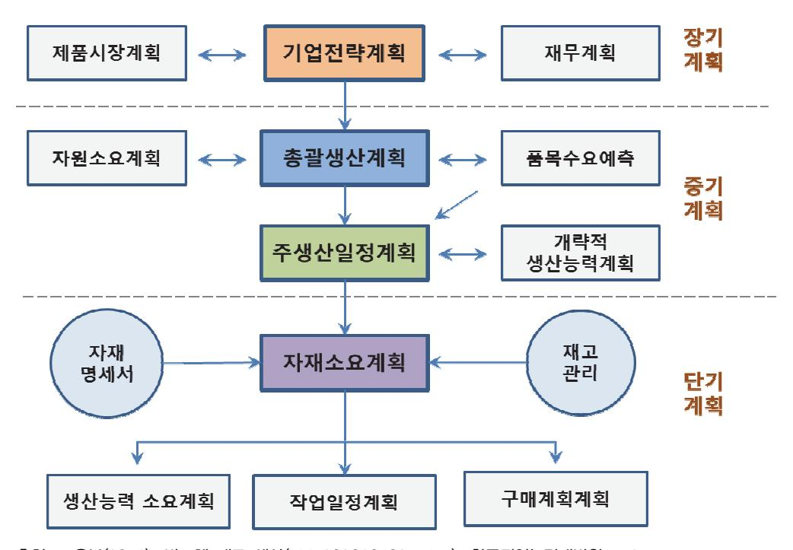

출처: 교육부(2016). 반도체 재료 생산(LM1903060409\_14v1). 한국직업능력개발원. p.21. [그림 1-7] 생산 계획 활동

#### 숕 생산 계획서 작성

#### 1. 생산 계획 작성

생산 계획의 기본 목적과 방향에 따라 기간별로 필요한 제품에 대한 생산량을 계획하고 기 록하는 문서이다. 따라서 생산 계획은 생산 활동에 필요한 자원을 효율적으로 배분함으로써 생산 시스템의 능력을 시장수요에 적응시키는 과정을 말하며, 시장의 수요와 생산 제약 및 기 타 전략적인 요소를 종합적으로 고려하는 등 생산성을 높일 수 있는 전략을 수립하여야 하며, 생산 계획의 목적과 기본 방향을 염두에 두어 생산 계획서의 내용을 체계적으로 작성해야 한 다.

2. 주간 생산 계획표

주간 생산 계획표는 제품에 대한 주간 생산 계획을 세울 때 사용하는 서식으로, 부서명, 성명, 작성일, 품명, 발주량, 누적 생산량, 계획량, 요일 등으로 구성되어 있으며, 제품별 발주량과 생산량 및 계획량을 세우고, 요일별 생산 계획을 세움으로써 평균적인 생산 계획을 한눈에 확 인할 수 있다.

3. 월간 생산 계획표

월간 생산 계획서는 시장의 수요와 생산 제약 및 기타 전략적인 요소를 종합적으로 고려하는 등 생산성을 높일 수 있는 전략을 수립하여 작성해야 하며, 생산 계획의 목적과 기본 방향을 염두에 두어 적정 재고, 기초 재고, 판매 계획, 생산 계획 등의 항목을 만들어 생산 계획서 안 의 내용을 체계적으로 작성해야 한다.

4. 생산 계획 변경

생산 관리 부서장은 영업 부서로부터 생산 일정의 변경 요청이 있을 때 또는 고객이 요구한 납기에 차질이 예상될 경우에 영업 부서장과 협의를 한 다음 생산 계획을 수정하여 관련 부서 에 배포해야 한다.

(1) 작업 순서 변경

- 공정 이상, 설비 이상에 의한 해당 공정의 작업 순서 변경(Minor Change)
- 전 공정 작업 순서에 따른 후 공정 연동 변경
- 자재(부품, 부자재) 투입 가능성 확인
- (2) Net Change(변경 사항 일 단위 취합 처리)
  - 변경 사항을 Minus(-), Plus(+) 개념으로 해당 계획 사항 변경
- (3) 생산 계획 재수립(주 단위)
  - 생산 계획 수립 절차와 동일
  - 생산 미진행 아이템 대상

## 수행 내용 / 생산 계획서 작성하기

#### 재료·자료

- 생산 요청서(지시서), 생산 계획서
- 생산 인력 현황표
- 자재 명세서, 재고통제 및 재고관리 관련 자료

#### 기기(장비 ・ 공구)

- 컴퓨터(프린터)
- 생산 관리 시스템(MRP) 또는 전사적 자원 관리(ERP) 시스템
- 문서관리 프로그램

#### 안전 ・ 유의 사항

- 생산절차서의 주요 구성 요소를 점검한다.
- 생산량을 기준으로 생산라인별로 생산 가능한 능력을 체크한다.
- 생산 지시서에 근거하여 수주 물량을 생산하기 위하여 공정별 작업에 필요한 소요 인원을 산출하여 관련 부서에 통보한다.

#### 수행 순서

숔 생산일정 수립을 위한 생산관리 업무프로세스를 파악한다.

일반적으로 생산관리부가 주관이 되는 업무프로세스는 [그림 1-8]의 절차도에 따라 진행이 되 므로 생산 계획서를 작성하기 이전에 충분히 숙지해야 한다.

- 1. 생산관리의 업무적용범위는 영업 수주 접수에서부터 생산 계획 수립, 계획대비진행현황, 계획수정 및 변경까지의 관련된 업무와 절차에 대해 적용한다. 생산 계획 수립을 위해 부서 간 업무 흐름도를 파악하고 작성한다. 특히, 판매계획, 주문, 생산능력 등을 감안한 일원화된 생산관리 시스템(예, MES, ERP 등)이 구축되어 있다면 이 를 활용하여 전체적인 프로세스를 파악하고 숙지한다면 계획 변경(추가,변경,취소 등) 시 신 속 정확하게 대응이 가능하다.
- 2. 생산관리 프로세스는 영업 수주를 바탕으로 계획 및 일정을 관리함으로써 고객의 납기를 만족하 기 위하는 데 그 목적이 있음을 이해한다.

- 납기달성을 최우선으로 하는 계획수립체계를 확립하여 납기지연을 방지
- 공정별 능력 기준에 의한 생산 계획으로 생산성 향상
- 원활한 공정진행 관리로 생산성 향상
- 공정별 실시간 tracking에 의한 생산실적 수집 및 이상 시 신속 대응

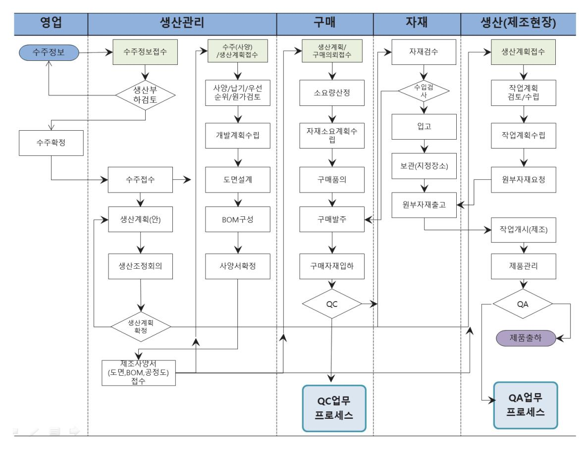

출처: 교육부(2016). 반도체 재료 생산(LM1903060409\_14v1). 한국직업능력개발원. p.24. [그림 1-8] 생산관리 업무 절차도

숕 영업부서로부터 배포 받은 월 수주현황을 분석한다.

고객으로부터 수주한 물량을 생산하기 위해 생산지시서를 근거로 소요인력, 필요자재, 가용설비 등에 대한 충분한 검토가 필요하다. 그러므로 예측 가능한 수요와 함께 생산능력을 바탕으로 적절한 생산 계획안을 결정해야 한다.

1. 생산관리담당자는 영업부서 및 개발부서로부터 배포된 영업 월 수주 및 추가발주, 긴급발주, 개발 일정을 생산관리담당부서장의 승인을 득한 후 월 수주 현황 파일에 등록 및 파일링 하고, 업체 및 도번의 오류 등을 검토 후 제품별/업체별 발주량 및 납기 등을 확인한다.

숖 원재료 수급계획을 위해 재고현황을 검토하고 파악한다.

- 1. 원재료 관리 담당자는 월별 원재료 예상 소요량을 파악하여 원재료 재고량 및 원재료 수급 소요 일 등을 검토 후 원재료 입고 예정 요구일 및 입고 예정 수량을 자재구매청구서에 작성한다.
  - (1) 고객으로부터 최종 승인된 제품 승인서의 수주정보를 바탕으로 자재 명세서(BOM)를 준비한 다.
  - (2) 자재 명세서의 필요 자재들이 창고에 보관되어 있는지 자재 및 구매 부서를 통하여 파악한 다.
- 2. 원재료 관리 담당자는 자재 구매 청서에 원재료 품목, 수량, 입고 예정일을 작성하고, 원재료 관 리 부서장의 승인을 득한 후 구매 부서로 청구한다.
  - (1) 생산에 필요한 자재들이 부족하거나 없을 경우 구매 부서에 구매요청을 하고 입고 가능 시기 를 사전에 확인한다.

숗 작업 필요인원을 검토한다.

- 1. 공정별 작업에 필요한 소요 인원을 산출한다.
- 2. 공정별 공수를 파악하여 소요 인원이 적기에 투입될 수 있는지를 파악한다.
- 3. 생산 공정에 투입되고 있는 현재의 작업자에 대한 공정별 인력 배치 현황을 생산부서를 통해 확 인한다.
- 4. 생산 설비를 효과적으로 운전할 수 있는 적격성과 적절한 교육훈련을 통하여 숙련도와 능력을 갖 춘 작업 가능 인원을 생산 부서를 통해 확인한다.

수 설비 가동 현황을 검토한다.

- 1. 일별 생산 설비 가동 현황을 구체적으로 파악한다.
- 2. 미가동 생산 설비의 경우, 수주한 물량의 생산에 문제가 발생하지 않도록 사전에 설비 이상 유무 가 있는지를 점검 요청한다.
- 3. 미가동 생산 설비가 없을 경우, 양산 적용 가능한 가동 시기를 확인한다.

숙 월간/주간 생산 계획서를 작성한다.

1. 생산관리담당자는 월 생산 계획 분석서에 검토된 월 생산 품목, 수량, 납기 예정일 등을 포함하

고, 제품별 작업설비 등을 고려하여 월 생산 계획을 작성한다.

- (1) 작업 부하에 따라 고객이 요구하는 일정에 납품이 되도록 생산 일정을 작성한다.
- (2) 생산 의뢰서에 따라 효율적인 작업 배정이 될 수 있도록 우선순위의 규칙을 적용한다.
- (3) 고객 납기에 차질이 없도록 공정별 생산 능력을 고려하여 생산 일정을 결정한다.
- (4) 매주 고객 수주 현황을 파악하고, 고객의 주문을 근거로 제품 창고에 있는 재고 현황을 파악 한다.
- (5) 공정별 목표 생산량, 인원 공수 계획, 자재 소모 계획 등과 같이 일별 생산 계획을 세밀하게 검토하여 생산 일정을 수립한다.
- 2. 생산관리담당자는 월 생산 계획을 바탕으로 주간 생산 계획을 작성한다. 수립된 생산 계획을 근거로 생산 판매 회의를 통하여 생산 일정을 확정한다.
  - (1) 생산 계획 이행을 위한 생산 판매 회의를 소집한다.
    - (가) 참석 대상: 영업, 구매, 생산 관리, 생산
    - (나) 회의 안건: 생산 계획 이행에 대한 세부 일정 검토
  - (2) 생산 계획 일정에 대하여 세부적으로 회의를 진행한다.

(가) 전체 Plan 실행: 수요 예측 vs. 출하

- 3. 생산 관리부서장은 작성된 주간 생산 계획이 적합한지를 확인 후 승인한다.
- 4. 승인된 주간 생산 계획을 생산 현장 및 요구 부서에 배포한다.
- 숚 생산현장의 공정별 책임자는 주간 생산 계획이 접수되면 제품 생산 프로세스에 의해 제품생산을 실 시한다.

수행 tip

• 생산 일정 수립과 관련하여 생산, 판매부서의 회의(자료) 를 통한 인력, 자재, 설비의 가용 여부 및 현황을 확인한 다.

### 학습 1 교수·학습 방법

#### 교수 방법

- 교육 내용에 대한 필수 용어를 간단히 정리하여, 강의 시작 전에 프린트하여 나누어 주거나 PPT 자료를 활용하여 이해시킬 수 있도록 한다.
- 생산량 결정에 대한 필요 요소와 조건에 대해 설명하고 이에 대한 적절한 실습을 진행하도 록 한다. 특히, 생산 요구 사항과 라인별 생산 가능한 제품의 제조규격, 반도체 재료별 또는 재료에 따른 공정별 세부 공정에 대해 이해시키고 설명한다.
- 모범사례를 활용하여 생산 계획서 작성의 필요성을 설명하고 실제 사례를 활용하여 직접 작 성할 수 있는 기회를 제공한다.
- 교육 훈련을 시작하기 전에 교육 시설이나 장비에 대한 사양과 사용법에 대하여 충분히 숙 지하도록 한다.
- 교육 훈련을 시작하기 전에 학습자들의 수준과 강의 목표에 적합한 강의 자료와 교재 등을 선택하여 적절할 강의 방법을 검토한다.

#### 학습 방법

- 반도체 재료별 주요 공정 및 세부 공정에 대해 학습한다.
- 생산 계획서를 실제 작성해 보고 모범사례와 비교하여 부족한 사항에 대해 수정하고 보완이 필요한 부분을 정리한다.
- 전체적인 내용에 대해 우선 큰 틀을 이해하고, 핵심 내용에 대해 단계별로 상세하게 학습을 진행한다.
- 새로 배운 지식이나 내용을 새로운 여러 가지 서식에 정리하고, 실제 생산 현장에서 적절하 게 활용할 수 있도록 한다.

## 학습 1 평 가

#### 평가 준거

• 평가자는 학습자가 학습 목표를 성공적으로 달성하였는지를 평가해야 한다.

#### • 평가자는 다음 사항을 평가해야 한다.

|                 | 학습 목표                                                       |  | 성취수준 |   |  |
|-----------------|-------------------------------------------------------------|--|------|---|--|
| 학습 내용           |                                                             |  | 중    | 하 |  |
|                 | - 설비목록을 통하여 설비별 최고 생산능력을 계산할 수 있다.                          |  |      |   |  |
| 생산능력 계산         | - 생산공정도를 통하여 배치별 생산량을 산출할 수 있다.                             |  |      |   |  |
|                 | - 배치별 생산량을 통하여 실제 생산 가능량을 추정할 수 있 다.                     |  |      |   |  |
| 생산 소요자원 수급계획 | - 파악된 생산 가능량을 통하여 원료, 에너지, 인력, 설비 등 소요자원 수급계획을 수립할 수 있다. |  |      |   |  |
| 생산 계획서          | - 고객이 주문한 제품에 대하여 납기 내 공급할 수 있는 생산 계획서를 작성할 수 있다.        |  |      |   |  |
| 작성              | - 생산목표를 달성하기 위한 대응전략을 수립할 수 있다.                             |  |      |   |  |

#### 평가 방법

• 문제 해결 시나리오

|                 |                                            | 성취수준 |   |   |
|-----------------|--------------------------------------------|------|---|---|
| 학습 내용           | 평가 항목                                      |      | 중 | 하 |
| 생산능력 계산         | - 판매계획에 문제 발생 시 해결 능력                      |      |   |   |
|                 | - 재고 수량을 반영한 생산량 결정 능력                     |      |   |   |
|                 | - 실제 생산 가능량을 추정                            |      |   |   |
| 생산 소요자원 수급계획 | - 생산능력과 소요자원과의 연계능력                        |      |   |   |
|                 | - 생산일정 수립을 위한 원부자재, 설비, 인력                 |      |   |   |
|                 | - 생산 차질 발생 시 대응 전략 수립능력                    |      |   |   |
| 생산 계획서 작성    | - 생산라인, 작업자, 원자재 수급현황을 고려한 생산 계획서 작성 능력 |      |   |   |
|                 | - 작업자나 원자재 문제 발생 시 문제 해결 능력                |      |   |   |
|                 | - 생산일정 고려한 최종 생산 계획 수립에 대한 지식              |      |   |   |

• 구두 발표

|                 |                                             | 성취수준 |   |   |
|-----------------|---------------------------------------------|------|---|---|
| 학습 내용           | 평가 항목                                       |      | 중 | 하 |
| 생산능력 계산         | - 판매계획에 대한 이해도                              |      |   |   |
|                 | - 생산량 결정에 들어가는 요인들                          |      |   |   |
|                 | - 실제 생산 가능량에 영향을 주는 요인들                     |      |   |   |
| 생산 소요자원 수급계획 | - 원부자재, 설비, 인력 등 소요자원 관리 지식                 |      |   |   |
|                 | - 각 소요자원에 대한 대응 전략                          |      |   |   |
|                 | - 생산 차질 발생 시 대응 전략 수립에 관한 지식                |      |   |   |
| 생산 계획서 작성    | - 작업자나 원자재 수급현황을 고려하여 생산 계획을 설명할 수 있는 지식 |      |   |   |
|                 | - 생산 계획서 작성에 대한 단계와 주의점                     |      |   |   |
|                 | - 최종 생산 계획 수립에 대한 조건                        |      |   |   |

#### 피드백

- 1. 문제 해결 시나리오
- 문제 해결 진행 과정 중에 필요시마다 피드백을 제공하여 문제 해결을 용이하게 한다.
- 학습이 미진한 학생들은 개별 지도를 통해 해결 방안을 도출한다.
- 2. 구두 발표
- 작업과정이나 결과를 구두로 표현하게 하고 평가의견을 준다.
- 구두 발표 내용이나 자세가 미흡한 경우 상세하고 명확하게 개선사항을 설명해 준다.

29

| 학습 1 | 재료생산 기획하기 |  |
|------|-----------|--|
| 학습 2 | 생산장비 운영하기 |  |
| 학습 3 | 생산공정 수행하기 |  |

## 2-1. 생산 장비 운영안 작성

학습 목표 • 장비매뉴얼에 따라 생산 장비를 운영할 수 있다.

## 필요 지식 /

숔 생산 장비의 운영관리규정

제품을 생산하기 위하여 사용되는 생산 장비 및 설비에 대한 전반적인 보존.관리 절차가 필요 한데 이는 장비의 신규구입에서 폐기까지의 일련의 모든 과정을 포함한다. 또한, 제품의 생산 활동에 사용되는 모든 제조설비를 파악하고 관리하여 설비의 기능 및 성능이 최상의 상태로 유 지되도록 하여 제품의 품질과 생산능률을 향상시키며 설비수명 연장으로 설비 투자비용을 절감 하는 데에도 그 목적이 있다

1. 제조설비의 분류

생산 활동에 사용되는 장비로서 제품의 품질에 영향을 미치는 직접설비와 간접설비를 말한 다.

(1) 직접설비

제품의 형태 및 특성에 변화하게 하거나 요구되는 형태 및 특성을 결정되게 하는 주 제 조설비를 말한다.

(2) 간접설비

제품의 형태 및 특성에 변화를 주지는 않으나 제조설비를 보조하는 설비를 말한2. 제조 설비의 관리업무절차

- (3) 설비의 등록관리
  - 생산에 사용되는 있는 직접설비 및 간접설비 중 관리 대상 설비를 선정, 관리번호를 부여하고, 제조설비 관리대장에 등록한 후 설비 이력카드를 작성한다.
  - 제조설비 관리대장과 설비 이력카드를 파일링하여 담당 부서에 비치하여 관리한다.

- 개개의 제조설비에 대하여 설비 이력카드를 작성하여 신규제작, 보전, 수리사항을 기록 관리한다.

- 제조설비 관리대장 작성 시 설비 대장의 내용에는 다음과 같은 사항이 포함되어야 한 다.

- (가) 관리번호
- (나) 명칭(종류)
- (다) 규격 및 용량
- (라) 구입 년도
- (마) 구입처
- (4) 제조설비의 사용관리

제조설비는 주로 보전활동을 통해서 사용관리가 되는데 크게 예방보전과 사후보전으로 분류가 된다.

(가) 예방보전

정해진 계획에 따라 설비의 점검, 시험, 재조정 및 정비를 실시하여 설비의 정도를 유지하고 사용 도중에서의 이상 발생을 미연에 방지하기 위하여 실시하는 보전활동 을 말하며 여기에는 일상점검, 정기점검이 있다.

1) 일상점검

제조설비는 담당하는 담당자가 일일 설비 점검표를 기준으로 실시하여 각 부서 부서장의 승인을 득한다.

2) 정기점검

설비 담당자는 년 초 설비 점검 계획표를 근거로 점검을 실시하여 수리, 교체, 대체에 대한 업무를 진행하고, 그 결과를 이력관리 하며, 생산부서장에게 승인을 득한다.

(나) 사후보존

설비의 부적합이 발생한 후 행하는 보전활동으로 자체수리, 자체제작, 혹은 외부업체 에 의뢰하여 보전부품의 교환, 정비 및 수리를 시행하는 것을 말한다.

1) 돌발정비

예상치 못한 설비 고장이 발생한 경우, 최초 발견자는 이를 설비 담당자에게 통 보하고 설비 담당자는 접수 받은 설비공장의 처리 내역을 생산부서장에게 보고하 고, 사후관리를 진행한다.

- (5) 제조설비의 수리
  - (가) 자체수리

제조설비에 이상이 발생하여 자체수리가 가능한 경우 즉시 수리를 실시하고, 그 내용을 설비 이력카드에 기록 후 최종 승인자에게 보고한다.

31

(나) 수리의뢰

제조설비에 이상이 발생하여 자체 수리를 할 수 없는 경우 또는 이상 발생이 예상되어 제품의 품질에 영향을 미칠 우려가 있다고 판단되는 경우에는 고장 원인을 분석하여 설 비 담당자가 생산부서장에게 보고하고 수리 의뢰한다.

(다) 수리실시

설비 담당자는 고장 원인을 분석하고, 내용을 확인하여 수리방법을 강구하고 수리업체 를 선정하여 즉시 수리토록 조치한다.

(라) 수리 완료된 설비의 시운전

설비 담당자는 수리 완료된 설비를 시운전하여, 이상이 없음을 확인한 후 생산 담당자 에게 작업개시를 요청한다.

(마) 사후관리

수리가 완료되면 공무 담당자는 고장 원인을 분석하여 내용을 설비 이력카드에 기록, 정리하여 관리한다.

- (바) 제조설비의 보완
  - 1) 생산 계획, 사업방침 또는 제조설비의 품질 및 기능향상을 위하여 신제작, 교체, 개 선, 구입 및 부품제작의 설비보완을 해야 한다.
  - 2) 설비보완이 필요하면 품의를 작성하여 최종승인자의 승인을 득한 후 시행한다.
- (6) 제조설비의 폐기

각 부서 부서장은 기계설비의 노후 또는 폐기가 불가피한 경우에는 사유를 명확히 하여 최종승인자의 결재를 득한 후 처리한다.

#### 숕 반도체 재료 생산설비의 이해

1. 반도체 재료의 밸류체인(Value-chain)

반도체 재료란 반도체 소자를 직접 구성하는 원재료, 반도체 소자를 제조하는 데 사용되는 부재료, 소자를 조립하고 완성품을 만드는 데 사용되는 부가 재료 등을 모두 포함한다. 또 한, 반도체 재료를 기능상으로 세분하면 크게 세 가지로 분류할 수 있는데 이는 기능재료, 공정재료, 구조재료이며, 반도체 제조공정에 따라 전 공정재료와 후 공정재료로 분류된다. 일반적으로 기능재료와 공정재료는 전 공정재료에 해당하고 구조재료는 후 공정재료에 해당 하며 다음의 <표 2-1>과 같이 정리해 볼 수 있다.

<표 2-1> 반도체 재료의 기능적 분류

| 구 분  | 재료의 종류 | 용도                              |
|------|--------|---------------------------------|
| 기능재료 | 웨이퍼    | 칩제조를 위한 기판으로 사용                 |
| 공정재료 | 포토마스크  | 석영유리기판에 회로를 묘사한 회로도의 원판으로 사용    |
|      | 펠리클    | 마스크의 입자로 인한 오염 방지를 위한 박막으로 사용   |
|      | 포토레지스트 | 회로를 사진 현상하기 위한 감광액으로 사용         |
|      | 공정가스   | 증착, 에칭, 도핑 등에 소스 또는 캐리어가스로 사용   |
|      | 화학약품   | 세정, 에칭 등에 사용                    |
|      | 배선재료   | 칩 회로의 배선에 사용                    |
| 구조재료 | 리드프레임  | 칩과 외부회로와의 접속을 위한 지지대로 사용        |
|      | 본딩와이어  | 칩과 리드프레임을 연결하는 데 사용             |
|      | 봉지재    | Epoxy 등으로 외부환경 노출에 대한 보호를 위해 밀봉 |

2. 반도체 재료의 주요 생산설비

반도체 재료 제조를 위한 생산 장비도 세분하면 일반적으로 전 공정 장비 및 후 공정 장비 로 구분되며 전 공정 장비는 다시 Main 장비와 주변 장비로 구분된다.

(1) Main 장비: CVD(화학 증착 장비), Asher, 식각 장비, Track 장비 등

(2) 주변 장비: 세정 장비, Gas 캐비넷, Chiller, Scrubber, 클린룸설비 등

후 공정 장비는 검사 장비와 기타 장비로 나누어진다.

(1) 검사 장비: Test Handler, Chip Mounter, Burn-in System 등

(2) 기타 장비: 패키징 장비(몰딩, 트리밍, 포밍장비), 레이저 마킹 장비 등

<표 2-2>에 반도체 재료를 위한 주요생산 설비 등 주요 장비에 대한 부분만 나열하였으며 수많은 재료와 장비를 전체적으로 언급하기에는 지면의 한계가 있으므로 해당 재료에 대한 자료를 찾아볼 것을 권한다.

| 주요공정   | 웨이퍼 제조 및 회로설계                                                                             | 웨이퍼가공                                                                                   | 조립 및 검사                                                                                |  |
|--------|-------------------------------------------------------------------------------------------|-----------------------------------------------------------------------------------------|----------------------------------------------------------------------------------------|--|
| 세부공정   | 단결정 잉곳성장 잉곳절단(웨이퍼) 웨이퍼표면연마 회로설계 마스크제작                                         | 산화공정 감광액도포 노광 현상 식각 이온주입 CVD 금속배선                                  | TEST 및 자동 선별 웨이퍼절단 칩접착 금속연결 성형 최종검사 마킹 포장                      |  |
| 주요제조장비 | Single crystal pulling Sawing Polishing Pattern generator Mask/Reticle defect | Track(Coater& Developer) Etcher Wet station Furnace Ion implanter CVD | Dicer Die bonder Wire bonder Molding Wafer prober Tester Package M/C |  |

<표 2-2> 반도체 재료를 위한 주요생산설비

## 수행 내용 / 생산 장비 운용안 작성하기

#### 재료·자료

- 설비운영 매뉴얼(장비점검기준서)
- 산업 안전 지침서
- 설비 일상/정기 점검표
- 설비 예방 보전 실시보고서
- 현장개선 활동자료(계획수립 및 실시)
- 작업자 교육 프로그램 자료

#### 기기(장비 ・ 공구)

- 컴퓨터(프린터)
- 문서 작성 프로그램
- 반도체 재료(웨이퍼 재료 외) 제조 장비

#### 안전 ・ 유의 사항

각 단위 공정 진행과 장비 운용 시 규정된 안전/유의 사항에 준수한다.

#### 수행 순서

숔 생산설비의 기술적인 관리사항을 숙지한다.

생산설비는 제조업의 근간을 이루는 중요한 역할과 생산 공정의 핵심적인 역할을 담당함에 따 라 끊임없는 관리를 필요로 한다.

특히 현장개선은 설비관리와 연계되어 실질적인 관리가 이루어져야 하며, 조건관리와 이상 발 생 시 즉시 전달되는 시스템적 관리(Fool Proof), 해당 설비별 일상점검에 따른 결과분석, 설 비운전 매뉴얼 관리, TPM 운영관리와 해당 설비류의 예방/예측보전 실시 등은 주요 제조업종 의 핵심사항으로 관리를 요구하는 사항들이다.

주요 제조업종의 설비관리 단계에서 기술적인 관리사항은 다음 <표 2-3>과 같다.

<표 2-3> 설비관리 단계의 기술적인 관리사항

| 항 목                 | 주요 관리대상                                                   |
|------------------------|-----------------------------------------------------------|
| 설비관리와 연계된 현장개선         | 설비관리는 TPM 등에 의해 계획적으로 수행되어야 하며, 현장개선활동과 연계하여 실질적 유도 필요 |
| 설비 조건관리                | 설비 조건관리가 실질적으로 전개되도록 관리 필요                                |
| 설비 이상 원인 인지            | 설비 운전원의 해당 설비 조작 요령과 표준류에 의한 조건설정 관리 필요                |
| 일상점검의 실질적 전개           | 설비일상점검의 실질적 관리방안과 조건설정 필요                                 |
| 설비운영매뉴얼 관리             | 관리중인 모든 설비의 운영매뉴얼 수립과 작업자의 숙지 유도 필요                    |
| 일상점검 결과의 예방/예측 연계관리 | 설비 일상점검 결과는 분석되고 결과는 예방, 예측 보전 활동과 연계관리 필요             |

숕 반도체 재료별, 생산 장비별 장비 운영 지침서 또는 운영매뉴얼을 작성한다.

반도체 재료에 따른 제품을 생산하기 위하여 사용되는 모든 생산 장비 및 설비류의 조작요령 등 기술적인 노하우가 통제되고 관리되는 운영 매뉴얼을 작성하여 관리한다.

[그림 2-1]는 반도체 재료 중에서 웨이퍼 제조공정 중에 재료특성을 측정하는 ADE 장비의 장 비 운전 지침에 관한 작성예시이다.

- 1. 장비별 장비 운영 지침서에는 항목과 운영 지침으로 구분하여 작성한다.
- 2. 항목별로 장비 운영에 필요한 운영 지침의 내용을 작성한다.

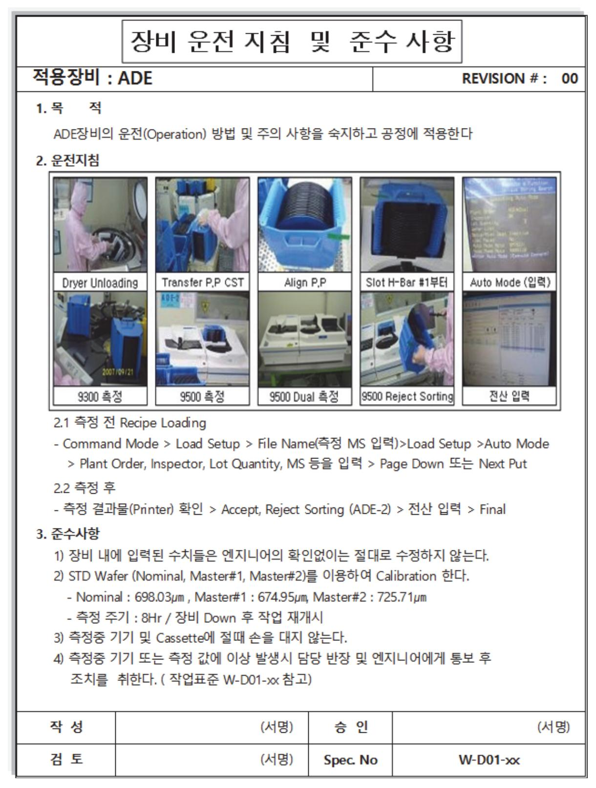

출처: 교육부(2016). 반도체 재료 생산(LM1903060409\_14v1). 한국직업능력개발원. p.37. [그림 2-1] 장비운전지침 및 준수사항

숖 작성된 장비 운영 지침서를 현장 작업자 및 유관 부서에 공유하여 인지하도록 한다. 해당 작업현장에서 눈에 잘 띄는 위치에 게시하여 작업자가 수시로 확인할 수 있도록 한다.

숗 현장개선활동을 통해 주기적으로 운영설비가 안정적으로 관리되도록 한다.

현장의 개선 활동은 일반적으로 [그림 2-2]의 진행순서로 진행이 된다. 최우선으로 개선활동목 표가 되는 대상을 선정하고 활동계획을 수립하는 단계를 시작으로 현장조사 단계를 거쳐 불합 리한 요소를 도출하고 불합리한 요인을 해석하고 검증하는 단계를 거쳐 개선안을 도출하는 것 이 주요하다 하겠다. 그리고 도출 합의된 개선안에 대해서는 지속적인 현장관리가 되도록 개선 효과를 검증하고 표준화하여 재발 방지가 될 수 있도록 사후관리를 하는게 중요하다. 그리고 단계별 진행상태를 진행함을 회의 노트에 기록하여 제출, 확인을 받는다. 또한, 회의일을 정하 고 부서장에서 통보하여 반드시 참석할 수 있도록 한다. 각 단계 중 필요하지 않은 단계는 생 략하고 실시해도 무방하다.

생산설비의 합리적인 운영방안을 구체적으로 도출하기 위한 방법으로, <표2-4>의 체크 시트를 활용하여 문제점을 발견해본다.

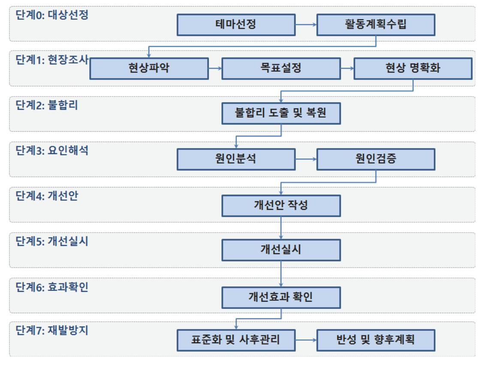

출처: 교육부(2016). 반도체 재료 생산(LM1903060409\_14v1). 한국직업능력개발원. p.38. [그림 2-2] 개별개선활동 진행순서

#### 〈표 2-4〉 문제점 발견을 위한 체크 시트

| 구분               | 현장의 4M                         | 체 크 | 구분                                               | 현장의 대임무                   | 체 크 |
|------------------|--------------------------------|--------|--------------------------------------------------|---------------------------|--------|
|                  | 표준을 잘 준수하고 있는가?                |        |                                                  | 안전장비는 잘 비치되고 관리되고 있는가? |        |
|                  | 작업능률은 좋은가?                     |        |                                                  | 안전장비는 착용되고 있는가?           |        |
| 작업자 (Man)     | 기술(배경지식)을 익히고 있 <u>는</u> 가? |        | 안전                                               | 위험구역은 명시되어 있는가?           |        |
|                  | 숙련도가 충분한가?                     |        |                                                  | 위험물의 취급상태는 양호한가?          |        |
|                  | 배치가 적당한가?                      |        |                                                  | 정리정돈은 잘 되어 있는가?           |        |
|                  | 심리상태 및 건강상태가 좋은가            |        |                                                  | 환경은 개선되어 있는가?             |        |
|                  | 생산능력에 부합하는가?                   |        |                                                  | 불량이 줄었는가?                 |        |
|                  | 공정능력에 부합하는가?                   |        |                                                  | 클레임이 줄었는가?                |        |
|                  | 점검은 충분한가?                      |        | ] 품질                                          | 편차는 크지 않은가?               |        |
| 설비 및             | 고장정지는 없는가?                     |        | ' ' ' ' ' ' ' ' ' ' ' ' ' ' ' ' ' ' ' | 실수를 일으키고 있지 않은가?          |        |
| 치공구 (Machine) | 이상한 소리는 안 들리는가?                |        |                                                  | 이상을 일으키고 있지 않은가?          |        |
|                  | 배치는 적당한가?                      |        |                                                  | 공수는 줄었는가?                 |        |
|                  | 정리정돈이 잘 되어 있는가?                |        |                                                  | 작업의 낭비요소는 없는가?            |        |
|                  | 재고량은 적절한가?                     |        | 원가                                               | 시간을 유효하게 이용하고 있는가?        |        |
|                  |                                |        | 1                                                | 자재의 낭비는 없는가?              |        |
| 원재료              | 취급방법은 좋은가?                     |        | 1                                                | 경비는 절약되었는가?               |        |
| (Material)       | 다른재료의 혼입은 없는가?                 |        |                                                  | 생산량은 예정대로 되고 있는가?         |        |
|                  | 배치는 좋은가?                       |        |                                                  | 과잉재고는 없는가?                |        |
|                  | 재료의 규격 또는 품질수준은 좋은가?        |        | 생산량                                              | 수량파악의 오류는 줄였는가?           |        |
|                  | 작업표준의 내용은 적절한가?                |        |                                                  | 작업속도는 높아졌는가?              |        |
|                  | 작업표준은 개정되어 있는가?                |        |                                                  | 인간관계는 좋은가?                |        |
|                  | 작업준비사항은 좋은가?                   |        |                                                  | 의욕은 향상되고 있는가?             |        |
| 방법               | 작업순서는 적절한가?                    |        | 1                                                | 개선안의 활동은 활발한가?            |        |
| (Method)         | 전후 공정의 연결은 좋은가?                |        | 인간성                                              | 작장은 미화되고 있는가?             |        |
|                  | 안전한 방법인가?                      |        |                                                  |                           |        |
|                  | 이상 발생 시 조치사항은 타당한가?         |        |                                                  | 일하는 즐거움을 맛보고 있는가?         |        |

#### 수행 tip

•장비 운영 지침서의 이력관리 자료를 참고하여 점검 사항 이 누락되지 않도록 체크리스트 작성 후 실시한다.

## 2-2. 생산설비 점검항목 설정

학습 목표 •장비매뉴얼에 따라 생산설비 점검항목과 점검주기를 설정할 수 있다.

### 필요 지식 /

#### 1 설비관리

설비관리에는 설비의 조사, 연구, 설계, 제작, 설치에서부터 운전, 보전을 거쳐 설비의 수명이 다해 폐기하는 단계에 이르기까지 설비를 효과적으로 활용함으로써 기업의 생산성을 높이는 광 의의 개념과 단순히 설비가 만들어진 후의 단계, 즉 설치된 후의 메인터넌스(Maintenace)활동 으로써의 설비보전관리가 있다. 그러나 일반적으로 설비관리라고 하면 메인터넌스 엔지니어링 에 중점을 둔 설비관리를 말한다.

#### 1. 설비관리의 목표와 특성

기업의 생산성 향상에 있으며, 생산성 향상은 더욱 적은 input으로 더욱 많은 output을 내 는 것으로, 설비에서의 생산성 향상을 위해서는 특히 고장을 없애는 것이 중요하다.

생산성 =  $\frac{Output}{\in mt}$ 

설비 관리는 다음과 같은 3가지 항목을 목표로 한다.

- (1) 설비의 고장이 없도록 관리한다.
- (2) 고장에 따른 정지 시간과 그 수리를 위한 정지시간을 단축시킨다.
- (3) 가능한 한 비용(cost)이 높아지지 않도록 한다.

설비 관리의 특성과 그 평가 척도는 다음과 같다.

- (1) 신뢰성: 고장 도수율 = 고장 건수 / 단위 운전 시간
- (2) 보전성: 고장 강도율 = 고장 정지 시간 / 단위 운전 시간
- (3) 경제성: 제품 단위당 보전비 = 보전비 총액 / 생산량

또한, 설비를 사용하기 시작한 후 고장 발생 상태를 보면 초기고장, 우발고장, 마모고장으로 크게 세 시기로 나누어지며 다음 [그림 2-3]과 같은 모양이 된다. 이것은 곡선의 형상이 마 치 욕조의 단면과 비슷하다고 해서 '배스터브 곡선'이라고도 불린다.

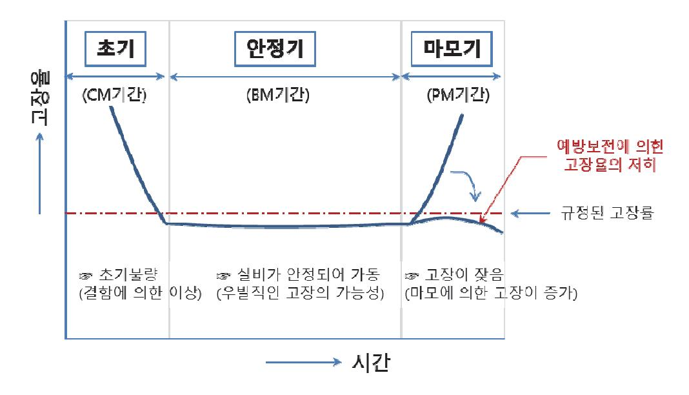

출처: 교육부(2016). 반도체 재료 생산(LM1903060409\_14v1). 한국직업능력개발원. p.42. [그림 2-3] 설비의 고장률 특성곡선

〈표 2-5〉 고장률 곡선에 따른 분석

|    | 초기 고장                | 우발 고장     | 마모 고장                |
|----|----------------------|-----------|----------------------|
| 원인 | 설계, 제작 미스            | 운전, 조작 미스 | 수명                   |
| 대책 | 시운전 검수에 힘씀 초기유동관리 | 올바른 조작    | 예방보전(PM) 개량보전(CM) |

2. 설비관리기법

설비관리와 관련된 기법은 위에서 언급한 세 가지의 설비 특성을 효과적으로 향상시키는 것으로 크게 사후보전(BM), 예방보전(PM), 개량보전(CM), 보전예방(MP)으로 나눌 수 있으며 이를 총칭하여 종합적 생산보전(PM)으로 극대화할 수 있다. 신뢰성이나 보전성, 고장 등 은 그 관리 범위가 한정된 것이 아니라, 상호 밀접한 관계를 맺고 설비의 사용이나 계획 시에 피드백되는 체제이다.

- (1) 사후 보전(BM: break down maintenance): 고장 나면 고친다.
  - 설비의 열화가 수리 한계를 지난 후 또는 고장으로 정지한 후에 행하는 보전
  - 예방 보전과는 대조적인 방식
- (2) 예방 보전(PM: preventive maintenance): 고장 나기 전에 고친다.
  - 정기적인 점검과 조기 수리를 행하는 보전
  - 일상 점검으로 설비 상태를 파악하고, 소수리, 중수리, 대수리를 계획적으로 실시하여 생
     산 활동 중의 기계 정지를 방지

- (3) 개량 보전(CM: corrective maintenance): 고장 나지 않도록 한다.
  - 보전 면에 중점을 두는 설비 자체의 체질을 개선
  - 고장이 적은 재료나 부품을 사용하여 안전을 실시하기 위한 개선
- (4) 보전 예방(MP: maintenance prevention): 보전이 필요치 않거나 쉽도록 설계한다.
  - 고장이 적은 설비의 설계와 조기 수리가 가능하도록 설비 계획 시에 반영
  - 설비의 신뢰성과 보전성을 높이는 방식
  - 신뢰성은 고장 빈도에, 보전성은 고장의 조치에 소요되는 시간과 유관
- (5) 종합적 생산보전(TPM, Total Production Maintenance)
  - 설비에 사용되는 취득비용이나 유지비용 등 관련 비용과 설비의 손실을 최소화하고 생산 효율을 증대
  - 설비와 관련하여 계획하거나 사용하고 설비를 효율적으로 관리하는 등 설비에 대한 모든 활 동에 대해 기업 구성원이 모두 참석하여 기업 전체의 생산성을 향상 시키는 것

설비보전의 발전단계를 살펴보면 다음 [그림 2-4]와 같다. 초기에는 장치가 고장 날 때까지 사 용하다가 고장 나면 고치는 고장보전의 형태에서 점차 예방보전의 형태로 발전되어 가고 있다. 일반적으로 기계에 고장이 발생한 후에 수반되는 비용이 예방비용보다 높다. 그러므로 사전에 미리 고장 날 부분을 파악하여 PM을 실시하는 것이 경제적이다. 이를 위해서는 종업원들에게 보전에 관한 교육과 훈련을 시켜야 하고, 기계설비유지에 대해 기록을 하고, 정기적인 검사도 실시해야 한다.

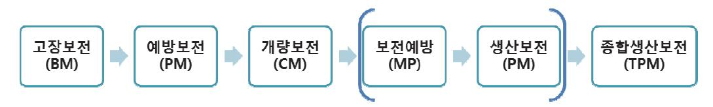

출처: 교육부(2016). 반도체 재료 생산(LM1903060409\_14v1). 한국직업능력개발원. p.43. [그림 2-4] 설비보전의 발전단계

3. 설비 효율 지표

설비 효율에 관련된 지표로는 다음과 같이 설명되고 계산할 수 있다.

(1) 설비종합효율

설비종합효율은 설비가 효율적으로 활용되고 있는지를 나타내는 지표로 시간 가동률, 성능 가동률, 양품률을 곱하여 계산한다.

(2) 시간 가동률

시간 가동률은 설비가 주어진 시간에 얼마나 잘 사용되었는지를 확인하는 지표로, 설비에

대한 부하시간과 정지시간을 측정하여 계산하고 고장 로스나 작업 준비 조정 로스 등이 영 향을 미친다.

(3) 성능 가동률

성능 가동률은 설비가 주어진 생산량을 얼마나 잘 수행하였는지 설비의 능력을 확인하는 지표로, 속도 저하 로스와 일시 정지 로스가 영향을 미친다.

(4) 양품률

양품률은 설비가 생산한 제품 중에서 문제가 발생하거나 불량인 제품을 제외하고 정상적인 제품의 비율을 확인하는 지표로, 초기 로스 등이 영향을 미친다.

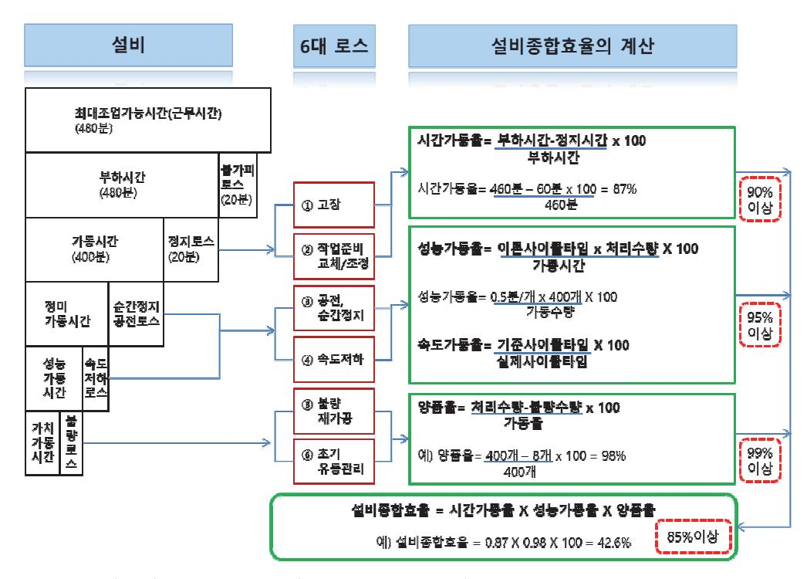

출처: 교육부(2016). 반도체 재료 생산(LM1903060409\_14v1). 한국직업능력개발원. p.44. [그림 2-5] 총체적 설비종합 효율표

4. 설비 가동률 지표

설비 가동률에 관련된 지표로는 다음과 같이 설명되고 계산할 수 있다.

(1) 가동률

수리 가능한 설비나 시스템이 사용 시간 동안 고장이 나지 않고 가동할 수 있는 상태를 나 타내는 비율이다.

(2) 평균 고장 간격(MTBF, Mean Time Between Failure):신뢰성을 나타내는 지표

설비나 시스템이 고장이 났을 경우 수리하면서 사용할 때 실제 사용할 수 있는 평균시간을 말한다.

(3) 평균 수리 시간(MTTR, Mean Time To Repair): 보전성을 나타내는 지표 설비나 시스템이 고장이 났을 경우 문제점을 해결하고 수리하는데 걸리는 평균 시간을 말 한다.

- (4) 평균 고장 수명(MTTF, Mean Time To Failure)
   수리할 수 없는 설비나 시스템에 대해 첫 번째 고장이 발생할 때까지의 평균 시간을 말한
   다.
- (5) 평균 고장 간 시간(MTTFF, Mean Time To Failure) 수리할 수 있는 설비나 시스템에 대해 최초 고장이 발생할 때까지의 동작하는 평균 시간을 말한다.
- (6) 고장 도수율(Breakdown Frequency Rate) 설비나 시스템에서 고장이 발생하여 작동하지 못하고 정지해 있는 고장횟수의 비율을 말한 다.

## 수행 내용 / 생산설비 점검항목 설정하기(PM계획 수립)

#### 재료·자료

- 연간예방보전계획서
- 예비부품관리 대장
- 월업무추진계획표
- 보전보수내역표
- 설비(수리)검수보고서
- 산업 안전지침서

#### 기기(장비 ・ 공구)

- 컴퓨터(프린터)
- 문서 작성 프로그램
- 반도체 재료(웨이퍼 재료 외) 제조 장비

#### 안전 ・ 유의 사항

- 각 단위 공정 진행과 장비 운용 시 규정된 안전/유의 사항에 준수한다.
- 생산 장비 운영 시 점검항목이 누락되면 불량품 발생률이 높으므로 정확한 점검이 이루어질 수 있도록 주의한다.
- 장비 점검 항목은 일상적으로 실시하는 점검 항목과 장비의 상태를 확인하여 비정기적 주기 를 가지고 실시하는 정밀점검항목으로 구분된다.
- 정밀점검 항목은 모든 장비가 가동이 멈춘 상태에서 진행되는 점검이 아닐 수도 있으므로 항상 안전에 주의한다.

#### 수행 순서

숔 생산설비 일상점검 항목을 작성하고 총점검사항을 이해한다.

생산설비점검표는 생산설비의 문제점을 파악하여 신속히 조처하는 데 작성 목적이 있는 것으로 각 점검 항목에 따라 생산설비를 점검한 내용을 기록하는 문서를 말한다. 생산설비점검표 작성 시에는 설비명, 제조번호를 비롯하여 설치 장소, 점검 기간 등을 정확히 기재해야 한다. 또 각 점검 항목에 따른 일자별 점검 내용을 빠짐없이 기록하도록 한다.

설비의 정기점검에 필요한 자재, 인력 및 공기구를 준비할 수 있으며, 아래의 작성절차에 따라 설비점검 기준서를 작성한다.

1. 점검 대상 설비선정: 점검기준서를 작성할 대상 설비를 선정한다.

- 2. 사진촬영: 검검기준서를 작성할 대상 설비의 사진을 촬영하여 점검 기준서 양식에 넣는다.
- 3. 점검 부위(개소) 선정: 점검할 설비의 부품을 선정한다. (예: 베어링, 커플링 등)
- 4. 점검 항목 설정: 점검 개소별 점검항목을 작성한다. (예: 진동, 소음, 발열 상태 등)
- 5. 점검 기준 설정: 점검 항목에 대한 기준을 작성한다. (예: 진동/소음이 없을 것 등) 수치화가 가 능한 점검 항목들은 가능한 수치화로 기준을 만든다.
- 6. 점검 방법/도구: 점검 방법은 오감에 의한 육안 점검, 또는 정밀 점검 장비 등 도구를 활용할 경 우 그 장비명을 기재한다. (진동미터기, 소음측정기, 적외선 온도계 등)
- 7. 점검 주기: 점검 주기는 보전방식의 설정 방법에 따라 결정된 점검 주기를 정한다.
- 8. 점검 시기: 점검 시기는 운전 중, 정지 중, 가동 전, 가동 후로 구분하여 실시한다.

생산설비의 점검 요소는 해당 설비의 취급 및 운영매뉴얼에 의해 정해지는데, 일반적인 요 소별 점검항목은 <표 2-6>를 참조하여 해당 작업장에 맞도록 개별 설비점검기준서를 [그림 2-6] 또는 [활용 서식 2]를 이용하여 작성한다.

|  |  | <표 2-6> 설비의 점검 요소별 점검 항목 |  |  |  |  |
|--|--|--------------------------|--|--|--|--|
|--|--|--------------------------|--|--|--|--|

| 점검 요소   | 점검 항목                                                                                       |
|---------|---------------------------------------------------------------------------------------------|
| 전기장치    | 스위치, 제어반, 모터, 리밋 스위치, 광전 스위치                                                                |
| 구동장치    | 전동기, 벨트, 체인, 변속기, 클러치, 브레이크                                                                 |
| 윤활장치    | 그리스, 펌프와 유닛, 배관, 윤활 부, 오일 탱크, 필터, 밸브                                                        |
| 유압-공압장치 | 작동유, 오일 탱크, 필터, 펌프 유닛, 배관 및 커플링 부, 유량 제어 밸브                                                 |
| 설비조립요소  | 체결부품 (볼트, 너트, 키, 코터 핀), 축 및 베어링( 축, 축 이음, 롤러베어링, 볼 베어링), 부품 (패킹, 실, 가스킷), 압력 용기, 관이음, 밸브 |
| 설비진단장치  | 온도계, 압력계, 차압계, 유면계                                                                          |

| 트 승인     |
|----------|
|          |
|          |
|          |
| /        |
| <b>i</b> |
|          |
| 조치 사항    |
|          |
|          |
|          |
| ÷        |
|          |
|          |
|          |

출처: 교육부(2016). 반도체 재료 생산(LM1903060409\_14v1). 한국직업능력개발원. p.48. [그림 2-6] 설비 점검 기준표

#### 숕 생산설비 정기점검항목을 설정한다

준비된 필요자원을 활용하여 아래의 설비점검업무의 절차에 따라 계획 항목을 점검할 수 있으 며, 점검에 의해 설비 열화, 이상징후를 파악할 수 있으며, 이상징후를 분석하여 실행 가능한 개선사항을 도출할 수 있다.

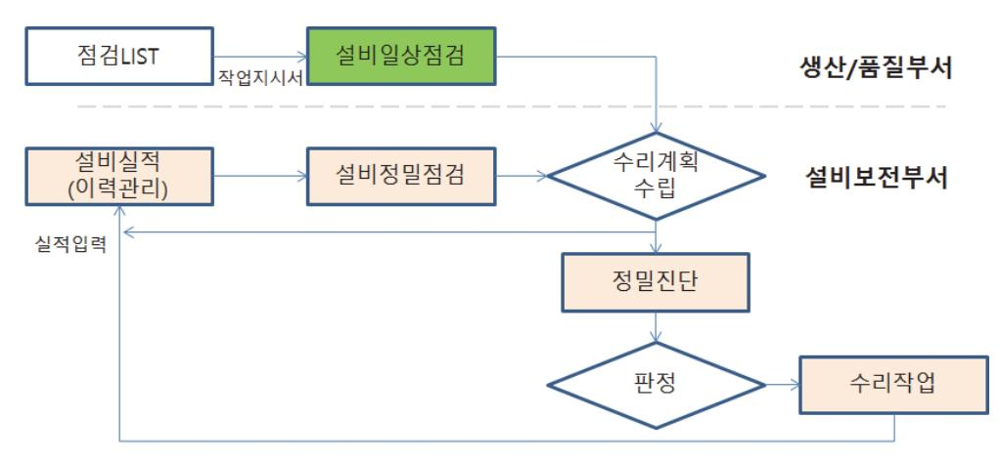

출처: 교육부(2016). 반도체 재료 생산(LM1903060409\_14v1). 한국직업능력개발원. p.48. [그림 2-7] 설비점검 및 수리절차

설비담당자의 주관하에는 다음의 '설비 CHECK SHEET'에 의하여 종합적인 점검결과가 기록 관리되는데 '설비점검 기준표'에 의거 점검을 실시할 수 있으며 이상 발생 시 부서장에게 보고 한다.

|        |          |        |      |          |   |   |     |    |     | 섵  | l F | 3  |        | С  | Η   | E(  | CK | $\langle$ | S   | H   | E  | E   | Γ   |       |                |    |        |     |            |     |   |     |     |   | _   |     |     |           |           |     |   |   |
|--------|----------|--------|------|----------|---|---|-----|----|-----|----|-----|----|--------|----|-----|-----|----|-----------|-----|-----|----|-----|-----|-------|----------------|----|--------|-----|------------|-----|---|-----|-----|---|-----|-----|-----|-----------|-----------|-----|---|---|
| 기      | 간 20     | 년 월~   | 월    |          |   |   |     |    | 제 . | 조  | 설   | 비  |        | ]  | i   | 김 기 | 4  | 설         | 비   |     |    | [   |     | 그 친공구 |                |    |        |     |            |     |   |     |     |   |     |     |     | ٦         |           |     |   |   |
|        | 설 비      | 명      |      |          |   |   |     |    |     |    |     |    |        |    |     |     |    |           |     |     |    |     |     |       |                |    |        |     |            |     |   |     |     |   |     |     |     |           |           |     |   |   |
| 4      | 칠비년      | 빈호     |      | 사용팀      |   |   |     |    |     |    |     |    |        |    |     |     |    |           |     |     |    |     |     |       |                |    |        |     |            |     |   |     |     |   |     |     |     |           |           |     |   |   |
| 점 개 | 검 소   | 점검항    | 목 주기 | 1월       |   |   | 2월  |    |     | 3월 |     |    | 4월     |    |     | 5월  |    |           | 6월  |     |    | 7월  |     |       | 8월             |    |        | 9월  |            |     |   | 10월 |     |   | 11월 |     |     |           |           | 12월 |   |   |
|        |          |        |      | 1 2      | 3 | 4 | 1 2 | 3  | 4 1 | 12 | 3   | 4  | 1 2    | 3  | 4   | 1 2 | 3  | 4         | 1 2 | 2 3 | 4  | 1 : | 2 3 | 4     | 1              | 23 | 3 4    | 1 1 | 2          | 3   | 4 | 1   | 2   | 3 | 4   | 1 2 | 2 3 | 4         | 1         | 2   | 3 | 4 |
|        |          |        |      |          |   |   |     |    |     |    |     |    |        |    |     |     |    |           |     |     |    |     |     |       |                |    |        |     |            |     |   |     |     |   | Τ   | Τ   |     |           |           |     |   |   |
|        |          |        |      |          | Π |   |     |    |     |    |     |    |        |    |     |     |    |           |     |     |    |     |     |       |                |    |        |     |            |     |   |     |     |   | T   | T   |     | $\square$ |           | T   |   | ٦ |
|        |          |        |      |          | Ħ |   |     |    | 1   |    |     |    | $\top$ |    | T   |     |    |           | Τ   |     |    |     |     |       |                |    | T      |     |            |     |   |     | 1   | T | T   | T   |     | Π         |           | T   | 1 | ٦ |
|        |          |        |      |          | Ħ |   | +   |    | +   |    | +   |    | +      |    | +   |     |    | +         | +   |     |    | +   |     |       |                | +  | $^{+}$ |     |            |     |   |     | +   | + | +   | +   | +   | Η         |           | +   | + | ٦ |
|        |          |        |      |          | + |   | +   |    | +   |    | +   | +  | +      |    | +   | -   |    | +         | +   |     |    | +   |     |       |                | +  | +      |     |            |     |   |     | +   | + | +   | +   | +   | +         | $\square$ | +   | - | - |
|        |          |        |      |          | + |   | +   |    | +   |    | +   |    | +      |    | +   | -   |    | +         | +   |     |    | +   | -   |       |                | +  | +      | +   | $\vdash$   |     |   |     | +   | + | +   | +   | +   | +         | $\square$ | +   | + | ┥ |
|        |          |        |      |          | + |   | +   |    | +   |    | +   | -  | +      |    | +   | _   |    | +         | +   |     |    | +   | -   |       |                | +  | +      | -   | $\vdash$   |     |   |     | +   | + | +   | +   | +   | +         | $\vdash$  | +   | + | - |
|        |          | 작 성    |      |          |   | + |     |    | +   |    |     | +  |        |    | +   |     |    | +         |     |     |    |     |     |       |                |    |        | +   |            |     |   |     |     |   | +   |     | 1   | Ц         | μ         |     |   | - |
| 결      | <u> </u> |        |      | <u> </u> |   | + |     |    | +   |    |     | +  |        |    | +   |     |    | +         |     |     | -  |     |     | _     |                |    |        | -   |            |     | _ |     |     |   | +   |     |     |           | $\vdash$  |     |   | 4 |
| 재      |          | 검토     |      |          |   |   |     |    | +   |    |     |    |        |    | _   |     |    | _         |     |     |    |     |     |       |                |    |        |     |            |     | _ |     |     |   | +   |     |     |           |           |     |   | 4 |
|        | 제 승인     |        |      |          |   |   |     |    |     |    |     |    |        |    |     |     |    |           |     |     |    |     |     |       |                |    |        |     |            |     |   |     |     |   |     |     |     |           |           |     |   |   |
| 2      | 험감 기     | 례      |      |          |   |   |     | Ρ  | :   | 정기 | 기젿  | 검  |        | ł  | ₩ : | 주   | 간  |           |     |     | M: | 월?  | 간   |       |                | Q  | :      | 분.  | 기          |     |   |     | ۲ : | Ę | 크간  | ŀ   |     |           |           |     |   |   |
| 2      | 험검 체.    | 크 기록 볃 | 리례   |          |   |   |     | 0  | : ( | 양호 | 5   | ×  | ; ;    | 부? | 덕힡  | i.  |    | Δ         | : . | 요수  | 논리 |     | 4   | 0     | 요 2 | 주으 | ł      |     | $\diamond$ | > : | 2 | Зī  | 1정  | 중 |     |     |     |           |           |     |   |   |
|        | 비        | 고      |      |          | 잗 | 점 | 겉   | 릴과 | 0   | 상이 |     | 발견 | 되      | 면  | 즉,  | 시금  | 관리 | 자         | 에   | 게 ! | 보. | 고하  | 고   | コ     | 지              | 시  | 케      | 따   | 른          | 라   |   |     |     |   |     |     |     |           |           |     |   |   |

출처: 교육부(2016). 반도체 재료 생산(LM1903060409\_14v1). 한국직업능력개발원. p.49. [그림 2-8] 설비 체크 시트

|          | 설비 일상 점검표  |                                      |              |              |      |      |             |    |    |     |   |    |    |                |                 |       |          |                |        |                      |             |          |    |     |        |      |          |    |      |             |       |          |  |
|----------|------------|--------------------------------------|--------------|--------------|------|------|-------------|----|----|-----|---|----|----|----------------|-----------------|-------|----------|----------------|--------|----------------------|-------------|----------|----|-----|--------|------|----------|----|------|-------------|-------|----------|--|
| 7        | 기록: 20 년 월 |                                      |              |              |      |      |             |    |    |     |   |    |    |                |                 |       |          |                |        |                      |             |          |    |     |        |      |          |    |      |             |       |          |  |
| 제를       | 조 설비명      |                                      |              |              |      |      | 치공구명        |    |    |     |   |    |    |                | 사용 부서           |       |          |                |        |                      |             | 생산팀      |    |     |        |      | 점검기호     |    |      |             |       |          |  |
| 설비       | 관리번호       |                                      |              |              |      |      | 치공          | 공구 | 관려 | 리번호 | ž |    |    |                |                 |       |          |                | 사용 책임자 |                      |             |          |    |     |        |      |          | 0  |      | 양호 교정,조정 |       |          |  |
| 공 정 명    |            |                                      |              |              |      |      |             |    |    |     |   |    |    |                |                 | 점검 주기 |          |                |        |                      | 매일 08:00 AM |          |    |     | 8 X | -    | 수리완료     |    |      |             |       |          |  |
|          |            |                                      |              |              |      |      | 점검결과        |    |    |     |   |    |    |                |                 |       |          |                |        |                      | 1           |          |    |     |        |      |          | ^  | 이상발생 |             |       |          |  |
| No       | 심          | 김항목 기준                               |              |              |      |      | 4 5 6 7 8 9 |    |    | 9 1 | 0 | 11 | 12 | 13 14 15 16 17 |                 |       | 18       | 18 19 20 21 22 |        | 23 24 25 26 27 28 29 |             |          |    |     | 7 2    | 28   | 29 30 31 |    | 비고   |             |       |          |  |
| 1        |            |                                      |              |              |      |      |             |    |    |     |   |    |    |                |                 |       |          |                |        |                      |             |          |    |     |        |      |          |    |      |             |       |          |  |
| 2        |            |                                      |              |              |      |      |             |    |    |     |   |    |    |                |                 |       |          |                |        |                      |             |          |    |     |        |      |          |    |      |             |       |          |  |
|          |            |                                      |              | _            |      |      |             | _  |    |     |   | -  | -  | _              |                 |       | <b>—</b> | T-             |        | _                    |             | <u> </u> | T  | T   | T      |      | Τ        | —  | —    | _           |       | <u> </u> |  |
| 10       |            |                                      |              | Γ            | Π    |      | Π           |    |    |     |   | T  |    |                |                 |       |          |                |        |                      |             |          |    |     | T      |      | t        | T  | Ť    | T           |       |          |  |
|          |            | 판 정                                  |              | $\square$    | Π    |      | Π           |    |    |     | 1 | T  |    |                |                 |       |          |                |        |                      |             |          |    |     | T      |      | t        | T  | T    | +           |       |          |  |
|          |            | 확 인                                  |              | Γ            | Π    |      | Π           |    |    |     |   | T  |    |                |                 |       |          |                |        |                      |             |          |    |     | T      |      | t        | T  | Ť    | T           |       |          |  |
|          | 설비사용 칙     | 임자(장비운전자)                            | 는 설비사용일마다 점점 | 항            | 1을 ? | 점검한디 | ł.          |    |    |     |   |    |    |                |                 |       |          | 문제             | 점 및    | Į 조                  | 치사          | 항 :      | 기재 | (설비 | 고      | 장. 여 | 방        | 보전 | 에    | 따른          | 루부풍교환 | 등)       |  |
|          | 이상발생시      | 에는 생산부문 담                            | 당과 설비담당에게 즉시 | <del>-</del> | 보한다  | 4.   |             |    |    |     |   |    |    |                | 일 자 문제개소 및 조치사항 |       |          |                |        |                      |             |          |    |     | 확 인    |      |          |    |      |             |       |          |  |
| 록기 사항 | 매월 말일어     | 월 말일에 본 점검표는 부서결재후 보관하고, 동일양식을 게재한다. |              |              |      |      |             |    |    |     |   |    |    |                |                 |       |          |                |        |                      |             |          |    |     |        |      |          |    |      |             |       |          |  |
|          | 점검항목 및     | ! 점검기준은 설비                           | 사양서에 의거한다.   |              |      |      |             |    |    |     |   |    |    |                |                 |       |          |                |        |                      |             |          |    |     |        |      |          |    |      |             |       |          |  |
|          |            |                                      |              |              |      |      |             |    |    |     |   |    |    |                |                 |       |          |                |        |                      |             |          |    |     |        |      |          |    |      |             |       |          |  |

출처: 교육부(2016). 반도체 재료 생산(LM1903060409\_14v1). 한국직업능력개발원. p.49. [그림 2-9] 설비 일상 점검표

|                        | 설비 정기 점검표                                                                                                                 |     |   |      |                              |                                                                                                        |         |           |         |           |      |          |  |      |   |     |
|------------------------|---------------------------------------------------------------------------------------------------------------------------|-----|---|------|------------------------------|--------------------------------------------------------------------------------------------------------|---------|-----------|---------|-----------|------|----------|--|------|---|-----|
| 7                      | 록: 20                                                                                                                     | 년   |   |      |                              |                                                                                                        |         |           |         |           |      |          |  |      |   |     |
| 제조 설비명                 |                                                                                                                           |     |   | 관리 부 | 서                            |                                                                                                        |         | 관려        | 리 책임    | 자         |      |          |  |      |   |     |
| 설비관리번호                 |                                                                                                                           |     |   |      |                              | 사용 부                                                                                                   | 서       |           |         | 사용        | 용 담당 | 자        |  |      |   |     |
| 공                      | 공 정 명                                                                                                                     |     |   |      |                              |                                                                                                        |         |           |         |           |      |          |  |      |   |     |
|                        | [주]                                                                                                                       |     |   |      |                              |                                                                                                        |         |           |         |           |      |          |  |      |   |     |
| 전건역자 전건자 1. |                                                                                                                           |     |   |      | <ol> <li>정기 점검은 매</li> </ol> | 1. 정기 점검은 매월점검, 분기점검(2,5,8,11월), 반기점검(5,11월), 년점검(10월) 실시한다. ※ 주기 표시: M-매월점검, Q-분기점검, H-반기점검, Y-년점검 |         |           |         |           |      |          |  |      | 토 | 승 인 |
|                        | <ol> <li>2. 점검 판정은 항목별 기준에 의거 '양, '불로 표시한다.</li> <li>3. 점검 결과를 "불 판정항목에 대하여는 사용부분에 개선요구를 하며, 이에 대한 납기관리를 실시한다.</li> </ol> |     |   |      |                              |                                                                                                        |         |           | 결 재  |           |      |          |  |      |   |     |
|                        |                                                                                                                           |     |   |      | 3. 임심 열파달 로                  | a 건경영속에 내아어는 사용구                                                                                       | -눈에 개인포 | 1 ~ 글 아머, | 이에 대한 1 | 리기컨니컬 코지인 | r=r. |          |  |      |   |     |
|                        |                                                                                                                           |     |   |      | 71 71 111 111                | 측 정 치                                                                                                  |         | 핀         | 판 정     |           |      |          |  |      |   |     |
| 주기                     | 섬                                                                                                                         | 검 항 | 녹 |      | 점 검 방 법                      | 점검기준                                                                                                   |         | 월         | 뭘       | 월         | ШÇ   | 2 B      |  | - 비고 |   |     |
|                        |                                                                                                                           |     |   |      |                              |                                                                                                        |         |           |         |           |      |          |  |      |   |     |
|                        |                                                                                                                           |     |   |      |                              |                                                                                                        |         |           |         |           |      |          |  |      |   |     |
|                        |                                                                                                                           |     |   |      |                              |                                                                                                        |         |           |         |           |      |          |  |      |   |     |
|                        |                                                                                                                           |     |   |      |                              |                                                                                                        |         |           |         |           |      | <u> </u> |  |      |   |     |
|                        |                                                                                                                           |     |   |      |                              |                                                                                                        |         |           |         |           |      | l        |  |      |   |     |

출처: 교육부(2016). 반도체 재료 생산(LM1903060409\_14v1). 한국직업능력개발원. p.50. [그림 2-10] 설비 정기 점검표

숖 설비관리부서는 예방보전계획수립을 위한 준비를 실시한다.

1. 예방보전계획 수립을 위한 사전검토 결과를 바탕으로 연간예방보전계획을 수립한다.

|          | OO년도 설비 보전 계획서 |               |         |   |   |   |   |     |     | 결    | 작 성  |   | 검 토1 |    | 검 토2 | 승 인 |    |  |
|----------|----------------|---------------|---------|---|---|---|---|-----|-----|------|------|---|------|----|------|-----|----|--|
|          |                |               |         |   |   |   |   |     | 재   |      |      |   |      |    |      |     |    |  |
|          | 설 비 번 호        | 설 비 / 장 비 명   | 보 전 계 획 |   |   |   | 일 | 정 ( | : শ | 획, 🔵 | :실시) |   |      |    |      | 비고  |    |  |
| No       | 걸 미 만 호        | ' 걸 미 / 영 미 영 | 조 관계 폭  | 1 | 2 | 3 | 4 | 5   | 6   | 7    | 8    | 9 | 10   | 11 | 12   |     | 14 |  |
| $\vdash$ |                |               |         |   |   |   |   |     |     |      |      |   |      |    |      |     |    |  |
|          |                |               |         |   |   |   |   |     |     |      |      |   |      |    |      |     |    |  |
|          |                |               |         |   |   |   |   |     |     |      |      |   |      |    |      |     |    |  |
|          |                |               |         |   |   |   |   |     |     |      |      |   |      |    |      |     |    |  |

출처: 교육부(2016). 반도체 재료 생산(LM1903060409\_14v1). 한국직업능력개발원. p.50. [그림 2-11] 설비 보전 계획서

- 2. 설비관리부서는 설비별 주요 예비부품에 대한 주기적 재고파악을 실시하고 부족분에 대하여 구매 부서로 구매 요청한다.
- 3. 연간예방보전계획에 따라 월별 업무추진계획을 수립하여 시행한다
- 4. 설비관리부서는 월간보전계획 대상설비의 보전실행방안 및 설비 현 상태에 따라 자체보전 또는 외주보전 등의 보전방법을 결정한다.
  - (1) 보전 대상 설비의 현 상태 및 보전실행방안이 전문업체의 전체적이고 장기적 보전을 필요로 하는 경우 구매부서를 통하여 외주보전을 실시하고, 이에 대한 검수를 실시한다.

- (2) 보전내용이 단기적이며 자체적 부분교체로 가능할 경우 추진계획에 따라 사내자체보전을 실 시한다.
- 5. 설비의 검수가 완료되면 보전보수내역표, 설비 이력카드를 이용 보전 이력을 기록 관리한다.
- 6. 설비관리부서는 연간예방보전계획대비 추진실적을 경영검토 보고자료를 통하여 보고하고 필요시 보전계획을 변경하여 보전활동을 실시한다.

## 2-3. 설비 이상 발생 시 조치

학습 목표 • 이상 발생 시 장비매뉴얼에 따라 원인을 파악하고 대책을 수립할 수 있다.

## 필요 지식 /

숔 설비관리 프로세스의 이해

설비정보 입력을 기반으로 기본적인 정비작업에 대한 절차 및 기준/설비의 생명주기/기계 이력 정보 등을 활용하여 설비 조전 체계를 구축하게 된다.

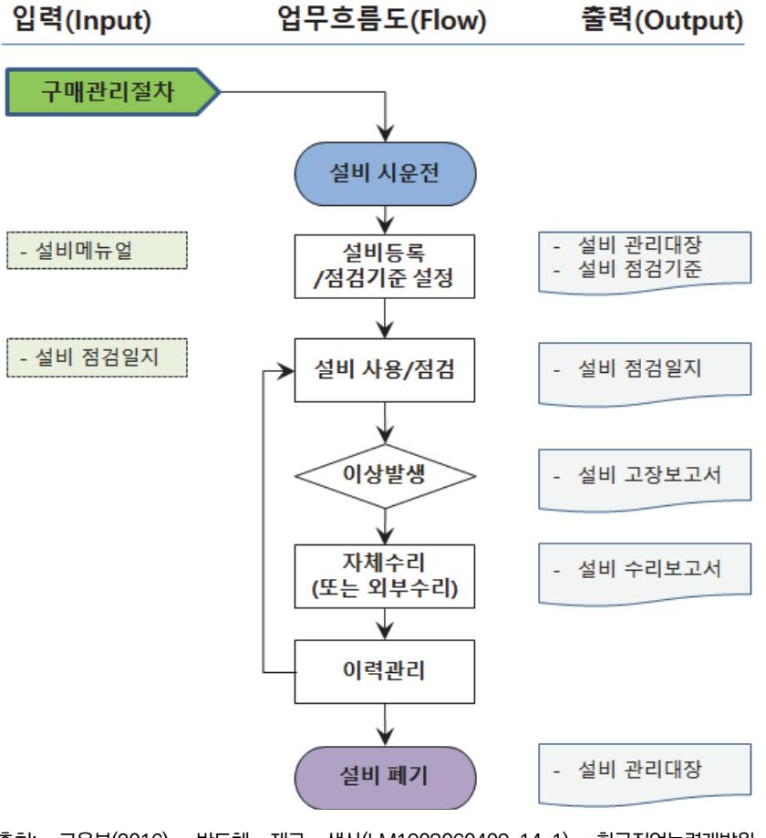

출처: 교육부(2016). 반도체 재료 생산(LM1903060409\_14v1). 한국직업능력개발원. p.52. [그림 2-12] 일반적인 설비관리 업무절차도

#### 숕 설비고장의 중점항목

설비고장의 중점항목을 설정하고 관리가 필요하게 되는데 아래의 5가지 항목은 설비고장 시 고 장대책으로써 순서대로 체크하고 시행하면 대부분의 경우 고장을 없앨 수 있게 된다.

- 1. 기본조건의 정비: 기계의 고장의 원인이 어디에 있는지 잘 모를 때는 '닦고, 조이고, 기름치다'를 실시하는 것만으로도 문제가 해결되는 경우가 많다.
- 2. 사용조건의 준수: 신규 채용된 작업자의 경우에는 제대로 교육을 실시하고, 단지 생산량을 늘리기 위해 과부하 운전을 하지 않도록 사전에 충분히 장비매뉴얼을 숙지하고 장비를 운전한다.
- 3. 열화의 복원: 열화된 설비는 반드시 복원하고, 개조나 개선은 그 이후에 진행한다.
- 4. 약점대책을 수립: 사용상의 문제로 인한 고장뿐만 아니라 원천적인 기계 자체의 약점으로 인한 고장에 관한 개선이 필요하며, 이를 위해선 기계의 구조, 재질, 정밀도 등을 체크할 수 있는 능력 을 키워야 한다.
- 5. 인적 미스를 방지: 운전자의 인간적인 실수에 의한 고장으로 주기적인 교육 등으로 미연에 방지 하는 활동이 필요하다.

## 수행 내용 / 설비 이상 발생 시 조치하기

#### 재료·자료

- 설비 운용매뉴얼(설비 관리 대장)
- 설비 일상 점검표, 설비 체크 시트
- 설비이력표,, 설비 수리 의뢰서
- 설비(수리) 검수 보고서
- 공정 이상 처리 방안 회신 보고서

#### 기기(장비 ・ 공구)

- 컴퓨터(프린터)
- 문서 작성 프로그램
- 반도체 재료(웨이퍼 재료 외) 제조 장비

#### 안전 ・ 유의 사항

- 각 단위 공정 진행과 장비 운용 시 규정된 안전/유의 사항에 준수한다.
- 작업 실시 전에 유해 · 위험성을 파악하여 제거 또는 차단하고 운영책임자의 승인하는 안전 하게 작업을 실시한다.

#### 수행 순서

#### 숔 설비관리 프로세스에서 이상 발생 관련한 업무흐름도를 이해하고 숙지한다.

일반적으로 설비관리부서의 주관으로 진행되는 업무의 절차는 [그림 2-13]의 업무흐름도에 따 라 진행이 되므로 설비 이상 발생 등의 상황이 발생하기 전에 사전에 충분히 숙지해야 한다.

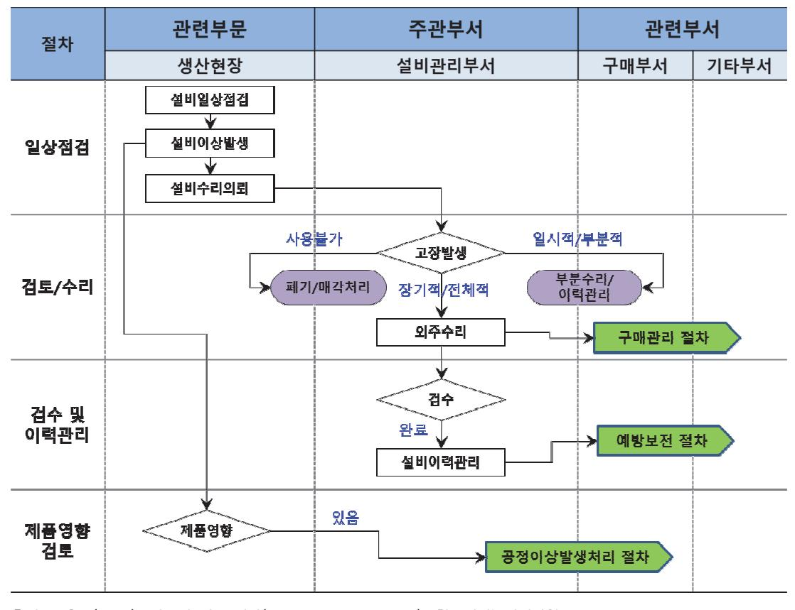

출처: 교육부(2016). 반도체 재료 생산(LM1903060409\_14v1). 한국직업능력개발원. p.55. [그림 2-13] 설비 이상 발생 시 업무절차도

- 숕 현장작업자는 생산작업 시작 전 설비 일상점검표에 따라 해당 설비의 일상점검을 실시한다. 현업작업자가 실시하는 일상점검은 '생산설비 점검항목 설정(필요지식 2-2)의 수행내용 숔 '을 참조하여 점검을 실시하고 점검항목별로 이상 유무가 있는지를 확인한다.
- 숖 작업자는 설비운용 중 설비의 이상이 발생할 경우 설비관리부서로 수리를 의뢰하고 공정책임자에게도 설비 이상 발생 상황을 즉시 통보한다.
  - 1. 설비관리부서는 설비 수리의뢰가 접수되면 해당 설비의 고장상태를 점검하여 장기적이고 전체적 수리가 요구될 경우 관련 부서와 협의하여 설비 수리계획을 수립하고 필요시 외주 수리를 의뢰한 다.
    - (1) 전체적 수리가 완료된 설비는 관련 부서의 협조를 통하여 설비 수리 검수기준에 의거 검수를 실시하고 검수보고서를 작성한다.
    - (2) 수리가 완료된 설비는 그 수리내역을 보전보수내역표에 기록하여 설비 이력을 관리한다.
  - 2. 설비 수리 요구사항이 부분적이고 일시적 수리로 기능한 경우 이에 대한 수리를 실시 후 보전보 수내역표에 그 이력을 기록한다.

- 3. 설비 고장상태의 수리가 불가하거나 대상품의 단종 등으로 설비의 용도가 없어질 경우 해당설비 를 매각 또는 폐기할 수 있다.
- 숗 공정책임자는 설비의 이상에 대한 통보를 받고 설비 이상으로 인한 공정품질에 영향이 있을 것으로 예상되는 경우 공정 이상 발생처리 프로세스에 따라 이를 처리한다. '공정모니터링 실시(필요지식 3-3)의 수행내용 숕 '을 참조하여 공정 이상 발생 시 처리프로세 스를 따라 작업 중이던 대상품목의 처리방법을 유관부서와 협의하여 진행한다.
  - 1. 대상품의 검토 결과가 공정진행 가능으로 판정된 경우 생산기술부서는 대상품의 공정진행을 공정 별 책임자에게 통보한다. 단, 결과가 공정 부적합의 경우 품질보증부서로 그 내용을 이관한다.
  - 2. 공정 이상 품의 검토 결과 조직적인 개선대책이 요구되는 사안일 경우 생산기술부서는 24시간 이 내에 CFT를 소집하여 QRS 품질 개선 시트의 3,4단계를 실시하여 개선한다.
  - 3. 생산기술부서는 공정 이상 발생으로 인한 모든 사항이 종료되는 시점으로 개선 완료 시 관련 부 서와 협조하여 관련 표준의 개정과 유사품에 대한 수평전개를 실시한다. 또한, 설비관리부서에 공 정 이상 처리 방안을 회신하여 동일한 설비문제가 발생 하지 않도록 협조를 구한다.

수행 tip

• 공정에 사용되는 반도체 재료와 생산 장비의 특성을 사전 에 충분히 파악하여 사전 계획을 수립하는 것이 작업 시간 을 단축하고, 작업자의 안전을 지키는 데 유리하다.

### 학습 2 교수·학습 방법

#### 교수 방법

- 반도체 재료 생산 장비 운영 방안 및 운영지침서 등의 내용을 프레젠테이션이나 동영상 자 료 및 시범 수업을 통해 설명한다,
- 사전에 개인별 학습 자료를 준비하여 모든 학생이 참여할 수 있는 문제 해결식 수업이 가능 하도록 하고 작성 수행 방법을 실습해본다.
- 생산 장비 운영지침서 작성하기, 생산 장비 유지 보수하기, 설비 이상 발생 시 조치하기 등 의 과정에 대한 실습이 작업의 순서에 따라 단계적으로 이루어질 수 있도록 지도한다.

#### 학습 방법

- 반도체 재료, 생산 장비 운영 방안 및 운영 지침서 등의 내용을 이해하고 이를 실제 적용할 수 있도록 익힌다.
- 장비 운영지침서를 작성에서부터 설비점검방법과 설비 이상 시 조치방법의 전 과정에 대하 여 작성 수행 방법을 성실히 실습한다.
- 생산 장비 운영지침서 작성하기, 생산 장비 유지 보수하기, 설비 이상 발생 시 조치하기 등 의 전 과정을 이해할 수 있도록 단계별 중점사항을 체계적으로 학습한다.

### 학습 2 평 가

#### 평가 준거

• 평가자는 학습자가 학습 목표를 성공적으로 달성하였는지를 평가해야 한다.

#### • 평가자는 다음 사항을 평가해야 한다.

|                  |                                                | 성취수준 |   |   |  |  |
|------------------|------------------------------------------------|------|---|---|--|--|
| 학습 내용            | 학습 목표                                          | 상    | 중 | 하 |  |  |
| 생산 장비 운영안 작성  | - 장비매뉴얼에 따라 생산 장비를 운영할 수 있다.                   |      |   |   |  |  |
| 생산설비 점검항목 설정  | - 장비매뉴얼에 따라 생산설비 점검항목과 점검주기를 설정할 수 있다.      |      |   |   |  |  |
| 설비 이상 발생 시 조치 | - 이상 발생 시 장비매뉴얼에 따라 원인을 파악하고 대책을 수 립할 수 있다. |      |   |   |  |  |

#### 평가 방법

• 문제 해결 시나리오

|                  |                                               | 성취수준 |   |   |  |  |
|------------------|-----------------------------------------------|------|---|---|--|--|
| 학습 내용            | 평가 항목                                         | 상    | 중 | 하 |  |  |
| 생산 장비 운영안 작성  | - 장비 운영매뉴얼 현장작업자에 교육실습                        |      |   |   |  |  |
| 생산설비 점검항목 설정  | - 장비매뉴얼에 따라 생산설비 점검항목과 점검주기를 설정               |      |   |   |  |  |
| 설비 이상 발생 시 조치 | - 설비 이상 발생 시 업무절차에 따라 원인을 파악하고 대책을 수립안을 도출 |      |   |   |  |  |

• 사례 연구

|                  |                                | 성취수준 |   |   |
|------------------|--------------------------------|------|---|---|
| 학습 내용            | 평가 항목                          | 상    | 중 | 하 |
| 생산 장비 운영안 작성  | - 생산 장비 운영지침서에 대한 우수사례 조사 및 발표 |      |   |   |
| 생산설비 점검항목 설정  | - 생산설비 주요 점검항목과 점검주기를 설정하고 기술  |      |   |   |
| 설비 이상 발생 시 조치 | - 설비 이상 발생 시 조치업무절차를 서술하고 기술   |      |   |   |

• 구두 발표

|                  |                                | 성취수준 |   |   |  |
|------------------|--------------------------------|------|---|---|--|
| 학습 내용            | 평가 항목                          | 상    | 중 | 하 |  |
| 생산 장비 운영안 작성  | - 생산 장비매뉴얼 주요구성 및 방법 기술        |      |   |   |  |
| 생산설비 점검항목 설정  | - 장비의 운영, 유지보수에 필요한 사양 확인      |      |   |   |  |
| 설비 이상 발생 시 조치 | - 설비 이상 발생 시 필요한 조치사항에 도출 및 확인 |      |   |   |  |

#### 피드백

- 1. 문제 해결 시나리오
- 사양에 따른 장비 운영지침서 작성 및 장비 운영지침서에 의한 현장작업자의 장비 운영 교육실습 을 해보고 장비의 운영, 유지 보수에 필요한 사양 확인, 설비 이상 발생 시 조치방법들이 적절하 게 적용되고 있는지 점검하고 필요한 경우 수행의 단계별로 시범을 통해 피드백할 수 있도록 한 다.
- 2. 사례 연구
- 생산 장비 운영, 점검방법, 설비 이상 발생 시 조치 등 전반적인 설비관리 및 유지보수 수행에 관련한 우수 사례를 제시하고 반도체 재료 생산 장비 관리에 효과적으로 적용하는 방법에 대해 피드백한다.

#### 3. 구두 발표

 - 개별 학생들이 준비한 PT 발표에 따라 장비의 사양에 따른 장비 운영지침서 작성, 유지 보수에 필요한 사양 확인, 설비 이상 발생 시 조치사항 대한 적절한 수행이 이루어질 수 있는지 평가한 결과에 따라 보완이 필요한 부분에 대해 보충 설명과 실습 시연을 하여 피드백 지도한다.

| 학습 1 | 재료생산 기획하기 |
|------|-----------|
| 학습 2 | 생산장비 운영하기 |
| 학습 3 | 생산공정 수행하기 |

## 3-1. 작업 절차서 작성

학습 목표 • 생산을 위한 작업 절차서를 작성할 수 있다.

## 필요 지식 /

숔 작업 절차서

작업 절차서는 제품 생산에 있어서 품질에 영향을 주는 제조 공정, 인원, 시설, 환경, 작업방법 등 관리의 전반에 대한 체계적이고 효율적인 공정관리 및 절차에 대하여 안정된 공정관리를 유 지하고, 개선하는 데 목적이 있다.

#### 1. 작업지시 업무흐름도

생산 공정의 관리에 대한 절차는 일반적으로 아래 [그림 3-1]의 업무흐름도에 따라 진행된다.

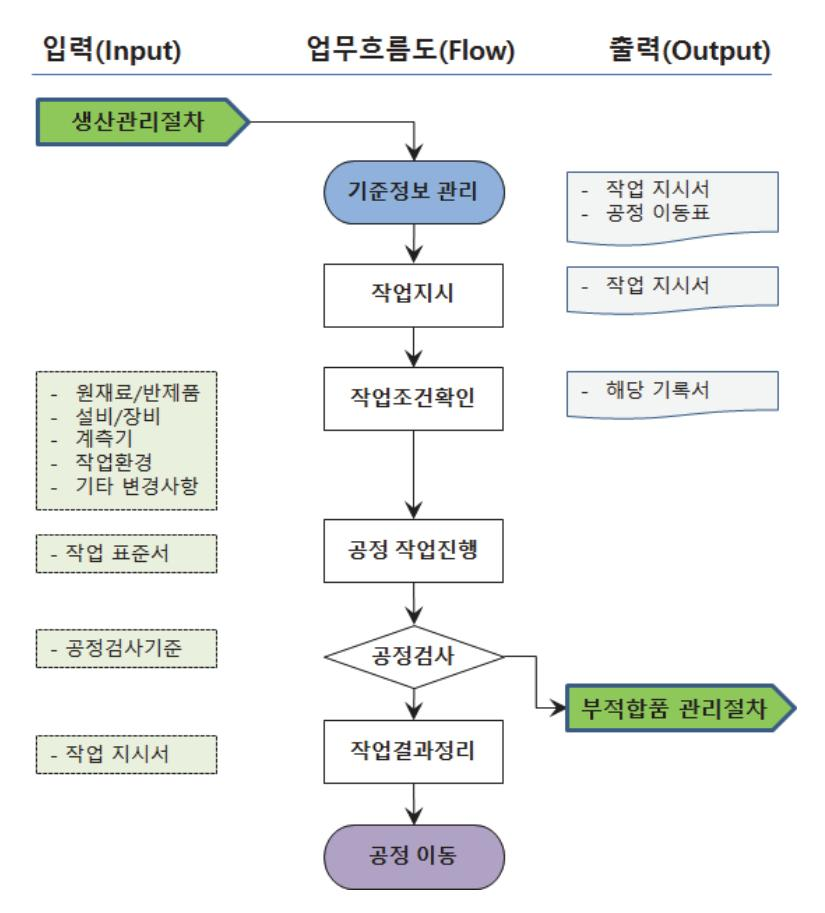

출처: 교육부(2016). 반도체 재료 생산(LM1903060409\_14v1). 한국직업능력개발 원. p.61. [그림 3-1] 일반적인 공정관리 작업 절차서

2. 공정도시기호

공정이란 원료, 재료, 부품 또는 제품에 대하여 그것에 변화를 주는 과정을 말하고, 그 과 정을 구성하는 개개의 요소 공정 및 그들 요소 공정에 대하여 순서 관계를 나타낸 공정 계 열을 뜻한다.

- (1) 요소 공정은 그 기능 또는 상태에 따라 가공, 운반, 정체 및 검사로 나누고, 다시 정체는 저 장 및 지체로, 검사는 수량 검사 및 품질 검사로 나눈다.
- (2) 공정 도시 기호의 분류

공정 도시 기호를 기본 도시 기호와 보조 도시 기호로 나눈다.

(가) 기본 도시 기호

요소 공정을 도시하기 위하여 쓰이는 기호로서 가공, 운반, 저장, 지체, 수량 검사 및 품질 검사의 각 기호로 나눈다.

| 번 호 | 요소 곰정 | 기호의 명침 | 기 호     | ۲                                                                                                          | 비고                                                               |
|--------|----------|-----------|------------|------------------------------------------------------------------------------------------------------------|------------------------------------------------------------------|
| 1      | 가곰       | 가 곰       | 0          | 원료, 재료, 부품 또는 제품의 모양, 성 질에 변화를 주는 과정을 나타낸다.                                                             |                                                                  |
| 2      | 문반       | 문 반       | 0          | 원료, 재료, 부품 또는 제품의 위치 에 변화를 주는 과정을 나타낸다.                                                                 | 문반기호의 지름은 가공기호 지 름의 1⁄2 ~ 1/3 로 한다. 기호 ○대신에 기호ㅎ를 써도 좋다. |
| 3      |          | 저장 🗸      |            | 원료, 재료, 부품 또는 제품을 계획에 따라 저장하고 있는 과정을 나타낸다.                                                              |                                                                  |
| 4      | 정체       | 지 체       | D          | 원료, 재료, 부품 또는 제품이 계획에 반하여 지체되고 있는 상태를 나타낸다.                                                             |                                                                  |
| 5      |          | 수량 검사  |            | 원료, 재료, 부품 또는 제품의 양 또는 개수를 계량하여 그 결과를 기준과 비교 하여 차이를 아는 과정을 나타낸다.                                     |                                                                  |
| 6      | 검사       | 품질 검사  | $\diamond$ | 원료, 재료, 부품 또는 제품의 품질 특 성을 시험하고, 그 결과를 기준과 비교 하여 로트의 합격, 불합격 또는 개개 제 품의 양호, 불량을 판정하는 과정을 나 타낸다. |                                                                  |

출처: 교육부(2016). 반도체 재료 생산(LM1903060409\_14v1). 한국직업능력개발원. p.62. [그림 3-2] 공정 기본 도시기호

(나) 보조 도시 기호

공정 계열에서 계열의 상태를 도시하기 위하여 쓰이는 기호로서 흐름선, 구분 및 생 략의 각 기호로 나눈다.

| 번호 | 기호의 명칭 | 기 호 | 뜻                         | 비고                                                                                          |
|----|--------|-----|---------------------------|---------------------------------------------------------------------------------------------|
| 1  | 흐름선    |     | 요소 공정의 순서 관계를 나타낸다.       | 순서 관계를 알기 어려울 때에는 흐름 선의 끝부분 또는 중간 부분에 화살표 를 그려서 그 방향을 명백히 나타내다. 흐름선의 교차부분은 로 나타낸다. |
| 2  | 구 분    | ~~~ | 공정계열에서 관리상의 구분을 나타낸 다. |                                                                                             |
| 3  | 생 략    | =   | 공정계열의 일부분 생략을 나타낸다.       |                                                                                             |

| 복합 기호                                    | ۶                      |
|------------------------------------------|------------------------|
| $\square \qquad \bigcirc \qquad \square$ | 품질검사를 주로 하면서 수량검사도 한다. |
|                                          | 수량검사를 주로 하면서 품질검사도 한다. |
|                                          | 가공을 주로 하면서 수량검사도 한다.   |
|                                          | 가공을 주로 하면서 운반도 한다.     |

출처: 교육부(2016). 반도체 재료 생산(LM1903060409\_14v1). 한국직업능력개발원. p.62. [그림 3-3] 공정 보조 도시기호

- 3. 공정도의 형태
  - (1) 직렬형 공정 분석도

부품의 공정에 대하여 그 공정의 편성, 설비 배치 등의 개선을 위하여 현재 상황을 분석한 공정도

- (2) 합류형을 주로 하는 공정 계획도 각 구성 부품을 제작하고, 투입하여 이들을 조립하여 제품을 만드는 경우의 공정도는 일반 적으로 합류형이 주로 쓰인다.
- (3) 분리형을 주로 하는 공정도 원료에서 복수의 제품 또는 주제품 이외에 몇 가지 부산물이 산출되는 경우의 공정도는 일 반적으로 분리형이 주로 쓰인다.
- 4. QC 공정도(관리계획서) 작성

반도체 재료에 따른 제조공정별 중점관리 품질특성을 선정할 수 있어야 함과 동시에 QC 공정도(관리계획서)를 작성할 수 있어야 한다. [그림 3-5]는 8인치 웨이퍼 제조공정 중에서 마지막 세정공정에서의 QC 공정도를 작성한 예시이다. 일반적으로 공정별 중점관리 품질특 성 표준화라고 하는 것은 표준을 설정하고 (P), 표준대로 실시하며 (D), 이 결과를 검토하 여 (C), 필요한 경우 조치를 취하는(A) 것으로 일련의 P-D-C-A 사이클로 관리가 된다.

(1) 관리 계획서(Control Plan)의 정의

개선 단계를 거쳐 확정된 개선안을 현 업무에 전면 실행할 때 목표한 개선 효과를 지속 해서 얻기 위하여 공정의 제반 활동 사항을 관리하기 위한 계획서이다.

(2) PDCA 관리 사이클 적용

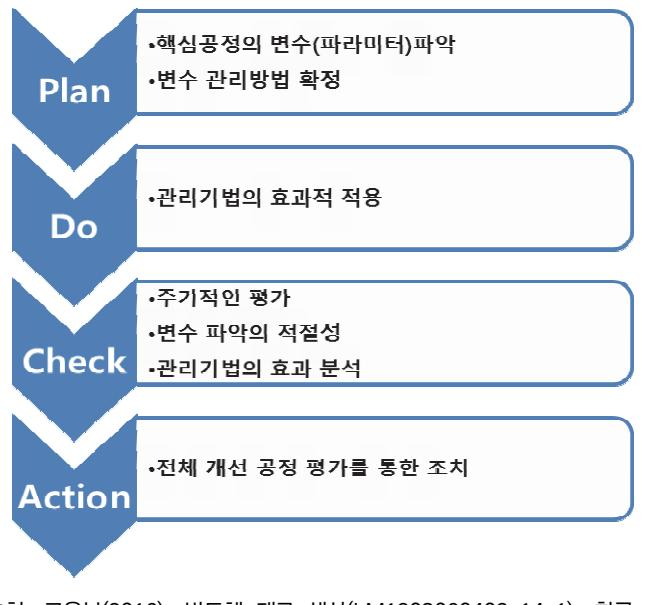

출처: 교육부(2016). 반도체 재료 생산(LM1903060409\_14v1). 한국 직업능력개발원. p.63. [그림 3-4] PDCA관리 사이클

#### (3) QC 공정도(관리계획서) 작성 예시

| QC 공정도 & CONTROL PLAN |                      |                |          |                |                      |                 |               |            | 작성        | 검토      | 승인         |        |
|-----------------------|----------------------|----------------|----------|----------------|----------------------|-----------------|---------------|------------|-----------|---------|------------|--------|
| 적용구분                  |                      | □시제품 □선행양산 ■양산 |          | 제품명            | 8인치 웨이퍼(Prime Grade) |                 |               | 작성(개정)일    | 2016.0    | 0.00    | (개정차수: 00) |        |
|                       | 관리번호                 |                | 품번(CODE) |                |                      | 작성자/부서          |               |            |           |         |            |        |
| 관리                    | 관리부서(제조라인) 생산관리부(웨이퍼 |                | 이퍼 세정라인) | 합의자/부서1        | 합의자/부서2              |                 |               |            |           | 합의자/부서3 |            |        |
|                       | 공정                   | ИШ             |          | 품질특성           |                      |                 | 관리            | 방법         |           |         | 71-21-0    | IEF 11 |
| No                    | 공정명                  | 설비 /치공구     | 관련표준     | 공정인자 (점검항목) | 제품 (관리항목)         | 목표값/공정사양/규격     | 평가측정 방법    | 시료수        | 샘플링 주기 | 분석방법    | 관리0 조치  |        |
| 1                     | FINAL세정              | WET STATION    | W-D00-00 | SC(1) 시간       | Particle             | 300±5sec        | Counter Alarm | All Wafers | ₽HRUN     | 체크시트    | R-A0       | 0-00   |
|                       |                      |                |          | SC(1) 온도       |                      | 60 ± 3 ℃        | Display       |            |           |         |            |        |
|                       |                      |                |          | SC(1) 혼합비      |                      | 암수:과수:DI=1:1:50 | 비이커           |            | 4HR       |         |            |        |
|                       |                      |                |          | QDR(1) 시간      |                      | 400±10sec       | Counter Alarm |            | ₽HRUN     |         |            |        |
|                       |                      |                |          | SC(2) 시간       |                      | 180±5sec        | Counter Alarm |            |           |         |            |        |
|                       |                      |                |          | SC(2) 온도       |                      | RT              | Display       |            |           |         |            |        |
|                       |                      |                |          | SC(2) 혼합비      |                      | 염산:과수:DI=1:2:50 | 비이커           |            | 4HR       |         |            |        |
|                       |                      |                |          | QDR(2) 시간      |                      | 300±10sec       | Counter Alarm |            | ₽₩RUN     |         |            |        |
|                       |                      |                |          |                |                      |                 |               |            |           |         |            |        |

출처: 교육부(2016). 반도체 재료 생산(LM1903060409\_14v1). 한국직업능력개발원. p.64. [그림 3-5] QC 공정도 예시

## 수행 내용 / 작업 절차서(제조/QC 공정도) 작성하기

#### 재료·자료

- 고객 요구사항서
- 공정관리절차서
- 수입검사규격(재료규격), 검교정규격 및 기준서
- 제조/QC 공정도, 작업 표준서

#### 기기(장비 ・ 공구)

- 컴퓨터(프린터)
- 문서 작성 프로그램
- 안전 ・ 유의 사항
  - 작업장의 환경 및 공정의 특성에 따라 작업 절차서 양식 및 구성에 차이가 있을 수 있음에 유의한다.
  - 회사에 따라 종이 문서가 아닌 전자 결제 형태의 시스템을 운영할 수 있으므로, 작업표준 및 문서표준관리절차를 사전에 파악해둔다.

수행 순서

- 숔 공정관리 업무흐름도를 구성하고 제품별로 작업 절차서(제조/QC 공정도)를 구체화한다.
  - 1. '제조/QC 공정도'의 작성 및 승인
    - (1) 공정도를 작성 시 실제와 부합되도록 작성하여야 하며, 작업순서에 따라 1개의 라인으로 연 결되고, 1개 라인으로 표시가 어렵거나, 복잡한 경우에는 제품을 구성하는 여러 개의 부품 중, 주된 부품이나 추가되는 공정을 주공정도로 하고, 여하 부품이나 공정은 부공정도로 하 되, 주공정도의 순서에 따라 연결한다.
    - (2) '제조/QC 공정도'에는 다음 내용이 포함되도록 한다.
      - (가) 공정명 (또는 공정 도시기호 [그림 3-2]와 [그림 3-3] 참조)
      - (나) 사용 설비
      - (다) 관리 항목, 검사 항목
      - (라) 관리 주기

- (마) 담당
- (바) 조치
- (사) 기록방법

|                                   |         |    |   | (●:주관팀,▲:해당팀)                      |
|-----------------------------------|---------|----|---|------------------------------------|
|                                   |         | 관련 | E |                                    |
| 공정관리 업무 흐름도 -                  |         | 생산 |   | 비고                                 |
| 생산 의퇴서 접수                         |         | •  |   | - 열업팀에서 수주내용 및 샙산의회서 점수            |
| 생산계획서 작설, 검토 및 승인 ↓            | <b></b> | •  |   | - ( )월 샙산계획서 작섬                    |
| 생산 계획서 배포                         | •       | •  |   | - 관련팀 배포                           |
| 작업 지시서 발행 및 배포                    |         | •  |   | - 일일 작업지시및 결과동보서                   |
| 자재의 준비 제 조설비의 준비            |         | •  |   | - 원부자재 준비 - 제조 설비, 치구, GAUGE 준비 |
| 공정도 작설/승인                         |         | •  |   | - 작업표준서, QC/제조 공정토                 |
| 작업자 교육                            | •       | •  |   | - 작업자교육 및 현장 배포/부착                 |
| 제품제조                              |         | •  |   | - 반도체 재료별 제작                       |
| 공정관리                              |         | •  |   | - QQ/제조 공정도                        |
| 공정검사                              |         | •  |   | - 공정/최종검사 기준서                      |
| 이상발생 부적합품                         | •       | •  |   | - 조치후, 공정/최종검사 설적서에                |
| 관리절차서           시정/예발조치         ▲ |         |    |   | 기록 (시정 및 예방 조치가 피아하 경우          |
|                                   |         | •  |   | 조치가 필요할 경우, '시정 및 예방조치          |
| 완제품                               |         | •  |   | 접차서'에 따라 처리)                       |
| 최종검사 NG                           | •       | •  |   | - 공정/최종겸사 기준서                      |
|                                   |         | •  | - | - 포장작업 기준서                         |
|                                   |         |    |   |                                    |

출처: 교육부(2016). 반도체 재료 생산(LM1903060409\_14v1). 한국직업능력개발원. p.66. [그림 3-6] 공정관리 업무절차서

#### 2. 제조공정도 작성 예시

다음의 [그림 3-7]은 단결정 잉곳 제조를 위한 공정도를 예시로 작성하였다. 반도체 재료 중에 기판이 되는 재료인 웨이퍼의 전반적인 제조공정 및 제품 특성에 관한 내용은 NCS 학습 모듈 중 반도체 재료의'반도체용 웨이퍼 재료 제조(LM1903060401\_14v1)'를 참조하 면 관련 지식 습득에 많은 도움이 되겠다.

|        |                                                                                                                                         |                   |               | 제        | 조            | 공 정 도                                   |        |          |        |                         | 작성            | 검토                     | 승인                 |  |               |  |       |           |  |
|--------|-----------------------------------------------------------------------------------------------------------------------------------------|-------------------|---------------|----------|--------------|-----------------------------------------|--------|----------|--------|-------------------------|---------------|------------------------|--------------------|--|---------------|--|-------|-----------|--|
|        | 문서번호                                                                                                                                    | NCS-SM-           | ·00           | 제품명      |              | 8인치 웨이퍼(Prime Grade) 작성(개정)일 2016.00.00 |        |          |        |                         |               | (개정치                   | (개정차수: <b>0</b> 0) |  |               |  |       |           |  |
|        | 공정구분                                                                                                                                    | □시제품 □선행9         | 양산 ■양산        | 공정명      |              | 단결정 성장(CRYSTA                           | AL GRO | DWING)   | 작성자/부서 |                         |               |                        |                    |  |               |  |       |           |  |
|        | 공                                                                                                                                       | 정                 | 부             | 품/원자재    |              | 고려네이                                    | 투입     | 입 및 및    |        |                         | 관련규격          |                        |                    |  |               |  |       |           |  |
| 순 서 | 공정도                                                                                                                                     | 공정명               |               |          | 원수           | 공정내용                                    | 인원     |          |        |                         |               | 및 지침서번호             |                    |  |               |  |       |           |  |
| 1      |                                                                                                                                         | 자재입고              |               | -        | -            | 원부자재 입고                                 |        |          |        | - 중량,외관 및 치수,특성 - |               |                        |                    |  |               |  |       |           |  |
| 2      | $\diamond$                                                                                                                              | 입고검사              |               | -        | -            | 수입검사                                    | 1      |          |        |                         |               | 수입검사규                  | 격(M-00-00)         |  |               |  |       |           |  |
| 3      |                                                                                                                                         | 저장                |               | -        | -            | -                                       |        |          |        |                         |               |                        |                    |  |               |  |       |           |  |
| 4      | $ \qquad \qquad \qquad \qquad \qquad \qquad \qquad \qquad \qquad \qquad \qquad \qquad \qquad \qquad \qquad \qquad \qquad \qquad \qquad$ | 자재출고              |               | -        | -            | -                                       |        | -        |        | -                       |               |                        |                    |  |               |  |       |           |  |
|        | $\nabla \nabla$                                                                                                                         | 7 CRYSTAL         |               |          |              | CRYSTAL 성장                           |        | CDVCTAL  | POLY   | SILICON                 |               | <mark>도가니</mark> 에 준비된 |                    |  |               |  |       |           |  |
| 5      |                                                                                                                                         |                   |               |          |              |                                         |        | 석영       | 도가니    |                         | POLY 및 도펀트 등을 | 1                      | GROWER             |  | 순도,양,DOPANT종류 |  | 작업표준시 | (w-00-00) |  |
|        | <u>⊥</u> _•●                                                                                                                            | 00                | 고순도           | GRIPHITE |              | 투입후 잉곳을 성장                              |        |          |        |                         |               |                        |                    |  |               |  |       |           |  |
|        | $\nabla \nabla$                                                                                                                         | INCOT             | CROPP         | ING재료    |              | 성장시킨 잉곳을                                |        |          |        |                         |               |                        |                    |  |               |  |       |           |  |
| 6      |                                                                                                                                         | INGOT CROPPING | ETCHI         | NG 재료    |              | SEED, BODY, TAIL별로                      | 1      | BAND-SAW |        | -                       | -             |                        | (W-00-01)          |  |               |  |       |           |  |
|        |                                                                                                                                         | Chorrino          | GRIND         | ING 재료   | 검사시료(SLUG)채ª |                                         |        |          |        |                         |               |                        |                    |  |               |  |       |           |  |
|        |                                                                                                                                         |                   | INGOT - 각 위치별 |          |              | N                                       | C-80   |          |        |                         |               |                        |                    |  |               |  |       |           |  |
| 7      |                                                                                                                                         | EVALUATION        |               | -        |              | 특성값 수집 및 분석                             | 2      | FT-IR    |        | Res,Oi,Cs,O             | DISF,EPD      | 작업표준시                  | (W-00-02)          |  |               |  |       |           |  |
|        |                                                                                                                                         | LUNEOAHON         |               | -        |              | 특성평가                                    |        | MICR     | OSCOPE |                         |               |                        |                    |  |               |  |       |           |  |
| 8      | ŏ                                                                                                                                       | 다음공정(웨이퍼링)        |               |          |              | <b>1</b>                                |        |          |        |                         |               |                        |                    |  |               |  |       |           |  |

출처: 교육부(2016). 반도체 재료 생산(LM1903060409\_14v1). 한국직업능력개발원. p.67. [그림 3-7] 제조공정도 예시

- 3. '제조/QC 공정도'의 유지 관리
  - (1) 승인된 공정도는 해당 부서에서 유지, 관리하도록 한다.
  - (2) 개정 및 변경 사항 발생 시, 최초 작성 절차에 따라 처리한 후, 생산관리 팀장은 즉시, 개정 본을 해당 공정에 배포하고, 처리한다.

## 3-2. 작업 표준서 작성

학습 목표 • 작업 절차서를 토대로 공정운전을 위한 작업 표준서를 작성할 수 있다. • 작업 표준서에 의해 필요한 단위공정 원부재료를 파악할 수 있다.

## 필요 지식 /

#### 숔 작업 표준서의 정의

생산부서에서 현장 작업자가 작업내용을 쉽게 이해하고 작업할 수 있도록 표준 작업방법, 관리 방법, 사용재료, 사용 부품, 설비, 공구, 품질판정 기준, 기타 주의사항 등에 관한 표준으로 동 일한 작업이 이루어지도록 하기 위한 규격이며 이를 문서로 명시한 것을 작업 표준서 또는 작 업지침서라고 한다.

- 숕 작업표준의 필요성
  - 1. 작업자에 의한 편차 방지 해당 작업에 필요한 기술지도 및 현장 교육의 수준을 파악하여 적정 성 여부를 판단하고 작업자에 의한 편차를 방지할 수 있다.
  - 2. 가장 최선의 작업 방법의 확정 빠른 시간 내에 초보 작업자들의 작업 기술의 숙련도를 높여 최선의 작업 방법을 확정할 수 있다.
  - 3. 표준 작업의 문서화
  - 4. 공장의 기술적 KNOW HOW 품질 관리, 작업 관리, 공정 관리, 설비 관리 등과 같은 여러 공 정에서 기초 자료로 사용될 수 있다.
  - 5. 작업 개선의 기본자료 향후 기술 개발 및 개량을 신속하게 수행할 수 있는 참고 자료가 될 수 있다.
  - 6. 작업자의 교육 TEST 작업자에게 책임감을 가질 수 있도록 하고, 그 작업에 대한 권한을 명확 하게 할 수 있다.
  - 7. 불량품 발생 방지 작업을 효율적으로 수행하여 불량품 발생률을 사전에 방지할 수 있으며 작업 자의 능률을 향상시키고, 작업 중 위험 요인을 미리 제거하여 안전하게 작업할 수 있도록 한다
  - 8. 거래선으로의 품질 보증 문서 작업자가 바뀌더라도 회사의 우수한 기술을 축적할 수 있으며, 고객의 품질을 보증하는 기초자료가 될 수 있다.
  - 9. 타사와의 경쟁 대응 문서 생산 공정의 손실 요인을 제거하여 제품의 품질과 생산성을 높이고, 제품의 원가를 최대한 낮추는 데 효과적으로 활용할 수 있다.

67

숖 작업표준의 유형과 구성

1. 작업표준의 유형

작업의 특성에 따라 제품 규격, 작업 및 부품 규격, 검사 및 시험 규격에 대한 항목이 기술 되어야 한다. 작업 표준의 항목 및 내용은 기술 표준, 작업 지도서 등으로 분류할 수 있고, 내용의 표현은 간결한 문장으로 작성해야 한다. 또한, 작업자의 이해를 돕기 위한 도면, 표, 그래프, 사진, 일러스트 등을 삽입시킬 수도 있으며, 작업장별로 독자적이면서도 적합한 내 용이어야 한다.

(1) 제조에 관한 표준

설계표준, 기술표준, 작업표준, 조작표준

(2) 검사관계 표준

수입검사표준, 시험표준, 제품검사표준, 공정검사표준

(3) 점검표준

설비점검표준, 치공구점검표준, 계측기 점검표준

2. 작업표준의 구성

다음과 같은 내용 중 작업장에서 필요한 항목을 선택하여 작업 표준서를 구성할 수 있다.

- (1) 적용 작업 범위
- (2) 작업품질 (또는 목표품질, 가공특성)

예) 공정검사 항목 및 기준

- (3) 사용 원재료 및 부재료
- (4) 작업 설비의 외형 및 동작 원리
  - 작업에 필요한 제조설비와 품질확인에 필요한 계측기의 설비명, 용량, 용도, 수량 등
- (5) 작업 공정의 순서, 작업 방법 및 작업조건
  - 준비작업, 본 작업, 마무리 작업 순서로 서술
  - 작업조건은 가능한 경우 수치로 표현
  - 작업방법은 단위작업을 간단명료하게 서술
- (6) 작업 중 유의할 사항
- (7) 해당 작업의 책임 및 권한의 한계와 범위
- (8) 작업 시간 및 작업 단위
- (9) 이상 상태 발생 시 조치방법
- (10) 작업 관리 항목 및 방법
- (11) 작업자의 인원과 필요한 자격
- (12) 작업 설비의 보전 및 관리

숗 작업표준의 작성순서 및 유의사항

작업 표준을 작성할 때에는 그 작업장의 성격, 공정의 편성, 작업자의 숙련도 등을 고려하여 해당 작업장에서의 적합한 작업 표준 체계를 만들어야 한다. 작업 표준서는 다음과 같은 형식 을 갖추어 작성한다.

- 1. 작업 표준서를 작성하는 목적을 명확히 한다.
- 2. 작업 결과에 영향을 주는 원인을 파악하여 규정한다.
- 3. 작업자가 판단을 쉽게 할 수 있는 내용으로 작성한다.
- 4. 작업자가 수행해야 할 행동의 기준을 구체적으로 표현한다.
- 5. 현재 작업의 기능 및 실적을 적용할 수 있는 형식으로 작성한다.
- 6. 처음부터 완전한 문서 형식을 갖추려는 방법보다는 점진적으로 필요에 따라 문서의 형식을 개선 하는 방법을 택한다.
- 7. 해당 작업의 결과에 대한 책임 소재를 명확히 제시한다.
- 8. 작업에 대한 권한의 범위를 구체적으로 명시한다.
- 9. 숙련자뿐만 아니라 초보자도 쉽게 이해할 수 있는 구성 및 표현을 사용한다.
- 10. 모든 작업은 반드시 문서화하여 기술 및 기능이 축적되고 응용할 수 있는 기초 자료로 활용한 다.
- 11. 작업의 절차를 요점 정리한다.
- 12. 각 작업 절차에 대하여 주요 포인트를 표시하여 기입한다.

## 수행 내용 / 작업 표준서 작성하기

#### 재료·자료

- 공정관리 규정
- 공정 설계도(제조 공정도), QC 공정도, 공정 분석도
- 작업 지시서, 작업 표준서
- 공정별 단위 소요 시간 분석표
- 업무체계도

#### 기기(장비 ・ 공구)

- 컴퓨터(프린터)
- 문서 작성 프로그램, 공정 관리 프로그램
- 통계 분석 소프트웨어, 설계 도구(CAD)
- 계측 장비(스톱워치, 버니어 캘리퍼스 등)

#### 안전 ・ 유의 사항

- 작업장의 환경 및 공정의 특성에 따라 작업 표준서 양식에 차이가 있을 수 있음에 유의한 다.
- 회사에 따라 종이 문서가 아닌 전자 결제 형태의 시스템을 운영할 수 있으므로, 작업표준 및 문서표준관리절차를 사전에 파악해둔다.

#### 수행 순서

- 숔 작업표준 제정절차를 이해하고 작성계획을 수립한다.
  - 1. 작업 표준화를 하기 전에 품질 견본 파악 및 납기 등을 협의해야 한다.
  - 2. 공정 작업을 단계별로 분류, 정리한다.
  - 3. 단계별 작업을 세분화한다.
  - 4. 유관 부서와의 검토를 통해 순서를 정한다.
  - 5. 작업 표준안을 작성한 후, 검토 승인을 통하여 작업 표준을 제정한다.

- 숕 작업 표준서의 작성에서 검토, 승인을 거쳐 배포하는 일련의 과정을 사전에 충분히 숙지한다. 작업 표준서는 생산 기술 자료로서, 생산 부서 안의 기술을 담당하는 부서가 원안을 작성 하며, 관계자의 검토를 거쳐 내용을 결정하고, 생산 부서가 작성한 다음에 배포한다.
  - 1. 생산 담당은 관리 계획서를 기준으로 작업 방법, 작업 기준, 자주 검사 포인트를 포함한 공정별 작업 표준서를 작성하고, 품질 보증 부서의 검토를 거쳐 생산부서의 장이 승인한다.
  - 2. 외주 공정은 외주 업체에서 작업 표준서를 작성하여 생산 부서장, 품질 부서장의 검토를 거쳐 개 발 부서장이 승인하여, 원본은 외주 업체에서 관리하고, 개발 부서장은 그 사본을 관리한다.
  - 3. 작업 표준서의 내용은 작업자가 쉽게 볼 수 있도록 적절한 장소에 부착하여 관리하고,정기적으로 중요 공정 작업자는 교육을 실시하여야 하고, 숙지 될 수 있도록 훈련시켜야한다.
- 숖 작업 표준서는 Q.C 공정도를 기초로 하여 생산기술부서에서 작성한다.

작업 표준서는 [표준 양식] 또는 [활용 서식 1]을 사용하여 다음과 같이 작성한다.

- 작성대상: 작업 표준서는 작업대상을 명확히 하여 작성한다.
- 작성방법(문자 및 언어): 내용은 한글로 표기하며, 글자의 크기는 가로 세로 10mm 이내의 적당한 크기로 표기한다. 단, 필요시 부품명 및 단위에 한하여 영문으로 표기한다.
- 제품명: 해당 공정의 최종완성품명을 기록한다.
- 모델: 제품의 고유 모델명을 적는다. 단, 2 모델 이상 공용작업일 경우에는 동시에 적는다.
- 공정명: 해당 공정명을 적는다.
- 작업설명도: 작업의 내용을 요약하여 도시한다.
- 작업순서: 작업 내용을 단위 공정별 우선 순으로 작업 요점을 알기 쉽게 표현한다.
- 설비(공구): 해당 공정에 필요한 설비(공구)를 적는다.
- 중요사항: 해당 공정의 품질관리를 위한 주요관리 내용, 확인사항 및 검사기준을 적는다. (관 리항목과 그 관리방법, 점검의 시기, 점검부위, 방법 등을 초심자가 알기 쉽게 상세히 적는 다.)
- 부품명: 해당 공정에 소요되는 부품명을 기록한다.
- 수 량: 해당 공정에 소요되는 부품 수를 기록한다.
- 안전사항: 안전에 관한 주의사항을 적는다.
- 이상(불량) 발생 시 조치 항목: 작업할 때 발생할 수 있는 불량 내용을 작성하고, 이를 해결 하기 위한 방법을 기술한다.
- 작성: 작업 표준서 작성자가 날인한다.
- 검토: 작업 표준서 작성자의 차상위자가 날인한다.
- 승인: 작성부서장이 날인한다.

#### - 작성일: 작성완료일을 기입한다.

- REV. NO.: 개정 NO.기록한다.

| 공 정 명 공정번호 | ADE 측정                           | □ 임시 ■ 정규    | 작업표               | 표준서           | 제 개 정 이 | NO 0 1                                     | 일자 '16.03.06 '16.03.07 '16.03.08 | 작업방법 변경                   | 작성 KIM KIM KIM | 검토        | 승인       |  |  |
|---------------------|----------------------------------|-----------------|-------------------|---------------|------------------|--------------------------------------------------|-------------------------------------------|---------------------------|-------------------------|-----------|----------|--|--|
|                     |                                  |                 |                   |               |                  | 2                                                | 16.03.08                                  | 카나판디                      | NIM                     |           |          |  |  |
| 문서번호                | W-D01-55                         | 적용 기간           |                   | ~ 차기개정일       |                  | 3                                                |                                           |                           |                         |           |          |  |  |
| 작업 방법               |                                  |                 |                   |               |                  | 작업 조건                                            |                                           |                           |                         |           |          |  |  |
| 1. 장비 개.            | <u> </u>                         |                 |                   |               |                  |                                                  |                                           | 항 목                       | 기 준                     | j         | 체크주기     |  |  |
| : 0  2              | 장비는 Silicon Wafer의 평탄도 측         | 정하는 장비 위        | 긜.                |               |                  |                                                  |                                           | Vacuum                    | 20~30inHg               |           | Day      |  |  |
|                     |                                  |                 |                   |               |                  |                                                  |                                           | Thickness                 | 8TD Wafer±              | 0.2µm     | Shift    |  |  |
| 2. 작업 전             | 준비 사항                            |                 |                   |               |                  |                                                  |                                           | Warp                      | STD Wafer:              | ±5µm      | Shift    |  |  |
| (1)STD V            | Vafer (Norm inal / Master #1 / N | 1aster #2) (2)D | iata Print 용지     |               |                  |                                                  |                                           |                           |                         |           |          |  |  |
|                     |                                  |                 | (3)Robot Teaching | ) 상태 (4)공정용 ( | ST               |                                                  |                                           |                           |                         |           |          |  |  |
| 3. 작업               |                                  |                 |                   |               |                  |                                                  |                                           |                           |                         |           |          |  |  |
| (1) 작               | 업 순서                             |                 |                   |               |                  |                                                  |                                           |                           |                         |           |          |  |  |
| 1                   | 작업 시작 전 일상 점검표 작성 등              | 빛 Check 실시.     |                   |               |                  |                                                  |                                           |                           |                         |           |          |  |  |
| 2                   | [첨부 1]의 작업 방법에 따라 진]             | 행.              |                   |               |                  |                                                  |                                           | 이상발생시 조치                  |                         |           |          |  |  |
| 3                   | 작업 진행 정도를 실시간으로 전                | 산(MES)에 기혹      | 록.                |               |                  |                                                  |                                           |                           |                         |           |          |  |  |
|                     |                                  |                 |                   |               |                  |                                                  |                                           | 1. Wafer 깨진 경우 : Cleaning |                         |           |          |  |  |
| (2) Ca              | alibration                       |                 |                   |               |                  |                                                  |                                           | 2, 정전, Air 문제 발생시 :       |                         |           |          |  |  |
| 1                   | Calibration 시간 : 8Hr / 장비 Do     | wn 이후 작업        | 재개 시              |               |                  | 전원 및 Air Off, 엔지니어에게 통보 3. 기타 공정, 제품 이상 발생시 : |                                           |                           |                         |           | 공모       |  |  |
| 2                   | [첨부 2]의 작업 방법에 따라 진              | 행.              |                   |               |                  |                                                  |                                           |                           |                         |           |          |  |  |
|                     | STD Wafer 및 Certification Waf    |                 | 확인 함.             |               |                  |                                                  |                                           | 작업자 Hold 생산 팀장 보       |                         |           |          |  |  |
| -                   |                                  |                 |                   |               |                  |                                                  |                                           | 생산 범성 도   부적합품 처       |                         |           | ,        |  |  |
| -> E                | 나음페이지 계속                         |                 |                   |               |                  |                                                  |                                           | 구역입품 세                    | 니/알바판                   | 니 꼬시      |          |  |  |
|                     |                                  |                 |                   |               | 공정 자주 검사         |                                                  |                                           |                           |                         |           |          |  |  |
| 장비/프로그램 설비/치공구      |                                  |                 |                   |               | 검사 항목 검사 기       |                                                  |                                           | ~ 샘플                      | 검사 방                    | н т       | 라리 방법    |  |  |
| RECIP               | ENO. 적용MSNO.                     | 명 칭             | 규격                | 교환 주기         |                  |                                                  |                                           | [크기]수가]                   |                         |           |          |  |  |
|                     |                                  | Cassette        | <u>200mm전용</u>    | 파손 및 오염       | Thickne          |                                                  |                                           | ) 참조 전수 Lot               | 전산 Mor                  |           | og Sheet |  |  |
|                     |                                  | 공정용 Box         | <u>200mm전용</u>    | 파손 및 오염       | Resistiv         | /ity                                             |                                           | ) 참조 전수 Lot               | 전산 Mor                  |           | og Sheet |  |  |
|                     |                                  |                 |                   |               | VTT              |                                                  |                                           | ) 참조 전수 Lot               | 전산 Mor                  |           | og Sheet |  |  |
|                     |                                  |                 |                   |               | Warp             |                                                  | 에 속 ㅠ 즉 (MB                               | ) 참주 전 수 Lot              | 전산 Mor                  | iitor į L | og Sheet |  |  |

출처: 교육부(2016). 반도체 재료 생산(LM1903060409\_14v1). 한국직업능력개발원. p.73. [그림 3-8] 작업 표준서 예시

수행 tip

• 작업 표준서의 내용은 초보자도 이해하기 쉽도록 간결하고 쉬운 문장으로 작성한다.

## 3-3. 공정 모니터링 실시

• 공정진행과 목표 품질확보를 위한 공정 모니터링을 할 수 있다.

- 작업 표준서와 일일 작업지시서에 의해 설정된 운전조건에 따른 생산 공정을 진행할 수 있다.
- 이상 발생 시 최단시간 내 분석을 통해 불량원인 파악과 최소한의 수정으로 최적화된 생산을 지원할 수 있다.

## 필요 지식 /

학습 목표

#### 숔 생산현장에서의 품질관리

제품 또는 서비스가 설계규격이나 품질규격에 일치하는 정도를 나타내는 적합품질(Quality of conformance)을 확립하기 위해서는 무엇보다도 생산현장에서의 적절한 품질관리가 필요하다. 제품과 서비스의 디자인이 제대로 설정되어 있더라도 제조공정의 제반 여건이 이를 뒷받침하지 못하게 되면 고객에게 제공되는 제품의 품질은 설계과정에서 결정한 품질특성에 미치지 못하게 되기 때문이다.

#### 1. 검사중심의 품질관리

제조공정의 개선을 통한 품질 향상보다는 불량품과 양품을 선별하여 불량품을 제거하고 고 객에게 양품만을 공급하는 접근방법이다. 100% 전수검사를 하든 샘플링검사를 하든 이러한 검사 위주의 관리방법은 큰 비용이 소요됨은 물론 전반적인 적합품질의 품질개선에는 한계 가 있다.

#### 2. 공정관리중심의 적합품질관리

공정 또는 품질을 관리한다는 것은 공정의 적합품질과 관계가 있다. 공정 결과물이 설계의 도에 적합한가? 최종적으로, 관리자는 공정의 산출물이 통계적으로 수용 가능한지를 평가하 기 위해 통계적 공정관리(SPC, Statistical process control)를 활용하는데 공정에서 주기 적으로 표본을 추출하여 사전에 결정된 표준과 비교하게 된다.

통계적 공정통제의 중요한 수단은 관리도이다. 관리도는 [그림 3-9]에서 볼 수 있다.

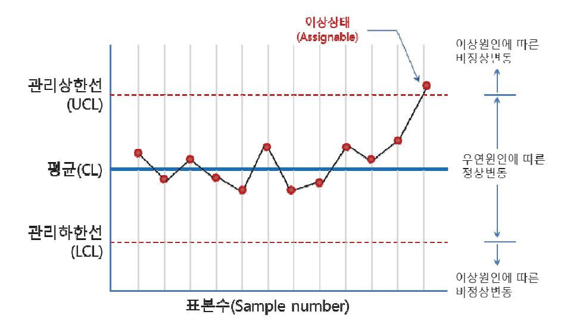

출처: 교육부(2016). 반도체 재료 생산(LM1903060409\_14v1). 한국직업능력개발원. p.75. [그림 3-9] 관리도 예시

품질특성에 변동을 일으키는 요인은 크게 이상 원인과 우연 원인으로 나뉜다.

(1) 이상 원인 (assignable causes)

작업자 훈련 부족, 불량 원자재 사용, 설비의 마모, 기계의 고장이나 노후화, 생산준비 미흡, 조명, 습기, 진동, 불결한 작업환경 등으로 불규칙한 패턴을 보이는 경향이 있으며 충분히 예방할 수 있는 변동

(2) 우연 원인(random cause, common causes):

공통원인에 의한 변동으로 불리며 작업시간과 작업자와는 무관하게 전 공정에서 계속 발생하며 변동의 폭이 안정적인 패턴을 나타냄

- 제품이나 서비스의 설계상의 오류
- 감독의 불충분
- 지시내용과 방법상의 문제점
- 선행공정 발생한 불량품을 계속 사용하는 부주의한 제조관행

관리도의 목적은 공정의 산출물이 우연에 의한 변동인지를 점검하는 것이다. 즉, 공정이 '관 리상태' 혹은 안정적인 것으로 받아들여지기 위한 필요조건은 차트상의 모든 점이 우연 변 동에 의한 것으로만 발생하리라는 것을 보증하는 것으로 관리의 상한과 하한 사이에 위치 하는 것이며, 실제 공정의 개선은 이 우연 원인의 제거로부터 시작하게 된다. 우연 원인에 의한 변동을 줄이기 위해서는 기술부서 또는 생산관리부서의 지속적인 관찰과 연구/분석에 의해서만 가능하다.

3. 변동원인의 식별방법

생산공정에서의 목표가 단지 안정된 상태의 공정을 유지하는 데 있는 것만이 아니라 변동 의 폭을 줄이는 데에도 있다. 이에 이상 원인에 의한 변동을 감지하고 통제하는 데 가장 효 과적으로 쓰일 수 있는 대표적인 기법은 관리도 기법이다. 품질관리에 관리도가 반드시 필 요한 것은 아니지만, 공정을 관리상태로 유지하기 위해 또는 제조공정이 잘 관리된 상태에 있는지를 조사하기 위한 여러 기법 중에서 간단하고 효과적인 방법이므로 여러 생산현장에 서 가장 많이 사용되고 있다.

숕 Q.C(Quality Control)의 7가지 문제 해결기법

프로세스관리를 중심으로 한 적합품질의 관리방향과 품질개선에 필수적인 문제 해결 기법으로 서 다음과 같은 7가지 대표적인 기법이 있다. 이는 품질경영담당자뿐만 아니라 일선 작업자들 도 체계적인 품질개선을 위해서는 관련 지식을 확고히 이해하고 있어야 한다.

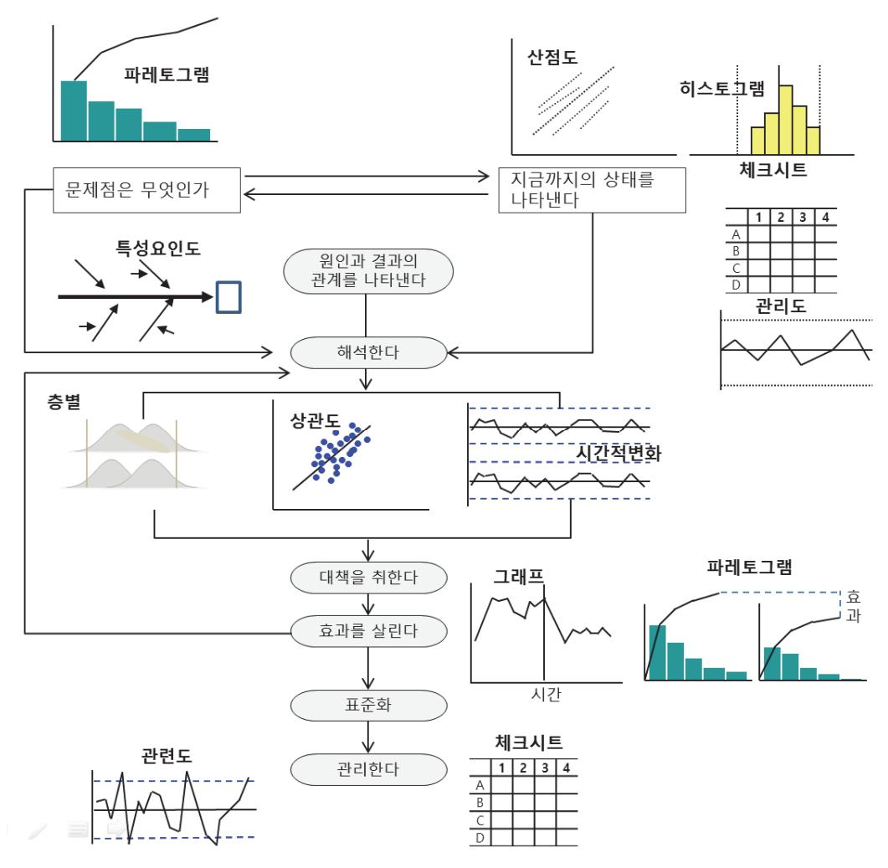

출처: 교육부(2016). 반도체 재료 생산(LM1903060409\_14v1). 한국직업능력개발원. p.76. [그림 3-10] Q.C의 7가지 도구

#### 1. 점검표(체크 시트)

프로세스의 상태 자료의 수집/정리 및 분석에 쓰일 수 있는 가장 단순한 도식적 기법으로 품질개선을 위한 기초자료수집에 많이 쓰인다. 예를 들어 작업자별/기계별/기간별 불량유형 및 발생상황 또는 불량원인별 불량품 수를 기록한 것이다.

2. 히스토그램(도수분포표)

어떤 특성치의 구간별 발생 빈도수와 제품규격의 상하한까지 포함시킴으로써 보다 체계적인 자료정리를 용이하게 할 수 있는 통계분석의 준비과정에서 가장 많이 사용하는 도식적 기 법이다.

3. 파레토도

불량품이나 결점 또는 사고 건수 등의 분석대상을 불량원인이나 불량 발생 위치별로 정리하 고, 그에 따른 영향력이 가장 큰 것부터 차례로 나열하여 누적분포표로 나타낸 도표이다.

4. 특성요인도

인과분석도(cause and effect diagram), 이시가와(Ishikawa), 어골도(fish-bone diagram)라고도 불리는 이 그래프 기법은 불량의 유형과 결과에 영향을 미친다고 생각되는 모든 요인들 간의 관계를 체계적으로 이해하기 쉽게 나타내는 데 사용된다.

5. 산점도

X, Y 두 변량 간의 상관 관계를 개략적으로 표시한 것으로 품질특성의 변화상태나 추이를 살펴봄으로써 비정상적인 사례를 가려내는 데 이용된다.

6. 층별 또는 흐름도

원인을 골라내는 방법으로 제조조건이 비슷한 것끼리 그룹으로 나누어 나타내는데 나누는 것을 층별이라고 하고 각 그룹을 층이라고 부른다. 예를 들면 특성요인도의 큰 가지는 층별 을 할 때 이용하는데 일반적으로 4M 즉, 사람(Man), 기계(Machine), 재료(Material), 방 법(Method) 등으로 나눈다.

흐름도는 프로세스의 구성요소와 이들 요소 간의 선후관계를 간략히 나타낸 그림으로 제조 공정 전체 또는 일부를 나타내어 불필요한 작업이나 비능률적인 작업방법을 가려내는 데에 도 효과적으로 사용할 수 있으며 조직 내의 각종 정보의 흐름 패턴을 나타내는 데 많이 사 용하기도 한다.

7. 관리도

프로세스의 상태를 점검하여 공정능력을 파악하고 공정의 이상유무를 판단하는데 많이 이용 되는 기법이다. 특히 관리도는 이상 원인에 의한 변동을 감지하는 데 효과적인 기법으로써 반드시 제거해야 할 불량의 원인이라 할 수 있는 통제 가능한 변동요소(기계설비의 마모, 정비 불량, 원자재의 불량, 작업자의 부주의 등)를 제거하는 데 효과적으로 쓰인다.

## 수행 내용 / 공정모니터링 실시하기

#### 재료·자료

- 공정관리업무절차도
- 작업 표준서
- QC공정관리도
- 설비운영매뉴얼(장비 운영지침서)
- 부적합품관리서
- 런 시트
- 단위공정 자료

#### 기기(장비 ・ 공구)

- 컴퓨터(프린터)
- 문서 작성 프로그램, 통계분석 프로그램

#### 안전 ・ 유의 사항

- 각 단위 공정 진행과 장비 운용 시 규정된 안전/유의 사항에 준수한다.
- 제품 및 공정에 적합한 작업 표준서를 사전에 충분히 숙지하고 공정 이상 발생 시 회의체를 구성하고 신속히 대응할 수 있어야 한다.
- 지속적인 품질개선활동을 통하여 문제의 원인요소들을 찾아내고 분석하고 개선하는 일련의 과정들이 축적되어야 한다.
- 파악된 공정데이터를 바탕으로 요인인자를 분석하고 이를 토대로 향후의 개선 방안을 도출 할 수 있어야 한다.

#### 수행 순서

숔 공정 이상 조치 업무절차를 계획 수립하고 숙지한다.

공정 이상 처리는 내부적으로 규정된 내용에 준하여 실시하되, 기준 내용은 관리 이탈된 경우 중 중요한 문제에 대한 응급조치뿐만 아니라 철저한 원인 규명과 재현성 확인을 한 후, 재발 방지를 위한 표준 반영하는 것까지 포함해야 한다.

1. 공정 이상 조치순서 및 업무 내용

(1) 초기 이상 발생

• 공정 이상 처리 절차서 상에 명기된 공정 이상 요건에 해당하는 상황이 발생한 경우 (이때 최초로 보고서가 작성된다) : 발견자 보고 및 보고서 작성 → 상위자 판단 (회의 또는 의사결정)

(2) 원인조사

- 일차적으로 응급조치 실시 (작업중단, 선별투입)
- 부적합 시료 입수 및 관련 부서 소집
- 회의실시 또는 관련 부서 의견수렴 후 Line에 대한 응급조치 실시
- 문제의 발생원인 분석을 위한 현재 공정에 대한 현상 재파악
- 기 발생된 부적합품에 대한 처리 (폐기, 재작업, 선별 후 재투입 등)

#### (3) 원인 규명 및 재발방지대책 수립

- 부적합 발생의 근본적인 원인 분석
- 돌발적인 4M 조건의 변동원인에 대한 분석 작업 실시

 - 순간정지와 같이 보고서 작성이 불필요한 경우 문제의 중요도, 정지시간이 고려된 자체기준을 설정하여 운영

- (4) 개선활동
  - 근본대책 수립 및 Follow-up 실시
  - 임시방편의 대책이 아닌 정확한 원인 분석에 의한 재발 방지대책을 수립
- (5) 재현성 확인 및 표준화
  - 재현성 확인 및 표준화
  - 대책 내용의 적합성 검증(부적합의 재발 여부 및 추이 파악, 시험 등) 실시
  - 공정관리기준(QC 공정도/작업 표준서/관리기준)에 대책 실시 내용을 반영
- 숕 공정 이상 발생 처리프로세스 업무처리를 이해하고 실시한다.

제품의 품질에 영향을 줄 것으로 의심되는 모든 공정 이상 상태에 대하여 신속하고 합리적이며 조직적 대응을 통하여 완제품의 품질을 보장하고 공정 간의 낭비 및 불합리적 요소를 제거, 개 선함에 그 목적을 두는 것으로 아래의 [그림 3-11]의 업무 흐름도를 숙지하고 공정모니터링을 실시한다.

- 1. 공정 이상 발생 시 업무처리 흐름도에 근거하여 통보절차를 실시한다.
  - (1) 작업자는 공정 이상 발생 시 즉시 작업을 중지하고 공정별 책임자에게 그 내용을 보고하며, 대상품에 대한 식별표를 부착한다.
  - (2) 공정책임자는 대상품에 대한 식별표기를 확인하고 판정대기장소로 이동 격리하고 QRS 개선

#### 1단계 "현상파악"을 실시하여 1시간 이내 생산기술부서로 공정 이상 발생을 통보한다.

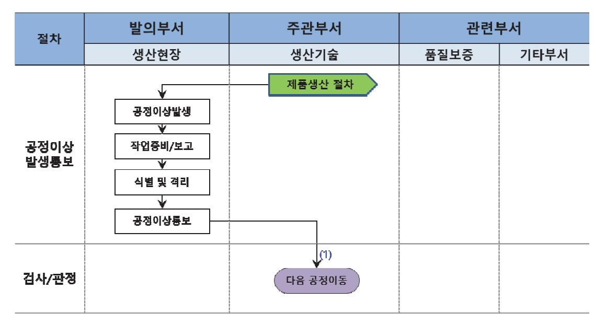

출처: 교육부(2016). 반도체 재료 생산(LM1903060409\_14v1). 한국직업능력개발원. p.80. [그림 3-11] 공정 이상 발생 시 업무처리흐름도

2. 공정 이상 발생 통보를 접수하고 개선 또는 평가 업무를 실시하여 계속 제품을 생산할지 부적품 으로 판정할지 후속 조치를 취한다.

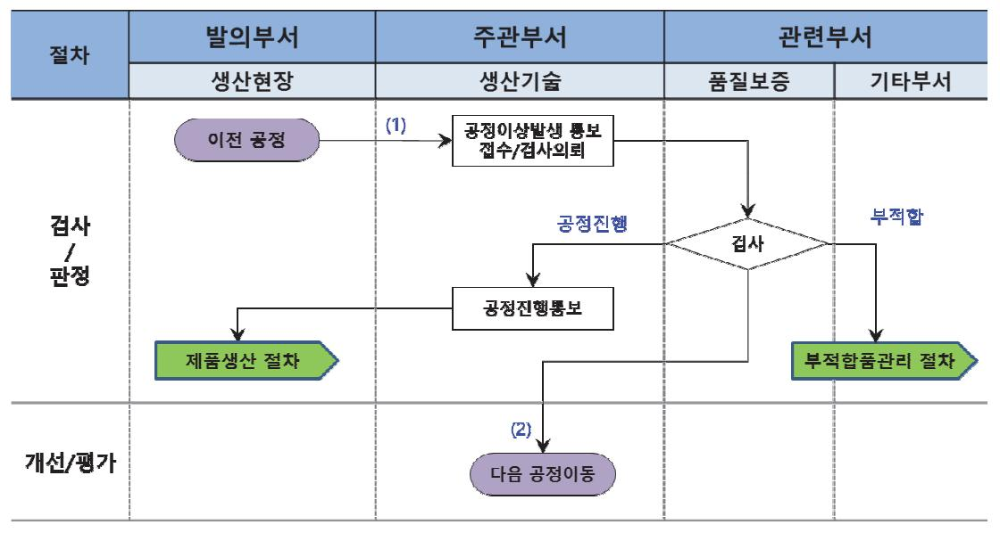

출처: 교육부(2016). 반도체 재료 생산(LM1903060409\_14v1). 한국직업능력개발원. p.80. [그림 3-12] 공정 이상 발생 접수 후 공정검사 흐름도

(1) 생산기술부서는 공정 이상 발생 통보가 접수되면 대상품 현 상태를 확인하고 4시간 이내 QRS 2단계 "긴급조치"방안을 결정하여 생산관리부서로 통보한다. 이때 필요시 품질보증부서

로 대상품에 대한 검사를 의뢰한다.

- (2) 품질보증부서는 관리계획서상의 검사항목을 기준으로 대상품에 대한 검사를 실시하여 그 결 과를 생산기술부서로 회신한다.
- (3) 대상품의 검토 결과가 공정진행 가능으로 판정된 경우 생산기술부서는 대상품의 공정진행을 공정별 책임자에게 통보한다. 단, 결과가 공정 부적합의 경우 품질보증부서로 그 내용을 이관 한다.
- 3. 공정 이상품에 대한 검토 결과가 완료되면 개선 대책 및 평가를 진행하고 관련 표준을 개정한다.

| 절차            | 발의부서 | 주관부서                      | 관련부          | 너    |
|---------------|------|---------------------------|--------------|------|
|               | 생산현장 | 생산기술                      | 품질보증         | 기타부서 |
| 개선 / 평가 |      | 이전 공정 (2) 기선계획수립/시행 | ↓ 게선유효성평가 |      |
| 표준화           |      |                           | \ 표준화/*   | 수평전개 |

출처: 교육부(2016). 반도체 재료 생산(LM1903060409\_14v1). 한국직업능력개발원. p.81. [그림 3-13] 공정 이상 발생 조치 완료 후 개선평가 흐름도

- (1) 공정 이상품의 검토 결과 조직적인 개선대책이 요구되는 사안일 경우 생산기술부서는 24시간 이내에 CFT를 소집하여 QRS 품질개선 시트의 3, 4단계를 실시하여 개선을 실시한다.
- (2) 개선 작업 완료 후 생산기술부서는 생산적용을 실시하고, 품질보증부서는 개선작업 실시 후 3개월 이내에 그 유효성을 평가하여 QRS 품질개선 시트에 기록 유지한다.
- (3) 생산기술부서는 개선 완료 시 관련 부서와 협조하여 관련표준의 개정과 유사품에 대한 수평 전개를 실시한다.

### 학습 3 교수·학습 방법

#### 교수 방법

- 작업 절차서, 작업 표준서의 작성 방법, 공정모니터링의 방법 등을 PPT 자료로 예를 들어 제시한 후에 설명한다.
- 공정 관리 단계에서 작업 절차서, 작업 표준서의 필요성에 대하여 설명하고, 표준서 작성에 필요한 항목을 도출하는 실습을 하도록 한다.
- 작업 표준서의 제정 및 개정하는 과정을 작업의 순서에 따라 단계적으로 실습이 이루어질 수 있도록 지도한다.

#### 학습 방법

- 공정관리 업무흐름도에 따른 작업 절차서, 작업 표준서, 공정모니터링에 대한 개념을 이해하 고 숙지한다.
- 작업 표준서 제·개정을 위한 문서 형식을 제작하는 단계부터 내용을 작성하는 단계뿐만 아 니라 부서 또는 구성원 간의 시스템적인 업무관계로 문서관리와 공정관리가 진행됨을 표준 문서체계를 통해 이해하고 설명하도록 한다.
- 사업장마다 공정관리 관련 업무표준과 문서양식이 다를 수 있으므로 각 문서의 목적을 명확 히 이해하고, 반도체 재료별로 특성화하여 한눈에 들어오는 형식과 쉽게 이해할 수 있는 간 결한 문장표현을 사용하여 작성실습을 한다.

### 학습 3 평 가

#### 평가 준거

• 평가자는 학습자가 학습 목표를 성공적으로 달성하였는지를 평가해야 한다.

#### • 평가자는 다음 사항을 평가해야 한다.

|            |                                                                   | 성취수준 |   |   |  |
|------------|-------------------------------------------------------------------|------|---|---|--|
| 학습 내용      | 학습 목표                                                             | 상    | 중 | 하 |  |
| 작업 절차서 작성  | - 생산을 위한 작업 절차서를 작성할 수 있다.                                        |      |   |   |  |
| 작업 표준서 작성  | - 작업 절차서를 토대로 공정운정을 위한 작업 표준서를 작성 할 수 있다.                      |      |   |   |  |
|            | - 작업 표준서에 의해 필요한 단위공정 원부재료를 파악할 수 있다.                          |      |   |   |  |
|            | - 공정진행과 목표 품질확보를 위한 공정 모니터링을 할 수 있 다.                          |      |   |   |  |
| 공정 모니터링 실시 | - 작업 표준서와 일일 작업지시서에 의해 설정된 운전조건에 따른 생산 공정을 진행할 수 있다.           |      |   |   |  |
|            | - 이상 발생 시 최단시간 내 분석을 통해 불량원인 파악과 최소 한의 수정으로 최적화된 생산을 지원할 수 있다. |      |   |   |  |

#### 평가 방법

• 사례 연구

|            |                                 | 성취수준 |   |   |  |
|------------|---------------------------------|------|---|---|--|
| 학습 내용      | 평가 항목                           | 상    | 중 | 하 |  |
| 작업 절차서 작성  | - 작업 절차서 작성 및 관리 우수사례 조사 및 발표   |      |   |   |  |
| 작업 표준서 작성  | - 작업 표준서 작성 및 관리 우수사례 조사 및 발표   |      |   |   |  |
|            | - 단위공정 원부자재 표준관리 우수사례 조사 및 발표   |      |   |   |  |
|            | - 안정된 품질관리와 공정관리 우수사례 조사 및 발표   |      |   |   |  |
| 공정 모니터링 실시 | - 생산공정능력 우수기업 또는 우수사례 조사 및 발표   |      |   |   |  |
|            | - 공정 이상 발생 시 문제 해결 우수사례 조사 및 발표 |      |   |   |  |

• 서술형 시험

|            |                                 | 성취수준 |   |   |  |  |
|------------|---------------------------------|------|---|---|--|--|
| 학습 내용      | 평가 항목                           | 상    | 중 | 하 |  |  |
| 작업 절차서 작성  |                                 |      |   |   |  |  |
| 작업 표준서 작성  | - 단위공정별 작업 표준서의 구성 및 작성항목 도출    |      |   |   |  |  |
|            | - 원부자재 포함하여 표준의 종류 및 규정에 대한 이해  |      |   |   |  |  |
|            | - 품질확보를 위한 공정모니터링 항목 및 목표설정     |      |   |   |  |  |
| 공정 모니터링 실시 | - 작업 표준서에 따른 운전조건 및 생산공정        |      |   |   |  |  |
|            | - 공정 이상 발생 시 조치절차 및 불량원인 분석접근방법 |      |   |   |  |  |

피드백

| 1. 사례 연구                                               |
|--------------------------------------------------------|
| - 작업 절차서, 작업 표준서, 공정관리모니터링 등 전반적인 공정관리 수행에 관련한 우수 사례를  |
| 제시하고 안정된 품질 관리에 효과적으로 적용하는 방법에 대해 피드백한다.               |
| 2. 서술형 시험                                              |
| - 반도체 재료별 작업장의 환경 및 공정의 특성에 따른 적절한 작업 절차서, 작업 표준서 등의 구 |
| 성과 품질확보를 위한 안정된 공정관리를 위한 모니터링 방법을 제시할 수 있어야 하며 평가결과    |
| 에 따라 보완이 필요한 부분에 대해 보충 설명을 하여 피드백 지도한다.                |

- ∙ 교육부(2016). 반도체 재료 생산관리(LM1903060409\_14v1). 한국직업능력개발원.
- ∙ 김길선 외(2011). 『녹색경영시대의 생산시스템운영관리』. 법문사.
- ∙ 김태웅(2010). 『생산운영관리의 이해』. 신영사.
- ∙ 류지철(2008). 『글로벌 경제시대의 기술경영을 포함한 생산경영』. 한올출판사.
- ∙ 이무석(2006). 공정관리. http://www.google.co.kr에서 2016. 07. 05. 검색.
- ∙ 이형옥(2006). 『집적회로 제조를 위한 반도체공정 및 장치기술』. 상학당.
- ∙ 임재석·엄명철(2008). 『생산관리』. 형설출판사.
- ∙ 타나카 카즈나리(1999). 『생산관리』. 새로운제안.
- ∙ 한국표준인증원(2015). 공정관리절차서. http://www.isoiso.or.kr에서 2016. 07. 05. 검색.
- ∙ 한국표준협회(2015). 품질문제 예방을 위한 스마트 공정관리실무. http://www.ksa.or.kr에서 2016. 07. 05. 검색.
- ∙ William J. Stevenson([2007] 2008). 『생산운영관리(Operations management)』. 강종열외(역). 지필.

## <활용 서식1> 작업 표준서

| 공 정 명 공정번호 |       |           | □ 임시 ■ 정규 | 작업표    | 표준서   | 제 개 정 이 | NO 0 1 2 | 일자    | 내용   | 3              | 작성          | 검토  | 승인    |  |
|---------------------|-------|-----------|--------------|--------|-------|------------------|-------------------|-------|------|----------------|-------------|-----|-------|--|
| 문서번호                |       |           | 적용 기간        |        |       | 력                | 3                 |       |      |                | <u>[</u>    |     |       |  |
|                     | 작업 방법 |           |              |        |       |                  |                   |       |      | 작업 조건          |             |     |       |  |
|                     |       |           |              |        |       |                  |                   |       | 2 5  |                | 기 준 상발생사 |     |       |  |
|                     |       |           |              |        |       |                  |                   | I     | 공정 ㅈ |                |             |     |       |  |
|                     | 장비/프  |           |              | 설비/치공구 | 그리 구리 | 검사 힘             | /목                | 검사 기관 | ~ _삼 | <u>플</u> 주기 | 검사 방        | 법 관 | 반리 방법 |  |
| RECIPI              | E NO. | 적용 MS NO. | 명칭           | 규결     | 교환 주기 |                  |                   |       |      | <u>수기</u>      |             |     |       |  |

## <활용 서식2> 설비점검 기준표

|                  | 번호  |      |           |     |      |            |         |        |       |     |      | 작 성    | 검 토    | 승 인      |
|------------------|-----|------|-----------|-----|------|------------|---------|--------|-------|-----|------|--------|--------|----------|
|                  |     |      |           |     |      |            |         |        |       |     | 결    | 48     | 검노     | ~ 빈      |
| 제정               | 일자  |      |           |     | 서    |            | н       | 검 기    | 즈     | I   |      |        |        |          |
| 개정               | 일자  |      |           |     | 121  | -1 E       |         |        | 군고    |     | -11  |        |        |          |
| 개정               | 번호  |      |           |     |      |            |         |        |       |     | 재    | /      | 1      | /        |
| 설법               | 비명  |      |           | 제 3 | 5설비  |            | 겯       | 엄사설비 🗌 | 치공구   |     |      | 1      |        |          |
| 점 검              | 주 기 | D:매일 | 점검        | ₩:주 | 간    | M:월간       |         | Q:분기   | Y:    | 년간  | 전원 5 | 및 기타사항 |        |          |
| 점검 순서         | 점 걷 | 넘개 소 | 점 검       | 항 목 | 주기   | 점 검 운 : | ļ Ā  | 2      | 힘 검 방 | 법   |      | 판 정 기  | 준      | 조치 사항    |
|                  |     |      |           |     |      |            |         |        |       |     |      |        |        |          |
| 급 유 기 준 | 순 서 | 급    |  유 개 소 | 2   | 급유주기 | 7          | <u></u> | 종 류    |       | 유 량 | 급    | 유 방 법  | 특기사항   | 1        |
|                  |     | 1    |           |     | 1    |            |         |        |       |     |      |        | A4(210 | X 297mm) |

| NCS학습모듈 개발이력 |                                      |     |                |  |  |
|--------------|--------------------------------------|-----|----------------|--|--|
| 발행일          | 2016년 12월 31일                        |     |                |  |  |
| 세분류명         | 반도체재료(19030604)                      |     |                |  |  |
| 개발기관         | 대덕대학교, 한국직업능력연구원                     |     |                |  |  |
|              | 김관하(대덕대학교)*                          |     | 권기백(대덕대학교)     |  |  |
|              | 강필승(메그나칩반도체)                         |     | 김동표(케이디전자)     |  |  |
|              | 김상용(한국폴리텍대학)                         |     | 박태진(대덕대학교)     |  |  |
|              | 김종식(드림테크)                            |     | 여순일(한국전자통신연구원) |  |  |
|              | 양민철(서울공업고등학교)                        |     | 정용철(한국생산기술연구원) |  |  |
| 집필진          | 우종창(이너센서)                            | 검토진 |                |  |  |
|              | 이병철(비드앤마이크로)                         |     |                |  |  |
|              | 장현경(강원대학교)                           |     |                |  |  |
|              | 정재복(메이플테크)                           |     |                |  |  |
|              | 제창한(한국전자통신연구원)                       |     |                |  |  |
|              | 홍진균((前) LG실트론)                       |     | *표시는 대표집필자임    |  |  |
| 발행일          | 2024년 12월 31일                        |     |                |  |  |
| 학습모듈명        | 반도체 재료 생산관리(LM1903060409_23v3)       |     |                |  |  |
| 개발기관         | 수원과학대학교 산학협력단(개발책임자: 김선희), 한국직업능력연구원 |     |                |  |  |

|                                                                                                          | 반도체 재료 생산관리(LM1903060409_23v3) |  |  |  |  |
|----------------------------------------------------------------------------------------------------------|--------------------------------|--|--|--|--|
| 저작권자                                                                                                     | 교육부                            |  |  |  |  |
| 연구기관                                                                                                     | 한국직업능력연구원                      |  |  |  |  |
| 발행일                                                                                                      | 2024. 12. 31.                  |  |  |  |  |
| ※ 이 학습모듈은 자격기본법 시행령(제8조 국가직무능력표준의 활용)에 의거하여 개발하였으며, NCS통합포털사이트(http://www.ncs.go.kr)에서 다운로드 할 수 있습니다. |                                |  |  |  |  |

