| 대분류/19 전기·전자 | 중분류/03 |                 |        |         |
|-----------------|--------|-----------------|--------|---------|
|                 | 전자기기개발 | 소분류/06 반도체개발 | 세분류/04 |         |
|                 |        |                 | 반도체재료  | 능력단위/10 |

# NCS학습모듈 반도체 재료 품질관리

LM1903060410\_23v3

### [NCS학습모듈 활용 시 유의 사항]

- 1. NCS학습모듈은 교육훈련기관에서 출처를 명시하고 교육적 목적으로 활용할 수 있습니다. 다 만, NCS학습모듈에는 국가(교육부)가 저작재산권 일체를 보유하지 않은 저작물(출처가 표기된 도표‧사진‧삽화‧도면 등)이 포함되어 있으므로, 이러한 저작물의 변형‧각색‧복제‧공연‧ 배포 및 공중 송신 등과 이러한 저작물을 활용한 2차적 저작물을 작성하려면 반드시 원작자 의 동의를 받아야 합니다.
- 2. NCS학습모듈은 개발 당시의 산업 및 교육 현장을 반영하여 집필하였으므로, 현재 적용되는 법령‧지침‧표준 및 교과 내용 등과 차이가 있을 수 있습니다. NCS학습모듈 활용 시 법령 ‧지침‧표준 및 교과 내용의 개정 사항과 통계의 최신성 등을 확인하시기를 바랍니다.
- 3. NCS학습모듈은 산업 현장에서 요구되는 능력을 교육훈련기관에서 학습할 수 있게 구성한 자 료입니다. 다만, NCS학습모듈 지면의 한계상 대표적 예시(예: 활용도 또는 범용성이 높은 제 품, 서비스) 중심으로 집필하였음을 이해하시기를 바랍니다.

## NCS학습모듈의 이해

※ 본 NCS학습모듈은 「NCS 국가직무능력표준」사이트(http://www.ncs.go.kr) 에서 확인 및 다운로드할 수 있습니다.

### Ⅰ NCS학습모듈이란?

- 국가직무능력표준(NCS: National Competency Standards)이란 산업현장에서 직무를 수행하기 위해 요구되는 지식·기술·소양 등의 내용을 국가가 산업부문별·수준별로 체계 화한 것으로 산업현장의 직무를 성공적으로 수행하기 위해 필요한 능력(지식, 기술, 태도) 을 국가적 차원에서 표준화한 것을 의미합니다.
- 국가직무능력표준(이하 NCS)이 현장의 '직무 요구서'라고 한다면, NCS학습모듈은 NCS
  의 능력단위를 교육훈련에서 학습할 수 있도록 구성한 '교수·학습 자료'입니다. NCS학습
  모듈은 구체적 직무를 학습할 수 있도록 이론 및 실습과 관련된 내용을 상세하게 제시하
  고 있습니다.

### ○ NCS학습모듈은 다음과 같은 특징을 가지고 있습니다.

- 첫째, NCS학습모듈은 산업계에서 요구하는 직무능력을 교육훈련 현장에 활용할 수 있도 록 성취목표와 학습의 방향을 명확히 제시하는 가이드라인의 역할을 합니다.
- 둘째, NCS학습모듈은 특성화고, 마이스터고, 전문대학, 4년제 대학교의 교육기관 및 훈 련기관, 직장교육기관 등에서 표준교재로 활용할 수 있으며 교육과정 개편 시에도 유용하게 참고할 수 있습니다.

○ NCS와 NCS학습모듈 간의 연결 체계를 살펴보면 아래 그림과 같습니다.

O NCS학습모듈의 위치는 NCS 분류 체계에서 해당 학습모듈이 어디에 위치하는지를 한 눈에 볼 수 있도록 그림으로 제시한 것입니다.

| [NCS-학          | 습모듈              | 의 위치]    |          |  |
|-----------------|------------------|----------|----------|--|
|                 |                  |          |          |  |
| 대분류             | 개분류 문화·예술·디자인·방송 |          |          |  |
| 중분류             | 문화콘텐츠            |          |          |  |
| 소분류             | 문화콘텐츠제작          |          |          |  |
|                 |                  |          |          |  |
| 세분류             |                  |          |          |  |
| 방송콘텐츠제작         |                  | 능력단위     | 학습모듈명    |  |
| 영화콘텐츠제작         |                  | 프로그램 기획  | 프로그램 기획  |  |
| 음악콘텐츠제작         |                  | 아이템 선정   | 아이템 선정   |  |
| 광고콘텐츠제작         |                  | 자료 조사    | 자료 조사    |  |
| 게임콘텐츠제작         |                  | 프로그램 구성  | 프로그램 구성  |  |
| 애니메이션 콘텐츠제작  |                  | 캐스팅      | 캐스팅      |  |
| 만화콘텐츠제작         |                  | 제작계획     | 제작계획     |  |
| 캐릭터제작           |                  | 방송 미술 준비 | 방송 미술 준비 |  |
| 스마트문화앱 콘텐츠제작 |                  | 방송 리허설   | 방송 리허설   |  |
| 영사              |                  | 야외촬영     | 야외촬영     |  |
|                 |                  | 스튜디오 제작  | 스튜디오 제작  |  |
|                 |                  |          |          |  |

학습모듈은

NCS 능력단위 1개당 1개의 학습모듈 개발 을 원칙으로 합니다. 그러나 필요에 따라 고용단위 및 교과단위를 고려하여 능력단위 몇 개를 묶어 1개 학습모듈로 개발할 수 있으며, NCS 능력단위 1개를 여러 개의 학습모듈로 나누어 개발할 수도 있습니다.

### 2. NCS학습모듈의 개요

### ○ NCS학습모듈의 개요는 학습모듈이 포함하고 있는 내용을 개략적으로 설명한 것으로

| 학습모듈의 목표, 선수학습, 학습모듈의 내용 체계, 핵심 용어 로 구성되어 있습니다. |                                                                              |  |
|-------------------------------------------------|------------------------------------------------------------------------------|--|
| 학습모듈의 목표                                        | 해당 NCS 능력단위의 정의를 토대로 학습 목표를 작성한 것입니다.                                        |  |
| 선수학습                                            | 해당 학습모듈에 대한 효과적인 교수·학습을 위하여 사전에 이수해야 하는 학습모 듈, 학습 내용, 관련 교과목 등을 기술한 것입니다. |  |
| 학습모듈의 내용 체계                                  | 해당 NCS 능력단위요소가 학습모듈에서 구조화된 체계를 제시한 것입니다.                                     |  |
| 핵심 용어                                           | 해당 학습모듈의 학습 내용, 수행 내용, 설비·기자재 등 가운데 핵심적인 용어를 제 시한 것입니다.                   |  |

### 제작계획 학습모듈의 개요

#### 학습모듈의 목표

본격적인 촬영을 준비하는 단계로서, 촬영 대본을 획정하고 제작 스태프를 조직하며 촬영 장비와 촬영 소품을 준비할 수 있다.

#### 선수학습

제작 준비(LM0803020105\_13v1), 섭외 및 제작스태프 구성(LM0803020104\_13v1), 촬영 제작(LM0803020106\_13v1), 촬영 장비 준비(LM0803040204\_13v1.4), 미술 디자인 협의하기(LM0803040203\_13v1.4)

### 학습모듈의 내용체계

| 하스                | 하는 데이                                              | NCS 능력단위 요소       |                |
|-------------------|----------------------------------------------------|-------------------|----------------|
| 학습                | 학습 내용                                              | 코드번호              | 요소 명칭          |
| 1. 촬영 대본 확정하기  | 1-1. 촬영 구성안 검 토와 수정                             | 0803020114_16/3.1 | 촬영 대본 확정하기  |
| 2. 제작 스태프 조직하기 | 2-1. 기술 스태프 조직 2-2. 미술 스태프 조직 2-3. 전문 스태프 조직 | 0803020114_16v3.2 | 제작 스태프 조직하기 |
| 3. 촬영 장비 계획하기  | 3-1. 촬영 장비 점검 과 준비                              | 0803020114_16/3.3 | 촬영 장비 계획하기  |
| 4. 촬영 소품 계획하기  | 4-1. 촬영 소품 목록 작성 4-2. 촬영 소품 제작 의뢰         | 0803020114_16\3.4 | 촬영 소품 계획하기  |

### 핵심 용어

촬영 구성안, 제작 스태프, 촬영 장비, 촬영 소품

### 학습모듈의 목표는

학습자가 해당 학습모듈을 통해 성취해야 할 목표를 제시한 것으로, 교수자는 학습자 가 학습모듈의 전체적인 내용흐름을 파악하 도록 지도할 수 있습니다.

**6** • •

61

### 선수학습은

교수자 또는 학습자가 해당 학습모듈을 교 수·학습하기 이전에 이수해야 하는 교과목 또는 학습모듈(NCS 능력단위) 등을 표기한 것입니다. 따라서 교수자는 학습자가 개별 학습, 자기 주도 학습, 방과 후 활동 등 다 양한 방법을 통해 이수할 수 있도록 지도하 는 것을 권장합니다.

|            | 핵심 용어는              |
|------------|---------------------|
|            | 률을 대표하는 주요 용어입니     |
|            | · 해당 학습모듈을 통해 학습    |
|            | 게될 주요 내용을 알 수 있습    |
|            | 5 국가직무능력표준」 사이트     |
| (www.ncs.g | jo.kr)의 색인 (찾아보기) 중 |
| 하나로 이용할    | 할 수 있습니다            |

### 3. NCS학습모듈의 내용 체계

○ NCS학습모듈의 내용은 크게 학습, 학습 내용, 교수·학습 방법, 평가 로 구성되어 있습니다.

| 학습       | 해당 NCS 능력단위요소 명칭을 사용하여 제시한 것입니다. 학습은 크게 학습 내용, 교수·학습 방법, 평가로 구성되며 해당 NCS 능력단위의 능력단위 요소별 지식, 기술, 태도 등을 토대로 내용을 제시한 것입니다.                                                    |
|----------|----------------------------------------------------------------------------------------------------------------------------------------------------------------------------------|
| 학습 내용    | 학습 내용은 학습 목표, 필요 지식, 수행 내용으로 구성되며, 수행 내용은 재료·자 료, 기기(장비·공구), 안전·유의 사항, 수행 순서, 수행 tip으로 구성한 것입니다. 학습모듈의 학습 내용은 실제 산업현장에서 이루어지는 업무활동을 표준화된 프로세 스에 기반하여 다양한 방식으로 반영한 것입니다. |
| 교수·학습 방법 | 학습 목표를 성취하기 위한 교수자와 학습자 간, 학습자와 학습자 간 상호 작용이 활발하게 일어날 수 있도록 교수자의 활동 및 교수 전략, 학습자의 활동을 제시한 것입니다.                                                                            |
| 평가       | 평가는 해당 학습모듈의 학습 정도를 확인할 수 있는 평가 준거 및 평가 방법, 평 가 결과의 피드백 방법을 제시한 것입니다.                                                                                                         |

## [NCS-학습모듈의 위치]

| 대분류 | 전기·전자 |        |       |  |  |  |
|-----|-------|--------|-------|--|--|--|
| 중분류 |       | 전자기기개발 |       |  |  |  |
| 소분류 |       |        | 반도체개발 |  |  |  |

| 세분류 |  |
|-----|--|
|     |  |

|  | 능력단위                 | 학습모듈명                |
|--|----------------------|----------------------|
|  | 반도체용 웨이퍼 재료 제조       | 반도체용 웨이퍼 재료 제조       |
|  | 반도체용 금속(Target)재료 제조 | 반도체용 금속(Target)재료 제조 |
|  | 반도체용 패키지 재료 제조       | 반도체용 패키지 재료 제조       |
|  | 반도체 재료 개발            | 반도체 재료 개발            |
|  | 반도체 재료 생산관리          | 반도체 재료 생산관리          |
|  | 반도체 재료 품질관리          | 반도체 재료 품질관리          |
|  | 반도체 재료 안전관리          | 반도체 재료 안전관리          |
|  | 반도체용 마스크 재료 제조       | 반도체용 마스크 재료 제조       |
|  | 반도체용 플립칩 재료 제조       | 반도체용 플립칩 재료 제조       |
|  | 반도체용 CMP 재료 제조       | 반도체용 CMP 재료 제조       |
|  | 반도체용 식각공정 가스 제조      | 반도체용 식각공정 가스 제조      |
|  | 반도체용 세정공정 가스 제조      | 반도체용 세정공정 가스 제조      |
|  | 반도체용 박막공정 가스 제조      | 반도체용 박막공정 가스 제조      |
|  |                      |                      |

| 반도체용 이온주입공정 가스 제조 | 반도체용 이온주입공정 가스 제조 |
|-------------------|-------------------|
| 반도체용 박막공정 전구체 제조  | 반도체용 박막공정 전구체 제조  |
| 반도체용 포토공정 재료 제조   | 반도체용 포토공정 재료 제조   |
| 반도체용 트랙공정 재료 제조   | 반도체용 트랙공정 재료 제조   |
| 반도체용 SOD공정 재료 제조  | 반도체용 SOD공정 재료 제조  |
| 반도체용 박막도금공정 재료 제조 | 반도체용 박막도금공정 재료 제조 |
| 반도체용 세정공정 재료 제조   | 반도체용 세정공정 재료 제조   |
| 반도체용 CMP슬러리 재료 제조 | 반도체용 CMP슬러리 재료 제조 |

| 학습모듈의 개요                 | 1  |
|--------------------------|----|
| 학습 1. 반도체 재료 규격 검토하기     |    |
| 1-1. 재료 품질 및 사양          | 3  |
| 1-2. 원부재료 선정 및 기준        | 9  |
| • 교수・학습 방법               | 18 |
| • 평가                     | 19 |
| 학습 2. 반도체 재료 검사하기        |    |
| 2-1. 품질평가 계획 수립          | 22 |
| 2-2. 장비선정 및 샘플준비         | 32 |
| 2-3. 시험성적서 작성            | 45 |
| • 교수・학습 방법               | 49 |
| • 평가                     | 50 |
| 학습 3. 반도체 재료 품질 유지・개선하기  |    |
| 3-1. 품질문제 재발방지 및 개선방안 수립 | 54 |
| 3-2. 품질문제 원인파악           | 64 |
| 3-3. 품질개선안 유지관리          | 73 |
| • 교수・학습 방법               | 82 |
| • 평가                     | 83 |
|                          |    |

### 학습 4. 반도체 재료 품질이슈 대응하기

| 4-1. 고객품질문제 원인분석 및 대책 수립 | 87 |
|--------------------------|----|
| 4-2. 결과보고서 및 개선조치        | 92 |
| • 교수・학습 방법               | 97 |
| • 평가                     | 98 |
|                          |    |

|  | 참고 자료 |  | 102 |  |  |
|--|-------|--|-----|--|--|
|--|-------|--|-----|--|--|

## 반도체 재료 품질 관리 학습모듈의 개요

### 학습모듈의 목표

반도체 재료 개발 및 양산 과정에서 일어나는 수입검사, 규격검사, 출하검사, 외주품질 관리, 공정능력평가 등의 직무에 있어 품질문제를 해결할 수 있다.

### 선수학습

Photo 장비 운영(1903060201\_14v3), Etch 장비 운영(1903060202\_14v3), 반도체제조

### 학습모듈의 내용체계

|                |                             | NCS 능력단위 요소       |             |  |  |
|----------------|-----------------------------|-------------------|-------------|--|--|
| 학습             | 학습 내용                       | 코드번호              | 요소 명칭       |  |  |
| 1. 반도체 재료 규격   | 1-1. 재료 품질 및 사양             | 1903060410_23v3.1 | 반도체 재료      |  |  |
| 검토하기           | 1-2. 원부재료 선정 및 기준           |                   | 규격 검토하기     |  |  |
|                | 2-1. 품질평가 계획 수립             |                   |             |  |  |
| 2. 반도체 재료 검사하기 | 2-2. 장비선정 및 샘플준비            | 1903060410_23v3.2 | 반도체 재료 검사하기 |  |  |
|                | 2-3. 시험성적서 작성               |                   |             |  |  |
| 3. 반도체 재료 품질   | 3-1. 품질문제 재발방지 및 개선방안 수립 |                   | 반도체 재료 품질   |  |  |
| 유지·개선하기        | 3-2. 품질문제 원인파악              | 1903060410_23v3.3 | 유지·개선하기     |  |  |
|                | 3-3. 품질개선안 유지관리             |                   |             |  |  |
| 4. 반도체 재료 품질이슈 | 4-1. 고객품질문제 원인분석 및 대책 수립 | 1903060410_23v3.4 | 반도체 재료 품질이슈 |  |  |
| 대응하기           | 4-2. 결과보고서 및 개선 조치          |                   | 대응하기        |  |  |

### 핵심 용어

반도체 재료, 반도체 원부자재, 반도체 규격, 반도체 품질, 반도체 공정 관리, 고객품질검사

| 학습 1 | 반도체 재료 규격 검토하기    |
|------|-------------------|
| 학습 2 | 반도체 재료 검사하기       |
| 학습 3 | 반도체 재료 품질 유지·개선하기 |
| 학습 4 | 반도체 재료 품질이슈 대응하기  |

## 1-1. 재료 품질 및 사양

학습 목표 • 반도체 재료 생산에 필요한 재료의 사양을 제시할 수 있다.

## 필요 지식 /

생산하고자 하는 반도체의 제품에 따라 재료 규격이 결정된다. 재료 규격은 재료 기준서에 명시되어 있 어야 한다. 규격에 맞는 제품을 생산하기 위해서는 생산자가 재료 기준서와 재료 사양서를 정확히 파악 해야 하고, 아울러 재료의 품질 관리에 대한 이해가 선행되어야 한다.

숔 표준과 규격

반도체의 재료에 대한 품질 관리와 재료의 표준과 규격에 대해 살펴보면 다음과 같다.

1. 표준

국내에서 표준의 정의는 '산업 표준이란 광공업품의 종류‧형상‧생산 방법‧시험‧검사 방 법 및 제품‧서비스의 기술에 관한 용어 등을 통일화하고 단순화하기 위한 기준'이라고 표 준을 정의하고 있다.( 「국가표준기본법」(법령 제10615호, 시행 2011. 10. 29.)의 제3조) 그 리고 국제표준에서는 '재료, 공정 및 서비스가 그 목적에 부합한다는 것을 보증하기 위해 규칙‧지침‧개념‧규정으로 일관되게 활용할 기술적 명세와 세부적인 기준'(국제표준화기구 (ISO/IEC)의 'ISO/IEC Guide 2')이라고 정의하고 있다. 산업 표준은 산업현장에서 실질적 으로 사용되는 "기술 시방서(TS: Technical Specification)"라고 표현되며, 일반적으로 표 준 또는 규격이라고 부른다. 이는 산업 현장에서 공용할 수 있는 기술자들 간의 대화를 가 능하게 하는 기술적 언어로서, 기술 개발이 체계적으로 추진될 수 있는 기반을 제공하고 있 다. 따라서, 산업 표준은 속성상 기술 개발 결과의 다른 표현이기도 하며, 기술적 언어를 문서화한 것이라고 할 수 있다.

### 2. 표준의 종류

표준에는 표준의 적용 범위 및 표준 작성의 주체에 따라 국제, 국가, 단체, 사내 표준 등 이 있다.

(1) 국제 표준

전 세계 각 나라의 관련 단체가 회원이 될 수 있는 표준화 단체로써 국제 표준화 기관 이 제정하여 국제적으로 적용되는 규격이다.

- (가) ISO (International Organization for Standardization: 국제표준화기구)
- (나) IEC (International Electrotechnical Commission: 국제전기기술위원회)
- (다) ITU (International Telecommunication Union: 국제전기통신연합)
- (2) 국가 표준

국가 표준은 특정 국가에서 제정하여 사용되는 규격으로 국가 규격 기관이 채택한 규격 이다.

- (가) 한국 KS(Korean Industrial Standards, 한국산업표준)
- (나) 일본 JIS(Japanese Industrial Standards)
- (다) 영국 BS(British Standards)
- (라) 미국 ANSI(American National Standards Institute)
- (마) 독일 DIN(Deutsches Institut für Normung)
  - 한국산업표준(KS)은 「산업표준화법」(법령 제1226010호, 시행 2014. 5. 20.)에 따라 서 산업표준심의회의 심의를 거쳐 기술표준원장이 고시함으로써 확정되는 국가 표준 이다. 한국산업표준은 기본 부문(A)부터 정보 부문(X)까지 21개 부문으로 구성되며, 크게 제품, 방법, 전달표준으로 구별하여 세 가지로 구분 한다.
    - 1) 제품 표준: 제품의 형상‧치수‧품질 등을 규정한 것
    - 2) 방법 표준: 시험‧분석‧검사 및 측정 방법, 작업 표준 등을 규정한 것
    - 3) 전달 표준: 용어‧기술‧단위‧수열 등을 규정한 것
- (3) 단체 표준
  - 특정 단체인 업계, 단체, 학회 등 에서 제정하여 사용하는 표준을 말한다.
  - (가) 미국 ASTM (American Society for Testing and Materials, 미국재료시험협회)
  - (나) IEEE(Institute of Electrical and Electronics Engineers, 전기전자기술자협회)
  - (다) 유럽 RILEM (Reunion Internationale des Laboratoires et Experts des Materiau x)는세계적으로 유명한 단체 표준이다.
- (4) 사내 표준
  - 특정 회사 내에서 회사의 규격이나 규정을 사용되는 표준을 말한다.

(가) 규정(regulation)

한회사의 사내 표준의 내용에 따라 업무에 관계되는 임무, 책임, 권한, 절차, 양식 등에 대해서 정한 표준이다.

(나) 규격(standard)

제품, 반제품, 부품, 원재료 등에 요구되는 각종 특성, 성능, 치수, 작업방법, 검사, 시험 방법, 포장, 표시, 단위, 기호 등과 같이 주로 제품이나 기술에 관한 표준이다. 사내 표준에서 제품이나 기술에 관한 표준인 규격은 다음과 같이 분류할 수 있다.

- 1) 품질 규격
  - 가) 물품의 품질 규격

구입 또는 자체 제조한 재료, 부품, 제품 등 규격

나) 특성을 중심으로 규격

치수, 형상, 구조, 성능, 성분, 등급, 포장, 표시 등 규격

- 2) 방법 규격
  - 품질 규격에서 규정한 품질의 물품을 제조하기 위한 생산 방법, 작업 방법, 시험
  - 및 검사 방법, 업무 절차 등 주로 방법과 절차 등에 대한 규격이다.
  - 가) 기술적인 규격

작업 표준이나 검사 규격과 같은 기술적인 사항

나) 업무 절차 규격

클레임 처리 규정이라든지 구매 업무 규정 등을 작성

- (다) 기본 규격
  - 1) 용어, 단위, 기호, 양식, 정의, 공식, 계산 방법 등과 같은 기본적인 사항
  - 2) 단위 환산표나 재료 색상별 표준 등
  - 3) 공장의 경우 일반적으로 기술 표준이나 설계 표준 등에 포함
  - 4) 사내 표준에서 규격 내용 중 재료 규격과 시험 방법, 검사 규격 등을 따로 시방 (specification)이라고 구분하여 사용
- 3. 반도체 재료 규격과 제품 규격

반도체 재료 제조와 관련한 규격에는 다음과 같이 구분할 수 있다.

- 재료를 제조하기 위해 구매 또는 자체 합성 제조하는 원료들에 대한 원료 규격
- 제조 공정 중의 반제품에 대한 반제품 규격
- 최종 제조 완료된 반도체 재료에 대한 제품 규격
- (1) 반도체 원료 관련 기술 자료
  - (가) 원료의 품질 항목별 시험 방법과 품질 특성치 기준(범위, 최대값, 최소값)
  - (나) 원료 규격에 품질 특성 항목과 추가 항목들에 대해 대표 성질(typical properties/values)

- (다) 원료가 실제로 납품 공급될 때 원료와 함께 시험 성적서(certificate of analysis)
- (라) 해당 원료 로트(lot)에 대한 품질 특성 항목별 실제 시험 결과 (규격 내 합격 여부와 품 질 특성치를 확인)
- (마) 원료의 취급‧보관‧사용 시의 인체에 대한 안전 및 환경에 대한 영향
- (바) 비상시 조치 사항 등이 제시된 물질안전보건자료(MSDS: Material Safety Data Sheet)
- (사) 화학 성분 명칭, 함량, 그리고 물리‧화학적 성질을 확인할 수 있는 중요한 기술적 자료
- (아) 원료 공급자가 제시하는 원료 규격(technical specification)
- (2) 반도체 재료 제품 관련 기술 자료

반도체 재료 제품 품질에 관련된 기술적인 자료에는 합성 제조 공정의 품질 관리를 위 한 반제품 규격과 재료 제품에 대한 규격이 있다.

- (가) 품질 항목별 시험 방법과 품질 특성치 기준
- (나) 생산 관리 및 품질 관리를 위한 사내 규격
- (다) 반도체 재료를 외부에 공급‧판매하기 위한 대외공급 규격
- (라) 반도체 재료 제품이 실제로 판매‧공급될 때 시험 성적서(certificate of analysis)
- (마) 반도체 재료 로트에 대한 품질 특성 항목별 실제 시험 결과
- (바) 반도체 재료 제품에 대한 물질안전보건자료(MSDS)

## 수행 내용 / 반도체 원료 규격 관리하기

### 재료·자료

- 반도체 원재료 기술 자료
- 반도체 원재료 사내 규격, 반도체 원재료 KS 규격, 반도체 원재료 첨가물 기준 및 규격
- 반도체 원재료 MSDS

기기(장비 ・ 공구)

컴퓨터, 인터넷, 화이트 보드, 빔 프로젝터, 복사기 등

### 안전 ・ 유의 사항

- 해당 원재료에 대한의 화학적 구조와 특성을 이해한다.
- 해당 원재료의 품질 특성 항목 및 시험 방법을 이해한다.
- 해당 원재료의 원료 규격, 표준 시험 방법 등의 방법을 이해한다.

수행 순서

- 숔 해당 원재료 관련 자료를 분석한다.
  - 1. 해당 원재료 사내 규격을 확인한다.

현재 활용 중인 해당 원재료의 사내 규격(원료 기준서)에서 규격 번호, 규격 제정 일 자, 품질 특성 항목, 품질 특성 기준치, 시험 방법 등을 확인한다.

- 2 해당 원재료의 국제 규격, 국가 규격, 단체 규격, 공급자 규격을 확인한다.
  - (1) KS 규격

해당 원재료의 품질 특성 항목과 기준치, 시험 방법을 확인한다. (한국산업표준)

(2) 공급자 규격

해당 원재료를 제조하여 공급하는 업체로부터 제공받은 해당 원재료 규격에서 원재료의 품질 특성 항목과 기준치, 시험 방법을 확인한다.

3. 해당 원재료의 물질안전보건자료(MSDS)를 확인한다.

해당 원재료의 입수한 MSDS 자료에서 성분 및 조성, 물리적‧화학적 성질, 기타 참고 사 항을 확인한다. (참고: 한국산업안전보건공단(http://www.kosha.or.kr/, http://msds.kosh a.or.kr/)

4. 해당 원재료의 품질 검사 이력을 확인한다.

해당 원재료의 구매 입고 시 받은 시험 성적서와 시험 분석 결과를 확인한다.

1. 해당 원재료의 규격을 〈표 1-1〉과 같이 비교 · 정리할 표를 작성한다.

2 해당 원재료의 규격 자료를 정리한다.

〈표 1-1〉 반도체 원재료 규격 비교표 (예)

8

• 반도체 해당 원재료의 내부 규격을 이해하고 품질 특성 항 목을 설정한다.

대한민국

|                |                  | KS M 1112(2011) |                                           | 약전(20           | 한민국 14.12.05.) | MSDS                 |
|----------------|------------------|-----------------|-------------------------------------------|-----------------|-------------------|----------------------|
|                | 구분               | 품질특성치 기준     | 품질특성 시험방법                              | 품질 특성치 기준 | 품질특성 시험방법      | (산업안전공단): 100% 기준 |
| 화학적 성분         |                  |                 | H2O2(분자량 34                               | .01) CAS N      | o: 7722-84-1      |                      |
|                | 과산화수소함량 (%)   | 35.0% 이상        | 과망가니즈산 칼륨용액으로 적정                    |                 |                   |                      |
|                | 증발찌꺼기            | 0.10% 이하        | 105~110℃ 에서 2시간                        |                 |                   |                      |
|                | 유리산 (H₂SO₂로서) | 0.05%이하         | 수산화나트륨 용액으로적정                          |                 |                   |                      |
| 품질 특성 항목 | 안정도              | 97.0%이상         | 5시간 물 중탕 가열후 과망가니즈칼 륨 용액으로 적정 |                 |                   |                      |
|                | pН               |                 |                                           |                 |                   | 5.1 (90wt%농도)     |
|                | 용해도              |                 |                                           |                 |                   | 100g/100mL (25℃)  |
| 포장단            | 난위에 표시할 사항       |                 | 제조 연월일, 또는 그 약호                        |                 |                   |                      |
| 저장 안전보건        |                  |                 |                                           |                 |                   | 환기가 잘 되는 곳에 밀폐 저장 |

수행 tip

## 1-2. 원부재료 선정 및 기준

학습 목표 • 반도체 재료 생산에 필요한 원부재료를 선정할 수 있다. • 반도체 재료 생산에 필요한 재료의 기준을 이해할 수 있다.

## 필요 지식 /

- 숔 반도체 원부재료 선정 및 기준
  - 1. 반도체 원․부재료의 주요 관리 내용
    - (1) 반도체 원․부재료의 검수 및 자료 관리
    - (2) 반도체 원․부재료의 로트(LOT) 표시 및 기록 관리
    - (3) 반도체 원․부재료의 식별 및 기록 관리
    - (4) 반도체 원․부재료의 취급 및 저장 상태 관리
    - (5) 반도체 부적합 재료의 식별 및 처리 상태 관리
  - 2. 반도체 원․부재료의 검사 절차
    - (1) 자재관리 또는 생산 담당 부서는 입고된 반도체 원․부자재에 대한 검사를 품질관리 담당 부서 에 검사하도록 의뢰한다.
    - (2) 품질관리 담당 부서는 입고된 반도체 원․부재료에 대해 반도체 원․부재료 규격, 시험성적서를 확인하여 검사를 실시한다.
      - (가) 신규 반도체 원재료의 경우 원료 구매 부서를 통해 검사를 실시한다.
      - (나) 신규 반도체 원재료의 경우 검증 결과만 의뢰 부서로 통보하며, 적용 유무는 생산 팀과 협의 결정한다.
      - (다) 반도체 원부재료 검사 결과 합격 여부를 기록한다.
      - (라) 필요시 참고적으로 원․부재료에 대해 자체적으로 시험하여 관리할 수 있다.
    - (3) 품질관리 담당 부서는 검사를 할 수 없거나 할 필요가 없는 반도체 원․부재료에 대해 비검사 항목으로 선정하여 관리한다. 다만 정기적으로 공급 업체로부터 시험 성적서를 받는다.
    - (4) 품질관리 담당 부서는 검사 결과를 의뢰 및 필요한 해당 부서에 통보한다.
    - (5) 반도체 원.부재료가 부적합품으로 검사 결과가 판정되면 부적합품 관리절차에 따라 처리한다.
    - (6) 긴급 불출 원․부재료

(가) 내규에 지침에 준하여 사전 검사 없이 긴급 불출되어 사용되는 원․부재료에 대해서는 사

후 검사를 실시한다.

- (나) 사후 검사 결과, 부적합 원․부재료는 사용을 중지시키고 회수하여 부적합품 내규 관리절 차에 따라 처리한다.
- (다) 이미 부적합 원․부재료가 생산 공정에 사용된 경우에는 해당 원료를 사용한 반도체 제품 에 대한 공정 분석을 실시하여 이상 유무를 판단될 때까지 제품을 보류한다.
- 3. 원․부재료의 주요 수입검사 내용
  - (1) 거래 업체로부터 원․부재료가 입고되면 거래명세표나 납품처의 송장 등과 대조, 수량 및 중량 등을 확인하여 담당 부서로 송부한다.
  - (2) 담당 부서는 거래 업체가 보낸 필요 서류 또는 검사 기록들을 확인한 후 수입검사를 실시한 다.
  - (3) 담당 부서는 주원료의 경우 검사 지침서에 의거, 규정 시료를 채취․시험한 후 검사 성적서를 작성하고, 그 외 품목은 업체에서 제출한 자체 시험성적서 또는 공인 기관 시험성적서를 확 인한 후 관능검사와 수량검사를 실시하여 그 내용을 원료검수일지에 기록하여 관리한다.
  - (4) 검사자는 검사 성적서에 품명, 규격, 로트 크기, 시료 크기, 기준치, 측정치, 종합 판정, 검사 일자, 검사자 등을 기록한다.
  - (5) 회사에서 실시할 수 없는 시험, 검사 항목에 대하여는 외부 공인 시험 기관에 분석 의뢰한다.
- 4. 반도체 원․부재료의 관리 로트 번호 부여
  - (1) 반도체 원․부재료의 수입, 생산 및 출하과정을 공정별 로트 번호를 부여하여 중간검사 단위체 로 생산함으로써 모든 작업자의 양적, 질적 업무 능력 정도를 파악한다.
  - (2) 제조 장비, 제조 방법, 재료 이상 발생 시 조기 진단이 원활하고 고객 불만 요구가 있을 시 원인을 신속, 정확하게 파악함으로써 불량의 재발 방지, 적절한 불만 처리의 가능 및 제품의 품질제고에 도움을 준다.
  - (3) 반도체 원․부재료 로트 번호 부여 방법

 원․부재료는 로트 번호를 입하 연월일을 기준으로 표기한다. 단, 로트 구성이 일정 기간으로 설정되었을 때는 최초의 입하 연월일로 한다.

- 보기: N 16 06 24

(4) 공정 및 제품 로트 번호 부여 방법

 제품의 로트 번호는 작업 또는 출하 연월일을 기준으로 하며 필요시 작업 또는 출하 연월일 뒤에 현장별 출하 순위별로 일련번호를 부여할 수 있다.

- 보기: 16 06 24

(5) 중간검사

중간 검사에서 제품 로트의 이상 발생 시는 각 관련 공정의 점검 및 진행 사항을 확인할 수

있어야 한다.

(6) 제품검사

 제품 로트의 추적은 제품의 로트 번호 및 납품서를 확인하여 불만 요인 분석을 전 생산 활동 에 대한 검사(제품검사) 및 체크 리스트로 확인할 수 있어야 한다.

5. 반도체 원․부재료의 검사 방법

반도체 원․부재료의 시험 주관 부서에서의 기록 및 관리 사항 내용

- (1) 반도체 원․부재료, 제품 규격 및 검사 규격의 제․개정, 폐기 관리
- (2) 반도체 원․부재료와 포장 재료 수입검사 실시 및 제품의 분석 결과에 대한 합․부 판정과 기록 관리
- (3) 현장에서의 검사 절차

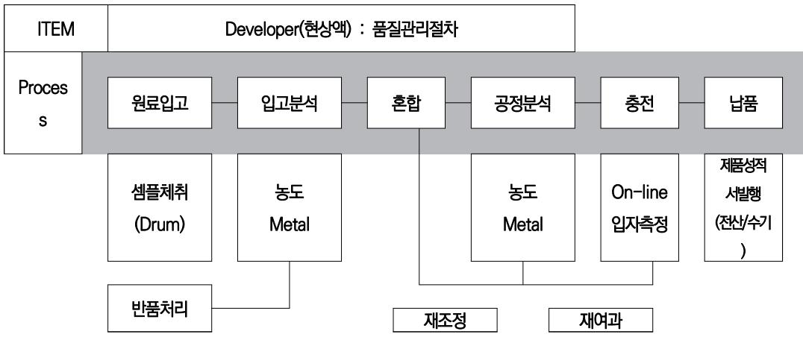

출처: 교육부(2016). 반도체 재료 품질관리(LM1903060410\_14v1). 한국직업능력개발원. p.11. [그림 1-1] 반도체원재료 수입검사 절차(예)

6. 원․부재료의 승인

적절한 원․부재료를 승인함으로써 고객의 요구를 만족시키는 제품을 생산하기 위한 명확한 절차를 수립하고 유지하는 것이다.

7. 원․부재료 승인 검토

반도체 원․부재료 승인 검사 담당자는 단계별 결과에 대해 관련 부서와 검토를 실시한다.

- (1) 공급 업체의 품질 보증서
- (2) 적용 시험
- (3) 파일럿 생산 분석
- (4) 양산 설비에서 초기 생산
- (5) 원․부재료 품질 분석

- (6) 기술 자료 검토
- (7) 공급 업체의 외관 승인 보고서
- (8) 검사 기준서
- (9) 관리 계획서, 공정도 요청
- 8. 승인 검증
  - (1) 기존 승인된 원․부재료 품질과의 비교
  - (2) 기존 원․부재료 규격과의 비교
  - (3) 생산 제품의 분석 및 업체 실증의 실시
  - (4) 배포 전 승인 단계별 문서의 검토
- 9. 원․부재료 승인 완료
  - (1) 승인 검사 담당자는 승인 검사 완료 보고서를 작성
- 10. 외주 업체 평가/등록
- - (1) 승인된 원․부재료의 공급 업체에 대해 공급 원․부재료의 규격을 상호 합의
  - (2) 외주 업체 평가 절차서에 의거, 평가를 실시
  - (3) 공급 업체로 등록
- 11. 원․부재료 입고검사 점검표

| 작성                      |                                              |           |                                      |  |           |   |      | 작성 |    | 검토       | 승인 |
|-------------------------|----------------------------------------------|-----------|--------------------------------------|--|-----------|---|------|----|----|----------|----|
| 부서                      |                                              |           | 원부재료 입고검사 점검표                        |  |           |   |      |    |    |          |    |
| 점검                      |                                              |           |                                      |  |           | 결 |      |    |    |          |    |
| 주기                      | 작성 양호(○)불량X)                              |           |                                      |  |           | 재 |      |    |    |          |    |
|                         |                                              |           |                                      |  |           |   | /    |    | /  | /        |    |
| 범례                      |                                              |           |                                      |  |           |   |      |    |    |          |    |
| 입고일 : 2016년 8월 20일(수요일) |                                              |           |                                      |  |           |   |      |    |    |          |    |
| 품명                      |                                              |           |                                      |  |           |   |      |    |    |          |    |
| (원부재료)                  |                                              |           |                                      |  |           | 산 | 지    |    |    |          |    |
| 입고 업체명                  |                                              |           |                                      |  |           |   | 입고단위 |    |    |          |    |
| 구분 점검방법              |                                              |           |                                      |  | 점검기준      |   |      |    |    | 점검 결과 | 비고 |
| 무게                      |                                              |           |                                      |  |           |   |      |    |    |          |    |
| (원재료)                   |                                              |           |                                      |  |           |   |      |    |    |          |    |
| 규격                      |                                              |           |                                      |  |           |   |      |    |    |          |    |
| (원재료)                   |                                              |           |                                      |  |           |   |      |    |    |          |    |
| 파지상태                    |                                              |           |                                      |  |           |   |      |    |    |          |    |
| (원재료)                   |                                              |           |                                      |  |           |   |      |    |    |          |    |
| 성상 이물                |                                              |           |                                      |  |           |   |      |    |    |          |    |
| 선도                      |                                              |           |                                      |  |           |   |      |    |    |          |    |
| 포장상태                    |                                              |           |                                      |  |           |   |      |    |    |          |    |
| 차량위생                    |                                              |           |                                      |  |           |   |      |    |    |          |    |
| 유통기한                    |                                              |           |                                      |  |           |   |      |    |    |          |    |
|                         | 법적사항                                         |           |                                      |  |           |   |      |    |    |          |    |
|                         |                                              |           | ※ 검사결과 부적합 발생 시 관리팀 보관운송 담당자에게 즉시 통보 |  |           |   |      |    |    |          |    |
|                         | 특이사항 (즉시 반품 조치할 수 없을 경우 부적합 Tag를 부착하여 보관) |           |                                      |  |           |   |      |    |    |          |    |
| 기타사항                    |                                              |           |                                      |  |           |   |      |    |    |          |    |
|                         |                                              |           |                                      |  |           |   |      |    |    |          |    |
| 이탈                      |                                              | 관리기준 이탈사항 |                                      |  | 개선조치 결과사항 |   |      |    |    | 조치       | 확  |
| 일자                      |                                              |           |                                      |  |           |   |      |    | 일자 | 인        |    |
|                         |                                              |           |                                      |  |           |   |      |    |    |          |    |
|                         |                                              |           |                                      |  |           |   |      |    |    |          |    |
|                         |                                              |           |                                      |  |           |   |      |    |    |          |    |

<표 1-2> 반도체 원부재료 입고 검사 점검표

재료·자료

- 위험물안전관리법
- 산업안전보건법
- 원․부재료 관리 매뉴얼
- 시험성적서 작성 관리 지침서
- 기기(장비 ・ 공구)
  - 컴퓨터, 프린트
  - 화이트보드
  - 빔 프로젝트 등
  - 품질검사 설정 및 절차, 측정 내용에 대해 이해한다.
- 안전 ・ 유의 사항

법규와 연관된 원․부재료의 특성 파악한다.

숔 반도체 해당 원․부재료의 관리 내용과 범위를 정한다.

1. 반도체 해당 원․부재료의 주요 관리 범위를 정한다.

수행 순서

시험성적서의 작성 및 관리한다.

원․부재료 관리 매뉴얼 숙지한다.

- 14
- 1. 부적합 재료의 식별 내용을 파악한다.
- 숕 부적합 재료의 주요 처리 내용과 관리범위를 설정한다.
- (3) 반도체 해당 원․부재료의 식별 및 기록 관리 내용을 파악한다.

(1) 반도체 해당 원․부재료의 자료 관리 및 검수 내용을 파악한다.

(2) 반도체 해당 원․부재료의 보관 관리 및 취급 내용을 파악한다.

2. 부적합 재료의 처리 상태 관리 내용을 파악한다.

- 숖 반도체 원․부재료의 검사 절차를 작성한다.
  - 1. 반도체 주요 원․부재료의 검사 절차를 위해 기술 자료를 파악한다.
  - 2. 반도체 입고 원․부재료에 대하여 시험성적서, 원․부재료 규격을 확인 및 수입검사를 실시한다.
    - (1) 검사 결과 합격 여부를 기록한다.
    - (2) 반도체 신규 원재료의 경우 사규에 규정된 부서에서 검사를 실시한다.
    - (3) 반도체 신규원재료의 검증 결과은 의뢰 부서로 통보하며, 적용에 대한 결정은 내규에 따른다.
    - (4) 내규에 따라 반도체 원․부재료에 대해 자체적으로 시험하여 관리한다.
  - 3. 품질관리 담당 부서는 검사가 필요 없는 품목 및 검사를 할 수 없는 반도체 원․부재료는 비검사 품목으로 지정 관리하고 정기적으로 공급 업체로부터 시험 성적서를 받는다.

숗반도체 긴급 불출 원․부재료의 수입검사 절차를 파악하여 내규에 따라 작성한다.

- 1. 반도체 긴급 불출 원․부재료의 검사 절차를 위해 기술 자료를 파악한다.
- 2. 반도체 긴급 불출 원․부재료의 중점 관리 항목은 내규에 준한다.
  - (1) 긴급 불출되어 사전 수입검사 없이 사용되는 반도체 원․부재료에 대해서는 필수적으로 사후 검사를 한다.
  - (2) 부적합 반도체 원․부재료로 사후 검사 결과가 검증되면 즉시 사용을 중지시키고 회수하여 부 적합품 내규의 관리절차에 따라 처리한다.
  - (3) 부적합 원․부재료가 사용된 제품에 대한 공정 분석을 하여 내규에 따라 인증될 때까지 제품을 보류한다.

수 반도체 원․부재료의 주요 입고 검사 내용을 파악한다.

- 1. 원․부재료가 입고되면 거래 업체로부터 거래명세표나 납품처의 송장 등을 확인한 후 담당 부서로 송부한다.
- 2. 담당 부서는 거래 업체가 보낸 필요 서류 또는 검사 기록들을 확인한 후 입고검사를 한다.
- 3. 담당 부서는 주원료의 경우 수입검사 지침서에 의거, 규정 시료를 채취, 시험한 후 수입검사 성적 서를 작성한다.
- 4. 주원료가 아닌 그 외 품목은 업체에서 제출한 자체 시험성적서 또는 공인 기관 시험성적서를 확인

한 후 관능검사와 수량검사를 실시하여 그 내용을 원료검수일지에 기록한다.

- 5. 검사자는 입고검사 성적서에 내규에 따라 (품명, 규격, 로트 크기, 시료 크기, 기준치, 측정치, 종 합 판정, 검사 일자, 검사자 등) 기록 관리한다.
- 6. 자체적으로 할 수 없는 시험, 검사 항목에 대하여는 외부 공인 시험 기관에 의뢰한다.
- 숙 반도체 원․부재료의 관리 로트 번호 부여 주요 지침 및 주요 공정의 로트 번호 부여 방법을 숙지한 다.
  - 1. 원․부재료 로트 번호 부여방법: 원․부재료는 로트 번호를 입하 연월일을 기준으로 표기한다. 단, 로트 구성이 일정 기간으로 설정되었을 때는 최초의 입하 연월일로 한다.
    - 보기 예: N 16 06 24
  - 2. 공정 및 제품 로트 번호 부여 방법: 제품의 로트 번호는 작업 또는 출하 연월일을 기준으로 하며 필요시 작업 또는 출하 연월일 뒤에 현장별 출하 순위별로 일련번호를 부여한다. - 보기 예: 16 06 24
  - 3. 중간검사: 이상 발생 시는 각 관련 공정의 체크 및 진행 사항을 확인 한다.
  - 4. 제품검사: 불만 요인 분석을 전 생산 활동에 대한 검사(제품검사) 및 체크 리스트로 확인 한다.
- 숚원․부재료로부터 제품까지의 추적 관리 검사에 대한 내용을 파악한다.
  - 1. 제품 로트의 추적은 제품의 로트 번호 및 납품서를 확인하여 불만 요인 분석을 전 생산 활동에 대한 검사(제품검사) 및 체크 리스트로 확인한다.
  - 2. 원․부재료의 적합성 여부 판단을 위해 원․부재료 검사를 한다.
    - (1) 외관 (2) 품명, 규격, 수량 (3) 치수 (4) 성능
  - 3. 시험성적서 작성법 및 관리법에 관련된 내용을 파악한다.

숛 시험 주관 부서에서의 기록 및 관리 사항을 조사한다.

- 1. 원․부재료, 제품 규격 및 검사 규격의 제․개정, 폐기 관리
- 2. 원․부재료와 포장 재료 수입검사 실시 및 제품의 분석 결과에 대한 합․부 판정과 기록 관리

수행 tip

∙ 원․부재료의 규격 및 적합성 여부 판단은 내규를 숙지하고 따른다.

### 학습 1 교수·학습 방법

### 교수 방법

- 협동으로 품질검사에 관련 문제 해결식 수업, 협력 수업이 가능하도록 한다.
- 제시된 강의 순서에 따라 단계적으로 실습이 이루어질 수 있도록 지도한다.
- 품질검사를 위한 분석 장치의 시험 방법을 이해하도록 지도한다.
- 사전에 학습 자료를 준비하여 문제 해결식 수업, 협력 수업이 가능하도록 지도한다.

### 학습 방법

- 품질검사의 과정 및 시험 방법에 대해 이해하고 숙지한다.
- 품질검사를 위한 다양한 시험법 과정에 대해서 이해하고 절차에 따라 실습한다.
- 시험성적서 작성 및 관리 방법에 대하여 알아보고 이 과정을 직접 실습한다.

## 학습 1 평 가

### 평가 준거

• 평가자는 학습자가 학습 목표를 성공적으로 달성하였는지를 평가해야 한다.

### • 평가자는 다음 사항을 평가해야 한다.

|            |                                 | 성취수준 |   |   |  |
|------------|---------------------------------|------|---|---|--|
| 학습 내용      | 학습 목표                           | 상    | 중 | 하 |  |
| 재료 품질 및 사양 | - 반도체 생산에 필요한 재료의 사양을 제시할 수 있다. |      |   |   |  |
| 원부재료 선정 및  | - 반도체 생산에 필요한 원부재료를 선정할 수 있다.   |      |   |   |  |
| 기준         | - 반도체 생산에 필요한 재료의 기준을 이해할 수 있다. |      |   |   |  |

### 평가 방법

• 문제해결 시나리오

|                 |                                   | 성취수준 |   |   |
|-----------------|-----------------------------------|------|---|---|
| 학습 내용           | 평가 항목                             |      | 중 | 하 |
| 재료 품질 및 사양      | - 생산 공정의 변화를 확인하고 모니터 할 수 있는 능력   |      |   |   |
|                 | - 제품의 불순물 함유량을 확인 할 수 있는 능력       |      |   |   |
|                 | - 원부자재의 성분, 특성, 품질에 대한 정보관리       |      |   |   |
| 원부재료 선정 및 기준 | - 재료 및 제품의 샘플 검사를 할 수 있는 능력       |      |   |   |
|                 | - 재료의 기준을 제시 하고 확인 할 수 있는 능력      |      |   |   |
|                 | - 생산된 제품이 고객사에서 적용되는 공정에 대한 이해 정도 |      |   |   |

• 서술형 시험

|                 |                                          | 성취수준 |   |   |
|-----------------|------------------------------------------|------|---|---|
| 학습 내용           | 평가 항목                                    |      | 중 | 하 |
|                 | - 제품의 품질을 일정하게 관리 할 수 있는 능력              |      |   |   |
| 재료 품질 및 사양      | - 재료의 품질을 확인 할 수 있는 능력: 기술적 문서의 해석능 력 |      |   |   |
|                 | - 재료의 기준을 제시하고 확인 할 수 있는 능력              |      |   |   |
| 원부재료 선정 및 기준 | - 제품 생산에 대한 공정의 이해정도                     |      |   |   |
|                 | - 반도체 공정에 대한 전반적인 이해정도                   |      |   |   |
|                 | - 해당 재료의 반도체 공정 적용방법, 특성에 대한 이해도         |      |   |   |

• 사례 연구

|                 | 평가 항목                            | 성취수준 |   |   |
|-----------------|----------------------------------|------|---|---|
| 학습 내용           |                                  | 상    | 중 | 하 |
| 재료 품질 및 사양      | - 품질 관리 항목 및 대상                  |      |   |   |
|                 | - 원부자재의 성분, 특성, 품질에 대한 정보관리      |      |   |   |
|                 | - 반도체 공정에 대한 이해수준                |      |   |   |
| 원부재료 선정 및 기준 | - 해당 재료의 반도체 공정 적용방법, 특성에 대한 이해도 |      |   |   |
|                 | - 품질관리 툴의 사용능력: 6 SIGMA등         |      |   |   |
|                 | - 제품의 불순물 함유량을 확인 할 수 있는 능력      |      |   |   |

• 평가자 질문

|                 | 평가 항목                                      | 성취수준 |   |   |
|-----------------|--------------------------------------------|------|---|---|
| 학습 내용           |                                            | 상    | 중 | 하 |
| 재료 품질 및 사양      | - 재료 및 제품의 샘플 검사를 할 수 있는 능력: 검사 도구 활용능력 |      |   |   |
|                 | - 생산된 제품이 고객사에서 적용되는 공정에 대한 이해정도           |      |   |   |
|                 | - 반도체 관련 전문 용어에 대한 지식수준                    |      |   |   |
| 원부재료 선정 및 기준 | - 반도체 공정에 대한 이해수준                          |      |   |   |
|                 | - 검사장비의 종류                                 |      |   |   |
|                 | - 검사장비 사용 규정과 방법                           |      |   |   |

피드백

1. 문제해결 시나리오

2. 서술형 시험

3. 사례 연구

4. 평가자 질문

정을 다시 이해시킨다.

- 제품의 품질 수준을 평가하기 위해 반도체 재료의 품질요구수준을 파악할 수 있는지 확인하고 규

정을 다시 이해시킨다.

- 반도체 생산에 필요한 재료의 기준을 이해할 수 있는지 확인하고 규정을 확인하고 이해시킨다.

 - 반도체 생산에 필요한 재료의 사양을 제시할 수 있는지 확인하고 사례를 보여 주며 이해시킨다. - 반도체 생산에 필요한 원부재료를 선정할 수 있는지 확인하고 원부자재에 대해 재교육시킨다.

 - 반도체 생산에 필요한 원부재료를 선정할 수 있는지 확인하고 원부자재에 대해 재교육 시킨다. - 제품의 품질 수준을 평가하기 위해 반도체 재료의 품질요구수준을 파악할 수 있는지 확인하고 규

 - 반도체 생산에 필요한 재료의 기준을 이해할 수 있는지 확인하고 규정을 확인하고 이해시킨다. - 반도체 생산에 필요한 재료의 사양을 제시할 수 있는지 확인하고 사례를 보여주며 이해시킨다. - 반도체 생산에 필요한 원부재료를 선정할 수 있는지 확인하고 원부자재에 대해 재교육시킨다.

| 학습 1 | 반도체 재료 규격 검토하기    |  |
|------|-------------------|--|
| 학습 2 | 반도체 재료 검사하기       |  |
| 학습 3 | 반도체 재료 품질 유지·개선하기 |  |
| 학습 4 | 반도체 재료 품질이슈 대응하기  |  |

## 2-1. 품질평가 계획 수립

학습 목표 • 반도체 재료의 정확한 품질평가를 위한 검사계획을 수립할 수 있다.

## 필요 지식 /

숔 품질검사 공정도

품질을 어떠한 방법으로 측정하고 그 결과를 판정 기준과 비교하여 품질의 양ㆍ불량 또는 로트 의 합격ㆍ불합격의 판정을 내리는 일

- 숕 품질검사 성적서
  - 1. 품질검사

제품 또는 시설이 정상적으로 가동한다는 확증을 얻기 위해 실시하는 작업을 말한다. 품질 검사 성적서는 품질검사의 결과를 기재한 문서로서, 제품의 품목 및 검사 방법을 상세히 기 재해야 한다.

2. 품질검사 성적서

검사 일자와 합격, 불합격, 폐기에 해당하는 각각의 제품 수량을 기재하도록 한다. 또 제품 의 품명 및 규격, 검사 시험 수량을 기입하고 이상 발생 내용의 원인과 조치 사항 등을 상 세히 작성하도록 한다.

3. 관련 서식

검사 성적서, 공정검사 성적서, 부품검사 성적서, 수입검사 성적서, 제품검사 성적서, 출하 검사 성적서

숖 검사업무 지침서

1. 정의

본 지침서의 목적은 원․부재료, 공정 분석, 최종제품이 규정된 요건과 일치하는지를 확인하 는 데 있다.

2. 범위

원․부재료, 공정, 최종제품에 대한 검사 및 시험 업무에 적용한다.

- 3. 용어의 정의
  - (1) 원․부재료

제품 생산에 직접 투입되는 원재료 및 공정에 사용되는 부재료

(2) 검사

제품의 특성을 규정된 요건과 비교하여 적합 여부를 판정하는 제반 활동

(3) 시험

어떤 물질의 성질, 조성, 물리 화학적 특성을 규정된 방법에 의해 측정하는 활동

- (4) 공정검 제품의 품질에 영향을 미치는 공정의 운전 상태를 파악하기 위한 검사
- (5) 신규 원․부재료

제품 생산에 적용되고 있지 않는 원․부재료로, 상이한 제조 회사 제품이나 동등 또는 유 사한 품질의 원료로 생산 팀 또는 원료 구매팀으로부터이나 원료 공급 업체로부터 의뢰 되는 원․부자재

(6) 최종제품

출하되기 전의 완제품

(7) 품질검사 계획서

분석 주기, 샘플 채취 위치, 분석기기, 분석해야 할 사항을 정해 놓은 계획서

- (8) 검사 규격 합․부 판정 시 기준이 되는 규격
- (9) 공정 분석 공정 운전 상태를 파악하기 위한 시험 분석
- 4. 절차
  - (1) 수입 검사
    - (가) 자재관리 담당 부서 또는 생산 담당 부서는 입고된 원․부재료에 대한 수입검사를 품질관 리 담당 부서에 의뢰한다.
    - (나) 품질관리 담당 부서는 의뢰된 입고 원․부재료에 대해 시험성적서, 원․부재료 규격을 확인 하여 수입검사를 실시한다.
      - 1) 검사 결과 합격 여부를 기록한다.

- 2) 신규 원재료의 경우 생산 팀 또는 원료 구매 부서를 통해 검사를 실시한다.
- 3) 신규 원재료의 경우 검증 결과만 의뢰 부서로 통보하며, 적용 유무는 생산팀 과 협의․결정한다.
- 4) 필요시 참고적으로 원․부재료에 대해 자체적으로 시험하여 관리할 수 있다.
- (다) 품질관리 담당 부서는 검사가 필요 없는 품목 및 검사를 할 수 없는 원․부재료에 대해 무검사 품목으로 지정하여 관리한다.
- (라) 파이프라인을 통해 직접 입고되는 원․부재료는 무검사 품목으로 지정하여 손질 검사할 수 있고 정기적으로 공급 업체로부터 시험성적서를 받는다.
- (마) 품질관리 담당 부서는 검사 결과를 검사 의뢰 부서 및 필요 부서에 통보한다.
- (바) 검사 결과에 따른 부적합품은 부적합품 관리 절차에 따른다.
- (사) 긴급 불출 원․부재료
  - 1) 사전 수입검사 없이 긴급 불출되어 사용되는 원․부재료에 대해서는 사후 검사를 실 시한다.
  - 2) 사후 검사 결과, 부적합 원․부재료는 사용을 중지시키고 회수하여 부적합품 관리 절 차에 따라 처리한다.
  - 3) 부적합 원․부재료가 이미 생산공정에 투입된 경우에는 해당 원료를 사용한 제품에 대한 공정 분석을 실시하여 검증될 때까지 제품을 보류한다.
- (2) 공정 분석
  - (가) 분석용 시료는 해당 생산 부서 운전원이 품질검사 계획서상의 지정된 위치에서 채취하여 분석을 의뢰한다.
  - (나) 품질관리 담당 부서의 검사원은 품질검사 계획서 및 관련 지침에 따라 공정 분석을 수행 한다.
  - (다) 분석 결과를 기록하고 품질 담당자의 확인 후 해당 생산 부서에 통보한다.
- (3) 최종검사
  - (가) 해당 생산 부서 운전원은 품질검사 계획서상의 지정된 위치에서 샘플을 채취하여 분석을 의뢰한다.
  - (나) 품질관리 담당 부서 검사원은 해당 '검사/시험 지침' 및 '제품 규격'에 따라 검사를 수행 한다.
  - (다) 검사원은 검사 결과를 기록하고 품질 담당자가 확인한다.
  - (라) 품질 담당자는 검사 결과를 해당 생산 부서에 통보한다.
  - (마) 품질관리 담당 부서는 최종 검사 결과, 적합품에 대해 출하 시점에 시험성적서를 작성하여 품질관리 담당 부서장의 승인을 얻은 후 출하 담당자에게 통보해 준다.
  - (바) 검사 결과에 따른 부적합품은 부적합품 관리 절차에 따른다.

(사) 최종검사 후 출하제품에 대한 유보 견본(retention sample)은 각각 다음과 같이 유지 보관한다.

- A 제품: 6개월, B 제품: 일주일, C 제품: 6개월, D 제품: 3개월

5. 기록 및 보관

검사 및 시험 일지는 품질관리 부서에서 10년간 유지 보관한다.

- 6. 관련 문서
  - (1) 부적합품 관리 절차서

(2) 품질검사 계획서

- 7. 관련 양식
  - (1) A 제품검사 및 시험 일지
  - (2) 시험성적서
  - (3) C 제품 실험실 검사 및 시험 일지
  - (4) 시스템 분석 일일 보고서
  - (5) C 제품 출하검사 성적서
  - (6) 분석 의뢰서
- 8. 각종 검사 도표

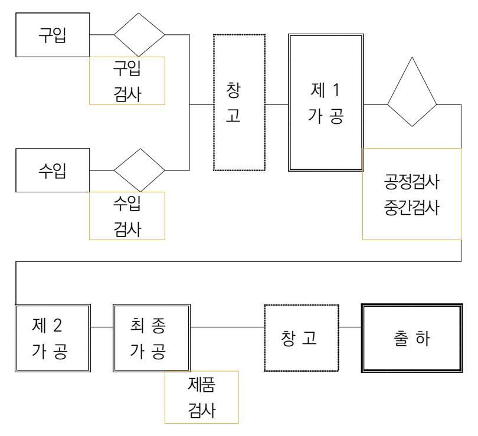

출처: 교육부(2016). 반도체 재료 품질관리(LM1903060410\_14v1). 한국직업능력개발원. p.24.

[그림 2-1] 반도체 원재료 각종 검사 예

<표 2-1> 주요 기기 분석 장치 및 용도

| 기계명                     | 용 도                   |
|-------------------------|-----------------------|
| ICP-MS                  | 시료내의 금속이온 함량 측정       |
| ICP-OES                 | 시료내의 금속이온 함량 측정       |
| GC                      | 시료의 정량 분석             |
| GC-MS                   | 시료의 정성 및 정량 분석        |
| IC                      | 시료내의 양/음이온 분석         |
| GPC                     | 시료의 분자량/올리고모 측정       |
| HPLC                    | 시료의 정량 / 정성 분석        |
| FT-IR                   | 시료의 정성 분석             |
| liquid particle counter | 약액내의 입자수 측정           |
| Air particle counter    | 공기중 비자수 측정            |
| Karl Fischer            | 시료내의 수분 함량 분석         |
| Autotitrator            | 시료의 산/염기 적정/시료의 농도 적정 |
| Surface tension meter   | (표면장력계)약액의 표면장력 측정    |
| UV/VIS                  | 시료의 흡광도 측정            |
| Refractometer(굴절계)      | 시료의 굴절률 측정            |
| Tintometer (APHA 측정기)   | 약액의 색상 측정             |
| Turvidimeter (탁도계)      | 약액의 탁도 측정             |
| Electronic valance      | 무게 칭량                 |
| Distal Viscometer       | 약액의 점도 측정             |
| 입도 분석기                  | 시료의 입자사이즈 분포 측정       |
| pH Meter                | 약액의 pH 측정             |

## 수행 내용 / 검사 절차 수립하기

재료·자료

- 매뉴얼
- 산업안전보건법
- 위험물안전관리법
- 유해화학물질관리법
- 대기환경보전법
- 수질 및 수생태계 보전에 관한 법률

### 기기(장비 ・ 공구)

- 컴퓨터, 인터넷, 프린트 등
- 안전 ・ 유의 사항
  - 품질검사 절차 및 검사 표준 설정, 제품 측정, 표준값 측정 비교 내용에 대한 정보를 제공 한다.
  - 제공된 정보를 잘 이해하고 품질의 적합성 여부를 최종 판단할 수 있어야 한다.

### 수행 순서

- 숔 품질관리의 책임과 권한에 대해 검토하고 지침서를 작성한다.
  - 1. 기술 부서장은 생산에 필요한 자재, 부품, 생산 인원을 검토한다.
  - 2. 생산 계획 수립, 공정관리, 공정도, 공정 종사자의 자격을 검토하고 관리 범위를 정한다.
  - 3. 품질관리 부서장은 최종검사 및 출하검사를 검토하고 출고제품에 대해서도 검토한다.
- 숕 품질관리를 위한 수입검사 업무 지침서를 작성한다.
  - 1. 자재관리 담당 부서 또는 생산 담당 부서는 입고된 원․부재료에 대한 수입검사를 품질관리 담당 부서에 의뢰하는 과정을 검토한다.
  - 2. 품질관리 담당 부서는 의뢰된 입고 원․부재료에 대해 시험성적서, 원․부재료 규격을 확인하여 수입 검사를 하는 과정을 검토한다.
    - (1) 검사 결과 합격 여부를 기록․관리 검토한다.

- (2) 신규 원재료의 경우 생산 팀 또는 원료 구매 부서를 통해 검사를 실시 과정 검토한다.
- (3) 신규 원재료의 경우 검증 결과만 의뢰 부서로 통보하며, 적용 유무는 생산 팀과 협의 결정 과정을 검토한다.
- 3. 품질관리 담당 부서는 검사가 필요 없는 품목 및 검사를 할 수 없는 원․부재료에 대해 무검사 품 목으로 지정하여 관리한다.
- 4. 파이프라인을 통해 직접 입고되는 원․부재료는 무검사 품목으로 지정하여 손질 검사 할 수 있고 정기적으로 공급 업체로부터 시험성적서를 받는 과정을 검토한다.
- 5. 품질관리 담당 부서는 검사 결과를 검사 의뢰 부서 및 필요 부서에 통보하는 과정을 검토한다.
- 6. 검사 결과에 따른 부적합품은 부적합품 관리 절차에 따른 처리 과정을 검토한다.
- 7. 긴급 불출 원․부재료
  - (1) 사전 수입검사 없이 긴급 불출되어 사용되는 원․부재료에 대해서는 사후 검사를 실시하는 과 정을 검토한다.
  - (2) 사후 검사 결과, 부적합 원․부재료는 사용을 중지시키고 회수하여 부적합품 관리 절차에 따라 처리하는 과정을 검토한다.
  - (3) 부적합 원․부재료가 이미 생산공정에 투입된 경우에는 해당 원료를 사용한 제품에 대한 공정 분석을 실시하여 검증될 때까지 제품을 보류하는 과정을 검토한다.
- 숖 품질관리를 위한 공정검사 업무 지침서를 작성한다.
  - 1. 분석용 시료는 해당 생산 부서 운전원이 품질검사 계획서상의 지정된 위치에서 채취하여 분석을 의뢰하는 과정을 검토한다.
  - 2. 품질관리 담당 부서의 검사원은 품질검사 계획서 및 관련 지침에 따라 공정 분석을 수행하는 과 정을 검토한다.
  - 3. 분석 결과를 기록하고 품질 담당자의 확인 후 해당 생산 부서에 통보하는 과정을 검토한다.

숗 품질관리를 위한 최종검사 업무 지침서를 작성한다.

- 1. 해당 생산 부서 운전원은 품질검사 계획서상의 지정된 위치에서 샘플을 채취하여 분석을 의뢰하 는 과정을 검토한다.
- 2. 품질관리 담당 부서 검사원은 해당 '검사/시험 지침' 및 '제품 규격'에 따라 검사를 수행하는 과 정을 검토한다.

- 3. 검사원이 검사 결과를 기록하고 품질 담당자가 확인하는 과정을 검토한다.
- 4. 품질 담당자는 검사 결과를 해당 생산 부서에 통보하는 과정을 검토한다.
- 5. 품질관리 담당 부서는 최종검사 결과, 적합품에 대해 출하 시점에 시험 성적서를 작성하여 품질 관리 담당 부서장의 승인을 얻은 후 출하 담당자에게 통보하는 과정을 검토한다.
- 6. 검사 결과에 따른 부적합품의 부적합품 관리 절차에 따른 과정을 검토한다.
- 7. 최종검사 후 출하제품에 대한 retention sample이 각각 다음과 같이 유지 보관하는 과정을 검 토한다.

- A 제품: 6개월, B 제품: 일주일, C 제품: 6개월, D 제품: 3개월

- 수 품질관리를 위해 시험 분석 업무를 숙지하고 관리 요령을 요약 작성한다.
  - 1. 신제품 연구 개발
  - 2. 제품의 품질 향상을 위한 연구
  - 3. 타사 및 외국 제품의 분석 및 시험
  - 4. 사외에서 의뢰하는 분석 및 시험 또는 요구하는 견본의 제조
  - 5. 타 부서에서 의뢰하는 분석 및 시험
  - 6. 시험 기구 및 시설의 정비 관리
  - 7. 기타 기술적인 연구 및 시험
  - 8. 실험보고서, 기술부 업무일지, 기술 관계 도서 및 자료의 보관 관리
- 숙 각 제조공정별 시험법에 대한 내용을 조사한다.
  - 1. 시험 방법
    - (1) 원리
      - 결과의 유효성
    - (2) 기타 고분자의 수평균 분자량 결정법
      - (가) 총괄성을 이용한 측정법
      - (나) 말단 그룹 분석법
      - (다) 가교 고분자의 분자량 측정
    - (3) 시험 방법

- 2. 시험결과 및 보고
  - (1) 결과의 처리
  - (2) 시험결과의 보고
    - (가) 시험 기관의 명칭 및 소재지
    - (나) 시험 책임자 및 담당자 성명, 소속
    - (다) 시험 물질
      - 화학물질의 명칭 및 동질성
      - 입수처, 입수 일
      - 순도 또는 불순물
      - 시료의 처리 관련 관찰 사항 및 문제점
  - (3) 기기
    - (가) 용리액의 조성
    - (나) 분리 칼럼(제조원, 칼럼 성질)
    - (다) 측정 온도
    - (라) 검출기(형태, 셀의 부피)
    - (마) 유속
    - (바) 데이터 처리 시스템
  - (4) 시스템의 보정
    - (가) 표준 물질의 이름, 제조원, 제조자가 공급하는 Mn(수평균분자량), Mw(질량평균분자량), Mw/Mn(PDI), Mp값
    - (나) 검량선 작성 방법 및 작성 기준(상관 계수, 오차 범위)
    - (다) 주입량과 주입 농도
  - (5) 시험 결과
    - (가) Mn, Mw, Mw/Mn 및 최대 피크에서의 분자량(Mp)
    - (나) 머무름 부피 또는 머무름 시간에 해당하는 분자량 및 그 함량에 대한 테이블
    - (다) 분자량 분포 곡선

숚 분석에 적합한 주요 기기분석 장치들의 분석 용도에 따른 기기 장치들을 선정한다.

| 기계명                     | 용 도                   |
|-------------------------|-----------------------|
| ICP-MS                  | 시료내의 금속이온 함량 측정       |
| ICP-OES                 | 시료내의 금속이온 함량 측정       |
| GC                      | 시료의 정량 분석             |
| GC-MS                   | 시료의 정성 및 정량 분석        |
| IC                      | 시료내의 양/음이온 분석         |
| GPC                     | 시료의 분자량/올리고모 측정       |
| HPLC                    | 시료의 정량 / 정성 분석        |
| FT-IR                   | 시료의 정성 분석             |
| liquid particle counter | 약액내의 입자수 측정           |
| Air particle counter    | 공기중 비자수 측정            |
| Karl Fischer            | 시료내의 수분 함량 분석         |
| Autotitrator            | 시료의 산/염기 적정/시료의 농도 적정 |
| Surface tension meter   | (표면장력계)약액의 표면장력 측정    |
| UV/VIS                  | 시료의 흡광도 측정            |
| Refractometer(굴절계)      | 시료의 굴절률 측정            |
| Tintometer (APHA 측정기)   | 약액의 색상 측정             |
| Turvidimeter (탁도계)      | 약액의 탁도 측정             |
| Electronic valance      | 무게 칭량                 |
| Distal Viscometer       | 약액의 점도 측정             |
| 입도 분석기                  | 시료의 입자사이즈 분포 측정       |
| pH Meter                | 약액의 pH 측정             |

<표 2-2> 주요 기기분석 장치 및 용도

수행 tip

- ∙ 품질검사 과정을 잘 이해할 수 있도록 한다.
- ∙ 각 제조공정별 시험법에 대한 내용을 조사 한다.

## 2-2. 장비선정 및 샘플준비

학습 목표 • 반도체 재료의 검사를 위해 적합한 장비를 선정할 수 있다. • 반도체 재료의 검사를 위한 적합한 샘플을 준비할 수 있다.

## 필요 지식 /

### 숔 분석 장비

1. 품질관리와 분석 장비

제품을 효과적으로 관리하기 위한 수단의 하나로 분석 장비 및 기기는 매우 중요하다. 분석 장비는 제품의 제조 과정에서 통상적으로 공정 단계의 중간제품 또는 최종 완제품을 미리 설정된 제품의 품질규격에 맞게 균일성 확보를 위하여 분석하고 측정하는데 사용된 다. 범용 바이오화학소재 제품의 분석은 제품에 따라 상이하지만, 대게 물리ㆍ화학적 성 질, 함량 분석, 확인 분석 등 제품의 규격과 관련된 항목을 분석하여 순도, 수율 및 효능 등을 확인한다.

분석 장비는 제품의 품질에 직접 영향을 끼칠 수 있으므로 정기적으로 또는 필요에 따라 주기적으로 점검하여 검ㆍ교정을 하고, 재현성 있게 사용하기 위하여 정상적 가동의 확인, 즉 밸리데이션을 통해 문서화하고 보증을 받는 것이 필요하다. 분석 장비는 그 자체가 각 각의 특성을 지니고 있으며 그 특성은 명확해야 된다. 일반적으로 분석에서 고려하는 특 성은 정확성, 정밀성, 감도, 특이성 등이 있다.

2. 분석 장비의 점검

분석 장비의 점검은 시험결과의 정확성을 확보하기 위해 한다. 이는 정기적인 검정과 교 정을 통해서 목적 생산물을 분석하는데 적합하다는 것을 보증하기 위해 적합성을 점검하 여야 한다. 적합성은 3가지 수준으로 나누어 볼 수 있다.

- 외관검사(visual inspection)

외관검사는 장비의 외관을 육안으로 관찰하는 검사이며, 변형 및 결함을 중점적으로 검 사한다. 주로 검사 체크리스트를 가지고 가동 상태를 점검한다.

- 규격 검증(verification with specification) 주로 설치 적격성 평가(IQ), 운전 적격성 평가(OQ) 및 성능 적격성 평가(PQ) 등의 시험 장비 표준절차를 통해서 가동, 검정, 변경 관리 및 수선 등을 실시한다. 화학저울이나 pH미터 등은 규격 검증을 한다.

- 완전 검증(full qualification)

HPLC 시스템이나 질량분석기 등도 역시 IQ, OQ, 및 PQ 등을 통한 완전 검증과 가동, 검정, 구성, 안전, 시스템 운영 등에 대하여 전반적인 적격성 검사를 한다.

- (1) 분석 장비의 외관검사 및 상태 확인
  - ∙ 장비의 변형이나 결함 상태를 확인하고, 전원 연결시 가동 준비가 되었는지 확인한다.
  - ∙ 장비 본체 이외에 규격서에 따라 부속 부품들을 확인한다.
  - ∙ 장비 가동 매뉴얼을 확인하고, 예비 가동하여 오작동을 확인한다.
  - ∙ 장비의 시료 측정부의 청결 상태를 확인한다.
- (2) 정상 상태 점검을 위한 검·교정

국가표준기본법(2013)에 의하면 분석기기들은 검ㆍ교정을 받아야 하며, 그 의도된 목적 에 적합하고 유효한 결과를 도출할 수 있음을 보장하여야 한다. 계획에 따라 주기적으로 교정, 검사, 유지보수됨을 보장하기 위한 절차를 수립하고 유지하여야 한다.

(가) 검정(test)

정상 상태 검정이란 질량, 길이, 부피, 밀도, 온도, 압력 등을 분석하는 기기 또는 장 비를 공인기관의 기준 값에 적합한지를 시험하는 것이다.

(나) 교정(calibration)

정상 상태 교정이란 질량, 길이, 부피, 밀도, 온도, 압력 등을 분석하는 기기 또는 장 비를 공인기관의 기준과 비교ㆍ측정하여 맞추는 것이다.

(다) 보정(correction) :

정상 상태 pH미터 등의 기기가 나타내는 데이터를 정확하게 하기 위해 표준용액으 로 교정하는 것을 말한다.

(3) 분석 장비의 관리 및 유지보수

장비를 사용할 때에는 장비사용매뉴얼을 충분히 숙지한 후 사용하도록 한다. 분석 장비 를 효율적으로 관리하기 위하여 장비 사용일지와 장비관리대장을 만들어 주기적으로 관 리 및 점검하도록 한다. 장비는 계획에 의거하여 정기적으로 교정 및 적격성 평가를 실 시하고, 그 기록을 보존하며, 다음 사항을 적은 라벨을 각각 붙인다.

- (가) 장비명 및 장비번호
- (나) 교정 합격 여부
- (다) 교정일자 및 다음 교정 연월일
- (라) 교정한 사람 또는 교정기관(장병원·이승훈·김행이 외. 2011.)

<표 2-3> 장비 사용일지 양식(예시)

| 장비 사용일지 |      |      |      |      |     |
|---------|------|------|------|------|-----|
| 장비명     |      |      | 장비번호 |      |     |
| 모델명     |      |      | 부서   |      |     |
| 제작사     |      |      | 담당자  |      |     |
| 구입일자    |      |      | 가격   |      |     |
| 사용일자    | 사용시간 | 작업내용 | 사용조건 | 특이사항 | 확인자 |
|         |      |      |      |      |     |
|         |      |      |      |      |     |
|         |      |      |      |      |     |

### <표 2-4> 장비관리대장 양식(예시)

| 장비 관리대장 |               |      |      |    |     |
|---------|---------------|------|------|----|-----|
| 장비명     |               |      | 장비번호 |    |     |
| 모델명     |               |      | 부서   |    |     |
| 제작사     |               |      | 담당자  |    |     |
| 구입일자    |               |      | 가격   |    |     |
| 점검일자    | 유지 (점검/보수) | 교체부품 | 비용   | 비고 | 확인자 |
|         |               |      |      |    |     |
|         |               |      |      |    |     |
|         |               |      |      |    |     |

숕 샘플

샘플이란 원부원료, 재공품, 제품의 일부로 전체를 대표하는 제품 또는 원료물질을 말한다. 샘 플은 반도체 제조에 사용되는 원재료 또는 제품 등이 있다.

### 1. 샘플채취의 목적

샘플채취의 목적은 반도체 원재료 검사를 통해 합부 판정을 하기 위함이다. 따라서 샘플은 전체 를 대표할 수 있어야 하며, 샘플채취의 과정은 공정하고 객관적으로 이루어져야 한다.

- 2. 샘플채취 시 유의 사항
  - (1) 표지 국제조화 시스템 경고 표지
    - (가) 화학물질에 대한 분류, 표지 국제조화 시스템(GHS, Globally Harmonized System of Classification and Labelling of Chemicals)의 의미

국제노동기구(ILO, International Labour Organization), 국제연합(UN, United Nations) 에서 전 세계적으로 화학물질의 유해위험성에 관한 분류와 표지의 통일된 시스템을 제공되었다.

(나) 물질안전보건자료(MSDS, Material Safety Data Sheet)

화학물질의 유해위험성, 응급조치 요령, 취급방법 등을 설명해 주는 자료를 말한다.

(다) 유해·위험성 분류에 따른 그림문자

유해·위험성 분류에 따른 그림 문자는 가독성을 높이기 위해 도형화되었다.

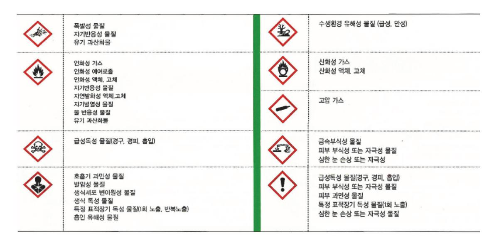

출처: 교육부(2016). 반도체 재료 품질관리(LM1903060410\_14v1). 한국직업능력개발원. p.34. [그림 2-2] 유해위험성 그림문자

(라) 화학물질의 용기 및 포장의 경고표시

화학물질의 용기 및 포장의 경고 표시 양식이 국제적으로 동일하게 <표 2-1>과 같 다. 이는 모든 물질에 부착해야 하며 한글로 기록되어 있어야 하며 샘플채취 과정에 서 유해위험성을 확인하고 사고를 예방해야 한다.

| 1        | GHS 도입 전                                 | GHS 도입 후                                     |  |
|----------|------------------------------------------|----------------------------------------------|--|
| 분류 항목 | <u>15개 항목</u> 물리적 위험성(7), 건강・환경유해성(8) | <u>27개 항목</u> 물리적 위험성(16), 건강 • 환경유해성(11) |  |
| 분류 기준 | • 비교적 단순 • 혼합물질 분류기준 별도로 없음           | • 매우 복잡하고, 전문적 • 혼합물질 분류기준이 별도로 규정        |  |
| 그림       | ① 형태와 색깔 변경                              |                                              |  |
| 문자       |                                          |                                              |  |
|          | ② 그림문자 변경                                |                                              |  |
|          | ×                                        | $\langle \mathbf{i} \rangle$                 |  |
|          | ③ 새로운 그림문자 추가                            |                                              |  |
|          |                                          | الله الله الله الله الله الله الله الله      |  |

출처: 교육부(2016). 반도체 재료 품질관리(LM1903060410\_14v1). 한국직업능력 개발원. p.34. [그림 2-3] GHS제도의 분류 및 표시 개념도

- (2) 안전보호구 착용
  - (가) 안전보호구

안정보호구 성능을 적합하게 유지할 수 있는 방법으로 착용 및 사용하여야 한다. (제조사의 매뉴얼 등에서 설명하는 방법을 숙지한다.)

(나) 공장 내에서의 안전보호구 착용

각 사업장에서 정한 안전보호구 착용 지역 배치도에 따라서 해당 지역에서 요구하는 안전보호구를 착용하여야 한다.

(다) 안전모

모체, 착장제, 충격흡수재 및 턱끈의 이상 유무를 확인하고 안전모가 벗겨지지 않도 록 견고하게 조여서 착용한다.

1) 안전모 이상유무를 살핀다.

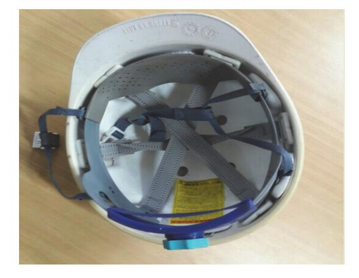

출처: 교육부(2016). 반도체 재료 품질관리(LM19030604 10\_14v1). 한국직업능력개발원. p.36. [그림 2-4] 안전모 착용 방법

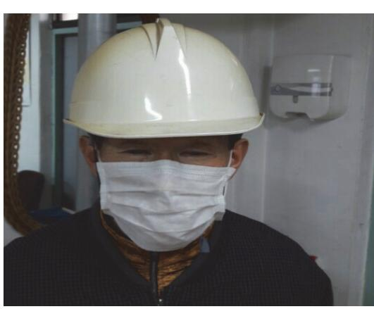

4) 착용후 적절하게 착용되었는지 확인한다.

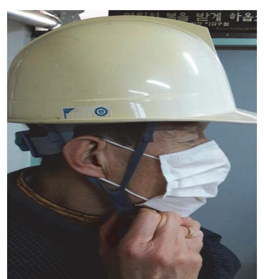

3) 견고하게 조여서 착용한다

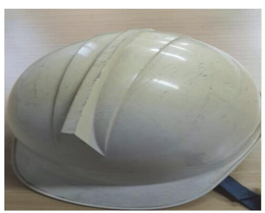

2) 안전모 이상 시 교체한다.

(라) 안전화

신발끈을 조여 매고 이상유무를 수시로 점검한다.

(마) 방진마스크(분리식)

케이스 안에 여과재를 끼워 넣어 여과재 케이스의 잠금장치를 찰칵 소리가 나도록 눌러 닫은 후, 머리끈을 머리 위로 걸어서 안면부를 코/입/턱밑까지 충분히 감싼 후 목끈을 살며시 잡아 당겨 고리를 목 뒤에서 걸어주고, 목끈을 얼굴에 맞게 조인 다 음 양손으로 밀착검사를 한다.

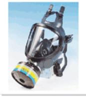

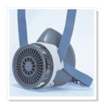

출처: 교육부(2016). 반도체 재료 품질관리(LM1903060410\_14v1). 한국직업능력 개발원. p.37. [그림 2-5] 방진·방복 겸용 마스크(분리식)

(바) 방진마스크(안면부 여과식)

마스크를 컵 모양으로 둥글게 편 후 아래 방향으로 머리끈을 늘어뜨린 후 턱 아랫부 분에 마스크를 갖다 대고 한 손으로 마스크를 잡은 다음 다른 손으로 머리끈을 당겨 착용한다. 마스크의 가장자리를 펴가며 얼굴과의 틈새를 막아주고, 코 누름쇠를 구부 려 코 부위와 잘 맞도록 고정시켜 안면부가 얼굴에 완전히 밀착되었는지 양손으로 밀착검사를 한다.

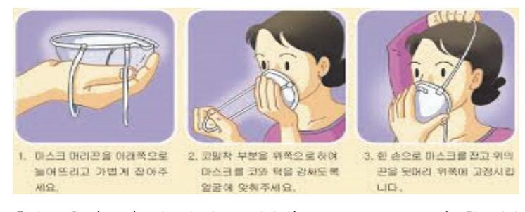

출처: 교육부(2016). 반도체 재료 품질관리(LM1903060410\_14v1). 한국직업 능력개발원. p.37. [그림 2-6] 방진마스크(안면부 여과식) 착용 방법

(사) 귀마개(ear plug)

귀마개를 돌려가며 크기를 가늘게 압축시킨 다음 귀를 잡아당긴 상태에서 귀마개를

완전히 밀어 넣는다. 밀어 넣은 후 약 15초 후 정도 눌러 주어 튀어 나오지 않도록 한다.

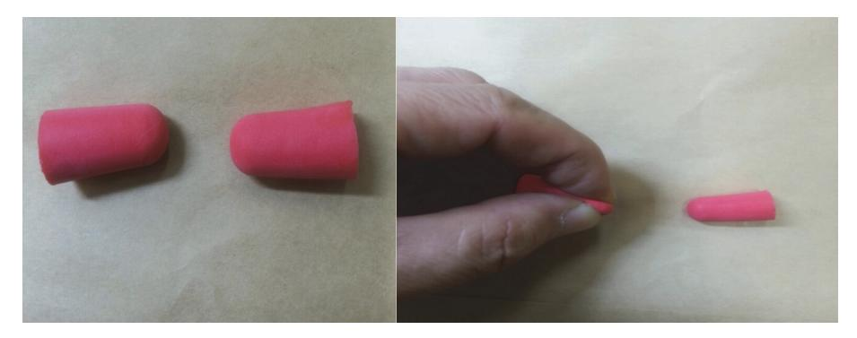

출처: 교육부(2016). 반도체 재료 품질관리(LM1903060410\_14v1). 한국직업능력개발원. p.37. [그림 2-7] 귀마개 착용 방법

### (아) 안전대

높이 2m 이상의 고소 작업 시 착용해야 하며, 착용 시 헐렁하지 않게 조여서 자신 의 몸에 맞게 부착해야 한다는 것이다.

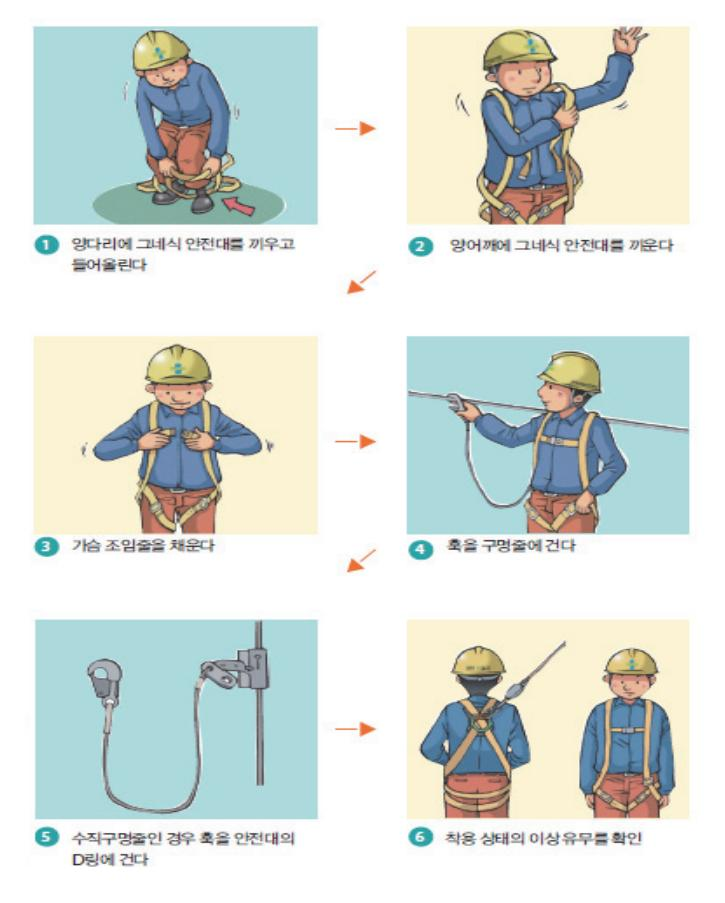

출처: 고용노동부·안전보건공단(2013). 현장 작업자를 위한 보호구의 종류 와 사용법(웹용). 공공누리 4유형 [그림 2-8] 안전대 착용 방법

### 3. 샘플 채취의 방법

샘플 채취는 원부원료, 재공품, 제품으로 나눈다.

(1) 반도체 원부원료

반도체 원부원료는 액체, 고체, 기체의 형태가 있으며, 원부원료의 상(phase)에 따라, 원부원료의 화학적 특성에 따라 샘플 채취하는 방법이 달라진다.

(가) 고체

고체는 모양에 따라 샘플 채취 방법이 달라지며 샘플 채취 시 안전 유의 사항 으로는 2단 적체된 샘플를 하지 말고 1단 적재된 제품의 샘플를 채취한다.

(나) 액체

반도체 액체 원부원료는 드럼(drum), 탱크로리(tank lorry) 등이 있다. 액체는 가연 성, 폭발의 위험, 화학반응성, 인체위험성을 고려하여 샘플채취 시에는 물질 특성에 알맞은 안전보호구를 반드시 착용해야 한다.

(다) 기체(고압가스)

기체는 고압가스의 형태로 보관하기 때문에 취급 시 누출, 폭발의 위험이 있으므로 안전에 각별히 유의한다.

(2) 재공품

반도체 재공품은 제품 생산 중간 단계의 제품으로서 화학반응이 일어나는 물질을 반응 기와 반응기 사이의 드레인 밸브(drain valve)를 통해 채취해야 하므로 안전에 유의해야 한다.

(3) 제품

제품 샘플채취는 포장하는 과정은 제품 검사를 위한 것으로 물성 검사, 외관검사, 화학 적 검사가 있다. 상차하는 과정에서 샘플채취는 출하 검사를 위한 것으로 물성 검사용과 외관 검사용으로 하며, 화학적 검사는 외관 검사 샘플을 소량 취하여 실시한다.

## 수행 내용 / 샘플 채취하기

재료·자료

- 생산흐름도
- 관리계획서
- 각종 규격 (원부원료 규격, 제품규격)
- 품질매뉴얼
- 환경안전보건법규 등

### 기기(장비 ・ 공구)

- 컴퓨터, 프린터, OA프로그램
- 전사적 자원관리 시스템(ERP)
- 디지털 카메라
- 유성 네임펜, 샘플 채취 봉지및 용기, 샘플병 및 관, 샘플채취 스티커
- 삽, 절단기, 사다리
- 안전모, 장갑, 마스크, 보안경, 안전대, 귀마개 등 안전보호구

### 안전 ・ 유의 사항

- 샘플채취 시 안전보호구를 반드시 착용한다.
- 샘플채취 시 2인 1조로 작업한다.
- 2단 적재품은 지게차 기사와 협조하여 1단 적재 후 샘플을 채취한다.

#### 수행 순서

- 숔 샘플채취 절차서를 작성한다.
  - 1. 제목, 작성일, 작성자, 개정 사유, 참고 문헌을 작성한다.
  - 2. 절차서 변경 이력을 작성한다.
  - 3. 샘플채취 절차서 내용을 작성한다.

- (1) 샘플채취 절차서의 목적한다.
- (2) 생산흐름도를 참고하여 적용범위
- (3) 주요 용어를 정의
- (4) 샘플채취 방법, 주기, 양을 기록
- (5) 샘플 종류별로 채취 방법 및 검사 항목
- (6) 원부원료에 대한 항목
- (7) 재공품에 대한 항목
- (8) 제품에 대한 항목
- (9) 환경안전 유의사항에 관한 내용
- (10) 관련절차서 및 시료채취에 관련된 양식 등 기타 사항
- 4. 규정된 결재부서장의 결재를 받고 부서 내 공유한다.

숕 샘플 채취를 한다.

- 1. 구매부서를 통해 샘플의 위치를 확인한다.
- 2. 원부원료 샘플 채취한다.
  - (1) 고체 베일(veil) 형태의 샘플를 채취한다.
    - (가) 삽, 절단기, 샘플 봉지를 준비한다.
    - (나) 적재품 중 1단 적재 위치를 확인한다.
    - (다) 2단 적재 시 1단으로 하역한다.
    - (라) 채취한 샘플 봉지에 날짜와 제품명 로트(Lot) 번호를 기입한다.
  - (2) 고체 그래뉼(granule) 형태 샘플 채취한다.
    - (가) 채취 스티커, 채취용 관, 채취용 봉지를 준비한다.
    - (나) 샘플 채취용 관을 이용하여 시료를 채취한다.
    - (다) 스티커에 샘플채취 부서, 일자, 장소를 기록한다.
    - (라) 제품명, 로트(lot) 번호, 날짜 등을 기록한다.
  - (3) 고체 파우더(powder) 형태의 샘플 채취한다.
    - (가) 방진마스크, 방진복, 보안경을 포함한 안전보호구를 착용한다.
    - (나) 샘플채취 봉지, 용기, 네임펜을 준비한다.
    - (다) 1단 적재된 백(bag)을 열어서 샘플을 채취 (2단 적재 시 채취금지)한다.

- (라) 샘플 봉지에 시료명, 날짜, 로트(Lot) 번호 등을 기록한다.
- (4) 액체 드럼(drum)포장 용기 샘플 채취한다.
  - (가) 화학물질에 대한 분류, 표지 국제조화 시스템(GHS, Globally Harmonized System of Classification and Labelling of Chemicals) 경고표지를 읽고 안전 유의사항을 확인 한다.
  - (나) 검사에 필요한 양만큼 샘플을 채취한다.
  - (다) 채취 시 화재 및 질식의 위험을 방지하여야 한다.
- (5) 액체 탱크로리(tank lorry) 차량 샘플 채취한다.
  - (가) 안전대를 착용하고 안전고리를 장착한다.
  - (나) 화학물질에 대한 분류, 표지 국제조화 시스템 경고표지 내용을 숙지한다.
  - (다) 2인 1조로 작업한다.
  - (라) 방독마스크 또는 방독면을 착용하고 샘플을 채취한다.
  - (마) 샘플 용기에 화학물질에 대한 분류, 표지 국제조화 시스템 경고표지를 부착한다.
- (6) 액체 이송 라인 샘플 채취한다.
  - (가) 방독마스크 또는 방독면을 착용한다.
  - (나) 화학물질에 대한 분류, 표지 국제조화 시스템 경고표지 내용을 숙지한다.
  - (다) 드레인 밸브(drain valve)를 천천히 개방하여 샘플을 채취한다.
- (7) 기체 고압가스 샘플 채취한다.
  - (가) 봄베(bombe)를 준비한다.
  - (나) 화학물질에 대한 분류, 표지 국제조화 시스템 경고 표지를 숙지한다.
  - (다) 고압가스 샘플채취 설비에서 샘플을 채취한다.
  - (라) 봄베(bombe)는 후드(hood)에 보관한다.
- 3. 재공품 샘플 채취한다.
  - (1) 안전보호구 및 시료 채취용 도구 준비한다.
  - (2) 관련부서 근무자 협조 하에 재공품 샘플을 채취한다.
  - (3) 반응기와 반응기 사이에 있는 드레인 밸브(drain valve)에서 샘플을 채취한다.
- 4. 제품 샘플 채취한다.
  - (1) 안전보호구 및 시료채취용 도구를 준비한다.
  - (2) 관련 부서 근무자 협조하에 제품 샘플을 채취한다.

- (3) 제품 샘플을 채취할 때는 물성 검사용과 외관 검사용으로 구별해서 채취한다.
- (4) 외관 검사용 샘플 채취 시 오염되지 않도록 채취한다.
- 5. 출하 검사 샘플 채취한다.
  - (1) 안전대를 포함한 안전보호구를 착용한다.
  - (2) 2인 1조로 작업한다.
  - (3) 안전고리를 부착한 후 채취한다.

### 수행 tip

• 규정에 의한 안전 유의사항 및 경고표지 사항을 숙지하고 채취를 실시해야한다.

## 2-3. 시험성적서 작성

학습 목표 • 반도체 재료의 실시한 검사에 따라 결과보고서를 작성할 수 있다. • 반도체 재료의 검사기기에 대한 관리규정에 따라 사용이력과 관리이력을 기록・관리할 수 있다.

## 필요 지식 /

- 숔 시험 성적서
  - 1. 검사 규격서의 작성 시기 제품 개발이 완료되면 검사 규격서를 작성하고, 규정된 해당 부서장의 승인을 얻어 관리한 다.
  - 2. 검사 규격서 작성 시 검사항목 선정

검사 규격서 작성 시 다음 사항을 참고하여 검사항목을 선정한다.

- (1) 고객이 요구하는 관리 항목
- (2) 품질에 영향을 미치는 항목
- (3) 품질 문제의 유발 가능성 항목
- (4) 고객 불만을 야기할 수 있는 항목
- (5) 사양이 변경된 항목
- (6) 관련 부서에서 요구하는 항목
- (7) 관련 표준이 변경된 항목 등
- 3. 검사 규격서의 작성

검사 규격서는 검사 규격서 작성 방법에 따라 작성한다.

4. 제품 로트의 추적

제품의 로트번호 및 납품서를 확인하여 검사(제품검사) 및 체크리스트로 제품 로트를 추적 할 수 있어야 한다.

5. 식별

물자가 입고되어 제품으로 생산, 인도될 때까지 품목·수량·로트 등을 구분할 수 있도록 적 절한 방법으로 기록·표시·보관하는 것을 말한다.

6. 추적성

식별 사이의 관련성을 부여하는 행위이다.

| <표 2-5> 제품의 품질관리 구비요건 |  |  |
|-----------------------|--|--|
|-----------------------|--|--|

| 구 비 요 건                                                    |                                               |                                                                         |  |
|------------------------------------------------------------|-----------------------------------------------|-------------------------------------------------------------------------|--|
| 제품의 품질 기준 검사방법                                          |                                               | 이행 사항                                                                   |  |
| 제품의 품질에 대한사내 표준은 규격 수전 이상 이어야 하고, 구체적으 로 규정해야 한다. | 제품의 검사 방법은 관리 기법을 적용하여                        | 제품의 품질에 대해 사내 표 준에 따라 검사를 실시하고, 검사결과는 공정개선 및 제품 의 품질 향상에 활용한다. |  |
|                                                            | 규정하는데 품질의 규격 수준이 제품의 품 질 기준 이상으로 유지되어야 한다. | 사내표준화와 품질경영 체제 전반에 대하여 자체점검을 실 시한다.                               |  |
|                                                            |                                               | 시험검사자는 규격 및 사내표 준에 따라 시험 검사를 할 수 있어야 한다.                          |  |
| 비고: 중간검사와 겹치는 제품검사의 항목은 중간검사로 갈음할 수 있다.                    |                                               |                                                                         |  |

8. 제품 검사 성적서

- (1) 제품 검사 성적서에는 검사일, 품목, 품명, 규격, 단위, 입고수량, 검사 시험 수량, 불량 수 량, 검사 방법, 종합 판정 등의 항목이 있다.
- (2) 검사관은 검사 규격에 따라 정확하고 공정하게 검사를 실시하며, 판정 결과 및 검사기록에 대해 책임을 져야 한다.
- (3) 제품검사 성적서에는 품질의 특성을 점검하기 위한 검사를 실시한 후 검사한 성적을 기록한 다.
- (4) 제품 검사는 제품의 안전성을 확보하는 가장 중요한 절차로 제작한 제품에 결함이 있거나 소 비자에게 커다란 피해를 가져다 줄 가능성은 없는지 여부를 판단하기 위한 것이다.

### 재료·자료

- 품질 검사 매뉴얼
- 제품 검사 성적서

### 기기(장비 ・ 공구)

- 컴퓨터, 인터넷, 프린터, 주변 기기
- 안전 ・ 유의 사항
  - 제공된 정보가 품질의 적합성 여부를 최종 판단할 수 있어야 한다.
  - 시험성적서 작성 시 정확하게 작성한다.

### 수행 순서

- 숔 품질 검사 표준 및 절차를 설정한다. 품질 검사 표준 및 검사 절차 설정에 대한 내용을 조사한다.
  - 1. 부적합 제품에 대한 검토 및 처리 방안을 설정한다.
  - 2. 고객 불만 원인을 파악하고 대책을 수립한다.
  - 3. 제품의 이상 발견 시 부적합 원인을 파악하고 기록한다.
  - 4. 시정 및 예방 조치를 요구하고 결과를 확인한다.
  - 5. 제품에 대한 식별과 로트 관리 방법을 설정한다.
- 숕 품질 검사 성적서 작성 시 다음 내용에 주의한다.
  - 1. 품질 검사의 정의 품질 검사는 제품 또는 시설이 정상적으로 가동한다는 확증을 얻기 위하여 실시하는 검사이다.
  - 2. 품질 검사 성적서
    - (1) 제품의 품명, 규격, 검사 시험 수량을 기록하고, 이상 발생 내용의 원인과 조치 사항 등을 상세히 작성한다.

47

- (2) 품질 검사 성적서에는 합격, 불합격, 폐기에 대한 각각의 제품 수량과 검사 일지 를 기재한다.
- (3) 품질 검사 성적서는 제품의 품목 및 검사 방법을 자세히 기재하며, 품질 검사 결 과를 정확하게 기록해 놓은 문서이다.
- 숖 품질관리 지침서를 작성한다.

제조 공정에서의 제품과 부산물의 시험 성적서를 작성한다.

수행 tip

∙ 품질검사 과정을 잘 이해하고 각 제조공정별 시험법에 대 한 내용을 조사 한다.

### 학습 2 교수·학습 방법

### 교수 방법

- 협동으로 품질검사에 관련 문제 해결식 수업, 협력 수업이 가능하도록 한다.
- 제시된 강의 순서에 따라 단계적으로 실습이 이루어질 수 있도록 지도한다.
- 품질검사를 위한 분석 장치의 시험 방법을 이해하도록 지도한다.
- 사전에 학습 자료를 준비하여 문제 해결식 수업, 협력 수업이 가능하도록 지도한다.

### 학습 방법

- 품질검사의 과정 및 시험 방법에 대해 이해하고 숙지한다.
- 품질검사를 위한 다양한 시험법 과정에 대해서 이해하고 절차에 따라 실습한다.
- 시험성적서 작성 및 관리 방법에 대하여 알아보고 이 과정을 직접 실습한다.

## 학습 2 평 가

### 평가 준거

• 평가자는 학습자가 학습 목표를 성공적으로 달성하였는지를 평가해야 한다.

### • 평가자는 다음 사항을 평가해야 한다.

| 학습 내용           | 학습 목표                                                     | 성취수준 |   |   |
|-----------------|-----------------------------------------------------------|------|---|---|
|                 |                                                           | 상    | 중 | 하 |
| 품질평가 계획 수립      | - 반도체 재료의 정확한 품질 평가를 위한 검사 계획을 수립할 수 있다.               |      |   |   |
| 장비선정 및 샘플준 비 | - 반도체 재료의 검사를 위해 적합한 장비를 선정할 수 있다.                        |      |   |   |
|                 | - 반도체 재료의 검사를 위한 적합한 샘플을 준비할 수 있다.                        |      |   |   |
| 시험성적서 작성        | - 반도체 재료의 실시한 검사에 따라 결과보고서를 작성할 수 있다.                  |      |   |   |
|                 | - 반도체 재료의 검사기기에 대한 관리 규정에 따라 사용이력 과 관리이력을 기록·관리할 수 있다. |      |   |   |

### 평가 방법

• 문제해결 시나리오

| 학습 내용           | 평가 항목                       | 성취수준 |   |   |
|-----------------|-----------------------------|------|---|---|
|                 |                             | 상    | 중 | 하 |
| 품질평가 계획 수립      | - 제품의 품질을 일정하게 관리 할 수 있는 능력 |      |   |   |
|                 | - 재료의 기준을 제시하고 확인 할 수 있는 능력 |      |   |   |
|                 | - 반도체 공정에 대한 전반적인 이해정도      |      |   |   |
| 장비선정 및 샘플준 비 | - 품질관리 툴을 활용하기 위한 PC 조작능력   |      |   |   |
|                 | - 검사장비 사용 규정과 방법            |      |   |   |
|                 | - 검사장비의 종류                  |      |   |   |
| 시험성적서 작성        | - 관리도                       |      |   |   |
|                 | - 검사 관련규정                   |      |   |   |
|                 | - 원부자재의 성분, 특성, 품질에 대한 정보관리 |      |   |   |

• 서술형 시험

| 학습 내용           | 평가 항목                       | 성취수준 |   |   |
|-----------------|-----------------------------|------|---|---|
|                 |                             | 상    | 중 | 하 |
| 품질평가 계획 수립      | - 제품의 품질을 일정하게 관리 할 수 있는 능력 |      |   |   |
|                 | - 재료의 기준을 제시하고 확인 할 수 있는 능력 |      |   |   |
|                 | - 반도체 공정에 대한 전반적인 이해정도      |      |   |   |
| 장비선정 및 샘플준 비 | - 품질관리 툴을 활용하기 위한 PC 조작능력   |      |   |   |
|                 | - 검사장비 사용 규정과 방법            |      |   |   |
|                 | - 검사장비의 종류                  |      |   |   |
| 시험성적서 작성        | - 관리도                       |      |   |   |
|                 | - 검사 관련규정                   |      |   |   |
|                 | - 원부자재의 성분, 특성, 품질에 대한 정보관리 |      |   |   |

• 사례 연구

| 학습 내용           | 평가 항목                       | 성취수준 |   |   |
|-----------------|-----------------------------|------|---|---|
|                 |                             | 상    | 중 | 하 |
| 품질평가 계획 수립      | - 제품의 품질을 일정하게 관리 할 수 있는 능력 |      |   |   |
|                 | - 재료의 기준을 제시하고 확인 할 수 있는 능력 |      |   |   |
|                 | - 반도체 공정에 대한 전반적인 이해정도      |      |   |   |
| 장비선정 및 샘플준 비 | - 품질관리 툴을 활용하기 위한 PC 조작능력   |      |   |   |
|                 | - 검사장비 사용 규정과 방법            |      |   |   |
|                 | - 검사장비의 종류                  |      |   |   |
| 시험성적서 작성        | - 관리도                       |      |   |   |
|                 | - 검사 관련규정                   |      |   |   |
|                 | - 원부자재의 성분, 특성, 품질에 대한 정보관리 |      |   |   |

• 평가자 질문

| 학습 내용           | 평가 항목                       | 성취수준 |   |   |
|-----------------|-----------------------------|------|---|---|
|                 |                             | 상    | 중 | 하 |
| 품질평가 계획 수립      | - 제품의 품질을 일정하게 관리 할 수 있는 능력 |      |   |   |
|                 | - 재료의 기준을 제시하고 확인 할 수 있는 능력 |      |   |   |
|                 | - 반도체 공정에 대한 전반적인 이해정도      |      |   |   |
| 장비선정 및 샘플준 비 | - 품질관리 툴을 활용하기 위한 PC 조작능력   |      |   |   |
|                 | - 검사장비 사용 규정과 방법            |      |   |   |
|                 | - 검사장비의 종류                  |      |   |   |
| 시험성적서 작성        | - 관리도                       |      |   |   |
|                 | - 검사 관련규정                   |      |   |   |
|                 | - 원부자재의 성분, 특성, 품질에 대한 정보관리 |      |   |   |

• 피평가자 체크리스트

| 학습 내용           | 평가 항목                       | 성취수준 |   |   |
|-----------------|-----------------------------|------|---|---|
|                 |                             | 상    | 중 | 하 |
| 품질평가 계획 수립      | - 제품의 품질을 일정하게 관리 할 수 있는 능력 |      |   |   |
|                 | - 재료의 기준을 제시하고 확인 할 수 있는 능력 |      |   |   |
|                 | - 반도체 공정에 대한 전반적인 이해정도      |      |   |   |
| 장비선정 및 샘플준 비 | - 품질관리 툴을 활용하기 위한 PC 조작능력   |      |   |   |
|                 | - 검사장비 사용 규정과 방법            |      |   |   |
|                 | - 검사장비의 종류                  |      |   |   |
| 시험성적서 작성        | - 관리도                       |      |   |   |
|                 | - 검사 관련규정                   |      |   |   |
|                 | - 원부자재의 성분, 특성, 품질에 대한 정보관리 |      |   |   |

피드백

| 1. 문제해결 시나리오 - 정확한 품질 평가를 위한 검사 계획을 수립할 수 있는지 확인하고 사례를 보여주며 피드백 해 준                                                       |  |
|------------------------------------------------------------------------------------------------------------------------------|--|
| 다. - 검사기기에 대한 관리 규정에 따라 사용이력과 관리이력을 기록·관리할 수 있는지 확인하고 각 규 정을 재확인 시킨다.                                                  |  |
| - 검사를 위한 적합한 Sample을 준비할 수 있는지 확인하고 사례를 보여주며 이해시킨다. 2. 서술형 시험                                                             |  |
| - 검사를 위해 적합한 장비를 선정할 수 있는지 확인하고 각 장비의 요도를 다시 한 번 확인하게 한다.                                                                 |  |
| - 실시한 검사에 따라 결과보고서를 작성할 수 있는지 확인하고 사례를 보여준다. 3. 사례 연구                                                                     |  |
| - 검사를 위한 적합한 Sample을 준비할 수 있는지 확인하고 사례를 보여주며 이해시킨다. - 검사기기에 대한 관리 규정에 따라 사용이력과 관리이력을 기록·관리할 수 있는지 확인하고 각 규 정을 재확인 시킨다. |  |
| 4. 평가자 질문                                                                                                                    |  |
| - 실시한 검사에 따라 결과보고서를 작성할 수 있는지 확인하고 사례를 보여준다. - 검사를 위한 적합한 Sample을 준비할 수 있는지 확인하고 사례를 보여주며 이해시킨다. 5. 피평가자 체크리스트         |  |
| - 검사기기에 대한 관리 규정에 따라 사용이력과 관리이력을 기록·관리할 수 있는지 확인하고 각 규 정을 재 확인 시킨다.                                                       |  |

53

| 학습 1 | 반도체 재료 규격 검토하기    |
|------|-------------------|
| 학습 2 | 반도체 재료 검사하기       |
| 학습 3 | 반도체 재료 품질 유지·개선하기 |
| 학습 4 | 반도체 재료 품질이슈 대응하기  |
|      |                   |

## 3-1. 품질문제 재발방지 및 개선방안 수립

학습 목표 • 반도체 재료의 품질불량에 대응하기 위해 불량의 원인을 파악할 수 있다. • 반도체 재료의 요구품질수준을 유지하기 위해 품질개선방안을 수립할 수 있다.

## 필요 지식 /

숔 불량품 발생 예방 조치

예방 조치는 불량품 발생을 미연에 방지하기 위한 일련의 활동으로 잠재적인 부적합의 발생 요 인을 사전에 파악하고, 그 대책을 수립를 통해 가능해 진다.

각 단계별로 예방 조치 흐름도는 다음과 같다.

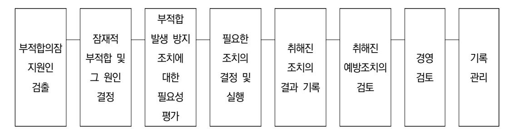

출처: 교육부(2016). 반도체 재료 품질관리(LM1903060410\_14v1). 한국직업능력개발원. p.53. [그림 3-1] 예방 조치 흐름도 예

숕 불량품 예방 체제 구축

품질 혁신 활동을 통해 발견된 사항을 조치하고, 차후 동일한 문제점이 발생하는 것을 막 기 위하여 다음과 같은 불량품 예방 체제 구축이 필요하다.

1. 5M + 1E + 2I 관리

불량품 요인을 분석 기법이다.

(1) 5M: 사람(Man), 설비(Machine), 재료(Material), 작업 방법(Method), 측정(Measurement)

- (2) 1E: 환경(Environment)
- (3) 2I: 정보(Information), 설명(Instruction)
- 2. 실수 방지(Fool-Proof) 기법

실수 방지 기법은 누구나 조작 순서의 착각이나 부적합 또는 고장이 다음 단계로 넘어가지 않도록 미리 방지하는 기법으로 인터록(inter-lock) 장치, 페일 세이프(fail-safe) 장치 등이 있다.

3. 5중망 품질 체크

5중망 품질 체크는 자주 검사, 순환 검사, QC 요원 순회 검사, 감독자 검사, 소비자 패널 체크 등 다섯 가지 항목으로 나누어 검사하는 기법이다.

### 숖 품질관리 효과

부적합 예방 구축 등을 통하여 제품의 품질관리를 진행하면 PQCDSM의 유․무형 효과를 얻을 수 있다.

- P(Products): 물건, 부가 가치 생산성 향상
- Q(Quality): 품질 향상, 공정 부적합 및 고객 불만 제로화
- C(Cost): 가격, 원가 절감
- D(Delivery): 목표량 생산 및 납기 준수
- S(Safety): 안전, 환경 사고 제로화
- M(Morale): 의욕, 직원들의 조직 활동을 통한 협동심 배양 등
- 1. 품질 향상
  - (1) 표준화로 인한 작업의 안정화로 품질의 불량품을 감소시킨다.
  - (2) 생산이 순조롭고 제품의 품질이 균일해지고 표준편차가 향상된다.
- 2. 원가 절감
  - (1) 불량품의 발생 감소로 수율 향상을 통해 원가 절감이 된다.
  - (2) 품질이 향상되어 검사 비용이 절감된다.
  - (3) 기계 설비 예방 보전을 관리함으로서 설비 가동률 향상으로 손실이 절감된다.
  - (4) 검사 및 반품 처리에 필요한 비용이 절감된다.
- 3. 생산 수율 향상
  - (1) 불량품 발생 감소에 의해 생산 수율이 향상된다.

- (2) 제품의 목표 생산량을 적기 달성 및 납기를 준수할 수 있다.
- 4. 기업의 신용도 향상
  - (1) 기업 간 신뢰 및 신용도 증가함에 따라 안정된 생산이 가능해진다.
  - (2) 고객의 니즈를 만족할 수 있다.
- 숗 품질 비용(Q-cost)

품질 비용은 실제 제조 제품 비용에서 양품 제조비용을 뺀 것이다. 즉, 제품을 제조하여 판매 하는데 드는 실제 비용과 제조 및 사용 중에 발생하는 불량품이 없는 경우의 비용과의 차이를 말한다.

1. 실제 비용

실제 비용은 예방 비용과 평가 비용이 있다.

(1) 예방 비용

설계 검토 비용, 무결점 프로그램 사용 비용, 공급 업자 평가 및 교육 비용, 품질 계획 비용 등

(2) 평가 비용

제품 검사 비용, 공정관리 비용, 품질 검사 및 시험 평가 비용 등

2. 불량 비용

불량 비용은 내적 불량 비용과 외적 불량 비용이 있다.

(1) 내적 불량 비용

작업자 교체 비용, 초과 재고에 따른 비용, 제품 폐기 비용, 부적합 자재에 따른 대체 비용, 재작업에 따른 비용 등

(2) 외적 불량 비용

고객 불만족에 따른 대처 비용, 구매 변환에 따른 비용, 납기 지연에 따른 비용, 반품 에 의한 비용, 보증 비용 등

## 수행 내용 / 품질문제 재발방지 및 개선방안 수립하기

### 재료·자료

품질관리 계획서, 통계적 품질관리 보고서, 부적합 보고서, 품질개선 계획서, 품질개선안

기기(장비 ・ 공구)

- 컴퓨터, 프린터
- 소프트웨어(문서작성 프로그램, 통계분석 미니탭)

### 안전 ・ 유의 사항

- 반도체 원,재료의 품질개선 계획서 및 개선안을 활용하도록 한다.
- 반도체 원,재료의 품질개선안에 따른 제품에 미치는 영향에 대해 명확히 평가하도록 한다.

수행 순서

숔 품질개선 전후 특성값을 관찰한다.

품질관리책임자는 품질개선이 완료되면 개선 전‧후 특성값을 다음과 같은 방법에 의해 비교 평가한다.

### 1. 파레토 차트에 의한 성과 분석한다.

주요 개선 항목별 개선 전‧후의 특성값 차이의 변화 와 개선 전‧후의 개선 항목들의 특성 값과 점유율의 변화를 분석한다.

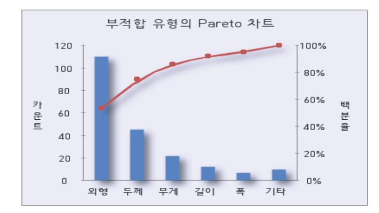

| 부적합  |     |     |     |     |     |      |
|------|-----|-----|-----|-----|-----|------|
| 유형   | 외형  | 두께  | 무게  | 길이  | 폭   | 기타   |
| 카운트  | 110 | 45  | 22  | 12  | 7   | 10   |
| 백분율  | 53% | 22% | 11% | 6%  | 3%  | 5%   |
| 누적 % | 53% | 75% | 86% | 92% | 95% | 100% |

출처: 교육부(2016). 반도체 재료 품질관리(LM1903060410\_14v1). 한국직업 능력개발원. p.56.

[그림 3-2] 개선 전 특성값 부적합 유형에 따른 Pareto 차트 예

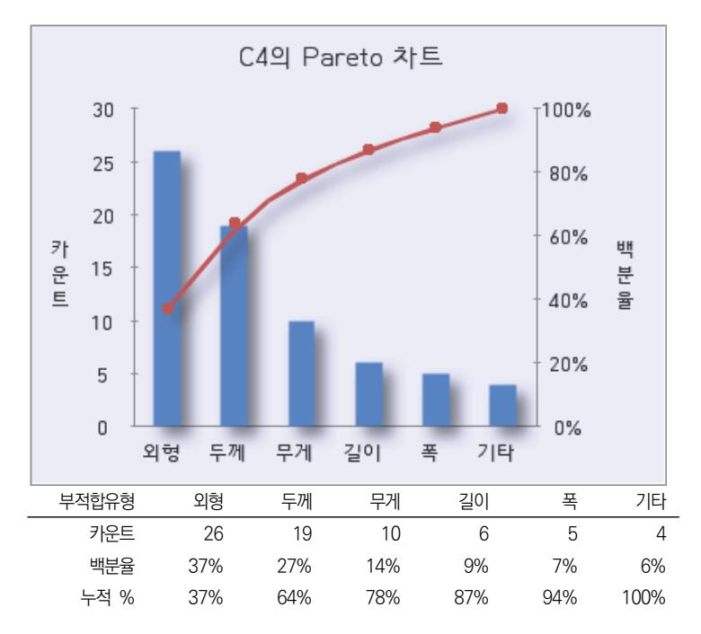

출처: 교육부(2016). 반도체 재료 품질관리(LM1903060410\_14v1). 한국직업 능력개발원. p.57. [그림 3-3] 개선 후 특성값 부적합 유형에 따른 Pareto 차트 예

- 2. 꺾은선그래프를 활용한 성과 분석한다. 시간의 흐름에 따른 항목의 특성값 변화를 파악한다.
- 3. 개선 전‧후 p 관리도에 의한 성과 분석한다. 부적합 감소폭과 변화를 파악한다.

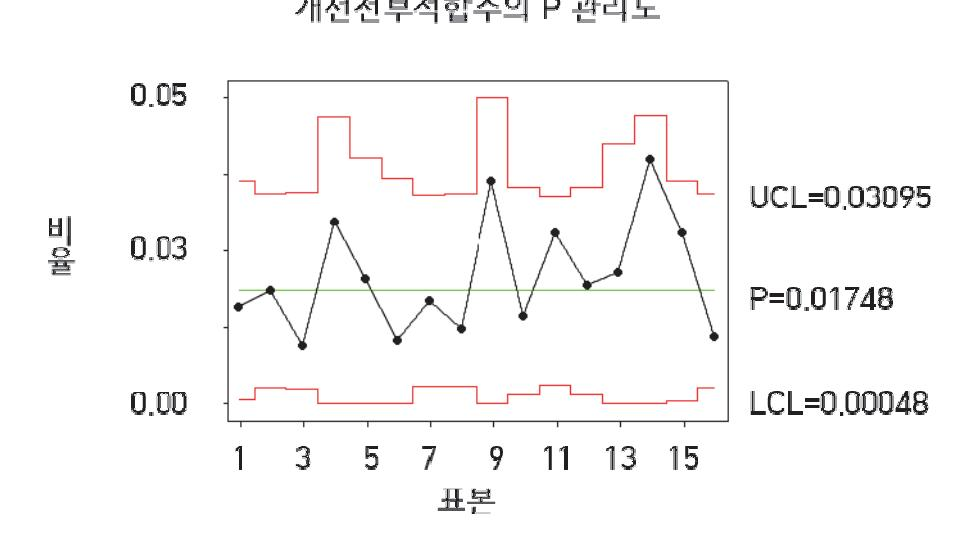

출처: 교육부(2016). 반도체 재료 품질관리(LM1903060410\_14v1). 한국직업능력개발원. p.57. [그림 3-4] 개선 전 부적합 수의 p 관리도 예

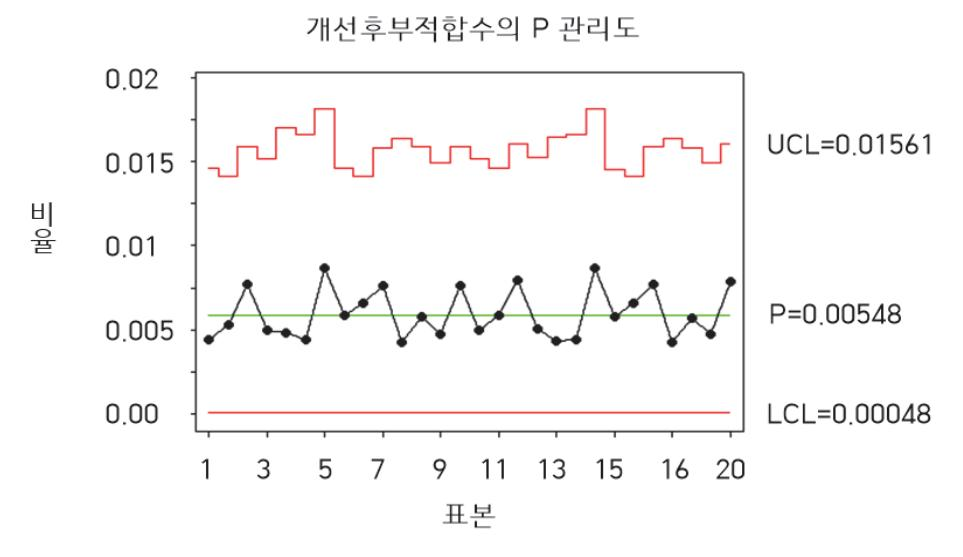

출처: 교육부(2016). 반도체 재료 품질관리(LM1903060410\_14v1). 한국직업능력개발원. p.58. [그림 3-5] 개선 후 부적합 수 1의 p 관리도 예

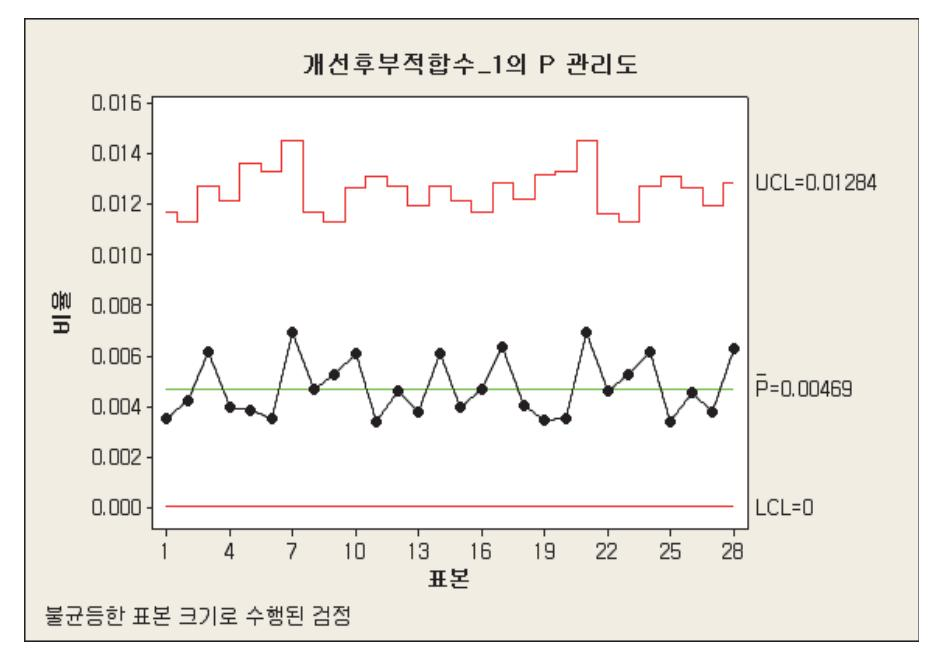

출처: 교육부(2016). 반도체 재료 품질관리(LM1903060410\_14v1). 한국직업능력개발원. p.58. [그림 3-6] 개선 후 부적합 수 1의 p 관리도 예

4. 개선 항목별 개선 전・후의 공정 능력 향상 수준 성과 분석한다.

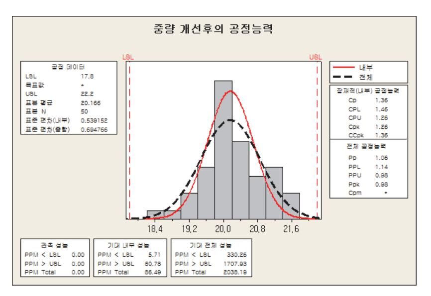

출처: 교육부(2016). 반도체 재료 품질관리(LM1903060410\_14v1). 한국직업능력개발 원. p.59.

[그림 3-7] 중량 개선 후의 공정 능력 분석도 예

숕 효과를 산출한다.

품질관리책임자는 품질개선이 완료되면 유형 효과와 Q-cost를 산출·평가한다.

1. 품질개선에 따른 유형 효과 산출 기준에 의한 효과를 산출한다.

<표 3-1> 유형효과 산출 산출표 예

| 항목      | 산출 방법                                           |
|---------|-------------------------------------------------|
|         | 1. 부적합 감소 효과                                    |
|         | - 월 생산량 X[{개선 전 부적합률(%) - 개선 후 부적합률(%)}/100]    |
|         | X (개선전 단위당 생산단가 - 개선후 단위당 생산 단가) X 00개월         |
|         | 2. 재료비 효과(부적합으로 자재가 폐기되는 경우)                    |
|         | - 월 평균 생산량 X [{개선전 폐품률(%) - 개선 후 폐품률(%)} / 100] |
|         | X 단위당 재료비 자재 단가 X 00개월                          |
|         | 3. 인건비 절감효과                                     |
|         | - 월 생산량 X [개선 전 부적합률(%) - 개선 후 부적밯률(%)/100] X   |
|         | 부적합품 재작업 시간 X 시간당 인건비 X 00 개월                   |
|         | 4. 제 작업 감소                                      |
| 품질향상    | (개선 전 재작업 시간/월 - 개선 후 재작업 시간/월) X 임금 X 00개월     |
|         | - 재작업 감소 효과: 부적합품을 양품으로 수정하기 위한 시간당 인건비로 수      |
|         | 정 인원이 축소하지 않으면 유형 효과 평가 안 함(단, 시간당 인건비 축소       |
|         | 효과는 별도 인정)                                      |
|         | 5. claim 감소효과                                   |
|         | - {(개선 전 claim 발생률 - 개선 후 Claim 발생률)/100} X 개당  |
|         | Claim 비용 X 생산량                                  |
|         | - 외주품 평균 변제 금액을 효과에서 차감                         |
|         | - 발생률 개선전, 후 최소 3개월 치 DATA                      |
|         | 6. 부적합품 폐기감소                                    |
|         | - (개선 전 폐기 수/월 - 개선후 폐기수/월) X 제품단가 X 00개월       |
|         | 1. 생산량 증대                                       |
|         | - (개선 후 월 생산량 - 개선 전 월 생산량) X 톤당 고정비(경영기획       |
|         | 실 문의) X 00개월                                    |
|         | ※단 이 경우는 해결된 테마가 생산량 증대에 직접적인 영향을               |
|         | 끼칠 경우에만 한함                                      |
|         | 2. 가동률 향상                                       |
| 생산성 향상  | - (개선 전 월 정지시간 - 개선 후 월 정지시간) X 시간당 생산량 X       |
|         | 톤당 고정비(경영기획실 문의) X 00개월                         |
|         | ※단, 이 경우는 해결된 테마가 공장 전체 가동률에 직접적인               |
|         | 영향을 끼칠 경우에만 한함.                                 |
|         | 3. 인건비 절감 효과                                    |
|         | - (개선 전 시간(분) - 개선 후 시간(분) X 1인당 평균 인건비(시간당     |
|         | 임율 X 00 개월                                      |
|         | 1. 재료비 절감(원•부자재, 주원료, 부원료, 에너지 포함)              |
| 원가 절감   | - 월 생산량 X (개선 전 톤당 재료비 - 개선 후 톤당 재료비) X 0개월     |
|         | 2. 보수 자재 및 보수 시간 절감                             |
|         | - (개선 전 월 보수 자재 사용량 - 개선 후 월 보수 자재 사용량) X       |
|         | 자재 단가 X ㅇ개월                                     |
|         | - (개선 전 월 보수 시간 - 개선 후 월 보수시간) X 시간당 인건비 X      |
|         | 투입인원 X ㅇ개월                                      |
| space절감 | 공장전용 공장면적의 평당 가격은 동일                         |
|         | 면적 - 자료산출시 경리부서의 자료에 근거하여 산출                 |
| 원자재 절감  | gas,oi l, - 구매팀의발주 단가를 근거로 작성함.              |

1. 품질개선에 의한 무형 효과 산출 방법

숖 품질관리책임자는 품질개선이 완료되면 무형 효과를 파악한다.

| 2. 품질 코스트(Q-cost)는 산출 항목에 대해서 산출식을 활용하여 산출한다. |                                    |                     |            |
|-----------------------------------------------|------------------------------------|---------------------|------------|
| <표 3-2> 예방 비용 집계 항목 과 산출근거 예                  |                                    |                     |            |
| 산출항목                                          | 산출식                                | 산출근거                | 산출부서       |
| 1. 품질기획비                                      | - 인건비: 임률*m/h - 경비              | - 품의서 - 보고서      | 발생부서 QC |
| 2. 교육비                                        | - 경비 - 인건비 (인원*교육시가*임률)      | - 품의서 - 보고서      | 발생부서       |
| 3. 제안활동비                                      | - 경비 - 시상금                      | - 제안심사결과표           | QC         |
| 4. 품질 향상 활동비                                  | - 경비 - 인건비(TFT 전담요원)            |                     | 발생부서       |
| 5. 협력회사 활동비                                   | - 협력회사 품질평가 및 개선활동 지도 경비/인건비    | - 협력업체평가보고서         | QC         |
| 6. 품질사무비                                      | - 품질 기횝구서의 인건비 (연봉 1/2) - 경비 | - 품질기획부서 - 급여명세서 | QC         |
| -합계 :                                         |                                    |                     |            |

|    | - 전기: 63원/kwh 시간당, LNG: 412원/루베              |
|----|----------------------------------------------|
|    | 1. 기타 유형 효과 신출 기능한 효과금액은 해당 부서에 의회하여 개선 후들 비 |
|    | 교하여 연간 금액을 산출한다                              |
|    | 2. 총 효과 금액 파악은 다음의 계산식으로 한다.                 |
|    | 인건비 절감 금액 + 재료비 절감 금액 * 재료비 절감 금액 투입 경비      |
| 비고 | 3. 월 생산량은 최근 3개월간 생산량을 평균한 값으로 한다            |
|    | 4. 생산성 향상과 관련된 생산량과 가동들은 공장 전제 직접적인 영향을 미치는  |
|    | 경우에만 한다.                                     |
|    | 5. 톤당 고정비나 시간당 인편비 등은 필요 시 부서에 문의하여 전년도 기준 금 |
|    | 액으로 계산한다.                                    |
|    |                                              |

기타 - 공업용수: 250원/ton, 상수도: 1,934원/ton

기타 - 개선 제안서 제출 시점을 기준으로 시가로 산정

- (2) 과제를 다루는 구성원의 태도가 어떻게 바뀌었는가?
- (3) 직장 내의 정리 정돈, 환경 개선 및 미화 상태는 어떠한가?
- (4) 아이디어나 개선 내용의 응용 정도는 어떠한가?
- (5) 품질의 안정, 사무량의 감소, 기준의 정비, 업무의 능률 향상 정도는 어떠한가?
- (6) 작업성과 안정성의 향상, 재해 예방 등은 어떠한가? 등 검토
- 2. 품질개선에 따른 고객 만족
  - (1) 고객 불만 건수는 감소되었는가?
  - (2) 고객 요구 수준은 만족하는가?
- 숗 품질관리책임자는 품질개선 평가 후 다음과 같이 표준화를 실시한다.
  - 1. 사내 표준을 제 ‧ 개정한다.
  - 2. 개선한 작업 방법, 업무 수행 방법을 정리 제·개정한다.
  - 3. 프로세스 유지를 위한 QC-공정도 및 관리 계획서를 제·개정한다.
- 수 품질관리책임자는 개선의 유지 관리를 위해 다음과 같이 사후 관리를 실시한다.
  - 1. 관리도에 의한 개선의 유효성을 확인한다.
  - 2. 체크 시트에 의한 개선의 유효성을 확인한다.
  - 3. 주기적인 품질 감사를 실시한다.
  - 4. 고객의 품질 만족을 확인한다.

#### 수행 tip

- 품질개선에 따른 제품의 효과를 정확히 평가하고, 품질의 유지 관리를 위해 사후 관리를 철저히 실시한다.
- 품질개선 후 표준화를 실시한다.

## 3-2. 품질문제 원인파악

학습 목표 • 반도체 재료의 품질이슈 방지를 위해 예측사항 도출과 실시방안을 수립할 수 있다.

## 필요 지식 /

숔 불량품

원․부자재, 반제품, 완제품의 규격이 요구 품질 사양과 일치하지 않거나 환경관리 물질을 기준 을 초과로 함유한 것으로, 수입, 공정, 최종(출하) 검사에서 불량으로 판정된 로트(LOT) 또는 고객 불만 제품을 의미한다.

1. 로트 (LOT)

생산 제품의 특성, 제품의 크기, 품질, 용기의 크기 등에 따라 필요한 최소 생산 또는 발주 단위를 의미한다.

### 숕 불량 유형

1. 공정 불량

제품의 제조 공정 중에 발생하는 불량을 말한다.

2. 작업 불량

제조 공정에서 작업자의 부주의로 발생하는 불량을 말한다.

3. 포장 불량

제품의 출하를 위해 포장할 때에 발생하는 불량을 말한다.

- 4. 보관 및 보관 중 불량 제품을 보관할 때 보관 조건 등의 부주의로 발생하는 불량과 보관 중 포장의 파손, 품질 변 형 등으로 발생하는 불량을 말한다.
- 숖 불량품 검사

반도체 원.부재료에 대한 불량품은 회사에서 규정한 "제품규격서"에 준하여 검사한다.

1. 제품규격서

제품규격서는 다음을 포함한다.

(1) 적용 범위

제조된 반도체 원.부재료의 생산 라인, 납품처, 종류를 명시한다.

- (2) 품질 특성
  - (가) 일반 및 경화물 특성
  - (나) 물리적 특성
  - (다) 화학적 특성
  - (라) pellet 특성
- 2. 보관 조건 및 저장 기간
- 3. 검사 로트의 구성
- 4. 시료 채취 방법
- 5. 합부 판정
- 6. 불량품의 처리
- 7. 제품 포장
- 8. 기타 사항
- 9. 관련 문서
- 10. 부칙
- 숗 공정검사

공정검사는 회사의 규정한 공정검사기준에 따라 진행한다.

〈표 3-3〉 공정검사기준 예

| 항목          | 방법                          | 측정빈도                           | 불량기준                         |
|-------------|-----------------------------|--------------------------------|------------------------------|
| 두께          | 10군데 이상 측정                  | 규격 변경 시 동일 규격은 1시간 단위       | 최솟값 미만                       |
| 폭           | 수직 방향으로 측정                  | 규격 변경 시 동일 규격은 1시간 단위       | 제조규격 미만                      |
| 세팅 길이       | 품목의 길이+여유길이 설정값             | 포장 단위별(특히 규격 변 경 시)         | 설정오류시 동일규격 제품 전부부적합       |
| 중량          | 품목의 증량확인 저울 0점 확인 후 계량   | 규격 변경 시 동일 규격은 별도 규정        | 기준값의 ±3% 초과                  |
| 인쇄          | 로트 표준과 동일한지 확인              | 포장 단위별                         | 글자의 번짐이나 뭉개짐                 |
| 타개          | 타개와 튜브틀 확인 타개 면이 깨끗한지 확인 | 포장 단위별                         | 타개규격 부적합, 타개면 거칠기 폭 1mm이상 |
| 분산겔/ 탄화물 | 포장 전까지 지속적으로 육안 확 인      | 포장 단위별                         | 흑점,백점 발생시 전부 젤은 기준표에 준함   |
| 인열          | 길이 방향으로 칼자국을 내어 찢 기      | 품목 단위별 동일 품목: 주•야간 각각 2회 측정 | 찢어지는 면이 직선일 경 우           |
| 개구성         | 타개 면을 양손 폭 넓이로 당김           | 품목 단위별 동일 품목: 주야간 각각 4회 측정  | 필름표면에 마찰 스크래치 가 발생        |

5 파레토(Pareto's graph) & 특성 요인도

품질관리(QC: quality control)를 위한 도구의 하나로, 자세한 내용은 학습모듈'품질관리 (LM1702020507\_13v1.2)의 통계적 품질관리하기'를 참조한다.

6 5W1H

- 1. 무엇을(what): 제품, 명칭, 품질 특성 등
- 2. 어디서(where): 생산 공장, 공정, 설비
- 3. 어떻게(how): 샘플의 크기, 간격, 측정기, 측정 단위
- 4. 언제(when): 데이터를 취한 일자, 시간
- 5. 누가(who): 조사자나 검사자 이름
- 6. 왜(why): p 관리도를 작성하기 위하여

## 수행 내용 / 유형별 불량 원인 파악하기

### 재료·자료

- 샘플링 기법(KS A 3102, KS A ISO 18414, KS A ISO 2589-1-, KS A ISO3951-1, KS A ISO 3951-2)
- 검사 기준서, QC-공정도, 작업표준서, 시험 성적서, 체크 시트

### 기기(장비 ・ 공구)

- 컴퓨터, 프린터
- 통계 분석 소프트웨어(미니탭, 엑셀, SPSS 등)

### 안전 ・ 유의 사항

- 불량 현상 및 원인 파악을 위해 안전 수칙을 준수하고 개인 보호 장구를 착용한다.
- 반도체 원부재료의 제조 공정 중에 발생할 수 있는 불량의 유형과 원인을 파악하도록 한다.

### 수행 순서

- 숔 품질관리담당자는 시험 성적서에 따라 불량 유형과 원인 파악을 한다.
  - 1. 반도체 원부재료의 불량 원인을 파악하기 위해 원․부자재의 관리 절차에 따라 공급 업체로부터 접 수한 시험 성적서를 확인한다.

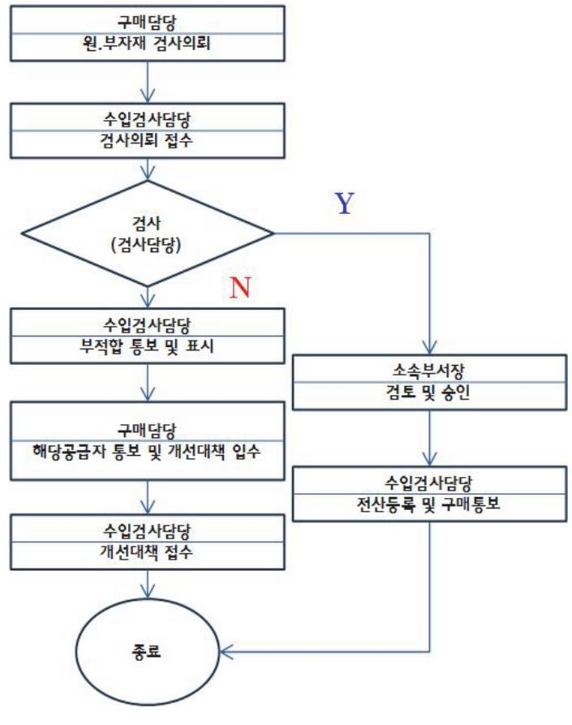

출처: 교육부(2016). 반도체 재료 품질관리(LM1903060410\_14v1). 한국 직업능력개발원. p.66. [그림 3-8] 원․부자재 부적합 관리 절차 예

- 2. 품질관리담당자는 시험 성적서상 기준 및 결과에 대해 검사 기준서상의 각 항목 기준과 비교한다.
- 3. 품질관리담당자는 입고된 원·부재료에 대해 랜덤 샘플링 후 검사를 실시하여 부적합 시 불량 표 시를 하고, 불량 유형에 대해 관련 담당자에게 통보한다.
- 4. 구매관리담당자는 통보받은 입고 검사 불량품의 유형에 대해 원인 및 재발 방지를 위한 개선 대 책을 공급사에 요청한다.
- 숕 생산담당자는 제조 공정 및 그 외 단계에서 발생하는 불량 유형과 원인에 대해 파악한다.

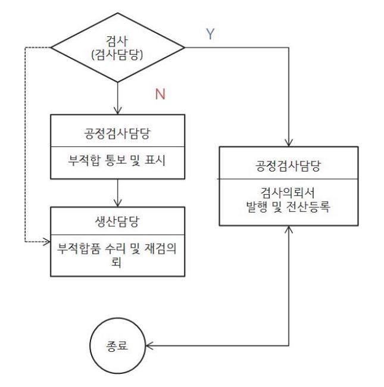

출처: 교육부(2016). 반도체 재료 품질관리(LM1903060410 \_14v1). 한국직업능력개발원. p.67. [그림 3-9] 공정검사에 의한 부적합 관리 절차 예

- 1. 생산담당자는 제조 공정 중이나 그 외 단계에서 발생하는 불량 유형의 현상을 파악하여 생산책임 자에게 보고한다.
- 2. 생산책임자는 불량 보고서를 작성하여 품질관리책임자에게 통보한다.
- 3. 품질관리담당자는 불량 유형에 대한 원인을 파악하고 확인한다.
  - (1) 불량 원인을 파악하기 위해 작업 표준을 확인한다.
  - (2) QC-공정도를 활용하여 공정관리 조건과 항목 및 기준을 확인한다.
  - (3) 공정관리 체크 시트를 확인한다.
- 4. 품질관리담당자는 체크 시트를 활용하여 유형별 부적합 데이터를 수집하고 현상과 요인을 파악한 다.
  - (1) 데이터를 취하는 목적을 분명하게 하고 누가 보아도 알 수 있게 사실을 정확히 제시한다.
    - (가) 무엇을(what): 제품, 명칭, 품질 특성 등
    - (나) 어디서(where): 생산 공장, 공정, 설비
    - (다) 어떻게(how): 샘플의 크기, 간격, 측정기, 측정 단위
    - (라) 언제(when): 데이터를 취한 일자, 시간
    - (마) 누가(who): 조사자나 검사자 이름
    - (바) 왜(why): p 관리도를 작성하기 위하여
  - (2) 데이터는 사실을 충실하게 표현하도록 한다.

표본을 조사하여 데이터를 취한다.

(3) 유형별 불량 체크 시트를 작성한다.

- (4) 유형별 불량률 파레토(Pareto' graph)를 활용하여 전체적인 부적합 이유를 분석한다.
  - (가) 미니탭 워크 시트에 데이터를 입력한다.
  - (나) 통계학 → 품질 도구 → 파레토
  - (다) 차트의 결점도표를 체크하고, 레이블에 불량 유형, 빈도 위치에 불량 수를 선택한 다음 확인을 클릭한다.

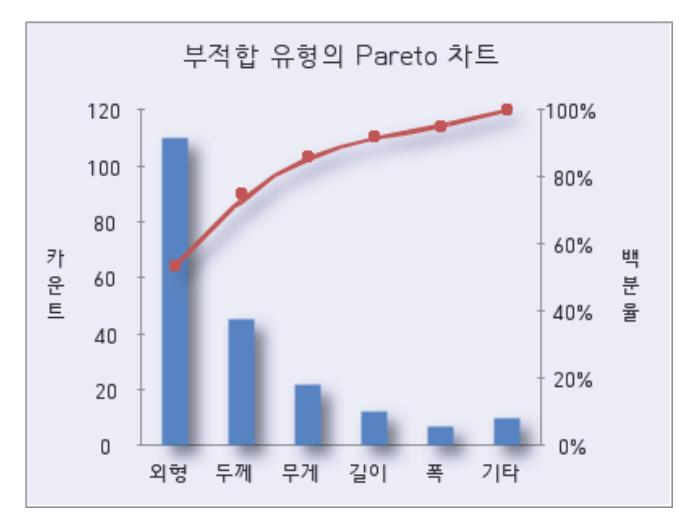

출처: 교육부(2016). 반도체 재료 품질관리(LM1903060410\_14v1). 한국직업능력개발원. p.68. [그림 3-10] 미니탭을 활용한 부적합 유형의 파레토 예

### 5. 파레토의 주요 불량 유형에 대한 원인과 결과인 특성 요인도를 작성한다.

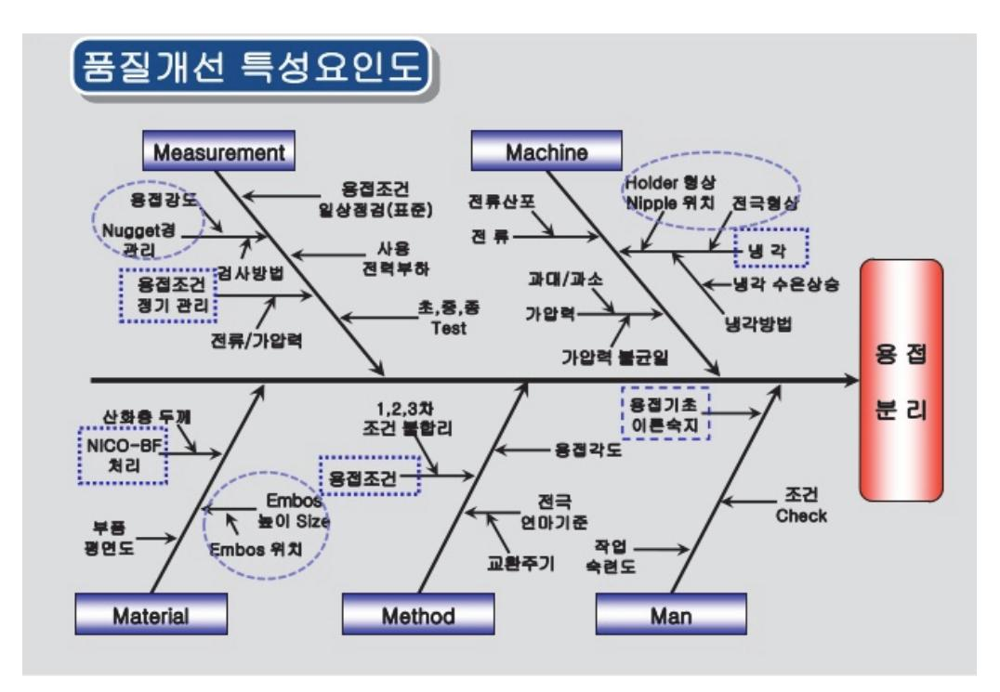

출처: 교육부(2016). 반도체 재료 품질관리(LM1903060410\_14v1). 한국직업능력개발원. p.69. [그림 3-11] 외관 부적합품 과다 발생 특성 요인도 예

6. 품질관리담당자는 특성 요인도에 나타난 주요 요인을 원인 추구형 계통도로 정리하여 요인 항목 에 따른 1차, 2차, 3차 요인을 파악하여 대책을 수립한다.

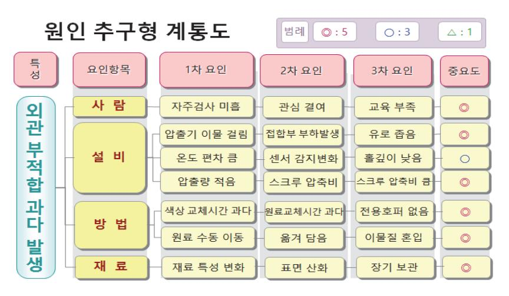

출처: 교육부(2016). 반도체 재료 품질관리(LM1903060410\_14v1). 한국직업능력개발 원. p.69.

[그림 3-12] 외관 부적합 과다 발생 원인 추구형 계통도(부적합 발생 대책) 예

숖 출고관리담당자는 보관 및 출고 중에 발생하는 불량 유형과 원인 파악을 실시한다.

- 1. 출고관리담당자는 보관 중 또는 출고할 때 제품 외형이 불량이면 출고를 중단하고 품질관리담당 자에게 통보한다.
- 2. 품질관리담당자는 불량 유형을 확인하고 원인 조사를 실시한다.
  - (1) 제품 포장 파손일 경우 운반 및 적재 상태를 파악한다.
  - (2) 제품이 포장재 밖으로 유출되었을 경우 운반 및 적재 상태와 내용물 상태를 파악한다.
  - (3) 제품 유효 기간이 초과되었을 경우 선입 선출 사항을 확인하고, 검사를 실시한다.
  - (4) 제품의 보관 장소 및 보관 온·습도와 보관 기간 등을 확인한다.
  - (5) 제품이 수분에 노출되었을 경우 보관 장소의 누수 사항을 점검한다.
- 3. 품질관리담당자는 보관 출고 중의 불량 유형별 원인에 대해 보고하고, 관련 부서에 통보하여 시 정 조치 및 재발을 방지하도록 한다.

#### 수행 tip

• 불량 유형과 원인을 명확히 파악하여 데이터를 수집하고 파레토를 활용하여 특성 요인도를 작성한다.

## 3-3. 품질개선안 유지관리

한도체 원자재 입고품질 기준을 수립하고 품질유지 및 개선대책이 현장에서 실시, 유지되도록
 관리할 수 있다..

## 필요 지식 /

1 품질 관리

품질관리 계획서를 작성할 때 검사 업무 수행 계획에 따른 품질 검사 대상 및 검사 시기, 검사 방법을 결정한다.

〈표 3-4〉 품질검사의 종류 예

| 검사대상      | 검사시기                                                                  | 검사원인                                                                                                                               | 검사방법                                                                                                                                                                                                                                                                | 비고                                                                                                                                                                                                                                                                       |
|-----------|-----------------------------------------------------------------------|------------------------------------------------------------------------------------------------------------------------------------|---------------------------------------------------------------------------------------------------------------------------------------------------------------------------------------------------------------------------------------------------------------------|--------------------------------------------------------------------------------------------------------------------------------------------------------------------------------------------------------------------------------------------------------------------------|
| 제품, 부품, 자 | 매 생산 전                                                                | 자재 브서 이처 시                                                                                                                         | 전수검사                                                                                                                                                                                                                                                                |                                                                                                                                                                                                                                                                          |
| 재 등       | 검사 필요시                                                                |                                                                                                                                    | 기본원칙                                                                                                                                                                                                                                                                |                                                                                                                                                                                                                                                                          |
| 제품, 부품, 자 | 매 생산 전                                                                | 자체 계획,                                                                                                                             |                                                                                                                                                                                                                                                                     |                                                                                                                                                                                                                                                                          |
| 재 등       | 검사 필요시                                                                | 관련부서요청 시                                                                                                                           |                                                                                                                                                                                                                                                                     |                                                                                                                                                                                                                                                                          |
| 제품, 부품, 자 | 매 생산 후                                                                | 샌산 부서,                                                                                                                             |                                                                                                                                                                                                                                                                     |                                                                                                                                                                                                                                                                          |
| 재 등       | 검사 필요시                                                                | 관련부서요청 시                                                                                                                           |                                                                                                                                                                                                                                                                     |                                                                                                                                                                                                                                                                          |
| 제품, 부품, 자 | 매 검사 후                                                                | 자체 계획,                                                                                                                             |                                                                                                                                                                                                                                                                     |                                                                                                                                                                                                                                                                          |
| 재 등       | 자체 필요시                                                                | 관련부서요청 시                                                                                                                           | 신구 검시                                                                                                                                                                                                                                                               |                                                                                                                                                                                                                                                                          |
|           | 제품, 부품, 자 재 등 제품, 부품, 자 재 등 제품, 부품, 자 재 등 제품, 부품, 자 | 제품, 부품, 자  매 생산 전    재 등  검사 필요시    제품, 부품, 자  매 생산 전    제품, 부품, 자  매 생산 전    제품, 부품, 자  매 생산 후    제품, 부품, 자  매 생산 후    제등  검사 필요시 | 제품, 부품, 자  매 생산 전    재 등  검사 필요시    제품, 부품, 자  매 생산 전    지품, 부품, 자  매 생산 전    자체 계획,    재 등  검사 필요시    관련부서요청 시    제품, 부품, 자  매 생산 후    샌산 부서,    재 등  검사 필요시    관련부서요청 시    제품, 부품, 자  매 생산 후    샌산 부서,    재 등  검사 필요시    관련부서요청 시    제품, 부품, 자  매 검사 후    지처, 계획, | 제품, 부품, 자  매 생산 전  자재 부서 요청 시  전수검사    재 등  검사 필요시  자재 부서 요청 시  기본원칙    제품, 부품, 자  매 생산 전  자체 계획, 관련부서요청 시  샘플링 검사    제품, 부품, 자  매 생산 후  산산 부서, 관련부서요청 시  샘플링 검사    제품, 부품, 자  미 생산 후  산산 부서, 관련부서요청 시  샘플링 검사    제품, 부품, 자  미 검사 후  자체 계획, 관련부서요청 시  샘플링 검사 |

2 전수 검사

검사해야 할 물품을 모두 조사하여 양품 불량품으로 구분하고, 양품만을 합격시키는 검사를 말 한다. 다수의 물품을 연속적으로 검사하기 때문에 누락 가능성이 있고 비용과 시간이 많이 소 요된다.

- 전수 검사를 해야만 불량품을 제거할 수 있을 때
- 전수 검사가 간단하여 저비용으로 할 수 있을 때
- 많은 인력이나 고비용을 투입하더라도 그만한 가치가 있을 때
- 사용자 인명에 영향을 끼칠 때

③ 샘플링 검사

제조 공정이나 로트 이력에 대한 정보가 있을 경우에 샘플을 무작위로 발췌하여 검사한 다음,

73

그 결과를 판정 기준과 비교하여 로트의 합격, 불합격을 판정하는 검사이다. 샘플링 검사는 검 사 수량을 최소화하고, 로트의 특성값과 샘플로부터 얻은 특성값과의 관계를 수리 통계학의 이 론으로 구하여 샘플 크기, 판정 기준을 정한다. 따라서 확률의 개념으로 표현된 신뢰성이 높은 검사 결과를 얻을 수 있다.

- 1. 샘플링 검사가 유리한 경우
  - (1) 기술적으로 개별 검사가 무의미한 경우: 구조품, 성형품 등
  - (2) 다수, 다량의 것으로 어느 정도 불량품이 섞이더라도 관계없는 경우
  - (3) 검사 비용을 적게 하는 편이 이익이 되는 경우
  - (4) 불완전한 전수 검사에 비해 신뢰성 높은 결과를 얻을 수 있는 경우

### 2. 샘플링 검사 조건

- (1) 품질 기준이 명확히 전제되어야 한다.
- (2) 검사 대상 물품이 로트로 처리할 수 있어야 한다.
- (3) 로트로부터 샘플을 무작위하게 샘플링할 수 있어야 한다.
- (4) 합격된 로트 속에도 어느 정도의 불량품이 섞여 들어가는 것을 허용해야 한다.
- 숗 품질 기능 개선(Quality Function Deployment)
  - 1. 기본 개념

고객의 요구 사항이 제품의 기술 특성을 변화시키고, 이를 다시 부품 특성과 공정 특성, 그 리고 생산에서의 구체적인 사양과 활동으로까지 변환하는 것.

- 2. 목적
  - (1) 품질 수준을 제시할 수 있고, 확대 적용할 수 있는 방법을 제시한다.
  - (2) 품질 목표의 초과 달성과 품질 비용 절감 목표의 범위를 확정할 수 있다.
  - (3) 경쟁 업체를 벤치마킹하고, 차이를 비교․분석하여 품질 수준을 설정한다.
  - (4) 다른 부문의 의견을 수렴하여 품질 정보를 질적으로 향상시킨다.
  - (5) 제품 품질 향상에 필요한 주요 품질 특성의 우선순위를 정한다.
  - (6) 소비자의 요구를 회사의 전체 조직에 전달하여 요구 항목을 구체화한다.
- 3. 효과
  - (1) 변경의 전달
  - (2) 개발 기간의 단축
  - (3) 시운전 시의 문제점 감소

- (4) 과정의 문서화
- (5) 기술자를 위한 교육 매뉴얼로 활용
- (6) 품질 보증 비용 감소
- (7) 소비자 만족도의 향상 등

## 수행 내용 / 품질관리 항목에 따른 관리 수준 결정하기

재료·자료

통계적 품질관리 해석 결과서

### 기기(장비 ・ 공구)

- 컴퓨터, 프린터
- 아래한글 등 소프트웨어

안전 ・ 유의 사항

- 반도체 원부재료에 대한 품질관리 결과서를 활용 한다.
- 반도체 원부재료의 불량품에 대한 적합한 품질관리 항목을 선정한다.

수행 순서

- 숔 품질관리담당자는 통계적 품질관리 항목과 측정 빈도수 및 관리 수준을 결정하기 위해서 다음과 같 은 사항을 확인한다.
  - 1. 고객 요구 사항 특정 요구 특성, 법규, 안전, 환경 관련 사항
  - 2. FMEA 결과

설계 FMEA, 공정 FMEA [원인별 위험도(RPN) 높은 값]

3. 품질 정보

시장 품질, 후 공정 문제, 검사 이력, 협력 업체 수준

- 4. 제품 규격
- 5. 반제품 규격

- 6. 작업 표준
- 7. 공정검사 항목과 기준
- 8. 최종 제품 검사 항목과 기준
- 9. 설비 점검 항목과 기준
- 숕 품질관리담당자는 모집단 대상의 공정과 제품, 반제품, 원․부재료 등의 아래와 같은 사항을 확인한다.
  - 1. 반도체 원․부재료 품질 특성
  - 2. 작업표준서에 의한 설비 관리 항목
  - 3. 작업표준서에 의한 공정 및 최종 검사 품질 특성
  - 4. 제품으로 발휘해야 할 기능을 전개하여 각 공정에서 수행되어야 할 품질 특성
- 숖 품질관리담당자는 기준에 따라 관리 항목을 선정한다.
  - 1. 관리 항목 선정 기준
    - (1) QFD 및 제조 중심으로 관련되는 전 부서가 참여하여 선정한다.
      - (가) 공정 특성의 반영 여부로 생산기술/개발 부서에서 선정
      - (나) 제조 공정에서의 중요 특성은 생산 부서에서 선정
    - (2) 품질 이력 및 고객의 품질 정보에 의해 결정한다.
      - (가) 기술 사양서
      - (나) FMEA(failure mode and effect analysis), 관리 계획서 등
      - (다) 품질 개선 활동 과정에 중요하다고 여겨지는 특성
      - (라) 제품과 공정의 이해, 고객의 목소리를 통해 공정에서 중요하다고 인정된 특성 (품질 기능 전개도: QFD)
  - 2. 관리 항목 선정 방법
    - (1) 제품에 영향을 주는 원․부재료의 품질 특성 항목
    - (2) 고객이 요구하는 품질 특성 항목
    - (3) 품질 특성값에 영향을 주는 관리 항목
      - (가) 운전 조건(온도, 압력, 회전수 등)
      - (나) 공정 검사 항목

- 3. 관리 항목 선정 시 고려 사항
  - (1) 주요 품질 특성의 조치가 기술적으로 해결하기 곤란하거나 경제적 손실이 크면 그 다음 품질 특성을 대상으로 요인을 분석한다.
  - (2) 시간적으로 너무 늦지 않게 한다.
  - (3) 경비 소요가 최소화하고 측정하기 쉬워야 한다.
  - (4) 해당 공정 범위 외에는 영향을 주지 않도록 한다.
  - (5) 관리 항목 결정 시 요인 분석은 5W1H에 의해 분석한다.

숗 품질관리책임자는 선정된 관리 항목에 대해서 검사 주기는 품질 비용 측면을 고려하여 설정한다.

- 1. 검사 빈도가 많아지면 평가 비용과 내부 실패 비용이 증가하며, 외부 실패 비용은 감소함에 최적 검사 빈도를 설정하여야 한다.
- 2. 품질 비용 해석의 기본
  - (1) 예방 및 평가 비용은 증가되더라도 실패 비용은 감소시킨다.
  - (2) 대외 경쟁력을 위하여 사외 실패 비용을 적극 감소시킨다.
  - (3) 요구되는 품질 수준을 유지하되 실패 비용을 최소화한다.
  - (4) 예방 비용의 효과는 장시간이 요구된다.

수 품질관리담당자는 모집단의 시료를 채취하여 측정하고 공정 능력을 파악하여 관리 한계를 산출한다.

1. 측정된 데이터를 수집한다.

| <표 3-5> 측정된 데이터 예 |       |       |       |       |  |
|-------------------|-------|-------|-------|-------|--|
| 20.13             | 22.20 | 20.11 | 19.45 | 18.22 |  |
| 21.11             | 23.54 | 17.99 | 20.05 | 21.41 |  |
| 19.14             | 18.11 | 20.28 | 20.17 | 20.37 |  |
| 22.37             | 21.74 | 18.97 | 20.88 | 21.12 |  |
| 20.13             | 22.20 | 20.11 | 19.45 | 18.22 |  |
| 21.11             | 21.51 | 17.95 | 20.06 | 21.46 |  |
| 19.54             | 19.15 | 20.28 | 20.15 | 20.17 |  |
| 21.31             | 21.74 | 18.97 | 20.88 | 20.12 |  |
| 20.13             | 21.20 | 20.21 | 19.54 | 19.22 |  |
| 21.22             | 23.51 | 17.99 | 20.05 | 21.45 |  |

- 2. 데이터의 정규성을 검정한다.

(1) 데이터가 입력된 열을 지정한다.

(3) 규격 하한과 상한값을 입력한다

(4) 표준편차의 추정 방법을 선택한다

(가) 잠재적 공정 능력 분석 결과

(나) 전체 공정 능력 분석 결과

CPL: 규격 상한만 고려한 공정 능력

PPU: 규격 상한만 고려한 공정 능력 PPL: 규격 하한만 고려한 공정 능력

즉, 데이터가 치우침이 있다고 판단한다.

(라) 관측 성능: 현재 데이터의 분포로 볼 때의 부적합률

(마) 기대 성능(군 내): 잠재적으로 예상되는 부적합률

(바) 기대 성능(군 내): 실제적으로 예상되는 부적합률

이 고객의 요구 수준에 부응할 수 있도록 품질 수준을 결정한다.

3. 잠재적 공정 능력과 전체 공정 능력의 시그마 수준을 계산한다.

2. 확인을 하면 시그마 수준 Z값이 산출된다.

(1) CP×3=Z(시그마 수준)

1. 시그마 수준을 파악할 경우 옵션에서 "벤치 마크 z(시그마 수준)"를 지정한다.

Cpk: CPU와 CPL 중 적은 값

(6) 공정 능력을 분석한다.

Cp: 1.43

PP: 1.20

Ppk: 1.17

미니탭에서 통계 분석(S) → 기초 통계(B) → 정규성 검정(N)의 창을 이용한다.

미니텝에서 통계분석--> 품질도구 --> 공정 능력 분석 --> 정규분포로 진행한다.

(다) CP≠Cpk(PP ≠ Ppk)이면 측정값의 평균과 규격의 중심이 같지 않기 때문이다.

숙 품질관리담당자는 중점 관리 항목에 대해 데이터를 수집하고. 공정 능력(Cpk)을 평가하여 최종 제품

(2) 부분 군의 크기는 데이터를 1개씩 표본으로 뽑았으므로 "1"을 입력한다.

3. 공정 능력을 분석한다.

78

- (가) 잠재적 공정 능력 Cpk×3 = 1.41×3 = 4.23 시그마
- (나) 전체 공정 능력 Ppk×3 = 1.17×3 = 3.51 시그마
- 숚 품질관리담당자는 중점 관리 항목, 측정 빈도, 관리 수준을 QC-공정도에 명시한다.
  - 1. QC(quality control)-공정도 작성 방법은 다음과 같다.
    - (1) 대상 제품, 대상 공정을 선정한다.
    - (2) 공정의 실태 조사를 한다
      - (가) 제조 설명서와 대비하면서 설명서와 상이한 점 유무 확인 조사
      - (나) 설계, QC, 생산 기술, 제조 부문의 공동 조사
    - (3) 관리점 및 관리 방법을 검토한다.
      - (가) 관리 항목을 설정한다.
      - (나) 관리 방법을 검토한다.
        - 1) 담당: 관리 항목을 체크하는 자
        - 2) 빈도: 체크 빈도, 로트의 크기
        - 3) 관리 자료: 관리도, 그래프, 체크 시트 등
        - 4) 조처 방법: 이상의 판정 기준, 이상에 대한 조치 방법 및 그 담당자
      - (다) 점검 항목을 설정한다.
      - (라) 점검 방법을 검토한다.
      - (마) 담당, 빈도, 관리 자료, 조처 방법을 검토하여 결정한다.
    - (4) QC-공정도에 기입한다.
    - (5) 문제점에 대한 개선을 한다.
    - (6) 실태 조사, 관리점, 관리 방법의 검토를 통해서 나타난 문제점은 개선 계획을 관계 부서와 협 의해 입안하고, 그 모든 대책이 완료된 시점에서 QC-공정도를 완성시킨다.
  - 2. 아래 [그림 3-13]와 같이 완성된 QC-공정도는 고객, 작성 부서, 관리 부서의 승인을 득하고 배 포한다.

| type     | no  | pol-        | -Qc         | 적      |     | <i>I</i> -710 |             |     |      | (    | 고 오 군 | 긍정      | 도      |    |     |       |        | 개    | No      |            | 개정내용 | 개정자 |    |  |  |  |  |  |  |  |
|----------|-----|-------------|-------------|--------|-----|---------------|-------------|-----|------|------|----------|---------|--------|----|-----|-------|--------|------|---------|------------|------|-----|----|--|--|--|--|--|--|--|
|          |     |             |             |        | IN  | /1-700        |             |     |      |      |          |         |        |    |     |       |        | 1    | 16.7.19 | 제정         | 00   |     |    |  |  |  |  |  |  |  |
| 품        | в   | 고분자         | 부함          | 용 범 |     |               | 매수 승 작성     |     | 검토   | 승인   |       | 승인      | ! 관 | 담당 | 부사  | 자     | 점 이 | 2    | 16.6.10 | SPEC 변경 | 00   |     |    |  |  |  |  |  |  |  |
|          |     |             |             | 위      |     |               |             | 1   |      |      | -        | -  객 |        | 리  |     |       |        | 력    |         |            |      |     |    |  |  |  |  |  |  |  |
| 회시       | ·B  | poly        | tech        |        |     |               | ·현 1 전 1 | - 인 |      |      |          | 4       |        | 디  |     |       |        |      |         |            |      |     |    |  |  |  |  |  |  |  |
|          | flo | ow cha      | art         |        |     |               |             | 관리  | 점    |      |          |         |        | 관  | 리방법 |       |        |      |         |            |      |     |    |  |  |  |  |  |  |  |
| 공정 번호 | ma  |             | sub         | J.     | 공정명 | 제조설비          | 점검항목        |     | 관리항목 |      | 담당       |         | 기준     |    | 측정7 | 측정기기  |        | 1 주  | 7       | 기록         | 이상처리 | 비고  |    |  |  |  |  |  |  |  |
|          |     |             |             |        |     |               |             |     |      |      | 자재       |         |        |    |     |       |        |      |         |            |      |     |    |  |  |  |  |  |  |  |
| 1        |     |             |             | 원      | 원자재 |               | 수량          |     | 입고성적 |      | 담당자      |         | 거래명세   |    | 육인  | 육안    |        | lot별 |         | 전산         |      |     |    |  |  |  |  |  |  |  |
|          | /   | $\setminus$ |             | '      | 입고  |               |             |     | 서    |      |          |         | Y      | 1  |     |       |        |      |         | (ERP)      |      |     |    |  |  |  |  |  |  |  |
|          | _   |             |             |        |     |               |             |     |      |      | 수입       |         |        |    |     |       |        |      |         |            | 부적합  |     |    |  |  |  |  |  |  |  |
| 2        | /   |             |             | 수'     | 입검사 |               | 외관          |     |      |      | 검사       |         | 수입     | 검사 | 검사장 | 时     | lot별   |      |         | 수입검사       | 발생   |     |    |  |  |  |  |  |  |  |
|          |     |             |             |        |     |               |             |     | 물성   |      | 담당자      |         | 기준     | 서  |     |       |        |      |         | 성적서        | 통보서  |     |    |  |  |  |  |  |  |  |
|          | Ċ   |             |             |        |     |               |             |     |      |      |          |         |        |    |     |       |        |      |         |            |      |     |    |  |  |  |  |  |  |  |
| 3        |     |             | / 비합 배합기 저울 |        |     | 투입 겨          | 해량          | 작업자 |      | 배합기준 |          | 저울      |        | 수시 |     |       | 점검표    | 부적밯  |         |            |      |     |    |  |  |  |  |  |  |  |
|          |     | /           |             |        |     |               |             |     |      |      |          |         | 표      |    | (로드 | (로드셀) |        | 드셀)  |         |            |      |     | 발생 |  |  |  |  |  |  |  |
|          |     |             |             |        |     |               |             |     |      |      |          |         |        |    |     |       |        |      | 통보서     |            |      |     |    |  |  |  |  |  |  |  |
|          |     |             |             |        |     |               |             |     |      |      |          |         |        |    |     |       |        |      |         |            |      |     |    |  |  |  |  |  |  |  |
|          |     |             |             |        |     |               |             |     |      |      |          |         |        |    |     |       |        |      |         |            |      |     |    |  |  |  |  |  |  |  |
|          |     |             |             |        |     |               |             |     |      |      |          |         |        |    |     |       |        |      |         |            |      |     |    |  |  |  |  |  |  |  |

출처: 교육부(2016). 반도체 재료 품질관리(LM1903060410\_14v1). 한국직업능력개발원. p.77.

[그림 3-13] QC-공정도 작성표 예

⑧ 품질관리담당자는 QC-공정도보다 더 상세하게 관리 기준, 관리 방법, 데이터 정리 방법, 담당자 등 을 규정하여 궁극적으로 원하는 품질 보증이 되도록 유도하는 SPC(statistical process control) 공 정도를 다음과 같이 작성한다.

1. SPC 공정도 작성 방법

| 고저       | 고저       | Ţ      |    |    |    |    | 관  | 리방법   | 1 |        | C | 레이티 | H |    | ( | COS | Т | 누 | 적 | 합 | 항목 | 룍 | 이상시 | 조치       |
|----------|----------|--------|----|----|----|----|----|-------|---|--------|---|-----|---|----|---|-----|---|---|---|---|----|---|-----|----------|
| 공정 구분 | 공정 흐름 | 공 정 | 관리 | 관리 | 경고 | 시료 | 크기 | 관리    | 측 | 담      |   | 정리  |   | QA |   |     |   |   |   |   |    |   |     | 조치       |
| 코드       |  도    | · 명 | 항목 | 기준 | 수준 |    |    | 주기    | 정 | ㅁ 당 | 기 | 주   | 담 |    | А | В   | С | а | b | с | d  | е | 방법  | 오지 담당 |
|          |          |        |    |    |    |    |    | T / I | 기 | 0      | 법 | 기   | 당 |    |   |     |   |   |   |   |    |   |     |          |
| 1        | 2        | 3      | 4  | 5  | 6  |    |    |       |   |        |   |     |   |    |   |     |   |   |   |   |    |   |     |          |
|          |          |        |    |    | Ĺ  |    |    |       |   |        |   |     |   |    |   |     |   |   |   |   |    |   |     |          |

〈표 3-6〉 SPC 공정도 작성표 예

(1) 공정 구분 코드: 작업 현장의 반별, 소관별로 구분하거나, 중분류 공정으로 구분한다. QC-공 정도의 번호와 연계하여 부여하고 전산화할 수 있도록 코드 번호를 준다.

- (2) 공정 흐름도: 요소 공정별로 공정 도식 기호 등을 이용하여 그림으로 나타낸다.
- (3) 공정명: 요소 동작에 대한 공정명을 기입한다.
- (4) 관리 항목: 하나의 공정에서 수많은 요인(factor)이 작용하여 품질에 영향을 주고 있으므로 이들 모두를 관리 항목화시킬 수는 없으며, 이 중에서 제조 과정과 제조 결과로 구분하여 품 질 특성에 크게 영향을 미치는 항목을 다음 관리항목 유형 중에서 선정한다.

<표 3-7> 관리 항목의 유형

| 구분           | 관리항목의 유형                                                | 관리담당자 |
|--------------|---------------------------------------------------------|-------|
| 제조공정 (QC) | 온도, 시간, 압력, 점가제의 함량, 각도, 위치 무게, 가공치 수 등              | 작업자   |
| 제조결과 (QA) | 부적합률, 반품률, 직행률, 재작업, 생산 속도, 제품 품질의 산포, 기타 사용자 요구사항 등 | 관리감독자 |

- (5) 관리 기준: 관리 기준은 통계적 방법을 활용하여 공정 능력을 파악한 후 공정능력 지수는 Cp 또는 Cpk를 구하여 규격과 비교하여 설정하여야 한다. Cp가1.33 이하인 경우에는 규격 의 재조정 검토가 필요하다. 규격을 조정할 수 없는 상황이면 공정 개선을 통하여 Cp를 1.33 이상으로 향상시킨 후에 관리 기준을설정하는 것이 바람직하다.
- (6) 경고 수준: 부적합이 발생된 후에 공정에 조치를 취하는 등의 활동은 SPC의 기본 사고에 어 긋나므로 공정 이상의 조짐이 보이면 즉각 경고토록 하여 공정의 이상 원인을 제거하여야 한 다. 예를 들면, 경고 수준의 설정은 관리도의 경우에 2σ 한계선이 적절하다.

#### 수행 tip

- 품질관리를 위해 측정 빈도와 관리 수준을 정확히 산출한 다.
- 불량품 발생을 줄이기 위해 적절한 품질관리 항목을 선정 하도록 한다.

### 학습 3 교수·학습 방법

### 교수 방법

- 협동으로 품질검사에 관련 문제 해결식 수업, 협력 수업이 가능하도록 한다.
- 제시된 강의 순서에 따라 단계적으로 실습이 이루어질 수 있도록 지도한다.
- 품질검사를 위한 분석 장치의 시험 방법을 이해하도록 지도한다.
- 사전에 학습 자료를 준비하여 문제 해결식 수업, 협력 수업이 가능하도록 지도한다.

### 학습 방법

- 품질검사의 과정 및 시험 방법에 대해 이해하고 숙지한다.
- 품질검사를 위한 다양한 시험법 과정에 대해서 이해하고 절차에 따라 실습한다.
- 시험성적서 작성 및 관리 방법에 대하여 알아보고 이 과정을 직접 실습한다.

## 학습 3 평 가

### 평가 준거

• 평가자는 학습자가 학습 목표를 성공적으로 달성하였는지를 평가해야 한다.

### • 평가자는 다음 사항을 평가해야 한다.

| 학습 내용                     | 학습 목표                                                             | 성취수준 |   |   |
|---------------------------|-------------------------------------------------------------------|------|---|---|
|                           |                                                                   | 상    | 중 | 하 |
| 품질문제 재발방지 및 개선방안 수립 | - 반도체 재료의 품질불량에 대응하기 위해 불량의 원인을 파 악할 수 있다.                     |      |   |   |
|                           | - 반도체 재료의 요구품질수준을 유지하기 위해 품질개선방안 을 수립할 수 있다.                   |      |   |   |
| 품질문제 원인파악                 | - 반도체 재료의 품질이슈 방지를 위해 예측사항 도출과 실시 방안을 수립할 수 있다.                |      |   |   |
| 품질개선안 유지관리             | - 반도체 원자재 입고품질 기준을 수립하고 품질유지 및 개선 대책이 현장에서 실시, 유지되도록 관리할 수 있다. |      |   |   |

### 평가 방법

• 문제해결 시나리오

| 학습 내용                     | 평가 항목                                            | 성취수준 |   |   |
|---------------------------|--------------------------------------------------|------|---|---|
|                           |                                                  | 상    | 중 | 하 |
| 품질문제 재발방지 및 개선방안 수립 | - 제품의 품질이슈 사전 방지 방법                              |      |   |   |
|                           | - 품질이슈 사전 방지를 위해 예측사항 도출과 실시방안                   |      |   |   |
|                           | - 반도체 공정에 대한 전반적인 이해정도                           |      |   |   |
| 품질문제 원인파악                 | - 품질이슈 재발 방지를 위해 불량발생 파악                         |      |   |   |
|                           | - 품질이슈 재발 방지를 위해 품질문제의 원인을 파악하고 자 료화          |      |   |   |
|                           | - 품질관리 툴의 사용능력 : 6 SIGMA등                        |      |   |   |
| 품질개선안 유지관 리         | - 관리도                                            |      |   |   |
|                           | - 품질이슈 사전 방지를 위해 예측사항 도출과 실시방안                   |      |   |   |
|                           | - 지속적 품질유지, 개선을 위한 개선방지 대책이 현장에서 실 시, 유지 관리방법 |      |   |   |

• 서술형 시험

| 학습 내용                     | 평가 항목                                            | 성취수준 |   |   |
|---------------------------|--------------------------------------------------|------|---|---|
|                           |                                                  | 상    | 중 | 하 |
| 품질문제 재발방지 및 개선방안 수립 | - 제품의 품질이슈 사전 방지 방법                              |      |   |   |
|                           | - 품질이슈 사전 방지를 위해 예측사항 도출과 실시방안                   |      |   |   |
|                           | - 반도체 공정에 대한 전반적인 이해정도                           |      |   |   |
| 품질문제 원인파악                 | - 품질이슈 재발 방지를 위해 불량발생 파악                         |      |   |   |
|                           | - 품질이슈 재발 방지를 위해 품질문제의 원인을 파악하고 자 료화          |      |   |   |
|                           | - 품질관리 툴의 사용능력 : 6 SIGMA등                        |      |   |   |
| 품질개선안 유지관 리         | - 관리도                                            |      |   |   |
|                           | - 품질이슈 사전 방지를 위해 예측사항 도출과 실시방안                   |      |   |   |
|                           | - 지속적 품질유지, 개선을 위한 개선방지 대책이 현장에서 실 시, 유지 관리방법 |      |   |   |

• 사례연구

| 학습 내용                     | 평가 항목                                            | 성취수준 |   |   |
|---------------------------|--------------------------------------------------|------|---|---|
|                           |                                                  | 상    | 중 | 하 |
| 품질문제 재발방지 및 개선방안 수립 | - 제품의 품질이슈 사전 방지 방법                              |      |   |   |
|                           | - 품질이슈 사전 방지를 위해 예측사항 도출과 실시방안                   |      |   |   |
|                           | - 반도체 공정에 대한 전반적인 이해정도                           |      |   |   |
| 품질문제 원인파악                 | - 품질이슈 재발 방지를 위해 불량발생 파악                         |      |   |   |
|                           | - 품질이슈 재발 방지를 위해 품질문제의 원인을 파악하고 자 료화          |      |   |   |
|                           | - 품질관리 툴의 사용능력 : 6 SIGMA등                        |      |   |   |
| 품질개선안 유지관 리         | - 관리도                                            |      |   |   |
|                           | - 품질이슈 사전 방지를 위해 예측사항 도출과 실시방안                   |      |   |   |
|                           | - 지속적 품질유지, 개선을 위한 개선방지 대책이 현장에서 실 시, 유지 관리방법 |      |   |   |

• 평가자 질문

| 학습 내용                     | 평가 항목                                            | 성취수준 |   |   |
|---------------------------|--------------------------------------------------|------|---|---|
|                           |                                                  | 상    | 중 | 하 |
| 품질문제 재발방지 및 개선방안 수립 | - 제품의 품질이슈 사전 방지 방법                              |      |   |   |
|                           | - 품질이슈 사전 방지를 위해 예측사항 도출과 실시방안                   |      |   |   |
|                           | - 반도체 공정에 대한 전반적인 이해정도                           |      |   |   |
| 품질문제 원인파악                 | - 품질이슈 재발 방지를 위해 불량발생 파악                         |      |   |   |
|                           | - 품질이슈 재발 방지를 위해 품질문제의 원인을 파악하고 자 료화          |      |   |   |
|                           | - 품질관리 툴의 사용능력 : 6 SIGMA등                        |      |   |   |
| 품질개선안 유지관 리         | - 관리도                                            |      |   |   |
|                           | - 품질이슈 사전 방지를 위해 예측사항 도출과 실시방안                   |      |   |   |
|                           | - 지속적 품질유지, 개선을 위한 개선방지 대책이 현장에서 실 시, 유지 관리방법 |      |   |   |

• 피평가자 체크리스트

| 학습 내용                     | 평가 항목                                            | 성취수준 |   |   |
|---------------------------|--------------------------------------------------|------|---|---|
|                           |                                                  | 상    | 중 | 하 |
| 품질문제 재발방지 및 개선방안 수립 | - 제품의 품질이슈 사전 방지 방법                              |      |   |   |
|                           | - 품질이슈 사전 방지를 위해 예측사항 도출과 실시방안                   |      |   |   |
|                           | - 반도체 공정에 대한 전반적인 이해정도                           |      |   |   |
| 품질문제 원인파악                 | - 품질이슈 재발 방지를 위해 불량발생 파악                         |      |   |   |
|                           | - 품질이슈 재발 방지를 위해 품질문제의 원인을 파악하고 자 료화          |      |   |   |
|                           | - 품질관리 툴의 사용능력 : 6 SIGMA등                        |      |   |   |
| 품질개선안 유지관 리         | - 관리도                                            |      |   |   |
|                           | - 품질이슈 사전 방지를 위해 예측사항 도출과 실시방안                   |      |   |   |
|                           | - 지속적 품질유지, 개선을 위한 개선방지 대책이 현장에서 실 시, 유지 관리방법 |      |   |   |

피드백

| 1. 문제해결 시나리오                                                                     |
|----------------------------------------------------------------------------------|
| - 요구품질수준을 유지하기 위해 품질문제 재발 방지책을 수립할 수 있는지 확인하고 재작성을 요 구한다.                     |
| - 품질이슈 재발 방지를 위해 불량발생 및 품질문제의 원인을 파악하고 자료화 할 수 있는지 확인 하고 피드백 해 준다.            |
| 2. 서술형 시험                                                                        |
| - 요구품질수준을 유지하기 위해 품질문제 재발 방지책을 수립할 수 있는지 확인하고 재작성을 요 구한다.                     |
| - 지속적 품질유지, 개선을 위한 개선방지 대책이 현장에서 실시, 유지되도록 관리할 수 있는지 확 인하고 유사사례를 보여주며 피드백 한다. |
| 3. 사례 연구                                                                         |
| - 품질이슈 사전 방지를 위해 예측사항 도출과 실시방안을 수립할 수 있는지 확인하고 사례들을 찾 아 참고하도록 한다.             |
| - 요구품질수준을 유지하기 위해 품질문제 재발 방지책을 수립할 수 있는지 확인하고 재작성을 요 구한다.                     |
| 4. 평가자 질문                                                                        |
| - 지속적 품질유지, 개선을 위한 개선방지 대책이 현장에서 실시, 유지되도록 관리할 수 있는지 확 인하고 유사사례를 보여주며 피드백 한다. |
| - 요구품질수준을 유지하기 위해 품질문제 재발 방지책을 수립할 수 있는지 확인하고 재작성을 요 구한다.                     |
| 5. 피평가자 체크리스트                                                                    |
| - 평가 결과 및 수행 개선 방안을 작성하도록 하고 사례를 보여주며 피드백 한다.                                    |
| - 품질이슈 사전 방지를 위해 예측사항 도출과 실시방안을 수립할 수 있는지 확인하고 사례들을 찾 아 참고하도록 한다.             |

| 학습 4 | 반도체 재료 품질이슈 대응하기  |
|------|-------------------|
| 학습 3 | 반도체 재료 품질 유지·개선하기 |
| 학습 2 | 반도체 재료 검사하기       |
| 학습 1 | 반도체 재료 규격 검토하기    |

## 4-1. 고객품질문제 원인분석 및 대책수립

학습 목표 • 고객 및 제조 공정 내의 품질이슈를 검토하여 원인을 분석할 수 있다. • 고객 및 제조 공정 내의 품질이슈 재발방지를 위한 대책을 수립할 수 있다.

## 필요 지식 /

- 숔고객 불만 처리
  - 1. 목적
    - (1) 분석된 자료를 통하여 고객 불만 사항을 사전에 예방
    - (2) 체계적이고 효율적인 업무 체계를 확립
    - (3) 고객의 요구 사항을 만족시켜 대외적인 공신력을 향상
    - (4) 고객 불만이 발생할 경우 규정된 내용에 따라 신속하고 적절하게 조치
    - (5) 개선을 통한 재발 방지 대책을 수립
    - (6) 품질 보증 및 품질 향상을 도모하고, 고객 만족 실현을 통하여 소비자를 보호
  - 2. 적용 범위

납품한 제품에 대한 고객 불만 처리 업무

- 3. 책임과 권한
  - (1) 대표이사

고객 불만 사항의 신속한 조치 계획 및 제품의 중요 하자 사항 처리를 검토하고 승인 (2) 고객하자 접수 부서장

(가) 발생된 하자를 접수하고 처리해야 할 책임과 권한

(나) 고객 불만 접수 사항의 당사 책임 사항을 분류

87

- (다) 전문적인 기술을 필요로 하는 사항은 전문가에게 통보하여 신속히 조치
- (라) 처리 사항 및 고객으로부터 수집한 자료를 경영 검토 자료로 보고
- (마) 필요시 분야별 자료로 활용하도록 조치
- 4. 업무 절차
  - (1) 고객 불만 접수 및 처리
    - (가) 고객 불만 접수 및 통보

고객으로 부터 고객 불만 사항을 접수하면 해당 부서장에게 통보

(나) 고객 불만 접수 대장에 기록

접수 부서는 고객 불만 접수 대장에 접수 일자, 고객명, 접수 내용을 기록하고 대표 이사에게 보고

(다) 내용 분류

접수된 고객 불만 사항을 검토하여 당사 책임 처리 사항, 고객에 의한 부주의, 천재 지변 등 당사의 책임이 아닌 사항으로 내용을 분류

(라) 우선 처리 여부 결정

긴급을 요하는 사항이나 책임 소재가 불분명한 사항은 대표이사에게 직접 보고하고, 우선 처리 여부가 결정되면 처리

- (2) 고객 불만 처리 완료의 검증
  - (가) 고객 불만 처리 보고서 기록 및 보고

해당 조치자는 고객 불만 사항이 완료되면 고객 불만 처리 보고서에 고객 불만 내 용 및 원인 분석 등을 기록하여 대표이사에게 보고

5. 품질 기록

본 절차서에 따라 업무를 수행하는 과정에서 발생되는 모든 사항은 기록 관리 절차서에 따라 기록되고 유지·보관되어야 한다.

<표 4-1> 품질기록 보관 장부(예시)

| 기록명        | 양식번호 | 보존연한 | 보관부서  |
|------------|------|------|-------|
| 고객불만접수대장   |      | 3년   | 영업지원부 |
| 고객불만 처리보고서 |      |      |       |

## 수행 내용 / 고객 불만 관리하기

### 재료·자료

고객 불만 접수 대장

### 기기(장비 ・ 공구)

컴퓨터 및 주변 기기, 사진기, 녹음기

### 안전 ・ 유의 사항

- 고객 의견에 공감하고 고객의 이야기가 끝날 때까지 청취한 후 답변한다.
- 고객 불만 사항이 접수되면 신속하게 대응한다.
- 고객의 요구 사항(말하는 요구 사항과 내면적 요구 사항)을 파악한다.

수행 순서

- 숔 고객 불만을 접수하고 처리한다.
  - 1. 고객 불만 접수 및 관련 부서 통보

고객 불만 사항 접수 시 내용을 파악하여 관련 부서에 통보하고, 문제 해결을 위한 회의를 주관한다. 전 직원은 고객 또는 관련 협력 업체로부터 고객 불만 사항을 접수하면 관련부서 장에게 통보하여 관리되도록 한다.

- (1) 고객 불만 접수 응대 절차
  - (가) 사전 내용 파악

고객 방문에 필요한 상담 내용을 파악(녹음 청취 등)한다.

(나) 고객 통화

방문 시간 및 면담 장소를 사전에 약속하고 반드시 준수한다.

(다) 방문 준비

교환 보상용 자사 제품 및 고객 불만 관리에 관한 자료, 녹음기, 카메라를 준비해서 고객 상담 내용을 녹음한다.

(라) 고객 상담

고객의 의견을 충분히 청취하며, 고객이 요구하는 내용을 충분히 파악한다.

(마) 현물 확인

피해 상황을 파악하고 필수 확인 사항을 점검한다. 현물은 회수하도록 하고, 인도를 거부하면 사진 촬영만 한다.

(바) 원인 해명

발생 원인을 충분히 설명하고, 원인이 불명확한 경우 조사 후에 설명할 것을 약속하 며, 보상 협의는 하지 않는다.

(사) 보상 합의

먼저 고객의 요구 사항을 들어본 후 수용 가능한 범위, 즉 당사 규정에 합당하면 수 용하고, 과대 보상을 요구하는 경우에는 피해에 대해 적법한 보상 수준을 밝히고 설 득한다.

2. 고객 불만 접수 대장에 기록

관련부서장은 고객 불만 접수 대장에 접수 일자, 고객명 및 접수 내용을 기록하고 대표이사 에게 보고한다.

<표 4-2> 고객불만 접수대장

| 접수번호 | 접수 일자 | 고객업체명 | 불만내용/ 고객요구 내용 | 처리일자 | 처리결과 | 담당 |
|------|----------|-------|---------------------|------|------|----|
|      |          |       |                     |      |      |    |
|      |          |       |                     |      |      |    |

#### 3. 내용 분류

접수된 고객 불만 접수 사항을 검토하여 천재지변, 고객에 의한 부주의, 당사 책임 처리 사 항 등 내용을 분류한다.

- 4. 우선 처리 여부 결정 긴급을 요구하는 사항이나 불분명한 사항은 대표이사에게 보고하고, 우선 처리 여부가 결정 되면 처리한다.
- 5. 고객 불만 처리 보고서 기록 및 보고 해당 조치자는 고객 불만 사항이 완료되면 고객 불만 처리 보고서에 고객 불만 내용 및 원 인 분석 등을 기록하여 대표이사에게 보고한다.
- 6. 고객 불만 사항을 분석하여 경영 검토 자료로 보고 관련부서장은 발생된 제품의 고객 불만 사항을 수집하고 고객 불만 사항을 분석하여 경영 검토 자료로 보고한다.
- 7. 재발 방지 및 개선 대책 요구 고객 불만에 대하여 재발 방지와 개선 대책 수립을 관련 부서에 요구할 수 있다.

숕 고객 불만을 관리한다.

고객 불만을 관리하는 절차와 중점 사항은 내규에 따른다.

<표 4-3> 고객 불만을 관리하기 위한 활동의 절차 및 증정사항

| 단계  | 절차                  | 중점사항                           |
|-----|---------------------|--------------------------------|
|     | 문제의 인식              | 고객불만 내용확인(문제점 일람표 작성)          |
| 1단계 | 부서구성                | 문제 해결 능력 파악(활동 계획 수립)          |
| 2단계 | 현상 파악               | 문제의 기술(엄부 흐름도, 고객 동의)          |
| 3단계 | 임시 대책의 실시 및 확인      | 문제의 영향 봉쇄(임시 대책 실행 계획 및 효과 파악) |
| 4단계 | 대책안 마련              | 근본 원인 및 대책안 마련                 |
| 5단계 | 대책안 검증              | 제한적 모의 실험 시행(고객 및 후공정 평가에 역점)  |
| 6단계 | 근본 대책 실시 및 효과 파악 | 개선 효과 정리(30일 이상 데이터 제시)        |
| 7단계 | 재발 방지               | 표준 제정·개정 및 홍보                  |
| 8단계 | 보고 및 활동 평가          | 개선 활동 완료 보고서 및 포상              |

| <표 4-4> 고객 불만사항 개선 조치 현황 |  |  |  |  |  |
|--------------------------|--|--|--|--|--|
|--------------------------|--|--|--|--|--|

| 고객 불만 사항 개선 조치 현황 |       |   |      |   |   | 결 제 | 작성 | 검토 | 승인 |
|-------------------|-------|---|------|---|---|--------|----|----|----|
| 접수 일자             | 년     | 월 | 일    | 시 | 분 | 접수자    |    |    |    |
|                   | 구분    |   | 성명   |   |   | 연락처    |    |    |    |
| 고객인적사항            | 소비자   |   |      |   |   |        |    |    |    |
|                   | 거래처   |   | 불만내용 |   |   |        |    |    |    |
|                   | 제품명   |   |      |   |   | 제조 일자  |    |    |    |
|                   | 입고 일자 |   |      |   |   | 유통 기한  |    |    |    |
|                   | 불만 내용 |   |      |   |   |        |    |    |    |
| 불만 사항             | 증빙사진  |   |      |   |   |        |    |    |    |
|                   | 또는    |   |      |   |   |        |    |    |    |
|                   | 증거물   |   |      |   |   |        |    |    |    |
| 처리내용              | 담당 부서 |   |      |   |   | 담당자    |    |    |    |
|                   | 원인조사  |   |      |   |   |        |    |    |    |
|                   | 결과    |   |      |   |   |        |    |    |    |
|                   | 향후 재발 |   |      |   |   |        |    |    |    |
|                   | 방지 대책 |   |      |   |   |        |    |    |    |

## 4-2. 결과보고서 및 개선조치

학습 목표 • 문제점 및 불만사항을 분석하고 시정방안 목록을 작성할 수 있다. • 고객 및 제조 공정 내의 품질이슈에 대한 결과보고서를 작성할 수 있다.

## 필요 지식 /

- 숔 모니터링
  - 모니터링 시스템

각종 전원 설비, 공조 설비, 소방 설비의 운영 상태 감시와 센서를 통한 환경(온도, 습도, 소음, 진동, 누수, 화재, 침입 등) 감시를 통하여 제품의 품질을 지원하는 시스템 운영

• 정보전달

각종 설비 장애, 환경 관리, 제품 품질, 공정 제어에서 실시간 경보를 통해 영상 정보와 문 자 메시지를 전달하고, 자동 전화를 연결하며, 네트워크 관리 서버에 정보를 전달

• 결과 보고

생산 업체로부터 의뢰받아 제품을 사용한 뒤 그에 대한 의견이나 방향을 보고

1. 정의

품질을 관리하기 위해 각 중점관리에 설정된 관리 기준 및 목표 수준이 지켜지고 있는지를 확인하고 관찰하며, 중요 관리점을 관리하는 데 있어서 실수를 예방을 위하여 실시하는 조 치 및 관찰이다.

2. 적기에 정보 제공

제품을 사용한 뒤 그에 대한 의견이나 방향을 적시에 개선 조치가 이루어질 수 있도록 정보를 제공해야 한다.

3. 신속성 및 다양성

모니터링에 대한 지식을 가진 사람에 의해서 수행되고, 신속하게 이루어져야 하고 다양한 방법으로 실시되어야 하며, 모니터링한 내용에 대해서는 개선 조치를 취해야 한다. 주기적 으로 모니터링을 실시하여 제품에 대한 의견이나 방향을 취합하여 고객 만족을 증진시켜야 한다.

- 4. 개선 조치 설정
  - (1) 개선 조치

모니터링 결과 중요 관리점이 관리 기준 및 목표 수준에 합당하지 않거나 벗어난 경향 을 나타낼 때 취하는 조치이다.

- (2) 품질문제가 발생하기 전에 공정을 개선하고 유지. 관리되도록 한다.
- (3) 개선 조치와 폐기 조치에 대해서는 문서화하여 보존하고 주요 관리가 되지 않았던 기간에 생 산된 제품은 폐기 처리한다.
- 숕 품질개선

사내외 품질 현황을 토대로 고불량 제품을 선정하고, 완제품 전수조사, 제조 공정 조사 등 을 통한 품질개선 및 표준화 작업을 위하여 다음과 같은 절차를 통해 품질을 개선한다.

- 1. 현상 파악
- 2. 원인 분석
- 3. 대책 수립
- 4. 품질 개선 및 표준화
- 5. 유지 관리 및 확산 전개

## 수행 내용 / 개선 조치하기

### 재료·자료

- 중요 관리점 결정표
- 모니터링 점검 목록표
- 개선 조치에 대한 점검 목록표

### 기기(장비 ・ 공구)

모니터링 장비

### 안전 ・ 유의 사항

- 고객의 요구 사항에 대하여 적극적으로 대응하는 자세가 필요하다.
- 제품의 안전성을 확보하기 위하여 원료 및 제조 공정에서의 위해 문제 발생 원인을 파악 하 려는 적극적인 자세가 필요하다.

발생 원인을 구체적으로 통제 관리하고 계획을 수립해야 한다.

### 수행 순서

- 숔중요 관리점을 모니터링을 한다.
  - 1. 중요 관리점을 결정한다.

중요 관리점을 결정하여 중요 관리점 결정표를 작성한다.

<표 4-5> 중요 관리점 결정표

|      |       |           | 발생 | 예방 조치 방법 |      |
|------|-------|-----------|----|----------|------|
| 일련번호 | 원료/공정 | 잠재적 위해 요소 | 원인 | 관리 공정    | 관리방법 |
|      |       |           |    |          |      |
|      |       |           |    |          |      |
|      |       |           |    |          |      |
|      |       |           |    |          |      |
|      |       |           |    |          |      |

- 2. 중요 관리점의 한계 기준을 설정한다.
  - (1) 현장에서 쉽게 확인할 수 있도록 가능한 한 육안으로 관찰
  - (2) 간단한 측정에 근거한 수치 또는 특정 지표로 설정한다.
    - (가) 한계 기준 설정 절차
      - 1) 어떤 법적 한계 기준이 있는지를 확인한다. 법적 한계 기준이 없을 경우에는 외부 전문가의 조언을 구하거나 산업체 현장에서 위해 요소를 관리하기에 적합한 한계 기 준을 공장 자체적으로 설정한다.
      - 2) 설정한 한계 기준에 관한 과학적 문헌 등 근거 자료를 유지, 보관한다.
- 3. 중요 관리점에 대한 모니터링 방법을 확인한다.
  - (1) 모니터링 순서
    - (가) 각 원료와 공정별로 가장 적합한 모니터링 절차를 파악
    - (나) 모니터링 항목 결정
    - (다) 모니터링할 위치와 방법 결정
    - (라) 모니터링 주기 빈도 결정
    - (마) 모니터링 결과를 기록할 서식 결정
    - (바) 모니터링 담당자를 지정하고 훈련
  - (2) 설정된 모니터링 방법 기준
    - (가) 모든 중요 관리점이 포함되어 있는가?

(라) 개선 조치 담당자를 지정하고 교육, 훈련을 한다.

- (가) 중요 관리점 별로 가장 적합한 개선 조치 절차를 파악한다.
- (다) 개선 조치 결과의 기록 서식을 결정한다.

(나) 개선 조치 방법은 잠재적 위해 요소의 심각성에 따라 차등화하여 결정한다.

4. 개선 조치 방법 설정 (1) 개선 조치 방법 설정

| 설정되었는가?                                                                 | 예 | 아니오 |
|-------------------------------------------------------------------------|---|-----|
| 3. 모니터랑 수단은 담당자가 간단히 관찰 또는 측정 할 수 있는 수단으로 설정되었는가?                    | 예 | 아니오 |
| 4. 모니터링 장비는 정기적으로 검•교정하여 잘관리되고 있는가                                      | 예 | 아니오 |
| 5. 모니터링 주기는 연속적인가? 만약 연속적인 모니터링이 불가능하다면 모니터링 빈도는 위해 요소를 관리하는 데 충분한가? | 예 | 아니오 |
| 6. 모니터링 담당자는 충분히 훈련된 현장 중심 요원으로 지정하고 있는가?                               | 예 | 아니오 |
| 7. 모니터링 서식은 현장에서 시용하고 기록하기에 편리한가?                                       | 예 | 아니오 |
| 8. 모니터링 담당자는 설정된 모니터링 방법에 따라모니터링을 실시하고 사실적으로 정확하게 기록하고 있는가?          | 예 | 아니오 |
| 9. 모니터랑 결과를 주기적으로 분석. 정리하여 다음 계획에 반영하고 있는가?                             | 예 | 아니오 |
|                                                                         |   |     |

1. 모든 주요 관리점에 대하여 모니터링 방법이 설정 되는가? 예 아니오

점검 목록 적합 여부

<표 4-6> 모니터링 점검 목록표

(타) 현장 기록과 모니터링 계획이 일치하는가?

2. 모니터링 항목은 설정된 한계 기준을 관리하기에 충분한 항목으로

- (카) 기록 결과는 정기적으로 통계 처리하여 분석하고 있는가?
- (차) 시료 채취 계획은 통계적으로 적절한가?
- (자) 모니터링 주기는 적절한가?
- (아) 기록은 지속적으로 이루어지고 있는가?
- (사) 기록은 실시간으로 이루어지고 있는가?
- (바) 기록은 정확하게 작성되고 있는가?
- (마) 기록 및 서식은 사용하기 편리한가?
- (라) 작업 현장에서 실시되고 있는가?
- (다) 모니터링 장비 상태는 양호한가?
- (나) 모니터링 방법은 신뢰할 수 있는가?

- (2) 개선 조치가 완료된 다음 확인해야 할 기본적인 사항
  - (가) 한계 기준 일탈의 원인이 확인되고 제거되었는가?
  - (나) 개선 조치 후 중요 관리점이 잘 관리되고 있는가?
  - (다) 한계 기준 일탈의 재발을 방지할 수 있는 조치가 마련되어 있는가?
  - (라) 한계 기준 일탈로 인해 오염되었거나 위해를 주는 제품이 유통되지 않도록 개선 조치 절 차를 시행하고 있는가?

<표 4-7> 개선 조치의 점검 목록표

| 점검 목록                                                                                               | 적합 여부 |     |
|-----------------------------------------------------------------------------------------------------|-------|-----|
| 1. 각각의 중요 관리점에 대해 개선 조치 방법이 구체적으로 설정되어 있는가?                                                         | 예     | 아니오 |
| 2 개선 조치 방법에는 다음의 사항이 포합되어 있는가? (1) 공정관리의 재조정 (2) 기준에서 일탈된 제품의 처리 (3) 일탈의 원인 규명 및 재발생 방지 조치 | 예     | 아니오 |
| 3. 기준에서 일탈된 사한이나 개선 조치한 결과가 사실적으로 기록되어 있는가?                                                      | 예     | 아니오 |

#### 수행 tip

- 안전을 위해하는 요소가 발견된 경우 이를 문서화하고 기 록하는 자세가 필요하다.
- 한계 기준을 일탈한 후 취해진 공정이나 제품에 대한 모든 개선 조치를 기록하고 관리한다.

### 학습 4 교수·학습 방법

### 교수 방법

- 협동으로 품질검사에 관련 문제 해결식 수업, 협력 수업이 가능하도록 한다.
- 제시된 강의 순서에 따라 단계적으로 실습이 이루어질 수 있도록 지도한다.
- 품질검사를 위한 분석 장치의 시험 방법을 이해하도록 지도한다.
- 사전에 학습 자료를 준비하여 문제 해결식 수업, 협력 수업이 가능하도록 지도한다.

### 학습 방법

- 품질검사의 과정 및 시험 방법에 대해 이해하고 숙지한다.
- 품질검사를 위한 다양한 시험법 과정에 대해서 이해하고 절차에 따라 실습한다.
- 시험성적서 작성 및 관리 방법에 대하여 알아보고 이 과정을 직접 실습한다.

## 학습 4 평 가

### 평가 준거

• 평가자는 학습자가 학습 목표를 성공적으로 달성하였는지를 평가해야 한다.

### • 평가자는 다음 사항을 평가해야 한다.

|                  |                                                | 성취수준 |   |   |
|------------------|------------------------------------------------|------|---|---|
| 학습 내용            | 학습 목표                                          | 상    | 중 | 하 |
| 고객품질문제 원인     | - 고객 및 제조 공정 내의 품질이슈를 검토하여 원인을 분석할 수 있다.    |      |   |   |
| 분석 및 대책 수립       | - 고객 및 제조 공정 내의 품질이슈 재발방지를 위한 대책을 수립할 수 있다. |      |   |   |
| 결과보고서 및 개선 조치 | - 문제점 및 불만사항을 분석하고 시정방안 목록을 작성할 수 있다.       |      |   |   |
|                  | - 고객 및 제조 공정 내의 품질이슈에 대한 결과보고서를 작성 할 수 있다.  |      |   |   |

### 평가 방법

• 문제해결 시나리오

|                            |                                                                                      | 성취수준 |   |   |  |
|----------------------------|--------------------------------------------------------------------------------------|------|---|---|--|
| 학습 내용                      | 평가 항목                                                                                | 상    | 중 | 하 |  |
| 고객품질문제 원인 분석 및 대책 수립 | - 생산 공정의 변화를 확인하고 모니터 할 수 있는 능력                                                      |      |   |   |  |
|                            | - 생산된 제품이 고객사에서 적용되는 공정에 대한 이해정도                                                     |      |   |   |  |
|                            | - 해당 재료의 반도체 공정 적용방법, 특성에 대한 이해도                                                     |      |   |   |  |
| 결과보고서 및 개선 조치           | - 원부자재의 성분, 특성, 품질에 대한 정보관리                                                          |      |   |   |  |
|                            | - 유해화학물질 관리법(화학물질 관리법) 등 관련 법규 및 물 질안전보건자료(MSDS)에 따른 화학물질의 보관, 관리, 주의 사항 파악 능력 |      |   |   |  |
|                            | - 재료의 품질을 확인 할 수 있는 능력 : 기술적 문서의 해석 능력                                            |      |   |   |  |

• 서술형 시험

|                            | 평가 항목                                                                                |  | 성취수준 |   |  |
|----------------------------|--------------------------------------------------------------------------------------|--|------|---|--|
| 학습 내용                      |                                                                                      |  | 중    | 하 |  |
| 고객품질문제 원인 분석 및 대책 수립 | - 생산 공정의 변화를 확인 하고 모니터 할 수 있는 능력                                                     |  |      |   |  |
|                            | - 생산된 제품이 고객사에서 적용되는 공정에 대한 이해정도                                                     |  |      |   |  |
|                            | - 해당 재료의 반도체 공정 적용방법, 특성에 대한 이해도                                                     |  |      |   |  |
| 결과보고서 및 개선 조치           | - 원부자재의 성분, 특성, 품질에 대한 정보관리                                                          |  |      |   |  |
|                            | - 유해화학물질 관리법(화학물질 관리법) 등 관련 법규 및 물 질안전보건자료(MSDS)에 따른 화학물질의 보관, 관리, 주의 사항 파악 능력 |  |      |   |  |
|                            | - 재료의 품질을 확인 할 수 있는 능력 : 기술적 문서의 해석 능력                                            |  |      |   |  |

• 사례 연구

|                            | 평가 항목                                                                                |  | 성취수준 |   |  |
|----------------------------|--------------------------------------------------------------------------------------|--|------|---|--|
| 학습 내용                      |                                                                                      |  | 중    | 하 |  |
| 고객품질문제 원인 분석 및 대책 수립 | - 생산 공정의 변화를 확인하고 모니터 할 수 있는 능력                                                      |  |      |   |  |
|                            | - 생산된 제품이 고객사에서 적용되는 공정에 대한 이해정도                                                     |  |      |   |  |
|                            | - 해당 재료의 반도체 공정 적용방법, 특성에 대한 이해도                                                     |  |      |   |  |
| 결과보고서 및 개선 조치           | - 원부자재의 성분, 특성, 품질에 대한 정보관리                                                          |  |      |   |  |
|                            | - 유해화학물질 관리법(화학물질 관리법) 등 관련 법규 및 물 질안전보건자료(MSDS)에 따른 화학물질의 보관, 관리, 주의 사항 파악 능력 |  |      |   |  |
|                            | - 재료의 품질을 확인 할 수 있는 능력 : 기술적 문서의 해석 능력                                            |  |      |   |  |

• 평가자 질문

|                            | 평가 항목                                                                                |  | 성취수준 |   |  |
|----------------------------|--------------------------------------------------------------------------------------|--|------|---|--|
| 학습 내용                      |                                                                                      |  | 중    | 하 |  |
| 고객품질문제 원인 분석 및 대책 수립 | - 생산 공정의 변화를 확인하고 모니터 할 수 있는 능력                                                      |  |      |   |  |
|                            | - 생산된 제품이 고객사에서 적용되는 공정에 대한 이해정도                                                     |  |      |   |  |
|                            | - 해당 재료의 반도체 공정 적용방법, 특성에 대한 이해도                                                     |  |      |   |  |
| 결과보고서 및 개선 조치           | - 원부자재의 성분, 특성, 품질에 대한 정보관리                                                          |  |      |   |  |
|                            | - 유해화학물질 관리법(화학물질 관리법) 등 관련 법규 및 물 질안전보건자료(MSDS)에 따른 화학물질의 보관, 관리, 주의 사항 파악 능력 |  |      |   |  |
|                            | - 재료의 품질을 확인 할 수 있는 능력 : 기술적 문서의 해석 능력                                            |  |      |   |  |

### • 피평가자 체크리스트

|                            | 평가 항목                                                                                |  | 성취수준 |   |  |
|----------------------------|--------------------------------------------------------------------------------------|--|------|---|--|
| 학습 내용                      |                                                                                      |  | 중    | 하 |  |
| 고객품질문제 원인 분석 및 대책 수립 | - 생산 공정의 변화를 확인하고 모니터 할 수 있는 능력                                                      |  |      |   |  |
|                            | - 생산된 제품이 고객사에서 적용되는 공정에 대한 이해정도                                                     |  |      |   |  |
|                            | - 해당 재료의 반도체 공정 적용방법, 특성에 대한 이해도                                                     |  |      |   |  |
| 결과보고서 및 개선 조치           | - 원부자재의 성분, 특성, 품질에 대한 정보관리                                                          |  |      |   |  |
|                            | - 유해화학물질 관리법(화학물질 관리법) 등 관련 법규 및 물 질안전보건자료(MSDS)에 따른 화학물질의 보관, 관리, 주의 사항 파악 능력 |  |      |   |  |
|                            | - 재료의 품질을 확인 할 수 있는 능력 : 기술적 문서의 해석 능력                                            |  |      |   |  |

피드백

1. 문제해결 시나리오 - 고객 품질문제 원인분석을 할 수 있는지 확인한다. - 고객 품질문제에 대한 재발하지 않도록 대책을 수립 할 수 있는지 확인한다. - 결과에 대한 원인 및 대책을 보고서로 작성할 수 있는지 확인하고 피드백 해 준다. 2. 서술형 시험 - 생산된 제품이 고객사에서 적용되는 공정에 대한 이해할 수 있는지 확인한다. - 재료의 품질을 확인 할 수 있는 능력과 기술적 문서의 해석능력이 있는지 확인한다. 3. 사례 연구 - 생산 공정의 변화를 확인하고 모니터 할 수 있는 능력이 있는지 확인한다. - 결과에 대한 원인 및 대책을 보고서로 작성할 수 있는지 확인하고 피드백 해 준다. 4. 평가자 질문 - 고객 품질문제 원인분석을 할 수 있는지 확인한다. - 고객 품질문제에 대한 재발하지 않도록 대책을 수립 할 수 있는지 확인한다. - 결과에 대한 원인 및 대책을 보고서로 작성할 수 있는지 확인하고 피드백 해 준다. 5. 피평가자 체크리스트 - 생산 공정의 변화를 확인하고 모니터 할 수 있는 능력이 있는지 확인한다. - 결과에 대한 원인 및 대책을 보고서로 작성할 수 있는지 확인하고 피드백 해 준다

- ∙ 교육부(2013). 『화학물질검사·평가의 화학물질 품질검사(LM1701010201\_13v1)』 교육부.
- ∙ 교육부(2014). 합성수지제조 세분류 학습모듈.
- ∙ 교육부(2014). 계면활성제제조 세분류 학습모듈.
- ∙ 교육부(2016). 반도체 재료 품질관리(LM1903060410\_14v1). 한국직업능력개발원.
- ∙ 국가기술표준원(http://www.kats.go.kr/kas/main.asp)
- ∙ 국가표준기본법.
- ∙ 국가표준인증종합정보센터(http://www.standard.go.kr/)
- ∙ 산업통상자원부(http://www.motie.go.kr/motie/con\_pop/search3.jsp)
- ∙ 샘플링 기법(KS A 3102, KS A ISO 18414, KS A ISO 2589-1-, KS A ISO3951-1, KS A ISO 3951-2)
- ∙ 최신 국제표준에 따른 SPC, SQC
- ∙ 통계적 공정관리
- ∙ 품질경영 및 공산품안전관리법.
- ∙ 한국표준협회(http://www.ksa.or.kr)
- ∙ 한국화학융합시험연구원(http://www.ktr.or.kr)
- ∙ ISO 9000, ISO 9001, ISO 9002, ISO 9003, ISO 9004, ISO 14000, ISO 13485

| NCS학습모듈 개발이력 |                                      |     |                |
|--------------|--------------------------------------|-----|----------------|
| 발행일          | 2016년 12월 31일                        |     |                |
| 세분류명         | 반도체재료(19030604)                      |     |                |
| 개발기관         | 대덕대학교, 한국직업능력연구원                     |     |                |
|              | 김관하(대덕대학교)*                          |     | 권기백(대덕대학교)     |
|              | 강필승(메그나칩반도체)                         |     | 김동표(케이디전자)     |
|              | 김상용(한국폴리텍대학)                         |     | 박태진(대덕대학교)     |
|              | 김종식(드림테크)                            |     | 여순일(한국전자통신연구원) |
|              | 양민철(서울공업고등학교)                        |     | 정용철(한국생산기술연구원) |
| 집필진          | 우종창(이너센서)                            | 검토진 |                |
|              | 이병철(비드앤마이크로)                         |     |                |
|              | 장현경(강원대학교)                           |     |                |
|              | 정재복(메이플테크)                           |     |                |
|              | 제창한(한국전자통신연구원)                       |     |                |
|              | 홍진균((前) LG실트론)                       |     | *표시는 대표집필자임    |
| 발행일          | 2024년 12월 31일                        |     |                |
| 학습모듈명        | 반도체 재료 품질 관리(LM1903060410_23v3)      |     |                |
| 개발기관         | 수원과학대학교 산학협력단(개발책임자: 김선희), 한국직업능력연구원 |     |                |

| 반도체 재료 품질 관리(LM1903060410_23v3)                                                                          |               |  |
|----------------------------------------------------------------------------------------------------------|---------------|--|
| 저작권자                                                                                                     | 교육부           |  |
| 연구기관                                                                                                     | 한국직업능력연구원     |  |
| 발행일                                                                                                      | 2024. 12. 31. |  |
| ※ 이 학습모듈은 자격기본법 시행령(제8조 국가직무능력표준의 활용)에 의거하여 개발하였으며, NCS통합포털사이트(http://www.ncs.go.kr)에서 다운로드 할 수 있습니다. |               |  |

