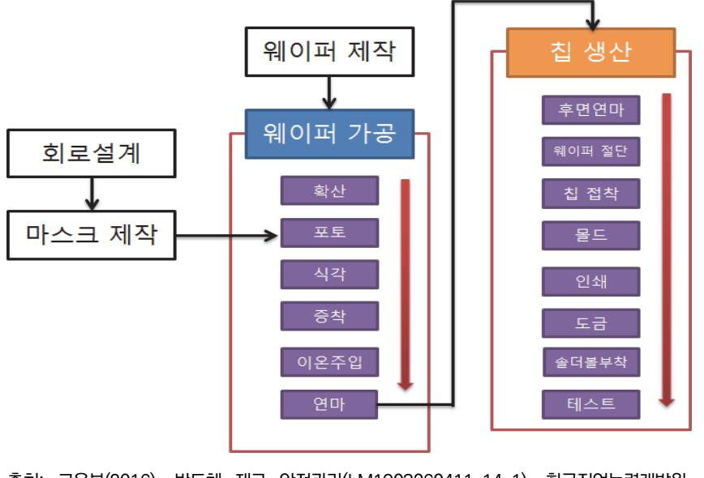
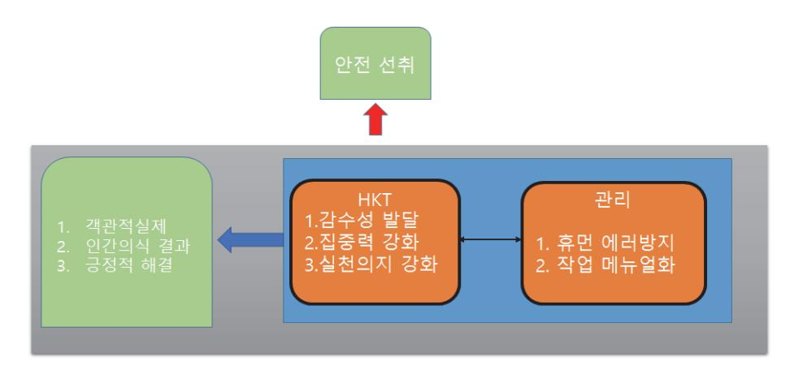
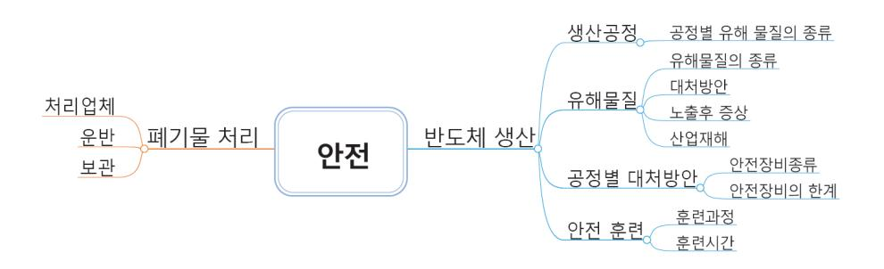
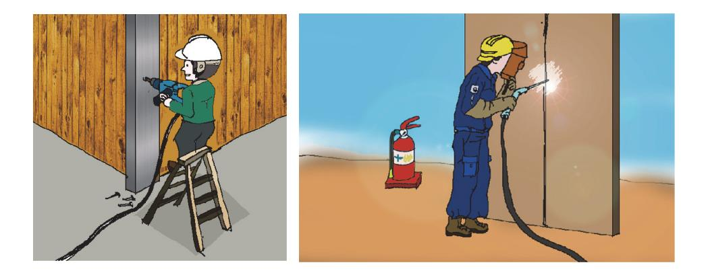
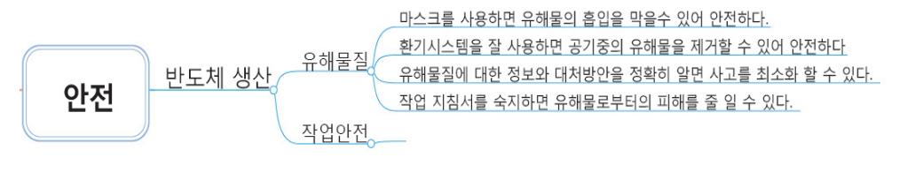
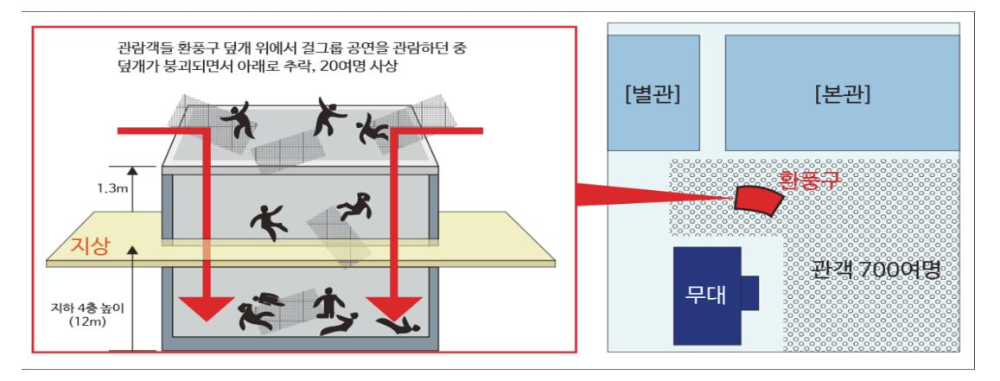
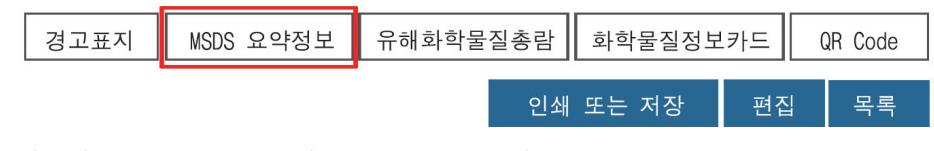
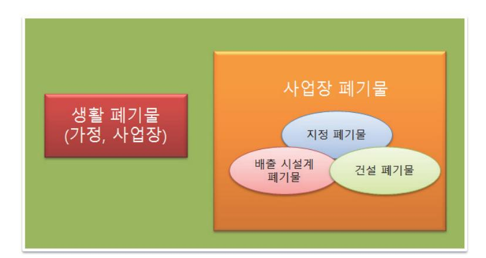
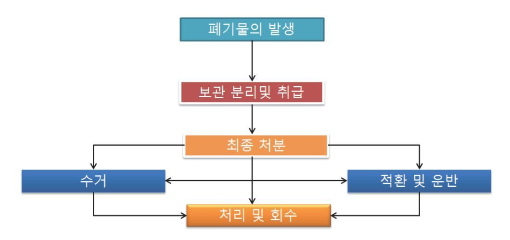
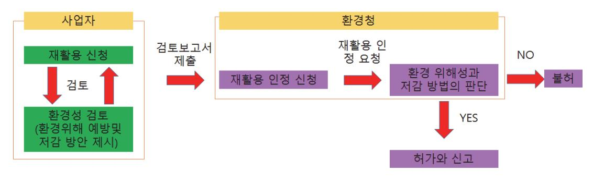

# NCS학습모듈 반도체 재료 안전관리

LM1903060411\_23v3


### [NCS학습모듈 활용 시 유의 사항]

- 1. NCS학습모듈은 교육훈련기관에서 출처를 명시하고 교육적 목적으로 활용할 수 있습니다. 다 만, NCS학습모듈에는 국가(교육부)가 저작재산권 일체를 보유하지 않은 저작물(출처가 표기된 도표‧사진‧삽화‧도면 등)이 포함되어 있으므로, 이러한 저작물의 변형‧각색‧복제‧공연‧ 배포 및 공중 송신 등과 이러한 저작물을 활용한 2차적 저작물을 작성하려면 반드시 원작자 의 동의를 받아야 합니다.
- 2. NCS학습모듈은 개발 당시의 산업 및 교육 현장을 반영하여 집필하였으므로, 현재 적용되는 법령‧지침‧표준 및 교과 내용 등과 차이가 있을 수 있습니다. NCS학습모듈 활용 시 법령 ‧지침‧표준 및 교과 내용의 개정 사항과 통계의 최신성 등을 확인하시기를 바랍니다.
- 3. NCS학습모듈은 산업 현장에서 요구되는 능력을 교육훈련기관에서 학습할 수 있게 구성한 자 료입니다. 다만, NCS학습모듈 지면의 한계상 대표적 예시(예: 활용도 또는 범용성이 높은 제 품, 서비스) 중심으로 집필하였음을 이해하시기를 바랍니다.

# NCS학습모듈의 이해

※ 본 NCS학습모듈은 「NCS 국가직무능력표준」사이트(http://www.ncs.go.kr) 에서 확인 및 다운로드할 수 있습니다.

## Ⅰ NCS학습모듈이란?

- 국가직무능력표준(NCS: National Competency Standards)이란 산업현장에서 직무를 수행하기 위해 요구되는 지식·기술·소양 등의 내용을 국가가 산업부문별·수준별로 체계 화한 것으로 산업현장의 직무를 성공적으로 수행하기 위해 필요한 능력(지식, 기술, 태도) 을 국가적 차원에서 표준화한 것을 의미합니다.
- 국가직무능력표준(이하 NCS)이 현장의 '직무 요구서'라고 한다면, NCS학습모듈은 NCS
   의 능력단위를 교육훈련에서 학습할 수 있도록 구성한 '교수·학습 자료'입니다. NCS학습
   모듈은 구체적 직무를 학습할 수 있도록 이론 및 실습과 관련된 내용을 상세하게 제시하
   고 있습니다.


### ○ NCS학습모듈은 다음과 같은 특징을 가지고 있습니다.

- 첫째, NCS학습모듈은 산업계에서 요구하는 직무능력을 교육훈련 현장에 활용할 수 있도 록 성취목표와 학습의 방향을 명확히 제시하는 가이드라인의 역할을 합니다.
- 둘째, NCS학습모듈은 특성화고, 마이스터고, 전문대학, 4년제 대학교의 교육기관 및 훈 련기관, 직장교육기관 등에서 표준교재로 활용할 수 있으며 교육과정 개편 시에도 유용하게 참고할 수 있습니다.


○ NCS와 NCS학습모듈 간의 연결 체계를 살펴보면 아래 그림과 같습니다.


O NCS학습모듈의 위치는 NCS 분류 체계에서 해당 학습모듈이 어디에 위치하는지를 한 눈에 볼 수 있도록 그림으로 제시한 것입니다.

| [NCS-학          | 습모듈   | 의 위치]    |          |  |
|-----------------|-------|----------|----------|--|
|                 |       |          |          |  |
| 대분류             | 문화·예술 | ··디자인·방송 |          |  |
| 중분류             | 문화콘텐츠 |          |          |  |
| 소분류             |       | 문화콘텐츠제작  |          |  |
|                 |       |          |          |  |
| 세분류             |       |          |          |  |
| 방송콘텐츠제작         |       | 능력단위     | 학습모듈명    |  |
| 영화콘텐츠제작         |       | 프로그램 기획  | 프로그램 기획  |  |
| 음악콘텐츠제작         |       | 아이템 선정   | 아이템 선정   |  |
| 광고콘텐츠제작         |       | 자료 조사    | 자료 조사    |  |
| 게임콘텐츠제작         |       | 프로그램 구성  | 프로그램 구성  |  |
| 애니메이션<br>콘텐츠제작  |       | 캐스팅      | 캐스팅      |  |
| 만화콘텐츠제작         |       | 제작계획     | 제작계획     |  |
| 캐릭터제작           |       | 방송 미술 준비 | 방송 미술 준비 |  |
| 스마트문화앱<br>콘텐츠제작 |       | 방송 리허설   | 방송 리허설   |  |
| 영사              |       | 야외촬영     | 야외촬영     |  |
|                 |       | 스튜디오 제작  | 스튜디오 제작  |  |
|                 |       |          |          |  |

학습모듈은

NCS 능력단위 1개당 1개의 학습모듈 개발 을 원칙으로 합니다. 그러나 필요에 따라 고용단위 및 교과단위를 고려하여 능력단위 몇 개를 묶어 1개 학습모듈로 개발할 수 있으며, NCS 능력단위 1개를 여러 개의 학습모듈로 나누어 개발할 수도 있습니다.

### 2. NCS학습모듈의 개요

### ○ NCS학습모듈의 개요는 학습모듈이 포함하고 있는 내용을 개략적으로 설명한 것으로

| 학습모듈의 목표, 선수학습, 학습모듈의 내용 체계, 핵심 용어 로 구성되어 있습니다. |                                                                              |  |
|-------------------------------------------------|------------------------------------------------------------------------------|--|
| 학습모듈의 목표                                        | 해당 NCS 능력단위의 정의를 토대로 학습 목표를 작성한 것입니다.                                        |  |
| 선수학습                                            | 해당 학습모듈에 대한 효과적인 교수·학습을 위하여 사전에 이수해야 하는 학습모<br>듈, 학습 내용, 관련 교과목 등을 기술한 것입니다. |  |
| 학습모듈의<br>내용 체계                                  | 해당 NCS 능력단위요소가 학습모듈에서 구조화된 체계를 제시한 것입니다.                                     |  |
| 핵심 용어                                           | 해당 학습모듈의 학습 내용, 수행 내용, 설비·기자재 등 가운데 핵심적인 용어를 제<br>시한 것입니다.                   |  |

## 제작계획 학습모듈의 개요

### 학습모듈의 목표

본격적인 촬영을 준비하는 단계로서, 촬영 대본을 획정하고 제작 스태프를 조직하며 촬영 장비와 촬영 소품을 준비할 수 있다.

### 선수학습

제작 준비(LM0803020105\_13v1), 섭외 및 제작스태프 구성(LM0803020104\_13v1), 촬영 제작(LM0803020106\_13v1), 촬영 장비 준비(LM0803040204\_13v1.4), 미술 디자인 협의하기(LM0803040203\_13v1.4)

### 학습모듈의 내용체계

| 하스                | 하스 내용                                              | NCS 능력단위 요소       |                |
|-------------------|----------------------------------------------------|-------------------|----------------|
| 학습                | 학습 내용                                              | 코드번호              | 요소 명칭          |
| 1. 촬영 대본<br>확정하기  | 1-1. 촬영 구성안 검<br>토와 수정                             | 0803020114_16/3.1 | 촬영 대본<br>확정하기  |
| 2. 제작 스태프<br>조직하기 | 2-1. 기술 스태프 조직<br>2-2. 미술 스태프 조직<br>2-3. 전문 스태프 조직 | 0803020114_16v3.2 | 제작 스태프<br>조직하기 |
| 3. 촬영 장비<br>계획하기  | 3-1. 촬영 장비 점검<br>과 준비                              | 0803020114_16/3.3 | 촬영 장비<br>계획하기  |
| 4. 촬영 소품<br>계획하기  | 4-1. 촬영 소품 목록<br>작성<br>4-2. 촬영 소품 제작<br>의뢰         | 0803020114_16\3.4 | 촬영 소품<br>계획하기  |

### 핵심 용어

촬영 구성안, 제작 스태프, 촬영 장비, 촬영 소품

### 학습모듈의 목표는

학습자가 해당 학습모듈을 통해 성취해야 할 목표를 제시한 것으로, 교수자는 학습자 가 학습모듈의 전체적인 내용흐름을 파악하 도록 지도할 수 있습니다.

**6** • •

61

### 선수학습은

교수자 또는 학습자가 해당 학습모듈을 교 수·학습하기 이전에 이수해야 하는 교과목 또는 학습모듈(NCS 능력단위) 등을 표기한 것입니다. 따라서 교수자는 학습자가 개별 학습, 자기 주도 학습, 방과 후 활동 등 다 양한 방법을 통해 이수할 수 있도록 지도하 는 것을 권장합니다.

|            | 핵심 용어는              |
|------------|---------------------|
|            | 률을 대표하는 주요 용어입니     |
|            | · 해당 학습모듈을 통해 학습    |
|            | 게될 주요 내용을 알 수 있습    |
|            | 5 국가직무능력표준」 사이트     |
| (www.ncs.g | jo.kr)의 색인 (찾아보기) 중 |
| 하나로 이용할    | 할 수 있습니다            |

### 3. NCS학습모듈의 내용 체계

○ NCS학습모듈의 내용은 크게 학습, 학습 내용, 교수·학습 방법, 평가 로 구성되어 있습니다.

| 학습       | 해당 NCS 능력단위요소 명칭을 사용하여 제시한 것입니다.<br>학습은 크게 학습 내용, 교수·학습 방법, 평가로 구성되며 해당 NCS 능력단위의<br>능력단위 요소별 지식, 기술, 태도 등을 토대로 내용을 제시한 것입니다.                                                    |
|----------|----------------------------------------------------------------------------------------------------------------------------------------------------------------------------------|
| 학습 내용    | 학습 내용은 학습 목표, 필요 지식, 수행 내용으로 구성되며, 수행 내용은 재료·자<br>료, 기기(장비·공구), 안전·유의 사항, 수행 순서, 수행 tip으로 구성한 것입니다.<br>학습모듈의 학습 내용은 실제 산업현장에서 이루어지는 업무활동을 표준화된 프로세<br>스에 기반하여 다양한 방식으로 반영한 것입니다. |
| 교수·학습 방법 | 학습 목표를 성취하기 위한 교수자와 학습자 간, 학습자와 학습자 간 상호 작용이<br>활발하게 일어날 수 있도록 교수자의 활동 및 교수 전략, 학습자의 활동을 제시한<br>것입니다.                                                                            |
| 평가       | 평가는 해당 학습모듈의 학습 정도를 확인할 수 있는 평가 준거 및 평가 방법, 평<br>가 결과의 피드백 방법을 제시한 것입니다.                                                                                                         |


# [NCS-학습모듈의 위치]

세분류

| 대분류 | 전기·전자 |        |  |
|-----|-------|--------|--|
| 중분류 |       | 전자기기개발 |  |
| 소분류 |       | 반도체개발  |  |

| 반도체개발 | 능력단위                 | 학습모듈명                |  |
|-------|----------------------|----------------------|--|
| 반도체제조 | 반도체용 웨이퍼 재료 제조       | 반도체용 웨이퍼 재료 제조       |  |
| 반도체장비 | 반도체용 금속(Target)재료 제조 | 반도체용 금속(Target)재료 제조 |  |
| 반도체재료 | 반도체용 패키지 재료 제조       | 반도체용 패키지 재료 제조       |  |
|       | 반도체 재료 개발            | 반도체 재료 개발            |  |
|       | 반도체 재료 생산관리          | 반도체 재료 생산관리          |  |
|       | 반도체 재료 품질관리          | 반도체 재료 품질관리          |  |
|       | 반도체 재료 안전관리          | 반도체 재료 안전관리          |  |
|       | 반도체용 마스크 재료 제조       | 반도체용 마스크 재료 제조       |  |
|       | 반도체용 플립칩 재료 제조       | 반도체용 플립칩 재료 제조       |  |
|       | 반도체용 CMP 재료 제조       | 반도체용 CMP 재료 제조       |  |
|       | 반도체용 식각공정 가스 제조      | 반도체용 식각공정 가스 제조      |  |
|       | 반도체용 세정공정 가스 제조      | 반도체용 세정공정 가스 제조      |  |
|       | 반도체용 박막공정 가스 제조      | 반도체용 박막공정 가스 제조      |  |

| 반도체용 이온주입공정 가스 제조 | 반도체용 이온주입공정 가스 제조 |
|-------------------|-------------------|
| 반도체용 박막공정 전구체 제조  | 반도체용 박막공정 전구체 제조  |
| 반도체용 포토공정 재료 제조   | 반도체용 포토공정 재료 제조   |
| 반도체용 트랙공정 재료 제조   | 반도체용 트랙공정 재료 제조   |
| 반도체용 SOD공정 재료 제조  | 반도체용 SOD공정 재료 제조  |
| 반도체용 박막도금공정 재료 제조 | 반도체용 박막도금공정 재료 제조 |
| 반도체용 세정공정 재료 제조   | 반도체용 세정공정 재료 제조   |
| 반도체용 CMP슬러리 재료 제조 | 반도체용 CMP슬러리 재료 제조 |

| 학습모듈의 개요            | 1  |
|---------------------|----|
| 학습 1. 물질안전관리규정 숙지하기 |    |
| 1-1. 위험물질에 관한 정보 파악 | 3  |
| 1-2. 안전사고 방지        | 13 |
| • 교수・학습 방법          | 23 |
| • 평가                | 24 |
| 학습 2. 위험요인 대응하기     |    |
| 2-1. 위험요인 관리        | 25 |
| 2-2. 비상사태 대응        | 37 |
| • 교수・학습 방법          | 47 |
| • 평가                | 48 |
| 학습 3. 폐기물 관리하기      |    |
| 3-1. 폐기물 관리         | 50 |
| • 교수・학습 방법          | 61 |
| • 평가                | 62 |
| 참고 자료               | 64 |
| 활용 서식               | 65 |

# 반도체 재료 안전관리 학습모듈의 개요

### 학습모듈의 목표

생산현장에서 발생할 수 있는 유해환경을 관련 준거법에 의하여 물질안전관리규정숙지, 위험요인 예측・분 석, 폐기물관리를 통해 안전한 작업환경을 확보할 수 있다.

### 선수학습

디스플레이 생산설비 관리(LM1903070208\_14v2)

### 학습모듈의 내용 체계

|                     |                     | NCS 능력 단위 요소      |                  |
|---------------------|---------------------|-------------------|------------------|
| 학습                  | 학습 내용               | 코드 번호             | 요소 명칭            |
| 1. 물질안전관리규정<br>숙지하기 | 1-1. 위험물질에 관한 정보 파악 | 1903060411_23v3.1 | 물질안전관리규정<br>숙지하기 |
|                     | 1-2. 안전사고 방지        | 1903060411_23v3.1 | 물질안전관리규정<br>숙지하기 |
|                     |                     | 1903060411_23v3.2 | 위험요인 대응하기        |
| 2. 위험요인 대응하기        | 2-1. 위험요인 관리        | 1903060411_23v3.2 | 위험요인 대응하기        |
|                     | 2-2. 비상사태 대응        |                   |                  |
| 3. 폐기물 관리하기         | 3-1. 폐기물 관리         | 1903060411_23v3.3 | 폐기물 관리하기         |

### 핵심 용어

안전, 폐기물관리, 환경오염, 비상사태, 위험물질

# 학습 1 물질안전관리규정 숙지하기 학습 2 위험요인 대응하기 학습 3 폐기물 관리하기

# 1-1. 위험물질에 관한 정보 파악

- 화학유해물질의 기본특성을 이해하기 위해 MSDS에 대한 내용을 파악할 수 있다.
- 화학유해물질을 이해하기 위해 RoHS에 대한 내용을 파악할 수 있다.
  - 법에 대한 이해를 높이기 위하여 관련 준거법을 숙지할 수 있다.

# 필요 지식 /

학습 목표

### 숔 반도체 생산 공정별 유해요인

반도체는 회로설계, 마스크제작, 웨이퍼 제조, 웨이퍼 가공, 칩 조립의 과정을 통해 생산된다.



출처: 교육부(2016). 반도체 재료 안전관리(LM1903060411\_14v1). 한국직업능력개발원. p.3. [그림 1-1] 반도체 제조 공정 흐름도

### 1. 웨이퍼 가공라인

### <표 1-1> 웨이퍼 공정 시 발생하는 유해 물질

| 공정     | 물질                                                                                                                                                                                                           |
|--------|--------------------------------------------------------------------------------------------------------------------------------------------------------------------------------------------------------------|
| 확산공정   | 암모니아(NH3), 아르신(삼수소화비소), 포스핀, 디클로로실란, 불소, 수소, 일산화질<br>소, 아산화질소, 옥시염화인, 실란, 세척액(이소프로필알코올, 불산 등), 수소, 염화수<br>소                                                                                                  |
| 포토공정   | 1. 밀착향상제(HMDS)도포작업 시 사용물질 :<br>휘발된 밀착향상제(HMDS,<br>사메틸디실라잔)<br>2. 포토레지스트 도포 및 노광 작업<br>1) 사용물질: 고분자 수지, 유기용제, 감광성 물질                                                                                          |
|        | ※ 유기용제로는 2-헵타논, 사이클로헥사논, 에틸벤젠, 에틸락테이트, IPA(이<br>소프로필알코올),<br>1-메톡시-2-프로판올(PGME),<br>2-메톡시-1프로판올(β<br>-PGME), 1-메톡시-2-프로필아세테이트(PGMEA), 2-메톡시-1프로필아세<br>테이트(β -PGMEA) 등이 사용됨.                                  |
|        | 2) 부산물: 벤젠, 톨루엔, 에틸벤젠, 크실렌, 페놀 등<br>3. 현상작업 시 사용물질 : 지방족 탄화수소(헥산, 헵탄 등), 1-메톡시-2-프로필아<br>세테이트 (PGMEA), 크실렌(Xylene), 수산화테트라메틸암모늄(TMAH)<br>4. PM 작업 시 사용물질 : 유기용제, 이소프로필알코올, 아세톤                               |
| 식각공정   | 1) 사용물질 : 불산, 염산, 과산화수소, 질산, 황산, 암모니아수, 불화암모늄, 암모니<br>아, 삼염화붕소, 일산화탄소, 사불화탄소, 황화카르보닐, 염소, 수소, 브롬화수소,<br>삼불화질소, 오존, 기타 할로겐화탄화수소, 세척액(이소프로필알코올 등)<br>2) 부산물: 식각 가스들의 상호 반응을 통해<br>염화수소, 불화수소 등의 부산물이 발<br>생 가능 |
| 증착 공정  | 1) 사용물질 : 아세틸렌, 암모니아, 삼불화염소, 디보란, 디클로로실란, 수소, 염화수<br>소, 불화수소, 삼불화질소, 아산화질소, 오존, 포스핀, 실란, 사염화티타늄, 육불화<br>텅스텐, 이소프로필알코올 등<br>2) 부산물 : 수소, 불화수소 등의 부산물이 발생 가능                                                   |
| 이온주입공정 | 1) 사용물질 : 아르신(삼수소화비소),<br>포스핀,<br>삼불화붕소<br>2) 부산물 : 비소 및 그 화합물, 인, 수소, 붕소, 불소<br>3) 방사선 : 이온주입 장비에서 전리방사선 발생                                                                                                 |
| 연마공정   | 사용물질 : 연마액(실리카, 산화세륨, 암모니아수, 수산화칼륨), 불산, 염산, 질산                                                                                                                                                              |

### 휘발된 밀착향상제(HMDS, 헥사메틸디실라잔)와 PM 작업(유지보수)

휘발된 밀착향상제(HMDS, 헥사메틸디실라잔): 친수성인 웨이퍼를 소수성으로 바꾸어 Photoresis와 붙 을 수 있도록 접착력을 향상 시켜주는 물질이다. PM 작업(유지보수):"Preventive Maintenance" 약어이며 "예방적 유지보수" 활동을 나타냄.

### 2. 칩 조립라인

| <표 1-2> 칩 조립라인 가공라인의 유해 물질 |  |
|----------------------------|--|
|----------------------------|--|

| 공정        | 물질   |                                                                                           |  |  |
|-----------|------|-------------------------------------------------------------------------------------------|--|--|
| 후면연마공정    | 사용물질 | 비결정실리카,수산화테트라메틸암모늄(TMAH), 피페라진                                                            |  |  |
| 웨이퍼 절단 공정 | 사용물질 | 절삭액(계면활성제, 물)                                                                             |  |  |
| 칩 접착공정    | 사용물질 | 에폭시수지, 페놀수지<br>등 고분자 수지, 아세톤, 비결정 실리카,<br>은(Ag), 유기 과산화물, 경화제 등                           |  |  |
| 몰드 공정     | 사용물질 | 에폭시수지, 페놀수지, 카본블랙, 실리카 (보통은 비결정형), 삼산<br>화안티몬, 멜라민수지, 합성고무, 에탄올 아민, 셀룰로오스, 왁스,<br>유기 과산화물 |  |  |
|           | 부산물  | 에폭시 몰딩 컴파운드(EMC) 및 금형세정제의 열분해로 미량의<br>부산물(벤젠, 포름알데히드 등)이 발생 가능                            |  |  |
| 레이저마킹     | 부산물  | 에폭시 몰딩 컴파운드(EMC) 분진과 휘발성 유기화합물                                                            |  |  |
| 잉크마킹      | 사용물질 | 솔벤트나프타, 크실렌, 사이클로헥사논, 아세톤, 초산에틸, 톨루엔<br>등                                                 |  |  |
| 도금 공정     | 사용물질 | 수산화칼륨, 메탄술폰산, 메틸알코올, 과산화수소, 황산, 질산, 주<br>석메탄 설포네이트 등                                      |  |  |
| 솔더볼 부탁공정  | 사용물질 | 솔더볼(주석, 은, 구리), 플럭스(계면활성제, 글리세롤, 폴리에틸<br>렌글리콜, 에틸렌옥사이드 중합체 등)                             |  |  |
| 열적 테스트공정  | 부살물  | 톨루엔, n-헥산 등 휘발성 유기화합물                                                                     |  |  |

숕 MSDS(Materil Safety Data Sheet)

MSDS란 물질 안전보건자료를 나타내는 약어로서 화학물질 및 화학물질을 함유한 제제의 명칭 및 함유량, 응급조치용령, 안전․보건상의 취급 주의 사항, 건강 유해성 및 물리적 위험성 등을 설명한 자료이다. 화학물질에 의한 중독과 화재․폭발사고를 예방하고 근로자의 건강을 보호하기 위해서는 화학물질 유해위험 정보를 인지하고 관리하는 것이 최우선적으로 필요한데 바로 MSDS가 중요한 역할을 하고 있다.

- 숖 GHS(Globally Harmonized System of Classification and Labelling of Chemical) 화학물질에 대한 분류, 표지가 국제적으로 일치하지 않아 유통과정에서 발생하는 혼란을 막기 위하여 분류 및 표지를 국제적으로 통일화하기 위한 제도이다.
- 숗 RoHS(Restriction of the use of certain Hazardous Substance) 유럽연합(EU)이 납, 6가크롬, PBBs(Poly Brominated Biphenyls), PBDEs(Poly Brominated Diphenyl Ethers), 카드뮴에 대해 정한 사용규제 관련 지침이다. 국내에서는 '전기ㆍ전자제품 및 자동차의 자원순환에 관한 법률 시행령'이 RoHS와 동일한 역할을 하고 있다.

1. 주요 내용

<표 1-3> RoHS의 주요 내용

주요 내용

제1조 목적 제8조 유해 물질의 사용제한 대상 전기·전자제품 및 자동차 제9조 사용제한 유해 물질의 함유기준 등 제10조 연차별 재활용가능률 제11조 유해 물질 사용제한 등의 준수 공표방법 등 제12조 재활용사업자 제13조 재활용정보의 제공 제14조 회수·인계·재활용의무 대상 전기·전자제품 제14조의2 회수·인계·재활용의무 대상 사업장 제15조 재활용목표량의 산정·고시 제15조의2 재활용의무량의 산출기준 제15조의3 회수의무 대상 전기·전자제품 제15조의4 회수의무 대상 사업장 제15조의5 회수의무량의 산출기준 제16조 재활용 및 회수의무이행계획서의 제출 등 제17조 재활용 및 회수의무이행계획서의 승인 등 제18조 재활용 및 회수의무이행결과보고서의 제출 등 제19조 재활용부과금의 기준비용 제19조의2 재활용부과금의 산정·부과 등 제20조 회수부과금의 기준비용 제20조의2 회수부과금의 산정·부과 등 제21조 재활용부과금 및 회수부과금 등 징수비용의 지급 제22조 재활용실적 또는 회수실적 조사 등 제23조 폐자동차의 재활용비율 제24조 폐자동차의 가격 및 처리·재활용비용 산정 제25조 자동차 제조·수입업자의 무상회수 등 제26조 폐자동차의 재활용방법과 기준 제27조 기후·생태계 변화 유발물질 제28조 사업자단체의 인가절차 등 제29조 폐자동차 재활용결과의 제출 등 제30조 폐자동차재활용업 및 폐가스류 처리업의 등록 등 제31조 폐자동차재활용업 및 폐가스류 처리업의 변경등록 제32조 재활용실적 등의 기록·보존 제33조 보고와 검사 등 제34조 운영관리 정보 제35조 권한의 위임 및 위탁 제36조 재활용부과금 및 회수부과금의 회계기관 제36조의2 고유식별정보의 처리 제36조의3 규제의 재검토 제37조 과태료의 부과기준

# 수행 내용 / 위험물질 관련 법규와 정보 파악하기

### 재료·자료

- 전기․전자제품 및 자동차의 자원순환에 관한 법률 시행령
- [별표 1]유해 물질의 사용제한 대상 전기․전자제품(제8조제1항본문관련)
- [별표 1의2]유해 물질의 함유 기준(제9조1항 관련

### 기기(장비 ・ 공구)

컴퓨터, 프린터

### 안전 ・ 유의 사항

위험물질 관련 법규에 대한 정보 파악 후, 반드시 반도체 생산 과정 중 유해 물질 관련 미 비 사항이 있는지 확인하도록 한다.

### 수행 순서

숔 MSDS를 이용하여 유해 물질 정보 파악한다.

MSDS의 작성 대상 화학물질은 기본적으로 유해 화학물질이다. 산업안전보건법 제41조에는 화 학물질 또는 화학물질을 함유한 제제를 제조·수입·사용·운반 또는 저장하고자 할 경우 MSDS를 작성하도록 규정하고 있다.

1. 작성 대상 물질 확인하기

작성 대상 물질이 다음 3가지 분류에 포함되는지 확인하고 만약 포함된다면 MSDS를 작성 해야 한다.

(1) 물리적 위험성 물질

폭발성 물질, 인화성 가스, 인화성 에어로졸(aerosol), 산화성 가스, 고압가스, 인화성 액체, 인화성 고체, 자기 반응성 물질 및 혼합물, 자연발화성 액체, 자연발화성 고체, 자 기 발열성 액체, 자연발화성 고체, 자기발열성 물질 및 혼합물, 물반응성 물질 및 혼합 물, 산화성 액체, 산화성 고체, 유기 과산화물, 금속 부식성 물질

(2) 건강 유해성

급성 독성, 피부 부식성, 피부 자극성, 심한 눈 손상성, 심한 눈 자극성, 호흡기 과민성, 피부 과민성, 생식세포 변이원성, 발암성, 생식독성, 특정 표적 장기 독성(1회 노출), 특 정 표적 장기 독성(장기 노출), 흡인 유해성

(3) 환경 유해성

수생환경 유해성

2. 작성 대상 물질이 MSDS 작성 제외의 경우인지를 확인하기

제외할 수 있다.

MSDS 작성 대상 화학물질 중에는 다른 법령에서 규제되는 물질에 대해서는 MSDS작성을

<표 1-4> MSDS 작성 제외 경우

MSDS 작성 제외 경우

①『원자력법』에 따른 방사성 물질

②『비료관리법』에 따른 비료

③『약사법』에 따른 의약품·의약외품 ④『식품위생법』에 따른 식품 및 식품첨가물

⑤『화장품법』에 따른 화장품

⑥『총포·도검·화약류 등 단속법』에 따른 화약류

⑦『농약관리법』에 따른 농약

⑧『폐기물관리법』에 따른 폐기물

⑨『마약류관리에 관한 법률』에 따른 마약 및 향정신성 의약품

⑩『사료관리법』에 따른 사료

⑪ 앞서서 언급된 물질 외 사업장에서 사용하지 아니하는 일반소비자용 제제.

⑫ 기타 노동부 장관이 독성·폭발성 등으로 인한 위해의 정도가 적다고 인정하여 고시하는 제제.

### 3. MSDS를 이용하여 '불산'조사하기

(1) '불산'검색어 입력하기

'http://msds.kosha.or.kr/'에 접속하여 'HOME > 화학물질 정보검색 > 화학물질정보 검색 > MSDS 검색'으로 클릭하여 들어간다. 아래의 그림에서처럼 검색조건을 '물질명 (관용명/동의어)'으로 선택한 후 '불산'이라고 입력한다.

| 선택하세요 v               |                                            | 검색하기       |
|-----------------------|--------------------------------------------|------------|
| □ CAS No. 등 화학물질 관련 등 | 검색어를 입력해주세요. 예) 71-43-2, 벤젠, KE-02150 등을 입 | 력하시기 바랍니다. |

출처: 교육부(2016). 반도체 재료 안전관리(LM1903060411\_14v1). 한국직업능력개발원. p.8. [그림 1-2] MSDS 검색어 입력하기

(2) 물질명과 CAS No. 를 확인하기

카스 번호(CAS No.)란 화학구조와 조성이 결정된 화학물질에 정해진 번호로 화학물질

### 에 부여되는 번호이다.

| No. | 물질명                    | CAS No.   | 개정일        |
|-----|------------------------|-----------|------------|
| 1   | 불회수소<br>(관용명: 물회수소(불산) | 7664–39–3 | 2016-04-30 |

출처: 교육부(2016). 반도체 재료 안전관리(LM1903060411\_14v1). 한국직업능력개발원. p.9. [그림 1-3] 불산에 대한 MSDS 검색 결과

### (3) 경고 문구 인쇄하기

'불산'과 관련된 경고 문구를 인쇄하기 위해 그림과 같이 '경고표지'를 클릭한다.

| 경고표지 | MSDS 요약정보 | 유해화학물질총람 | 화학물질정보카드 |    | QR Code |  |
|------|-----------|----------|----------|----|---------|--|
|      |           | 아시       | 또느 저자    | 펴지 | 모로      |  |

출처: 교육부(2016). 반도체 재료 안전관리(LM1903060411\_14v1). 한국직업능력개발원. p.9. [그림 1-4] 경고 문구 인쇄하기

팝업창으로 나타나는 불산 인쇄 문구 선택 창에서 필요한 문구를 선택하고 '인쇄' 버튼 을 클릭한다.

출처: 교육부(2016). 반도체 재료 안전관리(LM1903060411\_14 v1). 한국직업능력개발원. p.9. [그림 1-5] 경고 문구 인쇄 문구 선택하기-1

출처: 교육부(2016). 반도체 재료 안전관리(LM1903060411\_14v1). 한국직업능력개발원. p.10. [그림 1-6] 경고 문구 인쇄 문구 선택하기-2

### (4) MSDS 요약정보 확인하기

[그림 1-7]과 같이 'MSDS 요약정보'를 클릭하여 팝업창을 띄운다.

| 경고표지 | MSDS 요약정보 | 유해화학물질총람 | 화학물질정보 | 카드 | QR Code |  |
|------|-----------|----------|--------|----|---------|--|
|      |           | 인솨       | 또는 저장  | 편집 | 목록      |  |

출처: 교육부(2016). 반도체 재료 안전관리(LM1903060411\_14v1). 한국직업능력개발원. p.10. [그림 1-7] MSDS 요약정보 선택하기

MSDS 요약정보의 내용을 보고 다음 질문에 답한다.

- (가) '불소'의 물질명을 찾아 적으시오.
- (나) '유해위험 문구'에서 피부와 관련된 문구를 찾아 적으시오.
- (다) '응급조치요령'에서 콘택트렌즈를 끼고 있는 눈에 불산이 들어간 경우는 어떻게 해야 하 는지 찾아 적으시오.
- (라) '응급조치요령'에서 피부에 불산이 접촉했을 경우 어떤 물질로 환부를 문질러야 하는지 찾아 적으시오.
- (마) '저장방법'에서 불산을 담을 수 있는 용기는 무엇인지 찾아 적으시오.

(5)'11. 독성에 관한 정보' 확인하기

'특정 표적 장기 독설(반복노출)'에서 보고된 내용을 찾아 적으시오.

(3) 유해 물질의 종류에 따른 함유기준을 찾아서 아래의 표를 완성한다.

(2) '[별표 1-2] 유해 물질의 함유기준'을 클릭한다.

- (1) 별표/서식을 클릭한다.
- 2.'유해 물질의 함유기준'을 찾아본다.

령'을 찾아본다.

1. 국가법령정보센터(www.law.go.kr)에서 '전기ㆍ전자제품 및 자동차의 자원순환에 관한 법률 시행

출처: 교육부(2016). 반도체 재료 안전관리(LM1903060411\_14v1). 한국직업능력개발원. p.11. [그림 1-9] 전기ㆍ전자제품 및 자동차의 자원순환에 관한 법률 시행령 검색 결과

| 호 |                                | CLEN       | 200 <i>1</i> | 0222    |            |      |     |
|---|--------------------------------|------------|--------------|---------|------------|------|-----|
| 1 | 전기 - 전자제품및자동차의<br>자원순환에관한법률시행령 | 2016.3.22. | 대통령령         | 제27049호 | 2016.3.22. | 일부개정 | 환경부 |

출처: 교육부(2016). 반도체 재료 안전관리(LM1903060411\_14v1). 한국직업능력개발원. p.11.

숕 '전기ㆍ전자제품 및 자동차의 자원순환에 관한 법률 시행령 '을 검색한다.

[그림 1-8] MSDS의 검색한 독성에 관한 정보 선택하기

| *CAS No : 7644-39-3 * UN No : 1052 | *KE No : KE-20198 | *EU No : 231-634-8 |
|------------------------------------|-------------------|--------------------|
|                                    |                   | 펼쳐보기               |
| 1. 화학제품과 회사에 관한 정보                 |                   | ~                  |
| 2. 유해성 과 위성험                       |                   | ~                  |
| 3. 구성 성분의 명칭및 함유량                  |                   | $\sim$             |
| 4. 응급조치요령                          |                   | $\sim$             |
| 5. 폭발화재시 대처방법                      |                   | $\sim$             |
| 6. 누축사고시 대처방법                      |                   | $\sim$             |
| 7. 취급 및 저장방법                       |                   | $\sim$             |
| 8. 노출발지 및 개인보호구                    |                   |                    |
| 9. 물리화학적 특성                        |                   | $\sim$             |
| 10. 안정성및 반응성                       |                   |                    |
| 11. 독성에 관한 정보                      |                   | ~                  |

- 유해 물질 중독 사례를 찾아본다.
- 유해 물질에 대한 기본적인 지식이 필요하다.

수행 tip

㉠텔레비전 ㉡냉장고 ㉢세탁기(공장용) ㉣에어컨디셔너 ㉤개인용 컴퓨터(모니터 및 자판은 제외한다) ㉥전기정수기(냉·온수기는 제외한다) ㉦전기오븐 ㉧전자레인지 ㉨음식물처리기 ㉩식기건조기 ㉪전기비 데 ㉬공기청정기 ㉫전기밥솥 ㉭이동전화 단말기(전지 및 충전기를 포함한다)

<표 1-6> 유해 물질의 사용제한 대상 찾기

에서 유해 물질의 사용 제한이 되어 있는 제품을 찾는다.

3.'[별표 1]유해 물질의 사용제한 대상 전기·전자제품(제8조 제1항 본문 관련)'을 참고하여 <표1-6>

독성이 강하고 체내에 축적이 잘되고 배출이 되지 않는다. 증기 상태로 인체가 흡입하면 굉장히 유동하며 이타이이타이병은 대표적인 카드뮴 중독증이다.

### 카드뮴 중독

|         | 종류          | 함유기준 |
|---------|-------------|------|
| 전기․전자제품 | 납           |      |
|         | 수은          |      |
|         | 육가크롬        |      |
|         | 폴리브롬화비페닐    |      |
|         | 폴리브롬화디테닐에테르 |      |
| 자동차     | 카드뮴         |      |
|         | 납           |      |
|         | 수은          |      |
|         | 육가크롬        |      |
|         | 카드뮴         |      |

<표 1-5> 유해 물질 함유기준

# 1-2. 안전사고 방지

학습 목표 • 화학유해물질 안전사고 사례를 교육하고, 훈련지침을 활용하여 사고를 미연에 방지할 수 있다. • 화학유해물질 사고원인, 결과, 재발방지대책에 대한 매뉴얼을 작성할 수 있다.

# 필요 지식 /

### 숔 위험 인식 훈련

1. 개념

여러 가지 산업재해의 원인은 인간의 실수와 불완전한 행동에 그 원인이 있는 것으로 보고 되고 있지만 사고 당사자는 '업무에 대한 압박감', '불안', '피로', '장비결함' 등을 원인이라 주장한다. 이렇듯 재해는 주관적 또는 심리적인 요소와 관계가 깊으며 재해방지를 위해서 위험에 대한 사람들의 인식을 관심 있게 살펴보아야 한다. 심리측정접근 방식으로 위험이란 객관적, 합리적이 아닌 주관적이고 다차원적 현상으로 위험 인식에 영향을 미치는 요인이 되며 이런 위험 인식은 '위험의 두려운 정도'와 '위험의 알려지지 않은 정도'에 의해 영향을 받는다.

무재해 운동의 일종인 위험예지 훈련이 재해예방에 효과가 있음에도 불구하고 현장에서 잘 실천되지 못한 이유는 '실천적 목표에 대한 인식 부족'으로 판단되기 때문에 좀 더 고효율 의 기법이 필요하게 되었다. 이러한 이유로 HKT(위험 인식훈련)를 사용하고자 하며 이것은 3R 기법으로, 작업 시작 전에 실천적 목표를 제시하고 위험요소를 제거하고 낭비 시간을 최소화할 수 있도록 하는 감수성 훈련이다.



출처: 교육부(2016). 반도체 재료 안전관리(LM1903060411\_14v1). 한국직업능력개발원. p.13. [그림 1-10] HKT 개요

2. HKT 실습 상황

생산현장 속의 숨겨진 불안전 요소를 이미지, 동영상, 현물을 사용하면서 제시한다. 작업 반장을 중심으로 긍정적인 분위기를 만들고 작업 요원들이 편안하게 대화할 수 있도록 한 다. 이러한 분위기에서 안전과 관련된 의견을 수렴 후 결정한다. 이러한 과정을 안전 수칙 의 실천 필요성을 인식시키기 위한 안전행동 확보 기법이라 한다.

- 3. HKT 실습 방법
  - (1) 브레인스토밍(brain stroming)

여러 사람이 특정 주제에 대한 의견을 자유롭게 제시하고, 의견들을 종합하여 기존의 방 식으로 생각해낼 수 없던 것에 대해 독창적인 해결책을 얻는 방법이다. 이를 위해 타 인의 의견 비판금지, 다양한 의견을 환영, 가능한 많은 의견 내기라는 조건을 지켜야 한 다.

(2) 마인드맵(mind map)

주제어를 중심으로 아래 [그림 1-11]처럼 다양한 생각을 할 수 있도록 하는 방법이다.



출처: 교육부(2016). 반도체 재료 안전관리(LM1903060411\_14v1). 한국직업능력개발원. p.14. [그림 1-11] 안전에 관한 마인드맵

### 숕 재해 보고서 작성

### 1. 사실의 확인

사고 발생까지 경과를 파악하고 근원적 물질, 인적, 관리적인 면에 관한 사실을 수집한다.

2. 사고 요인의 파악

근원적(물적), 인적, 관리적 면에서 사고요인을 찾는다.

3. 사고요인의 결정

사고요인의 상관 관계와 중요도를 고려해 직접원인 및 간접원인을 결정한다.

4. 대책의 수립

근본적인 문제점 및 사고원인을 근거로 동종 또는 유사 사고 방지대책을 구체적으로 수립 한다.

• 활용 서식의 '재해보고서' 양식을 사용하여 작성할 수 있 다.

# 수행 내용 / 안전사고 사례 교육과 사고 방지하기

### 재료·자료

- 안전보건공단(2013).『안전보건지킴이 보수교재 제조업』
- 기기(장비 ・ 공구)
  - 컴퓨터, 프린터

### 안전 ・ 유의 사항

- 사고 사례에 대한 제한을 두지 않도록 주의 시키며 학습시킨다.
- 다양한 사고 사례에 대하여 토론하거나 인터넷 동영상 검색을 통해서 찾아본다.

### 수행 순서

- 숔 안전사고 사례를 교육한다.
  - 1. 사고사례 제시하기
  - <표 1-7> 사고사례 예시

○○년 ○○월 ○○일 저녁 경북 구미시 산동면 봉산리 구미산업단지에 위치한 플루오린 화학제품 생산 회 사인 H사 구미 공장에서 탱크로리에 불산가스를 공장 내 기계에 주입하던 중 작업자의 잘못으로 밸브가 개방되어 가스가 유출되었다. 이 사고로 작업자 5명이 사망하고 18명이 부상을 당했다.

2. 사고 확대의 숨겨진 원인 찾기

사고 사례에는 기술되어 있지 않은 사고가 확대되었던 이유를 인터넷 검색이나 토론을 통 해 발표합니다.

<표 1-8> 사고의 숨겨진 원인 예시

- (가) 사고 발생 시 신속한 대응을 매뉴얼에 따라 실행했어야 했다. 하지만 고난이도의 사고처리 작업을 하 위직 담당자가 작업을 진행하였으며 이로 인해 사고가 확대되었다.
- (나) 누출물질에 대한 정보 부족으로 사고가 커졌다. 구조대원들이 처음 1~2시간 정도 적절한 장비 없이 방재작업에 투입되었다.
- (다) 가스 누출 후 5시간 경과 후에 주민들은 대피 소식을 들었다.
- 3. 사고 방지와 확대 금지를 위한 대책을 찾는다.

원인에 따른 사고 방지 대책을 제시한다.

- <표 1-9> 사고 방지와 확대를 막기 위한 대책 예시
- (가) 상급 작업자 입회 시 벨브 개방준비상태를 확인 후 작업을 진행했어야 한다. 그러므로 안전과 관련된 작업에는 인력이 충분히 공급되어야 한다.
- (나) 고위급 기관에서 사고를 담당하고, 담당하고 전문 지식을 갖춘 인력을 확보했어야 했다.
- (다) 하나의 재해전문 기관이 사고에 대한 정확한 정보를 신속히 파악했어야 했다.

숕 안전 훈련을 실시한다.

1. 위험요소가 숨겨져 있는 그림을 제시한다.

작업반장은 불안전한 요소가 숨어있는 이미지를 작업 요원들에게 제시하고 상황을 설명한다.



[그림 1-12] 불안전 요소 찾기(1) [그림 1-13] 불안전 요소 찾기(2) 출처: 교육부(2016). 반도체 재료 안전관리(LM1903060411\_14v1). 한국직업능력개발원. p.16.

2. 상황 파악하기

그림 속에 작업 상황을 보고 잠재된 위험을 찾아낸다. 발견한 내용에 대해서는 '~하면 ~해 서 안전할 수 있다', '~행동을 하면 안전할 수 있다' 등의 긍정적인 문구를 사용하여 표현 한다. 모두 의견을 제시할 수 있도록 분위기를 조성하고 물건뿐만 아니라 사람과 관련된 위험 요소를 발견할 수 있도록 한다.

(1) 브레인스토밍을 이용하여 불안전요소 찾기

(가) 사다리를 다른 작업자가 붙잡고 있으면 흔들리지 않아서 안전할 수 있다.

(나) 작업물에 지지대를 양쪽으로 설치하면 전복되지 않아서 안전할 수 있다.

(2) 마인드맵을 이용하여 불안전한 요소 찾기



출처: 교육부(2016). 반도체 재료 안전관리(LM1903060411\_14v1). 한국직업능력개발원. p.17. [그림 1-14] 마인드맵

3. 예방조치 찾기

서로 대화를 통하여 예방 조치가 필요한 사항들을 선정하고 우선순위를 정하도록 한다. 모 두에게 스티커를 나눠주고 각자가 생각하는 우선적인 예방조치에 대해서 스티커를 붙이도록 한다.

<표 1-10> 예방조치 찾기

| 별표    | 예방조치                                      |
|-------|-------------------------------------------|
| ★★★   | 마스크를 사용하면 유해물의 흡입을 막을 수 있어 안전하다.          |
| ★★★★  | 환기 시스템을 잘 사용하면 공기 중의 유해물을 제거할 수 있어 안전하다   |
| ★     | 유해 물질에 대한 정보와 대처방안을 정확히 알면 사고를 최소화할 수 있다. |
| ★★★★★ | 작업 지침서를 숙지하면 유해물로부터의 피해를 줄 일 수 있다.        |
|       |                                           |

4. 실천 행동하기

별표가 많이 부착되어 있는 예방조치부터 이것들을 실천하기 위한 행동목표를 설정한다.

### (1) 행동목표 설정하기

### <표 1-11> 행동목표 설정하기

| 구분   | 예시                                                       |
|------|----------------------------------------------------------|
| 예방조치 | 방독 마스크를 사용함으로 유독가스의 흡입을 막을 수 있다.                         |
| 행동목표 | 1. PM 공정 중에서 방독 마스크준비하여 착용한다.                            |
|      | 2. PM 공정 중에 발생할 수 있는 유해가스를 흡입 방지할 수 있는 방독 마스크인지<br>확인한다. |
|      | 3. 동료 작업자가 안전도구 미착용 시에는 반드시 착용할 수 있도록 돕는다.               |

(2) 행동목표 다짐하기

작업반장과 작업 요원들이 팀 내에서 정한 행동목표를 함께 외친다.

### 숖 사고 보고서를 작성한다.

- 1. 사고 요인의 파악
  - (1) 미리 정해진 판정 기준에 의해 객관적으로 행한다. 판정의 기준으로는 법, 시행령, 사내 작업 지침, 작업표준, 비상시 조치방법, 설비기준, 환경 기준 등이 있다.
  - (2) 판정 기준 미비시 조사자의 주관에 의해서 요인 판단한다.
  - (3) 사고 발생 원인을 증명할 수 있는 객관적 자료와 근거를 정립한다.
  - (4) 사고원인의 상관 관계를 정확히 검토하여, 물적 측면, 인적 측면으로 구분하여 원인을 밝히고 경우에 따라서 직접·간접원인 결정한다.
  - (5) 원인에 대한 직·간접 원인을 밝히기 어려운 경우 추정원인을 제시한다.

<표 1-12> 사고 요인

| 인적 사고요인               | 물적 사고 요인              |
|-----------------------|-----------------------|
| ① 위험한 장소 근접           | ① 물건 자체의 결함과 오동작      |
| ② 안전장치 기능 불능          | ② 안전 방호 장치 결함과 오동작    |
| ③ 복장, 보호구의 불안전한 사용    | ③ 복장과 보호구의 오동작        |
| ④ 기계, 기구의 불안전한 사용     | ④ 물건의 배치 및 작업 장소 불안전성 |
| ⑤ 운전 중인 기계 장치 수리 및 접촉 | ⑤ 작업 환경의 문제요소 포함      |
| ⑥ 불안전한 속도 조절          | ⑥ 생산 공정의 문제요소 포함      |
| ⑦ 위험물 취급 미숙           | ⑦ 결계 표시와 설비의 오동작      |
| ⑧ 불안전한 요소의 방치         |                       |
| ⑨ 불안정한 자세와 동작         |                       |
| ⑩ 감독 및 연락 미비          |                       |

### 2. 사고의 결과

(1) 사고 현장 보존

사고 발생 시 주변 기기 및 설비, 재료, 물건 등은 사고 조사에 중요한 증거자료가 된 다. 그러므로 원인 조사의 정확성을 높이기 위해 가능한 주변 모든 것들은 사고 발생당 시 그대로 보존될 수 있도록 한다. 사고 발생 후 조사가 완료되지 까지 현장을 출입금 지 시킨다.

### (2) 현장 탐사를 위한 사전 준비

- (가) 현장 조사팀의 구성
  - 1) 단순사고: 2~3명으로 구성한다.
  - 2) 복합사고, 화재 폭발사고 등 원인 규명이 어려운 사고: 사고의 규모, 복잡성 등을 고려하여 전문가로 구성한다.
- (나) 보호구

방진복, 안전화 또는 장화, 안전벨트, 호흡용 보호구, 고무장갑

- (다) 조사장비
  - 1) 기록 도구(카메라, 필기구)를 준비한다.
  - 2) 조명도구(후레쉬, 휴대폰)을 준비한다.
  - 3) 줄자, 멀티테스터, 가스 농도 측정기, 시료 채취기 등을 준비한다.

4) 장갑, 공구류 등 발굴 기구를 준비한다.

### (3) 사고 현장 정보 확인

사실의 확인을 위하여 보고 담당자는 다음 사항에 대한 내용을 확인한다.

- (가) 사고의 발생 시간과 장소
- (나) 사고의 피해자
- (다) 사고 당시의 생산공정
- (라) 사고 당시의 관계된 상태, 물건 또는 작업자의 행동
- (4) 현장 조사하기
  - (가) 사고현장 관찰하기 선입견을 버리고 가능한 객관적인 관점으로 전체적인 상황, 현장에 존재하는 물건과 그 상태를 관찰한다.
    - <표 1-13> 화재사고 현장의 관찰 요령

### 화재 사고 현장의 관찰 요령

- ⑴ 고지대에서 현장 전체를 관찰하도록 한다.
- ⑵ 건물 바깥 부분에서 건물의 가운데로 이동하며 관찰한다.
- ⑶ 화재의 확대가 정지된 경계에서 소손 상황을 관찰하여 연소 경로를 추측한다.
- ⑷ 화재로 인한 피해 정도가 약한 부분에서 강한 부분으로 관찰한다.
- ⑸ 건물 구조재와 수용품 등의 손상된 상황을 통하여 화재의 방향을 추측한다.
- ⑹ 다량의 낙하물과 붕괴물이 존재하는 장소에서는 탈출 경로와 화재의 방향 관찰한다.
- ⑺ 발화의 가성이 있는 부분은 심도있게 관찰한다.
- (나) 사진 촬영하기

사진은 현장상황을 객관적으로 나타낼 수 있는 중요한 증거자료로 사용될 수 있다.

(다) 사고 지역의 도면 확보하기

도면 위에 각종 사고관련 기기, 물건, 피해자의 위치를 표시하여 요소별 연관성들을 쉽게 이해할 수 있도록 제시할 수 있다.



2014년 공연을 관람하던 행인 16명 사망하고 11명 부당을 당한 사건이다. 사고원인 중의 하나는 무게를 버티지 못하는 환풍구에 40명 정도의 인원이 올라간 것이다. 또한, 천여 명이 모였던 행사에 안전통제 요원이 없었던 것도 큰 원인이 되었다.

```
출처: 교육부(2016). 반도체 재료 안전관리(LM1903060411_14v1). 한국직업능력개발원. p.20.
[그림 1-15] 환풍구 추락 사고도면
```

(라) 관련자 인터뷰하기

사고 관련자로부터의 질문을 통한 인터뷰 내용은 원인 규명에 중요한 요소이다. 하 지만 진술 내용이 직접 체험한 사실뿐만 아니라 전해 들은 사항을 짐작하여 진술하 는 경우가 있다. 또한, 이해관계로 인하여 거짓을 진술하는 경우도 있다.

- 3. 대책 수립
  - (1) 동일한 종류의 사고 방지를 위한 대책 수립

(가) 근본 문제점과 사고원인을 기초하여 대책 수립한다.

- (나) 대책은 실시 가능해야 하며 사람, 시설, 관리의 측면에서 수립한다.
- (다) 사고 요인의 발견과 제거 방법을 제시한다.
- (라) 사고 요인의 발생 예방을 위한 방법을 제시한다.
- (2) 대책의 실행 계획 수립하기
  - (가) 대책의 수행 주체가 명확하게 기재 한다.
  - (나) 대책이 실행되어야 하는 시간, 상황, 장소를 구체적으로 기재한다.
  - (다) 대책은 구체적으로 무엇을 어떻게 실행할지를 구체적으로 기재한다.
- 4. 보고서 작성하기

재해보고서를 직접 작성한다. (활용 서식 참조)

수행 tip

- 재해 보고서 작성 시 활용 서식 이외에도 다양한 양식들을 인터넷 검색에서 찾아본다.
- 다양한 사고 사례를 찾아본다.

## 학습 1 교수·학습 방법

### 교수 방법

- MSDS와 관련된 설명을 할 경우에 먼저는 최근 일어났던 누출사고를 예시로 제시하고 관 련 유해 물질에 관해서 MSDS를 조사하도록 돕는다.
- 화학물질 취급 근로자에게 취급 물질의 유해성․위험성에 대한 정확한 정보를 알 권리가 있음 을 설명한다.
- GHS 제도에 대해서도 사전에 학생들에게 조사하도록 돕는다.
- 유해 물질의 피해 사례를 시각적인 자료를 통해서 볼 수 있도록 제시한다.
- 반도체 생산 과정에서 발생할 수 있는 유해 물질과 사고에 대해서 충분히 숙지하도록 연습 한다.
- 반도체 생산 과정에서 발생할 수 있는 사고에 대한 대처 방법을 충분히 숙지하도록 연습한 다.
- 재해보고서 조사 시 인터뷰를 통해 얻은 정보의 객관성을 확보하도록 돕는다.
- 재해보고서 작성 시 주관적인 편견을 버리도록 노력하고 최대한 객관적 증거에 기준 삼아 작성하도록 돕는다.
- 재해 대책의 수립은 가능한 구체적이고 실행 가능한 내용을 적도록 한다.

### 학습 방법

- MSDS에서 제공하고 있는 유해물 정보에 관하여 찾을 수 있도록 한다.
- 유해 물질의 위험성을 파악하여 사전에 사고를 방지할 수 있도록 한다.
- 사고 사례를 찾기 어려운 경우 실제 일어났던 사고를 인터넷을 통해 검색하여 찾을 수 있도 록 한다.
- 사진촬영은 핸드폰을 이용할 수 있지만, 화질이 더욱 뛰어난 디지털카메라를 이용하도록 한 다.
- 증거용 사진촬영은 전체적인 사진과 부분적인 사진을 함께 찍어서 보고서에 첨부하는 것이 좋다.

23

# 학습 1 평 가

### 평가 준거

• 평가자는 학습자가 학습 목표를 성공적으로 달성하였는지를 평가해야 한다.

### • 평가자는 다음 사항을 평가해야 한다.

|                    | 학습 목표                                                    |  | 성취수준 |   |  |
|--------------------|----------------------------------------------------------|--|------|---|--|
| 학습 내용              |                                                          |  | 중    | 하 |  |
| 위험물질에 관한 정<br>보 파악 | - 화학유해물질의 기본특성을 이해하기 위해 MSDS에 대한 내<br>용을 파악할 수 있다.       |  |      |   |  |
|                    | - 화학유해물질을 이해하기 위해 RoHS에 대한 내용을 파악할<br>수 있다.              |  |      |   |  |
|                    | - 법에 대한 이해를 높이기 위하여 관련 준거법을 숙지할 수<br>있다.                 |  |      |   |  |
| 안전사고 방지            | - 화학유해물질 안전사고 사례를 교육하고, 훈련지침을 활용하<br>여 사고를 미연에 방지할 수 있다. |  |      |   |  |
|                    | - 화학유해물질 사고원인, 결과, 재발방지대책에 대한 매뉴얼을<br>작성할 수 있다.          |  |      |   |  |

### 평가 방법

• 서술형 시험

| 학습 내용              | 평가 항목                                         | 성취수준 |   |   |
|--------------------|-----------------------------------------------|------|---|---|
|                    |                                               | 상    | 중 | 하 |
| 위험물질에 관한 정<br>보 파악 | - 유해 물질에 대한 정보를 MSDS에서 찾을 수 있는 수행 능<br>력      |      |   |   |
|                    | - 특정 유해 물질이 RoHS의 적용 범위에 포함되는지에 대한<br>판단 능력   |      |   |   |
|                    | - 반도체 생산 공정에 적용될 수 있는 각종 법률의 명칭을 알<br>수 있는 능력 |      |   |   |
| 안전사고 방지            | - 객관적인 자료를 바탕으로 한 재해보고서 작성 능력                 |      |   |   |
|                    | - 안전사고 발생 방지를 위한 적절한 대책 제시 능력                 |      |   |   |

• 문제해결 시나리오

| 학습 내용              | 평가 항목                                                 | 성취수준 |   |   |
|--------------------|-------------------------------------------------------|------|---|---|
|                    |                                                       | 상    | 중 | 하 |
| 위험물질에 관한 정<br>보 파악 | - 반도체 생산 사업장에서 유해 물질에 관한 미비된<br>주의사항<br>을 찾아낼 수 있는 능력 |      |   |   |
|                    | - 반도체 생산 사업장에서 RoHS의 기준에 벗어나는 운영 실<br>태를 찾아낼 수 있는 능력  |      |   |   |

• 역할 연기

| 학습 내용   | 평가 항목                                    | 성취수준 |   |   |
|---------|------------------------------------------|------|---|---|
|         |                                          | 상    | 중 | 하 |
| 안전사고 방지 | - 안전사고 사례 교육 중 역할에 맞도록 성실하고 진중한 참여<br>태도 |      |   |   |
|         | - 안전사고 방지 훈련에 필요한 소품과 자료 준비 능력           |      |   |   |

피드백

### 1. 서술형 시험

- 유해 물질의 정보 찾기에 능숙해지면 유해 물질에 대한 MSDS를 직접 작성해 보도록 한다.
- 유해 물질에 관한 정보 찾기에 미숙하다면 각 반도체 생산 과정별 유해 물질에 대한 정확한 명칭 을 다시 확인한다.
- 재해보고서 작성 시에 객관적 자료가 부족할 경우 다시 현장에서 사진이나 증거자료를 찾도록 한 다.
- 2. 문제해결 시나리오
- 반도체 생산 전반에 관련된 유해 물질 주의사항에 대한 미비사항을 MSDS를 이용하여 출력할 수
  - 있도록 한다.
- RoHs의 기준에 벗어나는 운영 실태를 발견하였다면 즉시 관리자에게 보고하도록 한다.
- 3. 역할 연기
- 안전사고 방지 훈련 시 진중한 태도를 갖추지 못할 경우 인원을 나누어서 태도가 수정될 때까지 반복하도록 한다.
- 안전 훈련 시 진중한 분위기가 정착하면 좀 더 많은 인원을 한 번에 훈련하도록 한다.

| 학습 1 | 물질안전관리규정 숙지하기 |
|------|---------------|
| 학습 2 | 위험요인 대응하기     |
| 학습 3 | 폐기물 관리하기      |

# 2-1. 위험요인 관리

학습 목표 • 산업현장에서 나타날 수 있는 위험요인들을 파악할 수 있다. • 산업현장에서 파악된 위험요인을 점검 및 관리할 수 있다.

# 필요 지식 /

- 숔 공정별 유해요인
  - 1. 웨이퍼 가공라인
    - (1) 확산공정
      - (가) 확산작업

각종 부속의 세척, 부품 교체, 그 밖의 PM 작업 과정에서 세척액, 잔류가스, 부산물 등에 노출될 수 있다.

(나) 세척작업

수동으로 세척조에 웨이퍼를 투입․회수하는 과정, 세척용액 보충작업, 설비를 점검하 는 작업에서 암모니아수, 불산, 황산 등에 노출될 수 있다. PM 등을 위해 세척조 내 부 작업 중 세척조 내부에 잔류 암모니아, 불산, 황산 등에 노출될 수 있다.

### (다) 건강영향

1) 피부와 점막

호흡기 점막이나 눈 및 피부 등에 자극증상(눈물, 따가움, 발적) 등을 나타내게 할 수 있다. 발적이란 피부나 점막에 염증이 있을 때 모세혈관의 확장에 의하여 그 부분이 붉게 부어오르는 상태를 말한다.

2) 화상

세척조에서 사용되는 불산, 황산과 같은 산류 또는 암모니아수 등의 알칼리류에 접촉할 경우 화상을 입을 수 있다.

3) 급성중독

확산 챔버를 개방 후 PM 작업을 하는 경우 아르신, 포스핀과 같은 독성물질에 의한 급성중독의 위험이 있다.

4) 만성중독

불화수소 등 불화물에 장시간 노출될 경우 뼈의 약화를, 포스핀에 장기간 노출될 경우 시각, 운동, 언어 장애, 빈혈, 기관지염, 소화기능 문제가 나타날 수 있다.

(2) 포토공정

(가) 밀착향상제(HMDS) 도포작업

회전하는 웨이퍼에 밀착향상제 도포 시 휘발된 도포제에 노출될 수 있다.

(나) 포토레지스트(PR) 도포 및 노광 작업

포토레지스트(PR)성분에 포함된 유기용제가 휘발되어 노출될 수 있다. 이 공정 중에 발생하는 냄새의 주된 원인이 되기도 한다. UV(자외선)를 이용하는 노광 작업 중 수 지 및 감광성 물질의 분해로 인해 유해한 부산물이 발생할 수 있다.

(다) 현상작업

현상액을 웨이퍼에 도포 후 고르게 퍼지도록 회전하는 과정에서 기화된 유기용제 등 에 노출될 수 있다.

(라) PM 작업 등 기타작업

PM 작업을 위한 재료 보충 시에 포토장비가 개방될 경우 유기용제에 노출될 수 있다.또 한, 부품세척, 교체 등의 과정에서 잔류 물질, 세척액, 폐액 등에 노출될 수 있다.

- (마) 건강영향
  - 1) 피부와 점막

호흡기 점막이나 눈 및 피부 등에 자극증상(눈물, 따가움, 발적) 등을 나타내게 할 수 있다. 호흡기 자극 시 기침, 호흡곤란, 천명음, 흉통 등의 증상이 나타날 수 있으며, 심할 경우 폐부종이 발생할 수 있다. 피부 접촉될 경우 접촉성 피부 염이 발생할 수 있다. 천명음이란 쌕씩거리는 숨소리를 말하고 폐부종이란 폐에 지나친 양의 체액이 쌓여 호흡이 곤란해지는 상태(폐에 물이 차는 것)를 말한다.

2) 천식

공정에서 사용된 수지류는 기침, 천명음 등의 증상을 유발시킬 수 있고 심할 경 우 직업성 천식을 발생 시킨다.

3) 중추신경계 영향

고농도의 유기용제에 노출될 경우 두통, 구역질, 현기증, 졸림 등의 증상이 나타 날 수 있다.

4) 생식기계 영향

2-메톡시-1-프로판올(-PGME), 2-메톡시-1-프로필아세테이트(-PGMEA) 등 글리콜에테르 화합물에 의한 잠재적 생식독성 영향이 있을 수 있다(생리불순, 자 연유산, 임신지연).

- (3) 식각공정
  - (가) 습식식각작업

식각수주에 웨이퍼를 투입과 회수과정 중에 암모니아수, 불산, 황산 등에 노출될 수 있다. 용액 보충이나 배관 점검 시에 동일한 유해 물질에 노출될 수 있다.

(나) 건식식각작업

부품의 유지보수 작업과 PM 작업 과정에서 세척액, 잔류가스등에 의해 노출될 수 있다.

- (다) 건강영향
  - 1) 피부와 점막

호흡기 점막이나 눈 및 피부 등에 자극증상(눈물, 따가움, 발적) 등을 나타내게 할 수 있다. 피부 접촉될 경우 접촉성 피부염이 발생할 수 있다.

2) 화상

식각조에 이용되는 불산, 황산과 암모니아수에 접촉할 경우 화상을 입을 수 있다.

3) 급성중독

PM 작업 시 유해 물질에 의한 급성중독이 있으며, 두통, 구역, 구토, 복통 등의 증상이 나타날 수 있다.

4) 중추신경계 영향(건식식각)

할로겐화탄화수소와 같은 가스류에 노출 시 두통, 오심, 현기증, 졸림의 증상이 나타 날 수 있다. 거의 모든 유해가스가 산소 부족을 유발하여 심할 경우 의식불명이 되 거나 뇌 손상을 초래할 수 있다. 일산화탄소에 의해 의식불명이 되거나 경련, 심장부 정맥이 나타날 수 있으면 심각할 경우는 사망에 이르게 할 수 있다.

5) 만성중독

불화수소에 장기간 노출될 경우 뼈의 약화를 초래한다.

- (4) 증착 공정
  - (가) 유해요인 노출특성

부품의 세척, 교체, 그 밖의 PM 과정에서 세척액, 잔류가스, 부산물 등에 노출될 수 있다.

(나) 건강영향

1) 점막 및 피부 자극

호흡기 점막이나 눈 및 피부 등에 자극증상(눈물, 따가움, 발적) 등을 나타내게 할 수 있다. 피부 접촉될 경우 접촉성 피부염이 발생할 수 있다.

2) 급성 중독 및 질식

PM 작업 시 유해가스에 의한 급성중독 위험이 있고 두통, 구역, 구토, 복통 등의 증상이 나타날 수 있다.

3) 만성중독

불화수소 등 불화물에 장시간 노출될 경우 뼈의 약화를 초래할 수 있다.

- (5) 이온주입공정
  - (가) 유해요인 노출특성

부품교체, 세척을 위한 이온소스 해체하는 PM 작업 중 장비 내 잔류 아르신, 포스 핀, 비소 등에 노출될 수 있다. 인터록을 해제한 상황에서 이온주입 장비 내부에서 작업할 경우 전리방사선에 노출될 수 있다.

- (나) 건강영향
  - 1) 점막 및 피부 자극

호흡기 점막이나 눈 및 피부 등에 자극증상 등을 나타내게 할 수 있다.

2) 급성중독

이온주입 장비의 PM 작업 시 아르신, 포스핀과 같은 유해가스에 의한 급성중독 의 위험이 있음.

3) 만성중독

포스핀에 장기간 노출될 경우 시각․운동․언어 장애가 나타날 수 있다. 또한, 빈혈, 기관지염, 소화기능 장애를 동반할 수 있다.

### 용어정리

- 1. 이온소스 : 비소, 인, 붕소 이온의 공급원인 아르신, 포스핀, 삼불화붕소 등이 공급되는 부분
- 2. 아르신중독 : 용형성빈혈이 발생할 수 있으며, 최초 증상은 보통 두통, 피로, 호흡곤란, 어지러움, 복통, 구역, 구토 등이며 이후에는 황달, 갈색뇨 등이 나타나고 심각할 경우 의식불명이나 마비증상이 나타날 수 있다.
- 3. 포스핀 중독시 : 두통, 설사, 구역, 구토 증상이 나타날 수 있으며 폐부종, 중추신경계 억제증상이 발생 할 수 있다.

### (6) 연마공정

(가) 유해요인 노출특성

웨이퍼 연마 작업 시 인터록 해제한 상태에서 작업할 경우 연마액이 튀어 산․알칼리 에 노출될 수 있다. 설비 점검, 연마액 보충, 폐액회수, 부품교체와 같은 PM 작업 과정에서 산․안칼리에 노출될 수 있다.

- 30
- 클린룸 사용 시 유의사항을 준수하고 작업장 위험요소에 대한 각별한 주의를 기울인다.

생산 작업장의 위험 요인을 확인 시 즉시 위험요인을 알리고 제거하도록 한다.

- 안전 ・ 유의 사항
- 안전, 보건 표지
- 개인보호장구, 방재시설

기기(장비 ・ 공구)

- 폐기물 샘플, 중화제 샘플
- 설계도면
- 물질 안전 보건자료(MSDS)
- 낙동강유역환경청 화학안전관리단(2015).『유해 화학물질 취급사업장 화학사고 대응매뉴얼』
- 안전보건공단(2013).『안전보건지킴이 보수교재 제조업』
- 환경부 한강유역환경청(2010).『화학사고 비상대응 안내서』

재료·자료

수행 내용 / 위험요인 관리하기

산류와 연마액 속에 암모니아수 등의 알칼리류에 접촉될 경우 화상을 입을 수 있

을 나타내게 할 수 있다.

1) 점막 및 피부 자극

산․알칼리로가 호흡기 점막이나 눈 및 피부 등에 자극증상(눈물, 따가움, 발적) 등

2) 화학물질에 의한 화상

(나) 건강영향

다.

### 수행 순서

숔 위험요인을 파악한다.

### 1. 사전준비단계

(1) 위험성 평가 실시계획을 세운다.

### <표 2-1> 위험성 평가 실시 계획서 작성하기(예시1)

| 구분      | 세부내용                                                                     |
|---------|--------------------------------------------------------------------------|
| 목적과 방법  | 배기와 환기를 이용한 유해 물질의 노출 방지                                                 |
| 담당자의 역할 | 유해 물질의 노출 수준을 측정하여 배기와 환기 시스템의 정상 운영 점검 및 보수<br>계획 수립하여 유해 물질을 최소화 시키는 것 |
| 연간계획    | 매 3개월                                                                    |
| 주의사항    | 작업자들에게 미비한 이상 증상 발생하더라도,<br>즉각 실행한다.                                     |

### (2) 위험성 평가 대상을 선정한다.

<표 2-2> 위험성 평가 실시 계획서 작성하기(예시2)

| 작업의 종류                 | 세부내용                            |
|------------------------|---------------------------------|
| 산업재해 경력이<br>있는 작업      | PM 작업 시 설비 배관의 이음새에서 유해 물질 유출사건 |
| 위험한 사고 발생<br>확률이 높은 작업 | 세척조 내부 PM 작업 시 유해 물질의 잔류.       |

### (3) 위험성 평가 활용 안전보건 정보를 확보한다.

- (가) 직업표준, 작업절차
- (나) 기계․기구, 설비 등의 사양서, 물질 안전보건자료(MSDS)
- (다) 기계․기구, 설비 등의 공정 흐름과 작업 주변의 환경에 관한 정보
- (라) 동일 장소에서 사업을 도급을 하여 행하는 공정에서 혼재 작업의 위험성 및 작업 상황 등에 관한 정보
- (마) 재해사례, 재해통계
- (바) 작업환경측정결과, 근로자 건강진단결과에 관한 정보

|          | 공정                       | 공정별 위험 요소                                                                                                                                                                                                                                                                                                   |  |  |  |  |
|----------|--------------------------|-------------------------------------------------------------------------------------------------------------------------------------------------------------------------------------------------------------------------------------------------------------------------------------------------------------|--|--|--|--|
| 확산공정     |                          | <ul> <li>□ 호흡용 보호구와 보안경 등의 부적절한 착용.</li> <li>□ 확산 챔버 개방상태에서 작업 시 챔버 내의 잔류가스 배출 실패.</li> <li>□ 챔버 내의 잔류 유해가스와 배관 등의 이음새에서 누출 가스 잔존 여부 확인을 위한 실시<br/>간 유해가스 모니터링 장비를 미설치.</li> <li>□ 잔류가스와 누출가스의 확산과 노출을 최소화시키기 위한 국소 배기 장치 오 동작.</li> <li>□ 화학물질의 노출 수준.</li> <li>□ H<sub>2</sub>O로 세척조의 불충분히 세척.</li> </ul> |  |  |  |  |
|          | 밀착향상제(<br>HMDS)도<br>포작업  | □ 밀착향상제(HMDS) 도포 장비를 밀폐 실패.<br>□ 국소배기장치의 오동작.<br>□ 화학물질의 노출 수준.                                                                                                                                                                                                                                             |  |  |  |  |
| 포토<br>공정 | 포토레지스<br>트 도포 및<br>노광 작업 | <ul> <li>노광기에 환기설비를 설치하여 부산물이 장비 외부로 유출.</li> <li>화학물질의 노출 수준.</li> </ul>                                                                                                                                                                                                                                   |  |  |  |  |
|          | 현상작업                     | <ul> <li>현상액 도포 시 유기용제 등이 휘발되지 않도록 가능한 밀폐 시스템유지 실패</li> <li>회학물질의 노출 수준.</li> </ul>                                                                                                                                                                                                                         |  |  |  |  |
|          | PM 작업                    | <ul> <li>설비 및 배관점검, 용액 보충, 폐액 회수, 부품 교체, 기타 PM 작업 과정에서 화학물질에<br/>노출</li> <li>호흡용 보호구, 보안경, 보호 장갑, 보호의 등을 미착용</li> <li>화학물질의 노출 수준.</li> </ul>                                                                                                                                                               |  |  |  |  |

〈표 2-4〉 웨이퍼 가공라인의 위험요소

(나) 공정별 위험 요소로 간주 될 수 있는 부분을 체크리스트에서 찾아서 기록한다.

| 연 |                      |              |     | 노출 기준 |           | 유해성     | 생식                          | 생식세포 | 발    |        |
|---|----------------------|--------------|-----|-------|-----------|---------|-----------------------------|------|------|--------|
| 번 | 물질명                  | 화학식          | CAS | KR    | ACG<br>IH | 단<br>위  | (TLV근거)                     | 독성   | 변이원성 | 암<br>성 |
| 1 | 초산<br>(Acetic acid ) | CH3C<br>OOH  | 9–7 | 10    | 10        | рр<br>m | 피부 자극, 심<br>각한 눈의 손상        | -    | -    | _      |
| 2 | 0 세톤<br>(Acetone)    | CH3C<br>OCH3 |     | 500   | 500       | рр<br>m | 눈 및 상기도<br>자극, 중추신경<br>계 손상 |      |      |        |

(가) 반도체 제조 공정에 사용되는 유해 물질들에 관한 정보를 아래 표에 맞추어 기록한다.

〈표 2-3〉 웨이퍼 가공라인에서 화학물질(예시)

(1) 유해위험요인 파악방법

2. 유해위험요인 파악

| 식각공정   | □ 호흡용 보호구, 보안경, 보호 장갑, 보호앞치마(산·알칼리 취급용 보호의) 등의 미착용.<br>□ 세척조 내부 PM 작업 시 잔류물질의 완전한 배출 실패.<br>□ HO로 세척조를 충분히 세척여부.<br>□ 챔버 내의 잔류 유해가스와<br>배관 등의 이음새에서 누출 가스 잔존 여부 확인을 위한 실시<br>간 유해가스 모니터링 장비를 미설치.<br>□ 잔류가스와 누출 가스의 확산과 노출을 최소화시키기 위한 국소 배기 장치 오 동작.<br>□ 화학물질의 노출 수준.                                                                                                                                                                                 |
|--------|---------------------------------------------------------------------------------------------------------------------------------------------------------------------------------------------------------------------------------------------------------------------------------------------------------------------------------------------------------------------------------------------------------------------------------------------------------|
| 증착 공정  | □ 호흡용 보호구, 보안경, 보호 장갑, 보호앞치마(산·알칼리 취급용 보호의) 등의 미착용.<br>□ 확산 챔버 개방상태에서 작업 시 챔버내의 잔류가스 배출 실패.<br>□ 챔버내의 잔류 유해가스와<br>배관 등의 이음새에서 누출 가스 잔존 여부 확인을 위한 실시<br>간 유해가스 모니터링 장비를 미설치.<br>□ 잔류가스와 누출 가스의 확산과 노출을 최소화시키기 위한 국소 배기 장치 오 동작.<br>□ 화학물질의 노출 수준.                                                                                                                                                                                                        |
| 이온주입공정 | □ 방사선 경고 표시와 방사선안전관리에 관한 사항을 근로자가 잘 볼 수 있는 곳에 게시 실<br>패.<br>□ 허가받은 근로자 외에는 이온주입 장비 조작 금지 실패.<br>□ 인터록을 임의로 해제 금지<br>□ 인터록을 해제하고 작업 시 에이프런(방사선 차폐 앞치마)을 착용 여부.<br>□ 방사선에 노출되거나 노출될 가능성이 있는 근로자에게는 선량계를 미부착.<br>□ PM 작업 전 이온주입 장비 내부의 잔류가스의 완전한 배기 실패.<br>□ 호흡용 보호구, 보안경, 보호 장갑 , 보호앞치마(산·알칼리 취급용 보호의) 등의 미착용.<br>□ 실시간 유해가스 측정(모니터링) 장비를 설치 여부<br>□ 작업 시 휴대용 가스 검지기를 사용하여 농도를 측정 여부.<br>□ 잔류가스와 누출가스의 확산과 노출을 최소화시키기 위한 국소 배기 장치 오 동작.<br>□ 화학물질의 노출 수준. |
| 연마공정   | □ 연마액 등의 비산을 방지하기 위한 연마 장비의 밀폐 실패.<br>□ 인터록을 임의 해제 시, 문을 밀폐 실패.<br>□ 호흡용 보호구, 보안경, 보호 장갑, 보호앞치마(산·알칼리 취급용 보호의) 등의 미착용.<br>□ 세척조 내부 PM 작업 시 잔류물질의 완전한 배출 여부.<br>□ HO로 세척조를 충분히 세척 여부.<br>□ 화학물질의 노출 수준.                                                                                                                                                                                                                                                 |

### 용어정리

- 1. 노광기: 반도체 공정에서 웨이퍼에 회로를 그려주는 장비
- 2. PM 작업(유지보수): "Preventive Maintenance"의 약어이며 "예방적 유지보수" 활동
- 3. 인터록: 장비의 정비 중에 작동하지 못하도록 하는 막는 장비
- 4. 선량계: 방사선의 누적 노출량의 측정

### 3. 위험성 추정

### (1) 공정별 화학물질에 관하여 위험성을 추정한다.

회사 내의 유해 물질의 〈표 2-5〉와 같은 가능성과 중대성 수준을 준비하도록 한다. 이 를 바탕으로 하여 위험성 크기에 대한 허용 가능 여부와 개선방법을 정한다. 곱셈식에 의해 위험성 크기를 계산하고 〈표 2-5〉와 같이 관련 유해·위험요소별 위험성을 정리한 다.

| 〈표 2-5〉 반도체 공정 / | 유해물의 가능성과 | 중대성 수준(예시) |
|------------------|-----------|------------|
|------------------|-----------|------------|

| 구      | 꺄 |                                      | 구<br>분 | 중대<br>성 | 노 출 기 준             |              |  |
|--------|---|--------------------------------------|--------|---------|---------------------|--------------|--|
| 분      | 성 | 내용                                   |        |         | 발생형태분진              | 발생형태 : 증기    |  |
| 최<br>상 | 8 | 화학물질(분진)의 노출 수준이<br>100% 초과          | 최<br>대 | 8       | 0.01mg/m³ 이하        |              |  |
| 상      | 4 | 화학물질(분진)의 노출 수준이<br>50% 초과 ~ 100% 이하 | 대      | 4       | 0.01~0.1mg/m³<br>이하 | 0.5~5ppm 이하  |  |
| 중      | 2 | 화학물질(분진)의 노출 수준이<br>10% 초과 ~ 50% 이하  | 중      | 2       | 0.1~1mg/m³<br>이하    | 5~50ppm 0 āŀ |  |
| 하      | 1 | 화학물질(분진)의 노출 수준이<br>10% 이하           | 소      | 1       | 1~10mg/m³<br>이하     | 50~500ppm 이하 |  |

(표 2-6) 반도체 공정의 유해물의 위험성의 크기 수준(예시)

| 위핟    | 성 크기  | 허용 가능 여부 | 개선방법        |  |  |
|-------|-------|----------|-------------|--|--|
| 1~4   | 낮음    | 희유 기느    | 필요에 따라 개선   |  |  |
| 5~8   | 보통    |          | 월간계획에 따라 개선 |  |  |
| 9~16  | 높음    |          | 가능한 한 빨리 개선 |  |  |
| 17~64 | 매우 높음 | 허용 불가능   | 즉시 개선       |  |  |

|  | <표 2-7> 반도체 공정의 유해물의 위험성의 크기 계산법(곱셈)(예시) |
|--|------------------------------------------|
|--|------------------------------------------|

|            | 유해성(중대성) | 최대 | 대  | 중  | 소 |
|------------|----------|----|----|----|---|
| 노출 수준(가능성) |          | 8  | 4  | 2  | 1 |
| 매우 높음      | 8        | 64 | 32 | 16 | 8 |
| 높음         | 4        | 32 | 16 | 8  | 4 |
| 보통         | 2        | 16 | 8  | 4  | 2 |
| 낮음         | 1        | 8  | 4  | 2  | 1 |

### 수행 tip

• 반도체 유해 물질의 위험성 크기 기준은 회사마다 다를 수 있으므로 반드시 회사 내 비치된 자료를 찾아서 확인해 야 한다.

- 4. 위험성 결정
  - (1) 위험성 결정 양식에 맞추어 <표 2-8>과 같이 작성한다.
  - (2) 유해․위험요인별 위험성 추정 결과와 사업장의 설정한 허용 가능한 위험성의 기준을 비교하여 추정된 위험성의 크기가 허용 가능한지 여부를 판단한다.

<표 2-8> 반도체 공정의 유해·위험요인에 대한 위험성 평가(예시)

| 공정          | 유해・위험요인     | 가능성 | 중대성 | 위험성 | 허용 여부 |
|-------------|-------------|-----|-----|-----|-------|
| 세척작업        | 화학물질의 노출 수준 | 4   | 1   | 4   | 가능    |
| PM 작업       | 화학물질의 노출 수준 | 4   | 6   | 12  | 불가능   |
| 이온 주입<br>공정 | 화학물질의 노출 수준 | 1   | 1   | 1   | 가능    |

(3) 주의사항

- (가) 유해 요인별 위험성의 추정결과와 사업장 자체의 허용 가능한 위험성의 기준을 비교하여 해당 위험요인별 위험성의 허용 여부를 판단한다.
- (나) 유해 요인별 허용 가능한 위험성의 기준은 사전에 사업장 자체적으로 설정해 두어야 한 다.
- (다) 사업장 특성에 따라 설정 기준이 변경 가능하다.

5. 위험성 감소 대책 수립 및 실행

위험성 결정 결과 허용 불가능한 위험성을 합리적으로 실천 가능한 범위에서 가능한 낮은 수준으로 감소시키기 위한 대책을 수립하고 실행한다.

<표 2-9> 반도체 공정의 유해·위험요인에 대한 대책

| 공정             | 유해・위험요인     | 위험성 | 개선대책일       | 허용 여부 |  |  |
|----------------|-------------|-----|-------------|-------|--|--|
| PM 작업          | 화학물질의 노출 수준 | 22  | 2016.02.15. | 불가능   |  |  |
| 유해・위험요인에 대한 대책 |             |     |             |       |  |  |

1. 설비 및 배관점검 시 충분한 배기를 진행할 수 있도록 국소 배기 장치의 용량을 증설한다.

2. 설비의 수리, 보충, 부품 교체 등의 작업 중에도 유해 가스나 액체에 노출되지 않도록, 추가설비

를 가동하여 유해가스에 노출되지 않도록 한다.

# 2-2. 비상사태 대응

|       | • 산업현장에서 잠재적 비상사태에 따른 비상사태 매뉴얼을 작성할 수 있다.           |
|-------|-----------------------------------------------------|
|       | • 산업현장에서 비상사태 매뉴얼을 통하여 대비훈련을 실시할 수 있다.              |
| 학습 목표 | • 산업현장에서 비상사태 매뉴얼에 따라 화재 및 각종 사고발생시 신속한 대응과 신고절차에 따 |
|       | 라 행동할 수 있다.                                         |
|       | • 산업현장에서 재발방지를 위하여 사례를 문서화하여 전파할 수 있다.              |

# 필요 지식 /

### 숔 화학물질별 화학사고 대응방법

- 1. 황산
  - (1) 물질 기본 특성

### <표 2-10> 물질 기본 특성

| 성<br>상                                                                                                                                                                                                              | 냄<br>새                    | 색<br>상 | 분자식    | CAS 번호    |  |
|---------------------------------------------------------------------------------------------------------------------------------------------------------------------------------------------------------------------|---------------------------|--------|--------|-----------|--|
| 액체                                                                                                                                                                                                                  | 무취이나 뜨거워지면<br>숨 막히는 냄새가 남 | 무색     | H2SO4  | 7664-93-9 |  |
| NF                                                                                                                                                                                                                  | 건강 위험성                    | 화재 위험성 | 반응 위험성 | 특수 위험성    |  |
| PA                                                                                                                                                                                                                  | 3                         | 0      | 2      | 물반응성      |  |
| ∙ 산화제로 가연성 물질로 접촉하면 발화되거나 폭발할 수도 있음.<br>∙ 염기, 가연성 물질, 물과 접촉하여 화재 및 폭발성의 위험성이 있음.<br>위험성<br>∙ 물 반응 생성물:이산화황, 황화수소, 및 열 발생<br>정<br>보<br>∙ 혼합 시 열의 발생과 비산을 최소화하기 위하여 물에 천천히 첨가할 것(황산 희석액<br>을 만드는 경우 반드시 황산을 물에 가해야 함) |                           |        |        |           |  |

### (2) 화재 시 대처 요령

<표 2-11> 화재 시 대처 요령

| 구분   | 세부사항                                                                                                                                                                                                                                  |
|------|---------------------------------------------------------------------------------------------------------------------------------------------------------------------------------------------------------------------------------------|
| 소화약제 | ∙ 입자상 분말 소화약제, 이산화탄소, 물, 일반적인 포말, 내알코올성 포말                                                                                                                                                                                            |
| 소화요령 | ∙ 직수(直水)를 사용하지 말 것<br>∙ 일반적인 소화 약제를 사용하거나 미세한 물 분무로 살수할 것<br>∙ 증기를 줄이기 위해 증기 진압포말을 사용할 것<br>∙ 화재가 모두 진화된 후에도 용기에 다량의 물을 뿌려 용기 내의 온도를 내릴 것 (단,<br>용기 내로 물이 들어가지 않도록 주의할 것)<br>∙ 폐수가 수로, 하수구 또는 지하로 유입되지 않도록 할 것<br>∙ 화재 시 이격거리:반경 800m |

### (3) 누출 시 대처 요령

<표 2-12> 누출 시 대처 요령

| 구분   | 세부사항                                                                                                                                                                                                                                                                                              |
|------|---------------------------------------------------------------------------------------------------------------------------------------------------------------------------------------------------------------------------------------------------------------------------------------------------|
| 방제약품 | ∙ 석호, 분쇄된 석회석, 나트륨 중탄산염 또는 소다재                                                                                                                                                                                                                                                                    |
| 방제요령 | ∙ 대기 중 누출 시 물 분무를 사용하여 증기의 발생을 감소시킬 것<br>∙ 토양 누출 시 누출된 물질을 격리 수용 가능한 장소 또는 모래 주머니를 쌓은 방벽<br>내에 가두어, 비가연성 물질을 사용하여 흡수시키거나 알칼리성 물질을 추가할 것 (석<br>회, 분쇄된 석회석, 나트륨 중탄산염 또는 소다재)<br>∙ 수중 누출 시 알칼리성 물질을 추가할 것(석회, 분쇄된 석회석, 나트륨 중탄산염 또는<br>소다재)<br>∙ 중화제를 이용할 수 없으면 누출물을 건토, 건사 또는 비가연성 물질로 덮어 흡수시<br>킬 것 |
| 보호장비 | ∙ 내화학성 보호의 보호 장갑, 보호 장화<br>∙ 직결식, 격리식 방독마스크(산성 가스용 정화통, 전면형)<br>∙ 자급식 공기 호흡장치(공기호흡기, 산소호흡기)<br>∙ 송기 마스크(압력디멘드형, 전면형, 복합식 에어라인 마스크)                                                                                                                                                                |
| 주의사항 | ∙ 물질 자체 또는 연소생성물의 흡입을 피할 것<br>∙ 보호의를 착용하지 않고는 손상된 용기나 누출물을 만지지 말 것                                                                                                                                                                                                                                |

# 수행 내용 / 비상사태 대응하기

### 재료·자료

- 환경부 한강유역환경청(2010) 『화학사고 비상대응 안내서』
- 안전보건공단(2013). 『안전보건지킴이 보수교재 제조업』
- 낙동강유역환경청 화학안전관리단(2015).『유해 화학물질 취급사업장 화학사고 대응매뉴얼』
- 물질 안전 보건자료(MSDS)
- 폐기물 샘플, 중화제 샘플

### 기기(장비 ・ 공구)

- 개인보호장구, 방재시설, 안전, 보건 표지, 삽, 흙, 포크레인, 모레주머니, 중화제
- 안전 ・ 유의 사항
  - 생산 작업장의 위험 요인을 확인 시 즉시 위험요인을 알리고 제거하도록 한다.
  - 클린룸 사용 시 유의사항을 준수하고 작업장 위험요소에 대한 각별한 주의를 기울인다.

### 수행 순서

숔 웨이퍼 가공라인에서 사용된 '질산'에 대한 비상사태 매뉴얼을 작성한다.

1. MSDS를 이용하여 '질산'에 대해 검색한다.

'http://msds.kosha.or.kr' 접속하여 '화학물질정보검색>MSDS검색'을 선택하고 검색창에 검색 조건을 '물질명(관용어/동의어)'로 맞춘 상태에서 '질산'을 입력하여 검색한다.

| 출처: 교육부(2016). 반도체 재료 안전관리(LM1903060411_14v1). 한국직업능력개발원. p.38.<br>[그림 2-1] 화학물질 검색하기(1) |  |  |  |
|------------------------------------------------------------------------------------------|--|--|--|

2. 검색어 '질산'에 대한 검색 결과 중에서 'CAS No.'가 7697-37-2인 것을 다음 그림과 같이 해 당하는 것을 클릭한다.

| 총8  | 7건[1/9 페이지] | ▪출력개수      | 10개 V      |
|-----|-------------|------------|------------|
| No. | 물질명         | CAS No.    | 개정일        |
| 1   | 질산          | 7697-37-2  | 2016-04-30 |
| 2   | 벤질 산        | 76-93-7    | 2016-04-30 |
| 3   | 질산 은        | 7761-88-8  | 2016-04-30 |
| 4   | 질 산바륨       | 10022-31-8 | 2016-04-30 |

출처: 교육부(2016). 반도체 재료 안전관리(LM1903060411\_14v1). 한국직업능력개발원. p.39. [그림 2-2] 화학물질 검색하기(2)

3. 'MSDS 상세정보' 화면에서 'MSDS 요약정보'를 클릭하여 팝업창을 띄우고 그 내용을 참고하여 활용 서식의 '화학물질별 비상대책 매뉴얼'을 작성한다.



출처: 교육부(2016). 반도체 재료 안전관리(LM1903060411\_14v1). 한국직업능력개발원. p.39. [그림 2-3] 화학물질 검색하기(3)

- 4. 반도체 공정에서 사용되는 다양한 유해 물질에 대한 매뉴얼을 앞 단계의 과정을 반복하여 작성해 보도록 한다. 조별로 몇 개씩 나누어 작업하고 서로 발표하도록 한다.
- 숕 화학사고 대응 매뉴얼을 작성한다.

'유해 화학물질 취급 사업장 화학사고 대응매뉴얼'을 참고하여 작업자들이 쉽게 볼 수 있는 비 치용 '화학물질 사고 발생 시 사업장 관계자 행동 요령'을 작성한다.

1. 인터넷에서 자료를 찾는다.

'환경부 낙동강 유역환경청' 홈페이지를 방문하여 '정보마당> 부서별자료> 전체'를 클릭하여 들어 간다. 이곳에서 '유해화학물질 취급 사업장 화학사고 대응 매뉴얼'을 찾는다.

출처: 교육부(2016). 반도체 재료 안전관리(LM1903060411\_14v1). 한국직업능력개발원. p.39. [그림 2-4] 화학사고 대응 매뉴얼 인터넷에서 찾기

- 2. 항목별 내용을 찾아서 활용 서식의 '화학물질 사고 발생 시 사업장 관계자 행동 요령'을 작성한 다. 아래의 항목별 예시를 제시하였고 이것을 참고하여 사업장에 적합한 부분을 선별 또는 개선하 여 작성한다.
  - (1) 사고신고 방법
    - (가) 유독물의 사고(화재, 폭발, 누출) 발생 시 즉시 소방서(119), 경찰서(112), 관할 지자체, 유역(지방) 환경청 등에 신고한다.
    - (나) 시간, 장소, 물질의 종류(CAS No)를 파악하고, 주변 날씨 등 입수 상세 정보를 신고합 니다.
  - (2) 사업장 내 사고 발생 시 비상조치 방법
    - (가) 유해 물질 사고가 발생 시 경보등, 지역방송, 확성기, 화재경보기를 이용하여 사고 발생 을 알리고, 작업자와 인근 주민을 안전한 장소로 이동시킨다.
    - (나) 화재가 동반되었다면 가능한 불을 끄도록 하고 밸브, 마개, 뚜껑 등을 잠그도록 하여 유 해 물질의 더 이상의 누출을 차단합니다.
    - (다) 사고지역은 일반인의 출입을 통제합니다.
  - (3) 운반 차량 사고 발생 시 비상조치 방법
    - (가) 유해물 운반 차량에서 화재 및 누출의 징후가 발생 시 안전한 곳으로 이동하여 차량을 주차 후 엔진을 정지한다.
    - (나) 차량에서 불꽃, 증기, 바닥으로의 누출은 없는지 차량 주변을 꼼꼼히 살핀다.
    - (다) 비상 사고 발생표시 삼각대를 설치하여 차량의 접근을 통제하고 안전한 곳으로 대피한다. (사고지역 통행 차량이 냉·난방기를 끄고 창문을 닫아 실내를 밀폐시킨 상태에서 유해지 역을 통과하도록 한다.)
    - (라) 차량 전복 시 속히 차량에서 탈출하여 신고한다.
  - (4) 유해 화학물질 누출 시 비상조치 방법
    - (가) 건조된 토사 등을 이용하여 누출이 확대를 저지한다.
    - (나) 주변에 폐수처리 시설로 도랑이나 둑을 이용하여 유해물이 처리 시설로 이동하도록 처리

한다.

(다) 유해 물질이 웅덩이나 임시제방으로 흐르도록 유도하여 하천 및 농지 유입을 방지한다.

- (5) 유해 화학물질 취급시설 화재 시 비상조치 방법
  - (가) 소화기를 이용하여 화재를 진화한다.
  - (나) 유해물과 물(H2O)과의 반응 여부를 확인하여 진화한다. (황산의 경우 물과 접촉할 경우 사고가 확대되기 때문에 반드시 주의해야 한다.)
  - (다) 폭발을 대비하여 가능한 사고 현장으로부터 거리를 두고 소화 작업을 진행한다.
- (6) 사고수습 및 사후처리 방법
  - (가) 수습 요원은 반드시 적합한 안전 보호 장비를 착용해야 하며, 작업종료 후에는 제독 작 업을 실시해야 한다.
  - (나) 유해 물질과 접촉된 사람은 반드시 비눗물을 이용한 샤워를 해야 하며 담당 의사의 진단 을 받아야 한다.
  - (다) 유해 현장에서 수집한 물질들은 지정폐기물 처리업체에 위탁 처리한다.

숖 비상사태 매뉴얼을 통하여 대비훈련을 실시한다.

- 1. 유해 물질 유출시 신고훈련
  - (1) 유관 기관에 연락하기

아래 <표 2-13>의 연락처를 게시하여 위급상황 발생 시 신속히 신고할 수 있도록 조치 한다.

<표 2-13> 유해 물질 유출시 '중앙기관'연락처

| 기관명          | 부서                    | 전화번호                |
|--------------|-----------------------|---------------------|
| 환경부          | 화학 안전과                | 직접 인터넷에 검색하여 찾아보세요. |
| 화학물질 안전<br>원 | 사고대응총괄과               | 042-605-7030        |
| 보건복지부        | 질병관리본부<br>생물테러<br>대응과 | 02-352-6995         |
| 소방방재청        | 재난종합상황실               | 02-2100-5500        |
| 국민안전처        | 중앙재난 안전상황실            | 02-2100-0001~5      |

(2) 신고하기

(가) 유해 화학물질의 정보, 장소, 시간, 피해 상황을 육하원칙에 맞춰 상세히 전달한다.

<표 2-14> 유해 물질 유출시 전달사항

| 육하원칙       | 주의사항                            |
|------------|---------------------------------|
| 장소         | 인근 주요 건물 및 주요 상점 중심으로 진술한다.     |
| 발생일 및 시간   | OO년 OO월 OO일 OO시 OO분             |
| 유해 화학 물질특징 | 물질명, 농도, 성상(액체, 기체, 고체), 색상, 냄새 |
| 피해 내용      | 인명, 건물, 기기의 피해 상황               |
| 신고자        | 신고자의 이름 및 연락처                   |

- (나) 사업장 자체적으로 사전 준비된 비상연락체계에 따라 신고한다.
- (다) 최초 사고발견자는 환경팀 (환경 안전관리팀)과 관할 소방서에 신고한다.
- (라) 사람과 환경에 영향이 없는 경미한 경우의 유출에도 긴급조치 후 신고한다.

(마) 화학사고의 경우 즉시 신고한다. (화학물질 관리법 제43조)

### 수행 tip

• 즉시란 통상적으로 즉시는 사고 발생(또는 인지) 15분 이 내 시간을 의미한다.

- 2. 유해 물질 유출시 방재훈련
  - (1) 사업장 내 초동 조치
    - (가) 초동조치의 흐름
      - 1) 사고 현장 파악 및 사고 경보 발령
      - 2) 보호의 등 개인 보호 장구 착용
      - 3) 누출부위 차단, 펌프 정지, 밸브격리(물리적 위험제거, 화재진압)
      - 4) 주변 인화성/폭발성 물질 제거
      - 5) 소방용수 등 하수구, 우수맨홀, 하천으로 유입 차단(위하여 제방 쌓기, 우회, 차단, 막기 등의 작업을 실행)
      - 6) 하천 본류로 유출(우려)시 하류 취·정수장에 통보
      - 7) 오염물질에 노출된 경우 개인 제독
      - 8) 인근 도랑, 하천의 수질 오염 검사

9) 현장 수거 오염물 처리 및 주변 청소

- (나) 초동조치 절차
  - 1) 신속히 유해 화학물질 취급부서에 신고한다.
  - 2) 신고자가 유해 물질의 정보파악 후 적정 보호장구 착용 후 유출차단, 오염 확산 방 지 조치를 취하고 그렇지 못한 경우 안전 관리자가 도착 전까지 안전장소로 대피한 다.
  - 3) 안전 관리자에게 상황을 설명한다.
  - 4) 비상조직과 관련 부서에 상황을 보고하고 비상경보를 발령시킨다. 환경 안전관리팀 요원을 현장으로 투입시킨다.
  - 5) 환경 안전관리팀은 비상대응 연락 체계에 따라 유관기관 보고 및 대외기관에 신고한 다.
  - 6) 사고대응 비상 요원은 유해 화학물질 특성정보와 사고위치, 누출량, 누출시간, 오염 확산 경로 등을 파악하여 사고 대응 방법으로 진행한다.
  - 7) 환자 발생 시 응급처치를 시행한다.
  - 8) 화재와 폭발이 예상되는 경우 가능한 인화성 물질을 안전한 곳으로 이동시킨다.
  - 9) 소방요원이 도착하면 함께 협업하여 대응한다.
- (2) 사고 대응 방법 결정하기
  - (가) 누출차단 가능성 판단하기
    - 1) 대량 누출이어서 차단이 불가능한 경우, 최대한으로 막은 후, 사고 확대방지 조치 수행(제방, 우회, 웅덩이 설치 등)을 진행하여 하천 유입을 방지한다.
    - 2) 외부 누출구(우수, 맨홀)를 최우선으로 차단한다.
    - 3) 희석, 중화처리 등의 방법으로 누출 잔여물을 처리하고 희석수가 하천에 유입되지 않도록 한다.
  - (나) 화재 소화 시 주수 위험성 판단
    - 1) 물로 진화 가능 시 소화 활동 수행하고, 불가시 연소 확대 방지 조치 수행한다.
    - 2) 하수로, 웅덩이 또는 임시 제방을 설치하여 사용된 소방용수가 하천으로 유입되지 않도록 조치한다.
    - 3) 우수맨홀을 통해 하천 본류로 유해 물질이 유출될 우려가 있는 경우, 하류의 취·정 수장에 통보하고 유출물질의 종류와 양을 보고한다.
- (3) 응급조치하기
  - (가) 환자의 상태를 육안으로 확인한다.
  - (나) 환자의 피부와 의복이 오염된 경우 구조자에게 2차 오염방지를 위해 보호장구를 착용한 다.
  - (다) 현장오염 시, 신체 이상을 확인 후에 2차 상해가 발생하지 않도록 주의하면서 신속히 안

전한 곳으로 이동시킨다.

- (라) 기도확보와 호흡 및 심장박동이 유지되도록 조치한다.
- (마) 신속이 119에 연락한다.
- (바) 정문에 연락하여 환자의 위치를 알려주어 구급차가 지체 없이 사고 장소로 올 수 있도록 한다.
- 3. 유해 물질 유출시 대피훈련
  - (1) 사고 발생 시 우의나 비닐로 피부가 노출되지 않도록 한다.
  - (2) 수건, 마스크 등을 이용하여 코, 입을 감싸고 최대한 멀리 대피한다.
  - (3) 대피 시 바람을 안고 이동해야 하며, 만약 대피하는 곳에서 가스가 날아오는 경우 바람이 불 어오는 방향의 수직 방향으로 대피한다.
  - (4) 실내로 대피 시 창문을 닫고 외부 공기를 유입시킬 수 있는 냉난방기의 사용은 중단한다.
  - (5) 차량 이용 시 모든 창문은 닫은 후 냉난방기의 사용은 중단하여 외부 공기의 유입을 최대한 방지해야 한다.
  - (6) 안전지역으로 대피 후 비눗물을 이용하여 철저하게 샤워하고 깨끗한 옷으로 갈아입는다. 바로 병원을 방문하여 진찰을 받는다.
- 4. 유해 물질 노출 시 대처 훈련
  - (1) 눈
    - (가) 눈꺼풀 위아래로 들어 올리고 20~30분간 다량의 물 또는 생리식염수로 세척

(나) 병원으로 이송한다.

- (2) 피부
  - (가) 다량의 물과 비누를 사용하여 최소 15분 이상 세척한다.
  - (나) 오염된 옷과 신발을 제거한다.
  - (다) 병원으로 이송한다.
- (3) 흡입
  - (가) 신선한 공기와 산소를 공급한다.
  - (나) 적절한 장비를 이용하여 인공호흡을 실시한다. (피해자가 물질을 섭취하거나 흡인한 경우 구강 대 구강 인공호흡법은 피할 것)
  - (다) 병원으로 이송한다.
- (4) 섭취
  - (가) 의식이 있으면 물/우유/활성탄을 마시게 할 것
  - (나) 구토나 위세척 유도하여 정화할 것

(다) 병원이송

5. 유해 물질 사고 대비를 위한 점검 훈련

다음 사항에 대한 상태를 점검하여 유해 물질 사고를 사전에 대비한다.

- (1) 배관, 접합부 및 밸브 등의 설비부식으로 유출·누출 상태를 확인한다.
- (2) 액체, 고체, 기체 상태의 유해 물질의 용기는 완벽하게 밀폐되어 있는지 확인한다.
- (3) 유해 물질의 보관 용기의 파손 또는 부식이나 균열 여부를 확인한다.
- (4) 탱크로리, 트레일러 등 유해 물질 운반장치의 부식·손상·노후화의 여부를 확인한다.
- (5) 물(H2O)에 대한 반응성과 인화성 고체의 물 접촉으로 인한 화재·폭발 가능성을 확인한다.
- (6) 자연발화의 가능성이 있는 물질의 존재 여부를 확인 후 물질의 종류와 보관위치를 확인한다.
- (7) 누출 감지장치, 안전밸브, 경보기 및 온도·압력계기가 정상 동작하는지 확인한다.
- (8) 개인 보호 장구가 정상 동작하는지 확인한다.

### 수행 tip

- 방독마스크 사용법도 숙지할 필요가 있다.
- 각종 누출 감지 장치의 사용방법을 숙달할 필요가 있다.

## 학습 2 교수·학습 방법

### 교수 방법

- 각 유해 물질별 비상사태 매뉴얼은 '질산' 이외에도 다른 물질에 관해서도 작성한다.
- 유해 물질의 물질 명으로만 검색할 경우 다른 물질을 검색할 수도 있으므로 반드시 CAS No. 를 확인하여 오류를 줄여야 한다.
- 위험 상황을 가정한 대비 훈련 시에 진지한 태도로 임할 수 있도록 분위기를 조성한다.
- 반복적인 대비 훈련을 통하여 위급상황 발생 시 즉각적인 조치가 이루어지도록 한다.
- 사고 발생 시 소방대원이 현장에 도착하면 기존의 사고대응 비상 요원은 소방대원과 함께 협업한다.

### 학습 방법

- 'MSDS 상세정보' 시에 '유해 화학물질 총람', '화학물질 정보카드', 'QR Code'에 관해서도 검색한다.
- 사고 대응 매뉴얼 작성 시 서류로 작성하는 것도 좋지만, 무엇보다 쉽고 그리고 언제나 볼 수 있도록 포스터 형태로 작성하여 게시한다.
- 반복적인 위험 상대 대비 훈련에서 진지한 태도로 임해야 하며 훈련 시간이 점점 줄어들 수 있도록 진행한다.
- 화학사고의 경우 즉시 신고가 이루어져야 하는데 통상적으로 사고 인지 후 15분 이내를 말 한다.

# 학습 2 평 가

### 평가 준거

• 평가자는 학습자가 학습 목표를 성공적으로 달성하였는지를 평가해야 한다.

### • 평가자는 다음 사항을 평가해야 한다.

| 학습 내용   | 학습 목표                                                              | 성취수준 |   |   |
|---------|--------------------------------------------------------------------|------|---|---|
|         |                                                                    | 상    | 중 | 하 |
| 위험요인 관리 | - 산업현장에 나타날 수 있는 위험요인들을 파악할 수 있다.                                  |      |   |   |
|         | - 산업현장에서 파악된 위험요인을 점검 및 관리할 수 있다.                                  |      |   |   |
| 비상사태 대응 | - 산업현장에서 잠재적 비상사태에 따른 비상사태 매뉴얼을 작<br>성할 수 있다.                      |      |   |   |
|         | - 산업현장에서 비상사태 매뉴얼을 통하여 대비훈련을 실시할<br>수 있다.                          |      |   |   |
|         | - 산업현장에서 비상사태 매뉴얼에 따라 화재 및 각종 사고발<br>생시 신속한 대응과 신고절차에 따라 행동할 수 있다. |      |   |   |
|         | - 산업현장에서 재발방지를 위하여 사례를 문서화하여 전파할<br>수 있다.                          |      |   |   |

### 평가 방법

• 포트폴리오

| 학습 내용   | 평가 항목                                                | 성취수준 |   |   |
|---------|------------------------------------------------------|------|---|---|
|         |                                                      | 상    | 중 | 하 |
| 위험요인 관리 | - 위험성 평가 절차를 빠짐없이 진행할 수 있는 능력                        |      |   |   |
|         | - 위험성 평가지원시스템(KRAS)을 이용하여 위험성 평가 절차<br>를 진행할 수 있는 능력 |      |   |   |
|         | - 발견된 유해요소에 대해서 적절한 대책을 수립할 수 있는 능<br>력              |      |   |   |
| 비상사태 대응 | - 비상사태 매뉴얼을 작성할 수 있는 능력                              |      |   |   |
|         | - 비상사태 대비 훈련을 위한 계획서를 작성할 수 있는 능력                    |      |   |   |

### • 평가자 체크리스트

| 학습 내용   | 평가 항목                                           | 성취수준 |   |   |
|---------|-------------------------------------------------|------|---|---|
|         |                                                 | 상    | 중 | 하 |
| 비상사태 대응 | - 비상사태 매뉴얼에 따라서 진지하게 대비 훈련에 임할 수 있<br>는가?       |      |   |   |
|         | - 비상사태 매뉴얼을 숙지하고 있는가?                           |      |   |   |
|         | - 비상사태 매뉴얼에 따라 각종 사고 발생 시 신속하게 대응하<br>고 있는가?    |      |   |   |
|         | - 비상사태 매뉴얼에 따라 각종 사고 발생 시 신속하게 신고와<br>보고를 하였는가? |      |   |   |

• 사례 연구

| 학습 내용   | 평가 항목                                   | 성취수준 |   |   |
|---------|-----------------------------------------|------|---|---|
|         |                                         | 상    | 중 | 하 |
| 위험요인 관리 | - 다양한 사고 사례에서 적절한 위험요인 제시할 수 있는 능력      |      |   |   |
|         | - 다양한 사고 사례에서 위험요인의 적절한 제거 방법을 제시<br>능력 |      |   |   |

### 피드백

- 1. 포트폴리오
- 훈련 과정을 반복적으로 진행하여 미숙한 점들을 개선하도록 한다.
- 위험성 평가 지원시스템(KRAS)에 능숙하게 되면 비슷한 다른 위험성 평가 지원 시스템을 이용하 도록 한다.
- 유해 요소에 대한 대책을 적절히 세웠을 경우에 다른 물질에 대한 대책을 세워보고 이러한 물질 들이 혼합되었을 경우 대책을 제시하도록 한다.
- 2. 평가자 체크리스트
- 사고 발생 후 신고가 되기까지 시간을 확인하여 가능한 이 시간을 최소화 시키도록 한다.
- 사고 발생 후 각종 조치가 취해지기 까지 시간을 확인하여 가능한 이 시간이 최소화 될 수 있도 록 훈련한다.

### 3. 사례 연구

- 다양한 사고 사례를 찾기 어려워한다면 교수자가 적절한 사고 사례를 제시한다.
- 다양한 위험요소 제거 방법을 제시하였을 경우, 상상력을 통하여 서로 간에 난상토론 할 수 있도 록 하여 위험요소의 범위를 확장시키도록 한다.

| 학습 3 | 폐기물 관리하기      |
|------|---------------|
| 학습 2 | 위험요인 대응하기     |
| 학습 1 | 물질안전관리규정 숙지하기 |

| 학습 목표 | • 산업현장에서 발생되는 산업폐기물의 종류와 특성을 분류할 수 있다.              |
|-------|-----------------------------------------------------|
|       | • 산업현장에서 분류된 산업폐기물을 해당 준거법에 따라 안전하게 처리할 수 있다.       |
|       | • 산업현장에서 산업폐기물 중 재활용이 가능한 물질을 파악할 수 있다.             |
|       | • 산업현장에서 산업폐기물의 2차 유해성 여부를 판단할 수 있다.                |
|       | • 산업현장에서 환경오염 발생시 관련되는 환경법규에 적법하게 폐기물 처리시설을 운영, 관리할 |
|       | 수 있다.                                               |

# 필요 지식 /

숔 폐기물

1. 폐기물의 분류 체계



출처: 교육부(2016). 반도체 재료 안전관리(LM1903060411\_14v1). 한국직업능력 개발원. p.49. [그림 3-1] 폐기물의 종류

폐기물을 분류하는 방식 중 가장 정형화된 것이 발생원에 따른 것이다. [그림 3-1]과 같이 폐기물은 발생원에 따라 폐기물은 생활 폐기물과 사업장 폐기물로 분류된다. 생활폐기물이

란 사업장 폐기물을 제외한 폐기물을 뜻하고 음식물 쓰레기, 종이, 플라스틱, 비닐류 등이 있다. 사업장 폐기물은 크게 사업장 일반폐기물, 배출 시설계 폐기물, 건설 폐기물, 지정 폐 기물로 분류된다. 배출 시설계 폐기물(또는 사업장 일반폐기물)은 유해 성분을 포함하지 않 은 폐기물을 말하며 연소 후에 남은 연소재, 분진, 모래, 종이, 공정 슬러지 또는 오니, 목 재류 등을 포함한다. 건설 폐기물은 각종 건설 공사에서 발생하는 폐기물이며, 주로 흙, 폐 콘크리트, 폐아스팔트, 폐목재 등이 있다.

사업장 폐기물 중 지정폐기물은 유해성분을 포함하고 있어 인체와 환경에 큰 해악을 미칠 수 있다. 현재 국내에서 관리하는 지정폐기물에는 폐산, 폐알칼리, 폐유, 폐석면, 폐농약, 폐 페인트, 의료 폐기물 등이 있다.

의료 폐기물이란 의료 기관과 질병 관련 시험·분석 및 검사 기관에서 발생하는 폐기물을 뜻 한다. 주로 솜, 일회용 주사기 및 주사기 줄, 각종 일회용 플라스틱류, 고무류, 헝겊류, 동 물의 사체 등의 종류로 나눌 수 있다.

| 대분류          | 소분류                       | 정의 및 범위                                                                            |
|--------------|---------------------------|------------------------------------------------------------------------------------|
| 생활<br>폐기물    | 가정생활 폐기물                  | ·단독, 공동 주택 등에서 배출되는 생활 폐기물                                                         |
|              | 사업장 생활 폐기물                | ·제조업의 배출 시설계 폐기물을 제외한 모든 폐기물<br>·비제조업(시장, 상가 등)에서 배출되는 폐기물                         |
|              | 배출 시설계 폐기물<br>(사업장 일반폐기물) | ·대기 오염 물질, 수질 오염 물질 등 배출 시설을 설치한<br>사업장의 제조 공정 등에서 배출되는 폐기물(공정 오니,<br>폐금속류 등)      |
| 사 업 장<br>폐기물 | 건설 폐기물                    | ·건설 공사로 인하여 공사를 착공부터 완료하는 데까지 건<br>설 현장에서 발생하는 5톤 이상의 폐기물                          |
|              | 지정 폐기물                    | ·사업장 폐기물 중 인체나 환경에 위해를 줄 수 있는 폐기<br>물(폐산, 폐알칼리)<br>·의료 기관에서 발생하는 감염의 우려가 있는 의료 폐기물 |

<표 3-1> 우리나라 폐기물의 분류 및 범위

### 2. 폐기물의 관리

(1) 발생

물질이 그 가치를 잃었다고 판단되면 폐기물이 되지만 재활용되면 폐기물로 배출되지 않을 수 있다. 비록 이를 위한 관리의 통제가 쉬운 것이 아닐지라도 재활용을 위한 분 리수거를 철저히 지키면 폐기물 발생량을 줄일 수 있다.



출처: 교육부(2016). 반도체 재료 안전관리(LM1903060411\_14v1). 한국직업능력개발원. p.51. [그림 3-2] 폐기물 관리 계통도

(2) 발생원에서의 보관, 분리, 취급 및 가공

보관이란 폐기물 수거 전까지 폐기물의 발생장소에서 보유하고 있는 것을 뜻한다. 생활 폐기물의 특성상 부패하기 쉬워 오랜 저장이 어려우므로, 적정한 시간 간격으로 수거되 어야 한다. 보관 중에 미관, 공중 보건 및 경제성을 고려하여 수분 제거, 용기 종류, 보 관 장소 등이 검토되어야 한다.

분리란 발생지에서 진행되는 것이 가장 바람직하다. 취급은 보관 용기를 수집 장소까지 이동시키는 행위를 뜻한다. 그리고 가공이란, 발생지에서 쓰레기를 압축하거나 분쇄하는 등의 간단한 처리로 부피를 줄이거나 재활용하는 것을 의미한다.

(3) 수거

수거는 폐기물의 수집과 수집 후 적환장(매립장에 가기 전에 쓰레기를 임시로 모아 두는 곳)까지 운반하는 것을 뜻한다. 수거에 필요한 비용은 용기의 개수와 수거 빈도에 큰 영 향을 받으며, 도심의 폐기물 관리비용의 상당 부분을 이 수거비용이 차지한다.

(4) 적환 및 운반

적환이란 소형 수거 차량에서 대형 수거 차량으로 폐기물을 옮겨 싣는 것을 말하고, 운 반이란 수거된 폐기물을 최종 처분장까지 장거리 수송하는 것을 뜻한다. 운반에서는 수 거 차량이 직접 최종 처분장으로 반입하는 경우와 수거차에서 운반차로 옮겨 실어 수송 하는 중계 방식이 있다.

(5) 처리 및 회수

처리 및 회수는 효율 향상과 고형 폐기물에서 재활용 가능한 물질을 회수하기 위해 사 용되는 모든 기술, 장비, 시설 등을 말한다. 경제성 있는 물질은 각종 회수 방식에 의해 회수되고 잔연분만 최종 처분장으로 이동된다.

(6) 최종 처분

 최종처분이란 폐기물 관리과정에서 마지막 단계로서, 수거 후 매립지로 수송되는 쓰레 기, 폐수 처리 시 발생되는 슬러지, 소각로 잔재물 등을 최종적으로 처분하는 것을 말한 다. 해충 발생 또는 지하수 오염과 같은 공중위생에 유해성을 주지 않고 폐기물을 처리 하는 방법을 위생매립이라 한다.

- 3. 폐기물의 재활용하기
  - (1) 재활용
    - (가) 폐기물을 재사용 재생 이용하거나 재사용 재생 이용할 수 있는 상태로 만드는 활동
    - (나) 폐기물로부터 에너지를 회수하거나 회수할 수 있는 상태로 만들거나 폐기물을 연료로 사 용하는 활동으로서 환경부령으로 정하는 활동

# 수행 내용 / 폐기물 관리하기

### 재료·자료

- 폐기물관리법
- 안전관리규정
- 작업표준서
- 작업자 교육 프로그램

### 기기(장비 ・ 공구)

- 안전 보호 장구
- 각종 오염도와 청정도 측정 장비
- 각종 정화기와 재활용 장비

### 안전 ・ 유의 사항

생산 작업장의 위험 요인을 확인 시 즉시 위험요인을 알리고 제거하도록 한다.

### 수행 순서

- 숔 지정 폐기물을 처리한다.
  - 1. 수집·운반하기
    - (1) 분진·폐농약·폐석면 중 작은 알갱이 상태의 것은 흩날리지 아니하도록 폴리에틸렌이나 그 밖 에 이와 비슷한 재질의 포대에 담아 수집·운반하여야 하고, 그 운반 차량의 적재함에는 덮개 를 덮는다.
    - (2) 액체상태의 지정폐기물을 수집·운반하는 경우 흘러나올 우려가 없는 전용의 탱크·용기·파이프 또는 이와 비슷한 설비를 사용하고, 혼합이나 유동으로 생기는 위험이 없도록 한다.
    - (3) 지정폐기물 수집·운반 차량의 차체는 노란색으로 색칠한다. 다만, 임시로 사용하는 운반 차량 인 경우 예외를 인정한다.
    - (4) 지정폐기물의 수집·운반 차량 적재함의 양쪽 옆면에는 지정폐기물 수집·운반 차량, 회사명 및 전화번호를 잘 알아볼 수 있도록 붙이거나 표기한다. 이 경우 그 크기는 가로 100cm 이상, 세로 50cm 이상으로 하고, 검은색 글자로 하여 붙이거나 표기하되, 폐기물 수집·운반증을 발급하는 기관의 장이 인정하면 차량의 크기에 따라 붙이거나 표기하는 크기를 조정할 수 있 다. 임시로 사용하는 운반 차량의 경우에도 또한, 같다.
  - 2. 보관의 경우
    - (1) 지정폐기물은 지정폐기물 외의 폐기물과 구분하여 보관한다.
    - (2) 폐유기용제는 휘발되지 아니하도록 밀폐된 용기에 보관한다.
    - (3) 지정폐기물은 지정폐기물에 의하여 부식되거나 파손되지 아니하는 재질로 된 보관시설 또는 보관 용기를 사용하여 보관한다.
    - (4) 자체 무게 및 보관하려는 폐기물의 최대량 보관 시의 적재무게에 견딜 수 있고 물이 스며들 지 아니하도록 시멘트·아스팔트 등의 재료로 바닥을 포장하고 지붕과 벽면을 갖추며, 보관 중 인 폐기물이 외부로 흘러나올 우려가 없는 충분한 규모의 유출방지시설이 설치되어 있는 보 관창고에 보관한다.
    - (5) 지정폐기물 배출자는 그의 사업장에서 발생하는 지정폐기물 중 폐산·폐알칼리·폐유·폐유기용 제·폐촉매·폐흡착제·폐흡수제·폐농약, 폴리클로리네이티드비페닐 함유폐기물, 폐수처리 오니 중 유기성 오니는 보관이 시작된 날부터 45일을 초과하여 보관하여서는 아니 되며, 그 밖의 지 정폐기물은 60일을 초과하여 보관하여서는 아니 된다. 다만, 천재지변이나 그 밖의 부득이한 사유로 장기 보관할 필요성이 있다고 관할 시·도지사나 지방환경관서의 장이 인정하는 경우 와, 1년간 배출하는 지정폐기물의 총량이 3톤(2013년 12월 31일까지는 4톤) 미만인 사업장

의 경우 1년의 기간 내에서 보관할 수 있다.

(6) 지정폐기물의 보관창고에는 보관 중인 지정폐기물의 종류, 보관 가능 용량, 취급 시 주의사항 및 관리책임자 등을 적어 넣은 표지판을 설치한다. 다만, 드럼 등 보관 용기를 사용하여 보관 하는 경우 용기별로 폐기물의 종류·양 및 배출업소 등을, 지정폐기물의 종류가 같은 용기가 여러 개 있는 경우 폐기물의 종류별로 폐기물의 종류·양 및 배출업소 등을 각각 알 수 있도 록 표지판에 적는다.

<표 3-2> 지정폐기물 보관표지

| 지정폐기물 보관표지                                |             |   |      |  |
|-------------------------------------------|-------------|---|------|--|
| ① 폐기물의 종류:                                | ② 보관 가능 용량: | 톤 |      |  |
| ③ 관리책임자:                                  | ④ 보관 기간:    | ~ | (일간) |  |
| ⑤ 취급 시 주의사항<br>○보관 시:<br>○운반 시:<br>○처리 시: |             |   |      |  |
| ⑥ 운반(처리) 예정 장소:                           |             |   |      |  |

### 3. 처리하기

- (1) 공통기준
  - (가) 지정폐기물을 시멘트로 고형화하는 경우 시멘트의 양이 1m3당 150kg 이상이어야 한다.
  - (나) 지정폐기물을 처리하는 과정에서 화재, 폭발 또는 유독가스 발생 등의 우려가 있는 폐산· 폐알칼리, 폐유독물질 등으로서 환경부 장관이 정하여 고시하는 지정폐기물에 대해서는 설치된 표지판에 해당 폐기물에 함유된 부식 또는 반응성 물질 등의 종류와 취급 시 주 의사항을 적어 넣는다.
  - (다) 사업장폐기물배출자와 폐기물처리업자는 지정폐기물을 처리하는 과정에서 사고 발생의 방 지를 위하여 다음의 사항을 지켜야 한다.
    - 1) 지정폐기물의 처리 과정에서 화재, 폭발 또는 유독가스 발생 등의 사고가 일어나지 않도록 근무자에 대해 안전 등에 관한 교육을 실시하고, 지정폐기물의 처리 과정을 관리·감독한다.
    - 2) 폐산·폐알칼리, 폐농약, 폐유기용제 또는 폐유독물질을 싣거나 내릴 때 및 보관 중인 폐기물을 다른 보관시설로 옮길 때는 업무책임자, 폐기물처리업에 종사하는 기술 요 원, 폐기물처리 시설의 기술 관리인 또는 폐기물 처리 담당자의 감독에 따라 작업을 실시한다.

- (2) 지정폐기물의 종류별 처리기준 및 방법
  - (가) 산이나 폐알칼리의 경우
    - 1) 액체상태의 것은 다음의 어느 하나에 해당하는 방법으로 처분한다. 다만, 처리 후 잔재물이 규정된 물질을 포함한 경우 그 잔재물을 안정화 처분하거나 시멘트·합성고 분자화합물의 이용 또는 이와 비슷한 방법으로 고형화 처분한 후 지정폐기물을 매립 할 수 있는 관리형 매립시설에 매립한다.
      - 중화·산화·환원의 반응을 이용하여 처분한 후 응집·침전·여과·탈수의 방법으로 처분한다.
      - 증발·농축의 방법으로 처분한다.
    - 분리·증류·추출·여과의 방법으로 정체 처분한다.
    - 2) 고체 상태인 수산화칼륨 및 수산화나트륨은 1)의 방법으로 처분하거나 매립하는 경 우 지정폐기물을 매립할 수 있는 관리형 매립시설의 차수 시설 및 침출수 처리시설 의 성능에 지장을 초래하지 않도록 중화 등의 방법으로 중간처분한 후 매립한다.
    - 3) 폐산이나 폐알칼리와 폐유·폐유기용제 등 다른 폐기물이 혼합된 액체상태의 것은 소 각시설에 지장이 생기지 아니하도록 중화 등으로 처분하여 소각(할로겐족 폐유기용 제 등 고온소각대상 폐기물이 혼합되어 있는 경우 고온소각)한 후 매립한다.
  - (나) 폐유기용제의 경우
    - 1) 기름과 물 분리가 가능한 것은 기름과 물 분리방법으로 사전 처분한다.
    - 2) 할로겐족으로 액체상태의 것은 다음의 어느 하나에 해당하는 방법으로 처분한다.
    - 고온 소각한다.
    - 증발·농축방법으로 처분한 후 그 잔재물은 고온 소각한다.
    - 분리·증류·추출·여과의 방법으로 정제한 후 그 잔재물은 고온 소각한다.
    - 중화·산화·환원·중합·축합(縮合)의 반응을 이용하여 처분하여야 하며, 처분 후 발 생하는 잔재물은 고온소각하거나, 응집·침전·여과·탈수의 방법으로 다시 처분한 후 그 잔재물은 고온 소각한다.
    - 3) 할로겐족으로 고체상태의 것은 고온 소각한다.
    - 4) 그 밖의 폐유기용제로서 액체상태의 것은 다음의 어느 하나에 해당하는 방법으로 처 분한다.
    - 소각한다.
    - 증발·농축방법으로 처분한 후 그 잔재물은 소각한다.
    - 분리·증류·추출·여과의 방법으로 정제한 후 그 잔재물은 소각한다.
    - 중화·산화·환원·중합·축합의 반응을 이용하여 처분하여야 하며, 처분 후 발생하 는 잔재물은 소각하거나, 응집·침전·여과·탈수의 방법으로 다시 처분한 후 그 잔재물은 소각한다.

- (다) 폐유독물질
  - 1) 중화·가수분해·산화·환원으로 처분한다.
  - 2) 고온 소각하거나 고온 용융 처분한다.
  - 3) 고형화 처분한다.
- 숕 산업폐기물의 재활용 가능한 물질을 파악한다.
  - 1. 폐기물의 재활용 원칙 및 준수사항
    - (1) 비산먼지, 악취가 발생하거나 휘발성 유기화합물, 대기오염물질 등이 배출되어 생활환경에 위 해를 미치지 않도록 한다.
    - (2) 침출수(浸出水)나 중금속 등 유해 물질이 유출되어 토양, 수생태계 또는 지하수를 오염시키지 않도록 한다.
    - (3) 중금속 등 유해 물질을 제거하거나 안정화하여 재활용제품이나 원료로 사용하는 과정에서 사 람이나 환경에 위해를 미치지 아니하도록 하는 등 대통령령으로 정하는 사항을 준수한다.
    - (4) 그 밖에 환경부령으로 정하는 재활용의 기준을 준수한다.
  - 2. 폐기물의 재활용 금지와 제한
    - (1) 폐석면
    - (2) 폴리클로리네이티드비페닐(PCBs)을 환경부령으로 정하는 농도 이상 함유하는 폐기물
    - (3) 의료폐기물(태반은 제외한다)
    - (4) 폐유독물 등 인체나 환경에 미치는 위해가 매우 높을 것으로 우려되는 폐기물 중 대통령령으 로 정하는 폐기물

숖 산업폐기물의 2차 유해성 판단한다.

- 1. 폐기물의 재활용 시 환경성 평가받기
  - (1) 재활용환경성 평가기관으로부터 해당 폐기물의 재활용이 사람의 건강이나 환경에 미치는 영 향을 조사・예측하여 해로운 영향을 피하거나 제거하는 방안 및 재활용기술의 적합성에 대한 평가를 받는다. 폐기물의 종류, 재활용 유형 등 환경부령으로 정하는 중요사항을 변경하는 경 우에도 또한, 같다.
  - (2) 재활용 환경성 평가를 받은 자는 그 결과를 환경부 장관에게 제출하고, 그 폐기물을 재활용 할 수 있는지에 대한 승인을 받아야 한다.

57



출처: 교육부(2016). 반도체 재료 안전관리(LM1903060411\_14v1). 한국직업능력개발원. p.57. [그림 3-3] 폐기물의 재활용 허용 방식

숗 폐기물 처리 시설을 운영 관리한다.

- 1. 공통기준에 의한 운영 관리하기
  - (1) 폐기물 처분시설 또는 재활용 시설 설치・운영자는 폐기물을 처리하는 과정에서 화재・동파 등 에 대한 예방조치를 취하여야 하며, 폐기물 처분시설 또는 재활용 시설로부터 폐기물이 새어 나가는 등의 사고가 발생하는 경우 즉시 시설의 가동을 중지하고, 새어나간 폐기물을 회수하 여 적절하게 보관・처리한다.
  - (2) 폐기물을 처리하는 과정에서 수질 오염 물질 또는 특정 수질 유해 물질을 배출하는 경우 배 출허용기준에서 정하는 침출수 배출허용기준 이내로 배출되도록 유지・관리한다.
  - (3) 폐기물 처분시설 또는 재활용 시설에 붙여진 온도지 시계・자동온도 기록계・운전내용 자동기 록지 등의 계측 장비는 처리 시설을 가동하지 아니하는 시간을 포함하여 운전내용을 연속적 으로 측정・기록하도록 기능이 항상 정상적으로 유지되어야 한다. 다만, 폐기물 처분시설 또는 재활용 시설의 보수・정전・화재나 그 밖의 부득이한 경우로서 시・도지사나 지방환경관서의 장 이 인정하는 경우 그러하지 아니하다.
  - (4) 자동 계측 장비에 사용한 기록지는 3년 이상 보존한다.
- 2. 개별적 기준에 의한 시설 관리하기
  - (1) 일반 소각시설
    - (가) 연소실(연소실이 둘 이상인 경우 최종 연소실)의 출구 온도는 섭씨 850도(의료폐기물을 대상으로 하는 소각시설 외의 시설로써 시간당 처분능력이 200kg 미만인 경우 섭씨 800도, 종이 또는 접착제・폐페인트・기름 및 방부제 등이 묻어있지 아니한 순수한 목재 류만을 소각하는 경우 섭씨 450도) 이상을 유지한다.
    - (나) 연소실은 연소 가스가 2초(의료폐기물을 대상으로 하는 소각시설 외의 시설로서 시간당 처분능력이 200kg 미만의 경우 0.5초, 시간당 처분능력이 200kg 이상 2톤 미만인 경

우 1초) 이상 체류한다.

(2) 고온 소각시설

- (가) 연소실(연소실이 둘 이상인 경우 최종 연소실)의 출구 온도는 섭씨 1,100도 이상을 유지 한다.
- (나) 연소실은 연소 가스가 2초 이상 체류한다.
- (3) 열분해 시설
  - (가) 열분해 가스를 연소시키는 경우 가스연소실의 출구 온도는 섭씨 850도 이상을 유지한다.
  - (나) 열분해 가스를 연소시키는 경우 가스연소실은 가스가 2초 이상(시간당 처분능력이 200kg 미만인 시설의 경우 1초 이상) 체류한다.
- (4) 고온용융시설
  - (가) 고온용융시설의 출구온도는 섭씨 1,200도 이상을 유지한다.
  - (나) 고온용융시설은 연소 가스가 1초 이상 체류한다.
- (5) 반응시설
  - (가) 폐냉매 물질 등 기체상 폐기물을 처분하는 경우 기체상 폐기물이나 처분과정에서 발생하 는 유해가스가 외부로 새어 나가지 아니하도록 밀폐되는 상태로 운영한다.
- (6) 유수 분리시설
  - (가) 분리된 기름 성분은 지체 없이 회수유 저장조로 보내야 한다.
  - (나) 회수된 기름 성분은 역류하거나 새어나가지 아니하도록 한다.
  - (다) 여과방식에 의한 시설의 여과포를 교체하거나 세척한다.
- (7) 탈수·건조 시설
  - (가) 탈수시설은 기능의 저하를 방지하기 위하여 여과포를 교체하거나 세척하여야 하며, 탈수 기를 세척한다.
  - (나) 건조시설은 성질과 상태별로 건조하여야 하며, 자연건조시설은 비 올 때 덮개로 덮여야 한다.
- (8) 고형화・고화 시설
  - (가) 시멘트・물・용출방지제・합성고분자화합물 등은 고르게 혼합한다.
  - (나) 혼합물은 양생(養生)한다. 다만, 합성고분자화합물을 고화제로 이용하는 경우 그러하지 아니한다.
- (9) 반응시설
  - (가) 폐냉매 물질 등 기체상 폐기물을 처분하는 경우 기체상 폐기물이나 처분과정에서 발생하 는 유해가스가 외부로 새어 나가지 아니하도록 밀폐되는 상태로 운영한다.

59

(10) 차단형 매립시설

- (가) 매립시설의 축대벽은 구조적으로 안정성이 유지되도록 한다.
- (나) 매립시설 내부로 빗물이나 지하수가 흘러들지 아니하도록 한다.
- (다) 매립시설의 사용을 끝낼 때는 밀폐시켜야 한다.
- (라) 폐기물이 매립시설의 외부로 흘러나가지 아니하도록 유지・관리한다.
- (11) 관리형 매립시설
  - (가) 매립시설에서 발생하는 침출수는 다음의 배출허용기준 이하로 처리한다.
  - (나) 침출수를 「하수도법」 제2조 제9호에 따른 공공 하수처리 시설 또는 「하수도법」 제2조 제11호에 따른 분뇨처리 시설로 옮겨 처리하는 경우 공공 하수처리 시설 또는 분뇨처리 시설에서 처리하는 오염물질 외의 오염물질에 대하여는 가)에서 규정하는 침출수 배출허 용기준 이하로 처리한 후 보내야 한다. 유기성 폐기물을 매립하여 가스가 발생하는 경우 매립시설에서 발생하는 가스를 포집하여 소각 등의 처리를 하거나 발전・연료화 등에 재 활용하여야 하며, 가스 포집이 쉽도록 수평과 수직의 가스 배제관을 설치한다.
  - (다) 매립시설 주변의 지하수검사정 및 빗물・지하수배제시설의 수질검사 또는 해수 수질검사 는 해당 매립시설의 사용 시작 신고일 2개월 전부터 사용 시작 신고일까지의 기간 중에 는 월 1회 이상, 사용 시작 신고일 후부터는 분기 1회 이상 각각 실시하여야 하며, 검 사실적을 매년 1월 말까지 시・도지사나 지방환경관서의 장에게 보고하여야 한다.
  - (라) 매립시설의 축대벽 및 둑은 폐기물과 침출수가 새어나가지 아니하도록 하여야 하고 구조 적으로 안정성이 유지되도록 하여야 한다.

### 수행 tip

- 주변에 위치한 매립시설을 찾아본다.
- 매립시설에서 이차적으로 행해지는 생산 활동에 대해서도 조사한다.

## 학습 3 교수·학습 방법

### 교수 방법

- 폐기물과 재활용 관련 법규를 숙지하고 각종 기관에서 제공하는 매뉴얼을 제시하여 설명한 다.
- 학생의 수준에 맞도록 규정에 대한 내용을 쉽게 풀어서 제시한다.
- 공정별로 발생하는 폐기물에 대한 상세한 자료를 준비하고 회수 방법에 대한 기술 동향에 대해 설명한다.
- 안전사고 발생 시 대처 방안에 대한 교육은 항상 수업 전에 실시한다.
- 공정 후 발생된 폐기물 관리 방안을 정확하고 구체적으로 설명하고 실습하도록 한다.

학습 방법

- 폐기물 관련 법규와 규정을 숙지하도록 한다.
- 중요한 수치와 자주 사용하는 데이터에 대해서는 포스터 형식으로 크게 게시하여 쉽고 빠르 게 판단할 수 있도록 한다.
- 공정별로 발생하는 폐기물을 숙지하도록 한다.
- 폐기물 재활용을 위한 중요 과정을 숙지하도록 한다.

# 학습 3 평 가

### 평가 준거

• 평가자는 학습자가 학습 목표를 성공적으로 달성하였는지를 평가해야 한다.

### • 평가자는 다음 사항을 평가해야 한다.

|        | 학습 목표                                                         |  | 성취수준 |   |  |
|--------|---------------------------------------------------------------|--|------|---|--|
| 학습 내용  |                                                               |  | 중    | 하 |  |
|        | - 산업현장에서 발생되는 산업폐기물의 종류와 특성을 분류할<br>수 있다.                     |  |      |   |  |
|        | - 산업현장에서 분류된 산업폐기물을 해당 준거법에 따라 안전<br>하게 처리할 수 있다.             |  |      |   |  |
| 폐기물 관리 | - 산업현장에서 산업폐기물 중 재활용이 가능한 물질을 파악할<br>수 있다.                    |  |      |   |  |
|        | - 산업현장에서 산업폐기물의 2차 유해성 여부를 판단할 수<br>있다.                       |  |      |   |  |
|        | - 산업현장에서 환경오염 발생시 관련되는 환경법규에 적법하<br>게 폐기물 처리시설을 운영, 관리할 수 있다. |  |      |   |  |

### 평가 방법

### • 포트폴리오

|        | 평가 항목                            |  | 성취수준 |   |  |  |
|--------|----------------------------------|--|------|---|--|--|
| 학습 내용  |                                  |  | 중    | 하 |  |  |
|        | - 폐기물을 종류대로 구분할 수 있는 능력          |  |      |   |  |  |
|        | - 폐기물을 규정에 따라 안전하게 처리할 수 있는 능력   |  |      |   |  |  |
| 폐기물 관리 | - 폐기물 중 재활용이 가능한 물질을 선별할 수 있는 능력 |  |      |   |  |  |
|        | - 폐기물 중에서 유해성 물질을 선별할 수 있는 능력    |  |      |   |  |  |
|        | - 재활용을 위한 절차를 수행할 수 있는 능력        |  |      |   |  |  |

### • 평가자 체크리스트

|        | 학습 내용<br>평가 항목            |  | 성취수준 |   |  |  |
|--------|---------------------------|--|------|---|--|--|
|        |                           |  | 중    | 하 |  |  |
|        | - 폐기물 관리 규정 준수 능력         |  |      |   |  |  |
| 폐기물 관리 | - 폐기물 처리 시설 운영을 규정에 준수 능력 |  |      |   |  |  |

피드백

| 1. 포트폴리오                                               |
|--------------------------------------------------------|
| - 유해성 물질에 대한 구분이 가능하면 직접 유해성 물질 처리에 관한 최신 기술에 대해서 조사하  |
| 여 발표하게 한다.                                             |
| - 재활용품에 관한 유해성 판단 과정에 직접 참여해보고 어려운 점이 발생하였을 경우 상급자와 함  |
| 께 작업을 한다.                                              |
| 2. 평가자 체크리스트                                           |
| - 폐기물 관리 규정을 숙지하지 못하였을 경우 관련 규정을 크게 제작하여 쉽게 볼 수 있는 장소에 |
| 게시한다.                                                  |
|                                                        |

- ∙ 교육부(2016). 반도체 재료 안전관리(LM1903060411\_14v1). 한국직업능력개발원.
- ∙ 낙동강유역환경청 화학안전관리단(2015).『유해 화학물질 취급사업장 화학사고 대응매뉴얼』, 10, 58, 87, 113 ,106.
- ∙ 안전보건공단(2012).『반도체산업 근로자를위한 건강관리 길라잡이』, 14-64.
- ∙ 안전보건공단(2013).『안전보건지킴이 보수교재 제조업』,62-69, 125-127, 103-121.
- ∙ 안전보건공단(2015).『알기쉬운 MSDS작성지침』, 2.
- ∙ 안전보건공단(2015).『MSDS 제도의 이해』, 12.
- ∙ 장용철 외 3명(2014).『고등학교 폐기물처리』, 1-13.
- ∙ 조광명 외 3명(2003).『고등학교 폐기물처리』, 23.
- ∙ 지방공기업경영정보공개시스템(2015).『사업장위험성 평가과업지시서』, 12.
- ∙ 환경부(2015).『폐기물관리법』.
- ∙ 환경부 자원재활용과(2013).『폐기물 재활용 제도 설명 자료집』, 3.
- ∙ 환경부 한강유역환경청(2010).『화학사고 비상대응 안내서』, 7, 13.


# 사고 보고서

| 발생일시   |         |      |  |      |  |      |  |    |  |
|--------|---------|------|--|------|--|------|--|----|--|
| 피해자    | 성명      |      |  |      |  | 생년월일 |  |    |  |
|        | 현주소     |      |  |      |  |      |  |    |  |
| 인적사항   |         | 입사일자 |  | 연락처  |  |      |  |    |  |
| 원인     | 불안전한 상황 |      |  |      |  |      |  |    |  |
|        | 불안전한 행동 |      |  |      |  |      |  |    |  |
| 목격자    | 성명      |      |  | 생년월일 |  |      |  | 직위 |  |
|        |         |      |  |      |  |      |  |    |  |
| 사고     |         |      |  |      |  |      |  |    |  |
| 발생내용   |         |      |  |      |  |      |  |    |  |
| (육하원칙) |         |      |  |      |  |      |  |    |  |
| 상해상태   |         |      |  |      |  |      |  |    |  |
| 조치사항   |         |      |  |      |  |      |  |    |  |
|        |         |      |  |      |  |      |  |    |  |
| 관리감독자  |         |      |  |      |  |      |  |    |  |
| 사실확인   |         |      |  |      |  |      |  |    |  |
| 안전대책   |         |      |  |      |  |      |  |    |  |

# 재해 보고서

## 1. 피해자의 인적사항

| 성명 | 직위   |  |
|----|------|--|
| 소속 | 생년월일 |  |
| 경력 | 주소   |  |

### 2. 재해발생 경위

| 발생 시각   | 발생장소   |  |  |  |  |
|---------|--------|--|--|--|--|
| 재해발생 상황 |        |  |  |  |  |
|         |        |  |  |  |  |
|         |        |  |  |  |  |
|         |        |  |  |  |  |
|         |        |  |  |  |  |
|         | 재해 규모  |  |  |  |  |
|         |        |  |  |  |  |
|         |        |  |  |  |  |
|         |        |  |  |  |  |
|         |        |  |  |  |  |
|         |        |  |  |  |  |
|         | 재해발생원인 |  |  |  |  |
|         |        |  |  |  |  |
|         |        |  |  |  |  |
|         |        |  |  |  |  |
|         |        |  |  |  |  |

## 3. 재해예방대책

재해예방대책

# 화학물질 비상대책 매뉴얼

| 물질명                                              |  |          |  |  |
|--------------------------------------------------|--|----------|--|--|
| CAS No.<br>물질성상<br>일반<br>끓는점<br>정보<br>분자량<br>녹는점 |  | 경고<br>표시 |  |  |
| 유해위험 문구                                          |  |          |  |  |
| 응급조치요령                                           |  |          |  |  |
|                                                  |  |          |  |  |
|                                                  |  |          |  |  |
| 저장방법                                             |  |          |  |  |
|                                                  |  |          |  |  |
| 피해야 할 조건 및 물질                                    |  |          |  |  |
|                                                  |  |          |  |  |
| 누출 및 폭발·화재 사고시 대처 방법                             |  |          |  |  |
|                                                  |  |          |  |  |
| 법적 규제 현황                                         |  |          |  |  |
|                                                  |  |          |  |  |
| 취급시 주의 사항                                        |  |          |  |  |
|                                                  |  |          |  |  |

출처: 안전보건공단 화학물질정보(http://msds.kosha.or.kr)의 MSDS 요약정보 참조

| NCS학습모듈 개발이력 |                                      |     |                |  |
|--------------|--------------------------------------|-----|----------------|--|
| 발행일          | 2016년 12월 31일                        |     |                |  |
| 세분류명         | 반도체재료(19030604)                      |     |                |  |
| 개발기관         | 대덕대학교, 한국직업능력연구원                     |     |                |  |
|              | 김관하(대덕대학교)*                          |     | 권기백(대덕대학교)     |  |
|              | 강필승(메그나칩반도체)                         |     | 김동표(케이디전자)     |  |
|              | 김상용(한국폴리텍대학)                         |     | 박태진(대덕대학교)     |  |
|              | 김종식(드림테크)                            |     | 여순일(한국전자통신연구원) |  |
|              | 양민철(서울공업고등학교)                        |     | 정용철(한국생산기술연구원) |  |
| 집필진          | 우종창(이너센서)                            | 검토진 |                |  |
|              | 이병철(비드앤마이크로)                         |     |                |  |
|              | 장현경(강원대학교)                           |     |                |  |
|              | 정재복(메이플테크)                           |     |                |  |
|              | 제창한(한국전자통신연구원)                       |     |                |  |
|              | 홍진균((前) LG실트론)                       |     | *표시는 대표집필자임    |  |
| 발행일          | 2024년 12월 31일                        |     |                |  |
| 학습모듈명        | 반도체 재료 안전관리(LM1903060411_23v3)       |     |                |  |
| 개발기관         | 수원과학대학교 산학협력단(개발책임자: 김선희), 한국직업능력연구원 |     |                |  |

| 반도체 재료 안전관리(LM1903060411_23v3)                                                                           |               |
|----------------------------------------------------------------------------------------------------------|---------------|
| 저작권자                                                                                                     | 교육부           |
| 연구기관                                                                                                     | 한국직업능력연구원     |
| 발행일                                                                                                      | 2024. 12. 31. |
| ※ 이 학습모듈은 자격기본법 시행령(제8조 국가직무능력표준의 활용)에 의거하여 개발하였으며,<br>NCS통합포털사이트(http://www.ncs.go.kr)에서 다운로드 할 수 있습니다. |               |

