# NCS학습모듈 반도체용 마스크 재료 제조

LM1903060412\_20v1

## [NCS학습모듈 활용 시 유의 사항]

- 1. NCS학습모듈은 교육훈련기관에서 출처를 명시하고 교육적 목적으로 활용할 수 있습니다. 다 만, NCS학습모듈에는 국가(교육부)가 저작재산권 일체를 보유하지 않은 저작물(출처가 표기된 도표‧사진‧삽화‧도면 등)이 포함되어 있으므로, 이러한 저작물의 변형‧각색‧복제‧공연‧ 배포 및 공중 송신 등과 이러한 저작물을 활용한 2차적 저작물을 작성하려면 반드시 원작자 의 동의를 받아야 합니다.
- 2. NCS학습모듈은 개발 당시의 산업 및 교육 현장을 반영하여 집필하였으므로, 현재 적용되는 법령‧지침‧표준 및 교과 내용 등과 차이가 있을 수 있습니다. NCS학습모듈 활용 시 법령 ‧지침‧표준 및 교과 내용의 개정 사항과 통계의 최신성 등을 확인하시기를 바랍니다.
- 3. NCS학습모듈은 산업 현장에서 요구되는 능력을 교육훈련기관에서 학습할 수 있게 구성한 자 료입니다. 다만, NCS학습모듈 지면의 한계상 대표적 예시(예: 활용도 또는 범용성이 높은 제 품, 서비스) 중심으로 집필하였음을 이해하시기를 바랍니다.

## NCS학습모듈의 이해

※ 본 NCS학습모듈은 「NCS 국가직무능력표준」사이트(http://www.ncs.go.kr) 에서 확인 및 다운로드할 수 있습니다.

## Ⅰ NCS학습모듈이란?

- 국가직무능력표준(NCS: National Competency Standards)이란 산업현장에서 직무를 수행하기 위해 요구되는 지식·기술·소양 등의 내용을 국가가 산업부문별·수준별로 체계 화한 것으로 산업현장의 직무를 성공적으로 수행하기 위해 필요한 능력(지식, 기술, 태도) 을 국가적 차원에서 표준화한 것을 의미합니다.
- 국가직무능력표준(이하 NCS)이 현장의 '직무 요구서'라고 한다면, NCS학습모듈은 NCS
  의 능력단위를 교육훈련에서 학습할 수 있도록 구성한 '교수·학습 자료'입니다. NCS학습
  모듈은 구체적 직무를 학습할 수 있도록 이론 및 실습과 관련된 내용을 상세하게 제시하
  고 있습니다.

## ○ NCS학습모듈은 다음과 같은 특징을 가지고 있습니다.

- 첫째, NCS학습모듈은 산업계에서 요구하는 직무능력을 교육훈련 현장에 활용할 수 있도 록 성취목표와 학습의 방향을 명확히 제시하는 가이드라인의 역할을 합니다.
- 둘째, NCS학습모듈은 특성화고, 마이스터고, 전문대학, 4년제 대학교의 교육기관 및 훈 련기관, 직장교육기관 등에서 표준교재로 활용할 수 있으며 교육과정 개편 시에도 유용하게 참고할 수 있습니다.

○ NCS와 NCS학습모듈 간의 연결 체계를 살펴보면 아래 그림과 같습니다.

O NCS학습모듈의 위치는 NCS 분류 체계에서 해당 학습모듈이 어디에 위치하는지를 한 눈에 볼 수 있도록 그림으로 제시한 것입니다.

| [NCS-학          | 습모듈         | 의 위치]    |          |  |
|-----------------|-------------|----------|----------|--|
|                 |             |          |          |  |
| 대분류             | 문화·예술       | ··디자인·방송 |          |  |
| 중분류             | 문화콘텐츠       |          |          |  |
| 소분류             | 노분류 문화콘텐츠제작 |          |          |  |
|                 |             |          |          |  |
| 세분류             |             |          |          |  |
| 방송콘텐츠제작         |             | 능력단위     | 학습모듈명    |  |
| 영화콘텐츠제작         |             | 프로그램 기획  | 프로그램 기획  |  |
| 음악콘텐츠제작         |             | 아이템 선정   | 아이템 선정   |  |
| 광고콘텐츠제작         |             | 자료 조사    | 자료 조사    |  |
| 게임콘텐츠제작         |             | 프로그램 구성  | 프로그램 구성  |  |
| 애니메이션 콘텐츠제작  |             | 캐스팅      | 캐스팅      |  |
| 만화콘텐츠제작         |             | 제작계획     | 제작계획     |  |
| 캐릭터제작           |             | 방송 미술 준비 | 방송 미술 준비 |  |
| 스마트문화앱 콘텐츠제작 |             | 방송 리허설   | 방송 리허설   |  |
| 영사              |             | 야외촬영     | 야외촬영     |  |
|                 |             | 스튜디오 제작  | 스튜디오 제작  |  |
|                 |             |          |          |  |

학습모듈은

NCS 능력단위 1개당 1개의 학습모듈 개발 을 원칙으로 합니다. 그러나 필요에 따라 고용단위 및 교과단위를 고려하여 능력단위 몇 개를 묶어 1개 학습모듈로 개발할 수 있으며, NCS 능력단위 1개를 여러 개의 학습모듈로 나누어 개발할 수도 있습니다.

## 2. NCS학습모듈의 개요

## ○ NCS학습모듈의 개요는 학습모듈이 포함하고 있는 내용을 개략적으로 설명한 것으로

| 학습모듈의 목표, 선수학습, 학습모듈의 내용 체계, 핵심 용어 로 구성되어 있습니다. |                                                                              |  |
|-------------------------------------------------|------------------------------------------------------------------------------|--|
| 학습모듈의 목표                                        | 해당 NCS 능력단위의 정의를 토대로 학습 목표를 작성한 것입니다.                                        |  |
| 선수학습                                            | 해당 학습모듈에 대한 효과적인 교수·학습을 위하여 사전에 이수해야 하는 학습모 듈, 학습 내용, 관련 교과목 등을 기술한 것입니다. |  |
| 학습모듈의 내용 체계                                  | 해당 NCS 능력단위요소가 학습모듈에서 구조화된 체계를 제시한 것입니다.                                     |  |
| 핵심 용어                                           | 해당 학습모듈의 학습 내용, 수행 내용, 설비·기자재 등 가운데 핵심적인 용어를 제 시한 것입니다.                   |  |

## 제작계획 학습모듈의 개요

#### 학습모듈의 목표

본격적인 촬영을 준비하는 단계로서, 촬영 대본을 획정하고 제작 스태프를 조직하며 촬영 장비와 촬영 소품을 준비할 수 있다.

#### 선수학습

제작 준비(LM0803020105\_13v1), 섭외 및 제작스태프 구성(LM0803020104\_13v1), 촬영 제작(LM0803020106\_13v1), 촬영 장비 준비(LM0803040204\_13v1.4), 미술 디자인 협의하기(LM0803040203\_13v1.4)

#### 학습모듈의 내용체계

| 하스                | 하는 네이                                              | NCS 능력단위 요소       |                |
|-------------------|----------------------------------------------------|-------------------|----------------|
| 학습                | 학습 내용                                              | 코드번호              | 요소 명칭          |
| 1. 촬영 대본 확정하기  | 1-1. 촬영 구성안 검 토와 수정                             | 0803020114_16/3.1 | 촬영 대본 확정하기  |
| 2. 제작 스태프 조직하기 | 2-1. 기술 스태프 조직 2-2. 미술 스태프 조직 2-3. 전문 스태프 조직 | 0803020114_16v3.2 | 제작 스태프 조직하기 |
| 3. 촬영 장비 계획하기  | 3-1. 촬영 장비 점검 과 준비                              | 0803020114_16/3.3 | 촬영 장비 계획하기  |
| 4. 촬영 소품 계획하기  | 4-1. 촬영 소품 목록 작성 4-2. 촬영 소품 제작 의뢰         | 0803020114_16\3.4 | 촬영 소품 계획하기  |

## 핵심 용어

촬영 구성안, 제작 스태프, 촬영 장비, 촬영 소품

## 학습모듈의 목표는

학습자가 해당 학습모듈을 통해 성취해야 할 목표를 제시한 것으로, 교수자는 학습자 가 학습모듈의 전체적인 내용흐름을 파악하 도록 지도할 수 있습니다.

**6** • •

61

### 선수학습은

교수자 또는 학습자가 해당 학습모듈을 교 수·학습하기 이전에 이수해야 하는 교과목 또는 학습모듈(NCS 능력단위) 등을 표기한 것입니다. 따라서 교수자는 학습자가 개별 학습, 자기 주도 학습, 방과 후 활동 등 다 양한 방법을 통해 이수할 수 있도록 지도하 는 것을 권장합니다.

|            | 핵심 용어는              |
|------------|---------------------|
|            | 률을 대표하는 주요 용어입니     |
|            | · 해당 학습모듈을 통해 학습    |
|            | 게될 주요 내용을 알 수 있습    |
|            | 5 국가직무능력표준」 사이트     |
| (www.ncs.g | jo.kr)의 색인 (찾아보기) 중 |
| 하나로 이용할    | 할 수 있습니다            |

## 3. NCS학습모듈의 내용 체계

○ NCS학습모듈의 내용은 크게 학습, 학습 내용, 교수·학습 방법, 평가 로 구성되어 있습니다.

| 학습       | 해당 NCS 능력단위요소 명칭을 사용하여 제시한 것입니다. 학습은 크게 학습 내용, 교수·학습 방법, 평가로 구성되며 해당 NCS 능력단위의 능력단위 요소별 지식, 기술, 태도 등을 토대로 내용을 제시한 것입니다.                                                    |
|----------|----------------------------------------------------------------------------------------------------------------------------------------------------------------------------------|
| 학습 내용    | 학습 내용은 학습 목표, 필요 지식, 수행 내용으로 구성되며, 수행 내용은 재료·자 료, 기기(장비·공구), 안전·유의 사항, 수행 순서, 수행 tip으로 구성한 것입니다. 학습모듈의 학습 내용은 실제 산업현장에서 이루어지는 업무활동을 표준화된 프로세 스에 기반하여 다양한 방식으로 반영한 것입니다. |
| 교수·학습 방법 | 학습 목표를 성취하기 위한 교수자와 학습자 간, 학습자와 학습자 간 상호 작용이 활발하게 일어날 수 있도록 교수자의 활동 및 교수 전략, 학습자의 활동을 제시한 것입니다.                                                                            |
| 평가       | 평가는 해당 학습모듈의 학습 정도를 확인할 수 있는 평가 준거 및 평가 방법, 평 가 결과의 피드백 방법을 제시한 것입니다.                                                                                                         |

## [NCS-학습모듈의 위치]

세분류

| 대분류 | 전기·전자 |          |
|-----|-------|----------|
| 중분류 |       | 전자 기기 개발 |
| 소분류 |       | 반도체 개발   |

| 반도체 개발 |  | 능력단위                 | 학습모듈명                |
|--------|--|----------------------|----------------------|
| 반도체 제조 |  | 반도체용 CMP슬러리 재료 제조    | 반도체용 CMP슬러리 재료 제조    |
| 반도체 장비 |  | 반도체용 세정공정 재료 제조      | 반도체용 세정공정 재료 제조      |
| 반도체 재료 |  | 반도체용 박막도금공정 재료 제조    | 반도체용 박막도금공정 재료 제조    |
|        |  | 반도체용 SOD공정 재료 제조     | 반도체용 SOD공정 재료 제조     |
|        |  | 반도체용 트랙공정 재료 제조      | 반도체용 트랙공정 재료 제조      |
|        |  | 반도체용 웨이퍼 재료 제조       | 반도체용 웨이퍼 재료 제조       |
|        |  | 반도체용 금속(Target)재료 제조 | 반도체용 금속(Target)재료 제조 |
|        |  | 반도체용 패키지 재료 제조       | 반도체용 패키지 재료 제조       |
|        |  | 반도체 재료 개발            | 반도체 재료 개발            |
|        |  | 반도체 재료 생산관리          | 반도체 재료 생산관리          |
|        |  | 반도체 재료 품질관리          | 반도체 재료 품질관리          |
|        |  | 반도체 재료 안전관리          | 반도체 재료 안전관리          |
|        |  | 반도체용 마스크 재료 제조       | 반도체용 마스크 재료 제조       |
|        |  | 반도체용 플립칩 재료 제조       | 반도체용 플립칩 재료 제조       |
|        |  | 반도체용 CMP 재료 제조       | 반도체용 CMP 재료 제조       |

| 반도체용 식각공정 가스 제조   | 반도체용 식각공정 가스 제조   |
|-------------------|-------------------|
| 반도체용 세정공정 가스 제조   | 반도체용 세정공정 가스 제조   |
| 반도체용 박막공정 가스 제조   | 반도체용 박막공정 가스 제조   |
| 반도체용 이온주입공정 가스 제조 | 반도체용 이온주입공정 가스 제조 |
| 반도체용 박막공정 전구체 제조  | 반도체용 박막공정 전구체 제조  |
| 반도체용 포토공정 재료 제조   | 반도체용 포토공정 재료 제조   |

## 차 례

| 학습모듈의 개요                  | 1  |
|---------------------------|----|
| 학습 1. 반도체용 마스크 요구 사항 파악하기 |    |
| 1-1. 반도체용 마스크 요구 사항 파악    | 3  |
| • 교수 ․ 학습 방법              | 18 |
| • 평가                      | 19 |
| 학습 2. 반도체용 마스크 재료 선정하기    |    |
| 2-1. 반도체용 마스크 재료 선정       | 21 |
| • 교수 ․ 학습 방법              | 32 |
| • 평가                      | 33 |
| 학습 3. 반도체용 마스크 재료 제조하기    |    |
| 3-1. 반도체용 마스크 재료 제조       | 35 |
| • 교수 ․ 학습 방법              | 49 |
| • 평가                      | 50 |
| 학습 4. 반도체용 마스크 제품 특성 검증하기 |    |
| 4-1. 반도체용 마스크 제품 특성 검증    | 52 |
| • 교수 ․ 학습 방법              | 60 |
| • 평가                      | 61 |
|                           |    |
| 참고 자료                     | 63 |
|                           |    |
| 부 록                    | 64 |

## 반도체용 마스크 재료 제조 학습모듈의 개요

## 학습모듈의 목표

반도체 노광 공정에 필요한 성능과 품질을 만족하는 마스크 재료를 제조할 수 있다.

## 선수 학습

메모리 반도체 제조 공정 개발(LM1903060115\_23v7)

## 학습모듈의 내용체계

| 하스                         | 에 사람                   | NCS 능력단위 요소       |                        |
|----------------------------|------------------------|-------------------|------------------------|
| 학습                         | 학습 내용                  | 코드번호              | 요소 명칭                  |
| 1. 반도체용 마스크 요 구 사항 파악하기 | 1-1. 반도체용 마스크 요구 사항 파악 | 1903060412_20v1.1 | 반도체용 마스크 요구 사항 파악하기 |
| 2. 반도체용 마스크 재 료 선정하기    | 2-1. 반도체용 마스크 재료 선정    | 1903060412_20v1.2 | 반도체용 마스크 재료 선정하기    |
| 3. 반도체용 마스크 재 료 제조하기    | 3-1. 반도체용 마스크 재료 제조    | 1903060412_20v1.3 | 반도체용 마스크 재료 제조하기    |
| 4. 반도체용 마스크 제 품 특성 검증하기 | 4-1. 반도체용 마스크 제품 특성 검증 | 1903060412_20v1.4 | 반도체용 마스크 제품 특성 검증하기 |

## 핵심 용어

포토 마스크(Photo Mask), 레티클(Reticle), 이빔(Ebeam), 펠리클(Pellicle), 위상 변위 마스크(Phase Shift M ask), 블랭크 마스크(Blank Mask), 포토리소그래피(Photolithography), 포토레지스트(Photo Resist), 노광(Exp osure), 해상도(Resolution)

| 학습 1 | 반도체용 마스크 요구 사항 파악하기 |
|------|---------------------|
| 학습 2 | 반도체용 마스크 재료 선정하기    |
| 학습 3 | 반도체용 마스크 재료 제조하기    |
| 학습 4 | 반도체용 마스크 제품 특성 검증하기 |

## 1-1. 반도체용 마스크 요구 사항 파악

|       | • 최종 제품의 생산에 필요한 마스크 재료 요구 사항을 파악할 수 있다. |
|-------|------------------------------------------|
| 학습 목표 | • 고객의 요구 사항에 의한 마스크 재료를 파악할 수 있다.        |
|       | • 품질 관리를 위한 문제점을 파악할 수 있다.               |

## 필요 지식 /

#### 숔 반도체용 마스크 공정의 개요

반도체 제조 공정에서 포토리소그래피(Photo lithography) 공정 프로세스는 원하는 회로들이 설계된 패턴들의 레이아웃(Layout)이 유리판상에 금속의 패턴으로 만든 마스크(Mask)를 사용 하여 노광기의 빛을 통과시켜 웨이퍼 표면 위에 패턴을 전사시켜 전자 회로를 만드는 기술이 며, 반도체 제조 공정에서 설계된 패턴을 웨이퍼 위에 전사하는 중요한 공정이다. 세부적인 내 용을 잘 살펴보면 여러 단계의 준비 작업과 본 공정을 순서대로 진행하는데 매우 예민하고 정 밀한 광학 기구와 화학 물질 등을 사용해야 한다.

1. 반도체용 포토 공정에서 마스크의 역할과 기능

반도체에서 집적 회로의 제조 공정들 중 포토 공정에서 사용하는 미세 전자 회로가 그려진 유리 기판에 전자 빔(e-beam) 등 설비를 이용해 설계된 회로 패턴을 유리 기판 위에 그려 넣어 만들어지는 공정을 말한다.

포토리소그래피 공정은 웨이퍼 위에 전자 회로들을 그려 넣는 단계로, 반도체 칩에 전자 부 품 수십억 개와 이를 연결하는 회로선을 그리는 작업이라고 할 수 있다. 설비에 레티클을 넣고 빛을 투과해 감광액이 코팅된 웨이퍼 위에 미세한 전자 회로가 만들어지도록 하는 공 정이다.

반도체의 회로는 미세하여 마스크는 웨이퍼보다 크게 제작해야 한다. 회로 패턴이 담긴 마 스크는 축소 촬영법으로 1개의 칩에 회로를 그려 넣고, 그 후 반복 축소 촬영으로 웨이퍼 의 전면을 주사하는 방식이다.

## (1) 반도체용 마스크의 형태와 주요 명칭

[그림 1-1]과 같이 반도체용 마스크는 각종 Align Key, 미세 회로, Glass(Quarts) 등으로 구성되어 있다.

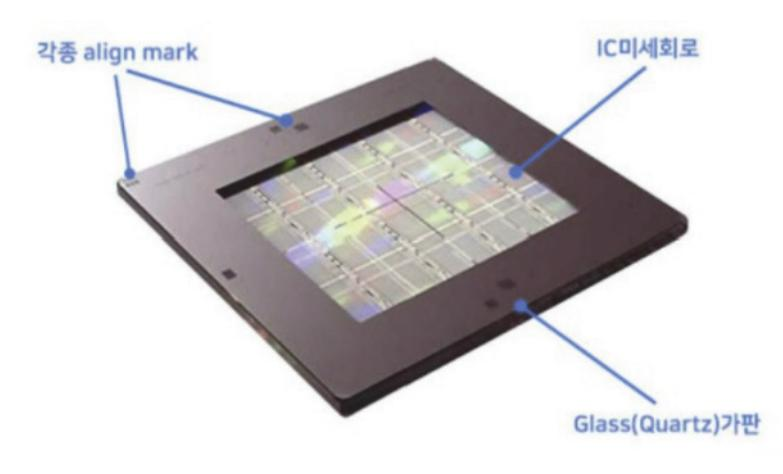

출처: 집필진 제작(2024) [그림 1-1] 반도체용 마스크 구성

### (가) 반도체용 마스크의 구성과 역활

반도체용 마스크의 구성과 역할은 아래와 같이 설명할 수 있다.

1) 각종 Align Key

얼라인(Align) 공정은 노광(Exposure) 직전에 웨이퍼(Wafer)를 노광 설비로 옮 겨서 마스크(Mask)와 웨이퍼(Wafer)를 최종 정렬(Align)하는 작업이다.

Align Key를 이용해서 Wafer 위의 PR에 Mask의 회로 패턴을 정확히 겹치도록 하여 기계적 설정(X, Y, Z축)을 조절해 주는 작업이다.

여기서 얼라인 키(Align Key)는 것은 각각의 다른 Mask를 정확한 위치를 맞추 기 위해 삽입한 표식이라고 할 수 있다. 여러 가지 형태가 있으나 보통은 십자가 모양으로 구성된다.

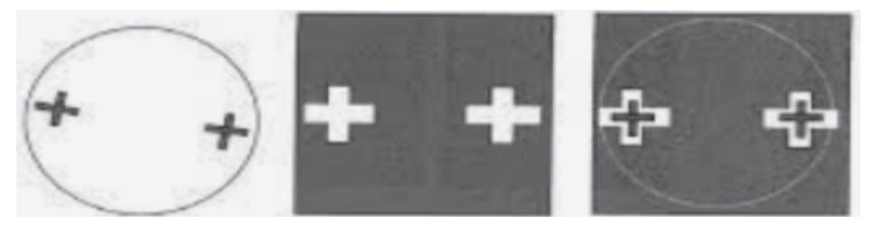

출처: 집필진 제작(2024) [그림 1-2] 마스크 얼라인 키이

가) Glass(Quarts)

석영 유리를 쿼츠라고 칭하는 경우가 다수이다. 이유는 쿼츠 글라스란 말을 줄여 쓰다가 통상의 용어처럼 사용되었다. 석영은 SiO2로 이루어진 유리로서 낮은 열팽창 계수이고, 높은 자외선 투과율과 화학적 내구성으로 반도체 공정 에서는 없어서는 안되는 필수적인 소재이다.

나) IC 미세 회로

반도체의 복잡한 회로(Cell, Peri)를 나타내기 위한 것으로 여러 형태의 그림 과 도면으로 구성되어 있다.

숕 반도체용 마스크의 종류와 기능

반도체용 마스크는 블랭크 마스크, Reticle, Photo Mask 등으로 구성되며 여러 기능이 있다.

- 1. 블랭크 마스크(Blank Mask) 포토 마스크의 핵심 원재로서 투명 기판에 금속과 감광막이 전면에 코팅된 형태로 구성된 다.
- 2. 포토 마스크(Photo Mask)

포토 마스크의 핵심 원재료, 투명 기판 위에 금속과 감광막이 전면에 코팅된 형태이다.

(1) Photo Mask 요구 사항

낮은 열팽창 계수, 열팽창 계수가 높으면 빛과 함께 가해지는 열만으로 포토 공정에서 오차가 생길 수 있다. 석영 기판에서는 빛에 대해 높은 투과율, 차광막에서 빛에 대해 낮은 투과율, 기계적 화학적 내구성이 필요하다.

(가) Photo Mask 제작 과정

반도체 회로 설계, 회로를 바탕으로 평면도로 전환, Photo Mask 제작, PR 도포, 노광 및 열처리, 현상, Cr 제거, PR 제거 등의 과정이 있다.

1) Photo Mask 품질

선폭(CD: Criticle Dimension), MTT(Mean to Target), Tolerance, Uniformity 가) 미세화 포토 공정의 문제점

패턴 미세화, 회절, 산란 현상(간섭 현상) 발생, 마스크 패턴 왜곡 현상 등이 있다.

3. 위상 변이 마스크(PSM: Phase Shift Mask)

마스크를 통과하는 빛의 간섭을 최소화하는 방법이다.

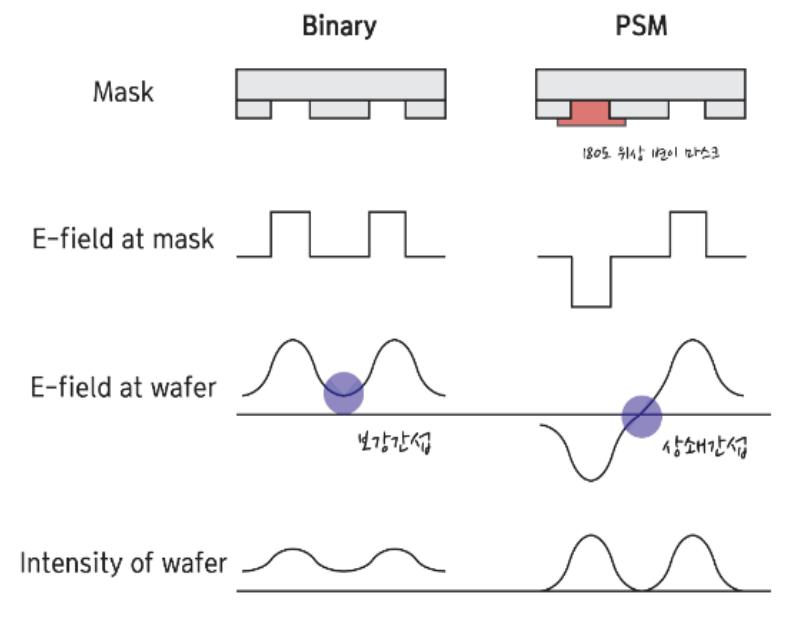

출처: 집필진 제작(2024)

[그림 1-3] Phase shift Mask

(1) 위상 변이 마스크의 원리

빛이 마스크를 통과할 때 빛의 세기 또는 위상 저절, 소멸, 간섭의 원리 이용, 원하지 않는 회절광 제거이다.

(가) 위상 변이 마스크 방식

마스크 제작 단계에서 석영 식각 또는 크로뮴 면에 다른 물질을 붙여 만드는 방식이다.

1) 위상 변이 마스크 단점

공정이 까다롭고 단가가 높다.

4. 펠리클(Pellicle)

마스크를 보호하는 얇은 보호막이다.

(1) 펠리클 역할

Pellicle의 원리와 구조를 중심으로 얇고 투명한 막으로 마스크(Mask)와 레티클 표면을 대기 중의 분자나 여러 형태의 오염원으로부터 보호해 준다. 금속, 일반적으로 양극 산 화된 알루미에 부착한 후 안정되게 레티클 위에 견고히 부착한다. 보통 펠리클은 반도체 노광 장비, 프로젝션 얼라이너에는 레티클의 한쪽 크로뮴 면에 부착되고, 스테퍼 (Stepper)에서는 일반적으로 레티클의 크로뮴(cr) 면과 유리면 양쪽 모두에 부착되어 펠 리클 표면에 부착된 이물질 등이 레티클 표면으로부터 웨이퍼 이미지에 영향을 주지 않 을 만큼의 거리에 있도록 한다.

(가) 펠리클 사용 목적

펠리클의 사용 목적은 제품의 불량률을 낮추고 마스크 세척 주기를 감소시키며, 마 스크 수명 증가, 반도체 제품 수율의 향상, 포토 마스크의 오염으로부터의 보호, 반 복적인 포토 마스크의 사용 시 오염원으로부터 격리하는 데 있다.

1) EUV Pellice 필요 조건

투과도, 열적 특성, 기계적 특성, 화학적 특성 등이다.

가) 투과적 특성

EUV 리소그래피는 거울을 사용해 펠리클을 2번 통과하여 광량 손실이 2번 발생한다.

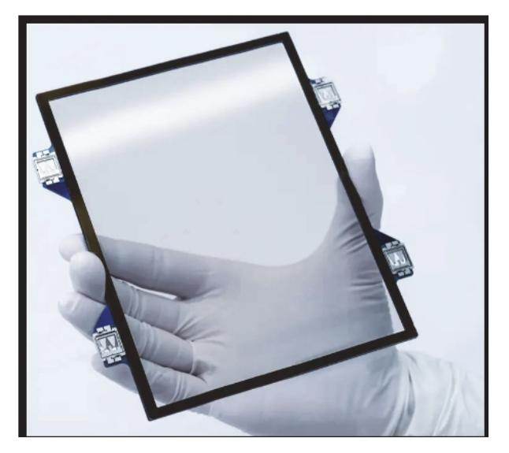

출처: 집필진 제작(2024) [그림 1-4] 반도체용 마스크 펠리클

숖 반도체용 마스크 요구 사항

반도체용 마스크는 반도체 제조 공정에서 매우 중요한 역할을 하는 도구이다. 반도체 마스크는 포토리소그래피 공정에서 사용되어 웨이퍼 위에 미세한 회로 패턴을 형성하는 데 필수적이다. 반도체 마스크의 요구 사항은 정확성과 정밀성이 매우 높으며, 다음과 같은 주요 요구 사항이 있다.

1. 고해상도

반도체 마스크는 매우 높은 해상도를 가져야 한다. 이는 미세한 회로 패턴을 정확하게 형성 하기 위해 필수적이다. 최신 기술은 나노미터 단위의 해상도가 필요하다.

2. 정확성

패턴의 위치와 크기가 매우 정확해야 한다. 미세한 오차라도 회로의 성능에 영향을 미칠 수 있기 때문에, 마스크의 제작 과정에서 높은 정밀도가 요구된다.

## 3. 내구성

반도체 마스크는 여러 번 사용되기 때문에 내구성이 중요하다. 특히, 반도체 제조 공정에서 반복적으로 사용되므로 마스크가 손상되지 않도록 강한 내구성을 가져야 한다.

4. 투명도와 소재 특성

마스크는 빛을 투과시키는 투명도가 필요하다. 보통 석영이나 다른 고순도 투명 소재로 만 들어진다. 이는 포토리소그래피 공정에서 빛이 패턴을 통해 웨이퍼에 정확히 전달되도록 하 기 위함이다.

5. 복잡한 패턴 구현

최신 반도체 칩은 매우 복잡한 회로 패턴을 가지므로 마스크는 이러한 복잡한 패턴을 구현 할 수 있어야 한다. 이는 마스크 제조 기술의 발전이 필수적임을 의미한다.

6. 정렬 정확도

여러 개의 레이어로 구성된 반도체 칩을 제조할 때, 각 레이어의 패턴이 정확히 정렬되어야 한다. 마스크는 이러한 레이어 간 정렬을 정확하게 맞출 수 있어야 한다.

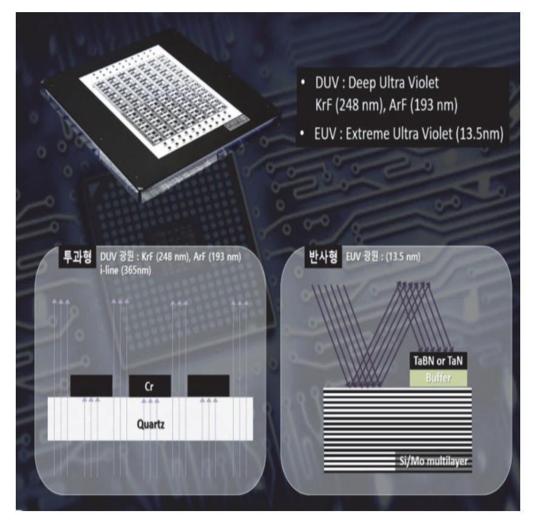

출처: 집필진 제작(2024) [그림 1-5] 포토 마스크의 변화

## 수행 내용 / 반도체용 마스크 요구 사항 파악하기

## 재료·자료

- 석영(Quartz)
- 소다라임 유리(Soda Lime Glass)
- 울코(Waferscale Glass)
- 감광성 물질(Photo-Sensitive Material
- 크로뮴(Chrome)
- 몰리브데넘 실리콘(Molybdenum Silicide)
- BARC(Bottom Anti-Reflective Coating)
- TARC(Top Anti-Reflective Coating)
- Pellicle, 투명 보호막(Transparent Membrane)
- Pellicle Membrane NC NC Fluoro Polymer
- Membrane Adhesive UV cured Adhesive UV cured Adhesive Fluoro Polymer
- Frame Anodized Aluminum
- Adhesive Hot-Melt Adhesive
- Liner Polyeste

## 기기(장비 ・ 공구)

- 광노광 장비(Photolithography Stepper/Scanner)
- 전자 빔 리소그래피 장비(Electron Beam Lithography Equipment)
- 현상 장비(Developing Equipment)
- 식각 장비(Etching Equipment)
- 검사 및 측정 장비(Inspection and Measurement Equipment)
- 세정 장비(Cleaning Equipment)

- 펠리클 부착 장비(Pellicle Mounting Equipment)
- 평가, 분석 및 계측 장비
- 제조 공장 인트라넷
- 안전 도구, 안전화, 안전모, 마스크, 장갑, 고글, 방진복
- 컴퓨터, 프린터, 복사기

#### 안전 ・ 유의 사항

- 화학 물질 등을 취급할 때는 MSDS(Material Safety Data Sheet)를 참조하여 정보를 숙지 한다.
- 개인 보호 장비(PPE: Personal Protective Equipment)를 반드시 착용한다. 장갑, 보호안 경, 실험복, 호흡기 등이 있다.
- 화학 물질을 다룰 때는 환기가 잘되는 작업 공간에서 작업을 하며, 퓸 후드(Fume Hood)가 있는 곳에 사용을 권장한다.
- 화학 물질은 지정된 안전한 용기에 보관하고, 지정된 라벨을 명확히 부착한다.
- 화학 물질을 혼합하거나 처치할 때는 정확한 절차와 비율을 준수해야 하며, 무작위로 절대 혼합하지 않는 게 원칙이다.
- 모든 기계 장비는 사전에 충분히 이해하고, 사용자 매뉴얼을 꼭 준수해야 한다.
- 장비의 유지 보수 및 수리는 반드시 훈련된 전문가가 수행해야 한다.
- 기계적 장비 등을 사용할 때는 작업 환경을 매우 청결하게 유지하고, 주변에 장애물이 없도 록 준비한다.
- 장비 사용 중에는 안전장치를 활성화하고, 비상 정지 버튼의 위치를 반드시 숙지한다.
- 전기 장비를 사용할 때는 장비의 상태를 수시로 점검하고, 전기적 결함이 없는지 반드시 확 인한다.
- 전기 장비는 반드시 접지된 콘센트에 연결하고, 과부하를 방지하기 위해 적절한 전력 용량 을 사용한다.
- 전기 장비를 다룰 때는 젖은 손으로 만지지 않으며, 물기가 있는 환경에서는 사용하지 않는다.

- 레이저 및 UV 등의 광원을 다룰 때는 보호안경을 항상 착용해야 하며, 직접 노출을 되도록 피해야 한다.
- 레이저 작업 시에는 반사되는 표면을 유의하고, 불필요한 반사를 방지하기 위해서는 흡수성 재료를 사용하도록 한다.
- UV 노출을 최소화한다.

#### 수행 순서

숔 반도체 마스크 공정의 주요 내용을 이해한다.

반도체 마스크 공정의 요구 사항 파악을 위해서는 마스크 공정의 단계별 주요 내용에 대해 정 확히 이해하는 것이 필요하다.

1. 반도체 회로를 설계한다.

반도체 회로를 설계하는 단계를 말한다.

2. 회로를 평면도로 변환한다.

설계 엔지니어들이 반도체 회로를 평면도로 전환하는 작업을 시행한다.

3. Photo Mask를 제작한다.

마스크 제작 공정 순서도에 따라 제작한다.

(1) PR 도포

포토레지스터를 균일하게 도포하는 공정이다. 이 감광제는 빛에 노출되면 화학적으로 변 화하는 물질로, 일반적으로 포토레지스트(Photoresist)라고 불린다.

(2) 노광 및 열처리

노광 및 열처리를 행하는 공정을 진행한다. 외선(UV) 또는 극자외선(EUV) 광원이 사용 되며, 빛이 통과하는 부분과 차단되는 부분에 따라 감광제가 다르게 반응한다.

(3) 현상

Develop을 시행하는 공정을 진행한다. 현상액에 노출시켜 감광제의 노광된 부분과 노 광되지 않은 부분을 제거하며 이 과정을 통해 마스크 패턴이 형성된다.

(4) Cr 식각

크로뮴을 식각해 내는 공정을 진행한다. 노출된 실리콘 부분을 제거하기 위해 건식 또는 습식 식각 공정을 사용하며 이 단계에서 감광제가 보호하는 부분은 남고 나머지 부분은 제거되어 원하는 패턴이 형성된다.

(5) PR 제거

감광막을 제거하는 공정을 진행한다. 식각이 완료된 후 남아 있는 감광제를 제거하며 이 를 통해 최종 패턴이 형성된다.

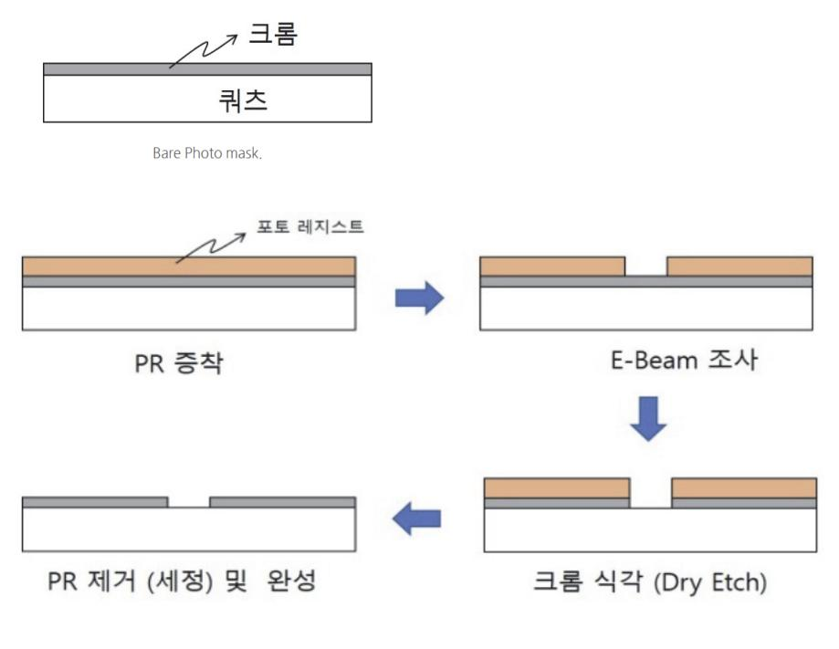

출처: 집필진 제작(2024)

[그림 1-6] 마스크 제작 진행 순서

숕 반도체용 마스크 공정 재료의 이해한다.

마스크를 구성하는 재료를 이해하는 단계이다.

1. Quarts

블랭크 마스크의 기판, 즉 석영 기판이라고 불리며 아래와 같은 요구 조건을 충족해야 한 다.

(1) 마스크 제작에서 Quarts의 역할

석영 유리 기판(Quarts) 위에 금속 박막(크로뮴 막)이 증착되고 그 위에 감광액이 도포 된다.

- (2) Quarts 요구 사항 매우 낮은 열팽창 계수(0.5×10−6/°C), 높은 자외선 투과율이 필요하다.
- (3) Quarts의 제작사 ShinEtu, 아사히 글라스[旭確子] 등이 있다.
- (4) 석영 유리의 특징 및 요구 사항 ppm 단위 이하의 금속 불순물을 가공 시에는 sub-nano급 거칠기, EUV용 마스크 열 팽창 계수는 초저열팽창 계수(〈5×10–9/°C)이다
- 2. 크로뮴

반도체 제조 공정에서 포토 마스크를 제작하는 데 사용되는 중요한 재료이다.

(1) 마스크 제작에서 크로뮴의 역할

포토 마스크는 웨이퍼 위에 패턴을 형성하기 위해 빛을 차단하거나 통과시키는 역할을 합니다. 이때 크로뮴(Chromium)은 그 위에 패턴을 형성하는 데 사용되는 금속 층이다.

- (2) 크로뮴의 특징
  - (가) 높은 불투명성(Opaque)

크로뮴은 빛을 잘 차단하는 성질이 있어서, 포토 마스크에서 특정 부분에 빛이 통과 되지 않도록 하는 데 적합하다.

(나) 내식성(Corrosion Resistance)

크로뮴은 화학적 안정성이 높아 산화나 부식에 강하다. 이는 포토 마스크가 제조 공 정 중에 다양한 화학 물질과 접촉할 때 크로뮴이 손상되지 않도록 하기 위함이다.

(다) 내열성(Heat Resistance)

크로뮴은 고온에서도 안정한 특성이 있어, 반도체 제조 공정 중 발생하는 열에 견딜 수 있다.

(라) 우수한 밀착성(Adhesion)

크로뮴은 유리나 석영 같은 포토 마스크 기판에 잘 붙는다. 이는 패턴의 정밀성을 유지하는 데 중요하다.

- 1) 크로뮴의 요구 Spec
- 가) 두께(Thickness)

크로뮴 층의 두께는 일반적으로 수십 나노미터(nm) 수준으로, 일반적으로 50~100nm 정도이다. 두께는 패턴의 해상도와 포토 마스크의 성능에 직접적 인 영향을 끼친다.

- 나) 표면 거칠기(Surface Roughness) 크로뮴 층의 표면은 매우 평탄하고 매끄러워야 한다. 표면 거칠기는 일반적으 로 수 나노미터(nm) 이하로 유지되어야 한다.
- 다) 결함 밀도(Defect Density) 크로뮴 층에 결함이 적어야 하며, 결함 밀도는 매우 낮아야 한다. 이는 고해 상도 패턴을 형성하기 위해 중요하다.
- 라) 광학적 특성(Optical Properties)

크로뮴은 특정 파장에서 높은 흡수율을 가져야 한다. 예를 들어, KrF 엑시머 레이저(248nm)나 ArF 엑시머 레이저(193nm)를 사용하는 리소그래피 공정에 서, 크로뮴은 해당 파장에서 높은 흡수율을 보여야 한다.

마) 밀착력(Adhesion)

크로뮴층은 기판에 견고하게 밀착되어 있어야 한다. 밀착력이 부족하면 포토 마스크의 신뢰성이 떨어질 수 있다.

바) 내화학성(Chemical Resistance)

크로뮴층은 패턴 에칭, 세정 공정 등 다양한 화학 공정에 저항성을 가져야 한 다.

사) 균일성(Uniformity)

크로뮴층은 전체 포토 마스크에 걸쳐 두께와 특성이 균일하게 분포되어야 한 다.

(3) 크로뮴의 공급사

(가) Honeywell Electronic Materials

Honeywell은 반도체 제조에 필요한 다양한 화학 물질과 재료를 공급하는 글로벌 기 업. 포토 마스크용 크로뮴 및 기타 고순도 금속 재료를 제공한다.

(나) ULVAC, Inc.

ULVAC는 진공 기술을 기반으로 한 다양한 장비 및 재료를 공급하는 일본 기업이 다. 포토 마스크용 크로뮴 타깃 및 증착 재료를 제공한다.

(다) JX Nippon Mining & Metals

JX Nippon Mining & Metals는 금속 재료 및 반도체 관련 재료의 주요 공급사이 다. 회사는 포토 마스크용 고순도 크로뮴 및 다양한 금속 타깃을 제공한다.

(라) Mitsui Mining & Smelting Co., Ltd.(Mitsui Kinzoku)

Mitsui Kinzoku는 광범위한 금속 재료와 화학 제품을 제조하는 일본 기업이다. 포 토 마스크용 크로뮴 및 기타 금속 재료를 공급한다.

(마) Plansee SE

Plansee는 고성능 금속 재료의 글로벌 공급사로, 특히 텅스텐, 몰리브덴, 크로뮴 등 다양한 금속 타깃을 제공한다. 포토 마스크용 크로뮴 타깃을 포함한 고순도 재료를 생산한다.

(바) Tosoh Corporation

Tosoh Corporation은 다양한 산업용 화학 제품 및 재료를 생산하는 일본의 대기 업입니다. 포토 마스크용 고순도 크로뮴을 포함한 다양한 반도체 재료를 제공한다.

3. 블랭크 마스크

반도체와 엘시디(LCD), 오엘이디(OLED) 등 노광 공정의 핵심 재료인 마스크의 원재료로 패턴이 노광되기 전의 마스크이다.

(1) 마스크 제작에서 블랭크 마스크의 역활

석영 유리 기판 위에 금속 박막 필름이 증착되고 그 위에 감광액이 도포된 형태로 이루 어져 있다. 덧붙여 말하자면 블랭크 마스크를 이용하여 노광, 현상 및 검사와 같은 일련 의 공정을 통해 포토 마스크(Photomask)를 제조한 후 디자인 패턴을 기판 위에 묘화하 게 된다.

(2) 블랭크 마스크의 특징

블랭크 마스크에서는 높은 균질도의 성막이 요구된다.

(가) 반도체용 블랭크 마스크

반도체용 블랭크 마스크의 특징은 높은 해상도(Resolution)의 향상을 위해 기판, 금 속막과 레지스트막 등의 특성이 중요하다.

1) 반도체용 블랭크 마스크의 구조

가로×세로×두께가 각각 6.0×6.0×0.25inch인 석영 기판에 수십~수백 나노의 두께를 가지는 금속막의 차광막, 반사 방지막 등이 증착된 후 그 위에 레지스트 막이 형성된 구조이다.

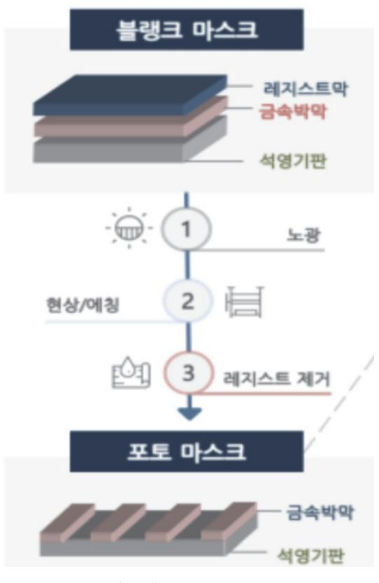

출처: 집필진 제작(2024) [그림 1-7] 마스크 제작 진행 순서

4. Pellicle

Pellicle(펠리클)은 포토 마스크를 보호하기 위해 사용되는 얇은 투명막이다. 펠리클은 마스 크 표면에 부착되어 포토 마스크의 오염이나 손상을 방지하고, 생산성 향상과 결함률 감소 에 중요한 역할을 한다.

(1) 펠리클의 특징

(가) 광 투과성(Optical Transparency)

펠리클은 특정 파장의 빛을 거의 흡수하거나 반사하지 않고 투과시키는 특성이 있어 야 한다. 일반적으로 90% 이상의 높은 투과율을 가진다. 주로 사용되는 빛의 파장은 KrF(248nm), ArF(193nm) 등의 엑시머 레이저이며, EUV(13.5nm)에서도 사용된다.

(나) 내구성(Durability)

펠리클은 제조 공정 중 발생하는 온도 변화, 진공 환경, 화학적 노출 등에 견딜 수 있어야 한다. 기계적 강도가 높아야 하며, 쉽게 찢어지거나 손상되지 않아야 한다.

(다) 오염 방지(Anti-Contamination)

펠리클은 마스크 표면에 먼지나 오염 물질이 쌓이는 것을 방지한다. 이는 리소그래 피 공정 중 결함을 최소화하는 데 중요하다.

(라) 박막 두께(Thin Film Thickness)

펠리클의 두께는 매우 얇아야 하며, 일반적으로 수십 마이크로미터(μm) 이하로 유지 된다. 이는 빛의 간섭을 최소화하고 해상도에 영향을 주지 않기 위해서이다.

(마) 균일성(Uniformity)

펠리클 막의 두께와 특성이 전체 표면에 걸쳐 균일하게 유지되어야 한다. 균일하지 않으면 광학적 특성이 변질되어 패턴 형성에 영향을 줄 수 있다.

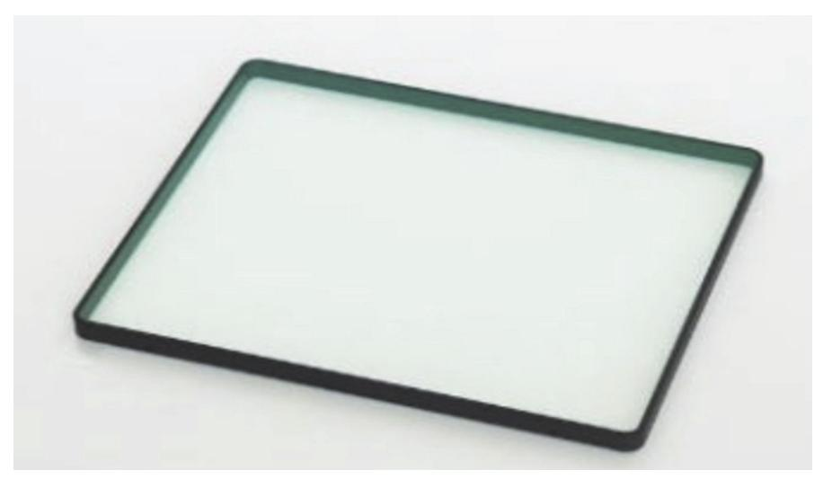

출처: 집필진 제작(2024) [그림 1-8] 펠리클(pellicle)

(2) 펠리클의 스펙(Spec)은 아래와 같다.

- (가) 광투과율(Transmittance): KrF(248 nm) 90% 이상, ArF(193 nm) 90% 이상
- (나) EUV(13.5nm): 70~80% 이상

- (다) 내열성(Thermal Stability): 사용 환경 온도 범위는 -40°C~+150°C
- (라) 열팽창 계수: 최소화되어야 한다.
- (마) 기계적 강도(Mechanical Strength): 인장 강도 최소 1.0GPa 이상
- (바) 인장 모듈러스: 최소 100GPa 이상
- (사) 오염 방지 성능(Anti-Contamination)
- (아) 표면 오염 입자 수: 제한된 수 이하(예: 10 입자/cm² 이하, 특정 크기 기준)
- (자) 두께(Thickness): 일반적으로 0.5μm~1μm 사이
- (차) 두께 균일성: ±5% 이내
- (카) 내화학성(Chemical Resistance): 다양한 화학 물질에 대한 저항성: 강산, 강염기, 유기 용제 등
  - 1) 주요 펠리클 제조사
  - 가) ASML

EUV 펠리클 분야에서 선두적인 역할을 하고 있으며, 높은 투과율과 내구성을 가진 펠리클을 개발한다.

나) Mitsui Chemicals 다양한 파장 범위에서 사용할 수 있는 펠리클을 제공하며, 특히 ArF 펠리클 에 강점이 있다.

반도체 산업에 필요한 다양한 화학 제품과 함께 고품질 펠리클을 공급한다.

- 다) Shin-Etsu Chemical
- 라) Toppan Photomasks

포토 마스크 제조 업체로서 펠리클과 마스크 세트를 제공하며, 높은 신뢰성을 자랑한다.

#### 수행 tip

• 마스크용 재료 선택 및 요구 사항은 초기 수행 업무로 매 우 중요한 역할을 하는 공정으로써 재료가 요구되는 스펙 (spec)을 꼭 준수하도록 해야 한다.

## 학습 1 교수·학습 방법

## 교수 방법

- 반도체용 마스크 공정의 개요와 세부 내용을 부분별로 알기 쉽게 설명한다.
- 현장에서의 표준화한 공정들 매뉴얼과 관련 공정의 재료에서 제공되는 자료 등의 내용을 프 레젠테이션 등의 자료로 자세하게 제시한 후에 설명하도록 한다.
- 가능한 한 사전에 제조 현장에서 사용하는 여러 사례를 수집하여 자료를 면밀히 검토하고 이해하기 쉬운 방법을 논의하는 방식의 문제 해결식 수업을 하도록 한다.
- 최근의 반도체 산업 현황(시장 및 기술 동향 등)에 대하여 충분히 사전에 인지하고, 학습자 들이 이를 이해할 수 있는 방법/기법을 모색하여 수업을 진행하도록 한다.
- 시장의 환경 및 기술 변화 등을 통합 검색 사이트나 한국반도체산업협회의 홈페이지(www.ksia.or.kr) 나 해외 사이트 등에서 찾아 활용할 수 있도록 지도한다.
- 반도체용 마스크 재료 요구 사항에 필요한 내용을 정확히 확인하고, 관련 자료를 학습자들 에게 제시 후 파악 여부를 꼭 확인한다.

### 학습 방법

- 반도체 산업 현황(시장 환경 및 기술 동향 등)과 관련 기관을 구체적으로 확인하도록 하고, 이 기관과 관련된 다양한 자료를 인터넷으로 검색하고 분류하여 문서로 정리한다.
- 반도체용 마스크 재료 요구 사항 항목이 지정된 양식에 맞추어 요구 소자에 대한 요구 사항 을 직접 작성해 본 다음, 첨부되는 자료의 종류와 기록 종류 등의 내용 전반을 숙지하고, 가 능하면 소자별로 분류해 보도록 한다.
- 반도체 마스크 재료 요구 사항에 대한 시장 및 기술, 비용의 조사, 수집 및 분석을 통해 생 산에 필요한 목표를 설정하고 분류된 자료를 활용하여 생산 가능성을 예측해 본다.
- 반도체용 마스크 재료 선택에서 예상되는 품질 관리 문제점을 파악하고 피드백하는 능력을 배양한다.

## 학습 1 평 가

## 평가 준거

- 평가자는 학습자가 학습 목표를 성공적으로 달성하였는지를 평가해야 한다.
- 평가자는 다음 사항을 평가해야 한다.

| 학습 내용                 | 학습 목표                                    | 성취수준 |   |   |
|-----------------------|------------------------------------------|------|---|---|
|                       |                                          | 상    | 중 | 하 |
| 반도체용 마스크 요 구 사항 파악 | - 최종 제품의 생산에 필요한 마스크 제조 공정을 파악할 수 있다. |      |   |   |
|                       | - 고객의 요구 사항에 의한 마스크 재료를 파악할 수 있다.        |      |   |   |
|                       | - 품질 관리를 위한 문제점을 파악할 수 있다.               |      |   |   |

## 평가 방법

• 포트폴리오

| 학습 내용                 | 평가 항목                                                       | 성취수준 |   |   |
|-----------------------|-------------------------------------------------------------|------|---|---|
|                       |                                                             | 상    | 중 | 하 |
| 반도체용 마스크 요 구 사항 파악 | - 반도체용 마스크 재료 제조 사양서를 작성할 수 있는 능력                           |      |   |   |
|                       | - 반도체용 마스크 재료 제조 사양서를 바탕으로 제품명, 품질 기준, 제품 사양, 납기 등 파악 여부 |      |   |   |
|                       | - 파악된 내용을 바탕으로 마스크 재료 제조 시 발생할 수 있 는 문제점 검토할 수 있는 능력     |      |   |   |

### • 문제 해결 시나리오

|                       | 평가 항목                                                                          | 성취수준 |   |   |
|-----------------------|--------------------------------------------------------------------------------|------|---|---|
| 학습 내용                 |                                                                                | 상    | 중 | 하 |
| 반도체용 마스크 요 구 사항 파악 | - 반도체용 마스크 재료 제조 시 문제 발생 세부 내용을 이해 하고 생산에 적용할 수 있는 능력                       |      |   |   |
|                       | - 반도체 마스크 재료 제조 사양서를 바탕으로 제품명, 품질 기준, 제품 사양, 납기 등의 문제점을 이해하고 대처할 수 있는 능력 |      |   |   |
|                       | - 파악된 내용을 바탕으로 마스크 재료 제조 시 발생할 수 있 는 품질 관련 문제점을 검토할 수 있는 능력                 |      |   |   |

#### • 서술형 시험

| 학습 내용                 | 평가 항목                            | 성취수준 |   |   |
|-----------------------|----------------------------------|------|---|---|
|                       |                                  | 상    | 중 | 하 |
| 반도체용 마스크 요 구 사항 파악 | - 반도체용 마스크 재료 요구 사항 항목 서술 능력     |      |   |   |
|                       | - 반도체용 마스크 재료 요구 사항 항목별 기준 서술 능력 |      |   |   |
|                       | - 반도체용 마스크 재료 요구 사항 합격 기준 서술 능력  |      |   |   |

## 피드백

- 1. 포트폴리오
- 반도체용 마스크 재료 제조 사양서 작성 능력에 대해 평가하고 미비한 점이 발견되면 보완하도록 주요 내용을 구체적으로 설명하여 준다.
- 파악된 내용을 바탕으로 마스크 재료 제조 시 발생할 수 있는 문제점이 발견되면 보충하여 설명 해 준다.
- 2. 문제 해결 시나리오
- 반도체용 마스크 재료 제조 규격서를 바탕으로 제품명, 품질의 기준, 제품 사양, 납기 등 문제점 을 이해하고 대처하는 능력을 평가하고 성취수준이 낮은 학습자에게는 부족한 부분을 사례를 통해 철저히 지도해 준다.
- 파악된 내용을 바탕으로 마스크 재료 제조 시 발생할 수 있는 품질 관련 문제점이 발견되면 미흡 한 부분을 이해하기 쉽게 보충하여 설명해 준다.

#### 3. 서술형 시험

- 파악된 내용을 바탕으로 마스크 재료 제조 시 발생할 수 있는 문제점의 대처 방안에 대한 지식에 을 평가하고 부족한 부분이 발견되면 그 부분을 추가로 학습하도록 지도한다.
- 반도체용 마스크 재료 요구 사항 항목별 기준을 파악하는 능력이 부족하면 보충 자료를 제시해 주어 보완 학습을 실시하게 하고, 성취수준이 높은 학습자에게는 심화 학습 자료를 제공해 준다.

| 학습 1 | 반도체용 마스크 요구 사항 파악하기 |
|------|---------------------|
| 학습 2 | 반도체용 마스크 재료 선정하기    |
| 학습 3 | 반도체용 마스크 재료 제조하기    |
| 학습 4 | 반도체용 마스크 제품 특성 검증하기 |

## 2-1. 반도체용 마스크 재료 선정

| • 반도체 리소그래피 공정에서 장점과 단점을 파악할 수 있다. |                                            |  |
|------------------------------------|--------------------------------------------|--|
| 학습 목표                              | • 반도체용 마스크 공정에서 마스크 재료를 선정할 수 있다.          |  |
|                                    | • 선정된 마스크 재료의 도출된 문제점에 대한 해결 방안을 제시할 수 있다. |  |

## 필요 지식 /

- 숔 반도체용 마스크 재료 선정 반도체용 마스크 재료를 선정할 수 있다.
  - 1. Quarts(석영) 마스크의 기판(Substrate)으로 사용된다.
  - 2. 크로뮴(Chromium)

패턴을 형성하기 위해 증착되는 불투명 금속층으로, 빛을 차단하는 역할을 한다.

3. 펠리클(Pellicle)

투명 폴리머 필름으로 마스크 표면을 보호하는 얇은 막으로, 먼지와 오염으로부터 마스크를 보호하여 결함을 줄이고 마스크의 수명을 연장하게 해 주는 역할을 한다.

숕 반도체용 마스크 재료 선정 기준

마스크 재료에는 아래와 같은 여러 가지 기준을 충족해야 한다.

- 1. Quarts(석영) 선정 기준
  - (1) 광학적 투명도(Optical Transparency) 석영 기판은 사용되는 포토 공정의 특정 파장에서 높은 투과율을 가져야 한다. 일반적으 로 DUV(248nm) 및 ArF(193nm) 파장에서의 투과율이 높아야 한다.
  - (2) 저불순물 함량(Low Impurity Content)

석영 기판은 불순물 함량이 매우 낮아야 한다. 불순물은 광학적 성질을 저하시킬 수 있 으며, 패턴 형성에 부정적인 영향을 끼칠 수 있다.

(3) 표면 평탄도(Surface Flatness)

석영 기판의 표면은 매우 평탄해야 하며, 표면 평탄도는 패턴의 정확도와 해상도에 직접 적인 영향을 끼친다. 평탄도는 전체 기판 면적에 걸쳐 일정한 두께를 유지해야 하며, 일 반적으로 나노미터 수준의 평탄도가 필요하다.

- (4) 두께 균일성(Thickness Uniformity) 기판의 두께가 균일해야 한다. 두께의 불균일성은 리소그래피 공정 중 초점 문제를 일으 킬 수 있다.
- (5) 내화학성(Chemical Resistance) 석영 기판은 다양한 화학 물질에 노출되더라도 화학적 손상을 입지 않아야 한다.
- (6) 내열성(Thermal Stability) 기판은 고온 환경에서도 물리적, 화학적 특성이 변하지 않아야 한다. 이는 반도체 제조 공정 중 발생하는 열에 견딜 수 있는 능력이 필요하다.
- 2. Quarts(석영)의 요구 스펙

반도체용 마스크 제작에 필요한 석영(Quarts)의 스펙은 아래와 같다.

- (1) 투과율(Transmittance) 248nm(DUV): 90% 이상, 193nm(ArF): 90% 이상
- (2) 불순물 함량(Impurity Content)
- (3) 금속 불순물 함량: 1ppm 이하
- (4) 기타 불순물: 가능한 한 최소화
- (5) 표면 평탄도(Surface Flatness)
- (6) 전체 표면 평탄도: < 100nm(3σ 기준)
- (7) 지역 평탄도: < 50nm(10mm×10mm 영역 기준)
- (8) 두께 및 두께 균일성(Thickness and Thickness Uniformity)
- (9) 두께 균일성: ±1% 이내
- (10) 결함 밀도(Defect Density)
- (11) 표면 결함: < 0.5개/cm²(0.5μm 이상 크기 기준)
- (12) 내부 결함: 허용되지 않음(내포물, 기포 등).
- 3. 펠리클(Pellicle)

투명 폴리머 필름으로 마스크 표면을 보호하는 얇은 막으로, 먼지와 오염으로부터 마스크를 보호하여 결함을 줄이고 마스크의 수명을 연장한다. 빛의 투과율이 매우 높아야 하며, 리소

그래피 공정에서 사용되는 특정 파장에 대해 높은 투명도를 가져야 한다.

(1) 펠리클 선정 기준

반도체용 마스크에 사용되는 펠리클은 매우 얇은 투명막으로, 포토 마스크를 먼지와 오 염으로부터 보호하는 역할을 한다. 펠리클의 선정 기준과 사양은 반도체 제조 공정의 효 율성과 패턴 정확도에 직접적인 영향을 끼치므로 매우 엄격하게 설정된다.

(가) 광 투과성(Optical Transmittance)

펠리클은 특정 파장의 빛을 거의 흡수하거나 반사하지 않고 투과해야 한다. 높은 투 과율은 리소그래피 공정에서 중요하다.

- (나) 내구성(Durability) 펠리클은 열, 진공, 화학적 노출 등 제조 공정의 다양한 환경에 견딜 수 있어야 한다.
- (다) 오염 방지(Anti-Contamination)

펠리클은 마스크 표면에 먼지나 오염물이 쌓이지 않도록 보호해야 한다.

- (라) 기계적 강도(Mechanical Strength) 펠리클은 기계적 강도가 높아 쉽게 찢어지거나 손상되지 않아야 한다.
- (마) 박막 두께(Thin Film Thickness) 펠리클의 두께는 매우 얇아야 하며, 빛의 간섭을 최소화하기 위해 일정해야 한다.
- (바) 균일성(Uniformity)

펠리클 막의 두께와 특성이 전체 표면에 걸쳐 균일하게 유지되어야 한다.

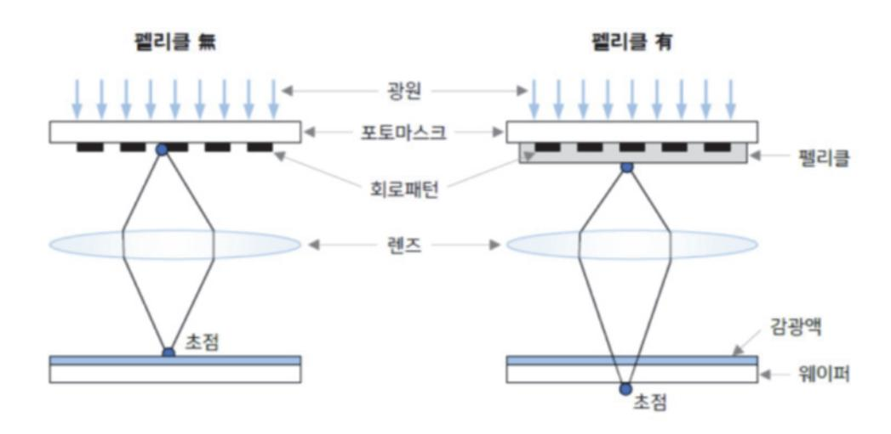

출처: 집필진 제작(2024) [그림 2-1] 펠리클의 역할

(2) 펠리클 선정 스펙은 아래와 같다.

(가) 광 투과율(Transmittance)

KrF(248nm) 90% 이상, ArF(193nm) 90% 이상, EUV(13.5nm) 70~80% 이상이다.

(나) 내열성(Thermal Stability)

사용 환경 온도 범위는 -40°C~+150°C, 열팽창 계수는 최소화되어야 한다.

(라) 기계적 강도(Mechanical Strength)

인장 강도는 최소 1.0GPa 이상, 인장 모듈러스는 최소 100GPa 이상이어야 한다.

(마) 오염 방지 성능(Anti-Contamination)

표면 오염 입자 수는 제한된 수 이하(예: 10 입자/cm² 이하, 특정 크기 기준)이다.

(3) EUV용 펠리클

EUV(극자외선, Extreme UltraViolet)는 그 특성상 파장이 매우 짧고 모든 물질에 모두 흡수된다. EUV가 흡수가 많으면 그 렌즈를 쓰지 못해 반사 형식으로 미러 형식으로 해 야 한다.

극자외선(EUV)의 이동 과정을 모두 반사식으로 형성하며, 기존의 노광 공정과 같이 마 스크, 펠리클, 렌즈 등을 통과하는 과정을 EUV에는 사용할 수 없게 된다.

펠리클을 설치하고 나면, 반사식 노광 장비의 특성상 EUV가 펠리클을 2회 통과하게 된 다. EUV가 다른 물질에 흡수가 매우 잘되는 상황에서, 펠리클을 2회 통과하게 되면 웨 이퍼에 도달하는 EUV의 양이 급격히 줄어들게 된다.

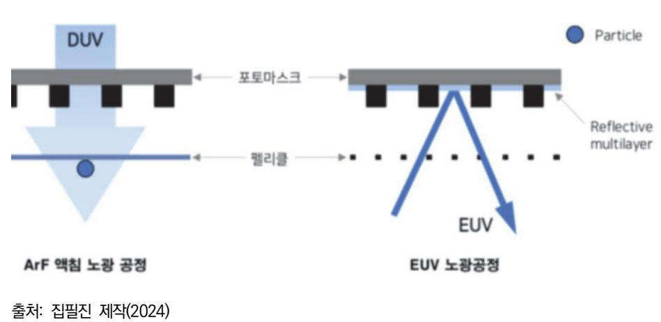

[그림 2-2] EUV용 펠리클

## 수행 내용 / 반도체용 마스크 재료 선정하기

## 재료·자료

- 석영(Quartz)
- 반도체용 블랭크 마스크
- 소다라임 유리(Soda Lime Glass)
- 울코(Waferscale Glass)
- 감광성 물질(Photo-Sensitive Material
- 크로뮴(Chrome)
- 몰리브데넘 실리콘(Molybdenum Silicide)
- BARC(Bottom Anti-Reflective Coating)
- TARC(Top Anti-Reflective Coating)
- Pellicle, 투명 보호막(Transparent Membrane)
- ASTM, ISO, JIS, SEMI, KS 표준화 문서
- ITRS 로드맵(International Technology Roadmap for Semiconductor)
- 반도체 로드맵
- 반도체 제조 공정도
- MSDS, RoHS, WEEE(Waste Electrical and Electronic Equipment)
- 리소그래피 재료
- Immersion Photo Resist, Top Coat, BARC, Relacs/SAFIER, ArF Photo Resist, SOC, Developer
- KrF Photo Resist, MFHM, Thinner, I-line Photo Resist, SOD
- 유기, 무기 합성 Pilot 설비
- PR류 Mixing Vessel

- 중합체 합성 Pilot 설비
- 제조 공정 이상 발생 Monitoring 설비
- Bottle Cleaning 설비
- Bottle Filling 설비

## 기기(장비 ・ 공구)

- 광노광 장비(Photolithography Stepper/Scanner)
- 전자 빔 리소그래피 장비(Electron Beam Lithography Equipment)
- 현상 장비(Developing Equipment)
- 식각 장비(Etching Equipment)
- 검사 및 측정 장비(Inspection and Measurement Equipment)
- 세정 장비(Cleaning Equipment)
- 펠리클 부착 장비(Pellicle Mounting Equipment)
- 평가, 분석 및 계측 장비
- 제조 공장 인트라넷
- 안전도구, 안전화, 안전모, 마스크, 장갑, 고글, 방진복
- 컴퓨터, 프린터, 복사기
- 중합체 합성 Pilot 설비
- 제조 공정 이상 발생 Monitoring 설비
- Bottle Cleaning 설비
- Bottle Filling 설비
- 평가, 분석 및 계측 장비
- Arf Scanner, Elipsometer, GC
- I-line Stepper, Microscope, HPLC

- Track, ICP-MS, nmR

안전 ・ 유의 사항

- 화학 물질을 다룰 때는 환기가 매우 잘되는 작업 공간에서 작업해야 하며, 퓸 후드(Fume Hood) 등의 사용을 권장한다.
- 화학 물질 등은 지정된 안전 용기에 꼭 보관하고, 라벨을 명확히 부착하도록 한다.
- 화학 물질을 혼합하거나 처리할 시는 정확한 절차와 비율 등을 준수해야 하며, 무작위로 혼 합하지 않도록 한다.
- 모든 기계 장비는 사전에 충분히 이해하도록 하고, 사용자 매뉴얼을 꼭 준수해야 한다.
- 장비의 유지 보수, 수리는 반드시 훈련된 전문가가 수행하도록 해야 한다.
- 기계적 장비 등을 사용할 시는 작업 환경을 매우 청결하게 유지하고, 주변에 장애물이 없도 록 한다.
- 장비 사용 중에는 안전장치를 반드시 활성화하고, 비상 정지 버튼 등의 위치를 숙지한다.
- 전기 장비를 사용할 시 정기적으로 장비의 상태를 반드시 점검하고, 전기적 결함이 없는지 확인한다.
- 전기 장비는 반드시 접지된 콘센트에 연결하고, 과부하를 방지하기 위해 적절한 전력 용량 을 사용하도록 한다.
- 전기 장비를 다룰 때는 젖은 손으로 만지지 않으며, 물기가 있는 환경에서는 사용하지 않는다.
- 레이저, UV 광원을 다룰 시 항상 보호안경을 착용해야 하며, 직접적인 노출을 피해야 한다.
- 레이저 작업 시에는 반사 표면을 주의하고, 불필요한 반사를 방지하기 위해 흡수성 재료를 사용한다.
- UV 노출을 최소화하기 위해 노출 장비의 보호 커버를 사용하고, 필요시 노출 시간을 최소 화한다.
- 화학 폐기물은 적절한 방법으로 분리 수거·관리하고, 환경 규정을 준수하여 처리한다.
- 폐기물 배출 전에 적절한 중화 또는 처리를 거쳐야 하며, 이는 전문 업체에 의뢰할 수 있 다.

- 오염된 기구, 재료 등은 지정된 폐기 절차에 따라 처리하도록 한다.
- 작업 공간의 에너지 소비를 최소화하기 위해 불필요한 장비의 전원을 끊는다.
- 자원을 절약하고 재사용이 가능한 재료를 최대한 활용하도록 한다.

#### 수행 순서

숔 반도체용 마스크 재료를 선정한다.

반도체용 마스크 재료를 선정하는 과정은 매우 정밀하고 체계적으로 수행된다. 재료 선정은 마 스크의 성능, 제조 공정, 비용, 신뢰성 등 다양한 요소를 고려하여 이루어진다.

- 1. 요구 사항을 정의(Define Requiremnts)한다.
  - (1) 사용 목적 및 응용 분야를 파악한다.

마스크가 사용될 반도체 제조 공정의 종류(예: DUV, EUV, i-line)를 명확히 파악하며 패턴 해상도, 공정 용량, 기판 크기 등 구체적인 요구 사항을 정의한다.

- (2) 요구 사항을 설정한다.
  - (가) 광학적 특성: 투과율, 반사율, 굴절률 등
  - (나) 기계적 특성: 강도, 평탄도, 두께 균일성 등
  - (다) 화학적 특성: 내화학성, 불순물 함량 등
  - (라) 열적 특성: 열팽창 계수, 열 안정성 등
- 2. 후보 재료 조사 및 목록을 작성(Research and List Candidate Materials)한다.
  - (1) 재료 특성 조사

다양한 재료의 물리적, 화학적, 열적, 기계적 특성을 조사한다. 후보 재료 목록을 작성하 고, 각 재료의 특성을 정리한다.

(2) 기존 사례 분석

기존에 사용된 재료와 그 성능을 분석하며 경쟁 제품이나 최신 연구 결과를 참고한다.

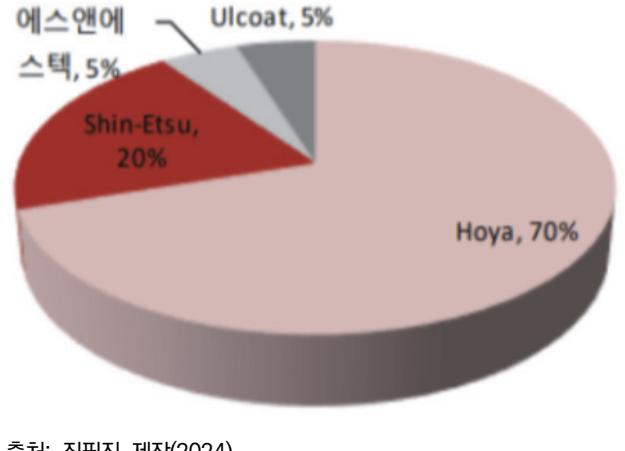

출처: 집필진 제작(2024) [그림 2-3] 반도체용 블랭크 마스크 M/S(Market Share)

- 3. 초기 평가 및 선택(Initial Evaluation and Selection)을 한다.
  - (1) 초기 후보 재료 평가

각 후보 재료의 특성을 요구 사항과 비교하여 초기 평가를 실시하며, 성능, 비용, 가용 성 등을 고려하여 적합한 후보를 선별한다.

(2) 프로토타입 제작 및 테스트

초기 후보 재료를 사용하여 프로토타입 마스크를 제작하며, 제작된 마스크를 실제 공정 에서 테스트하여 성능을 검증한다.

4. 상세 평가 및 최종 선정(Detailed Evaluation and Final Selection)을 한다.

- (1) 광학적 특성 평가 투과율, 반사율, 굴절률 등을 정밀하게 측정하며, 특정 파장에서의 광학적 성능을 평가 한다.
- (2) 기계적 특성 평가 기판의 평탄도, 두께 균일성, 강도 등을 측정하며, 기계적 안정성을 검증한다.
- (3) 화학적 특성 평가 내화학성을 테스트하고, 불순물 함량을 분석하며, 화학적 안정성을 확인한다.
- (4) 열적 특성 평가 열팽창 계수와 열 안정성을 측정하며, 고온 환경에서의 성능을 평가한다.

- 5. 최종 검토 및 승인(Final Review and Approval)한다.
  - (1) 전문가 검토

모든 평가 결과를 종합하여 전문가 검토를 받으며 기술적, 경제적, 환경적 측면을 모두 고려한 최종 평가를 실시한다.

(2) 최종 재료 선정

최종적으로 가장 적합한 재료를 선정하고, 승인 절차를 거친다.

반도체용 마스크는 디램(DRAM)과 같이 한정된 크기 내에서 회로의 높은 집적화를 위해 일반적으로 수백에서 수십나노 크기의 패턴(Pattern)을 가지는 포토 마스크의 원재료로 서 사용된다. 따라서 반도체용 블랭크 마스크의 해상도(Resolution)의 향상을 위해 기판 과 금속막 및 레지스트막 등의 특성이 중요한 요소로 작용하고, 또한 구현하는 패턴 크 기가 미세함으로 인해 파티클(Particle)과 같은 작은 결함(Defect)에도 아주 엄격한 스 펙들이 요구되고 있다.

<표 2-1> 석영 유리 기판의 요구 사항 예시

| 주요 항목                         | SPEC                |
|-------------------------------|---------------------|
| 투과율                           | 90% 이상              |
| Thermal Expansion Coefficient | 6.5×10-7/℃(15~200℃) |
| 표면 조도                         | ≤0.1nmRa            |
| 평탄도                           | ≤0.3um              |
| 크기 정확성                        | 152mm×152mm±0.2mm   |
| 두께 정확성                        | 6.3±0.1mm           |
| Defect/Pinhole                | 0.1um 이상 Free       |
|                               |                     |

#### 수행 tip

• 기계적 특성(강도, 평탄도, 두께 균일성) 화학적 특성(내화 학성, 불순물 함량) 열적 특성 등을 충분히 고려하고 규정 을 지키도록 한다.

## 학습 2 교수·학습 방법

## 교수 방법

- 반도체용 마스크 공정의 재료 선정개요와 세부 공정 내용을 부분별로 알기 쉽도록 설명한 다.
- 현장에서 표준화된 공정 매뉴얼과 관련 공정 재료 등에서 제공되는 자료 등의 내용을 프레 젠테이션 자료로 제시한 후에 설명하도록 한다.
- 가능한 한 사전에 제조 현장에서 사용하는 사례 등을 수집하여 자료로 준비하고 이해하기 쉬운 방법을 논의하는 방식의 문제 해결식 수업을 하도록 한다.
- 최근 반도체 산업 시황(시장 환경 및 기술 동향 등)에 대하여 충분히 인식하고, 학습자들이 쉽게 이해할 수 있는 방법으로 수업을 진행한다.
- 관련 시장의 환경 및 기술 변화를 통합 검색 사이트나 한국반도체산업협회의 홈페이지 (www.ksia.or.kr) 또는 해외 사이트 등에서 찾아 활용할 수 있도록 지도한다.
- 반도체용 마스크 재료 요구 사항에 필요한 내용을 확인하고, 관련 자료를 학습자들에게 제 시한 후 파악 여부를 확인한다.

## 학습 방법

- 반도체 산업 현황(시장 환경 및 기술 동향 등)과 관련 기관을 구체적으로 확인하도록 하고, 이 기관과 관련된 다양한 자료를 인터넷으로 검색하고 분류하여 문서로 정리한다.
- 반도체용 마스크 재료 요구 사항 항목이 선정된 양식에 맞추어 특정 소자에 대한 요구 사항 을 작성한 후, 첨부되는 자료의 종류와 기록 등의 내용을 전반적으로 숙지하고, 가능하면 소 자별로 분류하도록 한다.
- 반도체 마스크 재료 요구 사항에 대한 시장 및 기술, 비용의 조사, 수집 및 분석을 통해 생 산에 필요한 목표를 설정하고 분류된 자료를 활용하여 생산 가능성을 예측하도록 한다.
- 반도체용 마스크 재료 선택에서 예상되는 품질 관리 문제점을 파악하고 피드백하는 능력을 기른다.

## 학습 2 평 가

## 평가 준거

- 평가자는 학습자가 학습 목표를 성공적으로 달성하였는지를 평가해야 한다.
- 평가자는 다음 사항을 평가해야 한다.

|                    | 학습 내용 학습 목표                                     |  | 성취수준 |   |  |
|--------------------|----------------------------------------------------|--|------|---|--|
|                    |                                                    |  | 중    | 하 |  |
|                    | - 반도체 리소그래피 공정에서 마스크의 장점과 단점을 파악할 수 있다.         |  |      |   |  |
| 반도체용 마스크 재 료 선정 | - 반도체 마스크 공정에서 마스크 재료를 선정할 수 있다.                   |  |      |   |  |
|                    | - 선정된 반도체 마스크 재료의 도출된 문제점에 대한 해결 방 안을 제시할 수 있다. |  |      |   |  |

## 평가 방법

• 포트폴리오

|                    | 평가 항목                       |  | 성취수준 |   |  |
|--------------------|-----------------------------|--|------|---|--|
| 학습 내용              |                             |  | 중    | 하 |  |
|                    | - 반도체용 마스크 재료를 선정할 수 있는 능력  |  |      |   |  |
| 반도체용 마스크 재 료 선정 | - 반도체용 마스크 재료 선정 방법 검증 여부   |  |      |   |  |
|                    | - 반도체용 마스크 재료 선정 Spec 파악 여부 |  |      |   |  |

#### • 문제 해결 시나리오

|                    |                                  |   | 성취수준 |   |  |
|--------------------|----------------------------------|---|------|---|--|
| 학습 내용              | 평가 항목                            | 상 | 중    | 하 |  |
|                    | - 반도체용 마스크 재료 선정 시 발생하는 문제 해결 능력 |   |      |   |  |
| 반도체용 마스크 재 료 선정 | - 반도체용 마스크 재료 제조 시 문제 해결 능력      |   |      |   |  |
|                    | - 반도체용 마스크 재료 선정 Spec 문제 해결 능력   |   |      |   |  |

• 서술형 시험

|                    |                              |   | 성취수준 |   |  |
|--------------------|------------------------------|---|------|---|--|
| 학습 내용              | 평가 항목                        | 상 | 중    | 하 |  |
|                    | - 반도체용 마스크 재료 선정 방법 서술 능력    |   |      |   |  |
| 반도체용 마스크 재 료 선정 | - 반도체용 마스크 재료 제조 방법 순서 서술 능력 |   |      |   |  |
|                    | - 반도체용 마스크 재료 선정 Spec 나열 능력  |   |      |   |  |

### 피드백

| 1. 포트폴리오                                                |
|---------------------------------------------------------|
| - 반도체용 마스크 재료 선정시 작성 능력에 대해 평가하고 미흡한 점이 발견되면 다시 설명하고    |
| 보완하도록 하고 주요 내용을 설명해 준다.                                 |
| - 성취수준이 높은 학습자의 경우는 마스크의 더 높은 품질 향상을 위해서 무엇을 할 것인지 심화   |
| 하여 설명해 준다.                                              |
| 2. 문제 해결 시나리오                                           |
| - 반도체용 마스크 재료 선정을 바탕으로 제품명, 품질 기준, 제품 사양, 납기 등의 문제점을 이해 |
| 하고 대처할 수 있는 능력에 대해 평가하고 미흡한 부분을 사례를 통해 지도한다.            |
| - 문제점을 잘 파악하는 학습자의 경우 예상 문제를 스스로 예측하고 해결할 수 있도록 심화 설명   |
| 을 해 준다.                                                 |
| 3. 서술형 시험                                               |
| - 마스크 재료 선정 시 발생할 수 있는 문제점의 대처 방안에 대한 지식에 대해 평가하고 부족한   |
| 부분이 발견되면 미비한 부분을 추가로 재학습하도록 지도한다.                       |
| - 반도체 마스크 재료 선정에 대한 필요 지식이 풍부한 학습자의 경우에는 마스크 종류에 따른 재   |
| 료를 선정하도록 심화 설명을 해 준다.                                   |

| 학습 1 | 반도체용 마스크 재료 요구 사항 파악하기 |
|------|------------------------|
| 학습 2 | 반도체용 마스크 재료 선정하기       |
|      |                        |
| 학습 3 | 반도체용 마스크 재료 제조하기       |

## 3-1. 반도체용 마스크 재료 제조

|  |       | • 반도체 마스크 제조 공정의 장점과 단점을 파악할 수 있다.                  |
|--|-------|-----------------------------------------------------|
|  | 학습 목표 | • 반도체 마스크 재료 제조(공정/장비) 파라미터를 파악하고 적용할 수 있다.         |
|  |       | • 반도체 마스크별 제조(공정/장비)에서 도출된 문제점에 대한 해결 방안을 제시할 수 있다. |

## 필요 지식 /

숔 생산 계획

생산 계획은 제품의 생산기업에서 생산 활동 시에 예측된 수요(주문이나 판매 예측)를 바탕으 로 주어진 기간 내에 보유한 자원을 이용, 어떤 제품을 언제 얼마만큼(종류, 수량, 가격 등) 생 산할 것인지에 대하여 합리적으로 일정을 수립하는 것이다.

1. 생산 계획과 공정 계획

생산 활동의 시간적 경과는 항상 제조 과정의 순서나 작업 경로 등에 따라 구현된다. 그러 므로 공정 계획은 항상 생산 계획의 구체적 계획으로서 제조에 대한 시간적 결정을 주목적 으로 하는 실행 계획의 중심적 위치를 차지한다.

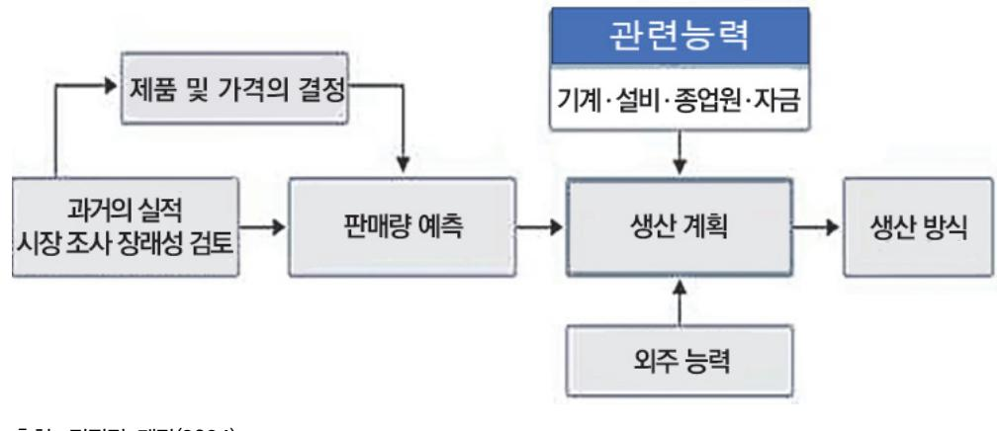

출처: 집필진 제작(2024) [그림 3-1] 생산 계획 요소 2. 월별 생산 계획에 영향을 미치는 요소

생산 계획(Production Scheduling)은 설비·기계·인원 등의 여러 자원을 함께 동원해야 할 작업의 계획을 세우는 경우 등 많은 작업 일정 관리를 할 경우 등에 사용되는 방법 등을 총칭한다.

작업 공정 관리의 한 단계로 절차 생산 계획에 의해 수립된 절차를 구체적으로 작업에 옮 기기 위한 시간적 계획이라고 한다.

3. 생산 시스템의 일정 관리

대량의 생산 시스템은 생산 공정에서 소품종 대량 생산하는 것을 말하는 것으로, 통제의 기능은 작업장에서 다음 다른 작업장으로 작업이 정체되지 않고 이동하도록 흐름 통제, 감시 하는 것이다. 작업의 흐름을 방해하는 현상을 제거하는 라인 밸런싱(Balancing)이 중요하며, 생산 관리도 이러한 병목 현상들을 제거하는 통제와 라인 밸런싱을 중심으로 이루어진다.

4. 배치 시스템 일정 관리

배치의 시스템은 주요 고객으로부터 오더(주문)을 받아 생산하는 형태로, 제품이 다양하고 생산 수량도 적은(소품종) 생산의 특성들이 있다. 이러한 개별 주문 생산의 일정 계획은 주 문이 매우 다양하고 주문별로 자재, 생산 설비, 작업 방법, 납기 등이 다르다. 생산 일정의 관리도 제품별 생산 로트(Lot)의 크기를 얼마로 할 것인가와 각 제품의 생산 순서를 어떻게 정할 것인가 등의 복잡성을 띠게 되며, 주문 물품에 따라 서로 다양한 일정 관리 방법이 사 용하게 된다.

- 5. 일정 계획 주요 기법
  - (1) 간트 차트(Gantt Chart)

최초의 간트 차트는 카롤 아다미키(Adamiecki, Karol), 하모노그램(Harmonogram)이 라는 이름으로 창안하였다. 그런데 아다미키는 1930대년까지 이를 발표하지 않았고 결 국 헨리 간트(Gantt, Henry)의 이름이 붙이게 되었다. 헨리 간트는 자신이 고안한 차트 를 1919년에 엔지니어링 매거진(The Engineering Magazine)에 'Work, Wages and Profit' 제목으로 발표했다.

1980년대에 개인용 컴퓨터(PC)를 사용해 간트 차트를 알기 쉽게 만들 수 있게 되었으 며 이 프로그램은 프로젝트 일정 관리 등에 주로 사용되었다.

현재는 간트 차트가 매우 널리 쓰이는 기술이지만, 처음 나왔을 때에는 매우 획기적인 기술이었다. 헨리 간트를 기념하기 위해 경영·서비스 분야에 공헌한 사람에게 헨리 로런 스 간트 메달을 수여하고 있다.

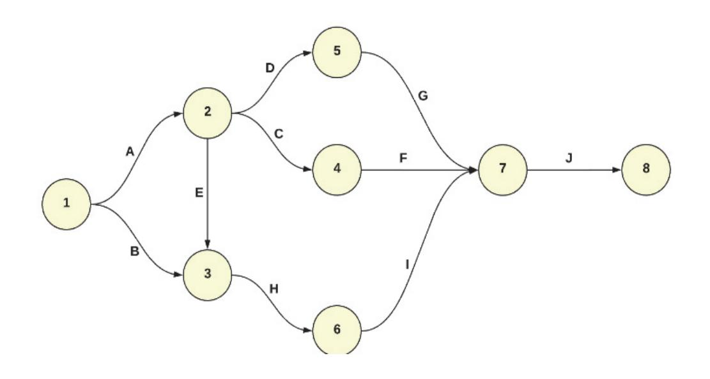

|        | 1주차 | 2주차 | 3주차 | 4주자 | 5추자 | 6주자 | 7주차 | 8주자 |
|--------|-----|-----|-----|-----|-----|-----|-----|-----|
| 과제 1   |     |     |     |     |     |     |     |     |
| 2171 2 |     |     |     |     |     |     |     |     |
| 21계 3  |     |     |     |     |     |     |     |     |
| 2[2] 4 |     |     |     |     |     |     |     |     |
| 과제 5   |     |     |     |     |     |     |     |     |
| 21계 6  |     |     |     |     |     |     |     |     |
| 과제 7   |     |     |     |     |     |     |     |     |
| 2)계 8  |     |     |     |     |     |     |     |     |
| 21계 9  |     |     |     |     |     |     |     |     |

출처: 집필진 제작(2024) [그림 3-2] 간트 차트 예시

(2) PERT(Project Evaluation and Review Technique)・CPM(Critical Path Analysis) PERT는 주어진 Project(프로젝트)가 얼마나 잘 완성되었는지 분석하는 방법으로, 특히 작업에 필요한 시간 등을 계산함으로써 모든 프로젝트(Project)를 끝내는 최소 시간이 어느 정도인지 정확히 알 수 있다.

이 모델은 1958년에 부즈엘렌 해밀턴과 은밀히 계약한 펜타곤의 특수 프로그램인 인 폴라리스 잠수함 발사 탄도미사일 프로젝트의 한 부문으로도 개발되었고, 그 이후에는 미국 정부에서 여러 경영관리에서 PERT 사용 약정을 맺었다.

PERT는 1950년대에 발전된 것으로 일정의 단순화, 대규모 복잡한 문제 해결에 사용되 었다. PERT는 프로젝트의 일정에서 정확하게 알려지지 않은 여러 요인과 지속 기간에 대해 모든 프로젝트의 일정을 만들 수 있어 불확정한 일을 통합하는 것이 가능하였다.

PERT는 여러 부문에서 사건 지향적 기술을 시작완성 지향형보다 더 선호하게 하는 계 기가 되었다.

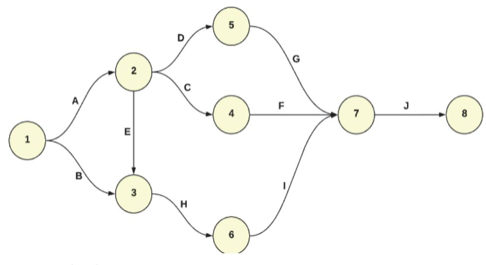

출처: 집필진 제작(2024) [그림 3-3] PERT 차트 예시

(3) 표준 작업의 이상 현상과 대책

(가) 대기 시간 감축

대기 시간이 과다하게 발생하면 작업의 재배치를 통해 대기 시간을 줄인다. 작업자 들의 숙련도의 차이가 있어서 실제 작업 시간은 표준 시간과 차이가 있을 수 있다. 따라서 표준 작업대로 작업을 하여도 작업자들의 대기 시간이 과다하게 발생된다. 따라서 우선 난이도가 높은 작업에 숙련자를 배치하여 대기 시간의 발생을 감소시키 도록 한다. 표준 작업을 운영한다고 아무나 작업에 배치하면 효율이 떨어질 수 있다. 특히, 신입 작업자나 파트타임 작업자가 있는 공정에서는 작업 배치 시에 작업의 사 이클 타임과 작업자의 숙련도를 고려하여 신중하게 작업자를 배치해야 한다.

(나) 생산량의 산포를 줄인다.

생산품에 산포가 있는 공정에는 산포의 원인을 찾아 산포가 없는 라인으로 만들어 생산 능력의 증강을 도모하도록 한다. 공정 자체에 부적합 발생에 의한 생산량의 감 소인지 또는 설비의 고장에 의한 생산량의 감소인지, 공정의 자재 결품, 부적합품 혼 입, 작업 지시 오류인지, 태업, 작업자 결원 등의 내부 관리적인 문제인지, 외부 공 급 업체 지연 등의 외부 문제인지를 정확히 분석하여 방지할 수 있는 대책을 수립하 고 지속해서 개선을 추진하도록 해야 한다. 이를 위해서는 부적합 사항을 포함하는 생산 실적과 비가동 내역에 대한 정확한 기록 고가 집계와 분석을 매일 매일 실시해 야 한다.

(다) 불필요한 재공품 재고

표준 재공 재고 이상으로 재고가 늘어난다는 것은 공정에 무엇인가 문제가 있다는 것이다. 표준 재공 재고 이상으로 늘릴 수밖에 없는 요인은 표준 작업에서 추구하는 부적합품이 없는 최적의 생산이 이루어지지 않고 있다는 경우가 대부분이다. 재고는 모든 문제를 감추고 납품이 되도록 하는 역할을 한다. 결국 문제는 해결되지 않고, 생산량을 맞추기 위해서 표준 작업은 무시되고, 조업 시간을 늘려서 작업을 만성적 으로 하게 된다. 이로 인해 작업자들은 연장 근무에 의한 과로가 발생하게 된다. 특 히, 수요가 증가할 때에는 회사의 재무의 건전성과 작업자의 건강에도 좋지 않은 영 향을 끼치게 된다. 표준 재공 재고 이상으로 늘릴 수밖에 없는 요인을 개선하여 표 준 재공이 지켜지도록 해야 한다.

(라) 납기 관리

납기(Deadline of Delivery)는 일반적으로 접수 시 고객으로부터 필요한 날짜에 고 객의 공장에 제품이 정확히 도착할 수 있도록 지정하는 일자를 나타내는 영업 납기 와 주문을 접수하고 제조 공장의 상황을 판단 후 가능한 날짜를 조정 제시하는 일자 를 나타내는 생산 납기로 구분한다. 구체적으로 세분화된 납기의 종류는 다음과 같 다.

1) 고객의 요구 납기일(Customer Request Date)

고객이 신청한 물건이 고객이 원하는 곳으로 도착하기를 바라는 일자이다. 고객 의 요구 납기에 대한 납기 달성률은 통상적으로 이 데이터를 근거로 계산한다. 한편, 공장 출하 기준 고객의 요구 납기일(Customer Request Ship Date)은 고 객의 납기일, 공장으로부터 고객까지의 수송 날짜를 앞당김한 일자이다. 공장은 이 일자를 지키기 위하여 미리 출하해 간다. 공장의 요구 납기에 대한 납기 달성 률은 이 데이터를 사용한다. 우리나라에서 일본으로 수출하는 경우, 당일 출하해 당일 도착할 수 있지만, 거리가 먼 외국에서는 이 일자가 필요한 경우가 많이 있 다.

2) 고객의 출하의 여유일(Shipping Windows)

적시 생산 방식(Just-in Production Systems)으로의 출하라면 납기일이 출하 일 자가 될 수 있지만, 일반적으로 고객이 납기의 며칠 전부터 출하해도 된다는 여 유일이 있는 경우도 있다. 이것이 입하(출하)의 여유일(Shipping Window)이다. 출하하는 측도 이 일자를 통해 출하 계획의 밸런스를 일정하게 할 수 있다. 이것은 보통 출하 관리 시스템으로 관리한다.

3) 공장으로부터 출하할 때의 약속 납기일(Estimate Shipping Date)

생산 능력 등의 제한이 있는 경우, 고객의 요구 납기에 대해 공장으로부터의 출 하해야 하는 약속 납기가 있을 수 있다. 공장의 약속 납기에 대한 납기 달성률은 이 데이터를 사용한다.

숕 재료 과학 및 공학(Materials Science and Engineering)

반도체용 마스크(Photomask) 재료를 제조하기 위해서는 광범위한 전문 지식과 기술이 필요하 다. 이는 화학, 물리학, 재료 공학, 전기 공학 등 다양한 학문 분야의 지식을 통합적으로 활용 하는 복잡한 과정이다. 다음은 반도체용 마스크 재료를 제조하기 위해 필요한 주요 지식 영역 과 관련 내용을 설명한다.

1. 재료의 물리적 특성

반도체용 마스크 재료의 기계적 강도, 경도, 탄성, 열팽창 계수 등을 이해해야 한다.

2. 재료의 화학적 특성

화학적 안정성, 내식성, 화학 반응성 등 재료의 화학적 특성을 파악해야 한다.

#### 3. 광학적 특성

투과율, 반사율, 굴절률, 광흡수 특성 등 재료의 광학적 성능을 이해해야 한다.

- 숖 화학 및 화학 공학(Chemistry and Chemical Engineering) 및 반도체 포토 공정 기술
  - 1. 화학 합성 및 정제 고순도의 재료를 합성하고 불순물을 제거하는 방법을 알아야 한다.
  - 2. 반응 메커니즘 화학 반응의 메커니즘을 이해하고, 원하는 특성을 가진 재료를 얻기 위한 반응 조건을 최적 화한다.
  - 3. 재료의 표면 처리 재료 표면의 화학적 처리(예: 코팅, 식각)를 통해 마스크의 성능을 향상한다.
  - 4. 리소그래피(Lithography) 포토레지스트 코팅, 노광, 현상 등의 리소그래피 공정을 이해한다.
  - 5. 식각(Etching) 건식 및 습식 식각 기술을 통해 원하는 패턴을 재료에 형성하는 방법을 알아야 한다.
  - 6. 증착(Deposition) 화학 기상 증착(CVD), 물리 기상 증착(PVD) 등의 기술을 사용하여 재료를 증착하는 방법 을 이해한다.

## 수행 내용 / 반도체용 마스크 재료 제조하기

## 재료·자료

- 석영(Quartz)
- 반도체용 블랭크 마스크
- 소다라임 유리(Soda Lime Glass)
- 울코(Waferscale Glass)
- 감광성 물질(Photo-Sensitive Material
- 크로뮴(Chrome)
- 몰리브데넘 실리콘(Molybdenum Silicide)
- BARC(Bottom Anti-Reflective Coating)
- TARC(Top Anti-Reflective Coating)
- Pellicle, 투명 보호막(Transparent Membrane)
- ASTM, ISO, JIS, SEMI, KS 표준화 문서
- ITRS 로드맵(International Technology Roadmap for Semiconductor)
- 반도체 로드맵
- 반도체 제조 공정도
- MSDS, RoHS, WEEE(Waste Electrical and Electronic Equipment)
- 리소그래피 재료
- Immersion Photo Resist, Top Coat, BARC, Relacs/SAFIER, ArF Photo Resist, SOC, Developer
- KrF Photo Resist, MFHM, Thinner, I-line Photo Resist, SOD

## 기기(장비 ・ 공구)

• 광노광 장비(Photolithography Stepper/Scanner)

- 전자 빔 리소그래피 장비(Electron Beam Lithography Equipment)
- 현상 장비(Developing Equipment)
- 식각 장비(Etching Equipment)
- 검사 및 측정 장비(Inspection and Measurement Equipment)
- 세정 장비(Cleaning Equipment)
- 펠리클 부착 장비(Pellicle Mounting Equipment)
- 평가, 분석 및 계측 장비
- 제조 공장 인트라넷
- 제조 공정 장비
- 유기, 무기 합성 Pilot 설비
- PR류 Mixing Vessel
- 중합체 합성 Pilot 설비
- 제조 공정 이상 발생 Monitoring 설비
- Bottle Cleaning 설비
- Bottle Filling 설비
- 평가, 분석 및 계측 장비
- Arf Scanner, Elipsometer, GC
- I-line Stepper, Microscope, HPLC
- Track, ICP-MS, nmR
- 안전 도구, 안전화, 안전모, 마스크, 장갑, 고글, 방진복
- 컴퓨터, 프린터, 복사기
- 안전 ・ 유의 사항
  - 화학 물질을 취급할 때는 MSDS(Material Safety Data Sheet)를 참조하여 안전 정보를 숙

한다.

- 장갑, 보호 안경, 실험복, 호흡기 등 적절한 개인 보호 장비(PPE: Personal Protective Equipment)를 착용한다.
- 화학 물질을 다룰 때는 환기가 잘 되는 작업 공간에서 작업해야 하며, 후드(Fume Hood) 사용을 권장한다.
- 화학 물질은 지정된 안전 용기에 보관하고, 라벨을 명확히 부착한다.
- 화학 물질을 혼합하거나 처리할 때는 정확한 절차와 비율을 준수해야 하며, 무작위로 혼합 하지 않는다.
- 모든 기계 장비는 사용 전에 충분히 이해하고, 사용자 매뉴얼을 준수해야 한다.
- 장비의 유지 보수 및 수리는 반드시 훈련된 전문가가 수행해야 한다.
- 기계적 장비를 사용할 때는 작업 환경을 청결하게 유지하고, 주변에 장애물이 없도록 한다.
- 장비 사용 중에는 항상 안전장치를 활성화하고, 비상 정지 버튼의 위치를 숙지한다.
- 전기 장비를 사용할 때는 정기적으로 장비의 상태를 점검하고, 전기적 결함이 없는지 확인 한다.
- 전기 장비는 반드시 접지된 콘센트에 연결하고, 과부하를 방지하기 위해 적절한 전력 용량 을 사용한다.
- 전기 장비를 다룰 때는 젖은 손으로 만지지 않으며, 물기가 있는 환경에서는 사용하지 않는 다.
- 레이저 및 UV 광원을 다룰 때는 항상 보호 안경을 착용해야 하며, 직접 노출을 피해야 한 다.

#### 수행 순서

숔 반도체용 마스크 재료를 제작한다.

반도체용 마스크 재료 제조는 매우 정밀하고 복잡한 과정으로, 각 단계를 체계적으로 수행해야 고품질의 재료를 생산할 수 있다. 다음은 반도체용 마스크 재료 제조의 일반적인 수행 순서이 다.

1. 요구 사항을 분석(Requirements Analysis and Definition)하고 정의한다. 재료의 주요 특성(광학적, 기계적, 화학적, 열적) 및 사용 목적을 명확히하며 산업 표준 및

43

규격을 검토하고, 이를 바탕으로 구체적인 요구 사항을 정의한다.

(1) 재료 선택(Material Selection)

다양한 후보 재료의 물리적, 화학적, 기계적 특성을 조사하고 각 후보 재료의 성능을 평 가하여 요구 사항에 부합하는지 초기 검토한다. 초기 평가를 통해 적합한 후보 재료를 선택한다.

(가) 재료 합성 및 정제(Material Synthesis and Purification)

화학 합성 선택된 재료를 합성하고, 고순도 재료를 얻기 위한 화학 반응을 조절한다. 불순물을 제거하고, 고순도의 재료를 얻기 위해 정제 과정을 수행한다.

- 1) 기판 준비(Substrate Preparation)
- 가) 기판 선택

재료를 증착할 기판을 선택한다. 일반적으로 석영(Quartz) 또는 기타 고순도 유리 기판이 사용된다.

나) 기판 세척

기판을 화학적, 물리적으로 세척하여 불순물을 제거한다.

- 2) 증착(Deposition)
- 가) 증착 방법 선택

화학 기상 증착(CVD), 물리 기상 증착(PVD), 스퍼터링(Sputtering) 등의 방 법 중 적합한 증착 방법을 선택한다.

나) 증착 공정 수행

선택된 방법을 사용하여 재료를 기판 위에 증착한다.

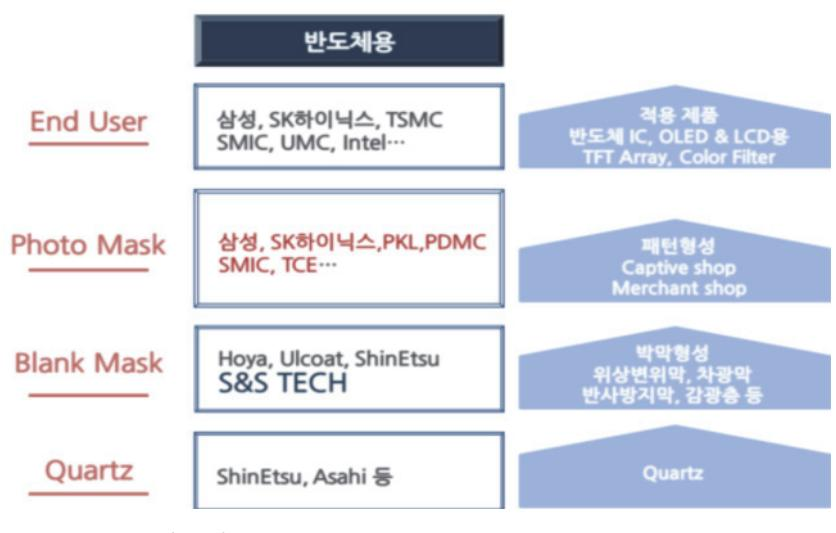

출처: 집필진 제작(2024)

[그림 3-4] 반도체용 포토 마스크 벨류 체인

숕 반도체 마스크별 제조(공정/장비)에서 도출된 문제점에 대한 해결 방안을 파악한다.

반도체용 마스크 제조 공정 및 장비에서 발생하는 문제점과 그 해결 방안은 다음과 같다.

1. 결함 발생(Defects)에 대해 파악한다.

원인은 마스크 제조 과정에서 미세한 먼지, 이물질, 공정상의 불완전함 등으로 인해 결함이 발생할 수 있다.

(1) 해결 방안

(가) 클린 룸 환경 개선

더 높은 수준의 클린 룸 등급을 적용하여 먼지 및 이물질 유입을 최소화한다.

(나) 정기적인 장비 유지 보수

장비의 정기적인 청소 및 점검을 통해 오염원을 제거한다.

(다) 고품질 재료 사용

결함 발생을 줄이기 위해 더 나은 품질의 재료를 사용한다.

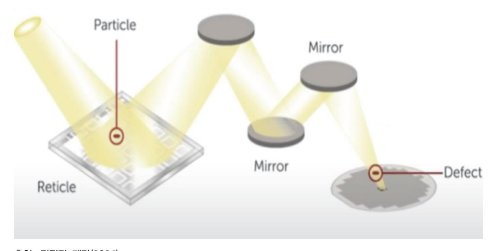

출처: 집필진 제작(2024) [그림 3-5] 마스크 결함(Defects) 영향

2. 패턴 정밀도(Pattern Accuracy)에 대해 파악한다.

노광 공정에서의 정밀도 부족, 레지스트 코팅의 불균일성 등으로 인해 패턴이 정확하게 형 성되지 않을 수 있다.

- (1) 해결 방안
  - (가) 노광 장비의 정밀도 향상

더 높은 해상도를 가진 노광 장비를 도입하거나 기존 장비를 업그레이드한다.

(나) 코팅 균일성 개선

레지스트 코팅 공정에서 균일성을 확보하기 위한 고정밀 코팅 장비와 공정을 사용한 다.

#### (다) 패턴 보정 알고리즘 사용

패턴 정밀도를 향상시키기 위해 보정 알고리즘을 적용한다.

3. 기술적 한계에 대해 파악한다.

반도체 기술이 미세화되면서 기존 장비 및 공정으로는 한계에 도달하는 경우가 발생한다.

(1) 해결 방안

(가) 연구 개발 투자

새로운 공정 기술과 장비 개발을 위해 연구 개발에 대한 투자를 늘린다.

(나) 차세대 기술 도입

EUV(Extreme Ultraviolet) 리소그래피와 같은 차세대 기술을 도입하여 기술적 한계 를 극복해야 한다. 기존의 DUV(Deep Ultraviolet) 리소그래피에 비해 훨씬 짧은 파장을 사용하는 EUV 리소그래피는 다음과 같은 이유로 중요하다.

1) 해상도 향상

EUV 리소그래피는 13.5nm의 짧은 파장을 사용하여 더 미세한 패턴을 형성할 수 있다. 이는 트랜지스터와 회로의 크기를 줄이고 더 많은 소자를 집적할 수 있 게 한다.

2) 공정 단순화

기존의 다중 패터닝 공정 대신 EUV를 사용하면 공정 단계를 줄일 수 있다. 이는 제조 비용과 시간을 절감하며, 공정의 복잡성을 낮춘다.

3) 성능 향상

미세 공정으로 인해 반도체 소자의 성능이 향상된다. 더 작은 트랜지스터는 더 높은 속도와 낮은 전력 소모를 가능하게 한다.

4) 집적도 증가

더 많은 트랜지스터를 동일한 칩 면적에 집적할 수 있어 고성능, 고용량의 반도 체를 제작할 수 있다. 이는 AI, 데이터 센터, 모바일 기기 등 다양한 분야에서 필수적이다.

5) 도전 과제

EUV 리소그래피에도 여러 도전 과제가 존재한다.

가) 비용

EUV 장비는 매우 고가이며, 초기 도입 비용이 높다. 이에 따라 주요 반도체 제조 업체들만이 이를 도입하고 있다.

나) 기술적 문제

EUV 리소그래피는 고도화된 기술로, EUV 광원 생성, 마스크 제작, 레지스트

재료 등 여러 기술적 문제를 해결해야 한다.

다) 양산성

EUV 기술이 아직 완전히 상용화되지 않았으며, 안정적으로 대량 생산을 행하 기 위한 기술적 성숙도가 필요하다.

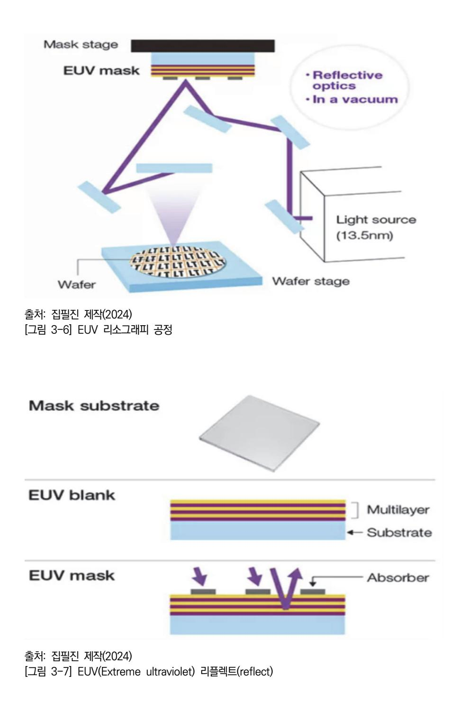

4. 포토리소그래피(Photolithography) 공정 문제에 대해 파악한다. 문제점으로는 해상도 제한, 패턴 정렬 오차, 포토레지스트 결함 등이 있다.

- (1) 해결 방안에는 아래와 같은 것들이 있다.
  - (가) 해상도 향상

극자외선(EUV) 리소그래피 사용, 다중 패턴 기술을 적용한다.

(나) 정렬 오차 감소

고정밀 정렬 장비 사용, 정렬 마크를 개선한다.

(다) 포토레지스트 품질 개선

고품질 포토레지스트 재료 사용, 공정 조건을 최적화한다.

## 학습 3 교수·학습 방법

## 교수 방법

- 반도체용 마스크 공정의 개요와 내용을 세부적으로 알기 쉽게 설명한다.
- 표준화된 공정 매뉴얼과 관련 공정 재료 등에서 제공되는 자료의 내용을 프레젠테이션으로 자료로 제시한 후에 설명한다.
- 가능한 사전에 제조 현장에서 주로 사용하는 사례 등을 수집하여 자료를 준비하고 이해하기 쉬운 방법을 논의하는 방식의 문제 해결식 수업을 지향한다.
- 최근의 반도체 산업 상황(시장 환경 및 기술 동향 등)에 대하여 충분히 숙지하고, 학습자들 이 이를 쉽게 이해할 수 있는 방법을 모색하여 수업을 진행한다.
- 관련 시장의 변화 환경 및 기술 변화를 통합 검색 사이트나 한국반도체산업협회 등의 홈페 이지(www.ksia.or.kr) 등에서 찾아 활용할 수 있도록 지도한다.
- 반도체용 마스크 재료 요구 사항에 필요한 내용을 반드시 확인하고, 관련 자료를 학습자들 에게 제시한 후 파악 여부를 확인하도록 한다.

### 학습 방법

- 반도체 산업 현황(시장 환경 및 기술 동향 등)과 관련 기관을 구체적으로 확인하도록 하고, 이 기관과 관련된 다양한 자료를 인터넷으로 검색하고 분류하여 문서로 정리한다.
- 반도체용 마스크 재료 요구 사항 항목이 선정된 양식에 맞추어 특정 소자에 대한 요구 사항 을 작성해 본 후, 여기에 첨부되는 자료의 종류와 기록 내용 전반을 숙지하고, 가능하다면 소자별로 분류한다.
- 반도체 마스크 재료 요구 사항에 대한 시장 및 기술, 비용의 조사, 수집 및 분석을 통해 생 산에 필요한 목표를 설정하고 분류된 자료를 활용하여 생산 가능성을 예측한다.
- 반도체용 마스크 재료선택에서 예상되는 품질 관리 문제점을 파악하고 피드백하는 능력을 기른다.

## 학습 3 평 가

## 평가 준거

- 평가자는 학습자가 학습 목표를 성공적으로 달성하였는지를 평가해야 한다.
- 평가자는 다음 사항을 평가해야 한다.

|                    |                                                        | 성취수준 |   |   |
|--------------------|--------------------------------------------------------|------|---|---|
| 학습 내용              | 학습 목표                                                  | 상    | 중 | 하 |
|                    | - 반도체 마스크 제조 공정의 장점과 단점을 파악할 수 있다.                     |      |   |   |
| 반도체용 마스크 재 료 제조 | - 반도체 마스크 재료 제조(공정/장비) 파라미터를 파악하고 적용할 수 있다.         |      |   |   |
|                    | - 반도체 마스크별 제조(공정/장비)에서 도출된 문제점에 대한 해결 방안을 제시할 수 있다. |      |   |   |

## 평가 방법

• 포트폴리오

|                    |                                     | 성취수준 |   |   |  |
|--------------------|-------------------------------------|------|---|---|--|
| 학습 내용              | 평가 항목                               | 상    | 중 | 하 |  |
|                    | - 반도체용 마스크 재료 제조 요구 사항 분석 능력        |      |   |   |  |
| 반도체용 마스크 재 료 제조 | - 반도체용 마스크 재료 합성 및 정재 능력            |      |   |   |  |
|                    | - 반도체용 마스크 재료 포토 마스크 공정 순서 검증 능력 |      |   |   |  |

## • 문제 해결 시나리오

|          |                                                                                 | 성취수준 |   |   |  |
|----------|---------------------------------------------------------------------------------|------|---|---|--|
| 학습 내용    | 평가 항목                                                                           | 상    | 중 | 하 |  |
|          | - 반도체용 마스크 재료의 문제점을 파악할 수 있는 능력                                                 |      |   |   |  |
| 반도체용 마스크 | - 반도체용 마스크 재료 제조 사양서의 세부 내용을 이해하고 생산에 적용할 수 있는 능력                            |      |   |   |  |
| 재료 제조    | - 반도체용 마스크 재료 제조 사양서를 바탕으로 제품명, 품질 기준, 제품 사양, 납기 등의 문제점을 이해하고 대처할 수 있는 능력 |      |   |   |  |

### • 서술형 시험

| 학습 내용             | 평가 항목                                                                         | 성취수준 |   |   |
|-------------------|-------------------------------------------------------------------------------|------|---|---|
|                   |                                                                               | 상    | 중 | 하 |
| 반도체용 마스크 재료 제조 | - 반도체용 마스크 재료 제조 사양서를 작성하고 세부 내용을 검토할 수 있는 능력                              |      |   |   |
|                   | - 반도체용 마스크 재료 제조 사양서를 바탕으로 제품명, 품질 기준, 제품 사양, 납기 등에 대한 내용을 검토할 수 있는 능 력 |      |   |   |
|                   | - 포토 공정 재료 제조 시 발생할 수 있는 문제점의 대처 방 안을 작성할 수 있는 능력                          |      |   |   |

## 피드백

- 1. 포트폴리오
- 반도체용 마스크 재료 제조 시 작성 능력에 대해 평가하고 미비한 점들이 발견되면 보완하도록 주요 내용을 알기 쉽게 충분히 설명하여 준다.
- 성취수준이 높은 학습자의 경우 반도체용 마스크 종류별로 심화 설명해 준다.
- 2. 문제 해결 시나리오
- 반도체용 마스크 재료 제조를 바탕으로 제품명, 품질의 기준, 제품의 사양, 납기 등의 문제점을 이해하고 대처할 수 있는 능력에 대해 평가하고 부족한 부분이 발견되면 사례를 통해 지도한다. - 성취수준이 높은 학습자의 경우 더 높은 난이도 문제 해결을 할 수 있도록 심화 설명해 준다.

#### 3. 서술형 시험

 - 파악된 내용을 근거로 마스크 재료 제조 시 발생할 수 있는 문제점의 대처 방안에 대한 지식에 대해 평가하고 부족한 부분들이 많이 발견되면 미비한 부분을 추가로 재학습하도록 지도한다. - 상기 내용에 대한 성취수준이 높은 학습자의 경우 평가 지식에 대한 심화 설명을 해 준다.

| 학습 1 | 반도체용 마스크 재료 요구 사항 파악하기 |
|------|------------------------|
| 학습 2 | 반도체용 마스크 재료 선정하기       |
| 학습 3 | 반도체용 마스크 재료 제조하기       |
| 학습 4 | 반도체용 마스크 제품 특성 검증하기    |

## 4-1. 반도체용 마스크 제품 특성 검증

| • 반도체 노광 공정용 마스크의 시험 시 문제점에 대한 해결 방안을 제시할 수 있다. 학습 목표 • 반도체 노광 공정용 마스크의 평가 시 문제점에 대한 해결 방안을 제시할 수 있다. • 반도체 노광 공정용 마스크의 검증 시 문제점에 대한 해결 방안을 제시할 수 있다. |  | • 반도체 노광 공정용 마스크의 분석 시 문제점에 대한 해결 방안을 제시할 수 있다. |
|----------------------------------------------------------------------------------------------------------------------------------------------------------------|--|-------------------------------------------------|
|                                                                                                                                                                |  |                                                 |
|                                                                                                                                                                |  |                                                 |
|                                                                                                                                                                |  |                                                 |

## 필요 지식 /

숔 포토 마스크 검사 방법(Method for Inspection in Photomask)

반도체 소자를 제조하는 과정에서 웨이 퍼위에 실제 구현하고자 하는 회로 패턴의 레이아웃 (Layout)을 포토 마스크(Photomask) 상에 구현하고, 구현된 레이아웃 패턴을 노광 과정을 통 해 웨이퍼 상에 전사하여 진행하고 있다. 최근 반도체 소자 집적도가 매우 높아지면서 디자인 룰(Design Rule)이 감소하고 이에 따라 웨이퍼 위에 형성하고자 하는 패턴의 크기 또한 축소 되고 있는 추세이다. 이에 따라 포토 마스크 위에 웨이퍼에 전사할 미세 패턴들을 정확하게 형 성하는 것이 매우 중요하다. 따라서 포토 마스크상에 형성된 미세 패턴들이 얼마나 정확하게 형성되었는지 또한 미세 패턴들을 형성하는 과정에서 결함 등이 얼마나 발생되었는지를 정확히 검사하는 검사(Inspection) 공정이 필요하다.

1. 마스크상에 패턴을 형성한 다음 마스크 검사 방법

설계 데이터, 데이터베이스상의 데이터(Data Base data)를 실제 마스크 위에 형성된 패턴 과 비교하여 검사하는 방법이다. 더 구체적으로, 기판상에 광차단막 또는 위상 반전막을 형 성한 후, 검사 장치에서 광차단막 또는 위상 반전막은 다크(Dark) 영역으로 인식하고, 기판 은 클리어(Clear) 영역으로 인식하게 설정한 후, 투과 광원을 패턴 상에 조사하여 검사한다. 이와 함께 서로 다른 칩과 다이를 검사하는 방법으로는 메인 셀(Main Cell) 영역과 주변 회로 영역을 검사하는 방식으로 진행하고 있다.

2. 위상 반전 마스크를 형성하는 과정에서 2차 패터닝(Second Patterning) 검사

전자 빔(E-Beam) 노광 장치에서 진행하면, 정전기에 의해 유발된 결함과 같은 문제가 발생 할 수 있다. 이를 개선하기 위해 스테퍼(Stepper)를 사용하여 2차 패터닝 공정을 진행하고 있으나 스테퍼용 마스크 잡 데이터(Job Data)를 형성하는 데 어려움이 있다.

숕 반도체용 마스크 제품 특성 검증

반도체용 마스크(Photomask)는 반도체 리소그래피 공정에서 필수적인 역할을 하며 다양한 특 성들이 필요하다. 이러한 특성들은 마스크의 성능, 내구성, 패턴 정확도 등에 큰 영향을 끼친 다.

- 1. 광학적 특성(Optical Properties) 검증
  - (1) 투과율(Transmittance)

특정 파장의 빛을 효율적으로 투과해야 한다. DUV(Deep Ultraviolet) 리소그래피에서 는 248nm(KrF) 및 193nm(ArF) 파장이 주로 사용된다.

(2) 반사율(Reflectance)

빛의 반사를 최소화하여 패턴 정확도를 높여야 한다. 반사 방지 코팅이 적용될 수 있다.

(3) 굴절율(Refractive Index) 투과된 빛의 경로를 예측하고 제어하기 위해 중요한 특성이다.

## 2. 기계적 특성 검증

(1) 평탄도(Flatness)

기판의 표면 평탄도는 패턴 정확도에 직접적인 영향을 미친다. 높은 평탄도가 요구된다.

(2) 두께(Thickness)

일정한 두께를 유지해야 하며, 두께의 균일성도 중요하다.

(3) 강도(Strength)

마스크는 기계적 강도가 높아야 하며, 제작 및 사용 과정에서 손상되지 않아야 한다.

- 3. 화학적 특성 검증
  - (1) 내화학성(Chemical Resistance) 다양한 화학 물질에 대해 내성을 가져야 한다. 식각 공정 및 세정 과정에서화학적 손상 을 입지 않아야 한다.
  - (2) 불순물 함량(Low Impurity Content) 검증 불순물이 적어야 하며, 이는 마스크의 광학적 및 기계적 특성에 영향을 미칠 수 있다.
- 4. 열적 특성(Thermal Properties) 검증
  - (1) 열팽창 계수(CTE: Coefficient of Thermal Expansion) 온도 변화에 따라 기판이 팽창하거나 수축하지 않아야 하며 낮은 CTE가 요구된다.

(2) 열 안정성(Thermal Stability)

고온 환경에서도 물리적, 화학적 특성이 변하지 않아야 한다.

숖 반도체용 마스크(Photomask)의 제품 특성의 구체적 기준의 검증

마스크의 성능과 신뢰성을 보장하기 위해 매우 중요하다. 이러한 검증은 다양한 측면에서 이루 어지며, 고도의 정밀성과 반복성이 팔요하다.

- 1. 광학적 특성 검증(Optical Properties Verification)
  - (1) 투과율 측정(Transmittance Measurement) 특정 파장(예: 193nm, 248nm)에서 마스크의 투과율을 측정하여 요구되는 기준(예: 90% 이상)을 충족하는지 확인한다. 분광광도계(Spectrophotometer)를 사용하여 투과 율을 정확하게 측정한다.
  - (2) 반사율 측정(Reflectance Measurement) 반사 방지 코팅의 효과를 평가하기 위해 반사율을 측정하며, 엘립소미터(Ellipsometer) 를 사용하여 반사율을 측정한다.
- 2. 기계적 특성 검증(Mechanical Properties Verification)
  - (1) 평탄도 검사(Surface Flatness Inspection) 기판의 표면 평탄도를 레이저 간섭계(Laser Interferometer)나 원자력 현미경(AFM: Atomic Force Microscope)을 사용하여 나노미터 단위로 측정하며 표면 평탄도가 일 정 기준 이하(예: <100nm)인지 확인한다.
  - (2) 두께 및 두께 균일성 검사(Thickness and Uniformity Inspection) 기판 두께를 측정하고, 두께 균일성을 확인하며 기계적 접촉 게이지(Mechanical Contact Gauge) 또는 비접촉 방식의 두께 측정 장비를 사용한다.
- 3. 열적 특성 검증(Thermal Properties Verification)
  - (1) 열팽창 계수 측정(Coefficient of Thermal Expansion Measurement) 기판이 온도 변화에 따라 팽창 또는 수축하는 정도를 TMA(Thermomechanical Analysis)를 통해 측정하며 낮은 열팽창 계수(예: 0.5×10⁻⁶ /°C 이하)를 확인한다.
  - (2) 열 안정성 시험(Thermal Stability Test) 고온 환경에서 기판의 물리적 및 화학적 특성이 변하지 않는지 평가하며 일정 시간 동 안 고온에 노출 후 특성을 다시 측정한다.

## 수행 내용 / 반도체용 마스크 제품 특성 검증하기

## 재료·자료

- 포토레지스트(Photoresist)
- 검증용 웨이퍼(Test Wafers)
- 크로뮴(Chrome) 및 기타 금속층
- 클린 룸 소모품(Cleanroom Supplies)
- 디자인 레이아웃(Design Layouts)
- 공정 조건 문서(Process Documentation)
- 검사 및 측정 데이터(Inspection and Metrology Data)
- 재료 특성 데이터(Material Properties Data)
- 결함 분석 보고서(Defect Analysis Reports)
- 이력 데이터(Historical Data)
- 표준 및 규격(Standards and Specifications)
- 제조 공정 장비
- 유기, 무기 합성 Pilot 설비
- PR류 Mixing Vessel
- 중합체 합성 Pilot 설비
- 제조 공정 이상 발생 Monitoring 설비
- Bottle Cleaning 설비
- Bottle Filling 설비
- 평가, 분석 및 계측 장비
- Arf Scanner, Elipsometer, GC
- I-line Stepper, Microscope, HPLC

- Track, ICP-MS,nmR

## 기기(장비 ・ 공구)

- 광학 현미경(Optical Microscope)
- 전자 현미경(SEM: Scanning Electron Microscope)
- 원자 힘 현미경(AFM: Atomic Force Microscope)
- 노광기(Photolithography Tool)
- 계측 장비(Metrology Tools)
- 결함 검사기(Defect Inspection Tools)
- 클린 룸(Cleanroom) 환경
- 마스크 얼라인먼트 장비(Mask Aligner)
- 식각 장비(Etching Equipment)
- 이미지 분석 소프트웨어(Image Analysis Software)
- 컴퓨터, 프린터, 복사기
- 리소그래피 프로세서(Lithography Processor)
- 마스크 클리너(Mask Cleaner)

#### 안전 ・ 유의 사항

- 마스크 제품을 검증하기 위해서는 장비로서 규정에 따라 관리되어야 하며, 일정 주기와 방 법에 따라 장비 성능이 평가되어야 한다.
- 평가 및 분석, 계측기는 제품의 물성이나 특성 등을 평가, 검사하는 장비로서 규정에 따라 관리되어야 하고 일정 주기와 방법에 따라 검·교정을 실시해야 한다.
- 작업 표준에는 공정의 순서 및 공정 조건(온도, 시간, 환경) 등이 포함한다.
- 작업 절차로는 생산을 최종 끝마치기까지의 절차, 순서를 체계적으로 작성한 생산 행위의 계획서로서, 생산을 바르게 실시할 목적을 위한 절차와 생산에 사용하는 재료, 장치의 준비 및 사용 방법, 생산을 하는 데 필요한 주의 사항을 나타내는 문서이다.

수행 순서

숔 반도체용 마스크 제품 특성 검증 내용을 이해한다.

반도체용 마스크 제품의 특성을 검증하기 위한 요구 사항을 파악하기 위해서는 마스크 공정의 단계별 주요 내용에 대해 정확히 이해하는 것이 필요하다.

- 1. 마스크 설계를 준비한다.
  - (1) 설계 검토(Design Review) 마스크 패턴 설계 도면(CAD 파일)을 검토하여 요구 사항을 확인하고 설계 데이터의 정 확성을 검증하고 잠재적인 오류를 사전 파악한다.
  - (2) 마스크 블랭크 준비(Mask Blank Preparation) 마스크 블랭크(패턴 전사 전의 기본 마스크 재료)를 준비하고 블랭크의 투과율, 반사율, 두께 등의 물리적 특성을 검증한다.

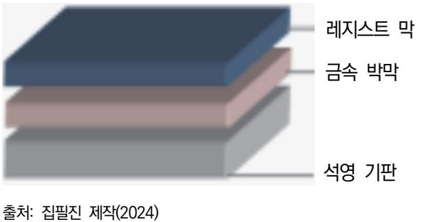

[그림 4-1] 블랭크 마스크

- 2. 마스크를 제작한다.
  - (1) 포토레지스트 도포(Photoresist Coating)

마스크 블랭크에 포토레지스트를 균일하게 도포하며 도포 두께와 균일성을 검증한다.

- (2) 노광(Exposure) 노광기를 사용하여 마스크 블랭크에 설계된 패턴을 전사하며 DUV 또는 EUV 리소그래 피 장비를 사용한다.
- (3) 현상(Development) 노광된 포토레지스트를 현상하여 패턴을 드러내며 현상 시간을 조절하여 패턴의 정확성 을 유지한다.

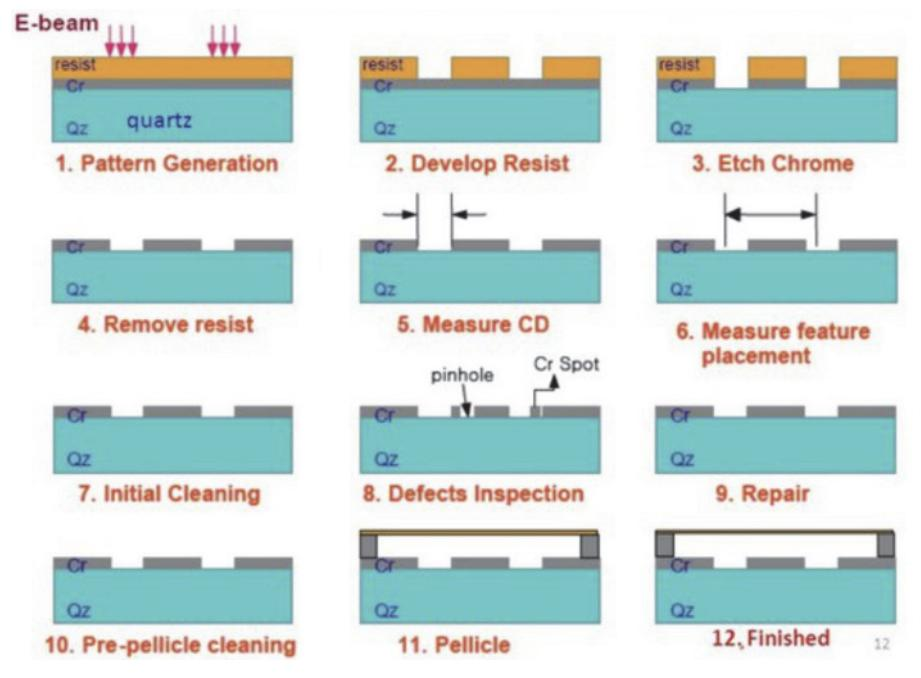

출처: 집필진 제작(2024) [그림 4-2] 마스크 제작 공정 순서도

- 3. 마스크 패턴 검증한다.
  - (1) 패턴 치수 측정(Pattern Dimension Measurement) CD-SEM을 사용하여 패턴의 치수(폭, 간격 등)를 측정하며 OCD 측정기를 사용하여 치 수의 균일성을 평가한다.
  - (2) 패턴 정렬 확인(Pattern Alignment Verification) 마스크 패턴이 설계와 정확하게 정렬되었는지 확인하고 마스크 얼라인먼트 장비를 사용 하여 정렬 상태를 검사한다.
  - (3) 결함 검사(Defect Inspection) 결함 검사 장비를 사용하여 마스크의 표면 및 패턴에서 결함을 검출하고 검출된 결함의 위치, 크기, 종류를 기록하고 분석한다.
- 4. 마스크 성능 검증
  - (1) 웨이퍼 테스트(Wafer Test)

마스크를 사용하여 테스트 웨이퍼에 패턴을 전사하며 전사된 패턴의 정확성을 검증한다.

(2) 식각 테스트(Etching Test)

패턴 전사 후, 웨이퍼에 식각 공정을 수행하여 패턴을 형성하며 식각된 패턴의 형상과 치수를 측정하여 마스크의 성능을 평가한다.

- 5. 마스크 클리닝 및 최종 검토
  - (1) 마스크 클리닝(Mask Cleaning)

초음파 클리너나 화학적 세정 장비를 사용하여 마스크를 깨끗하게 유지하며 클리닝 후 다시 결함 검사를 수행하여 클리닝 효과를 확인한다. 웨이퍼 제조 공정에서 포토 리소그 래피 공정을 지속적으로 계속 반복 진행함에 따라 포토 마스크 표면에 성장성 결함 (Defect)인 헤이즈(Haze) 발생을 방지하기 위하여 포토 마스크 표면에 잔류 이온 (Residual Ion)을 제거하는 세정(Cleaning) 공정이다. 세정 공정(Cleaning Process)을 실시한 포토 마스크를 열처리함으로써 마스크 표면에 남아 있는 잔류 이온들을 완전히 제거하여 헤이즈를 방지하고 광학 위상 시프트 마스크(Phase Shift Mask)의 광학적 특 성 변화를 현저히 줄일 수 있다.

(2) 최종 검토(Final Review)

모든 검증 데이터를 종합하여 마스크의 품질을 최종 평가하며 필요시 추가적인 수정 및 재검증 과정을 거친다.

- 6. 문서화 및 보고(Documentation and Reporting)
  - (1) 결과 문서화(Documentation of Results) 검증 과정에서 얻은 모든 데이터를 문서화하며 각 단계별 결과와 결함 분석 보고서를 작성한다.
  - (2) 품질 보고서 작성(Quality Report Generation) 최종 품질 보고서를 작성하여 고객에게 제출한다. 보고서에는 검증 과정, 결과, 결함 분 석, 개선 사항 등이 포함된다.

## 학습 4 교수·학습 방법

## 교수 방법

- 반도체용 마스크 제품 특성의 개요 등 세부 내용을 부분별로 알기 쉽게 설명한다.
- 제조 현장에서 표준화한 공정 매뉴얼과 관련 공정 재료 등에서 제공되는 자료 등의 내용을 프레젠테이션 자료로 제시한 후에 충분히 설명한다.
- 제조 현장에서 가능한 사용하는 사례를 수집하여 자료를 준비하여 이해하기 쉬운 방법을 논 의하는 방식의 문제 해결식 수업을 채택한다.
- 최근의 반도체 산업 시황(시장 환경 및 기술 동향 등)에 대하여 충분히 인식하고, 학습자들 이 이해할 수 있는 방법을 모색하여 수업을 진행토록 한다.
- 관련 시장의 환경, 기술 변화를 통합 검색 또는 한국반도체산업협회의 홈페이지(www.ksia.or.kr)에 서 찾아 활용할 수 있도록 지도 하도록 한다.
- 반도체용 마스크 재료 요구 사항에 필요한 내용을 사전에 충분히 확인하고, 관련 자료를 학 습자들에게 제시 후 파악 여부를 확인하도록 한다.

### 학습 방법

- 반도체 산업 현황(시장 환경 및 기술 동향 등)과 관련 기관을 구체적으로 확인하도록 하고, 이 기관과 관련된 다양한 자료를 인터넷으로 검색하고 분류하여 문서로 정리한다.
- 반도체용 마스크 재료 요구 사항 항목이 선정된 양식에 맞추어 특정 소자에 대한 요구 사항 을 작성해 본 후, 여기에 첨부되는 자료의 종류와 기록 내용 전반을 숙지하고, 가능하다면 소자별로 분류해 본다.
- 반도체 마스크 재료 요구 사항에 대한 시장 및 기술, 비용의 조사, 수집 및 분석을 통해 생 산에 필요한 목표를 설정하고 분류된 자료를 활용하여 생산 가능성을 예측해 본다.
- 반도체용 마스크 재료 선택에서 예상되는 품질 관리 문제점을 파악하고 피드백하는 능력을 배양 한다 기른다.

## 학습 4 평 가

## 평가 준거

- 평가자는 학습자가 학습 목표를 성공적으로 달성하였는지를 평가해야 한다.
- 평가자는 다음 사항을 평가해야 한다.

|                       |                                                    |   | 성취수준 |   |  |
|-----------------------|----------------------------------------------------|---|------|---|--|
| 학습 내용                 | 학습 목표                                              | 상 | 중    | 하 |  |
| 반도체용 마스크 제 품 특성 검증 | - 반도체 노광 공정용 마스크의 분석 시 문제점에 대한 해결 방안을 제시할 수 있다. |   |      |   |  |
|                       | - 반도체 노광 공정용 마스크의 시험 시 문제점에 대한 해결 방안을 제시할 수 있다. |   |      |   |  |
|                       | - 반도체 노광 공정용 마스크의 평가 시 문제점에 대한 해결 방안을 제시할 수 있다. |   |      |   |  |
|                       | - 반도체 노광 공정용 마스크의 검증 시 문제점에 대한 해결 방안을 제시할 수 있다. |   |      |   |  |

## 평가 방법

• 포트폴리오

| 학습 내용                 | 평가 항목                  | 성취수준 |   |   |
|-----------------------|------------------------|------|---|---|
|                       |                        | 상    | 중 | 하 |
| 반도체용 마스크 제 품 특성 검증 | - 반도체용 마스크 제품 특성 검증 능력 |      |   |   |
|                       | - 반도체용 마스크 패턴 검증 능력    |      |   |   |
|                       | - 반도체용 마스크 성능 검증 능력    |      |   |   |

| 학습 내용                | 평가 항목                                                              | 성취수준 |   |   |
|----------------------|--------------------------------------------------------------------|------|---|---|
|                      |                                                                    | 상    | 중 | 하 |
| 반도체용 마스크 제품 특성 검증 | - 반도체용 마스크 제품 특성 검증을 바탕으로 품질 기준, 제 품 사양, 납기 등의 문제점을 해결할 수 있는 능력 |      |   |   |
|                      | - 결함이 발생한 반도체용 마스크 재사용 방법 파악 여부                                    |      |   |   |

• 서술형 시험

|          | 평가 항목                                                  |  | 성취수준 |   |  |
|----------|--------------------------------------------------------|--|------|---|--|
| 학습 내용    |                                                        |  | 중    | 하 |  |
| 반도체용 마스크 | - 반도체용 마스크 제품 특성 검증 시 발생할 수 있는 문제점 에 대한 대처 방안 서술 능력 |  |      |   |  |
| 제품 특성 검증 | - 반도체용 마스크의 기본 물리적 특성(두께, 재료 구성 등) 서술 능력            |  |      |   |  |

피드백

## 1. 포트폴리오 - 반도체용 마스크의 제품 특성 검증 시 필요한 능력에 대해 평가하고, 제품 특성 검증 능력의 미비한 점이 발견되면 보완하도록 주요 내용을 다시 설명해 준다. - 제품 검증 능력에 대한 성취도가 높은 학습자의 경우 검증하고 심화 내용을 설명해 준다. 2. 문제 해결 시나리오 - 반도체용 마스크 제품의 특성 검증을 기준으로 제품명, 품질 기준, 제품의 사양, 납기 등의 문 제점을 충분히 이해하고 대처할 수 있는 능력을 평가하고 여기서 부족한 부분은 사례를 통해 지도한다. - 마스크 제품 특성 검증 능력이 우수한 학습자의 경우 상위 제품 특성에 대해 심화 내용을 설명 해 준다. 3. 서술형 시험

- 파악된 내용을 바탕으로 마스크 제품 특성 검증 시 발생할 수 있는 문제점의 대처 방안에 대한 지식에 대해 평가하고 부족한 부분이 발견되면 미비한 부분을 추가로 설명해 준다.
- 마스크 문제점을 잘 파악하는 우수한 학습자의 경우 대처 방안의 심화 내용을 설명해 준다.

- 삼성 전자 반도체 뉴스룸(https://blog.naver.com/secsemicon/221102933854).
- 에스케이 하이닉스 뉴스룸(https://news.skhynix.co.kr/).
- 한국반도체산업협회(2006). 『반도체 재료 기술 로드맵 조사·연구 보고서』. 한국반도체산업협회.
- 화학정보센터(2011). 『2011 일본 화학산업 동향 <반도체용 화합물 산업>』. 한국화학연구원.
- 황호정(2003). 『반도체 공정기 술』. 생능출판사.
- Michael Quirk, Julian Serda (2013). 『반도체 소자 공정 기술』. 최성재(역). 자유아카데미.
- S. Wolf, R.N. Tauber (2008). Silicon Processing for the VLSI Era. Lattice Press.
- William Beown, Thomas Poon (2011). 『유기 화학 입문(Introduction to Organic Chemistry)』. 유기화학교재연구회. 자유아카데미.

## 용어 정리

- 6-시그마: 제품의 품질 관리를 위한 통계적 접근 방법으로서 품질 관리에 필요한 모든 요소를 논리적 으로 관리하고, 발생 가능한 오류를 최소화하기 위한 관리 기법이다.
- 표준 분석법: ASTM, JIS, ISO, SEMI, KS와 같은 상호 공인 또는 사내의 표준 분석법을 뜻하며, 전 처리, 용량, 분석 기기, 분석 방법을 자세히 규정한 분석법을 말한다.
- ASTM(American Society for Testing and Materials: 미국재료시험협회): 미국의 재료 규격 및 재 료 시험에 관한 기준을 정하는 기관으로 표준화와 연구 업무 추진이 목적이다.
- ISO(International Standardization Organization: 국제표준화기구): 국제간에 이용되는 규격으로 각국의 공업 규격을 조정·통일하고, 물자와 서비스의 국제적 교류를 유도하며, 과학적·지적·경제적 활 동 분야의 협력을 증진하는 것을 목적으로 한다.
- JIS(Japanese Industrial Standards: 일본 공업 규격): 일본에서 사용되는 국가 기술 표준으로, 많은 분야의 공업 제품에 관한 규격이 제정되었다. 국제 규격으로 ISO, IEC와 제휴되어 있다.
- SEMI(Semiconductor Equipment and Material Institute): 반도체 제조 장비 재료 협회로서 케미 컬(C), 제조 장치[하드, 소프트(E)], 재료(M), 그리고 패키징(G), 마이크로 패터닝(P) 및 안전성 부회에 서 SEMI International Standards를 간행하고 있다.
- KS(Korean Industrial Standards: 한국 공업 규격): 공업 표준화를 위해 제정된 공업 규격을 보급ㆍ 활용하여 제품의 품질 개선과 생산 능률의 향상, 거래의 단순화와 공정화의 도모 및 소비자 보호를 위 해 만들어진 제도를 말한다.
- RoHS(Restriction of the use of Hazardous Substances in EEE): 전기‧전자 제품에 납, 카드뮴, 수은, 크로뮴, 난연제(PBBs, PBDEs)와 같은 유해 물질 사용을 제한하는 유해 물질 사용 제한 지침을 말한다.
- WEEE(Waste Electrical and Electronic Equipment): 폐가전 제품의 의무 재활용에 관한 규제로서 폐전기 전자 제품의 재활용 비용을 생산자가 부담하는 제도를 말한다.
- MSDS(Material Safety Data Sheet): 화학 물질을 안전하게 사용하고 관리하기 위하여 필요한 정보 를 기재한 Sheet로서 제조자명, 제품명, 성분과 성질, 취급상의 주의, 적용 법규, 사고 시의 응급 처치 방법 등이 기입된 Data Sheet를 말한다.

| NCS학습모듈 개발이력 |                                      |     |                  |  |  |
|--------------|--------------------------------------|-----|------------------|--|--|
| 발행일          | 2024년 12월 31일                        |     |                  |  |  |
| 세분류명         | 반도체 재료(19030604)                     |     |                  |  |  |
| 개발기관         | 수원과학대학교 산학협력단(개발책임자: 김선희), 한국직업능력연구원 |     |                  |  |  |
|              | 최준혁(수원대학교)*                          |     | 김강복(삼성전자)        |  |  |
|              | 김대영(오산대학교)                           |     | 김한수(두원공대)        |  |  |
|              | 김영수(디이엔티)                            |     | 남승호(경기대학교)       |  |  |
|              | 김준성(오산대학교)                           |     | 손승대(제이에스이엔씨(주))  |  |  |
| 집필진          | 김현후(두원공대)                            | 검토진 | 이철오((주)한국전력안전공단) |  |  |
|              | 임희용(전 부천대학교)                         |     |                  |  |  |

\*표시는 대표집필자임 (참고) 검토진으로 참여한 집필진은 본인의 원고가 아닌 타인의 학습모듈을 검토함

| 반도체용 마스크 재료 제조(LM1903060412_20v1)                                                                       |                   |  |  |  |
|---------------------------------------------------------------------------------------------------------|-------------------|--|--|--|
| 저작권자                                                                                                    | 교육부               |  |  |  |
| 연구기관                                                                                                    | 한국직업능력연구원         |  |  |  |
| 발행일                                                                                                     | 2024. 12. 31.     |  |  |  |
| ISBN                                                                                                    | 979-11-7175-767-1 |  |  |  |
| ※ 이 학습모듈은 자격기본법 시행령(제8조 국가직무능력표준의 활용)에 의거하여 개발하였으며, NCS통합포털사이트(http://www.ncs.go.kr)에서 다운로드할 수 있습니다. |                   |  |  |  |

