# NCS학습모듈 반도체용 플립칩 재료 제조

LM1903060414\_20v1

#### [NCS학습모듈 활용 시 유의 사항]

- 1. NCS학습모듈은 교육훈련기관에서 출처를 명시하고 교육적 목적으로 활용할 수 있습니다. 다 만, NCS학습모듈에는 국가(교육부)가 저작재산권 일체를 보유하지 않은 저작물(출처가 표기된 도표‧사진‧삽화‧도면 등)이 포함되어 있으므로, 이러한 저작물의 변형‧각색‧복제‧공연‧ 배포 및 공중 송신 등과 이러한 저작물을 활용한 2차적 저작물을 작성하려면 반드시 원작자 의 동의를 받아야 합니다.
- 2. NCS학습모듈은 개발 당시의 산업 및 교육 현장을 반영하여 집필하였으므로, 현재 적용되는 법령‧지침‧표준 및 교과 내용 등과 차이가 있을 수 있습니다. NCS학습모듈 활용 시 법령 ‧지침‧표준 및 교과 내용의 개정 사항과 통계의 최신성 등을 확인하시기를 바랍니다.
- 3. NCS학습모듈은 산업 현장에서 요구되는 능력을 교육훈련기관에서 학습할 수 있게 구성한 자 료입니다. 다만, NCS학습모듈 지면의 한계상 대표적 예시(예: 활용도 또는 범용성이 높은 제 품, 서비스) 중심으로 집필하였음을 이해하시기를 바랍니다.

## NCS학습모듈의 이해

※ 본 NCS학습모듈은 「NCS 국가직무능력표준」사이트(http://www.ncs.go.kr) 에서 확인 및 다운로드할 수 있습니다.

## Ⅰ NCS학습모듈이란?

- 국가직무능력표준(NCS: National Competency Standards)이란 산업현장에서 직무를 수행하기 위해 요구되는 지식·기술·소양 등의 내용을 국가가 산업부문별·수준별로 체계 화한 것으로 산업현장의 직무를 성공적으로 수행하기 위해 필요한 능력(지식, 기술, 태도) 을 국가적 차원에서 표준화한 것을 의미합니다.
- 국가직무능력표준(이하 NCS)이 현장의 '직무 요구서'라고 한다면, NCS학습모듈은 NCS
  의 능력단위를 교육훈련에서 학습할 수 있도록 구성한 '교수·학습 자료'입니다. NCS학습
  모듈은 구체적 직무를 학습할 수 있도록 이론 및 실습과 관련된 내용을 상세하게 제시하
  고 있습니다.

#### ○ NCS학습모듈은 다음과 같은 특징을 가지고 있습니다.

- 첫째, NCS학습모듈은 산업계에서 요구하는 직무능력을 교육훈련 현장에 활용할 수 있도 록 성취목표와 학습의 방향을 명확히 제시하는 가이드라인의 역할을 합니다.
- 둘째, NCS학습모듈은 특성화고, 마이스터고, 전문대학, 4년제 대학교의 교육기관 및 훈 련기관, 직장교육기관 등에서 표준교재로 활용할 수 있으며 교육과정 개편 시에도 유용하게 참고할 수 있습니다.

○ NCS와 NCS학습모듈 간의 연결 체계를 살펴보면 아래 그림과 같습니다.

O NCS학습모듈의 위치는 NCS 분류 체계에서 해당 학습모듈이 어디에 위치하는지를 한 눈에 볼 수 있도록 그림으로 제시한 것입니다.

| [NCS-학          | 습모듈              | 의 위치]    |          |  |
|-----------------|------------------|----------|----------|--|
|                 |                  |          |          |  |
| 대분류             | 대분류 문화·예술·디자인·방송 |          |          |  |
| 중분류             | 문화콘텐츠            |          |          |  |
| 소분류             |                  | 문화콘텐츠제작  |          |  |
|                 |                  |          |          |  |
| 세분류             |                  |          |          |  |
| 방송콘텐츠제작         |                  | 능력단위     | 학습모듈명    |  |
| 영화콘텐츠제작         |                  | 프로그램 기획  | 프로그램 기획  |  |
| 음악콘텐츠제작         |                  | 아이템 선정   | 아이템 선정   |  |
| 광고콘텐츠제작         |                  | 자료 조사    | 자료 조사    |  |
| 게임콘텐츠제작         |                  | 프로그램 구성  | 프로그램 구성  |  |
| 애니메이션 콘텐츠제작  |                  | 캐스팅      | 캐스팅      |  |
| 만화콘텐츠제작         |                  | 제작계획     | 제작계획     |  |
| 캐릭터제작           |                  | 방송 미술 준비 | 방송 미술 준비 |  |
| 스마트문화앱 콘텐츠제작 |                  | 방송 리허설   | 방송 리허설   |  |
| 영사              |                  | 야외촬영     | 야외촬영     |  |
|                 |                  | 스튜디오 제작  | 스튜디오 제작  |  |
|                 |                  |          |          |  |

학습모듈은

NCS 능력단위 1개당 1개의 학습모듈 개발 을 원칙으로 합니다. 그러나 필요에 따라 고용단위 및 교과단위를 고려하여 능력단위 몇 개를 묶어 1개 학습모듈로 개발할 수 있으며, NCS 능력단위 1개를 여러 개의 학습모듈로 나누어 개발할 수도 있습니다.

### 2. NCS학습모듈의 개요

#### ○ NCS학습모듈의 개요는 학습모듈이 포함하고 있는 내용을 개략적으로 설명한 것으로

| 학습모듈의 목표 , 선수학습 , 학습모듈의 내용 체계 , 핵심 용어 로 구성되어 있습니다. |                                                                              |  |  |
|----------------------------------------------------|------------------------------------------------------------------------------|--|--|
| 학습모듈의 목표                                           | 해당 NCS 능력단위의 정의를 토대로 학습 목표를 작성한 것입니다.                                        |  |  |
| 선수학습                                               | 해당 학습모듈에 대한 효과적인 교수·학습을 위하여 사전에 이수해야 하는 학습모 듈, 학습 내용, 관련 교과목 등을 기술한 것입니다. |  |  |
| 학습모듈의 내용 체계                                     | 해당 NCS 능력단위요소가 학습모듈에서 구조화된 체계를 제시한 것입니다.                                     |  |  |
| 핵심 용어                                              | 해당 학습모듈의 학습 내용, 수행 내용, 설비·기자재 등 가운데 핵심적인 용어를 제 시한 것입니다.                   |  |  |

### 제작계획 학습모듈의 개요

#### 학습모듈의 목표

본격적인 촬영을 준비하는 단계로서, 촬영 대본을 획정하고 제작 스태프를 조직하며 촬영 장비와 촬영 소품을 준비할 수 있다.

#### 선수학습

제작 준비(LM0803020105\_13v1), 섭외 및 제작스태프 구성(LM0803020104\_13v1), 촬영 제작(LM0803020106\_13v1), 촬영 장비 준비(LM0803040204\_13v1.4), 미술 디자인 협의하기(LM0803040203\_13v1.4)

#### 학습모듈의 내용체계

| 하스                | 하는 데이                                              | NCS 능력단위 요소       |                |  |
|-------------------|----------------------------------------------------|-------------------|----------------|--|
| 학습                | 학습 내용                                              | 코드번호              | 요소 명칭          |  |
| 1. 촬영 대본 확정하기  | 1-1. 촬영 구성안 검 토와 수정                             | 0803020114_16/3.1 | 촬영 대본 확정하기  |  |
| 2. 제작 스태프 조직하기 | 2-1. 기술 스태프 조직 2-2. 미술 스태프 조직 2-3. 전문 스태프 조직 | 0803020114_16v3.2 | 제작 스태프 조직하기 |  |
| 3. 촬영 장비 계획하기  | 3-1. 촬영 장비 점검 과 준비                              | 0803020114_16/3.3 | 촬영 장비 계획하기  |  |
| 4. 촬영 소품 계획하기  | 4-1. 촬영 소품 목록 작성 4-2. 촬영 소품 제작 의뢰         | 0803020114_16\3.4 | 촬영 소품 계획하기  |  |

#### 핵심 용어

촬영 구성안, 제작 스태프, 촬영 장비, 촬영 소품

#### 학습모듈의 목표는

학습자가 해당 학습모듈을 통해 성취해야 할 목표를 제시한 것으로, 교수자는 학습자 가 학습모듈의 전체적인 내용흐름을 파악하 도록 지도할 수 있습니다.

**6** • •

61

#### 선수학습은

교수자 또는 학습자가 해당 학습모듈을 교 수·학습하기 이전에 이수해야 하는 교과목 또는 학습모듈(NCS 능력단위) 등을 표기한 것입니다. 따라서 교수자는 학습자가 개별 학습, 자기 주도 학습, 방과 후 활동 등 다 양한 방법을 통해 이수할 수 있도록 지도하 는 것을 권장합니다.

|            | 핵심 용어는              |
|------------|---------------------|
|            | 률을 대표하는 주요 용어입니     |
|            | · 해당 학습모듈을 통해 학습    |
|            | 게될 주요 내용을 알 수 있습    |
|            | 5 국가직무능력표준」 사이트     |
| (www.ncs.g | jo.kr)의 색인 (찾아보기) 중 |
| 하나로 이용할    | 할 수 있습니다            |

#### 3. NCS학습모듈의 내용 체계

○ NCS학습모듈의 내용은 크게 학습, 학습 내용, 교수·학습 방법, 평가 로 구성되어 있습니다.

| 학습       | 해당 NCS 능력단위요소 명칭을 사용하여 제시한 것입니다. 학습은 크게 학습 내용, 교수·학습 방법, 평가로 구성되며 해당 NCS 능력단위의 능력단위 요소별 지식, 기술, 태도 등을 토대로 내용을 제시한 것입니다.                                                    |
|----------|----------------------------------------------------------------------------------------------------------------------------------------------------------------------------------|
| 학습 내용    | 학습 내용은 학습 목표, 필요 지식, 수행 내용으로 구성되며, 수행 내용은 재료·자 료, 기기(장비·공구), 안전·유의 사항, 수행 순서, 수행 tip으로 구성한 것입니다. 학습모듈의 학습 내용은 실제 산업현장에서 이루어지는 업무활동을 표준화된 프로세 스에 기반하여 다양한 방식으로 반영한 것입니다. |
| 교수·학습 방법 | 학습 목표를 성취하기 위한 교수자와 학습자 간, 학습자와 학습자 간 상호 작용이 활발하게 일어날 수 있도록 교수자의 활동 및 교수 전략, 학습자의 활동을 제시한 것입니다.                                                                            |
| 평가       | 평가는 해당 학습모듈의 학습 정도를 확인할 수 있는 평가 준거 및 평가 방법, 평 가 결과의 피드백 방법을 제시한 것입니다.                                                                                                         |

## [NCS-학습모듈의 위치]

| 대분류 | 전기·전자 |          |        |
|-----|-------|----------|--------|
| 중분류 |       | 전자 기기 개발 |        |
| 소분류 |       |          | 반도체 개발 |

| 세분류    |                      |                      |
|--------|----------------------|----------------------|
| 반도체 개발 | 능력단위                 | 학습모듈명                |
| 반도체 제조 | 반도체용 CMP슬러리 재료 제조    | 반도체용 CMP슬러리 재료 제조    |
| 반도체 장비 | 반도체용 세정공정 재료 제조      | 반도체용 세정공정 재료 제조      |
| 반도체 재료 | 반도체용 박막도금공정 재료 제조 | 반도체용 박막도금공정 재료 제조 |
|        | 반도체용 SOD공정 재료 제조     | 반도체용 SOD공정 재료 제조     |
|        | 반도체용 트랙공정 재료 제조      | 반도체용 트랙공정 재료 제조      |
|        | 반도체용 웨이퍼 재료 제조       | 반도체용 웨이퍼 재료 제조       |
|        | 반도체용 금속(Target)재료 제조 | 반도체용 금속(Target)재료 제조 |
|        | 반도체용 패키지 재료 제조       | 반도체용 패키지 재료 제조       |
|        | 반도체 재료 개발            | 반도체 재료 개발            |
|        | 반도체 재료 생산관리          | 반도체 재료 생산관리          |
|        | 반도체 재료 품질관리          | 반도체 재료 품질관리          |
|        | 반도체 재료 안전관리          | 반도체 재료 안전관리          |
|        | 반도체용 마스크 재료 제조       | 반도체용 마스크 재료 제조       |
|        | 반도체용 플립칩 재료 제조       | 반도체용 플립칩 재료 제조       |

| 반도체용 CMP 재료 제조       | 반도체용 CMP 재료 제조       |
|----------------------|----------------------|
| 반도체용 식각공정 가스 제조      | 반도체용 식각공정 가스 제조      |
| 반도체용 세정공정 가스 제조      | 반도체용 세정공정 가스 제조      |
| 반도체용 박막공정 가스 제조      | 반도체용 박막공정 가스 제조      |
| 반도체용 이온주입공정 가스 제조 | 반도체용 이온주입공정 가스 제조 |
| 반도체용 박막공정 전구체 제조     | 반도체용 박막공정 전구체 제조     |
| 반도체용 포토공정 재료 제조      | 반도체용 포토공정 재료 제조      |

| 학습모듈의 개요                      | 1   |
|-------------------------------|-----|
| 학습 1. 반도체용 플립 칩 재료 요구 사항 파악하기 |     |
| 1-1. 반도체용 플립 칩 재료 요구 사항 파악    | 3   |
| • 교수 ․ 학습 방법                  | 54  |
| • 평가                          | 55  |
| 학습 2. 반도체용 플립 칩 재료 선정하기       |     |
| 2-1. 반도체용 플립 칩 재료 선정          | 57  |
| • 교수 ․ 학습 방법                  | 84  |
| • 평가                          | 85  |
| 학습 3. 반도체용 플립 칩 재료 제조하기       |     |
| 3-1. 반도체용 플립 칩 재료 제조          | 87  |
| • 교수 ․ 학습 방법                  | 104 |
| • 평가                          | 105 |
| 학습 4. 반도체용 플립 칩 제품 특성 검증하기    |     |
| 4-1. 반도체용 플립 칩 제품 특성 검증       | 107 |
| • 교수 ․ 학습 방법                  | 135 |
| • 평가                          | 136 |
|                               |     |
| 참고 자료                         | 138 |

## 반도체용 플립 칩 재료 제조 학습모듈의 개요

#### 학습모듈의 목표

플립 칩 제조에 필요한 성능과 품질을 만족하는 플립 칩 재료를 제조할 수 있다.

#### 선수학습

반도체 재료 생산(LM1903060409\_14v1), 반도체 재료 품질 관리(LM1903060410\_14v1)

#### 학습모듈의 내용체계

|                               |                                | NCS 능력단위 요소       |                            |
|-------------------------------|--------------------------------|-------------------|----------------------------|
| 학습                         | 학습 내용                          | 코드번호              | 요소 명칭                      |
| 1. 반도체용 플립 칩 재료 요구 사항 파악하기 | 1-1. 반도체용 플립 칩 재료 요구 사 항 파악 | 1903060414_20v1.1 | 반도체용 플립 칩 재료 요구 사항 파악하기 |
| 2. 반도체용 플립 칩 재료 선정하기       | 2-1. 반도체용 플립 칩 재료 선정           | 1903060414_20v1.2 | 반도체용 플립 칩 재료 선정하기       |
| 3. 반도체용 플립 칩 재료 제조하기       | 3-1. 반도체용 플립 칩 재료 제조           | 1903060414_20v1.3 | 반도체용 플립 칩 재료 제조하기       |
| 4. 반도체용 플립 칩 제품 특성 검증하기    | 4-1. 반도체용 플립 칩 제품 특성 검 증    | 1903060414_20v1.4 | 반도체용 플립 칩 제품 특성 검증하기    |

#### 핵심 용어

패키지 공정, 시험 성적서, 플립 칩 재료, MSDS(material safety data sheet), 반도체 표준 규격, 패키지 평가, 패키지 시험, 품질 불량, 계측 공학, 통계적 품질 관리

| 학습 1 | 반도체용 플립 칩 재료 요구 사항 파악하기 |
|------|----------------------------|
| 학습 2 | 반도체용 플립 칩 재료 선정하기          |
| 학습 3 | 반도체용 플립 칩 재료 제조하기          |
| 학습 4 | 반도체용 플립 칩 제품 특성 검증하기       |

## 1-1. 반도체용 플립 칩 재료 요구 사항 파악

|       | • 최종 제품의 생산에 필요한 플립 칩 공정을 파악할 수 있다. |
|-------|-------------------------------------|
| 학습 목표 | • 고객의 요구 사항에 의한 플립 칩 재료를 파악할 수 있다.  |
|       | • 품질 관리를 위한 문제점을 파악할 수 있다.          |

## 필요 지식 /

#### 숔 패키지 공정의 필요성

반도체 제조 공정은 웨이퍼 위에 회로를 형성시키는 전 공정과 칩을 패키지하여 제품화하는 후 공정으로 구분된다. 일반적으로 반도체 칩은 수많은 미세 전기 회로가 집적되어 있으나 그 자 체로는 반도체 완성품으로서의 역할을 할 수 없으며, 외부의 물리적 또는 화학적 충격 때문에 손상될 가능성이 존재한다. 따라서 반도체를 패키징(packaging) 하는 가장 큰 목적은 아래와 같다.

- 1. 반도체 칩에 필요한 전원 공급
- 2. 반도체 칩과 메인 PCB 간의 신호 연결
- 3. 반도체 칩에서 발생하는 열 방출
- 4. 반도체 칩을 외부의 습기나 불순물로부터 보호

#### 숕 패키지의 구성 요소별 기능

반도체 패키지는 일반적으로 실리콘 칩과 기판, 금속선(or 범프), 솔더 볼(or 리드 프레임), 몰 딩(molding) 컴파운드(compound), 접착제 등으로 구성되어 있다. 각 구성 요소별 기능을 살 펴보면 다음과 같다. 관련 재료 모습이 [그림 1-1]에 도시되어 있다.

1. 기판(substrate)

반도체 칩을 실장 하는 용기이며, 칩과 메인 PCB 간 전기적 신호의 연결 통로의 역할을

한다. 절연층 위에 전기적 신호를 전달할 수 있는 도체를 배열한 구조로써, 칩의 미세한 배 선을 메인 PCB의 스케일로 변환시켜 준다. 이동 전자 기기(mobile device)와 PC의 핵심 반도체에 사용되는 package 기판으로 사용된다. 고가의 반도체를 직접 메인 기판에 부착 하게 될 때 사용되며, 발생하는 조립 불량과 비용을 줄일 수 있다.

2. 금속선(metal wire)

반도체 칩과 기판 사이를 연결하며, 주로 금(Au)이나 구리(Cu) 등이 사용된다. 최근에는 칩 의 패드(pad) 위에 돌기를 형성시킨 범프(bump)가 금속선 대신 사용되기도 한다.

3. 솔더 볼(solder ball)

기판과 메인 PCB를 연결하게 해 준다. 솔더 볼이 사용되기 이전에는 리드 프레임이 사용됐 었으며, 현재도 리드 프레임 기반 반도체 패키지가 주로 사용되고 있다.

4. 몰딩 컴파운드(molding compound)

제품 최종 성형 및 부품고정을 위해 사용된다. 몰딩 컴파운드(molding compound)의 재 료는 세라믹, 금속, 플라스틱 등이 사용되는데, 현재는 저가격의 플라스틱 재질이 주류를 이 루고 있다. 에폭시 수지에 실리카 등의 무기 재료와 각종 부재료(경화재, 난연재, 이형제 등)가 첨가된 EMC(epoxy molding compound)가 주로 사용된다.

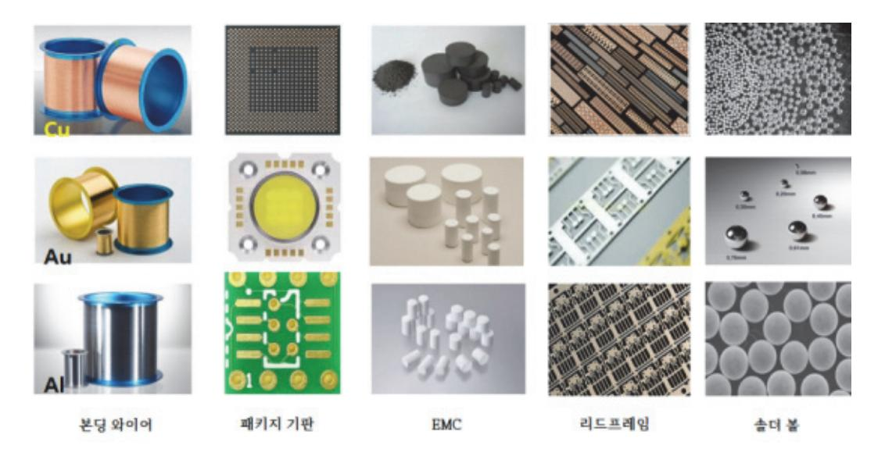

출처: 교육부(2014). 반도체 패키지 재료 제조(LM1903060406\_14v1). 한국직업능력개발원. p.4. [그림 1-1] 패키지 제작에 사용되는 주요 구성 재료

#### 숖 패키지 주요 공정

반도체 패키징이 필요한 이유는 전기적인 연결이라는 관점에서 볼 때, 반도체 칩과 전자 제품 메인보드의 회로 폭에 차이가 있기 때문이다. 전자 제품을 동작시키는 역할의 반도체 칩은 그 자체로는 아무런 역할을 할 수 없고, 전자 제품을 구성하는 회로에 연결되어야 비로소 반도체 칩의 기능을 수행할 수 있다. 반도체 칩을 회로 위에 바로 장착할 수 없으므로 상호 간의 회로 폭 차이를 완충시켜 줄 수 있는 역할을 반도체 패키징이 담당하게 된다. 반도체 패키징 공정을 대략 살펴보면 다음과 같다. 리드 프레임 패키지, 모듈형 패키지, BGA 패키지에 대한 공정 흐 름도가 [그림 1-2], 관련 주요 공정이 [그림 1-3]에 도식되어 있다.

1. back grinding 공정

전 공정에서 가공된 웨이퍼의 후면을 얇게 갈아내는 공정

- 2. sawing(dicing) 공정 웨이퍼를 개별 단위(net die)로 잘라내는 공정
- 3. die attaching 공정 회로 기판(substrate)에 칩을 붙여 고정하는 공정
- 4. wire bonding gold wire로 칩을 전기적으로 연결하는 공정
- 5. molding EMC 물질로 칩이 실장된 기판을 감싸는 공정
- 6. marking 레이저로 개별 제품에 제품 정보를 새기는 공정
- 7. solder ball mount 회로 기판에 솔더 볼을 붙여 아웃 단자를 만드는 공정
- 8. PKG sawing 모듈/보드/카드에 실장하도록 개별 반도체로 잘라 내는 공정
- 9. trimming 댐바(dambar)는 리드와 리드 사이, 몰딩 시에 액체 상태의 컴파운드가 외부 리드로 흘러넘

치는 것을 방지하는 댐 역할을 하며, 이 댐바를 잘라 주는 공정

10. form

리드선을 PCB 보드에 결선하기 쉽도록 구부려 형태를 만드는 공정

11. 리드 도금

리드선의 저항을 줄이기 위해 전도성 금속을 입히는 공정

12. test

패키지 공정이 완료된 단위 패키지 제품의 양품을 선별하는 공정

13. marking

테스트 공정에서 양품 판정을 받은 제품에 제조일, 회사, 제품명 등의 제품의 이력을 레이 저를 이용하여 각인하는 공정

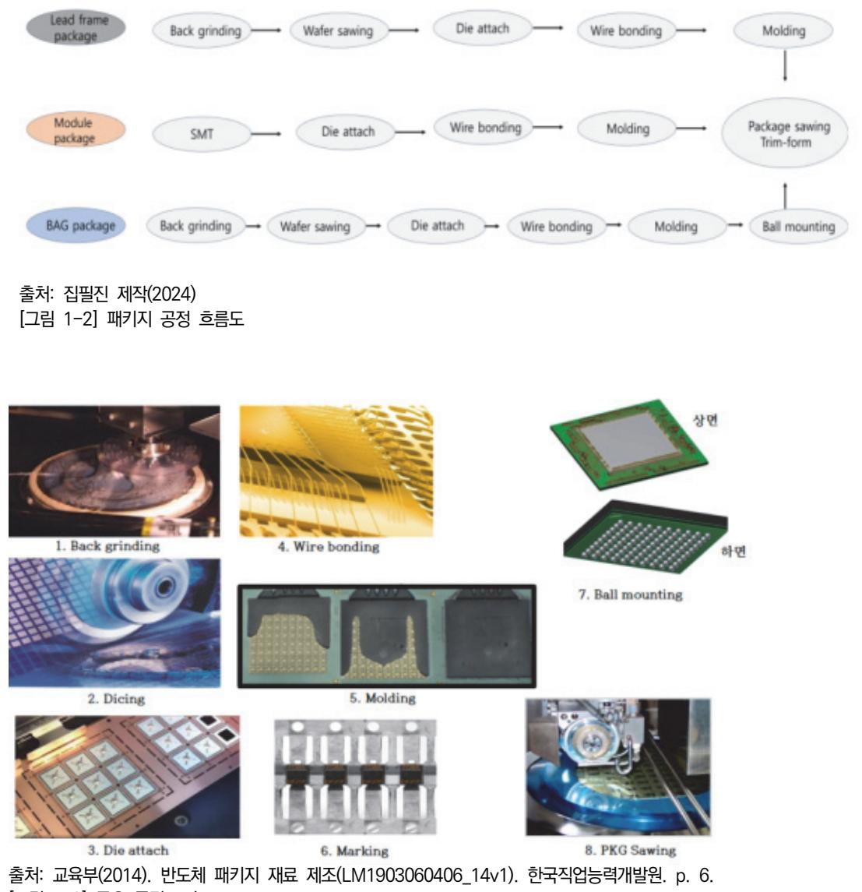

[그림 1-3] 주요 공정 모습

숗 패키지 테스트

반도체 패키징 공정이 완료되면 패키징 제품의 불량 여부를 확인하는 테스트 공정이 진행된다. 반도체 패키징 테스트 공정은 패키징된 반도체를 검사 장비에 넣고 다양한 조건의 전압 및 전 류 등 전기 신호와 온도 등을 인가하여 제품의 전기적 특성, 기능적 특성, 그리고 동작 속도 등을 측정한다. 테스트 공정은 반도체의 종류에 따라 달라질 수 있는데 동적 임의 접근 기억 장치(DRAM: dynamic random access memory)의 경우 다음과 같은 테스트 공정을 진행한 다.

1. assembly out

제품 종류, 수량, I/O 수(bit) 등을 확인하는 공정이다.

- 2. DC test & loading / burn-in 선행 공정을 거치면서 발생한 불량을 선별한 후 제품에 고온, 고전압 등의 극한 조건을 가 하여 신뢰성을 확인하는 공정이다.
- 3. post burn-in 상온 및 저온에서 전기적 특성 및 기능을 검사하는 공정이다.
- 4. final test

burn-in 테스트 이후 제품의 작동 여부를 검사하는 공정이다.

수 반도체 패키지 종류 구조

반도체 부품을 구현하는 패키지는 다양한 모습으로 존재하고, 제조에 사용되는 재료도 패키지 종류에 따라 다르다.

1. QFN(quad flat no-lead)

QFN 패키징 방식은 구리 리드 프레임 위에 반도체 칩이 올라가고 와이어 본딩을 한 후 몰 딩을 한 형태로 리드가 없어서 작고 가벼우며 전기적 성능과 열적 특성이 우수하고 신뢰성 이 좋다. QFN 패키징 방식은 반도체 패키징 중 가장 저렴하면서도 지속해서 사용되는 패 키징 방식이다. [그림 1-4]에 구성 요소와 적용 제품의 예시가 도시되어 있다.

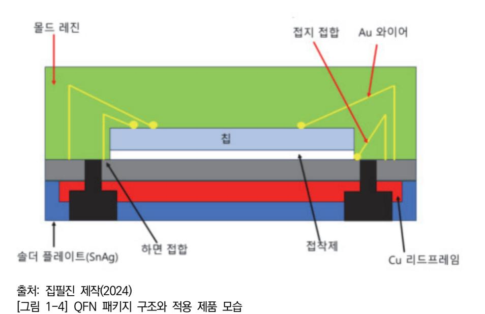

2. TSOP(thin small outline package)

PC에 사용되는 메모리 패키지로 리드 프레임을 사용하는 가장 일반적으로 사용되는 TSOP 는 리드 프레임 위에 칩을 올리고 와이어 본딩 몰딩을 한 후 리드를 구부려 완성하는 패키 지 구조이다. DRAM, SRAM, 유턴 메모리 패키지로 주로 사용된다. 패키지 두께가 1mm 이하이고, 리드 간 피치가 0.5mm 이하이다. [그림 1-5]에 구성 요소와 적용 제품의 예시 가 도시되어 있다.

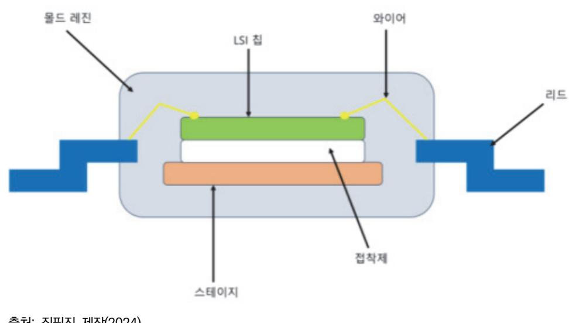

출처: 집필진 제작(2024) [그림 1-5] TSOP 패키지 구조와 적용 제품 모습

3. BOC(board on chip)

PC와 노트북에서 리드 프레임이 아닌 PCB 형태의 메모리 패키지로 사용되는 BOC(board on chip)는 기판에 메모리칩의 본딩 면이 부착된 형태로 칩의 본딩 패드와 기판의 본딩 패 드를 기판의 중앙에 형성된 슬롯을 통하여 와이어 본딩으로 기판의 본딩 패드와 접속하는 구조로 이루어져 있다. 기판의 본딩 면과 솔더 볼 면이 한 평면상에 있는 것이 특징이며, 기 존의 리드 프레임을 래미네이트 기판으로 대체하여 입출력 핀 수의 다양화와 칩의 수직 적 층도 가능하여 고속화 및 대용량화가 쉬워 메모리칩에 광범위하게 사용하고 있다. 와이어 본 딩이 슬롯을 통해 이루어지므로 전체 크기를 TSOP에 비해 작고 얇으며 고속화가 가능한 장 점이 있다. [그림 1-6]에 구성 요소와 적용 제품의 예시가 도시되어 있다.

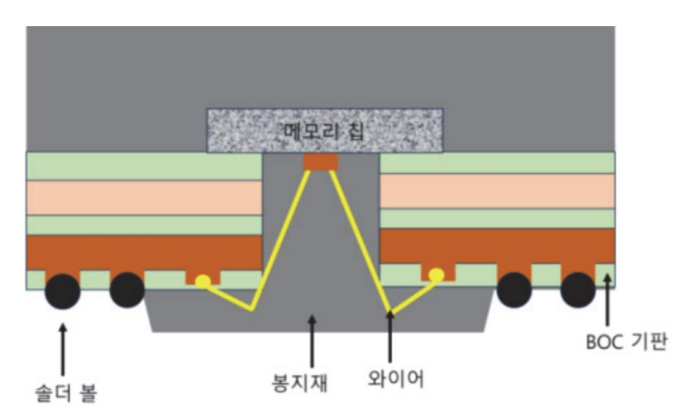

출처: 집필진 제작(2024) [그림 1-6] BOC 패키지 구조와 적용 제품 모습

- 4. MCP(multi chip package)
  - (1) MCP 용도

MCP는 박판의 기판 위에 50~80㎛의 얇은 칩을 여러 개 적층하여 용량과 성능을 증가 시킨 구조로 모바일 기기에 사용되는 메모리에 사용된다. 패키지 형태로는 FBGA(fine pitch ball grid array)이다. 이와 같은 패키지를 구현하기 위해서는 웨이퍼를 얇게 하 는 기술 얇은 칩을 적층하고 와이어 본딩하는 기술이 필요하다.

(2) MCP 종류

메모리 소자는 칩을 2층 쌓는 DDP(double die packaging), 3층 쌓는 TDp(triple die Packaging), 4층 쌓는 QDP(quad die packaging)가 사용되고 있으며, 최근에는 소자 안에 컨트롤러를 내장한 eMMC(embedded multi media card), eMCP(embedded multi chip package)가 모바일 기기용 메모리 소자로 사용되는 추세이다.

- (3) MCP 핵심 기술
  - (가) MCP용 핵심 package 공정 기술을 살펴보면 박형 패키지 구현을 위해서는 얇은 PCB 기판 위에 MCP 형태로 메모리칩을 적층한 후 얇게 몰딩하는 기술이 필요하다.

칩 두께를 얇게 백그라인딩해야 하는데 50㎛ 두께까지는 일반 mechanical grinding과 polishing으로 진행하고, 50㎛ 이하의 두께는 DBG(dicing before grinding) 공정 방식을 도입해야 한다. DBG 공정은 백그라인딩을 하기 전에 웨이퍼를 sawing하고, 테이프를 마운팅 함으로써 칩을 얇게 백그라인딩 할 때 발생하는 칩 휨 현상(chip warpage)을 방지할 수 있다. 그리고 50㎛ 이하의 얇은 칩을 sawing 하기 위해서는 laser를 이용하여 칩에 손상이 없도록 최적화해야 한다.

(나) 얇은 칩을 웨이퍼 마운트 테이프에서 떼어 PCB에 붙이는 기술이 필요한 데 이를 위해

#### pin을 사용하지 않는 특별한 키트 개발이 필요하다.

이후 와이어 본딩 공정에서는 두께가 얇아져서 와이어 본딩하기 어려운 협소한 공간 에 매우 낮은 높이로 와이어 본딩을 진행하여 칩에 손상이 없도록 해야 한다. [그림 1-7]에 구성 요소와 적용 제품의 예시가 도시되어 있다.

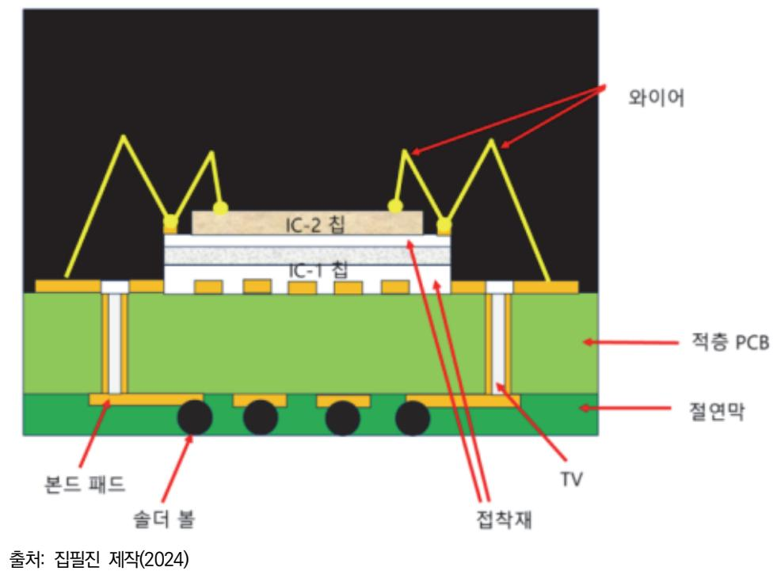

[그림 1-7] MCP 패키지 구조와 적용 제품 모습

5. FCB(flip chip bonding)

flip chip 본딩 패키지는 칩 위의 패드와 PCB 또는 리드 프레임을 연결하는 방법으로 와 이어 본딩 대신에 칩의 본딩 패드 위치와 같게 기판에 범핑 패드를 만들어 솔더 볼을 이용 해 연결한 패키지 형태이다. 와이어 본딩을 했을 때보다 전기적 특성이 좋고, 와이어 본딩 루프의 높이가 없어 좁은 면적으로 칩 실장 밀도를 높일 수 있다.

flip chip 본딩 방식은 전체 표면을 전기적 연결 통로로 사용할 수 있어 입출력 단자의 수 를 늘릴 수 있는 장점이 있다. DRAM 등의 메모리 소자와 flash 메모리의 패키지로 사용 된다. [그림 1-8]에 구성 요소와 적용 제품의 예시가 도시되어 있다.

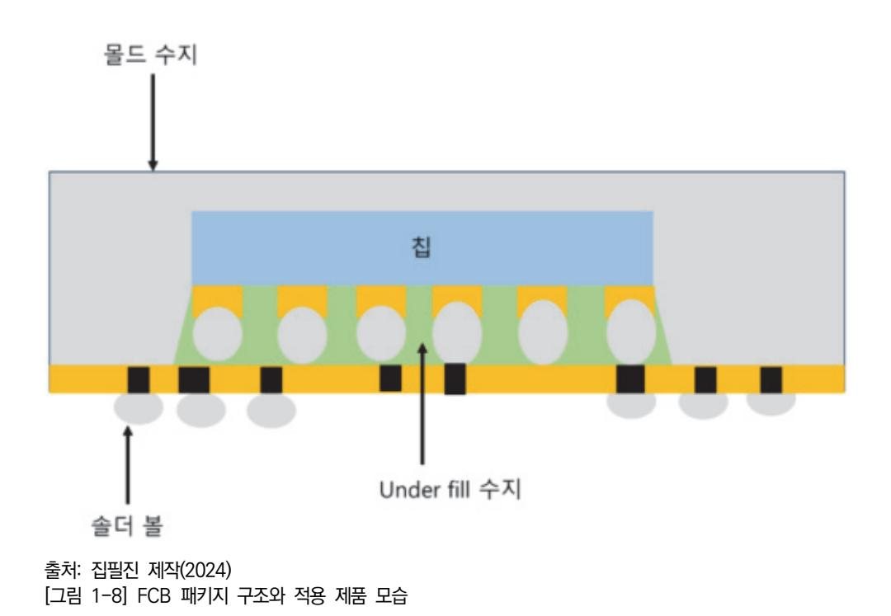

- 6. SiP(system in package)

SiP는 기판 위에 서로 다른 기능의 능동 소자들을 올린 후에 하나의 패키지로 몰딩해서 소 자 간 접속 경로의 단거리 확보를 통한 고성능과 우수한 전기적 특성을 확보할 수 있는 패 키지 형태이다. SiP는 와이어 본딩과 flip chip 범프의 복합 기술로 칩의 수직 적층과 다른 기능의 칩을 병렬로 배열하여 초경량 초소형의 반도체 기능을 확보하는 것이 가능하다. [그 림 1-9]에 구성 요소와 적용 제품의 예시가 도시되어 있다.

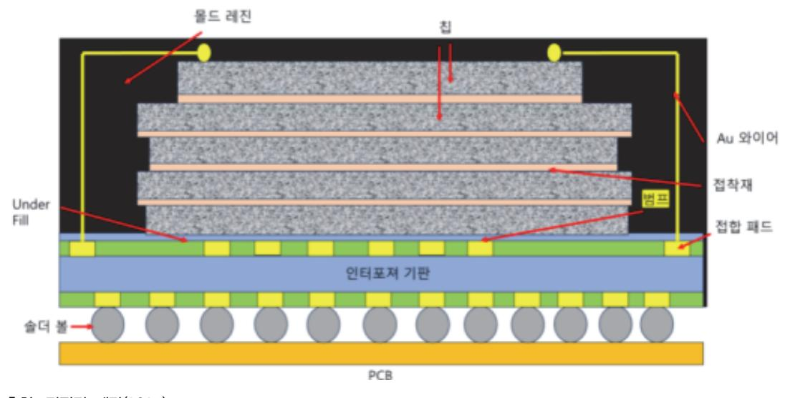

출처: 집필진 제작(2024)

[그림 1-9] SiP 패키지 구조와 적용 제품 모습

#### 7. WLCSP(wafer level chip scale package)

WLCSP는 가장 작은 크기를 구현할 수 있는 칩 크기의 패키지로 전기적 특성이 좋고 저렴 하게 생산할 수 있는 장점이 있다. 스마트폰에 들어가는 많은 소자가 WLCSP 형태로 제작 되어 소형이면서도 빠른 스피드를 구현하는 방향으로 개발이 이루어지고 있다. [그림 1-10] 에 구성 요소와 적용 제품의 예시가 도시 되어있다.

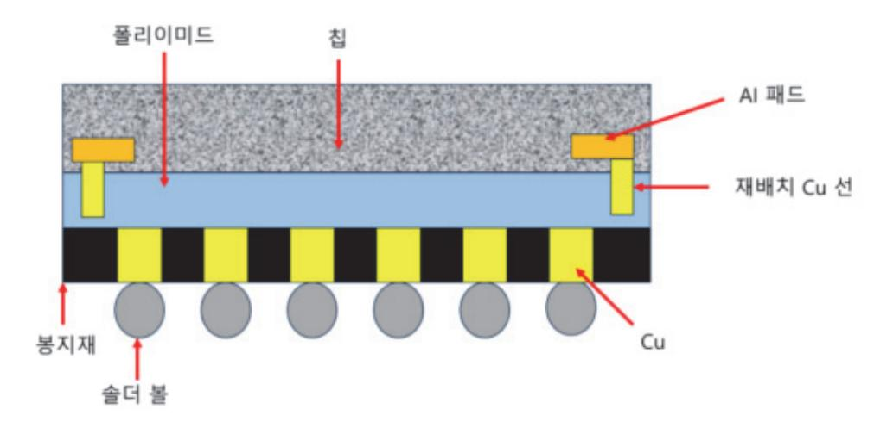

출처: 집필진 제작(2024) [그림 1-10] WLCSP 패키지 구조와 적용 제품 모습

8. POP(package on package)

스마트폰 및 태블릿 PC에서는 수직적 확장으로 3차원 패키지를 구현하기 위해 AP(application process), 베이스 밴드 칩과 메모리를 적층하는 POP 형태를 사용하여 부품 크기를 최소화하고 신호 전달이 빠르게 이루어질 수 있도록 하고 있다.

- (1) POP의 장점
  - (가) 배선 길이 최소화

POP는 연결 배선의 길이를 최소화할 수 있어 이차원 배열 시 발생하는 신호 지연, 임피던스 부정합 등의 손실을 최소화할 수 있고, 공간적으로 수직 방향을 활용하므 로 단위 면적당 실장 면적을 극대화하여 대용량, 초소형 부품을 구현할 수 있다. 기 존에는 로직 기능을 하는 패키지와 메모리 패키지를 평면에 2차원적으로 배치하여 보드의 공간을 많이 차지하고, 한 가지 패키지 사양이 변경되면 보드를 새로 제작해 야 하므로 추가 비용이 필요하다. 반면에 로직과 메모리 소자를 하나의 패키지로 제 작하면 둘 중 하나가 바뀌면 전체 테스트 프로그램과 테스트 보드를 수정해야 하므 로 시간과 비용이 많이 들었다.

(나) 비용 절감

POP는 로직 패키지와 메모리 패키지를 각각 테스트한 후 패키지를 적층하므로 변동

발생 시 해당 패키지의 테스트 도구만 변경하면 되므로 시간과 비용을 획기적으로 줄일 수 있는 장점이 있어 제작을 쉽게 하고 소자의 성능과 집적도를 향상시키는 효 율적인 방법이 되고 있다. [그림 1-11]에 구성 요소와 적용 제품의 예시가 도시되어 있다.

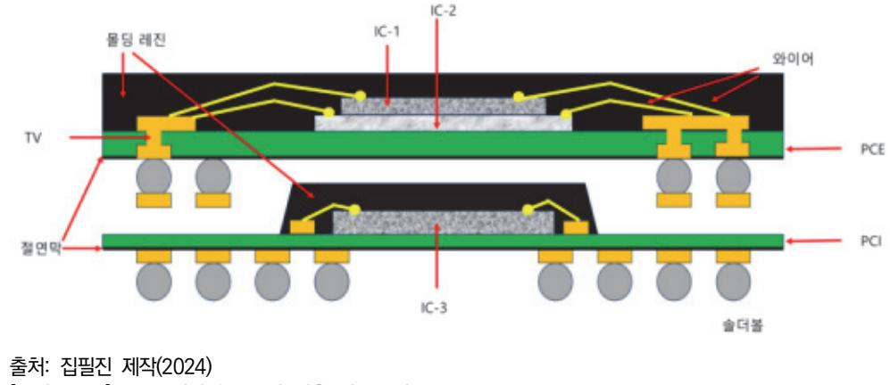

[그림 1-11] POP 패키지 구조와 적용 제품 모습

#### 9. FOWLP(fan out wafer level package)

일반적인 WLP(wafer level package)는 패키지 I/O(input/output) 단자를 모두 칩 안쪽 에 배치해야 하므로 칩 사이즈가 작아지면 볼 크기와 피치를 줄여야 하므로 표준화된 볼 레이아웃을 사용할 수 없다. 이러한 문제를 해결하기 위해 칩 바깥쪽에 패키지 I/O 단자를 배치하는 형태인 팬아웃 웨이퍼 레벨 패키지(FOWLP: fan-out wafer level package)가 제안되고 있는데, 이 경우, 칩 크기가 작아지더라도 표준화된 볼 레이아웃을 그대로 사용할 수 있는 장점이 있다.

(1) FOWLP 장점

(가) 소형화 및 박형화 가능

FOWLP는 패키지 공정이 간단하고, 두께를 얇게 구현할 수 있어서 BGA보다 소형화와 박형화가 가능하고 열 특성과 전기적 특성이 우수하여 모바일 제품에 적합하다. 경박 단소형 의 장점이 있는 FOWLP는 초기 I/O 150~250핀의 집적 회로를 시작으로 점차 300핀 이상의 집적 회로로 확대가 될 것으로 예상하며, 적용 소자도 베이스 밴드와 아날로그 집적 회로, RF(radio frequency) 소자에 적용되기 시작하여 AP(application processor) 와 PMU(power management unit)에 확대 적용될 예정이다.

(나) SiP 적용 가능

FOWLP는 PCB를 이용하는 일반적인 POP보다 더 컴팩트하게 구현할 수 있으며 POP의 휨 현상 발생으로 인한 문제를 해결할 수 있다. FOWLP는 기존 패키지 대비 칩 크기를 1/16 정도의 수준으로 줄일 수 있고, 인쇄 회로 기판을 사용하지 않아서 기존 패키지 공정 대비 원가 경쟁력이 높다. 또한 하나의 패키지에 다양한 기능의 칩들을 실장하는 SiP가 가능해 빠르게 변하는 모바일 기기와 사물 인터넷 시장에서 매우 유리한 패키징 기술이다. [그림 1-12]에 패키지 개념도가 도시되어 있다.

출처: 집필진 제작(2024) [그림 1-12] FOWLP 패키지 개념도

10. TSV 기술(through silicon via)

반도체 소자의 집적도를 높이는 방법으로 칩들을 적층하여 와이어 본딩하는 MCP와 패키지 를 적층하는 POP가 일반적으로 사용되고 있지만, 최근 처리 속도를 높이는 방법으로 두 개 이상의 칩을 수직으로 적층하고 실리콘을 관통하는 전극을 통하여 회로를 연결하는 TSV 기술이 적용되고 있다. TSV 기술은 실리콘 웨이퍼의 상부와 하부를 전극으로 연결하여 최 단 거리의 신호 전송 경로를 제공하므로 패키지의 경박 단소화에 가장 유리하다.

(1) TSV 기술 응용

특히, TSV 기술은 CMOS 이미지 센서에 적용되어 활용되고 있으며, CPU 위에 TSV 기술 와이드 I/O로 메모리를 연결하는 제품, 캐시 메모리로 고속 메모리를 올리는 제품, 휴대전화에 들어가는 베이스 밴드 프로세서 위에 TSV 기술로 메모리를 올리는 제품, RF를 포함한 무선 칩에 TSV 기술을 적용하여 전원과 그라운드를 연결해서 고주파 성능 을 향상하는 제품, 애플리케이션과 베이스 밴드 프로세서를 TSV 기술 인턴 포자를 이용 해 모듈화하는 부품 개발 등으로 적용하여 진행되고 있다.

(2) TVS 양산 적용을 위한 해결 과제

TSV 기술이 양산 제품에 적용되기 위해서는 아직도 여러 가지 문제를 해결해야 하는데 특히, 열 관리, 비어 형성, 박형 웨이퍼 취급 등에 주의해야 하며, 이 외에도 설계 및 공정 파라미터 최적화, 본딩 환경, W2W(wafer to wafer) 본딩 정렬, 웨이퍼 뒤틀림, 웨이퍼 휨, 검사, 결합 신뢰성, 제조 수율 확보 등 고려해야 할 부분들이 많이 있다. [그 림 1-13]에 구성 요소와 적용 제품의 예시가 도시되어 있다.

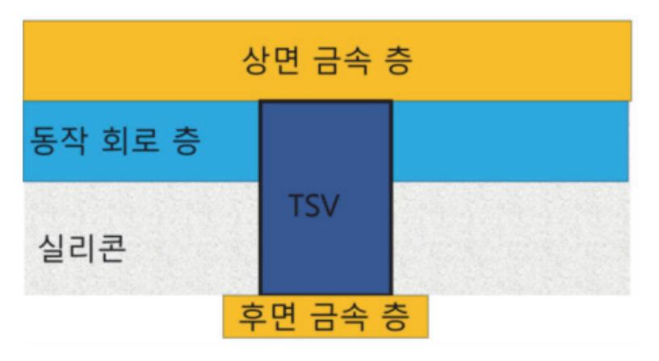

출처: 집필진 제작(2024) [그림 1-13] TSV 패키지 구조와 적용 제품 모습

11. 인터포저(interposer)

최근 반도체 패키징 업계에서는 차세대 시스템 패키징 기술로 TSV 기술 인터포저가 주목을 받고 있다. 인터포저는 서킷 보드와 칩 사이에 들어가는 기능성 패키지 기판으로 시스템 온 칩(SoC)과 달리 물성이 다른 칩들을 넣을 수 있고, 비교적 패키징 수율이 높다. 지금까지 인쇄 회로 기판(PCB)이나 유리(organic) 기판이 쓰였으나 전도성이 낮고 열을 제시간에 방 출하지 못했었다. TSV 기술 인터포저는 실리콘 웨이퍼 위에 칩들을 얹거나 실장하고 기판 에 구멍을 뚫은 후 내부를 전도체로 채워 칩 간 또는 칩과 PCB 간을 연결한다. CPU와 메 모리칩의 소자 고밀도와 회로의 복잡성 때문에 크기나 핀 수가 다른 CPU와 메모리칩을 부 착시키기 위해서는 설계의 자유도나 성능에 제약이 따를 수 있다. 따라서 인터포저는 서로 다른 피치 크기, 위치의 패드를 가진 다양한 칩 간에 전기적 연결을 제공하는 중간 매체로 실리콘, 글라스 등이 사용되며 면적과 크기가 작고, 고성능 및 저비용을 실현할 수 있다. [그림 1-14]에 구조와 구성 요소가 도시되어 있다.

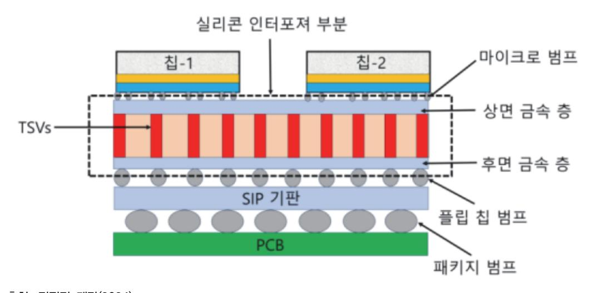

출처: 집필진 제작(2024)

[그림 1-14] 인터포저 패키지 구조와 적용 제품 모습

#### 12. 유연 패키지 기술(flexible package)

제품 사용의 편의성을 강조하기 위해 휘어지거나 접을 수 있는 전자 제품에 대한 요구가 증가하고 있다. 전자 제품이 유연해지기 위해서는 사용되는 반도체 부품 또한 유연성을 가 져야 한다. 실리콘 반도체 소자는 두께가 80μm 이상일 경우는 딱딱한 성질을 가지고 있 고, 그 이하가 되면 유연한 특성을 가지게 된다. 실리콘 소자를 80μm 이하로 얇게 한 후 유연한 기판에 접합시키고 소자 간을 연결하면 유연한 반도체 소자를 확보할 수 있다. 이러 한 과정을 통해 자유자재로 휘어지는 메모리를 만들어 낼 수 있어서 의류 및 신발 등 웨어 러블(wearable) 제품에 적용할 수 있는 장점이 있다.

#### 숙 반도체 제품 기술 동향과 패키지 기술 발전 방향

무어의 법칙에서처럼, SoC 기술이 기하급수적인 속도로 발달함에 따라 SoC 기술이 향후 어떠 한 방향으로 발전할 것인지, 트랜지스터의 크기와 집적도는 어느 정도나 될 것인지, 어떠한 기 술이 장애 요인이 되고 어떠한 방법으로 극복할 것인지 등에 관한 동향을 예측하기가 점점 어 려워지고 있다. SoC 기술은 단순히 반도체를 설계하기만 하면 되는 것이 아니라 반도체 설계, 칩 제조 공정, 패키지 공정, 재료, 생산, 시스템, 설비 등의 여러 가지 분야가 하나의 프레임 워크 내에서 유기적인 관계를 이루어 함께 발전해 나가야 하므로 이들 분야를 통합적으로 분석 하고 동향을 예측하는 일이 SoC 기술 발전에서 중요한 몫을 차지하고 있다.

#### 1. ITRS(International Technology Roadmap for Semiconductor)

미국반도체산업협회인 SIA(Semiconductor Industry Association) 주도로 반도체 기술의 장기적인 기술 동향을 예측한 로드맵이다. ITRS는 비상업적인 순수한 기술 로드맵이며 향 후 15년 동안의 반도체 기술 동향을 예측하고 반도체 및 관련 산업이 발전해 나가는 가이 드라인을 제시한다. ITRS는 2년마다 한 번씩 정식 로드맵이 발표되며 로드맵이 발표되지 않는 중간 해에는 전년도의 로드맵에 대한 업데이트를 발표한다. 1993년 미국 SIA 단독으 로 NTRS(National Technology Roadmap for Semiconductor)를 발표한 것을 시작으 로 1999년에는 한국의 KSIA, 유럽의 EECA, 일본의 EIAJ, 대만의 TSIA가 참가하여 국제 적인 반도체 기술 로드맵인 ITRS가 결성되었다.

2. ITRS 기술 로드맵

ITRS 기술 로드맵은 반도체 산업에서 기술 발전을 예측하고, 장기적인 목표와 방향을 제시 하기 위해 만들어진 중요한 문서이다. 이 로드맵은 반도체 제조 공정, 설계, 재료, 테스트, 패키징 등 다양한 분야에서의 기술적 도전과 요구 사항을 분석하여 산업계가 향후 몇 년 동안 달성해야 할 목표를 설정하는 데 사용된다.

(1) ITRS 기술 로드맵의 주요 특징

(가) 산업 표준 설정

ITRS 로드맵은 반도체 업계에서 기술 발전의 표준을 설정한다. 이를 통해 반도체 제 조 업체, 장비 공급 업체, 재료 공급 업체, 그리고 연구기관들이 공통의 목표를 가지 고 협력할 수 있도록 한다.

- (나) 기술 발전의 예측
  - 1) ITRS는 향후 15년에서 20년 동안 반도체 기술이 어떻게 발전할지를 예측한다. 이 러한 예측은 트랜지스터 크기, 성능, 전력 소모, 패키징, 집적도 등의 기술적 지표를 포함한다.
  - 2) 예를 들어, 트랜지스터의 크기 감소와 같은 기술적 진보는 무어의 법칙에 기반하여 예측되며, 이를 통해 더 작은 크기와 높은 성능을 가진 반도체 소자가 개발될 것으 로 예상한다.
- (다) 도전 과제와 해결 방안
  - 1) ITRS는 반도체 산업이 직면할 수 있는 기술적 도전 과제를 분석하고, 이를 해결하 기 위한 방안을 제시한다. 예를 들어, 더 작은 공정 노드에서의 리소그래피, 전력 관리, 열 문제 등을 주요 도전 과제로 다룬다.
  - 2) 새로운 재료의 도입, 혁신적인 설계 기법, 고급 제조 공정 기술 등이 제안되며, 각 기술 분야에서의 협업이 강조된다.
- (라) 혁신 촉진

로드맵은 혁신을 촉진하고, 반도체 기술의 지속적인 발전을 위해 필요한 연구 및 개 발(R&D)의 방향을 제시한다. 이를 통해 산업계는 효율적으로 자원을 배분하고, 중복 투자를 피하며, 공동의 기술 목표를 달성할 수 있다.

(마) 시장 동향과 요구 사항 반영

ITRS는 반도체 기술의 발전이 시장 요구와 어떻게 연결되는지를 분석한다. 모바일 기기, 데이터 센터, 인공지능(AI), 사물 인터넷(IoT) 등 다양한 응용 분야에서 요구되 는 기술적 기준을 로드맵에 반영한다.

(바) 계속적인 업데이트

ITRS는 주기적으로 업데이트되어, 기술 발전과 새로운 도전 과제를 반영한다. 이를 통해 로드맵이 최신 산업 동향과 기술 혁신을 반영하여 실질적인 가이드로서의 역할 을 지속할 수 있도록 한다.

(2) ITRS의 영향력과 변화

ITRS는 오랫동안 반도체 산업에서 중요한 역할을 해 왔지만, 반도체 기술이 점점 더 복 잡해지고, 다양한 응용 분야에 맞추어 세분화되면서 2016년에 ITRS는 'International Roadmap for Devices and Systems(IRDS)'로 전환되었다. IRDS는 반도체뿐만 아니 라 전체 전자 시스템의 기술 발전을 아우르며, 보다 더 광범위한 기술 로드맵을 제시하 고 있다.

ITRS 기술 로드맵은 반도체 기술의 발전을 예측하고, 장기적인 목표를 설정하는 데 있어 중요한 역할을 해 왔다. 이 로드맵은 반도체 산업의 혁신을 촉진하고, 업계 전반에 걸쳐 기 술적 표준을 제시함으로써, 기술 발전의 방향성을 제시해 왔다. IRDS로의 전환을 통해 이 역할은 계속해서 진화하고 있으며, 반도체 및 전자 시스템의 미래를 준비하는 데 중요한 가 이드 역할을 수행하고 있다.

숚 반도체용 플립 칩 패키지 공정

반도체용 플립 칩 패키지 공정은 칩을 뒤집어 기판에 직접 접합하는 방식으로, 고성능 반도체 소자의 패키징 기술 중 하나이다. 이 공정은 칩의 전기적 성능과 열 방출 특성을 향상시키기 위해 사용된다. 다음은 플립 칩 패키지 공정의 주요 단계를 설명한 것이다. 이와 같은 단계를 통해 플립 칩 패키지 공정은 고성능 반도체 소자를 효과적으로 패키징할 수 있다. 각 단계에서 의 정밀한 제어와 품질 관리가 중요하며, 이를 통해 최종 제품의 성능과 신뢰성을 보장할 수 있다.

- 1. 칩 준비(die preparation)
  - (1) 웨이퍼 처리: 웨이퍼에서 개별 다이를 절단하여 칩을 준비한다.
  - (2) 패드 준비: 칩의 접합 패드에 언더밈(UBM: under bump metallurgy)을 형성하여 접촉성과 접합 강도를 향상시킨다.
- 2. 범프 형성(bump formation)

플립 칩 패키지의 범프 형성 공정은 칩의 접합 패드에 작은 금속 돌기(범프)를 형성하는 과 정이다. 이 범프는 나중에 칩을 기판에 접합하는 데 사용된다. 범프 형성 공정의 주요 단계 는 다음과 같다.

- (1) 범프 재료 선택: 주로 납-주석 합금, 은-주석 합금, 금 등의 재료가 사용된다.
- (2) 반도체용 플립 칩 패키지의 범프 형성 공정

플립 칩 패키지의 범프 형성 공정은 칩의 접합 패드에 작은 금속 돌기(범프)를 형성하는 과정이다. 이 범프는 나중에 칩을 기판에 접합하는 데 사용된다. 범프 형성 공정의 주요 단계는 다음과 같다.

- (가) 언더밈(UBM: under bump metallization) 형성
  - 1) 목적: 칩의 패드를 보호하고, 범프의 접착력을 높이기 위해 금속층을 형성한다.
  - 2) 과정: 통상적으로, 크로뮴(Cr), 니켈(Ni), 구리(Cu) 등의 금속을 스퍼터링 방식으로 증착한다.
- (나) 포토리소그래피(photolithography)
  - 1) 목적: 범프가 형성될 위치를 정의하기 위해 포토레지스트를 사용한다.
  - 2) 과정

- 가) 칩 표면에 포토레지스트를 도포한다.
- 나) 마스크를 사용하여 빛을 조사하여 포토레지스트를 패턴화한다.
- 다) 현상 과정을 통해 패턴을 형성한다.
- (다) 범프 도금(bump plating)
  - 1) 목적: 범프 재료를 칩의 패드에 도금한다.
  - 2) 과정
    - 가) 전기 도금 또는 증착 방식을 사용하여 금속을 증착한다.
    - 나) 일반적으로 사용되는 금속은 납-주석(Sn-Pb) 합금, 은-주석(Ag-Sn) 합금, 금 (Au) 등이 있다.
- (라) 리플로(reflow)
  - 1) 목적: 도금된 범프를 구 형태로 변형시키고, 범프의 접착력을 높인다.
  - 2) 과정
    - 가) 칩을 고온의 오븐에 넣어 범프가 녹아 구 형태로 변형되도록 한다.
    - 나) 냉각하여 고체화된 범프를 형성한다.
- (마) 포토레지스트 제거
  - 1) 목적: 리플로 후 남은 포토레지스트를 제거하여 범프가 노출되도록 한다.
  - 2) 과정: 화학 약품을 사용하여 포토레지스트를 제거한다.
- (바) 클리닝 및 검사
  - 1) 목적: 범프 형성 후 남아 있는 불순물을 제거하고, 범프의 품질을 검사한다.
  - 2) 과정

가) 세정 과정을 통해 표면의 불순물을 제거한다.

나) 현미경 검사 등을 통해 범프의 크기, 형상, 위치 등을 검사한다.

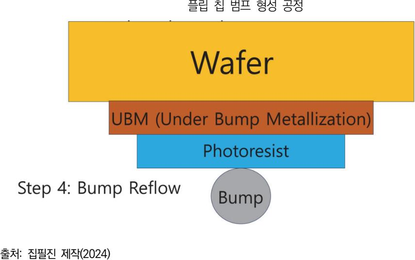

[그림 1-15] 범프 형성 공정

이와 같은 범프 형성 공정을 통해 플립 칩 패키지의 고성능 및 고신뢰성을 확보할 수 있다. 각 단계에서의 정밀한 제어와 품질 관리가 중요하며, 이를 통해 최종 제품 의 성능과 신뢰성을 보장할 수 있다.

3. 칩 플립 및 본딩(flip chip bonding)

플립 칩 패키지에서 칩플립 및 본딩 형성 공정은 칩을 뒤집어 기판에 직접 접합하는 중요 한 과정이다. 이 과정은 고속 신호 전달과 우수한 열 방출 특성을 확보하는 데 필수적이다. 다음은 주요 단계와 그림을 포함한 설명이다.

(1) 언더필 공정의 주요 단계

- (가) 칩 플립(chip flip)
  - 1) 설명: 범프가 형성된 칩을 뒤집어 기판의 접합 패드와 마주 보도록 위치시킨다.
  - 2) 과정

가) 특수 장비를 사용하여 칩을 정밀하게 뒤집는다.

- 나) 범프가 아래로 향하게 하여 기판 위에 위치시킨다.
- (나) 정렬(alignment)
  - 1) 설명: 칩의 범프와 기판의 접합 패드가 정확하게 일치하도록 정렬한다.
  - 2) 과정
    - 가) 고정밀 정렬 장비를 사용하여 칩과 기판의 패드를 정확하게 맞춘다.

#### (다) 접합(bonding)

- 1) 설명: 열과 압력을 가해 범프와 기판의 패드를 접합한다.
- 2) 과정
  - 가) 열 압착 기계를 사용하여 칩과 기판을 접합한다.
  - 나) 범프가 녹아 기판 패드와 접합된 후 냉각하여 고체화된다.

이와 같은 칩 플립 및 본딩 형성 공정을 통해 플립 칩 패키지의 고성능 및 고신뢰성을 확보할 수 있다. 각 단계에서의 정밀한 제어와 품질 관리가 중요하며, 이를 통해 최종 제품의 성능과 신뢰성을 보장할 수 있다.

4. 언더필(underfill)

언더필 공정은 플립 칩 패키지에서 매우 중요한 단계로, 칩과 기판 사이의 기계적 강도를 높이고 열팽창 차이에 따른 스트레스를 완화하여 장기적인 신뢰성을 보장하는 역할을 한다. 다음은 언더필 공정의 주요 단계와 자세한 설명이다.

- (1) 언더필 공정의 주요 단계
  - (가) 언더필 재료 준비
    - 1) 언더필 재료: 주로 에폭시 기반의 수지로, 열경화성 재료가 사용된다.
    - 2) 재료 특성: 낮은 점도, 높은 접착력, 낮은 열팽창 계수(CTE), 우수한 열전도성 등이

요구된다.

- (나) 칩과 기판 사이의 간극 충진
  - 1) 언더필 재료 도포: 언더필 재료를 주입기 또는 디스펜서를 사용하여 칩의 한쪽 가장 자리에서 주입한다.
  - 2) 모세관 현상: 언더필 재료는 모세관 현상(capillary action)에 따라 칩과 기판 사이 의 간극을 채워 나간다.
- (다) 경화(curing)
  - 1) 프리 베이크(pre-bake): 초기 경화 단계를 통해 언더필 재료를 반경화 상태로 만든 다. 이 단계에서는 저온에서 수분을 제거하고, 공정 중에 기포가 발생하지 않도록 한다.
  - 2) 본격 경화: 언더필 재료를 완전히 경화시키기 위해 고온 오븐에서 일정 시간 동안 처리한다. 이 단계에서는 재료의 최종 기계적 강도와 접착력이 확보된다.
- (라) 검사 및 품질 관리
  - 1) 비파괴 검사: 엑스레이 검사나 초음파 검사를 통해 언더필 재료가 균일하게 충진되 었는지 확인한다.
  - 2) 물리적 검사: 경화된 언더필의 물리적 강도와 접착력을 테스트한다.
- (2) 언더필 공정의 중요성 및 장점
  - (가) 기계적 강도 향상: 언더필 재료가 칩과 기판 사이의 간극을 메워, 외부 충격에 대한 내 구성을 높인다.
  - (나) 열팽창 차이 완화: 칩과 기판의 열팽창 계수가 다를 경우 발생하는 스트레스를 흡수하여 장기적인 신뢰성을 보장한다.
  - (다) 전기적 성능 향상: 접합부의 전기적 특성을 안정화하여 고속 신호 전달 특성을 개선한다.
- (3) 언더필 재료의 선택 기준
  - (가) 점도: 낮은 점도로 인해 모세관 현상을 통해 간극을 빠르게 채울 수 있어야 한다.
  - (나) 열팽창 계수(CTE): 칩과 기판의 CTE와 유사해야 열 스트레스를 최소화할 수 있다.
  - (다) 경화 시간: 적절한 경화 시간을 통해 생산성을 높이면서도 충분한 기계적 강도를 제공해 야 한다.
  - (라) 열전도성: 높은 열전도성을 통해 칩의 열을 효과적으로 방출할 수 있어야 한다. 언더필 공정은 플립 칩 패키지의 기계적 강도와 신뢰성을 확보하는 데 필수적인 단계로, 각 공정 단계의 정밀한 제어와 품질 관리가 중요하다.
- (4) 패키지 마감(package finishing)

플립 칩 패키지의 마감 공정은 칩이 기판에 접합된 후, 최종 제품의 신뢰성과 보호를 위해 수행되는 일련의 작업이다. 마감 공정은 패키지의 기계적 강도, 전기적 특성, 환경 보호 등을 향상하는 역할을 한다. 다음은 주요 단계와 그 설명이다.

(가) 몰딩(molding)

1) 설명: 칩과 기판을 보호하기 위해 몰딩 컴파운드를 사용하여 패키지를 캡슐화한다.

2) 과정

가) 몰딩 재료 선택: 에폭시 기반의 몰딩 컴파운드를 사용한다.

- 나) 몰드 설치: 칩과 기판을 몰드 안에 배치한다.
- 다) 몰딩: 몰딩 컴파운드를 몰드에 주입하여 칩과 기판을 캡슐화한다.
- 라) 경화: 고온에서 몰딩 컴파운드를 경화시켜 패키지를 완성한다.
- (나) 표면 마감(surface finishing)
  - 1) 설명: 패키지의 외부 표면을 처리하여 외관을 개선하고, 전기적 접속 특성을 향상한 다.
  - 2) 과정
    - 가) 플래팅(plating): 표면에 금, 은 등의 금속을 도금하여 전기적 접촉성을 향상한 다.
    - 나) 레이저 마킹(laser marking): 제품 식별을 위해 레이저를 사용하여 패키지 표 면에 마킹을 한다.
- (다) 검사 및 테스트(inspection and testing)
  - 1) 설명: 최종 제품의 품질을 보장하기 위해 다양한 검사와 테스트를 수행한다.
  - 2) 과정
    - 가) 전기적 검사(electrical testing): 기능 테스트, I/O 테스트 등을 통해 전기적 특성을 확인한다.
    - 나) 비파괴 검사(nondestructive testing): X-ray, 초음파 검사 등을 통해 내부 결 함을 확인한다.
    - 다) 환경 테스트(environmental testing): 열 충격, 습도 테스트 등을 통해 환경 내구성을 평가한다.
- (라) 트림 및 형성(trim and form)
  - 1) 설명: 패키지를 최종 형태로 가공하여 필요한 모양과 크기로 만든다.
  - 2) 과정
    - 가) 트림(trim): 불필요한 몰딩 재료를 제거하여 패키지를 다듬는다.
    - 나) 형성(form): 패키지의 리드 프레임을 필요한 모양으로 구부린다.
- (마) 포장 및 라벨링(packaging and labeling)
  - 1) 설명: 최종 패키지를 안전하게 포장하고, 라벨을 부착하여 출하 준비를 한다.
  - 2) 과정
    - 가) 포장: 패키지를 ESD(정전기 방지) 포장재로 포장한다.

#### 나) 라벨링: 제품 정보, 시리얼 번호 등을 포함한 라벨을 부착한다.

이와 같은 마감 공정은 플립 칩 패키지의 기계적 강도와 신뢰성을 확보하는 데 필수적 인 단계로, 각 공정 단계의 정밀한 제어와 품질 관리가 중요하다. 이를 통해 최종 제품 의 성능과 신뢰성을 보장할 수 있다.

#### 5. 플립 칩 패키지의 장점 및 단점

(1) 장점

(가) 고속 성능: 신호 경로가 짧아 고속 신호 전달이 가능하다.

(나) 우수한 열 방출: 다이와 기판 간의 직접 접합으로 열 방출이 용이하다.

(다) 고밀도 패키징: 소형화가 가능하며, 더 많은 I/O를 제공할 수 있다.

(라) 기계적 강도: 언더필 공정을 통해 칩과 기판 사이의 강도를 높여 기계적 충격에 강하다.

(2) 단점

(가) 복잡한 제조 공정: 정밀한 정렬과 접합 기술이 필요하다.

- (나) 비용: 초기 투자 비용이 많이 든다.
- (다) 열 경화 시간: 언더필 경화에 시간이 걸린다.

6. 플립 칩 패키지의 응용 분야

- (1) 고성능 컴퓨팅: 프로세서, GPU, FPGA 등
- (2) 모바일 디바이스: 스마트폰, 태블릿

(3) RF 및 무선 통신: 5G 칩셋, RF 모듈

(4) 자동차 전자 장비: ADAS, ECU

#### 숛 패키지 재료와 품질 문제

1. 패키지 기판

BGA(ball grid array), CSP(chip scale package), SIP(system in package) 같은 반도체 패키지들에 대한 수요가 증가함에 따라 수반되는 회로 기판에 수요도 증가하고 있다. 회로 기판은 패키지에 장착되어 물리적 장치들의 기본 위치를 제공하고 전기적인 인터페이스를 제공하는 부품이다. 패키지 회로 기판에는 여러 종류가 있지만 크게 rigid 타입과 tape 형 태가 있다.

(1) rigid 회로 기판

기판은 고정된 모양을 취하고 있다. 초기 rigid 기판의 재질은 세라믹이 주류를 이루어 오다가 현재는 유기 기판이 여러 패키지에서 점점 광범위하게 쓰이고 있다.

(2) tape 기판

tape 기판의 주요 장점은 디스크 드라이브나 프린터처럼 움직임이 많은 디바이스들에 회로를 장착할 수 있다는 것이다. 또한 tape 기판은 가볍고 단가가 낮다. 단점으로는 공정 중 다루기가 힘들고, 휨(warpage) 문제와 열팽창 계수가 다른 물질과 상당히 다른 점이 있다.

2. 에폭시 수지

에폭시는 실리콘 칩이 실장 되는 패키지 기판(IC substrate), EMC 봉지재, 언더필, 칩과 기판을 접착하는 다이본딩재, 솔더레지스트, 전도성 페이스트, PCB 등 다양한 분야에 응용 되고 있는 반도체 패키징의 핵심 유기 소재로써, 우수한 내열 특성·절연 특성·내화학성·기 계적 물성 등으로 인하여 현재까지 널리 이용되고 있다.

3. 리드 프레임(lead frame)

lead frame은 반도체 IC를 구성하는 핵심부품으로서 반도체 chip과 PCB 기판과의 전기 신호를 전달하고, 외부의 습기, 충격 등으로부터 chip을 보호하며, 지지해 주는 골격 역할 을 한다. 이는 칩을 비로소 외부와 연결하는 die paddle과 leads로 구성된다.

4. wire bonding 재료

wire bonding 기술은 매우 작은 접착 공간(fine-fitch bonding)에서의 작업과 같은 진보 된 패키징 기술에 있어서 접착하는 선의 적절한 선택은 매우 중요하게 된다. wire를 선택 할 때 먼저 고려해야 할 사항은 사용될 패키지의 종류이다.

5. solder

녹는점·경도에 따라 연납과 경납으로 나뉘는데, 어느 것이나 납땜 대상 금속의 녹는점보다 도 낮은 온도에서 녹아야 하며, 합금을 만들어 잘 밀착시켜야 한다. 연납은 보통 납-주석계 합금의 총칭으로서 일반적으로 말하는 땜납은 이것을 말한다. 용도에 따라 여러 가지로 조 성된 것이 있으나, 보통 주석 40~50%의 것이 많이 사용된다.

- (1) 기판과 부품의 내열성
- (2) 은(Ag) 또는 부품 lead의 금속 조성
- (3) solder의 강도
- (4) solder 합금 분말의 입도
- (5) solder paste의 점성
- (6) solder의 보관

6. flux

금속 또는 합금을 용해할 때 용해한 금속 면이 직접 대기에 닿으면 산화하거나 대기 속의 수분과 반응하여 수소를 흡수하여 불편한 경우가 있으므로, 대기와 닿는 것을 방해할 목적 으로 금속의 표면에 용해한 염류에 의한 얇은 층을 만들 것을 생각하게 되었다. 이를 위해

서는 용해한 금속과 반응하여 자체로부터 불순물이 들어갈 염려가 없는 염을 섞어서 공정 (共晶)을 이용하여 녹는점을 내려 녹아 있는 금속보다 융점을 낮게 하면 녹은 염은 금속의 액체보다 비중이 가벼우므로 염류가 녹은 것이 금속 액체의 표면에 떠서 얇은 층을 이루어 이것을 뒤덮는다. 이를 위해 사용하는 혼합 염을 플럭스라고 한다.

## 수행 내용 / 반도체용 플립 칩 재료 요구 사항 파악하기

#### 재료·자료

- 패키지 공정 흐름도, 패키지 종류별 사양 및 특성
- 반도체 기판, 패키지 종류별 제품
- 물질 안전 보건 자료(MSDS), RoHS, 패키지 재료 규격 및 보관에 관한 문서
- 에폭시 수지, 리드 프레임, 솔더, wire(Au, Al, Cu), flux

#### 기기(장비 ・ 공구)

- 백 그라인더, 소어, 다이본더, 와이어 본더, 플라즈마 장비, 탭 본더, 에처, 레이저 장비
- 접합 강도 시험기, 광학현미경, 비파괴 X-ray 분석 장비
- 컴퓨터, 인터넷, 아래한글 등 소프트웨어, 프린터, 제본기

#### 안전 ・ 유의 사항

- 장비 취급 시 안전 사항을 준수해야 한다.
- 화학 공정에서 일어날 수 있는 위험 요소를 파악한다.
- 사내 물질 안전 보건 자료를 활용한다.
- 법적 관리 대상 화학 물질 및 유해성에 대해 파악한다.
- 발생할 수 있는 모든 사고에 대비하여 작업 안전 계획서를 작성한다.

#### 수행 순서

숔 최종 제품의 생산에 필요한 플립 칩 공정을 파악한다.

- 1. 공정 흐름도를 분석한다.
  - (1) 공정 흐름도 분석
    - (가) 공정 흐름도 작성
      - 플립 칩 패키지의 전체 공정 흐름을 파악하고, 각 단계의 순서를 명확히 한다.
        - 1) 최종 제품의 생산에 필요한 플립 칩 공정의 공정 흐름도

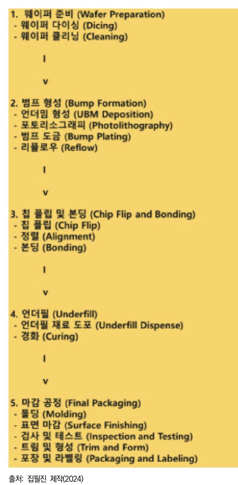

[그림 1-16]은 반도체용 플립 칩 패키지 공정의 전체 흐름을 시각적으로 나타낸 공정 흐름도이다. 각 단계는 주요 작업과 사용되는 장비를 포함하여 설명된다.

- (나) 단계별 상세 설명: 각 공정 단계의 주요 활동과 사용되는 장비, 재료를 상세히 기술한다.
  - 1) 웨이퍼 준비(wafer preparation)
    - 가) 웨이퍼 다이싱(dicing): 웨이퍼를 개별 다이로 절단한다.
    - 나) 웨이퍼 클리닝(cleaning): 다이싱 후 남은 오염 물질을 제거한다.
  - 2) 범프 형성(bump formation)
    - 가) 언더밈 형성(UBM deposition): 칩의 접합 패드에 금속층을 형성한다.
    - 나) 포토리소그래피(photolithography): 범프 형성을 위한 패턴을 만든다.
    - 다) 범프 도금(bump plating): 칩의 패드에 금속 범프를 도금한다.
    - 라) 리플로(reflow): 범프를 녹여 구 형태로 변형시킨다.
  - 3) 칩 플립 및 본딩(chip flip and bonding)
    - 가) 칩 플립(chip flip): 칩을 뒤집어 범프가 기판의 패드와 마주 보도록 위치시킨 다.
    - 나) 정렬(alignment): 칩과 기판의 접합 패드를 정밀하게 맞춘다.
    - 다) 본딩(bonding): 열과 압력을 가해 범프를 기판에 접합한다.
  - 4) 언더필(underfill)
    - 가) 언더필 재료 도포(underfill dispense): 칩과 기판 사이에 언더필 수지를 주입 한다.
    - 나) 경화(curing): 언더필 수지를 고온에서 경화시킨다.
  - 5) 마감 공정(final packaging)
    - 가) 몰딩(molding): 칩과 기판을 보호하기 위해 몰딩 컴파운드를 사용하여 캡슐화한 다.
    - 나) 표면 마감(surface finishing): 금속 도금과 레이저 마킹을 통해 표면을 처리한 다.
    - 다) 검사 및 테스트(inspection and testing): 전기적 특성과 기계적 강도를 검사 한다.
    - 라) 트림 및 형성(trim and form): 불필요한 몰딩 재료를 제거하고, 패키지의 리드 프레임을 형성한다.
    - 마) 포장 및 라벨링(packaging and labeling): ESD(정전기 방지) 포장재로 포장하 고, 라벨을 부착하여 출하 준비를 한다.

이 공정 흐름도를 통해 플립 칩 패키지의 전체 공정을 명확히 이해하고, 각 단계의 세부 사항을 파악하여 최종 제품의 생산성을 높일 수 있다. 각 단계의 정밀한 관리 와 품질 검사를 통해 고품질의 반도체 제품을 제조할 수 있다.

2. 재료 및 장비를 선정한다.

(1) 재료 특성 분석 및 장비 파악한다.

플립 칩 패키지에 사용되는 반도체 칩, 범프 재료, 언더필 재료, 몰딩 컴파운드 등의 특 성을 분석과 각 공정 단계에 필요한 장비의 사양과 기능을 파악한다.

최종 제품의 생산에 필요한 플립 칩 공정을 파악하기 위해서는 각 단계에 필요한 재료 와 장비를 정확히 선정해야 한다. 아래는 플립 칩 패키지 공정의 주요 단계별로 필요한 재료와 장비를 정리한 것이다.

(가) 웨이퍼를 준비한다.

1) 재료

가) 웨이퍼(실리콘 다이)

나) 클리닝 솔루션(예: DI 워터, 화학 세정제)

2) 장비

- 가) 다이싱 소(die saw): 웨이퍼를 개별 다이로 절단
- 나) 클리닝 시스템: 초음파 세척기, 화학 세정 장비

(나) 범프를 형성한다.

1) 재료

가) 언더밈 재료(크로뮴, 니켈, 구리 등)

나) 포토레지스트

다) 도금용 금속(납-주석, 은-주석, 금 등)

2) 장비

- 가) 스퍼터링 시스템: UBM 형성을 위한 금속 증착
- 나) 포토리소그래피 장비: 포토레지스트 도포 및 패터닝

다) 전기 도금 시스템: 범프 형성을 위한 도금

라) 리플로 오븐: 범프 리플로를 위한 열처리

(다) 칩 플립 및 본딩을 수행한다.

1) 재료

가) 칩 플립용 접착제(필요한 경우)

2) 장비

가) 칩 플립 장비: 칩을 뒤집어 기판에 정렬

나) 본딩 장비: 칩과 기판을 접합하는 열 압착 장비

다) 정밀 정렬 시스템: 칩과 기판의 정밀 정렬

(라) 언더필(underfill) 고정을 수행한다.

1) 재료

가) 언더필 수지(에폭시 기반 재료)

2) 장비

가) 언더필 디스펜서: 언더필 수지를 주입하는 장비

- 나) 경화 오븐: 언더필 수지를 경화시키기 위한 고온 오븐
- (마) 마감 공정(final packaging)을 진행한다.
  - 1) 재료
    - 가) 몰딩 컴파운드(에폭시 기반 재료)
    - 나) 도금용 금속(필요시 금, 은 등)
  - 2) 장비
    - 가) 몰딩 프레스: 몰딩 컴파운드를 사용하여 칩과 기판을 캡슐화
    - 나) 표면 도금 시스템: 표면 마감을 위한 도금 장비
    - 다) 레이저 마킹 시스템: 제품 식별을 위한 레이저 마킹 장비
    - 라) 검사 장비: 전기적 테스트 장비(ATE), X-ray 검사 장비, 초음파 검사 장비
    - 마) 트림 및 형성 장비: 리드 프레임 트림 및 형성 장비
    - 바) 포장 장비: ESD 포장재, 라벨 프린터
- (바) 장비 사양을 파악한다.
- (2) 장비 및 재료 선정 예시
  - (가) 다이싱 소
    - 1) 모델: DISCO DAD3350
    - 2) 기능: 웨이퍼를 고속으로 정밀하게 절단
  - (나) 스퍼터링 시스템
    - 1) 모델: AJA International ATC-2000
    - 2) 기능: UBM 형성을 위한 금속 증착
  - (다) 포토리소그래피 장비
    - 1) 모델: Canon FPA-3000i5+
    - 2) 기능: 포토레지스트 도포 및 패터닝
  - (라) 전기 도금 시스템
    - 1) 모델: Technic Elevate® Cu
    - 2) 기능: 구리 범프 도금을 위한 전기 도금
  - (마) 리플로 오븐
    - 1) 모델: Heller 1809 MKIII
    - 2) 기능: 범프 리플로를 위한 열처리
  - (바) 언더필 디스펜서
    - 1) 모델: Nordson ASYMTEK Spectrum S-820

2) 기능: 언더필 수지 주입

(사) 경화 오븐

1) 모델: Blue M Industrial Oven

- 2) 기능: 언더필 수지 경화
- (아) 몰딩 프레스
  - 1) 모델: Towa FFT-1030W
  - 2) 기능: 몰딩 컴파운드를 사용하여 캡슐화
- (자) 검사 장비
  - 1) 모델: Teradyne UltraFlex
  - 2) 기능: 전기적 테스트

단계별로 필요한 재료와 장비를 정확히 선정함으로써 플립 칩 패키지 공정의 효율성과 품 질을 높일 수 있다. 재료와 장비의 적절한 선택은 공정의 성공을 좌우하는 중요한 요소이 다. 공정 최적화와 품질 관리에 대한 지속적인 모니터링을 통해 고품질의 반도체 제품을 생 산할 수 있다.

- 3. 공정 조건을 최적화한다.
  - (1) 공정 변수를 설정한다.

온도, 압력, 시간 등의 공정 변수를 설정하고, 최적의 조건을 도출한다.

최종 제품의 생산에 필요한 플립 칩 공정의 공정 조건 최적화는 제품의 품질, 신뢰성, 생산 효율성 등을 향상하기 위해 필수적이다. 각 공정 단계별로 최적화해야 할 주요 조 건들을 아래에 자세히 설명한다.

- (가) 웨이퍼를 준비한다.
  - 1) 다이싱(dicing)
    - 가) 블레이드 속도 및 압력: 최적의 블레이드 속도와 압력을 설정하여 칩 손상을 최 소화하고 깨끗한 절단면을 확보한다.
    - 나) 냉각수 유량: 적절한 냉각수 유량을 유지하여 절단 중 발생하는 열을 효과적으 로 제거한다.
    - 다) 클리닝: 다이싱 후 잔여물을 완벽히 제거하기 위해 초음파 세척과 화학 세정을 최적화한다.
- (나) 범프를 형성한다.
  - 1) 언더밈 형성(UBM deposition)
    - 가) 증착 속도: 균일한 두께와 적절한 접착력을 위해 최적의 증착 속도를 설정한다.
    - 나) 증착 온도: 재료의 물리적 특성을 유지하면서 증착이 잘 이루어지도록 온도를 조절한다.

- 2) 포토리소그래피(photolithography)
  - 가) 포토레지스트 도포 두께: 균일한 레지스트 층을 위해 최적의 도포 두께를 설정 한다.
  - 나) 노광 시간 및 강도: 패턴의 정확성을 위해 적절한 노광 시간과 강도를 설정한 다.
  - 다) 현상 조건: 현상액의 농도와 현상 시간을 최적화하여 정확한 패턴을 형성한다.
- 3) 범프 도금 공정을 진행한다.
  - 가) 도금 전류 및 시간: 균일한 도금을 위해 최적의 전류와 시간을 설정한다.
  - 나) 도금 용액 농도: 도금 용액의 농도를 조절하여 범프의 크기와 형상을 일정하게 유지한다.
- 4) 리플로(reflow) 공정을 진행한다.
  - 가) 리플로 프로파일: 온도 상승 속도, 최고 온도, 냉각 속도를 최적화하여 범프가 균일하게 형성되도록 한다.
  - 나) 질소 분위기: 산화를 방지하기 위해 질소 분위기에서 리플로를 수행한다.
- (다) 칩 플립 및 본딩을 진행한다.
  - 1) 칩 플립(chip flip)
    - 가) 정렬 정밀도: 칩과 기판의 정확한 정렬을 위해 고정밀 장비를 사용한다.
  - 2) 본딩(bonding)
    - 가) 압력 및 온도: 최적의 본딩 압력과 온도를 설정하여 접합 강도와 전기적 특성을 확보한다.
    - 나) 본딩 시간: 접합이 완전히 이루어질 수 있도록 충분한 시간을 설정한다.
- (라) 언더필(underfill) 공정을 진행한다.
  - 1) 언더필 재료 도포(underfill dispense)
    - 가) 도포 속도 및 압력: 균일한 도포를 위해 최적의 속도와 압력을 설정한다.
    - 나) 재료 점도: 언더필 재료의 점도를 조절하여 모세관 현상이 잘 일어나도록 한다.
  - 2) 경화(curing)
    - 가) 경화 온도 및 시간: 언더필 재료가 완전히 경화될 수 있도록 최적 온도와 시간 을 설정한다.
    - 나) 프리 베이크: 기포 발생을 방지하기 위해 초기 경화 단계를 최적화한다.
- (마) 마감 공정(final packaging)을 진행한다.
  - 1) 몰딩(molding)
    - 가) 몰딩 압력 및 온도: 몰딩 컴파운드가 균일하게 분포되도록 최적의 압력과 온도 를 설정한다.
    - 나) 경화 시간: 몰딩 컴파운드가 완전히 경화될 수 있도록 충분한 경화 시간을 설정

한다.

- 2) 표면 마감(surface finishing)
  - 가) 도금 두께: 최적의 도금 두께를 설정하여 전기적 접촉성을 향상한다.
  - 나) 레이저 마킹 강도 및 시간: 제품 식별이 명확히 이루어지도록 최적의 마킹 강도 와 시간을 설정한다.
- (2) 실험 및 검증: 다양한 조건에서 실험을 수행하여 최적의 공정 조건을 검증한다.
  - (가) 최적화 방법
    - 1) 실험 계획법(DOE: design of experiments)
      - 가) 변수 선정: 각 공정 단계에서 중요한 변수를 선정한다.
      - 나) 실험 설계: 변수 간의 상호 작용을 이해하기 위해 실험 계획을 설계한다.
      - 다) 데이터 분석: 실험 결과를 분석하여 최적의 공정 조건을 도출한다.
    - 2) 통계적 공정 제어(SPC: statistical process control)
      - 가) 모니터링: 공정 변수를 실시간으로 모니터링하여 이상 상황을 조기에 감지한다.
      - 나) 공정 능력 분석: 공정의 변동성을 분석하여 개선 영역을 식별한다.
    - 3) 지속적 개선(continuous improvement)
      - 가) 피드백 루프: 공정 데이터를 지속해서 분석하고, 개선 사항을 공정에 반영한다.
      - 나) 팀 협업: 공정 엔지니어, 품질 관리팀, 생산팀 간의 협업을 통해 문제를 해결한 다.

이와 같은 공정 조건 최적화 내용을 통해 플립 칩 패키지 공정의 효율성과 품질을 극대화 할 수 있다. 각 단계에서의 정밀한 제어와 모니터링을 통해 고품질의 반도체 제품을 생산할 수 있다.

4. 품질 관리를 한다.

최종 제품의 생산에 필요한 플립 칩 공정 파악을 위해서는 철저한 품질 관리가 필수적이다. 품질 관리는 제품의 신뢰성을 보장하고, 불량률을 최소화하며, 고객 만족을 높이는 데 중요 한 역할을 한다. 플립 칩 공정의 각 단계에서 필요한 품질 관리 내용을 아래에 정리했다.

(1) 품질 기준 설정: 각 공정 단계에서 필요한 품질 기준과 허용 오차를 설정한다.

(가) 품질 관리 방법

- 1) 통계적 공정 제어(SPC: statistical process control)
  - 가) 공정 변동 모니터링: 공정 데이터를 실시간으로 모니터링하여 이상 변동을 조기 에 감지한다.
  - 나) 제어 차트 사용: 공정 제어 차트를 사용하여 공정 상태를 시각적으로 확인한다.
- 2) 품질 보증(QA: quality assurance)
  - 가) 표준 작업 절차(SOP) 작성: 모든 공정 단계에 대해 표준 작업 절차를 작성하고 준수한다.

- 나) 정기적 품질 감사: 내부 및 외부 품질 감사를 통해 품질 관리 시스템의 적절성 을 평가한다.
- 3) 품질 개선(quality improvement)
  - 가) 문제 해결팀 구성: 품질 문제 발생 시 문제 해결팀을 구성하여 원인을 분석하고 해결책을 도출한다.
  - 나) 지속적 개선 활동 지속해서 공정 데이터를 분석하고 개선 활동을 통해 품질을 향상한다.
- (2) 검사 방법 정의: 품질 검사를 위한 방법과 장비를 정의하고, 표준 작업 절차(SOP)를 작성한 다.
  - (가) 웨이퍼 준비(wafer preparation)
    - 1) 다이싱(dicing)
      - 가) 다이 크랙 검사: 절단된 칩에 크랙이나 손상이 없는지 검사한다.
      - 나) 세정 후 잔여물 검사: 클리닝 후 잔여물이 남아 있는지 확인한다.
  - (나) 범프 형성(bump formation)
    - 1) 언더밈 형성(UBM deposition)
      - 가) 두께 균일성 검사: 증착된 UBM 층의 두께가 균일한지 확인한다.
      - 나) 접착 강도 테스트: UBM과 칩 패드 간의 접착 강도를 테스트한다.
    - 2) 포토리소그래피(photolithography)
      - 가) 패턴 정확성 검사: 현미경을 사용하여 패턴이 정확하게 형성되었는지 검사한다.
      - 나) 포토레지스트 잔여물 검사: 포토레지스트 제거 후 잔여물이 없는지 확인한다.
    - 3) 범프 도금(bump plating)
      - 가) 도금 두께 검사: 범프의 두께가 균일한지 확인한다.
      - 나) 도금 품질 검사: 도금된 범프의 표면 상태를 검사하여 불량 여부를 확인한다.
    - 4) 리플로(reflow)
      - 가) 범프 형상 검사: 리플로 후 범프의 형상이 올바르게 변형되었는지 확인한다.
      - 나) 연결 강도 테스트: 범프와 칩 패드 간의 연결 강도를 테스트한다.
  - (다) 칩 플립 및 본딩(chip flip and bonding)
    - 1) 칩 플립(chip flip)
      - 가) 정렬 정확도 검사: 칩과 기판의 정렬이 정확하게 되었는지 확인한다.
    - 2) 본딩(bonding)
      - 가) 본딩 강도 테스트: 칩과 기판 간의 접합 강도를 테스트한다.
      - 나) 전기적 연결 검사: 본딩 후 전기적 연결 상태를 테스트하여 접속이 제대로 이루 어졌는지 확인한다.
  - (라) 언더필(underfill)

- 1) 언더필 재료 도포(underfill dispense)
  - 가) 언더필 충진 검사: 언더필 재료가 균일하게 충진되었는지 확인한다.
  - 나) 기포 검사: 언더필 공정 중 기포가 발생하지 않았는지 검사한다.
- 2) 경화(curing)
  - 가) 경화 상태 검사: 언더필 재료가 완전히 경화되었는지 확인한다.
  - 나) 접착 강도 테스트: 경화된 언더필의 접착 강도를 테스트한다.
- (마) 마감 공정(final packaging)
  - 1) 몰딩(molding)
    - 가) 몰딩 균일성 검사: 몰딩 컴파운드가 균일하게 분포되었는지 확인한다.
    - 나) 기계적 강도 테스트: 몰딩 후 패키지의 기계적 강도를 테스트한다.
  - 2) 표면 마감(surface finishing)
    - 가) 도금 두께 검사: 표면 도금의 두께가 균일한지 확인한다.
    - 나) 레이저 마킹 검사: 마킹이 정확하게 이루어졌는지 확인한다.
  - 3) 검사 및 테스트(inspection and testing)
    - 가) 전기적 검사: ATE(automated test equipment)를 사용하여 전기적 특성을 테스트한다.
    - 나) 비파괴 검사: X-ray, 초음파 등을 사용하여 내부 결함을 검사한다.
    - 다) 환경 테스트: 열 충격, 습도, 온도 사이클 테스트 등을 통해 환경 내구성을 평 가한다.
  - 4) 트림 및 형성(trim and form)
    - 가) 트림 정확성 검사: 트림 후 패키지의 형상이 정확한지 확인한다.
    - 나) 형성 강도 테스트: 리드 프레임의 형성 강도를 테스트한다.
  - 5) 포장 및 라벨링(packaging and labeling)
    - 가) 포장 상태 검사: 포장이 정확하게 이루어졌는지 확인한다.
    - 나) 라벨 정확성 검사: 라벨에 표시된 정보가 정확한지 확인한다.

이와 같은 철저한 품질 관리 내용을 통해 플립 칩 패키지 공정의 모든 단계에서 품질을 보 장하고, 최종 제품의 신뢰성을 높일 수 있다. 단계별로 세부적인 검사와 테스트를 수행함으 로써 불량률을 최소화하고, 고품질의 반도체 제품을 생산할 수 있다.

5. 안전 및 환경 관리 규정을 준수한다.

최종 제품의 생산에 필요한 플립 칩 공정을 파악하기 위해서는 안전 및 환경 관리가 중요 하다. 이 2가지 요소는 작업자의 건강과 안전을 보호하고, 환경에 미치는 영향을 최소화하 며, 법적 규제를 준수하는 데 필수적이다. 다음은 각 공정 단계별로 필요한 안전 및 환경 관리 내용을 정리한 것이다.

(1) 안전 지침 작성: 작업자의 안전을 보장하기 위한 안전 지침을 작성하고, 필요한 보호 장비를

지정한다.

- (2) 환경 보호 계획 수립: 폐기물 처리 및 배출 가스 관리 계획을 수립하여 환경 규제를 준수한 다.
- (3) 공정 단계별 안전 및 환경 관리
  - (가) 웨이퍼 준비(wafer preparation)
    - 1) 안전 관리
      - 가) 다이싱 소 사용 안전: 다이싱 소 작업 시 보호안경, 장갑 등 개인 보호 장비 (PPE)를 착용한다.
      - 나) 클리닝 화학 물질 취급: 세정 용액을 취급할 때는 화학 방지 장갑과 안면 보호 구를 사용한다. 작업 공간은 충분히 환기시킨다.
    - 2) 환경 관리
      - 가) 화학 물질 폐기: 사용된 세정 화학 물질은 적절한 절차를 따라 폐기한다. 환경 보호 규정을 준수한다.
      - 나) 에너지 사용: 다이싱 장비와 클리닝 시스템의 에너지 사용을 효율적으로 관리한 다.
  - (나) 범프 형성(bump formation)
    - 1) 안전 관리
      - 가) 스퍼터링 및 도금 작업: 고온 및 고압 작업이 포함되므로 적절한 보호 장비를 착용한다. 방폭 장비를 사용하여 폭발 위험을 최소화한다.
      - 나) 포토레지스트 취급: 포토레지스트는 인화성 물질이므로 화재 위험을 방지하기 위해 방폭 지역에서 작업한다.
    - 2) 환경 관리
      - 가) 폐기물 관리: 포토레지스트와 도금 용액 폐기물을 적절히 처리한다. 유해 화학 물질이 환경에 유출되지 않도록 한다.
      - 나) 배기 시스템: 스퍼터링 및 도금 과정에서 발생하는 유해 가스를 배출할 수 있는 효율적인 배기 시스템을 운영한다.
  - (다) 칩 플립 및 본딩(chip flip and bonding)
    - 1) 안전 관리
      - 가) 본딩 작업 안전: 고온 및 고압 본딩 작업 시 보호 장비를 착용한다. 작업자의 화상 및 기계적 손상을 방지한다.
      - 나) 장비 안전 점검: 정기적으로 장비를 점검하고 유지 보수하여 안전한 작업 환경 을 유지한다.
    - 2) 환경 관리
      - 가) 에너지 효율성: 본딩 장비의 에너지 효율성을 높여 전력 소비를 줄인다.

- 나) 열 방출 관리: 본딩 과정에서 발생하는 열을 효율적으로 방출하고, 냉각 시스템 을 적절히 운영한다.
- (라) 언더필(underfill)
  - 1) 안전 관리
    - 가) 언더필 재료 취급: 언더필 재료는 화학적 반응을 일으킬 수 있으므로 보호 장갑 과 안면 보호구를 사용한다.
    - 나) 경화 오븐 사용: 고온 오븐 사용 시 화상 위험을 방지하기 위해 보호 장비를 착용한다.
  - 2) 환경 관리
    - 가) 화학 물질 관리: 언더필 재료와 그 부산물을 적절히 관리하고 폐기한다.
    - 나) 에너지 관리: 경화 오븐의 에너지 사용을 효율적으로 관리하여 에너지 소비를 줄인다.
- (마) 마감 공정(final packaging)
  - 1) 안전 관리
    - 가) 몰딩 작업: 몰딩 작업 시 보호 장갑, 보호안경을 착용하여 화학적 위험을 방지 한다.
    - 나) 트림 및 형성 작업: 기계적 작업 중 발생할 수 있는 손상을 방지하기 위해 안 전 장비를 착용한다.
  - 2) 환경 관리
    - 가) 폐기물 관리: 몰딩 컴파운드와 도금 용액의 폐기물을 적절히 처리한다.
    - 나) 자원 효율성: 몰딩 및 표면 처리 과정에서 자원 사용을 최적화하여 낭비를 줄인 다.
- (4) 종합 안전 및 환경 관리 전략을 수립한다.
  - (가) 안전 관리
    - 1) 교육 및 훈련: 작업자들에게 정기적인 안전 교육과 훈련을 실시하여 안전 절차를 준 수하도록 한다.
    - 2) 개인 보호 장비(PPE): 작업 환경에 맞는 개인 보호 장비를 지급하고, 올바르게 착용 하도록 지도한다.
    - 3) 응급 대처 계획: 응급 상황 발생 시 신속하게 대응할 수 있는 응급 대처 계획을 마 련하고, 정기적으로 모의 훈련을 시행한다.
  - (나) 환경 관리
    - 1) 폐기물 관리 시스템: 유해 폐기물과 일반 폐기물을 분리하고, 적절한 처리 절차를 마련한다.
    - 2) 에너지 관리: 공정에서 사용되는 에너지를 효율적으로 관리하여 에너지 소비를 최소

화한다.

- 3) 환경 규제 준수: 로컬 및 국제 환경 규제를 준수하고, 규제 변경 사항을 지속해서 모니터링한다.
- 이와 같은 안전 및 환경 관리 내용을 철저히 준수함으로써 플립 칩 패키지 공정의 모든 단 계에서 작업자 안전을 보장하고, 환경에 미치는 영향을 최소화할 수 있다. 단계별로 세부적 인 관리와 감독을 통해 최종 제품의 품질과 신뢰성을 높일 수 있다.
- 6. 비용을 분석한다.
  - (1) 재료 비용 계산: 사용되는 모든 재료의 비용을 계산하고, 최적의 재료를 선택한다.
  - (2) 공정 비용 평가: 각 공정 단계의 비용을 평가하고, 비용 절감을 위한 방안을 모색한다.
  - (3) 주요 단계별 비용 분석

최종 제품의 생산에 필요한 플립 칩 공정 파악을 위해 비용 분석은 매우 중요하다. 비 용 분석을 통해 각 공정 단계에서 발생하는 비용을 명확히 이해하고, 비용 절감 방안을 모색할 수 있다. 다음은 플립 칩 공정의 주요 단계별로 필요한 비용 분석 내용을 정리 한 것이다.

(가) 웨이퍼 준비(wafer preparation)

1) 비용 항목

가) 웨이퍼 비용: 웨이퍼 자체의 비용(예: 실리콘 웨이퍼의 구매 비용)

나) 장비 비용: 스퍼터링 시스템, 포토리소그래피 장비, 전기 도금 시스템 등의 구

다) 리플로 비용: 리플로 오븐 사용 비용(전력 소모 및 유지 보수 비용)

가) 칩 플립 장비 비용: 칩 플립 및 정렬 장비의 구매 및 유지 보수 비용

나) 본딩 장비 비용: 본딩 장비의 구매, 유지 보수 및 에너지 소비 비용

- 나) 다이싱 비용: 웨이퍼를 개별 다이로 절단하는 데 소요되는 비용
- 다) 클리닝 비용: 클리닝 솔루션 및 클리닝 장비 사용 비용

가) 재료 비용: 언더밈 재료, 포토레지스트, 도금용 금속 등

- (나) 범프 형성(bump formation)

  - - 1) 비용 항목

매 및 유지 보수 비용

(다) 칩 플립 및 본딩(chip flip and bonding)

37

나) 디스펜서 비용: 언더필 디스펜서 장비의 구매 및 유지 보수 비용

- 가) 언더필 재료 비용: 언더필 수지의 구매 비용
- 1) 비용 항목
- (라) 언더필(underfill)

1) 비용 항목

1) 재활용: 공정에서 발생하는 폐기물을 재활용하여 재료비를 절감한다.

(다) 재료 및 에너지 효율성

2) 장비 공동 구매: 여러 공장에서 동일한 장비를 공동 구매하여 할인 혜택을 받는다.

1) 재료 대량 구매: 재료를 대량 구매하여 단가를 낮추고, 재고 관리 비용을 절감한다.

(나) 대량 구매

한다. 2) 최적화된 공정 조건: 공정 조건을 최적화하여 재료 사용량과 에너지 소비를 줄인다.

1) 자동화 도입: 자동화 장비와 시스템을 도입하여 생산 효율을 높이고, 인건비를 절감

(가) 공정 효율화

(5) 비용 절감 방안

3) 최종 총비용: 총 직접 비용과 총 간접 비용을 합산하여 최종 총비용을 산출한다.

2) 총 간접 비용: 관리비, 기타 운영비 등을 합산하여 총 간접 비용을 계산한다.

다.

(다) 총비용(total cost) 1) 총 직접 비용: 재료비, 인건비, 장비 운영비 등을 합산하여 총 직접 비용을 계산한

2) 기타 운영비: 공장 운영에 필요한 공공 요금, 임대료 등 간접 비용을 산출한다.

1) 관리비: 품질 관리, 생산 관리, 공정 관리에 필요한 비용을 포함한다.

(나) 간접 비용(indirect costs)

3) 장비 운영비: 장비의 전력 소모, 유지 보수 비용 등을 포함한다.

2) 인건비: 각 공정 단계에 투입되는 인력의 인건비를 산출한다.

1) 재료비: 각 단계에서 사용되는 모든 재료의 비용을 합산한다.

(가) 직접 비용(direct costs)

(4) 총비용 분석 방법

바) 포장 비용: 포장재 및 라벨링 비용

마) 트림 및 형성 비용: 트림 및 형성 장비의 구매 및 운영 비용

라) 검사 및 테스트 비용: 전기적 테스트 장비, 비파괴 검사 장비의 구매 및 운영 비용

다) 표면 마감 비용: 표면 도금 및 레이저 마킹 장비의 구매 및 운영 비용

나) 몰딩 장비 비용: 몰딩 프레스의 구매 및 유지 보수 비용

가) 몰딩 재료 비용: 몰딩 컴파운드의 구매 비용

1) 비용 항목

(마) 마감 공정(final packaging)

다) 경화 오븐 비용: 경화 오븐 사용 비용(전력 소모 및 유지 보수 비용)

38

2) 에너지 절약: 고효율 장비를 사용하고, 에너지 절약 정책을 시행하여 전력 소비를 줄인다.

이와 같은 비용 분석 내용을 통해 플립 칩 패키지 공정의 각 단계에서 발생하는 비용을 명 확히 이해하고, 최적화된 비용 관리를 통해 생산성을 향상할 수 있다. 비용 절감 방안을 지 속해서 모색함으로써 경쟁력을 높이고, 고품질의 반도체 제품을 경제적으로 생산할 수 있 다.

- 7. 공정 모니터링 및 개선을 지속해서 수행한다.
  - (1) 실시간 모니터링 시스템 도입: 공정의 주요 변수를 실시간으로 모니터링할 수 있는 시스템을 도입한다.
  - (2) 데이터 분석 및 피드백: 공정 데이터를 분석하여 개선점을 도출하고, 이를 바탕으로 공정을 지속해서 개선한다.
  - (3) 단계별 공정 모니터링 및 개선

최종 제품의 생산에 필요한 플립 칩 공정의 효과적인 모니터링 및 개선은 품질과 효율 성을 유지하기 위해 필수적이다. 각 공정 단계에서 데이터를 수집하고 분석하여 공정을 지속해서 개선하는 것이 중요하다. 다음은 플립 칩 공정의 주요 단계별로 필요한 공정 모니터링 및 개선 내용을 정리한 것이다.

- (가) 웨이퍼 준비(wafer preparation)
  - 1) 모니터링 내용
    - 가) 다이싱 정확도: 웨이퍼 다이싱 공정에서 절단의 정확도와 일관성을 모니터링한 다.
    - 나) 클리닝 효과: 클리닝 후 잔여물과 오염 상태를 확인한다.
  - 2) 개선 내용
    - 가) 정밀 다이싱 장비 도입: 정밀한 절단을 위해 최신 다이싱 장비를 도입한다.
    - 나) 클리닝 프로세스 최적화: 클리닝 절차와 화학 물질을 최적화하여 잔여물을 최소 화한다.
- (나) 범프 형성(bump formation)
  - 1) 모니터링 내용
    - 가) UBM 증착 두께: 증착된 언더밈의 두께를 실시간으로 모니터링한다.
    - 나) 포토레지스트 패턴 품질: 포토레지스트 패턴의 정확성과 균일성을 검사한다.
    - 다) 도금 범프 크기: 도금된 범프의 크기와 형상을 주기적으로 확인한다.
    - 라) 리플로 범프 형상: 리플로 후 범프의 형상과 접합 품질을 검사한다.
  - 2) 개선 내용
    - 가) 증착 공정 자동화: 증착 공정을 자동화하여 두께의 균일성을 높인다.
    - 나) 포토레지스트 공정 개선: 포토레지스트 도포와 노광 조건을 최적화한다.

(가) 실시간 데이터 수집 및 분석

(4) 공정 모니터링 및 개선 도구

- 다) 검사 장비 업그레이드: 최신 검사 장비를 도입하여 검사 정확도를 높인다.
- 나) 표면 처리 개선: 도금 조건을 최적화하여 표면 처리 품질을 향상한다.
- 가) 몰딩 공정 자동화: 몰딩 공정을 자동화하여 균일한 품질을 유지한다.
- 2) 개선 내용
- 라) 전기적 및 비파괴 검사: 전기적 특성 및 내부 결함을 주기적으로 검사한다.
- 다) 레이저 마킹 품질: 마킹 품질을 주기적으로 확인한다.
- 나) 표면 도금 두께: 표면 도금의 두께를 주기적으로 검사한다.
- 가) 몰딩 균일성: 몰딩 컴파운드가 균일하게 분포되었는지 확인한다.
- 1) 모니터링 내용
- (마) 마감 공정(final packaging)

최소화한다.

- 충진을 보장한다. 나) 프리 베이크 단계 추가: 경화 전에 프리 베이크 단계를 추가하여 기포 발생을
- 2) 개선 내용 가) 언더필 디스펜싱 시스템 개선: 디스펜싱 시스템의 정확도를 높여 균일한 재료
- 다) 경화 상태: 언더필 경화 상태를 실시간으로 확인한다.

나) 본딩 강도: 본딩 후 접합 강도를 테스트한다.

- 나) 기포 발생 여부: 언더필 공정 중 기포 발생을 모니터링한다.
- 지 확인한다.
- 가) 언더필 재료 충진 상태: 언더필 재료가 칩과 기판 사이에 균일하게 충진되었는

가) 고정밀 정렬 장비 사용: 정렬 장비의 정확성을 높여 정렬 오차를 최소화한다.

나) 본딩 공정 최적화: 본딩 압력, 온도, 시간 조건을 최적화하여 접합 강도를 향상

- 1) 모니터링 내용

2) 개선 내용

- (라) 언더필(underfill)

1) 모니터링 내용

한다.

개선한다. (다) 칩 플립 및 본딩(chip flip and bonding)

가) 칩 정렬 정확도: 칩과 기판의 정렬 정확도를 실시간으로 모니터링한다.

다) 전기적 연결 상태: 전기적 테스트를 통해 접합 상태를 확인한다.

다) 리플로 프로파일 조정: 리플로 온도와 시간 프로파일을 최적화하여 범프 형상을

- 1) MES(manufacturing execution system): 공정 데이터를 실시간으로 수집하고 분 석하여 공정 상태를 모니터링한다.
- 2) SPC(statistical process control): 통계적 공정 제어 도구를 사용하여 공정 변동성 을 모니터링하고 이상 상황을 조기에 감지한다.
- (나) 지속적 개선 활동
  - 1) PDCA 사이클(plan-do-check-act): 지속적인 개선 활동을 위한 PDCA 사이클을 적용한다.
  - 2) FMEA(failure mode and effects analysis): 잠재적인 결함 모드를 식별하고, 이 를 예방하는 조치를 설계한다.
  - 3) Kaizen 활동 작업 현장에서의 지속적인 개선 활동을 통해 효율성과 품질을 향상한 다.
- (다) 교육 및 훈련
  - 1) 정기 교육: 작업자들에게 공정 모니터링 및 개선에 관한 정기적인 교육을 시행한다.
  - 2) 훈련 프로그램: 새로운 장비와 기술에 대한 훈련 프로그램을 운영하여 작업자의 역 량을 강화한다.

이와 같은 공정 모니터링 및 개선 내용을 통해 플립 칩 패키지 공정의 효율성과 품질을 지 속해서 향상할 수 있다. 실시간 데이터 수집과 분석, 지속적인 개선 활동, 작업자 교육 등 을 통해 고품질의 반도체 제품을 경제적으로 생산할 수 있다.

숕 고객의 요구 사항에 의한 플립 칩 재료를 파악한다.

고객의 요구 사항에 따라 플립 칩 재료를 정확하게 파악하고 선정하는 과정은 최종 제품의 성 능과 신뢰성에 큰 영향을 끼친다. 다음은 고객의 요구 사항을 이해하고, 이를 바탕으로 플립 칩 재료를 파악하기 위해 수행해야 할 주요 내용이다.

이와 같은 절차를 통해 고객의 요구 사항을 정확히 분석하고, 이를 바탕으로 최적의 플립 칩 재료를 선정할 수 있다. 고객 요구 사항을 명확히 이해하고 관리함으로써 최종 제품의 성능과 신뢰성을 보장하고, 고객 만족을 극대화할 수 있다.

1. 고객 요구 사항을 분석한다.

고객의 요구 사항 분석은 플립 칩 재료를 선정하는 데 매우 중요한 단계이다. 고객의 요구 사항을 명확히 이해하고 이를 기반으로 재료를 선택해야 최종 제품이 고객의 기대를 충족 할 수 있다. 아래는 고객의 요구 사항을 분석하기 위한 단계별 수행 내용을 정리한 것이다. 이와 같은 절차를 통해 고객의 요구 사항을 정확히 분석하고, 이를 바탕으로 최적의 플립 칩 재료를 선정할 수 있다. 고객 요구 사항을 명확히 이해하고 관리함으로써 최종 제품의 성능과 신뢰성을 보장하고, 고객 만족을 극대화할 수 있다.

- (1) 요구 사항 수집
  - (가) 고객과의 초기 미팅

고객과의 미팅 및 인터뷰를 통해 제품의 성능, 특성, 사용 환경, 예상 수명 등을 포 함한 요구 사항을 상세히 수집한다.

1) 목적

고객의 기본 요구 사항을 이해하고 프로젝트의 전반적인 목표를 설정한다.

- 2) 활동
  - 가) 고객의 제품 사양 및 성능 목표 청취
  - 나) 사용 환경 및 조건에 대한 정보 수집
  - 다) 예산 및 일정에 대한 초기 논의
- (나) 심층 인터뷰 및 설문 조사
  - 1) 목적
  - 고객의 세부 요구 사항과 우선순위를 명확히 파악한다.
  - 2) 활동
    - 가) 제품 사용 시나리오에 대한 심층 인터뷰
    - 나) 설문 조사를 통해 다양한 요구 사항 수집
    - 다) 고객의 기대 성능, 내구성, 환경 조건 등에 대한 구체적인 정보 획득
- (다) 요구 사항 문서화
  - 1) 목적
  - 수집된 요구 사항을 체계적으로 정리하여 문서로 만든다.
  - 2) 활동
    - 가) 요구 사항 명세서 작성

    - 나) 기능적 요구 사항과 비기능적 요구 사항으로 구분
    - 다) 요구 사항 우선순위 설정
- (2) 기술 사양 정의
  - (가) 기능적 요구 사항
    - 1) 목적: 제품이 수행해야 하는 주요 기능과 성능 목표를 정의한다.

    - 2) 활동
- - 가) 전기적 성능: 전도성, 저항, 전류 용량 등

  - 나) 기계적 성능: 강도, 경도, 내구성 등
  - 다) 열적 성능: 열전도성, 내열성 등
  - (나) 비기능적 요구 사항
    - 1) 목적: 신뢰성, 내구성, 열 관리, 전력 소모 등 비기능적 요구 사항을 정의한다.
    - 2) 활동

- 1) 목적: 모든 요구 사항을 체계적으로 문서로 만들어 프로젝트팀과 공유한다.
- (가) 요구 사항 문서화
- (5) 문서화 및 보고
- 다) 요구 사항 충족 여부 검증
- 나) 각 요구 사항에 대한 테스트 케이스 작성 및 실행
- 가) 요구 사항 추적 매트릭스 작성
- 2) 활동
- 1) 목적: 요구 사항이 설계, 구현, 테스트 단계에서 어떻게 충족되는지 추적한다.
- (나) 추적성 관리
- 다) 변경 승인 및 문서화
- 나) 변경 사항에 대한 영향 분석
- 가) 요구 사항 변경 요청 접수 및 평가
- 2) 활동
- 1) 목적: 프로젝트 진행 중 발생하는 요구 사항 변경을 효과적으로 관리한다.
- (가) 변경 관리
- (4) 요구 사항 관리
- 다) 최종 요구 사항에 대한 고객의 공식 승인 획득
- 나) 고객 피드백 수집 및 요구 사항 수정
- 가) 요구 사항 명세서를 고객과 공유
- 2) 활동
- 1) 목적: 고객이 최종 요구 사항을 검토하고 승인한다.
- (나) 고객 검토 및 승인
- 다) 잠재적 문제점 및 해결 방안 논의
- 나) 재료 및 공정팀의 피드백 수집
- 가) 기술팀과의 검토 회의
- 2) 활동
- 1) 목적: 내부 팀이 요구 사항을 검토하고 실현 가능성을 평가한다.
- (가) 내부 검토
- (3) 요구 사항 검증 및 승인
- 다) 환경 조건: 사용 온도 범위, 습도, 부식 환경 등
- 나) 내구성: 물리적 충격, 진동 등에 대한 저항성
- 가) 신뢰성: 제품의 예상 수명, 고장률

- 가) 최종 요구 사항 명세서 작성
- 나) 기능 사양서 및 비기능 사양서 작성
- 다) 요구 사항 추적 매트릭스 작성
- (나) 정기 보고
  - 1) 목적: 요구 사항 분석 및 관리 현황을 정기적으로 보고한다.
  - 2) 활동
    - 가) 주간/월간 보고서 작성
    - 나) 고객과의 정기적인 요구 사항 검토 회의 개최
    - 다) 프로젝트 상태 및 요구 사항 충족 여부 보고
- 2. 재료 특성을 분석한다.

고객의 요구 사항에 따라 플립 칩 재료를 정확하게 파악하기 위해서는 다양한 재료 특성을 분석해야 한다. 이를 통해 최적의 재료를 선택하여 제품의 성능과 신뢰성을 보장할 수 있 다. 다음은 고객 요구 사항을 기반으로 한 재료 특성 분석의 주요 단계와 내용이다.

이와 같은 재료 특성 분석을 통해 고객의 요구 사항에 부합하는 최적의 플립 칩 재료를 선 정할 수 있다. 특성별로 철저히 분석하고 평가함으로써 최종 제품의 성능과 신뢰성을 보장 할 수 있다.

- (1) 전기적 특성을 분석한다,
  - (가) 전도성(conductivity)
    - 1) 목적: 재료의 전기 전도성을 평가하여 신호 전달 효율성을 확인한다.
    - 2) 활동
      - 가) 전기 전도도 측정: 전기 전도도(σ)를 측정하여 재료의 전기 전도성을 확인한다.
      - 나) 접촉 저항 테스트: 재료의 접촉 저항을 측정하여 신호 손실을 최소화한다.
  - (나) 저항(resistance)
    - 1) 목적: 재료의 저항 특성을 분석하여 열 발생 및 전력 손실을 최소화한다.
    - 2) 활동
      - 가) 저항 측정: 저항값(R)을 측정하여 재료의 저항 특성을 분석한다.
      - 나) 온도 의존성 테스트: 온도 변화에 따른 저항 변화를 측정하여 열 안정성을 평가 한다.
- (2) 기계적 특성을 분석한다,
  - (가) 강도 및 경도(strength and hardness)
    - 1) 목적: 재료의 기계적 강도와 경도를 분석하여 물리적 스트레스에 대한 저항성을 평 가한다.
    - 2) 활동

- 가) 인장 강도 테스트: 인장 강도(σ\_t)를 측정하여 재료의 견고성을 평가한다.
- 나) 경도 측정: 비커스 경도(HV) 또는 로크웰 경도(HR)를 측정하여 재료의 표면 경 도를 확인한다.
- (나) 열팽창 계수(CTE: coefficient of thermal expansion)
  - 1) 목적: 칩과 기판 사이의 열팽창 차이를 줄일 수 있는 재료를 선택한다.
  - 2) 활동
    - 가) CTE 측정: 열팽창 계수(α)를 측정하여 열 변형 특성을 평가한다.
    - 나) 열 충격 테스트: 급격한 온도 변화에 따른 재료의 변형을 테스트하여 내구성을 확인한다.
- (3) 열적 특성을 분석한다.
  - (가) 열전도성(thermal conductivity)
    - 1) 목적: 재료의 열전도성을 분석하여 효과적인 열 관리가 가능한 재료를 선정한다.
    - 2) 활동
      - 가) 열전도도 측정: 열전도도(k)를 측정하여 재료의 열전달 효율을 평가한다.
      - 나) 열저항 테스트: 재료의 열저항(R\_th)을 측정하여 열 방출 능력을 확인한다.
  - (나) 내열성(thermal stability)
    - 1) 목적: 높은 온도에서도 안정성을 유지할 수 있는 재료를 선택한다.
    - 2) 활동
      - 가) 열분해 테스트: 열분해 온도(T\_d)를 측정하여 재료의 내열성을 평가한다.
      - 나) 고온 노화 테스트: 고온에서 장시간 노출 후의 물리적 및 화학적 특성 변화를 분석한다.
- (4) 화학적 특성을 분석한다.
  - (가) 화학적 안정성(chemical stability)
    - 1) 목적: 재료가 사용 환경에서 화학적으로 안정한지 평가한다.
    - 2) 활동
      - 가) 화학적 반응 테스트: 특정 화학 물질에 대한 반응성을 테스트하여 재료의 안정 성을 평가한다.
      - 나) 장기 노출 테스트: 다양한 화학 물질에 장기간 노출 후의 특성 변화를 분석한 다.
  - (나) 부식 저항성(corrosion resistance)
    - 1) 목적: 부식에 강한 재료를 선택하여 제품의 수명을 연장한다.
    - 2) 활동
      - 가) 부식 테스트: 염수 분무 시험 또는 화학적 부식 테스트를 통해 부식 저항성을 평가한다.

45

- 나) 전기 화학적 분석: 전기 화학적 임피던스 분광법(EIS)을 사용하여 부식 저항성 을 분석한다.
- (5) 종합 분석 및 재료 선정을 한다.
  - (가) 데이터 통합 및 분석
    - 1) 목적: 특성별 테스트 결과를 통합하여 종합적으로 평가한다.
    - 2) 활동
      - 가) 데이터 통합: 모든 테스트 데이터를 통합하여 재료의 종합 성능을 평가한다.
      - 나) 멀티크리테리아 의사 결정(MCDM): 여러 기준을 고려하여 최적의 재료를 선정 한다.
  - (나) 최종 재료 선정
    - 1) 목적: 종합 분석 결과를 바탕으로 최적의 재료를 선정한다.
    - 2) 활동
      - 가) 평가 기준 설정: 고객 요구 사항과 기술적 요구 사항을 반영한 평가 기준을 설 정한다.
      - 나) 최종 재료 선정: 평가 기준에 따라 최적의 재료를 최종적으로 선정한다.
      - 다) 고객 승인: 최종 선정된 재료에 대해 고객의 승인을 받는다.
- 3. 재료 후보 선정 및 평가를 한다.

고객의 요구 사항을 만족하는 플립 칩 재료 후보를 선정하고 평가하기 위해서는 다음과 같 은 체계적인 접근이 필요하다. 이를 통해 고객의 요구 사항을 철저히 이해하고, 이를 기반 으로 최적의 재료를 선정할 수 있다.

- (1) 재료 후보 선정을 한다.
  - (가) 고객 요구 사항 분석 재확인
    - 1) 목적: 고객의 요구 사항을 명확히 이해하고 이를 재료 선정 기준으로 활용한다.
    - 2) 활동
      - 가) 기능적 요구 사항(전기적, 기계적, 열적 특성 등)
      - 나) 비기능적 요구 사항(신뢰성, 내구성, 환경 조건 등)
  - (나) 재료 후보 리스트 작성
    - 1) 목적: 고객 요구 사항을 충족할 수 있는 재료 후보 리스트를 작성한다.
    - 2) 활동
      - 가) 기존에 사용된 재료 및 성능 데이터 검토
      - 나) 최신 기술 동향과 신재료 조사
      - 다) 재료 데이터베이스 및 논문 검색

(2) 재료 특성 분석을 한다.

(가) 전기적 특성 평가

1) 전도성: 전기 전도도(σ), 접촉 저항 측정

2) 저항: 저항값(R), 온도 의존성 테스트

- (나) 기계적 특성 평가
  - 1) 강도 및 경도: 인장 강도(σ\_t), 비커스 경도(HV) 또는 로크웰 경도(HR)
  - 2) 열팽창 계수(CTE): 열팽창 계수(α), 열 충격 테스트
- (다) 열적 특성 평가
  - 1) 열전도성: 열전도도(k), 열저항(R\_th)
  - 2) 내열성: 열분해 온도(T\_d), 고온 노화 테스트
- (라) 화학적 특성 평가
  - 1) 화학적 안정성: 화학적 반응 테스트, 장기 노출 테스트
  - 2) 부식 저항성: 부식 테스트, 전기 화학적 임피던스 분광법(EIS)
- (3) 재료 후보 평가를 한다.
  - (가) 평가 기준 설정
    - 1) 목적: 평가 기준을 설정하여 재료 후보를 객관적으로 비교한다.
    - 2) 활동
      - 가) 특성별 가중치 설정(예: 전도성 30%, 내열성 25%, 기계적 강도 20% 등)
      - 나) 고객 요구 사항에 기반한 성능 목표 설정
  - (나) 성능 평가 및 비교
    - 1) 목적: 재료 후보를 테스트하여 성능 데이터를 수집하고 비교한다.
    - 2) 활동
      - 가) 각 재료 후보에 대한 실험 데이터 수집
      - 나) 멀티크리테리아 의사 결정(MCDM) 방법 적용하여 성능 비교

예시: AHP(analytic hierarchy process), TOPSIS(technique for order preference by similarity to ideal solution)

- (4) 최종 재료 선정 및 검증을 한다.
  - (가) 최종 재료 선정
    - 1) 목적: 종합 평가 결과를 바탕으로 최적의 재료를 선정한다.
    - 2) 활동
      - 가) 평가 결과를 바탕으로 재료 후보 간의 우선순위 설정
      - 나) 최적의 재료 후보를 최종적으로 선정
      - 다) 고객과의 검토 회의를 통해 최종 선정된 재료에 대한 동의 및 승인을 받음.
  - (나) 대량 생산 검증

- 1) 목적: 선정된 재료의 대량 생산 적합성을 검증한다.
- 2) 활동
  - 가) 파일럿 생산 실시
  - 나) 파일럿 생산에서의 문제점 파악 및 개선
  - 다) 대량 생산 공정 최적화
- (5) 문서화 및 보고를 한다.
  - (가) 기술 문서 작성
    - 1) 목적: 재료 특성 및 평가 결과를 문서로 만들어 내부 공유 및 고객 보고서로 활용한 다.
    - 2) 활동
      - 가) 재료 특성 보고서 작성
      - 나) 평가 결과 및 선정 근거 문서화
      - 다) 공정 최적화 및 파일럿 생산 결과 보고서 작성
  - (나) 고객 보고서 작성
    - 1) 목적: 고객에게 최종 재료 선정 결과를 보고한다.
    - 2) 활동
      - 가) 최종 보고서 작성 및 제출
      - 나) 고객 피드백 수집 및 추가 개선 사항 반영
- (6) 재료 후보 선정 및 평가 예시
  - 예시: 멀티크리테리아 의사 결정(MCDM) 방법 적용
  - (가) AHP(analytic hierarchy process) 적용 예시
    - 1) 계층 구조 설정: 평가 기준(전기적 특성, 기계적 특성, 열적 특성 등)을 계층 구조로 설정
    - 2) 쌍대 비교 행렬 작성: 각 평가 기준의 중요도를 쌍대 비교하여 행렬 작성
    - 3) 가중치 계산: 쌍대 비교 행렬을 통해 각 평가 기준의 가중치 계산
    - 4) 재료 평가: 각 재료 후보에 대해 평가 기준을 적용하여 점수 계산
    - 5) 종합 점수 산출: 가중치를 적용하여 재료 후보의 종합 점수 산출
  - (나) TOPSIS(technique for order preference by similarity to ideal solution) 적용 예 시
    - 1) 평가 기준 설정: 평가 기준(전기적 특성, 기계적 특성, 열적 특성 등)을 설정
- 4. 최종 재료 선정 및 검증을 한다.

고객의 요구 사항을 만족하는 최종 플립 칩 재료를 선정하고 검증하기 위해서는 체계적인 절차를 따르는 것이 중요하다. 이 절차는 재료 후보를 선정하고 평가한 결과를 바탕으로 최

적의 재료를 선택하고, 선택된 재료를 실제 환경에서 검증하는 과정을 포함한다.

(1) 최종 플립 칩 재료를 선정한다.

- (가) 평가 결과 분석
  - 1) 목적: 재료 후보 평가 결과를 종합적으로 분석하여 최적의 재료를 선정한다.
  - 2) 활동
    - 가) 각 재료 후보의 평가 결과를 비교
    - 나) 평가 기준별 가중치를 적용하여 종합 점수 계산
    - 다) 종합 점수가 가장 높은 재료 후보를 최종 선정
- (나) 고객 검토 및 승인
  - 1) 목적: 최종 선정된 재료를 고객과 함께 검토하고 승인을 받는다.
  - 2) 활동
    - 가) 평가 결과와 선정 이유를 고객에게 설명
    - 나) 고객 피드백을 반영하여 최종 선정된 재료에 대한 동의를 얻음.
- (2) 최종 재료에 대한 검증 작업을 진행한다.
  - (가) 파일럿 생산 및 테스트
    - 1) 목적: 파일럿 생산을 통해 최종 선정된 재료의 실제 성능을 검증한다.
    - 2) 활동
      - 가) 파일럿 생산 라인에서 최종 재료를 사용하여 소규모 생산
      - 나) 파일럿 생산된 제품에 대해 기능 테스트, 신뢰성 테스트, 환경 테스트 등 수행
      - 다) 테스트 결과를 분석하여 재료의 성능 검증
  - (나) 공정 최적화
    - 1) 목적: 파일럿 생산 결과를 바탕으로 대량 생산을 위한 공정을 최적화한다.
    - 2) 활동
      - 가) 파일럿 생산 중 발견된 문제점 해결
      - 나) 공정 조건(온도, 압력, 시간 등)을 최적화
      - 다) 대량 생산 공정의 효율성을 높이기 위한 개선 활동 수행
- (3) 문서화 및 보고를 진행한다.
  - (가) 기술 문서 작성
    - 1) 목적: 재료 특성, 평가 결과, 파일럿 생산 결과 등을 문서로 만들어 내부 공유 및 고객 보고서로 활용한다.
    - 2) 활동
      - 가) 최종 재료 특성 보고서 작성
      - 나) 파일럿 생산 및 테스트 결과 보고서 작성

다) 공정 최적화 결과 보고서 작성

(나) 고객 보고서 작성

- 1) 목적: 고객에게 최종 재료 선정 및 검증 결과를 보고한다.
- 2) 활동
  - 가) 최종 보고서 작성 및 제출
  - 나) 파일럿 생산 및 검증 결과 설명
  - 다) 고객 피드백 수집 및 추가 개선 사항 반영
- (4) 최종 검증 및 승인 절차를 진행한다.
  - (가) 최종 승인
    - 1) 목적: 최종 검증 결과를 바탕으로 고객의 최종 승인을 받는다.
    - 2) 활동
      - 가) 최종 검증 결과를 고객과 공유
      - 나) 고객의 최종 승인을 받음.
      - 다) 필요한 경우, 추가 테스트 및 개선 활동 수행
  - (나) 지속적 모니터링 및 개선
    - 1) 목적: 대량 생산 후에도 지속해서 품질을 모니터링하고 개선한다.
    - 2) 활동
      - 가) 생산 과정에서의 품질 모니터링 시스템 운영
      - 나) 고객 피드백을 바탕으로 지속적 개선 활동 수행
      - 다) 정기적인 성능 평가 및 품질 관리

이와 같은 체계적인 절차를 통해 고객의 요구 사항을 만족하는 최종 플립 칩 재료를 선정 하고 검증할 수 있다. 최종 재료의 성능을 실제 환경에서 철저히 검증함으로써 제품의 신뢰 성과 품질을 보장하고, 고객 만족을 극대화할 수 있다.

#### 5. 문서화 및 보고한다.

- (1) 기술 문서 작성
  - (가) 재료 특성 보고서: 선정된 재료의 특성 및 테스트 결과를 상세히 문서로 만든다.
  - (나) 공정 문서화: 재료 선정 및 공정 최적화 과정을 문서로 만들어 내부 공유 및 교육 자료 로 활용한다.
- (2) 고객 보고서 작성
  - (가) 최종 보고서: 고객에게 최종 재료 선정 결과와 테스트 데이터를 포함한 보고서를 제출한 다.
  - (나) 피드백 수집: 고객의 피드백을 수집하여 추가 개선 사항을 반영한다.

숖 반도체용 플립 칩 재료의 품질 관리를 위한 문제점을 파악한다.

반도체용 플립 칩 재료의 품질 관리를 위해서는 공정 전반에서 발생할 수 있는 문제점을 철저 히 파악하고, 이를 해결하려는 방안을 마련하는 것이 중요하다. 다음은 플립 칩 재료의 품질 관리를 위해 일반적으로 발생할 수 있는 문제점과 그 해결 방안에 관한 내용을 정리한 것이다.

- 1. 재료 선택 및 사양 일관성 문제를 파악한다.
  - (1) 문제점
    - (가) 재료 사양의 변동: 공급 업체 간 또는 동일 공급 업체의 다른 배치에서 재료 사양의 변 동이 발생할 수 있다.
    - (나) 불량 재료: 공급된 재료 중 일부가 품질 기준을 충족하지 못할 수 있다.
  - (2) 해결 방안
    - (가) 엄격한 공급 업체 관리: 공급 업체의 품질 관리 시스템을 정기적으로 평가하고, 신뢰할 수 있는 공급 업체와만 거래한다.
    - (나) 입고 검사: 모든 입고 재료에 대해 사양 일치 여부를 검사하고, 불량 재료는 즉시 반환 한다.
- 2. 공정 중 오염 문제를 파악한다.
  - (1) 문제점
    - (가) 공정 중 파티클 오염: 클린 룸 환경에서 파티클이 재료에 오염될 수 있다.
    - (나) 화학적 오염: 사용되는 화학 물질에 의한 오염이 발생할 수 있다.
  - (2) 해결 방안
    - (가) 클린 룸 관리: 클린 룸 청정도를 유지하기 위해 정기적인 청소와 필터 교체를 수행한다.
    - (나) 화학 물질 관리: 화학 물질 취급 시 적절한 보호 장비를 사용하고, 오염을 최소화하기 위한 절차를 준수한다.
- 3. 공정 조건 변동 문제를 파악한다.
  - (1) 문제점
    - (가) 온도, 압력, 시간 등의 변동: 공정 조건의 변동이 발생할 경우, 재료의 특성 및 성능이 저하될 수 있다.
    - (나) 장비 고장: 공정 중 장비 고장으로 인해 조건 변동이 발생할 수 있다.
  - (2) 해결 방안
    - (가) 실시간 모니터링 시스템: 공정 조건을 실시간으로 모니터링하고, 이상이 발생하면 즉시 수정한다.
    - (나) 정기적 장비 점검 및 유지 보수: 장비의 정기적인 점검과 유지 보수를 통해 고장 가능성

을 줄인다.

4. 재료 간의 호환성 문제를 파악한다.

(1) 문제점

- (가) 재료 간 화학적 반응: 서로 다른 재료 간의 화학적 반응으로 인해 품질이 저하될 수 있 다.
- (나) 물리적 호환성 부족: 열팽창 계수(CTE) 등의 물리적 특성이 일치하지 않아 문제가 발생 할 수 있다.
- (2) 해결 방안
  - (가) 재료 호환성 테스트: 새로운 재료를 도입하기 전에 호환성 테스트를 수행하여 문제 발생 가능성을 사전에 파악한다.
  - (나) 상세한 사양 검토: 각 재료의 사양을 철저히 검토하고, 호환성이 높은 재료를 선택한다.
- 5. 품질 검사 및 테스트 문제점을 파악한다.
  - (1) 문제점
    - (가) 검사 누락 또는 오류: 검사 과정에서의 누락 또는 오류로 인해 불량품이 출하될 수 있 다.
    - (나) 검사 장비의 신뢰성 문제: 검사 장비의 불량 또는 노후화로 인해 정확한 검사가 이루어 지지 않을 수 있다.
  - (2) 해결 방안
    - (가) 체계적인 검사 절차 수립: 모든 검사 단계에서 체계적인 절차를 수립하고, 이를 철저히 준수한다.
    - (나) 정기적인 검사 장비 점검: 검사 장비의 정기적인 점검과 교정을 통해 신뢰성을 유지한다.
- 6. 환경적 요인 문제를 파악한다.
  - (1) 문제점
    - (가) 온도 및 습도 변화: 생산 환경의 온도 및 습도 변화로 인해 재료의 특성이 변동될 수 있 다.
    - (나) 외부 오염 물질: 외부 환경에서 유입되는 오염 물질로 인해 품질이 저하될 수 있다.
  - (2) 해결 방안
    - 조절한다.
    - (가) 환경 조건 모니터링: 생산 환경의 온도 및 습도를 실시간으로 모니터링하고, 필요한 경우
  - (나) 외부 오염 차단: 클린 룸의 압력 차이를 이용하여 외부 오염 물질의 유입을 차단한다.
- 7. 종합적인 문제 해결 접근법을 파악한다.
- 52

- (1) 통계적 공정 제어(SPC: statistical process control)
  - (가) 목적: 공정 변동성을 줄이고 품질 이상을 조기에 감지한다.
  - (나) 활동
    - 1) 공정 데이터 수집 및 분석
    - 2) 제어 차트를 사용하여 공정 상태 모니터링
    - 3) 공정 이상 시 즉각적인 대응 조치
- (2) 고장 모드 및 영향 분석(FMEA: failure mode and effects analysis)
  - (가) 목적: 잠재적인 결함 모드를 사전에 식별하고, 그 영향을 최소화한다.
  - (나) 활동
    - 1) 각 공정 단계의 잠재적 결함 모드 분석
    - 2) 결함 모드의 발생 가능성, 심각성, 검출 가능성 평가
    - 3) 개선 조치 수립 및 실행
- (3) 지속적 품질 개선(continuous quality improvement)
  - (가) 목적: 품질 관리 시스템을 지속해서 개선하여 전반적인 품질 수준을 향상한다.
  - (나) 활동
    - 1) PDCA(plan-do-check-act) 사이클 적용
    - 2) 품질 개선 프로젝트 수행
    - 3) 품질 데이터 분석 및 피드백 반영

이와 같은 문제점 파악과 해결 방안을 통해 플립 칩 재료의 품질 관리를 효과적으로 수행 할 수 있다. 각 단계에서 철저한 모니터링과 개선 활동을 통해 최종 제품의 품질과 신뢰성 을 보장할 수 있다.

#### 수행 tip

- 양산 라인에서 플립 칩 공정이 적용된 패키지 공정의 공정 흐름도를 참조해서 플립 칩 재료의 요구 사항을 파악한다.
- 플립 칩 재료에 대한 정보를 입수하여 해당 재료의 품질 관리 방법과 문제점 발생 시 대응 방안에 대해 숙지한다.
- 고객의 요구 사항에 대응하기 위한 플립 칩 재료 제조 공 정에 대해 파악한다.

### 학습 1 교수·학습 방법

#### 교수 방법

- 반도체 조립 전체 공정 순서 및 단위 공정별로 사용되는 장비를 소개할 때 각각의 장비 용 도에 대한 이해를 높이기 위하여 동영상과 그림을 이용하여 세부적으로 설명한다.
- 반도체 조립 공정을 체험하고 현장에서 사용되는 전문 용어에 대해 전체적으로 설명한다.
- 단위 공정에서 발생하는 불량 사례를 유형별로 분류하고 해결 방안을 교육 대상자들과 토론 및 질문을 유도하여 학습자의 깊은 관심을 유발한다.
- 다양한 측정 기기를 이용하여 개별 공정의 특성값 측정 및 평가 방법을 개별 공정 사례를 적용하여 설명한다.
- 다양한 플립 칩 패키지 공정의 종류에 대하여 구조 및 재료 특성에 대하여 설명한다.
- 다양한 플립 칩 패키지 공정 제조 재료의 구조 및 재료 특성에 대하여 설명한다.
- 다양한 플립 칩 패키지 공정 제조 재료의 품질 관리 시 유의할 사항에 관하여 사례를 들어 설명한다.

#### 학습 방법

- 전체 공정 순서를 파악하고 단위 공정의 목적을 사전에 학습하여 기초 능력을 배양한다.
- 단위 공정별로 적용되는 재료와 특성을 사전에 알아보고 이해하도록 노력한다.
- 반도체 조립 공정에서 사용되는 전문 용어에 대해 학습을 통하여 기초 지식을 함양한다.
- 단위 공정에서 발생하는 불량 사례를 파악하고 개선 방향을 사례별로 확인한다.
- 광학 현미경 등 간단한 측정기기에 대한 사용법을 사전에 학습한다.
- 다양한 플립 칩 패키지 공정의 종류에 대하여 구조 및 재료 특성에 대하여 학습한다.
- 다양한 플립 칩 패키지 공정 제조 재료의 구조 및 재료 특성에 대하여 학습한다.
- 다양한 플립 칩 패키지 공정 제조 재료의 품질 관리 시 유의할 사항에 관해 사례를 조사하 고 학습한다.

## 학습 1 평 가

#### 평가 준거

• 평가자는 학습자가 학습 목표를 성공적으로 달성하였는지를 평가해야 한다.

#### • 평가자는 다음 사항을 평가해야 한다.

|                 |                                     | 성취수준 |   |   |
|-----------------|-------------------------------------|------|---|---|
| 학습 내용           | 학습 목표                               | 상    | 중 | 하 |
| 반도체용 플립 칩 | - 최종 제품의 생산에 필요한 플립 칩 공정을 파악할 수 있다. |      |   |   |
| 재료 요구 사항 파      | - 고객의 요구 사항에 의한 플립 칩 재료를 파악할 수 있다.  |      |   |   |
| 악               | - 품질 관리를 위한 문제점을 파악할 수 있다.          |      |   |   |

#### 평가 방법

• 서술형 평가

| 학습 내용           | 평가 항목                                                             | 성취수준 |   |   |
|-----------------|-------------------------------------------------------------------|------|---|---|
|                 |                                                                   | 상    | 중 | 하 |
| 반도체용 플립 칩 | - 플립 칩 공정 흐름도로부터 문제에서 제시하는 최종 제품의 생산에 필요한 플립 칩 공정을 파악할 수 있는 능력 |      |   |   |
| 재료 요구 사항 파 악 | - 고객의 요구 사항에 포함되어 있는 전기적 특성으로부터 적 절한 플립 칩 재료를 파악할 수 있는 능력      |      |   |   |
|                 | - 재료 선택 및 사양 일관성 문제로부터 관리해야 할 품질 관 리 항목을 파악할 수 있는 능력           |      |   |   |

#### • 평가자 질문

|                                    |                                                                   | 성취수준 |   |   |  |
|------------------------------------|-------------------------------------------------------------------|------|---|---|--|
| 학습 내용                              | 평가 항목                                                             | 상    | 중 | 하 |  |
|                                    | - 재료 특성 분석 및 장비에 관한 정보로부터 최종 제품의 생 산에 필요한 플립 칩 공정을 파악할 수 있는 능력 |      |   |   |  |
| 반도체용 플립 칩 재료 요구 사항 파 악 | - 재료 후보 선정 및 평가 결과로부터 고객의 요구 사항을 반 영한 적합한 플립 칩 재료를 파악할 수 있는 능력 |      |   |   |  |
|                                    | - 공정 조건 변동 문제점으로부터 관리해야 할 품질 관리 항 목을 파악할 수 있는 능력               |      |   |   |  |

피드백

- 1. 서술형 시험 - 플립 칩 공정 흐름도로부터 문제에서 제시하는 최종 제품의 생산에 필요한 플립 칩 공정을 파악 할 수 있는 능력을 평가한 후, 보완이 필요한 사항이나 주요 사항을 표시하여 피드백해 준다.
- 고객의 요구 사항에 포함되어 있는 전기적 특성으로부터 적절한 플립 칩 재료를 파악할 수 있는 능력을 평가한 후, 보완이 필요한 사항이나 주요 사항을 표시하여 보충 설명해 준다.
- 평가 결과가 우수한 학습자와 미흡한 학습자를 구분하여 우수한 학습자들에게는 작업장 환경에 서술형 평가 내용의 적용 사례 학습을 통한 심화 학습으로 피드백해 주고, 미흡한 학습자들에게는 기초 용어에 대한 숙지를 통해 일정 수준을 유지할 수 있도록 보완하여 지도해 준다.
- 2. 평가자 질문
- 재료 후보 선정 및 평가 결과로부터 고객의 요구 사항을 반영한 적합한 플립 칩 재료를 파악할 수 있는 능력을 확인한 후 부족한 점을 지적하여 정확하게 처리할 수 있도록 보완하여 지도해 준 다.
- 평가 결과가 우수한 학습자와 저조한 학습자를 구분하여 우수한 학습자들에게는 적용 사례 학습 을 통한 심화 학습 내용을 피드백해 주고, 저조한 학습자들에게는 기초 용어에 대한 숙지를 통해 일정 수준을 유지할 수 있도록 보완하여 지도해 준다.

| 학습 1 | 반도체용 플립 칩 재료 요구 사항 파악하기 |
|------|-------------------------|
| 학습 2 | 반도체용 플립 칩 재료 선정하기       |
| 학습 3 | 반도체용 플립 칩 재료 제조하기       |
| 학습 4 | 반도체용 플립 칩 제품 특성 검증하기    |

## 2-1. 반도체용 플립 칩 재료 선정

|       | • 반도체 플립 칩 공정별 재료의 장점과 단점을 파악할 수 있다.        |
|-------|---------------------------------------------|
| 학습 목표 | • 반도체 집적 회로 제조 공정에 적합한 플립 칩 재료를 선정할 수 있다.   |
|       | • 선정된 플립 칩 재료의 도출된 문제점에 대한 해결 방안을 제시할 수 있다. |

## 필요 지식 /

#### 숔 반도체 패키지 공정별 주요 재료

패키지의 일반 공정 흐름과 내용은 학습 1에서 살펴보았다. 공정 장비들의 소요 재료들도 있지 만, 이들 공정 중 일반적으로 패키지 재료가 직접 소요되는 공정과 그 주요 재료는 다음과 같 으며. [그림 2-1]에 기본 구조를 구성하는 소요 패키지 재료가 도시되어 있다.

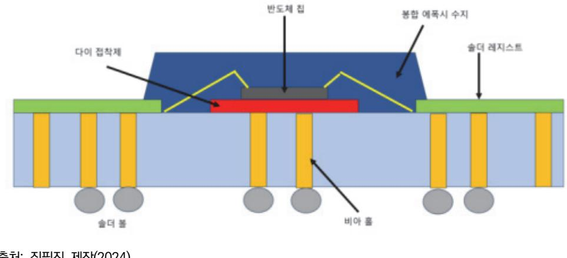

출처: 집필진 제작(2024) [그림 2-1] 패키지 주요 재료가 사용된 패키지 구조

1. 다이 부착(die attach) 공정

다이 부착 공정은 웨이퍼 레벨 테스트에서 양품 판정을 받은 개별 칩들을 물리적인 방법으 로 기판이나 주 리드 프레임에 부착하는 공정이다. 이 공정에서 중요한 사항은 기판이나 리 드 프레임과의 접착 강도이다. 그래서 이 공정에서 중요한 소재는 기판, 리드 프레임, 접착 제가 된다.

- (1) 기판(substrate)
  - (가) rigid 회로 기판

기판은 고정된 모양을 취하고 있다. 초기 rigid 기판의 재질은 세라믹이 주류를 이루어 오다가 현재는 유기 기판이 여러 패키지에서 점점 광범위하게 쓰이고 있다. rigid 기판은 얇은 판이 여러 층 쌓여 적층 기판이라고도 부른다. 이러한 적층형 기판을 만드는 데 여러 가지 다른 물질이 사용되는데 에폭시계의 FR4와 고성능을 갖춘 레진 기반의 BT(bismalemide-triazine)가 주로 사용된다. BT 레진은 유리 전이점(Tg)이 높고, 낮은 절연 상수와 절연성이 좋기 때문에 적층 재질로 제조 회사에서 많이 쓰이고 있다. BT는 BGA 패키지 제작 시는 표준 기판 재료의 기준으로 사용되며 CSP에서도 많이 쓰이고 있다.

(나) tape 기판

폴리이미드(polyimide)같은 고강도, 고온 폴리머(polymer) 물질로 이루어져 있다. tape 기판의 주요 장점은 디스크 드라이브나 프린터처럼 움직임이 많은 디바이스들에 회로를 장착할 수 있다는 것이다. 또한 tape 기판은 가볍고 단가가 낮다. 단점으로는 공정 중 다루기가 힘들고, 휨(warpage) 문제와 열팽창 계수가 다른 물질과 상당히 다른 점이 있 다. IC 패키지의 기판으로서의 역할 이외에 칩의 I/O를 연결할 때에도 쓰인다. 이와 같은 일을 수행하기 위해서 기판은 내부에 금속 절연체를 가지고 있어야 한다. 이것은 기판에 하나 이상의 층에 연결되어 구리 식각의 형태로 구성되어져 있다. 기판의 구리층은 니켈 층 위에 금(Au)을 주입한 층으로 마무리된다. 니켈은 구리 땜납이 퍼지는 것을 방지하고, 금은 산화되는 것을 방지함과 동시에 고형화 능력(solderability)를 강화한다. 적층 기판 은 일반적인 PCB 기판과 같이 through-hole에 의해 서로 연결되는 여러 금속판으로 구성된다. BT 기판들은 종종 짝수 개의 전송로를 가진다. 예를 들어 적층이 4개일 경우 맨 위층과 맨 아래층은 I/O 전송로이고, 가운데 2개 층은 접지와 전압을 위해 쓰인다.

(2) 에폭시 수지

에폭시는 실리콘 칩이 실장되는 패키지 기판(IC substrate), EMC 봉지재, 언더필, 칩과 기판을 접착하는 다이본딩재, 솔더 레지스트, 전도성 페이스트, PCB 등 다양한 분야에 응용되고 있는 반도체 패키징의 핵심 유기 소재로써, 우수한 내열 특성·절연 특성·내화 학성·기계적 물성 등으로 인하여 현재까지 널리 이용되고 있다. 그러나 최근의 급속한 반도체 패키징 기술의 발전으로 인하여 기존 에폭시 소재의 한계가 인식되면서 차세대 패키징용 신규 에폭시 소재의 개발에 대한 관심이 증대되고 있다. 예를 들어 박형화·고 기능화를 위해 여러 개의 박형 칩을 적층하는 패키징의 경우 박형 기판에 부과되는 응 력 발생이 크게 문제가 되므로 응력 발생을 효율적으로 저감할 수 있는 재료 개발이 요

구되고 있고, pb-free 솔더링에 의한 실장 온도증가는 더 우수한 내열 특성 및 흡습성 등을 가진 에폭시 소재 기술을 요구하고 있다.

(3) 리드 프레임(lead frame)

lead frame은 반도체 IC를 구성하는 핵심 부품으로서 반도체 chip과 PCB 기판과의 전기 신호를 전달하고, 외부의 습기, 충격 등으로부터 chip을 보호하며, 지지해 주는 골격 역할을 한다. 이는 칩을 비로소 외부와 연결하는 die paddle과 leads로 구성된다. 웨이퍼 상에 잘린 칩들은 금(Au)선으로 연결단자에 wire bonding을 통해 연결된다. 플라스틱 패키지 lead frame은 합금으로 만들어지는데 다음과 같은 특징이 있다. 화합물에 접착성이 우수, 칩과 화합물 사이의 우수한 열 확장성, 높은 강도, 형 변형 우수, 높은 열 전도성 등이 있다. alloy42(57.7% Fe, 41% Ni, 0.8% Mn, and 0.5% Co)는 그와 같은 합금물의 좋은 예이다. lead frame을 사용하는 패키지는 원가가 저렴한 구리 lead frame을 사용하기 때문에 생산 원가가 저렴하다는 장점을 가진다. 대체로 전형적인 패키지 구조를 가지며, 구조가 상대적으 로 간단해 출력 단자 수가 적은 소자에 적합하다. 특히, 저렴한 가격과 작은 크기, 우수한 전기 및 열적 특성 때문에 무선 이동 통신 제품에 많이 사용된다. lead frame은 철(Fe)과 동계(Cu)으로 구분되는데 발열량이 큰 IC에는 열전도율이 좋은 동(Cu)을 주성분으로 한 lead frame을 사용하며 특성이 중시되는 경우는 Silicon과 열팽창율이 비슷한 Fe-Ni 합금 계열인 alloy lead frame을 사용한다.

2. 본딩 공정 재료

본딩 공정은 기판이나 리드 프레임에 부착된 칩과 기판이나 리드 프레임의 패드 부분과 전 기적 배선을 연결하는 공정이다. 이 공정에서 중요한 재료는 와이어(wire) 이다.

- (1) 패키지별 와이어 구별
  - (가) gold wire는 hermetic 패키지에서는 고온을 견디지 못하므로 사용할 수 없다.
  - (나) 알루미늄 wire는 hermetic 조립에서는 표준으로 쓰인다.
  - (다) 플라스틱 패키지에서는 gold wire

전도성이 좋아 신호 전달 속도가 더 빠르고, 사용하기 쉽고, 가격 대비 성능이 우수하므 로 이상적인 선택이 될 수 있다. 다음으로 고려해야 할 사항은 wire의 직경이다.

- (2) 칩의 직경
  - (가) 칩의 wire 접착점이 작을수록 더욱 가느다란 wire가 필요
  - (나) 높은 전류를 흘린다든지 발열이 중요한 회로의 경우 두꺼운 wire가 더 효율적이다.
- (3) 인장강도, 신장성(elongation property)

인장 강도는 크면 클수록 좋은 것이고, wire bonding 시 신장성이 크면 모양을 만드는 데 어렵기 때문이다. 그렇기 때문에 wire bonding 시 신장성이 크지 않은 것을 골라야 한다. 마지막으로 고려해야 할 사항은 열에 영향을 받는 영역의 범위이다.

(4) 열 특성

공정 시 녹으면서 볼 모양이 되었을 때 고온으로 인해 끝 부분의 볼에 가까운 부분은 나뭇결 구조를 확대시킨다. wire의 그 부분은 쓸 수 없으므로 버려야 한다.

3. 몰딩 공정 재료

몰딩 공정은 와이어 본딩이 끝난 반도체가 공기 또는 외부에 대한 부식 등 여러 가지 원인 으로 인한 열화로부터 보호하고, 기계적인 안정성, 반도체에서 발생하는 열의 효과적인 발 산, 열경화성 수지인 epoxy mold compound(EMC)를 사용하여 밀봉하는 공정으로 기술 된 내용에 부합된 재료 선정이 중요 사항이다.

- (1) 양호한 EMC 조건
  - (가) 성형성

유도성, 경화성, 이형성, 금형 오염성, 금형 마모성, 장시간 보존성, 패키지 외관 등 이다.

(나) 내열성

내열 안정성, 유리 전이 온도(Tg), 열팽창성, 열전도성, 내열 충격성(고온 및 저온의 반복 순환 과정상) 등이다.

(다) 내습성

흡습 속도, 포화 흡습량, Soldering 후 내습성 등이다.

(라) 부식성

이온성 불순물, 분해 가스 등이다.

(마) 접착성

실리콘 다이, 금속 리드 프레임, 다이패드(도금막), 다이 표면의 절연막이나 보호막 등과의(특히 고온 고습에서) 접착성 등이다.

(바) 전기 특성

각종 환경에서의 전기 절연성, 고주파 특성, 대전성 등이다.

(사) 역학 특성

인장 및 굽힘 특성(강도, 탄성률, 변형률의 고온 특성), 강인성(파괴 인성치) 등이다.

(아) 기타

마킹성(잉크. laser), 난연성, 착색성

- (1) EMC 종류별 특성
  - (가) 열경화성(thermo set plastic) 수지

선상 구조의 저분자 단량자들이 열을 받으면 레진(resin)이나 촉매(catalyst) 등에 의 해 다른 성분들과 급속히 중합 반응(cross-linking))하여 얻어지는 복잡한 망상 구조 의 불용성 고분자 물질이다.

1) 페놀(phenol) 수지

페놀류는 부가 축합 반응으로 얻어진다. 공업적으로 가장 많이 이용되는 것은 페 놀과 포말디하이드(formaldehyde, CH2O)와의 반응에 의해 얻어지는 중합형 페 놀 수지이다.

2) 에폭시(epowy) 수지

1개의 분자 속에 에폭시기를 2개 이상 가진 화합물을 말하며 현재 공업적으로 이용되고 있는 것은 주로 비스페놀-A(bisphenol-A)와 에피클로르하이드라인 (epichlorohydrine)과의 생성물이다.

- (나) 에폭시 수지 특징
  - 1) 에폭시 수지는 페놀 수지에 비해 연쇄 밀도가 매우 높음.
  - 2) 열팽창 계수, 경도, 화학 약품에 대한 저항, 방습성 등에서 페놀 수지에 비해 우수
  - 3) IC 제조 공정에서는 에폭시 수지로 몰드 화합물로 사용
- (다) 열가소성(thermo plastic) 수지

구성 단량체들이 저분자 선상 구조 물질이나 외부로부터 열을 받아도 각 단량체가 선상으로만 연결되어 선상 구조의 가용성 물질이다.

4. 솔더(solder)

BGA 공정의 경우 양면 판을 회로 가공하여 표면에 chip, 이면에 solder ball을 탑재한 다 음에 몰드 수지로 봉합한 구조로 밑면의 솔더 볼이 부품의 리드(lead) 역할을 하게 되므로 소형의 부품으로도 많은 리드의 구성이 가능하며 각종 전자 기기 및 통신 기기 등 제품의 소형화, 경량화, 고기능 회로 PC board 및 부품도 소형화하여야 함에 따라 고안된 차세대 부품이라 할 수 있다. 이 부품에 사용되는 가장 중요 소재가 솔더이다. 이 솔더는 paste, 볼의 기본 재료가 된다. 재료의 선정 사항은 아래와 같다.

(1) 기판과 부품의 내열성

225℃ 이상의 고온 solder는 ceramic package, ceramic 기판용으로 적합하고, plastic package와 glass epoxy 기판에는 63% Sn – 37% Pb의 solder paste나 저융 점 solder paste가 사용된다.

(2) 은(Ag) 또는 부품 lead의 금속 조성

Ag-Pd 소성·도체 등은 Ag의 확산을 억제하기 위하여 Sn-Pb에 Ag를 1∼3% 첨가한 solder 합금이 사용된다. Au단자에는 In-Pb solder가 Au의 확산을 억제하기 위하여 사용된다.

(3) solder의 강도

고온에서의 인장 강도나 선단 강도가 필요한 때에는 Sn-Sb 합금이 사용된다.

(4) solder 합금 분말의 입도

fine pitch화로 진행되면 될수록 metal mask의 개구부가 좁게 되기 때문에 입도 분포 가 작은 solder 합금 분말을 사용하지 않으면 안 된다. 입경은 개구부의 20%에 합금 분말의 최대 입경을 설정할 필요가 있다. 또한 solder 합금 분말의 입경이 작아지게 되 면 표면적이 증가하고 합금 분말은 산화되기 쉬우며 solder ball의 영향을 준다. 현재 pitch 간격이 0.5㎜의 fine pitch용에 설정된 solder paste의 입경은 20∼50㎛의 합금 분말이 사용된다.

(5) solder paste의 점성

solder paste의 점성은 인쇄 성능과 soldering 성능에 미치는 영향이 크고, 일반적으로 점도와 thixotropy 지수로 나타낸다. thixotropy성은 인쇄 속도가 증가함에 따라 점도 가 낮아지는 성질이 있고 thixotropy 지수는 인쇄 속도를 변화시켜 점도를 측정하는 것 으로 구하는 것이 가능하다. 점도는 너무 높으면 판 떨어짐이 나빠지고 rolling이 저하 되어 번짐이 발생한다. 점도가 너무 낮으면 인쇄 무너짐이 일어나기 쉽게 되는 경향이 있다. 또한 thixotropy 지수는 높고 rolling성이 나쁘며 판 떨어짐성은 좋지 않게 되면 인쇄 무너짐은 줄어든다. thixotropy 지수가 작고 인쇄 무너짐이 발생하지만 판 떨어짐 특성은 좋은 경향이 있다. 현재 시판되고 있는 fine pitch 대응 solder paste의 점성은 점도 15∼30만 CPS/25℃ thixotropy 지수는 0.4∼0.7의 범위에 있다.

#### 숕 패키지의 종류

1. 금속형 패키지

반도체 산업의 초기 보편적인 패키징 방법으로 사용된 패키지 유형이다. 현재는 이산 소자 응용과 소규모 직접 회로 소자 제작에서 사용된다. 다이는 리드의 선 접속과 금도금된 헤더 (header)의 중앙에 부착되며, 유리 봉인은 리드 주변에 형성되고, 금속 커버는 밀봉된 용접 을 만들어 내기 위한 몸체에 용접된다. [그림 2-2]에 일반적인 금속 패키지 모습이 도시되 어 있다. 금속 덮개가 캐버티에 의해 형성된 내부 공간을 봉지하도록 패키지 몸체에 솔더로 부착되어 있으며, 반도체 칩과 그 전기적인 연결 부위가 외부 환경에서 보호되는 구조를 가 지고 있다. 반도체 칩은 패키지 몸체 안쪽 바닥면에 고온 실버 글래스(silver glass: 25)로 부착된다. 그리고 이 반도체 칩 패키지는 패키지 몸체의 안쪽 바닥면에 금도금 층으로 형성 된 회로 패턴과 반도체 칩이 도전성 금속선으로 와이어 본딩(wire bonding)되어 접속되고 그 회로 패턴과 패키지 몸체의 외부로 노출되어 있는 외부 접속 단자가 연결되어 전기적인 연결을 이룬다.

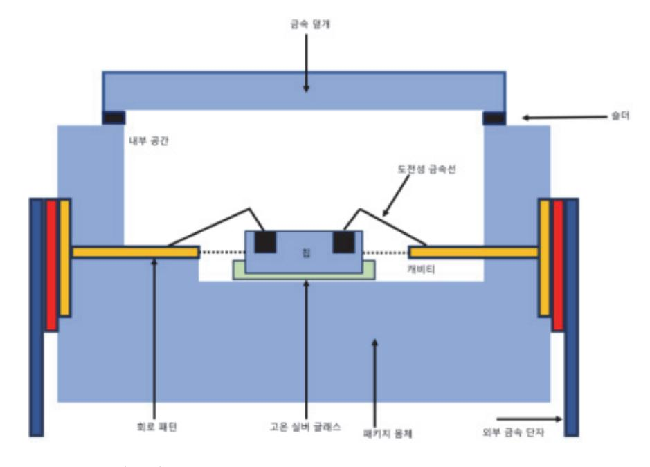

출처: 집필진 제작(2024) [그림 2-2] 일반적인 금속 패키지 구성

2. 플라스틱 패키지

플라스틱 패키징은 융용 공정을 통하여 다이와 리드 프레임을 봉합하기 위해 에폭시 폴리 머를 사용한다. 대개 대량 생산 제품 생산에 이용되는데 다이가 부착되고, 금속선이 접속되 면 리드 프레임은 제거된다. 플라스틱 패키지는 다양한 형태로 존재하고, 대부분 대량 역류 납땜으로 인해 인쇄 회로 기판(PCB) 위에 대응되는 패드에 부착된다.

- (1) 특징
  - (가) 낮은 원가와 가벼운 무게
  - (나) 교차 연결 폴리머의 차원적 안전성 이온적 안정
  - (다) 공정 온도에서의 저항성
  - (라) 에폭시 파라미터들의 낮은 습기 흡수율
  - (마) 확장 온도 계수(TCE)를 위한 주입기의 추가
- (2) 종류
  - (가) PIH용 플라스틱 이중 인 라인(in-line) 패키지(DIP)
  - (나) 단일 인 라인(in-line) 패키지(SIP)
  - (다) 날개형 표면 돌출 리드를 가지는 TSOP
  - (라) 이중 인 라인 메모리 모듈(DIMM)
  - (마) 날개형 표면 돌출 리드를 가지는 QFT
  - (바) 표면 외부에 J- 리드를 가지는 PLCC

(사) 리드가 필요 없는 칩 캐리어(LCC)

3. 세라믹 패키지

세라믹 패키지는 용접 밀봉을 갖는 최대의 신뢰성과 높은 전력을 요구하는 분야의 IC 패키 징에 사용되는 기술이다. 내화성 세라믹과 적층 세라믹 2가지 방법이 있다. 세라믹 기술은 다수의 신호, 접지, 전력, 접합, 봉인된 혼합 패키지 제조에 유용하다.

(1) 내화성 세라믹(refractory ceramic)

일반적으로 IC 패키징에 사용된다. 세라믹 기판은 적당한 유릿가루와 슬러리를 형성시 키는 유기 용제가 혼합된 알루미나(Al2O3) 가루 재료들로 만들어진다. 주요 재료는 특성 은 아래와 같다.

(가) 슬러리

1mil 두께와 건조된 얇은 시트로 주조

(나) 패턴화

다층 세라믹 기판으로 맞춤 배선 회로들은 금속화된 비아들로 개별적인 층에 증착된 다.

(다) 세라믹 시트

정밀하게 얇게 잘려져 있고, 모놀리딕 몸체 구성을 위해 1,600℃ 가열되는 HTCC(high temperature cofired ceramic) 방법과 800~1,050℃로 가열되는 LTCC(low temperature cofired ceramic) 방법이 있다.

(라) 황동 핀

주조되며, 핀 격자 배열(PGA)의 경우에는 600개 정도의 핀이 사용된다.

(2) 적층 세라믹(laminated ceramic)

두 세라믹 개체 사이에 리드 프레임을 위치시키고 칩 선 접속 후 2개의 세라믹을 압축 하는 기술이다. 세라믹 층들은 낮은 온도의 유리 밀봉을 사용하여 용접하는 방식이다. [그림 2-3]에 CERDIP 패키지의 구성이 도시되어 있다. 중요 재료는 세라믹, 유리, 에폭 시, 리드 프레임이다.

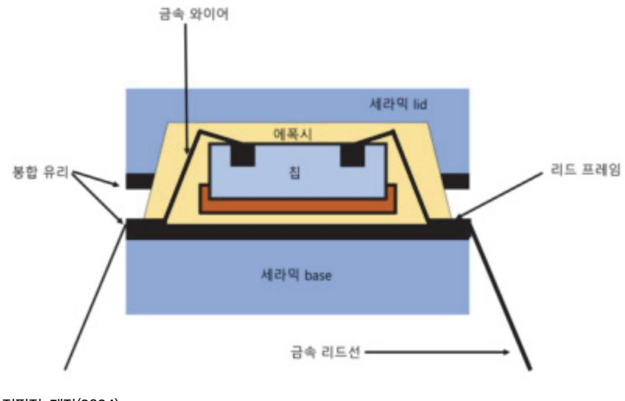

출처: 집필진 제작(2024) [그림 2-3] CERDIP 적층 패키지 구성 요소

숖 진보된 응용 패키지

저비용에서 신뢰성, 고속, 고밀도를 가지는 패키징 기술이 IC 패키지의 발전 방향이다. 결국, 내부 상호 연결의 수를 감소시키고 칩의 밀도를 증가시키는 것이다. 이런 기술의 결과는 전기 적 성은에 영향을 주는 고장 가능성의 감소, 회로 저항 감소, 기생 축전 회로 감소를 이룰 수 있다.

1. 플립 칩 패키지

플립 칩은 기술은 기판에 칩 결합 패드의 내부 연결을 위해 주석과 납으로 합금 된 솔더로 형성된 범프를 사용한다. 기판은 세라믹이나 플라스틱 재질을 기반으로 유연성 있는 폴리마 이드 회로가 사용된다. 플립 칩의 신뢰도는 칩과 기판 사이에 열팽창 계수(CTE)가 매우 중 요하다. 과도가 CTE 불일치는 접합부의 응력을 발생시키고 땜납의 크랙에 의한 고장을 유 발한다. 이 문제는 칩과 기판 사이에 흐르는 에폭시 언더필(underfill)을 사용함으로 해결할 수 있다. 솔더 접합부에서 응력 감소를 언더필 에폭시 사용으로 10배 이상 줄일 수 있다. 일반적인 구조가 [그림 2-4]에 도시되어 있다. 주요 재료는 솔더 범프, 언더필(underfill)용 에폭시, 기판이다.

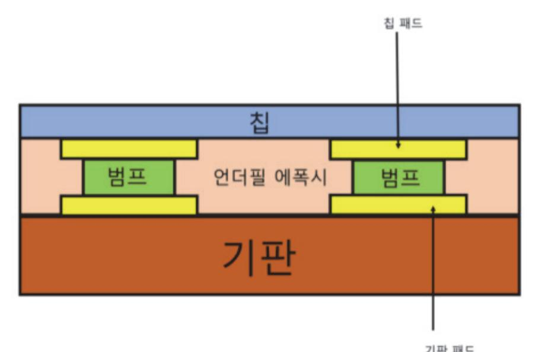

출처: 집필진 제작(2024) [그림 2-4] 플립 칩 기본 구조 및 구성 재료

2. BGA(ball grid array)

핀 격자 배열(PGA)과 유사하나 핀 대신 솔더 볼을 사용한다는 점이 다르다. 그래서 가장 중요한 재료는 동일 사이즈, 접합과 인장 강도가 우수한 솔더 볼의 선택이 매우 중요하다. 대개 주석과 납의 합금 볼을 사용한다. 기판은 열적 안정성이 강한 플라스틱을 사용한다. 플라스틱 기판은 신호 지연이 줄어드는 낮은 절연율을 가지고 있다.

3. 기판 위의 칩(COB)

COB는 SMT와 PIH 부품들과 함께 기판 위에서 직접 IC 칩을 설계하기 위해 개발된 기술 이다. IT 기술의 급속한 발전에 따라 전자 기기는 소형화뿐만 아니라 카메라, 통신, 게임 등의 융복합된 기기로 변화하고 있으며, 이를 위해 반도체 소자 및 회로 소자를 기판에 패 키징하기 위해 신기술이 필요하였다. 본 기술에서 중요한 재료는 복잡한 회로를 구성하는 회로 기판이다. 우수한 열방출, 고유전율, 열팽창 계수가 양호한 기판이 요구된다.

4. 테이프 자동 접속(TAB)

칩 캐리어로 플라스틱 테이프를 사용하는 고성능 입·출력 패치징 기술이다. 테이프는 폴리 마이드 절연 막의 2개 층 사이에 겹쳐진 얇은 구리 막으로 형성된다. 구리는 칩에 부착되 는 범프를 위한 내부 단자 접속 영역과 회로 기판의 납땜 부착을 위한 외부 단자 접속 영 역을 갖는 칩 접속 패드에 정합되는 단자를 구성하기 위해 식각된다. 칩 부착 후 칩 보호를 위해 에폭시 수지로 봉합된다. 중요 재료는 식각과 회로선 구성에 있어서 식각 저항성과 강 한 접착성이 요구되는 테이프와 봉합되는 에폭시 수지이다.

5. 다중 칩 모듈(MCM)

하나의 기판 위에 각각의 다이를 장착한 하나의 패키지이다. 중요한 재료는 기판으로 세라 믹 또는 고밀도 칩으로 발전된 인쇄 회로가 쓰인다.

6. 칩 스케일링 패키지(CSP)

CSP 패키지는 다이의 1.2배 가량의 크기를 가지는 패키지 기술이다. 플립 칩과 BGA 기술 의 혼합체이다. 재료도 플립 칩과 BGA에서 쓰이는 재료와 동일하다.

## 수행 내용 / 반도체용 플립 칩 재료 선정하기

#### 재료·자료

- 기술 사양 및 요구 사항 문서
- 재료 특성 데이터 시트
- 공정 데이터 및 조건
- 신뢰성 및 내구성 데이터
- 비용 분석 및 경제성 자료
- 환경 및 규제 준수 자료
- 협력 업체 및 공급망 정보

기기(장비 ・ 공구)

- 전기적 특성 평가 장비(프로브 스테이션, 노이즈 필터, 스펙트럼 분석기 등)
- 열적 특성 평가 장비(열 분석 장비, 열 충격 테스트 장비 등)
- 기계적 특성 평가 장비(인장 시험기, 피로 시험기, 나노 인덴터 등)
- 화학적 특성 평가 장비(ICP-MS, FTIR 등)

#### 안전 ・ 유의 사항

- 재료 취급 안전(개인 보호 장비 착용, 화학 물질 취급 안전 지침)을 준수한다.
- 작업 환경 안전 법규를 준수한다.

• 장비 점검 및 유지 보수와 장비 사용 교육을 실시한다.

#### 수행 순서

숔 반도체 플립 칩 공정별 재료의 장점과 단점을 파악한다.

반도체 플립 칩 공정에서 사용되는 재료는 각각의 특성과 적용 범위에 따라 장점과 단점이 있 다. 공정별로 주로 사용되는 재료와 그 특성을 이해함으로써 최적의 재료를 선택하고, 공정의 효율성을 높일 수 있다. 아래의 주요 플립 칩 공정별로 사용되는 재료의 장점과 단점 내용을 파악한다.

- 1. 웨이퍼를 준비(wafer preparation)한다.
  - (1) 다이싱 테이프
    - (가) 장점

1) 웨이퍼와 개별 다이를 안전하게 고정하여 절단 중 손상을 방지한다.

2) 다양한 접착력 옵션이 있어 공정 후 다이를 쉽게 제거할 수 있다.

(나) 단점

1) 사용 후 폐기물이 발생하여 환경에 부담을 줄 수 있다.

2) 고온 또는 고습 환경에서 접착력이 변할 수 있다.

(2) 클리닝 솔루션

(가) 장점

1) 웨이퍼 표면의 오염물을 효과적으로 제거하여 공정 품질을 향상시킨다.

2) 다양한 오염물에 대응하는 다양한 세정제가 있다.

(나) 단점

1) 일부 세정제는 독성이 있어 취급 시 주의가 필요하다.

2) 잔여물이 남을 경우 공정 품질에 영향을 미칠 수 있다.

- 2. 범프 형성(bump formation)을 한다.
  - (1) 언더밈(UBM) 재료(예: 크로뮴, 니켈, 구리)

(가) 장점

1) 우수한 전기 전도성과 기계적 접착력을 제공한다.

- 2) 다양한 전기 도금 옵션이 있어 다양한 응용에 적합하다.
- (나) 단점
  - 1) 전기 도금 과정이 복잡하고 비용이 높을 수 있다.
  - 2) 구리의 경우 산화가 발생할 수 있어 추가 보호층이 필요하다.

(2) 포토레지스트

69

1) 칩과 기판 사이의 기계적 응력을 완화하여 신뢰성을 높인다.

2) 무연 솔더는 높은 용융점으로 인해 공정 온도가 높아질 수 있다.

- 4. 언더필(underfill)을 확인한다.
  - - (가) 장점
  - (1) 언더필 수지
- (나) 단점

(가) 장점

1) 환경 규제로 인해 납 함유 솔더 사용이 제한될 수 있다.

2) 다양한 용융점 옵션이 있어 다양한 응용에 적합하다.

- 1) 높은 신뢰성과 우수한 접합 특성을 제공한다.
- 2) 고온 환경에서 알루미늄 와이어는 산화될 수 있다.
- 1) 금 와이어는 비용이 높을 수 있다.

(2) 솔더 재료(예: 무연 솔더, Pb-Sn 솔더)

3. 칩 플립 및 본딩(chip flip and bonding)을 한다.

- (나) 단점
- (1) 본딩 와이어(예: 금, 알루미늄) (가) 장점

2) 다양한 직경과 길이 옵션이 있어 설계 유연성이 높다.

1) 우수한 전기 전도성과 신뢰성을 제공한다.

2) 도금 두께와 균일성을 유지하기 어려울 수 있다.

- (나) 단점
- 1) 우수한 전기 전도성과 접착력을 제공한다. 2) 다양한 합금 조합으로 다양한 공정 요구를 충족할 수 있다.

1) 일부 금속은 환경 규제에 민감하여 사용에 제약이 있을 수 있다.

1) 고해상도 패턴을 형성할 수 있어 정밀한 공정이 가능하다.

1) 노광과 현상 과정이 까다로워 공정 관리가 중요하다.

- (가) 장점

(3) 도금용 금속(예: 납-주석, 은-주석, 금)

- 2) 잔여물 제거가 어려울 수 있다.
- 2) 다양한 종류가 있어 공정 요구에 맞게 선택할 수 있다.
- (가) 장점

(나) 단점

2) 열 전도성이 높아 열 방출 효율을 향상시킨다.

(나) 단점

1) 도포 과정이 복잡하고, 균일한 충진이 어려울 수 있다.

2) 경화 과정에서 수축이 발생하여 기계적 스트레스를 유발할 수 있다.

5. 마감 공정(final packaging)을 확인한다.

(1) 몰딩 컴파운드

(가) 장점

1) 칩과 기판을 보호하여 외부 환경으로부터의 손상을 방지한다.

2) 우수한 기계적 강도와 열적 안정성을 제공한다.

(나) 단점

1) 수분 흡수율이 높아 장기 신뢰성에 영향을 끼칠 수 있다.

2) 몰딩 공정 중 기포가 발생할 수 있다.

(2) 표면 도금 재료(예: 금, 은, 니켈)

(가) 장점

1) 우수한 전기 전도성과 내식성을 제공한다.

2) 다양한 표면 마감 옵션이 있어 응용 범위가 넓다.

(나) 단점

1) 도금 두께와 균일성을 유지하기 어려울 수 있다.

2) 비용이 높을 수 있다.

6. 종합적인 재료 선택 기준을 확인한다.

(1) 성능: 재료의 전기적, 기계적, 열적 성능이 요구되는 사양을 충족해야 한다.

(2) 신뢰성: 장기적인 신뢰성을 보장할 수 있어야 한다.

(3) 환경 규제 준수: 사용되는 재료가 환경 규제를 준수해야 한다.

(4) 비용 효율성: 재료와 공정 비용이 경제적이어야 한다.

(5) 공정 적합성: 기존 공정과의 호환성이 높아야 한다.

이와 같은 내용을 바탕으로 플립 칩 공정에서 사용되는 재료의 장점과 단점을 이해하고, 최적 의 재료를 선택하여 공정의 효율성과 품질을 높일 수 있다.

숕 반도체 집적 회로 제조 공정에 적합한 플립 칩 재료를 선정한다.

반도체 집적 회로 제조 공정에 적합한 플립 칩 재료를 선정하기 위해서는 체계적인 수행 절차 를 통해 다양한 재료의 특성을 평가하고 최적의 재료를 선택해야 한다. 다음은 플립 칩 재료를 선정하기 위해 필요한 주요 수행 내용이다.

- 1. 고객 요구 사항을 분석한다.
  - (1) 요구 사항 수집
    - (가) 활동

1) 고객과의 미팅을 통해 제품의 기능적 및 비기능적 요구 사항을 명확히 이해한다.

2) 사용 환경, 성능 목표, 예상 수명 등을 포함한 세부 요구 사항을 문서화한다.

- (2) 요구 사항 문서화
  - (가) 활동

1) 수집된 요구 사항을 명세서로 작성하여 내부 팀과 공유한다.

- 2) 요구 사항 우선순위를 설정하고 평가 기준을 도출한다.
- 2. 재료 후보를 선정한다.
  - (1) 기존 재료 데이터베이스 검토

(가) 활동

- 1) 기존에 사용된 재료의 성능 데이터를 검토하고 후보 재료 리스트를 작성한다.
- 2) 최신 기술 동향과 신재료 정보를 조사하여 추가 후보를 발굴한다.
- (2) 신재료를 탐색한다.
  - (가) 활동
    - 1) 최신 연구 논문과 특허를 조사하여 신재료를 탐색한다.
    - 2) 재료 공급 업체와의 협력을 통해 새로운 재료 옵션을 확보한다.
- 3. 재료 특성을 분석한다.
  - (1) 전기적 특성 평가

반도체 집적 회로 제조 공정에서 플립 칩 기술은 높은 집적도와 성능을 제공하는 데 매 우 중요한 역할을 한다. 플립 칩 패키징에서 사용되는 재료는 전기적, 열적, 기계적 특 성을 모두 만족해야 한다. 특히, 전기적 특성은 플립 칩의 성능과 신뢰성에 큰 영향을 끼치므로, 적합한 재료를 선택하기 위해서는 다음과 같은 전기적 특성을 평가해야 한다.

- (가) 플립 칩 재료의 전기적 특성 평가 항목
  - 1) 저항(resistance)
    - 가) 설명: 재료의 전기적 저항은 신호 손실과 전력 소모를 최소화하기 위해 낮아야 한다.
    - 나) 평가 방법: 저항 측정 장비를 사용하여 재료의 저항을 측정한다. 일반적으로 4- 포인트 프로브 측정법을 사용한다.
  - 2) 유전 상수(dielectric constant)
    - 가) 설명: 유전 상수가 낮을수록 신호 간섭이 적고, 높은 주파수에서 신호 전달 성

능이 향상된다.

- 나) 평가 방법: LCR 미터를 사용하여 재료의 유전 상수를 측정한다.
- 3) 절연 강도(breakdown voltage)
  - 가) 설명: 재료가 높은 전압에서도 절연 특성을 유지할 수 있어야 한다.
  - 나) 평가 방법: 고전압 시험 장비를 사용하여 재료의 절연 파괴 전압을 측정한다.
- 4) 누설 전류(leakage current)
  - 가) 설명: 절연 재료의 경우, 누설 전류가 낮아야 한다. 이는 전력 소모를 줄이고 신뢰성을 높이는 데 중요하다.
  - 나) 평가 방법: 전기적 테스트 장비를 사용하여 재료의 누설 전류를 측정한다.
- 5) 접촉 저항(contact resistance)
  - 가) 설명: 접속부에서의 저항은 낮아야 하며, 이는 신호 전송 효율을 높이고 전력 소모를 줄인다.
  - 나) 평가 방법: TLM(transmission line method)을 사용하여 접촉 저항을 측정한 다.
- (나) 플립 칩 재료 선택 시 고려 사항
  - 1) 솔더 범프 재료(solder bump materials)
    - 가) 전기적 특성: 솔더 범프는 높은 전도성을 가져야 하며, 일반적으로 Sn-Ag-Cu 합금이 사용된다.
    - 나) 평가 항목: 저항, 접촉 저항, 유전 상수
  - 2) 언더필 재료(underfill materials)
    - 가) 전기적 특성: 언더필은 유전 상수가 낮고 절연 강도가 높아야 한다.
    - 나) 평가 항목: 유전 상수, 절연 강도, 누설 전류
  - 3) 인터포저 재료(interposer materials)
    - 가) 전기적 특성: 인터포저는 전기적 신호를 전달하는 역할을 하므로 저항이 낮고 유전 상수가 낮아야 한다.
    - 나) 평가 항목: 저항, 유전 상수
- (다) 전기적 특성 평가 절차
  - 1) 샘플 준비
    - 가) 플립 칩 패키징에 사용할 재료 샘플을 준비한다. 각 재료는 특정 조건하에 제작 되어야 한다.
  - 2) 저항 측정
    - 가) 4-포인트 프로브를 사용하여 재료의 저항을 측정한다. 재료의 균일성을 위해 여러 샘플에서 측정한다.
  - 3) 유전 상수 측정

- 가) LCR 미터를 사용하여 다양한 주파수에서 재료의 유전 상수를 측정한다. 이 데 이터는 고주파 신호 전달 성능을 평가하는 데 사용된다.
- 4) 절연 강도 측정
  - 가) 고전압 시험 장비를 사용하여 재료의 절연 강도를 측정한다. 재료가 파괴되는 전압을 기록한다.
- 5) 누설 전류 측정
  - 가) 전기적 테스트 장비를 사용하여 재료의 누설 전류를 측정한다. 특히, 고온 환경 에서의 누설 전류를 확인한다.
- 6) 접촉 저항 측정
  - 가) TLM을 사용하여 접촉 저항을 측정한다. 이는 재료 간의 접합부에서의 저항을 평가하는 데 중요하다.

플립 칩 패키징에서 사용되는 재료의 전기적 특성은 소자의 성능과 신뢰성에 직접적인 영향을 끼친다. 따라서 적절한 재료를 선택하기 위해서는 저항, 유전 상수, 절연 강도, 누설 전류, 접촉 저항 등 주요 전기적 특성을 면밀히 평가해야 한다. 이러한 평가를 통 해 최적의 재료를 선정하고, 이를 통해 고성능, 고신뢰성의 반도체 소자를 제조할 수 있 다.

(2) 기계적 특성 평가

반도체 집적 회로 제조 공정에서 플립 칩 패키징에 사용되는 재료의 기계적 특성은 소 자의 신뢰성과 내구성에 큰 영향을 끼친다. 플립 칩 기술에서 적합한 재료를 선택하기 위해서는 다양한 기계적 특성을 평가해야 한다. 아래는 주요 기계적 특성 평가 항목과 그 설명이다.

- (가) 플립 칩 재료의 기계적 특성 평가 항목
  - 1) 경도(hardness)
    - 가) 설명: 재료의 표면이 변형되지 않고 견딜 수 있는 능력을 나타낸다.
    - 나) 평가 방법: 비커스 경도 시험기 또는 나노 인덴터를 사용하여 재료의 경도를 측 정한다.
  - 2) 탄성 계수(elastic modulus)
    - 가) 설명: 재료의 변형에 대한 저항성을 나타내며, 높은 값은 강한 저항성을 의미한 다.
    - 나) 평가 방법: 나노 인덴테이션을 통해 탄성 계수를 측정한다.
  - 3) 인장 강도(tensile strength)
    - 가) 설명: 재료가 파괴되기 전에 견딜 수 있는 최대 인장 응력을 나타낸다.
    - 나) 평가 방법: 인장 시험기를 사용하여 재료가 파단될 때까지 인장 응력을 가해 측 정한다.

73

- 4) 전단 강도(shear strength)
  - 가) 설명: 재료가 전단 응력에 저항하는 능력을 나타낸다.
  - 나) 평가 방법: 전단 시험기를 사용하여 재료의 전단 강도를 측정한다.
- 5) 연성 및 취성(ductility and brittleness)
  - 가) 설명: 재료가 변형될 수 있는 능력을 나타내며, 연성은 소자의 충격 저항성을 높인다.
  - 나) 평가 방법: 인장 시험을 통해 연성과 취성을 평가한다. 연성이 높은 재료는 인 장 시험에서 더 많은 변형을 보인다.
- 6) 열팽창 계수(coefficient of thermal expansion, CTE)
  - 가) 설명: 온도 변화에 따라 재료가 팽창하거나 수축하는 정도를 나타낸다.
  - 나) 평가 방법: 열기계 분석기(TMA)를 사용하여 CTE를 측정한다.
- 7) 열전도도(thermal conductivity)
  - 가) 설명: 재료가 열을 전달하는 능력을 나타내며, 높은 열전도도는 열 관리에 유리 하다.
  - 나) 평가 방법: 레이저 플래시 분석기(LFA)를 사용하여 열전도도를 측정한다.
- 8) 피로 특성(fatigue properties)
  - 가) 설명: 반복적인 응력 하에서 재료가 견딜 수 있는 능력을 나타낸다.
  - 나) 평가 방법: 피로 시험기를 사용하여 재료의 피로 한계와 수명을 평가한다.
- (나) 플립 칩 재료 선택 시 고려 사항
  - 1) 솔더 범프 재료(solder bump materials)
    - 가) 기계적 특성: 솔더 범프는 충분한 전단 강도와 피로 특성을 가져야 하며, Sn-Ag-Cu 합금이 일반적으로 사용된다.
    - 나) 평가 항목: 전단 강도, 인장 강도, 피로 특성
  - 2) 언더필 재료(underfill materials)
    - 가) 기계적 특성: 언더필은 낮은 열팽창 계수와 높은 접착 강도를 가져야 한다.
    - 나) 평가 항목: 탄성 계수, CTE, 접착 강도
  - 3) 인터포저 재료(interposer materials)
    - 가) 기계적 특성: 인터포저는 충분한 강도와 낮은 CTE를 가져야 한다.
    - 나) 평가 항목: 탄성 계수, 인장 강도, CTE
- (다) 기계적 특성 평가 절차
  - 1) 샘플 준비

플립 칩 패키징에 사용할 재료 샘플을 준비한다. 각 재료는 특정 조건하에 제작 되어야 한다.

#### 2) 경도 측정

비커스 경도 시험기 또는 나노 인덴터를 사용하여 재료의 경도를 측정한다.

3) 탄성 계수 측정

나노 인덴테이션을 통해 재료의 탄성 계수를 측정하며 메모리 반도체의 공정 흐 름도를 파악한다.

4) 인장 강도 측정

인장 시험기를 사용하여 재료가 파단될 때까지 인장 응력을 가해 측정한다.

5) 전단 강도 측정

전단 시험기를 사용하여 재료의 전단 강도를 측정한다.

6) 열팽창 계수 측정

열기계 분석기(TMA)를 사용하여 CTE를 측정한다.

7) 열전도도 측정

레이저 플래시 분석기(LFA)를 사용하여 열전도도를 측정한다.

8) 피로 특성 측정

피로 시험기를 사용하여 재료의 피로 한계와 수명을 평가한다.

플립 칩 패키징에서 사용되는 재료의 기계적 특성은 소자의 신뢰성과 내구성에 직접적 인 영향을 끼친다. 따라서 적절한 재료를 선택하기 위해서는 경도, 탄성 계수, 인장 강 도, 전단 강도, 열팽창 계수, 열전도도, 피로 특성 등 주요 기계적 특성을 면밀히 평가 해야 한다. 이러한 평가를 통해 최적의 재료를 선정하고, 이를 통해 고성능, 고신뢰성의 반도체 소자를 제조할 수 있다.

(3) 열적 특성 평가

반도체 집적 회로 제조 공정에서 플립 칩 패키징에 사용되는 재료의 열적 특성은 소자 의 신뢰성과 성능에 중요한 영향을 끼친다. 열적 특성을 평가하는 것은 특히 고성능 소 자에서 발생하는 열을 효과적으로 관리하고 소자의 과열을 방지하기 위해 필수적이다. 아래는 플립 칩 재료의 열적 특성 평가 항목과 그 설명이다.

- (가) 플립 칩 재료의 열적 특성 평가 항목
  - 1) 열전도도(thermal conductivity)
    - 가) 설명: 재료가 열을 전달하는 능력을 나타내며, 높은 열전도도는 소자의 열을 빠 르게 분산시켜 과열을 방지한다.
    - 나) 평가 방법: 레이저 플래시 분석기(LFA: laser flash analyzer)나 열전도도 측정 기를 사용하여 측정한다.
  - 2) 열팽창 계수(CTE: coefficient of thermal expansion)
    - 가) 설명: 온도 변화에 따라 재료가 팽창하거나 수축하는 정도를 나타낸다. 낮은 CTE는 다른 재료와의 열적 적합성을 높인다.
    - 나) 평가 방법: 열기계 분석기(TMA: thermomechanical analyzer)를 사용하여 측

75

정한다.

- 3) 열 용량(heat capacity)
  - 가) 설명: 재료가 열을 저장하는 능력을 나타내며, 열용량이 높을수록 열 변동에 대 한 저항성이 커진다.
  - 나) 평가 방법: 열분석기(DSC: differential scanning calorimeter)를 사용하여 측 정한다.
- 4) 열 저항(thermal resistance)
  - 가) 설명: 재료의 열 흐름에 대한 저항을 나타낸다. 열저항이 낮을수록 열 관리가 효율적이다.
  - 나) 평가 방법: 열전달 분석기를 사용하여 측정한다.
- 5) 글래스 전이 온도(Tg: glass transition temperature)
  - 가) 설명: 재료가 유리 상태에서 고무 상태로 변하는 온도이다. 높은 Tg는 고온 환 경에서의 안정성을 의미한다.
  - 나) 평가 방법: DSC를 사용하여 측정한다.
- (나) 플립 칩 재료 선택 시 고려 사항
  - 1) 솔더 범프 재료(solder bump materials)
    - 가) 열적 특성: 솔더 범프는 높은 열전도도와 적절한 CTE를 가져야 하며, Sn-Ag-Cu 합금이 일반적으로 사용된다.
    - 나) 평가 항목: 열전도도, CTE, 열 저항
  - 2) 언더필 재료(underfill materials)
    - 가) 열적 특성: 언더필은 낮은 CTE와 높은 열 용량, 적절한 열전도도를 가져야 한 다.
    - 나) 평가 항목: CTE, 열전도도, Tg
  - 3) 인터포저 재료(interposer materials)
    - 가) 열적 특성: 인터포저는 높은 열전도도와 낮은 CTE를 가져야 한다.
    - 나) 평가 항목: 열전도도, CTE, 열 저항
- (다) 열적 특성 평가 절차
  - 1) 샘플 준비

플립 칩 패키징에 사용할 재료 샘플을 준비한다. 각 재료는 특정 조건하에 제작 되어야 한다.

2) 열전도도 측정

레이저 플래시 분석기(LFA)나 열전도도 측정기를 사용하여 재료의 열전도도를 측 정한다.

3) 열팽창 계수 측정

열기계 분석기(TMA)를 사용하여 재료의 CTE를 측정한다.

4) 열 용량 측정

열분석기(DSC)를 사용하여 재료의 열용량을 측정한다.

5) 열 저항 측정

열전달 분석기를 사용하여 재료의 열 저항을 측정한다.

6) 글래스 전이 온도 측정

DSC를 사용하여 재료의 Tg를 측정한다.

플립 칩 패키징에서 사용되는 재료의 열적 특성은 소자의 성능과 신뢰성에 직접적인 영 향을 끼친다. 따라서 적절한 재료를 선택하기 위해서는 열전도도, 열팽창 계수, 열 용량, 열 저항, 글래스 전이 온도 등 주요 열적 특성을 면밀히 평가해야 한다. 이러한 평가를 통해 최적의 재료를 선정하고, 이를 통해 고성능, 고신뢰성의 반도체 소자를 제조할 수 있다.

(4) 화학적 특성 평가

반도체 집적 회로 제조 공정에서 플립 칩 패키징에 사용되는 재료의 화학적 특성은 소 자의 신뢰성과 성능에 중요한 영향을 끼친다. 화학적 특성을 평가하는 것은 특히, 소자 의 장기 안정성과 내구성을 보장하기 위해 필수적이다. 아래는 플립 칩 재료의 화학적 특성 평가 항목과 그 설명이다.

(가) 플립 칩 재료의 화학적 특성 평가 항목

1) 화학적 안정성(chemical stability)

- 가) 설명: 재료가 공기, 습기, 화학 물질 등에 의해 쉽게 변질되지 않는 능력이다.
- 나) 평가 방법: 다양한 화학 환경에 노출된 후 재료의 표면 상태와 성질 변화를 분 석한다.
- 2) 부식 저항성(corrosion resistance)
  - 가) 설명: 재료가 화학적 부식에 저항하는 능력이다.
  - 나) 평가 방법: 전기 화학적 테스트(예: 전위차 측정)를 통해 부식 저항성을 평가한 다.
- 3) 습기 흡수율(moisture absorption)
  - 가) 설명: 재료가 공기 중의 습기를 흡수하는 정도이다.
  - 나) 평가 방법: 일정 시간 동안 습기에 노출된 후 재료의 중량 변화를 측정한다.
- 4) 화학적 반응성(chemical reactivity)
  - 가) 설명: 재료가 다른 화학 물질과 반응하여 변질되는 경향이다.
  - 나) 평가 방법: 특정 화학 물질과 접촉시킨 후 반응 여부를 확인한다.
- 5) 확산 저항성(diffusion resistance)
  - 가) 설명: 재료 내에서 불순물이나 다른 물질이 확산되는 것을 방지하는 능력이다.

- 나) 평가 방법: 재료 내 불순물 농도 분포를 SIMS(secondary ion mass spectroscopy) 등의 기법으로 분석한다.
- 6) 화학적 접착력(chemical adhesion)
  - 가) 설명: 두 재료 간의 접착 강도를 나타내며, 화학적 결합력을 평가한다.
  - 나) 평가 방법: 박리 시험(Peel Test) 등을 통해 접착력을 측정한다.
- (나) 플립 칩 재료 선택 시 고려 사항
  - 1) 솔더 범프 재료(solder bump materials)
    - 가) 화학적 특성: 솔더 범프는 화학적 안정성이 높고 부식 저항성이 우수해야 한다.
    - 나) 평가 항목: 화학적 안정성, 부식 저항성, 화학적 접착력
  - 2) 언더필 재료(underfill materials)
    - 가) 화학적 특성: 언더필은 습기 흡수율이 낮고 확산 저항성이 높아야 한다.
    - 나) 평가 항목: 습기 흡수율, 확산 저항성, 화학적 접착력
  - 3) 인터포저 재료(interposer materials)
    - 가) 화학적 특성: 인터포저는 화학적 안정성과 부식 저항성이 높아야 한다.
    - 나) 평가 항목: 화학적 안정성, 부식 저항성, 화학적 반응성
- (다) 화학적 특성 평가 절차
  - 1) 샘플 준비

플립 칩 패키징에 사용할 재료 샘플을 준비한다. 각 재료는 특정 조건하에 제작 되어야 한다.

2) 화학적 안정성 평가

다양한 화학 환경(산성, 알칼리성, 중성)과 온도 조건에서 샘플을 노출시키고, 표 면 상태와 물리적 성질 변화를 분석한다.

3) 부식 저항성 평가

가전기 화학적 테스트(예: 전위차 측정)를 통해 샘플의 부식 저항성을 평가한다. 이를 위해 샘플을 전해질 용액에 담그고 부식 전위를 측정한다.

4) 습기 흡수율 평가

샘플을 일정 습도 조건에서 일정 시간 동안 노출시킨 후 중량 변화를 측정하여 습기 흡수율을 평가한다.

5) 화학적 반응성 평가

샘플을 특정 화학 물질과 접촉시킨 후 반응 여부를 관찰한다. 반응 결과로 표면 변화나 화학적 변화를 분석한다.

6) 확산 저항성 평가

SIMS(secondary ion mass spectroscopy) 또는 XPS(x-ray photoelectron spectroscopy) 등을 사용하여 재료 내 불순물 농도 분포를 분석한다.

7) 화학적 접착력 평가

박리 시험(peel test) 등을 통해 두 재료 간의 접착력을 측정한다. 이를 위해 샘 플을 일정한 힘으로 당겨 접착 강도를 측정한다.

플립 칩 패키징에서 사용되는 재료의 화학적 특성은 소자의 장기 안정성과 신뢰성에 큰 영향을 끼친다. 따라서 적절한 재료를 선택하기 위해서는 화학적 안정성, 부식 저항성, 습기 흡수율, 화학적 반응성, 확산 저항성, 화학적 접착력 등 주요 화학적 특성을 면밀 히 평가해야 한다. 이러한 평가를 통해 최적의 재료를 선정하고, 이를 통해 고성능, 고 신뢰성의 반도체 소자를 제조할 수 있다.

- 4. 재료 후보를 평가한다.
  - (1) 평가 기준 설정
    - (가) 활동

1) 전기적, 기계적, 열적, 화학적 특성을 포함한 평가 기준 설정

2) 각 기준의 가중치를 설정하여 중요도를 반영

- (2) 실험 및 데이터 수집
  - (가) 활동

1) 각 재료 후보에 대해 실험을 수행하고 성능 데이터 수집

2) 재료의 신뢰성 및 장기 안정성을 평가

- (3) 데이터 분석 및 비교
  - (가) 활동
    - 1) 수집된 데이터를 바탕으로 재료 후보를 비교 분석
    - 2) 멀티크리테리아 의사 결정(MCDM) 방법을 사용하여 최적의 재료 선정
- 5. 최종 재료를 선정 및 검증한다.
  - (1) 파일럿 생산 및 테스트
    - (가) 활동
      - 1) 최종 재료 후보를 사용하여 파일럿 생산 시행
    - 2) 파일럿 생산된 제품에 대해 기능 테스트, 신뢰성 테스트, 환경 테스트 등 수행
  - (2) 공정 최적화
    - (가) 활동
      - 1) 파일럿 생산 결과를 바탕으로 대량 생산 공정 최적화
- 6. 문서화 및 보고한다.
- 2) 공정 조건(온도, 압력, 시간 등)을 조정하여 품질과 생산성 향상

(1) 기술 문서 작성

(가) 활동

1) 재료 특성, 평가 결과, 파일럿 생산 결과 등 문서화

2) 공정 최적화 결과를 포함한 종합 보고서 작성

- (2) 고객 보고서 작성
  - (가) 활동

1) 최종 재료 선정 및 검증 결과를 고객에게 보고

2) 고객 피드백을 반영하여 최종 보고서 작성

- 7. 최종 검증 및 승인한다.
  - (1) 최종 승인
    - (가) 활동
      - 1) 최종 검증 결과를 바탕으로 고객의 최종 승인 획득
      - 2) 추가 테스트 및 개선 활동이 필요한 경우 이를 수행
  - (2) 지속적 모니터링 및 개선
    - (가) 활동
      - 1) 대량 생산 후에도 지속적으로 품질을 모니터링하고 개선
      - 2) 고객 피드백을 바탕으로 품질 개선 활동 수행

이와 같은 체계적인 절차를 통해 반도체 집적 회로 제조 공정에 적합한 플립 칩 재료를 선정하 고 검증할 수 있다. 이를 통해 최종 제품의 성능과 신뢰성을 보장하고, 고객 만족을 극대화할 수 있다.

숖 선정된 플립 칩 재료의 도출된 문제점에 대한 해결 방안을 제시한다.

선정된 플립 칩 재료의 문제점을 해결하기 위해서는 체계적인 분석과 개선 절차가 필요하다. 다음은 도출된 문제점에 대한 해결 방안을 제시하기 위한 주요 수행 내용이다.

- 1. 문제점을 분석한다.
  - (1) 문제점 식별
    - (가) 활동
      - 1) 파일럿 생산 및 테스트 단계에서 도출된 문제점을 식별한다.
      - 2) 각 문제점에 대한 상세 설명과 영향을 문서화한다.
      - 3) 문제 발생 빈도와 심각도를 평가한다.
  - (2) 원인 분석
    - (가) 활동

1) 5Whys 분석: 문제의 근본 원인을 파악하기 위해 "왜?"를 다섯 번 반복하여 질문한

다.

- 2) fishbone 다이어그램(원인-결과 다이어그램): 문제의 원인을 범주별로 시각화하여 분석한다.
- 3) FMEA(failure mode and effects analysis): 잠재적 고장 모드와 그 영향, 발생 확률, 검출 가능성을 평가한다.
- 2. 해결 방안을 도출한다.
  - (1) 브레인스토밍 및 팀 회의
    - (가) 활동
      - 1) 관련 부서와의 협력 회의를 통해 다양한 해결 방안을 브레인스토밍한다.
      - 2) 각 해결 방안의 장단점과 실행 가능성을 평가한다.
  - (2) 실험 계획법(DOE: design of experiments)
    - (가) 활동
      - 1) 다양한 변수와 조건을 실험하여 최적의 해결 방안을 도출한다.
      - 2) 통계적 분석을 통해 변수 간의 상호 작용을 이해하고 최적의 조건을 설정한다.
- 3. 해결 방안을 검증한다.
  - (1) 파일럿 테스트
    - (가) 활동
      - 1) 도출된 해결 방안을 파일럿 생산 라인에서 테스트한다.
      - 2) 테스트 결과를 분석하여 문제 해결 여부를 평가한다.
      - 3) 필요시 추가 실험을 통해 해결 방안을 최적화한다.
  - (2) 검증 데이터 분석
    - (가) 활동
      - 1) 테스트 결과 데이터를 수집하고 통계적 분석을 수행한다.
      - 2) 해결 방안의 효과를 정량적으로 평가한다.
- 4. 개선 방안을 실행한다.
  - (1) 공정 조정 및 최적화
    - (가) 활동
      - 1) 파일럿 테스트 결과를 바탕으로 공정을 조정한다.
      - 2) 최적의 공정 조건을 설정하고, 표준 작업 절차(SOP)를 업데이트한다.
  - (2) 교육 및 훈련
    - (가) 활동
      - 1) 변경된 공정과 해결 방안에 대해 작업자에게 교육을 실시한다.

- (다) 현상 공정 개선: 현상액 농도와 현상 시간을 최적화하여 패턴 불균일성 감소
- (나) 노광 장비 업그레이드: 고해상도 노광 장비를 도입하여 패턴 정확성 향상
- (가) 포토레지스트 도포 조건 최적화: 도포 두께와 균일성을 개선하기 위해 회전 속도와 시간 조정
- (2) 해결 방안
- (1) 문제점: 포토레지스트 패턴 불균일성
- (다) 언더필 재료 개선: 열전도성이 높은 언더필 재료를 사용하여 열 방출 효율성 향상
- (나) 열처리 공정 추가: 열처리 공정을 통해 재료의 열적 안정성 개선
- (가) 재료 변경: 열팽창 계수(CTE)가 더 낮은 재료로 변경
- (2) 해결 방안
- (1) 문제점: 범프의 열팽창으로 인한 기계적 스트레스
- 7. 해결 방안 예시를 확인한다.
- 2) 문제 해결 후의 성능 개선 결과를 포함하여 고객의 신뢰를 확보한다.
- 1) 문제점과 해결 방안에 대한 최종 보고서를 작성하여 고객에게 제출한다.
- (2) 고객 보고서 작성 (가) 활동
- 2) 모든 관련 데이터를 체계적으로 정리하여 내부 공유 및 교육 자료로 활용한다.
- 1) 문제점 식별, 원인 분석, 해결 방안 도출 및 검증 과정을 상세히 문서화한다.

1) 정기적인 품질 검토 회의를 통해 문제 해결의 지속적 효과를 평가한다.

- (가) 활동
- (1) 문제점 및 해결 방안 문서화
- 6. 문서화 및 보고한다.
- 2) 고객 피드백을 수집하고, 추가 개선 사항을 반영한다.
- (2) 정기적인 품질 검토

(가) 활동

2) 이상 징후가 발견되면 즉각적인 대응 조치를 취한다.

(1) 실시간 모니터링 시스템

- 1) 공정 변동성과 품질 지표를 실시간으로 모니터링한다.
- (가) 활동
- 5. 지속적 모니터링 및 피드백을 한다.
- 2) 새로운 절차와 방법에 대한 훈련을 통해 작업자의 숙련도를 향상시킨다.

이와 같은 체계적인 절차를 통해 선정된 플립 칩 재료의 문제점을 해결하고, 최종 제품의 품질 과 신뢰성을 향상시킬 수 있다. 각 단계에서 철저한 분석과 개선 활동을 통해 고객의 요구 사 항을 충족시키고, 최상의 결과를 도출할 수 있다.

수행 tip

- 플립 칩 재료의 선정과 고객이 요구 사항의 연관성과 요구 사항 항목별 재료 선정에 미치는 영향이 상충되는 부분을 숙지한다.
- 플립 칩 재료 선정 시 제조 공정과 상충 여부를 사전에 고려한다.
- 선정된 재료의 제조 공정 적용 시 발생하는 문제점에 대한 해결책을 미리 숙지한다.

## 학습 2 교수·학습 방법

#### 교수 방법

- 반도체 플립 칩 패키지 공정별 주요 재료에 대하여 설명한다.
- 전통적 IC 패키지 구조와 소요되는 중요 재료에 대하여 설명한다.
- 진보된 IC 패키지 구조와 소요되는 중요 재료에 대하여 설명한다.
- 시험 재료의 확인을 위해 시험 재료의 제조 공정에 대한 정보를 파악할 수 있게 한다.
- 시험 재료에 대한 화학 성분 및 물리적 성질을 파악하여 시험 수행 시 검토한다.
- 시험 재료에 대한 화학 성분 및 재료 물성치를 파악하여 시험 수행 시 활용한다.
- 시험 절차서 작성 방법에 대하여 설명한다.
- 시험 장비 설정에 대하여 설명한다.

#### 학습 방법

- 반도체 플립 칩 패키지 공정별 주요 재료에 대하여 조사한다.
- 전통적 IC 패키지 구조와 소요되는 중요 재료에 대하여 조사한다.
- 진보된 IC 패키지 구조와 소요되는 중요 재료에 대하여 조사한다.
- 시험 재료의 확인을 위해 시험 재료의 제조 공정에 대한 정보를 조사한다.
- 시험 재료에 대한 화학 성분 및 물리적 성질을 파악한다.
- 시험 재료에 대한 화학 성분 및 재료 물성치를 파악하여 시험 수행 시 활용한다.
- 시험 절차서 작성 방법에 대하여 학습한다.
- 시험 장비 설정에 대하여 학습한다.

## 학습 2 평 가

#### 평가 준거

• 평가자는 학습자가 학습 목표를 성공적으로 달성하였는지를 평가해야 한다.

#### • 평가자는 다음 사항을 평가해야 한다.

|                     | 학습 목표                                          | 성취수준 |   |   |
|---------------------|------------------------------------------------|------|---|---|
| 학습 내용               |                                                | 상    | 중 | 하 |
| 반도체용 플립 칩 재 료 선정 | - 반도체 플립 칩 공정별 재료의 장점과 단점을 파악할 수 있 다.       |      |   |   |
|                     | - 반도체 집적 회로 제조 공정에 적합한 플립 칩 재료를 선정 할 수 있다.  |      |   |   |
|                     | - 선정된 플립 칩 재료의 도출된 문제점에 대한 해결 방안을 제시할 수 있다. |      |   |   |

#### 평가 방법

#### • 서술형 시험

|                     |                                                                               | 성취수준   |  |   |
|---------------------|-------------------------------------------------------------------------------|--------|--|---|
| 학습 내용               | 평가 항목                                                                         | 상 중 |  | 하 |
|                     | - 반도체 플립 칩 단위 공정 중 칩 플립 및 본딩 공정 재료의 장점과 단점을 파악할 수 있는 능력                    |        |  |   |
| 반도체용 플립 칩 재 료 선정 | - 직접 회로에 적합한 플립 칩 재료의 선정을 위해 재료의 전 기적 특성을 평가할 수 있는 능력                      |        |  |   |
|                     | - 플립 칩 재료의 문제점을 대한 해결 방안을 검증 데이터 분 석법에 이용하여 문제점에 대한 해결 방안을 제시할 수 있 는 능력 |        |  |   |

#### • 평가자 체크리스트

|                     | 학습 내용 평가 항목                                                              | 성취수준 |   |   |  |
|---------------------|-----------------------------------------------------------------------------|------|---|---|--|
|                     |                                                                             | 상    | 중 | 하 |  |
|                     | - 종합적인 재료 선택 기준에서 마감 공정에 사용되는 재료의 장점과 단점을 파악할 수 있는 능력                    |      |   |   |  |
| 반도체용 플립 칩 재 료 선정 | - 반도체 집적 회로 제조 공정에 적합한 플립 칩 재료를 선정 을 위해 기계적 측정 항목에 대해 평가를 수행할 수 있는 능력 |      |   |   |  |
|                     | - 플립 칩 재료의 문제점 분석을 위해 문제점에 대해 Fishbone 다이어 그램을 이용할 수 있는 능력               |      |   |   |  |

#### 피드백

| 1. 서술형 시험 - 반도체 플립 칩 단위 공정 중 칩 플립 및 본딩 공정 재료의 장점과 단점을 파악할 수 있는 능력 을 평가한 후, 보완이 필요한 사항이나 주요 사항을 표시하여 피드백해 준다. - 직접 회로에 적합한 플립 칩 재료의 선정을 위해 문제에서 제시하는 재료의 전기적 특성을 평가 할 수 있는 능력을 평가한 후, 보완이 필요한 사항이나 주요 사항을 표시하여 보충하여 설명해 준다. |
|-------------------------------------------------------------------------------------------------------------------------------------------------------------------------------------------------------------------------------------------|
| - 평가 결과가 우수한 학습자와 미흡한 학습자를 구분하여 우수한 학습자들에게는 작업장 환경에 서술형 평가 내용의 적용 사례 학습을 통한 심화 학습으로 피드백해 주고, 미흡한 학습자들에게는 기초 용어에 대한 숙지를 통해 일정 수준을 유지할 수 있도록 보완하여 지도해 준다. 2. 평가자 체크리스트                                                          |
| - 반도체 집적 회로 제조 공정에 적합한 플립 칩 재료를 선정을 위해 평가자가 제시하는 기계적 측 정 항목에 대해 평가를 수행할 수 있는 능력을 확인한 후 부족한 점을 지적하여 정확하게 처리할 수 있도록 보완하여 지도해 준다.                                                                                                      |
| - 플립 칩 재료의 문제점 분석을 위해 평가자가 제시하는 문제점에 대해 Fishbone 다이어 그램을 이용할 수 있는 능력을 평가한 후, 개선 및 보완 사항에 대한 내용을 정리하여 재학습할 수 있도 록 피드백한다.                                                                                                             |
| - 평가 결과가 우수한 학습자와 저조한 학습자를 구분하여 우수한 학습자들에게는 반도체용 플립 칩 관련 심화 학습 내용을 피드백해 주고, 저조한 학습자들에게는 기초 용어에 대한 설명을 통해 일정 수준을 유지할 수 있도록 보완하여 지도해 준다.                                                                                              |

| 학습 1 | 반도체용 플립 칩 재료 요구 사항 파악하기 |
|------|-------------------------|
| 학습 2 | 반도체용 플립 칩 재료 요구 사항 파악하기 |
|      |                         |
| 학습 3 | 반도체용 플립 칩 재료 제조하기       |

## 3-1. 반도체용 플립 칩 재료 제조

|       | • 반도체 플립 칩의 제조 공정별 장점과 단점을 파악할 수 있다.               |
|-------|----------------------------------------------------|
| 학습 목표 | • 반도체 플립 칩 재료별 제조(공정 ‧ 장비) 파라미터를 파악하고 적용할 수 있다.    |
|       | • 반도체 플립 칩 재료별 제조 공정의 도출된 문제점에 대한 해결 방안을 제시할 수 있다. |

## 필요 지식 /

숔 반도체 패키지 기술의 필요성

전자 제품의 기술 개발은 4가지 핵심 기술로 나누어진다. 첫 번째는 반도체 칩 제조 기술, 두 번째는 반도체 패키징 기술, 세 번째는 제조 기술, 네 번째는 소프트웨어 기술을 들 수 있다. 반도체 기술은 미세 선폭, 셀(cell)의 고 집적화, 고속 신호, 열 방출 문제 해결을 중심으로 눈 부시게 발전하고 있는 반면 패키징 기술은 진보가 없어 반도체 자체의 성능보다는 패키징과 이 에 따른 전기 접속에 의해 결정되고 있는 실정이다. 이런 측면에서 볼 때 패키지 제조 기술의 중요성이 무엇보다 절실하다. 패키지 제조 공정 기술에서 고려해야 할 사항은 4가지이다. [그림 3-1]에 그 관계가 도시되어 있다.

1. 전력 공급

저잡음 전력/접지 회로 구현, 관련 재료, 공정이다.

2. 신호 연결

신호의 전달 속도, 연결의 신뢰성, 회로 설계, 도체/부도체 재료, 접속 기술이다.

3. 열 방출

패키징은 소자에서 발생되는 열을 방출시키는 역할을 충분히 해야 한다. 소자에서 발생되는 열은 반도체 소자의 성능을 저하시키고, 결국 신뢰성에 중대한 영향을 준다.

4. 외부로부터의 보호

기계적, 자연적, 화학적, 열적 환경 변화에 강한 신뢰성이다.

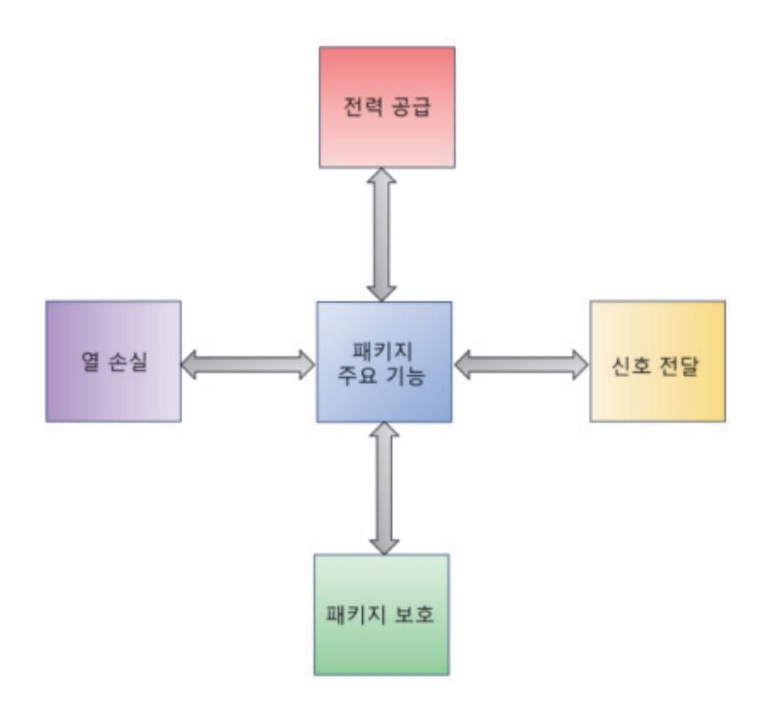

출처: 집필진 제작(2024) [그림 3-1] 패키지 공정 기술의 고려 사항

숕 제조 공정의 장단점 비교 항목

반도체 패키징 제조 공정 기술에 있어서 고려해야 할 중요한 사항은 4가지이며 이 사항들은 결국 패키지 제조 공정의 장단점을 파악하는 기준이 된다.

1. 성능 측면

기계적 안정성, 전기적 속도와 안정성, 열 방출 능력, 신뢰성 등의 성능 요구 특성을 만족 해야 한다. 성능은 전기적인 특성을 나타내며 판단은 시간 지연 항목이다. 시간 지연과 연 관된 변수는 아래와 같고, 결국 이런 구조와 설계를 구현하는 공정이 이루어져야 한다.

- (1) 회로의 집적도
- (2) 접속 길이
- (3) 패키지 재료
- 2. 패키지 크기 측면

칩이 소형화되더라도 패키지의 크기가 줄어들지 않으면 의미가 없다. 즉 패키지 효율을 높 이는 것은 패키지의 소형화와 성능에 큰 영향을 끼친다. 이는 최종 실장 되는 전자 제품의 크기를 결정하기 때문이다. 패키지 크기를 줄이는 방법은 아래와 같고, 소형화를 구현하기 위한 제조 공정이 필요하다.

(1) 4면 주변형(peripheral)에서 격자형(area array) 접속

(2) 리드의 피치 축소

3. 생산성과 가격 측면

아무리 좋은 설계와 구조를 가지고 있더라도 숙련된 생산 기술이 없으면 무의미하다. 더불 어 저가의 생산 기술은 패키지의 경쟁력을 강화한다. 가격 경쟁력이 있는 패키지의 설계, 재료, 공정과 계속적인 생산성 향상이 매우 중요하다.

4. 신뢰성 측면

시스템의 신뢰성은 각 부품의 결함 발생률에 의해 결정된다. 패키지의 신뢰성은 열, 전기적 특성에 좌우된다. 열적 신뢰성 증진은 설계와 재료 선택을 구현할 수 있다. 전기적 신뢰성 증진은 잡음을 줄이기 위한 신호와 접지 면을 분리하는 것이다. 이를 구현하기 위해서는 설 계, 적절한 재료 선별과 아울러 제조 공정 기술이 매우 중요하다. 어떤 제조 공정을 사용하 느냐에 따라 소자 특성이 완전히 달라지기 때문이다.

#### 숖 공정 문제점 해결 방안을 위한 점검 사항

공정과 장비에 의한 문제점을 해결하기 위한 첫 번째 단계는 공정의 규격서 검토가 먼저 선행 되어야 한다. 공정 규격서는 수행되어야 할 사용 재료, 공정 조건, 판정 조건, 사용 장비에 규 정하고 있다. 재료 부분에 있어서는 규격에 맞지 않는 재료 사용 시 불량이 발생할 확률이 매 우 높다. 비록 생산에서 문제가 발생하지 않을지라도 제품 사용 중에 실장된 제품에 고장을 유 발하는 요소가 된다. 문제점을 제시하기 위해서는 아래와 같은 점검이 이루어져야 한다.

#### 1. 문제점 제시를 위한 점검 항목

(1) 재료

재료의 수명, 보관 기간을 점검해 보고, 제조 회사의 연구팀과 회의를 통하여 개선점을 도출해야 한다.

(2) 공정

개발된 공정 조건이 해당 패키지 제품에 맞는지 공정 개발팀과 회의를 통해서 개선점을 도출해야 한다. 이를 위해서는 공정 파라미터별 공정 데이터의 통계적 분석이 이루어져 야 한다. 또한 품질 보증팀에서 관리하는 불량 보고서 중에서 유사한 불량 현상을 사례 연구하여 대응 방안을 마련해야 시간을 줄일 수 있다.

(3) 장비

먼저 주어진 패키지 제품 생산에 맞는 규격을 갖는 장비가 사용되었는지 점검한다. 문제 가 없다면 장비의 성능 유지와 관련된 자료들을 장비 엔지니어와 회의를 통하여 점검해 야 한다. 예를 들어 정기적인 유지 보수 데이터를 통해 입고 시 장비 사양과 비교 검토 하는 것이다.

(4) 반도체 칩 제조 과정

반도체 칩 제조 과정에서의 패드의 문제성 때문에 발생되는 경우도 있으므로 웨이퍼 제 조 회사와의 회의를 통해 점검되어야 한다.

(5) 분석

불량 요인이 무엇인지 패키지의 구조 분석, 화학 분석을 통하여 정확히 진단해야 한다.

숖 플립 칩 본딩의 불량 유형

반도체 플립 칩의 본딩 과정에서 발생할 수 있는 불량 사례는 다양한 원인으로 발생할 수 있으 며, 이러한 불량은 최종 제품의 성능과 신뢰성에 큰 영향을 끼칠 수 있다. 아래에 주요 본딩 불량 사례와 그 원인을 설명한다.

#### 1. 범프 접합 불량

(1) 사례 1: 범프 파손

(가) 원인

- 1) 본딩 압력이 너무 높거나 본딩 시간이 너무 길어서 범프가 파손될 수 있다.
- 2) 범프 재료의 열팽창 계수(CTE) 불일치로 인해 열 사이클 동안 기계적 응력이 발생 할 수 있다.
- (나) 해결 방안
  - 1) 본딩 압력과 시간을 최적화하여 기계적 스트레스를 최소화한다.
  - 2) CTE가 일치하는 재료를 선택하여 열 스트레스를 줄인다.
- (2) 사례 2: 범프 결함
  - (가) 원인

범프 형성 과정 중 불완전한 도금이나 리플로로 인해 범프에 기공이나 크랙이 생길 수 있다.

(나) 해결 방안

도금 및 리플로 공정을 최적화하고, 균일한 범프 형성을 위한 공정 조건을 유지한다.

- 2. 칩과 기판 간의 접합 불량
  - (1) 사례 1: 본딩 불량(non-wet)
    - (가) 원인

1) 솔더 범프가 기판 패드에 적절히 젖지 않아서 전기적 접합이 형성되지 않을 수 있 다.

- 2) 표면 산화나 오염으로 인해 솔더가 패드에 젖지 않을 수 있다.
- (나) 해결 방안
  - 1) 적절한 플럭스 사용 및 표면 세정을 통해 산화물과 오염물을 제거한다.

(가) 원인 반복적인 열 사이클로 인해 범프와 기판 간의 접합부에서 열피로가 발생할 수 있다.

- (2) 사례 2: 열피로

본딩 온도를 적절히 조절하고, 열 관리 시스템을 통해 과열을 방지한다.

1) 언더필 재료의 선택과 경화 공정을 최적화하여 수축을 최소화한다.

2) CTE가 일치하는 재료를 사용하여 열 스트레스를 줄인다.

(나) 해결 방안

(1) 사례 1: 열 손상

(가) 원인

4. 열적 불량

본딩 과정에서 과도한 열이 가해져 칩이나 기판이 손상될 수 있다.

(나) 해결 방안

인해 균열이 발생할 수 있다.

(가) 원인 경화 과정 중 언더필 재료의 수축이나, 열 사이클 동안 발생하는 기계적 응력으로

- (2) 사례 2: 언더필 균열
- 2) 진공 상태에서 언더필을 도포하여 기포를 제거한다.
- 1) 언더필 도포 공정을 최적화하고, 기포 발생을 최소화하는 조건을 설정한다.
- (나) 해결 방안

(1) 사례 1: 언더필 기포

- (가) 원인 더필 도포 과정에서 기포가 형성되어 접합 부위에 결함이 생길 수 있다.
- 3. 언더필 관련 불량
- 2) 적절한 솔더 양을 사용하고, 본딩 공정 조건을 조정한다.
- 1) 솔더 범프 크기와 간격을 최적화하여 브리지 발생을 방지한다.

- (나) 해결 방안
- 가 형성될 수 있다.

(가) 원인

(2) 사례 2: 솔더 다리(solder bridging)

과도한 솔더 사용이나, 솔더 범프 간의 간격이 너무 좁아 인접한 범프 간에 브리지

2) 본딩 온도와 시간 조건을 최적화하여 솔더가 잘 젖도록 한다.

1) 범프와 기판 간의 열팽창 계수(CTE)를 일치시켜 열피로를 줄인다.

2) 신뢰성 테스트를 통해 열 사이클 조건을 최적화한다.

- 5. 전기적 불량
  - (1) 사례 1: 오픈 회로
    - (가) 원인

본딩 불량이나 범프 파손으로 인해 전기적 접속이 끊어질 수 있다.

(나) 해결 방안

본딩 공정을 정밀하게 제어하고 범프의 기계적 강도를 향상시킨다.

- (2) 사례 2: 단락 회로
  - (가) 원인

솔더 브리징이나 범프와 기판 간의 불량 접속으로 인해 단락이 발생할 수 있다.

(나) 해결 방안

범프 간격과 솔더 양을 최적화하여 단락 발생을 방지한다.

- 6. 종합적인 개선 방안
  - (1) 공정 최적화: 본딩 압력, 시간, 온도 등의 공정 조건을 최적화하여 불량을 최소화한다.
  - (2) 재료 선택: 범프, 솔더, 언더필 등 재료의 특성을 신중히 선택하여 CTE 일치와 기계적 강도 를 보장한다.
  - (3) 검사 및 테스트: 각 공정 단계에서 엄격한 품질 검사를 수행하고, 신뢰성 테스트를 통해 불 량 발생 가능성을 사전에 제거한다.
  - (4) 장비 유지 보수: 본딩 장비와 검사 장비의 정기적인 유지 보수를 통해 공정 안정성을 유지한 다.
  - (5) 작업자 교육: 작업자들에게 공정 조건과 품질 관리 절차에 대한 교육을 실시하여 불량 발생 을 줄인다.

이와 같은 불량 사례와 해결 방안을 이해함으로써 반도체 플립 칩 본딩 공정의 품질을 향상시 키고, 최종 제품의 신뢰성을 높일 수 있다.

## 수행 내용 / 반도체용 플립 칩 재료 제조하기

#### 재료·자료

- 범프 재료[금속 재료: 금(Au), 은(Ag), 구리(Cu), 주석(Tin) 등, 솔더 페이스트 등]
- 언더필 재료(에폭시 기반 언더필, 경화제, 충전재 등)
- 접착 재료(실리콘 접착제, 프라이머 등)
- 기타 보조 재료(세정제, 탈기제 등)
- 재료 데이터 시트(material data sheets)
- 안전 데이터 시트(SDS: safety data sheets)
- 공정 매뉴얼(제조 공정 단계별 매뉴얼, 장비 운용 매뉴얼)
- 품질 기준 문서(품질 관리 기준서, 신뢰성 테스트 기준서)

기기(장비 ・ 공구)

- 도금 장비
- 리플로 오븐
- 디스펜서 및 경화 장비
- 세정 장비
- 검사 및 측정 장비
- X-ray 검사 장비: 내부 결함을 검사하는 X-ray 장비
- SEM(scanning electron microscope): 표면 구조를 분석하는 주사 전자 현미경
- 프로브 스테이션: 전기적 특성을 측정하는 프로브 장비

#### 안전 ・ 유의 사항

- 개인 보호 장비(안전 안경, 방진 마스크, 장갑, 방호복)를 착용해야 한다.
- 작업 환경 안전 법규를 준수해야 한다.
- 화학 물질 취급 안전(화학 물질 안전 데이터 시트(SDS), 화학 물질 보관 조건) 사항을 준수

93

해야 한다.

수행 순서

숔 반도체 플립 칩의 제조 공정별 장단점을 파악한다.

반도체 플립 칩 제조 공정은 여러 단계로 나뉘며, 각 단계마다 고유한 장점과 단점이 존재한 다. 이러한 공정은 칩의 성능, 신뢰성, 생산 효율성에 큰 영향을 끼친다. 다음의 플립 칩 제조 공정의 단계별 주요 장점과 단점 내용을 파악한다.

- 1. 웨이퍼를 준비한다(wafer preparation).
  - (1) 장점
    - (가) 정밀한 절단: 다이싱 소를 사용하여 웨이퍼를 정밀하게 절단하여 고품질의 칩을 얻을 수 있다.
    - (나) 효과적인 세정: 클리닝 솔루션을 사용하여 웨이퍼 표면의 오염물을 제거하여 후속 공정 의 품질을 향상시킨다.
  - (2) 단점

(가) 비용 증가: 고정밀 다이싱 장비와 클리닝 솔루션의 비용이 높아질 수 있다.

- (나) 오염 위험: 다이싱 및 세정 과정에서 웨이퍼가 오염될 위험이 있다.
- 2. 범프를 형성한다(bump formation).

(1) 장점

- (가) 고품질 접촉: 범프는 칩과 기판 간의 신뢰성 높은 전기적 및 기계적 접촉을 제공한다.
- (나) 고밀도 패키징: 범프를 사용하면 더 작은 면적에 더 많은 I/O를 배치할 수 있어 고밀도 패키징이 가능하다.
- (2) 단점
  - (가) 복잡한 공정: UBM 증착, 포토리소그래피, 도금, 리플로 등의 복잡한 공정이 필요하다.
  - (나) 비용 부담: 고가의 재료(금, 은 등)와 정밀 장비가 필요하여 비용이 높아질 수 있다.
- 3. 칩 플립 및 본딩을 한다(chip flip and bonding).
  - (1) 장점
    - (가) 우수한 전기적 성능: 칩 플립 및 본딩은 신호 전달 경로를 단축시켜 전기적 성능을 향상 시킨다.
    - (나) 열 방출 향상: 칩이 기판에 직접 접촉하므로 열 방출 효율이 높아진다.
  - (2) 단점
    - (가) 정렬 문제: 칩을 정확히 정렬하는 것이 어렵고, 정렬 오차가 발생할 수 있다.

94

(나) 장비 비용: 고정밀 정렬 및 본딩 장비가 필요하여 초기 투자 비용이 높다.

- 4. 언더필(underfill)을 진행한다.
  - (1) 장점
    - (가) 응력 완화: 언더필은 칩과 기판 사이의 열적 및 기계적 응력을 완화하여 신뢰성을 높인 다.
    - (나) 열 관리 개선: 열전도성이 높은 언더필 재료를 사용하면 열 관리가 개선된다.
  - (2) 단점
    - (가) 복잡한 도포: 언더필 재료의 균일한 도포가 어려울 수 있으며, 기포 발생 등의 문제가 발생할 수 있다.
    - (나) 경화 시간: 언더필 재료의 경화 시간이 길어 공정 속도가 느려질 수 있다.
- 5. 마감 공정(final packaging)을 진행한다.
  - (1) 장점
    - (가) 제품 보호: 몰딩 컴파운드는 칩을 외부 환경으로부터 보호하여 내구성을 향상시킨다.
    - (나) 다양한 표면 처리: 표면 도금(금, 니켈 등)을 통해 전기적 접촉성을 향상시키고, 부식에 강한 제품을 만들 수 있다.
  - (2) 단점
    - (가) 공정 복잡성: 몰딩, 트림, 형성, 표면 처리 등의 여러 공정 단계가 필요하여 공정이 복잡 하다.
    - (나) 비용 증가: 고품질 몰딩 컴파운드와 표면 도금 재료의 비용이 높아질 수 있다.
- 6. 종합적인 장점과 단점을 확인한다.
  - (1) 종합 장점
    - (가) 고밀도 및 고성능 패키징: 플립 칩 공정은 고밀도 패키징과 우수한 전기적 성능을 제공 한다.
    - (나) 우수한 열 관리: 칩과 기판 간의 직접 접촉과 언더필 재료를 통해 효과적인 열 관리가 가능하다.
    - (다) 신뢰성 향상: 범프 형성 및 언더필 공정은 칩의 기계적 신뢰성을 높여 준다.
  - (2) 종합 단점
    - (가) 높은 비용: 고가의 재료와 정밀 장비가 필요하여 초기 투자 비용이 높다.
    - (나) 공정 복잡성: 여러 복잡한 공정 단계가 필요하여 생산 과정이 복잡하고, 관리가 까다로울 수 있다.
    - (다) 정렬 및 도포 문제: 칩 정렬과 언더필 도포 과정에서 정밀한 제어가 필요하며, 이는 추

#### 가적인 기술적 도전 과제를 제시한다.

이와 같은 장단점을 이해함으로써 반도체 플립 칩 제조 공정에서 최적의 재료와 공정 조건을 선택하여 제품의 품질과 신뢰성을 향상시킬 수 있다.

숕 반도체 플립 칩 재료별 제조(공정·장비) 파라미터를 파악하고 적용한다.

반도체 플립 칩 제조 과정에서 사용되는 재료별로 공정과 장비의 파라미터를 파악하고 적용하 기 위해서는 체계적인 접근이 필요하다. 아래는 재료별로 필요한 주요 수행 내용이다.

- 1. 재료별 공정 파라미터 정의 내용을 파악한다.
  - (1) 범프 재료(예: 금, 은, 구리)
    - (가) 공정 파라미터
      - 1) 도금 속도: 전기 도금 과정에서 전류 밀도, 전압 등을 조절하여 도금 속도를 최적화 한다.
      - 2) 도금 두께: 범프의 두께를 균일하게 유지하기 위해 도금 시간과 전류 밀도를 조정한 다.
      - 3) 온도와 pH: 도금 용액의 온도와 pH를 적절히 유지하여 재료의 특성을 최적화한다.
    - (나) 장비 파라미터
      - 1) 도금 장비: 전기 도금 장비의 전류, 전압, 용액 순환 속도 등을 설정한다.
      - 2) 리플로 오븐: 리플로 프로파일(온도, 시간, 히트 업 레이트)을 최적화한다.

#### (2) 언더필 재료

- (가) 공정 파라미터
  - 1) 도포 속도: 언더필 재료를 균일하게 도포하기 위한 디스펜서의 속도를 설정한다.
  - 2) 경화 시간과 온도: 언더필 재료의 경화 조건을 최적화하여 균열이나 기포 발생을 최 소화한다.
- (나) 장비 파라미터
  - 1) 디스펜서: 디스펜서의 압력, 속도, 노즐 크기 등을 설정한다.
  - 2) 경화 오븐: 경화 오븐의 온도와 경화 시간을 설정하여 재료의 특성을 최적화한다.
- (3) 솔더 재료(예: 무연 솔더, Pb-Sn 솔더)
  - (가) 공정 파라미터
    - 1) 솔더 페이스트 도포 두께: 솔더 페이스트를 일정한 두께로 도포하기 위한 조건을 설 정한다.
    - 2) 리플로 프로파일: 솔더 페이스트의 리플로 프로파일(온도, 시간, 히트 업 레이트)을 최적화한다.

(나) 장비 파라미터

- 1) 스크린 프린터: 솔더 페이스트 도포 시 사용되는 스크린 프린터의 속도, 압력 등을 설정한다.
- 2) 리플로 오븐: 리플로 오븐의 온도, 히트 업 레이트, 시간 등을 설정한다.
- 2. 공정 파라미터 최적화를 위한 내용을 파악한다.
  - (1) 실험 계획법(DOE)
    - (가) 활동
      - 1) 다양한 공정 변수(온도, 시간, 압력 등)의 조합을 실험하여 최적의 조건을 찾는다.

2) 통계적 분석을 통해 변수 간의 상호 작용을 이해하고 최적화된 파라미터를 도출한 다.

- (2) 공정 시뮬레이션
  - (가) 활동
    - 1) 컴퓨터 시뮬레이션을 통해 공정 변수를 조정하고, 공정 결과를 예측한다.
    - 2) 시뮬레이션 결과를 실제 공정에 적용하여 검증한다.
- 3. 장비 파라미터 설정 및 유지 보수를 위한 내용을 파악한다.
  - (1) 장비 설정
    - (가) 활동
      - 1) 각 장비의 매뉴얼과 사양을 참고하여 최적의 설정값을 입력한다.
      - 2) 설정된 파라미터가 공정 요구 사항을 충족하는지 확인한다.
  - (2) 정기 유지 보수
    - (가) 활동
      - 1) 장비의 정기적인 유지 보수를 통해 안정적인 공정 수행을 보장한다.
      - 2) 장비의 성능을 지속적으로 모니터링하고, 필요시 조정한다.
- 4. 공정 모니터링 및 데이터 수집을 한다.
  - (1) 실시간 공정 모니터링
    - (가) 활동
      - 1) 공정 변동성을 실시간으로 모니터링하여 이상 발생 시 즉각적인 대응을 한다.
      - 2) 주요 공정 파라미터(온도, 압력, 시간 등)를 지속적으로 기록한다.
  - (2) 품질 데이터 수집
    - (가) 활동
      - 1) 각 공정 단계에서 품질 검사 데이터를 수집하여 공정 상태를 평가한다.
      - 2) 수집된 데이터를 분석하여 공정 개선점을 도출한다.

5. 문제 해결 및 공정 개선 활동을 위한 내용을 파악한다.

- (1) 문제 원인 분석
  - (가) 활동

1) 공정 중 발생하는 문제의 근본 원인을 분석한다.

2) fishbone 다이어그램, 5 Whys 등 문제 해결 도구를 사용한다.

(2) 공정 개선

(가) 활동

1) 분석 결과를 바탕으로 공정을 개선하고, 최적화된 파라미터를 적용한다.

2) 개선된 공정 조건을 지속적으로 모니터링하여 안정성을 유지한다.

- 6. 문서화 및 교육 내용을 파악한다.
  - (1) 공정 파라미터 문서화
    - (가) 활동
      - 1) 최적화된 공정 파라미터와 설정값을 문서화하여 표준 작업 절차(SOP)로 작성한다.
      - 2) 모든 변경 사항을 기록하고, 관련 부서와 공유한다.
  - (2) 교육 및 훈련
    - (가) 활동
      - 1) 작업자들에게 새로운 공정 파라미터와 절차에 대한 교육을 실시한다.
      - 2) 정기적인 훈련을 통해 작업자의 숙련도를 향상시킨다.

이와 같은 절차를 통해 반도체 플립 칩 제조 공정에서 사용되는 재료별 공정 파라미터를 최적 화하고 적용할 수 있다. 이를 통해 공정의 효율성과 제품의 품질을 높일 수 있다.

숖 반도체 플립 칩 재료별 제조 공정의 도출된 문제점에 대한 해결 방안을 제시한다.

반도체 플립 칩 제조 공정에서 도출된 문제점에 대한 해결 방안을 제시하기 위해 각 재료별로 발생할 수 있는 문제점과 이를 해결하기 위한 방안을 구체적으로 설명한다. 각 재료별로 문제 가 발생하는 공정 단계와 해당 문제를 해결하기 위한 방법을 제시한다.

- 1. 공정 단계별 문제 해결 방법을 숙지한다.
  - (1) 범프 재료 문제점 및 해결 방안
    - (가) 문제점 1: 범프 파손
      - 1) 원인
        - 가) 본딩 압력이 너무 높거나, 본딩 시간이 너무 길어서 범프가 파손될 수 있다.
        - 나) 범프 재료의 열팽창 계수(CTE) 불일치로 인한 열 사이클 동안 기계적 응력 발 생한다.

나) 재료 선택: 열팽창 계수(CTE)가 기판과 일치하는 언더필 재료를 선택하여 열

- 2) 해결 방안 가) 경화 조건 최적화: 경화 온도와 시간을 최적화하여 언더필 재료의 수축을 최소 화한다.
- 로 인해 균열이 발생한다.
- 1) 원인 경화 과정 중 언더필 재료의 수축이나, 열 사이클 동안 발생하는 기계적 응력으
- (나) 문제점 2: 언더필 균열
- 다) 진공 탈기: 언더필 도포 전에 진공 탈기 과정을 통해 기포를 제거한다.
- 나) 진공 도포: 진공 상태에서 언더필을 도포하여 기포를 제거한다.
- 최소화한다.
- 2) 해결 방안 가) 언더필 도포 공정 최적화: 언더필 도포 속도와 압력을 최적화하여 기포 발생을
- 언더필 도포 과정에서 기포가 형성되어 접합 부위에 결함이 발생한다.
- 1) 원인
- (가) 문제점 1: 언더필 기포
- (2) 언더필 재료 문제점 및 해결 방안
- 여 기공 및 크랙 발생을 최소화한다. 다) 검사 강화: 도금 및 리플로 후의 범프 품질을 검사를 강화하여 결함을 조기에 발견하고 수정한다.
- 일한 도금을 보장한다. 나) 리플로 조건 최적화: 리플로 프로파일(온도, 시간, 히트 업 레이트)을 최적화하
- 가) 도금 공정 최적화: 도금 조건(전류 밀도, 전압, 도금 시간 등)을 최적화하여 균
- 2) 해결 방안

2) 해결 방안

불완전한 도금이나 리플로로 범프에 기공이나 크랙 발생

- 1) 원인
- (나) 문제점 2: 범프 결함(기공, 크랙 등)
- 상시킨다.
- 다) 열처리 공정: 추가 열처리를 통해 범프 재료의 기계적 강도와 열적 안정성을 향
- 나) 재료 선택: CTE가 일치하는 재료를 선택하여 열 스트레스를 줄인다.
- 가) 본딩 조건 최적화: 본딩 압력과 시간을 최적화하여 기계적 스트레스를 최소화한 다.

- 다) 열사이클 테스트: 열사이클 테스트를 통해 언더필 재료의 신뢰성을 검증하고, 필요한 경우 재료를 개선한다.
- (3) 솔더 재료 문제점 및 해결 방안
  - (가) 문제점 1: 솔더 브리징
    - 1) 원인

과도한 솔더 사용이나 솔더 범프 간의 간격이 너무 좁아 인접한 범프 간에 브리 지 발생한다.

2) 해결 방안

(나) 문제점 2: 솔더 오프셋

2) 해결 방안

한다.

다.

(4) 범프와 기판 간의 접합 문제점 및 해결 방안

(나) 문제점 2: 솔더 오프셋 및 불균일성

(가) 문제점 1: 접합 불량(non-wet)

1) 원인

1) 원인

2) 해결 방안

2) 해결 방안

고, 오프셋을 조기에 수정한다.

1) 원인

- 가) 솔더 양 최적화: 솔더 페이스트 도포 양을 최적화하여 브리징을 방지한다.
- 나) 도포 및 프린팅 조건 조절: 솔더 페이스트 도포 두께와 프린팅 조건을 조절하여
- 균일하게 도포한다.
- 다) 리플로 프로파일 최적화: 리플로 프로파일을 조정하여 솔더가 적절하게 젖도록

- 한다.

가) 본딩 과정에서 칩이 기판에 정확히 정렬되지 않아 솔더 범프가 오프셋 발생

가) 정렬 장비 업그레이드: 고정밀 정렬 장비를 사용하여 칩과 기판을 정확히 정렬

나) 정렬 조건 최적화: 본딩 압력과 시간을 조정하여 칩과 기판의 정렬을 최적화한

다) 시각 검사 강화: 본딩 후 시각 검사 및 X-ray 검사를 통해 정렬 상태를 확인하

솔더 범프가 기판 패드에 적절히 젖지 않아서 전기적 접합이 형성되지 않는다.

가) 표면 세정: 플럭스 사용 및 표면 세정을 통해 산화물과 오염물을 제거한다. 나) 본딩 조건 최적화: 본딩 온도와 시간을 최적화하여 솔더가 잘 젖도록 한다.

- 100
- 솔더 범프가 기판 패드에 균일하게 분포되지 않아서 접합 불량이 발생한다.

가) 솔더 페이스트 도포 최적화: 솔더 페이스트의 도포 두께와 균일성을 개선한다.

나) 본딩 장비 정밀도 향상: 본딩 장비의 정밀도를 높여 균일한 접합을 보장한다.

- (5) 종합적인 개선 방안
  - (가) 공정 최적화: 각 재료의 특성과 공정 조건을 최적화하여 문제 발생을 최소화한다.
  - (나) 재료 선택: 공정 조건과 일치하는 최적의 재료를 선택하여 품질을 향상시킨다.
  - (다) 검사 및 테스트: 공정 단계마다 엄격한 품질 검사를 실시하여 결함을 조기에 발견하고 수정한다.
  - (라) 장비 유지 보수: 정기적인 장비 유지 보수를 통해 안정적인 공정 수행을 보장한다.
  - (마) 작업자 교육: 작업자들에게 공정 조건과 품질 관리 절차에 대한 교육을 실시하여 불량 발생을 줄인다.

이와 같은 절차를 통해 반도체 플립 칩 제조 공정에서 발생할 수 있는 문제점을 체계적으 로 분석하고 해결할 수 있다. 최적의 공정 조건과 재료를 선택하여 공정의 효율성과 제품의 품질을 높일 수 있다.

2. 숙지한 내용을 근거로 해결 방안을 제시한다.

반도체 플립 칩 제조 공정에서 도출된 문제점에 대한 해결 방안을 제시하기 위해 필요한 수행 내용을 다음과 같이 정리할 수 있다. 각 문제점에 대해 체계적인 분석과 검증을 통해 최적의 해결 방안을 도출하는 과정이다.

- (1) 문제점 식별 및 원인 분석
  - (가) 문제점 식별
    - 1) 활동
      - 가) 제조 공정 중 발생한 문제점을 체계적으로 기록하고 분류한다.
      - 나) 문제 발생 빈도와 영향을 평가하여 우선순위를 설정한다.
  - (나) 원인 분석
    - 1) 활동
      - 가) 5 Whys 분석: 문제의 근본 원인을 파악하기 위해 "왜?"를 다섯 번 반복하여 질문한다.
      - 나) fishbone 다이어그램(원인-결과 다이어그램): 문제의 원인을 범주별로 시각화하 여 분석한다.
      - 다) FMEA(failure mode and effects analysis): 잠재적 고장 모드와 그 영향, 발생 확률, 검출 가능성을 평가한다.
- (2) 해결 방안 도출
  - (가) 브레인스토밍 및 팀 회의
    - 1) 활동

나) 주요 공정 파라미터(온도, 압력, 시간 등)를 지속적으로 기록한다.

가) 공정 변동성을 실시간으로 모니터링하여 이상 발생 시 즉각적인 대응을 한다.

1) 활동

(가) 실시간 공정 모니터링

(5) 지속적 모니터링 및 피드백

나) 새로운 절차와 방법에 대한 훈련을 통해 작업자의 숙련도를 향상시킨다.

가) 변경된 공정과 해결 방안에 대해 작업자에게 교육을 실시한다.

1) 활동

(나) 교육 및 훈련

나) 최적의 공정 조건을 설정하고, 표준 작업 절차(SOP)를 업데이트한다.

가) 파일럿 테스트 결과를 바탕으로 공정을 조정한다.

1) 활동

(가) 공정 조정 및 최적화

(4) 개선 방안 실행

나) 해결 방안의 효과를 정량적으로 평가한다.

가) 테스트 결과 데이터를 수집하고 통계적 분석을 수행한다.

1) 활동

(나) 검증 데이터 분석

다) 필요시 추가 실험을 통해 해결 방안을 최적화한다.

나) 테스트 결과를 분석하여 문제 해결 여부를 평가한다.

가) 도출된 해결 방안을 파일럿 생산 라인에서 테스트한다.

1) 활동

(가) 파일럿 테스트

(3) 해결 방안 검증

한다.

- 다. 나) 통계적 분석을 통해 변수 간의 상호 작용을 이해하고 최적화된 파라미터를 도출
- 1) 활동 가) 다양한 공정 변수(온도, 시간, 압력 등)의 조합을 실험하여 최적의 조건을 찾는
- (나) 실험 계획법(DOE: design of experiments)
- 나) 각 해결 방안의 장단점과 실행 가능성을 평가한다.
- 가) 관련 부서와의 협력 회의를 통해 다양한 해결 방안을 브레인스토밍한다.

1) 활동

가) 정기적인 품질 검토 회의를 통해 문제 해결의 지속적 효과를 평가한다.

나) 고객 피드백을 수집하고, 추가 개선 사항을 반영한다.

(6) 문서화 및 보고를 진행한다.

(가) 문제점 및 해결 방안 문서화

1) 활동

가) 문제점 식별, 원인 분석, 해결 방안 도출 및 검증 과정을 상세히 문서화한다.

나) 모든 관련 데이터를 체계적으로 정리하여 내부 공유 및 교육 자료로 활용한다.

(나) 고객 보고서 작성

1) 활동

가) 문제점과 해결 방안에 대한 최종 보고서를 작성하여 고객에게 제출한다.

나) 문제 해결 후의 성능 개선 결과를 포함하여 고객의 신뢰를 확보한다.

3. 해결 방안 적용 사례를 파악한다.

(1) 문제점: 범프의 열팽창으로 인한 기계적 스트레스

(가) 해결 방안

1) 재료 변경: 열팽창 계수(CTE)가 더 낮은 재료로 변경

2) 열처리 공정 추가: 열처리 공정을 통해 재료의 열적 안정성 개선

3) 언더필 재료 개선: 열전도성이 높은 언더필 재료를 사용하여 열 방출 효율성 향상

(2) 문제점: 포토레지스트 패턴 불균일성

(가) 해결 방안

1) 포토레지스트 도포 조건 최적화: 도포 두께와 균일성을 개선하기 위해 회전 속도와 시간 조정

2) 노광 장비 업그레이드: 고해상도 노광 장비를 도입하여 패턴 정확성 향상

3) 현상 공정 개선: 현상액 농도와 현상 시간을 최적화하여 패턴 불균일성 감소

이와 같은 체계적인 절차를 통해 반도체 플립 칩 제조 공정에서 도출된 문제점을 해결하고, 최종 제품의 품질과 신뢰성을 향상시킬 수 있다. 각 단계에서 철저한 분석과 개선 활동을 통해 고객의 요구 사항을 충족시키고, 최상의 결과를 도출할 수 있다.

#### 수행 tip

- 플립 칩 재료 양산 라인에서 적용되는 플립 칩 제조 공정 도를 입수하여 수행 내용과 대응해서 이해한다.
- 플립 칩 재료의 공정 및 장비 파라미터의 적용 방법의 수행 간에 양산 라인 장비의 체험과 병행 할 수 있도록 한다.
- 케이스 스터디를 통해 플립 칩 제조 공정 과정에서 문제점 이 발생된 재료의 해결 방안을 도출하는 과정을 거친다.

### 학습 3 교수·학습 방법

#### 교수 방법

- 반도체 플립 칩 패키지 기술의 필요성에 대하여 설명한다.
- 반도체 플립 칩 패키지 제조 공정의 장단점을 성능, 패키지 크기, 생산성과 가격, 신뢰성 측 면에서 비교하여 설명한다.
- 반도체 플립 칩 패키지 제조 공정 기술별 장단점에 대하여 설명한다.
- 반도체 플립 칩 패키지재료별 제조(공정·장비) 파라미터를 설명한다.
- 반도체 플립 칩 패키지 공정 문제점 해결 방안을 위한 점검 사항에 대하여 설명한다.
- 반도체 플립 칩 패키지 시험 규격서에 대하여 설명한다.
- 반도체 플립 칩 패키지 불량 사례에 대하여 설명한다.

#### 학습 방법

- 반도체 플립 칩 패키지 기술의 필요성에 대하여 학습한다.
- 반도체 플립 칩 패키지 제조 공정의 장단점을 성능, 패키지 크기, 생산성과 가격, 신뢰성 측 면에서 비교한 자료를 학습한다.
- 반도체 플립 칩 패키지 제조 공정 기술별 장단점에 대하여 학습한다.
- 반도체 플립 칩 패키지 재료별 제조(공정·장비) 파라미터를 학습한다.
- 반도체 플립 칩 패키지 공정 문제점 해결 방안을 위한 점검 사항에 대하여 학습한다.
- 반도체 플립 칩 패키지 시험 규격서 작성에 대하여 학습한다.
- 반도체 플립 칩 패키지 불량 사례에 대하여 자료 정보 매체들을 통하여 조사하고 학습한다.

## 학습 3 평 가

#### 평가 준거

• 평가자는 학습자가 학습 목표를 성공적으로 달성하였는지를 평가해야 한다.

#### • 평가자는 다음 사항을 평가해야 한다.

|                          |                                                       | 성취수준 |   |   |
|--------------------------|-------------------------------------------------------|------|---|---|
| 학습 내용                    | 학습 목표                                                 | 상    | 중 | 하 |
|                          | - 반도체 플립 칩의 제조 공정별 장점과 단점을 파악할 수 있 다.              |      |   |   |
| 반도체용 플립 칩 재료 제조 | - 반도체 플립 칩 재료별 제조(공정 ‧ 장비) 파라미터를 파악하 고 적용할 수 있다.   |      |   |   |
|                          | - 반도체 플립 칩 재료별 제조 공정의 도출된 문제점에 대한 해결 방안을 제시할 수 있다. |      |   |   |

#### 평가 방법

• 서술형 시험

|                          |                                                          | 성취수준 |   |   |
|--------------------------|----------------------------------------------------------|------|---|---|
| 학습 내용                    | 평가 항목                                                    |      | 중 | 하 |
| 반도체용 플립 칩 재료 제조 | - 반도체 플립 칩의 제조 공정도에서 언더필 공정의 장점과 단점을 파악할 수 있는 능력      |      |   |   |
|                          | - 범프 재료의 공정 파라미터로부터 해당 공정 진행을 위한 장비 파라미터를 적용할 수 있는 능력 |      |   |   |
|                          | - 반도체 플립 칩 범프 파손의 문제점에 대한 해결 방안을 제 시할 수 있는 능력         |      |   |   |

#### • 평가자 체크리스트

|                          |                                                            | 성취수준   |  |   |
|--------------------------|------------------------------------------------------------|--------|--|---|
| 학습 내용                    | 평가 항목                                                      | 상 중 |  | 하 |
| 반도체용 플립 칩 재료 제조 | - 플립 칩 공정의 장점과 단점으로부터 해당 공정을 파악할 수 있는 능력                |        |  |   |
|                          | - 반도체 플립 칩용 솔더 재료의 장비 파라미터로부터 공정 파라미터를 파악하고 적용할 수 있는 능력 |        |  |   |
|                          | - 반도체 플립 칩 언더필 기포 문제점에 대한 해결 방안을 제 시할 수 있는 능력           |        |  |   |

피드백

- 1. 서술형 시험 - 반도체 플립 칩의 제조 공정도에서 언더필 공정의 장점과 단점을 파악할 수 있는 능력을 평가한 후, 보완이 필요한 사항이나 주요 사항을 표시하여 피드백해 준다. - 범프 재료의 공정 파라미터로부터 해당 공정 진행을 위한 장비 파라미터를 적용할 수 있는 능력 을 평가한 후, 보완이 필요한 사항이나 주요 사항을 표시하여 보충 설명해 준다. - 평가 결과가 우수한 학습자와 미흡한 학습자를 구분하여 우수한 학습자들에게는 작업장 환경에 서술형 평가 내용의 적용 사례 학습을 통한 심화 학습으로 피드백해 주고, 미흡한 학습자들에게는 기초 지식 설명을 통해 일정 수준을 유지할 수있도록 보완하여 지도해 준다. 2. 평가자 체크리스트
- 반도체 플립 칩 재료별 제조(공정·장비) 파라미터를 파악하고 적용할 수 있는 능력을 확인한 후 부족한 점을 지적하여 정확하게 처리할 수 있도록 보완하여 지도해 준다.
- 반도체 플립 칩 재료별 제조 공정의 도출된 문제점에 대한 해결 방안을 제시할 수 있는 능력을 평가한 후, 개선 및 보완 사항을 정리하여 재학습할 수 있도록 피드백한다.
- 평가 결과가 우수한 학습자와 저조한 학습자를 구분하여 우수한 학습자들에게는 작업장 환경에 적용 사례 학습을 통한 심화 학습으로 피드백해 주고, 저조한 학습자들에게는 기초 지식에 대한 설명을 통해 일정 수준을 유지할 수 있도록 보완하여 지도해 준다.

| 학습 4 | 반도체용 플립 칩 제품 특성 검증하기    |
|------|-------------------------|
| 학습 3 | 반도체용 플립 칩 재료 제조하기       |
| 학습 2 | 반도체용 플립 칩 재료 선정하기       |
| 학습 1 | 반도체용 플립 칩 재료 요구 사항 파악하기 |

## 4-1. 반도체용 플립 칩 제품 특성 검증

| 학습 목표 | • 반도체 플립 칩의 분석 시 문제점에 대한 해결 방안을 제시할 수 있다. |
|-------|-------------------------------------------|
|       | • 반도체 플립 칩의 시험 시 문제점에 대한 해결 방안을 제시할 수 있다. |
|       | • 반도체 플립 칩의 평가 시 문제점에 대한 해결 방안을 제시할 수 있다. |
|       | • 반도체 플립 칩의 검증 시 문제점에 대한 해결 방안을 제시할 수 있다. |

## 필요 지식 /

숔 분석의 필요성

제품의 품질을 향상시키고 최적화하기 위해서는 검사기준 설계, 생산 과정과 생산 이후의 제품 에 대하여 물성 평가, 통계적 품질 분석 등을 연속적으로 수행해야 한다. 일반적으로 제품 분석 은 개발 단계에서 발생되는 불량 제품에 대하여 행하여진다. 물론 양품도 표준 제품으로 제품 규격서를 작성하기 위해 분석이 이루어진다. 이후 불량 제품은 이 표준 제품과 비교·분석된다. 생산 과정에서의 제품 분석은 재료, 장비, 공정의 최적화를 이루기 위해 행해진다. 시장에서 발 생되는 제품 고장 분석은 고객의 불만을 해소시키기 위해 수행된다. 불량 분석의 사전적 의미는 제품의 기능이 작동하지 않거나 작동은 하나 성능이 요구 수준을 만족하지 못하는 경우 제품의 제조 공정이나 사용 중 발생한 불량의 원인을 분석하는 활동이며, 이 활동을 통하여 불량의 존 재 여부 파악, 근본 원인 파악, 개선 대책을 수립한다. 결국, 분석은 생산 제품의 불량 분석과 사용 제품의 고장 분석으로 대별되지만 본 학습에서는 불량 분석이란 용어로 통일하여 서술한 다. 분석을 통해 얻은 결과들은 품질 관리 담당자가 일정 기간 불량품의 발생 현황을 파악하고 추이를 분석하여 발생 빈도가 높은 유형 또는 불량품이 증가되는 품목 등의 우선순위를 부여한 감소 계획을 수립하여 실시하여야 한다.

숕 불량 분석

1. 불량 분석의 원칙

정확한 분석을 위해서는 몇 가지 지켜야 할 원칙이 있다.

(1) 불량을 명확히 정의해야 한다.

분쟁의 원인, 불량 재현의 기준, 제품 규격 등

- (2) 불량은 복합적인 스트레스의 결과임을 인식해야 한다. 다양한 스트레스 + 잠재적인 원인
- (3) 왜곡된 정보에 의한 선입견을 버려야 한다.
- (4) 통계적 기법에 근거해 고장의 의미를 파악한다. 누적 도수도, 산포도, 히스토그램 등
- (5) 논리적이고 합리적으로 접근한다.
- (6) 불량은 가능한 한 재현하여 검증해야 한다.
- 2. 불량 분석의 절차 및 방법

불량 분석은 논리적 체계를 가지고 진행되어야 정확한 결과를 얻을 수 있다. 분석 절차에 관한 한 흐름도가 [그림 4-1]에 도시되어 있다. 절차에 따른 세부 단계에 대하여 살펴본다.

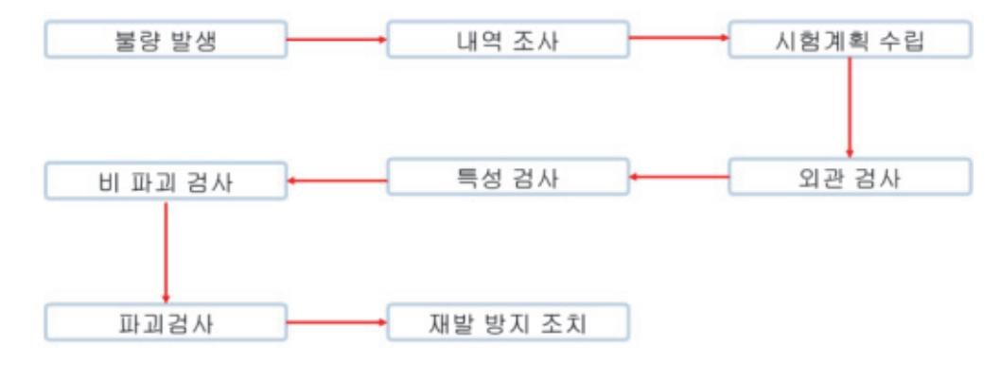

출처: 집필진 제작(2024) [그림 4-1] 불량 분석 절차도

(1) 내역 조사

불량이 발생되었을 때 맨 처음 해야 하는 작업은 출하 검사서의 파악이다. 출하 검사란 출하 전 완제품에 대한 검사 계획을 수립하여 검사 실시 후 그 결과를 분석하여 고객의 요구 사항을 만족하는지를 확인하고 부적합이 발생할 경우 이에 대한 제품 품질을 유지 보수하기 위한 것이다. 출하 검사서 및 동봉된 검사 성적서, 불량 항목을 통해 불량 현 상 및 원인을 파악할 수 있다. 출하 검사는 2가지 방법으로 실시한다.

(가) 전수 조사

고객에게 인도할 모든 제품에 대해 검사 방식이다.

(나) 선별 조사

고객에게 인도할 제품 중 일부를 무작위 검사 방식이다.

(2) 실험 계획 수립

실험 계획법에 의한 불량 요인 확인 단계로써 주어진 자원(비용, 인력, 시간 등) 안에서 최대의 정보를 얻고자 실험 방법과 분석 방법을 계획하는 것으로, 출력 변수에 영향을 미치는 입력 변수의 종류 및 영향력 가중치를 도출하여 최적화하는 것이 목적이다. 이를 통해 불량의 주요한 원인 공정을 집중적으로 개선하여 제품 생산의 수율 향상이 가능하 다. 실험 계획법은 크게 3단계로 구분되며 각 단계에 적합한 실험의 유형이 있다. [그림 4-2]에 단계별 수행 사항이 도시되어 있다.

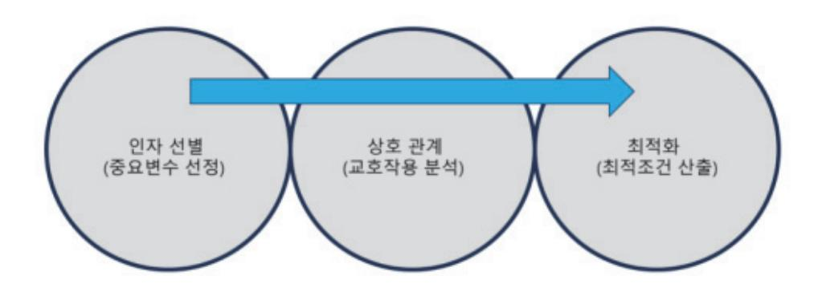

출처: 집필진 제작(2024) [그림 4-2] 실험 계획법 3단계

(가) 인자 선별(screening)

입력 인자 중에서 영향력이 큰 중요 변수를 선별하는 단계이며 부분 요인 실험이 적 합하다. 부분 요인 실험은 수준 및 처리 조합의 수를 줄여서 진행한다.

(나) 상관관계(characterization)

중요 인자들의 출력 변수에 미치는 특성을 파악하고, 정량화하는 단계이며 부분 요 인 실험 및 완전 요인 실험을 진행한다.

(다) 최적화(optimization)

입력 인자의 최적 조건을 도출하는 단계로 반응 표면 실험 또는 다구찌 실험 계획법 을 통해 진행한다.

(3) 외관 검사

광학 현미경을 이용하여 패키지 제품의 외관 결함이 없는지 먼저 확인하는 단계이다.

(4) 특성 검사

패키지 제품의 전기적 특성을 측정하는 단계이다. 검사는 4가지로 분류하여 실시한다.

(가) 단락(short)

회로가 합선된 상태

(나) 단선(open)

회로가 연결되지 않은 상태

(다) 일정하게 정상 값을 벗어나는 특성치 변화(parameter shift)

(라) 시간에 따라 변화하는 특성치 불안정(electric instability)

(5) 비파괴 검사

파괴 검사 전 비파괴 방법으로 패키지 제품의 내부 불량을 확인하는 단계이다. 검사 방 법 및 장비에 대하여 알아본다.

(가) X-선 검사

X선은 전자 방사선 형태의 짧은 파장을 갖는 광선의 일종으로 에너지가 크기 때문에 물질을 쉽게 투과할 수 있으며, 투과 시에 물질의 밀도 및 구성 원자에 따라 X선의 투과율이 달라지는 원리를 이용하여 비파괴 검사 장비로 널리 사용되고 있다. 패키 지 내부의 Au 와이어, 리드 프레임 형태 및 불량 양상을 확인할 수 있을 뿐만 아니 라, PCB의 tracer와 솔더 볼의 기공(void) 분포 정도 등의 이상 유무도 확인이 가 능하다.

(나) X-선 컴퓨터 단층 촬영(x-ray computed tomography system)

물체의 횡단면을 여러 각도에서 X선을 투사하여 얻은 많은 영상(다중 투시: multiple projection)으로부터 내부 구조를 단층 영상으로 재구성할 수 있다. 플립 칩 범프 기공과 결합 깨짐, DAF 기공과 PCB 패턴 깨짐, 와이어 본딩 단락 불량을 관찰할 수 있다.

(다) SAT 검사(scanning acoustic tomography)

가청 주파수 이외의 주파수를 갖는 초음파의 물리적인 성질을 이용하여 전자 부품 내부의 결함, 즉 깨짐, 박리 현상의 위치 및 크기를 측정할 수 있는 비파괴 분석 장 비 검사이다. 에너지 변환기(transducer)에서 발생한 초음파는 소재 내부로 침투되 어 진행하며 초음파의 진행 경로상에 결함이 존재할 경우 그 결함으로 초음파는 반 사되어 되돌아오게 되는데 그 음파를 감지하여 초음파가 진행한 거리만큼 디지털 오 실로스코프의 화면에 펄스 신호가 나타나게 된다. 이때 모니터 화면에 나타난 신호 의 위치와 크기를 읽어 결함에 대한 크기와 위치를 평가할 수 있다. SAT 검사는 스 캔(scan) 방식에 따라 다양한 부분을 관찰할 수 있다.

1) A-scan

오실로스코프에 나타난 반사파의 위상과 크기로 불량 유무 검사가 장점이며, 초 음파 검사 방법 중 가장 정확한 검사 방법이다. 그러나 단점은 초음파가 투과되 고 있는 그 지점만 분석이 가능하다는 것이다.

2) B-scan

반도체의 각 계면에서 돌아오는 신호의 크기와 전파 시간을 수집하여 그 단면의

이미지를 볼 수 있다. 패키지 깨짐, 기울임, 기공 관찰이 용이하다. 장점은 불량 이 존재하는 위치(높낮이) 판단이 가능하다는 점이다.

3) C-scan

검사하고자 하는 접합면에 초점하여 검사하는 방법이다. 반사파의 위상과 크기를 분석하여 접합면의 상태를 보여 줄 수 있다. 들뜸(delamination), 칩 깨짐을 관 찰할 수 있다. 장점은 초음파 검사방법 중 가장 정밀한 검사 방법이다. 그러나 단점으로 숙련된 전문가가 필요하다는 점이다.

4) TAMI-scan

반도체 내부를 수평으로 1~99등분 하여 검사 가능하고, 전문가가 필요 없다.

5) T-scan

패키지를 향해 초음파를 발생시킨 다음 그 반도체를 투과해 나오는 초음파를 분 석하는 방식으로 모든 초음파 검사의 가장 기초적인 방법이다. 장점은 초보자의 경우도 실수 없이 검사 가능하다는 점이고, 단점은 불량 유무만 알 수 있고 크기 와 위치는 알 수 없다는 것이다. 들뜸(delamination) 불량이 존재할 경우에는 발생 위치에서는 초음파가 반사되어 리시버(receiver)에 도달하지 못해 검은색으 로 표시된다.

(라) HEA(hot electron analyzer)

1) 광자 방출 분석 시스템(PHEMOS: photon emission microscope) 웨이퍼 또는 패키지 상태의 소자에 전기적 신호를 인가한 후 불량 위치에서 발생 하는 미약한 광자(photon)을 검출하는 시스템으로, 소자의 누설 전류 및 단락 불 량 위치를 검출할 수 있다. 대기 전류(standby current) 불량, 핀(pin) 누설 불

- 량, 정전기(ESD) 불량을 관찰할 수 있다.
- 2) 열 방출 분석 시스템(THEMOS: thermal emission microscope) 소자에 전기적 신호를 인가한 후 불량 위치에서 발생하는 열을 검출하는 시스템 으로, 소자의 누설 전류 및 단락 불량 위치를 검출할 수 있다. 금속 패턴 단락, 컨텍 저항 이상 부위 관찰이 가능하며, 소자의 이상 위치 관찰이 가능하다.
- (6) 파괴 검사
  - (가) EMC 봉합 제거(decapsulation) 검사 방법

패키지 내부의 칩을 보호하기 위한 EMC를 제거하여 내부의 칩 또는 Au 와이어, 리 드 프레임 등을 관찰하기 위한 방법으로 2가지 방법으로 진행한다.

1) EMC의 일부분을 선택적으로 제거하는 hole decapsulation

내부의 와이어와 본딩 패드에 손상 없이 EMC를 제거하여 추가적인 전기적 측정 이 가능하다.

2) EMC 전부를 제거하는 full decapsulation

(나) 절단 단면 검사 방법

물리·화학적 방법으로 비파괴 검사로부터 관찰한 불량 부분을 직접 절단하여 광학 현미경으로 관찰하는 방법이다. 시료 제작 방법은 수동적인 방법, 이온 밀링(ion milling) 방법, 플라즈마 식각 방법이 있다.

1) 수동적인 방법

패키지의 단면을 관찰하는 데 사용하는데 원하는 부위의 단면 확인을 통해 구조 분석 및 불량의 원인을 검출하는 방법이다. 비파괴 검사 단계인 SAT(scanning acoustic tomography)를 통해 검출된 박리 현상에 대해 정확한 불량 부위를 확인하는 방법이다.

2) 이온 밀링(milling) 방법

미소, 미세 불량 단면 가공과 단면, 평면을 이온으로 갈아내어 관찰하는 방법이 다. 진공 중에서 이온을 만들고, 이온 방향을 가지런히 하고, 가속한 것을 조사하 여 가공을 하는 방법이다. 정밀한 가공을 효율적으로 할 수 있다는 장점이 있다.

#### 3) 플라즈마 식각 방법

화학 용품을 사용하지 않고 식각 가스를 이용하여 실리콘 칩, DAF, 폴리이미드 보호층을 선택적으로 식각하여 광학 현미경으로 불량 부위를 관찰한다. [그림 4-3]에 플라즈마 식각법에 의한 불량 관찰 순서도가 도시되어 있다.

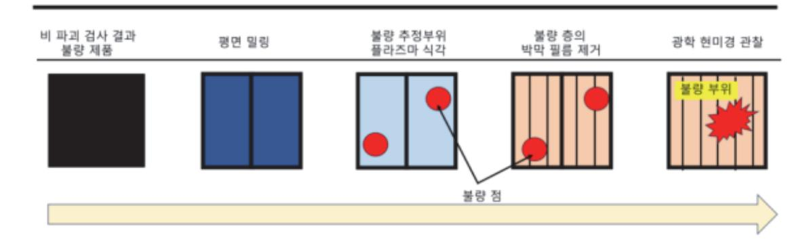

출처: 집필진 제작(2024) [그림 4-3] 플라즈마 식각법에 의한 불량 관찰 순서도

(다) 전자-광학적 기기에 의한 검사 방법

1) 주사형 전자 현미경 검사(SEM: scanning electron microscope inspection) 관찰하고자 하는 시료의 미세한 부분을 확대하여 관찰하고 분석하는 데 사용한 다. 1,500배 정도의 배율로 관찰할 수 있는 광학 현미경에 비하여 SEM은 80만 배 이상의 높은 배율로 시료의 관찰이 가능하다. SEM은 전자 빔(beam)을 시료 표면에 주사할 때 시료 표면에서 방출되는 2차 전자(secondary electron)를 검 출기로 검출하고 증폭하여 모니터 상에 동기로 주사하며 표면의 높낮이를 나타내 는 영상으로 형성화하는 분석 방법이다.

2) EDX(energy dispersive X-ray spectroscope) 검사

미지의 시료의 화학 조성을 분석하기 위한 장비로서, 시료에서 발생되는 특성 X-선(characteristic X-ray)을 검출기 결정을 구성하는 실리콘 단결정의 p-i-n 반 도체 소자를 이용하여 에너지의 형태로 검출, 증폭하여 스펙트럼(spectrum) 형태 로 보여 주게 된다.

3) 푸리에 변환 적외선 분광법(FT-IR: fourier transform infrared spectroscopy) 검 사

미지 시료나 구성 성분을 알고자 하는 시료에 대해 적외선(IR) 빔의 광 흡광도 및 투과도를 측정하여 시료가 가지고 있는 적외선 빔에 대한 지문 영역을 이용하 여 정성, 정량을 측정하는 방법이다. 유기물 및 무기물, 반도체 웨이퍼, 폴리머 (polymer)의 화합물을 연구할 수 있으며 반응 속도, 성분 측정, 미소 샘플 검사 에 이용된다. 패키징 공정 유기 이물질 분석과 고체, 필름, 겔(gel)형 성분 분석. 촉매 및 금속 표면에 증착된 박막 등의 미세시료 분석에 사용하는 방법이다.

- (7) 재발 방지 조치
  - (가) 시정 및 예방 조치

잠재적 불량을 효과적으로 예방하고, 부적합 사항이 발생되었을 경우에 처리 절차를 명확히함으로써 효과적인 시정 및 예방 조치가 이루어지고 기술 축적과 품질 안정을 도모함에 그 목적이 있다.

- (나) 시정 및 예방 조치 계획
  - 1) 시정 조치 실시 팀장은 시정 및 예방 조치를 실시하여야 하며, 담당자는 불량 사항 에 대한 원인을 분석하기 위하여 필요한 경우 관련 팀과 대책 회의를 실시하여야 한다.
  - 2) 대책 회의 결과 수립된 실시 계획은 다음의 내용을 기재하여 팀장의 승인을 득한 후 실시 계획에 따라 진행한다.
- (다) 시정 및 예방 조치 실시
  - 1) 시정 조치 실시 담당자는 승인된 실시 계획에 따라 시정 조치를 실시하여야 하며, 실시 도중 계획 변경이 필요한 경우에는 협의 후 실시한다.
  - 2) 요구 팀 시정 조치 담당자는 시정 조치의 진행사항을 확인해야 하며, 팀장은 접수된 시정 및 예방 조치 계획서에 따라 실시 상태가 미흡할 경우 확인 독려한다.
- 3. 불량 사례를 통한 문제점 해결 방안 제시 및 분석 기법
  - (1) 문제점 해결 방안

분석 시 발생되는 문제점을 제시하기 위해서는 사례에 대한 폭넓은 지식을 가지고 있어 야 한다. 지식 확보를 위해서는 관련 특허, 논문 조사와 아울러 인터넷을 이용하여 불량 유형의 모습을 조사하여야 한다. 분석자가 가져야 기본적인 지식에 관한 관계도가 [그림 4-4]에 도시되어 있다. 그림에서 보다시피 기본적으로 갖추어야 할 조건은 크게 3가지 분야이다. 재료의 불량에서 오는 요인 분석 기술, 제조 공정 상에서 오는 불량 요소의 파악을 위한 통계적 분석 기술, 전기적 특성을 측정하여 규격과 대비해서 벗어나는 요인 을 찾기 위한 측정 기술 및 설계에 관련된 회로 분석 기술이다.

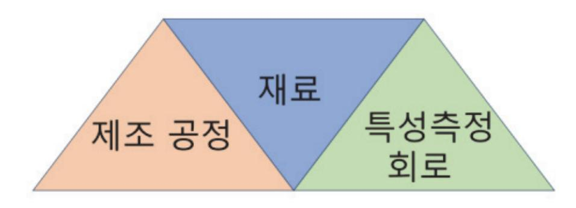

출처: 집필진 제작(2024) [그림 4-4] 분석가가 갖추어야 할 필수 3대 분석 기술

(2) 분석기법

분석이 끝난 후 분석된 결과로 개선해야 할 항목을 도출해야 한다. 일반적으로 통계적 기법이 사용되고, 대표적인 방법이 식스 시그마 방법이다.

(가) 식스 시그마의 개요

모든 종류의 프로세스에서 결함을 제거하고 목표로부터의 이탈을 최소화하여 이득 및 고객 만족을 최대화하려는 경영 전략이다. 식스 시그마 기법을 토대로 생산 품질 뿐만 아니라 회사의 모든 부서의 업무에 적용이 가능한 통계학적 기법이다. 식스 시 그마는 정규 분포에서의 표준 편차를 나타내며, 표준 편차는 100만 개의 샘플 중에 3.4개에 해당하는 것으로 불량률이 0에 가까움을 뜻한다.

(나) 식스 시그마 기법

식스 시그마 활동은 크게 5단계로 이루어진다. DMAIC, DMADV 2가지 방식이 존 재하는데 DMAIC가 결함의 감소에 중점을 둔다면 DMADV는 결함을 방지하는 데 목적을 둔다.

- 1) DMAIC(define, measure, analyze, improve, control)
  - 가) Define(정의): 제품 생산의 목표(수율 등)를 정한다.
  - 나) Measure(측정): 목표에 영향을 끼치는 요소를 찾아낸다.
  - 다) Analyze(분석): X인자의 Y에 대한 영향력을 분석한다.

- 라) Improve(개선): 영향력이 큰 X인자를 제어하여 Y인자를 개선한다.
- 마) Control(관리): 개선된 입력 변수의 변동성을 관리한다.
- 2) DMADV(define, measure, analyze, design, verify)
- 숖 패키지 제품의 성능 시험

패키징 공정을 통하여 최종제품이 완성되면 칩을 포함한 올바른 기능을 시험한다. 시험 항목은 웨이퍼 수준에서 측정한 항목과 동일하게 이루어진다. 즉, 패키지 시험(package test)은 패키 지 형태로 만들어진 제품의 최종 불량 유무를 선별하는 시험이다. 이 시험은 완제품 형태를 갖 춘 후, 검사가 진행되기 때문에 최종 시험(final test)이라고도 한다. 패키지 시험은 반도체를 시험 장비(tester)에 넣고 다양한 조건의 전압이나 전기 신호, 온도 등을 가해 제품의 전기적 특성, 기능적 특성, 동작 속도 등을 측정하여 불량 유무를 구별한다. 또한 시험 중 발생하는 데 이터를 수집·분석해 그 결과를 제조 공정이나 조립 공정에 피드백하여 제품의 질을 개선하는 역할을 한다. 반도체는 각 제품별로 그에 적합한 패키지 시험을 거친다. 본 학습에서는 메모리 제품인 DRAM을 기준으로 시험에 관한 사항을 알아본다. [그림 4-5]에 패키지 시험 흐름도가 도시되어 있다.

출처: 집필진 제작(2024) [그림 4-5] 키지 제품 시험 흐름도

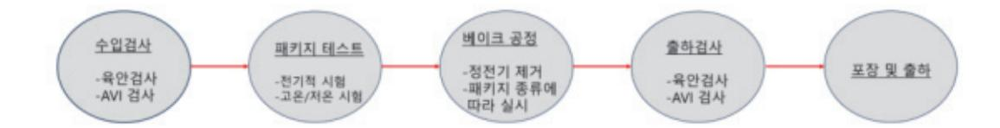

출처: 집필진 제작(2024)

[그림 4-6] 패키지 제품 시험 흐름도

1. 시험 장비 선정

패키지 제품 성능 시험 장비 선정도 기본적으로 웨이퍼 레벨의 경우와 같다. 이유는 시험 항목도 동일하고 제품 규격도 같기 때문이다. 물론 고객이 요구하는 사항에 따라 다소 달라 질 수 있지만 거의 유사하다고 보면 된다. 중요한 사항은 주검사기는 동일하지만 칩을 테스 트 위치로 이송하는 역할을 하는 핸들러 시스템, 칩을 고정시키고 시험 입출력 배선에 연결

시키는 지그나 소켓 보드(board), 웨이퍼 레벨에서 수행하지 못했던 번인(burn-in) 항목을 시험하도록 환경을 제공하는 번인 시스템과의 최적의 조건을 이루는 장비를 선정해야 한다. 이 사항에 대해서는 NCS 학습모듈 1903060109\_23v4[중분류(전자기기 개발)/소분류(반도 체 개발)/세분류(반도체 개발)/반도체 제품 기능·성능 검증] 모듈을 참조한다.

- 2. 시험 종류
  - (1) 제품 수입 검사

제품의 첫 시험 관문은 공정 완료된 제품 종류, 수량, I/O 수(bit 수) 등의 확인이다. 확 인 후 제품 검사지(lot card)를 작성한다. 제품 검사지에는 모든 공정 과정과 시간, 수 율, 담당자, 사용 프로그램 등이 기록되어야 한다. 이 검사지는 입고 시부터 제품과 함 께 이동하고, 출고 후에도 일정 기간 보관한다.

(2) DC 시험 & 번인(burn-in) 시험

DC 시험은 FAB 및 조립 공정을 거치면서 발생된 불량을 선별하는 시험이다. 시험 항 목은 단락(short)과 단선(open)이다. 패키지에서 배선의 형태를 확연히 구분할 수 있는 항목이다. 이 단계를 거치면 초기 불량의 선별을 위한 번인(burn-in) 시험이 진행된다. 번인 시험은 불량 가능성이 있는 제품을 사전에 제거하기 위한 시험이다. 제품에 고전 압, 고온, 전기 신호 등 극한 조건을 가하게 되며 이후 별도의 시험을 통해 양품과 불량 품을 선별한다. 이러한 검증 과정을 통과해야만 PC나 IT 제품 등의 전자 기기가 오류 없이 동작할 수 있는 신뢰성을 확보하게 된다.

(3) AC 시험

패키지 제품의 교류와 관련된 전기적 특성을 측정한다. DUT(design under test) 입력 단자에 펄스 신호를 인가하여 입출력 운반지연, 출력 신호의 시작·종료 시간 등을 판단 하여 속도 등급을 판정한다.

(4) 번인 시험 모니터링(MBT: monitoring burn-in & test)

MBT 시험은 제품에 열적, 전기적인 극한 조건을 가하는 과정에 부가하여 시험 기능까 지 추가된다. 일반 번인 시험에 비해 불량 분석 기간을 단축할 수 있고, 품질 불량을 보 다 강화할 수 있는 장점이 있다. 패키지 상태에서의 번인(PLBI: package level burn-in) 공정은 메모리 소자들을 번인 보드의 소켓에 삽입한 뒤 체임버 안에 넣고, 일 반적으로 125℃에서 일정 시간 동안 소자에 일련의 기능 테스트를 수행하여 제품의 기 능이 정상 또는 비정상인지 가려낸다.

(5) 기능 시험(functional test)

상온 및 저온에서 진행되는 DC와 번인 시험을 통과한 패키지 제품들은 패키지의 미세 한 접촉 불량을 가려내기 위해 고온에서 반도체의 전기적 특성 및 기능을 시험한다.

숗 평가의 필요성

표면 실장 기술의 눈부신 발전에 힘입어 전자 부품의 배선 간격 미세화와 프린트 회로 기판 (PCB)이 광범위하게 사용되기 시작하면서 열 피로에 의한 솔더 깨짐이나 전자 이동(electron migration) 등에 의한 단락 고장이 표면화되고 있다. 또한 환경 규제에 따른 무연 재료의 사 용, 휴대 기기나 자동차 등 사용 환경의 다양화, 신재료 및 신구조의 채용, 저 비용화 등으로 인해 고장을 일으키는 조건이 증가하고 있다. 패키징 기술의 신뢰성은 제품 전체 신뢰성의 큰 부분을 차지하게 되어 새로운 신뢰성 기술의 개발이 요구된다. 신뢰성 평가를 통해서 설계 변 경 위험(초기 고장, 설계 마진 및 내구성 부족) 감소, 고장 원인 규명 및 사고 대책 수립, 계약 요구 사항, 국제 시험 규격(JEDEC, MIL) 만족, 신뢰도 예측, 설계 및 시험의 기초 자료와 고 장 메커니즘 조사, 시험 방법 검토 등 기술 정보 수집 등이 가능하다.

1. 신뢰성 평가 기술의 개발 순서

소비자가 사용 시 고장을 재현하는 것과 같은 시험 조건이나 방법을 찾는 것은 먼저 실제 사용 환경 조건을 세밀하게 조사해야 한다. 또한 제품에 인가되는 스트레스(stress)와 고장 메커니즘(mechanism)을 알아야 한다. [그림 4-6]에 기본적인 신뢰성 평가 기술의 접근 방 법을 도시하였다.

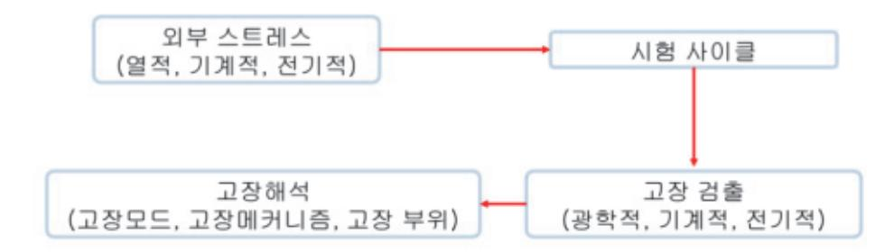

출처: 집필진 제작(2024) [그림 4-7] CERDIP 적층 패키지 구성 요소

환경 스트레스로서는 열적, 전기적, 기계적 스트레스 등이 주원인인 경우가 많다. 시험 샘플 은 설계 개발 단계에서 재료, 디자인 등의 선정 평가에 있어서 주로 기준 테스트 패턴으로 평가되며, 양산을 고려한 평가는 실제 제품으로 평가하는 경우가 많다. 기준 테스트 패턴으 로 실시할 경우에는 실제 제품에 가까운 설계 조건과 제조 방법으로 샘플을 제작하여 시험 을 진행한다. 설계 치수나 제조 공정에 대한 기본적인 요소 평가와 그때의 외부 스트레스에 대한 내성을 평가할 수 있게 된다. 또한 재료나 부품이 가진 기능이나 성능의 경시 변화, 스트레스에 대한 강도, 외관의 변화 등 고장에 이르는 파라미터의 측정을 실시하여, 다른 종류의 파라미터를 종합적으로 판단하여 문제점을 발견하고 해결 방법을 모색해야 한다.

(1) 전기적 파라미터

도전성과 절연 특성

(2) 기계적 파라미터

인장 강도와 전단 강도

(3) 광학적 파라미터

변형, 깨짐, 구부러짐, 들뜸, 변색 등

2. 스트레스의 종류와 고장 모드

인가되는 스트레스와 고장 메커니즘은 관계가 매우 밀접하다. <표 4-1> 패키지 제품에 가 해지는 환경 스트레스와 고장 메커니즘, 고장 모드의 예를 나타내었다. 스트레스 중에서 열 적(온도, 습도 등), 기계적(진동, 응력 등), 전기적(전압, 전류) 스트레스가 주요인이다.

<표 4-1> 스트레스에 따른 고장 메커니즘과 고장 유형

| 스트레스        | 고장 메커니즘  | 고장 유형         |
|-------------|----------|---------------|
| 열적(온도, 습도)  | 열피로      | 통전 불량(단선, 오픈) |
| 기계적(진동, 충격) | 클립       | 절연 불량(단락, 누설) |
| 전기적(전압, 전류) | 충격       | 접촉 불량         |
| 생물적         | 취성 관리    | 솔더 깨짐(crack). |
| 가스          | 산화, 환원   | 저항치 증가        |
| 약품          | 전기 분해    | 변색, 변형        |
| 광 에너지       | 이중 금속 접촉 | 부식            |
|             | 국부 전자    | 흡착            |
|             | 가수 분해    | 오염            |
|             | 용해       | 소실, 화재        |
| 방사선         | 흡착, 흡습   | 느슨함.          |
|             | 호흡 작용    | 변형            |
|             | 확산       | 오작동           |
|             | 팽창, 수축   | 노이즈           |

3. 고장 메커니즘과 시험 방법의 사례

- (1) 부식, 마모에 의한 접촉(접점) 불량

- - (가) 인공 먼지, 인공 땀을 부여한 상태에서 환경 시험. 접촉 저항값 모니터링

(2) 열 피로, 충격에 의한 통전 불량 (가) 열 사이클 시험 중에서 전기 저항 변화 모니터링

- (나) 열 충격 시험 중에 전기 저항 변화 모니터링
- (다) 진동 또는 토크 시험 중 전기 저항 변화 모니터링
- (3) 전자 이동(EM: electron migration)

고온 시험 중 스트레스 전류를 인가하면서 전기 저항값을 모니터링한다.

(4) 이온 이동에 의한 절연 불량

고온 ‧ 고습 시험 중 스트레스 전압을 인가하면서 절연 저항값을 모니터링한다.

- (5) 열 피로, 크립, 충격에 의한 솔더 접합 불량(solder crack)
  - (가) 열 사이클 또는 충격 저항 시험 중 도체 저항 변화 모니터링
  - (나) 기계적 응력을 가한 상태에서 도체 저항 변화 모니터링
- 수 기본 신뢰성 테스트 항목

제품 개발 단계와 대량 생산 하기에 앞서 신구조나 재료 선정, 프로세스 등이 최적화되었는지 패키지 레벨에서 평가하는 필수적인 신뢰성 검사 항목에 대하여 알아본다.

1. 열 사이클 시험(TCT: thermal cycling test)

열 사이클 시험은 반도체용 플립 칩 제품의 신뢰성을 검증하기 위한 기본적인 신뢰성 테스 트 중 하나이다. 이 시험은 반도체 제품이 극한의 온도 변화 환경에서 반복적으로 노출될 때 발생할 수 있는 결함을 평가하기 위해 설계되었다. 플립 칩 패키징 기술은 칩과 기판을 직접 연결하는 방식이기 때문에, 열 사이클 시험은 이러한 연결부의 신뢰성을 확인하는 데 특히 중요하다.

- (1) 열 사이클 시험의 목적
- (가) 온도 변화에 대한 내구성 평가

반도체 제품은 작동 중에 온도 변화가 반복적으로 발생할 수 있다. 열 사이클 시험 은 이러한 온도 변화가 패키지와 내부 연결부(특히 플립 칩의 솔더 범프)에 미치는 영향을 평가한다.

(나) 솔더 접합부의 신뢰성 확인

플립 칩에서 칩과 기판을 연결하는 솔더 범프는 온도 변화에 의해 팽창 및 수축을 반복한다. 이 과정에서 피로(fatigue)가 누적되어 크랙이나 단선이 발생할 수 있다. 열 사이클 시험을 통해 이러한 결함 발생 가능성을 평가한다.

(다) 패키지 및 재료의 열적 특성 평가

패키지 자체가 열적 팽창 계수가 서로 다른 재료들로 구성되어 있을 때, 열 사이클 시험은 이들 재료 간의 열적 응력과 그로 인한 문제(예: 델라미네이션, 크랙)를 평가 한다.

- (2) 열 사이클 시험의 절차
  - (가) 시험 준비

테스트 대상 플립 칩 제품을 준비하고, 열 사이클 시험 장비에 장착한다.

(나) 온도 범위 설정

일반적으로 열 사이클 시험은 제품의 예상 사용 환경을 반영하여 특정 온도 범위(예: -40°C에서 +125°C)에서 수행된다. 이 온도 범위는 시험 목적에 따라 다를 수 있다.

(다) 온도 변화 사이클 설정

제품을 지정된 온도 범위에서 주기적으로 변화시키며, 각 사이클은 낮은 온도에서 높은 온도로 천천히 이동한 후 다시 낮은 온도로 돌아오는 방식으로 이루어진다. 온 도 변화 속도와 각 온도에서의 유지 시간(예: 10분에서 30분)이 설정된다.

(라) 반복 사이클 수행

설정된 온도 범위와 사이클에 따라 수백에서 수천 번의 열 사이클을 반복한다. 일반 적인 신뢰성 시험에서는 500~1,000회 이상의 사이클을 적용할 수 있다.

(마) 시험 후 평가

열 사이클 시험 후, 플립 칩의 물리적 및 전기적 특성을 평가한다. 주요 평가 항목은 다음과 같다.

1) 솔더 범프 크랙 여부

솔더 범프에 미세 크랙이나 단선이 발생했는지 검토한다.

2) 전기적 특성 변화

전기적 테스트를 통해 회로의 저항 증가, 개방 회로(단선), 쇼트 회로 등을 확인한다.

3) 패키지 무결성 확인

X-Ray 검사, SEM(주사 전자 현미경) 등을 이용하여 패키지 내부의 결함(예: 델 라미네이션, 크랙)을 검사한다.

(바) 결과 분석 및 신뢰성 판단

시험 결과를 분석하여 플립 칩의 열 사이클 신뢰성을 판단한다. 결함이 발견되면, 원 인을 분석하고 필요한 경우 설계 변경이나 공정 개선이 검토된다.

- (3) 열 사이클 시험의 중요성
  - (가) 제품 수명 예측

열 사이클 시험 결과는 플립 칩 제품의 장기 신뢰성을 예측하는 데 중요한 데이터를 제공한다. 이를 통해 제품의 사용 수명을 예측할 수 있다.

(나) 품질 개선

시험 중 발견된 문제는 플립 칩 패키지의 품질을 개선하기 위한 설계 및 공정 개선 에 중요한 정보를 제공한다.

(다) 고객 신뢰 확보

신뢰성 테스트를 통해 검증된 제품은 고객에게 신뢰성을 제공하며, 제품의 성능과 수명에 대한 확신을 높여 준다.

열 사이클 시험은 반도체 플립 칩 패키지의 열적 신뢰성을 검증하는 데 필수적인 과정으로, 제품이 다양한 온도 환경에서 안정적으로 동작할 수 있도록 보장한다.

2. 온도·습도 시험(THT: temperature·humidity test)

온도·습도 조건에서 패키지의 내구성을 시험하는 항목이다. 조건은 온도 85℃, 습도 85 시 간은 1,000 hrs이다. 온도-습도 조건에 1,000hrs로 장기간 노출한 뒤 TCT와 같이 내외부 기계적, 전기적 결함 없이 통과해야 한다. 관련 JEDEC 규격은 J-STD-020D.1이다.

- (1) 원인
  - (가) epoxy mold compound를 통해 흡수된 수분에 의한 본딩 패드에 부식 발생이다. 열림 (open) 불량이 발생한다.
  - (나) 습기에 따른 패키지 내 금속 접합부의 금속이온 이동이다. 결과는 누설 불량이나 산화에 따른 고 저항, 열림(open) 불량으로 나타난다.
- (2) 대책
  - (가) 침투가 어려운 재질로 패키지한다.
  - (나) EMC의 내습성을 높인다.
- 3. 높은 가속 시험(HAST: highly accelerated stress test)

온도·습도 바이어스(THB: temperature humidity bias) 시험의 긴 시험 시간을 보완하기 위해서 개발된 시험 항목이다. THB 시험 시간이 1,000시간인 반면, HAST 는 96~264시 간 내에 결과를 얻을 수 있다. HAST 역시 칩의 금속 배선과 박막 레지스터(resistor) 부식 을 가속시킨다. 판정 조건은 열림·단락 시험결과이다.

4. 고온 저장 시험(HTST: high temperature storage test)

패키지가 고온에서 장시간 노출 됐을 때의 내구성 시험항목이다. 조건은 온도가 150℃이며, 표준은 EIAJ·JEDEC·MIL Standard(JESD22-A103)에 규정되어 있다. 용도는 반도체 소자 및 부품의 환경 관련 내열성을 평가, 반도체 소자 및 부품의 인증 시험, 보증 시험에 사용 된다. 관련 JDEC 규격은 JESD22-A110이다.

(1) 원인

패키지를 구성하고 있는 물질들의 확산 작용을 활성화 시켜 전기적인 불량(open)을 발 생시키고, 열에 약한 물질들의 기계적 파손이다.

(2) 대책

(가) 고온에서도 확산이 일어나지 않는 물질로 교체

(나) 고온에서의 장기간 노출 금지

5. 정전 방전(ESD: electro-static-discharge)

정전하는 정지 상태인 불균형 전하이다. 일반적으로 절연체 표면을 서로 비비거나 잡아당겨 서 분리할 때 생성되며, 한 표면은 전자를 얻고 다른 표면은 전자를 상실한다. 그 결과로 전기적 불균형 상태인 정전하가 생성된다. 정전하가 한 표면에서 다른 표면으로 이동하면 ESD(정전 방전)가 되고 작은 번개의 형태로 두 표면 사이에서 이동한다. 정전하가 이동하 면 게이트 산화막, 금속층 및 접합부를 손상시킬 수 있는 전류가 발생한다. 결국, 패키지 자체가 수지를 많이 사용하기 때문에 이 때문에 정전기가 유발되어 칩에 손상을 준다. 이런 정전기에 얼마나 견디는지 여부를 시험하는 항목이다. JEDEC에서는 크게 두 방법으로 ESD를 테스트한다.

(1) 인체 모델(HBM: human body model)

신체 동작이 디바이스-접지를 통해 누적 정전하를 방전하는 현상을 시뮬레이션(simulation)하 기 위해 개발된 부품 수준 스트레스 시험이다.

- (2) 하전된 소자 모델(CDM: charged device model) JEDEC JESD22-C101 사양에 따라 생산 장비 및 공정에서 발생하는 충전 및 방전 이 벤트를 시뮬레이션하는 부품 수준 스트레스 시험이다.
- 6. 고온·고압 시험(PCT: pressure cooker test)

고온, 고습 환경에서의 EMC와 PCB나 리드 프레임 사이의 접합 상태를 시험하는 항목이 다. 조건은 온도 121℃, 습도 100%, 압력 2기압이고 판정은 열림·단락 시험 결과이다.

(1) 원인

EMC(epoxy mold compound) 오수 PCB 사이에 틈새가 있을 경우 이 틈새을 통해 수분이 침투하여 본딩 패드 부위를 부식시키고 열림(open) 불량을 발생시킨다.

(2) 대책

(가) EMC의 화학적인 성분을 개선하여 L/F 또는 PCB와의 접착력을 높인다.

- (나) PCB의 표면 처리를 개선하여 EMC의 접착력을 높인다.
- 7. 열 충격 시험(TST: thermal shock test)

열 충격 시험은 고온-저온부로의 온도 변화를 20초 이내로 규정하고 있어 단시간 내 최악 의 열 충격을 주어 패키지의 기계적, 전기적 신뢰성을 평가하는 항목이다. 관련 JEDEC 규 격은 JESD22-A106이다.

8. 바이어스된 고 가속 스트레스 시험(BHAST: biased highly accelerated stress test) BHAST는 HAST 조건에 온·습도뿐만 아니라 실제 디바이스의 동작 전압을 인가하여 패키 지의 성능을 시험하는 항목이다. 관련 JEDEC 규격은 JESD22-A101이다.

## 수행 내용 / 반도체용 플립 칩 제품 특성 검증하기

#### 재료·자료

- 테스트 샘플(플립 칩 디바이스 샘플, 대조군 샘플)
- 표준 참조 재료(전기적 특성 참조 재료, 열적 특성 참조 재료)
- 소모품 및 보조 재료(프로브 팁, 열 전도성 페이스트, 접착제 및 언더필)
- 기술 문서 및 사양서(제품 사양서, 기술 테이터 시트, 설계 문서)
- 시험 프로토콜 및 절차서

#### 기기(장비 ・ 공구)

- 전기적 특성 평가 장비(프로브 스테이션, 소스 측정 장비, 파라미터 애널라이저)
- 열적 특성 평가 장비(열전도도 측정기, 열 카메라, 열 사이클러)
- 기계적 특성 평가 장비(인장, 압축, 피로 시험기 등)
- 화학적 특성 평가 장비(ICP-MS, FTIR 등)
- 신뢰성 및 내구성 평가 장비(고온 고습 테스트 체임버, 전기적 스트레스 테스트 시스템, 환 경 테스트 체임버)

#### 안전 ・ 유의 사항

- 기자재의 사용 방법을 숙지하여 파손 및 안전사고에 주의한다.
- 실습 중 기자재에 문제가 발생한 경우 임의로 처리하지 말고 반드시 관리자에게 알린다.
- 리드선에 의한 안전 취급에 유의한다.
- 고압이나 높은 전류가 흐르는 하드웨어를 시험할 때에는 별도의 차단기를 사용한다.
- 신체의 감전을 예방하기 위해 어스밴드와 정전기 장갑을 착용한다.
- 개인 보호 장비(보호안경, 방진 마스크, 장갑, 방호복)
- 작업 환경 안전 법규 준수
- 화학 물질 취급 안전[화학 물질 안전 데이터 시트(SDS), 화학 물질 보관 조건]을 준수한다.

수행 순서

숔 반도체 플립 칩의 분석 시 문제점에 대한 해결 방안을 제시한다.

반도체 플립 칩의 제품 특성을 검증하기 위해 다양한 분석 방법을 사용한다. 각 분석 방법에서 는 여러 문제점이 발생할 수 있으며, 이를 해결하기 위해 체계적인 접근이 필요하다. 아래는 주요 분석 방법과 각 분석에서 발생할 수 있는 문제점 및 해결 방안이다.

- 1. X-ray 검사를 진행한다.
  - (1) 문제점 1: 해상도 한계
    - (가) 원인: 고해상도 이미지를 얻기 어려워 작은 결함을 감지하기 어렵다.
    - (나) 해결 방안
      - 1) 고해상도 X-ray 장비 사용: 최신 고해상도 X-ray 장비를 사용하여 해상도를 향상 시킨다.
      - 2) 다중 각도 촬영: 다양한 각도에서 X-ray 촬영을 수행하여 결함을 더 잘 감지한다.
  - (2) 문제점 2: 이미지 해석의 어려움
    - (가) 원인: 이미지 해석이 복잡하고 경험이 부족한 작업자가 결함을 정확히 식별하기 어렵다.
    - (나) 해결 방안
      - 1) 자동화된 이미지 분석 소프트웨어 도입: AI 기반 이미지 분석 소프트웨어를 사용하 여 결함을 자동으로 감지하고 분석한다.
      - 2) 교육 및 훈련: 작업자에게 정기적인 교육과 훈련을 제공하여 이미지 해석 능력을 향 상시킨다.
- 2. 전기적 테스트를 진행한다.
  - (1) 문제점 1: 접촉 저항 문제
    - (가) 원인: 테스트 프로브와 칩 사이의 접촉 저항이 높아 정확한 측정이 어렵다.
    - (나) 해결 방안
      - 1) 고정밀 테스트 프로브 사용: 저항이 낮고 안정적인 고정밀 테스트 프로브를 사용한 다.
      - 2) 접촉 표면 청소: 테스트 전에 접촉 표면을 깨끗이 청소하여 접촉 저항을 최소화한 다.
  - (2) 문제점 2: 노이즈 간섭
    - (가) 원인: 테스트 환경에서 전기적 노이즈가 발생하여 측정 신뢰도를 저하시킨다.
    - (나) 해결 방안
      - 1) 노이즈 필터링: 테스트 장비에 노이즈 필터를 설치하여 전기적 노이즈를 줄인다.

- (나) 해결 방안
- (가) 원인: 시료를 물리적으로 분석하는 과정에서 손상되어 정확한 결과를 얻기 어렵다.
- (1) 문제점 1: 시료 손상
- 5. 물리적 분석(physical analysis)을 진행한다.
- 2) 반복 테스트: 동일한 조건에서 반복 테스트를 수행하여 결과의 일관성을 확인한다.
- 1) 환경 제어 시스템 사용: 온도, 습도, 전압 등을 일정하게 유지하는 환경 제어 시스 템을 사용한다.
- (나) 해결 방안
- (가) 원인: 테스트 환경의 변화로 인해 일관된 결과를 얻기 어렵다.
- (2) 문제점 2: 테스트 환경의 변화
- 한다.
- 속 평가한다. 2) 신뢰성 모델링: 통계적 모델링을 통해 단기 데이터를 기반으로 장기 신뢰성을 예측
- 1) 가속 수명 테스트: 높은 온도, 습도, 전압 조건에서 테스트를 수행하여 신뢰성을 가
- (나) 해결 방안
- (가) 원인: 신뢰성 테스트가 장기간 소요되어 결과를 얻기까지 시간이 많이 걸린다.
- (1) 문제점 1: 장기 테스트의 시간 소모
- 4. 신뢰성 테스트를 진행한다.
- 2) 정확한 온도 제어: 테스트 중 온도 변화를 정밀하게 제어한다.
- 1) 균일 가열 시스템 사용: 샘플을 균일하게 가열할 수 있는 시스템을 사용한다.
- (나) 해결 방안

- (가) 원인: 테스트 샘플의 불균일한 가열로 인해 열 스트레스 테스트 결과가 일관되지 않는다.

(가) 원인: 작은 범프의 열 전도성을 정확히 측정하기 어렵다.

- 2) 적절한 샘플 준비: 샘플을 적절히 준비하여 열 전도성 측정의 정확성을 높인다. (2) 문제점 2: 열 스트레스 테스트 중 불균일한 가열
- (나) 해결 방안 1) 고감도 열 분석 장비 사용: 높은 감도를 가진 열 분석 장비를 사용하여 정확한 측정 을 수행한다.
- (1) 문제점 1: 열 전도성 측정의 어려움
- 3. 열 분석(thermal analysis)을 진행한다.
- 2) 차폐 장치 사용: 테스트 환경을 차폐하여 외부 전기적 간섭을 최소화한다.

등)을 사용한다.

(2) 문제점 2: 분석 장비의 한계

시킨다.

확한 분석이 가능하도록 한다.

6. 종합적인 개선 방안을 파악한다.

적으로 개선한다.

다.

한다.

일 수 있다.

(나) 해결 방안

숕 반도체 플립 칩의 시험 시 문제점에 대한 해결 방안을 제시한다.

반도체 플립 칩의 제품 특성 검증을 위한 시험 과정에서 발생할 수 있는 문제점과 이를 해결하 기 위한 방안은 다음과 같다. 각 문제점은 시험의 정확도와 신뢰성을 저해할 수 있으며, 이를 해결하기 위해서는 체계적인 접근이 필요하다.

2) 정밀 절단 및 연마: 시료를 정밀하게 절단하고 연마하여 분석의 정확성을 높인다.

1) 최신 분석 장비 도입: 고해상도 및 고감도 분석 장비를 도입하여 분석 능력을 향상

2) 장비 업그레이드: 기존 장비를 최신 기술로 업그레이드하여 성능을 개선한다.

(1) 정기적인 장비 점검 및 유지 보수: 모든 분석 장비의 정기적인 점검과 유지 보수를 통해 정

(2) 작업자 교육 및 훈련: 작업자들에게 정기적인 교육과 훈련을 제공하여 분석 능력을 향상시킨

(3) 데이터 분석 및 피드백 시스템 구축: 분석 결과를 체계적으로 기록하고, 피드백을 통해 지속

(4) 표준화된 절차 마련: 분석 방법과 절차를 표준화하여 일관된 결과를 얻을 수 있도록 한다.

이와 같은 체계적인 접근을 통해 반도체 플립 칩의 제품 특성 검증 시 발생할 수 있는 문제점 을 해결하고, 정확한 분석을 수행할 수 있습있다. 이를 통해 최종 제품의 품질과 신뢰성을 높

(5) 협력 및 연구: 대학, 연구소, 장비 제조 업체와 협력하여 최신 기술과 방법을 연구하고 도입

(가) 원인: 분석 장비의 해상도나 감도가 부족하여 미세 결함을 감지하기 어렵다.

- 1. 시험 시 발생하는 문제점 및 해결 방안을 파악한다.
  - (1) 문제점 1: 시험 장비의 교정 불량
    - (가) 원인: 장비의 교정이 제대로 이루어지지 않아 시험 결과의 정확도가 떨어진다.
    - (나) 해결 방안

1) 정기적 교정: 모든 시험 장비를 정기적으로 교정하고, 교정 일정을 엄격히 준수한다.

126

- (나) 해결 방안
- (가) 원인: 시험 중 전기적 노이즈가 발생하여 측정 신뢰도를 저하시킨다.
- (6) 문제점 6: 전기적 노이즈 간섭

고 해결한다.

- 한다. 2) 정기적 감사: 시험 절차 준수 여부를 정기적으로 감사하여 문제점을 사전에 파악하
- 1) 시험 프로토콜 문서화: 모든 시험 절차와 프로토콜을 문서화하고, 이를 엄격히 준수
- (나) 해결 방안
- (가) 원인: 시험 프로토콜을 준수하지 않아 시험 결과의 신뢰성이 떨어진다.
- (5) 문제점 5: 시험 프로토콜 미준수

토 절차를 마련한다.

- 1) 자동화된 데이터 수집 시스템: 데이터 수집을 자동화하여 오류를 최소화한다. 2) 이중 확인 시스템: 수집된 데이터를 이중으로 확인하고, 데이터 해석 과정에서도 검
- (나) 해결 방안
- 출할 수 있다.
- (가) 원인: 데이터 수집 과정에서의 오류나, 데이터 해석 시의 실수로 인해 잘못된 결론을 도
- (4) 문제점 4: 데이터 수집 및 해석 오류
- 하도록 한다. 2) 교육 및 훈련: 샘플 준비 과정에 대한 작업자 교육 및 훈련을 정기적으로 실시한다.
- 1) 표준화된 샘플 준비 절차: 샘플 준비 절차를 표준화하고, 모든 작업자가 이를 준수
- (나) 해결 방안
- (가) 원인: 샘플 준비 과정에서의 불일관성으로 인해 시험 결과가 변동한다.
- (3) 문제점 3: 샘플 준비의 불일관성

- 각 조치한다.
- - 1) 환경 제어 시스템 사용: 온도, 습도, 전압 등을 일정하게 유지하는 환경 제어 시스 템을 사용한다.

2) 환경 조건 모니터링: 시험 환경을 지속적으로 모니터링하고, 변동이 발생할 경우 즉

- (나) 해결 방안
- 2) 교정 기록 유지: 교정 기록을 체계적으로 관리하고, 교정 인증서를 보관한다. (2) 문제점 2: 시험 환경의 변화

(가) 원인: 온도, 습도, 전압 등 시험 환경의 변동으로 인해 결과가 일관되지 않는다.

2) 차폐 장치 사용: 시험 환경을 차폐하여 외부 전기적 간섭을 최소화한다.

- (7) 문제점 7: 시험 반복성 부족
- - (가) 원인: 동일 조건에서 반복 시험 시 결과의 일관성이 부족하다.
  - (나) 해결 방안
    - 1) 반복 시험 실시: 동일 조건에서 여러 번 시험을 실시하여 일관성을 확인한다.
    - 2) 통계적 분석: 시험 결과를 통계적으로 분석하여 반복성 및 재현성을 평가한다.
- 2. 종합적인 개선 방안을 파악한다.
  - (1) 정기적인 장비 점검 및 유지 보수: 모든 시험 장비의 정기적인 점검과 유지 보수를 통해 정 확한 시험이 가능하도록 한다.
  - (2) 작업자 교육 및 훈련: 작업자들에게 시험 절차와 데이터 처리 방법에 대한 교육을 정기적으 로 실시하여 실수를 줄인다.
  - (3) 데이터 분석 및 피드백 시스템 구축: 시험 결과를 체계적으로 기록하고, 피드백을 통해 지속 적으로 개선한다.
  - (4) 표준화된 절차 마련: 시험 방법과 절차를 표준화하여 일관된 결과를 얻을 수 있도록 한다.
  - (5) 협력 및 연구: 대학, 연구소, 장비 제조 업체와 협력하여 최신 기술과 방법을 연구하고 도입 한다.
- 3. 해결 방안 적용 사례를 파악한다.
  - (1) 문제점: 전기적 테스트 시 노이즈 간섭
    - (가) 해결 방안
      - 1) 노이즈 필터링: 고품질 노이즈 필터를 사용하여 노이즈를 최소화한다.
      - 2) 차폐 장치: 차폐된 테스트 환경을 구축하여 외부 전기적 간섭을 차단한다.
      - 3) 데이터 수집 자동화: 자동화된 데이터 수집 시스템을 도입하여 수동으로 인한 오류 를 최소화한다.
  - (2) 문제점: 열 분석 시 불균일한 가열
    - (가) 해결 방안
      - 1) 균일 가열 시스템: 샘플을 균일하게 가열할 수 있는 시스템을 사용한다.
      - 2) 정확한 온도 제어: 테스트 중 온도 변화를 정밀하게 제어한다.

3) 반복 테스트: 동일 조건에서 반복 테스트를 수행하여 결과의 일관성을 확인한다. 이와 같은 체계적인 접근을 통해 반도체 플립 칩의 제품 특성 검증 시 발생할 수 있는 문제점 을 해결하고, 신뢰성 높은 시험 결과를 얻을 수 있다. 이를 통해 최종 제품의 품질과 신뢰성을 높일 수 있다.

숖 반도체 플립 칩의 평가 시 문제점에 대한 해결 방안을 제시한다.

반도체 플립 칩의 제품 특성 검증을 위한 평가 과정에서 발생할 수 있는 문제점과 이를 해결하 기 위한 방안을 다음과 같이 제시한다. 각 문제점은 평가의 정확도와 신뢰성을 저해할 수 있으 며, 이를 해결하기 위해서는 체계적인 접근이 필요하다.

- 1. 전기적 특성을 평가한다.
  - (1) 문제점 1: 접촉 저항의 변동
    - (가) 원인: 테스트 프로브와 칩 사이의 접촉 저항이 일정하지 않아 측정 결과가 변동된다.
    - (나) 해결 방안
      - 1) 고정밀 테스트 프로브 사용: 저항이 낮고 접촉 안정성이 높은 고정밀 테스트 프로브 를 사용한다.
      - 2) 접촉 표면 청소: 테스트 전에 접촉 표면을 깨끗이 청소하여 접촉 저항을 최소화한 다.
      - 3) 자동화된 프로브 시스템: 접촉 저항을 최소화하고 일관된 접촉을 보장하기 위해 자 동화된 프로브 시스템을 도입한다.
  - (2) 문제점 2: 노이즈 간섭
    - (가) 원인: 평가 환경에서 전기적 노이즈가 발생하여 측정 신뢰도가 저하된다.
    - (나) 해결 방안
      - 1) 노이즈 필터링: 측정 시스템에 노이즈 필터를 설치하여 전기적 노이즈를 줄인다.
      - 2) 차폐 장치 사용: 평가 환경을 차폐하여 외부 전기적 간섭을 최소화한다.
      - 3) 접지 시스템 개선: 적절한 접지 시스템을 통해 노이즈 간섭을 최소화한다.
- 2. 열적 특성을 평가한다.
  - (1) 문제점 1: 열전도성 측정의 어려움.
    - (가) 원인: 작은 범프의 열전도성을 정확히 측정하기 어렵다.
    - (나) 해결 방안
      - 1) 고감도 열 분석 장비 사용: 높은 감도를 가진 열 분석 장비를 사용하여 정확한 측정 을 수행한다.
      - 2) 적절한 샘플 준비: 샘플을 적절히 준비하여 열전도성 측정의 정확성을 높인다.
      - 3) 반복 측정: 여러 번 반복 측정을 통해 평균값을 구하여 측정의 신뢰성을 높인다.
  - (2) 문제점 2: 열 스트레스 테스트 중 불균일한 가열
    - (가) 원인: 테스트 샘플의 불균일한 가열로 인해 열 스트레스 테스트 결과가 일관되지 않는다.
    - (나) 해결 방안
      - 1) 균일 가열 시스템 사용: 샘플을 균일하게 가열할 수 있는 시스템을 사용한다.

1) 최신 분석 장비 도입: 고해상도 및 고감도 분석 장비를 도입하여 분석 능력을 향상

- (나) 해결 방안
- (가) 원인: 분석 장비의 해상도나 감도가 부족하여 미세 결함을 감지하기 어렵다.
- (2) 문제점 2: 분석 장비의 한계
- 3) 복수 시료 사용: 여러 시료를 준비하여 손상 위험을 분산시킨다.
- 등)을 사용한다. 2) 정밀 절단 및 연마: 시료를 정밀하게 절단하고 연마하여 분석의 정확성을 높인다.
- 1) 비파괴 검사 기술 사용: 시료를 손상시키지 않는 비파괴 검사 기술(X-ray, CT 스캔
- (나) 해결 방안
- (가) 원인: 시료를 물리적으로 분석하는 과정에서 손상되어 정확한 결과를 얻기 어렵다.
- (1) 문제점 1: 시료 손상
- 4. 물리적 특성을 평가한다.

(나) 해결 방안

- 3) 반복 평가: 동일 조건에서 반복 평가를 수행하여 결과의 일관성을 확인한다.
- 2) 환경 조건 모니터링: 평가 환경을 지속적으로 모니터링하고, 변동이 발생할 경우 즉 각 조치한다.
- 템을 사용한다.
- 1) 환경 제어 시스템 사용: 온도, 습도, 전압 등을 일정하게 유지하는 환경 제어 시스
- 3) 복합 스트레스 테스트: 여러 스트레스 조건을 동시에 적용하여 신뢰성 평가 시간을 단축한다.
- 2) 신뢰성 모델링: 통계적 모델링을 통해 단기 데이터를 기반으로 장기 신뢰성을 예측 한다.

- 속 평가한다.

1) 가속 수명 테스트: 높은 온도, 습도, 전압 조건에서 테스트를 수행하여 신뢰성을 가

3. 신뢰성을 평가한다.

(가) 원인: 신뢰성 테스트가 장기간 소요되어 결과를 얻기까지 시간이 많이 걸린다.

(가) 원인: 평가 환경의 변화로 인해 일관된 결과를 얻기 어렵다.

- 3) 열 카메라 사용: 열 카메라를 사용하여 가열의 균일성을 실시간으로 모니터링한다.
- 2) 정확한 온도 제어: 테스트 중 온도 변화를 정밀하게 제어한다.

(1) 문제점 1: 장기 테스트의 시간 소모

(나) 해결 방안

(2) 문제점 2: 평가 환경의 변화

시킨다.

5. 종합적인 개선 방안을 파악한다.

확한 평가가 가능하도록 한다.

로 실시하여 실수를 줄인다.

적으로 개선한다.

6. 해결 방안 적용 사례를 파악한다.

(가) 해결 방안

(가) 해결 방안

높일 수 있다.

(1) 문제점: 열 분석 시 불균일한 가열

(2) 문제점: 전기적 테스트 시 노이즈 간섭

를 최소화한다.

한다.

2) 장비 업그레이드: 기존 장비를 최신 기술로 업그레이드하여 성능을 개선한다.

3) 보완적 분석 방법 사용: 다양한 분석 방법을 병행하여 결함을 종합적으로 평가한다.

(1) 정기적인 장비 점검 및 유지 보수: 모든 평가 장비의 정기적인 점검과 유지 보수를 통해 정

(2) 작업자 교육 및 훈련: 작업자들에게 평가 절차와 데이터 처리 방법에 대한 교육을 정기적으

(3) 데이터 분석 및 피드백 시스템 구축: 평가 결과를 체계적으로 기록하고, 피드백을 통해 지속

(4) 표준화된 절차 마련: 평가 방법과 절차를 표준화하여 일관된 결과를 얻을 수 있도록 한다.

1) 균일 가열 시스템: 샘플을 균일하게 가열할 수 있는 시스템을 사용한다.

1) 노이즈 필터링: 고품질 노이즈 필터를 사용하여 노이즈를 최소화한다.

2) 차폐 장치: 차폐된 테스트 환경을 구축하여 외부 전기적 간섭을 차단한다.

이와 같은 체계적인 접근을 통해 반도체 플립 칩의 제품 특성 검증 시 발생할 수 있는 문제점 을 해결하고, 신뢰성 높은 평가 결과를 얻을 수 있다. 이를 통해 최종 제품의 품질과 신뢰성을

3) 데이터 수집 자동화: 자동화된 데이터 수집 시스템을 도입하여 수동으로 인한 오류

3) 반복 테스트: 동일 조건에서 반복 테스트를 수행하여 결과의 일관성을 확인한다.

2) 정확한 온도 제어: 테스트 중 온도 변화를 정밀하게 제어한다.

(5) 협력 및 연구: 대학, 연구소, 장비 제조 업체와 협력하여 최신 기술과 방법을 연구하고 도입

숗 반도체 플립 칩의 검증 시 문제점에 대한 해결 방안을 제시한다.

반도체 플립 칩의 제품 특성 검증 과정에서 발생할 수 있는 문제점과 이를 해결하기 위한 방안 은 다음과 같다. 각 문제점은 검증의 정확도와 신뢰성을 저해할 수 있으며, 이를 해결하기 위 해서는 체계적인 접근이 필요하다.

- 1. 전기적 특성을 검증한다.
  - (1) 문제점 1: 접촉 저항 변동
    - (가) 원인: 테스트 프로브와 칩 사이의 접촉 저항이 일정하지 않아 측정 결과가 변동된다.
    - (나) 해결 방안
      - 1) 고정밀 테스트 프로브 사용: 저항이 낮고 접촉 안정성이 높은 고정밀 테스트 프로브 를 사용한다.
      - 2) 접촉 표면 청소: 테스트 전에 접촉 표면을 깨끗이 청소하여 접촉 저항을 최소화한 다.
      - 3) 자동화된 프로브 시스템: 접촉 저항을 최소화하고 일관된 접촉을 보장하기 위해 자 동화된 프로브 시스템을 도입한다.
  - (2) 문제점 2: 노이즈 간섭
    - (가) 원인: 검증 환경에서 전기적 노이즈가 발생하여 측정 신뢰도가 저하된다.
    - (나) 해결 방안
      - 1) 노이즈 필터링: 측정 시스템에 노이즈 필터를 설치하여 전기적 노이즈를 줄인다.
      - 2) 차폐 장치 사용: 검증 환경을 차폐하여 외부 전기적 간섭을 최소화한다.
      - 3) 접지 시스템 개선: 적절한 접지 시스템을 통해 노이즈 간섭을 최소화한다.

#### 2. 열적 특성을 검증한다.

- (1) 문제점 1: 열전도성 측정 어려움
  - (가) 원인: 작은 범프의 열전도성을 정확히 측정하기 어렵다.

  - (나) 해결 방안

(나) 해결 방안

- - 1) 고감도 열 분석 장비 사용: 높은 감도를 가진 열 분석 장비를 사용하여 정확한 측정 을 수행한다.
  - 2) 적절한 샘플 준비: 샘플을 적절히 준비하여 열전도성 측정의 정확성을 높인다.
- 3) 반복 측정: 여러 번 반복 측정을 통해 평균값을 구하여 측정의 신뢰성을 높인다.
- (2) 문제점 2: 열 스트레스 테스트 중 불균일한 가열

(가) 원인: 테스트 샘플의 불균일한 가열로 인해 열 스트레스 테스트 결과가 일관되지 않는다.

- 132
- 3) 열 카메라 사용: 열 카메라를 사용하여 가열의 균일성을 실시간으로 모니터링한다.
- 2) 정확한 온도 제어: 테스트 중 온도 변화를 정밀하게 제어한다.

- 1) 균일 가열 시스템 사용: 샘플을 균일하게 가열할 수 있는 시스템을 사용한다.
- 3. 신뢰성을 검증한다.

- (1) 문제점 1: 장기 테스트 시간 소모
  - (가) 원인: 신뢰성 테스트가 장기간 소요되어 결과를 얻기까지 시간이 많이 걸린다.
  - (나) 해결 방안
    - 1) 가속 수명 테스트: 높은 온도, 습도, 전압 조건에서 테스트를 수행하여 신뢰성을 가 속 평가한다.
    - 2) 신뢰성 모델링: 통계적 모델링을 통해 단기 데이터를 기반으로 장기 신뢰성을 예측 한다.
    - 3) 복합 스트레스 테스트: 여러 스트레스 조건을 동시에 적용하여 신뢰성 평가 시간을 단축한다.
- (2) 문제점 2: 검증 환경 변화
  - (가) 원인: 검증 환경의 변화로 인해 일관된 결과를 얻기 어렵다.
  - (나) 해결 방안
    - 1) 환경 제어 시스템 사용: 온도, 습도, 전압 등을 일정하게 유지하는 환경 제어 시스 템을 사용한다.
    - 2) 환경 조건 모니터링: 검증 환경을 지속적으로 모니터링하고, 변동이 발생할 경우 즉 각 조치한다.
    - 3) 반복 검증: 동일 조건에서 반복 검증을 수행하여 결과의 일관성을 확인한다.
- 4. 물리적 특성을 검증한다.
  - (1) 문제점 1: 시료 손상
  - - (가) 원인: 시료를 물리적으로 분석하는 과정에서 손상되어 정확한 결과를 얻기 어렵다.
    - (나) 해결 방안

133

(2) 문제점 2: 분석 장비 한계

시킨다.

(나) 해결 방안

- 3) 복수 시료 사용: 여러 시료를 준비하여 손상 위험을 분산시킨다.

(가) 원인: 분석 장비의 해상도나 감도가 부족하여 미세 결함을 감지하기 어렵다.

- 2) 정밀 절단 및 연마: 시료를 정밀하게 절단하고 연마하여 분석의 정확성을 높인다.

- 등)을 사용한다.

1) 최신 분석 장비 도입: 고해상도 및 고감도 분석 장비를 도입하여 분석 능력을 향상

3) 보완적 분석 방법 사용: 다양한 분석 방법을 병행하여 결함을 종합적으로 평가한다.

2) 장비 업그레이드: 기존 장비를 최신 기술로 업그레이드하여 성능을 개선한다.

1) 비파괴 검사 기술 사용: 시료를 손상시키지 않는 비파괴 검사 기술(X-ray, CT 스캔

- 5. 종합적인 개선 방안을 파악한다.
  - (1) 정기적인 장비 점검 및 유지 보수: 모든 검증 장비의 정기적인 점검과 유지 보수를 통해 정 확한 검증이 가능하도록 한다.
  - (2) 작업자 교육 및 훈련: 작업자들에게 검증 절차와 데이터 처리 방법에 대한 교육을 정기적으 로 실시하여 실수를 줄인다.
  - (3) 데이터 분석 및 피드백 시스템 구축: 검증 결과를 체계적으로 기록하고, 피드백을 통해 지속 적으로 개선한다.
  - (4) 표준화된 절차 마련: 검증 방법과 절차를 표준화하여 일관된 결과를 얻을 수 있도록 한다.
  - (5) 협력 및 연구: 대학, 연구소, 장비 제조 업체와 협력하여 최신 기술과 방법을 연구하고 도입 한다.
- 6. 해결 방안 적용 사례를 파악한다.
  - (1) 문제점: 열 분석 시 불균일한 가열
    - (가) 해결 방안
      - 1) 균일 가열 시스템 사용: 샘플을 균일하게 가열할 수 있는 시스템을 사용한다.
      - 2) 정확한 온도 제어: 테스트 중 온도 변화를 정밀하게 제어한다.
      - 3) 반복 테스트: 동일 조건에서 반복 테스트를 수행하여 결과의 일관성을 확인한다.
  - (2) 문제점: 전기적 테스트 시 노이즈 간섭
    - (가) 해결 방안
      - 1) 노이즈 필터링: 고품질 노이즈 필터를 사용하여 노이즈를 최소화한다.
      - 2) 차폐 장치 사용: 차폐된 테스트 환경을 구축하여 외부 전기적 간섭을 차단한다.
      - 3) 데이터 수집 자동화: 자동화된 데이터 수집 시스템을 도입하여 수동으로 인한 오류

를 최소화한다.

이와 같은 체계적인 접근을 통해 반도체 플립 칩의 제품 특성 검증 시 발생할 수 있는 문제점 을 해결하고, 신뢰성 높은 검증 결과를 얻을 수 있다. 이를 통해 최종 제품의 품질과 신뢰성을 높일 수 있다.

#### 수행 tip

- 플립 칩 패키지 공정이 적용된 제품의 특성 검증을 위한 통계학적인 접근 방법을 숙지한다.
- 플립 칩 패키지 공정이 적용된 제품의 시험 평가 항목에 대해 장비와 연계해 숙지한다.

## 학습 4 교수·학습 방법

#### 교수 방법

- 반도체 플립 칩 패키지 제품의 불량 분석 필요성, 원칙, 절차 및 방법에 대하여 설명한다.
- 반도체 플립 칩 패키지 제품의 불량 분석 결과 보고서 작성 방법을 설명한다.
- 반도체 플립 칩 패키지 제품의 성능 시험의 필요성, 시험 종류에 대하여 설명한다.
- 반도체 플립 칩 패키지 제품의 신뢰성 평가 시험의 필요성, 개방 절차, 평가 항목에 대하여 설명한다.
- 반도체 플립 칩 패키지 제품의 신뢰성 평가 결과 보고서 작성 방법을 설명한다.
- 반도체 플립 칩 패키지 제품의 실장 검증 시 검증 시험 절차, 장비, 시험 환경, 시험 방법, 분석 절차를 설명한다.
- 반도체 플립 칩 패키지 제품의 실장 검증 결과 보고서 작성 방법을 설명한다.

#### 학습 방법

- 반도체 플립 칩 패키지 제품의 불량 분석 결과 보고서 작성 방법을 학습하고 작성한다.
- 반도체 플립 칩 패키지 제품의 성능 시험 결과 보고서 작성 방법을 학습하고 작성한다.
- 반도체 플립 칩 패키지 제품의 신뢰성 평가 결과 보고서 작성 방법을 학습하고 작성한다.
- 반도체 플립 칩 패키지 제품의 실장 검증 시 검증 시험 절차, 장비, 시험 환경, 시험 방법, 분석 절차를 학습한다.
- 반도체 플립 칩 패키지 제품의 실장 검증 결과 보고서 작성 방법을 학습하고 작성한다.

## 학습 4 평 가

#### 평가 준거

• 평가자는 학습자가 학습 목표를 성공적으로 달성하였는지를 평가해야 한다.

#### • 평가자는 다음 사항을 평가해야 한다.

|                             |                                               |             | 성취수준 |  |  |
|-----------------------------|-----------------------------------------------|-------------|------|--|--|
| 학습 내용                       | 학습 목표                                         | 상 중 하 |      |  |  |
| 반도체용 플립 칩 제품 특성 검증 | - 반도체 플립 칩의 분석 시 문제점에 대한 해결 방안을 제시 할 수 있다. |             |      |  |  |
|                             | - 반도체 플립 칩의 시험 시 문제점에 대한 해결 방안을 제시 할 수 있다. |             |      |  |  |
|                             | - 반도체 플립 칩의 평가 시 문제점에 대한 해결 방안을 제시 할 수 있다. |             |      |  |  |
|                             | - 반도체 플립 칩의 검증 시 문제점에 대한 해결 방안을 제시 할 수 있다. |             |      |  |  |

#### 평가 방법

• 서술형 시험

|                             | 평가 항목                                                                 |  | 성취수준 |   |  |
|-----------------------------|-----------------------------------------------------------------------|--|------|---|--|
| 학습 내용                       |                                                                       |  | 중    | 하 |  |
| 반도체용 플립 칩 제품 특성 검증 | - X-ray 검사를 이용한 반도체 플립 칩의 분석 시 나타나는 해상도 문제에 대한 해결 방안을 제시할 수 있는 능력  |  |      |   |  |
|                             | - 반도체 플립 칩의 시험 시 발생하는 시험 장비의 교정 불량 에 대한 문제점에 대한 해결 방안을 제시할 수 있는 능력 |  |      |   |  |
|                             | - 반도체 플립 칩의 전기적 특성 평가에서 접촉 저항의 변동 이 발생했을 때 해결 방안을 제시할 수 있는 능력      |  |      |   |  |
|                             | - 반도체 플립 칩의 전기적 특성 검증에서 노이즈 간섭 문제 가 발생했을 때 해결 방안을 제시할 수 있는 능력      |  |      |   |  |

• 평가자 체크리스트

|                             | 평가 항목                                                                              |  | 성취수준 |   |  |
|-----------------------------|------------------------------------------------------------------------------------|--|------|---|--|
| 학습 내용                       |                                                                                    |  | 중    | 하 |  |
| 반도체용 플립 칩 제품 특성 검증 | - 반도체 플립 칩에 X-ray 검사 이미지로부터 원인 파악과 문 제에 대한 해결 방안을 제시할 수 있는 능력                   |  |      |   |  |
|                             | - 일관되지 못한 샘플로 인해 시험 결과가 변동됐을 때 문제 에 대한 해결 방안을 제시할 수 있는 능력                       |  |      |   |  |
|                             | - 열적 특성 평가에서 열전도성 측정의 어려움에 대한 문제점 을 해결할 수 있는 능력                                 |  |      |   |  |
|                             | - 열적 검증 평가 항목 중 열 스트레스 테스트 중 불균일한 가열 문제가 발생했을 때 원인을 파악하고 해결 방안을 제 시할 수 있는 능력 |  |      |   |  |

#### 피드백

#### 1. 서술형 시험

- X-ray 검사를 이용한 반도체 플립 칩의 분석 시 나타나는 해상도 문제에 대한 해결 방안에 관해 평가한 후, 보완이 필요한 사항이나 주요 사항을 표시하여 피드백해 준다.
- 반도체 플립 칩의 시험 시 발생하는 시험 장비의 교정 불량에 대한 문제점에 대한 해결 방안을 제시할 수 있는 능력을 평가한 후, 보완이 필요한 사항이나 주요 사항을 표시하여 보충 설명해 준다.
- 평가 결과가 우수한 학습자와 미흡한 학습자를 구분하여 우수한 학습자들에게는 작업장 환경과 연관된 심화 학습 내용을 피드백해 주고, 미흡한 학습자들에게는 기초 지식에 대한 숙지를 통해 일정 수준을 유지할 수있도록 보완하여 지도해 준다.
- 2. 평가자 체크리스트
- 열적 특성 평가에서 열전도성 측정의 어려움에 대한 문제점을 해결할 수 있는 능력을 평가한 후 부족한 점을 지적하여 정확하게 처리할 수 있도록 보완하여 지도해 준다.
- 열적 검증 평가 항목 중 열 스트레스 테스트 중 불균일한 가열 문제가 발생했을 때 원인과 해결 방안을 제시할 수 있는 능력을 평가한 후, 개선 및 보완 사항을 정리하여 재학습할 수 있도록 피 드백한다.
- 평가 결과가 우수한 학습자와 저조한 학습자를 구분하여 우수한 학습자들에게는 적용 사례 심화 학습을 통해 좀더 깊이 있는 학습이 이루어지도록 피드백해 주고, 저조한 학습자들에게는 기초 용 어에 대한 설명을 통해 일정 수준을 유지할 수 있도록 보완하여 지도해 준다.

- ∙ 고광덕(2013). 『반도체 패키지』. 성안당.
- ∙ 교육부(2014). 반도체 패키지 재료 제조(LM1903060406\_14v1). 한국직업능력개발원.
- ∙ 교육인적자원부(2003). 『금속 처리(하)』. 대한교과서주식회사.
- ∙ 김경섭·유정희(2009). 『반도체 패키지와 인쇄 회로 기판』. 학진북스.
- ∙ 김경섭(2012). 『플립 칩』. 기술 보증 기금 기술 정보 분석 보고서.
- ∙ 신무환·김재필(2008). 『LED 패키징 기술 입문』. 북스힐.
- ∙ 안기현(2012). 『반도체 산업의 이해』. 비전기획.
- ∙ 이동준(1987). 『반도체』. 금조출판사.
- ∙ 이혁·신동길·김덕영·성홍석·이종성(2015). 『반도체 후공정 장비』. 복두출판사.
- ∙한국기술교육대학교 반도체장비기술교육센터(2010).『반도체 조립 공정』. 명현문화사.
- ∙ 한국산업인력공단(2015). 『반도체 패키지 공정 & 테스트 검증과정』. 네패스.
- ∙ IT 차세대 성장 동력 기획 보고서(IT SoC), 정보통신연구진흥원, 2003. 11.
- ∙ SK하이닉스(2015). 『패키지 개론』. SK하이닉스.
- ∙ International Technology Roadmap for Semiconductors 2003 Edition. ITRS(2003. 12.). http://public.itrs.net/Files/2003ITRS/Home2003.htm.

| NCS학습모듈 개발이력 |                                      |     |                  |  |
|--------------|--------------------------------------|-----|------------------|--|
| 발행일          | 2024년 12월 31일                        |     |                  |  |
| 세분류명         | 반도체 재료(19030604)                     |     |                  |  |
| 개발기관         | 수원과학대학교 산학협력단(개발책임자: 김선희), 한국직업능력연구원 |     |                  |  |
|              | 최준혁(수원대학교)*                          |     | 김강복(삼성전자)        |  |
|              | 김대영(오산대학교)                           |     | 김한수(두원공대)        |  |
|              | 김영수(디이엔티)                            |     | 남승호(경기대학교)       |  |
|              | 김준성(오산대학교)                           |     | 손승대(제이에스이엔씨(주))  |  |
| 집필진          | 김현후(두원공대)                            | 검토진 | 이철오((주)한국전력안전공단) |  |
|              | 임희용(전 부천대학교)                         |     |                  |  |

\*표시는 대표집필자임 (참고) 검토진으로 참여한 집필진은 본인의 원고가 아닌 타인의 학습모듈을 검토함

| 반도체용 플립 칩 재료 제조(LM1903060414_20v1)                                                                      |                   |  |  |  |
|---------------------------------------------------------------------------------------------------------|-------------------|--|--|--|
| 저작권자                                                                                                    | 교육부               |  |  |  |
| 연구기관                                                                                                    | 한국직업능력연구원         |  |  |  |
| 발행일                                                                                                     | 2024. 12. 31.     |  |  |  |
| ISBN                                                                                                    | 979-11-7175-768-8 |  |  |  |
| ※ 이 학습모듈은 자격기본법 시행령(제8조 국가직무능력표준의 활용)에 의거하여 개발하였으며, NCS통합포털사이트(http://www.ncs.go.kr)에서 다운로드할 수 있습니다. |                   |  |  |  |

