# NCS학습모듈 반도체용 CMP 재료 제조

LM1903060415\_20v1

#### [NCS학습모듈 활용 시 유의 사항]

- 1. NCS학습모듈은 교육훈련기관에서 출처를 명시하고 교육적 목적으로 활용할 수 있습니다. 다 만, NCS학습모듈에는 국가(교육부)가 저작재산권 일체를 보유하지 않은 저작물(출처가 표기된 도표‧사진‧삽화‧도면 등)이 포함되어 있으므로, 이러한 저작물의 변형‧각색‧복제‧공연‧ 배포 및 공중 송신 등과 이러한 저작물을 활용한 2차적 저작물을 작성하려면 반드시 원작자 의 동의를 받아야 합니다.
- 2. NCS학습모듈은 개발 당시의 산업 및 교육 현장을 반영하여 집필하였으므로, 현재 적용되는 법령‧지침‧표준 및 교과 내용 등과 차이가 있을 수 있습니다. NCS학습모듈 활용 시 법령 ‧지침‧표준 및 교과 내용의 개정 사항과 통계의 최신성 등을 확인하시기를 바랍니다.
- 3. NCS학습모듈은 산업 현장에서 요구되는 능력을 교육훈련기관에서 학습할 수 있게 구성한 자 료입니다. 다만, NCS학습모듈 지면의 한계상 대표적 예시(예: 활용도 또는 범용성이 높은 제 품, 서비스) 중심으로 집필하였음을 이해하시기를 바랍니다.

## NCS학습모듈의 이해

※ 본 NCS학습모듈은 「NCS 국가직무능력표준」사이트(http://www.ncs.go.kr) 에서 확인 및 다운로드할 수 있습니다.

## Ⅰ NCS학습모듈이란?

- 국가직무능력표준(NCS: National Competency Standards)이란 산업현장에서 직무를 수행하기 위해 요구되는 지식·기술·소양 등의 내용을 국가가 산업부문별·수준별로 체계 화한 것으로 산업현장의 직무를 성공적으로 수행하기 위해 필요한 능력(지식, 기술, 태도) 을 국가적 차원에서 표준화한 것을 의미합니다.
- 국가직무능력표준(이하 NCS)이 현장의 '직무 요구서'라고 한다면, NCS학습모듈은 NCS
  의 능력단위를 교육훈련에서 학습할 수 있도록 구성한 '교수·학습 자료'입니다. NCS학습
  모듈은 구체적 직무를 학습할 수 있도록 이론 및 실습과 관련된 내용을 상세하게 제시하
  고 있습니다.

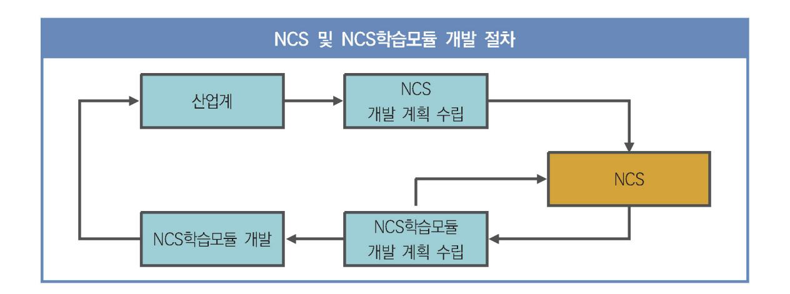

#### ○ NCS학습모듈은 다음과 같은 특징을 가지고 있습니다.

- 첫째, NCS학습모듈은 산업계에서 요구하는 직무능력을 교육훈련 현장에 활용할 수 있도 록 성취목표와 학습의 방향을 명확히 제시하는 가이드라인의 역할을 합니다.
- 둘째, NCS학습모듈은 특성화고, 마이스터고, 전문대학, 4년제 대학교의 교육기관 및 훈 련기관, 직장교육기관 등에서 표준교재로 활용할 수 있으며 교육과정 개편 시에도 유용하게 참고할 수 있습니다.

○ NCS와 NCS학습모듈 간의 연결 체계를 살펴보면 아래 그림과 같습니다.

O NCS학습모듈의 위치는 NCS 분류 체계에서 해당 학습모듈이 어디에 위치하는지를 한 눈에 볼 수 있도록 그림으로 제시한 것입니다.

| [NCS-학          | 습모듈         | 의 위치]    |          |  |
|-----------------|-------------|----------|----------|--|
|                 |             |          |          |  |
| 대분류             | 문화·예술       | ··디자인·방송 |          |  |
| 중분류             | 문화콘텐츠       |          |          |  |
| 소분류             | 노분류 문화콘텐츠제작 |          |          |  |
|                 |             |          |          |  |
| 세분류             |             |          |          |  |
| 방송콘텐츠제작         |             | 능력단위     | 학습모듈명    |  |
| 영화콘텐츠제작         |             | 프로그램 기획  | 프로그램 기획  |  |
| 음악콘텐츠제작         |             | 아이템 선정   | 아이템 선정   |  |
| 광고콘텐츠제작         |             | 자료 조사    | 자료 조사    |  |
| 게임콘텐츠제작         |             | 프로그램 구성  | 프로그램 구성  |  |
| 애니메이션 콘텐츠제작  |             | 캐스팅      | 캐스팅      |  |
| 만화콘텐츠제작         |             | 제작계획     | 제작계획     |  |
| 캐릭터제작           |             | 방송 미술 준비 | 방송 미술 준비 |  |
| 스마트문화앱 콘텐츠제작 |             | 방송 리허설   | 방송 리허설   |  |
| 영사              |             | 야외촬영     | 야외촬영     |  |
|                 |             | 스튜디오 제작  | 스튜디오 제작  |  |
|                 |             |          |          |  |

학습모듈은

NCS 능력단위 1개당 1개의 학습모듈 개발 을 원칙으로 합니다. 그러나 필요에 따라 고용단위 및 교과단위를 고려하여 능력단위 몇 개를 묶어 1개 학습모듈로 개발할 수 있으며, NCS 능력단위 1개를 여러 개의 학습모듈로 나누어 개발할 수도 있습니다.

### 2. NCS학습모듈의 개요

#### ○ NCS학습모듈의 개요는 학습모듈이 포함하고 있는 내용을 개략적으로 설명한 것으로

| 학습모듈의 목표, 선수학습, 학습모듈의 내용 체계, 핵심 용어 로 구성되어 있습니다. |                                                                              |  |
|-------------------------------------------------|------------------------------------------------------------------------------|--|
| 학습모듈의 목표                                        | 해당 NCS 능력단위의 정의를 토대로 학습 목표를 작성한 것입니다.                                        |  |
| 선수학습                                            | 해당 학습모듈에 대한 효과적인 교수·학습을 위하여 사전에 이수해야 하는 학습모 듈, 학습 내용, 관련 교과목 등을 기술한 것입니다. |  |
| 학습모듈의 내용 체계                                  | 해당 NCS 능력단위요소가 학습모듈에서 구조화된 체계를 제시한 것입니다.                                     |  |
| 핵심 용어                                           | 해당 학습모듈의 학습 내용, 수행 내용, 설비·기자재 등 가운데 핵심적인 용어를 제 시한 것입니다.                   |  |

### 제작계획 학습모듈의 개요

#### 학습모듈의 목표

본격적인 촬영을 준비하는 단계로서, 촬영 대본을 획정하고 제작 스태프를 조직하며 촬영 장비와 촬영 소품을 준비할 수 있다.

#### 선수학습

제작 준비(LM0803020105\_13v1), 섭외 및 제작스태프 구성(LM0803020104\_13v1), 촬영 제작(LM0803020106\_13v1), 촬영 장비 준비(LM0803040204\_13v1.4), 미술 디자인 협의하기(LM0803040203\_13v1.4)

#### 학습모듈의 내용체계

| 하스                | 하는 네이                                              | NCS 능력단위 요소       |                |
|-------------------|----------------------------------------------------|-------------------|----------------|
| 학습                | 학습 내용                                              | 코드번호              | 요소 명칭          |
| 1. 촬영 대본 확정하기  | 1-1. 촬영 구성안 검 토와 수정                             | 0803020114_16/3.1 | 촬영 대본 확정하기  |
| 2. 제작 스태프 조직하기 | 2-1. 기술 스태프 조직 2-2. 미술 스태프 조직 2-3. 전문 스태프 조직 | 0803020114_16v3.2 | 제작 스태프 조직하기 |
| 3. 촬영 장비 계획하기  | 3-1. 촬영 장비 점검 과 준비                              | 0803020114_16/3.3 | 촬영 장비 계획하기  |
| 4. 촬영 소품 계획하기  | 4-1. 촬영 소품 목록 작성 4-2. 촬영 소품 제작 의뢰         | 0803020114_16\3.4 | 촬영 소품 계획하기  |

#### 핵심 용어

촬영 구성안, 제작 스태프, 촬영 장비, 촬영 소품

#### 학습모듈의 목표는

학습자가 해당 학습모듈을 통해 성취해야 할 목표를 제시한 것으로, 교수자는 학습자 가 학습모듈의 전체적인 내용흐름을 파악하 도록 지도할 수 있습니다.

**6** • •

61

#### 선수학습은

교수자 또는 학습자가 해당 학습모듈을 교 수·학습하기 이전에 이수해야 하는 교과목 또는 학습모듈(NCS 능력단위) 등을 표기한 것입니다. 따라서 교수자는 학습자가 개별 학습, 자기 주도 학습, 방과 후 활동 등 다 양한 방법을 통해 이수할 수 있도록 지도하 는 것을 권장합니다.

|            | 핵심 용어는              |
|------------|---------------------|
|            | 률을 대표하는 주요 용어입니     |
|            | · 해당 학습모듈을 통해 학습    |
|            | 게될 주요 내용을 알 수 있습    |
|            | 5 국가직무능력표준」 사이트     |
| (www.ncs.g | jo.kr)의 색인 (찾아보기) 중 |
| 하나로 이용할    | 할 수 있습니다            |

#### 3. NCS학습모듈의 내용 체계

○ NCS학습모듈의 내용은 크게 학습, 학습 내용, 교수·학습 방법, 평가 로 구성되어 있습니다.

| 학습       | 해당 NCS 능력단위요소 명칭을 사용하여 제시한 것입니다. 학습은 크게 학습 내용, 교수·학습 방법, 평가로 구성되며 해당 NCS 능력단위의 능력단위 요소별 지식, 기술, 태도 등을 토대로 내용을 제시한 것입니다.                                                    |
|----------|----------------------------------------------------------------------------------------------------------------------------------------------------------------------------------|
| 학습 내용    | 학습 내용은 학습 목표, 필요 지식, 수행 내용으로 구성되며, 수행 내용은 재료·자 료, 기기(장비·공구), 안전·유의 사항, 수행 순서, 수행 tip으로 구성한 것입니다. 학습모듈의 학습 내용은 실제 산업현장에서 이루어지는 업무활동을 표준화된 프로세 스에 기반하여 다양한 방식으로 반영한 것입니다. |
| 교수·학습 방법 | 학습 목표를 성취하기 위한 교수자와 학습자 간, 학습자와 학습자 간 상호 작용이 활발하게 일어날 수 있도록 교수자의 활동 및 교수 전략, 학습자의 활동을 제시한 것입니다.                                                                            |
| 평가       | 평가는 해당 학습모듈의 학습 정도를 확인할 수 있는 평가 준거 및 평가 방법, 평 가 결과의 피드백 방법을 제시한 것입니다.                                                                                                         |

## [NCS-학습모듈의 위치]

세분류

| 대분류 | 전기·전자 |          |
|-----|-------|----------|
| 중분류 |       | 전자 기기 개발 |
| 소분류 |       | 반도체 개발   |

| 반도체 개발 |  | 능력단위                 | 학습모듈명                |
|--------|--|----------------------|----------------------|
| 반도체 제조 |  | 반도체용 CMP슬러리 재료 제조    | 반도체용 CMP슬러리 재료 제조    |
| 반도체 장비 |  | 반도체용 세정공정 재료 제조      | 반도체용 세정공정 재료 제조      |
| 반도체 재료 |  | 반도체용 박막도금공정 재료 제조 | 반도체용 박막도금공정 재료 제조 |
|        |  | 반도체용 SOD공정 재료 제조     | 반도체용 SOD공정 재료 제조     |
|        |  | 반도체용 트랙공정 재료 제조      | 반도체용 트랙공정 재료 제조      |
|        |  | 반도체용 웨이퍼 재료 제조       | 반도체용 웨이퍼 재료 제조       |
|        |  | 반도체용 금속(Target)재료 제조 | 반도체용 금속(Target)재료 제조 |
|        |  | 반도체용 패키지 재료 제조       | 반도체용 패키지 재료 제조       |
|        |  | 반도체 재료 개발            | 반도체 재료 개발            |
|        |  | 반도체 재료 생산관리          | 반도체 재료 생산관리          |
|        |  | 반도체 재료 품질관리          | 반도체 재료 품질관리          |
|        |  | 반도체 재료 안전관리          | 반도체 재료 안전관리          |
|        |  | 반도체용 마스크 재료 제조       | 반도체용 마스크 재료 제조       |
|        |  | 반도체용 플립칩 재료 제조       | 반도체용 플립칩 재료 제조       |

| 반도체용 CMP 재료 제조       | 반도체용 CMP 재료 제조       |
|----------------------|----------------------|
| 반도체용 식각공정 가스 제조      | 반도체용 식각공정 가스 제조      |
| 반도체용 세정공정 가스 제조      | 반도체용 세정공정 가스 제조      |
| 반도체용 박막공정 가스 제조      | 반도체용 박막공정 가스 제조      |
| 반도체용 이온주입공정 가스 제조 | 반도체용 이온주입공정 가스 제조 |
| 반도체용 박막공정 전구체 제조     | 반도체용 박막공정 전구체 제조     |
| 반도체용 포토공정 재료 제조      | 반도체용 포토공정 재료 제조      |

## 차 례

| 학습모듈의 개요                  | 1  |
|---------------------------|----|
| 학습 1. 반도체용 CMP 요구 사항 파악하기 |    |
| 1-1. 반도체용 CMP 재료 요구 사항 파악 | 3  |
| • 교수 ․ 학습 방법              | 16 |
| • 평가                      | 17 |
| 학습 2. 반도체용 CMP 재료 선정하기    |    |
| 2-1. 반도체용 CMP 재료 선정       | 19 |
| • 교수 ․ 학습 방법              | 27 |
| • 평가                      | 28 |
| 학습 3. 반도체용 CMP 재료 제조하기    |    |
| 3-1. 반도체용 CMP 재료 제조       | 30 |
| • 교수 ․ 학습 방법              | 41 |
| • 평가                      | 42 |
| 학습 4. 반도체용 CMP 제품 특성 검증하기 |    |
| 4-1. 반도체용 CMP 제품 특성 검증    | 44 |
| • 교수 ․ 학습 방법              | 52 |
| • 평가                      | 53 |
| 참고 자료                     | 55 |
| 활용 서식                     | 58 |
| 부 록                    | 59 |

## 반도체용 CMP 재료 제조 학습모듈의 개요

#### 학습모듈의 목표

반도체 CMP(Chemical Mechanical Polishing) 공정에 필요한 성능과 품질을 만족하는 CMP 재료를 제 조할 수 있다.

### 선수학습

화학 공학, 재료 공학, 기계 공학, 전자 공학, 전기 공학

#### 학습모듈의 내용체계

| 카스                           | 하스 비용                     | NCS 능력단위 요소       |                           |
|------------------------------|---------------------------|-------------------|---------------------------|
| 학습                           | 학습 내용                     | 코드번호              | 요소 명칭                     |
| 1. 반도체용 CMP 재료 요구 사항 파악하기 | 1-1. 반도체용 CMP 재료 요구 사항 파악 | 1903060415_20v1.1 | 반도체용 CMP 재료 요구 사항 파악하기 |
| 2. 반도체용 CMP 재료 선정하기       | 2-1. 반도체용 CMP 재료 선정       | 1903060415_20v1.2 | 반도체용 CMP 재료 선정하기       |
| 3. 반도체용 CMP 재료 제조하기       | 3-1. 반도체용 CMP 재료 제조       | 1903060415_20v1.3 | 반도체용 CMP 재료 제조하기       |
| 4. 반도체용 CMP 제품 특성 검증하기    | 4-1. 반도체용 CMP 제품 특성 검증    | 1903060415_20v1.4 | 반도체용 CMP 제품 특성 검증하기    |

#### 핵심 용어

CMP(Chemical Mechanical Polishing), 슬러리(Slurry), 연마용 패드

# 학습 1 반도체용 CMP 요구 사항 파악하기

| 학습 2 | 반도체용 CMP 재료 선정하기    |
|------|---------------------|
| 학습 3 | 반도체용 CMP 재료 제조하기    |
| 학습 4 | 반도체용 CMP 제품 특성 검증하기 |

## 1-1. 반도체용 CMP 재료 요구 사항 파악

학습 목표

- 최종 제품의 생산에 필요한 CMP 재료를 파악할 수 있다.
- 고객의 요구 사항에 의한 CMP 재료를 파악할 수 있다.
- 품질 관리를 위한 문제점을 파악할 수 있다.

## 필요 지식 /

#### 숔 반도체용 CMP 공정의 개요

반도체 제조 공정에서 CMP(Chemical Mechanical Polishing) 공정은 제조 공정 중 형성된 울퉁불퉁한 표면이나 웨이퍼 위의 증착된 필름(막질)을 슬러리(Slurry)와 화학 약품 등의 화 학적(Chemical) 요소와 패드(Pad) 등의 기계적(Mechanical) 요소를 이용하여 연마 (Polishing)함으로써 목표한 대로 표면을 평탄하게 만드는 공정이다.

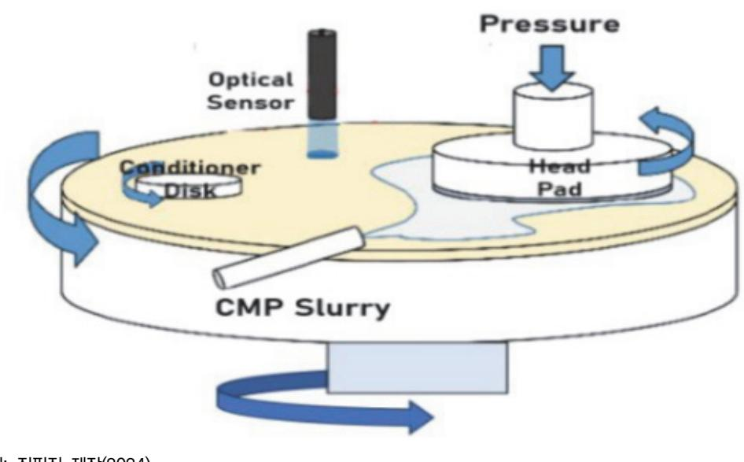

출처: 집필진 제작(2024) [그림 1-1] CMP 장비의 기본 구조 화학적 요소를 사용한 방법은 산화막에는 염기성 용액을 금속막에는 산화성 용액을 사용하여 화학적 반응을 통해 필름(막질)을 제거하는 것이다. 기계적 요소를 사용하는 방법은 웨이퍼의 여러 영역에 따라 각각의 다른 압력으로 연마하여, 상대적으로 높은 압력을 받은 영역부터 평 탄화한다.

반도체 디바이스의 구조적 디자인 디펙트 개선, 베벨 지역 막질 제거 등의 다양한 역할이 기대 된다. 따라서 반도체 디바이스가 발전하여 업그레이드됨에 따라 각 공정에서 CMP의 공정의 수가 관리가 엄격하게 강화되고 있다.

1. 공정의 목적에 따른 CMP 분류

반도체 공정의 목적에 따라 평탄화 CMP(Planarization CMP), 아이솔레이션 CMP(Isolation CMP), 터치 CMP(Touch CMP), 베벨 CMP(Bevel CMP) 등으로 분류가 가능하다.

(1) 평탄화 CMP(Planarization CMP)

평탄화 CMP는 반도체 공정 중에 증착된 막질(film)이 단차를 보일 경우, 발생된 막질의 단차를 제거하여 평탄화하는 CMP 공정이다.

(2) 아이솔레이션 CMP(Isolation CMP)

아이솔레이션 CMP는 반도체 공정 중에 형성된 패턴들 사이에 전기적 고립이 필요할 경 우, 연결된 막질(Film)을 CMP 공정으로 제거하여, 패턴들의 전기적 연결을 차단하는 CMP 공정이다.

(3) 터치 CMP(Touch CMP)

반도체 공정 중에는 막질 위에 필요하지 않은 포폴로지(Topology)가 생성될 수 있고, 제거해야 하는 표면상의 디펙트(Defect)가 발생할 수 있다. 이때 막질의 포폴로지를 완 화시키고, 디팩트를 제거하는 것을 목적으로 하는 것이 터치 CMP 공정이다.

(4) 베벨 CMP(Bevel CMP)

반도체 공정 중에 웨이퍼의 가장자리에 불필요한 막질이 형성될 수 있다. 이러한 불량 막질을 제거하는 공정이 베벨 CMP 공정이다.

 출처: 집필진 제작(2024) [그림 1-2] 공정에 따른 CMP

#### 숕 반도체용 CMP 장비 모듈의 종류와 역활

반도체용 CMP 장비의 모듈은 역할에 따라 폴리셔(Polisher) 모듈, 클리너(Cleaner) 모듈, 구 동부(Transfomer) 모듈이 있다.

1. 폴리셔(Polisher) 모듈

CMP 공정 중에 사용되는 슬러리(Slurry)를 이용하여 웨이퍼의 막질을 약하게 한 후, 압력 을 주어 웨이퍼의 필름을 목표한 대로 일정하게 갈아 내는 역할을 하는 모듈이 폴리셔 모 듈 핵심 원재료, 투명 기판상에 금속과 감광막이 전면에 코팅되어 있는 형태이다.

2. 클리너(Cleaner) 모듈

클리너(Cleaner) 모듈은 연마 공정을 진행한 이후, 웨이퍼의 부산물 또는 슬러리 잔류물을 화학적 재료(DHF, NH4OH, SC-1)를 이용하여 처리한다. 이후 브러시(Brush) 등을 이용하 여 웨이퍼 표면을 세정하는 모듈이다.

3. 구동부(Transfomer) 모듈

구동부는 모듈은 CMP가 수행되는 웨이퍼를 폴리셔 모듈과 클리너 모듈로 이송시키는 역할 을 하는 모듈이다.

출처: 집필진 제작(2024) [그림 1-3] CMP 장비 모듈 구조의 예

③ 반도체용 CMP 특성

반도체용 CMP 공정은 웨이퍼 표면에 형성된 높은 부분(막질)을 제거해서 낮은 부분과 적절히 높이를 맞추는 웨이퍼의 평탄화 작업을 진행한다. 이때 필요한 두께와 평탄도로 웨이퍼를 정확 하고 균일하게 연마하는 방법이다. CMP의 특성은 공정 특성 및 목표에 따라 결정된 현탁액과 패드 모듈을 이용하여 다층 금속화 구조 및 절연체, 금속막에 대한 연마를 통해 평탄화를 진행 한다.

1. CMP 평탄도(CMP Planarity)

반도체 CMP는 웨이퍼의 두께 변화와 표면 지형도의 기능과 특성을 나타내는 중요한 특성 이다. 평탄도는 μm에서 mm에 이르는 웨이퍼의 거리 범위에서의 표면의 지형도 변화를 말 한다.

2. 평탄화 정도(DP)

평탄화 정도(DP)는 [그림 1-4]처럼 반도체 CMP 이전의 처음 스텝의 높이와 CMP 후의 특 별한 스텝의 높이를 비교하여 웨이퍼의 평면이 얼마나 평평하게 되었는지 표시한 것이다.

(1) 평탄화 정도(DP)의 계산

평탄화 정도 *DP*(%) = (1 - <u>SHpost</u>)\*100

SH post CMP 후, 웨이퍼 표면의 특정 지점에서의 스텝의 최고 높이와 최저 높이 사이의 거리(높이의 두께 변화)

SH pre: CMP 후, 웨이퍼 표면의 특정 지점에서의 스텝의 최고 높이와 최저 높이 사이 의 거리(높이의 두께 변화)

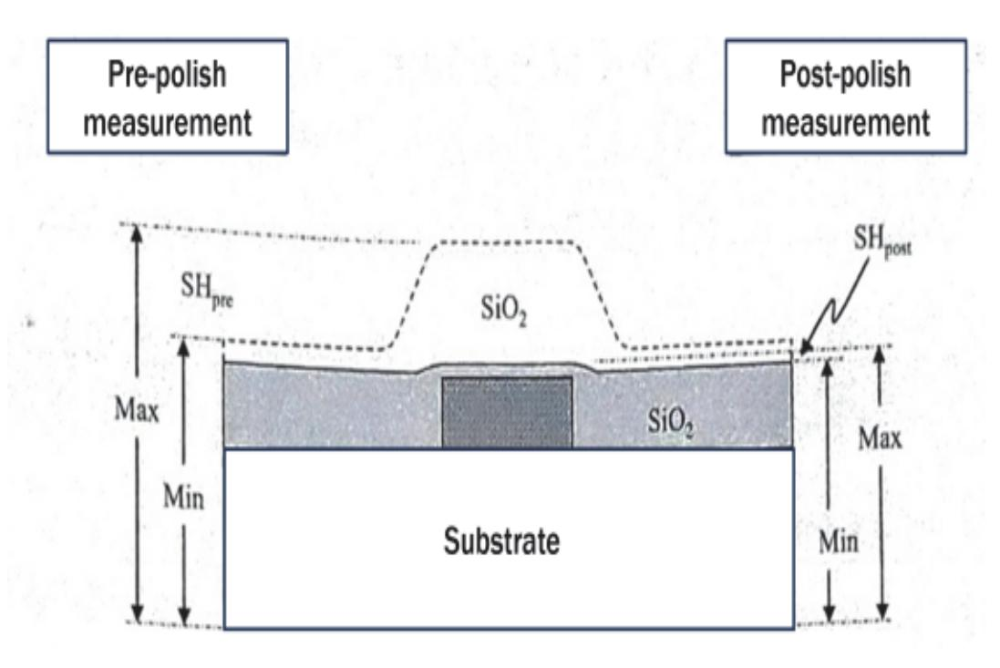

출처: 집필진 제작(2024) [그림 1-4] CMP 장비 모듈 구조의 예

(2) 평탄화 정도(DP)의 의미

CMP 공정의 완벽한 평탄화된 경우

CMP 후, 웨이퍼 표면의 측정된 지형도가 완벽하게 평탄화되었다면 *SH post* = 0이고, DP(%) = 100%이다.

CMP 공정의 결과로 *SH pre* = 20µm, *SH post* = 2µm, DP는 90%이다.

$$DP(\%) = (1 - \frac{SHpost}{SHpre})*100 = (1 - \frac{2}{20})*100 = 90\%$$

3. CMP 균일도(CMP Uniformity)

패턴의 균일도는 mm에서 cm로 측정되며 전체 웨이퍼의 막의 두께 변화를 말한다.

③ 반도체용 CMP 공정의 이점 및 단점

반도체용 CMP는 반도체 제조 공정에서 고집적 회로의 집적 가공이 가능하게 만들었다. 이는 ULSI 세대 이후의 고집적 반도체 제조에 큰 역할을 하게 되었다. 그러나 CMP 공정에 대한 단점도 존재한다.

- 1. CMP 공정의 이점
  - (1) 평탄화

광역 평탄화를 달성할 수 있다.

- (2) 다중 물질 표면의 평탄화 동일한 연마 단계가 진행되는 동안 다중 물질의 막질을 구성하고 있어도, 해당 영역에서 평탄화가 가능하다.
- (3) 스텝 커버리지의 감소 타이트한 설계 규칙과 부가적인 상호 연결 레벨을 가지는 제조를 위해 지형도를 감소시 킨다.
- (4) 금속 패터닝의 다양한 적용 의미하는 다양한 공정에 적용이 가능하다. 금속 합금을 식각시키기 위해서 플라즈마 시 각이 어려운 금속 막질도 제거할 수 있다.
- (5) 개선된 금속 스텝 커버리지 지형도 감소에 기인하는 금속 스텝의 커버리지를 개선한다,
- (6) 증가된 IC 신뢰성

0.5μm 이하의 속도, 수율, IC의 신뢰도를 증가시킬 수 있다.

(7) 결함의 감소

CMP는 표면의 결함을 제거할 수 있는 공정이다.

(8) 위험성 있는 가스의 미사용

CMP 공정에서는 건식 식각 고정에서 사용되는 위험성 가스를 사용하지 않는다.

- 2. CMP 공정의 단점
  - (1) 공정 범위에 따른 공정 변수의 관리 필요

CMP 공정이 적용되어 진행될 때, 공정 변수에 대한 철저한 관리가 필요하며, 공정 변 수를 넘어서면 상대적으로 제어가 어려울 수 있다.

(2) 부가적인 공정 관리의 필요성

CMP 관련 추가적인 공정 제어와 웨이퍼 및 막질에 대한 물리적 측정에 관련한 부가적 인 공정의 개발과 고도화가 필요하고, 이에 따른 공정 관리의 필요성이 있다.

(3) 소유 운영 비용의 증가

반도체의 디자인율이 발전하여 CMP 공정이 다수 적용되었다. 이와 관련된 장비와 소모 성 부품의 사용 비용이 증가하게 되었다. CMP용 공정 물질은 높은 유지 보수 비용이 소요되며, 패드, 슬러리 등 물리적 부품 및 화학 물질의 소모 및 부품 교체가 필요하다.

## 수행 내용 / 반도체용 CMP 요구 사항 파악하기

#### 재료·자료

- 웨이퍼(Wafer)
- 슬러리(Slurry)
- 패드(Pad)
- 패드 컨디셔너(Pad Conditioner)
- 리테이너 링(Retainer Ring)
- 멤브레인(Membrane)
- 케미컬 용액(Chemical Solvent)
- 브러시(Brush)
- 필터(Filter)
- 초순수(DI Water)

#### 기기(장비 ・ 공구)

- 연마 장치(Polisher)
- 연마 후 세정 장치(Post CMP Cleaner)
- 박막 두께 측정 장치
- 공구류
- 실험 및 보호용 도구
- 방진복, 마스크, 고무장갑 등
- 검사 및 측정 장비(Inspection and Measurement Equipment)
- 세정 장비(Cleaning Equipment)
- 평가, 분석 및 계측 장비
- 광학 현미경(Optical Microscope)

- 전자 현미경(SEM: Scanning Electron Microscope)
- 제조 공장 인트라넷
- 안전 도구, 안전화, 안전모, 마스크, 장갑, 고글, 방진복
- 컴퓨터, 프린터, 복사기

#### 안전 ・ 유의 사항

- 화학 물질의 MSDS(Material Safety Data Sheet)를 참조하여 해당 물질의 취급에 관련된 안전 정보를 확인한다.
- 장갑, 보호안경, 실험복, 호흡기 등이 포함된 개인 보호 장비(Personal Protective Equipment)를 적절히 착용하여 운영한다.
- 환기가 잘 되는 작업 공간에서 화학 물질 작업을 진행한다. 이때에 후드(Fume Hood) 사용 을 권장한다.
- 화학 물질은 정확한 절차와 비율을 준수해야 한다. 해당 물질을 혼합하거나 처리할 때는 관 련된 안전 규정을 준수한다.
- 운영에 필요한 기계 장비는 사용 교육을 충분히 진행하고, 관련된 장비 및 사용자 운영 매 뉴얼을 준수하여 업무를 진행한다.
- 장비의 유지 보수 및 수리는 규정된 절차 및 기준을 준수해야 하며, 관련하여 훈련된 전문 가가 보수 및 수리 업무를 수행한다.
- 기계적 장비를 운영할 때는, 관련된 장비의 작업 환경을 청결하게 유지해야 한다. 또한 해 당 작업이 진행되는 주변에 장애물이 없도록 정리 정돈을 실시한다.
- 항상 안전장치를 활성화하고, 비상 정지 버튼의 위치를 숙지하여 비상 상황 발생 시 신속히 대비한다.
- 정기적으로 장비의 상태를 점검하고, 기계적 전기적 결함이 없는지 주기적으로 확인한다.
- 전기를 사용할 장비는 반드시 접지된 콘센트에 연결해야 한다. 장비의 과부하 및 손상을 방 지하기 위해 규정된 전력 용량 이하를 사용하도록 주의한다.
- 전기 장비는 습기나 물기가 있는 환경에서는 사용하지 않고, 젖은 손으로 만지거나 장비를 다루지 않는다.

수행 순서

숔 반도체 CMP 공정의 주요 내용을 이해한다.

반도체 CMP 공정의 요구 사항 파악을 위해서는 CMP 공정의 단계별 주요 내용을 이해한다.

1. CMP의 평탄화 공정의 특성(구분)을 확인한다.

(1) 매끄러운 평탄화가 진행된 웨이퍼(Smoothing Planarization)

- (2) 부분 평탄화가 진행된 웨이퍼(Partial Planarization)
- (3) 국부적인 평탄화가 진행된 웨이퍼(Local Planarization)
- (4) 전역 평탄화가 진행된 웨이퍼(Global Planarization)

출처: 집필진 제작(2024) [그림 1-5] CMP 평탄화 특성

#### 2. CMP 공정의 주요 응용 사례를 파악한다.

(1) STI 산화물 연마 공정 얇은 트렌치 고립(STI: Shallow Tranch Isolation) 공정은 웨이퍼 표면에서 소자 사이 의 절연 영역을 구성하기 위한 front-end 공정이다.

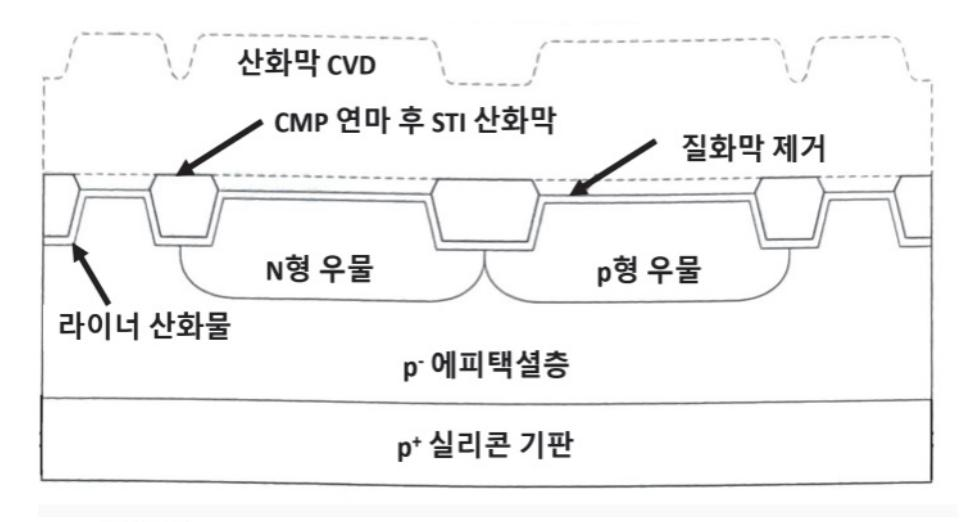

출처: 집필진 제작(2024) [그림 1-6] STI 산화물을 채우기 위한 CMP 공정 개괄

(2) LI 산화막 연마 공정

LI(Local Interconnection) 산화막은 CMP 연마를 하고, 국부적 상호 연결을 구성하기 위해서 영역의 형성을 위해서 나중에 패턴화한다.

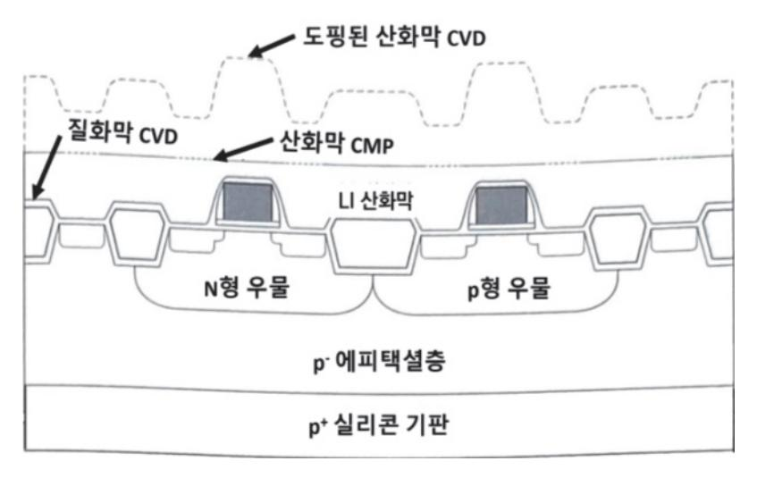

출처: 집필진 제작(2024)

[그림 1-7] CMP 평탄화 전후의 LI 산화막 개략도

(3) LI 텅스텐 연마 공정

LI는 비아와 소스와 드레인 접촉을 위한 국부적 배선을 위한 ILD-1 산화물에서 패터닝

으로 인해 생긴 틈에 따라 형성된다. 텅스텐 금속은 플러그와 국부적 금속 연결에 비교 되는 트렌치를 구성하기 위하여 비아들 속으로 증착된다.

(4) ILD 산화막 연마

층간 유전체(ILD: Inter Layer Dielectric)는 금속 도체들은 전기적으로 절연시키기 위 해 금속층 사이에 산화물을 증착시킨다. 층간 유전체들은 PECVD 산화물로 인해 수반 되는 고밀도 플라즈마 CVD의 연속적인 증착으로 구성된다.

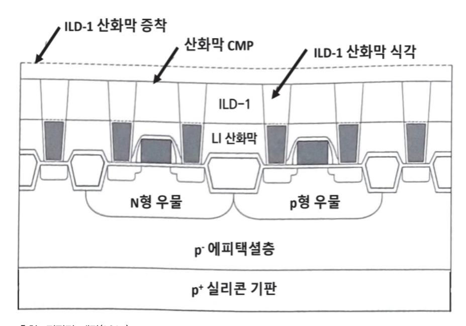

출처: 집필진 제작(2024) [그림 1-8] ILD 산화막 연마를 위한 CMP 개략도

(5) 텅스텐 플러그 연마

ILD 산화물은 포토리소그래피로 패턴화되고 비아를 개방시키기 위해서 건식 식각을 사 용한다. 텅스텐의 피복 증착은 모든 비아 구멍들과 ILD 산화물의 상부를 채우게 된다.

(6) 이중 다마신 구리 연마

CMP는 이중 다마신 공정에서 사용되는 구리의 가는 배선과 비아들을 연마하기 위해서 사용된다. 비아와 트렌치 패턴들은 포토리소그래피와 건식 식각으로 인해 ILD 물질에서 첫 번째로 형성된다. 이 구리는 CMP를 사용하여 정지층으로 작용하는 유전체와 함께 평탄화된다.

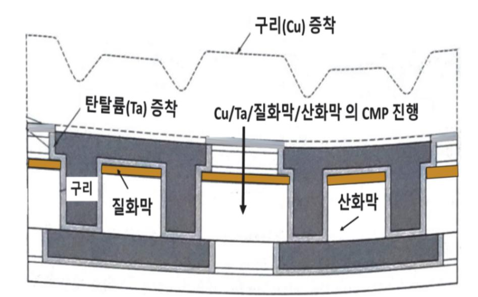

출처: 집필진 제작(2024) [그림 1-9] 이중 다마신 구리 야금을 위한 CMP 개략도

숕 반도체용 CMP 공정 운영순서를 이해한다.

공정 장비를 이용하여 CMP 공정 프로세스를 진행하여 CMP 운영 순서를 이해한다. CMP 공 정은 필요한 제조 단계 및 산화물 연마, 금속 연마 등 공정 특성에 따라 적절한 프로세스로 공 정을 진행한다. 디바이스, 장비 및 필요 공정에 맞추어 단계 수를 수정할 수 있다.

- 1. Wafer를 FOUP을 Load port module에 삽입한다.
- 2. 장비를 구동하여 구동부(Transfer Module)를 이용하여, Load port module에서 wafer를 polishing unit으로 이동한다.
- 3. 폴리셔 모듈(Polisher Module)의 유닛에서 Slurry를 이용하여 1차 연마(Polising)을 진행한다.
- 4. 새로운 유닛으로 이동하여, CMP 공정이 필요한 제조 단계에 따라 산화물 연마, 금속 연마 등의 공정 특성에 적합한 Slurry를 이용하여 정밀 연마를 진행한다.
- 5. wafer의 표면의 오염 물질을 제거하기 위해 Post-CMP 모듈인 클리너 모듈로 이동한다.

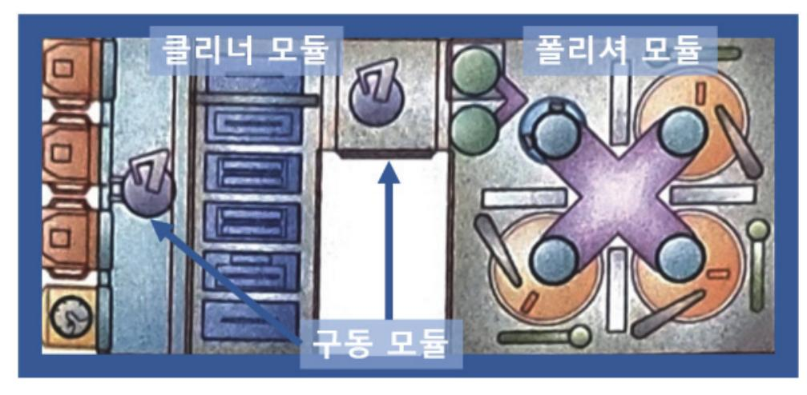

출처: 집필진 제작(2024) [그림 1-10] CMP 장비 모듈 구조의 예

- 6. 희석된 암모니아수 등 알칼리 계열의 화학 액을 고압 분사 방식 등을 이용하여 1차적으로 오염물 질을 제거한다.
- 7. Brush를 이용하여 물리·화학적으로 세정을 하고, 희석 HF 등의 산성 계열 화학 용액을 이용하여 wafer 표면의 금속 성분의 불순물을 제거한다.
- 8. 다시 희석된 알칼리 계열의 화학 용액을 이용하여 오염물 입자를 제거한다.
- 9. Spin rinse dryer(N2 가압 방식) 등을 이용하여 wafer를 건조한다.

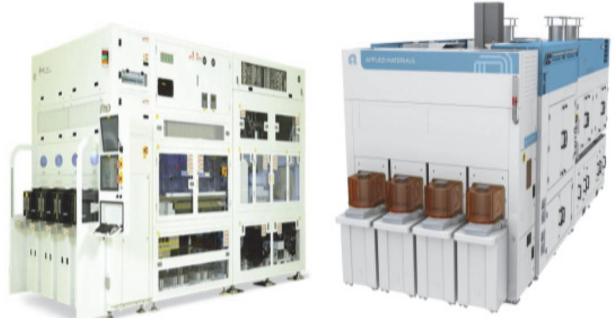

(a) K(한국)사의 CMP 장비 (b) A(미국)사의 CMP 장비

출처: 집필진 제작(2024) [그림 1-11] 300mm CMP 장비의 예

### 학습 1 교수·학습 방법

#### 교수 방법

- 반도체용 CMP 공정의 개요와 세부 내용을 공정별로 알기 쉽게 설명한다.
- 반도체용 CMP 장비의 개요와 모듈별 세부 내용을 모듈별로 알기 쉽게 설명한다.
- CMP 장비의 공정 매뉴얼과 관련 공정 재료 관련 자료 내용 등을 정리하여, 프레젠테이션 자료로 전달한 후에 이에 대한 설명을 실시한다.
- 문제 해결식 수업을 진행하기 위해 학습자가 이해하기 쉬운 자료와 방법을 사용하여 토의한 다.
- 제조 현장의 사례를 수집하여, 되도록 사전에 관련 자료를 학습자들에게 배포한다.
- 반도체용 CMP 재료 요구 사항을 확인하고, 학습자들에게 관련 자료의 파악 여부를 확인한 다.
- CMP 공정과 관련한 반도체 시장 환경 및 기술 동향 등에 대하여 학습자들이 쉽게 이해할 수 있도록 수업을 진행한다.

#### 학습 방법

- 반도체 관련 시장 환경 및 기술 동향 등 산업 현황을 구체적으로 확인하도록 하고, 다양한 자료를 인터넷으로 검색하고 분류하여 문서로 정리한다.
- 반도체용 CMP 재료 요구 사항 항목을 작성해 본 후, 관련 자료의 종류와 기록 내용을 숙 지하고 분류해 본다.
- 반도체 CMP 재료 요구 사항에 대한 생산에 필요한 목표를 설정하고, 반도체 시장 및 기술, 비용의 조사, 수집 및 분석을 통해 생산 가능성 및 장애점을 예측한다.
- 반도체용 CMP 공정 중 예상되는 품질 관리 문제점을 파악하고 피드백하는 능력을 증가시 킬 수 있도록 학습한다.

## 학습 1 평 가

#### 평가 준거

- 평가자는 학습자가 학습 목표를 성공적으로 달성하였는지를 평가해야 한다.
- 평가자는 다음 사항을 평가해야 한다.

| 학습 내용                    | 학습 목표                              | 성취수준 |   |   |
|--------------------------|------------------------------------|------|---|---|
|                          |                                    | 상    | 중 | 하 |
| 반도체용 CMP 재 료 요구 사항 파악 | - 최종 제품의 생산에 필요한 CMP 재료를 파악할 수 있다. |      |   |   |
|                          | - 고객의 요구 사항에 의한 CMP 재료를 파악할 수 있다.  |      |   |   |
|                          | - 품질 관리를 위한 문제점을 파악할 수 있다.         |      |   |   |

#### 평가 방법

• 서술형 시험

|                          |                                                               |   | 성취수준 |   |
|--------------------------|---------------------------------------------------------------|---|------|---|
| 학습 내용                    | 평가 항목                                                         | 상 | 중    | 하 |
| 반도체용 CMP 재 료 요구 사항 파악 | - 반도체 CMP 재료 제조 사양서를 작성하고 세부 내용을 검 토할 수 있는 능력              |   |      |   |
|                          | - 제품명, 품질 기준, 제품 사양, 납기 등 반도체 CMP 재료 의 제조 사양서를 검토할 수 있는 능력 |   |      |   |
|                          | - CMP 재료 제조 시 발생할 수 있는 문제점의 대처 방안 작 성 능력                   |   |      |   |

#### • 논술형 시험

| 학습 내용                    | 평가 항목                              | 성취수준 |   |   |
|--------------------------|------------------------------------|------|---|---|
|                          |                                    | 상    | 중 | 하 |
| 반도체용 CMP 재 료 요구 사항 파악 | - 반도체용 CMP 재료 요구 사항 항목 서술 능력       |      |   |   |
|                          | - 반도체용 CMP 재료 요구 사항 항목별 기준 파악 능력   |      |   |   |
|                          | - 반도체용 CMP 재료 요구 사항 기준 합격 여부 파악 능력 |      |   |   |

• 사례 연구

|                          |                                     |   | 성취수준 |   |  |
|--------------------------|-------------------------------------|---|------|---|--|
| 학습 내용                    | 평가 항목                               | 상 | 중    | 하 |  |
|                          | - 반도체용 CMP 재료 요구 사항 항목 사례 검색 능력     |   |      |   |  |
| 반도체용 CMP 재 료 요구 사항 파악 | - 반도체용 CMP 재료 요구 사항 항목별 기준 사례 검색 능력 |   |      |   |  |
|                          | - 반도체용 CMP 재료 요구 사항 합격 사례 검색 능력     |   |      |   |  |

피드백

#### 1. 서술형 시험

- CMP 재료 제조 관련 성취수준이 낮은 학습자에게는 관련 기초 지식을 설명해 준다.
- 성취수준이 미진한 부분을 보완할 수 있도록 보충 설명을 해 준다.
- 성취수준이 높은 학습자에게는 반도체용 CMP 재료 제조 요구 사항 관련 심화 자료를 제공해 주 고, 심화하여 설명해 준다.
- 2. 논술형 시험
- 반도체용 CMP 재료에 사용되는 물질의 특성과 요구 사항에 대해 평가한 후 성취수준이 낮은 학 습자에게는 필요 지식을 재설명해 주고 미진한 부분을 보완하도록 피드백해 준다.
- 성취수준이 높은 학습자에게는 반도체용 CMP 재료 제조에 관련 사항을 구두로 발표하게 하여 성취도를 극대화하게 해 준다.
- 3. 사례 연구
- 반도체 CMP 재료에 사용되는 재료의 요구 사항의 구체적인 사례를 평가한 후 성취수준이 낮은 학습자에게는 관련 기초 지식을 보충하여 설명해 준다.
- 성취수준이 높은 학습자에게는 반도체용 CMP 재료 제조 사례 조사 보고서를 작성할 수 있도록 피드백해 준다.

| 학습 1 | 반도체용 CMP 요구 사항 파악하기 |
|------|---------------------|
| 학습 2 | 반도체용 CMP 재료 선정하기    |
| 학습 3 | 반도체용 CMP 재료 제조하기    |
| 학습 4 | 반도체용 CMP 제품 특성 검증하기 |

## 2-1. 반도체용 CMP 재료 선정

|       | • 반도체 CMP 재료의 장점과 단점을 파악할 수 있다.                |
|-------|------------------------------------------------|
| 학습 목표 | • 반도체 집적 회로 제조 공정에 적합한 CMP 재료를 선정할 수 있다.       |
|       | • 선정된 반도체 CMP 재료의 도출된 문제점에 대한 해결 방안을 제시할 수 있다. |

## 필요 지식 /

- 숔 반도체용 CMP 장비의 구성과 특징 반도체용 CMP 공정 장비를 운영하고, 공정 품질을 확보하기 위해 다음과 관련 재료의 특성을 파악하고 재료를 선정할 수 있다.
  - 1. 폴리셔(Polisher, 연마) 모듈

CMP의 폴리셔 모듈 장치의 구성 요소는 헤드, 플레이튼, 슬러리, 분사 모듈, 패드 컨디셔 너 등으로 구성되어 있다. 구성된 각 모듈의 회전과 압력으로 인한 마찰로 웨이퍼의 표면을 연마한다.

(1) 헤드(Head)

웨이퍼에 압력을 가해는 모듈이다. 헤드를 구성하는 소모성 부품에는 패드, 디스크, 멤 브레인, 리테이너 링, 필터 등이 있다.

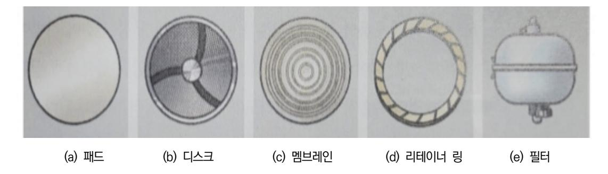

출처: 집필진 제작(2024) [그림 2-1] CMP 장비 소모성 부품의 예

#### (가) 패드(Pad)

패드는 웨이퍼를 연마하는 부품이다. 웨이퍼에 직접 접촉하여 압력을 가하여 연마 (Polising)가 이루어진다. 연마 입자를 함유하고 있는 슬러리를 웨이퍼 표면으로 이 동시키는 역할을 한다.

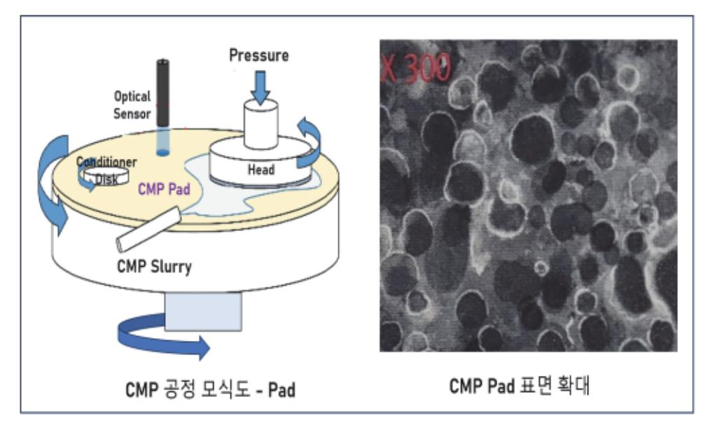

출처: 집필진 제작(2024)

[그림 2-2] CMP 공정 모식도 및 Pad 표면 확대

(나) 디스크(Disk)

CMP 공정 중에 연마가 지속적으로 진행되면 슬러리, 부산물 및 오염 물질 등이 패 드에 쌓이게 된다. 이때 이러한 이물질들이 패드의 표면에 형성되어 기공(Pore)이 막혀서 패드의 표면이 미끄러워지는 글레이징(Glazing) 상태가 된다. 글레이징 상태 가 되면 패드가 마찰을 줄 수 없는 유리와 같은 상태가 되어 단위 시간당 갈아 낼 수 있는 막질(필름)의 두께가 떨어지고 정상적인 연마가 되지 않는다.

(다) 멤브레인(Optical Transmittance)

멤브레인은 웨이퍼 크기의 실리콘 재질로 이루어진 부품으로, 웨이퍼를 부착하여 이 송하고, 연마 중에 웨이퍼를 패드 면에 접촉시켜 압력을 가하는 기능을 한다. 웨이퍼 와 연마 헤드 사이에서 완충 역할을 하며 연마 균일도에 큰 영향을 끼친다.

(라) 리테이너 링(Retainer Ring)

리테이너 링은 CMP 헤드에 장착되어 원심력으로 인한 웨이퍼의 이탈을 방지하는 역할을 하는 고리 형태의 소모성 부품이다. 리테이너 링은 CMP 패드와의 접촉면에 존재하는 그루브를 통해 슬러리가 유입될 수 있도록 하고, 연마 중 발생하는 이물질

을 배출하는 역할도 한다.

(마) 필터(Filter)

필터는 CMP 공정 핵심 요소인 슬러리의 불순물을 제거하기 위해 사용된다. 필터를 통해 슬러리의 순도를 유지하고 순도를 일정하게 유지할 수 있다.

(2) 슬러리(Slurry)

슬러리는 수십, 수백 nm 크기의 연마제와 각종 화학적 첨가제를 포함하는 콜로이드 용 액이다. 주요 성분은 90~99%를 차지하는 물이다. 슬러리 내의 첨가제(Chemicals)는 박막 표면과 화학적 반응을 한다. 이러한 반응을 통해 쉽게 제거될 수 있는 레이어를 형성한다. 연마제는 이 레이어를 기계적으로 제거하는 역할을 한다.

슬러리의 종류에는 실리카(Silica)계 슬러리, 세리아(Ceria)계 슬러리, 알루미나(Alumnina)계 슬러리, 그 외에 특수 목적용 응용 슬러리(Application-Specific Slurry) 등이 있다.

2. 클리너(Cleaner) 모듈

CMP 공정은 화학적, 기계적 방법으로 웨이퍼의 패턴 면을 폴리싱하는 공정이다. 이 때문 에 CMP 공정 진행 중에 부산물 찌꺼기가 필수적으로 생성된다. 부산물 찌꺼기가 웨이퍼 표면에 남으면, 스크래치의 원인이 되며, 후발 공정에서 불량(Defect)이 발생된다.

(1) 메가소닉 모듈(Megasonic Module)

초음파(Megasonic)를 이용하여 초음파 세정을 진행하는 모듈이다.

(2) 브러시 모듈(Brush Module)

화학 용액과 브러시를 이용하여 웨이퍼 표면의 이물질을 제거하는 모듈이다. 브러시 모 듈에서는 불산과 암모니아 케미컬을 사용하여 오염된 웨이퍼를 세정하고, 브러시의 고속 회전을 통해 웨이퍼 표면의 이물질을 제거한다.

3. E.P.D.(End Point Detection) 모듈

CMP 공정에서는 상부 막질에서 하부의 다른 막질까지 연마해야 할 경우가 있다. 연마 공 정 중에 다양한 방식의 센서들을 이용하여 실시간으로 웨이퍼의 필름 막에 대한 데이터를 측정한다. 이러한 측정된 데이터의 변홧값이나 변곡점을 확인하여 연마(폴리싱)의 종착점을 찾는 것이다.

## 수행 내용 / 반도체용 CMP 재료 선정하기

#### 재료·자료

- 웨이퍼(Wafer)
- 슬러리(Slurry)
- 패드(Pad)
- 패드 컨디셔너(Pad Conditioner)
- 리테이너 링(Retainer Ring)
- 멤브레인(Membrane)
- 케미컬 용액(Chemical Solvent)
- 브러시(Brush)
- 필터(Filter)
- 초순수(DI Water)

#### 기기(장비 ・ 공구)

- 연마 장치(Polisher)
- 연마 후 세정 장치(Post CMP Cleaner)
- 박막 두께 측정 장치
- 공구류
- 실험 및 보호용 도구
- 방진복, 마스크, 고무장갑 등
- 검사 및 측정 장비(Inspection and Measurement Equipment)
- 세정 장비(Cleaning Equipment)
- 평가, 분석 및 계측 장비
- 광학 현미경(Optical Microscope)

- 전자 현미경(SEM: Scanning Electron Microscope)
- 안전 도구, 안전화, 안전모, 마스크, 보호 장갑, 고글, 방진복
- 컴퓨터, 프린터, 복사기

#### 안전 ・ 유의 사항

- 화학 물질의 MSDS(Material Safety Data Sheet)를 참조하여 해당 물질의 취급에 관련된 안전 정보를 확인한다.
- 장갑, 보호안경, 실험복, 호흡기 등이 포함된 개인 보호 장비(Personal Protective Equipment)를 적절히 착용하여 운영한다.
- 환기가 잘 되는 작업 공간에서 화학 물질 작업을 진행한다. 이때에 후드(Fume Hood) 사용 을 권장한다.
- 화학 물질은 정확한 절차와 비율을 준수해야 한다. 해당 물질을 혼합하거나 처리할 때는 관 련된 안전 규정을 준수한다.
- 운영에 필요한 기계 장비는 사용 교육을 충분히 진행하고, 관련된 장비 및 사용자 운영 매 뉴얼을 준수하여 업무를 진행한다.
- 장비의 유지 보수 및 수리는 규정된 절차 및 기준을 준수해야 하며, 관련하여 훈련된 전문 가가 보수 및 수리 업무를 수행한다.
- 기계적 장비를 운영할 때는, 관련된 장비의 작업 환경을 청결하게 유지해야 한다. 또한 해 당 작업이 진행되는 주변에 장애물이 없도록 정리 정돈을 실시한다.
- 항상 안전장치를 활성화하고, 비상 정지 버튼의 위치를 숙지하여 비상 상황 발생 시 신속히 대비한다.
- 정기적으로 장비의 상태를 점검하고, 기계적 전기적 결함이 없는지 주기적으로 확인한다.
- 전기를 사용할 장비는 반드시 접지된 콘센트에 연결해야 한다. 장비의 과부하 및 손상을 방 지하기 위해 규정된 전력 용량 이하를 사용하도록 주의한다.
- 전기 장비는 습기나 물기가 있는 환경에서는 사용하지 않고, 젖은 손으로 만지거나 장비를 다루지 않는다.

#### 수행 순서

#### 숔 반도체용 CMP 재료 선정과 유의점 확인한다.

CMP 재료의 선정을 위한 핵심 사항 및 사양 등을 고려하여, 최적의 부품 및 재료를 선정한다. 선정된 반도체 CMP 부품 및 재료의 유의점을 확인한다.

1. 폴리셔(Polisher, 연마) 모듈의 주요 특성과 유의점을 이해한다.

CMP의 폴리셔 모듈 장치는 슬러리를 이용한 화학적 작용과 패드와의 마찰력으로 물리적 웨이퍼 표면 연마를 진행하게 된다. 이에 평탄화 과정에서 발생하는 부산물 제거와 계속적 인 마찰(연마)로 인한 패드와 리테이너 링의 품질 관리가 매우 중요하다.

(1) 연마 대상 공정에 대한 정보를 확인한다.

CMP 공정이 이루어지는 웨이퍼상의 막질에 대한 공정 정보를 확인하고 이에 대한 데이 터를 확인해야 한다.

(가) CMP 대상 공정을 확인한다.

대상 공정은 산화막질 CMP(Oxide CMP), 금속막질 CMP(Metal CMP) 등에 대해 진행되며, 이에 따라 각각의 소재 및 부품을 변경해야 한다.

(나) 웨이퍼의 특성에 대해 확인한다.

웨이퍼의 특성에 따라 CMP 공정에 주요 핵심 공정 요소가 변경되므로, 이에 따른 소재와 부품의 변경을 확인해야 한다.

(다) 폴리셔 모듈의 주기적 PM 활동을 확인한다.

폴리셔의 정기(주기적) PM은 장비 및 공정 품질을 유지하는 데 핵심적인 사항이다. 정기 PM 시에는 각 부품 및 소재의 특성에 따라 패드, 다이아몬드 디스크, 슬러리, 필터, 헤드 등의 주요 부품들을 교체해야 한다. 해당 장비 및 부품 소재, 공정에 따 라 PM의 주기를 결정하여 정기적으로 PM 활동을 진행한다.

- (라) PM 중에 진행되는 분해 및 조립 등의 작업이 진행될 경우에는 해당 소재 및 장비에 대 한 전문가 및 관리자의 지원을 받도록 한다. CMP 헤드에 장착되는 부품들은 20여 종 이상의 부품들의 조합으로, PM 시 관련 부품 등이 교체되는 경우가 많으므로, PM 후 목표한 성능을 유지하기 위해 전문가 의 역할 및 지원이 필요하다.
- 2. 클리너(Cleaner) 모듈의 주요 특성과 유의점을 이해한다.

CMP 공정에서 생성된 부산물 찌꺼기가 필수적으로 생성된다. 공정에서 불량(Defect)이 발 생되는 원인이 되는 부산물 찌꺼기를 제거하기 위해 클리너 모듈의 성능 관리가 필요하다.

(1) 브러시가 최상의 성능을 유지하도록 주기적으로 관리한다.

진행된 웨이퍼의 매수에 따라 주기적으로 교체가 진행되어야 한다.

#### (2) 브러시의 교체 주기를 확인한다.

브러시는 보통 10,000매 단위를 기준으로 점검, 교체 등을 진행하나 웨이퍼 막질의 종 류 및 텅스텐, 산화막 공정에 따라 최적의 기준을 정한다.

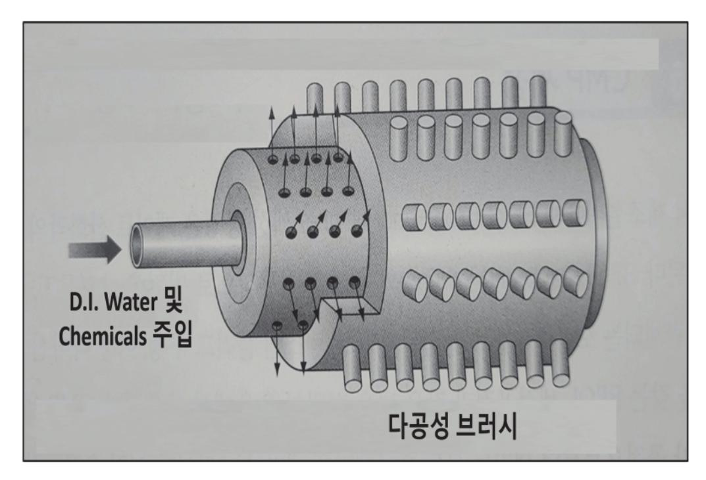

출처: 집필진 제작(2024) [그림 2-3] CMP 후 세정용 브러시 모듈 예시

#### (3) 클리너 모듈의 주요 관리 요소를 확인한다.

브러시의 주요 관리 요소에는 브러시 간의 간격과 스프레이 노즐의 각도를 확인한다. 이 주요 요소를 관리하여 동일한 세정력을 유지해야 한다.

(가) 브러시 간의 간격

브러시의 교체될 경우, 설정 테스트용 더미 웨이퍼를 이용하여 브러시 간 간격을 조 절해야 한다.

(나) 스프레이 노즐의 각도

웨이퍼의 부산물 제거를 위한 화학적 용액을 정밀하게 공급하기 위해 스프레이 노즐 의 각도의 조절 및 유지가 필요하다.

3. E.P.D.(End Point Detection) 모듈 의 주요 특성과 유의점을 이해한다.

CMP 공정에서는 E.P.D. 모듈에 사용되는 다양한 방식의 센서 측정 데이터의 변홧값이나 변곡점을 확인한다.

(1) 다양한 E.P.D. 모듈에 적용되는 센서의 종류와 특성을 이해한다.

진행된 웨이퍼의 매수에 따라 주기적으로 교체를 진행해야 한다.

(가) 금속 유도기 전력 측정 방식

표면의 막질이 금속일 경우 자기장의 전류 세기의 변화를 측정하여 실시간 데이터를 확인한다.

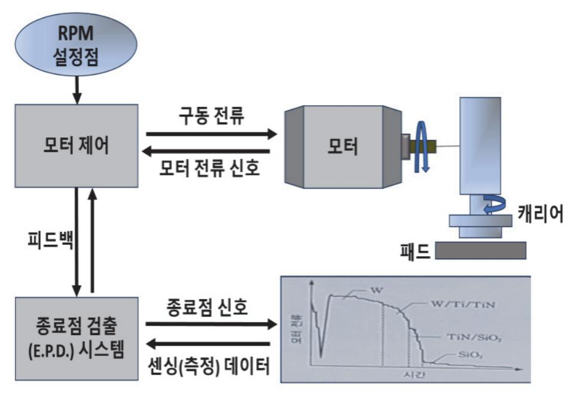

출처: 집필진 제작(2024)

[그림 2-4] 모터 전류 검출 방식의 종료점 검출

(나) 빛 반사도 측정 방식

표면의 막질이 산화막 또는 질화막일 경우, 레이저 및 단파장, 다파장 광원을 이용하 여 반사되는 광의 굴절율을 실시간으로 측정한다. 이 데이터의 변홧값 및 변곡점을 확인한다.

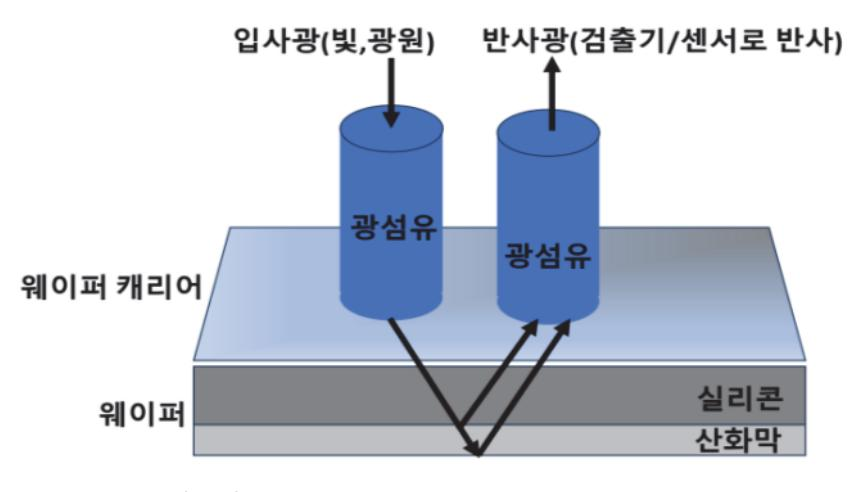

출처: 집필진 제작(2024) [그림 2-5] 광학 간섭계를 이용한 종료점 검출 방식

## 학습 2 교수·학습 방법

#### 교수 방법

- 반도체용 CMP 공정의 개요와 세부 내용을 공정별로 알기 쉽게 설명한다.
- 반도체용 CMP 장비의 개요와 모듈별 세부 내용을 모듈별로 알기 쉽게 설명한다.
- CMP 장비의 공정 매뉴얼과 관련 공정 재료 관련 자료 내용 등을 정리하여, 프레젠테이션 자료로 전달한 후에 이에 대한 설명을 실시한다.
- 문제 해결식 수업을 진행하기 위해 학습자가 이해하기 쉬운 자료와 방법을 사용하여 토의한 다.
- 제조 현장의 사례를 수집하여 되도록 사전에 관련 자료를 학습자들에게 배포한다.
- 반도체용 CMP 재료 요구 사항을 확인하고, 학습자들에게 관련 자료의 파악 여부를 확인한 다.
- CMP 공정과 관련된 반도체 시장 환경 및 기술 동향 등에 대하여 학습자들이 이를 이해할 수 있도록 수업을 진행한다.

#### 학습 방법

- 반도체 관련 시장 환경 및 기술 동향 등 산업 현황을 구체적으로 확인하도록 하고, 다양한 자료를 인터넷으로 검색하고 분류하여 문서로 정리한다.
- 반도체용 CMP 재료 요구 사항 항목을 작성해 본 후, 관련 자료의 종류와 기록 내용을 숙 지하고 분류해 본다.
- 반도체 CMP 재료 요구 사항에 대한 생산에 필요한 목표를 설정하고, 반도체 시장 및 기술, 비용의 조사, 수집 및 분석을 통해 생산 가능성 및 장애점을 예측한다.
- 반도체용 CMP 공정 중 예상되는 품질 관리 문제점을 파악하고 피드백하는 능력을 증가시 킬 수 있도록 학습한다.

## 학습 2 평 가

#### 평가 준거

- 평가자는 학습자가 학습 목표를 성공적으로 달성하였는지를 평가해야 한다.
- 평가자는 다음 사항을 평가해야 한다.

|                    | 학습 목표                                              | 성취수준 |   |   |
|--------------------|----------------------------------------------------|------|---|---|
| 학습 내용              |                                                    | 상    | 중 | 하 |
| 반도체용 CMP 재 료 선정 | - 반도체 CMP 재료의 장점과 단점을 파악할 수 있다.                    |      |   |   |
|                    | - 반도체 집적 회로 제조 공정에 적합한 CMP 재료를 선정할 수 있다.        |      |   |   |
|                    | - 선정된 반도체 CMP 재료의 도출된 문제점에 대한 해결 방 안을 제시할 수 있다. |      |   |   |

#### 평가 방법

• 문제 해결 시나리오

|                    | 평가 항목                             | 성취수준 |   |   |
|--------------------|-----------------------------------|------|---|---|
| 학습 내용              |                                   | 상    | 중 | 하 |
| 반도체용 CMP 재 료 선정 | - 반도체용 CMP 재료를 선정 시 발생하는 문제 해결 능력 |      |   |   |
|                    | - 반도체용 CMP 재료 제조 시 문제 해결 능력       |      |   |   |
|                    | - 반도체용 CMP 재료 선정 시 Spec 문제 해결 능력  |      |   |   |

• 서술형 시험

|                    | 평가 항목                        | 성취수준 |   |   |
|--------------------|------------------------------|------|---|---|
| 학습 내용              |                              | 상    | 중 | 하 |
| 반도체용 CMP 재 료 선정 | - 반도체용 CMP 재료 선정 방법 서술 능력    |      |   |   |
|                    | - 반도체용 CMP 재료 제조 방법 순서 서술 능력 |      |   |   |
|                    | - 반도체용 CMP 재료 선정 Spec 나열 능력  |      |   |   |

• 사례 연구

|                    |                          | 성취수준 |   |   |
|--------------------|--------------------------|------|---|---|
| 학습 내용              | 평가 항목                    | 상    | 중 | 하 |
| 반도체용 CMP 재 료 선정 | - 반도체용 CMP 재료를 선정 사례     |      |   |   |
|                    | - 반도체용 CMP 제조방법 사례열거     |      |   |   |
|                    | - 반도체용 CMP 재료 선정 Spec 사례 |      |   |   |

피드백

#### 1. 문제 해결 시나리오

- 반도체용 CMP 재료 선정을 바탕으로 공정의 운영상의 문제점을 이해하고 대처할 수 있는 능력 에 대해 평가한다.
- 이에 대한 이해가 부족한 경우 실제 적용 사례를 통해 이해할 수 있도록 지도한다.
- 반도체용 CMP 재료 선정을 바탕으로 재료 선정의 문제 발생 시 대처할 수 있는 능력에 대해 평 가하고 부족한 부분을 사례를 통해 지도한다.
- 2. 서술형 시험
- CMP 재료 선정 시 발생할 수 있는 문제점의 대처 방안에 대한 지식에 대해 평가하고 부족한 부 분이 있다면, 관련 분야에 대해 추가로 재학습하도록 지도한다.
- CMP 재료 선정 시 선정 기준이 되는 사양이나 제조 절차 등에 대한 지식에 대해 평가하고 실제 운영 사례를 통해 추가 학습하도록 설명해 준다.
- CMP 재료에 관한 우수한 지식이 있고, 이해도가 높을 경우, 논문 및 시청각 자료를 통해 추가적 인 서술 자료를 제공하여 심화 설명해 준다.
- 3. 사례 연구
- 반도체 CMP 재료 선정에 사용되는 재료의 요구 사항과 선정의 구체적인 사례를 평가한 후 주요 사항을 표시하여 피드백해 준다.
- 반도체 CMP 재료 선정에 사용되는 재료의 제조 방법의 구체적인 사례 연구 방법을 안내해 준다.
- 성취수준이 높은 학습자에게는 반도체 CMP 재료의 제조 방법의 대표적 공정 절차 등에 대한 사 례를 심화하여 설명해 준다.

| 학습 1 | 반도체용 CMP 재료 요구 사항 파악하기 |
|------|------------------------|
| 학습 2 | 반도체용 CMP 재료 선정하기       |
|      |                        |
| 학습 3 | 반도체용 CMP 재료 제조하기       |

## 3-1. 반도체용 CMP 재료 제조

| 학습 목표 | • 반도체 CMP 재료의 제조 공정별 장점과 단점을 파악할 수 있다. • 반도체 CMP 재료별 제조(공정/장비) 파라미터를 파악하고 적용할 수 있다. |
|-------|----------------------------------------------------------------------------------------|
|       | • 반도체 CMP 재료별 제조 공정의 도출된 문제점에 대한 해결 방안을 제시할 수 있다.                                      |

## 필요 지식 /

## 숔 CMP 제조 공정의 품질 관리와 장비 관리 CMP 공정은 반도체의 소자의 미세화와 배선 층이 다층화하는 추세에 따라 회로의 표면을 평 탄화하는 기능의 고도화가 필요하다.

1. 반도체 공정 미세화와 CMP 공정의 필요성

포토리소그래피 공정에서 해상도(Resolution)가 증가하면서 렌즈의 개구 수(NA: Numeric Aperture)가 증가하게 되어 초점 심도(D.O.F.: Depth of Focus)가 얕아지게 된다. 이에 따라 막질의 요철이 크거나 표면의 평탄도가 불량할 경우, 노광 시에 초점을 맞추는 것이 어려워진다. 이를 해소하기 위해 요철을 최소화하고 평탄도를 높여야 한다.

- 2. 반도체 CMP 공정 장비의 주요 관리 요소
  - (1) 디펙트(Defect), 스크래치(Scratch) 관리

최초의 웨이퍼의 표면을 물리적으로 연마하기 때문에, 연마 계면에서 연마 입자, 슬러리, 패드 간의 복잡한 상호 작용이 발생하여, 웨이퍼 표면 디펙트가 발생할 수 있다. CMP 공정에서 발생할 수 있는 주요 디펙트는 잔류물(Residue) 및 스크래치(Scratch)이다.

(가) 잔류물(Residue)

잔류물은 연마 부산물 또는 슬러리 입자가 연마 계면에 붙어 있는 유형의 디펙트 (Defect)이다. 잔류물은 세정 공정의 조건이나 처리 시간이 충분하지 않을 경우, 연 마 계면에 부착물이 탈착되지 않고 남아 있는 것을 의미한다.

(나) 스크래치(Scratch)

스크래치는 연마 계면이 긁히거나 움푹 파인 형태의 디펙트이다. 물리적으로 직접 웨이퍼 표면을 갈아 내는 CMP 공정이기 때문에 관련 부산물이 다량 발생한다. 웨이 퍼와 패드의 접촉 계면에 큰 부산물이 개입되어 있으면, 웨이퍼의 압력이나 회전 등 의 물리적 힘에 의해 스크래치가 발생한다.

(2) 균일성(Uniformity) 및 산포 관리

산포는 결괏값들의 흩어짐과 퍼짐의 정도를 나타낸 수치이다. 결괏값들이 목표에 맞추어 모이면 산포가 줄어든다. 즉 공정이 잘 진행되어 불량률이 줄어드는 것을 의미한다. 웨이퍼 전체 영역을 균일하게, 일정량을 갈아 내는 것이 중요하고, 이를 균일성(Uniformity)으로 표현할 수 있다.

(가) CMP 공정의 연마량 산포 발생

CMP 공정에서 연마 계면은 패드와 웨이퍼의 물리적인 힘으로 연마가 된다. 패드는 소모품이기 때문에 물리적 힘에 지속해서 노출됨으로써 표면이 열화되고, 연마량이 영역별로 차이가 발생하게 된다.

(3) 선택비(Selectivity) 관리

CMP 공정의 슬러리의 선택비를 의미하며 다른 종류의 막질이 지니는 연마량 속도의 차 이를 의미한다.

(가) CMP 공정의 선택비 예시

막질 A에 대한 슬러리의 연마량이 10Å/sec이고, 막질 B에 대한 슬러리의 연마량이 1Å/sec이라면, 슬러리의 A : B 선택비는 10 : 1로 표현된다.

A 막질과 B 막질의 연마 공정을 진행할 때에는 각 막질의 특성과 공정 조건에 따른 슬러리의 선택비가 중요하다.

(나) 높은 선택비의 고려 사항

일반적으로 선택비가 높은 슬러리에는 별도의 첨가물과 높은 공정 기술이 요구된다. 따라서 공정의 진행에 맞추어 목적에 적합한 슬러리를 조합하여 공정을 진행하는 노 하우가 필요하다.

(4) 디싱(Dishing) 및 부식(Erosion) 관리

CMP 공정의 일어나는 디펙트의 종류이다. 서로 다른 종류의 막질에서 슬러리의 선택비 의 차이로 인해 발생한다.

(가) 디싱(Dishing)

넓은 영역에서 이종의 막질 사이의 특정한 막질이 주변보다 깊게 파이는 현상을 말 한다.

(나) 부식(Erosion)

서로 다른 막질에서 CMP 공정을 진행할 때, 패턴 밀도가 높은 영역에서 그 주변의

전체가 꺼지는 현상을 말한다.

숕 반도체 CMP별 제조 공정의 핵심 파라미터

반도체용 CMP 제조 공정에서 관리할 수 있는 핵심 파라미터를 다음과 같이 확인하고 CMP 공정 결과를 확인해 본다.

1. 연마 시간

연마 시간의 장단에 따라 제거되는 막질의 양을 결정할 수 있고, 평탄도의 정도를 결정할 수 있다.

2. 웨이퍼 캐리어 상의 압력

웨이퍼에 전가되는 압력의 강함과 약함에 따라서, 연마 비율 및 평탄화의 불균일성에 대한 정도를 결정할 수 있다.

3. 플래튼의 속도

플래튼의 속도에 따라 연마 비율을 결정할 수 있다. 관련된 평탄화의 불균일성을 증가 또는 감소시킬 수 있다.

4. 슬러리의 화학 물질

CMP 공정의 목적에 따라 슬러리의 화학 물질을 선택해야 하며, 이에 따라 물질의 선택도 와 연마비가 결정될 수 있다.

#### 5. 슬러리의 흐름비

패드의 슬러리 양과 시스템의 윤활 특성을 조절할 수 있다.

6. 패드 검사

패드의 기능성에 따라 연마비, 불균일성, CMP 공정의 안정성을 조절할 수 있다.

7. 웨이퍼 및 슬러리의 온도

웨이퍼와 슬러리의 온도는 슬러리의 화학 용액의 반응성과 연계되어 연마 비율을 결정할 수 있다.

8. 웨이퍼 후면 압력 웨이퍼의 후면에 전가되는 압력에 따라 중심의 느림이 발생할 수 있다. 이에 따라 불균일성 이 나타날 수 있으며 이와 관련하여 웨이퍼의 손상이 발생할 수 있다.

## 수행 내용 / 반도체용 CMP 재료 제조하기

#### 재료·자료

- 웨이퍼(Wafer)
- 슬러리(Slurry)
- 패드(Pad)
- 패드 컨디셔너(Pad Conditioner)
- 리테이너 링(Retainer Ring)
- 멤브레인(Membrane)
- 케미컬 용액(Chemical Solvent)
- 브러시(Brush)
- 필터(Filter)
- 초순수(DI Water)

#### 기기(장비 ・ 공구)

- 연마 장치(Polisher)
- 연마 후 세정 장치(Post CMP Cleaner)
- 박막 두께 측정 장치
- 공구류
- 실험 및 보호용 도구
- 방진복, 마스크, 고무장갑 등
- 검사 및 측정 장비(Inspection and Measurement Equipment)
- 세정 장비(Cleaning Equipment)
- 평가, 분석 및 계측 장비
- 광학 현미경(Optical Microscope)

- 전자 현미경(SEM: Scanning Electron Microscope)
- 안전 도구, 안전화, 안전모, 마스크, 장갑, 고글, 방진복
- 컴퓨터, 프린터, 복사기

#### 안전 ・ 유의 사항

- 물질 안전 보건 자료(MSDS: Material Safety Data Sheet)를 참조하여 취급하는 화학 물 질에 대한 안전 정보를 숙지한다.
- 장갑, 보호안경, 실험복, 호흡기 등이 포함하는 적절한 개인 보호 장비(Personal Protective Equipment)를 착용한다.
- 화학 물질을 이용한 공정은 환기가 잘 되는 작업 공간에서 작업해야 한다.
- 화학 물질은 안전 용기에 보관하고, 물질에 정보를 명확하게 정리하여 라벨을 부착한다.
- 화학 물질을 혼합하거나 처리할 때는 규정된 정확한 절차와 비율을 준수해야 한다. MSDS 등을 활용하여 정확한 정보를 확인하고 공정을 진행한다.
- 사용할 기계 장비는 사용 전에 사용자 매뉴얼을 준수해야 하고, 이를 충분히 이해하고 운영 한다.
- 장비의 유지 보수 및 수리는 반드시 훈련된 전문가가 수행해야 한다.
- 작업 환경을 청결하게 유지하고, 기계적 장비 주변에 장애물이 없도록 한다.
- 장비 운영 중에는 비상 정지 버튼의 위치를 숙지하고, 항상 안전장치를 활성화한다.
- 전기 장비는 장비의 상태를 정기적으로 점검하고, 전기적 결함 유무를 확인한다.
- 전기 장비는 젖은 손으로 만지지 않으며, 물기 및 과다 습기 등 감전의 위험이 있는 환경에 서는 사용하지 않는다.
- UV를 사용할 경우, 노출 장비의 보호 커버를 사용하고, 노출을 최소화하기 위해 운영 시간 을 최소화한다.
- 화학 폐기물은 적절한 방법으로 분류수거하고, 환경 규정을 준수하여 처리한다.
- 오염된 기구 및 재료는 지정된 폐기 절차를 따라 처리한다.
- 작업 공간의 에너지 소비를 최소화하기 위해 불필요한 장비의 전원을 끈다.

수행 순서

숔 반도체용 CMP 재료별 장단점을 파악한다.

반도체용 CMP 재료가 소요되는 공정 장비의 주요 관리 요소를 파악하여 재료별 장단점을 파 악한다.

- 1. 디펙트 및 스크래치의 관리 요소를 확인한다.
  - (1) 잔류물(Residue)의 발생 원인과 특성을 확인한다.
  - (2) 잔류물의 제거 방법과 재발 방지 방법을 검토한다.
  - (3) 스크래치(Scratch)의 발생 원인과 특성을 확인한다.
  - (4) 스크래치의 제거 방법과 재발 방지 방법을 검토한다.
- 2. 균일성(Uniformity) 및 산포 관리 요소를 확인한다.
  - (1) CMP 공정의 연마량 산포 발생 원인과 특성을 확인한다.
  - (2) CMP 공정의 연마량 산포 발생의 제거 방법과 재발 방지 방법을 검토한다.
- 3. 선택비(Selectivity) 관리 요소를 확인한다.
  - (1) CMP 공정의 선택비 발생 원인과 특성을 확인한다.
  - (2) CMP 공정의 선택비 검토와 적합한 선택비 선택 방법을 검토한다.
- 4. 디싱(Dishing) 및 부식(Erosion)의 관리 요소를 확인한다.
  - (1) 디싱의 발생 원인과 특성을 확인한다.
  - (2) 디싱의 제거 방법과 재발 방지 방법을 검토한다.
  - (3) 부식 발생 원인과 특성을 확인한다.
  - (4) 부식의 제거 방법과 재발 방지 방법을 검토한다.
- 숕 반도체용 CMP 장비의 모듈(재료)별 제조 및 운영의 특징을 이해한다.

반도체용 CMP 장비에 소요되는 주요 공정 모듈 재료의 주요 모듈은 연마 패드(Polishing Pad), 연마 헤드(Polishing Head), 슬러리 공급 모듈, 패드 컨디셔너(Pad Conditioner), 종말 점 측정기(E.P.D., End Point Detector) 모듈 등이다. 이들 모듈의 제조 관리 요소를 파악하 여 모듈(재료)별 특징을 파악한다.

1. 연마 패드(Polishing Pad)의 제조 및 관리 요소를 확인한다.

연마 패드는 플레이튼(Platen) 위에 접합되어 있으며, 폴리우레탄 재질로 되어 있다.

(1) 연마 패드는 Top Pad와 Bottom Pad로 구성된다. Top Pad는 고경도 패드로 국부적 평탄 화(Local Planarity)를 수행하며, Bottom Pad는 연질 패드로 광역 균일도(Uniformity)를 확 보하는 역할을 한다.

- (2) 패드 표면에 기공(Pore)이 슬러리의 유동을 원활하게 하는 역할을 한다.
- (3) 패드 표면에 있는 발포 융기(Foam Cell Wall)가 존재하여, 웨이퍼 표면의 마찰로 반응물을 제거한다.
- (4) 연마 패드는 CMP 공정 중 기계적 연마의 역할을 한다. 또한 슬러리의 유동을 지원하여 화 학적 연마의 효율을 높인다.
- (5) 효과적인 연마 공정을 진행하기 위해서는 규정된 정도의 단단하고 거친 표면을 가져야 한다.

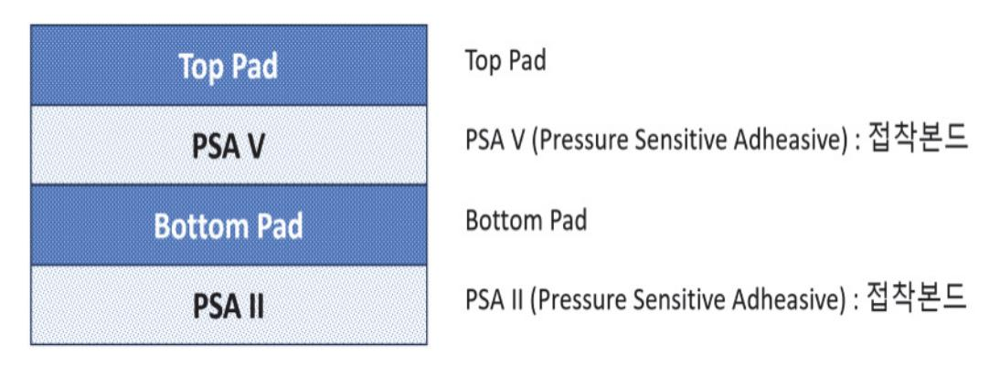

출처: 집필진 제작(2024) [그림 3-1] 연마 패드(Polishing Pad)의 모식도

2. 연마 헤드(Polishing Head)의 제조 및 관리 요소를 확인한다.

연마 헤드는 웨이퍼 뒷면을 흡착하여, 웨이퍼 표면을 연마 패드에 마찰하여, 압력을 가하면 서 회전하는 역할을 한다.

- (1) 백킹 필름(Backing Film/Carrier Film)은 웨이퍼 뒷면에 흡착하는 역할을 한다. 발포 폴리우레탄 재질로 구성되어 있으며, 가습시켜 표면장력을 이용하여 웨이퍼를 고정 시키거나 멤브레인 진공 척을 사용하기도 한다.
- (2) 리테이너 링(Retainer Ring)은 연마 도중 회전 시에 발생하는 원심력으로 인한 웨이퍼의 이 탈을 막는 역할을 한다. 내구성과 내화학성이 뛰어난 재질인 PPS(폴리페닐설파이트), PEEK(Polyetheretherketone), PBN(Pyrolytic Boron Nitride) 재질을 사용한다.
- (3) 헤드 하우징(Head Housing)은 웨이퍼를 보유하며, 웨이퍼에 압력을 가하는 역할을 한다. 재질은 주로 SUS 계열 재료를 사용한다.
- (4) 연마 헤드의 구동 요소는 아래와 같다. 연마 헤드의 구동에 핵심적인 요소는 Down Force, Polishing Head Rotate, Polishing Head Osilation, N2 Back Pressure, Retainer Ring Pressure 등이 있다. (가) Down Force는 연마 헤드 전체에 가해지는 압력이다.

- (나) 연마 헤드 회전 운동은 시계 방향/반시계 방향의 회전 운동이다.
- (다) 연마 헤드 진동 운동은 좌측/우측 방향의 회전(Sweep Motion) 운동이다.
- (라) N2 Back Pressure는 웨이퍼의 뒷면엔 N2로 압력을 가한다.
- (마) 리테이너 링 압력(Retainer Ring Pressure)는 연마 중 웨이퍼의 이탈을 방지하기 위해 리테이너 링에 전해지는 압력이다.

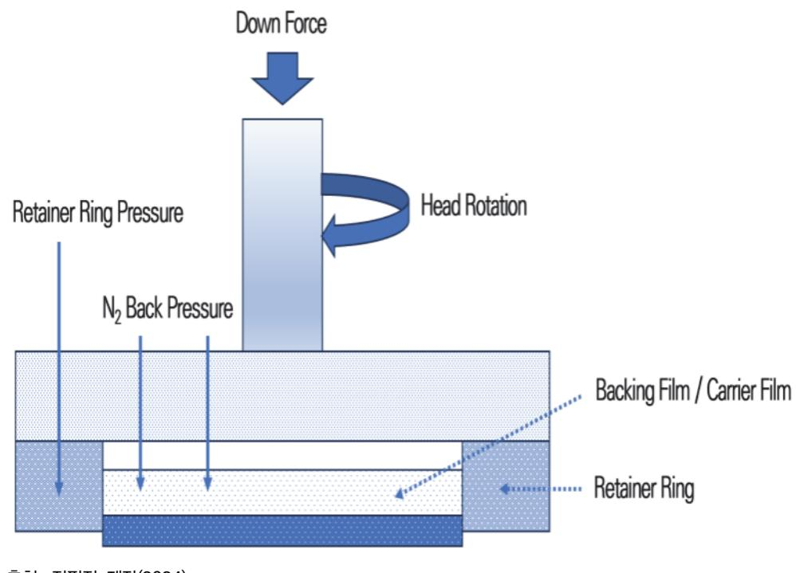

출처: 집필진 제작(2024) [그림 3-2] 연마 헤드(Polishing Head)의 모식도

3. 슬러리(Slurry)의 제조 및 관리 요소를 확인한다.

슬러리의 종류에는 실리카(Silica)계 슬러리, 세리아(Ceria)계 슬러리, 알루미나(Alumnina) 계 슬러리 등이 있다.

(1) 실리카(Silica)계 슬러리

사염화규소(SiCl4)를 불꽃 내 열처리로 산화시킨 연마 입자 Fumed Silica(SiO2) 또는 규산(NaSiO2)을 이온 교환하여 만든 Colloidal Silica를 초순수(D.I.W.)에 분산시켜 사 용한다.

(2) 세리아(Ceria)계 슬러리

CeO2 입자를 가지며 연마 중 분쇄되면서 미소한 입자로 되어 연마가 진행된다. 연마 선택비(Selectivity)의 향상을 위해 슬러리 내에 화학적 첨가제를 추가하기도 한다. 산성 도는 pH 7 정도의 중성에서 공정을 진행한다.

(3). 알루미나(Alumnina)계 슬러리

Al203 입자를 가지며 H2O2, Fe(N03)2. KIO2 등 산화제를 혼합한 pH 2~4 정도의 산성 용액에 분산시켜 사용한다.

주로 텅스텐(W), 알루미늄(AI), 구리(Cu) 등 배선용 금속의 CMP 공정에 사용된다. 알루미나 입자가 실리카 입자보다 경도가 높기 때문에 금속막 연마 속도를 향상시킬 수 있다.

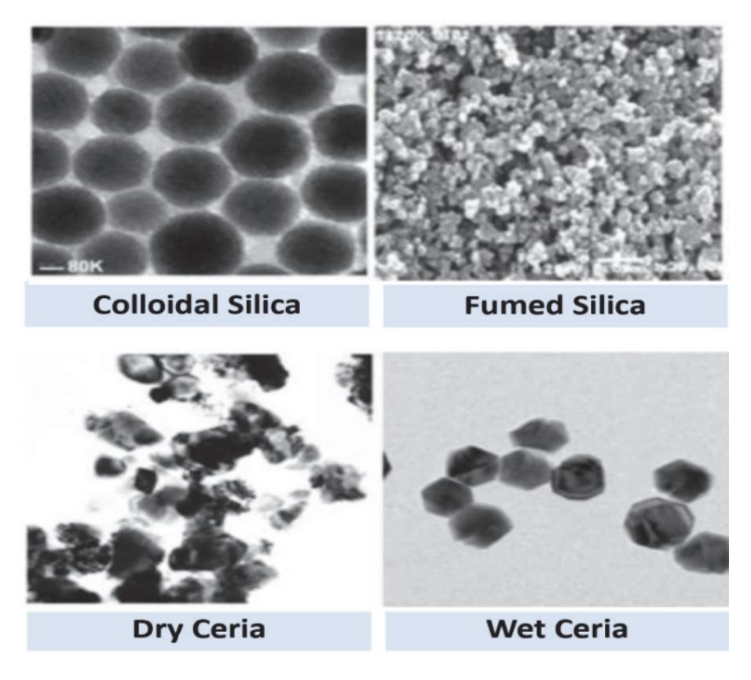

 출처: 집필진 제작(2024) [그림 3-3] 다양한 Slurry의 입자 형상

- 4. 패드 컨디셔너(Pad Conditioner)의 제조 및 관리 요소를 확인한다.
  - (1) 패드 표면에 생성되어 있는 미세한 기공은 CMP 공정이 진행됨에 따라 발생하는 Slurry 찌 꺼기 등의 가공 잔류물에 의해 막힘 현상이 발생된다.
  - (2) 기공의 막힘 현상이 발생함에 따라 연마 속도 및 균일도가 급속히 감소하게 된다.
  - (3) 패드 표면에 박혀있는 입자들을 제거하기 위해, 패드의 표면을 다이아몬드 휠로 깍아 내는 장치이다.
  - (4) 다이아몬드를 접착시킨 니켈 플레이트를 패드 표면에 접촉한 후, 가압, 회전, 쓸기(Sweep) 등의 동작을 통해 패드 기공 속의 슬러리 찌꺼기, 미세입자 등을 제거한다.
  - (5) 패드 컨디셔닝이 과도하게 진행되면 패드 표면의 기공들이 함몰되어 패드의 성능이 감소할 수 있다.
  - (6) 다이아몬드 입자는 웨이퍼의 표면에 스크래치를 일으킬 수 있으므로 주의가 필요하다.

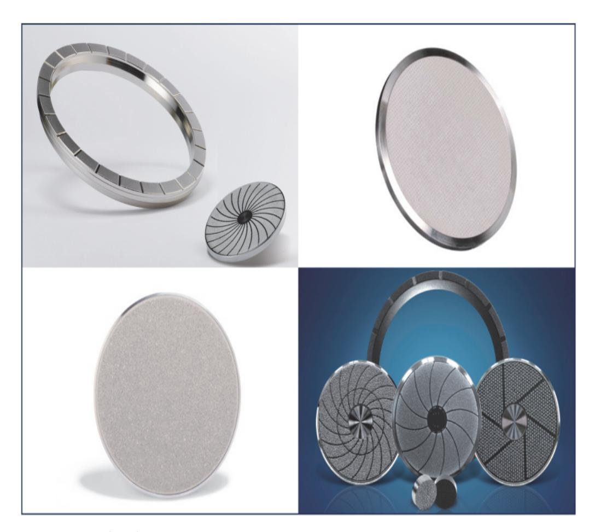

출처: 집필진 제작(2024) [그림 3-4] 다양한 형상의 패드 컨디셔너

#### 5. 종말점 측정기(E.P.D. End Point Detector)의 제조 및 관리 요소를 확인한다.

종말점 측정기(E.P.D.)는 CMP 연마 공정 후에 목표한 박막이 제거되거나, 목표한 박막의 두께가 남았을 때 연마 공정이 종료해야 할 시점을 측정하는 모듈이다. 이 종말점 측정기의 종류에는 광학식(Optic) 검출법 및 토크(Torque) 검출법이 사용된다.

(1) 광학식(Optic) 검출법

플레이튼(Platen) 내에 레이저 등의 광학계가 설치되어 빛이 웨이퍼 표면에서 입사 및 반사된 빛을 측정한다. 측정된 데이터를 이용하여 반사율 등을 측정하고, 이를 광학적 수식 등을 이용하여 두께를 계산하여 종말점을 검출한다.

(2) 토크식(Torque) 검출법

모터 전류를 측정하여 종말점을 검출하는 방식이다. 웨이퍼의 표면과 패드의 마찰력으로 인해 마찰 계수로 발생한다. CMP 연마 공정 중의 막질 제거(변화) 등으로 마찰 계수가 변화될 경우 웨이퍼 캐리어의 회전축의 토크(Torque)가 변화되어 모터 전류의 변화를 확인할 수 있다.

- 6. CMP 후 세정 모듈의 메가소닉(Megasonic) 세정기의 제조 및 관리 요소를 확인한다.
  - (1) 수 kHz~MHz 의 초음파를 초순수나 캐미컬 용액 세정시에 인가한다.
  - (2) 캐비테이션(Cavitation) 작용으로 웨이퍼에 부착된 파티클을 물리적으로 제거한다.
- 7. 브러시(Brush) 모듈의 제조 및 관리 요소를 확인한다.
  - (1) 브러시(Brush)로 문질러서(Scrubbing) 물리적인 힘으로 웨이퍼에 부착된 파티클을 제거하는 방법이다.
  - (2) 브러시는 보통 PVA(Poly Vinyle Alcohol) 재질을 사용한다.
  - (3) Roller형과 Pencil형 등 제조사별로 형상의 차이가 있다.
- 8. 건조 모듈(Dry Module)의 제조 및 관리 요소를 확인한다.
  - (1) 메가소닉 및 브러시 세정이 끝난 웨이퍼를 건조시키는 모듈이다.
  - (2) Spin Dry 방식은 웨이퍼를 고속으로 회전시켜 원심력으로 인해 남아 있는 물 분자를 제거하 는 방식이다.
  - (3) IPA 방식은 IPA를 이용하여 건조시키는 방식이다.
  - (4) 건조 효율을 증가시키고 물 얼룩(Water Mark) 생성을 방지하기 위해서 IR(Infra-Red) 램프 를 적용하기도 한다.
- 9. 두께 측정 모듈의 제조 및 관리 요소를 확인한다.
  - (1) CMP 연마 후 목표한 막질이나 표면의 두께를 측정하기 위한 모듈이다.
  - (2) CMP 장비 내에 측정 장치를 설치하여 두께 측정 결과를 관리하여 공정 조건을 조절할 수 있다.
  - (3) 광원에서 조사된 빛이 웨이퍼 표면에서 반사되는 빛을 센서(Detector)를 이용하여 측정하며, 이 데이터와 광학 수식 등을 이용하여 정확한 두께를 측정한다.

### 학습 3 교수·학습 방법

#### 교수 방법

- 반도체용 CMP 공정의 개요와 세부 내용을 공정별로 알기 쉽게 설명한다.
- 반도체용 CMP 장비의 개요와 모듈별 세부 내용을 모듈별로 알기 쉽게 설명한다.
- CMP 장비의 공정 매뉴얼과 관련 공정 재료 관련 자료 내용 등을 정리하여, 프레젠테이션 자료로 전달한 후에 이에 대한 설명을 실시한다.
- 문제 해결식 수업을 진행하기 위해 학습자가 이해하기 쉬운 자료와 방법을 사용하여 설명한 다.
- 제조 현장의 사례를 수집하여, 되도록 사전에 관련 자료를 학습자들에게 배포한다.
- 반도체용 CMP 재료 요구 사항을 확인하고, 학습자들에게 관련 자료의 파악 여부를 확인한 다.
- CMP 공정과 관련된 반도체 시장 환경 및 기술 동향 등에 대하여 학습자들이 쉽게 이해할 수 있도록 수업을 진행한다.

#### 학습 방법

- 반도체 관련 시장 환경 및 기술 동향 등 산업 현황을 구체적으로 확인하도록 하고, 다양한 자료를 인터넷으로 검색하고 분류하여 문서로 정리한다.
- 반도체용 CMP 재료 요구 사항 항목을 작성해 본 후, 관련 자료의 종류와 기록 내용을 숙 지하고 분류한다.
- 반도체 CMP 재료 요구 사항에 대한 생산에 필요한 목표를 설정하고, 반도체 시장 및 기술, 비용의 조사, 수집 및 분석을 통해 생산 가능성 및 장애점을 예측한다.
- 반도체용 CMP 공정 중 예상되는 품질 관리 문제점을 파악하고 피드백한다.

## 학습 3 평 가

#### 평가 준거

- 평가자는 학습자가 학습 목표를 성공적으로 달성하였는지를 평가해야 한다.
- 평가자는 다음 사항을 평가해야 한다.

|                    | 학습 목표                                                 | 성취수준 |   |   |
|--------------------|-------------------------------------------------------|------|---|---|
| 학습 내용              |                                                       | 상    | 중 | 하 |
| 반도체용 CMP 재 료 제조 | - 반도체 CMP 재료의 제조 공정별 장점과 단점을 파악할 수 있다.             |      |   |   |
|                    | - 반도체 CMP 재료별 제조(공정/장비) 파라미터를 파악하고 적용할 수 있다.       |      |   |   |
|                    | - 반도체 CMP 재료별 제조 공정의 도출된 문제점에 대한 해 결 방안을 제시할 수 있다. |      |   |   |

#### 평가 방법

• 문제 해결 시나리오

|                    | 평가 항목                                                                                                | 성취수준 |   |   |
|--------------------|------------------------------------------------------------------------------------------------------|------|---|---|
| 학습 내용              |                                                                                                      | 상    | 중 | 하 |
| 반도체용 CMP 재 료 제조 | - 반도체용 CMP 재료의 문제점 파악 여부                                                                             |      |   |   |
|                    | - 반도체용 CMP 재료 제조 사양서를 이용하여 생산에 적용할 수 있는 능력                                                        |      |   |   |
|                    | - 반도체용 CMP 재료 제조 사양서를 바탕으로 문제점을 파악 하고, 사양서 상의 정보인 제품명, 품질 기준, 제품 사양, 납 기 등에 대해 생산에 활용할 수 있는 능력 |      |   |   |

• 논술형 시험

| 학습 내용              | 평가 항목                        | 성취수준 |   |   |
|--------------------|------------------------------|------|---|---|
|                    |                              | 상    | 중 | 하 |
| 반도체용 CMP 재 료 제조 | - 반도체용 CMP 재료를 제조할 수 있는 능력   |      |   |   |
|                    | - 반도체용 CMP 재료 제조에 필요한 기술 보유  |      |   |   |
|                    | - 반도체용 CMP 재료 제조 수행 순서 서술 능력 |      |   |   |

• 사례 연구

| 학습 내용              | 평가 항목                     | 성취수준 |   |   |
|--------------------|---------------------------|------|---|---|
|                    |                           | 상    | 중 | 하 |
| 반도체용 CMP 재 료 제조 | - 반도체용 CMP 재료 제조 사례 설명 능력 |      |   |   |
|                    | - 반도체용 CMP 재료 제조 순서 열거 능력 |      |   |   |
|                    | - 반도체용 CMP 재료 제조 기준 열거 능력 |      |   |   |

#### 피드백

| 1. 문제 해결 시나리오 - 반도체용 CMP 재료 제조에 필요한 사양서를 바탕으로 생산에 적용할 수 있는 능력에 대해 평가                       |
|-----------------------------------------------------------------------------------------------|
| 하고 부족한 부분을 사례를 들어 가며 설명해 준다.                                                                  |
| - 반도체용 CMP 재료 제조 시에 발생할 수 있는 품질 기준, 제품 사양, 납기 등의 문제점을 이해 하고 대처할 수 있는 능력을 기를 수 있도록 피드백해 준다. |
| - 평가 자료를 판단하여, 이해가 부족한 경우에는 실제 생산 사례를 참조하여 개선안을 검토할 수                                         |
| 있도록 보충 설명을 해 준다.                                                                              |
| 2. 논술형 시험                                                                                     |
| - 파악된 내용을 바탕으로 CMP 재료 제조시 발생할 수 있는 문제점의 대처방 안에 대한 지식에                                         |
| 대해 평가하고 부족한 부분이 발견되면 미비한 부분을 재학습하도록 해 준다.                                                     |
| - CMP 재료 제조시 필요한 기술과 수행 순서 지식 등을 평가하고 부족한 부분은 추가로 재학습하                                        |
| 도록 해 준다.                                                                                      |
| 3. 사례 연구                                                                                      |
| - 반도체용 CMP 재료 제조 관련한 사례를 평가한 후 성취수준이 낮은 학습자에게는 반도체용 CMP                                       |
| 재료 제조 관련 사례를 추가로 조사할 수 있도록 보충 설명을 해 준다.                                                       |
| - 성취수준이 높은 학습자에게는 반도체용 CMP 재료 제조 순서와 기준의 사례를 추가로 조사하게 한다.                                     |

- CMP 제조시 발생할 수 있는 불량 판정 사례 등을 통해 추가 심화 교육을 실시한다.

| 학습 4 | 반도체용 CMP 제품 특성 검증하기    |
|------|------------------------|
| 학습 3 | 반도체용 CMP 재료 제조하기       |
| 학습 2 | 반도체용 CMP 재료 선정하기       |
| 학습 1 | 반도체용 CMP 재료 요구 사항 파악하기 |

# 4-1. 반도체용 CMP 제품 특성 검증

| 학습 목표 | • 반도체 CMP 재료의 분석 시 문제점에 대한 해결 방안을 제시할 수 있다. |
|-------|---------------------------------------------|
|       | • 반도체 CMP 재료의 시험 시 문제점에 대한 해결 방안을 제시할 수 있다. |
|       | • 반도체 CMP 재료의 평가 시 문제점에 대한 해결 방안을 제시할 수 있다. |
|       | • 반도체 CMP 재료의 검증 시 문제점에 대한 해결 방안을 제시할 수 있다. |

## 필요 지식 /

숔 반도체 CMP 공정의 품질 측정

반도체 CMP 공정 중에 발생하는 중요한 품질 문제는 표면의 미세 흡집이다. 금속의 숨어 있 는 공간과 동일한 레벨 안에서 금속과 금소의 전위적 단락이 생김으로써 발생한다. 그러나 오 염으로 작용하는 미세 흠집은 발견하기 쉽지 않다.

- 1. 웨이퍼 표면의 흠집과 둥근 홀들
  - (1) 결정의 형태는 내부 금속 단락으로 금속층과 금속층에 발생한다.
  - (2) 미세 흠집들은 정밀 조사에도 찾기가 매우 힘들다.
  - (3) 가능한 원인
    - (가) 슬러리 안으로 확산되는 입자 크기의 제거 미흡으로 발생한다.
    - (나) 오랜 축적과 부적절한 사용으로 슬러리 입자의 건조함을 유발하고, 더 큰 입자를 만들게 된다.
    - (다) 슬러리의 입자가 오염되었을 경우 발생한다.
    - (라) 미세 흠집을 줄이기 위한 이차 완출 작용의 결핍 혹은 최적화되지 않았을 경우 발생한 다.
- 2. 디싱(Dishing)
  - (1) 긴 사발 모양으로 움푹 들어가는 형태를 띤다.

- (2) 높은 연마비 물질에서 침하된 것이며 이는 지반의 함몰로 발생한다.
- (3) 이와 관련하여 설명 가능한 사항은 다음과 같다.
  - (가) 디싱(Dishing)은 연마 정지층으로 사용되는 질화물처럼 전형적으로 낮은 연마비의 환경 안에 있는 높은 연마비 물질들에서 발생한다(높은 연마비 물질 예: 산화 STI).
  - (나) 높은 연마비 물질이 보다 더 큰 표면적을 가졌을 때 더 많은 디싱(Dishing)이 발생한다.
  - (다) 패드의 단단함이 증가하면 디싱이 줄어든다. 패드는 덜 깊숙한 곳에서 구부러진다.
  - (라) 구리(Cu)에서 단단한 패드와 높은 화학적 제거율을 가지는 슬러리와의 결합은 디싱을 최 소화할 수 있다.
- 3. 부식(Erosion, 침식)
  - (1) 낮은 연마비 물질에서 침하 또는 과도한 제거가 발생한다.
  - (2) 이와 관련하여 설명 가능한 사항은 다음과 같다.
    - (가) 질화물 같은 낮은 연마비 물질에서 부식이 발생한다.
    - (나) 질화물 차폐와 텅스텐을 상호 연결할 때 같이 금속 패턴 밀도가 증가할 때 많이 나타난 다.
    - (다) 비아 식각이 하부 금속층과 연결되지 않을 때 불완전한 비아 식각을 일으킬 수 있다.
    - (라) 일반 압축성과 최적 조건의 슬러리 이동을 위해 조정할 수 있는 연마 패드의 연구가 필 요하다.
- 4. 잔류물(찌꺼기)
  - (1) 모서리를 따라서 스트링거의 구성에서의 잔류물이 발생한다.
  - (2) CMP 공정의 특정한 모서리를 따라서 스트링거를 줄일 것이며, 스트링거들은 단락을 유발하 거나 칩의 신뢰성을 떨어뜨린다.
  - (3) 이와 관련하여 설명 가능한 사항은 다음과 같다.
    - (가) 스트링거들은 텅스텐과 폴리실리콘 스트링거 같은 물질에서 발생한다.
    - (나) 연마 패드와 슬러리의 화학 물질 등을 최대한 활용하여, 다른 물질들 사이에서 더 많은 단일화된 연마의 적용이 필요하다. 이를 통해 스트링거의 최소화가 필요하다.
- 숕 반도체용 CMP 고장 진단 문제 검토

반도체용 CMP 장비의 운영 중 문제가 발생할 경우, 발생한 문제점의 발생 원인을 검토하고 이에 대한 대응 방안을 검토한다.

- 1. 슬러리 안의 과도하게 큰 입자 발생
  - (1) 예상 가능한 원인은 다음과 같다.

- (가) 슬러리가 디스펜서 측벽의 내부에서 건조되고, 슬러리 혼합물 안으로 떨어진다.
- (나) 입력 슬러리에서의 마찰 입자의 럼핑이 발생할 수 있다.
- (다) 공급업자에 의해서 불량 슬러리가 사용되었을 가능성이 있다.
- 2. 웨이퍼 표면의 불균일한 연마 발생
  - (1) 예상 가능한 원인은 다음과 같다.
    - (가) 중심 속도가 빠르며, 웨이퍼의 중심이 다른 지역보다 빠르게 연마된다.
    - (나) 중심 속도가 느리며, 웨이퍼의 중심이 다른 지역보다 느리게 연마된다.
- 3. 구리 CMP 후에 깨끗한 웨이퍼의 입자들 발생
  - 예상 가능한 원인은 다음과 같다.
  - (1) 웨이퍼에서 과도한 입자들이 발견된다.
  - (2) 광 직렬 자국들과 bond 패드 지역들과 같이 깊은 특성 안에서 잔류 슬러리가 생성된다.
  - (3) 유전체 또는 패턴화된 웨이퍼들의 라인들 사이로부터 잔류 구리의 제거가 필요하다.
- 4. 연마 패드의 광택 발생
  - 예상 가능한 원인은 다음과 같다.
  - (1) 부적절하게 적용된 검사용 암이 발견된다.
  - (2) 과도하게 닳은 패드로 인해 발생한다.

## 수행 내용 / 반도체용 CMP 제품 특성 검증하기

#### 재료·자료

- 웨이퍼(Wafer)
- 슬러리(Slurry)
- 패드(Pad)
- 패드 컨디셔너(Pad Conditioner)
- 리테이너 링(Retainer Ring)
- 멤브레인(Membrane)
- 케미컬 용액(Chemical Solvent)
- 브러시(Brush)
- 필터(Filter)
- 초순수(DI Water)

#### 기기(장비 ・ 공구)

- 연마 장치(Polisher)
- 연마 후 세정 장치(Post CMP Cleaner)
- 박막 두께 측정 장치
- 공구류
- 실험 및 보호용 도구
- 방진복, 마스크, 고무장갑 등
- 검사 및 측정 장비(Inspection and Measurement Equipment)
- 세정 장비(Cleaning Equipment)
- 평가, 분석 및 계측 장비
- 광학 현미경(Optical Microscope)

- 전자 현미경(SEM: Scanning Electron Microscope)
- 안전 도구, 안전화, 안전모, 마스크, 장갑, 고글, 방진복
- 컴퓨터, 프린터, 복사기

#### 안전 ・ 유의 사항

- 물질 안전 보건 자료(MSDS: Material Safety Data Sheet)를 참조하여 취급하는 화학 물 질에 대한 안전 정보를 숙지한다.
- 장갑, 보호안경, 실험복, 호흡기 등이 포함하는 적절한 개인 보호 장비(Personal Protective Equipment)를 착용한다.
- 화학 물질을 이용한 공정은 환기가 잘 되는 작업 공간에서 작업해야 한다.
- 화학 물질은 안전 용기에 보관하고, 물질에 정보를 명확하게 정리하여 라벨을 부착한다.
- 화학 물질을 혼합하거나 처리할 때는 규정된 정확한 절차와 비율을 준수해야 하며, MSDS 등을 활용하여 정확한 정보를 확인하고 공정을 진행한다.
- 사용할 기계 장비는 사용 전에 사용자 매뉴얼을 준수해야 하고, 이를 충분히 이해하고 운영 한다.
- 장비의 유지 보수 및 수리는 반드시 훈련된 전문가가 수행해야 한다.
- 작업 환경을 청결하게 유지하고, 기계적 장비 주변에 장애물이 없도록 한다.
- 장비 운영 중에는 비상 정지 버튼의 위치를 숙지하고, 항상 안전장치를 활성화한다.
- 전기 장비는 장비의 상태를 정기적으로 점검하고, 전기적 결함 유무를 확인한다.
- 전기 장비는 젖은 손으로 만지지 않으며, 물기 및 과다 습기 등 감전의 위험이 있는 환경에 서는 사용하지 않는다.
- UV를 사용할 경우, 노출 장비의 보호 커버를 사용하고, 노출을 최소화하기 위해 운영 시간 을 최소화한다.
- 화학 폐기물은 적절한 방법으로 분류수거하고, 환경 규정을 준수하여 처리한다.
- 오염된 기구 및 재료는 지정된 폐기 절차를 따라 처리한다.
- 작업 공간의 에너지 소비를 최소화하기 위해 불필요한 장비의 전원을 끈다.

수행 순서

숔 반도체용 CMP 제품의 품질 측정 내용을 이해한다.

반도체용 CMP 제품의 특성을 검증하기 위한 요구 사항을 파악하고 CMP 공정의 품질 측정 하여 대응 안을 검토한다.

- 1. CMP 공정 결과로 웨이퍼 표면의 흠집과 둥근 홀들을 확인한다.
  - (1) 결정의 형태를 확인한다.
  - (2) 웨이퍼 표면의 흠집과 둥근 홀들을 원인을 파악한다.
    - (가) 슬러리가 안으로 확산되는 입자 크기의 부적합성
    - (나) 장시간 사용 및 사용 오류로 슬러리 입자의 건조함을 유발하며 기준보다 더 큰 입자가 생성
    - (다) 슬러리의 입자 오염 발생
    - (라) 이차 완출 작용의 결핍 또는 최적화되지 않음.
- 2. CMP 공정 결과로 디싱(Dishing) 발생을 확인한다.
  - (1) 디싱의 원인을 파악한다.
    - (가) 슬러리 안으로 확산되는 입자 크기의 빈약한 제거
    - (나) 높은 연마비 물질이 보다 더 큰 표면적을 가졌을 때 더 많은 디싱이 발생한다.
    - (다) 단단한 패드를 적용한다. 패드는 덜 깊숙한 곳에서 구부러진다.
- 3. CMP 공정 결과로 부식(Erosion, 침식)을 확인한다.
  - (1) 낮은 연마비 물질에서 침하 또는 과도한 제거가 발생함을 확인한다.
  - (2) 부식의 원인을 파악한다.
    - (가) 낮은 연마비 물질에서 침하 또는 과도한 제거가 발생한다.
    - (나) 질화물 같은 낮은 연마비 물질에서의 부식 발생 여부를 확인한다.
    - (다) 금속 패턴 밀도가 증가하는 경우 부식의 발생이 나타난다.
    - (라) 비아 식각이 하부 금속층과 연결되지 않을 때 불완전한 비아 식각이 일어났는지 확인한 다.
- 4. CMP 공정 결과로 발생한 잔류물을 확인한다(활용 서식 참조).
  - (1) 스트링거의 구성에서의 잔류물이 발생함을 확인한다.
  - (2) 부식의 원인을 파악하고, 텅스텐과 폴리실리콘 스트링거 같은 물질에서 발생했는지 확인한다.
  - (3) 다른 물질들 사이에서 더 많은 단일화된 연마의 적용 여부를 확인한다.

- 5. CMP 공정에서 발생되는 폐기물 및 폐수에 대한 처리를 이해한다.
  - (1) CMP 공정에서 배출되는 폐수에는 가공 과정에서 웨이퍼로부터 제거된 용해 성분, 입자 성 분, 슬러리, 세정 워터, 패드 및 패드 컨디셔닝의 잔류물이 포함된다.
  - (2) 폐수에 포함되는 웨이퍼 소재의 양과 조성은 웨이퍼 표면에서 제거하는 박막층의 조성과 두 께에 따라 결정된다.
  - (3) 배출되는 폐수는 팹에서 배출된 여타의 폐수와 섞이기 전에 관련된 물리·화학적 처리를 시행 한 다음에 생물학적 폐수처리장을 거치도록 배치된다.
  - (4) CMP 공정에서 배출되는 폐수는 사용 가능한 공간의 크기와 위치, 인프라 등을 이용하여 정 해진 규정에 따라 처리해야 한다.

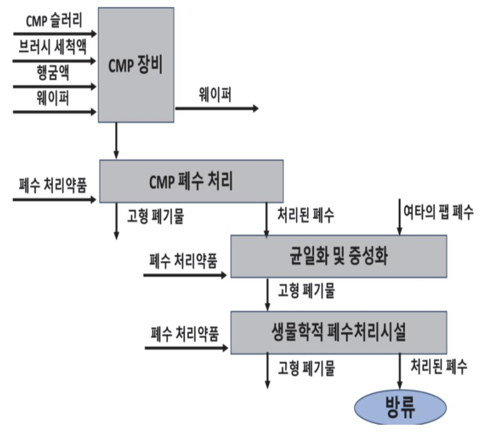

출처: 집필진 제작(2024)

숕 반도체용 CMP 고장 진단 문제를 검토한다.

반도체용 CMP 장비의 운영 중 문제가 발생할 경우, 발생한 문제점의 발생 현황을 검토하고 이에 대한 대응 방안을 검토한다.

[그림 4-1] CMP 공정에서 발생한 폐수에 대한 팹에서의 처리 방안 예시

(3) 연마 패드를 교체한다.

한다.

(2) 하양 압력의 조사를 실시한다.

예상 가능한 원인은 다음과 같다.

(1) 적절한 패드 시운전이 수행되었는지 확인한다.

- 4. 연마 패드의 광택 발생 시에 해결 방안을 검토한다.
- (4) 웨이퍼 표면의 물질 노출과 브러시 공정, 세정 공정 등에서 화학적 오염이 발생했는지 조사
- (3) 구리 잔류물을 위한 최적의 세정 화학제가 사용되었는지 확인한다.
- (2) 브러시에 오염되었는지 조사한다.
- (1) 패턴화된 웨이퍼에서 잔류 구리의 세정이 올바르게 종료되었는지 확인한다.
- 예상 가능한 원인은 다음과 같다.
- 3. 구리 CMP 후에 깨끗한 웨이퍼의 입자들 발생 시에 해결 방안을 검토한다.
- (7) 웨이퍼 뒤쪽 압력이 잘못 설정되어 있는지 확인한다.
- (6) 테이블의 회전 속도가 잘못 설정되어 있는지 확인한다.
- (5) 웨이퍼 캐리어에서 후면막이 악화되었는지 확인한다.
- (4) 부족한 슬러리 흐름률 또는 잘못된 점성률이 적절히 설정되었는지 확인한다.
- (3) 패드 컨디션 암이 적절히 적용되었는지 검사한다.
- (2) 웨이퍼 캐리어 위의 압력 및 하향 압력이 제대로 설정되었는지 확인한다.
- (1) 플래튼 위의 패드 외형을 검사한다. 패드가 과도하게 닳았는지 점검한다.

검토 가능한 대응 안은 다음과 같다.

- 2. 웨이퍼 표면의 불균일한 연마 시에 해결 방안을 검토한다.
- (3) 계면 활성제와 안정제를 적절히 이용하여 슬러리의 안정성을 향상시킬 수 있다.
- (2) 슬러리의 제조와 납품의 최적화 방안을 검토한다.
- (1) 슬러리를 POU 필터 여과법을 이용하여 필터링할 수 있다.
- 검토 가능한 대응안은 다음과 같다.
- 1. 슬러리 안의 과도하게 큰 입자 발생 시에 해결 방안을 검토한다.

### 학습 4 교수·학습 방법

#### 교수 방법

- 반도체용 CMP 공정의 개요와 세부 내용을 공정별로 알기 쉽게 설명한다.
- 반도체용 CMP 장비의 개요와 모듈별 세부 내용을 모듈별로 알기 쉽게 설명한다.
- CMP 장비의 공정 매뉴얼과 관련 공정 재료 관련 자료 내용 등을 정리하여, 프레젠테이션 자료로 전달한 후에 이에 대한 설명을 실시한다.
- 문제 해결식 수업을 진행하기 위해 학습자가 이해하기 쉬운 자료와 방법을 사용하여 지도한 다.
- 제조 현장의 사례를 수집하여 되도록 사전에 관련 자료를 학습자들에게 배포한다.
- 반도체용 CMP 재료 요구 사항을 확인하고, 학습자들에게 관련 자료의 파악 여부를 확인한 다.
- CMP 공정과 관련된 반도체 시장 환경 및 기술 동향 등에 대하여 학습자들이 이를 이해할 수 있도록 수업을 진행한다.

#### 학습 방법

- 반도체 관련 시장 환경 및 기술 동향 등 산업 현황을 구체적으로 확인하도록 하고, 다양한 자료를 인터넷으로 검색하고 분류하여 문서로 정리한다.
- 반도체용 CMP 재료 요구 사항 항목을 작성해 본 후, 관련 자료의 종류와 기록 내용을 숙 지하고, 분류한다.
- 반도체 CMP 재료 요구 사항에 대한 생산에 필요한 목표를 설정하고, 반도체 시장 및 기술, 비용의 조사, 수집 및 분석을 통해 생산 가능성 및 장애점을 예측한다.
- 반도체용 CMP 공정 중 예상되는 품질 관리 문제점을 파악하고 피드백한다.

## 학습 4 평 가

#### 평가 준거

- 평가자는 학습자가 학습 목표를 성공적으로 달성하였는지를 평가해야 한다.
- 평가자는 다음 사항을 평가해야 한다.

|                       |                                                 | 성취수준 |   |   |  |
|-----------------------|-------------------------------------------------|------|---|---|--|
| 학습 내용                 | 학습 목표                                           |      | 중 | 하 |  |
| 반도체용 CMP 제 품 특성 검증 | - 반도체 CMP 재료의 분석 시 문제점에 대한 해결 방안을 제 시할 수 있다. |      |   |   |  |
|                       | - 반도체 CMP 재료의 시험 시 문제점에 대한 해결 방안을 제 시할 수 있다. |      |   |   |  |
|                       | - 반도체 CMP 재료의 평가 시 문제점에 대한 해결 방안을 제 시할 수 있다. |      |   |   |  |
|                       | - 반도체 CMP 재료의 검증 시 문제점에 대한 해결 방안을 제 시할 수 있다. |      |   |   |  |

#### 평가 방법

• 문제 해결 시나리오

| 학습 내용      | 평가 항목                                                            | 성취수준 |   |   |  |
|------------|------------------------------------------------------------------|------|---|---|--|
|            |                                                                  | 상    | 중 | 하 |  |
| 반도체용 CMP 제 | - 반도체용 CMP 제품 특성 검증을 바탕으로 품질 기준, 제품 사양, 납기 등의 문제점 해결할 수 있는 능력 |      |   |   |  |
| 품 특성 검증    | - 결함이 발생한 CMP 재료 및 부품의 기능을 판단하고 교체 할 수 있는 능력                  |      |   |   |  |

• 서술형 시험

| 학습 내용                 | 평가 항목                                                               | 성취수준 |   |   |  |
|-----------------------|---------------------------------------------------------------------|------|---|---|--|
|                       |                                                                     | 상    | 중 | 하 |  |
|                       | - 파악된 내용을 바탕으로 CMP 제품 특성 검증시 발생할 수 있는 문제점의 대처 방안에 대해 서술할 수 있는 능력 |      |   |   |  |
| 반도체용 CMP 제 품 특성 검증 | - CMP 특성에 대한 품질 기준을 확인하고, 불량품 확인 시 대처 방안을 서술할 수 있는 능력            |      |   |   |  |
|                       | - CMP의 기본 물리적 특성을 서술할 수 있는 능력                                       |      |   |   |  |

• 사례 연구

| 학습 내용                 | 평가 항목                                                  | 성취수준 |   |   |  |
|-----------------------|--------------------------------------------------------|------|---|---|--|
|                       |                                                        | 상    | 중 | 하 |  |
|                       | - 반도체용 CMP 제품 특성 검증에 사용되는 재료의 요구 사 항의 구체적인 사례 파악 여부 |      |   |   |  |
| 반도체용 CMP 제 품 특성 검증 | - CMP 성능 개선이 전체 생산 공정에 미치는 경제적 효과 사 례 파악 여부         |      |   |   |  |
|                       | - 반도체용 CMP 성능을 검증할 수 있는 능력                             |      |   |   |  |

피드백

| 1. 문제 해결 시나리오                                                                                              |
|------------------------------------------------------------------------------------------------------------|
| - 반도체용 CMP 제품 특성 검증의 기준이 되는 품질 기준, 제품 사양, 납기 등의 문제점을 이해하 고 대처할 수 있는 능력에 대해 평가하고 부족한 부분을 사례를 통해 피드백해 준다. |
| - CMP 특성 검증의 품질 문제에 대한 대처 시나리오에 대해 이해가 부족할 경우, 실제 적용 사례                                                    |
| 를 참조하여 재학습할 수 있도록 설명해 준다.                                                                                  |
| - 결함이 발생한 CMP 재료를 평가하고, 그 결과에 따른 부품의 재사용 및 폐기 방법에 대해 보충                                                    |
| 하여 설명해 준다.                                                                                                 |
| 2. 서술형 시험                                                                                                  |
| - 파악된 내용을 바탕으로 CMP 제품 특성 검증 방법에 대한 서술 방안에 대한 지식에 대해 평가                                                     |
| 하고 부족한 부분이 발견되면 미비한 부분을 추가로 재학습하도록 피드백해 준다.                                                                |
| - CMP 제품 특성 검증 시 발생할 수 있는 문제점에 대한 지식에 대해 서술하고, 이해가 부족한                                                     |
| 분야에 대해 참고 자료를 재학습하도록 지도한다.                                                                                 |
| - CMP 제품 특성 검증 방법에 대한 성취수준이 높은 학습자에게는 실제 적용 사례에 대한 추가적                                                     |
| 인 자료를 검토할 수 있도록 심화 설명을 해준다.                                                                                |
| 3. 사례 연구                                                                                                   |
| - 반도체용 CMP 제품 특성 검증에 사용되는 재료의 요구 사항의 구체적인 사례를 설명해 준다.                                                      |
| - 반도체용 CMP 제품 특성 검증이 미치는 경제적 효과에 대한 구체적인 사례를 설명해 준다.                                                       |

- 강현구(2008). 「Sub-micron 메모리 소자 적용을 위한 고선택비 CMP 슬러리 설계」. 『한양대학교 공학대학원 박사 학위 논문』.
- •강해령의 하이엔드 테크. CMP 슬러리 특집. 나노 알갱이 부대의 정체 (https://www.sedaily.com/New sView/26CC0TOIO0).
- 곽노열‧배병욱‧오경택‧윤태균‧이성희‧임정훈‧정용우‧진수봉‧최호승‧홍기환(2021). 『반도체 제 조 기술의 이해』. 한올출판사.
- 권장국(2019). 「STI CMP용 세리아 슬러리 조성에 따른 디싱 특성 연구」. 『성균관대학교 일반대학원 석사 학위 논문』.
- 김기출(2023). 「바이오 응용을 위한 형광 실리카 나노 입자의 최적 합성」. 『한국산학기술학회 논문』.
- 김윤기(2018). 「지르코니아 연마 입자 기반 슬러리의 텅스텐 화학적 기계적 연마공정에서 폴리에틸렌이 민의 부식 억제 효과」. 『한양대학교 대학원 석사 학위 논문』.
- 김형준(2000). 「구리 박막의 화학적 기계적 평탄화 공정 중 슬러리 파티클과 웨이퍼 표면의 특성 평가에 대한 연구」. 『한양대학교 대학원 석사 학위 논문』.
- 박영봉(2013). 「CMP 공정에서 웨이퍼 에지의 연마 균일도 향상」. 『부산대학교 대학원 박사 학위 논문』.
- 박인호‧이다솔‧정선호‧정해도(2018). 「Cu CMP에서 온도가 재료 제거율에 미치는 영향」. 『한국기계 가공학회지(Journal oftheKoreanSocietyofManufacturing ProcessEngineers)』. v.17. no. 6.
- 박종휘‧양우성‧정정영‧이상일‧박미선‧이원재‧김재육‧이상돈‧김지혜(2011). 『CMP 공정에서 슬 러리와 웨이퍼 형상이 SiC 웨이퍼 표면 품질에 미치는 영향」. 『한국세라믹학회지(Journal of the Korean Ceramic Society)』. 48권(4호).
- 박지희(2023). 「분산제 함량에 따른 CMP 슬러리의 분산 안정성에 관한 연구」. 『한남대학교 대학원 석사 학위 논문』.
- 박진성(2023). 『진짜 하루만에 이해하는 반도체 산업 원데이클 래스』. 티더블유아이지.
- 박창준(2004). 「혼합 연마제 슬러리의 CMP 특성에 관한 연구」. 『대불대학교 석사 학위 논문』.
- 삼성전자 반도체 뉴스룸(https://blog.naver.com/secsemicon/221102933854).
- 서울대학교 반도체 공동연구소(2012). 『반도체 공정 교육(이론)』. 서울대학교 반도체공동연구소
- 선호정(2024). 『친절한 반도체』. 한올출판사

55

- 서용진‧이우선‧박성우‧김남훈‧고필주(2005). 「산화막 CMP 공정에서 슬러리 온도 변화에 따른 연마 특성」. 『전기전자 재료학회 논문지』.
- 신병철(2015). 「CdTe 박막 CMP에서 슬러리 산화 작용에 관한 연구」. 『부산대학교 대학원 석사 학위 논문』.
- 안진우(2005). 「CMP 슬러리 특성과 공정 변수가 단차 변화에 미치는 영향」. 『고려대학교 대학원 석사 학위 논문』.
- 임준우‧홍상훈‧허영헌‧임승하‧성홍석‧김덕영(2023). 『반도체 공정 장비 개론(제2판)』. 복두출판사.
- 장수천(2018). 「패널 레벨 패키지를 위한 CMP 슬러리의 최적화」. 『부산대학교 대학원 박사 학위 논문』.
- 정영석·김형재·최재영·정해도(2004). 「슬러리 온도 및 유량에 따른 CMP 연마 특성」. 『Journal of the Korean Society for Precision Engineering』.
- 정진엽(2017). 「알루미늄용 CMP 슬러리 개발에 관한 연구」. 『부산대학교 대학원 석사 학위 논문』.
- 조문성(2015). 「CMP용 세리아 슬러리 제조 및 특성」. 『한밭대학교 산업대학원 석사 학위 논문』.
- 진종문(2022). 『반도체 특강(소자편)』. 한빛아카데미.
- 최성재(2021). 『나노 반도체 소자 설계 및 제조 공정 기술』. 자유아카데미.
- 최우영 ‧ 박병국 ‧ 이종덕(2021). 『실리콘 집적 회로 공정 기술의 기초-제5판』. 문운당.
- 최재성(2021). 『반도체 공정 장비 공학』. 북스힐.
- 최진현(2024). 「과황산계 산화제가 Cobalt CMP 공정에 미치는 영향과 CMP 슬러리 분석을 위한 Raman 분광기 응용」. 『중앙대학교 대학원 석사 학위 논문』.
- 케이씨텍(주)(2016). 「20nm 이하 차세대 CMP 공정용 wet 세리아 슬러리 기술 개발」. 『전자정보 디바이스 산업 원천 기술 개발 최종 보고서』. 산업통상자원부
- 황호정(2003). 『반도체 공정기술(개정판)』. 생능출판사.
- 한국공업화학회(2013). 『무기 공업 화학(개정판)』. 교문사(청문각).
- 허성녕(2022). 「초음파 분사 시스템에서 슬러리 막 두께의 변화와 CMP 재료 제거율에 미치는 영향」. 『부산대학교 대학원 석사 학위 논문』.
- 한양대학교(2014). 「반도체 STI CMP용 Ceria 입자 개발 및 특성 평가」. 미래창조과학부 국가 간 협력 기반 조성(비ODA) 보고서.
- 마에다 카즈오(前田 和夫)(2004). 『반도체 제조 장치 입문』. 성안당.
- 사토준이치(2022). 『알기 쉬운 최신 반도체 제조 장치의 기본과 구조』. 정학기(역). 21세기사.

- 수리야데바라 바부(2021). 『CMP 웨이퍼 연마.』 장인배 번역. 씨아이알.
- Daniel A. Crowl, JosephF. Louvar 저·이영순‧김태옥‧박달재‧백종배‧이근원‧이창준 역(2020). 『화학 공정 안전(제4판)』. 동화기술.
- Jeong, K., & Park, M.(2017). A Progress Management based Daily Production Planning Method for Improving the Production Linearity of Semiconductor Fabs(반도체 Fab의 생산 선형성 향상을 위한 진 도관리 기반 일간 생산 계획 방법론).
- Michael Quirk, Julian Serda 저·최성재 역(2013). 『반도체 소자 공정 기술』. 자유아카데미.
- SK hynix newsroom(https://news.skhynix.co.kr/)
- S. Wolf, R.N. Tauber(2008). Silicon Processing for the VLSI Era. Lattice Press.

## 위해성 재료 노출 시나리오 점검 양식

| 위해성 재료 노출 시나리오 점검 양식 |                                                  |                                                                        |         |  |
|----------------------|--------------------------------------------------|------------------------------------------------------------------------|---------|--|
| 제품군                  | 한국표준산업 분류코드(KSIC)*                            | 물질명                                                                    | CAS No. |  |
| pH 조절제               | 24122-냉간 압연 및 압출 제 품 제조업                      | 비공개                                                                    |         |  |
| pH 조절제               | 15110-모피 및 가죽 제조업                                | Sodium formate                                                         |         |  |
| pH 조절제               | 20129-기타 기초 무기 화학 물질 제조업                      | 비공개                                                                    |         |  |
| pH 조절제               | 20129-기타 기초 무기 화학 물질 제조업                      | 수산화칼슘                                                                  |         |  |
| pH 조절제               | 20499-그외 기타 분류 안 된 화학제품 제조업                   | Acetic acid                                                            |         |  |
| 계면 활성제               | 20421-계면 활성제 제조업                                 | C a l c i u m dodecylbenzenesulfonate             |         |  |
| 계면 활성제               | 20421-계면 활성제 제조업                                 | Sodium polyoxyethylene lauryl ether sulfate                      |         |  |
| 계면 활성제               | 20421-계면 활성제 제조업                                 | 비공개                                                                    |         |  |
| 플라스틱 첨가제          | 20119-석탄 화학계 화합물 및 기타 기초 유기화학 물질 제조업 | Phenyl Salicylate                                                      |         |  |
| 흡수 및 흡착제          | 20119-석탄화학계 화합물 및 기타 기초 유기화학 물질 제조 업       | Glycerol                                                               |         |  |
| 흡수 및 흡착제          | 30399-그 외 자동차용 신품 부품 제조업                      | Aluminium oxide                                                        |         |  |
| 접착제, 실란트          | 20493-접착제 및 젤라틴 제 조업                          | Ethyl acetate                                                          |         |  |
| 부식 방지제               | 20499-그외 기타 분류 안 된 화학 제품 제조업                  | Methylbenzotriazole; Tolyl triazole, Methyl-1H-benzot riazole |         |  |
| 부식 방지제               | 20129-기타 기초 무기 화학 물질 제조업                      | Ammonium choloride                                                     |         |  |

#### ※ 「화학물질등록 및 평가에관한법률」(화평법) 시행령 화학 물질 용도 분류 체계

| 용도 분류                     | 구체적 내용                                                                     |  |  |
|---------------------------|----------------------------------------------------------------------------|--|--|
| 1. 흡수 및 흡착제               | 가스나 액체를 흡수 또는 흡착하는 물질                                                      |  |  |
| 2. 접착제ㆍ결합제                | 두 물체의 접촉면을 접합시키는 물질 또는 2개의 개체를 결합시키는 물질                                    |  |  |
| 3. 에어로졸 추진제               | 압축 가스 또는 액화 가스로서 용기에서 가스를 분사함으로써 내용물을 분출시키는 물질                             |  |  |
| 4. 응축방지제                  | 물체의 표면에서 액체가 응축되는 것을 방지할 목적으로 사용하는 물질                                      |  |  |
| 5. 부동액                    | 냉각에 의해서 고화되는 것을 방지하기 위해 사용하는 액체                                            |  |  |
| 6. 접착방지제                  | 두 개체 접촉면의 접착을 방지할 목적으로 사용하는 물질                                             |  |  |
| 7. 정전기 방지제                | 정전기 발생을 방지하거나 저감하는 물질                                                      |  |  |
| 8. 표백제                    | 섬유 등 착색 물체의 색깔을 화학적인 방법으로 분해ㆍ제거함으로써 백색ㆍ무색으로 하는 물질                       |  |  |
| 9. 세정 및 세척제               | 표면에 오염물이나 불순물을 제거하는 데 사용하는 물질                                              |  |  |
| 10. 착색제                   | 다른 물질을 발색하도록 하는 물질                                                         |  |  |
| 11. 착화(錯化)제               | 주로 중금속 이온인 다른 물질에 배위자(配位子)로서 배위되어 착물(복합체)을 형성하는 물 질                     |  |  |
| 12. 전도제                   | 섬유류와 플라스틱류의 대전 성능을 개선하기 위해서 제조 공정에서 첨가ㆍ도포하는 물질                             |  |  |
| 13. 건축용 물질 및 첨가제       | 건축물의 품격을 높이고 유지ㆍ보존을 목적으로 건축용 자재에 사용하는 물질                                   |  |  |
| 14. 부식방지제                 | 공기를 비롯한 화학 물질, 옥외 노출 등으로 생기는 부식을 방지하기 위해 첨가하는 물질                           |  |  |
| 15. 화장품                   | 화장품 및 세면 용품에 사용하는 물질                                                       |  |  |
| 16. 분진 결합제                | 분진의 발생ㆍ분산을 방지하기 위해 첨가하는 물질                                                 |  |  |
| 17. 전기 도금제                | 금속 표면의 세척 및 세정을 위해서 쓰이는 물질 및 도금 공정에서 도금 강도를 증가시키 기 위해 첨가하는 물질           |  |  |
| 18. 화약, 폭발물               | 화학적 안전성이 있으나 화학적 변화를 거침으로써 폭발 또는 팽창을 동반한 다량의 에너 지 및 가스를 매우 빠르게 발생시키는 물질 |  |  |
| 19. 비료                    | 식물에 영양을 주거나 식물의 재배를 돕기 위해 흙에서 화학적 변화를 가져오게 하는 물질                           |  |  |
| 20. 충전제                   | 고무, 플라스틱, 페인트, 세라믹 등에 광택, 인장, 발색 등 기능 향상을 위해 첨가하는 물질                       |  |  |
| 21. 정착제                   | 섬유의 염료와 반응하여 색이 정착하도록 하는 물질                                                |  |  |
| 22. 내화ㆍ방연제 및 난연제 | 주로 섬유 및 플라스틱의 연소 방지ㆍ지연 효과를 위해 작업 공정 중에 첨가ㆍ반응시키는 물질                      |  |  |

| 23. 부유제        | 광물질의 제련 공정 중에서 광물질을 농축ㆍ수거하기 위해 사용하는 물질                                           |
|----------------|----------------------------------------------------------------------------------|
| 24. 주물용 융(融)제  | 광물질을 녹이는 공정에서 산화물이 형성되는 것을 방지하기 위해 첨가하는 물질                                       |
| 25. 발포제ㆍ기포제    | 주로 플라스틱이나 고무 등에 첨가해서 작업 공정 중 가스를 발생시켜 기포를 형성하게 하 는 물질                         |
| 26. 식품 및       | 식품(의약으로 섭취하는 것은 제외한다.) 및 식품을 제조ㆍ가공 또는 보존하는 과정에서 식                                |
| 식품 첨가물         | 품에 넣거나 첨가하는 물질                                                                   |
| 27. 연료         | 연소반응을 통해 에너지를 얻을 수 있는 물질                                                         |
| 28. 연료 첨가제     | 연소 효율, 에너지 효율을 높이기 위하여 연료에 첨가하는 물질                                               |
| 29. 열 전달제      | 열을 전달하고 열을 제거하는 물질                                                               |
| 30. 유압유 및 첨가제  | 각종 압축기에 넣는 액체(기름) 및 압력 전달 효율을 높이기 위해 첨가하는 물질                                     |
| 31. 함침(含浸)제    | 가공성 제품의 품질 향상, 형태 유지 등을 목적으로 소재에 미리 처리하여 놓는 물질                                   |
| 32. 절연제        | 전기 기기에 있어서 도체 이외의 부분을 전류가 통과하지 못하도록 작용하는 물질                                      |
| 33. 중간체        | 다른 화학 물질을 합성하는 데 사용하는 물질                                                         |
| 34. 실험실용 물질    | 과학적 실험, 분석 또는 연구를 목적으로 실험실에서 사용하는 물질                                             |
| 35. 윤활유 및 첨가제  | 두 표면 사이의 마찰을 줄이기 위해 투입하는 물질                                                      |
| 36. 비농업용 농약    | 유해한 생물을 죽이거나 활동을 방해ㆍ저해하는 물질. 다만, 농약, 의약품ㆍ의약외품이나 동                                |
| 및 소독제          | 물용 의약품ㆍ동물용 의약외품은 제외한다.                                                           |
| 37. 향료         | 향을 내는 물질                                                                         |
| 38. 산화제        | 특수한 조건에서 산소를 쉽게 발생시켜 다른 물질을 산화시키는 물질. 수소를 제거하는 물 질 또는 화학 반응에서 전자를 쉽게 받아들이는 물질 |
| 39. pH 조절제     | 수소 이온 농도(pH)를 조절하거나 안정화하는 데 사용하는 물질                                              |
| 40. 농약         | 농작물을 균, 곤충, 응애, 선충, 바이러스, 잡초, 그 밖의 병해충으로부터 방제하는 데 사용 하는 물질. 다만, 비료는 제외한다.     |
| 41. 의약품        | 의약품ㆍ의약 외품이나 동물용 의약품 및 동물용 의약 외품의 활성 성분인 물질                                       |
| 42. 사진 현상 재료 등 | 광화학물 영구적인 사진 이미지를 만드는 데 사용하는 물질                                                  |
| 43. 공정 속도 조절제  | 화학 반응 속도를 조절함으로써 공정 속도를 제어할 목적으로 사용하는 물질                                         |
| 44. 환원제        | 주어진 조건에서 산소를 제거하거나 또는 화학 반응에서 전자를 제공하는 물질                                        |
| 45. 복사용 물질     | 전자 복사기 등에 쓰여 영구적인 이미지 생성에 사용하는 물질                                                |
| 46. 반도체용 물질    | 규소 단결정체처럼 절연체와 금속의 중간 정도의 전기 저항을 가지는 물질로서 빛, 열 또는 전자기장에 의해 기전력을 발생하는 물질       |
| 47. 연화제        | 일반적으로 직물, 가죽, 종이 등을 부드럽게 하거나 고무 등의 경도를 높이기 위해 배합해 쓰는 가교 결합 약제 등의 물질           |
| 48. 용제         | 녹이거나 희석, 추출, 탈지를 위해 사용하는 물질                                                      |
|                |                                                                                  |

| 49. 안정제                                  | 제조 공정이나 사용 중에 열, 빛, 산소, 오존 등으로 열화가 일어나 모양, 색깔, 물성이 변 하는 것을 방지할 목적으로 사용하는 물질 |  |
|------------------------------------------|--------------------------------------------------------------------------------|--|
| 50. 계면 활성제ㆍ표면 활성제                     | 한 분자 내에 친수기와 소수기를 지닌 화합물로서 액체의 표면에 부착해서 표면 장력을 크 게 저하시켜 활성화해 주는 물질          |  |
| 51. 탄닌제 탄닌제, 가죽 마감제, 가 죽케어 등 가죽 처리 물질 |                                                                                |  |
| 52. 점도조정제                                | 수지 등 고분자 화합물을 용해한 점성 재료의 농도를 안정화시켜 사용하기 쉽도록 해주는 물질                          |  |
| 53. 가황(加黃)제ㆍ가 황 촉진제                | 고무와 같은 화합물에 가교반응을 일으켜 탄성을 부여하는 동시에 단단하게 하는 물질                                  |  |
| 54. 용접제                                  | 금속류의 용접 및 납땜질을 할 때 사용하는 물질                                                     |  |
| 55. 기타                                   | 제1호부터 제54호까지에서 규정한 물질 외의 물질                                                    |  |

| NCS학습모듈 개발이력 |                                      |     |                  |  |
|--------------|--------------------------------------|-----|------------------|--|
| 발행일          | 2024년 12월 31일                        |     |                  |  |
| 세분류명         | 반도체 재료(19030604)                     |     |                  |  |
| 개발기관         | 수원과학대학교 산학협력단(개발책임자: 김선희), 한국직업능력연구원 |     |                  |  |
|              | 최준혁(수원대학교)*                          |     | 김강복(삼성전자)        |  |
|              | 김대영(오산대학교)                           |     | 김한수(두원공대)        |  |
|              | 김영수(디이엔티)                            |     | 남승호(경기대학교)       |  |
|              | 김준성(오산대학교)                           |     | 손승대(제이에스이엔씨(주))  |  |
| 집필진          | 김현후(두원공대)                            | 검토진 | 이철오((주)한국전력안전공단) |  |
|              | 임희용(전 부천대학교)                         |     |                  |  |

\*표시는 대표집필자임 (참고) 검토진으로 참여한 집필진은 본인의 원고가 아닌 타인의 학습모듈을 검토함

|                                                                                                         | 반도체용 CMP 재료 제조(LM1903060415_20v1) |  |
|---------------------------------------------------------------------------------------------------------|-----------------------------------|--|
| 저작권자                                                                                                    | 교육부                               |  |
| 연구기관                                                                                                    | 한국직업능력연구원                         |  |
| 발행일                                                                                                     | 2024. 12. 31.                     |  |
| ISBN                                                                                                    | 979-11-7175-769-5                 |  |
| ※ 이 학습모듈은 자격기본법 시행령(제8조 국가직무능력표준의 활용)에 의거하여 개발하였으며, NCS통합포털사이트(http://www.ncs.go.kr)에서 다운로드할 수 있습니다. |                                   |  |

