# NCS학습모듈 반도체용 식각 공정 가스 제조

LM1903060416\_23v3

#### [NCS학습모듈 활용 시 유의 사항]

- 1. NCS학습모듈은 교육훈련기관에서 출처를 명시하고 교육적 목적으로 활용할 수 있습니다. 다 만, NCS학습모듈에는 국가(교육부)가 저작재산권 일체를 보유하지 않은 저작물(출처가 표기된 도표‧사진‧삽화‧도면 등)이 포함되어 있으므로, 이러한 저작물의 변형‧각색‧복제‧공연‧ 배포 및 공중 송신 등과 이러한 저작물을 활용한 2차적 저작물을 작성하려면 반드시 원작자 의 동의를 받아야 합니다.
- 2. NCS학습모듈은 개발 당시의 산업 및 교육 현장을 반영하여 집필하였으므로, 현재 적용되는 법령‧지침‧표준 및 교과 내용 등과 차이가 있을 수 있습니다. NCS학습모듈 활용 시 법령 ‧지침‧표준 및 교과 내용의 개정 사항과 통계의 최신성 등을 확인하시기를 바랍니다.
- 3. NCS학습모듈은 산업 현장에서 요구되는 능력을 교육훈련기관에서 학습할 수 있게 구성한 자 료입니다. 다만, NCS학습모듈 지면의 한계상 대표적 예시(예: 활용도 또는 범용성이 높은 제 품, 서비스) 중심으로 집필하였음을 이해하시기를 바랍니다.

## NCS학습모듈의 이해

※ 본 NCS학습모듈은 「NCS 국가직무능력표준」사이트(http://www.ncs.go.kr) 에서 확인 및 다운로드할 수 있습니다.

### Ⅰ NCS학습모듈이란?

- 국가직무능력표준(NCS: National Competency Standards)이란 산업현장에서 직무를 수행하기 위해 요구되는 지식·기술·소양 등의 내용을 국가가 산업부문별·수준별로 체계 화한 것으로 산업현장의 직무를 성공적으로 수행하기 위해 필요한 능력(지식, 기술, 태도) 을 국가적 차원에서 표준화한 것을 의미합니다.
- 국가직무능력표준(이하 NCS)이 현장의 '직무 요구서'라고 한다면, NCS학습모듈은 NCS
  의 능력단위를 교육훈련에서 학습할 수 있도록 구성한 '교수·학습 자료'입니다. NCS학습
  모듈은 구체적 직무를 학습할 수 있도록 이론 및 실습과 관련된 내용을 상세하게 제시하
  고 있습니다.

#### ○ NCS학습모듈은 다음과 같은 특징을 가지고 있습니다.

- 첫째, NCS학습모듈은 산업계에서 요구하는 직무능력을 교육훈련 현장에 활용할 수 있도 록 성취목표와 학습의 방향을 명확히 제시하는 가이드라인의 역할을 합니다.
- 둘째, NCS학습모듈은 특성화고, 마이스터고, 전문대학, 4년제 대학교의 교육기관 및 훈 련기관, 직장교육기관 등에서 표준교재로 활용할 수 있으며 교육과정 개편 시에도 유용하게 참고할 수 있습니다.

○ NCS와 NCS학습모듈 간의 연결 체계를 살펴보면 아래 그림과 같습니다.

O NCS학습모듈의 위치는 NCS 분류 체계에서 해당 학습모듈이 어디에 위치하는지를 한 눈에 볼 수 있도록 그림으로 제시한 것입니다.

| [NCS-학          | 습모듈              | 의 위치]    |          |  |
|-----------------|------------------|----------|----------|--|
|                 |                  |          |          |  |
| 대분류             | 대분류 문화·예술·디자인·방송 |          |          |  |
| 중분류             | 문화콘텐츠            |          |          |  |
| 소분류             |                  | 문화콘텐츠제작  |          |  |
|                 |                  |          |          |  |
| 세분류             |                  |          |          |  |
| 방송콘텐츠제작         |                  | 능력단위     | 학습모듈명    |  |
| 영화콘텐츠제작         |                  | 프로그램 기획  | 프로그램 기획  |  |
| 음악콘텐츠제작         |                  | 아이템 선정   | 아이템 선정   |  |
| 광고콘텐츠제작         |                  | 자료 조사    | 자료 조사    |  |
| 게임콘텐츠제작         |                  | 프로그램 구성  | 프로그램 구성  |  |
| 애니메이션 콘텐츠제작  |                  | 캐스팅      | 캐스팅      |  |
| 만화콘텐츠제작         |                  | 제작계획     | 제작계획     |  |
| 캐릭터제작           |                  | 방송 미술 준비 | 방송 미술 준비 |  |
| 스마트문화앱 콘텐츠제작 |                  | 방송 리허설   | 방송 리허설   |  |
| 영사              |                  | 야외촬영     | 야외촬영     |  |
|                 |                  | 스튜디오 제작  | 스튜디오 제작  |  |
|                 |                  |          |          |  |

학습모듈은

NCS 능력단위 1개당 1개의 학습모듈 개발 을 원칙으로 합니다. 그러나 필요에 따라 고용단위 및 교과단위를 고려하여 능력단위 몇 개를 묶어 1개 학습모듈로 개발할 수 있으며, NCS 능력단위 1개를 여러 개의 학습모듈로 나누어 개발할 수도 있습니다.

### 2. NCS학습모듈의 개요

#### ○ NCS학습모듈의 개요는 학습모듈이 포함하고 있는 내용을 개략적으로 설명한 것으로

| 학습모듈의 목표 , 선수학습 , 학습모듈의 내용 체계 , 핵심 용어 로 구성되어 있습니다. |                                                                              |  |  |
|----------------------------------------------------|------------------------------------------------------------------------------|--|--|
| 학습모듈의 목표                                           | 해당 NCS 능력단위의 정의를 토대로 학습 목표를 작성한 것입니다.                                        |  |  |
| 선수학습                                               | 해당 학습모듈에 대한 효과적인 교수·학습을 위하여 사전에 이수해야 하는 학습모 듈, 학습 내용, 관련 교과목 등을 기술한 것입니다. |  |  |
| 학습모듈의 내용 체계                                     | 해당 NCS 능력단위요소가 학습모듈에서 구조화된 체계를 제시한 것입니다.                                     |  |  |
| 핵심 용어                                              | 해당 학습모듈의 학습 내용, 수행 내용, 설비·기자재 등 가운데 핵심적인 용어를 제 시한 것입니다.                   |  |  |

### 제작계획 학습모듈의 개요

#### 학습모듈의 목표

본격적인 촬영을 준비하는 단계로서, 촬영 대본을 획정하고 제작 스태프를 조직하며 촬영 장비와 촬영 소품을 준비할 수 있다.

#### 선수학습

제작 준비(LM0803020105\_13v1), 섭외 및 제작스태프 구성(LM0803020104\_13v1), 촬영 제작(LM0803020106\_13v1), 촬영 장비 준비(LM0803040204\_13v1.4), 미술 디자인 협의하기(LM0803040203\_13v1.4)

#### 학습모듈의 내용체계

| 하스                | 하스 내용                                              | NCS 능력단위 요소       |                |
|-------------------|----------------------------------------------------|-------------------|----------------|
| 학습                | 학습 내용                                              | 코드번호              | 요소 명칭          |
| 1. 촬영 대본 확정하기  | 1-1. 촬영 구성안 검 토와 수정                             | 0803020114_16/3.1 | 촬영 대본 확정하기  |
| 2. 제작 스태프 조직하기 | 2-1. 기술 스태프 조직 2-2. 미술 스태프 조직 2-3. 전문 스태프 조직 | 0803020114_16v3.2 | 제작 스태프 조직하기 |
| 3. 촬영 장비 계획하기  | 3-1. 촬영 장비 점검 과 준비                              | 0803020114_16/3.3 | 촬영 장비 계획하기  |
| 4. 촬영 소품 계획하기  | 4-1. 촬영 소품 목록 작성 4-2. 촬영 소품 제작 의뢰         | 0803020114_16\3.4 | 촬영 소품 계획하기  |

#### 핵심 용어

촬영 구성안, 제작 스태프, 촬영 장비, 촬영 소품

#### 학습모듈의 목표는

학습자가 해당 학습모듈을 통해 성취해야 할 목표를 제시한 것으로, 교수자는 학습자 가 학습모듈의 전체적인 내용흐름을 파악하 도록 지도할 수 있습니다.

**6** • •

61

#### 선수학습은

교수자 또는 학습자가 해당 학습모듈을 교 수·학습하기 이전에 이수해야 하는 교과목 또는 학습모듈(NCS 능력단위) 등을 표기한 것입니다. 따라서 교수자는 학습자가 개별 학습, 자기 주도 학습, 방과 후 활동 등 다 양한 방법을 통해 이수할 수 있도록 지도하 는 것을 권장합니다.

|            | 핵심 용어는              |
|------------|---------------------|
|            | 률을 대표하는 주요 용어입니     |
|            | · 해당 학습모듈을 통해 학습    |
|            | 게될 주요 내용을 알 수 있습    |
|            | 5 국가직무능력표준」 사이트     |
| (www.ncs.g | jo.kr)의 색인 (찾아보기) 중 |
| 하나로 이용할    | 할 수 있습니다            |

### 3. NCS학습모듈의 내용 체계

○ NCS학습모듈의 내용은 크게 학습, 학습 내용, 교수·학습 방법, 평가 로 구성되어 있습니다.

| 학습       | 해당 NCS 능력단위요소 명칭을 사용하여 제시한 것입니다. 학습은 크게 학습 내용, 교수·학습 방법, 평가로 구성되며 해당 NCS 능력단위의 능력단위 요소별 지식, 기술, 태도 등을 토대로 내용을 제시한 것입니다.                                                    |
|----------|----------------------------------------------------------------------------------------------------------------------------------------------------------------------------------|
| 학습 내용    | 학습 내용은 학습 목표, 필요 지식, 수행 내용으로 구성되며, 수행 내용은 재료·자 료, 기기(장비·공구), 안전·유의 사항, 수행 순서, 수행 tip으로 구성한 것입니다. 학습모듈의 학습 내용은 실제 산업현장에서 이루어지는 업무활동을 표준화된 프로세 스에 기반하여 다양한 방식으로 반영한 것입니다. |
| 교수·학습 방법 | 학습 목표를 성취하기 위한 교수자와 학습자 간, 학습자와 학습자 간 상호 작용이 활발하게 일어날 수 있도록 교수자의 활동 및 교수 전략, 학습자의 활동을 제시한 것입니다.                                                                            |
| 평가       | 평가는 해당 학습모듈의 학습 정도를 확인할 수 있는 평가 준거 및 평가 방법, 평 가 결과의 피드백 방법을 제시한 것입니다.                                                                                                         |

## [NCS-학습모듈의 위치]

| 대분류 | 전기·전자 |          |        |
|-----|-------|----------|--------|
| 중분류 |       | 전자 기기 개발 |        |
| 소분류 |       |          | 반도체 개발 |

| 세분류    |                      |                      |  |
|--------|----------------------|----------------------|--|
| 반도체 개발 | 능력단위                 | 학습모듈명                |  |
| 반도체 제조 | 반도체용 CMP슬러리 재료 제조    | 반도체용 CMP슬러리 재료 제조    |  |
| 반도체 장비 | 반도체용 세정공정 재료 제조      | 반도체용 세정공정 재료 제조      |  |
| 반도체 재료 | 반도체용 박막도금공정 재료 제조 | 반도체용 박막도금공정 재료 제조 |  |
|        | 반도체용 SOD공정 재료 제조     | 반도체용 SOD공정 재료 제조     |  |
|        | 반도체용 트랙공정 재료 제조      | 반도체용 트랙공정 재료 제조      |  |
|        | 반도체용 웨이퍼 재료 제조       | 반도체용 웨이퍼 재료 제조       |  |
|        | 반도체용 금속(Target)재료 제조 | 반도체용 금속(Target)재료 제조 |  |
|        | 반도체용 패키지 재료 제조       | 반도체용 패키지 재료 제조       |  |
|        | 반도체 재료 개발            | 반도체 재료 개발            |  |
|        | 반도체 재료 생산관리          | 반도체 재료 생산관리          |  |
|        | 반도체 재료 품질관리          | 반도체 재료 품질관리          |  |
|        | 반도체 재료 안전관리          | 반도체 재료 안전관리          |  |
|        | 반도체용 마스크 재료 제조       | 반도체용 마스크 재료 제조       |  |

| 반도체용 플립칩 재료 제조       | 반도체용 플립칩 재료 제조       |
|----------------------|----------------------|
| 반도체용 CMP 재료 제조       | 반도체용 CMP 재료 제조       |
| 반도체용 식각공정 가스 제조      | 반도체용 식각공정 가스 제조      |
| 반도체용 세정공정 가스 제조      | 반도체용 세정공정 가스 제조      |
| 반도체용 박막공정 가스 제조      | 반도체용 박막공정 가스 제조      |
| 반도체용 이온주입공정 가스 제조 | 반도체용 이온주입공정 가스 제조 |
| 반도체용 박막공정 전구체 제조     | 반도체용 박막공정 전구체 제조     |
| 반도체용 포토공정 재료 제조      | 반도체용 포토공정 재료 제조      |

| 학습모듈의 개요                     | 1  |
|------------------------------|----|
| 학습 1. 식각 공정 가스 제조 요구 사항 파악하기 |    |
| 1-1. 식각 공정 가스 요구 사항 파악       | 3  |
| 1-2. 가스 제조 단계 문제점 검토         | 13 |
| • 교수 ․ 학습 방법                 | 26 |
| • 평가                         | 27 |
| 학습 2. 식각 공정 가스 재료 준비하기       |    |
| 2-1. 가스 재료의 종류와 특성 파악        | 30 |
| 2-2. 가스 재료 준비                | 40 |
| • 교수 ․ 학습 방법                 | 51 |
| • 평가                         | 52 |
| 학습 3. 식각 공정 가스 제조하기          |    |
| 3-1. 식각 공정 가스 제조             | 55 |
| 3-2. 문제점에 대한 해결 방안 도출        | 69 |
| • 교수 ․ 학습 방법                 | 86 |
| • 평가                         | 87 |
|                              |    |
| 참고 자료                        | 90 |

## 반도체용 식각 공정 가스 제조 학습모듈의 개요

#### 학습모듈의 목표

반도체 식각 공정에 필요한 가스 재료의 요구 사항을 파악하여 선정하고 제조할 수 있다.

#### 선수학습

반도체 제조 공정 개발(LM1903060106\_15v4), 반도체 물성, 반도체 공학, 반도체 소자

#### 학습모듈의 내용체계

|                              | 학습 내용                  | NCS 능력단위 요소       |                              |
|------------------------------|------------------------|-------------------|------------------------------|
| 학습                           |                        | 코드번호              | 요소 명칭                        |
| 1. 식각 공정 가스 제조 요구 사항 파악하기 | 1-1. 식각 공정 가스 요구 사항 파악 | 1903060416_23v3.1 | 식각 공정 가스 제조 요구 사항 파악하기 |
|                              | 1-2. 가스 제조 단계 문제점 검토   |                   |                              |
| 2. 식각 공정 가스 재료               | 2-1. 가스 재료의 종류와 특성 파악  | 1903060416_23v3.2 | 식각 공정 가스 재료 준비하기          |
| 준비하기                         | 2-2. 가스 재료 준비          |                   |                              |
| 3. 식각 공정 가스 제조               | 3-1. 식각 공정 가스 제조       | 1903060416_23v3.3 | 식각 공정 가스 제조하기             |
| 하기                           | 3-2. 문제점에 대한 해결 방안 도출  |                   |                              |

#### 핵심 용어

반도체 제조 공정, 건식 식각, 습식 식각, 제조 사양서, 식각 장비, 특수 가스, 물질 안전 보건 자료 (MSDS), 식각요 가스, 가스 제조, 유해성 가스

| 학습 1 | 식각 공정 가스 제조 요구 사항 파악하기 |
|------|------------------------|
| 학습 2 | 식각 공정 가스 재료 준비하기       |
| 학습 3 | 식각 공정 가스 제조하기          |

## 1-1. 식각 공정 가스 요구 사항 파악

|       | • 생산 관련 부서로부터 식각 공정 가스 제조 사양서를 입수할 수 있다.               |
|-------|--------------------------------------------------------|
| 학습 목표 | • 식각 공정 가스 제조 사양서를 바탕으로 제품명, 품질 기준, 제품 사양, 납기 등을 파악할 수 |
|       | 있다.                                                    |

## 필요 지식 /

숔 식각 공정

식각 공정(etching process)은 주로 미세 패턴이나 구조를 웨이퍼의 표면에 형성하기 위해 사 용되는 공정 중 하나이며, 웨이퍼의 표면에서 불필요한 물질을 제거하거나 반도체 소자의 복잡 한 패턴을 화학적 또는 물리적으로 표면을 가공하기 위해 사용한다. 식각은 다양한 응용 분야 에서 중요하며, 주로 반도체 제조 및 나노 기술 분야에서 활용한다.

1. 식각 공정의 개발

1950년대 이전까지만 하더라도 전자 공학이나 반도체 산업에서 반도체 소자를 제조하기 위 해 다양한 공정이 개발되었지만, 식각이라는 용어는 반도체 공정에서 아직 사용되지 않았 다. 1960년대에는 플라즈마((plasma) 상태에서 화학적인 반응을 통해 반도체 표면을 부식 시키는 공정으로 플라즈마 식각(plasma etching)이라는 식각 기술이 도입되면서 불순물을 제거하고 미세한 패턴을 형성하는 기술이 개발되었다.

1970년대에는 RIE(reactive ion etching)와 같은 건식 식각 장비가 개발되어 더욱 정밀하고 선택적인 식각 기술이 도입되었고, 1980년대 이후부터는 감광막과 포토 마스크 기술이 결합하여 정밀하게 미세한 패턴을 제어할 수 있게 되면서 반도체 소자는 더욱 미세화되고 고밀도의 집적 기술을 통해 반도체 나노 공정의 시대를 열게 되었다. 그리고 현재는 다양한 식각 기술로서 플라즈마 식각(plasma etching), 습식 식각(wet etching) 및 CMP(chemical mechanical polishing) 등의 기술이 적용되고 있다.

다시 말해, 식각 공정은 미세한 회로 패턴을 형성하는 과정으로 현상공정을 통해 형성된 감

광막의 패턴과 같이 금속이나 절연물 박막 위로 패턴을 전사하는 과정이다.

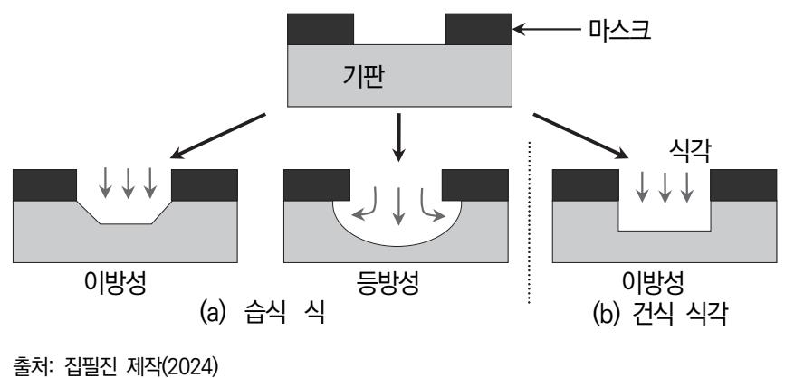

[그림 1-1] 식각의 분류

2. 식각의 분류

식각 공정은 반도체 소자를 제조하기 위해 웨이퍼에 회로 패턴을 형성하는 과정이다. 즉, 포토 공정을 통해 웨이퍼에 형성된 감광막 위에 회로 패턴을 가공하는 공정으로 화학적 혹 은 물리적 반응을 이용하여 선택적으로 가공하거나 불필요한 부분을 제거하는 단계이다. 식 각 공정은 다양한 분류 방식에 따라 [그림 1-1]과 같이 구분할 수 있다.

- (1) 식각 방식에 따른 분류
  - (가) 습식 식각(wet etching)

습식 식각은 액체 용액을 사용하여 웨이퍼 표면의 물질을 화학적으로 제거하는 공정 이다. 산화제나 염화제와 같은 화학적 용액을 사용하여 물질을 용해하거나 부식시킨 다. 주로 등방성 식각 방법으로 작용하며, 방향에 따른 부식률 차이가 작은 편이다.

(나) 건식 식각(dry etching)

건식 식각은 액체 용액을 사용하지 않고, 기체 또는 플라즈마 상태의 화학 물질을 사용하여 반도체 표면의 물질을 제거하는 공정이다. 화학적 또는 물리적인 방법으로 반도체 표면을 부식 또는 제거하게 되며, 건식 식각은 등방성 또는 이방성 식각으로 구분된다.

- (2) 식각 형태에 따른 분류
  - (가) 등방성 식각(isotropic etching)

등방성 식각은 모든 방향으로 같은 비율로 물질을 제거하는 식각 공정이다. 주로 원 형 또는 구형의 패턴을 생성하며, 모든 방향에서 같은 속도로 식각이 진행되므로 특 정 방향으로의 정밀한 패턴 형성에는 적합하지 않다. 주로 부식성 가스나 액체를 사 용하여 층을 균일하게 제거할 목적으로 사용한다.

(나) 이방성 식각(anisotropic etching)

이방성 식각은 특정 방향으로 물질을 빠르게 제거하거나 다른 방향으로는 더 느리게 제거하는 식각 공정이다. 즉, 특정 방향으로만 빠르게 물질을 제거하므로 원하는 패 턴을 형성하기에 적합하다. 일반적으로 플라즈마 식각이나 이온 빔 식각과 같은 고 에너지 공정을 사용하여 이방성 식각을 수행한다.

- (3) 제거 방식에 따른 분류
  - (가) 화학적 식각(chemical etching)

화학적인 반응을 통해 반도체 표면을 제거하는 방법이며, 일반적으로 산화 또는 염 화 공정에 사용한다.

(나) 물리적 식각(physical etching)

화학적인 공정 없이 이온 빔이나 플라즈마와 같은 에너지 빔을 사용하여 반도체 표 면을 제거하는 방법이다.

3. 건식 식각의 원리

건식 식각은 반응성 가스 입자의 플라즈마 상태를 이용하여 제거하려는 박막 물질과의 화학적 혹은 물리적 반응으로 식각하는 방식이다. 즉, 화학 반응으로 박막 물질을 제거 하는 방법 혹은 박막 물질을 물리적인 이온 충격 방식으로 파괴하여 제거하는 방법이 다. 건식 식각 기술은 플라즈마(plasma), 가스 및 진공 등의 조건에 따라 식각 성능이 달라지며, 기판의 손상과 오염 등의 부작용을 고려하여야 한다.

건식 식각은 기체 상태의 화학 물질을 사용하여 반도체 웨이퍼 표면에 원하는 반응을 유도하고, 화학 물질은 반응 용기 내에서 정확하게 제어된다. 일반적으로 진공 상태의 반응 용기 내에서 화학 물질이 이온화되거나 활성화되는 과정이다. [그림 1-2]는 건식 식각의 원리와 과정을 나타낸다.

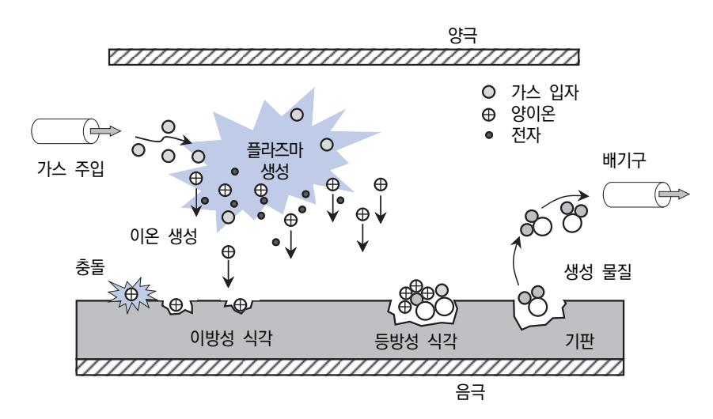

출처: 집필진 제작(2024) [그림 1-2] 건식 식각의 원리와 과정

반도체 제조용 가스는 공정 유용에 따른 dopant, etchant, reactant 및 purge 가스로 구분 하며, 대부분 높은 순도를 요구하는 편이다. 이와 같은 반도체용 특수 가스는 높은 가연성이나 독성을 지니기 때문에 매우 위험하며 생산, 운송 및 검사 시에 주의하여 관리하여야 한다. 특 히 첨단 반도체 소자에 사용되므로 철저한 품질 관리와 정밀 분석이 요구된다. 식각 공정은 말 그대로 웨이퍼에 불필요한 부분을 가스나 화학 물질을 이용하여 제거하는 공정이다. 화학 물질 을 이용하는 습식 식각은 반도체 정밀도를 맞추기 어려워 지금은 특수 가스를 이용한 건식 식 각을 주로 이용한다.

1. 특수 가스의 종류

반도체 제조 공정에서 사용하는 특수 가스는 질소(N2), 산소(O2), 아르곤(Ar), 탄산(CO2) 및 수소(H2) 등의 산업가스와는 달리 특수한 목적으로 사용되는 가스이며, 반도체용 가스, 표 준가스, 희소 가스, 고순도 가스, 초고순도 가스 및 혼합 가스 등이 특수 가스의 범주에 포 함된다. 특히 특수 가스는 혼합에 의해 셀 수 없을 정도로 많은 종류를 만들어 내는 혼합 가스를 제외하더라도 표준화된 가스는 거의 200여 종에 이른다.

(1) 반도체용 가스

반도체용 가스는 반도체 제조 공정에 주로 사용하는 고부가 가치의 특수 가스이다. 특히 반도체 제조 과정에서 필요한 가스이므로 수요가 많은 편이고 대량으로 생산되고 있다. 사실 반도체 공정이 복잡해지고 가스의 종류도 다양하므로 반도체용 특수 가스들이 어 떻게 사용되는지를 정확히 이해하기란 쉽지 않다. 반도체 제조 공정에 따라 세정용, 식 각용, 증착용, 이온 주입용, 도핑용 및 열처리용 등으로 구분한다.

반도체 공정에서 사용되는 원료 가스는 독성, 부식성, 질식성, 비독성 및 비부식성 등으 로 분류되며, 대부분 고압용기에 충전되어 사용한다. 이러한 특성을 가진 가스들을 각각 의 공정에 맞게 사용하려면 반드시 안전을 고려하고, 외부의 오염에서 보호되는 상태로 공급할 수 있어야 한다.

(2) 희소 가스

희소 가스는 주기율표상에 불활성 기체인 헬륨(He), 네온(Ne), 아르곤(Ar), 제논(Xe), 크 립톤(Kr) 및 라돈(Rn)을 의미한다. 최외각 전자가 모두 채워져 화학적으로 매우 안정된 상태를 유지하며, 자연환경에서 반응에 관여하지 않는 기체이다.

2. 식각용 가스

건식 식각은 기상 식각, 플라즈마 식각 및 이온 빔 식각 등으로 나눈다.

(1) 기상 식각

기상 식각은 HCl, HBr, SF6, Cl2 등의 기체를 사용하지만, 습식 식각의 경우와 거의 흡 사하여 일반적으로 건식 식각에 포함하지 않는다.

출처: 집필진 제작(2024) [그림 1-4] 플라즈마 식각 장비로 식각된 SEM 이미지

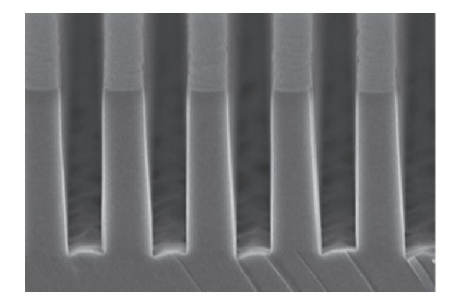

출처: 집필진 제작(2024) [그림 1-3] 플라즈마 식각 장비의 외형

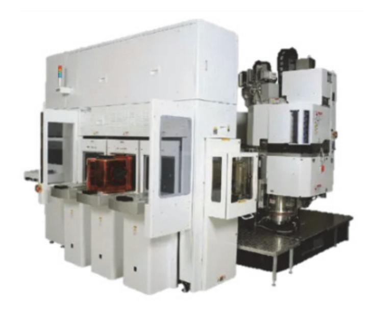

(3) 이온 빔 식각 이온 빔 식각은 가스를 이온으로 가속해 웨이퍼(wafer) 표면에 충돌함으로써 식각하 는 방식이며, 특수 가스로는 C3F8, CHF3, CClF3, CF4 등을 사용한다.

플라즈마 식각은 특수 가스를 감압하여 방전을 일으키는 공정에서 사용하며, SiF4, CF4, C2F6, C3F8, CHF3, CClF3, O2 등을 사용한다. [그림 1-3]은 플라즈마 식각 장비의 외 형을 보여 주며, [그림 1-4]는 플라즈마 식각 장비를 이용하여 제조한 실리콘 웨이

(2) 플라즈마 식각

퍼를 촬영한 SEM 그림이다.

재료·자료

- 반도체 재료 제조 기술 자료
- 국제표준화기구(ISO: International Organization for Standardization) 표준화 문서
- 물질 안전 보건 자료
- 생산 계획서
- 반도체 재료 작업 절차서
- 반도체 재료 작업 표준서
- 반도체용 식각 공정 가스 원재료에 대한 자료
- 반도체 설비 목록 및 매뉴얼
- 반도체 제조 공정도

#### 기기(장비 ・ 공구)

- 반도체용 식각 공정 가스 제조 장비
- 반도체용 식각 공정 가스 측정 장비
- 반도체용 식각 공정 가스 검사 장비
- 반도체용 식각 공정 가스 분석 장비

#### 안전 ・ 유의 사항

- 반도체 식각 공정에 대한 이론적 지식을 습득하고, 취급하는 가스의 성질과 특성을 바탕으 로 관리에 주의 사항을 이해한다.
- 반도체 식각 공정에서 사용하는 특수 가스는 부식성, 맹독성, 인화성 및 발화성 등의 위험 물질이 많아 해당 가스에 대한 장비, 공급 시설, 관리 및 주의 사항을 사용하기 전에 미리 숙지하여야 한다.
- 특수 안전 보건 자료(MSDS)를 통해 특수 가스를 취급하기 전에 파악하고, 독성 가스의 경

우에는 제독 설비에 대한 일반 사항, 제독 설비 및 제독 방법 등 안전 교육을 시행한다.

수행 순서

- 숔 식각 공정에서 사용하는 가스의 제조 사양서를 파악하여 가스 공정에 대한 전반적인 내용과 가스 제 품에 대한 특성을 이해한다. 전반적인 반도체 제조 공정에서 식각 공정에 대한 지식을 파악하고, 식각 공정의 단위 공정과 적용되는 장비를 숙지한다. 그리고 공정에서 사용하는 가스의 제조 사양서를 바탕으로 가스 제 품명, 품질 기준 및 제품의 사양을 파악한다.
  - 1. 반도체 식각 공정에 대한 지식을 이해하고, 식각 공정의 방법과 절차를 바탕으로 사용되는 장비와 도구 및 필요한 특수 가스의 종류를 파악한다.
    - (1) 반도체 제조 공정에 대한 이론적 지식을 이해한다.
    - (2) 식각 공정을 수행하기 전에 제거하려는 증착된 감광막이나 박막의 재료를 파악한다.
    - (3) 식각 공정의 방법과 원리를 이해한다.
    - (4) 식각 공정에서 사용되는 장비를 확인하고 매뉴얼을 이용하여 장비 운용과 절차를 습득한다.
    - (5) 식각 공정에 필요한 특수 가스의 종류와 특성을 파악한다. 일반적으로 가스를 이용하는 식각은 건식 식각이며, 건식 식각은 기상 식각, 플라즈마
      - 식각 및 이온 빔 식각으로 구분한다. 건식 식각의 식각 방법에 따른 특수 가스의 종류 를 파악하고 특성을 이해한다.
      - (가) 플라즈마 식각에서 사용하는 특수 가스의 종류를 파악한다. 일반적으로 플라즈마 식각에서는 SiF4, CF4, C2F6, C3F8, CHF3, CClF3, O2 등을 사 용하며, 식각하는 제거하려는 재료에 대한 특수 가스를 파악한다.
      - (나) 이온 빔 식각에서 사용하는 특수 가스의 종류를 파악한다. 일반적으로 이온 빔 식각에서는 일반적으로 C3F8, CHF3, CClF3, CF4 등을 적용하 며, 식각하는 제거하려는 재료에 대한 특수 가스를 파악한다.
  - 2. 식각 공정에서 사용하는 특수 가스의 제조 사양서를 입수하여 가스 제조 공정과 사양서의 내용을 습득하고, 특수 가스의 특성을 파악한다.

[그림 1-5]에서 나타내는 바와 같이 사용하려는 가스 제조 사양서를 입수한다.

(1) 제조 사양서의 일반적인 제품에 관한 내용을 검토한다.

제조 사양서의 내용을 파악하여 특수 가스의 제품명과 제조 일자를 확인한다.

(2) 제조 사양서를 기준으로 가스의 품질 기준을 파악하고, 특수 가스의 관리 및 보관 방법 등을 확인한다.

제조 사양서의 품질 기준을 기준으로 가스의 순도와 경년 변화를 검토하고, 관리 및 점 검 방법을 숙지한다.

(3) 가스 제품의 물리·화학적 특성을 확인한다.

( ) 가스 제조 사양서

특수 가스는 저온에서도 분해 반응이 가능하고 활성이 매우 높기 때문에 인체에 영향을 줄 수 있다.

(가) 특수 가스의 생체 작용에 관한 내용을 숙지한다.

제품의 특성에서 생체 작용에 관한 내용으로 자극성, 질식성, 부식성, 독성 및 가연 성 등을 반드시 검토한다.

(나) 특수 가스의 안전 취급 및 안전 대책에 관해 확인한다.

허용 농도, 제독 방법 및 경고 등에 대한 자세한 내용을 확인하여 취급이나 제조 과 정에서 유의하여야 한다.

제 조 사 대표자 주민등록번호 주 소 제조업체 전 화 제품명 제조번호 제조 일자 제조단위 품 질 기 준 가스화학식 가스순도 경년변화 관리방법 점검주기 제 품 특 성 생 체 작 용 자극성 부식성 질식성 독 성 가연성 허용 농도 제독 방법 경고 표시

출처: 집필진 제작(2024)

[그림 1-5] 가스 제조 사양서의 일례

#### 숕 반도체 식각 장비와 식각 재료에 따른 특수 가스 종류와 특성에 대한 지식을 확인한다.

품질 검사 기준에 따라 시험 의뢰, 결과 판정 및 통보 등에 대한 시험 절차와 과정을 검토한 다.

1. 반도체 식각 장비의 종류를 파악한다.

건식 식각 장비는 반응 기구에 따라 크게 4가지로 분류한다.

(1) 물리적 식각의 원리와 동작을 확인한다.

물리적 식각은 박막을 식각하기 위해 플라즈마(plasma) 중에 있는 가속된 이온만의 충 격 효과를 이용한다. 대표적인 물리적 식각은 이온 빔 식각이며, 높은 에너지를 가지는 이온 빔의 충격을 이용하여 웨이퍼 표면을 깎아 나가는 과정이다.

(2) 화학적 식각의 원리와 동작을 확인한다.

화학적 식각은 플라즈마 발생원을 반응실과 분리하여 생성된 플라즈마 중에서 물리적인 충격 효과가 큰 이온을 차단하고, 화학적 반응성이 높은 라디칼(radical)만 반응실로 통과시켜 웨이퍼 표면과 반응시킴으로써 휘발성 반응 생성물을 형성하여 탈리(desorption)하는 과정이다. 대표 적인 화학적 식각은 원통형(barrel type) 식각 장비와 화학적 건식 식각 장비(CDE: chemical dry etching)이다.

(3) 물리 화학적 식각의 원리와 동작을 확인한다.

반도체 제조 공정에서 사용되는 건식 식각 장비는 대부분 물리 화학적 식각 장비이다. 물리 화학적 식각은 플라즈마 중에 형성된 이온과 반응성 라디칼의 복합적인 작용 때문에 식각 과정이 진행한다. 따라서 식각 공정의 요구 조건에 따라 선정한 가스와 장치를 이용하여 이방성 식각(anisotropic etching)과 선택적 식각을 조절하게 된다. 대표적인 물리 화학적 식각은 플라즈마 발생 원리에 따라 RIE(reactive ion etching), ECR(electron cyclotron resonance etching), RIBE(reactive ion beam etching), CAIBE(chemically assisted ion beam etching) 및 PPE(planar plasma etching) 등이 있다.

- (4) 광화학적 식각의 원리와 동작을 확인한다. 식각 방식이 플라즈마를 이용하여 식각하는 대신에 광을 이용하여 가스를 여기시켜 식 각을 진행하는 방식이다.
- 2. 반도체 식각 대상 재료에 따른 공정 가스의 종류를 파악한다.

<표 1-1>에서는 다양한 식각 대상 재료에 대한 공정 가스를 정리한 것이다. 대상 재료 기 판은 실리콘 웨이퍼(Si wafer) 기판을 비롯하여 산화물(SiO2, Al2O3), 질화물(Si3N4)과 각종 금속을 포함하는 전극 재료 등 다양하게 정리한다.

〈표 1-1〉 건식 식각 공정에 사용되는 각종 반응 가스

| 기판                    | 가스                                                                                                                                                                                                                                                                                                                                                                                                                                                                                                                                                                                                                                                                                                                                                                                                                             | 기판                                                                                                                            | 가스                                                                                                                     |                                                                         |
|-----------------------|--------------------------------------------------------------------------------------------------------------------------------------------------------------------------------------------------------------------------------------------------------------------------------------------------------------------------------------------------------------------------------------------------------------------------------------------------------------------------------------------------------------------------------------------------------------------------------------------------------------------------------------------------------------------------------------------------------------------------------------------------------------------------------------------------------------------------------|-------------------------------------------------------------------------------------------------------------------------------|------------------------------------------------------------------------------------------------------------------------|-------------------------------------------------------------------------|
|                       |                                                                                                                                                                                                                                                                                                                                                                                                                                                                                                                                                                                                                                                                                                                                                                                                                                | Al:Si                                                                                                                         | CCl 4                                                                                                       |                                                                         |
|                       | CF 4 , CF 4 -O 2 , CF 4 -H 2 , CF 4 -Cl 2 , CF 4 -C 2 H 4 , CF 4 -C 2 F 4 , C 2 F 4 -O 2 , C 2 F 6 , C 2 F 6 -Cl 2 , C 2 F 6 -C 2 H 4 , C 3 F 8 ,                                                                                                                                                                                                                                                                                                                                                               | Al:Cu                                                                                                                         | CCl 4                                                                                                       |                                                                         |
|                       |                                                                                                                                                                                                                                                                                                                                                                                                                                                                                                                                                                                                                                                                                                                                                                                                                                | Al:CuSi                                                                                                                       | CCl 4                                                                                                       |                                                                         |
|                       | C 2 F 6 -CF 3 Cl, c-C 4 F 8 , i-C 4 F 10 , C 5 F 12 , CHF 3 , CCl 4 , CF 3 Cl, CF 2 Cl 2 ,                                                                                                                                                                                                                                                                                                                                                                                                                                                                                                                                                                        | Al 2 O 3                                                                                                | CCl 4 , CCl 4 -O 2 , BCl 3 , Cl 2                               |                                                                         |
| Si                    | CFCl 3 , CF 2 HCl, CFHCl 2 , CHCl 3 , CFCl 3 , CF 2 HCl, CFHCl 2 , CHCl 3 , C 2 F 5 Cl, C 2 F 4 Cl 2 , C 2 F 3 Cl 3 , C 2 F 2 Cl 4 , CF 3 Br, CF 3 Br 2 , Cl 2 , F 2 , H 2 , CF 6 , CF 6 -O 2 , CF 6 -H 2 , CF 6 -N 2 , NH 3 , SiF 4 -O 2 , COF 2 , (CF 3 ) 2 O 2 , SiCl 4 , (CF 3 ) 2 CO, (CF 3 CO) 2 O | Au                                                                                                                            | $CCIF_3$ , $C_2CI_2F_4$                                                                                                |                                                                         |
|                       |                                                                                                                                                                                                                                                                                                                                                                                                                                                                                                                                                                                                                                                                                                                                                                                                                                | Cr                                                                                                                            | Cl 2 , Cl 2 -O 2 , CCl 4 -air, CCl 4 -O 2            |                                                                         |
|                       |                                                                                                                                                                                                                                                                                                                                                                                                                                                                                                                                                                                                                                                                                                                                                                                                                                | CrO X                                                                                                              | CCl 4 , CCl 4 -air, CCl 4 -O 2                                             |                                                                         |
|                       |                                                                                                                                                                                                                                                                                                                                                                                                                                                                                                                                                                                                                                                                                                                                                                                                                                | SiF 4 -O 2 , COF 2 , (CF 3 ) 2 O 2 , SiCl 4 , Ga | GaAs                                                                                                                   | $CI_2, CI_2+BCI_3, CCI_2F_2, CI_2F_2+O_2, CCI_4, COCI_2, HCI, PCI_3, V$ |
|                       |                                                                                                                                                                                                                                                                                                                                                                                                                                                                                                                                                                                                                                                                                                                                                                                                                                | Ga 2 O 3                                                                                                | CCl 4 , CCl 2 F 2 , PCl 3 , HCl                                            |                                                                         |
|                       | $\begin{array}{llllllllllllllllllllllllllllllllllll$                                                                                                                                                                                                                                                                                                                                                                                                                                                                                                                                                                                                                                                                                                                                                                           | GaSb                                                                                                                          | Cl 2                                                                                                        |                                                                         |
|                       |                                                                                                                                                                                                                                                                                                                                                                                                                                                                                                                                                                                                                                                                                                                                                                                                                                | InP                                                                                                                           | Cl 2 , Cl 2 -O 2 , CF 2 Cl 2 -O 2 , CCl 4 |                                                                         |
| SiO 2      |                                                                                                                                                                                                                                                                                                                                                                                                                                                                                                                                                                                                                                                                                                                                                                                                                                | LiNbO 3                                                                                                            | CF 4                                                                                                        |                                                                         |
| 0102                  |                                                                                                                                                                                                                                                                                                                                                                                                                                                                                                                                                                                                                                                                                                                                                                                                                                | Мо                                                                                                                            | $\begin{array}{llllllllllllllllllllllllllllllllllll$                                                                   |                                                                         |
|                       | $CF_6-O_2$ , $CF_6-N_2$ , $SiF_4-O_2$ , $SiCl_4$                                                                                                                                                                                                                                                                                                                                                                                                                                                                                                                                                                                                                                                                                                                                                                               | MoSi 2                                                                                                             | CF 4 -O 2                                                                                        |                                                                         |
|                       | CF 4 , CF 4 -O 2 , C 2 F 6 , C 2 F 6 -C 2 H 4 ,                                                                                                                                                                                                                                                                                                                                                                                                                                                                                                                                                                                                                                                                             | Nb                                                                                                                            | CF 4                                                                                                        |                                                                         |
| ${\sf Si}_3{\sf N}_4$ | $C_3F_8$ , c- $C_4F_8$ , CHF 3 , CCl 4 , CF 3 Br,                                                                                                                                                                                                                                                                                                                                                                                                                                                                                                                                                                                                                                                                                                                                             | Nb 2 O 5                                                                                                | CF 4 -O 2                                                                                        |                                                                         |
|                       | SiCl 4                                                                                                                                                                                                                                                                                                                                                                                                                                                                                                                                                                                                                                                                                                                                                                                                              | Та                                                                                                                            | CF4, CF4-O2                                                                                                            |                                                                         |
| 유기                    | O 2 , CF 4 , CF 4 -O 2 , CF 3 Cl, CF 2 Cl 2 , C 2 F 3 Cl 3 , CCl 4 , CF 3 Br, CF 4 -H 2 , CF 4 -C 2 H 4 , C 2 F 6 -Cl 2 , C 2 F 6 -CF 3 Cl, CHF 3 , SF 6 , SiCl 4                                                                                                                                                                                                                                                                                                                                                       | Ti                                                                                                                            | $CF_4$ , $CF_4$ - $O_2$ , $C_2F_6$ , $C_2F_6$ - $C_2H_4$ , $CF_3Br$ - $O_2$                                            |                                                                         |
| 탄소                    |                                                                                                                                                                                                                                                                                                                                                                                                                                                                                                                                                                                                                                                                                                                                                                                                                                | TiO 2                                                                                                              | C 2 F 6                                                                                          |                                                                         |
|                       |                                                                                                                                                                                                                                                                                                                                                                                                                                                                                                                                                                                                                                                                                                                                                                                                                                | V 2 O 5                                                                                                 | C 2 F 6                                                                                          |                                                                         |
|                       | CCl 4 , CCl 4 -O 2 , BCl 3 , BCl 3 -Cl 2 ,                                                                                                                                                                                                                                                                                                                                                                                                                                                                                                                                                                                                                                                                                                                   | W                                                                                                                             | CF 4 , CF 4 -O 2 , CHF 3                                                   |                                                                         |
| Al                    | Cl 2 , HCl, Br 2 , CCl 2 F 2 , C 2 Cl 3 F 3 , SiCl 4                                                                                                                                                                                                                                                                                                                                                                                                                                                                                                                                                                                                                                                                                   | -                                                                                                                             |                                                                                                                        |                                                                         |

출처: 박성호(1989). 「건식 식각 기술의 동향 분석」. 『전자 통신 동향 분석』. p. 101.

## 1-2. 가스 제조 단계 문제점 검토

학습 목표 • 파악된 내용을 바탕으로 식각 공정 가스 제조 시 발생할 수 있는 문제점을 검토할 수 있다.

## 필요 지식 /

숔 특수 가스 제조 단계 주의점

반도체 관련 산업 가스와 특수 가스는 다양한 혼합물의 형태로 제조되었으며, 표준 산업용 가 스와 특수 가스를 취급할 시에 작업자는 일반적인 안전 절차와 규정에 따라야 한다. 특히 혼합 가스를 제조할 경우에는 통제되지 않는 반응이 발생하지 않도록 주의를 기울여야 한다. 제조 업체별로 가스 혼합물에 대한 규정이나 절차의 세부 사항이 다르게 때문에 취급에 주의하여 안 전 원리를 기본으로 수행한다.

1. 가스 제조에서 사용되는 기술 용어

가스 혼합물의 제조 방법은 제조 업체별로 약간 차이가 있지만, 제조 과정에서 작업자가 안 전하게 가스를 제조할 수 있도록 기본적인 기술 용어를 정리한다.

(1) 용기(cylinder)

용기란 대기압보다 높은 압력의 가스를 충전할 수 있는 것으로서 이동이 가능한 것을 의미한다.

(2) 충전도(충전 비율)

충전도란 예측되는 모든 대기조건 하에서 용기에 압력이 가하지 않고 안전하게 용기에 채워질 수 있는 액화 가스의 양을 의미하며, 충전 밀도 또는 충전 비율로 사용하기도 한다.

(3) 위험성 평가

위험성 평가는 제조 공장이나 설비의 운전 중에 발생할 수 있는 우발적인 위험성을 평 가하기 위한 기술이다. 이러한 평가는 일반적으로 설비 혹은 제조 공장에서 발생할 수 있는 다양한 고장에 의한 사고에 따른 영향을 평가하기 위한 것이다.

(4) 흡습성

흡습성이란 물과 친화력이 있는 물질이 흡수하는 성질을 의미한다. 예를 들어 염화수소 와 같은 산성 가스들은 흡습성이 강하며, 일반적으로 젖은 상태일 때 건설 재료와 훨씬 더 반응을 잘하게 된다.

(5) 액화 가스

액화 가스는 주위 온도에서 대기압을 초과하는 증기 압력을 가하여 용기 내에서 액상으 로 존재하는 가스를 의미한다. 액화 가스는 일반적으로 규정된 충전도로 용기에 대량으 로 충전되지만, 혼합물 형태의 가스 성분으로 채워지면 일반적인 대기 상태에서 혼합물 의 액화가 형성되지 않으며, 압력에 의하여 충전시켜야 한다.

(6) 산업용 가스

산업용 가스는 대기 중에 주요 구성 성분인 질소, 산소나 아르곤과 같이 일반적으로 널 리 사용되는 가스이며, 대규모로 이용할 수 있는 가스 또는 가스 혼합물을 지칭한다. 즉, 주변에서 쉽게 반응을 거치지 않고 접할 수 있는 가스를 말한다.

(7) 특수 가스

특수 가스는 대기 중에 존재하지만, 구성 비율이 매우 회귀한 가스로 네온, 제논 등 자 연환경에서 존재하지 않는 삼불화 질소이나 실란(silane) 등과 특정 구성 비율을 가진 가스 및 초고순도로 정제된 산업용 가스들이다. 특히 반도체나 디스플레이 등의 첨단 산 업에서 사용되는 가스들은 ESG(electronic specially gas)라고 부르며, 매우 높은 고순 도의 품질을 요구하며, 순수 가스 혹은 혼합 가스 형태로 사용한다.

2. 가스 혼합물의 분류와 타당성

사용이 가능한 가스 혼합물은 범위가 거의 무한대이며 이러한 혼합 가스가 생산에 문제가 없고 실현 가능하다면, 거의 모든 농도에서 많은 수의 성분을 함유하게 된다.

(1) 가스 혼합물의 가능성 제약

가스 혼합물의 유용성에 대한 제약을 정리한다.

(가) 안전성

가스 산업은 용기, 밸브, 딥튜브 및 충전 시스템의 무결성을 손상시킬 수 있는 가스 혼합물을 제조하지 말아야 한다.

(나) 기술적 타당성

일부 혼합 가스 성분의 물리적 및 화학적 성질은 실제로 제조될 수 있는 것을 제한 하는 효과가 있다. 예를 들어 매우 낮은 증기압은 성분의 농도 및 가스 혼합물의 최 종 충전 압력을 제한할 수 있다.

(2) 가스 혼합물의 범위

일반적으로 가스 혼합물은 크게 두 가지 유형으로 분류하는데, 표준 가스 혼합물과 특수 혼합물이다.

(가) 표준 가스 혼합물

반복적으로 대규모 충전되는 혼합물로, 일반적으로 이들은 충전과 함께 2가지 또는 3가지의 일반적인 표준 가스 성분 및 특별하게 중요하지 않은 분석 오차를 포함하여 상대적으로 간단하다.

(나) 특수 혼합물

특수 혼합물은 표준가스 혼합물과 비교하여 소규모로 충전되며, 이러한 혼합물은 간 혹 표준 가스 혼합물보다 더 복잡할 수 있다.

3. 가스 혼합의 지침

충전 중이거나 혼합 후에도 혼합이 화학적으로 안전하다면, 성분들은 서로 존재할 수 있으 며, 용기나 밸브와도 같이 공유할 수 있다면, 가스와 증기는 임의의 농도에서 조절하면서 혼합할 수 있다.

(1) 일반 제어

가스 혼합물은 반드시 문서로 작성되고 승인된 절차에 따라 충전되어야 한다. 이와 같은 절차는 사용될 충전 설비뿐만 아니라 제조될 특수 가스의 혼합물 모두를 포함한다.

(2) 혼합물 제조 지침

충전될 혼합물에 대한 상세한 지침을 포함한다.

- (가) 용기와 밸브를 포함한 제조에 대한 주요 사항
- (나) 추가되는 성분과 양
- (다) 용기 내부에 성분을 측정하기 위한 방법과 사용하는 충전 설비
- (라) 성분을 추가할 경우, 속도와 관련되는 특정한 제약 조건, 예를 들어 온도 상승을 최소화 하기 위한 요건
- (마) 추가 성분의 혼합 방법
- (바) 다른 성분을 추가하기 전, 남아 있는 일부 성분의 정확한 양을 측정하기 위해 충전 공정 중에 수행할 중간 분석과 요구 사항

재료·자료

- 반도체 재료 제조 기술 자료
- 국제표준화기구(ISO; international organization for standardization) 표준화 문서
- 물질 안전 보건 자료
- 생산 계획서
- 반도체 재료 작업 절차서
- 반도체 재료 작업 표준서
- 반도체용 식각 공정 가스 원재료에 대한 자료
- 반도체 설비 목록 및 매뉴얼
- 반도체 제조 공정도

기기(장비 ・ 공구)

- 반도체용 식각 공정 가스 제조 장비
- 반도체용 식각 공정 가스 측정 장비
- 반도체용 식각 공정 가스 검사 장비
- 반도체용 식각 공정 가스 분석 장비

#### 안전 ・ 유의 사항

- 반도체 식각 공정에 대한 이론적 지식을 습득하고, 취급하는 가스의 성질과 특성을 바탕으 로 관리 주의 사항을 이해한다.
- 반도체 식각 공정에서 사용하는 특수 가스는 맹독성, 부식성, 발화성 및 인화성 등의 위험 물질이 많아 반드시 사용되는 가스에 대한 장비, 공급 시설, 관리 및 주의 사항을 사용하기 전에 미리 숙지하여야 한다.
- 물질 안전 보건 자료(MSDS)를 통해 특수 가스를 취급하기 전에 파악하고, 독성 가스의 경 우에는 제독 설비에 대한 일반 사항, 제독 설비 및 제독 방법 등 안전 교육을 시행한다.

수행 순서

- 숔 식각용 특수 가스를 제조 시에 안전한 가스 혼합의 원칙을 따라 특수 가스를 혼합한다. 가스 혼합물을 안전하게 제조하여 식각용 특수 가스의 제조 과정에서 문제가 발생하지 않도록 기본 원칙을 설정하여 가스를 혼합한다.
  - 1. 안전한 가스 혼합의 기본 원칙에 따라 가스를 제조한다.
    - (1) 가스 혼합물의 지침서를 준비한다.

가스 혼합물은 반드시 서면으로 공인된 지침서를 바탕으로 충전되어야 한다. 지침서는 일반적으로 제조 공장과 설비에서의 운영 절차를 비롯하여 제조되는 가스 혼합물에 대 한 구체적인 지침에 관한 내용이다.

- (2) 특수 가스 제조에 관한 설비나 시설을 적절하게 설계하여야 한다.
  - 다음 조항을 근거로 설비를 적절하게 갖추어야 하고, 허가를 받은 시설에서만 가스 혼합 물을 제조하여야 한다.
  - (가) 가연성 가스나 산화성 가스 등과 공존할 수 없는 특성의 다른 물질들은 충전 장소를 명 확히 구분하여 분리한다.
  - (나) 충전 시스템에서 공급 가시 시스템으로 피드백되는 것을 방지한다.
  - (다) 폐기 가스는 안전하고 환경 보호적으로 처리하여야 한다.
- (3) 공인된 자료를 통해 담당자가 지침서를 작성한다.

가스 혼합 지침서는 교육을 받은 허가된 담당자가 작성하여야 하고, 다음 사항을 검토하 여 작성하여야 한다.

- (가) 자료의 유효성
- (나) 제조물이나 최종 혼합물의 제안 방법에 대한 안전성
- (다) 혼합 과정과 혼합 이후에 성분의 액화나 결로 등에 의해 발생할 수 있는 문제점
- (라) 제품의 양과 비교하여 용기의 크기
- (마) 안전한 혼합을 위한 허용 요구 사항
- (4) 담당 직원을 반드시 교육하여야 한다.

가스 혼합을 담당하는 직원은 다음 사항을 포함한 지침서를 기반으로 안전 교육을 시행 하여야 한다.

- (가) 가스 혼합물 제조에 관한 내용
- (나) 취급하는 특수 가스의 주요 특성과 안전 사항
- (다) 보호복과 보호 설비
- (라) 안전 규칙, 긴급 및 비상 조치 순서와 절차 등을 정기적으로 실시하고 교육 내용을 기록

하여 갱신하여야 한다.

- (5) 충전하기 전에 용기의 내용물을 식별한다.
  - 용기를 충전하기 전에 대상으로 하는 용기의 내용물을 확인한다.
  - (가) 용기에 붙은 상표명을 근거로 혼합물의 공칭 농도와 이름을 정확히 식별한다.
  - (나) 동등한 안전 레벨을 부여하는 식별 방법을 사용할 수 있다.
  - (다) 제조 공정 동안에 내용물의 성분과 상태를 기록한다.
- (6) 공급 가스와 용기는 제어되어야 한다.

다음 사항을 확인하도록 적절한 조치를 수행하여야 한다.

- (가) 가스 혼합물을 제조하기 위하여 대상으로 선정한 원료 가스만을 사용하였는지 확인한다.
- (나) 사용할 용기가 가스 혼합에 적합하며 제조 과정이 적절한지를 확인하여야 한다.
- (다) 충전 공정이나 혼합물 사용의 안전에 영향을 끼칠 만한 오염물이 없는지를 확인한다.
- (7) 시설이나 가스 혼합의 절차는 감사를 받아야 한다.
  - 가스 혼합의 시설이나 절차는 이상 기술한 6개의 원칙에 따라 진행되었는지 정기적으로 감사를 받아야 한다.
- 2. 가스 혼합 지침서는 승인이나 수정을 통하여 정확성과 안전성을 검증하고, 혼합 방법을 고려하여 혼합 가스의 성분을 작성한다. 가스 혼합 지침서는 수동적으로 데이터베이스나 컴퓨터 소프트웨어를 이용하여 작성하고,

컴퓨터 파일로 저장한다.

- (1) 작성된 가스 혼합 지침서는 정확성과 안전성을 검증받아야 하고, 입력되기 전에 모든 지침은 점검자가 점검하여야 한다.
- (2) 가스 혼합 지침서의 수정이나 기존 혼합물의 수정을 엄격한 통제의 재상이 된다. 따라서 분 석 후에 허용치를 벗어나는 가스 혼합물의 경우에는 그 이상의 구성 가스를 추가하여 혼합물 의 구성을 수정한다.
- (3) 가스 혼합물의 제조에 이용하는 일반적인 방법은 안전한 운전에 필요한 사항을 고려하여 작 성한다.
- (4) 가스 혼합물은 혼합 중이거나 혼합 후에 농도와 압력에서 정해진 성분이 공존할 수 있으므로 호환성을 고려하여야 한다.
- (5) 용기나 용기 밸브는 운전 압력에 적합하여야 하고, 저장이나 사용 중에 발생할 수 있는 높은 온도에서 압력을 고려하여야 한다.
- (6) 일부 가스들이 포함할 수 있는 불순물에 대한 영향을 검토하여야 한다.
- (7) 가스 혼합물에 대한 제조를 계획하면 승인받은 전문가가 성분들에 대한 문헌이나 경험적 자 료를 근거로 검증하여야 한다.

- (가) 가스 혼합물의 지침서에 따라 모든 원료 가스의 농도, 압력 및 온도에서 호환 가능한 성 분들을 공식화하여 승인받아야 한다.
- (나) 잠재적으로 서로 공존할 수 없는 성분들의 혼합인 경우, 안전성의 한계나 호환성의 자료 등을 근거로 제조자의 공인된 사내 규정에 따라 적용한다.
- (다) 잠재적으로 서로 공존할 수 없는 성분들의 혼합은 호환성 자료에 의해 사용할 수 없거나 비호환성을 가질 수 있다. 이러한 경우에는 철저한 조사와 승인에 의해 제조되어야 하 며, 사내 규정과 절차를 설정하여야 한다.
- 숕 반도체 식각 공정에서 사용하는 특수 가스는 대부분 유해 가스를 많이 적용하기 때문에 가스 제조 공정에서 특히 주의하여야 한다. 따라서 물질 안전 보건 자료(MSDS: material safety data sheet)를 기반으로 물질에 대한 정

보를 검토한다.

- 1. 물질 안전 보건 자료(MSDS)는 물질에 대한 다양한 정보를 제공하므로 제조 시에 정확한 자료를 참고하여야 한다. 물질 안전 보건 자료는 물질의 이름, 성분, 위험성, 유해성, 보관 방법, 관리 사항, 필요한 보호구 및 응급조치 등 많은 정보가 포함된다.
- 2. 물질 안전 보건 자료는 「산업 안전 보건법」 시행 규칙 제92조의 4항에 따라 반드시 게시 및 비 치를 하여야 한다.

제조나 취급 시에 담당자나 근로자가 접근하는 장소에 보기 쉽게 게시하여야 하고, 화학 물 질별로 물질 안전 보건 자료를 항상 비치하여야 한다. <표 1-2>에서는 물질 안전 보건 자 료를 정리한 것이다.

- (1) 게시 내용을 쉽게 확인하도록 게시한다.
  - (가) 물질의 물리적 및 화학적 특성
  - (나) 독성에 관한 정보
  - (다) 폭발이나 화재 시에 대처 방법
  - (라) 응급 조치 요령 등
- (2) 게시 장소는 다음과 같다.
  - (가) 대상 화학 물질을 취급하는 작업 공정 내에 게시한다.
  - (나) 안전사고 또는 직업병 발생이 우려되는 장소에 게시한다.
  - (다) 사업장 내에서 작업자가 가장 보기 쉬운 장소에 게시한다.
- (3) 화학 물질 관리 방법을 게시한다.

- (가) 물질 안전 보건 자료의 내용을 참조하여 가스 제조 공정별로 물질의 관리 방법을 게시한다. 물질 관리 요령의 내용을 게시한다.
  - 1) 대상 화학 물질의 명칭, 유해성 및 위험성을 표시한다.
  - 2) 취급상 주의 사항과 적합한 보호구에 대해 게시한다.
  - 3) 응급조치 요령과 사고 발생 시에 대처 방법 등을 게시한다.
- (나) 유사한 화학 물질에 대한 작업 공정별 관리 요령을 작성하여 확인하기 쉽도록 게시한다.

<표 1-2> 물질 안전 보건 자료에 제공되는 정보

| 구분               | 정보 자료                                     |
|------------------|-------------------------------------------|
| 화학 제품과 회사에 관한 정보 | 제품명, 제품의 권고 용도와 사용상의 제한 등                 |
| 유해·위험성 정보        | 유해·위험성 분류, 예방 조치 문구를 포함한 경고 표지 항목 등       |
| 구성 성분의 명칭 및 함유량  | 화학 물질명, 관용명 및 이명, CAS 번호 또는 식별 번호, 함유량    |
| 응급조 치 요령         | 눈에 들어갔을 때, 피부에 접촉했을 때, 흡입했을 때 등           |
| 폭발·화재 시 대처 방법    | 적절한 소화제, 화재 진압 시 착용할 보호구 및 예방 조치 등        |
| 누출 사고 시 대처 방법    | 인체 보호를 위한 조치 사항 및 보호구, 정화 또는 제거 방법 등      |
| 취급 및 저장 방법       | 안전 취급 요령, 안전한 저장 방법                       |
| 노출 방지 및 개인 보호구   | 노출 기준, 적절한 공학적 관리, 개인 보호구 등               |
| 물리 ‧ 화학적 특성      | 외관, 냄새, 인화점, 인화 또는 폭발 한계 상·하한, 자연 발화 온도 등 |
| 안정성 및 반응성        | 화학적 안정성, 유해 반응의 가능성, 피해야 할 조건 등           |
| 독성에 관한 정보        | 가능성이 큰 노출 경로에 대한 정보, 단기 및 장기 노출에 의한 영향 등  |
| 환경에 미치는 영향       | 수생·육생 생태 독성, 잔류성과 분해성, 생물 농축성 등           |
| 폐기 시 주의 사항       | 폐기 방법, 폐기 시 주의 사항                         |
| 운송에 필요한 정보       | 유엔 번호(UN No.), 유엔 적정 운송명, 운송 시의 위험 등급 등   |
| 법적 규제 현황         | 「산업안전보건법」에 의한 규제, 「유해화학 물질관리법」에 따른 규제 등   |
| 기타 참고 사항         | 자료의 출처, 최초 작성 일자, 개정 횟수 및 최종 개정 일자 등      |

출처: 추광호(2015). 『산업 가스 특수 가스 총서 1』. ㈜북랩. pp. 120~121.

- 3. 대상 화학 물질에 대한 경고 표지 방법과 경고 표지에 들어갈 내용의 그림을 정리하여 명확히 게 시하여야 한다.
  - (1) 경고 표지 방법과 대상을 선정하여 자료를 제공한다.
    - (가) 대상 화학 물질의 단위로 유해성과 위험 정도를 명확히 나타내는 경고 표지를 작성한다.
    - (나) 작업장에서 사용하는 대상 화학 물질을 담은 용기나 포장에 붙여 확인하도록 작성한다.
    - (다) 용기나 포장에 표시하는 방법 이외에 양도하거나 제공할 때는 경고 표지 기재 항목을 작 성한 서류를 제공한다.
  - (2) 경고 표지에 들어갈 내용을 선정하여 표기한다.

[그림 1-6]과 [그림 1-7]은 대상 화학 물질의 특성에 대한 다양한 경고 표지를 보여 주 며, [그림 1-8]은 경고 표지에 작성하는 6개 항목에 대한 일례를 나타낸다.

출처: 안전보건공단(2012). 『물질안전보건자료의 이해』. 교육미디어. p.1. [그림 1-6] 물질안전보건자료(MSDS)의 화학 물질 경고 표지

(가) 대상 화학 물질의 명칭을 표시한다.

(나) 화학 물질의 분류에 따라 유해성과 위험성을 나타내는 그림을 삽입한다.

(다) 유해나 위험에 대한 심각성의 정도를 표시하는 문구를 작성한다.

(마) 화학 물질의 제조자나 공급자의 이름과 전화번호를 작성한다.

(라) 예방 조치에 대한 유의 사항을 작성하여 표시한다.

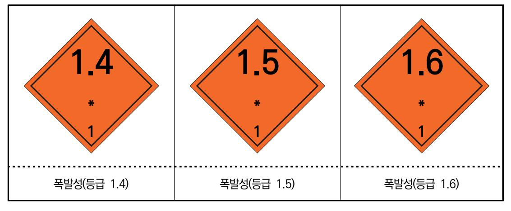

출처: 안전보건공단(2012). 『물질안전보건자료의 이해』. 교육미디어. p.1. [그림 1-7] 물질 안전 보건 자료(MSDS)의 화학 물질 폭발성 등급

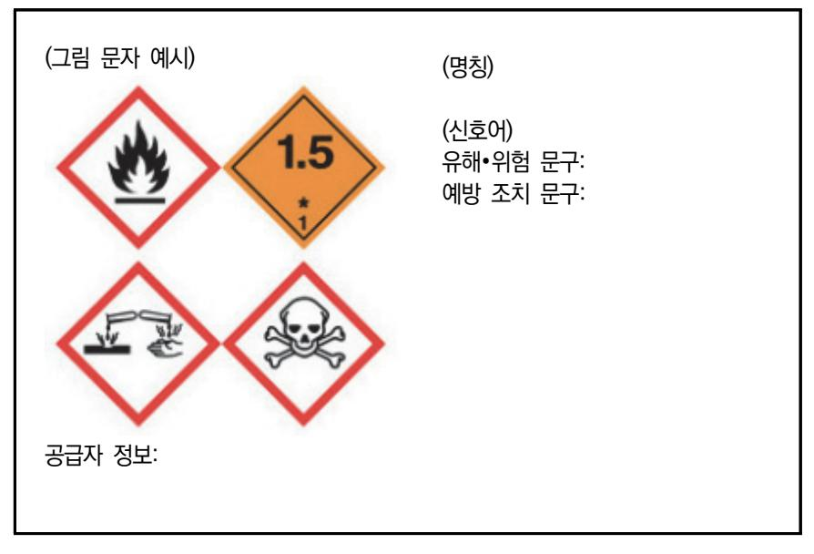

출처: 안전보건공단(2012). 『물질안전보건자료의 이해』. 교육미디어. p.1. [그림 1-8] 경고 표지의 양식 일례

- 숖 혼합 가스 시설의 설계와 운전은 일반 가스에 대한 다양한 범주의 용기와 충전 시스템의 취급, 저장, 충전 및 유지 등에 대한 모든 안전과 법적 요구 사항들과 같게 적용한다. 가스 혼합물에 제조 시에 모든 공정과 절차에 안전과 운전에 대한 위험성 평가를 수행하여야 하며, 반드시 고려해야 할 중요 사항들을 식별하여 설정한다.
  - 1. 혼합 가스 제조 과정에서 시설이나 설계상에서 발생할 수 있는 문제점을 제거한다.
    - (1) 치명적이거나 심각한 문제점이 발생할 수 있다면, 사고가 발생하지 않도록 시스템을 설계하여 야 한다.

- (2) 위험에 대한 문제점을 제거할 수 없다면, 이를 최소화할 수 있는 방법이나 물리적인 조정을 고려하여 시스템을 설계한다.
- (3) 문제점에 대한 해결이 불가능하다면 사용하기 전에 운전 절차를 세밀히 검토하고, 위험을 평 가하기 위해 변경 관리 절차를 적용한다.
- 2. 제조 공정의 안전 운전과 절차에 대한 기본적인 주의 사항을 고려한다.
  - (1) 제조 시에 안전 운전을 위해 저장 구역을 분리한다.
  - (2) 환기 요구 조건을 고려한다.
  - (3) 충전 구역을 분리하여 구분하고, 적합한 비상구를 지정하며, 제조 공정 설비와 시스템에 작업 자 이외에 누구도 접근하지 못하게 통제한다.
  - (4) 화재 예방에 대한 자세한 내용을 게시하고 소방 설비를 갖춘다.
  - (5) 가연성 가스를 취급할 경우, 점화원을 제거해야 하고 정전기 방전이 발생하지 않도록 보호 장치를 설치한다.
  - (6) 독성이나 가연성 가스 그리고 산소가 많아 잠재적인 사고 발생의 위험성이 높은 경우에는 감 시하여야 한다.
  - (7) 제조 공정에 사용되는 설비는 반드시 적합성을 고려하고, 압력 등급을 확인하여야 하며 가스 처리 시스템을 갖춘다.
  - (8) 가스 혼합물 제조에 사용되는 분석 설비와 장치는 기준에 맞아야 하고, 모든 측정은 정확성 을 고려한다.
  - (9) 혼합물 제조 공정에서 모든 가스 공급 파이프 라인과 용기에는 성분을 표시한다.
  - (10) 생산 설비와 작업 공정에서 용기를 안전하게 취급하여야 하고, 충전 지역에서는 용기 관리 에 주의 사항을 표기한다.
  - (11) 전체 용기와 충전 시스템 누출 시험의 규정에 따라 성분이나 위험 등급의 표시가 적합하고, 제조된 가스의 저장 지역이 적절한지를 확인한다.
- 3. 제조 공정의 안전 운전과 절차에 대한 주요 요구 사항을 고려한다. 일반적인 요구 사항에 추가로, 가스 혼합물과 관련한 시설이나 설계에 대해 다음 사항을 고 려한다.
  - (1) 가스 혼합 시설에서 다양한 가스 혼합물이 제조되므로 용기를 식별하고 잔류 가스 처리 공정 이나 용기의 유지 보수 작업을 위해 적절한 공간이 필요하다.
  - (2) 혼합 공정에서 발생할 수 있는 모든 잔류 가스는 안전하게 제거해야 하고, 복구 작업을 하기 위해 적절한 시설이 필요하며, 가스 혼합물 제조를 위한 시설은 다양한 성분을 혼합하기 때 문에 가능한 시설의 영역을 넓게 설계하여야 한다.

(3) 통제되지 않는 반응 때문에 위험이 발생할 수 있는 가스 처리 설비에서는 가연성 가스나 산

23

화성 가스와 같이 존재할 수 없는 가스들이 혼합되지 않도록 정확히 식별하여 구분한다.

- (4) 수소화물 가스가 산화제 화합물로 흐를 경우, 강한 반응이나 폭발 등의 위험성이 없는지를 확인하여야 한다.
- (5) 특수 가스 처리 작업을 지시하거나 수행할 수 있는 자격이 있는 전담 작업자가 담당하도록 배치하고, 적절한 화학적 지식과 안전한 가스 처리 방법으로 설비 및 시설을 운영하도록 권 고하여야 한다.
- (6) 취급하는 용기에 대한 유지 관리를 위해 다음 사항을 고려한다.
  - (가) 용기의 페인팅과 성분 표시를 위한 시설
  - (나) 특수한 내부 검사 및 청소 설비
  - (다) 용기 밸브의 저장과 조립 시설
  - (라) 특수 용기의 내부 건조 시설
- (7) 가스 혼합 시스템이 효율적으로 안전 운전할 수 있도록 설계하고 운영하여야 한다.
  - (가) 부주의한 가스 혼합의 위험을 제거하기 위해 가스 충전 시스템과 충전 구역을 충분히 멀 리 분리한다.
  - (나) 서로 공존할 수 없는 가스를 혼합하는 경우, 정확히 작동이 제어될 수 있는 시스템을 구 축하여야 하고, 가스 혼합 지침에 따라 충분한 검사가 이루어져야 한다.
  - (다) 혼합 가스에 가연성 성분이 저장되거나 충전될 경우에는 다음 사항을 고려한다.
    - 1) 설비의 전기적 성질 분류
    - 2) 용기 충전 관련 설비의 접지
    - 3) 정전 방전의 원인
    - 4) 건물의 환기
    - 5) 가연성 가스의 검출 및 경보 시스템
    - 6) 시설의 폭발 요소 제거
  - (라) 혼합 가스의 독성 성분이 저장되거나 충전될 경우에는 다음 사항을 고려한다.
    - 1) 독성 가스의 검출 및 경보 시스템
    - 2) 건물의 환기
    - 3) 개인 검출기
- (8) 혼합 가스의 가스 분석을 위해 다음과 같은 주의 사항을 확인한다.
  - (가) 가스 혼합물의 성분과 품질을 식별한다.
  - (나) 최종 가스 혼합물은 가스 혼합 지침에 따라 검토한다.
  - (다) 반환된 용기의 가스 혼합물과 가스의 구성을 확인한다.
  - (라) 다수의 가스 혼합물과 미량의 가스 혼합 불순물을 분석하기 위해 가스 분석 설비는 검증

하여야 한다.

- (마) 환경적 감시설비와 부분적인 환기 설비를 공급하여야 하고, 가연성 가스, 독성 가스 및 혼합물을 세밀히 분석하여야 한다.
- (바) 분석 설비를 이용하여 서로 공존할 수 없는 가스를 분석할 경우, 샘플링과 분석 시스템 을 위한 제거 시설이 설치되어야 한다.
- 4. 용기의 안전한 취급, 충전, 저장 및 유지 등에 대한 모든 일반 사항은 가스 혼합물에도 적용되며, 다음 몇 가지 문제점을 고려한다.
  - (1) 개인 보호 장비의 규정을 확인한다.
    - (가) 용기를 취급하는 경우에는 안전화, 보호 장갑과 보호안경을 착용한다.
    - (나) 점화를 방지하는 조치를 검토한다.
      - 1) 고무 제품이 아닌 안전화를 신는다.
      - 2) 정전기를 방지하기 위해 나일론 소재가 아닌 보호복을 착용한다.
      - 3) 불꽃이 발생하지 않도록 청동과 같은 소재의 장비를 사용한다.
    - (다) 가스 누출을 식별하는 조치를 검토한다.
      - 1) 독성 및 가연성 가스를 감시한다.
      - 2) 산소 고갈이나 농축을 감시한다.
      - 3) 대기 가스를 감시하는 설비를 규정에 따라 정기적으로 검사한다.
      - 4) 가스 누출에 대비한 보호 조치를 위해 호흡 장비를 배치한다.
    - (라) 부식성 화학 물질을 취급할 경우, 다음과 같은 보호 도구를 배치한다.
      - 1) 안면 가리개
      - 2) 화학 물질 보호 장갑
      - 3) 화학 물질 보호복
      - 4) 보호 장화
      - 5) 소화기, 정압 호흡 장비 및 비상 샤워기 등
  - (2) 주요 안전 규칙을 작성하여 작업자에 대한 교육을 강화하여야 하고, 안전 규칙으로 다음 요 건을 포함하여야 한다.
    - (가) 직원들의 담당 업무에 대한 교육
    - (나) 개인 보호 장비와 도구
    - (다) 흡연 물질이나 발화성 물질이 존재하는 지역에서의 흡연 금지
    - (라) 휴대용 전화기나 전자 제품의 이용을 제한하는 규정
    - (마) 잠재적 위험이 존재하는 지역에서 유지 관리와 시스템에 대한 안전 규칙
    - (바) 비상시에 개인 행동 요령, 탈출 및 배치 등의 절차와 비상 설비의 이용법

### 학습 1 교수·학습 방법

#### 교수 방법

- 반도체 식각 공정의 원리와 종류를 숙지할 수 있도록 정리하여 지도한다.
- 반도체 식각 공정에서 사용하는 특수 가스의 종류를 정리하고, 식각 방식에 따라 사용되는 가스에 관해 설명한다.
- 식각 공정에서 사용하는 가스의 제조 사양서를 바탕으로 내용을 파악할 수 있도록 설명한 다.
- 식각 대상 재료에 따른 공정 가스의 종류와 특성을 설명한다.
- 특수 가스 제조에서 사용되는 용어를 정리하여 설명한다.
- 식각용 특수 가스의 안전한 가스 혼합 원칙을 정리하여 지도한다.
- 유해 가스에 대한 물질 안전 보건 자료(MSDS)를 정리하여 설명한다.
- 식각용 특수 가스의 제조 시에 발생할 수 있는 문제에 대한 안전 조치를 정리하여 설명한다.

#### 학습 방법

- 반도체 식각 공정의 원리를 이해하고, 식각 방식에 따른 종류를 학습한다.
- 반도체 식각 공정에서 주로 사용하는 특수 가스의 종류를 학습한다.
- 식각 공정에서 사용하는 가스 제조 사양서의 내용을 파악하여 학습한다.
- 식각 대상 재료에 따른 공정 가스의 종류와 특성을 파악한다.
- 특수 가스 제조에서 사용되는 용어를 정리하고, 식각용 특수 가스의 안전한 가스 혼합 원칙 을 절차에 따라 학습한다.
- 유해 가스에 대한 물질 안전 보건 자료(MSDS)를 파악한다.
- 식각용 특수 가스의 제조 시에 발생할 수 있는 문제에 대한 안전 조치를 학습한다.

## 학습 1 평 가

#### 평가 준거

- 평가자는 학습자가 학습 목표를 성공적으로 달성하였는지를 평가해야 한다.
- 평가자는 다음 사항을 평가해야 한다.

|                     | 학습 목표                                                         | 성취수준 |   |   |  |
|---------------------|---------------------------------------------------------------|------|---|---|--|
| 학습 내용               |                                                               | 상    | 중 | 하 |  |
| 식각 공정 가스 요          | - 생산 관련 부서로부터 식각 공정 가스 제조 사양서를 입수 할 수 있다.                  |      |   |   |  |
| 구 사항 파악             | - 식각 공정 가스 제조 사양서를 바탕으로 제품명, 품질 기준, 제품 사양, 납기 등을 파악할 수 있다. |      |   |   |  |
| 가스 제조 단계 문 제점 검토 | - 파악된 내용을 바탕으로 식각 공정 가스 제조 시 발생할 수 있는 문제점을 검토할 수 있다.       |      |   |   |  |

#### 평가 방법

• 서술형 시험

|                       |                                                          | 성취수준 |   |   |
|-----------------------|----------------------------------------------------------|------|---|---|
| 학습 내용                 | 평가 항목                                                    |      | 중 | 하 |
| 식각 공정 가스 요 구 사항 파악 | - 반도체 식각 공정의 원리를 이해하고, 식각 방식에 따른 종 류를 파악할 수 있는 능력     |      |   |   |
|                       | - 식각 공정에서 사용하는 특수 가스의 종류를 이해할 수 있 는 능력                |      |   |   |
|                       | - 가스 제조 사양서의 내용을 검토할 수 있는 능력                             |      |   |   |
|                       | - 특수 가스의 기술 용어를 정리하여 적용할 수 있는 능력                         |      |   |   |
| 가스 제조 단계 문 제점 검토   | - 유해성 가스에 대한 물질 안전 보건 자료(MSDS)를 정리할 수 있는 능력           |      |   |   |
|                       | - 식각용 특수 가스의 제조 시에 발생할 수 있는 문제에 대한 안전 조치를 실행할 수 있는 능력 |      |   |   |

• 평가자 질문

|                       |                                                          | 성취수준 |   |   |
|-----------------------|----------------------------------------------------------|------|---|---|
| 학습 내용                 | 평가 항목                                                    |      | 중 | 하 |
| 식각 공정 가스 요 구 사항 파악 | - 반도체 식각 공정의 기본 원리와 식각 방식에 따른 종류를 설명할 수 있는 능력         |      |   |   |
|                       | - 식각 공정에서 식각 방식에 따라 사용하는 특수 가스의 종 류를 설명할 수 있는 능력      |      |   |   |
|                       | - 가스 제조 사양서의 내용과 항목을 파악하여 설명할 수 있 는 능력                |      |   |   |
| 가스 제조 단계 문 제점 검토   | - 특수 가스의 가스 혼합 원칙을 순서대로 설명할 수 있는 능 력                  |      |   |   |
|                       | - 유해 가스에 대한 물질 안전 보건 자료의 경고 표시 그림을 보고 내용을 설명할 수 있는 능력 |      |   |   |
|                       | - 식각용 특수 가스의 제조 시에 발생할 수 있는 문제에 대한 안전 조치를 설명할 수 있는 능력 |      |   |   |

#### • 평가자 체크리스트

|                       | 평가 항목                                                                       |  | 성취수준 |   |  |
|-----------------------|-----------------------------------------------------------------------------|--|------|---|--|
| 학습 내용                 |                                                                             |  | 중    | 하 |  |
| 식각 공정 가스 요 구 사항 파악 | - 반도체 식각 방식을 분류하고, 식각의 종류를 나열하고 리스 트를 분류 방식에 따라 정리할 수 있는 능력              |  |      |   |  |
|                       | - 식각 공정에서 사용하는 장비와 특수 가스의 종류를 연관하 여 정리할 수 있는 능력                          |  |      |   |  |
|                       | - 건식 식각 공정에서 기판의 종류에 따른 가스를 파악하여 나열할 수 있는 능력                             |  |      |   |  |
|                       | - 식각 공정용 특수 가스의 기술 용어를 정리하여 설명할 수 있는 능력                                  |  |      |   |  |
| 가스 제조 단계 문 제점 검토   | - 유해 가스에 대한 물질 안전 보건 자료에서 제공하는 정보 를 구분하여 내용을 정리할 수 있는 능력                 |  |      |   |  |
|                       | - 식각용 특수 가스 특수 가스의 제조 시설의 안전 운전과 절 차에 대한 일반적인 요구 사항을 정리하여 설명할 수 있는 능력 |  |      |   |  |

피드백

- 1. 서술형 시험 - 식각 공정 가스 요구 사항 관련 문제에 대한 풀이를 정리하여 설명하고, 평가 결과에서 일정 점 수 이하인 학습자들은 추가 학습을 통하여 재평가한다. - 식각 공정용 특수 가스의 종류에 대한 평가는 중요하기 때문에 미흡할 경우, 반드시 재평가를 실 시한다. 2. 평가자 질문 - 제조 사양서에서 제품명과 품질 기준에 대한 평가를 실시하고, 미비한 부분을 파악하여 재학습하 도록 피드백한다. - 평가자 질문을 실시한 후, 각 문제에 대한 풀이를 설명할 수 있는지를 확인하고, 내용 이해가 부 족한 학습자들은 추가 학습을 통하여 동일한 문항에 대해 다시 설명해 준다.
- 3. 평가자 체크리스트
- 평가자 체크리스트를 토대로 순서에 따라 평가한 후, 체크리스트에 일정 기준에 미치지 않을 경우 에는 개선 및 보완 사항에 대한 내용을 정리하여 재학습할 수 있도록 지도하고, 우수한 학습자는 심화 학습을 피드백한다.
- 제조 시설의 안전 운전에 대한 문항은 절차에 따라 명확히 정리할 수 있도록 지도한다.

| 학습 1 | 식각 공정 가스 제조 요구 사항 파악하기 |
|------|------------------------|
| 학습 2 | 식각 공정 가스 재료 준비하기       |
| 학습 3 | 식각 공정 가스 제조하기          |

## 2-1. 가스 재료의 종류와 특성 파악

학습 목표 • 반도체 식각 공정 가스 제조에 필요한 원재료의 종류를 파악할 수 있다. • 반도체 식각 공정 가스 원재료의 제조사별 규격 및 장단점을 파악할 수 있다.

## 필요 지식 /

숔 식각 공정용 가스

반도체 제조 공정에서 극히 미세한 처리 기술이 요구되고 있어 식각 공정은 습식 식각법보다는 주로 건식 식각법이 널리 사용되고 있다. 건식 식각은 진공 분위기에서 플라즈마를 발생시켜 물질 표면상에 미세한 패턴을 분자 단위로 공정하는 방법이며, 식각 가스로는 주로 CF4, CHF3, C2F6, C3F8, C4F8 등의 CF계 가스가 사용되고 있다.

1. 재료에 따른 건식 식각의 종류

건식 식각은 전원 소스의 형태, 가스 유형 및 장비의 종류 등에 따라 다양하게 분류할 수 있으며, 반도체 제조에서 많이 식각하고자 하는 박막 소재에 따라 건식 식각을 구분하여 기 술하면 다음과 같다.

(1) 다결정 실리콘 식각

다결정 실리콘을 건식 식각하기 위해서는 다양한 기체들을 사용할 수 있으며, 주로 염소 (Cl2), 불화물과 브로뮴 화합물 등의 기체를 사용하여 식각 공정을 진행한다. 이외에 여 러 종류의 기체를 이용하여 식각이 가능하며, 가장 많이 쓰이는 염소를 사용할 경우에 실리콘을 식각하는 과정을 살펴보면 다음과 같다.

- (가) 다결정 실리콘의 측벽 보호를 위해 염소 이온들이 탄소와 결합하여 중합체(polymer)를 형성한다.
- (나) 염소 이온이 다결정 실리콘의 실리콘과 반응하여 SiCly 화합물을 형성한 후, 휘발성 SiCl4를 형성한다.

2Si + 4Cl2 → 2SiCl4

- (다) 다결정 실리콘을 식각하면 웨이퍼에 산화막이 드러나게 되어, 감광막의 탄소와 산화막의 산소와 결합하여 탄소와 산소 화합물을 형성하게 된다.
- (라) 염소 이온은 산화막에서 실리콘과 결합하여 SiCly를 형성한다.
- (2) 실리콘 산화막 식각

실리콘 산화막은 화학적 반응이나 이온 충격(bombardment) 등에 의해 식각할 수 있 다. 여기에 중합체를 형성하는 것은 식각 속도를 느리게 조절하거나 방해하는 역할을 하 므로, 원하는 선택비를 얻는 중요한 요소로 작용한다. 전형적인 산화막에 대한 건식 식 각 과정은 다음과 같다.

- (가) 사불화 탄소(CF4)가 산화막과 반응하여 불소(F)기나 CF3를 형성한다. CF4 + e- → CF3 + F + e-
- (나) 불소기나 CF3기는 산화막과 화학적인 반응을 잘하고 쉽게 결합하는 성질이 있어서 사불 화 실리콘(SiF4), 일산화탄소, 이산화탄소를 형성시킨다.

4CF3 + 3SiO2 → 3SiF4 + 2CO2 + 2CO

- (다) 실리콘과 산소 결합은 200Kcal/mole 정도이며, 상대적으로 실리콘과 실리콘 결합의 80 Kcal/mole보다 2배 이상의 결합력을 갖고 있다. CF3(혹은 F)기가 산화막 계면에 흡착 되어 있더라도 양(+)으로 대전된 아르곤(argon)이나 헬륨(helium)의 충격 에너지를 받아 야만 산화막 계면을 침투하여 실리콘과 산소의 연결 고리를 끊으면서 식각할 수 있게 된다.
- (3) 금속 식각

알루미늄은 전도성이 높고 안정하며, 가공이 쉬운 금속이다. 대표적인 금속 식각의 대상 이며, 커패시터로 사용하는 장벽 금속으로 타이타늄 질화물(TiN 또는 Ti)나 타이타늄 텅 스텐(TiW)이 사용되고 있다. 알루미늄 식각의 주 식각액은 염소(Cl)이고, 알루미늄과 염 소가 자발 반응 때문에 식각이 되면 AlCl3이 형성되고, 휘발성이 강하여 가열하면 쉽게 제거된다. 그러나 건식 식각 후에 잔류하는 염소는 금속막을 부식할 수 있으므로 반드시 제거하여야 한다.

2Al + 3Cl2 → 2AlCl3(38Kcal/mole)

2. 장비에 따른 건식 식각의 종류와 특수 가스

이미 학습 1 식각 공정 가스 제조 요구 사항 파악하기의 필요 지식에서 기술하였듯이, 건 식 식각법은 장비에 따라 기상 식각, 플라즈마 식각 및 이온 빔 식각 등으로 구분한다. 이 와 같이 장비의 종류에 따라 분류한 각 건식 식각 공정에서 주로 사용되고 있는 특수 가스 들의 성질과 특성 및 주의 사항 등을 <표 2-1>에서 상세히 보여 준다.

| 〈표 2-1〉 식각 공정에서 주로 사용하는 특수 가: | 스 및 | 특징 |
|-------------------------------|-----|----|
|-------------------------------|-----|----|

| 공정               | 가스명        | 분자식               | 물 반응성             | 연소성                           | 물질과 반응성                                               | 주의 사항                                                           |
|------------------|------------|-------------------|-------------------|-------------------------------|-------------------------------------------------------|-----------------------------------------------------------------|
|                  | 염화수소       | HCI               | 반응하지 않으나 물에 용해 | 산소에 안정                        | •F2와 강하게 반응 •금속과 반응하여 염 화물과 수소생성                | •수분으로 강산이 되며, 대 부분 금속 부식 •graphite 사용 가능                  |
|                  | 불화수소       | HF                | 물에 잘 용해           | 발연성(90℃ 이상 에서 미스트로 존 재) | •유리, 석영과 반응하 여 녹음                                  | •폴리에틸렌, 구리, 백금 사용 가능 •유리, 석영에 쉽게 침식                       |
| 기 상 에 칭 | 브로뮴화 수소 | HBr               | 물에 잘 용해           | 불연성(대기에 습 기로 발연)           | •산소와 반응하여 물 과 브로뮴 생성 •O3와 반응하여 수소 생성         | •염산보다 약한 산성                                                     |
|                  | 육불화 황      | SF 6   | 반응 없음.            | 불연성(500℃ 이 하에서 안전)         | •불순물이 섞이면 분 해되어 유독                                 | •높은 온도에서 분해되지 않아 전기 절연용 가스로 사용                            |
|                  | 염소         | Cl 2   | 물과 반응             | 지연성                           | •수소와 반응 •다수 금속과 반응                                 | •dry 기스: 철, SUS, 주철, 동합금 등 사용 •wet 가스: 모넬, 테플론 등 사용 가능 |
| 플 라 즈 마 에 칭      | 사불화 규소  | SiF 4  | 불과 반응             | 불연성                           | •600℃에서 SiCl₄와 반응하여 SiClF3, Si Cl2F2, SiCl3F 생성 | •산화/환원에 안정                                                      |
|                  | 사플루오린      | CF4               | 약한 가수 분해          | 불연성                           | •가연성 가스와 혼합 하여 점화하면 분해 되어 유독 가스 발생              | •부식성 없음.                                                        |
|                  | 육플루오린      | $C_2F_6$          | 약한 가수 분해          | 불연성                           | •가연성 가스와 혼합 하여 점화하면 분해 되어 유독 가스 발생              | •부식성 없음.                                                        |
|                  | 팔플루오린      | $C_3F_8$          | 약한 가수 분해          | 불연성                           | •가연성 가스와 혼합 하여 점화하면 분해 되어 유독 가스 발생              | •부식성 없음.                                                        |
|                  | 삼불화 메탄  | CHF 3  | 반응 없음.            | 불연성                           | •가연성 가스와 혼합 하여 점화하면 분해 되어 유독 가스 발생              | •부식성 없음.                                                        |
|                  | 프레온 13     | CCIF 3 | 반응 없음.            | 불연성                           | •800℃ 이상의 화염 에 접촉하면 CO, CO C₂ 등 독성 가스 발생        | •Mg, Mg 2% 이상 함유한 AI 합금 및 천연고무 부식                            |
|                  | 산소         | O 2    | 수용성               | 지연성                           | •비활성 물질을 제외 하면 모든 물질과 반 응하여 산화                  | •산소는 타지 않으나 다른 물질이 타는 것을 도와 반 응성 높음.                      |

| 공정           | 가스명           | 분자식               | 물 반응성    | 연소성            | 물질과 반응성                                  | 주의 사항                                     |
|--------------|---------------|-------------------|----------|----------------|------------------------------------------|-------------------------------------------|
| 이 온 빔 에 칭 | 핵시플루오 르에테르 |                   | 약한 가수 분해 | 고온의 공기에서 불연 | •가연성 가스와 혼합 하여 점화하면 분해 되어 유독 가스 발생 | •부식성 없음.                                  |
|              | 삼불화메탄         | $CHF_3$           | 반응 없음.   | 불연성            | •가연성 가스와 혼합 하여 점화하면 분해 되어 유독 가스 발생 | •부식성 없음.                                  |
|              | 프레온13         | CCIF 3 | 반응 없음.   | 불연성            | $\cdot = \cdot \cdot = \cdot$            | •Mg, Mg 2% 이상 함 유한 AI 합금 및 천연 고무 부식 |
|              | 사불화탄소         | CF4               | 약한 가수 분해 | 불연성            | •가연성 가스와 혼합 하여 점화하면 분해 되어 유독 가스 발생 | •부식성 없음.                                  |

출처: 추광호(2015). 『산업가스 특수 가스 총서 1』. ㈜북랩. pp. 23~24.

## 수행 내용 / 가스 재료의 종류와 특성 파악하기

#### 재료·자료

- 반도체 재료 제조 기술 자료
- 국제표준화기구(ISO; international organization for standardization) 표준화 문서
- 물질 안전 보건 자료
- 생산 계획서
- 반도체 재료 작업 절차서
- 반도체 재료 작업 표준서
- 반도체용 식각 공정 가스 원재료에 대한 자료
- 반도체 설비 목록 및 매뉴얼
- 반도체 제조 공정도

### 기기(장비·공구)

- 반도체용 식각 공정 가스 제조 장비
- 반도체용 식각 공정 가스 측정 장비
- 반도체용 식각 공정 가스 검사 장비
- 반도체용 식각 공정 가스 분석 장비

안전 ・ 유의 사항

- 반도체 식각 공정에 대한 이론적 지식을 습득하고, 취급하는 가스의 성질과 특성을 바탕으 로 관리에 주의 사항을 이해한다.
- 반도체 식각 공정에서 사용하는 특수 가스는 부식성, 맹독성, 인화성 및 발화성 등의 위험 물질이 많아 해당 가스에 대한 장비, 공급 시설, 관리 및 주의 사항을 사용하기 전에 미리 숙지하여야 한다.
- 특수 안전 보건 자료(MSDS)를 통해 특수 가스를 취급하기 전에 파악하고, 독성 가스의 경 우에는 제독 설비에 대한 일반 사항, 제독 설비 및 제독 방법 등 안전 교육을 시행한다.

수행 순서

숔 반도체 식각 대상 물질을 바탕으로 식각 공정의 종류를 파악하고, 식각 공정용 특수 가스의 종류, 가 스의 성질, 특성 및 주의 사항 등을 확인한다.

반도체 식각 공정은 이미 기술한 바와 같이 식각 방식에 따라 습식 식각법과 건식 식각법으로 구분하며, 식각 형태에 따라 등방성 식각과 이방성 식각으로 나눈다. 그리고 제거 방식, 패턴 형성 방법 및 선택 형태에 따라 분류하기도 한다. 주로 식각 액을 이용하여 화학적인 반응으로 식각하는 습식 식각은 반도체 산업 초기에 주로 사용해 오던 방식으로 대량의 웨이퍼를 저렴한 경비로 식각할 수 있지만, 최근에는 반도체 제조 공정의 미세화에 따라 건식 식각법이 주류를 이루고 있다. 건식 식각은 전원 공급의 형태, 장비의 종류 및 가스의 유형 등으로 구분한다.

- 1. 식각 공정용 가스를 선택하기 위해서는 식각 대상 물질을 파악하고, 먼저 적용하여야 할 식각 방 식과 식각 장비를 확인한다. 식각하고자 하는 대상 물질이 파악되면 식각 방법과 식각 장비를 검토한다. 기본적인 식각 장비를 구분하여 원리와 구조를 파악한다.
  - (1) 배럴형 건식 식각 장비의 원리와 구조를 파악한다.

[그림 2-1]은 대표적인 배럴(원통)형 건식 식각 장비의 내부 구조를 보여 준다. 반응기 인 석영 튜브에 실리콘 웨이퍼를 배치하고, 공정 가스(process gas)로는 CF계 가스(CF4 또는 CF4+O2 등)를 흘리면서 용기를 둘러싼 고주파 코일을 이용하여 플라즈마를 생성 한다. 초기 배럴형 식각 장비는 대량으로 식각할 수 있고, 습식 식각에서 문제가 되었던 감광막 아래에서의 식각이 일어나지 않는다는 장점은 있지만, 공정 처리 시간이 길고 식 각 균일성 등에 문제가 발생한다.

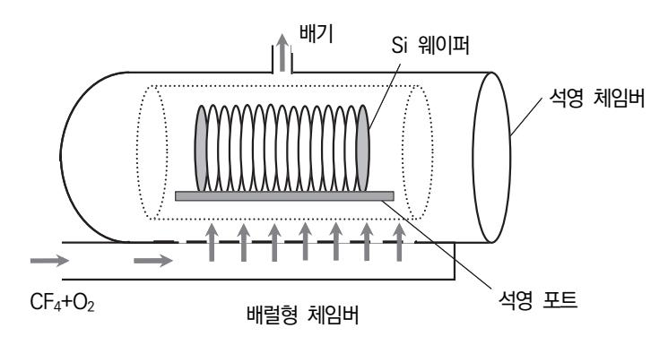

출처: 집필진 제작(2024) [그림 2-1] 배럴형 건식 식각 장비의 구조

(2) 대표적인 건식 식각 장비의 원리와 구조를 파악한다.

[그림 2-2]는 기본적인 건식 식각 장비의 내부 구조를 보여 준다. 일정한 압력을 유지하 면서 공정을 진행하기 위한 반응 용기(chamber), 전원 공급과 시스템을 제어하기 위한 제어부, 장비 운용을 위한 구동부, 공정 온도를 일정하게 유지하기 위한 척(chuck)과 온 도 제어부, 식각 공정을 진행하기 위해 기체를 공급하는 MFC(mass flow controller)와 기체 공급부(gas supply unit), 플라즈마를 발생시키는 위한 RF 발생 장치와 전력을 손 실 없이 공급하기 위한 임피던스 정합 장치, 공정을 마치는 것을 확인하기 위한 종료점 검출기(EPD: end point detector) 등으로 분류한다.

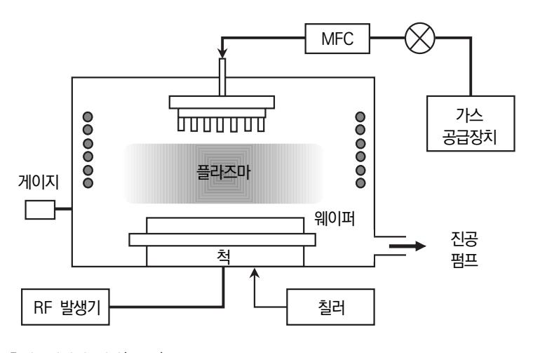

출처: 집필진 제작(2024) [그림 2-2] 대표적인 건식 식각 장비의 구조

식각 공정을 위한 진공 용기는 외부로부터 가스와 전원을 공급받아 특정한 온도와 압력 내에서 식각이 진행되도록 하며, 형태와 방식에 따라 배럴형(barrel), 평판형(planer), 반응성 이온 식각(RIE: reactive ion etching), 자기장 반응 이온 식각(MERIE: magnetically enhanced RIE), CDE(chemical downstream etching), ECR(electron cyclotron resonance), ICP(inductively coupled plasma) 등으로 구분한다.

(가) 건식 식각 장비의 구성을 파악하기 위해 제어부를 이해한다.

제어부에는 장비 구동을 위해 전원을 공급하는 AC 전원, 장비 운용을 위한 시스템 제어 보드(system control board) 및 로봇의 구동을 제어하는 로봇 제어기(robot controller) 등이 있다. 구동부에는 본체(main frame)를 중심으로 제어부에서 공급 되는 교류와 직류 전원을 이용하여 실질적으로 웨이퍼 반송과 식각 공정이 진행된다. 이외에 온도 제어부는 반응 용기의 온도를 일정하게 유지하기 위해 온도를 제어하는 장치가 있고, 진공 펌프는 공정이 진행되는 동안에 일정하게 압력을 유지하며, 부산 물이나 불필요한 가스를 제거하는 역할을 수행한다.

(나) RF 발생기의 원리와 구조를 파악한다.

RF 발생기(radio frequency generator)는 공정 중에 플라즈마를 형성하기 위해 사 용하는 고주파 전력 공급기이며, 플라즈마를 발생시키는 RF 발생기(generator)의 주 파수는 보통 13.56MHz를 많이 사용한다. 이외에 다른 주파수로는 400KHz, 800 KHz, 2MHz와 27.12MHz를 사용하기도 한다. 주파수 사용 범위는 국제적으로 정해 져 있으며, 특정 주파수만을 배정하여 다른 통신 장비에 영향을 미치지 않도록 규정 하고 있다. 그리고 임피던스 정합 장치(impedance matching box)는 RF 발생기에 서 발생하는 고주파를 이용하여 반응 용기에서 고품질의 플라즈마가 형성될 수 있도 록 반응 용기의 임피던스를 자동으로 조절하는 장치이다.

(다) 가스 공급부의 구조를 파악한다.

가스 공급부를 통해 주입되는 기체로는 공정을 위한 가스(process gas)와 장비 운용 에 필요한 배기가스(purge gas)로 구분한다. 공정 가스는 식각 대상 물질에 따라 다 양하며, 다결정 실리콘의 경우 Cl2와 CF4, 실리콘 산화물의 경우 CF4, 금속 식각일 경우는 Cl2가 주로 사용된다. 배기가스는 반응 용기 내에 분위기를 제어하고 불순물 이 유입을 방지하기 위해 사용하며, 질소나 아르곤 가스가 많이 사용된다.

2. 식각 공정에서 식각하고자 하는 대상 박막 소재에 따라 건식 식각을 구분하여 기술하면 다음과 같다.

| 반응 가스                 | 장치             | 공정 압력     | 식각 속도          | 선택 비                        | 비고  |
|-----------------------|----------------|-----------|----------------|-----------------------------|-----|
| CCl4, Argon           | 평판             | 0.4torr   | 0.02(undoped)  | Poly Si : SiO2 = 15 : 1  |     |
| SiF4(50%), Argon(50%) | 평판             | 0.2torr   | 0.04(undoped)  | Poly Si : SiO2 = 25 : 1  |     |
|                       |                | 0.2torr   |                | Poly Si : Si3N4 : SiO2   |     |
| CF4, O2               | 배럴             |           | 0.05(undoped)  | = 25 : 2.5 : 1              |     |
| CF4, O2(4%)           | 평판             | 0.4torr   | 0.057(- doped) | Poly Si : SiO2 = 10 : 1  |     |
| C2ClF3                | 평판             | 0.225torr | 0.05(- doped)  | Poly Si : SiO2 = 3.5 : 1 |     |
|                       |                | 0.35torr  | 0.115(- doped) | Poly Si : SiO2 = 10 : 1  | 등방  |
| CF4(92%), O2(8%)      | 평판             |           |                | Poly Si : SiO2 = 9:1     |     |
|                       | 평판             | 0.4torr   | 0.159(- doped) | Poly Si : SiO2 =8:1      | 등방  |
| C2F4(50%), CF3Cl(50%) |                |           | 0.098(undoped) | Poly Si : SiO2 =5:1      |     |
|                       | 평판             | 0.4torr   | 0.082(- doped) | Poly Si : SiO2 =5:1      | 이방성 |
| C2F4(81%), CF3Cl(19%) |                |           | 0.07(undoped)  | Poly Si : SiO2 =4:1      | 식각  |
|                       | 평판             | 0.35torr  | 0.057(- doped) | Poly Si : SiO2 =6:1      | 이방성 |
| C2F4(92%), Cl2(8%)    |                |           | 0.070(undoped) | Poly Si : SiO2 =5:1      | 식각  |
|                       |                |           | 0.08(- doped)  | Poly Si : SiO2 = 13 : 1  | 부분적 |
| CF3Cl                 | 평판 0.35torr |           | 0.03(undoped)  | Poly Si : SiO2 =6:1      | 이방  |

<표 2-2> 다결정 실리콘의 건식 식각에서 주로 사용하는 특수 가스 및 특성

출처: 김현후(2024). 『반도체 제조 장비 기술』. 내하출판사. p. 140.

<표 2-3> 질화막의 건식 식각에서 주로 사용하는 특수 가스 및 특성

| 반응 가스       | 장치 | 공정 압력    | 식각 속도      | 선택 비                                                 | 비고  |
|-------------|----|----------|------------|------------------------------------------------------|-----|
| SiF4,O2     | 배럴 | 0.3torr  | 0.01μm/min | Si3N4 : Si : Poly Si : SiO2 = 25 : 5 : 2.5 : 1 | 이방성 |
| SiF4,O2(2%) | 배럴 | 0.75torr | 0.1μm/min  | Si3N4 : Poly Si = 7.5 : 1                         | -   |
| CF4,O2      | 배럴 | 1.1torr  | 0.02μm/min | Si3N4 : SiO2 = 5 : 1                              | 등방성 |

출처: 김현후(2024). 『반도체 제조 장비 기술』. 내하출판사. p. 141.

<표 2-4> 산화막의 건식 식각에서 주로 사용하는 특수 가스 및 특성

| 반응 가스                                | 장치 | 공정 압력     | 식각 속도                               | 선택 비                                                                                 | 비고  |
|--------------------------------------|----|-----------|-------------------------------------|--------------------------------------------------------------------------------------|-----|
| C2F4                                 | 평판 | 0.4 torr  | 0.043μm/min                         | SiO2 : Si = 15 : 1                                                                | 이방성 |
| CF4(70%), H2(30%)                    | 평판 | 0.03 torr | 0.004μm/min                         | SiO2 : Si = 5 : 1                                                                 | 이방성 |
| CHF3(90%), CO2(10%)                  | 평판 | 0.07 torr | 0.05μm/min                          | 열 SiO2 : Si = 17 : 1                                                              | -   |
| C2F4(12%), CHF3(12 %), He(76%) | 평판 | 4.0 torr  | 0.5μm/min 0.7μm/min 0.6μm/min | 열 SiO2 : Si = 15 : 1 CVD SiO2 : Si = 19 : 1 Plasma SiO2 : Si = 16 : 1 | 이방성 |

출처: 김현후(2024). 『반도체 제조 장비 기술』. 내하출판사. p. 141.

| 반응 가스  | 장치 | 공정 압력   | 식각 속도      | 선택 비                                          | 비고        |
|--------|----|---------|------------|-----------------------------------------------|-----------|
| CCl4He | 평판 | 0.3torr | 0.18μm/min | Al : Si : Poly Si : SiO2 = 100 : 1 : 1 : 1 | -         |
| CCl4   | 평판 | 0.1torr | 0.36μm/min | Al : Si = 100 : 1                             | 수분에 민감 |
| BCl2   | 평판 | 0.1torr | 0.06μm/min | Al : Si = 100 : 1                             | 수분에 둔감 |

<표 2-5> 알루미늄의 건식 식각에서 주로 사용하는 특수 가스 및 특성

출처: 김현후(2024). 『반도체 제조 장비 기술』. 내하출판사. p. 141.

- 3. 건식 식각 공정의 원리와 과정을 이해하고, 사용하는 가스의 반응에 관해 확인한다. 건식 식각은 진공 반응기에 식각 공정을 위한 반응 가스를 주입하고, 식각 장비의 전원을 인가하여 플라즈마를 형성한다. 그리고 패턴을 통해 식각하고자 하는 박막 물질을 화학적 및 물리적인 방식으로 박막을 제거한다.
  - (1) 식각의 원리를 이해하기 위해 플라즈마 형성으로 만들어지는 이온과 라디칼(radicals)에 의한 물리적 및 화학적인 식각을 파악한다.
  - (2) 식각 장비의 매뉴얼을 토대로 동작 원리를 이해하고, 전원의 power, 식각 시간 및 가스의 유량 등을 조절하여 식각 제어력을 확인한다.

식각 대상 박막의 재료와 두께를 바탕으로 식각률, 식각 프로파일, 식각 바이어스 및 식 각의 균일도 등과 같은 식각 제어력을 이해한다.

<표 2-6> 플라즈마 내의 충돌에 의한 반응 종류

| 전자                             | 반응 상태                   |
|--------------------------------|-------------------------|
| e + A → A + 2e                 | Ionization              |
| e + A → A* → e + A + hv        | Excitation              |
| e + A* → A + 2e                | Penning ionization      |
| e + A → A + e                  | Elastic scattering      |
| e + AB → e + A + B             | Dissociation            |
| e + AB → 2e + A + B            | Dissociation ionization |
| e + AB → A- + B                | Dissociation attachment |
| e + A+ + B → A + B             | Recombination           |
| A+ + B → A + B+                | Charge exchange         |
| A+ + B → A+ + B                | Elastic scattering      |
| A+ + B → A+ + B+ + e           | Ionization              |
| A+ + B → A+ + B* + A+ + B + hv | Excitation              |
| A+ + e + B → A + B             | Recombination           |
| A+ + BC → A+ + B + C           | Dissociation            |
| A + BC → C + AB                | Chemical reaction       |

출처: 교육부(2014). 반도체용 가스 재료 제조(LM1903060403\_14v1). 한국직업능력개발원. p. 42.

- (3) 식각 공정 과정에서 발생할 수 있는 식각 선택성의 저하, 불순물에 의한 오염 및 이온화 전 자 등에 의한 손상 가능성을 검토한다.
- (4) 식각 과정에서 이루어지는 화학적인 반응과 생성되는 물질에 관해 확인한다. 건식 식각의 식각 과정에서 화학적 반응의 일례를 살펴보면 다음과 같으며, 〈표 2-6〉은 식각 과정에서 형성된 플라즈마 내의 충돌에 의한 반응의 종류를 나타낸다.
  - (7) CF  $\rightarrow$  CF3, F, CF3+, F-
  - (L+)  $SiO_2 + F \rightarrow SiF_x$ , O
  - (□) SiO2 + CF → SiFx, CO
- ② 식각 공정에서 식각 장비와 특수 가스가 결정되면 가스에 대한 제조 사양서를 토대로 가스의 규격을 확인하고, 가스의 장단점을 파악한다.

반도체 식각 공정에서 적용하는 장비에 대한 지식을 검토하고, 사용하는 특수 가스를 기반으로 가스의 제조 사양서를 확인한다.

가스 제조 사양서를 파악하고, 가스의 종류와 특성을 검토한 후에 사용되는 장비의 운용에 관해 확인한다.

식각 공정용 특수 가스는 식각 대상 물질의 종류에 따라 다양하며, 건식 식각 공정에서 사용하게 되는 장비와 대상 박막이 선정되면 〈표 2-1〉에서 나타나는 식각 가스의 종류, 특성 및 유해성 등을 파악한다.

- 선정된 식각 대상 물질이 결정되면 구체적으로 식각 가스의 종류와 장비 운용에 대한 특성을 검 토한다.
   이미 〈표 2-2〉에서부터 〈표 2-5〉까지 제시한 바를 토대로 각 건식 식각 장비에서 대상 물 질에 대한 식각 가스와 공정의 장비의 공정 조건을 확인하고. 사용하는 반응 가스의 특성을
- 3. 식각 장비의 사용법을 확인하고, 장비의 전력원인 DC/RF power를 파악한다.
- 4. 식각 공정에서 선정한 공정 가스의 순도를 검토한다.

검토한다.

- 5. 진공 반응기의 동작을 위한 최저압력과 동작 압력을 결정하고 가스 유량을 안정되게 공급할 수 있도록 mass flow controller를 이용하여 확인한다.
- 6. 건식 식각 공정 장비의 동작 중에 진공 반응기의 내부에 존재하는 잔류가스를 파악하기 위해 RGA(residual gas analyzer)를 확인한다. 식각 공정에서 진공 반응기 내에 산소, 수분 및 hydrocarbon 등의 불순물 가스가 존재하 면 particle source로 문제가 되기 때문에 확인하여야 한다.

## 2-2. 가스 재료 준비

학습 목표 • 반도체 제조 공정에 적합한 식각 공정 가스 제조 재료를 준비할 수 있다.

## 필요 지식 /

숔 가스 재료의 준비

건식 식각 공정에서 사용하는 가스는 대략 80 여종이 있으며, <표 2-7>에서 나타나듯이, HFC 계, olefin계, alkene계, NF계, ester계, CN계, CFN계, COF계, NSF계, ether계, cyclic계, OF계, keton계, FNO계, SF계, SFO계, VF4계 및 halogen 화합물계 등이 있다.

1. 식각용 가스 계열

#### <표 2-7> 식각용 가스의 세계

| 가스 계열        | 가스                                                               |
|--------------|------------------------------------------------------------------|
| HFC계         | CHF3, CH3F, C2H2F2, C3H2F4, CF3CHF2 등                            |
| Olefin계      | CF2=CF2, CF3CF=CF2 등                                             |
| Alkene계      | C2F6, C3F6, C4F6 등                                               |
| NF계          | NF2NF2, NF3                                                      |
| Ester계       | CF3COOCF3, CF3COOCHF2 등                                          |
| CN계          | CF3CN, C2F5CN 등                                                  |
| CFN계         | CF2=NF, CF3NF2 등                                                 |
| COF계         | CF3COF, CF3(COF)2 등                                              |
| NSF계         | NSF3                                                             |
| Ether계       | CF3OCF3, CHF2OCHF3 등                                             |
| Cyclic계      | c-C5F6, c-C4F6, c-C4F6O 등                                        |
| OF계          | CF3OF, CF2(COF)2 등                                               |
| Keton계       | COF2, CF3COCF3 등                                                 |
| FNO계         | CF3NO, FNO, F3NO 등                                               |
| SF계          | SF4, SF6                                                         |
| SFO계         | SF2O, SF4O, SF5OF                                                |
| CF4계         | CF4                                                              |
| Halogen 화합물계 | IFCIFBrF, IF3CIF3BrF3 등                                          |
| p. 51.       | 출처: 이형달(2010). 「PFCs 대체 에칭/세정가스용 핵사풀루오로프로필렌 정제기술 개발 보고서」. 지식경제부. |

2. 식각 가스의 종류와 반응

식각 공정용 특수 가스는 식각 대상 물질의 종류에 따라 다양하며, <표 2-8>에서는 식각 대상 재료에 따른 공정 가스의 종류와 반응 상태를 나타낸다.

<표 2-8> 반응성 이온 식각 가스의 종류

| 대상 재료   | 반응 상태                                                                                                                 |
|---------|-----------------------------------------------------------------------------------------------------------------------|
| Si3N4   | CHF3 + CF4 + Ar + O2, CF + He, C2F6, C3F8, CHF3, SF6, CF4 + H2, NF3                                             |
| Si      | HBr + SiF4 + HeO2, HBr + NF3 + SiF4 + HeO2, CF4 + O2, SF6 + Ar, NF3, C2F6 + CF3CI, C2F6 + CI2, HBr, CH3Br |
| poly-Si | HBr + CI2, CF4 + O2, SF6 + Ar, NF3, C2F6 + CF3CI, C2F6 + CI2, HBr, CH3Br                               |
| SiO2    | CHF3 + CF4 + Ar, CF4 + H2, C3F8, C2F6 + CHF3, CHF3 + CO2, CH3Br                                                 |
| Al      | CI2 + BCI3 + N2, CCI4 + Ar, SiCI4 + Ar, CI2 + BCI3 + He, CI2 + BCI3 + CHCI3 + SiCI3 + He                        |
| Cu      | CCIF3, C2CI2F4                                                                                                        |
| Au      | CCIF3, C2CI2F4                                                                                                        |
| W       | CF4, CF4 + O2, C2F6, C2F6 + C2H4, CF3Br + O2                                                                          |
| Ti, TiW | SF6 + N2, BCI3 + SF6 + N2, CF4, CF4 + O2, C2F6, C2F6 + C2H4, CF3Br + O2                                            |
| Al2O3   | CCI4, BCI3 주로 physical sputtering 이용(AI2O3가 매우 안정)                                                                 |

출처: 교육부(2014). 반도체용 가스 재료 제조(LM1903060403\_14v1). 한국직업능력개발원. p. 43.

#### <표 2-9> 식각용 첨가 가스의 영향

| 첨가 가스                     | 현상                                                                                                      |  |
|---------------------------|---------------------------------------------------------------------------------------------------------|--|
| He, Ar(Noble gas)         | stabilize plasma, dilute etchant: E/R 감소, 이방성 증가, improve heat transfer         |  |
| O2(환원가스)                  | F-based gas의 F를 분리(etchant 활성화) SiO2 형성(sidewall passivation에 의한 국부적인 E/R 감소 이방성 은 일반적으로 증가하는 경향) |  |
| H2(F deficient 분위기 형성) | HF 형성(F 농도 감소에 의한 E/R 감소) 결함영역의 hydrogen passivation poly Si나 PR의 E/R은 급격하게 감소, SiO2의 E/R는 완만히 감소 |  |
| N2                        | noble gas와 유사                                                                                           |  |
| C(CHF3, C2F6, C3F8)       | 고분자 형성에 의한 sidewall passivation 효과                                                                      |  |

출처: 교육부(2014). 반도체용 가스 재료 제조(LM1903060403\_14v1). 한국직업능력개발원. p. 43.

#### 3. 첨가 가스의 종류와 특성

식각 공정에서 장비와 식각하고자 하는 대상 물질이 선정되면, 공정 가스에 추가되는 첨가 가스를 확인하여야 한다. <표 2-9>에서는 식각 공정 가스에 추가되는 첨가 가스의 종류, 특 성 및 현상 등에 대해 나타낸다.

숕 가스 제조 장비 및 설비

제조하려는 반도체용 특수 가스가 선정되고, 가스 원재료가 준비되면 가스를 생산하기 위한 제 조 설비와 장비를 고려하여야 한다. 특수 가스를 제조하는 방법은 다양하며, 이에 따라 준비되 는 제조 도구, 장비 및 설비 등도 매우 다양하다. 일반적으로 가스 제조에 사용되는 도구와 설 비를 살펴보면 다음과 같다.

1. 저장 설비

저장 설비는 원료 가스를 저장하고, 제조되는 가스를 정제하여 저장하는 설비를 의미하며, 최종적으로 생산된 특수 가스를 저장하게 된다.

2. 제독 설비

식각용 특수 가스의 경우, 제조되는 과정에서 배출되는 가스나 최종적으로 생산된 제품의 가스는 대부분 가연성이나 독성을 가지기 때문에 제독 설비를 이용하여 허용 농도 이하로 줄여야 한다.

3. 배기 설비

제조 과정에서 생성되는 폐가스를 안전하게 처리하기 위해 배기관과 배기 팬을 이용하여 배출하는 설비이다.

4. 용기

제조된 특수 가스를 저장하거나 보관하기 위해 사용되는 용기는 종류가 매우 다양하며, 제 품의 특성과 용량에 따라 적합한 용기를 사용한다.

5. 개인 보호구

특수 가스를 다루는 작업자의 안전을 위해 개인 보호구가 명확히 표시되며, 사용자는 잘 보 관하고, 유지하여야 한다.

## 수행 내용 / 가스 재료 준비하기

#### 재료·자료

- 반도체 재료 제조 기술 자료
- 국제표준화기구(ISO; international organization for standardization) 표준화 문서
- 물질 안전 보건 자료
- 생산 계획서
- 반도체 재료 작업 절차서
- 반도체 재료 작업 표준서
- 반도체용 식각 공정 가스 원재료에 대한 자료
- 반도체 설비 목록 및 매뉴얼
- 반도체 제조 공정도

#### 기기(장비 ・ 공구)

- 반도체용 식각 공정 가스 제조 장비
- 반도체용 식각 공정 가스 측정 장비
- 반도체용 식각 공정 가스 검사 장비
- 반도체용 식각 공정 가스 분석 장비

#### 안전 ・ 유의 사항

- 반도체 식각 공정에 대한 이론적 지식을 습득하고, 취급하는 가스의 성질과 특성을 바탕으 로 관리 및 주의 사항에 유의한다.
- 반도체 식각 공정에서 사용하는 특수 가스는 부식성, 맹독성, 인화성 및 발화성 등의 위험 물질이 많아 해당 가스에 대한 장비, 공급 시설, 관리 및 주의 사항을 사용하기 전에 미리 숙지하여야 한다.
- 물질 안전 보건 자료를 통해 특수 가스를 취급하기 전에 파악하고, 독성 가스의 경우에는 제독 설비에 대한 일반 사항, 제독 설비 및 제독 방법 등 안전 교육을 시행한다.

수행 순서

숔 반도체 식각용 특수 가스를 제조하기 위해 가스 제조 사양서를 토대로 원료 가스의 물성과 특성을 파악한다.

식각 공정용 특수 가스의 제조 사양서를 기반으로 원료 가스의 물성을 파악하고 해당 가스의 특성을 고려하여야 한다.

- 1. 가스 제조 사양서를 확인하고, 가스의 품질 기준과 제품 특성 등을 파악한다.
  - (1) 가스 제조 사양서의 내용 중에서 다음과 같은 가스의 품질 기준에 대해 검토한다.
    - (가) 화학식
    - (나) 성분 조합 비율
    - (다) 경년 변화
    - (라) 순도
    - (마) 가스의 비중
    - (바) 관리 방법 및 안전 취급
    - (사) 점검 주기
  - (2) 가스 제조 사양서의 내용 중에 다음과 같은 가스 제품의 유해성을 검토한다.
    - 가스 제조 시에 안전을 위해 인체에 발생할 수 있는 각종 생체 작용에 관한 내용을 명 확하게 확인하고, 다음 사항을 검토한다.
    - (가) 인체에 영향을 미칠 수 있는 생체 작용으로 자극성, 부식성, 질식성, 독성 및 가연성 등 에 대해 파악한다.
    - (나) 가스의 허용 농도를 확인한다.
    - (다) 제독 방법과 안전 취급에 대해 검토한다.
    - (라) 해로운 정도를 나타내는 경고 표지를 확인한다.
- 2. 식각되는 대상 물질에서 사용하는 공정 가스의 반응을 검토하고, 제조를 위해 추가되는 첨가 가스 를 파악한다.

반도체 식각 공정에서 선정된 공정 장비와 대상 물질을 기반으로 공정 가스를 공급하여 발 생하는 반응 상태를 검토하고, 제조를 위해 필요한 첨가 가스를 파악한다. 그리고 추가되는 첨가 가스에 대한 물성과 특성에 대한 자료를 확인한다.

- (1) 선정된 공정 가스의 종류와 반응기에서 반응 상태를 검토한다. <표 2-8>에서 제시하는 내용을 확인하고, 공정 가스의 반응 상태와 반응으로 생성되는 배출물에 대해 파악한다.
- (2) 추가로 요구되는 첨가 가스의 종류를 검토하고, 반응으로 발생하는 현상을 파악한다.

〈표 2-9〉에서 나타나는 바와 같이 필요한 첨가 가스를 파악하고, 첨가되는 가스의 물성 과 발생하는 현상 및 영향 등을 검토한다.

- (3) 공정 가스와 첨가 가스에 대한 정보를 토대로 특수 가스의 원재료를 파악하여 준비하고, 가스 제조를 위한 도구, 장비 및 설비를 확인한다.
- 고, 제조 장비의 매뉴얼과 사용법을 파악한다.

원료 가스가 준비되면 가스 제조를 위해 요구되는 제조 공정과 제조 방법을 파악하여 제조 장 비와 설비를 검토한다. 그리고 안전사고에 대처하기 위해 원료 가스와 제조되는 가스의 물성과 특성을 검토한다.

1. 원료 가스와 제조된 특수 가스를 저장하기 위한 저장 설비를 확인한다.

용기를 저장하는 저장소는 통풍이 잘되고 건조한 분위기를 유지하기 쉬운 옥외 공간이 가 장 좋으며, 저장할 가스의 특성을 구분하여 저장하는 것이 바람직하다.

(1) 저장 설비와 저장소는 가스의 가연성과 독성에 따라 구분하여 설치한다.

자연 발화성을 가진 가스는 옥외 저장이 가장 바람직하며, 개방된 면의 길이가 설비 주 변의 길이의 75% 이상이 되도록 하는 것이 좋다. 이는 자연 발화성 가스가 누출될 경 우에 가능한 한 빠르게 확산하여 화재가 발생할 가능성을 낮추어야 한다.

(2) 가연성 가스의 가스 설비실과 저장 설비실에는 누출되는 가스가 머물지 않도록 통풍 구조를 갖추어야 하고, 만일 통풍이 안 될 경우에는 강제 통풍 시설을 갖추어야 한다. 옥내 저장실을 설치할 경우에는 적절한 환기 시설을 갖추고, 분산 모델 분석(dispersion model analysis)을 이용하여 분석한다. 가연성의 경우, 화재 하한선의 25% 이하가 되거나 독성의 경우에는 TWA 값(시간 가중 평균 노출 기준: time weighted average) 이하로 낮출 수 있는 공기를 공급하여야 한다. 여기서, TWA는 1일 8시간 작업을 기준으로 가스의 유해인자 측정치에 발생 시간을 곱하고 이를 8시간으로 나누 값을 의미한다.

| 저장소 크기                | 질식성       |                       | 산화성       |           | 가연성                   |           |  |
|-----------------------|-----------|-----------------------|-----------|-----------|-----------------------|-----------|--|
| 크기(ft 3 )  | 10,000 이하 |                       | 10,000 이하 | 10,000 이상 | 10,000 이하             | 10,000 이상 |  |
| 크기(m 3 )   | 283 이하    | 283 이상                | 283 이하    | 283 이상    | 283 이하                | 283 이상    |  |
| 시간당 공기 순환          | 6         | 4                     | 9         | 6         | 10                    | 6         |  |
| 크기((ft 3 ) | 4,000 이하  | 4,000 이상 10,000 이하 | 10,000 이상 | 4,000 이하  | 4,000 이상 10,000 이하 | 10,000 이상 |  |

| 〈표 2-10〉 | 가스 | 저장실의 | 공기 | 순환량 |
|----------|----|------|----|-----|
|----------|----|------|----|-----|

| 저장소 크기              |        | 독성               |        |        | 맹독성              |        |
|---------------------|--------|------------------|--------|--------|------------------|--------|
| 크기(m 3 ) | 113 이하 | 113 이상 283 이하 | 283 이상 | 113 이하 | 113 이상 283 이하 | 283 이상 |
| 시간당 공기 순환        | 12     | 10               | 6      | 12     | 12               | 10     |

출처: 추광호(2015). 『산업가스 특수 가스 총서 1』. ㈜북랩. p. 157.

- (3) 독성 가스를 저장하는 설비실은 가스 누출을 대비하여 중화 설비를 갖추어야 한다. 특히 옥 내에 저장 설비의 경우에는 흡입장치와 연동하여 중화 설비를 갖추어야 한다.
- 2. 독성 가스의 누출을 대비하여 제독 설비를 확인한다.

독성 가스는 제독 설비를 이용하여 허용 농도 이하로 처리한 후, 대기로 방출하여야 한다. 제독 방법은 산화, 환원, 중화, 가수 분해, 흡수 및 흡착 등의 현상을 이용하여 처리한다.

- (1) 제독 설비는 특수 가스의 종류, 농도, 유량 및 압력 등을 고려하여 적절한 제독 방법을 선정 한다. 제독은 처리 방식에 따라 다음과 같이 구분한다.
  - (가) 연소 처리(combustion scrubber) 방법
  - (나) 습식 처리(wet scrubber) 방법
  - (다) 건식 처리(dry scrubber) 방법
  - (라) 열습식 처리(thermal wet scrubber) 방법
  - (마) 번 습식 처리(burn wet scrubber) 방법
  - (바) 조합 처리 방법

조합 처리 방법은 습식 처리를 제외한 방법을 1차 제독 처리로 실시하고, 2차에는 습식 처리 방법을 사용하는 방식이다.

(2) 제독 설비의 구성을 확인하고 안전사고를 예방하여야 한다.

일반적으로 제독 설비는 정상 상황과 비상 상황 시에 모두 하나의 제독 설비로 배출하는 구조이며, 경우에 따라 다른 가스와 접촉하여 반응을 통해 위험한 상황을 초래할 수 있다. 따라서 가스 사이에 반응성을 미리 고려하여 검토하여야 한다.

- (3) 제독 설비의 재료는 제독제의 성능, 제독 대상 가스 및 이차적으로 발생할 수 있는 가스의 성질을 고려하여 사용한다. 독성 가스는 공기와 접촉하여 발화하거나 수분 혹은 습기와 접촉하여 강산성 가스를 발 생시키는 등 화학적으로 매우 불안정하다. 따라서 용도에 맞는 기계적, 물리적 및 야금 적 특성을 고려한다.
- (4) 가스 제조에서 공정용 제독 설비와 비상용 제독 설비는 사용 목적과 형태에 따라 혼용되기도 하고 구분하기도 한다. 그러나 독성 가스가 부식성의 특성을 가지거나 공기 중에 산소나 수

분과 반응하여 다른 위험한 가스를 배출할 가능성이 높을 경우에는 별도로 설치하는 것이 바 람직하다.

- (5) 제독 설비의 처리 능력은 정상적인 작업으로 배출되는 양과 누출 가정량 중에서 큰 값의 가 스 양을 처리할 수 있는 능력을 갖추어야 한다.
- (6) 제조를 위해 사용하는 시설에서의 가스 누출 모드를 확인하여 대비한다.
  - 사용 시설의 가스 소비의 형태는 일반적으로 유사하다. 제독 설비를 이용하여 신속하게 처리하기 위해서는 가스 누출 모드를 파악하여야 하며, 다음과 같은 누출의 모드를 대비 하여 주의하여야 한다.
  - (가) 저장 설비 내의 용기에서 누출되는 독성 가스
  - (나) 용기에서 누출된 저장 설비 내의 독성 가스
  - (다) 용기 캐비닛 내에서 누출되는 독성 가스
  - (라) 사용되는 설비에서 일반적으로 배출되는 독성 가스
  - (마) 소비 설비에서 외부로 누출되는 독성 가스
  - (바) 용기 캐비닛과 소비 설비 사이에 연결관에서 누출되는 독성 가스
- (7) 독성 가스에 따라 적합한 개인 제독 보호구를 갖추고, 보관이나 사용법에 대한 훈련을 정기 적으로 실시하여 숙지하여야 한다.
- 3. 가스 제조 공정에서 배기되는 가스가 존재하지 않도록 처리하기 위해 배기관이나 배기 팬을 통해 배기구로 연결하여야 한다.

독성 가스나 가연성 가스를 제조하는 시설에서는 가스가 공간 내에 체류하지 않도록 처리 하여야 한다. 안전하게 처리하는 방식으로는 화학 반응, 화학 흡착, 물리 흡착, 연소 및 희 석 등의 방법이 있다.

- (1) 반도체 식각 공정용 특수 가스는 대부분 자연 발화성, 부식성 및 독성을 가지므로 배기 설비 에 사용하는 재료는 불연성 내식 재료를 사용한다.
- (2) 자연 발화성 및 독성 가스는 환기 설비가 매우 중요하며, 누출되면 화재나 폭발의 위험이 매 우 크기 때문에 안전하게 처리하여 배출한다.
- 4. 가스 제조 공정에서 제조되는 특수 가스는 저장하거나 관리하기 위해 용기(cylinder)를 사용하며, 특수 가스의 특성에 적합한 용기를 이용하여 올바르게 식별할 수 있도록 주의하여야 한다. 특수 가스의 저장이나 보관을 위한 용기는 가스의 종류와 특성에 따라 매우 다양하다. [그 림 2-3]과 [그림 2-4]에서는 일반적인 가스 용기와 가스 조정기(gas regulator)의 이미지 외형을 보여 준다.

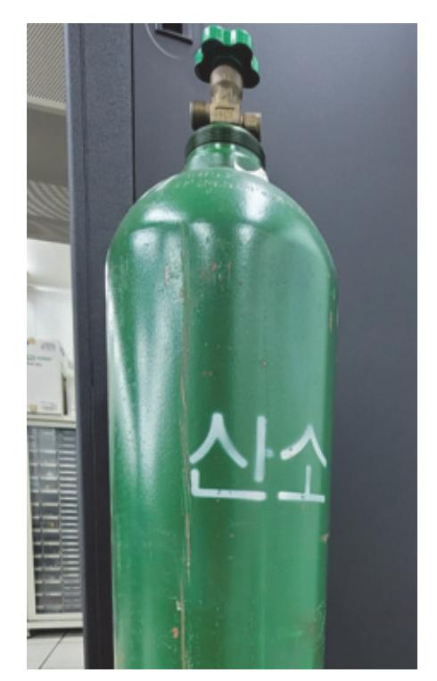

출처: 집필진 제작(2024) [그림 2-3] 일반적인 가스 용기의 외관

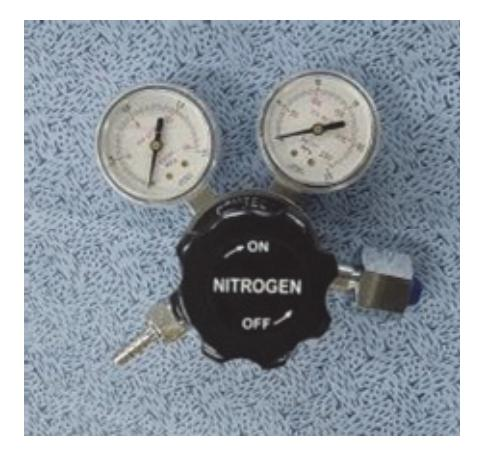

출처: 집필진 제작(2024) [그림 2-4] 대표적인 가스 조정기

- (1) 특수 가스의 제품이나 내용물을 쉽게 파악할 수 있도록 용기를 식별하는 방법에 대해 검토한다. 용기의 내용물을 식별하기 위해서는 다음과 같은 방법으로 구분한다.
  - (가) 가스 제품의 명칭으로 식별하는 방법이 가장 기본적이며, 내용물을 확인한다. 가스의 명칭이나 화학식으로 각인하거나 스탬프를 부착하기도 한다. 또한 용기 밸브 에 부착된 라벨을 확인한다. 용기 옆면에 마킹된 용기나 내용물 정보를 확인한다.
  - (나) 가스 내용물은 용기 색깔에 의해 식별하기도 하며, 색상으로 내용물을 확인한다. 가스 용기의 색상으로 제품을 식별하기 위해 널리 사용되고 있지만, 일반적으로 1차

수단이 아닌 보조 수단이라는 것을 유의한다.

- (다) 가스의 위험 등급으로 가스의 내용물을 확인한다.
  - 가스 내용물의 위험 특성을 라벨을 부착하여 표시하며, 충전된 가스의 종류를 식별 하는 지침이 되기도 한다.
- (라) 용기의 형태에 따라 가스의 내용물을 식별할 방법을 확인한다. 가스 용기는 가스 특성과 용도에 따라 다양한 용기를 사용하며, 예상 가능한 내용물 을 파악할 수 있다.
- (마) 용기의 밸브 타입으로 제품의 내용물을 식별할 방법을 확인한다. 대부분 국가에서는 가스 용기의 밸브 연결부를 규정에 따라 지정하기 때문에 가스의 내용물을 확인할 수 있다.
- (바) 용기에 마킹으로 가스 제품을 식별하는 방법을 파악한다.

일반적으로 가스 용기는 거의 영구적으로 각인된 소유 업체의 이름, 정보, 내용물 정 보 및 용기 정보를 포함한다. 따라서 용기에 마킹된 내용을 검토한다.

(2) 특수 가스의 내용물을 쉽게 파악할 수 있는 절차를 검토한다.

가스 용기의 내용물과 정보를 확인하기 위한 식별 방법을 파악하고, [그림 2-5]에서 나 타나는 식별 절차를 검토한다. 용기 내용물을 식별하기 어렵다고 판단되면, 제조 공급 업체나 전문 처리 업체에 문의하여 처리한다.

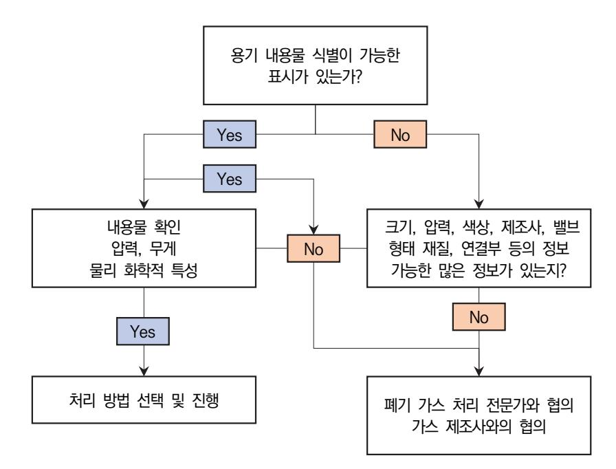

출처: 집필진 제작(2024) [그림 2-5] 용기 내용물 식별 절차 (3) 사용할 수 없는 빈 용기의 처리를 위해 명확한 표기를 하여야 한다.

가스 용기가 완전히 비워졌다고 확인될 때까지 밸브를 탈착하지 말아야 하며, 항상 밸브 가 완전히 잠겨 있는지를 확인한다.

- (가) 가스 내용물이 독성이나 가연성일 경우에는 퍼지(purge) 절차가 진행되었는지를 확인하 여야 한다. 독성이나 가연성 가스 용기가 대기압이나 혹은 대기압보다 조금 높은 압력이라면 용 기 내에 존재하는 가스가 잠재적으로 위험하므로 질소나 불활성 가스를 이용하여 퍼
  - 지하거나 배기 등에 의해 제거하여야 한다,
- (나) 내용물이 부식성이나 반응성 가스일 경우, 튜브(tube)가 막혀 있는지를 확인한다.
- (다) 용기를 사용하기 부적절하다면, 폐기 처리 업체에 이송하기 전에 사용할 수 없도록 표기 하여야 한다.
- 5. 가스 제조 공정에서 작업자는 잠재하는 위험에 대비한 최후의 수단으로 개인 보호구를 착용하여 야 한다.

특수 가스를 제조하는 영역에서는 필요한 개인 보호구가 명확히 표시되어야 하며, 가스 제 조 공정과 관련한 작업이나 직무를 수행하는 작업자가 위험에 노출되지 않도록 위험성 평 가를 시행하여 문서화하여야 한다. 또한 개인 보호구에 대한 교육 훈련을 통해 안전하게 사 용하는 방법을 이해하여야 하고, 작업자는 개인 보호구를 청결하게 유지하고 관리하여야 한 다. <표 2-11>은 작업자의 개인 보호구에 대한 종류를 나타낸다.

| 구분       | 보호구 종류                 |
|----------|------------------------|
| 머리 보호구   | 안전모                    |
| 눈/안면 보호구 | 보안경, 보안면               |
| 방음 보호구   | 귀마개, 귀 덮개              |
| 호흡용 보호구  | 방진, 방독, 송기, 공기 호흡기     |
| 손 보호구    | 안전 장갑, 내진 장갑, 고무장갑     |
| 신체 보호구   | 방열복, 방열 두건, 장갑, 신체 보호의 |
| 안전대      | 안전 블록, 추락 방지대          |
| 발 보호구    | 안전화, 절연화, 정전화          |

<표 2-11> 개인 보호구의 종류

출처: 추광호(2015). 『산업가스 특수 가스 총서 1』. ㈜북랩. p. 389.

### 학습 2 교수·학습 방법

#### 교수 방법

- 식각 대상 물질에 따른 식각의 종류와 식각용 특수 가스의 종류, 물성 및 특성에 대해 정리 하여 지도한다.
- 건식 식각 장비의 원리와 구조를 정리하고, 매뉴얼을 기반으로 사용법에 관해 설명한다.
- 식각 가스의 종류와 반응을 이해하고, 추가되는 첨가 가스의 종류와 영향에 관해 설명한다.
- 가스 제조 장비와 설비에 대해 정리하여 지도한다.
- 가스 용기와 개인 보호구의 종류와 사용 시 주의 사항에 관해 설명한다.

#### 학습 방법

- 기본적인 식각 대상 물질에 의한 식각의 종류와 공정 가스의 종류와 특성에 대해 학습한다.
- 건식 식각 장비의 원리와 구조를 이해하고, 장비 사용법에 관해 학습한다.
- 식각 가스의 종류와 반응 상태를 파악하고, 추가되는 첨가 가스의 영향에 대해 학습한다.
- 가스 제조 장비와 설비에 대해 정리하여 학습한다.
- 가스 용기와 개인 보호구의 종류와 사용 시에 주의 사항에 대해 학습한다.

## 학습 2 평 가

#### 평가 준거

• 평가자는 학습자가 학습 목표를 성공적으로 달성하였는지를 평가해야 한다.

#### • 평가자는 다음 사항을 평가해야 한다.

|                     |                                                  |   | 성취수준 |   |  |
|---------------------|--------------------------------------------------|---|------|---|--|
| 학습 내용               | 학습 목표                                            | 상 | 중    | 하 |  |
| 가스 재료의 종류와 특성 파악 | - 반도체 식각 공정 가스 제조에 필요한 원재료의 종류를 파 악할 수 있다.    |   |      |   |  |
|                     | - 반도체 식각 공정 가스 원재료의 제조사별 규격 및 장단점 을 파악할 수 있다. |   |      |   |  |
| 가스 재료 준비            | - 반도체 제조 공정에 적합한 식각 공정 가스 제조 재료를 준 비할 수 있다.   |   |      |   |  |

#### 평가 방법

• 서술형 시험

|                     |                                                  | 성취수준 |   |   |
|---------------------|--------------------------------------------------|------|---|---|
| 학습 내용               | 평가 항목                                            | 상    | 중 | 하 |
| 가스 재료의 종류와 특성 파악 | - 식각 대상 물질에 따른 식각의 종류를 파악하여 정리할 수 있는 능력       |      |   |   |
|                     | - 건식 식각 장비의 원리와 구조를 파악하고, 장비 사용법을 확인할 수 있는 능력 |      |   |   |
|                     | - 식각 가스의 종류와 반응 상태를 파악할 수 있는 능력                  |      |   |   |
| 가스 재료 준비            | - 가스 제조 장비의 구성과 설비에 대해 확인할 수 있는 능력               |      |   |   |
|                     | - 가스 용기와 개인 보호구의 종류와 사용법에 대해 이해할 수 있는 능력      |      |   |   |

• 평가자 질문

|                     | 평가 항목                                                       |  | 성취수준 |   |  |
|---------------------|-------------------------------------------------------------|--|------|---|--|
| 학습 내용               |                                                             |  | 중    | 하 |  |
| 가스 재료의 종류와 특성 파악 | - 식각 대상 물질에 의한 공정 가스의 종류와 특성을 설명할 수 있는 능력                |  |      |   |  |
|                     | - 건식 식각 장비의 원리와 구조를 파악하여 장비의 구성을 크게 3가지로 나누어 설명할 수 있는 능력 |  |      |   |  |
|                     | - 식각 가스의 규격을 확인하고 가스의 장단점을 파악할 수 있는 능력                   |  |      |   |  |
| 가스 재료 준비            | - 가스를 제조하기 위한 장비와 설비에 대해 정리할 수 있는 능력                     |  |      |   |  |
|                     | - 가스 누출에 대비하여 제독 설비를 이용한 제독 방법과 처 리 방법에 관해 설명할 수 있는 능력   |  |      |   |  |

• 평가자 체크리스트

|                     | 평가 항목                                                         |  | 성취수준 |   |  |
|---------------------|---------------------------------------------------------------|--|------|---|--|
| 학습 내용               |                                                               |  | 중    | 하 |  |
| 가스 재료의 종류와 특성 파악 | - 식각 대상 물질의 소재에 식각 방법의 종류와 사용 가스의 특성을 정리할 수 있는 능력          |  |      |   |  |
|                     | - 건식 식각 장비의 장비에 따라 식각의 종류를 구분하고, 사 용하는 가스의 특성을 나열할 수 있는 능력 |  |      |   |  |
|                     | - 식각 가스의 종류와 반응 상태를 설명할 수 있는 능력                               |  |      |   |  |
| 가스 재료 준비            | - 가스를 생산하기 위해 필요한 제조 장비와 설비를 정리하여 설명할 수 있는 능력              |  |      |   |  |
|                     | - 가스 제조 공정에서 작업자가 갖추어야 할 개인 보호구의 종류에 대해 구분하여 정리할 수 있는 능력   |  |      |   |  |

피드백

| 1. 서술형 시험                                              |
|--------------------------------------------------------|
| - 가스 재료의 종류와 특성 관련 문제에 대한 풀이를 자세하게 설명하고, 평가 결과에서 설정한 기 |
| 준 점수에 미치지 못하는 학습자들은 반복 학습을 실시와 재평가를 하고, 우수한 학습자는 심화    |
| 학습을 피드백한다.                                             |
| - 제조 사양서에서 제품 사양과 납기 등에 대해 파악할 수 있는 능력을 평가하고, 보충이 필요한  |
| 부분은 다시 설명해 준다.                                         |
| 2. 평가자 질문                                              |
| - 간단한 평가자 질문을 실시한 후, 각 문제에 대한 풀이를 설명할 수 있는지를 확인하고, 제대로 |
| 설명하지 못한 학습자들은 추가 학습을 통하여 다시 설명해 준다.                    |
| - 식각 가스의 종류와 반응 상태에 대한 문항은 미흡할 경우, 학습자가 완벽하게 제시하여 답할 수 |
| 있도록 추가 학습을 통해 재평가한다.                                   |
| 3. 평가자 체크리스트                                           |
| - 평가자 체크리스트의 결과를 토대로 차례로 평가한 후, 체크리스트에 일정 기준에 미치지 못하는  |
| 학습자는 내용을 반복하여 학습할 수 있도록 지도한다.                          |

- 작업자의 개인 보호구의 사용

| 학습 1 | 식각 공정 가스 제조 요구 사항 파악하기 |
|------|------------------------|
| 학습 2 | 식각 공정 가스 재료 준비하기       |
| 학습 3 | 식각 공정 가스 제조하기          |

## 3-1. 식각 공정 가스 제조

학습 목표 • 생산 관련 부서로부터 입수한 생산 계획에 따라 장비 운용 계획을 수립할 수 있다. • 작업 지시서와 장비 운용 매뉴얼에 따라 식각 공정 가스를 제조할 수 있다.

## 필요 지식 /

숔 특수 가스 제조법

생산 계획에 따른 가스의 생산은 가스의 종류, 유형, 요구되는 순도 및 생산 규모 등에 의해 생산 업체별로 제조법이 매우 다양하다. 반도체 식각 공정용 특수 가스는 순수 가스 제조와 혼 합 가스 제조로 크게 나누어 구분할 수 있으며, 일반적으로 제조되는 순수 가스와 혼합 가스의 제조법에 관해 기술한다.

1. 순수 가스

반도체 제조 공정용 순수 가스의 제조를 위한 보편화된 제조 방법은 [그림 3-1]에서 나타낸다.

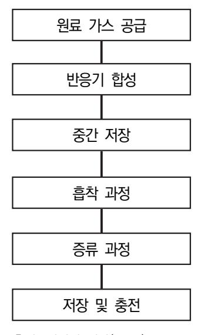

출처: 집필진 제작(2024) [그림 3-1] 대표적인 순수 가스 제조법

(1) 원료 가스의 저장 및 공급

가스 제품을 생산하는 데 필요한 원료 가스를 저장하거나 공급하는 시스템을 의미하며, 저장하는 원료 물질의 특성을 고려하여 재질을 선정하여야 한다. 원료 물질의 공급은 가 스 생산 계획, 가스 순도와 제조 규모에 따라 결정한다.

(2) 반응기 합성

가스의 합성은 공급되는 원료 물질을 반응기 내에서 반응을 통해 제조하려는 가스를 형 성한다. 새로운 가스는 일반적인 반응뿐만 아니라, 개질 반응이나 열분해 반응 등으로 제조한다.

(3) 중간 저장

반응기에서 합성을 통한 가스에는 불순물을 함유하고 있어 다음 공정으로 이송되는 과 정에서 잠시 저장하는 설비이다. 중간 단계의 제품은 다음 단계에서 문제가 발생할 경우 에 완충 역할을 하게 된다.

(4) 흡착 과정

합성 과정에서 발생하는 불순물 중에 후단의 정제 과정에서 분리하기 어려운 물질을 흡 착을 이용하여 제거하는 공정이다. 흡착되는 물질을 피흡착질이라고 하며, 액체나 유리 질도 흡착제로 사용된다. 분자들이 고체나 액체에 녹아 들어가는 현상인 흡수와는 다르 다. 표면이 거칠거나 다공질인 경우에는 흡착제의 표면적이 넓으므로 흡착량이 커져 우 수한 흡착제가 된다.

(5) 증류 과정

증류 과정은 끓는점의 차이를 이용하여 2종 이상의 물질을 분리하는 공정이다. 즉, 끓는 점이 낮은 성분의 물질과 끓는점이 높은 성분의 물질로 구성된 혼합 용액을 플라스크에 넣어 가열하고, 증기가 발생한 응축기에서 응축시키면 일반적으로 처음 혼합 용액보다 끓는점이 낮아지며 플라스크에 남은 성분의 액체는 끓는점이 높아 잘 휘발하지 않는다. 이와 같이 두 성분의 휘발성의 차이를 이용하여 증발과 응축을 통해 혼합용 액은 휘발 하기 쉬운 물질과 휘발하지 않는 물질로 나눌 수 있다. 그리고 응축으로 얻어지는 액체 를 유분 혹은 증류분이라 하고, 증발하지 않고 남은 물질을 관잔 혹은 잔류분이라 한다. 이러한 과정으로 생긴 액체를 새로운 증기와 접촉시켜 증류하는 것을 정류라고 한다. 증류를 구분하면 다음과 같다.

(가) 분별 증류

여러 성분의 혼합물을 가열하여 끓는점마다 각각의 회수기를 통해 성분을 분리하여 채취하는 방법이다.

(나) 진공 증류

보통 수십 torr의 압력에서 이루어지는 증류 방식으로 진공 증류라기보다는 감압 증

류라는 표현이 올바른 증류법이다.

(다) 수증기 증류

물과 혼합되지 않는 성분과 물을 섞은 혼합물에 가열된 수증기를 불어넣으면 두 성 분의 혼합물이 기화하며, 이를 응축하여 분리하는 증류 방식으로 비교적 낮은 저온 에서 정제할 수 있는 방법이다.

(라) 분해 증류

석유를 크래킹(cracking)하여 생성되는 물질은 고온이므로 정류탑으로 이송하여 증 류하는 방식이 분해 증류이다.

(마) 추출 증류

끓는점이 비슷한 성분의 물질들을 분리하는 증류법으로 휘발성이 낮은 다른 물질을 추가하여 한쪽의 증기압을 낮추어 분리하는 방식이다.

(바) 평형 증류

성분의 분리를 목적으로 하지 않는 방식으로 일명 플래시 증류라고도 한다. 용액을 증기와 액체로 급속히 분리하는 방법이며, 고온으로 가열한 액체 일부를 증기와 같 이 채취하여 감압하면 용액은 평형을 유지하면서 급속히 증발시키는 증류법이다.

(사) 공비 증류

일반적인 증류로는 분리하기 어려운 혼합물을 분리하기 위해 제3의 성분을 첨가하여 공비 혼합물을 만들고, 이를 증류로 분리하는 방식이다. 예로써, 96%의 에테르올에 벤젠을 첨가하여 증류 탈수하는 방식이다.

(아) 정밀 증류

여러 개의 정류탑을 사용하여 끓는점의 차이를 이용해 혼합물 내에 성분을 분리하는 방식이다.

(자) 비비등 증류

일반적으로 증류는 정제를 목적으로 하지만, 증류관에 혼합물을 끓여 증기를 대량으 로 생성시키는 조건에서 수행한다. 끓는점 이하에서도 높은 증기압을 가진 물질이라 면 증기를 응축하여 정제도를 올릴 수 있다.

(차) 분자 증류

일반적인 진공 증류법으로 증류하기 어려운 물질을 증류하는 방식이며, 압력을 매우 낮추어 가열하고, 액면과 냉각면 사이의 간격을 작게 하여 액화와 응축이 일어나도 록 하는 방식이다. 기화하기 어려운 고분자 물질을 증류하여 정제하거나 고온에서 쉽게 분해되는 지용성 비타민류을 증류하는 방식이다.

(6) 저장 및 충전

원료를 저장하는 것과 마찬가지로 최종 생산된 제품을 저장하는 기능이다. 생산 용량,

57

물류 시간, 공장 정비(plant overhaul) 및 공급선의 안정도 등에 의해 결정된다.

2. 혼합 가스

혼합 가스는 2종 혹은 그 이상의 서로 다른 가스를 혼합하여 제조하는 방식이며, 안전, 품 질 및 공정 제어를 통해 제조된다. 혼합 가스를 제조하는 방식은 일반적으로 다음 2가지 방식에 의해 크게 나누어 분류한다.

(1) 압력법

압력법은 이상 기체 방정식을 이용하여 충전하는 방식이며, 투자비가 상대적으로 적지 만, 온도에 따른 순도 변화가 발생하고 모든 기체가 이상 기체와 같이 상태 변화가 일 어나지 않기 때문에 정확히 혼합 가스를 제조하기가 쉽지 않다.

(2) 중량법

모가스(mother gas)와 균형 가스(balance gas)의 비율을 무게로 측정하여 정확하게 혼 합 가스를 제조하는 방법이다. 정확도가 높은 저울을 이용하여 제조하며, 압력법과 비교 하여 투자 비용이 상대적으로 높은 편이다. 혼합 비율에 따라 정확하게 무게를 재서 제 조하기 때문에 외기 온도에 의한 편차가 발생하지 않는다는 장점이 있다.

#### 숕 제조 공정의 반응 파라미터

제조 공정을 통해 가스를 얻기 위해서는 다음과 같은 파라미터를 고려하여야 한다.

1. 장치 파라미터

제조 장비의 제조 공정을 구성하는 파라미터로 저장 용기, 반응기, 연결 배관, 제어 밸브, 안전밸브 및 무게 등을 제어하는 변수이다.

2. 제어 파라미터

제조 장비의 운용이나 동작에서 제어하는 파라미터로 공정 파라미터라고 하기도 한다. 생산 성과 성능을 결정하는 중요한 요소이다.

(1) 기계적 제어

기계적인 구동을 조절하는 것으로 구동 모터나 구동 밸브 등을 조정한다.

(2) 피드백 제어

연속되는 공정에서 센서와 구동부를 연계하여 생산 과정의 상태를 조절하는 것이다. 예 로써, 온도, 유속, 성분 등을 의미한다.

3. 반응 파라미터

반응의 직접성을 제어하는 것으로 반응의 요소를 기계 및 제어 파라미터를 통제하여 반응 성을 제어하는 것으로 장비 유형에 따라 제조 방식을 조정한다.

## 수행 내용 / 식각 공정 가스 제조하기

#### 재료·자료

- 반도체 재료 제조 기술 자료
- 국제표준화기구(ISO: international organization for standardization) 표준화 문서
- 물질 안전 보건 자료
- 생산 계획서
- 반도체 재료 작업 절차서
- 반도체 재료 작업 표준서
- 반도체용 식각 공정 가스 원재료에 대한 자료
- 반도체 설비 목록 및 매뉴얼
- 반도체 제조 공정도

#### 기기(장비 ・ 공구)

- 반도체용 식각 공정 가스 제조 장비
- 반도체용 식각 공정 가스 측정 장비
- 반도체용 식각 공정 가스 검사 장비
- 반도체용 식각 공정 가스 분석 장비

#### 안전 ・ 유의 사항

- 반도체 식각 공정에 대한 이론적 지식을 습득하고, 취급하는 가스의 성질과 특성을 바탕으 로 관리 및 주의 사항에 유의한다.
- 반도체 식각 공정에서 사용하는 특수 가스는 부식성, 맹독성, 인화성 및 발화성 등의 위험 물질이 많아 해당 가스에 대한 장비, 공급 시설, 관리 및 주의 사항을 사용하기 전에 미리 숙지하여야 한다.
- 물질 안전 보건 자료를 통해 특수 가스를 취급하기 전에 파악하고, 독성 가스의 경우에는 제독 설비에 대한 일반 사항, 제독 설비 및 제독 방법 등 안전 교육을 시행한다.

수행 순서

- 숔 반도체용 특수 가스는 제품에 따라 생산 제조법이 다양하며, 일반적인 제조 방법에 대해 작업 지시서 와 제조 장비에 대한 운용을 미리 파악하여야 한다. 반도체 특수 가스는 높은 가연성과 독성을 지니고 있으므로 제조 과정에서 매우 위험하며, 생 산, 검사 및 운송 등의 과정에서 매우 주의해야 한다. 일반적인 순수 가스의 제조법에 대한 절 차는 다음과 같다.
  - 1. 식각용 특수 가스를 제조하기 위해 원료 물질의 저장과 공급 시스템을 파악한다.

식각용 특수 가스의 제조 과정에서 원료 물질에 대한 물성과 관리에 대한 주의 사항이나 사용법 등을 파악하고, 생산 용량, 물류 시간, 공장 운용이나 점검 및 공급선의 안정도 등 을 고려한다. 특히 저장하는 물질에 따라 부식성이나 반응성에 관한 내용을 미리 검토하여 재질을 선정하여야 한다.

- (1) [그림 3-2]와 같이 원료 물질 저장 탱크는 저장 온도와 저장 압력 등을 고려하여 탱크의 형 태를 고려한다.
- (2) 반도체 식각용 특수 가스의 공급에 개념을 파악한다.
  - (가) 원료 물질 공급 탱크의 내부를 초순수를 이용하여 씻어야 한다.
  - (나) 가스의 고순도화와 품질의 안정화를 위해 고품질을 유지하여야 한다.
  - (다) 공급 탱크에 원료 물질 충전이나 탱크 내면 처리 등과 관련한 자동화를 점검한다.
  - (라) 가스의 저장, 수송 및 공급 시스템에서 생산 비용 절감 등을 고려한다.
  - (라) 유해 물질 관리와 안전 공급 등에 대한 안전 교육을 작업자에게 반드시 실시하여야 한다.
  - (마) 중앙 감시 시스템이나 재해 방지 장치의 설치를 통해 주변의 환경을 보전한다.

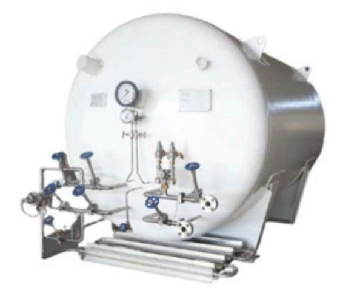

출처: 집필진 제작(2024) [그림 3-2] 가스 공급 탱크

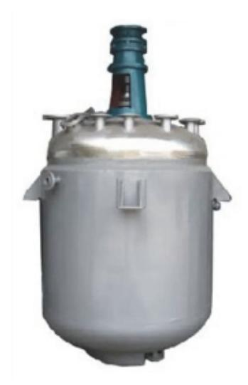

출처: 집필진 제작(2024) [그림 3-3] 가스 합성 반응기

2. [그림 3-3]과 같은 합성 반응기를 통한 순수 가스 제조 과정에서 새로운 물질을 형성하는 반응에 대해 파악한다.

원료 물질을 반응기에 공급하여 순수 가스를 합성하는 과정에서 새로운 물질의 반응을 고 려하면 일반적인 반응, 개질 반응 및 열분해 반응 등이 발생한다. 이러한 반응의 예를 살펴 보면 다음과 같다.

- (1) 일반적인 반응에 대한 예를 확인한다. 4NH3 + 5O2 → 4NO + 6H2O
- (2) 개질 반응에 대한 예를 확인한다.

CH4 + H2O → CO + 3H2

- (3) 열분해 반응에 대한 예를 확인한다. NH4NO3 → N2O + 2H2O
- 3. 합성을 통한 가스 제조 과정에서 생산된 중간 제품은 품질을 확인하고, 전단 공정과 다음 후단 공정으로 이송을 위해 완충 역할로 중간에 저장하며, 최종 제품의 품질이 좋지 않을 경우에는 회 수를 고려한다.
- 4. 합성 과정에서 발생할 수 있는 불순물을 제거하기 위해 [그림 3-4]에 제시된 흡착 설비를 이용하 며, 반도체 제조용 특수 가스를 흡착 과정을 통해 정제하는 방식을 파악한다. 제조 과정의 가스 내에 불순물을 제거하는 정제 방식은 제독 설비 중에 건식 스크러버로 세정하는 공정과 유사하다. 흡착 공정에서 흡착되는 물질인 피흡착물을 흡착제를 이용하여 제거하며, 흡착제의 종류로는 활성탄(charcoal), 활성 알루미나(activated alumina), 화학 적 규조토, 실리카 겔(silica gel) 및 제오라이트(zeolite) 등이 있다. <표 3-1>은 흡착제의 종류와 특성을 나타낸다.

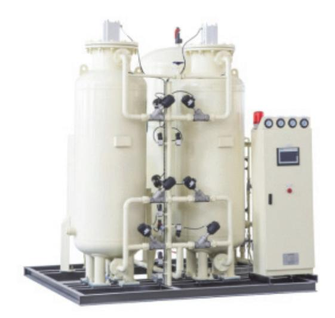

출처: 집필진 제작(2024) [그림 3-4] 가스 흡착 설비

#### 〈표 3-1〉 흡착제의 종류와 물성

| 종류    | 체적밀도 (g/cm 3 ) | 평균 동공 크기 (Å) | 표면적 (m²/g) | 흡착용량 (g/g absorbent) |
|-------|------------------------------|-----------------|---------------|-------------------------|
| 활성탄   | 0.35~0.45                    | 20~30           | 800~1,500     | 0.4~0.5                 |
| 알루미나  | 0.7~0.9                      | 40~70           | 200~400       | 0.2~0.3                 |
| 실리카 겔 | 0.7~0.9                      | 20~50           | 600~800       | 0.35~0.5                |
| 제오라이트 | 0.5~0.7                      | 40~60           | 500~700       | 0.2~0.3                 |

출처: 추광호(2015). 『산업가스 특수 가스 총서 1』. ㈜북랩. p. 192.

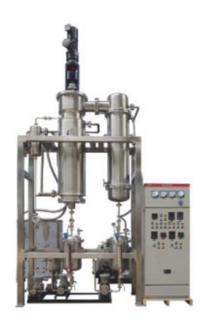

출처: 집필진 제작(2024) [그림 3-5] 가스 증류 설비

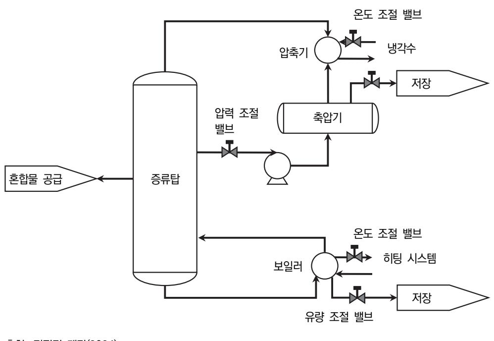

출처: 집필진 제작(2024) [그림 3-6] 증류 설비 공정도

5. 합성 및 흡착 과정을 통과한 혼합물은 증류 과정의 설비인 증류탑(distillation column)을 거치면 서 분리된다. 증류 과정의 원리를 확인한다.

[그림 3-5]는 가스 증류 설비의 외형을 나타내며, [그림 3-6]은 증류탑의 원리와 공정도를 나타낸다. 증류탑의 원리는 액체 혼합물에서 섞여 있는 혼합물의 각 구성 물질들이 끓는점 의 차이를 이용하여 단일 물질로 분리한다. 증류탑의 원리를 파악하여 증류 공정의 절차를 검토한다.

- (1) 증류 공정도의 그림에서 보듯이, 증류탑의 왼쪽에서 혼합물이 유입된다.
- (2) 증류탑의 아랫 부분에 있는 가열기(boiler)로부터 열에너지를 공급받아 증류탑으로 들어간 혼 합물이 가열된다.
- (3) 혼합물을 가열함에 따라 끓는점이 낮은 물질은 먼저 끊어 증류탑의 아래에서부터 위쪽으로 이동한다.
- (4) 증류탑 위쪽으로 올라온 물질은 상부에 있는 응축기(condenser)를 통과하면서 액체로 상변 화가 일어난다.
- (5) 상변화된 액체는 축압기(accumulator)에 잠시 보관되며, 이후에는 저장 탱크(storage tank) 로 이동한다.
- (6) 증류탑 하부에 남아 있는 끓는점이 높은 물질은 아래에서 맴돌다가 저장 탱크로 이동하게 된 다.

- 6. 증류 과정을 거쳐 분리된 가스 제품들은 각 저장 탱크에 저장되며, 저장되는 특수 가스에 따라 부식성이나 반응성 등을 파악하여 탱크 재질을 선정하여야 한다.
- 숕 식각용 특수 가스를 제조하는 과정에서 제조 장비와 공정 등의 다양한 변수(parameter)를 고려하여 야 하고, 관련된 파라미터들을 검토한다. 제조 공정을 통해 고순도의 특수 가스 제품을 얻기 위해 각종 반응 파라미터를 고려한다.
  - 1. 제조 장비나 설비를 운용하면서 장비 파라미터를 확인한다.
    - 제조 장비나 설비를 이용한 제조 공정을 절차에 따라 진행하면서 저장 용기, 합성 반응기, 흡착기, 증류기, 연결 배관, 제어 밸브(온도, 유량 및 압력 등) 및 용량 등을 조절하는 장치 파라미터를 확인한다.
  - 2. 제조 장비의 운용하거나 동작하면서 제어 파라미터를 확인한다. 제조 장비의 운용 매뉴얼을 통해 동작을 제어하는 파라미터인 공정 파라미터를 이용하여 제품의 생산성과 성능을 검토한다. 이러한 제어 파라미터에는 기계적인 요소와 피드백에 의 한 제어 요소가 있다.
    - (1) 운용 매뉴얼을 이용하여 기계적인 제어 파라미터를 파악한다. 기계적인 구종을 조절하는 요소로는 구동 모터나 구동 밸브 등을 이용하여 온도, 유량 및 압력 등을 제어하게 된다.
    - (2) 생산 과정의 상태나 최종 제품의 물량을 조절하기 위해 센서나 구동부를 이용한 피드백 제어 파라미터를 파악한다. 제조 공정이 연속적으로 진행되면서 센서나 구동부를 연계하여 생산 상태를 조절하는 피드백 제어 파라미터를 확인한다.
  - 3. 반응을 통해 조절하는 요소로 기계적인 제어 파라미터를 통제하여 반응성을 제어하는 파라미터를 확인한다.

제조 공정에서 제조 장비에 온도, 재료의 배합량 및 압력 등과 같은 반응 파라미터를 제어 하여 고순도의 가스 제품을 생산하는 제조법을 관리한다.

- 숖 반도체 식각용 특수 가스로 사용되는 헥사 플루오르 에테르(hexafluoroethane: C2F6)의 제조 방법 은 염소 화합물을 함유한 혼합물을 증류탑에 유입하여 증류 공정으로 분리하는 방식으로 제조한다. 식각용 특수 가스 제조의 일례로 헥사플루오르에테르의 제조 방법에 대해 검토한다.
  - 1. 헥사 플루오르 에테르를 제조하기 위한 다양한 제조법 중에 주로 사용해 온 방식을 확인한다.
    - (1) 원료 물질인 디클로로 테트라 플루오르 에테르나 클로로 펜타 플루오르 에테르 등에 불소화

촉매를 함유하여 불화 수소를 사용하여 불소화하는 방법이 있다.

- (2) 원료 물질인 테트라 플루오르 에테르나 펜타 플루오르 에테르에 불소 가스를 사용하여 직접 불소화하는 방법이 있다. 출발 원료에서 유래된 화합물이나 반응으로 얻어진 새로운 화합물이 불순물로서 함유하 기도 한다. 문제는 이러한 불순물 중에서 염소 함유 화합물을 헥사 플루오르 에테르 (C2F6)에서 분리하기가 어렵다. 이러한 문제를 해결하기 위해 다음과 같은 사항을 고려 하여야 한다.
  - (가) 불소가스와 반응하기 전에 출발 원료에 함유된 불순물인 염소 함유 화합물을 활성탄이나 흡착제로 정제하여 감소시켜야 한다.
  - (나) 흡착제에 의한 정제법은 불순물의 함유량에 따라 다르므로 일정한 기간이 지나면 흡착제 를 재생하여야 하고, 따라서 재생 설비가 필요하다.
  - (다) 흡착으로 제거하지 못한 불순물은 오존층을 파괴하기 때문에 대기 중으로 방출하기 전에 제독 설비를 이용하여 처리하여야 한다.
  - (라) 불순물을 정제하기 위해 추출 용제를 첨가하여 추출 증류를 사용하는 정제법이 있으며, 설비 비용이나 에너지 사용이 증가하는 단점이 있다.
  - (마) [그림 3-6]과 같은 증류탑을 이용하여 증류 공정으로 고순도의 헥사 플루오르 에테르 (C2F6)를 생산한다. 증류탑을 이용한 증류 공정으로 상부로는 고순도의 헥사 플루오르 에테르를 얻고, 하부로는 불순물을 함유한 화합물을 분리한다. 그러나 하부로 생성되는 화합물 중에 헥사 플루오르 에테르가 포함될 수도 있기 때문에 불소가스 반응을 통해 고농도의 C2F6를 회수하여야 한다.
- 2. 증류탑을 이용하여 고순도의 헥사 플루오르 에테르를 분리하고 불소화 촉매를 사용하여 염소 화 합물을 불소화하는 제조 공정을 검토한다. <표 3-2>는 헥사 플루오르 에테르의 물성을 나타내고, [그림 3-7]은 증류 공정도를 나타낸

| 항목  | 값          | 항목    | 값           |
|-----|------------|-------|-------------|
| 화학식 | C2F6       | 증기 밀도 | 4.7(공기 대비 ) |
| 녹는점 | -100℃      | 증기압   | 430pal      |
| 끓는점 | -78℃       | 굴절률   | 1.206       |
| 밀도  | 1,607g/cm3 | 위험/안전 | warning     |

<표 3-2> 헥사 플루오르 에테르의 물성

다.

출처: 오노히로모토(2006). 「헥사 플루오르 에테르의 제조 방법 및 그 용도」. 특허 공개번호: 10-2006-0052970.

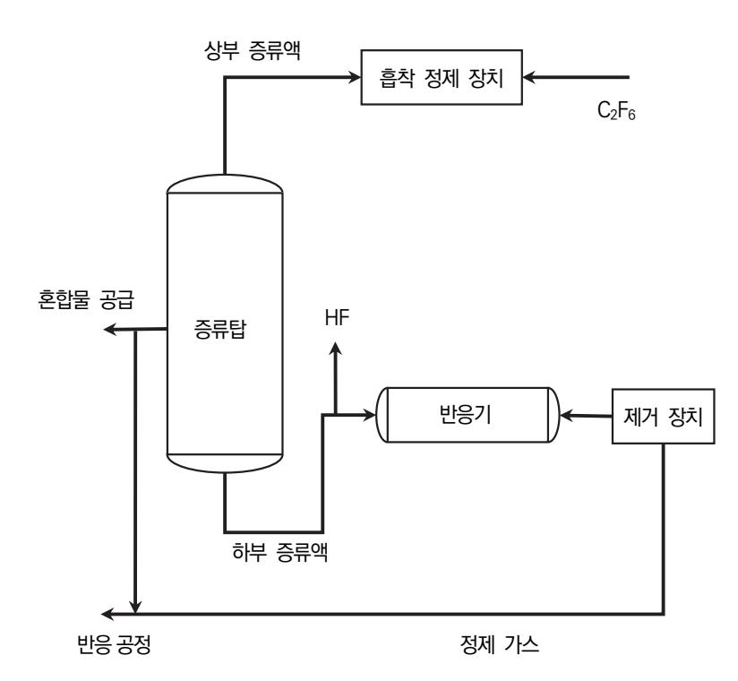

출처: 집필진 제작(2024)

[그림 3-7] 헥사 플루오르 에테르의 제조 공정도

- (1) 헥사 플루오르 에테르를 제조하기 위한 출발 원료를 검토한다.
  - (가) 테트라 클로로 에틸렌(CCl2=CCl2)을 출발 원료로 제조하는 방식을 확인한다.
  - (나) 트리 클로로 에틸렌을 출발 원료로 제조하는 방식을 확인한다.
  - (다) 상기 출발 원료는 모두 염소를 함유한 화합물로 불순물에 해당하며, 불순물의 함유량은 반응 온도가 상승하면 증가하는 경향이 있다.
- (2) 염소 화합물을 함유한 혼합물을 [그림 3-7]에서 나타내는 제조 공정도를 이용하여 증류하여 고순도의 헥사 플루오르 에테르를 분리하는 제조 방법을 확인한다.
  - (가) 공급되는 혼합물을 증류탑으로 증류시키면 상부로는 헥사 플루오르 에테르를 분리하고, 하부로는 불순물인 염소 화합물을 포함하는 헥사 플루오르 에테르 혼합물을 형성한다.
  - (나) 하부로 분리된 혼합물과 불소화 촉매를 첨가하고 300~500℃의 온도에서 기상으로 변화 시켜 염소 화합물을 불소화한다.
  - (다) 상부로 분리한 유입한 헥사 플루오르 에테르는 80부피% 이상을 함유한다. 만일 그 이하 이면, 하부로 헥사 플루오르 에테르의 양이 많아져 재순환하여야 할 물질의 양이 많아져 바람직하지 않다.
  - (라) 하부에서 불순물을 제거하기 위한 불소화 촉매로는 3가 산화 크로뮴을 함유하는 담지형 촉매나 벌크형 촉매를 사용하거나 니켈, 아연, 인듐 또는 칼륨을 크로뮴에 대해 원자비

0.01~0.6을 함유하는 촉매를 사용하는 것이 바람직하다.

- (마) 담지형 촉매를 사용하는 경우에 담지체는 활성탄, 알루미나 또는 부분적으로 불소화된 알루미나가 바람직하고, 담지된 성분의 비율은 30질량% 이하가 바람직하다.
- (바) 불소화 과정에서 온도는 300~500℃가 적합하지만, 정확히 350~450℃이다. 그러나 온 도가 300℃ 미만이면, 염소 화합물이 불소화되기 어렵고, 반면에 온도가 500℃를 초과 하면, 촉매 수명이 짧아지고 불순물이 증가하는 경향이 있다.
- (사) 불소화시키는 반응에서 불화수소와 헥사 플루오르 에테르 혼합 가스의 몰비(불화수소/헥 사 플루오르 에테르 혼합 가스)는 0.05~10이 바람직하다.
  - 1) 정확한 몰비는 0.1~5가 가장 좋다.
  - 2) 혼합 가스의 몰비가 0.05 미만이면, 부반응에 의해 다른 종류의 클로로 플루오르 탄소를 생성하거나 코킹(cauking)에 의해 촉매가 열화되기도 한다.
  - 3) 몰비가 10을 초과하게 되면, 큰 반응기가 필요하거나 미반응 불화수소의 회수 등 여러 가지 문제가 발생하기 때문에 경제적이지 못 하다.
- (아) 헥사 플루오르 에테르 혼합 가스에 함유된 염소 화합물의 농도는 1부피% 이하가 바람직 하다. 농도가 1부피%를 초과하면, 반응 온도를 높이거나 반응기를 크게 구성하여야 한 다.
- (자) 불소 가스를 사용하여 직접 불소화하는 방법은 매우 반응성이 높은 불소가스의 사용으로 인하여 유기 화합물과 불소 가스의 폭발 반응이 일어나거나 설비의 부식과 같은 위험을 일으킬 수 있다.
- (차) 반응열은 불소의 몰수에 비례하고 불소의 양이 많아지면 반응열이 높아진다. 따라서 발 열로 C-C 결합의 절단이나 폭발 등이 쉽게 발생하고, 생성물의 수율이 감소할 수 있다.
  - 1) 반응열에 의한 급격한 반응을 억제하기 위해 불소 가스를 질소와 같은 비활성 가스 로 희석하는 것이 바람직하다.

2) 희석 가스로는 일반적으로 질소, 헬륨 및 아르곤 등의 비활성 가스를 사용한다.

- (카) 반응기의 반응 온도는 250~500℃가 바람직하고, 반응 압력은 0~3MPa가 바람직하다.
- (타) 반응기에서 접촉 시간은 일반적으로 3~30초 정도가 바람직하다.
- (파) 반응기의 재질은 부식성 가스에 내성을 갖는 것이 바람직하고, 예로써 니켈, 인코넬 및 하스텔로이를 사용한다.
- (3) 염소 화합물을 불소화 촉매를 첨가하여 불화 수소와 반응시켜 헥사 플루오르 에테르 혹은 하 이드로 플루오르 탄소를 생성한다.
  - CCl2FCF3 + 2HF → CF3CF3 + 2HCl
  - CClF2CF3 + HF → CF3CF3 + HCl
  - CHClFCF3 + HF → CHF2CF3 + HCl

- (가) 반응을 통해 생성물은 헥사 플루오르 에테르, 하이드로 플루오르 탄소, 염화수소 및 불화 수소를 주로 함유하는 혼합 가스이고, 염화수소와 불화수소 등의 산 성분을 제거하는 것 이 바람직하다.
- (나) 염화수소와 불화수소 등의 산 성분을 제거하는 방법으로서는 다음과 같다.
  - 1) 상기 가스를 정제제와 접촉시키는 방법이 있다.
  - 2) 상기 가스를 물, 알칼리 수용액 등과 접촉시키는 방법이 있다.
- (다) 산 성분을 제거한 후, 헥사 플루오르 에테르나 하이드로 플루오르 탄소를 함유하는 가스 를 제올라이트 등의 탈수제를 사용하여 탈수하는 것이 바람직하다.
- (라) 산 성분을 제거한 후, 가스의 적어도 일부를 증류하거나 정제하는 공정으로 재순환하는 것이 바람직하다.
- (4) 이와 같은 제조 방법을 사용하여 99.9997부피% 이상의 고순도를 갖는 헥사플루오르에테르 을 얻을 수 있다.
  - (가) 불순물로 함유된 2개 이상의 탄소 원자를 각각 갖는 염소 화합물의 함유량은 1부피 ppm 이하이다.
  - (나) 헥사 플루오르 에테르의 순도와 불순물의 함유량은 가스 크로마토 그래피(GC)나 가스 크 로마토 그래피 질량 분석기(GC-MS) 등의 장치를 사용하여 분석한다.
- (5) 헥사 플루오르 에테르를 사용하는 식각 공정은 플라즈마 에칭이나 마이크로 웨이브 에칭 등 의 각종 건식 식각 조건에서 실시할 수 있다.
- (6) 헥사 플루오르 에테르를 He, N2 및 Ar 등의 비활성 가스나 HCl, O2, H2, F3 및 NF3 등의 가스와 적정비로 혼합하여 사용하는 것도 바람직하다.

## 3-2. 문제점에 대한 해결 방안 도출

학습 목표 • 식각 공정 가스 제조 단계에서 발생한 문제점을 파악하고 해결 방안을 도출할 수 있다.

## 필요 지식 /

숔 제조 공장의 안전 운전

식각용 특수 가스를 제조하는 공장에서는 유독 가스에 의한 안전에 대한 문제가 작업자와 환경 에 매우 중요한 영향을 끼치기 때문에, 생산 과정에서 세심한 주의를 기울여야 한다. 특히 독 성 가스의 누출에 따른 문제에 관해 기술한다.

1. 유독 가스 누출 문제

유독 가스의 안전은 제조 설비, 장비, 배관 및 밸브 등에서부터 가스 누출이 발생하지 않도 록 정기적인 점검, 보수 및 관리가 필요하다. 유독 가스의 특성과 물성을 파악하여 만일의 사고에 대비하는 안전 조치가 필요하다.

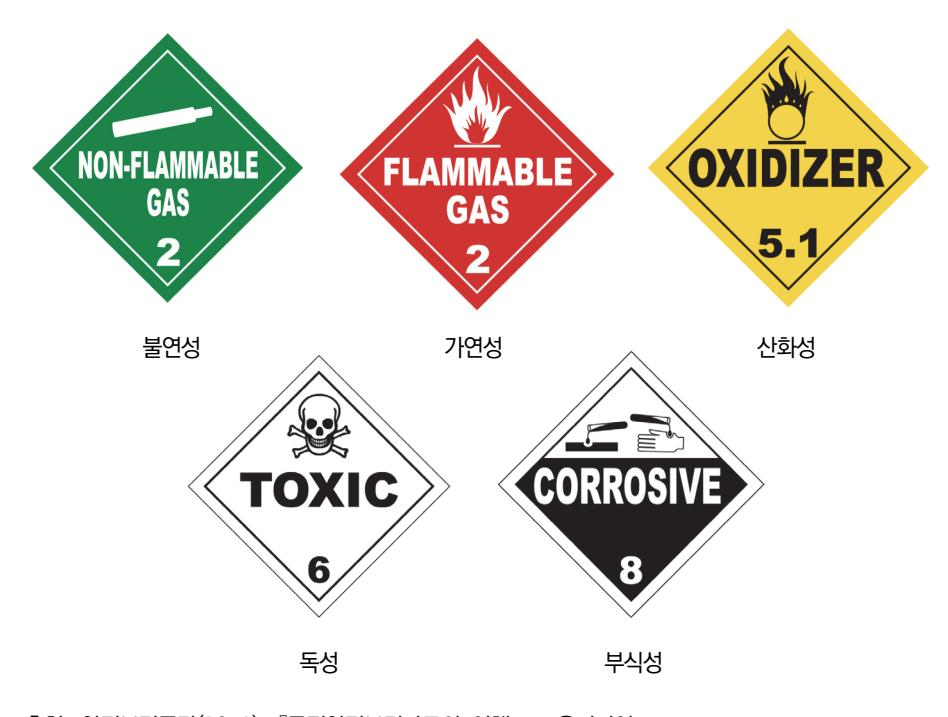

출처: 안전보건공단(2012). 『물질안전보건자료의 이해』. 교육미디어. p. 1. [그림 3-8] 미국 교통부 유해성 분류

(1) 가스 누출에 대한 문제

가스 물질의 유해성을 분류하면, 불연성(non-flammable), 가연성(flammable), 산화성 (oxidizing), 독성(toxic) 및 부식성(corrosive) 등으로 나눈다. [그림 3-8]은 5가지의 유해성 물질에 대한 미국교통부 유해성 분류 체계(DOT hazard classes)의 표지를 나타 낸다.

(가) 불연성

불연성 가스는 연소되지 않는 가스를 의미한다. 대표적으로 질소나 헬륨과 같은 산 업용 가스와 제논, 크립톤, 육불화황 등과 같은 특수 가스가 불연성의 성질을 가진 다. 일반적으로 불연성 가스는 작업자가 안전하다고 알기 쉬운 제품이지만, 취급이나 사용 시에 가장 위험성을 지닌 가스로 분류된다. 특히, 불연성 가스는 무취, 무미, 비자극적인 성질이 있기 때문에 실내에서 누출될 경우에는 신속하게 환기하거나 가 스 누출 감지 시스템을 통해 처리하여야 한다. 그렇지 않으면 산소 결핍으로 인하여 치명적인 결과를 초래할 수 있다. <표 3-3>은 산소 결핍 상황에서 인체에 미치는 영 향을 나타낸다.

<표 3-3> 산소 결핍 환경에서의 인체 영향

| 산소 농도    | 인체 영향                                            |
|----------|--------------------------------------------------|
| 19.5%    | 최소 작업 가능 수치(미국 산업안전보건청 기준)                       |
| 15~19.5% | 작업 능률 감소                                         |
| 12~15%   | 맥박과 호흡 속도 증가 및 판단력 감소                            |
| 10~12%   | 호흡과 맥박이 더욱 빨라짐, 판단력 저하, 입술 파래짐.                  |
| 8~10%    | 정신 혼미, 의식 불명, 구토                                 |
| 6~8%     | 8분 이상 노출 시 100% 사망. 6분에서 50% 사망. 4~5분 노출에서 회복 가능 |
| 4%       | 40초 이내에 의식 불명, 사망 유발                             |

출처: 추광호(2015). 『산업가스 특수 가스 총서 1』. ㈜북랩. p. 94.

(나) 가연성

가연성 가스는 불연성 가스에 추가하여 화재나 폭발을 일으키는 성질이 있다. 가연 성 가스를 연소하기 위해 점화원과 산화제라는 2가지의 추가적 요소가 필요하다. 가 연성 가스는 공기와의 혼합물이 연소 범위 하한(LFL)과 연소 범위 상한(UFL)으로 부 르는 연소 범위 내에 있을 경우에만 연소한다. 이러한 범위를 벗어난 혼합물은 일반 적으로 연소하지 않는다. 따라서 가연성 가스 혼합물은 보통 급격한 연쇄 반응을 시 작하기 위해 점화원이 필요하다. 자동 발화 온도가 54.5℃ 이하인 일부 가연성 가스 는 공기 중으로 누출 시에 점화될 수 있고, 이러한 가스들은 자연 발화성 가스 (pyrophoric gas)라고 분류한다.

<표 3-4> 산소 중에 각종 연소성 물질의 특성

| 연소 범위 | 에틸렌       | 암모니아     | 수소        | 메탄        |
|-------|-----------|----------|-----------|-----------|
|       | 2.9~79.9  | 13.5~79  | 4.65~93.9 | 5.4~59.2  |
| [%]   | 일산화탄소     | 에테르      | 프로필렌      | 사이클로프로판   |
|       | 15.5~95.0 | 4.1~50.5 | 2.1~52.8  | 2.45~63.1 |
| 발화 온도 | 가솔린       | 기름       | 중류        | 쓰레기       |
| [℃]   | 272       | 251      | 256       | 280       |
| 화염 온도 | 수소        | 메탄       | 아세틸렌      |           |
| [℃]   | 2,660     | 2,930    | 3,135     |           |

출처: 추광호(2015). 『산업가스 특수 가스 총서 1』. ㈜북랩. p. 94.

(다) 산화성

산화성 가스는 주변 물질의 연소나 반응을 촉진하는 특성을 가진 가스이다. 산소, 염 소, 불소 및 아산화질소 등과 같은 산화성 가스는 연소를 가속시키지만, 그 자체로는 가연성이 없다. 이들의 반응성은 산화할 화합물과 반응물의 압력과 온도에 달려 있 다. 불소는 반응도가 가장 높은 산화 가스이며, 불소를 취급하는 장치와 배관은 사용 전에 안정화가 필요하다. 상온에서 통상 연소하지 않는 물질도 불소 및 삼불화 염소 와 같은 강력한 산화성 가스와 접촉하면 가연성을 가지게 된다. 알루미늄, 탄소강이나 스테인리스강과 같이 일부 미세 분할된 금속도 산화 가스와

접촉하면 자발적으로 연소할 수 있다.

(라) 독성

독성이란 인체에 나쁜 영향을 주는 것을 의미한다. 독성 가스가 인체로 유입되는 가 장 일반적인 통로는 폐를 통한 흡입이다. 다음으로는 피부를 통한 흡수이다. 만성적 독성은 독소(삼수소화 비소)의 축적으로 인한 폐 등의 중요 조직에 손상을 가해 건강 을 악화하거나 반복성 통증을 가져올 수 있다. 산화에틸렌과 같은 ESGs가 아닌 일 부 가스도 발암 위험성이 있다.

1) TLV-TWA(threshold limit value-time weighted average)

독성 물질 노출 허용 기준에 대한 일반적인 인자이며, 미국산업위생전문가회의(ACGIH: American Conference of Governmental and Industrial Hygienist)에서 매년 발표하는 노출 허용 기준값이다. 작업자가 유해 요인에 노출될 경우에 노출 기준 이하에서 는 인체에 영향을 미치지 않는다는 의미에서의 기준이다. 이는 하루 근무시간 동안에

평균값으로 노출되는 허용 기준을 정한다. 짧은 시간에 TLV-TWA보다 매우 높은 값에 노출된다고 하더라도 나머지 시간에 휴식을 취해서 근무 시간 8시간 동안의 평균 노출값이 TLV-TWA보다 작으면 안전한 것으로 간주한다.

2) LC50(반수 치사 농도값)

반수 치수 농도값이란 화학 물질을 단기간에 노출시켜 시험 대상 동물군의 50% 가 2주 이내에 죽는 경우의 농도를 의미한다. 일반적으로 암수 10마리의 흰색 시험용 쥐를 대상으로 1시간 정도 독성 물질을 노출시켜 2주간 경과 뒤에 평가 하게 된다. 대부분 국가에서 유해 화학 물질 관리법이나 「산업안전보건법」으로 분류하는 기준이 된다.

3) IDLH(immediately dangerous to life and health)

IDLH는 인체에 나쁜 영향을 나타내는 농도값을 의미하며, 다른 사람의 도움 없 이 30분 정도 대피하여 노출된 가스로부터 영구적으로 장애가 발생하지 않는 수 준을 나타내는 값이다.

(마) 부식성

부식(corrosion)은 임의의 환경하에서 재료에 화학적 혹은 전기 화학적으로 퇴화 (degradation)하는 현상을 의미한다. 일반적으로 부식성 가스는 습기와 접촉하면 인 체 조직 또는 물질에 피해나 손상을 줄 수 있다. 그러나 건조한 환경에서 부식성 가 스가 금속에 가하는 영향은 무시할 정도이다. 그러나 실제로는 미세하게 누출된 가 스가 대기 중의 습기와 결합하여 금속 컨테이너와 밸브 및 부속품을 부식시킨다. 부 식성 가스가 물이나 어떠한 종류의 수분과도 접촉하는 것을 최소화하도록 주의하여 야 한다.

(2) 외부 가스 유입에 대한 문제

반응기, 저장 탱크 혹은 증류탑 등에 외부에서 가스가 유입되어 들어오는 경우가 일반적 이다.

2. 생산 제품 품질 문제

외부에서 가스나 불순물이 가스 반응기나 배관 내부로 유입되어 들어가면 고순도 혹은 초 고순도의 반도체 물질에 치명적인 품질 저하를 가져오게 된다.

숕 시설 및 공정 점검

반도체용 특수 가스는 유독성의 가스를 많이 다루기 때문에 「고압가스안전관리법」의 규정에 따 라 취급되고 관리되어야 한다. 특히, 사용 시설이나 설비에 이르기까지 설계와 관리에 주의를 기울여야 하고, 정기적으로 설비, 장비 및 제조 공정에서 안전 항목을 점검하여야 한다.

1. 시설 점검

(1) 사용 시설 점검

제조 공장의 사용 시설에 대한 점검은 저장 설비, 배관, 조정기 및 감 압설비 등과 같은 특수 가스를 사용하기 위한 사용 설비, 사무실, 이외 건축물, 소화기, 가스 누설 감지 경보 장치, 재해 설비 및 동력 설비를 포함한 시설을 점검한다.

(2) 생산 시설 점검

생산 제조 시설의 점검은 원료 저장 탱크와 공급 시스템, 증류탑, 반응기, 배기와 환기 설비, 퍼지 시스템, 제독 설비, 밸브 및 개인 보호구 등을 정기적으로 점검한다.

2. 공정 점검

반도체 식각용 특수 가스를 제조하는 과정에 안전사고를 위해 다음과 같은 공정 점검을 시 행하며, 점검의 결과와 현장을 확인하고 점검 보고서를 작성한다.

- (1) 주요 공정 운용 상태의 점검
- (2) 긴급 상황에 대한 공정 라인 점검
- (3) 제조 장비의 정비에 대한 점검
- (4) 각종 장비와 밸브의 연결 부분에서 가스 누출에 대한 점검
- 3. 각종 점검표

작업자는 다음과 같이 제시되는 점검표를 정기적으로 점검하여 결과를 정리하여 간략한 보 고서를 작성한다.

- (1) 일반 점검표
- (2) 공급 설비 점검표
- (3) 배관 및 부품 설비 점검표
- (4) 공정 안전 관리 점검표
- (5) 일반 유틸리티 점검표
- (6) 소방 설비 점검표
- (7) 옥내 설비 점검표
- (8) 개인 보호 점검표

## 수행 내용 / 문제점에 대한 해결 방안 도출하기

재료·자료

- 반도체 재료 제조 기술 자료
- 국제표준화기구(ISO: International Organization for Standardization) 표준화 문서
- 물질 안전 보건 자료
- 생산 계획서
- 반도체 재료 작업 절차서
- 반도체 재료 작업 표준서
- 반도체용 식각 공정 가스 원재료에 대한 자료
- 반도체 설비 목록 및 매뉴얼
- 반도체 제조 공정도

#### 기기(장비 ・ 공구)

- 반도체용 식각 공정 가스 제조 장비
- 반도체용 식각 공정 가스 측정 장비
- 반도체용 식각 공정 가스 검사 장비
- 반도체용 식각 공정 가스 분석 장비

#### 안전 ・ 유의 사항

- 반도체 식각 공정에 대한 이론적 지식을 습득하고, 취급하는 가스의 성질과 특성을 바탕으 로 관리 및 주의 사항에 유의한다.
- 반도체 식각 공정에서 사용하는 특수 가스는 부식성, 맹독성, 인화성 및 발화성 등의 위험 물질이 많아 해당 가스에 대한 장비, 공급시설, 관리 및 주의 사항을 사용하기 전에 미리 숙 지하여야 한다.
- 물질 안전 보건 자료를 통해 특수 가스를 취급하기 전에 파악하고, 독성 가스의 경우에는 제독 설비에 대한 일반 사항, 제독 설비 및 제독 방법 등 안전 교육을 시행한다.

수행 순서

- 숔 반도체 식각용 특수 가스의 유해성에 대한 자료를 확보하여 세밀하게 확인하고 안전사고를 위한 비 상 대책과 안전 주의 사항을 검토한다. 반도체 제조용 특수 가스를 생산하는 공장에서 유독 가스 누출로 인한 사고는 작업자와 현장의 환경을 저해하는 심각한 문제이기에 미리 방지하여야 한다. 따라서 제조에 사용할 원료 물질과 폐기 가스에 대한 자료를 근거로 유독 가스 누출에 대한 문제를 미리 고려한다.
  - 1. 유독 가스 누출이나 외부 가스의 유입에 의한 문제를 파악하기 위해 특수 가스의 유해성을 확인 하고, 가스 유입이나 유출 상황에 대해 안전한 예방 조치를 확인한다. 유독 가스의 누출이나 외부 가스 유입에 의한 문제를 파악하여 취급하는 물질의 유해성에 대한 인식을 강조하여야 한다. 특히, 특수 가스를 제조하는 공장에서는 유독 가스의 누출에 따른 사고 위험에 노출되어 있다. 유독성 가스에 대한 기본 지식 없이는 가스나 제조 설비 를 다루는 것은 매우 위험한 행위이기 때문에 반드시 기본 지식을 습득하여야 한다. 이러한 문제의 심각성을 고려하여 특수 가스의 유해성에 대한 자료를 확인한다.
    - (1) 특수 가스의 유해성에 대한 자료를 근거로 불연성 가스를 제조하거나 취급할 경우, 다음과 같은 안전한 예방 조치를 따른다.
      - (가) 컨테이너와 연결부에 대해서는 사용 전에 누출 검사를 시행하여야 한다.
      - (나) 실내에서 충전하여 사용하는 불연성 가스의 경우 가스 누설 감지 장치가 필요할 수 있다.
      - (다) 옥내나 컨테이너는 지속해서 환기되도록 설비를 갖추어야 하고, 실내 공간도 적절한 환 기 시스템을 갖추어야 한다.
    - (2) 특수 가스의 유해성에 대한 자료를 통해 가연성 가스를 제조하거나 취급할 경우, 다음과 같 은 안전한 예방 조치를 따른다.
      - (가) 화염 혹은 화상 가능성을 예방하기 위해 적합한 보호 장비를 사용한다.
      - (나) 특수 가스 제조 시에 컨테이너는 사용하기 전에 연결부에 대한 누출 검사를 반드시 시행 하여야 한다.
      - (다) 가연성 가스는 산화제, 자연 발화성 가스, 맹독성 가스, 가연성 액체, 불꽃 및 열원으로 부터 격리하고, 환기가 잘 되는 장소에 저장하여야 한다.
      - (라) 가연성 가스는 주변의 위험으로부터 반드시 격리하여야 한다.
      - (마) 특수 가스에 대한 국가 코드에서 에너지 완충벽 또는 폭발을 대비하여 지붕을 규정하기 도 한다. 제조 공장, 저장이나 관리 시설의 벽과 지붕은 폭발로 야기된 압력을 분산시키 도록 설계하여야 한다.
      - (바) 휴대전화와 같은 규정되지 않은 휴대용 전자장치의 사용은 금지된다.
      - (사) 적절하게 설계된 시스템을 제외하고, 가연성 가스를 대기 중에 방출해서는 안 된다.

- (아) 특수 가스 제조에 관한 법령에서는 저장이 허용되는 가연성 가스의 총량을 제한하고, 위 험 평가를 요구할 수 있다.
- (자) 흡연과 같은 점화원은 금지되며, 모든 점화원은 가능한 한 최소화하여야 하며, 정전화도 포함된다.
- (차) 가연성 가스 주변의 전자 장치는 국가 규정의 가이드라인에 따라 안전하여야 하고, 법령 이 없는 경우 IEC(국제전기표준회의) 또는 NEC(미국전기규격)를 참조한다.
- (카) 가연성 가스를 제조하거나 작업 시에는 주변에 방폭용 공구를 준비하여야 한다.
- (타) 가연성 가스에 사용되는 모든 배관, 캐비닛 및 가스 설비는 무정전 전원을 갖추고, 반드 시 접지해야 한다.
- (파) 가연성 가스가 들어있는 배관에는 적절하게 역류 방지용 장치를 설치하여 사용한다.
- (3) 특수 가스의 유해성에 대한 자료를 근거로 산화성 가스를 제조하거나 취급할 경우, 다음과 같은 안전한 예방 조치를 따른다.
  - (가) 컨테이너와 연결부에 대해서는 사용 전에 누출 검사를 시행하여야 한다.
  - (나) 산화성 가스는 가연성 가스, 자연 발화성 가스, 맹독성 가스, 가연성 액체, 불꽃 및 열원 으로부터 격리하고, 환기가 잘 되는 장소에 저장한다.
  - (다) 산화성 가스는 주변의 위험으로부터 격리하여야 한다.
  - (라) 산소용으로 설계된 장치만 사용하여야 한다.
  - (마) 산소 시스템은 외부로부터 오염되지 않도록 주의하여야 한다.
  - (바) 산소에 적합한 윤활유와 밀봉제만을 사용한다.
  - (사) 적절하게 설계된 시스템을 제외하고 산화성 가스를 대기 중에 방출해서는 안 된다.
  - (아) 환기가 적절하지 못한 작업장에서 산소 실린더를 사용할 경우, 산소 농도를 23.5% 이하 로 유지하여야 한다.
  - (자) 불소나 불화 화합물을 사용하는 장치는 안정화가 반드시 필요하다.
- (4) 특수 가스의 유해성에 대한 자료를 근거로 독성 가스를 제조하거나 취급할 경우, 다음과 같 은 안전한 예방 조치를 따른다.
  - (가) 컨테이너와 연결부에 대해서는 사용 전에 누출 검사를 시행한다.
  - (나) 독성 가스는 가연성 가스, 자연 발화성 가스, 고독성 가스, 가연성 액체, 나화, 불꽃 및 열원으로부터 격리하고, 환기가 잘되는 장소에 저장한다.
  - (다) 독성 가스는 주변의 위험으로부터 격리하여야 한다.
  - (라) 컨테이너 내부의 충전된 실린더를 포함하여 맹독성 가스가 들어 있는 밀폐된 공간에서는 고정식 상시 감지 시스템이 없는 경우, 작업자가 출입하기 전에 독성 가스가 누출이 없

는지를 점검하여야 한다.

- (마) 적절하게 설계된 시스템을 제외하고, 독성 가스를 대기 중에 방출해서는 안 된다.
- (바) 비상 샤워기, 세안 구역 및 응급 치료실 등의 설치가 요구될 수 있다.
- (사) 법령에서는 저장이 허용되는 독성 가스의 총량을 제한하고, 위험 평가를 요구할 수 있다.
- (아) 맹독성 가스의 충전이나 사용은 배기 시설이 갖추어진 밀폐된 공간이나 대기 중으로 배 출하기 전에 허용 수준 이하로 적절하게 방출 처리가 된 공간에서 이루어져야 한다.
- (자) 많은 독성 가스들은 대부분 부식성이 있으므로 적절한 공사 자재를 선택하여 주의를 기 울여야 한다.
- (5) 특수 가스의 유해성에 대한 자료를 근거로 부식성 가스를 제조하거나 취급할 경우, 다음과 같은 안전한 예방 조치를 따른다.
  - (가) 피부와 안구 접촉을 방지하기 위해 적절한 보호 장비를 준비하여 사용한다.
  - (나) 비상 샤워기와 같은 안전장치나 세안 구역을 설치하여야 한다.

#### 맹독성 가스

화학 작용제는 인체의 생리적인 증세에 따라 다음 6가지로 분류한다.

- ∙ 질식 작용제: 인체의 폐에 상해를 가해 호흡 곤란, 두통이나 가슴 압박 등을 유발한다.
- ∙ 신경 작용제: 인체의 자율 신경계에 균형을 파괴한다.
- ∙ 혈액 작용제: 인체 내의 산소 운반을 방해하여 구토, 두통 및 현기증을 유발한다.
- ∙ 수포 작용제: 피부에 수포를 형성한다.
- ∙ 최루 작용제: 눈, 피부, 호흡기 등의 점막을 자극한다.
- ∙ 구토 작용제: 인체의 피부 점막을 자극하고, 가슴에 압박감을 유발한다.
- 2. 반도체 제조용 특수 가스는 대부분 유해 가스이기 때문에 가스 제조 공정에서 주의를 기울여야 한다. 특수 가스와 관련되는 시설에 대한 정보를 검토하고, 특수 가스의 화학적 물성을 고려하여 사용한다.
  - (1) 특수 가스의 제조 과정에서 시설에 대한 안전을 고려하여 취급한다.
    - (가) 특수 가스의 제조와 저장과 관련한 모든 시설은 비상 조치 계획을 갖추고, 추가로 가스 방출과 비상 대피 계획이 포함되어야 한다.
    - (나) 특수 가스를 취급하기 위해서는 물질 안전 보건 자료를 준비하여야 한다.
    - (다) 가스 컨테이너를 취급할 때는 항상 적절한 개인 보호 장비를 착용하여야 한다. 강철을 덧댄 안전화, 측면 보호 보안경 및 가죽 장갑을 권장한다.
    - (라) 가연성 물질을 컨테이너 저장이나 사용 지역으로부터 격리하여 시설을 관리하여야 한다.

| <표 3-5> 반도체 식각 공정 가스와 허용 농도 |  |  |  |  |  |  |
|-----------------------------|--|--|--|--|--|--|
|-----------------------------|--|--|--|--|--|--|

| 가스명      | 분자식    | 허용 농도(TLV값) | 노출 기준(TWA)      |
|----------|--------|-------------|-----------------|
| 염소       | Cl2    | 1           | 1(고용노동부 고시)     |
| 염화수소     | HCl    | 5           | C5(고용노동부 고시)    |
| 삼염화 붕소   | BCl3   | 5           |                 |
| 불소       | F2     | 0.1         | 0.1(고용노동부 고시)   |
| 사염화 규소   | SiCl4  | 5           |                 |
| 브로민 수소   | HBr    | 3           | C3(고용노동부 고시)    |
| 육불화 유황   | SF6    | 1,000       | 1,000(고용노동부 고시) |
| 불화메탄     | CHF3   | 3           |                 |
| 사염화 탄소   | CClF4  | 10          |                 |
| 삼불화 염소   | ClF3   | 3           |                 |
| 삼불화 질소   | NF3    | 10          |                 |
| 불화수소     | HF     | 3           | C3(고용노동부 고시)    |
| 사불화 규소   | SiF4   | 3           |                 |
| 프레온12    | CCl2F2 | 3           |                 |
| 사브로뮴 규소  | SiBr4  | 3           |                 |
| 브로뮴 불화탄소 | CF3Br  | 3           |                 |
| 팔불화 프로판  | C3F8   | 3           |                 |

출처: 교육부(2014). 반도체용 가스 재료 제조(LM1903060403\_14v1). 한국직업능력개발원. p. 77.

|  |  | <표 3-6> 반도체 식각 공정 가스의 특징 |  |  |  |  |
|--|--|--------------------------|--|--|--|--|
|--|--|--------------------------|--|--|--|--|

| 대상 물질    | 공정 가스                      | 부산물 배기 처리 문제                                                             | 분자식                | 가스 특징                |
|----------|----------------------------|--------------------------------------------------------------------------|--------------------|----------------------|
| metal    | Cl2/BCl2/SiCl4 CHF3/SF6 | ∙ 기체 응고에 의한 powder 생성 ∙ 독성 유기물에 의한 부식과 부산물 ∙ 건식 가스 처리 시스템 사용       | Cl2 BCl2 SF6 | T, C T, C T, A |
| poly     | HBr/Cl2/NF3/SF6            | ∙ 유독성 부신물에 의한 부식성 생성 ∙ 수증기에 의한 부식성 증가 ∙ 건식 가스 처리 시스템 사용            | HBr Cl2 NF3  | T, C T, C T, O |
| nitride  | HBr/NF3/SF6                | ∙ 유독성 부신물에 의한 부식성 생성 ∙ 수증기에 의한 부식성 증가 ∙ 건식 가스 처리 시스템 사용            | HBr NF3 SF6  | T, C T, O T, A |
| oxide    | CHF3/NF3 CF4C2F6        | ∙ 유독성 부신물에 의한 부식성 생성 ∙ 건식 가스 처리 시스템 사용 ∙ warming gas(C2F2) 처리기능 요망 | CHF3 NF3        | A GW              |
| tungsten | Cl2/SF6                    | ∙ 유독성 과부식성 부산물 생성 ∙ 부착/퇴적에 의한 문제점 ∙ 건식 가스 처리 시스템 사용                | Cl2 SF6         | T, C T, A         |

T: 유독성, C: 부식성, A: 질식성, F:가연성, P: 자연 발화성, O: 산화성, GW: grobal warming gas

출처: 교육부(2014). 반도체용 가스 재료 제조(LM1903060403\_14v1). 한국직업능력개발원. p. 78.

- (마) 컨테이너에 충전하기 전에 충전 전 검사와 정격 압력의 정확한 검증은 매우 중요하다.
- (바) 밸브 출구 플러그 또는 연결부를 천천히 제거하고 완전히 제거하기 전에 누출 여부를 반 드시 확인하여야 한다.
- (사) 밸브 출구와 호스의 청결 상태를 확인하여야 한다.
- (아) 밸브는 항상 천천히 조심해서 열어야 하고, 밸브를 과도하게 조여서도 안 된다.
- (자) 절대로 컨테이너의 밸브 보호 캡 부분을 잡고 들어 올려서는 안 된다.
- (차) 장거리 이동 중 롤링을 최소화하도록 적절한 실린더 트롤리나 적합한 운반 장치를 사용 하여야 한다.
- (카) 운반, 저장 또는 사용 등 어떤 경우라도 컨테이너는 통제하여야 한다.
- (타) 컨테이너 표면에서 전기 아크가 발생하지 않도록 주의하여야 한다.
- (파) 컨테이너가 전기 회로와 접촉하여서는 절대 안 된다.
- (2) 특수 가스의 저장이나 환기에 대한 안전 주의 사항을 고려한다.
  - (가) 컨테이너는 건조한 상태로 보관하여야 한다.
  - (나) 컨테이너는 전복되는 사고가 발생하지 않도록 평지에 보관하여야 한다.
  - (다) 특수 가스의 위험 정도에 따라 컨테이너를 정리하여야 한다.
  - (라) 컨테이너는 될 수 있으면 직사광선을 피해야 하고, 컨테이너 온도는 규정하는 가이드라 인이나 최대 53℃를 초과하지 않도록 보관에 주의하여야 한다.
  - (마) 가스 저장량은 시설의 설계 용량을 초과하지 않도록 하고, 규정이나 법령에 따라야 한다.
  - (바) 수직으로 보관된 실린더는 사고로 넘어지지 않도록 상자, 운반대 또는 쇠줄을 이용하여 고정되도록 배치한다.
  - (사) 컨테이너는 환기가 잘되는 것에 보관하여야 한다.
  - (아) 옥외 보관 시에는 일반적으로 강제 환기는 필요치 않다.
  - (자) 실내에 보관할 경우에는 자연 또는 강제 환기가 필요하다.
- 3. 반도체 제조용 특수 가스는 대부분 유독성 가스이기 때문에 가스 제조 공정에서 가스 처리에 대 해 주의를 기울여야 한다. 특수 가스와 관련되어 잔류 가스 처리에 대한 정보를 검토한다.
  - (1) 반도체용 특수 가스 제조에서 잔류하는 가스를 처리하기 위한 교육과 안전에 대한 주의 사항 을 확인한다.
    - (가) 가스 처리 과정에서 작업자는 다음 사항을 준수한다.
      - 1) 이론과 훈련에 적절한 교육과정을 이수하여야 한다.
      - 2) 작업 지침을 기록하고 체크리스트를 반드시 작성한다.
      - 3) 적절한 개인 보호구와 안전 장비를 준비하여야 한다.

- 4) 긴급 상황이 예측될 경우, 손쉽게 이용할 수 있도록 물질로부터 비상 장비를 능숙하 게 사용할 수 있을 정도로 훈련되어야 한다.
- (나) 가스 처리에 대한 교육 절차와 범위를 파악하고 확인한다.

가스 처리에 대한 교육은 문서화된 작업 지침과 절차를 기본으로 정하고, 자격을 갖 춘 작업자가 실시한다.

1) 가스 내용물의 식별을 포함하여 제품과 용기의 정보를 확인한다.

가스의 일반적인 특성을 이해하고, 처리하여야 할 특수 가스의 물리적 및 화학적 특성을 상세히 파악한다. 용기의 기본 정보와 다루는 방법을 파악하고, 밸브의 사 용법과 안전장치 등을 확인한다.

2) 처리 방법의 선택과 원칙을 준수한다.

작업자가 규정에 따른 처리 방법을 선택하여 다루더라도 처리 방법을 확실히 이 해하고 원칙에 따라 처리한다.

3) 처리 절차를 확인한다.

잠재적인 위험의 범위를 포함하여 문서화된 절차로 훈련이 되어 있어야 한다. 특 히, 누출이나 화제 등의 긴급 대응 절차를 고려하여 문서화하고 연습하여야 한다.

4) 개인 보호구와 일반 안전 수칙을 확인한다.

개인 안전을 위해 문서화하고, 규칙에 따라 지원되어야 한다.

- 5) 위험성 평가는 반드시 실행되어야 한다.
- (2) 유해성 가스의 처리를 위해 다음과 같은 안전 체크리스트를 확인한다.
  - (가) 가스 처리를 위한 문서화되고 승인된 방법과 절차가 있는가?
  - (나) 작업 구역에서 문서화된 절차를 사용 가능한가?
  - (다) 가스 처리 장비는 제대로 구축하였는가?
  - (라) 사용된 재료에 대한 호환성과 압력이 적절한가?
  - (마) 적절한 경고 알림 표시와 제한 구역에 대해 명시되고 있는가?
  - (바) 긴급 절차에 대해 이해하고 준비되어 있는가?
  - (사) 작업자는 정기적으로 교육받고 결과를 기록하여 왔는가?
  - (아) 비상용 호흡 장치를 사용할 수 있는가? 그리고 장치는 제 위치에 배치되고 작동할 수 있 도록 작업자는 훈련되어 있는가?
  - (자) 응급 처리 장비가 비치되고, 사용할 수 있는가?
  - (차) 처리하는 가스에 노출되었을 경우, 응급 처치를 위해 적절하게 준비되어 있는가?
  - (카) 독성이나 부식성 가스 누출로 인하여 전문 치료가 필요할 경우, 지역 의료 서비스에 연 락을 취할 준비가 되어 있는가?

- (타) 처리 시스템은 가스의 종류와 용량에 적절한가?
- (파) 처리된 화학 약품은 적절하게 분리되고 특성에 따라 처리될 수 있도록 준비하였는가?
- (3) 반도체용 특수 가스 제조에서 잔류하는 가스를 처리하는 방법에 대해 파악하고, 고려하여야 할 중요 사항을 확인한다.

잔류 가스의 처리 방법은 다양하며, 가장 적절한 방법을 선택하여 문서화된 절차에 따라 실시한다.

- (가) 일반적으로 가스를 처리하는 방법은 다음 4가지로 구분한다.
  - 1) 회수(recycling) 방법
  - 2) 흡수나 중화(absorption or neutralization) 방법
  - 3) 연소(burning or incineration) 방법
  - 4) 대기 배출(venting to the atmosphere) 방법
- (나) 가스 처리를 위해 고려할 사항을 파악한다.
  - 가스 처리 방법을 선택할 경우에 처리될 가스의 특성을 확인하고, 요구 규정, 운영 제약 및 용량 등을 파악한다.
    - 1) 작업자는 처리하여야 할 가스의 주요 특성을 전반적으로 파악하여야 한다.
    - 가스의 독성, 가연성, 조연성 및 부식성 등의 특성을 분석하고, 효과적인 처리 방 법을 선택한다.
    - 2) 가스에 대한 물리적인 특성 정보가 중요하며, 다음 <표 3-7>과 같은 체크리스트를 확인한다.

<표 3-7> 가스 처리를 위한 체크리스트

| 가스 특성                                                                                                                          | 현장 조건                                                                                   | 사용량              |
|--------------------------------------------------------------------------------------------------------------------------------|-----------------------------------------------------------------------------------------|------------------|
| 독성인가? 가연성인가? 조연성인가? 부식성인가? 자연 발화성인가? 환경에 유해한가? 유해한 성질이 있는가? 사용 압력 혹은 증기압? 액화 가스나 압축 가스 여부? 공기와의 비중? | ∙ 가용 면적? ∙ 주변 상황? ∙ 기후 조건? ∙ 활용 가능한 전문가 혹은 장비? ∙ 용기나 밸브의 상태? ∙ 법적 제약 조건? | 적음. 중간 많음. |
| 호환되는 재질? 공존하는 특성?                                                                                                           |                                                                                         |                  |

출처: 추광호(2015). 『산업 가스 특수 가스 총서 1』. ㈜북랩. p. 242

- 3) 가스 처리를 위해 해당 지역에 맞는 환경 피해를 주지 않는 조건이나 방법을 선택 하여야 한다.
- 4. 반도체 특수 가스의 제조 공정에서 가스 처리에 대한 정보를 기반으로 구체적인 잔류 가스 처리 방법을 확인한다.
  - (1) 반도체용 특수 가스 제조에서 잔류하는 가스 처리 방법에 대한 기본 원칙을 확인한다.
    - 가스 처리를 위한 4가지 방법에 대한 기본 원칙을 다음과 같다.
    - (가) 가스 처리 방법을 나타내는 도면을 확인한다.
    - (나) 처리 방법에 대한 설명을 파악한다.
    - (다) 적용 범위를 확인한다.
    - (라) 기기 설계도를 확인한다.
    - (마) 기기 운전에 대한 내용을 확인한다.
    - (바) 운전에 대한 주의 사황을 파악한다.
  - (2) 반도체용 특수 가스 제조 과정에서 잔류하는 가스 처리 방법을 확인하여 검토한다.
    - (가) 가스의 재활용이나 회수에 대해 검토한다.

잔류 가스를 재활용하거나 회수하는 방법은 일반적인 방법은 아니지만, 적절한 용기 로 이송하는 방법이다. 환경, 물질 및 에너지 보존을 위해 가장 좋은 방법이며, 재활 용 가치가 높은 가스를 처리하기 위해 선호하는 기술이다. 가스를 재사용하기 위해 서는 불순물을 제거하고 순도를 높이기 위해 재정제하거나 공정에 다시 사용할 수 있어 비용을 절감하는 방법이다.

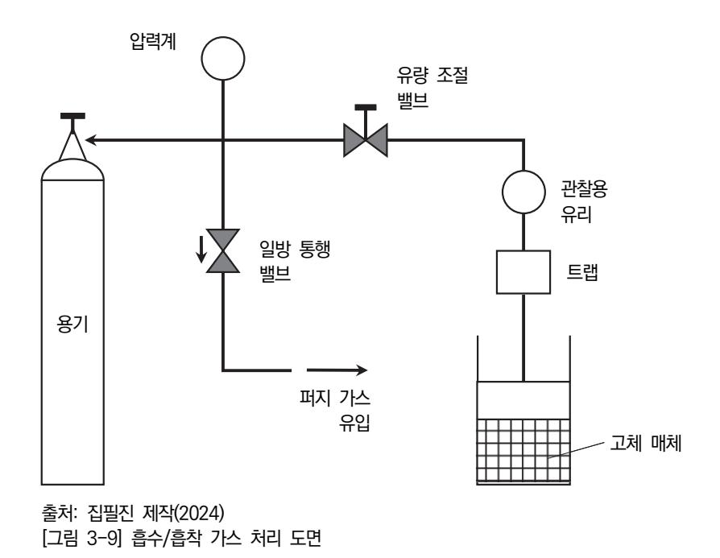

(나) 잔류 가스의 흡수, 흡착 및 반응에 의한 가스 처리 방법을 검토한다.

특정 반응 가스를 처리하기 위해서는 [그림 3-9]에서 나타내는 바와 같이 고체 매체 를 이용하여 흡수하거나 액상에서 반응과 흡착 방법을 이용할 수 있다. 결과로 얻어 지는 가스는 원래 잔류 가스보다 덜 위험하고 쉽게 제거할 수 있다. 이러한 흡수 매 체와 가스 처리는 다음과 같은 요인을 확인한다.

- 1) 처리할 가스와 흡수/흡착 매체와의 반응성을 고려한다.
- 2) 처리 작업의 주기와 처리 가스의 용량을 확인한다.
- 3) 사용 흡수/흡착 매체의 처리 용이성을 확인한다.
- (다) 연소에 의한 가스 처리 방법을 검토한다.
  - 연소에 의한 가스 처리 방법은 연소시키거나 불꽃을 통과시켜 처리하는 방법이다. 대부분의 가연성 가스는 연소에 의해 무해한 물질로 타오르지만, 연소로 인하여 독 성 물질을 만드는 경우에는 다른 방법으로 처리하여야 한다. 불꽃을 이용하는 경우 에는 요구되는 반응이 잘 일어나도록 불꽃을 조절하는 것이 중요하다. 육안 관찰이 나 온도 측정에 의한 제어하기는 쉽지 않으며, 가스의 유량 조절이나 불꽃 제거 등 으로 조절한다.
- (라) 희석을 통해 대기로 배출하는 방법을 검토한다.
  - 유해 가스를 공기 중에 희석하여 무해한 농도로 감소시켜 배출하는 방법이다. 이러 한 방법은 가장 경제적이고 편리한 방법이지만, 위험하지 않도록 농도를 낮추어 배 출하기 때문에 명확한 조건과 「고압가스안전관리법」과 같은 규정에 따라 수행되어야 한다.
- 숕 특수 가스의 제조나 취급과 관련한 담당자는 정기적으로 훈련과 교육이 필요하며, 비상 대응에 대한 계획을 수립하고, 개인용 보호 장비를 갖추어 안전사고에 대비하여야 하며 각종 점검표를 기록하여 보고서를 작성한다.
  - 1. 특수 가스 제조와 취급을 담당하는 작업자는 안전 교육을 적시에 시행하여야 한다. 특수 가스의 특성과 위험에 관한 내용을 교육하여 긴급 상황이 발생할 경우에 적절한 행동 을 취할 수 있어야 한다. 특히 가스로 인한 화재나 가스 누출 등에 대응하는 훈련을 반드시 시행하여야 한다.
  - 2. 특수 가스 제조와 취급을 위한 비상 대응 계획을 수립하여야 한다. 비상 대응 계획에는 다음과 같은 내용을 포함한다.
    - (1) 경보 시스템
    - (2) 대피 계획 및 출석 조사
    - (3) 안전 비상 차단 시스템

- (4) 비상 대응팀 연락처 목록
- (5) 비상 장비 위치 및 목록
- (6) 소방서, 경찰, 병원이나 이웃 주민 등 외부 관계자의 연락처 목록
- (7) 언론 매체와의 긴밀한 소통
- (8) 보고 시스템 구축
- (9) 응급 처치 정보와 물질 안전 보건 자료와 같은 안전 자료
- (10) 위험 평가 및 검증 절차
- (11) 비상 대응팀 작업 절차
- (12) 훈련 요건
- 3. 특수 가스 제조, 저장 및 취급과 관련한 담당자는 다음 내용을 확인하여야 한다.
  - (1) 작업 절차에 대한 위험 평가를 시행하여야 한다.
  - (2) 확인된 위험을 근거로 적합한 장치를 선정하고, 사용할 수 있어야 한다.
  - (3) 보호 장비는 항상 사용을 위해 적절하게 유지 보수할 수 있어야 한다.
  - (4) 모든 관련자는 확실하게 훈련시켜야 한다.
- 4. 특수 가스의 안전한 취급, 저장, 충전 및 유지 등을 위해 권고되는 개인용 보호 장비를 갖추어 안전사고를 예방한다.
  - (1) 일반적으로 권고되는 개인 보호 장비는 다음과 같다.
    - (가) 안전화
    - (나) 안전 장갑
    - (다) 안구 및 안면 보호막
    - (라) 세안수 및 비상 샤워기
    - (마) 비상 로프 및 테이프
    - (바) 위험 가스 모니터
    - (사) 안전 표시
  - (2) 작업자는 열이나 화학 물질이 피부나 눈에 접촉하지 못하도록 보호하기 위해 보호복을 착용 하며, 보호복의 유형은 다음 3가지로 구분한다.
    - (가) 극단적인 온도, 증기, 온수, 고온 입자 및 구조물 소방 활동의 위험으로부터 보호하기 위 해 제작된 소방 보호복을 준비한다.
    - (나) 작업자의 눈이나 피부를 화학 물질의 접촉으로부터 보호하기 위해 제작된 화학 물질 보 호복을 준비한다.

(다) 단기간의 고온 노출로부터 보호하기 위해 제작된 고온 보호복을 준비한다.

5. 특수 가스 제조 공정에서 시설이나 공정에서 안전을 위해 점검하고 점검표와 결과 보고서를 작성 한다.

외부로의 유출이나 외부로부터의 유입을 예방하기 위하여 점검 항목과 점검 포인트를 설정 하여 정기 또는 비정기적 점검을 진행하여야 한다.

- (1) 사용 시설이나 생산 시설에 대한 점검을 시행하고 점검표를 작성한다.
  - (가) 공장의 사용 시설에 대한 점검 항목을 선정하고 점검을 시행한다.
  - (나) 가스 생산 시설에 대한 점검 항목을 선정하고 점검을 시행한다.
  - (다) 개인 보호와 방호 시설에 대한 점검 항목을 선정하고 점검을 시행한다.
- (2) 공정 과정에 대한 점검을 시행하고 점검표를 작성한다.
  - (가) 주요 공정의 진행 상태에 대한 점검 항목을 선정하고 점검을 시행한다.
  - (나) 긴급 상황이 발생할 경우에 공정에 대한 점검 항목을 선정하고 점검을 시행한다.
  - (다) 제조 장비 정비 부분에 대한 점검 항목을 선정하고 점검을 시행한다.
  - (라) 제조 공정에서 연결관, 밸브 및 기기 접촉 부분에 대한 점검 항목을 선정하고 점검을 시 행한다.
- (3) 각 점검 결과에 따른 각종 점검표와 결과 보고서를 작성한다.

### 학습 3 교수·학습 방법

#### 교수 방법

- 반도체 식각 공정용 순수 가스의 보편화된 제조 방법과 절차에 대해 정리하여 지도한다.
- 가스 제조 공정에서 증류 과정에 대해 정의하고, 여러 종류의 증류법에 대해 설명한다.
- 식각 공정용 가스의 제조 공정에서 반응 파라미터를 구분하여 지도한다.
- 특수 가스 제조를 위한 증류 설비에서 증류탑의 증류 과정과 원리에 관해 설명한다.
- 식각용 특수 가스의 제조 과정에서 가스 누출에 대한 안전 문제에 대해 정리하여 지도한다.
- 특수 가스를 제조하는 시설과 공정에 대한 점검과 안전 항목을 설명한다.
- 가스 제조 과정에서 잔류하는 가스의 처리 방법과 안전을 위한 주의 사항에 관해 설명한다.
- 특수 가스 제조 시에 안전을 위해 비상 대응 계획과 정기적인 점검에 관해 설명한다.

#### 학습 방법

- 반도체 식각 공정용 순수 가스의 제조 방법과 절차를 학습한다.
- 가스 제조 공정에서 증류 과정을 정리하고, 다양한 증류법의 종류에 관해 파악한다.
- 식각 공정용 가스의 제조 공정에서 사용하는 제조 장비와 공정의 변수를 정리한다.
- 원료 가스의 저장과 공급 시스템에 대해 학습한다.
- 특수 가스 제조를 위한 증류 설비 중에 증류탑의 증류 과정과 원리에 대해 파악한다.
- 식각용 특수 가스의 제조 과정에서 가스 누출에 대한 안전 문제에 대해 학습한다.
- 특수 가스를 제조하는 시설과 공정에 대한 점검과 안전 항목 등에 대해 학습한다.
- 가스 제조 과정에서 잔류 가스의 처리 방법과 안전에 대한 주의 사항 등을 조사한다.
- 특수 가스 제조 과정에 안전을 위한 비상 대응 계획, 개인 안전구와 정기적인 점검 등에 대 해 학습한다.

## 학습 3 평 가

#### 평가 준거

• 평가자는 학습자가 학습 목표를 성공적으로 달성하였는지를 평가해야 한다.

#### • 평가자는 다음 사항을 평가해야 한다.

|                     | 학습 목표                                                 |  | 성취수준 |   |  |
|---------------------|-------------------------------------------------------|--|------|---|--|
| 학습 내용               |                                                       |  | 중    | 하 |  |
| 식각 공정 가스 제 조     | - 생산 관련 부서로부터 입수한 생산 계획에 따라 장비 운용 계획을 수립할 수 있다.    |  |      |   |  |
|                     | - 작업 지시서와 장비 운용 매뉴얼에 따라 식각 공정 가스를 제조할 수 있다.        |  |      |   |  |
| 문제점에 대한 해결 방안 도출 | - 식각 공정 가스 제조 단계에서 발생한 문제점을 파악하고, 해결 방안을 도출할 수 있다. |  |      |   |  |

#### 평가 방법

• 서술형 시험

|                     | 평가 항목                                                    |  | 성취수준 |   |  |
|---------------------|----------------------------------------------------------|--|------|---|--|
| 학습 내용               |                                                          |  | 중    | 하 |  |
| 식각 공정 가스 제 조     | - 식각 공정용 순수 가스의 제조 방법과 절차에 대한 이해 정 도                  |  |      |   |  |
|                     | - 제조 공정에서 증류 과정에 대해 정의하고, 여러 종류의 증 류법에 대해 정리할 수 있는 능력 |  |      |   |  |
|                     | - 증류 설비에서 증류탑의 증류 과정과 원리에 정리하여 기술 할 수 있는 능력           |  |      |   |  |
| 문제점에 대한 해결 방안 도출 | - 제조 과정에서 가스 누출에 대한 안전 문제를 파악할 수 있 는 능력               |  |      |   |  |
|                     | - 제조 시설과 공정에 대한 점검에 대해 간략하게 정리하여 기술할 수 있는 능력          |  |      |   |  |
|                     | - 잔류 가스 처리 방법과 안전에 대한 주의 사항을 파악할 수 있는 능력              |  |      |   |  |
|                     | - 제조 과정에서 안전을 위한 비상 대응 계획과 정기적인 점 검에 대해 검토할 수 있는 능력   |  |      |   |  |

• 평가자 질문

| 학습 내용               |                                                    |   | 성취수준 |   |  |
|---------------------|----------------------------------------------------|---|------|---|--|
|                     | 평가 항목                                              | 상 | 중    | 하 |  |
| 식각 공정 가스 제 조     | - 식각 공정용 순수 가스의 제조 방법과 절차에 대해 정리하 여 설명할 수 있는 능력 |   |      |   |  |
|                     | - 제조 공정에서 증류 과정과 여러 종류의 증류법에 대해 정 리할 수 있는 능력    |   |      |   |  |
|                     | - 증류 설비에서 증류탑의 증류 과정과 원리에 대해 설명할 수 있는 능력        |   |      |   |  |
| 문제점에 대한 해결 방안 도출 | - 제조 과정에서 가스 누출에 대한 안전 문제를 파악하여 설 명할 수 있는 능력    |   |      |   |  |
|                     | - 제조 시설과 공정에 대한 점검에 대해 정리하여 설명할 수 있는 능력         |   |      |   |  |
|                     | - 잔류 가스의 처리 방법과 안전에 대한 주의 사항에 대해 설 명할 수 있는 능력   |   |      |   |  |

#### • 평가자 체크리스트

| 학습 내용               | 평가 항목                                                 |  | 성취수준 |   |  |
|---------------------|-------------------------------------------------------|--|------|---|--|
|                     |                                                       |  | 중    | 하 |  |
| 식각 공정 가스 제 조     | - 가스 제조 공정에서 반응 파라미터를 정리할 수 있는 능력                     |  |      |   |  |
|                     | - 원료 가스의 저장과 공급 시스템에 대해 확인할 수 있는 능 력               |  |      |   |  |
|                     | - 증류 설비에서 증류탑의 증류 과정과 원리에 대해 나열할 수 있는 능력           |  |      |   |  |
| 문제점에 대한 해결 방안 도출 | - 제조 과정에서 가스 누출에 대한 안전 문제를 파악하여 정 리할 수 있는 능력       |  |      |   |  |
|                     | - 제조 시설과 공정에 대한 점검에 대해 정리하여 검토할 수 있는 능력            |  |      |   |  |
|                     | - 잔류 가스의 처리 방법과 안전에 대한 주의 사항에 대해 정 리할 수 있는 능력      |  |      |   |  |
|                     | - 제조 과정에서 안전을 위한 비상대응 계획과 정기적인 점검 에 대해 검토할 수 있는 능력 |  |      |   |  |

피드백

- 1. 서술형 시험 - 식각 공정 가스 제조 평가 관련 성취 수준이 낮은 학습자들에게는 동일한 문항에 대해 보충하여 설명해 주고 다시 평가하고, 우수한 학습자에게는 심화 학습 방법을 피드백해 준다. - 가스의 제조 공정에서 중요한 제조 방법과 절차, 그리고 증류탑의 증류 원리에 대해 중점적으로 지도해 준다. 2. 평가자 질문
- 계측기 활용을 위한 데이터의 분석과 결과를 확인할 수 있도록 간략하게 평가자 질문을 실시한 후, 부족한 부분을 지적하여 설명할 수 있는지를 확인한다.
- 문항을 제대로 설명하지 못한 학습자들은 일정 시간 동안 재학습을 실시하여 동일한 문제를 다시 질문하고 보완 사항을 설명해 준다.
- 3. 평가자 체크리스트
- 평가자 체크리스트의 결과를 평가한 후, 일정 수준에 도달하지 못하는 학습자는 내용을 반복하여 학습할 수 있도록 지도한다.
- 제조 과정에서 안전에 대한 비상 대응 계획은 매우 중요하므로 성취 수준을 높이도록 집중적으로 교육한다.

- 가스안전연구원(2016). 『가스 혼합물의 안전한 제조에 관한 가이드』. (사)한국산업특수가스협회.
- 교육미디어(2012). 『물질 안전 보건 자료(MSDS)의 이해』. 안전보건공단.
- 교육부(2014). 반도체용 가스 재료 제조(LM1903060403\_14v1). 한국직업능력개발원.
- 김현후(2024). 『반도체 제조 장비 기술』, 내하출판사.
- 박성호(1989). 「건식 식각기 술의 동향 분석」. 『전자 통신 동향 분석』.
- 이형달(2010). 『PFCs 대체 에칭/세정가스용 헥사 플루오르 프로필렌 정제 기술 개발 보고서』. 지식경제 부.
- 추광호(2015). 『산업가스 특수가스 총서 1』. ㈜북랩.
- 홍성민(2018). 「반도체 제조 공정별 특수 가스의 혼합 반응성에 관한 연구」. 『인하대학교 대학원 석사 학위 논문』.
- 오노히로모토‧아라이타츠하루(2006). 「헥사 플루오르 에테르의 제조 방법 및 그 용도」. 특허 공개 번호: 10-2006-0052970.

| NCS학습모듈 개발이력 |                                      |     |                  |  |  |
|--------------|--------------------------------------|-----|------------------|--|--|
| 발행일          | 2024년 12월 31일                        |     |                  |  |  |
| 세분류명         | 반도체 재료(19030604)                     |     |                  |  |  |
| 개발기관         | 수원과학대학교 산학협력단(개발책임자: 김선희), 한국직업능력연구원 |     |                  |  |  |
|              | 최준혁(수원대학교)*                          |     | 김강복(삼성전자)        |  |  |
|              | 김대영(오산대학교)                           |     | 김한수(두원공대)        |  |  |
|              | 김영수(디이엔티)                            |     | 남승호(경기대학교)       |  |  |
|              | 김준성(오산대학교)                           |     | 손승대(제이에스이엔씨(주))  |  |  |
| 집필진          | 김현후(두원공대)                            | 검토진 | 이철오((주)한국전력안전공단) |  |  |
|              | 임희용(전 부천대학교)                         |     |                  |  |  |

\*표시는 대표집필자임 (참고) 검토진으로 참여한 집필진은 본인의 원고가 아닌 타인의 학습모듈을 검토함

| 반도체용 식각 공정 가스 제조(LM1903060416_23v3)                                                                     |                   |
|---------------------------------------------------------------------------------------------------------|-------------------|
| 저작권자                                                                                                    | 교육부               |
| 연구기관                                                                                                    | 한국직업능력연구원         |
| 발행일                                                                                                     | 2024. 12. 31.     |
| ISBN                                                                                                    | 979-11-7175-770-1 |
| ※ 이 학습모듈은 자격기본법 시행령(제8조 국가직무능력표준의 활용)에 의거하여 개발하였으며, NCS통합포털사이트(http://www.ncs.go.kr)에서 다운로드할 수 있습니다. |                   |

