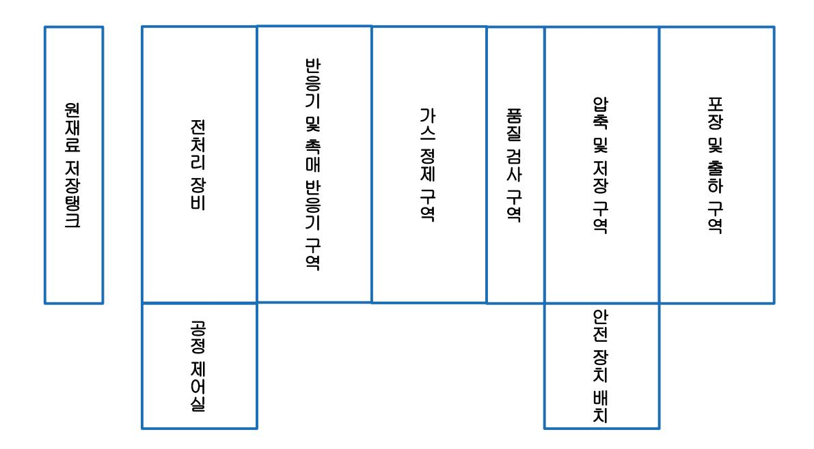
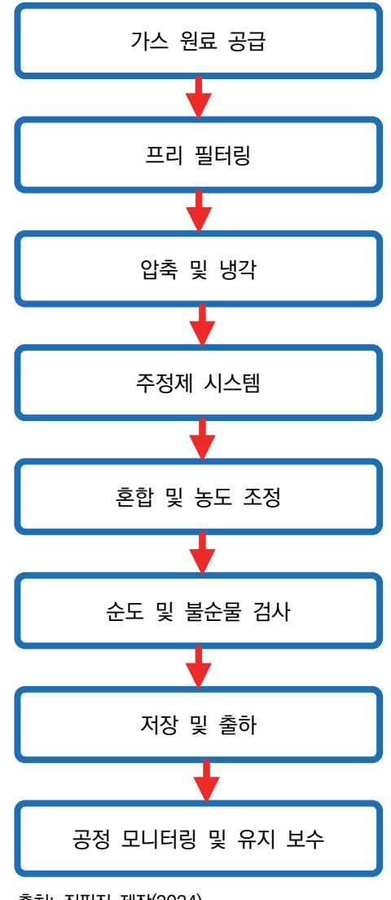

# NCS학습모듈 반도체용 세정 공정 가스 제조

LM1903060417\_23v3

#### [NCS학습모듈 활용 시 유의 사항]

- 1. NCS학습모듈은 교육훈련기관에서 출처를 명시하고 교육적 목적으로 활용할 수 있습니다. 다 만, NCS학습모듈에는 국가(교육부)가 저작재산권 일체를 보유하지 않은 저작물(출처가 표기된 도표‧사진‧삽화‧도면 등)이 포함되어 있으므로, 이러한 저작물의 변형‧각색‧복제‧공연‧ 배포 및 공중 송신 등과 이러한 저작물을 활용한 2차적 저작물을 작성하려면 반드시 원작자 의 동의를 받아야 합니다.
- 2. NCS학습모듈은 개발 당시의 산업 및 교육 현장을 반영하여 집필하였으므로, 현재 적용되는 법령‧지침‧표준 및 교과 내용 등과 차이가 있을 수 있습니다. NCS학습모듈 활용 시 법령 ‧지침‧표준 및 교과 내용의 개정 사항과 통계의 최신성 등을 확인하시기를 바랍니다.
- 3. NCS학습모듈은 산업 현장에서 요구되는 능력을 교육훈련기관에서 학습할 수 있게 구성한 자 료입니다. 다만, NCS학습모듈 지면의 한계상 대표적 예시(예: 활용도 또는 범용성이 높은 제 품, 서비스) 중심으로 집필하였음을 이해하시기를 바랍니다.

## NCS학습모듈의 이해

※ 본 NCS학습모듈은 「NCS 국가직무능력표준」사이트(http://www.ncs.go.kr) 에서 확인 및 다운로드할 수 있습니다.

## Ⅰ NCS학습모듈이란?

- 국가직무능력표준(NCS: National Competency Standards)이란 산업현장에서 직무를 수행하기 위해 요구되는 지식·기술·소양 등의 내용을 국가가 산업부문별·수준별로 체계 화한 것으로 산업현장의 직무를 성공적으로 수행하기 위해 필요한 능력(지식, 기술, 태도) 을 국가적 차원에서 표준화한 것을 의미합니다.
- 국가직무능력표준(이하 NCS)이 현장의 '직무 요구서'라고 한다면, NCS학습모듈은 NCS
  의 능력단위를 교육훈련에서 학습할 수 있도록 구성한 '교수·학습 자료'입니다. NCS학습
  모듈은 구체적 직무를 학습할 수 있도록 이론 및 실습과 관련된 내용을 상세하게 제시하
  고 있습니다.

#### ○ NCS학습모듈은 다음과 같은 특징을 가지고 있습니다.

- 첫째, NCS학습모듈은 산업계에서 요구하는 직무능력을 교육훈련 현장에 활용할 수 있도 록 성취목표와 학습의 방향을 명확히 제시하는 가이드라인의 역할을 합니다.
- 둘째, NCS학습모듈은 특성화고, 마이스터고, 전문대학, 4년제 대학교의 교육기관 및 훈 련기관, 직장교육기관 등에서 표준교재로 활용할 수 있으며 교육과정 개편 시에도 유용하게 참고할 수 있습니다.

○ NCS와 NCS학습모듈 간의 연결 체계를 살펴보면 아래 그림과 같습니다.

O NCS학습모듈의 위치는 NCS 분류 체계에서 해당 학습모듈이 어디에 위치하는지를 한 눈에 볼 수 있도록 그림으로 제시한 것입니다.

| [NCS-학          | 습모듈        | 의 위치]    |          |  |
|-----------------|------------|----------|----------|--|
|                 |            |          |          |  |
| 대분류             | 문화·예술      | ··디자인·방송 |          |  |
| 중분류             | 문화콘텐츠      |          |          |  |
| 소분류             | 문류 문화콘텐츠제작 |          |          |  |
|                 |            |          |          |  |
| 세분류             |            |          |          |  |
| 방송콘텐츠제작         |            | 능력단위     | 학습모듈명    |  |
| 영화콘텐츠제작         |            | 프로그램 기획  | 프로그램 기획  |  |
| 음악콘텐츠제작         |            | 아이템 선정   | 아이템 선정   |  |
| 광고콘텐츠제작         |            | 자료 조사    | 자료 조사    |  |
| 게임콘텐츠제작         |            | 프로그램 구성  | 프로그램 구성  |  |
| 애니메이션 콘텐츠제작  |            | 캐스팅      | 캐스팅      |  |
| 만화콘텐츠제작         |            | 제작계획     | 제작계획     |  |
| 캐릭터제작           |            | 방송 미술 준비 | 방송 미술 준비 |  |
| 스마트문화앱 콘텐츠제작 |            | 방송 리허설   | 방송 리허설   |  |
| 영사              |            | 야외촬영     | 야외촬영     |  |
|                 |            | 스튜디오 제작  | 스튜디오 제작  |  |
|                 |            |          |          |  |

학습모듈은

NCS 능력단위 1개당 1개의 학습모듈 개발 을 원칙으로 합니다. 그러나 필요에 따라 고용단위 및 교과단위를 고려하여 능력단위 몇 개를 묶어 1개 학습모듈로 개발할 수 있으며, NCS 능력단위 1개를 여러 개의 학습모듈로 나누어 개발할 수도 있습니다.

### 2. NCS학습모듈의 개요

#### ○ NCS학습모듈의 개요는 학습모듈이 포함하고 있는 내용을 개략적으로 설명한 것으로

| 학습모듈의 목표, 선수학습, 학습모듈의 내용 체계, 핵심 용어 로 구성되어 있습니다. |                                                                              |  |
|-------------------------------------------------|------------------------------------------------------------------------------|--|
| 학습모듈의 목표                                        | 해당 NCS 능력단위의 정의를 토대로 학습 목표를 작성한 것입니다.                                        |  |
| 선수학습                                            | 해당 학습모듈에 대한 효과적인 교수·학습을 위하여 사전에 이수해야 하는 학습모 듈, 학습 내용, 관련 교과목 등을 기술한 것입니다. |  |
| 학습모듈의 내용 체계                                  | 해당 NCS 능력단위요소가 학습모듈에서 구조화된 체계를 제시한 것입니다.                                     |  |
| 핵심 용어                                           | 해당 학습모듈의 학습 내용, 수행 내용, 설비·기자재 등 가운데 핵심적인 용어를 제 시한 것입니다.                   |  |

### 제작계획 학습모듈의 개요

#### 학습모듈의 목표

본격적인 촬영을 준비하는 단계로서, 촬영 대본을 획정하고 제작 스태프를 조직하며 촬영 장비와 촬영 소품을 준비할 수 있다.

#### 선수학습

제작 준비(LM0803020105\_13v1), 섭외 및 제작스태프 구성(LM0803020104\_13v1), 촬영 제작(LM0803020106\_13v1), 촬영 장비 준비(LM0803040204\_13v1.4), 미술 디자인 협의하기(LM0803040203\_13v1.4)

#### 학습모듈의 내용체계

| 하스                | 하스 내용                                              | NCS 능력단위 요소       |                |
|-------------------|----------------------------------------------------|-------------------|----------------|
| 학습                | 학습 내용                                              | 코드번호              | 요소 명칭          |
| 1. 촬영 대본 확정하기  | 1-1. 촬영 구성안 검 토와 수정                             | 0803020114_16/3.1 | 촬영 대본 확정하기  |
| 2. 제작 스태프 조직하기 | 2-1. 기술 스태프 조직 2-2. 미술 스태프 조직 2-3. 전문 스태프 조직 | 0803020114_16v3.2 | 제작 스태프 조직하기 |
| 3. 촬영 장비 계획하기  | 3-1. 촬영 장비 점검 과 준비                              | 0803020114_16/3.3 | 촬영 장비 계획하기  |
| 4. 촬영 소품 계획하기  | 4-1. 촬영 소품 목록 작성 4-2. 촬영 소품 제작 의뢰         | 0803020114_16\3.4 | 촬영 소품 계획하기  |

#### 핵심 용어

촬영 구성안, 제작 스태프, 촬영 장비, 촬영 소품

#### 학습모듈의 목표는

학습자가 해당 학습모듈을 통해 성취해야 할 목표를 제시한 것으로, 교수자는 학습자 가 학습모듈의 전체적인 내용흐름을 파악하 도록 지도할 수 있습니다.

**6** • •

61

#### 선수학습은

교수자 또는 학습자가 해당 학습모듈을 교 수·학습하기 이전에 이수해야 하는 교과목 또는 학습모듈(NCS 능력단위) 등을 표기한 것입니다. 따라서 교수자는 학습자가 개별 학습, 자기 주도 학습, 방과 후 활동 등 다 양한 방법을 통해 이수할 수 있도록 지도하 는 것을 권장합니다.

|            | 핵심 용어는              |
|------------|---------------------|
|            | 률을 대표하는 주요 용어입니     |
|            | · 해당 학습모듈을 통해 학습    |
|            | 게될 주요 내용을 알 수 있습    |
|            | 5 국가직무능력표준」 사이트     |
| (www.ncs.g | jo.kr)의 색인 (찾아보기) 중 |
| 하나로 이용할    | 할 수 있습니다            |

#### 3. NCS학습모듈의 내용 체계

○ NCS학습모듈의 내용은 크게 학습, 학습 내용, 교수·학습 방법, 평가 로 구성되어 있습니다.

| 학습       | 해당 NCS 능력단위요소 명칭을 사용하여 제시한 것입니다. 학습은 크게 학습 내용, 교수·학습 방법, 평가로 구성되며 해당 NCS 능력단위의 능력단위 요소별 지식, 기술, 태도 등을 토대로 내용을 제시한 것입니다.                                                    |
|----------|----------------------------------------------------------------------------------------------------------------------------------------------------------------------------------|
| 학습 내용    | 학습 내용은 학습 목표, 필요 지식, 수행 내용으로 구성되며, 수행 내용은 재료·자 료, 기기(장비·공구), 안전·유의 사항, 수행 순서, 수행 tip으로 구성한 것입니다. 학습모듈의 학습 내용은 실제 산업현장에서 이루어지는 업무활동을 표준화된 프로세 스에 기반하여 다양한 방식으로 반영한 것입니다. |
| 교수·학습 방법 | 학습 목표를 성취하기 위한 교수자와 학습자 간, 학습자와 학습자 간 상호 작용이 활발하게 일어날 수 있도록 교수자의 활동 및 교수 전략, 학습자의 활동을 제시한 것입니다.                                                                            |
| 평가       | 평가는 해당 학습모듈의 학습 정도를 확인할 수 있는 평가 준거 및 평가 방법, 평 가 결과의 피드백 방법을 제시한 것입니다.                                                                                                         |

## [NCS-학습모듈의 위치]

| 대분류 | 전기 · 전자 |          |
|-----|---------------|----------|
| 중분류 |               | 전자 기기 개발 |
| 소분류 |               | 반도체 재료   |

| 세분류    |                      |                      |
|--------|----------------------|----------------------|
| 반도체 개발 | 능력단위                 | 학습모듈명                |
| 반도체 제조 | 반도체용 CMP슬러리 재료 제조    | 반도체용 CMP슬러리 재료 제조    |
| 반도체 장비 | 반도체용 세정공정 재료 제조      | 반도체용 세정공정 재료 제조      |
| 반도체 재료 | 반도체용 박막도금공정 재료 제조 | 반도체용 박막도금공정 재료 제조 |
|        | 반도체용 SOD공정 재료 제조     | 반도체용 SOD공정 재료 제조     |
|        | 반도체용 트랙공정 재료 제조      | 반도체용 트랙공정 재료 제조      |
|        | 반도체용 웨이퍼 재료 제조       | 반도체용 웨이퍼 재료 제조       |
|        | 반도체용 금속(Target)재료 제조 | 반도체용 금속(Target)재료 제조 |
|        | 반도체용 패키지 재료 제조       | 반도체용 패키지 재료 제조       |
|        | 반도체 재료 개발            | 반도체 재료 개발            |
|        | 반도체 재료 생산관리          | 반도체 재료 생산관리          |
|        | 반도체 재료 품질관리          | 반도체 재료 품질관리          |
|        | 반도체 재료 안전관리          | 반도체 재료 안전관리          |
|        | 반도체용 마스크 재료 제조       | 반도체용 마스크 재료 제조       |

| 반도체용 플립칩 재료 제조       | 반도체용 플립칩 재료 제조       |
|----------------------|----------------------|
| 반도체용 CMP 재료 제조       | 반도체용 CMP 재료 제조       |
| 반도체용 식각공정 가스 제조      | 반도체용 식각공정 가스 제조      |
| 반도체용 세정공정 가스 제조      | 반도체용 세정공정 가스 제조      |
| 반도체용 박막공정 가스 제조      | 반도체용 박막공정 가스 제조      |
| 반도체용 이온주입공정 가스 제조 | 반도체용 이온주입공정 가스 제조 |
| 반도체용 박막공정 전구체 제조     | 반도체용 박막공정 전구체 제조     |
| 반도체용 포토공정 재료 제조      | 반도체용 포토공정 재료 제조      |

## 차 례

| 학습모듈의 개요                     | 1   |
|------------------------------|-----|
| 학습 1. 세정 공정 가스 제조 요구 사항 파악하기 |     |
| 1-1. 세정 공정 가스 제조 요구 사항 파악    | 3   |
| • 교수 ․ 학습 방법                 | 31  |
| • 평가                         | 32  |
| 학습 2. 세정 공정 가스 제조 준비하기       |     |
| 2-1. 세정 공정 가스 제조 준비          | 34  |
| • 교수 ․ 학습 방법                 | 67  |
| • 평가                         | 68  |
| 학습 3. 세정 공정 가스 제조하기          |     |
| 3-1. 세정 공정 가스 제조             | 70  |
| • 교수 ․ 학습 방법                 | 109 |
| • 평가                         | 110 |
| 참고 자료                        | 112 |

## 반도체용 세정 공정 가스 제조 학습모듈의 개요

#### 학습모듈의 목표

반도체 세정 공정에 필요한 가스 재료의 요구 사항을 파악하여 선정하고 제조할 수 있다.

#### 선수학습

반도체용 가스 재료 제조(LM1903060403\_14v), 반도체 제조 공정 개발(LM1903060106\_15v4), 디스플 레이 박막 공정 개발(LM1903070104\_14v2), 반도체 공정, 반도체 장비 기술

#### 학습모듈의 내용체계

| =                             | 학습 내용                     | NCS 능력단위 요소       |                           |
|-------------------------------|---------------------------|-------------------|---------------------------|
| 학습                            |                           | 코드번호              | 요소 명칭                     |
| 1. 세정 공정 기스 제조 요 구 사항 파악하기 | 1-1. 세정 공정 가스 제조 요구 사항 파악 | 1903060417_23v3.1 | 세정 공정 가스 제조 요구 사항 파악하기 |
| 2. 세정 공정 가스 제조 준 비하기       | 2-1. 세정 공정 가스 제조 준비       | 1903060417_23v3.2 | 세정 공정 가스 제조 준비하기       |
| 3. 세정 공정 가스 제조하 기          | 3-1. 세정 공정 가스 제조          | 1903060417_23v3.3 | 세정 공정 가스 제조하기          |

#### 핵심 용어

반도체 공정, 반도체 소자, 소자 제작, 공정 흐름도, 소자 특성, 소자 측정, 소자 분석, 반도체 장비, 공정 특성, 반도체용 가스 재료

| 학습 1 | 세정 공정 가스 제조 요구 사항 파악하기 |
|------|------------------------|
| 학습 2 | 세정 공정 가스 제조 준비하기       |
| 학습 3 | 세정 공정 가스 제조하기          |

## 1-1. 세정 공정 가스 제조 요구 사항 파악

|       | • 세정 공정 가스 제조 요구 사항에 따라 가스를 제조하기 위하여 제조 사양서를 입수할 수 있다.     |
|-------|------------------------------------------------------------|
| 학습 목표 | • 세정 공정 가스 제조 사양서를 바탕으로 제품명, 품질 기준, 제품 사양, 납기 등을 파악할 수 있다. |
|       | • 파악된 내용을 바탕으로 세정 공정 가스 제조 시 발생할 수 있는 문제점을 검토할 수 있다.       |

## 필요 지식 /

숔 반도체 가스 공정 설명

반도체용 가스는 반도체의 특성을 만들기 위한 Doant, Etchant, Reactant, Purge 가스 등 으로 구분되며 그 종류가 다양하고 대부분 독성이며, 높은 순도를 필요로 하며, LSI, LED, LCD 등과 같은 반도체 및 Display Panel의 제조에 사용되는 가스를 말한다.

이러한 반도체용 특수 가스는 높은 가연성과 독성을 지니고 있어 극히 위험하므로 생산, 검사, 운송 시 고도의 관리가 요구된다. 따라서 반도체 제조에 사용되는 가스는 타 산업 분야에 사용 되는 가스에 비해 더욱 철저한 품질 관리와 정밀 분석법이 필요하다.

반도체용 가스 재료 제조 공정은 매우 정밀하고, 고순도의 화학 물질을 생산하기 위해 여러 단 계를 포함한다. 이 공정은 반도체 소자의 제조 공정에서 필요한 특수 가스를 생산하는 데 중요 한 역할을 한다. 다음은 반도체용 가스 재료 제조 공정의 주요 단계를 설명한 것이다.

- 1. 원재료 준비
  - (1) 고순도 원료: 반도체용 가스 재료의 기본이 되는 고순도 화학 물질을 선택한다. 이는 반응물 의 순도를 높이기 위해 중요하다.
  - (2) 혼합 및 정제: 필요한 경우 원료를 정밀한 비율로 혼합하고, 불순물을 제거하는 정제 과정을 거친다.
- 2. 화학 반응
  - (1) 합성 반응: 고순도 원료를 사용하여 필요한 반도체용 가스를 합성한다. 이 과정은 특정 화학 반응으로 수행된다.

예를 들어, 질화 실리콘(Si₃N₄) 합성을 위해 실란(SiH₄)과 암모니아(NH₃)를 반응시키는 공정을 말한다.

- (2) 반응 조건 제어: 반응 온도, 압력, 반응 시간 등을 정밀하게 제어하여 목표 가스를 생산한다.
- 3. 정제 및 분리
  - (1) 증류: 혼합물에서 원하는 가스를 분리하고 정제하는 단계이다. 고순도의 가스를 얻기 위해 반 복적인 증류 과정을 거칠 수 있다.
  - (2) 흡착: 특정 불순물을 제거하기 위해 흡착제를 사용하여 가스를 정제한다.
  - (3) 여과: 미세 입자를 제거하기 위해 여과 과정을 거친다.
- 4. 저장 및 취급
  - (1) 고압가스 저장: 제조된 고순도 가스를 고압 용기에 저장한다. 저장 용기는 가스의 특성에 맞 게 설계되어야 한다.
  - (2) 취급 장비: 가스를 안전하게 취급하기 위해 적절한 밸브, 레귤레이터, 배관 시스템을 사용한 다.
- 5. 품질 검사
  - (1) 순도 검사: 고순도의 반도체용 가스를 보장하기 위해 가스 크로마토그래피(GC) 또는 질량 분 석기(MS)를 사용하여 순도를 검사한다.
  - (2) 불순물 분석: 극소량의 불순물도 반도체 공정에 영향을 끼칠 수 있으므로, 철저한 불순물 분 석이 필요하다.
- 6. 안전 및 환경 관리
  - (1) 안전 규정 준수: 모든 화학 물질 취급 과정에서 안전 규정을 준수하고, 적절한 개인 보호 장 비(PPE)를 착용한다.
  - (2) 폐기물 처리: 화학 반응 후 발생하는 폐기물과 잔여물은 환경 규정을 준수하여 처리한다.
- 7. 주요 반도체용 가스 종류 및 용도
  - (1) 실란(SiH₄): 실리콘 증착용
  - (2) 암모니아(NH₃): 질화물 증착용
  - (3) 수소(H₂): 환원 반응 및 분위기 가스로 사용
  - (4) 산소(O₂): 산화 공정용
  - (5) 질소(N₂): 분위기 가스 및 세정용
  - (6) 불소(F₂): 에칭 공정용

이와 같은 단계를 통해 반도체용 고순도 가스를 제조하고, 이를 통해 반도체 소자의 품질 과 성능을 높일 수 있다. 각 단계에서의 철저한 관리와 품질 검사는 최종 제품의 신뢰성을 보 장하는 데 필수적이다.

숕 반도체 가스 공정 개요

여기서는 반도체 제조 공정별 특수 가스의 종류와 역할에 대해 알아보기로 한다.

1. 반도체 제조 공정과 특수 가스의 역할

일반적으로 특수 가스란 산소(O ), 질소(N ), 아르곤(Ar), 탄산(CO ), 수소(H ) 등 보통의 산업용 가스와 달리 특수한 목적으로 사용되는 가스를 의미하는데, 반도체용 가스, 표준 가 스, 희귀 가스, 고순도 및 초고순도 가스, 혼합 가스 등이 특수 가스의 범주에 포함된다. 이 러한 특수 가스는 혼합 비율에 따라 거의 무한대에 가까운 종(種)을 만들어 낼 수 있는 혼 합 가스를 제외한다 해도 어느 정도 표준화된 제품만 2백여 종에 이르고 있다. 그러나 수 많은 특수 가스 중에서 우리나라는 물론 전 세계 산업용 가스 업계로부터 가장 경제적으로 고부가가치 재료로써 많은 관심을 받고 있는 가스는 반도체용 특수 가스이다.

(1) 특수 가스의 국내 시장 추이

가격 측면에서는 단연 정상을 차지하고 있지만, 수요와 공급에 한계가 있는 제논(Xe), 크립톤(Kr), 헬륨(He) 등 희귀 가스들과 달리 대부분의 반도체용 특수 가스들은 고가(高 價)인 데다 수요도 많으며 공업적으로 대량 생산이 가능하기 때문이다.

특히 반도체, TFT-LCD 등 전자 특수 가스 시장은 해당 산업의 무한한 성장성에 힘입 어 매년 괄목할 만한 시장 확대를 나타내고 있기도 하다.

90년대 중반까지만 해도 거의 수입에 의존해 왔던 국내 특수 가스 업계가 90년대 말 이후 자체 제조. 정제 능력 확충에 힘을 쏟고 있는 것이나 산업용 가스와는 직접적 연 관관계가 없었던 업체들이 속속 신규 진입하고 있는 것도 특수 가스 시장의 탁월한 성 장성에 기인한 결과이다.

(2) 반도체 가스의 역할

하지만 이러한 높은 관심에도 불구하고 종류의 다양성과 반도체 공정의 복잡성으로 인 해 각각의 반도체용 특수 가스들이 실제로 어떠한 공정에서 어떻게 쓰이고 있는지 정확 히 이해하기란 결코 쉽지 않다.

많은 업계 종사자가 분위기용, 에칭용, CVD용 등으로 반도체용 특수 가스를 분류하고 있지만, 이 공정들이 반도체 제조에 어떠한 역할을 하는지는 잘 설명하지 못하는 것도 이러한 이유 때문이므로 에서 반도체 가스의 역할을 정확히 숙지하여야 한다.

(3) 반도체용 가스 공정의 특성

반도체 가스 공정 특성은 다음과 같으며 특히 반도체 가스는 맹독성, 발화성 및 인화성 특성을 가진 가스가 대부분임에 따라 안전 사항이 매우 중요하므로 그 내용을 정확히 숙지하여야 한다.

(가) 반도체용 가스의 보관

반도체 공정에서 사용하는 원료 gas는 독성, 부식성, 질식성, 비독성, 비부식성 등으 로 구분되며 대부분 고압의 용기에 충전되어 사용하는데, 이러한 특성을 가진 gas들 을 각각의 공정에 맞게 사용하려면 우선 안전을 고려하면서 외부적인 오염으로부터 보호된 상태에서 공급할 수 있어야 한다. 따라서 gas cabinet에 넣어서 사용해야 하 는데, 이 gas cabinet은 고압가스 용기에 충전된 특수 가스를 일정한 압력으로 안전 한 상태에서 원료 가스의 순도를 유지하며 반도체 제조 설비에 연결되어 operating panel switch에 의한 process, purge, PT controller, load cell에 의한 경보 등 사용자가 편리하게 사용할 수 있도록 구성되어 있다.

(나) VMB(valve manifold box) system

gas cabinet 외 VMB(valve manifold box) system이 있는데, 이는 일차적으로 gas supply system에서 공급된 gas를 각각의 체임버로 안정적으로 공급하기 위해 manifold 형태로 gas box를 구성하여 사용할 수 있도록 만든 장치이다. 반도체 제조 설비에 연결되며 operating panel switch에 따른 process, purge, PT controller에 따른 경보 등 사용자가 편리하게 사용할 수 있도록 구성되어 있다.

#### 숖 반도체용 특수 가스의 개요

반도체용 특수 가스는 다른 반도체 재료(예: Chemical, 나노 재료, Photo resist(감광액)) 등 에 비해 상대적으로 가격이 낮게 책정되는 경향이 있으므로 채산성이 빈약한 문제점을 가지고 있다. 또한 소량 다품종이고 경제성 단위에 미치지 못하는 품목이 많아 벌크 가스와 달리 전량 개별 검사가 필요하다.

반도체용 가스는 일반적으로 화학적인 활성을 가지고 있으며 폭발성, 독성, 부식성이 강하다. 그러므로 제조에서 소비에 이르기까지 총체적인 공급 계통에 있어 고도의 안전 대책이 필요하 다. 가스는 대부분의 반도체 공정에서 사용되고 있으며 칩의 제조 공정에 이용되는 가스의 종 류를 용도별로 분류하면 분위기 가스, Epitaxial, Doping 가스, 성막용 가스(CVD), 에칭 가스 등으로 나눌 수 있다.

다음의 표는 반도체 가스의 화학적 성질을 나타낸 표이다. 표의 특징은 가로축은 Gas의 종류 세로축은 1) 물과의 반응성, 2) 연소성, 3) 기타 물질과의 반응성, 4) 재료 사용상 주의 등 4개 항목 등으로 분류한 점이다.

<표 1-1> 반도체 가스의 화학적 성질

|                | 실란                                                   | 디클로로실란                                                               | 삼클로로실란                 | 사염화규소                    | 사불화규소                                                              | 디실란                                                                        |
|----------------|------------------------------------------------------|----------------------------------------------------------------------|------------------------|--------------------------|--------------------------------------------------------------------|----------------------------------------------------------------------------|
| 분자식            | SiH                                                 | SiHCI                                                              | SiHCI                 | SiCI                    | SiF                                                               | SiH                                                                      |
| 물과의 반 응성    | 가수 분해하여 4 배의 수소가 생 성. 특히 알칼리 성 수용액으로 분 해 | 가수 분해하여 염산과 폴리실로키산의 혼합 물이 생성                                   | 물과 세차게 반응 하여 염산을 생성 | 가수 분해하여 규산과 염산을 생성 | 물과 반응하여 H SiF , SiO , H O, HF를 생성                  | 순수와 산과는 반응 안 함. 알칼리와 반응 하여 수소와 규 산을 생성                         |
| 연소성            | 공기 중에서 자연 발화                                      | 100°C 이상일 때 공 기 중에서 자연 발화 (E.R.4.1-98.8%)                      | 공기 중에서 발연              |                          | 불연성                                                                | 공기 중에서 순 식간에 발화                                                         |
| 타 물질과 의 반응성 | Cl 등의 할로겐 가스와 거세게 반 응                         | 아세톤과 반응                                                              |                        | 알코올로 분해                  | 600°C에서 SiC I와 반응하여 Si CIF , SiCIF , SiClF가 생성 | F,Br NCl , SF와 세게 반 응                                         |
| 재료 사용          | 상의 주의 부식성은 없음.                                       | 미량 수분의 존재로 강산이 된다. 드라이 상태에서 불활 성 AI, 황동. 스테인리 스강 등은 부식됨. | 물의 존재로 강산이 된다.      | 물의 존재로 강산이 된다.        | 산화 및 환원에 대해서 안정                                                 | 탄소강. SUS, 동. 모넬, 유리. 테프론, 나이 론. 바이톤, Kel -F 등을 사용할 수 있음. |

출처: 교육부(2014). 반도체용 가스 재료 제조(LM1903060403\_14v1). 한국직업능력개발원. p. 13.

<표 1-2> 반도체 가스의 화학적 성질

|                     | 삼염화비소                                       | 디보란                                           | 삼염화붕소                         | 삼불화붕소                                       | 스티핑                                                        | 셀렌화수소                                     |
|---------------------|---------------------------------------------|-----------------------------------------------|-------------------------------|---------------------------------------------|------------------------------------------------------------|-------------------------------------------|
| 분자식                 | AsCI                                       | BH                                          | BCl                          | BF                                         | SbH                                                       | SeH                                      |
| 물과의 반 응성         | 물로 분해하고 As(OH)과 H CI이 생성             | 신속하게 완전히 가 수 분해하여 붕산과 수소로 됨.            | 용이하게 분해 하여 염산이 생 성      | 가수 분해하여 플 루오르붕산이 생 성                  | 젖은 유리관 내에 서 24시간으로 완 전히 분해                           | 가수 분해                                     |
| 연소성                 |                                             | 공기 중에서 자연 발화 특히 젖은 공기 40~50°C에 서. | 불연성                           | 불연성                                         | 공기 중에서 연소하여 안티온 이 생성                                 | 공기 중에서 푸른색의 불꽃을 내며 연소하여 Se 02 생성 |
| 기타 물질 과의 반응 성 | AsCl+ NaOH → NaH AsO+3NaCl +HO | HCI등의 할로겐 가 스와 세게 반응. NH 과도 반응.        | 피리징. 니토로 벤젠과 부가화 함물을 생성 | 알칼리, 알칼리토 류 금속에 의해 붕 소와 금속불화물 을 생성 | 염소와 세게 반응하여 SbCI와 HCI을 발생. 알칼리 반웅하여 급속히 분해 | 초산과세게 반응 Cfe                           |

| 재료 사용 상 주의       | Mo, Ag, Au, P 과는 반응을 안 하며 Mg. Zn. A l. Sn, Pb. Cu 과는 세게 반응 | 일반의 금속은 좋다. 고무, 구리스, 윤활 유는 불가 실란, 폴리에틸렌, 테프론은 사용 가능             | 니켈 크로뮴강. 니켈강. 철 및 저 합금강. 니켈 하 스테로이, 인코 넬, 테프론 Ke H. 유리는 사용 가능                       | dry 가스강, SU S. Cu, Ni 황금, AI, 모넬 사용 가 능. wet 가스, Cu 경질 고무, 파이렉 스 유리 사용 가능 | -                                                          | AI,SUS, 탄소 강. 황동. 테프론, 바이론. 나이콘의 사용 가능                                                                 |
|---------------------|------------------------------------------------------------------------|-----------------------------------------------------------------------------|-------------------------------------------------------------------------------------------------------|------------------------------------------------------------------------------------------|------------------------------------------------------------|-----------------------------------------------------------------------------------------------------------------|
|                     | 수소화텔루르                                                                 | 사수소화게르마늄                                                                    | 염소                                                                                                    | 염화수소                                                                                     | 황화수소                                                       | 암모니아                                                                                                            |
| 분자식                 | TeH2                                                                   | Gel-U                                                                       | Cl2                                                                                                   | HCI                                                                                      | HzS                                                        | NHg                                                                                                             |
| 물과의 반 응성         | 젖은 공기에 접 하면 바로 분해                                                   | 실란과 비슷하지만 반응성은 작음.                                                       | Cl+HO ↔ HCIO+HCI HCIO-HCI+1 /2O                                                           | 반응은 안 하여 도 물에 잘 용해 됨.                                                              | 수용액 중에서 전 리 평균 HS ↔ H + HS  HS ↔ H + S  | 비반응 물에 잘 용 해                                                                                                 |
| 연소성                 | 공기 중에서 점 화하면 청백색 의 불꽃을 내며 연소                                  | 실란과 같이 세게 연 소 안 함. E.R.0.8- 98%                                       | 지연성                                                                                                   | 02에 대해서 안정                                                                               | 공기 중에서 청백 색의 불꽃을 내며 연소                               | 공기 중에서 섭씨 650도 이상에서 가연(O 중에서 의 E.R.16-2 5%)                                                     |
| 기타 물질 과의 반응 성 | 염소와 세게 반 응하며 텔루르 의 염화물을 생 성                                   | -                                                                           | H와 폭발적으 로 반응, 대부분 금속과 반응                                                                       | F와 세차게 반 응. 많은 금속과 반응하여 염화물 과 수소를 생성                                           | Cl , Br과 강하게 반응. 대부 분 금속과 습기의 존재하에 반응        | 할로겐과 세게 반 응한 Hg과 반응 하여 폭발성 화합 물을 생성                                                                    |
| 재료 사용 상의 주의      | -                                                                      | 탄소강, SUS, 동, 황 동. 모넬, 하스테로 이, Kel-F. 테프론, 유리. 바이론. 나이 론 등 사용 가능 | dry 가스(액), S teel, SUS, 주 철동 합금, 니켈 합금 사용 가능, wet 가스, 모 넬, 하스텔로이 C, 테프론 등 사 용 가능 | 수분이 존재로 강 산이 되며, 대부분 의 금속을 부식. B aked carbon, gr aphite 사용 가능                | Al, SUS316은 w et에서도 사용 가 능. 건조하면 동도 사용 가능         | 알칼리성, 부식성 이 강하다. 철. SU S는 사용 가능하 고 동, 석. 아연과 그의 합금은 사용 불가능 packing은 연 (鉛)아스베스토 가 좋음. |

출처: 교육부(2014). 반도체용 가스 재료 제조(LM1903060403\_14v1). 한국직업능력개발원. p. 15.

<표 1-3> 반도체 가스의 화학적 성질

|                     | 아산화질소              | 사염화탄소                                              | 삼불화메탄                                   | 육플루오르에탄                                 | 팔플루오르프로판                               |
|---------------------|--------------------|----------------------------------------------------|-----------------------------------------|-----------------------------------------|----------------------------------------|
| 분자식                 | NO                | CCl                                               | CHF                                    | CF                                    | CF                                   |
| 물과의 반 응성         | 반응 안 함.            | 반응 안 함. Fe, AI의 작용으로 가수 분해                   | 반응 안 함.                                 | 약간 가수 분해                                |                                        |
| 연소성                 | 지연성                | 불연성                                                | 불연성                                     | 불연성                                     | 고온의 공기 중에서도 불연                      |
| 기타 물질 과의 반응 성 | 유기물 알칼리 금속 을 산화 | 알칼리와 가열하면 분해                                    | 가연성 가스와 혼합 하여 점화하면 분해 하며 유독 가스 발생 | 가연성 가스와 혼합 하여 점화하면 분해 하며 유독 가스 발생 | 가연성 가스와 혼합하 여 점화하면 분해하며 유독 가스 발생 |
| 재료 사용 상 주의       | 부식성은 없음.           | 철과 알루미늄의 작 용으로 가수 분해 C CI十HO→ CO +4HCI | 부식성은 없음.                                | 부식성은 없음.                                | 부식성은 없음.                               |

출처: 교육부(2014). 반도체용 가스 재료 제조(LM1903060403\_14v1). 한국직업능력개발원. p. 17.

숗 반도체용 세정 공정 가스의 특징

반도체용 세정 공정 가스는 반도체 제조 과정에서 중요한 역할을 하며, 고순도와 특정 화학적 특성을 갖춘 다양한 가스들이 사용된다. 주요 특징은 다음과 같다.

- 1. 고순도
  - (1) 고순도 요건: 반도체 제조 공정에서는 매우 높은 순도의 가스가 필요하다. 이는 미세한 불순 물도 소자의 성능과 신뢰성에 큰 영향을 끼칠 수 있기 때문이다.
  - (2) 일반 순도 수준: 일반적으로 99.999% 이상의 순도가 요구된다.
- 2. 화학적 반응성
  - (1) 화학적 반응성: 세정 가스는 특정 화학적 반응을 일으켜 기판 표면의 불순물, 잔여물 및 산 화층을 제거한다.
  - (2) 주요 반응 가스: 실란(SiH₄), 암모니아(NH₃), 염화수소(HCl), 수소(H₂) 등이 사용된다.
- 3. 특수 용도
  - (1) 표면 세정: 세정 가스는 주로 웨이퍼 표면의 오염물질을 제거하여 순수한 실리콘 표면을 노 출시키는 데 사용된다.
  - (2) 산화층 제거: 불산(HF) 같은 가스는 실리콘 산화층을 선택적으로 제거하는 데 사용된다.
- 4. 안정성 및 안전성

- (1) 안정성: 세정 가스는 제조 공정 중 안정적으로 유지되어야 한다. 반응성이 높으면서도 제어된 조건에서 안전하게 사용될 수 있어야 한다.
- (2) 안전성: 가스 취급 시 적절한 안전 절차와 장비가 필요하다. 유독성 가스나 폭발성 가스의 경우 특별히 주의해야 한다.
- 5. 환경 및 규제 준수
  - (1) 환경 영향: 일부 세정 가스는 환경에 유해할 수 있으므로, 사용 후 적절한 폐기 및 처리 절 차가 필요하다.
  - (2) 규제 준수: 각국의 환경 규제와 안전 규정을 준수해야 한다. 예를 들어, 미국의 경우 EPA(Environmental Protection Agency) 규정을 따른다.
- 6. 주요 반도체용 세정 가스
  - (1) 실란(SiH₄)
    - (가) 특징: 실리콘 증착 및 세정에 사용되는 주요 가스이다.
    - (나) 용도: CVD(화학 기상 증착) 공정에서 사용한다.
  - (2) 암모니아(NH₃)
    - (가) 특징: 질화물 증착 및 세정에 사용한다.
    - (나) 용도: 질화 실리콘(Si₃N₄) 형성한다.
  - (3) 염화수소(HCl)
    - (가) 특징: 산화층 및 금속 오염물 제거에 효과적이다.
    - (나) 용도: 웨이퍼 세정에 사용한다.
  - (4) 수소(H₂)
    - (가) 특징: 환원성 가스로 사용, 고온에서 안정적이다.
    - (나) 용도: 분위기 가스, 표면 활성화에 사용한다.
  - (5) 불산(HF)
    - (가) 특징: 실리콘 산화물을 선택적으로 제거한다.
    - (나) 용도: 웨이퍼 에칭 및 세정에 사용한다.

이와 같은 특징을 통해 반도체용 세정 가스는 반도체 제조 공정에서 중요한 역할을 하며, 고품 질의 반도체 소자를 생산하는 데 필수적인 요소로 작용한다.

숗 반도체용 세정 가스 제조 관련 화학 물질 관리 규정

반도체용 세정 가스 제조와 관련된 화학 물질 관리 규정은 작업자의 안전을 보장하고, 환경에 미치는 영향을 최소화하며, 고품질의 반도체 제품을 생산하기 위해 중요한 역할을 한다. 주요 규정과 지침은 다음과 같다.

- 1. 화학 물질 관리 규정
  - (1) 유해 물질 통제: 반도체 제조 과정에서 사용되는 고순도 유기 및 무기 화합물은 모두 엄격하 게 관리되어야 한다. 이는 작업자의 건강을 보호하고 환경 오염을 방지하기 위함이다(MDPI).
  - (2) MSDS(물질 안전 데이터 시트): 모든 화학 물질에 대해 MSDS를 확보하고, 해당 물질의 특 성, 취급 방법, 응급 처치 방법 등을 명확히 이해해야 한다. 이는 화학 물질 취급 시 발생할 수 있는 위험을 최소화하기 위한 필수 요소이다(US EPA).
- 2. 작업 환경 안전
  - (1) 환기 시스템: 작업 공간 내에서 유독 가스가 축적되지 않도록 충분한 환기 시스템을 갖추어 야 한다. 이는 공기 중 유해 물질 농도를 낮추고 작업자의 안전을 보장한다(OSHA).
  - (2) 안전 장비: 개인 보호 장비(PPE)를 착용하고, 화학 물질 취급 시 적절한 장비(예: 화학 방지 장갑, 보호안경, 실험복 등)를 사용해야 한다.
- 3. 환경 보호 규정
  - (1) 폐기물 관리: 반도체 제조 과정에서 발생하는 화학 폐기물은 적절하게 분리하고 처리해야 한 다. 이는 유해 물질이 환경에 유출되는 것을 방지하기 위한 중요한 절차이다(MDPI).
  - (2) 배출 규제: 반도체 제조 공정에서 발생하는 배출물, 특히 고온에서 발생하는 유독 가스(예: NF₃, SF₆ 등)는 규제 기준에 따라 적절히 처리해야 한다(US EPA).
- 4. 안전 교육 및 훈련
  - (1) 정기적인 교육: 모든 작업자는 정기적인 안전 교육을 통해 최신 안전 규정과 화학 물질 취급 방법을 숙지해야 한다.
  - (2) 응급 상황 대처 훈련: 화재, 화학 물질 유출 등의 응급 상황 발생 시 신속하게 대처할 수 있 도록 정기적인 훈련을 실시해야 한다.
- 5. 관련 법령 및 규정
  - (1) OSHA(occupational safety and health administration): OSHA는 반도체 제조 과정에서 의 잠재적 위험과 이에 대한 해결책을 제공하며, 작업자 안전을 위한 구체적인 규정을 제공 한다(OSHA).
  - (2) EPA(environmental protection agency): EPA는 반도체 산업의 고순도 가스 사용과 관련 된 배출 규제 및 환경 보호 지침을 제시한다(US EPA).

이러한 규정과 지침을 준수함으로써 반도체용 세정 가스 제조 과정에서 발생할 수 있는 위험을 최소화하고, 안전하고 효율적인 작업 환경을 유지할 수 있다.

수 세정 공정 가스 제조 사양서

반도체용 세정 공정 가스 제조 사양서는 고품질의 세정 가스를 제조하기 위해 필수적인 기준과

절차를 명시한 문서이다. 이 사양서는 세정 가스의 순도, 화학적 성질, 제조 과정, 품질 검사 방법 등을 포함한다. 다음은 일반적인 반도체용 세정 공정 가스 제조 사양서에 포함되는 주요 항목들이다.

- 1. 재료 사양
  - (1) 가스 종류: 사용될 가스의 화학적 명칭과 화학식 예: 실란(SiH₄), 암모니아(NH₃), 수소(H₂), 산소(O₂)
  - (2) 순도: 가스의 순도 요건을 명시 예: 99.999% 이상의 고순도
- 2. 제조 공정
  - (1) 합성 방법: 세정 가스를 합성하는 구체적인 화학적 방법 예: 반응 조건(온도, 압력, 반응 시간 등)을 명시
  - (2) 정제 과정: 불순물 제거를 위한 정제 기술 예: 증류, 흡착, 여과
- 3. 품질 관리
  - (1) 분석 방법: 가스의 순도와 불순물을 분석하는 방법 예: 가스 크로마토그래피(GC), 질량 분석기(MS)
  - (2) 시험 빈도: 품질 검사를 위한 시료 채취 및 분석 빈도 예: 배치당 1회, 주기적 검사
- 4. 저장 및 취급
  - (1) 저장 조건: 가스를 저장하기 위한 조건(온도, 압력, 용기 재질 등) 예: 고압 용기에 저장, 상온 유지
  - (2) 취급 절차: 안전하게 가스를 취급하는 절차 예: 안전밸브 사용, 누출 감지기 설치
- 5. 안전 및 환경
  - (1) 안전 지침: 작업자 안전을 위한 지침 예: 개인 보호 장비(PPE) 착용, 통풍 장치 설치
  - (2) 환경 보호: 폐가스 처리 및 환경 보호 조치 예: 폐가스 정화 시스템 설치, 규제 준수

|  |  | <표 1-4> 세정 가스 제조 사양서 예시(실란(SiH₄) 가스) |
|--|--|--------------------------------------|
|--|--|--------------------------------------|

| 항목      | 사양서 분석 내용                                                      |
|---------|----------------------------------------------------------------|
| 재료 사양   | 화학명: 실란(SiH₄) 화학식: SiH₄ 순도: ≥99.999%                     |
| 제조 공정   | 합성 반응: Si + 2H₂ → SiH₄ 반응 조건: 300°C, 5atm 정제 과정: 증류 및 흡착 |
| 품질 관리   | 분석 방법: 가스 크로마토그래피(GC) 시험 빈도: 배치당 1회                         |
| 저장 및 취급 | 저장 조건: 고압 용기, 상온 취급 절차: 안전밸브 및 누출 감지기 사용                    |
| 안전 및 환경 | 안전 지침: PPE 착용, 통풍 장치 설치 환경 보호: 폐가스 정화 시스템 설치                |

이와 같은 사양서를 통해 고품질의 반도체용 세정 가스를 제조하고, 안전하고 효율적인 세정 공정을 유지할 수 있다.

재료·자료

• 반도체 가스 공정의 구조, 반도체 제조 장비

기기(장비 ・ 공구)

- 컴퓨터, 프린터
- 문서 작성 프로그램
- 인터넷

#### 안전 ・ 유의 사항

- 가스 공정에 사용되는 가스의 취급 안전에 유의한다.
- 반도체 가스 공정 파악을 위한 이론적 지식을 이해한다.
- 부식성 가스, 맹독성 가스, 인화성 가스, 발화성 가스 등 위험 물질이 있으니 해당 가스를 적용하게 되는 Gas Box, VMB Box, MFC(mass flow controller) 등과 연결된 operating panel switch의 사용법을 사전에 숙지한다.
- 반도체 가스 공정 파악을 위한 이론적 지식을 이해한다.

#### 수행 순서

숔 반도체 세정 공정에 필요한 가스 재료의 요구 사항 파악을 위한 절차를 숙지한다.

반도체 세정 공정에 필요한 가스 재료의 요구 사항을 파악하기 위해서는 다음과 같은 요소들을 고려해야 한다. 반도체 세정 공정은 미세 오염물을 제거하고 표면을 준비하는 중요한 단계로, 사용되는 가스는 세정의 효율성과 안전성에 큰 영향을 끼친다.

반도체 세정 공정에 필요한 가스 재료는 세정 목적에 따라 화학적 및 물리적 특성이 맞춤형으 로 선택되어야 한다. 높은 순도, 적절한 반응성, 안전성, 경제성, 그리고 공급 안정성을 고려하 여 적합한 가스를 선택하는 것이 필수적이다. 각 세정 단계의 목적과 공정 조건을 충분히 이해 하고 이에 맞는 가스를 선택해야 한다.

1. 세정 목적에 맞는 가스를 선택한다.

반도체 세정 공정에서 세정 목적에 맞는 가스를 선택하는 것은 매우 중요하다. 적절한 가스 선택은 웨이퍼 표면의 오염 제거와 소자의 성능 최적화에 결정적인 역할을 한다. 다음은 각 세정 목적에 따른 가스 선택 기준과 일반적으로 사용되는 가스의 목록이다.

- (1) 세정 목적에 따른 가스 선택 기준 및 목록
  - (가) 유기물 제거
    - 1) 목적: 웨이퍼 표면에 존재하는 유기물 및 잔여물을 제거하여 깨끗한 표면을 만든다.
    - 2) 주요 사용 가스
      - 가) 산소(O2): 플라즈마 상태에서 유기물을 산화시켜 제거
      - 나) 오존(O3): 강력한 산화제 역할을 하여 유기물 제거에 효과적
      - 다) 암모니아(NH3): 유기물을 분해하는 데 사용
  - (나) 금속 이온 제거
    - 1) 목적: 공정 중 웨이퍼에 불순물로 존재할 수 있는 금속 이온을 제거하여 소자의 성 능을 보호
    - 2) 주요 사용 가스
      - 가) 염화수소(HCl): 금속 이온을 염화물 형태로 변환하여 제거
      - 나) 불화수소(HF): 산화막을 통해 금속 이온을 제거하는 데 사용
  - (다) 파티클 제거
    - 1) 목적: 공정 중 또는 세정 과정에서 발생할 수 있는 입자(파티클)를 제거하여 웨이퍼 표면의 청정도 유지
    - 2) 주요 사용 가스
      - 가) 암모니아(NH3): SC-1 세정 단계에서 입자 제거에 사용
      - 나) 수소(H2): 플라즈마 세정에서 입자 제거에 도움
  - (라) 산화막 제거
    - 1) 목적: 자연 발생 산화막 또는 불필요한 산화막을 제거하여 이후 공정에서의 불순물 침투를 방지
    - 2) 주요 사용 가스
      - 가) 불화수소(HF): 실리콘 산화막(SiO2)을 선택적으로 제거
      - 나) 수소 플루오라이드(HF gas): 실리콘 산화막 제거에 사용
  - (마) 표면 재산화 및 보호
    - 1) 목적: 특정한 세정 후 표면을 보호하거나, 표면 상태를 개선하기 위해 산화막을 형 성
    - 2) 주요 사용 가스
      - 가) 산소(O2): 플라즈마 산화 또는 열처리 산화 과정에서 사용
      - 나) 질소(N2): 보호 분위기를 제공하여 산화를 제어
  - (바) 웨이퍼 건조 및 잔여물 제거
    - 1) 목적: 세정 후 웨이퍼 표면의 물기와 잔여 화학 물질을 제거하여 건조한 상태를 유 지.

2) 주요 사용 가스

가) 이소프로필 알코올(IPA): 표면 장력을 낮추어 물기를 제거하고, 빠르게 증발하

여 건조 효과 제공

나) 질소(N2): 웨이퍼 건조와 화학 물질 퍼지에 사용

- (사) 기타 목적
  - 1) 클린 룸 공기 질 유지: 공정 중 가스 사용 시 클린 룸 내 공기 질 유지 및 오염 방 지
  - 2) 주요 사용 가스
    - 가) 아르곤(Ar): 불활성 가스로 공정 내 반응성 억제 및 플라즈마 생성에 사용
    - 나) 질소(N2): 불활성 분위기를 조성하여 반응 억제
- (2) 가스 선택 시 고려 사항
  - (가) 공정 요구 사항: 각 공정의 목적과 요구 사항에 맞는 가스를 선택해야 한다.
  - (나) 안전성: 사용 가스의 화학적, 물리적 특성과 그에 따른 안전성(독성, 인화성 등)을 고려 한다.
  - (다) 순도: 고순도 가스가 필요하며, 불순물 함량이 공정에 미치는 영향을 최소화해야 한다.
  - (라) 비용: 가스의 비용과 경제성을 고려하여 선택한다.
  - (마) 환경 및 규제 준수: 환경에 미치는 영향과 관련 규제를 준수해야 한다.
- 각 가스는 그 특성에 따라 특정 세정 목적에 적합하며, 선택과 사용 시에는 안전한 취 급과 공정 최적화를 위해 위의 사항들을 철저히 고려해야 한다.
- 2. 가스의 화학적 특성을 고려한다.
  - (1) 반응성

특정 오염물과 선택적으로 반응하여 제거할 수 있는 화학적 특성을 가져야 한다. (예: 플루오린계 가스(CF4, SF6) 등은 산화물을 제거하는 데 사용된다.)

(2) 순도

매우 높은 순도의 가스를 사용하여 반도체 웨이퍼에 불순물이 추가되지 않도록 해 야 한다.

(3) 부식성

공정 중 사용되는 반도체 재료를 부식시키지 않아야 한다.

- 3. 물리적 특성을 고려한다.
  - (1) 기체 상태

공정 조건에서 안정적인 기체 상태를 유지하고, 필요한 경우 액화가 용이해야 한다.

(2) 확산성

세정 대상 표면에 고르게 분포될 수 있어야 한다.

4. 반도체 세정 공정에 필요한 가스 재료의 공정 조건을 파악한다.

반도체 세정 공정에서 사용되는 가스는 웨이퍼의 표면을 깨끗하게 유지하고, 불순물을 제거 하여 고품질의 반도체 소자를 제조하는 데 중요한 역할을 한다. 각 가스는 특정 공정 조건 하에서 사용되어야 그 효과를 최대화하고 안전하게 사용할 수 있다. 다음은 주요 세정 공정 가스와 그 공정 조건에 대한 개요이다.

- (1) 주요 세정 공정 가스와 그 공정 조건
  - (가) 산소(O2)
    - 1) 용도: 플라즈마 산화, 유기물 제거
    - 2) 공정 조건
      - 가) 압력: 0.1~1.0Torr(플라즈마 세정 시)
      - 나) 온도: 100~300°C(플라즈마 또는 열산화 시)
      - 다) 유량: 100~500sccm(공정 요구에 따라 다름.)
  - (나) 오존(O3)
    - 1) 용도: 유기물 및 탄화수소 제거, 표면 산화
    - 2) 공정 조건
      - 가) 농도: 수십 ppm~수백 ppm(목적에 따라)
      - 나) 온도: 20~100°C
      - 다) 유량: 100~1,000sccm
  - (다) 암모니아(NH3)
    - 1) 용도: 표면 세정, 산화막의 파티클 제거
    - 2) 공정 조건
      - 가) 압력: 0.1~5Torr(플라즈마 세정 시)
      - 나) 온도: 100~400°C(상황에 따라 변동)
      - 다) 유량: 50~200sccm
  - (라) 염화수소(HCl)
    - 1) 용도: 금속 오염 제거, 표면 세정
    - 2) 공정 조건
      - 가) 농도: 5~10%(물 또는 다른 용매에 희석)
      - 나) 온도: 20~80°C(상황에 따라 변동)
      - 다) 유량: 100~500sccm
  - (마) 불화수소(HF)
    - 1) 용도: 실리콘 산화막 제거

- 2) 공정 조건
  - 가) 농도: 1~10%(물 또는 IPA에 희석)
  - 나) 온도: 20~50°C
  - 다) 유량: 50~200sccm
- (바) 아이소프로필알코올(IPA)
  - 1) 용도: 웨이퍼 건조, 물기 제거
  - 2) 공정 조건
    - 가) 농도: 100% 순수 IPA
    - 나) 온도: 실온~60°C
    - 다) 유량: 사용량은 작업 조건에 따라 다름.

#### (사) 질소(N2)

- 1) 용도: 퍼징, 건조, 불활성 분위기 조성
- 2) 공정 조건
  - 가) 압력: 1atm(퍼징), 0.1~5Torr(플라즈마 세정 시)
  - 나) 온도: 실온
  - 다) 유량: 100~1,000sccm
- (아) 아르곤(Ar)
  - 1) 용도: 플라즈마 세정, 불활성 분위기 조성
  - 2) 공정 조건
    - 가) 압력: 0.1~5Torr(플라즈마 세정 시)
    - 나) 온도: 20~100°C
    - 다) 유량: 100~500sccm
- (2) 온도와 압력

세정 공정의 온도와 압력 조건에서 안정적이고 효율적으로 작동해야 한다.

(3) 플라즈마 호환성

플라즈마 세정 공정을 사용하는 경우, 플라즈마 발생에 적합해야 한다. (예: 플라즈마 산소(O2) 또는 플라즈마 수소(H2)는 표면 활성화와 유기물 제거에 사용된 다.)

- (4) 공정 조건 관리 중요성
  - (가) 안전성: 가스의 물리적, 화학적 특성에 맞는 공정 조건을 유지하여 안전한 작업 환경을 조성한다.
  - (나) 효율성: 최적의 공정 조건을 통해 가스의 세정 효과를 극대화한다.
  - (다) 품질 관리: 균일한 공정 조건 유지로 웨이퍼의 일관된 품질을 보장한다.

가스의 특성에 따라 공정 조건이 달라질 수 있으며, 이는 반도체 제조 공정의 효율성과 최 종 제품의 품질에 중요한 영향을 끼친다. 따라서 가스 사용 시 각 공정의 특성과 요구 사항 에 맞는 최적의 조건을 설정하고 유지하는 것이 필수적이다.

- 5. 안전성을 파악한다.
  - (1) 독성: 작업자와 환경에 무해하거나 최소한의 독성을 가져야 한다.
  - (2) 폭발성: 공정 조건에서 폭발 위험이 없어야 한다.
  - (3) 취급 안전성: 작업자와 장비의 안전을 보장할 수 있는 취급 및 저장 조건을 만족해야 한다.
- 6. 경제성 및 공급 안정성을 파악한다.
  - (1) 경제성: 합리적인 비용으로 사용할 수 있어야 한다.
  - (2) 공급 안정성: 안정적으로 공급받을 수 있어야 하며, 공급망의 변동성에 대응할 수 있어야 한 다.
- 7. 주요 세정 가스 및 특성을 파악한다.

반도체 제조 공정에서 사용되는 세정 공정 가스는 반도체 기판과 장비를 깨끗하게 유 지하고, 불순물 및 잔류 물질을 제거하는 데 필수적이다. 이러한 가스들은 주로 화학적 반응을 통해 오염 물질을 제거하며, 각 가스는 특정 목적에 맞게 사용된다. 주요 세정 공정 가스와 그 특성은 다음과 같다.

- (1) 아르곤(Argon, Ar)
  - (가) 용도: 플라즈마 세정 공정에서 주로 사용된다.
  - (나) 특성: 불활성 가스로, 화학 반응에 참여하지 않으며, 주로 플라즈마를 생성하거나 플라즈 마를 안정화시키기 위해 사용된다.
- (2) 질소(Nitrogen, N₂)
  - (가) 용도: 드라이 이칭(dry etching)과 후공정에서 기판 및 장비를 세정할 때 사용된다.
  - (나) 특성: 불활성 가스로, 고온에서 산화 반응을 억제하며, 기체 배출이나 공정 체임버의 청 결을 유지하는 데 사용된다.
- (3) 수소(Hydrogen, H₂)
  - (가) 용도: 표면 세정, 환원 반응을 통한 금속 산화물 제거 등에 사용된다.
  - (나) 특성: 환원제로 사용되며, 산소와 결합하여 물을 형성하면서 금속 표면의 산화물을 제거 한다. 반응성이 높아 화재나 폭발의 위험이 있다.
- (4) 플루오린(F₂)
  - (가) 용도: 고체 잔류물을 제거하거나 기판 표면을 활성화하는 데 사용된다.
  - (나) 특성: 매우 강한 산화력과 부식성을 가지며, 실리콘과 같은 반도체 재료를 공격하여 세정

효과를 발휘한다.

- (5) 삼불화질소(Nitrogen trifluoride, NF₃)
  - (가) 용도: CVD(화학 기상 증착) 공정 후의 잔류물을 제거하는 데 사용된다.
  - (나) 특성: 강력한 플라즈마 세정 가스로, 실리콘이나 금속 산화물을 효과적으로 제거한다. 그 러나 온실가스이므로 배출 관리가 중요하다.
- (6) 헥사 플루오르 에탄(HexaFluoroEthane, C₂F₆)
  - (가) 용도: 드라이 이칭 및 플라즈마 세정 공정에서 사용된다.
  - (나) 특성: CVD 잔류물을 제거하며, 특히 유기물과 불순물 제거에 효과적이다. 온실가스에 속하며, 환경에 미치는 영향이 크기 때문에 사용량을 최소화하려는 노력이 필요하다.
- (7) 사플루오린화 황(Sulfur hexafluoride, SF₆)
  - (가) 용도: 플라즈마 에칭 공정 및 세정 공정에 사용된다.
  - (나) 특성: 전기적 절연성이 높고, 플라즈마에 의해 분해되어 반도체 표면의 불순물을 제거하 는 데 사용된다. 강력한 온실 가스로서 주의하여 사용해야 한다.
- (8) 염화수소(Hydrogen chloride, HCl)
  - (가) 용도: 산성 세정 공정에서 주로 사용되며, 금속 산화물 제거에 효과적이다.
  - (나) 특성: 강한 부식성과 휘발성을 가지며, 금속 표면에서 산화물을 제거하는 데 사용된다.
- (9) 수산화암모늄(Ammonium hydroxide, NH₄OH)
  - (가) 용도: 습식 세정 공정에서 실리콘 웨이퍼의 표면을 세정하는 데 사용된다.
  - (나) 특성: 산화물 제거에 효과적이며, 다른 화학 물질과 혼합하여 다양한 세정 솔루션으로 사 용될 수 있다.

이들 가스는 각각의 공정 요구 사항에 맞춰 적절히 선택되고 사용된다. 반도체 제조 공정의 효율성과 품질을 높이기 위해서는 세정 공정 가스의 선택과 관리가 매우 중요하다.

#### 숕 세정 공정 가스 제조 요구 사항에 따라 가스를 제조하기 위하여 제조 사양서를 입수한다.

반도체 세정 공정에 필요한 가스 제조를 위해 제조 사양서를 입수하는 과정은 제조의 정확성과 안전성을 보장하기 위한 중요한 단계이다. 제조 사양서에는 가스의 순도, 혼합 비율, 물리적 특 성, 화학적 특성, 안전 지침 등이 상세히 기술되어 있다. 다음은 제조 사양서를 입수하고 활용 하는 절차와 그 중요 항목들을 설명한다.

반도체 세정 공정에 필요한 가스를 제조하기 위해 제조 사양서를 입수하는 것은 가스의 품질과 안전성을 보장하는 중요한 단계이다. 제조 사양서를 통해 가스의 순도, 물리적 및 화학적 특성, 안전성, 경제성 등을 정확히 파악하고 이를 기준으로 품질 관리, 안전 관리, 공정 최적화를 수

행해야 한다. 이를 통해 반도체 제조 공정의 효율성과 안전성을 높일 수 있다.

#### 1. 제조 사양서 입수 절차를 파악한다.

(1) 제조 업체 선정

신뢰할 수 있는 제조 업체를 선정한다. 반도체 공정에서는 높은 순도와 정확한 특성을 가진 가스가 필요하므로, 관련 인증과 신뢰성을 갖춘 업체를 선정한다.

(2) 사양서 요청

제조 업체에 가스의 제조 사양서를 요청한다. 이 과정에서는 필요로 하는 가스의 종류, 순도, 특수한 요구 사항 등을 명확히 전달한다.

(3) 사양서 검토

제공된 제조 사양서를 검토하여, 요구하는 기준과 일치하는지 확인한다. 필요시 제조 업 체와 협의하여 수정하거나 추가 정보를 요청할 수 있다.

2. 제조 사양서 주요 항목을 파악한다.

(1) 제품 사양

(가) 가스 종류 및 명칭

예: 플루오린계 가스(CF4, SF6), 산소(O2), 수소(H2), 염화수소(HCl) 등

(나) 순도

반도체 세정 공정에 사용되는 가스는 일반적으로 99.999% 이상의 고순도를 요구한 다. 불순물의 종류와 허용치도 명시되어야 한다.

(다) 혼합 비율

혼합 가스의 경우 각 성분의 정확한 비율이 중요하다.

- (2) 물리적 특성
  - (가) 상태

가스가 액체, 기체 상태에서의 물리적 특성(압력, 온도, 밀도 등)이다.

(나) 포장 및 저장 조건

가스의 포장 방식(예: 실린더, 탱크) 및 저장 조건(온도, 압력, 습도 등)이다.

- (3) 화학적 특성
  - (가) 반응성

다른 물질과의 반응성, 특히 세정 공정에서의 반응 특성이다.

(나) 부식성

사용되는 장비와의 호환성, 부식성 여부이다.

(4) 안전성

(가) 독성

작업자 안전을 위한 독성 정보와 취급 시 주의 사항이다.

(나) 폭발성

폭발 위험성과 관련된 정보, 안전한 사용 방법이다.

(다) 취급 지침

가스 취급 시 필요한 보호 장비와 안전 절차이다.

- (5) 경제성 및 공급 안정성
  - (가) 가격

가스의 단가와 공급 계약 조건이다.

(나) 공급 안정성

공급망의 안정성, 긴급 상황 시 대체 공급 방안이다.

- 3. 제조 사양서를 활용한다.
  - (1) 품질 관리

제조 사양서를 기준으로 입고되는 가스의 품질을 검사하고, 규격에 맞는지 확인한다.

(2) 안전 관리

제조 사양서에 명시된 안전 지침을 바탕으로 작업자의 안전을 확보한다.

(3) 공정 최적화

세정 공정에서 가스의 특성을 최적화하여 사용하는 방법을 개발한다. 예를 들어, 특정 온도와 압력 조건에서의 반응성을 최대화하는 방법을 찾는다.

(4) 문서화 및 교육

제조 사양서를 문서화하여 관련 부서와 공유하고, 필요시 교육 자료로 활용한다.

#### 숖 세정 공정 가스 제조 사양서를 바탕으로 제품명, 품질 기준, 제품 사양, 납기 등을 파악한다.

반도체 세정 공정에 필요한 가스 제조 사양서를 바탕으로 제품명, 품질 기준, 제품 사양, 납기 등을 파악하는 과정은 매우 중요하다. 이를 통해 세정 공정에 필요한 가스를 정확하고 안정적 으로 공급받을 수 있으며, 공정의 효율성과 품질을 유지할 수 있다. 아래는 이러한 사항들을 파악하는 방법과 그 중요성을 설명한다.

제조 사양서를 바탕으로 제품명, 품질 기준, 제품 사양, 납기 등을 파악하는 것은 반도체 세정 공정의 성공적인 운영을 위해 필수적이다. 이를 통해 필요한 가스를 정확히 선택하고, 공급받 으며, 공정에서 최적의 성능을 발휘할 수 있다. 제조 사양서를 꼼꼼히 검토하고, 필요한 사항을 명확히 이해하여 공급 업체와 협력하는 것이 중요하다.

- 1. 제품명을 파악한다.
  - (1) 제품명 파악

(가) 제조 사양서에서 제공되는 가스의 정확한 명칭을 확인한다.

예: CF4(테트라플루오로메탄), SF6(육불화황), O2(산소), H2(수소), HCl(염화수소) 등

(나) 주요 제조사의 제품명 예시

반도체용 세정 공정 가스의 제품명은 각 제조사에서 제공하는 사양서에 기재되어 있 다. 이러한 사양서에는 가스의 화학적 조성, 순도, 물리적 특성, 안전 정보 등이 포 함된다. 제품명은 제조사별로 상이하며, 주요 가스 제조사의 제품명 예시는 다음과 같다.

- 1) Air Liquide
  - 가) Argon: ALPHAGAZ™ 1 Ar
  - 나) Nitrogen: ALPHAGAZ™ 1 N₂
  - 다) Hydrogen: ALPHAGAZ™ 1 H₂
  - 라) Nitrogen Trifluoride: AZOTE™ NF₃
- 2) Linde(구 Praxair)
  - 가) Argon: HiQ® ARGON 5.0
  - 나) Nitrogen: HiQ® NITROGEN 5.0
  - 다) Hydrogen: HiQ® HYDROGEN 5.0
  - 라) Nitrogen Trifluoride: GENIE® NF₃
- 3) Air Products
  - 가) Argon: Ultra-High Purity Argon
  - 나) Nitrogen: Ultra-High Purity Nitrogen
  - 다) Hydrogen: Ultra-High Purity Hydrogen
  - 라) Nitrogen Trifluoride: Electronic Grade NF₃
- 4) Messer
  - 가) Argon: Messer Argon 5.0
  - 나) Nitrogen: Messer Nitrogen 5.0
  - 다) Hydrogen: Messer Hydrogen 5.0
  - 라) Nitrogen Trifluoride: Messer NF₃
- 5) Taiyo Nippon Sanso
  - 가) Argon: SUPER ARGOX™
  - 나) Nitrogen: SUPER N₂™
  - 다) Hydrogen: SUPER HYDROGEN™
  - 라) Nitrogen Trifluoride: TNS NF₃

이 외에도 여러 제조사들이 각기 다른 명칭으로 세정 공정 가스를 공급하고 있으며, 세부 사양서는 각 제조사의 웹사이트에서 다운로드할 수 있다. 사양서에는 각 제품

의 정확한 용도, 혼합 비율, 사용 시 주의 사항 등이 기재되어 있어, 세정 공정에서 사용될 가스를 선택하는 데 필수적인 자료이다.

실제 제품명을 파악하려면, 사용 중이거나 검토 중인 세정 공정 가스의 제조사와 제 품 라인업을 확인한 후, 제조사에서 제공하는 최신 사양서를 참조하는 것이 가장 확 실한 방법이다.

2. 품질 기준을 파악한다.

반도체용 세정 공정 가스의 품질 기준은 반도체 제조 공정에서 가스가 요구하는 순도, 불순 물 함량, 물리적 특성 등 여러 요소를 포함한다. 이러한 기준은 제조사에서 제공하는 사양 서(Specification Sheet)에서 확인할 수 있으며, 주요 품질 기준은 다음과 같다.

- (1) 순도(purity)
  - (가) 정의: 가스 내에서 해당 물질이 차지하는 비율을 말하며, 보통 백분율(%) 또는 ppm(parts per million)으로 표시된다.
  - (나) 일반적인 기준: 반도체 공정용 가스는 보통 99.999%(5N) 이상의 고순도가 요구된다. 예: Hydrogen 5N= 99.999% 순도
- (2) 불순물 함량(impurity content)
  - (가) 정의: 가스 내에 포함된 불순물의 종류와 그 함량을 나타내며, 이는 반도체 제조 공정의 성능과 제품 품질에 큰 영향을 끼친다.
  - (나) 주요 불순물 예시 및 허용 기준
    - 1) 수분(H₂O): 극히 낮은 수준에서 유지해야 하며, 보통 ppm 또는 ppb(parts per billion) 단위로 관리된다.
    - 2) 산소(O₂): 산화 반응을 초래할 수 있으므로, 낮은 농도로 관리된다.
    - 3) 탄화수소류(Hydrocarbons): 특히 플라즈마 공정에서 문제를 일으킬 수 있어 낮은 농도가 요구된다.
    - 4) 금속 불순물: ppb 수준에서 매우 엄격하게 관리되며, 특정 금속 성분의 검출을 허 용하지 않기도 한다.
    - 5) 예: H₂O < 1 ppm, O₂ < 1 ppm, Hydrocarbons < 1 ppm
- (3) 입자(Particles)
  - (가) 정의: 가스 내에 포함된 물리적 입자의 크기와 개수를 말한다.
  - (나) 일반적인 기준: 입자의 크기와 개수는 가능한 최소 수준으로 유지되어야 하며, 보통 0.1 μm 이상의 입자가 특정 기준 이하로 유지되어야 한다.

예: 입자 크기 > 0.1 μm, 개수 < 10 particles/m³

- (4) 압력 및 용기 사양
  - (가) 정의: 가스가 저장되는 용기의 압력과 물리적 사양을 나타내며, 안전한 취급과 공정 내

안정적인 공급을 위해 중요한 요소이다.

- (나) 일반적인 기준: 고압 용기에 저장되며, 보통 200~300bar 압력으로 유지된다. 예: 200 bar @ 15°C
- (5) 유량 및 공급 조건
  - (가) 정의: 공정에 가스를 공급하는 동안 유지해야 하는 유량과 조건을 말한다.
  - (나) 일반적인 기준: 특정 공정에서 요구되는 유량 조건을 충족해야 하며, 가스의 공급이 일정 하고 안정적으로 이루어져야 한다.
    - 예: 10 SLPM(Standard Liters Per Minute)
- (6) 안전 및 환경 기준
  - (가) 정의: 가스의 취급 및 사용에 있어 안전과 환경에 미치는 영향을 최소화하기 위한 규정 이다.
  - (나) 일반적인 기준: 가스의 독성, 가연성, 폭발성 등을 관리하기 위한 안전 조치와 환경 규제 가 사양서에 명시된다.
    - 예: NF₃의 GWP(Global Warming Potential)를 관리하기 위한 배출 제한
- (7) 표준 테스트 방법(Standard Test Methods)
  - (가) 정의: 가스의 품질을 확인하기 위해 사용하는 표준화된 테스트 방법이다.
  - (나) 일반적인 기준: ASTM, ISO 등의 국제 표준을 따르며, 각 불순물의 측정 방법과 허용 범위가 명시된다.

예: ASTM D5454-Standard Test Method for Water Vapor Content in Gases Using Electronic Moisture Analyzers

이러한 품질 기준은 반도체 공정에서 매우 엄격하게 관리되며, 각 가스 제조사는 이를 바탕 으로 제품의 품질을 보장한다. 제조사별로 제공되는 사양서를 통해 각 제품의 구체적인 품 질 기준을 확인하고, 이를 바탕으로 공정에 적합한 가스를 선택하는 것이 중요하다.

3. 제품 사양을 파악한다.

반도체용 세정 공정 가스의 제품 사양은 제조사에서 제공하는 사양서를 통해 자세히 파악 할 수 있다. 사양서는 주로 가스의 화학적 성분, 순도, 불순물 함량, 물리적 특성, 안전 정 보, 포장 및 저장 조건 등을 포함한다. 다음은 일반적으로 사양서에서 확인할 수 있는 주요 항목들이다.

- (1) 화학적 조성(chemical composition)
  - (가) 내용: 가스의 주요 성분과 그 농도가 명시된다. 예를 들어, 아르곤(Ar) 가스의 경우, 순 수 아르곤의 농도가 표시된다.
  - (나) 예시

- 1) Argon(Ar): 99.999%
- 2) Nitrogen(N₂): 99.999%
- (2) 순도(purity)
  - (가) 내용: 가스의 순도는 반도체 공정에서 매우 중요하다. 사양서에는 가스의 순도가 백분율 (%) 또는 ppm 단위로 표시된다.
  - (나) 예시
    - 1) 99.999%(5N)
    - 2) 99.9999%(6N)
- (3) 불순물 함량(Impurity Levels)
  - (가) 내용: 가스에 포함된 불순물의 종류와 그 허용 농도가 명시된다. 불순물은 보통 수분, 산 소, 탄화수소, 금속 성분 등이 포함된다.
  - (나) 예시
    - 1) H₂O: < 1 ppm
    - 2) O₂: < 1 ppm
    - 3) Hydrocarbons: < 0.5 ppm
    - 4) CO₂: < 0.5 ppm
    - 5) 금속 불순물(예: Fe, Cu, Ni): < 0.1 ppb
- (4) 물리적 특성(Physical Properties)
  - (가) 내용: 가스의 물리적 특성으로는 밀도, 비점, 응고점, 증기압, 용해도 등이 포함된다.
  - (나) 예시
    - 1) 밀도: 1.784 kg/m³ @ 0°C, 1atm
    - 2) 비점: -185.9°C
    - 3) 응고점: -189.3°C
- (5) 포장 및 저장 조건(packaging and storage conditions)
  - (가) 내용: 가스가 담기는 용기의 크기, 유형, 압력 조건 등이 포함된다. 또한 저장 조건과 안 전 취급 지침도 제공된다.
  - (나) 예시
    - 1) 실린더 압력: 200 bar @ 15°C
    - 2) 포장 유형: 고압 실린더, ISO 탱크
    - 3) 저장 온도: 15~25°C에서 보관
- (6) 안전 정보(safety information)
  - (가) 내용: 가스의 안전한 사용을 위한 정보로, 독성, 가연성, 폭발성, 부식성 등에 대한 경고

와 응급 처치 방법이 포함된다.

(나) 예시

1) GHS 분류: 불활성 가스(argon, nitrogen), 가연성 가스(hydrogen)

- 2) 응급 처치: 흡입 시 신선한 공기로 이동, 피부 접촉 시 물로 세척 등
- (7) 유효성 및 공급 형태(availability and supply forms)
  - (가) 내용: 가스의 공급 형태 및 유효한 규격에 대해 명시된다. 이는 특정 공정의 요구에 따 라 결정된다.
  - (나) 예시
    - 1) 공급 형태: 벌크, 실린더, ISO 탱크, 듀어(dewar)
    - 2) 규격: 10SLPM, 50L 실린더, 500L ISO 탱크
- (8) 표준 시험 방법(standard test methods)
  - (가) 내용: 가스의 품질을 확인하기 위해 사용되는 시험 방법이 명시된다. 이러한 방법은 보통 ASTM, ISO 등의 국제 표준을 따른다.
  - (나) 예시
    - 1) ASTM D5454: 전자식 수분 분석기를 사용한 가스 중 수분 함량 측정
    - 2) ISO 8573-1: 압축 공기의 순도 등급
- (9) 환경 및 규제 정보(environmental and regulatory information)
  - (가) 내용: 가스의 환경적 영향, 규제 준수 사항 등이 포함된다. 이는 특히 온실가스에 해당하 는 경우 중요한 정보이다.

(나) 예시:

- 1) GWP(global warming potential): NF₃ = 17,200
- 2) 규제 준수: RoHS, REACH 등

이러한 제품 사양은 반도체 제조 공정의 특성과 요구 사항에 맞춰 엄격하게 관리된다. 세정 공정에 적합한 가스를 선택하기 위해서는 해당 가스의 사양서를 면밀히 검토하고, 공정 조 건과 일치하는지 확인하는 것이 중요하다.

4. 납기를 파악한다.

(1) 납기 일정

- (가) 가스의 주문 후 공급까지의 시간, 즉 리드 타임을 확인한다.
- (나) 긴급 상황 시의 공급 가능성 및 대체 공급 방안도 파악한다.
- (2) 공급 일정
  - (가) 정기적 공급 일정과 공급 주기를 확인한다.
  - (나) 주문량과 관계된 유연성(예: 대량 주문 시 공급 일정)도 중요하다.

(3) 재고 관리

(가) 제조사와 협의하여 재고 관리 방안을 마련한다.

(나) 필요시 안전 재고량을 확보하여 공정에 차질이 없도록 한다.

<표 1-5> 특정 가스의 제조 사양서 분석 예시[제품명: CF4(테트라플루오로메탄)]

| 항목         | 사양서 분석 내용                                          |
|------------|----------------------------------------------------|
| 품질 기준      | 순도: 99.999% 이상 불순물: 수분 ≤ 1ppm, 산소 ≤ 0.5ppm      |
| 제품 사양      | 상태: 고압 기체 압력: 1500 psi 온도: -20°C ~ 40°C에서 안정 |
| 납기         | 리드 타임: 2주 정기 공급: 월별 500kg 긴급 공급: 1주 내 공급 가능  |
| 포장 및 저장 조건 | 포장: 고압 실린더 저장 조건: 실온, 건조한 장소                    |

숗 파악된 내용을 바탕으로 세정 공정 가스 제조 시 발생할 수 있는 문제점을 검토한다.

반도체 세정 공정 가스 제조 사양서를 바탕으로 제품명, 품질 기준, 제품 사양, 납기 등을 파악 한 후, 세정 공정 가스 제조 시 발생할 수 있는 문제점을 검토하는 것은 매우 중요하다. 다음 은 각 항목에 대해 발생할 수 있는 잠재적 문제점과 이에 대한 대책을 설명한다.

반도체 세정 공정 가스 제조 시 발생할 수 있는 문제점을 사전에 검토하고, 적절한 대책을 마 련하는 것이 중요하다. 이를 통해 공정의 안정성과 효율성을 유지하며, 품질을 보장할 수 있다. 제조 사양서의 내용을 철저히 파악하고, 공급 업체와의 협력을 통해 잠재적인 문제를 예방하는 것이 필수적이다.

1. 제품명을 파악한다.

(1) 문제점

(가) 제품명 오기재: 잘못된 가스가 주문되거나 공급될 수 있다.

(나) 혼동 가능성: 유사한 명칭의 가스 간의 혼동이 있을 수 있다.

(2) 대책

(가) 제품명과 CAS 번호, 화학식 등을 함께 명시하여 혼동을 방지한다.

(나) 주문 시 제품명을 재확인하고, 공급 업체와 명확하게 커뮤니케이션한다.

2. 품질 기준을 파악한다.

(1) 문제점

(가) 불순물 포함: 고순도의 요구 기준을 충족하지 못하는 가스가 공급될 수 있다.

(나) 불일치한 분석 방법: 공급 업체와 사용자의 분석 방법이 일치하지 않아서 품질 문제가 발생할 수 있다.

(2) 대책

(가) 공급 업체와 품질 기준 및 분석 방법을 사전에 협의하고 문서화한다.

(나) 가스가 도착했을 때 자체적으로 품질 검사를 실시한다.

3. 제품 사양을 파악한다.

(1) 문제점

(가) 포장 상태 불량: 고압 실린더나 탱크의 결함으로 인해 가스가 새거나 손실될 수 있다.

(나) 화학적 반응: 특정 가스가 공정 장비와 반응하거나 부식성을 띨 수 있다.

(2) 대책

(가) 포장 상태와 안전성을 주기적으로 점검한다.

(나) 가스의 화학적 특성을 고려하여 적절한 재질의 저장 용기를 사용한다.

4. 납기를 파악한다.

(1) 문제점

(가) 납기 지연: 가스 공급이 지연되어 공정이 중단될 수 있다.

(나) 재고 부족: 긴급 상황에서 필요한 가스를 즉시 공급받지 못할 수 있다.

(2) 대책

(가) 안전 재고를 확보하여 납기 지연에 대비한다.

(나) 공급 업체와 긴밀한 협력 관계를 유지하고, 긴급 공급 방안을 마련한다.

5. 기타 문제점 및 대책을 파악한다.

(1) 문제점

(가) 운송 중 손상: 가스가 운송 중에 손상되거나 안전 문제가 발생할 수 있다.

(나) 저장 조건 미준수: 가스가 적절한 조건에서 저장되지 않으면 성능이 저하될 수 있다.

(2) 대책

(가) 운송 과정에서의 안전 조치를 강화하고, 운송 업체의 신뢰성을 확인한다.

(나) 가스의 저장 조건을 철저히 준수하고, 이를 정기적으로 점검한다.

6. 종합적 문제 검토 및 대책을 파악한다.

(1) 문제점

(가) 가스의 변질: 고순도 가스가 시간이 지남에 따라 변질될 가능성.

(나) 안전사고: 고압가스의 취급 부주의로 인한 안전사고 위험.

(2) 대책

(가) 가스의 유효기간을 관리하고, 오래된 가스는 사용하지 않도록 한다.

(나) 가스 취급 시 안전 교육을 시행하고, 안전 절차를 엄격히 준수한다.

#### 수행 tip

- 세정 공정 가스는 독성과 폭발성이 강하니 안전에 유의하 여 수행한다.
- 물질 이송 운반과 같은 생소할 수 있는 절차에 대해 숙지 여부를 확인 후 수행에 임한다.

## 학습 1 교수·학습 방법

#### 교수 방법

- 반도체에 가스 공정이 필요한 이유와 기술에 대한 이론적 지식을 충분히 설명한다.
- 가스 종류에 대한 상세한 이론 강의와 실습을 병행하여 학습자의 이해를 높인다.
- 장비에 대한 실습이 불가능할 경우 동영상 및 시청각 강의 자료를 활용한다.
- 가스 공정 및 종류에 대해 기술적 토론을 유도하고 발표하여 이해하도록 한다.

#### 학습 방법

- 최신 반도체용 세정 공정 가스 기술 동향에 대해 학습한다.
- 가스 공정 장비에 대해 이해하고 장단점에 대해 학습한다.
- 반도체 공정에 이용되는 가스 종류에 대해 학습한다.
- 주요 각 반도체 공정상 어떤 가스를 사용해야 하는지 학습한다.
- 가스 공정 시 재료에 따른 주의 사항에 대해 학습한다.
- 가스 재료에 품질에 문제없도록 신뢰성 부분에 대해 학습한다.

## 학습 1 평 가

#### 평가 준거

- 평가자는 학습자가 학습 목표를 성공적으로 달성하였는지를 평가해야 한다.
- 평가자는 다음 사항을 평가해야 한다.

|                          | 학습 목표                                                         | 성취수준 |   |   |
|--------------------------|---------------------------------------------------------------|------|---|---|
| 학습 내용                    |                                                               | 상    | 중 | 하 |
|                          | - 세정 공정 가스 제조 요구 사항에 따라 가스를 제조하기 위 하여 제조 사양서를 입수할 수 있다.    |      |   |   |
| 세정 공정 가스 제 조 요구 사항 파악 | - 세정 공정 가스 제조 사양서를 바탕으로 제품명, 품질 기준, 제품 사양, 납기 등을 파악할 수 있다. |      |   |   |
|                          | - 파악된 내용을 바탕으로 세정 공정 가스 제조 시 발생할 수 있는 문제점을 검토할 수 있다.       |      |   |   |

#### 평가 방법

• 서술형 시험

| 학습 내용                    | 평가 항목                                       | 성취수준 |   |   |
|--------------------------|---------------------------------------------|------|---|---|
|                          |                                             | 상    | 중 | 하 |
| 세정 공정 가스 제 조 요구 사항 파악 | - 세정 목적에 맞는 가스를 선택할 수 있는 능력                 |      |   |   |
|                          | - 제조 사양서로부터 제품 사양, 납기 등을 파악할 수 있는 능 력    |      |   |   |
|                          | - 품질 기준과 연관된 문제 발생 시 해당 문제점을 검토할 수 있는 능력 |      |   |   |

#### • 평가자 체크리스트

| 학습 내용                    | 평가 항목                                       | 성취수준 |   |   |
|--------------------------|---------------------------------------------|------|---|---|
|                          |                                             | 상    | 중 | 하 |
| 세정 공정 가스 제 조 요구 사항 파악 | - 세정 공정 가스의 제조 사양서 입수 절차의 숙지 여부             |      |   |   |
|                          | - 제조 사양서로부터 제품명과 품질 기준을 파악할 수 있는 능력      |      |   |   |
|                          | - 제품 사양과 연관된 문제 발생 시 해당 문제점을 검토할 수 있는 능력 |      |   |   |

피드백

- 1. 서술형 시험
- 세정 공정 가스의 제조 사양서 입수 절차의 숙지 여부를 평가한 후, 보완이 필요한 사항이나 주 요 사항을 표시하여 피드백해 준다.
- 제조 사양서로부터 제품 사양, 납기 등을 파악할 수 있는 능력을 평가 후, 보완이 필요한 사항이 나 주요 사항을 표시하여 보충하여 설명해 준다.
- 평가 결과가 우수한 학습자와 미흡한 학습자를 구분하여 우수한 학습자들에게는 서술형 평가 내 용의 적용 사례 학습을 통한 심화 학습으로 피드백해 주고, 미흡한 학습자들에게는 기초 용어 설 명을 통해 일정 수준을 유지할 수 있도록 보완하여 지도해 준다.
- 2. 평가자 체크리스트
- 계측 장비를 활용해 얻은 데이터를 분석 및 결과를 확인할 수 있는 능력을 평가한 후 부족한 점 을 지적하여 정확하게 처리할 수 있도록 보완하여 지도해 준다.
- 제조 사양서로부터 제품명과 품질 기준을 파악할 수 있는 능력을 평가 후, 개선 및 보완 사항에 대한 내용을 정리하여 재학습할 수 있도록 피드백한다.
- 평가 결과가 우수한 학습자와 저조한 학습자를 구분하여 우수한 학습자들에게는 서술형 평가 내 용의 적용 사례 학습을 통한 심화 학습으로 피드백해 주고, 저조한 학습자들에게는 기초 용어에 대한 보충 설명을 통해 일정 성취도를 유지할 수 있도록 보완하여 지도해 준다.

| 학습 1 | 세정 공정 가스 제조 요구 사항 파악하기 |
|------|------------------------|
| 학습 2 | 세정 공정 가스 제조 준비하기       |
| 학습 3 | 세정 공정 가스 제조하기          |

## 2-1. 세정 공정 가스 제조 준비

|       | • 세정 공정 가스 제조에 대한 필요한 원재료의 종류를 파악할 수 있다. |
|-------|------------------------------------------|
| 학습 목표 | • 세정 공정 가스 원재료의 제조사별 규격 및 장단점을 파악할 수 있다. |
|       | • 세정 공정에 적합한 세정 공정 가스 재료를 준비할 수 있다.      |

## 필요 지식 /

숔 반도체용 세정 공정 가스의 특징과 장단점

반도체 세정 공정에서 사용되는 가스들은 각기 고유한 특성과 기능을 가지고 있으며, 이들 가 스의 장단점을 잘 이해하는 것이 중요하다. 다음은 주요 세정 공정 가스들의 특징과 장단점을 정리한 내용이다.

- 1. 질소(nitrogen, N2)
  - (1) 특징
    - (가) 불활성 가스로 반응성이 매우 낮다.
    - (나) 공기 중에 풍부하며, 저렴하게 공급이 가능하다.
    - (다) 가스 퍼지(purge) 및 웨이퍼 건조에 사용된다.
  - (2) 장점
    - (가) 비활성 가스로 반응성이 없어 안전하다.
    - (나) 비용이 저렴하고, 공급이 용이하다.
    - (다) 다양한 세정 공정에서 다목적으로 사용 가능하다.
  - (3) 단점

(가) 세정력 자체는 없으며, 주로 다른 화학 물질의 희석 또는 운반 매개체로 사용된다.

2. 산소(oxygen, O2)

(1) 특징

- (가) 강력한 산화제이다.
- (나) 유기물 및 탄화수소 제거에 효과적이다.
- (다) 플라즈마 세정 및 산화 공정에서 사용한다.
- (2) 장점
  - (가) 유기물 제거에 매우 효과적이다.
  - (나) 강력한 산화력을 제공하여 공정 효율성이 높다.
- (3) 단점
  - (가) 산화 반응이 강력하여 관리가 필요하다.
  - (나) 고농도의 산소는 인화성 위험이 있다.
- 3. 오존(ozone, O3)
  - (1) 특징
    - (가) 강력한 산화제이다.
    - (나) 유기물과 금속 오염 제거에 사용한다.
    - (다) 반응성이 매우 높다.
  - (2) 장점
    - (가) 매우 강력한 산화력으로 유기물 및 금속 제거에 효과적이다.
    - (나) 오염물 제거 후 잔여물이 거의 남지 않는다.
  - (3) 단점
    - (가) 취급이 어렵다(고농도에서 유해함.).
    - (나) 장비와 재료에 대한 부식 가능성이 있다.
- 4. 암모니아(ammonia, NH3)
  - (1) 특징
    - (가) 알칼리성 세정제로 사용한다.
    - (나) 입자 및 유기물 제거에 효과적이다.
  - (2) 장점
    - (가) 산화막을 손상시키지 않으며, 입자 및 유기물 제거에 효과적이다.
    - (나) 다양한 세정 용액으로 사용 가능하다.
  - (3) 단점
    - (가) 독성이 있으며, 강한 냄새가 난다.
    - (나) 취급 시 안전 조치가 필요하다.

5. 수소(hydrogen, H2)

- (1) 특징
  - (가) 환원성 분위기를 제공한다.
  - (나) 금속 오염물 및 산화막 제거에 사용한다.
- (2) 장점
  - (가) 플라즈마 공정에서 효과적으로 사용된다.
  - (나) 금속 산화물 및 유기물 제거에 도움이 된다.
- (3) 단점
  - (가) 폭발성 가스이므로 취급 시 주의가 필요하다.
  - (나) 특정 조건에서 불안정할 수 있다.

#### 6. 염화수소(hydrochloric acid, HCl)

- (1) 특징
  - (가) 강산으로 금속 이온 제거에 사용한다.
  - (나) SC-2 세정 공정에서 사용된다.
- (2) 장점
  - (가) 금속 이온 제거에 매우 효과적이다.
  - (나) 다양한 공정에서 사용 가능하다.
- (3) 단점
  - (가) 부식성이 강하며, 취급 시 주의 필요하다.
  - (나) 강한 냄새와 자극성이 있다.
- 7. 플루오린계 가스(fluorine-based gases, CF4, SF6)
  - (1) 특징
    - (가) 실리콘 산화막과 질화막을 식각하는 데 사용한다.
    - (나) 강력한 식각 특성이 있다.
  - (2) 장점
    - (가) 산화막 제거에 매우 효과적이다.
    - (나) 플라즈마 공정에서 활용 가능하다.
  - (3) 단점
    - (가) 독성이 있으며, 환경 유해성이 있다.
    - (나) 취급 시 안전 장비가 필요하다.

- 8. 아이소프로필알코올(IPA: isopropyl alcohol)
  - (1) 특징
    - (가) 유기 용매로 건조 및 세정에 사용한다.
    - (나) 표면 장력을 낮추어 물기 제거에 도움이 된다.
  - (2) 장점
    - (가) 빠르게 증발하여 건조 효과가 좋다.
    - (나) 다양한 용도로 사용 가능하다.
  - (3) 단점
    - (가) 인화성 물질로 취급 시 주의가 필요하다.
    - (나) 장기 사용 시 피부 및 호흡기에 자극 가능성이 있다.
- 9. 불산(HF: hydrofluoric acid)
  - (1) 특징
    - (가) 실리콘 산화막을 제거하는 강력한 산이다.
    - (나) 매우 높은 부식성을 가진다.
  - (2) 장점
    - (가) SiO2 제거에 매우 효과적이다.
    - (나) 특정 공정에서 필수적이다.
  - (3) 단점
    - (가) 극단적인 부식성과 독성이 있어 취급 시 안전 조치가 필수이다.
    - (나) 부적절한 사용 시 심각한 화학적 화상을 유발할 수 있다.

각 가스는 반도체 세정 공정에서 특정 역할을 하며, 이를 안전하고 효율적으로 사용하기 위해 각 가스의 특성과 장단점을 충분히 이해하는 것이 중요하다. 안전한 취급과 관리, 적절한 보관 및 사용 조건을 준수해야만 공정의 안전성과 효율성을 유지할 수 있다.

숕 세정 공정 가스의 이송 절차

반도체 세정 공정에서 사용되는 가스의 이송 절차는 가스의 안전하고 효율적인 공급을 보장하 는 중요한 과정이다. 가스의 물리적 특성, 위험성, 순도 유지, 공정 요구 사항 등을 고려하여 설계된 절차를 따라야 한다. 아래는 일반적인 세정 공정 가스 이송 절차의 주요 단계와 고려 사항이다.

1. 가스 공급원 준비

- (1) 가스 실린더 또는 탱크: 가스는 고압 실린더, 탱크, 또는 현장에서 발생하는 장비에서 공급될 수 있다.
- (2) 압력 및 순도 확인: 가스의 압력 및 순도 상태를 확인하여 공정에서 요구하는 기준을 충족하 는지 검사한다.
- 2. 가스 이송 경로 설정
  - (1) 배관 및 라인 설치: 가스를 이송할 배관과 라인을 설치한다. 이때, 가스의 화학적 특성과 부 식성을 고려하여 적절한 재질을 선택한다.
  - (2) 밸브 및 레귤레이터 설치: 압력 조절 및 가스 흐름을 제어하기 위해 적절한 밸브와 레귤레이 터를 설치한다.
  - (3) 이송 라인의 청결 관리: 이송 라인이 깨끗하고, 불순물이 없도록 유지한다. 이를 위해 전용 클리닝 공정을 거친다.
- 3. 안전 조치 및 장비
  - (1) 안전밸브 설치: 압력 초과나 긴급 상황에 대비해 안전밸브를 설치한다.
  - (2) 감지기 및 경보 시스템: 가스 누출을 탐지하기 위한 감지기와 경보 시스템을 설치하여, 이상 발생 시 즉시 대응할 수 있도록 한다.
  - (3) 개인 보호 장비(PPE): 작업자에게 적절한 보호 장비(안경, 장갑, 보호복 등)를 제공하여 가스 노출로부터 보호한다.
- 4. 가스 이송 절차
  - (1) 초기 테스트: 가스 이송을 시작하기 전에 시스템의 모든 연결부와 밸브를 테스트하여 누출 여부를 확인한다.
  - (2) 가스 충전: 가스 실린더나 탱크에서 배관 시스템으로 가스를 충전한다. 이 과정에서 압력과 흐름을 조절하여 안전하게 이송한다.
  - (3) 공기 퍼지(purge): 가스 충전 전후로 배관 내 공기를 퍼지하여 불순물이 섞이지 않도록 한 다.
  - (4) 연속 모니터링: 이송 중에도 압력, 유량, 온도 등을 지속해서 모니터링하여 이상 상황을 조기 에 감지하고 대응한다.

5. 가스 사용 후 처리

(1) 가스 잔여물 관리: 사용 후 남은 가스의 잔여물을 처리한다. 잔여 가스는 공정 또는 재충전 에 적합한 방식으로 처리된다.

(2) 배관 및 장비 점검: 이송 라인과 장비를 점검하고, 필요시 청소 및 유지 보수를 수행한다.

6. 기록 및 문서화

- (1) 이송 기록: 가스의 이송과 관련된 모든 데이터(압력, 유량, 사용량 등)를 기록하여, 추후 분석 과 품질 관리에 사용한다.
- (2) 점검 및 유지 보수 기록: 이송 장비 및 라인의 점검, 유지 보수 활동을 기록하여 정기적인 검토를 수행한다.
- 7. 비상 대책
  - (1) 비상 대응 계획: 가스 누출이나 사고 발생 시 대처할 수 있는 비상 대응 계획을 마련하고, 정기적으로 훈련을 실시한다.
  - (2) 안전 교육: 작업자들에게 가스 이송 절차와 관련된 안전 교육을 정기적으로 실시하여, 모든 절차를 준수하도록 한다.

이러한 절차를 통해 세정 공정 가스를 안전하고 효율적으로 이송할 수 있으며, 가스의 품질 유 지와 공정의 안정성을 확보할 수 있다.

숖 세정 공정 가스의 운반 절차

반도체 세정 공정에서 사용되는 가스의 운반 절차는 매우 중요한 과정이다. 가스의 특성과 안 전성을 고려한 적절한 운반 절차를 통해 가스의 순도 유지, 누출 방지, 작업자의 안전을 보장 해야 한다. 다음은 세정 공정 가스의 일반적인 운반 절차이다,

- 1. 가스 종류 및 특성 확인
  - (1) 가스 종류 확인: 운반할 가스의 종류와 특성을 확인한다. 예를 들어, 질소(N2), 산소(O2), 불 산(HF), 암모니아(NH3) 등
  - (2) 위험성 평가: 가스의 물리적, 화학적 특성에 따른 위험성(독성, 부식성, 인화성 등)을 평가하 고, 이에 맞는 안전 조치를 준비한다.
- 2. 적절한 용기 및 장비 준비
  - (1) 고압 용기: 가스의 압력에 맞는 고압 실린더 또는 탱크를 사용한다. 용기는 가스의 종류와 성질에 따라 적합한 재질로 선택해야 한다.
  - (2) 밸브 및 보호 캡: 고압 용기에는 밸브와 보호 캡을 장착하여 가스 누출을 방지한다.
  - (3) 용기 검사: 운반 전에 용기와 밸브 상태를 점검하여 손상이나 결함이 없는지 확인한다.
- 3. 운반 경로 및 환경 확인
  - (1) 운반 경로 계획: 가스를 운반할 경로를 사전에 계획한다. 가스의 특성에 따라 인화성, 독성 가스의 경우 공공장소를 피하거나 통풍이 잘되는 장소로 경로를 설정한다.
  - (2) 안전 환경 조성: 운반 경로에서의 안전 환경을 조성하고, 누출 시 대처할 수 있는 장비(소화 기, 방독면 등)를 준비한다.

- 4. 가스 용기 운반
  - (1) 안전한 적재: 가스 용기를 차량에 적재할 때는 넘어지지 않도록 고정해야 한다. 용기 보호 캡을 사용하고, 충격 방지 장치를 설치한다.
  - (2) 차량의 안전 점검: 운반 차량의 상태를 점검하고, 필요시 비상 장비를 구비한다.
  - (3) 운반 중 안전 수칙 준수: 운반 중에는 용기를 적절하게 고정하고, 운반 차량의 속도를 안전 하게 유지한다. 급정지, 급출발 등을 피하여 충격을 최소화한다.
- 5. 도착 및 하역
  - (1) 안전한 하역: 목적지에 도착하면 용기를 안전하게 하역한다. 하역 시 용기가 넘어지거나 충격 을 받지 않도록 주의한다.
  - (2) 용기 상태 점검: 하역 후 용기의 상태를 재점검하여 손상이나 누출 여부를 확인한다.
- 6. 기록 및 보고
  - (1) 운반 기록 작성: 운반 과정 중 발생한 모든 사항을 기록한다. 예를 들어, 운반 시작 및 종료 시간, 용기 상태, 운반 중 발생한 문제 등
  - (2) 보고 절차: 문제가 발생한 경우 즉시 상급자에게 보고하고, 필요한 조치를 취한다.
- 7. 운반 후 안전 관리
  - (1) 용기 보관: 운반 후 용기를 안전하게 보관한다. 사용하지 않는 용기는 지정된 장소에 안전하 게 저장한다.
  - (2) 잔여 가스 처리: 용기에 잔여 가스가 있는 경우 적절한 방법으로 처리한다.
- 8. 교육 및 훈련
  - (1) 작업자 교육: 가스 운반에 관련된 작업자들에게 안전 교육을 실시하고, 운반 절차와 비상 대 처 방법을 숙지시킨다.
  - (2) 비상 훈련: 가스 누출 등 비상 상황에 대비한 훈련을 정기적으로 실시하여, 신속하고 적절하 게 대응할 수 있도록 준비한다.
- 이와 같은 절차를 통해 반도체 세정 공정에 필요한 가스를 안전하게 운반할 수 있으며, 작업자 의 안전과 공정의 안정성을 유지할 수 있다.

숗 세정 공정 가스의 관리 절차

- 반도체 세정 공정에서 사용되는 가스는 높은 순도와 안정성이 필요하며, 그 관리 절차는 매우 중요하다. 적절한 가스 관리는 세정 공정의 효율성과 안전성을 유지하는 데 필수적이다. 다음 은 세정 공정 가스의 관리 절차이다.
- 1. 가스의 선택 및 사양 검토
  - (1) 가스 사양 확인: 세정 공정에 필요한 가스의 종류, 순도, 공급 형태(고압 실린더, 액체 탱크

등)를 확인한다.

- (2) 공급 업체 선정: 신뢰할 수 있는 공급 업체를 선정하고, 가스 사양서와 품질 보증서를 검토 하여 가스의 적합성을 확인한다.
- 2. 가스 수령 및 입고 절차
  - (1) 입고 검사: 가스가 도착하면, 주문서와 일치하는지 확인하고, 실린더나 탱크의 외관 및 상태 를 점검한다. 손상 여부, 밀봉 상태, 제조 일자 등을 확인한다.
  - (2) 순도 확인: 필요한 경우 가스의 순도를 테스트하여 사양서와 일치하는지 확인한다.
- 3. 가스 저장 및 취급
  - (1) 저장 위치: 가스는 전용 보관 구역에 저장하며, 구역은 적절한 환기 시스템을 갖추고 있어야 한다. 인화성 가스의 경우, 불꽃이나 전기 스파크로부터 멀리 보관해야 한다.
  - (2) 안전표지: 저장 구역과 용기에 가스의 종류, 위험성, 취급 주의 사항 등을 명확히 표시한다.
  - (3) 용기 관리: 가스 용기는 넘치거나 누출되지 않도록 항상 세워서 고정해야 한다. 가스 용기의 밸브는 사용하지 않을 때는 항상 닫아 둔다.
- 4. 가스 사용 관리
  - (1) 사용 전 점검: 가스를 사용하기 전에 밸브, 레귤레이터, 연결부를 점검하여 누출이나 손상이 없는지 확인한다.
  - (2) 가스 유량 조절: 가스의 사용량을 모니터링하고, 공정에 필요한 유량과 압력을 조절한다.
  - (3) 안전 장비: 가스 사용 시에는 적절한 개인 보호 장비(PPE)를 착용하고, 작업 공간에 가스 감 지기와 환기 시스템을 설치하여 안전을 확보한다.
- 5. 가스 이송 및 배관 관리
  - (1) 배관 설치 및 유지 보수: 가스 이송 배관은 가스의 특성에 적합한 재질을 사용하고, 정기적 으로 점검하여 누출이나 부식이 없는지 확인한다.
  - (2) 퍼지 및 청소: 가스 교체 시 배관을 퍼지하여 이전 가스의 잔여물을 제거하고, 배관 내부를 청소한다.
- 6. 사용 후 처리 및 폐기
  - (1) 잔여 가스 처리: 사용 후 남은 가스는 적절하게 처리하거나 재사용 가능 여부를 확인한다.
  - (2) 용기 반납 및 폐기: 빈 용기나 사용이 종료된 가스 용기는 안전하게 반납하거나 규정에 따라 폐기한다. 용기 내부의 압력을 완전히 제거한 후 폐기해야 한다.
- 7. 문서화 및 기록 관리
  - (1) 가스 관리 기록: 가스 수령, 검사, 사용, 폐기 등의 모든 과정을 기록하여 관리한다.
  - (2) 안전 점검 기록: 정기적인 안전 점검 및 유지 보수 활동을 기록하고, 필요한 경우 개선 조치

를 취한다.

- 8. 교육 및 훈련
  - (1) 작업자 교육: 가스 취급과 관련된 모든 작업자에게 정기적인 교육을 실시하여, 안전한 취급 방법과 비상 대처 절차를 숙지시키고 업데이트한다.
  - (2) 비상 대응 훈련: 가스 누출이나 기타 사고 발생 시 대처할 수 있는 비상 대응 훈련을 정기적 으로 실시한다.

이러한 가스 관리 절차는 반도체 세정 공정에서 안전하고 효율적인 가스 사용을 보장하며, 작 업자의 안전과 공정 품질을 유지하는 데 필수적이다.

#### 수 반도체용 세정 공정

반도체용 세정 공정은 반도체 제조 과정에서 웨이퍼의 표면을 청결하게 유지하고, 오염물질을 제거하여 후속 공정에서 고품질의 반도체 소자를 제작할 수 있도록 하는 중요한 단계이다. 이 공정은 매우 정밀하고 세심하게 이루어져야 하며, 사용하는 화학 물질과 방법에 따라 다양한 세정 기술이 적용된다.

- 1. 주요 세정 공정의 목적
  - (1) 오염물 제거: 웨이퍼 표면의 유기물, 무기물, 금속 이온, 파티클 등을 제거한다.
    - (가) 표면 상태 유지: 산화막이나 다른 보호층을 유지 또는 제거하여 후속 공정의 효율성 및 품질을 높인다.
    - (나) 전기적 특성 향상: 소자의 전기적 특성을 최적화하기 위해 불순물을 제거한다.
- 2. 세정 공정의 주요 단계
  - (1) 프리-세정(pre-clean)
    - (가) 목적: 웨이퍼를 주요 세정 공정 전에 미리 세정하여 큰 오염물을 제거하고, 주요 공정의 효과를 극대화한다.
    - (나) 방법: 물리적 또는 화학적 방법 사용. 예를 들어, 초음파 세정, 스핀 세정 등이 있다.
  - (2) 습식 세정(wet cleaning)
    - (가) 목적: 다양한 화학 용액을 사용하여 웨이퍼 표면의 오염물을 제거한다.
    - (나) 주요 세정액
      - 1) RCA 세정: 가장 널리 사용되는 방법으로, 다음과 같은 단계로 구성된다.
      - 2) SC-1(standard clean 1): 암모니아수(NH4OH)와 과산화수소(H2O2), DI 물의 혼 합물을 사용하여 유기물 및 파티클을 제거한다.
      - 3) SC-2(standard clean 2): 염산(HCl)과 과산화수소(H2O2), DI 물의 혼합물을 사

43

(3) 환경 및 안전 관리: 유해 화학 물질을 사용하는 공정이므로 작업자 안전과 환경 보호를 위한 관리가 필수적이다. (4) 장비 유지 보수: 세정 장비의 정기적인 유지 보수와 교체를 통해 안정적인 공정 운영을 한다.

반도체 세정 공정은 매우 높은 정밀도를 요구하며, 작은 오염도 제품의 성능과 수율에 큰 영향

을 끼칠 수 있다. 따라서 최적의 세정 조건과 방법을 유지하는 것이 중요하다.

유지한다.

- (2) 공정 조건 제어: 온도, 시간, 농도 등의 공정 조건을 정확하게 제어하여 일관된 세정 효과를
- (1) 화학 물질의 순도: 사용되는 화학 물질의 순도가 높아야만 웨이퍼 표면에 추가적인 오염을 유발하지 않는다.
- (나) 방법 1) 스핀 건조: 회전력으로 물기를 제거한다.

2) IPA 건조: 아이소프로필알코올(IPA)을 사용하여 물기를 제거한다.

한다.

1) 플라즈마 세정: 고주파 에너지를 사용하여 플라즈마 상태의 가스로 표면을 세정. 유

2) 기체 세정: 염소(Cl2), 수소(H2), 아르곤(Ar) 등의 기체를 사용하여 특정 오염물을 제

3. 세정 공정의 중요 요소

(4) 헹굼(rinse)

- (5) 건조(drying)

3) 진공 건조: 진공 상태에서 건조한다.

- (가) 목적: 세정 후 남아 있는 물기를 제거한다.

- (나) 방법: DI 물을 사용하여 여러 차례 헹군다.
- (가) 목적: 세정 공정 후 남아 있는 화학 물질이나 오염물을 제거하여 표면을 깨끗하게 유지

기물, 금속 이온 제거에 사용한다.

- (나) 방법
- (가) 목적: 플라즈마나 화학 기체를 사용하여 웨이퍼 표면의 오염물을 제거한다.
- (3) 건식 세정(dry cleaning)

거한다.

- 5) 오존 세정: 오존(O3)과 DI 물을 사용하여 유기물을 제거한다.
- 4) HF 세정: 불산(HF)을 사용하여 실리콘 산화막(SiO2)을 제거한다.
- 용하여 금속 이온을 제거한다.

## 수행 내용 / 세정 공정 가스 제조 준비하기

#### 재료·자료

- 외부 가스 유입에 대한 테스트 자료
- 인화성 가스 시료
- 가연성 도표 작성 자료

#### 기기(장비 ・ 공구)

- 외부 가스 유입 가연성 실험 KIT(장비)
- 온도 및 압력 측정 및 기록 장치
- 압력 조절용 진공 및 가압 펌프

#### 안전 ・ 유의 사항

- 폭발 및 연소 반응에 대한 방호
- 압력 제어용 펌프의 취급
- 정밀 측정 기기의 취급

#### 수행 순서

숔 세정 공정 가스 제조 준비를 위한 절차를 숙지한다.

반도체 세정 공정에 사용되는 가스를 제조하기 위해서는 고도의 정밀성과 안전한 작업 환경이 요구된다. 이 과정에서는 고순도의 가스를 생산하고, 이를 반도체 세정 공정에 사용하기 위한 준비 작업이 포함된다. 다음은 반도체 세정 공정 가스 제조를 위한 준비 단계를 설명한다. 이와 같은 체계적인 준비와 절차를 통해 반도체 세정 공정에 사용되는 고순도 가스를 안전하고 효율적으로 제조할 수 있다. 각 단계에서 발생할 수 있는 문제에 대비하여 철저한 품질 관리와 안전 관리가 필요하다.

- 1. 요구 사항을 분석한다.
  - (1) 가스 종류

반도체 세정 공정에 필요한 가스의 종류를 결정한다. 예: 산소(O₂), 질소(N₂), 아르곤 (Ar), 수소(H₂) 등

(2) 순도 요구 사항

반도체 공정에서 요구하는 가스의 순도 수준을 정의한다. 일반적으로 고순도 가스 (>99.999%)가 필요하다.

(3) 용도 분석

각 가스가 공정에서 어떻게 사용되는지, 어떤 역할을 하는지 분석한다.

- 2. 원재료 및 장비를 준비한다.
  - (1) 원재료 확보

고순도 원재료를 확보한다. 예를 들어, 고순도 산소나 질소를 제조하기 위한 원재료 등 이 있다.

- (가) 제조 준비 시 고려 사항
  - 1) 원재료의 순도 관리: 반도체 공정용 가스는 매우 높은 순도가 요구되기 때문에 원재 료 자체의 순도도 매우 중요하다. 원재료의 공급 업체를 신중하게 선택하고, 필요한 경우 사전 정제 과정을 거쳐야 한다.
  - 2) 안전 관리: 가스 제조 공정에서 사용하는 원재료는 대부분 높은 반응성, 독성, 또는 가연성을 가지고 있기 때문에 엄격한 안전 관리가 필요하다.
  - 3) 환경 규제 준수: 특히 온실가스에 해당하는 물질(SF₆, NF₃ 등)의 경우 제조 및 사 용 시 환경 규제를 준수해야 하며, 이를 위한 배출 관리 시스템을 갖추어야 한다.
  - 4) 공정 조건 설정: 각 원재료의 반응 조건(온도, 압력, 촉매 등)을 정확히 설정하고 제 어하여 목표로 하는 고순도의 가스를 안정적으로 생산해야 한다.
- (2) 제조 장비

반도체용 세정 공정 가스를 제조하기 위해서는 고순도의 가스를 안정적으로 생산할 수 있는 다양한 제조 장비가 필요하다. 이 장비들은 원재료의 처리, 반응 제어, 가스 정제 및 저장 등의 공정을 담당하며, 각 가스의 특성과 요구되는 순도에 맞게 설계되어야 한 다. 다음은 주요 제조 장비와 그 기능에 대한 개요이다.

- (가) 크라이오제닉 공기 분리 장치(cryogenic air separation unit)
  - 1) 용도: 아르곤(Ar), 질소(N₂)와 같은 불활성 가스를 대기 중에서 추출하기 위해 사용 된다.
  - 2) 기능: 공기를 초저온으로 냉각하여 액화한 후, 각 성분(산소, 질소, 아르곤 등)을 분 리하여 고순도의 가스를 얻는다.
  - 3) 필수 요소: 냉각 시스템, 열교환기, 분리 타워 등
- (나) 전기분해 장치(electrolysis unit)
  - 1) 용도: 수소(H₂), 산소(O₂) 등의 가스를 전기 분해를 통해 생산한다.
  - 2) 기능: 물(H₂O)을 전기 분해하여 고순도의 수소와 산소를 생성한다.
  - 3) 필수 요소: 전해조, 전원 공급 장치, 전극 및 촉매

- (다) 플루오린화 반응기(fluorination reactor)
  - 1) 용도: 삼불화질소(NF₃), 헥사플루오로에탄(C₂F₆), 사플루오린화황(SF₆) 등의 불소화 합물을 합성하는 데 사용된다.
  - 2) 기능: 불화수소(HF)와 다양한 원재료를 반응시켜 목표로 하는 불소 화합물을 생산한 다.
  - 3) 필수 요소: 반응기, 온도 및 압력 제어 시스템, 안전밸브
- (라) 촉매 반응기(Catalytic Reactor)
  - 1) 용도: 특정 화학 반응을 촉진하여 가스를 합성하거나 정제하는 데 사용된다.
  - 2) 기능: 촉매를 사용해 원재료 간의 화학 반응을 촉진하여 원하는 가스를 효율적으로 생산한다.
  - 3) 필수 요소: 촉매 베드, 반응 제어 시스템, 배기 처리 장치
- (마) 가스 정제 장치(gas purification system)
  - 1) 용도: 제조된 가스에서 불순물을 제거하고, 최종 제품의 순도를 높이는 데 사용된다.
  - 2) 기능: 다양한 방법(흡착, 냉각, 필터링 등)을 사용하여 가스 내 수분, 산소, 탄화수소 및 금속 불순물 등을 제거한다.
  - 3) 필수 요소: 흡착제, 냉각 장치, 필터, 탈수 장치
- (바) 압축기 및 저장 시스템(Compressor and Storage System)
  - 1) 용도: 제조된 가스를 압축하여 고압 실린더나 탱크에 저장한다.
  - 2) 기능: 가스를 원하는 압력으로 압축하여, 안전하게 저장 및 운반할 수 있도록 한다.
  - 3) 필수 요소: 고압 압축기, 저장 탱크, 안전밸브, 압력 게이지
- (사) 안전 관리 시스템(safety management system)
  - 1) 용도: 제조 공정 중 발생할 수 있는 위험을 모니터링하고 예방하기 위한 장비이다.
  - 2) 기능: 가연성, 폭발성, 유독성 가스를 다루는 제조 공정에서 안전을 보장하기 위해 가스 누출 감지기, 화재 진압 시스템, 비상 정지 시스템 등을 포함한다.
  - 3) 필수 요소: 가스 감지기, 화재 진압 장치, 비상 차단 밸브, 경보 시스템
- (아) 공정 제어 시스템(process control system)
  - 1) 용도: 전체 제조 공정을 자동화하고, 각 단계의 조건을 실시간으로 모니터링 및 제 어한다.
  - 2) 기능: 제조 공정의 각 단계(압력, 온도, 유량, 화학 반응 등)를 중앙 제어 시스템에 서 자동으로 관리하여, 일관된 품질의 가스를 생산한다.
  - 3) 필수 요소: PLC(programmable logic controller), 센서, 제어 밸브, HMI(human-machine interface)
- (자) 품질 관리 장비(quality control equipment)
  - 1) 용도: 생산된 가스의 순도 및 불순물 함량을 분석하여 품질을 보증한다.

- 2) 기능: 다양한 분석 장비를 사용해 가스의 화학적 성분과 순도를 측정하고, 제품이 사양을 충족하는지 확인한다.
- 3) 필수 요소: 가스 크로마토그래피, 질량 분석기, 수분 분석기, 불순물 분석기
- (차) 장비 준비 시 고려 사항
  - 1) 정확성 및 신뢰성: 반도체 공정의 특성상, 제조 장비는 매우 높은 정확성과 신뢰성 을 가져야 한다.
  - 2) 확장성 및 유지 보수: 공정의 요구가 변화함에 따라 장비를 쉽게 업그레이드하거나 유지 보수할 수 있어야 한다.
  - 3) 안전성: 특히 가연성, 폭발성 또는 독성이 있는 가스를 다룰 때는 철저한 안전장치 와 절차가 필수적이다.
  - 4) 자동화 및 모니터링: 제조 공정을 자동화하여 일관된 품질을 유지하고, 실시간 모니 터링을 통해 공정 상태를 지속해서 확인할 수 있어야 한다.

이러한 장비들을 적절히 구성하고 준비함으로써, 반도체용 세정 공정 가스를 효율적이고 안전하게 제조할 수 있다.

- 3. 제조 공정을 설계한다.
  - (1) 공정 흐름 설계

반도체용 세정 공정 가스의 제조 공정 흐름을 설계하는 것은 고품질의 가스를 효율적으 로 생산하기 위한 중요한 단계이다. 아래는 일반적인 제조 공정 흐름을 설명한 것이다. 이 공정 흐름은 각 가스의 특성 및 생산 요구에 따라 조정될 수 있다.

- (가) 원재료 준비
  - 1) 설명: 제조에 필요한 고순도의 원재료(예: 천연가스, 공기, 염소, 불화수소 등)를 준 비한다.
  - 2) 세부 단계
    - 가) 원재료의 공급: 원재료는 저장 탱크 또는 실린더에서 공급된다.
    - 나) 원재료 정제: 필요에 따라 원재료를 정제하여 불순물을 제거한다.
- (나) 원재료 전처리
  - 1) 설명: 원재료를 반응에 적합한 상태로 전처리한다.
  - 2) 세부 단계
    - 가) 가스 압축 및 가열: 반응 조건에 맞게 가스를 압축하거나 가열한다.
    - 나) 혼합: 필요한 경우, 여러 원재료를 적절한 비율로 혼합한다.
- (다) 화학 반응
  - 1) 설명: 원재료를 반응시켜 목표로 하는 세정 공정 가스를 합성한다.
  - 2) 세부 단계

가) 반응기 투입: 원재료가 반응기에 투입된다.

나) 반응 조건 설정: 반응 온도, 압력, 촉매 등 필요한 조건을 설정한다.

다) 반응 진행: 설정된 조건에서 화학 반응이 일어나고, 가스가 생성된다.

- (라) 가스 정제
  - 1) 설명: 생성된 가스를 정제하여 고순도의 최종 제품을 얻는다.
  - 2) 세부 단계
    - 가) 냉각 및 응축: 반응 후 가스를 냉각하여 불필요한 물질을 제거한다.
    - 나) 흡착 및 탈수: 흡착제를 사용해 가스 내 수분 및 기타 불순물을 제거한다.
    - 다) 필터링: 미세 필터를 통해 입자를 제거한다.
- (마) 품질 검사
  - 1) 설명: 정제된 가스의 순도와 불순물 함량을 검사하여 품질 기준을 충족하는지 확인 한다.
  - 2) 세부 단계
    - 가) 샘플링: 정제된 가스의 샘플을 채취한다.
    - 나) 분석: 가스 크로마토그래피, 질량 분석기 등을 사용하여 가스의 성분과 순도를 분석한다.
    - 다) 품질 평가: 분석 결과를 바탕으로 품질 기준 충족 여부를 평가한다.
- (바) 압축 및 저장
  - 1) 설명: 품질 검사에 합격한 가스를 고압으로 압축하여 저장한다.
  - 2) 세부 단계
    - 가) 가스 압축: 가스를 목표 압력으로 압축한다.
    - 나) 저장 용기 충전: 고압 실린더 또는 ISO 탱크에 가스를 충전한다.
    - 다) 저장 및 관리: 충전된 용기는 안전한 장소에 저장하고 관리한다.
- (사) 포장 및 출하
  - 1) 설명: 제조된 가스를 포장하여 출하 준비를 한다.
  - 2) 세부 단계
    - 가) 라벨 부착: 각 용기에 내용물, 순도, 안전 정보 등이 포함된 라벨을 부착한다.
    - 나) 포장: 가스를 안전하게 운반할 수 있도록 포장한다.
    - 다) 출하 준비: 고객의 요구에 맞게 출하 일정을 조율하고 운송한다.
- (아) 공정 모니터링 및 제어
  - 1) 설명: 전체 제조 공정을 실시간으로 모니터링하고, 필요한 경우 조정한다.
  - 2) 세부 단계
    - 가) 공정 데이터 수집: 온도, 압력, 유량 등 공정 데이터를 실시간으로 수집한다.
    - 나) 제어 시스템 운영: PLC 등을 통해 공정을 자동으로 제어한다.
    - 다) 이상 감지 및 대응: 공정 중 이상 발생 시 경고를 발생시키고, 즉각적으로 대응

한다.

(자) 제조 공정 흐름 요약

1) 원재료 준비 및 전처리: 고순도의 원재료를 준비하고 필요한 전처리를 수행한다.

- 2) 화학 반응: 원재료를 반응시켜 원하는 가스를 합성한다.
- 3) 가스 정제: 생성된 가스를 정제하여 불순물을 제거한다.
- 4) 품질 검사: 가스의 순도와 품질을 검사한다.
- 5) 압축 및 저장: 정제된 가스를 압축하여 저장한다.
- 6) 포장 및 출하: 가스를 포장하여 출하 준비를 한다.

7) 공정 모니터링 및 제어: 전체 공정을 모니터링하고 제어하여 안정적으로 운영한다. 이러한 제조 공정 흐름 설계를 통해 반도체 제조 공정에 필요한 고품질의 세정 공정 가 스를 생산할 수 있다.

(2) 장비 배치

반도체용 세정 공정 가스 제조를 위한 장비 배치를 설계할 때는 안전성, 효율성, 유지 보수의 용이성, 그리고 공정의 연속성을 고려해야 한다. 장비 배치는 각 공정 단계가 원 활하게 연결될 수 있도록 최적화되어야 하며, 공간의 효율적인 사용과 안전한 작업 환경 을 보장해야 한다.

(가) 원재료 저장 및 준비 구역

1) 장비 배치

출처: 집필진 제작(2024)

[그림 2-1] 반도체용 세정 공정 가시 장비 배치도

가) 원재료 저장 탱크: 제조 라인의 시작점에 배치하여 원재료의 효율적인 공급이

- 2) 안전 고려 사항: 검사 구역은 높은 청결도를 유지해야 하며, 분석 장비가 고순도 가 스를 손상시키지 않도록 보호 장치를 마련한다.
- 나) 샘플링 시스템: 가스 샘플을 자동으로 채취하고 분석 장비로 전달하는 시스템을 배치하여 효율성을 높인다.
- 가) 품질 분석 장비: 정제된 가스를 즉시 샘플링하여 분석할 수 있도록 정제 구역과 가까운 위치에 품질 검사 장비를 배치한다.
- 1) 장비 배치
- (라) 품질 검사 구역

도록 설계하고, 정제 장비의 유지 보수와 점검이 용이한 구조로 배치한다.

- 2) 안전 고려 사항: 정제 구역은 고순도 가스를 다루므로 청정한 환경을 유지할 수 있
- 다) 필터링 장치: 최종 정제를 위해 흡착 및 탈수 장치 다음에 필터링 장치를 배치 한다.
- 도록 배치하여 불순물 제거를 효과적으로 수행한다.
- 나) 흡착 및 탈수 장치: 냉각 후의 가스가 즉시 탈수 및 흡착 장치로 이동할 수 있
- 위치에 냉각 및 응축 장치를 배치한다.
- 가) 냉각 및 응축 장치: 반응기에서 생성된 가스를 정제하기 위해 반응기와 인접한
- 다. (다) 가스 정제 구역

2) 안전 고려 사항: 반응 과정에서 발생할 수 있는 열과 압력을 제어할 수 있는 충분한

1) 장비 배치

(나) 반응기 및 촉매 반응기 구역

배치한다.

루어질 수 있도록 한다.

1) 장비 배치

- 환기 시스템을 설치하고, 반응기 주변에는 화재 및 가스 누출 감지 장치를 배치한

2) 안전 고려 사항: 화재 및 폭발 위험을 고려하여 원재료 저장 구역은 별도의 방폭 설 비가 갖추어진 공간에 배치한다.

가) 반응기: 전처리된 원재료가 반응기로 이동할 수 있도록 전처리 구역과 가까운

나) 촉매 반응기: 필요시 주 반응기와 가까운 위치에 배치하여 연속적인 반응이 이

위치에 배치한다. 반응기 주변에는 압력과 온도를 제어할 수 있는 제어 장치도

- 속하게 이동할 수 있도록 한다.
- 가능하도록 한다. 각각의 탱크는 가스 종류별로 구분하여 배치한다. 나) 전처리 장비: 저장 탱크와 가까운 위치에 배치하여 원재료가 전처리 장비로 신

- 1) 장비 배치
  - 가) 가스 압축기: 품질 검사 구역과 가까운 위치에 배치하여 검사 후 가스를 즉시 압축할 수 있도록 한다.
  - 나) 저장 탱크: 압축된 가스를 안전하게 보관할 수 있도록 압축기 근처에 배치하되, 안전거리를 충분히 확보한다.
  - 다) 고압 실린더 충전 시스템: 가스를 이동 가능한 실린더에 충전할 수 있도록 저장 탱크와 인접한 위치에 설치한다.
- 2) 안전 고려 사항: 저장 구역은 고압가스를 다루기 때문에, 견고한 구조와 함께 적절 한 환기 및 방폭 시설이 필요하다.
- (바) 포장 및 출하 구역
  - 1) 장비 배치
    - 가) 포장 시스템: 충전된 실린더를 포장하기 위해 충전 시스템과 가까운 위치에 설 치한다.
    - 나) 출하 준비 구역: 포장된 제품을 일시적으로 보관하고 출하 준비를 할 수 있는 공간을 확보한다.
  - 2) 안전 고려 사항: 출하 구역은 제품이 안전하게 이동될 수 있도록 설계하며, 출하 과 정에서 발생할 수 있는 사고를 방지하기 위한 안전장치를 마련한다.
- (사) 공정 제어실 및 모니터링 센터
  - 1) 장비 배치
    - 가) 중앙 제어실: 공장의 중심에 위치하여 모든 제조 공정을 실시간으로 모니터링하 고 제어할 수 있도록 한다.
    - 나) 모니터링 장비: 각 구역에서 수집된 데이터를 중앙으로 전달할 수 있도록 네트 워크 연결이 용이한 위치에 배치한다.
  - 2) 안전 고려 사항: 제어실은 중요한 결정을 내리는 공간이므로 비상 상황에서도 안전 하게 작동할 수 있도록 이중 전원 공급 장치 및 백업 시스템을 갖추어야 한다.
- (아) 안전장치 배치
  - 1) 전 구역
    - 가) 가스 누출 감지기: 모든 주요 구역에 설치하여 가스 누출 시 신속히 대응할 수 있도록 한다.
    - 나) 비상 차단 밸브: 주요 가스 공급 라인에 설치하여 긴급 상황에서 가스 공급을 차단할 수 있도록 한다.
    - 다) 소화 시스템: 화재 위험이 있는 구역에 자동 소화 시스템을 배치한다.

이러한 장비 배치 설계를 통해 반도체용 세정 공정 가스 제조 공정이 안전하고 효율적 으로 운영될 수 있다. 각 장비의 배치는 공정 간의 원활한 흐름을 보장하면서도 유지 보수와 작업자의 안전을 고려한 최적의 위치에 설치되어야 한다.

(3) 자동화 시스템

반도체용 세정 공정 가스 제조에서 자동화 시스템을 도입하면 공정의 효율성을 극대화 하고, 품질 관리 및 안전성을 크게 향상시킬 수 있다. 자동화 시스템은 공정의 각 단계 를 실시간으로 모니터링하고, 데이터를 분석하며, 공정을 최적화하는 역할을 한다. 다음 은 자동화 시스템 도입을 위한 주요 단계와 고려 사항이다.

- (가) 자동화 시스템의 주요 구성 요소
  - 1) 프로그램 가능한 논리 제어기(PLC)
    - 가) 기능: 각 공정 장비를 제어하는 핵심 요소로, 다양한 센서와 액추에이터를 제어 하며, 자동화된 공정 흐름을 구현한다.
    - 나) 적용: 가스의 압력, 온도, 유량 제어 및 반응기, 압축기 등의 장비를 운영 제어 한다.
  - 2) 인간-기계 인터페이스(HMI)
    - 가) 기능: 작업자가 공정의 상태를 실시간으로 모니터링하고 제어할 수 있는 인터페 이스를 제공한다.
    - 나) 적용: 공정 데이터 시각화, 알람 관리, 공정 파라미터를 설정한다.
  - 3) 분산 제어 시스템(DCS)
    - 가) 기능: 전체 공정 라인을 통합 관리하고 제어하며, 구역별로 분산된 제어를 통해 공정의 안정성과 유연성을 제공한다.
    - 나) 적용: 모든 공정의 중앙 집중식 제어 및 관리한다.
  - 4) 센서 및 데이터 수집 시스템
    - 가) 기능: 실시간으로 공정 데이터를 수집하여 분석 및 제어 시스템에 제공한다.
    - 나) 적용: 압력 센서, 온도 센서, 유량계, 가스 분석기 등
  - 5) 자동화된 품질 관리 시스템
    - 가) 기능: 생산된 가스의 품질을 실시간으로 검사하고, 자동으로 불량품을 걸러낸다.
    - 나) 적용: 가스 크로마토그래피, 질량 분석기 등과 연계하여 품질 검사를 자동화한 다.
  - 6) 로봇 공정 및 자동 이송 시스템
    - 가) 기능: 원재료 공급, 가스 충전, 포장 등의 작업을 자동화하여 인건비 절감과 작 업의 정확성을 높인다.
    - 나) 적용: 원재료 이송, 고압 실린더를 충전 및 포장한다.
- (나) 자동화 시스템 도입 단계
  - 1) 요구 사항 분석 및 설계
    - 가) 공정의 각 단계에서 필요한 자동화 요구 사항을 분석한다.

- 나) 자동화 시스템의 설계와 아키텍처를 구축하여, 각 장비와의 인터페이스를 설계 한다.
- 2) 시스템 통합
  - 가) PLC, HMI, DCS 등 각 자동화 장비를 통합하여 중앙 제어 시스템에서 모든 공정을 제어할 수 있도록 한다.
  - 나) 센서와 액추에이터를 연결하고, 데이터 수집 및 제어 시스템을 통합한다.
- 3) 프로그램 개발 및 테스트
  - 가) 각 장비를 제어하는 PLC 프로그램을 개발하고, 자동화된 작업 흐름을 구축한 다.
  - 나) 가상 시뮬레이션을 통해 시스템이 설계된 대로 작동하는지 확인하고, 현장 테스 트를 통해 문제점을 수정한다.
- 4) 시스템 설치 및 교육
  - 가) 설계된 자동화 시스템을 현장에 설치하고, 운영 인력에게 시스템 사용법을 교육 한다.
  - 나) 교육에는 HMI 사용법, 알람 대응, 데이터 분석 방법 등이 포함된다.
- 5) 시운전 및 최적화
  - 가) 시스템을 시운전하여 실제 공정에서의 성능을 확인한다.
  - 나) 시운전 결과를 바탕으로 자동화 공정을 최적화하고, 필요한 경우 추가 조정을 한다.
- 6) 유지 보수 및 업그레이드
  - 가) 정기적인 유지 보수를 통해 시스템의 안정성을 유지한다.
  - 나) 기술 발전에 따라 시스템을 업그레이드하여 최신 기술을 도입한다.
- (다) 고려 사항 및 이점
  - 1) 데이터 관리: 자동화 시스템은 대량의 공정 데이터를 실시간으로 관리할 수 있어, 공정 분석과 최적화에 큰 도움이 된다.
  - 2) 안전성 향상: 자동화는 인간의 실수를 줄이고, 위험한 상황에서 자동으로 공정을 제 어할 수 있어 안전성을 높인다.
  - 3) 생산 효율성: 자동화 시스템을 통해 생산 공정이 지속적이고 일관되게 운영될 수 있 어 생산 효율이 증가한다.
  - 4) 품질 관리: 실시간 품질 데이터를 통해 즉각적인 대응이 가능해, 고품질의 제품을 지속해서 생산할 수 있다.
  - 5) 비용 절감: 장기적으로 자동화 시스템 도입은 인건비 절감, 생산성 향상, 불량률 감 소 등으로 비용 절감을 가져온다.
- 자동화 시스템 도입은 반도체용 세정 공정 가스 제조 공정의 경쟁력을 크게 향상시킬

수 있는 중요한 요소이다. 이를 통해 공정의 안정성과 효율성을 높이고, 제품 품질을 유 지할 수 있다.

- 4. 품질 관리 및 시험한다.
  - (1) 품질 관리 시스템

고순도 가스의 품질을 유지하기 위한 품질 관리 시스템을 구축한다.

(2) 정기 검사

제조 과정 중 각 단계에서 가스의 순도를 정기적으로 검사한다.

- (3) 최종 검사 제조된 가스를 최종적으로 검사하여 반도체 공정에서 사용 가능한지 확인한다.
- 5. 안전 관리를 진행한다.
  - (1) 안전 지침 마련

가스 제조 과정에서 발생할 수 있는 위험 요소를 식별하고, 이에 대한 안전 지침을 마 련한다.

- (2) 작업자 교육: 작업자들에게 안전 교육을 실시하고, 비상 대처 방법을 숙지시킨다.
- (3) 설비 점검: 제조 장비의 정기적인 점검과 유지 보수를 통해 안전성을 확보한다.
- 6. 환경을 관리한다.
  - (1) 폐기물 처리

가스 제조 과정에서 발생하는 폐기물이나 부산물의 처리 방법을 마련한다.

(2) 환경 규제 준수

관련 환경 규제를 준수하며 제조 공정을 운영한다.

7. 문서화 및 작업 지시서를 작성한다.

(1) 작업 지시서 작성

가스 제조 과정의 각 단계를 상세히 기술한 작업 지시서를 작성한다.

- (2) 장비 운용 매뉴얼 각 장비의 운용 방법과 유지 보수 절차를 포함한 운용 매뉴얼을 작성한다.
- (3) 품질 관리 매뉴얼

품질 관리 절차와 기준을 명시한 매뉴얼을 작성한다.

| 항목    |                 | 내용                                                                                             |
|-------|-----------------|------------------------------------------------------------------------------------------------|
| 서론    |                 | 작업명: 반도체 세정 공정용 고순도 가스 제조 작성자: [작성자 이름] 날짜: [날짜] 목적: 반도체 세정 공정에 사용되는 고순도 가스를 제조하기 위함. |
| 준비물   | 원재료             | 고순도 산소 원재료 고순도 질소 원재료 고순도 아르곤 원재료                                                        |
|       | 장비              | 분리 장비 정제 시스템 압축기 저장 용기 안전 장비(보호 장갑, 보호안경, 방호복)                                     |
|       | 원재료 입고 및 검 사 | 원재료의 순도와 불순물 함량을 검사한다. 검사 결과를 기록하고 불합격 품목은 반송한다.                                            |
|       | 가스 분리           | 원재료를 분리 장비에 투입하여 필요한 고순도 가스를 분리한다. 분리된 가스를 정제 시스템으로 이동시킨다.                                  |
|       | 가스 정제           | 원재료를 분리 장비에 투입하여 필요한 고순도 가스를 분리한다. 분리된 가스를 정제 시스템으로 이동시킨다. 정제 후 가스의 순도를 검사한다.            |
| 절차    | 가스 압축           | 정제된 가스를 압축기에 넣어 고압으로 압축한다. 압축된 가스를 저장 용기로 이동시킨다.                                            |
|       | 저장 및 포장         | 압축된 고순도 가스를 저장 용기에 안전하게 저장한다. 저장된 가스 용기에 라벨을 부착하여 제조 일자, 유효 기간 등을 표시한다.                     |
|       | 최종 검사           | 최종적으로 가스의 순도와 품질을 검사한다. 검사 결과를 기록하고 합격한 제품만 출하한다.                                           |
| 안전 수칙 |                 | 가스 취급 시 항상 보호 장비를 착용한다. 작업장 내 환기를 유지한다. 가스 누출 시 즉시 보고하고 비상 대처 절차를 따른다.                   |

<표 2-1> 세정 공정 가스 제조 작업 지시서 예시(반도체 세정 공정용 고순도 가스 제조)

숕 세정 공정 가스 제조에 대한 필요한 원재료의 종류를 파악한다.

반도체 세정 공정에 사용되는 가스를 제조하기 위해 필요한 원재료는 다양한 종류가 있으며, 각 가스의 특성과 용도에 따라 다르다. 반도체 세정 공정에서 주로 사용되는 가스와 그 제조에 필요한 원재료를 알아본다.

이와 같은 원재료와 제조 방법을 통해 반도체 세정 공정에 필요한 고순도 가스를 안전하고 효 율적으로 생산할 수 있다.

- 1. 산소(O₂)
  - (1) 원재료: 공기
  - (2) 제조 방법: 공기 분리 장치를 사용하여 질소와 기타 불순물을 제거하여 고순도 산소를 생산 한다.
- 2. 질소(N₂)
  - (1) 원재료: 공기
  - (2) 제조 방법: 공기 분리 장치를 사용하여 산소와 기타 불순물을 제거하여 고순도 질소를 생산 한다.
- 3. 아르곤(Ar)
  - (1) 원재료: 공기
  - (2) 제조 방법: 공기 분리 장치를 사용하여 아르곤을 분리하여 고순도 아르곤을 생산한다.
- 4. 수소(H₂)
  - (1) 원재료: 천연가스 또는 물
  - (2) 제조 방법
    - (가) 천연가스 개질법(SMR: steam methane reforming): 천연가스를 고온 고압에서 수증 기와 반응시켜 수소를 생산한다.
    - (나) 수전해법(ㄷelectrolysis): 물을 전기 분해하여 수소와 산소를 생산한다.
- 5. 플루오르화 수소(HF)
  - (1) 원재료: 플루오린(F₂) 및 수소(H₂)
  - (2) 제조 방법: 수소와 플루오린을 반응시켜 플루오르화 수소를 생산한다.
- 6. 염화수소(HCl)
  - (1) 원재료: 염소(Cl₂) 및 수소(H₂)
  - (2) 제조 방법: 수소와 염소를 반응시켜 염화수소를 생산한다.
- 7. 암모니아(NH₃)

- (1) 원재료: 질소(N₂) 및 수소(H₂)
- (2) 제조 방법: 하버-보슈법(haber-bosch process)을 사용하여 질소와 수소를 고온 고압에서 반응시켜 암모니아를 생산한다.
- 8. 사불화탄소(CF₄)
  - (1) 원재료: 탄소(C) 및 플루오린(F₂)
  - (2) 제조 방법: 탄소와 플루오린을 반응시켜 사불화탄소를 생산한다.
- 9. 육불화황(SF₆)
  - (1) 원재료: 황(S) 및 플루오린(F₂)
  - (2) 제조 방법: 황과 플루오린을 반응시켜 육불화황을 생산한다.
- 10. 삼불화질소(NF₃)
  - (1) 원재료: 질소(N₂) 및 플루오린(F₂)
  - (2) 제조 방법: 질소와 플루오린을 반응시켜 삼불화질소를 생산한다.
- 11. 추가 고려 사항을 파악한다.
  - 각 가스의 제조에 필요한 원재료와 제조 방법을 파악한 후, 고순도 가스를 생산하기 위해서는 다음과 같은 추가적인 단계가 필요하다.
  - (1) 순도 관리: 고순도 가스를 생산하기 위해 정제 공정과 품질 관리가 중요하다.
  - (2) 안전 관리: 가스 제조 과정에서 발생할 수 있는 안전 문제를 예방하기 위한 안전 절차와 장 비가 필요하다.
  - (3) 환경 규제: 제조 과정에서 발생하는 부산물이나 폐기물에 대한 적절한 처리 방안을 마련해야 한다.
- 숖 세정 공정 가스 원재료의 제조사별 규격 및 장단점을 파악한다.

반도체 세정 공정에 사용되는 가스 원재료의 주요 제조사별 규격 및 장단점을 파악하는 것은 반도체 제조 공정의 효율성을 높이고 비용을 절감하는 데 중요하다. 주요 제조사별로 산소, 질 소, 아르곤, 수소 등의 원재료에 대해 살펴보면 다음과 같다.

이와 같은 제조사별 규격과 장단점을 파악함으로써, 반도체 세정 공정에 최적화된 가스를 선택 할 수 있다. 각 제조사의 강점을 최대한 활용하면서, 가격, 품질, 서비스의 균형을 맞추는 것이 중요하다.

- 1. 산소(O₂)
  - (1) 주요 제조사 및 규격
    - (가) Air Products
      - 1) 규격: 고순도 산소(>99.999%)

2) 장점: 일관된 품질, 글로벌 공급망, 우수한 기술 지원

3) 단점: 상대적으로 높은 가격

- (나) Linde Group
  - 1) 규격: 고순도 산소(>99.999%)
  - 2) 장점: 다양한 용량과 패키지 옵션, 강력한 R&D
  - 3) 단점: 일부 지역에서의 공급 제한
- (다) Praxair(현재 Linde와 합병)
  - 1) 규격: 고순도 산소(>99.999%)
  - 2) 장점: 신뢰할 수 있는 공급, 포괄적인 서비스
  - 3) 단점: 가격이 다소 높을 수 있음.
- (라) Air Liquide
  - 1) 규격: 고순도 산소(>99.999%)
  - 2) 장점: 안정적인 공급, 글로벌 네트워크
  - 3) 단점: 일부 고순도 제품의 가격이 높음.
- 2. 질소(N₂)
  - (1) 주요 제조사 및 규격
    - (가) Air Products
      - 1) 규격: 고순도 질소(>99.999%)
      - 2) 장점: 일관된 품질, 신뢰할 수 있는 공급
      - 3) 단점: 높은 가격
    - (나) Linde Group
      - 1) 규격: 고순도 질소(>99.999%)
      - 2) 장점: 다양한 용량과 패키지 옵션, 강력한 기술 지원
      - 3) 단점: 가격 경쟁력 약화
    - (다) Praxair(현재 Linde와 합병)
      - 1) 규격: 고순도 질소(>99.999%)
      - 2) 장점: 포괄적인 서비스 제공, 안정적인 공급
      - 3) 단점: 가격이 다소 높음.
    - (라) Air Liquide
      - 1) 규격: 고순도 질소(>99.999%)
      - 2) 장점: 안정적인 공급, 다양한 응용 분야 지원
      - 3) 단점: 일부 고순도 제품의 가격이 높음.

#### 3. 아르곤(Ar)

- (1) 주요 제조사 및 규격
  - (가) Air Products
    - 1) 규격: 고순도 아르곤(>99.999%)
    - 2) 장점: 다양한 산업에 대한 경험, 강력한 기술 지원
    - 3) 단점: 가격이 다소 높음
  - (나) Linde Group
    - 1) 규격: 고순도 아르곤(>99.999%)
    - 2) 장점: 다양한 제품 라인업, 우수한 품질 관리
    - 3) 단점: 가격 경쟁력 약화
  - (다) Praxair(현재 Linde와 합병)
    - 1) 규격: 고순도 아르곤(>99.999%)
    - 2) 장점: 포괄적인 서비스 제공, 안정적인 공급
    - 3) 단점: 일부 고순도 제품의 가격이 높음.
  - (라) Air Liquide
    - 1) 규격: 고순도 아르곤(>99.999%)
    - 2) 장점: 안정적인 공급, 글로벌 네트워크
    - 3) 단점: 상대적으로 높은 가격
- 4. 수소(H₂)
  - (1) 주요 제조사 및 규격
    - (가) Air Products
      - 1) 규격: 고순도 수소(>99.999%)
      - 2) 장점: 일관된 품질, 우수한 기술 지원
      - 3) 단점: 상대적으로 높은 가격

#### (나) Linde Group

- 1) 규격: 고순도 수소(>99.999%)
- 2) 장점: 고효율 생산 기술, 다양한 공급 옵션
- 3) 단점: 일부 지역에서의 공급 제한
- (다) Praxair(현재 Linde와 합병)
  - 1) 규격: 고순도 수소(>99.999%)
  - 2) 장점: 신뢰할 수 있는 공급, 포괄적인 서비스
  - 3) 단점: 상대적으로 높은 가격
- (라) Air Liquide
  - 1) 규격: 고순도 수소(>99.999%)

2) 장점: 강력한 글로벌 공급망, 다양한 산업 응용 분야

3) 단점: 상대적으로 높은 가격

- 5. 제조사별 장단점 요약
  - (1) Air Products
    - (가) 규격: 고순도 가스(>99.999%)
    - (나) 장점: 품질 안정성, 기술 지원, 글로벌 공급망
    - (다) 단점: 상대적으로 높은 가격
  - (2) Linde Group
    - (가) 규격: 고순도 가스(>99.999%)
    - (나) 장점: 품질 관리, 다양한 제품 옵션, R&D 능력
    - (다) 단점: 가격이 높고 일부 지역에서의 공급 제한
  - (3) Praxair
    - (가) 규격: 고순도 가스(>99.999%)
    - (나) 장점: 신뢰성, 포괄적 서비스, 다양한 응용 분야
    - (다) 단점: 상대적으로 높은 가격
  - (4) Air Liquide
    - (가) 규격: 고순도 가스(>99.999%)
    - (나) 장점: 안정적 공급, 글로벌 공급망, 다양한 응용 분야
    - (다) 단점: 상대적으로 높은 가격
  - (5) Taiyo Nippon Sanso
    - (가) 규격: 고순도 가스(>99.999%)
    - (나) 장점: 아시아 시장에서의 강력한 공급망, 경쟁력 있는 가격
    - (다) 단점: 가격 변동 가능성
  - (6) Messer
    - (가) 규격: 고순도 가스(>99.999%)
    - (나) 장점: 경쟁력 있는 가격, 유럽 내 강력한 공급망
    - (다) 단점: 일부 지역에서의 지원 제한
- 숗 세정 공정에 적합한 세정 공정 가스 재료 준비를 위한 주요 가스와 그 특성을 이해한다. 반도체 세정 공정에 적합한 세정 공정 가스 재료를 준비하기 위해서는 세정 공정에서 사용되는

주요 가스와 그 특성을 이해하고, 적절한 제조사로부터 고순도 가스를 확보해야 한다. 반도체 세정 공정에 주로 사용되는 가스는 아르곤(Ar), 산소(O₂), 질소(N₂), 수소(H₂) 및 기타 특수 가 스들이다. 아래는 각 가스의 특성과 적합한 제조사 및 준비 방법에 대한 안내이다. 이와 같은 준비 단계를 통해 반도체 세정 공정에 필요한 고순도 가스를 안전하고 효율적으로 준비할 수 있다. 각 단계에서 발생할 수 있는 문제에 대비하여 철저한 관리와 모니터링이 필요 하다.

- 1. 주요 가스의 특성과 적합한 제조사 및 준비 방법을 파악한다.
  - (1) 아르곤(Ar)

아르곤은 주로 반도체 세정 공정에서 불활성 분위기를 조성하기 위해 사용된다. 고 순도 아르곤은 반응성 불순물을 제거하여 반도체 표면을 보호한다.

- (가) 특성: 고순도(>99.999%)
- (나) 주요 제조사: Air Products, Linde Group, Praxair, Air Liquide
- (다) 장점: 불활성 가스, 반응성 없음.
- (라) 단점: 상대적으로 높은 비용
- (2) 산소(O₂)

산소는 주로 산화 공정 및 플라즈마 세정 공정에서 사용된다. 고순도 산소는 오염물 제 거 및 표면 산화에 효과적이다.

- (가) 특성: 고순도(>99.999%)
- (나) 주요 제조사: Air Products, Linde Group, Praxair, Air Liquide
- (다) 장점: 강력한 산화제, 반응성 높음.
- (라) 단점: 안전 관리 필요(가연성)

(3) 질소(N₂)

질소는 주로 퍼지(purge) 가스로 사용되며, 공정을 보호하고 불활성 분위기를 유지하는 데 사용된다.

- (가) 특성: 고순도(>99.999%)
- (나) 주요 제조사: Air Products, Linde Group, Praxair, Air Liquide
- (다) 장점: 안정적이고 저렴, 불활성 가스
- (라) 단점: 고순도 요구 시 가격 상승
- (4) 수소(H₂)

수소는 주로 환원 분위기를 조성하는 데 사용되며, 반도체 표면의 산화물 제거에 유용한 다.

(가) 특성: 고순도(>99.999%)

- (나) 주요 제조사: Air Products, Linde Group, Praxair, Air Liquide
- (다) 장점: 강력한 환원제, 반응성 높음.
- (라) 단점: 매우 가연성, 안전 관리 필요
- (5) 기타 특수 가스
  - (가) 플루오르화 수소(HF)

주로 산화물 제거에 사용된다(Air Products, Linde Group).

(나) 삼불화질소(NF₃)

주로 플라즈마 세정 공정에서 사용된다(Air Products, Linde Group).

(다) 육불화황(SF₆)

주로 드라이 에칭(dry etching) 공정에 사용됨(Air Products, Linde Group).

- 2. 준비 단계를 분석한다.
  - (1) 요구 사항 분석
    - (가) 가스 종류: 필요한 가스의 종류와 순도를 결정한다.
    - (나) 사용 용도: 각 가스의 구체적인 사용 용도를 명확히 한다.
    - (다) 안전 요구 사항: 각 가스의 특성에 따른 안전 요구 사항을 파악한다.
  - (2) 제조사 선택 및 계약
    - (가) 제조사 비교: 각 제조사의 제품 규격, 가격, 공급 안정성을 비교한다.
    - (나) 견적 요청: 선택한 제조사로부터 견적을 요청하여 비교한다.
    - (다) 계약 체결: 최적의 제조사와 공급 계약을 체결한다.
  - (3) 품질 관리 및 검사

반도체용 세정 공정에서 사용하는 가스의 품질 관리와 검사는 공정의 효율성과 최종 제 품의 품질을 유지하기 위해 필수적이다. 불순물이 포함된 가스는 웨이퍼 표면을 오염시 켜 반도체 소자의 성능에 부정적인 영향을 끼칠 수 있기 때문에 가스의 순도와 품질을 철저히 관리해야 한다. 다음은 반도체 세정 공정에서 가스의 품질을 관리하고 검사하는 절차와 방법이다.

- (가) 가스 품질 관리 체계 구축
  - 1) 표준 및 규격 준수: 국제 표준(예: ISO 9001)과 반도체 산업에서 요구하는 품질 기 준을 준수해야 한다.
  - 2) 품질 관리 계획: 품질 관리 목표, 주요 검사 항목, 검사 주기 등을 포함한 계획을 수립한다.
  - 3) 문서화: 가스의 품질 관련 모든 절차와 결과를 문서화하여 체계적으로 관리한다.

#### (나) 가스 순도 검사

- 1) 고순도 가스 요구 사항: 반도체 공정에서 사용하는 가스는 일반적으로 매우 높은 순 도(99.999% 이상)가 요구된다.
- 2) 불순물 분석: 가스 중 포함된 불순물의 종류와 농도를 분석한다. 대표적인 불순물로 는 수분(H2O), 산소(O2), 탄화수소 등이 있다.
- 3) 검사 장비: 가스 크로마토그래피(GC), 질량 분석기(MS), 수분 분석기 등의 장비를 사용하여 가스의 순도와 불순물 농도를 측정한다.
- (다) 가스 성분 분석
  - 1) 성분 확인: 가스의 화학적 성분을 정확하게 확인하여 공정에서 요구하는 사양에 부 합하는지 확인한다.
  - 2) 분석 방법: 스펙트럼 분석, 적외선 분석, 원자 흡수 분광법(AAS) 등을 사용하여 성 분을 분석한다.
- (라) 물리적 특성 검사
  - 1) 압력 검사: 고압가스의 경우, 용기 내 압력의 정확성을 검사하여 지정된 범위 내에 있는지 확인한다.
  - 2) 밀도 검사: 특정 가스의 밀도를 측정하여 순도와 일치하는지 확인한다.
  - 3) 기타 특성: 온도, 유량 등 물리적 특성을 검사하여 공정 조건에 맞는지 확인한다.
- (마) 유통 기한 및 저장 조건 확인
  - 1) 유통 기한: 가스의 유통기한을 확인하여, 오래된 가스를 사용하지 않도록 한다.
  - 2) 저장 조건: 가스 용기는 지정된 온도와 습도 조건에서 보관되었는지 확인한다. 예를 들어, 불화수소(HF)와 같은 가스는 특별한 저장 조건이 필요하다.
- (바) 정기 검사 및 모니터링
  - 1) 검사 주기: 가스 품질 검사를 정기적으로 실시하여 변동사항을 모니터링한다.
  - 2) 모니터링 시스템: 가스 공급 시스템에 실시간 모니터링 장치를 설치하여, 가스 품질 과 압력, 유량 등을 지속적으로 감시한다.
- (사) 검사 결과 분석 및 기록
  - 1) 분석 보고서 작성: 모든 검사 결과를 기록하고, 분석 보고서를 작성하여 관련 부서 와 공유한다.
  - 2) 품질 이슈 대응: 검사 결과 문제가 발견되면, 원인 분석과 함께 개선 조치를 시행한 다.
- (아) 교육 및 훈련
  - 1) 작업자 교육: 품질 관리와 검사 절차에 대한 교육을 정기적으로 실시하여 작업자들 이 정확한 검사 방법을 숙지하도록 한다.
  - 2) 훈련 프로그램: 새로운 검사 장비나 방법이 도입될 경우 관련된 훈련을 제공한다.
- (자) 외부 인증 및 감사

- 1) 외부 인증: 품질 관리 체계와 검사 결과에 대한 외부 인증을 받아 공정의 신뢰성을 보장한다.
- 2) 감사 및 피드백: 외부 감사 또는 고객의 피드백을 통해 품질 관리 시스템을 지속적 으로 개선한다.
- 이러한 철저한 품질 관리와 검사 절차를 통해, 반도체 세정 공정에서 사용하는 가스의 품질을 보장할 수 있으며, 이는 궁극적으로 반도체 소자의 성능과 신뢰성을 높이는 데 기여한다.
- (4) 안전 관리
  - 세정 공정에 사용되는 가스 재료는 고순도와 안전성이 중요하며, 이를 준비하는 과정에 서는 안전 관리를 철저히 해야 한다. 이러한 가스는 종종 인화성, 독성, 부식성 등의 특 성을 지니기 때문에 취급 시 각별한 주의가 필요하다. 다음은 세정 공정에 적합한 세정 공정 가스 재료의 준비 단계에서 고려해야 할 안전 관리 절차와 지침이다.
  - (가) 위험성 평가 및 안전 계획 수립
    - 1) 위험성 평가: 각 가스의 물리적, 화학적 특성을 분석하여 발생할 수 있는 위험 요소 (예: 누출, 화재, 폭발, 중독 등)를 평가한다.
    - 2) 안전 계획 수립: 위험성 평가 결과를 바탕으로 안전 계획을 수립한다. 이는 비상 대 처 계획, 개인 보호 장비(PPE) 착용 지침, 작업장 안전 수칙 등을 포함한다.
  - (나) 안전 교육 및 훈련
    - 1) 교육 프로그램: 가스 취급과 관련된 모든 작업자에게 가스의 특성, 위험성, 안전 취 급 방법에 대한 교육을 실시한다.
    - 2) 비상 대처 훈련: 비상 상황 발생 시 대처 방법(예: 누출 차단, 대피 절차 등)에 대한 정기적인 훈련을 실시한다.
  - (다) 가스 용기 및 장비 관리
    - 1) 안전 라벨링: 모든 가스 용기와 관련 장비에는 가스의 종류, 위험성, 취급 주의 사 항을 명시한 라벨을 부착한다.
    - 2) 용기 검사 및 유지 보수: 가스 용기와 관련 장비(레귤레이터, 밸브 등)의 정기적인 검사와 유지 보수를 실시하여 누출이나 손상이 없는지 확인한다.
    - 3) 저장 및 보관 조건: 가스 용기는 규정된 온도와 압력 조건에서 저장하고, 적절한 환 기 시스템을 갖춘 공간에 보관한다.
  - (라) 개인 보호 장비(PPE) 착용
    - 1) PPE 제공: 작업자에게 적절한 PPE(방독 마스크, 보호안경, 장갑, 방호복 등)를 제 공하고, 착용을 의무화한다.
    - 2) PPE 점검: PPE의 상태를 정기적으로 점검하고, 필요시 교체한다.
  - (마) 작업 환경 안전 관리

- 1) 환기 시스템: 작업 공간에 충분한 환기 시스템을 설치하여 가스 농도를 조절하고, 유해 가스가 축적되지 않도록 한다.
- 2) 가스 감지기 설치: 가스 누출 감지기와 경보 시스템을 설치하여, 누출 시 즉각적으 로 경고를 발령한다.
- 3) 비상 장비: 비상 샤워 장치, 눈 세척기, 소화기 등의 비상 장비를 적절한 위치에 배 치하고, 사용 방법을 숙지시킨다.
- (바) 가스 취급 절차
  - 1) 안전 취급: 가스 용기의 이동, 연결, 사용 시 안전 절차를 준수한다. 특히, 고압가스 용기는 세워서 보관하고, 이동 시에는 전용 카트를 사용한다.
  - 2) 퍼지 절차: 새로운 가스를 사용하기 전, 라인에 남아 있는 이전 가스나 불순물을 제 거하기 위해 퍼지(purge) 절차를 수행한다.
  - 3) 용기 개봉 및 폐기: 가스 용기를 개봉할 때는 주의 깊게 작업하며, 빈 용기는 적절 히 처리한다.
- (사) 비상 상황 대처
  - 1) 비상 대처 계획: 가스 누출, 화재 등 비상 상황 발생 시 대응 절차를 명확히 하고, 관련 비상 연락망을 마련한다.
  - 2) 비상 대피 훈련: 정기적으로 대피 훈련을 실시하여, 비상 상황 시 신속하게 대응할 수 있도록 한다.
- (아) 문서화 및 기록 관리
  - 1) 안전 점검 기록: 모든 안전 점검, 유지 보수, 비상 대응 훈련 등의 기록을 문서화하 여 관리한다.
  - 2) 사고 보고: 사고나 이상 상황 발생 시 즉시 보고하고, 사후 분석을 통해 재발 방지 대책을 마련한다.
- (자) 외부 규제 준수
  - 1) 법적 규제: 관련 법률과 규제를 준수하며, 외부 감사나 점검에 대비한다.
  - 2) 환경 보호: 가스 사용과 관련된 환경 보호 조치를 이행하고, 배출물 관리에 신경 쓴 다.

이와 같은 철저한 안전 관리 절차와 지침을 준수함으로써, 반도체용 세정 공정에서 가스 를 안전하게 준비하고 취급할 수 있다. 이는 작업자의 안전을 보호하고, 공정의 안정성 을 유지하는 데 중요한 역할을 한다.

#### 3. 문서화 및 절차를 수립한다.

- (1) 작업 지시서 작성: 가스 취급 및 사용 절차에 대한 작업 지시서를 작성한다.
- (2) 장비 운용 매뉴얼 작성: 가스 저장 및 공급 장비의 운용 매뉴얼을 작성한다.

(3) 품질 관리 매뉴얼 작성: 가스의 품질 관리 절차를 문서화한다.

#### 수행 tip

- 제조 공정 설계 시 장비 배치와 자동화를 고려할 것.
- 맹독성의 고위험 가스류를 다루는 작업이므로 안전 지침과 작업자 교육을 철저히 할 것.

## 학습 2 교수·학습 방법

#### 교수 방법

- 반도체용 세정 공정 가스 공정이 필요한 이유와 기술에 대한 이론적 지식을 충분히 설명한 다.
- 반도체용 세정 공정 가스 제조 공정을 쉽게 설명한다.
- 디스플레이 박막 제조 공정을 쉽게 설명한다.
- 반도체 제조 공정용 동영상을 통해 시청할 수 있도록 한다.
- 현장에서 표준화한 공정 매뉴얼과 관련 공정 재료에서 제공되는 자료 등의 내용을 프레젠테 이션 자료로 제시한 후에 설명한다.
- 가능한 한 사전에 제조 현장에서 사용하는 사례를 수집하여 자료를 준비하고 이해하기 쉬운 방법을 논의하는 방식의 문제 해결식 수업을 하도록 한다.
- 가스 종류에 대한 상세한 이론 강의와 실습을 병행하여 학습자의 이해를 높여야 한다.
- 장비에 대한 실습이 불가능할 경우 동영상 및 시청각 강의 자료를 활용하여야 한다.
- 가스 공정 및 종류에 대해 기술적 토론을 유도하고 발표하여 이해하도록 해야 한다.

#### 학습 방법

- 생산에 필요한 금속 공정 파악을 스스로 점검하고 알려는 적극적인 태도를 가져야 한다.
- 고객의 요청에 적극적인 수용 태도로 스스로 점검하고 알려는 자세를 가져야 한다.
- 새로운 기술에 대한 학습 자세를 스스로 점검하고 알아야 한다.
- 최신 반도체 시장 동향 및 기술 동향 파악 능력을 스스로 점검하고 알려는 태도를 지녀야 한다.
- 가스 품질을 이해할 수 있도록 공정에 이용되는 가스 종류에 대해 알려는 태도를 지녀야 한 다.
- 가스 품질에 문제없도록 신뢰성 항목 부분에 대해 알려는 태도를 지녀야 한다.

## 학습 2 평 가

#### 평가 준거

• 평가자는 학습자가 학습 목표를 성공적으로 달성하였는지를 평가해야 한다.

#### • 평가자는 다음 사항을 평가해야 한다.

|                    | 학습 목표                                        | 성취수준 |   |   |
|--------------------|----------------------------------------------|------|---|---|
| 학습 내용              |                                              | 상    | 중 | 하 |
| 세정 공정 가스 제 조 준비 | - 세정 공정 가스 제조에 대한 필요한 원재료의 종류를 파악 할 수 있다. |      |   |   |
|                    | - 세정 공정 가스 원재료의 제조사별 규격 및 장단점을 파악 할 수 있다. |      |   |   |
|                    | - 세정 공정에 적합한 세정 공정 가스 재료를 준비할 수 있다.          |      |   |   |

#### 평가 방법

• 서술형 시험

|                    | 평가 항목                                                         | 성취수준 |   |   |
|--------------------|---------------------------------------------------------------|------|---|---|
| 학습 내용              |                                                               | 상    | 중 | 하 |
| 세정 공정 가스 제 조 준비 | - 요구 사항 내용을 바탕으로 세정 공정 가스 제조에 대한 필 요한 원재료의 종류를 파악할 수 있는 능력 |      |   |   |
|                    | - 세정 공정 가스 원재료의 제조사별 규격을 파악할 수 있는 능력                       |      |   |   |
|                    | - 세정 공정에 적합한 세정 공정 가스 재료 준비를 위해 필요 한 품질 관리 및 검사 절차의 숙지 여부  |      |   |   |

#### • 평가자 체크리스트

|                    | 평가 항목                                          | 성취수준 |   |   |
|--------------------|------------------------------------------------|------|---|---|
| 학습 내용              |                                                | 상    | 중 | 하 |
| 세정 공정 가스 제 조 준비 | - 세정 공정 가스 제조를 위해 필요한 원재료와 장비를 준비 할 수 있는 능력 |      |   |   |
|                    | - 세정 공정 가스로부터 필요한 원재료와 그 제조 방법의 숙 지 여부      |      |   |   |
|                    | - 세정 공정 가스 원재료의 제조사별 장단점을 파악할 수 있 는 능력      |      |   |   |

#### 피드백

| 1. 서술형 시험 - 요구 사항 내용을 바탕으로 세정 공정 가스 제조에 대한 필요한 원재료의 종류를 파악할 수 있는 능력을 평가한 후, 보완이 필요한 사항이나 주요 사항을 표시하여 피드백해 준다. - 세정 공정 가스 원재료의 제조사별 규격을 파악할 수 있는 능력을 평가한 후, 보완이 필요한 사 항이나 주요 사항을 표시하여 보충하여 설명해 준다. |
|---------------------------------------------------------------------------------------------------------------------------------------------------------------------------------------------------------------|
| - 평가 결과가 우수한 학습자와 미흡한 학습자를 구분하여 우수한 학습자들에게는 서술형 평가 내 용의 적용 사례 학습을 통한 심화 학습으로 피드백해 주고, 미흡한 학습자들에게는 기초 용어에 대한 숙지를 통해 일정 수준을 유지할 수 있도록 보완하여 지도해 준다.                                                        |
| 2. 평가자 체크리스트                                                                                                                                                                                                  |
| - 세정 공정 가스로부터 필요한 원재료와 그 제조 방법의 숙지 여부를 평가한 후 부족한 점을 지적 하여 정확하게 처리할 수 있도록 보완하여 지도해 준다.                                                                                                                      |
| - 세정 공정 가스 원재료의 제조사별 장단점을 파악할 수 있는 능력에 대해 평가한 후, 개선 및 보 완 사항을 정리하여 재학습할 수 있도록 피드백한다.                                                                                                                       |
| - 평가 결과가 우수한 학습자와 저조한 학습자를 구분하여 우수한 학습자들에게는 작업장 환경에 서술형 평가 내용의 적용 사례 학습을 통한 심화 학습으로 피드백해 주고, 저조한 학습자들에게는 기초 용어에 대한 숙지를 통해 일정 수준을 유지할 수 있도록 보완하여 지도해 준다.                                                 |

| 학습 1 | 세정 공정 가스 제조 요구 사항 파악하기 |
|------|------------------------|
| 학습 2 | 세정 공정 가스 제조 준비하기       |
| 학습 3 | 세정 공정 가스 제조하기          |

## 3-1. 세정 공정 가스 제조

|       | • 세정 공정 가스 생산계획에 따라 제조 장비 운용 계획을 수립할 수 있다.        |
|-------|---------------------------------------------------|
| 학습 목표 | • 작업 지시서와 장비 운용 매뉴얼에 따라 세정 공정 재료를 제조할 수 있다.       |
|       | • 세정 공정 가스 제조 단계에서 발생한 문제점을 파악하고 대응 방안을 도출할 수 있다. |

## 필요 지식 /

- 숔 반도체용 세정 공정 가스 제조 장비 운용 계획 수립 절차 반도체용 세정 공정에 사용되는 가스는 고순도와 안정성이 요구되며, 이를 제조하기 위해서는 정확하고 효율적인 장비 운용 계획이 필수적이다. 가스 제조 장비 운용 계획을 수립할 때는 다 음과 같은 절차를 따른다.
  - 1. 요구 사항 분석
    - (1) 가스 종류 및 특성: 공정에서 필요한 가스의 종류(예: N2, O2, H2, NH3, HF 등)와 특성을 정의한다.
    - (2) 순도 및 품질 요구 사항: 각 가스의 순도, 불순물 허용 한계, 수분 함량 등 품질 기준을 명 확히 설정한다.
    - (3) 수요 예측 및 생산량 설정: 공정에 필요한 가스의 양과 공급 주기를 예측하여 생산량을 결정 한다.
  - 2. 장비 선정 및 설치 계획
    - (1) 장비 사양 검토: 가스 제조 장비(예: 분리기, 압축기, 저장 탱크 등)의 기술 사양을 검토한다.
    - (2) 설치 장소 선정: 장비를 설치할 장소를 선정하고, 공간, 환기, 안전 조건 등을 고려하여 레이 아웃을 설계한다.
    - (3) 필요 부속 장비: 필터, 제어 시스템, 안전밸브 등 부속 장비를 포함한 전체 시스템을 설계한 다.
  - 3. 운용 절차 수립

- (1) 시동 및 종료 절차: 장비의 시동과 종료 절차를 정의한다. 각 절차는 안전하고 효율적으로 수행될 수 있도록 설계한다.
- (2) 운전 조건 설정: 온도, 압력, 유량 등 주요 운전 조건을 설정하고, 이러한 조건을 모니터링하 는 방법을 수립한다.
- (3) 정기 유지 보수 계획: 장비의 정기적인 점검과 유지 보수 일정을 수립한다. 필터 교체, 세정, 부품 교체 등 구체적인 항목을 포함한다.
- 4. 안전 관리
  - (1) 위험 분석 및 예방 대책: 가스 제조 과정에서 발생할 수 있는 위험 요소를 분석하고, 이를 예방하기 위한 대책을 마련한다.
  - (2) 비상 대처 계획: 가스 누출, 화재 등 비상 상황에 대비한 대응 계획을 수립한다. 비상 차단 밸브, 소화기, 비상 경보 시스템 등의 설치를 포함한다.
  - (3) 작업자 안전 교육: 장비 운용 및 유지 보수 작업자들에게 안전 교육을 실시하고, 관련 매뉴 얼을 배포한다.
- 5. 품질 관리
  - (1) 가스 품질 모니터링: 생산된 가스의 순도와 품질을 모니터링하고, 기준을 충족하지 않는 경우 적절한 조치를 취한다.
  - (2) 검사 및 테스트 절차: 생산된 가스의 품질을 검사하기 위한 절차를 수립한다. 정기적인 샘플 링 및 분석이 포함된다.
  - (3) 데이터 기록 및 분석: 생산 및 품질 데이터를 기록하고, 이를 분석하여 장비 운용의 효율성 을 평가하고 개선한다.
- 6. 환경 관리
  - (1) 환경 규제 준수: 가스 제조 공정에서 발생하는 폐기물, 배출 가스 등을 환경 규제에 맞게 처 리한다.
  - (2) 에너지 효율성 개선: 에너지 사용을 최적화하고, 탄소 배출량을 줄이기 위한 방안을 모색한 다.
- 7. 최적화 및 개선
  - (1) 운용 성과 평가: 정기적으로 운용 성과를 평가하고, 문제점을 분석하여 개선안을 도출한다.
  - (2) 기술 업데이트: 최신 기술 동향을 파악하고, 필요시 장비 업그레이드 또는 교체를 고려한다.
- 8. 문서화 및 보고
  - (1) 운용 계획 문서화: 모든 절차와 계획을 문서화하여 관리하고, 관련 부서와 공유한다.
  - (2) 정기 보고: 운용 상태, 유지 보수 결과, 품질 검사 결과 등을 정기적으로 보고한다.

이와 같은 절차를 통해 반도체용 세정 공정에 필요한 가스 제조 장비의 운용 계획을 체계적으 로 수립하고 관리할 수 있다. 이를 통해 공정의 안정성과 효율성을 높이고, 안전사고를 예방할 수 있다.

#### 숖 반도체용 세정 공정 가스 제조 장비 운용 매뉴얼

반도체용 세정 공정 가스 제조 장비의 운용 매뉴얼은 장비의 안전하고 효율적인 운용을 위해 필수적인 문서이다. 운용 매뉴얼은 장비의 설치, 운영, 유지 보수, 안전 조치 등을 포함하여 장 비의 전반적인 관리와 사용 지침을 제공한다. 다음은 일반적인 운용 매뉴얼의 주요 구성 요소 와 내용이다.

- 1. 서론
  - (1) 목적: 운용 매뉴얼의 목적과 중요성을 설명
  - (2) 범위: 메뉴얼이 다루는 장비와 공정 범위를 설명
  - (3) 대상 독자: 메뉴얼의 대상 독자(운영자, 유지 보수 팀 등) 명시
- 2. 안전 지침
  - (1) 일반 안전 규칙: 작업장에서의 기본 안전 규칙(예: 보호 장비 착용, 비상구 확인 등)
  - (2) 위험물 취급: 사용되는 가스의 위험성(독성, 인화성 등)과 취급 시 주의 사항
  - (3) 비상 대처 절차: 가스 누출, 화재 등의 비상 상황 발생 시 대처 방법
  - (4) 응급 처치: 사고 발생 시 응급 처치 방법
- 3. 장비 설명
  - (1) 장비 구성: 가스 제조 장비의 구성 요소(예: 압축기, 분리기, 저장 탱크 등) 설명
  - (2) 기능 및 사양: 각 구성 요소의 기능과 주요 기술 사양
  - (3) 작동 원리: 장비의 기본 작동 원리 설명
- 4. 설치 및 초기 설정
  - (1) 설치 요건: 장비 설치 장소의 요구 조건(공간, 환기, 전력 공급 등)
  - (2) 설치 절차: 장비 설치 단계별 절차 설명
  - (3) 초기 설정: 장비의 초기 설정 방법(압력 설정, 유량 조절 등)
- 5. 운영 절차
  - (1) 시작 절차: 장비의 시동 및 초기 가동 절차
  - (2) 운전 중 관리: 가스 생산 중 모니터링할 항목(압력, 온도, 유량 등)과 관리 방법
  - (3) 중단 절차: 장비의 정지 및 안전 종료 방법

(4) 일상 점검: 일상적으로 수행해야 할 점검 항목과 점검 방법

6. 유지 보수 및 점검

(1) 정기 유지 보수: 필터 교체, 부품 점검 등 정기적인 유지 보수 항목과 주기

(2) 고장 진단 및 수리: 일반적인 고장 증상, 진단 방법, 수리 절차

(3) 예방 유지 보수: 장비의 안정적인 운영을 위한 예방 조치

7. 품질 관리

(1) 가스 품질 기준: 제조된 가스의 품질 기준(순도, 불순물 허용 범위 등)

(2) 품질 검사: 가스 품질 검사를 위한 절차와 주기

(3) 데이터 기록: 품질 검사 결과와 운전 상태를 기록하는 방법

8. 환경 관리

(1) 배출 관리: 가스 제조 과정에서 발생하는 배출물 관리 방법

(2) 폐기물 처리: 폐기물의 적절한 처리 절차

(3) 에너지 효율성: 에너지 사용 최적화 방안

9. 교육 및 훈련

(1) 작업자 교육: 장비 운용 및 유지 보수 담당자의 교육 내용과 방법

(2) 정기 훈련: 비상 상황 대비 훈련 계획

10. 부록

(1) 장비 도면: 장비의 구조와 배치도

(2) 부품 목록: 주요 부품 및 교체 부품 목록

(3) 참조 자료: 관련 규정, 표준, 안전 지침 문서 등

이 운용 매뉴얼은 장비의 안전하고 효율적인 사용을 보장하며, 가스 제조 공정의 품질과 안정 성을 유지하는 데 중요한 역할을 한다. 매뉴얼 작성 시 상세하고 명확하게 기술하여, 모든 사 용자가 이해하고 준수할 수 있도록 해야 한다.

숗 세정 공정 가스 제조 작업 지시서

반도체용 세정 공정 가스 제조 작업 지시서는 작업자들이 정확하고 안전하게 공정을 수행할 수 있도록 구체적인 작업 절차와 지침을 제공한다. 작업 지시서는 주로 작업의 목적, 준비 사항, 작업 절차, 안전 조치 등을 포함하며, 작업자들이 이를 준수하도록 한다. 다음은 작업 지시서의 일반적인 구성 요소와 내용이다.

1. 서론

- (1) 작업 지시서 번호: 고유 식별 번호
- (2) 작성일 및 개정일: 작성 및 개정된 날짜
- (3) 작성자 및 승인자: 작업 지시서를 작성한 사람과 승인한 사람의 이름 및 서명
- 2. 작업 개요
  - (1) 작업 목적: 해당 작업의 목적과 중요성
  - (2) 작업 범위: 작업이 적용되는 공정 또는 설비의 범위
  - (3) 관련 문서: 관련 매뉴얼, 설계도, 안전 지침 등
- 3. 준비 사항
  - (1) 필요 장비 및 도구: 작업에 필요한 장비와 도구 목록(예: 가스 제조 장비, 보호 장비 등)
  - (2) 필요 자재: 사용될 가스 원재료 및 기타 필요한 자재 목록
  - (3) 작업 환경 확인: 작업 전 확인해야 할 환경 조건(예: 환기 상태, 작업장 청결도 등)
  - (4) 작업자 준비 사항: 작업자가 준비해야 할 개인 보호 장비(PPE) 및 준비 절차
- 4. 작업 절차
  - (1) 시작 단계
    - (가) 작업 시작 전 시스템 점검(예: 장비 상태, 가스 공급 라인 체크 등)
    - (나) 장비 시동 및 초기 설정(압력, 온도 등 설정)
    - (다) 작업 영역 주변 안전 확인
  - (2) 주요 작업 단계
    - (가) 가스 제조 공정 수행: 가스 주입, 반응, 분리 및 저장 과정의 상세 절차
    - (나) 단계별 데이터 기록: 압력, 유량, 온도 등 주요 파라미터의 기록 방법
    - (다) 품질 검사: 제조된 가스의 품질 검사 방법(순도 측정, 불순물 검출 등)
  - (3) 종료 단계
    - (가) 장비 종료 및 안전 상태 확인
    - (나) 사용된 자재와 장비 정리
    - (다) 작업장 청소 및 정리

5. 안전 및 비상 조치

- (1) 안전 지침: 작업 중 반드시 준수해야 할 안전 수칙
- (2) 비상 대응 절차: 가스 누출, 화재 등 비상 상황 발생 시 대응 방법
- (3) 응급 처치 방법: 작업자에게 문제가 발생했을 경우 취할 조치

6. 작업 후 점검

- (1) 장비 및 시스템 상태 점검: 모든 장비의 상태를 점검하고 필요한 경우 유지 보수 수행
- (2) 작업 보고서 작성: 작업 완료 후 작업 보고서 작성 및 제출
- 7. 문서 및 기록 관리
  - (1) 작업 기록 보관: 모든 작업 기록을 정리하고 보관하는 방법
  - (2) 정기 검토: 작업 지시서의 정기적 검토 및 업데이트 절차

8. 참고 자료

- (1) 첨부 도면 및 스키마: 필요시 공정 도면 또는 장비 스키마 첨부
- (2) 관련 표준 및 규정: 작업과 관련된 내부 및 외부 규정, 표준 문서

이 작업 지시서는 가스 제조 과정에서 발생할 수 있는 모든 상황을 고려하여, 작업자들이 안전 하고 정확하게 작업을 수행할 수 있도록 안내한다. 모든 작업자는 작업 지시서를 숙지하고, 지 시된 절차와 지침을 준수해야 한다.

수 반도체용 세정 공정 가스 제조 안전 수칙

반도체용 세정 공정에서 사용되는 가스는 종종 고독성, 인화성, 부식성 등 위험한 특성이 있기 때문에 가스 제조 및 취급 시 안전 수칙을 철저히 준수해야 한다. 안전 수칙을 준수하지 않으 면 중대한 사고로 이어질 수 있으므로, 다음과 같은 안전 수칙을 반드시 따라야 한다.

- 1. 작업 전 준비
  - (1) 안전 교육: 모든 작업자는 작업 시작 전에 관련 가스의 특성과 위험성에 대한 교육을 받아야 한다.
  - (2) 개인 보호 장비(PPE): 가스에 따라 적절한 보호 장비를 착용해야 한다. 이는 방독 마스크, 보호안경, 보호 장갑, 방호복 등을 포함한다.
  - (3) 비상 절차 숙지: 가스 누출, 화재 등 비상 상황 발생 시 대처 방법을 숙지하고, 비상구와 비 상 장비(소화기, 비상 샤워 장치 등)의 위치를 파악한다.
- 2. 가스 취급 및 저장
  - (1) 가스 용기 취급: 가스 용기는 반드시 세워서 보관하며, 보호 캡을 반드시 씌워야 한다. 이동 시 용기가 넘어지지 않도록 주의한다.
  - (2) 환기 시스템 사용: 가스를 취급하는 공간은 충분한 환기가 이루어져야 하며, 가스 누출을 감 지할 수 있는 가스 감지기를 설치한다.
  - (3) 용기 라벨 확인: 사용 전 가스 용기의 라벨을 확인하여 가스 종류와 위험성을 파악한다.
  - (4) 불꽃 및 발화원 방지: 인화성 가스를 취급할 때는 작업 공간에서 불꽃, 전기 스파크 등 발화 원을 제거해야 한다.

3. 가스 사용 및 작업 중 안전

- (1) 작업 절차 준수: 가스 제조 및 사용 시 작업 지시서와 안전 절차를 준수한다.
- (2) 누출 점검: 가스 용기와 배관의 연결 부위를 정기적으로 점검하여 누출이 없는지 확인한다. 비눗물 또는 전용 누출 감지제를 사용해 확인할 수 있다.
- (3) 작업 공간 모니터링: 작업 중 가스 농도를 지속해서 모니터링하며, 위험 수위에 도달할 경우 즉시 작업을 중지하고 비상 절차를 따른다.
- (4) 화학 물질 혼합 금지: 다른 화학 물질과의 혼합이 금지된 가스는 혼합하지 않도록 주의한다.
- 4. 비상 상황 대응
  - (1) 가스 누출 시: 가스 누출이 발생하면 즉시 해당 구역을 비우고 비상 대처 계획에 따라 행동 한다. 비상 샤워 장치와 눈 세척기를 사용하여 화학 물질 노출을 최소화한다.
  - (2) 화재 발생 시: 불연성 가스를 제외한 대부분의 가스는 발화 위험이 있으므로, 소화기를 사용 하여 초기에 진화하고 소방 당국에 신고한다.
  - (3) 응급 처치: 작업자가 가스에 노출되었을 경우, 즉시 신선한 공기를 제공하고, 필요한 경우 응 급 처치를 시행한다.
- 5. 작업 후 정리
  - (1) 장비 점검 및 청소: 사용한 장비와 도구를 점검하고, 필요시 청소한다. 가스 잔여물이 없도록 확실히 처리한다.
  - (2) 가스 용기 관리: 가스 용기를 안전하게 보관하거나 반환 절차를 따른다.
  - (3) 폐기물 처리: 가스 용기와 사용한 화학 물질을 환경 규제에 맞게 적절히 처리한다.
- 6. 기록 및 보고
  - (1) 안전 점검 기록: 정기적인 안전 점검과 유지 보수 활동을 기록한다.
  - (2) 사고 보고: 가스 관련 사고나 이상 상황이 발생한 경우 즉시 보고하고, 필요한 조치를 취한 다.

이러한 안전 수칙을 철저히 준수함으로써 반도체용 세정 공정에서의 가스 취급과 제조를 안전 하게 관리할 수 있다. 모든 작업자는 이러한 규칙을 숙지하고, 준수하는 것을 철저히 해야 한 다.

#### 재료·자료

- 외부 가스 유입에 대한 테스트 자료
- 인화성 가스 시료
- 가연성 도표에 작성에 자료

#### 기기(장비 ・ 공구)

- 외부 가스 유입 가연성 실험 KIT(장비)
- 온도 및 압력 측정 및 기록장치
- 압력 조절용 진공 및 가압 펌프

#### 안전 ・ 유의 사항

- 폭발 및 연소 반응에 대한 방호
- 압력 제어용 펌프의 취급
- 정밀 측정 기기의 취급
- 안전·유의 사항

#### 수행 순서

숔 반도체 세정 공정 가스 제조 주요 단계와 준비 작업 과정을 숙지한다.

반도체 세정 공정에 사용되는 고순도 가스를 제조하는 과정은 정밀하고 안전하게 이루어져야 한다. 아래는 반도체 세정 공정 가스를 제조하는 주요 단계와 필요한 준비 작업에 대한 설명이 다.

이와 같은 단계별 절차를 통해 반도체 세정 공정에 사용되는 고순도 가스를 안전하고 효율적으 로 제조할 수 있다. 철저한 품질 관리와 안전 관리가 필수적이다.

1. 요구 사항 분석 및 계획을 수립한다.

(1) 요구 사항 분석

(가) 가스 종류

반도체 세정 공정에 필요한 주요 가스를 확인한다(예: 아르곤, 산소, 질소, 수소, 플

루오르화 수소 등).

(나) 순도 요구 사항

반도체 세정 공정에서 요구하는 각 가스의 순도 수준을 정의한다. 일반적으로 고순 도(>99.999%)가 필요하다.

(다) 공정 용도

각 가스의 구체적인 용도와 사용 조건을 분석한다.

- (2) 계획 수립
  - (가) 생산 목표: 필요한 가스의 양과 생산 일정을 설정한다.

(나) 자원 할당: 필요한 인력, 원재료, 장비 등을 할당한다.

#### 2. 원재료를 준비한다.

- (1) 주요 원재료
  - (가) 산소(O₂): 공기
  - (나) 질소(N₂): 공기
  - (다) 아르곤(Ar): 공기
  - (라) 수소(H₂): 천연가스 또는 물
  - (마) 플루오르화 수소(HF): 플루오린 및 수소
  - (바) 삼불화질소(NF₃): 질소 및 플루오린
- (2) 원재료 확보
  - (가) 공급사 선정: 신뢰할 수 있는 원재료 공급사를 선정한다.
  - (나) 입고 검사: 원재료의 순도와 품질을 검사한다.

#### 3. 제조 공정을 설계한다.

- (1) 공정 흐름 설계
  - (가) 분리 공정: 공기 분리 장치를 사용하여 산소, 질소, 아르곤을 분리한다.
  - (나) 정제 공정: 원재료 가스를 고순도로 정제한다.
  - (다) 압축 공정: 정제된 가스를 압축하여 저장 용기로 이동한다.
  - (라) 저장 및 공급: 고순도 가스를 안전하게 저장하고 필요한 공정에 공급한다.
- 4. 장비 설치 및 운용한다.
  - (1) 주요 장비
    - (가) 공기 분리 장치
    - (나) 정제 시스템

- (다) 압축기
- (라) 저장 용기

(마) 안전 장비(보호 장갑, 보호안경, 방호복)

(가) 설치 계획: 각 장비를 공장 내 적절한 위치에 배치한다.

(나) 설치 작업: 전문 인력을 통해 장비를 설치하고 테스트한다.

(나) 정기 점검: 장비의 정기적인 점검과 유지 보수를 실시한다.

(나) 최종 제품 검사: 최종 제품의 순도와 품질을 확인한다.

(다) 기록 유지: 모든 검사 결과를 기록하고 분석한다.

(가) 운영 프로토콜: 각 장비의 운용 방법과 안전 절차를 문서화한다.

(가) 공정 단계별 검사: 각 공정 단계에서 가스의 순도와 품질을 검사한다.

(가) 안전 교육: 작업자들에게 가스 취급 방법과 비상 대처 방법을 교육한다.

(나) 비상 절차: 가스 누출 및 화재 등에 대한 비상 절차를 마련한다.

(가) 보호 장비: 보호 장갑, 보호안경, 방호복 등 안전 장비를 준비한다.

(2) 장비 설치

(3) 장비 운용

5. 품질을 관리한다.

6. 안전을 관리한다.

(1) 안전 지침 마련

(2) 안전 장비 준비

7. 문서화 및 절차를 수립한다.

(1) 작업 지시서 작성

(2) 품질 관리 매뉴얼 작성

(1) 품질 관리 시스템 구축

- (가) 검사 절차: 품질 검사 절차와 기준을 명시한다.

(가) 제조 절차: 단계별 제조 절차를 상세히 기술한다.

(나) 운영 매뉴얼: 장비 운용 매뉴얼을 작성한다.

(나) 안전 시스템: 가스 누출 감지기, 소화기 등을 설치한다.

(나) 기록 관리: 검사 결과와 품질 데이터를 체계적으로 관리한다.

<표 3-1> 세정 공정 가스 제조 예시(산소(O₂) 제조 과정)

| 항목      | 내용                                |
|---------|-----------------------------------|
| 공기 분리   | 공기 분리 장치를 사용하여 산소를 분리             |
| 정제      | 분리된 산소를 정제하여 고순도 산소를 생산           |
| 압축 및 저장 | 고순도 산소를 압축하여 저장 용기에 저장            |
| 품질 검사   | 최종 제품의 순도와 품질을 검사하여 반도체 세정 공정에 공급 |

숕 세정 공정 가스 생산 계획에 따라 제조 장비 운용 계획을 수립한다.

반도체 세정 공정 가스의 생산 계획에 따라 제조 장비 운용 계획을 수립하기 위해서는 전체 생 산 공정을 체계적으로 이해하고 각 장비의 효율적 사용을 계획하는 것이 중요하다. 다음은 생 산 계획에 따른 제조 장비 운용 계획을 수립하는 단계별 절차이다.

이와 같은 체계적인 제조 장비 운용 계획을 통해 반도체 세정 공정에 필요한 고순도 가스를 안 정적으로 생산할 수 있다. 각 단계에서 발생할 수 있는 문제에 대비하여 철저한 관리와 모니터 링이 필요하다.

1. 생산 계획을 수립한다.

반도체용 세정 공정 가스의 생산 계획을 수립하는 것은 반도체 제조 공정의 원활한 운영을 위해 필수적이다. 정확한 생산 계획은 필요한 가스를 적시에 공급하고, 품질을 유지하며, 비 용을 최적화하는 데 중요한 역할을 한다. 다음은 세정 공정 가스 생산 계획 수립의 주요 단 계와 고려 사항이다.

- (1) 수요 예측을 힌다.
  - (가) 과거 데이터 분석: 과거의 가스 사용량 데이터를 분석하여, 수요 패턴과 계절적 변동을 파악한다.
  - (나) 프로덕션 스케줄 파악: 반도체 제조 공정의 생산 계획과 일정을 고려하여 가스 수요를 예측한다.
  - (다) 신제품 및 기술 변경 고려: 신제품 출시나 기술 변경으로 인한 가스 수요 변화를 고려한 다.
- (2) 생산 용량 및 자원 계획을 수립한다.
  - (가) 생산 용량 평가: 현재 가스 제조 시설의 생산 용량을 평가하고, 필요한 경우 생산 능력 을 확장한다.
  - (나) 자원 배분: 원재료, 인력, 장비 등의 자원을 효율적으로 배분하여 생산을 최적화한다.
  - (다) 비상 대비 자원: 예기치 않은 수요 급증이나 공급 문제에 대비한 비상 자원 계획을 수립

한다.

- (3) 공정 설계 및 최적화한다.
  - (가) 공정 흐름도 작성: 가스 제조 공정의 각 단계를 상세히 정의하고, 효율적인 공정 흐름을 설계한다.
  - (나) 공정 조건을 설정한다.

반도체용 세정 공정 가스 제조를 위한 공정 조건을 설정하는 것은 고품질의 가스를 안정적으로 생산하는 데 매우 중요하다. 공정 조건은 화학 반응의 효율성, 가스의 순 도, 그리고 안전성에 직접적인 영향을 미치므로, 각 가스의 특성에 맞춘 최적의 조건 을 설정해야 한다. 다음은 주요 반도체용 세정 공정 가스에 대한 일반적인 공정 조 건 설정 가이드이다.

- 1) 삼불화질소(Nitrogen Trifluoride, NF₃) 제조 공정 조건
  - 가) 반응 원리: 암모니아(NH₃)와 불화수소(HF)를 반응시켜 NF₃를 합성
  - 나) 반응 온도: 200~400°C
    - 온도 조절은 반응의 속도와 불순물 생성을 최소화하는 데 중요하다.
  - 다) 반응 압력: 1~5bar

반응 압력은 반응 속도와 생성물의 순도에 영향을 끼친다.

- 라) 촉매: 특정 촉매를 사용해 반응 효율을 높일 수 있음.
- 마) 유량: 원재료 가스의 유량을 적절히 조절하여 반응이 균일하게 진행되도록 함.
- 2) 헥사플루오로에탄(Hexafluoroethane, C₂F₆) 제조 공정 조건
  - 가) 반응 원리: 에틸렌(C₂H₄)과 불화수소(HF)를 반응시켜 C₂F₆를 합성
  - 나) 반응 온도: 150~250°C

상대적으로 낮은 온도에서 반응이 진행되며, 온도가 높아지면 부반응이 발생 할 수 있다.

다) 반응 압력: 2~10bar

압력은 가스의 응축 및 정제에 영향을 끼친다.

- 라) 촉매: 불소화 반응을 촉진하는 촉매 사용
- 마) 유량: 원재료 가스의 유량을 적절히 조절하여 균일한 반응 환경 조성
- 3) 사플루오린화 황(Sulfur Hexafluoride, SF₆) 제조 공정 조건
  - 가) 반응 원리: 황(S)과 불화수소(HF)를 반응시켜 SF₆를 합성
  - 나) 반응 온도: 300~500°C
  - 높은 온도에서 반응이 효율적으로 진행되며, 불순물 생성을 최소화한다.
  - 다) 반응 압력: 1~10bar

압력 조건은 생산 속도와 가스 순도에 영향을 끼친다.

- 라) 촉매: 촉매 없이도 반응이 진행될 수 있지만, 반응 효율을 높이기 위해 촉매 사 용 가능
- 마) 유량: 황과 불화수소의 유량을 적절히 조절하여 최적의 반응 조건 유지
- 4) 염화수소(HCl: Hydrogen Chloride) 제조 공정 조건
  - 가) 반응 원리: 염소(Cl₂)와 수소(H₂)를 반응시켜 HCl을 합성
  - 나) 반응 온도: 200~300°C
  - 반응이 상대적으로 낮은 온도에서 진행되며, 고온에서는 부반응이 증가할 수 있다.
  - 다) 반응 압력: 1~5bar
  - 압력 조건은 반응 속도와 생성물 순도에 영향을 끼친다.
  - 라) 촉매: 팔라듐(Pd) 등 촉매를 사용하여 반응 효율 향상
  - 마) 유량: 수소와 염소의 비율을 정확히 맞춰 반응이 균일하게 진행되도록 함.
- 5) 수소(Hydrogen, H₂) 제조 공정 조건
  - 가) 반응 원리: 천연가스(메탄) 개질 또는 물의 전기분해를 통해 수소를 생산
  - 나) 메탄 개질 반응 온도: 700~1,000°C
    - 높은 온도에서 메탄과 수증기의 개질 반응이 일어나 수소를 생성한다.
  - 다) 전기분해 반응 온도: 80~100°C(PEM 전기분해)
  - 저온에서 전기분해가 진행되며, 수소와 산소를 분리한다.
  - 라) 반응 압력: 10~30bar(고압 수소 생산 시)
  - 전기분해 또는 개질 후 압축 과정에서 고압으로 수소를 생성한다.
  - 마) 촉매: 메탄 개질 시 니켈(Ni) 촉매 사용
  - 바) 유량: 천연가스 또는 물의 유량을 적절히 조절하여 반응 최적화
- 6) 질소(Nitrogen, N₂) 및 아르곤(Argon, Ar) 생산 조건
  - 가) 공정 원리: 공기 분리 공정을 통해 질소와 아르곤을 분리
  - 나) 냉각 온도: -190°C 이하
  - 공기를 초저온으로 냉각하여 질소와 아르곤을 액화 및 분리한다.
  - 다) 압력 조건: 5~15bar
  - 공기를 압축하여 냉각 및 분리 과정에서 압력을 조절한다.
  - 라) 분리 장치: 분리 타워에서 각 성분을 분리
  - 마) 유량: 공기 유입량을 조절하여 질소 및 아르곤 생산량 최적화
- 7) 가스 정제 및 후처리 공정 조건
  - 가) 냉각 온도: 0~100°C(가스에 따라 다름.)
  - 나) 반응 후 가스를 냉각하여 잔류 불순물을 응축시킴.

흡착 온도: 상온에서 흡착제를 사용하여 수분 및 기타 불순물을 제거한다.

다) 압력: 1~10bar(정제 조건에 따라 다름.)

정제 공정에서 압력을 조절하여 가스의 순도를 높인다.

- 라) 필터링: 0.1㎛ 이하의 필터를 사용하여 입자 제거
- 8) 공정 제어 조건
  - 가) 자동화 시스템: PLC 및 DCS를 사용해 공정 조건(온도, 압력, 유량)을 실시간 으로 모니터링하고 제어
  - 나) 안전 조건: 가스 누출 감지, 비상 차단 밸브, 자동 소화 시스템 등을 설정하여 공정 안전성 강화

이와 같은 공정 조건을 설정하고 운영하는 것은 반도체용 세정 공정 가스의 품질을 유지하고 공정의 안정성을 확보하는 데 필수적이다. 각 조건은 가스의 특성에 따라 세밀하게 조정되어야 하며, 실시간 모니터링과 제어를 통해 최적의 생산 환경을 유 지해야 한다.

- (다) 기술 개선: 공정의 효율성을 높이기 위한 새로운 기술 도입과 기존 공정의 개선을 고려 한다.
- (4) 품질 관리 계획을 수립한다.
  - (가) 품질 기준 설정: 각 가스의 순도, 불순물 허용 범위, 물리적 특성 등의 품질 기준을 명 확히 한다.
  - (나) 품질 검사 절차: 생산 과정에서의 품질 검사를 위한 절차와 검사 주기를 설정한다.
  - (다) 추적성과 기록 관리: 품질 검사 결과와 생산 이력을 기록하고 관리하여, 문제 발생 시 원인을 추적할 수 있도록 한다.
- (5) 재고 관리를 한다.
  - (가) 안전 재고 수준 설정: 공급 중단이나 수요 급증에 대비한 안전 재고 수준을 설정한다.
  - (나) 재고 회전율 관리: 재고가 오래 남아 품질에 영향을 끼치지 않도록 재고 회전율을 관리 한다.
  - (다) 창고 및 저장 관리: 가스 용기의 안전한 저장과 관리 방안을 마련한다.
- (6) 비용 관리를 한다.
  - (가) 예산 수립: 생산 비용(원재료, 인건비, 운영비 등)을 포함한 예산을 수립한다.
  - (나) 비용 절감 방안: 에너지 효율 개선, 원재료 비용 절감 등 비용 절감 방안을 모색한다.
  - (다) 수익성 분석: 생산 비용과 예상 매출을 분석하여 수익성을 평가한다.
- (7) 안전 관리를 한다.
  - (가) 안전 절차 수립: 가스 제조와 관련된 모든 안전 절차를 수립하고, 이를 준수한다.

(나) 비상 대처 계획: 가스 누출, 화재 등 비상 상황에 대한 대응 계획을 마련한다.

(다) 교육 및 훈련: 작업자들에게 안전 교육을 실시하고, 정기적인 비상 훈련을 실시한다.

(8) 환경 관리를 한다.

(가) 배출물 관리: 가스 제조 공정에서 발생하는 배출물과 폐기물의 관리 방안을 마련한다.

(나) 규제 준수: 환경 법규와 규제를 준수하고, 환경 보호 조치를 이행한다.

- (9) 협력 및 소통을 한다.
  - (가) 공급망 관리: 원재료 공급 업체와의 협력 관계를 구축하고, 안정적인 공급망을 유지한다.
  - (나) 내부 커뮤니케이션: 생산 계획과 관련된 모든 부서와의 원활한 커뮤니케이션을 통해 일 관된 계획 수립을 보장한다.
- (10) 모니터링 및 피드백을 한다.
  - (가) 실시간 모니터링: 생산 공정을 실시간으로 모니터링하여 문제를 조기에 발견하고 대응한 다.
  - (나) 피드백 수렴: 생산성과 품질에 대한 피드백을 수렴하고, 이를 바탕으로 개선 계획을 수립 한다.

이러한 계획을 통해 반도체 세정 공정에 필요한 가스의 안정적인 생산과 공급을 보장할 수 있다. 이는 공정의 효율성 향상, 제품 품질 유지, 비용 절감, 안전성 확보에 기여한다.

- 2. 제조 공정 설계 및 장비를 선정한다.
  - (1) 공정 흐름도 작성

반도체용 세정 공정에서 사용하는 가스의 제조 공정 흐름도는 각 단계에서 발생하는 주 요 작업과 이를 지원하는 장비 및 시스템을 시각적으로 나타낸 것이다. 이는 가스의 원 료부터 최종 제품까지의 생산 과정 전반을 포괄하며, 효율적인 관리와 최적화, 품질 보 증에 도움을 준다. 다음은 일반적인 세정 공정 가스 제조 공정 흐름도이다.

- (가) 반도체용 세정 공정 가스 제조 공정 흐름도
  - 1) 원료 준비
    - 가) 가스 원료 공급: 고순도의 원료 가스를 공급받아 저장
    - 나) 원료 검사: 순도 및 기타 특성을 확인하여 품질 검사 수행
  - 2) 가스 정제
    - 가) 프리필터링: 원료 가스의 불순물을 제거하는 초기 필터링 단계
    - 나) 압축 및 냉각: 가스를 고압으로 압축하고, 필요시 냉각하여 불순물 제거 용이성 증대
    - 다) 주정제 시스템: 활성탄, 흡착제 등 정제 재료를 사용하여 잔류 불순물 제거
  - 3) 혼합 및 조정

- 가) 가스 혼합: 특정한 공정에서 필요로 하는 가스 혼합 비율로 혼합
- 나) 농도 조정: 혼합된 가스의 농도를 조정하여 사양에 맞춤.
- 다) 압력 조정: 가스의 압력을 필요 수준으로 조정
- 4) 품질 검사
  - 가) 순도 검사: 가스 크로마토그래피(GC) 또는 질량 분석기(MS)를 사용하여 가스의 순도 검사
  - 나) 불순물 검사: 수분, 산소, 탄화수소 등 특정 불순물의 농도를 확인
  - 다) 물리적 특성 검사: 압력, 밀도, 온도 등 물리적 특성 검사
- 5) 가스 충전 및 포장
  - 가) 용기 충전: 고압가스 용기나 특수 저장 용기에 가스를 충전
  - 나) 포장 및 라벨링: 용기에 가스 종류, 순도, 제조 일자, 안전 정보 등을 포함한 라벨 부착
  - 다) 안전 검사: 용기의 상태와 누출 여부 최종 점검
- 6) 저장 및 출하
  - 가) 저장: 안전한 조건에서 가스를 저장(적절한 온도, 압력, 습도 유지)
  - 나) 출하 준비: 가스 출하 준비, 고객의 주문에 따라 포장 및 운반
- 7) 모니터링 및 유지 보수
  - 가) 공정 모니터링: 생산 과정 중 발생할 수 있는 문제를 조기에 발견하고 수정
  - 나) 장비 유지 보수: 정기적인 장비 점검 및 유지 보수로 공정 안정성 확보

이 공정 흐름도는 가스 제조의 전반적인 프로세스를 시각적으로 표현한 것이며, 각 단계 는 품질 관리와 안전 관리 측면에서 매우 중요하다. 이를 통해 생산의 일관성과 품질을 유지하며, 반도체 제조 공정의 안정성을 확보할 수 있다.

출처: 집필진 제작(2024) [그림 3-1] 공정 흐름도 예시

#### (2) 주요 장비 선정

반도체용 세정 공정 가스 제조에는 높은 순도와 정확한 조합이 필요하므로 이를 보장하 기 위해 다양한 특수 장비가 필요하다. 이러한 장비는 원료 가스의 정제, 혼합, 품질 검 사, 저장 및 분배를 포함한 전체 공정에서 중요한 역할을 한다. 다음은 반도체용 세정 공정 가스 제조에 필요한 주요 장비 목록이다.

- (가) 원료 가스 공급 및 저장 장비
  - 1) 고압가스 실린더: 고순도 원료 가스를 저장하고 공급하는 데 사용된다.
  - 2) 저장 탱크: 대용량의 원료 가스를 저장할 수 있는 용기이다.
  - 3) 가스 공급 시스템: 고압가스의 안전한 분배와 유량 조절을 위한 밸브, 레귤레이터, 파이프라인 시스템을 포함한다.

#### (나) 정제 장비

- 1) 프리필터: 원료 가스에서 큰 입자형 불순물을 제거하는 장비이다.
- 2) 압축기: 가스를 고압으로 압축하여 정제를 돕고, 혼합 전 적정 압력을 유지한다.
- 3) 냉각기: 가스를 냉각하여 응축 불순물을 제거한다.
- 4) 흡착제 컬럼: 활성탄, 제올라이트 등의 흡착제를 사용하여 가스 중 불순물을 흡착 제거한다.
- (다) 혼합 및 조정 장비
  - 1) 혼합기: 다양한 가스를 정확한 비율로 혼합하여 원하는 혼합 가스를 만든다.
  - 2) 정량 밸브: 가스 유량을 정밀하게 조절하여 원하는 농도와 압력을 맞추는 데 사용된 다.
  - 3) 압력 조정기: 혼합 가스의 압력을 조절하여 일정하게 유지한다.
- (라) 품질 검사 장비
  - 1) 가스 크로마토그래피(GC): 가스 중의 불순물 성분을 분석하여 순도 검사를 수행한 다.
  - 2) 질량 분석기(MS): 가스의 성분을 정밀하게 분석하는 데 사용된다.
  - 3) 수분 분석기: 가스 내 수분 함량을 측정하여, 건조 상태를 유지한다.
  - 4) 산소 분석기: 가스 중 산소 농도를 측정한다.
- (마) 충전 및 포장 장비
  - 1) 가스 충전기: 고압가스 용기나 특수 저장 용기에 가스를 충전한다.
  - 2) 자동 라벨링 시스템: 각 용기에 가스 종류, 순도, 제조 일자 등을 자동으로 라벨링 한다.
  - 3) 안전밸브 및 릴리프 밸브: 과도한 압력으로 인한 사고를 방지하기 위한 안전장치이 다.
- (바) 저장 및 분배 장비
  - 1) 저장 실린더 및 탱크: 완성된 가스를 안전하게 저장한다.
  - 2) 배관 시스템: 제조된 가스를 최종 사용자 또는 다음 공정 단계로 운송한다.
  - 3) 안전 시스템: 가스 누출 감지기, 자동 차단 장치 등 가스의 안전한 저장과 분배를 보장하는 시스템이다.
- (사) 모니터링 및 제어 장비
  - 1) 공정 제어 시스템: 전체 공정을 실시간으로 모니터링하고 제어하는 시스템으로, PLC(programmable logic controller)와 HMI(human-machine interface)를 포함한다.
  - 2) 데이터 로깅 장비: 생산 과정의 모든 데이터를 기록하여 품질 관리와 추적성을 보장 한다.
  - 3) 알람 및 경보 시스템: 이상 상태를 감지하여 경보를 발령하는 시스템이다.
- (아) 유지 보수 장비

- 1) 검사 장비: 정기적인 유지 보수와 검사를 위해 필요한 도구와 장비이다.
- 2) 청소 및 세정 장비: 공정 장비와 파이프라인의 청결을 유지하기 위한 도구이다.
- (자) 안전 장비
  - 1) PPE(개인 보호 장비): 작업자 안전을 위한 방독 마스크, 보호안경, 장갑, 방호복 등
  - 2) 비상 대응 장비: 비상 샤워 장치, 눈 세척기, 소화기 등 비상 상황에 대응하기 위한 장비

이러한 장비들은 고순도 가스 제조를 위해 필수적이며, 각 장비의 상태와 성능을 정기적 으로 점검하고 유지 보수하여 안전하고 안정적인 생산을 보장해야 한다.

3. 장비 운용 계획을 수립한다.

반도체용 세정 공정 가스를 제조하는 과정에서 주요 장비의 효과적인 운용은 가스의 품질, 안전성, 생산 효율성을 보장하는 데 필수적이다. 장비 운용 계획은 장비의 정상 작동을 유 지하고, 생산 공정의 안정성을 보장하며, 사고를 예방하기 위한 중요한 절차이다. 다음은 주 요 장비 운용 계획을 수립하기 위한 단계별 지침이다.

- (1) 장비 목록 및 기능 정의
  - (가) 장비 목록 작성: 공정에 사용되는 모든 장비의 목록을 작성한다. 예를 들어, 가스 공급 시스템, 필터, 압축기, 냉각기, 흡착제 컬럼, 혼합기, 품질 검사 장비, 충전 장비 등이 포 함된다.
  - (나) 기능 정의: 각 장비의 기능과 역할을 명확히 정의하고, 공정 내에서의 중요성을 평가한 다.
- (2) 장비 설치 및 초기 설정
  - (가) 장비 설치: 제조 현장에 장비를 설치하고, 설치가 설계 및 안전 규격에 부합하는지 확인 한다.
  - (나) 초기 설정 및 검증: 각 장비의 초기 설정(압력, 온도, 유량 등)을 진행하고, 장비의 작동 상태를 검증한다. 초기 테스트와 시험 가동을 통해 정상 작동 여부를 확인한다.
- (3) 운영 절차 수립
  - (가) 표준 운영 절차(SOP): 각 장비의 표준 운영 절차를 문서화한다. 이는 장비 작동 방법, 사용 주의 사항, 응급 상황 대응 절차 등을 포함한다.
  - (나) 장비 운용 일정: 장비 운용 일정과 주기를 설정하여 효율적인 운영을 계획한다. 이는 생 산량과 가스 수요에 따라 조정될 수 있다.
- (4) 정기 점검 및 유지 보수 계획
  - (가) 정기 점검: 장비의 상태를 정기적으로 점검한다. 이는 필터 교체, 오일 교환, 압력 및 온 도 조정, 부품 교체 등을 포함할 수 있다.

- (나) 예방 유지 보수: 장비 고장을 예방하기 위한 유지 보수 계획을 수립한다. 예방 유지 보 수는 예기치 않은 장비 고장을 줄이고, 공정 중단을 최소화하는 데 도움을 준다.
- (다) 비상 점검: 장비에 문제가 발생하거나 이상 징후가 감지되었을 때 신속히 대응할 수 있 도록 비상 점검 절차를 마련한다.
- (5) 안전 관리 및 교육
  - (가) 안전 점검: 장비의 안전 기능(예: 안전밸브, 누출 감지기 등)을 정기적으로 점검한다.
  - (나) 안전 교육: 장비 운용에 관련된 모든 직원에게 안전 교육을 실시하여 장비 작동 방법과 응급 상황 시 대응 절차를 숙지하도록 한다.
  - (다) PPE(개인 보호 장비): 장비 운용 시 필요한 개인 보호 장비의 사용을 의무화하고, 장비 의 상태를 정기적으로 확인한다.
- (6) 장비 성능 모니터링
  - (가) 실시간 모니터링: 장비의 작동 상태, 성능, 에너지 소비 등을 실시간으로 모니터링하는 시스템을 설치한다.
  - (나) 데이터 기록 및 분석: 장비의 운용 데이터(온도, 압력, 유량 등)를 기록하고, 이를 분석하 여 장비 성능을 최적화한다.
  - (다) 문제 진단 및 대응: 데이터 분석을 통해 장비 성능 저하나 이상 작동을 조기에 발견하 고, 적절한 대응을 실시한다.
- (7) 비상 대응 계획
  - (가) 비상 대처 절차: 가스 누출, 화재, 장비 고장 등 비상 상황 발생 시 대응 절차를 마련한 다.
  - (나) 비상 장비: 비상 샤워 장치, 소화기, 응급 키트 등 비상 장비를 준비하고, 접근이 용이한 위치에 배치한다.
  - (다) 연락망 구축: 비상 상황 시 신속하게 연락할 수 있는 내외부 연락망을 구축한다.
- (8) 성능 평가 및 개선
  - (가) 정기 성능 평가: 장비 성능과 운영 효율성을 정기적으로 평가하고, 필요시 개선 계획을 수립한다.
  - (나) 피드백 반영: 운영 과정에서 수집된 피드백과 데이터를 기반으로 운영 절차와 장비 설정 을 개선한다.
  - (다) 기술 업그레이드: 최신 기술과 장비를 도입하여 공정 효율성과 안전성을 향상시킨다.
- (9) 문서화 및 기록 유지
  - (가) 운영 및 유지 보수 기록: 모든 운영 및 유지 보수 활동을 문서화하고 기록을 유지한다. 이는 품질 관리와 문제 추적에 필수적이다.

(나) 법적 준수 및 감사: 법적 요구 사항과 규정을 준수하고, 정기적인 내부 및 외부 감사를 통해 장비 운영의 적합성을 확인한다.

이와 같은 철저한 장비 운용 계획을 수립하고 실행함으로써, 반도체용 세정 공정 가스 제조 의 안전성, 품질, 효율성을 보장할 수 있다.

4. 품질 관리 계획을 파악한다.

반도체용 세정 공정 가스 제조에서 주요 장비의 품질 관리 계획은 생산된 가스의 품질을 보장하고, 공정의 안정성과 안전성을 유지하는 데 필수적이다. 장비의 성능과 상태가 가스 의 순도와 제조 효율성에 직접적인 영향을 끼치기 때문에 체계적인 품질 관리 계획이 필요 하다. 다음은 주요 장비의 품질 관리 계획을 수립하기 위한 주요 요소와 절차이다.

- (1) 장비 목록 및 중요도 평가
  - (가) 장비 목록 작성: 공정에서 사용되는 모든 주요 장비를 목록화한다. 예를 들어 압축기, 냉 각기, 필터 시스템, 흡착제 컬럼, 혼합기, 품질 검사 장비 등이 포함된다.
  - (나) 중요도 평가: 각 장비의 공정 내 중요도와 잠재적 위험성을 평가한다. 중요한 장비에는 더 엄격한 품질 관리 기준을 적용한다.
- (2) 장비 설치 및 초기 검증
  - (가) 설치 검증: 장비가 설계 사양에 따라 정확하게 설치되었는지 검증한다.
  - (나) 초기 성능 테스트: 장비의 초기 성능을 테스트하여 사양에 부합하는지 확인하고, 기준을 설정한다.
- (3) 정기 검사 및 유지 보수 계획
  - (가) 정기 검사 일정: 각 장비의 정기 검사 주기를 설정한다. 검사 항목은 장비의 종류와 중 요도에 따라 다를 수 있다.
  - (나) 검사 항목 및 기준: 각 장비의 주요 검사 항목과 기준을 명시한다. 예를 들어 압축기의 압력과 온도, 필터 시스템의 여과 효율, 흡착제의 포화 상태 등을 포함할 수 있다.
  - (다) 예방 유지 보수: 장비의 정상 작동을 보장하고 고장을 예방하기 위해 정기적인 예방 유 지 보수를 계획한다. 이는 필터 교체, 오일 교환, 부품 점검 및 교체 등을 포함한다.
- (4) 교정 및 검증
  - (가) 장비 교정: 정밀한 측정을 위해 사용되는 장비(예: 품질 검사 장비, 센서 등)의 교정을 정기적으로 수행한다.
  - (나) 검증 절차: 교정 후 장비가 정확하게 작동하는지 검증한다. 이는 측정 결과의 정확성과 신뢰성을 보장하는 데 필수적이다.
- (5) 데이터 수집 및 분석
  - (가) 데이터 로깅: 장비의 운영 데이터(온도, 압력, 유량 등)를 실시간으로 기록한다.

- (나) 데이터 분석: 수집된 데이터를 분석하여 장비의 성능을 모니터링하고, 잠재적인 문제를 조기에 발견한다.
- (다) 성능 기준 설정: 정상적인 운영 범위와 기준을 설정하고, 이를 벗어나는 데이터에 대해 즉각적인 조치를 취한다.
- (6) 품질 이슈 대응 및 개선
  - (가) 이상 상태 관리: 장비에서 이상 상태가 발견될 경우 즉각적인 대응 절차를 마련한다. 예 를 들어 장비의 작동을 중지하고 원인을 분석하여 문제를 해결한다.
  - (나) 개선 계획 수립: 문제 발생 시 원인 분석 결과를 바탕으로 장비 및 공정 개선 계획을 수 립한다.
  - (다) 업그레이드 및 교체: 장비의 성능이 지속적으로 저하되거나 노후화된 경우 최신 기술로 업그레이드하거나 새로운 장비로 교체한다.
- (7) 안전 관리
  - (가) 안전 점검: 장비와 관련된 모든 안전 기능을 정기적으로 점검한다. 이는 안전밸브, 누출 감지기, 차단 장치 등을 포함한다.
  - (나) 안전 교육 및 훈련: 장비 운용자와 유지 보수 팀에게 정기적인 안전 교육을 실시하여 안 전 절차와 비상 대응 절차를 숙지시킨다.
- (8) 문서화 및 기록 관리
  - (가) 품질 관리 문서화: 검사 및 유지 보수 활동, 교정 기록, 문제 발생 및 해결 기록 등을 문서화한다.
  - (나) 기록 보관: 모든 기록을 체계적으로 보관하여 추적 가능성을 확보한다.
  - (다) 내부 및 외부 감사: 정기적인 내부 및 외부 감사를 통해 품질 관리 시스템의 적합성과 효과성을 평가한다.
- (9) 지속적인 개선
  - (가) 피드백 시스템: 운영자와 유지 보수 팀으로부터 피드백을 수집하고, 이를 품질 관리 시스 템의 개선에 반영한다.
  - (나) 성과 평가 및 보고: 품질 관리 활동의 성과를 정기적으로 평가하고, 결과를 경영진과 공 유한다.
  - (다) 업계 동향 분석: 최신 기술 및 업계 동향을 지속적으로 모니터링하고, 필요시 장비 및 공정 개선에 반영한다.

이와 같은 품질 관리 계획을 통해 반도체용 세정 공정 가스 제조 공정의 안정성과 효율성 을 높일 수 있으며, 고품질의 가스를 일관되게 생산할 수 있다.

(1) 품질 검사 계획

- (가) 제조 절차: 단계별 제조 절차를 상세히 기술한 작업 지시서를 작성한다.
- (1) 작업 지시서 작성
- 7. 문서화 및 절차를 수립한다.
- (나) 자동화 도입: 가능한 공정에 자동화 시스템을 도입하여 생산 효율을 높인다.
- (가) 병목 지점 파악: 생산 과정에서 병목 지점을 식별하고 개선 방안을 마련한다.
- (2) 공정 최적화

다양한 생산 시나리오를 테스트하여 최적의 생산 계획을 도출한다.

(나) 시나리오 분석

생산 라인 시뮬레이션 도구를 사용하여 계획의 실효성을 검증한다.

- (가) 생산 라인 시뮬레이션
- (1) 시뮬레이션 도구 사용
- 6. 생산 라인을 시뮬레이션 및 최적화한다.
- (나) 비상 훈련: 정기적으로 비상 대응 훈련을 실시한다.

가스 누출 및 화재 등에 대한 비상 절차를 마련한다.

- (가) 비상 절차 마련
- (3) 비상 대응 절차
- (나) 정기 교육: 정기적으로 안전 교육을 실시하여 안전 의식을 고취한다.
- (가) 작업자 교육: 작업자들에게 가스 취급 방법과 비상 대처 방법을 교육한다.
- (2) 안전 교육
- (나) 안전 시스템: 가스 누출 감지기, 소화기 등을 설치한다.
- (가) 보호 장비: 보호 장갑, 보호안경, 방호복 등 안전 장비를 준비한다.
- (1) 안전 장비 준비
- 5. 안전 관리 계획을 준비한다.
- (나) 문서 관리: 품질 관리와 관련된 모든 문서를 체계적으로 관리한다.
- (가) 검사 결과 기록: 모든 검사 결과를 체계적으로 기록하고 분석한다.
- (2) 기록 유지
- (다) 최종 검사: 최종 제품의 순도와 품질을 검사하여 출하한다.
- (나) 공정 중 검사: 제조 공정 중 단계별로 가스의 순도와 품질을 검사한다.
- (가) 원재료 검사: 입고된 원재료의 순도와 품질을 검사한다

(2) 품질 관리 매뉴얼 작성

(가) 검사 절차: 품질 검사 절차와 기준을 명시한 매뉴얼을 작성한다.

(나) 기록 관리: 검사 결과와 품질 데이터를 체계적으로 관리한다.

<표 3-2> 세정 공정 가스 제조 장비 운용 계획 예시(산소(O₂) 제조 과정)

| 항목       | 내용                                                                                                             |
|----------|----------------------------------------------------------------------------------------------------------------|
| 생산 일정    | 1주차: 원재료 입고 및 초기 준비 2주차: 공기 분리 장치 운전(24시간 3교대) 3주차: 정제 시스템 운전 및 품질 검사 4주차: 압축기 운전 및 저장, 최종 검사 및 출하 준비 |
| 장비 운전 시간 | 공기 분리 장치: 24시간 운전, 3교대(각 교대 8시간) 정제 시스템: 주간 12시간 운전, 2교대(각 교대 6시간) 압축기: 주간 8시간 운전, 1교대                   |
| 유지 보수 일정 | 공기 분리 장치: 매주 1회 정기 점검 및 청소 정제 시스템: 매월 1회 정기 점검 및 유지 보수 압축기: 매주 1회 점검 및 필요시 부품 교체                         |
| 품질 검사    | 원재료 검사: 입고 시 순도 및 불순물 검사 중간 검사: 제조 공정 중 단계별 검사 최종 검사: 완제품 출하 전 순도와 품질 검사                                 |

#### 숖 작업 지시서와 장비 운용 매뉴얼에 따라 세정 공정 재료를 제조한다.

반도체 세정 가스를 제조하기 위해서는 작업 지시서와 장비 운용 매뉴얼을 철저히 따라야 한 다. 아래는 반도체 세정 가스 제조를 위한 작업 지시서와 장비 운용 매뉴얼의 예시이다.

반도체 세정 가스를 제조하기 위해서는 작업 지시서와 장비 운용 매뉴얼에 따라 모든 단계를 철저히 수행해야 한다. 각 단계에서는 품질 관리와 안전 관리가 중요하며, 정기적인 점검과 유 지 보수를 통해 장비의 안정성을 확보해야 한다. 또한 작업자들에게 충분한 교육을 실시하여 비상 상황에서도 신속하게 대처할 수 있도록 준비해야 한다.

1. 작업 지시서(work instruction)를 작성한다.

(1) 서론

- (가) 작업명: 반도체 세정 공정용 고순도 가스 제조
- (나) 작성자: [작성자 이름]
- (다) 날짜: [날짜]
- (라) 목적: 반도체 세정 공정에 사용되는 고순도 가스를 제조하기 위함.

(2) 준비물

- (가) 원재료
  - 1) 고순도 공기(산소, 질소, 아르곤)
  - 2) 고순도 천연가스 또는 물(수소)
  - 3) 고순도 플루오린, 수소(플루오르화 수소)
  - 4) 기타 필요한 화학 물질
- (나) 장비
  - 1) 공기 분리 장치
  - 2) 정제 시스템
  - 3) 압축기
  - 4) 저장 용기
  - 5) 안전 장비(보호 장갑, 보호안경, 방호복)

#### (3) 절차

- (가) 원재료 입고 및 검사
  - 1) 입고된 원재료의 순도와 불순물 함량을 검사한다.
  - 2) 검사 결과를 기록하고 불합격 품목은 반송한다.
- (나) 공기 분리
  - 1) 공기 분리 장치를 사용하여 공기로부터 산소, 질소, 아르곤을 분리한다.
  - 2) 분리된 가스를 각각의 저장 용기로 이동한다.
- (다) 가스 정제
  - 1) 각 가스를 정제 시스템으로 이동하여 불순물을 제거한다.
  - 2) 정제된 가스의 순도를 검사하고 결과를 기록한다.
- (라) 가스 압축
- - 1) 정제된 가스를 압축기로 이동하여 고압으로 압축한다.
  - 2) 압축된 가스를 저장 용기로 이동한다.
- (마) 저장 및 포장
  - 1) 압축된 고순도 가스를 지정된 용기에 저장한다.
  - 2) 저장된 가스 용기에 라벨을 부착하여 제조 일자, 유효 기간 등을 표시한다.
- (바) 최종 검사
  - 1) 최종적으로 가스의 순도와 품질을 검사한다.
  - 2) 검사 결과를 기록하고 합격한 제품만 출하한다.
- (4) 안전 수칙
  - (가) 가스 취급 시 항상 보호 장비를 착용한다.
  - (나) 작업장 내 환기를 유지한다.

(다) 가스 누출 시 즉시 보고하고 비상 대처 절차를 따른다.

- 2. 장비 운용 매뉴얼(equipment operation manual)
  - (1) 서론

(나) 모델: [모델명]

(다) 제조사: [제조사명]

(가) 사용 전 안전 장비 착용

(다) 비상 정지 버튼의 위치 파악

(가) 전원 연결 및 장비 상태 점검

(다) 장비 내부 청결 상태 확인

(가) 공기 분리 장치 1) 설정

2) 운전

3) 완료

(나) 정제 시스템

1) 설정

2) 운전

(나) 초기 설정(온도, 교반 속도) 입력

(2) 안전 지침

(3) 준비 및 설정

(4) 운전 절차

(가) 장비명: 공기 분리 장치, 정제 시스템, 압축기

(나) 작동 중 장비에 손이나 도구를 넣지 않음.

가) 장비의 전원을 켜고 초기 설정을 입력한다.

분리된 가스를 각각의 저장 용기로 이동한다.

가) 분리 과정이 완료되면 장비를 정지한다.

나) 장비 내부를 청소하고 다음 작업을 준비한다.

가) 정제 시스템의 전원을 켜고 설정을 입력한다.

가) 정제 과정을 시작하고 가스의 순도를 모니터링한다.

나) 분리된 가스를 정제 시스템에 주입한다.

나) 정제된 가스를 압축기로 이동한다.

나) 공기를 장치에 주입하고 분리 과정을 시작한다.

가) 산소, 질소, 아르곤이 각각 분리되는 것을 확인한다.

3) 완료

가) 정제 과정이 완료되면 장비를 정지한다.

나) 장비 내부를 청소하고 다음 작업을 준비한다.

(다) 압축기

1) 설정

가) 압축기의 전원을 켜고 설정을 입력한다.

나) 정제된 가스를 압축기에 주입한다.

2) 운전

가) 압축 과정을 시작하고 압축 상태를 모니터링한다.

나) 압축된 가스를 저장 용기로 이동한다.

3) 완료

가) 압축 과정이 완료되면 장비를 정지한다.

나) 장비 내부를 청소하고 다음 작업을 준비한다.

(5) 유지 보수

(가) 주간 점검: 장비 외관 및 전원 상태 점검

(나) 월간 점검: 내부 부품 및 필터 점검

(다) 필요시 부품 교체 및 윤활유 보충

(6) 비상 상황 대처

(가) 화학 물질 누출 시 즉시 작업 중단 및 비상 연락망 사용

(나) 장비 고장 시 즉시 전원 차단 및 수리 요청

숗 세정 공정 가스 제조 단계에서 발생한 문제점을 파악하고 대응 방안을 도출한다.

반도체 세정 공정 가스 제조 단계에서 발생할 수 있는 문제점과 그에 대한 대응 방안을 파악하 는 것은 매우 중요하다. 각 단계에서 발생할 수 있는 주요 문제점과 그에 대한 대응 방안을 다 음과 같이 정리할 수 있다.

반도체 세정 공정 가스 제조 과정에서 발생할 수 있는 다양한 문제에 대해 사전 대응 방안을 마련함으로써 제조 공정의 안정성과 제품 품질을 유지할 수 있다. 단계별로 체계적인 접근을 통해 발생 가능한 문제를 예측하고, 지속적인 모니터링과 개선을 통해 최적의 제조 환경을 유 지하는 것이 중요하다.

1. 원재료 입고 및 검사 단계를 파악한다.

(1) 문제점

(가) 불순물 포함: 원재료에 예상치 못한 불순물이 포함되어 제품 품질에 영향을 끼침.

(나) 원재료 변동: 공급 업체의 문제로 인해 원재료의 품질이나 성분이 변동됨.

- (2) 대응 방안
  - (가) 정기 검사: 원재료 입고 시마다 정기적으로 순도와 불순물 함량을 검사한다.
  - (나) 다수 공급처 확보: 원재료 공급처를 다변화하여 한 공급처에 의한 품질 문제를 최소화한 다.
  - (다) QC 강화: 원재료의 품질 관리 기준을 강화하고, 문제 발생 시 즉각 대응할 수 있는 체 계를 마련한다.
- 2. 공기 분리 단계를 파악한다.

세정 공정 가스 제조에서 공기 분리 단계는 순도 높은 개별 가스를 생산하기 위해 대기 중 에서 산소(O₂), 질소(N₂), 아르곤(Ar) 등의 가스를 분리하는 중요한 과정이다. 이 과정에서 발생할 수 있는 문제는 최종 제품의 품질과 생산 효율성에 직접적인 영향을 끼칠 수 있다. 다음은 공기 분리 단계에서 발생할 수 있는 일반적인 문제점과 그에 대한 대응 방안을 설 명한다.

- (1) 문제점: 불순물 포함
  - (가) 문제 설명: 공기 중 불순물이 제거되지 않거나, 특정 불순물이 높은 농도로 포함될 경우, 순도 높은 제품 가스를 생산하는 데 문제가 발생할 수 있다.
  - (나) 대응 방안
    - 1) 고급 필터 사용: 초기 단계에서 고효율 필터를 사용하여 먼지, 수분 등의 불순물을 제거한다.
    - 2) 정제 및 검출 장치 업그레이드: 불순물 검출 및 제거를 위한 장비를 최신화하여 감 지 능력을 향상시킨다.
    - 3) 정기적 점검 및 유지 보수: 필터와 정제 장비의 정기적인 점검과 유지 보수를 통해 성능을 유지한다.
- (2) 문제점: 공기 분리 효율 저하
  - (가) 문제 설명: 기기나 시스템의 효율 저하로 인해 공기 분리 과정에서 목표 순도의 가스를 얻지 못할 수 있다.
  - (나) 대응 방안
    - 1) 장비 성능 점검: 공기 분리 장비(예: 냉각기, 압축기, 분리탑 등)의 성능을 정기적으 로 점검한다.
    - 2) 기계적 결함 수리: 냉매 누출, 압축기 결함 등의 문제를 즉시 수리한다.
    - 3) 효율성 향상 연구: 공기 분리 효율을 높이기 위한 공정 개선과 기술 연구를 수행한 다.
- (3) 문제점: 제품 가스 혼합

- (가) 문제 설명: 공기 분리 과정에서 제품 가스가 제대로 분리되지 않아 혼합될 수 있다.
- (나) 대응 방안
  - 1) 분리 과정 모니터링 강화: 가스 분리탑과 관련 장비의 상태를 실시간 모니터링하여 혼합이 발생하는 지점을 확인한다.
  - 2) 혼합 방지 시스템 개선: 제품 가스의 혼합을 방지하기 위한 시스템(예: 밸브, 셔터 등)을 강화한다.
  - 3) 공정 조건 최적화: 분리 효율을 높이기 위해 온도, 압력 등의 공정 조건을 최적화한 다.
- (4) 문제점: 공정의 변동성
  - (가) 문제 설명: 공정 변수의 변동성으로 인해 제품 가스의 품질이 일관되지 않거나 생산 효 율이 낮아질 수 있다.
  - (나) 대응 방안
    - 1) 공정 제어 시스템: 자동화된 공정 제어 시스템을 도입하여 공정 변수를 안정적으로 유지한다.
    - 2) 실시간 데이터 분석: 공정 데이터를 실시간으로 분석하여 이상 징후가 발견되면 즉 시 대응한다.
    - 3) 교육 및 훈련: 공정 운영자들에게 변동성을 최소화하기 위한 교육과 훈련을 실시한 다.
- (5) 문제점: 에너지 효율 문제
  - (가) 문제 설명: 공기 분리 과정에서 많은 에너지가 소모될 수 있으며, 이는 비용 상승과 환 경 문제를 초래할 수 있다.
  - (나) 대응 방안
    - 1) 에너지 효율적인 장비 사용: 에너지 효율이 높은 장비를 사용하고, 기존 장비의 에 너지 효율을 개선한다.
    - 2) 재생 가능 에너지 사용: 공정에 필요한 에너지를 태양광, 풍력 등 재생 가능 에너지 로 대체하여 비용을 절감하고 환경 영향을 줄인다.
    - 3) 공정 최적화: 공정의 에너지 사용을 최적화하여 불필요한 에너지 소모를 줄인다.

를 예방한다.

- (6) 문제점: 안전 문제

(가) 문제 설명: 고압 또는 극저온 상태의 가스를 취급할 때 안전사고가 발생할 수 있다.

1) 안전 장비 설치: 고압가스 감지기, 안전밸브, 소화기 등 안전 장비를 설치하여 사고

2) 정기적인 안전 점검: 안전 장비와 공정의 안전성을 정기적으로 점검하고, 필요시 개

(나) 대응 방안

선 조치를 취한다.

3) 안전 교육: 모든 작업자에게 공정과 관련된 안전 교육을 실시하여 사고 발생 시 신 속하게 대응할 수 있도록 한다.

공기 분리 단계에서 발생할 수 있는 이러한 문제점을 사전에 파악하고, 효과적인 대응 방안 을 마련함으로써 세정 공정 가스 제조의 안정성과 품질을 보장할 수 있다. 이는 제품의 신 뢰성을 높이고, 공정 효율성을 향상시키며, 안전한 작업 환경을 유지하는 데 중요한 역할을 한다.

3. 가스 정제 단계를 파악한다.

세정 공정 가스 제조에서 가스 정제 단계는 고순도 가스를 얻기 위해 불순물을 제거하는 중요한 과정이다. 이 단계에서 발생할 수 있는 문제점은 최종 가스 품질에 큰 영향을 끼칠 수 있다. 다음은 가스 정제 단계에서 발생할 수 있는 주요 문제점과 그에 대한 대응 방안을 설명한다.

- (1) 문제점: 정제 효율 저하
  - (가) 문제 설명: 정제 시스템의 효율이 저하되어 불순물이 충분히 제거되지 않을 수 있다. 이 는 필터의 포화, 흡착제의 수명 저하, 장비의 노후화 등 다양한 원인으로 발생할 수 있 다.
  - (나) 대응 방안
    - 1) 필터 및 흡착제 관리: 정기적인 필터 교체와 흡착제 컬럼의 상태 점검 및 교체를 통 해 정제 효율을 유지한다.
    - 2) 장비 점검 및 유지 보수: 정제 장비의 정기적인 점검과 유지 보수를 실시하여 정상 작동을 확인한다.
    - 3) 업그레이드 및 개선: 필요한 경우, 최신 기술의 정제 장비로 업그레이드하거나 공정 조건을 최적화한다.
- (2) 문제점: 불순물 감지 실패
  - (가) 문제 설명: 가스 중 특정 불순물을 감지하는 데 실패할 경우, 제품 가스의 품질에 영향 을 끼칠 수 있다.
  - (나) 대응 방안
    - 1) 고감도 감지기 사용: 고감도의 불순물 감지기를 사용하여 미세한 불순물도 정확하게 탐지한다.
    - 2) 정기적 교정: 감지 장비의 정기적인 교정과 테스트를 통해 정확한 검출 능력을 유지 한다.
    - 3) 다중 감지 시스템: 다양한 감지 시스템을 사용하여 복수의 감지 방법으로 불순물을 모니터링한다.

- (3) 문제점: 가스 혼합물 내 불균일
  - (가) 문제 설명: 정제 과정에서 가스 혼합물이 균일하게 처리되지 않아 제품 가스의 순도가 고르지 않을 수 있다.
  - (나) 대응 방안
    - 1) 혼합기 최적화: 혼합기의 성능을 점검하고, 필요한 경우 혼합기 디자인을 최적화하 여 균일한 가스 혼합을 보장한다.
    - 2) 공정 조건 관리: 온도, 압력, 유량 등의 공정 조건을 일정하게 유지하여 정제 과정 의 일관성을 확보한다.
    - 3) 정제 후 검사 강화: 정제 후 각 배치의 가스를 검사하여 균일한 품질을 확인한다.
- (4) 문제점: 흡착제 포화
  - (가) 문제 설명: 흡착제가 포화되어 불순물 제거 능력이 감소할 수 있다. 이는 흡착제의 수명 이나 작동 시간 초과로 인해 발생할 수 있다.
  - (나) 대응 방안
    - 1) 흡착제 교체 주기 설정: 흡착제의 포화 상태를 모니터링하고, 적절한 교체 주기를 설정하여 포화되기 전에 교체한다.
    - 2) 흡착제 재생: 재사용 가능한 흡착제는 재생 과정을 통해 다시 사용할 수 있도록 한 다.
    - 3) 흡착제 성능 테스트: 흡착제의 성능을 정기적으로 테스트하여 필요한 경우 더 높은 성능의 흡착제로 교체한다.
- (5) 문제점: 온도 및 압력 불안정
  - (가) 문제 설명: 정제 과정에서 온도와 압력이 불안정하면 불순물 제거 효율이 떨어질 수 있 다.
  - (나) 대응 방안
    - 1) 온도 및 압력 제어 시스템: 정밀한 온도와 압력 제어 시스템을 사용하여 안정적인 공정 조건을 유지한다.
    - 2) 모니터링 및 알림 시스템: 실시간 모니터링을 통해 온도와 압력 변화를 감지하고, 비정상적인 조건이 발생할 경우 즉각적으로 알림을 발송한다.
    - 3) 이상 상황 대응 계획: 온도와 압력의 급격한 변화에 대응할 수 있는 비상 계획을 마
    - 련한다.
- (6) 문제점: 장비 오작동 및 고장

- - (가) 문제 설명: 정제 장비의 오작동이나 고장으로 인해 공정이 중단되거나 가스 품질이 저하
- 될 수 있다. (나) 대응 방안

- 1) 예방 유지 보수: 정제 장비의 예방 유지 보수를 통해 고장을 미리 방지한다.
- 2) 비상 대응 팀 구성: 장비 고장 시 신속히 대응할 수 있는 비상 대응 팀을 구성한다.
- 3) 장비 예비품 관리: 중요한 장비의 예비 부품을 확보하여, 고장 발생 시 신속히 교체
- 할 수 있도록 준비한다.
- (7) 문제점: 화학 반응
  - (가) 문제 설명: 정제 중 특정 화학 반응이 발생하여 예상치 못한 부산물이 생성될 수 있다.
  - (나) 공정 모니터링: 화학 반응이 발생할 가능성이 있는 조건을 모니터링하고, 이를 방지할 수 있는 조치를 취한다.
    - 1) 화학적 안정제 사용: 필요시 안정제를 사용하여 화학 반응을 억제하거나 조절한다.
    - 2) 반응 부산물 처리: 반응 부산물이 발생한 경우 이를 처리할 수 있는 적절한 절차를 마련한다.
- 이와 같은 문제점들을 파악하고 대응 방안을 마련함으로써 세정 공정 가스 제조의 정제 단 계를 최적화하고, 높은 품질의 가스를 안정적으로 생산할 수 있다. 이는 공정의 안정성과 효율성을 유지하고, 최종 제품의 신뢰성을 높이는 데 중요한 역할을 한다.
- 4. 가스 압축 및 저장 단계를 파악한다.
  - 세정 공정 가스 제조에서 가스 압축 및 저장 단계는 가스를 적절한 압력으로 압축하고 안 전하게 저장하는 중요한 과정이다. 이 단계에서 발생할 수 있는 문제점은 가스의 품질, 안 전성, 저장 효율성 등에 직접적인 영향을 끼칠 수 있다. 다음은 가스 압축 및 저장 단계에 서 발생할 수 있는 주요 문제점과 그에 대한 대응 방안을 설명한다.
  - (1) 문제점: 압축기 성능 저하
    - (가) 문제 설명: 압축기의 성능이 저하되면 가스를 충분히 압축할 수 없으며, 이는 저장 용량 의 감소와 에너지 소비 증가를 초래할 수 있다.
    - (나) 대응 방안
      - 1) 정기적인 유지 보수: 압축기의 필터, 오일, 냉각 시스템 등을 정기적으로 점검하고 유지 보수하여 성능을 유지한다.
      - 2) 압축기 성능 테스트: 압축기의 압축 비율과 효율성을 정기적으로 테스트하여, 성능 저하를 조기에 발견한다.
      - 3) 압축기 업그레이드: 필요시 더 높은 성능의 압축기로 업그레이드하거나, 기존 장비 의 성능을 개선한다.
  - (2) 문제점: 가스 누출
    - (가) 문제 설명: 압축 또는 저장 과정에서 가스 누출이 발생할 수 있으며, 이는 가스 손실뿐 만 아니라 안전 문제를 초래할 수 있다.
    - (나) 대응 방안

- 1) 누출 감지 시스템: 가스 누출을 실시간으로 감지할 수 있는 누출 감지기를 설치한 다.
- 2) 정기적인 점검: 저장 용기, 파이프라인, 밸브 등 모든 관련 부품의 누출 여부를 정 기적으로 점검한다.
- 3) 즉각적인 수리: 누출이 확인되면 즉시 수리 작업을 수행하고, 누출 방지를 위한 추 가 조치를 취한다.
- (3) 문제점: 저장 용기의 압력 초과
  - (가) 문제 설명: 압축된 가스의 압력이 저장 용기의 설계 압력을 초과하면 용기가 파손될 위 험이 있다.
  - (나) 대응 방안
    - 1) 압력 릴리프 밸브 설치: 저장 용기에 압력 릴리프 밸브를 설치하여 과도한 압력 상 승 시 자동으로 압력을 방출한다.
    - 2) 압력 모니터링: 저장 용기의 압력을 지속해서 모니터링하고, 초과 압력이 감지되면 즉시 경고를 발령한다.
    - 3) 안전 교육: 작업자들에게 압력 관리와 비상 상황 대처 방법에 대한 교육을 실시한 다.
- (4) 문제점: 저장 환경 관리 부실
  - (가) 문제 설명: 저장 환경의 온도, 습도 등의 조건이 적절하지 않으면 가스 품질이 저하될 수 있다.
  - (나) 대응 방안
    - 1) 환경 제어 시스템: 저장 공간의 온도와 습도를 제어할 수 있는 시스템을 설치한다.
    - 2) 환경 모니터링: 저장 공간의 환경 조건을 지속적으로 모니터링하여, 이상이 발생할 경우 즉각 조치한다.
    - 3) 규정 준수: 가스 저장에 관한 모든 규정과 표준을 준수하여 안전하고 적절한 환경을 유지한다.
- (5) 문제점: 저장 용기의 부식 및 손상
  - (가) 문제 설명: 저장 용기가 부식되거나 물리적으로 손상되면 가스 누출 위험이 증가한다.
  - (나) 대응 방안
    - 1) 정기적인 용기 검사: 저장 용기의 외관과 내부를 정기적으로 검사하여 부식이나 손 상 여부를 확인한다.
    - 2) 부식 방지 코팅: 저장 용기에 부식 방지 코팅을 적용하여 부식을 예방한다.
    - 3) 용기 교체: 부식이나 손상이 발견된 용기는 즉시 교체하여 안전을 확보한다.
- (6) 문제점: 저장 용기 라벨링 오류

- (가) 문제 설명: 잘못된 라벨링으로 인해 가스의 종류, 순도, 위험성 등의 정보가 부정확하게 전달될 수 있다.
- (나) 대응 방안
  - 1) 자동 라벨링 시스템 사용: 라벨링 오류를 최소화하기 위해 자동화된 라벨링 시스템 을 사용한다.
  - 2) 이중 확인 절차: 라벨링 후 이중 확인 절차를 통해 라벨의 정확성을 확인한다.
  - 3) 교육 및 훈련: 작업자에게 정확한 라벨링과 정보 검증 절차에 대한 교육을 실시한 다.
- (7) 문제점: 저장 용기의 적재 및 운반 안전성 부족
  - (가) 문제 설명: 가스 저장 용기의 적재 및 운반 과정에서 안전사고가 발생할 수 있다.
  - (나) 대응 방안
    - 1) 안전 적재 방법 준수: 저장 용기를 적재할 때 안정적인 적재 방법을 준수하고, 용기 가 넘어지거나 손상되지 않도록 조치한다.
    - 2) 운반 장비 점검: 용기 운반에 사용되는 장비의 상태를 정기적으로 점검하여 사고를 예방한다.
    - 3) 안전 운반 절차 교육: 운반 과정에서의 안전 절차에 대해 작업자들에게 철저히 교육 한다.

이러한 문제점들을 철저히 관리하고 대응 방안을 마련함으로써, 세정 공정 가스 제조의 가 스 압축 및 저장 단계를 안정적이고 효율적으로 운영할 수 있다. 이는 가스 품질을 유지하 고 안전한 작업 환경을 보장하는 데 중요한 역할을 한다.

5. 품질 검사 단계를 파악한다.

세정 공정 가스 제조에서 품질 검사 단계는 생산된 가스의 순도와 특성을 확인하고, 규격에 맞는지 검증하는 중요한 과정이다. 이 단계에서 발생하는 문제점은 최종 제품의 품질과 안 전성에 직접적인 영향을 끼칠 수 있다. 다음은 품질 검사 단계에서 발생할 수 있는 주요 문 제점과 그에 대한 대응 방안을 설명한다.

- (1) 문제점: 측정 장비의 교정 문제
  - (가) 문제 설명: 품질 검사에 사용되는 측정 장비가 제대로 교정되지 않으면 측정값이 정확하 지 않을 수 있다. 이는 잘못된 품질 평가로 이어질 수 있다.
  - (나) 대응 방안
    - 1) 정기적인 장비 교정: 모든 품질 검사 장비를 정기적으로 교정하여 정확한 측정을 보 장한다.
    - 2) 교정 기록 유지: 각 장비의 교정 기록을 철저히 관리하고, 교정 주기를 준수한다.
    - 3) 교정 확인 절차: 교정 후 장비의 성능을 확인하여, 정확하게 작동하는지 검증한다.

- (2) 문제점: 검사 절차의 일관성 부족
  - (가) 문제 설명: 검사 절차가 일관되지 않거나 작업자마다 검사 방법이 다를 경우 결과의 신 뢰성이 떨어질 수 있다.
  - (나) 대응 방안
    - 1) 표준 검사 절차(SOP) 마련: 모든 품질 검사에 대한 표준화된 절차를 문서화하여 일 관된 검사를 수행한다.
    - 2) 작업자 교육: 검사 절차와 관련된 교육을 정기적으로 실시하여 모든 작업자가 절차 를 숙지하도록 한다.
    - 3) 검사 절차 점검: 정기적으로 검사 절차의 일관성을 점검하고, 필요시 개선한다.
- (3) 문제점: 불충분한 검사 범위
  - (가) 문제 설명: 검사 항목이나 범위가 불충분하면 중요한 품질 문제를 놓칠 수 있다. 예를 들어, 특정 불순물이나 물리적 특성을 검사하지 않을 경우 규격을 벗어난 제품이 출하될 수 있다.
  - (나) 대응 방안
    - 1) 종합적인 검사 항목 설정: 생산된 가스의 모든 주요 특성을 포함하는 종합적인 검사 항목을 설정한다.
    - 2) 위험 평가 기반 검사 항목 추가: 잠재적 위험이 높은 불순물이나 특성을 추가로 검 사한다.
    - 3) 정기적인 검사 항목 검토: 검사 항목과 절차를 정기적으로 검토하고, 최신 기술과 규격에 맞게 업데이트한다.
- (4) 문제점: 데이터 처리 및 분석 오류

처리 및 분석이 이루어지도록 한다.

- (가) 문제 설명: 검사 데이터의 처리 및 분석 과정에서 오류가 발생하면, 품질에 대한 잘못된 판단이 이루어질 수 있다.
- (나) 대응 방안

(5) 문제점: 검사 환경의 영향

- 1) 자동화된 데이터 처리 시스템 사용: 데이터 입력과 분석을 자동화하여 인적 오류를
- 줄인다.
- 2) 이중 검증 절차: 데이터 입력과 분석 결과를 이중으로 확인하는 절차를 도입한다.
- 3) 데이터 분석 교육: 데이터 분석과 관련된 작업자 교육을 강화하여, 정확한 데이터

(나) 대응 방안

1) 환경 제어: 검사실의 온도, 습도, 청정도를 적절하게 유지한다.

(가) 문제 설명: 검사 환경의 온도, 습도, 청정도 등이 검사 결과에 영향을 끼칠 수 있다.

- 2) 환경 모니터링: 검사 환경을 지속해서 모니터링하고, 조건이 벗어날 경우 즉각적으 로 조치한다.
- 3) 환경 조건에 따른 보정: 환경 조건이 검사 결과에 영향을 줄 수 있는 경우, 이를 고 려하여 데이터를 보정한다.
- (6) 문제점: 샘플링 오류
  - (가) 문제 설명: 잘못된 샘플링으로 인해 전체 배치의 품질을 정확하게 반영하지 못할 수 있 다.
  - (나) 대응 방안
    - 1) 표준 샘플링 절차 수립: 일관되고 대표성 있는 샘플을 얻기 위한 표준 샘플링 절차 를 수립한다.
    - 2) 샘플링 교육: 작업자에게 올바른 샘플링 방법에 대한 교육을 실시한다.
    - 3) 샘플링 검증: 샘플링 과정에서 대표성 있는 샘플이 수집되었는지 검증한다.
- (7) 문제점: 검사 결과의 기록 및 관리 부실
  - (가) 문제 설명: 검사 결과가 적절하게 기록되지 않거나, 잘못된 방식으로 관리될 경우, 품질 이력 관리에 문제가 발생할 수 있다.
  - (나) 대응 방안
    - 1) 전자 기록 시스템 사용: 검사 결과를 전자 시스템을 통해 기록하고, 관리한다.
    - 2) 데이터 보안 강화: 데이터의 무결성을 보장하기 위해 보안 조치를 강화한다.
    - 3) 감사 가능성 확보: 검사 결과와 관련된 모든 데이터가 추적 가능하도록 관리한다.

이와 같은 문제점들을 철저히 관리하고 대응 방안을 마련함으로써, 세정 공정 가스 제조의 품질 검사 단계를 안정적이고 효율적으로 운영할 수 있다. 이는 제품의 신뢰성을 높이고, 고객에게 고품질의 가스를 일관되게 제공하는 데 중요한 역할을 한다.

6. 안전 및 환경 관리를 파악한다.

세정 공정 가스 제조에서 안전 및 환경 관리 단계는 작업자의 안전과 환경 보호를 보장하 기 위해 필수적인 과정이다. 이 단계에서 발생할 수 있는 문제점은 작업 환경의 안전성, 직 원의 건강, 그리고 환경에 심각한 영향을 끼칠 수 있다. 다음은 안전 및 환경 관리 단계에 서 발생할 수 있는 주요 문제점과 그에 대한 대응 방안을 설명한다.

- (1) 문제점: 유해 가스 누출
  - (가) 문제 설명: 유해 가스가 제조 공정에서 누출될 경우, 작업자 건강과 환경에 심각한 영향 을 끼칠 수 있다.
  - (나) 대응 방안
    - 1) 누출 감지 시스템 설치: 실시간으로 가스 누출을 감지할 수 있는 누출 감지기를 설 치하고, 정기적으로 점검한다.

- 2) 비상 대응 절차 마련: 누출 발생 시 신속하게 대응할 수 있는 비상 대응 절차를 마 련하고, 모든 직원에게 교육한다.
- 3) 안전밸브 및 차단 시스템: 비상 상황에서 가스 흐름을 차단할 수 있는 안전밸브와 차단 시스템을 설치한다.
- (2) 문제점: 폭발 및 화재 위험
  - (가) 문제 설명: 가연성 가스나 폭발성 물질을 취급할 때 폭발 및 화재의 위험이 존재한다.
  - (나) 대응 방안
    - 1) 방폭 장비 사용: 방폭 인증을 받은 장비와 전기 시스템을 사용하여 폭발 위험을 최 소화한다.
    - 2) 화재 방지 시스템: 소화기, 화재 감지기, 스프링클러 등 화재 방지 및 진압 시스템 을 설치한다.
    - 3) 정기 안전 점검: 모든 장비와 시설의 안전 점검을 정기적으로 수행하여 화재 및 폭 발 위험 요소를 제거한다.
- (3) 문제점: 유해 물질 처리 부적절
  - (가) 문제 설명: 유해 물질이 적절하게 처리되지 않으면 환경 오염과 규제 위반이 발생할 수 있다.
  - (나) 대응 방안
    - 1) 유해 물질 관리 절차 수립: 유해 물질의 취급, 저장, 폐기 절차를 명확히 정의하고, 이를 준수한다.
    - 2) 폐기물 처리 업체 선정: 인증된 폐기물 처리 업체와 계약하여 유해 물질을 적절하게 처리한다.
    - 3) 환경 규제 준수: 지역 및 국가의 환경 규제를 준수하고, 규제 변동에 따라 절차를 업데이트한다.
- (4) 문제점: 소음 및 대기 오염
  - (가) 문제 설명: 공정 중 발생하는 소음과 대기 오염은 작업자와 주변 환경에 부정적인 영향 을 끼칠 수 있다.
  - (나) 대응 방안
    - 1) 소음 저감 장치 설치: 소음 발생 장비에 소음 저감 장치를 설치하여 작업 환경의 소 음을 최소화한다.
    - 2) 대기 오염 방지 시스템: 배출 가스 정화 시스템을 설치하여 대기 오염 물질의 배출 을 줄인다.
    - 3) 정기적인 환경 모니터링: 대기질, 소음 수준 등을 정기적으로 모니터링하고, 기준을 초과할 경우 즉각적인 조치를 취한다.

- (5) 문제점: 작업자 안전 및 건강 관리 부족
  - (가) 문제 설명: 작업자의 안전과 건강이 보호되지 않으면, 사고 발생 위험과 건강 문제를 초 래할 수 있다.
  - (나) 대응 방안
    - 1) 개인 보호 장비(PPE) 제공: 작업자에게 적절한 개인 보호 장비(PPE)를 제공하고, 사용을 의무화한다.
    - 2) 안전 교육 및 훈련: 모든 작업자에게 정기적인 안전 교육과 훈련을 실시하여 안전 절차와 비상 대응 방법을 숙지시킨다.
    - 3) 의료 지원 및 건강 검진: 작업자 건강 상태를 정기적으로 검사하고, 필요시 의료 지 원을 제공한다.
- (6) 문제점: 안전 관리 시스템 부재
  - (가) 문제 설명: 안전 관리 시스템이 부재하거나 미흡하면, 안전사고 발생 시 적절한 대응이 어려울 수 있다.
  - (나) 대응 방안
    - 1) 안전 관리 시스템 구축: 체계적인 안전 관리 시스템을 구축하고, 모든 안전 절차를 문서화한다.
    - 2) 안전 책임자 지정: 안전 관리 책임자를 지정하여, 모든 안전 활동을 감독하고 관리 하게 한다.
    - 3) 내부 및 외부 감사: 정기적인 내부 및 외부 감사를 통해 안전 관리 시스템의 적합성 과 효과성을 평가하고, 개선점을 도출한다.
- (7) 문제점: 비상 대응 계획 부재
  - (가) 문제 설명: 비상 상황에 대한 대응 계획이 미비하면, 사고 발생 시 혼란과 피해가 커질 수 있다.
  - (나) 대응 방안
    - 1) 비상 대응 계획 수립: 다양한 비상 상황(예: 가스 누출, 화재, 폭발 등)에 대한 대응 계획을 수립한다.
    - 2) 비상 훈련 및 시뮬레이션: 정기적으로 비상 훈련과 시뮬레이션을 실시하여, 실제 상 황에서 신속하고 효율적으로 대응할 수 있도록 한다.
    - 3) 연락망 구축: 비상 상황 발생 시 빠르게 연락할 수 있는 내부 및 외부 연락망을 구 축한다.

이와 같은 문제점들을 철저히 관리하고 대응 방안을 마련함으로써, 세정 공정 가스 제조의 안전 및 환경 관리를 효과적으로 수행할 수 있다. 이는 작업자의 안전과 건강을 보호하고, 환경 영향을 최소화하며, 법적 규제를 준수하는 데 중요한 역할을 한다.

수행 tip

- 준비 단계에서 파악된 요구 사항이 빠짐없이 반영될 수 있 도록 계획을 수립한다.
- 제조된 가스의 품질 관리 절차를 숙지하고 시스템 구축 과 정에서 어떻게 반영이 되는지 파악한다.

## 학습 3 교수·학습 방법

#### 교수 방법

- 반도체용 세정 공정 가스 제조 공정 기술에 대한 이론적 지식을 충분히 설명한다.
- 반도체용 세정 공정 가스 제조 공정을 쉽게 설명한다.
- 디스플레이 박막 제조 공정을 쉽게 설명한다.
- 반도체 제조 공정용 동영상을 통해 시청할 수 있도록 한다.
- 교수자 주도로 현장에서 표준화한 공정 매뉴얼과 관련 공정 재료에서 제공되는 자료 등의 내용을 프레젠테이션 자료로 제시한 후에 설명한다.
- 가능한 한 사전에 제조 현장에서 사용하는 사례를 수집하여 자료를 준비하고 이해하기 쉬운 방법을 논의하는 방식의 문제 해결식 수업을 하도록 한다.
- 가스 종류에 대한 상세한 이론 강의와 실습을 병행하여 학습자의 이해를 높여야 한다.
- 장비에 대한 실습이 불가능할 경우 동영상 및 시청각 강의 자료를 활용하여야 한다.
- 가스 공정 및 종류에 대해 기술적 토론을 유도하고 발표하여 이해하도록 해야 한다.

#### 학습 방법

- 생산에 필요한 가스 공정 파악을 스스로 점검하고 알려는 적극적인 태도를 가져야 한 다.
- 고객의 요청에 적극적인 수용 태도로 스스로 점검하고 알려는 자세를 가져야 한다.
- 새로운 기술에 대한 학습 자세를 스스로 점검하고 알아야 한다.
- 최신 반도체 기술 동향 파악 능력을 스스로 점검하고 알려는 태도를 지녀야 한다.
- 최신 반도체 시장 동향 파악 능력을 스스로 점검하고 알려는 태도를 지녀야 한다.
- 가스 품질을 이해할 수 있도록 공정에 이용되는 가스 종류에 대해 알려는 태도를 지녀 야 한다.

## 학습 3 평 가

#### 평가 준거

• 평가자는 학습자가 학습 목표를 성공적으로 달성하였는지를 평가해야 한다.

#### • 평가자는 다음 사항을 평가해야 한다.

|             | 학습 목표                                                | 성취수준 |   |   |
|-------------|------------------------------------------------------|------|---|---|
| 학습 내용       |                                                      | 상    | 중 | 하 |
|             | - 세정 공정 가스 생산 계획에 따라 제조 장비 운용 계획을 수립할 수 있다.       |      |   |   |
| 세정 공정 가스 제조 | - 작업 지시서와 장비 운용 매뉴얼에 따라 세정 공정 재료를 제조할 수 있다.       |      |   |   |
|             | - 세정 공정 가스 제조 단계에서 발생한 문제점을 파악하고 대응 방안을 도출할 수 있다. |      |   |   |

#### 평가 방법

• 서술형 시험

|             |                                                                   |   | 성취수준 |   |  |
|-------------|-------------------------------------------------------------------|---|------|---|--|
| 학습 내용       | 평가 항목                                                             | 상 | 중    | 하 |  |
|             | - 제조 장비 운용 계획 수립을 위해 요구 사항을 분석할 수 있는 능력                        |   |      |   |  |
| 세정 공정 가스 제조 | - 작업 지시서 내용으로부터 가스 정제 공정을 수행할 수 있 는 능력                         |   |      |   |  |
|             | - 세정 공정 가스 제조 단계에서 발생한 공기 분리 단계의 문 제점을 파악하고 대응 방안을 도출할 수 있는 능력 |   |      |   |  |

#### • 평가자 체크리스트

|             | 평가 항목                                                        | 성취수준 |   |   |
|-------------|--------------------------------------------------------------|------|---|---|
| 학습 내용       |                                                              | 상    | 중 | 하 |
|             | - 세정 공정 가스 제조 장비 운용을 위해 제조 공정에 대한 이해 정도                   |      |   |   |
| 세정 공정 가스 제조 | - 세정 공정 가스 제조를 위해 제조 공정 흐름도를 작성할 수 있는 능력                  |      |   |   |
|             | - 품질 검사 계획에 의거해 원재료 검사와 공정 중 검사를 수 행할 수 있는 능력 대응 방안 도출 능력 |      |   |   |

#### 피드백

- 1. 서술형 시험
  - 작업 지시서 내용으로부터 가스 정제 공정을 수행할 수 있는 능력을 평가한 후, 보완이 필요한 사항이나 주요 사항을 표시하여 피드백해 준다.
  - 세정 공정 가스 제조 단계에서 발생한 공기 분리 단계의 문제점을 파악하고 대응 방안을 도출할 수 있는 능력을 평가한 후, 보완이 필요한 사항이나 주요 사항을 표시하여 보충하여 설명해 준다.
  - 평가 결과가 우수한 학습자와 미흡한 학습자를 구분하여 우수한 학습자들에게는 서술형 평가 내 용의 적용 사례 학습을 통한 심화 학습으로 피드백해 주고, 미흡한 학습자들에게는 기초 용어에 대한 설명을 통해 일정 수준을 유지할 수 있도록 보완하여 지도해 준다.
- 2. 평가자 체크리스트
- 세정 공정 가스 제조를 위해 제조 공정 흐름도를 작성할 수 있는 능력을 평가한 후 부족한 점을 지적하여 정확하게 처리할 수 있도록 보완하여 지도해 준다.
- 품질 검사 계획에 따라 원재료 검사와 공정 중 검사를 수행할 수 있는 능력을 평가 후, 개선 및 보완 사항에 대한 내용을 정리하여 재학습할 수 있도록 피드백한다.
- 평가 결과가 우수한 학습자와 저조한 학습자를 구분하여 우수한 학습자들에게는 작업장 환경에 서술형 평가 내용의 적용 사례 학습을 통한 심화 학습으로 피드백해 주고, 저조한 학습자들에게는 기초 용어에 대한 숙지를 통해 일정 수준을 유지할 수 있도록 보완하여 지도해 준다.

- ∙ 그린가스산업(주). 『물질 안전 보건 자료(MSDS)』.
- ∙ 한국반도체산업협회(2014). 『2014년 국가 직무 능력 표준-반도체 장비』. 고용노동부.
- ∙ 한국반도체산업협회(2014). 『2014년 국가 직무 능력 표준-반도체 제조』. 고용노동부.
- ∙ 허규성(2014). 『반도체 공학』. 일진사.
- ∙ 황호정(2015). 『반도체 공정 기술』. 생능출판사.
- ∙ 와사 기요다까, 하야가와 시게루(2007). 『박막화 기술』. 원용신(역). 겸지사.
- ∙ 요꼬야마 히로시(2008). 『나노 재료 과학』. 윤창주·김태수(역). 겸지사.
- ∙ 히라오 다까시(2001). 『박막기술과 응용』. 백낙선(역). 겸지사.
- ∙ Dieter K. Schroder (2014). Semiconductor material and device characterization. John Wiley & Sons, Inc.
- ∙ Michael Shur (2004). 『최신 반도체 소자의 물성』. 곽계달(역). Prentice-Hall, 범한서적

| NCS학습모듈 개발이력 |                                      |     |                  |  |
|--------------|--------------------------------------|-----|------------------|--|
| 발행일          | 2024년 12월 31일                        |     |                  |  |
| 세분류명         | 반도체 재료(19030604)                     |     |                  |  |
| 개발기관         | 수원과학대학교 산학협력단(개발책임자: 김선희), 한국직업능력연구원 |     |                  |  |
|              | 최준혁(수원대학교)*                          |     | 김강복(삼성전자)        |  |
|              | 김대영(오산대학교)                           |     | 김한수(두원공대)        |  |
|              | 김영수(디이엔티)                            |     | 남승호(경기대학교)       |  |
|              | 김준성(오산대학교)                           |     | 손승대(제이에스이엔씨(주))  |  |
| 집필진          | 김현후(두원공대)                            | 검토진 | 이철오((주)한국전력안전공단) |  |
|              | 임희용(전 부천대학교)                         |     |                  |  |

\*표시는 대표집필자임 (참고) 검토진으로 참여한 집필진은 본인의 원고가 아닌 타인의 학습모듈을 검토함

| 반도체용 세정 공정 가스 제조(LM1903060417_23v3)                                                                     |                   |  |
|---------------------------------------------------------------------------------------------------------|-------------------|--|
| 저작권자                                                                                                    | 교육부               |  |
| 연구기관                                                                                                    | 한국직업능력연구원         |  |
| 발행일                                                                                                     | 2024. 12. 31.     |  |
| ISBN                                                                                                    | 979-11-7175-771-8 |  |
| ※ 이 학습모듈은 자격기본법 시행령(제8조 국가직무능력표준의 활용)에 의거하여 개발하였으며, NCS통합포털사이트(http://www.ncs.go.kr)에서 다운로드할 수 있습니다. |                   |  |

