# NCS학습모듈 반도체용 박막 공정 가스 제조

LM1903060418\_23v3

#### [NCS학습모듈 활용 시 유의 사항]

- 1. NCS학습모듈은 교육훈련기관에서 출처를 명시하고 교육적 목적으로 활용할 수 있습니다. 다 만, NCS학습모듈에는 국가(교육부)가 저작재산권 일체를 보유하지 않은 저작물(출처가 표기된 도표‧사진‧삽화‧도면 등)이 포함되어 있으므로, 이러한 저작물의 변형‧각색‧복제‧공연‧ 배포 및 공중 송신 등과 이러한 저작물을 활용한 2차적 저작물을 작성하려면 반드시 원작자 의 동의를 받아야 합니다.
- 2. NCS학습모듈은 개발 당시의 산업 및 교육 현장을 반영하여 집필하였으므로, 현재 적용되는 법령‧지침‧표준 및 교과 내용 등과 차이가 있을 수 있습니다. NCS학습모듈 활용 시 법령 ‧지침‧표준 및 교과 내용의 개정 사항과 통계의 최신성 등을 확인하시기를 바랍니다.
- 3. NCS학습모듈은 산업 현장에서 요구되는 능력을 교육훈련기관에서 학습할 수 있게 구성한 자 료입니다. 다만, NCS학습모듈 지면의 한계상 대표적 예시(예: 활용도 또는 범용성이 높은 제 품, 서비스) 중심으로 집필하였음을 이해하시기를 바랍니다.

## NCS학습모듈의 이해

※ 본 NCS학습모듈은 「NCS 국가직무능력표준」사이트(http://www.ncs.go.kr) 에서 확인 및 다운로드할 수 있습니다.

### Ⅰ NCS학습모듈이란?

- 국가직무능력표준(NCS: National Competency Standards)이란 산업현장에서 직무를 수행하기 위해 요구되는 지식·기술·소양 등의 내용을 국가가 산업부문별·수준별로 체계 화한 것으로 산업현장의 직무를 성공적으로 수행하기 위해 필요한 능력(지식, 기술, 태도) 을 국가적 차원에서 표준화한 것을 의미합니다.
- 국가직무능력표준(이하 NCS)이 현장의 '직무 요구서'라고 한다면, NCS학습모듈은 NCS
   의 능력단위를 교육훈련에서 학습할 수 있도록 구성한 '교수·학습 자료'입니다. NCS학습
   모듈은 구체적 직무를 학습할 수 있도록 이론 및 실습과 관련된 내용을 상세하게 제시하
   고 있습니다.

#### ○ NCS학습모듈은 다음과 같은 특징을 가지고 있습니다.

- 첫째, NCS학습모듈은 산업계에서 요구하는 직무능력을 교육훈련 현장에 활용할 수 있도 록 성취목표와 학습의 방향을 명확히 제시하는 가이드라인의 역할을 합니다.
- 둘째, NCS학습모듈은 특성화고, 마이스터고, 전문대학, 4년제 대학교의 교육기관 및 훈 련기관, 직장교육기관 등에서 표준교재로 활용할 수 있으며 교육과정 개편 시에도 유용하게 참고할 수 있습니다.

○ NCS와 NCS학습모듈 간의 연결 체계를 살펴보면 아래 그림과 같습니다.

O NCS학습모듈의 위치는 NCS 분류 체계에서 해당 학습모듈이 어디에 위치하는지를 한 눈에 볼 수 있도록 그림으로 제시한 것입니다.

| [NCS-학          | 습모듈   | 의 위치]    |          |  |
|-----------------|-------|----------|----------|--|
|                 |       |          |          |  |
| 대분류             | 문화·예술 | ··디자인·방송 |          |  |
| 중분류             | 문화콘텐츠 |          |          |  |
| 소분류             |       | 문화콘텐츠제작  |          |  |
|                 |       |          |          |  |
| 세분류             |       |          |          |  |
| 방송콘텐츠제작         |       | 능력단위     | 학습모듈명    |  |
| 영화콘텐츠제작         |       | 프로그램 기획  | 프로그램 기획  |  |
| 음악콘텐츠제작         |       | 아이템 선정   | 아이템 선정   |  |
| 광고콘텐츠제작         |       | 자료 조사    | 자료 조사    |  |
| 게임콘텐츠제작         |       | 프로그램 구성  | 프로그램 구성  |  |
| 애니메이션 콘텐츠제작  |       | 캐스팅      | 캐스팅      |  |
| 만화콘텐츠제작         |       | 제작계획     | 제작계획     |  |
| 캐릭터제작           |       | 방송 미술 준비 | 방송 미술 준비 |  |
| 스마트문화앱 콘텐츠제작 |       | 방송 리허설   | 방송 리허설   |  |
| 영사              |       | 야외촬영     | 야외촬영     |  |
|                 |       | 스튜디오 제작  | 스튜디오 제작  |  |
|                 |       |          |          |  |

학습모듈은

NCS 능력단위 1개당 1개의 학습모듈 개발 을 원칙으로 합니다. 그러나 필요에 따라 고용단위 및 교과단위를 고려하여 능력단위 몇 개를 묶어 1개 학습모듈로 개발할 수 있으며, NCS 능력단위 1개를 여러 개의 학습모듈로 나누어 개발할 수도 있습니다.

#### 2. NCS학습모듈의 개요

#### ○ NCS학습모듈의 개요는 학습모듈이 포함하고 있는 내용을 개략적으로 설명한 것으로

| 학습모듈의 목표, 선수학습, 학습모듈의 내용 체계, 핵심 용어 로 구성되어 있습니다. |                                                                              |  |  |
|-------------------------------------------------|------------------------------------------------------------------------------|--|--|
| 학습모듈의 목표                                        | 해당 NCS 능력단위의 정의를 토대로 학습 목표를 작성한 것입니다.                                        |  |  |
| 선수학습                                            | 해당 학습모듈에 대한 효과적인 교수·학습을 위하여 사전에 이수해야 하는 학습모 듈, 학습 내용, 관련 교과목 등을 기술한 것입니다. |  |  |
| 학습모듈의 내용 체계                                  | 해당 NCS 능력단위요소가 학습모듈에서 구조화된 체계를 제시한 것입니다.                                     |  |  |
| 핵심 용어                                           | 해당 학습모듈의 학습 내용, 수행 내용, 설비·기자재 등 가운데 핵심적인 용어를 제 시한 것입니다.                   |  |  |

### 제작계획 학습모듈의 개요

#### 학습모듈의 목표

본격적인 촬영을 준비하는 단계로서, 촬영 대본을 획정하고 제작 스태프를 조직하며 촬영 장비와 촬영 소품을 준비할 수 있다.

#### 선수학습

제작 준비(LM0803020105\_13v1), 섭외 및 제작스태프 구성(LM0803020104\_13v1), 촬영 제작(LM0803020106\_13v1), 촬영 장비 준비(LM0803040204\_13v1.4), 미술 디자인 협의하기(LM0803040203\_13v1.4)

#### 학습모듈의 내용체계

| 하스                |                                                    | NCS 능력단위 요소       |                |  |
|-------------------|----------------------------------------------------|-------------------|----------------|--|
| 학습                | 학습 내용                                              | 코드번호              | 요소 명칭          |  |
| 1. 촬영 대본 확정하기  | 1-1. 촬영 구성안 검 토와 수정                             | 0803020114_16/3.1 | 촬영 대본 확정하기  |  |
| 2. 제작 스태프 조직하기 | 2-1. 기술 스태프 조직 2-2. 미술 스태프 조직 2-3. 전문 스태프 조직 | 0803020114_16v3.2 | 제작 스태프 조직하기 |  |
| 3. 촬영 장비 계획하기  | 3-1. 촬영 장비 점검 과 준비                              | 0803020114_16/3.3 | 촬영 장비 계획하기  |  |
| 4. 촬영 소품 계획하기  | 4-1. 촬영 소품 목록 작성 4-2. 촬영 소품 제작 의뢰         | 0803020114_16\3.4 | 촬영 소품 계획하기  |  |

#### 핵심 용어

촬영 구성안, 제작 스태프, 촬영 장비, 촬영 소품

#### 학습모듈의 목표는

학습자가 해당 학습모듈을 통해 성취해야 할 목표를 제시한 것으로, 교수자는 학습자 가 학습모듈의 전체적인 내용흐름을 파악하 도록 지도할 수 있습니다.

**6** • •

61

#### 선수학습은

교수자 또는 학습자가 해당 학습모듈을 교 수·학습하기 이전에 이수해야 하는 교과목 또는 학습모듈(NCS 능력단위) 등을 표기한 것입니다. 따라서 교수자는 학습자가 개별 학습, 자기 주도 학습, 방과 후 활동 등 다 양한 방법을 통해 이수할 수 있도록 지도하 는 것을 권장합니다.

|            | 핵심 용어는              |
|------------|---------------------|
|            | 률을 대표하는 주요 용어입니     |
|            | · 해당 학습모듈을 통해 학습    |
|            | 게될 주요 내용을 알 수 있습    |
|            | 5 국가직무능력표준」 사이트     |
| (www.ncs.g | jo.kr)의 색인 (찾아보기) 중 |
| 하나로 이용할    | 할 수 있습니다            |

#### 3. NCS학습모듈의 내용 체계

○ NCS학습모듈의 내용은 크게 학습, 학습 내용, 교수·학습 방법, 평가 로 구성되어 있습니다.

| 학습       | 해당 NCS 능력단위요소 명칭을 사용하여 제시한 것입니다. 학습은 크게 학습 내용, 교수·학습 방법, 평가로 구성되며 해당 NCS 능력단위의 능력단위 요소별 지식, 기술, 태도 등을 토대로 내용을 제시한 것입니다.                                                    |
|----------|----------------------------------------------------------------------------------------------------------------------------------------------------------------------------------|
| 학습 내용    | 학습 내용은 학습 목표, 필요 지식, 수행 내용으로 구성되며, 수행 내용은 재료·자 료, 기기(장비·공구), 안전·유의 사항, 수행 순서, 수행 tip으로 구성한 것입니다. 학습모듈의 학습 내용은 실제 산업현장에서 이루어지는 업무활동을 표준화된 프로세 스에 기반하여 다양한 방식으로 반영한 것입니다. |
| 교수·학습 방법 | 학습 목표를 성취하기 위한 교수자와 학습자 간, 학습자와 학습자 간 상호 작용이 활발하게 일어날 수 있도록 교수자의 활동 및 교수 전략, 학습자의 활동을 제시한 것입니다.                                                                            |
| 평가       | 평가는 해당 학습모듈의 학습 정도를 확인할 수 있는 평가 준거 및 평가 방법, 평 가 결과의 피드백 방법을 제시한 것입니다.                                                                                                         |

## [NCS-학습모듈의 위치]

| 대분류 | 전기·전자 |          |        |
|-----|-------|----------|--------|
| 중분류 |       | 전자 기기 개발 |        |
| 소분류 |       |          | 반도체 개발 |

| 세분류    |                      |                      |  |
|--------|----------------------|----------------------|--|
| 반도체 개발 | 능력단위                 | 학습모듈명                |  |
| 반도체 제조 | 반도체용 CMP슬러리 재료 제조    | 반도체용 CMP슬러리 재료 제조    |  |
| 반도체 장비 | 반도체용 세정공정 재료 제조      | 반도체용 세정공정 재료 제조      |  |
| 반도체 재료 | 반도체용 박막도금공정 재료 제조 | 반도체용 박막도금공정 재료 제조 |  |
|        | 반도체용 SOD공정 재료 제조     | 반도체용 SOD공정 재료 제조     |  |
|        | 반도체용 트랙공정 재료 제조      | 반도체용 트랙공정 재료 제조      |  |
|        | 반도체용 웨이퍼 재료 제조       | 반도체용 웨이퍼 재료 제조       |  |
|        | 반도체용 금속(Target)재료 제조 | 반도체용 금속(Target)재료 제조 |  |
|        | 반도체용 패키지 재료 제조       | 반도체용 패키지 재료 제조       |  |
|        | 반도체 재료 개발            | 반도체 재료 개발            |  |
|        | 반도체 재료 생산관리          | 반도체 재료 생산관리          |  |
|        | 반도체 재료 품질관리          | 반도체 재료 품질관리          |  |
|        | 반도체 재료 안전관리          | 반도체 재료 안전관리          |  |
|        | 반도체용 마스크 재료 제조       | 반도체용 마스크 재료 제조       |  |

| 반도체용 플립칩 재료 제조       | 반도체용 플립칩 재료 제조       |
|----------------------|----------------------|
| 반도체용 CMP 재료 제조       | 반도체용 CMP 재료 제조       |
| 반도체용 식각공정 가스 제조      | 반도체용 식각공정 가스 제조      |
| 반도체용 세정공정 가스 제조      | 반도체용 세정공정 가스 제조      |
|                      |                      |
| 반도체용 박막공정 가스 제조      | 반도체용 박막공정 가스 제조      |
| 반도체용 이온주입공정 가스 제조 | 반도체용 이온주입공정 가스 제조 |
| 반도체용 박막공정 전구체 제조     | 반도체용 박막공정 전구체 제조     |

| 학습모듈의 개요                     | 1  |
|------------------------------|----|
| 학습 1. 박막 공정 가스 제조 요구 사항 파악하기 |    |
| 1-1. 박막 공정 가스 요구 사항 파악       | 3  |
| 1-2. 가스 제조 단계 문제점 검토         | 19 |
| • 교수 ․ 학습 방법                 | 31 |
| • 평가                         | 32 |
| 학습 2. 박막 공정 가스 재료 준비하기       |    |
| 2-1. 가스 재료의 종류와 특성 파악        | 35 |
| 2-2. 가스 재료 준비                | 44 |
| • 교수 ․ 학습 방법                 | 58 |
| • 평가                         | 59 |
| 학습 3. 박막 공정 가스 제조하기          |    |
| 3-1. 박막 공정 가스 제조             | 62 |
| 3-2. 문제점에 대한 해결 방안 도출        | 75 |
| • 교수 ․ 학습 방법                 | 93 |
| • 평가                         | 94 |
|                              |    |
| 참고 자료                        | 97 |
| 활용 서식                        | 98 |

## 반도체용 박막 공정 가스 제조 학습모듈의 개요

#### 학습모듈의 목표

반도체 박막 공정에 필요한 가스 재료의 요구 사항을 파악하여 선정하고 제조할 수 있다.

#### 선수학습

반도체 제조 공정 개발(LM1903060106\_15v4), 반도체 물성, 반도체 공학, 반도체 소자

#### 학습모듈의 내용체계

|                              | 학습 내용                  | NCS 능력단위 요소       |                              |
|------------------------------|------------------------|-------------------|------------------------------|
| 학습                           |                        | 코드번호              | 요소 명칭                        |
| 1. 박막 공정 가스 제조 요구 사항 파악하기 | 1-1. 박막 공정 가스 요구 사항 파악 | 1903060418_23v3.1 | 박막 공정 가스 제조 요구 사항 파악하기 |
|                              | 1-2. 가스 제조 단계 문제점 검토   |                   |                              |
| 2. 박막 공정 가스 재료 준비하기       | 2-1. 가스 재료의 종류와 특성 파악  | 1903060418_23v3.2 | 박막 공정 가스 재료 준비하기          |
|                              | 2-2. 가스 재료 준비          |                   |                              |
| 3. 박막 공정 가스 제조 하기         | 3-1. 박막 공정 가스 제조       | 1903060418_23v3.3 | 박막 공정 가스 제조하기             |
|                              | 3-2. 문제점에 대한 해결 방안 도출  |                   |                              |

#### 핵심 용어

반도체 제조 공정, 증착 공정, 물리적 기상 증착법(PVD), 화학적 기상 증착법(CVD), 증착 장비, 특수 가 스, 물질 안전 보건 자료(MSDS), 특수 가스 제조, 유해성 가스

| 학습 1 | 박막 공정 가스 제조 요구 사항 파악하기 |
|------|------------------------|
| 학습 2 | 박막 공정 가스 재료 준비하기       |
| 학습 3 | 박막 공정 가스 제조하기          |

## 1-1. 박막 공정 가스 요구 사항 파악

|       | • 생산 관련 부서로부터 박막 공정 가스 제조 사양서를 입수할 수 있다.               |
|-------|--------------------------------------------------------|
| 학습 목표 | • 박막 공정 가스 제조 사양서를 바탕으로 제품명, 품질 기준, 제품 사양, 납기 등을 파악할 수 |
|       | 있다.                                                    |

## 필요 지식 /

#### 숔 박막 공정

반도체 제조 공정 중에 박막 공정은 실리콘 웨이퍼상에 절연막, 금속 배선, 보호층 및 다층 구 조의 박막(thin film) 형성 등을 제작하기 위한 증착 공정으로 매우 중요한 과정이다. 특히 웨 이퍼에 확산층은 반도체 소자가 스위치 기능을 하기 위해 중요하며, 금속을 이용한 배선 막은 전기를 흐르게 하기 위한 것이고, 절연막은 전기적으로 전기가 통하지 않도록 차단이 필요한 영역을 구성하기 때문에 반도체 제조에서 중요하다.

1. 박막 공정의 분류

반도체 제조 과정에서 증착(deposition) 공정은 박막을 형성하는 공정이며, 박막은 물리적 증착, 화학적 증착 및 열적 성장을 통해 반도체, 금속과 절연체를 얇은 층으로 제조하는 것 을 의미한다. [그림 1-1]에서는 박막을 성장하는 방식의 종류를 나타낸다. 박막을 성장하기 위한 물질의 상태에 따라 기상, 액상 빛 고상 성장법으로 구분한다.

반도체 증착 공정에서 가스를 이용하는 기상 성장법은 온도, 전원 및 플라즈마(plasma) 유 무 등을 제어하면서 제조하며, 에피택셜 성장, CVD 성장, PVD 성장 및 ALD(atomic layer deposition) 성장 등이 있다. 그리고 액상 성장법은 전기 도금(electroplating)이 있 다. 증착 공정은 주로 물리적 증착이나 화학적 증착 중에서 하나를 선택하여 진행하는데, 물리적 증착은 금속 같은 물질을 입자 형태로 증착하기 위해 사용되고, 화학적 증착은 기체 상태의 물질을 화학적 반응을 통해 증착하는 과정이다. 증착된 박막은 간혹 후속 공정을 통 해 다양한 형태로 가공되거나 다른 층과 결합하기도 한다. 그리고 증착 공정은 반도체 제조 에서 핵심적인 단계의 공정이며, 정밀한 제어와 고급 기술이 필요하다.

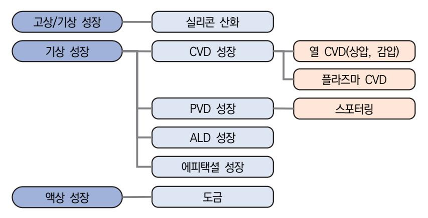

출처: 집필진 제작(2024) [그림 1-1] 증착 방식에 따른 박막 공정의 분류

#### 2. 박막의 형성

박막(thin film)이란 기판상에 약 1㎛의 두께로 고체 막을 형성한 것을 의미한다. 따라서 두께 1㎛ 이상을 후막(thick film, bulk)라고 한다. 박막은 형성 과정에서 고체 덩어리 (bulk)와는 다르게 구조 차이에 의한 고유 특성을 가진다. 또한 박막은 물리적, 자기적, 물 리적 및 광학적으로 덩어리와는 특성이 다르다. 박막은 결정 상태에 따라 비정질 성장 (amorphous growth), 다결정 성장(poly-crystal growth) 및 단결정 성장(single crystal growth)으로 구분하며, 단결정 성장은 동종 성장(homoepitaxy)과 이종 성장(hetero epitaxy)으로 나눈다.

#### (1) 박막의 표면

고체의 표면이란 [그림 1-2]에서와 같이 고체의 가장 최외각 층에 있는 원자를 말하며, 분자 상태의 화합물 구성에서 표면은 분자층을 의미한다. 즉, 고체 표면은 원자를 결합 하지 못한 상태로 깨진 결합(broken bond)이고, 깨진 결합은 원자와 결합할 수 있는 여분의 에너지를 가지며 이를 표면 에너지(surface energy)라고 한다.

(2) 박막의 결합

고체 표면에서 박막의 형성은 기판 원자가 박막 원자와 화학적으로 반응하여 결합하는 상태이며, 박막 형성 후에는 [그림 1-3(b)]에서 나타낸다. 그리고 [그림 1-4]에서 나타나 듯이, 박막 원자는 기판 속으로 확산하여 효과적으로 확산층을 만들어 밀착하게 된다.

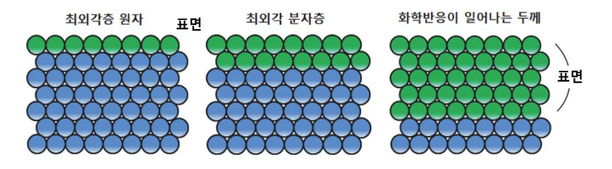

출처: 집필진 제작(2024) [그림 1-2] 박막의 증착과 표면

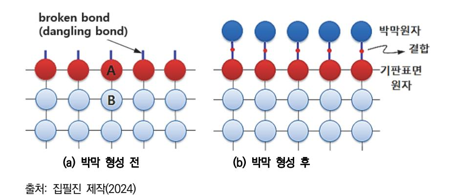

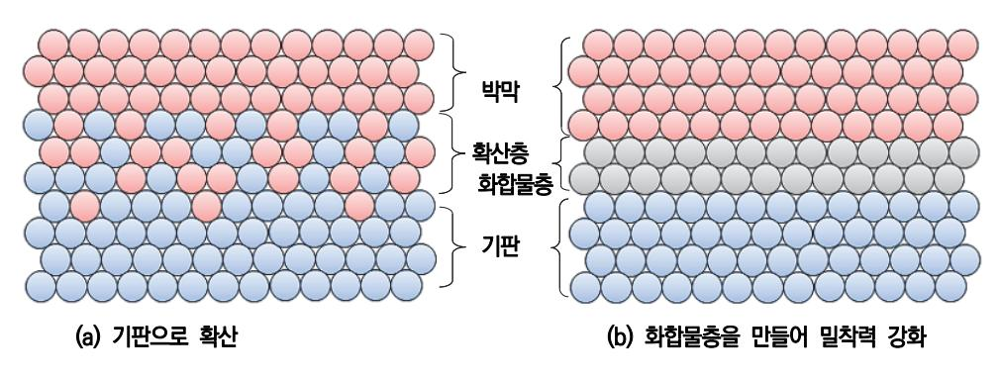

출처: 집필진 제작(2024) [그림 1-4] 박막 형성

[그림 1-3] 기판 표면의 박막 원자

(3) 박막의 밀착력

박막 원자는 기판 원자와 화학적으로 반응하여 화합물 형태로 중간층을 구성하여 밀착 력을 향상하게 된다. 박막의 밀착력은 기판에 존재하는 불순물, 기체 혹은 수분 등에 의 해 약화될 수 있으며, 기판 표면에 잔류하는 가스나 수분으로 인하여 박막에 크랙 (crack)이 만들어지거나 심하면 박막이 분리되는 경우도 발생하게 된다. 또한 박막에 내 적인 응력(stress)이나 외적인 응력으로 인하여 박막이 휘거나 박막 표면이 깨지는 문제 가 발생하기도 한다.

3. 박막 공정의 원리

박막을 증착하는 반도체 증착 공정에서 가스를 이용하는 기상 성장법은 크게 물리적 기상 증착법(PVD: physical vapor deposition)과 화학적 기상 증착법(CVD: chemical vapor deposition)으로 구분한다.

(1) 물리적 기상 증착법(PVD)

PVD법은 얇은 박막(thin film)을 기체 상태의 원소나 화학 물질을 물리적으로 이동시켜 기판 표면에 증착하는 방식이다.

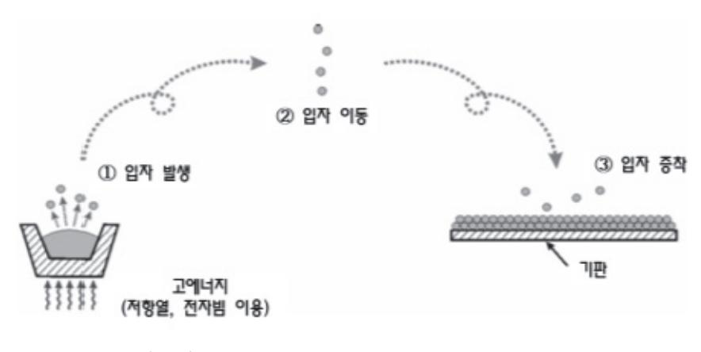

출처: 집필진 제작(2024) [그림 1-5] PVD법의 원리

(가) PVD의 증착 원리

물리적 증기 증착법의 기본 원리는 [그림 1-5]에서 나타나듯이 진공 용기(chamber) 내부를 고진공 분위기로 조성하고, 고체 상태의 물질을 열이나 운동에너지에 의해 기상으로 형성하여 기판에 박막을 증착하는 방법이다. 생성된 증기(vapor)는 플라즈 마를 이용하여 활성화하고, 더불어 반응성 가스를 이용하는 방법으로 박막의 특성을 개선한다.

(나) PVD 증착 과정

PVD법의 증착 과정은 고진공 분위기에서 진행하며, 진공 용기 내에서 기체를 공급 하고, 기판 표면에 박막을 증착하는 데 필요한 조건을 설정한다. 불활성 가스를 이온 화하고, 이온화된 기체를 가속하여 이온 폭격(bombardment)을 통해 기판 표면에 박막이 부착된다. 증착된 원자는 기판 표면에서 원자층을 형성하며, 박막은 공정 시 간에 따라 성장하게 된다. 다양한 조건에 따라 박막의 두께, 구조, 성분 등을 제어할 수 있으며, 증착 속도, 온도 및 기체 종류 등을 조절하여 증착한다.

(2) 화학적 기상 증착법(CVD)

CVD법은 외부와 차단된 반응실(reactor) 안에서 기판 위에 원하는 물질을 기체로 공급 하여 열, 플라즈마(plasma), 자외선(UV), 레이저(laser), 또는 임의의 에너지에 의한 열 분해를 일으켜 박막을 증착하는 공정이다.

(가) CVD의 증착 원리

[그림 1-6]에서 나타나는 바와 같이 CVD 공정의 기본 원리를 살펴보면, 반응 물질 (reagent)을 기판으로 이송되고, 진공 용기 내에서 기체가 반응하여 박막 재료 물질 과 부산물(by-product)이 생성되며, 박막 물질 재료는 기판 표면으로 이동한다. 기 판 표면에 흡착된 반응 물질은 기판 위에서 확산하여 표면에 화학 반응을 통해 기판 의 표면에서 결정 성장이 시작되면서 박막을 증착하고 부산물은 표면에서 탈착하여 과잉 가스와 함께 배출구로 배기한다.

#### (나) CVD 장비의 구성

CVD 장비의 구성은 동작 원리에 따라 매우 다양하지만, 화학 반응을 통해 박막 증 착이 생성되는 진공 반응실(chamber)을 중심으로 원료 기체를 공급하는 공급부(gas inlet), 반응이 일어난 기체와 부산물을 외부로 배출하는 배기부(exhaust), 기판을 고정하고 위치를 조정하는 지지부(substrate holder)와 반응에 필요한 에너지를 공 급하는 전원인 에너지부(energy source) 등이 연결되어 있다.

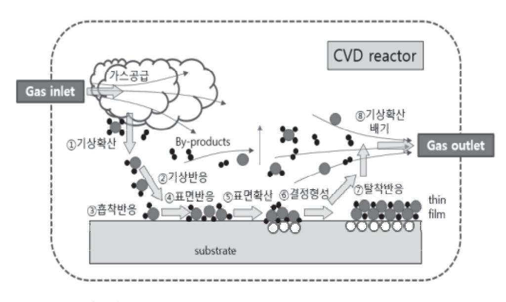

출처: 집필진 제작(2024) [그림 1-6] CVD법의 원리

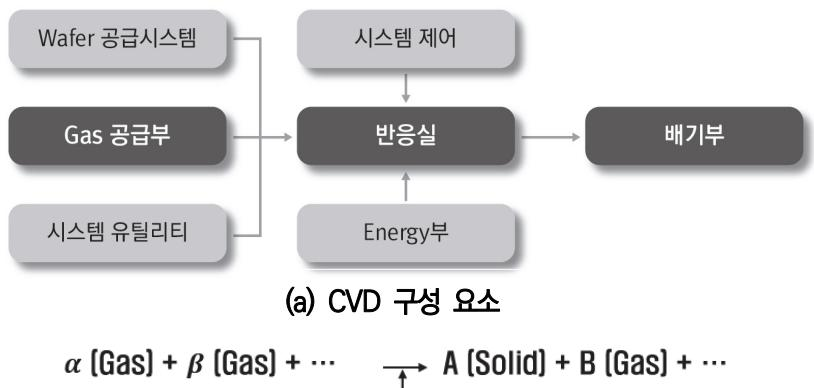

#### (b) CVD의 반응식

출처: 집필진 제작(2024)

[그림 1-7] CVD법의 증착 구성

공급부는 다시 기체를 저장 용기에서 반응실로 밀어내는 압력을 조절하는 조정기, 반응실로 공급되는 각각의 기체의 유량을 조절하는 질량 유량 제어기(MFC: mass flow controller) 및 길목마다 흐름을 제어하는 각종 밸브 등으로 구성되어 있으며, 배기부는 배기하는 양을 조절하는 배기 밸브와 진공 펌프 등으로 구성된다.

(다) CVD의 종류

CVD법은 박막을 형성하는 데 필요한 원소는 기체 상태로 공급되어야 한다. CVD에 서 화학 반응이 바르게 일어나기 위해서는 여러 가지 공정 조건과 분위기가 정밀하 게 조절되어야 하며, 원료 가스가 자발적으로 화학 반응을 일으킬 수 있도록 활성화 하는 에너지도 공급하여야 한다.

CVD의 종류는 공급되는 에너지원에 따라 크게 3가지로 나누는데, 열에너지를 이용 하는 방식, 플라즈마를 이용하는 방식 및 기타 원자층 증착법으로 구분한다. 이외에 반응실의 형태, 반응실의 가열 방식, 증착 소재 및 반응 물질에 따라 나누어 다양하 게 분류하기도 한다. 먼저 [그림 1-8]에서와 같이 열에너지를 이용하는 방식에서 압 력에 따라 상압 CVD(APCVD: atmosphere pressure CVD)와 저압 CVD(LPCVD; low pressure CVD)로 구분한다. 그리고 에너지원으로 플라즈마를 형성시키는 방식 에 의해 플라즈마 CVD(PECVD; plasma enhanced CVD)와 고밀도 플라즈마 CVD(HDPCVD: high density plasma CVD) 등이 있다.

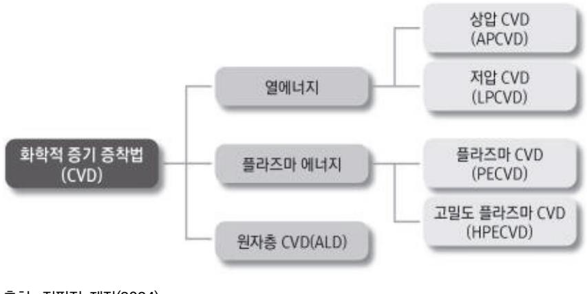

출처: 집필진 제작(2024) [그림 1-8] CVD법의 분류

숕 반도체 박막 공정용 가스

반도체 제조용 가스는 크게 2가지로 구분하는데, 대량 소품종으로 사용하는 질소(N2), 산소 (O2), 수소(H2), 아르곤(Ar) 및 헬륨(He) 등과 같은 일반 가스와 소량 다품종으로 제조 공정의 용도에 따라 사용하는 특수 가스가 있다. 일반 가스는 일명 벌크 가스(bulk gas)라고 부르기도 하며, 47L의 단품 실린더(cylinder)에 사용하기 때문에 붙여진 명칭이다. 이와 같은 일반 가스 는 제조 공정에 전반적으로 사용되며, 특히 박막 공정에서 많이 적용되고 있다. 그리고 특수 가스는 식각용, 증착용 및 세정용 등과 같이 공정 중에 용도에 따라 사용되기 때문에 프로세스 가스(process gas)라고 부른다.

1. 박막 공정의 분류

반도체 제조 공정에서 박막 공정은 에피택셜 성장(epitaxial growth)과 증착(deposition)으로 구분하며, 증착은 크게 구분하면, 물리적 기상 증착법(PVD)과 화학적 기상 증착법(CVD)으로 대별할 수 있다.

(1) 에피택셜 성장법

에피택셜 성장이란 단결정 기판상에 기판과 같은 결정 방향을 가진 단결정 박막을 형성 하는 성장법이다. 기판의 결정과 에피택셜 단결정 박막이 동일한 물질이면 호모 에피택 셜 성장법(homo-epitaxial growth)이라 하고, 다른 물질이면 헤테로 에피택셜 성장법 (hetero-epitaxial growth)이라 한다.

(2) PVD 성장법

PVD 성장법은 동작 원리에 따라 증발법(evaporating method)과 스퍼터법(sputtering method)으로 구분한다. 일명 진공 증착법이라 부르는 증발법은 증착하고자 하는 물질 을 기화하기 위해 열에너지를 사용하지만, 스퍼터법은 플라즈마를 형성한 기체의 운동에 너지를 이용하여 증착하려는 물질을 기화하는 방식이다. [그림 1-9]에서는 대표적인 스 포터링 장비의 외형을 보여 준다.

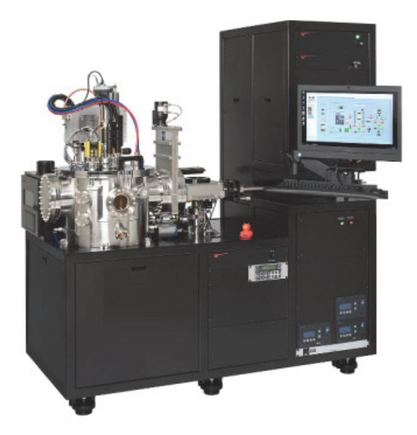

출처: 집필진 제작(2024) [그림 1-9] 스포터링 장비의 외형

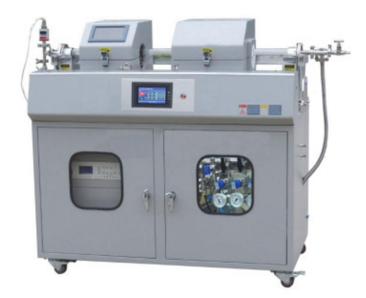

출처: 집필진 제작(2024) [그림 1-10] CVD 장비의 외형

(3) CVD 성장법

CVD 성장법은 박막층을 형성하기 위해 기체 상태의 원료 가스를 공급하여 화학적인 반 응을 통해 박막을 증착하는 방법이다. CVD법의 종류는 에너지를 공급하는 방식에 따라 분류하며, APCVD, LPCVD, PECVD 및 MOCVD 등으로 구분한다. [그림 1-10]은 대 표적인 CVD 장비의 외형을 보여 준다.

#### 2. 박막 공정용 가스

(1) 에피택셜 가스

에피택셜 성장에서 사용하는 가스는 SiH4, SiH2Cl2, SiHCl3, SiCl4, B2H6, BBr3, BCl3, AsH3, PH3, GeH4, SnCl4, 및 GeCl4 등이 있다.

(2) PVD 가스

PVD 증착법에서 사용하는 가스는 플라즈마를 생성하기 위한 가스로 아르곤(Ar)이 주로 사용하며, 이외에 반응성 가스로 질소(N2), 산소(O2) 및 수소(H2) 등이 사용된다. 그러나 PVD 증착법에서는 그리 많은 특수 가스를 사용하지 않는 편이다.

(3) CVD 가스

CVD 증착법에서는 주로 가스를 이용하여 가스 간에 화학 반응으로 박막을 증착하기 때 문에 다양한 특수 가스를 사용한다. CVD용 가스로는 SiH4, SiH2Cl2, SiCl4, NH3 NO 및 O2, 등이 있다.

재료·자료

- 반도체 재료 제조 기술 자료
- 국제표준화기구(ISO; international organization for standardization) 표준화 문서
- 물질 안전 보건 자료(MSDS)
- 생산 계획서
- 반도체 재료 작업 절차서
- 반도체 재료 작업 표준서
- 시험 성적서
- 반도체 설비 목록 및 매뉴얼
- 반도체 제조 공정도
- 반도체용 박막 가스 원재료

#### 기기(장비 ・ 공구)

- 반도체용 박막 공정 가스 제조 장비
- 반도체용 박막 공정 가스 측정 장비
- 반도체용 박막 공정 가스 검사 장비
- 반도체용 박막 공정 가스 분석 장비

#### 안전 ・ 유의 사항

- 반도체 박막 공정에 대한 이론적 지식을 습득하고, 사용하는 가스의 성질과 특성을 바탕으 로 가스 제조 시에 문제점을 검토하고, 취급 주의 사항을 이해하여야 한다.
- 반도체 박막 공정에서 사용하는 특수 가스는 부식성, 맹독성, 인화성 및 발화성 등의 위험 물질이 많아 해당 가스에 대한 장비, 공급 시설, 관리 및 주의 사항을 사용하기 전에 미리 숙지하여야 한다.
- 물질 안전 보건 자료를 통해 특수 가스를 취급하기 전에 파악하고, 독성 가스의 경우에는

제독 설비에 대한 일반 사항, 제독 설비 및 제독 방법 등 안전 교육을 실시한다.

수행 순서

숔 박막 공정에서 사용하는 가스의 제조 사양서를 파악하여 가스 공정에 대한 전반적인 내용과 가스 제 품에 대한 특성을 이해한다.

반도체 제조 공정에서 박막 공정에 대한 일반적인 지식을 파악하고, 각 박막 공정의 단위 공정 과 적용되는 장비를 파악한다. 그리고 공정에서 사용하는 가스의 제조 사양서(활용 서식 98쪽 참조)를 바탕으로 가스 제품명, 품질 기준 및 제품의 사양을 파악한다.

- 1. 반도체 박막 공정에 대한 지식을 이해하고, 박막 공정의 절차를 바탕으로 사용되는 장비와 도구 및 필요한 특수 가스의 종류를 파악한다.
  - (1) 반도체 제조 공정에 대한 기본적인 이론 지식을 이해한다.
  - (2) 박막 공정을 수행하기 전에 증착된 감광막이나 박막의 재료를 파악한다.
  - (3) 박막 공정의 종류와 원리를 이해한다.
  - (4) 박막 공정에서 사용되는 장비를 파악하고, 매뉴얼을 이용하여 장비 운용과 순서를 습득한다.
  - (5) 박막 공정에 사용하는 특수 가스의 종류와 특성을 이해한다. 일반적으로 가스를 이용하여 박막을 증착하는 공정은 에피택셜 증착법과 CVD법으로 구 분한다. 증착 방법에 따른 특수 가스의 종류를 파악하고 특성을 이해한다.
    - (가) 에피택셜 증착법에서 사용하는 특수 가스의 종류를 파악한다.
      - 일반적으로 에피택셜 증착에서는 SiH4, SiH2Cl2, SiHCl3, SiCl4, B2H6, BBr3, BCl3, AsH3, PH3, GeH4, SnCl4, 및 GeCl4 등을 사용하며, 박막 공정에서 사용하는 특수 가스를 파악한다.
    - (나) CVD법에서 사용하는 특수 가스의 종류를 파악한다. 일반적으로 CVD법에서는 일반적으로 SiH4, SiH2Cl2, SiCl4, NH3 NO 및 O2, 등을 적용하며, 증착 장비에 따른 특수 가스를 파악한다.
- 2. 박막 공정에서 사용하는 특수 가스의 제조 사양서를 입수하여 가스 제조 공정과 사양서의 내용을 습득하고, 특수 가스의 특성을 파악한다.

반도체용 식각 공정 가스 제조(LM1903060416\_23v3)의 학습모듈 1-1. 식각 공정 가스 요 구 사항 파악에서 [그림 1-5] 가스 제조 사양서의 일례와 부록 활용 서식에서 제시하는 제 조 사양서의 내용을 입수하고, 제조 사양서를 파악하기 위한 수행 순서를 참고한다.

(1) 제조 사양서의 일반적인 제품에 대한 항목과 내용을 검토한다.

제조 사양서의 내용을 파악하여 특수 가스의 제품명과 제조 일자를 확인한다.

(2) 제조 사양서를 기준으로 가스의 품질 기준을 확인하고, 특수 가스의 관리와 보관 방법 등을 확인한다.

제조 사양서의 품질 기준을 기준으로 가스의 순도와 경년 변화를 파악하고, 관리 방법과 점검에 대해 숙지한다.

(3) 가스 제품의 특성을 확인한다.

특수 가스는 저온에서도 분해 반응이 가능하고 매우 활성이 높으므로 생체에 영향을 줄 수 있다.

- (가) 특수 가스의 생체 작용에 대한 내용을 검토한다. 제품의 특성에서 생체 작용에 대한 내용으로 부식성, 자극성, 질식성, 가연성 및 독 성 등을 반드시 검토한다.
- (나) 특수 가스의 안전 취급 및 안전 대책에 대해 파악한다. 허용 농도, 제독 방법 및 경고 등에 대한 상세한 내용을 검토하여 취급, 관리 및 제 조 과정에서 유의하여야 한다.
- 숕 반도체 박막 증착 공정과 증착 재료에 따른 특수 가스 종류와 특성에 대한 지식을 확인한다. 일반적으로 특수 가스를 사용하여 박막을 증착하는 반도체 박막 공정은 주로 CVD 증착법이며, 먼저 CVD의 종류를 검토한다.
  - 1. CVD 증착법에 따른 박막 공정 장비의 종류를 파악한다.

CVD 장비는 에너지원에 따라 크게 3가지로 분류하며, 열에너지를 이용하는 방식, 플라즈 마를 이용하는 방식 및 기타 원자층 증착법으로 구분한다. 그리고 반응실의 형태, 반응실의 가열 방식, 증착 소재 및 반응 물질에 따라 나누어 다양하게 분류하기도 한다. 열에너지를 이용하는 방식에서 압력에 따라 APCVD(atmosphere pressure CVD), LPCVD(low pressure CVD)와 HPCVD(high pressure CVD)로 구분한다. 그리고 에너지원으로 플라즈 마를 형성시키는 방식에 의해 PECVD(plasma enhanced CVD)와 금속 유기물을 증착하 는 MOPCVD(metal organic CVD) 등이 있다.

(1) APCVD 장비의 원리와 동작을 확인한다.

APCVD는 대기압(760Torr)에서 증착이 이루어지기 때문에 반응실의 구조가 간단하고 증착이 빠르며, 저온 증착이 가능하다. 하지만 대기압에서 평균 자유 행정(MFP)이 짧고, 반응 기체에 의한 오염이 발생할 수 있으며, 단차 피복성(step coverage)이 좋지 못하 다는 단점이 있다.

(2) LPCVD 장비의 원리와 동작을 확인한다.

LPCVD에서 기체 흐름이나 기체 배기 장치는 APCVD 장치와 비슷하지만, 증착의 균일 도, 단차 피복성과 불순물 등의 문제를 개선할 수 있기 때문에 박막 제조에 많이 사용 한다. 진공 용기는 일반적으로 저항 가열로(furnace) 안에 장착되며, [그림 1-11]은 LPCVD의 기본적인 구조를 보여 준다.

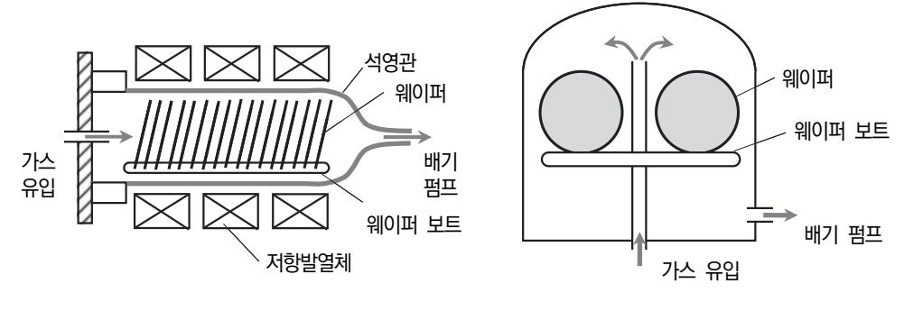

(a) 수평관 방식 (b) 수직 방식

출처: 집필진 제작(2024) [그림 1-11] LPCVD 장비의 구조

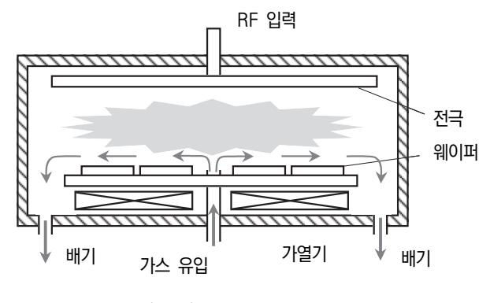

출처: 집필진 제작(2024) [그림 1-12] PECVD 장비의 구조

#### (3) PECVD 장비의 원리와 동작을 확인한다.

[그림 1-12]에서 나타나는 바와 같이 PECVD는 RF를 이용하여 반응 가스를 플라즈마 로 만들어 웨이퍼에 박막을 증착하기 때문에 상압이나 저압 CVD보다 낮은 온도에서 증 착이 가능하다. 따라서 낮은 압력하에 글로 방전을 이용하여 화학 반응을 촉진시키고, 열적 반응만 있을 때보다 낮은 온도에서 플라즈마를 활용하여 저온에서 공정이 가능한 화학적 기상 증착법이다. 주로 금속 위에 산화물(SiO2)이나 질화물(Si3N4)을 증착하기 위 해 사용하며, 박막의 접착력이 열을 이용한 방식보다 우수하고, 단차 피복성이 좋으며, 핀홀(pin-hole) 밀도가 적다는 특성을 가진다.

(4) MOCVD 장비의 원리와 동작을 확인한다.

MOCVD는 화학 기상 증착의 한 형태로, 증착되는 물질을 기체 상태로 공급하여 기판 표면에 증착시키는 원리이다. 화학 반응을 통해 원자나 이온을 생성하고, 기판 표면에 박막을 형성하는데, MOCVD 장비로는 반응실이라는 장치 내에 기판과 반응성 기체가 함께 위치한다. 기판은 일반적으로 단일 결정 실리콘 또는 다른 소재로 만들어진 원판 형태이며, 반응성 기체는 금속 유기 화합물 및 캐리어 기체로 구성된다. 금속 유기 화합 물이 열 분해되면서 생성된 금속 원자는 기판 표면에 흡착되며, 동시에 다른 반응성 기

체가 함께 공급되어 반응을 일으키고, 이에 따라 원자나 이온이 기판 표면에 증착되어 박막이 형성된다.

#### 2. 반도체 박막 재료에 따른 공정 가스의 종류를 파악한다.

박막 공정에서는 고순도 SiH4, SiH2Cl2, SiHCl3, SiCl4, GeH4, B2H6, BBr3, BCl3, AsH3, PH3, TeH2, SnCl4, GeCl4, WF6, NH3, CH4, Cl2, MoF6 등의 특수 가스가 사용되며, 운반 기체(carrier gas)로는 고순도 수소(H2)와 질소(N2) 가스가 이용된다. 〈표 1-1〉은 박막 공 정에서 용도와 박막 재료에 따른 공정 가스를 간단히 정리한 것이다.

〈표 1-1〉 박막 공정에서 용도와 박막 재료에 따른 각종 반응 가스

| 공정       | 용도 및 박막 재료            | 가스                                                                                                              | 공정 온도        |  |  |
|----------|-----------------------|-----------------------------------------------------------------------------------------------------------------|--------------|--|--|
|          | 에피택셜 공정               | SiH 4 , SiH 2 Cl 2 , SiHCl 3 , SiCl 4 , SiCl             | 1,000~1,075℃ |  |  |
|          | 폴리 실리콘                | SiH 4                                                                                                | 600℃         |  |  |
| 박막 공정 | SiO 2 박막   | SiH 4 , SiH 2 Cl 2 , SiCl 2 , O 2 , NO, N 2 O | 450℃         |  |  |
|          | Si 3 N₄ 박막 | SiH4, H2                                                                                                        | 600°C        |  |  |
|          |                       | SiH 2 Cl 2 , NH 3                                                              | 300℃         |  |  |
|          | PSG or BSG 박막         | SiH 4 , SiCl 4 , PH 3 , B 2 H 6                          | _            |  |  |
|          |                       |                                                                                                                 |              |  |  |

출처: 김현후(2024). 『반도체 제조 장비 기술』. 내하출판사. p. 177.

#### 3. 반도체 박막 공정용 가스의 화학 물질 정보를 확인한다.

가스 제조 사양서를 바탕으로 원료 물질과 생산하려는 가스의 화학 물질 정보는 대상 설비 에서 취급·저장하는 원료, 부원료, 첨가제, 촉매, 촉매 보조제, 부산물, 중간 생성물, 중간 제품 및 완제품 등 모든 화학 물질을 대상으로 검토한다. 〈표 1-2〉는 화학 물질 정보의 양 식을 나타내며, 작성 방법은 다음과 같다.

〈표 1-2〉 화학 물질 정보

| 번호   | 화학 물질명 |           | 물질         | 농도     | 폭발 한계 (vol%) |     | 노출 기준 (TWA) |                   | 독성값             |    |       |          |           |           |          |     |
|------|-----------|-----------|------------|--------|-----------------|-----|----------------|-------------------|-----------------|----|-------|----------|-----------|-----------|----------|-----|
|      |           |           | 상태         | 상태 (%) | 하한              | 상한  | ppm            | mg/m 8 | 3 흡입 | 경구 | 경피    | ERPG-2   | IDLH      |           |          |     |
|      |           |           |            |        |                 |     |                |                   |                 |    |       |          |           |           |          |     |
|      |           |           |            |        |                 |     |                |                   |                 |    |       |          |           |           |          |     |
| 인화점  | 발화점 끊는    | 발회점 끊는점 _ | 회점 끊는점 증기입 |        | 경증기압            | 증기압 | 이상             | · 부스              | 성               | 취급 | 급및 저장 | 당        | 적용 대      | 상 여부      | ~-       |     |
| (°C) |           |           |            |        |                 |     | 증기압            | 증기입               | . 10 반응      |    | 루   연 | [간 ]량 | 일일 취급량 | 최대 저장량 | 유해 물질 | 사고대 |
|      |           |           |            |        |                 |     |                |                   |                 |    |       |          |           |           |          |     |

출처: 이형섭(2017). 「공정 안전 보고서의 통합 서식 작성 방법에 관한 지침」. 한국산업안전보건공단. p. 26.

- (1) 화학 물질명은 기본적으로 한글로 작성하고, 상품명이 아닌 경우에는 고유의 화학 물질명으로 표기한다.
- (2) 분자식은 화학 물질의 어떤 분자를 이루는 모든 원자들의 종류와 수를 모두 나타내는 방식으 로 나타낸다.
- (3) 물질 상태는 취급 물질의 25℃에서 대기압에서의 상태를 기체, 액체 및 고체 상태로 구분하 여 작성한다.
- (4) 농도는 취급 물질의 농도(wt%)로 표기한다.
- (5) 폭발 한계는 공기 중에서 연소 혹은 폭발이 발생할 수 있는 농도(vol %)를 의미하며, 하한값 과 상한값을 구분하여 작성한다.
- (6) 노출 기준은 작업장에서 허용 농도값(TWA)을 의미한다.
- (7) 독성 값은 취급하는 물질의 급성 독성 값(경구, 경피, 흡입), ERPG-2, AEGL-2, PAC-2, IDLH 중 해당하는 값과 단위로 작성한다.
- (8) 인화점은 취급 물질의 인화점을 의미한다.
- (9) 발화점은 취급 물질의 자연 발화점을 작성한다.
- (10) 끓는점은 대기압에서 액체의 끓는 온도를 의미한다.
- (11) 증기압은 20℃에서의 증기압을 표기하거나 증기압과 해당 온도를 함께 나타낸다.
- (12) 이상 반응은 이상 반응을 일으키는 물질이나 조건을 작성하며, 이상 반응이 없는 경우에는 NFPA 지수 중에 반응 위험성 지수를 기록하거나 물질 안전 보건 자료(MSDS)의 내용 중에 관련되는 공정에서 취급하는 물질과의 반응을 정리하여 나타낸다.
- (13) 부식성 유무는 해당 물질의 부식성 여부를 기록한다. 물질 안전 보건 자료(MSDS)의 금속 부식성 및 피부 부식성 번호를 표기할 수도 있다.
- (14) 취급 및 저장량은 일일 취급량, 연간 취급량 및 최대 저장량을 각각 기록한다. 일일 취급량 은 해당 설비나 시설에서 제조하거나 사용 또는 보관 및 저장할 수 있는 취급량 중에 가장 큰 값을 표기한다.
- (15) 적용 대상 여부는 유해 화학 물질과 사고 대비 물질의 해당 여부를 작성한다.
- (16) 용도는 해당 물질의 사용 용도로 원료, 제품 및 부산물 등을 기록한다.
- (17) 비고란에는 사업장에서 필요한 기타 정보를 기록한다.
- 4. 특수 가스의 화학 물질 정보를 확인하고, 각 가스의 유해성 정보를 검토한다. 가스의 유해성과 관련한 정보는 다음 <표 1-3>과 같다. 유해성 정보는 취급 물질의 일반적 인 내용, 위험 분류 및 표시 정보, 물리적 및 화학적 성질, 화재나 폭발에 대한 위험 특성, 안정 및 반응에 대한 위험 특성, 인체 유해성, 환경 유해성, 취급 방법, 사고 대응 정보, 관 련 법규 및 참고 사항 등으로 구분하여 나타낸다.

| 구분               | 세부 내용                   |  |  |  |  |
|------------------|-------------------------|--|--|--|--|
|                  | 물질명                     |  |  |  |  |
|                  | 유사명                     |  |  |  |  |
|                  | CAS 번호                  |  |  |  |  |
|                  | UN 번호                   |  |  |  |  |
|                  | 유해 화학 물질 관리 번호          |  |  |  |  |
|                  | 농도(또는 함량 %)             |  |  |  |  |
| 취급 물질의 일반적인 정보   | 일일 사용량                  |  |  |  |  |
|                  | 연간 취급량                  |  |  |  |  |
|                  | 최대 저장량                  |  |  |  |  |
|                  | 용도                      |  |  |  |  |
|                  | 제조자 정보                  |  |  |  |  |
|                  | 공급자/유통 업자 정보(구매해서 사용 시) |  |  |  |  |
|                  | 유해성 분류                  |  |  |  |  |
|                  | 그림 문자                   |  |  |  |  |
| 위험 · 유해성 분류 및 표시 | 신호어                     |  |  |  |  |
| 정보               | 유해 · 위험 문구              |  |  |  |  |
|                  | 예방 조치 문구                |  |  |  |  |
|                  | 물질의 상태                  |  |  |  |  |
|                  | 구조식                     |  |  |  |  |
|                  | 분자량                     |  |  |  |  |
|                  | 냄새                      |  |  |  |  |
|                  | pH                      |  |  |  |  |
|                  | 끓는점                     |  |  |  |  |
|                  | 녹는점                     |  |  |  |  |
|                  | 증기압                     |  |  |  |  |
| 물리적 · 화학적 성질     | 증기 밀도                   |  |  |  |  |
|                  | 용해도(물)                  |  |  |  |  |
|                  | 용해도(용매)                 |  |  |  |  |
|                  | 옥타놀/물 분배 계수             |  |  |  |  |
|                  | 밀도                      |  |  |  |  |
|                  | 비중                      |  |  |  |  |
|                  | 입도 분석                   |  |  |  |  |
|                  | 점도                      |  |  |  |  |
|                  | 해리 상수                   |  |  |  |  |

<표 1-3> 물질의 유해성 정보

17

| 구분            | 세부 내용                                     |  |  |  |  |  |
|---------------|-------------------------------------------|--|--|--|--|--|
|               | 화재 및 폭발 가능성                               |  |  |  |  |  |
|               | 인화점                                       |  |  |  |  |  |
|               | 발화점                                       |  |  |  |  |  |
| 화재 · 폭발 위험 특성 | 발화 등급                                     |  |  |  |  |  |
|               | 폭발 한계(하한값 ~ 상한값)                          |  |  |  |  |  |
|               | 연소/열분해 생성물                                |  |  |  |  |  |
|               | 반응성(안정성, 산화성 등)                           |  |  |  |  |  |
| 안정/반응 위험 특성   | 부식성                                       |  |  |  |  |  |
|               | 피해야 할 조건                                  |  |  |  |  |  |
|               | 급성 독성(경구, 경피, 흡입)                         |  |  |  |  |  |
|               | 피부 부식성 또는 자극성                             |  |  |  |  |  |
|               | 심한 눈 손상 또는 눈 자극성                          |  |  |  |  |  |
|               | 호흡기 또는 피부 과민성                             |  |  |  |  |  |
| 인체 유해성        | 생식 세포 변이원성                                |  |  |  |  |  |
|               | 발암성                                       |  |  |  |  |  |
|               | 생식/발달 독성                                  |  |  |  |  |  |
|               | 기타 특이 사항                                  |  |  |  |  |  |
|               | 환경 매체(대기, 수질, 토양) 간 이동 정보(휘발성, 흡착/이동성 포함) |  |  |  |  |  |
|               | 수생 생물 독성(급성/만성)                           |  |  |  |  |  |
| 환경 유해성        | 육상 생물 독성(급성/만성)                           |  |  |  |  |  |
|               | 생물 농축성                                    |  |  |  |  |  |
|               | 분해성                                       |  |  |  |  |  |
|               | 취급 시 주의 사항                                |  |  |  |  |  |
| 취급 방법         | 안전한 저장 방법                                 |  |  |  |  |  |
|               | 폐기 방법 및 폐기 시 주의 사항                        |  |  |  |  |  |
|               | NFPA 코드(건강/화재/반응/특수 위험성)                  |  |  |  |  |  |
|               | 노출 방지 및 개인 보호구                            |  |  |  |  |  |
| 사고 대응 정보      | 누출 시 방제 요령(적정 방제 약품 및 장비 등)               |  |  |  |  |  |
|               | 화재 대응 정보(적정 소화제 및 장비, 진압 요령, 주의 사항 등)     |  |  |  |  |  |
|               | 노출 시 응급조치 요령(흡입, 피부, 안구, 경구)              |  |  |  |  |  |
|               | 규제 현황(「산업안전보건법」, 「위험물안전관리법」, 「고압가스안전관리    |  |  |  |  |  |
| 관련 법규 정보      | 법」 등)                                     |  |  |  |  |  |
|               | 노출 기준(작업장 허용 노출 기준, 위험 노출 수준 등)           |  |  |  |  |  |
| 기타 참고 사항      | 상기 자료의 출처                                 |  |  |  |  |  |
|               | 기타 사항                                     |  |  |  |  |  |

출처: 이형섭(2017). 「공정 안전 보고서의 통합 서식 작성 방법에 관한 지침」. 한국산업안전보건공단. p. 27.

## 1-2. 가스 제조 단계 문제점 검토

학습 목표 • 파악된 내용을 바탕으로 박막 공정 가스 제조 시 발생할 수 있는 문제점을 검토할 수 있다.

## 필요 지식 /

숔 특수 가스 제조 시에 주의 사항

반도체 관련 특수 가스는 용도에 따라 다양한 혼합물의 형태로 제조되는데, 취급에 있어 안전 에 관해 이해하여야 한다. 전자 산업용 가스와 특수 가스를 취급할 시, 취급자는 일반적인 사 내 안전 기준을 준수하고, 안전 절차에 따라 저장, 취급 및 관리를 준수한다. 또한 가스 제조와 관리에서 기초 구성이라 할 수 있는 용기와 가스 공급 시스템의 잠재적인 위험에 대한 안전 조 치를 잘 파악하여야 한다. 특히 혼합 가스를 제조할 때는 요구되지 않는 반응이 발생하지 않도 록 세심한 주의를 기울여야 한다.

1. 가스 제조에서 안전 기준과 관련한 기술 용어

전자 특수 가스의 제조 시에 안전 및 취급에 관한 기준은 제조 업체별로 다소 차이가 있지 만, CGA G-3-1995 전자 특수 가스의 안전 및 취급에 관한 기준을 참고한다. 제조 과정에 서 취급자가 안전하게 가스를 제조할 수 있도록 기본적인 기술 용어를 정리한다.

(1) 절대 압력

완전한 진공 상태인 기준 영점에서 측정한 압력으로 해수면에서 표준 대기 압력은 101.325kPa(1.013bar)이다. 그러나 대기 압력은 지역에 따라 다르며, 기상 조건이나 해수면과의 거리 차이 등으로 표준값과는 편차가 있기도 하다.

(2) 압축 가스

20℃ 또는 그 이하의 온도와 절대 압력 101.325kPa에서 기체 상태, 또한 절대 압력 101.325kPa에서 20℃ 또는 그 이하의 비등점을 가지고 액체, 비-액체 또는 용액 상태 인 하나의 물질 또는 물질의 혼합물로 기타 건강 또는 물리적 위험성이 없는 가스로 충 전재 내부 압력이 20℃에서 절대 압력 280kPa를 초과하기 전까지 압축 가스로 간주하 지 않는 가스를 제외하는 가스를 의미한다.

(3) 부식성 가스

부식성 가스는 재료 또는 생체 조직과 접촉 시 손상 또는 파괴를 야기할 수 있는 가스 를 의미한다.

(4) 임계 온도

임계 온도란 그 이상의 온도에서는 압축 가스가 액체 상태로 존재할 수 없는 온도를 의 미한다.

(5) 초저온 액체

초저온 액체는 비등점이 101.325kPa에서 90℃보다 낮은 저온 액화 가스를 의미한다.

(6) 단열병

초저온 액체를 수용하기 위해 설계된 것으로 주둥이가 개방되고 압력을 가하지 않은 진 공 재킷을 갖춘 이동식 액체 컨테이너 또는 단열 처리된 용기를 의미한다.

(7) 충전율

충전율은 컨테이너에 주입된 액화 가스의 질량과 15℃에서 사용하기에 적합하도록 동일 컨테이너에 주입할 수 있는 물의 질량 간의 비율을 의미한다. 충전 밀도, 충전 인자, 최 대 충전도 혹은 최대 충전 압력이라고도 부른다.

(8) 가연성 가스

가연성 가스는 절대 압력 101.325kPa에서 부피로 공기 중에 13% 또는 그 이하의 혼합 물에서 점화되거나 하한과 상관없이 공기 중에 최소 12%의 가연성 범위를 가진 가스를 의미한다.

(9) 가스 혼합물

가스 혼합물은 배합한 혼합물로써 실린더에서 사용할 목적으로 의도적으로 충전한 두 개 또는 그 이상의 요소들의 혼합물로 액체 또는 기체이며 15℃에서 절대 압력 150kPa 이상의 압력이 유지되는 것을 의미한다.

(10) 가스 압력

가스 압력은 가스가 환경에 미치는 단위 면적당 힘을 말하며, 이러한 기준에서 사용하는 압력의 표준 용어는 kPa와 '바(bar)'이다.

(11) 취급

취급이란 정상 상태에서 가스 컨테이너를 이동, 연결 또는 차단하는 것을 의미한다.

(12) 위험

위험은 잠재적으로 인적이거나 물적 피해를 초래할 수 있는 상태를 의미한다.

(13) 맹독성

맹독성이란 공기 중에 LC50이 1시간 노출 시에 200ppm이거나 그 이하인 가스를 의미 한다.

(14) LC50

LC50이란 가스의 반수 치사 농도로 200∼300g의 체중인 10마리의 흰쥐가 1시간 동안 지속해서 호흡하도록 유지하여 14일 이내에 50%를 폐사시키는 것을 의미한다.

(15) 네스팅(nesting)

네스팅이란 근접 삼점 접촉 시스템을 사용하여 모든 실린더가 그룹 내의 다른 실린더, 벽면, 또는 버팀대와 최소 3개의 접촉점을 가지도록 함으로써 바닥 면이 평평한 실린더 를 밀착하여 똑바로 세우는 방법을 의미한다.

(16) 안정화

안정화란 반응성 가스와 컨테이너 간의 반응 가능성이 있을 때, 적용하는 절차 또는 도 입하는 시스템을 의미한다. 보통 안정화는 불활성 가스에 희석한 반응성 가스를 포함한 혼합물을 사용하고 가끔 순수 반응성 가스를 추가 투입하여 실시한다.

(17) 시간 가중-허용 농도(TLV-TWA)

시간 가중-허용 농도란 한 명이 1일 8시간 일주일에 40시간 노출되었을 때, 피해가 없 는 농도를 의미한다.

2. 전자 특수 가스(ESGs)의 위험

반도체 제조 공정에서 사용하는 전자 특수 가스(ESGs: electronic specialty gases)는 내 재하는 물리적, 화학적, 생물학적 및 환경적 반응으로 인하여 위험할 경우가 많은 편이다. 따라서 이러한 4가지 위험에 대해 이해하여야 한다. 대부분의 가스는 하나 이상의 위험을 지니며, 개별 가스에 대해 제공하는 물질 안전 보건 자료(MSDS)를 참고하여 가스 제품의 위험을 파악하여야 한다.

(1) 물리적 위험

물리적 위험으로는 가스 압력과 극저온을 고려한다.

(가) 가스 압력

압축 가스는 주변보다 압력이 더 높은 상태이기 때문에 이러한 온도 차이가 위험을 초래하기도 한다. 인적 오류 또는 장치 고장으로 가스가 통제되지 않고 누출되면, 심 각한 부상이나 손상을 가져올 수 있어 주의하여야 한다.

(나) 극저온

초저온이나 저온의 액체 상태로 취급하는 가스는 동상, 금속 취화, 박무 현상, 열팽 창 및 결빙 등의 위험을 고려하여야 한다.

(2) 화학적 위험

화학적 위험은 가연성, 산화성, 부식성 및 반응성을 고려한다.

(가) 가연성

가연성 가스는 연소하기 위해 점화원과 산화제라는 2가지의 추가적 요소가 필요하 다. 가연성 가스는 공기와의 혼합물이 연소 범위 하한(LFL)과 연소 범위 상한(UFL) 로 부르는 연소 범위 내에 있을 때에만 연소한다. 이러한 범위를 벗어난 혼합물은 일반적으로 연소하지 않는다. 가연성 가스 혼합물은 보통 급격한 연쇄 반응을 시작 하기 위해 점화원이 필요하다. 자동 발화 온도가 54.5℃ 이하인 일부 가연성 가스는 공기 중으로 누출 시 점화될 수 있고, 이러한 가스들은 자연 발화성 가스라고 분류 한다.

(나) 산화성

염소, 불소 및 아산화질소 등과 같은 산화성 가스는 연소를 가속시키지만, 그 자체로 는 가연성이 없다. 이들의 반응성은 산화할 화학물과 반응물의 압력과 온도에 달려 있다. 불소는 반응도가 가장 높은 산화 가스이며, 불소를 취급하는 장치와 배관은 사 용 전에 안정화가 필요하다. 상온에서 통상 연소하지 않는 물질도 불소 및 삼불화 염소와 같은 강력한 산화성 가스와 접촉하면 가연성이 된다. 알루미늄, 탄소강이나 스테인리스강과 같이 일부 미세 분할된 금속도 산화 가스와

(다) 부식성

일반적으로 부식성 가스는 습기와 접촉하면 인체 조직 또는 물질에 피해나 손상을 줄 수 있다. 그러나 건조한 환경에서 부식성 가스가 금속에 가하는 영향은 무시할 정도이다. 그러나 실제로는 미세하게 누출된 가스가 대기 중의 습기와 결합하여 금 속 컨테이너와 밸브 및 부속품을 부식시킨다. 부식성 가스가 물이나 어떠한 종류의 수분과도 접촉하는 것을 최소화하도록 주의하여야 한다.

(라) 반응성

일정한 조건하에서 자체적으로 반응하는 가스들이 존재하며, 반응에 따른 부산물이 컨테이너의 압력과 온도를 상승시켜 파열시킬 수 있다. 중합 반응성 가스에는 억제 제를 첨가한다.

생물학적 위험은 독성과 질식을 고려한다.

접촉하면 자발적으로 연소할 수 있다.

(가) 독성

독성 가스가 인체로 유입되는 가장 일반적인 통로는 폐를 통한 흡입이다. 다음으로 는 피부를 통한 흡수이다. 만성적 독성은 독소(삼수소화 비소)의 축적으로 인한 폐 등의 중요 조직에 손상을 가해 건강을 악화하거나 반복성 통증을 가져올 수 있다. 산화에틸렌과 같은 ESGs가 아닌 일부 가스도 발암 위험성을 가진다.

(나) 질식

질식은 산소의 결핍으로 야기된 상태를 의미한다. 산소 또는 공기를 제외하고 밀폐 된 공간에 누출된 모든 가스 및 혼합물은 호흡에 필요한 농도 이하로 산소를 대체할 수 있다. 이것은 질소, 헬륨, 또는 아르곤과 같은 불활성 가스에 국한되는 것이 아니 라 수소와 같은 모든 가스가 해당한다. 통상 산소의 농도가 19.5% 이하이면 산소 결핍으로 인정한다.

산소가 결핍된 공기로 인한 치명적 사고는 다음과 같은 원인을 고려한다.

(3) 생물학적 위험

- 1) 호흡이 가능한 공기로 충분히 정화하지 않고 밀폐된 공간에 진입하는 경우
- 2) 계통 배관을 적절히 격리시키지 않은 경우
- 3) 실린더 또는 호스로부터 누설되는 경우
- 4) 단열병으로부터 유출되는 경우
- 5) 통풍구를 안전지대에 배치하지 않은 경우
- (4) 환경적 위험

가스는 적절히 통제할 경우, 일반적으로 인간의 생활과 환경에 심각한 위험을 초래하지 않는다. 그러나 독성 가스와 같은 특정 가스는 사고로 인해 환경에 누출되면, 토양, 물 혹은 공기를 오염시켜 잠재적으로 재앙을 가져오기도 한다. 이러한 특정 가스를 취급하 는 담당자들은 적용되는 규정을 복습하고, 응급조치 계획을 구축하여 확보하여야 한다. 그리고 규정 준수 및 누출 통제를 위한 지침을 제공하기 위해 지침 자료를 입수하고, 현장에서 측정하거나 예측한 노출 시나리오를 기반으로 인간의 건강과 환경에 미치는 위험의 특성을 파악하여야 한다.

- 3. 가스 제조 시에 지침
  - (1) 가스 제조

금속이나 비금속은 가스와 사용 재료 간의 적합성을 검토한 후 선택하여야 한다. 모든 가스 장치는 가스에 적합하여야 한다는 것은 매우 중요한 요소이다. 공급 가스에 적합하 지 않은 장치를 사용하게 되면 장치나 밸브를 손상시켜 재산 손실이나 인명 피해를 야 기할 수 있고, 더불어 누출 사고가 발생할 수도 있다. 임의의 가스 재료를 처음으로 가 스용으로 사용할 경우에는 먼저 사용 전에 규정된 온도, 압력 및 유량 상태에서 적합성 을 확인하기 위한 검사를 실시하여야 한다.

(2) 컨테이너 제조

컨테이너의 제조에 사용하는 재료는 대부분 탄소강과 알루미늄이다. 저압용으로는 용접 한 탄소강을 사용하며, 고압용으로는 심리스(무계목) 탄소강과 알루미늄을 사용한다. 가 끔 순도와 적합성 필요에 따라 니켈과 스테인리스강을 사용하기도 한다. 컨테이너는 국 가 표준에 따라 정기적으로 인증 및 시험을 받아야 한다.

(3) 밸브 제조

밸브는 압력이 가해진 컨테이너에서 안전하게 사용할 수 있도록 설계된다. 컨테이너 밸 브는 컨테이너로 유입되거나 유출을 조절할 수 있도록 만들어지며, 밸브 몸체는 통상 황 동, 청동, 스테인리스강 또는 기타 적합한 금속으로 만든다.

재료·자료

- 반도체 재료 제조 기술 자료
- 국제표준화기구(ISO: International Organization for Standardization) 표준화 문서
- 물질 안전 보건 자료(MSDS)
- 생산 계획서
- 반도체 재료 작업 표준서
- 반도체 재료 작업 표준서
- 시험 성적서
- 반도체 설비 목록 및 매뉴얼
- 반도체 제조 공정도
- 반도체용 박막 가스 원재료

#### 기기(장비 ・ 공구)

- 반도체용 박막 공정 가스 제조 장비
- 반도체용 박막 공정 가스 측정 장비
- 반도체용 박막 공정 가스 검사 장비
- 반도체용 박막 공정 가스 분석 장비

#### 안전 ・ 유의 사항

- 반도체 박막 공정에 대한 이론적 지식을 습득하고, 사용하는 가스의 성질과 특성을 바탕으 로 가스 제조 시에 문제점을 검토하고, 취급 주의 사항에 유의해야 한다.
- 반도체 박막 공정에서 사용하는 특수 가스는 부식성, 맹독성, 인화성 및 발화성 등의 위험 물질이 많아 해당 가스에 대한 장비, 공급 시설, 관리 및 주의 사항을 사용하기 전에 미리 숙지하여야 한다.
- 물질 안전 보건 자료를 통해 특수 가스를 취급하기 전에 파악하고, 독성 가스의 경우에는

제독 설비에 대한 일반 사항, 제독 설비 및 제독 방법 등 안전 교육을 실시한다.

수행 순서

숔 박막용 특수 가스 제조 시에 규정에 따라 안전한 가이드라인과 예방 조치에 관한 내용을 파악하고 잘 이해하여야 한다. 특수 가스를 안전하게 제조하기 위해 가연성, 산화성, 독성, 부식성, 불활성, 자연 발화성, 자체

반응성 및 중합성 등 7가지 유형을 고려하여야 한다.

- 1. 가연성 가스를 제조하거나 취급할 경우, 다음과 같은 안전한 예방 조치를 따른다.
  - (1) 화염 혹은 화상 가능성을 예방하기 위해 적합한 보호 장비를 사용한다.
  - (2) 특수 가스 제조 시에 컨테이너는 사용하기 전에 연결부에 대한 누출 검사를 반드시 실시하여 야 한다.
  - (3) 가연성 가스는 산화제, 자연 발화성 가스, 맹독성 가스, 가연성 액체, 나화(裸火), 불꽃 및 열 원으로부터 격리하고, 환기가 잘되는 장소에 저장하여야 한다.
  - (4) 가연성 가스는 주변의 위험으로부터 반드시 격리하여야 한다.
  - (5) 특수 가스에 대한 국가 코드에서 에너지 완충벽 또는 폭발을 대비하여 지붕을 규정하기도 한 다. 제조 공장, 저장이나 관리 시설의 벽과 지붕은 폭발로 야기된 압력을 분산시키도록 설계 하여야 한다.
  - (6) 휴대전화와 같은 규정되지 않은 휴대용 전자 장치의 사용은 금지된다.
  - (7) 적절하게 설계된 시스템을 제외하고, 가연성 가스를 대기 중에 방출해서는 안 된다.
  - (8) 특수 가스 제조에 관한 법령에서는 저장이 허용되는 가연성 가스의 총량을 제한하고, 위험 평가를 요구할 수 있다.
  - (9) 흡연과 같은 점화원은 금지되며, 모든 점화원은 가능한 한 최소화하여야 하며, 정전하도 포함 된다.
  - (10) 가연성 가스 주변의 전자 장치는 국가 규정의 가이드라인에 따라 안전하여야 하고, 법령이 없는 경우 IEC(국제전기표준회의) 또는 NEC(미국전기규격)를 참조한다.
  - (11) 가연성 가스를 제조하거나 작업 시에는 주변에 방폭용 공구를 준비하여야 한다.
  - (12) 가연성 가스에 사용되는 모든 배관, 캐비닛 및 가스 설비는 무정전 전원을 구비하고, 반드 시 접지해야 한다.
  - (13) 가연성 가스가 들어있는 배관에는 적절하게 역류 방지용 장치를 설치하여 사용한다.
- 2. 산화성 가스를 제조하거나 취급할 경우, 다음과 같은 안전한 예방 조치를 따른다.
  - (1) 컨테이너와 연결부에 대해서는 사용 전에 누출 검사를 실시하여야 한다.
  - (2) 산화성 가스는 가연성 가스, 자연 발화성 가스, 맹독성 가스, 가연성 액체, 나화, 불꽃 및 열

원으로부터 격리하고, 환기가 잘되는 장소에 저장한다.

- (3) 산화성 가스는 주변의 위험으로부터 격리하여야 한다.
- (4) 산소용으로 설계된 장치만 사용하여야 한다.
- (5) 산소 시스템은 외부로부터 오염되지 않도록 주의하여야 한다.
- (6) 산소에 적합한 윤활유와 밀봉제만을 사용한다.
- (7) 적절하게 설계된 시스템을 제외하고 산화성 가스를 대기 중에 방출해서는 안 된다.
- (8) 환기가 적절하지 못한 작업장에서 산소 실린더를 사용할 경우, 산소 농도를 23.5% 이하로 유지하여야 한다.
- (9) 불소나 불화 화합물을 사용하는 장치는 안정화가 필히 요구된다.
- 3. 독성 가스를 제조하거나 취급할 경우, 다음과 같은 안전한 예방 조치를 따른다.
  - (1) 컨테이너와 연결부에 대해서는 사용 전에 누출 검사를 실시하여야 한다.
  - (2) 독성 가스는 가연성 가스, 자연 발화성 가스, 고독성 가스, 가연성 액체, 나화, 불꽃 및 열원 에서 격리하고, 환기가 잘되는 장소에 저장한다.
  - (3) 독성 가스는 주변의 위험으로부터 격리하여야 한다.
  - (4) 컨테이너 내부의 충전된 실린더를 포함하여 맹독성 가스가 들어있는 밀폐된 공간에서는 고정 식 상시 감지 시스템이 없는 경우, 작업자가 출입하기 전에 독성 가스가 누출이 없는지를 점 검하여야 한다.
  - (5) 적절하게 설계된 시스템을 제외하고, 독성 가스를 대기 중에 방출해서는 안 된다.
  - (6) 비상 샤워기, 세안 구역 및 응급 치료실 등의 설치가 필요할 수 있다.
  - (7) 법령에서는 저장이 허용되는 독성 가스의 총량을 제한하고, 위험 평가를 요구할 수 있다.
  - (8) 맹독성 가스의 충전이나 사용은 배기 시설이 구비된 밀폐된 공간이나 대기 중으로 배출하기 전에 허용 수준 이하로 적절하게 방출 처리가 된 공간에서 이루어져야 한다.
  - (9) 많은 독성 가스들은 대부분 부식성이 있으므로 적절한 공사 자재를 선택하여 주의를 기울여 야 한다.
- 4. 부식성 가스를 제조하거나 취급할 경우, 다음과 같은 안전한 예방 조치를 따른다.
  - 부식성 가스는 독성도 가지므로 규정에 따라 주의하여 취급할 수 있도록 교육하고 예방 조 치를 취하여야 한다.
  - (1) 피부와 안구 접촉을 방지하기 위해 적절한 보호 장비를 준비하여 사용한다.
  - (2) 비상 샤워기와 같은 안전장치나 세안 구역을 설치하여야 한다.
- 5. 불활성 가스를 제조하거나 취급할 경우, 다음과 같은 안전한 예방 조치를 따른다. 불활성 가스는 질식성 가스로 분류하여 취급한다.

- (1) 컨테이너와 연결부에 대해서는 사용 전에 누출 검사를 실시하여야 한다.
- (2) 실내에서 충전하여 사용하는 불활성 가스의 경우, 산소 감시 장치가 필요할 수 있다.
- (3) 초저온 액체용 컨테이너는 지속적으로 환기되도록 설비를 갖추어야 하고, 실내 공간도 적절한 환기 시스템을 갖추어야 한다.
- 6. 자연 발화성 가스를 제조하거나 취급할 경우, 안전한 예방 조치를 따른다.

자연 발화성 가스는 최소한 가연성 가스와 동일하게 취급한다.

- 7. 자체 반응 및 중합성 가스를 제조하거나 취급할 경우, 다음과 같은 안전한 예방 조치를 따른다.
  - (1) 컨테이너와 연결부에 대해서는 사용하기 전에 누출 검사를 실시하여야 한다.
  - (2) 충전된 실린더의 보존 기간을 관리할 수 있도록 가스를 사용할 경우, 선입 선출법(FIFO)을 철저히 준수하여야 한다.
  - (3) 고온이나 녹슨 이물질 등에 의한 자체 반응이나 중합 반응의 원인을 최소화하여야 한다.
- 숕 반도체 박막 공정에서 사용하는 특수 가스는 대부분 유해 가스이기 때문에 가스 제조 공정에서 주의 를 기울여야 한다. 특수 가스와 관련되는 시설에 대한 정보를 검토하고, 특수 가스의 화학적 물성을 고려하여 사용한다.
  - 1. 특수 가스의 제조 과정에서 시설에 대한 안전을 고려하여 취급한다.
    - (1) 특수 가스의 제조와 저장과 관련한 모든 시설은 비상조치 계획을 구비하고, 추가로 가스 방 출과 비상 대피 계획이 포함되어야 한다.
    - (2) 특수 가스는 훈련받고 자격을 갖춘 사람만이 취급하여야 한다.
    - (3) 특수 가스를 취급하기 위해서는 물질 안전 보건 자료를 휴대하여야 한다.
    - (4) 특수 가스를 취급하기 위해서는 물질 안전 보건 자료를 기반으로 호환되는 적절한 구성 재료 를 사용하여야 한다.
    - (5) 가스 컨테이너를 취급할 때는 항상 적절한 개인 보호 장비를 착용하여야 한다. 강철을 덧댄 안전화, 측면 보호 보안경 및 가죽 장갑이 권장된다.
    - (6) 가연성 물질을 컨테이너 저장 또는 사용 지역에서 격리하는 것과 같이 시설 관리를 잘하여야 한다.
    - (7) 실린더 관리 시, 선입 선출 원칙을 실행하여야 한다.
    - (8) 실린더 밸브의 인입구는 종류가 다양하고, 실린더 목부분 나사산도 다양하다. 밸브 인입부의 나사는 컨테이너 목 부분의 나사와 일치하여야 한다. 상이한 국가 표준에 따라 제조된 실린 더와 밸브를 맞추는 것은 매우 위험하며 압력이 가해지면 실린더에서 밸브가 분출될 가능성 이 있다.

- (9) 컨테이너 밸브가 포함된 컨테이너를 충전하려고 할 때는 사전 손상 여부를 확인하고, 주의를 기울여야 한다.
- (10) 컨테이너에 충전하기 전에 충전 전 검사와 정격 압력의 정확한 검증은 매우 중요하다.
- (11) 밸브 보호 캡을 제거하기 전에 벌레나 이물질을 확인하여야 한다.
- (12) 밸브 출구 플러그 또는 연결부를 천천히 제거하고 완전히 제거하기 전에 누출 여부를 반드 시 확인하여야 한다.
- (13) 플러그를 제거하거나 연결을 해제할 때는 안전사고를 방지하기 위해 반드시 밸브 출구 플러 그나 연결부의 측면에 위치하여 작업한다.
- (14) 밸브 출구와 호스의 청결 상태를 확인하여야 한다.
- (15) 다른 가스의 컨테이너와 연결할 경우에 어댑터를 사용하는 것은 매우 위험하므로 바람직하 지 않다.
- (16) 밸브는 항상 천천히 조심해서 열어야 한다.
- (17) 밸브를 과도하게 조여서는 안 된다.
- (18) 밸브 보호 장치는 컨테이너를 충전 또는 사용할 때를 제외하고, 항상 제자리에 배치하도록 고정하여야 한다.
- (19) 컨테이너는 절대로 끌거나 밀어서는 안 된다.
- (20) 유해 가스를 운반할 때, 수동 핸들 밸브는 사고로 인한 누출을 방지하기 위해 수동 핸들을 묶어 닿아야 한다.
- (21) 절대로 컨테이너의 밸브 보호 캡 부분을 잡고 들어 올려서는 안 된다.
- (22) 장거리 이동 중 롤링을 최소화하도록 적절한 실린더 트롤리나 적합한 운반 장치를 사용하여 야 한다.
- (23) 운반, 저장 또는 사용 등 어떤 경우라도 컨테이너는 통제하여야 한다.
- (24) 컨테이너 표면에서 전기 아크가 발생하지 않도록 주의하여야 한다.
- (25) 컨테이너가 전기 회로와 접촉하여서는 절대 안 된다.
- (26) 컨테이너를 표백제 또는 해수와 같은 부식성 화학 물질이나 증기에 노출해서는 절대 안 된 다.
- 2. 특수 가스의 저장이나 환기에 대한 안전 주의 사항을 고려한다.
  - (1) 컨테이너는 건조한 상태로 보관하여야 한다.
  - (2) 컨테이너는 전복되는 사고가 발생하지 않도록 평지에 보관하여야 한다.
  - (3) 컨테이너는 항상 충전된 것과 사용한 것을 분리하여야 한다.
  - (4) 특수 가스의 위험 정도에 따라 컨테이너를 정리하여야 한다.

- (5) 보관 시, 호환되지 않는 그룹별로 적절한 거리를 유지하거나 화재에서 최소 30분을 견딜 수 있는 방화벽으로 분리하여야 한다. 이러한 방화벽은 규정에 따라 제한하지 않는 한 최소 높 이가 1.5m이거나 혹은 가장 높은 컨테이너보다 최소 0.5m 높아야 한다.
- (6) 컨테이너는 가급적 직사광선을 피해야 하고, 컨테이너의 온도는 규정하는 가이드라인이나 최 대 53℃를 초과하지 않도록 보관에 주의하여야 한다.
- (7) 디보레인과 같은 가스는 자연 분해를 최소화하기 위해 -–10℃의 저온 보관을 해야 한다.
- (8) 가스 저장량은 시설의 설계 용량을 초과하지 않도록 하고, 규정이나 법령에 따라야 한다.
- (9) 수직으로 보관된 실린더는 사고로 넘어지지 않도록 상자, 운반대 또는 쇠줄을 이용하여 고정 되도록 배치한다.
- (10) 톤 컨테이너와 같은 특정 실린더는 수평으로 보관하거나 사용하도록 설계하여야 한다. 기타 실험실용 용기와 같은 소형 실린더는 수평으로 보관하기가 더 쉬울 수 있다.
- (11) 컨테이너는 환기가 잘되는 것에 보관하여야 한다.
- (12) 옥외 보관 시에는 일반적으로 강제 환기는 필요치 않다.
- (13) 필요 환기량 설계 시 가스 밀도를 고려하여야 한다.
- (14) 실내에 보관할 경우에는 자연 또는 강제 환기가 필요하다.
- 숖 특수 가스의 제조나 취급과 관련한 담당자는 정기적으로 훈련과 교육이 필요하며, 비상 대응에 대한 계획을 수립하고, 개인용 보호 장비를 갖추어 안전사고에 대비하여야 한다.
  - 1. 특수 가스 제조와 취급을 담당하는 작업자는 안전 교육을 적시에 실시하여야 한다. 특수 가스의 특성과 위험에 관한 내용을 교육하여 긴급 상황이 발생할 경우에 적절한 행동 을 취할 수 있어야 한다. 특히 가스로 인한 화재나 가스 누출 등에 대응하는 훈련을 반드시 실시하여야 한다.
  - 2. 특수 가스 제조와 취급을 위한 비상 대응 계획을 수립하여야 한다. 비상 대응 계획에는 다음과 같은 내용을 포함한다.
    - (1) 경보 시스템
    - (2) 대피 계획 및 출석 조사
    - (3) 안전 비상 차단 시스템
    - (4) 비상 대응팀 연락처 목록
    - (5) 비상 장비 위치 및 목록
    - (6) 소방서, 경찰, 병원이나 이웃 주민 등 외부 관계자의 연락처 목록

- (7) 언론 매체와의 긴밀한 소통
- (8) 보고 시스템 구축
- (9) 응급 처치 정보와 물질 안전 보건 자료와 같은 안전 자료
- (10) 위험 평가 및 검증 절차
- (11) 비상 대응팀 작업 절차
- (12) 훈련 요건
- 3. 특수 가스 제조, 저장 및 취급과 관련한 담당자는 다음 내용을 확인하여야 한다.
  - (1) 작업 절차에 대한 위험 평가를 실시하여야 한다.
  - (2) 확인된 위험을 근거로 적합한 장치를 선정하고, 사용할 수 있어야 한다.
  - (3) 보호 장비는 항상 사용을 위해 적절하게 유지 보수할 수 있어야 한다.
  - (4) 모든 관련자는 확실하게 훈련시켜야 한다.
- 4. 특수 가스의 안전한 취급, 저장, 충전 및 유지 등을 위해 권고되는 개인용 보호 장비를 구비하여 안전사고를 예방한다.
  - (1) 일반적으로 권고되는 개인 보호 장비는 다음과 같다.
    - (가) 안전화
    - (나) 안전 장갑
    - (다) 안구 및 안면 보호막
    - (라) 세안수 및 비상 샤워기
    - (마) 비상 로프 및 테이프
    - (바) 위험 가스 모니터
    - (사) 안전 표시
  - (2) 작업자는 열이나 화학 물질이 피부나 눈에 접촉하지 못하도록 보호하기 위해 보호복을 착용 하며, 보호복의 유형은 다음 3가지로 구분한다.
    - (가) 소방 보호복

극단적인 온도, 증기, 온수, 고온 입자 및 구조물 소방 활동의 위험으로부터 보호하 기 위해 제작된 보호복이다.

(나) 화학 물질 보호복

작업자의 눈이나 피부를 화학 물질의 접촉으로부터 보호하기 위해 제작된 보호복이 며, 절연식과 비절연식으로 구분한다.

(다) 고온 보호복

단기간의 고온 노출로부터 보호하기 위해 제작된 보호복이다.

### 학습 1 교수·학습 방법

#### 교수 방법

- 반도체 박막 공정의 종류와 박막 형성에 대해 숙지할 수 있도록 정리하여 지도한다.
- 반도체 박막 공정에서 PVD와 CVD의 증착 원리와 과정을 설명한다.
- 반도체 박막 공정의 분류에 따라 사용하는 특수 가스의 종류를 정리하여 설명한다.
- 박막 공정에서 사용하는 가스의 제조 사양서를 바탕으로 내용을 파악할 수 있도록 설명한다.
- CVD 증착법의 종류와 박막 재료에 따른 공정 가스의 종류를 설명한다.
- 박막 공정의 특수 가스 제조에서 사용되는 용어를 정리하여 설명한다.
- 전자 특수 가스의 안전한 사용을 위해 위험의 종류를 구분하여 지도한다.
- 박막 공정용 특수 가스의 제조 시에 발생할 수 있는 문제에 대한 안전 조치를 정리하여 설 명한다.
- 특수 가스 제조 및 취급과 관련한 담당자의 교육과 훈련, 비상 대응 계획 및 개인용 보호 장비 등에 대한 안전사고를 지도한다.

#### 학습 방법

- 반도체 박막 공정의 종류와 박막 형성에 대해 학습한다.
- 반도체 박막 공정에서 주로 사용하는 특수 가스의 종류를 학습한다.
- 박막 공정에서 사용하는 가스 제조 사양서의 내용을 파악하여 학습한다.
- 박막 재료에 따른 공정 가스의 종류와 특성을 공부한다.
- 박막 공정의 특수 가스 제조에서 사용되는 용어를 정리하고, 특수 가스의 안전사고를 대비 한 위험의 종류를 학습한다.
- 박막 공정용 특수 가스의 제조 시에 발생할 수 있는 문제에 대한 안전 조치 방법을 학습한다.

## 학습 1 평 가

#### 평가 준거

• 평가자는 학습자가 학습 목표를 성공적으로 달성하였는지를 평가해야 한다.

#### • 평가자는 다음 사항을 평가해야 한다.

|                     |                                                               | 성취수준 |   |   |  |
|---------------------|---------------------------------------------------------------|------|---|---|--|
| 학습 내용               | 학습 목표                                                         | 상    | 중 | 하 |  |
| 박막 공정 가스 요          | - 생산 관련 부서로부터 박막 공정 가스 제조 사양서를 입수 할 수 있다.                  |      |   |   |  |
| 구 사항 파악             | - 박막 공정 가스 제조 사양서를 바탕으로 제품명, 품질 기준, 제품 사양, 납기 등을 파악할 수 있다. |      |   |   |  |
| 가스 제조 단계 문 제점 검토 | - 파악된 내용을 바탕으로 박막 공정 가스 제조 시 발생할 수 있는 문제점을 검토할 수 있다.       |      |   |   |  |

#### 평가 방법

• 서술형 시험

| 학습 내용                 | 평가 항목                                                       | 성취수준 |   |   |  |
|-----------------------|-------------------------------------------------------------|------|---|---|--|
|                       |                                                             | 상    | 중 | 하 |  |
| 박막 공정 가스 요 구 사항 파악 | - 반도체 박막 공정의 원리와 종류를 파악하고, 박막 형성에 대해 이해할 수 있는 능력         |      |   |   |  |
|                       | - 박막 공정에서 사용하는 특수 가스의 종류를 검토할 수 있 는 능력                   |      |   |   |  |
|                       | - 박막 재료에 따른 공정 가스의 종류를 파악하여 설명할 수 있는 능력                  |      |   |   |  |
|                       | - 특수 가스에 대한 위험의 종류를 파악할 수 있는 능력                             |      |   |   |  |
| 가스 제조 단계 문 제점 검토   | - 박막 공정용 특수 가스의 제조 시에 발생할 수 있는 문제에 대한 안전 조치를 파악할 수 있는 능력 |      |   |   |  |
|                       | - 특수 가스의 제조 및 취급에 대한 비상 대응 계획과 보호 장비를 설명할 수 있는 능력        |      |   |   |  |

• 평가자 질문

|                     |                                                             | 성취수준 |   |   |  |
|---------------------|-------------------------------------------------------------|------|---|---|--|
| 학습 내용               | 평가 항목                                                       | 상    | 중 | 하 |  |
| 박막 공정 가스 요          | - 박막 공정의 분류에 따라 사용하는 특수 가스의 종류를 설 명할 수 있는 능력             |      |   |   |  |
| 구 사항 파악             | - 가스 제조 사양서의 내용을 파악하여 설명할 수 있는 능력                           |      |   |   |  |
| 가스 제조 단계 문 제점 검토 | - 특수 가스의 기술 용어를 설명할 수 있는 능력                                 |      |   |   |  |
|                     | - 박막 공정용 특수 가스의 제조 시에 발생할 수 있는 문제에 대한 안전 조치를 설명할 수 있는 능력 |      |   |   |  |
|                     | - 특수 가스의 제조 및 취급 시에 대한 비상 대응 계획과 개 인 보호 장비를 설명할 수 있는 능력  |      |   |   |  |

• 평가자 체크리스트

|                     |                                                                   |   | 성취수준 |   |  |  |
|---------------------|-------------------------------------------------------------------|---|------|---|--|--|
| 학습 내용               | 평가 항목                                                             | 상 | 중    | 하 |  |  |
| 박막 공정 가스 요          | - 박막 공정에서 PVD와 CVD의 증착 원리를 정리하여 설명할 수 있는 능력                    |   |      |   |  |  |
| 구 사항 파악             | - 가스 제조 사양서의 내용을 파악하여 설명할 수 있는 능력                                 |   |      |   |  |  |
| 가스 제조 단계 문 제점 검토 | - 특수 가스의 안전한 사용을 위해 위험의 종류를 설명할 수 있는 능력                        |   |      |   |  |  |
|                     | - 특수 가스의 제조 시에 발생할 수 있는 문제에 대한 안전 조치를 설명할 수 있는 능력              |   |      |   |  |  |
|                     | - 특수 가스의 제조 과정에서 발생할 수 있는 사고에 대한 비 상 대응 계획에 대한 내용을 설명할 수 있는 능력 |   |      |   |  |  |

#### 피드백

#### 1. 서술형 시험

- 박막 공정 가스 요구 사항 관련 각 문제에 대한 풀이를 설명하고, 평가 결과에서 일정 점수 이하 인 학습자에게는 추가 학습을 실시하고 재평가한다.
- 학습자가 공동으로 많이 성취하지 못하는 문항을 정리하여 설명하고 재평가한다.
- 2. 평가자 질문
- 평가자 질문을 실시한 후, 각 문제에 대한 풀이를 설명할 수 있는지를 확인하고, 설명한 내용이 부족한 학습자에게는 추가 학습을 통하여 다시 설명해 준다.
- 특수 가스의 기술 용어는 중요하므로 단답 형태로 간결하게 답변할 수 있도록 반복하여 설명해 준다.
- 3. 평가자 체크리스트
- 평가자 체크리스트를 정리하여 문항을 제시하여 학습한 후, 평가 결과가 일정 기준에 미치지 못할 경우에는 틀린 부분의 문항을 정리하여 학습할 수 있도록 지도하고, 우수한 학습자는 심화 학습을 피드백한다.
- 제조 시설의 안전 운전에 대한 문항은 절차에 따라 명확히 정리할 수 있도록 지도한다.

| 학습 1 | 박막 공정 가스 제조 요구 사항 파악하기 |
|------|------------------------|
| 학습 2 | 박막 공정 가스 재료 준비하기       |
| 학습 3 | 박막 공정 가스 제조하기          |

## 2-1. 가스 재료의 종류와 특성 파악

학습 목표 • 박막 공정 가스 제조에 필요한 원재료의 종류를 파악할 수 있다. • 박막 공정 가스 원재료의 제조사별 규격 및 장단점을 파악할 수 있다.

## 필요 지식 /

#### 숔 박막 공정용 가스

반도체 제조용 가스는 이미 기술한 바와 같이 공정용 일반 가스와 제조의 목적에 따라 사용하 는 특수 가스로 구분한다. 일반 가스는 벌크 가스(bulk gas)라고 부르는 질소(N2), 산소(O2), 수소(H2), 아르곤(Ar) 및 헬륨(He) 등이며, 일명 공정 가스(process gas)라고도 한다. 그리고 박막 공정용 특수 가스는 공정 장비와 용도에 따라 분류한다.

1. 성장법에 따른 분류

반도체 박막 공정은 에피택셜 성장(epitaxial growth)과 증착(deposition)으로 구분하며, 증착은 크게 물리적 기상 증착법(PVD)과 화학적 기상 증착법(CVD)으로 나눌 수 있다. 증 착 공정에서 이베퍼레이션법(evaporation method)이나 물리적 기상 증착법(PVD)은 주로 플라즈마 생성을 위한 불활성 가스와 반응성 가스를 많이 사용하지만, 특수 가스를 거의 사 용하지 않는다. 대부분의 박막 공정용 가스는 에피택셜 성장과 화학적 기상 증착법(CVD)에 서 많이 사용하는 특수 가스에 대해 기술한다.

(1) 에피택셜용 특수 가스

단결정 기판 위에 기판과 동일한 물질이나 다른 물질의 박막을 증착하는 에피택셜 성장 법은 증착하여 얻고자 하는 물질을 혼합 형태의 원료 가스를 이용하여 증착한다. <표 2-1>에서는 에피택셜 박막 공정에서 주로 사용하고 있는 특수 가스의 종류와 특성을 나 타낸다.

(2) PVD용 공정 가스

<표 2-2>에서는 PVD 공정에서 주로 사용하는 공정 가스의 종류와 특성을 나타낸다.

| <표 2-1> 에피택셜 박막 공정에서 주로 사용하는 특수 가스 및 특성 |  |  |  |  |  |  |  |  |  |  |
|-----------------------------------------|--|--|--|--|--|--|--|--|--|--|
|-----------------------------------------|--|--|--|--|--|--|--|--|--|--|

| 가스 명          | 분자식     | 물 반응성                                          | 연소성                                  | 물질과 반응성                                                                   | 주의 사항                                                             |
|---------------|---------|------------------------------------------------|--------------------------------------|---------------------------------------------------------------------------|-------------------------------------------------------------------|
| 실란            | SiH4    | 가수 분해하여 수 소 생성, 알칼리 성 수용액으로 분 해       | 공기 중 자연 발 화                       | ∙Cl2와 할로겐 가스와 강하게 반응                                                   | ∙부식 없음.                                                           |
| 다이클로로 실란   | SiH2Cl2 | 가수 분해하여 염 산과 포리시로키 산 혼합물 생성           | 100℃ 이상에서 공기 중에 자연 발화 | ∙아세톤과 반응                                                                  | ∙미량의 수분으로 강산이 됨 ∙드라이 상태에서 불활성 ∙Al, 황동, SUS 등 부식          |
| 삼클로로 실란    | SiHCl3  | 물과 강하게 반응 하여 염산 생성                          | 공기 중 발연                              | -                                                                         | ∙수분으로 강산이 됨.                                                      |
| 사염화 규 소 | SiCl4   | 가수 분해하여 규 산과 염산 생성                          | -                                    | ∙알코올로 분해                                                                  | ∙수분으로 강산이 됨.                                                      |
| 디보란           | B2H6    | 빠르게 가수 분해 하여 붕산과 수소 생성                   | 공기 중 자연 발 화(특히 젖은 공 기 40~50℃)  | ∙HCl 등의 할로겐 가 스와 강하게 반응 ∙NH3와도 반응                                   | ∙일반 금속 사용 가능 ∙고무, 그리스, 윤활유는 불가 ∙사란, 폴리에틸렌, 테프 론 사용 가능 |
| 삼브로민화 붕소   | BBr3    | 물과 격렬하게 반 응하여 유독성 물 질과 독성 가스 생성 | 발연성                                  | ∙알코올로 분해 ∙가연성 물질과 접촉 시 발화하거나 폭발 ∙열분해로 산할로겐 화합물과 유기산 생 성 | ∙열, 화염, 스파크 및 기 타 점화원 피할 것 ∙가연성 물질과 접촉 시 발화하거나 폭발        |
| 알신            | AsH3    | 가압 하에서 수화 물을 발생 용존산 소에 의해 As로 분해      | 공기 중에 청백색 불꽃을 내면서 탐. As2O3 발생  | ∙Cl2와 반응하여 HCl 와 As 생성                                                 | ∙강환원성                                                             |
| 포스핀           | PH3     | 수화물을 생성                                        | 공기 중 자연 발 화                       | ∙Cl2와 할로겐 가스와 강하게 반응                                                   | ∙NH3보다 강환원성 ∙탄소강, SUS, 모낼, 하 스테로이 등 사용 가능                   |
| 사수소화 게르마늄  | GeH4    | 실란과 비슷하지 만 반응은 적음.                       | 실란과 같이 강하 게 연소하지 않 음.    | -                                                                         | -                                                                 |
| 사염화 게르마늄   | GeCl4   | 가수 분해                                          | 발연성                                  | ∙묽은 염산에 녹으며, 진한 염산에 대한 용해도의 약 100배                            | ∙벤젠, 이염화탄소, 클로 로포름 등의 유기 용매 에 녹음.                           |
| 산소            | O2      | 수용성                                            | 지연성                                  | ∙비활성 물질을 제외 하면 모든 물질과 반 응하여 산화                                      | ∙산소는 타지 않으나 다 름 물질이 타는 것을 도 와 반응성 높음.                       |

출처: 추광호(2015). 『산업 가스 특수 가스 총서 1』. ㈜북랩. pp. 25~26.

| <표 2-2> PVD 박막 공정에서 주로 사용하는 공정 가스 및 특성 |  |
|----------------------------------------|--|
|----------------------------------------|--|

| 가스명 | 분자식 | 물반응성 | 연소성                                           | 물질과 반응성                                                   | 주의 사항                                       |
|-----|-----|------|-----------------------------------------------|-----------------------------------------------------------|---------------------------------------------|
| 수소  | H2  | 수용성  | 산소와 2:1 혼합물 은 500℃ 이상에서 강하게 반응하여 폭 발 | ∙상온에서 반응성이 적 지만, 온도가 높으면 많 은 원소와 직접 반응하 여 수화물 생성 | -                                           |
| 질소  | N2  | 수용성  | 비활성, 불활성                                      | ∙다른 원소와 직접 반응 하여 질소 화합물 생성                             | -                                           |
| 헬륨  | He  | 수용성  | 비활성, 불활성                                      | ∙대부분의 원소와 반응 하지 않음.                                    | -                                           |
| 아르곤 | Ar  | 수용성  | 비활성, 불활성                                      | ∙저온에서 활성탄에 흡 착                                         | -                                           |
| 산소  | O2  | 수용성  | 지연성                                           | ∙비활성 물질을 제외하 면 모든 물질과 반응하 여 산화                      | ∙산소는 타지 않으나 다 름 물질이 타는 것을 도 와 반응성 높음. |

출처: 추광호(2015). 『산업가스 특수 가스 총서 1』. ㈜북랩. p. 24.

<표 2-3> CVD 박막 공정에서 주로 사용하는 특수 가스 및 특성

| 가스명         | 분자식     | 물반응성                                | 연소성                                  | 물질과 반응성                                            | 주의 사항                                                         |
|-------------|---------|-------------------------------------|--------------------------------------|----------------------------------------------------|---------------------------------------------------------------|
| 실란          | SiH4    | 가수 분해하여 수소 생성, 알칼리성 수 용액으로 분해 | 공기 중 자연 발 화                       | ∙Cl2와 할로겐 가스와 강하게 반응                            | ∙부식 없음.                                                       |
| 다이클로로 실란 | SiH2Cl2 | 가수 분해하여 염산 과 포리시로키산 혼 합물 생성   | 100℃ 이상에서 공기 중에 자연 발화 | ∙아세톤과 반응                                           | ∙미량의 수분으로 강산이 됨 ∙드라이 상태에서 불활성 ∙Al. 황동, SUS 등 부식         |
| 4염화규소       | SiCl4   | 가수 분해하여 규산 과 염산 생성               | -                                    | ∙알코올로 분해                                           | ∙수분으로 강산이 됨.                                                  |
| 암모니아        | NH3     | 비 반응 물에 잘 녹음.                    | 공기 중 650℃ 이상에서 가연성          | ∙할로겐과 강하게 반 응한 Hg과 반응하 여 폭발성 화합물 생성 | ∙알칼리성, 부식성 강함. ∙철이나 SUS는 사용 가능 ∙동, 석, 아연과 그의 합금은 불가능 |
| 산소          | O2      | 수용성                                 | 지연성                                  | ∙비활성 물질을 제외 하면 모든 물질과 반 응하여 산화               | ∙산소는 타지 않으나 다름 물 질이 타는 것을 도와 반응성 높음.                    |

출처: 추광호(2015). 『산업 가스 특수 가스 총서 1』. ㈜북랩. pp. 23~26.

#### (3) CVD용 특수 가스

기체 상태의 원료 가스를 이용하여 박막을 형성하는 CVD 성장법은 에너지 공급 방식이 나 증착 재료에 따라 여러 종류로 구분하며, APCVD, LPCVD, PECVD 및 MOCVD 등이 있다. <표 2-3>에서는 CVD 박막 공정에서 주로 사용하고 있는 특수 가스의 종류

와 특성을 나타낸다.

#### 2. 박막 공정용 특수 가스의 유해성

반도체 박막 공정용 특수 가스는 공정 가스를 제외하고 대부분 가연성, 폭발성, 부식성 및 독성 등을 가진 유해 가스이다. 따라서는 취급이나 관리에 세심한 주의를 기울여야 한다. 대표적으로 실란(SiH4)과 같은 특수 가스는 공기 중에 노출되면 자연 발화하기 때문에 실란 가스 실린더의 밸브를 무심코 열었다가는 마치 화염 방사기와 같이 불을 내뿜게 된다. 그리 고 알신(AsH4)는 매우 독성이 강하여 허용 농도가 0.05ppm 정도이다. 다른 특수 가스들도 비슷하게 독성을 가지거나 유해 요소가 있기 때문에 반드시 자료를 통해 가스의 특성을 파 악하여야 한다.

## 수행 내용 / 가스 재료의 종류와 특성 파악하기

#### 재료·자료

- 반도체 재료 제조 기술 자료
- 국제표준화기구(ISO: International Organization for Standardization) 표준화 문서
- 물질 안전 보건 자료(MSDS)
- 생산 계획서
- 반도체 재료 작업 절차서
- 반도체 재료 작업 표준서
- 시험 성적서
- 반도체 설비 목록 및 매뉴얼
- 반도체 제조 공정도
- 반도체용 박막 가스 원재료

기기(장비 ・ 공구)

- 반도체용 박막 공정 가스 제조 장비
- 반도체용 박막 공정 가스 측정 장비

- 반도체용 박막 공정 가스 검사 장비
- 반도체용 박막 공정 가스 분석 장비

#### 안전 ・ 유의 사항

- 반도체 박막 공정에 대한 이론적 지식을 습득하고, 사용하는 가스의 성질과 특성을 바탕으 로 가스 제조 시에 문제점을 검토하고, 취급에 주의 사항을 이해하여야 한다.
- 반도체 박막 공정에서 사용하는 특수 가스는 부식성, 맹독성, 인화성 및 발화성 등의 위험 물질이 많아 해당 가스에 대한 장비, 공급 시설, 관리 및 주의 사항을 사용하기 전에 미리 숙지하여야 한다.
- 물질 안전 보건 자료를 통해 특수 가스를 취급하기 전에 파악하고, 독성 가스의 경우에는 제독 설비에 대한 일반 사항, 제독 설비 및 제독 방법 등 안전 교육을 실시한다.

#### 수행 순서

숔 반도체 박막 공정에서 박막을 형성하기 위한 대상 물질에 따라 성장법의 종류를 파악하고, 박막 공정 용 특수 가스의 종류, 가스의 성질, 특성 및 주의 사항 등을 확인한다.

반도체 박막 공정은 이미 기술하였듯이, 박막을 성장하기 위한 물질의 상태에 따라 기상, 액상 및 고상 성장법이 있다. 가스를 이용하여 성장하는 방법은 온도, 전원 및 플라즈마 존재 등으 로 조절하면서 제조하며, 에피택셜 성장법, CVD 성장법 및 PVD 성장법 등으로 구분한다. 그 리고 PVD와 CVD는 증착 방식, 재료와 에너지원 등에 따라 다양하게 분류된다. PVD는 주로 고체 상태의 물질을 이용하여 물리적 및 화학적인 반응으로 증착하고, 플라즈마 생성을 위한 불활성 가스와 반응성 가스를 많이 사용하여 박막을 제조한다. 따라서 특수 가스를 거의 사용 하지 않는 반면에, 에피택셜 성장이나 CVD 성장은 기체 상태의 물질을 이용하여 증착하기 때 문에 다양한 특수 가스를 사용한다.

- 1. 박막 공정용 가스를 선택하기 위해서는 증착 대상 물질을 파악하고, 먼저 적용하여야 할 성장 방 식과 박막 공정용 장비의 운용을 확인한다. 증착하고자 하는 대상 물질이 파악되면 증착 방법과 증착 장비를 검토한다. 기본적인 증착 장비를 구분하고 운용 방법과 안전 주의 사항을 파악한다.
  - (1) 에피택셜 성장의 공정 장비의 구조와 안전 운전을 위한 주의 사항을 확인한다.
    - (가) 장치의 가스 배관은 가스 치환용 질소 가스와 같은 불활성 가스의 진입구를 설치하거나 진공 배기가 가능한 구조를 검토한다.
    - (나) 에피택셜 성장을 위한 반응 용기에는 대기에 개방되었을 때, 특수 가스의 유입을 차단하 기 위한 인터로크(interlock) 기구를 설치하여야 한다.

39

- (다) 압력을 낮추어 제조하는 공정에서는 정전 시에 장치를 안전하게 정지하도록 배관이 필요 한 곳에 항상 닫힘 밸브(close valve)를 설치한다. 또한 이상 발생 시에는 장치를 빨리 안전하게 정지시킬 수 있도록 비상 정지용 버튼을 설치하여야 한다.
- (라) 기판의 출납구 등과 같이 유해 가스나 증기 등이 발생할 수 있는 부분에는 국소 배기 장 치를 설치한다.
- (마) 장치의 가스 배관과 덕트 등은 반응 생성물을 쉽게 배기할 수 있는 구조로 갖춘다.
- (2) PVD 성장법의 공정 장비의 구조와 안전 운전을 위한 주의 사항을 확인한다.
  - [그림 2-1]은 PVD와 CVD 성장법의 공정 원리를 비교한다.
  - (가) X선 발생 장치를 이용할 경우에는 X선을 차폐하기 위한 덮개를 설치하여야 한다.
  - (나) 고주파 전원이 있는 장치는 도어를 열었을 때에 전원이 꺼지는 인터로크 기구를 설치하 여야 한다.

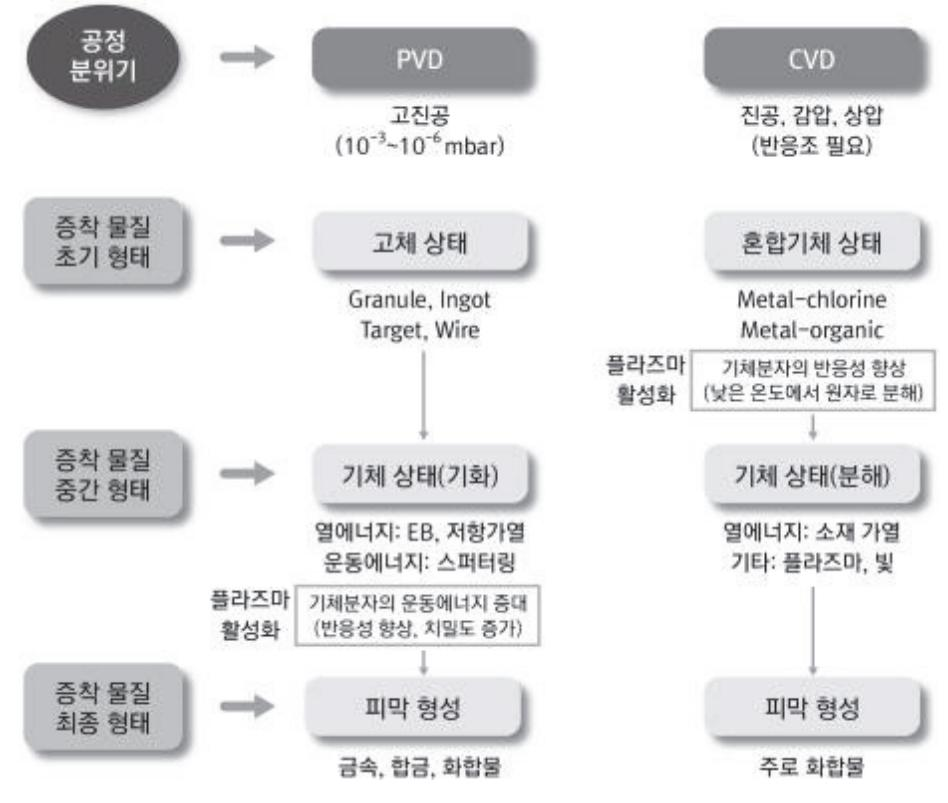

출처: 집필진 제작(2024)

- (다) 플라즈마 발생기나 반응기가 대기에 개방되었을 때에 고주파의 발생을 차단하기 위한 인 터로크 기구를 갖추어야 한다.
- (라) 고주파를 인가하는 전극의 냉각수 배관은 접지 전위의 경로를 따라 차폐판의 외부로 나 오도록 설치하여야 한다.

[그림 2-1] PVD와 CVD 박막 공정 비교

- (마) 장치의 전기 회로에 고압 콘덴서가 적용될 때는 고압 콘덴서의 전하를 방전시킬 수 있도 록 단락봉을 설치하여야 한다.
- (3) CVD 성장법의 공정 장비의 구조와 안전 운전을 위한 주의 사항을 확인한다. CVD 장비는 에너지를 이용하는 방식에서 압력에 따라 APCVD(atmosphere pressure CVD), LPCVD(low pressure CVD)와 HPCVD(high pressure CVD)로 구분하고, 에 너지원으로 플라즈마를 형성시키는 방식에 따라 PECVD(plasma enhanced CVD)와 금속 유기물을 증착하는 MOPCVD(metal organic CVD) 등으로 나눈다. CVD 장비의 원리와 사용법의 주의 사항을 확인한다.
  - (가) CVD 장치의 가스 배관은 가스 치환용 질소 가스 등의 불활성 가스 도입구를 설치하거 나 진공 배기가 가능한 구조로 설치한다.
  - (나) 감압 화학 증기 증착(LPCVD) 장치의 반응 용기는 개방되었을 때 특수 가스의 유입을 차단하기 위한 인터로크 기구를 설치한다.
  - (다) 감압 공정은 정전 시에 장치를 안전하게 정지하기 위해 배관이 필요한 위치에 항상 폐쇄 밸브를 설치한다. 그리고 이상 발생 시, 바로 장치를 안전하게 정지하도록 비상 정지용 버튼을 갖추어야 한다.

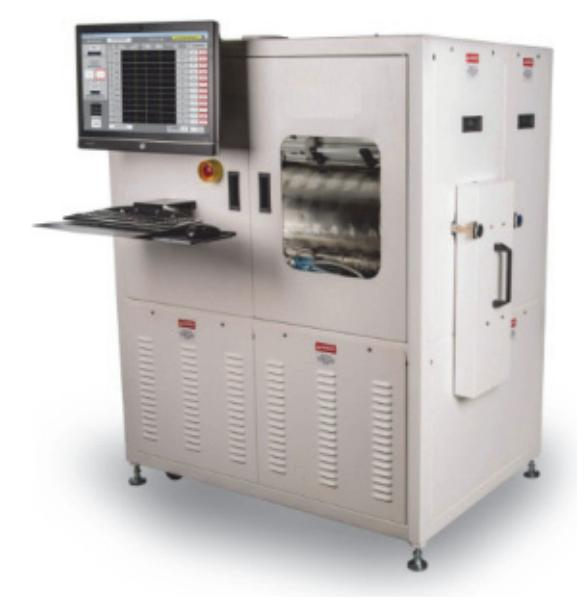

출처: 집필진 제작(2024) [그림 2-2] LPCVD 장비의 외형

출처: 집필진 제작(2024) [그림 2-5] PECVD 장비의 내부

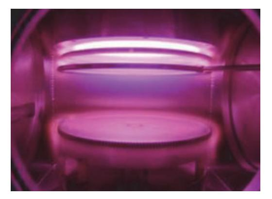

출처: 집필진 제작(2024) [그림 2-4] PECVD 장비의 외형

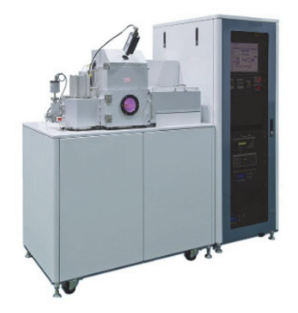

출처: 집필진 제작(2024) [그림 2-3] LPCVD 장비의 내부

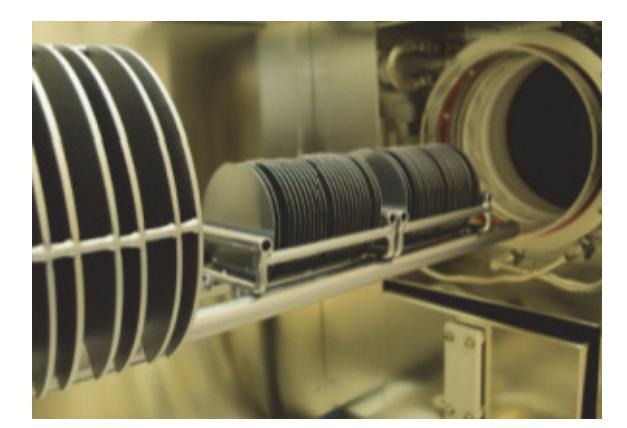

- (라) 기판의 출납구와 같이 유해 가스나 증기 등이 발생할 수 있는 부분에는 국소 배기 장치 를 설치한다.
- (마) 장치의 가스 배관이나 덕트 등은 반응 생성물을 쉽게 제거할 수 있는 구조를 갖춘다.

<표 2-4>는 박막 공정용 특수 가스의 유해성을 나타낸다.

<표 2-4> 박막 공정용 특수 가스의 유해성

|              |         | 생체 작용  |                  |             |        |                  |                   |        |             |                  |        |        |        |   |        |                                     |             |
|--------------|---------|--------|------------------|-------------|--------|------------------|-------------------|--------|-------------|------------------|--------|--------|--------|---|--------|-------------------------------------|-------------|
|              |         |        | 자극성·부식성          |             |        |                  | 질식성               |        |             |                  |        | 독성     |        |   |        |                                     | 허용          |
| 가스 명         | 분자식     | 피 부 | 안 상 기 도 | 기 관 지 | 폐 포 | 산 소 희 박 | Hb 친 화 성 | 용 혈 | 간 장 해 | 뇌 신 경 계 | 심 장 | 신 장 | 위 장 | 뼈 | 치 아 | 주의 사항                               | 농도 [ppm] |
| 실란           | SiH4    |        | ○                | ○           |        |                  |                   |        |             |                  |        |        |        |   |        | ∙자연 발화성, 불쾌한 냄새                     | 0.5         |
| 다이클로로 실란  | SiH2Cl2 |        | ○                | ○           | ○      |                  |                   |        |             |                  |        |        |        |   | ○      | ∙가수 분해되어 HCl 생성                     | 5.0         |
| 삼클로로 실 란  | SiHCl3  |        | ○                | ○           | ○      |                  |                   |        |             |                  |        |        |        |   | ○      | ∙가수 분해되어 HCl 생성                     | -           |
| 사염화 규소       | SiCl4   | ○      | ○                | ○           | ○      |                  |                   |        | ○           | ○                |        |        |        |   | ○      | ∙골경화증                               | -           |
| 알신           | AsH3    |        |                  |             | ○      |                  | ○                 | ○      | ○           | ○                | ○      | ○      | ○      |   |        | ∙가수 분해되어 HF, 마늘 냄 새              | 0.05        |
| 포스핀          | PH3     |        | ○                | ○           | ○      |                  |                   |        | ○           | ○                |        |        | ○      | ○ |        | ∙자연 발화성                             | 0.3         |
| 삼염화 붕소       | BCl3    |        | ○                | ○           | ○      |                  |                   |        |             |                  |        |        |        |   |        | ∙가수 분해되어 HCl 생성 ∙자극적 냄새          | 1.0         |
| 삼브로민화 붕소  | BBr3    | ○      | ○                | ○           | ○      |                  |                   |        |             |                  |        |        |        |   |        | ∙가수 분해되어 HBr 생성                     | 1.0         |
| 디보란          | B2H6    |        | ○                | ○           | ○      |                  |                   |        | ○           | ○                |        | ○      |        |   |        | ∙사염화 탄소, 염소, 이황화탄 소 등과 접촉 폭발, 무취 | 0.1         |
| 사수소화 게르마늄 | GeH4    |        |                  |             |        |                  |                   | ○      |             |                  |        |        | ○      |   |        | ∙자연 발화성                             | 0.2         |
| 불화 텅스턴       | WF4     | ○      | ○                | ○           | ○      |                  |                   |        | ○           |                  |        |        |        | ○ | ○      | ∙가수 분해되어 HF 생성                      | 1mg/m3      |
| 사염화 게르 마늄 | GeCl4   | ○      | ○                | ○           | ○      |                  |                   |        |             |                  |        |        |        |   |        | ∙가수 분해되어 HCl 생성                     | -           |
| 염화 주석        | SnCl4   | ○      | ○                | ○           | ○      |                  |                   |        |             |                  |        |        |        |   |        | ∙가수 분해되어 HCl 생성                     | 2mg/m3      |
| 암모니아         | NH3     | ○      | ○                | ○           | ○      |                  |                   |        |             |                  |        |        |        |   |        | ∙폭발성 15~28%                         | 25          |
| 일산화질소        | NO      |        |                  | ○           | ○      |                  | ○                 |        |             | ○                | ○      |        |        |   |        | ∙공기 중에서 빠르게 산화                      | 25          |
| 일산화이질소       | N2O     |        |                  |             |        | ○                |                   |        |             | ○                |        |        |        |   |        | ∙지연성                                | -           |

출처: 이광묵(1988). 「반도체 제조와 유해 가스」. 『Korean J. Occup. Health』. 27(3) pp. 2~4.

2. 박막 공정에서 증착 장비와 특수 가스가 결정되면 가스에 대한 제조 사양서를 토대로 가스의 규 격을 확인하고, 특수 가스의 유해성을 파악한다.

## 2-2. 가스 재료 준비

학습 목표 • 제조 공정에 적합한 박막 공정 가스 제조 재료를 준비할 수 있다.

## 필요 지식 /

#### 숔 가스 재료의 준비

최근 반도체 박막을 제조하는 공정은 수십 나노미터에서 수 나노미터의 초미세 기술로 전개되 고 있다. 이러한 초미세 기술을 실현하기 위해서는 박막의 유전율이 높아야 하고, 전기 저항은 낮은 특성을 가져야 한다. 반도체 소자의 고집적화로 인하여 대체로 PVD 공정으로는 초미세 기술이 필요한 박막을 제조하기 어렵다. 따라서 근래에는 에피택셜이나 CVD 공정이 초미세 박막을 제조하는 공정으로 자리 잡고 있으며, 이는 균일한 박막을 형성하기 위해 기화가 용이 하면서 열적으로 안정적인 조성을 가진 박막을 형성할 수 있다.

1. 에피택셜 성장용 가스

에피택셜 성장(epitaxial growth)은 단결정 성장법으로 SiCl4 증기와 H2 가스를 혼합하여 고온의 반응기로 유입하여 웨이퍼 기판에 뿌려 주면 다음과 같은 반응이 발생한다.

#### SiCl4 + H2 ⇄ Si + 4HCl

이와 같은 과정을 통해 웨이퍼 기판에는 단결정 실리콘(Si)이 성장하게 된다. 이때 사용하는 수소(H2) 가스는 폭발성과 인화성을 가지므로 주의하여 취급하여야 한다.

(1) 수소 가스

수소는 원소 중에 가장 가볍고, 최소의 밀도를 가진다. 수소는 확산 속도가 빠르고 열전 도가 크며, 열에 대해 안정적인 편이다. 수소는 산소와 180℃에서 서서히 결합하여 수 증기를 만들며, 550℃의 고온에서는 폭발적으로 결합한다.

#### 2H2 + O2 → 2H2O

수소는 염소나 산소 또는 산화물 속에 산소와도 고온에서 잘 반응하므로 환원제로 사용 한다.

(가) 수소의 성질

- 1) 수소는 단독으로 비교적 안전하고, 밀도가 적어 미세한 구멍에 쉽게 누설하며, 확산 속도가 빨라 다른 기체와 혼합하기 용이하다.
- 2) 폭발 한계 내에서 수소와 공기 혼합 가스는 상온에서 안정적이며, 전기 불꽃과 같은 발화원이나 백금 석면과 같은 촉매로 인하여 격렬하게 반응한다.
- 3) 수소와 산소 혹은 공기와의 혼합 가스는 탄화수소보다 연소 속도가 빠르다.

- 4) 폭굉 범위는 폭발 범위보다 작으며, 조건에 따라 불꽃 표면의 진행 속도는 다르지만 대략 1,400~3,500m/s 정도에 달한다.
- 5) 수소 가스는 산소와의 혼합물에서 폭발 발화점은 530℃ 정도에서 발생하며, 팔라듐 (Pd), 백금(Pt)이나 니켈(Ni)과 같은 촉매를 사용하면 상온에서도 반응한다.
- 6) 폭발 방지를 위해 충분히 환기해 폭발 범위의 혼합 가스를 만들지 말아야 한다.
- (나) 수소의 제조법

1) 물 전기 분해법

황산이나 수산화나트륨을 가한 물을 전기 분해하는 방식이다.

$$2H_2O \rightarrow 2H_2 + O_2$$

2NaCl + 2H2O → 2NaOH + H2 + Cl2

2) 수성 가스 분리법

1,000~1,400℃의 온도로 적열된 코르크에 수증기를 작용하면 다음과 같은 반응 을 통해 수소와 일산화탄소의 혼합 가스가 생성된다.

$$C + H_2O \rightarrow CO + H_2$$

CO + H2 + H2O → 2H2 + CO2

3) 천연가스의 분해법

천연가스를 원료로 합성 원료 가스를 제조하는 방법이며, 수증기 개질법을 이용 하거나 부분 산화법을 이용할 수 있다. 먼저 수증기를 이용하는 방식은 메탄과 수증기를 반응시키면 다음과 같은 흡열 반응이 일어난다.

CH4 + H2O → CO + 3H2

그리고 부분 산화법으로 메탄을 가압하고 니켈을 촉매로 사용하여 800~1,000℃ 로 산소나 공기와 반응시킨다.

$$2CH_4 + O_2 \rightarrow 2CO + 4H_2$$

4) 석유의 분해법

나프타(naphtha), 중유 혹은 원유를 분해하여 합성 가스를 제조하는 방법이며, 천연가스를 이용하는 방식과 동일하게 수증기 개질법과 부분 산화법이 있다.

(다) 수소의 취급

수소는 공업용으로 널리 사용하는 가스이며, 암모니아 합성을 위한 원료 가스로 가 장 많이 사용한다. 수소 가스의 용기는 용접부가 없는 단조 강제 용기를 사용하며, 안전밸브는 가용 합금 밸브와 박판 안전밸브를 병용하여 사용한다. 수소 가스용 용 기 밸브의 취출구는 가연성 가스이므로 왼쪽 나사이다. 여름에 기온이 30℃ 이상에 서 직사광선을 받을 경우, 실린더 표면 온도가 60℃에 도달할 수 있으므로 주의하여 야 한다.

2. PVD 성장용 가스

PVD 성장법에서 사용하는 가스는 주로 플라즈마를 발생시키기 위한 불활성 가스와 이외에 반응성 가스로 질소나 산소를 많이 사용한다.

(1) 아르곤 가스

아르곤(Ar)은 색이 없고 맛이 없으며 냄새도 없는 불활성 기체이다. 공기 중에 질소와 산소 다음으로 많은 0.94%로 포함하며, 공기보다 무겁고 물과 유기 용매에 녹는 풍부한 원소이다. 최외각 전자가 모두 채워져 있어 다른 원소와 결합하지 않는 것으로 잘 알려져 있다.

(가) 아르곤의 성질

아르곤은 산소와 같이 다른 기체로부터 물질을 보호하기 위해 주로 많이 사용한다. 고온에서 안정적이고 불활성 성질을 가지므로 전구, 형광등 및 진공관 등의 가스로 많이 사용한다. 고온이나 저온에서 방전시키면 특이한 색을 방출하여 조명 기기로 사용하기도 한다.

(나) 아르곤의 제조법

공기 중에 많은 양의 아르곤이 존재하기 때문에 불활성 가스 중에서 가장 저렴하게 많은 양을 제조하는 것이 가능하다. 제조 방법은 공기 분리기에서 공기를 냉각하여 액화시킨 후에 온도를 서서히 올리면서 얻는 분별 증류법을 사용한다. 또한 아르곤 은 천연가스에도 포함되어 있기 때문에 천연가스를 정제하는 과정을 통해 부산물로 얻을 수 있다.

(2) 질소 가스

질소(N2)는 상온에서 불활성 기체이며, 연소를 방제하는 역할을 한다. 따라서 각종 제조 장비의 퍼지(purge) 가스로 사용한다.

(가) 질소의 성질

고온 고압에서 수소와 결합하여 암모니아를 제조하며, 산소와 화합하여 산화 질소를 만들기도 한다. 내산화성을 가진 알루미늄, 크로뮴 및 실리콘 등과 결합하여 질화물 을 만들기 쉬워 주의하여야 한다.

(나) 질소의 제조법

주로 실험실에서 아질산나트륨(NaNO3)과 염화마그네슘(MgCl2)을 혼합 가열하여 쉽 게 제조할 수 있으며, 산업용 제조법으로는 액화 공기를 비점차로 증류하여 산소와 같이 얻을 수 있다.

3. CVD 성장용 가스

CVD 성장법은 화학 반응을 수반하는 기체 상태의 성장 방법이며, 기상에서 열분해, 가수 분해 및 산화 등의 화학 반응을 이용하여 기판에 단결정 반도체나 절연막으로 SiO2, Si3N4, Al2O3 등을 성장할 수 있다. CVD에서 많이 사용하는 특수 가스는 대부분 유해 가스이며, 공정용 일반 가스로서 산소 가스를 많이 사용한다.

#### (1) 산소 가스

산소(O2)는 무색 무취의 기체로 물에 약간 녹는다. 산소는 기체, 액체 및 고체에서 상자 성의 성질을 가지며, 액화 산소는 담청색을 나타낸다.

(가) 산소의 성질

산소 기체는 공기보다 무겁고, 액체 산소는 물보다 무겁다. 산소는 연소성이 없지만, 다른 물질을 연소시키는 조연성과 지연성 가스이다. 화학적으로 매우 활성이 높으며, 각종 금속의 원소와 결합하여 산화물을 만든다. 산소 부족으로 생명의 위험을 초래 하는 사고가 많이 발생하며, 산소가 과잉이거나 순산소인 경우에는 생체에 유해하기 도 하다. 산소가 물과 같이 있는 경우에는 용존 산소로 인하여 금속의 부식을 촉진 시키지만, 용기의 경우에는 실용성 측면에서 지장을 초래하지 않는 편이다. 고온의 공기 중에서 산화 부식으로 금속 표면에 산화물층을 형성한다.

(나) 산소의 제조법

산소 가스의 제조 방법은 전저압식 공기 분리기, 중압식 공기 분리기 및 저압식 액 산 플랜트 등을 이용한다.

1) 전저압식 공기 분리기

전저압식 공기 분리기의 조작은 5kg/cm2 이하의 저압에서 기체 상태로 얻어지 며, 원료 공기 중에 수분이나 이산화탄소는 축냉기나 열교환기를 이용하여 저온 응결법으로 제거한다.

2) 중압식 공기 분리기

공기 분리기의 작동 압력은 10~30kg/cm2 의 중압 하에서 비교적 소량이거나 산 소에 비해 질소의 채취량이 많은 경우에 적합하다. 원료 공기 중에 수분이나 이 산화탄소는 실리카 겔에 의한 흡착법으로 제거한다.

3) 저압식 액산 플랜트

전저압식 공기 분리기에서 작동 압력을 25kg/cm2 이하의 중압 팽창 터빈을 사 용하는 액화 회로를 조합하여 액화 산소와 액화 질소를 얻을 수 있다.

<표 2-5> 각종 일반 가스의 성질

| 가스 명 | 분자식 | 색취    | 생체 작용 | 분자량 | 가스 밀도 [g/L] | 가스 비중 (공기 1) | 비점 [℃] | 임계 온도 [℃] | 임계 압력 [kg/cm2 ] |
|------|-----|-------|-------|-----|----------------|-----------------|-----------|--------------|-----------------------|
| 산소   | O2  | 무색 무취 | 질식성   | 32  | 1.43           | 1.10            | -183      | -119         | 50.1                  |
| 질소   | N2  | 무색 무취 | 질식성   | 28  | 1.25           | 0.97            | -195.5    | -147         | 33.5                  |
| 아르곤  | Ar  | 무색 무취 | 질식성   | 40  | 1.78           | 1.38            | -185.8    | -122         | 48.0                  |
| 네온   | Ne  | 무색 무취 | 질식성   | 20  | 0.87           | 0.67            | -245.9    | -228         | 26.9                  |
| 수소   | H2  | 무색 무취 | 질식성   | 2   | 0.09           | 0.07            | -252.8    | -240         | 13.2                  |
| 헬륨   | He  | 무색 무취 | 질식성   | 4   | 0.18           | 0.14            | -268.9    | -268         | 2.26                  |

출처: 김철영(2010). 『가스공학 개론』. 동화기술. p. 30.

## 수행 내용 / 가스 재료 준비하기

#### 재료·자료

- 반도체 재료 제조 기술 자료
- 국제표준화기구(ISO: International Organization for Standardization) 표준화 문서
- 물질 안전 보건 자료(MSDS)
- 생산 계획서
- 반도체 재료 작업 절차서
- 반도체 재료 작업 표준서
- 시험 성적서
- 반도체 설비 목록 및 매뉴얼
- 반도체 제조 공정도
- 반도체용 박막 가스 원재료

#### 기기(장비 ・ 공구)

- 반도체용 박막 공정 가스 제조 장비
- 반도체용 박막 공정 가스 측정 장비
- 반도체용 박막 공정 가스 검사 장비
- 반도체용 박막 공정 가스 분석 장비

#### 안전 ・ 유의 사항

- 반도체 박막 공정에 대한 이론적 지식을 습득하고, 사용하는 가스의 성질과 특성을 바탕으 로 가스 제조 시에 문제점을 검토하고, 취급 주의 사항에 유의해야 한다.
- 반도체 박막 공정에서 사용하는 특수 가스는 부식성, 맹독성, 인화성 및 발화성 등의 위험 물질이 많아 해당 가스에 대한 장비, 공급 시설, 관리 및 주의 사항을 사용하기 전에 미리 숙지하여야 한다.
- 물질 안전 보건 자료를 통해 특수 가스를 취급하기 전에 파악하고, 독성 가스의 경우에는

제독 설비에 대한 일반 사항, 제독 설비 및 제독 방법 등 안전 교육을 실시한다.

수행 순서

- 숔 반도체 박막 공정용 특수 가스를 제조하기 위해 가스 제조 사양서를 기준으로 공정 가스의 종류, 물 성과 특성을 파악한다. 박막 공정용 특수 가스의 제조 사양서를 기반으로 공정 가스의 물성을 파악하고 해당 가스의 특성을 고려하여야 한다.
  - 1. 박막 공정용 특수 가스를 제조하기 위해 가스 제조 사양서를 확인하고, 가스의 품질 기준과 제품 특성 등을 파악한다.
    - (1) 가스 제조 사양서의 내용 중에서 제조하려는 가스의 다음과 같은 품질 기준 항목을 검토한 다.
      - (가) 화학식
      - (나) 성분 조합 비율
      - (다) 경년 변화
      - (라) 순도
      - (마) 가스의 비중
      - (바) 관리 방법 및 안전 취급
      - (사) 점검 주기
    - (2) 박막 공정을 위한 특수 가스는 대부분 해로운 가스이므로 제조 사양서의 내용 중에 가스 제 품의 유해성을 주의 깊게 검토한다.
      - 박막 공정용 특수 가스 제조 시에 작업자의 안전을 반드시 고려해야 하므로 인체에 발 생할 수 있는 각종 생체 작용에 관한 내용을 명확하게 확인하고, 다음 사항을 검토한다.
      - (가) 특수 가스를 취급하는 작업자에 영향을 끼칠 수 있는 생체 작용으로 자극성, 부식성, 질 식성, 독성 및 가연성 등에 대해 파악한다.
      - (나) 가스의 허용 농도를 상세히 확인한다.
      - (다) 제독 방법과 안전 취급에 대해 검토하고, 개인 보호구를 준비한다.
      - (라) 해로운 정도를 나타내는 경고 표시를 확인한다.
  - 2. 박막 공정용 특수 가스의 물리적 및 화학적 성질을 확인하기 위해 제조 사양서에서 유해성에 대 한 자료를 검토한다.

최근 반도체의 초미세화와 높은 집적도의 추세에 따라 반도체 제품의 특성은 박막제 조용 가스에 의해 좌우되며, 가스의 품질은 초고순도를 요구한다. 반도체 제조 공정에서 박막 증 착은 주로 CVD 성장법을 사용하며, 제조를 위해 사전에 특수 가스에 대한 지식과 기술을

<표 2-6> 실란의 성질

| 가스 명 | 분자식  | 분자량   | 비점 [℃] | 융점 [℃] | 임계 온도 [℃] | 임계 압력 [atm] | 비열(25℃) [cal/mol∙k] | 생성열(25℃) [kcal/mol] |
|------|------|-------|-----------|-----------|--------------|----------------|------------------------|------------------------|
| 실란   | SiH4 | 32.12 | -111.9    | -185.0    | -3.5         | 47.8           | 10.2                   | 8.2                    |

출처: 이광묵(1988). 「반도체 제조와 유해 가스」. 『Korean J. Occup. Health』 27(3). pp. 2~4.

#### (1) CVD 성장법에서 많이 사용하는 실란(SiH4)의 성질을 검토한다.

실란 가스는 무색 유취의 성질을 가지며, 연소하면 SiO2와 H2O를 생성한다. 폭발 한계 는 상온의 공기 중에서 0.8~98%인 것으로 알려져 있으며, 물에 용해되거나 반응하지도 않지만, 설사 반응하더라도 반응 속도가 매우 느린 편이다. 하지만 알칼리 수용액 20% NaOH에서는 강하게 반응을 일으킨다. <표 2-6>은 실란의 성질을 정리하여 나타낸다.

- (가) 공기 중에 실란 유출에 의한 자연 발화성을 검토한다.
  - 실란이 공기 중에 유출되면 자연적으로 발화하며, 공기와 유사하게 질소와 산소를 혼합하여 약 10% 정도의 산소를 유지하면 자연 발화 온도는 –162℃에서 발생하는 것으로 알려져 있다. 그리고 산소의 농도를 조금씩 감소하여 7% 정도이면 –142℃에 서 발화한다. 반대로 100% 실란이 산소 농도 2.5~3.0%d 유출되면 자연 발화의 하 한에 이른다. 일반적으로 가연성 가스는 가연 한계에서 불꽃의 온도는 낮아지게 되 며, 실란의 경우에는 탄화수소보다 낮아진다.
- (나) 실란의 분해 폭발에 의한 위험성을 검토한다.

실란은 분해하여 SiH4 = Si+2H2으로 발열 반응하기 때문에 분해 폭발의 위험성을 가진다. 분해 폭발성이 강한 아세틸렌이나 에틸렌과 비교하면 분해성이 작은 편이며, 상온에서 가압한 후에 전기 충격을 가하더라도 분해 폭발이 일어나지 않는다. 그러 나 온도를 가열하게 되면 300℃ 이상에서 분해가 일어나며, 550℃에서는 매우 빠른 속도로 분해가 발생한다.

(다) 실란의 폭발 한계를 검토한다.

공기 중에서 실란의 폭발 한계는 상온 상압에서 0.8~98%인 것으로 알려져 있다. 하 지만 실란은 공기와 혼합하면 동시에 발화하여 어떠한 농도에서도 안정된 혼합 가스 를 얻기가 어렵고, 폭발 한계를 측정하기 위한 혼합물을 만들기도 쉽지 않다. 실제로 SiH4 - O2 – N2계에서 실란의 농도가 0.8% 이하인 경우, 실온에서 안정된 것으로 알려져 있다.

(2) CVD 성장법에서 사용하는 다이클로로실란(SiH2Cl2)의 성질을 검토한다.

다이클로로실란의 물리적 성질은 <표 2-7>에 제시하였다. 생성열이 실란과 다르게 음(-)

이기 때문에 상당히 안정적이다. 공기와 접촉하더라도 발화하지 않으며 혼합 가스를 쉽 게 만든다. 그러나 점화하게 되면 쉽게 발화하는데, 자연 발화는 공기 중에 23%의 농도 에 100℃ 정도인 것으로 알려져 있다. 분해 폭발도 생성열이 적어 실란보다 안정적이 다. 그리고 폭발 한계는 상온 상압에서 4.1~98.8%이다. 다이클로로실란은 실란과는 달 리 물이나 알칼리 수용액과 빠른 속도로 반응한다. 가수 분해하면 발연하고, 백색 분말 이나 고무와 같은 가연물을 생성한다.

<표 2-7> 다이클로로실란의 성질

| 가스 명        | 분자식     | 분자량   | 비점 [℃] | 융점 [℃] | 임계 온도 [℃] | 임계 압력 [atm] | 비열(25℃) [cal/mol∙k] | 생성열(25℃) [kcal/mol] |
|-------------|---------|-------|-----------|-----------|--------------|----------------|------------------------|------------------------|
| 다이클로로실 란 | SiH2Cl2 | 101.0 | 8.4       | -122.0    | 176.3        | 43.2           | 14.52                  | -75.0                  |

출처: 이광묵(1988). 「반도체 제조와 유해 가스」. 『Korean J. Occup. Health』. 27(3) pp. 2~4.

<표 2-8> 삼클로로실란과 사염화규소의 성질

| 가스 명   | 분자식    | 분자량   | 비점 [℃] | 융점 [℃] | 비열(25℃) [cal/mol∙k] | 생성열(25℃) [kcal/mol] |
|--------|--------|-------|-----------|-----------|------------------------|------------------------|
| 삼클로로실란 | SiHCl3 | 135.5 | 31.8      | -126.5    | 17.9                   | -116.9                 |
| 사연화규소  | SiCl4  | 169.9 | 57.6      | -70.0     | 21.5                   | -156.7                 |

출처: 이광묵(1988). 「반도체 제조와 유해 가스」. 『Korean J. Occup. Health』 27(3). pp. 2~4.

- (3) CVD 성장법에서 사용하는 삼클로로실란(SiHCl3)과 사염화 규소(SiCl4)의 성질을 검토한다. 삼클로로실란과 사염화 규소의 물리적 성질은 <표 2-8>와 같다. 삼클로로실란과 사염화 규소는 물과 급속히 반응하며, 삼클로로실란은 가연성이 더 높고 다이클로로실란과 유사 한 성질을 가진다. 화재나 폭발의 위험성은 안정성이 높은 편이기에 방재뿐만 아니라, 경제적인 측면에서 다이클로로실란의 대체품으로 매우 실용적이다.
- (4) CVD 성장법에서 사용하는 사수소화 게르마늄(GeH4: 혹은 게르만)의 성질을 검토한다. 사수소화 게르마늄의 물리적 성질은 <표 2-9>와 같으며 상온에서 무색으로 안정적이다.

<표 2-9> 사수소화 게르마늄의 성질

| 가스명          | 분자식  | 분자량   | 비점 [℃] | 융점 [℃] | 임계 온도 [℃] | 임계 압력 [atm] | 비열(25℃) [cal/mol∙k] | 생성열(25℃) [kcal/mol] |
|--------------|------|-------|-----------|-----------|--------------|----------------|------------------------|------------------------|
| 사수소화 게르마늄 | GeH4 | 76.66 | -88.4     | -165.9    | 34.8         | 54.8           | 10.6                   | 21.7                   |

출처: 이광묵(1988). 「반도체 제조와 유해 가스」. 『Korean J. Occup. Health』. 27(3). pp. 2~4.

사수소화 게르마늄은 280℃에서 서서히 분해되어 Ge과 H2로 분해되며, 375℃에서 격렬 하게 분해된다. 실란류와는 다르게 알칼리 수용액과 반응하지 않으며, 차염소산 소다 수 용액에 녹는다. 공기 중에서 자연 발화가 발생할 가능성이 있지만, 전반적인 폭발 위험 성은 실란과 유사하며, 분해 폭발의 가능성은 실란보다 큰 편이다.

(5) CVD 성장법에서 사용하는 디보란(B2H6)의 성질을 검토한다.

디보란의 물리적 성질은 <표 2-10>과 같다. 디보란은 공기 중에서 초록색 불꽃을 나타내 며, 연소열이 큰 것으로 알려져 있다.

#### B2H6 + 3O2 = B2O3 + 3H2O

폭발 한계는 0.8~98%이며, 공기 중에서 자연 발화 온도는 38~52℃로 나타나지만, 불순 물이 혼합된 경우에는 실온에서도 발화할 수 있다. 열적으로 불안정하여 상온에서 수소 와 보란(BH4)로 서서히 분해되고, 300℃ 이상에서는 수소와 붕소로 분해된다. 물과는 격렬하게 반응하며, 염소와도 폭발적으로 반응한다. 화재를 방지하기 위해서는 가스 유 출을 막는 것이 최선책이며, 긴급 차단 밸브를 설치하는 것이 바람직하다.

<표 2-10> 디보란의 성질

| 가스명 | 분자식  | 분자량   | 비점 [℃] | 융점 [℃] | 임계 온도 [℃] | 임계 압력 [atm] | 비열(25℃) [cal/mol∙k] | 생성열(25℃) [kcal/mol] |
|-----|------|-------|-----------|-----------|--------------|----------------|------------------------|------------------------|
| 디보란 | B2H6 | 27.67 | -92.5     | -164.85   | 16.7         | 39.5           | 13.5                   | 7.5                    |

출처: 이광묵(1988). 「반도체 제조와 유해 가스」. 『Korean J. Occup. Health』 27(3). pp. 2~4.

#### <표 2-11> 포스핀의 성질

| 가스명 | 분자식 | 분자량  | 비점 [℃] | 융점 [℃] | 임계 온도 [℃] | 임계 압력 [atm] | 비열(25℃) [cal/mol∙k] | 생성열(25℃) [kcal/mol] |
|-----|-----|------|-----------|-----------|--------------|----------------|------------------------|------------------------|
| 포스핀 | PH3 | 34.0 | -87.7     | -133.8    | 51.3         | 64.5           | 8.9                    | 1.3                    |

출처: 이광묵(1988). 「반도체 제조와 유해 가스」. 『Korean J. Occup. Health』 27(3). pp. 2~4.

#### (6) CVD 성장법에서 사용하는 포스핀(PH3)의 성질을 검토한다.

포스핀은 <표 2-11>과 같은 물리적 성질을 지니며 상온에서 안정적이고, 약 300℃ 이상에 서는 서서히 열분해하기 시작하여 적린(P4)과 수소로 분해된다. 자외선으로도 분해되며, 물에 녹아 수용액 중에 서서히 분해되어 적린, 수소 및 (P2H)n의 조성을 가진 고체를 만 든다. 상온에서 염소와 반응하여 발화하면 PCl5와 HCl을 생성하며, 에테르나 알코올에 도 녹는다. 순수한 포스핀이 공기 중에 유출되더라도 상온에서 자연 발화하지 않지만, 디포스핀이 혼입되면 발화한다. 디보란이나 실란과 같이 화염은 쉽게 소화되지 않기 때 문에 화재 발생 시에는 먼저 가스의 공급원을 차단하는 것이 가장 중요하다.

(7) CVD 성장법에서 사용하는 알신(AsH3)의 성질을 검토한다.

알신의 물리적인 성질은 <표 2-12>와 같다. 상온에서 서서히 분해되어 230℃ 근처에서는 속도가 빨라지고, 500℃ 이상에서는 매우 빠르게 분해하며, 생성물은 As와 수소이다. 물에 용해하며, 상온에서도 염소에 의해 불꽃을 내며 탄다. 가연성이며, 점화원이 있으 면, 청백색의 불꽃을 내며 탄다. 폭발 한계는 0.8~98%이며, 하한계는 5.8vol% 정도인 것으로 알려져 있다.

<표 2-12> 알신의 성질

| 가스명 | 분자식  | 분자량   | 비점 [℃] | 융점 [℃] | 임계 온도 [℃] | 임계 압력 [atm] | 비열(25℃) [cal/mol∙k] | 생성열(25℃) [kcal/mol] |
|-----|------|-------|-----------|-----------|--------------|----------------|------------------------|------------------------|
| 알신  | AsH3 | 77.95 | -62.5     | -116.9    | 99.9         | 65.1           | 9.1                    | 15.9                   |

출처: 이광묵(1988). 「반도체 제조와 유해 가스」. 『Korean J. Occup. Health』 27(3). pp. 2~4.

숕 반도체 박막 공정에서 필요한 특수 가스를 제조하기 위해 확보된 가스 제조 사양서를 바탕으로 가스 제조 공정과 제조 방법에 대해 파악하고, 제조 장비와 설비 등을 준비하며, 매뉴얼과 사용법을 확인 한다.

가스 제조 사양서를 기준으로 원료 가스가 준비되면 가스 제조를 위해 필요한 제조 공정과 제 조 방법을 파악하여 제조 장비와 설비를 검토한다. 또한 안전사고에 대처하기 위해 원료 가스 와 제조되는 가스의 물성과 특성을 검토하며, 각종 설비에 대한 안전과 주의 사항을 파악한다.

- 1. 박막 공정에서 사용하는 특수 가스는 대부분 유해 가스이기 때문에 원료 가스와 제조된 특수 가 스를 저장하기 위한 저장 설비를 확인하고 주의 사항을 파악한다. 용기를 저장하는 저장 설비는 통풍이 잘되고 건조한 분위기를 유지하기 쉬운 옥외 공간이 가장 좋으며, 저장할 가스의 특성에 따라 구분하여 저장하는 것이 좋다.
  - (1) 가스의 가연성과 독성에 따라 저장 설비와 저장소는 구분하여 설치한다.
  - 자연 발화성을 가진 가스는 옥외 저장이 가장 좋으며, 개방된 면의 길이가 설비 주변의 길이의 75% 이상이 되도록 하는 것이 바람직하다. 이는 자연 발화성 가스가 누출될 경 우, 빠르게 확산되어 화재가 발생할 가능성을 낮추어야 하기 때문이다.
  - (2) 가연성 가스가 옥내 설비실이나 저장 설비 공간에 누출될 경우, 가능한 가스가 머물지 않도 록 통풍 구조를 갖추고, 만일 통풍이 안 될 경우라면 강제 통풍 시스템을 설치하여야 한다. 옥내 저장실을 설치할 경우에는 적절한 통풍이나 환기 시스템을 갖추고, 분산 모델 분석 (dispersion model analysis)을 이용하여 분석한다. 가연성의 가스일 경우, 화재 하한 선의 25% 이하가 되거나 독성의 경우에는 TWA값(시간 가중 평균 노출 기준: time weighted average) 이하로 낮출 수 있도록 공기를 공급하여야 한다. 여기서, TWA란

1일 8시간 작업을 기준으로 가스의 유해 인자 측정치에 발생 시간을 곱하고, 이를 8시 간으로 나눈 값을 의미한다.

- (3) 독성 가스를 저장하는 설비 공간에서는 가스 누출 사고에 대비하여 중화 설비를 반드시 갖추 어야 한다. 특히 옥내에 저장 설비의 경우에는 흡입 장치와 연결되는 중화 설비를 갖추어야 한다.
- 2. 독성 가스의 누출을 대비하여 제독 설비 시스템을 확인한다.

반도체 제조용 독성 가스는 제독 설비를 이용하여 반드시 허용 농도 이하로 처리한 후, 대 기로 방출하도록 규정되어 있다. 이러한 독성 가스를 제독하는 방법은 산화, 환원, 중화, 가 수 분해, 흡수 및 흡착 등의 현상을 이용하여 처리한다.

- (1) 제독 설비는 특수 가스의 종류, 농도, 유량 및 압력 등을 고려하여 적절한 제독 방법을 선정 한다. 제독은 처리 방식에 따라 연소 처리법, 습식 처리법, 건식 처리법, 열 습식 처리법, 번 습식 처리법 및 조합 처리법 등으로 구분한다.
- (2) 제독 설비의 구성을 확인하고 안전사고를 예방하여야 한다. 일반적으로 제독 설비는 정상 상황과 비상 상황 시에 모두 하나의 제독 설비가 동작하 여 배출하는 시스템이다. 독성 가스는 다른 가스와 접촉하여 반응을 통해 위험한 상황을 초래할 수 있다. 따라서 가스 사이에 반응성을 미리 고려하여 검토하여야 한다.
- (3) 제독 설비의 재료는 제독제, 제독 대상 가스 및 이차적으로 발생할 수 있는 가스의 성질을 고려하여 사용한다. 독성 가스는 공기와 접촉하여 발화하거나 수분 혹은 습기와 접촉하여 강산성 가스를 발 생시키는 등 화학적으로 매우 불안정하기 때문에 용도에 맞는 물리적 특성을 고려한다.
- (4) 제독 설비의 처리 능력은 정상적인 작업으로 배출되는 양과 누출 가정량 중에서 큰 값의 가 스량을 처리할 수 있는 능력이 있는 것으로 설정한다.
- (5) 가스 제조를 위해 사용하는 각종 시설에서는 가스 누출 모드를 반드시 확인하고 대비한다. 가스 제조 시설의 가스를 소비하는 방법은 일반적으로 유사하다. 제독 설비를 이용하여 신속하게 처리하기 위해서는 가스 누출 모드를 파악하여야 하며, 다음과 같은 독성 누출 의 경우에 대비하여야 한다.
  - (가) 저장 설비 내의 용기에서 누출되는 독성 가스
  - (나) 용기에서 누출된 저장 설비 내의 독성 가스
  - (다) 용기 캐비닛 내에서 누출되는 독성 가스
  - (라) 사용되는 설비에서 일반적으로 배출되는 독성 가스
  - (마) 소비 설비에서 외부로 누출되는 독성 가스
  - (바) 용기 캐비닛과 소비 설비 사이의 연결관에서 누출되는 독성 가스

- (6) 독성 가스에 따라 적합한 개인 제독 보호구를 구비하고, 정기적으로 보관 방법이나 사용법에 대한 훈련을 실시하여 숙지하여야 한다.
- 3. 가스 제조 공정에서 배기되는 가스가 제조 공간에 머물지 않도록 처리하기 위해 배기관이나 배기 팬을 배기구로 연결하여야 한다. 독성 가스나 가연성 가스를 제조하는 시설에서는 가스가 공간 내에 체류하지 않도록 반드 시 처리하여야 한다. 안전하게 처리하는 방식으로는 화학 반응, 화학 흡착, 물리 흡착, 연소 및 희석 등의 방법이 있다.
  - (1) 반도체 박막 공정용 특수 가스는 대부분 자연 발화성, 부식성 및 독성을 가지기 때문에 배기 설비에 사용하는 재료는 불연성 내식 재료를 사용하여야 한다.
  - (2) 자연 발화성이나 독성 가스는 환기 설비가 매우 중요하며, 누출되면 화재나 폭발의 위험이 매우 크므로 안전하게 처리하여 배출한다.
- 4. 가스 제조 공정에서 제조되는 특수 가스는 저장하거나 관리하기 위해 용기(cylinder)와 캐비닛을 사용하며, 특수 가스의 특성에 적합한 용기를 이용하여 올바르게 식별할 수 있도록 주의하여야 한 다.

특수 가스의 저장이나 보관을 위한 용기는 가스의 종류와 특성에 따라 매우 다양하다. [그 림 2-6]과 [그림 2-7]에서는 일반적인 가스 용기 캐비닛과 가스 조정기(gas regulator)의 이미지 외형을 보여 준다.

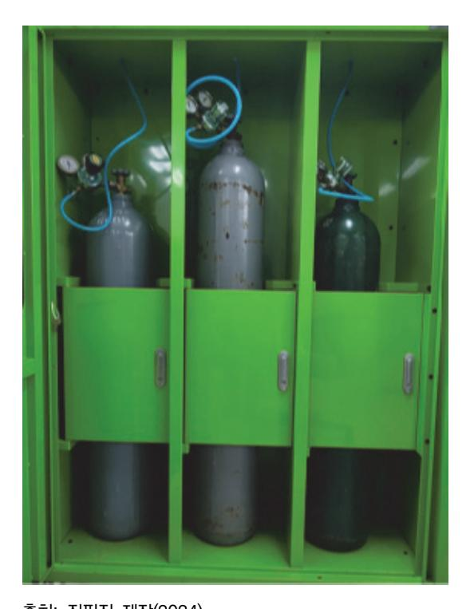

출처: 집필진 제작(2024) [그림 2-6] 일반적인 가스 용기의 외관

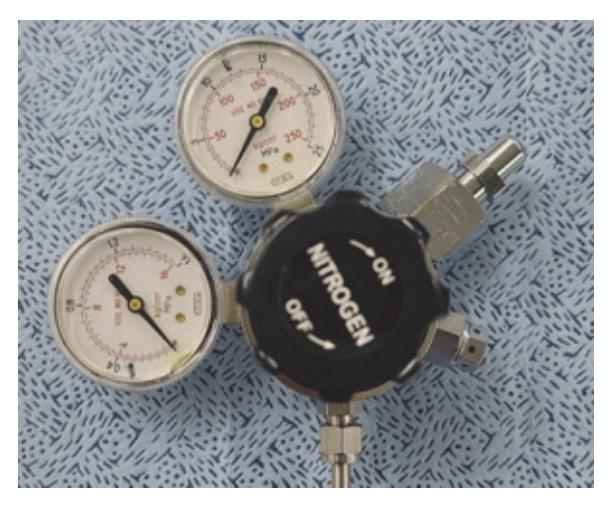

출처: 집필진 제작(2024) [그림 2-7] 대표적인 가스 조정기

(1) 여러 종류의 유해성을 가진 특수 가스의 제품이나 내용물은 쉽게 파악할 수 있어야 하며, 따 라서 용기를 식별하는 방법에 대해 검토하여야 한다.

일반적으로 용기의 내용물을 식별하기 위해서는 다음과 같은 방법으로 구분한다.

(가) 가스 제품의 명칭으로 식별하는 방법이 가장 기본적이며, 내용물을 확인할 수 있도록 라 벨 정보를 표기한다.

가스의 명칭이나 화학식으로 표기하거나 스탬프를 부착하기도 한다. 또한 용기 밸브 에 부착된 라벨을 확인한다. 용기 옆면에 마킹된 용기나 내용물 정보를 확인한다.

- (나) 가스 내용물은 용기 색깔에 의해 식별할 수도 있으며, 색상으로 내용물을 확인한다. 가스 용기의 색상으로 제품을 식별하기 위해 널리 사용되고 있지만, 일반적으로 1차 수단이 아닌 보조 수단이라는 것을 유의하여야 한다.
- (다) 특수 가스의 위험 등급으로 가스의 내용물을 확인한다. 가스 내용물의 위험 특성에 대한 정보는 라벨을 부착하여 표시하며, 충전된 가스의 종류를 식별하는 지침이 되기도 한다.
- (라) 가스 용기는 외형과 형태가 다양하며, 이러한 형태에 따라 가스의 내용물을 식별하는 방 법에 대해 파악한다.

가스 용기는 가스 특성과 용도에 따라 다양한 용기를 사용하며, 예상할 수 있는 내 용물을 파악할 수 있다.

- (마) 용기 밸브의 연결부로 제품의 내용물을 식별하는 방법을 확인한다. 대부분 국가에서는 가스 용기의 밸브 연결부를 규정에 따라 지정하기 때문에 가스의 내용물을 확인할 수 있다.
- (바) 가스 용기에 마킹으로 가스 제품을 식별하는 방법을 파악한다.

일반적으로 가스 용기는 거의 영구적으로 각인된 소유 업체의 이름, 정보, 내용물 정 보 및 용기 정보를 포함한다. 따라서 용기에 마킹된 내용을 검토한다.

(2) 빈 용기나 폐 용기는 명확한 표기하여 처리한다.

가스 용기가 완전히 비워졌다고 확인될 때까지 밸브를 탈착하지 말아야 하며, 항상 밸브 가 완전히 잠겨 있는지를 확인한다.

(가) 빈 용기라고 하더라도 가스 내용물이 독성이나 가연성이 내재할 수 있으므로 반드시 퍼 지(purge) 절차가 진행되었는지를 확인하여야 한다. 일반적으로 독성이나 가연성 가스 용기가 사용이 끝나더라도 대기압이나 혹은 대기 압보다 조금 높은 압력을 유지하기 때문에, 용기 내에 존재하는 가스가 잠재적으로 위험하며, 반드시 질소나 불활성 가스를 이용하여 퍼지 하거나 배기 등에 의해 제거

하여야 한다,

- (나) 특히 내용물이 부식성이나 반응성 가스일 경우, 튜브(tube)가 막혀 있는지를 확인한다.
- (다) 빈 용기를 폐기 처리 업체에 이송하기로 결정된다면, 이송 전에 사용할 수 없도록 표기 하여야 한다.
- 5. 가스 제조 공정에서 작업자나 관련자는 잠재하는 사고 위험에 대비하여 안전 장비의 위치를 확인 하고 개인 보호구를 착용하여야 한다.

특수 가스를 제조하는 지역에서는 필요한 개인 보호구가 명확히 표시되어야 하며, 가스 제 조 공정과 관련한 작업이나 직무를 수행하는 작업자가 위험에 노출되지 않도록 위험성 평 가를 시행하여 문서화하여야 한다. 또한 개인 보호구에 대한 교육 훈련을 통해 안전하게 사 용하는 방법을 이해하여야 하고, 작업자는 개인 보호구를 청결하게 유지하고 관리하여야 한 다.

### 학습 2 교수·학습 방법

#### 교수 방법

- 반도체 박막 공정의 성장법에 따라 사용하는 특수 가스의 종류와 특성을 지도한다.
- 박막 공정 성장법에 따른 공정 장비의 구조와 안전 운전 사용법을 정리하여 설명한다.
- 박막 공정에서 주로 사용하는 특수 가스의 유해성과 취급 시에 주의 사항을 설명한다.
- 박막 공정에서 많이 사용하는 일반적인 공정 가스의 성질과 제조법에 대해 지도한다.
- 특수 가스 제조 공정에서 사용하는 각종 장비와 설비에 대한 주의 사항을 설명한다.

#### 학습 방법

- 각종 박막 공정의 성장법에 따라 분류되는 특수 가스의 종류와 특성을 학습한다.
- 박막 공정 성장에서 사용하는 공정 장비의 구조와 안전 운전 사용법을 파악한다.
- 박막 공정에서 사용하는 특수 가스의 유해성과 취급 시에 주의 사항을 조사한다.
- 박막 공정에서 주로 다루는 일반적인 공정 가스의 성질과 제조법에 대해 학습한다.
- 유해성 특수 가스의 제조 공정에서 사용하는 각종 장비와 설비에 대한 주의 사항을 파악한 다.

## 학습 2 평 가

#### 평가 준거

• 평가자는 학습자가 학습 목표를 성공적으로 달성하였는지를 평가해야 한다.

#### • 평가자는 다음 사항을 평가해야 한다.

|                     |                                              | 성취수준 |   |   |  |
|---------------------|----------------------------------------------|------|---|---|--|
| 학습 내용               | 학습 목표                                        | 상    | 중 | 하 |  |
| 가스 재료의 종류와 특성 파악 | - 박막 공정 가스 제조에 필요한 원재료의 종류를 파악할 수 있다.     |      |   |   |  |
|                     | - 박막 공정 가스 원재료의 제조사별 규격 및 장단점을 파악 할 수 있다. |      |   |   |  |
| 가스 재료 준비            | - 제조 공정에 적합한 박막 공정 가스 제조 재료를 준비할 수 있다.    |      |   |   |  |

#### 평가 방법

• 서술형 시험

|                     |                                                           |             | 성취수준 |  |  |
|---------------------|-----------------------------------------------------------|-------------|------|--|--|
| 학습 내용               | 평가 항목                                                     | 상 중 하 |      |  |  |
| 가스 재료의 종류와 특성 파악 | - 성장법에 따른 특수 가스의 종류와 특성을 이해할 수 있는 능력                   |             |      |  |  |
|                     | - 공정 장비의 구조와 안전 운전 사용법을 정리할 수 있는 능 력                   |             |      |  |  |
|                     | - 유해성 특수 가스의 취급 시에 주의 사항을 정리하여 파악 할 수 있는 능력            |             |      |  |  |
| 가스 재료 준비            | - 박막 공정용 일반 가스의 성질을 파악할 수 있는 능력                           |             |      |  |  |
|                     | - 특수 가스 제조 공정에서 사용하는 각종 장비나 설비에 대 한 주의 사항을 파악할 수 있는 능력 |             |      |  |  |

• 평가자 질문

| 학습 내용               | 평가 항목                                                          |   | 성취수준 |   |  |
|---------------------|----------------------------------------------------------------|---|------|---|--|
|                     |                                                                | 상 | 중    | 하 |  |
| 가스 재료의 종류와 특성 파악 | - 박막 공정의 성장법을 분류하고, 이에 따라 사용하는 특수 가스의 종류와 특성을 이해할 수 있는 능력   |   |      |   |  |
|                     | - 공정 장비의 구조와 안전 운전 사용 방법을 정리하여 설명 할 수 있는 능력                 |   |      |   |  |
|                     | - 특수 가스의 취급 시에 주의 사항을 정리하여 설명할 수 있 는 능력                     |   |      |   |  |
| 가스 재료 준비            | - 박막 공정용 일반 가스의 종류와 성질을 파악하여 설명할 수 있는 능력                    |   |      |   |  |
|                     | - 특수 가스 제조 공정에서 사용하는 각종 장비나 설비에 대 한 주의 사항을 이해하여 설명할 수 있는 능력 |   |      |   |  |

• 평가자 체크리스트

|                     | 평가 항목                                                          |  | 성취수준 |   |  |
|---------------------|----------------------------------------------------------------|--|------|---|--|
| 학습 내용               |                                                                |  | 중    | 하 |  |
| 가스 재료의 종류와 특성 파악 | - 반도체 박막 공정의 성장법을 분류하여 구조와 원리를 파악 할 수 있는 능력                 |  |      |   |  |
|                     | - 성장법에 따라 사용하는 특수 가스의 종류와 특성을 구분할 수 있는 능력                   |  |      |   |  |
|                     | - 공정 장비의 구조와 안전 운전 사용 방법을 파악할 수 있는 능력                       |  |      |   |  |
|                     | - 특수 가스의 취급 시에 주의 사항을 구분할 수 있는 능력                              |  |      |   |  |
| 가스 재료 준비            | - 박막 공정용 일반 가스의 종류와 성질을 파악하여 구분할 수 있는 능력                    |  |      |   |  |
|                     | - 특수 가스 제조 공정에서 사용하는 각종 장비나 설비에 대 한 주의 사항을 파악하여 정리할 수 있는 능력 |  |      |   |  |

피드백

- 1. 서술형 시험 - 가스 재료와 관련한 각 문제에 대한 풀이를 상세히 설명하고, 기준이 되는 일정 점수 이하인 학 습자에게는 동일한 시험을 재실시하여 평가한다. - 특수 가스의 유해성 특성은 중요하기 때문에 확실히 파악할 수 있도록 보충 설명을 해 준다. 2. 평가자 질문 - 평가자 질문을 실시하기 전에 미리 일정량의 문제를 제시하고 시험을 실시한 후, 각 문제에 관해 설명할 수 있는지를 확인하며, 설명 능력이 부족한 학습자에게는 추가 학습을 통하여 보충 설명을 해 준다.
- 제조 장비의 안전 운전을 위해 사용법은 절차에 따라 충분히 이해하도록 설명해 준다.
- 3. 평가자 체크리스트
- 평가자 체크리스트를 토대로 순서에 따라 실시하고, 체크리스트에 60% 정도의 기준에 미치지 못 하는 학습자에 대해서는 보완 사항을 정리하여 학습할 수 있도록 지도해 준다.
- 가스 재료 준비 관련 성취 수준이 높은 학습자에게는 가스 재료에 관한 심화 자료를 제공해 주고 가스 재료 준비 계획을 수립할 수 있도록 지도한다.

| 학습 1 | 박막 공정 가스 제조 요구 사항 파악하기 |
|------|------------------------|
| 학습 2 | 박막 공정 가스 재료 준비하기       |
| 학습 3 | 박막 공정 가스 제조하기          |

## 3-1. 박막 공정 가스 제조

학습 목표 • 생산 관련 부서로부터 입수한 생산 계획에 따라 장비 운용 계획을 수립할 수 있다. • 작업 지시서와 장비 운용 매뉴얼에 따라 박막 공정 가스를 제조할 수 있다.

## 필요 지식 /

#### 숔 박막 공정 가스 제조법

반도체 제조용 특수 가스는 전자 산업과 반도체 제조 산업에서 널리 사용하는 일반 및 혼합 가 스의 영역이며, 고순도와 안정성을 유지하여야 한다. 이와 같은 특수 가스는 반도체 제조 과정 에서뿐만 아니라 광전자, 전지, 디스플레이 산업 등 다양한 첨단 산업에서 중요한 역할을 수행 한다. 반도체 제조용 특수 가스의 생산 제조 과정은 가스의 종류에 따라 매우 다양하며, 여기 서는 특수 가스의 일반적인 제조 공정에 관해 기술하며, 특정한 가스에 대한 구체적인 제조 방 법은 일례를 들어 기술할 것이다.

1. 특수 가스의 유형

이미 학습모듈 2-2. 가스 재료 준비에서 필요 지식과 수행 내용에서 기술하였듯이, 박막 제 조용 특수 가스는 성장법에 따라 사용하는 일반 공정 가스와 혼합 가스로 구별되며, <표 3-1>에서 다시 정리하여 나타낸다.

| 가스 분류 | 박막 성장법  | 가스명                                                                             |
|-------|---------|---------------------------------------------------------------------------------|
| 공정 가스 | 박막 공정용  | ∙산소(O2), 질소(N2), 아르곤(Ar), 네온(Ne), 수소(H2), 헬륨(He)                                |
|       | 에피택셜 성장 | ∙실란, 다이클로로실란, 삼클로로실란, 사염화 규소, 디보란, 삼브로민화 붕 소, 알신, 포스핀, 사수소화 게르마늄, 사염화 게르마늄 등 |
| 특수 가스 | PVD 성장  | ∙아르곤, 산소, 질소 등                                                                  |
|       | CVD 성장  | ∙실란, 다이클로로실란, 사염화 규소, 암모니아 등                                                    |

<표 3-1> 박막 공정용 특수 가스의 분류

#### 2. 특수 가스의 제조법

반도체 제조용 특수 가스를 제조하는 방법으로는 공기 분리법, 접촉 분해법, 가스 흡착법 및 전기 분해법 등으로 구분한다.

(1) 공기 분리법

공기 분리 장치(ASU: air seperation unit)는 공기 중에 산소, 질소, 아르곤 등의 성분을 분리하여 고순도 가스를 얻어 특수 가스를 생산하는 일반적인 방법이다. 이러한 제조 방법은 질소와 아르곤과 같은 공정 가스를 생산하기 위해 널리 사용된다. 공기 분리 방식을 통해 특수 가스를 효율적으로 생산할 수 있으며, 반도체 제조와 첨단 기술 분야에필요한 엄격한 고순도 가스의 기준을 충족할 수 있도록 높은 순도와 안정성을 보장한다. 이러한 생산 방법의 선택은 원하는 가스 유형, 순도 요구 사항이나 생산 규모와 같은 요소에 따라 달라진다. 특수 가스의 생산 제조 공정에서 엄격한 품질 관리와 공정 최적화는 최종 제품이 응용하는 표준을 충족하는 데 있어 매우 중요한 역할을 한다. [그림 3-1]에서는 공기 분리법의 생산 제조 단계를 나타내며, 제조 과정을 살명하면 다음과 같다.

(가) 압축 과정

대기의 공기를 원료로 수집하며, 일반적으로 공기는 주로 질소(약 78%), 산소(약 21%), 아르곤(약 0.93%) 및 미량의 기타 가스로 구성된다. 가스의 밀도와 농도를 높 이기 위해서는 수집된 공기를 압축하여야 한다. 이 단계에는 일반적으로 공기를 더 높은 압력으로 압축하는 다단계 압축이 포함된다.

(나) 냉각 과정

압축 공기는 냉각 시스템을 통해 저온으로 냉각하며, 가스 분자의 운동 에너지가 감 소하여 가스가 쉽게 액화된다. 이러한 과정에서 공기를 액화점 근처까지 냉각시킨다.

| 압축 과정 |
|-------|
|       |
| 냉각 과정 |
|       |
| 정화 과정 |
|       |
| 분리 과정 |
|       |
| 증류 과정 |
|       |
| 회수 과정 |

출처: 집필진 제작(2024) [그림 3-1] 대표적인 공기 분 해법의 제조 단계

(다) 정화 과정

냉각된 공기는 분자체나 흡착 층으로 들어가 이산화탄소, 수증기, 탄화수소 등의 불 순물을 제거하여 정화한다.

(라) 분리 과정

정화된 공기는 극저온 증류나 분자체와 같은 기술을 이용하여 끓는점을 기준으로 가 스의 구성 요소를 분리한다.

(마) 증류 과정

극저온 증류탑은 매우 낮은 온도에서 동작하며, 비등점을 기준으로 공기를 다양한 구성 요소로 분리하여 증류한다. 이때, 질소는 –196℃에서 끓고, 산소는 -183℃에서 끓는다. 분리된 고순도 가스는 일반적으로 액체나 기체 형태로 압력 용기에 저장되 며, 필요에 따라 특수 가스는 파이프라인이나 분배 시스템을 통해 대상 위치로 이송 된다.

(바) 회수 과정

자원 활용 효율을 높이기 위해 제조 과정에서 발생하는 일부 폐가스를 처리하여 유 용 가스를 회수하는 경우가 일반적이며, 이는 생산 비용과 환경 영향을 줄이는 데 도움이 된다.

(2) 접촉 분해법

접촉 분해법(catalytic cracking method)은 촉매를 이용하여 적당한 온도와 압력하에 서 탄화수소의 분해를 촉진하여 특수 가스를 생산하는 공정 방법이다. 이와 같은 제조 공정은 일반적으로 천연가스나 탄화수소 등이 원료로 사용되며, 고온으로 가열하여 촉매 존재하에서 분해 반응을 거쳐 수소와 같은 특정 가스를 생성한다. 이러한 제조 기술의 핵심은 반응의 선택성과 수율을 높이기 위해 촉매의 선택이 중요한 요소이다. 접촉 분해 법은 효율적인 가스 생산을 달성할 뿐만 아니라 에너지 소비가 적고 친환경적이라는 장 점도 있다. 결과적으로 수소와 같은 공정 가스 생산에 널리 적용된다.

(3) 가스 흡착법

가스 흡착법(gas absorption method)은 흡착제를 이용하여 혼합 가스를 선택적으로 흡착하거나 탈착하여 특수 가스를 생산하는 공정 방법이다. 이러한 제조 공정에서 원래 의 가스 혼합물은 분자체나 활성탄과 같은 선택성이 높은 흡착제로 채워진 흡착탑을 통 과하게 된다. 흡착제의 기공 크기와 흡착 친화도는 대상 가스의 분자 크기와 특성에 따 라 설계될 수 있다. 압력과 온도를 조절하면 대상 가스는 흡착제에 흡착되고, 비대상 가 스는 통과하여 가스를 분리할 수 있다. 그리고 제조 과정에서 온도를 올리거나 압력을 낮추는 등의 제조 조건을 조절하여 흡착제를 탈착시켜 고순도의 특수 가스를 얻게 된다. 제조 과정에서 유연성과 효율성이 특징이므로 헬륨과 같은 다양한 유형의 가스를 생산 하기에 적합하다.

(4) 전기 분해법

전기 분해법(electrolysis method)은 물이나 적합한 전해질을 전기 분해하여 특수 가스 를 생산하는 공정법이다. 이러한 제조 공정에서는 일반적으로 물과 같은 전해질 용액을 포함하는 전해조가 사용되며, 2개의 음극과 양극을 전해질에 담그고 전류를 인가한다. 물을 전기 분해하면, 물은 분해되어 수소 가스는 음극에서, 양극에서는 산소 가스가 발 생하며, 이와 같은 과정을 물의 전기 분해라고 한다. 전류 밀도, 전해질 농도 및 온도 등의 매개 변수를 조절하여 가스의 생산 속도와 순도를 제어하게 된다. 이와 같은 방법 은 환경친화적이고 제어성이 뛰어나며 수소와 같은 특수 가스를 생산하는 데 적합하다.

3. 특수 가스 생산 공정의 핵심 기술

반도체 제조용 특수 가스를 제조하는 4가지 방식에 추가하여 생산 제조 공정에 핵심 기술 은 막 분리 기술, 압력 흡착 기술 및 촉매 선정에 따른 화학 반응을 촉진하는 기술 등이 있다.

(1) 막 분리 기술

막 분리 기술은 막의 반투막 특성을 이용하여 분리하는 방법이다. 가스 분자가 막을 통 과하는 과정을 선택적으로 허용하여 가스 혼합물의 분리와 정제를 수행한다. 가스 혼합 물이 특정 투과성이 있는 막을 가진 막 분리 장치에 유입되며, 멤브레인에 있는 다양한 가스 분자의 침투 속도가 다르므로 일부 분자는 통과할 수 있는 반면에 크거나 호환되 지 않는 분자는 차단된다. 압력 차를 이용하여 고압 측의 가스가 멤브레인을 통과하여 저압 측으로 이동하게 되므로 효과적인 가스 분리가 이루어진다.

(2) 압력 흡착 기술

압력 흡착(PSA: pressure swing adsorption) 기술은 서로 다른 압력에서 흡착제의 흡 착이나 탈착 과정을 조정하여 가스를 분리하고 정화하는 방법이다. 가스 혼합물이 흡착 제로 채워진 흡착기를 통과하며, 압력을 조절함으로써 특정 가스에 대한 흡착제의 흡착 능력이 변화하는 기술이다. 압력을 낮추면 흡착제가 흡착된 가스를 방출하여 가스를 방 출하며, 흡착제는 여러 종류의 가스에 대해 다양한 친화성을 나타내므로 압력 스윙 사이 클에서 다양한 가스를 효과적으로 분리할 수 있다.

(3) 촉매 선정 기술

촉매 선정 기술은 화학 반응을 촉진하기 위한 촉매 설계와 관련된 복잡한 공정 기술이 며, 공정의 목표는 반응 속도, 선택성 및 촉매 활성 등을 통해 향상시켜 반응물을 효율 적으로 전환하는 것이다. 촉매를 선정하는 핵심은 적합한 촉매 물질을 선택하고, 표면 구조와 화학적 특성을 정밀하게 제어하는 것이다. 촉매의 결정 구조, 기공 구조 및 활성 부위의 구성을 조절하여 반응에 특정한 영향을 끼치게 한다. 촉매는 반응 속도뿐만 아니 라, 촉매 안정성, 중독에 대한 저항성, 재생성과 같은 요소도 고려한다.

재료·자료

- 반도체 재료 제조 기술 자료
- 국제표준화기구(ISO: International Organization for Standardization) 표준화 문서
- 물질 안전 보건 자료(MSDS)
- 생산 계획서
- 반도체 재료 작업 절차서
- 반도체 재료 작업 표준서
- 시험 성적서
- 반도체 설비 목록 및 매뉴얼
- 반도체 제조 공정도
- 반도체용 박막 가스 원재료

#### 기기(장비 ・ 공구)

- 반도체용 박막 공정 가스 제조 장비
- 반도체용 박막 공정 가스 측정 장비
- 반도체용 박막 공정 가스 검사 장비
- 반도체용 박막 공정 가스 분석 장비

#### 안전 ・ 유의 사항

- 반도체 박막 공정에 대한 이론적 지식을 습득하고, 사용하는 가스의 성질과 특성을 바탕으 로 가스 제조 시에 문제점을 검토하고, 취급에 주의 사항을 이해하여야 한다.
- 반도체 박막 공정에서 사용하는 특수 가스는 부식성, 맹독성, 인화성 및 발화성 등의 위험 물질이 많아 해당 가스에 대한 장비, 공급 시설, 관리 및 주의 사항을 사용하기 전에 미리 숙지하여야 한다.
- 물질 안전 보건 자료(MSDS)를 통해 특수 가스를 취급하기 전에 파악하고, 독성 가스의 경

우에는 제독 설비에 대한 일반 사항, 제독 설비 및 제독 방법 등 안전 교육을 실시한다.

수행 순서

숔 반도체 박막 공정용 특수 가스는 제품에 따라 생산 제조법이 다양하지만, 가스 제조 공정에 대한 작 업 지시서를 바탕으로 제조 장비에 대한 운용을 미리 파악하여야 한다. 일반적으로 박막 공정용 특수 가스는 높은 가연성과 독성을 지니고 있어서 제조 과정에서 매우 위험하며, 생산, 검사 및 운송 등의 과정에서 매우 주의해야 한다. 먼저 일반적으로 많이 사용

하는 공정 가스의 제조법에 대한 공정 절차를 검토한다.

- 1. 반도체용 특수 가스를 제조하기 위해 공기 분리법에 따른 제조 공정을 확인한다. 특수 가스의 제조 과정에서 공기 분리법은 공기에 함유한 여러 종류의 물질 중에서 필요한 가스만을 추출하기 위해 서로 끓는점이 다른 원리를 이용한 것이다. 압력과 온도를 조절하 면서 공기 중의 가스를 성분별로 분리하여 제조하는 공정이다. 주로 고순도의 질소나 아르 곤과 같은 공정 가스를 생산하기 위해 적용한다.
  - (1) 대기 중에서 공기 원료를 수집하기 위해 압축기 시스템을 확인한다.

반도체용 특수 가스의 제조 과정에서 원료 공기는 여과기를 통과한 후에 압축기로 들어 온다. 여과기는 압축기(main air compressor)를 보호하기 위해 불순물을 제거하는 과 정이며, 약 5~10kg/cm2 까지 압축한다. [그림 3-2]는 일반적인 공기 압축기의 외형을 보여 준다.

- (가) 원료 공기 중에는 질소, 산소, 아르곤 및 미량의 가스들이 혼재하여 가스의 밀도와 농도 를 높이기 위해 압축한다.
- (나) 원료 공기를 압축하는 압축기는 3~4단의 원심 압축형 시스템을 주로 사용하며, 압축기의 압력이 높으므로 다단의 연결부를 확인한다.
- (다) 압축된 공기는 냉각기로 이송하며, 온도를 낮추어 공기 내에 수분을 제거한다.

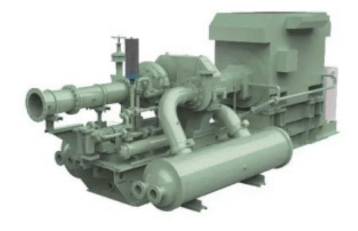

출처: 집필진 제작(2024) [그림 3-2] 일반적인 공기 압축기

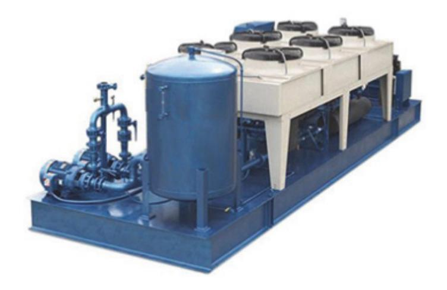

출처: 집필진 제작(2024) [그림 3-3] 냉각 시스템

- (2) 압축된 공기는 냉각 시스템으로 이송되어 저온으로 냉각되며, 냉각 과정에 대한 원리를 검토 한다. [그림 3-3]은 반도체 공정 가스 제조용 냉각 시스템을 나타낸다. 압축기로부터 이송된 압축 공기는 냉각 시스템에서 저온으로 냉각되며, 가스 입자들은 저온에서 운동 에너지 가 감소하므로 액화하게 된다. 이러한 과정에서 압축 공기는 액화점까지 냉각되어 공기 중에 수분을 제거하게 된다.
- (3) 냉각 과정으로 수분을 제거한 원료 공기는 정화 시스템으로 이송되어 다른 불순물을 제거하 는데, 정화 과정에 대한 공정을 검토한다.

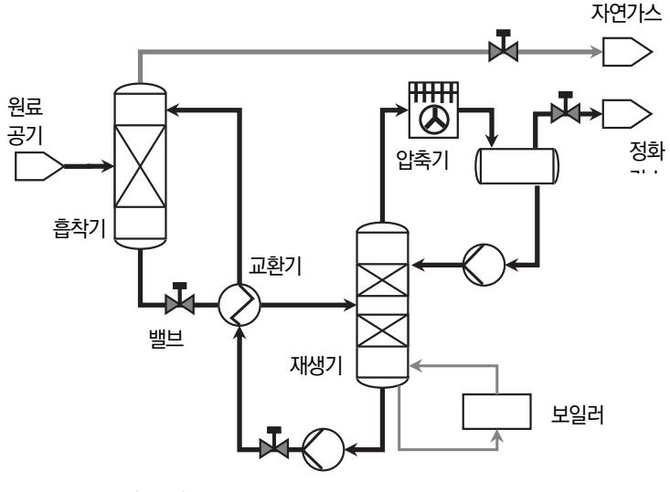

출처: 집필진 제작(2024) [그림 3-4] 공기 정화기의 공정도 [그림 3-4]는 압축된 공기를 정화하기 위한 정화기의 공정도를 나타낸다. 정화 과정에서 는 원료 공기 내에 포함된 일산화탄소, 물, 탄화수소 및 다른 불순물 등을 제거한다.

- (가) 원료 공기에 포함된 불순물은 열교환기에 막힘 현상을 일으킬 수 있으므로 주의하여야 한다.
- (나) 그리고 불순물은 증류 과정의 초저온 하에서 고체화되어 장비 내부의 표면에 달라붙거나 충격을 가할 수 있어 사고를 유발할 수 있어 제거되어야 한다.
- (다) 불순물은 온도흡착(TSA: temperature swing adsorption)법이나 압력흡착(PSA)법을 사용하여 내부에 채워진 다공 물질을 통해 흡착한다.
- (라) 흡착 과정을 거친 공기는 재생 공정을 통해 정화되며, 많은 양의 불순물로 인하여 잔류 하는 공기는 다시 투입되어 흡착 공정으로 복귀한다.
- (마) 재생에 필요한 공기의 유량은 통과 유량의 약 10~30% 정도로 다양하다.
- (바) 재생에 사용되는 공기는 생산에 참여하지 않음으로 압축기를 선정할 때 필요한 생산량을 고려하여 선정하여야 한다.
- (4) 정화된 공기는 분리 시스템으로 이송되며, 끓는점의 차이에 의한 가스가 분리되는 과정에 대 한 공정을 검토한다.

[그림 3-5]는 정화된 공기가 극저온 증류나 분자체와 같은 기술을 이용하여 서로 다른 끓는점의 차이에 의해 분리되는 과정의 공정도를 보여 준다. 정화된 공기는 흡착기와 탈 착기를 거쳐 압력과 온도를 조절함으로써 분리되어 열교환기를 통해 공정 가스를 제조 하게 된다.

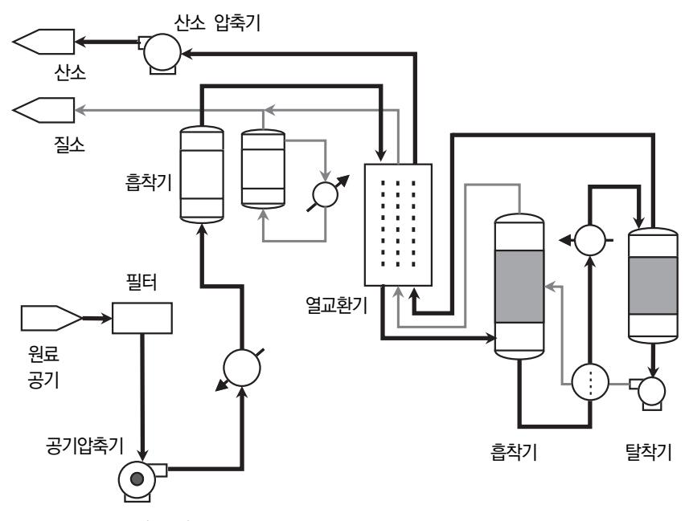

출처: 집필진 제작(2024) [그림 3-5] 분리 과정에 대한 공정도

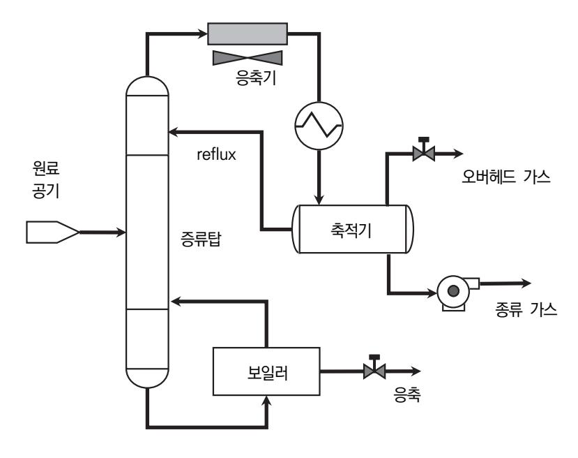

출처: 집필진 제작(2024) [그림 3-6] 증류 과정의 공정도

- (5) 정화와 분리 과정을 통과한 가스는 증류 과정의 설비인 증류탑(distillation column)을 거치 면서 증류된다. 증류 과정의 원리를 확인한다. [그림 3-6]은 가스 증류 과정의 공정도를 나타낸다. 증류탑의 원리는 액체 혼합물에서 섞여 있는 혼합물 구성 물질들의 끓는점의 차이를 이용하여 단일 물질로 분리한다. 증류 탑의 원리를 파악하여 증류 공정의 절차를 검토한다.
  - (가) 증류 공정도의 그림에서 보듯이, 증류탑의 왼쪽에서 원료 가스가 유입된다.
  - (나) 증류탑의 아랫부분에 있는 가열기(boiler)로부터 열에너지를 공급받아 증류탑으로 들어간 가스가 가열된다.
  - (다) 가스를 가열함에 따라 끓는점이 낮은 물질은 먼저 끓어 증류탑의 아래에서부터 위쪽으로 이동한다.
  - (라) 증류탑 위쪽으로 올라온 물질은 상부에 있는 응축기(condenser)를 통과하면서 액체로 상변화가 일어난다.
  - (마) 상 변화된 액체는 축적기(accumulator)에 잠시 보관되며, 이후에는 증류된 가스가 저장 탱크로 이동한다.
  - (바) 그리고 증류탑 하부에 남아 있는 끓는점이 높은 물질은 아래에서 맴돌면서 재생하게 된 다.
- (6) 증류된 가스는 저장 탱크에 저장되며, 일부 폐가스는 회수하여 유용한 가스는 재생하게 되며, 이는 생산 비용이나 환경에 영향을 주게 된다.

- 숕 반도체 박막 공정용 특수 가스를 제조하는 과정에서 제조 장비와 공정 등의 다양한 파라미터 (parameter)를 고려하여야 하고, 관련된 파라미터들을 검토한다. 제조 공정을 통해 고순도의 특수 가스 제품을 얻기 위해 제조 장비나 제어와 관련한 각종 파라 미터를 고려하여야 한다.
  - 1. 특수 가스 제조 장비나 설비를 운용하면서 장비 파라미터를 확인한다. 제조 장비나 설비를 이용한 제조 공정을 절차에 따라 진행하면서 저장 용기, 압축기, 냉각 장비, 흡착기, 증류기, 연결 배관, 각종 제어 밸브 및 용량 등을 조절하는 장치 파라미터를 확인한다.
  - 2. 제조 장비의 운용하면서 동작 파라미터를 확인한다.

제조 장비의 운용 매뉴얼을 통해 동작을 조절하는 파라미터인 공정 파라미터를 이용하여 제품의 생산성과 성능을 검토한다. 이러한 동작 파라미터에는 기계적인 요소와 피드백에 의 한 제어 요소가 있다.

(1) 운용 매뉴얼을 이용하여 기계적인 동작 파라미터의 제어를 파악한다.

기계적인 구종을 조절하는 요소로는 구동 모터나 구동 밸브 등을 이용하여 온도, 유량 및 압력 등을 제어하게 된다.

- (2) 생산 과정의 상태나 최종 제품의 물량을 조절하기 위해 센서나 구동부를 이용한 피드백 제어 파라미터를 파악한다. 제조 공정이 연속적으로 진행되면서 센서나 구동부를 연계하여 생산 상태를 조절하는 피드백 제어 파라미터를 확인한다.
- 3. 특수 가스 제조를 위해 반응에 의해 조절하는 요소인 기계적인 제어 파라미터를 통제하여 반응성 을 제어하는 파라미터를 확인한다. 제조 공정에서 제조 장비에 온도, 재료의 배합량과 압력 등과 같은 반응 파라미터를 조절하 여 고순도의 가스 제품을 생산하는 제조법을 관리한다.
- 숖 반도체 제조에 있어 중요한 공정 화학 물질인 암모니아(NH3)는 실리콘 질화물의 분해하는 세척으로 널리 사용되며, 박막 공정용 특수 가스로 알려져 있다. 박막 공정용 특수 가스 제조의 일례로 암모니 아의 제조 방법에 대해 검토한다.
  - 1. 암모니아를 제조하기 위한 제조법 중에 주로 사용해 온 방식에 관해 확인한다.
    - (1) 일반적으로 암모니아는 개질 촉매와 접촉에 의한 연소 관형 스팀 개질기에서 천연가스나 고 급 탄화수소의 탄화수소 원료가 흡열 스팀 개질 반응을 거쳐 제조된다.
    - (2) 1차 개질 가스는 2차 단열 개질기로 공급되고, 여기서 가스 중 수소의 일부와 탄화수소의 잔

71

량이 2차 개질 촉매의 존재 하에 공기 또는 산소 부화 공기에 의해 부분 산화된다. 2차 개 질기로부터, 수소, 질소, 일산화탄소 및 이산화탄소를 함유하는 미정제 합성 가스가 상기 스 팀 개질 반응에서 공급 원료의 반응 동안 형성되고, 2차 개질 단계에서 공기의 첨가를 통해 가스에 질소가 도입된다.

1차 및 2차 개질 과정의 단점은 흡열 1차 스팀 개질을 가열하기 위해 비교적 높은 탄 화수소 공급 원료와 연료를 소비하며, 그에 따른 상당한 CO2가 배출된다. 이러한 과정 에서 포집된 CO2 생성물은 요소 생성이나 오일 회수와 같은 하류 공정에 사용될 수 있 다.

- (3) 1차 및 2차 스팀 개질은 대규모 암모니아 합성 플랜트에서 일어날 수 있으며, 이것은 자열 개질(ATR: auto-thermal reforming)에 의해 대체될 수 있다. 1차 및 2차 스팀 개질은 기존 개질 플랜트에서 이용되며, ATR은 천연가스와의 반응에 서 산소를 사용한 CO, CO2, H2, H2O 및 탄화수소로의 부분 산화와 미정제 합성 가스 를 형성하기 위한 탄화수소의 후속 스팀 개질를 포함한다. ATR 기술에서 특정 탄화수 소 소비와 CO2 배출물이 약간 감소할 수 있다.
- (4) ATR 과정에서 공기 분리 장치(ASU: air separation unit)가 ATR를 위한 산소나 암모니아 합성을 위해 질소 가스를 공급한다. ATR은 대기 중 산소와 질소의 비율보다 상대적으로 더 많은 산소를 요구하기 때문에 ASU에서 처리되는 질소의 절반 미만이 암모니아 합성에 사용된다.
- (5) 최근 암모니아 합성 가스의 제조를 위해 수소 생성을 위한 물의 전기 분해법이나 질소 생성 을 위한 공기 분리법 등을 검토한다. 생성된 수소와 질소는 암모니아 생성을 위한 합성 가스를 형성할 수 있는 화학량론적

비율로 형성된다. 그러나, 전기 분해법과 공기 분리법이 가진 문제는 산소가 전기 분해 와 공기 분리 시에 모두 부산물로서 생성된다는 점이며, 이는 암모니아 합성에 사용되지 않고 에너지 손실로 고려된다.

2. 암모니아 가스를 제조하기 위해 전기 분해법을 이용한 수소와 공기 분리법을 이용한 질소를 제조 하는 공정을 검토한다.

<표 3-7>은 전기 분해법과 공기 분리법을 조합하여 암모니아 가스를 제조하는 공정도이다.

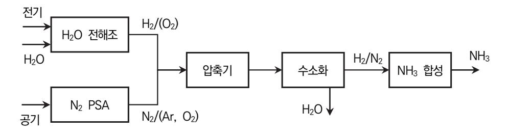

출처: 집필진 제작(2024) [그림 3-7] 암모니아 가스 제조법

(1) 암모니아 가스를 제조하기 위해 수소는 전기 분해법에 따라 제공되고, N2는 공기 분리법, PSA 또는 막 분리에 의해 제공되며, 수소 증기와 질소 증기 중 산소나 산소 함유 화합물은 공통 탈산(deoxidation) 장치에서 제거된다.

전기 분해에 의한 수소와 PSA에 의해 질소는 O2, H2O, KOH 등과 같은 불순물을 함 유할 수 있고, 일반적으로 암모니아 합성에서 바람직하지 않다. 이러한 불순물은 보통 세정 장치에 의해 제거되며, 이로써 거의 순수한 수소와 질소를 얻어 암모니아 합성 가 스가 제조된다.

- (2) 대기 중에 공기를 질소와 산소로 분리하기 위해 압력 흡착(PSA) 기술을 이용하며, 이것은 주 변 온도 근처에서 작동한다.
- (3) 수소와 질소 증기에 의한 암모니아 합성 가스를 압축기에서 조합하여 가압된 증기의 세정이 하나의 단일 장치에서 일어난다.
- (4) 그림에서와 같이 수소화 장치를 거치며, 산소는 물의 촉매 수소화 과정을 통해 제거된다.
- (5) 암모니아 합성 가스를 제조하기 위해 각 과정의 단계를 검토한다.
  - (가) 주변 공기의 PSA에 의해 질소를 포함하는 분리된 증기를 제공하는 단계를 확인한다.
  - (나) 물이나 증기의 전기분해에 의해 수소를 포함하는 분리된 증기를 제공하는 단계를 확인한 다.
  - (다) 분리된 수소와 질소 증기들을 포함하는 혼합 증기로 조합하는 단계를 확인한다.
  - (라) 혼합 증기를 가압하는 단계를 검토한다.
  - (마) 혼합 증기에 함유된 수소의 일부로 산소의 촉매 수소화를 하여 혼합 증기에 함유된 잔류 하는 산소를 제거하여 암모니아 합성 가스를 생성하는 단계를 확인한다.
- (6) 탈산 단계 전에 혼합 증기를 가압하는 경우, 열에너지가 혼합 증기에 적용되고, 가스의 온도 는 증가한다. 따라서, 촉매 수소화를 위한 시동 히터를 사용하는 것은 무의미하다.
- (7) 암모니아 반응은 약 3의 H2 : N2의 화학량론적 몰비가 필요하며, 수소의 일부는 수소화 반응 에 사용된다.

73

- (8) 암모니아 가스를 제조하기 위한 전기 분해법과 공기 분리법에 따라 제조 공정의 특징을 검토 한다.
  - (가) 모든 용량에서 극저온 ASU에 비해 PSA에 의한 제조법이 비용 면에서 저렴하다.
  - (나) PSA는 작동이 더 유연하고, 극저온 ASU에 비해 시동 시간이 빠르다.
  - (다) 각 원료 증기에 대한 개별 장치 대신에 수소와 질소 원료 증기에서 모두 산소를 제거하 기 위해 수소화 장치를 사용한다.
  - (라) 압력이 높을수록 반응에 유리하고, 수소화 장치에서 촉매 부피가 감소한다.
  - (마) 온도가 높을수록 산소의 수소화에 유리하다.
- (9) [그림 3-7]에서 나타나듯이, 압축 단계는 H2와 N2의 조합된 증기로부터 모두 산소를 제거한 후에 다음 공정으로 진행한다.
- (10) 암모니아 합성 가스의 제조 공정에서 구체적인 제조 방법을 확인한다.
  - (가) 전해조로부터의 수소 증기는 일반적으로 99.9mole % H2와 0.1mole % O2를 함유한 다.
  - (나) PSA 장치로부터의 질소는 전형적으로 99.2mole% N2, 0.3mole % O2 및 불순물로서 0.5mole % Ar를 포함한다.
  - (다) 암모니아 합성 가스 중의 산소는 암모니아 촉매를 피독 하며, 산소의 물로의 촉매 수소 화로 수소 증기와 질소 증기에 함유된 산소를 제거하여야 한다.
  - (라) H2 대 N2의 몰비는 약 2.8~3.2 정도로 조합되고, 다음 공정인 합성 가스 압축기에서 압축되고, 연이어 수소화 장치에서 세정된다.
  - (마) 수소화 장치에서 산소는 수소와의 촉매 반응으로 물을 형성하여 제거된다.

## 3-2. 문제점에 대한 해결 방안 도출

학습 목표 • 박막 공정 가스 제조 단계에서 발생한 문제점을 파악하고 해결 방안을 도출할 수 있다.

### 필요 지식 /

#### 숔 제조 공장의 안전 관리

반도체용 특수 가스를 제조하는 공장에서는 저장, 취급 및 제조하는 독성 가스에 의한 사고 방 지에 대한 세심한 주의를 기울여야 한다. 특히, 유독 가스에 의한 안전에 대한 문제는 작업자 와 주변 환경에 매우 중요한 영향을 끼치게 된다. 따라서 제조 공장의 생산 과정에서는 안전 관리에 규정에 따라 관리하여야 한다.

1. 독성 가스

독성 가스란 공기 중에 일정량 이상 존재하는 경우, 인체에 해로운 독성을 가진 가스로서 허용 농도가 5,000ppm 이하인 것으로 「고압가스 안전관리법 시행규칙」 제2조에서 규정한 것을 말한다.

(1) 독성 가스의 정의

단일 물질이 경우에 고용노동부 고시 제2016-19호에 따라 쥐를 기준으로 1시간 기준 LC50에 대한 수치가 5,000ppm 이하이거나, 4시간 기준 LC50이 2,500ppm 이하인 경 우에는 독성 가스로 규정한다. 즉, LC50(1hr)이 5,000 ppm을 초과하는 실란, 염화 메 탄, 암모니아는 「고압가스안전관리법 시행규칙」 제2조에 따라 독성 가스로 규정한다.

(2) 급성 독성 물질

급성 독성 물질은 산업 안전 보건 기준에 관한 규칙에 의해 쥐에 대한 4시간 동안의 흡 입 실험에서 실험 동물의 50%를 사망시킬 수 있는 농도의 화학 물질을 말한다. 즉, 가 스 LC50(쥐, 4시간 흡입)이 2,500ppm 이하인 화학 물질이나 증기 LC50(쥐, 4시간 흡입) 이 10 mg/L 이하인 화학 물질, 분진 또는 미스트 1 mg/L 이하인 물질이다.

(3) 독성 가스의 판별기준

가스 제품이 혼합물인 경우, 단일 물질의 분류기준으로 적용하며, 개별 농도를 각각 계 산할 경우에는 고용노동부 규정의 급성 항목에 따라 다음과 같은 식으로 계산하여 분류 한다.

(가) 혼합 가스의 모든 성분 자료가 있는 경우

혼합물 중에 모든 성분에 대한 가스 자료가 있거나 혹은 추정이 가능한 경우에는 아 래 식을 적용하여 계산한다.

$$\frac{100}{A T E_{mix}} = \sum_{n} \frac{C_i}{A T E_i}$$

여기서, *Ci* = 성분 *i*의 농도(%)

 ATEi (acute toxicity estimate, 급성 독성 혹은 LC50 기준치): 성분 i의 ATE

 ATEmix: 혼합물의 급성 독성 혹은 LC50 기준치

(나) 혼합 가스의 일부 성분 자료가 있는 경우

혼합물 중에 일부든 성분에 대한 가스 자료가 있거나 혹은 추정이 가능한 경우에는 아래 식을 적용하여 계산한다. 즉, 이용 가능하지 않은 성분이 10%를 초과하는 경우 에는 아래 식이 적용되며, 급성독성을 모르는 성분의 함량은 별도로 표시한다.

$$\frac{100 - (\sum C_{unknown}, \text{if} > 10\%)}{A T E_{mix}} = \sum_{n} \frac{C_i}{A T E_i}$$

여기서, Ci = 성분 i의 농도(%)

 ATEi (acute toxicity estimate, 급성 독성 혹은 LC50 기준치): 성분 i 의 ATE

 ATEmix: 혼합물의 급성 독성 혹은 LC50 기준치

- 2. 가스 설비의 기준
  - (1) 가스 설비 재료

가스 설비의 재료는 특수 가스의 취급에 적합한 기계적 및 화학적 성질을 가져야 하며, 가스 사용 시설에 사용하는 재료는 가스의 종류, 성, 온도 및 압력 등에 적합한 것으로 선정하는 것이 바람직하다.

(2) 가스 설비 구조

가연성 가스, 독성 가스와 조연성 가스의 가스 설비 구조는 특수 가스를 안전하게 취급 할 수 있는 적절한 것이어야 하며, 가스가 누출되지 않는 구조를 가져야 한다. 가스 설 비는 유해성 특수 가스를 안전하게 취급할 수 있도록 기준에 따라 적합한 강도와 두께 를 가져야 한다. 가스 설비는 상용 압력의 2배 이상에 해당하는 압력에서 견딜 수 있는 두께를 가지고, 상용의 압력에 충분히 견딜 수 있는 강도가 있는 것으로 설치한다.

(3) 가스 설비의 성능

특수 가스 설비는 유해성 가스를 안전하게 취급할 수 있도록 상용 압력의 약 1.5배 이 상에서 실시하는 내압 시험에 통과한 것이어야 하고, 상용 압력 이상의 압력으로 기밀 시험이나 누출 검사를 시행하여 통과되어야 한다.

3. 가스 누출 경보 장치 설치

독성 가스나 가연성 가스, 초저온 특수 가스의 저장 및 사용 설비에는 가스가 누출될 경우, 이를 신속히 검출하여 효과적으로 대응할 수 있도록 다음과 같은 기준에 따라 가스 누출 검지 경보 장치를 설치하여야 한다.

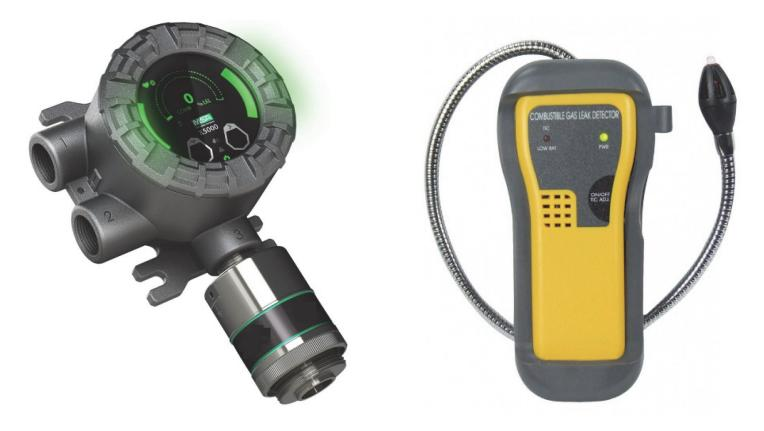

출처: 집필진 제작(2024) [그림 3-8] 가스 누출 경보 장치

(1) 가스 누출 경보 장치의 기능

가스 누출 경보 장치는 가연성 가스나 독성 가스의 누출을 검지하여 가스의 농도를 표 시하고, 동시에 경보를 울릴 수 있도록 다음과 같은 기능을 가져야 한다.

(가) 경보 방식

경보는 접촉 연소 방식, 기체열 전도 방식, 반도체 방식 및 기타 방식으로 구분하며, 미리 설정하여 놓은 가스의 농도에서 자동으로 울릴 수 있도록 설정한다.

1) 접촉 연소 방식

동작 원리는 백금선의 온도에 따라 저항이 변하는 성질을 이용한 것으로 저항 변 화 시에 브리지 회로의 불평형으로 지시계를 측정하는 방식이다. 거의 가스의 농 도에 선형적으로 비례하여 출력 전압을 얻을 수 있지만, 단점으로는 충격에 약하 고 감도가 저하한다.

2) 기체 열전도 방식

가스 센서 소자에 따라 저항이 변화하는 특성을 이용한 것이며, 저항값 변화에 따라 브리지 회로에서 불평형에 의한 전압을 측정하는 방식이다. 가스의 농도가 변하면 출력 전압은 크게 직선적으로 증가하며, 안정성이 높고 경제적이며 산소 가 없더라도 측정이 가능하다.

3) 반도체 방식

반도체 소자가 가스에 접촉하면 전기 저항이 감소하는 원리를 이용한 것이며, 감 도 특성이 우수하고 안정성이 좋으며, 소형화가 가능하여 대량 생산과 휴대용으 로 제작할 수 있다.

(나) 경보 농도

경보 장치의 설치 장소나 주변 분위기 온도에 따라 가연성 가스는 폭발 하한계의 1/4 이하, 독성 가스는 TLV-TWA 기준 농도 이하로 설정한다. 다만, 실내에서 암모 니아 가스를 사용하는 경우, 50ppm으로 설정한다.

(다) 경보 정밀도

경보의 정밀도는 경보 농도 설정치에 대하여 가연성 가스용에서는 ±25% 이하, 독 성 가스용에서는 ±30% 이하로 설정한다.

(라) 경보 지연 시간

가스 누출을 감지하여 발신까지 걸리는 시간은 경보 농도의 1.6배 농도에서 보통 30 초 이내로 설정한다. 다만, 암모니아나 일산화탄소 등과 같이 경보 장치의 구조상이 나 이론상 30초가 넘게 걸리는 가스에 대해서는 1분 이내로 설정할 수 있다.

(마) 경보 장치의 지시계

경보 장치의 지시계 눈금은 독성 가스의 경우 0~TLV-TWA 기준 농도의 3배값, 가 연성 가스의 경우 0~폭발 하한계 값을 명확하게 지시하는 것을 선정한다.

(바) 기타 기능

경보를 발신한 후에는 주변 분위기에서 가스의 농도가 다소 변화하더라도 계속 경보 를 울려야 하고, 가스 누출의 확인이나 안전 대책을 세워 경보가 정지되도록 실행한 다. 경보 장치는 4~20mA DC 출력 단자를 가는 구조이어야 한다.

(2) 가스 누출 경보 장치의 구조

가스 누출 경보 장치는 충분한 강도를 지니며, 취급과 정비가 쉬워야 한다. 가스에 접촉 하는 부분은 내식성의 재료나 충분한 부식 방지 처리를 한 재료를 사용하고, 그 외의 부분은 도장이나 도금 처리가 쉬운 재료를 사용하는 것이 바람직하다. 암모니아 가스를 제외하고, 가연성 가스의 경보 장치는 방폭 성능을 가져야 한다.

숕 시설 및 공정 점검

반도체용 특수 가스는 유독성 특수 가스를 주로 다루기 때문에 「고압가스 안전관리법」의 규정 에 따라 가스 제품을 관리하고 취급하여야 한다. 특히, 제조 장비를 비롯하여 설비나 사용 시 설에 이르기까지 설계와 관리에 주의를 기울여야 하고, 정기적으로 제조 공정과 장비 및 공장 시설에서 규정에 적합한 안전 항목을 점검하여야 한다.

1. 공정 점검

반도체용 특수 가스를 제조하는 과정에서 발생할 수 있는 사고나 문제점을 파악하기 위해 다음과 같은 공정 점검을 정기적으로 실시하며, 점검의 결과와 현장을 확인하고 점검 보고 서를 작성한다.

- (1) 주요 공정 운용 상태의 점검
- (2) 긴급 상황에 대한 공정 라인 점검
- (3) 제조 장비의 정비에 대한 점검

(4) 각종 장비와 밸브의 연결 부분에서 가스 누출에 대한 점검

- 2. 공장 시설 점검
  - (1) 사용 시설 점검

제조 공장의 사용 시설에 대한 점검은 저장 설비, 배관, 조정기 및 감압 설비 등과 같은 특수 가스를 사용하기 위한 사용 설비, 사무실, 이외 건축물, 소화기, 가스 누출 경보 장치, 재해 설비 및 동력 설비를 포함한 시설을 점검한다.

(2) 생산 시설 점검

생산 제조 시설의 점검은 원료 저장 탱크와 공급 시스템, 압축기, 공기 분리기, 증류탑, 반응기, 배기와 환기 설비, 퍼지 시스템, 제독 설비, 밸브 및 개인 보호구 등을 정기적 으로 점검한다.

3. 각종 점검표

작업자는 다음과 같이 제시되는 점검표를 정기적으로 점검하여 결과를 정리하여 간략한 보 고서를 작성한다.

- (1) 일반 점검표
- (2) 제조 장비 점검표
- (3) 공급 설비 점검표
- (4) 배관 및 부품 설비 점검표
- (5) 공정 안전 관리 점검표
- (6) 일반 유틸리티 점검표
- (7) 소방 설비 점검
- (8) 옥내 설비 점검표
- (9) 개인 보호 점검표
- 4. 검사 결과에 대한 대응
  - (1) 대응 여부의 판단
  - (2) 대응 범위의 판단
  - (3) 대응 시기의 판단
  - (4) 정비와 보완을 위한 결과 확인 및 테스트 실시

## 수행 내용 / 문제점에 대한 해결 방안 도출하기

#### 재료·자료

- 반도체 재료 제조 기술 자료
- 국제표준화기구(ISO: International Organization for Standardization) 표준화 문서
- 물질 안전 보건 자료(MSDS)
- 생산 계획서
- 반도체 재료 작업 절차서
- 반도체 재료 작업 표준서
- 시험 성적서
- 반도체 설비 목록 및 매뉴얼
- 반도체 제조 공정도
- 반도체용 박막 가스 원재료

#### 기기(장비 ・ 공구)

- 반도체용 박막 공정 가스 제조 장비
- 반도체용 박막 공정 가스 측정 장비
- 반도체용 박막 공정 가스 검사 장비
- 반도체용 박막 공정 가스 분석 장비

#### 안전 ・ 유의 사항

- 반도체 박막 공정에 대한 이론적 지식을 습득하고, 사용하는 가스의 성질과 특성을 바탕으 로 가스 제조 시에 문제점을 검토하고, 취급에 주의 사항을 이해하여야 한다.
- 반도체 박막 공정에서 사용하는 특수 가스는 부식성, 맹독성, 인화성 및 발화성 등의 위험 물질이 많아 해당 가스에 대한 장비, 공급 시설, 관리 및 주의 사항을 사용하기 전에 미리 숙지하여야 한다.
- 물질 안전 보건 자료를 통해 특수 가스를 취급하기 전에 파악하고, 독성 가스의 경우에는

제독 설비에 대한 일반 사항, 제독 설비 및 제독 방법 등 안전 교육을 실시한다.

#### 수행 순서

- 숔 반도체 박막 공정용 특수 가스의 유해성에 대한 자료를 확보하여 상세히 검토하고, 제조 단계에서 가 스 누출에 대한 비상 대책과 해결 방안을 검토한다. 반도체 박막 공정용 가스를 제조하는 공장에서 유독 가스 누출로 인한 사고는 현장의 환경을 저해할 뿐만 아니라, 작업자에게 심각한 문제를 야기할 수 있으므로 이를 방지하여야 한다. 따 라서 생산하려는 가스에 사용할 원료 물질과 특수 가스에 대한 자료를 토대로 유독 가스 누출 에 대한 문제점과 비상 대책을 수립하여 준비한다.
  - 1. 유독 가스 누출과 외부 가스의 유입 등에 의한 문제점을 미리 파악하기 위해 특수 가스의 유해성 에 대한 자료를 확인하고, 가스 유입이나 유출 상황에 대해 안전성을 확인한다. 유독 가스의 누출이나 외부 가스 유입 등에 따른 문제를 미리 파악하여 제조하려는 물질의 유해성에 대한 인식을 확인하여야 한다. 특히, 가스를 제조하는 공장에서는 유독 가스의 누 출에 따른 사고 위험에 항상 노출되어 있으므로 유독성 가스에 대한 자료와 교육을 통해 반드시 기본 지식을 습득하여야 한다.
    - (1) 유독 가스의 특성 중에 불연성 가스를 제조하거나 취급할 경우, 다음과 같은 안전한 예방 조 치를 확인한다.
      - (가) 저장 탱크와 연결부에 대해 공정을 시작하기 전에 누출 검사를 실시하여야 한다.
      - (나) 옥내에서 충전하여 사용하는 불연성 가스의 경우, 반드시 가스 누출 경보 장치가 요구될 수 있다.
      - (다) 옥내에서는 지속적으로 환기되도록 설비를 갖추어야 하고, 실내 공간도 적절한 환기 시 스템을 갖추어야 한다.
    - (2) 유독 가스의 특성 중에 가연성 가스를 제조하거나 취급할 경우, 다음과 같은 안전한 예방 조 치를 확인한다.
      - (가) 화염, 화상 및 폭발의 가능성을 예방하기 위해 규정에 따라 적절한 보호 도구와 장비를 배치한다.
      - (나) 유해성 특수 가스 제조 시에 저장 탱크는 사용하기 전에 연결부에 대한 누출 검사를 반 드시 실시하여야 한다.
      - (다) 가연성 가스는 산화제, 자연 발화성 가스, 맹독성 가스, 가연성 액체, 불꽃 및 열원으로 부터 멀리 격리하고, 환기가 잘되는 장소에 배치하여야 한다.
      - (라) 가연성 가스는 주변의 위험시설로부터 반드시 분리하여 멀리 거리를 둔다.
      - (마) 휴대전화와 같은 규정되지 않은 휴대용 전자 장치의 사용은 금지된다.
      - (바) 적절하게 설계된 시스템을 제외하고, 가연성 가스를 대기 중에 방출하지 말아야 한다.

- (사) 흡연과 같은 점화원은 절대로 금지되고, 모든 점화원은 가능한 한 최소화하여야 하며, 여 기에는 정전기도 포함된다.
- (아) 가연성 가스를 제조하거나 작업 시에는 주변에 방폭용 도구와 장비를 준비하여야 한다.
- (자) 가연성 가스에 사용되는 모든 배관, 캐비닛 및 가스 설비는 무정전 전원을 구비하고, 반 드시 접지시켜야 한다.
- (차) 가연성 가스가 들어있는 배관에는 적절하게 역류 방지용 장치를 장착하여야 한다.
- (3) 유독 가스의 특성 중에 산화성 가스를 제조하거나 취급할 경우, 다음과 같은 안전한 예방 조 치를 확인한다.
  - (가) 저장 탱크와 연결부에 대해서는 공정을 시작하기 전에 반드시 누출 검사를 실시한다.
  - (나) 산화성 가스는 가연성 가스, 자연 발화성 가스, 맹독성 가스, 가연성 액체, 불꽃 및 열원 으로부터 격리하고, 환기가 잘되는 장소에 배치한다.
  - (다) 산화성 가스는 주변의 위험으로부터 격리하여야 한다.
  - (라) 산소용으로 제작된 장치만 사용하여야 한다.
  - (마) 산소 시스템은 외부로부터 오염되지 않도록 주의하여야 한다.
  - (바) 산소에 적합한 윤활유와 밀봉제만을 사용하여야 한다.
  - (사) 적절하게 설계된 시스템을 제외하고 산화성 가스를 대기 중에 방출되지 않도록 주의하여 관리한다.
  - (아) 환기가 적절하지 못한 작업장에서 산소 실린더를 사용할 경우, 산소의 농도를 23.5% 이 하로 유지하여야 한다.
- (4) 유독 가스의 특성 중에 독성 가스를 제조하거나 취급할 경우, 다음과 같은 안전한 예방 조치 를 확인한다.
  - (가) 저장 탱크와 연결부에 대해서는 공정을 시작하기 전에 누출 검사를 실시한다.
  - (나) 독성 가스는 가연성 가스, 자연 발화성 가스, 고독성 가스, 가연성 액체, 나화, 불꽃 및 열원으로부터 격리하고, 환기가 잘되는 장소에 배치한다.
  - (다) 독성 가스는 주변의 위험 시설로부터 반드시 분리하여 멀리 거리를 두고 설치한다.
  - (라) 컨테이너 내부의 충전된 실린더를 포함하여 맹독성 가스가 들어있는 밀폐된 공간에서는 고정식 상시 감지 시스템이 없는 경우, 작업자가 출입하기 전에 독성 가스가 누출이 없 는지를 점검하여야 한다.
  - (마) 적절하게 설계된 시스템을 제외하고, 독성 가스를 대기 중에 방출되지 않도록 주의하여 관리한다.
  - (바) 필요하다면 비상 샤워기, 세안 구역 및 응급 치료실 등을 설치하여야 한다.

- (5) 유독 가스의 특성 중에 부식성 가스를 제조하거나 취급할 경우, 다음과 같은 안전한 예방 조 치를 확인한다.
  - (가) 피부와 안구 등에 접촉을 방지하기 위해 적절한 보호 도구와 장비를 준비하여 배치하여 야 한다.
  - (나) 비상 샤워기와 같은 안전장치를 설치하여야 한다.
- 2. 반도체 박막 공정용 특수 가스는 유해성 가스를 많이 사용하기 때문에 가스의 제조 공정에서 조 심하여야 한다.

특수 가스와 관련되는 시설이나 설비에 대한 정보를 준비하고, 특수 가스의 물성을 고려하 여야 한다.

- (1) 박막 공정용 특수 가스의 생산 과정에서 시설에 대한 안전을 고려하여 취급한다.
  - (가) 특수 가스의 제조와 저장과 관련한 모든 시설은 비상 조치 계획을 구비하고, 추가로 가 스 방출과 비상 대피 계획이 포함되어야 한다.
  - (나) 특수 가스를 취급하기 위해서는 물질 안전 보건 자료를 준비한다.
  - (다) 가스 저장 탱크를 취급할 시에는 적절한 개인 보호 장비를 착용하고, 강철을 덧댄 안전 화, 측면 보호 보안경 및 가죽 장갑 등을 포함한다.
  - (라) 가연성 물질은 저장 탱크에 저장하거나 사용 지역에서 격리한 시설에서 관리한다.
  - (마) 저장 탱크에 충전하기 전에 반드시 충전 전 검사와 정격 압력의 검증은 매우 중요하다.
  - (바) 밸브 출구 플러그 또는 연결부를 천천히 제거하고 완전히 제거하기 전에 누출 여부를 반 드시 확인하여야 한다.
  - (사) 밸브 출구와 호스의 청결 상태를 확인한다.

<표 3-2> 반도체 박막 공정 가스와 허용 농도

| 가스명      | 분자식       | 허용 농도(TLV값) | 노출 기준(TWA)    |
|----------|-----------|-------------|---------------|
| 실란       | SiH4      | 0.5         |               |
| 디실란      | Si2H6     | 0.5         |               |
|          | S2H6      | 0.1         |               |
| 포스핀      | PH3       | 0.3         | 0.3(고용노동부 고시) |
| TEOS     | C8H20O4Si | 10          |               |
| 다이클로로실란  | SiH2Cl2   | 5           |               |
| 사불화 탄화산소 | CF4       | 3           |               |
| 육불화 에탄산소 | C2F6      | 3           |               |
| 불화 텅스텐   | WF6       | 0.75        |               |

출처: 교육부(2014). 반도체용 가스 재료 제조(LM1903060403\_14v1). 한국직업능력개발원. p. 77.

| 대상 물질       | 공정 가스                        | 부산물 배기 처리 문제                                                                          | 분자식                 | 가스 특 징         |
|-------------|------------------------------|---------------------------------------------------------------------------------------|---------------------|-------------------|
| BPSG        | TOES/TMB/TMP N2O/C2F6/NF3 | ∙화재 가능성 가스 ∙상반되는 가스 계속 사용 예) SiH4/NF3 ∙화재 발생과 유독 가스 처리 요망                    | NF3 C2F6         | T,O GW         |
| 산화물/ 질화물 | SiH4/NH3/SF6                 | ∙화재 가능성 가스 ∙상반되는 가스 계속 사용 예) SiH4/NF3                                           | SiH4 NF3 C2F6 | P,T Y,O GW  |
| 질화물         | DCS/NH3                      | ∙기체응고에 의한 exhaust blockage ∙고체 생성물질 및 DCS와 chlorides 처리 기능 필요 | Cl2 SiH2Cl2      | T,C T,C        |
| 폴리          | SiH4                         | ∙홍합된 가스에 의한 화재 발생 가능                                                                  | SiH4                | P,T               |
| 텅스텐         | WF6/SiH4/NF3                 | ∙화재 가능성 가스 ∙상반되는 가스 계속 사용 예) SiH4/NF3                                           | WF6 SiH4 NF3  | O,C P,T T,O |

<표 3-3> 반도체 박막 공정 가스의 특징

T: 유독성, C: 부식성, A: 질식성, F:가연성, P: 자연 발화성, O: 산화성, GW: grobal warming gas

출처: 교육부(2014). 반도체용 가스 재료 제조(LM1903060403\_14v1). 한국직업능력개발원. p. 78.

- (아) 밸브는 항상 천천히 열어야 하고, 밸브를 과도하게 조이지 말아야 한다.
- (자) 저장 탱크의 밸브 보호 캡 부분을 잡고 들어 올려서는 안 된다.
- (차) 장거리 이동 중에는 가급적 롤링을 최소화하도록 적절한 실린더 트롤리나 적합한 운반 장치를 사용한다.
- (카) 운반, 저장 또는 사용 등의 경우에 저장 탱크는 반드시 통제하여야 한다.
- (타) 저장 탱크 표면에서 전기 아크가 발생하지 않도록 주의하여야 한다.
- (파) 저장 탱크가 전기 회로와 접촉하여서는 절대 안 된다.
- (2) 특수 가스의 저장이나 환기에 대해 다음과 같은 안전 주의 사항을 고려한다.
  - (가) 저장 탱크는 건조한 상태로 보관하여야 한다.
  - (나) 저장 탱크는 전복되는 사고가 발생하지 않도록 평지에 보관하여야 한다.
  - (다) 특수 가스가 갖는 위험의 정도에 따라 저장 탱크를 정리하여야 한다.
  - (라) 저장 탱크는 직사광선을 피해야 하고, 저장 탱크의 온도는 규정하는 가이드라인이나 최 대 53℃를 초과하지 않도록 보관하여야 한다.
  - (마) 가스 저장량은 시설의 설계 용량을 초과하지 않도록 하고, 규정이나 법령에 따른다.
  - (바) 수직으로 보관된 실린더는 사고로 넘어지지 않도록 상자, 운반대 또는 쇠줄을 이용하여

고정되게 배치한다.

- (사) 저장 탱크는 환기가 잘되는 것에 보관한다.
- (아) 실내에 저장 탱크를 보관할 경우, 자연 또는 강제적인 환기가 필요하다.
- 3. 반도체 박막 공정용 특수 가스는 유독성 가스로 분류되기 때문에 가스 제조 공정에서 가스 처리 에 대해 주의를 기울여야 한다. 특수 가스와 관련되어 잔류 가스 처리에 대한 교육을 실시한다.
  - (1) 반도체용 특수 가스 제조에서 잔류하는 가스를 처리하기 위한 교육과 안전에 대한 주의 사항 을 검토한다.
    - (가) 잔류 가스 처리 과정에서 작업자는 다음 사항을 준수하여야 한다.
      - 1) 이론과 훈련에 적절한 교육과정을 이수하여야 한다.
      - 2) 작업 지침을 기록하고 체크리스트를 반드시 작성한다.
      - 3) 적절한 개인 보호구와 안전 장비를 준비하여야 한다.
      - 4) 긴급 상황이 예측될 경우, 손쉽게 처리가 가능하도록 물질로부터 비상 장비를 능숙 하게 사용할 수 있을 정도로 훈련되어야 한다.
    - (나) 가스 처리에 대한 교육 절차와 범위를 파악하고 확인한다.
      - 가스 처리에 대한 교육은 문서로 만들어진 작업 지침과 절차를 기본으로 정하고, 자 격을 갖춘 작업자가 실시한다.
        - 1) 가스 내용물의 식별을 포함하여 제품과 용기의 정보를 확인한다.
        - 가스의 일반적인 특성을 이해하고, 처리하여야 할 특수 가스의 물성을 상세히 파 악한다. 용기의 기본 정보와 다루는 방법을 파악하고, 밸브의 사용법과 안전장치 등을 확인한다.
        - 2) 처리 방법의 선택과 원칙을 준수한다.

작업자가 규정에 따른 처리 방법을 선택하여 다루더라도 처리 방법을 확실히 이 해하고 원칙에 따라 처리한다.

3) 처리 절차를 확인한다.

잠재적인 위험의 범위를 포함하여 문서로 만들어진 절차로 훈련이 되어 있어야 한다. 특히, 누출이나 화제 등의 긴급 대응 절차를 고려하여 문서화하고 연습하여 야 한다.

4) 개인 보호구와 일반 안전 수칙을 확인한다.

개인 안전을 위해 문서화하고, 규칙에 따라 지원되어야 한다.

- 5) 위험성 평가는 반드시 실시되어야 한다.
- (2) 유해성 가스의 처리를 위해 다음과 같은 안전 체크리스트를 검토한다.

(가) 가스 처리를 위한 문서로 만들어지고 승인된 방법과 절차가 준수되는가?

(나) 작업 구역에서 문서로 만들어진 절차를 사용하는 것이 가능한가?

85

- (다) 가스 처리 장비는 제대로 배치되었는가?
- (라) 사용된 재료에 대한 호환성과 압력이 적절한가?
- (마) 적절한 경고 알림 표시와 제한 구역에 대해 명시되고 있는가?
- (바) 긴급 절차에 대해 이해되도록 준비되어 있는가?
- (사) 작업자는 정기적으로 교육받고 결과를 기록했는가?
- (아) 비상용 호흡 장치를 사용할 수 있는가? 그리고 장치는 제 위치에 배치되고 작동할 수 있 도록 작업자는 훈련되어 있는가?
- (자) 응급 처리 장비가 비치되고, 사용할 수 있는가?
- (차) 처리하는 가스에 노출되었을 경우, 응급 처치를 위해 적절하게 준비되어 있는가?
- (카) 독성이나 부식성 가스 노출로 인하여 전문 치료가 필요할 경우, 지역 의료 서비스에 연 락을 취할 준비가 되어 있는가?
- (타) 처리 시스템은 가스의 종류와 용량에 적절한가?
- (파) 처리된 화학 약품은 적절하게 분리되고 특성에 따라 처리될 수 있도록 준비하였는가?
- (3) 반도체용 특수 가스 제조에서 잔류하는 가스를 처리하는 방법에 대해 파악하고, 고려하여야 할 중요 사항을 확인한다.

잔류 가스의 처리 방법은 다양하며, 가장 적절한 방법을 선택하여 절차에 따라 실시한 다.

- (가) 일반적으로 가스를 처리하는 방법은 다음 4가지로 구분한다.
  - 1) 회수(recycling) 방법
  - 2) 흡수나 중화(absorption or neutralization) 방법
  - 3) 연소(burning or incineration) 방법
  - 4) 대기 배출(venting to the atmosphere) 방법
- (나) 가스 처리를 위해 고려할 사항을 파악한다.
  - 가스 처리 방법을 선택할 경우, 처리될 가스의 특성을 확인하고, 요구 규정, 운영 제 약 및 용량 등을 파악한다.
    - 1) 작업자는 처리하여야 할 가스의 주요 특성을 전반적으로 파악하여야 한다.
      - 가스의 독성, 가연성, 조연성 및 부식성 등의 특성을 분석하고, 효과적인 처리 방 법을 선택한다.
    - 2) 가스에 대한 물리적인 특성 정보가 중요하며, 가스 처리에 대한 체크리스트를 확인한다.
    - 3) 가스 처리를 위해 해당 지역에 맞는 환경 피해를 주지 않는 조건이나 방법을 선택 하여야 한다.

숕 반도체 박막 공정용 특수 가스는 유독성 가스를 주로 사용하기 때문에 반드시 가스 누출 경보 장치 를 설치하여야 한다.

독성 가스, 가연성 가스 및 초저온 가스를 저장하거나 사용하는 설비에는 가스가 누출될 경우, 이를 신속히 감지하여 효과적으로 대응할 수 있도록 기준에 따라 가스 누출 경보 장치를 설치한다.

- 1. 특수 가스 제조, 저장 및 관리하는 설비에 가스의 누출을 감지하기 위해 가스 누출 경보 장치의 기능을 확인한다. 특수 가스의 경보 장치는 가연성 가스나 독성 가스의 누출을 검지하여 농도를 지시하고, 동 시에 경보를 울리는 장치로서 다음의 기능을 가진 것으로 고려하여야 한다.
  - (1) 경보는 접촉 연소 방식, 격막 갈바니 전지 방식, 반도체 방식 및 기타 방식으로 감지하여 이 미 설정한 가스 농도에서 자동으로 울리도록 조정한다.
  - (2) 경보 농도는 경보 장치의 설치 장소, 주위 분위기 온도에 따라 가연성 가스는 폭발 하한계의 1/4 이하, 독성 가스는 TLV-TWA 기준 농도 이하로 설정한다.
  - (3) 경보기의 정밀도는 경보 농도 설정값에 대하여 가연성 가스용에서는 ±25% 이하, 독성 가스 용에서는 ±30% 이하로 한다.
  - (4) 감지에서 발신까지 걸리는 시간은 경보 농도의 1.6배 농도에서 대략 30초 이내로 한다. 다 만, 경보 장치의 구조상 30초가 넘게 걸릴 때는 1분 이내로 조정할 수 있다.
  - (5) 지시계의 눈금에서 가연성 가스용은 0~폭발 하한계 값, 독성 가스는 0~TLV-TWA 기준 농 도의 3배 값을 정확하게 지시하는 것으로 한다.
  - (6) 경보를 발신한 후에는 원래 분위기 중, 가스 농도가 변화하더라도 계속 경보를 울리도록 설 정하고, 대책을 수립하게 되면 경보가 정지되도록 조절한다.
  - (7) 경보 장치는 4-20mA DC 출력 단자가 있는 구조를 사용한다.
- 2. 유해성 가스 누출을 감지하기 위한 경보 장치의 설치 장소나 설치 위치는 다음 사항들을 고려하 여야 한다.
  - (1) 가스 사용 시설에서 가스가 누출하기 쉬운 장비를 설치한 곳 주변에는 누출한 가스가 체류하 기 쉬운 장소에 설치한다.
  - (2) 경보 장치의 검출부는 가스 비중, 주위 상황, 가스 설비 높이 등의 조건에 따라 적절한 높이 에 설치한다.
  - (3) 경보 장치의 설치 위치는 다음을 추가로 고려한다.
    - (가) 감지 대상 가스의 밀도는 공기에 비해 무겁거나 가벼울 수도 있지만, 작업 공간에서 가 스 농도가 공기의 비중에 미치는 영향은 대체로 무시할 수 있다.
    - (나) 주변 공기의 유속이나 방향은 감지하고자 하는 가스의 확산에 영향을 줄 수 있다.
    - (다) 모든 감지기나 센서는 유지나 교정을 고려하여 결정하여야 한다.

- (라) 벽, 칸막이, 분리대 등과 같은 구조물은 가스를 축적할 수 있다.
- (마) 감지기는 전자파의 간섭을 초래하지 않도록 설치하여야 한다.
- (바) 전자파 간섭이 유발되는 장소에서는 접지를 고려하여 차폐된 전선을 사용하여야 하며, 감지기의 외함이 도전체인 경우에는 반드시 접지를 고려하여야 한다.
- 3. 가스 누출 경보 장치와 관련한 이외에 기타 장치에 대한 설치를 검토한다.

경보 장치에 추가하여 가연성이나 독성 가스의 설비에는 자동으로 누출 가스를 차단하는 자동 차단 밸브 고려하여야 하고, 과압 안전장치, 역류 방지 장치, 환기 설비 및 중화 제독 설비 등을 설치하는 것이 바람직하다.

(1) 자동 차단 장치의 설치를 검토한다.

가연성이나 독성 가스 설비는 가스가 누출될 경우, 신속하게 감지하여 차단될 수 있도록 자동 차단 밸브를 설치하여야 한다. 자동 차단 장치는 사용하는 가스의 양이나 장비의 특성을 고려하여 가스 용기의 메인밸브를 잠그는 방식과 1차 압력 조정기 후단의 배관 을 차단하는 방식 중에서 적절한 것을 선택하여야 한다.

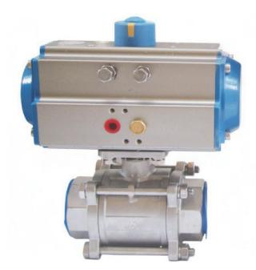

출처: 집필진 제작(2024) [그림 3-9] 가스 자동 차단 장치

(2) 과압 안전장치의 설치를 검토한다.

고압가스 설비에는 압력이 상용의 압력을 초과하는 경우에 즉시 상용의 압력 이하로 되 돌릴 수 있도록 [그림 3-10]과 같은 과압 안전장치를 설치한다.

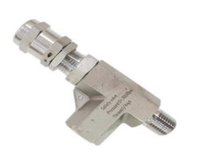

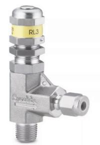

출처: 집필진 제작(2024) [그림 3-10] 가스 자동 차단 장치

(3) 역류 방지 장치의 설치를 검토한다.

독성 가스의 감압 설비나 가스의 반응 설비 사이의 배관에는 긴급 시에 가스가 역류하는 것을 효과적으로 차단할 수 있도록 역류 방지 장치를 설치한다. 수소화염, 산소 및 아세틸렌화염 을 사용하는 시설의 분기되는 배관에는 가스가 역류되지 않도록 효과적으로 차단할 수 있다.

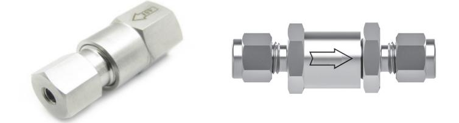

출처: 집필진 제작(2024) [그림 3-11] 역류 방지 장치

(4) 유해성 가스 보관 장소에는 누출된 가스가 잔류하지 않도록 환기 설비의 설치를 검토한다. 가연성 가스나 불활성 가스의 용기 보관 장소에는 누출된 가스가 남아 있지 않도록 기 준에 따라 환기 설비를 설치하고, 환기가 잘되지 않는 곳에는 강제 환기 시설을 설치한 다. 공기보다 가벼운 가연성 가스의 경우에는 가스의 특성, 처리하는 가스의 양, 설비의 특성 및 시설의 넓이 등을 고려하여 충분한 면적을 가진 강제 환기 시설을 설치하여 환 기를 양호하게 하여야 한다. [그림 3-12]는 화염 방지 장치이다.

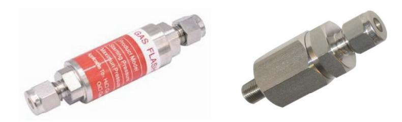

출처: 집필진 제작(2024) [그림 3-12] 화염 방지 장치

&lt;표 3-4> 옥내용 가스 용기 저장소의 공기 순환량

| 구분                            |           | 불연성       |           | 산화성       |           | 가연성       |           | 독성          |           | 맹독성       |             |           |
|-------------------------------|-----------|-----------|-----------|-----------|-----------|-----------|-----------|-------------|-----------|-----------|-------------|-----------|
| 저장소 부피(m3 )             | 283 미만 | 283 이상 | 283 미만 | 283 이상 | 283 미만 | 283 이상 | 113 미만 | 113~ 283 | 283 이상 | 113 미만 | 113~ 283 | 283 이상 |
| 시간당 공 기 순환량 (m3 /hr) | 6         | 4         | 9         | 6         | 10        | 6         | 12        | 10          | 6         | 12        | 12          | 10        |

출처: 추광호(2015). 『산업 가스 특수 가스 총서1』. ㈜북랩. p. 157.

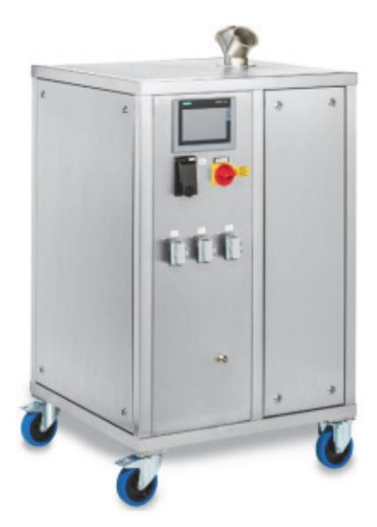

출처: 집필진 제작(2024) [그림 3-13] 중화 제독 설비

(5) 독성 가스의 중독을 방지하기 위한 중화 제독 설비의 설치를 검토한다.

독성 가스를 저장하거나 사용하는 시설에서 가스가 누출될 경우, 독성 가스로 인한 중독 을 방지하기 위하여 중화 제독 설비를 설치한다.

- (가) 중화 제독 설비의 일반적인 사항은 다음과 같다.
  - 1) 독성 가스는 중화 제독 설비로 처리하여 허용 농도(TWA) 이하로 대기 방출하여야 한다.
  - 2) 독성 가스를 사용하는 장비나 가스 캐비닛은 중화 제독 설비에 가능한 가깝게 설치 하며 독성 가스를 직접 처리하여야 한다.
  - 3) 중화 제독 방법은 산화, 환원, 중화, 가수 분해, 흡수, 흡착 혹은 이들의 조합 등의 방법에 따라 처리한다.
- (나) 중화 제독 방법의 선정은 다음을 고려한다.
  - 1) 물이나 흡수제로 흡수하거나 중화하는 조처를 한다.
  - 2) 흡착제로 흡착을 제거하는 조처를 한다.
  - 3) 연소 설비에서 안전하게 연소시키는 조치를 시행한다.
  - 4) 플라즈마 또는 촉매를 이용하여 제거하는 조치를 실행한다.
- 숖 특수 가스의 제조, 취급 및 관리 등과 관련한 작업자는 정기적으로 훈련과 교육이 필요하며, 비상 대 응에 대한 계획을 수립하고, 개인용 보호 장비를 갖추어 안전사고에 대비하여야 한다. 그리고 각종 점검표를 기록하여 보고서를 작성한다.

- 1. 특수 가스 제조와 관리를 담당하는 작업자는 안전 교육을 정기적으로 실시한다. 특수 가스의 특성과 위험에 관한 내용을 교육하여 긴급 상황이 발생할 경우, 적절한 행동을 취할 수 있어야 한다. 특히 가스로 인한 화재나 가스 누출 등에 대응하는 훈련을 반드시 실 시하여야 한다.
- 2. 특수 가스 제조와 취급을 위한 비상 대응 계획을 수립하여야 한다. 비상 대응 계획에는 다음과 같은 내용을 포함한다.
  - (1) 경보 시스템
  - (2) 대피 계획 및 출석 조사
  - (3) 안전 비상 차단 시스템
  - (4) 비상 대응팀 연락처 목록
  - (5) 비상 장비 위치 및 목록
  - (6) 소방서, 경찰, 병원이나 이웃 주민 등 외부 관계자의 연락처 목록
  - (7) 언론 매체와의 긴밀한 소통
  - (8) 보고 시스템 구축
  - (9) 응급 처치 정보와 물질 안전 보건 자료(MSDS)와 같은 안전 자료
  - (10) 위험 평가 및 검증 절차
  - (11) 비상 대응팀 작업 절차
  - (12) 훈련 요건
- 3. 특수 가스 제조, 저장 및 취급과 관련한 담당자는 다음 내용을 확인하여야 한다.
  - (1) 작업 절차에 대한 위험 평가를 실시하여야 한다.
  - (2) 확인된 위험을 근거로 적합한 장치를 선정하고, 사용할 수 있어야 한다.
  - (3) 보호 장비는 항상 사용을 위해 적절하게 유지 보수할 수 있어야 한다.
  - (4) 모든 관련자는 확실하게 훈련시켜야 한다.
- 4. 특수 가스의 안전한 취급, 저장, 충전 및 유지 등을 위해 권고되는 개인용 보호 장비를 구비하여 안전사고를 예방한다.
  - (1) 일반적으로 권고되는 개인 보호 장비는 다음과 같다.
    - (가) 안전화
    - (나) 안전 장갑
    - (다) 안구 및 안면 보호막
    - (라) 세안수 및 비상 샤워기

- (마) 비상 로프 및 테이프
- (바) 위험 가스 모니터
- (사) 안전 표시
- (2) 작업자는 열이나 화학 물질이 피부나 눈에 접촉하지 못하도록 보호하기 위해 보호복을 착용 하며, 보호복의 유형은 다음 3가지로 구분한다.
  - (가) 극단적인 온도, 증기, 온수, 고온 입자 및 구조물 소방 활동의 위험으로부터 보호하기 위 해 제작된 소방 보호복을 준비한다.
  - (나) 작업자의 눈이나 피부를 화학 물질의 접촉으로부터 보호하기 위해 제작된 화학 물질 보 호복을 준비한다.
  - (다) 단기간의 고온 노출로부터 보호하기 위해 제작된 고온 보호복을 준비한다.
- 5. 특수 가스 제조 공정에서 시설이나 공정에서 안전을 위해 점검하고 점검표와 결과 보고서를 작성 한다.

외부로의 유출이나 외부로부터의 유입을 예방하기 위하여 점검 항목과 점검 포인트를 설정 하여 정기 또는 비정기적 점검을 진행하여야 한다.

- (1) 사용 시설이나 생산 시설에 대한 점검을 실시하고 점검표를 작성한다.
  - (가) 공장의 사용 시설에 대한 점검 항목을 선정하고 점검을 실시한다.
  - (나) 가스 생산 시설에 대한 점검 항목을 선정하고 점검을 실시한다.
  - (다) 개인 보호와 방호 시설에 대한 점검 항목을 선정하고 점검을 실시한다.
- (2) 공정 과정에 대한 점검을 시행하고 점검표를 작성한다.
  - (가) 주요 공정의 진행 상태에 대한 점검 항목을 선정하고 점검을 시행한다.
  - (나) 긴급 상황이 발생할 경우에 공정에 대한 점검 항목을 선정하고 점검을 시행한다.
  - (다) 제조 장비 정비 부분에 대한 점검 항목을 선정하고 점검을 시행한다.
  - (라) 제조 공정에서 연결관, 밸브 및 기기 접촉 부분에 대한 점검 항목을 선정하고 점검을 시 행한다.
- (3) 각 점검 결과에 따른 각종 점검표와 결과 보고서를 작성한다.

### 학습 3 교수·학습 방법

#### 교수 방법

- 반도체 박막 공정용 특수 가스의 제조법과 종류에 대해 정리하여 지도한다.
- 가스 제조 공정에서 사용되는 제조 장비에 대한 원리와 운용을 간략하게 설명한다.
- 박막 공정용 가스의 제조 공정에서 다양한 파라미터를 구분하여 지도한다.
- 박막 공정용 특수 가스인 암모니아의 제조 방법과 공정 절차에 관해 설명한다.
- 박막 공정용 특수 가스의 제조 공장에서 안전 관리와 가스 누출 경보 장치에 대해 정리하여 지도한다.
- 특수 가스를 제조하는 시설에서 공정 점검과 안전 항목들을 설명한다.
- 특수 가스 제조 시에 안전을 위해 비상 대응 계획과 정기적인 점검에 관해 설명한다.

#### 학습 방법

- 반도체 박막 공정용 특수 가스의 제조법과 종류를 학습한다.
- 가스 제조 공정에서 사용되는 제조 장비에 대한 원리와 운용에 대해 조사한다.
- 박막 공정용 가스의 제조 공정에서 다양한 파라미터를 정리하여 파악한다.
- 박막 공정용 특수 가스인 암모니아의 제조 방법과 공정 절차에 대해 학습한다.
- 박막 공정용 특수 가스의 제조 공장에서 안전 관리와 가스 누출 경보 장치에 대해 조사한 다.
- 특수 가스를 제조하는 시설에서 공정 점검과 안전 항목들을 학습한다.
- 특수 가스 제조 시에 안전을 위해 비상 대응 계획과 정기적인 점검 등을 습득한다.

## 학습 3 평 가

#### 평가 준거

• 평가자는 학습자가 학습 목표를 성공적으로 달성하였는지를 평가해야 한다.

#### • 평가자는 다음 사항을 평가해야 한다.

|                     |                                                       | 성취수준 |   |   |  |
|---------------------|-------------------------------------------------------|------|---|---|--|
| 학습 내용               | 학습 목표                                                 | 상    | 중 | 하 |  |
| 박막 공정 가스 제 조     | - 생산 관련 부서로부터 입수한 생산 계획에 따라 장비 운용 계획을 수립할 수 있다.    |      |   |   |  |
|                     | - 작업 지시서와 장비 운용 매뉴얼에 따라 박막 공정 가스를 제조할 수 있다.        |      |   |   |  |
| 문제점에 대한 해결 방안 도출 | - 박막 공정 가스 제조 단계에서 발생한 문제점을 파악하고, 해결 방안을 도출할 수 있다. |      |   |   |  |

#### 평가 방법

• 서술형 시험

| 학습 내용               | 평가 항목                                                  | 성취수준 |   |   |  |
|---------------------|--------------------------------------------------------|------|---|---|--|
|                     |                                                        | 상    | 중 | 하 |  |
| 박막 공정 가스 제 조     | - 박막 공정용 특수 가스의 제조법과 종류 이해 여부                          |      |   |   |  |
|                     | - 제조 공정에서 사용되는 제조 장비에 대한 윈리와 운용을 정리할 수 있는 능력        |      |   |   |  |
|                     | - 가스 제조 공정에서 다양한 파라미터를 구분하여 기술할 수 있는 능력             |      |   |   |  |
| 문제점에 대한 해결 방안 도출 | - 특수 가스 제조 공장에서 안전 관리와 가스 누출 경보 장치 파악 여부            |      |   |   |  |
|                     | - 제조 시설에서 공정 점검에 대해 정리하여 기술할 수 있는 능력                |      |   |   |  |
|                     | - 특수 가스 제조 시설에서 안전 항목 파악 여부                            |      |   |   |  |
|                     | - 제조 과정에서 안전을 위한 비상 대응 계획과 정기적인 점 검에 대해 검토할 수 있는 능력 |      |   |   |  |

• 평가자 질문

| 학습 내용               | 평가 항목                                           | 성취수준 |   |   |  |
|---------------------|-------------------------------------------------|------|---|---|--|
|                     |                                                 | 상    | 중 | 하 |  |
| 박막 공정 가스 제 조     | - 박막 공정용 특수 가스의 제조법의 종류에 대해 설명할 수 있는 능력      |      |   |   |  |
|                     | - 제조 공정에서 각종 제조 장비에 대한 원리를 설명할 수 있 는 능력      |      |   |   |  |
|                     | - 가스 제조 공정에서 다양한 파라미터를 구분할 수 있는 능 력          |      |   |   |  |
|                     | - 박막 공정용 특수 가스인 암모니아의 제조 방법에 대해 설 명할 수 있는 능력 |      |   |   |  |
| 문제점에 대한 해결 방안 도출 | - 제조 공장에서 안전 관리에 대해 정리하여 설명할 수 있는 능력         |      |   |   |  |
|                     | - 제조 시설에서 공정 점검에 대해 정리하여 설명할 수 있는 능력         |      |   |   |  |
|                     | - 가스 제조 시에 안전을 위해 비상대응 계획을 정리하여 설 명할 수 있는 능력 |      |   |   |  |

• 평가자 체크리스트

|                     | 평가 항목                                      |  | 성취수준 |   |  |
|---------------------|--------------------------------------------|--|------|---|--|
| 학습 내용               |                                            |  | 중    | 하 |  |
|                     | - 특수 가스 제조법과 절차에 대해 정리하여 확인할 수 있는 능력    |  |      |   |  |
| 박막 공정 가스 제 조     | - 제조 공정에서 각종 제조 장비에 대한 운용을 정리할 수 있 는 능력 |  |      |   |  |
|                     | - 박막 공정용 암모니아 가스의 제조법에 대해 정리할 수 있 는 능력  |  |      |   |  |
|                     | - 가스 누출 경보 장치의 설치에 대해 파악하여 설명할 수 있 는 능력 |  |      |   |  |
| 문제점에 대한 해결 방안 도출 | - 제조 시설에서 공정 점검에 대해 정리하여 검토할 수 있는 능력    |  |      |   |  |
|                     | - 제조 과정에서 정기적인 점검에 대해 설명할 수 있는 능력          |  |      |   |  |

피드백

- 1. 서술형 시험 - 박막 공정 가스 제조 관련 각 문제에 대한 풀이 과정을 설명하고, 평가 결과에서 설정한 기준 점 수에 미치지 못하는 학습자에게는 재시험을 실시하고, 이를 재평가한다. - 특수 가스 제조법에 대한 학습 평가가 좋지 않은 학습자의 경우에는 이해할 수 있도록 보충하여 설명해 준다.
- 2. 평가자 질문
- 평가자 질문을 실시한 후, 각 문제에 대해 설명할 수 있는지를 확인하고, 제대로 설명하지 못한 학습자에게는 일정 시간 동안 추가 학습을 실시하여 다시 문제를 설명해 준다.
- 제조 장비와 시설에 대한 점검에 대한 문항에서 성취 수준이 낮은 학습자는 관련 보충 설명을 해 주고 재시험을 통해 성취도를 높일 수 있도록 해 준다.
- 3. 평가자 체크리스트
- 평가자 체크리스트를 평가한 후, 평가 결과에 일정 수준에 도달하지 못하는 학습자는 내용을 반복 하여 학습할 수 있도록 지도한다.
- 성취 수준이 높은 학습자에게는 제조 과정에서 실시하는 정기적인 점검표 내용을 명확히 정리할 수 있도록 해 준다.

- 가스안전연구원(2016). 『전자 산업용 가스의 안전한 취급에 관한 가이드』. (사)한국산업특수가스협회.
- 교육미디어(2012). 『물질 안전 보건 자료(MSDS)의 이해』. 안전보건공단.
- 교육부(2014). 반도체용 가스 재료 제조(LM1903060403\_14v1). 한국직업능력개발원.
- 김철영(2010). 『가스공학 개론』. 동화기술.
- 김현후(2024). 『반도체 제조 장비 기술』. 내하출판사.
- 이광묵(1988). 「반도체제조와 유해 가스」, 『Korean J. Occup. Health』. 27(3).
- 이윤호(2016). 『독성 가스 취급 시설의 안전 관리 등에 관한 기술 지침』. 한국산업안전보건공단.
- 이형섭(2017). 『공정 안전 보고서의 통합 서식 작성 방법에 관한 기술 지침』. 한국산업안전보건공단.
- 추광호(2015). 『산업가스 특수 가스 총서1』. ㈜북랩.
- 한국과학기술원 안전팀(2017). KAIST 연구실 가스안전 매뉴얼. 한국과학기술원(KAIST).
- 크누센 라리 비에르‧한 페트 에이(2024). 「그린 암모니아 합성 가스의 제조 방법」. 특허 공개 번호: 10-2024-0048512.
- 한 페트 에이‧크롤 엔센 아네트 이(2020). 「암모니아 합성 가스의 제조 방법」. 특허 공개 번호: 10-2020-0032671.

## 가스 제조 사양서

( ) 가스 제조 사양서

| 제 조 사      | 대표자              |     | 주민등록번호 |
|------------------|------------------|-----|--------|
|                  | 주 소              |     |        |
|                  | 제조업체             |     | 전 화    |
|                  | 제품명              |     | 제조번호   |
|                  | 제조일자             |     | 제조단위   |
| 품 질 기 준 | 가스화학식            |     |        |
|                  | 가스순도             |     |        |
|                  | 경년변화             |     |        |
|                  | 관리방법             |     |        |
|                  | 점검주기             |     |        |
|                  | 생 체 작 용 | 자극성 |        |
| 제 품 특 성 |                  | 부식성 |        |
|                  |                  | 질식성 |        |
|                  |                  | 독 성 |        |
|                  |                  | 가연성 |        |
|                  | 허용농도             |     |        |
|                  | 제독 방법            |     |        |
|                  | 경고표시             |     |        |

| NCS학습모듈 개발이력 |                                      |     |                  |  |  |  |
|--------------|--------------------------------------|-----|------------------|--|--|--|
| 발행일          | 2024년 12월 31일                        |     |                  |  |  |  |
| 세분류명         | 반도체 재료(19030604)                     |     |                  |  |  |  |
| 개발기관         | 수원과학대학교 산학협력단(개발책임자: 김선희), 한국직업능력연구원 |     |                  |  |  |  |
|              | 최준혁(수원대학교)*                          |     | 김강복(삼성전자)        |  |  |  |
|              | 김대영(오산대학교)                           |     | 김한수(두원공대)        |  |  |  |
|              | 김영수(디이엔티)                            |     | 남승호(경기대학교)       |  |  |  |
|              | 김준성(오산대학교)                           |     | 손승대(제이에스이엔씨(주))  |  |  |  |
| 집필진          | 김현후(두원공대)                            | 검토진 | 이철오((주)한국전력안전공단) |  |  |  |
|              | 임희용(전 부천대학교)                         |     |                  |  |  |  |

\*표시는 대표집필자임 (참고) 검토진으로 참여한 집필진은 본인의 원고가 아닌 타인의 학습모듈을 검토함

| 반도체용 박막 공정 가스 제조(LM1903060418_23v3)                                                                     |                   |  |  |  |
|---------------------------------------------------------------------------------------------------------|-------------------|--|--|--|
| 저작권자                                                                                                    | 교육부               |  |  |  |
| 연구기관                                                                                                    | 한국직업능력연구원         |  |  |  |
| 발행일                                                                                                     | 2024. 12. 31.     |  |  |  |
| ISBN                                                                                                    | 979-11-7175-772-5 |  |  |  |
| ※ 이 학습모듈은 자격기본법 시행령(제8조 국가직무능력표준의 활용)에 의거하여 개발하였으며, NCS통합포털사이트(http://www.ncs.go.kr)에서 다운로드할 수 있습니다. |                   |  |  |  |

