# NCS학습모듈 반도체용 이온주입 공정 가스 제조

LM1903060419\_23v3

#### [NCS학습모듈 활용 시 유의 사항]

- 1. NCS학습모듈은 교육훈련기관에서 출처를 명시하고 교육적 목적으로 활용할 수 있습니다. 다 만, NCS학습모듈에는 국가(교육부)가 저작재산권 일체를 보유하지 않은 저작물(출처가 표기된 도표‧사진‧삽화‧도면 등)이 포함되어 있으므로, 이러한 저작물의 변형‧각색‧복제‧공연‧ 배포 및 공중 송신 등과 이러한 저작물을 활용한 2차적 저작물을 작성하려면 반드시 원작자 의 동의를 받아야 합니다.
- 2. NCS학습모듈은 개발 당시의 산업 및 교육 현장을 반영하여 집필하였으므로, 현재 적용되는 법령‧지침‧표준 및 교과 내용 등과 차이가 있을 수 있습니다. NCS학습모듈 활용 시 법령 ‧지침‧표준 및 교과 내용의 개정 사항과 통계의 최신성 등을 확인하시기를 바랍니다.
- 3. NCS학습모듈은 산업 현장에서 요구되는 능력을 교육훈련기관에서 학습할 수 있게 구성한 자 료입니다. 다만, NCS학습모듈 지면의 한계상 대표적 예시(예: 활용도 또는 범용성이 높은 제 품, 서비스) 중심으로 집필하였음을 이해하시기를 바랍니다.

## NCS학습모듈의 이해

※ 본 NCS학습모듈은 「NCS 국가직무능력표준」사이트(http://www.ncs.go.kr) 에서 확인 및 다운로드할 수 있습니다.

## Ⅰ NCS학습모듈이란?

- 국가직무능력표준(NCS: National Competency Standards)이란 산업현장에서 직무를 수행하기 위해 요구되는 지식·기술·소양 등의 내용을 국가가 산업부문별·수준별로 체계 화한 것으로 산업현장의 직무를 성공적으로 수행하기 위해 필요한 능력(지식, 기술, 태도) 을 국가적 차원에서 표준화한 것을 의미합니다.
- 국가직무능력표준(이하 NCS)이 현장의 '직무 요구서'라고 한다면, NCS학습모듈은 NCS
  의 능력단위를 교육훈련에서 학습할 수 있도록 구성한 '교수·학습 자료'입니다. NCS학습
  모듈은 구체적 직무를 학습할 수 있도록 이론 및 실습과 관련된 내용을 상세하게 제시하
  고 있습니다.

#### ○ NCS학습모듈은 다음과 같은 특징을 가지고 있습니다.

- 첫째, NCS학습모듈은 산업계에서 요구하는 직무능력을 교육훈련 현장에 활용할 수 있도 록 성취목표와 학습의 방향을 명확히 제시하는 가이드라인의 역할을 합니다.
- 둘째, NCS학습모듈은 특성화고, 마이스터고, 전문대학, 4년제 대학교의 교육기관 및 훈 련기관, 직장교육기관 등에서 표준교재로 활용할 수 있으며 교육과정 개편 시에도 유용하게 참고할 수 있습니다.

○ NCS와 NCS학습모듈 간의 연결 체계를 살펴보면 아래 그림과 같습니다.

O NCS학습모듈의 위치는 NCS 분류 체계에서 해당 학습모듈이 어디에 위치하는지를 한 눈에 볼 수 있도록 그림으로 제시한 것입니다.

| [NCS-학          | 습모듈              | 의 위치]    |          |  |
|-----------------|------------------|----------|----------|--|
|                 |                  |          |          |  |
| 대분류             | 대분류 문화·예술·디자인·방송 |          |          |  |
| 중분류             | 문화콘텐츠            |          |          |  |
| 소분류             |                  | 문화콘텐츠제작  |          |  |
|                 |                  |          |          |  |
| 세분류             |                  |          |          |  |
| 방송콘텐츠제작         |                  | 능력단위     | 학습모듈명    |  |
| 영화콘텐츠제작         |                  | 프로그램 기획  | 프로그램 기획  |  |
| 음악콘텐츠제작         |                  | 아이템 선정   | 아이템 선정   |  |
| 광고콘텐츠제작         |                  | 자료 조사    | 자료 조사    |  |
| 게임콘텐츠제작         |                  | 프로그램 구성  | 프로그램 구성  |  |
| 애니메이션 콘텐츠제작  |                  | 캐스팅      | 캐스팅      |  |
| 만화콘텐츠제작         |                  | 제작계획     | 제작계획     |  |
| 캐릭터제작           |                  | 방송 미술 준비 | 방송 미술 준비 |  |
| 스마트문화앱 콘텐츠제작 |                  | 방송 리허설   | 방송 리허설   |  |
| 영사              |                  | 야외촬영     | 야외촬영     |  |
|                 |                  | 스튜디오 제작  | 스튜디오 제작  |  |
|                 |                  |          |          |  |

학습모듈은

NCS 능력단위 1개당 1개의 학습모듈 개발 을 원칙으로 합니다. 그러나 필요에 따라 고용단위 및 교과단위를 고려하여 능력단위 몇 개를 묶어 1개 학습모듈로 개발할 수 있으며, NCS 능력단위 1개를 여러 개의 학습모듈로 나누어 개발할 수도 있습니다.

### 2. NCS학습모듈의 개요

#### ○ NCS학습모듈의 개요는 학습모듈이 포함하고 있는 내용을 개략적으로 설명한 것으로

| 학습모듈의 목표 , 선수학습 , 학습모듈의 내용 체계 , 핵심 용어 로 구성되어 있습니다. |                                                                              |  |  |
|----------------------------------------------------|------------------------------------------------------------------------------|--|--|
| 학습모듈의 목표                                           | 해당 NCS 능력단위의 정의를 토대로 학습 목표를 작성한 것입니다.                                        |  |  |
| 선수학습                                               | 해당 학습모듈에 대한 효과적인 교수·학습을 위하여 사전에 이수해야 하는 학습모 듈, 학습 내용, 관련 교과목 등을 기술한 것입니다. |  |  |
| 학습모듈의 내용 체계                                     | 해당 NCS 능력단위요소가 학습모듈에서 구조화된 체계를 제시한 것입니다.                                     |  |  |
| 핵심 용어                                              | 해당 학습모듈의 학습 내용, 수행 내용, 설비·기자재 등 가운데 핵심적인 용어를 제 시한 것입니다.                   |  |  |

### 제작계획 학습모듈의 개요

#### 학습모듈의 목표

본격적인 촬영을 준비하는 단계로서, 촬영 대본을 획정하고 제작 스태프를 조직하며 촬영 장비와 촬영 소품을 준비할 수 있다.

#### 선수학습

제작 준비(LM0803020105\_13v1), 섭외 및 제작스태프 구성(LM0803020104\_13v1), 촬영 제작(LM0803020106\_13v1), 촬영 장비 준비(LM0803040204\_13v1.4), 미술 디자인 협의하기(LM0803040203\_13v1.4)

#### 학습모듈의 내용체계

| 하스                | 하스 내용                                              | NCS 능력단위 요소       |                |
|-------------------|----------------------------------------------------|-------------------|----------------|
| 학습                | 학습 내용                                              | 코드번호              | 요소 명칭          |
| 1. 촬영 대본 확정하기  | 1-1. 촬영 구성안 검 토와 수정                             | 0803020114_16/3.1 | 촬영 대본 확정하기  |
| 2. 제작 스태프 조직하기 | 2-1. 기술 스태프 조직 2-2. 미술 스태프 조직 2-3. 전문 스태프 조직 | 0803020114_16v3.2 | 제작 스태프 조직하기 |
| 3. 촬영 장비 계획하기  | 3-1. 촬영 장비 점검 과 준비                              | 0803020114_16/3.3 | 촬영 장비 계획하기  |
| 4. 촬영 소품 계획하기  | 4-1. 촬영 소품 목록 작성 4-2. 촬영 소품 제작 의뢰         | 0803020114_16\3.4 | 촬영 소품 계획하기  |

#### 핵심 용어

촬영 구성안, 제작 스태프, 촬영 장비, 촬영 소품

#### 학습모듈의 목표는

학습자가 해당 학습모듈을 통해 성취해야 할 목표를 제시한 것으로, 교수자는 학습자 가 학습모듈의 전체적인 내용흐름을 파악하 도록 지도할 수 있습니다.

**6** • •

61

#### 선수학습은

교수자 또는 학습자가 해당 학습모듈을 교 수·학습하기 이전에 이수해야 하는 교과목 또는 학습모듈(NCS 능력단위) 등을 표기한 것입니다. 따라서 교수자는 학습자가 개별 학습, 자기 주도 학습, 방과 후 활동 등 다 양한 방법을 통해 이수할 수 있도록 지도하 는 것을 권장합니다.

|            | 핵심 용어는              |
|------------|---------------------|
|            | 률을 대표하는 주요 용어입니     |
|            | · 해당 학습모듈을 통해 학습    |
|            | 게될 주요 내용을 알 수 있습    |
|            | 5 국가직무능력표준」 사이트     |
| (www.ncs.g | jo.kr)의 색인 (찾아보기) 중 |
| 하나로 이용할    | 할 수 있습니다            |

#### 3. NCS학습모듈의 내용 체계

○ NCS학습모듈의 내용은 크게 학습, 학습 내용, 교수·학습 방법, 평가 로 구성되어 있습니다.

| 학습       | 해당 NCS 능력단위요소 명칭을 사용하여 제시한 것입니다. 학습은 크게 학습 내용, 교수·학습 방법, 평가로 구성되며 해당 NCS 능력단위의 능력단위 요소별 지식, 기술, 태도 등을 토대로 내용을 제시한 것입니다.                                                    |
|----------|----------------------------------------------------------------------------------------------------------------------------------------------------------------------------------|
| 학습 내용    | 학습 내용은 학습 목표, 필요 지식, 수행 내용으로 구성되며, 수행 내용은 재료·자 료, 기기(장비·공구), 안전·유의 사항, 수행 순서, 수행 tip으로 구성한 것입니다. 학습모듈의 학습 내용은 실제 산업현장에서 이루어지는 업무활동을 표준화된 프로세 스에 기반하여 다양한 방식으로 반영한 것입니다. |
| 교수·학습 방법 | 학습 목표를 성취하기 위한 교수자와 학습자 간, 학습자와 학습자 간 상호 작용이 활발하게 일어날 수 있도록 교수자의 활동 및 교수 전략, 학습자의 활동을 제시한 것입니다.                                                                            |
| 평가       | 평가는 해당 학습모듈의 학습 정도를 확인할 수 있는 평가 준거 및 평가 방법, 평 가 결과의 피드백 방법을 제시한 것입니다.                                                                                                         |

## [NCS-학습모듈의 위치]

| 대분류 | 전기·전자 |          |        |
|-----|-------|----------|--------|
| 중분류 |       | 전자 기기 개발 |        |
| 소분류 |       |          | 반도체 개발 |

| 세분류    |                      |                      |
|--------|----------------------|----------------------|
| 반도체 개발 | 능력단위                 | 학습모듈명                |
| 반도체 제조 | 반도체용 CMP슬러리 재료 제조    | 반도체용 CMP슬러리 재료 제조    |
| 반도체 장비 | 반도체용 세정공정 재료 제조      | 반도체용 세정공정 재료 제조      |
| 반도체 재료 | 반도체용 박막도금공정 재료 제조 | 반도체용 박막도금공정 재료 제조 |
|        | 반도체용 SOD공정 재료 제조     | 반도체용 SOD공정 재료 제조     |
|        | 반도체용 트랙공정 재료 제조      | 반도체용 트랙공정 재료 제조      |
|        | 반도체용 웨이퍼 재료 제조       | 반도체용 웨이퍼 재료 제조       |
|        | 반도체용 금속(Target)재료 제조 | 반도체용 금속(Target)재료 제조 |
|        | 반도체용 패키지 재료 제조       | 반도체용 패키지 재료 제조       |
|        | 반도체 재료 개발            | 반도체 재료 개발            |
|        | 반도체 재료 생산관리          | 반도체 재료 생산관리          |
|        | 반도체 재료 품질관리          | 반도체 재료 품질관리          |
|        | 반도체 재료 안전관리          | 반도체 재료 안전관리          |
|        | 반도체용 마스크 재료 제조       | 반도체용 마스크 재료 제조       |

| 반도체용 플립칩 재료 제조       | 반도체용 플립칩 재료 제조       |
|----------------------|----------------------|
| 반도체용 CMP 재료 제조       | 반도체용 CMP 재료 제조       |
| 반도체용 식각공정 가스 제조      | 반도체용 식각공정 가스 제조      |
| 반도체용 세정공정 가스 제조      | 반도체용 세정공정 가스 제조      |
| 반도체용 박막공정 가스 제조      | 반도체용 박막공정 가스 제조      |
| 반도체용 이온주입공정 가스 제조 | 반도체용 이온주입공정 가스 제조 |
| 반도체용 박막공정 전구체 제조     | 반도체용 박막공정 전구체 제조     |
| 반도체용 포토공정 재료 제조      | 반도체용 포토공정 재료 제조      |

| 학습모듈의 개요                        | 1  |
|---------------------------------|----|
| 학습 1. 이온 주입 공정 가스 제조 요구 사항 파악하기 |    |
| 1-1. 이온 주입 공정 가스 요구 사항 파악       | 3  |
| 1-2. 가스 제조 단계 문제점 검토            | 14 |
| • 교수 ․ 학습 방법                    | 29 |
| • 평가                            | 30 |
| 학습 2. 이온 주입 공정 가스 재료 준비하기       |    |
| 2-1. 가스 재료의 종류와 특성 파악           | 33 |
| 2-2. 가스 재료 준비                   | 46 |
| • 교수 ․ 학습 방법                    | 59 |
| • 평가                            | 60 |
| 학습 3. 이온 주입 공정 가스 제조하기          |    |
| 3-1. 이온 주입 공정 가스 제조             | 63 |
| 3-2. 문제점에 대한 해결 방안 도출           | 77 |
| • 교수 ․ 학습 방법                    | 93 |
| • 평가                            | 94 |
| 참고 자료                           | 97 |
| 활용 서식                           | 98 |

## 반도체용 이온 주입 공정 가스 제조 학습모듈의 개요

#### 학습모듈의 목표

반도체 이온 주입 공정에 필요한 가스 재료의 요구 사항을 파악하여 준비하고 제조할 수 있다.

#### 선수학습

반도체 제조 공정 개발(LM1903060106\_15v4), 반도체 물성, 반도체 공학, 반도체 소자

#### 학습모듈의 내용체계

| 학습                                  | 학습 내용                        | NCS 능력단위 요소       |                         |
|-------------------------------------|------------------------------|-------------------|-------------------------|
|                                     |                              | 코드번호              | 요소 명칭                   |
| 1. 이온 주입 공정 가스 제조 요구 사항 파악 하기 | 1-1. 이온 주입 공정 가스 요구 사항 파악 | 1903060419_23v3.1 | 이온 주입 공정 가스 제조 요구 사항 |
|                                     | 1-2. 가스 제조 단계 문제점 검토         |                   | 파악하기                    |
| 2. 이온 주입 공정 가스                      | 2-1. 가스 재료의 종류와 특성 파악        | 1903060419_23v3.2 | 이온 주입 공정 가스 재료 준비하기  |
| 재료 준비하기                             | 2-2. 가스 재료 준비                |                   |                         |
| 3. 이온 주입 공정 가스                      | 3-1. 이온 주입 공정 가스 제조          | 1903060419_23v3.3 | 이온 주입 공정 가스 제조하기     |
| 제조하기                                | 3-2. 문제점에 대한 해결 방안 도출        |                   |                         |

#### 핵심 용어

반도체 제조 공정, 이온 주입 공정, 물리적 기상 증착법(PVD), 화학적 기상 증착법(CVD), 증착 장비, 특수 가스, 물질 안전 보건 자료(MSDS), 특수 가스 제조, 유해성 가스

| 학습 1 | 이온 주입 공정 가스 제조 요구 사항 파악하기 |  |
|------|------------------------------|--|
| 학습 2 | 이온 주입 공정 가스 재료 준비하기          |  |
| 학습 3 | 이온 주입 공정 가스 제조하기             |  |

## 1-1. 이온 주입 공정 가스 요구 사항 파악

| • 생산 관련 부서로부터 이온 주입 공정 가스 제조 사양서를 입수할 수 있다. |                                                        |
|---------------------------------------------|--------------------------------------------------------|
| 학습 목표                                       | • 이온 주입 공정 가스 제조 사양서를 바탕으로 제품명, 품질 기준, 제품 사양, 납기 등을 파악 |
|                                             | 할 수 있다.                                                |

## 필요 지식 /

#### 숔 이온 주입 공정

이온 주입 공정(ion implantation process)은 도핑하고자 하는 물질을 이온화한 후, 높은 운 동 에너지를 가지고 실리콘 표면을 강제로 뚫고 들어갈 정도로 가속하여 주입하는 기술이다.

#### 1. 불순물 반도체 제조 공정의 종류

순수 반도체에 특정 불순물을 첨가하여 불순물 반도체를 만드는 방법으로 열 확산 공정과 이온 주입 공정이 있으며, [그림 1-1]은 불순물 주입의 종류를 나타낸다.

(1) 열 확산 공정

열 확산 공정(thermal diffusion process)은 산화 공정과 유사하게 기체 상태의 불순 물을 고온으로 가열하면서 실리콘에 공급하여 불순물을 주입하는 공정이다. 즉, 확산에 의한 불순물 주입 방식은 가열을 통한 열운동을 이용하여 입자가 실리콘 내부로 이동하 면서 도핑(doping)하게 된다. 그러나 이러한 확산에 의한 도핑은 비용이 저렴하다는 장 점은 있으나 도핑을 정밀하게 조절하기 어렵고, 공정 온도가 높아 많은 문제를 갖는다. 사실 확산(diffusion)이란 원자나 분자가 높은 농도에서 낮은 농도로 이동하면서 재배치 되는 과정이다.

(2) 이온 주입 공정

이온 주입이란 불순물 도펀트(dopant)인 이온을 생성하여 에너지로 가속시켜 실리콘 격 자 사이로 강하게 때려 도핑하는 공정을 의미한다. 이는 실리콘 웨이퍼에 불순물을 주입 하는 기술이며, 반도체 소자의 전기적인 특성을 조절하게 된다.

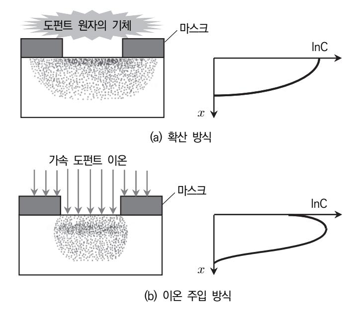

출처: 집필진 제작(2024) [그림 1-1] 불순물 주입의 종류

#### 2. 이온 주입 공정의 원리

이온 주입 공정은 불순물 원자를 도펀트로 이온화하는 과정이 필요하며, 플라즈마를 형성하 기 위해 이온화 과정을 이용한다. 이온화란 가속된 전자가 원자와 충돌하여 자유 전자와 이 온을 생성하는 과정을 의미한다. [그림 1-2]에서는 이온 주입 장치의 원리를 보여 주며, 이 와 같은 불순물 원자가 이온화 과정을 거쳐 양이온이 추출되면 전기장 내에서 강하게 가속 되어 실리콘 웨이퍼로 뚫고 들어가 박히게 된다.

가속된 이온들은 실리콘 결정격자 사이를 파고 들어가며, 실리콘 원자와의 충돌과 산란 (scattering)을 반복하는 과정에서 에너지를 점차 잃게 되어 격자 내에 머물게 된다. 이때 에너지를 소모하여 머무는 위치를 침투 깊이(penetration depth)라고 한다. [그림 1-3]에 서는 이온 주입 과정을 통해 붕소 이온이 침투하여 실리콘 내에 분포하는 결과를 나타낸다. 이러한 이온 주입 과정에는 여러 종류의 공정 변수가 포함되며, 불순물 도핑의 농도를 조절 하게 된다. 이온 주입 공정의 변수로 주입 원자의 종류, 에너지 범위, 단위 면적당 도핑 정 도 및 기울기(tilt) 등을 고려하여야 한다.

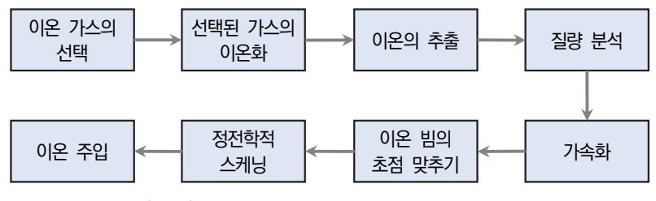

출처: 집필진 제작(2024) [그림 1-2] 이온 주입 공정의 원리

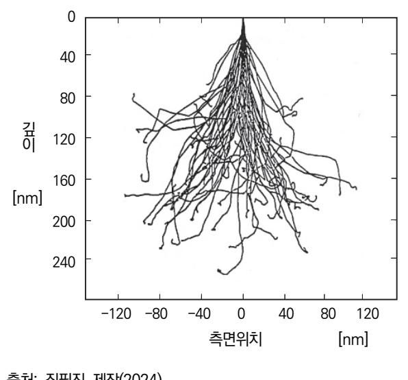

출처: 집필진 제작(2024) [그림 1-3] 이온 주입에 의한 붕소 분포

3. 이온 정지 이론

실리콘 웨이퍼 내에 이온이 주입되면 이온은 실리콘 원자들의 핵과 충돌하며, 이외에 핵 주위에 있는 전자들과의 충돌로 인하여 에너지를 잃게 된다. 이러한 충돌 과정을 반복하면서 이온은 초기의 운동 에너지를 점차 잃어 결국에는 정지 상태에 돌입하여 실리콘 격자 내에 머물게 된다. 즉, 이온이 정지하는 과정에는 핵 정지(nuclear stop)와 전자 정지(electronic stop)로 인해 에너지 손실을 초래하게 되고, 이외에 이온 저지와 결합 저지 등이 있다. [그림 1-4]는 핵 정지와 전자 정지를 일으키는 과정을 보여 준다.

(1) 핵 정지

그림 (a)에서와 같이 핵 정지는 가속된 이온이 실리콘 격자를 통과하면서 원자핵들과의 상호 작용을 하게 되며, 이는 쿨롱 작용으로 이온이 에너지를 원자핵에 전달하면서 에너 지 손실이 발생한다.

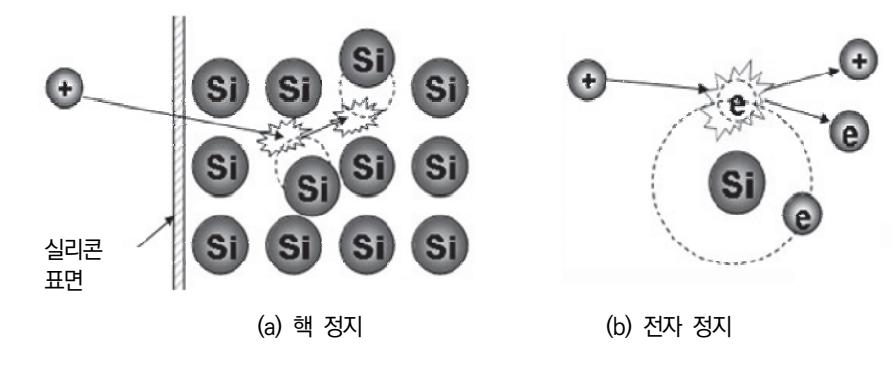

출처: 집필진 제작(2024) [그림 1-4] 이온 정지 이론

#### (2) 전자 정지

전자 정지는 그림 (b)에서 나타나듯이 가속된 이온이 전자 궤도를 따라 가면서 전자와의 충돌로 인하여 에너지를 전달하면서 에너지 손실을 일으키며 정지하게 된다.

(3) 이온 저지

[그림 1-5]에서는 이온의 저지 기구를 나타내며, 단결정 실리콘 내에 원자는 규칙적으로 배열되어 있고, 입사된 이온은 입사 각도에 따라 공간을 통해 진행한다. 임의의 충돌은 핵 정지와 전자 정지를 거쳐 에너지를 잃으면서 정지한다. 그러나 격자 사이를 충돌 없 이 깊숙이 통과한 이온은 채널링 효과(channeling effect)로 침투하기도 하며, 역 산란 으로 되돌아가기도 한다.

(4) 결합 저지

 [그림 1-6]은 실제 이온이 결합 저지(combined stopping)로 인해 정지하는 과정을 보여 준다. 전하를 띠고 있는 이온과 정지해 있는 실리콘 원자 사이에는 탄성 충돌로 에너지를 전달하게 되며, 충돌이 발생하는 이온과 원자의 질량, 입사하는 이온의 초기 속도와 방향 등에 의해 에너지 전달 기구가 결정된다. 실리콘 격자 내로 침투해 들어온 이온은 전자들과 상호 작용으로 에너지를 잃게 되며, 이러한 현상은 핵 충돌에 의한 정 지와는 다르게 비탄성 충돌로 인하여 정지하게 된다.

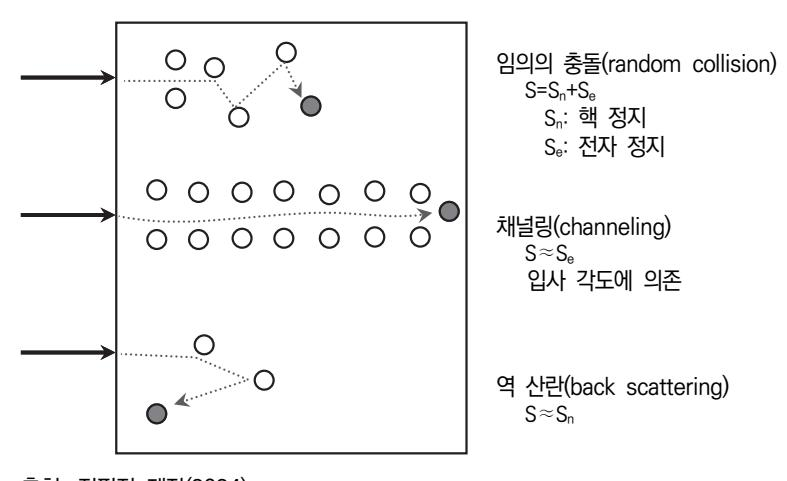

출처: 집필진 제작(2024) [그림 1-5] 이온 저지 기구

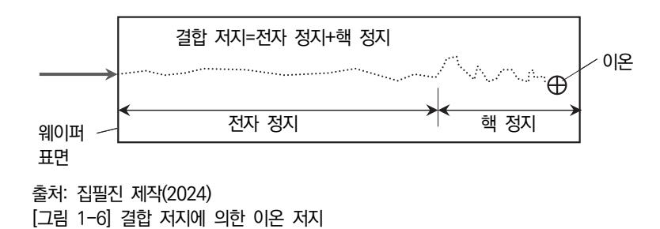

숕 불순물 반도체 제조용 공정 가스

불순물 반도체를 제조하기 위한 방식으로는 열 확산 공정과 이온 주입 공정을 사용하는데, 공 정별로 사용하는 공정 가스에 대해 기술한다.

1. 열 확산용 가스

반도체의 전도성은 기판 재료에 불순물을 주입하는 도핑(doping) 공정에 따라 증가하거나 감소할 수 있다. 예를 들어, 순수 실리콘에 P를 첨가하면 전도성이 증가하지만 GaN에 Fe 를 도핑하면 GaN은 전도성이 감소한다. 확산과 이온 주입은 반도체 물질에 도펀트 (dopant)를 주입하는 주요 공정들이다. 확산이란 밀도가 높은 지역에서 밀도가 낮은 지역 으로 이동하는 현상이다. 실리콘에 도펀트들이 확산을 제어하여 pn 접합을 만들게 된다. 확 산은 반도체 물질의 타입과 전도성의 정도를 바꾸기 위해 사용한다. 즉, 바이폴라 트랜지스 터 소자의 베이스(base), 이미터(emitter), 컬렉터(collector)를 형성하기 위해 사용되며, MOS 소자의 소스(source)와 드레인(drain)을 만들기 위해 사용된다.

(1) 붕소(boron) 도핑

붕소는 SiO2 막으로 분리하여 산화물의 결합을 약화시켜 산소(O2)나 물(H2O) 가스의 확 산 속도를 증가시킨다.

(2) 인, 비소(P, As) 도핑

인이나 비소의 도핑은 SiO2 막으로 분리하지 않으며, 실리콘의 vacancy 농도를 증가시 키며, 산화 반응 비율을 증가시킨다.

(3) 사용 가스

공정 가스로는 B, P, As 등이며, 순도는 99.9999% 이상이어야 한다. 이외에 특수 가스 를 도핑하기 위해 사용한다.

#### 2. 이온 주입용 가스

이온 주입은 물질의 이온을 Si과 같은 고체 물질에 주입하는 공정이다.

(1) 이온 주입

이온 주입을 통해 고체의 물리적 특성을 바꿀 수가 있다. 이온 주입은 반도체 제조 공 정에서 널리 사용될 뿐만 아니라, 다양한 방면에 쓰이고 있다. 기판 물질에 이온을 주입 하게 되면, 화학적 특성이 바뀌거나 다른 물질이 될 수도 있으며, 대상 물질의 결정 구 조가 바뀌거나 결정 구조에 손상이나 파괴될 수도 있다. 이온 주입 기술은 물질을 도핑 하는 열 확산 공정보다 많은 이점이 있어 지속해서 대체하고 있다.

(2) 사용 가스

Ar, B, P, As 등이 있으며, 순도는 99.9999% 이상이어야 한다. 이외에 특수 가스를 도 핑하기 위해 사용한다.

재료·자료

- 반도체 재료 제조 기술 자료
- 국제표준화기구(ISO: International Organization for Standardization) 표준화 문서
- 물질 안전 보건 자료(MSDS)
- 생산 계획서
- 반도체 재료 작업 절차서
- 반도체 재료 작업 표준서
- 반도체용 이온 주입 공정 가스 원재료에 대한 자료
- 반도체 설비 목록 및 매뉴얼
- 반도체 제조 공정도

기기(장비 ・ 공구)

- 반도체용 이온 주입 공정 가스 제조 장비
- 반도체용 이온 주입 공정 가스 측정 장비
- 반도체용 이온 주입 공정 가스 검사 장비
- 반도체용 이온 주입 공정 가스 분석 장비

#### 안전 ・ 유의 사항

- 반도체 이온 주입 공정에 대한 이론적 지식을 습득하고, 취급하는 가스의 성질과 특성을 바 탕으로 관리에 주의 사항을 이해한다.
- 반도체 이온 주입 공정에서 사용하는 특수 가스에 대한 부식성, 맹독성, 인화성 및 발화성 등의 특성을 파악하고, 해당 가스에 대한 장비, 공급 시설, 관리 및 주의 사항을 사용하기 전에 미리 숙지하여야 한다.
- 물질 안전 보건 자료를 통해 특수 가스를 취급하기 전에 파악하고, 독성 가스의 경우에는 제독 설비에 대한 일반 사항, 제독 설비 및 제독 방법 등 안전 교육을 실시한다.

수행 순서

숔 불순물 도핑을 위해 주로 적용하는 이온 주입 공정에 대한 가스의 제조 사양서를 파악하고, 가스 공 정에 대한 전반적인 내용과 가스 제품에 대한 특성을 이해한다. 전반적인 반도체 제조 공정 중에서 이온 주입 공정에 대한 이론을 파악하고, 이온 주입 공정에 적용되는 장비를 숙지한다. 그리고 공정에서 사용하는 가스의 제조 사양서(활용 서식 참조)를 바탕으로 가스 제품명, 품질 기준 및 제품의 사양을 파악한다.

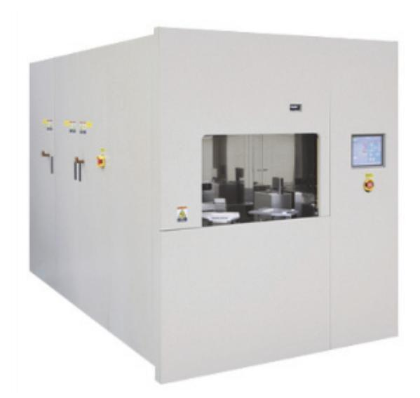

출처: 집필진 제작(2024) [그림 1-7] 이온 주입 장비의 외형

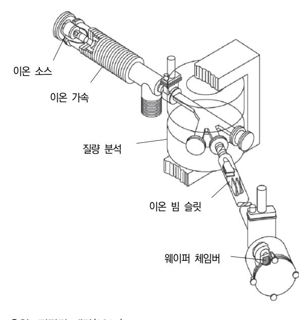

출처: 집필진 제작(2024) [그림 1-8] 이온 주입 장비의 구조

- 1. 반도체 이온 주입 공정에 대한 지식을 이해하고, 불순물 반도체를 제조하기 위해 사용하는 열 확 산 공정과 이온 주입 공정의 이론을 바탕으로 사용되는 장비와 도구 및 필요한 특수 가스의 종류 를 파악한다.
  - (1) 반도체 제조 공정에 대한 전반적인 이론을 이해한다.
  - (2) 열 확산 공정과 이온 주입 공정을 수행하기 전에 기판이나 박막의 재료를 파악한다.
  - (3) 열 확산 공정과 이온 주입 공정의 방법과 원리를 이해한다.
  - (4) 불순물 도핑을 위해 주로 적용하는 이온 주입 공정의 장비를 파악하고, 매뉴얼을 이용하여 장비 운용과 순서를 습득한다. [그림 1-7]은 이온 주입 장비의 외형을 보여 주며, [그림 1-8]은 이온 주입 장비의 구조 를 나타낸다.
    - (가) 이온 소스(ion source)는 사용 목적에 따라 다양하고, 아크 방전형과 냉음극형 소스가 주로 사용된다.
    - (나) 이온 가속기(ion accelerator)는 이온 소스에서 형성된 이온이 충분한 에너지를 갖고 기 판에 주입되도록 가속한다.
    - (다) 질량 분석기(mass analyzer)는 전자석을 이용하여 가볍거나 무거운 이온을 제거하고 원 하는 원자량을 가진 이온이 원하는 깊이에 침투하도록 조정한다.
    - (라) 분리된 이온 빔이 퍼지지 않고 기판에 접속되도록 이온 빔 슬릿을 통해 빔 라인이 만들 어진다.
    - (마) 웨이퍼 체임버는 이온이 주입되도록 웨이퍼 기판을 장착하는 용기이고, 이온 빔 슬릿을 통하여 집속된 이온은 웨이퍼 기판에 주입된다.
    - (바) 웨이퍼 기판에 이온 빔이 고르게 주입되도록 상하로 스캔하면서 이온을 주입한다.
  - (5) 열 확산 공정과 이온 주입 공정에서 주로 사용하는 특수 가스의 종류와 특성을 파악한다. 일반적으로 불순물 도핑을 위해 이용하는 방식은 열 확산 공정과 이온 주입 공정이며, 이들 공정에서 주로 사용하는 특수 가스의 종류를 파악하고 특성을 이해한다.
    - (가) 열 확산 공정에서 사용하는 특수 가스의 종류를 파악한다.
      - 일반적으로 불순물 도핑을 위해 붕소, 알루미늄, 인 비스 등의 가스를 이용하며, 이 외에 AsH3, H2S, GeH3, SeH3, AsCl3, AsF3, PH3, PCl3, B2H6, BF3 등을 사용한다.
    - (나) 이온 주입 공정에서 사용하는 특수 가스의 종류를 파악한다. 일반적으로 이온 주입 공정은 반도체 소자의 전기적 특성을 조절하기 위해 반도체 기판의 특정 부위에 수 keV~수백 keV 정도의 고전압으로 가속한 이온을 주입하는 공정이다. 이온 주입 장치에서 사용하는 특수 가스로는 AsH3, PH3, PF5, BF3 AsF5, SiF4, BCl3 등이 있다.

- 2. 이온 주입 공정에서 사용하는 특수 가스의 제조 사양서를 입수하여 가스 제조 공정과 사양서의 내용을 습득하고, 특수 가스의 특성을 파악한다. 활용 서식에서 제시하는 바와 같은 제조 사양서의 내용을 입수하고 제조 사양서의 내용과 항목을 파악하기 위해 다음을 확인한다.
  - (1) 제조 사양서의 일반적인 제품에 대한 내용을 검토한다.

제조 사양서의 내용을 파악하여 특수 가스의 제품명과 제조 일자를 확인한다.

(2) 제조 사양서를 기준으로 가스의 품질 기준을 파악하고, 특수 가스의 관리 및 보관 방법 등을 확인한다.

제조 사양서의 품질 기준을 기준으로 가스의 순도와 경년 변화를 파악하고, 관리 방법과 점검에 대해 숙지한다.

(3) 가스 제품의 특성을 확인한다.

특수 가스는 저온에서도 분해 반응이 가능하기 때문에 매우 활성이 높아 생체에 영향을 줄 수 있다.

- (가) 특수 가스의 생체 작용에 대한 내용을 숙지한다. 제품의 특성에서 생체 작용에 대한 내용으로 자극성, 부식성, 질식성, 독성 및 가연 성 등을 반드시 검토한다.
- (나) 특수 가스의 안전 취급 및 안전 대책에 대해 확인한다. 허용 농도, 제독 방법 및 경고 등에 대한 상세한 내용을 확인하여 취급 및 제조 과 정에서 유의하여야 한다.
- 숕 반도체 불순물 도핑에서 열 확산 공정과 이온 주입 공정 장비에 따른 특수 가스 종류와 특성에 대한 지식을 확인한다.

품질 검사 기준에 따라 시험 의뢰, 결과판정 및 통보 등에 대한 시험 절차를 검토한다.

1. 반도체 불순물 도핑을 위한 장비의 종류를 파악한다.

불순물 도핑으로 불순물 반도체를 제조하는 방법에는 열 확산 공정과 이온 주입 공정으로 구분하며, 반도체 소자의 전기적 특성을 변화시키기 위해 반도체 내에 불순물의 농도를 조 절하도록 불순물 도펀트(dopant)를 주입하는 공정이다.

(1) 열 확산 공정 장비의 원리와 동작을 확인한다.

확산법이란 불순물 입자를 반도체 표면의 불순물 농도가 높은 영역에서 실리콘 결정 내 의 농도가 낮은 영역으로 이동하는 현상이다. 열 확산법은 전기적 특성을 변화하기 위해 서는 고온의 분위기(500~1,200℃)에서 가스나 도핑 혼합 소스를 이용하여 열 확산을 통 해 불순물을 주입하게 된다.

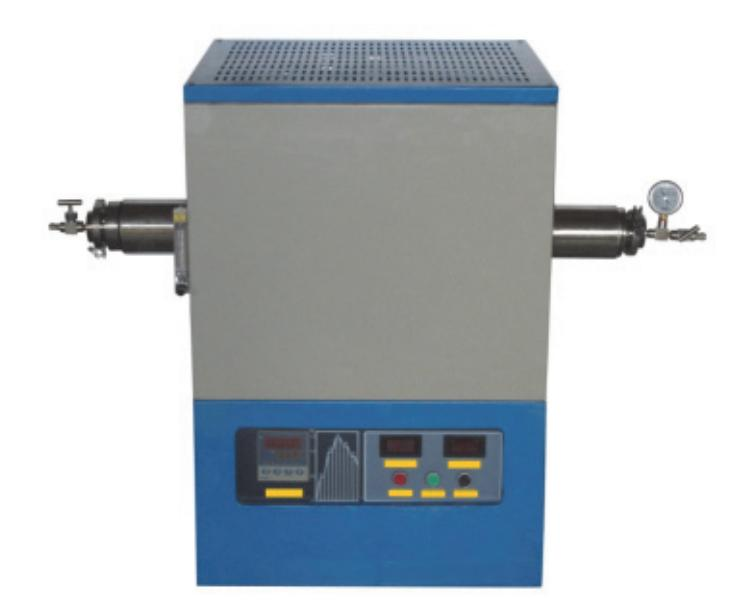

출처: 집필진 제작(2024) [그림 1-9] 열 확산 장비의 외형

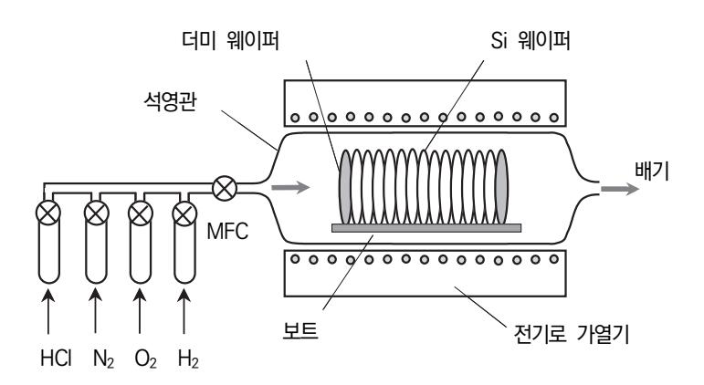

출처: 집필진 제작(2024) [그림 1-10] 열 확산 장비의 구조

[그림 1-9]와 [그림 1-10]은 열 확산 장비의 외형과 구조를 나타낸다. 열 확산 공정은 공정이 간단히고 저렴한 편이지만, 정밀한 농도를 조정하기 어렵고, 높은 공정 온도를 유지하여야 한다는 단점을 가진다.

(2) 이온 주입 공정 장비의 원리와 동작을 확인한다.

이온 주입 공정은 불순물 입자를 이온화하고 전계를 가하여 충분히 높은 에너지로 기판 표면에 가속하여 주입하는 방법이다. 이미 기술한 바와 같이 [그림 1-7]과 [그림 1-8]은 이온 주입 장비의 외형과 구조를 나타낸다. 이온 주입 공정은 저온 공정이 가능하고, 고순도의 이온을 주입하며, 도펀트 농도와 도핑 깊이를 정밀하게 조정할 수 있으며, 미세 공정 및 고집적화가 가능하다는 장점이 있다. 그러나 단점으로는 장비가 비싸고, 공정 속도가 느려 생산성이 낮으며, 격자 손상이 발생하여 열처리 공정이 필요하다는 점이 있다.

#### 2. 반도체 불순물 도핑에서 공정에 따른 공정 가스의 종류를 파악한다.

<표 1-1>에서는 불순물 도핑 공정에서 공정 가스를 정리한 것이다.

<표 1-1> 불순물 도핑 공정에서 공정에 따른 각종 공정 가스

| 공 정       | 가 스                                                                                                      | 내 용                                                                                                                           |
|-----------|----------------------------------------------------------------------------------------------------------|-------------------------------------------------------------------------------------------------------------------------------|
| 확산용 가스    | AsH3, H3S, GeH3, SbH3, AsCl3, AsF3, PH3, PCl3, B3H6, BF3, (CH3)2Te, (CH3)2Cd, (C3H5)2Cd 등 | ∙열 확산에 의한 도핑 공정은 반도체 기판에 붕 소, 알루미늄, 인, 비소 등의 불순물을 주입하여 전도 특성을 개선함. ∙주입되는 불순물에 따라 p형과 n형 반도체를 제 조함.                |
| 이온 주입용 가스 | AsF5, PH5, PH3, BF3, BCl3, SF6 등                                                             | ∙반도체 소자의 전기적 특성을 의도하는 수준으로 조절하기 위해 반도체 기판의 특정 영역만 고전 압으로 가속한 이온을 주입하는 공정 ∙이온을 물리적으로 주입하여 전기 저항과 같은 기판의 물리적 특성을 통제 |

출처: 중소기업기술정보진흥원(2023). 『중소기업 기술 국산화 전략 품목 상세 분석: 반도체용 특수 가스』. 중소벤 처기업부. p. 5.

## 1-2. 가스 제조 단계 문제점 검토

학습 목표 • 파악된 내용을 바탕으로 이온 주입 공정 가스 제조 시 발생할 수 있는 문제점을 검토할 수 있 다.

## 필요 지식 /

숔 특수 가스 제조 단계 주의점

반도체 제조 공정 관련 특수 가스는 다양한 혼합물의 형태로 제조되었으며, 반도체 산업가스와 특수 가스를 취급할 시에 취급자는 일반적인 안전 절차와 조정에 따라야 한다. 특히 혼합 가스 를 제조하기 위한 가스 혼합 공정 과정에서 발생하거나 통제되지 않는 반응으로 위험이나 문제 점이 야기되지 않도록 세심한 주의를 기울여야 한다. 그러므로 이러한 위험으로부터 발생할 수 있는 화재나 폭발 사고 등에 대해 사전에 준비하여 파악하고, 예방이나 방호 대책 등을 강구하 여야 한다.

1. 가스 제조에서 사용되는 기술 용어

가스 혼합물의 제조를 위해 화학 물질을 혼합하는 과정은 제조 업체별로 다소 차이가 있지 만, 제조 과정에서 취급자는 안전사고를 위해 기본적인 기술 용어를 정리한다.

- (1) 특수 가스(special gas) 특수 가스는 실란(silane), 포스핀(phosphine), 아신(arsine) 등과 같이 주로 반도체 제 조 시에 사용하는 독성, 화재 위험성 및 반응 위험성이 높은 가스를 의미한다.
  - (2) 자연 발화성 가스(pyrophoric gas)

자연 발화성 가스는 공기에 노출되었을 때, 외부 점화원 없이 스스로 발화할 가능성이 높은 가스를 의미한다.

(3) 폭주 반응(runaway reaction)

폭주 반응이란 일정한 반응 조건에서 조정이 불가능할 정도로 반응 속도가 빠르게 증가 하여 화재나 폭발 등으로 이어지는 반응을 의미한다.

(4) 이상 반응(abnormal reaction)

이상 반응이란 정상적인 반응 조건에서 벗어나서 원래 목표로 정하지 않은 반응이 발생 하거나 설계 단계에서 예상하지 않은 화학 물질이 생성되거나 축적이나 혼입 등으로 일 어나는 원인을 알 수 없는 반응을 의미한다.

(5) 혼합 위험성(mixing hazard)

혼합 위험성은 두 종류 이상의 화학 물질들이 혼합하거나 접촉으로 인하여 발화하거나 폭발을 일으키기도 하고, 분해 가스를 매우 빨리 일으키기도 하며, 열 및 충격에 대해서 불안정한 물질을 생성하는 위험성을 의미한다.

(6) 연속식 반응기(continuous reactor)

연속식 반응기는 농도, 온도 및 압력 등이 시간적인 변화 없이 반응 물질을 일정한 속 도로 계속 투입하여 배출하는 반응기로서 원료 물질의 투입과 반응, 그리고 반응을 통해 생성되는 화학 물질을 동시에 회수하여 조작하는 방식을 의미한다.

(7) 회분식 반응기(batch reactor)

회분식 반응기란 반응기에서 반응 생성물을 얻기 위해 반응기에 일정량의 원료 물질을 투입하여 교반하고, 가열하거나 냉각 등을 실시하여 반응을 진행시키면서 일정량의 생성 물을 제조하는데, 회수되는 1회의 조작을 마친 후에는 이를 반복적으로 실시하여 조작 하는 방식을 의미한다.

(8) 측온 도료(heat sensitive paint)

측온 도료는 일정한 온도에 도달하면 색이 변하는 안료를 사용한 것으로서, 도료한 막 중에 이러한 안료를 포함하여 일정한 온도에서 변색되면 온도를 알 수 있기 때문에 각 종 기기의 과열 표시나 신호용으로 이용되는 특수 도료를 의미한다.

- (9) 분산 제어 시스템(distributed control system) 분산 제어 시스템은 교환기 제어부를 분산된 개개의 독립된 회로로 구성하는 것이며, 공정 시스템을 제어하거나 모니터링하여 공정 자동화를 실현하기 위해 사용하는 방식이다.
- (10) 가스 실린더(gas cylinder)

가스 실린더는 가스를 충전하기 위한 것으로서 이동할 수 있는 용기와 부속품을 의미한다.

(11) 가스 공급 지점(gas supply point)

가스 공급 지점이란 가스 실린더와 연결되는 밸브와 같이 부속품이 장착된 지점을 의미 한다.

(12) 소각로(incinerator)

소각로는 300℃ 이상의 고온을 이용하여 폐가스를 연소시키는 소규모 장치를 의미한다.

- 2. 특수 가스의 제조, 저장 및 취급 등의 절차
  - (1) 특수 가스의 취급 절차

반도체 특수 가스의 제조, 저장 및 취급 등에 대한 절차는 [그림 1-11]에서 나타낸다. 그림에서와 같이, 특수 가스를 제조하고, 가스 저장을 위해 실린더를 입고, 가스 실린더 저장, 가스 실린더의 교체, 폐가스의 회수 및 실린더 폐기 등의 절차에 따라 진행한다.

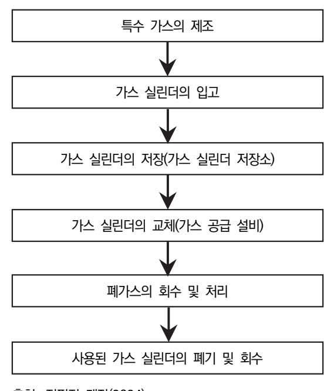

출처: 집필진 제작(2024) [그림 1-11] 특수 가스의 제조와 처리의 절차

(2) 특수 가스의 위험성

전자 산업 및 반도체 제조 등에서 사용하는 대부분의 특수 가스는 독성이 강하고, 화재 나 폭발 등의 위험이 높은 인화성 가스에 해당한다. <표 1-2>에서는 대표적인 특수 가 스의 주요 물성을 나타낸다.

&lt;표 1-2> 특수 가스의 주요 물성 예시

| 구분         |           | 실란(silane)                         | 포스핀(phosphine)                                  | 아신(arsine)                                      |
|------------|-----------|------------------------------------|-------------------------------------------------|-------------------------------------------------|
| 분자식        |           | SiH4                               | PH3                                             | AsH3                                            |
| 끓는점[℃]     |           | -112                               | -87.7                                           | -63                                             |
| 폭발 위험[%]   |           | 1~100                              | 1.8~100                                         | 4.5~78                                          |
|            | 화재        | 4                                  | 4                                               | 4                                               |
| NFPA 등급 | 반응성       | 3                                  | 2                                               | 2                                               |
|            | 보건        | 2                                  | 3                                               | 4                                               |
| 화재/폭발 위험   |           | ∙ 심각한 화재 위험 ∙ 공기 노출 시, 발화 가능 | ∙ 심각한 화재 위험 ∙ 공기 노출 시, 발화 가능              | ∙ 심각한 화재 위험 ∙ 중급 수준의 폭발 위 험               |
| 규제 현황      | 「산업안전보건법➃ | ∙ 노출 기준 설정 물질                      | ∙ 관리 대상 유해 물질 ∙ 작업 환경 측정 물질 ∙ 노출 기준 설정 물질 | ∙ 관리 대상 유해 물질 ∙ 작업 환경 측정 물질 ∙ 노출 기준 설정 물질 |

출처: 강미진(2012). 『전자 산업에서의 특수 가스 취급 안전 기술 지침』. 한국산업안전보건공단. p. 3.

3. 특수 가스 혼합 제조의 지침

특수 가스의 제조, 충전 및 혼합 후에도 기술적으로 안전하다면, 성분이 서로 공존할 수 있 으며, 용기나 밸브에서도 공존할 수 있다면, 가스와 증기는 임의의 농도에서 임의의 조정으 로 혼합할 수 있다.

(1) 일반 제어

특수 가스의 혼합물은 문서로 작성되고 승인된 절차에 따라 제조 및 충전되어야 한다. 이와 같은 절차는 사용될 제조 및 충전 설비뿐만 아니라 제조될 특수 가스의 혼합물 모 두를 포함한다.

(2) 특수 가스 혼합물 제조 지침

제조 및 충전 중의 혼합물에 대한 상세한 지침을 포함한다.

- (가) 용기와 밸브를 포함한 제조에 대한 세부 사항
- (나) 특수 가스에 첨가될 성분과 양
- (다) 용기 내부에 성분을 측정할 수단과 사용할 충전 설비
- (라) 제조나 충전 시에 성분을 추가하는 경우, 속도와 관계 있는 특정 제약 조건, 예로써 온 도 상승을 최소화하는 요건
- (마) 성분을 혼합하는 방법
- (바) 다른 성분을 추가하기 전에 일부 성분의 정확한 양을 확인하기 위해 충전 공정 중에 수 행할 중간 분석 요구 사항

재료·자료

- 반도체 재료 제조 기술 자료
- 국제표준화기구(ISO: International Organization for Standardization) 표준화 문서
- 물질 안전 보건 자료(MSDS)
- 생산 계획서
- 반도체 재료 작업 절차서
- 반도체 재료 작업 표준서
- 반도체용 이온 주입 공정 가스 원재료에 대한 자료
- 반도체 설비 목록 및 매뉴얼
- 반도체 제조 공정도

기기(장비 ・ 공구)

- 반도체용 이온 주입 공정 가스 제조 장비
- 반도체용 이온 주입 공정 가스 측정 장비
- 반도체용 이온 주입 공정 가스 검사 장비
- 반도체용 이온 주입 공정 가스 분석 장비

#### 안전 ・ 유의 사항

- 반도체 이온 주입 공정에 대한 이론적 지식을 습득하고, 취급하는 가스의 성질과 특성을 바 탕으로 관리에 주의 사항을 이해한다.
- 반도체 이온 주입 공정에서 사용하는 특수 가스에 대한 부식성, 맹독성, 인화성 및 발화성 등의 특성을 파악하고, 해당 가스에 대한 장비, 공급 시설, 관리 및 주의 사항을 사용하기 전에 미리 숙지하여야 한다.
- 특수 안전 보건 자료(MSDS)를 통해 특수 가스를 취급하기 전에 파악하고, 독성 가스의 경 우에는 제독 설비에 대한 일반 사항, 제독 설비 및 제독 방법 등 안전 교육을 실시한다.

수행 순서

- 숔 이온 주입용 특수 가스를 제조 시에 혼합 가스의 위험에 따른 안전 대책을 확인한다. 가스 혼합물을 안전하게 제조하여 이온 주입용 특수 가스의 제조 과정에서 문제가 발생하지 않 도록 위험에 대한 안전을 고려한다.
  - 1. 안전한 혼합 가스 제조를 위한 일반 사항을 확인한다.
    - (1) 화학 물질은 물성을 반드시 확인하고, 혼합 위험이 있는 물질과는 동일한 장소에 보관하지 않는다.
    - (2) 화학 물질의 사용은 적정하게 제한하고, 불필요한 양은 보관하지 않는다.
    - (3) 원재료를 입하할 경우, 조정, 품질 및 입하량 등의 자료를 확인한다.
    - (4) 제조하게 될 화학 물질의 MSDS를 확인한다.
    - (5) 보관 기간을 확인하고, 기간이 지난 화학 물질은 폐기하고, 보관 기간의 연장이 가능한지를 검토한다.
    - (6) 부식성 물질의 보관에는 반드시 내식성 용기를 사용한다.
    - (7) 화학 물질의 보관 용기가 개방되거나 파손되지 않았는지 정기적으로 확인한다.
    - (8) 화학 물질을 실외에 보관하는 경우, 우천을 대비하여 시트를 이용하여 확실하게 덮고, 팔레트 를 사용하여 지면과 접촉되지 않도록 유의한다.
    - (9) 저장된 화학 물질이 누출된 경우, 누출 물질이 충분히 희석되도록 배출 조건을 갖추어야 한 다.
  - 2. 가스 혼합 제조 설비를 위한 일반 사항을 확인한다.
    - (1) 혼합 공정 제조 설비의 안전밸브 분출구는 퍼지 밸브의 전면으로 갑자기 내부 유체가 분출할 수 있기 때문에 방출 방향을 주의하여 설치한다.
    - (2) 가스 제조 공정이 이상 시에는 어느 정도까지 승온과 승압이 가능한지를 고려하고, 처리 방 법을 확인한다.
    - (3) 가스 배관의 막힘 가능성을 고려하여 예방 대책을 검토한다.
    - (4) 안전밸브는 내부 유체에 대해 안전한 재질을 사용하고, 반드시 1년에 1회 이상 분출 압력을 검사한다.
    - (5) 안전밸브의 분출구가 작업자가 다니는 통로로 향하지 않도록 주의하고, 사람의 키 높이 이상 으로 설치되도록 유의한다.
    - (6) 혼합 가스 제조 공정에서 다음과 같은 위험이 예상되는 장치에는 안전밸브를 반드시 설치하 여야 한다.
      - (가) 화재에 의한 열로 압력 용기나 열 교환기가 가열되고, 반응 내용물의 팽창으로 인하여

압력이 증가하는 경우, 안전밸브를 설치한다.

- (나) 고온에서 높은 휘발성 물질이 혼입되어 다량의 증기 발생으로 인해 압력 상승의 우려가 있는 경우, 안전밸브를 설치한다.
- (다) 용기나 장치 등의 출구가 막혀 유체의 흐름이 멈춤으로써 압력이 증가하는 경우에 안전 밸브를 설치한다.
- (라) 자동 제어부의 문제 발생으로 압력, 온도, 유량 등이 조절되지 않아 압력 상승의 가능성 이 있는 경우, 안전밸브를 설치한다.
- (마) 폭발성 물질이 용기 내에서 폭발하여 압력 상승이 일어날 수 있는 경우, 안전밸브를 설 치한다.
- (바) 냉각수가 정지되어 응축이 멈추면서 열 교환기의 압력이 상승할 수 있는 경우, 안전밸브 를 설치한다.
- (사) 비응축성 가스가 축적되어 냉각이 불충분하면 응축 불량이 일어나고, 시스템 내 온도 상 승이 우려되는 열 교환기를 사용하는 경우, 안전밸브를 설치한다.
- (아) 튜브의 파손이나 누출로 인하여 온도가 서로 다른 유체들이 혼합되면서 휘발성이 높은 물질이 증발하여 압력 상승이 발생할 수 있는 열 교환기를 사용하는 경우, 안전밸브를 설치한다.
- (7) 파열판은 안전밸브와 병용하여 설치하며, 내부 유체의 성상, 유량, 전반적인 공정의 영향 등 을 고려하여 결정한다.
- (8) 호흡 밸브(breather valve)는 비교적 낮은 압력이나 대기압에서 사용하는 탑이나 탱크류에 설치하여 본체 내부 압력이 대기압 이하가 되어 파괴되지 않도록 유지하기 위해 사용하며, 액화 또는 냉각 용기에 사용하는 경우에는 부압을 고려하여야 한다.
- (9) 점검 작업 시에는 가스의 유입과 배기를 중지하고, 질소 퍼지를 완전히 차단하지 않고 조금 씩 공급한다.
- (10) 점검 시에는 반드시 비스파크형 공구를 사용한다.
- (11) 시스템 다운 시에 온도나 압력 등을 안전하게 정지할 수 있도록 필요한 정보는 분산 제어 시스템(DCS)으로부터 독립적으로 조정한다.
- (12) 회분식(batch) 공정은 데이터 입력의 변경 등이 자주 이루어지고 있기 때문에 이중 검토 시 스템을 확인한다.
- (13) 배치 순서의 운전, 정지의 확인, 비상 정지 및 안전장치의 스위치 등은 명확하게 구분하여 확인한다.
- (14) 정전이 발생 시, 자동 제어 장치에 의한 계측, 통제 불능, 냉각 장치 및 교반기 등의 정지 에 의한 온도 상승이 이상 반응의 원인이 될 수 있다. 따라서 정전 발생 시의 대응으로 자동

제어 장치에 예비 전원을 설치한다.

- (15) 질소, 계장용 공기, 냉각수 및 전기 등이 정지하였을 때, 제조 공장 설계 시에 사고 방지에 필요한 기기에 대한 백업 전원의 확보를 검토한다.
- (16) 예비 전원은 정전 발생 시, 기능이 정확하게 동작하여야 하기 때문에 무정전형 배터리에 대 한 정기적인 점검과 예비 전원의 시운전 등을 실시하여 기능을 확인한다.
- (17) 정전 발생 시에 비상 대책으로 교반기나 방재 시설의 순환 펌프 등의 장비에는 비상용 발전 기를 설치하여야 한다.
- (18) 분산 제어 시스템(DCS)이나 경보 등의 백업 전원은 무정전형 배터리를 사용한다.
- (19) 정전 발생 시의 비상 조치로, 예비 전원에 의한 운전 정지 작업을 실시하고, 예비 동력원을 사용하여 운전을 계속하지 않도록 유의한다.
- (20) 정전 발생 시에는 반응기, 반응 전후의 원료 공급 탱크 및 긴급 배출 용기에서 이상 반응 등에 의한 발열 위험성을 반드시 검토한다.
- (21) 정전이 해소된 후에는 운전 재개를 위해 미리 정해진 절차에 따라 작업을 실시하고, 특히 교반기의 재가동에 대해 급격한 반응 개시 등의 위험이 있기 때문에 작업 절차를 준수한다.
- (22) 교반기는 기동 전류가 높기 때문에 가동 스위치를 하나씩 작동한다.
- (23) 가연성 가스와 같이 불활성 가스 퍼지로 질소를 대량으로 사용하는 공정에서는 압력과 사용 량의 확보를 위해 질소 전용 홀더를 설치한다.
- (24) 공기 배관에 질소를 투입하는 경우 이외에 계측실에 계장용 공기를 공급하고 있는 경우에는 산소 결핍에 주의해야 한다.
- (25) 교반기, 자동 제어 장치, 긴급 차단 장치, 긴급 배출 장치, 냉각수 공급 펌프, 외부 냉각 순 환 펌프, 가스 누설 검지 경보 설비, 경보 설비 및 비상용 조명 설비 등에는 반드시 예비 전 원을 설치하여야 한다.
- (26) 가스 제조 공정 장치의 작업자는 온도, 압력, 유량, 액면 등의 운전 관리 범위를 자세히 검 토하고, 계측기가 정상적으로 동작하여 공정 현장에 있는 장치의 지시값과 계측실의 지시값이 일치하는지 등의 여부를 정기적으로 확인하여야 한다.
- (27) 제조 공정 현장에 있는 계측기에는 정상적인 값 이외에 최댓값이나 최솟값을 표시하여 지시 값이 정상인지의 여부를 알기 쉽게 확인하도록 준비한다.
- (28) 지시값의 단위 표기가 서로 다른 압력계를 섞어서 사용하지 말아야 하고, SI 단위 표기가 되는 압력계를 사용하도록 주의한다.
- (29) 공정 제어에 필요한 중요한 계측기는 가능한 매일 점검하는 것이 바람직하다.
- (30) 제조 장비의 작업자는 계측기의 지시 오류를 발견하였을 경우, 단독으로 문제를 처리해서는 안 되며, 정비나 교체 업무를 전담하는 담당자에게 반드시 의뢰하여야 한다.

- (31) 계측기의 수치를 기록하는 경우, 반드시 측정값과 단위를 함께 기록하도록 유의해야 한다.
- (32) 제조 공정의 압력계 교환은 작업자가 교환하는 것이 가능하지만, 계측기의 교체는 전문 담 당자가 작업하여야 한다.
- (33) 공정 계기 배관의 내용물을 퍼지하는 경우에는 제조 장비 주변의 상황이나 정전기 발생에 주의하도록 경계하여야 한다.
- 3. 가스 혼합 제조 설비에 원료 가스를 투입하는 과정에서 발생할 수 있는 문제점을 사전에 방지하 기 위해 다음과 같은 주의 사항을 확인한다.
  - (1) 혼합 가스의 화학 물질 원료를 반응 탱크에 잘못 투입했을 때, 이러한 문제점에 대한 대응이 나 혼합물의 2차 대응 조치가 부족한 경우에는 예상치 못한 화재나 폭발 위험이 있으므로 반 드시 주의하여야 한다.
  - (2) 혼합액의 2차 처리에 필요한 폐액을 받아 탱크에 저장하는 경우에는 저장 물질에 따라 탱크 의 재질을 고려하여야 한다.
  - (3) 탱크에 들어가는 내용물을 변경하거나 이를 위해 배관 개조가 필요할 경우에는 혼합 위험 물 질이 유입되지 않도록 배관을 분리하여 작업을 실시하여야 한다.
  - (4) 탱크 내에 수분이 있는 경우에는 저장하기 전에 충분히 물 빼기를 실시하여야 한다.
  - (5) 작업 내용, 입출하 전표 및 분석표 등을 참조하여 작업 예정인 화학 물질 인가를 반드시 확 인하여야 한다.
  - (6) 작업 항목별로 작업 책임 분담을 명확히 결정하고, 작업을 구체적으로 구분하여 진행한다.
  - (7) 저장 탱크까지의 라인업을 명확히 검토하고, 잘못된 밸브 조작 등에 의해 다른 라인에서의 혼입되는 것을 피하여야 한다.
  - (8) 가스 제조를 위해 탱크에 화학 물질을 투입할 경우에는 탱크 내용물과 온도 차이가 나지 않 은 상태에서 작업을 실시하고, 위험물을 취급하는 경우에는 제조 설비의 접지 및 질소 퍼지 등의 안전 대책을 확인하여 실시하여야 한다.
  - (9) 저장 탱크 사이의 혼합을 방지하기 위해 다른 물질이 들어 있는 탱크 사이의 배관은 반드시 분리하여 배치하여야 하며, 분리가 어려울 경우에는 조작금지의 경고 표시를 붙인 2중 밸브 를 탱크 사이에 설치하고, 중지판(stoppage plate)을 끼워 설치하여야 한다.
  - (10) 가스 제조 과정에서 혼합액이 발생한 경우에는 혼합액의 물성을 파악하여 평가하고, 물성에 따른 재질의 탱크를 준비하여야 한다. 가연성 액체에 대해서는 정전기 대책을 마련하고, 롤리 와 펌프를 이용하여 혼합액을 탱크로 이송한다. 만일 혼합으로 인해 발열 반응이 일어날 경 우에는 탱크에 물을 뿌려 냉각 처리를 신속하게 실시하여야 한다.
  - (11) 미리 각종 혼합액의 발생에 따른 이상 반응의 상태를 가정하여 대응 방법을 표준화하고 신 속하게 안전 대책을 수립하도록 가능한 한 빨리 준비하여야 한다.

- (12) 물 빼기가 쉽지 않은 탱크의 경우에는 100℃ 이상으로 가열한 열매유를 탱크에 넣어 보일 오버 현상으로 인하여 탱크로부터 수분이 분출되거나 착화원이 있을 때에는 화재나 폭발로 이어질 수 있어 매우 주의하여야 한다.
- (13) 가스 제조 장치의 운전을 정지할 경우, 시스템 내의 잔류 오일을 고온인 상태에서 경질 성 분이 많은 폐유가 저장되어 있던 폐유 탱크에 회수할 때에는 증발에 의한 정전기로 발화하여 폭발할 위험이 있어 매우 조심하여야 한다.
- 4. 가스 혼합 제조 설비에 혼합 반응 과정에서 발생할 수 있는 문제점을 사전에 방지하기 위해 다음 과 같은 주의 사항을 확인한다.
  - (1) 화학 공정에서 혼합에 의한 위험을 방지하고 안전을 확보하기 위해 먼저 다음과 같은 사항을 확인하여야 한다.
    - (가) 화학 물질의 혼합이 고려되고 있지 않지만 혼합될 위험성을 검토한다.
    - (나) 혼합 위험성을 인지하고 관리를 통해 안전하게 제조 작업을 실시하고 있지만 안전 범위 를 벗어날 위험은 없는지를 검토한다.
    - (다) 미량의 화학 물질이 축적되거나 농축 등에 의한 위험이 없는지를 검토한다.
  - (2) 제조 현장 내의 모든 화학 물질을 열거하여 혼합 위험성을 확인하고, 예상치 못한 오염의 경 우가 포함되는지를 검토하여야 한다.
  - (3) 취급 화학 물질의 개수에 맞게 혼합 위험 매트릭스를 작성하여야 한다. 이때, 가로와 세로 방향으로 취급 물질명을 기입하고, 취급 물질은 외부로부터의 오염을 고려하여야 하기 때문에 산화철, 금속 이온, 기계유, 열매 유 및 냉매 등을 포함하여 작성한다.
  - (4) 혼합 위험 매트릭스에서 위험 가능성이 있는 유형을 "O 위험성 없음", "△ 제3성분이 더 해 지면 위험", "× 위험성 있음", "? 자료가 없어 불명" 등과 같이 분류하여 기입하고, 기존의 물성 데이터에서 누락된 부분은 MSDS 및 기타 문헌 자료를 조사하여 보완하여야 한다.
  - (5) 취급 물질의 혼합 위험 매트릭스에서 "△ 제3성분이 더 해지면 위험, × 위험성 있음"으로 분류된 물질은 1 시트에 1 물질로 상세히 작성하여야 한다.
  - (6) 혼합 위험 사고에 대한 사례에서 유사한 사고를 예방하고, 안전 대책을 강구하기 위해 필요 한 해당 공정의 사고 사례를 수집하여 검토하여야 한다.
  - (7) 혼합 공정에서 폭발에 대한 방지 대책을 세우기 위해 화학 공정 중에 어떤 공정에 위험성이 존재하며 현재 어떠한 대책이 강구되어 있는지를 검토하고, 안전 대책에 대해 부족한 점이 없는지를 확인하여야 한다.
  - (8) 혼합 위험 사고를 방지하기 위해 다음과 같은 사항을 검토하고, 현재의 미비점에 대해 미리 검토하여 안전 대책을 강구하여야 한다.
    - (가) 탱크 야드(tank yard), 반응 공정, 정제 공정, 저장 공정, 배기 가스 처리 공정, 폐기물 처리

공정 및 출하 공정 등의 각 단위 공정을 상세히 검토하여야 한다.

(나) 공정별 설비와 장치에 대한 목록을 준비하여 검토하여야 한다.

- (9) 가스 제조에서 사용하는 화학 물질 중에서 다음의 사항에 해당하는 경우에는 혼합 위험 대책 을 반드시 실시하여야 한다.
  - (가) 분해, 혼촉, 흡수, 산화, 흡착 등과 같이 혼합으로 인해 실온에서 급격한 반응이 일어나 는 물질을 확인한다.
  - (나) 산화, 니트로화, 할로겐화, 분해, 중합 등과 같이 혼합하면 폭발성 물질이나 분해 물질을 생성하는 화학 물질을 검토한다.
  - (다) 재활용 용매에 포함된 불순물과 축적성 물질 등이 혼합으로 인해 반응 개시 온도와 분해 개시 온도가 감소하는 물질을 확인한다.
  - (라) 폭발 범위의 가연성 가스나 유증기를 형성하여 착화원으로 잔류하게 되면 폭발할 위험이 있는 물질을 검토한다.
  - (마) 위험 영역과 관리 범위의 관계를 정량적으로 고려하여 사용 중에 폭발 위험을 조정할 수 있는 물질이지만, 조절 실패로 인해 폭발성 가스나 유증기를 형성할 수 있는 물질을 검 토한다.
  - (바) 재활용 시스템, 배기가스, 폐기물 및 폐수 등에 대해서는 축적성과 혼촉 위험 측면에서 조사하여 검토하여야 한다.
- (10) 과산화소다와 유기물, 금속분 및 비금속분 등의 혼합물은 자연 발화 또는 폭발 위험성이 있 으며, 과산화소다는 산화성이 강하고, 금속을 부식시킬 수 있기 때문에 반드시 용기 재질을 고려하여야 한다.
- (11) 혼합 과정에서 물과 반응하면 열과 산소를 발생하므로 수분의 침입에 따른 혼합 위험을 방 지하기 위하여 보관 방법에 주의하여야 한다.

숕 반도체 이온 주입 공정에서 사용하는 특수 가스는 가연성이나 독성을 가진 유해 가스이기 때문에 가 스 제조 공정에서 특히 주의하여 제조하여야 한다. 혼합 가스 제조 시에 사용하는 용기나 공급 설비 및 폐 특수 가스의 처리에 대한 안전과 주의 사항들을 확인한다.

가스 혼합물에 제조 시에 모든 공정과 절차에 안전과 운전에 대한 위험성 평가를 수행하여야 하며, 제조 시에 사용하는 용기, 공급 설비 및 폐 특수 가스의 처리에 관한 몇 가지 고려해야 할 중요 사항들을 확인한다.

- 1. 특수 가스 제조 과정에서 사용하는 가스 실린더의 취급과 저장에 대한 주의 사항을 검토한다.
  - (1) 특수 가스를 사용하거나 취급하는 장소에는 가스의 누출을 미리 감지할 수 있는 가스 감지기 와 경보 장치를 설치하고, 주기적으로 점검하여야 한다.

- (2) 특수 가스는 용접이나 용단을 위해 원료 또는 가열 연료로 사용하지 않더라도, 대부분 인화 성 가스이므로, 특수 가스의 실린더를 취급할 경우에는 다음 사항을 준수하여야 한다.
  - (가) 통풍이나 환기가 원활하지 않거나 화기를 사용하는 장소 또는 주변에 실린더를 배치 및 저장하지 말아야 한다.
  - (나) 용기의 온도는 40℃ 이하로 유지한다.
  - (다) 전도의 위험이 없도록 고정한다.
  - (라) 충격을 가하지 말아야 하고, 이동 시에는 반드시 캡(cap)을 씌워야 한다.
  - (마) 사용할 때에는 용기의 마개에 붙어 있는 먼지나 이물질을 제거한다.
  - (바) 밸브는 천천히 열거나 닫아서 조작한다.
  - (사) 사용 전이나 사용 중인 용기와 다른 용기를 명확히 구별하여야 한다.
  - (아) 용기의 부식, 마모 및 변형 상태를 확인한 후에 사용한다.
- (3) 특수 가스는 인화성 가스가 많으므로 실린더를 사용하거나 저장하는 장소에는 불꽃이나 아크 가 발생하지 않도록 화기 또는 기계 및 공구 등을 사용하지 말아야 한다.
- (4) 특수 가스 실린더, 배관 및 사용 설비 등은 화재 예방을 위하여 적절하게 배치되도록 구조를 갖추어야 한다.
- (5) 특수 가스를 사용, 취급 및 저장하는 장소는 가스 누출 가능성을 최대한 낮출 수 있도록 내 구성과 신뢰성이 필요한 설비를 갖추어야 하고, 가스 누출 가능성을 고려하여 가스 폭발 위 험 장소로 설정하여 특별하게 관리하여야 한다.
- (6) 특수 가스 실린더는 가급적이면 건물 외부에 저장하여야 하며, 빗물이나 수분 등에 의한 부 식을 방지하기 위하여 지붕을 설치하고, 가스가 누적되지 않도록 환기 시설을 갖추어야 한다.
- (7) 특수 가스 저장소를 건물 내부에 설치하는 경우, 다음 사항을 준수하여야 한다.
  - (가) 최소한 30분 이상의 내화 성능이 있는 벽으로 쌓아 건물의 다른 지역과 분리되도록 설 계하여야 한다.
  - (나) 위험성 평가를 통해 필요한 환기 성능을 파악한다.
  - (다) 강제 환기 시스템은 경보음과 경보등을 연결하여 작동 정지 여부를 모니터링할 수 있도 록 설치하여야 한다.
  - (라) 위험성 평가 시에는 저장소 내부의 위험을 조기 감지할 수 있는 모니터링 설비를 갖추어 야 한다.
- (8) 특수 가스 저장소의 천장, 바닥과 벽은 불연성 재질로 설계되어야 한다.
- (9) 특수 가스 저장소는 가능한 한 화재 위험 지역으로부터 멀리 떨어져 위치하여야 하며, 다음 과 같은 소화 설비 및 개인 보호구를 갖추어야 한다.

25

- (가) 수동이나 자동 물 분무 시스템을 갖춘다.
- (나) 출구에 가까운 곳으로 접근이 용이한 곳에 소화기를 배치한다.
- (다) 호흡 보호구와 긴급 샤워 설비 등을 설치한다.
- (10) 특수 가스 저장소의 바닥은 약간의 경사를 두어 가스 실린더 누출물이 저위험 지역으로 흘 러가도록 하고, 경사진 곳에 물이 고이지 않도록 관리하여야 한다.
- (11) 특수 가스 저장소 지역은 차량의 충돌을 방지하기 위한 방지턱을 설치하는 것이 바람직하 다.
- (12) 특수 가스 저장소에는 '접근 제한'이나 '화기 엄금'과 같은 경고 표지를 부착한다.
- 2. 특수 가스 제조 시에 공급 설비의 위험성에 대한 주의 사항을 검토한다.
  - (1) 제조 시에 특수 가스 공급을 위해 위험 요인을 파악하기 위해 고려되는 사항은 다음과 같다.
    - (가) 화재 위험이나 작업자가 많은 지역은 분리하는 것이 바람직하다.
    - (나) 환기가 적절하게 잘 되어야 한다.
    - (다) 가스의 명칭, 성질 및 위험성이 명확히 표시되어야 한다.
    - (라) 유해성 특수 가스 실린더에 접근을 제한하고, 장애물이 없도록 접근이 쉬워야 한다.
    - (마) 가연성의 가스일 경우, 점화원이 될 수 있는 나염이나 비보호 전기 장치로부터 멀리 배 치하여야 한다.
    - (바) 유지 관리가 잘 이루어지도록 검토한다.
    - (사) 가스 실린더가 넘어지지 않도록 고정하여 배치하여야 한다.
    - (아) 가스 공급 설비의 누출로 인한 위험을 조기에 차단할 수 있도록 특수 가스 실린더에 가 능한 한 가까운 곳에 원격 차단 장치를 설치하여야 한다.
  - (2) 개별적인 특수 가스 실린더는 서로 다른 특수 가스 공급 지점을 통해 연결하는 것이 바람직 하며, 특수 가스 공급 지점은 다음과 같은 장소에 설치되어야 한다.
    - (가) 가능한 한 건물 외부의 안전한 장소를 지정한다.
    - (나) 별도의 가스 공급실을 두어야 한다.
    - (다) 별도의 가스 캐비닛을 설치한다.
  - (3) 유해성 특수 가스가 누출되더라도 피해를 최소화하기 위해서는 다음과 같은 요소를 고려하여 야 한다.
    - (가) 가스 공급 용기의 가스 양을 확인한다.
    - (나) 가스 공급 용기로부터의 유출되는 최대 유량(flow rate)을 확인한다.
    - (다) 환기 및 추출 시스템하에서 독성 가스의 희석 정도를 확인한다.
    - (라) 대기 중으로의 벤트 높이와 위치를 확인한다.

- (마) 대기 중으로의 누출 속도, 공기 흡입 위치, 건물과 작업자들의 위치 등을 확인한다.
- (바) 갑작스러운 누출물을 처리할 수 있는 가스 세정탑이나 기타 처리 설비를 설치한다.
- 3. 특수 가스 제조 시에 배출되는 폐 특수 가스에 대한 주의 사항을 검토한다.
  - (1) 가스 제조 중에 배출되는 모든 폐 특수 가스는 반드시 적절한 처리 공정을 거쳐 대기 중으로 유출되어야 한다.
  - (2) 제조 과정의 비상시, 폐 특수 가스를 배출하는 경우에 작업자들에게 피해가 발생하지 않도록 폐 특수 가스의 처리, 조절 및 배출하는 방법을 고려하여야 한다.
  - (3) 위험하지 않은 가스라고 하더라도 생산 제조 과정 혹은 제조 공정 중에 독성이나 부식성 물 질을 형성할 수 있으므로 반드시 유의하여야 한다.
  - (4) 폐 특수 가스를 처리 과정 없이 대기 중으로 배출하여야 하는 경우라면 다음과 같은 원칙을 준수하여야 한다.
    - (가) 독성 가스는 충분히 대기 중에 희석하여 사람들에게 해를 끼치지 않을 만큼 충분히 안전 한 장소로 배출한다.
    - (나) 인화성 가스는 다음 사항을 고려하여야 한다.
      - 1) 제조 설비나 작업장에서 폭발성 분위기를 형성하지 않도록 하여야 한다.
      - 2) 점화원이 없는 장소로 배출한다.
      - 3) 작업자로부터 가능한 멀리 떨어지고 공기 취구로부터 먼 안전한 곳으로 배출한다.
      - 4) 배출구에 역화 방지기 설치 및 폭발 위험 장소로 구분한다.
    - (다) 산화제 및 산소는 화재 전파가 가능한 곳에서 대기 중으로 높은 농도를 형성하지 않도록 주의하여 배출한다.
    - (라) 질식 위험이 높은 가스는 위험을 초래할 수 있으므로 산소 농도가 저하되지 않도록 배출 한다.
  - (5) 폐 특수 가스의 처리 설비는 가능한 한 끊임없이 성능을 모니터링하면서 점검하고, 법규에서 요구하는 배출 허용 농도를 초과하지 않도록 주의하여야 한다.
  - (6) 폐 특수 가스는 다음과 같은 기술을 적용한 설비를 이용하여 처리하여야 한다.
    - (가) 소각(incineration) 기술을 이용하여 처리한다.
      - 1) 자연 발화온도 이상으로 운전되는 소각로를 통과하면서 완전히 산화되도록 한다.
      - 2) 소각 후에 산화물이 기체 상태인 경우, 화학적 세정(chemical scrubbing)을 요구하 는지 검토하여야 한다.
      - 3) 소각 후, 산화물이 액체나 고체 상태인 경우에는 특수폐기물처리업자를 활용하는 것 이 바람직하다.
      - 4) 소각장을 설치할 때에는 화재가 더 퍼질 위험이 없는 위치에 설치하고, 소각장에는

불연성의 재료로 설치하여야 한다.

- (나) 화학적 흡수(chemical absorption) 기술을 이용하여 처리한다.
  - 1) 반응성 가스는 화학적 세정탑을 거치면서 제거가 가능하지만, 세정탑의 설계는 가스 농도, 가스 유량 및 폐가스의 반응 정도에 크게 의존한다.
  - 2) 세정탑에 사용되는 화학 물질(chemical reagents)은 효율적인 성능을 면밀히 모니 터링하면서 점검한다.
  - 3) 사용한 세정 물질은 특수 폐기물 처리 업자를 활용하여 안전하게 폐기하는 것이 바 람직하다.
- (다) 흡착(adsorption) 기술을 이용할 경우에는 다음 사항을 고려하여야 한다.
  - 1) 흡착 과정 중 열이 발생할 수 있기 때문에 주의하여야 한다.
  - 2) 흡착제(adsorbent)가 가열되는 경우, 흡착된 가스가 방출될 수 있으므로 유의하여야 한다.
  - 3) 흡착제는 사용 전에 불활성 가스를 이용하여 반드시 퍼지(purge)하고, 사용하는 것 이 바람직하다.
  - 4) 포스핀(phosphine)과 같아 자연 발화성 가스를 흡착한 흡착제는 공기에 노출되면, 화재 발생의 위험이 매우 높기 때문에, 사용한 흡착제의 이동과 포장 시에 불활성 분위기를 유지하여야 한다.
  - 5) 흡착제를 취급하는 작업자는 분진, 독성 흄 및 부식성 등에 대비한 적합한 개인 보 호구를 착용하여야 한다.
  - 6) 사용이 완료된 흡착제는 봉인된 용기에 넣어 특수 폐기물 처리 업자가 처리하도록 위탁하여야 한다.
  - 7) 산화성 특수 가스는 활성탄(charcoal) 재료를 흡착제로 사용하지 않도록 주의하여야 한다.

### 학습 1 교수·학습 방법

#### 교수 방법

- 반도체 이온 주입 공정의 원리를 숙지할 수 있도록 정리하여 지도한다.
- 불순물 반도체 제조하기 위한 방식을 정리하고, 이온 주입 공정에서 사용하는 공정 가스에 대해 설명한다.
- 이온 주입 공정에서 사용하는 가스의 제조 사양서를 바탕으로 내용을 파악할 수 있도록 설 명한다.
- 불순물 도핑에 따른 공정 가스의 종류와 특성을 설명한다.
- 특수 가스 제조에서 사용되는 용어를 정리하여 설명한다.
- 이온 주입용 특수 가스의 제조 시, 안전 대책을 정리하여 지도한다.
- 이온 주입용 특수 가스의 제조 시에 사용하는 용기와 공급 설비에 대한 안전과 주의 사항을 정리하여 설명한다.

#### 학습 방법

- 반도체 이온 주입 공정의 원리를 이해하고, 불순물 도핑 방식에 대해 학습한다.
- 반도체 이온 주입 공정에서 주로 사용하는 특수 가스에 대해 조사한다.
- 이온 주입 공정에서 사용하는 가스 제조 사양서의 내용을 파악하여 학습한다.
- 특수 가스 제조에서 사용되는 용어를 정리하여 학습한다.
- 이온 주입용 특수 가스의 안전 대책에 대해 학습한다.
- 이온 주입용 특수 가스의 제조 시에 사용하는 용기와 공급 설비에 대한 안전과 주의 사항을 학습한다.

## 학습 1 평 가

#### 평가 준거

• 평가자는 학습자가 학습 목표를 성공적으로 달성하였는지를 평가해야 한다.

#### • 평가자는 다음 사항을 평가해야 한다.

|                          | 학습 목표                                                            |  | 성취 수준 |   |  |
|--------------------------|------------------------------------------------------------------|--|-------|---|--|
| 학습 내용                    |                                                                  |  | 중     | 하 |  |
| 이온 주입 공정 가 스 요구 사항 파악 | - 생산 관련 부서로부터 이온 주입 공정 가스 제조 사양서를 입수할 수 있다.                   |  |       |   |  |
|                          | - 이온 주입 공정 가스 제조 사양서를 바탕으로 제품명, 품질 기준, 제품 사양, 납기 등을 파악할 수 있다. |  |       |   |  |
| 가스 제조 단계 문 제점 검토      | - 파악된 내용을 바탕으로 이온 주입 공정 가스 제조 시 발생 할 수 있는 문제점을 검토할 수 있다.      |  |       |   |  |

#### 평가 방법

• 서술형 시험

|                          |                                                                | 성취 수준 |   |   |
|--------------------------|----------------------------------------------------------------|-------|---|---|
| 학습 내용                    | 평가 항목                                                          |       | 중 | 하 |
| 이온 주입 공정 가 스 요구 사항 파악 | - 반도체 이온 주입 공정의 원리를 이해하고, 불순물 도핑 방 식을 파악할 수 있는 능력           |       |   |   |
|                          | - 이온 주입 공정에서 사용하는 공정 가스의 종류를 이해할 수 있는 능력                    |       |   |   |
|                          | - 가스 제조 사양서의 내용을 파악할 수 있는 능력                                   |       |   |   |
| 가스 제조 단계 문 제점 검토      | - 특수 가스의 기술 용어를 정리하여 설명할 수 있는 능력                               |       |   |   |
|                          | - 불순물 도핑에 따른 공정 가스의 종류와 특성을 설명할 수 있는 능력                     |       |   |   |
|                          | - 이온 주입용 특수 가스의 제조 시에 사용하는 용기와 공급 설비에 대한 안전 대책을 설명할 수 있는 능력 |       |   |   |

• 평가자 질문

|                          |                                                           | 성취 수준 |   |   |
|--------------------------|-----------------------------------------------------------|-------|---|---|
| 학습 내용                    | 평가 항목                                                     |       | 중 | 하 |
| 이온 주입 공정 가 스 요구 사항 파악 | - 반도체 제조 공정에서 불순물 도핑 방식에 따른 종류를 나 열하여 설명할 수 있는 능력      |       |   |   |
|                          | - 이온 주입 공정에서 사용하는 공정 가스의 종류를 설명할 수 있는 능력               |       |   |   |
| 가스 제조 단계 문 제점 검토      | - 특수 가스의 기술 용어를 간략하게 설명할 수 있는 능력                          |       |   |   |
|                          | - 불순물 도핑에서 가스의 종류별로 성질 특성을 정리하여 설 명할 수 있는 능력           |       |   |   |
|                          | - 특수 가스의 제조 과정에서 사용하는 공급 설비에 대한 안 전 주의 사항을 설명할 수 있는 능력 |       |   |   |

• 평가자 체크리스트

|                          | 평가 항목                                                               |  | 성취 수준 |   |  |
|--------------------------|---------------------------------------------------------------------|--|-------|---|--|
| 학습 내용                    |                                                                     |  | 중     | 하 |  |
| 이온 주입 공정 가 스 요구 사항 파악 | - 불순물 도핑 공정에서 사용하는 공정 방식에 따라 가스의 종류에 따라 정리할 수 있는 능력              |  |       |   |  |
|                          | - 가스 제조 사양서의 내용을 파악할 수 있는 능력                                        |  |       |   |  |
| 가스 제조 단계 문 제점 검토      | - 특수 가스의 기술 용어 파악 여부                                                |  |       |   |  |
|                          | - 안전한 혼합 가스 제조 시에 제조 설비의 안전 운전을 위한 일반 사항 가스의 종류와 특성을 정리할 수 있는 능력 |  |       |   |  |
|                          | - 특수 가스의 제조 시에 폐 특수 가스의 처리에 대한 안전 주의 사항을 설명할 수 있는 능력             |  |       |   |  |

피드백

#### 1. 서술형 시험

- 이온 주입 공정 가스 요구 사항과 관련한 각 문제에 대한 풀이를 정리하여 설명하고, 평가 결과 에서 일정 점수 이하인 학습자들은 추가 학습을 통하여 재평가한다.
- 특수 가스의 유해성 특성은 중요하기 때문에 안전을 위한 주의 사항을 이해할 수 있도록 보충 설 명을 해 준다.

#### 2. 평가자 질문

- 이온 주입 공정 가스 요구 사항 관련 평가자 질문을 실시한 후, 각 문제에 대한 풀이를 설명할 수 있는지를 확인하고, 이해력이 부족한 학습자에게는 추가 학습을 통하여 다시 설명해 준다. - 제조 설비의 안전 운전을 위한 주의 사항을 충분히 이해하도록 보충 설명을 해 준다.
- 3. 평가자 체크리스트
- 평가자 체크리스트를 토대로 순서에 따라 평가한 후, 체크리스트에 일정 기준에 미치지 않을 경우 에는 개선 및 보완 사항에 대한 내용을 정리하여 재학습할 수 있도록 지도하고, 우수한 학습자는 심화 학습을 피드백한다.
- 제조 시설의 안전 운전에 대한 문항은 절차에 따라 명확히 정리할 수 있도록 지도한다.

| 학습 1 | 이온 주입 공정 가스 제조 요구 사항 파악하기 |
|------|---------------------------|
| 학습 2 | 이온 주입 공정 가스 재료 준비하기       |
| 학습 3 | 이온 주입 공정 가스 제조하기          |

## 2-1. 가스 재료의 종류와 특성 파악

학습 목표 • 반도체 이온 주입 공정 가스 제조에 필요한 원재료의 종류를 파악할 수 있다. • 반도체 이온 주입 공정 가스 원재료의 제조사별 규격 및 장단점을 파악할 수 있다.

## 필요 지식 /

숔 이온 주입 공정용 가스

반도체 제조용 특수 가스는 넓은 범위에서 반도체 소재에 포함되며, 전반적인 반도체 제조 공 정에서 특수한 목적으로 사용되는 가스를 의미한다. 이미 기술한 바와 같이 공정용 일반 가스 와 제조의 목적에 따라 사용하는 특수 가스로 구분한다.

1. 불순물 반도체의 필요성

반도체는 전기 전도도가 도체와 절연체의 중간 정도인 물질이며, 순수 반도체는 절연체와 같이 전류가 거의 흐르지 않는 성질을 가진다. 따라서 반도체의 성질을 변화시키기 위해서는 순수 반도체(또는 진성 반도체: intrinsic semiconductor)에 특정 불순물(dopant)을 첨가하여 전도성 을 가지게 하는 불순물 반도체(또는 외인성 반도체: extrinsic semiconductor)를 만든다. 이와 같이 반도체의 전기적 특성을 이용하여 반도체 소자나 부품을 만들게 된다.

(1) 도핑의 종류

순수 반도체인 실리콘(Si)에 어떤 원소의 불순물을 첨가하느냐에 따라 n형 반도체와 p형 반도체로 분류된다.

(가) n형 반도체

n형 반도체는 5족에 속하는 불순물 원자(도너, donor)인 P, As, Sb 등을 도핑하여 만든 불순물 반도체를 의미한다.

(나) p형 반도체

p형 반도체는 3족에 속하는 불순물 원자(억셉터, acceptor)인 B, Ga, In 등을 도핑 하여 만든 불순물 반도체를 의미한다.

(2) 도핑 방법

순수 반도체에 불순물을 도핑하는 방법으로는 열 확산법과 이온 주입법으로 구분하며, 첨가되는 불순물은 가스 형태의 이온(ion)을 공급한다. 이온은 미세한 가스 입자로 순수 반도체의 표면에서 원하는 깊이만큼 균일하게 주입한다.

(가) 열 확산법

가스 형태의 도핑 물질을 공급하면서 1,000℃ 이상의 고온으로 가열하여 실리콘 표 면에서 내부로 확산하여 도핑하는 방법을 의미한다.

(나) 이온 주입법

불순물 입자를 이온화하여 전계 내에서 가속시켜 실리콘 표면으로 주입하는 방법을 의미한다.

- 2. 도핑 방법에 따른 특수 가스
  - (1) 열 확산용 특수 가스

반도체 실리콘 웨이퍼에 알루미늄, 인, 붕소, 비소 등의 불순물을 주입하는 것을 말한다. 이러한 도핑 공정을 통해 웨이퍼의 전도(傳導) 특성을 향상할 수 있으며 주입되는 불순물에 따라 n형 반도체와 p형 반도체가 만들어진다. 이러한 도핑 공정에는 AsH3, H2S, GeH3, SeH2, SbH3, AsCl3, AsF3, PH3, PCl3, B2H6 및 BF3 등의 특수 가스가 사용된다.

(2) 이온 주입용 특수 가스

이온 주입(ion implantation) 공정은 반도체 소자의 전기적 특성을 원하는 수준으로 조 절하기 위해 반도체 웨이퍼의 특정 부분에만 수 keV ~ 수백 keV까지 고전압으로 가속 시킨 이온(ion)을 주입하는 공정이다. 이와 같이 이온을 물리적으로 주입함으로써 전기 저항 등과 같은 실리콘 웨이퍼의 물리적 특성을 통제할 수 있다. 이온 주입 장치에 사 용되는 특수 가스로는 AsH3, PH3, PF5, BF3, AsF5, BCl3, SiF4 및 SF6 등이 있다.

<표 2-1> 도핑 공정에서 주로 사용하는 특수 가스 및 특성

| 가스 명         | 분자식  | 물 반응성                                        | 연소성                                     | 물질과 반응성                                                   | 주의 사항                                            |
|--------------|------|----------------------------------------------|-----------------------------------------|-----------------------------------------------------------|--------------------------------------------------|
| 알신           | AsH3 | 가압 하에서 수화 물을 발생 용존 산 소에 의해 As로 분 해  | 공기 중에 청백색 불꽃을 내면서 연 소 As2O3 발생 | ∙Cl2와 반응하여 HCl와 As 생성                                  | ∙강 환원성                                           |
| 황화 수소        | H2S  | 수용액 중 전리 H2S ↔ H+ +HS HS ↔ H+ +S | 공기 중에 청백색 불꽃을 내며 연소                  | ∙Cl2, Br2과 강하게 반응 ∙대부분 금속과 습기의 존재 하에 반응             | ∙Al, SUS316은 wet에서 도 사용 가능 ∙건조하면 Cu도 사용 가능 |
| 삼수소화 게르마늄 | GeH3 | 반응 안 함.                                      | 자연 발화성                                  | ∙염산, 묽은 황산에는 녹 지 않으나 왕수, 알칼리 용액, 뜨거운 진한 황산 에 녹음. | -                                                |

| 가스 명         | 분자식     | 물 반응성                                  | 연소성                                  | 물질과 반응성                                                             | 주의 사항                                                             |
|--------------|---------|----------------------------------------|--------------------------------------|---------------------------------------------------------------------|-------------------------------------------------------------------|
| 세렌화수소        | SeH2    | 가수 분해                                  | 공기 중에 푸른색 불꽃을 내며 연소 하여 SeO2 생성 | ∙초산과 강하게 반응                                                         | ∙Al, SUS, 탄소강, 황동, 테 프론, 바이톤, 나이론 사용 가능                     |
| 스티핑          | SbH3    | 젖은 유리관 내에 서 12시간으로 완 전히 분해       | 공기 중에 연소하 여 안티몬 생성                | ∙염소와 강하게 반응하 여 SbCl3와 HCl 발생 알칼리 반응하여 급속 분해                | -                                                                 |
| 포스핀          | PH3     | 수화물을 생성                                | 공기 중 자연 발화                           | ∙Cl2와 할로겐 가스와 강하게 반응                                             | ∙NH3보다 강 환원성 ∙탄소강, SUS, 모넬, 하스테 로이 등 사용 가능                  |
| 삼염화 인        | PCl3    | 물에 의해 분해하 여 염산 생성                   | 불연성 산소와 서 서히 화합하여 오 키시염화린 생성   | ∙HBr, HCl과 반응 ∙PCl3+3HX → PX3 +3HCl                           | ∙니켈강, 철, 저 합금강, 니켈 크로뮴강, SUS, 모낼, 하 스테로이 등 사용 가능            |
| 디보란          | B2H6    | 빠르게 가수 분해 하여 붕산과 수소 생성.          | 공기 중 자연 발화 (특히 젖은 공기 40~50℃)   | ∙HCl 등의 할로겐 가스 와 강하게 반응 ∙NH3와도 반응                             | ∙일반 금속 사용 가능 ∙고무, 그리스, 윤활유는 불 가 ∙사란, 폴리에틸렌, 테프론 사용 가능 |
| 실란           | SiH4    | 가수 분해하여 수 소 생성 알칼리성 수용액으 로 분해 | 공기 중 자연 발화                           | ∙Cl2와 할로겐 가스와 강하게 반응                                             | ∙부식 없음.                                                           |
| 디클로로 실란   | SiH2Cl2 | 가수 분해하여 염 산과 포리시로키산 혼합물 생성       | 100℃ 이상에서 공 기 중에 자연 발화            | ∙아세톤과 반응                                                            | ∙미량의 수분으로 강산이 됨. ∙드라이 상태에서 불활성 ∙Al. 황동, SUS 등 부식         |
| 삼클로로 실란   | SiHCl3  | 물과 강하게 반응 하여 염산 생성                  | 공기 중 발연                              | -                                                                   | ∙수분으로 강산이 됨.                                                      |
| 사염화 규소       | SiCl4   | 가수 분해하여 규 산과 염산 생성                  | -                                    | ∙알코올로 분해                                                            | ∙수분으로 강산이 됨.                                                      |
| 사염화 게르마늄  | GeCl4   | 가수 분해                                  | 발연성                                  | ∙묽은 염산에 녹으며, 진 한 염산에 대한 용해도 의 약 100배                          | ∙벤젠, 이염화탄소, 클로로 포름 등의 유기 용매에 녹 음.                           |
| 사수소화 게르마늄 | GeH4    | 실란과 비슷하지만 반응은 적음.                   | 실라과 같이 강하 게 연소하지 않음.              | -                                                                   | -                                                                 |
| 삼브로민화 붕소  | BBr3    | 물과 격렬하게 반 응하여 유독 물질 및 독성 가스 생성   | 발연성                                  | ∙알코올로 분해 ∙가연성 물질과 접촉 시 발화하거나 폭발 ∙열분해로 산할로겐 화 합물, 유기산 생성 | ∙열, 화염, 스파크 및 기타 점화원 피할 것. ∙가연성 물질과 접촉 시 발화 하거나 폭발함.     |
| 육불화 텅스텐   | WF6     | 가수 분해                                  | 비연소성                                 | ∙부식성, 독성을 가짐.                                                       | ∙폭발 위험성 가스                                                        |
| 암모니아         | NH3     | 비 반응, 물에 잘 녹 음.                     | 공기 중 650℃ 이 상에서 가연                | ∙할로겐과 강하게 반응 한 Hg과 반응하여 폭 발성 화합물 생성                           | ∙일칼리성, 부식성 강함 ∙철, SUS는 사용 가능 ∙동, 석, 아연과 그의 합금은 불가능       |

| 가스 명 | 분자식 | 물 반응성                                          | 연소성 | 물질과 반응성                                                              | 주의 사항                                                                              |
|------|-----|------------------------------------------------|-----|----------------------------------------------------------------------|------------------------------------------------------------------------------------|
| 메탄   | CH4 | 수용성 CH4(g)+2O2(g) → CO2(g)+2H2O(g)    | 가연성 | ∙산, 알칼리, 금속, 산화 제, 환원제 등과 비 반 응 ∙연소 반응과 치환 반응 은 비교적 잘 발생 | ∙폭발 위험성 가스                                                                         |
| 염소   | Cl2 | Cl2+H2O ↔ HClO+HCl HClO → HCl+ ½O2 | 지연성 | ∙H2와 폭발적으로 반응 ∙대부분 금속과 반응                                         | ∙dry 가스는 철, SUS, 주 철, 동 합금, 니켈 합금 사용 가능 ∙wet 가스는 모넬, 테프론, 하스테로이가 사용 가능 |

출처: 추광호(2015). 『산업 가스 특수 가스 총서 1』. ㈜북랩. pp. 25~26.

2. 도핑용 특수 가스의 유해성

반도체 도핑용 특수 가스로 많이 사용하는 실란(SiH4), 알신(AsH3)와 포스핑(PH3) 등의 수 소화물은 화학적으로 환원성이 강하여 쉽게 가수 분해하는 성질을 띠며, 공기 중에서 산소 와 반응하여 연소 폭발하게 된다. 실란 가스가 누출되었을 경우에는 계속 누출되지 않도록 용기의 밸브를 잠그고, 안전한 장소로 이동하여야 한다. 만일 설비나 배관에서 투출이 발생 할 경우에는 질소 가스로 희석하고 누출 부분을 수리하여야 한다.

## 수행 내용 / 가스 재료의 종류와 특성 파악하기

#### 재료·자료

- 반도체 재료 제조 기술 자료
- 국제표준화기구(ISO: International Organization for Standardization) 표준화 문서
- 물질 안전 보건 자료(MSDS)
- 생산 계획서
- 반도체 재료 작업 절차서
- 반도체 재료 작업 표준서
- 반도체용 이온 주입 공정 가스 원재료에 대한 자료
- 반도체 설비 목록 및 매뉴얼
- 반도체 제조 공정도

기기(장비 ・ 공구)

- 반도체용 이온 주입 공정 가스 제조 장비
- 반도체용 이온 주입 공정 가스 측정 장비
- 반도체용 이온 주입 공정 가스 검사 장비
- 반도체용 이온 주입 공정 가스 분석 장비

#### 안전 ・ 유의 사항

- 반도체 이온 주입 공정에 대한 이론적 지식을 습득하고, 취급하는 가스의 성질과 특성을 바 탕으로 주의 사항에 유의해야 한다.
- 반도체 이온 주입 공정에서 사용하는 특수 가스에 대한 부식성, 맹독성, 인화성 및 발화성 등의 특성을 파악하고, 해당 가스에 대한 장비, 공급 시설, 관리 및 주의 사항을 사용하기 전에 미리 숙지하여야 한다.
- 물질 안전 보건 자료를 통해 특수 가스를 취급하기 전에 파악하고, 독성 가스의 경우에는 제독 설비에 대한 일반 사항, 제독 설비 및 제독 방법 등 안전 교육을 실시한다.

수행 순서

숔 반도체 도핑 공정에서 도핑 방법에 따른 장비의 구조와 사용법을 파악하고, 도핑 공정용 특수 가스의 종류, 특성 및 주의 사항을 확인한다.

이미 기술한 바와 같이 순수 반도체에 불순물(도펀트)을 도핑하는 방법으로는 열 확산법과 이 온 주입법을 주로 사용한다. 열 확산법은 고온하에서 매질을 통해 고농도의 물질이 저농도로 이동하는 물리적인 방식을 이용한 것이다. 즉, 실리콘 웨이퍼에 불순물 원자를 첨가하고, 원하 는 깊이로 불순물을 침투시키는 것이다. 열 확산법은 반도체 공정에서 산화막을 형성하는 공정 과 유사하며, 다결정 실리콘을 형성하거나 질화막을 형성하기도 한다. 그리고 이온 주입법은 이온 주입기를 이용하여 실리콘 웨이퍼에 불순물을 주입한 후에 고온 열처리를 통해 내부로 불 순물 원자를 확산시키는 방법이다.

1. 도핑용 특수 가스를 선택하기 위해서는 도핑하려는 물질을 파악하여야 하고, 적용하여야 할 열 확 산 장비와 운용에 대해 확인한다. 도핑하고자 하는 물질이 파악되면 도핑 방법과 적용하는 장비를 검토하고, 기본적인 장비의

구조와 안전 주의 사항을 확인한다.

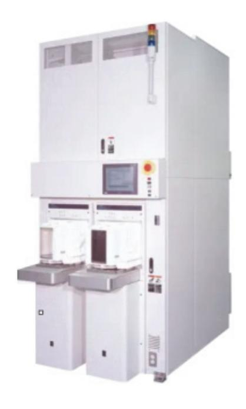

출처: 집필진 제작(2024) [그림 2-1] 수직형 열 확산 장비의 외형

- (1) 열 확산법에 의해 도핑되는 공정을 파악하여 확산 장비의 구조와 운용을 검토한다. 열 확산법은 반도체 공정에서 가장 핵심적인 산화막을 형성하거나 다결정 실리콘 및 질 화막을 구성하기 위해 사용하기도 하며, n형과 p형 불순물 반도체를 형성하기 위해 적 용하기도 한다.
  - (가) 전기로를 이용한 불순물 확산 장비를 확인한다.

확산 공정은 전기로(furnace)를 이용하여 불순물 도핑을 진행할 수 있으며, 일명 열 확산 시스템이라 부르기도 한다. 확산 장비는 구조에 따라 수평형(horizontal type) 과 수직형(vertical type)으로 나뉘며, 전형적으로 수평형 확산 장비가 많이 사용되 었지만, 최근에는 장비의 설치와 유지 관리 측면에서 편리성과 장비의 점유 면적을 고려하고 생산성과 공정 등에서 장점을 가진 수직형 확산 장비를 선호하는 실정이다. 그리고 소스(source) 형태에 따라 기체형, 액체형 및 고체형으로 분류하며, 주로 특 수 가스를 활용하는 기체형이 많이 사용된다.

(나) 열 확산 장비의 구조와 운용을 확인한다.

열 확산 장비의 구성은 크게 2부분으로 나뉘며, 공정이 이루어지는 전기로부와 전원, 가스 및 냉각수 등의 유틸리티를 공급하는 유틸리티부로 나뉜다. 그리고 추가로 전 기로부와 유틸리티부 사이의 정보를 조절하는 제어부, 제어부 사이에 전선과 배관을 연결하게 된다. [그림 2-2]는 수직형 열확산 장비의 구성을 나타낸다.

1) 전기로부의 구조와 운용을 확인한다.

전기로부는 다음과 같이 6개 부분으로 나누어 구성한다.

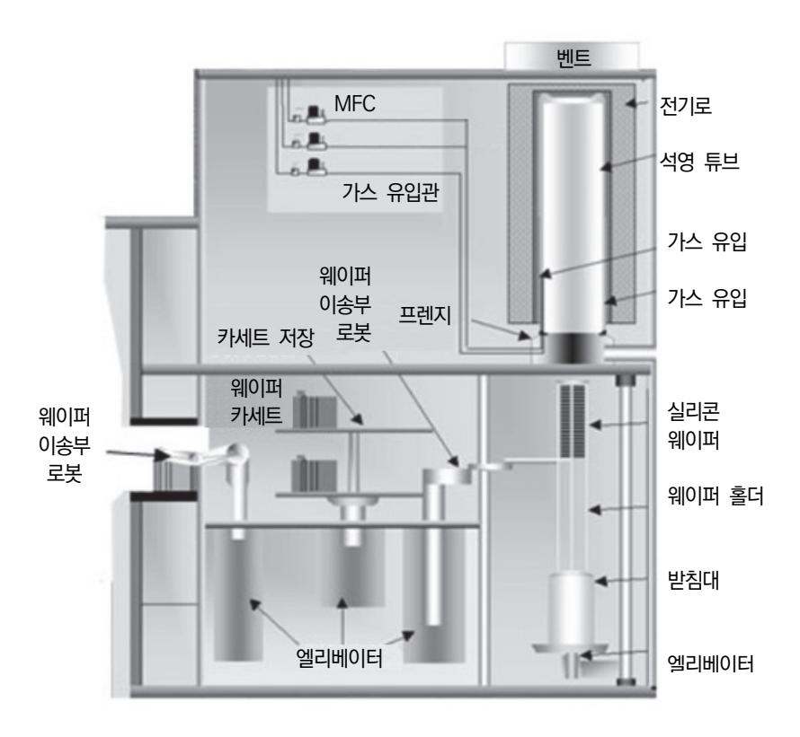

출처: 집필진 제작(2024) [그림 2-2] 열 확산 장비의 구조

- 가) 로더와 언로더부(loader/unloader)는 장치에서 공정을 진행하기 위해 웨이퍼가 적재되어 있는 카세트를 장비에 넣거나, 공정 완료 후에는 카세트를 빼내는 부 분으로 카세트 스테이지(cassette stage)라고도 부른다. 일반적으로 전기로부에서는 확산 공정을 진행할 때, 50~100매의 웨이퍼를 한 번에 로딩(loading)하는 배치형 공정(batch process)을 사용한다. 이유는 4~6시간 정도의 매우 긴 공정 시간이 필요하기 때문이다.
- 나) 카세트 이송부(cassette transfer)는 웨이퍼가 적재된 카세트를 필요한 곳으로 이동해 주는 구동부이다.
- 다) 웨이퍼 이송부(wafer transfer)는 장치 내로 반입된 웨이퍼가 담겨져 있는 카세 트로부터 웨이퍼를 꺼내어 보트 실에 놓여 있는 보트로 웨이퍼를 적재하거나 반 대로 공정이 완료되면 웨이퍼를 보트에서 카세트로 반송해 주는 구동부이다.
- 라) 보트(boat) 실에 놓인 보트는 보통 고순도의 석영 재질로 구성된다. 1,050℃ 이상의 고온 공정에서는 공정 진행 중에 석영 보트의 변형이 문제 되기 때문에 고순도 SIC 재질의 보트를 사용한다. 공정이 완료되면, 보트를 고온의 반응로로부터 보트 실로 이송하여 고온 상태의 웨이퍼와 보트를 약 10~20분 동안 식혀준다.

- 마) 고온부는 RF 코일에 의해 감긴 히터에 일정한 전압을 인가하여 온도를 제어하 게 된다.
- 바) 조작부는 로더와 언로더부를 통해 웨이퍼를 장비 내로 반입하고, 공정 완료 후 에는 다시 로더와 언로더부로 반출하기까지의 모든 구동부의 제어 조건과 공정 조건 등 작업 절차의 순서를 편집하거나 결과를 모니터(monitor)하는 부분으로 장비 내의 각 제어기와 정보를 주고받으면서 전반적인 전기로 장치의 제어를 담 당한다.
- 2) 유틸리티(utility)부의 구조와 운용을 확인한다.

유틸리티부는 다음과 같은 3부분으로 구성한다.

- 가) 전원부(power box)는 전기로에 전원을 공급해 주는 부분이며, 전기로에 공급되 는 고전압의 전원(200~220V)과 제어부로 공급되는 전원(100~120V)으로 나뉘 어 공급되는데, 안정된 전압을 전달하기 위하여 통상 변압기를 통해 장치에 공 급된다.
- 나) 가스 공급실(gas box)은 공정에서 사용되는 가스, 구동부를 동작시키거나 각종 밸브의 온 ‧ 오프를 위한 공기 및 공정 진공 등을 공급해 주는 부분이다. 가스와 관련의 모든 유틸리티는 우선 가스 공급실을 통해서 전기로 장비 내의 필요한 곳에 연결된 배관을 통해 가스를 공급하며, 안전을 위하여 항상 강제 배기가 되도록 구성되어 있고, 가스의 유량을 제어할 수 있는 MFC(mass flow controller) 와 MFM(mass flowmeter), 공급 가스의 입자를 최종 걸러주는 필터, 가스의 공급과 차단을 하기 위한 밸브 가스의 공급 압력을 조절할 수 있는 조정기(regulator) 등이 부착되어 있다.
- 다) 배관부(piping box)는 유틸리티부나 각 장비에 공급되는 냉각수의 배관이 설치 된 부분이다.

각 유니트 사이에 공기나 진공 라인의 연결은 이곳을 통하여 지나간다. 냉각 수는 고온로에서 발산되는 열로부터 장비와 부품을 보호하기 위해 이곳으로 부터 필요한 곳에 공급된다.

(2) 열 확산 장비의 유지 보수 방법을 확인한다.

확산 장비의 가동률을 증가시켜 생산성을 높이기 위해서는 정기적인 유지 보수가 필요 하다. 확산 장비의 유지 보수 장비의 각 모듈이나 부품에 대한 정기적인 교환 주기, 보 정 주기 및 점검 주기를 세부 항목별로 선정, 관리 및 보완 등을 실행하여야 한다. 또한 예방 정비(PM: preventive maintenance)를 통해 장비의 성능을 유지하고, 고장의 발 생을 사전에 차단하는 활동으로 장비의 수명을 연장하며, 생산성을 높이기 위해 성능 점 검, 부품 교환, 수리 및 청소 등을 이용하여 장비가 원하는 성능을 유지하면서 동작하도 록 실행한다.

- (가) 예방 정비의 활동 절차를 살펴보면 다음과 같다.
  - 1) 주기적인 예방 정비에 점검 항목을 파악하고, 일정과 절차를 확인한다.
  - 2) 기준에 적합하지 않은 사항이 있다면 고장이나 이상 발생에 대한 조치를 실행한다.
  - 3) 절차에 따라 점검하고, PM 일지를 작성한다.
  - 4) 고장과 이상 발생에 대한 원인 분석과 영향 등을 평가한다.
  - 5) 결과, 조치 사항 및 대책 등에 대해 정리하여 보고서를 작성한다.
  - 6) PM 데이터를 축적하여 통계적으로 분석한다.
  - 7) 통계적인 해석을 통해 진단이나 예측을 할 수 있으며, 이를 근거로 체계적인 장비 유지, 보수 및 개선 등의 노하우를 구축한다.
- (나) 활동 절차에 따라 확산 장비의 항목별 유지 보수 주기를 검토한다.

일일 유지 보수, 월간 유지 보수 및 분기별 유지 보수 등의 주기를 확인한다. 주기적 인 점검은 필요에 따라 변경할 수 있으며, 문제 발생 시에는 항목에 대한 점검을 고 려하여야 한다.

- 1) 일일 유지 보수 주기를 확인한다.
  - 가) 냉각수 유량을 확인한다.
  - 나) 비개량을 확인한다.
  - 다) 구동용 공기 압력을 확인한다.
  - 라) 공정 가스 압력을 확인한다.
  - 마) 희석용 질소 유량을 확인한다.
  - 바) 가스 캐비닛의 배기를 확인한다.
  - 사) 펌프용 냉각수 유량과 펌프 질소 퍼지 유량을 확인한다.
  - 아) 제어부 계통을 확인한다.
- 2) 월간 유지 보수 주기를 확인한다.
  - 가) 펌프 오일을 확인한다.
  - 나) 펌프 전류자를 확인한다.
- 3) 분기별 유지 보수 주기를 확인한다.
  - 가) MFC와 MFM의 동작을 확인한다.
  - 나) 작동 기기의 구동 공기 압력을 확인하고 조정한다.
  - 다) 로딩 지그(loading jig)의 상태를 확인한다.
  - 라) 냉각수 유량 저하 알람의 동작을 확인한다.
- 4) 6개월 유지 보수 주기를 확인한다.
  - 가) 누수 및 히터 단자를 확인한다.
  - 나) 자동문 안전 감지기(autodoor safety sensor)의 동작을 확인한다.
  - 다) 보트 엘리베이터와 차단기 ALC 감지기의 동작을 확인한다.

- 라) 히터 단자의 절연 저항을 측정한다.
- 5) 연간 유지 보수 주기를 확인한다.
  - 가) 외부 열전대를 교환한다.
  - 나) 장비의 클린 에어 플로(clean air flow)의 동작을 확인한다.
  - 다) 카세트 이송부(cassette transfer)를 검사한다.
  - 라) 보트 엘리베이터와 메인 제어기를 확인한다.
- 2. 이온 주입용 특수 가스를 선택하기 위해서는 대상 물질을 파악하고, 이온 주입 장비의 원리, 구성 과 운용에 대해 확인한다.

도핑하고자 하는 물질이 파악되면 이온 주입 장비를 검토하고, 기본적인 장비의 구성과 주 의 사항을 확인한다.

(1) 이온 주입법에 의한 불순물 원자를 주입하는 원리를 파악한다.

이온 주입법은 고진공 상태의 체임버(chamber) 내에 있는 필라멘트에 전류를 흘리게 되면 열전자를 방출하고, 이때 방출된 열전자는 필라멘트와 체임버 사이에 인가되는 전압에 의해 체임버 쪽으로 끌려간다. 그리고 체임버 내에 공정 가스와 충돌하여 기체는 이온화되고, 내부에 국한되는 자계에 의해 열전자는 나선 운동을 하며, 가스와의 충돌을 증가시켜 이온화는 더욱 증대한다. 체임버 전면에 음으로 인가된 추출 전극(extraction electrode)으로 인해 밖으로 나오게 된다. 그리고 질량 분석기를 통하면서 질량이 각기 다른 이온 중에서 필요한 이온만을 분석하여 주사 방식에 따라 웨이퍼 체임버 내에 웨이퍼로 주입한다.

(2) 이온 주입 장비의 구조와 운용을 검토한다.

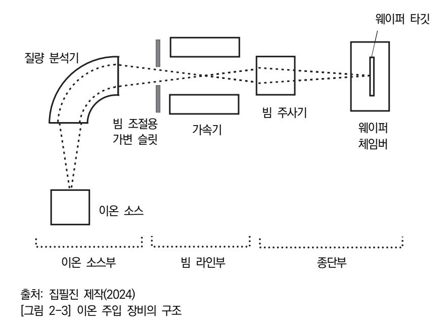

[그림 2-3]은 이온 주입 장비의 기본적인 구조를 보여 준다. 그림에서 나타나듯이, 이온

주입 장비는 크게 3부분으로 분류한다. 이온을 생성하여 추출하는 이온 소스부(ion source), 이온 빔을 형성하여 조절하는 빔 라인부(beam line)와 이온을 웨이퍼에 주입 하는 종단부(end station)로 구분한다. 각 영역에서 일어나는 동작을 구체적으로 다루면 다음과 같다.

(가) 이온 소스부에서 이온 생성과 추출 과정을 파악한다.

필라멘트에 전류를 흘려 가열하게 되면 열전자가 방출되고, 체임버에 주입된 도펀트 가스(dopant gas)와 충돌하여 양이온을 형성한다. 25kV 정도의 고전압을 인가해 주 면 원하는 양이온을 추출하게 된다.

- (나) 이온 소스부에서 필요한 이온을 선택하는 원리를 파악한다.
  - 이온 소스부에서 생성된 이온은 일정 에너지를 가지고 나오며, 질량 분석기 내에 자 계를 인가해 주면 양이온은 경로를 따라 이동하다가 전계로 인해 작은 질량의 가벼 운 이온은 빠르게 꺾이고 무거운 질량의 이온은 천천히 꺾이는 현상을 이용하여 선 택적으로 원하는 양이온을 추출한다.
- (다) 빔 라인부에서 이온 가속(ion acceleration) 과정을 파악한다.

이온 소스부에서 빠져나온 양이온은 높은 에너지로 가속시키면, 선택된 이온은 조리 개(slit)를 통해 빔 라인부에서 전계에 의해 더욱 가속된다.

- (라) 종단부에서 이온 주입을 위한 빔 주사(beam scan) 과정을 파악한다. 웨이퍼에 정해진 특정한 영역에 도펀트를 균일하게 양이온을 주입하기 위해 빔 주사 를 하며, 수직이나 수평으로 움직이면서 연동한다. 주사 패턴(scan pattern)은 사선 으로 균일하게 이온을 주입한다.
- (마) 종단부에서 이온 주입을 위한 디스크 주사(disk scan) 과정을 파악한다.

디스크 주사는 웨이퍼에 정해진 영역에 도펀트를 균일하게 이온을 주입하는 과정이 다. 디스크는 원판의 웨이퍼를 의미하며, 보통 15~25장의 웨이퍼가 로딩되어 시계방 향으로 회전하면서 축을 따라 움직인다. 이온 빔의 경로는 고정되어 있기 때문에 웨 이퍼가 회전하면서 위와 아래로 움직이고 이온 주입을 하게 된다.

(바) 주입된 이온의 양을 모니터링하여 최종을 확인한다.

이온 빔이 웨이퍼의 표면에 조사되어 충돌하면서 2차 전자가 발생하게 되며, 전자가 디스크를 통해 전류 거울(current mirror)을 빠져나가면서 전류를 발생시킨다. 이때 하나의 이온이 빠져나오면 하나의 전자가 들어갈 수 있도록 하여 전류를 모니터링하 게 된다. 따라서 정확한 도핑을 모니터링할 수 있다는 장점이 있다.

(3) 이온 주입 장비의 운용에서 주의 사항을 검토한다.

이온 주입 공정의 웅용에서 균일성에 영향을 끼치는 주의 사항을 살펴보면 다음과 같다. (가) 체임버의 진동도를 확인한다.

체임버의 진공도는 이온 빔의 품질에 매우 큰 영향을 끼치게 된다. 진공도가 낮으면 빔의 흐름이 작아져 추출 속도가 느려지고 이온의 흐름에 초점이 맞지 않아 이온 주 입의 순도가 충분하지 못하게 된다. 그리고 잔류하는 기체 분자와의 충돌로 인하여 이온 주입 깊이의 균일성에도 문제가 발생하며, 일종의 오염이나 무작위적인 충돌로 이온 빔을 통제하기 어렵다. 이온 빔은 이온 소스부에서 웨이퍼까지 긴 경로로 이동 하므로 전체 시스템의 진공도를 높여야 한다.

(나) 웨이퍼 표면의 청결도를 확인한다.

이온 주입은 입자 오염에 매우 민감하며, 웨이퍼 표면의 입자는 이온 흐름을 방해하 게 된다. 주입되는 이온 빔의 흐름이 클수록 더 많은 도펀트가 생성되며, 표면에 주 입을 가리게 되면 치명적인 결함이 발생하게 된다.

(다) 이온 빔의 초점과 주사를 확인한다.

이온 소스에서 추출된 이온 흐름은 가속기를 통해 발산하게 되며, 초점이나 동축 처 리를 이용하여 미세하게 주사하면서 구품질의 이온 빔 스폿(spot)을 형성한다.

(라) 이온 빔의 크기를 확인한다.

이온 빔이 웨이퍼에 입사되면 표면에 전하 축적층이 형성되는데, 이를 웨이퍼 전하 축적이라고 한다. 웨이퍼 표면에 축적된 전하는 주입된 이온에 산란 효과가 있어 주 입의 균일성에 영향을 끼친다. 주입된 빔의 전류가 클수록 웨이퍼에 전하 축적이 더 심각해진다. 따라서 공정 처리에서 필요한 만큼 더 작은 빔 전류를 선택하여야 한다.

3. 도핑 공정에서 공정 장비와 특수 가스가 결정되면 가스에 대한 제조 사양서를 토대로 가스의 규 격을 확인하고, 특수 가스의 유해성을 파악한다.

<표 2-2>는 도핑 공정용 특수 가스의 유해성을 나타낸다.

#### <표 2-2> 도핑 공정용 특수 가스의 유해성

|               | 생체 작용   |   |                        |        |   |        |         |   |        |        |   |   |   |   |   |                                    |             |
|---------------|---------|---|------------------------|--------|---|--------|---------|---|--------|--------|---|---|---|---|---|------------------------------------|-------------|
|               |         |   | 자극성 ⁃ 부식성 질식성 독성 |        |   |        |         |   |        |        |   |   |   |   |   |                                    |             |
| 가스 명          | 분자식     | 피 | 안 상                 | 기      | 폐 | 산 소 | Hb 친 | 용 | 간      | 뇌 신 | 심 | 신 | 위 |   | 치 | 주의 사항                              | 허용 농도 [ppm] |
|               |         | 부 | 기 도                 | 관 지 | 포 | 희 박 | 화 성  | 혈 | 장 해 | 경 계 | 장 | 장 | 장 | 뼈 | 아 |                                    |             |
| 실란            | SiH4    |   | ○                      | ○      |   |        |         |   |        |        |   |   |   |   |   | ∙자연 발화성, 불쾌한 냄새                    | 0.5         |
| 디클로로실 란    | SiH2Cl2 |   | ○                      | ○      | ○ |        |         |   |        |        |   |   |   |   | ○ | ∙가수 분해되어 HCl 생성                    | 5.0         |
| 삼클로로실 란    | SiHCl3  |   | ○                      | ○      | ○ |        |         |   |        |        |   |   |   |   | ○ | ∙가수 분해되어 HCl 생성                    | -           |
| 사염화 규소        | SiCl4   | ○ | ○                      | ○      | ○ |        |         |   | ○      | ○      |   |   |   |   | ○ | ∙골경화증                              | -           |
| 알신            | AsH3    |   |                        |        | ○ |        | ○       | ○ | ○      | ○      | ○ | ○ | ○ |   |   | ∙가수 분해되어 HF, 마늘 냄새              | 0.05        |
| 삼불화 비소        | AsF3    | ○ | ○                      | ○      | ○ |        |         |   | ○      | ○      | ○ | ○ | ○ | ○ | ○ | ∙가수 분해되어 As2O3와 HF3 발암성   | 0.5mg/m3    |
| 포스핀           | PH3     |   | ○                      | ○      | ○ |        |         |   | ○      | ○      |   |   | ○ | ○ |   | ∙자연 발화성                            | 0.3         |
| 삼염화 인         | PCl3    | ○ | ○                      | ○      | ○ |        |         |   | ○      |        |   |   |   |   | ○ | ∙가수 분해되어 아인산과 HCl         | 0.2         |
| 삼염화 붕소        | BCl3    |   | ○                      | ○      | ○ |        |         |   |        |        |   |   |   |   |   | ∙가수 분해되어 HCl 생성 ∙자극적 냄새         | 1.0         |
| 삼브로민화 붕소   | BBr3    | ○ | ○                      | ○      | ○ |        |         |   |        |        |   |   |   |   |   | ∙가수 분해되어 HBr 생성                    | 1.0         |
| 디보란           | B2H6    |   | ○                      | ○      | ○ |        |         |   | ○      | ○      |   | ○ |   |   |   | ∙사염화탄소, 염소, 이황화탄 소 등과 접촉 폭발, 무취 | 0.1         |
| 사수소화 게 르마늄 | GeH4    |   |                        |        |   |        |         | ○ |        |        |   |   | ○ |   |   | ∙자연 발화성                            | 0.2         |
| 불화 텅스턴        | WF4     | ○ | ○                      | ○      | ○ |        |         |   | ○      |        |   |   |   | ○ | ○ | ∙가수 분해되어 HF 생성                     | 1mg/m3      |
| 사염화 게르 마늄  | GeCl4   | ○ | ○                      | ○      | ○ |        |         |   |        |        |   |   |   |   |   | ∙가수 분해되어 HCl 생성                    | -           |
| 수소화 안티 몬   | SbH3    |   |                        |        | ○ |        |         | ○ | ○      |        |   | ○ |   |   |   | ∙산화제와 폭발적                          | 0.1         |
| 암모니아          | NH3     | ○ | ○                      | ○      | ○ |        |         |   |        |        |   |   |   |   |   | ∙폭발성 15~28%                        | 25          |
| 황화 수소         | H2S     |   | ○                      | ○      | ○ |        |         |   |        | ○      | ○ |   | ○ |   |   | ∙폭발성 4.3~46%                       | 10          |

출처: 이광묵(1988). 「반도체 제조와 유해 가스」. 『Korean J. Occup. Health』. 27(3). pp. 2~3.

## 2-2. 가스 재료 준비

학습 목표 • 반도체 제조 공정에 적합한 이온 주입 공정 가스 제조 재료를 준비할 수 있다.

## 필요 지식 /

#### 숔 가스 재료의 준비

반도체 도핑 공정은 실리콘 웨이퍼에 산화막이나 질화막을 형성하거나 불순물 반도체를 형성하여 반도체 소자에 전기적 특성을 조절하기 위해서 사용한다. 기존에 열 확산법을 이용하여 도펀트를 주입하는 방법이 주로 사용되었지만, 최근 반도체 소자의 고집적화와 고밀도화됨에 따라 더욱 정밀하 게 도펀트를 제어하는 기술이 필요하면서 이온 주입법이 사용되고 있다. 열 확산법은 고온의 분위기에 서 도펀트 원자들이 웨이퍼 내부로 확산하기 때문에 등방성의 도펀트 분포(dopant profile)를 가진 다. 그리고 도펀트 농도와 접합 깊이(junction depth)를 독립적으로 관리하기가 어려워 반도체 소자 가 소형화 측면에서 분리하였다. 반면에 이온 주입법은 저온 공정이 가능하고, 이방성 도펀트 분포를 가지며 농도와 깊이를 독립적으로 관리하기 편리하다.

1. 열 확산용 가스

열 확산법은 불순물 소스(source)의 형태에 따라 기체, 액체 및 고체 소스로 분류하여 사용 한다. 불순물이 가스를 주입하는 방식일 경우에는 가스의 흐름이나 유량을 조절하는 장치가 필요하여 밸브(valve)와 MFC(mass flow controller)라는 유량 조정기를 이용하여 가스의 양을 일정하게 유지할 수 있다. 불순물이 액체인 경우에는 액체 소스를 버블링(bubbling)하 여 기체 상태로 바꾸어 확산용 전기로에 주입하게 된다.

| 도펀트 | 상태 | 화학식   | 명칭       |
|-----|----|-------|----------|
|     | 기체 | B2H6  | 디보란      |
| B   | 액체 | BBr3  | 삼브로민화 붕소 |
|     | 고체 | BN    | 질화붕소     |
|     | 기체 | PH3   | 포스핀      |
| P   | 액체 | POCl3 | 옥시 염화 인  |
| As  | 기체 | AsH3  | 알신       |
|     | 고체 | As2O3 | 삼산화 비소   |
| Sb  | 고체 | Sb2O3 | 삼산화 안티몬  |

#### <표 2-3> 다양한 불순물 소스의 형태

출처: 추광호(2015). 『산업가스 특수 가스 총서 1』. ㈜북랩. pp. 25~26.

그리고 불순물이 고체인 경우에는 디스크형의 고체 소스를 웨이퍼 근처에 배치하여 열을 가해 고온에서 승화된 기체 증기가 웨이퍼로 이동하여 확산하는 과정을 이용한 것이다. <표 2-3>에서는 열 확산법에서 사용하는 다양한 불순물 소스의 형태를 나타낸다.

(1) 다결정 실리콘

다결정 실리콘은 트랜지스터의 게이트, 커패시터 전극, 저항 및 배선 소재로 사용한다. 다결정 실리콘은 금속에 비교해 저항은 높은 편이지만, 고온 공정에서 적합하고 불순물 원자를 주입함에 따라 저항을 조절할 수 있다. 열 산화막과 같이 계면 특성이 우수하고, 단차 피복성(step coverage)이 매우 좋은 편이다.

(가) 반응식

SiH4(g) → Si(solid) + 2H2(g)

(나) 특성

580℃ 이하의 열처리 온도에서는 비정질 실리콘(amorphous silicon)을 형성하며, 620℃ 이상에서는 다결정 실리콘을 만든다. 열 확산법에 의한 도핑 방법은 먼저 다결정 실리콘을 성장하고, 반응로에서 도핑 원소를 공급하면서 900~1,000℃로 고온 열처리하여 불순물을 주입한다. 매우 높은 농도의 도펀트를 다결정 실리콘에 주입할 수 있다는 장점이 있지만, 고온 열처리를 수반하기 때문에 표면 거칠기(surface roughness)가 높아진다는 단점이 있다.

(2) 질화막

질화막으로 많이 사용되는 Si3N4는 절연 특성과 패시베이션(passivation) 기능이 매우 좋으며, 유전율이 높아 다양한 용도로 사용된다. 특히 불순물의 확산을 차단하는 효과가 우수하고, 공정 마무리로 반도체 소자의 보호막으로도 많이 사용한다.

(가) 반응식

3SiH2Cl2 + 4NH3 → Si3N4 + 6HCl + 6H2 반응 온도: 700~800℃

(나) 특성

산소가 질화막을 침투하기 어렵기 때문에 산화 공정에서 질화막을 통하여 산소가 팀 투하지 않아 산화되지 않는다.

(3) 산화막

산화막은 반응 가스의 종류와 증착 온도에 따라 고온 산화막(high temperature oxide)과 중간 온도 산화막(middle temperature oxide)으로 구분하며, 커패시터의 유전 재료나 MOS 구조의 게이트 산화막으로 사용한다.

(가) 반응식

1) 고온 산화막의 경우

SiH2Cl2 + 2N2O → SiO2 + 2HCl + 2N2 반응 온도: 760℃ 2) 중간 온도 산화막의 경우 SiH4 + 2N2O → SiO2 + 2H2 + 2N2 반응 온도: 760℃

2. 이온 주입용 가스

이온 주입법은 불순물 이온을 실리콘 웨이퍼와 같은 고체 물질에 주입하는 공정이다. 이온 주입을 통해 고체의 물리적 및 전기적 특성을 바꾸는 것이다. 이온 주입은 반도체 소자의 제조 공정에 널리 사용될 뿐 아니라, 재료 분야에서 다양한 방면에 쓰이고 있다. 대상 물질 에 이온을 주입하면 화학적 특성이 변하거나 다른 물질로 바뀔 수도 있으며, 타깃의 결정 구조가 변하거나 결정 구조에 손상(damage)을 입거나 파괴될 수도 있다. 최근 들어 이온 주입 기술은 물질을 도핑하는 열 확산 공정보다 많은 장점이 있어 지속해서 대체하고 있다. 확산보다 가장 큰 이점은 기판에 주입되는 도펀트 원자들을 매우 정밀하게 제어할 수 있다 는 점이다.

(1) 암모니아

암모니아(NH3)는 가연성 가스이며, 무색으로 강한 자극성 냄새를 가진 기체이다. 비점은 – 33.4℃이고, 융점은 – 77.7℃이며, 분자량은 17이다. 독성 가스로 허용 농도는 50ppm 이고, 폭발 범위는 15~28%이다.

(가) 암모니아의 물리적 성질

강한 자극성의 냄새를 가지며, 무색의 기체로 물에 잘 녹는다. 상압에서의 용해도는 0℃에서 42.8wt%이고, 기화할 때 많은 열을 흡수하여 냉동제를 사용한다.

(나) 암모니아의 화학적 성질

암모니아 가스는 스스로 연소하기 어렵지만, 착화원에 지속적으로 노출되면, 연소한 다. 암모니아 가스와 공기의 혼합물은 폭발할 수 있으며, 장비 내에서 가급적이면 혼 합물이 만들어지지 않도록 주의하여야 한다. 액체 암모니아는 할로겐이나 강산과 접 촉하면 심하게 반응하여 폭발하거나 비산할 수 있다. 동, 동합금이나 알루미늄 합금 과 접하면 심한 부식성을 일으킨다.

1) 암모니아는 산소 중에서 황염색을 내면서 연소하고 질소와 물을 생성한다.

4NH3 + 3O2 → 2N2 + 6H2O

2) 염화수소와 접촉하면 하얀 연기를 내면서 염화 암모늄을 만든다.

NH3 + HCl → NH4Cl

3) 고온에서 마그네슘을 반응하여 질화 마그네슘을 만든다.

2NH3 + 3Mg → Mg3N2 + 3H2

4) 나트륨과 반응하여 나트륨 아마이드를 만든다.

2NH3 + 2Na → 2NH2Na + H2

5) 할로겐과 반응하여 질소를 유리시킨다.

8NH3 + 3Cl2 → N2 + 6NH4Cl

6) 연소가 과잉으로 존재하면 폭발성의 삼염화 질소를 만든다.

NH4Cl + 3Cl2 → NCl3 + 4HCl

(다) 암모니아의 제조법

암모니아 합성 공정은 반응하는 압력에 따라 고압법, 중압법 및 저압법으로 구분하 며, 다음과 같이 분류한다.

- 1) 고압 합성법: 600~1,000kg/cm2
- 2) 증압 합성법: 300kg/cm2 내외
- 3) 저압 합성법: 150kg/cm2 내외
- (라) 암모니아의 취급

암모니아는 일반적으로 탄소강으로 만들어진 용기를 사용하며, 암모니아 기체나 액체 는 저온이나 상온에서 강재를 침식하지 않는다. 고온 고압하에서 암모니아 가스는 강재에 대해 질화 작용과 수소 취화 작용이 동시에 발생한다.

(2) 염소

염소(Cl2)는 지연성 가스이며, 상온에서 황록색의 심한 자극성 냄새를 내는 기체로 공기 보다 무거운 맹독성 가스이다.

(가) 염소의 성질

1) 독성

인체에 극히 유독하며, 허용 농도는 1ppm이다. 5ppm이 넘으면 눈물과 콧물이 나며, 60ppm 정도이면, 호흡 곤란에 이르며 심하면 위험 한계치에 다다른다.

2) 지연성(조연성)

염소와 수소의 혼합 가스는 연소 폭명기라고 부르기도 하며, 점화나 일광을 받으 면 강하게 화합하여 염화수소를 만든다.

H2 + Cl2 → 2HCl

#### 3) 활성

염소는 금속 무기 화합물과 반응하여 다양한 화합물을 생성한다. 단, 수분을 함유 하지 않은 건조한 염소는 상온에서 금속과 반응하지 않는다.

4) 금속성

습기를 가진 염소는 철강, 구리 및 아연과 같은 금속을 침식한다. 따라서 수분의 존재는 위험을 초래하며, 염소가 물에 녹으면 염산이 된다. 이는 염산이 금속을 부식하기 때문이다.

H2O + Cl2 → 2HClO + HCl

Fe + 2HCl → FeCl2 + H2

(나) 염소의 용도

1) 소독제

살균성을 가진 산소를 방출하며 수돗물의 하수에 소독용으로 사용한다.

2) 표백제

가성 소다 용액이나 석탄유에 염소를 급수시킨 액체를 만들어 종이나 면포 등의 섬유를 표백하기 위해 사용한다.

Ca(OH)2 + Cl2 → CaOCl2 + H2O

3) 화학 약품

염산, 염화비닐, 클로로 벤젠, 클로로 포름 및 사염화 탄소 등을 제조하기 위한 기초 시약으로 널리 사용한다.

(3) 황화 수소

황화 수소(H2S)는 무색으로 달걀 썩는 냄새를 가진 기체이며, 유독성으로 물에 녹아 산 성을 나타내고, 환원제로 작용한다. 완전 연소하면, 2H2S + 3O2 → 2H2O + 2SO2 불완전 연소하면, 2H2S + O2 → 2H2O + 2S

## 수행 내용 / 가스 재료 준비하기

#### 재료·자료

- 반도체 재료 제조 기술 자료
- 국제표준화기구(ISO: international organization for standardization) 표준화 문서
- 물질 안전 보건 자료(MSDS)
- 생산 계획서
- 반도체 재료 작업 절차서
- 반도체 재료 작업 표준서
- 반도체용 이온 주입 공정 가스 원재료에 대한 자료
- 반도체 설비 목록 및 매뉴얼

• 반도체 제조 공정도

#### 기기(장비 ・ 공구)

- 반도체용 이온 주입 공정 가스 제조 장비
- 반도체용 이온 주입 공정 가스 측정 장비
- 반도체용 이온 주입 공정 가스 검사 장비
- 반도체용 이온 주입 공정 가스 분석 장비

#### 안전 ・ 유의 사항

- 반도체 이온 주입 공정에 대한 이론적 지식을 습득하고, 취급하는 가스의 성질과 특성을 바 탕으로 관리 주의 사항에 유의해야 한다.
- 반도체 이온 주입 공정에서 사용하는 특수 가스에 대한 부식성, 맹독성, 인화성 및 발화성 등의 특성을 파악하고, 해당 가스에 대한 장비, 공급 시설, 관리 및 주의 사항을 사용하기 전에 미리 숙지하여야 한다.
- 물질 안전 보건 자료를 통해 특수 가스를 취급하기 전에 파악하고, 독성 가스의 경우에는 제독 설비에 대한 일반 사항, 제독 설비 및 제독 방법 등 안전 교육을 실시한다.

#### 수행 순서

- 숔 반도체 이온 주입 공정용 가스를 제조하기 위해 가스 제조 사양서를 기준으로 특수 가스의 종류, 물 성과 특성을 파악한다. 이온 주입 공정용 가스의 제조 사양서를 기반으로 사용되는 특수 가스의 물성을 파악하고, 가 스의 특성을 고려하여야 한다.
  - 1. 이온 주입 공정용 가스를 제조하기 위해 해당하는 특수 가스의 제조 사양서를 확인하고, 가스의 품질 기준과 제품 특성 등을 파악한다.
    - (1) 활용 서식에 제시된 가스 제조 사양서의 내용 중에서 제조하려는 가스의 다음과 같은 품질 기준 항목을 검토한다.
      - (가) 화학식
      - (나) 성분 조합 비율
      - (다) 경년 변화
      - (라) 순도

- (마) 가스의 비중
- (바) 관리 방법 및 안전 취급
- (사) 점검 주기
- (2) 이온 주입 공정에서 사용하는 특수 가스는 말 그대로 특수한 용도로 사용하는 유해한 가스이 기 때문에 제조 사양서의 내용 중에 가스 제품의 유해성에 대한 내용을 주의 깊게 확인한다. <표 2-2>에서 나타내는 바와 같이, 도핑 공정용 특수 가스 제조 시에 작업자의 안전을 반드시 고려하여야 하기에 인체에 발생할 수 있는 각종 생체 작용에 대한 내용을 명확 하게 확인하고, 다음 사항을 검토한다.
  - (가) 특수 가스를 제조하거나 취급하는 작업자에 영향을 끼쳐 생체 작용을 하기 때문에, 특히 유독 가스의 자극성, 부식성, 질식성, 독성 및 가연성 등에 대해 면밀히 파악한다.
  - (나) 유독 가스의 허용 농도를 상세히 확인한다.
  - (다) 유독 가스의 제독 방법뿐만 아니라, 안전 취급에 대해 검토하고, 개인 보호구를 준비하여 야 한다.
  - (라) 유해한 정도를 나타내는 경고 표시를 주의 깊게 검토한다.
- 2. 도핑 공정이나 이온 주입 공정용 특수 가스의 물리적 및 화학적 성질을 확인하기 위해 제조 사양 서에서 유해성에 대한 자료를 검토한다.

이온 주입용 특수 가스는 반도체 소자의 전기적 특성을 의도하는 수준으로 조절하기 위해 웨이퍼의 특정 부분에만 수 keV에서 수백 keV까지 고전압으로 가속한 이온을 물리적으로 주입하여 전기 저항과 같은 웨이퍼의 물리적 특성을 통제하는 데 사용한다. 특수 가스를 제 조하기 위해 사전에 도핑이나 이온 주입용 가스에 대한 지식과 기술을 충분히 이해하고 사 용하여야 한다.

(1) 도핑 공정에서 많이 사용하는 디보란(B2H6)의 성질을 검토한다.

디보란은 공기 중에서 녹색의 불꽃을 내면서 타며, 연소열(485.1 Kcal/mol)이 큰 것이 매우 큰 특징이다.

B2H6 + 3O2 → B2O3 + 3H2O(g)

폭발 한계는 0.8~98%이며, 공기 중에서 자연 발화 온도는 38~52℃이고, 불순물이 존 재하면 실온에서도 발화할 수 있다. <표 2-4>는 디보란의 성질을 정리하여 나타낸다.

<표 2-4> 디보란의 성질

| 가스 명 | 분자식  | 분자량   | 비점[℃] | 융점[℃]   | 임계 온 도[℃] | 임계 압력 [atm] | 비열(25℃) [cal/mol∙k] | 생성열(25℃) [kcal/mol] |
|------|------|-------|-------|---------|--------------|----------------|------------------------|------------------------|
| 디보란  | B2H6 | 27.67 | -92.5 | -164.85 | 16.7         | 39.5           | 13.5                   | 7.5                    |

출처: 이형섭(1989). 「반도체용 가스의 위험성 평가」. 『방재 기술 6』. p. 25.

(가) 디보란의 분해에 의한 위험성을 검토한다.

디보란은 열적으로 불안정하여 상온에서도 분해하여 수소와 보란(BH4)이 된다. 300℃ 이상에서 분해생성물은 수소와 붕소이다.

(나) 디보란의 화재 가능성을 검토한다.

디보란은 물과 격렬하게 반응하며, 염소와도 폭발적으로 반응하고, 할로겐이나 할로 겐 화합물과 실온에서 100℃까지 반응한다. 디보란으로 인한 화재 발생 시에 할로겐 계의 소화제는 적합하지 않다. 화재를 방지하기 위해 디보란 가스의 누출을 방지하 는 것이 가장 좋은 대비책이다. 따라서 긴급 차단 밸브를 설치하는 것이 바람직하다.

(2) 도핑 공정에서 사용하는 포스핀(PH3)의 성질을 검토한다.

포스핀은 상온에서 안정적이며, 약 300℃ 이상에서는 서서히 열분해하여 수소와 적린 (P4)이 얻어진다. 자외선에 의해 분해되며, 물에 용해되어 수용액 상태에서 서서히 분해 되어 적린, 수소 및 (P2H)n의 조성을 가진 고체로 변한다. 특히 상온에서 염소와 반응하 여 발화하며 PCl5와 HCl을 생성한다. 그리고 에테르와 알코올에도 잘 녹는다.

(가) 포스핀의 발화에 대한 위험성을 검토한다.

수수한 포스핀은 공기 중에 누출되더라도 상온에서 자연 발화하지 않는다. 그러나 디포스핀이 혼입되면 발화하며, 연소하면 P4O10을 생성하고 조건에 따라 H3PO3, HPO2, H2 등을 만든다. 디보란이나 실란과 같이 화염에 대해 쉽게 소화되지 않으 며, 화재 시에 누출되는 가스가 없도록 차단하여야 한다.

<표 2-5> 포스핀의 성질

| 가스 명 | 분자식 | 분자량   | 비점 [℃] | 융점 [℃] | 임계 온도 [℃] | 임계 압력 [atm] | 비열(25℃) [cal/mol∙k] | 생성열(25℃) [kcal/mol] |
|------|-----|-------|-----------|-----------|--------------|----------------|------------------------|------------------------|
| 포스핀  | PH3 | 34.00 | -87.7     | -133.8    | 51.3         | 64.5           | 8.9                    | 1.3                    |

출처: 이형섭(1989). 「반도체용 가스의 위험성 평가」. 『방재 기술 6』. p. 25.

<표 2-6> 알신의 성질

| 가스 명 | 분자식  | 분자량   | 비점 융점 [℃] [℃] |        | 임계 온도 [℃] | 임계 압력 [atm] | 비열(25℃) [cal/mol∙k] | 생성열(25℃) [kcal/mol] |
|------|------|-------|------------------------|--------|--------------|----------------|------------------------|------------------------|
| 알신   | AsH3 | 77.95 | -62.5                  | -116.9 | 99.9         | 65.1           | 9.1                    | 15.9                   |

출처: 이형섭(1989). 「반도체용 가스의 위험성 평가」. 『방재 기술 6』. p. 25.

#### (3) 도핑 공정에서 사용하는 알신(AsH3)의 성질을 검토한다.

상온에서 천천히 분해하여 230℃ 부근에서는 분해 속도가 빨라진다. 500℃ 이상에서는 대단히 빠르게 분해하며, 생성물로 As와 수소를 만든다. 물에 용해하며, 상온에서도 염 소에 의해 불꽃을 내면서 탄다. 가연성으로 점화원이 있으면, 청백색의 불꽃을 내며 탄

다. 폭발 한계는 0.8~98%이며, 하한계는 5.8vol% 정도인 것으로 알려져 있다. 알신의 물리적인 성질은 <표 2-6>과 같다.

(4) 도핑 공정에서 많이 사용하는 실란(SiH4)의 성질을 검토한다.

실란 가스는 무색 유취의 성질을 가지며, 연소하여 SiO2와 H2O를 생성한다. 폭발 한계 는 상온의 공기 중에서 0.8~98%이며, 물에 용해되거나 반응하지 않지만, 설령 반응하더 라도 반응 속도가 아주 느린 편이다. 그러나 알칼리 수용액(20% NaOH)에서는 강하게 반응한다. <표 2-7>은 일반적인 실란의 성질을 나타낸다.

(가) 공기 중에 실란 유출로 인한 자연 발화성을 검토한다.

실란은 공기 중에 유출되면 자연적으로 발화하며, 공기와 유사하게 질소와 산소를 혼합하여 약 10% 정도의 산소를 유지하면 자연 발화 온도는 –162℃에서 발생한다. 산소의 농도를 조금씩 감소하여 7% 정도되면 –142℃에서 발화한다. 반대로 100% 실란이 산소 농도 2.5~3.0%d 유출되면 자연 발화의 하한에 도달한다.

(나) 실란의 분해 폭발에 대한 위험성을 검토한다.

실란은 분해하여 SiH4 = Si +2H2으로 발열 반응하며, 분해 폭발의 위험성을 가진다. 분해 폭발성이 강한 아세틸렌이나 에틸렌과 비교하면 분해성이 작은 편이며, 상온에 서 가압한 후에 전기 충격을 가하더라도 분해 폭발이 일어나지 않는다. 그러나 온도 를 가열하게 되면 300℃ 이상에서 분해가 일어나며, 550℃에서는 매우 빠른 속도로 분해가 발생한다.

(다) 실란의 폭발 한계를 검토한다.

공기 중에서 실란의 폭발 한계는 상온 상압에서 0.8~98%이다. 그러나 실란은 공기 와 혼합하면 동시에 발화하기 때문에 어떠한 농도에서라도 안정된 혼합 가스를 얻기 가 매우 어렵다. 따라서 폭발 한계를 측정하기 위해 혼합물을 만들기 조차도 쉽지 않은 편이다. 실제로 SiH4 - O2 – N2계에서 실란의 농도가 0.8% 이하인 경우, 실온 에서도 매우 안정된다.

<표 2-7> 실란의 성질

| 가스 명 | 분자식  | 분자량   | 비점 [℃] | 융점 [℃] | 임계 온도 [℃] | 임계 압력 [atm] | 비열(25℃) [cal/mol∙k] | 생성열(25℃) [kcal/mol] |
|------|------|-------|-----------|-----------|--------------|----------------|------------------------|------------------------|
| 실란   | SiH4 | 32.12 | -111.9    | -185.0    | -3.5         | 47.8           | 10.2                   | 8.2                    |

출처: 이형섭(1989). 「반도체용 가스의 위험성 평가」. 『방재 기술 6』. p. 21.

숕 반도체 이온 주입 공정에서 필요한 특수 가스를 제조하기 위해 확보된 가스 제조 사양서를 바탕으로 가스 제조 공정과 제조 방법 등에 대해 파악하고, 특수 가스 시설의 설계와 운전에 대한 주의 사항 과 충전 시스템의 취급, 저장, 충전 및 유지 등에 대한 모든 안전과 법적 요구 사항을 검토한다.

특수 가스 혼합물을 제조할 경우에 모든 공정과 절차에 안전과 운전에 대한 위험성 평가를 수 행하여야 하며, 몇 가지 고려해야 할 중요 사항들을 식별하여 설정한다.

- 1. 특수 가스 제조 과정에서 발생할 수 있는 시설이나 설계에 대한 문제점을 제거한다.
  - (1) 치명적이거나 심각한 부상과 같은 문제점이 발생할 수 있다면, 이러한 문제점이 발생하지 않 도록 제조 시스템을 설계하여야 한다.
  - (2) 위험에 대한 문제점을 제거할 수 없다면 위험을 최소화할 수 있는 물리적인 제어를 포함하여 시스템을 설계한다.
  - (3) 문제점에 대한 해결 방안이 불가능하다면 적용하기 전에 운전 절차를 검토하고 위험을 평가 하기 위해 변경하는 관리 절차를 적용한다.
- 2. 제조 공정의 안전 운전과 절차에 대한 일반적인 요구 사항을 고려한다.
  - (1) 제조 시에 안전 운전을 위해 저장 구역을 분리한다.
  - (2) 제조 공정 설비나 시설의 환경에 따른 환기 요구 조건을 고려한다.
  - (3) 충전 구역을 분리하여 구분하고, 제조 공정 설비와 시스템에 작업자 이외에 사람이 접근하지 못하도록 통제한다.
  - (4) 화재 예방에 대한 자세한 내용을 게시하고 소방 설비를 준비한다.
  - (5) 가연성 가스를 취급할 경우, 점화원이 제거되고 정전기 방전으로부터 보호하는 장치를 반드시 설치한다.
  - (6) 독성이나 가연성 가스 및 산소가 풍부하여 잠재적 위험성이 높은 경우에는 감시하여야 한다.
  - (7) 제조 공정에 사용되는 설비는 적합성을 고려하고, 압력 등급을 검토하여야 하며, 가스 처리시 스템을 구비하여야 한다.
  - (8) 가스 혼합물 제조에 사용되는 분석 설비와 장치는 기준에 적합하여야 하고, 모든 측량은 정 확성을 고려한다.
  - (9) 혼합물 제조 공정에서 모든 가스 공급 파이프라인과 용기에는 적절하게 성분을 표시한다.
  - (10) 생산 설비와 작업 공정에서 용기를 안전하게 취급하여야 하고, 충전 지역에서 용기의 제어 조치를 표기한다.
  - (11) 전체 용기와 충전 시스템 누출 시험의 규정을 준수하여야 하며, 성분이나 위험 등급의 표시 가 적합한지 확인하고, 제조된 가스의 저장 지역이 적절한지를 확인한다.
- 3. 제조 공정의 안전 운전과 절차에 대한 특수 요구 사항을 고려한다.

일반적인 요구 사항에 추가로, 특수 가스 혼합물을 제조하기 위한 시설이나 설계에 대해 다 음 사항을 고려한다.

(1) 특수 가스 혼합 시설에서 다양한 가스 혼합물이 제조되므로 용기를 식별하고, 잔류 가스 처 리 공정이나 용기의 유지 보수 작업을 위해 적절한 공간이 필요하다.

- (2) 혼합 공정에서 발생할 수 있는 모든 잔류 가스는 안전하게 폐기되어야 하고, 복구를 위해 적 합한 시설이 필요하며, 가스 혼합물 제조를 위한 시설은 다양한 성분을 혼합하기 때문에 넓 은 범위의 시설로 설계하여야 한다.
- (3) 통제되지 않는 반응으로 인해 위험이 유발될 수 있는 가스 처리 설비에서는 가연성 가스와 산화성 가스와 같은 공존할 수 없는 가스들이 혼합되지 않도록 정확히 식별하여 구분한다.
- (4) 수소화물 가스가 산화제 화합물로 흐를 경우, 강한 반응이나 폭발 가능성 등의 위험이 없는 지를 확인하여야 한다.
- (5) 특수 가스 처리 작업을 지시하거나 수행할 수 있는 자격을 갖춘 전담 작업자를 선정하여 배 치하고, 적절한 화학적 지식과 안전한 가스 처리 방법으로 설비와 시설의 운영에 대해 권고 할 수 있어야 한다.
- (6) 취급하는 용기의 유지 관리를 위해 다음 사항을 고려한다.
  - (가) 용기의 페인팅과 성분 표시를 위한 시설
  - (나) 특수한 내부 검사 및 청소 설비
  - (다) 용기 밸브 저장 및 조립 시설
  - (라) 특수 용기 내부 건조 시설
- (7) 가스 혼합 시스템이 안전하고 효율적으로 운전될 수 있도록 설계하고 운영하여야 한다.
  - (가) 부주의한 가스 혼합의 위험을 제거하기 위해 가스 충전 시스템과 충전 구역을 충분히 멀 리 분리한다.
  - (나) 서로 공존할 수 없는 가스가 혼합되는 경우, 정확히 작동이 제어될 수 있는 시스템을 완 비하여야 하고, 특수 가스 혼합 지침에 따라 충분한 검사가 이루어져야 한다.
  - (다) 혼합 가스에 가연성 성분이 저장되거나 충전할 경우에는 다음 사항을 고려한다.
    - 1) 설비의 전기적 성질 분류
    - 2) 용기 충전 관련 설비의 접지
    - 3) 정전 방전의 원인
    - 4) 건물의 환기
    - 5) 가연성 가스의 검출 및 경보 시스템
    - 6) 시설의 폭발 요소 제거
  - (라) 혼합 가스의 독성 성분이 저장되거나 충전될 경우에는 다음 사항을 고려한다.
    - 1) 독성 가스의 검출 및 경보 시스템
    - 2) 건물의 환기
    - 3) 개인 검출기
- (8) 혼합 가스의 가스분석을 위해 다음과 같은 주의 사항을 확인한다.

- (가) 특수 가스 혼합물의 성분과 품질을 식별하고 확인한다.
- (나) 최종 가스 혼합물은 가스 혼합 지침에 따라 확인한다.
- (다) 반환된 용기의 가스 혼합물과 가스의 구성을 식별한다.
- (라) 다수의 가스 혼합물과 미량의 가스 혼합 불순물을 분석하기 위해 가스 분석 설비는 검증 하여야 한다.
- (마) 환경적 감시 설비와 국부적 환기 설비를 제공하여야 하고, 가연성 가스나 독성 가스 및 혼합물을 분석하여야 한다.
- (바) 서로 공존할 수 없는 가스를 분석하기 위한 분석 설비를 이용할 경우, 샘플링과 분석 시 스템을 위한 제거 시설이 설치되어야 한다.
- 4. 용기의 안전한 취급, 저장, 충전 및 유지 등에 대한 모든 일반 사항은 특수 가스 혼합물에도 적 용되며, 다음 몇 가지 문제점을 고려한다.
  - (1) 개인 보호 장비의 규정을 확인한다.
    - (가) 용기를 취급하는 경우에는 안전화, 보호 장갑 및 보호경을 착용한다.
    - (나) 점화를 방지하기 위한 조치를 검토한다.
      - 1) 고무 제품이 아닌 안전화를 신는다.
      - 2) 나일론 소재가 아닌 보호복을 착용하여 정전기를 방지한다.
      - 3) 불꽃이 발생하지 않는 청동 재질의 장비를 사용한다.
    - (다) 가스 누출을 식별하는 조치를 검토한다.
      - 1) 독성 가스를 감시한다.
      - 2) 산소 고갈이나 농축을 감시한다.
      - 3) 가연성 가스를 감시한다.
      - 4) 대기 가스를 감시하는 설비를 규정에 따라 정기적으로 검사한다.
      - 5) 가스 누출에 대비한 보호 조치로 호흡 장비를 배치한다.
    - (라) 부식성 화학 물질을 취급할 경우, 다음과 같은 보호 도구를 배치한다.
      - 1) 안면 가리개
      - 2) 화학 물질 보호 장갑
      - 3) 화학 물질 보호복
      - 4) 보호 장화
      - 5) 소화기, 정압 호흡 장비 및 비상 샤워기 등
  - (2) 주요 안전 규칙을 작성하여 직원들의 교육을 강화하여야 하고, 안전 규칙으로 다음 요건을 포함하여야 한다.
    - (가) 직원들의 담당 업무에 대한 교육

- (나) 개인 보호 장비와 도구
- (다) 흡연 물질이나 발화성 물질이 존재하는 지역에서의 흡연 금지
- (라) 휴대용 전화기나 전자 제품의 이용을 제한하는 규정
- (마) 잠재적 위험이 존재하는 지역에서 유지 관리와 시스템에 대한 안전 규칙
- (바) 비상시에 개인 행동 요령, 탈출 및 배치 등의 절차와 비상 설비의 이용법

## 학습 2 교수·학습 방법

#### 교수 방법

- 도핑 방법에 따른 특수 가스의 종류, 물성 및 특성에 대해 정리하여 지도한다.
- 열 확산 장비의 원리와 구조를 정리하고, 매뉴얼을 기반으로 사용법에 대해 설명한다.
- 이온 주입 장비의 원리와 구성을 정리하고, 운용법과 주의 사항에 대해 설명한다.
- 대상 물질에 대한 열 확산용 특수 가스의 종류와 특성에 대해 지도한다.
- 몇 가지 이온 주입용 특수 가스의 성질과 취급에 대해 설명한다.
- 이온 주입용 특수 가스의 제조 사양서를 근거로 품질 기준 항목을 설명한다.
- 특수 가스의 유해성에 대한 자료를 정리하여 설명한다.
- 도핑용 특수 가스 시설의 운전 주의 사항과 안전 등에 대해 설명한다.

#### 학습 방법

- 도핑용 특수 가스의 종류, 물성 및 특성에 대해 학습한다.
- 열 확산 장비의 원리와 구조를 정리하고, 사용법에 대해 조사한다.
- 이온 주입 장비의 원리와 구성을 정리하고, 운용법과 주의 사항을 학습한다.
- 대상 물질에 따른 열 확산용 특수 가스의 종류와 특성을 학습한다.
- 몇 가지 이온 주입용 특수 가스에 대한 물리적 및 화학적 성질을 정리하고, 취급 및 관리에 대해 학습한다.
- 이온 주입용 특수 가스의 제조 사양서를 근거로 품질 기준 항목을 정리한다.
- 특수 가스의 유해성에 대한 자료를 정리한다.
- 도핑용 특수 가스 시설의 운전의 주의 사항과 안전 등에 대해 학습한다.

## 학습 2 평 가

#### 평가 준거

• 평가자는 학습자가 학습 목표를 성공적으로 달성하였는지를 평가해야 한다.

#### • 평가자는 다음 사항을 평가해야 한다.

|            |                                                     | 성취 수준 |   |   |  |
|------------|-----------------------------------------------------|-------|---|---|--|
| 학습 내용      | 학습 목표                                               | 상     | 중 | 하 |  |
| 가스 재료의 종류와 | - 반도체 이온 주입 공정 가스 제조에 필요한 원재료의 종류 를 파악할 수 있다.    |       |   |   |  |
| 특성 파악      | - 반도체 이온 주입 공정 가스 원재료의 제조사별 규격 및 장 단점을 파악할 수 있다. |       |   |   |  |
| 가스 재료 준비   | - 반도체 제조 공정에 적합한 이온 주입 공정 가스 제조 재료 를 준비할 수 있다.   |       |   |   |  |

#### 평가 방법

• 서술형 시험

|                     |                                                  | 성취 수준 |   |   |  |
|---------------------|--------------------------------------------------|-------|---|---|--|
| 학습 내용               | 평가 항목                                            | 상     | 중 | 하 |  |
| 가스 재료의 종류와 특성 파악 | - 도핑 방법에 따른 특수 가스의 종류, 물성 및 특성을 정리할 수 있는 능력   |       |   |   |  |
|                     | - 대상 물질에 대한 열 확산용 특수 가스의 종류와 특성을 파 악할 수 있는 능력 |       |   |   |  |
|                     | - 이온 주입용 특수 가스의 성질과 취급에 대해 파악할 수 있 는 능력       |       |   |   |  |
|                     | - 이온 주입 공정용 특수 가스의 품질 기준 항목을 파악할 수 있는 능력      |       |   |   |  |
| 가스 재료 준비            | - 특수 가스의 유해성에 대한 내용을 정리할 수 있는 능력                 |       |   |   |  |
|                     | - 도핑용 특수 가스 시설의 운전과 주의 사항을 이해할 수 있 는 능력       |       |   |   |  |

• 평가자 질문

|                     |                                                      |   | 성취 수준 |   |  |
|---------------------|------------------------------------------------------|---|-------|---|--|
| 학습 내용               | 평가 항목                                                | 상 | 중     | 하 |  |
| 가스 재료의 종류와 특성 파악 | - 열 확산용 장비의 원리와 구조를 이해할 수 있는 능력                      |   |       |   |  |
|                     | - 이온 주입 장비의 구성과 안전 운전 사용 방법을 정리하여 설명할 수 있는 능력     |   |       |   |  |
|                     | - 특수 가스의 성질과 취급에 대한 자료를 정리하여 설명할 수 있는 능력          |   |       |   |  |
| 가스 재료 준비            | - 이온 주입용 특수 가스에 대한 제조 사양서에서 품질 기준 항목을 설명할 수 있는 능력 |   |       |   |  |
|                     | - 도핑용 특수 가스에 유해성에 대한 자료를 파악할 수 있는 능력              |   |       |   |  |

• 평가자 체크리스트

|                     | 평가 항목                                                    |  | 성취 수준 |   |  |
|---------------------|----------------------------------------------------------|--|-------|---|--|
| 학습 내용               |                                                          |  | 중     | 하 |  |
| 가스 재료의 종류와 특성 파악 | - 도핑용 특수 가스의 종류와 특성을 파악하여 정리할 수 있 는 능력                |  |       |   |  |
|                     | - 열 확산 장비의 운용법을 매뉴얼을 기반으로 정리할 수 있 는 능력                |  |       |   |  |
|                     | - 이온 주입 장비의 운용법과 주의 사항을 이해하여 정리할 수 있는 능력              |  |       |   |  |
|                     | - 특수 가스의 성질과 취급 시에 주의 사항을 구분하여 정리 할 수 있는 능력           |  |       |   |  |
| 가스 재료 준비            | - 이온 주입 공정용 특수 가스의 유해성에 대해 파악하여 정 리할 수 있는 능력          |  |       |   |  |
|                     | - 도핑용 특수 가스 시설에 대한 운전 주의 사항과 안전에 대 해 파악하여 정리할 수 있는 능력 |  |       |   |  |

피드백

- 1. 서술형 시험 - 가스 재료의 종류와 특성과 관련한 각 문제에 대한 풀이를 상세히 설명하고, 일정 기준 점수 이 하의 학습자들은 동일한 시험을 다시 실시하여 재평가한다. - 학습자가 공동으로 많이 성취하지 못하는 문항을 정리하여 설명해 주고 우수한 학습자는 심화 학 습을 피드백한다. 2. 평가자 질문
- 평가자 질문을 실시하기 전, 2배 정도 이상의 문항을 미리 제시하고 질문을 실시한 후, 각 문제 에 대해 설명할 수 있는지를 확인하고, 설명한 대한 내용과 용어에 대한 이해도가 부족한 학습자 에게는 추가 학습을 통하여 다시 설명해 준다.
- 제조 시설의 안전 운전에 대한 문항은 절차에 따라 명확히 정리할 수 있도록 지도한다.
- 3. 평가자 체크리스트
- 평가자 체크리스트를 토대로 순서에 따라 실시하고, 체크리스트에 60% 정도의 기준에 미치지 못 하는 학습자에 대해서는 보완 사항을 정리하여 학습할 수 있도록 지도한다.
- 작업자의 개인 보호구의 사용법을 확실히 이해하도록 추가 설명을 해 준다.

| 학습 1 | 이온 주입 공정 가스 제조 요구 사항 파악하기 |
|------|---------------------------|
| 학습 2 | 이온 주입 공정 가스 재료 준비하기       |
| 학습 3 | 이온 주입 공정 가스 제조하기          |

## 3-1. 이온 주입 공정 가스 제조

학습 목표 • 생산 관련 부서로부터 입수한 생산 계획에 따라 장비 운용 계획을 수립할 수 있다. • 작업 지시서와 장비 운용 매뉴얼에 따라 이온 주입 공정 가스를 제조할 수 있다.

## 필요 지식 /

#### 숔 이온 주입 공정용 특수 가스 제조법

반도체용 특수 가스는 반도체 제조 공정에 특수한 목적으로 사용되는 가스를 의미하며, 크게 반도체 재료에 포함된다. 반도체 산업용 가스는 제조 공정의 용도에 따라 종류가 다양하며, 대 부분 독성으로 고순도의 가스를 요구한다. VLSI, LED, LCD 등과 같은 반도체 장치의 제조에 사용되는 특수 가스는 높은 가연성과 독성을 지니고 있어 극히 위험하므로 생산, 검사, 운송 등의 관리에서 고도의 기술이 필요하다. 또한 반도체 공정에 적용되는 표준 가스는 철저한 품 질 관리와 정밀 분석법을 적용하여 제조 공정에 문제가 없도록 유의하여야 한다.

1. 특수 가스의 제조법

산업용 특수 가스를 제조하기 위해 사용하는 방법은 매우 다양하며, 종류를 살펴보면 지구 상에 무한히 존재하는 기체나 물로부터 분리 기술을 이용하여 제조하는 방법으로 공기 분 리법, 초저온 분리법, 흡착 분리법, 막 분리법 및 전기 분해법 등이 있다. 또한 원유나 천연 가스에서 증류 장치를 이용하여 제조하는 방법으로 상압 증류법, 열분해 공정, 접촉 분해법, 부분 연소법 및 수소화 분해법 등이 있다.

(1) 공기 분리법

공기 분리법은 1886년 영국의 브린(Brin) 형제가 공기 중에 산소를 분리하여 판매하면 서 시작되었다. 분리 방법은 일산화 바륨(BaO)을 산화시켜 이산화 바륨(BaO2)을 만든 후, 이를 환원시켜 산소를 분리해 내는 화학적 분리 방법을 이용한 것이다. 이러한 제조 법은 질소와 아르곤과 같은 일반 가스를 생산하기 위해 널리 사용하게 되었다. 공기 분 리법을 통해 산업용 가스를 효율적으로 생산할 수 있으며, 반도체 제조와 첨단 기술 분

야에서 요구되는 엄격한 고순도 가스의 기준을 충족할 수 있도록 높은 순도와 안정성을 보장하게 되었다.

#### (2) 초저온 분리법

공기를 압축하여 정제한 후, 열 교환기를 이용하여 초저온으로 냉각하고 증류 과정을 통 하여 순수한 가스로 분리해 내는 초저온 분리법은 공기 분리법 중에 가장 오래된 방법 이면서도 현재까지도 주류를 이루는 제조법이다. 초저온 분리법은 대량 생산이나 고순도 의 가스를 얻을 뿐만 아니라 동시에 기체를 액화할 수 있어 저장이나 운반에는 유리하 다는 장점을 가진 반면에 공기를 액화시켜야 하기 때문에 장치의 규모가 크고 복잡하며 투자비가 많이 들어가는 단점이 있다.

(3) 흡착 분리법

흡착 분리법(PSA: pressure swing adsorption)은 흡착제와 가스 성분 사이의 평형 흡착량이나 흡착 속도의 차이를 이용하며, 압력 변동을 통해 흡착과 탈착을 반복하면서 가스를 생산하는 방법이다. 공기 분리에 주로 사용하는 흡착제로는 ZMS(zeolite molecular sieve)와 CMS(carbon molecular sieve)가 있으며, ZMS의 경우가 CMS 경우보다 순도가 높다. 생산 공정은 원료 공기가 압축기에서 가압되고 공기여과기에서 먼지와 수분이 제거되어 밸브를 통해 흡착탑으로 도입된다. 이때 공기는 탑에서 가압되면서 탑 내의 지올라이트(zeolite)에 질소와 이산화탄소가 흡착되고 나머지 산소와 아르곤은 밸브를 통해 저장 탱크로 유입된다. 일반적으로 PSA 장치의 성능 결정 요인으로는 흡착제의 종류와 성능, 압축기와 기기 요소의 성능, 흡착탑 수, 수분이나 유진분의 제거 방법과 성능, 흡탈착 사이클 시간, 흡탈착 압력 등이다. PSA는 장치가 간단하고 비교적 쉽게 공기를 분리할 수 있는 장점이 있기 때문에 고순도가 필요 없는 사용처를 중심으로 수요가 점점 늘어나는 추세이다.

(4) 막 분리법

막 분리법(membrane air separation method)은 공기 분리법 중에서 멤브레인을 이 용한 기술이며, 본격적으로 상용화된 것은 불과 20여 년이 채 안 되었지만, 단기간에 비약적인 기술 발전을 이룬 공기 분리법 중의 하나이다. 제조 원리는 분리막의 한쪽 면 에 공기가 접촉되면 멤브레인과의 친화성과 투과성이 좋은 성분의 기체들이 각각 멤브 레인을 경계로 압력차를 추진력으로 이동하여 멤브레인 반대편의 저압 측으로 멤브레인 을 선택적으로 투과하는 현상을 이용하여 공기 중의 각기 다른 성분을 분리하는 방식이 다. 즉 공기 중에 포함된 산소, 수분이나 수소 등은 막에 대한 투과 속도가 비교적 빠르 지만, 탄화수소와 질소 등은 투과 속도가 매우 느리기 때문에 멤브레인에 대한 각 기체 의 투과 속도의 차이를 이용한 것이 멤브레인을 통한 공기 분리의 기본 원리이다.

(5) 전기 분해법

전기 분해법(electrolysis method)은 물이나 적합한 전해질을 전기를 이용하여 특수 가 스를 생산하는 제조법이다. 이러한 제조 공정에서는 일반적으로 물과 같은 전해질 용액 을 포함하는 전해 용기가 사용되며, 2개의 음극과 양극을 전해질에 담근 후, 전류를 인 가한다. 물을 전기 분해하면, 물은 분해되어 수소 가스는 음극에서, 산소 가스는 양극에 서 발생하며, 이와 같은 과정을 물의 전기 분해라고 한다. 이와 같은 제조법은 환경 친 화적이고 조절이 우수하며 수소와 같은 특수 가스를 생산하기 위해 적합하다.

(6) 상압 증류법

상압 증류법(atmospheric distillation method)은 혼합 용액을 성분별 휘발성 차이를 이용하여 증발시키고 응축 조작하여 분리하는 증류하는 제조법이며, 증류에 의해 효율을 좋게 분리하는 조작을 정제라고 한다. 주로 원유에서 휘발유, 등유, 경유 및 윤활유를 분리하는 증류법이다.

(7) 열 분해법

열 분해법(thermal decomposition method)은 원유나 중유 등의 분자량이 큰 탄화수 소 원료를 800~900℃의 고온으로 분해하여 고열량 가스를 제조하는 방법이다. 반응 생 성물은 원료의 종류, 반응 온도, 반응 압력 및 반응 시간에 따라 다르며, 탄화수소 원료 가 열적으로 불안정하게 되는 고온에서 접촉시켜 원료인 탄화수소의 평균 분자량을 감 소시키는 방식이다.

(8) 접촉 분해법

접촉 분해법(catalytic cracking method)은 촉매를 이용하여 적절한 온도와 압력하에 서 탄화수소의 분해를 촉진시켜 특수 가스를 생산하는 제조법이다. 일반적으로 천연가스 나 탄화수소 등이 원료로 사용되며, 고온으로 가열하여 촉매 존재 하에서 분해 반응을 거쳐 수소와 같은 특정 가스를 생성한다. 이러한 제조 기술의 핵심은 반응의 선택성과 수율을 높이기 위해 촉매의 선택이 중요한 요소이다. 접촉 분해법은 가스 생산을 효율적 으로 달성할 뿐만 아니라, 에너지 소비가 적고 친환경적이라는 특징이 있다. 결과적으로 수소와 같은 공정 가스 생산에 널리 적용된다.

(9) 부분 연소법

부분 연소법(partial combustion method)은 촉매를 사용하여 메탄(CH4), 수소(H4), 일산화탄소(CO)와 이산화탄소(CO2)로 변환하는 저압 제조 방식이며, 일반적으로 연속 접촉 분해 방식에서는 공기를 사용하지만, 원유에서 제조할 경우에는 고온 고압의 산소 를 사용한다. 접촉의 경우에도 열분해와 병행하여 공기나 산소에 의한 연소에 따라 반응 기 내부에서 반응을 지속하게 된다.

(10) 수소화 분해법

수소화 분해법(hydrocracking method)은 석유나 석탄 등을 고압 수소와 함께 촉매를 이용하여 분해하고, 경질의 액체 연료를 제조하는 방식이다. 수소와의 상호 작용에 의해 분해하는 현상으로 수소 첨가 분해라고도 한다.

- 2. 이온 주입용 특수 가스의 제조
  - 반도체 산업용 특수 가스는 주로 공기 분리 장치(ASU: air seperation unit)를 이용하여 공기 중에 산소, 질소, 아르곤 등의 성분을 분리하는 제조법이며, 고순도의 특수 가스를 생 산하는 가장 일반적인 방법이다. 이러한 제조 방법은 질소와 아르곤과 같은 공정 가스를 생 산하기 위해 널리 사용된다. 공기 분리 장치에 의한 특수 가스 제조 방법은 일반적으로 다 음과 같은 단계별 절차를 포함한다.
  - (1) 압축 단계

공기가 공기 분리 장치로 흡입되어 대기압의 몇 배로 압축되는 과정이다.

(2) 냉각 단계

압축된 공기는 열 교환기(heat exchanger)를 사용하여 냉각되어 수분 및 기타 불순물 이 제거하는 단계이다.

(3) 정화 단계

냉각된 공기는 분자체나 흡착층으로 들어가 이산화탄소, 수증기, 탄화수소 등의 불순물 을 정화하는 과정이다.

(4) 분리 단계

정화된 공기는 극저온 증류탑으로 이송되며, 증류탑에서 끓는점을 기준으로 주요 구성 요소가 분리된다.

(5) 증류 단계

극저온 증류탑은 매우 낮은 온도에서 작동하며, 비등점을 기준으로 공기를 다양한 구성 요소로 분리한다. 대표적으로 질소는 –196도에서 끓고, 산소는 –183도에서 끓게 된다.

(6) 회수 단계

분리된 가스는 반도체 산업을 비롯하여 다양한 산업과 의료 응용 분야 등에 사용하기 위해 별도로 응축하여 수집된다.

출처: 집필진 제작(2024)

[그림 3-1] 공기 분리법에 의한 대표적인 가스 제조법

## 수행 내용 / 이온 주입 공정 가스 제조하기

재료·자료

- 반도체 재료 제조 기술 자료
- 국제표준화기구(ISO: International Organization for Standardization) 표준화 문서
- 물질 안전 보건 자료(MSDS)
- 생산 계획서
- 반도체 재료 작업 절차서
- 반도체 재료 작업 표준서
- 반도체용 이온 주입 공정 가스 원재료에 대한 자료
- 반도체 설비 목록 및 매뉴얼
- 반도체 제조 공정도

기기(장비 ・ 공구)

- 반도체용 이온 주입 공정 가스 제조 장비
- 반도체용 이온 주입 공정 가스 측정 장비
- 반도체용 이온 주입 공정 가스 검사 장비
- 반도체용 이온 주입 공정 가스 분석 장비

#### 안전 ・ 유의 사항

- 반도체 이온 주입 공정에 대한 이론적 지식을 습득하고, 취급하는 가스의 성질과 특성을 바 탕으로 관리 주의 사항에 유의한다.
- 반도체 이온 주입 공정에서 사용하는 특수 가스에 대한 부식성, 맹독성, 인화성 및 발화성 등의 특성을 파악하고, 해당 가스에 대한 장비, 공급 시설, 관리 및 주의 사항을 사용하기 전에 미리 숙지하여야 한다.
- 물질 안전 보건 자료를 통해 특수 가스를 취급하기 전에 파악하고, 독성 가스의 경우에는 제독 설비에 대한 일반 사항, 제독 설비 및 제독 방법 등 안전 교육을 실시한다.

67

#### 수행 순서

- 숔 반도체 이온 주입 공정용 특수 가스는 제품에 따라 생산 제조법이 다양하지만, 가스 제조 공정에 대 한 작업 지시서를 바탕으로 가스 제조 공정의 주요 단계, 제조 장비와 준비 작업 과정을 숙지한다. 반도체 이온 주입 공정에 사용되는 고순도 가스를 제조하는 과정은 정밀하고 안전하게 이루어 져야 한다. 아래는 반도체 이온 주입 공정 특수 가스를 제조하는 방법 중에 일반적으로 많이 사용하는 공기 분리법의 주요 단계에 대해 설명한다. 이와 같은 단계별 절차를 통해 반도체 이 온 주입 공정에 사용되는 고순도 가스는 유해성 가스가 많음으로 안전하고 효율적으로 제조하 여야 한다.
  - 1. 작업 지시서의 요구 사항을 분석하고 원료 물질을 준비하여 계획을 수립한다.
    - 이온 주입용 특수 가스를 제조하기 위해 제조 사양서를 바탕으로 작업 지시서의 요구 사항 을 파악하고, 원료 물질을 준비하여 가스 제조 공정의 절차에 따라 제조 장비를 확인한다.
    - (1) 작업 지시서의 내용을 파악하여 요구 사항을 분석한다.
      - 반도체 이온 주입 공정용 특수 가스를 제조하기 위해 필요한 요구 사항을 분석하고, 필 요한 주요 가스를 확인한다. 각 주요 가스에 필요한 순도를 확인한다. 공정 용도와 사용 조건 등을 분석하여 원료 물질을 준비한다.
    - (2) 제품의 생산 계획을 수립하고 원료 물질을 확보한다. 요구 사항을 바탕으로 제조하려는 특수 가스의 생산 가스의 양과 생산 일정을 설정하고, 필요한 인력, 원료 물질 및 제조 장비 등을 파악하여 생산 계획을 수립한다. 생산에 필 요한 원료 물질을 확보하기 위해 가스 공급사를 선정하고, 원료 물질이 입고되면 입고 절차에 따라 원료 물질의 순도와 품질 검사를 실시하여 입고 검사를 진행한다.
  - 2. 특수 가스 제조 공정의 개요를 파악하여 제조 공정의 흐름을 설계한다. 반도체 제조 공정에서 많이 사용하는 질소, 산소 및 아르곤 등을 생산하기 위한 공기 분리 설비는 공기에서 분리하여 저장 용기에 저장하게 된다.
    - (1) [그림 3-2]는 공기 분리 설비의 공정도를 나타내며, 먼저 공기 압축기에서 공기를 압축하여 상온으로 냉각한 후, 전처리 정화 공정으로 이송한다.
    - (2) 흡착 과정을 통해 수분, 이산화탄소 및 기타 탄화수소 등의 불순물을 제거하고, 열 교환기를 거치면서 약 – 170℃까지 냉각하고 액화시켜 증류탑으로 이송한다.
    - (3) 증류탑은 저압 탑과 고압 탑으로 구성되는데, 저압 탑은 최종 증류된 제품을 생산하고, 고압 탑은 제품의 증발을 이용하여 열적 균형 유지와 환류(reflux) 기능을 수행한다.
    - (4) 산소는 가장 높은 끓는점을 가지기 때문에 저압 탑의 하부에 모이게 되고, 질소는 상부로 모 이게 된다.
    - (5) 아르곤은 또 다른 증류탑에서 산소와 질소 유체에서 얻어진다.

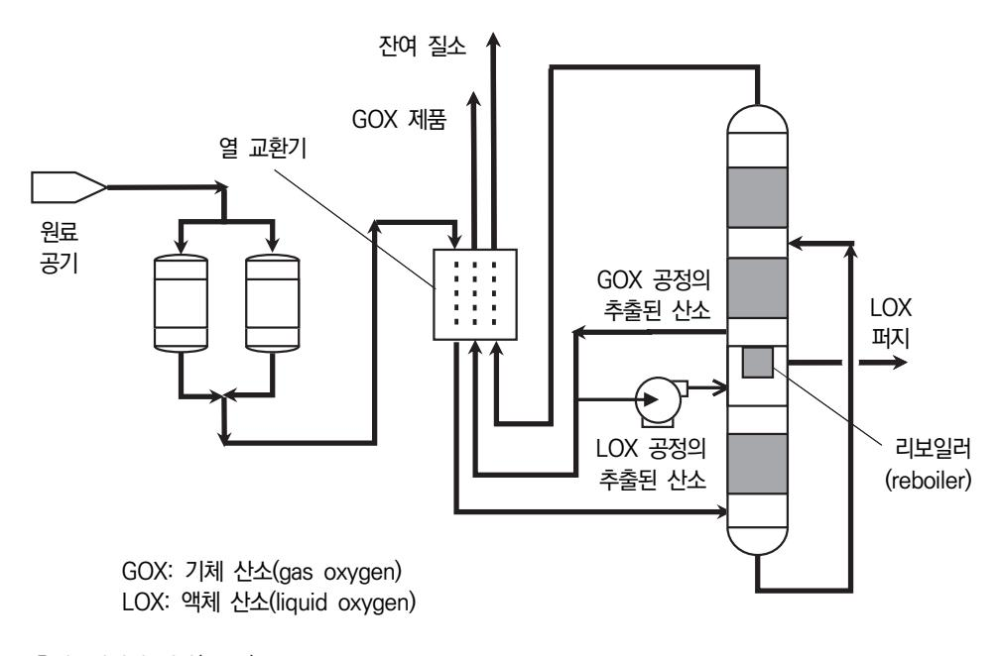

출처: 집필진 제작(2024)

[그림 3-2] 공기 분리 설비의 공정도

- (6) 생산된 제품은 열 교환기에서 유입된 공기 등과 열교환을 거쳐 상온까지 승온한 후에 이송하 며, 필요할 경우에는 냉동기를 이용하여 온도를 조절한다.
- (7) 공기 분리 설비는 생산되는 제품의 종류에 따라 두 가지 공정으로 나뉜다.
  - (가) GOX 공정을 통해 저압 탑 하부의 흐름으로부터 산소를 얻게 되고, 유입 공기를 통해 온도를 상승시킨다. 이때, 고압용 제품을 얻기 위해서는 압축기를 사용하여 가압한다.
  - (나) 펌프를 이용하여 LOX 공정으로 산소가 저압 탑의 하부에서 액체로 얻을 수 있으며, 펌프를 통해 제품을 가압한다. 그리고 열 교환기에서 유입 산소와 열 교환하여 기화시킨다.
- (8) 증류탑의 열적 균형을 유지하기 위해 사용하는 재비기(reboiler)와 응축기(condenser)는 전 형적인 BAHX이며, 작은 온도 차이로 열 교환을 하기 위해 상대적으로 넓은 표면적의 구조 를 가진 열 교환기를 사용하여 효율을 높인다. 여기서, BAHX는 접합 알루미늄 열 교환기 (brazed aluminum heat exchanger)이고, 공기 분리 설비에서 일반적으로 사용하는 알루 미늄판 핀 열 교환기로 응축기 등에 사용하는 설비이다.
- 3. 반도체용 특수 가스를 제조하기 위해 공기 분리법에 의한 제조 공정의 흐름과 절차를 확인한다. 특수 가스의 공기 분리법은 공기에 포함되는 여러 종류의 물질 중에서 필요한 기체만을 추 출하기 위해 서로 끓는점이 다른 원리를 이용한 방식이다. 즉, 압력과 온도를 조절하면서 공기 중의 가스를 성분별로 분리하여 제조하는 공정이며, 가장 일반적인 방식은 초저온 증 류법이다. 주로 고순도의 질소나 아르곤 등의 가스를 생산하기 위해 적용한다.
  - (1) 대기 중에서 공기 원료를 수집하기 위해 압축기 시스템을 확인한다.

[그림 3-3]은 대표적인 산업용 공기 압축기의 외형을 보여 준다. 제조 과정에서 원료 공

69

기는 여과기를 통과한 후에 압축기로 들어온다. 여과기는 압축기(air compressor)를 보 호하기 위해 불순물을 제거하는 장비이며, 압축기에서는 약 5~10kg/cm2 까지 압축한다.

- (가) 원료 공기 중에는 질소, 산소, 아르곤을 비롯하여 미량의 기체들을 함유하며, 가스의 밀 도와 농도를 높이기 위해 압축한다. <표 3-1>은 공기 중에 불순물 농도를 나타낸다.
- (나) 원료 공기를 압축하는 압축기는 3~4단의 원심형 압축 시스템을 사용하며, 압축기의 압력 이 높아 반드시 다단의 연결부를 확인하여야 한다.
- (다) 압축된 공기는 냉각기로 이송하며, 온도를 낮추어 공기 내에 수분을 제거한다.

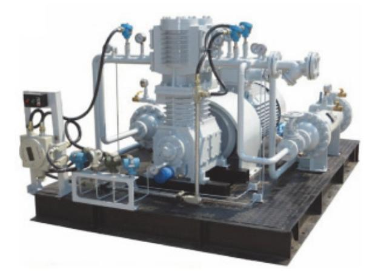

출처: 집필진 제작(2024) [그림 3-3] 산업용 공기 압축기

#### <표 3-1> 공기 중에 불순물 농도

| 종류   | 위험성     | 공기 중 농도 (ppm)                                                   | 전화 공정 제거율 |
|------|---------|-----------------------------------------------------------------|-----------|
| CO2  | 막힘.     | 400                                                             | >99%      |
| SO2  | 부식, 막힘. | 0.1                                                             | 100%      |
| HCl  | 부식      | 0.05                                                            | 100%      |
| H2O  | 막힘.     | 10,000                                                          | 100%      |
| N2O  | 막힘.     | 0.3                                                             | 30~70%    |
| NOX  | 막힘, 반응  | 0.05                                                            | 100%      |
| H2   | 반응      | 10                                                              | 0%        |
| CO   | 반응      | 20                                                              | 0%        |
| O3   | 반응      | 0.2                                                             | 100%      |
| CH4  | 반응      | 10                                                              | 0%        |
| C2H6 | 반응      | 0.1                                                             | 0%        |
| C2H4 | 반응      | 0.3                                                             | 50%       |
| C2H2 | 반응      | 1.0                                                             | 100%      |
| C3H8 | 반응      | 0.05                                                            | 67%       |
| CO2  | 반응      | 0.2                                                             | 100%      |
| C4   | 반응      | 1.0                                                             | 100%      |
|      |         | 출처: 이윤호(2012). 「공기 분리 설비의 안전 설계 및 운영에 관한 지침」. 한국산업안전보건공단. p. 6. |           |

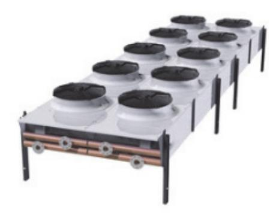

출처: 집필진 제작(2024) [그림 3-4] 공기 냉각기

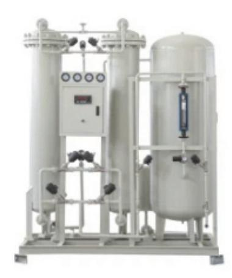

출처: 집필진 제작(2024) [그림 3-5] 공기 정화기

- (2) 압축된 공기는 공기 냉각기로 이송되어 저온으로 냉각되며, 냉각 과정의 흐름을 검토한다. [그림 3-4]는 반도체 공정 가스 제조용 공기 냉각기를 나타낸다. 압축기로부터 이송된 압축 공기는 냉각기에서 저온으로 냉각되며, 가스 입자들은 저온에서 운동 에너지가 감 소하여 액화된다. 이러한 과정에서 압축 공기는 액화점까지 냉각되어 공기 중에 수분을 제거한다.
- (3) 냉각 단계에서 수분을 제거한 원료 공기는 공기 정화기로 이송되며, 나머지 불순물을 제거하 는 정화 과정을 숙지한다. [그림 3-5]는 압축된 공기를 정화하기 위한 정화기의 외형을 나타낸다. 정화 단계에서는 원료 공기 내에 포함된 일산화탄소, 물, 탄화수소 및 다른 불순물 등을 제거한다.
  - (가) 원료 공기에 포함된 불순물은 열 교환기에 막힘 현상을 일으킬 수 있으므로 주의하여야 하며, <표 3-1>은 공기 중에 불순물의 위험 가능성을 나타낸다.
  - (나) 불순물은 증류 단계의 낮은 온도 조건하에서 고체화되며, 이는 장비 내부의 표면에 달라 붙어 사고를 유발할 수 있으므로 제거해야 한다.

- (다) 불순물은 온도 흡착(TSA: temperature swing adsorption)법이나 압력 흡착(PSA)법을 사용하여 내부에 채워진 다공 물질을 통해 흡착한다.
- (라) 흡착 단계를 거친 공기는 재생 공정을 통해 정화되며, 많은 양의 불순물로 인하여 잔류 하는 공기는 다시 투입되어 흡착 과정으로 복귀한다.
- (마) 재생에 필요한 공기의 유량은 통과 유량의 약 10~30% 정도로 다양하다.
- (바) 재생에 사용되는 공기는 생산에 참여하지 않으므로 압축기를 선정할 경우, 필요한 생산 량을 고려하여야 한다.
- (4) 정화된 공기는 분리 시스템으로 이송되며, 끓는점의 차이에 의한 가스를 분리하는 과정을 검 토한다.

정화된 공기는 극저온 증류나 분자체와 같은 기술을 이용하여 서로 다른 끓는점의 차이 에 의해 분리된다. 정화된 공기는 흡착기와 탈착기를 거쳐 압력과 온도를 조절함으로써 분리되어 열 교환기를 통해 공정 가스를 제조하게 된다. [그림 3-6]은 대표적인 열 교환 기의 외형을 나타낸다.

출처: 집필진 제작(2024) [그림 3-6] 대표적인 열 교환기

(5) 정화와 분리 과정을 통과한 가스는 증류 단계에서 증류탑(distillation column)을 거치면서 증류되며, 증류 과정의 원리를 숙지한다.

[그림 3-7]은 가스 증류탑의 구성도를 나타낸다. 증류탑의 원리는 액체 혼합물에서 섞여 있는 혼합물의 각 구성 물질들이 끓는점의 차이를 이용하여 단일 물질로 분리한다. 증류 탑의 원리를 파악하여 증류 공정의 절차를 검토한다.

- (가) 증류탑의 구성도에 대한 그림에서 보듯이, 증류탑의 오른쪽에서 원료 가스가 유입된다.
- (나) 증류탑의 아래 부분에 있는 재비기(reboiler)로부터 열에너지를 공급받아 증류탑으로 들 어간 가스가 가열된다.
- (다) 가스를 가열함에 따라 끓는점이 낮은 물질은 먼저 끊어 증류탑의 아래에서부터 위쪽으로 이동한다.

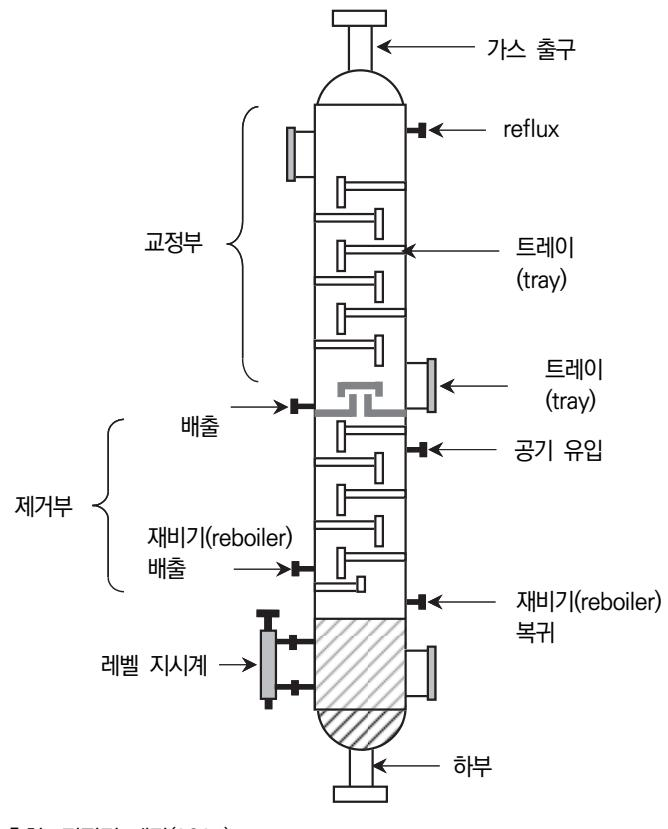

출처: 집필진 제작(2024)

- [그림 3-7] 증류탑의 구성도
- (라) 증류탑 위쪽으로 올라온 물질은 상부에 있는 응축기(condenser)를 통과하면서 액체로 상변화하면서 출구로 배출한다.
- (마) 상변화된 액체는 축적기(accumulator)에 보관되며, 이후에는 증류된 가스가 저장 탱크로 이동한다.
- (바) 증류탑 하부에 남아 있는 끓는점이 높은 물질은 아래에서 맴돌면서 재생하게 된다.
- (6) 증류된 가스는 저장 탱크에 저장되고, 일부 폐가스는 회수하여 유용한 가스는 재생하게 되며, 이는 생산 비용이나 환경에 영향을 주게 된다.

숕 반도체 이온 주입용 특수 가스를 제조하기 위해 제품의 생산 계획과 제조 장비 운용 계획을 수립한 다. 반도체 이온 주입 공정 특수 가스의 생산 계획과 제조 장비 운용 계획을 수립하기 위해 먼저 가스 제조에 대한 생산 공정을 체계적으로 파악하고, 각 제조 장비의 효율적 사용을 계획하여 야 한다. 제조하려는 가스를 선정하면 생산 계획을 세우고, 필요한 제조 장비에 대한 운용 계 획을 수립하여 단계별 절차를 확인한 후, 작업 지시서를 작성한다. 이와 같은 체계적인 제조 장비의 운용 계획을 통해 반도체 이온 주입 공정에서 요구하는 고순도의 특수 가스를 안정적으

로 생산할 수 있다.

1. 특수 가스 제품을 생산하기 위해 생산 계획을 수립한다.

생산하는 제품의 수요를 예상하여 생산 목표를 설정한다. 예측되는 제품을 생산하기 위해 원료 물질을 확보하고, 작업 지시서의 항목을 산정한다.

- (1) 생산 기간별 제품의 수요를 예상하고 목표를 설정한다.
  - (가) 월별, 분기별, 전후반기 및 연간 수요를 예상하여 생산할 제품의 양을 산정한다.
  - (나) 생산 목표를 설정하고 생산 일정을 마련한다.
- (2) 예측되는 자원, 제조 장비 및 인력 등을 산정한다.
  - (가) 생산에 필요한 원료 물질의 양을 계산하고, 물량을 확보한다.
  - (나) 생산을 위한 필요한 제조 공정의 절차에 따라 생산장비의 종류와 개수를 선정한다.
  - (다) 필요한 인력과 역할을 정의하고, 작업 지시서의 항목을 준비한다.
- 2. 특수 가스 제품에 대한 생산 계획을 바탕으로 제조 장비의 운용 계획을 수립한다.

특수 가스 생산을 위한 제조 장비를 선정하면, 공장의 생산 시설과 장비의 상태를 점검하고 장비의 운용 계획을 수립한다. 장비의 정상적인 운용을 위해 장비의 운전 시간, 인력의 배 치와 유지 보수 등에 대한 계획을 수립한다. 그리고 제조 장비의 매뉴얼을 준비하고 안전한 운용을 위해 각종 점검표를 고려하여야 한다.

- (1) 공정에 필요한 사용 시설과 생산 시설을 점검한다.
  - 제조 공장의 사용 시설에 대한 점검은 저장 설비, 배관, 조정기 및 감압 설비 등과 같은 특수 가스를 사용하기 위한 사용 설비, 사무실, 이외 건축물, 소화기, 가스 누출 경보 장치, 재해 설비 및 동력 설비를 포함한 시설을 점검한다. 생산 제조 시설의 점검은 원 료 저장 탱크와 공급 시스템, 압축기, 공기 분리기, 증류탑, 반응기, 배기와 환기 설비, 퍼지 시스템, 제독 설비, 밸브 및 개인 보호구 등을 정기적으로 점검한다.
- (2) 가스 제품을 생산하기 위한 제조 공정을 파악하고, 주요 제조 장비의 운용 상태를 점검한다. 제조 공정이 흐름을 파악하고 주요 공정의 운용 상태를 점검한다. 긴급 상황에 대처할 수 있는 공정 라인을 점검하고, 제조 장비의 정비에 대한 점검을 마련한다. 특히 각종 장비와 밸브의 연결 부분에서 가스 누출에 대해 점검한다. 또한 다음과 같이 제시되는 각종 점검표를 파악하고, 정기적으로 점검하기 위해 정리하여 보고서를 작성할 수 있도 록 준비한다.
  - (가) 일반 점검표
  - (나) 제조 장비 점검표
  - (다) 공급 설비 점검표
  - (라) 배관 및 부품 설비 점검표

- (마) 공정 안전 관리 점검표
- (바) 일반 유틸리티 점검표
- (사) 소방 설비 점검표
- (아) 옥내 설비 점검표
- (자) 개인 보호 점검표
- (3) 제조 장비의 운전 시간과 인력 배치에 대한 계획을 마련하고 장비 운용 계획을 수립한다. 특수 가스의 지속적인 생산을 위해 24시간 장비 운용 계획과 작업자의 인력 배치와 교 대 근무 일정을 마련한다. 장비 고장에 대비하여 비상 유지 보수 계획을 수립한다. 각 제조 장비의 운전과 웅용 절차를 문서화하여 준비한다.
- (4) 재료와 공정에 대한 품질 검사 계획을 수립하고, 검사 결과를 체계적으로 기록할 수 있도록 문서화한다.
  - (가) 입고된 원료 물질의 품질 검사를 통해 순도를 확인한다.
  - (나) 제조 공정 중에 단계별로 생산 가스의 품질을 확인한다.
  - (다) 최종 가스 제품의 순도와 품질을 검사하고, 기록하여 관리한다.
- (5) 작업자의 안전을 위해 제조되는 가스에 대한 취급과 관리에 대한 교육을 실시하고, 비상 대 응을 교육한다.
- (6) 생산 라인의 시뮬레이션을 통해 제품 생산의 실효성을 검증하고, 생산 시나리오를 검토하여 최적의 생산 계획을 예상한다.
- (7) 생산 과정에서 병목 현상을 파악하여 개선 방안을 마련하고, 생산 효율성을 높이기 위해 자 동화 시스템에 대한 계획을 예상한다.
- 3. 특수 가스 제품에 대한 생산 계획과 운용 계획을 바탕으로 작업 지시서를 작성한다.

특수 가스 제조 공정의 흐름을 파악하기 위해 제조 장비를 이용하여 공정의 절차를 순조롭 게 진행하도록 작업 지시서(run sheet)를 마련한다. 고객으로부터 주문을 받으면 가스 제조 사양서를 입수하여 가스 생산에 필요한 정보를 기반으로 다음과 같은 작업 지시서를 작성 한다.

(1) 작업 지시서의 내용을 파악하고, 기본적인 일반 항목을 작성한다.

작업 지시서에서 작업명, 작업 목표, 작성자 및 작업 일자와 같은 일반적인 항목을 작성한다.

(2) 작업 지시서의 원료 물질에 대한 정보를 기록한다.

원료 물질의 정보는 원료명, 화학식, 순도, 입고 일자 및 검사 정보를 기록한다.

(3) 제조 공정에서 사용하는 제조 장비에 대한 정보를 기록한다.

제조 장비의 정보는 장비명, 모델명, 제조사, 장비 개수 및 장비의 작업 시간 등을 기록 한다.

75

### (4) 제품의 유해성과 안전 관리를 위한 취급에서의 안전 수칙, 주의 사항 및 공정 중에 발생하는 고장에 대한 내용을 기록한다(활용 서식 참조).

<표 3-2> 일반적인 가스 작업 지시서

| (                | ) 가스 작업 지시서                          |     |     |       |       |
|------------------|--------------------------------------|-----|-----|-------|-------|
| 일 반           | 작업명 작업 목표 작성자                  |     |     | 작업 일자 |       |
| 원 료 정 보 | 원료명                                  | 화학식 | 순도  | 입고 일자 | 검사    |
| 제 조 장 비 | 장비명                                  | 모델명 | 제조사 | 개수    | 작업 시간 |
| 주 의 사 항 | 가스 제품의 유해성 안전 수칙 및 주의 사항 고장 내역 |     |     |       |       |

## 3-2. 문제점에 대한 해결 방안 도출

학습 목표 • 이온 주입 공정 가스 제조 단계에서 발생한 문제점을 파악하고 해결 방안을 도출할 수 있다.

## 필요 지식 /

- 숔 제조 공장의 안전 관리 제조 공장의 안전 관리
  - 반도체용 특수 가스를 제조하는 공장에서 안전에 대한 문제는 작업자와 공장 주변의 환경에 중 요한 영향을 끼치게 된다. 따라서 가스의 저장, 취급 및 제조하는 제조 공정에서의 사고 방지 를 위해 세심한 주의를 기울여야 하고, 제조 공장의 생산 과정에서는 안전 관리 규정에 따라 관리하여야 한다.
  - 1. 유독성 가스의 누출

유독 가스의 안전은 제조 시설, 장비, 배관 및 밸브 등에서부터 가스 누출이 발생하지 않도 록 정기적인 점검, 보수 및 관리가 필요하다. 유독 가스의 특성과 물성을 파악하여 만일의 사고에 대비하는 안전 조치가 필요하다.

- (1) 가스 누출에 대한 문제
  - (가) As와 P 등의 맹독성 가스의 누출
  - (나) 실란과 같은 발화성 가스의 누출
  - (다) 기타 인체와 환경에 유해한 물질의 누출
- (2) 가연성 및 독성 가스 누출 시, 조치 요령
  - (가) 가스 누출 경보 장치의 알람 확인
  - (나) 누출 가스의 종류와 가스 농도 확인
  - (다) 창문과 출입문 개방
  - (라) 비상 연락망
- (3) 생산 제품의 품질에 대한 문제

외부 가스나 불순물이 제조 장비나 설비 내부로 유입되면 생산 제품의 순도에 치명적인 품질 저하를 일으키게 된다.

2. 사용 및 제조 시설의 안전 점검 항목

제조 시설에 대한 안전 점검 항목은 <표 3-3>과 같다.

<표 3-3> 제조 시설의 안전 점검 항목

| 구 분   | 안전 점검 항목                               |  |  |
|-------|----------------------------------------|--|--|
|       | 가연성 가스 옥외 보관 여부                        |  |  |
|       | 독성 가스 실린더 캐비닛 보관 여부                    |  |  |
|       | 가연성 가스 용기 및 가연성 가스를 사용하는 실험 장비 주변에 화기를 |  |  |
|       | 취급하는 설비 여부                             |  |  |
|       | 가연성 가스 주변 산소와의 이격 거리 유지 여부             |  |  |
|       | 용기 보관 장소 통풍 구조의 적절성                    |  |  |
|       | 정전기 제거 조치 여부                           |  |  |
|       | 배관 등 부식 여부                             |  |  |
|       | 배관, 밸브 등 고정 상태                         |  |  |
|       | 배관 표시 사항 부착 여부                         |  |  |
| 시설 기준 | 가스 누출 경보 장치 설치 및 작동 여부                 |  |  |
|       | 자동 차단 장치 설치 및 작동 여부                    |  |  |
|       | 역화 방지 장치 설치 여부                         |  |  |
|       | 역류 방지 밸브 설치 여부                         |  |  |
|       | 중화 제독 장치 설치 및 작동 여부                    |  |  |
|       | 제독제 보유량 적정 여부                          |  |  |
|       | 개인 보호 장비 보유 및 유지의 적절성                  |  |  |
|       | 실린더 캐비닛 음압 유지 여부                       |  |  |
|       | 비상 전력 설비의 유지 관리 및 기능 작동 여부             |  |  |
|       | 고압가스 용기 외면 경고 표지 부착 여부                 |  |  |
|       | 경계 표시 및 경계책 부착 여부                      |  |  |
|       | 특정-특수 고압가스 사용 신고 여부                    |  |  |
|       | 충전 기한 초과 여부                            |  |  |
|       | 고압가스 용기 고정 상태                          |  |  |
|       | 가스 누출 여부                               |  |  |
| 기술 기준 |                                        |  |  |

출처: 이윤호(2012). 「공기 분리 설비의 안전 설계 및 운영에 관한 지침」. 한국산업안전보건공단. p. 6.

#### 3. 물질 안전 보건 자료(MSDS)

물질 안전 보건 자료는 화학 물질에 대한 여러 가지 정보를 포함하는 자료이다. 즉, 화학 물질의 이름, 성분, 유해성, 위험성, 보관 방법, 취급 시 주의 사항, 보호구, 응급조치 등 많 은 정보를 알려 준다.

(1) 물질 안전 보건 자료의 게시 방법 관련 작업자가 쉽게 보거나 접근할 수 있는 장소에 물질 안전 보건 자료를 항상 게시하 거나 작업자가 쉽게 확인할 수 있도록 비치하여야 한다. (가) 게시 내용

- 1) 물리적 및 화학적 특성
- 2) 독성에 관한 정보

4) 응급조치 요령 등

(나) 게시 장소

(2) 화학 물질의 경고 표시

(가) 경고 표시 방법

3) 폭발이나 화재 시, 대처 방법

2) 사업장 내에 작업자가 가장 보기 쉬운 장소 등

2) 화학 물질을 담은 용기나 포장에 붙이거나 인쇄 부착

1) 화학 물질을 취급하는 공정 내에 안전사고나 직업병 발생 우려가 있는 장소

1) 화학 물질 단위로 유해 · 위험 정보를 명확히 알 수 있도록 경고 표시 작성

급성 독성 경고 발암성

부식성 수생 환경 유해성 고압가스

인화성 산화성 폭발성

출처: 교육미디어(2012). 『물질 안전 보건 자료의 이해』. 안전보건공단 p. 1.

[그림 3-8] 물질 안전 보건 자료의 화학 물질 경고 표시

#### 4. 안전 운전 절차서

안전 운전 절차서는 공장 내에 특수 가스를 제조하기 위한 원료, 제품 및 반제품의 입고, 포장, 저장 및 출고 등의 절차도 포함하여야 한다. 해당 공정의 장비를 운용해 본 적이 없 는 작업자라도 최소한의 운용법이나 다른 작업자의 도움을 받아 운전할 수 있도록 구체적 으로 작성한다. 공정 장비의 운전 방법이나 작업 방법을 일시적으로 변경하여 실행하는 임 시 운전에 대해서도 문서화된 안전 운전 절차서가 있어야 한다. <표 3-4>에 제시한 바와 같이 안전 운전 절차서에는 다음의 내용을 포함하여야 한다.

- (1) 운전 단계별 운전 절차서 내용
  - (가) 최초의 시운전
  - (나) 정상 운전
  - (다) 비상시 운전
  - (라) 정상적인 운전 정지
  - (마) 비상 정지
  - (바) 정비 또는 정기보수 후의 운전 개시
  - (사) 태풍 등 자연재해로 인하여 가동 중단된 설비의 긴급 운전
  - (아) 임시 운전
- (2) 안전 운전을 위한 유의 사항
  - (가) 제조 공정에서 취급되는 화학 물질의 물성과 유해 ․ 위험성
  - (나) 유해 및 위험 물질 누출 예방을 위하여 취해야 할 사항
  - (다) 유해 및 위험 물질 누출 시, 피해를 최소화하기 위해 취해야 할 사항
  - (라) 유해 및 위험 물질 누출 시, 각종 개인 보호구 착용 방법
  - (마) 작업자가 위험물에 접촉되거나 흡입하였을 경우에 취해야 할 응급조치와 절차
  - (바) 유해 및 위험 물질 저장량 조절에 관한 사항
  - (사) 자연재해로 인한 공장 침수 시, 감전 예방 등 안전 대책에 관한 사항
- (3) 정비를 위한 작업 절차에 포함하여야 할 사항
  - (가) 공정 기기와 배관의 개방
  - (나) 꼬리표 부착
  - (다) 제한 공간의 출입
  - (라) 위험 물질을 취급하는 설비나 장비 주변의 중장비 접근
  - (마) 화기 사용 작업

| 일반               | 일반 개요    |        |      |  |
|------------------|----------|--------|------|--|
|                  | 공정 개요    |        |      |  |
|                  | 작성자      |        | 작업일자 |  |
| 공 정           | 공정 시설    |        |      |  |
|                  | 공정 장비    |        |      |  |
| 설 명 서      | 유틸러티     |        |      |  |
|                  | 저장 탱크    |        |      |  |
| 가 동           | 일반 사항    |        |      |  |
|                  | 시운전 준비   |        |      |  |
| 전                | 변경 후 준비  |        |      |  |
| 시 운 전      | 일반 사항    | 시운전 준비 |      |  |
|                  |          | 승온 절차  |      |  |
|                  | 공정 시설    |        |      |  |
|                  | 유틸러티     |        |      |  |
| 정                | 일반 사항    |        |      |  |
| 상                | 공정 시설    |        |      |  |
| 운                | 공정 장비    |        |      |  |
| 전                | 유틸러티     |        |      |  |
| 운                | 일반 사항    |        |      |  |
| 전                | 공정 시설    |        |      |  |
| 중                | 공정 장비    |        |      |  |
| 지                | 유틸러티     |        |      |  |
| 비 상 정 지 | 일반 사항    |        |      |  |
|                  | 공정 시설    |        |      |  |
|                  | 공정 장비    |        |      |  |
|                  | 유틸러티     |        |      |  |
| 안 전 관 리 | 공장 안전 운전 |        |      |  |
|                  | 유지 보수 관리 |        |      |  |
|                  | 개인 안전    |        |      |  |
|                  | 비상 조치 절차 |        |      |  |
|                  | 참고 자료    |        |      |  |

<표 3-4> 일반적인 안전 운전 절차서

( ) 안전 운전 절차서

## 수행 내용 / 문제점에 대한 해결 방안 도출하기

#### 재료·자료

- 반도체 재료 제조 기술 자료
- 국제표준화기구(ISO: International Organization for Standardization) 표준화 문서
- 물질 안전 보건 자료(MSDS)
- 생산 계획서
- 반도체 재료 작업 절차서
- 반도체 재료 작업 표준서
- 반도체용 이온 주입 공정 가스 원재료에 대한 자료
- 반도체 설비 목록 및 매뉴얼
- 반도체 제조 공정도

#### 기기(장비 ・ 공구)

- 반도체용 이온 주입 공정 가스 제조 장비
- 반도체용 이온 주입 공정 가스 측정 장비
- 반도체용 이온 주입 공정 가스 검사 장비
- 반도체용 이온 주입 공정 가스 분석 장비

#### 안전 ・ 유의 사항

- 반도체 이온 주입 공정에 대한 이론적 지식을 습득하고, 취급하는 가스의 성질과 특성을 바 탕으로 관리 주의 사항에 유의한다.
- 반도체 이온 주입 공정에서 사용하는 특수 가스에 대한 부식성, 맹독성, 인화성 및 발화성 등의 특성을 파악하고, 해당 가스에 대한 장비, 공급 시설, 관리 및 주의 사항을 사용하기 전에 미리 숙지하여야 한다.
- 물질 안전 보건 자료를 통해 특수 가스를 취급하기 전에 파악하고, 독성 가스의 경우에는 제독 설비에 대한 일반 사항, 제독 설비 및 제독 방법 등 안전 교육을 실시한다.

수행 순서

- 숔 반도체 이온 주입 공정용 특수 가스 제조 과정에서 발생할 수 있는 문제점을 파악하고, 이에 대한 해결 방안을 도출한다. 반도체 이온 주입 공정용 가스 제조 과정에서 발생할 수 있는 가스 누출 사고와 같은 문제점과 이에 대한 해결 방안을 파악하는 것은 제조 공장 주변의 환경과 작업자의 안전에 매우 중요하 다. 작업 지시서에 공정 흐름을 근거로 각 제조 과정에서 발생할 수 있는 주요 문제점과 해결 방안을 다음과 같이 정리한다. 이와 같이 특수 가스 제조 과정에서 발생할 수 있는 다양한 안 전사고와 문제에 대한 방안을 미리 준비함으로써 제조 공정의 안정성과 제품 품질을 보다 더 쉽게 관리하고 유지할 수 있다.
  - 1. 특수 가스 제조를 위한 원료 물질의 입고에서 검사 과정까지 문제점과 해결 방안을 고려한다.
    - (1) 원료 물질의 입고 시에 문제점을 예측한다.
      - (가) 원료 물질에 불순물이 포함되면 제품의 최종 품질에 영향을 주게 된다.
      - (나) 공급사의 문제로 인해 원료 물질의 성분이나 품질에 변동이 발생할 수 있다.
    - (2) 발생할 수 있는 문제에 대한 해결 방안을 고려한다.
      - (가) 원료 물질의 입고 시, 정기적으로 순도와 불순물 함량을 검사하여야 한다.
      - (나) 다수 공급사를 확보하여 원료 물질의 공급처를 다변화하며, 공급사에서 입고되는 원료 물질의 품질을 균일하게 관리하고 가능한 문제를 최소화한다.
      - (다) 원료 물질에 대한 품질 관리 기준을 강화하고, 검사를 통해 발생할 수 있는 문제를 즉시 처리할 수 있도록 체계를 구축한다.
  - 2. 특수 가스 제조를 위해 사용하는 공기분리 설비의 운용 과정에서 발생할 수 있는 문제점과 해결 방안을 검토한다.
    - (1) 공기 분리 설비의 운용에서 문제점을 고려한다.
      - (가) 공기 분리 설비로 유입되는 공기의 질은 여러 문제의 원인이 될 수 있다.
      - (나) 공기 분리 장치의 성능이 저하되면, 이로 인하여 산소, 질소, 아르곤의 분리 효율이 낮아 진다.
      - (다) 공기 분리 설비의 고장으로 인하여 생산이 중단된다.
    - (2) 공기 분리 설비의 운용에서 발생하는 여러 문제에 대한 방안을 검토한다.
      - (가) 제조 공장 주변의 공기 질을 정확히 알 수 없기 때문에 주변의 성상의 변화를 확인하여 야 한다.
      - (나) 공장 주변의 대기 환경은 계절에 따라 바람 방향과 기후가 변화되므로 장시간의 모니터 링이 필요하다.

83

- (다) 다른 제조 공정에서 불규칙적으로 배출하는 유체는 공기 분리 설비가 위치한 지역의 환 경이나 공기 상태를 순간적으로 변화시킬 수 있다.
- (라) 공기 분리 설비의 정기적인 점검과 유지 보수를 통해 지속적으로 일정한 성능을 유지하 도록 관리한다.
- (마) 예비 소모품과 주요 부품을 마련하여 고장 사고가 발생할 경우에 신속히 교체할 수 있도 록 준비한다.
- (바) 실시간 모니터링 시스템을 도입하여 장비의 상태를 지속적으로 감시한다.
- 3. 가스 정제 과정에서 발생할 수 있는 문제점을 예측하고, 해결 방안을 검토한다.
  - (1) 정제 과정에서 문제점을 고려한다.
    - (가) 정제 시스템의 고장으로 인하여 불순물이 완전히 제거되지 않는 정제 불량을 일으킬 수 있다.
    - (나) 정제 과정에서 가스가 오염될 가능성이 있다.
  - (2) 정제 과정에서 발생할 수 있는 문제에 대한 해결 방안을 고려한다.
    - (가) 정기적으로 정제 시스템을 세척하고, 소모품을 교체하여 오염을 방지하여야 한다.
    - (나) 정제 과정에서 제조되는 가스의 순도를 실시간으로 모니터링하고, 문제 발생 시에 필요 한 응급조치를 실시한다.
    - (다) 정제 시스템에서 가장 중요한 필터를 정기적으로 교체하여 성능과 품질을 균일하게 유지 한다.
- 4. 가스 압축과 저장 과정에서 발생할 수 있는 문제점을 예측하고, 해결 방안을 검토한다.
  - (1) 압축과 저장 과정에서 문제점을 고려한다.
    - (가) 압축기의 가동 부품들이 마찰에 의해 연소되거나 압축기의 재질이 산소 분위기에서 쉽게 연소되어 고장을 일으킴으로써 제품 생산이 중단되거나 차질이 발생할 수 있다.
    - (나) 저장 용기에서 가스가 누출되어 문제를 초래할 수 있다.
  - (2) 압축과 저장에서 발생할 수 있는 문제에 대한 해결 방안을 검토한다.
    - (가) 압축기의 정기적인 점검과 유지 보수를 통해 고장을 예방하고, 작업자에게 기본적인 안 전 관리 방법에 대한 교육을 실시한다.
    - (나) 가스 저장 용기에 안전밸브와 가스 누출 경보 감지기를 설치하여 누출을 신속히 차단하 거나 감지할 수 있도록 대응 조치를 마련한다.
    - (다) 가스 누출 사고가 발생할 경우에 작업자의 안전을 위해 신속히 대응할 수 있는 비상 대 응 계획을 마련하고 안전사고에 대해 정기적인 훈련과 교육을 실시한다.
- 5. 품질 검사 과정에서 발생할 수 있는 문제점과 해결 방안을 검토한다.

(1) 품질 검사 과정에서 문제점을 고려한다.

(가) 품질 검사 과정에서 누락되거나 불충분하게 검사가 수행될 수 있다.

- (나) 검사 장비의 오류로 인하여 불량품이 정상품으로 검증되거나 반대로 검증되는 사고가 발 생할 수 있다.
- (2) 품질 검사 과정에서 발생할 수 있는 문제에 대한 해결 방안을 검토한다.
  - (가) 자동화된 품질 검사 시스템을 도입하여 검사의 정확성과 일관성을 높이는 방안을 마련한 다.
  - (나) 주요 품질 검사의 항목에 대한 지표에 대해 다중 검사를 실시함으로써 오류 가능성을 최 소화한다.
  - (다) 검사 장비를 정기적인 점검하고, 교정을 실시하여 품질 검사에 대한 정확성을 유지한다.
- 6. 안전 및 환경 관리에 대한 문제점과 해결 방안을 검토한다.
  - (1) 안전 및 환경 관리에서 문제점을 고려한다.
    - (가) 제조 과정에서 생산되는 화학 물질이 누출되어 작업자와 환경에 위험을 초래할 수 있다. 대부분의 공정 가스는 유해성 가스임으로 주의하여야 한다.
    - (나) 제조 과정에서 발생하는 폐기물을 처리하는 단계에서 문제가 발생할 수 있다.
  - (2) 안전 및 환경 관리에서 발생할 수 있는 문제에 대한 해결 방안을 검토한다.
    - (가) 작업자들에게 정기적인 안전 교육을 실시하고, 사고 발생 시에 신속하게 대처할 수 있도 록 비상 대응 방안을 마련한다.
    - (나) 폐기물 관리 시스템을 강화하고, 환경 규제를 준수하여 처리한다.
    - (다) 작업 지시서에 따르는 모든 작업에 대한 안전 절차를 마련하고 준수하도록 교육한다.
- 숕 반도체 이온 주입용 특수 가스를 제조하기 위해 제조 공정에서 사용하는 제조 장비의 안전 관리에 대해 숙지한다.

공기 분리 설비로 유입되는 공기의 질은 부식, 막힘 및 내부 유체 사이에 반응을 통해 위험성

- 이 있으며, 이는 여러 종류의 사고의 원인으로 작용할 수 있다. 따라서 공기의 상태를 지속해
- 서 모니터링하여야 하고, 제조 장비의 안전 관리 또한 매우 필요하다.
- 1. 공기 분리법에 의한 제조 공정에서 재비기와 응축기의 안전 관리를 확인한다. 재비기(reboiler)와 응축기(condenser)의 안전 관리를 위해 다음과 같은 과정에서 주의를 기울여야 한다.
  - (1) 재비기와 응축기는 액체 산소가 부분적으로 끓면서 탄화수소가 액체 내에 잔류하게 된다.
  - (2) 재비기는 구조적으로 많은 작게 분리된 유체 흐름 통로들이 수평으로 구성되어 있다.

- (3) 재비기는 개별 통로로 구성되며, 운전 중에 항상 동일하게 흐르는 것이 어렵기 때문에 지속 해서 균일하게 흐를 수 있도록 주의하여야 한다.
- (4) 재비기는 설계, 운전 및 주기적인 해동 절차에 의해 탄화수소류가 공정 내부에 축적되면서 일정 수준 이상으로 올라가지 않도록 유지하여야 한다.
- 2. 공기 분리법에 의한 제조 공정에서 열 교환기의 안전 관리를 확인한다.

펌프 LOX(liquid oxygen) 공정 중에 산소 조건에서 끓는 현상이 발생하므로 추가적인 안 전 설계가 필요하며, 다음과 같은 사항에 대한 위험성을 고려하여야 한다.

- (1) 공정상 끓는 현상을 가진 산소는 전형적인 '건조 끓음'의 현상이 발생한다.
- (2) 압력은 저압력 탑보다 높기 때문에 점화와 폭발 등의 위험성이 커지게 된다.
- (3) 국부적이거나 전체적으로 축적되는 탄화수소류가 점화물로 작용할 수 있다.
- (4) 이산화탄소와 아산화질소의 농도는 국부적인 '풀 끓음'을 발생시키는 침전 현상이 일어난다. 따라서 이를 방지하기 위해 반드시 용해도의 50% 이하로 조절하여야 한다.
- (5) 산소의 이송 유속은 재순환이나 증류 현상을 방지하기 위해 작은 액체 방울까지 이송할 수 있도록 충분한 속도로 유지하여야 한다.
- (6) 제조 공정 시스템을 오랫동안 가동하지 않을 경우에는 탄화수소류가 공정 내에 축적되지 않 도록 완전히 배수시켜야 한다.
- (7) 열 교환기 통로 사이의 이동이나 다른 통로와의 연결은 균일하게 흘러갈 수 있도록 설계하여 야 한다.
- (8) 유입되는 LOX 내에 잔류물을 완전히 제거하여야 하며, 이는 국부적인 막힘 현상을 방지하기 위한 것이다.
- (9) 통로 배열과 공정 설치 조건이 폭발 가능성을 최소화하도록 설계하여야 하고, 설비의 봉합은 작업자에게 노출되지 않도록 위험을 최소화하여 설계한다.
- 3. 공기 분리법에 의한 제조 공정에서 압축기의 안전 관리를 확인한다. 대부분의 제조 공정 설비에서 산소 압력은 저압 탑 압력 이상이므로 별도의 충압이 요구된 다. 산소 압축기의 잠재적인 위험성을 방지하기 위해 다음과 같은 사항을 주의하여야 한다.
  - (1) 국부적인 높은 압력은 높은 순도의 산소로부터 만들어지며, 많은 금속류 설비 재질들이 산소 환경에서는 쉽게 연소될 수 있으므로 주의하여야 한다.
  - (2) 압축기의 내부에 가동 부품들은 마찰열로 인하여 쉽게 연소될 수 있다.
  - (3) 용접 분진, 녹 입자, 먼지, 샌드 블라스팅 입자와 같은 미량의 입자에 의한 오염 가능성은 완 전히 제거하기는 어렵다. 따라서 오염 가능성을 낮추기 위해 별도의 제거 절차가 필요하다.
  - (4) 산소 압축기의 기본적인 안전 관리 방법은 작업자에게 설비를 노출하지 않도록 설계하는 것 이고, 또한 장비의 손상을 최소화할 수 있도록 안전 관리를 유지하는 조치가 필요하다.

<표 3-5> 공기 중에 불순물 농도

| 운전 방법                                                                                        | 유의 사항                                             |  |
|----------------------------------------------------------------------------------------------|---------------------------------------------------|--|
| ⁃ 전처리 정화 설비 이산화탄소 분석                                                                         | ⁃ 전처리 정화 운전이 안전한지를 확인한다.                          |  |
| ⁃ LOX 퍼지로 공기의 농도를 0.2% 이하로 유 지                                                            | ⁃ 재비기 섬프(sump)에 오염이 발생하지 않는지를 확인한다.            |  |
| ⁃ 탄화수소류 분석 농도가 450ppm 이하로 유 지                                                             | ⁃ 재비기 섬프(sump) 내 탄화수소류가 없는지를 확인한다.             |  |
| ⁃ 배치 분석                                                                                      | ⁃ 물질별 농도가 허용 가능한 수준임을 확인한다.                       |  |
| ⁃ 다운플로(downflow) 재비기 배출시 이산화탄 소 농도 < 용해도의 6%, 아산화질소 농도 < 용해도의 1%                       | ⁃ 이산화탄소와 아산화질소가 일정 농도 이상 축적 되지 않도록 주의한다.       |  |
| ⁃ 서모사이폰(thermosyphone) 재비기는 완전 히 잠기도록 함.                                                  | ⁃ 국부적으로 높은 농도가 축적되는 것을 방지하기 위한 적절한 환경인지를 확인한다. |  |
| (주의 사항) ⁃ 전처리 정화 설비는 일정 시간 후에는 가동을 중지해야 할 필요가 있다. ⁃ 최소 퍼지(purge) 비율을 공기의 0.1%까지 감소시킨다. |                                                   |  |

출처: 이윤호(2012). 「공기 분리 설비의 안전 설계 및 운영에 관한 지침」. 한국산업안전보건공단. P.14.

- (5) 설비 재질이나 산소 압축기는 산소용으로 제작하며, 특정 재질로 구성되기 때문에 쉽게 연소 및 손상되지는 않는다. 다만, 산소와 다른 외부 물질이 접촉하는 것을 방지하여야 한다.
- (6) 산소 압축기는 최초 설치와 정비 후에 철저하게 세정하여야 하며, 항상 청결이 유지되도록 조심하여야 한다. 이때, 흡입 필터는 응축기로 유입되는 입자를 제거하여 잠재적인 점화원을 제거하여야 한다.
- (7) 공기 분리 설비의 운전 시에는 <표 3-5>와 같이 주요 공정 인자를 고려하여야 한다.
- 4. 제조 공정에서 사용하는 장비와 설비의 재질에 대한 선택과 안전 관리를 확인한다. 제조 장비와 설비의 재질 선택에 대한 안전 관리를 위해 다음과 같이 주의를 기울여야 한 다. 이는 잠재적인 위험성을 방지하기 위한 것이다.
  - (1) 대부분의 상온 설비나 배관에 주로 탄소강을 사용한다. 그러나 공정 과정의 초저온에서는 -170℃까지 견디도록 설계하여야 한다.
  - (2) 대부분의 공기 분리 설비는 정상 또는 비정상 운전 시, 산소 과잉 현상이 발생할 수 있다. <표 3-6>은 공정 장비의 재질 선택에 대한 자료이다. 여기서, 구리, 알루미늄 그리고 스테인 리스 스틸은 모두 초저온에 적합하다.
  - (3) 가연 특성은 산소 순도, 산소 압력 및 물질 구조와 밀접한 관련이 있으며, 일반적으로 높은 압력, 높은 순도와 얇은 재질일 경우에 증가한다.
  - (4) 알루미늄은 불순물 농도가 증가할수록 가연성이 크게 감소하고, 산소 순도와 밀접하다.

<표 3-6> 공정 장비의 재질의 선택

| 항목           | 탄소강 | 구리     | 알루미늄 | 스테인레스 스틸 |
|--------------|-----|--------|------|----------|
| 저온 적합성       | 부적합 | 적합     | 적합   | 적합       |
| 상대 강도a       | 2   | 4      | 3    | 1        |
| 비용           | 낮음  | 매우 높음. | 중간   | 높음       |
| 산소 환경에서 가연성b | 중간  | N/Ad   | 낮음   | 낮음       |
| 연소 강도c       | 중간  | N/A    | 높음   | 중간       |

a. 4가지 물질 중에 강도에 대한 상대적인 값. 1=중간, 4=가장 낮음.

b. 산소 환경 내에 금속이 초기 연소 시의 정도를 의미

c. 연소 시작 후에 에너지 방출 시의 상대적인 측정값

d. 구리는 산소 환경에서 가연성 물질이 아님.

출처: 이윤호(2012). 「공기 분리 설비의 안전 설계 및 운영에 관한 지침」. 한국산업안전보건공단. P.15.

- (5) 산소 취급 시, 재질 선택과 작업자의 위험을 최소화하기 위해 다음과 같은 사항을 고려하여 야 한다.
  - (가) 물질이 연소되지 않도록 가능한 모든 점화물을 제거한다. 높은 압력의 산소를 사용하는 탄소강 배관을 깔끔하게 세정하면 점화물이 제거되어 탄소강은 사용 가능한 재질로 적용 된다.
  - (나) 모든 점화원을 제거하는 것이 불가능하다면, 연소가 전파되지 않도록 주의하여야 한다. 이를 통해 물질은 안전하게 사용될 수 있고, 최대한 억제하는 것이다.
  - (다) 화재 전파가 일어나지 않는다면 알루미늄 배관은 사용이 가능하고, 산소 환경에서 알루 미늄을 사용 시, 가능한 모든 점화원을 제거하기 위해 세척하여야 한다.
- 5. 제조 장비나 배관에서 가스 누출 시, 산소 과잉이나 결핍과 같은 환경이 발생할 경우에 안전 관 리를 확인한다.
  - (1) 초저온의 액체로 누출할 경우, 상온의 외부 공기와 접촉하면서 연무가 발생하면, 바람 반대 방향으로 대피하고, 다른 작업자가 위험성을 알 수 있도록 조치를 취해야 한다.
  - (2) 산소 과잉은 쉽게 점화되지 않은 금속과 같은 물질들을 점화시키거나 연소시킬 수 있는 환경 을 조성한다.
  - (3) 흡연은 가장 위험한 점화원이며, 산소 과잉 시에 작업자가 흡연 중 몸에 화재가 발생할 가능 성이 높아진다.
  - (4) 공장 주변에서 산소 과잉 시, 상주 인원이나 작업자들이 사망이나 심각한 재해를 당할 확률 은 <표 3-7>과 같다.
  - (5) 공정 내부와 외부에 산소 누출될 가능성과 위험성을 감소시키는 방법은 다음과 같다.

<표 3-7> 공정 장비의 재질의 선택

| 산소 농도 | 공장 외부에서 확률 | 공장 외부에서 확률 |
|-------|------------|------------|
| 25%   | 0.0175%    | 1.0085%    |
| 30%   | 0.17%      | 0.085%     |
| 35%   | 0.53%      | 0.265%     |
| 40%   | 2.8%       | 1.4%       |

출처: 이윤호(2012). 「공기 분리 설비의 안전 설계 및 운영에 관한 지침」. 한국산업안전보건공단. p. 18.

- (가) 공정 내 점화원 제어하여야 한다.
- (나) 산소 방출이 가능한 모든 공정에 비상 차단 밸브를 설치하여 공정 가동을 중지하거나 차 단한다.
- (다) 작업자들이 출입하는 가능한 모든 밀폐 공간의 산소 배관이나 용기를 제거한다.
- (라) 화기 작업, 용기, 피트(pit) 및 출입 절차를 확립한다.
- (마) 산소 과잉 현상을 모니터링한다.
- (바) 산소 벤트 시스템(vent system)의 위험성을 반영하여 설계하고, 제조 장비의 위치를 선 정한다.
- (사) 소방 활동에 대한 교육과 훈련을 실시한다.
- (아) 연소 가능한 물질들을 사용하는 공장 내에서의 정리와 정돈을 강화한다.
- (자) 공장 내부와 외부에서 안전사고를 위한 비상 대응 훈련을 실시한다.
- (6) 공장 내에서 산소 결핍으로 인한 위험성에 대한 안전 관리를 숙지한다.
  - (가) 높은 농도의 불활성 기체인 질소나 아르곤 등에 의해 작업자가 산소 결핍과 같은 재해를 당면할 수 있다.
  - (나) 개방된 공간에서 질소나 아르곤 누출로 산소 결핍의 환경이 조성되기가 어렵지만, 출입 이 가능한 건물, 밀폐 공간이나 벽으로 둘러싸인 공간 등에서는 산소 부족으로 인한 문 제가 커질 수 있으므로 <표 3-8>과 같은 현상에 대해 숙지하여야 한다.
  - (다) 대표적인 산소 결핍 위험성은 다음과 같이 나타난다.
    - 1) 질소의 유입을 예측하지 못한 공간에 작업자가 출입할 때
    - 2) 질소 퍼지가 실시된 공간을 사전에 확인하지 못하고, 출입하여 작업할 때
  - (라) 소량의 질소가 누출하여 공장 내부에 정체되어 잔류하는 경우, 산소 결핍 현상을 발생할 수 있는 밀폐 공간에는 다음과 같은 조치가 필요하다.
    - 1) 팬 가동 중지 시, 경보가 울리는 강제 배기 장치를 설치하여야 한다.

89

<표 3-8> 공정 장비의 재질의 선택

| 산소 농도  | 인체 반응 현상                                                       |
|--------|----------------------------------------------------------------|
| 15~18% | 인체 제어를 잃음.                                                     |
| 12~15% | 호흡 속도가 증가함. 인체 제어와 인지력이 어려움. 판단은 가능함.                    |
| 10~12% | 호흡이 곤란함. 판단력이 떨어지며, 입술이 파란색으로 변함.                           |
| 8~10%  | 정신 착란, 구토, 의식을 잃음.                                             |
| 6~8%   | 8분 노출 시 100% 사망. 6분 노출 시 50% 사망. 4 ∼ 5분 노출 시 회복 치료가 필요함. |
| 4%     | 40초 내 혼수 상태 / 호흡이 멈춤 /사망                                       |

출처: 이윤호(2012). 「공기 분리 설비의 안전 설계 및 운영에 관한 지침」. 한국산업안전보건공단. p. 19.

2) 산소 농도를 주기적으로 측정한다.

3) 용기, 핏트(pit) 및 출입 절차로 밀폐 공간 출입 프로그램을 구축한다.

4) 호흡 보호구를 착용한다.

5) 구조용 인체 보호 장구를 준비한다.

6) 질식 위험이 배제된 벤트를 설계한다.

- 숖 특수 가스의 제조나 취급과 관련한 작업자는 정기적인 훈련과 더불어 비상 대응에 대한 계획을 수립 하여 안전사고에 대비하여야 한다.
  - 1. 화학 사고에 대비하여 정기적으로 실시하는 비상 대응 계획을 준비하여야 하며, 대응 계획에는 다 음과 같은 주요 사항을 포함하여야 한다.
    - (1) 관련법에 따른 사항을 검토한다.
    - (2) 경보 시스템에 관련된 조항을 확인한다.
    - (3) 긴급 상황이 발생할 경우 개인 행동 요령에 대한 목록과 절차를 검토한다.
    - (4) 근급 상황에서 현장 탈출 방법, 인원 점검 및 행방 불명자 구조와 수색에 대한 계획을 검토 한다.
    - (5) 현장 비상 대응팀, 개인 행동 요령, 연락 수단 및 지원 방법 등을 검토한다.
    - (6) 비상 설비에 관련된 조항을 확인한다.
    - (7) 비상 조명등과 같은 비상 전원 공급 장치를 확인한다.
    - (8) 소방대, 구급차, 경찰 및 지역 병원 등과 같은 비상 공공 서비스와 비상 연락 방법에 대한

내용을 확인한다.

- (9) 특정 예상 시나리오에서 다루는 위험성 평가와 절차를 검토한다.
- (10) 소방 설비, 응급 처치 요건 호흡 장비 및 특수 보호복 등 비상 설비에 대한 정기 점검, 위 치 및 교육에 대해 정립한다.
- (11) 유해 물질이나 비상 설비의 위치에 대한 배치도를 확인한다.
- (12) 모든 생산물, 용기 및 용기 밸브에 대한 자료를 검토한다.
- 2. 안전사고에 대비하고자 비상 대응 계획은 미리 시나리오를 작성하여 최악의 사고와 이에 대응하 는 대안의 시나리오를 준비한다.

<표 3-9>는 시나리오의 내용을 나타내며, <표 3-10>은 피해 예측 결과를 나타낸다.

| 비상 대응 계획에 포함할 사항                                           | 세부 내용                                                                               |
|------------------------------------------------------------|-------------------------------------------------------------------------------------|
| 사고 시나리오 개요(시나리오 설명, 피 해 영향 범위, 화학 물질 기본 정보 포함)       | 시나리오 설명, 피해 영향 범위, 화학 물질 기본 정보 (NFPA 지수, 인화점, 발화점, 색깔, 증기 비중, 물 반응 성 물질 여부 등) |
| 내·외부 비상 연락                                                 | 내부 연락망, 외부 연락망(유관 기관, 병원, 폐기물 처리 업체 등)                                           |
| 비상 대피로 및 대피 장소                                             | 1차, 2차(필요시 3차) 대피 장소                                                                |
| 내·외부 차량 통제 위치                                              | 차량 통제 위치 및 담당자 지정                                                                   |
| 공정 비상 조치 사항                                                | 자동/수동 조치, 기타 조치 사항, 차량 통제 위치                                                        |
| 비상 대응 인력 구성                                                | 주간/야간, 지원 인력                                                                        |
| 누출원 직접 차단 및 억제 조치 계획                                       | 누출 물질의 위치 및 특성에 따른 대응팀 대응                                                           |
| 화재·폭발 및 누출에 따른 비상 대응 (공정의 비상 조치 사항에 포함하여 작 성할 수 있음.) | 화재·폭발과 누출에 따라 대응 방법 검토                                                              |
| 비상 대응 설비(소방, 감지, 저감 시설 등)                               | 소방 설비, 감지 설비, 저감 설비                                                                 |
| 비상 대응 보호구 및 방호 장구                                          | 종류 및 수량                                                                             |
| 비상 대응 방제 물품                                                | 종류 및 수량                                                                             |
| 비상 대응 중 고려 사항                                              | 비상 대응 중 일반적인 고려 사항 설명                                                               |
| 응급 의료 및 환자 후송 계획                                           | 응급 의료 기관 연락처(거리) 및 전달 사항                                                            |
| 기타 필요한 사항                                                  | 기타 사항                                                                               |

<표 3-9> 시나리오별 비상 대응 계획 내용

출처: 이형섭(2017). 「공정 안전 보고서의 통합 서식 작성 방법에 관한 지침」. 한국산업안전보건공단. p. 22.

<표 3-10> 시나리오와 피해 예측 결과

| 구분      |          |                      | 최악의 시나리오              | 대안의 시나리오              |
|---------|----------|----------------------|-----------------------|-----------------------|
|         |          | 풍속(m/s)              |                       |                       |
| 기상 및 |          | 대기 안정도               |                       |                       |
|         |          | 대기 온도(℃)             |                       |                       |
| 지형 자료   |          | 습도(%)                |                       |                       |
|         |          | 표면 거칠기(m)            | □ 시골 □ 도시 □ 물위        | □ 시골 □ 도시 □ 물위        |
|         |          | 물질명                  |                       |                       |
|         |          | 물질의 상태               | □ 기체 □ 액체 □ 2상(기체+액체) | □ 기체 □ 액체 □ 2상(기체+액체) |
| 물질      |          | 설비명                  |                       |                       |
| 및       |          | 운전 압력(MPa)           |                       |                       |
| 설비      |          | 운전 온도(℃)             |                       |                       |
|         |          | 누출구의 크기(mm2 )     |                       |                       |
|         |          | 웅덩이 크기(m2 )       |                       |                       |
|         |          | 직접 계산(kg/s)          |                       |                       |
|         | 누출 결과 | 웅덩이(kg/s)            |                       |                       |
| 피       |          | 설비/배관(kg/s)          |                       |                       |
| 해 결  | 피해 결과 | 화재-복사열이 미치는 거리(m) |                       |                       |
| 과       |          | 폭발-과압이 미치는 거 리(m) |                       |                       |
|         |          | 확산 결과-인화성(m)         |                       |                       |
|         |          | 확산 결과-독성(m)          |                       |                       |

출처: 이형섭(2017). 「공정 안전 보고서의 통합 서식 작성 방법에 관한 지침」. 한국산업안전보건공단. p. 48.

### 학습 3 교수·학습 방법

#### 교수 방법

- 반도체 이온 주입 공정용 특수 가스의 제조법과 종류에 대해 정리하여 설명한다.
- 공기 분리 장치에 의한 특수 가스 제조 방법의 흐름을 간략하게 설명한다.
- 특수 가스 제조 공정에서 공정의 개요와 흐름을 정리하여 지도한다.
- 이온 주입 공정용 특수 가스 제조를 위한 생산 계획과 장비 운용 계획에 대해 설명한다.
- 유해성 특수 가스를 제조하는 공장 시설에서 가스 누출에 대한 안전 관리 및 안전 점검에 대해 정리하여 설명한다.
- 이온 주입 공정용 특수 가스의 물질 안전 보건 자료(MSDS)에 대한 정보 내용과 경고 표시 에 대해 설명한다.
- 특수 가스 제조 공정에서 과정별로 발생할 수 있는 문제점과 해결 방안을 정리하여 설명한다.
- 제조 공정에서 사용하는 장비의 안전 관리에 대해 지도한다.

#### 학습 방법

- 반도체 특수 가스를 생산하기 위한 다양한 제조법의 종류를 학습한다.
- 가스 제조 공정에서 공기 분리 장치의 개요와 제조 단계의 흐름을 공부한다.
- 이온 주입 공정용 가스를 제조하기 위한 생산 계획과 장비 운용 계획에 대해 정리하여 공부 한다.
- 특수 가스를 생산하기 위한 작업 지시서의 항목과 작성 방법에 대해 학습한다.
- 유해성 특수 가스의 제조 공장에서 가스 누출에 대한 안전 관리와 안전 검검에 대해 공부한다.
- 대상 화학 물질의 물질 안전 보건 자료에 대한 유해성 정보 내용과 경고 표시에 대해 학습 한다.
- 특수 가스 제조를 위한 안전 운전 절차서에 대한 내용과 유의 사항 등을 공부한다.

93

## 학습 3 평 가

#### 평가 준거

• 평가자는 학습자가 학습 목표를 성공적으로 달성하였는지를 평가해야 한다.

#### • 평가자는 다음 사항을 평가해야 한다.

|                     | 학습 목표                                                     |  | 성취 수준 |   |  |
|---------------------|-----------------------------------------------------------|--|-------|---|--|
| 학습 내용               |                                                           |  | 중     | 하 |  |
| 이온 주입 공정 가          | - 생산 관련 부서로부터 입수한 생산 계획에 따라 장비 운용 계획을 수립할 수 있다.        |  |       |   |  |
| 스 제조                | - 작업 지시서와 장비 운용 매뉴얼에 따라 이온 주입 공정 가 스를 제조할 수 있다.        |  |       |   |  |
| 문제점에 대한 해결 방안 도출 | - 이온 주입 공정 가스 제조 단계에서 발생한 문제점을 파악 하고, 해결 방안을 도출할 수 있다. |  |       |   |  |

#### 평가 방법

• 서술형 시험

|                     | 평가 항목                                        |  | 성취 수준 |   |  |
|---------------------|----------------------------------------------|--|-------|---|--|
| 학습 내용               |                                              |  | 중     | 하 |  |
|                     | - 이온 주입 공정 특수 가스의 제조법과 종류에 대해 검토할 수 있는 능력 |  |       |   |  |
| 이온 주입 공정 가 스 제조  | - 특수 가스 제조 공정에서 공정의 개요와 흐름을 정리할 수 있는 능력   |  |       |   |  |
|                     | - 가스 제품을 생산하기 위한 작업 지시서의 항목을 이해할 수 있는 능력  |  |       |   |  |
|                     | - 제조 공장에서 가스 누출에 대한 안전 관리에 대해 파악할 수 있는 능력 |  |       |   |  |
| 문제점에 대한 해결 방안 도출 | - 특수 가스 물질 안전 보건 자료의 정보와 경고를 이해할 수 있는 능력  |  |       |   |  |
|                     | - 제조 공정별 발생할 수 있는 문제점과 해결 방안을 정리할 수 있는 능력 |  |       |   |  |

• 평가자 질문

|                     |                                                        | 성취 수준 |   |   |
|---------------------|--------------------------------------------------------|-------|---|---|
| 학습 내용               | 평가 항목                                                  |       | 중 | 하 |
|                     | - 이온 주입 공정 특수 가스의 제조법의 종류를 간결하게 정 리하여 설명할 수 있는 능력   |       |   |   |
| 이온 주입 공정 가 스 제조  | - 제조 공정에서 제조 방법의 흐름을 정리하여 설명할 수 있 는 능력              |       |   |   |
|                     | - 제품을 생산하기 위한 작업 지시서를 작성하는 방법에 대해 설명할 수 있는 능력       |       |   |   |
|                     | - 제조 공장에서 가스 누출에 대한 안전 관리에 대해 정리하 여 설명할 수 있는 능력     |       |   |   |
| 문제점에 대한 해결 방안 도출 | - 제조 공장에서 가스를 생산하기 위한 안전 운전 절차서의 유의 사항을 파악할 수 있는 능력 |       |   |   |
|                     | - 제조 공정에서 사용하는 장비의 안전 관리를 정리하여 요약 할 수 있는 능력         |       |   |   |

• 평가자 체크리스트

| 학습 내용               | 평가 항목                                                   |  | 성취 수준 |   |  |
|---------------------|---------------------------------------------------------|--|-------|---|--|
|                     |                                                         |  | 중     | 하 |  |
|                     | - 다양한 특수 가스 제조법에 대해 정리하여 검토할 수 있는 능력                 |  |       |   |  |
| 이온 주입 공정 가          | - 제조 공정에서 각종 제조 방법의 흐름을 간략하게 정리할 수 있는 능력             |  |       |   |  |
| 스 제조                | - 이온 주입 공정 특수 가스 제조를 위한 생산 계획의 항목을 검토하여 정리할 수 있는 능력  |  |       |   |  |
|                     | - 특수 가스 제조를 위한 제조 장비의 운용 계획의 항목을 정 리하여 파악할 수 있는 능력   |  |       |   |  |
|                     | - 공장 시설에서 가스 누출에 대한 안전 점검 항목을 파악하 여 검토할 수 있는 능력      |  |       |   |  |
| 문제점에 대한 해결 방안 도출 | - 제조 공정에서 과정별 발생할 수 있는 문제점과 해결 방안 을 정리하여 확인할 수 있는 능력 |  |       |   |  |
|                     | - 제조 과정에서 사용하는 장비의 안전 관리에 대해 정리할 수 있는 능력             |  |       |   |  |

피드백

1. 서술형 시험 - 이온 주입 공정 가스 제조 각 문제에 대한 풀이 과정을 설명하고, 성취 수준이 기준 점수에 미치 지 못하는 학습자에게는 재시험을 실시하고, 이를 재평가한다. - 특수 가스 제조법에 대한 학습 평가가 좋지 않은 학습자의 경우에는 이해할 수 있도록 관련 사항 을 보충하여 설명해 준다. 2. 평가자 질문 - 이온 주입 공정 가스 제조와 관련한 각 문제에 대해 설명할 수 있는지를 확인하고, 제대로 설명 하지 못한 학습자에게는 일정 시간 동안 보충 설명을 해 주고 재 질문을 시행한다. - 제조 장비와 시설에 대한 점검에 대한 문항에서 성취 수준이 낮은 학습자는 재시험을 통해 만족 할 만한 성취를 얻도록 교육한다. 3. 평가자 체크리스트 - 평가자 체크리스트를 평가한 후, 평가 결과에 일정 수준에 도달하지 못하는 학습자에게는 관련 내 용을 반복하여 학습할 수 있도록 지도하고, 우수한 학습자에게는 심화 학습 관련 내용을 피드백해 준다. - 제조 과정에서 안전에 대한 비상 대응 계획은 매우 중요하므로 성취 수준을 높이도록 집중적으로 교육한다.

- 강미진(2012). 『전자 산업에서의 특수 가스 취급 안전 기술 지침』. 한국산업안전보건공단.
- 권혁면(2023). 『안전 운전 절차서 작성에 관한 기술 지침』. 한국산업안전보건공단.
- 교육미디어(2012). 『물질 안전 보건 자료(MSDS)의 이해』. 안전보건공단.
- 교육부(2014). 반도체용 가스 재료 제조(LM1903060403\_14v1). 한국직업능력개발원.
- 김동우(2019). 『가스 공학 개론』. 동화기술.
- 김철영(2010). 『가스 설비 공학』. 세진사.
- 김현후(2024). 『반도체 제조 장비 기술』. 내하출판사.
- 이광묵(1988). 「반도체 제조와 유해 가스」. 『Korean J. Occup. Health』. 27(3).
- 이윤호(2012). 『공기 분리 설비의 안전 설계 및 운영에 관한 지침』. 한국산업안전보건공단.
- 이형섭(1989). 「반도체용 가스의 위험성 평가」. 『방재 기술 6』.
- 이형섭(2017). 『공정 안전 보고서의 통합 서식 작성 방법에 관한 기술 지침』. 한국산업안전보건공단.
- 장희· 여운성(2023). 『가스 누출 감지 경보기 설치 및 유지 보수에 관한 기술 지침』. 한국산업안전보건 공단.
- 중소기업기술정보진흥원(2023). 중소 기업 기술 국산화 전략 품목 상세 분석. 『반도체용 특수 가스. 중소벤체기업부』.
- 추광호(2015). 『산업 가스 특수 가스 총서 1』. ㈜북랩.
- 한국과학기술원 안전팀(2017). 『KAIST 연구실 가스 안전 매뉴얼』. 한국과학기술원(KAIST).

## 가스 제조 사양서

( ) 가스 제조 사양서

|        | 대표자      |     | 주민등록번호 |  |
|--------|----------|-----|--------|--|
| 제      | 주 소      |     |        |  |
| 조      | 제조 업체    |     | 전 화    |  |
| 사      | 제품명      |     | 제조 번호  |  |
|        | 제조 일자    |     | 제조 단위  |  |
| 품      | 가스 화학식   |     |        |  |
| 질      | 가스 순도    |     |        |  |
|        | 경년 변화    |     |        |  |
| 기      | 관리 방법    |     |        |  |
| 준      | 점검 주기    |     |        |  |
|        | 생체 작용 | 자극성 |        |  |
|        |          | 부식성 |        |  |
| 제      |          | 질식성 |        |  |
| 품      |          | 독 성 |        |  |
| 특 성 |          | 가연성 |        |  |
|        | 허용 농도    |     |        |  |
|        | 제독 방법    |     |        |  |
|        | 경고 표시    |     |        |  |

| NCS학습모듈 개발이력 |                                      |     |                  |  |
|--------------|--------------------------------------|-----|------------------|--|
| 발행일          | 2024년 12월 31일                        |     |                  |  |
| 세분류명         | 반도체 재료(19030604)                     |     |                  |  |
| 개발기관         | 수원과학대학교 산학협력단(개발책임자: 김선희), 한국직업능력연구원 |     |                  |  |
|              | 최준혁(수원대학교)*                          |     | 김강복(삼성전자)        |  |
|              | 김대영(오산대학교)                           |     | 김한수(두원공대)        |  |
|              | 김영수(디이엔티)                            |     | 남승호(경기대학교)       |  |
|              | 김준성(오산대학교)                           |     | 손승대(제이에스이엔씨(주))  |  |
| 집필진          | 김현후(두원공대)                            | 검토진 | 이철오((주)한국전력안전공단) |  |
|              | 임희용(전 부천대학교)                         |     |                  |  |

\*표시는 대표집필자임 (참고) 검토진으로 참여한 집필진은 본인의 원고가 아닌 타인의 학습모듈을 검토함

| 반도체용 이온 주입 공정 가스 제조(LM1903060419_23v3)                                                                  |                   |  |  |  |
|---------------------------------------------------------------------------------------------------------|-------------------|--|--|--|
| 저작권자                                                                                                    | 교육부               |  |  |  |
| 연구기관                                                                                                    | 한국직업능력연구원         |  |  |  |
| 발행일                                                                                                     | 2024. 12. 31.     |  |  |  |
| ISBN                                                                                                    | 979-11-7175-773-2 |  |  |  |
| ※ 이 학습모듈은 자격기본법 시행령(제8조 국가직무능력표준의 활용)에 의거하여 개발하였으며, NCS통합포털사이트(http://www.ncs.go.kr)에서 다운로드할 수 있습니다. |                   |  |  |  |

