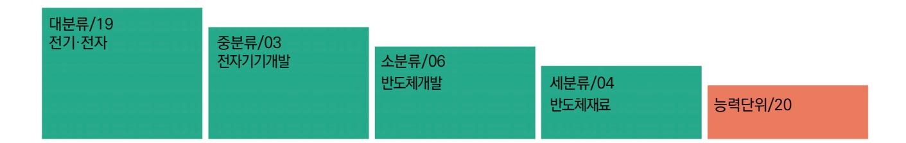
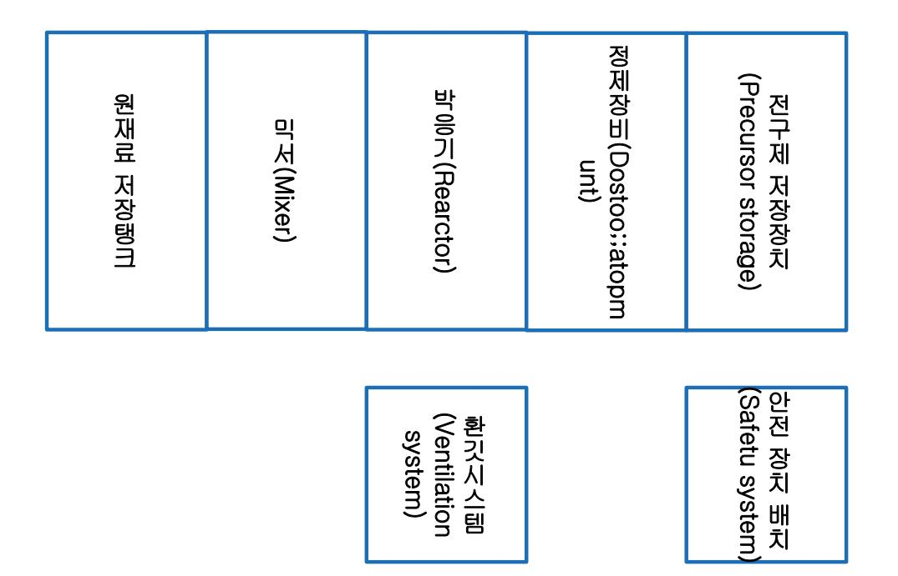
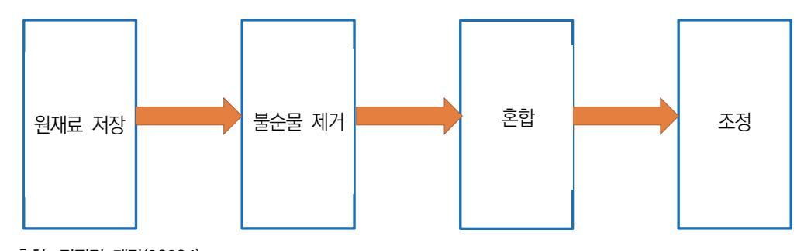

# NCS학습모듈 반도체용 박막 공정 전구체 제조 제조

LM1903060420\_23v3

#### [NCS학습모듈 활용 시 유의 사항]

- 1. NCS학습모듈은 교육훈련기관에서 출처를 명시하고 교육적 목적으로 활용할 수 있습니다. 다 만, NCS학습모듈에는 국가(교육부)가 저작재산권 일체를 보유하지 않은 저작물(출처가 표기된 도표‧사진‧삽화‧도면 등)이 포함되어 있으므로, 이러한 저작물의 변형‧각색‧복제‧공연‧ 배포 및 공중 송신 등과 이러한 저작물을 활용한 2차적 저작물을 작성하려면 반드시 원작자 의 동의를 받아야 합니다.
- 2. NCS학습모듈은 개발 당시의 산업 및 교육 현장을 반영하여 집필하였으므로, 현재 적용되는 법령‧지침‧표준 및 교과 내용 등과 차이가 있을 수 있습니다. NCS학습모듈 활용 시 법령 ‧지침‧표준 및 교과 내용의 개정 사항과 통계의 최신성 등을 확인하시기를 바랍니다.
- 3. NCS학습모듈은 산업 현장에서 요구되는 능력을 교육훈련기관에서 학습할 수 있게 구성한 자 료입니다. 다만, NCS학습모듈 지면의 한계상 대표적 예시(예: 활용도 또는 범용성이 높은 제 품, 서비스) 중심으로 집필하였음을 이해하시기를 바랍니다.

## NCS학습모듈의 이해

※ 본 NCS학습모듈은 「NCS 국가직무능력표준」사이트(http://www.ncs.go.kr) 에서 확인 및 다운로드할 수 있습니다.

## Ⅰ NCS학습모듈이란?

- 국가직무능력표준(NCS: National Competency Standards)이란 산업현장에서 직무를 수행하기 위해 요구되는 지식·기술·소양 등의 내용을 국가가 산업부문별·수준별로 체계 화한 것으로 산업현장의 직무를 성공적으로 수행하기 위해 필요한 능력(지식, 기술, 태도) 을 국가적 차원에서 표준화한 것을 의미합니다.
- 국가직무능력표준(이하 NCS)이 현장의 '직무 요구서'라고 한다면, NCS학습모듈은 NCS
  의 능력단위를 교육훈련에서 학습할 수 있도록 구성한 '교수·학습 자료'입니다. NCS학습
  모듈은 구체적 직무를 학습할 수 있도록 이론 및 실습과 관련된 내용을 상세하게 제시하
  고 있습니다.

#### ○ NCS학습모듈은 다음과 같은 특징을 가지고 있습니다.

- 첫째, NCS학습모듈은 산업계에서 요구하는 직무능력을 교육훈련 현장에 활용할 수 있도 록 성취목표와 학습의 방향을 명확히 제시하는 가이드라인의 역할을 합니다.
- 둘째, NCS학습모듈은 특성화고, 마이스터고, 전문대학, 4년제 대학교의 교육기관 및 훈 련기관, 직장교육기관 등에서 표준교재로 활용할 수 있으며 교육과정 개편 시에도 유용하게 참고할 수 있습니다.

○ NCS와 NCS학습모듈 간의 연결 체계를 살펴보면 아래 그림과 같습니다.

O NCS학습모듈의 위치는 NCS 분류 체계에서 해당 학습모듈이 어디에 위치하는지를 한 눈에 볼 수 있도록 그림으로 제시한 것입니다.

| [NCS-학          | 습모듈   | 의 위치]    |          |  |
|-----------------|-------|----------|----------|--|
|                 |       |          |          |  |
| 대분류             | 문화·예술 | ··디자인·방송 |          |  |
| 중분류             | 문화콘텐츠 |          |          |  |
| 소분류             |       | 문화콘텐츠제작  |          |  |
|                 |       |          |          |  |
| 세분류             |       |          |          |  |
| 방송콘텐츠제작         |       | 능력단위     | 학습모듈명    |  |
| 영화콘텐츠제작         |       | 프로그램 기획  | 프로그램 기획  |  |
| 음악콘텐츠제작         |       | 아이템 선정   | 아이템 선정   |  |
| 광고콘텐츠제작         |       | 자료 조사    | 자료 조사    |  |
| 게임콘텐츠제작         |       | 프로그램 구성  | 프로그램 구성  |  |
| 애니메이션 콘텐츠제작  |       | 캐스팅      | 캐스팅      |  |
| 만화콘텐츠제작         |       | 제작계획     | 제작계획     |  |
| 캐릭터제작           |       | 방송 미술 준비 | 방송 미술 준비 |  |
| 스마트문화앱 콘텐츠제작 |       | 방송 리허설   | 방송 리허설   |  |
| 영사              |       | 야외촬영     | 야외촬영     |  |
|                 |       | 스튜디오 제작  | 스튜디오 제작  |  |
|                 |       |          |          |  |

학습모듈은

NCS 능력단위 1개당 1개의 학습모듈 개발 을 원칙으로 합니다. 그러나 필요에 따라 고용단위 및 교과단위를 고려하여 능력단위 몇 개를 묶어 1개 학습모듈로 개발할 수 있으며, NCS 능력단위 1개를 여러 개의 학습모듈로 나누어 개발할 수도 있습니다.

#### 2. NCS학습모듈의 개요

#### ○ NCS학습모듈의 개요는 학습모듈이 포함하고 있는 내용을 개략적으로 설명한 것으로

| 학습모듈의 목표 , 선수학습 , 학습모듈의 내용 체계 , 핵심 용어 로 구성되어 있습니다. |                                                                              |  |  |
|----------------------------------------------------|------------------------------------------------------------------------------|--|--|
| 학습모듈의 목표                                           | 해당 NCS 능력단위의 정의를 토대로 학습 목표를 작성한 것입니다.                                        |  |  |
| 선수학습                                               | 해당 학습모듈에 대한 효과적인 교수·학습을 위하여 사전에 이수해야 하는 학습모 듈, 학습 내용, 관련 교과목 등을 기술한 것입니다. |  |  |
| 학습모듈의 내용 체계                                     | 해당 NCS 능력단위요소가 학습모듈에서 구조화된 체계를 제시한 것입니다.                                     |  |  |
| 핵심 용어                                              | 해당 학습모듈의 학습 내용, 수행 내용, 설비·기자재 등 가운데 핵심적인 용어를 제 시한 것입니다.                   |  |  |

### 제작계획 학습모듈의 개요

#### 학습모듈의 목표

본격적인 촬영을 준비하는 단계로서, 촬영 대본을 획정하고 제작 스태프를 조직하며 촬영 장비와 촬영 소품을 준비할 수 있다.

#### 선수학습

제작 준비(LM0803020105\_13v1), 섭외 및 제작스태프 구성(LM0803020104\_13v1), 촬영 제작(LM0803020106\_13v1), 촬영 장비 준비(LM0803040204\_13v1.4), 미술 디자인 협의하기(LM0803040203\_13v1.4)

#### 학습모듈의 내용체계

| 하스                | 하는 데이                                              | NCS 능력단위 요소       |                |  |
|-------------------|----------------------------------------------------|-------------------|----------------|--|
| 학습                | 학습 내용                                              | 코드번호              | 요소 명칭          |  |
| 1. 촬영 대본 확정하기  | 1-1. 촬영 구성안 검 토와 수정                             | 0803020114_16/3.1 | 촬영 대본 확정하기  |  |
| 2. 제작 스태프 조직하기 | 2-1. 기술 스태프 조직 2-2. 미술 스태프 조직 2-3. 전문 스태프 조직 | 0803020114_16v3.2 | 제작 스태프 조직하기 |  |
| 3. 촬영 장비 계획하기  | 3-1. 촬영 장비 점검 과 준비                              | 0803020114_16/3.3 | 촬영 장비 계획하기  |  |
| 4. 촬영 소품 계획하기  | 4-1. 촬영 소품 목록 작성 4-2. 촬영 소품 제작 의뢰         | 0803020114_16\3.4 | 촬영 소품 계획하기  |  |

#### 핵심 용어

촬영 구성안, 제작 스태프, 촬영 장비, 촬영 소품

#### 학습모듈의 목표는

학습자가 해당 학습모듈을 통해 성취해야 할 목표를 제시한 것으로, 교수자는 학습자 가 학습모듈의 전체적인 내용흐름을 파악하 도록 지도할 수 있습니다.

**6** • •

61

#### 선수학습은

교수자 또는 학습자가 해당 학습모듈을 교 수·학습하기 이전에 이수해야 하는 교과목 또는 학습모듈(NCS 능력단위) 등을 표기한 것입니다. 따라서 교수자는 학습자가 개별 학습, 자기 주도 학습, 방과 후 활동 등 다 양한 방법을 통해 이수할 수 있도록 지도하 는 것을 권장합니다.

|            | 핵심 용어는              |
|------------|---------------------|
|            | 률을 대표하는 주요 용어입니     |
|            | · 해당 학습모듈을 통해 학습    |
|            | 게될 주요 내용을 알 수 있습    |
|            | 5 국가직무능력표준」 사이트     |
| (www.ncs.g | jo.kr)의 색인 (찾아보기) 중 |
| 하나로 이용할    | 할 수 있습니다            |

#### 3. NCS학습모듈의 내용 체계

○ NCS학습모듈의 내용은 크게 학습, 학습 내용, 교수·학습 방법, 평가 로 구성되어 있습니다.

| 학습       | 해당 NCS 능력단위요소 명칭을 사용하여 제시한 것입니다. 학습은 크게 학습 내용, 교수·학습 방법, 평가로 구성되며 해당 NCS 능력단위의 능력단위 요소별 지식, 기술, 태도 등을 토대로 내용을 제시한 것입니다.                                                    |
|----------|----------------------------------------------------------------------------------------------------------------------------------------------------------------------------------|
| 학습 내용    | 학습 내용은 학습 목표, 필요 지식, 수행 내용으로 구성되며, 수행 내용은 재료·자 료, 기기(장비·공구), 안전·유의 사항, 수행 순서, 수행 tip으로 구성한 것입니다. 학습모듈의 학습 내용은 실제 산업현장에서 이루어지는 업무활동을 표준화된 프로세 스에 기반하여 다양한 방식으로 반영한 것입니다. |
| 교수·학습 방법 | 학습 목표를 성취하기 위한 교수자와 학습자 간, 학습자와 학습자 간 상호 작용이 활발하게 일어날 수 있도록 교수자의 활동 및 교수 전략, 학습자의 활동을 제시한 것입니다.                                                                            |
| 평가       | 평가는 해당 학습모듈의 학습 정도를 확인할 수 있는 평가 준거 및 평가 방법, 평 가 결과의 피드백 방법을 제시한 것입니다.                                                                                                         |

## [NCS-학습모듈의 위치]

| 대분류 | 전기 · 전자 |          |        |
|-----|---------------|----------|--------|
| 중분류 |               | 전자 기기 개발 |        |
| 소분류 |               |          | 반도체 재료 |

| 세분류    |                      |                      |
|--------|----------------------|----------------------|
| 반도체 개발 | 능력단위                 | 학습모듈명                |
| 반도체 제조 | 반도체용 CMP슬러리 재료 제조    | 반도체용 CMP슬러리 재료 제조    |
| 반도체 장비 | 반도체용 세정공정 재료 제조      | 반도체용 세정공정 재료 제조      |
| 반도체 재료 | 반도체용 박막도금공정 재료 제조 | 반도체용 박막도금공정 재료 제조 |
|        | 반도체용 SOD공정 재료 제조     | 반도체용 SOD공정 재료 제조     |
|        | 반도체용 트랙공정 재료 제조      | 반도체용 트랙공정 재료 제조      |
|        | 반도체용 웨이퍼 재료 제조       | 반도체용 웨이퍼 재료 제조       |
|        | 반도체용 금속(Target)재료 제조 | 반도체용 금속(Target)재료 제조 |
|        | 반도체용 패키지 재료 제조       | 반도체용 패키지 재료 제조       |
|        | 반도체 재료 개발            | 반도체 재료 개발            |
|        | 반도체 재료 생산관리          | 반도체 재료 생산관리          |
|        | 반도체 재료 품질관리          | 반도체 재료 품질관리          |
|        | 반도체 재료 안전관리          | 반도체 재료 안전관리          |
|        | 반도체용 마스크 재료 제조       | 반도체용 마스크 재료 제조       |

| 반도체용 플립칩 재료 제조       | 반도체용 플립칩 재료 제조       |
|----------------------|----------------------|
| 반도체용 CMP 재료 제조       | 반도체용 CMP 재료 제조       |
| 반도체용 식각공정 가스 제조      | 반도체용 식각공정 가스 제조      |
| 반도체용 세정공정 가스 제조      | 반도체용 세정공정 가스 제조      |
| 반도체용 박막공정 가스 제조      | 반도체용 박막공정 가스 제조      |
| 반도체용 이온주입공정 가스 제조 | 반도체용 이온주입공정 가스 제조 |
| 반도체용 박막공정 전구체 제조     | 반도체용 박막공정 전구체 제조     |
| 반도체용 포토공정 재료 제조      | 반도체용 포토공정 재료 제조      |

| 학습모듈의 개요                      | 1   |
|-------------------------------|-----|
| 학습 1. 박막 공정 전구체 제조 요구 사항 파악하기 |     |
| 1-1. 박막 공정 전구체 제조 요구 사항 파악    | 3   |
| • 교수 ․ 학습 방법                  | 38  |
| • 평가                          | 39  |
| 학습 2. 박막 공정 전구체 재료 준비하기       |     |
| 2-1. 박막 공정 전구체 재료 준비          | 41  |
| • 교수 ․ 학습 방법                  | 78  |
| • 평가                          | 79  |
| 학습 3. 박막 공정 전구체 제조하기          |     |
| 3-1. 박막 공정 전구체 제조             | 81  |
| • 교수 ․ 학습 방법                  | 111 |
| • 평가                          | 112 |
| 참고 자료                         | 114 |

## 반도체용 박막 공정 전구체 제조 학습모듈의 개요

#### 학습모듈의 목표

반도체 박막 공정에 필요한 전구체 재료의 요구 사항을 파악하여 선정하고 제조할 수 있다.

#### 선수학습

반도체 제조 공정 개발(LM1903060106\_15v4), 디스플레이 박막 공정 개발(LM1903070104\_14v2), 디 스플레이 생산 공정 관리(LM1903070203\_14v2), 반도체 공정, 반도체 장비 기술

#### 학습모듈의 내용체계

| 하습                            | 하는 기술                         | NCS 능력단위 요소       |                            |
|-------------------------------|-------------------------------|-------------------|----------------------------|
| 익답                            | 학습 내용                         | 코드번호              | 요소 명칭                      |
| 1. 박막 공정 전구체 제조 요구 사항 파악하기 | 1-1. 박막 공정 전구체 제조 요구 사항 파악 | 1903060420_23v3.1 | 박막 공정 전구체 제조 요구 사항 파악하기 |
| 2. 박막 공정 전구체 재료 준비하기       | 2-1. 박막 공정 전구체 재료 준비          | 1903060420_23v3.2 | 박막 공정 전구체 재료 준비하기       |
| 3. 박막 공정 전구체 제조 하기         | 3-1. 박막 공정 전구체 제조             | 1903060420_23v3.3 | 박막 공정 전구체 제조하기          |

#### 핵심 용어

반도체 공정, 반도체 소자, 소자 제작, 공정 흐름도, 소자 특성, 소자 측정, 소자 분석, 반도체 장비, 공정 특성

| 학습 1 | 박막 공정 전구체 제조 요구 사항 파악하기 |
|------|-------------------------|
| 학습 2 | 박막 공정 전구체 재료 준비하기       |
| 학습 3 | 박막 공정 전구체 제조하기          |

## 1-1. 박막 공정 전구체 제조 요구 사항 파악

• 박막 공정 전구체 제조 사양서를 바탕으로 제품명, 품질 기준, 제품 사양, 납기 등을 파악할 수 있다.

• 파악된 내용을 바탕으로 박막 공정 전구체 제조 시 발생할 수 있는 문제점을 검토할 수 있다.

## 필요 지식 /

학습 목표

#### 숔 반도체 박막 공정 전구체

반도체 박막 공정에서 전구체는 매우 중요한 역할을 한다. 전구체는 박막 증착 공정에서 반도 체 기판 위에 원하는 물질을 형성하기 위해 사용되는 화합물이다. 반도체 산업에서 일반적으로 사용되는 주요 박막 공정 전구체와 그 특징은 다음과 같다.

- 1. 박막 공정의 종류와 전구체
  - (1) 화학 기상 증착(CVD: chemical vapor deposition)
    - (가) tetraethyl orthosilicate(TEOS): 실리콘 산화막(SiO2) 증착에 사용된다.
    - (나) trimethyl aluminum(TMA): 알루미늄 산화막(Al2O3) 증착에 사용된다.
    - (다) hexachlorodisilane(HCDS): 실리콘 질화막(Si3N4) 증착에 사용된다.
  - (2) 원자층 증착(ALD: Atomic Layer Deposition)
    - (가) tetrakis(dimethylamino)titanium(TDMAT): 타이타늄 질화막(TiN) 증착에 사용된다.
    - (나) bis(diethylamino)silane(BDEAS): 실리콘 산화막 증착에 사용된다.
    - (다) bis(ethylcyclopentadienyl)ruthenium[Ru(EtCp)2]: 루테늄 금속막 증착에 사용된다.
  - (3) 물리 기상 증착(physical vapor deposition, PVD)
    - (가) 타이타늄 타깃(titanium target): 타이타늄 금속막 증착에 사용된다.
    - (나) 텅스텐 타깃(tungsten target): 텅스텐 금속막 증착에 사용된다.

- 2. 주요 전구체의 특성
  - (1) TEOS(tetraethyl orthosilicate)
    - (가) 용도: CVD 공정을 통해 실리콘 산화막 증착에 사용된다.
    - (나) 특징: 고순도, 낮은 증기압, 실리콘 원료로 사용된다.
  - (2) TMA(trimethyl aluminum)
    - (가) 용도: ALD 공정을 통해 알루미늄 산화막 증착에 사용된다.
    - (나) 특징: 높은 반응성, 산화를 방지한다.
  - (3) TDMAT[tetrakis(dimethylamino)titanium]
    - (가) 용도: ALD 공정을 통해 타이타늄 질화막을 증착한다.
    - (나) 특징: 높은 순도, 낮은 증기압, 높은 반응성이 있다.
- 3. 전구체 선택 기준
  - (1) 반응성

전구체는 반응성이 높아야 하며, 증착 과정에서 기판 표면과 쉽게 반응하여 원하는 박막 을 형성해야 한다.

(2) 안정성

전구체는 상온 및 작업 온도에서 안정해야 하며, 저장 및 취급 시 분해되지 않아야 한 다.

(3) 휘발성

전구체는 적절한 증기압을 가져야 하며, 이는 CVD나 ALD 공정에서 기체 상태로 쉽게 증착 체임버로 이동할 수 있어야 함을 의미한다.

(4) 순도

전구체는 고순도로 제작되어야 하며, 불순물이 최소화되어야 한다. 불순물은 박막의 품 질에 악영향을 끼칠 수 있다.

숕 반도체 재료 기술 로드맵

반도체 재료 기술 로드맵은 반도체 기술의 발전과 이를 지원하는 재료의 개발 방향을 제시한 다. 이는 반도체 소자의 성능 향상, 비용 절감, 에너지 효율성 증대 등을 목표로 한다. 주요 반 도체 재료 기술 로드맵은 다음과 같다.

- 1. 실리콘 기반 기술
  - (1) 실리콘 전통 소자(traditional silicon devices)

(가) 목표: 실리콘 트랜지스터의 성능 향상과 소형화이다.

- (나) 기술: FinFET, GAAFET 등 3D 구조 트랜지스터 개발
- (다) 로드맵: 5nm 이하 공정으로의 진화, 고이동도 채널 물질(예: SiGe) 도입이다.
- (2) 실리콘 확장 소자(extended silicon devices)
  - (가) 목표: 기존 실리콘 기술의 한계를 극복하고 새로운 기능을 추가한다.
  - (나) 기술: 실리콘 포토닉스, MEMS, 바이오센서 등이다.
  - (다) 로드맵: 집적도와 성능 향상, 다양한 응용 분야로 확장한다.
- 2. 신소재 기반 기술
  - (1) 화합물 반도체(compound semiconductors)
    - (가) 목표: 고속, 고주파, 고전력 응용에 적합한 소자를 개발하는 것이다.
    - (나) 기술: GaN, GaAs, InP 등 화합물 반도체이다.
    - (다) 로드맵: 5G 통신, 전력 전자, RF 소자에서의 활용을 확대한다.
  - (2) 2D 물질(2D materials)
    - (가) 목표: 초박막, 유연성, 투명성 소자를 개발한다.
    - (나) 기술: 그래핀, MoS2, WS2 등
    - (다) 로드맵: 디스플레이, 센서, 투명 전극 등 새로운 응용 분야로 확장한다.

#### 3. 고급 패키징 기술

- (1) 3D 패키징(3D packaging)
  - (가) 목표: 칩 집적도 향상과 성능 개선이다.
  - (나) 기술: TSV(through-silicon via), fan-out wafer level packaging(FOWLP) 등
  - (다) 로드맵: 더 많은 다이(die)를 하나의 패키지에 통합, 칩 간 통신 속도를 향상시킨다.
- (2) 칩렛(chiplet) 아키텍처
  - (가) 목표: 다양한 기능을 모듈화하여 하나의 패키지에 통합한다.
  - (나) 기술: 칩렛 인터커넥트 기술, 고속 데이터를 전송한다.
  - (다) 로드맵: 시스템 통합을 통한 성능 향상과 설계 유연성을 제공한다.
- 4. 메모리 기술
  - (1) 차세대 메모리(next-generation memory)
    - (가) 목표: 고속, 고용량, 비휘발성 메모리를 개발한다.
    - (나) 기술: MRAM, ReRAM, PCRAM 등
    - (다) 로드맵: 데이터 센터, 모바일, 임베디드 시스템에서의 응용을 확대한다.
  - (2) DRAM 및 NAND 플래시 메모리

- (가) 목표: 고용량, 고속 데이터를 저장한다.
- (나) 기술: 3D NAND, DDR5 DRAM
- (다) 로드맵: 스토리지 용량 증가, 데이터 전송 속도를 향상시킨다.
- 5. 에너지 절약형 기술
  - (1) 저전력 설계(low-power design)
    - (가) 목표: 에너지 효율성을 극대화한다.
    - (나) 기술: 저전력 트랜지스터, 전력 관리 회로 등
    - (다) 로드맵: 모바일 기기, IoT 디바이스에서의 배터리 수명을 연장시킨다.
  - (2) 에너지 수확 기술(energy harvesting)
    - (가) 목표: 환경에서 에너지를 수집하여 전력을 공급한다.
    - (나) 기술: 열전 소자, 압전 소자 등
    - (다) 로드맵: 자율 센서 네트워크, 웨어러블 디바이스에 응용한다.
- 6. 반도체 재료 기술 로드맵 요약
  - (1) 단기 목표(1~3년): 새로운 소자 구조와 재료 도입, 기존 기술의 미세화 및 성능을 최적화한 다.
  - (2) 중기 목표(3~5년): 차세대 반도체 소자와 메모리 기술 상용화, 3D 패키징 및 칩렛 아키텍처 를 확장한다.
  - (3) 장기 목표(5년 이상): 혁신적인 재료와 공정 기술 도입, AI와 IoT 응용을 위한 맞춤형 반도 체 기술을 개발한다.
- 숖 화학 물질 관리 규정(REACH)

REACH(registration, evaluation, authorization and restriction of chemicals)는 유럽 연 합의 화학 물질 관리 규정이다. REACH는 인간 건강과 환경을 보호하기 위해 화학 물질의 등 록, 평가, 허가 및 제한을 통해 화학 물질의 안전성을 보장하는 것을 목표로 한다. 다음은 REACH의 주요 내용과 요구 사항에 대한 설명이다.

- 1. 주요 내용
  - (1) 등록(registration)
    - (가) 화학 물질을 유럽 연합(EU) 내에서 제조하거나 수입하는 기업은 특정 기준을 충족하는 화학 물질을 유럽화학 물질청(ECHA)에 등록해야 한다.
    - (나) 등록 절차는 물질의 물리적, 화학적, 독성학적 및 환경적 특성에 대한 상세한 정보를 요

구한다.

- (다) 연간 1톤 이상의 화학 물질은 등록 대상이며, 이를 통해 화학 물질의 안전성을 확인하고 관리할 수 있다.
- (2) 평가(evaluation)
  - (가) 제출된 등록 정보는 ECHA와 각 회원국의 규제 당국에 의해 평가된다.
  - (나) 평가 과정에서 데이터의 적합성을 검토하고, 추가 정보가 필요할 경우 해당 기업에 요청 할 수 있다.
  - (다) 평가 단계는 문서 평가(dossier evaluation)와 물질 평가(substance evaluation)의 주 요 절차로 구성된다.
- (3) 허가(authorization)
  - (가) 특정 위험성이 높은 화학 물질은 허가 목록(annex XIV)에 포함될 수 있으며, 이러한 물 질을 사용하기 위해서는 허가를 받아야 한다.
  - (나) 허가 신청 시 기업은 해당 화학 물질의 안전한 사용 조건을 입증하고 대체 물질이나 기 술이 존재하는지 평가해야 한다.
  - (다) 허가를 받지 못한 물질은 유럽 연합 내에서 제조, 수입, 사용, 판매가 금지된다.
- (4) 제한(restriction)
  - (가) 특정 화학 물질의 사용을 제한하거나 금지할 수 있는 규제 조치가 포함된다.
  - (나) 제한 조치는 Annex XVII에 명시되며, 인간 건강과 환경에 심각한 위험을 초래하는 화학 물질에 적용된다.
  - (다) 제한 절차는 화학 물질의 특정 사용에 대한 안전성을 평가하고, 필요한 경우 규제 조치 를 시행하는 것을 포함한다.
- 2. REACH의 중요성
  - (1) 인간 건강 보호: REACH는 소비자와 작업자가 화학 물질로 인한 건강 위험에 노출되는 것을 최소화하는 데 중점을 둔다.
  - (2) 환경 보호: 화학 물질이 환경에 미치는 영향을 평가하고, 이를 최소화하는 조치를 취한다.
  - (3) 기업의 책임 강화: 화학 물질의 안전성을 입증하고 관리하는 책임을 제조 업체와 수입 업체 에 부여하여 자발적인 안전 관리 문화를 촉진한다.
  - (4) 혁신 촉진: REACH는 더 안전한 화학 물질과 기술의 개발을 장려하여 기업의 경쟁력을 강화 한다.
- 3. REACH 준수 방법
  - (1) 사전 등록: 해당 화학 물질을 ECHA에 사전 등록하여 규제 요건을 충족한다.

- (2) 데이터 공유: 다른 기업과 협력하여 데이터를 공유하고, 등록 비용을 절감한다.
- (3) 안전성 데이터 준비: 필요한 모든 안전성 데이터를 준비하고 제출한다.
- (4) 지속적인 모니터링: 규제 요건과 가이드라인의 변경 사항을 지속적으로 모니터링하고 준수한 다.
- 숗 반도체 박막 공정 전구체 재료의 화학적 순도와 특성

반도체 박막 공정에서 전구체의 화학적 순도와 특성은 매우 중요하다. 이는 반도체 소자의 성 능과 신뢰성에 직접적인 영향을 끼치기 때문이다. 주요 전구체 재료의 화학적 순도와 특성에 대해 살펴본다.

- 1. 고순도 요구 사항
  - (1) 화학적 순도
    - (가) 고순도: 반도체 공정에서 사용되는 전구체는 매우 높은 순도(일반적으로 99.999% 이상 의 순도)가 요구된다. 불순물이 포함될 경우 소자의 특성과 성능에 부정적인 영향을 미 칠 수 있다.
    - (나) 불순물: 불순물은 전기적 특성에 영향을 주고, 결함을 유발하며, 박막의 균일성을 저해할 수 있다. 따라서 불순물의 종류와 양을 엄격하게 관리해야 한다.
- 2. 주요 전구체 재료와 특성
  - (1) TEOS(tetraethyl orthosilicate)
    - (가) 용도: CVD 공정을 통해 실리콘 산화막(SiO2) 증착에 사용된다.
    - (나) 화학적 특성: TEOS는 Si(OC2H5)4의 구조를 가지며, 증기압이 낮고 화학적으로 안정적 이다. 이는 고온에서도 분해되지 않고 균일한 SiO2 박막을 형성할 수 있게 한다.
    - (다) 순도: 고순도 TEOS는 불순물 함량이 매우 낮아야 하며, 특히 금속 불순물(예: 나트륨, 철)이 없어야 한다.
  - (2) TMA(trimethyl aluminum)
    - (가) 용도: ALD 공정을 통해 알루미늄 산화막(Al2O3) 증착에 사용된다.
    - (나) 화학적 특성: TMA는 Al(CH3)3의 구조를 가지며, 높은 반응성을 가지고 있다. 이는 ALD 공정에서 균일한 Al2O3 박막을 형성하는 데 유리하다.
    - (다) 순도: 고순도 TMA는 불순물 함량이 매우 낮아야 하며, 특히 수분이나 산소와 반응하여 분해되지 않도록 관리되어야 한다.
  - (3) TDMAT(tetrakis(dimethylamino)titanium)
    - (가) 용도: ALD 공정을 통해 타이타늄 질화막(TiN) 증착에 사용된다.

- (나) 화학적 특성: TDMAT는 Ti(N(CH3)2)4의 구조를 가지며, 낮은 증기압과 높은 반응성을 가지고 있다. 이는 균일한 TiN 박막을 형성하는 데 유리하다.
- (다) 순도: 고순도 TDMAT는 금속 불순물 및 수분 함량이 매우 낮아야 한다.
- 3. 전구체 선택 시 고려 사항
  - (1) 물리적 특성
    - (가) 증기압: 전구체의 증기압은 증착 공정에서 중요한 역할을 한다. 증기압이 너무 낮으면 전 구체가 증발하지 않고, 너무 높으면 제어가 어려울 수 있다.
    - (나) 끓는점: 전구체의 끓는점은 공정 온도와 맞아야 한다. 끓는점이 너무 낮으면 고온 공정에 서 안정적으로 사용하기 어렵고, 너무 높으면 증발이 어려워질 수 있다.
  - (2) 화학적 특성
    - (가) 반응성: 전구체는 기판 표면과 적절히 반응하여 원하는 박막을 형성해야 한다. 반응성이 낮으면 균일한 박막 형성이 어렵고, 너무 높으면 불필요한 반응이 일어날 수 있다.
    - (나) 안정성: 전구체는 저장 및 사용 중에 화학적으로 안정해야 한다. 불안정한 전구체는 분해 되거나 반응하여 품질 저하를 일으킬 수 있다.

## 수행 내용 / 박막 공정 전구체 제조 요구 사항 파악하기

#### 재료·자료

- Metal, Target, Aluminium
- ASTM, ISO, JTS, SEMI, KS 표준화 문서
- ITRS 로드맵(international technology roadmap for semiconductor)
- 반도체 로드맵
- 반도체 제조 공정도
- MSDS, RoHS, WEEE(waste electrical and electronic equipment)
- 시험 성적서

기기(장비 ・ 공구)

- Metal, Target 물성 분석기
- 전하 이동도, 전기 저항 측정 장치
- 제조 공장 인트라넷
- 컴퓨터, 프린터, 복사기
- 문서 작성 프로그램

#### 안전 ・ 유의 사항

- 제조 공정 장비는 제품을 제조하기 위한 장비로서 규정에 따라 관리되어야 하며, 일정 주기 와 방법에 따라 장비 성능이 평가되어야 한다.
- 반도체 금속(Target) 제조 시 돌발적으로 발생하는 불량률의 급증 사태를 정상으로 복구할 수 있도록 응급 상황 대처 능력을 길러야 한다.
- 평가/분석/계측기는 제품의 물성이나 특성을 평가하는 검사를 하는 장비로서 규정에 따라 관리되어야 한다.
- 수행 순서
- 숔 반도체용 박막 공정 전구체 제조 과정의 주된 단계와 고려 사항을 파악한다.

반도체용 박막 공정 전구체 제조는 고도의 정밀성과 순도가 요구되는 과정이다. 전구체는 박막 증착 공정에서 중요한 역할을 하며, 이를 위해 다양한 화학 물질이 사용된다. 전구체 제조 과 정에서의 주된 단계와 고려 사항은 다음과 같다.

이와 같은 체계적인 접근을 통해 반도체용 박막 공정 전구체를 안전하고 효율적으로 제조할 수 있다. 지속적인 품질 관리와 안전 관리가 필수적이다.

- 1. 요구 사항 분석 및 계획을 수립한다.
  - (1) 요구 사항 분석
    - (가) 전구체 종류: 박막 공정에서 사용할 전구체의 종류와 화학적 특성을 파악(예: 금속 유기 화합물, 금속 할라이드 등)한다.
    - (나) 순도 요구 사항: 반도체 공정에서 요구하는 전구체의 순도 수준을 정의한다.
    - (다) 용도 분석: 각 전구체의 구체적인 용도와 적용 공정을 분석한다.
  - (2) 계획 수립
    - (가) 생산 목표: 필요한 전구체의 양과 생산 일정을 설정한다.
    - (나) 자원 할당: 필요한 인력, 원재료, 장비 등을 할당한다.

2. 원재료를 준비한다.

- (1) 주요 원재료
  - (가) 금속 전구체: 알루미늄, 타이타늄, 텅스텐 등 금속 원료
  - (나) 유기 리간드: 다양한 유기 화합물
  - (다) 기타: 용매, 촉매 등 필요한 화학 물질
- (2) 원재료 확보
  - (가) 공급사 선정: 신뢰할 수 있는 원재료 공급사 선정
  - (나) 입고 검사: 원재료의 순도와 품질을 검사
- 3. 전구체 합성 공정을 설계한다.
  - (1) 합성 공정 흐름도 작성

4. 장비 설치 및 운용한다.

(1) 주요 장비 선정

(2) 장비 설치

(3) 장비 운용

5. 품질을 관리한다.

- (가) 혼합: 원재료를 적절한 비율로 혼합
- (나) 반응: 특정 온도와 압력에서 화학 반응을 통해 전구체 합성

- (다) 정제: 합성된 전구체를 정제하여 불순물을 제거
- (라) 증류: 필요시 증류 과정을 통해 순도를 높임.

(마) 건조 및 포장: 최종 제품을 건조하고 포장

(가) 반응기: 전구체 합성에 사용

(나) 정제 시스템: 불순물 제거

(라) 건조기: 제품 건조.

(다) 증류 장비: 고순도 전구체 제조

(마) 포장 장비: 안전한 포장을 위한 장비

(가) 설치 계획: 각 장비를 공장 내 적절한 위치에 배치

(나) 설치 작업: 전문 인력을 통해 장비를 설치하고 테스트

(나) 정기 점검: 장비의 정기적인 점검과 유지 보수 실시

(가) 운영 프로토콜: 각 장비의 운용 방법과 안전 절차를 문서화

(1) 품질 관리 시스템 구축

| 항목       | 대응 방안                                                                 |
|----------|-----------------------------------------------------------------------|
| 원재료 문제   | 불순물 포함: 원재료 입고 시마다 순도와 불순물 함량 검사 원재료 변동: 공급처 다변화 및 품질 관리 기준 강화     |
| 합성 공정 문제 | 반응 불완전: 반응 조건 최적화 및 실시간 모니터링 불순물 발생: 정제 공정 강화 및 필터 교체 주기 단축        |
| 장비 문제    | 장비 고장: 정기적인 점검과 유지 보수, 예비 부품 준비 효율 저하: 장비 성능 모니터링 및 주기적 성능 검증      |
| 품질 문제    | 검사 누락: 자동화된 품질 검사 시스템 도입 및 다중 검사 오검출: 정기적인 장비 교정 및 다중 검사 절차 도입     |
| 안전 문제    | 화학 물질 누출: 안전 장비 착용 및 비상 대처 절차 마련 폐기물 처리: 환경 규제를 준수하고 폐기물 관리 시스템 강화 |

<표 1-1> 전구체 제조 과정에서 문제 발생 시 대응 방안

- (나) 기록 관리: 검사 결과와 품질 데이터를 체계적으로 관리
- (가) 검사 절차: 품질 검사 절차와 기준 명시
- (2) 품질 관리 매뉴얼 작성
- (나) 운영 매뉴얼: 각 장비의 운용 매뉴얼 작성
- (가) 제조 절차: 단계별 제조 절차를 상세히 기술한 작업 지시서 작성
- (1) 작업 지시서 작성
- 7. 문서화 및 절차를 수립한다.
- (나) 안전 시스템: 화학 물질 누출 감지기, 소화기 등 설치
- (가) 보호 장비: 보호 장갑, 보호 안경, 방호복 등 안전 장비 준비
- (2) 안전 장비 준비
- (나) 비상 절차: 화학 물질 누출 및 화재 등에 대한 비상 절차 마련
- (가) 안전 교육: 작업자들에게 화학 물질 취급 방법과 비상 대처 방법 교육
- (1) 안전 지침 마련
- 6. 안전 관리를 파악한다.
- (다) 기록 유지: 모든 검사 결과를 기록하고 분석
- (나) 최종 제품 검사: 최종 제품의 순도와 품질 확인
- (가) 공정 단계별 검사: 각 공정 단계에서 전구체의 순도와 품질 검사

숕 생산 관련 부서로부터 박막 공정 전구체 제조 사양서를 입수한다.

박막 공정 전구체 제조 사양서를 입수하는 과정은 제조의 기초 단계로, 이는 전구체 생산에 필 요한 모든 세부 사항을 명확히 하는 중요한 문서이다. 이 사양서를 통해 제조 공정이 정확하게 수행될 수 있도록 보장할 수 있다. 여기에서는 일반적인 박막 공정 전구체 제조 사양서의 주요 항목과 내용을 예시로 제시한다.

이 제조 사양서는 반도체용 박막 공정 전구체의 제조를 위해 필요한 모든 세부 사항을 포함하 고 있다. 이를 통해 제조 공정의 일관성을 유지하고, 고품질의 전구체를 생산할 수 있도록 한 다. 사양서에 명시된 모든 항목을 철저히 준수하여 제조 공정을 수행해야 한다.

- 1. 기본 정보를 파악한다.
  - (1) 사양서 번호: [사양서 번호]
  - (2) 작성자: [작성자 이름]
  - (3) 작성일: [작성일]
  - (4) 승인자: [승인자 이름]
  - (5) 승인일: [승인일]

2. 전구체 정보를 파악한다.

- (1) 전구체 이름: [전구체 이름](예: 알루미늄 트리이소프로폭사이드)
- (2) 화학식: [화학식](예: Al(C3H7O)3)
- (3) CAS 번호: [CAS 번호]
- (4) 물리적 상태: [상태](예: 액체, 고체)
- (5) 색상: [색상](예: 무색, 노란색)
- (6) 냄새: [냄새](예: 무취, 약간의 냄새)

3. 제조 사양을 파악한다.

- (1) 순도: [순도](예: 99.999%)
- (2) 불순물 허용치: [불순물 허용치](예: Fe ≤ 0.1 ppm, H2O ≤ 0.5ppm)
- (3) 입자 크기: [입자 크기](예: <1㎛)
- (4) 밀도: [밀도](예: 0.97g/cm³)
- (5) 비점: [비점](예: 150°C)
- (6) 녹는점: [녹는점](예: 120°C)
- (7) 휘발성: [휘발성](예: 휘발성 낮음/높음)

4. 원재료 정보를 파악한다.

- (1) 원재료 종류: [원재료 종류](예: 알루미늄 이소프로폭사이드, 이소프로판올)
- (2) 원재료 순도: [원재료 순도](예: 99.999%)
- (3) 원재료 공급사: [공급사 이름]
- 5. 합성 공정을 파악한다.
  - (1) 공정 개요: [합성 공정 개요](예: 반응기에서 특정 온도와 압력하에 알루미늄 이소프로폭사이 드와 이소프로판올을 반응)
  - (2) 반응 조건
    - (가) 온도: [온도](예: 80°C)
    - (나) 압력: [압력](예: 1atm)
    - (다) 반응 시간: [시간](예: 4시간)
  - (3) 촉매: [촉매](예: 없음/특정 촉매)
  - (4) 용매: [용매](예: 이소프로판올)
  - (5) 혼합 비율: [혼합 비율](예: 1:3)
- 6. 정제 및 가공한다.
  - (1) 정제 방법: [정제 방법](예: 증류, 여과)
  - (2) 건조 방법: [건조 방법](예: 진공 건조)
  - (3) 최종 형태: [최종 형태](예: 분말, 용액)

  - (4) 포장: [포장 방법](예: 질소 분위기하에 밀폐된 병)
- 7. 품질 관리를 한다.
  - (1) 품질 검사 항목

8. 안전 및 취급을 파악한다.

9. 환경 규제를 준수한다.

- (가) 순도 검사: [검사 방법](예: ICP-MS)
- (나) 불순물 분석: [분석 방법](예: GC-MS)

(다) 물리적 특성 검사: [검사 방법](예: 입도 분석기)

(1) 안전 지침: [안전 지침](예: 화학 물질 취급 시 보호 장갑과 안경 착용)

(3) 취급 주의 사항: [취급 주의 사항](예: 직사광선을 피하고 통풍이 잘되는 곳에서 취급)

(2) 보관 조건: [보관 조건](예: 상온, 건조한 곳에서 밀폐 보관)

- (2) 검사 주기: [검사 주기](예: 생산 로트마다)
- (3) 허용 오차: [허용 오차](예: ±0.1%)

(1) 폐기물 처리: [폐기물 처리 방법](예: 규정된 화학 물질 폐기 방법에 따라 처리)

(2) 환경 규제: [규제 사항](예: 지역 및 국가 환경 규제 준수)

숖 박막 공정 전구체 제조 사양서를 바탕으로 제품명, 품질 기준, 제품 사양, 납기 등을 파악한다.

반도체 박막 공정 전구체 제조 사양서를 바탕으로 제품명, 품질 기준, 제품 사양, 납기 등을 파악하여 세부 내용을 정리한다. 다음은 알루미늄 트리이소프로폭사이드(aluminium triisopropoxide)를 전구 체로 사용하여 예시로 내용을 구성하였다.

이와 같은 사양서를 바탕으로 박막 공정에 필요한 전구체를 정확하게 제조하고, 일관된 품질을 유지할 수 있다. 또한 명확한 납기 정보를 제공함으로써 생산 계획을 효율적으로 관리할 수 있 다.

1. 제품명을 파악한다.

박막 공정에서 사용되는 전구체는 다양한 화학 물질로, 반도체 공정에서 특정한 물리적, 화 학적 특성을 가진 박막을 형성하기 위해 사용된다. 전구체의 제품명은 일반적으로 해당 화 합물의 화학적 구성, 상업적 명칭, 제조사에 따라 달라질 수 있다.

제품명을 파악하려면 다음과 같은 정보를 제공하는 제조 사양서를 참조해야 한다.

- (1) 화학적 명칭: 전구체의 정확한 화학적 이름. 예: tetraethyl orthosilicate(TEOS)
- (2) 상업적 명칭: 특정 제조사가 제품을 판매할 때 사용하는 상표명. 예: trimethylaluminum(TMA)
- (3) 화학식: 전구체의 화학식. 예: Si(OC₂H₅)₄
- (4) CAS 번호: 화학 물질의 고유 식별 번호. 예: 78-10-4(TEOS의 CAS 번호)
- (5) 물리적 특성: 끓는점, 밀도, 점도 등.

(6) 안전 정보: 취급, 저장, 위험성 등에 대한 정보.

전구체의 제품명을 정확히 파악하기 위해서는 해당 제품의 제조사나 판매 업체에서 제공하는 데이터 시트나 안전 데이터 시트(SDS)를 참조하는 것이 좋다. SDS는 제품의 화학적 특성, 안전 정보, 상업적 명칭 등을 포함하고 있어 유용하다.

전구체의 예로는 실리콘 박막을 위한 TEOS(tetraethyl orthosilicate), 금속 산화막을 위한 TMA(trimethylaluminum), 질화막을 위한 TDMAT[tetrakis(dimethylamido)titanium] 등 이 있다. 제조 사양서에서 이러한 정보가 명시되어 있다면, 그에 따른 제품명을 파악할 수 있다.

2. 품질 기준을 파악한다.

박막 공정에서 사용되는 전구체의 품질 기준은 최종 박막의 특성과 성능에 중요한 영향을 끼친다. 따라서 전구체의 제조 사양서에 명시된 품질 기준을 철저히 파악하는 것이 필수적 이다. 이러한 품질 기준은 전구체의 순도, 물리적 특성, 화학적 조성, 불순물 수준 등을 포 함할 수 있다. 일반적으로 전구체의 제조 사양서에서 확인할 수 있는 주요 품질 기준은 다

음과 같다.

(1) 순도(purity)

- (가) 순도 수준: 전구체의 주요 성분의 비율. 일반적으로 매우 높은 순도(99.99% 이상)가 요 구된다.
- (나) 관련 불순물: 특정 불순물의 종류와 최대 허용 농도. 불순물은 전기적, 물리적 특성에 영 향을 미칠 수 있다.
- (2) 물리적 특성
  - (가) 상태: 전구체가 액체, 고체, 기체 중의 상태
  - (나) 끓는점(boiling point): 특정 압력하에서 전구체가 끓는 온도
  - (다) 녹는점(melting point): 고체 전구체가 녹는 온도
  - (라) 밀도(density): 전구체의 밀도(일반적으로 g/cm³로 표시)
  - (마) 점도(viscosity): 액체 전구체의 흐름 저항을 나타내는 특성 주입 및 증착 공정에서 중요하다.
- (3) 화학적 특성
  - (가) 화학식: 전구체의 화학적 조성
  - (나) 반응성: 공기, 수분, 기타 화학 물질과의 반응성 반응성이 높은 물질은 특별한 취급 및 저장 조건이 필요하다.
  - (다) 분해 온도: 열분해가 시작되는 온도 공정 중 열적 안정성에 중요한 역할을 한다.

(4) 불순물 분석

- (가) 금속 불순물: 금속 불순물의 종류와 최대 허용 농도 예: 철(Fe), 나트륨(Na) 등
- (나) 유기 불순물: 유기 화합물 불순물의 종류와 최대 허용 농도
- (5) 기타 특성
  - (가) 잔류 용매: 전구체 제조 과정에서 사용된 용매의 잔류 농도
  - (나) 수분 함량(Moisture Content): 전구체 내 수분의 함량
    - 수분은 박막 형성 과정에서 문제가 될 수 있다.
- (6) 안전 및 취급 정보
  - (가) 취급 조건: 저장 온도, 보관 방법, 용기 재질 등
  - (나) 안전 정보: 화재 위험성, 유독성, 폭발성 등에 관한 정보
- 이러한 품질 기준은 전구체의 일관된 성능을 보장하고, 공정 중 발생할 수 있는 문제를 예

방하기 위해 필수적이다. 제조 사양서를 바탕으로 품질 기준을 정확하게 파악하고, 이를 준 수하는 것이 중요하다. 이를 통해 최종 제품의 품질과 신뢰성을 유지할 수 있다.

3. 제품 사양을 파악한다.

박막 공정에서 사용하는 전구체의 제조 사양서는 해당 제품의 상세한 기술적 정보를 제공 하는 문서이다. 이 사양서를 통해 제품의 주요 사양을 파악할 수 있으며, 이는 공정의 성공 적 수행과 최종 제품의 품질 보장을 위해 중요하다. 일반적으로 전구체 제조 사양서에서 확 인할 수 있는 주요 제품 사양은 다음과 같다.

- (1) 화학적 사양
  - (가) 화학명(chemical name): 전구체의 공식적인 화학 명칭. 예: tetraethyl orthosilicate(TEOS)
  - (나) 화학식(chemical formula): 전구체의 분자 구성 예: Si(OC₂H₅)₄
  - (다) CAS 번호(CAS number): 화학 물질의 고유 식별 번호 예: 78-10-4(TEOS의 CAS 번호)
  - (라) 분자량(molecular weight): 전구체 분자의 총 질량
- (2) 물리적 사양
  - (가) 상태(State): 물질의 상태(고체, 액체, 기체) 예: 액체
  - (나) 색상(color): 전구체의 색상 정보
    - 예: 무색, 투명
  - (다) 밀도(density): 전구체의 밀도, 일반적으로 g/cm³ 단위로 표시
  - (라) 끓는점(boiling point): 물질이 끓는 온도 예: 160°C
  - (마) 녹는점(Melting Point): 고체 물질이 녹기 시작하는 온도.
  - (바) 점도(Viscosity): 액체 전구체의 흐름 저항. 예: 2 cP(센티포아즈)에서 25°C
- (3) 순도 및 불순물
  - (가) 순도(purity): 전구체의 주요 성분의 순도 예: 99.99%
  - (나) 불순물 종류 및 허용치: 특정 불순물(예: 금속 이온, 유기 화합물 등)의 종류와 최대 허 용 농도

예: 금속 이온 < 1ppm

- (4) 화학적 특성 및 반응성
  - (가) 반응성(reactivity): 공기, 수분, 다른 화학 물질과의 반응성 정보

- (나) 분해 온도(decomposition temperature): 물질이 열에 의해 분해되기 시작하는 온도
- (다) 수분 함량(moisture content): 물질 내 포함된 수분의 양 예: 0.1%
- (5) 취급 및 저장 정보
  - (가) 저장 조건(storage conditions): 최적의 저장 온도, 습도, 용기 재질 등
  - (나) 안전 정보(safety information): 취급 시 주의 사항, 화재 및 폭발 위험, 독성 정보 등
  - (다) 사용 기한(shelf life): 최적의 성능을 유지할 수 있는 기간
- (6) 응용 분야
  - (가) 응용 분야(application): 전구체가 사용되는 주요 공정 및 소자 유형. 예: SiO₂ 박막 증 착, 절연층 형성
- (7) 포장 및 운송
  - (가) 포장 형태(packaging): 제품의 포장 방법 및 용기 종류

예: 유리병, 플라스틱 용기

(나) 운송 정보(transportation information): 운송 시 주의 사항, 규제 정보 등

이러한 제품 사양은 전구체의 사용 방법, 저장 조건, 안전 대책 등을 명확히 이해하는 데 도움을 준다. 제조 사양서를 통해 파악된 정보는 공정 설계와 최적화, 품질 관리, 안전 관 리 등에 중요한 역할을 한다. 또한, 전구체 선택 시 제품 사양이 요구 조건을 충족하는지 확인하는 데도 사용된다.

4. 제조 공정을 파악한다.

박막 공정에서 사용되는 전구체의 제조 사양서를 바탕으로 제조 공정을 파악하는 것은 전 구체의 고유한 특성을 유지하고, 최종 제품의 품질과 성능을 보장하기 위해 중요하다. 전구 체의 제조 공정은 일반적으로 다음과 같은 주요 단계를 포함하며, 각 단계는 제품의 화학 적, 물리적 특성을 정확히 관리하기 위해 설계된다.

- (1) 원료 준비
  - (가) 원료 선택: 고순도의 원료 화합물을 선택하여 전구체 제조에 사용한다.

원료의 순도는 최종 제품의 품질에 큰 영향을 끼치므로, 불순물 함량이 낮은 원료를 사용해야 한다.

- (나) 원료 전처리: 원료의 순도를 높이기 위해 필요한 전처리 과정을 수행한다. 예를 들어, 증류, 재결정화, 정제 등의 과정을 통해 불순물을 제거한다.
- (2) 화학 반응
  - (가) 반응 설정: 원하는 전구체를 얻기 위한 화학 반응을 설정한다.
    - 이 단계에서는 반응 온도, 압력, 반응 시간, 촉매 사용 여부 등을 결정한다.

(나) 반응기 선택: 반응을 수행할 반응기를 선택한다.

반응기 유형은 배치 반응기, 연속 반응기, 고정층 반응기 등이 있다.

- (다) 반응 진행: 설정된 조건에 따라 화학 반응을 진행하여 전구체를 합성한다 예를 들어, TEOS(tetraethyl orthosilicate)를 제조하기 위해 에탄올과 실리콘 사나 이드를 반응시킨다.
- (3) 정제 및 분리
  - (가) 정제: 생성된 전구체를 정제하여 불순물과 부산물을 제거한다.

이는 증류, 여과, 추출 등의 공정을 포함할 수 있다.

- (나) 분리: 원하는 전구체를 다른 반응물, 용매, 부산물 등으로부터 분리한다. 이 단계에서는 크로마토그래피, 원심 분리기 등을 사용할 수 있다.
- (4) 여과 및 탈기
  - (가) 여과: 정제된 전구체에서 미세 입자나 고체 불순물을 제거하기 위해 여과 과정을 거친다.
  - (나) 탈기: 용매나 반응 중에 형성된 기포를 제거하기 위해 탈기 과정을 수행한다. 이는 전구체의 균일성과 품질을 높이는 데 중요하다.
- (5) 농축 및 조정
  - (가) 농축: 전구체 용액의 농도를 조정하여 원하는 농도를 맞춘다. 이는 용매를 증발시키거나 농축 장치를 사용하여 수행할 수 있다.
  - (나) 물성 조정: 전구체의 점도, 유동성, 안정성 등을 최적화하기 위해 첨가제나 용매를 조정 한다.
- (6) 품질 검사 및 분석
  - (가) 순도 검사: 전구체의 순도를 확인하기 위해 화학 분석을 수행한다. 이는 원소 분석, 분광 분석 등을 포함할 수 있다.
  - (나) 물리적 특성 검사: 점도, 밀도, 끓는점, 녹는점 등 물리적 특성을 측정하여 제품 사양을 확인한다.
  - (다) 불순물 분석: 금속 이온, 유기 불순물 등의 포함 여부와 농도를 확인한다.
- (7) 포장 및 저장
  - (가) 포장: 정제된 전구체를 적절한 용기에 포장한다. 용기의 재질은 전구체의 화학적 특성에 따라 선택된다.
  - (나) 저장 조건 설정: 제품의 안정성을 유지하기 위해 최적의 저장 조건(온도, 습도, 빛 차단 등)을 설정한다.
- (8) 안전 및 취급
  - (가) 안전 지침: 전구체 취급 시 필요한 안전 지침을 마련한다. 이는 유해성 정보, 응급 처치,

보호 장비 사용 등을 포함한다.

(나) 규제 준수: 화학 물질에 대한 법적 규제와 안전 규정을 준수한다.

이러한 제조 공정 단계는 전구체의 고유한 특성을 유지하고 품질을 보장하는 데 중요하다. 제조 사양서에 명시된 각 단계를 철저히 준수함으로써 일관된 고품질의 전구체를 생산할 수 있으며, 이는 박막 공정에서 고성능 소자를 제작하는 데 필수적이다.

5. 정제 및 가공 과정을 파악한다.

박막 공정에서 사용되는 전구체의 제조는 고순도의 재료를 얻기 위해 여러 단계의 정제 및 가공 공정이 필요하다. 이 과정은 최종 제품의 품질과 성능에 큰 영향을 끼치며, 제조 사양 서에 명시된 구체적인 절차와 조건에 따라 진행된다. 정제 및 가공 공정의 주요 단계를 다 음과 같이 정리할 수 있다.

(1) 정제(purification)

정제 과정은 전구체에서 불순물 및 불필요한 성분을 제거하여 순도를 높이는 과정이다.

- (가) 증류(distillation)
  - 1) 전구체의 끓는점 차이를 이용하여 불순물을 제거하는 공정이다. 특히, 휘발성이 다른 물질을 분리하는 데 효과적이다.
  - 2) 고순도의 전구체를 얻기 위해 반복 증류(다단 증류)를 사용할 수 있다.
- (나) 재결정화(recrystallization)
  - 1) 고체 상태의 전구체에서 불순물을 제거하는 방법으로, 용매를 이용해 순수한 결정체 를 형성한다.
  - 2) 특정 용매에서 용해도 차이를 이용해 고순도의 결정체를 얻는다.
- (다) 추출(extraction)
  - 1) 용매를 사용하여 원하는 성분을 분리하고 불순물을 제거한다.
  - 2) 유기 전구체의 경우, 상이 다른 용매를 사용한 액체-액체 추출이 일반적이다.
- (라) 흡착(adsorption)
  - 1) 활성탄이나 실리카 젤과 같은 흡착제를 사용하여 불순물을 제거한다.
  - 2) 주로 유기 불순물 제거에 사용된다.
- (2) 여과 및 탈기(filtration & degassing)

여과와 탈기 과정은 전구체 내의 고체 입자와 기체 불순물을 제거하기 위한 단계이다.

- (가) 여과(filtration)
  - 1) 고체 불순물을 제거하기 위해 필터를 사용한다. 여과지, 멤브레인 필터, 미세 필터 등을 사용할 수 있다.
  - 2) 나노 필터를 사용하여 미세한 입자까지 제거할 수 있다.
- (나) 탈기(degassing)

- 1) 용액에 포함된 기체를 제거하는 과정으로, 특히 스핀 코팅 등 박막 형성 과정에서 기포가 생기는 것을 방지한다.
- 2) 진공 하에서 용액을 유지하거나, 초음파 처리로 기포를 제거한다.
- (3) 농축 및 조정(concentration & adjustment)
  - 농축 및 조정 과정은 전구체의 농도와 물리적 특성을 원하는 사양에 맞추는 단계이다.
  - (가) 농축(concentration)
    - 1) 용매를 증발시켜 전구체의 농도를 높이다. 로터리 증발기, 진공 증류 등의 장비를 사용한다.
    - 2) 농축 과정에서 용매의 선택과 제거 속도는 전구체의 순도와 특성에 영향을 끼친다.
  - (나) 물성 조정(property adjustment)
    - 1) 점도, 밀도, 유동성 등을 조정하기 위해 첨가제나 용매를 추가한다.
    - 2) 공정 중 필요한 물리적 특성을 얻기 위해 pH, 이온 강도 등의 조건을 조정할 수 있 다.
- (4) 품질 검사 및 인증(quality testing & certification)

정제 및 가공이 완료된 전구체는 품질 검사 과정을 통해 사양서의 기준에 부합하는지 확인한다.

- (가) 순도 분석(purity analysis)
  - 1) 화학 분석 기법을 통해 전구체의 순도를 측정한다. 주로 ICP-MS, GC-MS, HPLC 등이 사용된다.
  - 2) 금속 불순물, 유기 불순물, 수분 함량 등을 분석한다.
- (나) 물리적 특성 검사(physical property testing)
  - 1) 점도, 밀도, 끓는점, 녹는점 등 물리적 특성을 측정한다.
  - 2) 점도 측정기, 밀도계, 디지털 온도계 등을 사용한다.
- (5) 포장 및 보관(packaging & storage)
  - 최종 제품의 포장과 보관 과정은 전구체의 안정성을 유지하는 데 중요하다.
  - (가) 포장(packaging)
    - 1) 전구체의 화학적 성질에 맞는 용기를 선택하여 포장한다. 유리병, 플라스틱 용기 등 이 사용된다.
    - 2) 밀봉 포장하여 외부 오염을 방지한다.
  - (나) 보관 조건(storage conditions)
    - 1) 적절한 온도, 습도, 빛 차단 조건을 설정하여 전구체의 안정성을 유지한다.

2) 특별한 취급이 필요한 경우, 냉장 보관 또는 인화성 물질 취급 지침을 준수한다.

이러한 정제 및 가공 공정 단계는 전구체의 고순도와 일관된 품질을 보장하는 데 필수적이

다. 제조 사양서에서 제공하는 각 단계의 조건과 요구 사항을 철저히 준수함으로써, 고품질 의 전구체를 생산하고 이를 박막 공정에 안정적으로 공급할 수 있다.

6. 품질 관리 내용을 파악한다.

박막 공정에서 사용되는 전구체의 품질 관리는 최종 제품의 성능과 신뢰성을 보장하기 위 한 중요한 과정이다. 제조 사양서에 명시된 품질 관리 항목들은 전구체의 생산 과정에서 불 량을 최소화하고, 일관된 품질을 유지하는 데 필수적이다. 전구체의 품질 관리 내용은 다음 과 같은 주요 요소들로 구성될 수 있다.

- (1) 순도 관리(purity control)
  - (가) 고순도 원료 사용: 전구체 제조에 사용되는 원료의 순도가 높을수록 최종 제품의 품질이 높아진다. 제조 사양서는 원료의 최소 순도를 명시하고 있으며, 이를 통해 금속 이온, 유기 불순물, 수분 등 불순물의 함량을 최소화한다.
  - (나) 불순물 분석: 전구체의 순도와 불순물 농도를 정확히 측정한다. 일반적으로 ICP-MS(유 도결합 플라즈마 질량 분석기), GC-MS(기체 크로마토그래피-질량 분석기), HPLC(고성 능 액체 크로마토그래피) 등의 장비를 사용한다.
  - (다) 정기적 품질 검토: 생산된 전구체의 샘플을 주기적으로 검사하여 순도와 불순물 수준을 모니터링한다.
- (2) 물리적 특성 관리(physical property control)
  - (가) 점도 측정: 전구체의 점도는 증착 공정에서 중요한 역할을 한다. 점도는 점도계로 측정하 며, 제조 사양서에 명시된 기준 범위 내에서 유지되어야 한다.
  - (나) 밀도 및 끓는점 검사: 전구체의 밀도와 끓는점은 제품의 물리적 특성을 확인하는 데 사 용된다. 밀도계와 디지털 온도계를 사용하여 측정한다.
  - (다) 수분 함량 측정: 수분 함량은 전구체의 안정성에 영향을 끼칠 수 있으며, 제조 사양서에 서 허용 가능한 수분 함량이 명시된다. 칼 피셔 적정법 등을 사용하여 수분 함량을 측정 한다.
- (3) 화학적 특성 관리(chemical property control)
  - (가) 화학적 조성 확인: 전구체의 화학적 조성이 일관되게 유지되도록 관리한다. NMR(핵자기 공명), FTIR(푸리에 변환 적외선 분광기) 등을 사용하여 화학적 구조와 조성을 분석한다.
  - (나) 반응성 및 안정성: 전구체의 반응성과 열적 안정성을 평가하여 저장 및 취급 조건을 최 적화한다. TGA(열중량 분석) 및 DSC(차동 주사 열량계)를 사용하여 열적 특성을 측정 한다.
- (4) 공정 관리(process control)
  - (가) 공정 조건 모니터링: 제조 공정에서 온도, 압력, 반응 시간 등의 공정 조건을 엄격히 관

리한다. 이는 제품의 품질과 성능에 직접적인 영향을 미친다.

- (나) 작업자 교육: 품질 관리 기준을 유지하기 위해 작업자들에게 정기적으로 교육을 실시하 여, 공정 중 발생할 수 있는 문제를 신속히 대응할 수 있도록 한다.
- (5) 포장 및 저장 관리(packaging & storage control)
  - (가) 포장 규격 준수: 전구체의 포장은 화학적 특성에 따라 적절한 재질과 형태로 선택된다. 포장은 외부 오염을 방지하고, 제품의 안정성을 유지하는 데 중요한 역할을 한다.
  - (나) 저장 조건 유지: 전구체의 물리적, 화학적 안정성을 유지하기 위해 권장 저장 온도, 습 도, 광 노출 등 저장 조건을 준수한다.
- (6) 안전 및 규제 준수(safety & regulatory compliance)
  - (가) 안전 데이터 시트(SDS): 전구체의 화학적, 물리적 특성 및 안전 정보가 포함된 SDS를 제공하여 안전한 취급을 보장한다.
  - (나) 법적 규제 준수: 전구체의 생산 및 취급 과정에서 관련 법률 및 규제를 준수하여, 제품 의 안전성과 환경 보호를 보장한다.
- (7) 최종 제품 검사 및 인증(final product testing & certification)
  - (가) 제품 검사: 최종 제품이 제조 사양서의 모든 기준을 충족하는지 검사한다.
  - (나) 인증 및 배치 기록: 각 배치의 품질 검사 결과를 기록하고, 필요시 추적할 수 있도록 보 관한다.

이러한 품질 관리 과정은 전구체 제조에서 발생할 수 있는 변동을 최소화하고, 고품질의 제 품을 생산하는 데 기여한다. 제조 사양서에 명시된 품질 관리 기준을 철저히 준수함으로써, 박막 공정에서의 높은 성능과 신뢰성을 유지할 수 있다.

7. 안전 및 취급 규정 내용을 파악한다.

박막 공정에서 사용되는 전구체는 화학적으로 활성도가 높고, 때로는 위험할 수 있는 물질 이다. 따라서 전구체의 제조 사양서에는 안전 및 취급 규정이 명확하게 명시되어 있어야 한 다. 이러한 규정은 작업자의 안전을 보장하고 환경에 대한 영향을 최소화하기 위해 필수적 이다. 제조 사양서를 바탕으로 파악할 수 있는 주요 안전 및 취급 규정은 다음과 같다.

(1) 물질 안전 데이터 시트(SDS)

- (가) SDS 제공: 각 전구체는 SDS(물질 안전 데이터 시트)를 제공하며, 이는 물질의 물리적, 화학적 특성, 위험성, 응급조치, 취급 및 저장 방법 등을 포함한다.
- (나) 위험성 정보: 전구체의 화재, 폭발, 독성, 부식성 등 위험성에 대한 정보를 제공한다.
- (2) 취급 안전 규정
  - (가) 개인 보호 장비(PPE): 작업자는 적절한 PPE(보호 장갑, 보호안경, 방진 마스크, 방호복 등)을 착용해야 한다.

23

- (나) 작업 환경: 전구체 취급은 환기 시스템이 갖추어진 작업장이나 후드 안에서 수행해야 한 다. 일부 물질은 불활성 가스 보호 아래 취급해야 할 수도 있다.
- (다) 접촉 방지: 피부, 눈, 의복과의 접촉을 피하며, 만약 접촉이 발생할 경우 즉시 해당 부위 를 세척한다.
- (3) 저장 및 보관 규정
  - (가) 저장 조건: 전구체는 지정된 온도와 습도 조건에서 저장해야 한다. 예를 들어, 저온 저 장, 냉동 보관, 또는 차광 보관이 필요할 수 있다.
  - (나) 용기 및 포장: 전구체는 화학적 반응을 일으키지 않는 적절한 재질의 용기에 보관되어야 한다. 일반적으로 유리병, 특수 코팅 플라스틱 용기 등을 사용한다.
  - (다) 라벨링: 모든 용기는 내용물, 위험성, 취급 방법 등을 명확하게 표시하는 라벨을 부착해 야 한다.
- (4) 운송 규정
  - (가) 운송 포장: 전구체는 운송 중 유출, 손상 또는 반응을 방지하기 위해 이중 포장해야 할 수 있다.
  - (나) 운송 중 안전: 전구체의 운송은 화학 물질 운송 규정을 준수해야 하며, 운송 과정에서 발생할 수 있는 사고에 대비한 비상 대책이 마련되어야 한다.
- (5) 응급조치 및 사고 대응
  - (가) 응급 처치 지침: 피부 접촉, 눈 접촉, 흡입, 섭취 등의 사고 발생 시 즉시 취해야 할 응 급 처치 방법이 명시되어 있다.
  - (나) 소화 방법: 화재 발생 시 사용할 수 있는 소화 방법(예: 물, 이산화탄소, 건조 화학 소화 기 등)과 소화제의 종류가 명시되어 있다.
  - (다) 누출 대응: 전구체의 누출 시 신속한 대응을 위한 절차, 적절한 장비(예: 흡수제, 중화제 등), 오염된 장비 및 장소의 세척 방법이 포함된다.
- (6) 폐기물 처리 규정
  - (가) 폐기물 분류: 전구체와 관련된 폐기물은 지정된 화학 폐기물로 분류하여 처리해야 한다.
  - (나) 폐기 방법: 적절한 폐기 방법(예: 화학적 중화, 고온 소각 등)이 명시되어 있으며, 환경 규제를 준수해야 한다.
  - (다) 폐기 기록: 폐기물의 양과 폐기 방법을 기록하고 보관해야 하며, 관련 규제 기관에 보고 할 필요가 있을 수 있다.
- (7) 규제 준수
  - (가) 국제 및 국내 법규: 전구체의 제조, 취급, 운송, 폐기 등 모든 과정에서 관련 법규와 규 정을 준수해야 한다. 이는 REACH, OSHA, TSCA, GHS 등 국제 및 국내 규정을 포

함한다.

(나) 교육 및 훈련: 작업자들은 정기적으로 안전 교육을 받아야 하며, 새로운 물질이 도입되거 나 새로운 규정이 적용될 경우 즉각적인 교육이 필요하다.

이와 같은 안전 및 취급 규정은 전구체를 안전하게 취급하고 관리하기 위해 필수적이다. 제 조 사양서에 명시된 이러한 규정들은 작업자의 안전과 건강을 보호하고, 환경적 영향을 최 소화하는 데 중요한 역할을 한다.

8. 환경 규제를 준수한다.

박막 공정에서 사용되는 전구체의 제조, 취급, 사용, 폐기는 다양한 환경 규제에 따라 관리 된다. 이러한 규제는 환경 보호와 인체 건강을 보장하기 위해 필수적이다. 전구체 제조 사 양서는 이러한 규제를 준수하기 위한 중요한 정보를 제공하며, 주요 환경 규제는 다음과 같 다.

- (1) REACH(registration, evaluation, authorisation and restriction of chemicals)
  - (가) 유럽 연합의 화학 물질 규제: REACH는 유럽 시장에서 유통되는 모든 화학 물질에 대 해 등록, 평가, 허가 및 제한을 요구한다. 제조사나 수입사는 화학 물질의 안전성을 입 증해야 하며, 고위험 물질의 경우 사용 제한이나 단계적 폐지를 요구할 수 있다.
  - (나) 등록 의무: 제조사 또는 수입사는 특정 양 이상으로 생산하거나 수입하는 모든 화학 물 질을 ECHA(european chemicals agency)에 등록해야 한다.
  - (다) 안전 데이터 제공: 전구체의 위험성, 물리·화학적 성질, 환경 영향 등에 대한 정보를 제 공해야 한다.
- (2) TSCA(Toxic Substances Control Act)
  - (가) 미국의 유독물질 규제법: TSCA는 미국 내에서 제조, 수입, 사용되는 화학 물질을 관리 한다. 새로운 화학 물질을 상업적으로 사용하기 전에 EPA(Environmental Protection Agency)에 통보해야 한다.
  - (나) 화학 물질 인벤토리: 제조 또는 수입된 모든 화학 물질은 TSCA 인벤토리에 포함되어야 하며, 미리 신고되지 않은 물질은 사용할 수 없다.
  - (다) 위험 평가 및 관리: 화학 물질의 위험성을 평가하고, 필요한 경우 사용 제한 조치가 취 해질 수 있다.
- (3) GHS(globally harmonized system of classification and labelling of chemicals, 화학 물질 분류 및 라벨링)

GHS는 화학 물질의 위험성을 일관되게 분류하고, 관련 정보를 표준화된 라벨과 안전 데이터 시트를 통해 제공하는 시스템이다. 전구체 제조사 및 사용자는 GHS에 따라 제 품을 라벨링하고, 안전 데이터를 제공해야 한다.

(4) 대기 오염 물질 배출 규제(air quality regulations)

- (가) VOCs(volatile organic compounds) 규제: 전구체 제조 과정에서 발생하는 휘발성 유 기 화합물은 대기 오염의 주요 원인 중 하나이다. 각국의 환경 규제는 VOC 배출량을 제한하고, 저감 기술을 사용하도록 요구한다.
- (나) 기타 오염 물질: 미세먼지, 산성 가스 등 다른 오염 물질의 배출도 규제된다.
- (5) 폐기물 처리 및 배출 규제(waste management and disposal regulations)
  - (가) 위험 폐기물 처리: 전구체 제조에서 발생하는 폐기물은 위험 폐기물로 분류될 수 있으며, 적절한 처리 및 처분이 요구된다. 이는 화학적 중화, 고온 소각, 지정 폐기물 처리 시설 이용 등을 포함한다.
  - (나) 폐수 처리: 제조 과정에서 발생하는 폐수는 특정 오염 물질을 포함할 수 있으며, 이는 규정된 방법으로 처리되어야 한다. 각국의 법규는 폐수 배출 기준을 명확히 하고 있으 며, 이를 준수해야 한다.
- (6) 화학 물질 수출입 규제(chemical Import and export regulations)
  - (가) PIC 규정: 특정 위험 화학 물질의 수출입 시 사전 통보 및 동의를 요구하는 PIC(prior informed consent) 규정이 적용될 수 있다. 이는 수출국과 수입국 간의 정보 공유와 사전 동의를 기반으 로 한다.
- (7) 기타 국가 및 지역별 규제
  - (가) 중국의 화학 물질 관리 규정: 중국은 「화학 물질 등록평가관리제도」 등 여러 규제를 통 해 화학 물질을 관리하고 있다.
  - (나) 일본의 「화학 물질 심사 및 제조 등 규제법」(CSCL): 일본에서 화학 물질의 제조 및 수 입 시 준수해야 할 규정이다.
  - (다) 한국의 「화학 물질관리법」(K-REACH): 우리나라에서의 화학 물질 등록, 평가, 허가, 제 한에 관한 법규이다.

이러한 규제는 전구체 제조 업체가 제품의 안전성과 환경 적합성을 보장하기 위해 반드시 준수해야 하는 사항들이다. 제조 사양서에는 각 규제를 준수하기 위한 구체적인 조치와 요 구 사항이 명시되어 있어, 이를 통해 제품의 전 생애주기 동안 안전하고 적법하게 관리될 수 있다.

9. 납기를 파악한다.

박막 공정에서 사용되는 전구체의 제조 사양서에는 납기(delivery time)에 대한 정보가 포 함될 수 있다. 납기 정보는 고객이 제품을 주문한 후 실제로 제품을 수령할 때까지의 기간 을 의미하며, 이는 생산 계획과 공급망 관리에 중요한 역할을 한다. 납기 내용을 파악하기 위해 제조 사양서에서 확인해야 할 주요 사항은 다음과 같다.

(1) 표준 납기(standard lead time)

- (가) 정의: 제품 주문 시부터 출하까지의 일반적인 소요 시간을 의미한다. 이는 주문 처리, 생 산, 품질 검사, 포장, 운송 준비 등 모든 단계를 포함한다.
- (나) 일반적 소요 시간: 제조 사양서에서 표준 납기가 명시되어 있다면, 이는 주로 영업일 단 위로 표현되며, 예를 들어 4~6주와 같은 형태로 제공될 수 있다.
- (2) 주문형 납기(made-to-order lead time)
  - (가) 특정 주문에 따른 납기: 특수한 전구체나 맞춤형 사양이 필요한 경우, 표준 납기보다 긴 시간이 소요될 수 있다. 이러한 경우, 제조 사양서에 별도로 명시되거나 주문 시 협의가 필요할 수 있다.
- (3) 재고 상황(inventory status)
  - (가) 재고 유무: 전구체가 재고로 유지되는 경우와 그렇지 않은 경우에 따라 납기가 달라질 수 있다. 재고가 있을 경우 즉시 출하가 가능하며, 그렇지 않은 경우 추가 생산 시간이 필요하다.
  - (나) 재고 리드 타임: 재고를 보충하는 데 필요한 시간도 납기에 영향을 줄 수 있다.
- (4) 생산 능력(production capacity)
  - (가) 생산 일정: 제조 업체의 생산 일정과 생산 능력에 따라 납기가 영향을 받을 수 있다. 주 문량이 많거나 특정 기간에 생산 능력이 제한될 경우, 납기가 연장될 수 있다.
  - (나) 긴급 주문: 긴급 주문 시 추가 비용이 발생할 수 있으며, 이는 납기를 단축하기 위한 특 별한 생산 조치를 포함할 수 있다.
- (5) 물류 및 운송 시간(logistics and shipping time)
  - (가) 운송 방식: 제품의 운송 방식(해상, 항공, 육상 등)에 따라 납기가 달라질 수 있다. 예를 들어, 항공 운송은 해상 운송보다 빠른 반면, 비용이 더 높다.
  - (나) 운송 준비 시간: 제품의 포장, 문서 준비, 수출입 절차 등 운송 준비에 필요한 시간도 납기에 포함된다.
- (6) 품질 검사 및 인증(quality testing & certification)
  - (가) 검사 소요 시간: 모든 전구체는 출하 전에 품질 검사를 거쳐야 하며, 이 과정에서 일정 시간이 필요하다. 특정 테스트가 필요하거나 고객의 추가 인증 요구가 있을 경우, 납기 가 길어질 수 있다.
- (7) 규제 및 통관 절차(regulatory and customs procedures)
  - (가) 규제 준수: 특정 국가로의 수출 시 관련 법규 및 규제를 준수해야 하며, 이는 통관 절차 와 관련된 추가 시간이 필요할 수 있다.
  - (나) 통관 절차: 국제 운송 시 통관 절차가 필요하며, 이는 예상치 못한 지연을 초래할 수 있 다.

27

- (8) 기타 변수(other variables)
  - (가) 예상치 못한 사건: 천재지변, 정치적 사건, 공급망 중단 등 예상치 못한 사건으로 인해 납기가 지연될 수 있다.
  - (나) 커뮤니케이션: 주문과 관련된 모든 세부 사항에 대해 명확하고 신속한 커뮤니케이션이 이루어지지 않으면, 납기 일정에 혼선이 생길 수 있다.

제조 사양서에서 명시된 납기 관련 정보는 고객과의 계약 이행에 중요한 기준이 된다. 이러 한 정보를 정확히 파악하고 관리함으로써, 고객의 기대를 충족하고 신뢰를 유지할 수 있다. 또한, 생산 계획과 재고 관리, 물류 계획을 세우는 데 중요한 역할을 한다.

| 항목                         | 내용                                                                                                                    |
|----------------------------|-----------------------------------------------------------------------------------------------------------------------|
| 제품명                        | 제품명: 알루미늄 트리이소프로폭사이드(aluminium triisopropoxide)                                                                       |
| 순도                         | ≥ 99.999%                                                                                                             |
| 품질 불순물 허용 기준 치 | 철(Fe): ≤ 0.1 ppm 물(H2O): ≤ 0.5 ppm 기타 금속 불순물: ≤ 0.05 ppm                                                        |
| 제품 사양                      | 물리적 상태: 액체 색상: 무색 냄새: 무취 밀도: 0.97g/cm³ 비점: 150°C 녹는점: 120°C 휘발성: 낮음 입자 크기: < 1㎛                  |
| 제조 공정                      | 혼합 비율: 알루미늄 이소프로폭사이드와 이소프로판올 1:3 반응 조건: 온도 80°C, 압력 1atm, 반응 시간 4시간 정제 방법: 증류 및 여과 건조 방법: 진공 건조 최종 형태: 액체 |
| 품질 관리                      | 품질 검사 항목: 순도 검사(ICP-MS), 불순물 분석(GC-MS), 물리적 특성 검사(입도 분석기) 검사 주기: 생산 로트마다 허용 오차: ±0.1%                        |
| 안전 및 취급                    | 안전 지침: 화학 물질 취급 시 보호 장갑과 안경 착용 보관 조건: 상온, 건조한 곳에서 밀폐 보관 취급 주의 사항: 직사광선을 피하고 통풍이 잘되는 곳에서 취급                      |
| 환경 규제 준수                   | 폐기물 처리: 규정된 화학 물질 폐기 방법에 따라 처리 환경 규제: 지역 및 국가 환경 규제 준수                                                             |
| 납기                         | 주문 후 3주(원재료 준비 및 생산 일정에 따라 변동 가능)                                                                                     |

<표 1-2> 전구체 제조 사양서 종합요약(예: 알루미늄 트리이소프로폭사이드)

숗 파악된 내용을 바탕으로 박막 공정 전구체 제조 시 발생할 수 있는 문제점을 검토한다.

반도체 박막 공정 전구체 제조 과정에서 발생할 수 있는 문제점을 검토하고, 각 문제에 대한 대응 방안을 마련하는 것이 중요하다. 아래는 파악된 내용을 바탕으로 발생할 수 있는 문제점 과 그에 대한 대응 방안을 정리한 내용이다.

1. 원재료 입고 및 품질을 검사한다.

박막 공정 전구체 제조 시 원재료 입고 및 품질 검사 단계에서 발생할 수 있는 문제점은

29

최종 제품의 품질과 공정의 안정성에 큰 영향을 끼친다. 이러한 문제를 미리 파악하고 대응 방안을 마련하는 것이 중요하다. 아래는 원재료 입고 및 품질 검사에서 발생할 수 있는 주 요 문제점과 그에 대한 대응 방안이다.

- (1) 문제점 1: 원재료의 불순물 함유
  - (가) 설명: 원재료에 예상치 못한 불순물이 포함될 경우, 최종 전구체의 품질에 영향을 끼칠 수 있다. 특히, 금속 이온이나 유기 불순물은 전기적 특성에 부정적인 영향을 줄 수 있 다.
  - (나) 대응 방안
    - 1) 입고 시 철저한 검사: ICP-MS, HPLC 등 고감도 분석 장비를 사용하여 원재료의 불순물 수준을 검사한다.
    - 2) 공급 업체 관리: 신뢰할 수 있는 공급 업체를 선택하고, 정기적인 품질 평가를 통해 원재료의 일관된 품질을 확보한다.
    - 3) 불순물 제거 공정 강화: 필요시 원재료 전처리 공정을 추가하여 불순물을 제거한다.
- (2) 문제점 2: 원재료의 물리적 특성 불일치
  - (가) 설명: 원재료의 점도, 밀도, 입자 크기 등의 물리적 특성이 사양과 일치하지 않는 경우, 제조 공정에 문제가 발생할 수 있다.
  - (나) 대응 방안
    - 1) 표준화된 측정: 점도계, 밀도계 등을 사용하여 물리적 특성을 정확히 측정하고, 사양 과 비교하여 일치 여부를 확인한다.
    - 2) 사양서 준수 확인: 공급 업체에서 제공하는 사양서와 실제 측정 결과를 비교하여 불 일치 여부를 확인하고, 필요한 경우 반품이나 재처리를 요청한다.
- (3) 문제점 3: 원재료의 화학적 조성 변동
  - (가) 설명: 원재료의 화학적 조성에 변동이 생기면 반응 공정에 영향을 끼치며, 최종 제품의 특성도 변화할 수 있다.
  - (나) 대응 방안
    - 1) 화학 분석: NMR, FTIR 등을 사용하여 원재료의 화학적 조성을 분석하고, 예상 범 위 내에서 변동이 있는지 확인한다.
    - 2) 품질 인증서 검토: 공급 업체에서 제공하는 품질 인증서를 검토하여 원재료의 일관 된 품질을 확인한다.
- (4) 문제점 4: 수분 및 기타 오염 물질
  - (가) 설명: 원재료가 수분이나 기타 오염 물질에 노출될 경우, 화학적 안정성이 저하되거나 반 응 중 예상치 못한 결과를 초래할 수 있다.
  - (나) 대응 방안

- 1) 밀봉 포장 확인: 원재료가 적절히 밀봉되어 있는지 확인하고, 개봉 후 수분 흡수 방 지 조치를 한다.
- 2) 환경 제어: 보관 및 운송 중 적절한 환경 조건(온도, 습도)을 유지하여 오염 물질 노출을 방지한다.
- 3) 수분 측정: 칼 피셔 적정법 등을 사용하여 수분 함량을 측정하고, 허용 범위 내인지 확인한다.
- (5) 문제점 5: 불일치 또는 잘못된 라벨링
  - (가) 설명: 원재료가 잘못 라벨링되거나 혼동되어 다른 물질로 오인될 수 있다. 이는 심각한 공정 문제를 일으킬 수 있다.
  - (나) 대응 방안
    - 1) 라벨링 검토: 입고 시 라벨링과 사양서의 일치 여부를 확인한다.
    - 2) 추적 시스템 도입: 원재료의 추적성을 확보하기 위해 바코드, RFID 등을 사용하여 입고부터 사용까지 모든 단계를 관리한다.
- (6) 문제점 6: 원재료의 유통 기한 초과
  - (가) 설명: 유통 기한이 초과된 원재료는 화학적 특성이 변하거나 품질이 저하될 수 있다.
  - (나) 대응 방안
    - 1) 유통 기한 관리: 원재료의 입고 시 유통 기한을 확인하고, 적절한 재고 회전 방식을 통해 오래된 재료가 먼저 사용되도록 관리한다(FIFO).
    - 2) 기한 초과 재료 처리: 유통 기한이 초과된 재료는 사용하지 않고 폐기하거나 재검사 를 통해 사용 가능 여부를 판단한다.

이러한 문제점에 대한 대응 방안은 박막 공정에서 전구체의 품질을 유지하고, 안정적인 생 산을 보장하는 데 필수적이다. 철저한 품질 관리는 원재료부터 시작되며, 이를 통해 최종 제품의 일관된 성능과 신뢰성을 확보할 수 있다.

2. 합성 공정을 파악한다.

박막 공정에서 사용되는 전구체의 합성 공정은 전구체의 순도와 품질을 결정하는 중요한 단계이다. 합성 공정 중 발생할 수 있는 문제점은 다양한 화학적, 물리적 요인에 기인할 수 있으며, 이러한 문제를 효과적으로 해결하지 못하면 최종 제품의 품질에 영향을 끼칠 수 있 다. 아래는 합성 공정에서 발생할 수 있는 주요 문제점과 그에 대한 대응 방안을 정리한 내 용이다.

- (1) 문제점 1: 불완전한 반응
  - (가) 설명: 반응이 완전히 진행되지 않으면 목표한 전구체가 제대로 생성되지 않거나 불순물 이 남을 수 있다.
  - (나) 대응 방안

- 1) 반응 조건 최적화: 온도, 압력, 반응 시간 등의 조건을 최적화하여 반응의 완전성을 높이다. 반응 속도론과 열역학적 분석을 통해 최적의 조건을 도출한다.
- 2) 촉매 사용: 반응 속도와 효율을 높이기 위해 적절한 촉매를 사용한다. 촉매의 선택 과 사용 조건은 반응 메커니즘에 따라 결정된다.
- 3) 실시간 모니터링: 반응 중간체와 최종 생성물의 농도를 실시간으로 모니터링하여 반 응의 진행 상황을 파악하고, 필요시 반응 조건을 조정한다.
- (2) 문제점 2: 부산물 생성
  - (가) 설명: 합성 과정에서 예상치 못한 부산물이 생성되면 전구체의 순도가 떨어질 수 있다.
  - (나) 대응 방안
    - 1) 반응 메커니즘 분석: 부산물 생성 경로를 파악하고, 이를 최소화할 수 있는 반응 조 건을 설정한다.
    - 2) 정제 공정 강화: 부산물을 효과적으로 제거하기 위해 추가적인 정제 단계(예: 재결정 화, 증류)를 도입한다.
    - 3) 선택적 촉매 사용: 부산물의 형성을 억제할 수 있는 선택적 촉매를 사용하여 주반응 을 촉진한다.
- (3) 문제점 3: 반응 열 발생 및 제어
  - (가) 설명: 발열성 반응에서 적절한 열 제어가 이루어지지 않으면 반응 온도가 급상승하여 반 응이 불안정해지거나 위험한 상황이 발생할 수 있다.
  - (나) 대응 방안
    - 1) 열 교환 시스템 도입: 반응기 내의 열을 효율적으로 관리하기 위해 열 교환기를 사 용하여 온도를 제어한다.
    - 2) 반응 속도 제어: 반응 속도를 조절하여 발열 속도를 관리하고, 안전한 온도 범위 내 에서 반응을 유지한다.
    - 3) 자동 제어 시스템: 반응 온도와 압력을 자동으로 조절할 수 있는 시스템을 도입하여 반응 조건을 안정적으로 유지한다.
- (4) 문제점 4: 원료 및 시약의 불순물
  - (가) 설명: 원료와 시약에 포함된 불순물은 반응 중 예기치 않은 결과를 초래할 수 있다.
  - (나) 대응 방안
    - 1) 고순도 원료 사용: 가능한 고순도의 원료와 시약을 사용하여 불순물의 영향을 최소 화한다.
    - 2) 원료 전처리: 필요한 경우 원료 전처리 공정을 도입하여 불순물을 제거하고, 반응에 사용할 재료의 순도를 높이다.
    - 3) 입고 검사 강화: 원료와 시약의 품질을 입고 시 철저히 검사하여 불순물 함량을 확

인한다.

- (5) 문제점 5: 반응기 내 오염 및 잔류물
  - (가) 설명: 반응기 내부에 이전 반응의 잔류물이 남아 있으면 새로운 반응에 영향을 끼칠 수 있다.
  - (나) 대응 방안
    - 1) 철저한 반응기 청소: 반응기와 관련 장비를 철저히 청소하여 이전 반응의 잔류물을 제거한다.
    - 2) 세척 프로토콜 확립: 반응기 세척을 위한 표준화된 프로토콜을 수립하고, 이를 엄격 히 준수한다.
    - 3) 재료 호환성 검사: 반응기 재질과 반응 물질 간의 화학적 호환성을 검사하여 반응기 내 오염을 방지한다.
- (6) 문제점 6: 공정 변수의 일관성 부족
  - (가) 설명: 반응 조건의 변동(온도, 압력, 농도 등)이 최종 제품의 일관성에 영향을 끼칠 수 있다.
  - (나) 대응 방안
    - 1) 공정 조건의 엄격한 제어: 모든 공정 변수를 엄격히 제어하여 일관된 반응 조건을 유지한다.
    - 2) 자동화 시스템 도입: 공정의 자동화를 통해 변동성을 줄이고, 일관된 품질을 유지한 다.
    - 3) 공정 모니터링 및 데이터 분석: 공정 데이터를 실시간으로 모니터링하고 분석하여 이상 징후를 조기에 감지하고 대응한다.
- (7) 문제점 7: 반응 중 유해 물질 발생
  - (가) 설명: 합성 과정에서 유해 화학 물질이 발생할 수 있으며, 이는 작업자와 환경에 위험을 초래할 수 있다.
  - (나) 대응 방안
    - 1) 안전 관리 시스템 강화: 반응 중 발생할 수 있는 유해 물질에 대한 안전 관리 시스 템을 강화하고, 적절한 보호 장비를 사용한다.
    - 2) 유해 물질 저감 기술 도입: 가능한 경우, 저독성 대체 물질을 사용하거나, 공정 개 선을 통해 유해 물질의 발생을 최소화한다.
    - 3) 폐기물 관리: 유해 물질의 안전한 처리 및 폐기 절차를 확립한다.

이러한 문제점에 대한 대응 방안을 통해 박막 공정 전구체의 합성 공정에서 발생할 수 있 는 리스크를 줄이고, 일관된 품질과 안전한 작업 환경을 유지할 수 있다.

#### 3. 정제 및 가공한다.

박막 공정 전구체의 제조 과정에서 정제 및 가공 단계는 전구체의 순도와 품질을 확보하는 데 매우 중요하다. 이 단계에서 발생할 수 있는 문제점은 최종 제품의 특성에 큰 영향을 끼 칠 수 있으므로, 적절한 대응 방안을 마련하는 것이 필수적이다. 아래는 정제 및 가공 과정 에서 발생할 수 있는 주요 문제점과 대응 방안을 정리한 내용이다.

- (1) 문제점 1: 불순물 제거의 불완전성
  - (가) 설명: 정제 과정에서 불순물이 완전히 제거되지 않으면 전구체의 순도가 떨어지고, 최종 제품의 품질에 부정적인 영향을 끼칠 수 있다.
  - (나) 대응 방안
    - 1) 다단 정제: 필요한 경우 다단 증류, 다단 재결정화 등의 다중 정제 공정을 통해 불 순물을 철저히 제거한다.
    - 2) 고감도 분석 기법 사용: ICP-MS, GC-MS, HPLC 등의 고감도 분석 기법을 사용 하여 불순물 수준을 모니터링하고, 제거 여부를 확인한다.
    - 3) 정제 장비의 유지 보수: 정제 장비의 청결과 유지 보수를 정기적으로 수행하여 장비 성능을 최적화한다.
- (2) 문제점 2: 정제 과정 중 물질 손실
  - (가) 설명: 정제 및 가공 과정에서 전구체의 일부가 손실될 수 있으며, 이는 수율 감소와 비 용 증가로 이어질 수 있다.
  - (나) 대응 방안
    - 1) 공정 최적화: 증류, 재결정화 등 정제 공정을 최적화하여 물질 손실을 최소화한다.
    - 2) 회수 시스템 도입: 손실된 물질을 회수할 수 있는 시스템(예: 응축기, 흡착제)을 도 입하여 회수율을 높이다.
    - 3) 물질 회수율 모니터링: 각 단계에서 물질의 회수율을 지속적으로 모니터링하고, 손 실이 발생하는 지점을 파악하여 개선한다.
- (3) 문제점 3: 정제 중 화학적 변성
  - (가) 설명: 정제 과정에서 원하지 않는 화학적 변성이 발생할 수 있으며, 이는 전구체의 화학 적 특성을 변화시킬 수 있다.
  - (나) 대응 방안
    - 1) 온도 및 압력 제어: 정제 과정에서 온도와 압력을 엄격히 제어하여 원치 않는 화학 적 변성을 방지한다.
    - 2) 부식성 물질 사용 주의: 정제 과정에서 사용되는 화학 물질이 전구체와 반응하지 않 도록 주의한다.
    - 3) 순도 검사: 정제 후 전구체의 화학적 조성을 검사하여 변성이 발생하지 않았는지 확 인한다.

- (4) 문제점 4: 불균일한 물리적 특성
  - (가) 설명: 정제 및 가공 과정에서 전구체의 점도, 밀도, 입자 크기 등 물리적 특성이 불균일 하게 될 수 있다.
  - (나) 대응 방안
    - 1) 공정 조건의 일관성 유지: 온도, 압력, 혼합 속도 등 공정 조건을 일관되게 유지하 여 물리적 특성의 균일성을 확보한다.
    - 2) 혼합 및 여과 과정 최적화: 혼합기와 여과기를 적절히 사용하여 전구체의 균일한 혼 합과 불순물 제거를 보장한다.
    - 3) 물리적 특성 분석: 점도, 밀도 등의 물리적 특성을 정기적으로 측정하여 기준 범위 내에 있는지 확인한다.
- (5) 문제점 5: 잔류 용매 및 기체 불순물
  - (가) 설명: 정제 과정 후 잔류 용매나 기체 불순물이 남아 있으면 전구체의 특성에 영향을 미 칠 수 있다.
  - (나) 대응 방안
    - 1) 진공 탈기: 진공 상태에서 전구체를 처리하여 잔류 용매와 기체 불순물을 제거한다.
    - 2) 적절한 용매 선택: 용매의 휘발성 및 용해 특성을 고려하여 잔류 가능성이 적은 용 매를 선택한다.
    - 3) 감지 시스템 도입: 잔류 용매와 기체 불순물을 감지할 수 있는 시스템을 도입하여 제거 여부를 확인한다.
- (6) 문제점 6: 기계적 손상
  - (가) 설명: 정제 및 가공 과정에서 전구체가 기계적 손상을 입을 수 있으며, 이는 품질 저하 로 이어질 수 있다.
  - (나) 대응 방안
    - 1) 장비 설정 최적화: 장비의 압력, 속도 등을 적절히 설정하여 전구체가 손상되지 않 도록 한다.
    - 2) 취급 주의: 전구체의 취급과 이동 과정에서 충격이나 마모를 최소화하기 위해 적절 한 보호 장치를 사용한다.
- (7) 문제점 7: 환경 및 안전 문제
  - (가) 설명: 정제 과정에서 발생하는 유해 물질이나 폐기물은 환경 및 작업자 안전에 위험을 초래할 수 있다.
  - (나) 대응 방안
    - 1) 폐기물 관리 시스템: 유해 물질과 폐기물을 안전하게 처리할 수 있는 시스템을 갖추 고, 관련 법규를 준수한다.

35

- 2) 안전 교육: 작업자에게 정제 공정에서의 위험성과 안전 절차를 교육하여 안전사고를 예방한다.
- 3) 환경 보호 조치: 유해 물질 배출을 최소화하고, 환경 보호를 위한 조치를 철저히 시 행한다.

이러한 문제점과 대응 방안은 박막 공정 전구체의 정제 및 가공 단계에서 발생할 수 있는 리스크를 최소화하고, 일관된 고품질의 전구체를 생산하는 데 도움을 준다. 정제 및 가공 공정의 철저한 관리와 모니터링은 최종 제품의 성능과 신뢰성을 보장하는 데 필수적이다.

- 4. 가스 압축 및 저장한다.
  - (1) 문제점
    - (가) 압축기 고장: 압축기의 고장으로 인해 생산이 중단될 수 있다.
    - (나) 가스 누출: 저장 용기에서 가스가 누출될 수 있다.
  - (2) 대응 방안
    - (가) 정기 점검 및 유지 보수: 압축기의 정기적인 점검과 유지 보수를 통해 고장을 예방한다.
    - (나) 안전밸브 및 누출 감지기 설치: 가스 저장 용기에 안전밸브와 누출 감지기를 설치하여 누출을 신속히 감지하고 대응한다.
    - (다) 비상 대응 계획: 가스 누출 시 신속히 대응할 수 있는 비상 대응 계획을 마련하고 훈련 을 실시한다.
- 5. 품질 검사를 한다.
  - (1) 문제점
    - (가) 검사 누락: 품질 검사가 누락되거나 불충분하게 수행된다.
    - (나) 오검출: 검사 장비의 오류로 인해 불량품이 정상품으로 판단되거나 반대로 판단된다.
  - (2) 대응 방안
    - (가) 자동화된 품질 검사 시스템 도입: 자동화된 품질 검사 시스템을 도입하여 검사의 정확성 과 일관성을 높인다.
    - (나) 다중 검사: 주요 품질 지표에 대해 다중 검사를 실시하여 오류 가능성을 최소화한다.
    - (다) 정기적인 장비 교정: 검사 장비의 정기적인 교정 및 점검을 통해 정확성을 유지한다.

6. 안전 및 환경을 파악한다.

- (1) 문제점
  - (가) 화학 물질 누출: 제조 과정 중 화학 물질이 누출되어 작업자와 환경에 위험을 초래할 수 있다.
  - (나) 폐기물 처리 문제: 세정제 제조 과정에서 발생하는 폐기물 처리 문제가 발생할 수 있다.

(2) 대응 방안

(가) 안전 교육: 작업자들에게 정기적인 안전 교육을 실시하고, 비상 대처 방안을 숙지시킨다.

(나) 폐기물 관리 시스템: 폐기물 관리 시스템을 강화하고, 환경 규제를 준수하여 처리한다.

(다) 안전 절차 마련: 모든 작업에 대한 안전 절차를 마련하고 준수하도록 한다.

- 7. 납기를 준수한다.
  - (1) 문제점

원재료 공급 지연, 제조 공정 중 문제 발생 등으로 납기가 지연될 수 있다.

- (2) 대응 방안
  - (가) 생산 일정 관리: 생산 일정을 체계적으로 관리하고, 문제 발생 시 신속히 대처할 수 있 는 대응 계획을 마련한다.
  - (나) 재고 관리: 주요 원재료의 안전 재고를 확보하여 공급 지연 시에도 생산이 차질 없이 진 행되도록 한다.

(다) 공정 최적화: 제조 공정의 효율성을 지속적으로 개선하여 납기를 준수할 수 있도록 한다. 이와 같은 문제점과 대응 방안을 마련함으로써 반도체 박막 공정 전구체 제조 과정에서 발생할 수 있는 리스크를 최소화하고, 고품질의 제품을 안정적으로 생산할 수 있다.

수행 tip

• 같은 제품이라도 공정에 따라 주요 변수가 달라질 수 있다.

### 학습 1 교수·학습 방법

#### 교수 방법

- 반도체 전구체 재료 제조 공정을 쉽게 설명한다.
- 교수 주도로 현장에서 표준화한 공정 매뉴얼과 관련 공정 재료에서 제공되는 자료 등의 내 용을 프레젠테이션 자료로 제시한 후에 설명한다.
- 가능한 한 사전에 제조 현장에서 사용하는 사례를 수집하여 자료를 준비하고 이해하기 쉬운 방법을 논의하는 방식의 문제 해결식 수업을 한다.
- 최근 반도체 산업 현황(시장 환경 및 기술 동향 등)에 대하여 충분히 인지하고, 학습자들이 이해할 수 있는 방법을 모색하여 수업을 진행한다.
- 관련 시장 환경 및 기술 변화를 통합 검색 사이트나 한국반도체산업협회의 홈페이지 (www.ksia.or.kr) 등에서 찾아 활용할 수 있도록 지도한다.
- 반도체 금속 재료 요구 사항에 필요한 내용을 확인하고, 관련 자료를 확보해 학습자들에게 제시 후 파악 여부를 확인한다.

#### 학습 방법

- 반도체 산업 현황(시장 환경 및 기술 동향 등)과 관련 기관을 구체적으로 확인하도록 하고, 이 기관과 관련된 다양한 자료를 인터넷으로 검색하고 분류하여 문서로 정리한다.
- 반도체용 전구체 재료 요구 사항 항목이 선정된 양식에 맞추어 특정 소자에 대한 요구 사항 을 작성해 본 후, 여기에 첨부되는 자료의 종류와 기록 내용 전반을 숙지하고, 가능하다면 소자별로 분류한다.
- 반도체용 전구체 재료 요구 사항에 대한 시장 및 기술, 비용의 조사, 수집 및 분석을 통해 생산에 필요한 목표를 설정하고 분류된 자료를 활용하여 생산 가능성을 예측한다.
- 생산 시 예상되는 품질 관리 문제점을 파악하고 해결책을 수립하는 현장의 업무를 이해하 고, 정해진 양식에 따라 보고서를 작성한다.

## 학습 1 평 가

#### 평가 준거

- 평가자는 학습자가 학습 목표를 성공적으로 달성하였는지를 평가해야 한다.
- 평가자는 다음 사항을 평가해야 한다.

| 학습 내용                     | 학습 목표                                                           | 성취수준 |   |   |
|---------------------------|-----------------------------------------------------------------|------|---|---|
|                           |                                                                 | 상    | 중 | 하 |
| 박막 공정 전구체 제 조 요구 사항 파악 | - 생산 관련 부서로부터 박막 공정 전구체 제조 사양서를 입 수할 수 있다.                   |      |   |   |
|                           | - 박막 공정 전구체 제조 사양서를 바탕으로 제품명, 품질 기 준, 제품 사양, 납기 등을 파악할 수 있다. |      |   |   |
|                           | - 파악된 내용을 바탕으로 박막 공정 전구체 제조 시 발생할 수 있는 문제점을 검토할 수 있다.        |      |   |   |

#### 평가 방법

• 포트폴리오

| 학습 내용                              | 평가 항목                                                | 성취수준 |   |   |
|------------------------------------|------------------------------------------------------|------|---|---|
|                                    |                                                      | 상    | 중 | 하 |
| 박막 공정 전구체 제조 요구 사항 파 악 | - 전구체 원재료를 이용해 전구체를 합성하는 공정을 공정 흐 름도로 작성할 수 있는 능력 |      |   |   |
|                                    | - 제조 사양서로부터 전구체 정보와 기본 정보를 파악할 수 있는 능력            |      |   |   |

• 평가자 체크리스트

| 학습 내용                              | 평가 항목                                                   | 성취수준 |   |   |
|------------------------------------|---------------------------------------------------------|------|---|---|
|                                    |                                                         | 상    | 중 | 하 |
| 박막 공정 전구체 제조 요구 사항 파 악 | - 전구체 원재료를 이용해 전구체를 합성하기 위해 주요 장비 를 선정하고 운용할 수 있는 능력 |      |   |   |
|                                    | - 제조 사양서로부터 제조 사양과 품질 검사 항목을 파악할 수 있는 능력             |      |   |   |

피드백

#### 1. 포트폴리오

- 전구체 원재료를 이용해 전구체를 합성하는 공정을 공정 흐름도로 작성할 수 있는 능력을 평가한 후, 보완이 필요한 사항이나 주요 사항을 표시하여 피드백해 준다.
- 제조 사양서로부터 전구체 정보와 기본 정보를 파악할 수 있는 능력을 평가 후, 보완이 필요한 사항이나 주요 사항을 표시하여 보충하여 설명해 준다.
- 평가 결과가 우수한 학습자와 미흡한 학습자를 구분하여 우수한 학습자들에게는 적용 사례 학습 을 통한 심화 내용을 피드백해 주고, 미흡한 학습자들에게는 기초 지식에 대한 설명을 통해 일정 수준을 유지할 수 있도록 보완하여 지도해 준다.
- 2. 평가자 체크리스트
- 전구체 원재료를 이용해 전구체를 합성하기 위해 주요 장비를 선정하고 운용할 수 있는 능력을 평가한 후 부족한 점을 지적하여 정확하게 처리할 수 있도록 보완하여 지도해 준다.
- 제조 사양서로부터 제조 사양과 품질 검사 항목을 파악할 수 있는 능력을 평가 후, 개선 및 보완 사항에 대한 내용을 정리하여 재학습할 수 있도록 피드백한다.
- 평가 결과가 우수한 학습자와 저조한 학습자를 구분하여 우수한 학습자들에게는 평가 내용 관련 적용 사례 학습을 통한 심화 학습을 피드백해 주고, 저조한 학습자들에게는 기초 지식에 대한 보 충 설명을 통해 일정 수준을 유지할 수 있도록 보완하여 지도해 준다.

| 학습 1 | 박막 공정 전구체 제조 요구 사항 파악하기 |
|------|-------------------------|
| 학습 2 | 박막 공정 전구체 재료 준비하기       |
| 학습 3 | 박막 공정 전구체 제조하기          |

## 2-1. 박막 공정 전구체 재료 준비

|       | • 반도체 박막 공정 전구체 제조에 필요한 원재료의 종류를 파악할 수 있다.     |
|-------|------------------------------------------------|
| 학습 목표 | • 반도체 박막 공정 전구체의 원재료의 제조사별 규격 및 장단점을 파악할 수 있다. |
|       | • 반도체 제조에 적합한 박막 공정 전구체 제조 재료를 준비할 수 있다.       |

## 필요 지식 /

- 숔 박막 공정 전구체 원재료의 나노 입자, 유기·무기 화학적 특성 반도체 박막 공정에서 사용되는 전구체 원재료는 나노 입자, 유기 및 무기 화학적 특성에 따라 다양한 용도로 사용된다.
  - 1. 나노 입자(nanoparticles)
    - (1) 특성
      - (가) 크기: 나노 입자의 크기는 일반적으로 1~100나노미터 사이이다. 이 작은 크기는 높은 표면적과 독특한 물리·화학적 성질을 제공한다.
      - (나) 표면적: 나노 입자는 높은 비표면적을 가지며, 이는 높은 반응성을 의미한다.
      - (다) 광학적 특성: 나노 입자는 크기에 따라 광학적 특성이 달라지며, 이는 특정 파장의 빛을 흡수하거나 방출하는 데 사용될 수 있다.
      - (라) 전자적 특성: 나노 입자는 전자 밴드 구조가 크기에 따라 변할 수 있으며, 이는 전도성, 반도체 특성 등을 조절하는 데 사용된다.
    - (2) 응용
      - (가) 증착 공정: 나노 입자는 증착 공정에서 고도로 균일하고 얇은 박막을 형성하는 데 유리 하다.
      - (나) 센서: 높은 반응성과 표면적을 활용하여 화학 센서 및 생물 센서에 사용된다.
  - 2. 유기 전구체(organic precursors)

(1) 특성

- (가) 복잡한 구조: 유기 전구체는 탄소 기반 화합물로, 다양한 작용기와 복잡한 구조를 가질 수 있다.
- (나) 휘발성: 유기 전구체는 일반적으로 높은 증기압을 가지며, 이는 CVD 및 ALD 공정에서 증착 용이성을 제공한다.
- (다) 반응성: 다양한 화학 반응을 통해 특정 박막 재료를 형성할 수 있는 높은 반응성을 가진 다.

(2) 예시

- (가) tetrakis(dimethylamino)titanium(TDMAT): TiN 증착에 사용되는 유기 전구체
- (나) trimethyl aluminum(TMA): Al2O3 증착에 사용되는 유기 전구체
- 3. 무기 전구체(Inorganic Precursors)

(1) 특성

- (가) 단순한 구조: 무기 전구체는 일반적으로 금속 원소와 산소, 질소, 황 등의 비금속 원소로 구성된다.
- (나) 안정성: 무기 전구체는 일반적으로 유기 전구체보다 열적 및 화학적으로 안정하다.
- (다) 저반응성: 유기 전구체에 비해 반응성이 낮을 수 있지만, 특정 조건에서 고순도의 박막 형성에 유리하다.

(2) 예시

- (가) tetraethyl orthosilicate(TEOS): SiO2 증착에 사용되는 무기 전구체이다.
- (나) hexachlorodisilane(HCDS): Si3N4 증착에 사용되는 무기 전구체이다.

박막 공정에서 사용되는 전구체의 나노 입자, 유기 및 무기 화학적 특성은 고품질의 박막을 형 성하는 데 매우 중요한 역할을 한다. 나노 입자는 높은 반응성과 표면적을 제공하여 균일한 박 막 형성에 유리하며, 유기 전구체는 복잡한 구조와 높은 휘발성을 통해 다양한 화학 반응을 유 도할 수 있다. 무기 전구체는 높은 안정성을 통해 고순도의 박막을 형성하는 데 적합하다. 이러한 전구체의 특성과 응용 가능성을 이해하고 적절히 선택하는 것이 반도체 박막 공정의 성 공에 필수적이다.

숕 박막 공정 전구체 원재료 규격 및 장단점 특성을 파악한다.

박막 공정 전구체 원재료의 규격 및 장단점 특성은 재료 선택과 공정 최적화에 매우 중요하다. 여기서는 주요 전구체 원재료의 규격 및 특성, 장단점을 다룬다.

1. 주요 전구체 원재료를 파악한다.

(1) tetraethyl orthosilicate(TEOS)

(가) 규격

- 1) 화학식: Si(OC2H5)4
- 2) 순도: ≥ 99.999%
- 3) 끓는점: 168.1°C
- 4) 증기압: 1.8mmHg(at 25°C)
- (나) 특성
  - 1) 장점
    - 가) 높은 순도로 인해 불순물 함량이 적어 SiO2 박막 형성 시 매우 균일한 박막을 얻을 수 있다.
    - 나) CVD 공정에서 실리콘 산화막 증착에 유리하며, 안정적인 증착률을 제공한다.
  - 2) 단점
    - 가) 낮은 증기압으로 인해 증착 온도를 높게 설정해야 하는 경우가 있다.
  - - 나) 화학적 안정성으로 인해 반응성을 높이기 위해 추가적인 공정 조건이 필요할 수
      - 있다.
- (2) trimethyl aluminum(TMA)
  - (가) 규격
    - 1) 화학식: Al(CH3)3
    - 2) 순도: ≥ 99.999%
    - 3) 끓는점: 127.5°C
    - 4) 증기압: 10mmHg(at 20°C)
  - (나) 특성
    - 1) 장점
      - 가) 높은 반응성으로 인해 ALD 공정에서 균일한 Al2O3 박막을 형성하는 데 유리하
        - 다.
      - 나) 비교적 낮은 온도에서도 증착이 가능하여 열적으로 민감한 기판에 적합하다.
    - 2) 단점
      - 가) 높은 반응성으로 인해 취급 시 안전 관리가 필요하다.
      - 나) 공기와 수분에 민감하여 저장 및 운반 시 특별한 조건이 요구된다.
- (3) tetrakis(dimethylamino)titanium(TDMAT)
  - (가) 규격
    - 1) 화학식: Ti[N(CH3)2]4
    - 2) 순도: ≥ 99.999%

3) 끓는점: 210°C

4) 증기압: 0.1mmHg(at 25°C)

- (나) 특성
  - 1) 장점
    - 가) 낮은 증기압과 높은 반응성으로 인해 TiN 박막 증착에 매우 효율적이다.
    - 나) ALD 공정에서 매우 균일한 박막을 형성할 수 있다.
  - 2) 단점
    - 가) 증착 온도가 높아야 하며, 이는 열적으로 민감한 기판에는 부적합할 수 있다.
    - 나) 공기 및 수분과의 반응성이 높아 취급 시 주의가 필요하다.
- (4) hexachlorodisilane(HCDS)
  - (가) 규격
    - 1) 화학식: Si2Cl6
    - 2) 순도: ≥ 99.999%
    - 3) 끓는점: 146°C
    - 4) 증기압: 4.5mmHg(at 20°C)
  - (나) 특성
    - 1) 장점
      - 가) 높은 증기압과 적절한 끓는점으로 인해 CVD 공정에서 Si3N4 박막 증착에 유 리하다.
      - 나) 고순도로 인해 불순물 함량이 적다.
    - 2) 단점
      - 가) 높은 반응성으로 인해 취급 시 안전 관리가 필요하다.
      - 나) 독성이 있어 취급 시 주의가 필요하다.
- 2. 전구체 재료 선택 시 고려 사항을 파악한다.
  - (1) 순도: 불순물이 포함되지 않은 고순도 전구체를 선택하는 것이 중요하다. 불순물은 박막의 성능과 신뢰성에 악영향을 끼칠 수 있다.
  - (2) 증기압 및 끓는점: 적절한 증기압과 끓는점을 가진 전구체를 선택해야 한다. 이는 공정 온도와 압력 조건에 맞추어 증착 효율을 극대화하는 데 중요하다.
  - (3) 반응성: 전구체의 반응성은 박막 형성에 중요한 역할을 한다. 반응성이 너무 낮으면 증착률이 낮아질 수 있으며, 반응성이 너무 높으면 불안정할 수 있다.
  - (4) 안전성 및 취급: 전구체의 화학적 안정성, 독성, 반응성을 고려하여 안전하게 취급하고 저장 할 수 있는지 확인해야 한다.

반도체 박막 공정 전구체 원재료의 선택은 공정의 성능과 신뢰성에 큰 영향을 미친다. 고순도, 적절한 물리적 특성, 화학적 안정성 및 안전한 취급 조건을 고려하여 최적의 전구체를 선택하 는 것이 중요하다. 이를 위해 각 전구체의 규격, 장단점을 면밀히 검토하고 공정 조건에 맞추 어 적절히 선택하는 것이 필수적이다.

숖 박막 공정 전구체 원재료 관련 금속 분말 기술을 파악한다.

반도체 박막 공정에서 사용되는 전구체 원재료 관련 금속 분말 기술은 고순도, 균일한 입자 크 기 분포, 안정성 등 여러 특성을 만족해야 한다. 금속 분말은 다양한 박막 공정에서 금속 박막 을 형성하는 데 사용된다. 이러한 기술의 주요 측면을 다룬다.

- 1. 금속 분말 기술의 주요 요소를 파악한다.
  - (1) 입자 크기 및 분포
    - (가) 균일한 입자 크기: 고품질 박막 형성을 위해 금속 분말의 입자 크기는 균일해야 하며, 균일한 입자 크기는 증착된 박막의 균일성과 일관성을 높이는 데 중요하다.
    - (나) 미세한 입자: 일반적으로 나노미터 또는 마이크로미터 크기의 입자가 사용되며, 작은 입 자는 높은 표면적을 제공하여 반응성이 증가한다.
  - (2) 순도
    - (가) 고순도: 반도체 공정에서 사용되는 금속 분말은 매우 높은 순도(99.999% 이상)를 요구 하며, 불순물은 박막의 전기·물리적 특성에 부정적인 영향을 끼칠 수 있다.
  - (3) 표면 특성
    - (가) 표면 활성화: 금속 분말의 표면이 활성화되어 있어야 하며, 이는 박막 형성 공정 중에 중요한 역할을 한다.
    - (나) 표면 코팅: 산화나 오염을 방지하기 위해 표면이 코팅될 수 있다.
  - (4) 화학적 안정성
    - (가) 안정성: 금속 분말은 공기 중에서 안정해야 하며, 장기 저장 시 화학적 변화가 없어야 한다.
    - (나) 반응성: 필요한 경우 반응성이 높아야 하지만, 불필요한 반응을 방지해야 한다.

#### 2. 주요 금속 분말 및 적용한다.

- (1) 알루미늄(Al: aluminum)
  - (가) 적용: 반도체 기판의 배선 및 전극을 형성한다.
  - (나) 특성: 높은 전도성과 반사율을 가지며, 산화 방지를 위해 표면 코팅이 필요할 수 있다.

(2) 구리(Cu: copper)

- (가) 적용: 배선 재료로 널리 사용되며, 낮은 저항과 우수한 전기적 특성이 있다.
- (나) 특성: 고순도 구리 분말은 반도체 기판의 미세 배선을 형성하는 데 적합하며, 산화 방지 를 위해 보호 코팅이 필요하다.
- (3) 텅스텐(tungsten, W)
  - (가) 적용: 게이트 전극 및 기타 고온 공정에 사용된다.
  - (나) 특성: 높은 융점과 낮은 열팽창 계수를 가지며, 높은 반응성이 있어 처리 과정에서 주의 가 필요하다.
- (4) 니켈(nickel, Ni)
  - (가) 적용: 실리콘 접합 및 전극 재료로 사용된다.
  - (나) 특성: 높은 전도성과 자성을 가지며, 산화 방지를 위해 인가공 및 표면 처리가 필요하다.
- 3. 금속 분말 제조 방법
  - (1) 기계적 분쇄(mechanical milling)
    - (가) 방법: 큰 금속 덩어리를 기계적으로 분쇄하여 작은 입자로 만든다.
    - (나) 장점: 비교적 단순한 공정이다.
    - (다) 단점: 입자 크기가 균일하지 않으며, 불순물이 혼입될 수 있다.
  - (2) 화학적 증착(CVD: chemical vapor deposition)
    - (가) 방법: 화학 반응을 통해 금속 증기를 기판 위에 증착하여 나노 입자를 형성한다.
    - (나) 장점: 매우 균일한 입자 크기와 높은 순도를 얻을 수 있다.
    - (다) 단점: 공정이 복잡하고 비용이 높을 수 있다.
  - (3) 플라즈마 방법(plasma synthesis)
    - (가) 방법: 플라즈마 상태에서 금속 증기를 형성하여 나노 입자를 만든다.
    - (나) 장점: 고순도 및 균일한 입자 크기를 제공한다.
    - (다) 단점: 장비 비용이 높고, 공정 제어가 어려울 수 있다.
  - (4) 가스 응축법(gas condensation)
    - (가) 방법: 금속 증기를 냉각하여 미세 입자로 응축시킨다.
    - (나) 장점: 매우 미세한 입자 생성이 가능하다.
    - (다) 단점: 공정이 까다로울 수 있다.

금속 분말 기술은 반도체 박막 공정에서 중요한 역할을 하며, 각 금속 분말의 화학적 특성과 물리적 특성을 정확히 이해하는 것이 중요하다. 고순도, 균일한 입자 크기, 화학적 안정성 등의 요구 사항을 만족시키기 위해 다양한 제조 방법과 기술이 개발되고 있다. 이러한 금속 분말 기 술을 통해 반도체 박막 공정의 성능과 신뢰성을 크게 향상시킬 수 있다.

숗 박막 공정 전구체 재료 전문 용어

반도체 박막 공정에서 전구체 재료와 관련된 전문 용어는 해당 분야의 핵심 개념과 기술을 이 해하는 데 필수적이다. 아래는 주요 용어들과 그 정의를 정리한 것이다.

- 1. 주요 전문 용어
  - (1) 전구체(precursor)
    - (가) 정의: 박막 공정에서 원하는 물질을 증착하기 위해 사용되는 화합물이다. 기체, 액체 또 는 고체 상태일 수 있으며, CVD, ALD 등의 공정에서 사용된다.
  - (2) 화학 기상 증착
    - (가) 정의: 전구체 가스를 기판 위에서 화학적으로 반응시켜 박막을 형성하는 공정이다.
    - (나) 응용: 반도체, 태양전지, LED 등 다양한 분야에서 박막 증착에 사용된다.
  - (3) 원자층 증착

(가) 정의: 전구체를 하나씩 층으로 증착하여 원자 단위의 균일한 박막을 형성하는 공정이다.

- (나) 특징: 높은 정확성과 균일성을 제공하며, 특히 박막의 두께 제어가 용이하다.
- (4) 물리 기상 증착
  - (가) 정의: 물리적 방법을 사용하여 전구체를 증발시키거나 스퍼터링하여 기판에 박막을 형성 하는 공정이다.
  - (나) 방법: 증발 증착(evaporation), 스퍼터링(sputtering) 등이 있다.
- (5) 증기압(vapor pressure)
  - (가) 정의: 전구체 물질이 기체 상태로 존재할 때 그 기체가 액체 또는 고체와 평형 상태를 이루는 압력이다.
  - (나) 중요성: 전구체의 증기압은 박막 공정에서 전구체가 적절히 증발하여 기판에 도달할 수 있는지를 결정한다.
- (6) 끓는점(boiling point)
  - (가) 정의: 전구체가 액체 상태에서 기체 상태로 변하는 온도이다.
  - (나) 중요성: 박막 증착 공정에서 전구체의 안정성과 증착 조건을 결정하는 데 중요한 요소이 다.
- (7) 고순도(high purity)
  - (가) 정의: 전구체 물질에 포함된 불순물의 양이 매우 적은 상태이다.
  - (나) 중요성: 불순물이 적을수록 박막의 품질이 높아지며, 전기적 및 물리적 특성이 향상된다.
- (8) 입자 크기(particle size)

- (가) 정의: 금속 분말 등의 전구체 재료에서 개별 입자의 크기이다.
- (나) 중요성: 입자 크기는 박막의 균일성과 두께에 영향을 끼친다.
- (9) 반응성(reactivity)
  - (가) 정의: 전구체가 특정 조건에서 화학 반응을 일으킬 수 있는 능력이다.
  - (나) 중요성: 전구체의 반응성은 박막 형성 공정에서 효율성과 품질을 좌우한다.
- (10) 열적 안정성(thermal stability)
  - (가) 정의: 전구체가 높은 온도에서도 분해되거나 변질되지 않고 안정적으로 존재하는 성질이 다.
  - (나) 중요성: 열적 안정성이 높을수록 고온 공정에서 사용이 용이하다.
- (11) 플라즈마 보조 증착(PECVD: plasma-enhanced CVD)
  - (가) 정의: 플라즈마를 이용해 전구체를 활성화하여 박막을 증착하는 공정이다.
  - (나) 특징: 낮은 온도에서 고속 증착이 가능하며, 다양한 재료의 박막을 형성할 수 있다.
- (12) 레지스트(Resist)
  - (가) 정의: 리소그래피 공정에서 사용되는 감광성 물질로, 전구체를 특정 패턴으로 증착할 수 있도록 도와준다.

(나) 중요성: 반도체 패턴 형성에 필수적인 재료이다.

이러한 용어들을 이해하고 활용함으로써 반도체 박막 공정과 전구체 재료에 대한 깊은 이해를 바탕으로 고품질의 박막을 형성할 수 있다.

#### 수 반도체 박막 전구체 원재료에 대한 MSDS 특성

반도체 박막 전구체 원재료에 대한 물질 안전 보건 자료(MSDS: material safety data sheet) 는 해당 물질의 안전한 취급, 저장, 사용, 그리고 비상시 대처 방법에 대한 중요한 정보를 제공 한다. 아래는 몇 가지 주요 반도체 박막 전구체 원재료에 대한 MSDS 특성 및 항목이다.

- 1. MSDS 주요 항목
  - (1) 물질명 및 제조사 정보
    - (가) 물질명: 전구체의 화학명, 상표명, 화학식
    - (나) 제조사 정보: 제조사 또는 공급자의 이름, 주소, 연락처

(2) 물리적 및 화학적 특성

- (가) 물리적 상태: 기체, 액체 또는 고체
- (나) 색상 및 냄새: 시각적 특성과 냄새

- (다) 끓는점 및 녹는점: 물질의 끓는점과 녹는점
- (라) 증기압: 특정 온도에서의 증기압
- (마) 용해도: 물 또는 기타 용매에 대한 용해도
- (바) 밀도: 물질의 밀도
- (3) 안전성 및 반응성
  - (가) 화학적 안정성: 물질의 안정성 및 위험한 분해 가능성
  - (나) 반응성: 다른 물질과의 반응성
  - (다) 위험한 분해 생성물: 고온 또는 다른 조건에서 분해될 때 생성되는 유해 물질
- (4) 독성 정보
  - (가) 급성 독성: 물질의 단기간 노출 시 독성 효과
  - (나) 만성 독성: 장기간 노출 시의 건강 영향
  - (다) 발암성: 발암 가능성에 대한 정보

(5) 취급 및 저장

- (가) 취급 방법: 안전한 취급 절차
- (나) 저장 조건: 적절한 저장 조건과 환경
- (6) 응급조치
  - (가) 흡입 시 조치: 공기 중에서 물질을 흡입했을 때의 응급조치
  - (나) 피부 접촉 시 조치: 피부에 물질이 접촉했을 때의 응급조치
  - (다) 눈 접촉 시 조치: 눈에 물질이 들어갔을 때의 응급조치
  - (라) 섭취 시 조치: 물질을 섭취했을 때의 응급조치
- 2. 예시: TEOS(tetraethyl orthosilicate) MSDS
  - (1) 물리적 및 화학적 특성
    - (가) 화학식: Si(OC2H5)4
    - (나) 끓는점: 168.1°C
    - (다) 증기압: 1.8mmHg(at 25°C)
    - (라) 밀도: 0.933g/cm³(at 25°C)
  - (2) 안전성 및 반응성
    - (가) 안정성: 일반적인 조건에서 안정
    - (나) 반응성: 산, 강산화제와 반응 가능
    - (다) 분해 생성물: 산화 실리콘, 에탄올

- (3) 독성 정보
  - (가) 급성 독성: 흡입, 섭취, 피부 접촉 시 유해할 수 있다.
  - (나) 만성 독성: 반복적 노출 시 호흡기 계통에 영향을 끼칠 수 있다.
  - (다) 발암성: 현재까지 발암성으로 분류되지 않는다.
- (4) 취급 및 저장
  - (가) 취급: 밀폐된 시스템에서 사용하고, 환기가 필요하다.
  - (나) 저장: 서늘하고 건조한 곳에 저장하며 강산화제와 분리 보관한다.
- (5) 응급조치
  - (가) 흡입 시: 신선한 공기로 이동, 필요시 인공호흡을 한다.
  - (나) 피부 접촉 시: 즉시 비누와 물로 씻는다.
  - (다) 눈 접촉 시: 즉시 다량의 물로 씻는다.
  - (라) 섭취 시: 구토 유발하지 않음. 즉시 의사의 도움을 받는다.
- 3. 참고 자료
  - (1) SDS Search Databases
    - (가) Sigma-Aldrich: Sigma-Aldrich SDS Search
    - (나) Fisher Scientific: Fisher Scientific SDS Search
    - (다) ECHA(european chemicals agency): ECHA Homepage

이와 같은 MSDS 특성을 이해하고 숙지하는 것은 반도체 박막 전구체 원재료를 안전하게 취급 하고 사용하기 위해 필수적이다. 이러한 정보를 통해 작업자는 물질의 위험성을 알고 적절한 예방 조치를 취할 수 있다.

## 수행 내용 / 박막 공정 전구체 재료 준비하기

#### 재료·자료

- Metal, Target, Aluminium
- ASTM, ISO, JTS, SEMI, KS 표준화 문서
- ITRS 로드맵(international technology roadmap for semiconductor)
- 반도체 로드맵
- 반도체 제조 공정도
- MSDS, RoHS, WEEE(waste electrical and electronic equipment)
- 평가 분석 방법론
- 시험 성적서
- 평가/분석/검증 결과 보고서

#### 기기(장비 ・ 공구)

- Metal, Target 물성 분석기
- 전하 이동도, 전기 저항 측정 장치
- 제조 공장 인트라넷
- 컴퓨터, 프린터, 복사기, 문서 작성 프로그램

#### 안전 ・ 유의 사항

- 사용되는 모든 화학 물질의 MSDS(Material Safety Data Sheet)를 반드시 확인하여, 해당 물질의 특성, 위험성, 취급 방법, 응급 처치 방법 등을 숙지한다.
- 작업자는 항상 적절한 개인 보호 장비(PPE)를 착용해야 한다. 여기에는 화학 물질로부터 보 호할 수 있는 장갑, 보호안경 또는 페이스 실드, 보호복, 그리고 필요시 방독 마스크 등이 포함된다.
- 화학 물질을 취급하는 구역은 명확하게 구분하고, 인가된 인원만 접근할 수 있도록 통제해 야 한다. 위험 구역에는 경고 표지판을 부착하여 안전을 강화해야 한다.

- 유해 화학 물질을 취급하는 공간은 적절한 환기 시스템을 갖추어야 하며, 작업 중 유해 물 질이 발생할 경우 국소 배기 장치를 활용하여 유해 가스를 제거한다.
- 작업 구역은 항상 청결하게 유지하고, 필요하지 않은 물질이나 도구는 즉시 치운다. 화학 물질은 사용 후 즉시 밀봉하여 안전하게 보관한다.
- 화학 물질이 눈이나 피부에 접촉할 경우를 대비해 비상 샤워기 및 아이워시 스테이션을 가 까운 위치에 설치해 두어야 한다.
- 필요한 화학 물질을 계량할 때는 정확한 계량 장비를 사용해야 하며, 과량 투입을 방지하기 위해 주의해야 한다.
- 화학 물질을 혼합할 때는 천천히, 안전하게 혼합하여 과도한 반응을 방지한다. 빠른 반응이 예상되는 경우 적절한 혼합 속도와 온도를 유지한다.
- 혼합 과정에서 발생할 수 있는 반응 열에 대비하여, 혼합기 및 반응기 주변의 온도 조절 장 치를 준비해 두어야 한다.
- 화학 물질은 규정된 방법으로 보관해야 하며, 서로 반응할 가능성이 있는 물질은 분리하여 저장한다. 화학 물질 용기는 반드시 라벨을 부착하여 내용물을 명확하게 표시해야 한다.
- 화학 물질을 취급할 때는 엎지르거나 흘리지 않도록 주의하며, 물질이 누출된 경우 즉시 안 전한 방법으로 제거해야 한다.
- 사용 후 남은 화학 물질이나 폐기물은 환경 보호법에 따라 적절하게 처리한다. 재활용 가능 한 물질은 가능한 재활용하도록 하고, 폐기 시에는 지정된 폐기물 처리 절차를 따른다.
- 화재, 화학 물질 유출, 폭발 등의 비상 상황에 대비한 대응 절차를 마련하고, 모든 작업자가 이를 숙지하도록 한다.
- 화학 물질이 피부나 눈에 닿았을 때의 응급 처치 방법을 숙지하고, 필요한 응급 처치 도구 를 준비해 둔다.

#### 수행 순서

숔 박막 공정 전구체 재료 준비를 위한 단계의 세부 절차와 요구 사항을 숙지한다.

반도체 박막 공정에 사용되는 전구체 재료를 준비하기 위해서는 다음의 단계들을 거쳐야 한다. 각 단계에서는 세부적인 절차와 요구 사항을 준수하여 전구체 재료를 정확하고 효율적으로 준 비할 수 있다.

이와 같은 체계적인 준비 단계를 통해 반도체 박막 공정에 필요한 전구체 재료를 안전하고 효

율적으로 준비할 수 있다. 각 단계에서 발생할 수 있는 문제를 사전에 예측하고 대응 방안을 마련함으로써 안정적인 제조 공정을 유지하고 고품질의 전구체를 공급할 수 있다.

- 1. 요구 사항을 분석한다.
  - (1) 전구체 종류 결정
    - (가) 전구체 종류: 사용하려는 전구체의 화학적 특성을 파악한다(예: 알루미늄 트리이소프로폭 사이드, 타이타늄 테트라클로라이드 등).
    - (나) 응용 분야: 전구체가 사용될 박막 공정의 특성(예: CVD, ALD 등)과 요구 사항을 분석 한다.
  - (2) 순도 및 품질 요구 사항
    - (가) 순도: 박막 공정에서 요구되는 전구체의 순도 수준을 정의한다(일반적으로 고순도 전구체 가 필요).
    - (나) 불순물 허용 한계: 특정 불순물의 허용 한계를 설정한다.
- 2. 원재료를 확보한다.

박막 공정에서 사용되는 전구체 재료의 제조를 위해서는 고품질의 원재료를 확보하는 것이 매우 중요하다. 원재료의 품질은 최종 제품의 특성과 성능에 직접적인 영향을 끼치기 때문 에, 원재료 확보 절차와 요구 사항을 철저히 관리해야 한다. 아래는 전구체 재료 준비를 위 한 원재료 확보 절차와 주요 요구 사항이다.

- (1) 원재료 선택 기준
  - (가) 화학적 순도: 원재료의 순도는 최종 전구체의 품질에 큰 영향을 끼친다. 일반적으로 고순 도의 원재료를 선택하며, 금속 이온, 유기 불순물, 수분 등 불순물 함량을 최소화해야 한다.
  - (나) 물리적 특성: 원재료의 물리적 특성(예: 점도, 밀도, 입자 크기 등)이 제조 공정의 요구 사항에 부합해야 한다.
  - (다) 안정성 및 반응성: 원재료의 화학적 안정성과 반응성도 고려해야 한다. 불안정한 원재료 는 반응 중 예기치 않은 문제를 일으킬 수 있다.
- (2) 공급 업체 선정 및 평가
  - (가) 공급 업체 신뢰성: 신뢰할 수 있는 공급 업체를 선택하기 위해, 공급 업체의 평판, 과거 거래 기록, 품질 관리 시스템 등을 평가한다.
  - (나) 품질 인증서: 공급 업체가 제공하는 품질 인증서(CoA: certificate of analysis)를 검토 하여 원재료의 순도와 물리적 특성을 확인한다.
  - (다) 정기적 평가: 공급 업체의 품질 일관성과 준수 여부를 정기적으로 평가하여, 필요시 공급 업체를 변경하거나 추가 조치를 취한다.

53

(3) 입고 및 검수 절차

(가) 입고 검사: 원재료 입고 시, 물리적 손상 여부를 검사하고, 포장이 적절한지 확인한다.

- (나) 품질 검사: 입고된 원재료의 품질을 검사하여, 사양과 일치하는지 확인한다. 이는 화학적 분석(예: ICP-MS, HPLC), 물리적 특성 측정(예: 점도, 밀도), 불순물 분석 등을 포함할 수 있다.
- (다) 샘플링 및 테스트: 원재료의 대표 샘플을 채취하여, 품질 기준에 부합하는지 테스트한다.
- (4) 저장 및 취급
  - (가) 저장 조건: 원재료는 특성에 맞는 저장 조건을 유지해야 한다. 온도, 습도, 빛 차단 등 특수 조건이 필요할 수 있다.
  - (나) 취급 절차: 원재료의 취급 과정에서 안전과 품질을 유지하기 위한 절차를 준수한다. 예를 들어, 민감한 화학 물질은 보호 장비를 착용하고 취급해야 한다.
- (5) 문서화 및 추적성 관리
  - (가) 추적성: 원재료의 입고, 검수, 저장, 사용까지 모든 과정을 문서화하여 추적할 수 있도록 관리한다.
  - (나) 문서 관리: 품질 검사 결과, 공급 업체의 품질 인증서, 입고 기록 등 모든 문서를 보관 하고 관리한다.
- (6) 문제 발생 시 대응 방안
  - (가) 불량 원재료 처리: 품질 기준에 미달하는 원재료는 즉시 격리하고, 반품 또는 폐기 절차 를 시행한다.
  - (나) 공급 업체 협의: 원재료 품질에 문제가 있을 경우, 공급 업체와 협의하여 원인을 분석하 고 재발 방지 대책을 수립한다.
  - (다) 대체 원재료 확보: 특정 원재료의 공급에 차질이 생길 경우, 대체 가능한 원재료를 신속 히 확보할 수 있는 절차를 마련한다.
- (7) 안전 및 환경 고려 사항
  - (가) 안전 데이터 시트(SDS): 원재료와 관련된 SDS를 확보하여, 물질의 위험성, 취급 방법, 응급조치 등을 숙지한다.
  - (나) 폐기물 관리: 원재료의 폐기 시 적절한 처리 절차를 준수하여 환경에 미치는 영향을 최 소화한다.

이러한 원재료 확보 절차와 요구 사항을 철저히 준수함으로써, 박막 공정 전구체의 품질과 안정성을 보장할 수 있다. 이를 통해 최종 제품의 성능을 최적화하고, 생산 공정에서의 문 제를 최소화할 수 있다.

3. 제조 공정을 준비한다.

박막 공정에서 전구체 재료를 제조하기 위해서는 철저한 준비 절차가 필요하다. 이 절차는 최종 제품의 품질과 성능을 보장하고, 공정의 안정성과 효율성을 높이는 데 필수적이다. 제 조 공정 준비 절차는 원재료의 입고에서부터 전구체 제조 공정에 이르기까지의 모든 단계 에 걸쳐 진행된다. 아래는 제조 공정 준비 절차의 주요 단계와 각 단계에서 숙지해야 할 사 항들이다.

- (1) 공정 설계 및 사양 정의
  - (가) 공정 설계

반도체용 박막 공정 전구체 제조를 위한 공정 설계를 수행하는 것은 매우 전문적이 고 중요한 작업이다. 공정 설계는 전구체의 특성, 요구되는 박막의 특성, 생산 효율 성, 비용, 안전성 등을 종합적으로 고려하여 최적의 제조 공정을 계획하고 실행하는 과정을 포함한다. 다음은 반도체용 박막 공정 전구체 제조를 위한 공정 설계 절차를 설명한 것이다.

- 1) 요구 사항 분석
  - 가) 제품 사양 정의
  - ① 제조할 전구체의 화학적 조성, 물리적 특성, 순도, 안정성 등 요구 사항을 명확 히 정의한다.
  - ② 최종 박막의 특성(두께, 균일성, 전기적 특성 등)을 고려하여 전구체의 사양을 설정한다.
  - 나) 생산량 및 품질 기준
  - ① 예상 생산량을 정의하고, 생산 능력에 맞는 공정을 설계한다.
  - ② 제품의 품질 기준(순도, 불순물 수준, 일관성)을 설정하고 이를 달성할 수 있는 공정을 계획한다.
  - 다) 규제 및 안전 요구 사항
  - ① 관련 규제(환경, 안전, 건강)에 따른 요구 사항을 분석하여 공정 설계에 반영한 다.
  - ② 작업자의 안전과 환경 보호를 고려한 설계 요소를 포함한다.
- 2) 공정 흐름 설계
  - 가) 원재료 준비
    - ① 전구체 제조에 필요한 원재료의 종류와 사양을 정의하고, 원재료의 전처리(정 제, 혼합, 조정) 공정을 설계한다.
  - ② 원재료의 취급 방법, 저장 조건, 공급 방식 등을 계획한다.
  - 나) 합성 공정 설계
    - ① 전구체 합성을 위한 화학 반응 경로를 설계한다. 이는 반응 조건(온도, 압력, 촉매 등), 반응기 유형, 반응 시간 등을 포함한다.

- ② 반응 중 발생할 수 있는 부산물 처리 방법과 반응 완료 후의 정제 공정을 계획 한다.
- 다) 혼합 및 반응 공정
  - ① 필요한 경우, 여러 원재료를 혼합하여 반응을 유도하는 공정을 설계한다. 혼합 기의 종류, 혼합 비율, 속도, 시간 등을 정의한다.
  - ② 반응 공정에서의 열 관리, 반응 속도 제어, 안전 대책 등을 포함한 공정 조건 을 설계한다.
- 라) 정제 및 분리 공정
- ① 생성된 전구체에서 불순물을 제거하기 위한 정제 공정을 설계한다. 이는 증류, 재결정화, 추출, 여과 등의 공정을 포함할 수 있다.
- ② 정제된 전구체를 분리, 농축, 조정하여 최종 제품으로 준비하는 단계를 설계한 다.
- 마) 품질 검사 및 공정 제어
- ① 각 공정 단계에서 품질을 확인하기 위한 검사 포인트를 설정한다. 이에는 화학 적 분석, 물리적 특성 측정, 불순물 검사가 포함된다.
- ② 공정 제어 시스템(자동화 장비, 실시간 모니터링)을 설계하여 일관된 품질을 유 지한다.
- 3) 장비 및 자원 배치
  - 가) 장비 선택 및 배치
  - ① 각 공정 단계에 필요한 장비를 선택하고, 장비의 배치와 설치 계획을 수립한다.
  - ② 장비의 용량, 정확성, 유지 보수 요구 사항 등을 고려하여 최적의 장비를 선정 한다.
  - 나) 에너지 및 자원 관리
  - ① 공정에 필요한 에너지(전기, 가스, 열)와 기타 자원(용매, 물 등)의 요구 사항을 분석하고, 효율적인 사용 계획을 수립한다.
  - ② 에너지 절감 방안과 자원 재활용 시스템을 설계에 포함한다.
  - 다) 인력 배치 및 교육
  - ① 각 공정 단계에 필요한 인력을 배치하고, 작업자들이 공정을 안전하고 효율적 으로 운영할 수 있도록 교육과 훈련을 계획한다.
- 4) 안전 및 환경 고려 사항
  - 가) 안전 관리 계획
  - ① 각 공정 단계에서의 위험 요소를 분석하고, 이를 관리하기 위한 안전 대책을 설계한다. 이는 비상 대책, 안전 장비 사용, 화학 물질 취급 절차 등을 포함한 다.
  - ② 장비의 안전 인터로크(Interlock) 시스템, 환기 시스템, 화재 방지 시스템을 설

계에 포함한다.

- 나) 환경 보호 조치
- ① 공정에서 발생할 수 있는 환경적 영향을 최소화하기 위한 계획을 수립한다. 이 는 폐기물 처리, 배출물 관리, 재활용 계획 등을 포함한다.
- ② 공정이 환경 규제를 준수하도록 설계하고, 지속 가능한 공정을 목표로 한다.
- 5) 시뮬레이션 및 파일럿 테스트
  - 가) 공정 시뮬레이션
    - ① 설계된 공정을 시뮬레이션하여 예상 결과를 분석하고, 잠재적 문제점을 파악한 다.
  - ② 공정 시뮬레이션 결과를 바탕으로 설계를 조정하여 최적화한다.
  - 나) 파일럿 테스트
  - ① 소규모 파일럿 테스트를 통해 공정 설계의 타당성을 검증하고, 실제 생산에 앞 서 발생할 수 있는 문제를 해결한다.
  - ② 파일럿 테스트 결과를 분석하여 최종 공정 설계에 반영한다.
- 6) 최종 공정 설계 및 실행 계획
  - 가) 공정 문서화
  - ① 최종 공정 설계를 문서화하여, 작업 지시서, 장비 운용 매뉴얼, 안전 매뉴얼 등 을 작성한다.
  - ② 모든 공정 단계에 대한 명확한 절차를 문서로 정리하여, 관련 부서와 공유한다.
  - 나) 실행 계획 수립
  - ① 공정 설계에 따라 실제 생산을 시작하기 위한 실행 계획을 수립한다. 이는 공 정 시작 일정, 자원 배치, 초기 생산 검토 등의 내용을 포함한다.
  - ② 생산 과정에서의 모니터링 계획을 수립하여, 공정이 계획대로 진행되는지 지속 적으로 확인한다.

이와 같은 공정 설계 절차를 통해 반도체 박막 공정 전구체 제조를 위한 최적의 공 정을 개발하고 실행할 수 있다. 철저한 계획과 검토를 통해 공정의 안정성과 효율성 을 극대화하고, 일관된 고품질의 제품을 생산할 수 있다.

(나) 사양 정의

반도체용 박막 공정에서 사용되는 전구체의 사양 정의는 최종 박막의 품질과 성능을 결정짓는 중요한 작업이다. 사양 정의는 전구체의 화학적, 물리적 특성뿐만 아니라 제조, 취급, 보관 과정에서 요구되는 모든 기준을 설정하는 과정이다. 아래는 전구체 제조를 위한 사양 정의를 수행하는 절차와 주요 고려 사항을 설명한 것이다.

- 1) 최종 제품 요구 사항 분석
  - 가) 박막의 특성 정의

- ① 최종 박막의 두께, 균일성, 표면 거칠기, 전기적 특성(예: 유전율, 전도성) 등 요구되는 특성을 명확히 정의한다.
- ② 박막의 응용 분야(예: 절연층, 도전층, 패시베이션 층 등)에 따라 요구되는 특성 을 설정한다.
- 나) 전구체 성능 요구 사항
- ① 전구체가 박막 공정에서 어떻게 반응하고 증착될지 분석한다. 이는 증착 속도, 증착 온도, 반응성, 열적 안정성, 휘발성 등을 포함한다.
- ② 특정 화학 반응 경로를 통해 원하는 박막이 형성될 수 있도록 전구체의 화학적 조성을 고려한다.
- 2) 화학적 사양 정의
  - 가) 화학 조성
  - ① 전구체의 주요 성분(예: Si, Al, Hf 등)과 부성분의 화학 조성을 정의한다.
  - ② 전구체의 분자식, 화학식, 구조식 등을 명확히 기록한다.
  - 나) 순도
    - ① 전구체의 순도를 설정한다. 이는 금속 불순물, 유기 불순물, 수분 등의 최대 허 용 수준을 포함한다. 일반적으로 99.999% 이상의 고순도가 필요할 수 있다.
    - ② ICP-MS, GC-MS, HPLC 등의 분석 방법을 통해 불순물 농도를 측정할 수 있도록 사양에 명시한다.
  - 다) 화학적 반응성
  - ① 전구체의 반응성을 정의한다. 이는 박막 공정에서 요구되는 반응 속도, 반응 온 도, 반응 부산물 등을 포함한다.
  - ② 특정 온도 범위에서의 안정성, 분해 온도 등을 설정한다.
- 3) 물리적 사양 정의
  - 가) 물리적 상태
  - ① 전구체의 물리적 상태(액체, 고체, 기체)를 정의한다. 고체나 액체 전구체의 경 우, 녹는점, 끓는점, 증기압 등을 명시한다.
  - ② 박막 공정에 맞는 최적의 물리적 형태를 설정한다.
  - 나) 점도
    - ① 액체 전구체의 경우, 점도를 정의한다. 점도는 스핀 코팅, 증착 등의 공정에서 중요하다.
    - ② 특정 온도에서의 점도를 명시하고, 점도가 공정 조건에 따라 어떻게 변하는지 설명한다.
  - 다) 밀도 및 농도
  - ① 전구체의 밀도와 농도를 정의한다. 밀도는 혼합 및 증착 공정에서 중요한 변수 이다.

- ② 액체 전구체의 경우, 농도를 설정하여 일관된 증착 결과를 얻을 수 있도록 한 다.
- 라) 기타 물리적 특성
- ① 색상, 투명도, 굴절률, 전기적 전도도 등 기타 물리적 특성을 설정한다.
- ② 특수한 물리적 요구 사항이 있을 경우 이를 명확히 기록한다.
- 4) 안전 및 환경적 사양 정의
  - 가) 안전 데이터
    - ① 전구체의 안전 관련 데이터를 정의한다. 이는 유해성, 인화점, 폭발성, 독성, 반 응성 등의 정보를 포함한다.
    - ② 안전 데이터 시트(SDS)를 작성하여 물질의 안전 취급 방법, 응급 처치 방법, 보관 방법 등을 명시한다.
  - 나) 환경 영향
  - ① 전구체가 환경에 미치는 영향을 평가하고, 환경 규제에 따른 요구 사항을 설정 한다.
  - ② 폐기물 처리 방법, 배출 규제 준수 사항 등을 명확히 기록한다.
- 5) 취급 및 저장 사양 정의
  - 가) 저장 조건
    - ① 전구체의 최적 저장 조건(온도, 습도, 빛 차단 등)을 정의한다. 예를 들어, 특정 온도에서 안정성을 유지해야 하거나, 습도에 민감한 전구체의 경우 저장 환경 을 엄격히 관리해야 한다.
    - ② 용기 재질, 포장 방식, 유통 기한 등을 설정하여 저장 중 품질 저하를 방지한 다.
  - 나) 취급 지침
  - ① 전구체의 취급 과정에서 요구되는 지침을 정의한다. 이는 안전 장비 착용, 작업 환경 조건, 이동 및 운송 방법 등을 포함한다.
  - ② 민감한 전구체의 경우, 특별 취급 지침을 명확히 한다.
- 6) 제조 및 공정 사양 정의
  - 가) 제조 공정 요건
  - ① 전구체 제조에 필요한 주요 공정 단계(합성, 혼합, 정제, 분리 등)를 정의한다.
  - ② 각 단계에서의 조건(온도, 압력, 시간 등)과 품질 기준을 설정한다.
  - 나) 공정 제어
    - ① 제조 과정에서의 공정 제어 요건을 정의한다. 이는 자동화 제어 시스템, 모니터 링 지점, 품질 관리 절차 등을 포함한다.
    - ② 실시간 데이터 수집 및 분석을 통해 공정 변동성을 최소화할 수 있도록 계획한 다.

59

- 7) 검수 및 품질 관리 사양 정의
  - 가) 품질 검사 항목
  - ① 제조된 전구체의 품질 검사를 위한 항목을 정의한다. 이는 화학적, 물리적 특성 뿐만 아니라 불순물 분석, 반응성 테스트 등을 포함한다.
  - ② 검사 주기와 허용 오차 범위를 설정하여, 모든 배치가 일관된 품질을 유지할 수 있도록 한다.
  - 나) 검사 방법 및 장비
  - ① 각 품질 검사 항목에 대해 사용될 분석 방법과 장비를 명시한다. 예를 들어, ICP-MS를 이용한 불순물 분석, 점도계로 측정하는 점도 등이 있다.
  - ② 품질 관리 프로세스를 문서화하고, 이를 엄격히 준수할 수 있도록 관리한다.
- 8) 문서화 및 승인
  - 가) 사양 문서 작성
    - ① 정의된 모든 사양을 문서화하여 공식 사양서로 작성한다. 이 문서는 제조, 품질 관리, 연구 개발, 안전 부서 등 관련 부서와 공유한다.
    - ② 사양서에는 각 항목의 명확한 정의와 기준을 포함하고, 모든 관련 법적 요구 사항과 규제를 준수한다.
  - 나) 검토 및 승인
    - ① 작성된 사양서를 관련 부서와 협의하여 검토하고, 필요한 경우 수정한다.
  - ② 최종 사양서는 관련 부서의 승인을 받은 후 공식적으로 채택되어 생산 공정에 적용된다.
- 이와 같은 절차를 통해 반도체 박막 공정 전구체 제조를 위한 사양을 정확하고 철저 하게 정의할 수 있다. 사양 정의는 최종 제품의 품질과 일관성을 보장하고, 생산 공 정의 안정성을 높이는 데 중요한 역할을 한다.
- (2) 원재료 확보 및 검수
  - (가) 원재료 선택: 고순도의 원재료를 선택하고, 필요한 경우 공급 업체와 사양을 협의하여 맞 춤형 재료를 확보한다.
  - (나) 입고 및 검수: 원재료 입고 시 품질 검사를 수행하여 사양과 일치하는지 확인한다. 불량 원재료는 즉시 격리 및 반품 처리한다.
- (3) 장비 준비 및 유지 보수
  - (가) 장비 설치 및 설정: 반응기, 혼합기, 증류기 등 제조 공정에 필요한 모든 장비를 설치하 고, 필요한 설정을 완료한다.
  - (나) 장비 검교정: 장비의 정확한 작동을 보장하기 위해 모든 장비를 검교정(calibration)한다.
  - (다) 장비 유지 보수: 정기적인 유지 보수를 통해 장비의 성능과 안전성을 유지한다.

- (4) 공정 조건 최적화
  - (가) 파일럿 테스트: 소규모 파일럿 테스트를 통해 공정 조건을 검증하고 최적화한다. 반응 속 도, 효율성, 부산물 생성 여부 등을 평가한다.
  - (나) 공정 변수 조정: 파일럿 테스트 결과를 바탕으로 온도, 압력, 반응 시간 등 공정 변수를 조정하여 최적의 조건을 설정한다.
- (5) 안전 및 환경 관리
  - (가) 안전 절차 수립: 공정 중 발생할 수 있는 위험 요소를 식별하고, 이를 관리하기 위한 안 전 절차를 수립한다. 작업자 교육을 통해 안전 규정을 준수하게 한다.
  - (나) 환경 보호 조치: 유해 물질의 배출을 최소화하고, 폐기물 관리 절차를 마련하여 환경 규 제를 준수한다.
- (6) 공정 제어 및 모니터링 시스템 구축
  - (가) 자동화 시스템 도입: 공정 제어 및 모니터링을 자동화하여 변동성을 줄이고 일관된 품질 을 유지한다.
  - (나) 실시간 데이터 모니터링: 온도, 압력, 농도 등 주요 공정 변수를 실시간으로 모니터링하 고, 이상 징후를 조기에 발견하여 대응한다.
- (7) 품질 관리 시스템 구축
  - (가) 품질 검사 프로토콜: 전구체의 품질을 확인하기 위한 검사 프로토콜을 수립한다. 이는 화 학적 분석, 물리적 특성 측정, 불순물 검사 등을 포함한다.
  - (나) 공정 품질 관리: 공정 중간 및 최종 제품에 대해 품질 검사를 수행하고, 품질 기준을 충 족하지 못할 경우 원인 분석 및 개선 조치를 한다.
- (8) 문서화 및 추적성 확보
  - (가) 공정 기록: 모든 공정 단계를 문서화하여, 추후 문제 발생 시 원인을 추적할 수 있도록 한다.
  - (나) 추적 시스템: 원재료부터 최종 제품까지 모든 단계의 데이터를 추적할 수 있는 시스템을 구축한다.
- (9) 시운전 및 생산 전 검토
  - (가) 시운전: 모든 준비가 완료되면 시운전을 통해 전체 시스템의 작동을 확인하고, 실제 생산 에 앞서 최종 점검을 수행한다.
  - (나) 생산 전 검토: 최종 검토를 통해 모든 공정 조건, 장비, 인력이 준비되었는지 확인하고, 필요한 경우 추가 조치를 한다.

이러한 제조 공정 준비 절차는 박막 공정에서 사용되는 전구체의 품질과 안정성을 보장하 기 위해 필수적이다. 철저한 준비와 점검을 통해 예상치 못한 문제를 예방하고, 일관된 품 질의 제품을 생산할 수 있다.

4. 전구체를 파악한다.

박막 공정에서 사용되는 전구체 재료의 제조 공정은 전구체의 순도와 특성을 결정하는 중 요한 과정이다. 이 공정은 여러 단계로 나뉘며, 각 단계는 특정한 목표와 절차를 가지고 있 다. 아래는 전구체 제조 공정의 주요 단계를 설명한 내용이다.

- (1) 원료 준비(raw material preparation)
  - (가) 원료 선택: 전구체 제조에 필요한 고순도 원료를 선택한다. 원료의 화학적, 물리적 특성 은 최종 제품의 품질에 큰 영향을 끼친다.
  - (나) 원료 검수: 입고된 원료를 검수하여 사양서에 명시된 품질 기준을 충족하는지 확인한다. 불순물 분석, 순도 측정 등을 수행한다.
  - (다) 전처리: 필요시 원료의 전처리 과정을 통해 불순물을 제거하거나 필요한 형태로 가공한 다.
- (2) 혼합 및 반응(mixing and reaction)
  - (가) 혼합: 전구체 합성에 필요한 원료를 정확한 비율로 혼합한다. 혼합기의 속도, 시간, 온도 등을 조절하여 균일한 혼합을 보장한다.
  - (나) 화학 반응: 설정된 조건(온도, 압력, 반응 시간 등)에서 화학 반응을 진행하여 전구체를 합성한다. 반응기 내의 조건을 엄격히 제어하여 목표한 화합물이 생성되도록 한다.
  - (다) 촉매 사용: 필요시 반응 속도와 효율을 높이기 위해 적절한 촉매를 사용한다.
- (3) 정제 및 분리(purification and separation)
  - (가) 불순물 제거: 반응 후 생성된 전구체에서 불순물을 제거하기 위해 증류, 재결정화, 추출 등의 정제 공정을 수행한다.
  - (나) 분리: 주반응물과 부산물을 효과적으로 분리하여 목표한 전구체를 확보한다. 크로마토그 래피, 원심 분리기 등의 장비를 사용할 수 있다.
- (4) 여과 및 탈기(filtration and degassing)
  - (가) 여과: 생성된 전구체 용액을 여과하여 미세 입자와 고체 불순물을 제거한다.
  - (나) 탈기: 용액에 포함된 잔류 기체를 제거하기 위해 진공 상태에서 탈기 과정을 수행한다. 이는 최종 제품의 균일성과 품질을 높이는 데 중요하다.
- (5) 농축 및 조정(concentration and adjustment)
  - (가) 농축: 전구체 용액의 농도를 조절하여 원하는 농도로 맞춘다. 증발기를 사용하여 용매를 제거하는 방법이 일반적이다.
  - (나) 점도 및 물성 조정: 필요한 경우 첨가제를 추가하거나 용매를 조정하여 점도, 밀도 등의 물리적 특성을 조절한다.

- (6) 품질 검사(quality testing)
  - (가) 화학적 분석: 전구체의 화학적 조성과 순도를 확인하기 위해 NMR, FTIR, ICP-MS 등 다양한 분석 기법을 사용한다.
  - (나) 물리적 특성 검사: 점도, 밀도, 끓는점, 녹는점 등 전구체의 물리적 특성을 측정한다.
  - (다) 불순물 분석: 금속 불순물, 유기 불순물, 수분 함량 등을 정밀하게 분석하여 품질 기준을 충족하는지 확인한다.
- (7) 포장 및 저장(packaging and storage)
  - (가) 포장: 정제된 전구체를 적절한 용기에 포장한다. 포장은 외부 오염을 방지하고, 제품의 안정성을 유지하기 위해 중요하다.
  - (나) 저장 조건 설정: 전구체의 화학적 안정성을 유지하기 위해 적절한 저장 조건(온도, 습도, 차광 등)을 설정한다.
- (8) 안전 및 규제 준수(safety and regulatory compliance)
  - (가) 안전 관리: 제조 과정에서 발생할 수 있는 유해 물질이나 안전 위험을 관리하기 위한 절 차를 마련한다.
  - (나) 환경 보호: 폐기물 처리, 배출물 관리 등 환경 보호 규제를 준수한다.
  - (다) 문서화 및 추적성: 제조 공정의 모든 단계를 문서화하여 추적 가능성을 확보하고, 규제 기관의 요구 사항을 충족한다.
- (9) 출하 전 최종 검사(final inspection before shipping)
  - (가) 최종 품질 검사: 출하 전에 최종 제품의 품질을 검토하고, 모든 사양을 충족하는지 확인 한다.
  - (나) 출하 준비: 제품을 출하하기 위한 모든 준비를 완료하고, 고객에게 전달할 문서와 함께 제품을 발송한다.

이러한 제조 공정 단계는 박막 공정에서 사용되는 전구체의 품질을 보장하기 위한 필수적 인 절차이다. 각 단계에서 발생할 수 있는 문제를 예방하고, 일관된 품질의 제품을 생산하 는 데 집중해야 한다. 철저한 품질 관리와 안전 관리를 통해 고품질의 전구체를 안정적으로 공급할 수 있다.

#### 숕 반도체 박막 공정 전구체 제조에 필요한 원재료의 종류를 파악한다.

반도체 박막 공정에서 사용하는 전구체의 제조에는 다양한 화학 물질이 필요하다. 전구체의 종 류에 따라 원재료의 종류가 다르지만, 여기서는 일반적으로 사용되는 전구체와 그 제조에 필요 한 원재료를 설명한다. 주요 전구체 예시로 알루미늄, 타이타늄, 텅스텐, 실리콘 등을 들 수 있 다.

반도체 박막 공정에서 사용되는 전구체의 제조에 필요한 원재료는 전구체의 종류와 응용 분야 에 따라 다양하다. 각 원재료는 고순도, 안정성, 적절한 반응 특성을 가져야 하며, 이러한 원재 료를 적절히 조합하고 관리하는 것이 중요하다. 이를 통해 고품질의 전구체를 제조하여 반도체 박막 공정에 사용할 수 있다.

1. 주요 전구체의 원재료와 기타 첨가물을 파악한다.

- (1) 알루미늄 전구체(예: 알루미늄 트리이소프로폭사이드)
  - (가) 원재료
    - 1) 알루미늄 이소프로폭사이드(Aluminium Isopropoxide): 알루미늄 소스이다.
    - 2) 이소프로판올(Isopropanol): 용매 및 반응 물질이다.
  - (나) 기타 첨가물
    - 1) 촉매(필요시): 특정 반응을 촉진시키기 위한 촉매이다.
- (2) 타이타늄 전구체(예: 타이타늄 테트라클로라이드)
  - (가) 원재료
    - 1) 타이타늄 테트라클로라이드(titanium tetrachloride, TiCl4): 타이타늄 소스이다.
    - 2) 무수 에탄올(Anhydrous Ethanol): 용매 및 반응 물질이다.
  - (나) 기타 첨가물
    - 1) 촉매(필요시): 특정 반응을 촉진하기 위한 촉매이다.
- (3) 텅스텐 전구체(예: 육불화 텅스텐)
  - (가) 원재료
    - 1) 육불화 텅스텐(tungsten hexafluoride, WF6): 텅스텐 소스이다.
    - 2) 수소(Hydrogen): 환원 반응에 사용한다.
  - (나) 기타 첨가물
    - 1) 촉매(필요시): 특정 반응을 촉진하기 위한 촉매이다.
- (4) 실리콘 전구체(예: 테트라에톡시실란, TEOS)
  - (가) 원재료
    - 1) 테트라에톡시실란(TEOS: tetraethoxysilane): 실리콘 소스이다.
    - 2) 에탄올(Ethanol): 용매 및 반응 물질.
  - (나) 기타 첨가물
    - 1) 촉매(필요시): 특정 반응을 촉진하기 위한 촉매.
- (5) 기타 전구체
  - (가) 황화수소(hydrogen sulfide, H2S)

1) 황화물 소스: 황화수소는 다양한 금속 황화물 박막을 형성하는 데 사용된다.

(나) 트리메틸알루미늄(TMA: trimethylaluminum)

1) 금속 유기 화합물: ALD 공정에서 알루미늄 산화물을 형성하는 데 사용된다.

2. 원재료의 주요 고려 사항을 파악한다.

반도체 박막 공정에서 전구체 제조에 사용되는 원재료는 최종 제품의 특성과 성능에 큰 영 향을 끼친다. 따라서 원재료를 선택할 때 다양한 요소를 고려해야 한다. 다음은 반도체 박 막 공정 전구체 제조에 필요한 원재료의 주요 고려 사항이다.

- (1) 순도(Purity)
  - (가) 고순도 요구: 반도체 제조는 매우 높은 순도의 원재료를 필요로 한다. 불순물은 박막의 전기적, 물리적 특성에 큰 영향을 끼칠 수 있기 때문에, 금속 이온, 유기 불순물, 수분 등의 함량을 최소화해야 한다.
  - (나) 불순물 분석: 원재료의 순도를 확인하기 위해 ICP-MS, GC-MS, HPLC 등의 고감도 분석 기법을 사용하여 불순물의 종류와 농도를 분석한다.
- (2) 화학적 안정성(chemical Stability)
  - (가) 반응 중 안정성: 원재료는 합성 공정 중 화학적으로 안정해야 하며, 예상치 못한 화학 반응을 일으키지 않아야 한다.
  - (나) 보관 중 안정성: 원재료는 저장 중에도 안정성을 유지해야 한다. 불안정한 원재료는 저장 기간 동안 변질될 수 있다.
- (3) 물리적 특성(physical Properties)
  - (가) 점도: 원재료의 점도는 혼합, 반응, 코팅 등의 공정에서 중요한 역할을 한다. 특히, 스핀 코팅이나 증착 공정에서 균일한 박막 형성에 영향을 끼친다.
  - (나) 입자 크기: 원재료의 입자 크기는 균일한 반응과 혼합을 보장하기 위해 중요하다. 미세 입자일수록 표면적이 커져 반응이 더 잘 일어날 수 있다.
  - (다) 밀도: 원재료의 밀도는 혼합 비율 계산과 공정 제어에 중요한 정보를 제공한다.
- (4) 반응성(reactivity)
  - (가) 반응 조건에 따른 반응성: 원재료는 특정 온도, 압력, 촉매 존재 하에서 안정적이어야 하 며, 원하는 화학 반응을 일으킬 수 있어야 한다.
  - (나) 부산물 생성 가능성: 반응 중 원하지 않는 부산물의 생성 여부를 고려해야 하며, 이를 최소화할 수 있는 원재료를 선택해야 한다.
- (5) 안전 및 규제 준수(safety and regulatory compliance)
  - (가) 안전 데이터 시트(SDS): 원재료의 화학적, 물리적 위험성 정보를 제공하는 SDS를 확보 하고, 안전한 취급 방법을 숙지해야 한다.

65

- (나) 환경 및 안전 규제 준수: 원재료는 관련 법률과 규정을 준수해야 하며, 사용 및 폐기에 따른 환경 영향을 최소화해야 한다.
- (6) 공급 안정성(supply stability)
  - (가) 공급 업체 신뢰성: 원재료의 일관된 품질과 공급 안정성을 보장할 수 있는 신뢰할 수 있 는 공급 업체를 선택해야 한다.
  - (나) 재고 관리 및 공급망 리스크: 공급망의 불안정성이나 공급 차질을 대비하여 대체 공급원 을 확보하고, 재고를 적절히 관리한다.
- (7) 비용 효율성(cost efficiency)
  - (가) 비용 고려: 원재료의 가격은 전체 제조 비용에 큰 영향을 끼친다. 고품질을 유지하면서도 비용 효율적인 원재료를 선택해야 한다.
  - (나) 비용 대비 성능: 원재료의 성능과 품질이 최종 제품에 미치는 영향을 고려하여, 최적의 비용 대비 성능을 제공하는 재료를 선택한다.
- (8) 특수 요구 사항(special requirements)
  - (가) 독특한 화학적 요구 사항: 특정 전구체나 박막 특성을 구현하기 위해 특별한 화학적 요 구 사항이 있을 수 있다(예: 특정 유전체 상수나 열적 안정성이 필요한 경우).
  - (나) 특수 물리적 요구 사항: 박막의 두께, 표면 상태, 내부 구조 등을 제어하기 위해 특정 물리적 특성이 필요할 수 있다.

이러한 주요 고려 사항들은 반도체 박막 공정 전구체의 제조에서 사용되는 원재료를 선택 하고 관리하는 데 중요한 요소들이다. 고품질의 원재료를 적절히 선택하고 관리함으로써, 최종 제품의 성능을 최적화하고 제조 공정의 효율성을 높일 수 있다.

숖 반도체 박막 공정 전구체의 원재료의 제조사별 규격 및 장단점을 파악한다.

반도체 박막 공정에서 사용되는 전구체의 원재료는 고순도와 안정성이 중요하다. 주요 원재료 의 제조사별 규격 및 장단점을 파악하는 것은 고품질의 전구체를 제조하는 데 필수적이다. 아 래는 몇 가지 주요 원재료에 대해 제조사별 규격과 장단점을 정리한 내용이다.

- 1. 알루미늄 이소프로폭사이드(aluminium isopropoxide)의 규격 및 장단점을 파악한다.
  - (1) 주요 제조사 및 규격
    - (가) Sigma-Aldrich
      - 1) 규격: 99.99% 이상 순도이다.
      - 2) 장점: 다양한 연구용 화학 물질을 제공하며 품질 관리가 우수하다.
      - 3) 단점: 가격이 상대적으로 높다.

- (나) Alfa Aesar
  - 1) 규격: 99.9% 이상 순도이다.
  - 2) 장점: 경쟁력 있는 가격이며, 다양한 용량 옵션을 제공한다.
  - 3) 단점: 연구용보다는 대량 생산 시 품질 일관성 이슈가 가능하다.
- (다) Strem chemicals
  - 1) 규격: 99.9% 이상 순도이다.
  - 2) 장점: 반도체 및 전자 재료 전용 제품 라인업이다.
  - 3) 단점: 공급망이 제한적일 수 있다.
- 2. 타이타늄 테트라클로라이드(TiCl4: titanium tetrachloride)의 규격 및 장단점을 파악한다.
  - (1) 주요 제조사 및 규격
    - (가) Merck KGaA
      - 1) 규격: 99.99% 이상 순도이다.
      - 2) 장점: 글로벌 공급망이 있으며, 고순도 제품이다.
      - 3) 단점: 가격이 비싸다.
    - (나) Alfa Aesar
      - 1) 규격: 99.9% 이상 순도이다.
      - 2) 장점: 다양한 용량 옵션이며 가격이 합리적이다.
      - 3) 단점: 대량 구매 시 공급 안정성 문제가 생길 수 있다.
    - (다) Gelest Inc.
      - 1) 규격: 99.9% 이상 순도이다.
      - 2) 장점: 특수 화학 물질에 강점이며 맞춤형 솔루션을 제공한다.
      - 3) 단점: 유통 네트워크가 제한된다.
- 3. 육불화 텅스텐(WF6: tungsten hexafluoride)의 규격 및 장단점을 파악한다.
  - (1) 주요 제조사 및 규격
    - (가) Air Products
      - 1) 규격: 99.999% 이상 순도이다.
      - 2) 장점: 반도체 산업 전용 고순도 가스이며 공급망이 안정적이다.
      - 3) 단점: 가격이 높다.
    - (나) Linde Group
      - 1) 규격: 99.99% 이상 순도이다.
      - 2) 장점: 다양한 산업용 가스 공급이 가능하며 글로벌 네트워크를 가지고 있다.
      - 3) 단점: 특정 지역에서의 공급 제한이 있을 수 있다.
    - (다) Mitsui chemicals

- 1) 규격: 99.99% 이상 순도이다.
- 2) 장점: 가격이 경쟁력 있고 품질이 안정적이다.
- 3) 단점: 공급 지역 제한이 있을 수 있다.
- 4. 테트라에톡시실란(TEOS: tetraethoxysilane)의 규격 및 장단점을 파악한다.
  - (1) 주요 제조사 및 규격
    - (가) Gelest Inc
      - 1) 규격: 99.999% 이상 순도이다.
      - 2) 장점: 고순도이며 다양한 응용 분야을 지원한다.
      - 3) 단점: 가격이 다소 비싸다.
    - (나) Merck KGaA
      - 1) 규격: 99.99% 이상 순도이다.
      - 2) 장점: 글로벌 공급망을 갖추고 있으며 신뢰성이 높은 제품이다.
      - 3) 단점: 가격이 비쌀 수 있다.
    - (다) Evonik Industries
      - 1) 규격: 99.9% 이상 순도이다.
      - 2) 장점: 다양한 산업 응용을 지원하며 가격이 경쟁력 있다.
      - 3) 단점: 고순도 제품에서 일부 제한이 있을 수 있다.

반도체 박막 공정 전구체 제조에 필요한 원재료는 제조사별로 순도, 가격, 공급망 등에 차이가 있다. 고품질의 전구체를 제조하기 위해서는 원재료의 순도와 품질을 철저히 관리하고, 안정적 인 공급망을 확보하는 것이 중요하다. 각 제조사의 장단점을 고려하여 최적의 원재료를 선택하 고, 필요한 경우 다수의 공급사를 확보하여 공급 리스크를 최소화하는 전략이 필요하다.

<표 2-1> 원재료 제조사별 장단점 요약

| 항목                | 내용                                                   |
|-------------------|------------------------------------------------------|
| Sigma-Aldrich     | 장점: 높은 품질 관리, 다양한 연구용 제품 단점: 가격이 상대적으로 높음.        |
| Alfa Aesar        | 장점: 다양한 용량 옵션, 합리적인 가격 단점: 대량 생산 시 품질 일관성 이슈 가능   |
| Strem chemicals   | 장점: 반도체 및 전자 재료 전용 제품 단점: 공급망 제한                  |
| Merck KGaA        | 장점: 글로벌 공급망, 고순도 제품 단점: 높은 가격                     |
| Gelest Inc.       | 장점: 특수 화학 물질, 맞춤형 솔루션 제공 단점: 제한된 유통 네트워크          |
| Air Products      | 장점: 반도체 산업 전용 고순도 가스, 안정적인 공급망 단점: 높은 가격          |
| Linde Group       | 장점: 다양한 산업용 가스, 글로벌 네트워크 단점: 특정 지역에서의 공급 제한       |
| Mitsui chemicals  | 장점: 경쟁력 있는 가격, 안정적인 품질 단점: 공급 지역 제한               |
| Evonik Industries | 장점: 다양한 산업 응용 지원, 경쟁력 있는 가격 단점: 고순도 제품에서 일부 제한 가능 |

숗 반도체 제조에 적합한 박막 공정 전구체 제조 재료를 준비한다.

반도체 제조에 적합한 박막 공정 전구체를 제조하기 위해서는 고순도와 안정성을 가진 원재료 를 선택하고, 이를 통해 정확하고 효율적인 제조 공정을 설계해야 한다. 아래는 각 전구체의 예시와 그 제조에 필요한 원재료 및 준비 과정이다.

- 1. 주요 전구체의 원재료 및 제조 공정을 파악한다.
  - (1) 알루미늄 트리이소프로폭사이드(aluminium triisopropoxide)
    - (가) 원재료 준비
      - 1) 알루미늄 이소프로폭사이드(aluminium isopropoxide)
        - 가) 제조사: Sigma-Aldrich, Alfa Aesar, Strem chemicals
        - 나) 순도: ≥ 99.99%
      - 2) 이소프로판올(isopropanol)
        - 가) 제조사: Merck, Fisher Scientific

나) 순도: ≥ 99.9%

- (나) 제조 공정
  - 1) 혼합 비율: 알루미늄 이소프로폭사이드와 이소프로판올 1:3
  - 2) 반응 조건
    - 가) 온도: 80°C
    - 나) 압력: 1atm
    - 다) 반응 시간: 4시간
- (2) 타이타늄 테트라클로라이드(TiCl4: titanium tetrachloride)
  - (가) 원재료 준비
    - 1) 타이타늄 테트라클로라이드(titanium tetrachloride)
      - 가) 제조사: Merck KGaA, Alfa Aesar, Gelest Inc
      - 나) 순도: ≥ 99.99%
    - 2) 무수 에탄올(Anhydrous Ethanol)
      - 가) 제조사: Sigma-Aldrich, Merck
      - 나) 순도: ≥ 99.9%
  - (나) 제조 공정
    - 1) 혼합 비율: 타이타늄 테트라클로라이드와 무수 에탄올 1 : 2
    - 2) 반응 조건
      - 가) 온도: 60°C
      - 나) 압력: 1atm
      - 다) 반응 시간: 3시간
- (3) 육불화 텅스텐
  - (가) 원재료 준비
    - 1) 육불화 텅스텐
      - 가) 제조사: Air Products, Linde Group, Mitsui chemicals
      - 나) 순도: ≥ 99.999%
    - 2) 수소(Hydrogen)
      - 가) 제조사: Air Liquide, Linde Group
      - 나) 순도: ≥ 99.999%
  - (나) 제조 공정
    - 1) 혼합 비율: 육불화 텅스텐과 수소 1:1
    - 2) 반응 조건
      - 가) 온도: 25°C
      - 나) 압력: 1atm

다) 반응 시간: 2시간

- (4) 테트라에톡시실란
  - (가) 원재료 준비
    - 1) 테트라에톡시실란
      - 가) 제조사: Gelest Inc., Merck KGaA, Evonik Industries
      - 나) 순도: ≥ 99.999%
    - 2) 에탄올(Ethanol)
      - 가) 제조사: Sigma-Aldrich, Fisher Scientific
      - 나) 순도: ≥ 99.9%
  - (나) 제조 공정
    - 1) 혼합 비율: 테트라에톡시실란과 에탄올 1:2
    - 2) 반응 조건
      - 가) 온도: 70°C
      - 나) 압력: 1atm
      - 다) 반응 시간: 3시간
- 2. 원재료 선택 및 준비 과정을 요약한다.
  - (1) 원재료 평가 및 선정을 한다.

반도체 제조에서 박막 공정 전구체의 원재료를 평가하고 선정하는 과정은 매우 중요하 며, 최종 제품의 성능과 공정 효율에 직접적인 영향을 끼친다. 박막 공정에서 사용하는 전구체의 품질과 특성은 박막의 두께, 균일성, 전기적 및 물리적 특성 등에 영향을 끼치 기 때문에, 원재료의 평가와 선정 과정은 신중하게 이루어져야 한다. 다음은 원재료의 평가 및 선정을 위한 주요 단계이다.

- (가) 응용 요구 사항 정의
  - 1) 박막의 특성: 전구체가 형성할 박막의 요구 특성을 정의한다. 여기에는 박막의 두께, 균일성, 유전 상수, 열적 안정성, 전기적 특성 등이 포함된다.
  - 2) 공정 요구 사항: 반도체 제조 공정(예: CVD, ALD 등)에 필요한 공정 조건(온도, 압력, 반응 시간 등)을 고려하여 전구체의 특성을 정의한다.
- (나) 원재료 후보군 선정
  - 1) 화학적 구성: 목표 박막의 화학적 조성에 부합하는 원재료를 선택한다. 예를 들어, SiO2 박막을 형성하기 위해 실리콘 기반의 원재료(예: TEOS, SiCl4 등)를 고려할 수 있다.
  - 2) 공급 가능성: 산업에서 사용 가능한 원재료 목록을 조사하여, 안정적인 공급이 가능 한지 확인한다.

3) 경제성: 원재료의 가격과 공급 체인을 고려하여 경제적으로도 타당한지 평가한다.

- (다) 원재료의 화학적 순도 평가
  - 1) 순도 분석: 고순도의 원재료가 필요한 반도체 공정을 위해, 원재료의 화학적 순도를 분석한다. ICP-MS, XPS, FTIR(적외선 분광법) 등을 사용하여 불순물 함량을 확인 한다.
  - 2) 불순물 영향 평가: 불순물이 박막의 성능에 미치는 영향을 평가한다. 특정 불순물은 전기적 특성이나 열적 안정성에 부정적인 영향을 끼칠 수 있으므로, 이를 최소화해 야 한다.
- (라) 물리적 특성 평가
  - 1) 증발 및 기화 특성: 전구체의 증기압, 기화 온도 등을 평가하여, 박막 공정에 적합 한지 확인한다. 특히, CVD 또는 ALD 공정에서는 증발 특성이 중요한 평가 요소이 다.
  - 2) 상 변화 특성: 원재료가 공정 온도에서 안정적으로 작용할 수 있는지, 상 변화가 발 생하지 않는지를 평가한다.
  - 3) 점도 및 유동성: 원재료의 점도와 유동성을 평가하여, 공정 중 원활하게 공급할 수 있는지 확인한다.
- (마) 전기적 및 열적 특성 평가
  - 1) 유전 상수: 유전 상수가 박막 형성 후 원하는 값에 도달할 수 있는지 확인한다. 낮 은 유전 상수 또는 높은 유전 상수가 필요한지에 따라 원재료를 선택한다.
  - 2) 열적 안정성: 공정 온도에서 원재료가 열적 분해 없이 안정적인지를 평가한다. 이는 특히 고온 공정에서 중요하다.
- (바) 반응성 및 호환성 평가
  - 1) 반응성: 원재료가 다른 공정 재료(예: 반응 가스, 기판 등)와 적절하게 반응하여 원 하는 박막을 형성할 수 있는지 평가한다.
  - 2) 호환성: 원재료가 다른 공정과 호환되는지 예를 들어, 기존 공정에서 사용 중인 재 료와의 화학적 호환성을 평가한다.
- (사) 환경적 및 안전성 평가
  - 1) 안전성: 원재료의 화학적 특성이 공정 중 안전하게 취급될 수 있는지를 평가한다. 독성, 발화성, 폭발성 등을 고려하여 안전한 작업 환경을 유지할 수 있어야 한다.
  - 2) 환경 영향: 원재료가 환경에 미치는 영향을 평가한다. 특히, 폐기 시 환경 오염을 최소화할 수 있는 재료를 선택하는 것이 중요하다.
- (아) 공정 테스트 및 최적화
  - 1) 파일럿 테스트: 원재료를 파일럿 공정에서 테스트하여 실제 공정에서의 성능을 평가 한다. 이 과정에서 박막의 두께, 균일성, 전기적 특성 등을 측정한다.

- 2) 공정 조건 최적화: 파일럿 테스트 결과를 바탕으로 공정 조건(온도, 압력, 반응 시간 등)을 최적화하여 원재료의 성능을 극대화한다.
- (자) 비용 분석 및 최종 선정
  - 1) 비용 평가: 원재료의 제조 비용, 공정 비용, 공급망 비용 등을 분석하여 전체 비용 을 평가한다.
  - 2) 최종 선정: 모든 평가 요소를 종합하여, 기술적 요구 사항과 경제적 타당성을 모두 충족하는 원재료를 최종 선정한다.
- (차) 문서화 및 품질 관리
  - 1) 선정 이유 문서화: 선택된 원재료와 그 선정 이유를 문서화하여 향후 공정 개선 및 문제 발생 시 참고할 수 있도록 한다.
  - 2) 품질 관리: 선정된 원재료에 대해 지속적인 품질 관리를 수행하여 공정의 일관성과 재현성을 유지한다.

원재료의 평가 및 선정을 통해, 반도체 제조에 필요한 박막 공정 전구체가 최적의 성능 을 발휘할 수 있도록 하는 것이 중요하다. 이 과정은 반도체 제조 공정의 성공을 좌우 할 수 있으며, 최종 제품의 품질과 성능을 결정짓는 핵심 요소 중 하나다.

(2) 제조 장비 점검 및 준비를 한다.

반도체 제조에 적합한 박막 공정 전구체 제조 재료의 준비를 위해 제조 장비를 점검하 고 준비하는 과정은 매우 중요하다. 이 과정은 최종 제품의 품질을 보장하고, 제조 공정 에서의 문제 발생을 최소화하기 위해 필요하다. 제조 장비 점검 및 준비 과정은 다음과 같은 단계로 구성될 수 있다.

- (가) 장비 점검 전 계획 수립
  - 1) 점검 일정 계획: 제조 공정의 흐름에 따라 장비 점검 및 준비 일정을 수립한다.

이 일정은 공정의 비효율성을 최소화하고, 생산 일정에 지장을 주지 않도록 조정 되어야 한다.

2) 점검 항목 목록 작성: 장비의 각 부분과 기능에 대해 점검해야 할 항목을 리스트로 작성한다.

이 리스트는 장비의 작동 상태, 청결 상태, 주요 부품의 마모 상태 등을 포함한 다.

- (나) 장비 점검
  - 1) 시각적 검사: 장비 외부 및 내부를 육안으로 검사하여 눈에 보이는 손상, 마모, 누 출 등을 확인한다.

2) 청결 상태 확인: 장비 내부와 외부의 청결 상태를 점검한다.

불순물, 잔여물, 먼지 등이 장비에 남아 있는 경우 박막 공정에 영향을 줄 수 있 으므로, 필요시 청소를 실시한다.

- 3) 기계적 부품 점검: 기어, 베어링, 벨트 등 주요 기계적 부품을 점검하여 마모 상태 를 확인한다. 필요한 경우 부품을 교체하거나 윤활을 실시한다.
- 4) 전기적 시스템 점검: 전기적 연결 상태, 배선, 전원 공급 장치 등을 점검하여 정상 작동 여부를 확인하며, 전기적 신호의 이상 유무도 함께 체크한다.
- 5) 센서 및 계측기 점검: 온도, 압력, 진공 상태를 측정하는 센서와 계측기의 작동 상 태를 점검하고, 필요시 보정 작업을 수행한다.
- (다) 장비의 성능 테스트
  - 1) 장비 가동 테스트: 장비를 작동시켜, 모든 기능이 정상적으로 동작하는지 확인한다.
  - 이 과정에서 비정상적인 소음, 진동, 과열 등이 발생하지 않는지 확인한다.
  - 2) 프로세스 시뮬레이션: 실제 생산 공정과 유사한 조건에서 시뮬레이션을 수행하여 장 비의 성능을 검증한다.
  - 이를 통해 장비가 설정된 공정 조건을 정확히 유지할 수 있는지 확인한다.
  - 3) 보정 작업: 센서, 계측기, 제어 시스템의 정확성을 유지하기 위해 필요한 보정 작업 을 수행한다.
  - 이 작업은 장비의 신뢰성을 높이는 데 필수적이다.
- (라) 소모품 및 예비 부품 준비
  - 1) 필수 소모품 확인: 장비 가동에 필요한 소모품(예: 필터, 오일, 기체 등)의 재고를 확인하고, 필요시 보충한다.
  - 2) 예비 부품 준비: 장비에서 자주 마모되거나 고장날 가능성이 있는 부품을 확인하고, 예비 부품을 준비한다.

이를 통해 공정 중에 발생할 수 있는 비상 상황에 대비할 수 있다.

- (마) 안전 점검
  - 1) 안전장치 확인: 장비의 모든 안전장치(비상 정지 버튼, 안전 커버, 경보 시스템 등) 가 정상적으로 작동하는지 확인한다.
  - 2) 화학적 안전 점검: 박막 공정에서 사용하는 화학 물질의 저장, 취급, 폐기 절차가 안전하게 이루어지고 있는지 점검한다.
  - 3) 장비 운영자의 안전 교육: 장비를 운영하는 직원들에게 안전 절차와 비상 상황 대응 방법을 재교육한다.
- (바) 장비의 최종 준비
  - 1) 장비 초기화: 점검과 보정이 완료된 장비를 초기화하여, 모든 설정이 제조 공정에 맞게 조정되었는지 확인한다.
  - 2) 시운전: 공정 시작 전에 장비를 시운전하여, 모든 시스템이 정상적으로 작동하는지 다시 한번 확인한다.
  - 3) 로그 기록: 점검, 보정, 시운전 결과를 기록하여 장비 이력 관리 시스템에 저장한다.

이 기록은 향후 장비 관리 및 문제 발생 시 참고 자료로 사용된다.

- (사) 지속적 모니터링 및 유지 보수 계획 수립
  - 1) 실시간 모니터링: 장비 가동 중에 실시간으로 주요 파라미터(온도, 압력, 진공 상태 등)를 모니터링하여 이상 여부를 감지한다.
  - 2) 정기 유지 보수 계획: 장비의 지속적인 성능 유지를 위해 정기적인 유지 보수 계획 을 수립한다. 이 계획은 장비의 사용 빈도와 중요도에 따라 조정된다.
  - 3) 예방 유지 보수: 문제가 발생하기 전에 예방 유지 보수를 수행하여, 장비의 수명을 연장하고 공정의 신뢰성을 높인다.
- (아) 문서화 및 교육
  - 1) 점검 및 유지 보수 문서화: 모든 점검 및 유지 보수 활동을 문서화하고, 장비 이력 에 기록한다. 이 문서는 장비 성능의 추적과 향후 유지 보수 활동에 중요한 참고 자 료가 된다.
  - 2) 운영자 교육: 장비 운영자에게 점검 결과와 장비 사용법에 대한 교육을 실시한다. 이를 통해 운영자가 장비를 올바르게 사용하고, 문제 발생 시 적절히 대응할 수 있 도록 한다.

이와 같은 절차를 통해 제조 장비를 철저히 점검하고 준비하면, 반도체 박막 공정에서의 전구체 제조가 원활하고 안전하게 진행될 수 있다. 장비의 신뢰성을 유지하고 공정 중단 을 최소화하기 위해, 주기적인 점검과 유지 보수는 필수적이다.

(3) 품질 관리 및 검사를 한다.

반도체 제조에 적합한 박막 공정 전구체 제조 재료의 품질 관리 및 검사 과정은 제품의 성능과 신뢰성을 보장하기 위해 매우 중요하다. 품질 관리 및 검사는 원재료의 입고부터 최종 제품 출하까지의 모든 단계에서 철저히 수행되어야 하며, 이는 반도체 제조 공정에 서 요구되는 엄격한 품질 기준을 충족시키는 데 필수적이다. 다음은 품질 관리 및 검사 를 수행하기 위한 주요 단계이다.

- (가) 원재료 품질 검사
  - 1) 순도 분석: 전구체 제조에 사용될 원재료의 화학적 순도를 검사한다. 이 작업은 ICP-MS(유도 결합 플라즈마 질량 분석), XPS(엑스선 광전자 분광법), FTIR(적외선 분광법) 등을 통해 수행되며, 불순물 함량이 허용 기준을 충족하는지 확인한다.
  - 2) 물리적 특성 검사: 원재료의 물리적 특성, 예를 들어 입자 크기, 점도, 유동성 등을 검사하여 제조 공정에서 요구되는 기준을 충족하는지 평가한다.
  - 3) 입고 시 샘플링 검사: 원재료가 입고될 때마다 샘플링을 통해 품질 검사를 수행하 고, 불량 원료가 제조 공정에 사용되지 않도록 한다.
- (나) 제조 공정 중 품질 관리
  - 1) 공정 모니터링: 제조 공정 중 온도, 압력, 반응 시간 등의 공정 파라미터를 실시간

으로 모니터링하여, 설정된 기준 내에서 공정이 이루어지는지 확인한다. SPC(통계적 공정 제어)를 적용하여 공정의 일관성을 유지한다.

- 2) 중간 샘플링 및 검사: 제조 과정 중간에 샘플을 채취하여, 반응이 올바르게 진행되 고 있는지 확인한다. 여기에는 반응물의 화학적 조성, 중간 생성물의 물리적 특성 등이 포함된다.
- 3) 중간 제품의 품질 검사: 중간 단계에서 생성된 제품의 특성을 검사하여, 최종 제품 의 품질을 예측하고, 필요한 경우 공정을 조정한다.
- (다) 최종 제품 품질 검사
  - 1) 화학적 조성 검사: 최종 제품의 화학적 조성을 분석하여, 전구체가 원하는 특성을 갖추고 있는지 확인한다. 이 분석은 GC-MS(가스크로마토그래피-질량 분석법), NMR(핵자기 공명), HPLC(고성능 액체 크로마토그래피) 등을 통해 수행될 수 있다.
  - 2) 물리적 특성 검사: 최종 전구체의 물리적 특성(점도, 유동성, 증기압 등)을 측정하여, 반도체 공정에서 사용하기에 적합한지 확인한다. 점도 측정, TGA(열중량 분석), DSC(차동 주사 열량계) 등이 사용될 수 있다.
  - 3) 박막 형성 테스트: 실제 반도체 웨이퍼에 전구체를 적용하여 박막을 형성해 보고, 그 결과를 평가한다. 박막의 두께, 균일성, 기계적 강도, 전기적 특성 등을 측정한다.
- (라) 환경적 및 안전성 검사
  - 1) 안전성 평가: 전구체가 반도체 제조 공정에서 안전하게 사용될 수 있는지 평가한다. 이에는 독성 검사, 발화성 검사, 화학적 안정성 검사 등이 포함된다.
  - 2) 환경 영향 평가: 전구체의 제조 및 사용 과정에서 발생할 수 있는 환경적 영향을 평 가한다. 폐기 시의 환경 안전성을 고려하여, 필요한 경우 추가적인 정제 또는 안정 화 공정을 도입할 수 있다.
- (마) 포장 및 저장 상태 점검
  - 1) 포장 검사: 최종 제품이 적절하게 포장되어 외부 오염이나 손상으로부터 보호될 수 있는지 확인한다. 포장재의 재질, 밀폐 상태 등을 검사한다.
  - 2) 저장 조건 확인: 전구체의 특성에 맞는 저장 조건(온도, 습도 등)을 유지하고 있는지 확인한다. 저장 상태가 품질에 미치는 영향을 최소화하기 위해 정기적인 모니터링이 필요하다.
- (바) 출하 전 최종 검사
  - 1) 랜덤 샘플링 검사: 출하 전에 최종 제품을 랜덤으로 샘플링하여 품질 검사를 수행한 다. 이 단계에서 문제가 발견되면, 출하를 중단하고 원인을 분석해야 한다.
  - 2) 출하 검증: 모든 검사 결과가 기준을 충족하면, 제품의 출하를 승인한다. 출하 검증 을 통해 고객에게 공급되는 모든 제품이 고품질임을 보장한다.
- (사) 품질 관리 기록 및 데이터 관리

- 1) 검사 결과 기록: 모든 품질 검사 결과를 기록하고, 이를 데이터베이스에 저장하여 추적 가능성을 확보한다. 이 기록은 향후 문제가 발생했을 때 원인 분석에 사용될 수 있다.
- 2) 데이터 분석: 품질 검사 결과를 분석하여, 공정 개선의 기회를 식별하고, 지속적으로 제품의 품질을 향상시킨다.
- (아) 지속적인 품질 개선
  - 1) 고객 피드백 반영: 고객으로부터 받은 피드백을 품질 관리 시스템에 반영하여, 제품 의 품질을 지속적으로 개선한다.
  - 2) 내부 감사 및 외부 인증: 정기적인 내부 품질 감사와, ISO 9001 등과 같은 외부 품질 인증을 통해 품질 관리 시스템의 효율성을 검증한다.
- (자) 교육 및 훈련
  - 1) 직원 교육: 품질 관리와 검사 절차를 수행하는 직원에게 지속적인 교육과 훈련을 제 공한다. 이를 통해, 직원들이 최신 품질 관리 기술과 방법을 숙지하고, 정확하게 검 사를 수행할 수 있도록 한다.

품질 관리 및 검사는 전구체 제조 공정의 모든 단계에서 엄격하게 수행되어야 하 며, 이를 통해 최종 제품의 일관된 품질을 보장할 수 있다. 이러한 품질 관리 시 스템은 반도체 제조 공정에서 요구되는 높은 신뢰성과 성능을 충족하는 데 중요 한 역할을 한다.

이와 같은 철저한 준비 과정을 통해 반도체 박막 공정에 적합한 전구체를 제조할 수 있다. 고 품질의 전구체를 생산하기 위해서는 각 원재료의 순도와 품질을 철저히 관리하고, 제조 공정을 정확하게 수행하는 것이 중요하다. 이를 통해 반도체 박막 공정의 성능과 효율을 극대화할 수 있다.

수행 tip

• 전구체 특성에 영향을 주는 인자에 대한 면밀한 검토를 통 해 전구체 원재료를 선택하도록 한다.

## 학습 2 교수·학습 방법

#### 교수 방법

- 반도체 전구체 재료 제조 공정을 쉽게 설명한다.
- 교수 주도로 현장에서 표준화한 공정 매뉴얼과 관련 공정 재료에서 제공되는 자료 등의 내 용을 프레젠테이션 자료로 제시한 후에 설명한다.
- 가능한 한 사전에 제조 현장에서 사용하는 사례를 수집하여 자료를 준비하고 이해하기 쉬운 방법을 논의하는 방식의 문제 해결식 수업을 한다.
- 최근 반도체 산업 현황(시장 환경 및 기술 동향 등)에 대하여 충분히 인지하고, 학습자들이 이해할 수 있는 방법을 모색하여 수업을 진행한다.
- 관련 시장 환경 및 기술 변화를 통합 검색 사이트나 한국반도체산업협회의 홈페이지 (www.ksia.or.kr) 등에서 찾아 활용할 수 있도록 지도한다.
- 반도체 전구체 재료 요구 사항에 필요한 내용을 확인하고, 관련 자료를 확보해 학습자들에 게 제시 후 파악 여부를 확인한다.

#### 학습 방법

- 반도체 산업 현황(시장 환경 및 기술 동향 등)과 관련 기관을 구체적으로 확인하도록 하고, 이 기관과 관련된 다양한 자료를 인터넷으로 검색하고 분류하여 문서로 정리한다.
- 반도체용 전구체 재료 요구 사항 항목이 선정된 양식에 맞추어 특정 소자에 대한 요구 사항 을 작성해 본 후, 여기에 첨부되는 자료의 종류와 기록 내용 전반을 숙지하고, 가능하다면 소자별로 분류해 본다.
- 반도체용 전구체 재료 요구 사항에 대한 시장 및 기술, 비용의 조사, 수집 및 분석을 통해 생산에 필요한 목표를 설정하고 분류된 자료를 활용하여 생산 가능성을 예측한다.
- 생산 시 예상되는 품질 관리 문제점을 파악하고 해결책을 수립하는 현장의 업무를 이해하 고, 정해진 양식에 따라 보고서를 작성한다.

## 학습 2 평 가

#### 평가 준거

• 평가자는 학습자가 학습 목표를 성공적으로 달성하였는지를 평가해야 한다.

#### • 평가자는 다음 사항을 평가해야 한다.

|                     | 학습 목표                                              | 성취수준 |   |   |
|---------------------|----------------------------------------------------|------|---|---|
| 학습 내용               |                                                    | 상    | 중 | 하 |
|                     | - 반도체 박막 공정 전구체 제조에 필요한 원재료의 종류를 파악할 수 있다.      |      |   |   |
| 박막 공정 전구체 재 료 준비 | - 반도체 박막 공정 전구체의 원재료의 제조사별 규격 및 장 단점을 파악할 수 있다. |      |   |   |
|                     | - 반도체 제조에 적합한 박막 공정 전구체 제조 재료를 준비 할 수 있다.       |      |   |   |

#### 평가 방법

• 서술형 시험

|                 |                                                            | 성취수준 |   |   |
|-----------------|------------------------------------------------------------|------|---|---|
|                 | 학습 내용 평가 항목                                             |      | 중 | 하 |
| 박막 공정 전구체 | - 전구체 재료 준비를 위한 절차 중 요구 사항 분석으로부터 원재료를 확보하기 위한 절차 숙지 여부 |      |   |   |
| 재료 준비           | - 전구체 제조에 필요한 원재료와 첨가물 파악 여부                               |      |   |   |

#### • 평가자 체크리스트

|             | 평가 항목                                                  | 성취수준 |   |   |
|-------------|--------------------------------------------------------|------|---|---|
| 학습 내용       |                                                        | 상    | 중 | 하 |
| 박막 공정 전구체 재 | - 전구체 재료 준비를 위한 절차 중 요구 사항 분석으로부터 제조 공정 준비 절차 숙지 여부 |      |   |   |
| 료 준비        | - 전구체 원재료의 제조사별 규격과 장단점을 파악할 수 있는 능력                |      |   |   |

피드백

| 1. 서술형 시험                                              |
|--------------------------------------------------------|
| - 전구체 재료 준비를 위한 절차 중 요구 사항 분석으로부터 원재료를 확보하기 위한 절차의 숙지  |
| 여부를 평가한 후, 보완이 필요한 사항이나 주요 사항을 표시하여 피드백해 준다.           |
| - 전구체 제조에 필요한 원재료와 첨가물에 대한 파악 여부를 평가 후, 보완이 필요한 사항이나 주 |
| 요 사항을 표시하여 보충 설명해 준다.                                  |
| - 평가 결과가 우수한 학습자들에게는 서술형 평가 내용의 적용 사례 학습을 통한 심화 학습 내용  |
| 을 피드백해 주고, 미흡한 학습자들에게는 기초 지식 설명을 통해 일정 수준을 유지할 수 있도록   |
| 보완하여 지도해 준다.                                           |
| 2. 평가자 체크리스트                                           |
| - 전구체 재료 준비를 위한 절차 중 요구 사항 분석으로부터 제조 공정 준비 절차의 숙지 여부를  |
| 평가한 후 부족한 점을 지적하여 정확하게 처리할 수 있도록 보완하여 지도해 준다.          |
| - 전구체 원재료의 제조사별 규격과 장단점을 파악할 수 있는 능력에 대한 평가 후, 개선 및 보완 |
| 사항에 대한 내용을 정리하여 재학습할 수 있도록 피드백해 준다.                    |
| - 평가 결과가 우수한 학습자와 저조한 학습자를 구분하여 우수한 학습자들에게는 적용 사례 학습   |
| 을 통해 심화 내용을 피드백해 주고, 저조한 학습자들에게는 기초 용어 설명을 통해 일정 수준을   |
| 유지할 수 있도록 보완하여 지도해 준다.                                 |
|                                                        |

| 학습 1                   | 박막 공정 전구체 제조 요구 사항 파악하기 |  |  |
|------------------------|-------------------------|--|--|
| 학습 2                   | 박막 공정 전구체 재료 준비하기       |  |  |
| 학습 3 박막 공정 전구체 제조하기 |                         |  |  |

## 3-1. 박막 공정 전구체 제조

|       | • 생산 관련 부서로부터 입수한 생산 계획에 따라 장비 운용 계획을 수립할 수 있다.    |  |  |  |
|-------|----------------------------------------------------|--|--|--|
| 학습 목표 | • 작업 지시서와 장비 운용 매뉴얼에 따라 박막 공정 전구체를 제조할 수 있다.       |  |  |  |
|       | • 박막 공정 전구체 제조 단계에서 발생한 문제점을 파악하고 해결 방안을 도출할 수 있다. |  |  |  |

## 필요 지식 /

#### 숔 박막 공정 전구체 제조

반도체 박막 공정 전구체 제조는 고순도 화학 물질을 합성하여 반도체 제조 공정에 필요한 박 막을 형성하는 중요한 과정이다. 이 과정은 고순도, 높은 반응성, 안정성을 갖춘 전구체를 사용 하여 고품질의 박막을 형성하는 데 중점을 둔다. 아래는 박막 공정 전구체 제조의 주요 단계와 관련 기술을 설명한다.

- 1. 원재료 선택 및 준비
  - (1) 원재료 선택
    - (가) 고순도 화합물: 박막 공정 전구체로 사용되는 화합물은 매우 높은 순도(99.999% 이상) 를 요구한다.
    - (나) 예시 화합물: TEOS(tetraethyl orthosilicate), TMA(trimethyl aluminum), TDMAT[tetrakis (dimethylamino)titanium] 등이다.
  - (2) 원재료 준비
    - (가) 선택 및 검토: 고순도 원재료 선택(예: TEOS, TMA, TDMAT 등)
    - (나) 정제: 불순물 제거를 위한 추가 정제 공정
    - (다) 저장: 적절한 조건(저온, 건조, 불활성 분위기)에서 저장
- 2. 전구체 합성
  - (1) 반응 설계

- (가) 화학 반응: 전구체를 합성하기 위한 최적의 화학 반응을 설계한다. 이는 원재료의 화학적 특성과 반응 조건에 따라 다르다.
- (나) 반응기 선택: 반응 조건에 맞는 적절한 반응기를 선택한다.
- (2) 반응 조건 최적화
  - (가) 온도 및 압력: 반응 온도와 압력을 최적화하여 높은 수율과 순도를 달성한다.
  - (나) 반응 시간: 반응 시간을 조절하여 원하는 전구체를 얻는다.
- (3) 반응 수행
  - (가) 혼합 및 반응: 원재료를 혼합하고 설정된 반응 조건에서 반응을 수행한다.
  - (나) 모니터링: 반응 과정을 실시간으로 모니터링하여 안정적으로 진행되도록 한다.
- 3. 전구체 정제 및 순도 검사
  - (1) 정제 공정
    - (가) 증류: 고순도 전구체를 얻기 위해 증류 과정을 통해 불순물을 제거한다.
    - (나) 크로마토그래피: 필요시 크로마토그래피를 사용하여 고순도 전구체를 분리한다.
  - (2) 순도 검사
    - (가) 분석 기법: GC-MS(gas chromatography-mass spectrometry), ICP-MS(inductively coupled plasma mass spectrometry) 등을 사용하여 전구체의 순도를 검사한다.
    - (나) 불순물 분석: 불순물의 종류와 농도를 확인하여 품질을 보장한다.
- 4. 포장 및 저장
  - (1) 포장
    - (가) 불활성 분위기: 전구체는 불활성 가스(예: 질소, 아르곤) 하에서 밀봉하여 포장한다.
- (나) 보관 용기: 고순도 전구체는 화학적으로 안정한 특수 용기에 보관한다.
  - (2) 저장
  - - (가) 저장 조건: 전구체는 저온, 건조한 환경에서 저장한다. 필요시 냉장 또는 냉동 보관한다. (나) 안전 관리: 전구체의 화학적 특성에 따라 적절한 안전 조치를 취한다.
- 5. 품질 관리 및 개선
  - (1) 품질 검사
    - (가) 주기적 검사: 주기적으로 전구체의 순도와 물리적 특성을 검사하여 품질을 유지한다.
    - (나) 데이터 분석: 생산 데이터를 분석하여 공정 변동성을 최소화하고 품질을 개선한다.
  - (2) 개선 활동
    - (가) 공정 최적화: 지속적인 공정 최적화 활동을 통해 생산 효율과 품질을 향상시킨다.

82

#### (나) 신기술 도입: 최신 기술과 장비를 도입하여 전구체 제조 공정을 개선한다.

박막 공정 전구체 제조는 고순도와 안정성을 유지하기 위한 철저한 관리와 정밀한 공정이 요구 된다. 원재료의 선택, 합성, 정제, 검사, 포장, 저장 등의 모든 단계에서 체계적인 접근이 필요 하다. 이러한 과정을 통해 고품질의 전구체를 안정적으로 공급함으로써 반도체 박막 공정의 성 능과 신뢰성을 확보할 수 있다.

#### 숕 박막 공정 전구체 제조 장비

- 1. 주요 장비
  - (1) 반응기(reactor)
    - (가) 종류: 배치 반응기, 연속 흐름 반응기 등
    - (나) 기능: 화학 반응을 통해 전구체 합성
    - (다) 특징: 온도, 압력, 반응 시간을 정밀하게 제어 가능
  - (2) 혼합기(mixer)
    - (가) 기능: 원재료를 균일하게 혼합
    - (나) 특징: 고속 회전, 균일한 혼합을 위한 설계
  - (3) 증류 장치(distillation unit)
    - (가) 기능: 원재료 및 반응 생성물의 증류를 통해 불순물 제거
    - (나) 특징: 고온, 고진공 조건에서 작동
  - (4) 크로마토그래피 시스템(chromatography system)
    - (가) 기능: 혼합물에서 고순도 전구체를 분리
    - (나) 종류: 기체 크로마토그래피(GC), 액체 크로마토그래피(LC)
    - (다) 특징: 고정밀 분리 및 분석 가능
  - (5) 증착 장비(deposition equipment)
    - (가) 종류: CVD(화학 기상 증착), ALD(원자층 증착)
    - (나) 기능: 전구체를 사용하여 반도체 기판에 박막 증착
    - (다) 특징: 고정밀 박막 두께 제어, 균일한 증착 가능
  - (6) 분석 장비(analytical instruments)
    - (가) 종류: GC-MS, ICP-MS, FTIR 등
    - (나) 기능: 전구체의 순도 및 화학적 특성 분석
    - (다) 특징: 고정밀 분석, 불순물 검출

2. 품질 관리 및 안전

(1) 품질 관리

(가) 주기적 검사: 생산된 전구체의 순도와 물리적 특성을 정기적으로 검사

- (나) 데이터 분석: 품질 데이터 분석을 통해 공정 변동성을 최소화하고 품질을 개선
- (2) 안전 관리
  - (가) 안전 장비: 보호 장비(장갑, 고글, 방호복 등)를 착용
  - (나) 응급 절차: 화학 물질 노출 시 응급 절차를 숙지하고 준비
  - (다) 환경 제어: 작업 환경의 적절한 환기 및 안전 시스템 구축

박막 공정 전구체 제조는 고도의 정밀도와 품질 관리가 요구되는 복잡한 과정이다. 원재료의 선택과 정제, 합성 반응, 정제 및 검사, 포장 및 저장 등 단계마다 적절한 장비와 절차가 필요 하다. 이를 통해 고품질의 전구체를 안정적으로 생산하여 반도체 제조 공정에서 사용될 수 있 다.

숖 전구제 제조 및 계측 설비의 종류와 특성

반도체 박막 공정 전구체 제조 및 계측 설비의 종류와 특성은 전구체의 합성, 정제, 분석 및 박막 형성 과정에서 사용된다. 이러한 설비들은 높은 정밀도와 안정성을 요구하며, 각 설비는 고유한 특성과 용도를 지니고 있다.

- 1. 제조 설비
  - (1) 반응기(Reactor)
    - (가) 종류
      - 1) 배치 반응기(batch reactor): 특정 양의 원재료를 반응시켜 전구체를 합성하는 데 사용된다.
      - 2) 연속 흐름 반응기(continuous flow reactor): 원재료를 연속적으로 공급하고 반응 을 통해 전구체를 지속적으로 생산한다.
    - (나) 특성
      - 1) 온도 및 압력 제어: 정확한 온도 및 압력 제어가 가능하여 반응 조건을 최적화할 수 있다.
      - 2) 균일한 혼합: 원재료의 균일한 혼합과 반응을 보장한다.
  - (2) 증류 장치(distillation unit)
    - (가) 종류
      - 1) 단순 증류(simple distillation): 기본적인 증류 공정으로 원재료 및 반응 생성물의 순도를 높인다.
      - 2) 분별 증류(fractional distillation): 다단 증류 과정을 통해 다양한 성분을 분리한다.

(나) 특성

- 1) 고온 및 고진공: 고온과 고진공 조건에서 작동하여 효율적으로 불순물을 제거한다.
- 2) 정밀한 분리: 높은 순도의 전구체를 얻기 위해 정밀한 분리가 가능하다.
- (3) 크로마토그래피 시스템(chromatography system)
  - (가) 종류
    - 1) 기체 크로마토그래피(GC: gas chromatography): 기체 상태의 전구체 및 불순물을 분리 및 분석한다.
    - 2) 액체 크로마토그래피(LC: liquid chromatography): 액체 상태의 전구체 및 불순물 을 분리 및 분석한다.
  - (나) 특성
    - 1) 고해상도 분리: 복잡한 혼합물에서 고해상도로 개별 성분을 분리할 수 있다.
    - 2) 다양한 탐지기: 다양한 탐지기를 사용하여 특정 성분을 정밀하게 검출한다.
- 2. 계측 설비
  - (1) 질량 분석기(MS: mass spectrometer)
    - (가) 종류
      - 1) 기체 크로마토그래피-질량 분석기(GC-MS): 기체 상태의 전구체를 분석한다.
      - 2) 유도 결합 플라즈마 질량 분석기(ICP-MS): 고순도 전구체의 금속 불순물을 분석한 다.
    - (나) 특성
      - 1) 고감도: 매우 낮은 농도의 불순물도 검출할 수 있다.
      - 2) 정밀한 질량 측정: 각 성분의 질량을 정확하게 측정하여 정성 및 정량 분석이 가능 하다.
  - (2) 적외선 분광기(IR: infrared spectrometer)
    - (가) 종류
      - 1) 푸리에 변환 적외선 분광기(FTIR): 전구체의 화학적 결합 상태를 분석한다.
    - (나) 특성
      - 1) 분자 구조 분석: 분자 내의 특정 결합과 기능 그룹을 분석할 수 있다.
      - 2) 비파괴 검사: 시료를 파괴하지 않고 분석할 수 있다.
  - (3) X-선 광전자 분광기(XPS: x-ray photoelectron spectrometer)
    - (가) 특성
      - 1) 표면 분석: 전구체의 표면 화학 조성을 분석한다.
      - 2) 원소 분석: 원소의 화학 상태와 농도를 정밀하게 측정한다.

- (4) 주사 전자 현미경(SEM: scanning electron microscope)
  - (가) 특성

1) 고해상도 이미지: 전구체 및 박막의 표면 구조를 고해상도로 관찰할 수 있다.

2) 조성 분석: 에너지 분산 X-선 분광법(EDS)을 통해 시료의 조성을 분석할 수 있다. 반도체 박막 공정 전구체 제조 및 계측 설비는 고순도와 고품질의 전구체를 생산하고 분석하는 데 필수적이다. 각 설비의 특성과 기능을 이해하고 적절히 활용함으로써 효율적이고 안정적인 제조 공정을 유지할 수 있다. 이러한 설비들은 반도체 산업의 높은 기준을 충족시키기 위해 지 속해서 발전하고 있다.

#### 숗 반도체 표준 규격을 파악한다.

반도체 표준 규격은 반도체 제품의 품질, 성능 및 호환성을 보장하기 위해 국제적으로 제정된 기준이다. 주요 반도체 표준 규격을 제정하는 기관과 이들이 제정한 주요 표준에 대해 알아본 다.

- 1. 주요 표준 제정 기관을 파악한다.
  - (1) JEDEC(joint electron device engineering council)
    - (가) 반도체 기술 표준을 제정하는 글로벌 표준화 기구이다.
    - (나) 메모리, 로직, 인터커넥트, 패키징 등의 분야에서 표준을 제정한다.
  - (2) SEMI(semiconductor equipment and materials international)
    - (가) 반도체 장비 및 재료 산업의 국제 표준 제정 기구이다.
    - (나) 제조 장비, 재료, 소프트웨어, 공정 제어 등의 표준을 포함한다.
  - (3) ISO(international organization for standardization)
    - (가) 다양한 산업 분야의 국제 표준을 제정하는 기구이다.
    - (나) 반도체 산업에서도 품질 관리, 환경 관리 등의 분야에서 표준을 제공한다.
  - (4) IEC(international electrotechnical commission)
    - (가) 전기 ‧ 전자 기술의 국제 표준을 제정하는 기구이다.
    - (나) 반도체 디바이스, 전력 반도체, 광전자 소자 등의 표준을 포함한다.

#### 2. 주요 반도체 표준 규격을 파악한다.

- (1) JEDEC 표준
  - (가) JESD22-A101: 온도 사이클링 시험 방법이다. 반도체 소자의 열적 내구성을 평가한다.
  - (나) JESD79-4: DDR4 SDRAM 표준이며 메모리 디바이스의 전기적 및 기능적 특성을 정

의한다.

(다) JESD209-4B: LPDDR4 표준이며 저전력 DDR 메모리의 요구 사항을 규정한다.

(2) SEMI 표준

(가) SEMI E10: 반도체 장비의 가동율, 성능 및 생산성 평가 방법이다.

(나) SEMI F47: 반도체 장비의 전원 전압 순간 강하 내성 요구 사항이다.

(다) SEMI S2: 반도체 제조 장비의 환경, 건강 및 안전 가이드라인이다.

- (3) ISO 표준
  - (가) ISO 9001: 품질 경영 시스템. 반도체 제조 공정의 품질 관리 시스템 요구 사항이다.
  - (나) ISO 14001: 환경 경영 시스템. 반도체 산업의 환경 관리 시스템 요구 사항이다.
  - (다) ISO/TS 16949: 자동차 산업을 위한 품질 경영 시스템. 반도체 자동차 부품의 품질 요 구 사항이다.
- (4) IEC 표준
  - (가) IEC 60747: 반도체 디바이스의 특성 및 시험 방법 표준이다.
  - (나) IEC 61340: 정전기 방전(ESD) 보호 표준. 반도체 소자의 ESD 보호 요구 사항이다.

(다) IEC 62228: 자동차용 반도체 소자의 EMC(전자기 적합성) 요구 사항이다.

반도체 표준 규격은 제품의 신뢰성, 성능, 호환성을 보장하는 데 필수적이다. JEDEC, SEMI, ISO, IEC 등의 국제 표준 제정 기구에서 다양한 분야의 반도체 표준을 제정하여 산업 전반에 걸쳐 통일된 기준을 제공하고 있다. 이러한 표준을 준수함으로써 반도체 제품의 품질을 향상시 키고, 글로벌 시장에서 경쟁력을 유지할 수 있다.

수 제조 안전 수칙을 준수한다.

반도체용 박막 공정 전구체 제조는 고위험성 화학 물질과 복잡한 공정이 수반되므로 철저한 안 전 수칙을 준수해야 한다. 이를 통해 작업자의 안전을 보장하고 사고를 예방할 수 있다. 다음 은 반도체 박막 공정 전구체 제조를 위한 주요 안전 수칙이다.

- 1. 개인 보호 장비(PPE)를 착용한다.
  - (1) 보호 장비 착용
    - (가) 안면 보호구: 화학 물질이 눈에 들어가는 것을 방지하기 위해 보호안경 또는 페이스 실 드를 착용한다.
    - (나) 장갑: 화학 물질과 직접 접촉하지 않도록 화학 저항성 장갑을 착용한다.
    - (다) 방호복: 작업복 위에 착용하는 화학 저항성 방호복을 사용하여 피부를 보호한다.
    - (라) 호흡기: 유해 가스나 분진이 발생하는 작업 환경에서는 적절한 호흡 보호구를 착용한다.

2. 작업 환경 관리를 한다.

- (1) 환기 시스템을 구축한다.
  - (가) 국소 배기: 작업 공간 내에서 화학 물질이 발생하는 곳에 국소 배기 시스템을 설치하여 유해 물질을 제거한다.
  - (나) 전체 환기: 작업실 전체를 통풍시키는 환기 시스템을 사용하여 공기의 질을 유지한다.
- (2) 안전 장비 배치
  - (가) 비상 샤워기 및 세안기: 화학 물질이 피부나 눈에 닿았을 때 즉시 사용할 수 있는 비상 샤워기와 세안기를 설치한다.
  - (나) 소화기: 화재 발생 시 사용할 수 있는 소화기를 작업 공간에 비치한다.
- 3. 화학 물질 취급 안전 규정을 준수한다.
  - (1) 물질 안전 보건 자료(MSDS) 확인
    - (가) MSDS: 각 화학 물질의 물질 안전 보건 자료(MSDS)를 작업자가 쉽게 접근할 수 있는 곳에 비치한다. MSDS는 물질의 특성, 위험성, 취급 방법 및 응급조치 방법 등을 포함 한다.
  - (2) 화학 물질 보관
    - (가) 라벨링: 모든 화학 물질 용기는 명확하게 라벨링하고, 내용물과 위험성을 표시한다.
    - (나) 분리 보관: 반응성이 높은 물질들은 서로 분리하여 보관한다. 예를 들어, 산화제와 가연 성 물질은 별도로 보관한다.
  - (3) 혼합 및 반응
    - (가) 작업 지시서 준수: 혼합 및 반응 시에는 정확한 절차를 따르며, 과량의 물질을 사용하지 않도록 주의한다.
    - (나) 온도 및 압력 제어: 화학 반응 시 적정 온도와 압력을 유지하고, 반응 과정을 지속적으 로 모니터링한다.
- 4. 비상 대응 훈련을 실시한다.
  - (1) 응급조치 절차를 파악한다.
    - (가) 응급 연락처: 비상시 연락할 수 있는 응급 연락처를 작업실에 명확히 표시한다.
    - (나) 응급 절차: 화학 물질 노출 시 즉시 취해야 할 응급조치 절차를 숙지한다. 예를 들어, 피부에 닿았을 경우 즉시 물로 씻어내고, 눈에 들어갔을 경우 즉시 세안기를 사용한다.
  - (2) 대피 계획을 수립한다.
    - (가) 대피 경로: 비상시 빠르게 대피할 수 있는 경로를 마련하고, 주기적으로 대피 훈련을 실 시한다.
    - (나) 집합 장소: 대피 후 집합할 장소를 지정하고, 모든 작업자가 이를 숙지하도록 한다.

- 5. 교육 및 훈련을 실시한다.
  - (1) 정기 교육
    - (가) 안전 교육: 정기적인 안전 교육을 통해 작업자가 최신 안전 수칙과 응급조치 방법을 숙 지하도록 한다.
    - (나) 훈련: 실제 상황을 가정한 훈련을 통해 비상 상황에 대비한다.

반도체 박막 공정 전구체 제조에서 안전 수칙을 철저히 준수하는 것은 작업자의 안전을 보장하 고, 화학 물질 취급 시 발생할 수 있는 사고를 예방하는 데 필수적이다. 개인 보호 장비 착용, 작업 환경 관리, 화학 물질 취급 규정 준수, 비상 대응 계획, 그리고 정기적인 교육 및 훈련을 통해 안전한 작업 환경을 유지할 수 있다.

## 수행 내용 / 박막 공정 전구체 제조하기

#### 재료·자료

- Metal, Target, Aluminium
- ASTM, ISO, JTS, SEMI, KS 표준화 문서
- ITRS 로드맵(international technology roadmap for semiconductor)
- 반도체 로드맵
- 반도체 제조 공정도
- 반도체 기술/시장/표준 동향 분석서
- MSDS, RoHS, WEEE(waste electrical and electronic equipment)
- 시험 성적서
- 평가/분석/검증 결과 보고서

#### 기기(장비 ・ 공구)

- Metal, Target 물성 분석기
- 전하 이동도, 전기 저항 측정 장치
- 제조 공장 인트라넷

컴퓨터, 프린터, 복사기, 문서 작성 프로그램

#### 안전 ・ 유의 사항

- 화학 물질 취급 시 안전 조치 내용을 숙지한다.
- 위험 물질을 다루는 작업 구역은 명확하게 표지판을 설치하고, 인가된 인원만 접근할 수 있 도록 제한한다.
- 화재, 유출, 폭발 등의 비상 상황에 대비한 대응 절차를 마련한다. 비상 샤워기, 아이워시 스테이션, 소화기 등의 비상 장비를 작업 장소에 배치한다.
- 유해 화학 물질이 누출되지 않도록 이중 밸브, 드립 트레이 등을 설치하여 안전하게 관리한 다.
- 화학 물질을 계량하거나 혼합할 때는 정확한 계량 장비를 사용하여 지정된 비율을 준수한 다.
- 혼합 후 화학 반응을 서서히 유도하여 과열이나 과도한 압력 상승을 방지한다.
- 공정 중 주요 변수(온도, 압력, 반응 시간 등)를 지속해서 모니터링하고 기록한다. 이상이 발생하면 즉시 작업을 중지하고 원인을 조사한다.
- 반응 후 남은 폐기물은 지정된 절차에 따라 안전하게 처리해야 한다. 폐기물은 분리하여 폐 기하고, 환경 보호법에 따른 적절한 방법으로 폐기해야 한다.
- 사용 후 남은 화학 물질을 재사용하거나 재활용할 수 있는 방안을 마련한다.

#### 수행 순서

숔 생산 관련 부서로부터 입수한 생산 계획에 따라 장비 운용 계획을 수립한다.

박막 공정 전구체 제조를 위한 장비 운용 계획을 수립하려면 생산 관련 부서로부터 입수한 생 산 계획을 기반으로 하여 필요한 자원, 장비, 인력 및 시간 계획을 체계적으로 정리해야 한다. 다음은 구체적인 계획 수립 절차이다.

1. 생산 계획을 분석한다.

반도체 박막 공정 전구체 제조를 위한 생산 계획을 분석하는 것은 공정의 원활한 진행과 최종 제품의 품질 보장을 위해 필수적인 단계이다. 생산 계획을 분석할 때 주요 고려 사항 과 분석 항목은 다음과 같다.

(1) 생산 일정(Production Schedule)

(가) 생산 일정 확인: 생산 계획서에 명시된 전구체 제조 일정과 타임라인을 확인한다.

이는 주요 생산 단계(예: 원료 준비, 합성, 정제, 품질 검사, 포장 등)의 예상 완료 시간과 관련된다.

- (나) 중요 마일스톤: 주요 마일스톤(예: 파일럿 테스트 완료, 품질 검증, 첫 생산 배치 완료 등)을 식별하고, 이들을 추적하기 위한 지표를 설정한다.
- (2) 생산 용량 및 규모(Production Capacity and Scale)
  - (가) 예상 생산량: 일정 기간 동안 제조해야 할 전구체의 총량을 파악한다. 이는 생산 라인의 용량과 맞물려 있으며, 수요 예측과도 관련이 있다.
  - (나) 생산 라인 용량: 현재 가용한 생산 라인의 최대 용량을 평가하고, 생산 목표를 달성할 수 있는지 확인하며, 필요시 추가 장비나 인력 배치가 요구될 수 있다.
- (3) 원재료 필요량 및 조달 계획(Raw Material Requirements and Procurement Plan)
  - (가) 원재료 목록: 생산에 필요한 모든 원재료의 목록과 그 양을 명확히 한다.
  - (나) 재고 확인 및 조달 계획: 현재 재고 상황을 파악하고, 부족한 원재료에 대한 조달 계획 을 수립하며, 공급망의 안정성과 납기 준수를 보장하기 위한 조치도 고려한다.
- (4) 인력 배치 및 작업 일정(workforce allocation and work schedule)
  - (가) 인력 요구 사항: 각 생산 단계에 필요한 인력의 수와 역할을 명확히 한다. 이는 기술자, 운영자, 품질 검사원 등을 포함한다.
  - (나) 작업 일정: 인력의 근무 일정을 조정하여 생산 라인이 효율적으로 운영될 수 있도록 한 다. 필요한 경우, 교대 근무나 연장 근무를 계획한다.
- (5) 장비 및 공정 준비 상태(equipment and process readiness)
  - (가) 장비 상태: 모든 장비의 상태를 확인하고, 필요시 유지 보수 또는 검교정을 수행한다.
  - (나) 공정 준비: 각 생산 단계에서 요구되는 공정 조건(온도, 압력, 속도 등)이 설정되어 있는 지 확인한다.
- (6) 품질 관리 계획(quality control plan)
  - (가) 품질 검사 일정: 각 생산 단계에서의 품질 검사 일정과 검사 항목을 설정한다.
  - (나) 품질 기준: 최종 제품과 중간 제품의 품질 기준을 설정하고, 검사 방법을 명확히 하며, 불량품 처리 절차도 마련한다.
- (7) 위험 관리 및 비상 대책(risk management and contingency planning)
  - (가) 잠재적 위험 분석: 생산 과정에서 발생할 수 있는 잠재적 위험 요소(예: 장비 고장, 원재 료 공급 차질, 품질 문제 등)를 식별한다.
  - (나) 비상 대책 마련: 문제 발생 시 신속하게 대응할 수 있는 비상 대책을 마련한다. 이는 대체 공급망 확보, 긴급 수리 팀 구성, 추가 인력 배치 등을 포함할 수 있다.
- (8) 생산 성과 모니터링(production performance monitoring)

- (가) 성과 지표 설정: 생산 성과를 모니터링하기 위한 주요 성과 지표(KPI)를 설정한다. 이는 생산량, 생산성, 불량률, 납기 준수율 등을 포함할 수 있다.
- (나) 실시간 데이터 수집 및 분석: 생산 과정에서의 실시간 데이터를 수집하고, 이를 분석하여 문제를 조기에 발견하고 해결할 수 있도록 한다.
- (9) 커뮤니케이션 및 보고 체계(communication and reporting structure)
  - (가) 의사소통 채널: 각 부서 간 원활한 의사소통을 위한 채널을 구축한다. 이는 생산 부서, 품질 관리 부서, 공급망 관리 부서 등이 포함된다.
  - (나) 정기 보고: 생산 현황에 대한 정기적인 보고서를 작성하고, 이를 경영진과 관련 부서에 공유한다.

이러한 분석 항목들을 통해 생산 계획의 실행 가능성을 평가하고, 생산 과정에서 발생할 수 있는 문제를 예측하고 대비할 수 있다. 이를 통해 안정적인 생산과 고품질 제품의 공급이 가능해지며, 고객 요구에 부응하는 데 중요한 역할을 한다.

2. 자원 계획을 분석한다.

반도체 박막 공정 전구체 제조를 위한 자원 계획은 원활한 생산 공정과 최종 제품의 품질 을 보장하기 위해 필수적이다. 자원 계획은 원재료, 인력, 장비, 에너지 등의 자원들을 어떻 게 조달하고 관리할 것인지에 대한 전략을 포함한다. 자원 계획을 분석할 때 주요 고려 사 항과 분석 항목은 다음과 같다.

- (1) 원재료 계획(raw material planning)
  - (가) 원재료 목록 및 필요량: 제조에 필요한 모든 원재료의 목록과 각 원재료의 필요량을 명 확히 한다.

이는 생산 일정과 목표 생산량에 기반한다.

- (나) 재고 관리: 현재 재고 수준을 확인하고, 재고 부족 또는 초과를 방지하기 위한 재고 관 리 방안을 마련하며, 재고 회전율을 고려하여 효율적인 재고 관리 전략을 수립한다.
- (다) 조달 일정 및 공급 업체 관리: 원재료의 조달 일정을 수립하고, 주요 공급 업체와의 계약 상태를 검토하며, 공급망의 안정성을 확보하기 위해 대체 공급 업체를 고려할 수 있다.
- (라) 품질 기준 준수: 원재료의 품질 기준을 설정하고, 입고 시 품질 검사를 통해 원재료의 적합성을 확인한다.
- (2) 인력 계획(manpower planning)
  - (가) 인력 요구 사항: 각 생산 단계에 필요한 인력의 수와 역할을 정의한다. 이는 기술자, 운영자, 품질 검사원, 유지 보수 팀 등을 포함한다.
  - (나) 인력 배치 및 스케줄링: 인력의 근무 일정을 조정하여 생산 라인의 효율적인 운영을 보 장하며, 교대 근무 또는 연장 근무가 필요할 경우, 이를 계획한다.

(다) 교육 및 훈련: 작업자들이 공정에 필요한 기술과 안전 절차를 숙지하도록 교육과 훈련을 계획한다.

이는 신규 채용자와 기존 인력 모두에게 적용된다.

- (3) 장비 및 공정 자원 계획(equipment and process resource planning)
  - (가) 장비 목록 및 상태: 필요한 모든 장비의 목록과 각 장비의 현재 상태(작동 가능, 유지 보수 필요 등)를 평가한다.
  - (나) 장비 유지 보수 계획: 정기적인 장비 유지 보수 일정을 수립하여 장비의 효율성과 신뢰 성을 유지한다. 필요시 예비 부품을 준비한다.
  - (다) 공정 자원 관리: 공정에 필요한 기타 자원(예: 용매, 가스, 화학 첨가제 등)의 공급과 관 리를 계획한다.
- (4) 에너지 및 환경 자원 관리(energy and environmental resource management)
  - (가) 에너지 사용 계획: 제조 공정에서 요구되는 에너지원(전기, 가스 등)의 필요량을 계산하 고, 에너지 효율성을 높이기 위한 방안을 마련한다.
  - (나) 환경 관리: 폐기물 처리, 유해 물질 관리, 배출물 관리 등 환경 보호를 위한 자원 관리 계획을 수립한다. 관련 법규를 준수하며, 환경 영향을 최소화할 수 있는 방안을 모색한 다.
- (5) 비용 분석 및 예산 관리(cost analysis and budget management)
  - (가) 자원 비용 분석: 원재료, 인력, 장비, 에너지 등 각 자원에 대한 비용을 분석하고, 예산 을 수립한다.
  - (나) 비용 절감 전략: 자원 활용을 최적화하고 비용을 절감할 수 있는 방안을 모색한다. 이는 대체 재료 사용, 에너지 절약, 효율적인 인력 배치 등을 포함할 수 있다.
- (6) 위험 관리 및 대응 계획(risk management and contingency planning)
  - (가) 잠재적 위험 식별: 원재료 공급 차질, 장비 고장, 인력 부족 등 자원 관리에서 발생할 수 있는 잠재적 위험 요소를 식별한다.
  - (나) 대응 계획 수립: 예상치 못한 문제 발생 시 대응할 수 있는 계획을 마련한다. 대체 공급 망 확보, 긴급 수리 팀 구성, 추가 인력 확보 등이 포함될 수 있다.
- (7) 성과 모니터링 및 보고(performance monitoring and reporting)
  - (가) 성과 지표 설정: 자원 관리의 성과를 평가하기 위한 주요 성과 지표(KPI)를 설정한다. 이 는 자원 활용도, 생산성, 비용 절감율 등을 포함할 수 있다.
  - (나) 정기 보고: 자원 관리 상태와 성과에 대한 정기적인 보고서를 작성하여, 경영진과 관련 부서에 공유한다.
- 이러한 분석 항목들을 통해 자원 계획의 실현 가능성을 평가하고, 자원의 효율적 사용을 통

해 생산성을 높이며 비용을 절감할 수 있다. 자원 계획은 반도체 박막 공정의 원활한 진행 과 최종 제품의 품질 보장에 핵심적인 역할을 한다.

- 3. 장비 운용 계획을 수립한다.
  - (1) 생산 일정 및 장비 사용을 계획한다.
    - (가) 생산 일정 분석: 생산 계획에 따라 전구체 제조의 각 단계에 필요한 장비 사용 일정을 설정한다. 각 장비의 사용 시간을 최적화하고, 장비 간의 충돌을 방지한다.
    - (나) 장비 할당: 생산 라인의 각 단계에 필요한 장비를 할당하고, 장비가 적절한 시점에 사용 될 수 있도록 조정한다.
    - (다) 장비 가동 시간: 장비의 가동 시간(운전 시간)을 계획하고, 이를 최대한 활용하여 생산 효율성을 높이다.
  - (2) 장비 유지 보수 및 검교정을 계획한다.
    - (가) 정기 유지 보수 일정: 장비의 안정적 운용을 위해 정기적인 유지 보수 일정을 수립한다. 이는 소모품 교체, 장비 청소, 윤활, 정밀 조정 등을 포함한다.
    - (나) 검교정 계획: 정확한 측정과 공정 제어를 보장하기 위해, 장비의 검교정 일정을 설정한 다. 이에는 측정기기, 온도 조절기, 압력 센서 등의 검교정이 포함된다.
    - (다) 예비 부품 관리: 자주 소모되거나 고장날 수 있는 부품의 예비 부품을 확보하여, 긴급 상황 시 신속하게 대응할 수 있도록 한다.
  - (3) 장비 모니터링 및 성능을 평가한다.
    - (가) 실시간 모니터링 시스템: 장비의 상태를 실시간으로 모니터링하여, 이상 징후를 조기에 발견하고 대응한다. 이는 온도, 압력, 진동 등의 모니터링을 포함한다.
    - (나) 성능 평가: 장비의 성능을 정기적으로 평가하여, 효율성이나 품질 문제가 발생할 경우 즉 각적으로 개선 조치를 취한다.
  - (4) 장비 운용 인력을 계획한다.
    - (가) 운용 인력 배치: 각 장비를 담당할 인력을 배치하고, 근무 일정을 조정하여 장비의 연속 적인 운영을 보장한다.
    - (나) 교육 및 훈련: 장비 운용 인력에게 필요한 교육과 훈련을 제공하여, 장비 운용의 효율성 과 안전성을 높인다. 이는 장비의 작동 원리, 유지 보수 절차, 안전 규정 등을 포함한다.
  - (5) 긴급 상황 대처를 파악한다.
    - (가) 비상 대응 계획: 장비 고장이나 예상치 못한 문제 발생 시 대응할 수 있는 비상 대응 계 획을 마련한다. 이는 장비 교체, 긴급 수리, 대체 장비 사용 등을 포함한다.
    - (나) 위험 관리: 장비 운용 중 발생할 수 있는 위험 요소를 사전에 파악하고, 이를 관리하기 위한 방안을 마련한다. 이는 안전 절차, 보호 장비 사용, 비상 대피 절차 등을 포함한다.

- (6) 장비 운용 보고 및 커뮤니케이션한다.
  - (가) 운용 보고서 작성: 장비 운용 상태, 유지 보수 결과, 검교정 결과 등을 기록한 운용 보 고서를 작성한다.
  - (나) 커뮤니케이션 체계 구축: 장비 운용과 관련된 정보를 관련 부서 및 경영진과 공유할 수 있는 체계를 구축한다. 이는 장비 상태, 문제 발생 시 대응 조치, 예산 관련 정보 등을 포함한다.
- (7) 장비 업그레이드 및 교체를 계획한다.
  - (가) 장비 업그레이드 검토: 최신 기술이나 공정 요구 사항에 맞추어 장비를 업그레이드할 필 요가 있는지 검토한다.
  - (나) 장비 교체 계획: 노후화된 장비의 교체 계획을 수립하고, 필요한 예산을 마련한다.

이러한 장비 운용 계획을 통해 반도체 박막 공정 전구체 제조의 안정성과 효율성을 극대화 할 수 있다. 철저한 계획과 모니터링은 생산 과정에서 발생할 수 있는 문제를 최소화하고, 최종 제품의 품질을 보장하는 데 중요한 역할을 한다.

- 4. 인력을 계획한다.
  - (1) 인력 배치: 각 장비를 운영할 인력 배치 계획
  - (2) 교육 및 훈련: 장비 운영 및 안전 관리에 대한 교육 프로그램
- 5. 품질을 관리한다.
  - (1) QC 절차: 품질 관리 절차를 수립하고, 주기적인 품질 검사 계획
  - (2) 모니터링 시스템: 실시간 모니터링 시스템을 구축하여 장비 및 공정 상태를 지속적으로 확인
- 6. 안전 관리를 파악한다.
  - (1) 안전 지침: 장비 및 화학 물질 취급에 대한 안전 지침 수립
  - (2) 비상 대처: 비상 상황 발생 시 대응 절차 마련
- 7. 리스크를 관리한다.
  - (1) 리스크 식별: 장비 고장, 원자재 공급 지연 등 잠재적 리스크 식별
  - (2) 대응 계획: 리스크 발생 시 대응 방안 마련
- 8. 구체적인 예시를 파악한다.
  - (1) 생산 목표와 일정
    - (가) 월간 생산 목표: 1000kg의 특정 전구체 생산
    - (나) 주요 일정
      - 1) 1주차: 원자재 준비 및 장비 셋업
      - 2) 2~3주차: 전구체 생산

3) 4주차: 품질 검사 및 출하

(2) 장비 선정

- (가) 증착 장비: CVD 장비 2대, ALD 장비 1대
- (나) 혼합기: 고순도 혼합기 1대
- (다) 포장기: 자동 포장기 1대
- (3) 운영 일정
  - (가) CVD 장비: 매일 8시간 가동, 주 5일
  - (나) ALD 장비: 매일 8시간 가동, 주 5일
  - (다) 유지 보수: 매월 마지막 주 금요일
- (4) 참고 문서 및 서식
  - (가) 생산 계획서: 생산 관련 부서에서 제공한 상세한 생산 계획서
  - (나) 장비 운용 계획서: 장비 가동 일정, 유지 보수 계획, 인력 배치 등을 포함한 계획서
  - (다) 안전 관리 매뉴얼: 장비 및 화학 물질 취급 시 안전 지침서

장비 운용 계획 수립은 체계적인 분석과 준비가 필요하며, 생산 목표와 일정을 달성하기 위 해 각 요소를 최적화하는 것이 중요하다. 위의 단계를 통해 효과적인 장비 운용 계획을 수 립할 수 있다.

숕 작업 지시서와 장비 운용 매뉴얼에 따라 박막 공정 전구체를 제조한다.

박막 공정 전구체 제조를 위한 작업 지시서와 장비 운용 매뉴얼을 활용하여 전구체를 제조하는 과정은 체계적이고 엄격하게 관리되어야 한다. 다음은 이를 수행하기 위한 주요 단계와 관련 사항이다.

1. 작업 지시서(work instruction)

작업 지시서는 작업자에게 각 작업 단계에 대한 명확한 지침을 제공하여 일관된 품질과 안 전성을 보장한다.

- (1) 주요 구성 요소
  - (가) 목적 및 범위

1) 작업의 목적과 범위를 명확히 정의한다.

예: "이 작업 지시서는 반도체 박막 공정 전구체 제조를 위한 단계별 절차를 설 명한다."

(나) 필요 자재 및 장비

1) 사용되는 원재료, 도구, 장비 목록을 포함한다.

예: TEOS, TMA, TDMAT 등의 전구체 원재료, CVD 및 ALD 장비 등 (다) 작업 단계

- 1) 각 작업 단계를 세부적으로 설명한다.
- 2) 원재료 준비: 필요한 원재료의 종류와 양을 준비한다.
- 3) 혼합 및 반응: 전구체 원재료를 혼합하여 화학 반응을 유도한다.
- 4) 증착: 준비된 전구체를 사용하여 박막을 증착한다.
- (라) 품질 관리
  - 1) 품질 관리 절차와 검사 방법을 명시한다.
  - 예: "증착 후 박막 두께 및 균일성을 측정하고 기록한다."
- (마) 안전 지침

1) 작업 중 안전을 위해 필요한 보호 장비 및 안전 절차를 설명한다. 예: "보호 장갑과 고글을 착용하고 환기 시스템을 가동한다."

2. 장비 운용 매뉴얼(equipment operation manual)

장비 운용 매뉴얼은 장비의 안전하고 효율적인 사용 방법을 설명한다.

- (1) 주요 구성 요소
  - (가) 장비 설명
    - 1) 장비의 기본 사양과 기능을 설명한다.

예: CVD 장비의 작동 원리 및 주요 부품 설명

(나) 설치 및 셋업

1) 장비 설치 및 초기 셋업 절차를 설명한다.

예: "장비를 평탄하고 안정적인 위치에 설치하고 전원을 연결한다."

- (다) 운영 절차
  - 1) 장비의 운영 절차를 단계별로 설명한다.
  - 2) 예열: 장비를 적절한 온도로 예열한다.
  - 3) 전구체 주입: 전구체를 체임버에 주입하고 반응 조건을 설정한다.
  - 4) 증착: 설정된 조건에서 박막을 증착한다.
- (라) 유지 보수
  - 1) 정기적인 유지 보수 일정과 방법을 설명한다.

예: "매주 필터를 교체하고 매월 체임버를 청소한다."

- (마) 안전 지침
  - 1) 장비 사용 시 준수해야 할 안전 규정을 설명한다.
  - 예: "장비 가동 중에는 보호 장비를 착용하고 비상 정지 버튼의 위치를 숙지한 다."

97

출처: 집필진 제작(2024)

[그림 3-1] 전구체 제조 장비 배치도

(1) 원재료 준비

박막 공정 전구체 제조를 위한 원재료 준비 작업은 제조 과정의 첫 단계로, 전구체의 품질과 최종 제품의 특성을 결정짓는 중요한 과정이다. 작업 지시서와 장비 운용 매뉴얼 을 참고하여 작업을 수행하는 예시를 아래에 제시한다.

- (가) 작업 준비
  - 1) 작업 지시서 검토
    - 가) 작업 지시서(work instruction)를 검토하여 준비할 원재료의 종류, 양, 특성, 준비 절차 등을 숙지한다.
    - 나) 작업 스케줄, 안전 지침, 필요한 도구와 장비 등을 확인한다.
  - 2) 장비 준비
    - 가) 원재료 준비에 필요한 장비와 도구(계량기, 용기, 보호 장비 등)를 준비한다.
    - 나) 장비 운용 매뉴얼을 참고하여 장비가 올바르게 작동하는지 확인하고, 필요한 경 우 검교정이나 정기 점검을 수행한다.
- (나) 원재료 입고 및 검수
  - 1) 원재료 입고
    - 가) 지정된 원재료가 적절한 포장과 라벨링 상태로 입고되었는지 확인한다.

- 나) 입고된 원재료의 포장 상태를 확인하고, 파손이나 오염이 없는지 검수한다.
- 2) 원재료 품질 검사
  - 가) 원재료의 품질을 확인하기 위해 샘플을 채취한다.
  - 나) 실험실에서 원재료의 순도, 물리적 특성(점도, 밀도 등), 불순물 함량 등을 검사 한다. 검사 결과가 사양과 일치하는지 확인한다.
  - C) 검사 결과가 기준에 부합하지 않는 경우, 원재료를 격리하고 반품 또는 재검토 절차를 진행한다.
- (다) 원재료 전처리

출처: 집필진 제작(20204) [그림 3-2] 원재료 전처리 절차

1) 전처리 절차 확인

가) 작업 지시서와 매뉴얼에 따라 원재료의 전처리 절차를 확인한다.

이는 불순물 제거, 입자 크기 조정, 혼합 등의 과정을 포함할 수 있다.

- 2) 불순물 제거
  - 가) 필요시 원재료에서 불순물을 제거한다. 예를 들어, 용매 추출, 재결정화, 여과 등을 통해 불순물을 제거한다.
  - 나) 제거된 불순물의 양과 제거 과정을 기록한다.
- 3) 혼합 및 조정
  - 가) 원재료의 혼합이 필요한 경우, 정확한 비율로 혼합하며, 계량기를 사용하여 각 성분의 양을 정확히 측정한다.
  - 나) 혼합 후 점도, 농도 등을 측정하여 작업 지시서에 명시된 기준에 부합하는지 확 인한다.
- (라) 안전 및 환경 고려
  - 1) 안전 장비 착용
    - 가) 작업자는 안전 지침에 따라 보호 장비(보호안경, 보호 장갑, 방진 마스크 등)를 착용한다.
    - 나) 화학 물질 취급 시 안전 절차를 준수하며, 유해 물질이 포함된 경우 적절한 환

기와 안전 조치를 취한다.

- 2) 폐기물 처리
  - 가) 전처리 과정에서 발생한 폐기물은 규정된 절차에 따라 처리한다.
  - 이는 화학 폐기물, 오염된 용기 등을 포함할 수 있다.
  - 나) 폐기물의 양과 처리 방법을 기록하여 추적 가능성을 확보한다.
- (마) 원재료 저장
  - 1) 라벨링 및 포장
    - 가) 전처리가 완료된 원재료는 적절한 용기에 포장하고, 라벨링을 통해 내용물과 상 태를 명확히 표시한다.
    - 나) 라벨에는 원재료명, 로트 번호, 제조 날짜, 유효 기간, 특수 취급 지침 등이 포 함되어야 한다.
  - 2) 저장 조건
    - 가) 원재료는 지정된 저장 조건(온도, 습도, 빛 차단 등)에 따라 저장한다.
    - 나) 저장 장소가 안전하고 오염원이 없는지 확인한다.
- (바) 문서화 및 보고
  - 1) 작업 기록 유지
    - 가) 모든 작업 과정과 검사 결과를 문서화하여 기록을 유지한다.
    - 나) 작업 기록은 생산 계획, 품질 관리, 추후 분석 등에 사용된다.
  - 2) 보고 및 커뮤니케이션
    - 가) 작업 완료 후 관련 부서(생산, 품질 관리, 연구 개발 등)에 작업 결과를 보고한 다.
    - 나) 작업 중 발생한 문제나 개선 사항을 공유하여, 차후 공정 개선에 반영할 수 있 도록 한다.

이와 같은 철저한 원재료 준비 작업은 전구체 제조 공정의 성공을 위해 필수적이다. 작 업 지시서와 장비 운용 매뉴얼을 준수함으로써 작업의 일관성을 유지하고, 최종 제품의 품질을 보장할 수 있다.

(2) 혼합 및 반응

박막 공정 전구체 제조를 위한 혼합 및 반응 작업은 전구체의 특성과 품질을 결정하는 핵심 단계이다. 작업 지시서와 장비 운용 매뉴얼에 따라 정확하고 안전하게 작업을 수행 해야 한다. 아래는 혼합 및 반응 작업의 수행 예시이다.

- (가) 작업 준비
  - 1) 작업 지시서 검토
    - 가) 작업 지시서를 통해 준비할 재료의 종류, 혼합 비율, 반응 조건, 안전 지침 등 을 숙지한다.

나) 반응 물질의 특성, 반응 위험성, 안전 장비 착용 등의 내용을 확인한다.

- 2) 장비 준비
  - 가) 혼합기, 반응기, 계량기, 보호 장비 등 필요한 장비를 준비한다.
  - 나) 장비 운용 매뉴얼을 참고하여 장비의 정상 작동 여부를 점검한다. 필요한 경우, 장비를 검교정하거나 유지 보수를 수행한다.
- 3) 안전 장비 착용
  - 가) 작업자는 안전 지침에 따라 보호 장비(보호안경, 방호복, 장갑, 방진 마스크 등) 를 착용한다.
  - 나) 환기 장치를 작동하여 작업 공간의 공기 흐름을 확보한다.
- (나) 혼합 작업
  - 1) 원재료 계량
    - 가) 작업 지시서에 명시된 대로 각 원재료의 양을 정확히 계량한다. 계량기의 정확 성을 확인하고, 필요한 경우 재조정한다.
    - 나) 계량된 원재료를 혼합 용기에 준비한다.
  - 2) 혼합기 설정
    - 가) 혼합기의 속도, 시간, 온도 등을 작업 지시서에 따라 설정한다.
    - 나) 원재료의 점도와 특성을 고려하여 최적의 혼합 조건을 설정한다.
  - 3) 혼합 수행
    - 가) 원재료를 혼합기에 넣고 설정된 조건에 따라 혼합을 시작한다.
    - 나) 혼합 과정에서 내용물이 균일하게 혼합되도록 주의한다.
    - 다) 혼합 중 발생할 수 있는 문제(예: 덩어리 형성, 불균일 혼합)를 모니터링하고, 필요시 속도나 시간을 조정한다.
- (다) 반응 작업
  - 1) 반응기 준비 및 설정
    - 가) 혼합이 완료된 원재료를 반응기로 옮긴다.
    - 나) 반응기 내부가 청결한지 확인하고, 필요한 경우 세척을 수행한다.
    - 다) 반응기 설정(온도, 압력, 반응 시간 등)을 작업 지시서에 따라 정확히 설정한다.
  - 2) 반응 시작 및 모니터링
    - 가) 반응을 시작하고, 실시간으로 반응 조건을 모니터링한다. 이는 온도, 압력, 반응 물 농도, 반응 속도 등을 포함한다.
    - 나) 반응 중 생성되는 열, 가스 등의 부산물을 적절히 처리한다. 필요한 경우, 냉각 장치를 사용하여 온도를 제어한다.
  - 3) 반응 종료 및 냉각
    - 가) 반응이 완료되면 반응기를 안전하게 종료한다.

- 나) 반응기 내부를 냉각하여 안전한 온도로 낮춘다. 이 과정에서 급격한 냉각은 피 해야 한다.
- 다) 반응물을 안전하게 추출한다.
- (라) 후속 처리 및 정제
  - 1) 정제 작업
    - 가) 반응 후 생성된 전구체를 정제하여 불순물을 제거한다. 이는 증류, 여과, 재결 정화 등의 과정을 포함할 수 있다.
    - 나) 정제 후 전구체의 순도와 특성을 검사하여 품질 기준에 부합하는지 확인한다.
  - 2) 폐기물 처리
    - 가) 반응 중 발생한 폐기물(반응 잔여물, 사용된 용매 등)을 규정된 절차에 따라 안 전하게 처리한다.
    - 나) 화학 폐기물 처리 절차를 준수하여 환경 및 안전 규제를 지킨다.
- (마) 문서화 및 보고
  - 1) 작업 기록
    - 가) 혼합 및 반응 작업의 모든 단계를 기록한다.

이는 사용된 원재료의 양, 혼합 조건, 반응 조건, 결과물의 특성 등을 포함한 다.

- 나) 작업 중 발생한 문제와 해결 방법도 기록하여 추후 참고할 수 있도록 한다.
- 2) 품질 보고
  - 가) 작업 결과를 품질 관리 부서에 보고하고, 필요한 품질 검사를 요청한다.
  - 나) 최종 제품의 특성과 품질이 작업 지시서의 기준에 부합하는지 확인하고, 최종 확인을 받는다.

이와 같은 절차를 통해 혼합 및 반응 작업을 정확하고 안전하게 수행할 수 있다. 작업 지시서와 장비 운용 매뉴얼의 지침을 철저히 준수함으로써, 박막 공정 전구체의 일관된 품질을 확보하고 생산 효율성을 높일 수 있다.

(3) 증착

박막 공정에서 전구체를 이용한 증착 공정은 고품질 박막을 형성하는 중요한 단계이다. 증착 공정은 다양한 기술(예: 화학 기상 증착(CVD), 물리 기상 증착(PVD), 원자층 증착 (ALD) 등을 사용할 수 있으며, 각각의 기술에 따라 작업 절차가 다르다. 아래는 일반적 인 증착 공정 작업 수행 예시이다.

- (가) 작업 준비
  - 1) 작업 지시서 검토
    - 가) 작업 지시서를 통해 증착 공정의 목적, 사용 장비, 공정 조건(온도, 압력, 가스 흐름 등), 안전 지침 등을 숙지한다.

- 나) 증착할 박막의 두께, 균일성, 조성 등 요구되는 특성을 확인한다.
- 2) 장비 준비
  - 가) 증착 공정에 사용할 증착 장비(CVD, PVD, ALD 등)를 준비한다.
  - 나) 장비 운용 매뉴얼을 참고하여 장비가 정상적으로 작동하는지 점검하고, 필요한 경우 검교정이나 유지 보수를 수행한다.
- 3) 안전 장비 착용
  - 가) 작업자는 보호 장비(보호안경, 방호복, 장갑 등)를 착용한다.
- 나) 화학 물질 취급 시, 환기 장치를 가동하여 작업 공간의 공기 흐름을 확보한다. (나) 기판 준비
  - 1) 기판 청소
    - 가) 증착할 기판을 선택하고, 표면 청소를 통해 불순물을 제거한다. 이는 산 세척, 초음파 세척, 플라즈마 세척 등을 포함할 수 있다.
    - 나) 기판 표면의 청결도를 확인하고, 필요시 재청소를 실시한다.
  - 2) 기판 장착

청소된 기판을 증착 장비의 홀더에 장착한다. 기판이 안전하고 정확하게 위치하 도록 확인한다.

- (다) 증착 공정 설정 및 실행
  - 1) 공정 조건 설정
    - 가) 작업 지시서에 따라 증착 장비의 공정 조건을 설정한다. 이는 온도, 압력, 가스 흐름(전구체 가스, 반응 가스 등), 전력(플라즈마 발생 시) 등을 포함한다.
    - 나) 기체의 유량, 반응 시간, 증착 속도 등을 제어하여 목표한 박막 두께와 특성을 얻도록 설정한다.
  - 2) 전구체 공급
    - 가) 증착에 필요한 전구체 물질을 장비에 장착된 공급 시스템에 연결한다. 전구체가 안정적으로 공급되도록 시스템을 점검한다.
    - 나) 전구체의 상태(액체, 고체, 기체)에 따라 적절한 공급 방식을 설정한다.
  - 3) 증착 공정 실행
    - 가) 설정된 조건에서 증착 공정을 시작한다. 전구체 가스가 증착 체임버로 공급되 고, 필요한 경우 플라즈마, 레이저 또는 열원을 사용하여 증착 반응을 유도한다.
    - 나) 공정 중 온도, 압력, 가스 흐름 등을 실시간으로 모니터링하여 조건이 일관되게 유지되는지 확인한다.

<표 3-1> TiN 증착용 전구체 화합물

| 명칭    | 분자식             | 물리적 상태 | 끓는점          | 증기압           |
|-------|-----------------|--------|--------------|---------------|
| TiCl4 | TiCl4           | 무색 액체  | 136.4℃       | 23mmHg/38℃    |
| TEMAT | Ti[N(CH3)C2H5]4 | 노란색 액체 | 80℃/0.1mmHg  | 1 Torr/78℃    |
| TDMAT | Ti[N(CH3)2]4    | 노란색 액체 | 52℃/0.5mmHg  | 0.11 Torr/25℃ |
| TDEAT | Ti[N(C2H5)2]4   | 노란색 액체 | 112℃/0.1mmHg | 0.1 Torr/98℃  |

#### <표 3-2> TaN 증착용 전구체 화합물

| 명칭       | 분자식                           | 물리적 상태                                   | 끓는점          |
|----------|-------------------------------|------------------------------------------|--------------|
| TMSTEMAT | TiCl4                         | colorless to Pale Yellow liquid | 85℃/0.1mmHg  |
| TBITEMAT | [(CH3)(C2H5)N]3TaNC( CH3)3 | colorless to Pale Yellow liquid | 85℃/0.1mmHg  |
| TBTDET   | [(C2H5)2N]3TaNC(CH3)3         | Pale Yellow liquid                       | 90℃/0.1mmHg  |
| PEMAT    | Ta[N(CH3)(C2H5)]5             | Orange liquid                            | 85℃/0.1mmHg  |
| PDEAT    | Ta[N(C2H5)2]5                 | Orange liquid                            | 100℃/0.1mmHg |
| PDMAT    | Ta[N(CH3)2]5                  | Orange liquid                            | 95℃/0.1mmHg  |
| TaF5     | TaF5                          | Offwhite solid                           | 229℃         |

#### <표 3-3> Cu 증착용 전구체 화합물

| Compound              | D e p o s i t i o n Conditions | Selectivity                                                       | Deposition Rate | File Impurities                                     |
|-----------------------|-----------------------------------|-------------------------------------------------------------------|-----------------|-----------------------------------------------------|
| Cu(hfac)2             | H2 Carrier/atm. Pressure       | Not Selective for Glass                                  | Max 180Å/min    | None(XRD)                                           |
| Cu(hfac)2 Cu(dpm)2 | No Carrier gas                    | Selective for SiO2 not Si                                      | Not Reported    | C, O no F(SIMS)                                     |
| Cu(hfac)2             | Ar Carrier/atm Pressure>340℃   | Nor Reported                                                      | 340℃ 40Å/min    | >340℃-C, O, F, 340~390℃-None (XPS, RBS) |
| Cu(hfac)2             | H2 Carrier/ Cold wall          | Not Selective for Si, TiN, SiO2                                | 120~180Å/min    | None(RBS, AES, EDX, XPS)                      |
| Cu(nana-f)2           | H2 Carrier/ 270~350℃        | Selective for SiO2 not Si                                      | 700Å/min        | None                                                |
| [Cu-O-t-Bu]4          | 400℃                              | Not Selective for Al , Bor osi l i cat e glass, Si, C | Not Reported    | O no C(AES)                                         |

| (t–Bu–O)Cu (PMe₃)     | 400℃                                | Not Selective for Pt, $SiO_2$                  | 6~100Å/min                | C, O, P(AES) |
|--------------------------|-------------------------------------|------------------------------------------------|---------------------------|--------------|
| (n5-C5H5)CuPMe3          | 260~450℃                            | Not Selective for Pt, SiO 2      | 6~100Å/min                | C no P(AES)  |
| (n5-C5H5)CuPEt3          | 150~220℃                            | Selective for W not $SiO_2$                    | 210°C 2200Å/min           | None(AES)    |
| (hfac)CuPMe 3 | 150~400℃ Hot wall                | (150~300°C)Pt not SiO 2          | Max 2000Å/min             | None(AES)    |
| (acac)CuPMe 3 | 80~400℃ Hot wall                 | <80℃ Pt not SiO 2                   | 300Å/min                  | None(AES)    |
| (thac)CuPMe 3 | 100~400℃ Hot wall                | <100℃ Pt not SiO 2                  | 1000Å/min                 | None(AES)    |
| (hfac)CuPMe 3 | 170~250℃ 10~50mTorr Cold wall | Selective W, not PECVD SiO 2     | 210℃/50mTorr 2200Å/min | None(AES)    |
| (hfac)Cu(VTMS)           | 150~250℃                            | 150~180℃ TiN not SiO 2           | 1000Å/min                 | None(AES)    |
| (hfac)Cu (1.5–COD)    | 120~250℃ 10~50mTorr Cold wall | Not selective W, not PECVD SiO 2 | 160℃/50mTorr 3000Å/min | None(AES)    |
| (hfac)Cu (2-Butyne)   | 150~250℃ 10~50mTorr Cold wall | Not selective W, not PECVD SiO 2 | 190℃/50mTorr 9000Å/min | None(AES)    |

- (라) 증착 완료 및 후속 처리
  - 1) 공정 종료 및 냉각
    - 가) 설정된 증착 시간이 경과하면 공정을 종료하고 기판을 서서히 냉각시킨다.
    - 나) 냉각 과정에서 급격한 온도 변화를 피하여 기판이나 박막의 균열을 방지한다.
  - 2) 기판 추출

기판을 증착 장비에서 안전하게 제거한다. 기판이 고온 상태라면 충분히 냉각된 후에 처리한다.

- 3) 박막 평가
  - 가) 증착된 박막의 두께, 균일성, 조성 등을 측정하여 작업 지시서의 요구 사항에 부합하는지 확인한다. 주로 엘립소미터, XRD, SEM, AFM 등의 장비를 사용한 다.
  - 나) 필요시 추가 공정(열처리, 패터닝 등)을 수행하여 박막의 특성을 개선한다.

- (마) 안전 및 폐기물 처리
  - 1) 폐기물 처리
    - 가) 증착 과정에서 발생한 폐기물(사용된 전구체 용기, 잔류 가스 등)을 규정된 절 차에 따라 안전하게 처리한다.
    - 나) 화학 폐기물 처리 절차를 준수하여 환경 및 안전 규제를 지킨다.
  - 2) 안전 점검

작업 후 장비와 작업 공간을 점검하여, 위험 요소가 없는지 확인한다. 장비를 청 소하고, 다음 작업을 위한 준비를 완료한다.

- (바) 문서화 및 보고
  - 1) 작업 기록
    - 가) 증착 공정의 모든 단계를 기록한다. 이는 사용된 전구체, 기판 종류, 공정 조건, 결과물의 특성 등을 포함한다.
    - 나) 작업 중 발생한 문제와 해결 방법도 기록하여 추후 참고할 수 있도록 한다.
  - 2) 품질 보고
    - 가) 작업 결과를 품질 관리 부서에 보고하고, 필요한 품질 검사를 요청한다.
    - 나) 최종 제품의 특성과 품질이 작업 지시서의 기준에 부합하는지 확인하고, 최종 확인을 받는다.

이와 같은 절차를 통해 박막 공정에서 전구체를 사용한 증착 작업을 정확하고 안전하게 수행할 수 있다. 작업 지시서와 장비 운용 매뉴얼의 지침을 철저히 준수함으로써, 박막 의 일관된 품질을 확보하고, 생산 효율성을 높일 수 있다.

(4) 품질 검사

박막 공정에서 제조된 전구체의 품질 검사는 최종 제품의 특성과 성능을 보장하기 위해 필수적인 과정이다. 품질 검사는 제조된 전구체의 화학적, 물리적 특성 및 순도를 확인 하고, 작업 지시서의 요구 사항을 충족하는지 검증하는 과정이다. 다음은 작업 지시서와 장비 운용 매뉴얼에 따라 품질 검사를 수행하는 예시이다.

- (가) 작업 준비
  - 1) 작업 지시서 검토
    - 가) 작업 지시서에서 품질 검사에 대한 세부 지침을 검토한다.
    - 이는 검사 항목, 허용 기준, 샘플링 방법 등을 포함한다.
    - 나) 검사 대상 전구체의 사양과 허용 오차 범위를 숙지한다.
  - 2) 검사 장비 준비
    - 가) 필요한 검사 장비를 준비하고, 장비 운용 매뉴얼에 따라 장비의 정상 작동 여부 를 점검한다. 필요한 경우 검교정 작업을 수행한다.
    - 나) 일반적으로 사용하는 검사 장비에는 NMR, FTIR, ICP-MS, HPLC, UV-Vis

분광기, 점도계, 밀도계 등이 포함된다.

- 3) 안전 준비
  - 가) 검사 과정에서 사용되는 화학 물질이나 샘플이 안전하게 취급될 수 있도록 보호 장비를 착용한다.
  - 나) 검사 공간의 환기 상태를 확인하고, 필요시 환기 장치를 작동한다.
- (나) 샘플링
  - 1) 샘플 채취
    - 가) 전구체의 대표성을 유지하기 위해 샘플을 무작위로 선택하여 채취하며, 샘플링 방법과 양은 작업 지시서에 명시된 대로 수행한다.
    - 나) 채취한 샘플은 즉시 라벨링하여 샘플 번호, 채취 날짜, 배치 번호 등을 기록한 다.
  - 2) 샘플 준비

필요한 경우 샘플을 전처리하여 분석이 용이하도록 준비한다. 예를 들어, 액체 전 구체는 희석하거나, 고체 전구체는 용매에 용해시킬 수 있다.

- (다) 화학적 특성 검사
  - 1) 순도 검사
    - 가) NMR, FTIR, ICP-MS 등을 사용하여 전구체의 화학적 조성을 분석하고, 순도 를 확인한다.
    - 나) 전구체 내의 불순물(금속 이온, 유기 불순물 등)의 종류와 농도를 측정하여 허 용 기준과 비교한다.
  - 2) 화학적 반응성

전구체의 반응성을 평가하기 위해 특정 조건에서의 반응성을 테스트한다. 이는 필요한 경우 특정 첨가제를 사용하거나, 조건을 조절하여 수행된다.

- (라) 물리적 특성 검사
  - 1) 점도 측정
    - 가) 점도계를 사용하여 전구체의 점도를 측정한다. 이는 전구체의 흐름성과 적용 방 법에 중요한 영향을 끼친다.
    - 나) 측정된 점도가 작업 지시서의 허용 범위 내에 있는지 확인한다.
  - 2) 밀도 측정

밀도계를 사용하여 전구체의 밀도를 측정한다. 밀도는 농도 계산과 공정 제어에 중요한 역할을 한다.

3) 색상 및 투명도

UV-Vis 분광기 등을 사용하여 전구체의 색상과 투명도를 측정한다. 이는 특정 응용에서 중요할 수 있는 특성이다.

- (마) 품질 검사 결과 분석
  - 1) 데이터 분석
    - 가) 모든 검사 데이터를 수집하여 분석한다. 작업 지시서에 명시된 기준과 비교하여 허용 오차 내에 있는지 확인한다.
    - 나) 검사 데이터의 일관성을 확인하고, 이상치나 오류를 검사한다.
  - 2) 불량 판정
  - 검사 결과가 기준을 벗어나는 경우, 불량으로 판정하고 원인을 분석한다. 필요시 추가 검사나 재작업을 요청한다.
- (바) 보고 및 문서화
  - 1) 검사 보고서 작성
    - 가) 검사 결과를 정리하여 보고서를 작성한다. 보고서에는 샘플 번호, 검사 항목, 측정값, 기준값, 판정 결과 등이 포함된다.
    - 나) 작업 지시서와의 일치 여부를 명확히 하고, 불일치의 원인과 조치 방안을 기술 한다.
  - 2) 보고 및 커뮤니케이션
    - 가) 검사 보고서를 품질 관리 부서와 관련 부서에 제출한다.
    - 나) 검사 결과를 기반으로 생산 부서와 협의하여 필요한 조치를 논의한다. 이는 생 산 공정의 조정, 추가 검사, 재작업 등을 포함할 수 있다.
- (사) 품질 개선 피드백
  - 1) 문제 해결 및 개선
    - 가) 불량 판정된 전구체에 대해 원인을 파악하고, 개선 조치를 취한다. 이 과정에서 품질 관리 팀, 생산 팀, 연구 개발 팀이 협력한다.
    - 나) 개선 조치의 효과를 모니터링하고, 필요시 추가적인 개선을 시행한다.
  - 2) 지속적 품질 개선
    - 가) 품질 검사에서 얻은 데이터를 기반으로 지속적인 품질 개선 활동을 계획하고 실 행한다.
    - 나) 정기적으로 품질 검사 절차와 기준을 검토하고, 최신 기술과 표준에 맞게 업데 이트한다.

이와 같은 절차를 통해 박막 공정 전구체의 품질을 정확하고 철저하게 검사할 수 있다. 품질 검사는 제품의 일관성을 유지하고, 고객의 요구에 부합하는 고품질 제품을 제공하 는 데 필수적인 역할을 한다.

작업 지시서와 장비 운용 매뉴얼을 엄격히 준수하여 전구체를 제조하면 높은 품질과 안전성을 유지할 수 있다. 이를 통해 반도체 박막 공정의 효율성과 신뢰성을 향상시킬 수 있다.

숖 박막 공정 전구체 제조 단계에서 발생한 문제점을 파악하고 해결 방안을 도출한다.

반도체용 박막 공정 전구체 제조 단계에서 발생한 문제점을 파악하고 해결 방안을 도출하는 것 은 제조 공정의 품질과 효율성을 유지하는 데 필수적이다. 아래는 주요 문제점과 그에 대한 해 결 방안을 정리한 내용이다.

- 1. 문제점을 파악한다.
  - (1) 불순물 문제
    - (가) 설명: 전구체 원재료에 불순물이 포함될 경우, 박막의 품질에 악영향을 끼칠 수 있다. 이 는 박막의 균일성, 전기적 특성 등을 저해할 수 있다.
    - (나) 해결 방안: 고순도 원재료를 사용하는 것이 중요하다. 공급 업체의 품질 인증서 및 검사 결과를 확인하고, 필요시 추가 정제 공정을 도입한다.
  - (2) 장비 설정 오류
    - (가) 설명: 증착 장비의 온도, 압력, 가스 흐름 등의 설정이 정확하지 않으면 박막 증착이 비 균일하게 이루어질 수 있다.
    - (나) 해결 방안: 정기적인 장비 점검과 캘리브레이션을 실시하여 설정이 정확한지 확인한다. 작업자 교육을 통해 장비 설정 방법을 숙지하도록 한다.
  - (3) 공정 변수 불안정
    - (가) 설명: 온도, 압력 등의 공정 변수가 불안정하면 일관된 품질의 박막을 형성하기 어렵다.
    - (나) 해결 방안: 공정 변수를 실시간으로 모니터링하고, 자동 제어 시스템을 통해 변동을 최소 화한다.
  - (4) 화학 반응 불균형
    - (가) 설명: 전구체의 화학 반응이 불균형하게 이루어지면, 박막의 성분 및 구조에 문제가 발생 할 수 있다.
    - (나) 해결 방안: 반응 조건을 최적화하고, 반응기 내부의 균일한 혼합과 가스 분포를 보장한 다.
- 2. 해결 방안을 도출한다.
  - (1) 고순도 원재료 사용
    - (가) 조치: 신뢰할 수 있는 공급 업체를 선정하고, 공급받은 원재료의 품질을 검증한다. 필요 시 자체 정제 시스템을 구축한다.
    - (나) 예시: 공급받은 TEOS의 순도를 99.999% 이상으로 유지하고, 불순물 분석을 통해 적합 성을 확인한다.
  - (2) 장비 점검 및 캘리브레이션

109

- (가) 조치: 장비의 정기적인 점검 및 캘리브레이션 일정을 수립하고 이행한다.
- (나) 예시: 매주 장비의 온도 및 압력 센서를 점검하고, 매월 캘리브레이션을 실시하여 정확한 설정을 유지한다.
- (3) 공정 변수 모니터링 및 제어
  - (가) 조치: 실시간 모니터링 시스템을 도입하여 공정 변수를 지속적으로 확인한다. 자동 제어 시스템을 통해 변수의 변동을 최소화한다.
  - (나) 예시: 온도, 압력, 가스 흐름 등을 실시간으로 모니터링하고, 자동 조절 시스템을 통해 일정하게 유지한다.
- (4) 반응 조건 최적화
  - (가) 조치: 화학 반응의 최적 조건을 실험을 통해 도출하고, 이를 공정에 적용한다.
  - (나) 예시: 반응 온도, 시간, 가스 농도 등의 변수를 조정하여 최적의 반응 조건을 찾고 이를 유지한다.
- 3. 교육 및 훈련한다.
  - (1) 조치: 작업자 교육 프로그램을 강화하여 장비 운용, 공정 변수 관리, 안전 절차 등을 숙지하 도록 한다.
  - (2) 예시: 정기적인 교육 세미나를 개최하고, 작업 매뉴얼을 업데이트하여 교육 내용에 반영한다.
- 4. 품질 관리를 강화한다.
  - (1) 조치: 품질 관리 절차를 강화하여 생산된 박막의 품질을 지속적으로 검사하고 개선한다.
  - (2) 예시: 증착된 박막의 두께, 균일성, 전기적 특성을 주기적으로 검사하고, 결과를 분석하여 개 선점을 도출한다.

반도체 박막 공정 전구체 제조 단계에서 발생할 수 있는 문제를 효과적으로 파악하고 해결 방 안을 도출하기 위해서는 체계적인 문제 분석과 함께 정기적인 점검 및 개선 노력이 필요하다. 이를 통해 고품질의 박막을 안정적으로 생산할 수 있다.

#### 수행 tip

• 같은 제품이라도 공정에 따라 주요 변수가 달라질 수 있다.

## 학습 3 교수·학습 방법

#### 교수 방법

- 반도체 전구체 재료 제조 공정을 쉽게 설명한다.
- 교수 주도로 현장에서 표준화한 공정 매뉴얼과 관련 공정 재료에서 제공되는 자료 등의 내 용을 프레젠테이션 자료로 제시한 후에 설명한다.
- 가능한 한 사전에 제조 현장에서 사용하는 사례를 수집하여 자료를 준비하고 이해하기 쉬운 방법을 논의하는 방식의 문제 해결식 수업을 한다.
- 관련 시장 환경 및 기술 변화를 통합 검색 사이트나 한국반도체산업협회의 홈페이지 (www.ksia.or.kr) 등에서 찾아 활용할 수 있도록 지도한다.
- 반도체 전구체 재료 요구 사항에 필요한 내용을 확인하고, 관련 자료를 확보해 학습자들에 게 제시 후 파악 여부를 확인한다.

#### 학습 방법

- 반도체 산업 현황(시장 환경 및 기술 동향 등)과 관련 기관을 구체적으로 확인하도록 하고, 이 기관과 관련된 다양한 자료를 인터넷으로 검색하고 분류하여 문서로 정리한다.
- 반도체용 전구체 재료 요구 사항 항목이 선정된 양식에 맞추어 특정 소자에 대한 요구 사항 을 작성해 본 후, 여기에 첨부되는 자료의 종류와 기록 내용 전반을 숙지하고, 가능하다면 소자별로 분류한다.
- 반도체용 전구체 재료 요구 사항에 대한 시장 및 기술, 비용의 조사, 수집 및 분석을 통해 생산에 필요한 목표를 설정하고 분류된 자료를 활용하여 생산 가능성을 예측한다.
- 생산 시 예상되는 품질 관리 문제점을 파악하고 해결책을 수립하는 현장의 업무를 이해하 고, 정해진 양식에 따라 보고서를 작성한다.

## 학습 3 평 가

#### 평가 준거

• 평가자는 학습자가 학습 목표를 성공적으로 달성하였는지를 평가해야 한다.

#### • 평가자는 다음 사항을 평가해야 한다.

|                    | 학습 목표                                                  |  | 성취수준 |   |  |
|--------------------|--------------------------------------------------------|--|------|---|--|
| 학습 내용              |                                                        |  | 중    | 하 |  |
| 박막 공정 전구체 가스 제조 | - 생산 관련 부서로부터 입수한 생산 계획에 따라 장비 운용 계획 을 수립할 수 있다.    |  |      |   |  |
|                    | - 작업 지시서와 장비 운용 매뉴얼에 따라 박막 공정 전구체를 제 조할 수 있다.       |  |      |   |  |
|                    | - 박막 공정 전구체 제조 단계에서 발생한 문제점을 파악하고 해 결 방안을 도출할 수 있다. |  |      |   |  |

#### 평가 방법

#### • 서술형 시험

|                    | 평가 항목                                                          |  | 성취수준 |   |  |
|--------------------|----------------------------------------------------------------|--|------|---|--|
| 학습 내용              |                                                                |  | 중    | 하 |  |
| 박막 공정 전구체 가스 제조 | - 생산 관련 부서로부터 입수한 생산 계획에 따라 생산 계획을 분 석할 수 있는 능력             |  |      |   |  |
|                    | - 전구체 제조를 위해 작업 지시서와 장비 운용 매뉴얼에 따라 혼 합 및 반응 작업을 수행할 수 있는 능력 |  |      |   |  |

#### • 평가자 체크리스트

|                    | 평가 항목                                                     |  | 성취수준 |   |  |
|--------------------|-----------------------------------------------------------|--|------|---|--|
| 학습 내용              |                                                           |  | 중    | 하 |  |
| 박막 공정 전구체 가스 제조 | - 생산 관련 부서로부터 입수한 생산 계획에 따라 자원 계획을 분 석할 수 있는 능력        |  |      |   |  |
|                    | - 전구체 제조를 위해 작업 지시서와 장비 운용 매뉴얼에 따라 품 질 검사를 수행할 수 있는 능력 |  |      |   |  |

피드백

- 1. 서술형 시험 - 개발된 펌웨어의 버전을 관리하기 위한 절차의 숙지 여부를 평가한 후, 보완이 필요한 사항이나 주요 사항을 표시하여 피드백해 준다.
- 배포된 펌웨어에 대해 사용자 개선 요구 사항을 반영하기 위해 진행하는 요구 사항 수집 절차에 대한 파악 여부를 평가 후, 보완이 필요한 사항이나 주요 사항을 표시하여 보충하여 설명해 준다.
- 평가 결과가 우수한 학습자와 미흡한 학습자를 구분하여 우수한 학습자들에게는 서술형 평가 내 용의 적용 방안을 피드백해 주고, 미흡한 학습자들에게는 기초 지식에 대한 보충 설명을 통해 성 취도를 높일 수 있도록 보완하여 지도해 준다.
- 2. 평가자 체크리스트
- 변경된 펌웨어 부분에 대한 사용자 설명서를 개선을 위해 업데이트 계획을 수립하고 사용자 설명 서를 업데이트할 수 있는 능력을 평가한 후 부족한 점을 보완하여 지도해 준다.
- 평가자가 펌웨어 사용자를 내용을 중심으로 교육시키기 위해 교육 자료를 준비할 수 있는 능력에 대해 평가한 후, 개선 및 보완 내용을 정리하여 재학습할 수 있도록 피드백해 준다.
- 평가 결과가 우수한 학습자들에게는 적용 사례 학습을 통한 심화 학습 내용을 피드백해 주고, 미 흡한 학습자들에게는 기초 지식에 대한 보충 설명을 통해 일정 수준을 유지할 수 있도록 보완하 여 지도해 준다.

- ∙ 그린가스산업(주). 『물질 안전 보건 자료(MSDS)』.
- ∙ 한국반도체산업협회(2014). 『2014년 국가 직무 능력 표준-반도체 장비』. 고용노동부.
- ∙ 한국반도체산업협회(2014). 『2014년 국가 직무 능력 표준-반도체 제조』. 고용노동부.
- ∙ 허규성(2014). 『반도체 공학』. 일진사.
- ∙ 황호정(2015). 『반도체 공정 기술』. 생능출판사.
- ∙ 와사 기요다까·하야가와 시게루(2007). 『박막화 기술』. 원용신(역). 겸지사.
- ∙ 요꼬야마 히로시(2008). 『나노 재료 과학』. 윤창주·김태수(역). 겸지사.
- ∙ 히라오 다까시(2001). 『박막 기술과 응용』. 백낙선(역). 겸지사.
- ∙ Dieter K. Schroder (2014). Semiconductor material and device characterization. John Wiley & Sons, Inc.
- ∙ Michael Shur (2004). 『최신 반도체 소자의물 성』. 곽계달(역). Prentice-Hall. 범한서적.

| NCS학습모듈 개발이력 |                                      |     |                  |  |
|--------------|--------------------------------------|-----|------------------|--|
| 발행일          | 2024년 12월 31일                        |     |                  |  |
| 세분류명         | 반도체 재료(19030604)                     |     |                  |  |
| 개발기관         | 수원과학대학교 산학협력단(개발책임자: 김선희), 한국직업능력연구원 |     |                  |  |
|              | 최준혁(수원대학교)*                          |     | 김강복(삼성전자)        |  |
|              | 김대영(오산대학교)                           |     | 김한수(두원공대)        |  |
|              | 김영수(디이엔티)                            |     | 남승호(경기대학교)       |  |
|              | 김준성(오산대학교)                           |     | 손승대(제이에스이엔씨(주))  |  |
| 집필진          | 김현후(두원공대)                            | 검토진 | 이철오((주)한국전력안전공단) |  |
|              | 임희용(전 부천대학교)                         |     |                  |  |

\*표시는 대표집필자임 (참고) 검토진으로 참여한 집필진은 본인의 원고가 아닌 타인의 학습모듈을 검토함

|  | 반도체용 박막 공정 전구체 제조(LM1903060420_23v3) |
|--|--------------------------------------|
|--|--------------------------------------|

| 저작권자                                                                                                    | 교육부               |  |  |
|---------------------------------------------------------------------------------------------------------|-------------------|--|--|
| 연구기관                                                                                                    | 한국직업능력연구원         |  |  |
| 발행일                                                                                                     | 2024. 12. 31.     |  |  |
| ISBN                                                                                                    | 979-11-7175-774-9 |  |  |
| ※ 이 학습모듈은 자격기본법 시행령(제8조 국가직무능력표준의 활용)에 의거하여 개발하였으며, NCS통합포털사이트(http://www.ncs.go.kr)에서 다운로드할 수 있습니다. |                   |  |  |

