# NCS학습모듈 반도체용 포토 공정 재료 제조

LM1903060421\_23v3

#### [NCS학습모듈 활용 시 유의 사항]

- 1. NCS학습모듈은 교육훈련기관에서 출처를 명시하고 교육적 목적으로 활용할 수 있습니다. 다 만, NCS학습모듈에는 국가(교육부)가 저작재산권 일체를 보유하지 않은 저작물(출처가 표기된 도표‧사진‧삽화‧도면 등)이 포함되어 있으므로, 이러한 저작물의 변형‧각색‧복제‧공연‧ 배포 및 공중 송신 등과 이러한 저작물을 활용한 2차적 저작물을 작성하려면 반드시 원작자 의 동의를 받아야 합니다.
- 2. NCS학습모듈은 개발 당시의 산업 및 교육 현장을 반영하여 집필하였으므로, 현재 적용되는 법령‧지침‧표준 및 교과 내용 등과 차이가 있을 수 있습니다. NCS학습모듈 활용 시 법령 ‧지침‧표준 및 교과 내용의 개정 사항과 통계의 최신성 등을 확인하시기를 바랍니다.
- 3. NCS학습모듈은 산업 현장에서 요구되는 능력을 교육훈련기관에서 학습할 수 있게 구성한 자 료입니다. 다만, NCS학습모듈 지면의 한계상 대표적 예시(예: 활용도 또는 범용성이 높은 제 품, 서비스) 중심으로 집필하였음을 이해하시기를 바랍니다.

## NCS학습모듈의 이해

※ 본 NCS학습모듈은 「NCS 국가직무능력표준」사이트(http://www.ncs.go.kr) 에서 확인 및 다운로드할 수 있습니다.

## Ⅰ NCS학습모듈이란?

- 국가직무능력표준(NCS: National Competency Standards)이란 산업현장에서 직무를 수행하기 위해 요구되는 지식·기술·소양 등의 내용을 국가가 산업부문별·수준별로 체계 화한 것으로 산업현장의 직무를 성공적으로 수행하기 위해 필요한 능력(지식, 기술, 태도) 을 국가적 차원에서 표준화한 것을 의미합니다.
- 국가직무능력표준(이하 NCS)이 현장의 '직무 요구서'라고 한다면, NCS학습모듈은 NCS
  의 능력단위를 교육훈련에서 학습할 수 있도록 구성한 '교수·학습 자료'입니다. NCS학습
  모듈은 구체적 직무를 학습할 수 있도록 이론 및 실습과 관련된 내용을 상세하게 제시하
  고 있습니다.

#### ○ NCS학습모듈은 다음과 같은 특징을 가지고 있습니다.

- 첫째, NCS학습모듈은 산업계에서 요구하는 직무능력을 교육훈련 현장에 활용할 수 있도 록 성취목표와 학습의 방향을 명확히 제시하는 가이드라인의 역할을 합니다.
- 둘째, NCS학습모듈은 특성화고, 마이스터고, 전문대학, 4년제 대학교의 교육기관 및 훈 련기관, 직장교육기관 등에서 표준교재로 활용할 수 있으며 교육과정 개편 시에도 유용하게 참고할 수 있습니다.

○ NCS와 NCS학습모듈 간의 연결 체계를 살펴보면 아래 그림과 같습니다.

O NCS학습모듈의 위치는 NCS 분류 체계에서 해당 학습모듈이 어디에 위치하는지를 한 눈에 볼 수 있도록 그림으로 제시한 것입니다.

| [NCS-학          | 습모듈        | 의 위치]    |          |  |
|-----------------|------------|----------|----------|--|
|                 |            |          |          |  |
| 대분류             | 문화·예술      | ··디자인·방송 |          |  |
| 중분류             | 문화콘텐츠      |          |          |  |
| 소분류             | 분류 문화콘텐츠제작 |          |          |  |
|                 |            |          |          |  |
| 세분류             |            |          |          |  |
| 방송콘텐츠제작         |            | 능력단위     | 학습모듈명    |  |
| 영화콘텐츠제작         |            | 프로그램 기획  | 프로그램 기획  |  |
| 음악콘텐츠제작         |            | 아이템 선정   | 아이템 선정   |  |
| 광고콘텐츠제작         |            | 자료 조사    | 자료 조사    |  |
| 게임콘텐츠제작         |            | 프로그램 구성  | 프로그램 구성  |  |
| 애니메이션 콘텐츠제작  |            | 캐스팅      | 캐스팅      |  |
| 만화콘텐츠제작         |            | 제작계획     | 제작계획     |  |
| 캐릭터제작           |            | 방송 미술 준비 | 방송 미술 준비 |  |
| 스마트문화앱 콘텐츠제작 |            | 방송 리허설   | 방송 리허설   |  |
| 영사              |            | 야외촬영     | 야외촬영     |  |
|                 |            | 스튜디오 제작  | 스튜디오 제작  |  |
|                 |            |          |          |  |

학습모듈은

NCS 능력단위 1개당 1개의 학습모듈 개발 을 원칙으로 합니다. 그러나 필요에 따라 고용단위 및 교과단위를 고려하여 능력단위 몇 개를 묶어 1개 학습모듈로 개발할 수 있으며, NCS 능력단위 1개를 여러 개의 학습모듈로 나누어 개발할 수도 있습니다.

### 2. NCS학습모듈의 개요

#### ○ NCS학습모듈의 개요는 학습모듈이 포함하고 있는 내용을 개략적으로 설명한 것으로

| 학습모듈의 목표, 선수학습, 학습모듈의 내용 체계, 핵심 용어 로 구성되어 있습니다. |                                                                              |  |
|-------------------------------------------------|------------------------------------------------------------------------------|--|
| 학습모듈의 목표                                        | 해당 NCS 능력단위의 정의를 토대로 학습 목표를 작성한 것입니다.                                        |  |
| 선수학습                                            | 해당 학습모듈에 대한 효과적인 교수·학습을 위하여 사전에 이수해야 하는 학습모 듈, 학습 내용, 관련 교과목 등을 기술한 것입니다. |  |
| 학습모듈의 내용 체계                                  | 해당 NCS 능력단위요소가 학습모듈에서 구조화된 체계를 제시한 것입니다.                                     |  |
| 핵심 용어                                           | 해당 학습모듈의 학습 내용, 수행 내용, 설비·기자재 등 가운데 핵심적인 용어를 제 시한 것입니다.                   |  |

### 제작계획 학습모듈의 개요

#### 학습모듈의 목표

본격적인 촬영을 준비하는 단계로서, 촬영 대본을 획정하고 제작 스태프를 조직하며 촬영 장비와 촬영 소품을 준비할 수 있다.

#### 선수학습

제작 준비(LM0803020105\_13v1), 섭외 및 제작스태프 구성(LM0803020104\_13v1), 촬영 제작(LM0803020106\_13v1), 촬영 장비 준비(LM0803040204\_13v1.4), 미술 디자인 협의하기(LM0803040203\_13v1.4)

#### 학습모듈의 내용체계

| 하스                | 하스 내용                                              | NCS 능력단위 요소       |                |
|-------------------|----------------------------------------------------|-------------------|----------------|
| 학습                | 학습 내용                                              | 코드번호              | 요소 명칭          |
| 1. 촬영 대본 확정하기  | 1-1. 촬영 구성안 검 토와 수정                             | 0803020114_16/3.1 | 촬영 대본 확정하기  |
| 2. 제작 스태프 조직하기 | 2-1. 기술 스태프 조직 2-2. 미술 스태프 조직 2-3. 전문 스태프 조직 | 0803020114_16v3.2 | 제작 스태프 조직하기 |
| 3. 촬영 장비 계획하기  | 3-1. 촬영 장비 점검 과 준비                              | 0803020114_16/3.3 | 촬영 장비 계획하기  |
| 4. 촬영 소품 계획하기  | 4-1. 촬영 소품 목록 작성 4-2. 촬영 소품 제작 의뢰         | 0803020114_16\3.4 | 촬영 소품 계획하기  |

#### 핵심 용어

촬영 구성안, 제작 스태프, 촬영 장비, 촬영 소품

#### 학습모듈의 목표는

학습자가 해당 학습모듈을 통해 성취해야 할 목표를 제시한 것으로, 교수자는 학습자 가 학습모듈의 전체적인 내용흐름을 파악하 도록 지도할 수 있습니다.

**6** • •

61

#### 선수학습은

교수자 또는 학습자가 해당 학습모듈을 교 수·학습하기 이전에 이수해야 하는 교과목 또는 학습모듈(NCS 능력단위) 등을 표기한 것입니다. 따라서 교수자는 학습자가 개별 학습, 자기 주도 학습, 방과 후 활동 등 다 양한 방법을 통해 이수할 수 있도록 지도하 는 것을 권장합니다.

|            | 핵심 용어는              |
|------------|---------------------|
|            | 률을 대표하는 주요 용어입니     |
|            | · 해당 학습모듈을 통해 학습    |
|            | 게될 주요 내용을 알 수 있습    |
|            | 5 국가직무능력표준」 사이트     |
| (www.ncs.g | jo.kr)의 색인 (찾아보기) 중 |
| 하나로 이용할    | 할 수 있습니다            |

#### 3. NCS학습모듈의 내용 체계

○ NCS학습모듈의 내용은 크게 학습, 학습 내용, 교수·학습 방법, 평가 로 구성되어 있습니다.

| 학습       | 해당 NCS 능력단위요소 명칭을 사용하여 제시한 것입니다. 학습은 크게 학습 내용, 교수·학습 방법, 평가로 구성되며 해당 NCS 능력단위의 능력단위 요소별 지식, 기술, 태도 등을 토대로 내용을 제시한 것입니다.                                                    |
|----------|----------------------------------------------------------------------------------------------------------------------------------------------------------------------------------|
| 학습 내용    | 학습 내용은 학습 목표, 필요 지식, 수행 내용으로 구성되며, 수행 내용은 재료·자 료, 기기(장비·공구), 안전·유의 사항, 수행 순서, 수행 tip으로 구성한 것입니다. 학습모듈의 학습 내용은 실제 산업현장에서 이루어지는 업무활동을 표준화된 프로세 스에 기반하여 다양한 방식으로 반영한 것입니다. |
| 교수·학습 방법 | 학습 목표를 성취하기 위한 교수자와 학습자 간, 학습자와 학습자 간 상호 작용이 활발하게 일어날 수 있도록 교수자의 활동 및 교수 전략, 학습자의 활동을 제시한 것입니다.                                                                            |
| 평가       | 평가는 해당 학습모듈의 학습 정도를 확인할 수 있는 평가 준거 및 평가 방법, 평 가 결과의 피드백 방법을 제시한 것입니다.                                                                                                         |

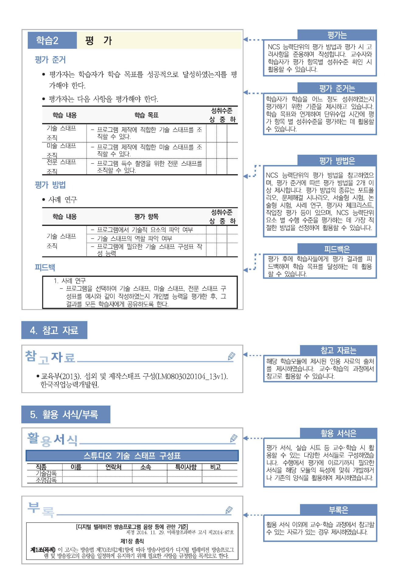

## [NCS-학습모듈의 위치]

| 대분류 | 전기‧전자 |          |
|-----|-------|----------|
| 중분류 |       | 전자 기기 개발 |
| 소분류 |       | 반도체 개발   |

| 세분류    |                      |                      |
|--------|----------------------|----------------------|
| 반도체 개발 | 능력단위                 | 학습모듈명                |
| 반도체 제조 | 반도체용 CMP슬러리 재료 제조    | 반도체용 CMP슬러리 재료 제조    |
| 반도체 장비 | 반도체용 세정공정 재료 제조      | 반도체용 세정공정 재료 제조      |
| 반도체 재료 | 반도체용 박막도금공정 재료 제조 | 반도체용 박막도금공정 재료 제조 |
|        | 반도체용 SOD공정 재료 제조     | 반도체용 SOD공정 재료 제조     |
|        | 반도체용 트랙공정 재료 제조      | 반도체용 트랙공정 재료 제조      |
|        | 반도체용 웨이퍼 재료 제조       | 반도체용 웨이퍼 재료 제조       |
|        | 반도체용 금속(Target)재료 제조 | 반도체용 금속(Target)재료 제조 |
|        | 반도체용 패키지 재료 제조       | 반도체용 패키지 재료 제조       |
|        | 반도체 재료 개발            | 반도체 재료 개발            |
|        | 반도체 재료 생산관리          | 반도체 재료 생산관리          |
|        | 반도체 재료 품질관리          | 반도체 재료 품질관리          |
|        | 반도체 재료 안전관리          | 반도체 재료 안전관리          |
|        | 반도체용 마스크 재료 제조       | 반도체용 마스크 재료 제조       |

| 반도체용 플립칩 재료 제조       | 반도체용 플립칩 재료 제조       |
|----------------------|----------------------|
| 반도체용 CMP 재료 제조       | 반도체용 CMP 재료 제조       |
| 반도체용 식각공정 가스 제조      | 반도체용 식각공정 가스 제조      |
| 반도체용 세정공정 가스 제조      | 반도체용 세정공정 가스 제조      |
| 반도체용 박막공정 가스 제조      | 반도체용 박막공정 가스 제조      |
| 반도체용 이온주입공정 가스 제조 | 반도체용 이온주입공정 가스 제조 |
| 반도체용 박막공정 전구체 제조     | 반도체용 박막공정 전구체 제조     |
| 반도체용 포토공정 재료 제조      | 반도체용 포토공정 재료 제조      |

| 학습모듈의 개요                     | 1  |
|------------------------------|----|
| 학습 1. 포토 공정 재료 제조 요구 사항 파악하기 |    |
| 1-1. 포토 공정 재료 제조 요구 사항 파악    | 3  |
| • 교수 ․ 학습 방법                 | 22 |
| • 평가                         | 23 |
| 학습 2. 포토 공정 재료 준비하기          |    |
| 2-1. 포토 공정 재료 준비             | 26 |
| • 교수 ․ 학습 방법                 | 46 |
| • 평가                         | 47 |
| 학습 3. 포토 공정 재료 제조하기          |    |
| 3-1. 포토 공정 재료 제조             | 49 |
| • 교수 ․ 학습 방법                 | 71 |
| • 평가                         | 72 |
| 참고 자료                        | 74 |
| 부 록                       | 75 |

## 반도체용 포토 공정 재료 제조 학습모듈의 개요

#### 학습모듈의 목표

반도체 제조에 필요한 포토 공정 재료의 요구 사항을 파악하여 선정하고 제조할 수 있다.

#### 선수학습

디스플레이 패터닝 공정 개발(LM1903070105\_14v2)

#### 학습모듈의 내용체계

| 하스                   | 아니 사람                        | NCS 능력단위 요소       |                           |
|----------------------|------------------------------|-------------------|---------------------------|
| 학습                | 학습 내용                        | 코드번호              | 요소 명칭                     |
| 요구 사항 파악하기           | 1-1. 포토 공정 재료 제조 요구 사항 파악 | 1903060421_23v3.1 | 포토 공정 재료 제조 요구 사항 파악하기 |
| 2. 포토 공정 재료 준비 하기 | 2-1. 포토 공정 재료 준비             | 1903060421_23∨3.2 | 포토 공정 재료 준비하기          |
| 3. 포토 공정 재료 제조 하기 | 3-1. 포토 공정 재료 제조             | 1903060421_23v3.3 | 포토 공정 재료 제조하기          |

#### 핵심 용어

포토 공정, 감광막, 감광 재료, 현상 공정, 현상액, 노광, 노광 정렬, 노광 선폭, 노광 에너지

| 학습 1 | 포토 공정 재료 제조 요구 사항 파악하기 |
|------|------------------------|
| 학습 2 | 포토 공정 재료 준비하기          |
| 학습 3 | 포토 공정 재료 제조하기          |

# 1-1. 포토 공정 재료 제조 요구 사항 파악

|       | • 생산 관련 부서로부터 포토 공정 재료 제조 사양서를 입수할 수 있다.                   |
|-------|------------------------------------------------------------|
| 학습 목표 | • 포토 공정 재료 제조 사양서를 바탕으로 제품명, 품질 기준, 제품 사양, 납기 등을 파악할 수 있다. |
|       | • 파악된 내용을 바탕으로 포토 공정 재료 제조 시 발생할 수 있는 문제점을 검토할 수 있다.       |

## 필요 지식 /

#### 숔 반도체 포토 공정의 개요

반도체 제조 공정에서 포토 공정은 원하는 회로가 설계된 패턴의 레이아웃(Layout)이 유리판 위에 금속 패턴으로 만들어진 마스크(Mask)를 사용하여 노광기의 빛을 통과시켜 웨이퍼 위에 패턴을 전사시켜 전자 회로를 만드는 기술이며, 반도체의 제조 공정에서 설계된 패턴을 웨이퍼 상에 형성하는 가장 중요한 공정 중 하나이다. 세부 내용을 살펴보면 여러 단계의 준비 작업과 본 공정을 순서대로 진행하게 되는데 매우 예민하고 정밀한 광학 기구와 화학 물질을 사용해야 한다.

1. 감광막 접착 향상제(HMDS) 도포 공정

웨이퍼에 PR를 코팅하기 전 접착 향상제인 에이치엠디에스(HMDS: Hexa Methyl Di Siliazane, 헥사메틸디실라잔)를 도포하는 공정으로 작업 시 휘발성이 있어 신체 접촉에 주 의하여야 한다. HMDS의 분자식은 Si2(CH3)6이며, 웨이퍼의 표면을 소수성으로 변화시키기 위해 사용한다. 감광막으로 사용되는 피아르(PR: Photo Resist)는 유기 용매액으로 액체 형태이므로 웨이퍼나 유리 표면은 쉽게 잘 붙지 않을 수 있다. 그래서 결국 HMDS는 PR와 웨이퍼의 접착력을 향상해 주는 물질로 사용되고 PR가 기판에 도포도 잘되고 접착이 잘 유 지되는 기능을 하게 된다.

2. 감광막 도포 공정 스핀코팅(Spin Coating)

반도체 웨이퍼에 감광 성질을 가지고 있는 PR를 도포하는 공정으로 작업 시 유기 용제이기 때문에 인체의 피부 등에 접촉되지 않게 주의하여야 한다. Spin Coating은 아주 오랫동안 박막 필름 공정에 사용되어 왔다. 이 공정에서는 보통 소량의 액체 수지를 기판의 중앙에 낙하시킨 다음 고속(약 3,000rpm)으로 기판을 회전시키는 방법을 사용한다. 구심성 가속으 로 얇은 수지가 표면에 코팅된다. 필름 두께와 특성은 수지의 속성(점성, 건조율, 응고율, 표면 장력 등)과 공정에 매개 변수에 따라 달라지며 스핀 속도, 가속 및 가스 배출 등이 필 름의 특성에 영향을 끼친다. 스핀 코팅에서 중요한 요인은 반복성이며 스핀 공정의 매개 변 수는 작은 변이가 코팅된 필름에 영향을 줄 수 있다.

3. 소프트 베이킹(Soft Baking) 공정

반도체 웨이퍼에 PR를 도포하고 나서 95℃~115℃로 가열하는 공정으로 유기 용제인 PR의 수분을 제거해 주고 기본적인 두께와 형태를 만드는 공정이다.

4. 정렬(Alignment)과 노광(Exposure) 공정

Mask의 이미지를 반도체 웨이퍼에 옮기기 위해 상호 정확한 위치에 맞추는 공정과 정렬이 끝나면 Mask의 상이 반도체 웨이퍼에 옮겨지도록 자외선에 PR를 노출시키는 공정을 말하 며 정렬과 노광을 동시 작업으로 진행한다.

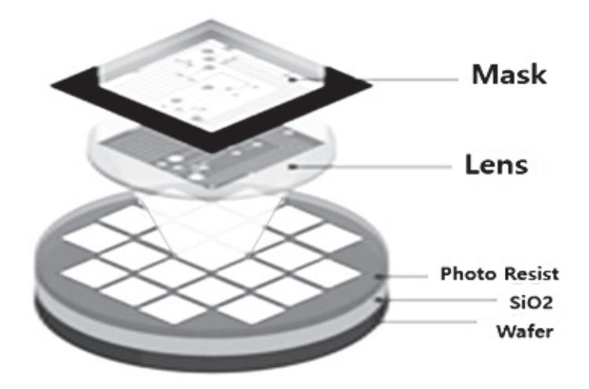

출처: 집필진 제작(2024) [그림 1-1] 노광 공정

- 5. 노광(Exposure) 이후 공정
  - (1) Post-Exposure bake 공정

감광제(PR)가 도포된 반도체 웨이퍼를 Alignment(정렬)하고 Exposure(노광)된 웨이퍼 를 110℃로 굽는 공정으로 작업 시 자외선 노출에 주의하여야 한다.

(2) Develop 공정

웨이퍼에 감광제(PR)로 도포하고 정렬 및 노광 후 현상액을 이용하여 필요한 곳과 필요 없는 부분을 구분하여 상을 형성하기 위해 PR를 제거하는 공정으로 작업 시 화학 약품 의 접촉에 주의하여야 한다.

(3) Hard bake 공정

Develop 공정이 진행된 반도체 웨이퍼를 130~140℃에 Bake Oven에 굽는 공정으로 작업 시 고온 접촉에 주의하여야 한다.

(4) Develop inspect 공정

웨이퍼에 감광제(PR)를 도포하고 정렬 및 노광한 후 현상액을 이용하여 필요한 곳과 필 요 없는 부분을 구분하여 상이 정확하게 형성되어 있는지를 검사하는 작업이다.

4. 반도체용 포토 공정 형태와 불량

포토 공정은 반도체 공정에서 집적 회로로 사용되는 실리콘 웨이퍼에 감광제(PR)를 이용하여 패턴을 만드는 공정을 의미한다. [그림 1-1]은 마스크(Mask)에 설계된 회로들을 광원을 이용하여 웨이퍼에 새기는 공정을 간략하게 표현한 것이다. 마스크(Mask)는 크로뮴(Chromium)으로 증착한 석영 기판(Quartz Plate)을 사용하는데 설계된 패턴 모양을 전달하여 설계된 회로들의 패턴들 원형을 웨이퍼 표면에 나타내는 것이다. 여기서 렌즈를 통과한 빛이 웨이퍼에 도달할 때 원하는 패턴(Pattern)이 만들어지기 때문에, 렌즈의 광학적 특성을 기반으로 정확한 계산을 하여 설계하여 야 한다. [그림 1-2]과 [그림 1-3]은 다양한 유형의 불량의 예시이다.

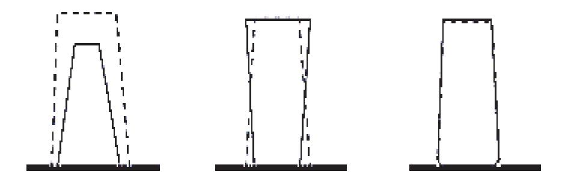

출처: 집필진 제작(2024) [그림 1-2] 노광 공정 불량 유형 1

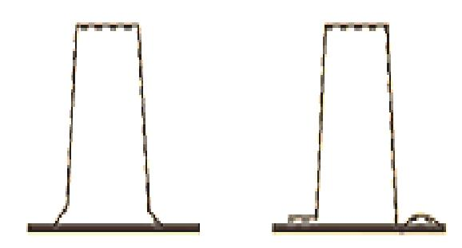

출처: 집필진 제작(2024) [그림 1-3] 노광 공정 불량 유형 2

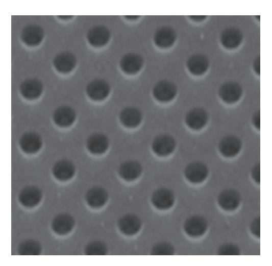

출처: 집필진 제작(2024) [그림 1-4] 노광 공정 원형 패턴

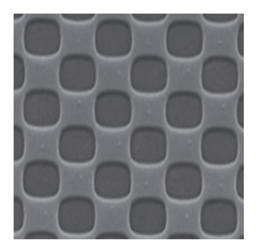

출처: 집필진 제작(2024) [그림 1-5] 노광 공정 사각 패턴

5. 반도체용 리소그래피 종류

반도체용 리소그래피 공정은 웨이퍼에 빛이 도달하게 되면 웨이퍼 표면에 미리 코팅한 감 광제(PR)는 화학적 변화를 일으키는데, PR의 성질에 따라 아래와 같이 2가지 형태로 나눌 수 있다.

(1) Negative PR 공정

반도체 웨이퍼에 감광 성질을 띠는 감광제(PR)가 도포된 곳에 패턴이 만들어지는 형태 가 빛을 받지 않는 부분을 현상할 때에 제거되는 감광제(PR)를 말한다. 작업 시 유기물 상태이기 때문에 신체 노출에 주의하여야 한다.

(2) Positive PR 공정

반도체 웨이퍼에 감광 성질을 가지고 있는 감광제(PR)가 도포된 곳에 패턴이 만들어 지

는 형태인데 빛을 받은 부분이 마지막 공정에서 제거되는 PR를 말한다. 공정 시 유기 용제이기 때문에 신체 접촉에 주의하여야 한다.

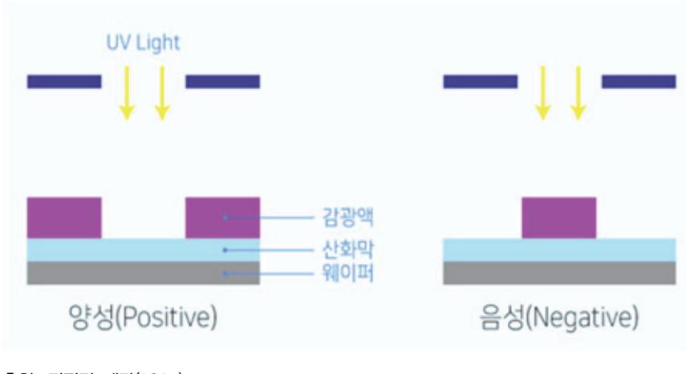

출처: 집필진 제작(2024) [그림 1-6] 감광막의 종류

#### 6. 반도체용 포토 공정의 중요점

반도체용 포토 공정은 초기 웨이퍼 위에 최종적으로 회로를 만들 산화막이나 질화막 또는 금속막을 먼저 증착을 하고 나중에 그 위에 감광막을 올리고 포토 마스크를 사용하여 설계 된 회로를 전사하는 과정인데 그 이후에 이루어지는 식각 공정의 편리도를 충분히 고려해 야 한다. [그림 1-7] 포토 공정의 단계에서 보면 포토 공정 전후의 연관 관계와 기능을 이 해할 수 있다. 그리고 [그림 1-8] 포토 공정의 발전을 보면 노광 광원의 파장의 길이에 따 른 공정 능력을 보여 준다. 노광을 진행하는 광원의 파장에 따라 만들 수 있는 패턴의 크기 가 결정되며 그 원리는 파장의 크기에 따른 에너지의 크기에 따라 매우 미세한 패턴의 바 닥 면까지 노광할 수 있는지가 관건이며 포토 공정 능력의 중요 이론이라고 할 수 있다.

7. 광원의 파장과 미세 패턴

광원의 파장이 매우 작을 경우 가장 미세한 패턴을 노광할 수 있는 것이고, 파장이 G-Line 이나 I-Line처럼 수백 나노미터의 크기일 경우 수십 나노미터의 패턴을 만들 수 없는 조건 이 되는 것이다. 반대로 EUV처럼 13.5 나노미터의 매우 작은 파장의 광원을 사용할 경우 에는 수 나노미터에서 수십 나노미터의 패턴을 만드는 것이 가능하게 된다. 이와 비슷한 공 정으로는 KrF 노광 장비와 ArF 노광 장비가 있는데, EUV의 13.5nm 파장보다는 긴 파장 을 사용하기 때문에 미세 패턴의 정밀도는 EUV 노광 장치보다 부족하지만 조금 큰 수십 나노미터의 정확한 미세 패턴을 만드는 데 사용할 수 있는 장치이다.

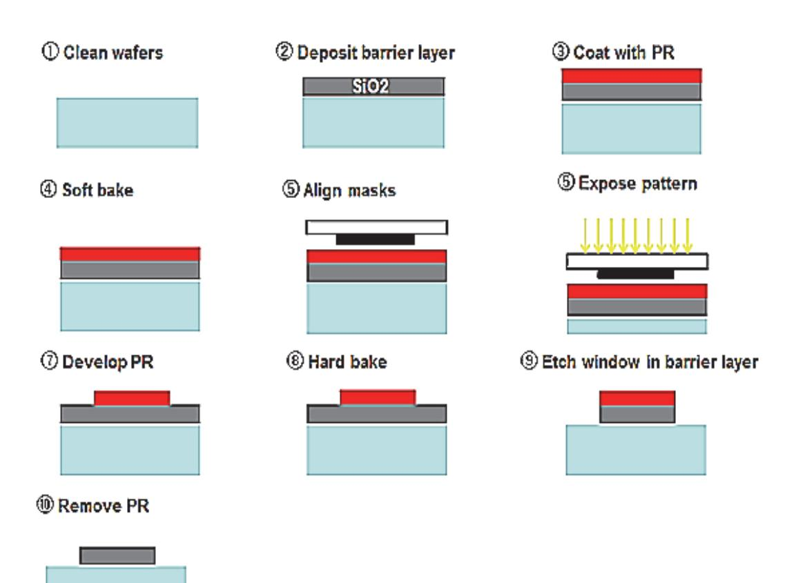

출처: 집필진 제작(2024) [그림 1-7] 포토 공정의 단계

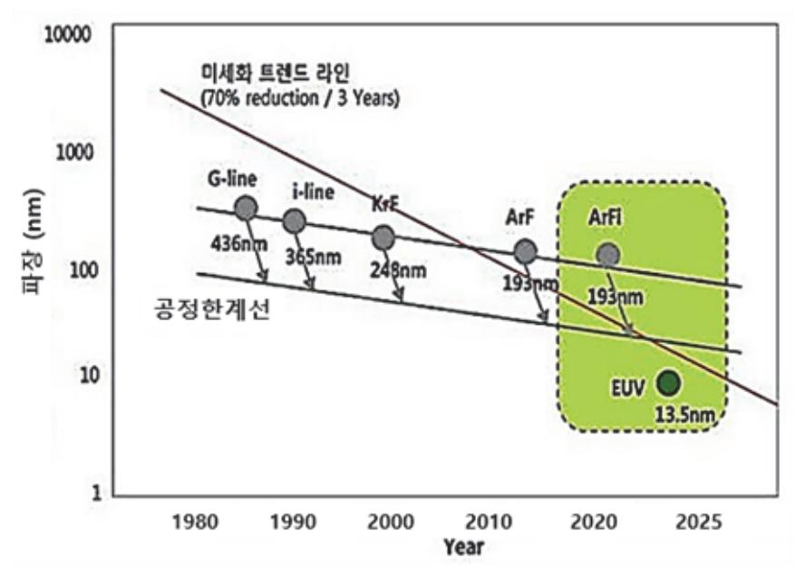

출처: 집필진 제작(2024) [그림 1-8] 포토 공정의 발전 과정

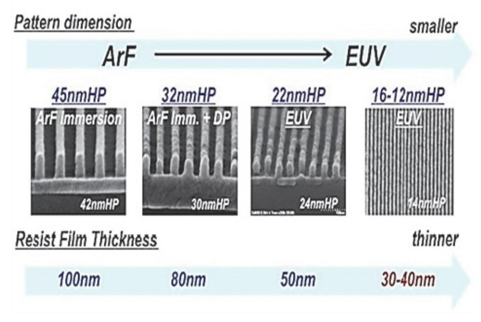

출처: 집필진 제작(2024)

[그림 1-9] 포토 공정의 광원 파장과 단계별 미세 패턴

#### 8. 감광제와 미세패턴

감광제는 [그림 1-9]와 같이 빛으로 인해 그 화학 물질 자체에 구조적인 변화가 일어나 특정 용매에 대한 용해성이 달라지는 것이다. Positive PR에 사용되며, 빛을 받기 전에는 알칼리 수용액 (Aqueous Alkaline Solution)에 녹지 않다가 빛을 받고 나면 그 구조가 변해 수용액에 녹게 되는 것이다. 이러한 PR는 G-line(436nm) 및 I-line(365nm)의 저해상도에 많이 사용된다. 이와 같은 구조의 해상도를 가지는 광원과 감광제를 사용할 경우 만들 수 있는 패턴의 사이즈는 수십 나노미터 이상의 큰 패턴이 가능하며, 그보다 더 미세한 패턴을 만들기 위해서는 더 짧은 파장의 광원과 화학 증폭형 감광제(Chemically Amplified Photoresist)를 사용하여야 가능하게 된다.

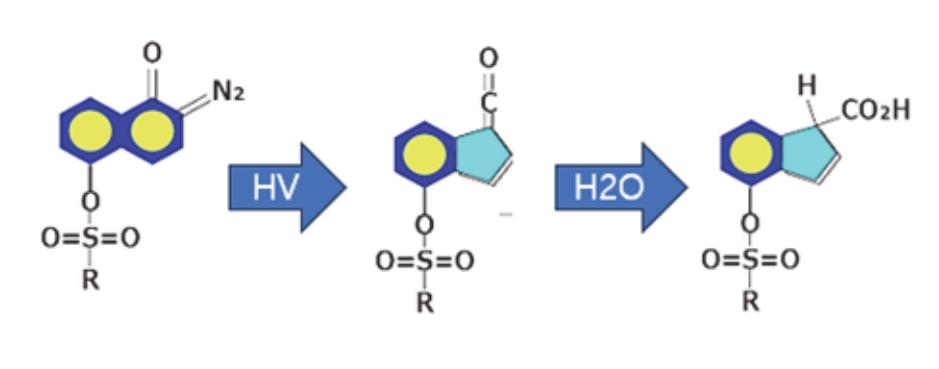

출처: 집필진 제작(2024) [그림 1-10] G-line 및 I-line 감광제

(1) 화학 증폭형 감광제(Chemically Amplified Photoresist)

[그림 1-10]과 같은 광화학 반응이 일어나면 PR에서는 화학적인 반응 촉매가 일어난다. 이러한 반응으로 고분자의 용해성이 바뀌게 되어 특정한 용매에 용해되므로 패턴이 형 성된다. [그림 1-11]과 같은 반응의 감광제는 파장이 짧은 KrF(248nm)나 ArF(193nm) 의 광원을 쓰는 PR에 널리 사용된다. [그림 1-11]은 KrF, ArF 감광제의 광화학 반응을 보여 주는 예시이다.

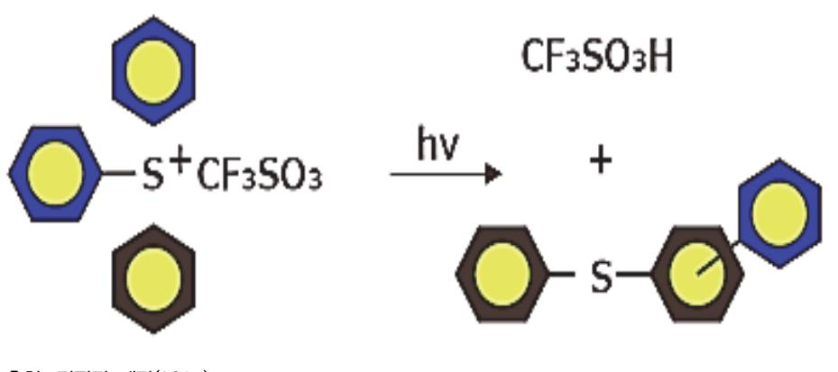

출처: 집필진 제작(2024) [그림 1-11] KrF. ArF 감광제

(2) 감광제의 노광 패턴의 조건과 결과

PR 두께는 Spin Speed와 PR의 점도가 결정하는데 보통 트랙의 Spin Speed를 3,000~7,000rpm으로 설정을 바꿔가면서 최적 속도 조건을 찾아야 하며 점도가 두께 및 패턴 불량에 영향을 많이 주며, 점도는 또 온습도에 민감하므로 온도 23±0.5℃, 습도 45±5%로 유지하여야 두께 균일도 ±100Å 이내의 패턴에 따른 정확한 패턴 각도를 얻을 수 있다.

재료·자료

- ISO, KS 표준화 문서
- ITRS 로드맵(International Technology Roadmap for Semiconductor)
- 반도체 로드맵
- 반도체 제조 공정도
- 반도체 기술 동향 분석서
- MSDS
- 시험 성적서
- 리소그래피 재료
- Immersion Photo Resist, Top Coat, BARC,
- KrF Photo Resist, Thinner, I-line Photo Resist, SOD

#### 기기(장비 ・ 공구)

- 제조 공정 장비
- 유기 합성 Pilot 설비
- PR류 Mixing Vessel
- 중합체 합성 설비
- 공정 이상 Monitoring 설비
- Bottle Cleaning 설비
- 원자재 창고
- Bottle Filling 설비
- 평가, 분석 및 계측장비
- CD-SEM, Bath(VB-10)

- Dynamic Contact Angle
- Coating Defect Inspection
- 제조 공장 인트라넷
- 안전 도구, 안전화, 안전모
- 컴퓨터, 프린터, 복사기

#### 안전 ・ 유의 사항

- 공정 장비는 제품을 생산하기 위한 장비로서 규칙에 따라 관리되어야 하며, 일정 주기와 방 법에 따라 장비 성능을 평가하여야 한다.
- 평가/분석/계측기는 제품의 물리적 성질이나 특성 등을 평가하는 장비로서 규칙에 따라 관 리되어야 하며 일정 주기와 방법에 따라 검·교정을 실시해야 한다.
- 작업 표준에는 공정 순서 및 온도, 시간, 환경 등의 조건을 포함해야 한다.
- 작업 절차서는 생산을 완료하기까지의 절차를 체계적으로 작성한 생산 작업의 계획서로서, 생산을 정확히 실시할 목적으로 생산을 위한 절차와 생산에 사용하는 재료, 장치의 준비 및 사용법, 그리고 생산 시 필요한 주의 사항을 표시한 문서이므로 절차서를 잘 준수해야 한다.
- CoA(Certificate of Analysis)는 가스의 순도 및 불순물 등 해당 제품의 품질 및 Specification을 나타낸다.

#### 수행 순서

숔 반도체 포토 공정의 주요 내용을 이해한다.

반도체 포토 공정의 요구 사항 파악을 위해서는 포토 공정의 단계별 주요 내용에 대해 정확히 이해하는 것이 필요하다.

1. 접착 향상제(HMDS)를 도포한다.

회전하는 웨이퍼에 HMDS를 도포하는 공정으로 진공 Chuck을 이용하여 Wafer를 고정시 킨 후 회전시킨 상태에서 HMDS를 떨어뜨려 넓게 도포시킨다. PR를 도포하기 전에 PR의 접착성 향상을 위하여 진행하는 예비 공정이다.

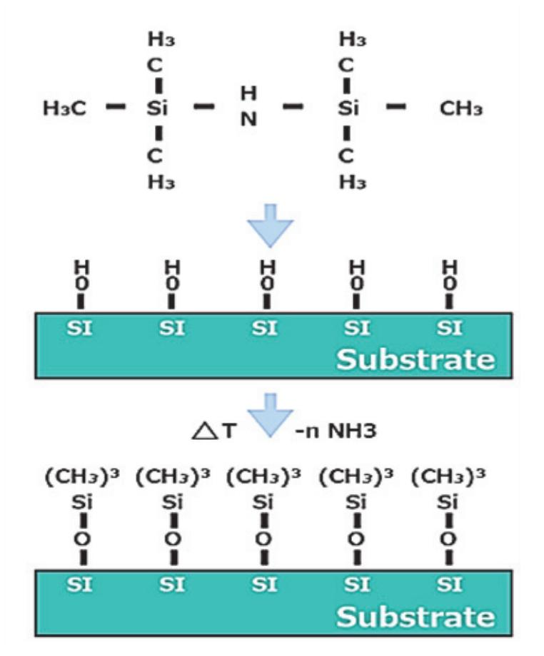

출처: 집필진 제작(2024) [그림 1-12] 접착 향상제(HMDS) 도포 공정

2. Spin Coat or 감광제(PR)를 도포한다.

웨이퍼에 감광 성질을 가지고 있는 감광제(PR)를 도포하는 공정으로 작업 시 유기 용제이 기 때문에 노출에 주의하여야 한다.

- (1) 적정량의 PR를 Wafer 위에 떨어뜨려 준다.
- (2) 500 RPM(Revers per Minute) 정도의 저속 속도로 회전시켜서 균일하게 PR가 퍼지도록 만든다.
- (3) RPM 속도를 서서히 올리면서 회전시켜서 잉여분의 PR를 제거해 준다.
- (4) 3,000RPM 정도의 고속 속도로 회전시켜서 PR이 건조막이 되도록 만들어 준다.

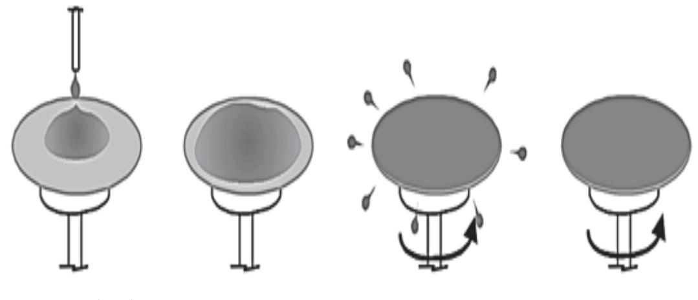

출처: 집필진 제작(2024) [그림 1-13] PR 도포 공정

3. Soft Bake 공정을 진행한다.

웨이퍼에 감광제(PR)를 도포하고 나서 95~115℃로 굽는 공정으로 PR의 형태 유지와 수분 의 증발을 통한 건조가 목적이다. 핫 플레이트(Hot Plate)라고 불리는 가열 기구나 가열 오 븐을 사용하여 진행한다.

4. 얼라인먼트(Alignment)와 노광(Exposure) 공정을 진행한다.

Mask의 이미지를 웨이퍼에 옮기기 위해 상호 정확한 위치에 맞추는 공정과 정렬이 끝나면 Mask의 상이 웨이퍼에 옮겨지도록 자외선에 감광제(PR)를 노출시키는 공정을 말하며 정렬 과 노광을 동시 작업으로 진행한다. 노광 장비가 웨이퍼에 형성된 레이어(Layer)의 얼라인 먼트 마크(Alignment Mark)와 최초 패턴이 새겨진 Mask의 얼라인 마크를 사용해 웨이퍼 칩 맵을 노광 장비의 Alignment 통해 얻은 정보로 칩의 Pitch, Flat Zone부터의 위치 등 을 인식해 웨이퍼 맵과 오버랩(Overlap)되도록 현재 Layer 위에 새로운 패턴을 노광하는 것이다.

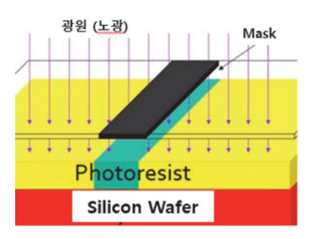

출처: 집필진 제작(2024) [그림 1-14] PR 도포 공정

5. Post-Exposure bake 공정을 진행한다.

감광제(PR)가 도포된 웨이퍼를 정렬하고 노광된 웨이퍼를 110℃로 굽는 공정으로 작업 시 노출에 주의하여야 한다. 이는 다음 과정에서 PR의 저항성을 높여 주고 PR에 손상을 줄 수 있는 경우, PR에 손상되어 역할을 다 하지 못하는 경우와 같은 원치 않는 결과를 감소시키기 위해 적정한 온도에서 열처리하는 것이다. 즉 Soft Bake 과정에서 제거하지 못한 Solvent를 완전히 제거해 주는 과정이다.

6. Develop 공정을 진행한다.

웨이퍼에 PR로 도포하고 정렬 및 노광 후 현상액을 이용하여 필요한 곳과 필요 없는 부분 을 형성하기 위해 PR를 제거하는 공정으로 작업 시 노출에 주의하여야 한다. 식각되어야 할 부분에 존재하는 감광막 제거를 위해 Spray법으로 공정을 진행하는 것이다.

7. Hard bake 공정을 진행한다.

Develop 공정이 진행된 웨이퍼를 130~140℃에 Bake Oven에 굽는 공정으로 작업 시 노 출에 주의하여야 한다.

8. Develop inspect 공정을 진행한다.

반도체 웨이퍼에 PR로 도포하고 정렬 및 노광 후 현상액을 이용하여 필요한 곳과 필요 없 는 부분의 형성이 정확하게 되어 있는지를 검사하는 작업이다.

#### 숕 반도체용 포토 공정 재료를 파악한다.

- 1. 반도체용 포토 공정 재료를 파악한다.
  - (1) 광화학 반응에 따른 감광제를 구분한다.

Photo-Active Compound(PAC)형 감광제 빛으로 그 화학 물질 자체에 구조적인 변화가 일어나 특정 용매에 대한 용해성이 달라지는 것이다. Positive PR에 사용되며, 빛을 받기 전에는 알칼리 수용액(Aqueous Alkaline Solution) 용액에 녹지 않다가 빛을 받고 나면 그 구조가 변해 알칼리 수용액에 녹게 되는 것이다. 이러한 PR는 G-line(436nm) 및 I-line(365nm)의 저해상도 RP에 많이 사용된다.

(2) 패턴 형성에 따른 감광제를 구분한다.

Negative PR는 빛을 받으면 가교 반응이나 기능성기(Functional Group)에 변화가 일 어나 현상액에 녹지 않게 되어 포토 마스크에서 전달된 패턴을 형성한다.

(3) 광원의 파장에 따른 감광제를 구분한다.

PR을 분류하는 다른 방법은 PR이 감응하는 빛의 파장을 이용하는 것이다. PR의 해상 도는 사용하는 빛의 파장에 반비례한다.

(가) G-line 감광제

G-line 감광제는 436nm의 빛의 파장에 감응하여 광화학적 반응을 일으켜 패턴을 형성하는 종류로 500nm의 해상력을 지닌다.

(나) I-line 감광제

365nm의 빛에 의해 300nm의 해상력을 지니는 PR이다. G-line 감광제와 같은 고 분자를 사용하나, 감광제는 365nm의 빛에 가장 높은 양자 효율을 가질 수 있도록 구조를 변경하여 사용한다.

(다) KrF 감광제

I-line까지는 고압 수은등(High pressure Hg lamp)을 사용하여 수은등에서 발생하 는 빛을 광학 필터로 걸러 436nm 또는 365nm의 빛을 PR 패터닝에 이용하여 왔 으나, I-line보다 더 높은 해상도가 필요하면서 크립톤-플루오라이드(Kr-F) 레이저를 이용한 새로운 광원이 개발되었고, 그 광원(248nm)에 고감도인 새로운 PR가 개발되 었다.

(라) EUV 감광제

ArF 광원으로 구현할 수 있는 최소 해상도를 45nm 또는 32nm(물보다 굴절률이 더 높은 액침용 액체를 사용하는 경우)로 전망하고 있는데, 그 이하의 패턴을 구현하기 위해서는 광원의 파장을 바꿔야 한다. 가능한 광원으로 EUV(Extreme UV, 극자외 선)가 유력하며, EUV PR은 EUV의 파장인 13.4nm의 빛에 감응하여 광화학적 반응 을 일으킬 수 있는 화합물로 구성되어 있다.

#### 숖 반도체용 감광 재료를 구분하여 사용한다.

1. 반도체용 감광 재료를 분류한다.

리소그래피 감광제 재료는 광과 전자선에 의해 반응하는 고분자 화합물로써 반도체용 리소 그래피 공정에 따른 미세 가공은 PR의 광반응에 의한 결과와 고분자 극성 변화, 연결 고리 반응에 따른 용제, 특히 알칼리 수용액에 대한 용해성의 변화를 이용한다.

- (1) 광화학 반응에 따른 감광제를 분류한다.
  - (가) Photo-Active Compound(PAC)형 감광제를 사용한다.

빛으로 인해 그 화학 물질 자체에 구조적인 변화가 일어나 특정 용매에 대한 용해성 이 달라지는 감광제를 사용한다. Positive PR에 사용되며, 빛을 받기 전에는 알칼리 수용액(Aqueous Alkaline Solution)에 녹지 않다가 빛을 받고 나면 그 구조가 변 해 수용액에 녹게 되는 것이다. 이러한 PR은 G-line(436nm) 및 I-line(365nm)의 저해상도에 많이 사용된다. 이와 같은 구조의 해상도를 가지는 광원과 감광제를 사 용할 경우 만들 수 있는 패턴의 사이즈는 수십 나노미터 이상의 큰 패턴이 가능하 며, 그보다 더 미세한 패턴을 만들기 위해서는 더 짧은 파장을 가진 광원과 화학 증

폭형 감광제(Chemically Amplified Photoresist)를 사용하여야 가능하게 된다.([그 림 1-10] 참조)

(나) 화학 증폭형 감광제(Chemically Amplified Photoresist)를 사용한다.

파장이 짧은 감광제 역시 광화학 반응이 일어나면 PR에서는 화학적인 반응 촉매가 일어난다. 이러한 반응으로 고분자의 용해성이 바뀌게 되어 특정한 용매에 용해되므 로 패턴이 형성된다. KrF(248nm)나 ArF(193nm)의 광원을 쓰는 PR가 파장이 짧은 감광제로 널리 사용된다([그림 1-11] 참조).

(다) 감광제의 노광 패턴의 조건과 결과를 파악한다.

PR 두께는 Spin Speed와 PR의 점도가 결정하는데 보통 트랙의 Spin Speed를 3,000~7,000rpm으로 설정을 바꾸어 가면서 최적 속도 조건을 찾아야 하며 점도가 두께 및 패턴 불량에 영향을 많이 주며, 점도는 또한 온습도에 민감하므로 온도 23±0.5℃, 습도 45±5%로 유지하여야 두께 균일도 ±100Å 이내의 패턴에 의한 정확한 패턴 각도를 얻을 수 있다.

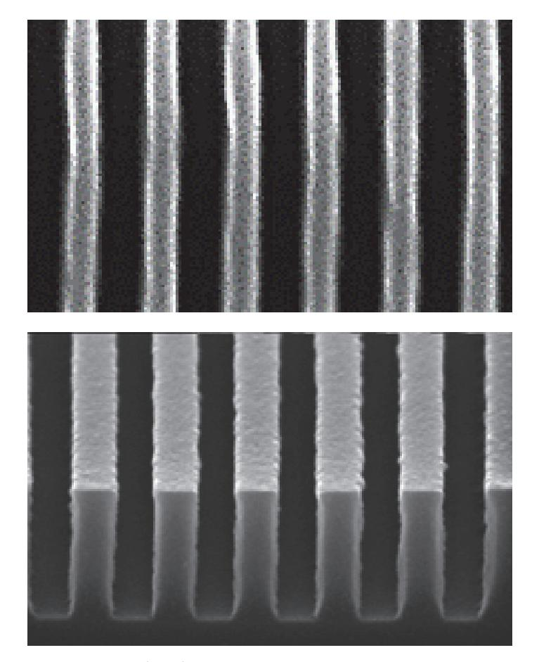

출처: 집필진 제작(2024) [그림 1-15] 감광제의 점도와 패턴

#### (2) 패턴 형성에 따른 감광제를 구분한다.

Negative형 감광제는 빛을 받으면 가교 반응이나 기능성기(Functional Group)에 변화가 일어나 현상액에 녹지 않게 되어 그대로 남고 빛을 받지 않은 부위만 선택적으로 제거되어 설계된 회로가 그려져 있는 포토 마스크에서 전달된 패턴을 형성한다. 홈 부위는 빛을 받 지 않아 현상액에 녹은 상태로 파여 있고 위로 돌출된 부위는 빛을 받아서 가교 반응이나 기능성기에 변화가 일어나 현상액에 녹지 않게 되어 빛을 받지 않은 부위와 달리 원래의 표면을 유지한 상태이다. 거의 모든 Negative형 PR이 Film 형성을 위한 Binder polymer 와 가교제, 광 활성제 등을 조합하여 제조된다. 가교 반응을 이용한 Negative PR가 대부 분이며 가교된 Film의 특성상 식각성이 좋고 PR 패턴 너비가 아래보다 윗부분이 큰 모양 을 형성하여 반도체의 Metal Lift-Off 공정 등에 널리 사용되고 있다.

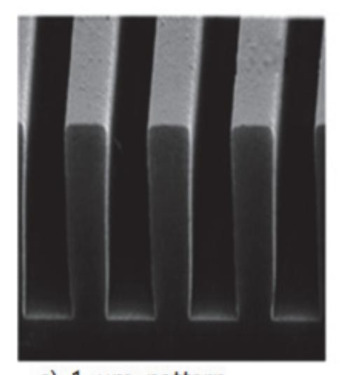

출처: 집필진 제작(2024) [그림 1-16] 감광제의 패턴 선폭

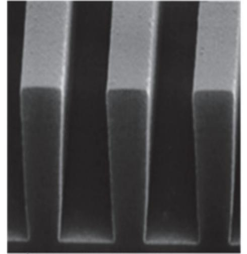

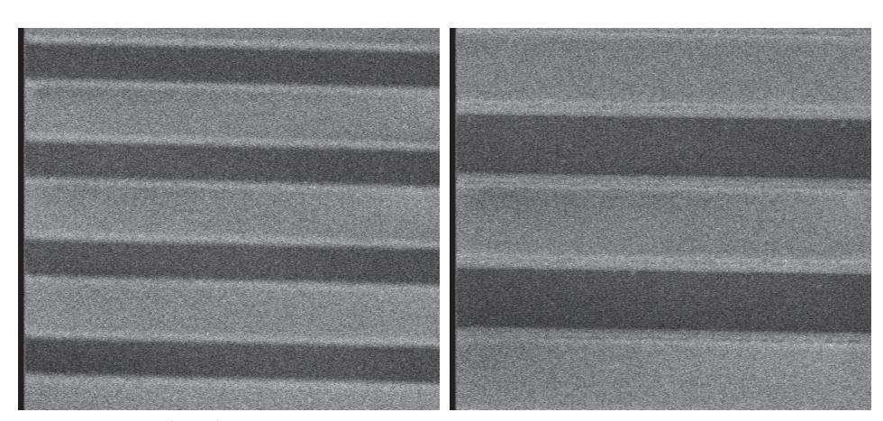

출처: 집필진 제작(2024) [그림 1-17] Negative 감광제의 사용 후 CD-SEM

Positive 형 PR은 빛을 받은 부분이 광화학 반응을 일으켜 현상액에 잘 용해되는 구조 로 현상액 처리를 하면 노광된 부분이 녹아 패턴을 형성하는 것이다. 현재 많이 사용되 는 PR이며, ArF 공정을 사용하는 경우, 45nm 혹은 그보다 더 작은 패턴의 형성도 가 능하다.

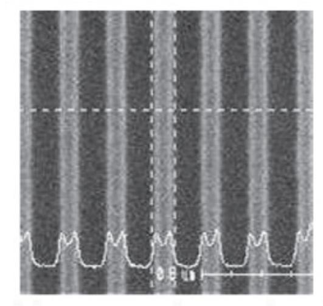

출처: 집필진 제작(2024)

[그림 1-18] Positive 감광제의 CD SEM 결과

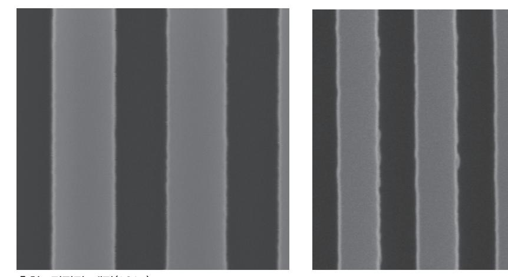

출처: 집필진 제작(2024) [그림 1-19] Positive 감광제의 패턴

#### (3) 광원의 파장에 따른 감광제를 구분한다.

감광제를 분류하는 다른 방법은 PR이 감응하는 빛의 파장을 이용하는 것이다. PR패턴의 해상도는 사용하는 빛의 파장에 반비례하고 빛의 파장이 짧을수록 해상도는 좋다. 반도체의 집적도가 높아지면서 회로 구성을 위한 패턴 크기는 작아져야 하므로 리소그래피 공정에 사용하는 빛의 파장도 436nm에서 193nm까지 계속 짧아지고 있다. 이에 따라 PR도 바뀐 빛의 파장에서 최고의 감도를 가질 수 있도록 변화되었다.

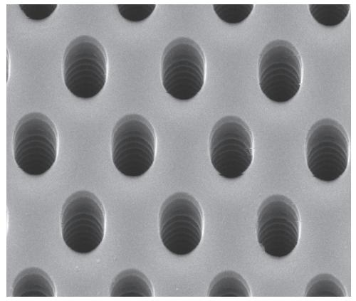

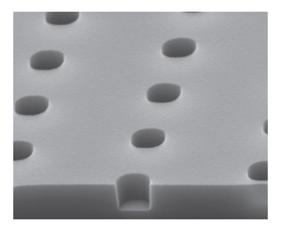

출처: 집필진 제작(2024) [그림 1-20] 짧은 파장을 이용한 감광제의 원형 패턴

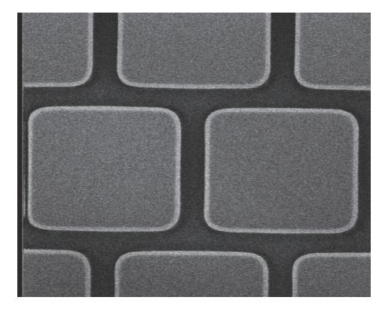

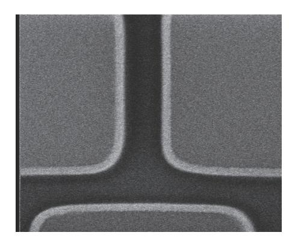

출처: 집필진 제작(2024) [그림 1-21] 짧은 파장을 이용한 감광제의 사각 패턴

(가) G-line 감광제

G-line 감광제는 436nm의 빛의 파장에 감응하여 광화학적 반응을 일으켜 패턴을 형성하는 종류로 500nm의 해상력을 갖는다.

(나) I-line 감광제

365nm의 빛에 의해 300nm의 해상력을 갖는 감광제이다. G-line 감광제와 같은 고분자를 사용하나, 감광제는 365nm의 빛에 가장 높은 양자 효율을 가질 수 있도 록 구조를 변경하여 사용한다.

(다) KrF 감광제

I-line까지는 고압 수은등을 사용하여 수은등에서 발생하는 빛을 광학 필터로 걸러 436nm 또는 365nm의 빛을 감광제 패터닝에 이용했으나, I-line보다 더 높은 해상 도가 요구되면서 KrF 레이저를 이용한 새로운 광원이 개발되었고, 그 광원 248nm

에 고감도를 갖는 새로운 감광제가 개발되었다.

특히 KrF PR부터는 화학 증폭형 PR가 본격적으로 사용되기 시작하였다. 이 PR은 약 100nm의 해상도를 갖는다. ArF PR: KrF 광원으로도 불가능한 고해상도의 패턴 을 만들기 위해 적용된 광원으로 ArF 레이저를 사용하기 시작하였는데 그 레이저의 파장인 193nm에서 높은 감도를 갖는 PR이다. 현재 기준으로 가장 높은 해상도의 패턴이 가능하여 55nm의 해상도를 보인다. 최근에는 렌즈와 PR 사이에 공기보다 굴절률이 높은 물을 채워 노광하는 액침 기술이 도입되어 ArF 광원을 이용한 해상도 는 45nm 또는 그 이상이 될 것으로 전망되고 있다.

(라) EUV 감광제

ArF 광원으로 구현할 수 있는 최소 선폭(해상도)를 45nm 또는 32nm로 전망하고 있는데, 그 이하의 패턴을 구현하기 위해서는 광원의 파장을 바꿔야 한다. 가능한 광 원으로 EUV(Extreme UV, 극자외선)이 유력하며, EUV 감광제는 EUV의 파장인 13.4nm의 빛에 감응하여 광화학적 반응을 일으킬 수 있는 화합물로 구성되어 있다.

## 학습 1 교수·학습 방법

#### 교수 방법

- 반도체 포토 공정의 개요와 세부 내용을 부분별로 알기 쉽게 설명한다.
- 현장에서 표준화한 공정 매뉴얼과 관련 공정 재료에서 제공되는 자료 등의 내용을 프레젠테 이션 자료로 제시한 후에 설명한다.
- 가능한 한 사전에 제조 현장에서 사용하는 사례를 수집하여 자료를 준비하고 이해하기 쉬운 방법을 논의하는 방식의 문제 해결식 수업을 진행한다.
- 최근 반도체 산업 현황(시장 환경 및 기술 동향 등)에 대하여 충분히 인지하고, 학습자들이 쉽게 이해할 수 있는 방법을 모색하여 수업을 진행한다.
- 관련 시장의 환경 및 기술 변화를 통합 검색 사이트나 한국반도체산업협회의 홈페이지 (www.ksia.or.kr) 등에서 찾아 활용할 수 있도록 지도한다.
- 반도체 포토 공정 재료 요구 사항에 필요한 내용을 확인하고, 관련 자료를 학습자들에게 제 시한 후 파악 여부를 확인한다.

#### 학습 방법

- 반도체 산업 현황(시장 환경 및 기술 동향 등)과 관련 기관을 구체적으로 확인하도록 하고, 이 기관과 관련된 다양한 자료를 인터넷으로 검색하고 분류하여 문서로 정리한다.
- 반도체 포토 공정 재료 요구 사항 항목이 선정된 양식에 맞추어 특정 소자에 대한 요구 사 항을 작성해 본 후, 여기에 첨부되는 자료의 종류와 기록 내용 전반을 숙지하고, 가능하다면 소자별로 분류해 본다.
- 반도체 포토 공정 재료 요구 사항에 대한 시장 및 기술, 비용의 조사, 수집 및 분석을 통해 생산에 필요한 목표를 설정하고 분류된 자료를 활용하여 생산 가능성을 예측한다.
- 반도체 포토 공정에서 예상되는 품질 관리 문제점을 파악하고 해결책을 수립하는 현장의 업 무를 이해하고, 정해진 양식에 따라 보고서를 작성한다.

## 학습 1 평 가

#### 평가 준거

- 평가자는 학습자가 학습 목표를 성공적으로 달성하였는지를 평가해야 한다.
- 평가자는 다음 사항을 평가해야 한다.

|                         | 학습 목표                                                         | 성취수준 |   |   |
|-------------------------|---------------------------------------------------------------|------|---|---|
| 학습 내용                   |                                                               | 상    | 중 | 하 |
| 포토 공정 재료 제조 요구 사항 파악 | - 생산 관련 부서로부터 포토 공정 재료 제조 사양서를 입수할 수 있다.                   |      |   |   |
|                         | - 포토 공정 재료 제조 사양서를 바탕으로 제품명, 품질 기준, 제품 사양, 납기 등을 파악할 수 있다. |      |   |   |
|                         | - 파악된 내용을 바탕으로 포토 공정 재료 제조 시 발생할 수 있는 문제점을 검토할 수 있다.       |      |   |   |

#### 평가 방법

• 포트폴리오

| 학습 내용                   | 평가 항목                                                        | 성취수준 |   |   |
|-------------------------|--------------------------------------------------------------|------|---|---|
|                         |                                                              | 상    | 중 | 하 |
| 포토 공정 재료 제조 요구 사항 파악 | - 감광제와 첨가제 재료 제조 사양서를 작성할 수 있는 능력                            |      |   |   |
|                         | - 감광제와 첨가제 재료 제조 사양서를 바탕으로 제품명, 품질 기준, 제품 사양, 납기 등의 파악 여부 |      |   |   |
|                         | - 파악된 내용을 바탕으로 포토 공정 재료 제조 시 발생할 수 있는 문제점 검토 능력           |      |   |   |

#### • 문제 해결 시나리오

| 학습 내용                   | 평가 항목                                                                            | 성취수준 |   |   |
|-------------------------|----------------------------------------------------------------------------------|------|---|---|
|                         |                                                                                  | 상    | 중 | 하 |
| 포토 공정 재료 제조 요구 사항 파악 | - 감광제와 첨가제 재료 제조 사양서의 세부 내용을 이해하고 생산에 적용할 수 있는 능력                             |      |   |   |
|                         | - 반도체 포토 공정 재료 제조 사양서를 바탕으로 제품명, 품질 기준, 제품 사양, 납기 등의 문제점을 이해하고 대처할 수 있는 능력 |      |   |   |
|                         | - 파악된 내용을 바탕으로 포토 공정 재료 제조 시 발생할 수 있는 품질 관련 문제점을 검토할 수 있는 능력                  |      |   |   |

• 서술형 시험

|                         | 평가 항목                                                               | 성취수준 |   |   |
|-------------------------|---------------------------------------------------------------------|------|---|---|
| 학습 내용                   |                                                                     | 상    | 중 | 하 |
| 포토 공정 재료 제조 요구 사항 파악 | - 감광제와 첨가제 재료 제조 사양서를 작성하고 세부 내용을 검토할 수 있는 능력                    |      |   |   |
|                         | - 반도체 포토 공정 재료 제조 사양서를 바탕으로 제품명, 품질 기준, 제품 사양, 납기 등에 대한 내용 검토 능력 |      |   |   |
|                         | - 파악된 내용을 바탕으로 포토 공정 재료 제조 시 발생할 수 있는 문제점의 대처 방안 작성 능력           |      |   |   |

피드백

- 1. 포트폴리오
- 반도체 포토 공정의 감광제와 첨가제 재료 제조 사양서 작성 능력에 대해 평가하고 미비한 점이 발견되면 보완하도록 주요 내용을 설명해 준다.
- 파악된 내용을 바탕으로 포토 공정 재료 제조 시 발생할 수 있는 문제점의 대처 방안에 대한 지식에 대해 평가하고 이해도가 우수하면 해당 기술에 대해 심화 학습을 시행한다.
- 2. 문제 해결 시나리오
- 포토 공정의 감광제와 첨가제 제조 사양서를 바탕으로 제품명, 품질 기준, 제품 사양, 납기 등의 문제점을 이해하고 대처할 수 있는 능력에 대해 평가하고 부족한 부분을 사례를 통해 지도한다.
- 반도체 포토 공정의 감광제와 첨가제 제조 시 발생할 수 있는 문제점의 대처 방안에 대한 지식에 대해 평 가하고 성취수준이 우수하면 해당 기술에 대해 심화 학습을 시행한다.
- 3. 서술형 시험
- 반도체 포토 공정의 감광제와 첨가제 재료 제조 사양서 작성 능력에 대해 평가하고 미비한 점이 발견되면 보완하도록 주요 내용을 설명하여 준다.
- 파악된 내용을 바탕으로 포토 공정 재료 제조 시 발생할 수 있는 문제점의 대처 방안에 대한 지식에 대해 평가하고 이해도가 우수하면 해당 기술에 대해 심화 학습을 시행한다.

| 학습 1 | 포토 공정 재료 제조 요구 사항 파악하기 |
|------|------------------------|
| 학습 2 | 포토 공정 재료 준비하기          |
| 학습 3 | 포토 공정 재료 제조하기          |

# 2-1. 포토 공정 재료 준비

|       | • 반도체 포토 공정 재료 제조에 필요한 원재료의 종류를 파악할 수 있다.    |
|-------|----------------------------------------------|
| 학습 목표 | • 반도체 포토 공정 재료 원재료의 제조사별 규격 및 장단점을 파악할 수 있다. |
|       | • 반도체 제조 공정에 적합한 포토 공정 재료 제조 재료를 준비할 수 있다.   |

## 필요 지식 /

숔 반도체 포토 공정과 재료의 이해

포토 리소그래피(Photo Lithography)를 줄여서 포토(Photo) 공정이라고 하는데 포토 공정은 웨이퍼 위에 회로 패턴이 담긴 마스크상을 빛을 이용해 비추어 회로를 그리기 때문에 붙여진 이름이다. 여기서 패턴을 형성하는 방법은 흑백 사진을 만들 때 필름에 형성된 상을 인화지에 인화하는 것과 유사하며, 반도체는 집적도가 증가할수록 칩을 구성하는 단위 소자 역시 미세 공정을 사용해 작게 만들어야 하는데, 미세 회로 패턴 구현 역시 전적으로 포토 공정에 따라 결정되기 때문에 집적도가 높아질수록 포토 공정 기술 또한 세심하고 높은 수준의 기술이 필요 하게 된다.

1. 반도체 포토 공정의 진행 단계

본격적으로 포토 공정이 어떻게 이루어지는지 단계적으로 살펴보면 가장 먼저 컴퓨터 시스 템(CAD: Computer-aided Design)을 이용해 웨이퍼에 그려 넣을 회로를 설계해야 한다.

(1) 전자 회로와 설계

전자 회로 패턴(Pattern)으로 설계되는 이 도면에 설계자들이 설계한 정밀 전자 회로를 담으며, 그 정밀도가 반도체의 집적도를 결정한다. 전자 회로를 만든 후 그 기능과 정확 한 면적 등을 고려한 레이아웃(Layout)이라고 불리는 설계 도면이 만들어지며 이 설계 도를 이용하여 각 공정의 방법과 제조 기술을 포함한 공정 설계가 이루어진다.

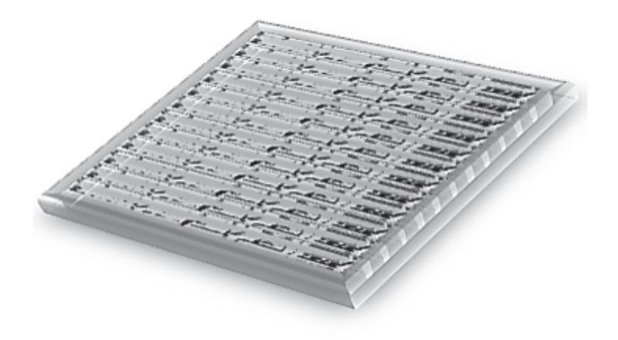

출처: 집필진 제작(2024) [그림 2-1] 포토 공정용 마스크

#### (2) 포토 마스크 제작

만들어진 회로 패턴(Pattern)은 순도가 높은 석영(Quartz)을 가공해서 만든 유리판 위에 크로뮴 (Cr)으로 미세 회로를 형상화해 포토 마스크(Photo Mask)로 완성되게 된다. 마스크(Mask)는 레티클(Reticle)이라고도 부르는데, 이것은 회로 패턴을 전체적으로 담은 필름같은 것으로 사진 필름의 기능을 하게 되며, 마스크는 보다 더 세밀한 패터닝(Patterning)을 위해 원 회로보다 크게 제작되며, 렌즈를 이용 빛을 축소해 조사하여 초미세 회로 패턴을 만든다.

(가) 포토 마스크용 석영(Quartz) 기판

Quartz는 일반적인 석영이다. 이를 유리로 가공하면 Quartz Glass 즉 석영 유리가 된다. 석영은 이산화 규소(SiO2)가 단결정 형태로 된 것인데, 이를 유리로 만든 것이 석영 유리 또는 Quartz Glass이다. Quartz Glass는 만들기 어려우나 Quartz의 가 장 기본이 되는 이산화 규소는 매우 흔하다. 대부분 지각의 암석과 모래에 포함되어 있다고 보면 된다. 이를 단결정으로 만든 것이 Quartz이고 이를 다시 유리로 만든 것이 Quartz 유리이다. 석영 유리 제조는 1899년 독일에서 처음 성공하고, 그 이후 에 미국 코닝, 일본 등에서 석영 유리 제조에 성공했으나, 국내에서는 상용화에 실패 하였다. 하지만 일반적으로 산업용 Quartz를 표현할 때 석영 유리도 Quartz라고 부 르게 된다.

1) 포토 마스크용 석영 기판의 특성

포토 마스크용 석영 기판의 특성을 살펴보면 석영은 결정질이고 석영 유리는 비 정질 유리인 것을 알 수 있다. 석영 유리는 순수한 100% 이산화 규소로만 구성 되어야 한다. 초고순도 석영도 구해야 하며, 일반 유리는 불순물을 혼합해 녹는점 을 낮게 하는 반면, 석영 유리는 불순물 자체가 들어가면 안 되기 때문에 융점이 높다. 그리고 석영 유리는 일단 모스 경도가 7로서 매우 단단하다. 또한 매우 낮 은 열팽창 계수를 가지고 있어서 온도 증가에 따른 변형이 적으며 높은 자외선 투과율을 보유하여 자외선 통과에 따른 반도체 포토 공정용 재료로 사용하기 좋 은 장점이 있으며, 화학적 내구성이 높아 주변 환경의 변화를 잘 이겨 낸다. 이 런 특징 때문에 여러 산업 분야에 사용되고 있으며, 초고순도 석영 유리의 경우 반도체 산업에 매우 많이 쓰이고 있다.

#### 2) 포토 마스크용 석영 유리의 단점

석영 유리(Quartz Glass)는 만들기 어렵다는 단점이 있다. Quartz의 가장 기본 이 되는 이산화 규소는 대부분 지표면의 암석과 모래에 포함되어 있어 매우 흔하 다. 이를 단결정으로 만든 것이 Quartz이고 이를 다시 유리로 만든 것이 Quartz 유리인데 석영 유리는 순수한 100% SiO2로만 구성되어야 한다. 초고순 도 석영도 구해야 하며, 그냥 유리는 불순물을 혼합해 녹는점을 낮게 만드는 반 면 석영 유리는 불순물 자체가 들어가면 안 되므로 융점이 높다.

<표 2-1> 종류별 석영의 제조 방법과 사용처

| 유형      | 초기 원료                  | 제조 방법       | 사용처              |
|---------|------------------------|-------------|------------------|
| T1      | 천연 석영                  | 진공 전기 용융    | 램프 재료, 반도체, 광학용  |
| T2      | 천연 석영                  | 화염 용융/베르누이법 | 반도체, 광학용         |
| T3      | SiCl4                  | 화염 가수 분해 용융 | 반도체, 광학용, 마스크 기판 |
| T4      | SiCl4                  | 화염 산화 분해 용융 | 광학용, 광섬유용        |
| CVD     | 실리콘 염화물 또는 SiCl4 | 화염 가수분해 소결  | 광학용, 광섬유용        |
| Sol-Gel | Si(OR)4                | 가수분해 소결     | IC, 마스크 기판       |

#### (나) 포토 마스크용 크로뮴 증착

포토 마스크 제작용 크로뮴 증착은 금속 증착기를 이용하여 증착하여 만들며, 금속 막을 제조하기 위해서는 스퍼터(Sputter)나 이바포레이터(Evaporator) 등 물리적 증 착 장비를 이용한다. 정밀한 포지션에 전극을 형성하기 위해서 포토 리소그래피 (Photo Lithography) 공정과 식각(Etching) 공정을 이용해야 하며 각각의 공정 조 건을 사전에 준비하여야 한다. 그러나 포토 마스크용 패턴을 만들기 위한 회로 패턴 은 마스크 자체를 만드는 초기의 포토 리소그래피 작업이므로 기존에 그려진 마스크 가 없는 상황이고 최초 회로 패턴을 만들기 위해서는 직접적 회로 라이팅(Writing) 을 진행해야 한다. 그러기 위해서는 전자 빔 리소그래피 기술을 사용해야 하며 그 이후에 만들어진 전자 빔 패턴을 따라서 크로뮴을 식각하여 전자 빔 리소그래피 기 술을 통한 크로뮴이 새겨진 회로 마스크를 만들게 되는 것이다.

1) 포토 마스크 제작용 크로뮴 증착을 위한 대표적 금속막 증착 장비

포토 마스크 제작용 크로뮴 증착을 위한 금속막 증착 장비인 PVD는 물리적 이 론을 이용한 증착 장비이며, 물리적 기상 증착은 낮은 압력과 낮은 온도에서 사 용되고 고품질 박막과 불순물 오염이 적다는 장점이 있다. 그러나 증착 속도가 낮고 고가의 증착 장비를 구입해야 한다는 단점도 있다. 진공 및 플라즈마 장비 의 종류 중에서 피브이디의 종류와 특징은 여러 가지가 있다. 스퍼터(Sputter)를 비롯해서 이바포레이터(Evaporator)와 도금 장치 등은 진공과 플라즈마를 적당히 이용해서 금속을 증착하는 반도체 공정 장비이며 종류와 특징은 다음과 같다. 가 장 많이 쓰이는 대표적 금속막 증착 장비인 스퍼터는 아르곤(Ar) 가스를 이용해 물리적으로 증착하는 공정인데 Ar 가스에 높은 전압을 가하게 되면 Ar → Ar+ 이온으로 변화하며, 증착이 되어야 할 기판에는 (+) 전압을 가해 주고 증착에 사 용되는 물질인 타깃층에는 (-) 전압을 가하여 Ar 이온을 타깃층에 충돌되게 하여 금속 원자를 뜯어내어 기판에 내려 쌓이게 하는 반도체 공정 장비이다.

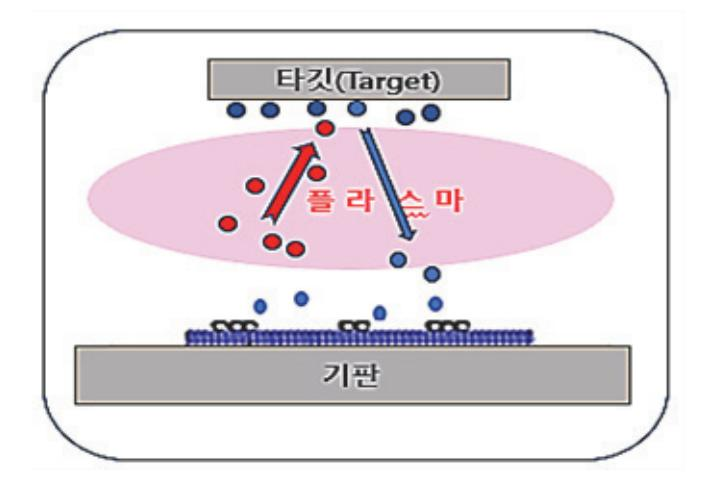

출처: 집필진 제작(2024) [그림 2-2] 스퍼터 증착

#### 2) 스퍼터의 종류와 특징

스퍼터는 DC 스퍼터(DC Sputter)와 RF 스퍼터(RF Sputter)의 2가지 방식이 대 표적이다. DC 스퍼터 타깃의 재질은 전기가 잘 통하는 금속성이며 타깃의 제조 방식은 진공 주조 방식이다. 글로 방전(Glow Discharge)을 이용하여 Ar 이온을 발생시켜 증착하는데 Ar 플라즈마의 진공 조건은 10∼15mTorr 정도이고 증착 속도가 빠르다는 장점이 있다. 반면에 RF 스퍼터는 타깃이 전도체, 절연체와 유 전체 등 여러 가지를 사용할 수 있는 장점이 있다. 진공 조건은 2∼5mTorr 정 도이며 증착 속도가 상대적으로 느리다는 단점이 있다.

3) 포토 마스크 제작용 크로뮴 증착을 위한 진공 증착 장비

포토 마스크용 크로뮴 증착을 위한 진공 증착 장비에는 열 진공 증착기(Thermal

Evaporator)와 전자 빔 진공 증착기(E-Beam Evaporator)가 있다. 열 진공 증 착기(Thermal Evaporator)는 증착하고자 하는 원료를 금속 보트 위에 올려놓고 열을 가하여 금속 원료를 기화시켜서 기판 위에 증착시키는 장치이다. 이때 주의 할 점은 진공도가 10-6Torr 이하로 높은 진공 조건을 만든 후 증착하여야 불순 물 오염이나 증착 물질 산화 등의 불량을 방지할 수 있다. 전자 빔 진공 증착기 는 증착하고자 하는 원료를 가열로 안에 넣어 놓고 전자 빔을 발생시켜서 전자 빔이 가열로 벽을 충돌시키게 하며 발생하는 열로 금속 원료를 기화시켜서 증착 시키는 장비이다. 마찬가지로 주의할 점은 진공도가 10-6Torr 이하로 높은 진공 조건을 만든 후 증착하여야 불순물 오염이나 증착 물질 산화 등의 불량을 방지할 수 있다.

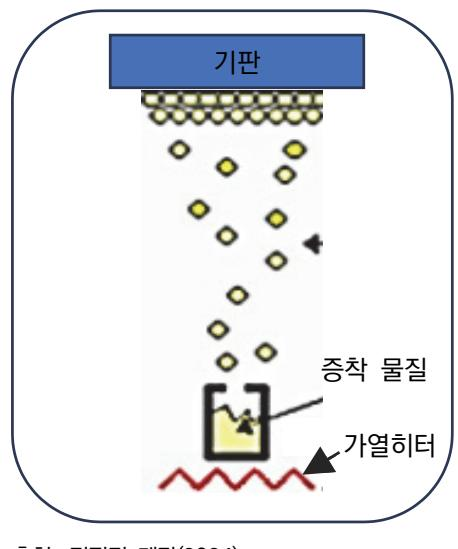

출처: 집필진 제작(2024) [그림 2-3] 진공 증착기

#### (다) 전자 빔 라이팅

전자 빔 라이팅(E-Beam Lithography)은 포토 마스크를 만들기 위해서 최초의 회로 패턴을 만드는 과정이다. 전자 빔 라이팅을 하기 위해서는 포토 노광 공정과 마찬가 지로 레지스트를 먼저 도포하는데 이때 사용하는 레지스트는 빛에 반응하는 레지스 트가 아니고 전자 빔에 반응하는 레지스트를 사용한다. 또한 전자 빔 노광이 끝나면 현상 공정을 통해서 레지스트를 선택적으로 벗겨내서 패턴을 만들어 내고 그 위에 크로뮴을 증착한 다음 남아 있던 레지스트를 아세톤 등의 리무버를 이용해서 마지막 으로 벗겨내는데 이때 최종적으로 남아 있던 레지스트 부분만 벗겨지게 되고 그 위 에 얹혀 있던 크로뮴도 같이 벗겨지게 된다. 이러한 과정을 리프트 오프(Lift off)라 고 하며 리프트 오프가 끝나면 석영 유리 기판 위에 크로뮴으로 새겨진 미세 회로 패턴이 만들어진 상태가 된다. 전자 빔 라이팅의 경우 커런트(Absorb Current)는 30 피코 암페어(pA)를 많이 사용하며 30 피코 암페어는 주로 미세 패턴 시 사용하 는 조건이고, 커런트를 높은 값을 사용할 경우 Lithography 시간은 짧아지나 패턴 해상도는 좋지 않게 된다.

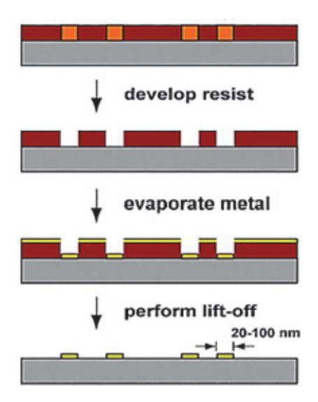

출처: 집필진 제작(2024) [그림 2-4] 전자 빔 라이팅 과정

(라) 전자 빔 라이팅의 특징과 장점

전자 소자가 나노 단위(nm)에서 옴스트롱(Å) 단위까지 초미세화가 진행된다면, 0.2~5nm의 초미세 공정은 일반 광원을 이용한 포토 공정으로는 패터닝을 할 수 없 을 수도 있게 된다. 이때는 더 짧은 파장의 빛을 활용하는 노광 공정을 활용해야 하 는데, 그 후보군으로 전자 빔 리소 공정(EBL: E-beam Lithography)이 있다. 전자 빔 리소 공정 기술은 전자 빔을 광원으로 이용하는 방식으로 주사형 전자 현미경인 SEM(Scanning Electron Microscope)에서 유래하였다. 처음에 SEM을 통해 원자 의 미시 구조를 연구하던 도중에, E-Beam이 Polymer와 반응하고 제거하면서 매우 짧은 파장인 나노 빔(Nano beam, 0.1~0.05nm)의 패턴이 나오는 것을 발견했다. EBL은 파장이 엑스레이의 1/10 수준, EUV의 1/100 수준이다. 전자 빔 리소 공정 은 파장이 매우 짧은 것을 이용하므로 분해능(Resolution)이 아주 좋고, 특히 EBL의 가장 큰 장점은 엑스레이와 다르게 유기물 PR를 사용할 수 있고, 패턴 복제 방식이 아닌 직접 패터닝 방식이어서 마스크가 필요없다.

(마) 전자 빔 라이팅의 단점

전자 빔 리소 공정 기술의 가장 치명적인 단점은 공정 절차가 복잡하고 패터닝 속도 가 매우 느리다는 것이다. 현재 업계에서 요구하는 생산 속도에 맞추기에도 매우 부 족한데, E-beam Litho 기술을 활용하는 극초미세 패터닝의 생산 속도로는 절대 불 가한 상황이다. 또한 아직 우리는 전자의 거동을 제대로 이해하고 있지 못하기 때문 에, 전자 빔이 Wafer에 잘 균일하게 되도록 주사해도, 전자들이 확률적으로 다른 곳 으로 산란할 가능성이 많아서 패턴이 균일하게 만들어지지 않을 수 있다.

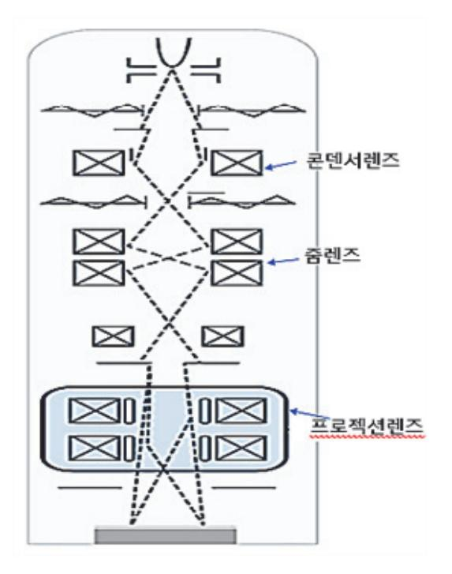

출처: 집필진 제작(2024) [그림 2-5] 전자 빔 라이팅 장비의 내부 구조

#### (3) 정렬 및 노광

제작된 마스크와 패턴을 만들 웨이퍼가 준비되면 [그림 2-6]과 같이 노광하는 공정을 거친다.

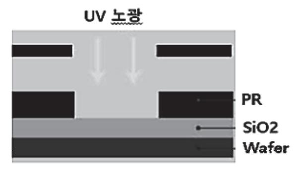

출처: 집필진 제작(2024) [그림 2-6] 노광 공정

(4) 현상(Develop) 공정

포토 공정(Photo)의 최종 단계는 현상(Develop)으로 아날로그 사진을 현상하는 과정과 동일하다. 이 과정에서 패턴의 형상이 만들어지기 때문에 매우 중요한 공정인데 현상 (Develop) 공정은 웨이퍼에 현상액을 부어가면서 노광된 영역과 노광되지 않은 영역을 선택적으로 제거해 미세 회로를 형성하는 공정이다. 웨이퍼 위에 균일하게 입힌 감광액 (PR)은 빛에 어떻게 반응하는가에 따라 양성(Positive) 또는 음성(Negative)으로 분류되 며, 양성 감광액의 경우 노광되지 않은 영역을 남기고 음성 감광액의 경우 노광된 영역 만 남겨 사용하게 되고 현상 공정까지 마치게 되면 모든 포토 공정이 끝나게 된다. 각 종 측정 장비와 광학 현미경 등을 통해 패턴이 잘 그려졌는지 꼼꼼하게 검사한 후, 이 를 통과한 웨이퍼만이 다음 공정 단계로 이동한다. 지금까지 웨이퍼 표면에 세밀한 회로 패턴을 찍는 포토 공정에 대해 알아보았는데 다음 단계에서는 웨이퍼에 회로 패턴을 만 들기 위해 필요한 부분을 남기고, 필요 없는 부분을 선택적으로 깎아내는 식각 공정이 진행된다.

#### 숕 반도체 포토 공정용 재료의 기술 및 장단점

반도체 포토 공정용 재료의 기술은 반도체 포토 공정 결과의 품질에 많은 영향을 끼친다. 그 중 감광제의 역할과 종류별 특성을 알아본다.

1. ArF 감광제

국내에서는 1995년부터 반도체 회사들을 중심으로 ArF 감광제(PR)에 관한 연구가 시작된 이래, 1998년부터 감광제 회사들이 적극적으로 개발에 참여하는 등 ArF PR 개발을 위해 많은 노력을 해 왔다. 이에 따라 그간 축적된 기술과 경험으로 65nm 공정급의 PR 개발이 가능할 것이며, 이미 D 세미캠은 80nm 공정에 ArF PR을 공급하고 있으며 D 세미캠과 K 석유 화학 모두 65nm 공정용 ArF PR을 개발하고 있어 그 기술 수준은 일본 및 미국 감 광제 회사에 근접한 것으로 여겨진다. ArF PR과 같은 첨단 공정 재료의 국산화가 국내 관 련 기술에 미치는 파급 효과는 크게 2가지로 볼 수 있다. 첫째는 국내 반도체 업체들이 공 정 재료의 국외 의존도를 크게 낮출 수 있어 첨단 기술 및 소재 유출 억제 정책에 대응 가 능하다. 두 번째는 PR의 기반 산업을 육성할 수 있게 되었다는 것이다. 그동안 국내 PR 업체들은 그 핵심 소재인 고분자, 단분자 및 광감응성 화합물 등의 수급을 일본, 미국, 유 럽 등에 의존해 왔는데 이는 국내 업체들의 PR 시장 점유가 첨단 재료보다는 I-line이나 KrF PR 등에 국한되어 왔기 때문이다. 이에 따라 고분자나 단분자, 광감응성 화합물의 국 내 산업 기반이 조성할 것으로 보이며 관련 연구도 대학과 연구소를 중심으로 이전에 비해 활발하게 이루어질 것으로 예측된다.

2. 이머전(Immersion)용 감광제

ArF 감광제(PR) 개발 기술과 경험을 가진 국내 기업들이 Immersion용 ArF PR의 개발을 지난 2004년부터 진행해 오고 있으며 국내 반도체 소자 업체들도 국내 업체들과 공동 개발 등을 진행하고 있는 등 PR의 국산화 의지가 강해 기술 개발 가능성은 매우 크다고 할 수 있다. ArF PR의 경우와 마찬가지로 개발이 될 경우, 첨단 공정 재료의 지속적인 국내 반도

체 업체들에 공급으로 반도체 공정 기술 개발에 크게 기여할 뿐만 아니라 고부가 가치의 공정 소재가 상업화될 수 있어 PR의 원재료에 대한 개발 움직임도 더욱 활성화할 것으로 기대된다.

3. EUV용 감광제

EUV 감광제(PR)는 향후 5년 이후에 상용화 가능성이 있는 공정 소재이다. 이 소재 개발이 이미 2002년부터 국내 업체인 D세미켐이 진행하여 상용화를 위한 준비가 이루어지고 있 다. 이로 인해 2008년 이후 32nm 또는 그 이하의 공정에 EUV 공정이 도입될 경우, 초기 단계부터 시장에 진입할 가능성이 크다. 기술적인 파급 효과는 ArF 및 Immersion용 ArF PR과 마찬가지로, 반도체 공정 개발에 기여 및 국내 원재료 정밀 화학 산업 형성을 통한 산업 구조를 구축하는 데 결정적인 요인으로 작용할 수 있을 것으로 전망된다.

#### 숖 반도체 포토 공정용 재료의 시장성

반도체 포토 공정용 재료의 시장성을 이해하려면 포토 공정 재료를 이해하고, 각 공정별 특징 을 알아야 한다.

- 1. 반도체용 리소그래피 재료의 시장성 파악
  - (1) ArF 감광제

ArF 감광제(PR)는 130nm 공정부터 일부 사용되기 시작하여 현재 100nm, 90nm, 80nm 공정 등에 적용되고 있으며 그 사용량이 점차 증가하고 있어 시장 규모는 앞으로 가장 클 것으로 예상한다. 그러나 시장 진입 면에서 보면 이미 전 세계의 모든 감광제 회사들이 관련 기술을 보유하고 있고 개발 환경과 개발 장비 투자 면에서 앞서 있는 일 본 및 미국 회사들이 시장을 선점해 왔기 때문에 후발 주자인 국내 감광제 회사들은 어 려움을 겪을 수밖에 없다. 반도체 공정의 특성상 이미 양산화되고 있는 공정의 소재를 바꾸는 것은 불가능하므로 현재 개발 단계인 22nm 이하 공정에 진입하기 위한 집중적 인 노력이 필요하다.

(2) Immersion용 ArF 감광제

55nm 미만의 고해상력이 요구되는 공정부터 사용되기 시작할 Immersion용 PR는 그 시 장 규모는 ArF PR에 비해 적지 않을 것으로 예상되고 있으며, 향후 32nm 공정까지 적용 될 경우 시장의 상당한 부분을 차지할 수 있을 것으로 기대된다. 아직 공정이 개발 중이므 로 국내 업체에도 기회가 얼마든지 있으며 우수한 성능의 제품이 개발되고 그를 양산화할 수 있는 생산 기술이 확보된다면 시장 진입이 가능할 것으로 예상한다.

(3) EUV용 감광제

32nm 또는 그보다 작은 패턴을 위해 사용할 것으로 예상되는 EUV PR은 EUV 제조 기술 자체가 아직 개발 중이고 이에 적합한 PR의 개발도 초기 단계이기 때문에 개발 수준에 따

라 얼마든지 시장 진입이 가능하다. EUV 공정은 진공 상태에서 진행되고 장비 투자 비용 이 ArF 공정에 비해 많이 늘어날 것이므로 반도체 제조 공정 중에 EUV 공정을 사용하는 경우는 최소한으로 유지할 것으로 예상되어 그 시장 규모는 ArF PR이나 Immersion용 PR에 비해 작을 것이나 PR의 단가가 매우 높을 것으로 여겨져 고부가 제품 시장이 될 가 능성이 크다.

## 수행내용 / 포토 공정 재료 준비하기

#### 재료·자료

- ISO, SEMI, KS 표준화 문서
- 반도체 로드맵
- 반도체 제조 공정도
- MSDS, RoHS
- 리소그래피 재료
- Immersion Photo Resist
- KrF Photo Resist, I-line Photo Resist

#### 기기(장비 ・ 공구)

- 제조 공정 장비
- 유기 합성 Pilot 설비
- PR류 Mixing Vessel
- 중합체 합성 설비
- 공정 이상 Monitoring 설비
- Bottle Cleaning 설비
- Bottle Filling 설비

- 평가, 분석 및 계측장비
- Elipsometer, GC
- Microscope, HPLC
- ICP-MS,nmR
- CD-SEM, FT-IR
- Dynamic Contact Angle
- Coating Defect Inspection
- Air particle counter
- Amine 농동 측정기
- Furnace, Liquid particle counter
- 제조 공장 인트라넷
- 안전 도구, 안전화
- 컴퓨터, 프린터, 복사기

#### 안전 ・ 유의 사항

- 제조 공정 장비는 제품을 생산하기 위한 장비로서 규칙에 따라 사용되어야 하며, 일정 주기 와 방법에 따라 장비 성능을 평가하여야 한다.
- 평가/분석/계측기는 제품의 물리적 성질이나 특징을 검사하는 기기로서 규칙에 따라 관리되 어야 하며 일정 주기와 방법에 따라 검·교정을 실시하여야 한다.
- 작업 표준에는 공정 순서 및 온도, 시간, 환경 등의 조건을 포함한다.
- 작업 절차서는 생산을 완료까지의 순서를 체계적으로 작성한 생산 공정의 계획서로서, 생산 을 정확히 실시할 목적으로 절차와 재료, 장치의 준비 및 사용 방법, 공정을 실시하는 데 필 요한 안전 사항을 나타내는 문서이므로 절차서를 잘 준수해야 한다.
- 통계적 품질 관리를 활용한 포토 공정의 품질 관리를 통하여 불량의 발생 및 불량 원인을 파악하여 개선함으로써 품질(6-시그마)을 확보하여야 한다.

수행 순서

숔 반도체 포토 공정용 재료를 알고 장단점을 이해한다.

반도체 포토 공정용 재료의 시장성과 기술을 이해하고 각 공정에 적용이 가능하다. 최근까지 포토 공정의 재료는 130nm, 90nm 공정용으로 제조됐고 2005년 후반부터는 65nm 공정에 이용하였다, 인텔의 기술 로드맵에 따르면 2015년에 20nm 선폭 기술의 상용화가 되었고, 2010년에는 25nm, 2016년 13nm의 게이트 길이를 사용하고 있다. 그러나 반도체 집적도의 지속적 향상 노력에는 넘어야 할 기술 장벽들이 많으며, 그중에서 가장 문제가 되는 것이 바로 재료와 포토 공정의 결함이다. 실리콘 기판 반도체 칩의 경우 실리콘 단결정 웨이퍼를 사용하 게 되는데, 기존 공정에서는 단결정 표면의 작은 결함이 있어도 회로 선폭이 커서 소자 특성에 큰 영향을 끼치지 않았으나, 선폭이 감소하면서 결함으로 인한 특성 저하가 주요한 이슈로 주 목받고 있다.

| 연도   | 선폭(nm) | 노출광의 파장(nm) | 광원                      |
|------|--------|-------------|-------------------------|
| 1986 | 1,200  | 436         | 수은 램프(g-Line)           |
| 1988 | 800    | 436/365     | 수은 램프(g-Line/i-Line)    |
| 1991 | 500    | 365         | 수은 램프(i-Line)           |
| 1995 | 350    | 365/248     | 수은 램프(i-Line)/KrF Laser |
| 1997 | 250    | 248         | KrF Laser               |
| 1999 | 180    | 248         | KrF Laser               |
| 2001 | 130    | 248         | KrF Laser               |
| 2003 | 90     | 248/193     | KrF Laser/ArF Laser     |
| 2005 | 60     | 193         | ArF Laser               |

<표 2-2> 노출광의 파장 감소에 따른 집적도의 향상

- 1. 반도체 포토 공정용 재료를 실험한다.
  - (1) G-Line 및 I-Line 감광제를 실험한다. 반도체를 생산하는 데 사용된 2성분계 감광제는 g-선(436nm), i-선(365nm)에 사용되 어 왔다. 0.5μm의 가공 선폭을 갖는 i-선 공정은 16Mb RAM 생산을 가능하게 하였고 고해상력의 리소그래피 장비 개발 및 PR 재료 개발로 인해 0.26μm 이하의 해상도인 2 성분계 감광제 PR도 개발되었다.
  - (2) KrF 감광제

Deep UV를 광원으로 사용하는 리소그래피법으로 발전함에 따라 PR를 화학 증폭형

(Chemicallyamplified) 감광제를 사용하기 시작했다. 화학 증폭형 감광제는 양자 수율 이 100%보다 큰 감광제를 의미하는 것으로 다른 말로 표현하면 프로텍팅-이프로텍팅 (Protecting\_Eprotecting) 반응이라고도 한다.

출처: 집필진 제작(2024)

(3) ArF 감광제

KrF(248nm) 레이저를 이용한 이후에 등장한 리소그래피 방법으로 ArF 레이저(193nm) 를 사용한다. 종전의 PHS 고분자의 벤젠고리가 ArF(193nm) 영역에서 흡광을 보여 PR 로 사용할 수가 없다는 문제가 있다. 그러므로 193nm 파장에 대해 흡광도가 낮은 PR 재료가 필요하게 되었다.

(4) 이머전(Immersion)용 ArF 감광제

Immersion 리소그래피는 노광 시 렌즈와 PR가 코팅된 wafer의 간극을 기존의 공기가 아닌 물, 혹은 굴절률이 높은 매질로 채운 상태로 리소그래피가 이루어지는 기술을 말한 다. 2004년 니콘사에서 ArF 레이저를 이용한 노광기를 시장에 판매하기 시작하면서 ArF immersion 기술은 32nm half pitch 구현이 가능하게 되었다. 이후 40∼50nm 하프 피치(half pitch) 패턴의 구현 또한 가능하게 되었다. 이머전(Immersion)용 ArF 감광제는 G-Line 및 I-Line 감광제나 KrF 감광제보다 더 정밀한 미세 패턴 공정에 사 용되는 감광제이지만 EUV용 감광제보다는 덜 정밀한 공정에 사용되는 중이다. 현재는 가장 정밀한 미세 패턴의 제작을 위해서는 EUV 노광 장비와 EUV용 감광제를 사용하여 공정을 진행한다.

[그림 2-7] KrF 레이저(248nm) 감광제의 작용 기전

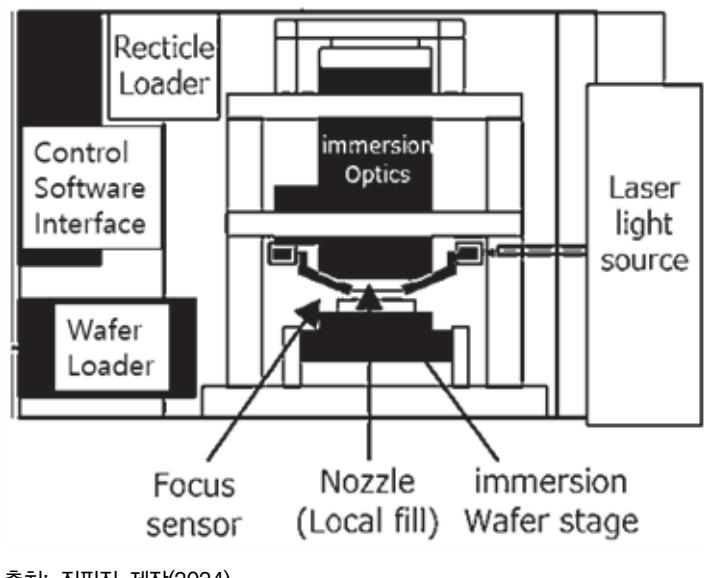

출처: 집필진 제작(2024) [그림 2-8] ArF 노광 시스템

#### (5) EUV용 감광제

원자외선(DUV: 수백nm 파장) 리소그래피 기술의 연장선에서는 65nm 이하의 패턴을 구현할 수 없다는 원리적 한계가 있다. 이후 개발된 EUV(극자외선약 13nm 파장) 리소 그래피 기술이 65nm 이하의 나노급 반도체 소자의 양산 적용이 가능하여 1998년도부 터 미국, 일본, 유럽에서 각 요소 기술 개발을 위한 투자를 대폭 확대하였으며, 인텔은 이를 선점하여 EUV 리소그래피를 이용한 제품의 양산을 적용하고 있었다. 수은 등의 i-line, g-line, 레이저를 광원으로 쓰는 KrF와 ArF 장비는 대부분 렌즈계를 광학계로 사용하였다. 그러나 파장이 13.5nm의 EUV 영역에서는 EUV가 물질에 흡수되므로 이전 처럼 렌즈를 사용한 굴절 광학계를 EUV 리소그래피용 광학계로 쓸 수가 없어 모두 반 사경으로 광학계가 구성되어야 했다. 이에 따라 마스크도 투과형 마스크에서 반사형 마 스크를 사용하게 되었다. EUV 광학계는 진공 환경에서 사용되어야 하고, 해상도를 위해 고도의 정밀성이 필요하며, 안정적인 열적 환경에서도 열팽창이 적어야 하며 빛의 반사 율이 높아야 한다.

| 요소 기술 | EUV 리소그래피                                                    | 기존 리소그래피                                                             |
|-------|--------------------------------------------------------------|----------------------------------------------------------------------|
| 마스크   | - 반사형 마스크 - LTEM 기판/EUV 반사 - 다층막/흡수체 패턴 - 2억 원/매 이상 | - 투과형 마스크 - Quartz 기판/Cr 반사 기판 - 1억 2,000만 원/매(critical layer) |
| 광학계   | 반사형 광학계                                                      | 투과형 광학계                                                              |
| PR    | 고감도, 고해상도 EUV, PR                                            | 화학 증폭형 DUV PR                                                        |
| 광원    | - 13nm 파장의 EUV - DPP, LPP 등의 플라스마 광원                      | - 157nm, 193nm, 248nm의 DUV 특성 파장을 내는 레이저 광원                       |

<표 2-3> 기존 리소그래피와 EUV 리소그래피의 차이점

숕 포토 공정 재료의 문제점을 분석한다.

포토 공정 재료의 주요 구성물을 파악하고 그 기술을 이해한다면, 재료의 도출된 문제점을 해 결할 수 있다. 미세한 패턴의 형성, 열적 기계적 강도가 우수한 패턴을 만들기 위해 감광제는 일반적으로 다음과 같은 구성 성분으로 되어 있다.

- 1. 감광제의 주요 구성물을 분석한다.
  - (1) 고분자(Polymer)의 주요 성분을 분석한다.

감광제는 액체인 용액을 고체인 필름으로 만들기 때문에 사용되는 고분자는 필름 형성 이 뛰어난 특성이 있어야 한다. 또한 얇은 두께로 도포되며 미세한 두께 변화에도 전사 되어 패턴이 왜곡될 수 있기 때문에 고른 두께의 필름을 형성하는 특성이 특히 중요하 다. 필름 대부분이 고분자로 이루어지기 때문에 이 고분자는 노광 공정에 사용되는 빛의 파장을 흡수하지 않아야 하며, 광화학적인 반응을 통해 노광 전후에는 특정한 용매에 대 하여 매우 큰 용해도의 변화가 일어나야 한다. 이런 이유로 고분자의 주쇄뿐만 아니라 주쇄에 달린 기능기(Functional Group)의 선정과 그 알맞은 조합이 매우 중요하다. 마 지막으로 PR는 패턴 형성 후에 식각이나 이온 주입 공정 중에 혹독한 조건을 견디며 설계된 패턴이 기판에 전사될 수 있도록 해 주는 기능이 필수적이기 때문에 내화학성, 내열성, 기계적 특성이 우수해야 한다. PR 용도로서 주로 사용되는 G-line, I-line PR 용 고분자는 [그림 2-5]와 같다. ArF나 KrF 또는 EUV 노광용 PR와 비교해 분해능이 떨어지므로 패턴 사이즈가 미세한 정밀한 회로의 구조를 만드는 데 한계가 있는 감광제 에 사용되는 고분자이다.

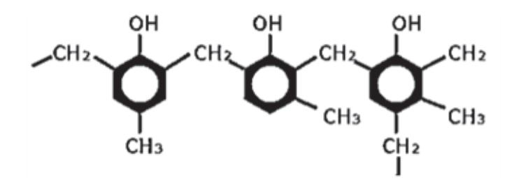

출처: 집필진 제작(2024) [그림 2-9] G-line, I-line PR용 고분자

(2) KrF용 PR 고분자의 주요 성분을 분석한다.

KrF용 PR 고분자는 PHS(Polyhydroxystyrene) 고분자와 Photoacidgenerator (PAG)를 기본으로 사용한다.

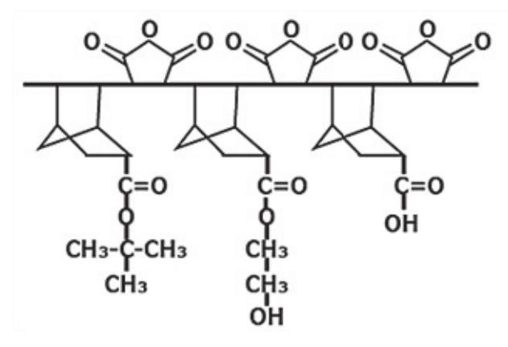

출처: 집필진 제작(2024) [그림 2-10] KrF PR용 고분자

(3) ArF용 PR 고분자의 주요 성분을 분석한다.

ArF용 PR 고분자는 PHS(Polyhydroxystyrene) 고분자와 Photoacidgenerator (PAG)를 기본으로 사용한다.

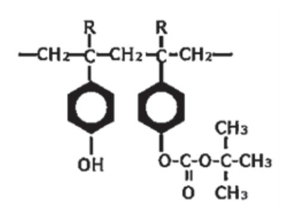

출처: 집필진 제작(2024) [그림 2-11] ArF PR용 고분자

#### (4) 광반응성 물질(Photo Active Compound, 감광제)의 주요 성분을 분석한다.

광반응성 물질은 노광에 사용되는 빛의 파장으로 급격하게 광화학적인 반응을 일으켜 PR 필름의 대부분을 차지하는 고분자의 용해 특성을 크게 변화시키는 물질이다. 빛에 의해 반응하기 때문에 특정 파장에 대한 감도와 광효율, 열 안정성, 내화학성 등이 중요 하다.

(5) 첨가제(Additives)의 주요 성분을 분석한다.

감광제의 주요한 성분은 고분자와 광반응 물질이나 실제 공정에 알맞은 PR의 기능을 보 완하기 위해 여러 가지 첨가제가 사용되는데 코팅을 위한 계면 활성제, 용해 특성 보완 을 위한 용해 방해제 또는 촉진제 등이 널리 사용된다.

(6) 용매(Solvent)의 주요 성분을 분석한다.

감광제에 사용되는 용매는 주로 유기 용매(Organic solvent)를 사용하는데 인체에 무해 하지만 보관 중에 지나친 압력이 생기는 것을 방지하기 위해 일정 온도 이상의 끓는점 을 가져야 하며 회전 도포에 알맞은 점도 및 PR의 주요 성분인 고분자와 광반응성 물 질에 대한 용해 특성이 우수한 것을 사용한다.

- □3 감광제의 사양 및 해결 방안을 파악한다.
  - 1. 감광제의 사양 및 특성을 파악한다.
    - (1) G-Line 및 I-Line 감광제의 사양 및 특성을 파악한다.
      - 용해 억제제(DNQ: DiazoNapthaquinone)는 원래는 수용액에 녹는 물질이지만 알칼리 수용액에서 불용성인 감광 물질(PAC: Photoactivecompound)로서 용해 억제제로 작 용하는데, 자외선에 노광되면 인덴케텐을 형성하고, 생성된 인덴케텐은 물과 반응하여 알칼리 가용인 3-인덴칼본산으로 변하게 되어 현상액인 알칼리 수용액에 잘 녹는 용해 촉진제로 작용하게 된다. 나프토퀴논디야지드(NQD)를 15∼25%의 중량 %로 넣은 노볼락 수지막을 노광함으로써 노광 영역의 용해성이 증가하고 포지티브 상이 남게 된다. 도포된 노볼락 수지는 알칼리 현상액에 어느 정도의 용해성이 있는데 용해 억제제가 배합된 PR는 용해 속도가 감소된다. 이러한 PR이 자외선에 노광 되면 DNQ의 분해로 유기산이 생성되 므로 PR의 노광 부분은 이전보다 용해 속도가 빨라지고 그에 따라 고해상도의 미세 선폭 의 상이 얻어진다.
    - (2) KrF 감광제의 사양 및 특성을 파악한다.

고분자는 PHS(Polyhydroxystyrene) 고분자와 Photoacid Generator(PAG)를 기본으 로 Contrast 향상 및 용해도 조절을 위한 반응 금지제를 사용한다. 화학 증폭형 감광제 의 작용은 레이저 노광에 따라 PAG로부터 발생한 산이 확산하며 이후 이어지는 Post Exposure Bake(PEB) 과정에서 알칼리 용액인 현상액에 대한 상대적 용해도가 높으므

로, 현상 과정을 거치면 마스크를 통해 노광된 모양대로 패턴 모양이 형성되게 된다. PAG로부터 생성된 한 분자의 산이 확산하면서 촉매 반응을 통하여 탈 보호화 반응을 촉진시키므로 화학 증폭형 감광제라고 한다. 이때 PEB 온도와 시간에 따라 산의 확산이 증가하게 되며 이러한 산 확산을 조절하고 기판의 영향과 기타 오염에 의한 패턴의 망 가짐을 방지하기 위해 적절한 약 염기물을 첨가해 준다. 반응에 따르는 PAG의 pKa, PAG의 확산 속도, 포함된 약 염기물의 반응 억제 효과, 고분자 보호기의 탈보호 반응 활성화 에너지의 높고 낮음에 따라 PR의 성능과 Pre-Bake(PB), Post Exposure Bake (PEB)의 온도 및 기타 공정 조건이 결정된다.

(가) KrF용 PR의 장점을 파악한다.

KrF 레이저를 이용한 PR은 이후 ArF 시스템이 개발되었음에도 꾸준히 광미세 가공 을 추구하는 연구 개발이 진행되고 있다. 그 이유로서는, 차세대 ArF PR의 개발이 아직 만족스럽지 못하다는 면도 있지만 KrF PR을 그대로 사용한다면 반도체 대량 생산에 있어서 원가 절감 효과가 크다는 것을 들 수 있다. 이러한 기술 개발에 대응 하여 KrF PR의 성능도 향상되어야 하는데 대표적인 예를 들면 고집적화에 따라 점 차 PR의 두께 감소가 요구되므로 건식 식각 내성이 보다 강화된 PR의 개발이 요구 되고 있다. 이외에도 요구되는 특성으로서 높은 해상도, 넓은 DOF(Depth of Focu s) margin, 무결점의 박막 형성, 기판에 대한 접착력, 높은 contrast, 빠른 감도 및 화학적 안정성 등이 있다.

- (3) ArF 감광제의 사양 및 특성을 파악한다.
  - 고분자의 형태에 있어서 아크릴레이트계 고분자는 높은 해상도, 높은 광 투과율 등의 장 점으로 인해 많은 경우에 사용된다. Alicyclic계를 Methacrylate 고분자에 도입하는 형 태가 주를 이루며, 이들 Alicyclic 화합물 중 Adamantine계 화합물을 사용한 고분자로 PR를 개발하는 것이 일반적이다. 단점은 고분자의 합성이 어렵고, 가격이 높으며, 식각 내성이 약하다는 것이다. 또 다른 형태의 고분자로는 COMA(Cyclic Olefin/Maleic Anhy dride)가 있다. 특성은 식각 내성과 CD 선형성이 좋은 반면에 물에 오염 가능성이 있고, 광 투과도가 떨어지며, 해상도에 한계가 있다는 점이다. 이 2가지 작용기들의 장점을 취합 한 혼성형(Hybrid Type)으로 성능 향상을 이루기도 한다. 일반적으로 ArF PR용 고분자가 갖추어야 할 조건들을 살펴보면 투명성, 건식 식각 내성, 좋은 접착 특성 및 전형적인 현상 액에 현상되어야 한다. 이외에 일반적으로 요구되는 특성으로서, 무결점의 박막 형성, 보관 안정성, 기판에 대한 접착력 및 고감도 등이 있다.

#### (4) Immersion용 ArF 감광제의 사양 및 특성을 파악한다.

반도체 리소그래피의 패턴 형성을 위한 해상도(Resolution)와 개구율(NA)은 R=kλ /NA(k=공정 factor, λ=광원의 파장, NA=개구율), NA=nsinθ(n=매질의 굴절률, θ =wafer의 수직선과 노광 되는 광원의 최대 각)으로 표현된다. 이때 굴절률 n 값이 공 기의 1보다 큰 매질을 사용했을 때 NA값이 커지며, 이에 따라서 해상도가 증가하고 DOF 마진도 증가하게 된다. 이 기술이 적용되기 위해 해결되어야 하는 문제점은 크게 3가지로 나눌 수 있다.

- 사용되는 광원에 대해 매질이 어느 정도의 낮은 흡광도와 높은 굴절률을 가지는가?

- 매질이 PR에 어느 정도가 얼마나 빠르게 침투하는가?

- 침투된 매질이 PR의 조성에 어느 정도의 영향을 주는가?

(가) 화학 증폭형 PR의 문제를 파악한다.

화학 증폭형 PR에 매질이 스며들게 되면 산 촉매 반응을 통해 PR의 고분자가 탈보 호기 반응을 하게 되며, 작은 분자의 가소제 역할로 산 확산기 전에 이상을 초래하 게 된다. 그러므로 리소그래피 성능에 악영향을 끼치며, 녹아 나온 성분에 의해 렌즈 에 오염을 발생시킬 수 있다. 이 문제를 해결하기 위하여 두 가지 접근 방법이 있다. 첫 번째는 스며들지 않는 PR 또는 매질을 개발하는 일이고, 두 번째로는 PR 막 위 에 보호막을 도입하는 것이다.

- (나) 소재 개발과 조성분석을 파악한다.
  - 소재 개발하기 위해서는 유입된 매질이 PR 조성에 어떠한 영향을 주었는가를 알아 내기 위해 조성을 극미세 분석과 표면 분석을 해야 한다. PR의 조성이 매질 또는 물 층으로 유입되는가에 대한 분석은 ppm(Part per Million) 이하의 분해능이 필요 하다. 물속에 극미량의 유기물을 검출하는 데 사용되고 있는 방법들을 사용할 수 있 다. 소수성의 막을 PR 막 위에 도포하는 방법으로 위의 방법보다 분석에 어려움은 없으나, PR 코팅 후 코팅공정이 다시 필요하며 노광 후 막을 현상액으로 제거하기 어려운 단점이 있다. 두 번째로 PR 상위 막을 개발하기 위해서는 소수성이면서 노광 되는 광원에 투명도를 확보하기 위하여 높은 함량의 불소 치환된 고분자를 사용한다. 상위 막은 노광 시 매질로부터 적절히 PR를 보호하는 역할을 하며 노광 후 불소 치 환된 시너를 이용하여 제거할 수 있어야 한다.
- (5) EUV용 감광제의 사양 및 특성을 파악한다.

대부분의 EUV Projection 광학계는 4개 이상의 반사경으로 이루어진다. 광원에서 발생 한 빛은 Condenser Lens에 집속되어 마스크에 입사되면 반사된 빛은 Projection 광 학계 시스템에 들어가게 된다. 반사경마다 다른 각도로 입사하게 되어 동일한 파장에서 최적의 반사를 위해서는 반사경마다 다른 조건의 다층 박막이 필요하게 된다. 최적의 결 과를 얻기 위한 EUV 광학계의 반사경은 대부분 비구면을 가지도록 설계된다. 5개 또는 6개의 반사경으로 구성된 광학계가 더 나은 성능을 보이나 흡수가 커진다. 현재까지 개 발된 소재의 문제점은 EUV에서의 노광 시 PR 소재의 흡광 계수에 대한 것과 노광 후 현상 시 충분히 빠른 감도를 가져야 하며, 낮은 가스 형성(Out Gassing)으로 구현할 수 있는가에 대한 것이다. 대부분의 물질들에 EUV에 사용되는 13nm 파장에 대해 높은 흡

광 계수를 가지고 있다. 방향족 고리 화합물은 PR의 흡광도를 낮추어 주며, 식각 내성 도 증가한다. 그러므로 KrF 리소그래피에 사용되는 Poly(4-hydroxystyrene)가 EUV용 박막의 단일 층 PR에 적용될 수 있다.

(가) EUV용 PR에 필요한 특성을 파악한다.

PR에 필요한 특성으로는 낮은 흡광도와 높은 식각 내성, 충분히 빠른 감도, 기판과 의 밀착성, 가스 형성의 최소, LER(Line Edge Roughness)의 최소화가 이루어져야 한다. 빠른 감도를 얻으면서 적은 LER과 해상도 성능에 대한 감소가 없어야 하는데, 박막으로 시행함으로써 얻을 수 있으나 식각 내성 성능이 감소한다. PMMA와 Poly( 4-hydroxystyrene)가 EUV용 PR의 일반적인 고분자로 사용되는데, 주 사슬에 여러 가지 작용기 또는 보호된 작용기(아세탈, t-butoxycarbonyl, t-butyl)를 사용한다. 좀 더 나은 내식각성을 위해서는 Alicyclic 보호기(2-methyl-2-adamantyl group) 를 사용하면 개선될 수 있다.

## 학습 2 교수·학습 방법

#### 교수 방법

- 반도체 포토 공정용 재료의 개요와 세부 내용을 부분별로 알기 쉽게 설명한다.
- 현장에서 표준화한 공정 재료 매뉴얼과 관련 재료에서 제공되는 자료 등의 내용을 프레젠테 이션 자료로 제시한 후에 설명한다.
- 가능한 한 사전에 제조 현장에서 사용하는 사례를 수집하여 자료를 준비하고 이해하기 쉬운 방법을 논의하는 방식의 문제 해결식 수업을 한다.
- 최근 반도체 산업 현황(시장 환경 및 기술 동향 등)에 대하여 충분히 인지하고, 학습자들이 쉽게 이해할 수 있는 방법을 모색하여 수업을 진행한다.
- 관련 시장의 환경 및 기술변화를 통합 검색 사이트나 한국반도체산업협회의 홈페이지 (www.ksia.or.kr) 등에서 찾아 활용할 수 있도록 지도한다.
- 반도체 포토 공정 재료 준비에 필요한 내용을 확인하고, 관련 자료를 학습자들에게 제시한 후 파악 여부를 확인한다.

#### 학습 방법

- 반도체 산업 현황(시장 환경 및 기술 동향 등)과 관련 기관을 구체적으로 확인하도록 하고, 이 기관과 관련된 다양한 자료를 인터넷으로 검색하고 분류하여 문서로 정리한다.
- 반도체 포토 공정 재료 제작에 필요한 항목을 선정된 양식에 맞추어 작성하고, 특정 소자에 대한 준비 항목을 작성해 본 후, 여기에 첨부되는 자료의 종류와 기록 내용 전반을 숙지하 고, 가능하다면 소자별로 분류해 본다.
- 반도체 포토 공정 재료 준비에 대한 기술, 비용의 조사, 수집 및 분석을 통해 생산에 필요 한 목표를 설정하고 분류된 자료를 활용하여 생산 가능성을 예측한다.
- 반도체 포토 공정에서 예상되는 품질 관리 문제점을 파악하고 해결책을 수립하는 현장의 업 무를 이해하고, 정해진 양식에 따라 보고서를 작성한다.

## 학습 2 평가

#### 평가 준거

- 평가자는 학습자가 학습 목표를 성공적으로 달성하였는지를 평가해야 한다.
- 평가자는 다음 사항을 평가해야 한다.

|             | 학습 목표                                            |  | 성취수준 |   |  |
|-------------|--------------------------------------------------|--|------|---|--|
| 학습 내용       |                                                  |  | 중    | 하 |  |
| 포토 공정 재료 준비 | - 반도체 포토 공정 재료 제조에 필요한 원재료의 종류를 파악할 수 있다.     |  |      |   |  |
|             | - 반도체 포토 공정 재료 원재료의 제조사별 규격 및 장단 점을 파악할 수 있다. |  |      |   |  |
|             | - 반도체 제조 공정에 적합한 포토 공정 재료 제조 재료를 준비할 수 있다.    |  |      |   |  |

#### 평가 방법

#### • 포트폴리오

|             | 평가 항목                                     |  | 성취수준 |   |  |
|-------------|-------------------------------------------|--|------|---|--|
| 학습 내용       |                                           |  | 중    | 하 |  |
| 포토 공정 재료 준비 | - 감광제와 첨가제에 필요한 원재료의 종류를 파악할 수 있 는 능력  |  |      |   |  |
|             | - 감광제와 첨가제의 원재료 제조사별 규격 및 장단점 파악 여부    |  |      |   |  |
|             | - 반도체 제조 공정에 적합한 포토 공정 재료 제조 재료 파 악 여부 |  |      |   |  |

| 학습 내용       | 평가 항목                                           |  | 성취수준 |   |  |
|-------------|-------------------------------------------------|--|------|---|--|
|             |                                                 |  | 중    | 하 |  |
| 포토 공정 재료 준비 | - 감광제와 첨가제에 필요한 원재료의 종류를 파악할 수 있 는 능력        |  |      |   |  |
|             | - 감광제와 첨가제의 원재료 제조사별 규격 및 장단점을 파 악할 수 있는 능력  |  |      |   |  |
|             | - 반도체 제조 공정에 적합한 포토 공정 재료 제조 재료를 준비할 수 있는 능력 |  |      |   |  |

#### • 서술형 시험

|             |                                                       |  | 성취수준 |   |  |
|-------------|-------------------------------------------------------|--|------|---|--|
| 학습 내용       | 평가 항목 상                                            |  | 중    | 하 |  |
|             | - 반도체 포토 공정에 필요한 원재료의 종류를 파악할 수 있는 능력              |  |      |   |  |
| 포토 공정 재료 준비 | - 반도체 포토 공정에 필요한 원재료 제조사별 규격 및 장 단점을 구분하는 지식 보유 여부 |  |      |   |  |
|             | - 반도체 포토 공정에 필요한 적합한 포토 공정 재료 제조 재료를 준비할 수 있는 능력   |  |      |   |  |

#### 피드백

- 1. 포트폴리오

- 반도체 포토 공정 재료의 제조사별 규격 및 장단점을 이해하고 대처할 수 있는 능력에 대해 평가

- 파악된 내용을 바탕으로 포토 공정 재료 제조 시 발생할 수 있는 문제점의 대처 방안에 대한 지

식에 대해 평가하고 이해도가 우수하면 해당 기술에 대해 심화 학습을 실시한다.

습을 진행한다. 2. 문제 해결 시나리오

하고 부족한 부분을 사례를 통해 지도한다.

- 반도체 포토 공정 감광제와 첨가제 제조에 필요한 원재료의 종류를 파악할 수 있는 능력에 대해 평가하고 미비한 점이 발견되면 보완하도록 주요 내용을 설명하여 준다.

- 감광제와 첨가제 재료 제조 지식에 대한 평가 결과가 우수한 경우 제조사별 특징에 대해 추가 학

3. 서술형 시험

- 감광제와 첨가제 재료 제조 지식에 대한 평가 결과가 우수한 경우 제조사별 특징에 대해 추가 학 습을 진행한다.
- 고 미비한 점이 발견되면 보완하도록 주요 내용을 설명하여 준다.
- 포토 공정 감광제와 첨가제 제조에 필요한 원재료의 종류를 파악할 수 있는 능력에 대해 평가하

48

| 학습 1 | 포토 공정 재료 제조 요구 사항 파악하기 |
|------|------------------------|
| 학습 2 | 포토 공정 재료 준비하기          |
| 학습 3 | 포토 공정 재료 제조하기          |

# 3-1. 포토 공정 재료 제조

|       | • 생산 관련 부서로부터 입수한 생산 계획에 따라 장비 운용 계획을 수립할 수 있다.   |
|-------|---------------------------------------------------|
| 학습 목표 | • 작업 지시서와 장비 운용 매뉴얼에 따라 포토 공정 재료를 제조할 수 있다.       |
|       | • 포토 공정 재료 제조 단계에서 발생한 문제점을 파악하고 해결 방안을 도출할 수 있다. |

## 필요 지식 /

#### 숔 생산 계획(Production Planning)

생산 계획이란 기업의 생산 활동에 있어서 예측된 수요(주문이나 판매 예측)를 바탕으로 주어 진 기간 내에 보유한 자원을 이용, 어떤 제품을 언제 얼마만큼(종류, 수량, 가격 등) 생산할 것 인지에 대하여 가장 합리적인 일정을 수립하는 것이다. 생산 계획은 기계, 설비, 종업원, 자금 등과 관련된 능력 및 판 매 예측량, 외주 능력 등의 주변 요소들과 밀접한 관련이 있다.생 산 계획은 장기, 중기, 단기 계획으로 구분되며, 장기 계획은 1년 이상의 기간을 대상으로 기업의 전반적인 생산 관련 목표 및 전략을 수립하는 것이다. 중기 계획은 총괄 생산 계획(APP: Aggregate Production Planning)이라고도 하며, 보통 1년 동안의 예측된 수요를 충족할 수 있도록 월별로 기업의 전반적인 생산 수준, 재고 수준, 고용 수준, 잔업 수준, 외주 수준 등을 계획하는 것이다.

1. 생산 계획과 공정 계획

생산 활동의 시간적 경과는 항상 제조 과정의 순서나 작업 경로에 따라 구현된다. 따라서 공정 계획은 생산 계획의 구체적 계획으로서, 제조에 대한 시간적 결정을 주목적으로 하는 실행 계획의 중심적 위치를 차지한다. 공정 계획은 제품의 흐름에 따라 수행되는 작업 및 그 계열에 대한 계획이기 때문에 작업 계획과 작업 계열 계획으로 구분할 수 있으며, 이것 은 제품 구성품의 다소에 따라 차이가 생긴다. 작업 계획은 제조하고자 하는 제품의 종류와 제조 순서에 필요한 작업 경로의 결정과 이에 속하는 작업물·작업 수단·임금 집단·사전 시 간 등의 내용 결정을 포함한다. 이에 대하여 작업 계열 계획은 개별 부품의 제조로부터 완 성품의 조립에 이르기까지 모든 작업 과정의 연시간적(延時間的)인 분해 과정을 결정하는 것

이다. 즉, 어떠한 작업을 병렬적·종속적으로 수행시킬 것인가의 작업 계열을 결정하는 것이 다.

출처: 집필진 제작(2024) [그림 3-1] 생산 계획과 공정 계획

#### 2. 월별 생산 계획에 영향을 끼치는 요소

생산 계획(Scheduling)은 설비·기계·인원 등 여러 자원을 동원해야 할 작업의 계획을 세 우는 경우나 많은 작업의 일정 관리를 할 경우 등에 사용되는 방법을 총칭한다.

작업 공정 관리의 한 단계로서 절차 계획에 따라 수립된 절차표를 구체적으로 작업에 옮기 기 위한 시간적 계획이다. 공장의 생산 일정을 입안할 경우는 생산 일정 계획, 프로젝트 일 정을 입안하는 경우는 프로젝트 일정 계획이라고 한다. 보통 생산 일정 계획을 말하며, 작 업의 도착 유형에 따른 정적인 문제 - 기계 대수 - 작업의 흐름 유형 - 일정 계획의 효율성 과 동적인 문제 등 4가지 요소에 따라 정의된다.

3. 생산 시스템의 일정 관리

대량 생산 시스템은 공정에서 소품종을 대량 생산하는 것이므로, 통제의 기능은 주로 한 작 업장에서 다음 작업장으로 작업이 정체되지 않고 이동되도록 흐름 통제를 하는 것이다. 따 라서 병목 현상을 제거하는 라인 밸런싱이 가장 중요하며, 생산 일정 관리도 병목 현상을 제거하는 흐름 통제와 라인 밸런싱을 중심으로 이루어지게 된다

4. 배치 시스템의 일정 관리

배치 시스템은 고객으로부터 주문을 받아 생산하는 형태로, 제품이 다양하고 생산 수량도 적은 단속 생산의 특성이 있다. 이러한 개별 주문 생산의 일정 계획은 주문이 다양하고 주 문별로 자재, 생산 설비, 작업 방법, 납기 등이 다르게 된다. 따라서 생산 일정의 관리도 제 품별 생산 로트의 크기를 얼마로 할 것인가와 각 제품의 생산 순서를 어떻게 정할 것인가 와 같은 복잡성을 띠게 되며, 주문 물품에 따라 각기 다양한 일정 관리 방법을 사용하게 된 다. 서비스업과 FMS의 경우 고객으로부터 주문을 받아 생산하는 형태로 제품・서비스는 다 양하지만 생산량은 많은 특성이 있다. 이러한 생산 방식에서의 일정 계획은 다양한 주문에 따라 자재, 생산 설비, 작업 방법, 납기 등도 모두 달라지지만, 가장 중요한 것은 다기능의 인력이므로 생산 일정의 관리도 인력 배치 계획이 주가 되어야 한다.

- 5. 일정 계획 주요 기법
  - (1) 간트 차트(Gantt Chart)

최초의 간트 차트는 카롤아다미키(Karol Adamiecki)가 하모노그램(Harmonogram)이 라는 이름으로 고안하였다. 그런데 아다미키는 1931년까지 이를 발표하지 않았기 때문 에 결국 헨리 간트(Gantt, Henry)의 이름이 붙게 되었다. 헨리 간트는 자신이 고안한 차트를 1919년 엔지니어링 매거진(The Engineering Magazine)에 'Work, Wages and Profit'라는 제목으로 발표하였다. 1980년대에 들어서면서 개인용 컴퓨터를 사용해 간트 차트를 쉽게 만들 수 있게 되었다. 이러한 응용 프로그램은 프로젝트 일정 관리에 주로 사용되었다. 1990년대 후반에서 2000년대까지 간트 차트는 협업 소프트웨어 등 웹 기반에서 흔히 사용하는 차트였으며, 현재까지 널리 쓰이고 있다. 헨리 간트를 기념 하기 위해 경영·서비스 분야에 공헌한 사람에게 헨리 로런스 간트 메달을 수여한다.

(2) PERT(Project Evaluation and Review Technique)・CPM(Critical Path Analysis)

PERT는 주어진 프로젝트가 얼마나 완성되었는지 분석하는 방법으로, 특히 각각의 작업 에 필요한 시간을 계산함으로써 모든 프로젝트를 끝내는 최소 시간이 어느 정도인지 알 수 있다. 이 모델은 1958년 부즈엘렌 해밀턴과 은밀히 계약한 펜타곤의 특수 프로그램 인 폴라리스 잠수함 발사 탄도 미사일 프로젝트의 한 부문으로 개발되었다. 그 후 미국 정부에서는 여러 경영 관리 측면에서 PERT 사용 약정을 맺었다. PERT는 1950년대에 발전되어 일정의 단순화와 대규모 복잡한 문제에 사용되었다. PERT는 프로젝트의 일정 중 정확하게 알려지지 않은 세부 요인과 지속 기간에 대해 모든 프로젝트의 일정을 만 들 수 있게 되어, 불확정한 일을 통합하는 것이 가능하였다. PERT는 여러 부문에서 사 건 지향적 기술을 시작-완성 지향형보다 선호하게 하는 계기가 되었다.

- (3) 표준 작업의 이상 현상과 대책
  - (가) 대기 시간 감축

대기 시간이 과다하게 발생하면 작업의 재배치를 통해 대기 시간을 줄인다. 작업자 들의 숙련도의 차이가 있어서 실제 작업 시간은 표준 시간과 차이가 있을 수 있다. 따라서 표준 작업대로 작업을 하여도 작업자들의 대기 시간이 과다하게 발생한다. 따라서 우선 난도가 높은 작업에 숙련자를 배치하여 대기 시간의 발생을 감소시키도 록 한다. 표준 작업을 운영한다고 아무나 작업에 배치하면 효율이 떨어질 수 있다. 특히, 신입 작업자나 시간제 작업자가 있는 공정에서는 작업 배치 시에 작업의 사이 클 타임과 작업자의 숙련도를 고려하여 신중하게 작업자를 배치해야 한다.

#### (나) 생산량의 산포

생산량에 산포가 있는 공정에서는 산포의 원인을 추구하여 산포가 없는 라인으로 만 들어 생산 능력의 증강을 도모한다. 공정 자체 부적합의 발생에 의한 생산량의 감소 인지, 설비의 고장에 의한 생산량의 감소인지, 선 공정의 자재 결품, 부적합품 혼입, 작업 지시 오류, 태업, 작업자 결원 등의 내부 관리적인 문제인지, 외부 공급 업체 지연 등의 외부 문제인지를 분석하여 방지할 수 있는 대책을 수립하여 지속해서 개 선을 추진해야 한다. 이를 위해서는 부적합 사항을 포함하는 생산 실적과 비가동 내 역에 대한 정확한 기록 집계와 분석을 매일 매일 실시해야 한다.

(다) 불필요한 재공품 재고

표준 재공 재고 이상으로 재고가 늘어난다는 것은 공정에 무엇인가 문제가 있다는 것이다. 표준 재공 재고 이상으로 늘릴 수밖에 없는 요인은 표준 작업에서 추구하는 부적합품이 없는 최적의 생산이 이루어지지 않는 경우가 대부분이다. 재고는 모든 문제를 감추고 납품이 되도록 하는 역할을 한다. 결국 문제는 해결되지 않고, 생산량 을 맞추기 위해서 표준 작업은 무시되고, 조업 시간을 늘려서 작업을 만성적으로 하 게 된다. 이로 인해 작업자들은 연장 근무에 의한 과로가 발생하게 된다. 특히, 수요 가 증가할 때에는 회사의 재무의 건전성과 작업자의 건강에도 좋지 않은 영향을 미 치게 된다. 표준 재공 재고 이상으로 늘릴 수밖에 없는 요인을 개선하여 표준 재공 이 지켜지도록 해야 한다.

(라) 납기 관리

납기(Period, Date, Deadline of Delivery)는 통상적으로 주문 접수 시 고객으로부 터 필요한 날짜에 고객의 공장에 제품이 도착할 수 있도록 지정하는 일자를 나타내 는 영업 납기와 주문을 접수하여 공장의 상황을 판단한 후 가능한 날짜를 조정 제시 하는 일자를 나타내는 생관 납기로 구분하기도 한다. 구체적으로 세분화된 납기의 종류는 다음과 같다.

1) 고객의 요구 납기일(Customer Request Date)

고객이 신청한 물건이 고객이 원하는 곳으로 도착하기를 바라는 일자이다. 고객 의 요구 납기에 대한 납기 달성률은 통상적으로 이 데이터를 근거로 계산한다. 한편, 공장 출하 기준 고객의 요구 납기일(Customer Request Ship Date)은 고 객의 납기일부터, 공장으로부터 고객까지의 수송 날짜를 앞당김한 일자이다. 공장 은 이 일자를 지키기 위하여 미리 출하를 진행한다. 공장의 요구 납기에 대한 납 기 달성률은 이 데이터를 사용한다. 우리나라에서 일본으로 수출하는 경우, 당일 출하해 당일 도착할 수 있지만, 거리가 먼 외국에서는 이 일자가 필요한 경우가 많이 있다.

2) 고객의 출하의 여유일(Shipping Windows)

적시 생산 방식(Just-in Production Systems)으로의 출하라면 납기일이 출하 일 자가 될 수 있지만, 일반적으로 고객이 납기의 며칠 전부터 출하해도 된다는 여 유일이 있는 경우도 있다. 이것이 입하(출하)의 여유일(Shipping Window)이다. 출하하는 측도 이 일자를 통해 출하 계획의 밸런스를 일정하게 할 수 있다. 이것 은 보통 출하 관리 시스템으로 관리한다.

3) 공장으로부터 출하할 때의 약속 납기일(Estimate Shipping Date)

생산 능력 등의 제한이 있는 경우, 고객의 요구 납기에 대해 공장으로부터의 출 하해야 하는 약속 납기가 있을 수 있다. 공장의 약속 납기에 대한 납기 달성률은 이 데이터를 사용한다.

#### 숕 반도체용 리소그래피 재료의 제조 공정

감광제는 제조 관련 공정은 PR의 원료인 고분자 수지(Resin)와 광 활성제(PAC)를 제조하는 공 정, 이러한 원료를 혼합하여 PR를 제조하는 공정 등으로 구분할 수 있다.

- 1. 감광제 제조 공정
  - (1) 노블락 수지 제조

노블락 수지 제조 공정의 하나인 원료로 Cresol, p-Cresol, p-Formaldehyde, 초순수, Oxalic Acid를 투입하고 교반한다. 그 후 열매체유를 이용하여 승온 후 환류 반응을 진행한다. 반응이 종료되면 축합수를 제거하기 위해 상압에서 170℃까지 증류한다. 과량 으로 들어가는 Cresol을 제거하기 위해 열원을 가하면서 190℃까지 진공 탈수를 실시 한 후 냉각시킨다. 상압 상태에서 PGMEA를 투입하여 50℃ 냉각 후 제품을 포장한다.

(2) 광 활성제 제조

광 활성제(PAC) 제조 공정의 하나로서 반응을 위해 원료인 P-HBA(P-Hydroxy Benzoic Acid) 등을 투입하고 제품 색상 변질을 막기 위해 질소 치환 및 퍼지를 하여 준다. 그 후 반응기에 톨루엔을 유량계를 조절하여 적하 투입을 해 주고 스팀을 사용하 여 승온시키고, 질소는 승온 시까지 계속 투입하여 준다. 유수 분리기에서 물과 톨루엔 을 분리해 주며 순환 반응을 한다. 반응이 종료되면 과량으로 들어가는 톨루엔을 증류 후에 냉각수를 이용해 40℃ 이하로 냉각시킨다. 냉각된 대상 물질에 아세톤을 투입하여 용해시키고 누체 여과기를 사용하여 여과시킨다. 이온수를 투입하여 제품을 석출시켜 결 정화한 후 냉각시킨다. 그 후 원심 분리기로 여과를 진행한 후 제품을 포장한다.

(3) 감광제 제조

제조 순서는 혼합 탱크에 PGMEA와 노블락 수지를 투입하여 노블락 수지를 용해시키 고, PAC, 첨가제, 계면 활성제 등을 추가 투입하여 혼합 탱크에서 교반기를 이용하여 혼합시킨다. 그 후에 점도 조정을 실시하고, 여러 개의 필터를 사용하여 원하는 입도까

지 여과를 실시한 후 제품을 제조한다. 이후 병 등에 충진하고 포장하여 출하한다.

- 2. 감광제의 주요 파라미터
  - (1) 원료 투입

반응기(RX-204)에 정제된 감광제(Wet Cake)를 맨홀을 통해 약 1,200kg 투입한 후, 배관을 통해 톨루엔 3,000kg을 투입(약 40분 소요)과 동시에 교반기로 교반 시작(약 105RPM) 하고 그다음 물 12,000kg을 투입(약 50분 소요)하면서 승온을 시작한다.

(2) 승온

반응기(RX-204)의 온도를 75~82℃까지 1시간 동안에 스팀으로 승온하고 이 온도를 3 시간 동안 유지한다.

(3) 냉각

냉각수로 1시간 동안 15℃까지 냉각을 실시한다.

(4) 원심 분리 여과 공정

냉각으로 반응기의 내부 온도가 15℃로 낮아지면 원심 분리기로 공급하고 질소를 투입하여 원심 분리 여과를 진행하고 작업자는 대상 물질이 원심 분리기에서 원하는 양의 고체상 제품(약 100kg)이 될 때까지 대상 물질 공급 배관의 밸브를 수시로 열어 원심 분리기로 공급(약 30∼50분 소요)한다. 원하는 양의 제품이 원심 분리기로 투입되면 대상 물질 공급 밸브를 닫고 1시간 동안 회전시키고 초순수 세정(Washing)은 공급 완료 후와 공급이 중단되고 회전 시작 후 30분이 경과된 시점에 30RPM으로 2분간 실시한다.

숕 감광제의 혼합물 특성

실험 대상 혼합물로 아세톤-톨루엔, 아세톤-물, 아세톤-PGMEA의 아세톤 혼합물과 사고 당시 재현 혼합물, PR 제조 관련 공정에서 샘플링한 혼합물을 선정하였으며, 아세톤, 톨루엔, 및 PGMEA의 주요 특성은 다음과 같다.

- 1. 감광제의 혼합물 특성
  - (1) 톨루엔(Toluene)

톨루엔(화학식: C6H5CH3, CAS No.: 108-88-3, 분자량: 92.14)은 천연 수지인 톨루 발삼(Tolu Balsam)의 건류로 얻어진 'toluol'에서 유래된 이름으로 벤젠의 수소 원자 1개를 메틸기(Methyl Group)로 치환한 화합물로 무색의 액체이며, IUPAC(International Union of Pure and Applied Chemistry)명으로는 메틸 벤젠(Methyl Benzene)이라고 한다. 19세기 후반에는 석탄 건류의 부산물을 이용하여 생산하였으나, 현재는 대부분이 원유 정제 분류의 촉매 개량 (Catalytic Reforming)에 의해 생산되고 있다. 물에는 녹지 않지만 에탄올, 에테르, 벤젠 등 대부분의 유기 용매와는 임의의 비율로 혼합하며, 상온에서 공기 중으로 쉽게 날아가는

대표적인 휘발성 유기 화학물(VOC) 중의 하나이다. 정제되지 않은 대부분 톨루엔은 옥탄가를 높이기 위하여 휘발유에 첨가하는 BTX(Benzene, Toluene, Xylene) 혼합물의 제조용으로, 정제된 톨루엔의 50% 정도는 벤젠을 생산하는 데 사용된다. 특히 물리 화학적인 특성이 비슷한 벤젠에 비해 톨루엔은 독성이 낮고 가격이 저렴하기 때문에 페인트, 코팅제, 접착제, 잉크 및 청소 용제 등의 용매와 나일론, 폴리우레탄 등의 폴리머 제조 등 광범위하게 사용된다.

(가) 톨루엔의 인화성

톨루엔은 인화점이 4℃인 인화성 액체이며 산화성 물질과 혼합 시 폭발할 우려가 있 다. 2007년 환경부 유해 화학 물질 사고 사례집에 의하면 2000년부터 2006년까지 발생한 화학 물질 관련 사고 중 톨루엔이 18건으로 가장 많았고, 염산 15건, 유사 휘발유 15건, 황산 12건, 시너 12건, 휘발유 10건, 석유 9건, 암모니아 7건, 수소 7 건, 솔벤트 7건의 순으로 나타났다. 이들 화학 물질에 의한 사고는 전체 사고 건수 의 약 36%를 차지하며, 톨루엔이 구성 성분으로 첨가되는 시너와 유사 휘발유 등을 포함하면 톨루엔에 의한 사고가 전체 화학 물질 사고의 약 19.9%를 차지하는 것으 로 추정할 수 있다.

(나) 톨루엔의 인체 유해성

톨루엔은 인체와 동물을 대상으로 한 연구들에서 일반적으로 암을 유발하지 않는 것 으로 나타났으나 신경계에 영향을 줄 수 있는 것으로 알려져 있다. 통상 적은 양의 톨루엔에 노출된 경우 피곤, 무력감, 술에 취한 것 같은 행동, 기억 상실, 구토, 식욕 부진, 청력과 시력 저하 등의 증세가 나타날 수 있으며 이러한 증세들은 톨루엔에 대한 노출이 중지될 경우 일반적으로 사라지는 것으로 알려져 있다. 짧은 시간에 과 량의 톨루엔을 흡입하게 되면 빈혈, 어지럼증, 졸림 등의 증세가 나타나며 심할 경우 의식 불명, 사망에 이르게 되고 높은 농도의 톨루엔 노출은 신장에 이상을 유발하는 것으로 알려져 있다. 국내 톨루엔 중독에 관한 재해 사례는 톨루엔 단독으로 노출되 기보다는 다른 유기 용제와 함께 복합적으로 노출된 경우가 많으며, 환기가 불량한 사업장 환경에서 급성으로 단기 노출에 의한 질식 및 신경학적 증상의 발현이 대부 분인 것으로 알려져 있다. 톨루엔 역시 「산업안전보건법」에 따라 관리 대상 유해 물 질로 지정되어 관리되고 있다. 현재 톨루엔의 국내 유통량을 정확히 확인할 수 없으 나 2010년 환경부의 유독물 영업자 등의 실적 보고에 따르면 제조량이 약 92만 톤 이고 수입량이 약 36만 톤인 것으로 조사되었다.

(2) 아세톤

아세톤(화학식: CH3COCH3, CAS No.: 67-64-1, 분자량: 58.08)은 향기가 있는 무색 의 액체로서 케톤의 가장 간단한 형태로, 양쪽에 하나씩 총 2개(Di)의 메틸기(Methyl)와 결합하고 있기 때문에 IUPAC 명으로 디메틸케톤(Dimethylketone)이라고 부르기도 한 다. 또한 탄소가 총 3개인 프로판(Propane)에서 변형된 케톤(Ketone)이라는 의미에서 프로판온(Propanone)이라고 부르기도 한다. 공업과 화학에서 중요한 유기 용매이며, 물 에 잘 녹으며 유기 용매로서 다른 유기 물질과도 잘 섞인다. 그래서 물로 세척이 되지 않는 물질을 아세톤으로 처리하면 쉽게 세척할 수 있어 일상생활에 많이 사용된다. 예를 들어, 페인트를 지우는 데 쓰이며 손톱에 바른 에나멜을 지우는 데에도 많이 쓰인다.

(가) 아세톤의 인화성

아세톤은 인화성이 강해 불이 잘 붙으며, 폭발의 위험이 있기 때문에 화기에 가까이 두어서는 안 된다. 2차 알코올인 아이소프로판올을 산화시키면 얻을 수 있다. 가장 단순한 지방성 케톤인 아세톤은 공업용 용매와 화학 중간 물질로 널리 이용된다. 또 한, 디아세톤 알코올, 아세틸렌, 무수아세트산, 메틸 이소부틸 알코올, 메틸 이소부틸 케톤, 메틸 이소부틸 카르비놀, 메틸 이소부틸 케톤, 메타크릴산, 메타크릴산 메틸, 비소페놀 A, 클로로포름, 요오드포름, 이소포론, 이소프렌, 브로모포름, 연기 없는 가 루, 폭발물, 윤활유, 페인트, 니스, 래커, 인쇄 잉크, 방수제, 접착제, 셀룰로스 수지, 아세트산 셀룰로스, 니트로 셀룰로스, 아크릴 섬유, 레이온, 인조견, 합성 고무, 폴리 우레탄 발포제, 사진용 필름 등을 제조하는 데 사용된다.

(나) 아세톤의 저장과 용도

아세톤의 약 24배 이상 부피의 아세틸렌 가스를 녹일 수 있으므로 아세틸렌 가스를 보관하는 데 유용하다. 아세틸렌 가스는 아세틸렌 실린더의 충전제인 다공성 물질에 녹아 있는 아세톤에 용해된다. 이 저장 방법은 70℉(21.1℃)에서 250psig(1724 kPa)를 사용할 수 있다. 또한 가죽 및 고무 제조 산업에서 접합용 용매로 사용되며 정밀 기계의 청소와 건조에 사용된다. 즉, Acetone의 주요 용도는 1) 화학 원료 2) 상업 제품에 쓰이는 용매 3) 공업용 용제의 3가지 범주로 나누어 볼 수 있다. 독성 영향으로는 진정, 현기증, 의식 소실과 같은 중추 신경계 억제 작용이 흔하게 나타나 고 흡입 시 오심, 구토, 두통, 흥분, 메스꺼움, 피로, 기관지 자극의 증상이 나타날 수 있다. 액체 아세톤에 장기간 또는 반복적으로 노출되면 피부가 탈지되거나 건조 해질 수 있다. 흡연 시 노출되어 호흡기계 자극을 유발할 수 있어 미국 정부는 담배 함유 유해 물질 93종 중 하나로 지정하고 있다.

(3) PGMEA(Propylene Glycol monoMethyl Ether Acetate)

PGMEA(화학식: CH3CO2CH(CH3)CH2OCH3, CAS No.: 108-65-6, 분자량: 132.16)은 IUPAC명으로 1-메톡시-2-프로판닐 아세테이트(1-Methoxy-2-propanyl acetate)라고 부르기도 한다. PGMEA는 PR 제조, 유기 절연막 형성 등을 위한 용매로 사용되며, 알 코올계 용제에 비하여 휘발성이 매우 적으며, 인화점도 높고 유리나 박막 재료에 손상을 주지 않기 때문에 LCD뿐만 아니라 유기 박막 트랜지스터의 절연막에도 사용된다. 또한 프로필렌 글리콜 메틸 에테르아세테이트의 제조(PMA)의 화학 중간체, 건조 공정 중에 고분자 융합을 촉진하기 위한 수성 페인트 및 잉크용 유착제(Coalescing Agent), 페인

트, 니스, 잉크, 스트리퍼, 세척제 및 탈지제에 대한 용매, 자동차, 건축, 금속 마무리에 대한 코팅 등에 사용된다. PGMEA는 다른 용매에 비해 독성이 낮으나 눈에 들어갈 경 우 예방 차원에서 두 눈을 흐르는 물로 씻고 피부와 접촉 시에는 비누와 물로 충분히 씻어내어야 한다.

#### 2. 감광제의 물리적 특성

(1) 끓는점(Boilling Point)

끓는점은 액체 물질의 증기압이 외부 압력과 같아져 끓기 시작하는 온도를 말한다. '끓 는다.'라는 것은 물질의 운동 에너지가 상대적으로 큰 분자들이 외부 압력을 이기고 기 포로 성장할 수 있는 것으로, 액체 표면에서 분자가 액면을 이탈하는 증발과는 달리 지 속적인 에너지를 열로 전달받을 수 있는 곳이 통상 기포가 발생하는 곳이 된다. 통상 MSDS상에서 끓는점은 대기압(1기압)을 말하며, 압력이 고정되는 경우 끓는점은 그 물 질의 고유한 상수가 된다. 끓는점을 측정하는 방법에는 기체-액체 평형에 의한 끓는점 측정기(Ebulliometer)를 이용하는 방법, Siwoloboff법에 의한 기포 발생을 측정하는 방 법과 시차열 분석을 이용하는 방법이 있다. 이 중에서 끓는점 측정기를 사용하는 경우에 는 기체-액체 평형을 이용하기 때문에 끓는점에 대한 압력의 영향을 관측할 수 있으며, Siwoloboff법은 광전지 검출(Photocell Detection)과 접목하여 대기압하에서 끓는점을 비교적 쉽게 측정할 수 있다. 시차열 분석을 이용하면 비교적 짧은 시간 내에 끓는점을 측정할 수 있으나, 끓는점이 불순물에 의한 영향을 받기 때문에 시료가 순수 물질이 아 닌 경우에는 결과의 신뢰성 및 재현성이 다른 2가지 방법에 비하여 떨어질 수 있다.

(2) 비중(Specific Gravity)

일반적으로 비중은 시료의 밀도와 물의 밀도의 비로서 무차원량(Dimensionless)을 가지 기 때문에 단위계가 달라도 같은 수치를 얻을 수 있는 이점이 있어 상대 밀도라고도 하 며 많이 사용된다. 고체 및 액체 시료의 비중은 시료 및 물의 온도 조건을 나타내는 기 호를 덧붙여 나타내는데, 비중(20/20℃)은 20℃의 액체 또는 고체 시료의 밀도와 20℃ 에서 물의 밀도의 비 또는 압력 조건을 생략한 경우에 20℃의 기체 시료의 밀도와 2 0℃ 건조 공기의 밀도의 비를 의미한다.

(3) 인화점(Flash Point)

인화점은 기체 또는 휘발성 액체에서 발생하는 증기가 공기와 섞여서 인화성(가연성) 또 는 폭발성 혼합 기체를 형성하고, 여기에 불꽃을 가까이 댔을 때 순간적으로 섬광을 내 면서 연소하는, 즉 인화되는 최저의 온도를 말한다. 인화점을 넘어서 가열을 더 계속하 면 불꽃을 가까이 댔을 때 계속해서 연소하는 온도에 이르는데, 이 온도를 연소점이라고 하여 인화점과 구별한다. 인화점은 물질에 따라 특유한 값을 보이며, 주로 액체의 인화 성을 판단하는 수치로서 중요하며, 경우에 따라서는 일정한 끓는점이나 녹는점을 보이지 않는 시료의 종류를 조사하기 위해서 사용되기도 한다.

#### (4) 증기압(Vapor Pressure)

액체 내부의 분자들은 일정한 에너지를 가지고 운동하고 있으며, 분자 간에는 인력이 작 용하며, 일반적으로 액체 표면에 위치하는 분자들은 액체 내부에 있는 분자들에 비해서 분자 간 인력이 약하다. 따라서 일부 더 높은 에너지를 가지고 운동하는 분자들은 액체 로부터 떨어져 나와서 기체 상태가 되기도 하는데, 이러한 과정을 증발(Vaporization) 이라고 하며, 끓음(Boiling)과 구분하고 있다. 증기압은 액체 또는 고체에서 물질이 증발 하는 압력으로 열역학적으로 증기가 고체나 액체와 동적 평형 상태에 있을 때의 포화 증기압을 말한다. 다른 표현으로는 증발 속도와 응축 속도가 같아 동적 평형을 이루고 있을 때 외부의 증기가 가지는 압력을 증기압이라고 한다.

(가) 증기압과 액체의 증발 속도

증기압은 어떠한 액체의 증발속도와 관련이 있기 때문에 실온 상태에서 증기압이 매 우 높은 액체 상태의 물질은 휘발성인 물질이라고 표현되기도 한다. 예를 들면 액체 표면에서는 끊임없이 기체가 증발하는데, 밀폐된 용기의 경우 어느 한도에 이르면 증발이 일어나지 않고, 안에 있는 용액은 그 이상 줄어들지 않는데, 이는 같은 시간 동안 증발하는 분자의 수와 응축되어 액체 속으로 들어오는 기체 분자의 수가 같아 지는 동적 평형 상태가 되기 때문이며, 이 상태에 있을 때 기체를 그 액체의 포화 증기, 그 압력을 증기압(포화 증기압)이라 한다. 개방된 용기 속에 있는 액체가 증발 을 계속하는 것은 액체와 접하는 물질이 포화 증기압에 이르지 못하기 때문이다.

(나) 증기압과 온도

증기압은 같은 물질이라도 온도가 높아짐에 따라 더욱 커진다. 증발과 증기 압력은 분자 간 인력과 온도라는 2가지 요인에 따라 영향을 받는데, 분자 간의 인력이 강할 수록 인력을 극복하기 어렵기 때문에 증발이 잘 일어나지 않지만, 온도가 높을수록 분자들의 평균 운동 에너지가 커져서 더 쉽게 분자들 간의 인력을 극복할 수 있기 때문에 증발이 잘 일어난다. 증기 압력은 용기의 크기나 모양에 무관하고, 액체와 기 체가 공존하는 한 같은 온도에서는 같은 증기 압력을 나타낸다. 증기압은 화학 공학 및 석유 화학 공정에서 화학 물질 저장 탱크의 설계, Vent 시스템 설계와 증류와 같 은 기체-액체 단위 조작 등과 관련하여 공학적으로 중요한 물리 화학적 특성 중의 하나이다.

(5) 폭발 한계(Explosion Limit)

가연성 가스 또는 증기와 공기의 혼합물은 특정한 농도(조성) 이상에서만 착화하여 연소 가 일어난다. 이는 점화로 가연성 혼합물의 연소가 발생해도 발생된 열량이 점화원 주변 에 있는 미연소 혼합 기체를 발화 온도까지 가열시키지 못하면 연소가 지속되지 않기 때문이다. 이렇게 가연성 증기와 공기에 최소 점화 에너지 이상의 착화원이 인가되었을 때 화염이 전파될 수 있는 가연성 혼합물을 형성할 수 있는 가연물의 농도 범위를 연소

한계(Flammable Limit) 또는 폭발 한계(Explosion Limit)라고 한다. 이러한 연소 범위 중에서 화염 전파가 발생할 수 있는 혼합물을 형성하는 가연물의 가장 낮은 농도를 폭 발(연소) 하한계(LFL: Lower Flammable Limit)라고 하고, 가장 높은 농도를 폭발(연 소)상한계(UFL: Upper Flammable Limit)라고 한다. 일반적으로 폭발 범위가 벗어나는 경우에는 최소 점화 에너지 이상의 착화원이 있어도 화염 전파가 일어나지 않는다.

(6) 열분석(DSC, TGA)

열분석이란 물질의 물리적 변수(Physical Parameter)를 온도의 함수로 나타내는 분석 방법이다. 즉 물질 온도를 일정하게 변화시킴에 따라 나타나는 열적 특성 변화를 분석하 는 것이다. 이때 어떤 물리적 변수의 변화를 볼 것인가에 따라 여러 가지 방법들이 있 다.

(7) 시차 주사 열량계

시차 주사 열량계(DSC: Differential Scanning Calorimeter)는 시료와 불활성 기준 물질을 동일한 온도 프로그램에 따라 변화시키면서 온도와 시간의 함수로서 측정된 시료와 기준 물질의 열 유속 차이(Difference Inheat Flow)를 측정한다. 열 유속(Heat Flow)은 와트(W: Watt)나 밀리와트(mW) 단위로 전달되는 열에너지를 말한다. 열 유속을 시간으로 미분하면 에너지양으로 환산되며 mW․s나 mJ로 나타낸다. 열에너지는 시료의 엔탈피(Enthalpy) 변화에 상당하며 시료가 에너지를 흡수하면 엔탈피 변화는 흡열(Endothermic)이며 에너지를 방출하면 발열(Exothermic)이라 한다. DSC는 엔탈피 변화와 전이로 발생하는 열적 거동에 대한 다양한 정보를 제공하며 비열, 열적 효과, 유리 전이(Glass Transition), 화학 반응, 녹는점 거동 등과 같은 물리적 변화량을 구할 수 있다.

(8) 열중량 분석기(TGA, Thermo Gravimetric Analyzer)

열중량 분석기(TGA)는 일정한 속도로 온도를 변화시켰을 때의 시료의 질량 변화를 시간이나 온도의 함수로써 측정한다. 시료의 질량 변화는 증발(Vaporization)이나 가스를 생성하는 화학 반응(Chemical Reaction) 등으로 발생하게 되며, Microbalance로 연속적으로 측정한 다. TGA에 의한 질량-온도 곡선을 이용해 온도 변화에 따른 질소, 산소, 공기 등의 분위기하에서 분해 거동을 관찰할 수 있으며, 시료의 열 안정성 및 휘발성 물질이나 첨가제들의 함량 및 조성 비율 등을 알 수 있다. 또한 Mass Spectrometer(MS)와 연결되어 TGA에서 가스가 발생하면 MS로 주입되어 이온화된 후, Mass Spectrum을 통해 질량을 분석하여 발생된 가스를 정성 분석할 수 있다.

## 수행 내용 / 반도체용 포토 공정 재료 제조하기

#### 재료·자료

- 작업 절차서 및 작업 표준서
- 제조설비 점검기록서
- 설비 및 장비 리스트
- MSDS, RoHS, WEEE(Waste Electrical and Electronic Equipment)
- 리소그래피 재료

- Immersion Photo Resist, Top Coat, BARC, Relacs/SAFIER, ArF Photo Resist, SOC, Developer

- KrF Photo Resist, MFHM, Thinner, I-line Photo Resist, SOD

#### 기기(장비 ・ 공구)

- 제조 공정 장비
  - 유기, 무기 합성 Pilot 설비
  - PR류 Mixing Vessel
  - 중합체 합성 Pilot 설비
  - 제조 공정 이상 발생 Monitoring 설비
  - Bottle Cleaning 설비
  - 원자재 저장 창고
  - Bottle Filling 설비
- 평가, 분석 및 계측장비
  - Arf Scanner, Elipsometer, GC
  - I-line Stepper, Microscope, HPLC
  - Track, ICP-MS,nmR

- CD-SEM, Bath(VB-10), Viscometer(BF), FT-IR
- Dynamic Contact Angle, Refractometer, UV
- Coating Defect Inspection, Coulometric Titrator(831), GPC
- Air particle counter, Automatic Titrator(DL50), DSC/TGA
- Amine 농동 측정기, Moisture Analyzer, 전기적 특성 측정기
- Furnace, Liquid particle counter
- 제조 공장 인트라넷
- 안전 도구, 안전화, 안전모, 마스크, 장갑, 고글, 방진복
- 컴퓨터, 프린터, 복사기

#### 안전 ・ 유의 사항

- 제조 공정 장비는 제품을 제조하기 위한 장비로서 규정에 따라 관리되어야 하며, 일정 주기 와 방법에 따라 장비 성능이 평가되어야 한다.
- 반도체 리소그래피 제조 시 돌발적으로 발생하는 응급 상황에 잘 대처하여 불량률의 급증 사태를 정상으로 복구해야 한다.
- 평가/분석/계측기는 제품의 물성이나 특성을 평가하는 검사를 실시하는 장비로서 규정에 따 라 관리되어야 하며 일정 주기와 방법에 따라 검·교정을 실시해야 한다.
- 작업 표준에는 공정순서 및 조건(온도, 시간, 환경)을 포함한다.
- 작업 절차서는 생산을 끝마치기까지의 절차, 순서를 체계적으로 작성한 생산 행위의 계획서 로서, 생산을 바르게 실시할 목적으로 생산을 위한 절차와 생산에 사용하는 재료, 장치의 준 비 및 사용 방법, 생산을 실시하는 데 필요한 주의 사항을 나타내는 문서이다.
- 품질 관리에서는 통계를 활용한 리소그래피의 품질 관리를 통하여 불량의 발생 및 불량 원 인을 조사하여 개선함으로써 품질의 균일성(6-시그마)을 확보하여야 한다.

#### 수행 순서

숔 포토 공정용 재료의 주요 파라미터를 파악한다.

1. 감광제의 주요 파라미터를 확인한다.

- (1) 원료 투입, 승온
- (2) 냉각, 원심 분리 여과 공정
- 숕 감광제의 혼합물 특성에 대해 알아보고 조사한다.
  - 1. 감광제의 혼합물 특성을 확인한다.
    - (1) 톨루엔(Toluene)

톨루엔(화학식: C6H5CH3, CAS No.: 108-88-3, 분자량: 92.14)은 벤젠의 수소 원자 1개를 메틸기(Methyl Group)로 치환한 화합물로 무색의 액체이며, IUPAC(International Union of Pure and Applied Chemistry)명으로는 메틸 벤젠(Methyl benzene)이라고 한다.

(2) 아세톤

아세톤(화학식: CH3COCH3, CAS No.: 67-64-1, 분자량: 58.08)은 향기가 있는 무색의 액체로서 케톤의 가장 간단한 형태로, 양쪽에 하나씩 총 2개(Di)의 메틸기(Methyl)와 결합하고 있기 때문에 IUPAC 명으로 디메틸케톤(Dimethylketone)이라고 부르기도 한다. 또한 탄소가 총 3개인 프로판(Propane)에서 변형된 케톤(Ketone)이라는 의미에서 프로판온(Propanone) 이라고 부르기도 한다.

(3) PGMEA(Propylene Glycol MonoMethyl Ether Acetate)

PGMEA(화학식: CH3CO2CH(CH3)CH2OCH3, CAS No.: 108-65-6, 분자량: 132.16)은 1-메톡시-2-프로판닐 아세테이트(1-Methoxy-2-propanyl Acetate)라고 부르기도 한 다.

- 2. 감광제의 특성 분석을 진행한다.
  - (1) 끓는점(Boilling Point)을 확인한다.

끓는점은 액체 물질의 증기압이 외부 압력과 같아져 끓기 시작하는 온도를 말한다. 끓는 다는 것은 물질의 운동 에너지가 상대적으로 큰 분자들이 외부 압력을 이기고 기포로 성장할 수 있는 것으로, 액체 표면에서 분자가 액면을 이탈하는 증발과는 달리 지속적인 에너지를 열로 전달받을 수 있는 곳이 통상 기포가 발생하는 곳이 된다. PR 제조 관련 공정에서 발생되는 혼합물을 구성하는 아세톤 등 3가지 순수물질에 대한 끓는점 데이터 를 대표적인 국내외 MSDS DB3)를 조사하여 <표 3-1>에 나타내었으며, DB 간의 큰 차이는 나타나지 않았다. 끓는점을 측정하는 방법에는 기체-액체 평형에 의한 끓는점 측정 기(Ebulliometer)를 이용하는 방법, Siwoloboff법에 의한 기포 발생을 측정하는 방법과 시차열 분석을 이용하는 방법이 있다. 이 중에서 끓는점 측정기를 사용하는 경우에는 기체 -액체 평형을 이용하기 때문에 끓는점에 대한 압력의 영향을 관측할 수 있으며, Siwoloboff법은 광전지 검출(Photocell Detection)과 접목하여 대기압하에서 끓는점을 비

교적 쉽게 측정할 수 있다. 시차열 분석을 이용하면 비교적 짧은 시간 내에 끓는점을 측정 할 수 있으나, 끓는점이 불순물에 의한 영향을 받기 때문에 시료가 순수 물질이 아닌 경우 에는 결과의 신뢰성 및 재현성이 다른 2가지 방법에 비하여 떨어질 수 있다.

<표 3-1> MSDS 데이터별 순수 물질의 끓는점 데이터

|               | 아세톤   | 톨루엔     | PGMEA   |
|---------------|-------|---------|---------|
| KOSHA         | 56.1  | 111     | 145~147 |
| HSDB          | 56.05 | 110.6   | 146'    |
| Sigma Aldrich | 56    | 110~111 | 145~146 |
| CHRIS         | 56.1  | 110.6   | 150     |

(2) 비중(Specific Gravity)을 확인한다.

일반적으로 비중은 시료의 밀도와 물의 밀도의 비로서 무차원량(Dimensionless)을 가지 기 때문에 단위계가 달라도 같은 수치를 얻을 수 있는 이점이 있어 상대 밀도라고도 하 며 많이 사용된다. 고체 및 액체 시료의 비중은 시료 및 물의 온도 조건을 나타내는 기호 를 덧붙여 나타내는데, 비중(20/20℃)은 20℃의 액체 또는 고체 시료의 밀도와 20℃에서 물의 밀도의 비 또는 압력 조건을 생략한 경우에 20℃의 기체 시료의 밀도와 20℃ 건조 공기의 밀도의 비를 의미한다. KS M 0004에 따르면 액체의 밀도 및 비중 측정 방법은 대표적으로 4가지가 있으며 각 방법에 따른 특징을 살펴보면 <표 3-2>와 같다.

<표 3-2> 액체의 밀도 및 비중 측정 방법의 종류

| 측정 방법    | 방법별 특징                                                                                                                                            |
|----------|---------------------------------------------------------------------------------------------------------------------------------------------------|
| 부액계법     | 액체에 띄운 부액계의 눈금을 통해 밀도 및 비중 계산, 계량법상의 계량기로 서 측정 조작이 간단함.                                                                                        |
| 비중병법     | 비중병을 사용, 비중병의 부피를 교정한 후 그것에 넣은 시료의 질량을 달 고, 밀도를 측정, 정밀도가 높게 측정할 수 있으나 조작이 복잡, 워든 비중, 게이뤼삭 비중병, 허버드 비중병, 눈금 피크노미터 및 오스트발트 피크노미 터 법 등이 있음. |
| 진동식 밀도계법 | 관 모양 시료 셀의 고유 진동 주기는 셀 내의 유체의 밀도와 상관되므로 표 준 물질을 사용하여 이 관계를 셀 상수로 구하고, 시료의 밀도를 측정, 측정 조작이 간단하며, 소량의 시료로 측정 가능하고 감도가 높음.                      |
| 천칭법      | 밀도를 알고 있는 고체를 액체 속에 담갔을 때 받는 부력을 천칭을 측정하 여 시료의 밀도를 측정                                                                                          |

(3) 인화점(Flash Point)을 확인한다.

인화점은 기체 또는 휘발성 액체에서 발생하는 증기가 공기와 섞여서 인화성(가연성) 또 는 폭발성 혼합 기체를 형성하고, 여기에 불꽃을 가까이 댔을 때 순간적으로 섬광을 내 면서 연소하는, 즉 인화되는 최저의 온도를 말한다. 인화점의 측정 방식에는 밀폐 상태 에서 가열하는 방식과 개방 상태에서 가열하는 방식 2가지가 있으며, 밀폐 상태에서 가 열하는 측정 방식으로 구한 인화점을 '밀폐식 인화점', 개방 상태에서 가열하는 방식으 로 구한 인화점을 '개방식 인화점'이라고 한다. 동일 시료에서는 통상 개방식 인화점이 밀폐식 인화점보다 높은 값을 나타내며, 대표적인 인화점 시험 방법의 종류를 <표 3-3> 에 요약하여 나타내었다.

(4) 증기압(Vapor Pressure)을 확인한다.

액체 내부의 분자들은 일정한 에너지를 가지고 운동하고 있으며, 분자 간에는 인력이 작 용하며, 일반적으로 액체 표면에 위치하는 분자들은 액체 내부에 있는 분자들에 비해서 분자 간 인력이 약하다. 따라서 일부 더 높은 에너지를 가지고 운동하는 분자들은 액체 로부터 떨어져 나와서 기체 상태가 되기도 하는데, 이러한 과정을 증발(Vaporization) 이라고 하며, 끓음(Boiling)과 구분하고 있다. 증기압은 액체 또는 고체에서 물질이 증발 하는 압력으로 열역학적으로 증기가 고체나 액체와 동적 평형 상태에 있을 때의 포화 증기 압을 말한다. 다른 표현으로는 증발 속도와 응축 속도가 같아 동적 평형을 이루고 있을 때 외부의 증기가 가지는 압력을 증기압이라고 한다.

(5) 증기압과 휘발성

증기압은 어떠한 액체의 증발 속도와 관련이 있기 때문에 실온 상태에서 증기압이 매우 높은 액체 상태의 물질은 휘발성을 가지는 물질이라고 표현되기도 한다. 예를 들면, 액체 표면에서는 끊임없이 기체가 증발하며, 밀폐된 용기의 경우 어느 한도에 이르면 증발이 일어나지 않고 안에 있는 용액은 그 이상 줄어들지 않는데, 이는 같은 시간 동안 증발하는 분자의 수와 응축되어 액체 속으로 들어오는 기체 분자의 수가 같아지는 동적 평형 상태가 되기 때문이다. 이 상태에 있을 때 기체를 그 액체의 포화 증기, 그 압력을 증기압(포화 증기압)이라 한다. 대표적인 증기압 측정법의 적용과 측정 범위를 요약하여 <표 3-4>에 나타내었다. 증기압을 측정하는 방법에는, 장치 및 측정 범위에 따라서 동적 방법(Dynamic Method), 정적 방법(Static Method), Isoteniscope 방법, 분출 방법(Effusion Method), 가스 포화 방법(Gas Saturation Method), 회전자 방법(Spinning Rotor Method) 등이 있으며, 동적 방법처럼 온도를 변화시켜 가면서 특정 온도에서 시료의 증기압을 측정할 수도 있다.

| <표 3-3> 액체의 밀도 및 비중 측정 방법의 종류 |
|-------------------------------|
|-------------------------------|

| 인하점 종류  | 시험 방법          | 적용 기준                                                                                                | 적용 유종                                                                      |
|---------|----------------|------------------------------------------------------------------------------------------------------|----------------------------------------------------------------------------|
| 밀폐식 인화점 | 태그 밀폐식         | - 인화점이 93℃ 이하인 시료 - 40℃의 동정도가 5.5nm2 /s 이상인 시료 - 시험 조건에서 기름막이 생기는 시료 - 현탁 물질을 함유하는 시료 | 원유 가솔린 등유 항공 터빈 연료유                                               |
|         | 신속 평형법         | 인화점이 110℃ 이하인 시료                                                                                     | 원유, 등유, 경유, 증유, 항공 터빈 연료유                                               |
|         | 펜스키마텐 스 밀폐식 | - 말폐식 인화점의 측정이 필요한 시료 및 태그 - 밀폐식 인화점 시험 방법을 적용할 수 없는 시료                                     | 원유, 경유, 증유, 전기, 절연 유, 방청유, 절삭유제                                         |
| 개방식 인화점 | 클리블랜드 개방식   | 인화점이 80℃ 이상인 시료. 다만, 원유 및 연료유는 제외                                                                 | 석유, 아스팔트, 유동 파라 핀, 에어필터유, 석유 왁스, 방청유, 전기 절연유, 열처리 유, 절삭유제, 각종 윤활유 |

<표 3-4> 액체의 밀도 및 비중 측정 방법의 종류

|                | 물 질 |    |                        |  |
|----------------|-----|----|------------------------|--|
| 측정법            | 고체  | 액체 | 권장 범위(Pa)              |  |
| 동작 방법          | 저용점 | 가능 | 103~2x103 2x103~105 |  |
| 정적 방법          | 가능  | 가능 | 10~105                 |  |
| Isoteniscope 법 | 가능  | 가능 | 102~105                |  |
| 분출 방법          | 가능  | 가능 | 10-3~1                 |  |
| 분출 방법 질량 감소    | 가능  | 가능 | 10-3~1                 |  |
| 가스 포화 방법       | 가능  | 가능 | 10-5~103               |  |
| 회전자 방법         | 가능  | 가능 | 10-4~0.5               |  |

#### (6) 폭발 한계(Explosion Limit)를 확인한다.

가연성 가스 또는 증기와 공기의 혼합물은 특정한 농도(조성) 이상에서만 착화하여 연소 가 일어난다. 이는 점화에 의해서 가연성 혼합물의 연소가 발생해도 발생된 열량이 점화 원 주변에 있는 미연소 혼합 기체를 발화 온도까지 가열시키지 못하면 연소가 지속되지 않기 때문이다. 이렇게 가연성 증기와 공기에 최소 점화 에너지 이상의 착화원이 인가되었 을 때 화염이 전파될 수 있는 가연성 혼합물을 형성할 수 있는 가연물의 농도 범위를 연소

한계(Flammable Limit) 혹은 폭발 한계(Explosion Limit)라고 한다. 이러한 연소 범위 중에서 화염 전파가 발생할 수 있는 혼합물을 형성하는 가연물의 가장 낮은 농도를 폭발 (연소) 하한계(LFL: Lower Flammable Limit)라고 하고 가장 높은 농도를 폭발(연소) 상 한계(UFL: Upper Flammable Limit)라고 한다. 일반적으로 폭발 범위가 벗어나는 경우에 는 최소 점화 에너지 이상의 착화원이 있어도 화염 전파가 일어나지 않는다.

(7) 열분석(DSC, TGA)을 진행한다.

열분석이란 물질의 물리적 변수(Physical Parameter)를 온도의 함수로 나타내는 분석 방법이다. 즉 물질 온도를 일정하게 변화시킴에 따라 나타나는 열적 특성 변화를 분석하는 것이다. 이때 어떤 물리적 변수의 변화를 볼 것인가에 따라 여러 가지 방법들이 있다. 대표 적인 방법은 <표 3-5>와 같다. 본 시험 평가에서는 DSC와 TGA를 이용한 열분석을 실 시하였다.

<표 3-5> 액체의 밀도 및 비중 측정 방법의 종류

| 측정법                                    | 관측량 | 기호    | 단위    |
|----------------------------------------|-----|-------|-------|
| DTA(Differential Thermal Analysis)     | 온도차 | ⊿T    | K     |
| DSC(Differential Scanning Calorimeter) | 열유속 | ⊿q    | J/s=W |
| TGA(Thermo Gravimetric Analysis)       | 중량  | g(%)  | g     |
| TMA(Thermo Mechanical Analysis)        | 길이  | ⊿L(%) | m     |

(8) 시차 주사 열량계(DSC: Differential Scanning Calorimeter)를 확인한다.

DSC(시차 주사 열량계)는 시료와 불활성 기준 물질을 동일한 온도 프로그램에 따라 변 화시키면서 온도와 시간의 함수로서 측정된 시료와 기준 물질의 열 유속(Heat Flow) 차 이(Difference in heat flow)를 측정한다. 열 유속은 와트(W)나 밀리와트(mW) 단위로 전달되는 열에너지를 말한다. 열 유속을 시간으로 미분하면 에너지양으로 환산되며 mW․s 나 mJ로 나타낸다. 열에너지는 시료의 엔탈피(Enthalpy) 변화에 상당하며 시료가 에너지를 흡수하면 엔탈피 변화는 흡열(Endothermic)이며 에너지를 방출하면 발열(Exothermic)이 라 한다. DSC는 엔탈피 변화와 전이에 의해 발생되는 열적 거동에 대한 다양한 정보를 제 공하며 비열, 열적 효과, 유리 전이(Glass transition), 화학 반응, 녹는점 거동 등과 같은 물리적 변화량을 구할 수 있다.

(9) 열 중량 분석기를 확인한다.

열 중량 분석기(TGA: Thermo Gravimetric Analyzer)는 일정한 속도로 온도를 변화 시켰을 때의 시료의 질량 변화를 시간이나 온도의 함수로써 측정한다. 시료의 질량 변화 는 증발이나 가스를 생성하는 화학 반응 등에 따라 발생하며, Microbalance로 연속해서 측정한다. TGA에 의한 질량-온도 곡선을 이용해 온도변화에 따른 질소, 산소, 공기 등의 분위기하에서 분해 거동을 관찰할 수 있으며, 시료의 열 안정성 및 휘발성 물질이나 첨가 제들의 함량 및 조성비율 등을 알 수 있다. 또한 MS(Mass Spectrometer)와 연결되어 TGA에서 가스가 발생하면 MS로 주입되어 이온화된 후, Mass Spectrum을 통해 질량을 분석하여 발생된 가스를 분석할 수 있다.

#### □3 반도체용 포토 공정 재료의 제조 공정을 진행한다.

감광제는 제조 관련 공정은 PR의 원료인 고분자 수지(Resin)와 광 활성제(PAC)를 제조하는 공 정, 이러한 원료를 혼합하여 PR을 제조하는 공정 등으로 구분할 수 있다.

- 1. 감광제 제조 공정을 진행한다.
  - (1) 노블락 수지 제조

노블락 수지 제조 공정의 하나로서 제조 순서는 [그림 3-1]과 같다.

(2) 광 활성제 제조

광 활성제(PAC) 제조 공정의 하나로서 제조 순서는 [그림 3-2]와 같다.

(3) 감광제 제조

제조 순서는 [그림 3-3]과 같이 혼합 탱크에 PGMEA와 노블락 수지를 투입하여 노블락 수지를 용해시키고, PAC, 첨가제, 계면 활성제 등을 추가 투입하여 혼합 탱크에서 교반 기를 이용하여 혼합시킨다.

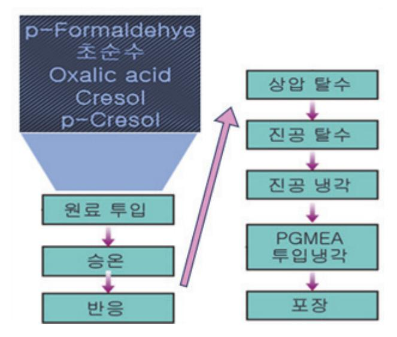

출처: 집필진 제작(2024) [그림 3-2] 노블락 수지 제조 공정 흐름도

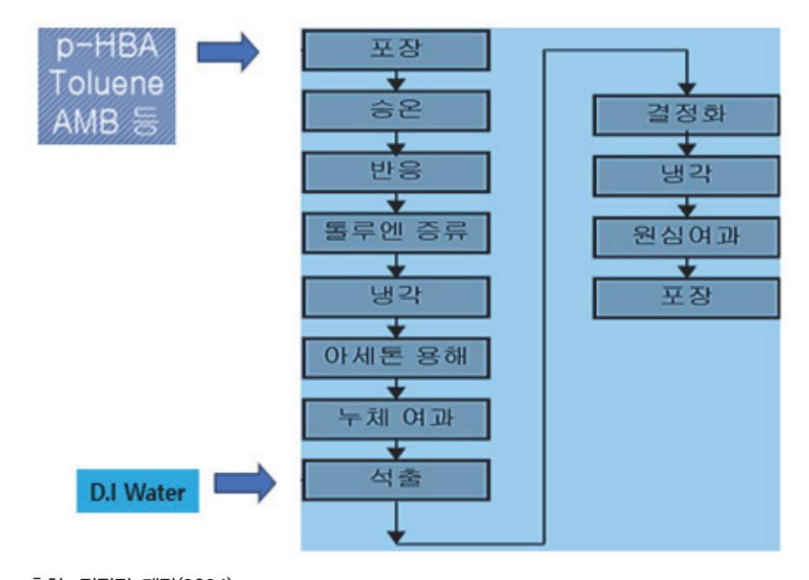

출처: 집필진 제작(2024) [그림 3-3] 광 활성제 제조 공정 흐름도

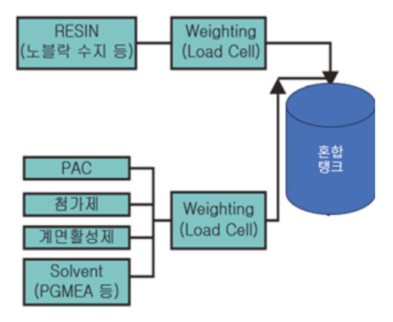

출처: 집필진 제작(2024) [그림 3-4] 감광제 제조 공정 흐름도

2. 감광제의 주요 파라미터를 확인 후 진행한다.

(1) 원료 투입

반응기(RX-204)에 정제된 감광제(Wet Cake)를 맨홀을 통해 약 1,200kg 투입한 후, 배관을 통해 톨루엔 3,000kg을 투입(약 40분 소요)과 동시에 교반기로 교반 시작(약 105RPM) 하고 그다음 물 12,000kg을 투입(약 50분 소요)하면서 승온을 시작한다.

(2) 승온

반응기(RX-204)의 온도를 75~82℃까지 1시간 동안에 스팀으로 승온하고 이 온도를 3

시간 동안 유지한다.

(3) 냉각

냉각수로 1시간 동안 15℃까지 냉각을 실시한다.

(4) 원심 분리 여과 공정

냉각에 의해 반응기의 내부 온도가 15℃로 낮아지면 원심 분리기로 공급하고 질소를 투 입하여 원심 분리 여과를 진행하고 작업자는 대상 물질이 원심 분리기에서 원하는 양의 고체상 제품(약 100kg)이 될 때까지 대상 물질 공급 배관의 밸브를 수시로 열어 원심 분리기로 공급(약 30∼50분 소요)한다. 원하는 양의 제품이 원심 분리기로 투입되면 대 상 물질 공급 밸브를 닫고 1시간 동안 회전시키고 초순수 세정(Washing)은 공급 완료 후와 공급이 중단되고 회전 시작 후 30분이 경과된 시점에 30LPM으로 2분간 실시한 다.

3. 감광제의 평가 및 검증을 진행한다.

포토 공정에 의해 형성된 패턴을 평가 및 검증하는 방법과 포토 리소그래피 공정별 고려 사항을 이해해야 한다.

(1) 패턴의 분해 능력(Resolution)을 확인한다.

분해 능력이란 감광제가 얼마나 작은 크기의 패턴을 왜곡 없이 정확하게 구현해 낼 수 있는지를 나타내는 성능으로 193nm 체 감응하는 PR의 경우에는 80nm 이하의 해상력 이 일반적으로 요구되고 있다. 해상력의 향상은 PR 특성 개선으로 이루어질 수 있으나 노광기나 노광 기술, 현상 기술에 의해서도 향상될 수 있다. PR의 해상력을 높이기 위 해서는 PR의 광효율(Quantum Yield), 노광에 의해 형성된 산의 확산도(Photo-acid Diffusivity), 및 노광 전후의 현상액에 대한 용해도 차이(Dissolution Contrast)를 개 선하여야 하며 이를 위해 다양한 형태와 특성이 고분자와 광산 발생제 등이 개발된다.

(2) 왜곡 정도(Aberration)를 확인한다.

빛이 상의 한 점에 모이지 않고 흩어진 이유는 Exit Pupil의 파면 차이 때문이다. 점광 원에서 출발한 파면은 이상적인 구면파를 이루어야 하지만 광학계를 통과하면서 실제로 는 임의의 곡면을 이루고 있다. 이상적인 파면과 실제 파면 사이의 광경로 차가 파면 수차로 위치에 따른 파면 함수로 나타낼 수 있다. 물체와 사이 정확히 닮은꼴이 아닌 이유는 렌즈의 수차 때문이다.

(3) 분해능 향상(Resolution Enhanced Technology)을 확인한다.

패턴이 작으면(주기가 짧으면) 회절각이 커지면서 결상을 위해서는 최소한 2개 차수 이 상의 광이 간섭을 해야 한다. 이유는 큰 렌즈를 사용하고 짧은 파장의 광원을 사용하기 때문이다.

(4) 패턴 거칠기(Line Etch Roughness)를 확인한다.

구현된 패턴의 거칠기를 의미하는 것으로 반도체의 집적도가 급격하게 높아짐에 따라 패턴의 크기 역시 작아지게 되는데 이때 형성된 패턴이 거칠게 되면 일정 길이의 패턴 의 폭이 심하게 변화한다는 의미이므로 그 패턴을 통해 만들어진 회로의 전기적인 특성 이 떨어지게 된다. 패턴의 크기가 300nm 이상의 비교적 큰 패턴에서는 문제가 되지 않 지만, 패턴의 크기가 작아질수록 패턴 거칠기는 엄격하게 관리되고 있으며 보통의 경우 패턴의 크기의 10% 정도로 관리되고 있다.

(5) 패턴 안정성(Pattern Collapse)을 확인한다.

패턴의 크기가 작아지면서 감광제 패턴과 기판과의 접촉면이 적어지게 된다. 이렇게 적 어진 접촉면으로는 일정한 두께의 패턴을 쓰러짐 없이 유지하기가 쉽지 않은데 특히 현 상 후 세정을 위해 사용하는 물의 표면 장력으로 패턴이 쓰러지는 경우가 생기게 된다. 100nm 미만의 미세한 패턴에서 이러한 현상이 많이 발생하는데 안정된 Pattern의 유 지를 위해 고분자의 기계적 특성과 기판과의 친화력 및 접착력을 향상시키는 방법을 사 용하고 있다. 쓰러짐의 방지를 위해 패턴의 높이와 너비의 비(Aspect Ratio)가 큰 패턴 의 경우 일반적으로 3:1로 관리 되었으나, 100nm 미만의 패턴에서는 2.5:1 또는 2:1로 관리하고 있다.

(6) 오염원 방지(Contamination and Defect Control)를 확인한다.

집적도 향상에 따른 패턴의 미세화가 가속화되면서 감광제 자체나 노광 및 현상 공정 중에 PR 패턴이 왜곡될 수 있는 오염의 방지가 중요해지고 있다. 이는 미세한 패턴 그리고 패턴과 패턴 사이에 작은 오염이라도 생기면 이를 통해 만들어지는 반도체의 수명이 짧아지거나 아예 작동을 하지 않는 경우가 생길 수 있기 때문이다. 엄격하게 관리되고 있는 오염원은 금속 이온, 먼지나 불용물로 인해 생기는 입자성 오염(Particle), PR의 균일성이 떨어져 생길 수 있는 패턴의 일그러짐(Pattern Distortion or Pattern Defect) 등으로, 8Giga DRAM 급인 65nm 공정에서는 평방 센티미터당 0.1개 이하의 규격으로 관리되고 있다.

### 학습 3 교수·학습 방법

#### 교수 방법

- 반도체 포토 공정용 재료의 개요와 세부 내용을 부분별로 알기 쉽게 설명한다.
- 현장에서 표준화한 공정 재료 매뉴얼과 관련 재료에서 제공되는 자료 등의 내용을 프레젠테 이션 자료로 제시한 후에 설명한다.
- 가능한 한 사전에 제조 현장에서 사용하는 사례를 수집하여 자료를 준비하고 이해하기 쉬운 방법을 논의하는 방식의 문제 해결식 수업을 한다.
- 최근 반도체 산업 현황(시장 환경 및 기술 동향 등)에 대하여 충분히 인지하고, 학습자들이 이를 이해할 수 있는 방법을 모색하여 수업을 진행한다.
- 관련 시장의 환경 및 기술 변화를 통합 검색 사이트나 한국반도체산업협회의 홈페이지 (www.ksia.or.kr) 등에서 찾아 활용할 수 있도록 지도한다.
- 반도체 포토 공정 재료 제조에 필요한 내용을 확인하고, 관련 자료를 학습자들에게 제시 후 파악 여부를 확인한다.

#### 학습 방법

- 반도체 산업 현황(시장 환경 및 기술 동향 등)과 관련 기관을 구체적으로 확인하도록 하고, 이 기관과 관련된 다양한 자료를 인터넷으로 검색하고 분류하여 문서로 정리한다.
- 반도체 포토 공정 재료 제조에 필요한 항목을 선정된 양식에 맞추어 작성하고, 특정 소자에 대한 준비 항목을 작성해 본 후, 여기에 첨부되는 자료의 종류와 기록 내용 전반을 숙지하 고, 가능하다면 소자별로 분한다.
- 반도체 포토 공정 재료 제조에 대한 기술, 비용의 조사, 수집 및 분석을 통해 생산에 필요 한 목표를 설정하고 분류된 자료를 활용하여 생산 가능성을 예측한다.
- 반도체 포토 공정에서 예상되는 품질관리 문제점을 파악하고 해결책을 수립하는 현장의 업 무를 이해하고, 정해진 양식에 따라 보고서를 작성한다.

## 학습 3 평가

#### 평가 준거

- 평가자는 학습자가 학습 목표를 성공적으로 달성하였는지를 평가해야 한다.
- 평가자는 다음 사항을 평가해야 한다.

|             | 학습 목표                                                 |  | 성취수준 |   |  |
|-------------|-------------------------------------------------------|--|------|---|--|
| 학습 내용       |                                                       |  | 중    | 하 |  |
| 포토 공정 재료 제조 | - 생산 관련 부서로부터 입수한 생산 계획에 따라 장비 운용 계획을 수립할 수 있다.    |  |      |   |  |
|             | - 작업 지시서와 장비 운용 매뉴얼에 따라 포토 공정 재 료를 제조할 수 있다.       |  |      |   |  |
|             | - 포토 공정 재료 제조 단계에서 발생한 문제점을 파악 하고 해결 방안을 도출할 수 있다. |  |      |   |  |

#### 평가 방법

#### • 포트폴리오

|             | 평가 항목                                                      |  | 성취수준 |   |  |
|-------------|------------------------------------------------------------|--|------|---|--|
| 학습 내용       |                                                            |  | 중    | 하 |  |
| 포토 공정 재료 제조 | - 생산 계획에 따라 감광제와 첨가제의 장비 운용 계획 을 수립할 수 있는 능력            |  |      |   |  |
|             | - 장비 운용 매뉴얼에 따라 감광제와 첨가제의 재료를 제조할 수 있는 지식 보유 여부         |  |      |   |  |
|             | - 포토 공정 재료 제조 단계에서 발생한 문제점을 파악 하고 해결 방안을 도출할 수 있수 있는 능력 |  |      |   |  |

#### • 문제 해결 시나리오

| 학습 내용       | 평가 항목                                                      |  | 성취수준 |   |  |
|-------------|------------------------------------------------------------|--|------|---|--|
|             |                                                            |  | 중    | 하 |  |
| 포토 공정 재료 제조 | - 생산 계획에 따라 감광제와 첨가제의 장비 운용 계획 을 수립할 수 있는 능력            |  |      |   |  |
|             | - 장비 운용 매뉴얼에 따라 감광제와 첨가제의 재료를 제조할 수 있는 지식 보유 여부         |  |      |   |  |
|             | - 포토 공정 재료 제조 단계에서 발생한 문제점을 파악 하고 해결 방안을 도출할 수 있수 있는 능력 |  |      |   |  |

#### • 서술형 시험

|             | 평가 항목                                                      |  | 성취수준 |   |  |
|-------------|------------------------------------------------------------|--|------|---|--|
| 학습 내용       |                                                            |  | 중    | 하 |  |
| 포토 공정 재료 제조 | - 생산 계획에 따라 감광제와 첨가제의 장비 운용 계획을 수립할 수 있는 능력             |  |      |   |  |
|             | - 장비 운용 매뉴얼에 따라 감광제와 첨가제의 재료를 제 조할 수 있는 지식 보유 여부        |  |      |   |  |
|             | - 포토 공정 재료 제조 단계에서 발생한 문제점을 파악 하고 해결 방안을 도출할 수 있수 있는 능력 |  |      |   |  |

#### 피드백

- 1. 포트폴리오 - 감광제와 첨가제의 제조에 필요한 원재료의 제조 장비를 운용할 수 있는 능력에 대해 평가하고 미비한 점 이 발견되면 보완하도록 주요 내용을 사례를 통해 추가로 설명해 준다. - 감광제와 첨가제 제조 시 발생할 수 있는 문제점의 대처 방안에 대한 지식에 대해 평가하고 평가 결과가 우수하면 해당 기술의 심화 학습을 추가로 실시한다. 2. 문제 해결 시나리오 - 감광제와 첨가제의 제조에 필요한 원재료의 제조 장비를 운용할 수 있는 능력에 대해 평가하고 미비한 점 이 발견되면 보완하도록 주요 내용을 사례를 통해 추가로 설명해 준다. - 감광제와 첨가제 제조 시 발생할 수 있는 문제점의 대처 방안에 대한 지식에 대해 평가하고 평가 결과가 경우수하면 해당 기술의 심화 학습을 추가로 실시한다. 3. 서술형 시험 - 감광제와 첨가제의 제조에 필요한 원재료의 제조 장비를 운용할 수 있는 능력에 대해 평가하고 미비한 점 이 발견되면 보완하도록 주요 내용을 사례를 통해 추가로 설명해 준다.
- 감광제와 첨가제 제조 시 발생할 수 있는 문제점의 대처 방안에 대한 지식에 대해 평가하고 평가 결과가 우수하면 해당 기술의 심화 학습을 추가로 실시한다.

- 한국반도체산업협회(2006). 『반도체 재료 기술 로드맵 조사·연구 보고서』. 한국반도체산업협회.
- 화학정보센터(2011). 『2011 일본 화학산업 동향-반도체용 화합물 산업』. 한국화학연구원.
- 황호정(2003). 『반도체 공정 기술』. 생능출판사.
- Michael Quirk, Julian Serda(2013). 『반도체 소자 공정 기술』. 최성재(역). 자유 아카데미.
- S. Wolf, R.N. Tauber (2008). Silicon Processing for the VLSI Era. Lattice Press.
- William Beown, Thomas Poon (2011). 『유기 화학 입문(Introduction to Organic Chemistry)』. 유기화학교재연구회.

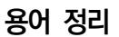

- 6-시그마: 제품의 품질 관리를 위한 통계적 접근 방법으로서 품질 관리에 필요한 모든 요소 를 논리적으로 관리하고, 발생 가능한 오류를 최소화하기 위한 관리 기법이다.
- 표준 분석법: ASTM, JIS, ISO, SEMI, KS와 같은 상호 공인 또는 사내의 표준 분석법을 뜻 하며, 전처리, 용량, 분석기기, 분석 방법을 자세히 규정한 분석법을 말한다.
- ASTM(American Society for Testing and Materials, 미국재료시험협회): 미국의 재료 규격 및 재료 시험에 관한 기준을 정하는 기관으로 표준화와 연구 업무의 추진을 목적으로 한다.
- ISO(International Standardization Organization, 국제표준화기구)란 국제간에 이용되는 규격으로 각국의 공업 규격을 조정·통일하고, 물자와 서비스의 국제적 교류를 유도하며, 과 학적·지적·경제적 활동 분야의 협력을 증진하는 것을 목적으로 한다.
- JIS(Japanese Industrial Standards, 일본 공업 규격): 일본에서 사용되는 국가 기술 표준으로, 많은 분야의 공업제품에 관한 규격이 제정되었다. 국제규격으로 ISO, IEC와 제휴되어 있다.
- SEMI(Semiconductor Equipment and Material Institute): 반도체 제조 장비 재료 협회 로서 케미컬(C), 제조 장치(E), 재료(M), 그리고 패키징(G), 마이크로 패터닝(P) 및 안전성 부회에서 SEMI International Standards를 간행하고 있다.
- KS(Korean Industrial Standards, 한국 공업 규격): 공업 표준화를 위해 제정된 공업 규 격을 보급ㆍ활용하여 제품의 품질 개선과 생산 능률의 향상, 거래의 단순화와 공정화의 도모 및 소비자 보호를 위해 만들어진 제도를 말한다.
- RoHS(Restriction of the use of Hazardous Substances in EEE): 전기 ‧ 전자 제품에 납, 카드뮴, 수은, 크롬, 난연제(PBBs, PBDEs)와 같은 유해 물질 사용을 제한하는 유해 물 질 사용 제한 지침을 말한다.
- WEEE(waste electrical and electronic equipment)란 폐가전 제품의 의무 재활용에 관 한 규제로서 폐전기 전자 제품의 재활용 비용을 생산자가 부담하는 제도를 말한다.
- MSDS(material safety data sheet): 화학 물질을 안전하게 사용하고 관리하기 위하여 필 요한 정보를 기재한 Sheet로서 제조자명, 제품명, 성분과 성질, 취급상의 주의, 적용 법규, 사고 시의 응급 처치 방법 등이 기입되어 있는 Data Sheet를 말한다.

75

| NCS학습모듈 개발이력 |                                      |     |                  |  |
|--------------|--------------------------------------|-----|------------------|--|
| 발행일          | 2024년 12월 31일                        |     |                  |  |
| 세분류명         | 반도체 재료(19030604)                     |     |                  |  |
| 개발기관         | 수원과학대학교 산학협력단(개발책임자: 김선희), 한국직업능력연구원 |     |                  |  |
|              | 최준혁(수원대학교)*                          |     | 김강복(삼성전자)        |  |
|              | 김대영(오산대학교)                           |     | 김한수(두원공대)        |  |
|              | 김영수(디이엔티)                            |     | 남승호(경기대학교)       |  |
|              | 김준성(오산대학교)                           |     | 손승대(제이에스이엔씨(주))  |  |
| 집필진          | 김현후(두원공대)                            | 검토진 | 이철오((주)한국전력안전공단) |  |
|              | 임희용(전 부천대학교)                         |     |                  |  |

\*표시는 대표집필자임 (참고) 검토진으로 참여한 집필진은 본인의 원고가 아닌 타인의 학습모듈을 검토함

| 반도체용 포토 공정 재료 제조(LM1903060421_23v3)                                                                     |                   |  |  |  |
|---------------------------------------------------------------------------------------------------------|-------------------|--|--|--|
| 저작권자                                                                                                    | 교육부               |  |  |  |
| 연구기관                                                                                                    | 한국직업능력연구원         |  |  |  |
| 발행일                                                                                                     | 2024. 12. 31.     |  |  |  |
| ISBN                                                                                                    | 979-11-7175-775-6 |  |  |  |
| ※ 이 학습모듈은 자격기본법 시행령(제8조 국가직무능력표준의 활용)에 의거하여 개발하였으며, NCS통합포털사이트(http://www.ncs.go.kr)에서 다운로드할 수 있습니다. |                   |  |  |  |

