# NCS학습모듈 반도체용 트랙 공정 재료 제조

LM1903060422\_23v3

#### [NCS학습모듈 활용 시 유의 사항]

- 1. NCS학습모듈은 교육훈련기관에서 출처를 명시하고 교육적 목적으로 활용할 수 있습니다. 다 만, NCS학습모듈에는 국가(교육부)가 저작재산권 일체를 보유하지 않은 저작물(출처가 표기된 도표‧사진‧삽화‧도면 등)이 포함되어 있으므로, 이러한 저작물의 변형‧각색‧복제‧공연‧ 배포 및 공중 송신 등과 이러한 저작물을 활용한 2차적 저작물을 작성하려면 반드시 원작자 의 동의를 받아야 합니다.
- 2. NCS학습모듈은 개발 당시의 산업 및 교육 현장을 반영하여 집필하였으므로, 현재 적용되는 법령‧지침‧표준 및 교과 내용 등과 차이가 있을 수 있습니다. NCS학습모듈 활용 시 법령 ‧지침‧표준 및 교과 내용의 개정 사항과 통계의 최신성 등을 확인하시기를 바랍니다.
- 3. NCS학습모듈은 산업 현장에서 요구되는 능력을 교육훈련기관에서 학습할 수 있게 구성한 자 료입니다. 다만, NCS학습모듈 지면의 한계상 대표적 예시(예: 활용도 또는 범용성이 높은 제 품, 서비스) 중심으로 집필하였음을 이해하시기를 바랍니다.

## NCS학습모듈의 이해

※ 본 NCS학습모듈은 「NCS 국가직무능력표준」사이트(http://www.ncs.go.kr) 에서 확인 및 다운로드할 수 있습니다.

### Ⅰ NCS학습모듈이란?

- 국가직무능력표준(NCS: National Competency Standards)이란 산업현장에서 직무를 수행하기 위해 요구되는 지식·기술·소양 등의 내용을 국가가 산업부문별·수준별로 체계 화한 것으로 산업현장의 직무를 성공적으로 수행하기 위해 필요한 능력(지식, 기술, 태도) 을 국가적 차원에서 표준화한 것을 의미합니다.
- 국가직무능력표준(이하 NCS)이 현장의 '직무 요구서'라고 한다면, NCS학습모듈은 NCS
  의 능력단위를 교육훈련에서 학습할 수 있도록 구성한 '교수·학습 자료'입니다. NCS학습
  모듈은 구체적 직무를 학습할 수 있도록 이론 및 실습과 관련된 내용을 상세하게 제시하
  고 있습니다.

#### ○ NCS학습모듈은 다음과 같은 특징을 가지고 있습니다.

- 첫째, NCS학습모듈은 산업계에서 요구하는 직무능력을 교육훈련 현장에 활용할 수 있도 록 성취목표와 학습의 방향을 명확히 제시하는 가이드라인의 역할을 합니다.
- 둘째, NCS학습모듈은 특성화고, 마이스터고, 전문대학, 4년제 대학교의 교육기관 및 훈 련기관, 직장교육기관 등에서 표준교재로 활용할 수 있으며 교육과정 개편 시에도 유용하게 참고할 수 있습니다.

○ NCS와 NCS학습모듈 간의 연결 체계를 살펴보면 아래 그림과 같습니다.

O NCS학습모듈의 위치는 NCS 분류 체계에서 해당 학습모듈이 어디에 위치하는지를 한 눈에 볼 수 있도록 그림으로 제시한 것입니다.

| [NCS-학          | 습모듈              | 의 위치]    |          |  |
|-----------------|------------------|----------|----------|--|
|                 |                  |          |          |  |
| 대분류             | 개분류 문화·예술·디자인·방송 |          |          |  |
| 중분류             | 문화콘텐츠            |          |          |  |
| 소분류             |                  | 문화콘텐츠제작  |          |  |
|                 |                  |          |          |  |
| 세분류             |                  |          |          |  |
| 방송콘텐츠제작         |                  | 능력단위     | 학습모듈명    |  |
| 영화콘텐츠제작         |                  | 프로그램 기획  | 프로그램 기획  |  |
| 음악콘텐츠제작         |                  | 아이템 선정   | 아이템 선정   |  |
| 광고콘텐츠제작         |                  | 자료 조사    | 자료 조사    |  |
| 게임콘텐츠제작         |                  | 프로그램 구성  | 프로그램 구성  |  |
| 애니메이션 콘텐츠제작  |                  | 캐스팅      | 캐스팅      |  |
| 만화콘텐츠제작         |                  | 제작계획     | 제작계획     |  |
| 캐릭터제작           |                  | 방송 미술 준비 | 방송 미술 준비 |  |
| 스마트문화앱 콘텐츠제작 |                  | 방송 리허설   | 방송 리허설   |  |
| 영사              |                  | 야외촬영     | 야외촬영     |  |
|                 |                  | 스튜디오 제작  | 스튜디오 제작  |  |
|                 |                  |          |          |  |

학습모듈은

NCS 능력단위 1개당 1개의 학습모듈 개발 을 원칙으로 합니다. 그러나 필요에 따라 고용단위 및 교과단위를 고려하여 능력단위 몇 개를 묶어 1개 학습모듈로 개발할 수 있으며, NCS 능력단위 1개를 여러 개의 학습모듈로 나누어 개발할 수도 있습니다.

#### 2. NCS학습모듈의 개요

#### ○ NCS학습모듈의 개요는 학습모듈이 포함하고 있는 내용을 개략적으로 설명한 것으로

| 학습모듈의 목표 , 선수학습 , 학습모듈의 내용 체계 , 핵심 용어 로 구성되어 있습니다. |                                                                              |  |  |
|----------------------------------------------------|------------------------------------------------------------------------------|--|--|
| 학습모듈의 목표                                           | 해당 NCS 능력단위의 정의를 토대로 학습 목표를 작성한 것입니다.                                        |  |  |
| 선수학습                                               | 해당 학습모듈에 대한 효과적인 교수·학습을 위하여 사전에 이수해야 하는 학습모 듈, 학습 내용, 관련 교과목 등을 기술한 것입니다. |  |  |
| 학습모듈의 내용 체계                                     | 해당 NCS 능력단위요소가 학습모듈에서 구조화된 체계를 제시한 것입니다.                                     |  |  |
| 핵심 용어                                              | 해당 학습모듈의 학습 내용, 수행 내용, 설비·기자재 등 가운데 핵심적인 용어를 제 시한 것입니다.                   |  |  |

#### 제작계획 학습모듈의 개요

#### 학습모듈의 목표

본격적인 촬영을 준비하는 단계로서, 촬영 대본을 획정하고 제작 스태프를 조직하며 촬영 장비와 촬영 소품을 준비할 수 있다.

#### 선수학습

제작 준비(LM0803020105\_13v1), 섭외 및 제작스태프 구성(LM0803020104\_13v1), 촬영 제작(LM0803020106\_13v1), 촬영 장비 준비(LM0803040204\_13v1.4), 미술 디자인 협의하기(LM0803040203\_13v1.4)

#### 학습모듈의 내용체계

| 하스                | 하스 내용                                              | NCS 능력단위 요소       |                |
|-------------------|----------------------------------------------------|-------------------|----------------|
| 학습                | 학습 내용                                              | 코드번호              | 요소 명칭          |
| 1. 촬영 대본 확정하기  | 1-1. 촬영 구성안 검 토와 수정                             | 0803020114_16/3.1 | 촬영 대본 확정하기  |
| 2. 제작 스태프 조직하기 | 2-1. 기술 스태프 조직 2-2. 미술 스태프 조직 2-3. 전문 스태프 조직 | 0803020114_16v3.2 | 제작 스태프 조직하기 |
| 3. 촬영 장비 계획하기  | 3-1. 촬영 장비 점검 과 준비                              | 0803020114_16/3.3 | 촬영 장비 계획하기  |
| 4. 촬영 소품 계획하기  | 4-1. 촬영 소품 목록 작성 4-2. 촬영 소품 제작 의뢰         | 0803020114_16\3.4 | 촬영 소품 계획하기  |

#### 핵심 용어

촬영 구성안, 제작 스태프, 촬영 장비, 촬영 소품

#### 학습모듈의 목표는

학습자가 해당 학습모듈을 통해 성취해야 할 목표를 제시한 것으로, 교수자는 학습자 가 학습모듈의 전체적인 내용흐름을 파악하 도록 지도할 수 있습니다.

**6** • •

61

#### 선수학습은

교수자 또는 학습자가 해당 학습모듈을 교 수·학습하기 이전에 이수해야 하는 교과목 또는 학습모듈(NCS 능력단위) 등을 표기한 것입니다. 따라서 교수자는 학습자가 개별 학습, 자기 주도 학습, 방과 후 활동 등 다 양한 방법을 통해 이수할 수 있도록 지도하 는 것을 권장합니다.

|            | 핵심 용어는              |
|------------|---------------------|
|            | 률을 대표하는 주요 용어입니     |
|            | · 해당 학습모듈을 통해 학습    |
|            | 게될 주요 내용을 알 수 있습    |
|            | 5 국가직무능력표준」 사이트     |
| (www.ncs.g | jo.kr)의 색인 (찾아보기) 중 |
| 하나로 이용할    | 할 수 있습니다            |

#### 3. NCS학습모듈의 내용 체계

○ NCS학습모듈의 내용은 크게 학습, 학습 내용, 교수·학습 방법, 평가 로 구성되어 있습니다.

| 학습       | 해당 NCS 능력단위요소 명칭을 사용하여 제시한 것입니다. 학습은 크게 학습 내용, 교수·학습 방법, 평가로 구성되며 해당 NCS 능력단위의 능력단위 요소별 지식, 기술, 태도 등을 토대로 내용을 제시한 것입니다.                                                    |
|----------|----------------------------------------------------------------------------------------------------------------------------------------------------------------------------------|
| 학습 내용    | 학습 내용은 학습 목표, 필요 지식, 수행 내용으로 구성되며, 수행 내용은 재료·자 료, 기기(장비·공구), 안전·유의 사항, 수행 순서, 수행 tip으로 구성한 것입니다. 학습모듈의 학습 내용은 실제 산업현장에서 이루어지는 업무활동을 표준화된 프로세 스에 기반하여 다양한 방식으로 반영한 것입니다. |
| 교수·학습 방법 | 학습 목표를 성취하기 위한 교수자와 학습자 간, 학습자와 학습자 간 상호 작용이 활발하게 일어날 수 있도록 교수자의 활동 및 교수 전략, 학습자의 활동을 제시한 것입니다.                                                                            |
| 평가       | 평가는 해당 학습모듈의 학습 정도를 확인할 수 있는 평가 준거 및 평가 방법, 평 가 결과의 피드백 방법을 제시한 것입니다.                                                                                                         |

## [NCS-학습모듈의 위치]

| 대분류 | 전기 ‧ 전자 |          |        |
|-----|---------------|----------|--------|
| 중분류 |               | 전자 기기 개발 |        |
| 소분류 |               |          | 반도체 개발 |

| 세분류    |                      |                      |
|--------|----------------------|----------------------|
| 반도체 개발 | 능력단위                 | 학습모듈명                |
| 반도체 제조 | 반도체용 CMP슬러리 재료 제조    | 반도체용 CMP슬러리 재료 제조    |
| 반도체 장비 | 반도체용 세정공정 재료 제조      | 반도체용 세정공정 재료 제조      |
| 반도체 재료 | 반도체용 박막도금공정 재료 제조 | 반도체용 박막도금공정 재료 제조 |
|        | 반도체용 SOD공정 재료 제조     | 반도체용 SOD공정 재료 제조     |
|        | 반도체용 트랙공정 재료 제조      | 반도체용 트랙공정 재료 제조      |
|        | 반도체용 웨이퍼 재료 제조       | 반도체용 웨이퍼 재료 제조       |
|        | 반도체용 금속(Target)재료 제조 | 반도체용 금속(Target)재료 제조 |
|        | 반도체용 패키지 재료 제조       | 반도체용 패키지 재료 제조       |
|        | 반도체 재료 개발            | 반도체 재료 개발            |
|        | 반도체 재료 생산관리          | 반도체 재료 생산관리          |
|        | 반도체 재료 품질관리          | 반도체 재료 품질관리          |
|        | 반도체 재료 안전관리          | 반도체 재료 안전관리          |
|        | 반도체용 마스크 재료 제조       | 반도체용 마스크 재료 제조       |

| 반도체용 플립칩 재료 제조       | 반도체용 플립칩 재료 제조       |
|----------------------|----------------------|
| 반도체용 CMP 재료 제조       | 반도체용 CMP 재료 제조       |
| 반도체용 식각공정 가스 제조      | 반도체용 식각공정 가스 제조      |
| 반도체용 세정공정 가스 제조      | 반도체용 세정공정 가스 제조      |
| 반도체용 박막공정 가스 제조      | 반도체용 박막공정 가스 제조      |
| 반도체용 이온주입공정 가스 제조 | 반도체용 이온주입공정 가스 제조 |
| 반도체용 박막공정 전구체 제조     | 반도체용 박막공정 전구체 제조     |
| 반도체용 포토공정 재료 제조      | 반도체용 포토공정 재료 제조      |

| 학습모듈의 개요                     | 1  |
|------------------------------|----|
| 학습 1. 트랙 공정 재료 제조 요구 사항 파악하기 |    |
| 1-1. 트랙 공정 재료 제조 요구 사항 파악    | 3  |
| • 교수 ․ 학습 방법                 | 22 |
| • 평가                         | 23 |
| 학습 2. 트랙 공정 재료 준비하기          |    |
| 2-1. 트랙 공정 재료 준비             | 26 |
| • 교수 ․ 학습 방법                 | 44 |
| • 평가                         | 45 |
| 학습 3. 트랙 공정 재료 제조하기          |    |
| 3-1. 트랙 공정 재료 제조             | 48 |
| • 교수 ․ 학습 방법                 | 73 |
| • 평가                         | 74 |
| 참고 자료                        | 76 |
| 부 록                       | 77 |

## 반도체용 트랙 공정 재료 제조 학습모듈의 개요

#### 학습모듈의 목표

반도체 제조에 필요한 성능과 품질을 만족하는 트랙 공정 재료를 준비하고 제조할 수 있다.

#### 선수학습

Photo 장비 운영(LM1903060201\_14v3)

#### 학습모듈의 내용체계

| 하스                   | 학습 내용                        | NCS 능력단위 요소       |                              |
|----------------------|------------------------------|-------------------|------------------------------|
| 학습                |                              | 코드번호              | 요소 명칭                        |
| 요구 사항 파악하기           | 1-1. 트랙 공정 재료 제조 요구 사항 파악 | 1903060422_23v3.1 | 트랙 공정 재료 제조 요구 사항 파악하기 |
| 2. 트랙 공정 재료 준비 하기 | 2-1. 트랙 공정 재료 준비             | 1903060422_23v3.2 | 트랙 공정 재료 준비하기             |
| 3. 트랙 공정 재료 제조 하기 | 3-1. 트랙 공정 재료 제조             | 1903060422_23v3.3 | 트랙 공정 재료 제조하기             |

핵심 용어

트랙 공정, 감광막, 감광 재료, 현상 공정, 현상액, 노광, 트랙 노즐, 노즐 청소, 아세톤

| 학습 1 | 트랙 공정 재료 제조 요구 사항 파악하기 |
|------|------------------------|
| 학습 2 | 트랙 공정 재료 준비하기          |
| 학습 3 | 트랙 공정 재료 제조하기          |

## 1-1. 트랙 공정 재료 제조 요구 사항 파악

|       | • 생산 관련 부서로부터 트랙 공정 재료 제조 사양서를 입수할 수 있다.                   |
|-------|------------------------------------------------------------|
| 학습 목표 | • 트랙 공정 재료 제조 사양서를 바탕으로 제품명, 품질 기준, 제품 사양, 납기 등을 파악할 수 있다. |
|       | • 파악된 내용을 바탕으로 트랙 공정 재료 제조 시 발생할 수 있는 문제점을 검토할 수 있다.       |

## 필요 지식 /

#### 숔 반도체 트랙 공정의 개요

반도체 제조 공정에서 트랙 공정은 포토 공정이 이루어지기 전에 PR를 도포하는 과정과 포토 공정 을 통해서 노광이 이루어진 후 PR를 현상해 주는 공정 등으로 이루어져 있다. 반도체의 루틴 공정 은 6가지가 맞물려서 진행된다. 그중 회로 패턴을 형성시키는 기본 공정 3가지로는 포토, 식각, 세정 및 평탄화가 있고, 층을 쌓거나 형태를 변경시키는 선택 공정 3가지로는 이온-임플란테이션, 증착, 확산 공정이 있다. 반도체 Technology가 30nm 이전일 때에는 단연 포토 공정이 가장 어려 운 공정이라고 할 수 있었지만 30nm 이후에는 포토 이외에 식각이 추가되고 있다. 포토 공정은 크게 나누면 접착제(HMDS) 도포 > 감광제(PR) 도포 > 노광(Exposure) > 현상(Developing) > 검사(Inspection) > 재작업(불량 발생 시) 등으로 진행되는데 포토 공정 중 노광 공정 바로 앞 공정 이면서 최초 공정으로서 웨이퍼를 준비하고 HMDS(Hexa Methyl Di Siliazane, 헥사메틸디실라 잔)를 도포하고, 감광제를 코팅하는 공정까지가 포토 공정 중 트랙으로 할 수 있는 초기 단계 공정 이다.

#### 1. 트랙으로 진행하는 감광막 접착 향상제(HMDS) 도포 공정

회전시키는 웨이퍼에 접착 향상제인 HMDS를 도포하는 공정으로는 스피너핀 코터(Spin Coater)라는 장비를 사용하기도 하고 트랙을 사용하기도 하는데 스핀 코터는 일부 연구소 나 실험실에서 소량의 포토 공정을 진행할 때 사용하고, 생산 업체에서는 주로 트랙을 사용 한다. HMDS의 분자식은 Si2(CH3)6이며, 웨이퍼 또는 유리의 윗면을 소수성으로 변환시켜 주기 위해 사용한다. 감광막으로 사용되는 PR(Photo Resist)는 유기 용매액으로 액체 성질 상 웨이퍼나 유리 표면에 PR이 잘 붙지 않을 수 있다. 그래서 결국 HMDS는 PR과 웨이퍼

의 접착력을 향상해 주는 물질로서 사용되면 PR가 기판에 도포도 잘되고 접착력도 유지되 는 기능을 하게 된다.

#### 2. 트랙을 통한 감광막 도포

반도체 웨이퍼에 빛의 노출에 반응하는 성질을 가지고 있는 PR를 입히는 공정으로 작업 시 유기 용제이기 때문에 사람의 피부 등에 접촉되지 않게 주의하여야 한다. 트랙 장비 안에는 스피너가 있어서 스피너가 위치한 공간에 웨이퍼를 로봇을 통해 이송하여 코팅을 하는데 Spin Coating은 아주 오랫동안 각종 박막의 증착 코팅에 사용되어 왔다. 이 공정에서는 보통 소량의 액체 수지를 기판의 중앙에 낙하시킨 다음 고속(약 3,000rpm)으로 웨이퍼를 회전시키는 방법을 사용한다. 구심성 가속으로 얇은 수지가 표면에 코팅된다. 필름 두께와 특성은 PR의 속성(점성, 건조율, 응고율, 표면 장력 등)과 공정에 매개 변수에 따라 달라진 다. 스핀 속도, 가속도 등이 필름의 특성에 영향을 미친다. 스핀 코팅에서 중요한 요인은 반복성이다. 스핀 공정의 매개 변수는 작은 변이가 코팅된 필름에 영향을 줄 수 있다.

#### 3. 트랙 장비의 소프트 베이킹(Soft Baking) 공정

반도체 웨이퍼 상면에 PR를 코팅하고 나서 95~115℃로 가열하는 공정으로 유기 용제인 PR의 수분을 제거해 주고 초기 두께와 형태를 형성하는 데 사용하는 공정이다.

#### 4. 정렬(Alignment)과 노광(Exposure) 공정

Mask의 이미지를 반도체 웨이퍼에 옮기기 위해 상호 정확한 위치에 맞추는 공정과 정렬이 끝나면 Mask의 상이 반도체 웨이퍼에 옮겨지도록 자외선에 PR을 노출시키는 공정을 말하 며 정렬과 노광을 동시 작업으로 진행한다. 반도체 포토 공정은 사진을 찍는 과정과 매우 흡사하다. 웨이퍼 위에 PR 코팅이 완료되면 노광을 진행한다. 노광이란 감광액을 바른 웨 이퍼를 빛에 노출시킨다는 뜻이고, 빛에 노출시킨다는 의미는 빛이 패턴화 마스크를 통과해 웨이퍼 표면에 투영된 영역(노광부)과 투영되지 않은 그림자 영역(비노광부)을 명확하게 구 분해낸다는 것이다. 이때 사용하는 빛은 일정한 광원의 파장을 이용하는데, 얼마나 짧은 파 장(파의 길이: 현재 KrF/ArF에서 EUV로 옮겨가는 중임.)을 적용할 수 있느냐에 따라서 칩 내의 트랜지스터 집적도(ex. 256Gb, 512Gb 등)가 결정된다. 웨이퍼당 생산할 칩수가 결정 이 되므로 노광은 반도체 전 공정 중 핵심이라 할 수 있다.

#### (1) 정렬 단계

광원을 출발한 빛은 사방으로 퍼지므로(직진) 렌즈로 빛을 모아줄 필요가 있다. 그런 후 빛은 마스크(레티클)의 미세 회로 패턴을 통과하면서 회절 현상으로 다시 퍼지게 되는데 이때 빛을 다시 렌즈로 모아준 후, 정밀하게 초점을 맞추어 웨이퍼 위 박막 표면에 이미지를 내려놓는 다. 결국 마스크의 미세 형상이 웨이퍼 표면에 옮겨지게 되는데, 이때 중요한 점은 위에 있는 광원, 마스크, 렌즈, 맨 아래에 있는 웨이퍼의 위치가 아래 위로 정확히 일치해야 하는 것이다 (정렬). 마스크 정렬은 마스크의 회로 패턴의 위치가 웨이퍼 표면의 회로 패턴과 정확히 일치 되도록 장치의 기계적 설정을 조정해 주는 것이다.

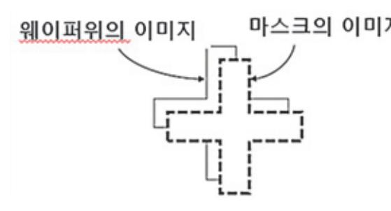

출처: 집필진 제작(2024) [그림 1-1] 노광 정렬 단계

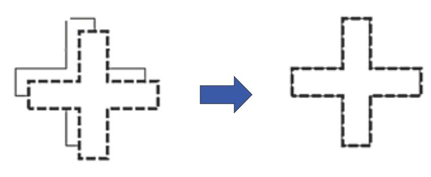

출처: 집필진 제작(2024) [그림 1-2] 노광 정렬 결과

(2) 노광 단계

광원을 출발한 빛은 사방으로 퍼지므로(직진) 렌즈로 빛을 모아줄 필요가 있다. 그런 후 빛은 마스크(레티클)를 통과하여 웨이퍼 위의 감광막에 비춰져서 감광막을 변화시킨다.

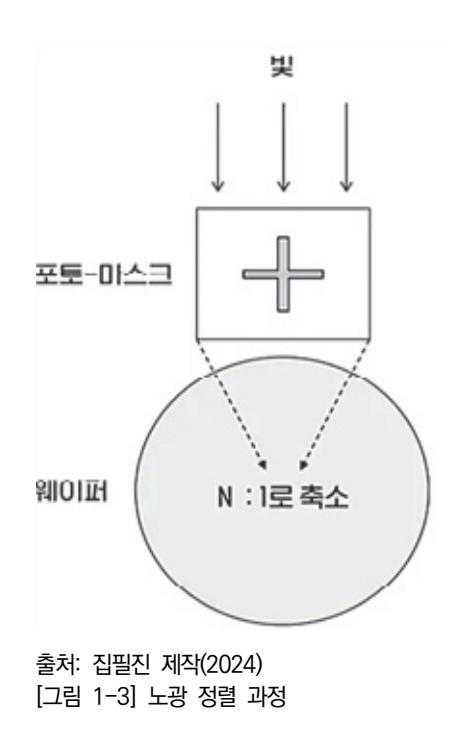

(3) 노광 공정(Exposure)의 방식

노광 공정은 직접방식, 근접 투영, 투영 전사, 습식 노광 등 여러 방식이 있다,

(가) 접촉(Contact) 방식의 노광

노광의 가장 쉬운 투영방법은 마스크를 웨이퍼 위에 직접 올려놓고 회로 패턴을 1: 1 크기(마스크 대 웨이퍼 표면)로 형성시키는 것이다. 반도체 개발을 시작하던 1960 년대에 최초로 이용한 방식으로, 마스크의 형상이 곧바로 웨이퍼로 투영되어 고난도 기술이 필요 없는 노광 기술이다. 노광 장비 중에서도 접촉 방식 노광 장비가 가장 저렴하며, 이 기술은 웨이퍼와 마스크가 직접 접촉하다 보니 초점을 맞출 필요가 없 지만 파티클(먼지)이 웨이퍼 상에 많아지고 감광막의 변형, 마스크의 마모가 쉽게 발 생된다는 단점이 있다. 따라서 접촉 방식이 아닌 다른 진보된 방법이 모색되었다.

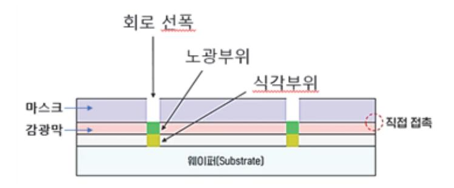

출처: 집필진 제작(2024) [그림 1-4] 직접 접촉 노광 정렬

(나) 근접 투영(Proximity)

접촉 방식의 단점을 극복하기 위한 차세대 기술로 감광막과 마스크 사이를 띄우는 근접 투영 방식이 개발되었다. 집적도가 낮은 시기인 1970년 전후에 적용되었던 방 식인데 빛이 마스크를 통과한 직후 빛의 회절 현상이 발생해 감광막 위에 맺히는 마 스크 형상의 초점이 맞지 않아 마스크와 웨이퍼 사이의 간격(Gap)이 벌어질수록 더 욱 흐릿한 이미지가 맺히게 되었다. 감광막을 현상할 때 패턴이 명확하게 형성되지 않는다는 것은 심각한 단점이었으며, 근접 방식도 거의 1:1 크기로 마스크의 이미지 가 투영되고 오염이나 감광막 손상이 없어지는 장점이 있지만, 노광에서 가장 중요 한 형상(회로 패턴)이 표면에 정확하게 맺히지 않고 이미지도 Gap에 비례하여 커지 게 되어 다른 방식이 필요했다.

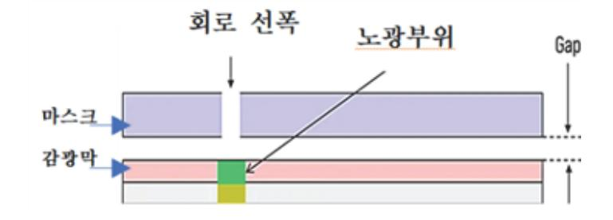

출처: 집필진 제작(2024) [그림 1-5] 근접 투영 노광 정렬

(다) 투영 전사(Projection)

투영 전사(轉寫) 방식은 마스크의 형상이 4분의 1 또는 10분의 1의 크기로 작아지면 서 웨이퍼 표면에 명확히 안착하도록 마스크와 웨이퍼 사이의 간격을 충분히 확보한 후 렌즈를 사용해 초점을 맞추는 방식이다. 이것은 간격이 커질수록 빛의 회절 현상 과 초점 불안정 문제가 근접 방식보다 더욱 심해지기 때문에 마스크를 통과한 빛을 볼록 렌즈로 다시 모아야 한다. 따라서 노광에서는 렌즈의 역할이 가장 중요하다. 렌 즈의 성능 중에서도 특히 해상도와 초점-심도라는 초점을 맞추는 물리적 기능이 핵 심이 된다. 대표적인 노광 장비로는 스테퍼(Stepper: 발자국 찍는 형태)와 스캐너 (Scanner: Slit을 통과하는 빛을 레이저광으로 쏘는 듯한 형태) 타입이 있는데, 150nm 테크놀로지 이하에서는 전부 스캐너를 사용한다.

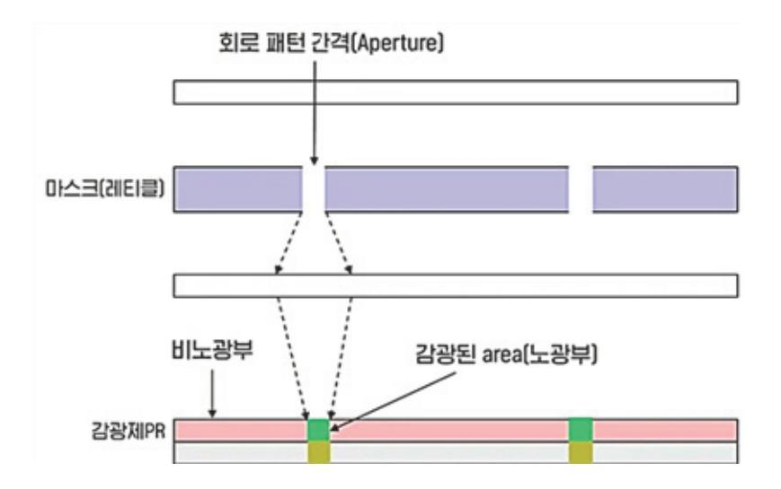

출처: 집필진 제작(2024) [그림 1-6] 투영 전사 노광 정렬

(라) 습식 노광(Immersion)

노광에서 일반적으로는 렌즈와 웨이퍼 사이에는 공기가 존재하는데, 이를 이용한 것

을 Dry 타입이라고 할 수 있다. 반면 공기 대신 물, 또는 빛의 굴절률을 높일 수 있 는 다른 액체를 채워 노광하는 것을 Wet 타입이라 한다. 굴절률이 높아지면 해상도 를 향상시킬 수 있는데 광학 상수값(NA)이 증가하게 되어 해상도 값이 떨어져 좀 더 선명한 이미지, 즉 단위 그림자가 작은 형상으로 모아진다. 물을 이용하면 공기보다 빛의 굴절률이 40% 이상 향상되어 해상도가 크게 개선된다.

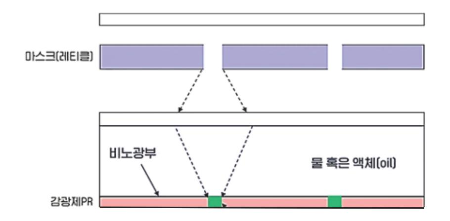

출처: 집필진 제작(2024) [그림 1-7] 습식 노광 정렬

#### 5. 트랙을 통한 노광 후 굽기(PEB: Post Exposure Bake)

노광이 완료된 후에는 웨이퍼를 노광기에서 트랙 장비로 옮겨 베이크(PEB: Post Exposure Bake)를 한 번 더 진행한다. PEB의 목적은 감광액 속에 있는 PAC를 활성화하여 감광액의 표면을 평탄화하고 정재파(Standing Wave)를 줄이기 위함이며, 정재파는 노광 시 빛의 간 섭(증폭과 감쇄)으로 인해 감광 계면에 결이 발생한 것을 말한다. PEB를 실시하지 않고 현 상을 진행하면, 감광막 내의 경계 단면에 발생한 굴곡이 제거되지 않는다.

그렇게 되면 하단의 Layer(박막 또는 산화막)를 식각할 때 정확한 위치에서 이루어지지 않 고, CD의 균일도를 떨어뜨리게 된다. 낮은 집적도에서는 문제 되지 않지만, 요즘 대세인 1xnm인 회로 선폭에서는 정재파의 영향으로 치명적인 신뢰성 이슈가 될 수 있다.

6. 트랙을 통한 현상(Development)

현상은 트랙이라고 불리는 장비에서 감광막의 일정 부분(노광부 또는 비노광부)을 제거하는 과정이다. 현상되지 않고 남아 있는 감광막(양성 PR 시 비노광부)은 식각 시에 식각액과 반 응하지 않아서 하단부의 Layer 박막들을 식각으로부터 보호하며, 현상액을 웨이퍼 위에 분 사 또는 디핑(Dipping)하고 현상액이 골고루 퍼지도록 웨이퍼를 회전시킨 후에 어느 정도 화학적 반응 시간이 경과하면 감광막이 제거된다(반도체 공정은 Spin과 Bake를 자주 진행 한다. 현상된 찌꺼기는 회전 세척을 하여 린스해 주고, 웨이퍼를 한 번 더 Bake한다. 이 bake는 린스 시의 탈이온수 DI Water를 말리고 동시에 감광막의 고분자 구조를 굳건히 하는 역할을 한다. 이를 통해 감광막 표면의 결속력을 높여서(고형화) 식각 시에 감광막이 제거되지 않도록 하며, 이때 온도는 Soft Bake보다 높아서 Hard Bake라 한다.

## 수행 내용 / 트랙 공정 재료 제조 요구 사항 파악하기

#### 재료·자료

- ASTM, ISO, JIS, SEMI, KS 표준화 문서
- ITRS 로드맵(International Technology Roadmap for Semiconductor)
- 반도체 로드맵
- 반도체 제조 공정도
- 반도체 기술/시장/표준 동향 분석서
- MSDS, RoHS, WEEE(Waste Electrical and Electronic Equipment)
- 시험 성적서
- 리소그래피 재료
- Immersion Photo Resist, Top Coat, BARC, Relacs/SAFIER, ArF Photo Resist, SOC, Developer
- KrF Photo Resist, MFHM, Thinner, I-line Photo Resist, SOD

#### 기기(장비 ・ 공구)

- 제조 공정 장비
  - 유기, 무기 합성 Pilot 설비
  - PR류 Mixing Vessel
  - 중합체 합성 Pilot 설비
  - 제조 공정 이상 발생 Monitoring 설비
  - Bottle Cleaning 설비

- 원자재 저장 창고
- Bottle Filling 설비
- 평가, 분석 및 계측 장비
  - Arf Scanner, Elipsometer
  - I-line Stepper, Microscope
  - Track, ICP-MS,nmR
  - CD-SEM, Bath(VB-10)
  - Dynamic Contact Angle,
  - Coating Defect Inspection,
  - Air particle counter
  - Amine 농도 측정기
  - Furnace
- 제조 공장 인트라넷
- 안전 도구, 안전화, 마스크, 장갑, 방진복
- 컴퓨터, 프린터, 복사기

안전 ・ 유의 사항

- 제조 공정 장비는 제품을 제조하기 위한 장비로서 안전 규칙에 따라 사용되어야 하며, 일정 주기와 요령에 따라 장비 성능의 평가가 필요하다.
- 평가/분석/계측기는 제품의 물리적 성질이나 특징을 평가하는 장비로서 규정에 따라 관리되 어야 하며 일정 주기와 요령에 따라 검·교정을 실시해야 한다.
- 작업 표준에는 공정 순서 및 조건(온도, 시간, 환경)을 포함한다.
- 작업 절차서는 생산을 완료하기까지의 순서를 체계적으로 작성한 작업의 계획서로서, 생산 을 바르게 실시할 목적으로 생산을 위한 절차와 생산에 사용하는 재료, 장치의 준비와 사용 요령, 생산에 필요한 주의 사항을 나타내는 문서이므로 이를 잘 준수해야 한다.

수행 순서

숔 반도체 트랙 공정의 재료를 최적화한다.

트랙 공정에서 해상도 및 회로 패턴의 정확한 확보를 위해 트랙 공정에서 사용되는 재료를 선 정하고 최적화해야 한다.

1. 감광막의 해상도(Resolution)를 확인한다.

포토 공정과 트랙 공정에서는 마지막으로 식각을 하기 전에 회로 패턴을 검사한다. 이때 불 량 패턴이 발견되면 감광막을 제거하는 리워크(Rework)를 진행하며, 반도체 전 공정 중에 서 Rework가 가능한 공정은 포토 공정이 유일하다. 해상도는 빛을 분해하는 정도 또는 능 력(분해능), 즉 인접해 있는 점이나 선을 각각 개별적으로 따로따로 구분해 낼 수 있는 능 력으로써 마스크의 미세 패턴 이미지를 웨이퍼 표면에 얼마나 작은 크기(이미지)로 옮겨 올 수 있는지를 가늠하는 척도이다. 따라서 해상도값이 작아야 유리하다. 마스크를 통과한 빛 의 그림자를 작게 맺히게 하려면 렌즈의 굴절률이 높아야 하고, 광원에서 나오는 빛의 파장 이 작아야 한다. 렌즈의 지름은 클수록, 초점 거리(마스크와 웨이퍼 사이)는 작을수록 좋다.

(1) 공정 변수 설정과 공정 능력을 확인한다.

마스크와 렌즈, 웨이퍼를 노광 장비에 설치하거나 공정을 진행할 때 렌즈와 웨이퍼 사이 의 물리적인 거리에 오차가 발생하게 된다. 따라서 초점이 잘 맺히게 하는 영역, 즉 아 래 위로 초점이 어느 정도 일정한 유효 거리(DoF)가 길어야 유리하며, 그러기 위해서는 DoF는 길어져야 하는 반면 해상도 값은 낮아야 하는데 이 둘은 모든 물리·화학적 변수 에서 서로 충돌하는 문제가 발생하므로(해상도와 DoF는 서로 Trade-off 관계) 서로 타 협해 적정값을 찾아내야 한다. 반도체 공정에서는 이같이 Try&Error 과정을 거쳐 적정 값을 찾아내야 하는 경우가 대다수이다. 공정 변수를 설정(Baseline set-up 및 Mass 진행 시)하는 실험적 작업이 모여 공정 능력이 된다.

(2) 공정 계수를 확인한다.

웨이퍼의 두께는 물론, 박막의 두께 및 감광 물질의 빛에 대한 민감도, 현상시에 사용하 는 화학 물질 등 각종 물리·화학적 인자와 오차들이 해상도와 DoF에 직·간접적으로 영 향을 끼친다. 이를 공정 계수라 하는데, 해상도(K1)와 DoF(K2)에 미치는 정도 및 인자 들이 각각 다르다.

숕 반도체 포토 공정과 트랙 공정의 분석 및 시험을 진행한다.

반도체 제조 공정에서 포토 공정과 트랙 공정의 공정 원리를 이해하고, 공정에 쓰이는 공정 분 석의 문제점을 파악하고 그 기술을 이해해야 한다. 공정·최종 성적서를 기반으로 정의되어야 한다.

#### 1. 포토 공정과 트랙 공정의 분석 및 시험을 진행한다.

- 포토 공정과 트랙 공정에 의해 형성된 패턴을 분석하는 방법과 포토 공정을 분석하는 방법, 및 포토 공정과 그에 따라 형성된 패턴과의 상관관계를 분석하기 위한 다양한 방법에 대하 여 알아야 한다. 프로파일 그래프를 주파수 도메인의 주파수 그래프로 변환하고, 저주파수 대역의 그래프와 고주파수 대역의 그래프로 분리하는 것이다.
- (1) 푸리에 변환 방법을 이용한 프로파일 그래프 분리

프로파일 그래프를 분리하는 것은 푸리에 변환 방법을 이용하여 프로파일 그래프를 주 파수 도메인(Frequency Domain)의 주파수 그래프로 변환하고, 밴드 패스 필터 등을 이용하여 주파수 도메인의 주파수 그래프를 저주파수 대역의 그래프 및 고주파수 대역 의 그래프로 분리하는 것이다.

(2) 역(Inverse) 푸리에 변환을 통한 분석

주파수 도메인의 그래프들을 역(Inverse) 푸리에 변환하여 위치 도메인의 저주파수 프로 파일 그래프 및 고주파수 프로파일 그래프로 변환할 수 있다. 주파수 도메인의 저주파수 대역의 그래프는 위치 도메인의 저주파수 프로파일 그래프로 변환할 수 있고, 주파수 도 메인의 고주파수 대역의 그래프는 위치 도메인의 고주파수 프로파일 그래프로 변환할 수 있다. 이후, 저주파수 프로파일 그래프 및 고주파수 프로파일 그래프를 각각 분석하 는 것이다. 저주파수 프로파일 그래프는 라인 이미지의 선폭들의 거시적(Macro)인 변동 또는 선 거칠기(Line Roughness)를 의미할 수 있고, 및 고주파수 프로파일 그래프는 라인 이미지의 선폭들의 미시적(Micro)인 변동 또는 선 거칠기를 의미할 수 있다. 따라 서, 라인 이미지의 선폭들 및 선 거칠기 들이 수치로 정확하게 분석될 수 있고, 포토 공 정의 패턴 형성 능력이 분석, 평가될 수 있다.

숖 감광제의 분석 및 시험을 진행한다.

- 1. 감광제의 분석 및 시험을 실시한다.
  - (1) KrF 포토리소그래피용 감광제

감광제 분석 시 필요한 특성으로 선폭의 감소, 건식 식각 내성, 높은 해상도, 넓은 DOF 마진, 무결점 박막 형성, 기판 접착력, 높은 콘트라스트, 높은 감도, 화학적 안정성 등이 있다.

(2) ArF 포토리소그래피용 감광제

감광제 분석 시 필요한 특성으로 193nm 광 투명성, 건식 식각 저항성, 접착성, 알칼리 현상액 현상성, 고감도 등이 있다.

(3) EUV 포토리소그래피용 감광제

감광제 분석 시 필요한 특성으로 낮은 흡광도, 높은 식각 내성뿐만 아니라 충분히 빠른 감도, 기판과의 밀착성, 가스 형성의 최소, LER(Line Edge Roughness)의 최소화 등이 있다.

(4) 감광제의 분석

표면을 분석하기 위해 사용되는 분석 방법 중에 NEXAFS(NearedgeX-ray Absorption Fine Structure Spectroscopy) 방법이 있다. 전자의 빈 분자 오비탈의 여기로 인한 X-ray 흡광 또는 투과를 측정하여 시료 표면의 원소 종류와 결합 상태를 확인할 수 있 다.

- (5) 반사형 또는 PSM(Phase Shift Mask) 같은 포토 마스크의 종류
- (6) 감광제, 현상액(Developer), 에천트의 종류
- (7) 레시피(Recipe) 같은 다양한 공정 조건을 조합하는 것
- 2. 반도체용 포토 공정 형태와 불량 분석을 확인한다.

리소그래피는 반도체 공정에서 집적 회로로 사용되는 실리콘 웨이퍼에 감광제(PR)을 이용하 여 패턴을 형성하는 공정을 의미한다. 마스크(Mask)에 설계된 회로들을 광원을 이용하여 웨이퍼에 전달하는 공정으로, 마스크는 크로뮴(Chromium)으로 증착한 석영 기판(Quartz Plate)으로 전달하여 설계된 회로들의 패턴 원형을 웨이퍼 표면에 나타내는 것이다. 여기서 렌즈를 통과한 빛이 웨이퍼에 도달할 때, 원하는 패턴(Pattern)을 만들어지기 때문에, 마스 크를 렌즈의 광학적 특성을 기반으로 정확한 계산을 하여 설계하여야 한다. [그림 1-8]은 다양한 노광 정렬 불량의 예시를 보여 준다.

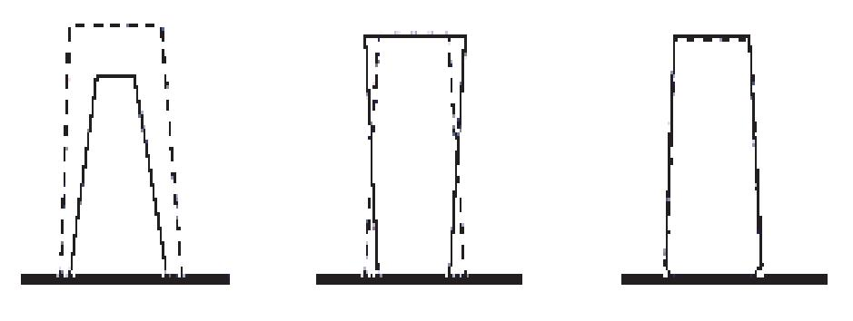

출처: 집필진 제작(2024) [그림 1-8] 노광 정렬 불량 형태

3. 반도체용 트랙 공정의 감광막의 종류를 확인한다.

감광제 재료는 광과 전자선에 의해 반응하는 고분자 화합물로써 반도체용 리소그래피 공정 에 따른 미세 가공은 PR의 광반응으로 인한 결과와 고분자 극성 변화, 연결 고리 반응으로 인한 용제, 특히 알칼리 수용액의 용해성 변화를 이용한다. 반도체용 트랙 공정은 웨이퍼에 빛이 도달하게 되면 웨이퍼 표면에 미리 코팅한 감광제(PR)에 화학적인 변화를 일으키게 되는데, PR의 성질에 따라 아래와 같이 2가지 형태로 나눌 수 있다.

(1) Negative PR 공정

반도체 웨이퍼에 감광 성질을 가지고 있는 감광제(PR)를 도포된 곳에 패턴이 형성이 되 는 형태가 빛을 받지 않는 부분이 현상 시에 제거되는 감광제(PR)를 의미한다. 작업 시 유기 용제이기 때문에 노출에 주의하여야 한다.

(2) Positive PR 공정

반도체 웨이퍼에 감광 성질을 가지고 있는 감광제(PR)를 도포된 곳에 패턴이 형성되는 형태가 빛을 받은 부분이 현상 시에 제거되는 PR를 의미한다. 작업 시 유기 용제이기 때문에 노출에 주의하여야 한다.

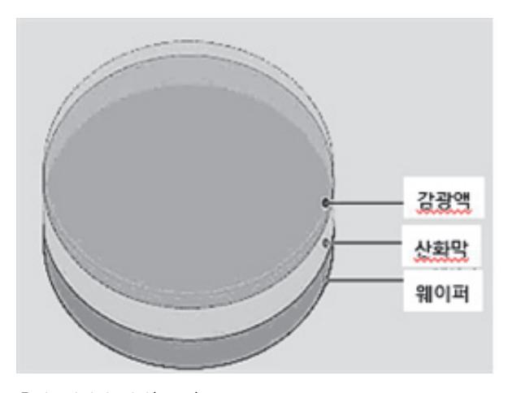

출처: 집필진 제작(2024) [그림 1-9] 웨이퍼와 감광막

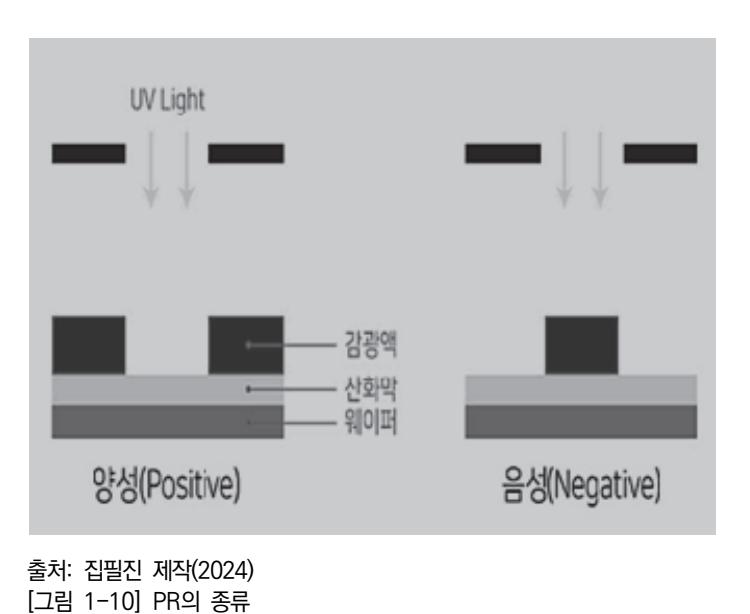

- (3) 광화학 반응에 따른 감광제의 구분을 진행한다.
  - (가) PAC(Photo-Active Compound)형 감광제

빛에 의해 그 화학 물질 자체에 구조적인 변화가 일어나서 특정 용매에 대한 용해성 이 달라지는 것이다. Positive PR에 사용되며, 빛을 받기 전에는 알칼리 수용액 (Aqueous Alkaline Solution)에 녹지 않다가 빛을 받고 나면 그 구조가 변해 수용 액에 녹게 되는 것이다. 이러한 PR은 G-line(436nm) 및 I-line(365nm)의 저해상 도에 많이 사용된다.

(나) 화학 증폭형 감광제(Chemically Amplified Photoresist)

광화학 반응이 일어나면 PR에서는 화학적인 반응 촉매가 일어난다. 이러한 반응으로 고분자의 용해성이 바뀌게 되어 특정한 용매에 용해되므로 패턴이 형성된다. 파장이 짧은 KrF(248nm)나 ArF(193nm)의 광원을 쓰는 PR에 널리 사용된다.

(4) 패턴 형성에 따른 감광제의 구분

Negative 형 감광제는 빛을 받으면 가교 반응이나 기능성기(Functional Group)에 변 화가 일어나 현상액에 녹지 않게 되어 포토 마스크로부터 전달된 패턴을 형성한다. 거의 모든 Negative형 PR가 Film 형성을 위한 Binder Polymer와 가교제, 광 활성제 등을 조합하여 제조된다. 가교 반응을 이용한 Negative PR이 대부분이며 가교된 Film의 특 성상의 식각성이 좋고 PR 패턴 너비가 아래보다 윗부분이 큰 모양을 형성하여 반도체의 Metal Lift-Off 공정 등에 널리 사용되고 있다.

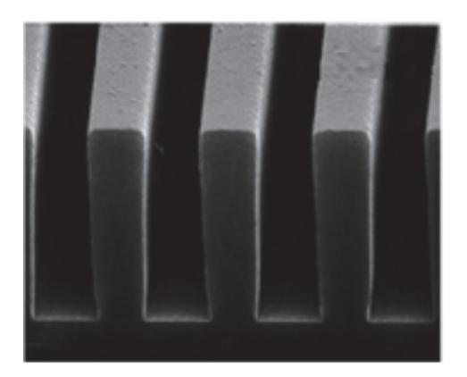

출처: 집필진 제작(2024) [그림 1-11] PR의 구분

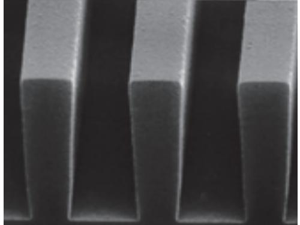

(a) 1um pattern (b) 0.8um pattern

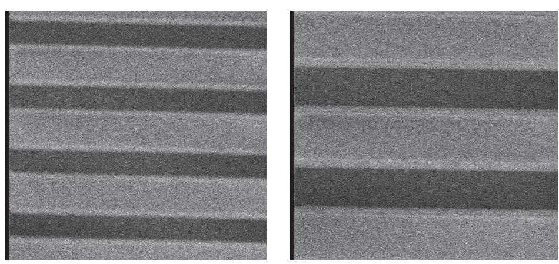

출처: 집필진 제작(2024) [그림 1-12] Negative 감광제의 사용 후 CD-SEM

Positive형 PR는 빛을 받은 부분이 [그림 1-13]에서와 언급한 광화학 반응을 일으켜 현 상액에 잘 용해되는 구조로 현상액 처리를 하면 노광된 부분이 녹아 패턴을 형성하는 것이다. 현재 많이 사용되는 PR이며, ArF 공정을 사용하는 경우, 45nm 또는 그보다 더 작은 패턴의 형성도 가능하다.

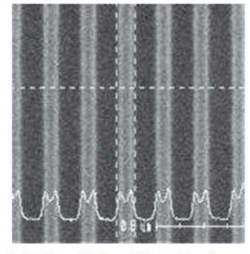

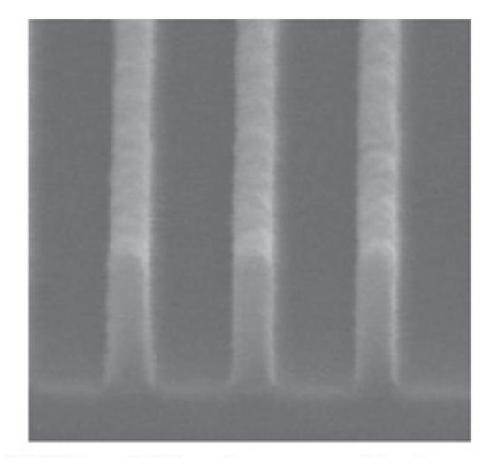

출처: 집필진 제작(2024) [그림 1-13] Positive형 PR의 사용 후 CD-SEM

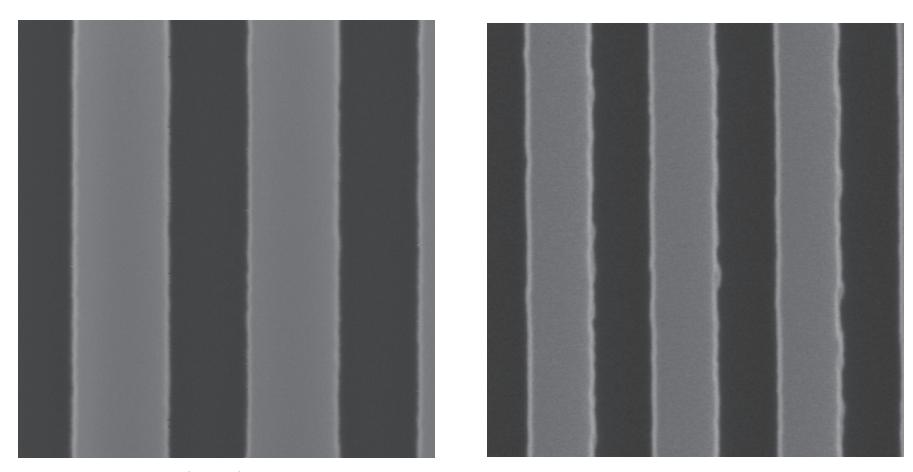

출처: 집필진 제작(2024) [그림 1-14] Positive 감광제 사용 결과

(5) 광원의 파장에 따른 감광제의 구분

감광제를 분류하는 다른 방법은 PR가 감응하는 빛의 파장을 이용하는 것이다. PR 패턴의 해상도는 사용하는 빛의 파장에 반비례하고 빛의 파장이 짧을수록 해상도는 좋다. 반도체의 집적도가 높아지면서 회로 구성을 위한 패턴 크기는 작아져야 하므로 리소그래피 공정에 사용하는 빛의 파장도 436nm에서 193nm까지 계속 짧아지고 있다. 이에 따라 PR도 바뀐 빛의 파장에서 최고의 감도를 가질 수 있도록 변화되었다.

(가) G-line 감광제

G-line 감광제는 436nm의 빛의 파장에 감응하여 광화학적 반응을 일으켜 패턴을 형성하는 종류로 500nm의 해상력을 지닌다.

(나) I-line 감광제

365nm의 빛에 의해 300nm의 해상력을 지니는 감광제이다. G-line 감광제와 같은 고분자를 사용하나, 감광제는 365nm의 빛에 가장 높은 양자 효율을 가질 수 있도 록 구조를 변경하여 사용한다.

(다) KrF 감광제

I-line까지는 고압 수은등을 사용하여 수은등에서 발생하는 빛을 광학 필터로 걸러 436nm 또는 365nm의 빛을 감광제 패터닝에 이용했으나, I-line보다 더 높은 해상 도가 필요하면서 KrF 레이저를 이용한 새로운 광원이 개발되었고, 그 광원 248nm 에 고감도인 새로운 감광제가 개발되었다.

특히 KrF PR부터는 화학 증폭형 PR가 본격적으로 사용되기 시작하였다. 이 PR는 약 100nm의 해상도를 지닌다. ArF PR : KrF 광원으로도 불가능한 고해상도의 패턴 을 만들기 위해 적용된 광원으로 ArF 레이저를 사용하기 시작하였는데 그 레이저의 파장인 193nm에서 높은 감도인 PR이다. 현재 기준으로 가장 높은 해상도의 패턴이 가능하여 55nm의 해상도를 보인다. 최근에는 렌즈와 PR 사이에 공기보다 굴절률이 높은 물을 채워 노광하는 액침 기술이 도입되어 ArF 광원을 이용한 해상도는 45nm 또는 그 이상이 될 것으로 전망되고 있다.

(라) EUV 감광제

ArF 광원으로 구현할 수 있는 최소 선폭(해상도)를 45nm 또는 32nm로 전망하고 있는데, 그 이하의 패턴을 구현하기 위해서는 광원의 파장을 바꿔야 한다. 가능한 광 원으로 EUV(Extreme UV, 극자외선)가 유력하며, EUV 감광제는 EUV의 파장인 13.4nm의 빛에 감응하여 광화학적 반응을 일으킬 수 있는 화합물로 구성되어 있다.

4. 트랙 공정에서 접착 향상제(HMDS) 도포 공정을 진행한다.

회전하는 웨이퍼에 HMDS를 도포하는 공정으로 진공 Chuck을 이용하여 wafer를 고정시 킨 후 회전시킨 상태에서 HMDS를 떨어뜨려 넓게 도포시킨다.

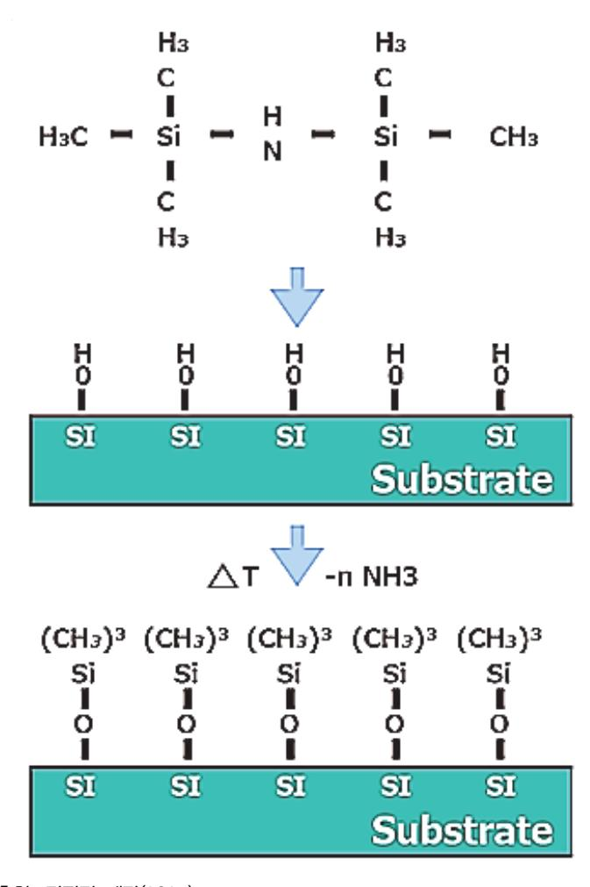

출처: 집필진 제작(2024)

[그림 1-15] 트랙 공정에서 접착 향상제(HMDS) 도포 공정

- 5. 트랙 내 Spin Coatter의 감광제(PR) 도포 공정을 진행한다. 웨이퍼에 감광 성질을 가지고 있는 감광제(PR)를 도포하는 공정으로 작업 시 유기 용제이 기 때문에 노출에 주의하여야 한다.
  - (1) 적정량의 PR을 Wafer 위에 떨어뜨려 준다.
  - (2) 500RPM(Revers per Minute) 정도의 저속 속도로 회전시켜서 균일하게 PR가 퍼지도록 만든다.
  - (3) RPM 속도를 서서히 올리면서 회전시켜서 잉여분의 PR를 제거해 준다.
  - (4) 3,000RPM 정도의 고속 속도로 회전시켜서 PR가 건조막이 되도록 만들어 준다.

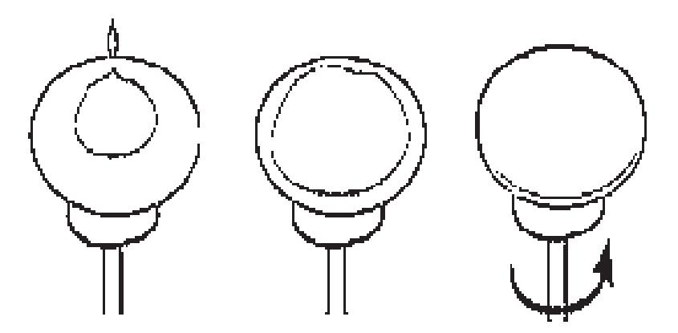

출처: 집필진 제작(2024) [그림 1-16] 트랙 공정에서 PR 도포 공정

6. Soft Bake 공정 실험을 진행한다.

웨이퍼에 감광제(PR)를 도포하고 나서 95~115℃로 굽는 공정으로 PR의 형태 유지와 수분 의 중발을 통한 건조가 목적이 된다. 핫 플레이트(Hot Plate)라고 불리는 가열 기구나 가열 오븐을 사용하여 진행한다.

7. 얼라인먼트(Alignment)와 노광(Exposure) 공정 실험을 진행한다.

Mask의 이미지를 웨이퍼에 옮기기 위해 상호 정확한 위치에 맞추는 공정과 정렬이 끝나면 Mask의 상이 웨이퍼에 옮겨지도록 자외선에 감광제(PR)를 노출시키는 공정을 말하며 정렬 과 노광을 동시 작업으로 진행한다. 노광 장비가 웨이퍼에 형성된 레이어(Layer)의 얼라인 먼트 마크(Alignment Mark)와 최초 패턴이 새겨진 Mask의 얼라인 마크를 사용해 웨이퍼 칩 맵을 노광 장비의 Alignment 통해 얻은 정보로 칩의 Pitch, Flat zone부터의 위치 등 을 인식해 웨이퍼 맵과 오버랩(Overlap)되도록 현재 Layer 위에 새로운 패턴을 노광하는 것이다.

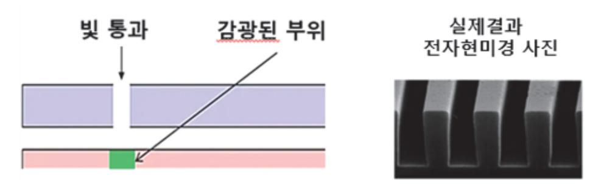

출처: 집필진 제작(2024) [그림 1-17] 트랙 공정 후 노광 공정

8. Post-Exposure Bake 공정 실험을 진행한다.

감광제(PR)가 도포된 웨이퍼를 정렬하고 노광된 웨이퍼를 110℃로 굽는 공정으로 작업 시 노출에 주의하여야 한다. 이는 다음 과정에서 PR의 저항성을 높여 주고 PR에 손상을 줄 수 있는 경우, PR에 손상되어 역할을 다 하지 못하는 경우와 같은 원치 않는 결과를 감소 시키기 위해, 적정한 온도에서 열처리하는 것이다. 즉 soft bake 과정에서 제거되지 못한 solvent를 완전히 제거해 주는 과정이다.

9. Develop 공정 실험을 진행한다.

웨이퍼에 PR로 도포하고 정렬 및 노광 후 현상액을 이용하여 필요한 곳과 필요 없는 부분 을 형성하기 위해 PR을 제거하는 공정으로 작업 시 노출에 주의하여야 한다. 식각되어야 할 부분에 존재하는 감광막 제거를 위해 현상액을 Spray법으로 공정을 진행한다.

10. Hard Bake 공정 실험을 진행한다.

Develop 공정이 진행된 웨이퍼를 130~140℃에 Bake Oven에 굽는 공정으로 식각 시 식 각 선택비를 확보하기 위해 진행한다.

11. Develop Inspect를 진행한다.

반도체 웨이퍼에 PR로 도포하고 정렬 및 노광 후 현상액을 이용하여 필요한 곳과 필요 없 는 부분의 형성이 정확하게 되어 있는지를 검사는 작업이다.

(1) 감광막의 두께 확인

PR의 두께는 spin speed와 PR의 점도가 결정하게 된다. 트랙 장비 내 스핀코터의 Spin Speed를 3,000~7,000rpm으로 설정하여 적정한 두께 조건을 찾아야 한다. 점도 가 온도에 민감하므로 온도 23±0.5℃와 습도를 45±5%를 유지해야 하고 두께 균일도 는 ±100Å 이내로 들어와야 한다.

(2) 감광막의 두께와 형태 분석

감광막의 두께와 노광 에너지, 노광 시간에 따라서 패턴의 모양이 불량이 될 수도 있고 정확한 패턴이 얻어질 수 있다.

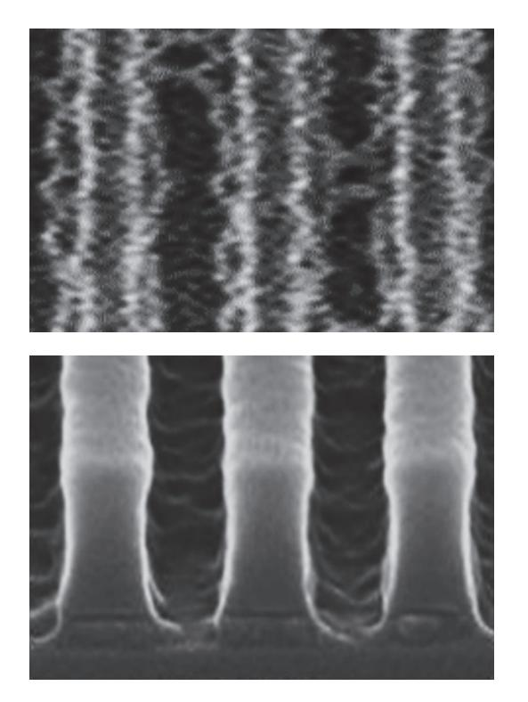

 (a) 감광막의 두께와 노광 에너지, 노광 시간이 부정확한 결과 (b) 감광막의 두께와 노광 에너지, 노광 시간이 정확한 결과 출처: 집필진 제작(2024) [그림 1-18] 트랙 공정에서 현상 후 사진 비교

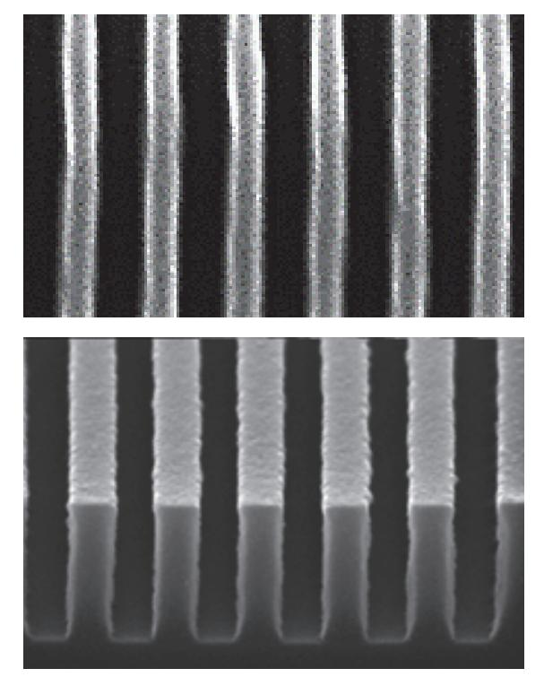

### 학습 1 교수·학습 방법

#### 교수 방법

- 반도체 트랙 공정의 개요와 세부 내용을 부분별로 알기 쉽게 설명한다.
- 현장에서 표준화한 공정 매뉴얼과 관련 공정 재료에서 제공되는 자료 등의 내용을 프레젠테 이션 자료로 제시한 후에 설명한다.
- 가능한 한 사전에 제조 현장에서 사용하는 사례를 수집하여 자료를 준비하고 이해하기 쉬운 방법을 논의하는 방식의 문제 해결식 수업을 한다.
- 최근 반도체 산업 현황(시장 환경 및 기술 동향 등)에 대하여 충분히 인지하고, 학습자들이 이를 이해할 수 있는 방법을 모색하여 수업을 진행한다.
- 관련 시장의 환경 및 기술 변화를 통합 검색 사이트나 한국반도체산업협회의 홈페이지 (www.ksia.or.kr) 등에서 찾아 활용할 수 있도록 지도한다.
- 반도체 트랙 공정 재료 요구 사항에 필요한 내용을 확인하고, 관련 자료를 학습자들에게 제 시한 후 파악 여부를 확인한다.

#### 학습 방법

- 반도체 산업 현황(시장 환경 및 기술 동향 등)과 관련 기관을 구체적으로 확인하도록 하고, 이 기관과 관련된 다양한 자료를 인터넷으로 검색하고 분류하여 문서로 정리한다.
- 반도체용 트랙 공정 재료 요구 사항 항목이 선정된 양식에 맞추어 특정 소자에 대한 요구 사항을 작성해 본 후, 여기에 첨부되는 자료의 종류와 기록 내용 전반을 숙지하고, 가능하다 면 소자별로 분류해 본다.
- 반도체용 트랙 공정 재료 요구 사항에 대한 시장 및 기술, 비용의 조사, 수집 및 분석을 통 해 생산에 필요한 목표를 설정하고 분류된 자료를 활용하여 생산 가능성을 예측해 본다.
- 반도체용 트랙 공정에서 예상되는 품질 관리 문제점을 파악하고 해결책을 수립하는 현장의 업무를 이해하고, 정해진 양식에 따라 보고서를 작성한다.

## 학습 1 평 가

#### 평가 준거

- 평가자는 학습자가 학습 목표를 성공적으로 달성하였는지를 평가해야 한다.
- 평가자는 다음 사항을 평가해야 한다.

|                         | 학습 목표                                                          | 성취수준 |   |   |
|-------------------------|----------------------------------------------------------------|------|---|---|
| 학습 내용                   |                                                                | 상    | 중 | 하 |
| 트랙 공정 재료 제조 요구 사항 파악 | - 생산 관련 부서로부터 트랙 공정 재료 제조 사양서를 입 수할 수 있다.                   |      |   |   |
|                         | - 트랙 공정 재료 제조 사양서를 바탕으로 제품명, 품질 기 준, 제품 사양, 납기 등을 파악할 수 있다. |      |   |   |
|                         | - 파악된 내용을 바탕으로 트랙 공정 재료 제조 시 발생할 수 있는 문제점을 검토할 수 있다.        |      |   |   |

#### 평가 방법

#### • 포트폴리오

|                         | 평가 항목                                                       | 성취수준 |   |   |
|-------------------------|-------------------------------------------------------------|------|---|---|
| 학습 내용                   |                                                             | 상    | 중 | 하 |
| 트랙 공정 재료 제조 요구 사항 파악 | - 반도체 트랙 공정 재료의 제조 사양서 항목에 대한 이해 도와 제조 사양서 항목 작성 능력      |      |   |   |
|                         | - 트랙 공정 재료의 이해와 품질 기준, 제품 사양, 납기 에 대한 주요 내용을 파악할 수 있는 능력 |      |   |   |
|                         | - 트랙 공정 재료 제조 시 주요 문제점과 문제에 대한 원 인 분석 능력                 |      |   |   |

#### • 문제 해결 시나리오

| 학습 내용                   | 평가 항목                                                                           | 성취수준 |   |   |
|-------------------------|---------------------------------------------------------------------------------|------|---|---|
|                         |                                                                                 | 상    | 중 | 하 |
| 트랙 공정 재료 제조 요구 사항 파악 | - 트랙 공정 재료 제조 사양서의 세부 내용 중 생산에 적 용할 수 없는 항목이 있을 경우 세부 항목의 변경 방법 파악 여부     |      |   |   |
|                         | - 트랙 공정 재료의 품질 기준, 제품 사양, 납기 등의 문 제점이 발생했을 때 문제를 분석할 수 있는 능력과 QC 도구 활용 능력 |      |   |   |
|                         | - 트랙 공정 재료 제조 시 품질 관련 문제점의 재발 방지 를 위한 품질 관리 요령과 분석 설비의 운영 능력                 |      |   |   |

#### • 서술형 시험

|                         | 평가 항목                                                  | 성취수준 |   |   |
|-------------------------|--------------------------------------------------------|------|---|---|
| 학습 내용                   |                                                        | 상    | 중 | 하 |
| 트랙 공정 재료 제조 요구 사항 파악 | - 반도체 트랙 공정 재료의 제조 사양서 항목에 대한 이해 도와 제조 사양서 항목 작성 능력 |      |   |   |
|                         | - 트랙 공정 재료의 이해와 품질 기준, 제품 사양, 납기 에 대한 주요 내용 파악 여부   |      |   |   |
|                         | - 트랙 공정 재료 제조 시 주요 문제점과 문제에 대한 원 인 분석 능력            |      |   |   |

피드백

1. 포트폴리오 - 반도체 트랙 공정 재료 제조 사양서 작성 능력에 대해 평가하고 이해도가 부족한 경우 보완하도 록 주요 내용을 설명하여 주고, 평가 결과가 양호할 경우 실제 사양서를 작성해 보도록 지도한다. - 트랙 공정 재료의 품질 기준, 제품 사양, 납기 등의 문제점을 이해하고 대처할 수 있는 능력에 대해 평가하고 부족한 부분은 사례를 통해 설명해 주고, 평가 결과가 우수한 경우 QC 도구에 대 한 심화 학습을 추가한다. 2. 문제 해결 시나리오 - 반도체 트랙 공정 재료 제조 사양서 작성 능력에 대해 평가하고 이해도가 부족한 경우 보완하도 록 주요 내용을 설명하여 주고, 평가 결과가 양호할 경우 실제 사양서를 작성해 보도록 지도한다. - 트랙 공정 재료의 품질 기준, 제품 사양, 납기 등의 문제점을 이해하고 대처할 수 있는 능력에 대해 평가하고 부족한 부분은 사례를 통해 설명해 주고, 평가 결과가 우수한 경우 심화 학습을 추가한다. 3. 서술형 시험 - 트랙 공정 재료의 품질 기준, 제품 사양, 납기 등의 문제점을 이해하고 대처할 수 있는 능력에 대해 평가하고 부족한 부분은 사례를 통해 설명해 주고, 평가 결과가 우수한 경우 QC 도구에 대 한 심화 학습을 추가한다.

 - 파악된 내용을 바탕으로 트랙 공정 재료 제조 시 발생할 수 있는 문제점의 대처 방안에 대한 지 식에 대해 평가하고 부족한 부분이 발견되면 미비한 부분을 추가로 재학습하도록 지도해 준다.

| 학습 1 | 트랙 공정 재료 제조 요구 사항 파악하기 |
|------|------------------------|
| 학습 2 | 트랙 공정 재료 준비하기          |
| 학습 3 | 트랙 공정 재료 제조            |

## 2-1. 트랙 공정 재료 준비

|       | • 반도체 트랙 공정 재료 제조에 필요한 원재료의 종류를 파악할 수 있다.    |
|-------|----------------------------------------------|
| 학습 목표 | • 반도체 트랙 공정 재료 원재료의 제조사별 규격 및 장단점을 파악할 수 있다. |
|       | • 반도체 제조 공정에 적합한 트랙 공정 제조 재료를 준비할 수 있다.      |

## 필요 지식 /

숔 반도체 포토 공정 재료와 장비

포토 공정의 기본 원자재 중 하나인 포토 마스크 및 포토 공정 장비들에 대해 알아본다.

1. 포토 마스크

포토 마스크는 석영(Quartz) 기판 위에 크로뮴이 증착된 차광막을 이용하여 전기적 회로를 형상화한 판을 말한다. 마스크 내 패턴 크기 중에서 웨이퍼 전사되는 패턴 크기가 1 : 1이면 마스크라고 부르고 4~10 : 1(축소 노광)의 경우 레티클이라고 하는데, 현재는 거의 구별 없 이 부른다. 그냥 쿼츠 위에 패턴이 없이 크로뮴을 입힌 판은 블랭크 마스크라 하고, 블랭크 마스크에 회로 패터닝이 된 상태가 되면 포토 마스크라고 한다. 최근 노광 장비 중 하나인 스캐너에서는 4 : 1 마스크가 주류를 이루고 있다. 마스크에는 4배 큰 패턴이 새겨져 있고, 렌즈를 통해 웨이퍼에는 마스크 패턴 대비 1/4 크기의 패턴이 새겨지게 되는 것이며, 스크 라이브 라인(Scribe Line)은 다이와 다이 사이에 비어 있는 라인이고, 트랜지스터(TR), 다 이오드(Diode), 저항, 커패시터(Cap) 등의 단위 소자 특성을 평가할 수 있는 테스트 패턴 과 잔막 두께 측정 패턴, 마스크 정렬 상태 모니터링을 위한 패턴 등의 다양한 평가 패턴들 이 구현되어 있다.

(1) 포토 마스크의 주요 요구 사항

포토 마스크의 주요 요구 사항은 낮은 열팽창 계수 여부와 쿼츠 기판 영역에서는 높은 빛 투과에 대한 품질, 차광막에서는 낮은 투과율을 가져야 하며, 높은 기계적, 화학적 내구성(Durability) 등이 있다.

(2) 포토 마스크의 제작 과정

회로 패턴을 설계한 후 순도가 높은 석영을 가공해서 만든 판 위에 크로뮴으로 회로 패 턴을 형상화해 포토 마스크(Photo Mask)로 완성시키게 된다. 마스크는 레티클(Reticle) 이라고 하는데, 이것은 회로 패턴의 전체를 담은 필름으로 사진 원판의 기능과 같은 역 할을 하며, 마스크는 세밀한 패터닝(Patterning)을 위해 반도체 회로보다 더 크게 만든 후, 렌즈를 이용 빛을 축소해 투영하여 미세 패턴을 만든다. 흔히 아는 PR 도포 → 노광 → 현상 → 식각 → 에싱 의 순으로 진행된다. 단, 노광을 진행할 때 포토 마스크가 없으므 로, Electron Beam Writer를 이용하여 라이팅을 진행한다. 고해상도 포토 마스크 전문 제조 기업으로는 미국의 P사, 일본의 T사, D 인쇄 등이 있다.

#### (가) 포토 마스크용 석영(Quartz) 기판

Quartz는 석영과 같은 물질이다. 이를 유리로 만들어 가공한 것이 Quartz Glass, 즉 석영 유리이다. 석영은 이산화 규소(SiO2)가 단결정으로 형태로 된 것인데, 이를 유리로 만든 것이 석영 유리 즉 Quartz Glass이다. Quartz의 가장 기본이 되는 이산화 규소는 지표면 대부분의 암반과 모래 등에 포함되어 있어 매우 흔하다. 이를 단결정으로 만든 것이 Quartz이고 이를 다시 유리로 만든 것이 Quartz 유리이다. 석영 유리는 오로지 순수히 100% SiO2로만 구성되어야 한다. 초고순도 석영도 구해야 하며, 일반 유리는 불순물을 혼합해 녹는점을 낮추는 반면, 석영 유리는 불순물이 들어가면 안 되기 때문에 융점점이 높은 특징이 있다. 석영 유리 제조는 1899년 독일 H 사에서 처음 성공하였고, 그 이후에 미국 C사, 일본 N 사 등에서 석영 유리 제조 생산에 성공했으나, 아쉽게도 국내에서는 상용화에 실패하였다. 하지만 통상적으로 산업용 Quartz를 이야기할 때 석영 유리도 Quartz라고 부르게 된다.

1) 포토 마스크용 석영(Quartz) 기판의 특성

포토 마스크용 석영 기판의 특성을 살펴보면 석영은 결정질 광물이고 석영 유리 는 비정질 유리인 것을 알 수 있다. 그리고 석영 유리는 일단 모스 경도 7로서 매우 단단하다. 열팽창 계수가 매우 낮아서 온도 증가에 따른 변형이 적으며, 자 외선 투과율이 높아 자외선 투과에 따른 반도체 포토 공정용 재료로 사용하기 쉽 다는 장점이 있고 화학적 내구성이 높아서 주변 환경의 변화를 잘 견뎌낸다. 이 런 특성 때문에 여러 산업에 잘 쓰이며, 초고순도 석영 유리의 경우 반도체 산업 에 절반 정도 쓰인다.

#### (나) 포토 마스크용 크로뮴 증착

포토 마스크 제작용 크로뮴 증착은 금속 증착 장비를 이용하여 증착하여 만들며, 금 속막을 만들기 위해서는 스퍼터(Sputter)나 이바포레이터(Evaporator) 등 물리적 증 착 장비를 장비(PVD)를 이용한다. 정확한 포지션에 전극을 형성하기 위해서 포토리 소그래피(Photolithography) 공정과 식각(Etching) 공정을 정확히 이용해야 하며 각각의 공정 조건을 사전에 Setup하여야 한다. 그러나 포토 마스크용 패턴을 만들기 위한 회로 패턴은 마스크 자체를 만드는 최초 포토 리소그래피 작업이므로 기존에 제작된 마스크가 없는 상황이고 최초 회로 패턴을 만들기 위해서는 직접적인 회로 라이팅(Writing)을 진행해야 한다. 그러기 위해서는 전자 빔 리소그래피 기술을 사용 해야 하며 그 이후에 전자 빔 리소그래피로 만들어진 패턴을 따라서 크로뮴을 식각 하여 크로뮴이 남겨진 부분을 이용해서 회로 마스크를 만들게 되는 것이다.

#### 1) 포토 마스크 제작용 크로뮴 증착을 위한 대표적 금속막 증착 장비

포토 마스크 제작용 크로뮴 증착을 위한 금속막 증착 장비는 물리적 증착 장비이 며, 물리적 기상 증착은 낮은 압력과 낮은 온도에서 진행되고 고품질 박막을 형 성하고 불순물 포함 정도가 적은 것이 장점이다. 그러나 증착시 속도가 상대적으 로 느리고 고가의 장비를 이용해야 한다는 단점이 있다. 진공 및 플라즈마 장비 의 종류 중에서 PVD의 종류와 특징은 여러 가지가 있다. 스퍼터(Sputter)를 비 롯해서 이바포레이터(Evaporator)와 도금 장치 등은 진공과 플라즈마를 적정히 이용해서 금속막을 증착하는 반도체 공정 장비이며 종류와 특징은 다음과 같다. 가장 많이 쓰이는 금속막 증착의 대표적 장비인 스퍼터(Sputter)는 아르곤(Ar) 가 스를 이용해 물리적 충돌로 증착하는 방식인데 Ar 가스에 높은 전압을 가해 주 면 Ar → Ar+ 이온으로 변화하며, 증착이 되어야 할 기판에는 (+)전압을 가해 주고 증착에 사용되는 물질인 타깃층에는 (-)전압을 가하여 이온을 타깃층에 충돌 시켜서 금속 원자를 뜯어내서 기판에 쌓이게 하는 반도체 공정 장비이다.

#### 2) 스퍼터의 종류와 특징

스퍼터는 DC 스퍼터와 RF 스퍼터의 2가지 방식이 대표적인데 DC 스퍼터 타깃 (Target)의 재질은 전도체 전기가 잘 통하는 물질이며 타깃의 제조 방식은 진공 주조 방식이다. 글로 방전(Glow Discharge)을 이용하여 Ar 이온을 발생시켜 증 착하는데 Ar 플라즈마의 진공 조건은 10∼15mTorr 정도이고 성막 속도가 빠르 다는 장점이 있다. 반면에 RF 스퍼터는 타깃이 전도체뿐만 아니라 절연체, 비금 속 등 여러 가지 재료를 사용할 수 있는 장점이 있다. 진공 조건은 2∼5mTorr 정도이며, 성막 속도가 상대적으로 느리다는 단점이 있다.

3) 포토 마스크 제작용 크로뮴 증착을 위한 진공 증착 장비

포토 마스크 제작용 크로뮴 증착을 위한 진공 증착 장비는 열 진공 증착기 (Thermal Evaporator)와 이빔 진공 증착기(E-Beam Evaporator)가 있다. 열 진공 증착기는 증착하고자 하는 원료를 텅스텐 보드 위에 올려 놓고 열을 가하여 원료를 기화시켜서 기판 위에 증착시키는 장치이다. 이때 주의할 점은 진공도가 10-6Torr 이하로 높은 진공 조건을 형성한 후 증착하여야 불순물로 인한 오염이 나 증착 물질 산화 등의 불량을 예방할 수 있다. 이빔 진공 증착기는 증착하고자 하는 금속의 원료를 용해로 안에 넣어 놓고 전자 빔을 발생시켜서 전자 빔이 용 해로 벽에 충돌되게 하여 발생하는 열로 금속 원료를 녹여서 기판 위에 증착시키

는 장치이다. 마찬가지로 주의할 점은 진공도가 10-6Torr 이하로 높은 진공 조 건을 만들어 준 후 증착하여야 불순물 오염이나 증착 물질 산화 등의 불량을 예 방할 수 있다.

(다) 전자 빔 라이팅

전자 빔 라이팅은 포토 마스크를 만들기 위해서 최초의 회로 패턴을 만드는 과정이다. 전자 빔 라이팅을 하기 위해서는 포토 노광 공정과 마찬가지로 레지스트를 먼저 도포하는 데 이때 사용되는 레지스트는 빛에 반응하는 레지스트가 아니고 전자 빔에 반응하는 레지 스트를 사용한다. 그리고 전자 빔 노광 공정 이후 현상 공정에서 레지스트를 선택적으로 벗겨내서 패턴을 만들어 내고 그 위에 크로뮴을 증착한 다음 남아 있던 레지스트를 아세톤 이나 전용 제거제를 이용해서 마지막으로 벗겨 내는데 이때 남아 있던 레지스트 부위만 벗겨지게 되고 그 윗부분의 크로뮴도 같이 날아가게 된다. 이러한 과정을 리프트 오프(Lift Off)라고 부르며 리프트 오프가 끝나면 석영 유리 기판 위에 크로뮴으로 만들어진 회로 패턴 상태가 된다. 전자 빔 공정의 경우 옵서버 커런트(Absorb Current)는 30 피코 암페어 (pA)를 많이 사용하며 30 피코 암페어는 미세 패턴 시 사용하는 조건이고, 높은 Absorb Current 값을 사용할 경우 Lithography 시간은 짧아지나 Pattern Resolution 분해능은 은 나빠진다.

(라) 전자 빔 라이팅의 특징과 장점

만약 전자소자가 나노 단위(nm)에서 옴스트롱(Å), 피코 단위(pm)까지 미세화가 된다면, 0.2~5nm의 초미세 공정은 일발 빛을 이용한 포토 공정으로는 패터닝을 진행할 수 없게 된다. 이때는 더 짧은 파장의 빛을 활용하는 노광 공정을 활용해야 하는데, 그 후보군으로 전자 빔 노광이 있다. 전자 빔 노광 기술은 전자 빔을 광원으로 이용하는 방식으로 주사형 전자 현미경인 SEM(Scanning Electron Microscope)에서 유래하였다. 처음에 SEM을 통해 원자의 미세 구조를 연구하던 과정에 E-Beam이 Polymer와 반응하고 제거하면서 매우 짧은 파장인 나노 빔(Nano Beam / 0.1~0.05nm)의 패턴을 발견했다. EBL은 파장 이 엑스레이의 1/10 수준, EUV의 1/100 수준이다. 파장이 매우 짧은 만큼 분해능 (Resolution)이 매우 우수하고, 특히 전자 빔 노광의 가장 큰 장점은 엑스레이와 다르게 유기물 PR를 사용할 수 있고, 패턴 복제 방식이 아닌 직접 패터닝 방식이어서 마스크가 필요 없다. 그러나 E-beam Litho 기술의 가장 치명적인 단점은 위의 사진에서 볼 수 있듯이, 공정 절차가 복잡하고 패터닝 속도가 매우 느리다는 것이다. 현재 업계에서 요구하 는 생산 속도에 맞추기에도 턱없이 부족한데, E-beam Litho 기술을 활용하는 극초미세 패터닝 시대의 생산 속도는 절대 불가능한 상황이다. 또한 아직 우리는 전자의 거동을 제대로 이해하고 있지 못하기 때문에, 전자 빔이 Wafer에 잘 Align 되도록 주사해도, 전자들이 확률적으로 다른 곳으로 산란할 가능성이 있어 패턴이 우수하게 형성되지 않을 수 있다.

출처: 집필진 제작(2024) [그림 2-1] E-beam Lithography 장비

#### (3) 펠리클 효과를 이용한 파티클 불량 제거

펠리클이란 마스크의 표면을 대기 중의 오염으로부터 보호해 주는 얇은 고분자 기능성 박막이다. [그림 2-2]처럼 만일 파티클이 마스크 바로 위에 떨어져 있다면 불순물로 인 한 상도 웨이퍼에 맺히게 되어 원하지 않는 패턴이 생길 것이다. 그러나 파티클이 마스 크 표면이 아니라 조금 떨어진 펠리클 표면에 부착이 된다면 파티클로 빛이 간섭되어도 초점 위치가 달라지므로, 웨이퍼에는 파티클에 의한 상이 맺히지 않고 후면에 상이 맺히 게 된다. 후면에는 감광막이 없으므로 패턴의 불량에 아무런 영향을 주지 않는다. 이 방 법은 공정 수율 개선에 많은 영향을 주게 된다.

출처: 집필진 제작(2024) [그림 2-2] 펠리클이 없는 불량 발생 표면

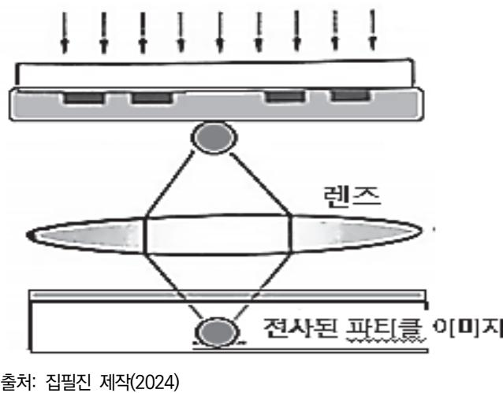

[그림 2-3] 펠리클이 있는 불량이 없는 표면

2. 노광 장치

노광 장치에는 마스크 얼라이너, 스테퍼, 스캐너 등 3가지가 있다.

(1) 마스크 얼라이너

일반적인 사진 인화의 원리와 동일한데 PR(Photoresist)란 특정 파장대의 빛은 받으면(노광: Photo Exposure) 반응을 하는 일종의 감광 고분자 화합물(Photosensitive Polymer)을 pattern을 올리고자 하는 Wafer의 표면에 Spin Coating 공정으로 올려놓고 그 위에 Pattern이 새겨진 Mask를 올린다. 다시 그 위에 특정 파장대의 빛(일반적으로 UV)을 쬐어 주면 PR가 Pattern Mask의 뚫린 부분만을 통과하여 감광하게 되는 원리이다.

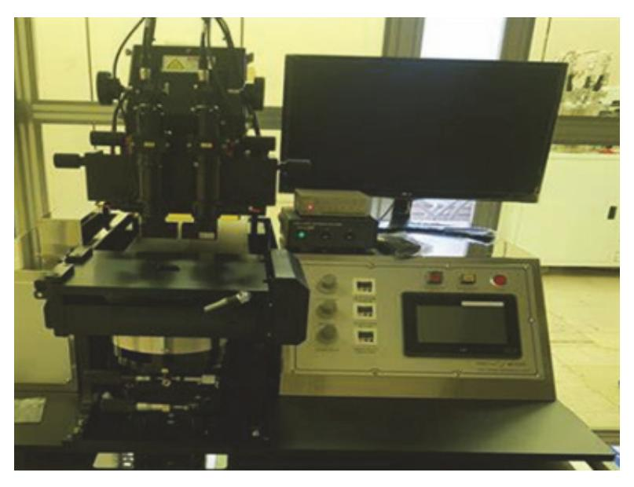

출처: 집필진 제작(2024) [그림 2-4] 마스크 얼라이너

(가) 마스크 얼라이너의 종류

마스크 얼라이너의 종류는 크게 단면 얼라이너와 양면 얼라이너로 나눌 수 있다.

1) 단면 얼라이너

단면 얼라이너는 마스크 얼라이너는 패턴의 사이즈가 미세하지 않고 비교적 정밀 도가 높지 않은 패턴을 제작하는데 사용되는 장비이며 UV를 조사하여 원하는 전 극 Pattern을 형성하는 데 사용하는 가장 기본적인 장비이다.

2) 양면 얼라이너

양면 얼라이너 중에서 양면 마스크 얼라이너(PEM 시리즈)는 웨이퍼의 표면과 이 면에 얼라이먼트 광학계를 배치해, 웨이퍼 이면의 패턴에 맞추고, 대응하는 웨이 퍼 표면에 '콘택트', '소프트 콘택트', '프로키시미티'로 인화할 수 있는 고성능 양 면 마스크아라이나이다. 상하에 배치한 10배율 정도의 쌍대물 렌즈의 선명한 광 학계에 의해 마스크와 웨이퍼의 얼라인먼트를 확실히 실시할 수 있다. 또한 쌍대 물 렌즈의 간격은 변할 수 있기 때문에 부정형 웨이퍼에 대해서도 임의의 간격으 로 얼라이먼트가 가능하다.

(2) 스테퍼

스테퍼(Stepper)는 슬라이드 영사기나 사진 확대기의 운용과 비슷한 방식의 집적 회로 제조에 사용되는 장치이다. 스테퍼라는 용어는 Step-and-repeat Camera의 줄인말이 다. 스테퍼는 사진 평판술이라는 복잡한 프로세스의 필수적인 부분으로, 실리콘 칩 표면 에 수백만의 미세 회로 엘리먼트를 생성한다. 이 칩들은 컴퓨터 프로세서, 메모리 칩, 기타 수많은 장치의 IC의 핵심부를 구성한다. ASML에서 생산하는 광학 노광(영어: 포 토리소그래피(Photolithography) 공정 장비는 집적 회로의 패턴을 그릴 때 사용한다. 패턴은 광학적 이미징을 통해 감광 물질이 코팅된 실리콘 웨이퍼 위에 만들어진다(포토 레지스트 영어: Photoresist 공법). 이러한 절차는 싱글 웨이퍼 위에 수십 번 되풀이된 다.

(가) 스테퍼의 제조업체

2010년 집계에 따르면 ASML의 반도체 리소그래피 공정 장치 점유율은 67%에 달하 였다. 경쟁 업체로는 캐논, 니콘이 있으나 이들과 기술력 차이를 크게 벌렸으며, 특 히 기술적 난점이 많은 EUV 노광 장치 개발 성공으로 최고의 반도체 제조 장치 업 체로 꼽히던 어플라이드 머티어리얼즈의 시가 총액을 추월하였다. 스테퍼는 1970년 대 말에 공개되었지만 1980년대 말 이후 들어서야 보편화되기 시작했다. 그 이유는 더 오래된 기술을 대체하는 과정에 있었기 때문이었다. Stepper는 Step & Repeat 타입이고, 하나의 이미지를 한 번에 찍는 방식 스테퍼 방식을 사용하게 되면, 한 번 에 패턴을 조사할 수 있다는 장점이 있지만 렌즈 끝 또는 에지에서 수차나 왜곡이 발생하여 스캐너에 비해서 정확한 패턴을 형성하기 더 어렵다는 단점이 있다.

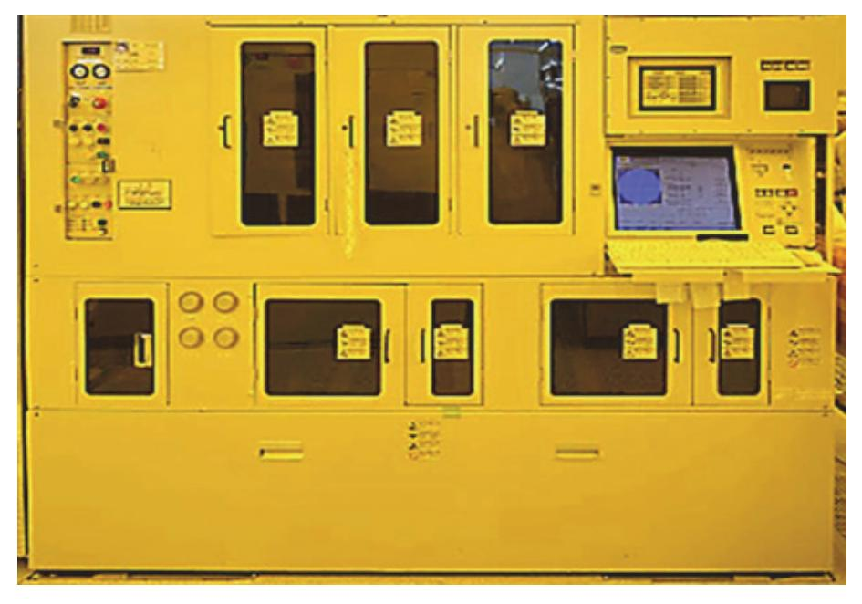

 출처: 집필진 제작(2024) [그림 2-5] 스테퍼

#### (3) 스캐너(Scanner)

반도체 업계에서 미세화 경쟁이 갈수록 치열해지면서 웨이퍼에 미세 회로 패턴을 그려 넣는 Photo 공정의 중요성이 점점 발전하는 추세이다. H사도 최근 D램 양산에 EUV(Extreme Ultraviolet, 극자외선 노광) 공정을 도입하는 등 기술 선도를 위해 노력 하고 있다. 반도체 제조와 양산에 있어 가장 중요한 3대 요소는 '수율, 생산성, 원가 경 쟁력'이다. 바꿔 말하면 고객이 원하는 양질의 제품을 경쟁사 대비 높은 원가 경쟁력을 확보해 적기에 제공하는 것이라고 할 수 있다. 그간 메모리 반도체 업계는 저장 공간을 늘리고 성능을 고도화하기 위해 회로 선폭을 좁히고 반도체 소자를 집적하는 미세 공정 기술을 발전시켜 왔다. 하지만 현재는 회로 선폭의 미세 수준이 머리카락 두께의 1/10,000에 이를 정도로 공정 난이도가 높아진 상황이다. 이에 따라 반도체의 집적도가 1.5년마다 2배씩 증가한다는 반도체 업계의 오랜 격언, '무어의 법칙'도 한계에 직면하 게 됐다. 메모리 반도체 제조사들은 초미세 공정 구현을 위한 새로운 전략으로, 웨이퍼 에 회로 패턴을 그려 넣는 Photo 공정에 EUV 공정 기술을 잇달아 도입하고 있다.

(4) EUV 스캐너

짧은 파장(13.5nm 수준)의 EUV 장비는 분해능(Resolution)이 뛰어나 미세 패턴을 노 광하는 데 유리하다. 분해능은 인접한 두 물체를 별개의 것으로 분별할 수 있는 능력으 로, 분해능이 높을수록 노광 장비가 더욱 미세하게 회로 패턴을 형성할 수 있으며, 공정 이 단순해져 원가 경쟁력을 높일 수 있다는 장점이 있다. Scanner는 Step & Scan 타 입이며, 빛을 선의 형태로 노광시켜 마스크와 다이를 동시에 이동시키면서 노광하는 방 식이다. 현재는 렌즈의 가장 안정적으로 빛이 투과되는 부분만 사용하여 스캔하는 방식 인 스캐너 방식을 채택해서 사용 중이다. 투과형 렌즈는 DUV까지 사용되고 있으며, EUV는 반사형 렌즈를 사용하여 노광을 진행한다.

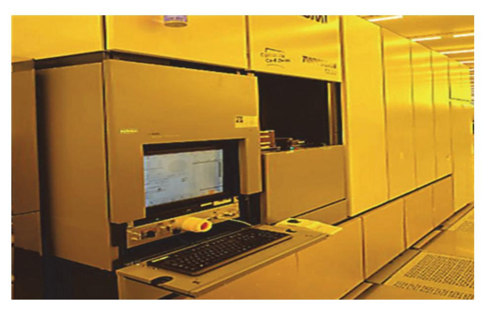

출처: 집필진 제작(2024) [그림 2-6] EUV 스캐너

## 수행 내용 / 반도체용 트랙 공정 제료 제조 준비하기

#### 재료·자료

- 초순수 제조 설비의 사양서 및 매뉴얼
- 감광액과 솔벤트류 제조 원료

#### 기기(장비 ・ 공구)

- 초순수 제조기
- 초순수 제조기 운전에 필요한 기기(장비·공구)
- 아세톤 용기, 유기 용제용 비이커
- 감광제 혼합 탱크

#### 안전 ・ 유의 사항

- 장비 취급에 필요한 안전·유의 사항을 숙지한다.
- 약액 취급에 대한 안전·유의 사항을 숙지한다.
- 안전 보호구 및 보호 장비의 사용에 필요한 안전·유의 사항을 숙지한다.

#### 수행 순서

#### 숔 트랙 장비와 트랙 공정 재료를 확인한다.

트랙 장비와 반도체 트랙 공정에 필요한 재료 및 초순수의 생산 장비에 대해서 이해한다.

1. 트랙 장비의 성능과 필요성을 파악한다.

트랙 장비의 개념을 살펴보면 일반적으로 반도체 트랙 장비는 반도체 제조를 위한 사진 식 각(Photo Lithography) 공정에서 감광액의 도포(Coating)와 현상(Develop) 공정을 수행 하는 설비를 말한다. 이러한 반도체 트랙 장비는 반도체 감광액을 웨이퍼에 도포한 후 이를 다시 현상하기 위해 크게 코터와 디벨로퍼(Coater & Developer)로 구별되며, 통상 1개의 반도체 라인당 대략 50대 이상씩 대량으로 설치되고 있다. 스핀 코터는 감광액 도포 전 웨 이퍼의 막질과 감광액의 접착력을 향상시키기 위한 어드히전(Adhesion)부, 고온 처리된 웨 이퍼의 스트레스를 해소하기 위한 쿨 플레이트(Cool Plate), 웨이퍼를 고속 회전하며 감광 액을 도포하는 스핀 코터(Spin Coater), 도포된 감광액을 베이킹(Baking) 하는 핫 플레이 트(Hot Plate) 등으로 구성되어 있다. 또한 디벨로퍼는 노광된 웨이퍼의 감광액을 다시 베 이킹하는 핫 플레이트, 웨이퍼의 열 스트레스를 제거하는 쿨 플레이트, 현상액 도포 시 웨

이퍼를 회전시키는 스핀 디벨로퍼, 감광액 패턴을 경화시키는 핫플레이트 등도 중요한 부분 이다. 한편, 이러한 트랙 장비는 웨이퍼의 코팅이나 현상 공정 중 웨이퍼의 수율 저하를 막 기 위해 진공 상태에서 진행되는 경우가 많다. 더욱이, 최근의 웨이퍼는 점차 미세 패턴화 됨에 따라 상기 진공 상태가 더욱 정밀할 것을 요구하고 있다.

(1) 트랙 장비의 배기압에 대한 내용을 파악한다.

트랙 장비에서 배기압을 일정하게 유지시키기 위해 트랙 장비 중 배기부에 압력 센서를 결합하고, 이를 주기적으로 엔지니어가 관찰 및 기록하는 방식이기 때문에, 트랙 장비의 배기압을 실시간으로 정밀하게 관리하기 어려운 문제가 있다. 또한 종래의 방법은 엔지 니어가 주기적으로 배기압을 관찰 및 기록한다고 해도 순간적으로 또는 매우 짧은 시간 에 배기압이 저하되거나 또는 증가된 후 원래의 상태로 복원되었을 때 이러한 상태를 전혀 알 수 없고, 따라서 공정 관리가 느슨해지는 문제가 있다. 더욱이, 이러한 불안정 한 배기압 상태 및 느슨한 공정 관리는 직접적으로 반도체 수율을 저하시킬 뿐만 아니 라, 배기압 상태와 반도체 수율(또는 불량률) 사이의 상관 관계도 파악하기 어려워 공정 노하우 축적이 어렵게 된다. 이와 같은 종래의 문제점을 극복하기 위한 것으로서, 새로 운 방식의 기술 개발 목적은 반도체 트랙 장비에서 배기압을 실시간으로 모니터링하여 저장하는 동시에, 비정상 배기압 상태가 되면 자동적으로 배기압을 조정하여 정상 배기 압이 되도록 할 수 있는 반도체 트랙 장비의 배기압 모니터링 장치를 제공하는 중요한 기술이다.

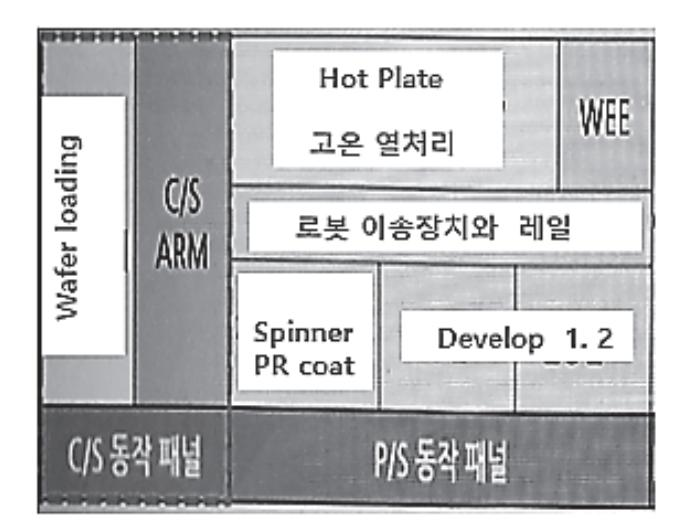

출처: 집필진 제작(2024) [그림 2-7] 트랙 장비 내부 구조

(2) 트랙 장비의 구조

(가) 트랙 장비의 구조에서 1.C/S 동작 패널(Carrier Station)은 웨이퍼 스테이지에서 공정이

진행될 웨이퍼를 In/Out하는 부분이다.

- (나) 트랙 장비의 구조에서 C/S ARM은 C/S에서 메인 공정 장소인 P/S로 웨이퍼를 이동시 키는 로봇의 암 부분이다.
- (다) P/S 동작 패널은 PR 도포, Develop, 표면 처리, 열처리, 쿨링 등 메인 포토 공정이 이 루어지는 장소이다.
- (라) WEE(Wafer Edge Exposure)는 웨이퍼 Edge 쪽의 감광막을 제거하는 부분이다.
- (마) I/F 동작 패널(Interface)은 Track과 노광 장비 간 이동을 제어하는 패널이다.
- (3) 트랙 장비의 모듈

Track 장비는 모듈과 유틸리티로 구성되는데 공정이 진행되는 곳은 모듈이다. 주요 구 성 모듈에는 표면 처리 모듈, PR 도포 모듈, 열처리 모듈, 배기 모듈, 온도 하강 모듈 등이 있다.

(가) 표면 처리 모듈

표면 처리 모듈(HMDS 처리)은 웨이퍼와 PR 사이의 접착력 향상을 위한 기능부이 다. 웨이퍼 온도를 상승시키기 위한 고온 플레이트를 가지는 진공 체임버로 구성되 어 있다. 체임버 플레이트를 실린더로 하강하여 진공 처리하고 이젝터로 공기를 흡 입해 진공을 유지한다.

- 1) Bubbler Tank은 표면 처리 용액(HMDS) 저장, 체임버로 전송의 기능을 수행하는 부분이다.
- 2) Ejector는 체임버 내 잔류 가스 배출부의 기능을 수행한다.
- 3) 공기 공급부는 공기 필터로 체임버로 공기를 주입하여 공정을 완료하는 대기 개방부 의 기능을 수행한다.
- (나) PR 도포 모듈

PR 도포 모듈은 PR를 웨이퍼에 분사시키는 노즐부의 기능을 수행하는 부분이다. P R 디스펜서(Dispenser)는 PR를 저장하고 노즐을 통해 웨이퍼에 PR를 뿌리는 부분 이다. 그리고 진공 척과 진공 펌프는 회전하는 웨이퍼를 고정하는 진공 기능 부분이 며 스핀들(Spindle)은 웨이퍼를 회전해 주는 부분이다.

(다) 디벨롭(Develop) 모듈

Develop 모듈은 현상액을 웨이퍼에 분사시키는 노즐부이다.

(라) E2 노즐

E2 노즐은 여러 개의 작은 구멍으로 동시에 웨이퍼 전면에 균일하게 현상액을 분사 하는 부분이며, 여러 개의 작은 구멍으로 동시에 웨이퍼 전면에 균일하게 현상액을 분사하게 된다.

(마) 스트림(Stream) 노즐

스트림 노즐은 2개의 튜브로 현상액을 분사하는 부분이다.

(바) Spray 노즐

Spray 노즐은 2개의 샤워 장치에서 현상액을 분사하는 부분으로 노즐 외에도 다양 한 모듈이 있다. 현상 후 잔류 현상액 제거하는 Di 공급 노즐부와 현상액의 외부 노 출을 막아 주는 캡과 회전을 통해 현상액과 초순수를 뿌리는 회전부가 있다.

(사) 열처리 모듈

열처리 모듈은 베이킹 유닛(Baking Unit)과 쿨링 유닛(Cooling Unit)으로 구성되며 다른 모듈에 열적 작용 차단 위해 수직 배치 구조로 되어 있고 열전달을 고려해 열 판이 냉각판보다 위에 배치되어 있다. 베이킹 유닛(Bake Unit)이 열판과 온도 장치 로 구성되어 있고, 열판 장치가 있어서 히터로 열을 발생시키고 이곳에 웨이퍼를 장 착하며 온도 센서(Thermocouple)와 온도 제어 장치로 구성되어 있다. 쿨링 유닛 (Cooling Unit)은 냉각판과 온도 장치로 구성되어 있다. 냉각판은 냉각 작용으로 실 온까지 하강시키는 부분이며 이곳에 웨이퍼를 장착하고 온도 센서(Thermocouple) 와 온도 제어 장치가 있다.

#### □2 초순수의 생산 장비 가동을 준비한다.

반도체 공정에 필요한 초순수의 생산 장비 가동을 준비한다.

- 1. 장비의 구조적 결합 상태를 확인한다.
  - (1) 장비의 상태와 장비의 사양서와 매뉴얼에서의 항목을 비교 체크
    - (가) 사양서를 확인한다.
    - (나) 매뉴얼을 확인한다.
    - (다) 사양서와 매뉴얼에서 체크 항목을 도출하여 작성한다.
    - (라) 체크 항목에 따른 판정 기준을 정한다.
    - (마) 체크리스트를 확인한다.
- 2. 반응 체임버와 연결 배관을 확인한다.
  - (1) 반응 체임버와 PID의 연결 상태를 항목을 확인한다.
    - (가) 사양서 및 매뉴얼에서 PID를 확인한다.
    - (나) 장비와 매뉴얼을 확인한다.
    - (다) 사양서와 매뉴얼, PID에서 체크 항목을 도출 작성한다.
    - (라) 체크 항목에 따른 판정 기준을 정한다.
    - (마) 체크리스트를 확인한다.

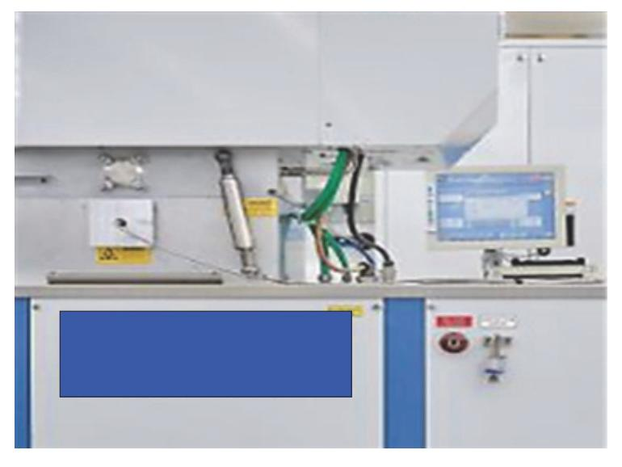

출처: 집필진 제작(2024) [그림 2-8] 장비의 전기 연결 상태

- 3. 전기적 연결 상태를 확인한다.
  - (1) 장치의 사양서와 전기회로도에 따른 연결 상태를 확인한다.
    - (가) 사양서 및 매뉴얼에서 전기 회로를 확인한다.
    - (나) 장비와 매뉴얼을 확인한다.
    - (다) 사양서와 매뉴얼, 전기 회로에서 체크 항목을 도출하여 작성한다.
    - (라) 체크 항목에 따른 판정 기준을 정한다.
    - (마) 체크리스트를 확인한다.

4. 소모성 부품의 상태를 확인한다.

- (1) 장치의 사양서와 매뉴얼에서 소모성 부품의 품목을 확인한다.
  - (가) 사양서 및 매뉴얼에서 소모성 부품의 품목을 확인한다.
  - (나) 장비와 매뉴얼을 확인한다.
  - (다) 사양서와 매뉴얼, 소모성 부품의 항목을 도출하여 작성한다.
  - (라) 소모성 부품의 상태 판정 기준을 정한다.
  - (마) 소모성 부품의 상태를 판정한다.
- 숖 초순수 생산 장비의 테스트 가동을 진행한다.

초순수의 생산 장비와 재료를 확인하고 테스트 가동을 진행한다.

1. 테스트 기동을 시작한다.

상태 확인 단계에서 체크리스트에서 확인된 내용에서 문제 없음을 확인하고 테스트 기동을 시작한다.

- (1) 제어계 전원을 ON 한다.
- (2) 동력계 전원을 ON 한다.
- (3) 기계 구동부를 구동한다.
- (4) 순수 생산을 시작한다.
- 2. 테스트 기동 결과의 확인 및 대응한다.
  - (1) 생산된 초순수 상태를 확인
  - (2) 문제점을 정리한다.
  - (3) 해결 방안을 정리한다.
- 숗 습식 화공 약품(Wet Chemical) 생산을 준비한다.

공정의 적용을 고려하여 아래의 내용을 파악한다. 정해진 양식은 없으나 내용이 확인되도록 체 크리스트를 작성한다. 보고서의 기본 양식은 MSDS의 기본 항목을 참고로 하여 객관적인 내용 을 확인할 수 있도록 작성한다.

#### 1. 적용 공정을 구분한다.

(1) 공정 재료로서의 약품 및 사용 공정

사용될 약품의 적용 공정을 파악하도록 한다.

- (가) 감광막(PR: Rhoto Resist)의 제조에 필요한 구성과 기능을 취합한다.
- (나) Wet Etching

에칭을 목적으로 하는지 세정을 목적으로 하는지 확인이 필요하고 바이프로덕트에 대한 부가적 액션을 파악한다.

- 1) Wet Etching
- 2) 웨이퍼 세정. PR 제거 등
- (다) 막형성 재료 파악
  - 웨이퍼에서 디바이스 구조를 형성하는 재료로 어떤 기능의 막이 필요한지 파악한다.
    - 1) 메탈막 형성 재료: 전원 공급 라인, 신호 제어 라인 등 주파수, 허용 전류 등
    - 2) 산화막 형성 재료: Gate Layer, Isolation layer, 정전 용량, 히스테리시스 특성
    - 3) 기타 기능성 막 형성 재료: Barrier layer, CMP 높이 제어용 적층 등
- (2) 공정 보완재로서의 약품
  - (가) H2O 초순수

사용 목적의 확인에 따라 생성 방법, 순수의 목적 수준을 결정할 수 있다.

1) 중성염의 제거: 녹여서 제거

- 2) 케미칼의 농도 희석
- 3) 파티클의 제거: 녹이거나 하지 않고 제거해 내는 방식: 예 자동차 세차
- (나) 유기용제 희석제: 벤젠, 시너, 알코올
  - 1) 카본체인 구조: IPA 등
  - 2) 방향족 구조: 벤젠 등의 화학 구조
- 2. 세정을 위한 공정의 구분을 확인한다.

세정을 진행하기 위해서는 다음 공정에 대한 이해를 충분히 해야 할 필요가 있다.

- (1) 웨이퍼 세정 약품
  - (가) PR 세정
    - 1) 잔류 PR의 제거
    - 2) 부산물 PR의 제거
    - PR과 에칭 공정 Gas의 반응 생성물
    - PR과 에칭 공정 후 반응 생성물과의 반응 생성물
  - (나) 기타 공정 전후 세정
    - 그 외의 공정에서도 세정이 필요하다.
      - 측정을 위한 세정
      - 웨이퍼의 공정 투입 전 세정
      - 웨이퍼 캐리어 세정
- (2) 공정 진행을 위한 장비 세정 약품

장비나 공정 반응이 일어나는 체임버의 세정

- (가) 공정 진행을 위한 세정: 공정 준비 작업
  - 1) Bath 내부의 부산물 및 불순물 내용 확인
  - 2) Bath 내부의 산도(pH) 및 기타 화학적 특성의 사전 확인
  - 3) Bath 및 체임버에 화학 약품을 공급하는 공급 배관의 상태 확인
- (나) 장비 점검을 위한 세정: 중성 세정
  - 1) 중화 세정
  - 중화 대상물의 확인
  - 중화 방법의 결정
  - 2) 중성 세정: 물(H2O)
  - 중성화 대상물의 확인
  - 중성화 방법의 결정: 중성화에 사용할 물질의 결정 및 확인

(3) 기타 재료 및 용도로서의 약품

앞에서 언급되지 않은 용도 외에의 필요성에 대해서 확인한다.

- (가) 운반제: 반응에 관여하지 않지만, 물질을 운반하는 목적으로 사용되는 경우
- (나) 전구체: 반응 대상물의 불안정성을 고려하여 안정성을 확보한 물질
- (다) 반응 촉매제: 반응을 촉진하기 위한 재료
- (라) 반응 지연: 반응의 속도를 조절하기 위한 재료
- (마) 냉동기 및 히터의 냉매: 공정 온도를 제어하기 위한 온도 제어를 위한 물질
- 3. 습식 화공 약품의 구성 특성을 파악한다.

화공 약품의 기본적인 구성을 파악하고 안전성 및 취급에 대한 요구 성능 및 구조를 확인 한다. 특히 유기용제는 카본 계열로서 화재 위험이 크므로 주의한다.

(1) 알코올 계열: 메탄올, 에탄올, IPA 등

베이스가 되는 주력 물질의 특성을 확인한다.

- (가) 메탄올: CH3OH
- (나) 에탄올
- (다) IPA: 아이소프로필알코올(Isopropyl alcohol C3H7OH)
- (2) 벤젠 계열
- (3) 산 및 알칼리 계열: HCl, HF, H2O2, NH4OH 기본 정보를 확인할 수 있는 자료는 다음과 같은 자료들이 있고 추가적으로 제조사에서 제공하는 자료를 반드시 확인해야 한다.
  - MSDS
  - CAS Sheet
  - (가) 산 Acid
  - (나) 알칼리
- (4) 중성 계열: 초순수 H2O
  - (가) 초순수 H2O
  - (나) 부유 가스 가능성 및 내용을 확인한다.
- 수 습식 화공 약품의 생산준비 최종 확인 및 테스트 가동을 실시한다.
  - 1. 액체와 기체 간의 성상을 최종 확인한다.
    - (1) 액체로 보관하고 기체로 사용하는 경우: 메탈계 재료(Gas), 분자량이 큰 가스

- (2) 액체로 보관하고 액체로 사용되는 경우
  - (가) 보관 상태 그대로 사용하는지 여부 확인
  - (나) 사용 시 희석 및 배합하는 경우 확인
  - (다) PR: 점도 제어를 목적으로 하는 단계 여부
  - (라) 세정: 세정 대상 물질의 성분 구조 파악
- 2. 점성 상태에 대한 성상과 점도 구분을 확인한다.
  - (1) 액체 상태: 솔벤트류의 점성 확인
  - (2) 고점도 상태: PR의 점성 확인
  - (3) 고체 분말을 포함한 액체: CMP 슬러리, 자성 유체의 점성 확인
- 3. 습식 화공 약품의 생산 장비 가동을 최종 점검한다.
  - (1) 테스트 기동

상태 확인 단계에서 체크리스트에서 확인된 내용에서 문제 없음을 확인하고 테스트 기 동을 시작한다.

- (가) 제어계 전원을 ON 한다.
- (나) 동력계 전원을 ON 한다.
- (다) 기계 구동부를 구동한다.
- (라) 순수 생산을 시작한다.
- (2) 테스트 기동 결과의 확인 및 대응을 진행한다.
  - (가) 생산된 초순수 상태를 확인한다.
  - (나) 문제점을 정리한다.
  - (다) 해결 방안을 정리한다.

### 학습 2 교수·학습 방법

#### 교수 방법

- 반도체 트랙 공정의 개요와 세부 내용을 부분별로 알기 쉽게 설명한다.
- 현장에서 표준화한 공정 매뉴얼과 관련 공정 재료에서 제공되는 자료 등의 내용을 프레젠테 이션 자료로 제시한 후에 설명한다.
- 가능한 한 사전에 제조 현장에서 사용하는 사례를 수집하여 자료를 준비하고 이해하기 쉬운 방법을 논의하는 방식의 문제 해결식 수업을 한다.
- 최근 반도체 산업 현황(시장 환경 및 기술 동향 등)에 대하여 충분히 인지하고, 학습자들이 쉽게 이해할 수 있는 방법을 모색하여 수업을 진행한다.
- 관련 시장의 환경 및 기술변화를 통합 검색 사이트나 한국반도체산업협회의 홈페이지 (www.ksia.or.kr) 등에서 찾아 활용할 수 있도록 지도한다.
- 반도체 트랙 공정 재료 준비에 필요한 내용을 확인하고, 관련 자료를 학습자들에게 제시한 후 파악 여부를 확인한다.

#### 학습 방법

- 반도체 산업 현황(시장 환경 및 기술 동향 등)과 관련 기관을 구체적으로 확인하도록 하고, 이 기관과 관련된 다양한 자료를 인터넷으로 검색하고 분류하여 문서로 정리한다.
- 반도체용 트랙 공정 재료 준비 항목이 선정된 양식에 맞추어 특정 소자에 대한 요구 사항을 작성해 본 후, 여기에 첨부되는 자료의 종류와 기록 내용 전반을 숙지하고, 가능하다면 소자 별로 분류해 본다.
- 반도체용 트랙 공정 재료 준비에 대한 시장 및 기술, 비용의 조사, 수집 및 분석을 통해 생 산에 필요한 목표를 설정하고 분류된 자료를 활용하여 생산 가능성을 예측한다.
- 반도체용 트랙 공정에서 예상되는 품질 관리 문제점을 파악하고 해결책을 수립하는 현장의 업무를 이해하고, 정해진 양식에 따라 보고서를 작성해 본다.

## 학습 2 평 가

#### 평가 준거

- 평가자는 학습자가 학습 목표를 성공적으로 달성하였는지를 평가해야 한다.
- 평가자는 다음 사항을 평가해야 한다.

|             | 학습 목표                                            |  | 성취수준 |   |  |
|-------------|--------------------------------------------------|--|------|---|--|
| 학습 내용       |                                                  |  | 중    | 하 |  |
| 트랙 공정 재료 준비 | - 반도체 트랙 공정 재료 제조에 필요한 원재료의 종류를 파악할 수 있다.     |  |      |   |  |
|             | - 반도체 트랙 공정 재료 원재료의 제조사별 규격 및 장단 점을 파악할 수 있다. |  |      |   |  |
|             | - 반도체 제조 공정에 적합한 트랙 공정 제조 재료를 준비 할 수 있다.      |  |      |   |  |

#### 평가 방법

• 포트폴리오

|             | 평가 항목                                                        |  | 성취수준 |   |  |
|-------------|--------------------------------------------------------------|--|------|---|--|
| 학습 내용       |                                                              |  | 중    | 하 |  |
| 트랙 공정 재료 준비 | - 반도체 트랙 공정 재료 제조 원재료의 종류에 대한 지식 이해 여부와 종류별 특징의 이해 정도     |  |      |   |  |
|             | - 반도체 트랙 공정 재료 원재료의 제조사별 규격 및 장단 점 파악 능력과 선별 능력           |  |      |   |  |
|             | - 반도체 제조 공정에 적합한 트랙 공정 제조 재료를 준비 하기 위한 주요 항목에 대한 지식 파악 여부 |  |      |   |  |

#### • 문제 해결 시나리오

| 학습 내용       | 평가 항목                                                               |  | 성취수준 |   |  |
|-------------|---------------------------------------------------------------------|--|------|---|--|
|             |                                                                     |  | 중    | 하 |  |
| 트랙 공정 재료 준비 | - 반도체 트랙 공정 재료 제조에 필요한 원재료의 종류에 대 해 이해하고 종류별 특성을 분류할 수 있는 능력     |  |      |   |  |
|             | - 반도체 트랙 공정 재료 원재료의 제조사별 규격 및 장단점 을 파악하고 제조 시 선별할 수 있는 지식 파악 여부  |  |      |   |  |
|             | - 반도체 제조 공정에 적합한 트랙 공정 제조 재료의 종류별 제조사별 장단점을 파악하고 사전에 준비할 수 있는 능력 |  |      |   |  |

#### • 서술형 시험

|             | 평가 항목                                                        |  | 성취수준 |   |  |
|-------------|--------------------------------------------------------------|--|------|---|--|
| 학습 내용       |                                                              |  | 중    | 하 |  |
| 트랙 공정 재료 준비 | - 반도체 트랙 공정 재료 제조 원재료의 종류에 대한 지식 여부와 종류별 특징의 이해 정도        |  |      |   |  |
|             | - 반도체 트랙 공정 재료 원재료의 제조사별 규격 및 장단 점 파악 여부                  |  |      |   |  |
|             | - 반도체 제조 공정에 적합한 트랙 공정 제조 재료를 준비 하기 위한 주요 항목에 대한 지식 파악 여부 |  |      |   |  |

피드백

- 1. 포트폴리오
- 반도체 트랙 공정 재료 제조 원재료의 종류에 대한 지식 여부와 종류별 특징의 이해에 대해 평가 하고 미비한 점이 발견되면 보완하도록 주요 내용을 설명하여 주며, 평가 결과가 양호한 경우 종 류별 품질 관리에 대해 심화 학습을 시행한다.
- 트랙 공정 재료 원재료의 제조사별 규격 및 장단점 파악 능력과 선별 능력에 대해 평가하고 부족 한 부분을 사례를 통해 설명하며 평가 결과가 부족한 경우는 사례를 들어 제조사별 재료의 선별 과정 이후 납기 관리에 대해 추가 지도한다.
- 2. 문제 해결 시나리오
- 트랙 공정 재료 원재료의 제조사별 규격 및 장단점 파악 능력과 선별 능력에 대해 평가하고 부족 한 부분을 사례를 통해 지도하며 평가 결과가 부족한 경우는 사례를 들어 제조사별 재료의 선별 과정 이후 납기 관리에 대해 추가 지도한다.
- 반도체 트랙 공정 재료 제조 원재료의 종류에 대한 지식 여부와 종류별 특징의 이해에 대해 평가 하고 미비한 점이 발견되면 보완하도록 주요 내용을 설명해 주며, 평가 결과가 양호한 경우 종류 별 품질 관리에 대해 심화 학습을 시행한다.
- 3. 서술형 시험
- 파악된 내용을 바탕으로 트랙 공정 재료 제조 시 발생할 수 있는 문제점의 대처 방안에 대한 지 식에 대해 평가하고 부족한 부분이 발견되면 미비한 부분을 추가로 재학습하도록 지도한다.
- 반도체 트랙 공정 재료 제조 원재료의 종류와 종류별 특징에 대해 평가하고 미비한 점은 주요 내 용을 설명하여 주며, 평가 결과가 양호한 경우 종류별 품질 관리에 대해 심화 학습을 시행한다.

| 학습 1 | 트랙 공정 재료 제조 요구 사항 파악하기 |
|------|------------------------|
| 학습 2 | 트랙 공정 재료 준비하기          |
| 학습 3 | 트랙 공정 재료 제조하기          |

## 3-1. 트랙 공정 재료 제조

학습 목표 • 생산 관련 부서로부터 입수한 생산 계획에 따라 장비 운용 계획을 수립할 수 있다. • 작업 지시서와 장비 운용 매뉴얼에 따라 트랙 공정 재료를 제조할 수 있다. • 트랙 공정 재료 제조 단계에서 발생한 문제점을 파악하고 해결 방안을 도출할 수 있다.

## 필요 지식 /

숔 트랙 공정과 습식 화공 약품(Wet Chemical)을 사용하는 공정의 파악

반도체 공정 중 트랙 공정에서 사용되는 케미칼에 대한 분류는 여러 가지가 있을 수 있겠지만, 트랙 공정에서 사용되는 케미칼의 경우에 액체와 가스의 임계 영역 또는 고체의 파우더를 포함하고 있는 경우 등 다양한 경우가 있을 수 있으므로 필요한 부분의 경우를 포함하여 설명한다. 습식 화공 약품을 사용하는 데 있어서 적용되는 공정을 파악하는 것은 매우 중요한 일이고, 사용 목적과 사용 조건을 확인하는 것은 습식 화공 약품을 활용하는 데 있어서 가장 중요하다고 할 수 있다. 반도체 공정에서 사용되는 재료는 반도체 웨이퍼 공정의 전후방 산업과의 상호 간에 중요한 영향을 주고받게 되는데, 이러한 반도체 산업의 ROADMAP을 제시해 주는 ITRS(International Technology Roadmap for Semiconductors)를 참고하고 방향성을 확인할 필요가 있다. 또한 한국 반도체 협회에서 정리한 ROADMAP 등에서 정리한 자료를 충분히 참고할 필요가 있다.

1. 적용 공정의 구분

습식 화공 약품의 적용 공정을 구분하고 적절한 약품을 선정하고, 제안하고, 생산하는 데 반드시 필요한 일이라고 할 수 있다. 대표적인 공정 몇 가지를 설명하도록 한다.

(1) 공정 재료로서의 약품

반도체에서 웨이퍼 프로세스를 적용하는데 주요 재료로 사용되는 재료로 공정 재료로 정의하고자 한다. 즉 웨이퍼 위에서 반도체를 구성하는 데 있어서 직접적으로 구성 재료 로 활용되거나, 디바이스의 구조를 형성하는 데 직접적으로 사용되는 재료를 설명하도록 한다.

(가) PR(Photo Resister)

에칭 공정을 진행하기 위한 현상 막으로서 반도체 디바이스의 선폭을 결정짓는 중요 한 공정이고 재료로서도 중요한 위치를 차지하고 있다. 주로 유기물로 구성되어 있 는 경우가 많다.

(나) Wet Etching

현재 시점에서는 웨이퍼 공정에서의 에칭은 대부분 Plasma Etching 기법을 활용하 여 에칭을 적용하지만, 경우에 따라서는 Wet Chemical을 활용한 에칭을 진행하는 경우가 있다.

1) Wet Etching

실질적으로 웨이퍼에서 디바이스 구조를 형성하는 역할을 하는 경우로 등방성 에 칭 구조를 형성할 경우에 활용된다.

2) 웨이퍼 세정

웨이퍼 세정은 PR 제거 등 웨이퍼 에칭 후에 PR의 잔류물 등을 제거하는 필수 공정이다.

(다) 막 형성 재료

막 형성 재료는 Wet Chemical이 웨이퍼의 디바이스 구조를 형성하는 재료로 재료 자체의 특성 또는 사용자로부터의 요구되는 특성에 따라서 액체의 경우와 기체의 경 우 또는 액체와 기체가 공존하는 형태로 존재할 수도 있다.

1) 메탈 막 형성 재료는 전원 공급 라인, 신호 제어 라인 등에 사용된다.

- 2) 산화막 형성 재료는 Gate Layer, Isolation Layer 등에 사용된다.
- 3) 기타 기능성 막 형성 재료는 Barrier Layer 등에 사용된다.

(2) 공정 보완재로서의 약품

공정 보완재로 정의하는 약품은 그 자체로는 기능을 하지 않거나 약하게 기능을 하지만 주 공정 약품과의 배합을 통하여 공정 약품의 특성을 극대화하거나 반응의 속도를 제어 하거나 안정성을 높여 주는 역할을 하는 약품을 의미한다.

(가) 초순수(D.I Water)

물은 그 자체로는 화학적 반응을 하지 않거나 약하게 하지만 HCl, HF, 암모니아 등 을 흡수하여 수용액으로 염산, 불산, 암모니아수 등의 기능성 약액으로 기능하게 하 고, 염산의 경우 사용 농도를 9%, 18%, 35% 등의 농도를 조절하도록 하고, 불산의 경우 10%를 넘지 않도록 하는 기능을 수행한다.

- 1) 중성염의 제거는 녹여서 제거한다.
- 2) 케미칼의 농도를 희석하여 사용한다.
- 3) 파티클의 제거는 녹이지 않고 제거해 내는 방식을 사용한다.
- (나) 유기 용제 희석제는 벤젠, 시너, 알코올 등을 사용한다.

주성분이 카본을 함유하는 유기물의 사용을 원활하게 하기 위한 배합 재료로서

49

Photo Resister의 점도 등을 제어하기 위한 용도로 사용되거나 PR 공정 후의 잔류 PR를 제거하기 위한 목적으로 사용되는 경우가 많다고 할 수 있다.

1) 카본 체인 구조는 IPA 등이 사용된다.

2) 방향족 구조는 벤젠 등의 화학 구조 물질이 사용된다.

2. 세정을 위한 공정의 구분

반도체 제조 공정에서 웨이퍼 위에서 디바이스를 형성하는 데에는 많은 종류의 재료가 사 용된다. 그중에는 다음 단계에서 진행하는 공정 또는 공정에 사용되는 재료 전부 또는 일부 의 재료와 불필요한 반응을 할 수 있는 불필요한 부산물을 제거하고, 또는 다음 과정에서 진행하려는 공정의 진행을 방해할 가능성이 있는 물질을 제거하거나 반응을 촉진하기 위한 조건을 만들기 위해서 세정을 진행하게 된다. 따라서 세정을 진행하기 위해서는 다음 공정 에 대한 이해를 충분히 해야 할 필요가 있다.

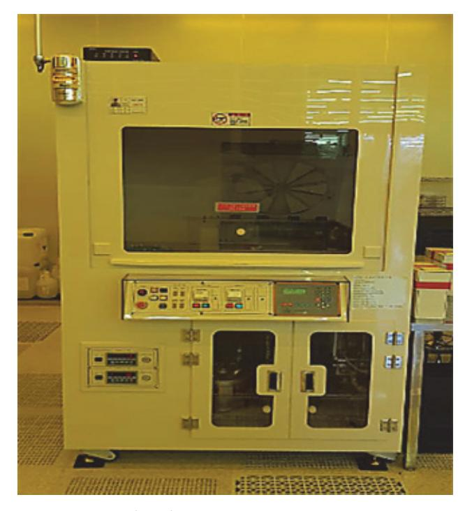

출처: 집필진 제작(2024) [그림 3-1] 반도체 웨이퍼 세정기

#### (1) 웨이퍼 세정 약품

웨이퍼링 과정에서의 각 공정에서는 웨이퍼의 앞뒤로 공정 진행 후의 부산물이 발생하 거나 공정 후 제거해야 할 공정 후 잔류물이 발생하게 되는데 경우에 따라서 부산물이 나 공정 잔류물은 웨이퍼에서의 디바이스의 생산율 감소에 지대한 영향을 줄 수도 있기 때문에 웨이퍼의 매 공정을 진행한 후에 웨이퍼 세정을 진행하게 된다. 과거에는 웨이퍼 세정은 약액(Wet Chemical)에 담가서 웨이퍼 앞뒷면의 불순물 및 잔류물을 제거했지만 현재 시점에서는 약액(Wet Chemical)을 사용하지 않고, 히터나 플라즈마를 이용하여 세정의 효과를 보는 경우도 있다. 본 과정에서는 약액(Wet Chemical)을 사용하는 경우 에 대해서 살펴본다.

(가) PR 세정

Photo Resister 공정을 진행한 후에 다음 공정으로는 에칭을 진행하게 된다. 최근의 반도체 공정에서는 특수한 일부의 경우를 제외하고는 Wet Etching을 이용하는 경우 는 거의 없고, 진공 체임버에서 플라즈마를 이용하는 드라이 에칭을 진행하는데 드 라이 에칭이던지, Wet 에칭이던지 PR가 필요하게 되는데 에칭을 진행하고 나서는 PR 막을 제거해야 한다.

1) 잔류 PR의 제거

PR은 통상 에칭 반응을 견딜 수 있는 재료로 구성되어 있다. 그리고 PR의 역할 은 구간의 선택적 에칭을 목적으로 하므로 에칭 공정 후에 PR이 잔류하게 된다. 따라서 에칭 공정 후에 PR을 제거하기 위한 세정을 진행하게 된다. 이 PR 제거 과정에서 PR의 성분을 녹이거나 제거하기 쉬운 화학 물질이 사용된다.

2) 부산물 PR의 제거

잔류 PR과 동일하게 취급되기도 하지만 성분의 구성을 들여다보면 약간의 차이 점이 있다는 것을 확인하게 된다. 이유는 반응 체임버 내부에서 목적으로 하는 공정 반응, 예를 들어 에칭 공정의 경우 기대하지 않은 반응도 일어나기 때문이 다. 따라서 반응 생성물의 특성도 고려한 세정을 진행해야 한다. 경우에 따라서는 각각의 단계별 레시피를 적용하여 잔류 PR과 부산물 PR을 각각 제거하기도 한 다. PR과 에칭 공정은 Gas의 반응 생성물이 남는다. 그리고 PR과 에칭 공정 후 반응 생성물과의 반응 생성물이 남는다.

(나) 기타 공정 전후 세정

앞에서 PR과 에칭 공정 전후에 대한 세정을 중심으로 내용을 언급하였으나 그 외의 공정에서도 세정이 필요하다.

- 1) 측정을 위한 세정
- 2) 웨이퍼의 공정 투입 전 세정
- 3) 웨이퍼 케리어 세정
- (2) 공정 진행을 위한 장비 세정 약품

반도체의 웨이퍼링 공정을 진행하기 위해서 재료의 품질이 중요하지만, 공정을 진행하는 장비 나 공정 반응이 일어나는 체임버의 세정도 재료의 품질 못지않게 중요하다고 할 수 있다.

(가) 공정 진행을 위한 세정: 공정 준비 작업

반응 체임버의 공정 진행을 위한 준비 작업으로 체임버의 분위기를 맞추어 준다는 표현을 쓰기도 한다.

- 1) Bath 내부의 부산물 및 불순물 세정
- 2) Bath 내부의 산도(pH) 및 기타 화학적 특성의 사전 조정

3) Bath 및 체임버에 화학 약품을 공급하는 공급 배관의 세정

(나) 장비 점검을 위한 세정: 중성 세정

장비의 운용을 위해서는 정기, 비정기적인 점검이 필요하게 된다. 이러한 점검은 상 당 부분 자동화가 진행되었지만, 최종적인 점검은 필수적으로 사람이 진행하게 되는 경우가 많다고 할 수 있다. 이 경우 위에서 언급한 장비 운용을 위한 세정과는 다르 게 사람이 접근했을 경우 안전성을 담보해야 한다.

1) 중화 세정

여러 가지 경우가 있지만, 가장 대표적으로 산(Acid)을 사용하는 경우 알칼리가 사용되기도 한다. 이처럼 Toxic 물질을 중성화하기 위한 세정이 진행되기도 한 다. 이런 중성화 작업은 장비의 최종 단에서 스크러버 등의 장치를 통해서 진행 하기도 한다.

2) 중성 세정용 물(H2O)

통상적인 세정으로 주로 물을 이용하여 세정을 진행하는 것으로 예를 들어 중화 세정의 경우 강산이나 강알칼리를 처리하기 위하여 사용되는 중화제 자체가 Toxic 한 경우가 있으므로 사람의 안정성 및 환경의 안정성을 위해서 다량의 물 로 희석을 시키거나 물을 이용하여 중성화를 진행하기도 한다. 이러한 과정을 통 해서 사람이 작업을 진행할 수 있는 안정성을 확보할 수 있다. 다만, 여기서 사 용되는 물의 순도가 중요한 문제가 된다.

(3) 기타 재료 및 용도로서의 약품

앞에서 언급되지 않은 용도 외에도 많은 화학 약품이 사용된다.

- (가) 운반제: 반응에 관여하지 않지만, 물질을 운반하는 목적으로 사용되는 경우
- (나) 전구체: 반응 대상물의 불안정성을 고려하여 안정성을 확보한 물질
- (다) 반응 촉매제: 반응을 촉진하기 위한 재료
- (라) 반응 지연제: 반응의 속도를 조절하기 위한 재료
- (마) 냉동기 및 히터의 냉매: 공정 온도를 제어하기 위한 온도 제어를 위한 물질
- 숕 습식 화공 약품 구성 특성의 파악

화공 약품의 기본적인 구성을 파악하고 안전성 및 취급에 대한 특성을 파악한다.

1. 유기 용제의 경우 카본 계열

PR가 대표적인 물질로서 벤젠, 카본 체인의 다양한 조합으로 구성되어 있다.

(1) 알코올 계열은 메탄올, 에탄올, IPA 등이다.

카본 체인 구조의 유기물을 제어하기 위한 배합 물질로 PR 등의 유기물을 제어하기 위

한 용도로 사용된다. 알코올 계열은 벤젠 등의 유기물과도 혼합이 가능하고 물과도 혼합 이 가능하다. 단, 정도의 차이가 있으므로 메탄올, 에탄올, IPA(아이소프로필알코올) 등 이 사용된다.

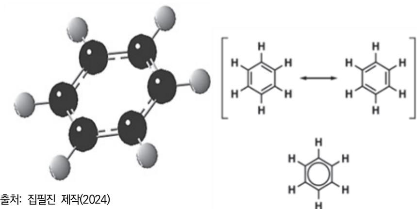

[그림 3-2] 벤젠 형상 및 기호

(가) 메탄올(CH3OH)

알코올 계열의 물질로는 가장 작은 분자 구조를 가진다. 메탄올은 사람이 흡입하면 시력을 상실하는 등의 치명적인 손상을 유발할 수 있으므로 취급에는 주의하여야 하 고 호흡기 피부 등을 통해서 인체에 흡수될 수 있으므로 MSDS, CAS Sheet 등의 주의 사항을 충분히 숙지하여야 한다. 강한 인화성 물질이다.

(나) 에탄올(C2H5OH)

물과 혼합하면 사람이 마실 수 있을 정도로 주류의 기본 성분으로 인체에는 크게 유 해하지 않아서 메탄올의 유해성이 알려진 후로는 메탄올의 대체재로 사용되고 있다. 그러나 고순도의 에탄올도 사용되고 있고, 그럴 경우 인체에 유해할 수도 있다. 순도 가 높으면 강한 인화성 물질이다.

(다) 아이소프로필알코올(IPA: Isopropyl Alcohol, C3H7OH)

장비 세정용으로 많이 사용되는 알코올로 여러 가지 기능적으로 에탄올과 메탄올의 대체재로 사용되고 있다. 최근에는 웨이퍼 세정용으로도 사용되고 있다. 인체에 무해 하다고 알려져 있으나 가스의 농도가 높으면 어지럼증 등을 일으킬 우려가 있고 강 한 인화성 물질이다.

(2) 벤젠 계열

카본과 수소의 육각형 구조로 거의 대부분의 카본 계열의 물질의 기본 구조이다. 대표적 으로 벤젠이 있다. PR에 벤젠 구조가 많이 활용되고 있으며 대부분이 인화성이거나 열 에 민감한 특성이 있다.

2. 산 및 알칼리 계열(HCl, HF, H2O2, NH4OH 등)

취급하는 화학 물질의 산도를 파악하여 취급 방법, 방호구, 사용 용기, 주변 물질, 보관 방 법 등을 고려해야 한다. 특히 강산과 강알칼리가 직접 섞이면 폭발적인 반응을 하게 되므로 취급에 주의해야 하고, 2가지 약품 모두 인체에 치명적인 위해를 가하고, 금속 등의 구조물 에 심각한 상해를 가할 수 있으므로 보관과 취급에 주의해야 한다. 기본 정보를 확인할 수 있는 자료는 다음과 같은 자료들이 있고 추가적으로 제조사에서 제공하는 자료를 반드시 확인해야 한다. MSDS는 물질의 기본 특성을 나타내는 제조사로부터의 자료이고 CAS Sheet는 생산하는 물질에 부여되는 고유 번호와 그 물질의 정보 자료이다.

(1) 산(Acid)

산도가 pH 7보다 낮은 수치를 가지는 물질로 숫자가 낮을수록 강한 산도를 가지고, 강 한 부식성과 반응성을 가지고 있어서 취급에 주의해야 한다. 황산 H2SO4, 염산 HCl, 질산 NHO3, 인산 H3PO4 등이 대표적이다. 황산의 경우 희석을 할 경우 물에 황산을 희석해야 하는데 반대로 황산에 물을 희석하면 급격히 발열하므로 각각의 화학 물질에 대한 기본 특성을 미리 확인해야 한다.

(2) 알칼리

산도가 pH 7보다 큰 숫자로 높은 숫자일수록 강한 알칼리성을 나타내고 반응성이 증대 한다. 강한 산과 마찬가지로 강한 알칼리도 강한 부식성과 반응성을 가지고 있다.

3. 중성 계열(초순수 H2O)

물(H2O)은 pH 7이다. 즉 pH 7은 중성이다. 하지만 산이나 알칼리와는 다르지만, pH 7이 전부 안전하다고는 할 수 없다. 산과 알칼리의 반응 생성물, 또는 산과 금속의 반응 생성물 은 물에 녹는 수용성인 경우가 있지만, 인체에 유해한 경우도 있으므로 주의해야 한다.

(1) 초순수 H2O

HCl, HF 등의 물질을 희석하거나, 반도체를 직접 세정하는 용도로 사용되는 물로서 불 순물의 함유량도 제어를 해야 하고 물의 저항성도 매우 높은 전기저항을 확보해야 하는 경우가 많다.

(2) 부유 가스를 흡수해서 생기는 문제

반도체 공장 내에서 고인 물을 확인하기는 쉽지 않다. 다만 장비의 점검 중 냉각수 등 에 주변의 부유 가스가 녹아 들어가서 성질이 변하는 경우가 종종 있고, 경우에 따라서 는 프로세스용 초순수에도 섞여 들어가는 경우도 있으므로 주의해야 한다. HCl gas, Cl2 gas, NH4 gas 등이 대표적이다.

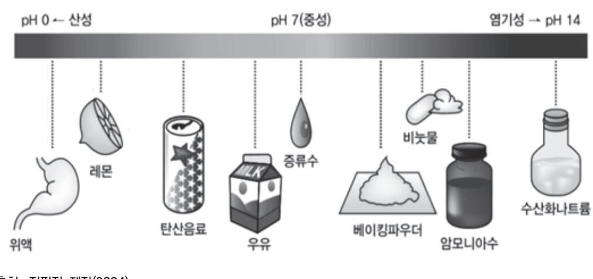

출처: 집필진 제작(2024) [그림 3-3] 산 및 알칼리 계열

숖 습식 화공 약품 성상 특성의 파악

반도체 공정에 사용되는 화학 약품의 종류와 사용량이 가늠하기 어려울 정도로 계속 증가하고 있고, 기존에 사용되던 화학 약품도 사용 방법의 개선 및 사용 순서의 변경만으로도 반도체 공 정에서 다른 효과를 기대할 수 있다. 따라서 다음의 내용을 고려하고 염두에 둘 필요가 있다고 하겠다. 그러다 보면 기체와 액체의 경계에서 보관 사용하는 경우도 있다.

1. 액체와 기체(액체와 기체 간의 성상)

액체로 보관하고 기체로 사용하는 경우와 액체로 보관하고 액체로 사용하는 경우에 대해서 언급한다.

(1) 액체로 보관하고 기체로 사용하는 경우

메탈계 재료(Gas), 분자량이 큰 가스로, 반도체 공정에서 사용되는 많은 공정 재료들이 여기에 해당된다고 볼 수 있다. 물질의 증기압, 보관 압력, 보관 온도 등의 물질 특성에 따라서 운반과 보관은 액체 상태이지만 실제 사용은 가스화해서 사용하는 경우로 가스 와 액체 상태에 대응을 해야 한다.

(2) 액체로 보관하고 액체로 사용되는 경우

통상적인 액체 재료로 보관 용기가 그대로 사용 용기가 되는 경우로 Toxic 약품일수록 그런 특성이 강하다.

(가) 보관 상태 그대로 사용하는 경우

Toxic 약품일수록 보관 용기가 사용 용기가 되는 경우가 많다. 고압 또는 저압에서 사용되는 경우이다.

(나) 사용 시 희석 및 배합하는 경우

사용 조건의 튜닝이 필요한 경우로 세정 조건의 변경 또는 웨이퍼의 세정 조건이 변

경되어 희석률이나 배합률을 변경할 경우이며 PR는 점도 제어 세정은 세정 대상 물 질의 성분 구조에 따라서 희석해서 사용한다.

2. 점성 상태에 대한 성상(점도 구분)

점성 상태에 따라 점도의 제어가 필요하다.

(1) 액체 상태(H2O)

통상적인 액체 상태이다.

(2) 고점도 상태(PR)

점도가 있어서 계량과 계측에 전용 지그를 사용하는 경우가 많다.

(3) 고체 분말을 포함한 액체(슬러리)

분산제와 역할재로 자성 유체, CMP 슬러리 등이 대표적인 예이다.

#### 3. 불순물

(1) 불순물 함유량

반도체 공정에서 가장 중요하게 여겨지는 항목이 불순물 함유량이다. 반도체 생산에 관 여하는 담당자들은 제어되지 않는 불순물에 대해서는 극단적인 반응을 보이기도 하고 실질적으로 실리콘의 웨이퍼 자체의 불순물 함유량 및 표면 오염은 가장 고급화된 기술 로 관리되고 있다. 마찬가지로 웨이퍼를 세정 또는 공정용 화학 약품에 대한 관리도 엄 격한 수준에서 제어되고 있고, 실제로 웨이퍼 세정용 배스의 오염으로 세정 대상물이었 던 웨이퍼들이 오염되어 사용할 수 없게 되는 경우는 반도체 디바이스 생산 공장에서는 가끔 보고되기도 한다.

<표 3-1> 불순물 함유량(N/D는 검출 한계 이하)

| 검출 이온(+) | 검출량(ppb) | 검출 이온(-) | 검출량(ppb) |
|----------|----------|----------|----------|
| NH4+     | N/D      | F-       | N/D      |
| Na+      | N/D      | NO3-     | N/D      |
| K+       | N/D      | SO42-    | N/D      |
| Ca2+     | N/D      | PO43-    | N/D      |
| Mg2+     | N/D      | Cl-      | N/D      |

#### (2) 불순물의 종류

불순물의 함유량도 중요하지만, 불순물의 종류도 중요하다. 반도체에서는 칼륨(K), 칼슘(Ca), 나트륨(Na), 철(Fe) 등의 금속은 극단적으로 싫어하는 금속이고, 알루미늄(Al), 니켈(Ni), 은(Ag), 텅스텐(W) 등은 공정에 따라서 사용이 허용되는 금속이고, 구리(Cu)는 사용되는 경우와 제한되 는 경우가 극단적으로 나뉘는 경우이다. 또한 비메탈계 물질도 경우에 따라서 제한을 받는다. 이상의 내용은 반도체 제품의 성능에 영향을 주는 금속이지만 RoHS에서 정하는 사용을 금지하고 있는 내용도 주의를 기울여야 한다. RoHS에 대해서 간략하게 요약 설명하면 유해 물질 제한 지침(RoHS: Restriction of Hazardous Substances Directive)로서 유럽연합(EU)에서 시행 되며 해로운 물질을 사용한 전자 제품이나, 전기 기기를 제한하는 지침이다. 구체적으로는 납, 카드뮴, 수은, 6가 크로뮴, 프탈레이트, 브로민계 난연제를 사용하지 않도록 하는 지침이다. 이는 유럽연합뿐만 아니라 중국 등 대부분의 나라에서 시행하고 있다.

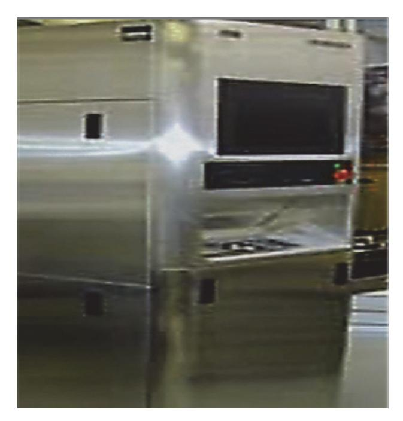

출처: 집필진 제작(2024) [그림 3-4] 불순물 파티클 측정기

4. 보존의 안정성

보존에 있어서 화공 약품을 장기간 보존하는 것은 어떠한 경우에도 좋지 않다. 다만, 사용 하는 입장에서는 보존 기간을 충분히 확보하기를 희망하는 측면이 있다. 그러나 약품의 대 부분은 보존 기간을 명기하고 있고, 그러한 내용과 희망하는 기간이 일치하는지 확인하여야 한다. 통상 메탈계 물질은 보존 기간이 길지 못하다. 자성유체의 경우 일정 기간 방치하면 자성 입자가 상호 결합하여 기능을 하지 못할 수도 있다. 보존에 있어서 다음의 사항을 확 인할 필요가 있다.

- (1) 보존 기간
- (2) 보관 온도는 인화성 및 자기 반응 여부와 기화, 승화 조건 확인이 필요하다.
- (3) 광 반응성 재료는 빛에 대한 반응성이 있는 경우도 있다(PR, 질산 등).
- (4) 보관 용기 내부 압력 확인이 필요하다.
- 5. 반응의 정확성

화학 반응은 수소와 산소처럼 한 가지 한 번의 반응만으로 끝나는 경우도 있지만, 물과 철 의 반응처럼 여러 가지 형태의 여러 가지 반응 생성물을 만들어 내는 경우도 있다. 반도체 공정처럼 복잡한 반응을 이끌어 내는 경우는 의도하지 않은 반응이 동반될 수도 있다. 따라 서 반응의 정확성을 기하기 위하여 온도, 압력(가압), 빛, 진공, 플라즈마 등의 여러 가지 조건이 사용되기도 한다. 따라서 반응의 조건을 명확히 할 필요가 있다.

- (1) PR의 경우
  - 1) 경화: 빛, 자외선, KrF, ArF 등
  - 2) 에칭 공정 시 최대 온도: 통상 120도 이하: 타지 않을 온도
  - 3) PR 제거 Dry 방식: 400도 이상의 온도, O2 Gas, 플라즈마 등
  - 4) Wet 방식 유기 용제: 시너, 벤젠, 알코올 등
- (2) 질산 NHO3의 경우는 빛에 의하여 분해된다.
- 6. 반응 생성물의 안정성

반응 생성물은 통상 반응 결과로 원하는 반응과 그에 대한 부산물이 형성되는데 통상적으 로 반응 생성물은 제거나 세정의 대상이 된다. 그런데 경우에 따라서는 반응 생성물이 강한 결합을 형성하여 세정이 불가능하거나 세정이 어려운 경우도 있을 수 있다.

(1) 반응 생성물이 기체의 경우

반응 후 분산물이 기체의 경우로 일산화탄소(CO), 이산화탄소(CO2), 수증기(H2O) 등의 반응 생성물을 내놓는 경우이다.

(2) 반응 생성물이 액체의 경우

반응 생성물이 점도를 가지거나, 반응 생성물에 다량의 H2O가 발생하여 수용성 반응 생성물이 녹아 들어가는 경우가 있다. 취급에 주의를 기울여야 하고 반응 체임버의 재질 에도 주의를 기울여야 한다.

- (3) 반응 생성물이 고체(Powder)의 경우 반응 후에 파우더의 형태로 존재하는 물질로 액체 약품보다는 Gas 반응에서 주로 발생 한다. Toxic인 경우도 있으므로 취급에 주의해야 한다.
- 7. 생산 시설

통상의 산업용보다 엄격한 관리를 요구하고, 순도나 제품 안정성을 요구하므로 당사에서 대 응이 가능한지 사양 단계에서 확인한다.

- 8. 품질 관리를 위한 검사 시설 제품의 검사가 가능한지 확인하고 검토할 필요가 있다.
- 9. 고객에 대한 사후 관리와 지속적인 제품 개발에 대한 대응이 가능 여부 반도체 산업에서 요구되는 지속적인 기술 개발 및 현장 이슈에 대한 대응 능력이 있는가를 사전에 충분히 파악하고 있어야 한다.

## 수행 내용 / 반도체 포토 공정 재료 제조하기

#### 재료·자료

- 작업 절차서 및 표준서
- 제조설비 점검 기록서
- 설비 리스트
- 시티 워터: 산업 용수
- 초순수 제조설비의 매뉴얼
- 감광액 제조용 유기 원료
- MSDS, RoHS,
- 리소그래피 재료
  - Immersion Photo Resist, Top Coat, BARC
  - KrF Photo Resist

#### 기기(장비 ・ 공구)

- 제조 공정 장비
  - 유기 합성 Pilot 설비
  - PR류 Mixing Vessel
  - 중합체 합성 Pilot 설비
  - 제조 공정 이상 발생 Monitoring 설비
  - Bottle Cleaning 설비
  - 원자재 저장 창고
  - Bottle Filling 설비
- 평가, 분석 및 계측 장비
  - Arf Scanner, Elipsometer, GC

- I-line Stepper, Microscope, HPLC
- Track, ICP-MS, nmR
- CD-SEM, Bath(VB-10), Viscometer(BF), FT-IR
- Dynamic Contact Angle, Refractometer, UV
- Coating Defect Inspection, Coulometric Titrator(831), GPC
- Air particle counter
- Moisture Analyzer, 전기적 특성 측정기
- Furnace
- 제조 공장 인트라넷
- 안전 도구, 안전화, 안전모,
- 컴퓨터, 프린터, 복사기

안전 ・ 유의 사항

- 제조 공정 장비는 제품을 생산하기 위한 장비로서 규칙에 따라 사용되어야 하며, 일정 주기 와 방법에 따라 장비 성능을 평가하여야 한다.
- 반도체 리소그래피 제조 시 돌발적으로 발생하는 불량률의 증가 사태를 정상으로 복구하는 능력이다.응급 대처 능력을 을 숙지해야 한다.
- 평가/분석/계측기란는 제품의 물리적 성질이나 특징을 평가하는 검사를 실시하는 장비로서 규칙에 따라 사용하여야 하며 일정 주기와 요령에 따라 검, ·교정을 실시하는 장비를 의미한 다가 해당된다.해야 한다.시해야 한다.
- 작업 표준에는 공정 순서 및 온도, 시간 등의 환경을 포함한다.
- 작업 절차서는 생산을 완료하기 까지의 절차, 순서를 작성한 생산 작업의 계획서로서, 생산 을 바르게 실시하는 목표로 생산을 위한 절차와 생산에 사용하는 재료, 장치의 준비 및 사 용 절차, 그리고 생산을 실시하는 데 필요한 주의 사항을 표시하는 문서이다.
- 품질 관리에서는 통계를 활용한 리소그래피의 품질 관리를 통하여 불량의 발생 및 불량 원 인을 조사하여 개선함으로써 품질의 균일성(6-시그마)을 확보하여야 한다.

CoA ((Certificate of Analysis)는 가스의 순도 및 불순물 등 해당 제품의 품질 및 Specification을 나타낸다.

수행 순서

숔 공정 전 발생 가능한 문제를 조사한다.

습식 화공 약품을 공정에 적용하기에 앞서 약액의 불순물 함유량, 보관 상태, 사용 전 준비 상 태 등에 대한 점검이 필요하다.

1. 불순물 함유량을 파악한다.

반도체 공정에서 불순물 함유량에 대한 사양은 매우 중요한 문제로 반도체 재료는 초기 제 조 단계에서 불순물을 얼마나 포함하지 않고, 보관 중 불순물이 포함되지 않는 등 불순물을 얼마나 제어할 수 있는지가 기술적 관건인 경우가 많다.

- (1) 불순물의 종류
  - 메탈계 불순물
  - 공기 중의 먼지 및 수분 함유량
  - 보관 용기의 용해 침투
- 2. 보관 상태를 파악한다.

재료 및 소모품을 공급받아서 바로 사용할 수 있다면, 재고 관리적인 측면 외에도 재료의 상태가 항상 최적의 상태일 것이나 현실적으로는 재료를 창고에 보관하여 사용하게 되므로 보관 용기 및 보관 장소에 대해서 고려해야 한다. 보관에 대해서는 다음의 상태를 확인하여 야 한다.

(1) 혼합 보관에 대한 법적 관리 항목의 확인

일정 보관량을 넘어가면 동일한 공간에서 함께 보관할 수 없는 경우에 대해서 법과 시 행령 MSDS 등의 내용을 사전에 확인하여야 한다.

(2) 보관 환경에 대한 확인

재료별 온도, 습도, 통풍에 대해서 확인해야 한다. 통상 포토 레지스트는 빛에 대해서 민감하므로 조명에 주의하여야 한다.

(3) 보관 용기에 대한 고려

약액 재료의 유효 기간도 중요하게 관리 되어야 하지만, 보관 용기의 유효 기간도 중요 하게 관리 되어야 한다. 보관 용기의 오염 및 중간 용기의 오염은 반도체 공정 전체에 대한 문제 및 장비를 정비해야 하는 경우도 있다. HF 수용액이나 혼합 수용액은 SiO2 즉 유리를 녹이는 것으로 알려져 있고, 염소 Gas는 에폭시 수지를 약화시키는 것으로 알려져 있다. 많은 화학 약품이 속도의 문제는 있지만, 금속 및 플라스틱 재료와 반응을 지속하고 있다.

3. 사용 전 준비 상태를 확인한다.

화학 약품을 사용하기에 앞서 사용 조건에 맞추어서 배합을 해야 하는 경우 배합 조건에 대해서 확인하고, 배합 환경과 배합 전후의 배합 상태에 대한 확인을 해야 한다.

숕 공정 후 발생 문제에 대해 고려한다.

공정 전에 문제점에 대해 확인하고 통상적으로 문제가 없으면 공정 진행 후에 문제가 없는 경 우가 일반적이나 현실적으로 반도체 생산 공정에서는 세정의 경우 공정 대상의 웨이퍼의 표면 구성이 바뀌거나 대상 막의 재료나 결합 구조가 바뀔 경우 세정 공정에서 문제가 발생하는 경 우가 있다.

숖 반응기(REACTOR, Chamber)를 점검한다.

자연계에서는 항상 반응이 일어나고 있다. 식물의 광합성, 사람의 위 속에서의 소화 과정을 비 롯하여 자동차 엔진에서의 연료의 연소 등 주변의 모든 현상이 반응 현상이라고 할 수 있겠다. 하지만 여기에서 다루는 반응은 필요한 반응을 효과적이고 주변의 불순물이나 영향을 받지 않 기 위하여 원하는 반응만이 효율적으로 이루어지도록 공간을 제공하는데 그러한 공간을 반응기 라고 할 수 있다. 반응기에는 원자력 발전소의 핵 반응기, 반도체 에칭 공정의 진공 체임버, 정 유 공장의 반응탑 등이 주변에서 쉽게 소식을 접할 수 있는 반응기의 대표적인 경우라고 할 수 있다.

1. 회분식 반응기(Batch Reactor)를 점검한다.

반응을 한 번씩 진행하는 경우로 생산할 제품의 양을 계산하여 필요한 재료를 투입하거나 반응을 유도하는 방식으로 연속 생산 방식과 대조된다고 할 수 있다.

- 빵집에서 하루 분량의 밀가루 반죽을 숙성시키는 경우
- CVD 반응 공정의 1회 공정 진행
- 반도체 세정 장비의 세정 공정

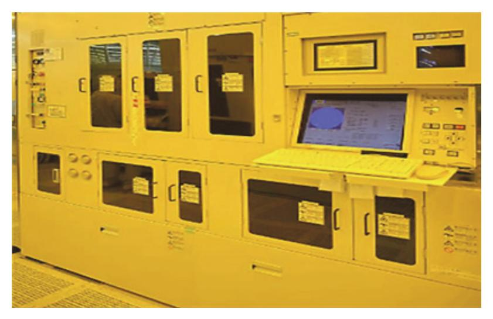

출처: 집필진 제작(2024) [그림 3-5] 반도체 세정 장비

2. 제어 파라미터를 점검한다.

장치 운전을 위한 파라미터로 이후 공정 파라미터를 통한 장치의 생산성과 성능을 결정하 는 요소가 된다.

(1) 기계적 제어

기계적 구동을 제어하는 것으로 구동 모터, 구동 밸브 등의 제어를 말한다.

(2) 되새김 제어(피드백 제어)

연속 공정에서 센서와 구동부를 연계시켜서 생산 유체의 상태(온도, 유속, 성분)를 제어 하는 것이다.

3. 반응 파라미터를 점검한다.

반응의 직접성을 제어하는 것으로 반응의 요소를 기계 및 제어 파라미터를 통제하여 반응 성을 제어하는 것으로 장비 모델에 따라서 레시피 등으로 관리되기도 한다.

- 온도
- 재료의 배합량
- 압력
- 숗 반도체 트랙 공정 재료의 제조 공정을 점검한다.

감광제는 제조 관련 공정은 PR의 원료인 고분자 수지(Resin)와 광 활성제(PAC)를 제조하는 공 정, 이러한 원료를 혼합하여 PR를 제조하는 공정 등으로 구분할 수 있다.

1. 감광제 제조 공정을 점검한다.

(1) 노블락 수지 제조

노블락 수지 제조 공정의 하나인 원료로 Cresol, p-Cresol, p-Formaldehyde, 초순수, Oxalic Acid를 투입하고 교반한다. 그 후 열매체유를 이용하여 승온한 후 환류 반응을 진행한다. 반응이 종료되면 축합수를 제거하기 위해 상압에서 170℃까지 증류한다. 과량 으로 들어가는 Cresol을 제거하기 위해 열원을 가하면서 190℃까지 진공 탈수를 실시 한 후 냉각을 시킨다. 상압 상태에서 PGMEA를 투입하여 50℃ 냉각 후 제품을 포장한 다.

(2) 광 활성제 제조

광 활성제(PAC) 제조 공정의 하나로서 반응을 위해 원료인 P-HBA(P-Hydroxy Benzoic Acid) 등을 투입하고 제품색상 변질을 막기 위해 질소 치환 및 퍼지하여 준 다. 그 후 반응기에 톨루엔을 유량계를 조절하여 적하 투입해 주고 스팀을 사용하여 승 온시키고, 질소는 승온 시까지 계속 투입하여 준다. 유수 분리기에서 물과 톨루엔을 분 리해 주며 순환 반응을 한다. 반응이 종료되면 과량으로 들어가는 톨루엔을 증류 후에 냉각수를 이용해 40℃ 이하로 냉각을 시킨다. 냉각된 대상 물질에 아세톤을 투입하여 용해시키고 누체 여과기를 사용하여 여과시키며 이온수를 투입하여 제품을 석출시켜 결 정화한 후 냉각시킨다. 그 후 원심 분리기로 여과를 진행한 후 제품을 포장한다.

(3) 감광제 제조

제조 순서는 혼합 탱크에 PGMEA와 노블락 수지를 투입하여 노블락 수지를 용해시키 고, PAC, 첨가제, 계면 활성제 등을 추가 투입하여 혼합 탱크에서 교반기를 이용하여 혼합시킨다. 그 후에 점도 조정을 실시하고, 여러 개의 필터를 사용하여 원하는 입도까 지 여과를 실시한 후 제품을 제조한다. 이후 병 등에 충진하고 포장하여 출하한다.

#### 2. 감광제의 주요 파라미터를 확인한다.

(1) 원료 투입

반응기(RX-204)에 정제된 감광제(Wet Cake)를 맨홀을 통해 약 1,200kg 투입한 후, 배관을 통해 톨루엔 3,000kg을 투입(약 40분 소요)과 동시에 교반기로 교반 시작(약 105RPM)하고 그다음 물 12,000kg을 투입(약 50분 소요)하면서 승온을 시작한다.

(2) 승온

반응기(RX-204)의 온도를 75~82℃까지 1시간 동안에 스팀으로 승온하고 이 온도를 3 시간 동안 유지한다.

(3) 냉각

냉각수로 1시간 동안 15℃까지 냉각을 실시한다.

(4) 원심 분리 여과 공정

냉각에 의해 반응기의 내부 온도가 15℃로 낮아지면 원심 분리기로 공급하고 질소를 투 입하여 원심 분리 여과를 진행하고 작업자는 대상 물질이 원심 분리기에서 원하는 양의 고체상 제품(약 100kg)이 될 때까지 대상 물질 공급 배관의 밸브를 수시로 열어 원심 분리기로 공급(약 30∼50분 소요)한다. 원하는 양의 제품이 원심 분리기로 투입되면 대 상 물질 공급 밸브를 닫고 1시간 동안 회전시키고 초순수 세정(Washing)은 공급 완료 후와 공급이 중단되고 회전 시작 후 30분이 경과된 시점에 30RPM으로 2분간 실시한 다.

#### 수 감광제의 혼합물 특성을 확인한다.

실험대상 혼합물로 아세톤-톨루엔, 아세톤-물, 아세톤-PGMEA의 아세톤 혼합물과 사고 당시 재현 혼합물, PR 제조 관련 공정에서 샘플링한 혼합물을 선정하였으며, 아세톤, 톨루엔, 및 PGMEA의 주요 특성은 다음과 같다.

#### 1. 감광제의 혼합물 특성을 확인한다.

#### (1) 톨루엔(Toluene)

톨루엔(화학식: C6H5CH3, CAS No.: 108-88-3, 분자량: 92.14)은 천연수지인 톨루 발삼(Tolu Balsam)의 건류로 얻어진 'toluol'에서 유래된 이름으로 벤젠의 수소 원자 1개를 메틸기(Methyl Group)로 치환한 화합물로 무색의 액체이며, IUPAC(International Union of Pure and Applied Chemistry)명으로는 메틸 벤젠(Methyl Benzene)이라고 한다. 19세기 후반에는 석탄 건류의 부산물을 이용하여 생산하였으나, 현재는 대부분이 원유 정제 분류의 촉매 개량 (Catalytic Reforming)에 의해 생산되고 있다. 물에는 녹지 않지만 에탄올, 에테르, 벤젠 등 대부분의 유기 용매와는 임의의 비율로 혼합하며, 상온에서 공기 중으로 쉽게 날아가는 대표적인 휘발성 유기 화학물(VOC) 중의 하나이다. 정제되지 않은 대부분 톨루엔은 옥탄가를 높이기 위하여 휘발유에 첨가하는 BTX(Benzene, Toluene, Xylene) 혼합물의 제조용으로, 정제된 톨루엔의 50% 정도는 벤젠을 생산하는 데 사용된다. 특히 물리 화학적인 특성이 비슷한 벤젠에 비해 톨루엔은 독성이 낮고 가격이 저렴하므로 페인트, 코팅제, 접착제, 잉크 및 청소 용제 등의 용매와 나일론, 폴리우레탄 등의 폴리머 제조 등 광범위하게 사용된다.

#### (가) 톨루엔의 인화성

톨루엔은 인화점이 4℃인 인화성 액체이며 산화성 물질과 혼합 시 폭발할 우려가 있 다. 2007년 환경부 유해 화학 물질 사고 사례집에 의하면 2000년부터 2006년까지 발생한 화학 물질 관련 사고 중 톨루엔이 18건으로 가장 많았고, 염산 15건, 유사 휘발유 15건, 황산 12건, 시너 12건, 휘발유 10건, 석유 9건, 암모니아 7건, 수소 7 건, 솔벤트 7건의 순으로 나타났다. 이들 화학 물질에 의한 사고는 전체 사고 건수 의 약 36%를 차지하며, 톨루엔이 구성 성분으로 첨가되는 시너와 유사 휘발유 등을 포함하면 톨루엔에 의한 사고가 전체 화학 물질 사고의 약 19.9%를 차지하는 것으 로 추정할 수 있다.

- (나) 톨루엔의 인체 유해성을 확인한다.
  - 톨루엔은 인체와 동물을 대상으로 한 연구들에서 일반적으로 암을 유발하지 않는 것 으로 나타났으나, 신경계에 영향을 줄 수 있는 것으로 알려져 있다. 통상 적은 양의 톨루엔에 노출된 경우 피곤, 무력감, 술에 취한 것 같은 행동, 기억 상실, 구토, 식욕 부진, 청력과 시력 저하 등의 증세가 나타날 수 있으며 이러한 증세들은 일반적으로 톨루엔의 노출을 중지할 경우 사라지는 것으로 알려져 있다. 짧은 시간에 과량의 톨 루엔을 흡입하게 되면 빈혈, 어지럼증, 졸림 등의 증세가 나타나며 심할 경우 의식불 명, 사망에 이르게 되고 높은 농도의 톨루엔 노출은 신장에 이상을 유발하는 것으로 알려져 있다. 국내 톨루엔 중독에 관한 재해 사례는 톨루엔 단독으로 노출되기보다 는 다른 유기 용제와 함께 복합적으로 노출된 경우가 많으며, 환기가 불량한 사업장 환경에서 급성으로 단기 노출에 의한 질식 및 신경학적 증상의 발현이 대부분인 것 으로 알려져 있다. 톨루엔 역시 「산업안전보건법」에 따라 관리 대상 유해 물질로 지 정하여 관리하고 있다. 현재 톨루엔의 국내 유통량을 정확히 확인할 수 없으나 2010 년 환경부의 유독물 영업자 등의 실적 보고에 따르면 제조량이 약 92만 톤이고 수입 량이 약 36만 톤인 것으로 조사되었다.
- (2) 아세톤

아세톤(화학식: CH3COCH3, CAS No.: 67-64-1, 분자량: 58.08)은 향기가 있는 무색 의 액체로서 케톤의 가장 간단한 형태로, 양쪽에 하나씩 총 2(Di)개의 메틸기(Methyl)와 결합하고 있기 때문에 IUPAC 명으로 디메틸케톤(Dimethylketone)이라고 부르기도 한 다. 또한 탄소가 총 3개인 프로판(Propane)에서 변형된 케톤(Ketone)이라는 의미에서 프로판온(Propanone)이라고 부르기도 한다. 공업과 화학에서 중요한 유기용매이며, 물 에 잘 녹으며 유기용매로서 다른 유기물질과도 잘 섞인다. 그래서 물로 세척이 되지 않 는 물질을 아세톤으로 처리하면 쉽게 세척할 수 있어 일상생활에 많이 사용된다. 예를 들어, 페인트를 지우는 데 쓰이며, 손톱에 바른 에나멜을 지우는 데에도 많이 쓰인다. 그렇지만 인화성이 강해 불이 잘 붙으며, 폭발의 위험이 있기 때문에 화기에 가까이 두 어서는 안 된다.

(가) Acetone의 제조

2차 알코올인 아이소프로판올을 산화시키면 얻을 수 있다. 가장 단순한 지방성 케톤 인 아세톤은 공업용 용매와 화학 중간 물질로 널리 이용된다. 아세톤의 약 24배 이 상 부피의 아세틸렌 가스를 녹일 수 있으므로 아세틸렌 가스를 보관하는 데 유용하 다. 아세틸렌 가스는 아세틸렌 실린더의 충전제인 다공성 물질에 녹아 있는 아세톤 에 용해된다. 이 저장 방법은 70℉(21.1℃)에서 250psig(1724kPa)를 사용할 수 있 다. 또한 가죽 및 고무 제조 산업에서 접합용 용매로 사용되며 정밀 기계의 청소와 건조에 사용된다.

(나) Acetone의 독성과 주요 용도

아세톤의 독성 영향으로는 진정, 현기증, 의식 소실과 같은 중추 신경계 억제 작용이 흔하게 나타나고 흡입 시 오심, 구토, 두통, 흥분, 메스꺼움, 피로, 기관지 자극의 증 상이 나타날 수 있다. 액체 아세톤에 장기간 또는 반복적으로 노출되면 피부가 탈지 되거나 건조해질 수 있다. 흡연 시 노출되어 호흡기계 자극을 유발할 수 있어 미국 정부는 담배 함유 유해 물질 93종 중 하나로 지정하고 있다. 아세톤은 디아세톤 알 코올, 아세틸렌, 무수아세트산, 메틸 이소부틸 알코올, 메틸 이소부틸 케톤, 메틸 이 소부틸 카르비놀, 메틸 이소부틸 케톤, 메타크릴산, 메타크릴산 메틸, 비소 페놀 A, 클로로포름, 요오드포름, 이소포론, 이소프렌, 브로모포름, 연기 없는 가루, 폭발물, 윤활유, 페인트, 니스, 래커, 인쇄 잉크, 방수제, 접착제, 셀룰로스 수지, 아세트산 셀 룰로오스, 니트로셀룰로스, 아크릴 섬유, 레이온, 인조견, 합성 고무, 폴리우레탄 발 포제, 사진용 필름 등을 제조하는 데 사용된다. Acetone의 주요 용도는 3가지 범주 로 나누어 볼 수 있다.

1) 화학 원료

2) 상업 제품에 쓰이는 용매

3) 공업용 용제

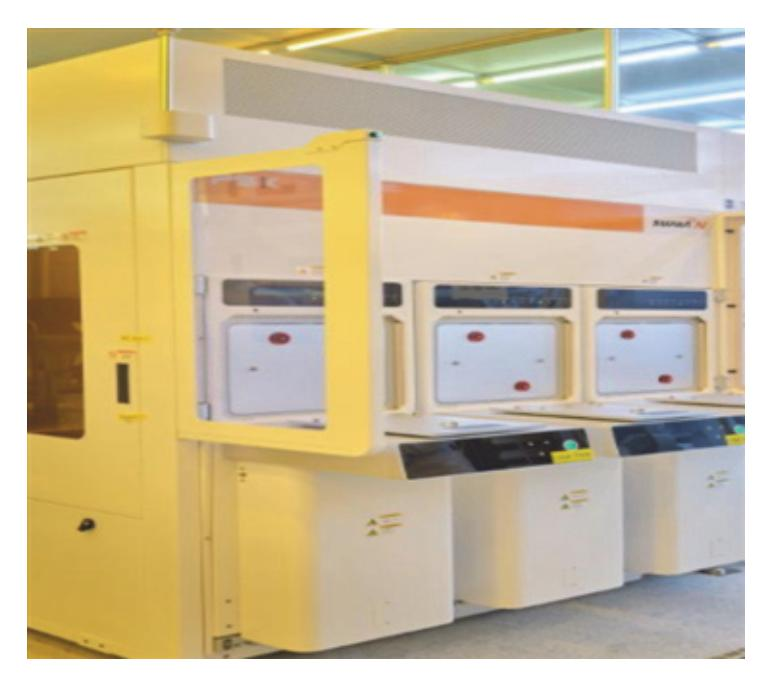

출처: 집필진 제작(2024) [그림 3-6] 아세톤 세정 장비

#### (3) PGMEA

PGMEA(Propylene Glycol MonoMethyl Ether Acetate)는 PR 제조, 유기 절연막 형 성 등을 위한 용매로 사용되며, 알코올계 용제에 비하여 휘발성이 매우 적으며, 인화점 도 높고 유리나 박막 재료에 손상을 주지 않기 때문에 LCD뿐만 아니라 유기 박막 트랜 지스터의 절연막에도 사용된다. 또한 프로필렌 글리콜 메틸 에테르아세테이트의 제조 (PMA)의 화학 중간체, 건조 공정 중에 고분자 융합을 촉진하기 위한 수성 페인트 및 잉 크용 유착제(Coalescing Agent), 페인트, 니스, 잉크, 스트리퍼, 세척제 및 탈지제에 대 한 용매, 자동차, 건축, 금속 마무리에 대한 코팅 등에 사용된다. PGMEA는 다른 용매 에 비해 독성이 낮으나 눈에 들어갈 경우 예방 차원에서 두 눈을 흐르는 물로 씻고 피 부와 접촉 시에는 비누와 물로 충분히 씻어내어야 한다.

#### 2. 감광제의 물리적 특성을 확인한다.

(1) 끓는점(Boilling Point)

끓는점은 액체 물질의 증기압이 외부 압력과 같아져 끓기 시작하는 온도를 말한다. '끓 는다.'라는 것은 물질의 운동 에너지가 상대적으로 큰 분자들이 외부 압력을 이기고 기 포로 성장할 수 있는 것으로, 액체 표면에서 분자가 액면을 이탈하는 증발과는 달리 지 속적인 에너지를 열로 전달받을 수 있는 곳이 통상 기포가 발생하는 곳이 된다. 통상 MSDS상에서 끓는점은 대기압(1기압)을 말하며, 압력이 고정되는 경우 끓는점은 그 물 질의 고유한 상수가 된다. 끓는점을 측정하는 방법에는 기체-액체 평형에 의한 끓는점 측정기(Ebulliometer)를 이용하는 방법, Siwoloboff법에 의한 기포 발생을 측정하는 방 법과 시차 열분석을 이용하는 방법이 있다. 이 중에서 끓는점 측정기를 사용하는 경우에 는 기체-액체 평형을 이용하기 때문에 끓는점에 대한 압력의 영향에 대하여 관측할 수 있으며, Siwoloboff법은 광전지 검출(Photocell detection)과 접목하여 대기압하에서 끓는점을 비교적 쉽게 측정할 수 있다. 시차 열분석을 이용하면 비교적 짧은 시간 내에 끓는점을 측정할 수 있으나, 끓는점이 불순물에 의한 영향을 받기 때문에 시료가 순수물 질이 아닌 경우에는 결과의 신뢰성 및 재현성이 다른 2가지 방법에 비하여 떨어질 수 있다.

(2) 비중(Specific Gravity)

일반적으로 비중은 시료의 밀도와 물의 밀도의 비로서 무차원량(Dimensionless)을 가지기 때문에 단위계가 달라도 같은 수치를 얻을 수 있는 이점이 있어 상대 밀도라고도 하며 많이 사용된다. 고체 및 액체 시료의 비중은 시료 및 물의 온도 조건을 나타내는 기호를 덧붙여 나타내는데, 비중(20/20℃)은 20℃의 액체 또는 고체 시료의 밀도와 20℃에서 물의 밀도의 비 또는 압력 조건을 생략한 경우에 20℃의 기체 시료의 밀도와 20℃ 건조 공기의 밀도의 비를 의미한다.

(3) 인화점(Flash Point)

인화점은 기체 또는 휘발성 액체에서 발생하는 증기가 공기와 섞여서 인화성(가연성) 또 는 폭발성 혼합기체를 형성하고, 여기에 불꽃을 가까이 댔을 때 순간적으로 섬광을 내면 서 연소하는, 즉 인화되는 최저의 온도를 말한다. 인화점을 넘어서 가열을 더 계속하면 불꽃을 가까이 댔을 때 계속해서 연소하는 온도에 이르는데, 이 온도를 연소점이라고 하 여 인화점과 구별한다. 인화점은 물질에 따라 특유한 값을 보이며, 주로 액체의 인화성 을 판단하는 수치로서 중요하며, 경우에 따라서는 일정한 끓는점이나 녹는점을 보이지 않는 시료의 종류를 조사하기 위해서 사용되기도 한다.

(4) 증기압(Vapor Pressure)

액체 내부의 분자들은 일정한 에너지를 가지고 운동하고 있으며, 분자 간에는 인력이 작 용하며, 일반적으로 액체 표면에 위치하는 분자들은 액체 내부에 있는 분자들에 비해서 분자 간 인력이 약하다. 따라서 일부 더 높은 에너지를 가지고 운동하는 분자들은 액체 로부터 떨어져 나와서 기체 상태가 되기도 하는데, 이러한 과정을 증발(Vaporization) 이라고 하며, 끓음(Boiling)과 구분하고 있다. 증기압은 액체 또는 고체에서 물질이 증발 하는 압력으로 열역학적으로 증기가 고체나 액체와 동적 평형 상태에 있을 때의 포화 증기압을 말한다. 다른 표현으로는 증발 속도와 응축 속도가 같아 동적 평형을 이루고 있을 때 외부의 증기가 지닌 압력을 증기압이라고 한다.

(가) 증기압과 액체의 증발속도

증기압은 어떠한 액체의 증발 속도와 관련이 있기 때문에, 실온 상태에서 증기압이 매우 높은 액체 상태의 물질은 휘발성인 물질이라고 표현되기도 한다. 예를 들면 액 체 표면에서는 끊임없이 기체가 증발하는데, 밀폐된 용기의 경우 어느 한도에 이르 면 증발이 일어나지 않고, 안에 있는 용액은 그 이상 줄어들지 않는데, 이는 같은 시 간 동안 증발하는 분자의 수와 응축되어 액체 속으로 들어오는 기체 분자의 수가 같 아지는 동적 평형 상태가 되기 때문이며, 이 상태에 있을 때 기체를 그 액체의 포화 증기, 그 압력을 증기압(포화 증기압)이라 한다. 개방된 용기 속에 있는 액체가 증발 을 계속하는 것은 액체와 접하는 물질이 포화 증기압에 이르지 못하기 때문이다.

(나) 증기압과 온도

증기압은 같은 물질이라도 온도가 높아짐에 따라 더욱 커진다. 증발과 증기 압력은 분자 간 인력과 온도라는 2가지 요인에 영향을 받는데, 분자 간의 인력이 강할수록 인력을 극복하기 어렵기 때문에 증발이 잘 일어나지 않지만, 온도가 높을수록 분자 들의 평균 운동 에너지가 커져서 더 쉽게 분자들 간의 인력을 극복할 수 있기 때문 에 증발이 잘 일어난다. 증기 압력은 용기의 크기나 모양에 무관하고, 액체와 기체가 공존하는 한 같은 온도에서는 같은 증기 압력을 나타낸다. 증기압은 화학 공학 및 석유 화학 공정에서 화학 물질 저장 탱크의 설계, Vent 시스템 설계와 증류와 같은 기체-액체 단위 조작 등과 관련하여 공학적으로 중요한 물리 화학적 특성 중의 하나 이다.

(5) 폭발 한계(Explosion Limit)

가연성 가스 또는 증기와 공기의 혼합물은 특정한 농도(조성) 이상에서만 착화하여 연소

가 일어난다. 이는 점화로 가연성 혼합물의 연소가 발생해도 발생된 열량이 점화원 주변 에 있는 미연소 혼합 기체를 발화 온도까지 가열시키지 못하면 연소가 지속되지 않기 때문이다. 이렇게 가연성 증기와 공기에 최소 점화 에너지 이상의 착화원이 인가되었을 때 화염이 전파될 수 있는 가연성 혼합물을 형성할 수 있는 가연물의 농도 범위를 연소 한계(Flammable Limit) 또는 폭발 한계(Explosion Limit)라고 한다. 이러한 연소 범위 중에서 화염 전파가 발생할 수 있는 혼합물을 형성하는 가연물의 가장 낮은 농도를 폭 발(연소) 하한계(LFL: Lower Flammable Limit)라고 하고 가장 높은 농도를 폭발(연소) 상한계(UFL: Upper Flammable Limit)라고 한다. 일반적으로 폭발 범위가 벗어나는 경우에는 최소 점화 에너지 이상의 착화원이 있어도 화염 전파가 일어나지 않는다.

(6) 열분석(DSC, TGA)

열분석이란 물질의 물리적 변수(Physical Parameter)를 온도의 함수로 나타내는 분석 방법이다. 즉 물질 온도를 일정하게 변화시킴에 따라 나타나는 열적 특성 변화를 분석하 는 것이다. 이때 어떤 물리적 변수의 변화를 볼 것인가에 따라 여러 가지 방법이 존재 한다.

(7) 시차 주사 열량계(DSC: Differential Scanning Calorimeter)

DSC는 시료와 불활성 기준 물질을 동일한 온도 프로그램에 따라 변화시키면서 온도와 시간의 함수로서 측정된 시료와 기준 물질의 열 유속 차이(Difference Inheat Flow)를 측정한다. 열 유속(Heat Flow)은 와트(Watt)나 밀리와트(mW) 단위로 전달되는 열에너 지를 말한다. 열 유속을 시간으로 미분하면 에너지양으로 환산되며 mW․s나 mJ로 나타 낸다. 열에너지는 시료의 엔탈피(Enthalpy) 변화에 상당하며 시료가 에너지를 흡수하면 엔탈피 변화는 흡열(Endothermic)이며 에너지를 방출하면 발열(Exothermic)이라 한다. DSC는 엔탈피 변화와 전이로 발생하는 열적 거동에 대한 다양한 정보를 제공하며 비 열, 열적 효과, 유리 전이(Glass Transition), 화학 반응, 녹는점 거동 등과 같은 물리 적 변화량을 구할 수 있다.

(8) 열중량 분석기(TGA: Thermo Gravimetric Analyzer)

열중량 분석기는 일정한 속도로 온도를 변화시켰을 때의 시료의 질량 변화를 시간이나 온도의 함수로써 측정한다. 시료의 질량 변화는 증발(Vaporization)이나 가스를 생성하 는 화학 반응(Chemical Reaction) 등으로 발생하게 되며, Microbalance로 연속적으 로 측정된다. TGA에 의한 질량-온도 곡선을 이용해 온도 변화에 따른 질소, 산소, 공기 등의 분위기하에서 분해 거동을 관찰할 수 있으며, 시료의 열 안정성 및 휘발성 물질이 나 첨가제들의 함량 및 조성 비율 등을 알 수 있다. 또한 Mass Spectrometer와 연결 되어 TGA에서 가스가 발생하면 MS로 주입되어 이온화된 후, Mass Spectrum을 통해 질량을 분석하여 발생된 가스를 정성 분석할 수 있다.

3. 감광제 제조 공정을 진행한다.

감광제는 제조 관련 공정은 PR의 원료인 고분자 수지(Resin)와 광 활성제(PAC)를 제조하 는 공정, 이러한 원료를 혼합하여 PR를 제조하는 공정 등으로 구분할 수 있다.

(1) 노블락 수지 제조

노블락 수지 제조 공정의 하나로서 제조 순서는 [그림 3-7]과 같다.

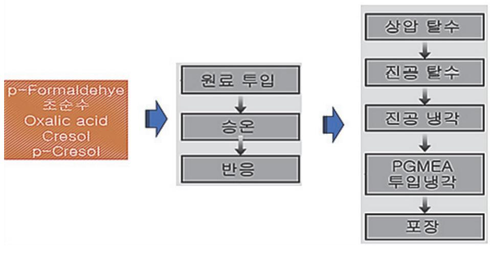

출처: 집필진 제작(2024) [그림 3-7] 노블락 수지 제조

#### (2) 광 활성제 제조

광 활성제(PAC) 제조 공정의 하나로서 제조 순서는 [그림 3-8]과 같다.

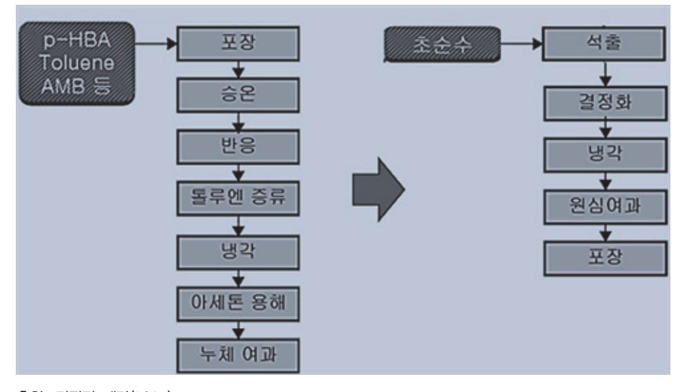

출처: 집필진 제작(2024)

[그림 3-8] 광 활성제(PAC) 제조 공정

(3) 감광제 제조

제조 순서는 혼합 탱크에 PGMEA와 노블락 수지를 투입하여 노블락 수지를 용해시키 고, PAC, 첨가제, 계면 활성제 등을 추가 투입하여 혼합 탱크에서 교반기를 이용하여 혼합시킨다.

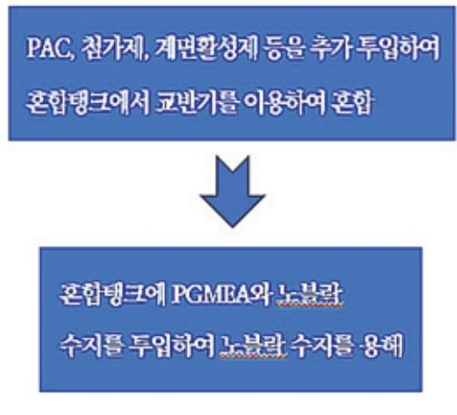

출처: 집필진 제작(2024) [그림 3-9] 감광제 제조 공정

## 학습 3 교수·학습 방법

#### 교수 방법

- 반도체 트랙 공정의 개요와 세부 내용을 부분별로 알기 쉽게 설명한다.
- 현장에서 표준화한 공정 매뉴얼과 관련 공정 재료에서 제공되는 자료 등의 내용을 프레젠테 이션 자료로 제시한 후에 설명한다.
- 가능한 한 사전에 제조 현장에서 사용하는 사례를 수집하여 자료를 준비하고 이해하기 쉬운 방법을 논의하는 방식의 문제 해결식 수업을 한다.
- 최근 반도체 산업 현황(시장 환경 및 기술 동향 등)에 대하여 충분히 인지하고, 학습자들이 쉽게 이해할 수 있는 방법을 모색하여 수업을 진행한다.
- 관련 시장의 환경 및 기술변화를 통합 검색 사이트나 한국반도체산업협회의 홈페이지 (www.ksia.or.kr) 등에서 찾아 활용할 수 있도록 지도한다.
- 반도체 트랙 공정 재료 요구 사항에 필요한 내용을 확인하고, 관련 자료를 학습자들에게 제 시한 후 파악 여부를 확인한다.

#### 학습 방법

- 반도체 산업 현황(시장 환경 및 기술 동향 등)과 관련 기관을 구체적으로 확인하도록 하고, 이 기관과 관련된 다양한 자료를 인터넷으로 검색하고 분류하여 문서로 정리한다.
- 반도체용 트랙 공정 재료 요구 사항 항목이 선정된 양식에 맞추어 특정 소자에 대한 요구 사항을 작성해 본 후, 여기에 첨부되는 자료의 종류와 기록 내용 전반을 숙지하고, 가능하다 면 소자별로 분류해 본다.
- 반도체용 트랙 공정 재료 요구 사항에 대한 시장 및 기술, 비용의 조사, 수집 및 분석을 통 해 생산에 필요한 목표를 설정하고 분류된 자료를 활용하여 생산 가능성을 예측해 본다.
- 반도체용 트랙 공정에서 예상되는 품질 관리 문제점을 파악하고 해결책을 수립하는 현장의 업무를 이해하고, 정해진 양식에 따라 보고서를 작성해 본다.

## 학습 3 평 가

#### 평가 준거

- 평가자는 학습자가 학습 목표를 성공적으로 달성하였는지를 평가해야 한다.
- 평가자는 다음 사항을 평가해야 한다.

|             | 학습 목표                                                 |  | 성취수준 |   |  |  |
|-------------|-------------------------------------------------------|--|------|---|--|--|
| 학습 내용       |                                                       |  | 중    | 하 |  |  |
| 트랙 공정 재료 제조 | - 생산 관련 부서로부터 입수한 생산 계획에 따라 장비 운용 계획을 수립할 수 있다.    |  |      |   |  |  |
|             | - 작업 지시서와 장비 운용 매뉴얼에 따라 트랙 공정 재 료를 제조할 수 있다.       |  |      |   |  |  |
|             | - 트랙 공정 재료 제조 단계에서 발생한 문제점을 파악하 고 해결 방안을 도출할 수 있다. |  |      |   |  |  |

#### 평가 방법

• 포트폴리오

|             | 평가 항목                                                             |  | 성취수준 |   |  |
|-------------|-------------------------------------------------------------------|--|------|---|--|
| 학습 내용       |                                                                   |  | 중    | 하 |  |
| 트랙 공정 재료 제조 | - 생산 관련 부서의 생산 계획을 파악하고 그에 따른 장비 운용 계획을 수립할 수 있는 능력            |  |      |   |  |
|             | - 작업 지시서와 장비 운용 매뉴얼의 이해와 트랙 공정 재 료를 제조할 때 사용하는 장비의 운영 지식 파악 여부 |  |      |   |  |
|             | - 트랙 공정 재료 제조 시 발생한 문제점을 파악할 수 있 는 능력과 해결 방안을 제시할 수 있는 능력      |  |      |   |  |

| 학습 내용       | 평가 항목                                                         |  | 성취수준 |   |  |
|-------------|---------------------------------------------------------------|--|------|---|--|
|             |                                                               |  | 중    | 하 |  |
| 트랙 공정 재료 제조 | - 생산 관련 부서로부터 입수한 생산 계획과 장비 운용 계획을 일관성 있게 연결하여 수립할 수 있는 능력 |  |      |   |  |
|             | - 작업 지시서와 장비 운용 매뉴얼에 대한 이해도를 포 함하여 트랙 공정 재료 제조 전반의 운영 능력   |  |      |   |  |
|             | - 트랙 공정 재료의 제조 시 문제점을 파악하는 능력과 해결 방안을 제시할 수 있는 능력          |  |      |   |  |

• 서술형 시험

|             | 평가 항목                                                             |  | 성취수준 |   |  |
|-------------|-------------------------------------------------------------------|--|------|---|--|
| 학습 내용       |                                                                   |  | 중    | 하 |  |
| 트랙 공정 재료 제조 | - 생산 관련 부서의 생산 계획을 파악하고 그에 따른 장비 운용 계획을 수립할 수 있는 능력            |  |      |   |  |
|             | - 작업 지시서와 장비 운용 매뉴얼의 이해와 트랙 공정 재 료를 제조할 때 사용하는 장비의 운영 지식 파악 여부 |  |      |   |  |
|             | - 트랙 공정 재료 제조 시 발생한 문제점을 파악할 수 있 는 능력과 해결 방안을 제시할 수 있는 능력      |  |      |   |  |

피드백

| 1. 포트폴리오                                               |
|--------------------------------------------------------|
| - 반도체 트랙 공정 재료 생산 계획과 설비 운영 능력을 평가하고 미비한 점이 발견되면 보완하도  |
| 록 주요 내용을 설명해 주며, 평가 결과가 우수하면 실제 샘플을 만드는 과정을 지도한다.      |
| - 작업 지시서와 장비 운용 매뉴얼을 이해하고 활용할 수 있는 능력에 대해 평가하고 부족한 부분  |
| 을 사례를 통해 설명해 준다.                                       |
| 2. 문제 해결 시나리오                                          |
| - 작업 지시서와 장비 운용 매뉴얼을 이해하고 활용할 수 있는 능력에 대해 평가하고 부족한 부분  |
| 을 사례를 통해 설명해 준다.                                       |
| - 반도체 트랙 공정 재료 생산 계획과 설비 운영 능력을 평가하고 미비한 점이 발견되면 보완하도  |
| 록 주요 내용을 설명하여 주며, 평가 결과가 우수하면 실제 샘플을 만드는 과정을 지도한다.     |
| 3. 서술형 시험                                              |
| - 작업 지시서와 장비 운용 매뉴얼을 이해하고 활용할 수 있는 능력에 대해 평가하고 평가 결과가  |
| 우수하면 해당 기술에 대해 심화 학습을 진행한다.                            |
| - 파악된 내용을 바탕으로 트랙 공정 재료 제조 시 발생할 수 있는 문제점의 대처 방안에 대한 지 |
| 식에 대해 평가하고 부족한 부분이 발견되면 미비한 부분을 추가로 재학습하도록 지도한다.       |

.

- 한국반도체산업협회(2006). 『반도체 재료 기술 로드맵 조사·연구 보고서』. 한국반도체산업협회.
- 화학정보센터(2011). 『2011 일본 화학산업 동향-반도체용 화합물 산업』. 한구화학연구원.
- 황호정(2003). 『반도체 공정 기술』. 생능출판사.

#### 용어 정리

- 6-시그마: 제품의 품질 관리를 위한 통계적 접근 방법으로서 품질 관리에 필요한 모든 요소 를 논리적으로 관리하고, 발생 가능한 오류를 최소화하기 위한 관리 기법이다.
- 표준 분석법: ASTM, JIS, ISO, SEMI, KS와 같은 상호 공인 또는 사내의 표준 분석법을 뜻 하며, 전처리, 용량, 분석기기, 분석 방법을 자세히 규정한 분석법을 말한다.
- ASTM(American Society for Testing and Materials, 미국재료시험협회): 미국의 재료 규격 및 재료 시험에 관한 기준을 정하는 기관으로 표준화와 연구 업무의 추진을 목적으로 한다.
- ISO(International Standardization Organization, 국제표준화기구)란 국제간에 이용되는 규격으로 각국의 공업 규격을 조정·통일하고, 물자와 서비스의 국제적 교류를 유도하며, 과 학적·지적·경제적 활동 분야의 협력을 증진하는 것을 목적으로 한다.
- JIS(Japanese Industrial Standards, 일본 공업 규격): 일본에서 사용되는 국가 기술 표준으로, 많은 분야의 공업제품에 관한 규격이 제정되었다. 국제규격으로 ISO, IEC와 제휴되어 있다.
- SEMI(Semiconductor Equipment and Material Institute): 반도체 제조 장비 재료 협회 로서 케미컬(C), 제조 장치(E), 재료(M), 그리고 패키징(G), 마이크로 패터닝(P) 및 안전성 부회에서 SEMI International Standards를 간행하고 있다.
- KS(Korean Industrial Standards, 한국 공업 규격): 공업 표준화를 위해 제정된 공업 규 격을 보급ㆍ활용하여 제품의 품질 개선과 생산 능률의 향상, 거래의 단순화와 공정화의 도모 및 소비자 보호를 위해 만들어진 제도를 말한다.
- RoHS(Restriction of the use of Hazardous Substances in EEE): 전기 ‧ 전자 제품에 납, 카드뮴, 수은, 크로뮴, 난연제(PBBs, PBDEs)와 같은 유해 물질 사용을 제한하는 유해 물질 사용 제한 지침을 말한다.
- WEEE(waste electrical and electronic equipment)란 폐가전 제품의 의무 재활용에 관 한 규제로서 폐전기 전자 제품의 재활용 비용을 생산자가 부담하는 제도를 말한다.
- MSDS(material safety data sheet): 화학 물질을 안전하게 사용하고 관리하기 위하여 필 요한 정보를 기재한 Sheet로서 제조자명, 제품명, 성분과 성질, 취급상의 주의, 적용 법규, 사고 시의 응급 처치 방법 등이 기입되어 있는 Data Sheet를 말한다.

| NCS학습모듈 개발이력 |                                      |     |                  |  |  |
|--------------|--------------------------------------|-----|------------------|--|--|
| 발행일          | 2024년 12월 31일                        |     |                  |  |  |
| 세분류명         | 반도체 재료(19030604)                     |     |                  |  |  |
| 개발기관         | 수원과학대학교 산학협력단(개발책임자: 김선희), 한국직업능력연구원 |     |                  |  |  |
|              | 최준혁(수원대학교)*                          |     | 김강복(삼성전자)        |  |  |
|              | 김대영(오산대학교)                           |     | 김한수(두원공대)        |  |  |
|              | 김영수(디이엔티)                            |     | 남승호(경기대학교)       |  |  |
|              | 김준성(오산대학교)                           |     | 손승대(제이에스이엔씨(주))  |  |  |
| 집필진          | 김현후(두원공대)                            | 검토진 | 이철오((주)한국전력안전공단) |  |  |
|              | 임희용(전 부천대학교)                         |     |                  |  |  |

\*표시는 대표집필자임 (참고) 검토진으로 참여한 집필진은 본인의 원고가 아닌 타인의 학습모듈을 검토함

| 반도체용 트랙 공정 재료 제조(LM1903060422_23v3)                                                                     |                   |
|---------------------------------------------------------------------------------------------------------|-------------------|
| 저작권자                                                                                                    | 교육부               |
| 연구기관                                                                                                    | 한국직업능력연구원         |
| 발행일                                                                                                     | 2024. 12. 31.     |
| ISBN                                                                                                    | 979-11-7175-776-3 |
| ※ 이 학습모듈은 자격기본법 시행령(제8조 국가직무능력표준의 활용)에 의거하여 개발하였으며, NCS통합포털사이트(http://www.ncs.go.kr)에서 다운로드할 수 있습니다. |                   |

