# NCS학습모듈 반도체용 SOD 공정 재료 제조

LM1903060423\_23v3


#### [NCS학습모듈 활용 시 유의 사항]

- 1. NCS학습모듈은 교육훈련기관에서 출처를 명시하고 교육적 목적으로 활용할 수 있습니다. 다 만, NCS학습모듈에는 국가(교육부)가 저작재산권 일체를 보유하지 않은 저작물(출처가 표기된 도표‧사진‧삽화‧도면 등)이 포함되어 있으므로, 이러한 저작물의 변형‧각색‧복제‧공연‧ 배포 및 공중 송신 등과 이러한 저작물을 활용한 2차적 저작물을 작성하려면 반드시 원작자 의 동의를 받아야 합니다.
- 2. NCS학습모듈은 개발 당시의 산업 및 교육 현장을 반영하여 집필하였으므로, 현재 적용되는 법령‧지침‧표준 및 교과 내용 등과 차이가 있을 수 있습니다. NCS학습모듈 활용 시 법령 ‧지침‧표준 및 교과 내용의 개정 사항과 통계의 최신성 등을 확인하시기를 바랍니다.
- 3. NCS학습모듈은 산업 현장에서 요구되는 능력을 교육훈련기관에서 학습할 수 있게 구성한 자 료입니다. 다만, NCS학습모듈 지면의 한계상 대표적 예시(예: 활용도 또는 범용성이 높은 제 품, 서비스) 중심으로 집필하였음을 이해하시기를 바랍니다.

## NCS학습모듈의 이해

※ 본 NCS학습모듈은 「NCS 국가직무능력표준」사이트(http://www.ncs.go.kr) 에서 확인 및 다운로드할 수 있습니다.

## Ⅰ NCS학습모듈이란?

- 국가직무능력표준(NCS: National Competency Standards)이란 산업현장에서 직무를 수행하기 위해 요구되는 지식·기술·소양 등의 내용을 국가가 산업부문별·수준별로 체계 화한 것으로 산업현장의 직무를 성공적으로 수행하기 위해 필요한 능력(지식, 기술, 태도) 을 국가적 차원에서 표준화한 것을 의미합니다.
- 국가직무능력표준(이하 NCS)이 현장의 '직무 요구서'라고 한다면, NCS학습모듈은 NCS
   의 능력단위를 교육훈련에서 학습할 수 있도록 구성한 '교수·학습 자료'입니다. NCS학습
   모듈은 구체적 직무를 학습할 수 있도록 이론 및 실습과 관련된 내용을 상세하게 제시하
   고 있습니다.


#### ○ NCS학습모듈은 다음과 같은 특징을 가지고 있습니다.

- 첫째, NCS학습모듈은 산업계에서 요구하는 직무능력을 교육훈련 현장에 활용할 수 있도 록 성취목표와 학습의 방향을 명확히 제시하는 가이드라인의 역할을 합니다.
- 둘째, NCS학습모듈은 특성화고, 마이스터고, 전문대학, 4년제 대학교의 교육기관 및 훈 련기관, 직장교육기관 등에서 표준교재로 활용할 수 있으며 교육과정 개편 시에도 유용하게 참고할 수 있습니다.


○ NCS와 NCS학습모듈 간의 연결 체계를 살펴보면 아래 그림과 같습니다.


O NCS학습모듈의 위치는 NCS 분류 체계에서 해당 학습모듈이 어디에 위치하는지를 한 눈에 볼 수 있도록 그림으로 제시한 것입니다.

| [NCS-학          | 습모듈   | 의 위치]    |          |  |
|-----------------|-------|----------|----------|--|
|                 |       |          |          |  |
| 대분류             | 문화·예술 | ··디자인·방송 |          |  |
| 중분류             | 문화콘텐츠 |          |          |  |
| 소분류 문화콘텐츠제작     |       |          |          |  |
|                 |       |          |          |  |
| 세분류             |       |          |          |  |
| 방송콘텐츠제작         |       | 능력단위     | 학습모듈명    |  |
| 영화콘텐츠제작         |       | 프로그램 기획  | 프로그램 기획  |  |
| 음악콘텐츠제작         |       | 아이템 선정   | 아이템 선정   |  |
| 광고콘텐츠제작         |       | 자료 조사    | 자료 조사    |  |
| 게임콘텐츠제작         |       | 프로그램 구성  | 프로그램 구성  |  |
| 애니메이션<br>콘텐츠제작  |       | 캐스팅      | 캐스팅      |  |
| 만화콘텐츠제작         |       | 제작계획     | 제작계획     |  |
| 캐릭터제작           |       | 방송 미술 준비 | 방송 미술 준비 |  |
| 스마트문화앱<br>콘텐츠제작 |       | 방송 리허설   | 방송 리허설   |  |
| 영사              |       | 야외촬영     | 야외촬영     |  |
|                 |       | 스튜디오 제작  | 스튜디오 제작  |  |
|                 |       |          |          |  |

학습모듈은

NCS 능력단위 1개당 1개의 학습모듈 개발 을 원칙으로 합니다. 그러나 필요에 따라 고용단위 및 교과단위를 고려하여 능력단위 몇 개를 묶어 1개 학습모듈로 개발할 수 있으며, NCS 능력단위 1개를 여러 개의 학습모듈로 나누어 개발할 수도 있습니다.

### 2. NCS학습모듈의 개요

#### ○ NCS학습모듈의 개요는 학습모듈이 포함하고 있는 내용을 개략적으로 설명한 것으로

| 학습모듈의 목표, 선수학습, 학습모듈의 내용 체계, 핵심 용어 로 구성되어 있습니다. |                                                                              |  |
|-------------------------------------------------|------------------------------------------------------------------------------|--|
| 학습모듈의 목표                                        | 해당 NCS 능력단위의 정의를 토대로 학습 목표를 작성한 것입니다.                                        |  |
| 선수학습                                            | 해당 학습모듈에 대한 효과적인 교수·학습을 위하여 사전에 이수해야 하는 학습모<br>듈, 학습 내용, 관련 교과목 등을 기술한 것입니다. |  |
| 학습모듈의<br>내용 체계                                  | 해당 NCS 능력단위요소가 학습모듈에서 구조화된 체계를 제시한 것입니다.                                     |  |
| 핵심 용어                                           | 해당 학습모듈의 학습 내용, 수행 내용, 설비·기자재 등 가운데 핵심적인 용어를 제<br>시한 것입니다.                   |  |

### 제작계획 학습모듈의 개요

#### 학습모듈의 목표

본격적인 촬영을 준비하는 단계로서, 촬영 대본을 획정하고 제작 스태프를 조직하며 촬영 장비와 촬영 소품을 준비할 수 있다.

#### 선수학습

제작 준비(LM0803020105\_13v1), 섭외 및 제작스태프 구성(LM0803020104\_13v1), 촬영 제작(LM0803020106\_13v1), 촬영 장비 준비(LM0803040204\_13v1.4), 미술 디자인 협의하기(LM0803040203\_13v1.4)

#### 학습모듈의 내용체계

| 하스                | 하스 내용                                              | NCS 능력단위 요소       |                |
|-------------------|----------------------------------------------------|-------------------|----------------|
| 학습                | 학습 내용                                              | 코드번호              | 요소 명칭          |
| 1. 촬영 대본<br>확정하기  | 1-1. 촬영 구성안 검<br>토와 수정                             | 0803020114_16/3.1 | 촬영 대본<br>확정하기  |
| 2. 제작 스태프<br>조직하기 | 2-1. 기술 스태프 조직<br>2-2. 미술 스태프 조직<br>2-3. 전문 스태프 조직 | 0803020114_16v3.2 | 제작 스태프<br>조직하기 |
| 3. 촬영 장비<br>계획하기  | 3-1. 촬영 장비 점검<br>과 준비                              | 0803020114_16/3.3 | 촬영 장비<br>계획하기  |
| 4. 촬영 소품<br>계획하기  | 4-1. 촬영 소품 목록<br>작성<br>4-2. 촬영 소품 제작<br>의뢰         | 0803020114_16\3.4 | 촬영 소품<br>계획하기  |

#### 핵심 용어

촬영 구성안, 제작 스태프, 촬영 장비, 촬영 소품

#### 학습모듈의 목표는

학습자가 해당 학습모듈을 통해 성취해야 할 목표를 제시한 것으로, 교수자는 학습자 가 학습모듈의 전체적인 내용흐름을 파악하 도록 지도할 수 있습니다.

**6** • •

61

#### 선수학습은

교수자 또는 학습자가 해당 학습모듈을 교 수·학습하기 이전에 이수해야 하는 교과목 또는 학습모듈(NCS 능력단위) 등을 표기한 것입니다. 따라서 교수자는 학습자가 개별 학습, 자기 주도 학습, 방과 후 활동 등 다 양한 방법을 통해 이수할 수 있도록 지도하 는 것을 권장합니다.

|            | 핵심 용어는              |
|------------|---------------------|
|            | 률을 대표하는 주요 용어입니     |
|            | · 해당 학습모듈을 통해 학습    |
|            | 게될 주요 내용을 알 수 있습    |
|            | 5 국가직무능력표준」 사이트     |
| (www.ncs.g | jo.kr)의 색인 (찾아보기) 중 |
| 하나로 이용할    | 할 수 있습니다            |

#### 3. NCS학습모듈의 내용 체계

○ NCS학습모듈의 내용은 크게 학습, 학습 내용, 교수·학습 방법, 평가 로 구성되어 있습니다.

| 학습       | 해당 NCS 능력단위요소 명칭을 사용하여 제시한 것입니다.<br>학습은 크게 학습 내용, 교수·학습 방법, 평가로 구성되며 해당 NCS 능력단위의<br>능력단위 요소별 지식, 기술, 태도 등을 토대로 내용을 제시한 것입니다.                                                    |
|----------|----------------------------------------------------------------------------------------------------------------------------------------------------------------------------------|
| 학습 내용    | 학습 내용은 학습 목표, 필요 지식, 수행 내용으로 구성되며, 수행 내용은 재료·자<br>료, 기기(장비·공구), 안전·유의 사항, 수행 순서, 수행 tip으로 구성한 것입니다.<br>학습모듈의 학습 내용은 실제 산업현장에서 이루어지는 업무활동을 표준화된 프로세<br>스에 기반하여 다양한 방식으로 반영한 것입니다. |
| 교수·학습 방법 | 학습 목표를 성취하기 위한 교수자와 학습자 간, 학습자와 학습자 간 상호 작용이<br>활발하게 일어날 수 있도록 교수자의 활동 및 교수 전략, 학습자의 활동을 제시한<br>것입니다.                                                                            |
| 평가       | 평가는 해당 학습모듈의 학습 정도를 확인할 수 있는 평가 준거 및 평가 방법, 평<br>가 결과의 피드백 방법을 제시한 것입니다.                                                                                                         |


## [NCS-학습모듈의 위치]

세분류

| 대분류 | 전기·전자 |        |  |
|-----|-------|--------|--|
| 중분류 |       | 전자기기개발 |  |
| 소분류 |       | 반도체재료  |  |

| 능력단위                 | 학습모듈명                |
|----------------------|----------------------|
| 반도체용 CMP슬러리 재료 제조    | 반도체용 CMP슬러리 재료 제조    |
| 반도체용 세정공정 재료 제조      | 반도체용 세정공정 재료 제조      |
| 반도체용 박막도금공정 재료<br>제조 | 반도체용 박막도금공정 재료<br>제조 |
| 반도체용 SOD공정 재료 제조     | 반도체용 SOD공정 재료 제조     |
| 반도체용 트랙공정 재료 제조      | 반도체용 트랙공정 재료 제조      |
| 반도체용 웨이퍼 재료 제조       | 반도체용 웨이퍼 재료 제조       |
| 반도체용 금속(Target)재료 제조 | 반도체용 금속(Target)재료 제조 |
| 반도체용 패키지 재료 제조       | 반도체용 패키지 재료 제조       |
| 반도체 재료 개발            | 반도체 재료 개발            |
| 반도체 재료 생산관리          | 반도체 재료 생산관리          |
| 반도체 재료 품질관리          | 반도체 재료 품질관리          |
| 반도체 재료 안전관리          | 반도체 재료 안전관리          |
| 반도체용 마스크 재료 제조       | 반도체용 마스크 재료 제조       |
|                      |                      |

| 반도체용 플립칩 재료 제조       | 반도체용 플립칩 재료 제조       |
|----------------------|----------------------|
| 반도체용 CMP 재료 제조       | 반도체용 CMP 재료 제조       |
| 반도체용 식각공정 가스 제조      | 반도체용 식각공정 가스 제조      |
| 반도체용 세정공정 가스 제조      | 반도체용 세정공정 가스 제조      |
| 반도체용 박막공정 가스 제조      | 반도체용 박막공정 가스 제조      |
| 반도체용 이온주입공정 가스<br>제조 | 반도체용 이온주입공정 가스<br>제조 |
| 반도체용 박막공정 전구체 제조     | 반도체용 박막공정 전구체 제조     |
| 반도체용 포토공정 재료 제조      | 반도체용 포토공정 재료 제조      |

| 학습모듈의 개요                      | 1   |
|-------------------------------|-----|
| 학습 1. SOD 공정 재료 제조 요구 사항 파악하기 |     |
| 1-1. SOD 공정 재료 제조 요구 사항 파악    | 3   |
| • 교수 ․ 학습 방법                  | 35  |
| • 평가                          | 36  |
| 학습 2. SOD 공정 재료 준비하기          |     |
| 2-1. SOD 공정 재료 준비             | 38  |
| • 교수 ․ 학습 방법                  | 63  |
| • 평가                          | 64  |
| 학습 3. SOD 공정 재료 제조하기          |     |
| 3-1. SOD 공정 재료 제조             | 66  |
| • 교수 ․ 학습 방법                  | 107 |
| • 평가                          | 108 |
|                               |     |

| 참고 자료 | 110 |  |  |
|-------|-----|--|--|
|-------|-----|--|--|

## 반도체용 SOD 공정 재료 제조 학습모듈의 개요

#### 학습모듈의 목표

반도체 제조에 필요한 성능과 품질을 만족하는 SOD(spin on dielectrics) 재료를 준비하고 제조할 수 있다.

#### 선수학습

반도체용 습식 화공 약품(LM1903060405\_14v1), 분석 화학, 반도체 공학, 화학 일반, 반도체 제조, 반도 체 장비

#### 학습모듈의 내용체계

| 학습                    | 학습 내용                         | NCS 능력단위 요소       |                            |
|-----------------------|-------------------------------|-------------------|----------------------------|
| 익답                    | 익답 내용                         | 코드번호              | 요소 명칭                      |
| 요구 사항 파악하기            | 1-1. SOD 공정 재료 제조 요구 사항<br>파악 | 1903060423_23v3.1 | SOD 공정 재료 제조<br>요구 사항 파악하기 |
| 2. SOD 공정 재료 준비<br>하기 | 2-1. SOD 공정 재료 준비             | 1903060423_23v3.2 | SOD 공정 재료<br>준비하기          |
| 3. SOD 공정 재료 제조<br>하기 | 3-1. SOD 공정 재료 제조             | 1903060423_23v3.3 | SOD 공정 재료<br>제조하기          |

#### 핵심 용어

분석 화학, SOD(spin on dielectrics) 공정, 유기 화학, 무기 화학, 불순물 관리, 정량 분석, 정성 분석, 반 응 공학

| 학습 1 | SOD 공정 재료 제조 요구 사항 파악하기 |
|------|-------------------------|
| 학습 2 | SOD 공정 재료 준비하기          |
| 학습 3 | SOD 공정 재료 제조하기          |

## 1-1. SOD 공정 재료 제조 요구 사항 파악

|       | • 최종 제품의 생산에 필요한 SOD 요구 사항을 파악할 수 있다. |
|-------|---------------------------------------|
| 학습 목표 | • 고객의 요구 사항에 의한 SOD 공정 재료를 파악할 수 있다.  |
|       | • 품질 관리를 위한 문제점을 파악할 수 있다.            |

## 필요 지식 /

숔 회학 물질 처리 규정

화학 물질 처리 규정은 화학 물질의 안전한 취급, 보관 및 폐기 방법을 규정하는 지침이다. 주 요 내용은 다음과 같다.

1. 취급

(1) 보호 장비 착용: 장갑, 고글, 마스크 등 개인 보호 장비를 착용한다.

(2) 환기: 작업 공간의 적절한 환기를 유지한다.

2. 보관

(1) 분리 보관: 호환되지 않는 화학 물질은 분리 보관한다.

(2) 라벨링: 모든 용기에 정확한 라벨을 부착한다.

3. 폐기

(1) 지침 준수: 현지 법규 및 지침에 따라 폐기한다.

(2) 분리 수거: 재활용 가능한 것과 아닌 것을 분리하여 폐기한다.

4. 응급 처치

노출 시 물로 충분히 세척하고, 필요시 의료 도움을 요청한다.

이 규정을 준수하여 화학 물질로 인한 위험을 최소화할 수 있다. 보다 더 자세한 정보는 관련 법규나 기관의 지침을 참고한다.

숕 REACH

REACH(registration, evaluation, authorization and restriction of chemicals)는 유럽연합 (EU)에서 화학 물질의 생산 및 사용에 대한 규제를 규정하는 법률이다. 주요 목적은 인간 건강과 환경 보호이다.

1. 주요 요소

- (1) 등록(registration): 모든 화학 물질은 유럽화학 물질청(ECHA)에 등록되어야 한다.
- (2) 평가(evaluation): 등록된 물질의 위험성 평가이다.
- (3) 허가(authorization): 고위험 물질의 사용 허가이다.
- (4) 제한(restriction): 특정 물질의 제조, 판매, 사용에 대한 제한이다.

2. 주요 의무

(1) 데이터 제출: 안전성을 입증할 수 있는 데이터를 제출한다.

(2) 안전 보고서: 화학 물질의 안전성 보고서를 작성한다.

REACH는 기업이 화학 물질의 안전성을 보장하도록 요구하며, 비 EU 국가도 EU 내에서 화학 물질을 판매하려면 REACH 규정을 준수해야 한다. 보다 더 자세한 정보는 ECHA 공식 웹사이 트를 참조한다.

숖 반도체용 SOD 공정 재료 제조 요구 사항

반도체용 SOD(spin-on dielectric) 공정 재료 제조 요구 사항에는 다음과 같은 내용이 포 함된다.

- 1. 재료 특성
  - (1) 유전 특성: 유전 상수, 손실 탄젠트
  - (2) 물리적 특성: 두께 균일성, 표면 거칠기

2. 화학적 순도

- (1) 불순물 함량: 금속, 유기 불순물 최소화
- (2) 용매 선택: 고순도 용매 사용

3. 제조 공정

- (1) 혼합 방법: 균일 혼합을 위한 교반기 사용
- (2) 탈기: 기포 제거

4. 공정 조건

(1) 스핀 코팅: 회전 속도와 시간 설정

- (2) 열처리: 건조 및 경화 온도와 시간
- 5. 품질 관리

(1) 순도 검사: ICP-MS, GC-MS, NMR, HPLC 등을 통한 분석

(2) 두께 측정: 엘립소미터 또는 AFM 사용

<표 1-1> SOD 공정 재료 제조 요구 사항 예

| 항목     | 내용                                                                              |
|--------|---------------------------------------------------------------------------------|
| 재료의 특성 | 유전 특성: 유전 상수 ≤ 2.5, 손실 탄젠트 < 0.005<br>물리적 특성: 두께 균일성 ±5%, 표면 거칠기 ≤ 1nm RMS      |
| 화학적 순도 | 불순물 함량: 금속 불순물 < 1ppm, 유기 불순물 < 0.1%<br>용매 선택: 초고순도 용매(예: HPLC 등급 에탄올)          |
| 제조 공정  | 혼합 방법: 자석 교반기 사용, 혼합 시간 30분 이상<br>탈기: 진공 탈기, 최소 10분                             |
| 공정 조건  | 스핀 코팅: 회전 속도 2,000~5,000rpm, 시간 30~60초<br>열처리: 건조 온도 100°C, 경화 온도 300°C, 시간 1시간 |
| 품질 관리  | 순도 검사: ICP-MS, GC-MS, NMR 사용<br>두께 측정: 엘립소미터 또는 AFM 사용, 두께 측정 정확도 ±2nm          |

이러한 요구 사항을 통해 고품질의 SOD 재료를 제조하여 반도체 소자의 성능과 신뢰성을 확보할 수 있다.

숗 SOD 재료 제조 품질 관리

제조된 반도체용 SOD(spin-on dielectric) 공정 재료의 품질 관리는 다음과 관리 항목과 품질 기준으로 가지고 한다.

- 1. 화학적 분석
  - (1) ICP-MS(유도 결합 플라즈마 질량 분석): 미량 금속 불순물 분석
    - (가) 사용 방법

ICP-MS(inductively coupled plasma mass spectrometry)는 미량 금속 및 기 타 원소 불순물을 분석하는 강력한 기술이다. 반도체용 SOD 공정 재료의 품질 관리를 위해 ICP-MS를 사용하는 방법은 다음과 같다.

- 1) 샘플 준비
  - 가) 용액화: 고체 샘플을 산 또는 기타 용매로 용해하여 분석 가능한 용액으로 변환 한다.

5

나) 희석: 필요한 경우 샘플을 희석하여 측정 범위 내 농도로 조정한다.

2) 장비 설정

가) 플라즈마 생성: 아르곤 가스를 사용하여 플라즈마를 생성한다.

나) 질량 분석기 조정: 원하는 원소의 질량 대 전하 비율(m/z)에 맞게 조정한다.

3) 분석 과정

가) 샘플 도입: 준비된 샘플을 플라즈마에 도입한다.

나) 이온화: 샘플 내 원소가 플라즈마에서 이온화한다.

다) 질량 분석: 이온화된 원소를 질량 분석기를 통해 검출 및 정량화한다.

4) 데이터 해석

가) 스펙트럼 분석: 검출된 스펙트럼을 분석하여 각 원소의 농도를 측정한다.

- 나) 불순물 평가: 측정된 불순물 농도가 허용 기준 내에 있는지 확인한다.
- 5) 품질 관리

가) 결과 비교: 표준 물질과 비교하여 결과의 정확성과 정밀성을 확인한다.

나) 보고서 작성: 분석 결과를 바탕으로 품질 관리 보고서를 작성한다.

ICP-MS는 높은 감도와 정확도로 미량 불순물을 검출할 수 있어 반도체 제조 공정에서 중요한 역할을 한다.

(나) 장비 구성 요소 및 주요 응용 분야

다음은 반도체용 SOD(spin-on dielectric) 공정 재료의 분석에 사용되는 유도 결합 플라즈마 질량 분석기(ICP-MS)의 사진이다. 이 장비는 미량 금속 및 기타 원소 불 순물을 정밀하게 분석하는 데 사용된다.

1) ICP-MS의 주요 구성 요소

- 가) 샘플 도입 시스템: 샘플을 플라즈마로 전달하는 역할을 한다.
- 나) 플라즈마 토치: 아르곤 가스를 사용하여 샘플을 이온화한다.
- 다) 인터페이스 영역: 이온화된 샘플을 질량 분석기로 전달한다.
- 라) 이온 광학: 이온을 집중시키고 분석기까지 이동시키는 장치이다.
- 마) 질량 분석기: 이온을 질량 대 전하 비율(m/z)에 따라 분리한다.
- 바) 검출기: 검출된 이온 신호를 분석하여 원소 농도를 측정한다.
- 2) 주요 응용 분야
  - 가) 환경 분석: 수질, 토양, 공기 중의 유해 물질을 분석한다.
  - 나) 의약품 분석: 원료 물질 및 제품의 금속 불순물을 분석한다.
  - 다) 반도체 산업: 고순도 재료의 품질을 관리한다.

4) 분석 수행 가) 샘플 주입: 샘플을 주입구에 주입하고, GC가 샘플을 컬럼을 통해 분리한다.

나) MS 설정: 이온화 방식, 질량 분석 범위, 검출기 설정 등을 구성한다.

가) GC 설정: 컬럼 온도 프로그램, 운반 가스 유속, 주입구 온도 등을 설정한다.

3) 기기 설정

다) 샘플 주입: 자동 주입기를 사용하거나 수동으로 주입구에 샘플을 주입한다.

나) 샘플 희석: 필요한 경우 적절한 농도로 희석한다.

가) 샘플 추출 및 정제: 샘플에서 분석 대상 물질을 추출하고 정제한다.

2) 샘플 준비

다) 컬럼 설치: 적절한 크로마토그래픽 컬럼을 선택하고 설치한다.

나) 시약 준비: 분석에 사용할 용매, 표준 물질, 샘플 등을 준비한다.

이션을 수행한다.

- 가) 기기 점검: GC-MS 시스템의 상태를 확인하고 필요한 경우 정비 및 캘리브레
- 1) 준비 작업

기체 크로마토그래피 질량 분석기(GC-MS) 사용 방법은 다음과 같다.

(가) 사용 방법

(2) GC-MS(기체 크로마토그래피 질량 분석): 유기 불순물을 분석한다.

출처: 집필진 제작(2024) [그림 1-1] ICP-MS 그림

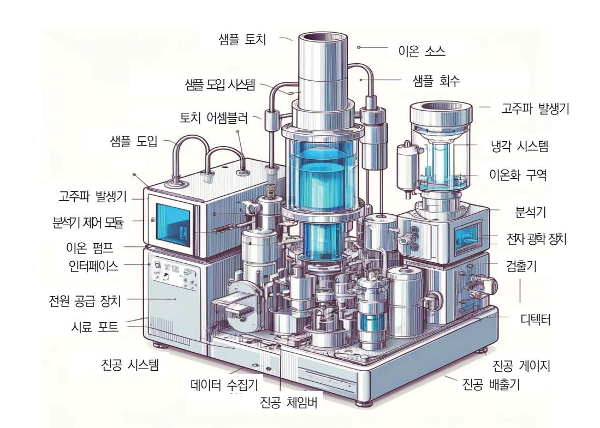

- 나) 크로마토그래피: 샘플이 컬럼을 통해 이동하면서 각 성분이 분리된다.
- 다) 질량 분석: 분리된 성분이 MS로 이동하여 이온화되고, 질량 대 전하 비율 (m/z)에 따라 분리되어 검출된다.
- 5) 데이터 해석
  - 가) 크로마토그램 확인: 크로마토그램을 분석하여 각 성분의 분리 상태를 확인한다.
  - 나) 스펙트럼 분석: MS 스펙트럼을 분석하여 각 성분의 질량 대 전하 비율을 확인 하고, 라이브러리와 비교하여 성분을 동정한다.
  - 다) 정량 분석: 표준 물질과 비교하여 각 성분의 농도를 계산한다.
- 6) 보고서 작성
  - 가) 결과 정리: 분석 결과를 정리하여 보고서를 작성한다.
  - 나) 결과 검토: 결과를 검토하고 필요시 재분석한다.
- 이 절차를 통해 GC-MS 시스템을 사용하여 다양한 샘플의 화학적 성분을 정확 히 분석할 수 있다.
- (나) 장비 구성 요소 및 주요 응용 분야

이 장비는 다양한 산업 분야에서 휘발성 유기 화합물(VOCs) 및 복잡한 혼합물 의 분석에 사용된다.

- 1) 주요 구성 요소
  - 가) 가스 크로마토그래프: 샘플을 휘발성 성분으로 분리한다.
  - 나) 주입구: 샘플을 시스템에 도입한다.
  - 다) 크로마토그래픽 컬럼: 분리된 성분을 컬럼을 통해 이동한다.
  - 라) 인터페이스: 크로마토그래피에서 분리된 성분을 질량 분석기로 전달한다.
  - 마) 질량 분석기: 성분을 질량 대 전하 비율(m/z)로 분리하고 분석한다.
  - 바) 검출기: 분석된 데이터를 수집하고 해석한다.
- 2) 사용 예시
  - 가) 환경 분석: 공기, 물, 토양 중의 유해 물질을 검출한다.
  - 나) 식품 분석: 식품 및 음료에서의 농약 잔류물, 첨가물을 분석한다.
  - 다) 의약품 분석: 약물의 불순물 및 활성 성분을 분석한다.
- GC-MS는 높은 민감도와 정확성으로 다양한 화합물을 분석할 수 있어, 여러 산업 분야에서 필수적인 도구로 사용된다.
- (3) HPLC(고성능 액체 크로마토그래피): 혼합물의 순도 및 조성을 분석한다.
  - (가) 사용 방법

HPLC(high-performance liquid chromatography)는 혼합물을 분리, 식별 및 정 량화하는 데 사용된다. 다음은 HPLC 시스템을 사용하는 방법에 대한 단계별 가이드 이다.

- 1) 준비 작업
  - 가) 장비 점검: HPLC 시스템의 상태를 확인하고 필요한 경우 정비 및 캘리브레이 션을 수행한다.
  - 나) 용매 준비: 고순도 용매를 준비하고 탈기하여 사용한다. 용매는 이동상으로 사 용된다.
  - 다) 컬럼 설치: 적절한 컬럼을 선택하고 HPLC 시스템에 설치한다. 일반적으로 C18, C8 등의 컬럼이 사용된다.
- 2) 샘플 준비
  - 가) 샘플 전처리: 샘플을 적절히 희석하거나 여과하여 준비한다.
  - 나) 주입구 준비: 주입구를 청소하고 준비된 샘플을 주입한다.
- 3) 기기 설정
  - 가) 이동상 유속 설정: 펌프를 사용하여 이동상의 유속을 설정한다. 일반적인 유속 은 1~2mL/min이다.
  - 나) 온도 설정: 컬럼 오븐의 온도를 설정하여 일정한 온도로 유지한다.
  - 다) 검출기 설정: UV/Vis, PDA 등의 검출기를 설정하고 파장을 선택한다.
- 4) 분석 수행
  - 가) 샘플 주입: 자동 샘플러 또는 수동 주입기를 사용하여 샘플을 주입한다.
  - 나) 분리 과정: 샘플이 컬럼을 통과하면서 성분들이 분리된다. 이동상과 고정상의 상호작용을 통해 각 성분이 분리된다.
  - 다) 검출 및 데이터 수집: 분리된 성분들이 검출기에 의해 검출되고 데이터 시스템 에 의해 분석된다.
- 5) 데이터 분석
  - 가) 크로마토그램 분석: 크로마토그램을 분석하여 각 성분의 피크를 식별하고, 유지 시간을 확인한다.
  - 나) 정량 분석: 표준 물질과 비교하여 각 성분의 농도를 계산한다.
- 6) 결과 보고
  - 가) 보고서 작성: 분석 결과를 정리하여 보고서를 작성한다.
  - 나) 결과 검토: 결과를 검토하고 필요시 재분석을 수행한다.
- (나) 장비 구성 요소 및 주요 응용 분야

고성능 액체 크로마토그래피(HPLC: high-performance liquid chromatography)는 혼합물을 분리, 식별 및 정량화하는 데 사용되는 강력한 분석 기술이다. HPLC는 다양한 산업 분야에서 광범위하게 사용된다.

- 1) HPLC 시스템의 주요 구성 요소
  - 가) 용매 저장소(solvent reservoir): 이동상(용매)을 저장하고 시스템에 공급한다.

- 나) 펌프(pump): 용매를 고압으로 컬럼을 통해 밀어내는 역할을 한다.
- 다) 주입기(injector): 분석할 샘플을 이동상에 주입한다.
- 라) 컬럼(column): 고정상이 채워져 있어 샘플 성분을 분리하는 곳이다.
- 마) 검출기(detector): 분리된 성분을 검출하고 신호를 생성한다.
- 바) 데이터 시스템(data system): 검출기로부터 신호를 수집, 해석하고 결과를 저 장한다.
- 2) HPLC의 작동 원리
  - 가) 주입: 샘플이 주입기를 통해 시스템에 도입된다.
  - 나) 분리: 샘플이 이동상을 따라 컬럼을 통과하면서 성분들이 고정상과 상호 작용하 여 분리된다.
  - 다) 검출: 분리된 성분들이 검출기에 도달하여 검출된다.
  - 라) 데이터 분석: 검출기로부터 얻은 신호를 데이터 시스템이 분석하여 각 성분의 양과 특성을 확인한다.
- 3) HPLC의 응용 분야
  - 가) 의약품 분석: 약물의 순도 및 함량을 분석한다.
  - 나) 식품 분석: 식품 내 첨가물, 잔류 농약 등을 분석한다.
  - 다) 환경 분석: 물, 토양, 공기 중의 오염 물질을 분석한다.
  - 라) 생명 과학 연구: 단백질, 핵산 등의 생체 분자를 분석한다.
- HPLC는 높은 분리 능력과 정밀성을 제공하여 다양한 분석 요구를 충족시킬 수 있 다.

#### 2. 물리적 특성 측정

- (1) 엘립소미터: 박막 두께 및 굴절률을 측정한다.
- (2) AFM(원자힘 현미경): 표면 거칠기 및 균일성을 평가한다.
- (3) FTIR(푸리에 변환 적외선 분광법): 박막의 화학적 결합 상태를 분석한다.
- 3. 전기적 특성 평가
  - (1) 유전 상수 및 손실 탄젠트(tangent): 재료의 전기적 절연 특성을 측정한다.
  - (2) C-V(정전 용량-전압) 측정: 박막의 전기적 특성을 평가한다.
- 4. 공정 관리
  - (1) 스핀 코팅 공정 조건 최적화: 회전 속도, 시간, 용액 점도 등을 최적화한다.
  - (2) 열처리 조건 설정: 건조 및 경화 온도와 시간을 제어한다.
- 5. 데이터 해석 및 품질 기준
  - (1) 분석 데이터 해석: 결과 데이터의 정확한 해석을 통한 품질 관리를 한다.

(2) 품질 기준 설정: 제조된 SOD 재료가 요구되는 사양을 충족하는지 확인한다. 이러한 지식을 바탕으로 SOD 재료의 품질을 철저하게 관리하여 반도체 소자의 성능과 신뢰성 을 높일 수 있다.

## 수행 내용 / SOD 공정 재료 제조 요구 사항 파악하기

#### 재료·자료

- SOD 재료 관련 자료(화학적 특성, 물리적 특성, 안전 데이터 시트 등)
- 제조 공정 메뉴얼
- 스핀 코팅 매개 변수
- 분석 및 검사 자료
- 반도체 제조 공정 기술 자료
- 재료 사양서
- 품질 관리 자료
- 규제 및 표준(국제 및 국가 규제, 산업 표준 등)

#### 기기(장비 ・ 공구)

- 화학적 분석 장비(ICP-MS, GC-MS, HLPC 등)
- 물리적 특성 측정 장비(엘립소미터, AFM, FTIR 등)
- 전기적 특성 평가 장비(LCR 미터, C-V 분석기 등)
- 스핀 코터, 오븐, 교반기
- 고순도 필터, 탈기 장치, 클린 룸 장비
- 안전 장비(장갑 고글, 실험복, 환기 시스템, 화학 물질 보관함 등)

#### 안전 ・ 유의 사항

- 개인 보호 장비(PPE)를 착용 착용한다(장갑, 고글, 실험복 등).
- 물질 안전 데이터 시트(MSDS)를 확인한다,
- 사고 시 대처에 필요한 응급 샤워기 및 눈 세척기 설치 및 작동여부를 확인한다.
- 작업 공간 및 장비의 청결 상태를 유지한다.
- 정확한 계량 및 혼합에 유의한다.
- 재료의 품질 유지를 위한 온도 및 습도 유지를 한다.
- 클린 룸 환경 관리를 통해 오염을 최소화한다.
- 제 규정을 준수해서 폐기물 처리 및 관리한다.

#### 수행 순서

숔 반도체용 SOD 공정 재료 제조 과정의 주요 단계를 파악한다.

반도체용 SOD(spin-on dielectric) 공정 재료를 제조하기 위해서는 고도의 정밀성과 품질 관 리가 요구된다. 다음은 SOD 공정 재료 제조 과정의 주요 단계를 설명한다. 이 과정은 원재료 선정부터 최종 제품의 품질 관리까지 포함한다.

- 1. 요구 사항을 분석한다.
  - (1) 재료 특성
    - (가) 유전체 특성: 유전 상수, 손실 탄젠트 등 유전체 특성을 만족해야 한다.
    - (나) 순도: 고순도(≥ 99.999%)를 가져야 하며, 불순물 함량이 최소화되어야 한다.
    - (다) 점도: 스핀 코팅 공정에 적합한 점도를 가져야 한다.
- 2. 원재료를 준비한다.
  - (1) 주요 원재료
    - (가) 폴리실세스퀴옥산(PSQ: poly-silsesquioxane): 대표적인 SOD 재료
      - 1) 제조사: Dow Corning, Gelest Inc
      - 2) 순도: ≥ 99.999%
    - (나) 용매: 아이소프로판올(isopropanol), 에탄올(ethanol)
      - 1) 제조사: Sigma-Aldrich, Fisher Scientific
      - 2) 순도: ≥ 99.9%
  - (2) 원재료 공급
    - (가) 공급사 선정: 신뢰할 수 있는 공급사로부터 고순도 원재료를 확보한다.

(나) 입고 검사: 원재료의 순도와 불순물 함량을 철저히 검사한다.

- 3. 제조 공정을 설계한다.
  - (1) 혼합 공정
    - (가) 혼합 비율: PSQ와 용매의 최적 혼합 비율을 설정한다.
    - (나) 혼합 조건: 혼합 온도, 시간, 교반 속도 등을 설정한다.

예: PSQ 30%, 아이소프로판올 70%

- (2) 반응 공정
  - (가) 반응기 설정: 적절한 반응기(예: 유리 반응기, 스테인리스 반응기)를 선택한다.
  - (나) 반응 조건: 온도, 압력, 반응 시간을 설정한다.
    - 1) 온도: 60°C
    - 2) 압력: 1atm
    - 3) 반응 시간: 2시간
- (3) 정제 및 여과
  - (가) 정제: 반응 후 생성된 혼합물을 정제하여 불순물을 제거한다.
  - (나) 증류: 용매를 증류하여 제거한다.
  - (다) 여과: 미세 여과지를 사용하여 불순물을 제거한다.
- 4. 품질을 관리한다.

반도체용 SOD(silicon-on-dielectric) 공정 재료의 제조 및 품질 관리는 매우 중요한 과정 이다. 이 과정은 반도체 소자의 성능과 신뢰성을 크게 좌우하므로 엄격한 품질 관리가 필요 하다. 다음은 SOD 공정 재료의 제조와 관련된 주요 품질 관리 요소이다.

- (1) 원료의 순도 관리
  - (가) 원료 선택: SOD 공정에 사용되는 실리콘 및 기타 재료의 순도가 매우 중요하다. 고순도 실리콘은 불순물이 적어야 하며, 이는 반도체 소자의 성능에 직접적인 영향을 끼친다.
  - (나) 불순물 분석: 화학적 분석 기술(예: ICP-MS)을 사용하여 원료의 불순물 수준을 측정하 고 관리한다.
- (2) 제조 공정 관리
  - (가) 공정 매개 변수: 공정 중 온도, 압력, 기체 흐름 등 중요한 매개 변수들을 엄격히 제어 한다. 이는 제품의 일관성과 품질을 보장하는 데 필수적이다.
  - (나) 프로세스 모니터링: 실시간 공정 모니터링 시스템을 사용하여 제조 과정에서 발생할 수 있는 이상 상황을 감지하고 대응한다.
- (3) 제품 검사

- (가) 물리적 검사: 두께, 평탄도, 표면 거칠기 등의 물리적 특성을 검사하여 규격에 맞는지 확 인한다.
- (나) 전기적 특성 검사: SOD 재료의 전기적 특성을 측정하여 요구되는 전기적 성능을 충족 하는지 평가한다.
- (다) 결함 검사: 광학 현미경, AFM(원자력 현미경) 등을 사용하여 표면 결함 및 내부 결함을 확인한다.
- (4) 환경 관리
  - (가) 청정실 관리: 반도체 제조에는 청정실 환경이 필수적이다. 입자 및 유기 오염 물질의 수 준을 엄격히 관리한다.
  - (나) 환경 조건 제어: 온도와 습도를 일정하게 유지하여 환경 변화가 제품에 미치는 영향을 최소화한다.
- (5) 데이터 분석 및 피드백
  - (가) 데이터 수집: 제조 과정에서 수집된 데이터를 분석하여 품질 이슈를 조기에 감지한다.

(나) 피드백 시스템: 데이터 분석 결과를 바탕으로 공정 개선을 위한 피드백을 제공한다.

이러한 품질 관리 절차는 SOD 공정 재료의 일관성과 신뢰성을 유지하는 데 중요한 역할을 한다. 이를 통해 반도체 소자의 성능을 최적화하고 생산 효율성을 향상시킬 수 있다.

#### 5. 안전 및 환경을 관리한다.

반도체용 SOD(silicon-on-dielectric) 공정 재료 제조에서 안전 및 환경 관리는 매우 중요 한 요소이다. 반도체 제조 과정에는 유해 화학 물질과 고온, 고압 등의 위험 요소가 포함되 어 있기 때문에 엄격한 관리가 필요하다. 다음은 SOD 공정 재료 제조에서 고려해야 할 주 요 안전 및 환경 관리 요소이다.

- (1) 안전 관리
  - (가) 화학 물질 취급
    - 1) MSDS 관리: 모든 사용 화학 물질에 대한 물질 안전 데이터 시트(MSDS: material safety data sheets)를 보유하고, 이를 작업자들에게 교육한다.
    - 2) 화학 물질 저장: 화학 물질은 적절한 용기에 보관하고, 누출 방지 시설과 환기 시스 템을 갖추어야 한다.
    - 3) 보호 장비: 작업자들이 화학 물질을 취급할 때 적절한 개인 보호 장비(PPE)를 착용 하도록 한다. 이는 보호 장갑, 방호복, 고글 등을 포함한다.
  - (나) 작업 환경
    - 1) 안전 지침 준수: 모든 작업자가 제조 공정과 관련된 안전 지침을 숙지하고 준수하도 록 한다.
    - 2) 비상 대응 계획: 화재, 누출 등 비상 상황에 대비한 대응 계획을 마련하고, 정기적

(라) 환경 모니터링 1) 환경 영향 평가: 공정의 환경적 영향을 주기적으로 평가하고, 이를 바탕으로 개선

2) 정기 검사 및 보고: 환경 관련 규정 준수 여부를 정기적으로 검사하고, 관련 기관에

(가) 안전 및 환경 교육: 모든 직원이 안전 및 환경 보호의 중요성을 인식하고 관련 규정을

(나) 문화 조성: 안전하고 환경 친화적인 작업 문화를 조성하여, 모든 직원이 책임감을 가지고

이러한 안전 및 환경 관리 방침을 통해 SOD 공정 재료 제조 과정에서 발생할 수 있는

(나) 라벨 부착: 제품 용기에 제조 일자, 유효 기간, 배치 번호 등을 라벨에 명시한다.

- 2) 재생 에너지 사용: 가능한 경우 재생 가능 에너지를 활용하여 에너지 소비와 탄소 배출을 줄인다.
- (다) 에너지 관리 1) 에너지 효율성: 공정에서 사용하는 에너지를 최소화하기 위해 효율적인 장비와 기술
- 여 방류한다.

을 채택한다.

방안을 마련한다.

준수할 수 있도록 교육을 실시한다.

위험 요소를 최소화하고, 환경에 미치는 영향을 줄일 수 있다.

(가) 밀폐 포장: 제품을 밀폐된 용기에 포장하여 오염을 방지한다.

행동할 수 있도록 한다.

보고한다.

(3) 교육 및 인식 제고

6. 포장 및 저장한다.

(1) 포장

- 대기 오염을 최소화한다. 2) 수질 오염 방지: 폐수 처리 시설을 통해 오염된 물을 정화하고, 환경 규제를 준수하
- 1) 배기 가스 처리: 제조 공정에서 발생하는 유해 가스는 정화 장치를 통해 처리하여
- (나) 오염 물질 관리
- 처리해야 한다. 유해 물질은 환경에 유출되지 않도록 주의해야 한다. 2) 재활용: 가능한 한 재활용 가능한 물질을 분리하고, 재활용 시스템을 통해 처리한다.
- (가) 폐기물 관리 1) 화학 폐기물 처리: 공정에서 발생하는 화학 폐기물은 적절하게 분류하고, 안전하게
- (2) 환경 관리

으로 모의 훈련을 실시한다. 3) 시설 안전 검사: 정기적으로 장비와 시설의 안전성을 점검하여 사고를 예방한다.

15

(2) 저장

(가) 저장 조건: 상온에서 건조하고 밀폐된 상태로 저장한다.

(나) 보관 장소: 직사광선을 피하고 통풍이 잘되는 장소에 보관한다.

- 7. 납기를 관리한다.
  - (1) 생산 일정 관리
    - (가) 생산 일정: 생산 일정을 체계적으로 관리하여 납기를 준수한다.
    - (나) 재고 관리: 주요 원재료와 최종 제품의 안전 재고를 확보하여 공급 지연 시에도 생산 차 질을 최소화한다.
  - (2) 공급망 관리
    - (가) 다수 공급처 확보: 주요 원재료의 다수 공급처를 확보하여 공급 리스크를 최소화한다.
    - (나) 비상 계획: 원재료 공급 지연 등 비상 상황에 대비한 대체 공급 계획을 마련한다.

SOD 공정 재료의 제조에는 고순도 원재료의 선택과 철저한 품질 관리, 안전 및 환경 관리가 필수적이다. 각 단계에서의 요구 사항을 철저히 준수함으로써 고품질의 SOD 재료를 안정적으 로 생산할 수 있다. 이를 통해 반도체 제조 공정의 성능과 효율을 극대화할 수 있다.

- 숕 SOD 공정 재료 제조에 필요한 요구 사항을 파악한다.
  - 반도체 SOD(spin-on dielectric) 공정은 웨이퍼 표면에 유전체 층을 형성하기 위해 사용되는 중요한 공정이다. SOD 공정에서 사용하는 재료는 높은 순도와 균일성을 요구하며, 이러한 재 료를 제조하기 위해서는 특정 요구 사항을 충족해야 한다. 아래는 SOD 공정 재료 제조에 필 요한 요구 사항을 상세히 설명한 내용이다.
  - 1. 재료 특성 요구 사항을 파악한다. SOD(silicon-on-dielectric) 공정 재료는 반도체 소자 제조에서 중요한 역할을 한다. 이러

한 재료는 고유의 특성과 품질이 요구되며, 다음과 같은 주요 특성 요구 사항이 있다.

- (1) 고순도
  - (가) 순도: SOD 공정에 사용되는 실리콘 및 기타 재료는 매우 높은 순도를 가져야 한다. 불순물의 농도가 낮을수록 전기적 특성에 미치는 영향이 줄어들어 소자의 성능이 향상된다.
  - (나) 불순물 관리: 특정 불순물의 함량이 엄격하게 제한되며, ppm(parts per million) 또는 ppb(parts per billion) 수준으로 관리된다.
- (2) 두께 균일성
  - (가) 균일한 두께: SOD 재료의 두께는 웨이퍼 전체에 걸쳐 매우 균일해야 한다. 두께의 불균 일성은 소자의 전기적 특성에 영향을 미칠 수 있으며, 제조 공정의 안정성을 저하시킬

수 있다.

- (나) 두께 제어: 공정 제어를 통해 두께를 정밀하게 조절하며, 공정 중 두께 변화를 최소화한 다.
- (3) 열적 안정성
  - (가) 열적 특성: 재료는 고온에서도 안정된 특성을 유지해야 한다. SOD 공정 중에는 높은 온 도가 적용되므로, 재료의 열적 팽창 계수(CTE)와 열적 전도율이 중요하다.
  - (나) 내열성: 고온에서의 물리적, 화학적 변화가 적어야 한다.
- (4) 전기적 특성
  - (가) 절연 특성: SOD 공정 재료는 고도의 절연 특성을 가져야 한다. 이로 인해 소자 간의 간섭을 줄이고 누설 전류를 최소화할 수 있다.
  - (나) 유전 상수: 낮은 유전 상수를 가지는 재료가 유리하며, 이는 고주파 성능에 영향을 끼친 다.
- (5) 기계적 특성
  - (가) 기계적 강도: 재료는 공정 중 발생할 수 있는 기계적 스트레스에 견딜 수 있어야 한다. 균열이나 결함이 발생하지 않아야 하며, 웨이퍼의 취급 과정에서 파손을 방지할 수 있어 야 한다.
  - (나) 표면 평탄도: 표면이 평탄하고 매끄러워야 하며, 이는 후속 공정에서의 포토리소그래피와 에칭 공정의 정확도에 영향을 미친다.
- (6) 화학적 안정성
  - (가) 화학적 내구성: SOD 공정 중 사용되는 화학 물질에 대한 내성이 필요하다. 이는 재료의 부식이나 손상을 방지하는 데 중요하다.
  - (나) 오염 방지: 재료 표면에 오염물이 흡착되지 않도록 해야 한다. 표면 오염은 소자 특성에 부정적인 영향을 끼칠 수 있다.
- (7) 공정 호환성
  - (가) 공정 호환성: SOD 재료는 다른 공정 재료와의 화학적, 물리적 호환성이 있어야 하며, 기존 공정에서 문제없이 사용될 수 있어야 한다.
  - (나) 접착성: 재료 간의 접착 강도가 높아야 하며, 이는 층간 박리 등의 문제를 방지하는 데 중요하다.

이러한 특성 요구 사항을 충족시키기 위해, SOD 공정 재료는 엄격한 품질 관리와 테스트 를 통해 선정되고 사용된다. 이로써 반도체 소자의 성능과 신뢰성을 보장할 수 있다.

2. 제조 공정 요구 사항을 파악한다.

SOD(silicon-on-dielectric) 공정 재료의 제조는 고품질 반도체 소자를 생산하기 위해

17

여러 엄격한 제조 공정 요구 사항을 만족해야 한다. 이러한 요구 사항은 제품의 일관 성과 신뢰성을 보장하며, 최종 제품의 성능에 직접적인 영향을 미친다. 다음은 SOD 공 정 재료 제조에 필요한 주요 공정 요구 사항이다.

- (1) 고순도 재료 사용
  - (가) 고순도 실리콘: SOD 재료는 고순도의 실리콘이 필요하다. 불순물의 농도는 최대한 낮춰 야 하며, ppm(parts per million) 또는 ppb(parts per billion) 수준으로 관리한다.
  - (나) 불순물 분석 및 관리: ICP-MS(inductively coupled plasma mass spectrometry)와 같은 고감도 분석 기법을 사용하여 재료의 불순물 수준을 철저히 모니터링하고 관리한 다.
- (2) 정밀한 두께 제어
  - (가) 두께 균일성: 웨이퍼 전체에 걸쳐 SOD 층의 두께가 균일해야 하며, 이는 공정 제어를 통해 달성된다.
  - (나) 두께 측정 및 모니터링: 정밀한 두께 측정 장비를 사용하여 두께 변화를 실시간으로 모 니터링한다.
- (3) 고온 공정 관리
  - (가) 고온 공정: SOD 공정에는 고온의 열처리 공정이 포함될 수 있으며, 이 과정에서 재료의 열적 안정성을 유지해야 한다.
  - (나) 온도 제어 및 균일성: 공정 중 온도는 엄격히 제어되어야 하며, 웨이퍼 전체에 걸쳐 온 도 균일성을 유지해야 한다.
- (4) 화학적 처리 공정
  - (가) 세정 및 에칭: 재료 표면의 오염물 제거와 원하는 형상을 얻기 위한 화학적 세정 및 에 칭 공정이 필요하다. 이 과정에서 사용하는 화학 물질의 농도와 처리 시간은 정확하게 제어되어야 한다.
  - (나) 표면 처리: 공정 중 표면 거칠기와 오염을 최소화하기 위해 특수한 표면 처리 공정을 적 용한다.
- (5) 공정 환경 관리
  - (가) 청정실 환경: 미세한 입자와 오염 물질을 최소화하기 위해 청정실 환경에서 공정을 수행 한다. 청정도는 클래스 1 또는 클래스 10 수준을 유지해야 한다.
  - (나) 습도 및 온도 제어: 습도와 온도를 일정하게 유지하여 공정 변수를 안정화한다.
- (6) 정밀 패터닝 기술
  - (가) 포토리소그래피: 높은 해상도의 포토리소그래피 기술을 사용하여 미세 패턴을 형성한다. 이는 소자 특성에 직접적인 영향을 끼친다.

- (나) 마스크 정렬: 마스크와 웨이퍼의 정확한 정렬이 필요하며, 이를 위한 고정밀 정렬 시스템 이 필요하다.
- (7) 자동화 및 공정 제어
  - (가) 자동화 시스템: 공정의 일관성을 유지하기 위해 자동화된 장비와 시스템을 사용한다. 이 는 생산성 향상과 불량률 감소에 기여한다.
  - (나) 실시간 공정 모니터링: 공정 중 발생할 수 있는 변수를 실시간으로 모니터링하고, 이상이 감지되면 즉시 조치할 수 있는 시스템을 갖추고 있어야 한다.
- (8) 폐기물 처리 및 환경 보호
  - (가) 화학 폐기물 관리: 사용된 화학 물질과 폐기물은 적절하게 처리하여 환경 오염을 방지해 야 한다.
  - (나) 환경친화적인 공정: 가능한 환경친화적인 공정을 선택하여 지속 가능성을 고려한다.

이러한 제조 공정 요구 사항을 준수하는 것은 SOD 재료의 높은 품질을 보장하고, 최 종 반도체 소자의 성능을 최적화하는 데 필수적이다.

3. 품질 관리 요구 사항을 파악한다.

SOD(silicon-on-dielectric) 공정 재료의 제조에서 품질 관리는 제품의 일관성, 신뢰성, 그 리고 성능을 보장하는 데 매우 중요하다. 다음은 SOD 공정 재료 제조에 필요한 주요 품질 관리 요구 사항이다.

- (1) 원료 검사 및 인증
  - (가) 원료 순도: SOD 재료에 사용되는 실리콘과 기타 화학 물질의 순도는 매우 중요하다. 원 료의 순도는 정기적으로 검사되며, 일정 수준 이상의 순도를 유지해야 한다.
  - (나) 인증 및 추적: 모든 원료는 인증된 공급 업체로부터 공급받아야 하며, 원료의 출처와 제 조 배치(batch)를 추적할 수 있어야 한다.
- (2) 제조 공정 모니터링
  - (가) 공정 변수 제어: 공정 중 온도, 압력, 화학 물질 농도 등의 변수는 엄격히 제어되고 모 니터링된다. 이러한 변수의 작은 변화도 최종 제품의 품질에 영향을 끼칠 수 있다.
  - (나) 공정 장비 점검: 정기적으로 제조 장비를 점검하고 보정(calibration)하여 공정의 정확성 과 안정성을 유지한다.
- (3) 물리적 및 화학적 특성 검사
  - (가) 두께 및 균일성: SOD 층의 두께는 제조 공정에서 매우 중요한 요소이다. 이를 위해 비 파괴 검사(NDT) 기법을 사용하여 두께의 균일성을 확인한다.
  - (나) 표면 특성: 표면 거칠기, 평탄도, 및 결함 여부를 검사하여 규격에 맞는지 확인한다.
  - (다) 화학적 조성 분석: XRF(x-ray fluorescence) 또는 ICP-MS를 사용하여 재료의 화학적

19

조성을 분석하고, 불순물 수준을 검사한다.

- (4) 전기적 특성 검사
  - (가) 절연 저항: SOD 재료의 절연 특성은 누설 전류를 줄이기 위해 중요하다. 이를 위해 절 연 저항을 측정하고 규격을 만족하는지 확인한다.
  - (나) 유전 상수 및 손실 탄젠트: SOD 재료의 유전 특성을 측정하여, 필요한 전기적 특성을 충족하는지 확인한다.
- (5) 결함 검사 및 분석
  - (가) 결함 검사: 광학 현미경, 전자 현미경(SEM), 및 AFM(원자력 현미경) 등을 사용하여 표 면 및 내부 결함을 검사한다.
  - (나) 결함 분석: 결함이 발견되면 그 원인을 분석하고, 이를 기반으로 공정 개선을 실시한다.
- (6) 환경 및 청정도 관리
  - (가) 청정실 유지: SOD 제조는 높은 청정도가 요구되는 공정이므로, 청정실의 입자 수와 오 염 수준을 지속적으로 관리하고 모니터링한다.
  - (나) 환경 조건 유지: 온도, 습도, 공기 질 등의 환경 조건을 일정하게 유지하여, 공정과 제품 품질에 영향을 미치지 않도록 한다.
- (7) 공정 인증 및 표준 준수
  - (가) 국제 표준 준수: ISO 9001 등 국제 표준에 따라 품질 관리 시스템을 구축하고, 정기적 인 내부 감사와 외부 인증을 통해 표준 준수 여부를 확인한다.
  - (나) 품질 보증: 품질 보증팀은 공정과 제품이 품질 기준을 충족하는지 확인하고, 필요한 경우 개선 조치를 시행한다.
- (8) 고객 피드백 및 지속적 개선
  - (가) 고객 피드백: 최종 제품에 대한 고객 피드백을 수집하고, 이를 기반으로 공정과 제품을 개선한다.
  - (나) 지속적 개선 프로세스: 품질 데이터를 분석하여 지속적인 공정 개선을 추구하고, 새로운 기술과 방법을 도입하여 품질 향상을 도모한다.

이러한 품질 관리 요구 사항을 통해 SOD 공정 재료의 높은 품질과 성능을 보장할 수 있으 며, 이는 반도체 소자의 신뢰성을 높이는 데 기여한다.

- 4. 안전 및 환경 관리 요구 사항을 파악한다.
  - (1) 안전 관리
    - (가) 안전 지침: 화학 물질 취급 시 필요한 안전 지침을 마련하고, 작업자 교육을 실시한다.
    - (나) 비상 대응: 화학 물질 누출 및 사고 발생 시 신속히 대응할 수 있는 비상 계획을 마련한 다.

(2) 환경 관리

(가) 폐기물 처리: 제조 과정에서 발생하는 폐기물을 안전하고 적절하게 처리한다.

(나) 환경 규제 준수: 지역 및 국가 환경 규제를 준수하여 제조 공정을 운영한다.

5. 공급망 및 납기 관리 요구 사항을 파악한다.

SOD(silicon-on-dielectric) 공정 재료 제조에서는 안정적인 공급망 관리와 정확한 납 기 준수가 매우 중요하다. 이는 반도체 제조 공정의 연속성과 최종 제품의 품질에 직접적인 영향을 끼친다. 다음은 SOD 공정 재료 제조에 필요한 주요 공급망 및 납기 관리 요구 사 항이다.

- (1) 공급망 관리 요구 사항
  - (가) 신뢰할 수 있는 공급 업체 선정
    - 1) 평가 및 인증: 공급 업체는 철저한 평가와 인증 과정을 거쳐 선정해야 한다. 이는 공급 업체의 품질 관리 시스템, 재정 상태, 생산 능력 등을 평가하는 것을 포함한다.
    - 2) 장기 계약: 안정적인 공급을 보장하기 위해 주요 재료 공급 업체와 장기 계약을 체 결한다.
  - (나) 재고 관리
    - 1) 안전 재고 수준: 주요 재료의 안전 재고 수준을 설정하여 갑작스러운 수요 변동이나 공급 중단에 대응할 수 있도록 한다.
    - 2) 재고 회전율: 재고 회전율을 최적화하여 재고 관리 비용을 절감하고, 재고가 오래되 어 품질이 저하되는 것을 방지한다.
  - (다) 위험 관리
    - 1) 대체 공급원 확보: 주요 재료의 대체 공급원을 미리 확보하여 단일 공급 업체에 대 한 의존도를 줄인다.
    - 2) 위험 분석 및 계획: 공급망에서 발생할 수 있는 위험을 분석하고, 이를 관리하기 위 한 비상 계획을 수립한다.
  - (라) 공급 업체와의 협력
    - 1) 정보 공유: 공급 업체와 생산 계획, 수요 예측, 품질 요구 사항 등의 정보를 적극적 으로 공유하여 협력 관계를 강화한다.
    - 2) 정기적 평가 및 피드백: 공급 업체의 성과를 정기적으로 평가하고 피드백을 제공하 여 품질과 서비스 수준을 향상시킨다.
- (2) 납기 관리 요구 사항
  - (가) 정확한 수요 예측
    - 1) 수요 계획: 정확한 수요 예측을 기반으로 자재 소요 계획(MRP)을 수립한다. 이는 생산 계획의 안정성을 확보하고 불필요한 재고를 줄이는 데 도움이 된다.

21

2) 예측 모델링: 역사적 데이터를 활용한 예측 모델을 사용하여 수요 변동에 대비한다.

- (나) 생산 계획 및 일정 관리
  - 1) 생산 일정 관리: 재료의 납기 준수를 위해 생산 일정을 정밀하게 계획하고 관리한 다. 공정 병목 현상을 방지하고, 생산 설비의 효율성을 최대화한다.
  - 2) 유연성 확보: 예상치 못한 상황에 대비해 생산 계획의 유연성을 확보하고, 필요시 신속하게 대응할 수 있는 체계를 마련한다.
- (다) 운송 및 물류 관리
  - 1) 운송 일정 관리: 재료의 납기 준수를 위해 운송 일정을 엄격하게 관리한다. 항공, 해상, 육상 운송의 조합을 최적화하여 신속하고 효율적인 물류를 보장한다.
  - 2) 물류 파트너와의 협력: 물류 파트너와의 긴밀한 협력을 통해 운송 과정에서의 지연 을 최소화하고, 효율적인 물류 네트워크를 유지한다.
- (라) 품질 검사 및 수령 절차
  - 1) 입고 검사: 도착한 재료는 입고 시 품질 검사를 통해 규격 준수 여부를 확인한다. 품질 문제가 발견되면 즉시 공급 업체와 협력하여 해결한다.
  - 2) 수령 절차: 재료 수령 절차를 표준화하여 재료가 생산 일정에 맞춰 적시에 도착할 수 있도록 한다.
- (3) 지속적인 개선과 성과 관리
  - (가) 공급망 성과 지표: 납기 준수율, 재고 회전율, 품질 불량률 등의 성과 지표를 설정하고 정기적으로 모니터링한다.
  - (나) 지속적 개선: 성과 데이터를 분석하여 공급망과 납기 관리의 지속적인 개선을 추진한다. 새로운 기술과 방법을 도입하여 공급망의 효율성을 높인다.

이러한 공급망 및 납기 관리 요구 사항을 충족함으로써 SOD 공정 재료 제조는 원활하 게 이루어질 수 있으며, 고객의 요구 사항을 충족하고 생산 효율성을 향상시킬 수 있 다.

SOD 공정 재료 제조를 위한 요구 사항을 철저히 준수함으로써 반도체 제조 공정의 성능과 효 율을 극대화할 수 있다. 각 단계에서의 세부 요구 사항을 충족하기 위해 고순도 원재료 선택, 최적화된 제조 공정, 철저한 품질 관리, 안전 및 환경 관리, 안정적인 공급망 관리 등이 필요하 다. 이러한 요구 사항을 기반으로 제조 공정을 설계하고 운영함으로써 고품질의 SOD 재료를 생산할 수 있다.

숖 고객의 요구 사항에 의한 SOD 공정 재료를 파악한다.

고객의 요구 사항에 따라 반도체 SOD(spin-on dielectric) 공정 재료를 파악하기 위해서는 고객이 요구하는 구체적인 사양과 품질 기준을 명확히 이해하는 것이 중요하다. 아래는 일반적

으로 고객이 요구할 수 있는 주요 사항과 이를 바탕으로 SOD 공정 재료를 준비하는 방법에 대한 설명이다.

- 1. 고객 요구 사항을 파악한다.
  - (1) 기술 사양
    - (가) 유전 상수(dielectric constant): 고객이 필요로 하는 유전체의 유전 상숫값을 명확히 한 다.
    - (나) 손실 탄젠트(loss tangent): 최소화해야 하는 손실 탄젠트 값이다.
    - (다) 막 두께(film thickness): 원하는 막 두께 범위이다.
    - (라) 균일성(uniformity): 막의 두께 균일성 요구 사항이다.
    - (마) 내구성(durability): 기계적 및 화학적 내구성 기준이다.
  - (2) 품질 기준
    - (가) 순도(Purity): 요구되는 재료의 순도 수준(예: ≥ 99.999%)이다.
    - (나) 불순물 허용 한계: 특정 불순물의 허용 한계(예: 금속 이온, 유기물 등)이다.
  - (3) 공정 조건
    - (가) 공정 온도(process temperature): 재료가 사용할 공정 온도 범위이다.
    - (나) 공정 압력(process pressure): 재료가 사용할 공정 압력 범위이다.
    - (다) 용매 호환성(solvent compatibility): 사용될 용매와의 화학적 호환성이다.
  - (4) 환경 및 안전
    - (가) 환경 규제 준수: 지역 및 국가의 환경 규제 기준이다.
    - (나) 안전 지침: 화학 물질 취급 시의 안전 지침이다.

#### 2. 원재료를 선정한다.

- (1) 주요 원재료
  - (가) 폴리실세스퀴옥산(PSQ: poly-silsesquioxane)
    - 1) 제조사: Dow Corning, Gelest Inc.
    - 2) 순도: ≥ 99.999%
  - (나) 용매: 아이소프로판올(isopropanol), 에탄올(ethanol)
    - 1) 제조사: Sigma-Aldrich, Fisher Scientific
    - 2) 순도: ≥ 99.9%
- (2) 원재료 공급
  - (가) 공급사 선정: 신뢰할 수 있는 공급사로부터 고순도 원재료를 확보한다.
  - (나) 입고 검사: 원재료의 순도와 불순물 함량을 철저히 검사한다.

- (가) 폐기물 처리: 제조 과정에서 발생하는 폐기물을 안전하게 처리한다.
- (2) 환경 관리

다.

- (다) 비상 대응: 화학 물질 누출 및 사고 발생 시 신속히 대응할 수 있는 비상 계획을 마련한
- (나) 안전 장비: 보호 장갑, 보호 안경, 방호복 등 안전 장비를 착용한다.
- (가) 안전 교육: 작업자에게 화학 물질 취급 및 비상 대처 방법을 교육한다.
- (1) 안전 관리
- 5. 안전 및 환경을 관리한다.
- (나) 샘플링: 주기적으로 샘플을 채취하여 품질 변동 여부를 모니터링한다.
- (가) 생산 로트: 각 생산 로트마다 검사하여 품질을 보장한다.

- (2) 검사 주기
- (다) 유전체 특성 검사: 유전 상수, 손실 탄젠트 등 유전체 특성을 검사한다.
- (나) 물리적 특성 검사: 점도, 유변학적 특성, 입자 크기 등을 검사한다.
- (가) 순도 검사: ICP-MS, GC-MS 등의 기법을 사용하여 재료의 순도를 검사한다.

- (3) 정제 및 여과
  - (가) 정제: 반응 후 생성된 혼합물을 정제하여 불순물을 제거한다.

2) 여과: 미세 여과지를 사용하여 불순물을 제거한다.

4. 품질을 관리한다.

(1) 품질 검사

3. 제조 공정을 설계한다.

- 3) 반응 시간: 2시간
- 2) 압력: 1atm
- 1) 온도: 60°C
- (나) 반응 조건: 고객 요구 사항에 맞는 온도, 압력, 반응 시간을 설정한다.
- (2) 반응 공정 (가) 반응기 설정: 적절한 반응기(예: 유리 반응기, 스테인리스 반응기)를 선택한다.

1) 증류: 용매를 증류하여 제거한다.

- (나) 혼합 조건: 혼합 온도, 시간, 교반 속도 등을 설정한다. 예: PSQ 30%, 아이소프로판올 70%
- (가) 혼합 비율: 고객 요구 사항에 맞는 최적 혼합 비율을 설정한다.
- (1) 혼합 공정

(나) 환경 규제 준수: 지역 및 국가의 환경 규제를 준수한다.

6. 포장 및 저장한다.

(1) 포장

(가) 밀폐 포장: 제품을 밀폐된 용기에 포장하여 오염을 방지한다.

(나) 라벨 부착: 제품 용기에 제조 일자, 유효 기간, 배치 번호 등을 라벨에 명시한다.

(2) 저장

(가) 저장 조건: 상온에서 건조하고 밀폐된 상태로 저장한다.

(나) 보관 장소: 직사광선을 피하고 통풍이 잘되는 장소에 보관한다.

#### 7. 납기를 관리한다.

- (1) 생산 일정 관리
  - (가) 생산 일정: 생산 일정을 체계적으로 관리하여 납기를 준수한다.
  - (나) 재고 관리: 주요 원재료와 최종 제품의 안전 재고를 확보하여 공급 지연 시에도 생산 차 질을 최소화한다.

(2) 공급망 관리

(가) 다수 공급처 확보: 주요 원재료의 다수 공급처를 확보하여 공급 리스크를 최소화한다.

(나) 비상 계획: 원재료 공급 지연 등 비상 상황에 대비한 대체 공급 계획을 마련한다.

고객의 요구 사항을 철저히 파악하고 이를 충족하기 위한 재료 준비와 제조 공정을 설계함으로 써 반도체 SOD 공정 재료의 품질을 높이고, 안정적인 공급을 보장할 수 있다. 고객의 기술 사 양, 품질 기준, 공정 조건, 환경 및 안전 요구 사항을 정확히 이해하고 준수하는 것이 중요하 다. 이를 통해 고객 만족도를 높이고, 반도체 제조 공정의 성능과 효율을 극대화할 수 있다.

숗 품질 관리를 위한 문제점을 파악한다.

반도체 SOD(spin-on dielectric) 공정 재료의 제조 과정에서 품질 관리를 위해 발생할 수 있 는 문제점을 파악하고, 이를 개선하기 위한 대응 방안을 마련하는 것이 중요하다. 아래는 SOD 공정 재료 제조에서 발생할 수 있는 주요 품질 관리 문제점과 그에 대한 대응 방안이다.

1. 원재료 품질 문제를 파악한다.

반도체 SOD(silicon-on-dielectric) 공정에서 사용되는 재료의 품질은 최종 제품의 성능과 신뢰성에 중요한 영향을 끼친다. 원재료의 품질 문제는 공정 중 여러 가지 어려움을 초래할 수 있으며, 이는 제품 불량의 원인이 될 수 있다. 원재료의 품질 관리를 위해 고려해야 할 주요 문제점과 그에 대한 대응 방안을 다음과 같이 정리할 수 있다.

(1) 원재료의 순도 문제

- (가) 문제점: 원재료에 포함된 불순물은 반도체 소자의 전기적 특성에 악영향을 끼칠 수 있다. 특히, 금속 불순물은 반도체 소자의 동작을 방해하고, 성능 저하를 초래할 수 있다.
- (나) 대응 방안
  - 1) 고순도 재료 사용: 가능한 한 고순도의 원재료를 선택하여 사용한다. 이는 재료 선 택 단계에서부터 철저한 품질 검토가 필요하다.
  - 2) 불순물 분석 및 관리: ICP-MS(inductively coupled plasma mass spectrometry)와 같은 고감도 분석 기법을 사용하여 불순물의 농도와 종류를 정확하게 파악하고 관리한다.
  - 3) 공급 업체 평가 및 인증: 원재료 공급 업체의 품질 관리 시스템을 평가하고, 인증된 업체로부터만 원재료를 공급받는다.
- (2) 원재료의 균일성 문제
  - (가) 문제점: 원재료의 화학적 조성이나 물리적 특성이 불균일하면, 공정 중 일관된 결과를 얻 기 어렵고, 이는 최종 제품의 품질 변동성을 증가시킬 수 있다.
  - (나) 대응 방안
    - 1) 동일 배치 사용: 동일한 배치(batch)에서 생산된 원재료를 사용하여 일관된 공정 조 건을 유지한다.
    - 2) 균일성 테스트: 원재료의 균일성을 확인하기 위한 표준 테스트를 실시하고, 결과를 문서화하여 관리한다.
- (3) 원재료의 물리적 결함
  - (가) 문제점: 원재료에 미세 균열, 기공, 입자 크기 불균일 등 물리적 결함이 있을 경우, 공정 중 문제가 발생할 수 있다.
  - (나) 대응 방안
    - 1) 입고 검사: 원재료 입고 시 물리적 결함을 확인하기 위한 철저한 검사를 수행한다. 예를 들어, 광학 현미경이나 전자 현미경을 사용하여 표면 결함을 검사한다.
    - 2) 결함 분석: 발견된 결함의 원인을 분석하고, 동일한 문제가 재발하지 않도록 공급 업체와 협력하여 개선 방안을 마련한다.
- (4) 원재료의 화학적 불안정성
  - (가) 문제점: 일부 원재료는 공정 조건(온도, 습도 등)에 따라 화학적 특성이 변할 수 있으며, 이는 최종 제품의 성능에 영향을 끼칠 수 있다.
  - (나) 대응 방안
    - 1) 환경 조건 모니터링: 원재료의 보관 및 취급 과정에서 환경 조건(온도, 습도 등)을 철저히 관리한다.
    - 2) 화학적 안정성 테스트: 원재료의 화학적 안정성을 평가하고, 필요한 경우 특수 처리 나 보관 조건을 개선한다.

- (5) 재료 공급의 불안정성
  - (가) 문제점: 원재료 공급의 일관성이 떨어지면 생산 공정이 불안정해지고, 이는 제품 품질에 영향을 끼칠 수 있다.
  - (나) 대응 방안
    - 1) 공급망 다변화: 주요 원재료의 공급망을 다변화하여 공급 중단에 대비한다.
    - 2) 장기 계약: 신뢰할 수 있는 공급 업체와 장기 계약을 체결하여 안정적인 공급을 확 보한다.
- (6) 오염 문제
  - (가) 문제점: 원재료가 제조 공정 이전에 오염되면, 이러한 오염이 제품에 전이되어 불량을 초 래할 수 있다.
  - (나) 대응 방안
    - 1) 청정실 환경 유지: 원재료 취급 및 보관을 청정실 환경에서 수행하여 외부 오염을 최소화한다.
    - 2) 오염 검사 및 제거: 원재료에 오염이 발생했을 경우, 이를 감지하고 제거하는 공정 을 마련한다.

반도체 SOD 공정에서 원재료의 품질 관리는 최종 제품의 성능과 신뢰성을 보장하기 위한 중요한 단계이다. 이를 위해 철저한 원재료 검사와 품질 관리, 그리고 공급 업체와의 긴밀 한 협력 체계를 구축해야 한다. 또한 정기적인 품질 모니터링과 개선 활동을 통해 원재료 관련 문제를 최소화하고, 최종 제품의 품질을 보장할 수 있도록 해야 한다.

2. 혼합 공정 문제를 파악한다.

반도체 SOD(silicon-on-dielectric) 공정에서 혼합 공정은 여러 화학 물질과 재료를 일정 한 비율로 혼합하여 최종 재료를 만드는 중요한 과정이다. 혼합 공정의 품질 관리 문제는 최종 제품의 성능과 일관성에 큰 영향을 끼칠 수 있으므로 철저한 관리가 필요하다. 다음은 혼합 공정에서 발생할 수 있는 주요 문제점과 그에 대한 대응 방안을 정리한 내용이다.

- (1) 혼합 비율의 불일치
  - (가) 문제점: 혼합물의 정확한 비율을 유지하는 것이 중요하다. 혼합 비율의 작은 변화도 최종 재료의 특성에 영향을 끼칠 수 있다.
  - (나) 대응 방안
    - 1) 정밀 계량 장비 사용: 혼합물의 정확한 비율을 유지하기 위해 정밀한 계량 장비를 사용한다. 자동 계량 시스템을 도입하여 사람에 의한 오차를 최소화한다.
    - 2) 프로세스 모니터링: 혼합 과정 중 혼합 비율을 지속해서 모니터링하고, 이상이 감지 되면 즉시 조정할 수 있는 시스템을 구축한다.
- (2) 혼합 균일성 문제

- (가) 문제점: 재료가 고르게 혼합되지 않으면, 혼합물의 물리적, 화학적 특성이 불균일하게 나 타날 수 있다.
- (나) 대응 방안
  - 1) 혼합기 최적화: 고효율 혼합기를 사용하여 재료가 균일하게 혼합되도록 한다. 필요 에 따라 다양한 혼합 방법(예: 고속 혼합, 초음파 혼합)을 사용한다.
  - 2) 공정 매개 변수 최적화: 혼합 속도, 시간, 온도 등 공정 매개 변수를 최적화하여 균 일한 혼합을 보장한다.
- (3) 혼합 중 오염 문제
  - (가) 문제점: 외부 오염 물질이 혼합 과정에 유입되면 제품의 순도와 품질에 부정적인 영향을 끼칠 수 있다.
  - (나) 대응 방안
    - 1) 청정 환경 유지: 혼합 공정은 청정실 환경에서 수행되어야 하며, 청정도 유지 관리 를 철저히 한다.
    - 2) 장비 및 용기의 청결 유지: 혼합에 사용되는 모든 장비와 용기는 사용 전후 철저히 세척하고 청결하게 유지한다.
    - 3) 오염 감지 및 제거: 혼합물의 오염 여부를 검사하고, 필요시 오염된 혼합물을 제거 하는 절차를 마련한다.
- (4) 혼합 공정 조건의 일관성 부족
  - (가) 문제점: 혼합 조건(온도, 압력 등)이 일관되지 않으면 혼합물의 특성이 변동할 수 있다.
  - (나) 대응 방안
    - 1) 환경 조건 제어: 혼합 공정 중 온도, 압력, 습도 등을 일정하게 유지하는 시스템을 도입한다.
    - 2) 공정 자동화: 혼합 공정의 주요 매개 변수를 자동으로 제어하고, 실시간 모니터링하 여 변동을 최소화한다.
- (5) 혼합 시간의 부적절성
  - (가) 문제점: 혼합 시간이 적절하지 않으면 혼합이 불완전하거나 재료의 물성이 변할 수 있다.
  - (나) 대응 방안
    - 1) 최적화된 혼합 시간 설정: 실험적 데이터를 기반으로 최적의 혼합 시간을 설정하고, 이를 엄격히 준수한다.
    - 2) 혼합 진행 상태 모니터링: 혼합 진행 상태를 실시간으로 모니터링하여 혼합이 완료 되었는지 확인한다.
- (6) 혼합 장비의 문제
  - (가) 문제점: 혼합 장비의 고장이나 성능 저하는 혼합의 일관성을 떨어뜨릴 수 있다.

- (나) 대응 방안
  - 1) 정기적인 유지 보수: 혼합 장비의 정기적인 유지 보수를 통해 장비의 성능을 최적화 하고, 예기치 않은 고장을 방지한다.
  - 2) 장비 교체: 장비의 노후화가 혼합 공정에 영향을 미칠 경우, 최신 장비로 교체하여 효율성을 높인다.
- (7) 혼합 후 저장 및 처리 문제
  - (가) 문제점: 혼합 후 재료의 저장이나 후처리 과정에서 품질이 변할 수 있다.
  - (나) 대응 방안
    - 1) 적절한 저장 조건 유지: 혼합 후 재료의 안정성을 보장하기 위해 적절한 온도, 습 도, 압력 조건을 유지한다.
    - 2) 후처리 공정 관리: 혼합 후 재료의 추가 처리(예: 여과, 탈기 등)를 통해 최종 품질 을 확보한다.

혼합 공정의 문제점을 해결하기 위해서는 정밀한 계측 장비와 자동화 시스템을 도입하고, 공정 전반에 걸쳐 엄격한 품질 관리를 시행해야 한다. 또한 지속적인 모니터링과 데이터를 기반으로 한 공정 최적화를 통해 혼합 공정의 일관성을 유지하고 최종 제품의 품질을 보장 해야 한다.

3. 반응 공정 문제를 파악한다.

반도체 SOD(silicon-on-dielectric) 공정에서 반응 공정은 재료의 화학적 특성과 물리적 특성을 결정짓는 중요한 단계이다. 반응 공정 중 발생할 수 있는 문제들은 최종 제품의 품 질과 성능에 직접적인 영향을 끼치므로, 이러한 문제를 사전에 파악하고 효과적으로 대응하 는 것이 매우 중요하다. 아래는 반도체 SOD 공정 재료의 품질 관리를 위한 반응 공정에서 발생할 수 있는 주요 문제점과 그에 대한 대응 방안을 정리한 내용이다.

- (1) 반응의 균일성 부족
  - (가) 문제점: 반응물들이 고르게 반응하지 않으면, 결과물의 균일성이 떨어질 수 있다. 이는 최종 제품의 전기적 및 물리적 특성의 변동성을 증가시킬 수 있다.
  - (나) 대응 방안
    - 1) 혼합 개선: 반응물이 균일하게 혼합되도록 혼합 공정을 개선한다. 고효율 혼합기나 초음파 혼합기를 사용하는 것이 한 방법이다.
    - 2) 공정 조건 최적화: 반응 온도, 압력, 반응물 농도 등을 최적화하여 반응의 균일성을 보장한다.
- (2) 반응 속도 제어의 어려움
  - (가) 문제점: 반응 속도가 너무 빠르거나 느리면 예상치 못한 반응 부산물이 생성되거나 반응 이 완료되지 않을 수 있다.

29

- (나) 대응 방안
  - 1) 촉매 사용: 반응 속도를 적절히 조절하기 위해 적합한 촉매를 사용한다.
  - 2) 반응 조건의 정밀 제어: 온도, 압력, 농도 등의 반응 조건을 정밀하게 제어하는 자 동화 시스템을 도입하여 반응 속도를 일정하게 유지한다.
- (3) 반응 온도 및 압력 문제
  - (가) 문제점: 반응 온도나 압력이 적절하지 않으면 반응의 효율성과 결과물의 품질이 저하될 수 있다.
  - (나) 대응 방안
    - 1) 온도·압력 센서 및 제어 시스템 사용: 정밀한 온도 및 압력 제어가 가능한 센서와 제어 시스템을 사용하여 공정 변수를 실시간으로 모니터링하고 조정한다.
    - 2) 온도·압력 프로파일링: 반응 공정 전반에 걸쳐 온도와 압력 프로파일을 최적화하여 반응의 일관성을 확보한다.
- (4) 불순물의 생성
  - (가) 문제점: 반응 과정에서 예상하지 못한 불순물이 생성될 수 있으며, 이는 최종 제품의 품 질을 저하시킬 수 있다.
  - (나) 대응 방안
    - 1) 고순도 원료 사용: 가능한 한 고순도의 원료를 사용하여 불순물의 발생 가능성을 줄 인다.
    - 2) 불순물 제거: 반응 후 정제 공정을 통해 불순물을 제거하고, 불순물 분석을 통해 제 거 효율을 평가한다.
- (5) 반응물 공급의 불안정성
  - (가) 문제점: 반응물의 공급이 불안정하면 반응의 일관성을 유지하기 어려워 품질 문제가 발 생할 수 있다.
  - (나) 대응 방안
    - 1) 공급망 관리: 안정적인 반응물 공급을 위해 공급 업체와의 긴밀한 협력 및 다중 공 급망 구축을 고려한다.
    - 2) 공급량 모니터링: 반응물의 공급량을 정확하게 측정하고 조절할 수 있는 장비를 사

    - 용하여 일관된 반응 조건을 유지한다.
- (6) 부적절한 반응 시간
  - 발생할 수 있다.
  - (가) 문제점: 반응 시간이 적절하지 않으면 완전한 반응이 이루어지지 않거나 과도한 반응이

  - (나) 대응 방안

1) 반응 시간 최적화: 실험적 데이터를 기반으로 최적의 반응 시간을 설정하고 이를 엄

격히 준수한다.

- 2) 반응 종료 모니터링: 반응의 진행 상황을 실시간으로 모니터링하여 적절한 시점에서 반응을 종료한다.
- (7) 안전 및 환경 문제
  - (가) 문제점: 반응 공정에서 발생하는 화학적 위험(예: 유독성 가스, 폭발성 물질 등)은 작업 자와 환경에 큰 위험을 초래할 수 있다.
  - (나) 대응 방안
    - 1) 안전 장비 및 교육: 적절한 보호 장비를 착용하고, 안전 절차를 철저히 교육한다.
    - 2) 환기 및 안전 시스템: 유해 물질을 처리하기 위한 환기 및 안전 시스템을 설치하고, 정기적으로 점검한다.

반응 공정의 문제점을 최소화하기 위해서는 정확한 공정 설계와 철저한 공정 모니터링이 필요하다. 또한 지속적인 공정 개선을 통해 반응 공정의 효율성과 품질을 향상시켜야 한다.

4. 정제 및 가공 문제를 파악한다.

반도체 SOD(silicon-on-dielectric) 공정 재료의 품질 관리를 위해서는 정제 및 가공 공정 에서 발생할 수 있는 문제점을 철저히 파악하고 대응해야 한다. 이 과정은 최종 제품의 순 도와 성능에 직접적인 영향을 미치기 때문에 중요한 단계이다. 다음은 정제 및 가공 공정에 서 발생할 수 있는 주요 문제점과 그에 대한 대응 방안을 설명한다.

- (1) 불순물 제거의 불완전성
  - (가) 문제점: 정제 과정에서 불순물이 완전히 제거되지 않으면, 최종 제품의 전기적 특성과 신 뢰성에 부정적인 영향을 끼칠 수 있다.
  - (나) 대응 방안
    - 1) 정제 공정 개선: 불순물을 효과적으로 제거하기 위해 고효율 정제 기술을 도입하고, 기존 공정을 최적화한다.
    - 2) 다단계 정제: 여러 단계의 정제 공정을 통해 불순물 제거 효율을 높인다. 예를 들 어, 화학적 정제 후 물리적 정제를 추가로 시행한다.
    - 3) 정밀 분석: 고감도의 분석 장비를 사용하여 불순물의 유형과 농도를 정확히 파악하 고, 정제 공정의 효율성을 평가한다.
- (2) 재료 손실 및 수율 문제
  - (가) 문제점: 정제 및 가공 과정에서 재료의 손실이 발생할 수 있으며, 이는 수율 저하로 이 어질 수 있다.
  - (나) 대응 방안
    - 1) 최적화된 공정 조건 설정: 공정 조건(온도, 압력, 용매 농도 등)을 최적화하여 재료 손실을 최소화한다.

31

- 2) 공정 모니터링: 실시간 공정 모니터링 시스템을 도입하여 재료 손실이 발생하는 시 점을 빠르게 감지하고 대응한다.
- 3) 폐기물 관리: 손실된 재료를 회수하고 재사용할 수 있는 시스템을 구축하여 자원 낭 비를 줄인다.
- (3) 가공 공정에서의 오염 문제
  - (가) 문제점: 가공 과정에서 외부 오염 물질이 유입될 수 있으며, 이는 재료의 순도와 품질에 영향을 끼친다.
  - (나) 대응 방안
    - 1) 청정 환경 유지: 가공 공정은 청정실 환경에서 수행되어야 하며, 청정도 수준을 지 속해서 유지한다.
    - 2) 장비 세척 및 유지 보수: 정기적인 장비 세척과 유지 보수를 통해 오염물 축적을 방 지한다.
    - 3) 공정 후 검사: 가공 후 재료의 표면 오염 여부를 검사하여, 필요한 경우 추가적인 세정 공정을 시행한다.
- (4) 물리적 결함 발생
  - (가) 문제점: 가공 중 재료에 물리적 결함(예: 미세 균열, 기공 등)이 발생할 수 있다.
  - (나) 대응 방안
    - 1) 가공 공정 최적화: 가공 중 발생할 수 있는 응력이나 물리적 변형을 최소화하기 위 해 공정 조건을 최적화한다.
    - 2) 결함 검사: 고해상도 검사 장비를 사용하여 결함을 조기에 발견하고, 문제가 되는 부분을 제거하거나 재가공한다.
    - 3) 재료 선택: 결함 발생 가능성을 줄이기 위해 고품질의 원재료를 사용한다.
- (5) 화학적 균질성 문제
  - (가) 문제점: 가공 과정에서 재료의 화학적 조성이 균일하지 않으면, 최종 제품의 일관성과 성 능에 문제가 발생할 수 있다.
  - (나) 대응 방안
    - 1) 혼합 및 분산 기술 개선: 혼합 공정에서 재료가 균일하게 분산되도록 개선된 기술을 사용한다.
    - 2) 균일성 검사: 최종 제품의 화학적 조성을 검사하여 불균일성이 발견되면 원인을 분 석하고 공정을 개선한다.
- (6) 가공 후 처리 문제
  - (가) 문제점: 가공 후 남은 잔류 물질이나 불순물이 제품에 부정적인 영향을 끼칠 수 있다.
  - (나) 대응 방안

1) 세정 공정 강화: 가공 후 잔류 물질을 제거하기 위한 세정 공정을 강화한다.

- 2) 검사 및 품질 보증: 최종 제품의 품질 검사를 철저히 수행하여 잔류 불순물이나 오 염 물질을 확인한다.
- 이와 같은 문제점들을 해결하기 위해서는, 정제 및 가공 공정의 지속적인 개선과 모니터링 이 필요하다. 고도의 자동화 시스템을 도입하여 공정 변수를 정확하게 제어하고, 정밀한 품 질 검사를 통해 제품의 일관성과 품질을 유지하는 것이 중요하다.

5. 품질 검사 문제를 파악한다.

(1) 문제점

(가) 검사 누락: 품질 검사가 누락되거나 불충분하게 수행된다.

- (나) 오검출: 검사 장비의 오류로 인해 불량품이 정상품으로 판단되거나 반대로 판단된다.
- (2) 대응 방안
  - (가) 자동화된 품질 검사 시스템 도입: 자동화된 품질 검사 시스템을 도입하여 검사의 정확성
    - 과 일관성을 높인다.
  - (나) 다중 검사: 주요 품질 지표에 대해 다중 검사를 실시하여 오류 가능성을 최소화한다.

(다) 정기적인 장비 교정: 검사 장비의 정기적인 교정 및 점검을 통해 정확성을 유지한다.

6. 포장 및 저장 문제를 파악한다.

(1) 문제점

(가) 포장 불량: 포장이 제대로 이루어지지 않아 재료가 오염되거나 변질될 위험이 있다.

(나) 보관 조건 미준수: 보관 조건을 제대로 준수하지 않아 재료의 품질이 저하된다.

(2) 대응 방안

(가) 밀폐 포장: 제품을 밀폐된 용기에 포장하여 오염을 방지한다.

- (나) 라벨링: 포장된 제품에 제조 일자, 유효 기간, 배치 번호 등을 명확히 라벨링한다.
- (다) 저장 조건 준수: 상온에서 건조하고 밀폐된 상태로 저장하며, 직사광선을 피하고 통풍이 잘되는 장소에 보관한다.

7. 안전 및 환경 관리 문제를 파악한다.

(1) 문제점

(가) 화학 물질 누출: 제조 과정 중 화학 물질이 누출되어 작업자와 환경에 위험을 초래한다.

(나) 폐기물 처리 문제: 제조 과정에서 발생하는 폐기물 처리 문제가 발생한다.

(2) 대응 방안

(가) 안전 교육: 작업자들에게 정기적인 안전 교육을 실시하고, 비상 대처 방안을 숙지하게 한 다.

33

(나) 폐기물 관리 시스템: 폐기물 관리 시스템을 강화하고, 환경 규제를 준수하여 처리한다.

(다) 안전 절차 마련: 모든 작업에 대한 안전 절차를 마련하고 준수하도록 한다.

SOD 공정 재료 제조에서 발생할 수 있는 품질 관리 문제점을 사전에 파악하고 대응 방안을 마련함으로써 제조 공정의 안정성과 제품 품질을 유지할 수 있다. 각 단계에서의 체계적인 접 근과 지속적인 모니터링을 통해 고품질의 SOD 재료를 안정적으로 생산할 수 있다.

#### 수행 tip

- 문서 검토와 기술 자료 수집을 통한 철저한 사전 준비를 한다.
- 정밀한 샘플 준비를 위해 필요한 요구 사항을 파악한다.
- 요구 사항 파악을 위해 필요한 공정 조건 최적화 요건을 파악한다.
- 요구 사항에 포함되어 있는 품질 관리 항목을 꼼꼼히 파악 한다.

## 학습 1 교수·학습 방법

#### 교수 방법

- SOD 공정의 기본원리 및 화학, 물리, 전기적 특성에 대한 이론 교육을 실시한다.
- SOD 재료 제조 과정의 단계별 과정을 설명한다.
- 장비 사용법, 샘플 준비, 공정 조건 초적화 등의 실습 교육을 실시한다.
- 공정 시뮬레이션과 모의 실험을 통해 공정 최적 조건의 도출 방법과 과정을 교육한다.
- 사례 연구와 데이터 분석을 통해 문제 해결 훈련을 한다.
- 팀 프로젝트에 기반한 학습과 적절한 역할 분담으로 제주 프로젝트를 진행하고 결과를 공유 한다.
- 실습 평가 내용에 대한 수행 능력을 평가하고 개별 및 팀별 피드백을 통해 개선 사항을 도 출한다.

학습 방법

- SOD 공정의 기본 원리, 화학적/물리적 특성, 공정 단계 등을 다루는 강의와 교재를 통해 기초 이론을 습득한다.
- 실제 SOD 공정을 수행할 수 있는 실험실에서 장비 사용법, 재료 혼합 및 코팅 과정을 실 습한다.
- 실제 사례를 분석하고 문제 해결 방법을 모색하는 훈련을 통해 실전 문제 해결 능력을 배양 한다.
- 팀을 구성하여 SOD 공정 재료 제조와 관련된 프로젝트를 수행하고, 이를 통해 협업 및 실 전 경험을 쌓는다.
- 이론 학습 후 이해도를 평가하기 위한 퀴즈와 시험을 실시하고 피드백 세선을 통해 개선점 을 도출한다.

## 학습 1 평 가

#### 평가 준거

- 평가자는 학습자가 학습 목표를 성공적으로 달성하였는지를 평가해야 한다.
- 평가자는 다음 사항을 평가해야 한다.

| 학습 내용                    | 학습 목표                                 | 성취수준 |   |   |
|--------------------------|---------------------------------------|------|---|---|
|                          |                                       | 상    | 중 | 하 |
| SOD 공정 재료 제조<br>요구 사항 파악 | - 최종 제품의 생산에 필요한 SOD 요구 사항을 파악할 수 있다. |      |   |   |
|                          | - 고객의 요구 사항에 의한 SOD 공정 재료를 파악할 수 있다.  |      |   |   |
|                          | - 품질 관리를 위한 문제점을 파악할 수 있다.            |      |   |   |

#### 평가 방법

• 서술형 시험

| 학습 내용                    | 평가 항목                                  | 성취수준 |   |   |
|--------------------------|----------------------------------------|------|---|---|
|                          |                                        | 상    | 중 | 하 |
| SOD 공정 재료 제조<br>요구 사항 파악 | - SOD 재료별 제조 파라미터를 파악하고 적용하는 방법 파악 여부  |      |   |   |
|                          | - SOD 재료별 제조의 정제 및 여과 과정 공정의 장단점 파악 여부 |      |   |   |

#### • 평가자 체크리스트

| 학습 내용                    | 평가 항목                                                               | 성취수준 |   |   |
|--------------------------|---------------------------------------------------------------------|------|---|---|
|                          |                                                                     | 상    | 중 | 하 |
| SOD 공정 재료 제조<br>요구 사항 파악 | - 품질 관리 및 최적화 요구 사항을 파악하여 순도 검사와 공정<br>모니터링에 필요한 요구 사항을 파악할 수 있는 능력 |      |   |   |
|                          | - SOD 공정 재료 제조 파라미터를 파악하고 적용하는 방법을 파악<br>할 수 있는 능력                  |      |   |   |

피드백

- 1. 서술형 시험
- SOD 재료별 제조 파라미터를 파악하고 적용하는 방법을 파악할 수 있는 능력을 평가한 후, 보완 이 필요한 사항이나 주요 사항을 표시하여 피드백해 준다.
- SOD 재료별 제조의 정제 및 여과 과정 공정의 장단점에 대한 파악 여부를 평가한 후, 보완이 필요한 사항이나 주요 사항을 표시하여 보충 설명을 해 준다.
- 평가 결과가 우수한 학습자와 미흡한 학습자를 구분하여 우수한 학습자들에게는 작업장 환경에 서술형 평가 내용의 적용 사례 학습을 통한 심화 학습으로 피드백해 주고, 미흡한 학습자들에게는 기초 용어에 대한 숙지를 통해 일정 수준을 유지할 수 있도록 보완하여 지도해 준다.
- 2. 평가자 체크리스트
- 품질 관리 및 최적화 요구 사항을 파악하여 순도 검사와 공정 모니터링에 필요한 요구 사항을 파 악할 수 있는 능력을 평가한 후 부족한 점을 지적하여 정확하게 처리할 수 있도록 보완하여 지도 해 준다.
- SOD 공정 재료 제조 파라미터를 파악하고 적용하는 방법을 파악할 수 있는 능력을 평가한 후, 개선 및 보완 사항을 정리하여 재학습할 수 있도록 피드백해 준다.
- 평가 결과가 우수한 학습자들에게는 작업장 환경에 서술형 평가 내용의 적용 사례 학습을 통한 심화 학습으로 피드백해 주고, 저조한 학습자들에게는 기초 용어에 대한 숙지를 통해 일정 수준을 유지할 수 있도록 보완하여 지도해 준다.

| 학습 1 | SOD 공정 재료 제조 요구 사항 파악하기 |
|------|-------------------------|
| 학습 2 | SOD 공정 재료 준비하기          |
| 학습 3 | SOD 공정 재료 제조하기          |

## 2-1. SOD 공정 재료 준비

|       | • 반도체 SOD 공정 재료의 장점과 단점을 파악할 수 있다.                 |
|-------|----------------------------------------------------|
| 학습 목표 | • 반도체 집적 회로 제조 공정에 적합한 SOD 공정 재료를 선정할 수 있다.        |
|       | • 선정된 반도체 SOD 공정 재료에서 도출된 문제점에 대한 해결 방안을 제시할 수 있다. |

## 필요 지식 /

#### 숔 반도체 공정의 이해

최근의 반도체 웨이퍼 공정에서 액체를 사용하는 경우는 각 공정 전 세정을 목적으로 하거나 공정 진행 후 공정 잔류물 및 바이프로덕트(부산물)을 제거하기 위하여 습식 화공 약품(wet chemical)을 하는 경우가 많다. 그러나 뒤에 장에서 다루게 될 액체, 고체, 기체의 경계 조건 에 따라 액체, 기체, 고체의 형상 구분이 어렵거나 보관 조건에 따라서 상이 변하는 경우도 있 다.

반도체 재료를 새롭게 설계해서 생산할 경우는 해당하는 제품에 대한 MSDS를 작성하고 사용 자에게 제공하여야 한다. 「산업보건안전법」 제41조(물질 안전 보건 자료의 작성 비치 등)에 따 르면 화학 물질 및 화학 물질을 함유한 제제를 양도하거나 제공하는 자는 이를 양도하거나 제 공하는 자는 이를 양도받거나 제공받는 자에게 「화학물질관리법」의 내용을 확인하여, 사용하고 관리하기 위해 필요한 정보를 기재한 Sheet로 제조자명, 제품명, 성분과 성질, 취급상의 주의, 적용 법규, 사고 시의 응급 처치 방법 등이 법률과 시행령에서 정한 지침대로 기입되어 있는 화학 물질 등의 안전 Data Sheet이다. 법률상 정식 명칭은 '물질 안전 보건 자료'이고 영문 명칭은 'MSDS(material safety data sheet)'로 사용하고 있다.

- 1. 기체 재료이지만 process에 공급 과정에서 기화되는 액체 재료: CVD, Etching
  - (1) 증착 공정: CVD, PVD, ALD 등

증착 공정에 사용되는 재료는 통상 Gas 형태로 반응 체임버에 공급되지만 금속 계열의 증착 재료나 분자량이 큰 재료의 경우 액체 상태로 운반 및 보관하거나 보관 용기 안에 서 액체와 기체가 공존하는 경우가 있다.

(2) 에칭(etching) 공정

에칭 공정은 대표적인 기체를 사용하는 공정이기는 하지만 반응 Gas 중 분자량이 큰 기 체가 공급 가스관의 압력과 온도 조건에 따라서 액체로 존재하는 구간이 있을 수 있다.

2. 액체 상태로 진행되는 공정: 세정, Wet etching

반도체 공정에서 액체를 가장 많이 사용하는 공정으로 최근에는 세정과 Wet Etching을 한 공정으로 진행하는 경우도 있지만, 본 텍스트에서는 나누어서 구체적으로 언급해 보도록 한 다.

(1) Wet Etching

초기 반도체 공정의 에칭 공정을 담당하던 기술로 등방성 에칭의 특성을 가지나 장비에 서 유체의 흐름 또는 온도를 제어해서, Dry 에칭 공정 이후에 PR 또는 부산물을 제거 하기 위한 공정으로 진행한다.

(가) HF: 불산을 적용하는 공정

강한 HF를 적용하여 Si 및 SiO2 막을 제거하기 위한 공정으로 실질적으로 에칭을 진행하기도 한다. 통상 HF의 수용액 농도는 10% 미만을 적용한다. 농도에 관계없이 인체에 매우 유해하다.

(나) 산 염기를 적용하는 공정

제거할 대상의 성질 및 상태에 따라서 산과 알칼리를 적절하게 배합하여 사용한다. 대상물이 염기이거나 또는 반응 생성물이 알칼리인지에 따라서 배합 정도를 조절하 기도 한다. 어느 쪽이든지 불순물 함유량에 주의를 기울여야 한다.

- 1) 산: 염산, 질산, 황산, 인산 등
- 2) 알칼리: 암모니아, 수산화나트륨 수용액 등
- (2) 세정

Wet Etching이 대상 물질의 반응을 유도하여 제거하거나 Etching을 한다고 하면, 세 정은 중성 물질을 사용하여 대상물을 녹이거나 씻어내서 웨이퍼를 깨끗하게 하는 공정 이다.

(가) 초순수를 사용하여 세정을 하는 경우

사용된 약액의 농도를 낮추고 중화 반응을 하는 과정에서 생성된 부산물 중에서 물 에 녹는 수용성 부산물의 제거를 위한 목적으로 사용된다.

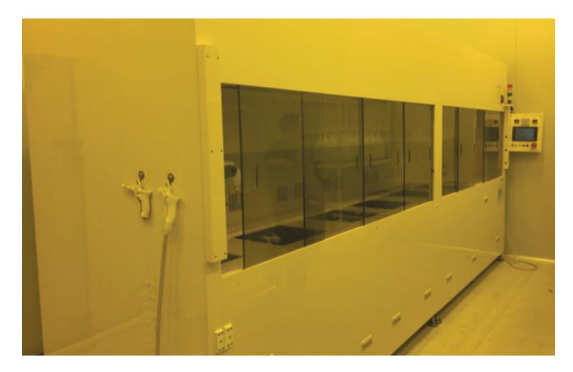

출처: 교육부(2015). 반도체용 습식 화공 약품 재료 제조(LM1903060405\_14v3). 한국직업능력개발원. p. 28. [그림 2-1] Wet Etching 및 세정 장비

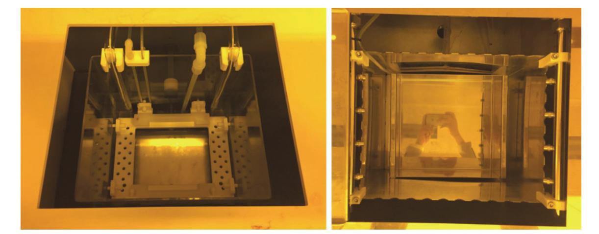

출처: 교육부(2015). 반도체용 습식 화공 약품 재료 제조(LM1903060405\_14v3). 한국직업능력개발원. p. 28. [그림 2-2] Wet 장비의 세정 Bath 예

(나) 알코올을 사용하여 세정을 하는 경우

초순수와 사용 용도가 비슷하나 초순수와 함께 사용하여 계면 활성제 역할을 하거나 유기 용제에 녹은 부산물 및 불순물의 제거에 사용된다.

- 3. 포토 공정: Photo Resister
  - (1) Photo Resister

반도체 생산에서 대표적으로 액체를 사용하는 공정으로, 반도체 생산에 있어서 중요한 공정으로 재료는 빛에 반응하여 경화되는 특성을 이용하는 경우와 반대로 빛에 반응한 부분을 제거하는 방식을 활용하는 방법이 있다. PR의 도포와 성형 및 불필요한 부분을 제거하는 공정 등에 액체를 사용하게 된다.

(2) 희석제: 벤젠, 알코올 등

PR의 중요한 성분 중 카본체인이 상당량 포함되어 있으므로 농도의 조절 및 웨이퍼 액 션을 제어하기 위하여 희석제를 투입하는데 이 희석제의 조합은 중요한 포인트이다.

(3) 도포: 스핀, 롤 프린팅

(가) 스핀: PR을 웨이퍼에 균일하게 도포하기 위하여 웨이퍼를 회전시키는 방법

(나) 롤 프린터: 반도체 웨이퍼에서는 거의 사용되지 않지만 PV, FPD 등에서 사용

(다) 스캐너 방식: 넓은 면적의 웨이퍼에 적용: 450mm 웨이퍼 적용이 검토되기도 한다.

숕 반도체 주요 공정 및 장비 운용

반도체 회로를 웨이퍼상에 가공하기 위한 공정 업무 능력을 위해 장비 운용에 사용되는 용어, 필요한 공정 이론 및 장비를 파악한다. 이를 위해 사용 용어에 대한 상세한 내용은 '반도체 용 어 정리' 및 선수 학습을 참조하며 단위 공정 및 장비 운용 용어를 이해한다.

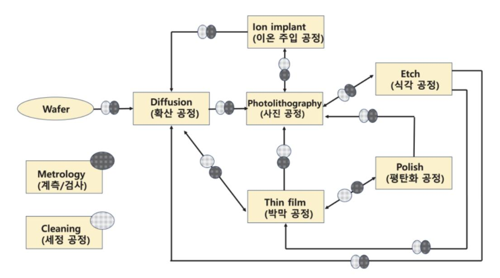

출처: 집필진 제작(2024)

[그림 2-3] 반도체 공정 단계 중 시모스(CMOS)(complementary metal-oxide semiconductor) 공정 중 공정별 웨 이퍼 이동 3

1. 사진(photo) 공정

사진 공정은 photolithography 공정의 줄임말로 웨이퍼 위에 회로 패턴을 형성하는 것 을 말한다. 아래에서는 8단계(step)로 구성에 대하여 학습한다.

(1) 증기 프라임(vapor prime)

표면과 포토레지스트(PR)의 계면 접착력(adhesion) 향상에 대하여 학습한다.

(2) 스핀 코팅(spin coat)

PR의 두께(thickness)와 균일도(uniformity)를 결정하는 단계로 PR의 타입과 양, 회전 시간, 회전 속도, 및 점도에 대하여 학습한다.

- (3) 소프트 건조(soft bake) 솔벤트의 제거가 목적이며 레지스트의 부착력(adhesion) 및 균일도(uniformity)에 대하 여 학습한다.
- (4) 정렬 및 노광(alignment & exposure) 포토 마스크의 패턴이 웨이퍼 상에 설계된 부분에 위치하도록 정렬하는 단계로 특 정 파장의 광원 및 방식에 대하여 학습한다.
- (5) 노광 후 건조(PEB: post exposure bake) 해상도의 향상 및 잔여 솔벤트의 제거가 목적으로 열 균일도에 대하여 학습한다.
- (6) 현상(develop)

상대적으로 결합이 약한 레지스트를 녹여 목표한 패턴만을 남기는 단계로 화학 반응에 대하여 학습한다.

(7) 검사(inspection)

목표치와 비교 확인하는 단계로 광학 및 표준 검사 방법에 대하여 학습한다.

(8) 하드 건조(hard bake)

잔여 용매를 증발시켜 튼튼하게 만드는 단계로 열 균일도에 대하여 학습한다. 반도체 공정에서는 웨이퍼당 공정 비용이 칩(chip)의 개수에 비례하지 않으므로 높은 수율(yield)을 위하여 많은 칩을 하나의 웨이퍼에 구현하는 것이 목표이다. 포토레지스트(photo resist), 임계 차원(critical dimension), 광스펙트럼(light spectr㎛), 해상도(resolution), 오버레이 정확도(overlay accuracy), 및 공정 범위(process latitude: 최종 공정 목표를 위한 각 변수 및 그 상호 관계에 따른 변수 편차의 한계)를 학습한다.

2. 식각(etching) 공정

식각(etching) 공정이란 노광 공정에서 형성된 회로 패턴을 이용하여 불필요한 부분을 제거하는 공정으로 건식·습식 식각을 수행하고 결과를 예상하는 것을 포함한다.

식각 공정에서는 보통 사진(photo) 공정에서 이루어진 패턴 중 열린 부분(open area)에 대한 제거를 진행하게 되므로 식각(etch) 공정에서 식각률(etch rate), 식각 프로파일(etch profile), 식각 바이어스(etch bias), 선택도(selectivity), 균일도(uniformity), 잔여물(residues) 및 입자 오염과 결함(particle contamination & defects)에 대하여 학습한다.

습식 식각(wet etch)은 공정이 단순하고 비용이 건식 식각(dry etch)보다 상대적으로 싸다. 하지만 등방성으로 식각이 진행되고, 제어가 어려운 점에서 상대적으로 임계 차원(CD)이 크고 공정 범위가 제한적이지 않은 분야에 사용된다. 농도(concentration), 시간(time), 온도(temperature), 교반

(agitation) 및 공정 횟수(n㎛ber of runs)에 대하여 학습한다.

건식 식각(dry etch)은 공정 및 장비가 비교적 복잡하고 비용이 습식 식각(wet etch)보다는 비싸지만 원하는 형태의 식각이 가능하고, 제어가 비교적 쉬운 점에서 상대적으로 임계 차원(CD)이 작고 공정 범위가 매우 제한적인 분야에 사용된다. 폴리머 포메이션(polymer formation), 플라즈마 유도 손상(plasma-induced damage) 및 입자 오염과 결함(particle contamination & defects) 에 대하여 학습한다.

3. 확산(diffusion) 공정

확산(diffusion) 공정이란 고온의 튜브(tube)에 필요한 박막(산화막·질화막)을 형성하는 공정으 로 물질의 입자들이 농도(밀도)가 높은 쪽에서 낮은 쪽으로 퍼져나가는 현상을 이용하며 평형 상태(equilibrium)가 되는 지점에서 확산이 멈추게 된다. 온도(temperature), 압력 제어 (pressure control), 가스(gas) 및 반응(reaction)에 대하여 학습한다.

#### 4. 평탄화(CMP: chemical mechanical planarization) 공정

평탄화 공정이란 웨이퍼상에서 기준면보다 높은 부위를 갈아내는 공정을 말한다. 임계 차원(CD) 이 작아지고 집적화가 필요하면서 다층 배선 구조의 형성이 필요함과 동시에 더욱 미세한 정밀도 가 필요해지고 있다. 연마 시간(polish time), 압력(pressure on wafer carrie:; downforce), 회전 속도(platen speed & carrier speed), 슬러리 화학 조성(slurry chemistry), 슬러리 유량 (slurry flow rate), 패드 상태(pad conditioning), 온도(wafer/slurry temperature) 및 웨이퍼 뒷면 압력(wafer back pressure)에 대하여 학습한다.

#### 5. 세정(cleaning) 공정

세정(cleaning) 공정이란 오염 물질 혹은 원하지 않는 박막을 제거하는 공정으로 임계 차원 (CD)의 감소 및 고집적화로 인해 세정 공정도 더욱 정밀해지고 있다. 주오염의 원인인 공 기, 사람, 시설, 물, 공정 화학 물질, 장비 및 클린 룸 디자인에 대하여 학습하며, 공정 방 법인 습식·건식 세정, 스크러빙(scrubbing), 웨이퍼(wafer) 건조 공정에 대하여 학습한다. 산업 표준 습식 세정 과정은 미국의 RCA 사에서 개발한 방법을 사용한다. SC-1(standard cleaning 1)은 미립자와 유기 물질을 제거하며, SC-2(standard cleaning 2)는 금속 오염을 제거하기 위해 사용한다. 일반적인 웨이퍼의 습식 세정 순서는 <표 2-1>과 같다.

| 세정 단계(cleaning step)                        | 목적(purpose)                  |
|---------------------------------------------|------------------------------|
| H2SO4/H2O₂(piranha)(황산/과산화수소, 피라냐 세정)       | Organics & metals(유기 물질과 금속) |
| UPW rinse(ultrpure water, 순수 세정)            | Rinse(세정)                    |
| HF/H2O(diluted HF)(불산/순수, 희석된 불산 세정)        | Native oxide(자연 산화막)         |
| UPW rinse(ultrpure water, 순수 세정)            | Rinse(세정)                    |
| NH4OH / H2O₂ / H2O(SC-1)(암모니아/과산화수소/<br>순수) | Particles(미립자)               |
| UPW rinse(ultrpure water, 순수 세정)            | Rinse(세정)                    |
| HF / H2O(Diluted HF)(불산/순수, 희석된 불산 세정)      | Native oxide(자연 산화막)         |
| UPW rinse(ultrpure wate, 순수 세정)             | Rinse(세정)                    |
| HCl / H2O₂ / H2O(SC-2)(염산/과산화수소/순수)         | metals(금속)                   |
| UPW rinse(ultrpure water, 순수 세정)            | Rinse(세정)                    |
| HF / H2O(Diluted HF)(불산/순수, 희석된 불산 세정)      | Native oxide(자연 산화막)         |
| UPW rinse(ultrpure water, 순수 세정)            | Rinse(세정)                    |
| Drying(건조)                                  | Dry(건조)                      |

<표 2-1> Step of typical wafer cleaning in FAB(웨이퍼 습식 세정 단계별 목적)

건식 세정은 좁은 틈(gap) 사이의 오염 잔류 이슈, 수율 향상을 위한 속도 이슈 및 환경오염 이 슈 등으로 주로 플라즈마 환경을 이용한다. 염소 기반의 화학제나 아르곤(Ar sputtering) 및 수소(H2-prebake) 등을 사용하고 있는 건식 세정에 대하여 학습한다.

6. 이온 주입(ion implant) 공정

이온 주입(ion-implanting) 공정이란 이온 불순물(dopant)을 웨이퍼 내부에 침투시켜 원하 는 전기적 특성을 만들어 주는 공정을 말하며, 도핑하려는 원소를 이온화시킨 후 장비를 통 해 가속시켜 표면에 충돌시키는 방식이다. 이온 주입 공정 이후 확산 공정을 통하여 원하는 깊이(junction depth)만큼 확산시키고, 어닐링(annealing) 공정으로 분자 재배열을 통해 안정화(curing)시키는 방법에 대하여 학습한다.

7. 박막(thinfilm) CVD/PVD 공정

박막(thinfilm) 공정은 가스 간 화학 반응을 통해서 절연막·전도성막을 형성하는 화학 기상 증착 CVD(chemical vapor deposition) 공정과 금속 타깃을 물리적으로 분해하여 웨이퍼 표면에 금속막을 형성시켜 각각의 회로를 연결시켜 주거나 체임버 내에서 화학 반응을 이용하여 절연막을 형성하여 증착시키는 물리 기상 증착 PVD(physical vapor deposition) 공정을 포함한다. 단차 피복(step coverage), 높은 종횡비의 틈을 채우는 능력(ability to fill high aspect ratio gaps), 균일도(uniformity), 순도와 밀도(purity & density), 화학적 제어(controlled stoichiometry),

구조적 완성도 및 낮은 스트레스(degree of structural perfection with low film stress), 전기적 특성(electrical property) 및 부착력(adhesion)에 대하여 학습한다.

|  |  |  |  | <표 2-2> Techniques of Film deposition(박막 증착 공정 기술) |  |  |  |  |
|--|--|--|--|----------------------------------------------------|--|--|--|--|
|--|--|--|--|----------------------------------------------------|--|--|--|--|

| Chemical processes(화학적 공정)                                                                     |                                                        | Physical processes(물리적 공정)                                       |                                         |                                       |  |
|------------------------------------------------------------------------------------------------|--------------------------------------------------------|------------------------------------------------------------------|-----------------------------------------|---------------------------------------|--|
| chemical vapor<br>deposition(CVD)<br>(화학적 기상 증착)                                               | Plating<br>(도금)                                        | physical vapor<br>deposition(PVD)<br>(물리적 기상 증착)<br>(Sputtering) | Evaporation<br>(증발)                     | Spin On<br>Methods<br>(회전 방식)         |  |
| Atmospheric<br>Pressure CVD<br>(대기압 CVD)                                                       | Electrochemical<br>deposition(전해도)<br>(Electroplating) | DC Diode<br>(직류 다이오드)                                            | Filament and<br>Electron Beam<br>(전자 빔) | Spin on glass<br>(유리 회전 도<br>포)       |  |
| Low Pressure<br>CVD(저기압 CVD)                                                                   | Electroless<br>Plating(무전해 도금)                         | Radio Frequency<br>(주파수)                                         | Molecular Beam<br>Epitaxy<br>(분자 빔)     | Spin on di<br>electric(절연<br>막 회전 도포) |  |
| Plasma Enhanced<br>CVD(PECVD)<br>(플라즈마 강화 CVD)<br>High Density<br>Plasma CVD<br>(고밀도 플라즈마 CVD) |                                                        | DC Magnetron<br>(직류 자기장)                                         |                                         |                                       |  |
| Vapor Phase Epitaxy &<br>Metal-Organic<br>CVD<br>(기상 결정 & 금속-유기<br>CVD)                        |                                                        | Ionized Metal plas<br>ma(이온화 금속 플라즈<br>마)                        |                                         |                                       |  |

(1) 화학 기상 증착(CVD) 공정과 물리 기상 증착(PVD) 공정 비교

박막 증착 공정에서 사용되는 재료의 상태 및 반응시키는 방식에 따라 크게 <표2-2>와 같이 나눌 수 있으며 이에 대하여 학습한다.

#### 숖 공정 완료 후 웨이퍼에 존재 여부

공정 완료 후 제공된 재료가 어떠한 형태로든지 웨이퍼에 남는 경우와 웨이퍼에서 제거되는 경 우에 따른 관리와 공정 전후의 관리 및 대상 물질의 관리가 필요하다.

1. 공정 후 부착

CVD 공정이 대표적으로 산화막층, 질화막층, 금속막층을 형성하는 경우가 대표적이다.

- (1) 산화막: SiO2, Al2O3, HfO2, Y2O3, Ta2O5, TiO2, ZrO2 등
- (2) 질화막: SiN, HfSiON, TiN 등
- (3) 금속막: Ni, Ti, W, Cu 등

#### 2. 공정 후 제거

PR는 공정 진행 후 제거해야 하는 물질의 대표적인 대상 물질이다. 따라서 에칭 공정 후의 PR를 확실하게 제거하기 위한 여러 가지 고려가 적용된 공정을 진행하게 된다. 에칭 공정 이후에 에셔 공정은 에칭 이후의 PR 잔존물 및 부산물을 효과적으로 제거하기 위한 여러 가지 연구가 병행되고 있다.

숗 물질 상태의 이해

물질의 상태는 온도와 압력에 따라서 액체, 기체, 고체를 결정하게 된다. 사전적으로 이상 기체 상태 방정식에 대한 이해가 필요하다.

1. 압력

반도체 공정에서 압력은 중요한 요소 중의 하나로서 압력 자체가 물질의 상태를 결정 하는 요소이기도 하다. 통상 압력이 증가하면 고체나 액체로 존재하기가 쉽고, 압력이 낮아 지면 가스로 존재하기가 쉽다. 반도체 공정에서 CVD 및 Dry 에칭 공정의 경우 고진공 및 초고진공 상태에서 진행하게 된다.

2. 온도

온도는 압력과 함께 물질의 상태를 결정 짖는 요소로 통상 온도가 증가하면 가스로 존재할 가능성이 높아지게 된다. [그림 2-5]는 물의 상평형 그래프이다. 물의 경우 대기압 1기압 (760mmHg 또는 1024mBar)에서 끓는점이 100℃이다.

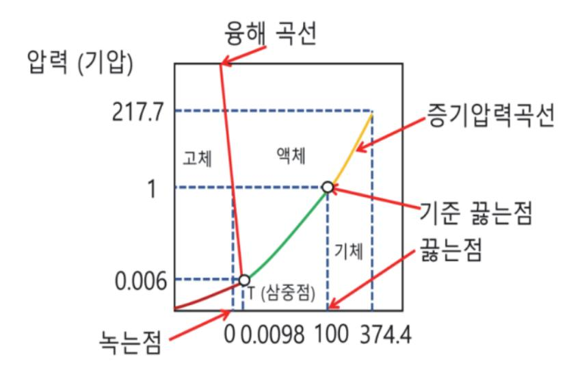

출처: 집필진 제작(2024) [그림 2-4] 물의 상평형 그래프

## 수행 내용 / SOD 공정 재료 준비하기

재료·자료

- SOD 용액
- 용매
- 필터

- 재료 안전 데이터 시트(MSDS)
- 공정 매뉴얼
- 품질 관리 문서
- 기술 데이터 시트
- 분석 데이터

기기(장비 ・ 공구)

- 스핀 코터

- - - 용기

• 오븐

- 안전 ・ 유의 사항
  - - 해당 사항 없음.
- 수행 순서
- 숔 반도체 SOD 공정 재료의 준비를 위해 필요한 세부 단계와 요구 사항을 파악한다.

반도체 SOD(spin-on dielectric) 공정 재료를 준비하기 위해서는 고순도 원재료의 선택과 철 저한 제조 및 품질 관리 절차를 준수해야 한다. 다음은 SOD 공정 재료 준비에 필요한 세부 단계와 요구 사항이다.

- 1. 고객 요구 사항을 분석한다.
  - (1) 기술 사양
    - (가) 유전 상수(dielectric constant): 고객이 필요로 하는 유전체의 유전 상숫값을 명확히한 다.

47

- (나) 손실 탄젠트(loss tangent): 최소화해야 하는 손실 탄젠트 값이다.
- (다) 막 두께(film thickness): 원하는 막 두께 범위이다.
- (라) 균일성(uniformity): 막의 두께 균일성 요구 사항이다.
- (마) 내구성(durability): 기계적 및 화학적 내구성 기준이다.
- (2) 품질 기준
  - (가) 순도(purity): 요구되는 재료의 순도 수준(예: ≥ 99.999%).
  - (나) 불순물 허용 한계: 특정 불순물의 허용 한계(예: 금속 이온, 유기물 등)이다.
- (3) 공정 조건
  - (가) 공정 온도(process temperature): 재료가 사용할 공정 온도 범위이다.
  - (나) 공정 압력(process pressure): 재료가 사용할 공정 압력 범위이다.
  - (다) 용매 호환성(solvent compatibility): 사용될 용매와의 화학적 호환성이다.
- (4) 환경 및 안전
  - (가) 환경 규제 준수: 지역 및 국가의 환경 규제 기준이다.
  - (나) 안전 지침: 화학 물질 취급 시의 안전 지침이다.

#### 2. 원재료를 준비한다.

- (1) 주요 원재료
  - (가) 폴리실세스퀴옥산(PSQ: poly-silsesquioxane)
  - (나) 제조사: Dow Corning, Gelest Inc
  - (다) 순도: ≥ 99.999%
  - (라) 용매: 아이소프로판올(Isopropanol), 에탄올(Ethanol)
  - (마) 제조사: Sigma-Aldrich, Fisher Scientific
  - (바) 순도: ≥ 99.9%
- (2) 원재료 공급
  - (가) 공급사 선정: 신뢰할 수 있는 공급사로부터 고순도 원재료를 확보한다.
  - (나) 입고 검사: 원재료의 순도와 불순물 함량을 철저히 검사한다.

#### 3. 제조 공정을 설계한다.

(1) 혼합 공정 설계

반도체 SOD(silicon-on-dielectric) 공정 재료의 혼합 공정 설계는 최종 재료의 특성, 일관성, 품질을 보장하기 위해 매우 중요한 과정이다. 혼합 공정은 다양한 화학 물질과 재료를 정확한 비율로 혼합하여 원하는 특성을 가진 제품을 만드는 단계이다. 이 과정에

서 설계된 혼합 공정은 SOD 재료의 전기적, 물리적, 화학적 특성을 결정짓는 핵심 역 할을 한다.

(가) 혼합 공정 설계 주요 요소

- 1) 재료의 특성 파악
  - 가) 화학적 특성: 사용되는 재료의 화학적 성질, 반응성, 용해도 등을 고려한다.
  - 나) 물리적 특성: 입자 크기, 밀도, 점도와 같은 물리적 특성을 파악하여 혼합 방법 을 설계한다.
- 2) 혼합 비율 및 순서 결정
  - 가) 최적 비율 설정: 원하는 결과를 얻기 위해 각 재료의 비율을 정확하게 설정한 다.
  - 나) 혼합 순서: 특정 재료가 먼저 혼합되어야 하거나 특정 조건에서 반응해야 하는 경우, 혼합 순서를 신중하게 결정한다.
- 3) 혼합 방법 및 장비 선택
  - 가) 혼합기 선택: 사용되는 재료와 혼합 방식에 따라 적절한 혼합기(예: 블렌더, 믹 서)를 선택한다.
  - 나) 혼합 속도 및 시간: 혼합의 균일성을 확보하기 위해 혼합 속도와 시간을 최적화 한다.
- 4) 공정 조건 설정
  - 가) 온도와 압력 제어: 특정 온도와 압력 조건에서 혼합이 최적으로 이루어질 수 있 도록 설정한다.
  - 나) 환경 조건: 청정도, 습도, 외부 오염 등의 환경 조건을 관리한다.
- 5) 품질 관리 및 모니터링
  - 가) 실시간 모니터링: 혼합 과정 중 각종 변수(온도, 점도 등)를 실시간으로 모니터 링하여 일관된 품질을 유지한다.
  - 나) 샘플 테스트: 혼합물의 일관성과 품질을 확인하기 위해 샘플을 추출하여 테스트 한다.
- (나) 사례 1: 고순도 실리콘 산화물 혼합
  - 1) 재료 구성: 고순도 실리콘 분말, 고순도 산화물 파우더, 바인더, 용매
  - 2) 혼합 비율: 실리콘 70%, 산화물 20%, 바인더 5%, 용매 5%
  - 3) 혼합 순서
    - 가) 실리콘 분말과 산화물 파우더를 먼저 혼합한다.
    - 나) 바인더와 용매를 추가하여 점도를 조절한다.
  - 4) 혼합 방법: 고속 혼합기를 사용하여 10분간 혼합한다.
  - 5) 공정 조건: 25°C에서 혼합, 습도 40%를 유지한다.

6) 품질 관리: 혼합 후 샘플링하여 입자 크기 분포와 균일성 검사, 화학적 조성을 분석 한다.

(다) 사례 2: 유기 SOD 재료 혼합

- 1) 재료 구성: 유기 폴리머, 실리카 나노입자, 용매
- 2) 혼합 비율: 폴리머 50%, 실리카 30%, 용매 20%
- 3) 혼합 순서
  - 가) 폴리머와 실리카 나노입자를 먼저 혼합하여 기본 매트릭스를 형성한다.
  - 나) 용매를 추가하여 점도와 유동성을 조절한다.
- 4) 혼합 방법: 초음파 혼합기를 사용하여 15분간 혼합
- 5) 공정 조건: 저온(10°C)에서 혼합, 습도 30%를 유지한다.
- 6) 품질 관리: 혼합물의 점도 측정, 나노 입자 분포를 분석한다.

혼합 공정 설계는 SOD 재료의 품질과 성능에 중요한 영향을 끼친다. 최적의 혼합 비율 과 순서, 적절한 혼합 장비와 공정 조건을 설정함으로써 재료의 균일성과 원하는 특성을 보장할 수 있다. 또한 혼합 과정 중 실시간 모니터링과 샘플 테스트를 통해 일관된 품 질을 유지하는 것이 중요하다. 이를 통해 반도체 제조 공정에서 높은 신뢰성과 성능을 갖춘 SOD 재료를 생산할 수 있다.

(2) 반응 공정

반도체 SOD(silicon-on-dielectric) 공정 재료의 준비를 위한 반응 공정 설계는 매 우 중요하다. 이 공정은 최종 재료의 특성과 성능을 결정짓는 핵심 단계로, 설계 과정에 서 고려해야 할 요소들이 많다. 반응 공정은 여러 화학 물질이 화학 반응을 통해 새로 운 물질을 생성하거나 특정 물리적 특성을 부여하는 과정이다. 이 과정을 통해 SOD 재 료의 주요 특성, 예를 들어 절연 특성, 열적 안정성, 기계적 강도 등을 제어할 수 있다.

- (가) 반응 공정 설계의 주요 요소
  - 1) 반응물의 선택 및 특성 파악
    - 가) 화학적 특성: 반응물의 화학적 성질, 반응 가능성, 안정성 등을 이해해야 한다.
    - 나) 물리적 특성: 반응물의 물리적 상태(고체, 액체, 기체), 용해도, 점도 등을 파악 하여 반응 설계를 최적화한다.
  - 2) 반응 조건 설정
    - 가) 온도와 압력: 반응이 효율적으로 진행될 수 있는 최적의 온도와 압력을 설정한 다.
    - 나) 농도 및 비율: 반응물의 농도와 혼합 비율을 최적화하여 원하는 결과를 얻는다.
  - 3) 반응 속도 제어
    - 가) 촉매 사용: 반응 속도를 조절하고 선택성을 높이기 위해 촉매를 사용한다.
    - 나) 반응 시간: 반응이 완료되기까지 필요한 시간을 설정하고, 이를 엄격히 준수한

다.

- 4) 반응기 설계
  - 가) 반응기 타입: 반응 특성에 맞는 반응기를 선택한다(예: 배치 반응기, 연속 반응 기, 고정층 반응기 등).
  - 나) 혼합 및 열 전달: 반응기 내 혼합 상태와 열 전달을 최적화하여 반응의 일관성 을 유지한다.
- 5) 안전 및 환경을 관리한다.
  - 가) 안전 대책: 화재, 폭발, 유해 물질 발생 등에 대비한 안전 대책을 마련한다.
  - 나) 환경 보호: 반응 공정 중 발생하는 유해 물질을 적절히 처리하여 환경 오염을 방지한다.
- (나) 사례 1: 실리콘 옥사이드(SiO2) 기반 SOD 재료 제조
  - 1) 반응물: TEOS(tetraethyl orthosilicate), 물, 산 촉매
  - 2) 목표: 고순도 실리콘 옥사이드 필름 생성
  - 3) 반응 조건
    - 가) 온도: 70°C
    - 나) 압력: 대기압
    - 다) 농도: TEOS 10%, 물 85%, 산 촉매 5%
    - 라) 촉매: 산성 촉매(예: HCl)를 사용하여 반응 속도 조절
  - 4) 반응기: 배치 반응기
  - 5) 반응 시간: 2시간
  - 6) 공정 설명
    - 가) TEOS와 물을 혼합한 후 산 촉매를 첨가하여 SiO2의 가수 분해 및 응축 반응 을 유도한다.
    - 나) 반응 온도와 시간 동안 SiO2가 생성되고, 최종적으로 고순도 SiO2 필름이 형성 된다.
    - 다) 생성된 SiO2 필름은 후속 공정(예: 열처리)을 통해 강화된다.
- (다) 사례 2: 폴리실록산 기반 유기 SOD 재료 제조
  - 1) 반응물: 메틸실란, 에틸실란, 용매
  - 2) 목표: 낮은 유전 상수를 가진 유기 SOD 재료 생성
  - 3) 반응 조건
    - 가) 온도: 80°C
    - 나) 압력: 저압 환경에서 진행
    - 다) 농도: 메틸실란 60%, 에틸실란 30%, 용매 10%
    - 라) 촉매: 백금 촉매를 사용하여 반응 촉진

- 4) 반응기: 연속 반응기
- 5) 반응 시간: 3시간
- 6) 공정 설명
  - 가) 메틸실란과 에틸실란을 용매와 혼합하고, 백금 촉매를 추가하여 반응을 시작한 다.
  - 나) 반응 중 생성되는 열을 효과적으로 제거하기 위해 열 교환기를 사용한다.
  - 다) 생성된 폴리실록산은 용매 제거 후 낮은 유전 상수를 가진 유기 SOD 재료로 사용된다.

반도체 SOD 공정 재료의 반응 공정 설계는 다양한 반응 조건과 변수들을 고려하여 최 적화해야 한다. 이를 통해 고품질의 SOD 재료를 생산하고, 반도체 소자의 성능과 신뢰 성을 보장할 수 있다. 또한 철저한 안전 관리와 환경 보호 대책을 통해 안전하고 지속 가능한 공정 운영을 달성할 수 있다.

- 4. 품질을 관리한다.
  - (1) 품질 검사
    - (가) 순도 검사: ICP-MS, GC-MS 등의 기법을 사용하여 재료의 순도를 검사한다.
    - (나) 물리적 특성 검사: 점도, 유변학적 특성, 입자 크기 등을 검사한다.
    - (다) 유전체 특성 검사: 유전 상수, 손실 탄젠트 등 유전체 특성을 검사한다.
  - (2) 검사 주기
    - (가) 생산 로트: 생산 로트마다 검사하여 품질을 보장한다.
    - (나) 샘플링: 주기적으로 샘플을 채취하여 품질 변동 여부를 모니터링한다.

#### 5. 안전 및 환경을 관리한다.

- (1) 안전 관리
  - (가) 안전 교육: 작업자에게 화학 물질 취급 및 비상 대처 방법을 교육한다.
  - (나) 안전 장비: 보호 장갑, 보호 안경, 방호복 등 안전 장비를 착용한다.
  - (다) 비상 대응: 화학 물질 누출 및 사고 발생 시 신속히 대응할 수 있는 비상 계획을 마련한 다.
- (2) 환경 관리
  - (가) 폐기물 처리: 제조 과정에서 발생하는 폐기물을 안전하게 처리한다.
  - (나) 환경 규제 준수: 지역 및 국가의 환경 규제를 준수한다.
- 6. 포장 및 저장한다.

(1) 포장

(가) 밀폐 포장: 제품을 밀폐된 용기에 포장하여 오염을 방지한다.

(나) 라벨 부착: 제품 용기에 제조 일자, 유효 기간, 배치 번호 등을 라벨에 명시한다. (2) 저장

(가) 저장 조건: 상온에서 건조하고 밀폐된 상태로 저장한다.

(나) 보관 장소: 직사광선을 피하고 통풍이 잘되는 장소에 보관한다.

7. 납기를 관리한다.

- (1) 생산 일정 관리
  - (가) 생산 일정: 생산 일정을 체계적으로 관리하여 납기를 준수한다.
  - (나) 재고 관리: 주요 원재료와 최종 제품의 안전 재고를 확보하여 공급 지연 시에도 생산 차 질을 최소화한다.

(2) 공급망 관리

(가) 다수 공급처 확보: 주요 원재료의 다수 공급처를 확보하여 공급 리스크를 최소화한다.

(나) 비상 계획: 원재료 공급 지연 등 비상 상황에 대비한 대체 공급 계획을 마련한다.

고객의 요구 사항을 철저히 파악하고 이를 충족하기 위한 재료 준비와 제조 공정을 설계 함으로써 반도체 SOD 공정 재료의 품질을 높이고, 안정적인 공급을 보장할 수 있다. 고객 의 기술 사양, 품질 기준, 공정 조건, 환경 및 안전 요구 사항을 정확히 이해하고 준수하는 것 이 중요하다. 이를 통해 고객 만족도를 높이고, 반도체 제조 공정의 성능과 효율을 극대화할 수 있다.

숕 반도체 SOD 공정 재료의 제조 공정별 장점과 단점을 파악한다.

반도체 SOD(spin-on dielectric) 공정 재료의 제조 공정은 여러 단계를 거쳐 수행되며, 단계 마다 고유한 장점과 단점이 존재한다. 아래는 주요 제조 공정 단계별 장점과 단점을 정리한 내 용이다.

1. 원재료를 준비한다.

(1) 장점

- (가) 고순도 확보: 고순도 원재료를 사용하여 최종 제품의 품질을 보장할 수 있다.
- (나) 신뢰성 있는 공급: 신뢰할 수 있는 공급사로부터 원재료를 확보하여 안정적인 생산이 가 능하다.

(2) 단점

(가) 비용 증가: 고순도 원재료의 높은 가격으로 인해 비용이 증가할 수 있다.

53

(나) 공급망 리스크: 특정 원재료 공급사의 문제로 인해 공급망 리스크가 존재한다.

- 2. 혼합 공정을 파악한다.
  - (1) 혼합 공정의 장점
    - (가) 재료 특성의 균일성 확보

혼합 공정을 통해 다양한 원재료를 균일하게 섞을 수 있으며, 이로 인해 최종 재료 의 물리적, 화학적 특성이 일관되게 유지된다. 이는 소자의 일관된 성능을 보장하는 데 필수적이다.

(나) 다양한 재료 조성 가능

혼합 공정을 통해 서로 다른 특성을 가진 여러 재료를 조합할 수 있다. 이를 통해 특정 요구 사항에 맞는 맞춤형 재료를 개발할 수 있다.

(다) 공정의 유연성

다양한 재료를 조합하고 혼합 비율을 조정함으로써, 공정을 조정하여 다양한 제 품 요구 사항을 충족시킬 수 있다. 이는 반도체 산업에서 빠르게 변화하는 기술 요구에 대응하는 데 도움이 된다.

(라) 비용 효율성

혼합 공정을 통해 고가의 단일 재료 대신 여러 저가 재료를 사용하여 비용을 절감할 수 있다. 또한 재료의 낭비를 줄이고 효율적인 자원 사용을 촉진한다.

(마) 스케일업 가능성

혼합 공정은 실험실 규모에서 대규모 생산까지 쉽게 확장할 수 있다. 이는 연구 개 발 단계에서 생산 단계로의 전환을 쉽게 한다.

- (2) 혼합 공정의 단점
  - (가) 혼합 불균일성 문제

혼합이 불균일하게 이루어질 경우, 최종 제품의 특성이 일관되지 않을 수 있다. 이는 소자의 성능 저하나 불량률 증가로 이어질 수 있다. 특히, 미세한 입자나 고점도 재 료의 경우 혼합이 어려울 수 있다.

(나) 복잡한 공정 제어

여러 재료를 혼합할 때, 각 재료의 특성에 따라 온도, 습도, 혼합 속도 등 다양한 공 정 변수를 철저히 제어해야 한다. 이는 공정 관리의 복잡성을 증가시킨다.

(다) 오염 문제

혼합 공정 중 외부 오염 물질이 혼합물에 유입될 수 있다. 이는 최종 제품의 품질에 영향을 끼치고, 공정 불량률을 증가시킬 수 있다. 특히, 반도체 공정에서는 미세 오 염 물질도 큰 문제가 될 수 있다.

(라) 장비 및 유지 보수 비용

혼합 공정에 필요한 장비는 고가일 수 있으며, 정기적인 유지 보수가 필요하다. 장비 의 마모나 노후화는 혼합 효율을 저하시킬 수 있다.

(마) 제한된 재료 호환성

모든 재료가 혼합 가능한 것은 아니다. 일부 재료는 서로 반응하여 예기치 않은 부 산물을 생성하거나, 상호작용으로 인해 원하는 특성을 얻지 못할 수 있다.

혼합 공정은 반도체 SOD 재료 제조에서 필수적인 단계로, 다양한 장점이 있지만 동시에 여러 도전 과제도 존재한다. 혼합 공정의 효율성과 품질을 높이기 위해서는 공정 조건의 정 밀한 제어와 철저한 품질 관리가 필요하다. 또한 공정 중 발생할 수 있는 문제를 예측하고 대응 방안을 마련하는 것이 중요하다. 이를 통해 고품질의 SOD 재료를 생산하고, 최종 제 품의 성능을 극대화할 수 있다.

3. 반응 공정을 파악한다.

반도체 SOD(silicon-on-dielectric) 공정 재료의 반응 공정은 특정 화학 반응을 통해 재료 의 화학적, 물리적 특성을 조정하는 중요한 단계이다. 이 과정은 최종 제품의 성능과 특성 에 직접적인 영향을 끼친다. 반응 공정에는 여러 장점과 단점이 있으며, 이를 이해하는 것 은 공정 최적화와 품질 관리에 중요하다.

- (1) 반응 공정의 장점
  - (가) 재료 특성의 정밀한 제어

반응 공정을 통해 재료의 화학적 조성, 구조, 그리고 물리적 특성을 정밀하게 제어할 수 있다. 이를 통해 원하는 특성(예: 유전 상수, 열적 안정성, 기계적 강도 등)을 가 진 재료를 생산할 수 있다.

(나) 고순도 재료 생성

반응 공정은 고순도 재료를 생성할 수 있는 방법 중 하나이다. 불순물의 양을 최소 화하고 원하는 순도의 재료를 얻기 위해 공정 조건을 엄격하게 관리할 수 있다.

(다) 복합 재료의 제조 가능

다양한 반응물과 반응 조건을 사용하여 복합 재료를 제조할 수 있다. 이는 다기능성 재료를 만들거나, 특정 응용 분야에 맞춘 특수 재료를 개발하는 데 유리하다.

(라) 공정의 유연성

다양한 화학 반응을 활용하여 여러 종류의 재료를 생산할 수 있다. 반응 조건을 조 정함으로써 동일한 반응 시스템에서 다양한 제품을 만들 수 있다.

(마) 스케일업 용이성

반응 공정은 실험실 규모에서 대규모 생산으로 확장하기에 적합하다. 공정 조건 을 최적화하고, 반응기를 설계하여 대량 생산을 효율적으로 수행할 수 있다.

(2) 반응 공정의 단점

(가) 공정 제어의 복잡성

반응 공정은 온도, 압력, 반응 시간, 농도 등 많은 변수에 의해 영향을 받는다. 이러 한 변수의 미세한 변화도 최종 제품의 품질에 큰 영향을 끼칠 수 있으므로 공정 제 어가 복잡하고 까다로울 수 있다.

(나) 안정성 문제

일부 반응물은 반응 중 불안정해질 수 있으며, 폭발성 또는 유독성 가스를 방출할 수 있다. 이는 작업자 안전과 환경 보호 측면에서 중요한 문제로, 철저한 안전 관리 가 필요하다.

(다) 부산물 및 불순물 문제

반응 공정 중 예상치 못한 부산물이나 불순물이 생성될 수 있으며, 이는 최종 제품 의 품질이 저하할 수 있다. 이러한 부산물 제거 및 불순물 관리가 추가로 필요하다.

(라) 장비 및 유지 보수 비용

반응 공정에 필요한 반응기와 제어 시스템은 고가일 수 있으며, 정기적인 유지 보수 가 필요하다. 또한 반응기 내부의 마모나 오염을 방지하기 위한 관리가 필요하다.

(마) 환경 및 규제 준수

반응 공정 중 발생하는 유해 물질의 처리와 폐기물 관리가 필요하다. 이는 환경 규 제 준수를 위한 비용과 노력이 필요하다.

- 반응 공정은 반도체 SOD 재료 제조에서 중요한 역할을 하며, 다양한 장점을 제공한다. 그러나 공정의 복잡성, 안정성 문제, 부산물 관리 등 여러 도전 과제도 존재한다. 반응 공 정의 효율성을 높이고 품질을 유지하기 위해서는 철저한 공정 제어, 안전 관리, 환경 보호 조치가 필수적이다. 이를 통해 고품질의 재료를 안정적으로 생산하고, 반도체 소자의 성능 을 극대화할 수 있다.
- 4. 정제 및 여과를 파악한다.

반도체 SOD(silicon-on-dielectric) 공정에서 정제 및 여과 공정은 불순물을 제거하고 재 료의 순도를 높이는 중요한 단계이다. 이 공정은 최종 제품의 품질과 성능에 직접적인 영향 을 끼치며, 특정 요구 사항을 충족시키기 위해 다양한 정제 및 여과 기술이 사용된다. 이 과정에는 여러 장점과 단점이 있으며, 이를 이해하는 것은 공정 최적화와 품질 관리에 필수 적이다.

- (1) 정제 및 여과 공정의 장점
  - (가) 고순도 재료 확보

정제 및 여과 공정은 재료에서 불순물과 불필요한 성분을 효과적으로 제거하여 고순 도의 재료를 얻을 수 있다. 이는 반도체 소자의 성능과 신뢰성에 중요한 영향을 끼 친다.

(나) 재료 특성 개선

불순물 제거를 통해 재료의 전기적, 열적, 기계적 특성을 개선할 수 있다. 예를 들어, 전기적 특성을 저하시킬 수 있는 이온 불순물을 제거하면 절연 특성이 향 상된다.

(다) 제품 일관성 보장

정제 및 여과 과정을 통해 각 배치(batch)에서 일관된 재료 품질을 유지할 수 있다. 이는 제조 공정의 안정성을 높이고, 최종 제품의 성능 변동을 줄이는 데 도움이 된 다.

(라) 소형 입자 및 미세 오염물 제거

여과 공정은 재료에서 소형 입자와 미세 오염물을 제거하는 데 효과적이다. 이는 반 도체 제조 과정에서 표면 결함이나 단락 등을 예방하는 데 중요하다.

(마) 안전성 증대

반응 공정에서 생성된 유해 화학 물질이나 부산물을 제거함으로써 작업 환경의 안전 성을 높일 수 있다. 이는 작업자 보호와 환경 보호 측면에서 중요하다.

- (2) 정제 및 여과 공정의 단점
  - (가) 비용 증가

정제 및 여과 공정은 추가적인 장비와 공정이 필요하며, 이로 인해 생산 비용이 증 가할 수 있다. 고급 필터나 정제 장비의 사용은 특히 비용이 많이 든다.

(나) 공정 시간 연장

정제 및 여과 과정은 추가적인 처리 단계를 포함하므로 전체 공정 시간이 길어 질 수 있다. 이는 생산 속도와 생산성을 저하시킬 수 있다.

(다) 재료 손실

정제 및 여과 과정에서 일부 유용한 재료가 손실될 수 있다. 예를 들어, 필터링 과정 에서 작은 입자가 걸러지거나 용매와 함께 버려질 수 있다.

(라) 장비 유지 보수

정제 및 여과 장비는 정기적인 유지 보수와 교체가 필요하다. 필터는 일정 기간 사 용 후 교체해야 하며, 장비의 청결 상태를 유지하기 위한 추가적인 관리가 필요하다.

(마) 복잡성 증가

정제 및 여과 공정은 재료의 특성에 따라 복잡한 조정이 필요할 수 있다. 필터 의 선택, 공정 조건 설정, 처리 용량 등 다양한 요소를 최적화해야 한다.

정제 및 여과 공정은 반도체 SOD 재료의 품질을 보장하고 불순물을 제거하는 데 중요한 역할을 한다. 이를 통해 고순도, 고품질의 재료를 확보할 수 있으며, 이는 최종 제품의 성 능과 신뢰성에 긍정적인 영향을 끼친다. 그러나 이 공정은 비용 증가, 공정 시간 연장, 재

료 손실 등 몇 가지 단점도 동반한다. 따라서 정제 및 여과 공정을 최적화하고, 비용 효율 적인 방법을 도입하여 공정의 효율성을 높이는 것이 중요하다.

- 5. 품질을 관리한다.
  - (1) 장점
    - (가) 고품질 보장: 철저한 품질 관리를 통해 일관된 고품질 제품을 생산할 수 있다.
    - (나) 문제 조기 발견: 품질 검사를 통해 제조 공정 중 발생하는 문제를 조기에 발견하고 대응 할 수 있다.
  - (2) 단점
    - (가) 시간 소요: 품질 검사와 관리에 많은 시간이 소요될 수 있다.
    - (나) 비용 부담: 품질 관리에 필요한 장비와 인력으로 인해 비용이 증가할 수 있다.
- 6. 포장 및 저장한다.
  - (1) 장점
    - (가) 제품 보호: 적절한 포장과 저장을 통해 제품의 품질을 유지하고 외부 오염을 방지할 수 있다.
    - (나) 유통 기한 연장: 최적의 저장 조건을 유지하여 제품의 유통 기한을 연장할 수 있다.
  - (2) 단점
    - (가) 추가 비용: 포장 재료와 저장 공간에 추가 비용이 소요된다.
    - (나) 저장 조건 민감성: 특정 저장 조건을 유지하지 못할 경우 제품 품질이 저하될 위험이 있 다.
- 7. 납기를 관리한다.
  - (1) 장점
    - (가) 고객 만족도 향상: 생산 일정과 재고 관리를 통해 납기를 준수함으로써 고객 만족도를 높일 수 있다.
    - (나) 효율적인 생산: 체계적인 생산 일정 관리로 효율적인 생산이 가능하다.

(2) 단점

- (가) 유연성 부족: 엄격한 납기 관리로 인해 공정 변경이나 긴급 주문에 대한 유연성이 떨어 질 수 있다.
- (나) 재고 관리 부담: 안전 재고를 유지하기 위한 재고 관리 부담이 존재한다.

반도체 SOD 공정 재료의 제조 공정은 각각의 단계에서 고유한 장점과 단점이 있다. 각 단계 를 최적화하고 단점을 보완하는 방법을 통해 전체 공정의 효율성과 품질을 극대화할 수 있다. 이를 위해서는 철저한 계획과 지속적인 모니터링, 품질 관리가 필요하다.

#### 숖 반도체 집적 회로 제조 공정에 적합한 SOD 공정 재료를 선정한다.

반도체 집적 회로 제조 공정에서 SOD(spin-on dielectric) 재료를 선정하는 과정은 매우 중요하다. 이를 통해 공정의 효율성과 제품의 품질을 극대화할 수 있다. SOD 재료는 유전 상 수, 순도, 내열성, 용해성 등의 특성을 기반으로 선택된다. 아래는 반도체 집적 회로 제조 공정 에 적합한 SOD 공정 재료를 선정하는 기준과 몇 가지 추천 재료이다.

- 1. 재료 선정 기준을 파악한다.
  - (1) 유전 상수(dielectric constant)
    - (가) 낮은 유전 상수: 낮은 유전 상수는 신호 속도 향상과 전력 소모 감소에 도움이 된다.
    - (나) 손실 탄젠트(loss tangent): 최소화해야 하며, 이는 재료의 유전체 손실을 줄인다.
  - (2) 순도(purity)
    - (가) 고순도: ≥ 99.999%로, 불순물이 최소화되어야 한다.
    - (나) 금속 불순물: 금속 불순물이 적을수록 반도체 성능이 향상된다.
  - (3) 열적 특성
    - (가) 내열성: 고온에서도 안정적으로 작동할 수 있어야 한다.
    - (나) 열적 확장 계수(thermal expansion coefficient): 반도체 기판과의 열적 확장 차이가 적어야 한다.
  - (4) 용해성 및 점도
    - (가) 용해성: 용매와의 화학적 호환성이 좋아야 한다.
    - (나) 점도: 스핀 코팅 공정에 적합한 점도를 가져야 한다.

#### 2. 추천 SOD 재료를 파악한다.

- (1) 폴리실세스퀴옥산(PSQ: poly-silsesquioxane)
  - (가) 유전 상수: 약 2.5~3.0
  - (나) 순도: ≥ 99.999%
  - (다) 특징: 낮은 유전 상수와 높은 열적 안정성을 제공하여 고속 회로에 적합하다.
  - (라) 제조사: Dow Corning, Gelest Inc
- (2) 메틸실세스퀴옥산(MSQ: methylsilsesquioxane)
  - (가) 유전 상수: 약 2.6~2.8
  - (나) 순도: ≥ 99.999%
  - (다) 특징: 낮은 유전 상수와 우수한 기계적 특성을 제공하여 초미세 공정에 적합하다.
  - (라) 제조사: Honeywell, JSR Corporation

- (3) 테트라에톡시실란(TEOS: tetraethoxysilane)
  - (가) 유전 상수: 약 3.9
  - (나) 순도: ≥ 99.999%
  - (다) 특징: 우수한 열적 안정성과 기계적 강도를 제공하여 다양한 응용에 적합하다.
  - (라) 제조사: Merck KGaA, Gelest Inc.
- (4) 하이드로제네이티드 폴리실세스퀴옥산(H-PSQ: hydrogenated poly-silsesquioxane)
  - (가) 유전 상수: 약 2.4~2.6
  - (나) 순도: ≥ 99.999%
  - (다) 특징: 낮은 유전 상수와 높은 열적 안정성을 제공하여 고주파 회로에 적합하다.
  - (라) 제조사: Dow Corning
- 3. 재료 선정 절차를 파악한다.
  - (1) 기술 사양 수집: 각 재료의 유전 상수, 순도, 열적 특성, 용해성 등의 데이터를 수집한다.
  - (2) 공정 호환성 평가: 선택된 재료가 반도체 제조 공정과 화학적, 물리적으로 호환되는지 평가한 다.
  - (3) 실험 및 검증: 선택된 재료를 사용하여 실험을 진행하고, 공정 적합성 및 성능을 검증한다.
  - (4) 최종 선정: 실험 결과를 바탕으로 최적의 재료를 최종 선정한다.
- 4. 예시 재료 선정 과정을 분석한다.

<표 2-3> 적합한 SOD 공정 재료 선정[폴리실세스퀴옥산(PSQ) 선정 예시]

| 항목       | 선정 시 확인 내용                                   |
|----------|----------------------------------------------|
| 전 상수 확인  | PSQ의 유전 상수(2.5~3.0)가 공정 요구 사항을 충족하는지 확인한다.   |
| 순도 검사    | PSQ의 순도가 99.999% 이상인지 확인한다.                  |
| 열적 특성 분석 | PSQ의 열적 안정성과 열적 확장 계수가 반도체 기판과 잘 맞는지 평가한다.   |
| 실험       | PSQ를 사용하여 테스트 웨이퍼에 스핀 코팅 공정을 적용하고, 결과를 분석한다. |
| 결론       | 모든 조건을 만족하면 PSQ를 최종 선정한다.                    |

반도체 집적 회로 제조 공정에 적합한 SOD 공정 재료를 선정하는 것은 재료의 유전 특성, 순도, 열적 안정성, 점도 등을 종합적으로 고려해야 한다. PSQ, MSQ, TEOS, H-PSQ와 같은 재료들은 각각의 특성에 따라 다양한 반도체 공정에 적합할 수 있다. 철저한 사양 분석과 실험을 통해 최적의 재료를 선정함으로써 반도체 제조 공정의 성능과 효율을 극대화할 수 있다.

숗 선정된 반도체 SOD 공정 재료에서 도출된 문제점에 대한 해결 방안을 제시한다.

반도체 SOD(spin-on dielectric) 공정 재료를 선정하는 과정에서 도출된 문제점에 대한 해결 방안을 제시한다. 아래는 주요 문제점과 이에 대한 대응 방안을 정리한 내용이다.

- 1. 공정 재료 종류별 문제점 및 대응 방안을 파악한다.
  - (1) 폴리실세스퀴옥산(PSQ: poly-silsesquioxane)
    - (가) 문제점
      - 1) 고점도: PSQ의 점도가 높아 균일한 박막 형성에 어려움이 있을 수 있다.
      - 2) 불완전한 경화: 경화 과정에서 불완전한 경화가 발생할 수 있어 유전체 특성이 저하 될 위험이 있다.
    - (나) 해결 방안
      - 1) 용매 조정: 아이소프로판올 또는 에탄올과 같은 용매를 사용하여 PSQ의 점도를 조 절한다. 최적의 혼합 비율을 찾아 스핀 코팅 공정에 적합한 점도를 유지한다.

```
2) 경화 조건 최적화: 경화 온도와 시간을 최적화하여 불완전한 경화를 방지한다. 예를 들어, 
단계별로 온도를 증가시키는 경화 프로파일을 사용하여 균일한 경화를 유도한다.
```

- (2) 메틸실세스퀴옥산(MSQ: methylsilsesquioxane)
  - (가) 문제점
    - 1) 수분 흡수: MSQ는 수분 흡수 특성이 있어, 환경 조건에 따라 유전체 특성이 변할 수 있다.
    - 2) 균일성 문제: 스핀 코팅 후 박막의 두께 균일성이 떨어질 수 있다.
  - (나) 해결 방안
    - 1) 수분 차단: 재료를 밀폐된 용기에 저장하고, 사용 시 질소 분위기에서 작업하여 수 분 흡수를 최소화한다.
    - 2) 균일성 개선: 스핀 코팅 공정에서 회전 속도와 시간을 최적화하고, 공정 중 공기 흐 름을 제어하여 박막의 균일성을 개선한다.
- (3) 테트라에톡시실란(TEOS: tetraethoxysilane)
  - (가) 문제점
    - 1) 높은 유전 상수: TEOS의 유전 상수가 상대적으로 높아, 고속 신호 전송에 부적합 할 수 있다.
    - 2) 균열 발생: 두꺼운 박막을 형성할 때 균열이 발생할 수 있다.
  - (나) 해결 방안
    - 1) 다층 구조: 단일 두꺼운 박막 대신 다층으로 박막을 형성하여 균열을 방지한다. 각 층을 얇게 형성한 후, 개별적으로 경화하는 방법을 사용한다.

61

- 2) 유전 상수 개선: TEOS를 다른 저유전 상수 재료와 혼합하거나 도핑하여 유전 상수 를 낮추는 방법을 고려한다.
- (4) 하이드로제네이티드 폴리실세스퀴옥산(H-PSQ: hydrogenated poly-silsesquioxane)
  - (가) 문제점
    - 1) 기계적 강도: H-PSQ는 기계적 강도가 낮아, 후속 공정에서 손상될 수 있다.
    - 2) 공정 조건 민감성: 공정 조건 변화에 민감하여 일관된 품질을 유지하기 어렵다.
  - (나) 해결 방안
    - 1) 보강재 추가: 기계적 강도를 높이기 위해 적절한 보강재(예: 실리카 나노 입자)를 첨 가하여 복합 재료를 만든다.
    - 2) 공정 제어: 공정 조건을 엄격히 제어하고, 자동화된 모니터링 시스템을 도입하여 공 정 변동을 최소화한다.
- 2. 종합적인 해결 방안을 파악한다.
  - (1) 재료 혼합 비율 최적화: 각 재료의 혼합 비율을 최적화하여 점도, 유전 상수, 경화 특성 등을 조절한다.
  - (2) 공정 파라미터 최적화: 혼합, 반응, 경화, 코팅 등의 공정 파라미터를 최적화하여 일관된 품 질을 유지한다.
  - (3) 품질 관리 강화: 품질 관리 시스템을 강화하고, 공정 중 발생하는 변동을 실시간으로 모니터 링하여 문제 발생 시 즉각 대응한다.
  - (4) 환경 제어: 작업 환경을 제어하여 수분 흡수, 오염 등을 최소화한다. 예를 들어, 습도 제어 및 클린 룸 환경을 유지한다.
  - (5) 다층 구조 및 복합재 사용: 필요에 따라 다층 구조 또는 복합재를 사용하여 기계적 강도, 균 열 방지 등의 문제를 해결한다.

반도체 SOD 공정 재료의 제조 과정에서 도출된 문제점들을 해결하기 위해서는 재료의 특 성을 철저히 분석하고, 공정 파라미터를 최적화하는 것이 중요하다. 이를 통해 고품질의 SOD 재료를 안정적으로 생산하고, 반도체 제조 공정의 성능과 효율을 극대화할 수 있다.

#### 수행 tip

- 재료 준비 과정에서 지켜야 할 시약 취급 및 보관 안전 규칙을 숙지하여 철저히 준수한다.
- 제조 공정 단계별 품질 관리를 위한 품질 검사 주기를 준 수한다.

## 학습 2 교수·학습 방법

#### 교수 방법

- 반도체 금속 재료 제조 공정을 쉽게 설명한다.
- 교수 주도로 현장에서 표준화한 공정 매뉴얼과 관련 공정 재료에서 제공되는 자료 등의 내 용을 프레젠테이션 자료로 제시한 후에 설명한다.
- 가능한 한 사전에 제조 현장에서 사용하는 사례를 수집하여 자료를 준비하고 이해하기 쉬운 방법을 논의하는 방식의 문제 해결식 수업을 한다.
- 최근 반도체 산업 현황(시장 환경 및 기술 동향 등)에 대하여 충분히 인지하고, 학습자들이 이를 이해할 수 있는 방법을 모색하여 수업을 진행한다.
- 관련 시장 환경 및 기술 변화를 통합 검색 사이트나 한국반도체산업협회의 홈페이지 (www.ksia.or.kr) 등에서 찾아 활용할 수 있도록 지도한다.
- 반도체 금속 재료 요구 사항에 필요한 내용을 확인하고, 관련 자료를 확보해 학습자들에게 제시한 후 파악 여부를 확인한다.

#### 학습 방법

- 반도체 산업 현황(시장 환경 및 기술 동향 등)과 관련 기관을 구체적으로 확인하도록 하고, 이 기관과 관련된 다양한 자료를 인터넷으로 검색하고 분류하여 문서로 정리한다.
- 반도체용 금속 재료 요구 사항 항목이 선정된 양식에 맞추어 특정 소자에 대한 요구 사항을 작성해 본 후, 여기에 첨부되는 자료의 종류와 기록 내용 전반을 숙지하고, 가능하다면 소자 별로 분류해 본다.
- 반도체용 금속 재료 요구 사항에 대한 시장 및 기술, 비용의 조사, 수집 및 분석을 통해 생 산에 필요한 목표를 설정하고 분류된 자료를 활용하여 생산 가능성을 예측해 본다.
- 생산 시 예상되는 품질 관리 문제점을 파악하고 해결책을 수립하는 현장의 업무를 이해하 고, 정해진 양식에 따라 보고서를 작성해 본다.

## 학습 2 평 가

#### 평가 준거

• 평가자는 학습자가 학습 목표를 성공적으로 달성하였는지를 평가해야 한다.

#### • 평가자는 다음 사항을 평가해야 한다.

|              |                                                       | 성취수준 |   |   |  |
|--------------|-------------------------------------------------------|------|---|---|--|
| 학습 내용        | 학습 목표                                                 | 상    | 중 | 하 |  |
|              | - 반도체 SOD 공정 재료의 장점과 단점을 파악할 수 있다.                    |      |   |   |  |
| SOD 공정 재료 준비 | - 반도체 집적 회로 제조 공정에 적합한 SOD 공정 재료를 선<br>정할 수 있다.       |      |   |   |  |
|              | - 선정된 반도체 SOD 공정 재료에서 도출된 문제점에 대한<br>해결 방안을 제시할 수 있다. |      |   |   |  |

#### 평가 방법

• 서술형 시험

|              | 평가 항목                            | 성취수준 |   |   |
|--------------|----------------------------------|------|---|---|
| 학습 내용        |                                  | 상    | 중 | 하 |
|              | - 반도체 SOD 공정 재료 선정을 위한 기준의 숙지 여부 |      |   |   |
| SOD 공정 재료 준비 | - SOD 공정 재료의 장단점에 대한 파악 여부       |      |   |   |

#### • 평가자 체크리스트

| 학습 내용<br>평가 항목 |                                                         |   | 성취수준 |   |
|----------------|---------------------------------------------------------|---|------|---|
|                |                                                         | 상 | 중    | 하 |
|                | - 반도체 SOD 공정 재료 선정 절차의 숙지 여부                            |   |      |   |
| SOD 공정 재료 준비   | - 선정된 반도체 SOD 공정 재료에서 발생한 문제점에 대한<br>해결 방안을 제시할 수 있는 능력 |   |      |   |

피드백

| 1. 서술형 시험                                               |
|---------------------------------------------------------|
| - 반도체 SOD 공정 재료 선정을 위한 기준의 숙지 여부를 평가한 후, 보완이 필요한 사항이나 주 |
| 요 사항을 표시하여 피드백해 준다.                                     |
| - SOD 공정 재료의 장단점에 대한 파악 여부를 평가 후, 보완이 필요한 사항이나 주요 사항을 표 |
| 시하여 보충 설명해 준다.                                          |
| - 평가 결과가 우수한 학습자와 미흡한 학습자를 구분하여 우수한 학습자들에게는 작업장 환경에     |
| 서술형 평가 내용의 적용 사례 학습을 통한 심화 학습으로 피드백해 주고, 미흡한 학습자들에게는    |
| 기초 용어에 대한 숙지를 통해 일정 수준을 유지할 수 있도록 보완하여 지도해 준다.          |
| 2. 평가자 체크리스트                                            |
| - 반도체 SOD 공정 재료 선정 절차의 숙지 여부를 평가한 후 부족한 점을 지적하여 정확하게 처  |
| 리할 수 있도록 보완하여 지도해 준다.                                   |
| - 선정된 반도체 SOD 공정 재료에서 발생한 문제점에 대한 해결 방안을 제시할 수 있는 능력을   |
| 평가 후, 개선 및 보완 사항에 대한 내용을 정리하여 재학습할 수 있도록 피드백해 준다.       |
| - 평가 결과가 우수한 학습자들에게는 작업장 환경에 서술형 평가 내용의 적용 사례 학습을 통한    |
| 심화 학습으로 피드백해 주고, 저조한 학습자들에게는 기초 용어에 대한 숙지를 통해 일정 수준을    |
| 유지할 수 있도록 보완하여 지도해 준다.                                  |
|                                                         |

| 학습 1 | SOD 공정 재료 제조 요구 사항 파악하기 |
|------|-------------------------|
| 학습 2 | SOD 공정 재료 준비하기          |
| 학습 3 | SOD 공정 재료 제조하기          |

## 3-1. SOD 공정 재료 제조

|       | • 반도체 SOD 공정 재료의 제조 공정별 장점과 단점을 파악할 수 있다.         |
|-------|---------------------------------------------------|
| 학습 목표 | • 반도체 SOD 재료별 제조 파라미터를 파악하고 적용할 수 있다.             |
|       | • 반도체 SOD 재료별 제조 공정의 도출된 문제점에 대한 해결 방안을 제시할 수 있다. |

## 필요 지식 /

숔 반도체용 가스 재료

가스는 반도체 소자 제조 공정에서 반도체 기판에 새로운 층을 형성하기 위하여 특정 물질을 증착, 식각, 표면 처리, 특성 변화가 필요할 때 사용되는 기체 상태의 재료이다. 반도체 제조에 쓰이는 가스의 순도는 99.99% 이상의 고순도여야 한다. 결국 사용되는 가스의 특성 중에 불순 물 함유가 최소화된 특성을 요구한다. 반도체 가스 재료는 독성과 부식성, 폭발성이 강해 세심 하게 관리해야 하는 재료 중의 하나이다. 반도체 제조 공정에 사용되는 가스는 크게 산업용 가 스와 특수 가스 두 부분으로 나누어 구분할 수 있다. 산업용 가스는 산소, 질소, 헬륨, 아르곤, 이산화탄소, 수소 등이고, 특화된 특수 가스는 공정에 따라서 수십 종에 이른다. 가스가 사용되 는 공정은 용도에 따라 증착용, 식각용, 세정용, 도핑용 등으로 구분한다. <표 3-1>에 용도별 로 사용되는 가스가 정리되어 있다.

<표 3-1> 용도별 가스 분류

| 용도                 |          | 종 류                                                                                                                                                                                          |
|--------------------|----------|----------------------------------------------------------------------------------------------------------------------------------------------------------------------------------------------|
| 도우핑                |          | AsH3, H2S, GeH3, SbH3, AsCl3, AsF2, PH3, PCl3, B3H6, BF3, (CH3)2Te,<br>(CH3)2Cd, (C3H5)2Cd 등                                                                                                 |
| 에피텍셜               |          | SiH4, SiH2Cl2, SiHCl3, SiCl4, B2H6, BBR3, BCl3, AsH3, PH3, GeH4,<br>TeH2(CH3)3Al,<br>(C2H5)3Al,<br>(CH3)3SB,<br>(C2H5)3Sb,<br>(CH3)3Ga,<br>(C2H5)3Ga,<br>(CH3)3As, (C2H5)3As, SnCl4, GeCl4 등 |
| 이온 주입              |          | AsF5, PH5, PH3, BF3, BCl3, SF6 등                                                                                                                                                             |
|                    | 기상 식각    | Cl2, HCl, HF, HBr, SF6 등                                                                                                                                                                     |
|                    | 플라즈마 식각  | SiF4, CF4, C3F8, C2F6, CHF3, CClF3, O₂ 등                                                                                                                                                     |
| 식각                 | 이온 빔 식각  | C3F8, CHF3, CClF3, CF4 등                                                                                                                                                                     |
|                    | 반응성 스퍼터링 | O₂ 등                                                                                                                                                                                         |
| 화학 증착용(CVD)<br>밸런스 |          | SiH2, SiH2, Cl2, SiCl4, NH3, NO, O₂ 등                                                                                                                                                        |
|                    |          | N₂, Ar, He, H2, CO2, N2, O 등                                                                                                                                                                 |

1. 특성과 기준

반도체 재료 가스란 반도체 및 유사 공정(다이오드, 트렌지스터, IC, LSI, VLSI, LCD 등)에 사용되는 가스를 말하며, 실리콘계 가스와 비소계 가스 등을 비롯해 캐리어(carrier) 가스에 이르기까지 많은 종류의 가스가 사용되고 있다. 가스의 특성을 보면 가연성, 폭발성, 유독성 인 것들이 많으므로 취급에 특히 주의해야 한다.

반도체 공정에 사용되는 가스는 산소, 질소, 헬륨, 아르곤, 이산화탄소, 수소 등 기본적 인 산업용 가스, 반도체 공정에 특화된 특수 가스 등이 있다. 이 특수 가스는 공정 및 장비 에 따라서 다양한 가스를 사용해 그 종류가 수십 종에 이른다. 반도체용 가스는 그 용도에 따라서 나누어볼 수 있다. <표 3-2>에 주요 가스들에 대한 물리적, 화학적 특성과 <표 3-3>에 허용 기준이 정리되어 있다.

<표 3-2> 물리·화학적 특성

| 가스명           | 화학식      | 냄새  | 폭발성   | 독성(ppm) |      | 부식성 |
|---------------|----------|-----|-------|---------|------|-----|
| 실란            | SiH4     | 불쾌  | 자연 발화 | O       | 5    | ×   |
| 알곤            | Ar       | 무취  | 비가연성  | ×       |      | ×   |
| 아르신           | AsH3     | 마늘  | 가연성   |         |      |     |
| 삼플루오린화 붕소     | BF2      | 자극적 | 비연소성  | O       | 0.3  | O   |
| 사플루오린화 탄소     | CF4      | 무취  |       |         |      |     |
| 삼플루오린화 메탄     | CHF3     | 불쾌  | 지연성   | O       | 0.1  | O   |
| 메탄            | CH4      | 무취  | 가연성   |         |      |     |
| 염소            | Cl2      | 자극적 |       |         | 1    |     |
| 사불화 규소        | SiF4     | 자극적 | 비연소성  | O       |      | O   |
| 육불화 황         | SF6      | 무취  | 비연소성  | ×       | 1000 | ×   |
| 삼플루오린화 메탄     | CHF2     | 불쾌  | 지연성   | O       | 0.1  | O   |
| 암모니아          | NH3      | 자극적 | 지연성   | O       | 25   | O   |
| 플루오린화 염화물     | ClF3     | 자극적 |       |         | 0.14 |     |
| 이산화탄소         | CO₂      | 무취  |       |         | 5000 |     |
| 과플루오린화 에탄     | C2F6     | 무취  |       |         |      |     |
| 과플루오린화 프로판    | C3F8     | 무취  |       |         |      |     |
| 트리메틸 알루미늄     | (CH3)3Al |     |       |         | 1    |     |
| 옥타플루오린시이클로 부탄 | C4F8     | 불쾌  |       |         |      |     |
| 브로민화 수소       | HBr      | 자극적 | 비가연성  |         | 3    |     |
| 염화수소          | HCl      | 자극적 | 비연소성  | O       | 5    | O   |
| 수소            | H2       | 무취  | 가연성   |         |      |     |
| 헬륨            | He       | 무취  | 비가연성  |         |      |     |
| 암모니아          | NH3      | 무취  |       | O       | 25   | O   |
| 일산화 질소        | NO       | 무취  | 비가연성  |         | 25   |     |
| 질소            | N₂       | 무취  |       |         |      |     |
| 아산화 질소        | N₂O      | 무취  |       |         | 50   |     |
| 산소            | O₂       | 자극적 |       |         |      |     |
| 포스핀           | PH3      | 자극적 | 자연 발화 | O       | 0.3  | ×   |

#### <표 3-3> 반도체 공정별 가스와 기준 허용 농도

| 공정       | 가스명       | 분자식      | 허용 농도<br>(TLV)*(가) | 노출 기준<br>(TWA)*(나),(다) |
|----------|-----------|----------|--------------------|------------------------|
|          | 염소        | Cl2      | 1                  | 1(고용노동부 고시)            |
|          | 염화수소      | HCl      | 5                  | C5(고용노동부 고시)           |
|          | 삼염화 붕소    | BCl3     | 5                  |                        |
|          | 불소        | F2       | 0.1                | 0.1(고용노동부 고시)          |
|          | 사염화 규소    | SiCI4   | 5                  |                        |
|          | 브로민화 수소   | HBr      | 3                  | C3(고용노동부 고시)           |
|          | 육불화 유황    | SF6      | 1000               | 1000(고용노동부 고시)         |
|          | 불화메탄      | CHF3     | 3                  |                        |
| 건식<br>식각 | 사염화탄소     | CClF4    | 10                 |                        |
|          | 삼불화 염소    | ClF3     | 3                  |                        |
|          | 삼불화 질소    | NF3      | 10                 |                        |
|          | 불화수소      | HF       | 3                  | C3(고용노동부 고시)           |
|          | 사불화 규소    | SiF4     | 3                  |                        |
|          | 프레온12     | CCL2F2   | 3                  |                        |
|          | 사브로민 규소   | SiBr4    | 3                  |                        |
|          | 브로민불화 탄소  | CF3Br   | 3                  |                        |
|          | 팔불화프로판    | C3F8     | 3                  |                        |
|          | 실란        | SiH4     | 0.5                |                        |
|          | 디실란       | Si2H6    | 0.5                |                        |
|          | 포스핀       | PH3      | 0.3                | 0.3(고용노동부 고시)          |
| PECVD    | 티오스       | TEOS     | 10                 |                        |
| LPCVD    | 디클로로란     | SiH2Cl2 | 5                  |                        |
|          | 사불화 탄소 산소 | CF4/O2  | 3                  |                        |
|          | 육불화 에탄 산소 | C2F6/O2  | 3                  |                        |
|          | 불화 텅스텐    | WF6      | 0.75               |                        |
|          | 아르신       | ASH3     | 0.05               | 0.05(고용노동부 고시)         |
| 이온 주입    | 포스핀       | PH3      | 0.3                | 0.3(고용노동부 고시)          |
|          | 삼불화 붕소    | BF3      | 1                  | C1(고용노동부 고시)           |

(1) TLV(tolerance limit value)

ACGIH-1978(American Conference of Governmental Industrial Hygienists 1978)에서 제정된 시간 가중 평균 농도이며 하루 8시간의 평균 허용 농도이다. 가스의 경우 ppm, 먼지형일 때 공기 1㎥ 중의 수치로 표현한다.

(2) TWA(time weighted average)

1일 8시간 작업을 기준으로 하여 유해 요인의 측정치에 발생 시간을 곱하여 8시간으로 나눈 값을 말한다.

(3) 최고 노출 기준(C) 근로자가 1일 작업 시간 동안 잠시라도 노출해서는 안 되는 기준을 말하며 노출 기준 앞에 'C'를 붙여 표시한다.

2. 검증 패턴

반도체 가스의 적용 여부는 공정 결과에 따라 해당 공정의 적합성을 판단하게 된다. 건식 식각의 경우 식각률, 잔류막, 패턴 프로파일의 계측 결과로 가스의 특성을 파악할 수 있다. 공정 후 칩으로 분리하기 위해 주어진, 즉 웨이퍼를 절단하여 개별 칩으로 분할할 수 있도 록 만들어진 공간(scribe lane)에서 공정 상태를 점검하고 데이터를 얻을 수 있다.

|  |  | <표 3-4> 공정에 사용되는 가스의 특성 검증 |  |  |  |
|--|--|----------------------------|--|--|--|
|--|--|----------------------------|--|--|--|

| 사용 구분            | 공정                                              | 사용 가스                                                          | 검증                    |  |
|------------------|-------------------------------------------------|----------------------------------------------------------------|-----------------------|--|
| 플라즈마 화학 기상 증착    | 게이트 절연막<br>무결정 실리콘<br>채널 보호막<br>무결정 N+Si<br>보호막 |                                                                | 식각률<br>패턴 프로파일<br>잔류막 |  |
| 스퍼터링(sputtering) | 금속막<br>ITO 막                                    | Ar<br>Ar, O2                                                   | 막 두께                  |  |
| 건식 식각            | 게이트<br>무결정 N+Si<br>소오스-드레인 공급 막<br>보호막          | CF4, O2, SF6,<br>CF4, O2, SF6, Cl2<br>CF4, O2,<br>CF4, SF6, He | 식각률<br>패턴 프로파일<br>잔류막 |  |
| 산소 애싱(ashing)    | 감광막 제거                                          | O2                                                             | 잔류막                   |  |
| 배기, 퍼지 캐리어       | -                                               | N2                                                             |                       |  |
| 플라즈마 CVD 세정      | -                                               | NF3                                                            | 진공도                   |  |
| 체임버(chamber) 세정  | 플라즈마 CVD, LPCVD, 메탈<br>CVD                      | NF3, C2F6, SF4,<br>ClF3, CF4                                   |                       |  |

또한 세밀한 분석을 위하여 공정이 완전히 진행된 후 불량으로 판정된 웨이퍼를 수직 절단

하여 주사형 전자 현미경으로 관찰한다. 공정에 변동을 주는 변수들이 많지만 통계적 데이 터 분석 방법을 통해 검증할 수 있다. 다른 공정들도 스크리브 레인(scribe lane) 안에 실 려 있는 테스트 패턴을 통하여 간접적으로 가스의 공정 접합성을 판단할 수 있다. 스퍼터링 (sputtering) 공정의 경우는 막 두께, 감광막 제거에는 잔류막, 체임버 세정에는 진공도를 측정함으로써 가스의 고정 적합성을 판단할 수 있다. <표 3-4>에 가스가 사용되는 공정과 사용 가스 및 검증 방법에 대하여 정리되어 있다.

#### 숕 금속 재료

반도체 칩 제조 공정은 크게 두 부분으로 나누어진다. 한 부분은 트랜지스터, 다이오드, 축전기 등을 형성하는 소자 형성 부분이고 다른 한 부분은 일련의 소자들을 조합하여 소자를 전자기 소자로 완성해 주는 소자 금속 배선 부분이다.

소자의 동작 속도는 소자의 성능을 평가하는 중요한 특성 인자 중의 하나인데 배선 구조와 사 용되는 금속 재료에 좌우된다. 금속 재료를 무엇을 선택하느냐에 따라 소자의 신호 전달 속도 의 성능이 결정된다. 고성능, 고속소자에 구리 배선을 사용하는 이유이다.

1. 금속 배선 공정

금속 배선 공정은 세 부분으로 나뉜다. 1단계는 소자와 금속 배선을 위해 기판 실리콘과 옴성 접촉(ohmic contact)을 형성하는 실리사이드 형성이다. 2단계는 이후 각기 다른 소 자들을 연결하여 다층 배선과 연결하는 컨택 홀(contact hole)과 비아 홀(via hole)이다. 3 단계는 평면 다층 상에서 컨택과 비아 홀을 연결하는 메탈(metal) 배선 공정이 이루어진다. 3단계 모두 금속 재료를 사용하게 된다.

(1) 금속 배선의 특성

금속 배선의 특성은 신호 전달 속도뿐만 아니라 제품의 신뢰성을 좌우한다. 컨택과 비아 배선 공정은 통상적으로 플러그(plug) 공정이라 불리며 화학 기상 증착법(CVD: chemical vapor deposition)을 사용한다. 메탈 공정은 이와는 달리 금속 타깃(target) 재료를 사용하여 스퍼터링(sputtering) 방법을 이용하는 물리적 기상 증착(PVD: phsical vapor deposition)으로 증착된다. 통상적으로 컨택 홀과 비아 홀은 텅스텐(W) 으로 채우고, 장벽(barrier)은 타이타늄(Ti), 메탈은 알루미늄을 사용한다. 다마신 공정의 경우 모두 구리(Cu)를 사용한다.

2. 특성

비철 금속은 기계적, 물리적, 화학적 특성 때문에 중요한 역할을 수행할 수 있다. 공정에 사용되는 대표적인 금속의 기본 특성은 아래와 같다.

(1) 알루미늄(Al)

높은 비강도, 내부식성은, 열 및 전기전도도, 무독성, 성형성, 비자기성이 우수하다.

(2) 마그네슘(Mg)

공업용 금속 중 가장 가볍고, 진동 감쇄 특성이 우수하다.

(3) 구리(Cu)

알루미늄과 유사한 성질. 열 및 전기 전도도, 내부식성 우수하고, 전기적, 기계적, 내부 식성, 비자기성, 열전도, 내마모성 등의 복합적인 특징이 필요한 부분에 매우 유용하다. 다마신 공정에서 사용된다.

(4) 니켈(Ni)

강도, 인성, 내부식성이 양호. 특히 고온에서 높은 강도, 내부식성, 고온에서의 양호 한 성질이 필요할 때 합금 성분으로 사용한다.

(5) 초합금

고온용 재료로 내열합금 또는 고온 합금이라고도 부르며 철기, 코발트기, 니켈기로 분류 되고, 부식, 기계적 및 열적 피로, 충격, 크립(creep), 고온 마모 등에 강한 특성을 나타 낸다. 구조용으로는 최고 1000℃에서 사용 가능하고, 비구조용으로는 최고 1,200℃에서 까지 사용 가능하다.

(6) 타이타늄(Ti)

고가이나 비강도가 높고 상온, 고온에서의 내부식성이 우수하고, 조성의 작은 변화 에도 매우 민감하여 조성의 조절과 공정이 대단히 중요하다.

- (7) 몰리브데넘(Mo), 코발트(Co), 텅스텐(W), 탄탈늄(Ta) 용융점이 매우 높은 내열 금속이다.
- 3. 기준

금속 배선 재료는 공정 규격을 만족하는 기본적인 특성값이 요구된다. <표 3-5>에 항목과 요구값이 나타나 있다. 또한 오염원으로 작용하지 않고 세정 시 문제가 발생되지 않아야 한 다. 전기적으로는 낮은 접촉 저항, 실리콘과 한정적 반응, 높은 전도도를 가져야 하고, 공정 적으로는 상하 박막과 접착성이 양호하고, 패턴 형성이 쉽게 되며, 열 특성, 타 금속과의 접촉성이 양호해야 한다.

|  | <표 3-5> 반도체 소자의 금속 배선 재료의 물리적 특성 |  |  |  |  |
|--|----------------------------------|--|--|--|--|
|--|----------------------------------|--|--|--|--|

| 메탈 또는 합금 | 비저항(ρ)<br>(μΩcm) | 녹는점<br>(℃) | 열팽창 계수<br>(10-6℃) | Si와 반응 온도<br>(degree℃) |
|----------|------------------|------------|-------------------|------------------------|
| Al       | 2.7~3.0          | 660        | 24                | 250                    |
| MO       | 6~15             | 2620       | 5                 | 400                    |
| W        | 6~15             | 3410       | 4.4               | 600                    |
| Cu       | <2.0             | 1083       | 16.5              | -                      |
| Ti       | 42               | 1667       | 8.9               | -                      |

| MoSi2 | 40~100 | 1980 | 8.25     | 1,000 |  |
|-------|--------|------|----------|-------|--|
| TaSi2 | 35~50  | 2200 | 8.8~10   | 1,000 |  |
| TiSi2 | 13~16  | 1540 | 12.5     | 900   |  |
| WSi2  | 30~70  | 2165 | 6.25~7.9 | 1,000 |  |
| CoSi2 | 10~18  | 1326 | 10.04    | 950   |  |
| PtSi  | 28~35  | 1229 | -        | 750   |  |
| TiN   | 25~200 | 2880 | 9.35     | -     |  |

#### 4. 검증 패턴

공정상에서는 크게 두 가지 특성을 검증할 수 있다. 면 저항과 반사율이다. 광학 현미경 관 측으로부터 메탈 표면의 힐 락(hill lock)과 표면 거칠기를 관찰할 수 있다. 힐 락의 경우 금속의 EM(전자 이동), SM(스트레스 이동) 특성을 저하시키는 원인으로 작용한다.

(1) 면 저항(sheet resistance)

박막의 저항을 측정하는 방법이다. 금속 박막의 저항은 4점 프로브(four point probe) 방법을 이용하여 측정한다. 측정 방법이 [그림 3-1]에 도시되어 있다. 바깥쪽 2개 프로 브(probe)로 전류 I가 흐르고, 안쪽 2개 프로브에서 전압 V를 측정한다. 직경 d에 비하 여 매우 작은 값의 두께 W를 가지는 반도체의 저항(ρ)은 아래 관계식과 같다. 여기서 C는 보정 인자로 d/s의 비에 따라 다르다. d/s>20일 때, 보정 인자는 4.54로 접근한다.

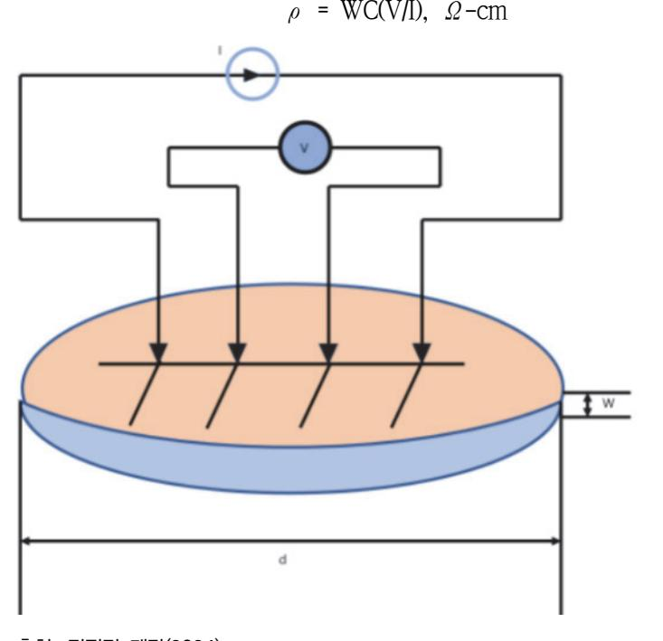

출처: 집필진 제작(2024) [그림 3-1] 4점 프로브 면 저항 측정 방법

#### (2) 반사도(RI: reflectivity intensity, %)

금속막 표면의 반사도는 나노 스펙(nano spec) 계측 장비로 측정한다. 금속막의 표면에 파 장 λ = 480nm의 광을 조사한 후 수직 반사되는 빛의 양을 수치화하여 입사광의 양과 반사광의 양을 퍼센트 비율로 구하여 반사도를 계산한다. 금속의 증착 온도가 낮을수록, 증착 속도는 빠를수록 반사도가 증가한다. 막 두께가 500Å 이상이면 반사율이 높아지는 경 향이 있다. <표 3-6>에 각종 금속에 대한 반사도가 나타나 있다. 레이저 광원이 다르면 반사도가 달라진다.

| 금속 | YAG 레이저<br>(파장: 0.9㎛~1.1㎛) | CO₂ 레이저<br>(파장: 0.9㎛~1.1㎛) |
|----|----------------------------|----------------------------|
| Au | 94.70                      | 97.70                      |
| Pt | 72.90                      | 95.60                      |
| Ag | 96.40                      | 99.00                      |
| Al | 73.30                      | 96.90                      |
| Cu | 90.10                      | 98.40                      |
| Fe | 65.00                      | 93.80                      |
| Ni | 72.00                      | 95.60                      |
| Zn | 49.00                      | 98.10                      |
| Mg | 74.00                      | 93.00                      |
| Cr | 57.00                      | 93.00                      |
| Mo | 58.20                      | 94.50                      |
| W  | 62.30                      | 95.50                      |

|  |  |  | <표 3-6> 금속의 표면 반사율(%) |
|--|--|--|-----------------------|
|--|--|--|-----------------------|

#### (3) 전자 이동(EM: electro migration)

금속 배선에 전류를 인가하면 배선의 내부로 전자가 이동하게 된다. 이런 전자의 이동은 금속의 그레인 경계(grain boundary)로 집중되고 전자가 이동된 빈자리는 상대적으로 약해 결정이 깨어져 미세 기공(micro void)으로 이루어진 불안전한 상태에 이른다. 이 현상은 알루미늄에서 발생하고, 상대적으로 텅스텐은 전자 이동 저항성이 강하여 텅스텐 내부에서는 전자 이동이 발생하지 않는다. 그레인 사이의 크기 차이가 클수록 전자 이동 에 취약하다. 알루미늄에 비해 구리는 전자 이동 특성에 강하다. 본 검증은 공정 중에는 어렵고 공정이 끝난 후 스크리브 레인(scribe lane) 안에 설계된 전자 이동 테스트 모 듈을 통해 검증할 수 있다.

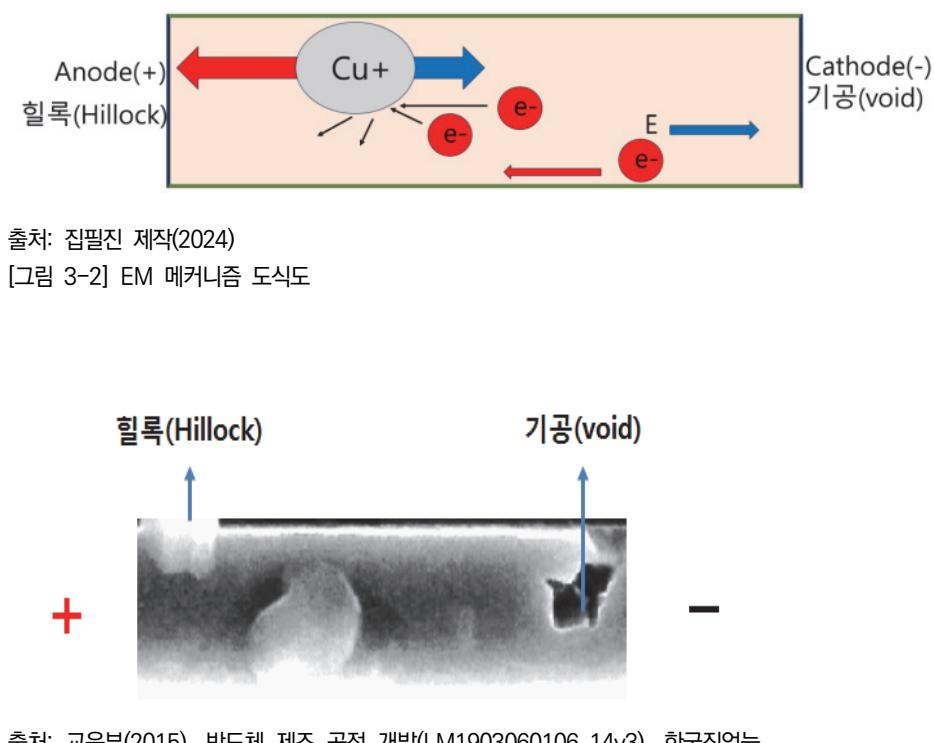

출처: 교육부(2015). 반도체 제조 공정 개발(LM1903060106\_14v3). 한국직업능 력개발원. p. 75. [그림 3-3] 기공(void)과 힐 락(hillock) 형성 SEM 사진 모습

#### (4) 응력 이동(SM: stress migration)

응력 이동은 [그림 3-4]에 도시된 것처럼 메탈 라인들 사이에 응력(stress)이 작용할 때 메탈 구성 원자가 이동하는 고장 현상이다. 이 원자의 이동은 메탈 라인의 저항 증가와 단선을 유 도하는 기공(void)들을 형성한다. 이 현상은 제조 공정, 소자 사용 환경의 온도 변화, 특히 제조 공정에서는 열처리 과정의 온도 변화로 응력이 발생하여 메탈(Al, Cu)들 사이에 작 용하여 발생한다. 발생된 응력은 메탈 라인 안의 공공(vacancy)들을 이동시키고, 기공(void) 을 형성하며 어떤 특정 장소에 집중하게 한다. 응력 이동은 상하 두 메탈 라인 사이에 작 용하여 발생된다. 메탈 원자의 이동 속도는 고온일수록 증가하는 반면 메탈 라인에 작용된 응력은 고온에서 감소한다. [그림 3-5]에 응력 이동 현상으로 발생되는 모습이 나타나 있다. 본 검증은 공정 중에는 어렵고 공정이 끝난 후 스크리브 레인(scribe lane) 안에 설 계된 응력 이동 테스트 모듈을 통해 검증할 수 있다.

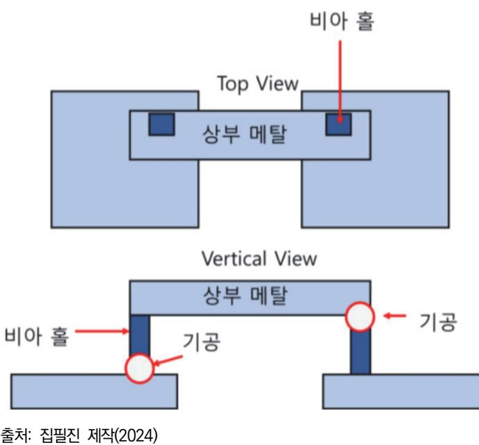

[그림 3-4] 응력 이동 현상 메커니즘

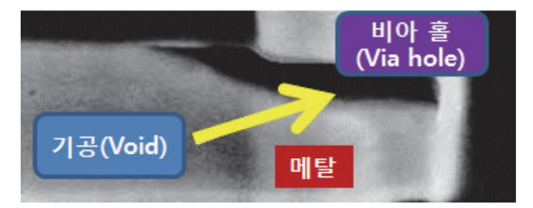

출처: 교육부(2015). 반도체 제조 공정 개발(LM1903060106\_14v3). 한국직업능력개발 원. p. 75. [그림 3-5] 응력에 의해 상하 메탈 사이에 발생되는 기공(void)

#### 숖 습식 화공 약품 재료

습식 화공 약품은 세정, 식각, 표면 처리 등에 사용하는 액상 재료이다. 화학적 특성에 따라서 산, 염기, 유기로 분류한다.

산성 화공 약품은 PH 농도가 7보다 낮은 액체이며 물에 녹았을 때 수소 이온(H+)을 발생시킨다. 반응성과 부식성이 강하며, 산성도가 높을수록 더 강한 반응성을 보인다. 식각이나 세정 공정 등에 사용하며 공정에 황산(H2SO4), 염산(HCl), 질산(HNO3), 불산(HF), 인산(H3PO4) 등이 있다. 염기성 화공 약품은 PH 농도가 7보다 큰 액체를 말하며, 수용액 상태에서 수산화 이온(OH-)을 발생시킨다. 산에 반대되는 성질의 액체이며, 산과 중화 반응을 일으켜 염과 물을 만든다. 염기성 습식 화공 약품에는 수산화나트륨(NaOH), 수산화칼륨(KOH), 암모니아(NH4OH) 등이 있다.

유기 용매는 용질을 녹일 수 있는 액체 상태의 유기 화합물이다. 감광막과 같은 고분자 물질을 녹이거나 희석, 세척하는 용도로 사용된다. 유기 용매에는 알코올 계열인 메탄올, 에탄올, 아이 소프로필알콜(IPA), 아세톤과 벤젠 계열인 벤젠, 톨루엔, 자일렌 등이 있다. [그림 3-6]에 pH 농도별 해당 물질이 제시되어 있다.

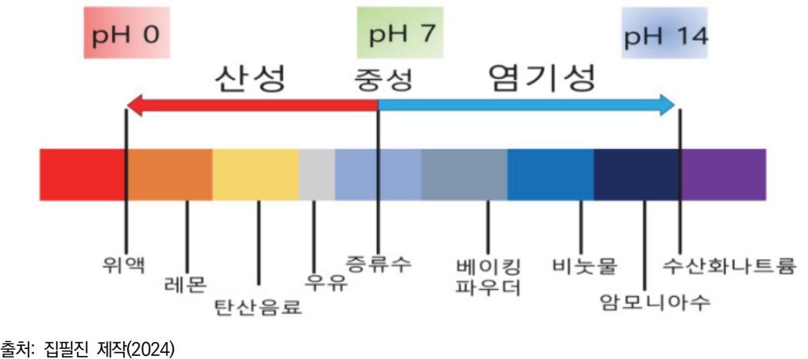

<sup>[</sup>그림 3-6] pH 농도별 해당 물질의 예시

1. 특성

화학 약품의 종류가 다양해지고 사용량이 계속 증가하는 추세는 기존 사용해 왔던 화학 약 품도 사용 방법의 개선 및 사용 순서의 변경을 요구하고 있다. 화공 약품의 특성을 고려하 여 적절한 방법을 모색해야 함을 의미한다.

(1) 액체로 보관하고 기체로 사용하는 경우

보관 시에는 액체, 사용 시에는 기체로 사용하는 경우이다. 분자량이 큰 메탈계 재료, 분자량이 큰 가스에 해당된다. 물질의 보관은 액체 상태인데 관련된 특성 인자는 증기 압, 보관 압력, 보관 온도이다.

(2) 액체로 보관하고 액체로 사용하는 경우

일반적인 액체 재료에 해당되며 보관 용기와 사용 용기가 동일하다. 이는 독성 약품의 강한 특성을 지니고 있거나 고압 또는 저압에서 사용되는 경우도 해당된다. 또한 사용 시 희석 및 배합하는 경우인데 사용 조건을 조정할 필요가 있다. 세정 조건의 변경되거 나 웨이퍼의 세정 조건이 변경되어 희석률이나 배합률이 달라질 수 있다. 점도 상태에 따라 보관 특성이 달라지는데 순수한 물의 경우 통상적으로 액체 상태, 고점도 상태인 감광액의 경우는 점도가 있어서 계량과 계측에 전용 지그를 사용한다. 웨이퍼 연마 공정 에 사용되는 슬러리는 고체 분말을 포함한 액체의 특성이 있다.

(3) 유기 용제

카본 계열로 구분되며 화재 위험이 크다. 감광액이 대표적인 물질로서 벤젠, 카본 체인

의 다양한 조합으로 되어 있다.

(가) 알코올 계열

메탄올(CH3OH), 에탄올(C2H5OH), 아이소프로필알콜(IPA, C3H7OH) 등이 속한다. 카본 체인 구조의 유기물을 제어하기 위한 배합 물질이다. 감광액 등의 유기물을 제 어하기 위한 용도로 사용된다. 또한 벤젠 등의 유기물과도 혼합이 가능하고 순수한 물(H2O)과 혼합이 가능하다.

(4) 벤젠 계열

카본과 수소의 육각형 구조로 카본 계열의 물질의 기본 구조이다. 대부분이 인화성이거 나 열에 민감한 특성을 가지고 있다.

(5) 산 및 알칼리 계열

염산(HCl), 불소(HF), 과산화수소(H2O2), 암모늄(NH4OH) 등이 속한다. 강산과 강알칼리 가 직접 섞이면 폭발적인 반응을 한다. 2가지 약품 모두 인체에 치명적인 위해를 가하 고, 금속 등의 구조물에 심각한 상해를 가할 수 있으므로 보관과 취급에 주의를 해야 한다. 기본 특성 정보는 MSDS와 제조사에서 제공하는 자료를 통해 반드시 확인해야 한 다. 산(Acid)과 알칼리의 기본 특성은 강한 부식성과 반응성이다.

(6) 중성 계열

초순수물이 속하며, 중성 특성을 가지고 있다. 산과 알칼리의 반응 생성물, 또는 산 과 금속의 반응 생성물은 물에 녹는 수용성이다. 염산, 불소 등의 물질을 희석하거 나, 반도체를 직접 세정하는 용도로 사용된다. 불순물의 함유량 제어가 중요하고, 107 Ohm 이상의 전기 저항을 확보해야 한다.

2. 기준

반도체 공정에 사용하는 화학 물질은 불순물의 함유량, 보존 기간 동안의 안정성, 반응의 정확성, 반응 생성물의 안정성 등의 설정 기준에 부합하는 것이어야 한다. 불순물 함유량과 더불어 중요한 기준은 불순물 종류이다. 칼륨(K), 칼슘(Ca), 나트륨(Na), 철(Fe) 등의 금속 들은 반도체의 소자 내에 잔류하여 전기적 특성을 저하시킨다. 알루미늄(Al), 니켈(Ni), 은 (Ag), 텅스텐(W) 등은 공정에 따라서 사용이 허용되는 금속이고, 구리(Cu)는 사용되는 경우 와 제한되는 경우가 존재한다. 또한 비메탈계 물질도 경우에 따라서 제한을 받는다. RoHS 에서 정하는 사용을 금지하는 물질은 반도체 공정에서의 사용이 제한되어야 한다. 기본적으 로 MSDS를 만족하는 특성을 가져야 하고, RoHS에서 금지한 물질을 함유하지 않아야 한 다.

3. 검증 패턴

공정상에서 검증하는 방법은 식각의 경우 세정 후 불순물 입자 관찰과 식각률을 측정이 있 다. 세정의 경우 잔류물들의 상태를 파악한다.

#### 숗 특성 평가 데이터 처리

반도체 제조 공정에는 공정 조건, 소자의 종류, 장비, 재료 등의 수많은 변수들이 관여한 다. 결국 단위 공정에서 분석도 가능하지만 재료 평가 시에는 모든 조건을 고정해 놓고 재료만 변수로 하여 최종 웨이퍼 수율과 신뢰성의 관계성을 분석해야 한다. 물론 양산에 적용하기 위 해서는 재료의 공정 적합성이 최적화되는 조건을 찾고 선행하는 몇 개의 로트(lot)에 적용한 후 신뢰성 평가를 한다. 최종 수율과 신뢰성에 문제가 없으면 양산에 전면 적용한다.

- 1. 불량 결정
  - (1) 제조 공정과의 부합성에 의한 불량 결정

재료의 불량은 공급하는 회사들의 재료 평가의 상대적 차이로 결정되는 것이 아니 다. 물론 비교 평가를 통해 각자 제조 공정과 장비에 부합되는 최적의 재료를 선택할 수 있다. 동일한 재료를 사용하여 여러 회사들이 제품을 제조해도 제조 환경 특성상 결 과가 다르게 나올 수 있기 때문이다. 여기서 불량은 재료를 제조 공정에 투입해서 기존 사용했던 재료보다 동등 이상의 제품 특성이 확보되지 않은 경우를 말한다. 이 경우 그 제조 공정에서는 불량이라고 할 수 있다. 결국 새로운 재료를 적용했을 때 평가 결과를 기존 수율과 비교해 보고 분석하는 것이 중요하다. 또한 신뢰성 평가를 통해 제품 특성 에 영향을 주는지 여부도 파악해야 한다.

(2) 재료 규격서 불일치에 의한 불량 결정

재료 구매 시 제시한 규격서와 상이한 평가 결과가 도출되면 이 재료는 불량이다. 이런 경우 불량 결정은 해당 공정 단위 평가에서 결정할 수 있다.

(3) 불량 결정 시 유의 사항

불량 결정 전에 다른 공정 변수가 개입되었는지 분석을 철저히 해야 한다. 반도체 제조 용 재료는 다양해서 각기 주어진 재료에 대하여 패턴이 없는 웨이퍼에 단위 평가를 먼 저 해야 한다. 왜냐하면 여러 단계의 공정을 거치는 동안 다른 공정에서 불량의 원인을 제공할 수도 있기 때문이다.

2. 산포도 분석

산포의 문제는 테스트 재료들이 모두 규격서 기준 대비 성능을 만족하고 있지만, 분포를 확 인해 보니 대물량 양산 상황에서 수율이 떨어질 수 있는 상황에서 발생한다. [그림 3-7]과 같이 샘플링 하여 측정한 시료의 특성은 성능 평가 기준 대비 모두 성능을 만족하고 있다. 그러나 분포를 확인해 보면 우측 꼬리 부분에서 불량이 발생하게 되므로 이러한 불량 시료 의 수량에 대한 정밀한 분석이 필요하다.

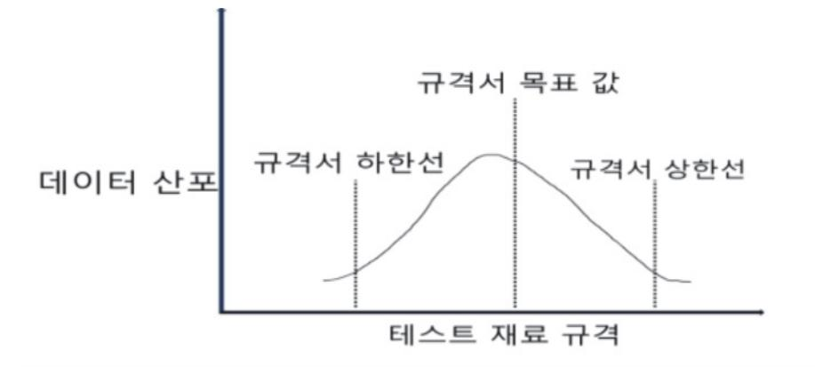

출처: 집필진 제작(2024) [그림 3-7] 데이터 산포도 곡선

수 공정 과정의 문제에 대한 고려

1. 공정 전 고려 사항

습식 화공 약품을 공정에 적용하기에 앞서 약액의 불순물 함유량, 보관 상태, 사용 전 준비상태 등에 대한 점검이 필요하다.

(1) 불순물 함유량

반도체 공정에서 불순물 함유량에 대한 사양은 매우 중요한 문제로 반도체 재료는 초기 제조 단계에서 불순물을 얼마나 포함하지 않고, 보관 중 불순물이 포함되지 않는 등 불 순물을 얼마나 제어할 수 있는지가 기술적 관건인 경우가 많다.

- (가) 불순물의 종류
  - 1) 메탈계 불순물
  - 2) 공기 중의 먼지 및 수분 함유량
  - 3) 보관 용기의 용해 침투
- (2) 보관 상태

재료 및 소모품을 공급받아서 바로 사용할 수 있다면, 재고 관리적인 측면 외에도 재료 의 상태가 항상 최적의 상태일 것이나 현실적으로는 재료를 창고에 보관하여 사용하게 되므로 보관 용기 및 보관 장소에 대해서 고려해야 한다. 보관에 대해서는 다음의 상태 를 확인하여야 한다.

(가) 혼합 보관에 대한 법적 관리 항목의 확인

일정 보관량을 넘어가면 동일한 공간에서 함께 보관할 수 없는 경우에 대해서 법과 시행령 MSDS 등의 내용을 사전에 확인하여야 한다.

(나) 보관 환경에 대한 확인

재료별 온도, 습도, 통풍에 대해서 확인을 해야 한다. 통상 포토레지스트는 빛에 대

해서 민감하므로 조명에 주의하여야 한다.

- (다) 보관 용기에 대한 고려
  - 약액 재료의 유효 기간도 중요하게 관리 되어야 하지만, 보관 용기의 유효 기간도 중요하게 관리 되어야 한다. 보관 용기의 오염 및 중간 용기의 오염은 반도체 공정 전체에 대한 문제 및 장비를 정비해야 하는 경우도 있다. HF 수용액이나 혼합 수용 액은 SiO2 즉 유리를 녹이는 걸로 알려져 있고, 염소 Gas는 에폭시 수지를 약화시 키는 걸로 알려져 있다. 많은 화학 약품이 속도의 문제는 있지만, 금속 및 플라스틱 재료와 반응을 지속하고 있다.

(3) 사용 전 준비 상태 확인

화학 약품을 사용하기에 앞서 사용 조건에 맞추어서 배합을 해야 하는 경우 배합 조건 에 대해서 확인하고, 배합 환경과 배합 전후의 배합 상태에 대한 확인을 해야 한다.

2. 공정 후 문제에 대한 고려

공정 전에 문제점에 대한 확인을 하고 문제가 없었다고 하면 통상 공정 진행 후에 문 제는 없을 경우가 많으나, 현실적으로 반도체 생산 공정에서는 공정 후에 문제가 생기는 경 우가 있다. 세정의 경우 공정 대상의 웨이퍼의 표면 구성이 바뀌거나 대상 막의 재료나 결 합 구조가 바뀔 경우 세정 공정에서 문제가 발생하는 경우가 있다.

#### 숙 반응기(REACTOR, chamber)

자연계에서는 항상 반응이 일어나고 있다. 식물의 광합성, 사람의 위 속에서의 소화 과정을 비 롯하여 자동차 엔진에서의 연료의 연소 등 주변의 모든 현상이 반응 현상이라고 할 수 있겠다. 하지만 여기에서 다루는 반응은 필요한 반응을 효과적이고 주변의 불순물이나 영향을 받지 않 기 위하여 원하는 반응만이 효율적으로 이루어지도록 공간을 제공하는데 그러한 공간을 반응기 라고 할 수 있다.

반응기에는 원자력 발전소의 핵 반응기, 반도체 에칭 공정의 진공 체임버, 정유 공장의 반응탑 등이 주변에서 쉽게 소식을 접할 수 있는 반응기의 대표적인 경우라고 할 수 있다.

1. 회분식 반응기(Batch Reactor)

반응을 한 번씩 진행하는 경우로 생산할 제품의 양을 계산하여 필요한 재료를 투입하거나, 반응을 유도하는 방식으로 연속 생산 방식과 대조된다고 할 수 있다.

- (1) 빵집에서 하루 분량의 밀가루 반죽을 숙성시키는 경우
- (2) 하루 먹을 분량의 청국장 숙성
- (3) CVD 반응 공정의 1회 공정 진행
- (4) 반도체 세정 장비의 세정 공정

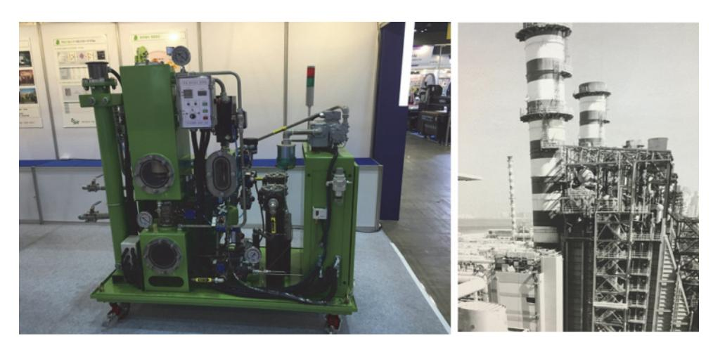

출처: 교육부(2015). 반도체용 습식 화공 약품 재료 제조(LM1903060405\_14v1). 한국직업능력개발원. p. 43. [그림 3-8] 반응 체임버 및 반응 타워

2. 연속 흐름 반응기

생산물을 연속적으로 생산하기 위해 사용되는 반응기로 [그림 3-8]은 건물 수층 높이의 반응 탑으로 석유 화학 정유 설비가 대표적인 연속 흐름 반응기라고 할 수 있다. 석유 화학 정제 탑은 연속 생산 방식의 대표적인 경우로 석유 화학 정제물의 많은 종류를 생산하고 있다. 통상 보관 및 이송이 액체 상태인 경우 연속 흐름 반응기를 이용해서 생산하는 경우가 일 반적이다.

(1) 연속 교반 탱크 반응기(CSTR: continuous stirred tank reactor)

반도체 공정에서 중요하게 사용되는 초순수를 생산하는 과정에 사용되는 반응기가 대표 적인 경우로 [그림 3-8]과 같은 경우가 일반적이나 형상은 구형, 원추형, 원기둥형 등 여러 가지 형상이 있다.

(2) 관형 반응기(tubular reactor)

연속 반응 공정 중에서 반응에 필요한 조건이 긴 지속 시간을 가지거나 좁은 관의 형상이 필요한 경우 사용하는 반응기로 칼럼 내부에 배관을 배치하는 경우와 배관을 대기 중으로 노출하는 경우도 있다. 냉각 반응을 유도하기 위한 열 교환기 등이 대표적이다.

(3) 충전층 반응기(Reactor)

반응 체임버의 내부에 반응을 도와줄 촉매나 구조물을 내부에 충진시켜서 반응을 진행 하도록 하는 반응기로서 암모니아 Gas 물에 흡수시키는 공정이나 염산을 물에 흡수시키 는 공정 등에서 활용된다.

숕 설계 반응식

반응을 유도하기 위한 설계를 진행함에 있어서 반응 설계를 하는 과정으로 고도의 화학적 전문 성이 필요한 과정으로 실질적으로 반응 설계를 하는 작업으로 반응식, 필요한 에너지, 필요한 재료, 생성물의 특성 등을 수식으로 표현하고 그 수식을 구체화시키는 작업이 시설 및 장치의 설계라고 하겠다.

1. 물 H2O 반응에 있어서 고려해야 할 사항

여기에서 고려해야 할 반응은 수소 H2 gas와 산소 O2 gas의 반응을 고려한다.

- (1) 화학식: 2H + O = H2O + 방출 에너지
- (2) 반응에 필요한 양: 수소 2×22.4리터 + 산소 22.4리터 => 22.4리터 물 H2O gas 1몰의 부피는 22.4리터이고 화학의 중요 단위이다. 따라서 물의 화학식을 고려하면 수소 44.8리터와 산소 22.4리터는 물 44.8리터를 생성하게 된다. 하지만 이는 화학식을 통한 계산으로 실제로 수소와 산소는 단분자 Gas가 아니다.
- (3) 반응 화학식: 2H2 + O2 = 2H2O

실제로 몰 반응에 필요한 양은 수소 22.4리터의 2배인 44.8리터와 산소 22.4리터를 반 응시키면 22.4리터의 2배인 44.8리터가 생성되게 된다. 따라서 물 H2O gas 1몰을 생 성하기 위해서는 수소 22.4리터와 산소 11.2리터를 합성하면 물 Gas 22.4리터가 생성 되게 된다.

(가) 반응 전 보관 용적

수소 22.4리터, 산소 11.2리터

(나) 반응 용적

수소와 산소의 혼합 용적 33.6 리터

(다) 반응 후 반응 용적

물 H2O gas 22.4리터

(4) 반응 시간의 제어

여기서 주의해야 할 것은 수소를 산소와 반응시키는 반응이라는 것이다. 수소는 산소와 반응에 있어서 발열 반응이고 반응 시간이 매우 짧아 폭발적 반응이라는 것이다.

(5) 반응 온도의 제어

수소와 산소의 반응이 발열 반응이기도 하지만 물 H2O gas를 냉각하면 물 H2O 액 체로 상이 바뀌게 된다는 점이 중요하고 물에는 산소와 수소가 일정 부분 녹아들게 되는 등 예상하기 어려운 부분이 있어 순수한 물을 얻기 위해서 수소와 산소를 반응시 키는 방법을 사용하지는 않는다.

#### 숖 반응 파라미터

순수한 물을 얻기 위해서 여과 방식과 이온 교환 방식을 기본으로 하는 연속 공정 방식을 주로 활용하고 있다.

1. 장치 파라미터

장치를 구성하는 파라미터로 저장 용기, 반응 용기, 연결 배관, 제어 밸브, 안전밸브, 무게, 제어 방식 등이 있다.

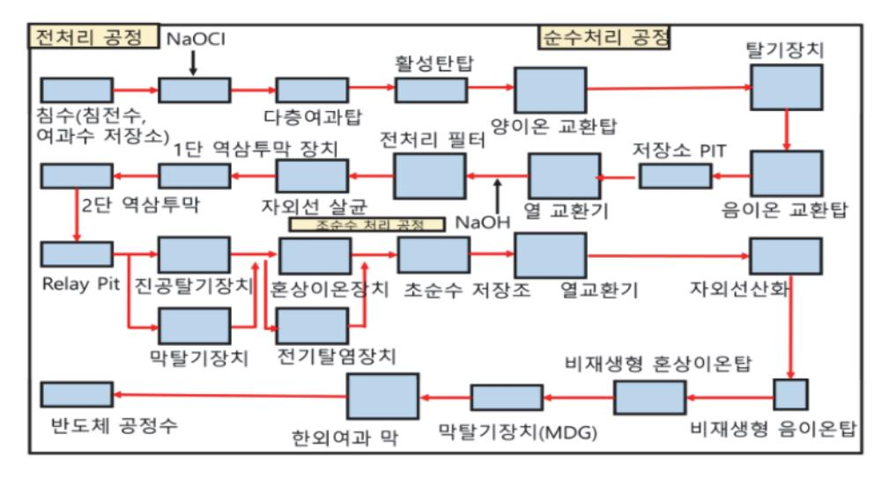

출처: 집필진 제작(2024) [그림 3-9] 초순수 생산 PID 예

2. 제어 파라미터

장치 운전을 위한 파라미터로 이후 공정 파라미터를 통한 장치의 생산성과 성능을 결정하 는 요소가 된다.

(1) 기계적 제어

기계적 구동을 제어하는 것으로 구동 모터, 구동 밸브 등의 제어를 말한다.

(2) 되새김 제어: 피드백 제어

연속 공정에서 센서와 구동부를 연계시켜서 생산 유체의 상태(온도, 유속, 성분)를 제어 하는 것이다.

3. 반응 파라미터

반응의 직접성을 제어하는 것으로 반응의 요소를 기계 및 제어 파라미터를 통제하여 반응 성을 제어하는 것으로 장비 모델에 따라서 레시피 등으로 관리되기도 한다.

- (1) 온도
- (2) 재료의 배합량
- (3) 압력

## 수행 내용 / SOD 공정 재료 제조하기

#### 재료·자료

- 시티 워터: 산업 용수 및 도시 용수(수돗물)
- 초순수 제조 설비의 사양서 및 매뉴얼
- 장비 운전에 필요한 소모품 및 교체 부품

#### 기기(장비 ・ 공구)

- 초순수 제조기
- 초순수 제조기 운전에 필요한 기기
- 장비 정비에 필요한 기기
- 초순수 화학적 농도를 확인할 수 있는 장비(pH 측정기 등)
- 초순수의 전기적 비저항을 측정할 수 있는 장비[약액(비) 저항 측정기]

#### 안전 ・ 유의 사항

- 장비 취급에 필요한 안전·유의 사항을 숙지한다.
- 약액 취급에 대한 안전·유의 사항을 숙지한다.
- 안전 보호구 및 보호 장비의 사용에 필요한 안전·유의 사항을 숙지한다.

#### 수행 순서

숔 SOD 공정 재료를 제조하는 과정을 숙지한다.

반도체 SOD(spin-on dielectric) 공정 재료를 제조하는 과정은 여러 단계를 거쳐 고순도 의 유전체 재료를 생산하는 것이다. 이를 위해서는 철저한 원재료 준비, 혼합, 반응, 정제, 품질 관리 등이 필요하다. 아래는 SOD 공정 재료 제조 과정의 상세한 설명이다.

- 1. 원재료를 준비한다.
  - (1) 주요 원재료
    - (가) 폴리실세스퀴옥산(PSQ: poly-silsesquioxane)
      - 1) 제조사: Dow Corning, Gelest Inc.
      - 2) 순도: ≥ 99.999%

- (나) 용매: 아이소프로판올(Isopropanol), 에탄올(Ethanol)
  - 1) 제조사: Sigma-Aldrich, Fisher Scientific
  - 2) 순도: ≥ 99.9%
- (다) 원재료 공급
  - 1) 공급사 선정: 신뢰할 수 있는 공급사로부터 고순도 원재료를 확보한다.
  - 2) 입고 검사: 원재료의 순도와 불순물 함량을 철저히 검사한다.

#### 2. 혼합 공정을 파악한다.

반도체용 SOD(spin-on dielectric) 공정은 반도체 제조에서 중요한 절연층을 형성하기 위 해 사용되는 공정 중 하나이다. 이 공정에서 사용되는 SOD 재료의 제조 과정은 매우 정밀 하게 관리되어야 하며, 특히 혼합 공정은 최종 재료의 품질에 큰 영향을 끼친다. 다음은 SOD 공정 재료 제조에서 혼합 공정을 파악하는 데 필요한 주요 단계와 고려 사항이다.

- (1) 재료 선택
  - (가) SOD 공정에 사용되는 주요 재료는 실리콘 기반 화합물, 유기 실란, 실리카, 또는 폴리 실록산 등이 포함될 수 있다. 이들 재료는 최종 절연층의 특성(예: 유전 상수, 열적 안정 성, 기계적 강도 등)을 결정한다.
  - (나) 혼합에 사용되는 각 재료는 고순도 및 낮은 불순물 함량을 유지해야 하며, 엄격한 품질 관리가 필요하다.
- (2) 혼합 비율 결정
  - (가) 각 재료의 혼합 비율은 매우 중요하며, 이는 SOD 코팅의 두께, 균일성, 그리고 물리적· 화학적 특성에 직접적인 영향을 끼친다.
  - (나) 혼합 비율은 제조 공정에 따라 최적화되며, 정확한 비율이 재현성 있게 유지되어야 한다.
- (3) 혼합 환경 제어
  - (가) 혼합이 이루어지는 환경은 엄격히 통제되어야 한다. 온도, 습도, 그리고 혼합 용기의 재 질 등이 혼합물의 안정성과 품질에 영향을 줄 수 있다.
  - (나) 혼합이 불균일하게 이루어지지 않도록 적절한 교반 속도와 시간이 설정되어야 한다.
- (4) 혼합 공정 단계
  - (가) 재료 계량 및 준비: 각 재료는 정밀한 계량 장비를 사용하여 정확한 양으로 측정한다. 이는 최종 제품의 일관성을 보장하기 위해 필수적이다.
  - (나) 예비 혼합: 계량된 재료는 처음에 저속으로 혼합하여 큰 입자들이 완전히 분산되도록 한 다.
  - (다) 주 혼합: 예비 혼합된 재료를 더 높은 속도로 혼합하여 균일한 혼합물을 만든다. 이 과 정에서 온도 제어가 중요하며, 과열이나 냉각이 발생하지 않도록 주의한다.

- (라) 진공 탈기: 혼합 과정에서 발생할 수 있는 기포를 제거하기 위해 진공 탈기 공정을 진행 한다. 이는 최종 코팅의 균일성을 유지하는 데 필수적이다.
- (마) 최종 혼합 및 안정화: 혼합이 완료된 후, 혼합물을 안정화시키기 위해 일정 기간 보관한 다. 이 과정에서 미세한 입자가 더욱 균일하게 분포되도록 한다.
- (5) 품질 검사
  - (가) 혼합 후, 최종 혼합물은 다양한 품질 검사 과정을 거친다. 이에는 점도 측정, 입자 크기 분석, 화학적 순도 검사 등이 포함된다.
  - (나) 혼합물의 특성이 설계된 사양과 일치하는지 확인하는 것이 중요하며, 불일치가 발견될 경우 혼합 비율 또는 공정 조건을 조정해야 한다.
- (6) 공정 기록 및 관리
  - (가) 모든 혼합 공정 단계는 철저히 기록되어야 하며, 이는 향후 공정 최적화 및 문제 해결에 사용된다.
  - (나) 혼합 공정 중 사용된 재료, 환경 조건, 그리고 혼합 결과는 모두 문서화하여 추적 가능 하도록 관리해야 한다.
- (7) 최종 포장 및 저장
  - (가) 혼합이 완료된 SOD 재료는 특수 용기에 담아 불순물이나 오염으로부터 보호되어야 한 다.
  - (나) 포장된 재료는 안정적인 환경에서 저장되며, 사용 전에 품질이 유지되는지 확인하기 위 해 주기적인 검사가 필요하다.

혼합 공정의 정확성과 재현성은 SOD 공정의 성공에 핵심적인 역할을 하며, 이는 결국 반 도체 소자의 성능과 신뢰성에 큰 영향을 끼친다. 혼합 공정에 대한 철저한 이해와 관리가 필요하며, 모든 단계에서의 세심한 주의가 고품질의 SOD 재료를 제조하는 데 필수적이다.

3. 반응 공정을 파악한다.

반도체용 SOD 공정 재료의 제조에서 반응 공정은 매우 중요한 단계로, 이 과정에서 재료 의 물리적·화학적 특성이 결정된다. SOD 공정은 주로 반도체 소자에서 절연층을 형성하기 위해 사용되며, 이 재료는 반응 공정을 통해 특정 특성을 가지게 된다. 반응 공정을 파악하 는 데 필요한 주요 단계와 고려 사항은 다음과 같다.

- (1) 원료 물질 준비
  - (가) SOD 재료는 주로 실리콘 기반의 화합물[예: 실란(silane), 테트라에톡시실란(TEOS)]과 기타 유기 실란, 실리카, 또는 폴리실록산 등을 사용한다.
  - (나) 반응 공정을 시작하기 전에 원료의 순도와 불순물 농도를 엄격하게 관리해야 한다. 이는 최종 제품의 품질에 직접적인 영향을 끼친다.

87

- (2) 전구체(precursor) 혼합
  - (가) 원료 물질은 반응 공정에 들어가기 전에 혼합된다. 이 혼합물은 전구체라고 하며, 반응 조건에 따라 다양한 방식으로 혼합될 수 있다.
  - (나) 전구체 혼합은 반응 공정의 시작 단계로, 이후 화학 반응을 통해 최종 재료의 구조와 특 성이 결정된다.
- (3) 화학 반응
  - (가) SOD 재료는 주로 가수 분해 반응(hydrolysis) 및 축합 반응(condensation)을 통해 형 성된다.
    - 1) 가수 분해 반응: 전구체가 물과 반응하여 실라놀(Silanol, Si-OH) 그룹을 형성한다.

()4+2→()4+4

2) 축합 반응: 실라놀 그룹이 서로 반응하여 실록산(Siloxane, Si-O-Si) 결합을 형성 하고, 물 또는 알코올을 부산물로 생성한다.

()4+()4→−−+22

- 3) 이 반응 과정에서 SOD 재료의 기공 구조, 유전 상수, 열적 안정성 등의 특성이 결 정된다.
- (4) 반응 조건 제어
  - (가) 온도: 반응 온도는 반응 속도와 최종 제품의 물리적 특성에 큰 영향을 끼친다. 일반적으 로 낮은 온도에서는 반응이 느리게 진행되지만, 더 균일한 구조를 형성할 수 있다.
  - (나) pH: 반응 용액의 pH 값은 가수 분해 및 축합 반응의 속도와 메커니즘에 영향을 끼친 다. 산성 또는 알칼리성 조건에 따라 반응 경로가 달라지며, 이는 최종 재료의 특성에 영향을 끼친다.
  - (다) 용매: 사용된 용매의 종류와 농도는 반응의 균일성 및 최종 제품의 기계적 특성에 영향 을 줄 수 있다.
- (5) 젤화 및 응고(gelation and curing)
  - (가) 화학 반응이 완료되면, 생성된 재료는 젤화 과정을 거친다. 이 과정에서 반응물이 네트워 크 구조로 변환되어 점성이 높은 젤 상태로 전환된다.
  - (나) 젤화된 재료는 응고 과정(curing)을 통해 더욱 안정화된다. 응고는 일반적으로 열처리에 의해 수행되며, 이 단계에서 잔류 용매가 제거되고 재료의 밀도와 기계적 강도가 향상된 다.
- (6) 후처리(Post-treatment)
  - (가) 응고된 재료는 후처리 과정을 통해 최종 특성을 가지게 된다. 이는 종종 열처리 또는 플 라즈마 처리와 같은 공정을 포함한다.

- (나) 이 과정에서 재료의 미세 구조가 더욱 조정되며, 반도체 공정에 필요한 전기적 및 물리 적 특성을 최적화한다.
- (7) 품질 검사
  - (가) 제조된 SOD 재료는 반응 공정 후에 엄격한 품질 검사를 거친다. 검사 항목에는 유전 상수, 열적 안정성, 두께 균일성, 기공 구조 등이 포함된다.
  - (나) 모든 특성이 설계 사양을 충족하는지 확인한 후, 재료는 포장되어 반도체 제조 공정에 사용된다.
- (8) 공정 기록 및 관리
  - (가) 반응 공정의 모든 단계는 철저히 기록되어야 하며, 공정 변수(예: 온도, 시간, pH 등)와 결과물의 특성을 추적 관리한다.
  - (나) 이러한 데이터는 향후 공정 최적화 및 문제 해결에 중요한 자료로 사용된다.
- (9) 응용 및 사용
  - (가) 완성된 SOD 재료는 반도체 제조 공정에서 절연층 형성, 표면 평탄화, 장비 보호 등을 위해 사용된다.
  - (나) 이 재료의 최종 성능은 반응 공정에서 얼마나 잘 관리되었는지에 크게 의존하므로, 반응 공정의 모든 단계를 최적화하고 관리하는 것이 중요하다.

SOD 공정 재료의 반응 공정은 반도체 제조에서 중요한 역할을 하며, 그 과정에서 발생하 는 화학 반응과 조건을 정확히 이해하고 관리하는 것이 고품질의 SOD 재료를 생산하는 데 필수적이다.

4. 정제 및 여과 공정을 파악한다.

반도체용 SOD 공정 재료의 제조에서 정제 및 여과 공정은 최종 제품의 순도와 품질을 보 장하는 중요한 단계이다. 이 단계에서는 불순물을 제거하고, 필요한 경우 입자의 크기를 조 절하여 균일한 재료를 얻을 수 있도록 한다. 이 과정은 반도체 공정에서 필요한 높은 수준 의 순도와 균일성을 달성하기 위해 필수적이다.

(1) 정제 공정(purification process)

정제 공정은 원료와 반응 공정에서 생성된 불순물, 부산물, 그리고 기타 오염 물질을 제 거하는 단계이다.

- (가) 증류(distillation)
  - 1) SOD 재료에 포함된 저분자량 불순물이나 잔류 용매를 제거하기 위해 증류 공정을 사용할 수 있다.
  - 2) 증류는 원료 물질의 증발점 차이를 이용해 불순물을 제거하는 방법으로, 특히 유기 화합물의 순도를 높이는 데 유용하다.

- (나) 재결정화(recrystallization)
  - 1) 재결정화는 고체 상태의 불순물을 제거하는 데 사용된다. SOD 재료의 특정 성분을 용매에 녹인 후, 온도를 낮춰 재결정화시켜 불순물을 분리한다.
  - 2) 이 방법은 고순도 실리카나 기타 무기 화합물의 정제에 주로 사용된다.
- (다) 용매 추출(solvent extraction)
  - 1) 특정 용매를 사용하여 SOD 재료 내의 불순물을 선택적으로 제거한다. 용매 추출은 주로 반응 후 남아 있는 유기 불순물을 제거하는 데 사용된다.
  - 2) 이 과정은 용매의 선택과 추출 조건에 따라 매우 효과적일 수 있다.
- (라) 화학적 정제(chemical purification)
  - 1) 화학적 반응을 통해 불순물을 제거하거나 중화시키는 방법이다. 예를 들어, 산 또는 염기를 사용하여 불순물을 중화하거나 침전시킨다.
  - 2) 이 방법은 특히 특정 화학적 오염 물질이 존재할 경우 사용된다.
- (2) 여과 공정(filtration process)

여과 공정은 정제된 SOD 재료에서 남아 있을 수 있는 미세 입자나 기타 고형 불순물을 제거하는 단계이다.

- (가) 고정밀 필터링(high-precision filtration)
  - 1) SOD 재료는 매우 미세한 입자를 포함하고 있기 때문에, 고정밀 필터(예: 나노미터 수준의 여과막)를 사용하여 불순물을 제거한다.
  - 2) 일반적으로 0.1㎛ 이하의 필터가 사용되며, 이를 통해 미세한 입자 및 젤 상태의 불순물을 제거할 수 있다.
- (나) 멤브레인 여과(membrane filtration)
  - 1) 멤브레인 여과는 특정 크기 이상의 입자를 제거하기 위해 사용된다. 멤브레인은 반 도체 공정에서 특히 중요한 미세 입자를 걸러내는 데 효과적이다.
  - 2) 이 공정은 재료의 점도와 유동성에 영향을 끼치지 않으면서도 높은 여과 효율을 제 공한다.
- (다) 원심 분리(centrifugation)
  - 1) 원심 분리는 고속 회전을 통해 고체 입자를 제거하는 방법이다. 고체 입자가 더 무 거운 경우, 원심력을 이용해 이를 분리한다.
  - 2) 주로 용액 내의 비교적 큰 입자를 제거하는 데 사용되며, 이후 미세 필터링과 함께 사용될 수 있다.
- (다) 다단계 여과(multistage filtration)
  - 1) 입자 크기에 따라 여러 단계의 여과를 진행하는 방식이다. 먼저 큰 입자를 제거한 후, 점차적으로 더 미세한 여과를 수행한다.

2) 다단계 여과를 통해 최종 제품에서 매우 높은 순도의 재료를 얻을 수 있다.

(3) 품질 검사 및 확인

정제 및 여과 공정 후, SOD 재료는 엄격한 품질 검사를 거친다.

- (가) 입자 크기 분석
  - 1) 여과 후 입자의 크기를 분석하여 원하는 크기의 입자만 남아 있는지 확인한다.
  - 2) 레이저 산란법 또는 다이내믹 광산란법을 사용하여 입자 크기 분포를 측정할 수 있 다.
- (나) 화학적 순도 분석
  - 1) 정제 후 재료의 화학적 순도를 확인하기 위해 분석을 수행한다. 이에는 ICP-MS(유 도 결합 플라즈마 질량 분석), XPS(엑스선 광전자 분광법) 등이 사용될 수 있다.
  - 2) 이 분석을 통해 재료에 남아 있는 불순물 농도가 허용 범위 내에 있는지 확인한다.
- (다) 유동성 및 점도 검사
  - 1) 정제 및 여과된 SOD 재료의 유동성 및 점도를 측정하여 코팅 공정에서의 사용 가 능성을 평가한다.
  - 2) 점도 변화가 너무 크지 않도록 관리하여 SOD 재료가 균일하게 코팅될 수 있도록 보장한다.
- (4) 최종 포장 및 저장

정제 및 여과 공정이 완료된 SOD 재료는 특수 용기에 담아 외부 오염이나 불순물로부 터 보호된다. 포장된 재료는 안정적인 환경에서 저장되며, 사용 전에 다시 한번 품질이 유지되는지 확인하기 위한 검사를 수행할 수 있다.

(5) 공정 기록 및 관리

정제 및 여과 공정의 모든 단계는 문서화하고 관리해야 하며, 이는 추후 공정의 최적화 와 문제 해결에 중요한 역할을 한다.

정제 및 여과 공정은 SOD 재료의 품질과 성능을 결정짓는 핵심 과정으로, 이 공정을 정확 하게 이해하고 관리하는 것이 반도체 제조에서 필요한 높은 수준의 순도와 품질을 달성하 는 데 필수적이다.

5. 품질을 관리한다.

반도체용 SOD 공정 재료의 제조에서 품질 관리는 최종 제품의 성능과 신뢰성을 보장하기 위해 매우 중요하다. 품질 관리 프로세스는 재료의 제조 전 과정에서 철저하게 수행되며, 이를 통해 불량품을 최소화하고, 고객 요구 사항에 맞는 고품질의 제품을 생산할 수 있다. SOD 공정 재료의 품질 관리를 위한 주요 단계는 다음과 같다.

(1) 원자재 품질 관리

(가) 원료 검사: SOD 재료의 기본 원료는 매우 고순도의 화학 물질로 구성되어야 한다. 원료

91

입고 시, 원자재의 순도, 입자 크기, 화학적 조성 등을 검사하여 사양에 맞는지 확인한 다.

- (나) 공급 업체 관리: 신뢰할 수 있는 공급 업체로부터 원료를 공급받고, 정기적인 평가를 통 해 공급 업체의 품질 관리 시스템을 확인한다.
- (2) 제조 공정 중 품질 관리
  - (가) 공정 제어(process control): 제조 공정 중에 사용되는 모든 변수(온도, 압력, 반응 시간 등)를 실시간으로 모니터링하고 제어한다. 공정이 설정된 파라미터 내에서 수행되도록 관 리하여 변동성을 최소화한다.
  - (나) 중간 샘플링 및 검사: 공정 중간에 샘플링을 통해 반응 상태, 혼합 균일성, 점도, 입자 크기 등을 검사한다. 이 과정에서 문제가 발견되면 즉시 조치하여 불량 발생을 방지한다.
  - (다) SPC(statistical process control): 통계적 공정 제어 기법을 사용하여 제조 공정의 일 관성을 유지하고, 공정 중 발생할 수 있는 이상 징후를 조기에 탐지한다.
- (3) 정제 및 여과 공정의 품질 관리
  - (가) 여과 효율 검사: 여과 공정 후, 잔여 입자의 크기와 농도를 분석하여 여과 효율을 확인 한다. 여과가 제대로 이루어지지 않으면 재작업 또는 추가 여과를 수행해야 한다.
  - (나) 순도 검사: 정제 공정 후, SOD 재료의 화학적 순도를 분석한다. 순도 검사에는 ICP-MS(유도 결합 플라즈마 질량 분석), XPS(엑스선 광전자 분광법) 등의 고정밀 분석 기법이 사용된다.
- (4) 최종 제품 검사
  - (가) 물리적 특성 검사: 최종 제품의 점도, 유동성, 입자 크기 분포 등을 검사하여 SOD 재료 가 공정 요구 사항을 충족하는지 확인한다.
  - (나) 화학적 특성 검사: 재료의 화학적 구성, 불순물 함량, 유전 상수, 열적 안정성 등을 분석 하여 제품이 규격에 부합하는지 확인한다.
  - (다) 코팅 특성 평가: 실제 반도체 웨이퍼에 SOD 재료를 적용해 코팅된 결과물을 검사한다. 코팅 두께의 균일성, 표면 결함 여부, 기계적 안정성 등을 평가한다.
- (5) 패키징 및 출하 전 품질 관리
  - (가) 포장 검사: 최종 제품이 외부 오염이나 손상으로부터 보호될 수 있도록 적절하게 포장되 었는지 확인한다. 포장재는 재료의 특성에 맞게 선택되어야 하며, 밀폐성과 내구성이 중 요하다.
  - (나) 출하 전 샘플링 검사: 출하 전 랜덤 샘플링을 통해 제품의 품질을 최종 확인한다. 샘플 검사 결과가 규격에 부합하지 않으면 출하를 보류하고 원인을 분석한다.
- (6) 추적성 및 기록 관리
  - (가) 데이터 기록: 제조 과정에서 발생하는 모든 데이터를 기록하고 보관한다. 이에는 원자재

검사 결과, 공정 파라미터, 중간 및 최종 검사 결과 등이 포함된다.

- (나) 추적성 관리: 문제가 발생했을 때 신속히 원인을 파악할 수 있도록, 각 제품에 대해 제 조 공정의 모든 단계가 추적 가능하도록 관리한다. 이를 통해 불량 제품의 신속한 리콜 및 원인 분석이 가능하다.
- (7) 고객 피드백 및 지속적 개선
  - (가) 고객 피드백 수집: 고객으로부터 받은 피드백을 수집하고 분석하여, 제품의 품질과 성능 에 대한 개선 사항을 도출한다.
  - (나) 지속적 개선: 수집된 피드백과 내부 품질 데이터를 바탕으로 제조 공정을 지속해서 개선 한다. 이를 통해 제품의 신뢰성과 고객 만족도를 높인다.
- (8) 품질 관리 시스템의 검증 및 인증
  - (가) 내부 감사: 정기적으로 품질 관리 시스템에 대한 내부 감사를 수행하여, 품질 관리 프로 세스가 효과적으로 작동하는지 검토한다.
  - (나) 외부 인증: ISO 9001과 같은 품질 관리 시스템 인증을 획득하여, 제조 공정이 국제 표 준에 부합하는지 확인한다. 이러한 인증은 고객에게 신뢰성을 제공하며, 제품의 시장 경 쟁력을 높인다.
  - (다) SOD 공정 재료의 품질 관리가 철저하게 이루어지면, 반도체 제조 공정에서 발생할 수 있는 불량을 최소화하고, 최종 제품의 성능과 신뢰성을 크게 향상시킬 수 있다. 품질 관 리 시스템은 공정 전반에 걸쳐 일관성을 유지하고, 문제 발생 시 신속히 대응할 수 있도 록 설계되어야 한다.
- 6. 안전 및 환경을 관리한다.
  - (1) 안전 관리
    - (가) 안전 교육: 작업자에게 화학 물질 취급 및 비상 대처 방법을 교육한다.
    - (나) 안전 장비: 보호 장갑, 보호 안경, 방호복 등 안전 장비를 착용한다.
    - (다) 비상 대응: 화학 물질 누출 및 사고 발생 시 신속히 대응할 수 있는 비상 계획을 마련한 다.
  - (2) 환경 관리
    - (가) 폐기물 처리: 제조 과정에서 발생하는 폐기물을 안전하게 처리한다.
    - (나) 환경 규제 준수: 지역 및 국가의 환경 규제를 준수한다.
- 7. 포장 및 저장한다.
  - (1) 포장
    - (가) 밀폐 포장: 제품을 밀폐된 용기에 포장하여 오염을 방지한다.

(나) 라벨 부착: 제품 용기에 제조 일자, 유효 기간, 배치 번호 등을 라벨에 명시한다.

(2) 저장

(가) 저장 조건: 상온에서 건조하고 밀폐된 상태로 저장한다.

(나) 보관 장소: 직사광선을 피하고 통풍이 잘되는 장소에 보관한다.

8. 납기를 관리한다.

(1) 생산 일정 관리

- (가) 생산 일정: 생산 일정을 체계적으로 관리하여 납기를 준수한다.
- (나) 재고 관리: 주요 원재료와 최종 제품의 안전 재고를 확보하여 공급 지연 시에도 생산 차 질을 최소화한다.
- (2) 공급망 관리
  - (가) 다수 공급처 확보: 주요 원재료의 다수 공급처를 확보하여 공급 리스크를 최소화한다.

(나) 비상 계획: 원재료 공급 지연 등 비상 상황에 대비한 대체 공급 계획을 마련한다.

반도체 SOD 공정 재료의 제조는 철저한 원재료 준비, 혼합, 반응, 정제, 품질 관리 등의 절차 를 통해 고품질의 유전체 재료를 생산하는 과정이다. 각 단계에서 최적의 파라미터를 설정하고 엄격한 품질 관리를 통해 일관된 품질을 유지하는 것이 중요하다. 이를 통해 반도체 제조 공정 의 성능과 효율을 극대화할 수 있다.

숕 반도체 SOD 공정 재료의 제조 공정별 장점과 단점을 파악한다.

반도체 SOD(spin-on dielectric) 공정 재료의 제조 공정은 여러 단계로 구성되어 있으며, 단 계마다 고유한 장점과 단점이 존재한다. 이를 파악함으로써 공정의 효율성을 높이고 문제점을 사전에 해결할 수 있다. 아래는 SOD 재료 제조 공정별 장점과 단점이다.

- 1. 원재료를 준비한다.
  - (1) 장점
    - (가) 고순도 확보: 고순도 원재료를 사용하여 최종 제품의 품질을 보장할 수 있다.
    - (나) 신뢰성 있는 공급: 신뢰할 수 있는 공급사로부터 원재료를 확보하여 안정적인 생산이 가 능하다.

(2) 단점

- (가) 비용 증가: 고순도 원재료의 높은 가격으로 인해 비용이 증가할 수 있다.
- (나) 공급망 리스크: 특정 원재료 공급사의 문제로 인해 공급망 리스크가 존재한다.

2. 혼합 공정을 파악한다.

반도체 SOD 공정 재료의 제조에서 혼합 공정은 다양한 화학 물질과 재료를 혼합하여 특정 특성을 가진 재료를 생성하는 중요한 단계이다. 이 공정은 재료의 균일성을 확보하고 원하 는 특성을 구현하는 데 필수적이다. 혼합 공정에는 여러 장점과 단점이 있으며, 이를 이해 하는 것은 공정 최적화와 품질 관리에 도움이 된다.

- (1) 혼합 공정의 장점
  - (가) 재료 특성의 균일성 확보

다양한 원재료를 균일하게 섞어 최종 제품의 물리적, 화학적 특성이 일정하게 유지 된다. 이는 반도체 소자의 일관된 성능을 보장하는 데 중요하다.

(나) 다양한 재료 조성 가능

혼합 공정을 통해 여러 특성을 가진 재료를 조합할 수 있으며, 이를 통해 특정 요구 사항을 충족하는 맞춤형 재료를 개발할 수 있다. 예를 들어, 열적 안정성, 유전 상 수, 기계적 강도 등을 조절할 수 있다.

(다) 공정의 유연성

혼합 비율과 조성을 조정함으로써 다양한 제품 요구 사항에 맞추어 공정을 조정할 수 있다. 이는 시장의 변화에 신속하게 대응하고 새로운 제품을 개발하는 데 유리하 다.

(라) 비용 효율성

고가의 단일 재료 대신 여러 저가의 재료를 혼합하여 사용함으로써 비용을 절감할 수 있다. 또한 재료의 낭비를 줄이고 자원을 효율적으로 사용하게 된다.

(마) 스케일업 용이성

실험실 규모에서 시작하여 대규모 생산으로 확장하기 용이하다. 이는 초기 개발 단계에서 대량 생산 단계로의 전환을 쉽게 할 수 있도록 한다.

- (2) 혼합 공정의 단점
  - (가) 혼합 불균일성 문제

혼합이 불균일하게 이루어질 경우, 최종 제품의 특성이 일정하지 않을 수 있다. 이는 소자의 성능 저하나 불량률 증가로 이어질 수 있다. 특히, 고점도 재료나 입자 크기 가 다른 재료는 균일하게 혼합하기 어려울 수 있다.

(나) 복잡한 공정 제어

다양한 재료를 혼합할 때, 각 재료의 특성에 따라 온도, 습도, 혼합 속도 등 다양한 공정 변수를 정밀하게 제어해야 한다. 이는 공정 관리의 복잡성을 증가시킨다.

(다) 오염 문제

혼합 공정 중 외부 오염 물질이 혼합물에 유입될 수 있다. 이는 최종 제품의 품질에 영향을 끼치고, 공정 불량률을 증가시킬 수 있다. 특히 반도체 제조에서는 미세 오염 물질도 큰 문제가 될 수 있다.

(라) 장비 및 유지 보수 비용

혼합 공정에 필요한 장비는 고가일 수 있으며, 정기적인 유지 보수가 필요하다. 장비 의 마모나 노후화는 혼합 효율을 저하시킬 수 있다.

(마) 제한된 재료 호환성

모든 재료가 혼합 가능한 것은 아니다. 일부 재료는 서로 반응하여 예기치 않은 부 산물을 생성하거나, 상호작용으로 인해 원하는 특성을 얻지 못할 수 있다.

혼합 공정은 반도체 SOD 재료 제조에서 필수적인 단계로, 다양한 장점이 있지만 동시에 여러 도전 과제도 존재한다. 혼합 공정의 효율성과 품질을 높이기 위해서는 공정 조건의 정 밀한 제어와 철저한 품질 관리가 필요하다. 이를 통해 고품질의 SOD 재료를 생산하고 최 종 제품의 성능을 극대화할 수 있다.

3. 반응 공정을 파악한다.

반도체 SOD 공정 재료의 제조에서 반응 공정은 화학적 변환을 통해 재료의 특성을 조정하 고 원하는 특성을 구현하는 중요한 단계이다. 이 공정은 최종 제품의 품질과 성능에 결정적 인 영향을 끼치며, 다양한 장점과 단점이 있다. 이를 이해하는 것은 공정 최적화와 품질 관 리에 필수적이다.

- (1) 반응 공정의 장점
  - (가) 재료 특성의 정밀한 제어

반응 공정을 통해 재료의 화학적 조성, 구조, 및 물리적 특성을 정밀하게 제어할 수 있다. 이를 통해 특정 특성(예: 절연 특성, 열적 안정성, 기계적 강도 등)을 가진 재 료를 얻을 수 있다.

(나) 고순도 재료 생산

반응 공정은 고순도 재료를 생성할 수 있는 방법 중 하나이다. 불순물의 농도를 낮 추고 원하는 순도의 재료를 얻기 위해 공정 조건을 엄격히 제어할 수 있다.

(다) 복합 재료의 제조 가능

다양한 반응물과 조건을 사용하여 복합 재료를 생성할 수 있다. 이를 통해 다기 능성 재료나 특정 응용에 최적화된 재료를 개발할 수 있다.

(라) 공정 유연성

다양한 화학 반응을 통해 여러 종류의 재료를 생산할 수 있으며, 반응 조건을 조정 하여 제품의 특성을 쉽게 변경할 수 있다. 이는 연구 개발과 생산에 있어서 유연성 을 제공한다.

(마) 대규모 생산 용이성

반응 공정은 실험실 규모에서 대규모 생산까지 쉽게 확장 가능하다. 공정 조건을 최

적화하고 반응기를 설계하여 대량 생산을 효율적으로 수행할 수 있다.

- (2) 반응 공정의 단점
  - (가) 공정 제어의 복잡성

반응 공정은 온도, 압력, 반응 시간, 농도 등 다양한 변수에 영향을 받으며, 이러한 변수의 미세한 변화가 최종 제품의 품질에 큰 영향을 끼칠 수 있다. 따라서 공정 제 어가 복잡하고 까다로울 수 있다.

(나) 안정성 문제

일부 반응물은 반응 중 불안정해질 수 있으며, 폭발성이나 유독성 가스를 방출할 수 있다. 이는 작업자의 안전과 환경 보호 측면에서 중요한 문제이다.

(다) 부산물 및 불순물 문제

반응 과정에서 예상치 못한 부산물이나 불순물이 생성될 수 있으며, 이는 최종 제품 의 품질을 저하시킬 수 있다. 이러한 부산물 제거와 불순물 관리가 추가로 필요하다.

(라) 장비 및 유지 보수 비용

반응 공정에 필요한 반응기와 제어 시스템은 고가일 수 있으며, 정기적인 유지 보수 가 필요하다. 장비의 마모나 오염을 방지하기 위한 관리가 필요하다.

(마) 환경 및 규제 준수

반응 공정 중 발생하는 유해 물질의 처리와 폐기물 관리는 환경 규제를 준수해 야 한다. 이는 환경 보호와 관련된 추가적인 비용과 노력을 요구한다.

반응 공정은 반도체 SOD 재료의 제조에서 중요한 역할을 하며, 재료의 특성을 정밀하게 제어하고 고순도의 재료를 생성하는 데 필수적이다. 그러나 공정 제어의 복잡성, 안전성 문 제, 부산물 및 불순물 관리 등 여러 도전 과제도 동반된다. 이러한 문제를 효과적으로 관리 하기 위해서는 철저한 공정 제어, 안전 관리, 환경 보호 조치가 필요하며, 이를 통해 고품 질의 SOD 재료를 안정적으로 생산할 수 있다.

4. 정제 및 여과한다.

반도체 SOD(silicon-on-dielectric) 공정 재료의 제조에서 정제 및 여과 공정은 재료의 순 도를 높이고 불순물을 제거하는 중요한 단계이다. 이 과정은 최종 제품의 품질에 직접적인 영향을 미치며, 정밀한 전기적 특성을 요구하는 반도체 소자에서 특히 중요하다. 정제 및 여과 공정에는 여러 장점과 단점이 있으며, 이를 이해하는 것은 품질 관리와 공정 최적화에 필수적이다.

- (1) 정제 및 여과 공정의 장점
  - (가) 고순도 재료 확보

정제 및 여과를 통해 재료에서 불순물과 불필요한 성분을 효과적으로 제거하여 고순 도의 재료를 얻을 수 있다. 이는 반도체 소자의 성능과 신뢰성 향상에 기여한다.

(나) 재료 특성 개선

불순물 제거를 통해 재료의 전기적, 열적, 기계적 특성을 개선할 수 있다. 예를 들 어, 전기적 특성을 저하시킬 수 있는 이온 불순물을 제거하면 절연 특성이 향상된다.

(다) 제품 일관성 보장

정제 및 여과 과정을 통해 각 배치(batch)에서 일관된 재료 품질을 유지할 수 있다. 이는 제조 공정의 안정성을 높이고, 최종 제품의 성능 변동을 줄이는 데 도움이 된 다.

(라) 소형 입자 및 미세 오염물 제거

여과 공정은 재료에서 소형 입자와 미세 오염물을 제거하는 데 효과적이다. 이 는 반도체 제조 과정에서 표면 결함이나 단락 등을 예방하는 데 중요하다.

(마) 안전성 증대

반응 공정에서 생성된 유해 화학 물질이나 부산물을 제거함으로써 작업 환경의 안전성을 높일 수 있다. 이는 작업자 보호와 환경 보호 측면에서 중요하다.

- (2) 정제 및 여과 공정의 단점
  - (가) 비용 증가

정제 및 여과 공정은 추가적인 장비와 공정을 필요로 하며, 이로 인해 생산 비용이 증가할 수 있다. 고급 필터나 정제 장비의 사용은 특히 비용이 많이 든다.

(나) 공정 시간 연장

정제 및 여과 과정은 추가적인 처리 단계를 포함하므로 전체 공정 시간이 길어 질 수 있다. 이는 생산 속도와 생산성을 저하시킬 수 있다.

(다) 재료 손실

정제 및 여과 과정에서 일부 유용한 재료가 손실될 수 있다. 예를 들어, 필터링 과정에서 작은 입자가 걸러지거나 용매와 함께 버려질 수 있다.

(라) 장비 유지 보수

정제 및 여과 장비는 정기적인 유지 보수와 교체가 필요하다. 필터는 일정 기간 사 용 후 교체해야 하며, 장비의 청결 상태를 유지하기 위한 추가적인 관리가 필요하다.

(마) 복잡성 증가

정제 및 여과 공정은 재료의 특성에 따라 복잡한 조정이 필요할 수 있다. 필터 의 선택, 공정 조건 설정, 처리 용량 등 다양한 요소를 최적화해야 한다.

정제 및 여과 공정은 반도체 SOD 재료의 품질을 보장하고 불순물을 제거하는 데 중요 한 역할을 한다. 이를 통해 고순도, 고품질의 재료를 확보할 수 있으며, 이는 최종 제품의 성능과 신뢰성에 긍정적인 영향을 미친다. 그러나 이 공정은 비용 증가, 공정 시간 연장, 재료 손실 등 몇 가지 단점도 동반한다. 따라서 정제 및 여과 공정을 최적화하고, 비용 효

율적인 방법을 도입하여 공정의 효율성을 높이는 것이 중요하다.

- 5. 품질을 관리한다.
  - (1) 장점
    - (가) 고품질 보장: 철저한 품질 관리를 통해 일관된 고품질 제품을 생산할 수 있다.
    - (나) 문제 조기 발견: 품질 검사를 통해 제조 공정 중 발생하는 문제를 조기에 발견하고 대응 할 수 있다.
  - (2) 단점
    - (가) 시간 소요: 품질 검사와 관리에 많은 시간이 소요될 수 있다.
    - (나) 비용 부담: 품질 관리에 필요한 장비와 인력으로 인해 비용이 증가할 수 있다.
- 6. 포장 및 저장한다.
  - (1) 장점
    - (가) 제품 보호: 적절한 포장과 저장을 통해 제품의 품질을 유지하고 외부 오염을 방지할 수 있다.
    - (나) 유통 기한 연장: 최적의 저장 조건을 유지하여 제품의 유통 기한을 연장할 수 있다.
  - (2) 단점
    - (가) 추가 비용: 포장 재료와 저장 공간에 추가 비용이 소요된다.
    - (나) 저장 조건 민감성: 특정 저장 조건을 유지하지 못할 경우 제품 품질이 저하될 위험이 있 다.
- 7. 납기를 관리한다.
  - (1) 장점
    - (가) 고객 만족도 향상: 생산 일정과 재고 관리를 통해 납기를 준수함으로써 고객 만족도를 높일 수 있다.
    - (나) 효율적인 생산: 체계적인 생산 일정 관리로 효율적인 생산이 가능하다.
  - (2) 단점
    - (가) 유연성 부족: 엄격한 납기 관리로 인해 공정 변경이나 긴급 주문에 대한 유연성이 떨어 질 수 있다.
    - (나) 재고 관리 부담: 안전 재고를 유지하기 위한 재고 관리 부담이 존재한다.

반도체 SOD 공정 재료의 제조 공정은 각각의 단계에서 고유한 장점과 단점을 가지고 있 다. 각 단계를 최적화하고 단점을 보완하는 방법을 통해 전체 공정의 효율성과 품질을 극대화 할 수 있다. 이를 위해서는 철저한 계획과 지속적인 모니터링, 품질 관리가 필요하다.

99

숖 반도체 SOD 재료별 제조 파라미터를 파악하고 적용한다.

반도체 SOD 공정에서 사용되는 재료는 다양한 종류가 있으며, 재료별로 최적의 제조 파라미터 를 설정하는 것이 중요하다. 아래는 주요 SOD 재료별 제조 파라미터를 파악하고 적용하는 방 법을 설명한 내용이다.

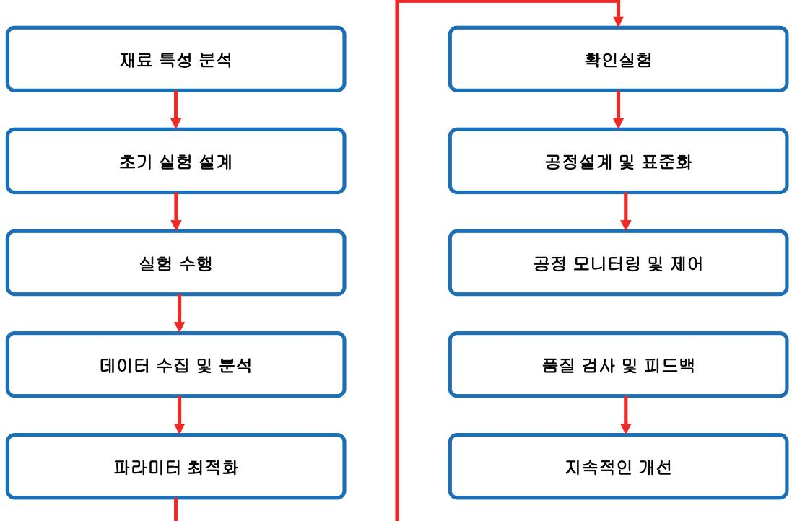

출처: 집필진 제작(2024)

1. SOD 재료별 제조 파라미터를 파악하고 적용하는 방법을 파악한다.

[그림 3-10] 제조 파라미터 파악 및 적용 흐름도

- 2) 혼합: 설정된 온도와 교반 속도에서 PSQ와 용매를 혼합한다.
- 1) 원재료 계량: 정확한 비율로 PSQ와 용매를 계량한다.
- (나) 적용 방법
- 4) 교반 속도: 300 rpm
- 3) 혼합 시간: 2시간
- 2) 혼합 온도: 60°C
- 예: PSQ 30%, 아이소프로판올 70%
- 1) 혼합 비율: PSQ와 용매(아이소프로판올, 에탄올 등)의 최적 비율을 설정
- (가) 제조 파라미터
- (1) 폴리실세스퀴옥산

3) 반응: 혼합물을 반응기에 넣고 60°C에서 2시간 동안 반응시킨다.

(2) 테트라에톡시실란

(나) 적용 방법

(가) 제조 파라미터

(나) 적용 방법

(가) 제조 파라미터

2) 혼합 온도: 50°C 3) 혼합 시간: 1시간

4) 교반 속도: 200rpm

(4) 육불화 텅스텐(WF6: tungsten hexafluoride)

예: WF6 50%, 수소 50%

2) 혼합 온도: 25°C 3) 혼합 시간: 1시간

4) 교반 속도: 100rpm

1) 혼합 비율: WF6와 수소의 최적 비율을 설정

(가) 제조 파라미터

4) 정제: 반응 후 용매를 증류하여 제거하고, 미세 여과지를 사용하여 불순물을 제거한다.

1) 혼합 비율: TEOS와 용매(에탄올)의 최적 비율을 설정

1) 원재료 계량: 정확한 비율로 TEOS와 에탄올을 계량한다.

1) 혼합 비율: TiCl4와 용매(무수 에탄올)의 최적 비율을 설정

1) 원재료 계량: 정확한 비율로 TiCl4와 무수 에탄올을 계량한다.

2) 혼합: 설정된 온도와 교반 속도에서 TiCl4와 무수 에탄올을 혼합한다.

4) 정제: 반응 후 용매를 증류하여 제거하고, 여과 과정을 통해 불순물을 제거한다.

3) 반응: 혼합물을 반응기에 넣고 50°C에서 1시간 동안 반응시킨다.

(3) 타이타늄 테트라클로라이드(TiCl4: titanium tetrachloride)

예: TiCl4 20%, 무수 에탄올 80%

2) 혼합: 설정된 온도와 교반 속도에서 TEOS와 에탄올을 혼합한다. 3) 반응: 혼합물을 반응기에 넣고 70°C에서 3시간 동안 반응시킨다.

4) 정제: 반응 후 용매를 증류하여 제거하고, 여과 과정을 통해 불순물을 제거한다.

예: TEOS 40%, 에탄올 60%

2) 혼합 온도: 70°C 3) 혼합 시간: 3시간

4) 교반 속도: 250rpm

101

- (나) 적용 방법
  - 1) 원재료 계량: 정확한 비율로 WF6와 수소를 계량한다.
  - 2) 혼합: 설정된 온도와 교반 속도에서 WF6와 수소를 혼합한다.
  - 3) 반응: 혼합물을 반응기에 넣고 25°C에서 1시간 동안 반응시킨다.
  - 4) 정제: 반응 후 여과 과정을 통해 불순물을 제거한다.
- 2. 품질 관리 및 최적화한다.
  - (1) 순도 검사: 각 재료의 순도를 ICP-MS, GC-MS 등의 기법으로 검사한다.
  - (2) 물리적 특성 검사: 점도, 유변학적 특성, 입자 크기 등을 검사하여 일관된 품질을 유지한다.
  - (3) 공정 모니터링: 실시간 모니터링 시스템을 도입하여 제조 공정 중 발생할 수 있는 변동을 최 소화한다.
  - (4) 반복 실험: 다양한 조건에서 반복 실험을 통해 최적의 제조 파라미터를 도출하고, 표준 작업 절차(SOP)를 마련한다.

반도체 SOD 공정 재료의 제조는 고도의 정밀성과 품질 관리가 요구된다. 재료별로 최적의 제 조 파라미터를 설정하고 적용함으로써 고품질의 SOD 재료를 안정적으로 생산할 수 있다. 이를 통해 반도체 제조 공정의 성능과 효율을 극대화할 수 있다.

숗 반도체 SOD 재료별 제조 공정의 도출된 문제점에 대한 해결 방안을 제시한다.

반도체 SOD 재료 제조 공정에서 도출된 문제점에 대한 해결 방안을 제시한다. 아래는 재료별 문제점과 해결 방안을 정리한 내용이다.

- 1. 재료별 문제점 및 해결 방안을 숙지한다.
  - (1) 폴리실세스퀴옥산
    - (가) 문제점
      - 1) 고점도: PSQ의 점도가 높아 균일한 박막 형성에 어려움이 있을 수 있다.
      - 2) 불완전한 경화: 경화 과정에서 불완전한 경화가 발생할 수 있어 유전체 특성이 저하 될 위험이 있다.
    - (나) 해결 방안
      - 1) 용매 조정: PSQ의 점도를 낮추기 위해 적절한 용매(아이소프로판올 또는 에탄올)를 혼합 비율을 최적화하여 사용한다. 예를 들어, PSQ와 용매의 비율을 30:70으로 설 정하여 점도를 조절한다.
      - 2) 경화 조건 최적화: 단계별 온도 증가 경화 프로파일을 도입하여 경화를 균일하게 진 행한다. 예를 들어, 80°C에서 1시간, 150°C에서 2시간, 200°C에서 1시간 동안 경화한다.

- (2) 메틸실세스퀴옥산
  - (가) 문제점
    - 1) 수분 흡수: MSQ는 수분 흡수 특성이 있어, 환경 조건에 따라 유전체 특성이 변할 수 있다.
    - 2) 균일성 문제: 스핀 코팅 후 박막의 두께 균일성이 떨어질 수 있다.
  - (나) 해결 방안
    - 1) 수분 차단: MSQ 재료를 밀폐된 용기에 저장하고, 사용 시 질소 분위기에서 작업하여 수분 흡수를 최소화한다. 또한 공정 환경의 습도를 제어하여 수분 흡수를 방지한다.
    - 2) 균일성 개선: 스핀 코팅 공정에서 회전 속도와 시간을 최적화하고, 코팅 공정 중 공 기 흐름을 제어하여 박막의 균일성을 개선한다. 예를 들어, 회전 속도를 3,000rpm 에서 60초 동안 유지한다.
- (3) 테트라에톡시실란
  - (가) 문제점
    - 1) 높은 유전 상수: TEOS의 유전 상수가 상대적으로 높아, 고속 신호 전송에 부적합 할 수 있다.
    - 2) 균열 발생: 두꺼운 박막을 형성할 때 균열이 발생할 수 있다.
  - (나) 해결 방안
    - 1) 다층 구조: 단일 두꺼운 박막 대신 다층으로 박막을 형성하여 균열을 방지한다. 각 층을 얇게 형성한 후, 개별적으로 경화하는 방법을 사용한다. 예를 들어, 각 층의 두께를 200nm 이하로 유지하고, 층마다 150°C에서 1시간 경화한다.
    - 2) 유전 상수 개선: TEOS를 저유전 상수 재료와 혼합하거나 도핑하여 유전 상수를 낮 춘다. 예를 들어, TEOS와 메틸실세스퀴옥산(MSQ)을 혼합하여 유전 상수를 조절한 다.
- (4) 하이드로제네이티드 폴리실세스퀴옥산(H-PSQ: hydrogenated poly-silsesquioxane)
  - (가) 문제점
    - 1) 기계적 강도: H-PSQ는 기계적 강도가 낮아, 후속 공정에서 손상될 수 있다.
    - 2) 공정 조건 민감성: 공정 조건 변화에 민감하여 일관된 품질을 유지하기 어렵다.
  - (나) 해결 방안
    - 1) 보강재 추가: 기계적 강도를 높이기 위해 적절한 보강재(예: 실리카 나노 입자)를 첨가하여 복합 재료를 만든다. 예를 들어, H-PSQ에 5% 실리카 나노 입자를 혼합한다.
    - 2) 공정 제어: 공정 조건을 엄격히 제어하고, 자동화된 모니터링 시스템을 도입하여 공 정 변동을 최소화한다. 예를 들어, 반응 온도, 압력, 혼합 비율 등을 실시간 모니터 링하고 자동으로 조정한다.

2. 제조 공정에서 도출된 문제점에 대한 해결 방안을 제시한다.

반도체 SOD 재료의 제조 공정은 고품질의 절연층을 형성하기 위해 정밀한 제어가 필요한 복잡한 과정이다. 이 과정에서 발생할 수 있는 주요 문제점과 그에 대한 해결 방안을 다음 과 같이 제시할 수 있다.

- (1) 재료의 불균일성 문제
  - (가) 문제점: SOD 재료의 균일성이 확보되지 않으면 절연 특성이 일정하지 않아 소자의 성 능에 영향을 끼칠 수 있다.
  - (나) 해결 방안
    - 1) 혼합 및 코팅 공정의 최적화: 재료의 혼합 공정과 스핀 코팅 공정을 최적화하여 재료의 균일성을 개선한다. 고속 혼합기 사용과 균일한 스핀 코팅 속도 유지가 필요하다.
    - 2) 실시간 모니터링 시스템 도입: 코팅 두께와 균일성을 실시간으로 모니터링하여, 문 제 발생 시 즉시 수정할 수 있도록 한다.
- (2) 유기물 및 금속 불순물 문제
  - (가) 문제점: SOD 재료에 유기물이나 금속 불순물이 포함되면 절연 특성이 저하되거나 소자 의 신뢰성에 문제가 발생할 수 있다.
  - (나) 해결 방안
    - 1) 고순도 원료 사용: 고순도의 원재료를 선택하여 불순물 포함 가능성을 최소화한다.
    - 2) 불순물 제거 공정 강화: 정제 및 여과 과정을 강화하여 유기물 및 금속 불순물을 철 저히 제거한다.
- (3) 점도 및 유동성 관리 문제
  - (가) 문제점: SOD 재료의 점도와 유동성이 일관되지 않으면 균일한 코팅을 형성하기 어렵다.
  - (나) 해결 방안
    - 1) 용매의 적절한 선택: 점도 조절에 적합한 용매를 선택하고, 적절한 비율로 혼합한다.
    - 2) 점도 모니터링 및 조정: 점도를 지속해서 모니터링하고, 필요시 조정하여 일관된 유 동성을 유지한다.
- (4) 코팅 두께 제어 문제
  - (가) 문제점: 코팅 두께의 불균일성은 절연 성능의 변동을 초래할 수 있다.
  - (나) 해결 방안
    - 1) 스핀 코팅 속도 및 시간 조절: 스핀 코팅 공정에서 속도와 시간을 정확하게 제어하 여 목표 두께를 유지한다.
    - 2) 다층 코팅: 필요한 경우 다층 코팅을 적용하여 두께 균일성을 확보한다.
- (5) 기포 및 결함 문제

- (가) 문제점: 코팅 공정 중 기포가 발생하거나 결함이 생길 경우, 절연 특성이 저하될 수 있 다.
- (나) 해결 방안
  - 1) 진공 탈기 공정: 코팅 전에 진공 탈기 공정을 통해 재료 내부의 기포를 제거한다.
  - 2) 클린 룸 환경 유지: 코팅 공정은 클린 룸 환경에서 수행하여 외부 오염 물질로 인한 결함을 최소화한다.
- (6) 건조 및 경화 공정 문제
  - (가) 문제점: 건조 및 경화 공정이 불완전하면 재료의 특성이 최적화되지 않을 수 있다.
  - (나) 해결 방안
    - 1) 적절한 건조 및 경화 조건 설정: 건조 및 경화 온도, 시간, 분위기 등을 최적화하여 재료의 물리적, 화학적 특성을 최적화한다.
    - 2) 공정 제어의 자동화: 건조 및 경화 공정의 변수를 자동으로 제어할 수 있는 시스템 을 도입하여 일관성을 유지한다.
- (7) 환경 및 안전 문제
  - (가) 문제점: SOD 재료의 제조와 처리 과정에서 유해 화학 물질이 사용될 수 있으며, 이는 작업자와 환경에 위험을 초래할 수 있다.
  - (나) 해결 방안
    - 1) 안전 관리 시스템 강화: 유해 물질 취급 시 안전 장비 사용과 함께 적절한 안전 관 리 절차를 시행한다.
    - 2) 환경 보호 조치: 폐기물 처리와 배출물 관리에서 환경 보호 규정을 철저히 준수한 다.

이러한 해결 방안들은 SOD 재료의 제조 공정에서 발생할 수 있는 문제들을 효과적으로 관 리하고, 최종 제품의 품질과 신뢰성을 높이는 데 기여한다. 각 문제에 대한 예방과 해결 전 략을 철저히 수립하고 실천함으로써, 고품질 반도체 소자 제조를 지원할 수 있다.

- 3. 종합적인 해결 방안을 파악한다.
  - (1) 재료 혼합 비율 최적화: 각 재료의 혼합 비율을 최적화하여 점도, 유전 상수, 경화 특성 등을 조절한다.
  - (2) 공정 파라미터 최적화: 혼합, 반응, 경화, 코팅 등의 공정 파라미터를 최적화하여 일관된 품 질을 유지한다.
  - (3) 품질 관리 강화: 품질 관리 시스템을 강화하고, 공정 중 발생하는 변동을 실시간으로 모니터 링하여 문제 발생 시 즉각 대응한다.
  - (4) 환경 제어: 작업 환경을 제어하여 수분 흡수, 오염 등을 최소화한다. 예를 들어, 습도 제어 및 클린 룸 환경을 유지한다.

(5) 다층 구조 및 복합재 사용: 필요에 따라 다층 구조 또는 복합재를 사용하여 기계적 강도, 균 열 방지 등의 문제를 해결한다.

반도체 SOD 공정 재료의 제조 과정에서 도출된 문제점들을 해결하기 위해서는 재료의 특성을 철저히 분석하고, 공정 파라미터를 최적화하는 것이 중요하다. 이를 통해 고품질의 SOD 재료 를 안정적으로 생산하고, 반도체 제조 공정의 성능과 효율을 극대화할 수 있다.

수행 tip

- 연속 생산 설비를 기동시켜 본다.
- 약액 생산 설비의 구동을 이해한다.
- 유입 유출에 대한 문제점을 이해한다.
- 점검 포인트를 설정해 본다.

## 학습 3 교수·학습 방법

#### 교수 방법

- 반응 공간(체임버)에 대한 개념을 설명한다.
- 연속 반응 설비에 대해서 설명한다.
- 연속 반응에 대한 내용과 반응 설계를 진행한다.
- 반응에 필요한 변수와 관리 포인트에 대해서 설명한다.
- 물질 유입에 대한 유입 후 반응에 대한 실험을 진행한다.
- 연속공정 PID를 다양하게 준비하여 관리 포인트를 설정해 보고 이유를 설명한다.
- 그룹 토론을 통하여 사례 연구를 하도록 한다.
- 실험 과정에 대한 보고서를 작성하도록 하여 결과에 대하여 토론을 하고 최종 보고서를 작 성하게 한다.

#### 학습 방법

- 반응 체임버의 종류와 형상에 대해서 학습한다.
- 연속 반응과 일괄 반응에 대해서 학습한다.
- 여러 가지 종류의 PID를 해석해 본다.
- 물질의 유출 및 유입에 의한 사고 사례를 찾아본다.
- 산업 단지의 산업 설비를 견학한다.

## 학습 3 평 가

#### 평가 준거

• 평가자는 학습자가 학습 목표를 성공적으로 달성하였는지를 평가해야 한다.

#### • 평가자는 다음 사항을 평가해야 한다.

|              | 학습 목표                                                 |  | 성취수준 |   |  |
|--------------|-------------------------------------------------------|--|------|---|--|
| 학습 내용        |                                                       |  | 중    | 하 |  |
| SOD 공정 재료 제조 | - 반도체 SOD 공정 재료의 제조 공정별 장점과 단점을 파악<br>할 수 있다.         |  |      |   |  |
|              | - 반도체 SOD 재료별 제조 파라미터를 파악하고 적용할 수<br>있다.              |  |      |   |  |
|              | - 반도체 SOD 재료별 제조 공정의 도출된 문제점에 대한 해<br>결 방안을 제시할 수 있다. |  |      |   |  |

#### 평가 방법

• 서술형 시험

|              | 평가 항목                                                |  | 성취수준 |   |  |
|--------------|------------------------------------------------------|--|------|---|--|
| 학습 내용        |                                                      |  | 중    | 하 |  |
| SOD 공정 재료 제조 | - 반도체 SOD 공정 재료의 혼합 공정의 세부 과정에 대한 파<br>악 여부          |  |      |   |  |
|              | - 폴리실세스퀴옥산 반도체 SOD 재료의 제조 파라미터를 파<br>악하고 적용할 수 있는 능력 |  |      |   |  |

#### • 평가자 체크리스트

|              | 평가 항목                                                |  | 성취수준 |   |  |
|--------------|------------------------------------------------------|--|------|---|--|
| 학습 내용        |                                                      |  | 중    | 하 |  |
| SOD 공정 재료 제조 | - 반도체 SOD 공정 재료의 반응 공정의 세부 과정에 대한 파<br>악 여부          |  |      |   |  |
|              | - 테트라에톡시실란 반도체 SOD 재료의 제조 파라미터를 파<br>악하고 적용할 수 있는 능력 |  |      |   |  |

피드백

- 1. 서술형 시험
- 반도체 SOD 공정 재료의 혼합 공정의 세부 과정에 대한 파악 여부를 평가한 후, 보완이 필요한 사항이나 주요 사항을 표시하여 피드백해 준다.
- 폴리실세스퀴옥산 반도체 SOD 재료의 제조 파라미터를 파악하고 적용할 수 있는 능력을 평가한 후, 보완이 필요한 사항이나 주요 사항을 표시하여 보충 설명을 해 준다.
- 평가 결과가 우수한 학습자들에게는 작업장 환경에 서술형 평가 내용의 적용 사례 학습을 통한 심화 학습으로 피드백해 주고, 미흡한 학습자들에게는 기초 용어에 대한 숙지를 통해 일정 수준을 유지할 수 있도록 보완하여 지도해 준다.
- 2. 평가자 체크리스트
- 반도체 SOD 공정 재료의 반응 공정의 세부 과정에 대한 파악 여부를 평가한 후 부족한 점을 지 적하여 정확하게 처리할 수 있도록 보완하여 지도해 준다.
- 테트라에톡시실란 반도체 SOD 재료의 제조 파라미터를 파악하고 적용할 수 있는 능력을 평가 후, 개선 및 보완 사항에 대한 내용을 정리하여 재학습할 수 있도록 피드백해 준다.
- 평가 결과가 우수한 학습자와 저조한 학습자를 구분하여 우수한 학습자들에게는 작업장 환경에 서술형 평가 내용의 적용 사례 학습을 통한 심화 학습으로 피드백해 주고, 저조한 학습자들에게는 기초 용어에 대한 숙지를 통해 일정 수준을 유지할 수 있도록 보완하여 지도해 준다.

- ∙ 고용노동부(2015). 산업안전보건법(시행 2015.1.1.). 법률 제11862호(2013. 6. 4. 타법 개정).
- ∙ 교육부(2015). 반도체용 습식 화공 약품 재료 제조(LM1903060405\_14v3). 한국직업능력개발원
- ∙ 교육부(2015). 반도체 제조 공정 개발(LM1903060106\_14v3). 한국직업능력개발원.
- ∙ 권기영(2015). 『핵심이 보이는 반도체 공학』. 한빛아카데미.
- ∙ 이순원 외 편저(2013). 『무기 화학 실험』. 사이플러스.
- ∙ 한국반도체산업협회(2014). 『2014 국가 직무 능력 표준 반도체 장비』. 고용노동부.
- ∙ 한국반도체산업협회(2014). 『2014 국가 직무 능력 표준 반도체 제조』. 고용노동부.
- ∙ 허규성 저(2014). 『반도체 공학』. 일진사.
- ∙ Daniel A. Crowl, Joseph F. Louvar (2013). 『화학 공정 안전(Chemical process Safety Fundamentals with Applications 2nd edition)』. 이영순 외(역). 도서출판 동화기술.
- ∙ Francis Rouessac & Annick Rouessac (2009). 『현대 기기 분석 제6판(ANALYSE CHIMIQUE Methodes et techniques instrumentales modernes 6th edition)』. 기기분석교재연구회(역). 자유아카데미.
- ∙ Gary D. Christian, Purnendu K. Dasgupta, Kevin A. Schug (2015). 『분석 화학(ANALYTICAL CHEMISTRY 7th edition)』. 이동수 외(역). 자유아카데미.
- ∙ Gary L. Miessler, Paul J. Fischer, Donald A. Tarr (2015). 『무기 화학(INORGANIC CHEMISTRY Fifth edition)』. 김주창 외(역). 자유아카데미.
- ∙ H. Scott Fogler (2016). 『화학 반응 공학 4판(ELEMENTS OF CHEMICAL REACTION ENGINEERING 4th edition)』. 박인수 외(역). 프로텍미디어.
- ∙ INTERNATIONAL TECHNOLOGY ROADMAP FOR SEMICONDUCTORS 2.0 2015EDITION EXECUTIVE REPORT.
- ∙ Kenneth A. Solen, john N. Harb (2012). 『화학 공학 입문 설계 5판(Introdution to Chemical Engineering 5th edition)』. 박진호(역). 한티미디어.
- ∙ LG화학(160720 확인). 『물질안전보건자료 ISOPROPYL ALCOHOL』. LG화학 여수 공장
- ∙ MASTERTON & HURLEY (2004). 『일반 화학(CHEMISTRY PRINCIPLES and REACTIONS FIFTH EDITION)』. 이명수(역). 자유아카데미.

- ∙ Robert C. Atkins, Francis A. Carey (2009). 『유기 화학(ORGANIC CHEMISTRY third edition)』. 김진호 외(역). 한티미디어.
- ∙ Telius SP(장치 개요 Manual) R2.0.2

| NCS학습모듈 개발이력 |                                      |     |                  |  |
|--------------|--------------------------------------|-----|------------------|--|
| 발행일          | 2024년 12월 31일                        |     |                  |  |
| 세분류명         | 반도체 재료(19030604)                     |     |                  |  |
| 개발기관         | 수원과학대학교 산학협력단(개발책임자: 김선희), 한국직업능력연구원 |     |                  |  |
|              | 최준혁(수원대학교)*                          |     | 김강복(삼성전자)        |  |
|              | 김대영(오산대학교)                           |     | 김한수(두원공대)        |  |
|              | 김영수(디이엔티)                            |     | 남승호(경기대학교)       |  |
|              | 김준성(오산대학교)                           |     | 손승대(제이에스이엔씨(주))  |  |
| 집필진          | 김현후(두원공대)                            | 검토진 | 이철오((주)한국전력안전공단) |  |
|              | 임희용(전 부천대학교)                         |     |                  |  |

\*표시는 대표집필자임 (참고) 검토진으로 참여한 집필진은 본인의 원고가 아닌 타인의 학습모듈을 검토함

| 반도체용 SOD 공정 재료 제조(LM1903060423_23v3)                                                                    |                   |  |
|---------------------------------------------------------------------------------------------------------|-------------------|--|
| 저작권자                                                                                                    | 교육부               |  |
| 연구기관                                                                                                    | 한국직업능력연구원         |  |
| 발행일                                                                                                     | 2024. 12. 31.     |  |
| ISBN                                                                                                    | 979-11-7175-777-0 |  |
| ※ 이 학습모듈은 자격기본법 시행령(제8조 국가직무능력표준의 활용)에 의거하여 개발하였으며,<br>NCS통합포털사이트(http://www.ncs.go.kr)에서 다운로드할 수 있습니다. |                   |  |

