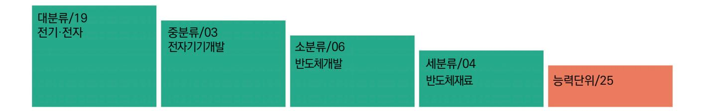

# NCS학습모듈 반도체용 세정 공정 재료 제조

LM1903060425\_23v3

#### [NCS학습모듈 활용 시 유의 사항]

- 1. NCS학습모듈은 교육훈련기관에서 출처를 명시하고 교육적 목적으로 활용할 수 있습니다. 다 만, NCS학습모듈에는 국가(교육부)가 저작재산권 일체를 보유하지 않은 저작물(출처가 표기된 도표‧사진‧삽화‧도면 등)이 포함되어 있으므로, 이러한 저작물의 변형‧각색‧복제‧공연‧ 배포 및 공중 송신 등과 이러한 저작물을 활용한 2차적 저작물을 작성하려면 반드시 원작자 의 동의를 받아야 합니다.
- 2. NCS학습모듈은 개발 당시의 산업 및 교육 현장을 반영하여 집필하였으므로, 현재 적용되는 법령‧지침‧표준 및 교과 내용 등과 차이가 있을 수 있습니다. NCS학습모듈 활용 시 법령 ‧지침‧표준 및 교과 내용의 개정 사항과 통계의 최신성 등을 확인하시기를 바랍니다.
- 3. NCS학습모듈은 산업 현장에서 요구되는 능력을 교육훈련기관에서 학습할 수 있게 구성한 자 료입니다. 다만, NCS학습모듈 지면의 한계상 대표적 예시(예: 활용도 또는 범용성이 높은 제 품, 서비스) 중심으로 집필하였음을 이해하시기를 바랍니다.

## NCS학습모듈의 이해

※ 본 NCS학습모듈은 「NCS 국가직무능력표준」사이트(http://www.ncs.go.kr) 에서 확인 및 다운로드할 수 있습니다.

## Ⅰ NCS학습모듈이란?

- 국가직무능력표준(NCS: National Competency Standards)이란 산업현장에서 직무를 수행하기 위해 요구되는 지식·기술·소양 등의 내용을 국가가 산업부문별·수준별로 체계 화한 것으로 산업현장의 직무를 성공적으로 수행하기 위해 필요한 능력(지식, 기술, 태도) 을 국가적 차원에서 표준화한 것을 의미합니다.
- 국가직무능력표준(이하 NCS)이 현장의 '직무 요구서'라고 한다면, NCS학습모듈은 NCS
   의 능력단위를 교육훈련에서 학습할 수 있도록 구성한 '교수·학습 자료'입니다. NCS학습
   모듈은 구체적 직무를 학습할 수 있도록 이론 및 실습과 관련된 내용을 상세하게 제시하
   고 있습니다.

#### ○ NCS학습모듈은 다음과 같은 특징을 가지고 있습니다.

- 첫째, NCS학습모듈은 산업계에서 요구하는 직무능력을 교육훈련 현장에 활용할 수 있도 록 성취목표와 학습의 방향을 명확히 제시하는 가이드라인의 역할을 합니다.
- 둘째, NCS학습모듈은 특성화고, 마이스터고, 전문대학, 4년제 대학교의 교육기관 및 훈 련기관, 직장교육기관 등에서 표준교재로 활용할 수 있으며 교육과정 개편 시에도 유용하게 참고할 수 있습니다.

○ NCS와 NCS학습모듈 간의 연결 체계를 살펴보면 아래 그림과 같습니다.

O NCS학습모듈의 위치는 NCS 분류 체계에서 해당 학습모듈이 어디에 위치하는지를 한 눈에 볼 수 있도록 그림으로 제시한 것입니다.

| [NCS-학          | 습모듈             | 의 위치]    |          |  |
|-----------------|-----------------|----------|----------|--|
|                 |                 |          |          |  |
| 대분류             | 분류 문화·예술·디자인·방송 |          |          |  |
| 중분류             | 문화콘텐츠           |          |          |  |
| 소분류             | 노분류 문화콘텐츠제작     |          |          |  |
|                 |                 |          |          |  |
| 세분류             |                 |          |          |  |
| 방송콘텐츠제작         |                 | 능력단위     | 학습모듈명    |  |
| 영화콘텐츠제작         |                 | 프로그램 기획  | 프로그램 기획  |  |
| 음악콘텐츠제작         |                 | 아이템 선정   | 아이템 선정   |  |
| 광고콘텐츠제작         |                 | 자료 조사    | 자료 조사    |  |
| 게임콘텐츠제작         |                 | 프로그램 구성  | 프로그램 구성  |  |
| 애니메이션 콘텐츠제작  |                 | 캐스팅      | 캐스팅      |  |
| 만화콘텐츠제작         |                 | 제작계획     | 제작계획     |  |
| 캐릭터제작           |                 | 방송 미술 준비 | 방송 미술 준비 |  |
| 스마트문화앱 콘텐츠제작 |                 | 방송 리허설   | 방송 리허설   |  |
| 영사              |                 | 야외촬영     | 야외촬영     |  |
|                 |                 | 스튜디오 제작  | 스튜디오 제작  |  |
|                 |                 |          |          |  |

학습모듈은

NCS 능력단위 1개당 1개의 학습모듈 개발 을 원칙으로 합니다. 그러나 필요에 따라 고용단위 및 교과단위를 고려하여 능력단위 몇 개를 묶어 1개 학습모듈로 개발할 수 있으며, NCS 능력단위 1개를 여러 개의 학습모듈로 나누어 개발할 수도 있습니다.

### 2. NCS학습모듈의 개요

#### ○ NCS학습모듈의 개요는 학습모듈이 포함하고 있는 내용을 개략적으로 설명한 것으로

| 학습모듈의 목표 , 선수학습 , 학습모듈의 내용 체계 , 핵심 용어 로 구성되어 있습니다. |                                                                              |  |
|----------------------------------------------------|------------------------------------------------------------------------------|--|
| 학습모듈의 목표                                           | 해당 NCS 능력단위의 정의를 토대로 학습 목표를 작성한 것입니다.                                        |  |
| 선수학습                                               | 해당 학습모듈에 대한 효과적인 교수·학습을 위하여 사전에 이수해야 하는 학습모 듈, 학습 내용, 관련 교과목 등을 기술한 것입니다. |  |
| 학습모듈의 내용 체계                                     | 해당 NCS 능력단위요소가 학습모듈에서 구조화된 체계를 제시한 것입니다.                                     |  |
| 핵심 용어                                              | 해당 학습모듈의 학습 내용, 수행 내용, 설비·기자재 등 가운데 핵심적인 용어를 제 시한 것입니다.                   |  |

### 제작계획 학습모듈의 개요

#### 학습모듈의 목표

본격적인 촬영을 준비하는 단계로서, 촬영 대본을 획정하고 제작 스태프를 조직하며 촬영 장비와 촬영 소품을 준비할 수 있다.

#### 선수학습

제작 준비(LM0803020105\_13v1), 섭외 및 제작스태프 구성(LM0803020104\_13v1), 촬영 제작(LM0803020106\_13v1), 촬영 장비 준비(LM0803040204\_13v1.4), 미술 디자인 협의하기(LM0803040203\_13v1.4)

#### 학습모듈의 내용체계

| 하스                | 하스 내용                                              | NCS 능력단위 요소       |                |
|-------------------|----------------------------------------------------|-------------------|----------------|
| 학습                | 학습 내용                                              | 코드번호              | 요소 명칭          |
| 1. 촬영 대본 확정하기  | 1-1. 촬영 구성안 검 토와 수정                             | 0803020114_16/3.1 | 촬영 대본 확정하기  |
| 2. 제작 스태프 조직하기 | 2-1. 기술 스태프 조직 2-2. 미술 스태프 조직 2-3. 전문 스태프 조직 | 0803020114_16v3.2 | 제작 스태프 조직하기 |
| 3. 촬영 장비 계획하기  | 3-1. 촬영 장비 점검 과 준비                              | 0803020114_16/3.3 | 촬영 장비 계획하기  |
| 4. 촬영 소품 계획하기  | 4-1. 촬영 소품 목록 작성 4-2. 촬영 소품 제작 의뢰         | 0803020114_16\3.4 | 촬영 소품 계획하기  |

#### 핵심 용어

촬영 구성안, 제작 스태프, 촬영 장비, 촬영 소품

#### 학습모듈의 목표는

학습자가 해당 학습모듈을 통해 성취해야 할 목표를 제시한 것으로, 교수자는 학습자 가 학습모듈의 전체적인 내용흐름을 파악하 도록 지도할 수 있습니다.

**6** • •

61

#### 선수학습은

교수자 또는 학습자가 해당 학습모듈을 교 수·학습하기 이전에 이수해야 하는 교과목 또는 학습모듈(NCS 능력단위) 등을 표기한 것입니다. 따라서 교수자는 학습자가 개별 학습, 자기 주도 학습, 방과 후 활동 등 다 양한 방법을 통해 이수할 수 있도록 지도하 는 것을 권장합니다.

|            | 핵심 용어는              |
|------------|---------------------|
|            | 률을 대표하는 주요 용어입니     |
|            | · 해당 학습모듈을 통해 학습    |
|            | 게될 주요 내용을 알 수 있습    |
|            | 5 국가직무능력표준」 사이트     |
| (www.ncs.g | jo.kr)의 색인 (찾아보기) 중 |
| 하나로 이용할    | 할 수 있습니다            |

### 3. NCS학습모듈의 내용 체계

○ NCS학습모듈의 내용은 크게 학습, 학습 내용, 교수·학습 방법, 평가 로 구성되어 있습니다.

| 학습       | 해당 NCS 능력단위요소 명칭을 사용하여 제시한 것입니다. 학습은 크게 학습 내용, 교수·학습 방법, 평가로 구성되며 해당 NCS 능력단위의 능력단위 요소별 지식, 기술, 태도 등을 토대로 내용을 제시한 것입니다.                                                    |
|----------|----------------------------------------------------------------------------------------------------------------------------------------------------------------------------------|
| 학습 내용    | 학습 내용은 학습 목표, 필요 지식, 수행 내용으로 구성되며, 수행 내용은 재료·자 료, 기기(장비·공구), 안전·유의 사항, 수행 순서, 수행 tip으로 구성한 것입니다. 학습모듈의 학습 내용은 실제 산업현장에서 이루어지는 업무활동을 표준화된 프로세 스에 기반하여 다양한 방식으로 반영한 것입니다. |
| 교수·학습 방법 | 학습 목표를 성취하기 위한 교수자와 학습자 간, 학습자와 학습자 간 상호 작용이 활발하게 일어날 수 있도록 교수자의 활동 및 교수 전략, 학습자의 활동을 제시한 것입니다.                                                                            |
| 평가       | 평가는 해당 학습모듈의 학습 정도를 확인할 수 있는 평가 준거 및 평가 방법, 평 가 결과의 피드백 방법을 제시한 것입니다.                                                                                                         |

## [NCS-학습모듈의 위치]

| 대분류 | 전기 ‧ 전자 |          |
|-----|---------------|----------|
| 중분류 |               | 전자 기기 개발 |
| 소분류 |               | 반도체 개발   |

| 세분류    |                                  |                       |
|--------|----------------------------------|-----------------------|
| 반도체 개발 | 능력단위                             | 학습모듈명                 |
| 반도체 제조 | 반도체용 웨이퍼 재료 제조                   | 반도체용 웨이퍼 재료 제조        |
| 반도체 장비 | 반도체용 금속(Target) 재료 제조            | 반도체용 금속(Target) 재료 제조 |
| 반도체 재료 | 반도체용 패키지 재료 제조 반도체용 패키지 재료 제조 |                       |
|        | 반도체 재료 개발                        | 반도체 재료 개발             |
|        | 반도체 재료 생산 관리                     | 반도체 재료 생산 관리          |
|        | 반도체 재료 품질 관리                     | 반도체 재료 품질 관리          |
|        | 반도체 재료 안전 관리                     | 반도체 재료 안전 관리          |
|        | 반도체용 마스크 재료 제조                   | 반도체용 마스크 재료 제조        |
|        | 반도체용 플립 칩 재료 제조                  | 반도체용 플립 칩 재료 제조       |
|        | 반도체용 CMP 재료 제조                   | 반도체용 CMP 재료 제조        |
|        | 반도체용 식각 공정 가스 제조                 | 반도체용 식각 공정 가스 제조      |
|        | 반도체용 세정 공정 가스 제조                 | 반도체용 세정 공정 가스 제조      |
|        | 반도체용 박막 공정 가스 제조                 | 반도체용 박막 공정 가스 제조      |
|        | 반도체용 이온 주입 공정 가스 제조              | 반도체용 이온 주입 공정 가스 제조   |

| 반도체용 박막 공정 전구체 제조   | 반도체용 박막 공정 전구체 제조   |
|---------------------|---------------------|
| 반도체용 포토 공정 재료 제조    | 반도체용 포토 공정 재료 제조    |
| 반도체용 트랙 공정 재료 제조    | 반도체용 트랙 공정 재료 제조    |
| 반도체용 SOD 공정 재료 제조   | 반도체용 SOD 공정 재료 제조   |
| 반도체용 박막 도금 공정 재료 제조 | 반도체용 박막 도금 공정 재료 제조 |
| 반도체용 세정 공정 재료 제조    | 반도체용 세정 공정 재료 제조    |
| 반도체용 CMP 슬러리 재료 제조  | 반도체용 CMP 슬러리 재료 제조  |

## 차 례

| 학습모듈의 개요                     | 1  |
|------------------------------|----|
| 학습 1. 세정 공정 재료 제조 요구 사항 파악하기 |    |
| 1-1. 세정 공정 재료 제조 요구 사항 파악    | 3  |
| • 교수 ․ 학습 방법                 | 37 |
| • 평가                         | 38 |
| 학습 2. 세정 공정 재료 준비하기          |    |
| 2-1. 세정 공정 재료 준비             | 41 |
| • 교수 ․ 학습 방법                 | 57 |
| • 평가                         | 58 |
| 학습 3. 세정 공정 재료 제조하기          |    |
| 3-1. 세정 공정 재료 제조             | 61 |
| • 교수 ․ 학습 방법                 | 90 |
| • 평가                         | 91 |
| 참고 자료                        | 94 |
| 활용 서식                        | 96 |

## 반도체용 세정 공정 재료 제조 학습모듈의 개요

#### 학습모듈의 목표

반도체 세정 공정에 필요한 여러 가지 재료의 요구 사항을 파악하여 준비하고 제조할 수 있다.

#### 선수학습

전자 공학, 전기 공학, 화학 공학, 재료 공학, 반도체 제조

### 학습모듈의 내용체계

| 학습                           | 하스 내 오                       | NCS 능력단위 요소       |                           |
|------------------------------|------------------------------|-------------------|---------------------------|
| 익답                           | 학습 내용                        | 코드번호              | 요소 명칭                     |
| 1. 세정 공정 재료 제조 요구 시항 파악하기 | 1-1. 세정 공정 재료 제조 요구 사항 파악 | 1903060425_23v3.1 | 세정 공정 재료 제조 요구 사항 파악하기 |
| 2. 세정 공정 재료 제조 준비 하기      | 2-1. 세정 공정 재료 제조 준비          | 1903060425_23v3.2 | 세정 공정 재료 제조 준비하기       |
| 3. 세정 공정 재료 제조하기             | 3-1. 세정 공정 재료 제조             | 1903060425_23v3.3 | 세정 공정 재료 제조하기             |

#### 핵심 용어

세정 공정(Cleaning Process), 반도체(Semiconductor), 초순수(DI: Deionized Water), 산성 용액(Acid Chemical), 알칼리 용액(Alkali Chemical), 식각(Etch Process)

| 학습 1 | 세정 공정 재료 제조 요구 사항 파악하기 |  |
|------|------------------------|--|
| 학습 2 | 세정 공정 재료 제조 준비하기       |  |
| 학습 3 | 세정 공정 재료 제조하기          |  |

# 1-1. 세정 공정 재료 제조 요구 사항 파악

• 세정 공정 재료 제조 사양서를 입수할 수 있다.

학습 목표 • 세정 공정 재료 제조 사양서를 바탕으로 세정 공정 재료의 제품명, 제품 사양, 품질 기준, 납기 등을 파악할 수 있다.

• 파악된 내용을 바탕으로 세정 공정 재료 제조 시 발생할 수 있는 문제점을 검토할 수 있다.

## 필요 지식 /

숔 세정 공정(Clean Process)의 개요

반도체 세정 공정은 반도체 8대 공정 중 하나의 축을 담당하는 중요한 공정이다.

세정 공정은 반도체 칩(Semiconductor Chip) 제조 공정을 진행함에 있어 각 공정 진행 전 · 후 웨이퍼(Wafer)에 있을 수 있는 원하지 않는 불순물과 이물질을 제거하여 깨끗한 상태로 만 들어 주는 공정으로 특히 웨이퍼 표면에 있을 수 있는 먼지, 찌꺼기, 오염원 등을 화학 약품 (Chemical)과 초순수(D.I Water)를 이용하여 제거해 주는 공정이다.

이는 반도체 제조 공정을 진행함에 전·후 공정 즉 진행하고자 하는 공정의 웨이퍼 오염으로 인 한 수율 품질 저하를 예방하고 수율 품질 유지 · 향상을 목적으로 한다.

1. 세정 공정의 중요성

반도체 팹(Fab) 공정으로 한 장의 웨이퍼가 반도체로 기능을 하기 위해서는 짧게는 20일, 길게는 45일에서 ~60여 일간의 팹 공정인 산화 공정, 확산 공정, 세정 공정, 사진 공정, 이온 주입 공정, 에칭 공정, 증착 공정 등을 제품에 따라 수백여 단계의 반복된 공정을 거 치게 된다.

이는 산화 공정, 확산 공정, 사진 공정, 에칭 공정, 이온 주입 공정, 증착 공정, 메탈 공정, 연마 공정 등 해당 공정 진행 전과 공정 사이에 반복적으로 진행되는 중요한 공정이 바로 세정 공정(Cleaning)이다. 미세 공정을 다루는 반도체 웨이퍼가 오염되지 않고 양품의 반도 체를 만들기 위해 공정 진행 전과 다음 공정을 위하여 세정하는 스텝을 반복적으로 거치는 데 반도체의 수율을 높이기 위한 중요한 공정이 세정 공정이다.

제4차 산업 혁명 시대는 기술 혁신의 중추적 역할은 '반도체'이고 미세 공정이 중요하다. 반도체는 항공 우주, 에너지, 바이오, 자율 주행 자동차, IoT, 로봇, AI 등 전체 산업으로 급속 확산 발전 추세를 선도한다.

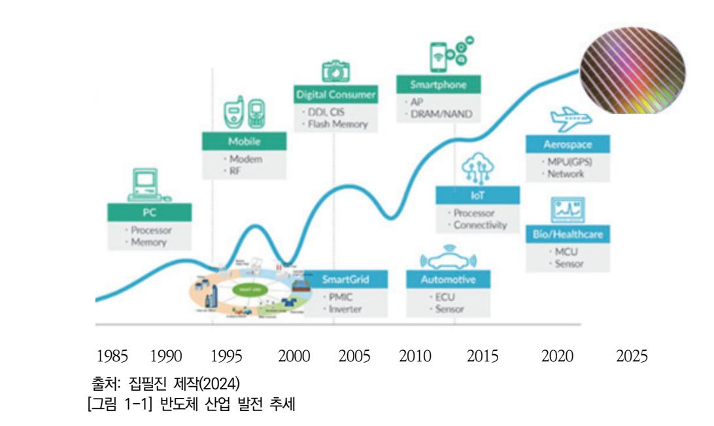

#### (1) 세정 공정 목적

세정 공정이란 물리적 화학적 방법과 화학적 반응 물질 처리, 반응 가스를 이용하여 웨 이퍼 표면에 존재하는 불순물을 제거하는 공정이다. 매우 미세한 공법을 필요로 하는 공 정을 적용하는 반도체 공정은 웨이퍼 위에 파티클(Particle), 오염물, 금속(Metal), 이물 질, 유기물, 잔유물, 자연 산화막 등 미량의 불순물도 패턴 이상 결함, 전기적 특성 기 능 이상 등 반도체 제품의 양품 수율과 신뢰도에 나쁜 영향을 줄 수 있다. 그렇기 때문 에 웨이퍼를 깨끗하게 하는 세정 공정은 반도체 팹 공정에서 아주 중요한 공정이고 중 요한 단계이다.

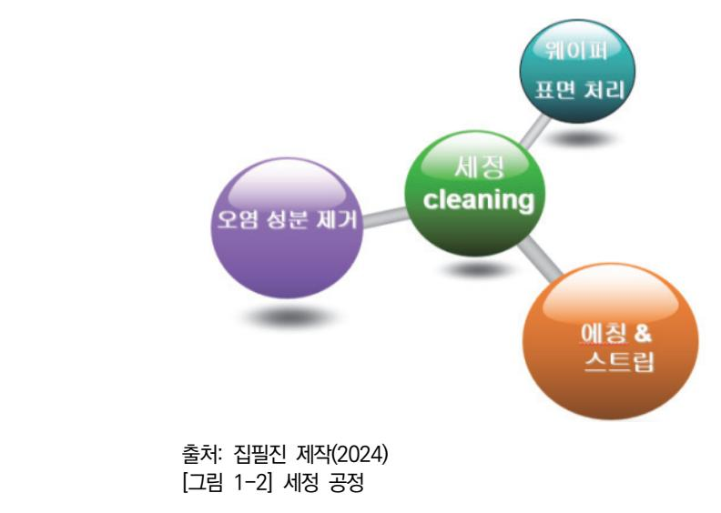

- (가) Wafer 표면으로부터 원하지 않는 물질이나 오염원을 제거하는 모든 공정
- (나) Roughness 개선, 친수성/소수성 처리와 같은 표면 처리 공정
- (다) Wet Chemical/ Physical Method/ 최근에는 Gas 반응도 이용 세정 공정
- (2) 세정 분류

세정 공정은 일반적으로 산화막을 형성하는 웨이퍼 투입, 산화 공정 전, 사진 공정, 회 로 패턴 형성을 위해 필요한 부문을 남기고 필요하지 않은 부분을 제거하는 식각 공정 후 등 각 진행 스텝의 웨이퍼 가공 공정 전과 후에 필수적으로 역할을 하며 반복하는 공정으로 진행 하기에 진행 반복 횟수가 팹 8대 공정 중에서 타 공정 대비 2~3배 이상 진행 횟수가 많다.

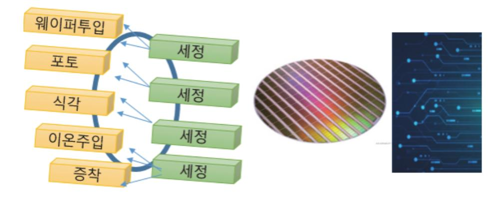

출처: 집필진 제작(2024) [그림 1-3] 세정 공정의 중요성

#### (3) 세정 공정 미세 공정화 대응

반도체 기술의 발전과 반도체 미세 공정의 필요에 따라 게이트 공정의 미세화에 지속적인 발전이 요구되는바 반도체 공정에 사용하는 재료는 반도체 미세 공정을 위한 웨이퍼 가공 공정의 소부장(소재·부품·장비) 산업과의 상호 발전 관계에 영향을 주게 된다. 이에 반도체 산업 발전의 방향을 제시해 주는 ITRS[(International Technology Roadmap for Semiconductors 2.0(2023)]를 참고하고 방향성을 확인할 필요가 있다. <표 1-1>, [그림 1-4], [그림 1-5], <표 1-2>, <표 1-3>과 한국반도체협회에서 정리한 자료 등을 참고한다.

<표 1-1> materials 로드맵 vs 노드

| 기술 node | 게이트 피치 | 선폭  | 참조                     |
|---------|--------|-----|------------------------|
| 3nm     | 48nm   | 6nm | A-SiC                  |
| 2nm     | 45nm   | 6nm | B-SiOC C-SiN        |
| 1.5nm   | 42nm   | 5nm | A-SiC                  |
| 1.0nm   | 40nm   | 5nm | B-SiOC C-SiCN       |
| 70 Å    | 38nm   | 4nm | A-low-k/SiC            |
| 50 Å    | 38nm   | 4nm | B-SiOC C-low-k/SiCN |

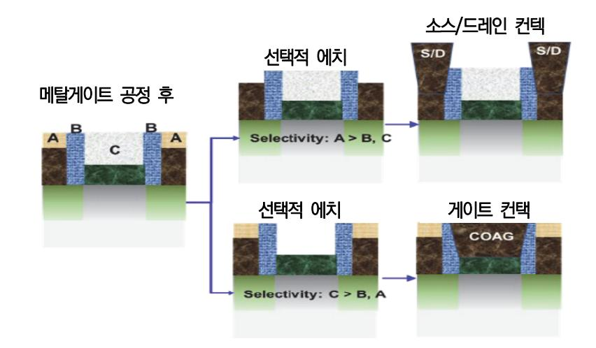

 출처: 집필진 제작(2024) [그림 1-4] COAG SAC 집적 기본 개념

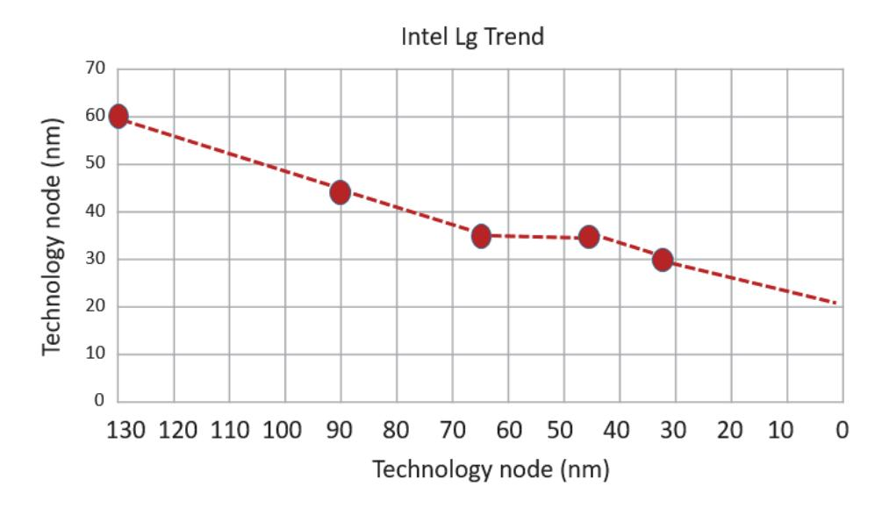

 출처: 집필진 제작(2024) [그림 1-5] Intel CPU 트랜지스터 게이트 길이 동향

2. 세정 공정 적용 공정의 구분

반도체 공정에 세정 공정 분류는 크게 습식 공정(Wet Cleaning)과 건식 공정(Dry Cleaning)으로 나누어진다. 진행 공정 방식에 따라 사용되는 물질은 액상 형태 약품, 가스 형태, 고체 파우더 등의 특성에 따라 사용하므로 각각의 공정 특성과 임계 영역을 고려하여 다양한 경우가 있으므로 필요에 따라 살펴보기로 한다.

본 세정 공정 재료 제조 과정에서는 습식 공정 공정에 사용하는 세정용 약품(Chemical) 중 심으로 먼저 다루며, 건식 공정에 사용하는 세정 공정 가스 관련은 해당 과정에서 다루어질 것이다. 이에, 본 학습 목표를 달성하기 위해 세정 공정 재료 중 습식 약품 사용 적용 공정 을 이해하는 것이 중요하고, 해당 공정의 사용 목적과 사용 공정을 확인하고 세정용 재료 약품을 활용하는 데 필요한 사항을 학습한다.

세정 공정에서 습식 세정 약품의 적용 공정을 이해 및 구분하고 공정에 적용할 약품의 사 양서를 입수하여 선정하고, 세정 공정 재료 제조 사양서를 바탕으로 제품명, 품질 기준, 제 품 사양, 물질 안전 데이터시트(MSDS) 및 재료의 준비는 제품을 생산 · 제조하는 데 사전에 준비해야 할 중요한 일이라고 할 수 있다. 세정 공정의 이론적 지식과 종류와 재료를 설명 하도록 한다.

- (1) 기술 트랜드 및 중요성
  - (가) 기술 트랜드

반도체 제조 기술 집적도 향상은 나노급 영역에 도달하였고, ULSI 제조 기술은 현재 이에 따라 DRAM의 칩당 메모리 용량은 기가비트(Gigabit) 제품에서, 테라비트 (Terabit)급 소자 개발과 시제품 양산을 진행하고 있다. 이와 같은 고집적화로 설계 기술의 한계 극복과 극미세 공정 선폭 최소화의 업계 간 경쟁이 치열하다. 그 이유 는 미세 공정 프로세스와 선폭인 게이트 피치와 금속 공정 피치의 미세화가 대단히 중요한 요소이기 때문이다.

<표 1-2> MOSFET 스케일링

| 년도    | 프로세스 노드 (unit=nm) |  |  |
|-------|-------------------|--|--|
| 미래~   | 미래~               |  |  |
| 2024년 | 2nm               |  |  |
| 2022년 | 3nm               |  |  |
| 2020년 | 5nm               |  |  |
| 2018년 | 7nm               |  |  |
| 2016년 | 10nm              |  |  |
| 2014년 | 14nm              |  |  |
| 2012년 | 22nm              |  |  |
| 2010년 | 28nm              |  |  |
| 2009년 | 32nm              |  |  |
| 2007년 | 45nm              |  |  |
| 2003년 | 90nm              |  |  |
| 2001년 | 130nm             |  |  |
| 1999년 | 180nm             |  |  |
| 1993년 | 350nm             |  |  |
| 1990년 | 600nm             |  |  |
| 1987년 | 800nm             |  |  |
| 1984년 | 1μm               |  |  |
| 1977년 | 3μm               |  |  |
| 1974년 | 6μm               |  |  |
| 1971년 | 10μm              |  |  |
| 1968년 | 20μm              |  |  |

<표 1-3> MOSFET 프로세스별 게이트/메탈 피치

| 년도    | 프로세스 | 게이트 피치 | 메탈 피치 |  |
|-------|------|--------|-------|--|
| 2018년 | 7nm  | 60nm   | 40nm  |  |
| 2020년 | 5nm  | 51nm   | 30nm  |  |
| 2022년 | 3nm  | 48nm   | 24nm  |  |
| 2024년 | 2nm  | 45nm   | 20nm  |  |
| 2026년 | 1nm  | 42nm   | 16nm  |  |

(나) 중요성

게이트 절연막 피치는 수 옹스트롬(Å)의 박막 두께의 한계를 극복하면서 고유 전체 박막의 개발과 3D 소자로의 개발이 이루어지고 있다.

반도체 칩당 메모리 용량 증가를 위해 반도체 소자의 개발로 초고 집적화하고, 반도 체 제조 팹(FAB) 공정 진행 수는 증가하며, 제품별 팹 제조 공정 진행 후에는 여러 가지 해당 공정의 잔류물 찌꺼기, 이물질, 오염물이 웨이퍼 표면에 잔류하여 공정 진 행 전·후에 이를 제거하는 세정 공정은 다른 공정에 비교해 매우 중요한 공정이다.

(다) 공정 재료로서의 화학 약품

반도체에서 칩 소자 제조를 위한 웨이퍼 프로세스를 진행하는 데 필요한 주요 재료 로 사용되는 재료를 공정 재료로 정의한다. 이에 반도체 칩 제조를 위한 웨이퍼상에 서 반도체 제조 진행에 필수 재료로 사용하거나 제품의 반도체 칩 내 소자 형성에 필요 재료와 먼지, 불순물, 이물질 등을 제거하는 세정에 사용하는 재료에 대하여 논 하도록 한다.

- (2) 세정(Cleaning)의 종류
  - (가) 세정 방법에 따른 구분

세정 공정은 세정 방법에 따라 다음과 같이 크게 구분하여 분류한다.

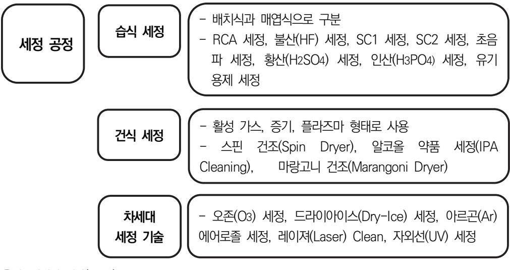

출처: 집필진 제작(2024) [그림 1-6] 세정 기술 세정 재료에 따른 분류

(나) 세정 공정 분류 및 단계

반도체 회사마다 각기 다른 고유의 제조 방법을 가지고 있으나 반도체 소자 제조 공 정은 많은 단계(수백 단계 이상) 제조 공정이 필요하며, 각 제조 공정 전 ‧ 후 전 처 리 세정과 공정 후 세정 공정이 웨이퍼의 오염을 막기 위하여 세정 공정과 표면 안 정화 처리 세정 공정으로 진행된다. 반도체 소자 제조 공정 중 발생하는 Particle, 이물질, 잔유물, 오염물 등은 소자의 구조적 형상의 물리, 화학적 결함을 발생시키고 주요 기능인 전기적 특성(Electrical Characteristics)을 기능에 문제를 유발하여 제 조 소자의 품질 성능, 신뢰성 및 수율 품질 등에 막대한 영향을 주게 되므로 꼭 제 거 하여야 한다.

| 종류       | 적용 예                                                                                               |
|----------|----------------------------------------------------------------------------------------------------|
| 전 세정     | 웨이퍼 투입 전 세정 확산 공정 전 세정 산화막 형성 공정 전 세정 박막 공정 전 세정 CVD, Metal, Photo Pre Epi Cleaning |
| 후 세정     | H2SO4 Strip Organic Strip Post-CVD, Metal Cleaning Post-CMP Cleaning                      |
| Wet Etch | Oxide Etching Si3N4 Strip Metal Strip                                                        |

출처: 집필진 제작(2024)

[그림 1-7] 세정 공정 적용 스텝

- (다) 적용 스텝에 따른 구분
  - 1) 적용 Step에 따라 아래와 같이 3가지로 나눌 수 있다.
  - 2) 세정 설비에 따른 분류는 크게 배치식과 매엽식으로 구분한다.

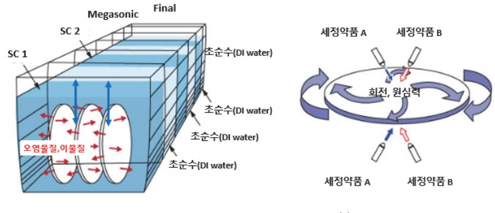

(a) 배치 방식(Dip Type) (b) 싱글 방식(Single Type)

 출처: 집필진 제작(2024) [그림 1-8] 세정 기술 세정 재료에 따른 분류

(3) 웨이퍼 오염 요인

(가) 오염 발생 요인과 공정 품질의 영향

생산 수율을 저하시킬 수 있는 오염원으로는 IE 개념인 4M1E로 나타내어 [그림 1-10]에 정리하였다.

사람, 작업자로 인한 오염, 생산 장비 오염 및 치공구 오염, 공정 방법에 따른 오염 물, 소재 · 부재 측면에서 공정 중 사용 가스 · 케미컬과 환경적 측면에서 클린 룸 내 의 환경이나 사용하는 각종 물질에 의한 오염 등으로 구분하여 표현 설명하였다. 반도체 웨이퍼 제조 과정에서 관련 오염원들로부터 공정 중 웨이퍼가 오염되면 제조 공정을 완료하더라도 반도체 소자 제조 생산의 수율이 저하되고 생산된 반도체 소자 에서도 안정된 기대한 좋은 품질, 좋은 성능을 얻기 기대할 수 없게 하는 것이다. [그림 1-9]에 오염원에서의 여러 가지 오염 발생 요인에 대해 표현하였다.

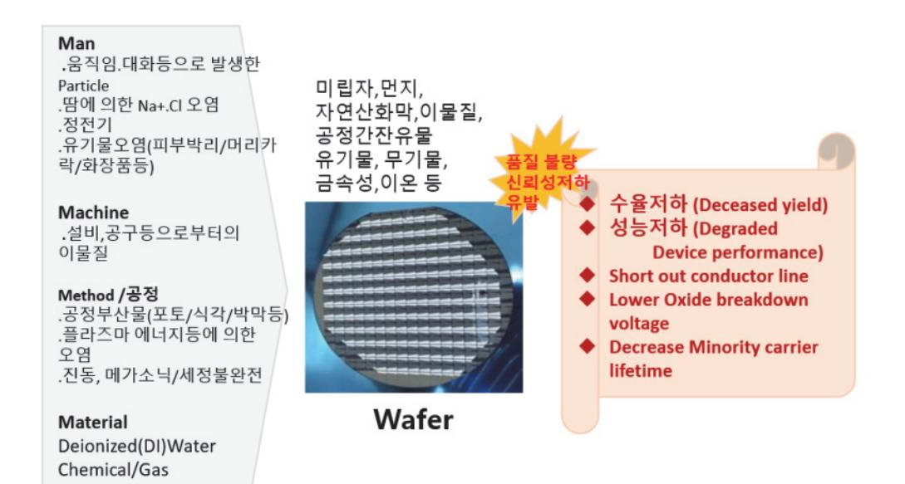

출처: 집필진 제작(2024)

[그림 1-9] 반도체 웨이퍼 제조 공정에서의 여러 종류 오염원 개념

숕 세정 공정 약품 특성

세정 공정 사용 약품의 개념 이해, 특성 파악하고 취급에 대한 안정성을 확보한다.

1. 중성 계열: 초순수(DI water, H2O)

반도체 공정에서 사용하는 DI water와 시수(City Water) 즉, H2O의 pH는 pH 7 수준이 다. 이에, pH 7은 중성 특성이라고 한다. 반도체 공정에서 사용하는 산성 용액과 알칼리성 용액들은 다르다. pH 7 상태가 모두 안전하다고는 할 수 없다. 산성 약품과 알칼리성 약품 의 반응으로 인한 생성물과 산성과 금속과의 반응 생성물은 인체에 유해한 경우가 대부분 이므로 확인, 측정, 평가하여 안전성을 확보하여 안전한 상태에서 취급하여야 한다.

(1) 초순수 DI(H2O)

HF, HCL, NH4OH, H2SO4 등의 세정 약품 물질을 희석하거나, 웨이퍼를 직접 세정하 는 용도로 사용되는 초순수 물로서 순도를 관리하여 불순물의 이물질 함유량도 컨트롤 하고 물의 저항성도 10MΩ·cm(10⁷Ohm·cm) 이상의 전기 저항을 확보해야 한다.

(2) 체류 가스를 흡수해서 생기는 문제

반도체 공장 내에서 정체한 물이나 가스를 확인하기는 쉽지 않다. 다만, 장비의 점검 중 냉각수 등에 주변의 체류 가스에 노출로 인해 반응하여 성질이 변할 수 있다. 간혹 공정용 초순수 DIW에도 혼입하여 순도가 저하하고 오염을 유발할 수 있어 작업과 확인을 철저히 하여야 한다. HCl, Cl2, NH4OH 등의 가스성 퓸에 노출되지 않도록 유의해야 한다.

- 2. 산성 및 알칼리성 계열: HF, H2O2, NH4OH, HCl
  - 공정에 적용하는 화학 물질 재료와 산도 pH를 파악하여 MSDS를 확보하고 MSDS에 따른 취급 사용 방법, 방호복 용구, 사용 용기, 안전장치, 보관 방법 등을 확보하고 준수해야 한 다. 특별 주의 사항으로 강산과 강알칼리가 직접 섞이면 격렬한 폭발 반응을 일으킬 수 있 으므로 취급에 주의해야 한다. 이들 약품에 노출 시 인체에 치명적 위험이 있으므로 취급과 보관에 특히 주의한다. 특히 금속 등의 구조물에도 부식 등 문제를 유발할 수 있기 때문에 보관과 취급에 주의한다. 해당 약품의 제조사에서 제공하는 자료를 반드시 확인하고, 추가 적으로 MSDS와 CAS No. 시트의 정보를 파악하여 확인한다[<표 1-7> [그림 1-17], [그림 1-18], 활용 서식 참조]
    - (1) MSDS(Material Safty Data Sheet) 물질 안전 데이터 시트로 제조사에서 물질의 기본 특 성에 대해 고객에 제공해야 하는 자료
  - (2) CAS Sheet: 생산하는 물질에 부여되는 물질의 기본 특성에 대해 고유 번호와 그 물질의 정 보 자료

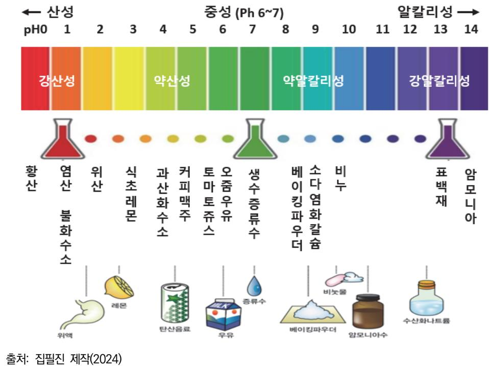

[그림 1-10] pH 스케일

(3) 산성(Acid) 재료

반도체용 세정 공정 산성 약품 재료로 불화수소(HF), 염산(HCl), 과산화수소(H2O2), 질 산(NHO3), 황산(H2SO4), 인산(H3PO4) 등이다. 산도는 pH 7 중성을 기준으로 낮은 수치 인 산성 물질로, 숫자가 낮을수록 강한 산성도를 띠고, 강한 반응성과 부식성이 있으므 로 취급에 주의한다. 세정 공정 재료 제조 시 황산의 경우 묽은 황산으로 재료를 희석 할 때는 물에 황산을 조금씩 넣으며 희석해야 한다. 황산에 물을 넣으면 급격히 발열하 므로 반드시 주의해야 한다. 그리고 세정 공정 재료 물질 선정, 제조, 취급 시는 반드시 제조사에서 공급하는 물질 자료와 MSDS의 화학 물질에 대하여 물성과 특성을 사전에 확인하고 취급하고 MSDS를 확보하여 비치해야 한다.

(4) 알칼리성(Alkaline) 재료

반도체용 세정 공정 알칼리성 약품 재료로 암모니아(NH4OH) 등 산도가 pH 7보다 큰 물질로 pH 14로 높아질수록 강한 알칼리성이며 반응성과 위험성이 커진다. 강한 산성 물질과 동일하게 강한 알칼리성도 강한 반응성과 부식성을 가지고 있다. 세정 공정 재료 물질 선정, 제조, 취급 시는 반드시 제조사에서 공급하는 물질 자료와 해당 물질의 CAS No, MSDS의 화학 물질에 대하여 물성과 특성을 사전에 확인하고 취급하고 MSDS를 확보하여 비치해야 한다.

3. 유기 용제

반도체용 유기 용제로 감광제(PR)는 벤젠, 알코올, IPA 등 카본 계열의 다양한 조합으로 이 루어진다. 유기 용제류는 화재 위험이 큰 카본 계열이다.

(1) 알코올성 계열

PR 등의 유기물을 농도 조건을 맞추기 위한 용도로 사용하며, 유기물을 제어하기 위한 배합 물질로 카본 계열이다. 알코올 계열은 유기물과도 혼합이 가능하고 벤젠, 메탄올, 에탄올, 아이소프로필알코올(IPA) 등과 물(H2O) 등을 혼합하여 사용할 수 있다. 사용 조 건 및 혼합 비율에 따라 공정의 특성에 맞게 적절한 구성비로 사용한다.

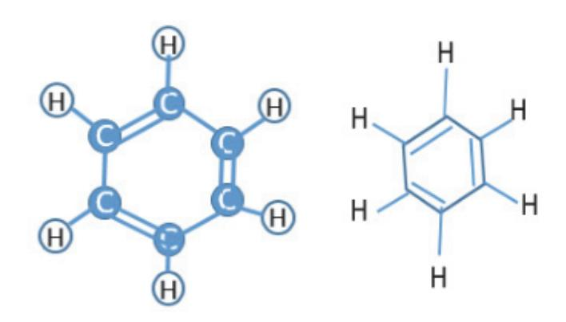

출처: 집필진 제작(2024) [그림 1-11] 벤젠 형상 기호 표현 사례

(가) 에탄올(C2H5OH)

에탄올 순도가 높을수록 강한 인화성 물질이다. 인체에는 에탄올은 크게 해롭지 않 아 메탄올은 에탄올과 다르게 유해성 물질이어서 메탄올의 대체재로 에탄올이 사용 되고 있다. 고순도의 에탄올도 사용되며 인체에 유해할 수도 있다. 물과 혼합하면 주 류의 기본 성분이 된다.

(나) 메탄올(CH3OH)

메탄올은 강한 인화성 물질이다. 알코올 계열의 물질 중에서는 가장 조밀하고 작은 분자 구조를 가진다. 메탄올은 사람에 노출되면 시력을 상실하는 등 흡입하면 치명 적인 손상을 유발할 수 있다. 호흡기 피부 등에 노출 시 인체에 흡수될 수 있으므로 취급에 유의한다. 주의 사항 및 취급은 제조사에서 제공하는 물질 자료와 MSDS, CAS Sheet 등을 확인하고 취급한다.

(다) 아이소프로필알코올(IPA: Isopropyl Alcohol, C3H7OH)

아이소프로필 알코올은 강한 인화성 물질이다. IPA는 에탄올과 메탄올의 대체재로 공정의 특성과 환경 정책에 따라 선택적으로 사용한다. 반도체 세정 공정에서 웨이 퍼 세정용으로도 사용하고 있다. 세정 공정에서 선택적으로 사용하는 알코올도 가스

의 농도가 고농도이면 어지럼증 등을 일으킬 우려가 있다.

(2) 벤젠 계열

벤젠은 온도에 민감한 특성이 있으며 특히 고온에서 대부분이 인화성이다. 화학적 카본 계열의 물질의 기본 구조 형상은 [그림 1-11]과 같이 벤젠은 카본과 수소의 육각형 구 조의 기호로 표시되며 카본 계열 물질의 기본 구조를 따른다. 벤젠은 PR 설명 시 벤젠 구조가 많이 활용되고 있다.

#### 숖 습식 세정 공정 화학 약품 물성 특성의 파악

반도체용 제조 공정에 사용하는 화학 약품은 반도체 산업의 발전과 생산량의 증가로 필요로 하 는 화학 약품 종류도 많고 수요와 사용량이 지속해서 늘어나고 있다. 한편 반도체 공정에서 종 래에 사용하던 화학 약품을 공정 개선 적용, 배합 비율, 공 정순서 변경 등으로 개선 효과와 새 기체와 액체의 경계 물성의 특성을 기대할 수 있다. 다음과 같은 물성 특성의 이해가 필요 하다.

1. 화학 약품 액체와 기체

액체 상태로 보관하고 액체로 사용할 때와 액체로 보관하면서 기체로 사용할 경우에 대해 서 설명한다.

(1) 액체로 보관하고 액체로 사용할 때

Toxic 약품일수록 일반적으로 액체 상태 재료로 보관 용기를 그대로 용기로 사용한다.

- (가) 보관 상태 그대로 사용할 때
  - 1) 고순도가 필요한 공정의 약품
  - 2) 보관 용기가 사용 용기가 되는 경우는 Toxic 약품일수록 용기로 사용
  - 3) 고압 또는 저압에서 사용되는 약품
- (나) 희석 및 배합하여 사용할 때
  - 1) 사용 조건의 설정이 필요한 세정 조건의 설정, 변경이 필요한 경우
  - 2) 세정 공정의 웨이퍼 세정 레시피가 변경되어 희석률이나 배합률을 변경할 경우
    - 가) 세정 조건: 세정 공정 순서에 따라 웨이퍼 상태, 공정 사용 물질 등 성분 반영
    - 나) 현상액(PR): 점도 조건 변경 조절 시
- (2) 액체로 보관하고 기체로 사용할 때

반도체 공정에서 사용하는 분자량이 큰 가스, 메탈계 재료(Gas) 등 공정 재료들이 해당 한다. 물질의 물질 특성에 따라서 증기압, 보관 압력, 보관 온도 등에 따라 운반과 보관 은 액체 상태이지만 실제 사용은 가스화해서 사용하게 되므로 취급과 사용에 유의한다. 제조사에서 제공하는 물성 자료와 MSDS, SAS No. 등을 파악하여 관리하고 안전에 유 의한다.

#### 2. 점성 상태(점도의 조절)에 대한 성상

(1) 액체 상태

초순수, 약품 등과 같이 통상적인 액체 상태이다.

(2) 고점도

감광액(PR, 포토레지스트)과 같이 점도가 있어서 계량과 계측에 전용 지그를 한다.

(3) 고체 분말을 포함한 액체 슬러리와 같이 분사제와 역할재로 주로 사용하며, 자성 유체, CMP 슬러리 등이 있다.

## 수행 내용 / 세정 공정 재료 제조 요구 사항 파악하기

#### 재료·자료

- 고객으로부터의 자료
- 고객과의 미팅 및 회의록
- 세정 공정 재료 제품에 대한 설명 및 공정을 이해하기 위한 자료

#### 기기(장비 ・ 공구)

- 자료 조사용 컴퓨터
- 메모 노트, 필기구 등
- 가능한 경우에 대해 음성 및 영상 기기에 기록

#### 안전 ・ 유의 사항

- 고객과의 회의 내용은 대부분 기업 기밀을 포함하게 되므로 수집과 취급에는 특히 주의를 기울여야 한다.
- 기록 장치를 휴대할 경우는 고객사에 사전에 확인하고 사용 가능할지에 대해서 절차를 밟아 야 한다(일반적으로 USB, Mobile 저장 매체, 녹음기 등은 고객사의 정문에서 반입이 제한 되는 경우가 많다.).
- 기록 장치를 사용할 시 사전에 정해진 절차를 통해서 고객사, 상대방 및 회의 참석자들에게 동의를 구해야 한다.

#### 수행 순서

숔 고객 및 관련자의 인터뷰 내용을 작성 · 정리한다.

고객과의 회의· 인터뷰 내용을 정리하는 별도의 양식은 없다. 그러므로 사전 준비로 사내에서 고객과 담당자가 필요로 할 내용 부분을 예측하여 회의, 인터뷰 전에 정리할 필요가 있다. 인터뷰 진행은 역할을 나누어서 진행하고 기록, 정리한다. 인터뷰 질문지 내용은 필요 지식의 내용을 참고로 한다.

- 1. 고객과의 인터뷰 대상 리스트를 작성한다.
  - (1) 사내 의견의 취합
    - (가) 경영진 의견을 취합한다.
    - (나) 영업팀 의견을 취합한다.

- (다) 사내 공정 엔지니어의 의견 취합한다.
- (라) 현장 공정 엔지니어팀 의견 취합한다.
- (마) 그 외 관계자의 의견 취합한다.
- (2) 질문을 통한 얻은 취재 수집된 정보는 종합 정리 작성한다.

정보 수집을 위한 취재 양식은 별도로 정해진 양식은 없다. 관련 내용을 적절하게 취재하고 고객이 원하는 정보를 파악하고 수집할 수 있도록 한다.

- 2. 고객과의 인터뷰를 진행한다.
  - (1) 준비된 인터뷰의 질문지 내용으로 진행한다.
  - (2) 준비된 질문지 이외에 고객의 의견과 제안 청취한다.
- 3. 고객과의 인터뷰 내용을 정리한다.

숕 오염원의 종류 파악 및 제어 정리한다.

- 1. 오염원의 종류를 파악하고 제어한다.
  - (1) 오염원 요인

반도체 웨이퍼 제조 공정 중에 발생하는 오염 물질에는 유기 물질의 오염물, 파티클, 자 연 산화막 및 금속 불순물 등으로 분류할 수 있다.

[그림 1-12]에 반도체 웨이퍼 표면에서 볼 수 있는 여러 가지 오염 물질에 대한 개념 을 요약하였다.

[그림 1-9], <표 1-4>, <표 1-5> <표 1-6>에 오염 물질, 오염 물질원 및 오염원별 소 자에 미치는 영향을 분류하여 나타내었다.

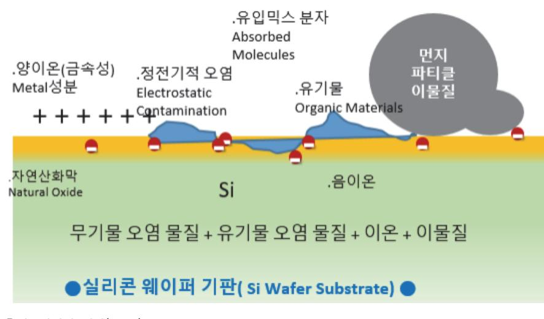

출처: 집필진 제작(2024)

[그림 1-12] 반도체 웨이퍼 표면에서의 여러 종류의 오염원 개념

공기 중에 존재하는 습기나 화학 물질에 반도체 표면이 노출되어 생성될 수 있는 자연 산화막은 직접적인 오염물은 아니지만 소자 특성에 영향을 끼칠 수 있다. 세정 공정과 식각 공정으로 꼭 제거해야 할 오염 물질 대상으로 분류한다.

여기에 언급한 내용은 일반적이지만 공기 중에 존재하면서 제품 소자의 품질 수율에 가 장 큰 영향을 주는 것은 파티클(입자)들이다.

(2) 세정 공정의 제거 대상

〈표 1-4〉 세정 공정 대상 제거 방법

| Cleaning 공정의 제거 대상                | 제거 방법                      |
|-----------------------------------|----------------------------|
| 파티클, 이물질(Particle, Dust)          | SC1                        |
| 금속성 오염물(metal Contamination)      | HF, FPM(CU)                |
| 유기성 물질 오염물(Organic Contamination) | Organic Stripper(DSP, EKC) |
| 자연 산화막(Native Oxide)              | HF(Pre DIFF CLN)           |

#### (3) 반도체 세정 공정에서 사용하는 주요 세정액 재료 제조

| 〈丑 ´ | 1-5> | 세정 | 공정 | 세정법별 | 재료 | 제조 | 및 | 용도 |
|------|------|----|----|------|----|----|---|----|
|------|------|----|----|------|----|----|---|----|

| 세정법(RCA)     | 세정 공정 약품 재료 제조 조성                      | 적용 온도               | 제거 가능 오염                                    |
|--------------|----------------------------------------|---------------------|---------------------------------------------|
| SC-1(APM)    | NH4OH + H2O2 + H2O (1:1:5 ~ 1:1:50) | 40~75°C             | – 파티클, 무기물 제거 – Some Metal 성분            |
| SC-2(HPM)    | HCL+ H2O2 + H2O (1:1:6 ~ 1:1:50)    | 40~85°C             | - 금속 불순물 제거 - Metal:alkaline&trace Metal |
| HF(DHF)      | HF + H2O (1:10~ 1:200)              | 상온(RT) Room TEMP | – 자연 산화막 제거 – Native oxide, Metal        |
| HF(FPM)      | HF + H2O2 (회사별 사양)                  | 상온(RT) Room TEMP | – 자연 산화막 제거 – Native oxide, Metal        |
| Piranha(SPM) | H2SO4 + H2O2 (2:1~4:1)(회사별 사양)      | 90~140℃             | - 유기물 제거 - Photo resist etc.             |
| BOE          | NH40H + HF+ H2O (1:4:20)(회사별 사양)    | 60~80°C             | - 산화막 제거, 식각                                |

.APM(Ammonium hydroxide-hydrogen peroxide mixture)

.SPM(Sulfuric acid-hydrogen peroxide mixture)

.HPM(Hydrochloric acid-hydrogen peroxide mixture)

.FPM(Fluoric acid peroxide mixture)

 .DHF(Diluted hydrofluoric acid) .BOE(Buffered Oxide Etchant)

(4) 오염 물질이 제품 소자 Devicedp 미치는 영향

<표 1-6> 세정 공정 오염 물질과 제품 특성 열화 요인

| 오염 물질                | Device 특성 열화                                                              |
|----------------------|---------------------------------------------------------------------------|
| 파티클(Particle)        | ㄴ Pattern 결함, 절연막 내압 불량, 이온 주입 불량                                         |
| 금속성(Metal)           | ㄴ Junction leakage 전류, 계면 전위 증가, Gate Oxide Failure, Carrier life time |
| 유기물(Organic)         | ㄴ Oxide 이상 성장, 계면 저항 증가, 결정 결함                                            |
| 자연 산화막(Native Oxide) | ㄴ 계면 저항 증가, Gate oxide failure                                            |

 **오염 발생 수율 저하!!**

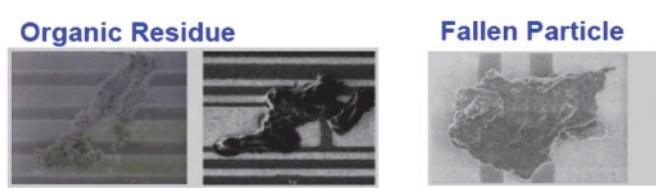

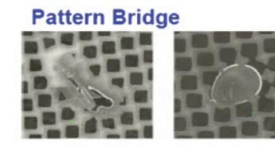

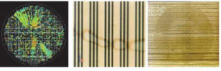

출처: 집필진 제작(2024) [그림 1-13] 세정 공정 제거 대상 Defect 유형들

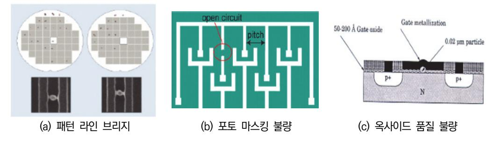

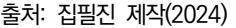

[그림 1-14] 세정 공정 제거 대상 파티클 오염이 제품에 미치는 Defect 유형들

#### 숖 세정 공정 재료 약품(Wet Cleaning Chemical)을 적용하는 공정을 조사한다.

해당 공정에 적용을 고려하여 다음의 내용을 조사한다. 정해진 별도 양식은 없지만, 조사 내용 이 확인되도록 조사용 체크리스트를 기록한다. 보고서 작성 양식은 MSDS의 기본 항목을 반영 하여 객관적이고 실질적인 내용을 확인할 수 있게 기록한다.

- 1. 공정별 세정 공정 목적과 세정 분류를 파악한다.
  - (1) 세정 공정 목적
    - (가) Wafer 표면으로부터 원하지 않는 물질이나 오염원을 제거하는 모든 공정
    - (나) Roughness 개선, 친수성 · 소수성 처리와 같은 표면 처리 공정
    - (다) Wet Chemical/Physical Method/최근에는 Gas 반응도 이용 세정 공정
  - (2) 해당 세정 공정 파악 분류
    - (가) 웨이퍼 투입 공정
    - (나) 산화 공정
    - (다) 확산 공정
    - (라) 포토 공정
    - (마) 식각 공정
    - (바) 이온 주입 공정
    - (사) 증착 공정
    - (아) CMP 공정
    - (자) 메탈 공정
    - (차) 기타 특수 공정 여부 파악하고 구분하여 해당 공정별 특성을 파악한다.
- 2. 적용할 공정을 구분한다.
  - (1) 공정 재료에 대한 약품

사용할 해당 공정 약품의 적용 공정을 확인하도록 한다.

- (가) 감광액(PR: Photoresist)
  - 원하는 구성과 기능을 조사하고 취합한다.
- (나) 습식 에칭(Wet Etching)

에칭이 목적인지, 단지 세정이 목적인지 확인이 필요하며 부산물(Byproduct)에 대한 추가적인 대책을 준비한다.

- 1) 습식 에칭
- 2) 웨이퍼 세정: PR 제거 등
- (다) 막 형성 재료: Wet 성막 재료: 메탈계 Gas

웨이퍼 위에서 제품 구조를 형성하는 재료로 어떤 기능의 막질층이 필요한지 파악한다.

- 1) 메탈층 형성 재료: 파워 공급 라인, 시그널 컨트롤 라인 등과 사용 주파수, 허용 전
- 압 전류 등 고려

공정 사용 목적을 확인하고 그에 따른 생성 방법과 초순수 DI의 목적을 정하도록 한다.

진행 공정이 세정 목적인지를 판단 시에는 먼저 다음 내용 공정에 대한 충분한 이해가 필요하다.

- 2) 산화막층 형성 재료: 게이트 레이어, 절연층(Isolation), 정전 용량 특성
- 3) 그외 막질층 형성 재료: Barrier층, CMP층 높이 제어용 적층 등

3) 먼지, 이물질의 제거: 녹이지 않고 세척하여 제거하는 방식

(2) 공정 진행 보완재

3. 세정 목적 공정의 구분

(가) 초순수 DI(H2O)

1) 중성 물질의 제거: 녹여서 제거

1) 카본 체인 화학 구조: 알코올, IPA 등

2) 방향족 화학 구조: 벤젠, 시너 등

2) 사용 약품의 농도 희석

(나) 유기물성 용제의 희석제

(1) 공정 진행을 위한 웨이퍼 세정

(가) 감광액(PR, 포토레지스트) 세정

2) 부산물 감광액 제거

(나) 그외 공정 전과 후 세정

1) 포토레지스트 잔류물의 제거

1) 웨이퍼 측정, 평가를 위한 세정

3) 웨이퍼 공정 진행용 케리어 세정

2) 공정 투입 전 웨이퍼의 세정

가) 감광액과 식각 공정 가스의 반응 생성물

그 외 기타 공정들도 세정이 중요하고 필요로 한다.

나) 감광액과 에칭 공정 후 반응 생성물과의 2차 반응 생성물

23

(가) 공정 진행 전세정(공정 준비 작업)

공정 반응이 일어나는 장비 체임버의 세정

(2) 공정 진행을 하는 장비 체임버의 세정 약품

- 1) 세정조(Bath) 내부의 불순물 또는 부산물 발생 여부 내용 확인
- 2) 세정조 내부의 산도(pH) 및 기타 물리 · 화학적 물성의 사전 확인
- 3) 세정조와 반응로 체임버에 화학 약품 또는 가스를 공급하는 배관의 정상 여부 확인

- (나) 장비 점검 전 세정(중화 초기화 세정)
  - 1) 중화 초기화 세정
    - 가) 중성화 대상물의 확인
    - 나) 중성화 방법의 결정
  - 2) 중성화 세정: 초순수 DIW(H2O)
    - 가) 중성화 대상물의 물질 확인
    - 나) 중성화에 물질에 사용할 물질의 방법 결정 및 확인
- (3) 기타 재료 및 용도로서의 약품
  - 상기 (1), (2) 항에서 기술되지 않은 용도 외의 세정 필요성 여부를 확인한다.
  - (가) 운반제: 직접 반응하지 않고, 메인 물질을 이동 운반하는 목적으로 사용하는 경우
  - (나) 전구체: 공정 시 반응 대상물의 불안정성을 낮추고, 안정성 확보를 위한 물질
  - (다) 반응 촉매제: 공정 시 반응 활성화 촉진을 돕는 물질
  - (라) 반응 지연제: 공정 시 반응 속도 조절을 용이하게 하기 위한 물질
  - (마) 냉동기, 냉매 물질: 반응로 체임버 등 공정 설비 주변 온도를 컨트롤하기 위한 물질
- (4) 세정 공정 적용의 미세 공정 여부 파악
- (5) 세정의 종류에 따른 세정 방법 구분 및 적용
  - (가) 습식 세정
    - 1) 배치식과 매엽식으로 구분
    - 2) RCA 세정, 불산(HF) 세정, SC1 세정, SC2 세정, 초음파 세정, 황산(H2SO4) 세 정, 인산(H3PO4) 세정, 유기 용제 세정
  - (나) 건식 세정
    - 1) 활성 가스, 증기, 플라즈마 형태로 사용
    - 2) 스핀 건조(Spin Dryer), 알코올 약품 세정(IPA Cleaning)
    - 3) 마랑고니 건조(Marangoni Dryer)
  - (다) 차세대 세정

오존(O3) 세정, 드라이아이스(Dry-Ice) 세정, 아르곤(Ar) 에어로졸 세정, 레이저(Laser) Clean, 자외선(UV) 세정

#### 4. 적용 스텝에 따라 분류한다.

적용 스텝에 따라 아래와 같이 3가지로 나눌 수 있다.

- (1) 전 세정(Pre Treatment)
  - (가) Pre-Diffusion Cleaning
  - (나) Pre-Oxidation Cleaning

- (다) Pre-CVD, Metal Cleaning
- (라) Pre-Photo Cleaning
- (마) Pre-Epi Cleaning
- (2) 후 세정(Post Treatment)
  - (가) H2SO4 Strip
  - (나) Organic Strip
  - (다) Post-CVD, Metal Cleaning
  - (라) Post-CMP Cleaning
- (3) Wet Etch
  - (가) Oxide Etching
  - (나) Si3N4 Strip
  - (다) Metal Strip

세정 설비에 따른 분류는 크게 배치식과 매엽식으로 구분한다.

- 5. 습식 세정과 Wet Etching을 이해한다.
  - (1) 습식 세정과 Wet Etching을 구분한다.

2016년 이후 현재 시점에서 메모리 소자 웨이퍼 제조 공정에서의 에칭 공정은 대부분 플라즈마 에칭(plasma etching)법을 활용하여 건식 에칭을 적용하지만, 비메모리 소자의 경우 고집적도가 요구되지 않는 일반적인 제품, 파워용 제품 제조 경우 습식 세정(Wet Chemical) 방법을 활용한 에칭을 주로 적용한다.

(가) 웨이퍼 세정: PR(Photo Resist) 제거 등

공정 웨이퍼를 에칭 후에 감광액의 잔류물, 부산물을 제거 세정하는 공정이다.

(나) 습식 에칭(Wet Etching)

웨이퍼에서 디바이스 소자 제품 구조를 형성하는 스텝으로 등방성 에칭으로 빠른 식 각과 세정을 필요로 할 때 적용한다.

(다) 포토레지스트(PR)

식각 공정을 진행하기 위해 필요한 사진 공정에서 필요한 막질로 반도체 소자의 선 폭을 결정짓는 중요한 공정이고 재료 측면에서도 중요한 위치를 차지하고 있다. 대 부분 유기성 화합물로 구성되어 있는 경우가 많다.

(라) 막질 형성 재료

웨이퍼의 디바이스 제품 구조를 형성하는 재료 물질로 재료 물질 본래의 특성 또는 적용 디바이스에 필요한 특성에 따라 액체 상태의 경우와 기체 상태의 경우 또는 액 체 상태와 기체 상태가 병립하는 상황으로 있을 수 있다.

1) 메탈층 금속막 형성 재료: 파워 공급 라인, 시그널 컨트롤 배선 등

2) 산화막층 형성 재료: 게이트층, 절연층(Isolation) 레이어 등

- 3) 그외 기능성 막질층 형성 재료: 분리막(Barrier layer) 등
- (2) 공정 보완재로서의 약품

세정 공정 보완재로 구분하는 약품인 그 공정 보완재로는 역할 기능을 하지 않거나 부 분적 기능을 수행하지만 메인 공정 케미컬과의 비율 배합을 통하여 해당 공정 약품의 특성을 최대화하거나 공정 반응 시간을 컨트롤하거나 공정 안정성을 향상해 주는 촉진 역할을 하는 공정 사용 케미컬로 정의한다.

(가) H₂O 초순수

초순수(DI water)는 공정 진행 보완재로 화학적 반응에는 관여하지 않거나 미세하게 하지만 세정 약품으로 사용하는 HCl, HF, 암모니아 등을 섞이면 수용액으로 불산, 염산, 암모니아수 등의 세정 기능성 약액으로 세정 기능을 하게 하고, 반도체 회사마 다 다르지만 한 예로 염산(Hcl)의 경우 사용 농도에 따라 농도를 조절(8~36% 등) 사용하고, 불산(HF)의 농도는 10% 이내로 하는 기능을 한다.

- 1) 케미컬의 농도 희석
- 2) 먼지 · 이물질의 제거: 녹이지 않고 세척하여 제거하는 방식
- 3) 중성염의 제거: 녹여서 제거
- (나) 유기 용제 희석제: 알코올, 벤젠, 시너

포토(Photo) 공정 감광액(PR)의 점도 등을 컨트롤 용도로 주로 사용하거나 PR 도포 공정 후에 잔류 PR를 제거하기 위해 사용되는 경우가 많다. 주성분은 카본을 함유하 는 유기물로 유기물인 감광액 PR의 사용을 원활하게 하기 위한 배합 재료로 사용되 는 세정 공정 재료 중 하나이다.

1) IPA 등 카본체인 구조

2) 벤젠 등의 화학 구조 형태의 방향족 구조

6. 세정을 위한 공정 재료를 구분한다.

반도체 제조 공정에서 웨이퍼 위에 반도체 소자를 형성하는 데에는 많은 종류의 재료가 사 용된다. 세정 공정 중에는 다음 프로세스 스텝에서 진행하는 프로세스 또는 공정에 사용되 는 재료 물질 전부 또는 일부의 재료 물질과 화학적 반응을 할 수 있는 제거가 필요한 부 산물을 세정하고, 또는 다음 공정 스텝에서 진행하려는 프로세스의 진행에 문제 유발 요인 이 있는 물질을 공정 진행 전에 제거하거나 반응을 촉진시키는 조건을 형성 준비하기 위해 서 선행 세정을 진행하게 된다. 이에, 해당 프로세스의 세정을 진행 전에 반드시 다음 스텝 공정에 대한 이해와 확인을 해야 한다.

#### <표 1-7> 세정 공정 재료 Main Chemical

| 물질명       | 화학식   | CAS No.   |
|-----------|-------|-----------|
| 불화수소      | HF    | 7664-39-3 |
| 암모니아      | NH4OH | 7664-41-7 |
| 과산화수소     | H2O2  | 7722-84-1 |
| 알코올(메탄올)  | C3OH  | 592-62-1  |
| 아이소프로필알코올 | C3H80 | 76-63-0   |
| 현상액       | 혼합액   |           |
| 황산        | H2SO4 | 7664-93-9 |
| 염산        | HCL   | 2465-27-2 |
| 시나        | 혼합액   |           |
| 벤젠        | C6H6  | 71-43-2   |

#### <표 1-8> 세정 공정 재 Cleaning 공정 방식

| 구분               | 방식         | 적용 내용                                                                                                                               |
|------------------|------------|-------------------------------------------------------------------------------------------------------------------------------------|
| 배치식 세정           | Dip 방식     | - 기존부터 사용해 오던 방식 - Wafer를 50매 1Batch로 Bath에 Dipping하여 세정 공정을 진행함. - UPEH 우수하나 흐름성 불량 잠재 요소                                 |
|                  | Spray 방식   | - 50매 1Batch Wafer를 Chemical을 분사하여 세정 공정을 진행 - Compact, Safe, and Low cost, UPEH 다소 떨어짐.                                      |
| 매엽식 싱글 타 입 세정 | Spin-type  | - 낱장 Wafer를 개별적으로 회전시키면서 Chemical 분사 - Physical cleaning(Mega-sonic, spray) 병행하여 강한 particle 세정력 보유 - 흐름성 없으나 회오리 불량 유발 가능 |
|                  | Single-dip | - Wafer 1매씩 들어갈 수 있는 Small Bath Type - Backside 오염 제거력 우수-극히 일부 반도체 회사에서 사 용하나 범용화 안 됨.                                       |
|                  | Scan-type  | - Chemical/Rinse/Dry를 1Head에 담아 Scan 방식으로 진 행, 짧은 노출 시간 가능-UPEH 이슈로 메모리 라인은 미사 용, System LSI 사용 중                             |
| Gas              | COR, CEP   | - Oxide Removal 특수 공정에 사용-COR: Flash/DRAM 사 용, CEP: Flash 사용, <표 2-1> 참조                                                         |

(1) 웨이퍼 세정 재료 약품

웨이퍼 프로세스 과정에서의 각 프로세스에서는 웨이퍼의 앞뒤로 제조 공정 진행 후 부 산물이 발생하거나 해당 제조 공정 후 제거해야 할 공정 후 잔류물과 찌꺼기가 발생하 게 되는데 이와 같은 부산물이나 공정 잔류물 찌꺼기들은 웨이퍼에서의 반도체 디바이 스의 수율 감소에 막대한 영향을 줄 수 있으므로 제품 프로세스 웨이퍼는 각각 공정 스 텝을 진행 후 웨이퍼를 세정 진행하여 제거한다. 반도체 세정 공정은 보통 웨이퍼 세정 조 약액(Wet Chemical) 내에 넣어서 웨이퍼 앞뒷면의 부산물, 불순물 및 잔사(잔류물) 를 제거했지만 세정 기술의 발전에 따라 최근에는 습식 케미컬(Wet Chemical)을 적용 하지 않고, 플라즈마나 히터를 이용하여 증기나 기체 상태로 세정의 효과를 진행하는 경 우도 있다. 이번 과정에서는 세정 재료 약액 약품(Wet Chemical)에 대하여 알아본다.

(가) 공정 전 · 후 세정

공정 전 ‧ 후 세정은 보통 웨이퍼의 공정 개시 진행 전 · 후에 해당 제품 로트의 전 세정, 웨이퍼 케리어 세정, 측정을 위한 세정을 한다. 다음으로 사진 공정과 식각 공 정 즉, PR와 사진 공정 이후 에칭 공정 전·후에 대한 세정을 중심으로 내용을 언급 하였다.

(나) 감광액(PR) 세정

사진(Photo) 공정을 진행한 후에 후속 공정으로 에칭을 진행한다. 종래 기술에 의존 하는 Power 제품이나 디자인 룰이 미세 공정이 아닌 경우는 습식 세정 공정을 이용 하고, 최근의 반도체 미세 공정에서는 특별한 일부 공정을 제외하고는 습식 식각 공 법을 이용하는 경우는 별로 없으며, 진공과 플라즈마를 이용하는 건식 식각을 진행 하는 건식 식각을 이용하거나 습식 식각이 진행되고 잔류물 PR의 제거가 필요하다. 식각 공정 후 다음 공정 진행을 위하여 불필요한 부분과 잔류 PR막을 세정한다.

1) 식각 후 불필요 감광액 제거

감광액은 통상 식각 반응을 견딜 수 있는 유기물성 재료이다. 감광액의 역할은 구간의 선택적 식각이 목적이므로 식각 공정 후에 감광액 잔유물 PR이 잔류하게 된다. 이에, 식각 공정 후에 불필요한 감광액 PR와 잔류물 제거하기 위한 세정을 진행하게 된다. 이 불필요한 감광액 PR와 잔류물, 찌꺼기 잔사 제거 과정에서 PR의 성분을 녹이거나 제거하기 용이한 화학 물질이 사용된다.

- 2) 부산물 감광액 잔사 찌꺼기 제거
- 가) 감광액과 식각 공정(에칭) 중의 반응 생성물

나) 감광액과 식각 공정 후 반응 생성물과의 반응 생성물

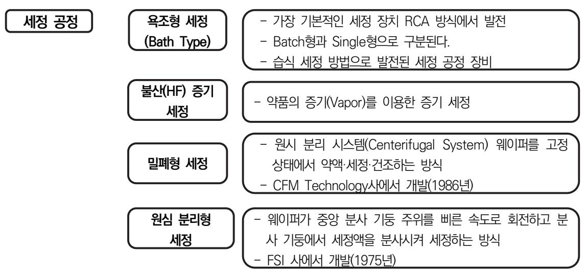

출처: 집필진 제작(2024)

[그림 1-15] 세정 기술 세정 장비에 따른 분류

(2) 세정 공정 진행 장비 클린도

반도체 제조 프로세스의 웨이퍼 가공 공정을 진행에는 재료의 품질이 중요하다. 그리고 공정 을 수행하는 설비나 공정 반응을 진행하는 반응로 체임버의 클린 상태 즉, 세정 상태도 세정 재료 약품의 순도와 클린 상태를 확보하는 것이 매우 중요하다.

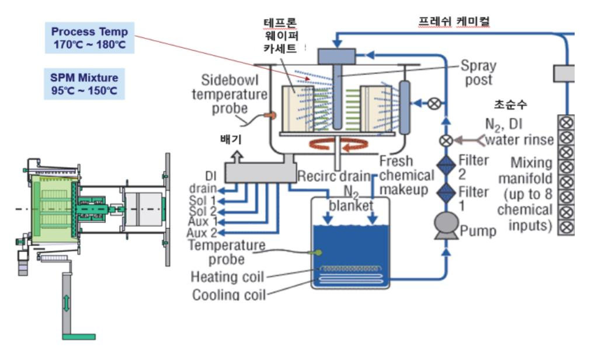

출처: 집필진 제작(2024)

[그림 1-16] 세정 공정 배치 타입 스프레이 방식 P&ID 예시

(가) 공정 준비 작업: 세정 공정 진행을 위한 세정조(Bath) 세정

해당 공정 진행을 위한 반응 체임버의 준비 작업으로 반응로 체임버의 분위기를 맞 추어 준다.

1) 세정조 내부 불순물, 부산물 세정

2) 세정조 내부 산도(pH) 등 화학적 특성, 비율 설정·조절

3) 세정조와 반응로에 약품을 공급하는 공급 배관 세정

(나) 초기화 중성 세정: 장비 점검, 운용 세정

반도체 프로세스 제조 장비의 프로세스 진행 전이나 장비 운용 중 정기, 비정기적인 점검이 필요하게 된다. 최종적인 점검과 인증은 반드시 담당 엔지니어가 진행한다.

1) 초순수(DI Water) 중성 세정

초순수 세정을 진행하는 것으로 중성화 세정의 경우 강산성 약품 또는 강알칼리 성 약품을 처리하기 위하여 사용되는 중화성 재료 약품 자체도 대부분 위험물이 므로 취급자의 안전 확보, 환경 안정성 측면에서 많은 양의 초순수나 물로 희석 하고 중성화를 진행한다. 중성화 과정을 거쳐 안정성을 확보하고 해당 작업을 진 행하여야 한다.

2) 초기화 중화 세정

해당 약품의 물질 특성을 고려하여 진행되어야 하며, 해당 공정 약품 또는 위험 물질을 중성화하고 세정이 진행되어야 한다. 일반적으로는 산성 약품은 알칼리성 약품이 중성화로 사용될 수도 있다. 이와 같은 중성화 작업의 부산물은 해당 장 비의 말단에서 정화 처리 장치 또는 정화 스크러버(Scrubber)로 정화 장치를 설 치하여 배출한다.

(3) 일반 재료 및 용도로서의 약품

상기 해당 공정 용도 외 공정별 다양한 공정별 화학 약품이나 가스(증기) 형태 등으로 사용된다.

<표 1-9> 일반 재료 및 용도로서의 약품

| 구분      | 용도                                   |
|---------|--------------------------------------|
| 촉매제     | 반응을 촉진하기 위한 물질 재료                    |
| 지연제     | 반응의 속도를 조절하기 위한 물질 재료                |
| 반응 운반제  | 물질 운반 목적으로 사용되고, 반응에 관여하지 않는다        |
| 전구체     | 반응 대상물 불안전성을 반영하여 안정성을 확보하기 위한 물질 재료 |
| 냉동기, 냉매 | 공정 온도를 안전하게 컨트롤하기 위한 온도 제어를 위한 물질 재료 |

#### 7. 물질 안전 보건 자료(MSDS)를 파악한다.

MSDS(Materials Safety Data Sheet) 또는 물질 안전 자료 대장(SDS: Safety Data Sheet)은 전 세계에서 판매되고 있는 화학 물질에 대한 등록 번호, 특성, 유해성 등을 설명 한 물질 안전 자료로 화학 물질을 안전하게 사용함으로써 이에 따른 재해를 예방하는 것을 목적으로 한다. 우리나라에서는 특정 화학 물질을 구매하고 사용하는 작업장은 해당 물질의

#### MSDS를 비치하도록 하고 있다.

| 물질명                | 화학식   | CAS No.   | MSDS 경고 표지(위험) | 비고       |
|--------------------|-------|-----------|----------------|----------|
| 불화수소               | HF    | 7664-39-3 |                |          |
| 암모니아               | NH4OH | 7664-41-7 |                |          |
| 과산화수소              | H2O2  | 7722-84-1 |                |          |
| 알코올(메탄올)           | C3OH  | 592-62-1  |                |          |
| 아 이 소 프 로 필 알코올 | C3H80 | 76-63-0   |                |          |
| 현상액                | 혼합액   |           |                | 혼합 유기액   |
| 황산                 | H2SO4 | 7664-93-9 |                |          |
| 염산                 | HCL   | 2465-27-2 |                |          |
| 시나                 | 혼합액   |           |                | 혼합 유기 용제 |
| 벤젠                 | C6H6  | 71-43-2   |                |          |

<표 1-10> 세정 공정 재료 Main Chemical-MSDS, CAS No, 위험 표시

출처: 물질 안전 보건 자료 시스템(https://msds.kosha.or.kr). 2024. 7. 23. 스크린샷.

(1) MSDS의 내용

MSDS에는 다음과 같은 내용이 포함된다.

(가) 성상에 대하여

끓는점, 녹는점, 승화점, 색깔, 맛, 냄새 등을 포함한다.

- 끓는점
- 녹는점
- 승화점
- 색깔
- 맛
- 냄새

(나) 위험성에 대하여

인체 노출에 대해서는 단기 또는 장기 접촉 등으로 구분하고, 각각의 항목에 대해 섭취, 흡입, 피부 접촉 등으로 인체 노출의 유형별로 나타내는 증상을 구분하고 기록

한다. 또한 노출 시 응급조치 방법을 기록하기도 한다.

1) 화재 위험성에 대하여 물질이 발화되었을 때, 소화 방법을 표기한다.

2) 환경에 누출 시 대처 방법을 표기한다.

(다) 분류 번호에 대하여

국제적으로 통용되는 물질의 해당 분류 번호를 표기한다(미국, 유럽 연합, 한국, 일 본 등).

(라) 필요적 기재 사항에 대하여

분류 기준과 관련한 화학 물질과 화학 물질을 함유한 물질의 안전 제재로 「산업안전 보건법」 제41조에서는 유통되는 화학 물질 제품에 물질 안전 보건 자료(MSDS)를 만 들도록 하고 있다. MSDS는 해당 관련 물질을 양도하거나 제조·수입·판매자 및 도·소 매업자 등 공급하는 자로부터 자료를 제공받을 수 있다(활용 서식 참조).

- 1) 대상 화학 물질의 명칭
- 2) 해당 물질의 명칭, 구성 성분 및 함유량
- 3) 안전ㆍ보건을 위한 취급 주의 사항
- 4) 건강에 대한 유해성 과 물리적 위험성
- 5) 그외 고용노동부령으로 고시하는 사항
- (1) MSDS의 의미

MSDS의 의미는 화학 물질 또는 화학 제품을 사용할 때 발생할 수 있는 위험을 사전에 알리기 위해 필요한 정보를 제공하는 문서이다.

MSDS에는 화학 물질의 특성, 건강 위험, 안전한 취급 방법, 응급 처치 방법 등을 포함 한다.

- (2) 필요성 및 도입 배경
  - (가) 근로자 보호와 안전 강화

화학 약품을 취급하는 근로자들이 자신이 일하는 환경의 잠재적 위험을 이해하고, 적절히 대응할 수 있도록 하기 위하여 MSDS가 도입되었다. 화학 물질의 위험성, 취 급 시 주의 사항 사용 방법, 응급조치 방법 등이 표시되어 있으므로 안전 강화에 도 움이 될 수 있도록 하여야 한다.

(나) 법적 요구 사항

국제적으로 대부분의 국가에서 화학 물질 관리와 관련된 법률과 규정을 제정하여 MSDS를 의무화하고 있다. 예를 들어, 미국의 OHSA Hazard Communication Standard(HCS)는 모든 화학 물질 제조 업체와 수입 업체가 MSDS를 작성하고 배포 하도록 요구하고 있다.

요약하자면 화학 물질을 관리하는 근로자와 소비자의 안전을 보호하기 위하여 많은 국가에서 법률로 의무화하고 있다.

(3) MSDS 구성

MSDS상에 구성은 16가지의 의무 표시 사항으로 화학 물질을 다루는 근로자들이 필수 적으로 알고 근무하여야 하는 기본 정보로 의무로 가입되어야 하고 근로자들에게 교육 한다.

- 화학 제품과 회사에 관한 정보
- 유해성, 위험성
- 구성 성분의 명칭 및 함유량
- 응급 처치 요령
- 폭발, 화재 시 대처 방법
- 누출 사고 시 대처 방법
- 취급 및 저장 방법
- 노출 방지 및 개인 보호구
- 물리 화학적 특성
- 안정성 및 반응성
- 독성에 관한 정보
- 환경에 미치는 영향
- 폐기 시 주의 사항
- 운송에 필요한 정보
- 법적 규제 현황
- 그밖의 사항
- (4) 경고 표지

경고 표지는 「산업안전보건법 시행규칙」 제170조에 따라 MSDS를 작성하고 경고 표지 내에는 다음 6가지의 정보가 반드시 표기되어야 한다.

- 물질 명칭
- 그림 문자
- 신호어
- 유해, 위험 문구
- 예방 조치 문구
- 공급자 정보

MSDS 상에 위의 6가지 정보는 반드시 표기한 후 관리해야 하며, 만약 표시나 게시하지 않으면 관계법에 따라 벌금 및 과태료 처분을 받을 수 있으므로 이를 준수해야 한다.

(5) MSDS 검색 방법

화학 물질 사용 시 공급사 또는 제조사로부터 MSDS 문서를 제공받을 수 있다. 또한 인

터넷 검색을 통해 안전보건공단 홈페이지 내의 '안전보건공단 화학 물질 정보'에서 자세 한 내용을 찾아볼 수 있다.

| ****** 안전보건공단 <b>* 화학</b>        | <b>질정보</b> 화학물질정보검색 MSDS 작성 경고표지 작성 정보공                                                                                                                                                                                                                                                                                              |
|-------------------------------------|--------------------------------------------------------------------------------------------------------------------------------------------------------------------------------------------------------------------------------------------------------------------------------------------------------------------------------------|
| 화학물질 정보검색 화학물질정보검색 | * HOME > 화학률질정보검색 > MSDS검색 MSDS검색                                                                                                                                                                                                                                                                                                 |
| 외식 물일정오 영식 - 통합검색 - MSDS검색    | <ul> <li>산업안전보건법 제110조 및 111조에 의거 유통되는 최학률질을 빛유한 제제의 물질안전보건자료(MSDS)는 해당 물질을 양도하거나 제공(제조 수입 판매자(도 소매업자))하는 자로부터 제공 받으셔야 합니다.</li> <li>안전보건질문에서 제공되는 MSDS는 MSDS 적성과 검토 시 참고용으로만 활용이 가능하며, 이로 인하여 발생되는 법적인 문제는 공 단에 책임을 물을 수 없습니다.</li> <li>아름리, 공단의 MSDS는 상업적 용도 등의 외부적인 용도로 사용하는 경우 저작권법 등 관련법규에 위배될 수 있음을 알려드립니다.</li> </ul> |
| 유해/위험성정보                            | MSDS                                                                                                                                                                                                                                                                                                                                 |
| 물질규제경보                              | COCIN COLOR                                                                                                                                                                                                                                                                                                                          |
| 국내기관정보                              | 현재 <b>20,567</b> 종의 화학물질에 대한MSDS 서비스 중                                                                                                                                                                                                                                                                                            |
| 국외기관정보                              | 물질명(관용명/동의어) 🗸 과산화수소 검색하기                                                                                                                                                                                                                                                                                                            |
| 화학물질용어검색                            | ■ CAS No.등 화학물질 관련 검색어를 입력해주세요. 예) 71-43-2. 변젠, KE-02150 등을 입력하시기 바랍니다.                                                                                                                                                                                                                                                              |
|                                     | 검색어 <mark>'과산화수소</mark> '에 대한 검색결과                                                                                                                                                                                                                                                                                                   |
|                                     | 총2건 [1/1 페이지] - 술력개수 10개 ·                                                                                                                                                                                                                                                                                                           |
|                                     | No. 물질명 CAS No. 경고표지 개정일                                                                                                                                                                                                                                                                                                             |
|                                     | 과산학수소 7722-04-1 (2) 2022-08-18 큐멘 과산학수소 80-15-9 (2) (2) (2) 2022-09-26                                                                                                                                                                                                                                                            |

 출처: 안전보건공단(https://msds.kosha.or.kr). 2024. 7. 31. 스크린샷. [그림 1-17] MSDS 검색\_약품별 의무 표시 16가지 사항

> 검색 시 화학 물질의 이름, CAS 번호, No 번호 등을 입력하고 검색하면 빠른 검색이 가능하다. 하나만 입력해도 검색이 가능하다.

- 화학 물질 이름: 과산화수소

- CAS 번호: 7722-84-1

- No 번호

위 내용을 기본으로 하여 해당 기업에 맞게 작성하여 관련 부서의 승인을 받아 게시 등 효과적으로 관리한다.

안전보건공단에서 제공하는 MSDS 자료는 검토 시와 작성 시 참고 사항으로 활용하고, 이와 관련하여 발생하는 법적인 문제는 공단에서 책임지지 않기 때문에 제조사 측, 공급 자 측에 요청하는 것이 좋다.

숗 세정 공정 재료 약품의 구성, 성분, 특성을 파악한다.

화공 습식 약품의 기본 구성을 요약하여 파악하고, 안전성과 취급 시에 대한 요구 사항, 구조

를 확인한다.

- 1. 유기 용제 계열 경우: 발화 화재의 위험이 큰 카본 계열이다.
  - (1) 알코올 계열 물질: IPA, 메탄올, 에탄올 등
    - 메인이 되는 주 물질의 특성을 파악한다.
    - (가) IPA: 아이소프로필 알코올(Isopropyl Alcohol, C3H7OH)
    - (나) 메탄올: CH3OH
    - (다) 에탄올
  - (2) 벤젠 계열
- 2. 산, 알칼리 계열 경우
  - 물질 종류: HF. H2O2, HCl, NH4OH 등
  - 다음과 같은 기본 정보를 확인할 수 있는 자료가 있고, 그리고 제조 공급사에서 제공하는
  - 자료를 요구하고 반드시 확인해야 한다.
  - 물질 안전 보건 자료(MSDS)
  - CAS No. Sheet
  - (1) 산성(Acid)
  - (2) 알카리성(Alkali
- 3. 중성 계열: 초순수 DI Water(H2O)
  - (1) 초순수 DI water
  - (2) 함유물 내용과 부유물 가능성을 파악한다.

수 세정 공정 재료 약품의 성상 특성을 파악 및 적용 사양을 정리한다.

- 1. 액체와 기체는 성상을 확인한다.
  - (1) 액체 상태로 보관되고 기체로 사용하는 물질: 분자량이 큰 가스로 주로 메탈계 재료(gas)
  - (2) 액체로 보관되고 액체로 사용하는 물질
    - (가) 보관 상태 물질 그대로 사용되는가?
    - (나) 사용 시 배합 또는 희석을 하는가?
      - 1) 감광액(PR): 물질 점도 컨트롤을 목적으로 하는지 확인한다.
      - 2) 세정 약품: 세정 대상물질의 물성과 성분 구조를 확인한다.
- 2. 점도 구분 필요한 점성 상태에 대한 성상
  - (1) 액체 상태: 초순수 DI Water

- (2) 고점도 상태: 감광액 PR
- (3) 고체성 분말을 함유한 액체: CMP 슬러리, 자성 유체

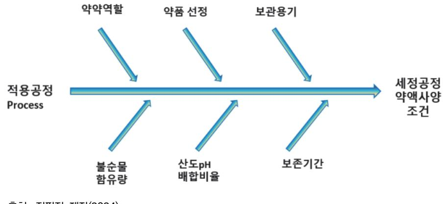

 출처: 집필진 제작(2024) [그림 1-18] 세정 공정 약액 사양에 대한 정보

3. 적용 사양을 정리한다.

[그림 1-18]의 분류 구분을 고려하여 사양을 구분하여 보고서를 정리한다. 사양서에 표기된 양 식은 별도로 요구되는 것은 없으나 공급 업체에서 제공하거나 회사에서 정하여서 사용하는 양 식의 여부를 확인하고 참조하여 작성한다. 사양서의 정리 내용은 필요 지식과 수행 내용에서의 항목을 참고로 한다.

수행 tip

• 고객의 요구 사항을 취합하는 연습을 해 본다.

• 고객의 요구를 사양서화한다.

## 학습 1 교수·학습 방법

#### 교수 방법

- 고객의 해당 공정에 대한 예시를 제시하고, 그룹별로 학습 시 사례를 파악 및 분석하여 사 양을 정하고 학습 모둠별로 역할을 분담하여 해당 공정에 대한 사양서를 정리하도록 지도 학습한다.
- 고객과의 재료 사양 결정 모임을 통해 결정을 위한 사전 자료를 준비하도록 지도한다.
- 사양서 내용에 적정한 장비를 선정하고 그에 맞는 장비에서 가능한 사양에 대해서 중점 요 약 정리하여 학습하게 한다.
- 대상 물질 특성에 대하여 확인할 수 있도록 검색법을 사용하도록 한다(MSDS, CAS No. Sheet 등).
- 사양 항목을 직접 정할 수 있도록 지도하고, 사양을 스펙화할 수 있도록 지도한다.
- 사양서 작성에 대해서는 단계별로 지도하여 사양서를 단계별로 작성하도록 한다.
- 사양 회의 결과를 정리하고, 보고용 사양서의 정리 결과를 작성하도록 지도한다.

#### 학습 방법

- 반도체 공정을 이해하고 공정에 적용해야 할 물질의 사양 조건에 대하여 정리한다.
- 협의 안건 내용을 미팅 전에 준비한다.
- 고객의 요구에 적합한 사양서를 작성한다.
- 고객의 요구에 적합한 성상 물질을 준비하고 특성을 정리한다.
- 사양서의 요구에 알맞은 것인지 측정한다.
- 물질 안전 데이터시트 MSDS, CAS No. Sheet를 검색 학습한다.
- 물질의 안전성에 대하여 확인한다.

## 학습 1 평 가

#### 평가 준거

• 평가자는 학습자가 학습 목표를 성공적으로 달성하였는지를 평가해야 한다.

#### • 평가자는 다음 사항을 평가해야 한다.

|                          | 학습 목표                                                         | 성취 수준 |   |   |
|--------------------------|---------------------------------------------------------------|-------|---|---|
| 학습 내용                    |                                                               | 상     | 중 | 하 |
| 세정 공정 재료 제 조 요구 사항 파악 | - 세정 공정 재료 제조 사양서를 입수할 수 있다.                                  |       |   |   |
|                          | - 세정 공정 재료 제조 사양서를 바탕으로 제품명, 품질 기준, 제품 사양, 납기 등을 파악할 수 있다. |       |   |   |
|                          | - 파악된 내용을 바탕으로 세정 공정 재료 제조 시 발생할 수 있는 문제점을 검토할 수 있다.       |       |   |   |

#### 평가 방법

• 서술형 시험

|                         |                                                                 | 성취 수준 |   |   |
|-------------------------|-----------------------------------------------------------------|-------|---|---|
| 학습 내용                   | 평가 항목                                                           | 상     | 중 | 하 |
| 세정 공정 재료 제조 요구 사항 파악 | - 세정 공정 재료 제조를 위해 제조 사양서 입수 방법 파악 여부                         |       |   |   |
|                         | - 세정 공정 재료 제조 사양서를 기준으로 물질명, 품질 기준, 품질 사양, 납기 등을 파악할 수 있는 능력 |       |   |   |
|                         | - MSDS 위험 표지 구별 능력                                              |       |   |   |
|                         | - 세정법별 재료 제조 및 제거 가능한 오염 파악 여부                                  |       |   |   |
|                         | - 세정 공정 재료 제조 시 유발할 수 있는 사항에 대한 문제 점을 검토할 수 있는 능력            |       |   |   |

• 사례 연구

|                         | 평가 항목                                              | 성취 수준 |   |   |
|-------------------------|----------------------------------------------------|-------|---|---|
| 학습 내용                   |                                                    | 상     | 중 | 하 |
| 세정 공정 재료 제조 요구 사항 파악 | - 세정 공정 재료 제조 사양서 입수 능력                            |       |   |   |
|                         | - 세정 공정의 제거 대상과 제거 방법 파악 여부                        |       |   |   |
|                         | - MSDS 위험 표지에 대해 물질별로 구별할 수 있는 능력                  |       |   |   |
|                         | - 파악된 내용을 바탕으로 세정 공정 재료 제조 시 발생할 수 있는 문제점 검토 능력 |       |   |   |

#### • 평가자 체크리스트

| 학습 내용                   |                                                         | 성취 수준 |   |   |
|-------------------------|---------------------------------------------------------|-------|---|---|
|                         | 평가 항목                                                   | 상     | 중 | 하 |
| 세정 공정 재료 제조 요구 사항 파악 | - 세정 공정 재료 제조 사양서 입수 능력                                 |       |   |   |
|                         | - MSDS 위험 표지에 대해 물질별로 검색하여 확보한 자료 를 파악하고 정리할 수 있는 능력 |       |   |   |
|                         | - 세정 방법에 따른 세정 공정의 제거 대상 오염 물질의 구 분 능력               |       |   |   |
|                         | - 파악된 내용을 바탕으로 세정 공정 재료 제조 시 발생할 수 있는 문제점 검토 능력      |       |   |   |

피드백

1. 서술형 시험

- 세정 공정 재료 제조를 제조 사양서 입수 부분이 미흡할 때는 세정 공정 재료 약품의 구성 특성 에 대해 구체적으로 설명해 준다.
- 세정 공정 재료 제조를 제조 사양서 입수 부분의 성취 수준이 낮은 학습자에게는 세정 공정 재료 약품(Wet Chemical)을 적용하는 공정을 조사·정리 과정을 수행하게 한다.
- 세정 공정 재료 제조를 제조 사양서를 입수 달성 수준이 상위 학습자에 대해서는 세정 공정 재료 약품의 성상 특성 파악과 적용 사양 사례에 대하여 심화 설명해 준다.
- 2. 사례 연구
- 적용 약품에 대한 사례 조사를 진행하고 세정 공정 재료 제조 사양서 입수 부분이 미흡할 때는 세정 공정 재료 약품의 특성 파악에 대해 구체적으로 설명해 준다.
- 세정 공정 재료 제조 사양서 입수 부분의 성취 수준이 낮은 학습자에게는 세정 공정 재료 약품을 적용하는 공정에 대해 정리하게 한다.
- 세정 공정 재료 제조 사양서 입수 부분의 성취 수준이 높은 학습자에게는 세정 공정 재료 약품의 성상 특성 파악과 적용 사례에 대하여 심화 설명해 준다.
- 3. 평가자 체크리스트
- 작성된 사양서와 관련하여 평가 결과가 미흡한 부분은 보충 설명을 해 주고, 세정 공정 재료 제 조 사양서 입수 부분이 미흡할 때는 세정 공정 재료의 특성을 파악할 수 있도록 구체적으로 설명 해 준다.
- 세정 공정 재료 제조 사양서 입수 부분의 성취 수준이 높은 학습자에게는 세정 공정 재료 약품의 성상 특성 파악과 적용 사례에 대하여 심화 설명해 준다.

| 학습 1 | 세정 공정 재료 제조 요구 사항 파악하기 |
|------|------------------------|
| 학습 2 | 세정 공정 재료 제조 준비하기       |
| 학습 3 | 세정 공정 재료 제조하기          |

# 2-1. 세정 공정 재료 준비

|       | • 세정 공정 재료 제조에 대해 필요한 원재료의 종류를 파악할 수 있다. |
|-------|------------------------------------------|
| 학습 목표 | • 세정 공정 재료 원재료의 제조사별 규격 및 장단점을 파악할 수 있다. |
|       | • 세정 공정에 적합한 세정 공정 재료 제조를 준비할 수 있다.      |

## 필요 지식 /

- 숔 세정 공정 약품(Chemical)을 사용하는 제조 공정
  - 반도체 세정 공정에 사용되는 약품에는 분류상 습식 상태, 건식 상태, 기상 상태 등 여러 가지 가 있다. 본 과정에서는 재료 물질의 성상 따라 액체와 가스의 상태 또는 임계 영역과 고체의 파우더 상태 등 다양한 성상으로 존재하기 때문에 상황에 맞게 학습하도록 한다. 반도체 제조 공정 중 세정 약품 선정을 위하여 적용할 공정을 파악하는 것은 중요하다. 또한 이를 이해하고 선정하기 위하여 공정 사용 제품의 목적과 제품별 공정 레시피를 확인하고 적용 조건을 파악하 는 것은 세정 공정 약품 적용에 중요한 요소이다.
  - 1. 세정 프로세스 목적

세정 공정은 반도체 칩(Semiconductor Chip) 제조 공정을 진행함에 있어서 전후 공정, 즉 진행하고자 하는 공정의 Wafer 오염으로 인한 수율 품질 저하를 예방하여 제품 품질 및 수율 향상을 목적으로 하고 있다.

반도체 웨이퍼 제조 프로세스의 특성상 반도체 웨이퍼 공정에서 세정 약품으로 액체를 사 용하는 공정의 경우에는 제품 웨이퍼 투입 시 전 세정 목적 또는 해당 공정 진행 후 공정 잔류물 및 부산물, 잔류물 찌꺼기 제거를 위하여 주로 습식 세정 약품을 사용하여 세정하 며, 액체, 고체, 기체의 경계 조건에 따라 미세 세정을 시행하는 경우가 있다.

2. 물질의 성질 확인

반도체 제품 제조를 위한 사용 공정을 확정하고 재료의 물성과 특성을 확인하고, 다음 항목 에 대하여 각 재료의 MSDS 또는 CAS No Sheet를 확보하며, 다음 실험에 대한 실험 보 고서를 작성하도록 한다. 리트머스 시험지를 활용하고, ([그림 2-9], [그림 2-10]에서 pH 측정기를 활용한다.

3. 반도체 재료 제조를 위한 안정성 확보

반도체 재료를 신규로 설계해서 제조할 경우 해당 약품 제품에 대한 MSDS를 확보하여 사 용자에게 제공하여야 한다.

「산업보건안전법」 제41조(물질 안전 보건 자료의 작성 비치 등)에 따르면 물질 안전 보건 자료(MSDS: Material Safety Data Sheet)'는 화학 물질 및 화학 물질을 함유한 제제를 양도하거나 제공하는 자는 이를 양도받거나 제공받는 자에게 「화학물질관리법」의 내용을 확 인하여 사용하고 관리하기 위해 필요한 정보(제조자명, 제품명, 성분과 성질, 취급상의 주 의, 적용 법규, 사고 시의 응급 처치 방법)를 기재한 Sheet로 법률과 시행령에서 정한 지침 이다(활용 서식 참조).

- 4. 액체 상태 재료이지만 공정 공급 과정 중 기화하는 액체 재료(CVD, Etching)
  - (1) 에칭 공정(Etching), 에싱 공정(Ashing)

에칭 공정과 에싱 공정은 대표적으로 기체를 사용하는 공정이지만 압력과 온도 조건에 따라 서 반응 가스 중 분자량이 큰 기체는 공급 가스 배관에 액체 상태로 존재할 수 있어 온도와 압력 조건 등에 유의하여 최적 조건의 분위기를 만들어 주어야 한다.

- (2) 증착 공정(CVD, PVD, HCVD, ALD 등) 증착 공정에 사용하는 재료는 가스 형태로 반응로 체임버에 공급되지만 분자량이 큰 재 료나 금속 계열의 증착 재료는 분자량이 커서 공급 용기 내에서는 액체와 기체의 공존 상태로 존재할 수 있다. 보통은 액체 상태로 운반 및 보관하게 된다.
- 5. 액체 상태 사용 공정

세정 공정과 습식 에칭(Wet Etching) 공정은 반도체 제조 공정에서 액체 상태의 약품을 주 로 사용하는 공정으로 세정 기술이 발전함에 따라 세정과 습식 식각을 한 공정으로 진행하 는 경우도 있다.

(1) 세정

습식 에칭이 대상 물질의 반응을 유도하여 제거하거나 에칭을 하면 세정 공정의 세정은 중성 물질을 사용하여 제거 대상물을 분해하거나 녹여서 세정하거나 약품 베스에 담가서 웨이퍼를 깨끗하게 하는 공정이다.

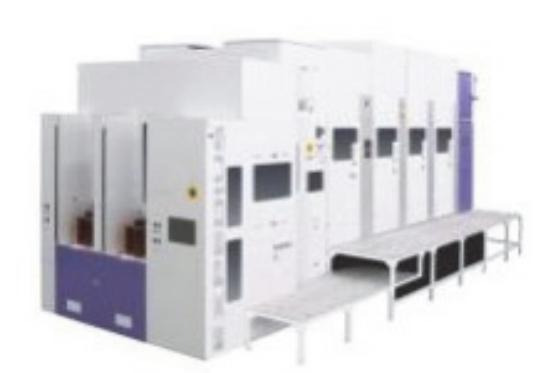

배치 타입 장비

출처: 집필진 제작(2024) [그림 2-1] Wet Station(bath type)

출처: 집필진 제작(2024) [그림 2-2] Wet Station(single type)

스프레이 타입 장비

(가) 초순수 세정 방법

세정 공정 레시피에 따라 사용하는 약액의 농도를 낮추거나 중화 반응 과정 중 생성 된 부산물 중에서 물에 씻기거나 녹는 수용성 잔류물과 부산물 제거 목적으로 사용 한다.

(나) 알코올을 사용하여 세정을 하는 경우

사용 용도가 초순수와 비슷하나 초순수와 함께 사용하여 계면 활성제 역할을 하거나 유기 용제에 녹은 부산물 및 불순물의 제거에 사용된다.

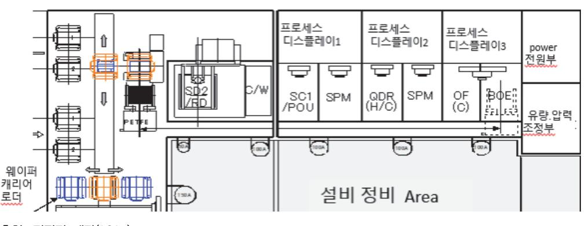

출처: 집필진 제작(2024) [그림 2-3] Wet Station batch의 예

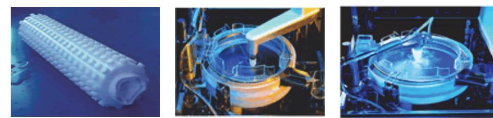

(a) 브러시(롤러) (b) 브러시(펜슬) (c) D-Sonic

출처: 집필진 제작(2024) [그림 2-4] Wet Station 싱글 웨이퍼 타입 세정부의 예시)

(2) 습식 에칭(Wet Etching)

반도체 공정의 에칭 공정 종래 기술로 주로 습식 약품을 사용하며 등방성 에칭의 특성 이 있다. 세정, 에칭 공정 장비에서 조건 설정으로 유체의 흐름과 온도 제어를 통해 세 정 효과를 높이거나, 건식 에칭 공정 진행 후 감광액(포토레지스트), 잔류물, 부산물 등 을 제거하고 세정하는 공정으로 진행한다.

(가) 불산(HF) 적용 공정

강산성 불산을 사용하여 실리콘(Si) 웨이퍼의 이물질, 산화막(SiO2) 막을 제거하기 위한 공정이다. 불산 수용액 농도는 보통 10% 미만을 적용한다. 불산은 강한 산성 물질이고 농도에 차이는 있으나 매우 인체에 매우 유해하다.

<표 2-1> 세정 COR / CEP

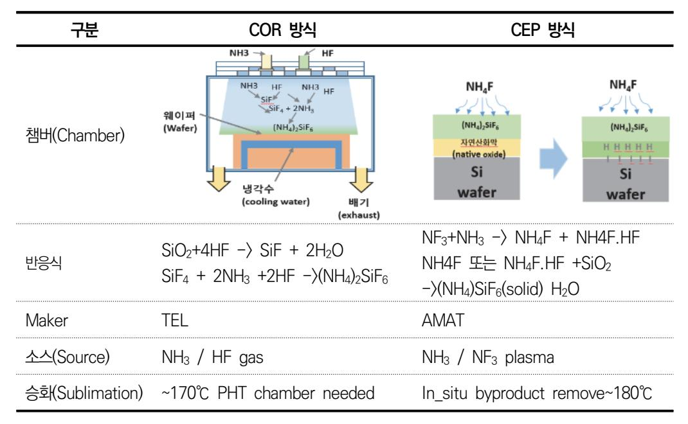

<표 2-1>은 세정 COR과 CEP 방식에 대해 비교 설명하였으며, 세정 COR과 CEP 방식에 대해 각각 반응로 구조와 소스(Source), 반응로 체임버에서의 반응 과정과 공정 반응식을 표현하였다.

1) COR 방식

COR 방식은(Chemical Oxide Removal by no Plasma) 약어로 TEL사의 Certas platform에서 구현되는 Dry cleaning 방식이다.

2) CEP 방식

CEP 방식은(Chemical Electro Plating or Chemical Etching by Plasma)의 약어로 고주파(RF)를 이용한 Dry Etching 방식이다.

(나) 산성 ‧ 염기성 적용 공정

반도체 공정 진행 웨이퍼의 제조 공정 단계별 제거할 대상 물질 성질, 상태에 따라 산성과 알칼리성 약품을 조건에 맞게 재료 제조하여 사용한다. 대상물은 공정별 진 행 전, 진행 후 제거 대상에 따라서 염기성인지, 반응 생성물이 알칼리성인지를 확인 하여 혼합 비율을 조절하여 재료 제조한다. 약품에 따라 농도, 불순물 함유량과 오염 예방에 특히 주의하여야 한다.

- 1) 산: 불산, 질산, 염산, 황산, 인산 등
- 2) 알칼리: 암모니아, 수산화나트륨 수용액 등

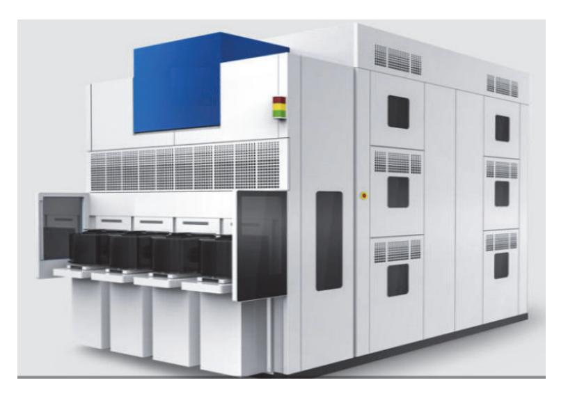

출처: 전자신문((benyun@etnews.com). 2018. 11. 21. 스크린샷. [그림 2-5] Single Wafer Cleaner(single type)

- 6. 포토레지스트(Photoresist)
  - (1) 감광액(PR)

반도체 생산 공정인 사진 공정에서 사용하는 감광액으로 액체 혼합 약품이다. 반도체 생 산에 있어서 중요한 공정으로 재료는 빛에 반응하여 경화되는 특성을 이용하는 경우와 반대로 빛에 반응한 부분을 제거하는 방식을 활용하는 포지티브 감광액과 네거티브 감 광액의 방법이 있다.

벤젠, 알코올 등이다. 감광액의 중요한 성분 중 카본체인이 상당량 포함되어 있다. 농도 의 조절 및 웨이퍼 제조 공정 제어를 위해 희석제를 투입한다. 희석제들의 비율 조합은 중요하며 제조 회사의 프로세스에 따라 다르게 적용된다.

(3) 도포

(가) 스핀: PR을 웨이퍼에 균일하게 도포하기 위하여 웨이퍼를 회전시키는 방법이다.

(나) 롤 프린터: 반도체 웨이퍼에서는 거의 사용되지 않지만 PV, FPD 등에서 사용한다.

(다) 스캐너 방식: 넓은 면적의 웨이퍼에 적용하며 450mm 웨이퍼 적용이 검토되기도 한다.

#### 숕 공정 전, 후의 관리 및 대상 물질

공정 완료 후 제공된 재료가 어떠한 형태로든지 웨이퍼에 남는 경우와 웨이퍼에서 제거하는 경 우에 따라 구분하여 관리해야 한다. 공정 완료 후 웨이퍼에 존재 여부에 따라 공정 구조물 웨 이퍼에 부착, 공정 후 제거 물질로 구분한다.

1. 공정 후 부착

산화막층, 질화막층, 금속막층을 형성하는 증착 공정(CVD) 공정이 대표적이다. <표 2-2>는 공정별 해당 막질의 종류이다.

| 구분           | 막질층                                         |
|--------------|---------------------------------------------|
| 산화막(Oxide)   | SiO2, Al2O3, HF2, Y2O3, Ta2O5, TiO2, ZrO2 등 |
| 질화막(Nitric)  | SiN, HFSiON, TiN 등                          |
| 금속막(Metalic) | Ni, Ti, W, Cu 등                             |

<표 2-2> 막질층 종류

#### 2. 공정 후 제거

PR는 공정 진행 후 제거해야 하는 물질의 대표적인 대상 물질이다. 따라서 에칭 공정 후의 PR를 확실하게 제거하기 위한 여러 가지 고려 사항이 적용된 공정을 진행하게 된다. 에칭 공정 이후에 에셔 공정은 에칭 이후의 PR 잔존물 및 부산물을 효과적으로 제거하기 위한 여러 가지 연구를 병행하고 있다.

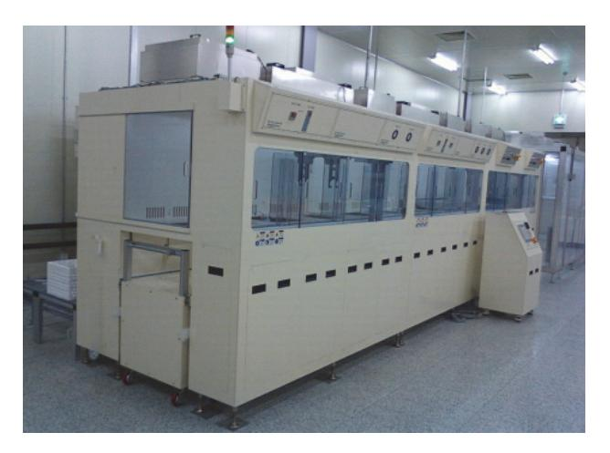

출처: S엔지니어링(http://www.siengb.co.kr). 2024. 7. 31 스 크린샷. [그림 2-6] Wafer Backside Cleaning System

숖 물질 상태에 대한 학습 이해

물질의 상태는 온도와 압력에 따라 액체, 기체, 고체로 상태를 결정하게 된다. 이론적으로 이상 기체 상태 방정식에 대한 기본적인 개념은 다음과 같다.

1. 온도에 따른 이해

온도는 압력에 비례하여 물질의 상태에 영향을 주고 상태를 결정짓는 중요 요소로 보통 온 도를 증가시키면 가스 상태로 변할 가능성이 커지게 된다. [그림 2-7] 그래프의 경우 물의 삼중점 그래프이다. 물은 대기압 1기압 상태(760mmHg 또는 1024mBar 압력)에서 끓는점 은 100℃가 된다.

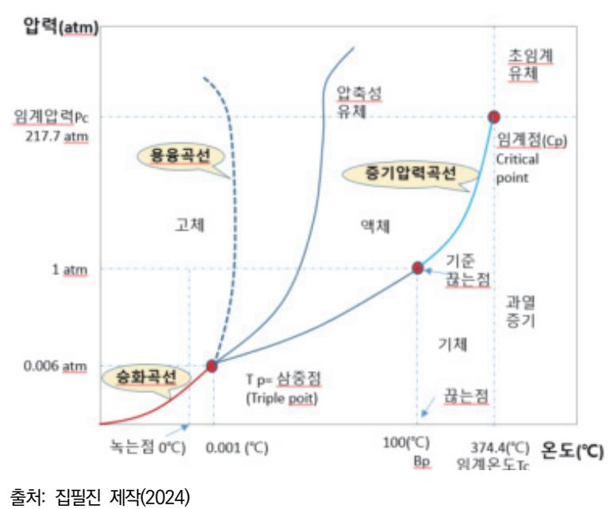

[그림 2-7] 물의 삼중점(상변화) 그래프

#### 2. 압력에 따른 이해

반도체 소자 형성 공정 진행에서 압력은 중요한 공정 요소로서 압력 상태 그 자체가 공정 진행 물질들의 상태와 반응로의 조건을 결정하는 중요 요소가 된다. 일반적으로 압력이 증 가하면 고체나 액체로 물질 상태가 존재하기가 쉽고, 압력이 낮은 상태에서는 가스 상태로 존재하는 경우가 많다. 이에 반도체 공정에서 증착 공정이나 건식 식각 공정은 고진공 및 초고진공 상태로 반응로 상태를 만들어서 공정을 진행하게 된다.

1mole의 기체에 대하여 PV / T = R로 일정하므로, n mole의 기체에 대해서는 다음 식 으로 표현한다.

$$PV / T = nR$$
  $PV = nRT$ 

P=압력 V=체적 T=온도 n, R=상수

## 수행 내용 1 / 세정 공정 재료 준비하기

#### 재료·자료

- 리트머스 시험지
- 실험 재료의 MSDS
- 실험 재료의 CAS. Sheet
- 재료 물질: 순수 H2O
- 재료 물질: 테스트 시약

#### 기기(장비 ・ 공구)

- pH 측정기
- 압력과 온도 조절이 가능한 Chamber
- 압력과 온도측정이 가능한 계측기

#### 안전 ・ 유의 사항

- 고압 상태에서 폭발 비상 안전대책 일환으로 보호 안전 장구류(보호구, 보호안경, 방호복 등)를 준비한다.
- 보호 안전 장구류 보관 위치와 정확한 착용 방법을 교육한다.
- 고압의 폭발 비상시 안전 대책 일환으로 보호 안전 장구류를 착용한다.
- 보호 안전 장구류를 안전하게 정확하게 착용했는지 서로 확인한다.
- 약액의 안전한 취급을 위해 안전·유의 사항을 숙지하고 준수한다.
- 기구, 회전체 및 공구의 사용법을 사전 숙지하고 안전에 유의하여 작업에 임한다.

수행 순서

숔 물질의 성질과 상태를 확인한다.

1. 다음 각 항목의 상태와 조건을 점검하고, 적용 공정을 정하고 재료의 물성과 특성을 확인한다.

2. 각 재료의 MSDS 또는 CAS No. Sheet를 확보하고 숙지하도록 한다.

3. 아래 실험에 대한 실험 보고서를 작성하도록 한다.

개략적인 산도 측정은 리트머스 시험지를 활용하고, [그림 2-9], [그림 2-10]에서 pH 측정기 등을 활용한다.

- 4. 액체 상태로 진행되는 공정(세정, 습식 에칭)을 파악한다.
  - (1) 습식 에칭(Wet Etching)
    - (가) 산성 물질을 사용하는 공정
      - 강한 산성의 희석을 위해 수용액 상태의 pH 농도를 설정하여 진행한다.
        - 1) 희석 시 강한 산성 물질의 특성을 파악하고, 이해하여 투입 순서와 절차 시간, 양을 고려하여 조심스럽게 진행한다(특히 황산의 경우).
        - 2) pH 농도를 설정한다.
        - 3) 초기 상태를 확인한다.
        - 4) 약액과 시약을 혼합한다.
        - 5) 최종 상태를 확인한다.
    - (나) 알칼리를 적용하는 공정
      - 1) pH 농도를 설정한다.
      - 2) 초기 상태를 확인한다.
      - 3) 약액과 시약을 혼합한다.
      - 4) 최종 상태를 확인한다.
  - (2) 세정

선정된 약품으로 최종 세정 수용액의 산도를 확인하고 습식 세정을 진행한다.

(가) 혼합 약액으로 세정하는 경우

적용된 약액의 산과 알칼리를 섞어 가능한 한 pH 7의 중성 약액 상태가 되게 혼합 한다.

- 1) pH 농도 7을 설정한다.
- 2) 초기 상태를 확인한다.
- 3) 약액을 혼합한다.
- 4) 최종 pH 7의 상태를 확인한다.
- 측정 방법은 다음과 같다.
  - 1) 리트머스 시험지법
  - 2) 산도 측정기: pH 측정기
- (나) 알코올계를 적용하여 세정하는 경우

유기물성 물질의 잔류 상태 여부를 확인하기 위해 UV lamp를 이용하여 상태를 확 인한다.

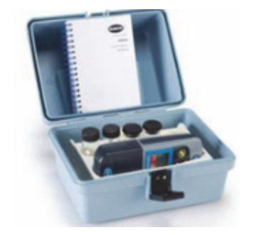

 출처: 집필진 제작(2024) [그림 2-8] 휴대용 pH 측정기

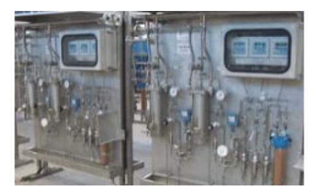

 출처: 집필진 제작(2024) [그림 2-9] 분석 설비 예

숕 압력과 온도에 대한 상황과 물질의 상태를 확인한다.

압력 제어와 온도 제어가 가능한 반응로 체임버를 준비하고 압력과 온도의 컨트롤 설정 변화에 따른 물의 특성 물성 변화를 확인한다.

- 1. 압력 고정하고 온도 변화에 따른 물의 상변화를 모니터하고 기록한다.
  - (1) 압력 0.5atm에서 10℃씩 변화를 확인한다.
  - (2) 압력 1.0atm에서 10℃씩 변화를 확인한다.
  - (3) 압력 1.5atm에서 10℃씩 변화를 확인한다.
  - (4) 압력 2.0atm에서 10℃씩 변화를 확인한다.

[그림 2-10] 물의 삼중점(상변화) 상변화

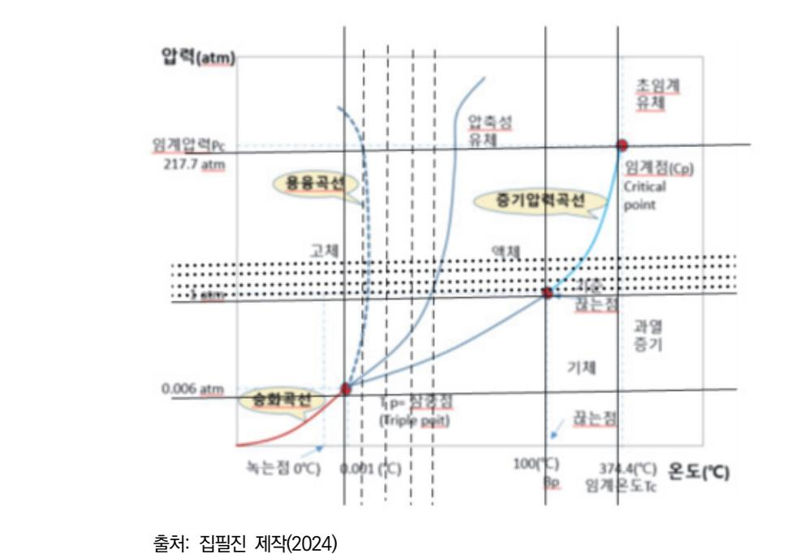

2. 실험 결과를 바탕으로 앞에서 학습한 물질들에 대한 물성 상태의 변환에 대해서 논의해 본다.

51

숖 물질을 이상 기체 상태 방정식으로 해석한다.

이상 기체 상태 방정식은 압력[P], 체적[V], 온도[T]와의 관계를 설명하는 가상적인 기체에 대 해 해석할 수 있는 방정식이다. 보일의 법칙, 샤를의 법칙, 아보가드로의 법칙을 준용하여 온도 변화에 기인한 물의 특성 변화를 확인한다.

1. 압력 P를 고정하고, 상수들의 변화 결과에 대한 해석을 한다.

- V = 체적
- T = 온도
- n, R = 상수

1 mole의 기체에 대하여 PV / T = R로 일정하므로, n mole의 기체에 대해 다음 식으로 표현한다.

| PV / T = nR | PV = nRT    |
|-------------|-------------|
| P = nRT / V |             |
| V = nRT / P | PV / T = nR |
| T = PV / nR |             |

2. 온도 T를 고정하고, 다음 상수들의 변화 결과에 대한 해석을 한다.

- P 압력
- V 체적
- n, R 상수
- 3. 체적 V를 고정하고, 다음 상수들의 변화 결과에 대한 해석을 한다.
  - P 압력
  - T 온도
  - n, R 상수

4. 상수 n, R을 고정하고, 다음 상수들의 변화 결과에 대한 해석을 한다.

- T 온도
- P 압력
- V 체적

5. 융해(용융)

물질은 온도를 녹는점까지 상승하면 물질 내부 에너지는 압력이나 열에 의해 증가한다. 이 때 고체 상태 분자는 액화 상태로 상전이가 일어난다.

#### <표 2-3> 융해 물질별 반응 전과 반응 후

|            |      | 물질 반응 후  |    |          |      |
|------------|------|----------|----|----------|------|
|            |      | 고체       | 액체 | 기체       | 플라즈마 |
|            | 고체   | 고체-고체 변화 | 용융 | 승화       | -    |
| 물질 반응 전 | 액체   | 결빙       | -  | 끓음, 증발   | -    |
|            | 기체   | 증착       | 응축 | -        | 전리   |
|            | 플라즈마 | -        |    | 재결합 탈 전리 | -    |

숗 공정 전 문제에 대한 고려

세정 공정 약품의 공정 적용에 대한 예상되는 우려 사항에 대해 몇 가지 사례와 구분하여 정리 하는 것은 내용이 많을 수 있으나 해당 작업 공정의 전 공정과 후 공정으로 구분하여 정리한 다. 세정 공정에 선정된 습식 약품을 공정에 적용하기 전에 선정 약품의 불순물 함유량, 보관 상태, 사용 전 준비 상태 등 점검과 정상 여부 확인이 필요하다.

1. 품명, 불순물 함유량을 확인한다.

반도체 공정에서 품명을 확인하고 불순물 함유량에 대한 사양을 확인하는 것은 중요한 사 항이다. 반도체 세정 공정 재료는 생산 적용 초기부터 제조 단계에 이르기까지의 과정에서 생산과 보관 중 불순물이 포함되지 않는 방법을 적용하는 등 이물질과 불순물을 제어하여 순도를 관리해야 하는 기술적인 어려움이 있다.

- (1) 불순물의 종류를 확인한다.
  - 금속계 불순물
  - 공기 중의 이물질, 먼지 및 습도, 수분 함유량
  - 보관 용기의 용해 침투
- 2. 세정 공정 약품의 관리 및 보관 여부와 정상 유무를 점검한다.

공정 적용 세정용 약품 재료 및 소모품을 공급받아 바로 사용할 경우 재료의 상태가 최적 상태일 가능성이 있으나, 재고 관리적인 측면에서 약품 재료 등을 창고에 보관하여 사용하 는 경우 품명, 규격, 수량, 보관 용기, 보관 장소 등을 사전에 계획하고 고려해야 한다. 보관 관리 시 다음의 상태를 점검하여 정상 유무를 판단한다.

(1) 보관 환경을 확인한다.

재료 물질별 온도, 습도, 통풍 등 관리 상태, 보관 상태 정상 여부를 확인해야 한다. 항 시 포토레지스트 약액은 빛에 민감하기에 조명에 특히 주의하여야 한다. 사전에 해당 약 품의 MSDS 등의 내용을 확인하여 저장·보관 환경의 적절성을 판단하여 정상 상황으로 관리해야 한다.

(2) 혼합 보관 시 법적 관리 항목 준수 사항을 확인한다.

여러 종류의 재료를 혼합 보관 시 동일한 공간에서 함께 보관을 허용하는 보관량을 넘 어가면 법규와 규정을 미준수하게 되므로 사전에 MSDS, SAS No. 및 법과 시행령 등 의 내용을 확인하여야 한다. 안전 확보 차원에서도 준수한다.

(3) 유효 기간: 약액 및 보관 용기를 점검한다.

약액 재료의 유효 기간과 보관 용기의 유효 기간은 중요하게 관리해야 한다. 보관 용기 의 오염 또는 공급 용기의 오염은 반도체 프로세스 전체에 대한 품질 문제를 발생시키 게 되고 제조 설비를 정비해야 하는 경우가 발생할 수 있다. 불화수소(HF) 수용액이나 혼합 수용액은 산화막(SiO2)을 녹이거나 제거에 사용되고, 염소(HCL) 가스는 에폭시 수 지를 약화시키는 용도로 사용한다. 여러 종류의 각기 다른 화학 약품들은 반응 속도는 다르지만, 금속 등의 재료와 반응을 지속한다.

- 3. 약품 재료 사용 전 준비 상태를 확인한다.
  - (1) 반도체 세정 공정용 화학 약품을 사용하기 전에 레시피에 따라 적용 조건에 맞추어 배합할 때는 배합 비율 등 조건을 확인한다.
  - (2) 배합 프로세스, 환경 조건과 배합 전후의 배합 상태에 대한 세정도, 식각율 등 상태 확인을 해야 한다.
- 수 공정 후 문제에 대한 고려
  - 1. 공정 전에 샘플 테스트 품질에 대한 확인을 한다.
  - 2. 정상일 경우 프로세스를 진행할 수 있도록 한다.
  - 3. 샘플 테스트 진행 공정 진행 후에는 정상이나 반도체 생산 공정에서는 양산 제품 공정 후에 문제 가 생기는 경우도 발생할 수 있다.
  - 4. 세정 공정에서 문제가 발생하는 경우 세정 공정 진행 웨이퍼의 표면 구성이 바뀌거나 막질의 재 료나 결합 구조가 바뀌는 등 세정 품질에 문제가 생길 수 있다.

#### 수행 tip

- 물질의 특유 반응 성을 이해한다.
- 물질의 성상이 주변 환경의 영향을 받을 수 있음을 이해한다.

## 수행 내용 2 / 공정 전, 공정 후 확인을 위한 샘플 시료 만들기

재료·자료

- 보관 용기에 대한 정보 및 자료
- 보관 방법에 대한 MSDS 상에서의 지시 사항
- 보관 용기 구조의 확인 자료
- 실험 확인용 보관 용기

기기(장비 ・ 공구)

- 보관 용기 절단기
- 실험에 필요한 측정기
- 측정, 분석에 필요한 샘플 채취 키트

안전 ・ 유의 사항

- 보관 용기 절단 작업 시에 주의해야 한다.
- 보관 용기 안에 잔량의 남아 있을 수 있는 잔류 물질을 주의해야 한다.
- 샘플 시료 채취 시 유의 사항을 숙지하고 안전하게 작업한다.

#### 수행 순서

숔 불순물 함유량 물질 데이터의 해석을 위한 시료 샘플을 준비한다.

습식 화공 약품을 이동, 운반, 보관, 저장 과정에서의 정상 상태 여부를 확인하기 위하여 용기 에서 직접 샘플 시료를 확보하고 실험 보고서를 작성하도록 한다.

1. 불순물 함유량을 확인한다.

용기 표면의 정상 여부 상태를 확인할 샘플 시료를 취하여 확보한다.

- (1) 샘플 시료의 종류
  - 용기 내부의 용액 시료 샘플
  - 용기 내부 표면의 시료 샘플
  - 용기의 절단 시료 샘플

#### 2. 측정 샘플 시료를 제작한다.

확보한 샘플 시료 측정이 가능한 상태의 측정 시료 샘플로 제작한다. 측정 시료 샘플은 확

보한 샘플을 측정이 가능 상태로 가공하거나 측정기에 삽입하기 위한 작업이다.

- (1) 표준 약액과의 믹싱
- (2) 주사기 등 컬럼관에 챔플 충진: HPLC 측정기용
- (3) 표준 시료 페이퍼 등의 흡착: 파티클 판정 카운터용
- (4) 표준 시료 편의 제작: 반도체 샘(SAM) 분석기 시료 편 등

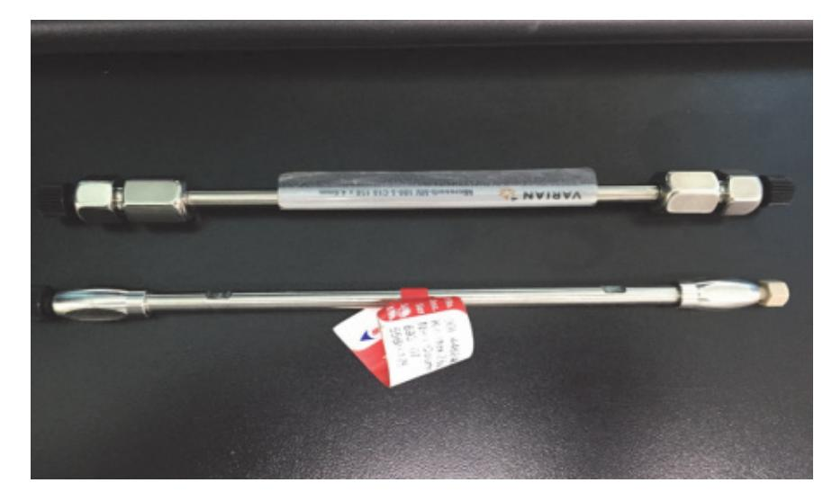

출처: 교육부(2015). 반도체용 습식 화공(Wet Chemical) 약품 재료 제조(LM1903060405\_14v1). 한국직업능력개발원 p.38. [그림 2-11] 샘플 채취기의 예

3. 샘플의 측정

제작한 샘플 시료를 측정기, 분석기에 삽입하여 측정한다.

- (1) 표준 약액과의 믹싱: pH 측정기
- (2) 주사기 등 컬럼관에 챔플 충진: HPLC 측정기
- (3) 표준 페이퍼 등의 흡착: 파티클 판정 카운터
- (4) 표준 시료 편의 제작: 광학 현미경, 샘(SAM) 분석기 사진 등
- 숕 공정 진행 후 예상되는 문제를 확인한다.

반응 후 반응 생성물을 채취하여 검사하여 정상 유무를 판정하고 정상 상태를 확인할 때까지 앞의 과정을 반복한다.

#### 수행 tip

- 공정에 투입하기 전에 보관 상태가 정상인지 약액 보관 용 기 상태를 확인한다.
- 샘플 시료 제작과 기본 물성 내용을 확인한다.

## 학습 2 교수·학습 방법

#### 교수 방법

- 온도, 압력 등 실험 조건에 대하여 물질 성상을 측정하거나 확인할 수 있도록 실험 키트를 선정하고 물질의 성상 변화에 대하여 관찰하도록 설명한다.
- pH 농도 변화를 관찰하고 확인할 수 있는 실험 키트를 구성하고 변화를 관찰, 기록하도록 지도한다.
- 동일 약품의 성상별 특성에 대하여 지도한다.
- 환경 영향에 따른 약액과 시료 샘플의 물성 변화 가능성에 대하여 설명한다.
- 샘플 채취 시료에 대한 개념을 요약 전달한다.
- 표준 시료 샘플(측정, 분석 가능)에 대한 개념을 요약 지도한다.
- 샘플 시료 측정에 대한 측정 데이터 해석에 대하여 설명한다.
- 각 실험에 대한 과정과 결과에 대하여 실험 보고서를 정리하고 작성하도록 하고 작성한 실 험 보고서를 바탕으로 학습자 상호 간에 평가하게 한다.

#### 학습 방법

- 약액의 액체, 기체, 고체의 상태의 물리적 특성을 학습한다.
- 특정 약품의 성질과 상태 변화 조건에 대하여 조사한다.
- 표준 샘플로 확인이 필요한 측정 기기와 측정 방법에 대하여 학습한다.
- 샘플 시료 제작 및 샘플 시료 채취에 대한 방법과 사례를 조사한다.
- 샘플 시료 측정 결과 데이터 해석 사례를 조사한다.

## 학습 2 평 가

#### 평가 준거

• 평가자는 학습자가 학습 목표를 성공적으로 달성하였는지를 평가해야 한다.

#### • 평가자는 다음 사항을 평가해야 한다.

|             | 학습 목표                                        |  | 성취 수준 |   |  |
|-------------|----------------------------------------------|--|-------|---|--|
| 학습 내용       |                                              |  | 중     | 하 |  |
| 세정 공정 재료 준비 | - 세정 공정 재료 제조에 대해 필요한 원재료의 종류를 파악 할 수 있다. |  |       |   |  |
|             | - 세정 공정 재료 원재료의 제조사별 규격 및 장단점을 파악 할 수 있다. |  |       |   |  |
|             | - 세정 공정에 적합한 세정 공정 재료 제조 재료를 준비할 수 있다.    |  |       |   |  |

#### 평가 방법

• 서술형 시험

|             | 평가 항목                                                  |  | 성취 수준 |   |  |
|-------------|--------------------------------------------------------|--|-------|---|--|
| 학습 내용       |                                                        |  | 중     | 하 |  |
| 세정 공정 재료 준비 | - 세정 공정 재료 제조에 요구되는 원재료의 약액 종류 이해 여부                |  |       |   |  |
|             | - 세정 공정 산성·염기성 약품 적용 공정 구분 여부                          |  |       |   |  |
|             | - 세정 공정 재료 원재료의 약액 제조사별 기준 항목 규격 및 장단점을 파악할 수 있는 능력 |  |       |   |  |
|             | - 물질 상태의 이해 기체 상태 방정식의 이해 정도                           |  |       |   |  |
|             | - 세정 공정에 적합한 세정 공정 재료 약품 제조를 위해 준비 할 수 있는 이해 정도     |  |       |   |  |

#### • 사례 연구

|             | 평가 항목                                               |  | 성취 수준 |   |  |
|-------------|-----------------------------------------------------|--|-------|---|--|
| 학습 내용       |                                                     |  | 중     | 하 |  |
| 세정 공정 재료 준비 | - 세정 공정 재료 제조하는 데 필요한 원재료의 종류와 약품 명 파악 여부        |  |       |   |  |
|             | - 세정 공정 전·후의 관리 및 대상 물질 구별 능력                       |  |       |   |  |
|             | - 세정 공정 재료 원재료의 약품 제조사별 물성 규격 및 장단 점 이해 정도       |  |       |   |  |
|             | - 세정 공정에 적합한 세정 공정 재료 제조를 위한 약액 재료 를 준비할 수 있는 능력 |  |       |   |  |

#### • 평가자 체크리스트

|             |                                                             |   | 성취 수준 |   |  |
|-------------|-------------------------------------------------------------|---|-------|---|--|
| 학습 내용       | 평가 항목                                                       | 상 | 중     | 하 |  |
|             | - 세정 공정 재료 제조에 대한 필요한 원재료의 종류를 파악 할 수 있는 능력              |   |       |   |  |
| 세정 공정 재료 준비 | - 세정 공정 약품의 관리 및 보관 방법에 대한 이해 정도와 혼합 보관 시 법적 관련 항목 준수 여부 |   |       |   |  |
|             | - 세정 공정 재료 원재료의 제조사별 규격 및 장단점을 파악 할 수 있는 능력              |   |       |   |  |
|             | - 안전을 위하여 리트머스 시험지 활용 산도 pH 파악 능력                           |   |       |   |  |

피드백

- 1. 서술형 시험
- 학습 지도한 내용에 대하여 서술형 시험으로 기본 습득 지식을 확인한다.
- 세정 공정 재료 제조에 필요한 원재료의 종류 파악 부분이 미흡할 때는 세정 공정 재료 제조에 대한 필요한 원재료의 종류에 대해 구체적으로 보충 설명을 해 준다.
- 세정 공정 재료 제조에 대한 필요한 원재료의 종류 파악 부분의 성취 수준이 낮은 학습자에게는 세정 공정 재료 제조에 필요한 원재료의 종류를 파악하게 한다.
- 세정 공정 재료 제조에 필요한 원재료의 종류 파악 부분의 평가 결과 성취 수준이 우수한 학습자 의 경우에는 세정 공정 재료 제조에 대한 필요한 원재료의 종류와 적용 사양 사례에 대하여 심화 설명해 준다.
- 2. 사례 연구
- 세정 공정 재료 준비하기에 대하여 세정 공정 재료 제조에 대한 필요한 원재료 종류 파악 부분이 미흡할 때는 세정 공정 재료 제조에 대한 필요한 원재료의 종류를 파악에 대해 구체적으로 보충 설명을 해 준다.
- 세정 공정 재료 제조에 필요한 원재료의 종류 파악 부분의 성취 수준이 낮은 학습자에게는 세정 공정 재료 제조에 대한 필요한 원재료의 종류 관련 발전 학습을 수행하게 한다.
- 세정 공정 재료 제조에 필요한 원재료 종류 파악 부분의 평가 결과 성취 수준이 우수한 학습자의 경우에는 세정 공정 재료 제조에 대한 필요한 원재료의 종류와 적용 사양 사례에 대하여 심화 설 명을 해 준다.
- 3. 평가자 체크리스트
- 세정 공정 재료 준비하기 기준으로 평가하되 미흡한 부분은 과제를 부여해 준다.
- 세정 공정 재료 제조에 필요한 원재료의 종류 파악 부분이 미흡할 때는 세정 공정 재료 제조에 대한 필요한 원재료의 종류에 대해 구체적으로 보충 설명을 해 주고 이해도를 피드백해 준다.
- 세정 공정 재료 제조에 필요한 원재료의 종류 파악 부분의 성취 수준이 낮은 학습자에게는 세정 공정 재료 제조에 필요한 원재료의 종류에 관한 보충 학습을 시행한다.
- 세정 공정 재료 제조에 대한 필요한 원재료의 종류 파악 부분의 평가 결과 성취 수준이 우수한 학습자의 경우에는 세정 공정 재료 제조에 대한 필요한 원재료의 종류와 적용 사례에 대하여 심 화하여 설명해 주어 성취도를 극대화하게 해 준다.

| 학습 1 | 세정 공정 재료 제조 요구 사항 파악하기 |
|------|------------------------|
| 학습 2 | 세정 공정 재료 제조 준비하기       |
| 학습 3 | 세정 공정 재료 제조하기          |

# 3-1. 세정 공정 재료 제조

|       |  | • 세정 공정 재료 생산 계획에 따라 제조 장비 운용 계획을 수립할 수 있다.       |
|-------|--|---------------------------------------------------|
| 학습 목표 |  | • 작업 지시서와 장비 운용 매뉴얼에 따라 세정 공정 재료를 제조할 수 있다.       |
|       |  | • 세정 공정 재료 제조 단계에서 발생한 문제점을 파악하고 대응 방안을 도출할 수 있다. |

## 필요 지식 /

숔 세정 공정 재료 제조 개념

반도체 세정 공정 화학 약품 재료 제조와 연속 진행 공정의 안전 문제는 사람과 환경, 기업에 에 매우 중요한 영향을 주게 되므로 생산 과정에서 정해진 수칙을 준수하고 필요한 안전 보호 구 착용 등 안전제일의 주의를 하여야 한다.

최근 새로운 재료나 프로세스가 많이 개발되고 있는데, 종래의 세정 기술과 약품은 기본 개념 과 기반 기술을 바탕으로 하고 있기 때문에 중요하다. 이에 더하여 새로운 재료, 새로운 프로 세스가 등장하면 세정 기술도 함께 혁신하여야 한다.

- 1. 세정 기술과 세정액 약품 제조
  - (1) RCA 세정(Cleaning)

반도체 웨이퍼 표면을 세정하기 위한 대표적인 세정 방법이 'RCA 세정'이다. 현재까지 반도체 세정 공정으로 널리 사용되고 있는 RCA 세정 방법은 과산화수소(H2O2)를 기본 으로 한다. 이 방법은 1970년대 미국 RCA사에서 제안된 방법이다.

(2) SC-1(Standard Cleaning-1)

파티클과 유기 오염물을 제거하기 위한 목적으로 암모니아(NH4OH), 과산화수소(H2O2) 그리고 물(H2O)을 일정한 비율로 혼배합하여 재료 제조하고 40∼75℃ 정도의 온도에서 세정 공정을 진행하는 세정 방법이다.

APM(Ammonium Peroxide Mixture)으로 축약하여 SC-1세정이라 한다. SC-1 세정 용액은 과산화수소의 산화 반응과 암모니아의 식각 에칭(Etching) 반응이 동시에 활성 화 하기므로 재료 제조 시 두 용액의 농도비가 중요하다. 회사마다 제품 구성에 따라 최적화하여 사용한다.

(3) SC-2(Standard Cleaning-2) 재료

염산(HCl), 과산화수소(H2O2)와 초순수(H2O)를 일정한 비율로 혼합하여 제조한다. 사용 시는 세정 효과를 천이성 금속 오염물을 제거하기 위해 최적화하여 40∼85℃ 정도의 온 도에서 사용한다. HPM(Hydrochloric Peroxide Mixture)이며, 재료 제조한 화학 용액 은 SC-2라고 한다.

금속 오염물은 SC-1 용액 내에서 실리콘(Si)보다 전기 음성도가 높아 실리콘으로 전자 를 빼앗아 전기·화학적으로 반응하여 표면을 오염시킨다. 이런 금속성 불순물을 제거하 기 위해 금속보다 전기 음성도가 크게 하여 SC-2 용액을 사용한다. 일반적으로 금속성 오염물들은 희석한 염산(HCL)으로도 제거 가능하다. 하지만 전기 음성도가 큰 금속 (Metal: Cu, Al)은 묽은 염산만으로 제거하기에는 한계가 있으므로 염산과 과산화수소 가 혼합된 세정용액을 사용하여 제거한다.

(4) 황산 세정(Piranha Cleaning) 재료

Piranha 세정 용액의 재료 제조는 일정한 비율로 제조사에 따라 황산(H2SO4)과 과산화 수소(H2O2)를 혼합하여 제품의 세정 효과를 최적화하여, 생산 Device의 제조 시 약액 온도를 80∼150℃ 정도로 가열하여 웨이퍼 표면의 유기 오염물 제거에 사용한다.

SPM(Sulfuric Peroxide Mixture)이라 부르며, Piranha 세정은 구성 화학 용액의 이 름을 통칭 SPM 세정이라 한다.

반도체 팹 공정에서 유기성 오염물, 감광제 잔류물과 찌꺼기(PR Residue)를 제거할 목 적의 SPM(Piranha) 용액은 고온 세정 과정 중 과산화수소가 분해하는 성질을 이용하여 물을 형성함으로써 세정 효율을 유지하기 위해 과산화수소 세정 재료 약품의 농도를 희 석하여 사용한다.

(5) 불산(HF) 세정 재료

불산은 산화막 제거 및 식각에 사용되는 세정 공정 재료이다. 주로 초순수(DI Water)로 희석하여 사용하고 있다. 사용 공정 온도 범위는 상온(25℃)에서 사용한다. 산화막에 대 한 세정·식각율이 온도에 민감하여, 온도 증가에 비례하고 식각율은 커진다. 할로겐산 중의 하나인 불산은 수소(H)와 할로겐족 중의 원소인 불소(F)가 결합하여 만들어진 세정 재료이다.

(6) 유기 용제 세정 재료

금속 식각(Metal Etch)나 비아 식각(Via Etch) 후에 사용되는 세정 용액으로써, 유기 용제에 각별한 효능 기능을 가진 첨가물을 사용하여, 식각 후에 발생하는 폴리머 (Polymer)를 제거하는 데 사용하는 용액이다. 목적성과 기능성을 가진 첨가물은 제조사, 용도, 종류와 조성이 다양하며 부식(Corrosion) 방지제, 폴리머 용해제 등을 첨가하여 사용한다.

(7) 인산(H3PO4) 세정 재료

인산은 질화막(Si3N₄)을 식각하는 데 사용하는 용액이며, 재료 약품의 농도는 80~85% 의 용액으로 약품 재료 제조에 사용하며 인산 용액 내에 수분이 감소하면, 인산 용액의 농도가 올라가고, 그렇게 되면 질화막의 식각율이 점점 낮아지고 인산 용액의 농도가 올 라가면, 이와 반대로 산화막의 식각율은 증가하는 특성을 고려하여 150℃ 이상의 고온 에서 공정을 적용하여 진행된다.

(8) 초음파 세정 재료

진동 주파수가 20kHz(가청 주파수 20Hz~20kHz) 이상으로 귀로는 들을 수 없는 초음 파(UltrasonicWave)인 고주파의 초음파를 이용하여 물(H2O)이나 약품 용제를 진동시켜 웨이퍼에 손상을 주지 않고 세정하는 방법을 초음파 세정이라 한다. '메가소닉 세정 (Megasonic Cleaning)'은 압전 변환기(Piezoelectric Transducer)에서 1MHz 대의 매우 높은 고주파 초음파 에너지를 공급하여 세정조(Cleaning Bath) 하단부에 장착 공 급한다.

반도체에서는 주로 이런 비접촉성 초음파 에너지를 SC-1 세정 공정이나 초순수 세정 공정에 사용하여 식각 공정 후에 발생하는 오염물이나 파티클을 제거한다. CMP 공정 후 잔류물 및 찌꺼기 등 웨이퍼 표면에 잔류하는 오염성 잔류성 이물질 제거에 사용한 다.

| 세정용 재료 약품 |                              | 점도 <u>c.p</u> | 비중 g/cm 2 | 농도 wt% | 산/염기 | 특징                     |
|-----------|------------------------------|------------------|-------------------------|-----------|------|------------------------|
| HF        | 불산(Sulfuric Acid)            | 1.0              | 1.19                    | 50        | 산    | SiO2 식각                |
| H2O2      | 과산화수소(Hydrogen Per oxide) | 1.09             | 1.05                    | 30        | 산    | 강산화제 W 용해              |
| NH40H     | 암모니아(Ammonium Hyd roxide) | 1.0              | 0.9                     | 29        | 산    | Si 표면 식각, Si pit 유발 |
| H2SO4     | 황산(Sulfuric Acid)            | 26               | 1.84                    | 96        | 강산   | 탈수 산화 작용               |
| H3PO4     | 인산(Phosphoric Acid)          | 45               | 1.71                    | 86        | 강산   | 점성 강함, Si3N4 식 각    |
|           |                              |                  |                         |           | 02   |                        |

〈표 3-1〉 세정 공정 재료 약품

2. 반도체 세정 공정에서 사용하는 주요 세정액 재료 제조

| 세정법(RCA)     | 세정 공정 약품 재료 제조 조성                    | 사용 온도               | 제거 가능한 오염                                    |
|--------------|--------------------------------------|---------------------|----------------------------------------------|
| SC-1(APM)    | NH4OH + H2O2 + H2O (1:1:5~1:1:50) | 40~75℃              | – 파티클, 무기물 제거 – Some Metal 성분             |
| SC-2(HPM)    | HCL+ H2O2 + H2O (1:1:6~1:1:50)    | 40~85℃              | - 금속 불순물 제거 - Metal, Alkaline&trace Metal |
| HF(DHF)      | HF + H2O (1:10~1:200)             | 상온(RT) Room TEMP | – 자연 산화막 제거 – Native Oxide, Metal         |
| HF(FPM)      | HF + H2O2 (회사별 사양)                | 상온(RT) Room TEMP | – 자연 산화막 제거 – Native Oxide, Metal         |
| Piranha(SPM) | H2SO4 + H2O2 (2:1~4:1, 회사별 시양)    | 90~140℃             | - 유기물 제거 - Photo-resist etc.              |
| BOE          | NH40H + HF+ H2O (1:4:20, 회사별 사양)  | 60~80°C             | - 산화막 제거, 식각                                 |

〈표 3-2〉 세정 공정 세정법별 재료 제조 및 용도

- APM(Ammonium Hydroxide-hydrogen Peroxide Mixture)

- SPM(Sulfuric Acid-hydrogen Peroxide Mixture)

- HPM(Hydrochloric Acid-hydrogen Peroxide Mixture)
- FPM(fluoric Acid Peroxide Mixture)
- DHF(Diluted Hydrofluoric Acid)
- BOE(Buffered Oxide Etchant)

#### 3. 건식 세정

- (1) 스핀 건조(Spin Dry)
  - (가) 욕조형(Batch Type)
    - 1) 수평형 스핀 건조기(Spin Dryer)

웨이퍼 카세트에 웨이퍼가 담r긴 채로 회전한다. 약 500rpm 이하에서 사용한다.

2) 수직형 스핀 건조기

웨이퍼 카세트레스 방식으로 최고 1,500rpm 정도의 회전을 이용하여 건조한다.

- (나) 매엽식(Single Type: 낱장 처리 방식)
  - 1) 매엽식(Single Type)은 웨이퍼가 회전을 하면서 약액을 하는 세정 공정을 진행
  - 2) 이후에 초순수(De-ionized Wafer)를 이용하여 세정
  - 3) 웨이퍼 건조를 하는 방식

웨이퍼 건조 시 짧은 시간에 고속 회전(최대 3,000~4,000rpm) 공정을 고려하 여 회전 수를 최적화한다.

웨이퍼 제품의 수직 단차가 있는 곳은 기술적으로 건조 시 물 반점(Water Mark) 형태의 얼룩무늬를 발생시킬 수도 있고, 회전 중에 파티클 발생의 가능성이 있다는 단점이 있다.

(2) IPA Dryer

IPA Vapor 방법을 이용하여 웨이퍼를 건조하는 방식으로, 초순수 DI water 세정을 마 친 wafer가 IPA 증기 지대(Vapor Zone)에 머무는 동안 웨이퍼 표면에 있는 DI water와 IPA 증기(Vapor)가 서로 치환하고 웨이퍼가 올라와 Cooling Zone 위쪽 방향 으로 하여 IPA는 휘발하게 되어 웨이퍼 표면을 건조하는 방식이다.

제품의 패턴에 단차가 있는 웨이퍼 건조가 쉽다는 장점이 있고, 단점으로 IPA가 휘발성 이 아주 크므로 화재 발생 유발 위험성이 있고, IPA 사용에 따른 유지비가 많이 든다.

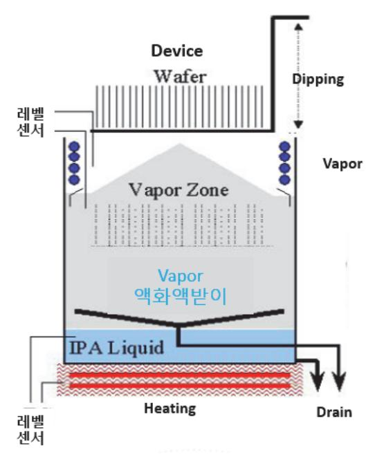

 출처: 집필진 제작(2024) [그림 3-1] Wafer IPA Dry System 개념도

#### (3) 마랑고니 건조기(Marangoni Dryer)

초순수 DI water와 IPA(Iso-Propyl Alcohol)의 표면 장력(Surface Tension) 차이에 따라 발생하는 마랑고니 현상을 이용하여 웨이퍼 표면의 이물질을 제거하고 웨이퍼를 건조시키는 방법이다.

#### (가) IPA를 사용하는 IPA Dryer

마랑고니 건조는 마랑고니 세정 효과 방법을 이용한 세정 및 건조 방법으로 물과 IPA의 물성의 특징인 서로 다른 물성의 밀도와 표면 장력의 특성을 이용한 것이다.

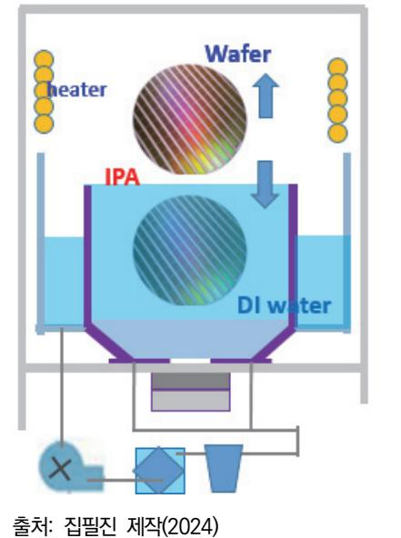

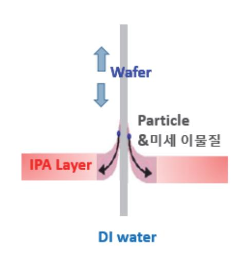

출처: 집필진 제작(2024) [그림 3-3] 마랑고니 효과

(나) 마랑고니 건조 효과

[그림 3-2] 마랑고니 드라이어 구성도

'마랑고니 힘(Marangoni Force)'은 IPA층을 물(초순수 DI Water) 상층부에 주입시 키면 물성인 밀도 차이로 IPA 약품이 물 위로 올라오게 된다. 적당한 최적의 설정 온도에서 웨이퍼를 천천히 용액 밖으로 들어 올리면 모세관 현상으로 IPA와 물이 따 라 올라온다. 이때 IPA의 표면 장력에 비해 물의 표면 장력이 커서 IPA에서 물로 잡아당기는 힘이 발생하는 것을 이용한 것이다. 이러한 마랑고니 효과로 웨이퍼 표 면에 부착한 파티클의 제거도 가능하며, 용액 최상층인 IPA로 인해 웨이퍼 표면은 물 반점 얼룩이 없는 깨끗한 건조 상태를 얻을 수 있게 된다.

4. 유독 물질 혼합 시 안전에 대한 모델링

본 학습에서는 액체성 유출 시에 대해 고려한다. 기체성에 대해서 언급하도록 한다.

- (1) 약액의 유출 문제 구분
  - (가) 벤젠, 알코올 등 휘발성·가연성 약액의 유출
  - (나) 황산, 염산, 수산화나트륨 등 강산성, 알칼리의 유출
  - (다) 그외 인체에 유해하고, 환경에 유해한 약액 물질의 유출
- (2) 외부 가스 유입 문제

반응 및 보관 탱크에 외부 약액이나 외부 가스가 유입 또는 혼합되어 들어올 때에는 삼 각형 조성도표 모델링을 주로 활용한다. 아래 그림의 모델이 각 인화물의 물성 특성에 따라서 작성하는 경우가 일반적이다.

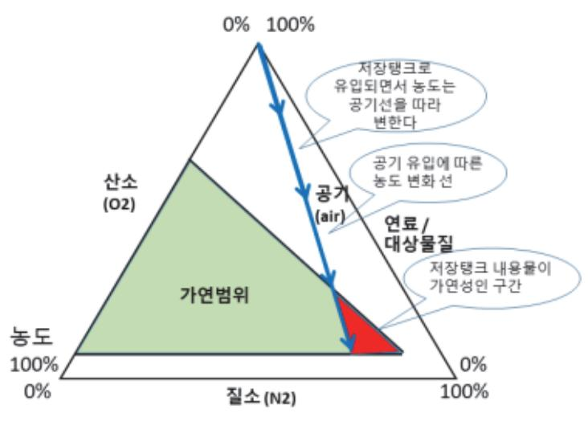

 출처: 집필진 제작(2024) [그림 3-4] 가스 유입 시 조성도 모델링

(3) 가연성 혼합 물질 연소 범위(Range of Flammablility)

가연성 혼합 물질의 연소 하한선과 상한선 간을 말하며, 발화에 필요한 조성 범위를 표 시하며 폭발 범위라고도 한다. 연소 범위는 가연성 물질이 특정 농도 범위에 있어야 연 소(폭발)가 가능하다.

물질 연소(폭발) 범위를 간단히 표현한다. [그림 3-5]는 메탄올(CH3OH)의 연소 범위를 나타낸 것이다. 이는 공기 중에서 메탄올 물질의 농도가 7.3~36% 사이에 있어야 연소 가 가능하다는 의미이다. 연소 범위를 벗어난 농도라면 연소가 불가능하다.

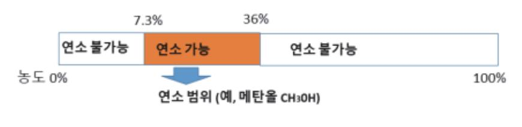

 출처: 집필진 제작(2024) [그림 3-5] 가스 유입 시 연소(폭발) 범위

> 여기서 7.3%를 연소 하한선(LFL: Lower Flammable Limit), 36%를 연소 상한선(UFL: Upper Flammable Limit)라고 한다. - 연소 하한선: 물질이 연소할 수 있는 최소 농도 - 연소 상한선: 물질이 연소할 수 있는 최대 농도

표는 세정 공정에서 주로 사용하는 가연성 물질의 연소 범위를 정리한 것이다.

| 종류         | 분자식         | 하한선 농도(%) | 상한선 농도(%) |
|------------|-------------|-----------|-----------|
| 수소         | H2          | 4         | 75        |
| 암모니아       | NH3         | 15        | 28        |
| 아세톤        | CH3COCH3    | 2.5       | 12.8      |
| 벤젠         | C6H6        | 1.4       | 7.1       |
| 아이소프로필아민   | (CH3)2CHNH2 | 2         | 10.4      |
| 에탄올(에틸알코올) | C2H5OH      | 4.3       | 19        |
| 메탄올(메틸알코올) | CH3OH       | 7.3       | 36        |

<표 3-3> 가연성 물질의 연소 범위(추가적인 물질에 대한 정보 필요시는 MSDS CAS no 참조)

#### 5. 생산 제품 품질 문제 모델링

외부 Gas 및 불순물이 화학 반응로 체임버나 회로 내부로 포함되어 유입하는 경우 반도체 재료로 인한 순도에 대한 부분에 치명적인 품질 문제 및 수율 저하를 초래할 가능성도 있 다.

#### 숕 반도체 세정 공정 생산 재료 장치

1. 체임버 반응로(Chamber Reactor)

반도체 공정의 공정 중 반응로에서는 상황과 조건에 맞는 즉 자연계 대류 현상과 유사하게 온도, 기압, 유체, 물질 간에 유기적으로 항상 반응을 일으키도록 하는 공정을 설계하여 반 도체를 제조하고 있다. 반도체 공정에서는 원하는 프로세스에 필요한 반응을 효과적으로 얻 기 위해 진행 중 불순물이나 이상 반응의 영향을 받지 않게 차단하고 목적하는 반응을 효 과적으로 진행하기 위하여 프로세스 조건에 맞는 공간을 제공하는데 이것을 반응로라고 한 다.

반응로에는 원자력 발전소의 핵 반응기와 유사한 개념으로 반도체 공정의 웨이퍼 프로세스 가 이루어지는 식각 공정의 진공 반응로 체임버, 정유 회사의 반응탑 등이 있다.

(1) 매엽식 반응기(Batch Reactor)

반응로에 특정한 양의 반응을 모아서 한 번에 생산할 제품의 양을 계산하여 필요한 재 료를 투입하는 방식이다. 반응을 소단위로 개별로 유도하는 방식으로 싱글(Single Type Reactor) 연속 생산 방식과 대비된다.

- (가) 제과점에서 1일 분량의 빵 재료 반죽을 숙성시키는 경우
- (나) 하루 먹을 분량의 청국장 숙성
- (다) CVD 반응 공정의 1회 공정 진행
- (라) 반도체 세정 장비의 세정 공정

(2) 싱글 연속 흐름 반응로(Single Type Reactor)

생산물을 연속적으로 생산하기 위해 사용되는 반응로로 건물 수 층 높이의 반응 탑으로 석유 화학 회사의 정유 설비와 같은 시설이 연속 흐름 반응기라고 할 수 있다. 석유 화 학 정제 탑은 연속 생산 방식의 사례로 이런 연속 생산 방식 반응로 시설로 석유 화학 정제물의 많은 다양한 제품의 종류를 생산하고 있다. 액체 상태인 경우 통상 보관 및 이송을 연속 흐름 반응기를 이용해서 흐름 생산과 품질 관리를 하는 경우가 일반적이다.

- (가) 연속 교반 탱크 반응기(CSTR: Continuous Stirred Tank Reactor)
  - 반도체 공정에서 매우 중요하게 사용되는 초순수 물(DI water)을 생산하는 과정에 사용되는 반응기는 일반적으로 형상은 구형, 원추형, 원기둥형 등 여러 가지 형상이 있다.
- (나) 튜브형 반응기(Tubular Reactor)

연속 반응 공정 중에서 반응에 필요한 조건이 긴 지속 시간이 필요하거나 좁은 관의 형상이 필요한 상황에서 적용하는 방법으로 반응기 칼럼 내부에 배관을 배치하는 경 우와 배관을 대기 중으로 배출하는 경우도 있다. 냉각 반응을 유도하기 위한 열교환 기 등이 대표적이다.

(다) 충전층 반응기(Reactor)

반응로 내부 체임버의 반응을 도와줄 촉매나 구조물을 내부에 충진해서 반응을 진행 하도록 하는 반응기로서 암모니아 가스를 물에 흡수시키는 공정이나, 염산을 물에 흡수시키는 공정 등에서 활용한다.

숖 분석 · 검증 시 주의 사항

분석 · 검증이란 물질의 화학적 특성과 대상물이 정성적(무슨 성분이 있는지), 정량적(어느 정도 양이 있는지)인지를 알아내고 수치적으로 확인하고 비교하고 표현하는 것이라고 할 수 있다. 이는 화학 물질의 제품 관리, 품질 관리에 중요하다. 분석 시 주요 파라미터는 분석 작업자, 분 석 장비, 분석 샘플이다.

- 1. 검정과 교정
  - (1) 검정(Verification)

국가 계량에 의한 법률에 준하여 기술표준원장이 정한 검정 기준에 적합한지의 여부를 검사하여 동 기준에 적합한 계량기에 한하여 기기물에 검정 인증을 표기(검정 유효기 간)하는 제반 절차를 총칭한다.

(2) 교정(Calibration)

국가표준기본법 제3조에 따라 특정 조건에서 측정 기기, 표준 물질, 척도 또는 측정 체

69

계에 따라 결정된 값과의 관계로 확정하는 일련의 작업을 말한다.

(3) 검정과 교정의 개념 차이

검정은 계량에 관한 법률에 따라 강제로 시행되는 제도이고, 교정은 계측기기의 사용자 가 보유한 계측 기기가 국제 또는 국가 표준과의 소급성을 유지하고, 또 어느 정도 오 차가 있는지를 알고자 할 경우 실행되는 제도인 점으로 개념상 차이점이 있다.

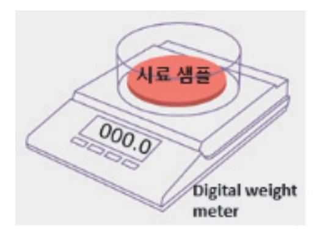

출처: 집필진 제작(2024) [그림 3-6] 검정 계량 디지털 weight meter

- (4) 관련 규정
  - (가) 계량에 관한 법률 시행령 11조(검정을 받아야 할 계량기)
  - (나) 국가표준기본법 제3조
- (5) 올바른 측정
  - (가) 정확한 측정 기관 보유
  - (나) 적합한 측정 환경 유지
  - (다) 국가 측정 표준과 수급성 유지
  - (라) 측정 불확도의 이해 필요
- (6) 소급성(Traceability)
  - (가) 국제적으로 정한 단위(SI) 측정값에 맞추어 국가에서 정한 측정 표준과 산업체에서 수행 하는 측정값이 일치되도록 국제적으로 인정받을 수 있도록 하는 것을 의미함.
  - (나) 국제적인 기준의 연결 고리를 통해 관리되고 측정의 정확도를 보장받기 위한 방법을 소 급성(Traceability) 이라고 하며, 정해진 주기의 검·교정 인증으로 국가 측정 표준과 소 급성이 유지됨.

소급성 유지체계 개념

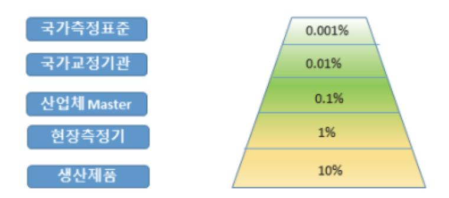

\* 측정기기는 정확도가 더 높은 상위수준의 표준기로 교정되어야 한다.

출처: 집필진 제작(2024) [그림 3-7] 소급성 유지 체계 개념도

- 3. 분석 장비 검·교정
- (1) 검·교정

계측·분석 기기는 일정 기간 경과 시 기능 저하와 교정 주요 항목의 변경 현상이 일어 날 수 있다. 검·교정 유효 기간 내 인가 검·교정 필증을 확인한다. 검·교정 성적서는 품 질 관리 부서나 담당자가 관리한다. 관리 검·교정 인증은 공인 기관에 의뢰하여 일정 기 간마다 계측 성능을 확인해야 하는 것은 법이나 규칙으로 규정하는 경우가 대부분이다. 산업 현장 및 생산에 사용되는 계측 장비의 품질 관리는 국가 계측 기기 기준물에 따른 검·교정 체계를 따른다. 대표적인 인증인 ISO에서는 정기적인 관리인 검정과 교정은 계 측 기기의 가장 중요한 관리 항목 중 하나로 선정되어 있다.

| (20)                                                                                                                                                                                                                                                                                                                                                                                                                                                                                                                                                                                                                                                                                                                                                                                                                                                                                                                                                                                                                                                                                                                                                                                                                                                                                                                                                                                                                                                                                                                                                                                                                                                                                                                                                                                                                                                                                                                                                                                                                                                                                                                                                                                    | CALLERATION CERTIFIC                                                     | ATE                                             | ~ |                                                 | 시험성적             | 서                                                          |
|-----------------------------------------------------------------------------------------------------------------------------------------------------------------------------------------------------------------------------------------------------------------------------------------------------------------------------------------------------------------------------------------------------------------------------------------------------------------------------------------------------------------------------------------------------------------------------------------------------------------------------------------------------------------------------------------------------------------------------------------------------------------------------------------------------------------------------------------------------------------------------------------------------------------------------------------------------------------------------------------------------------------------------------------------------------------------------------------------------------------------------------------------------------------------------------------------------------------------------------------------------------------------------------------------------------------------------------------------------------------------------------------------------------------------------------------------------------------------------------------------------------------------------------------------------------------------------------------------------------------------------------------------------------------------------------------------------------------------------------------------------------------------------------------------------------------------------------------------------------------------------------------------------------------------------------------------------------------------------------------------------------------------------------------------------------------------------------------------------------------------------------------------------------------------------------------|--------------------------------------------------------------------------|-------------------------------------------------|---|-------------------------------------------------|------------------|------------------------------------------------------------|
| $\begin{array}{l} H(T) \stackrel{2}{\rightarrow} \left\{ \left\  \mathcal{L}(T) \right\  \right\} &  for an example the set of a set of a set of a set of a set of a set of a set of a set of a set of a set of a set of a set of a set of a set of a set of a set of a set of a set of a set of a set of a set of a set of a set of a set of a set of a set of a set of a set of a set of a set of a set of a set of a set of a set of a set of a set of a set of a set of a set of a set of a set of a set of a set of a set of a set of a set of a set of a set of a set of a set of a set of a set of a set of a set of a set of a set of a set of a set of a set of a set of a set of a set of a set of a set of a set of a set of a set of a set of a set of a set of a set of a set of a set of a set of a set of a set of a set of a set of a set of a set of a set of a set of a set of a set of a set of a set of a set of a set of a set of a set of a set of a set of a set of a set of a set of a set of a set of a set of a set of a set of a set of a set of a set of a set of a set of a set of a set of a set of a set of a set of a set of a set of a set of a set of a set of a set of a set of a set of a set of a set of a set of a set of a set of a set of a set of a set of a set of a set of a set of a set of a set of a set of a set of a set of a set of a set of a set of a set of a set of a set of a set of a set of a set of a set of a set of a set of a set of a set of a set of a set of a set of a set of a set of a set of a set of a set of a set of a set of a set of a set of a set of a set of a set of a set of a set of a set of a set of a set of a set of a set of a set of a set of a set of a set of a set of a set of a set of a set of a set of a set of a set of a set of a set of a set of a set of a set of a set of a set of a set of a set of a set of a set of a set of a set of a set of a set of a set of a set of a set of a set of a set of a set of a set of a set of a set of a set of a set of a set of a set of a set of a set of a set of a set of a set of a set of a set of a set of a set of a set of a set of a se$ | 생작사영호 : GA23-03543-09 Contrain No. 케이징 (D) / (홍고) Page (D of Q) |                                                 |   | ktl seesaas                                     | (TEST REPORT)    |                                                            |
| 1.211 404 41444                                                                                                                                                                                                                                                                                                                                                                                                                                                                                                                                                                                                                                                                                                                                                                                                                                                                                                                                                                                                                                                                                                                                                                                                                                                                                                                                                                                                                                                                                                                                                                                                                                                                                                                                                                                                                                                                                                                                                                                                                                                                                                                                                                         |                                                                          | a ( 107 ± 20 ± 20. Lain Lain — C ¶92 9Da San |   | 1.         •••••••••••••••••••••••••••••••••••• |                  |                                                            |
| 1+801.00x74 0112 014 x12211                                                                                                                                                                                                                                                                                                                                                                                                                                                                                                                                                                                                                                                                                                                                                                                                                                                                                                                                                                                                                                                                                                                                                                                                                                                                                                                                                                                                                                                                                                                                                                                                                                                                                                                                                                                                                                                                                                                                                                                                                                                                                                                                                             |                                                                          |                                                 |   |                                                 | cy for Technolog | redited by KOLAS gy and Standards, Republic of Korea |

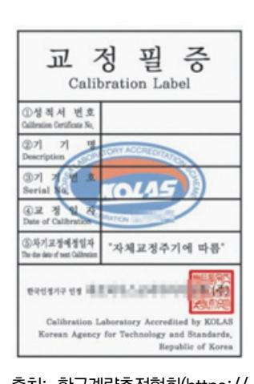

출처: 한국계량측정협회(https:// m.blog.naver.com). 2024. 7. 2 0. 스크린샷. [그림 3-9] 교정 필증

출처: 한국계량측정협회(https://m.blog.naver.com). 2024. 7. 20. 스크린샷. [그림 3-8] 교정 성적서

(2) 측정 능력

버어니어캘리퍼스와 마이크로캘리퍼스는 대표적인 측정 도구이다. 샘플 시료의 종류, 크기, 형상에 따른 분석 가능 여부에 대해서 사전에 확인할 필요가 있다.

4. 분석 샘플

시료 대상물의 구성물과 불순물의 구성 성분이 무엇이고, 함유량이 얼마인지 확인하는 분석 작업은 시료 대상물 전체를 실시간으로 검사해야 하는 실질적인 방법에 있어 어려움이 있 다. 이에 따라 시료 샘플의 채취 방법, 시간, 장소에 따른 오차를 고려해야 하며, 테스트 샘 플이나 시료 채취 방법을 표준화 또는 순서화하는 방법 등을 병행하여 보완하고 안정성을 확보해야 한다.

## 수행 내용 1 / 초순수 제조하기

#### 재료·자료

- 수돗물: 산업 용수, 도시 용수(시티 워터)
- 초순수(DI Water) 제조 설비의 사양서 및 매뉴얼
- 장비 설비 운전에 필요한 소모품 및 교체 부품

#### 기기(장비 ・ 공구)

- 초순수 제조기
- 초순수 제조기 시설 운전에 필요한 기기
- 장비·설비 정비에 필요한 기기
- 초순수 화학적 농도를 확인할 수 있는 장비(pH 측정기 등)
- 초순수 전기적 비저항을 측정할 수 있는 장비[약액 (비)저항 측정기]

#### 안전 ・ 유의 사항

- 장비 취급에 필요한 안전·유의 사항을 숙지한다.
- 약액 취급에 대한 안전·유의 사항을 숙지하고 준수한다.
- 안전 보호구 및 보호 장비의 사용에 필요한 안전·유의 사항을 숙지하고 준수한다.

수행 순서

숔 초순수의 생산 준비를 한다.

반도체 공정에 필요한 초순수의 생산 준비를 한다.

- 1. 장비의 구조적 결합과 시스템의 상태를 확인한다.
  - (1) 장비의 상태와 장비의 사양서와 매뉴얼에서의 항목을 비교 체크
    - (가) 사양서를 확인한다.
    - (나) 매뉴얼과 순서서를 확인한다.
    - (다) 사양서와 매뉴얼에서 체크 항목을 도출 작성한다.
    - (라) 체크리스트를 확인한다.
    - (마) 체크 항목에 따른 판정 기준을 정한다.
- 2. 반응 체임버와 연결 배관을 확인한다.
  - (1) 반응 체임버와 P&ID의 연결 상태를 항목을 확인한다.
    - (가) 사양서 및 매뉴얼에서 P&ID를 확인한다.
    - (나) 장비와 매뉴얼을 확인한다.
    - (다) 사양서와 매뉴얼, P&ID에서 체크 항목을 도출 작성한다.
    - (라) 체크 항목에 따른 판정 기준을 정한다.
    - (마) 체크리스트를 확인한다.
- 3. 전기적 연결 상태를 확인한다.
  - (1) 장치의 사양서와 전기회로도에 따른 연결 상태를 확인한다.
    - (가) 사양서 및 매뉴얼에서 전기회로를 확인한다.
    - (나) 장비와 매뉴얼을 확인한다.
    - (다) 사양서와 매뉴얼, 전기회로 에서 체크 항목을 도출 작성한다.
    - (라) 체크 항목에 따른 판정 기준을 정한다.
    - (마) 체크리스트를 확인한다.
- 4. 소모성 부품의 상태를 확인한다.
  - (1) 장치의 사양서와 매뉴얼에서 소모성 부품의 품목을 확인한다.
    - (가) 사양서 및 매뉴얼에서 소모성 부품의 품목을 확인한다.
    - (나) 장비와 매뉴얼을 확인한다.
    - (다) 사양서와 매뉴얼, 소모성 부품의 항목을 도출 작성한다.

(라) 소모성 부품의 상태 판정 기준을 정한다.

(마) 소모성 부품의 상태를 판정한다.

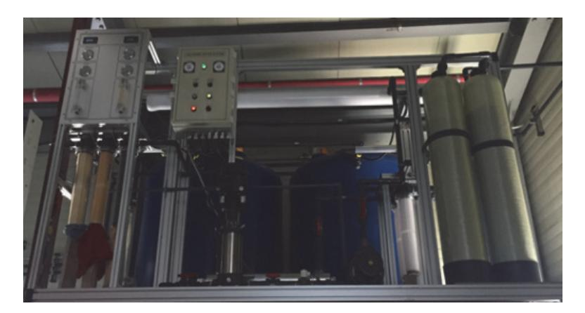

출처: 교육부(2015). 반도체용 습식 화공 약품(Wet Chemical) 재료 제조(LM190306040 5\_14v1). 한국직업능력개발원. p.48. [그림 3-10] 초순수 생산 설비 설치 예

숕 초순수 생산

초순수의 생산 장비를 기동하여 초순수를 생산한다.

1. 초기시험 기동

상태 확인 체크리스트에서 확인된 내용 문제 없음을 확인하고 테스트 기동을 시작한다.

- (1) 제어계 메인 파워를 ON 한다.
- (2) 동력계 부전원을 ON 한다.
- (3) 기계 구동부측을 구동시킨다.
- (4) 순수 생산을 시작한다.
- 2. 초기 시험 기동 상태의 확인 점검 및 조치
  - (1) 최기 시험 생산된 순수 상태를 점검한다.
  - (2) 이상점 여부를 기록한다.
  - (3) 해결 조치 방법을 모색한다.
- 3. 양산 기동

순수를 기동 양산한다.

4. 설계 반응식 확인해 본다

반응을 진행하기 위한 설계를 유도함에 있어서 반응 유도 설계를 하는 난이도 높은 화학적 전문성이 요구되는 과정으로 실질적으로 반응 설계를 하여 반응식, 필요한 에너지, 필요한 재료, 반응 생성물의 성질 등을 수식으로 나타내고 그 수식을 구체화 실현하는 작업이 기계

장치, 시설, 설비 배치 등의 설계이다.

#### (1) 물 H2O 반응 시 검토해야 할 사항

이 항에서 깊이 생각해야 할 반응은 수소(H2) 가스와 산소(O2) 가스의 반응성 여부를 검 토한다.

- (가) 화학 반응식: 2H + O = H2O + 에너지 방출
- (나) 반응에 필요한 용량: 수소(H) 2\*22.4ℓ + 산소(O) 22.4ℓ --> 22.4ℓ

물 H2O gas 1몰의 부피는 22.4ℓ로 화학 상태의 중요 단위이다. 이는 물의 화학식 을 반영하면 수소 44.8ℓ와 산소 22.4ℓ는 물 44.8ℓ가 생기게 된다. 이것은 화학 반응식에 의한 계산으로 여기서 수소와 산소는 성상이 단분자 Gas가 아니다.

(다) 반응식: 2H2 + O2 = 2H2O

여기서 몰 반응에 필요한 양은 수소 22.4ℓ의 2배인 44.8ℓ와 산소 22.4ℓ를 반응 시키면 22.4ℓ의 2배인 44.8ℓ가 생기게 된다. 결과적으로 물(H2O) Gas 1몰을 만 들기 위해서는 수소 22.4ℓ와 산소 11.2ℓ를 반응시키면 물 Gas 22.4ℓ가 생성되게 된다.

1) 반응 전 보관 용적

수소 22.4ℓ, 산소 11.2ℓ

2) 반응 체적

수소와 산소의 결합 반응 용적 33.6ℓ

3) 화학적 반응 후 결합 체적

물 H2O, gas 22.4ℓ

(라) 반응 시간의 컨트롤

여기서 주목해야 할 사항은 수소를 산소와 결합시키는 화학적 반응이다. 수소는 산 소와 결합 반응에 있어서 발열 반응이고 여기서 반응 시간이 매우 짧은 시간에 이루 어지고 폭발적 활성화 반응이다.

(마) 반응 온도의 제어

수소와 산소의 결합 반응이 발열 반응이 되지만 물 가스를 식혀 주면 물 액체로 성 상이 전환된다는 면에서 물의 성상은 산소와 수소가 일정 부분 녹아 결합하게 되는 등 예측하기 쉽지 않은 면이 있어 순수한 물을 얻으려고서 수소와 산소를 화학적 반 응 방법의 사용을 권장하지는 않는다.

5. 반응 파라미터 연관성 확인하기

순수한 물을 생성시켜 만들기 위해서 여과 방식과 이온 교환 방식을 기반으로 하는 연속 생성 공정 방식을 일반적으로 활용하고 있다.

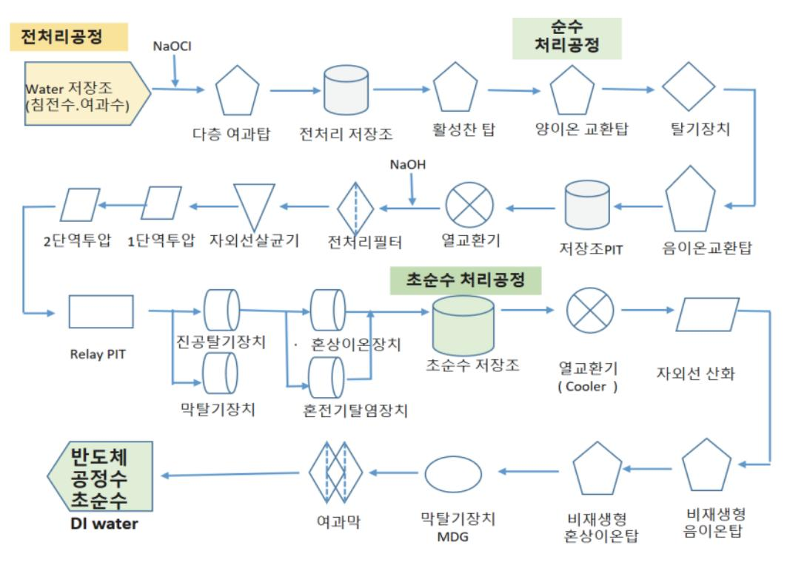

출처: 집필진 제작(2024) [그림 3-11] 초순수 생산 P&ID의 예

(1) 장치 변수

장치 시설을 구성하는 조건 변수로 저장 용기, 반응 용기, 연결 배관, 제어 밸브, 안전 밸브, 무게, 제어 방식 등이 있다.

(2) 제어 변수

장치 운전을 위한 변수로 이후 다음 공정 변수를 통한 장치의 생산성 효율과 성능을 결 정하는 요소가 된다.

(가) 기계적 컨트롤

기계적 구동을 컨트롤 하는 것으로 구동 모터와 구동 밸브 등을 컨트롤 한다.

(나) 궤환 컨트롤

연속 공정에서 감지 센서와 구동부의 상황을 연동시켜서 생산 유체의 상태(온도, 유 속, 성분)를 컨트롤하게 한다.

(3) 반응 변수

반응의 직접성을 컨트롤하기 위해 반응의 요소를 기계 및 제어 변수 제어하여 반응성을 컨트롤하 는 것으로 장비 모델 특성을 고려하여 레시피 프로그램 등으로 제어 관리도 한다.

- (가) 온도
- (나) 재료의 배합량
- (다) 압력

#### 수행 tip

- 연속 생산 설비를 기동해 본다.
- 약액 생산 설비의 구동을 이해한다.

## 수행 내용 2 / 세정 공정 위험성 확인하기

#### 재료·자료

- 외부 가스 혼입·유입 가능성 테스트 자료
- 인화성 공급 가스 시료
- 가연성 가연성 물질의 연소 범위 도표(<표 3-3>) 작성에 관한 자료

#### 기기(장비 ・ 공구)

- 외부 가스 혼입·유입 가능성 가연성 테스트 실험 장비
- 온도 및 압력 측정을 위한 측정 및 기록장치
- 압력 컨트롤용 진공 펌프와 가압 펌프

#### 안전 ・ 유의 사항

- 폭발 및 연소 반응 가능성에 대한 안전 확보 방호를 한다.
- 안전 교육을 실시하고, 안전 방호복, 보호구 등을 착용한다.
- 압력 컨트롤용 펌프의 운전 취급 시 매뉴얼 숙지, 순서 준수, 조작에 유의하여 작업한다.
- 정밀 측정 기기의 이동, 설치 시 충격을 최소화하고 사용, 취급 시 주의한다.

#### 수행 순서

숔 외부 가스 유입에 대한 상황을 시뮬레이션한다.

계획한 테스트 조건에서 공기의 유입에 기인한 위험 여부를 확인해 본다. 첨부된 [그림 3-5], <표 3-3>과 같이 약액을 정하여 가연성 폭발·발화 시뮬레이션 및 가연성 폭발·발화 KIT를 이 용하여 가연성 폭발·발화 실험을 진행해 본다. 실험 결과 데이터를 확보하고 진행 시뮬레이션 결과 보고서를 작성한다.

1. 가연성 실험 KIT를 설치한다.

(1) 실험 방법

시뮬레이션 KIT 내부에 대하여 압력, 온도 조건을 맞추어 설정하고 내부에 탱크 내부의 물질을 대표할 수 있는 물성·물질을 넣고, 점화 또는 반응을 유도하여 반응 내용을 모니 터하고 계측 장비로 계측하여 그 결과를 기록한다.

- (가) 압력에 대한 조건을 설정한다.
  - 1) 0.5atm을 설정한다.
  - 2) 1.0atm을 설정한다.
  - 3) 1.5atm을 설정한다.
  - 4) 2.0atm을 설정한다.
- (나) 온도에 대한 조건을 설정한다.
  - 1) 기화 현상 유발 온도 이하
  - 2) 기화 현상 유발 온도 이상
  - 3) 인화 현상 유발 온도 이상
  - 4) 기타 필요한 현상 유발 온도 포인트

2. 가연성 시뮬레이션 실험을 정리한다.

가연성 실험 항목의 시뮬레이션 데이터를 삼각형 조성 도표를 참조하여 폭발·연소 영역에 대한 데이터 해석을 진행한다.

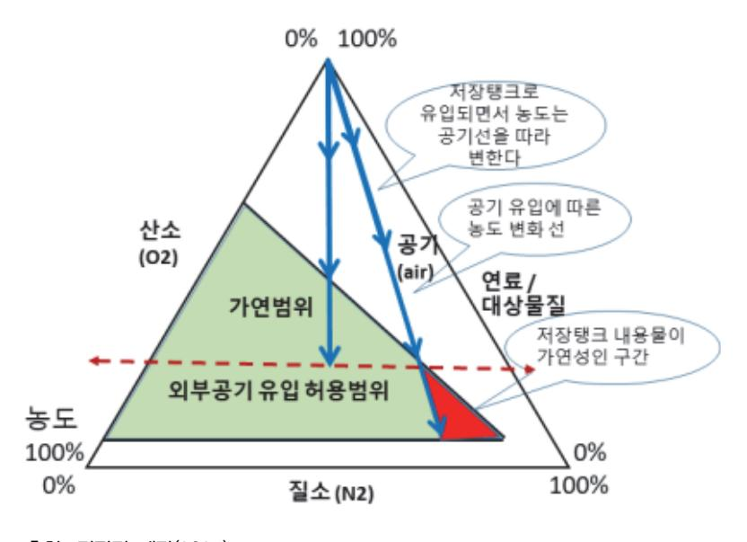

출처: 집필진 제작(2024)

3. 가연성 혼합 물질 연소 범위(Range of Flammability)를 파악한다.

가연성 혼합물질의 연소 하한선과 상한선 간을 말하며, 발화에 필요한 조성 범위를 표시한 다. 폭발 범위라고도 한다. 연소 범위는 가연성 물질이 특정 농도 범위에 있어야 연소(폭발)

 [그림 3-12] 물질 조성도를 표현한 연소(폭발) 영역 해석 예

이 가능하다.

물질 연소 범위를 간단히 표현한다. [그림 3-13]은 메탄올(CH3OH)의 연소 범위를 나타낸 것이다. 이는 공기 중에서 메탄올 물질의 농도가 7.3~36% 사이에 있어야 연소(폭발)이 가 능하다는 의미이다. 연소 범위를 벗어난 농도라면 연소(폭발)이 불가능하다. <표 3-3>은 세 정 공정에서 주로 사용하는 다른 가연성 물질의 연소(폭발) 범위를 정리한 것을 참조한다.

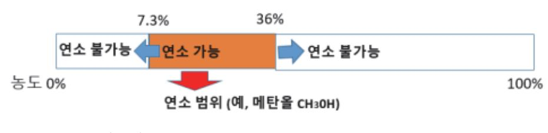

 출처: 집필진 제작(2024) [그림 3-13] 가스 유입 시 연소(폭발) 범위

숕 공정 위험을 점검(점검표)한다.

공정 위헌 점검 진행할 때 사전에 점검해야 할 항목을 정리해서 주기적인 점검을 해야 한다.

- 1. 시설을 점검한다.
  - (1) 공장 시설에 대해 점검한다.
  - (2) 생산 시설에 대해 점검한다.
  - (3) 보호 및 방호 시설에 대해 점검한다.
- 2. 프로세스를 점검한다.
  - (1) 메인 공정 진행 상태를 점검한다.
  - (2) 긴급 상황에 대한 바이패스 라인을 점검한다.
  - (3) 정비 부분에 대해 점검한다.
  - (4) P&ID에서 밸브와 기기 접촉 부분 등은 중요 점검 포인트로 보아야 한다.

출처: 교육부(2015). 반도체용 습식 화공 약품(Wet Chemical) 재료 제조(LM1903060405\_14v1). 한국직업능력개발원. p.50. [그림 3-14] P&ID 표현 예

3. 검사 결과 확인과 분석

검사·점검 결과의 확인과 현장 실물을 확인한다.

- 4. 검사 결과 판정에 대한 대응
  - (1) 대응 조치 여부의 판단을 한다.
  - (2) 대응 조치 범위의 판단을 한다.
  - (3) 대응 조치 시기의 판단을 한다
  - (4) 대응 조치 시 정비 내용과 보완 결과 검증·확인을 위한 시운전과 테스트를 진행한다.

숖 결과의 해석과 보고서를 작성한다.

문제 발생 예방을 위하여 외부로 유출이나 외부로 유입 예방 차원에서 점검 항목과 점검 포인 트들을 설정하여 정기적인 점검을 실시하고 비정기적 점검도 진행해야 한다. 예방 점검 체크는 활용 서식의 공정 위험 점검표를 참고로 한다. [그림 3-15]의 P&ID 포인트별 확인 사례도 참 고한다.

- 1. 시설 점검표(활용 서식 참조)
  - (1) 공장 시설에 대한 점검 포인트를 선정한다.
  - (2) 생산 시설에 대한 점검 포인트를 선정한다.
  - (3) 보호 및 방호를 위한 안전 대응 시설에 대한 점검 포인트를 선정한다.
- 2. 프로세스 점검표(P&ID에서 확인하고 활용 서식 참조)
  - (1) 메인 공정 진행 상태의 점검 포인트를 선정한다.

(2) 긴급 상황 대응 조치를 위해 바이패스 배출·배기 라인 점검 포인트를 선정한다.

(3) 정비 부분에 대한 점검 포인트를 선정한다.

(4) P&ID에서 부품 연결 부위와 밸브, 기기 연결·접속 부분의 점검 포인트 선정한다.

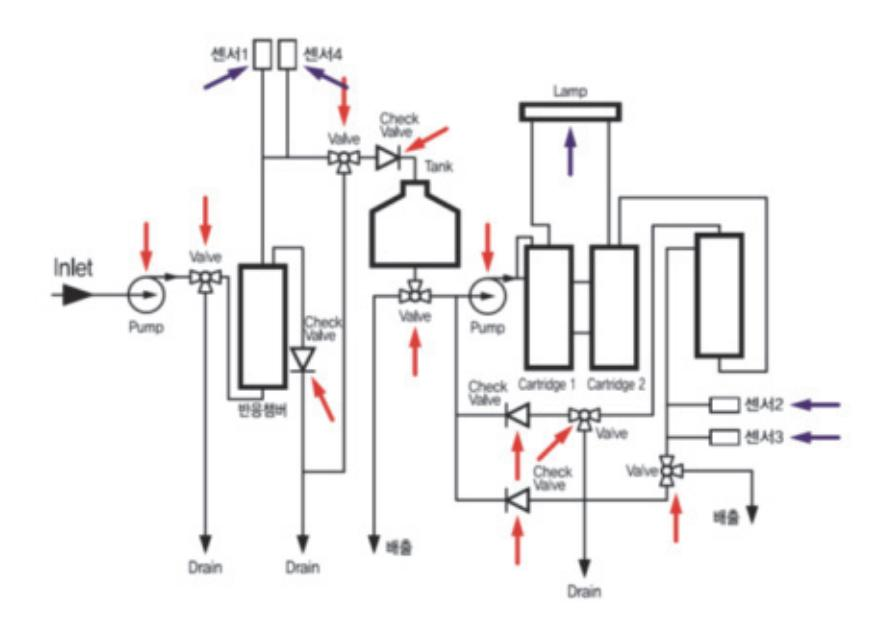

출처: 교육부(2015). 반도체용 습식 화공 약품(Wet Chemical) 재료 제조(LM1903060405\_ 14v1). 한국직업능력개발원. p.53. [그림 3-15] 예방 점검 연결 포인트의 예

수행 tip

• 유입·유출 시에 대한 위험성과 문제점을 이해한다.

• 예방 점검 포인트를 설정해 본다.

## 수행 내용 3 / 분석·검증하기

#### 재료·자료

- 분석 대상 시료
- 분석을 위한 관련 자료: MSDS, CAS No. Sheet 등
- 분석 샘플 시료 및 샘플 시료 수납 용기
- 측정 기기의 매뉴얼 및 사용 설명서

#### 기기(장비 ・ 공구)

- 액체 크로마토그래피 기기
- 조정 장비

#### 안전 ・ 유의 사항

- 약액 및 샘플의 취급에 유의한다.
- 측정·분석 기기는 초정밀 기기로 이동, 설치 시 취급과 사용에 매뉴얼을 숙지하고 숙련도를 높여 안전을 확보 운영한다.
- 안전 확보를 하고 사용·유의 사항에 적합한 실험복, 보호 장갑 등의 방호 안전 도구를 착용 한다.
- 실험실 내에서는 뛰거나 성급한 행동을 하지 말고 서로 부딪히지 않게 행동에 유의한다.

#### 수행 순서

숔 시험 및 평가 시 유의 사항을 확인한다.

시료 재료를 사용하기 전에 분석, 시험, 평가 진행에 있어서 기업별로 제조 방식에 차이가 있 다.

1. 시험을 진행한다.

공정에 실제 적용 전에 테스트, 시뮬레이션 등으로 적용 가능성 여부에 대한 테스트 시험을 단계별로 진행한다.

(1) 선행적 실험적 적용 제조 공정 적용 전에 연구소나 실험실에서 연구 및 실험적 적용한 자료를 참조하여 시 험을 진행한다.

(2) 부분적 적용

제조 양산 적용 투입 전에 테스트나 파일럿용으로 웨이퍼 1매 또는 1 로트(약 25매)을 적용해서 전후 공정과의 영향성을 시험해 본다.

2. 분석 작업자를 확인한다.

분석·검증 작업을 위한 다양한 종류의 측정 및 계측 기기는 교육 훈련과 실무 능력 향상을 통한 전문성과 사용 방법상 숙련도가 필요하다.

(1) 전문성을 이해한다.

반도체 소재 재료와 함께 반도체 산업에 활용되는 다양한 종류의 측정 및 계측 기기는 전문적인 지식이 필요하다.

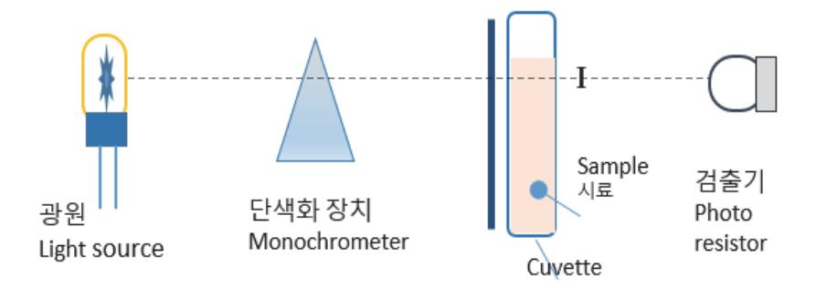

출처: 집필진 제작(2024) [그림 3-16] 분광기의 개략도의 예시

(2) 숙련도를 확인한다.

교육 훈련을 통해 전문지식을 학습하고 특히 (1)항의 분석 시에는 측정과 계측에는 측정 오차를 줄이기 위한 숙련도가 필요하다. 작업자 교육 인증을 진행한다.

- (3) 분석법을 이해한다.
  - 분광 화학법
  - 원자 분광법
  - 크레마토그래피
  - 전위차법
- 3. 분석 장비를 확인한다.

측정·분석 요청 사항 항목에 대해서 측정·분석이 가능한지 여부를 판단하기 위해 분석 장비 의 능력을 매뉴얼 등을 통해 확인해야 한다.

- (1) 분광 화학법
  - (가) 장치의 사용법과 매뉴얼을 사전에 학습하여 익힌다.
  - (나) 검·교정 사용 가능 상태를 확인한다.
  - (다) 측정·분석 장치의 순서에 의거 전원을 ON하여 가동한다.

- (라) 기기의 안정화 시간을 가진다(5분 정도).
- (마) 실험 용기 큐벳(Cuvette)에 시료를 준비한다.
- (바) 측정·분석을 조작한다.
- (사) 결과 출력값을 확인하고 기록·정리한다.

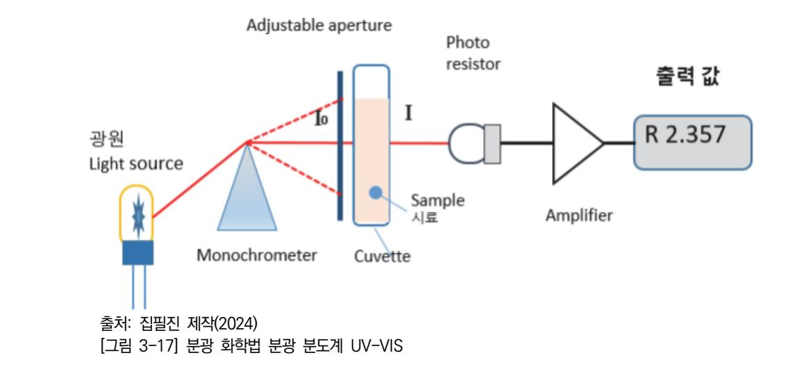

(2) 원자 분광법

- (가) 아세틸렌과 아산화질소 2가지 불꽃 방식 원소 분석 가능
- (나) Quadline D2 방식의 기준값, 바탕값 보정(스펙 보증)
- (다) 자동 역압 방출(Automatic Back Pressure) 기능: 안정성 관리를 위해 반응로 체임버 안의 잔류 기체를 배출 기능
- (라) 타이타늄 재질 버너 기본: 내구성과 내열성이 좋고 불꽃의 안정도가 뛰어나며, Carbon 생성물 유발이 적은 장점 보유
- (마) 환원 기화 장치 연결 사용 가능
- (바) 흑연로 원자화 장치(Graphite Furnace) 추가 장착 가능

|   | - |
|---|---|
|   |   |
|   |   |
| - |   |
|   |   |

| 구분       | 기능 / 규격                               |
|----------|---------------------------------------|
| 장비명      | 원자 흡수 분광 광도계(AAS)                     |
| 모델명      | 모델 시리즈 1) 33XX 2) 34XX 3) 35XX  |
| 광원       | 6 램프, Auto Aligning                   |
| ICE 33XX | Flame Type – 불꽃 원자롸 방식                |
| ICE 34XX | Furnace Type – 흑연로 원자화 방식             |
| ICE 35XX | Flame & Furnace Dual – 불꽃 및 흑연로 듀얼 방식 |

 출처: 집필진 제작(2024) [그림 3-18] 원자 흡수 분광도계(AAS) 예시

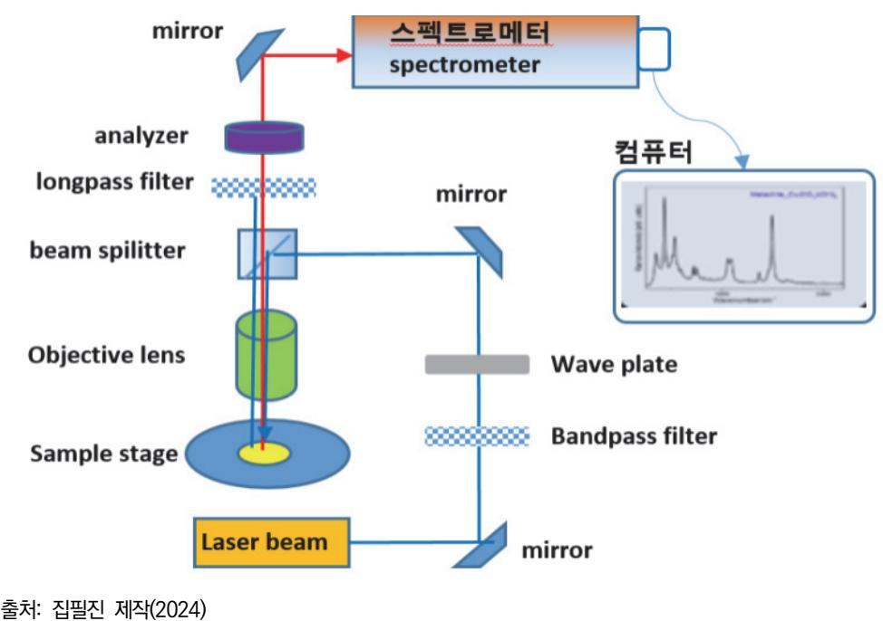

[그림 3-19] 라만 원리 라만랩의 예시

(3) 크레마토그래피법

(가) 적용 분야: 유기물 질량 분석에 사용한다.

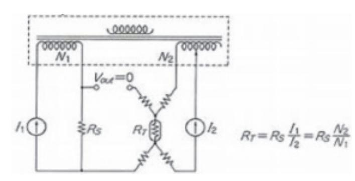

(4) 전위차법

출처: 집필진 제작(2024) [그림 3-21] 열분해 가스 크로마토그래피/질량 분석기의 예시

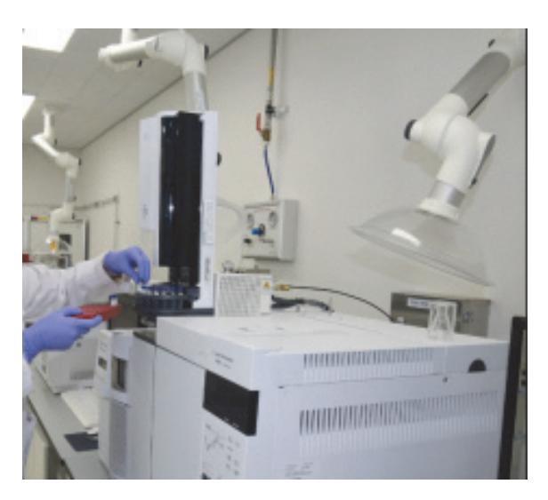

(나) 방법: 열분해 방법을 이용한 가스크로마토그래피/질량 분석기(PY-GC/MS)

출처: 집필진 제작(2024) [그림 3-20] 크로마토그래피 예시

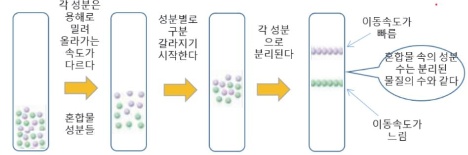

| 구분    | 기능 / 규격                                                                               |
|-------|---------------------------------------------------------------------------------------|
| 장비명   | 전극 저항 측정기                                                                             |
| 모델명   | Electrode Resistance Meter                                                            |
| 주요 특징 | 리튬 이온 2차 전지의 양극 및 음극 합재층 체적 저항률 / 계면 저항(집전체) 전압 범위: 0.1V~10V 전류: DC100mA~1uA |

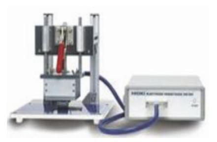

 출처: 집필진 제작(2024) [그림 3-22] 전기 저항 측정기의 예시

4. 양산 적용 시험을 진행한다.

전면 양산 적용 전에 1일 생산량 또는 일정 기간의 생산량에 적용하여 전후 공정과의 영향 성과 최종 제품까지 생산하여 시험을 진행한다.

5. 평가를 진행한다.

평가는 단계별 시험을 진행하여 최종 적용 가능성을 평가에서 확인하고 다음 공정 단계로 의 테스트와 평가를 진행한다.

숕 검증 시 유의 사항을 확인한다.

검증은 측정·분석으로 평가 항목에 대한 시험과 평가 결과를 확인하여 데이터의 일관성을 확보하 는 작업이다.

1. 실험실 검증을 한다.

실험실에서 가능한 조건을 설정하여 제품의 성능과 단계별 성능을 확인한다.

(1) 정성 분석

시료 대상물의 물성에 대한 내용물과 불순물 성분이 무엇인지 분석한다.

(2) 정량 분석

시료 대상물의 구성 성분이 무엇인지, 불순물의 구성비와 함유량은 어느 정도인지를 수 치로 확인하는 분석으로 반도체 재료에서는 정성 분석과 정량 분석으로 함유량을 파악 하고 명확한 확인이 필요하다.

2. 가속 및 가혹 실험 검증을 한다.

시험·분석은 각 진행 단계별 특성을 확인하는 검증 실험을 진행한다. 환경적 조건과 기술적 조건을 고려하여 기준, 규정을 반영하여 실시한다.

(1) 환경적 조건을 확인하고 설정한다.

(가) 온도: -45℃ 이하, 70℃ 이상 등의 조건을 설정하여 진행(기준 스펙, 품질 고객 요구

87

사항 반영)

- (나) 진동 정도의 사용 환경
- (다) 구동 속도 가속: 주파수
- (2) 기술적 사용 조건을 확인하고 설정한다.
  - (가) 주파수 특성
  - (나) 공급 전압 특성(안정성)
- 숖 결과를 통해 특성 검증한다.

측정·분석 기기에 대한 측정 장비의 조작과 측정 결과 데이타의 해석, 측정 결과 판정과 검증 실험을 진행하고 데이터를 바탕으로 보고서를 작성한다.

1. 장비의 사양과 매뉴얼을 확인한다.

장비의 사양과 매뉴얼을 숙지하고, 매뉴얼에 맞는 작업 순서서를 작성한다.

- (1) 기계적 사양 확인한다.
- (2) 측정 성능 사양을 확인한다.
- (3) 측정 방법과 장비 사용 방법을 확인한다.
- (4) 샘플 시료 제작과 시료 샘플 로딩에 대해서 확인한다.
- (5) 측정 결과 생성 방법을 확인한다.
- 2. 전원을 투입하고 측정을 진행한다. 시료 측정 과정의 진행 순서를 정하고 과정을 진행한다.
- 3. 검증 작업을 한다.

측정의 정확성을 보장하기 위한 방법을 진행한다.

(1) 추가 시료 샘플을 확인한다.

시료 샘플을 여러 개 확보한 경우 샘플 시료의 추가 측정을 통해서 재현성 여부를 확인 할 데이터를 확보한다.

(2) 측정 계측 장비의 기초 특성을 재확인한다.

측정 계측 장비의 검·교정 인증 여부, 유효 기간, 주기 등을 확인한다.

숗 결과 해석 및 보고서를 작성한다.

측정 내용에 대한 데이터 결과값과 판정에 필요한 항목을 수치화하고 비교하여 보고서를 작성 한다.

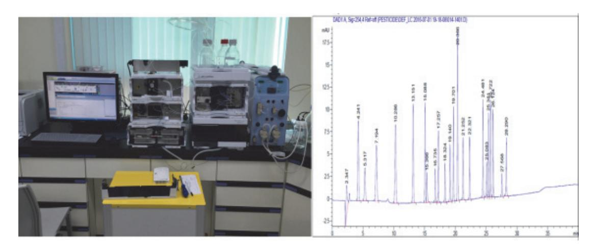

출처: 교육부(2015). 반도체용 습식 화공 약품(Wet Chemical) 재료 제조(LM1903060405\_14v1). 한국직업능력개발원. p.61. [그림 3-23] 측정 장비와 결과 데이터 예

#### 수행 tip

- 측정 기기 매뉴얼을 숙지하고 사용 방법을 숙달한다.
- 측정 결과 데이터를 해석하는 연습을 한다.

## 학습 3 교수·학습 방법

#### 교수 방법

- 반응로(체임버)에 대한 원리와 개념을 설명한다.
- 연속 반응 내용과 반응 설계에 대해 참조 지도한다.
- 반응에 필요한 파라미터와 관리 포인트에 대하여 전달한다.
- 물질 유입에 대한 개념과 경로와 유입 후 반응 조건에 대하여 실험 방법을 지도한다.
- 연속 공정 P&ID를 마련하여 점검 포인트를 지정해 보고 이유를 설명한다.
- 실험 진행 과정에 대한 실험 보고서를 정리하여 데이터 결과에 대하여 토론을 하고 의견을 모아 최종 보고서를 작성하도록 한다.
- 준비된 샘플 시료의 측정을 진행한다.
- 도출된 측정 데이터 결과를 해석하는 방법을 지도한다.
- 샘플 시료 측정 후 측정 데이터 해석을 위해 조별, 그룹별 토론을 통해 의견을 취합하도록 한다.
- 측정·취합한 데이터와 해석하고 의견을 모은 내용을 바탕으로 최종 분석 보고서를 작성하도록 한다.

#### 학습 방법

- 반응 체임버의 종류와 형상에 대하여 학습한다.
- 연속 반응과 일괄 반응에 대하여 학습한다.
- 여러 가지 종류의 P&ID를 해석한다.
- 안전 확보를 위해 물질의 유출 시와 유입 시 사고 사례를 찾아본다.
- 측정 장치의 매뉴얼을 숙지하고 방법을 숙련한다.
- 동등한 성능을 발휘하는 유사 방식의 측정 기기도 학습하고 매뉴얼 확보하여 학습한다.
- 장비 운용을 효과적으로 하는 방법을 조사한다.

## 학습 3 평 가

#### 평가 준거

• 평가자는 학습자가 학습 목표를 성공적으로 달성하였는지를 평가해야 한다.

#### • 평가자는 다음 사항을 평가해야 한다.

|             | 학습 목표                                                |  | 성취 수준 |   |  |
|-------------|------------------------------------------------------|--|-------|---|--|
| 학습 내용       |                                                      |  | 중     | 하 |  |
|             | - 세정 공정 재료 생산 계획에 따라 제조 장비 운용 계획을 마련할 수 있다.       |  |       |   |  |
| 세정 공정 재료 제조 | - 작업 지시서와 장비 운용 매뉴얼에 따라 세정 공정 재료 를 제조할 수 있다.      |  |       |   |  |
|             | - 세정 공정 재료 제조 단계에서 발생한 문제점을 파악하고 대처 방안을 도출할 수 있다. |  |       |   |  |

#### 평가 방법

• 문제 해결 시나리오

|             |                                                                                             |   | 성취 수준 |   |  |
|-------------|---------------------------------------------------------------------------------------------|---|-------|---|--|
| 학습 내용       | 평가 항목                                                                                       | 상 | 중     | 하 |  |
|             | - 세정 공정 재료 생산 계획에 따라 제조 장비 운용 계획을 마련할 수 있는 능력                                            |   |       |   |  |
| 세정 공정 재료 제조 | - 시나리오에 대한 세정 공정 약품의 재료별 제조(공정·장비) 파라미터 파악 능력                                            |   |       |   |  |
|             | - 반도체 세정 공정에서 사용하는 주요 세정액에 대한 세정 공정 화공 약품의 재료별 제조 공정에서 도출된 안전 문 제점에 대한 해결 조치 방안 제시 능력 |   |       |   |  |

• 서술형 시험

|             | 평가 항목                                                              |  | 성취 수준 |   |  |
|-------------|--------------------------------------------------------------------|--|-------|---|--|
| 학습 내용       |                                                                    |  | 중     | 하 |  |
|             | - 세정 공정 재료 생산 계획에 따라 세정 기술과 세정액 약 품 생산 재료 종류를 이해하고 각각의 개념 이해 여부 |  |       |   |  |
|             | - 무기물 세정과 유기물 세정에 대한 개념 이해하고 제거 가능한 오염 이해 여부                    |  |       |   |  |
| 세정 공정 재료 제조 | - 세정 공정 재료 제조에 대한 필요한 기본 지식 내용 숙지 여부                            |  |       |   |  |
|             | - 건식 세정 종류에 대해 이해하고 건조 방식에 따른 특징 파악 및 장단점 이해 정도                 |  |       |   |  |

• 평가자 체크리스트

|             |                                                       | 성취 수준 |   |   |
|-------------|-------------------------------------------------------|-------|---|---|
| 학습 내용       | 평가 항목                                                 |       | 중 | 하 |
|             | - 세정 공정 재료 생산 계획에 따라 제조 장비 운용 계획을 수립하는 능력          |       |   |   |
| 세정 공정 재료 제조 | - 세정 공정 재료 제조에 대한 필요한 재료 제조에 대해 구 체적으로 파악할 수 있는 능력 |       |   |   |
|             | - 세정 공정 약품의 재료별 제조(공정·장비) 파라미터 이해 정도               |       |   |   |
|             | - 세정 공정 화공약품의 재료별 제조 공정에서 도출된 문제 점에 대한 해결 방안 제시 능력 |       |   |   |

피드백

| 1. 문제 해결 시나리오 - 문제를 객관화하여 현상을 파악하고 해결 조치 방법을 제시할 수 있도록 사례를 들어 지도한다. - 세정 공정 약품의 재료별 제조(공정·장비) 종류 및 파라미터의 특성을 파악할 수 있도록 해 준다. - 세정 공정 화공 약품의 재료별 제조 공정에서 발굴된 문제점에 대한 해결 조치 방안을 도출하게 하고 적절성을 확인해 본다.                                                                                                                                                |
|---------------------------------------------------------------------------------------------------------------------------------------------------------------------------------------------------------------------------------------------------------------------------------------------------------------------------------------------------------------|
| 2. 서술형 시험 - 학습한 내용에 대한 기본적 항목에 대해서 문제를 출제하고, 서술형 시험을 통하여 기본 지식을 이해하는지 확인하고 부족한 부분은 보충 설명을 해 준다. - 세정 공정 재료 제조에 대한 필요한 부분의 성취 수준이 높은 학습자의 결과물을 공유하여 학습 자들의 성취도를 높여 준다.                                                                                                                                                                             |
| 3. 평가자 체크리스트 - 최종 평가결과 내용을 확인하여 부족한 부분을 지적하여 지도한다. - 세정 공정 재료 제조 부분에 대한 필요 지식 부분이 미흡할 때는 세정 공정 재료 제조에 대한 필 요한 재료 제조에 대해 구체적으로 설명해 주고 이해 정도를 체크한다. - 세정 공정 재료 제조에 대한 필요한 기본 지식 부분의 성취 수준이 낮은 학습자에게는 세정 공정 재료 제조에 대한 필요 지식을 재설명해 주고 부족한 부분은 보충 설명을 해 준다. - 세정 공정 재료 제조에 대한 필요한 부분의 성취 수준이 우수한 학습자는 세정 공정 재료 제조에 필요한 적용 사양 사례를 심화하여 설명해 준다. |

- ∙ 교육부(2015). 반도체용 습식 화공 약품(Wet Chemical) 재료 제조(LM1903060405). 한국직업능력개 발원
- ∙ 교육부(2021). 석재 시공 도서 파악(LM1403021701\_19v3). 한국직업능력연구원.
- ∙ 권기영(2015). 『핵심이 보이는 반도체 공학』. 한빛아카데미.
- ∙ 이순원 외 편저(2013). 『무기 화학 실험』. 사이플러스.
- ∙ 한국반도체산업협회(2014). 『2014년 국가직무능력표준 반도체 장비』. 고용노동부.
- ∙ 한국반도체산업협회(2014). 『2014년 국가직무능력표준 반도체 제조』. 고용노동부.
- ∙ 한국반도체산업협회. 4차 산업혁명 시대. https://www.ksia.or.kr/semiconductor\_info
- ∙ 허규성(2014). 『반도체 공학』. 일진사.
- ∙ S전자 반도체 뉴스룸 S반도체 이야기.
- ∙ Daniel A. Crowl, Joseph F. Louvar ([2013] 2013). 『화학 공정 안전(Chemical Process Safety Fundamentals with Applications 2nd edition)』. 이영순 외(역). 도서출판 동화기술.
- ∙ Francis Rouessac & Annick Rouessac([2004] 2009). 『현대 기기 분석 제6판(ANALYSE CHIMIQUE Methodes et techniques instrumentales modernes 6th edition)』. 역자 기기분석교 재연구회(역). 자유아카데미.
- ∙ Gary D. Christian, Purnendu K. Dasgupta, Kevin A. Schug([2014] 2015). 『분석화학 (ANALYTICAL CHEMISTRY 7th edition)』. 이동수 외(역). 자유아카데미.
- ∙ Gary L. Miessler, Paul J. Fischer, Donald A. Tarr ([2014] 2015). 『무기화학(INORGANIC CHEMISTRY Fifth edition)』. 김주창 외(역). 자유아카데미.
- ∙https://slidesplayer.org/slide/11080794.
- ∙ https://msds.kosha.or.kr/MSDSInfo/kcic/msdssearchMsds.do.
- ∙ irds(2023) THE INTERNATIONAL ROADMAP FOR DEVICES AND SYSTEMS: 2023. https://irds.ieee.org/editions/2023.
- ∙ https://msds.kosha.or.kr/MSDSInfo/kcic/msdssearchMsds.do.
- ∙ irds(2023) THE INTERNATIONAL ROADMAP FOR DEVICES AND SYSTEMS: 2023. https://irds.ieee.org/editions/2023.

- ∙ Kleinert, Hagen. Gauge Fields in Condensed Matter, Vol. II, STRESSES AND DEFECTS; Differential Geometry, Crystal Melting, pp.743~1456, World Scientific(Singapore, 1989); Paperback ISBN 9971-5-0210-0(readable online here).
- ∙ KOLAS 교정: https://m.blog.naver.com/labguide4574/221144105155.
- ∙ KOSTECH https://cal.kostech.net/resources/?q=YToyOntz.
- ∙ Kleinert, Hagen. Gauge Fields in Condensed Matter, Vol. II, STRESSES AND DEFECTS; Differential Geometry, Crystal Melting, pp.743~1456, World. Scientific(Singapore, 1989); Paperback ISBN 9971-5-0210-0(readable online here)
- ∙ MASTERTON & HURLEY([2004] 2004.8). 『일반 화학(CHEMISTRY PRINCIPLES and REACTIONS FIFTH EDITION)』. 일반화학교재연구회 이명수(역). 자유아카데미.
- ∙ Semicon Korea 2023. AQUA SPIN Wet St'n.
- ∙ ttps://www.bing.com/images/search?view=detailV2&ccid.

## MSDS 작성에 대한 항목 사례

|                           | MSDS                               | 등록번호   | 비고 |  |  |
|---------------------------|------------------------------------|--------|----|--|--|
| 제조사 정보                    | 물질명: *******                       | 페이지 no |    |  |  |
|                           | CAS No.: **-**-*                   |        |    |  |  |
| 1. 화학 제품 및 회사에 관한 정보      |                                    |        |    |  |  |
| 가. 제품명(물질명):              |                                    |        |    |  |  |
| 나. 제품의 권고 용도 와 사용상의 제한    |                                    |        |    |  |  |
| 다. 제조자/공급자/유통업자 정보        |                                    |        |    |  |  |
| 2. 유해·위험성                 |                                    |        |    |  |  |
| 가. 유해 위험성 분류              |                                    |        |    |  |  |
| 나. 경고 표지 항목               |                                    |        |    |  |  |
|                           | 다. 유해 위험성 분류 기준에 포함되지 않는 기체 유해 위험성 |        |    |  |  |
| 3. 구성 성분 명칭 및 함유량         |                                    |        |    |  |  |
| 예) HF                     |                                    |        |    |  |  |
| 4. 응급조치 요령                |                                    |        |    |  |  |
| 가. 눈에 들어갔을 때              |                                    |        |    |  |  |
| 나. 피부에 접촉했을 때             |                                    |        |    |  |  |
| 다. 흡입했을 때                 |                                    |        |    |  |  |
| 라. 먹었을 때                  |                                    |        |    |  |  |
| 마. 급성 및 지연성의 가장 중요한 증상/영향 |                                    |        |    |  |  |
| 바. 응급 처치 및 의사의 주의 사항      |                                    |        |    |  |  |
| 5. 화재·폭발 시 대처 방법          |                                    |        |    |  |  |
| 가. 적절한(부적절한) 소화제          |                                    |        |    |  |  |
| 나. 화학 물질로부터 생기는 특정 유해성    |                                    |        |    |  |  |
|                           | 다. 화재 진압 시 착용할 보호구 및 예방조치          |        |    |  |  |
| 6. 누출 사고 시 대처 방법          |                                    |        |    |  |  |
|                           | 가. 인체를 보호하기 위해 필요한 조치 사항 및 보호구     |        |    |  |  |
| 나. 환경을 보호하기 위해 필요한 조치 사항  |                                    |        |    |  |  |
| 다. 정화 또는 제거 방법            |                                    |        |    |  |  |
| 7. 취급 및 저장                |                                    |        |    |  |  |
| 가. 안전 취급 요령               |                                    |        |    |  |  |
| 나. 안전한 저장 방법(피해야 할 조건 포함) |                                    |        |    |  |  |

| 8. 노출 방지 및 개인 보호구                                                |  |
|------------------------------------------------------------------|--|
| 가. 화학 물질의 노출 기준, 생물학적 노출기 준 등                                    |  |
| 나. 적절한 공학적 관리                                                    |  |
| 다. 개인 보호구                                                        |  |
| 9. 물리. 화학적 특성                                                    |  |
| 1) 외관 2) 냄새 3) 냄새 역치 4) pH 5) 녹는점/어는점 6) 초기 끓는점과 끓는 점 범위      |  |
| 7) 인화점 8) 증발 속도 9) 인화성(고체, 기체) 10) 인화, 폭발 범위의 상한/하한 11) 증기압      |  |
| 12) 용해도 13) 증기밀도 14) 비중 15) n-옥탄올/물 분배 계수 16) 자연 발화 온도 17) 분해 온도 |  |
| 18) 점도 19) 분자량                                                   |  |
| 10. 안전성 및 반응성                                                    |  |
| 가. 화학적 안정성                                                       |  |
| 나. 유해 반응의 가능성                                                    |  |
| 다. 피해야 할 조건 및 물질                                                 |  |
| 라. 피해야 할 물질                                                      |  |
| 마. 분해 시 생성되는 유해 물질                                               |  |
| 11. 독성에 관한 정보                                                    |  |
| 가. 가능성이 높은 노출 경로에 관한 정보                                          |  |
| 나. 물리적, 화학적 및 독성학적 특성에 관련된 증상                                    |  |
| 다. 단기 및 장기 노출에 의한 지연·급성 영향 및 만성 영향                               |  |
| 라. 독성의 수치적 척도(급성 독성 추정치 등)                                       |  |
| 12. 환경에 미치는 영향                                                   |  |
| 가. 수생 육생 생태 독성                                                   |  |
| 나. 잔류성 및 분해성                                                     |  |
| 다. 생물 농축성                                                        |  |
| 라. 토양 이동성                                                        |  |
| 마. 기타 유해 영향                                                      |  |
| 13. 폐기 시 주의 사항                                                   |  |
| 가. 폐기 방법                                                         |  |
| 나. 폐기 시 주의 사항                                                    |  |
| 14. 운송 정보                                                        |  |
| 가. 유엔 번호                                                         |  |
| 나. 유엔 적정 선적 명                                                    |  |
| 다. 운송에서의 위험성 등급                                                  |  |
| 라. 용기 등급                                                         |  |
| 마. 해양 오염 물질                                                      |  |
| 바. 사용자가 운송 또는 운송 수단과 관련해 알 필요가 있거나 필요한 특별한 안전 대책                 |  |
| 15. 법적 사항                                                        |  |

| 가. 「산업안전보건법」에 의한 규제          |
|------------------------------|
| 나. 「유해화학물질관리법」에 의한 규제        |
| 다. 「위험물안전관리법」에 의한 규제         |
| 라. 「폐기물관리법」에 의한 규제           |
| 마. 기타 국내 및 외국법에 의한 규제        |
| 16. 기타 참고 사항                 |
| 가. 자료의 출처                    |
| 나. 최초 작성 일자                  |
| 다. 기타 물질 안전 보건 자료 작성과 관련된 정보 |
| * 추가 자료                      |
| ** 이력 관리                     |
|                              |

출처: LG화학 여수공장 물질 안전 보건 자료 YHESA205501 집필진 재작성

## 공정 위험 점검표 사례

| 일반적 배치                                | 완벽함 | 적용 불가 | 추가 검토 |
|---------------------------------------|-----|-------|-------|
| 1. 적절한 지역으로 배수가 되는가?                  |     |       |       |
| 2. 통로는 마련되었는가?                        |     |       |       |
| 3. 방화벽, 화류둑 및 방책이 필요한가?               |     |       |       |
| 4. 비상 접근로 및 출구가 있는가?                  |     |       |       |
| 5. 천장과 충분한 공간이 있는가?                   |     |       |       |
| 6. 비상용 차량의 통로가 있는가?                   |     |       |       |
| 7. 원료 및 최종 생산품의 안전한 저장 공간이 있는가?       |     |       |       |
| 8. 안전한 보수작업을 실시할 수 있는 공간이 있는가?        |     |       |       |
| 9. 머리 위를 지나는 전선과 충분한 거리가 있는가?         |     |       |       |
| 건축물                                   |     |       |       |
| 1. 적절한 사다리, 계단 및 비상구가 있는가?            |     |       |       |
| 2. 필요한 방화문이 있는가?                      |     |       |       |
| 3. 배기 시설은 적절한가?                       |     |       |       |
| 4. 주변 건물과 적절한 거리를 유지하고 있는가?           |     |       |       |
| 5. 피난 공간은 준비되어 있는가?                   |     |       |       |
| 공정                                    |     |       |       |
| 1. 운전 중인 설비에서의 약품 유출을 고려해야 하는가?       |     |       |       |
| 2. 특별한 퓸 또는 분진 후드가 요구되는가?             |     |       |       |
| 3. 불안정한 물질들이 적절히 저장되었는가?              |     |       |       |
| 4. 폭발로부터 방호할 수 있도록 되어 있는가?            |     |       |       |
| 5. 오 조작 또는 오염물에 의하여 반응 폭주가 발생할 수 있는가? |     |       |       |

## 제품 환경 유해 물질 관리 시트 예시

#### ㅁ Product General Information

| Product Name | Prepared by | 연락처 | e-mail |
|--------------|-------------|-----|--------|
|              |             |     |        |

|    |         |         |         | 구성성분 (milI Data) |            |    | RoHS(ppm) |     |    |    |    | ICP ICP |          | 첨부 파일 |              | RoHS & Hallogen           |                       |          |                           |  |
|----|---------|---------|---------|---------------------|------------|----|-----------|-----|----|----|----|------------|----------|-------|--------------|------------------------------|-----------------------|----------|---------------------------|--|
| No | 제품 명 | 공급 처 | 모델 명 | 물질 성분            | 무게 (Kg) | 물질 | CAS#      | Wt% | Cd | Pb | Hg |            | Cr+6 PBB | PPDE  | Test (실험) | TEST Test( DATE 결과) | ICP Test Report | MSD S | Exemptio n ( MSDS ) |  |
|    |         |         |         |                     |            |    |           |     |    |    |    |            |          |       |              |                              |                       |          |                           |  |
|    |         |         |         |                     |            |    |           |     |    |    |    |            |          |       |              |                              |                       |          |                           |  |
|    |         |         |         |                     |            |    |           |     |    |    |    |            |          |       |              |                              |                       |          |                           |  |

| NCS학습모듈 개발이력 |                                      |     |                  |  |  |  |  |
|--------------|--------------------------------------|-----|------------------|--|--|--|--|
| 발행일          | 2024년 12월 31일                        |     |                  |  |  |  |  |
| 세분류명         | 반도체 재료(19030604)                     |     |                  |  |  |  |  |
| 개발기관         | 수원과학대학교 산학협력단(개발책임자: 김선희), 한국직업능력연구원 |     |                  |  |  |  |  |
|              | 최준혁(수원대학교)*                          |     | 김강복(삼성전자)        |  |  |  |  |
|              | 김대영(오산대학교)                           |     | 김한수(두원공대)        |  |  |  |  |
|              | 김영수(디이엔티)                            |     | 남승호(경기대학교)       |  |  |  |  |
|              | 김준성(오산대학교)                           |     | 손승대(제이에스이엔씨(주))  |  |  |  |  |
| 집필진          | 김현후(두원공대)                            | 검토진 | 이철오((주)한국전력안전공단) |  |  |  |  |
|              | 임희용(전 부천대학교)                         |     |                  |  |  |  |  |

\*표시는 대표집필자임 (참고) 검토진으로 참여한 집필진은 본인의 원고가 아닌 타인의 학습모듈을 검토함

|                                                                                                          | 반도체용 세정 공정 재료 제조(LM1903060425_23v3) |  |  |  |
|----------------------------------------------------------------------------------------------------------|-------------------------------------|--|--|--|
| 저작권자                                                                                                     | 교육부                                 |  |  |  |
| 연구기관                                                                                                     | 한국직업능력연구원                           |  |  |  |
| 발행일                                                                                                      | 2024. 12. 31.                       |  |  |  |
| ISBN                                                                                                     | 979-11-7175-779-4                   |  |  |  |
| ※ 이 학습모듈은 자격기본법 시행령(제8조 국가직무능력표준의 활용)에 의거하여 개발하였으며, NCS통합포털사이트(http://www.ncs.go.kr)에서 다운로드 할 수 있습니다. |                                     |  |  |  |

