# NCS학습모듈 반도체용 CMP 슬러리 재료 제조

LM1903060426\_23v3

#### [NCS학습모듈 활용 시 유의 사항]

- 1. NCS학습모듈은 교육훈련기관에서 출처를 명시하고 교육적 목적으로 활용할 수 있습니다. 다 만, NCS학습모듈에는 국가(교육부)가 저작재산권 일체를 보유하지 않은 저작물(출처가 표기된 도표‧사진‧삽화‧도면 등)이 포함되어 있으므로, 이러한 저작물의 변형‧각색‧복제‧공연‧ 배포 및 공중 송신 등과 이러한 저작물을 활용한 2차적 저작물을 작성하려면 반드시 원작자 의 동의를 받아야 합니다.
- 2. NCS학습모듈은 개발 당시의 산업 및 교육 현장을 반영하여 집필하였으므로, 현재 적용되는 법령‧지침‧표준 및 교과 내용 등과 차이가 있을 수 있습니다. NCS학습모듈 활용 시 법령 ‧지침‧표준 및 교과 내용의 개정 사항과 통계의 최신성 등을 확인하시기를 바랍니다.
- 3. NCS학습모듈은 산업 현장에서 요구되는 능력을 교육훈련기관에서 학습할 수 있게 구성한 자 료입니다. 다만, NCS학습모듈 지면의 한계상 대표적 예시(예: 활용도 또는 범용성이 높은 제 품, 서비스) 중심으로 집필하였음을 이해하시기를 바랍니다.

## NCS학습모듈의 이해

※ 본 NCS학습모듈은 「NCS 국가직무능력표준」사이트(http://www.ncs.go.kr) 에서 확인 및 다운로드할 수 있습니다.

### Ⅰ NCS학습모듈이란?

- 국가직무능력표준(NCS: National Competency Standards)이란 산업현장에서 직무를 수행하기 위해 요구되는 지식·기술·소양 등의 내용을 국가가 산업부문별·수준별로 체계 화한 것으로 산업현장의 직무를 성공적으로 수행하기 위해 필요한 능력(지식, 기술, 태도) 을 국가적 차원에서 표준화한 것을 의미합니다.
- 국가직무능력표준(이하 NCS)이 현장의 '직무 요구서'라고 한다면, NCS학습모듈은 NCS
  의 능력단위를 교육훈련에서 학습할 수 있도록 구성한 '교수·학습 자료'입니다. NCS학습
  모듈은 구체적 직무를 학습할 수 있도록 이론 및 실습과 관련된 내용을 상세하게 제시하
  고 있습니다.

#### ○ NCS학습모듈은 다음과 같은 특징을 가지고 있습니다.

- 첫째, NCS학습모듈은 산업계에서 요구하는 직무능력을 교육훈련 현장에 활용할 수 있도 록 성취목표와 학습의 방향을 명확히 제시하는 가이드라인의 역할을 합니다.
- 둘째, NCS학습모듈은 특성화고, 마이스터고, 전문대학, 4년제 대학교의 교육기관 및 훈 련기관, 직장교육기관 등에서 표준교재로 활용할 수 있으며 교육과정 개편 시에도 유용하게 참고할 수 있습니다.

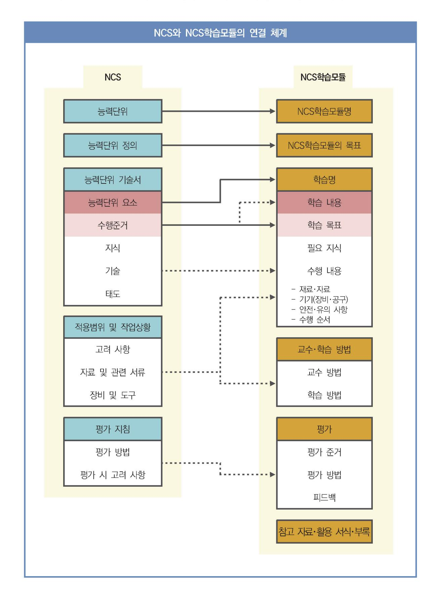

○ NCS와 NCS학습모듈 간의 연결 체계를 살펴보면 아래 그림과 같습니다.

O NCS학습모듈의 위치는 NCS 분류 체계에서 해당 학습모듈이 어디에 위치하는지를 한 눈에 볼 수 있도록 그림으로 제시한 것입니다.

| [NCS-학          | 습모듈     | 의 위치]    |          |  |
|-----------------|---------|----------|----------|--|
|                 |         |          |          |  |
| 대분류             | 문화·예술   | ··디자인·방송 |          |  |
| 중분류             | 문호      | 문화콘텐츠    |          |  |
| 소분류             | 문화콘텐츠제작 |          |          |  |
|                 |         |          |          |  |
| 세분류             |         |          |          |  |
| 방송콘텐츠제작         |         | 능력단위     | 학습모듈명    |  |
| 영화콘텐츠제작         |         | 프로그램 기획  | 프로그램 기획  |  |
| 음악콘텐츠제작         |         | 아이템 선정   | 아이템 선정   |  |
| 광고콘텐츠제작         |         | 자료 조사    | 자료 조사    |  |
| 게임콘텐츠제작         |         | 프로그램 구성  | 프로그램 구성  |  |
| 애니메이션 콘텐츠제작  |         | 캐스팅      | 캐스팅      |  |
| 만화콘텐츠제작         |         | 제작계획     | 제작계획     |  |
| 캐릭터제작           |         | 방송 미술 준비 | 방송 미술 준비 |  |
| 스마트문화앱 콘텐츠제작 |         | 방송 리허설   | 방송 리허설   |  |
| 영사              |         | 야외촬영     | 야외촬영     |  |
|                 |         | 스튜디오 제작  | 스튜디오 제작  |  |
|                 |         |          |          |  |

학습모듈은

NCS 능력단위 1개당 1개의 학습모듈 개발 을 원칙으로 합니다. 그러나 필요에 따라 고용단위 및 교과단위를 고려하여 능력단위 몇 개를 묶어 1개 학습모듈로 개발할 수 있으며, NCS 능력단위 1개를 여러 개의 학습모듈로 나누어 개발할 수도 있습니다.

#### 2. NCS학습모듈의 개요

#### ○ NCS학습모듈의 개요는 학습모듈이 포함하고 있는 내용을 개략적으로 설명한 것으로

| 학습모듈의 목표, 선수학습, 학습모듈의 내용 체계, 핵심 용어 로 구성되어 있습니다. |                                                                              |  |
|-------------------------------------------------|------------------------------------------------------------------------------|--|
| 학습모듈의 목표                                        | 해당 NCS 능력단위의 정의를 토대로 학습 목표를 작성한 것입니다.                                        |  |
| 선수학습                                            | 해당 학습모듈에 대한 효과적인 교수·학습을 위하여 사전에 이수해야 하는 학습모 듈, 학습 내용, 관련 교과목 등을 기술한 것입니다. |  |
| 학습모듈의 내용 체계                                  | 해당 NCS 능력단위요소가 학습모듈에서 구조화된 체계를 제시한 것입니다.                                     |  |
| 핵심 용어                                           | 해당 학습모듈의 학습 내용, 수행 내용, 설비·기자재 등 가운데 핵심적인 용어를 제 시한 것입니다.                   |  |

#### 제작계획 학습모듈의 개요

#### 학습모듈의 목표

본격적인 촬영을 준비하는 단계로서, 촬영 대본을 획정하고 제작 스태프를 조직하며 촬영 장비와 촬영 소품을 준비할 수 있다.

#### 선수학습

제작 준비(LM0803020105\_13v1), 섭외 및 제작스태프 구성(LM0803020104\_13v1), 촬영 제작(LM0803020106\_13v1), 촬영 장비 준비(LM0803040204\_13v1.4), 미술 디자인 협의하기(LM0803040203\_13v1.4)

#### 학습모듈의 내용체계

| 하스                | 하는 데이                                              | NCS 능력단위 요소       |                |
|-------------------|----------------------------------------------------|-------------------|----------------|
| 학습                | 학습 내용                                              | 코드번호              | 요소 명칭          |
| 1. 촬영 대본 확정하기  | 1-1. 촬영 구성안 검 토와 수정                             | 0803020114_16/3.1 | 촬영 대본 확정하기  |
| 2. 제작 스태프 조직하기 | 2-1. 기술 스태프 조직 2-2. 미술 스태프 조직 2-3. 전문 스태프 조직 | 0803020114_16v3.2 | 제작 스태프 조직하기 |
| 3. 촬영 장비 계획하기  | 3-1. 촬영 장비 점검 과 준비                              | 0803020114_16/3.3 | 촬영 장비 계획하기  |
| 4. 촬영 소품 계획하기  | 4-1. 촬영 소품 목록 작성 4-2. 촬영 소품 제작 의뢰         | 0803020114_16\3.4 | 촬영 소품 계획하기  |

#### 핵심 용어

촬영 구성안, 제작 스태프, 촬영 장비, 촬영 소품

#### 학습모듈의 목표는

학습자가 해당 학습모듈을 통해 성취해야 할 목표를 제시한 것으로, 교수자는 학습자 가 학습모듈의 전체적인 내용흐름을 파악하 도록 지도할 수 있습니다.

**6** • •

61

#### 선수학습은

교수자 또는 학습자가 해당 학습모듈을 교 수·학습하기 이전에 이수해야 하는 교과목 또는 학습모듈(NCS 능력단위) 등을 표기한 것입니다. 따라서 교수자는 학습자가 개별 학습, 자기 주도 학습, 방과 후 활동 등 다 양한 방법을 통해 이수할 수 있도록 지도하 는 것을 권장합니다.

|            | 핵심 용어는              |
|------------|---------------------|
|            | 률을 대표하는 주요 용어입니     |
|            | · 해당 학습모듈을 통해 학습    |
|            | 게될 주요 내용을 알 수 있습    |
|            | 5 국가직무능력표준」 사이트     |
| (www.ncs.g | jo.kr)의 색인 (찾아보기) 중 |
| 하나로 이용할    | 할 수 있습니다            |

#### 3. NCS학습모듈의 내용 체계

○ NCS학습모듈의 내용은 크게 학습, 학습 내용, 교수·학습 방법, 평가 로 구성되어 있습니다.

| 학습       | 해당 NCS 능력단위요소 명칭을 사용하여 제시한 것입니다. 학습은 크게 학습 내용, 교수·학습 방법, 평가로 구성되며 해당 NCS 능력단위의 능력단위 요소별 지식, 기술, 태도 등을 토대로 내용을 제시한 것입니다.                                                    |  |
|----------|----------------------------------------------------------------------------------------------------------------------------------------------------------------------------------|--|
| 학습 내용    | 학습 내용은 학습 목표, 필요 지식, 수행 내용으로 구성되며, 수행 내용은 재료·자 료, 기기(장비·공구), 안전·유의 사항, 수행 순서, 수행 tip으로 구성한 것입니다. 학습모듈의 학습 내용은 실제 산업현장에서 이루어지는 업무활동을 표준화된 프로세 스에 기반하여 다양한 방식으로 반영한 것입니다. |  |
| 교수·학습 방법 | 학습 목표를 성취하기 위한 교수자와 학습자 간, 학습자와 학습자 간 상호 작용이 활발하게 일어날 수 있도록 교수자의 활동 및 교수 전략, 학습자의 활동을 제시한 것입니다.                                                                            |  |
| 평가       | 평가는 해당 학습모듈의 학습 정도를 확인할 수 있는 평가 준거 및 평가 방법, 평 가 결과의 피드백 방법을 제시한 것입니다.                                                                                                         |  |

## [NCS-학습모듈의 위치]

| 대분류 | 전기‧전자 |          |
|-----|-------|----------|
| 중분류 |       | 전자 기기 개발 |
| 소분류 |       | 반도체 개발   |

| 세분류    |                      |                      |
|--------|----------------------|----------------------|
| 반도체 개발 | 능력단위                 | 학습모듈명                |
| 반도체 제조 | 반도체용 CMP슬러리 재료 제조    | 반도체용 CMP슬러리 재료 제조    |
| 반도체 장비 | 반도체용 세정공정 재료 제조      | 반도체용 세정공정 재료 제조      |
| 반도체 재료 | 반도체용 박막도금공정 재료 제조 | 반도체용 박막도금공정 재료 제조 |
|        | 반도체용 SOD공정 재료 제조     | 반도체용 SOD공정 재료 제조     |
|        | 반도체용 트랙공정 재료 제조      | 반도체용 트랙공정 재료 제조      |
|        | 반도체용 웨이퍼 재료 제조       | 반도체용 웨이퍼 재료 제조       |
|        | 반도체용 금속(Target)재료 제조 | 반도체용 금속(Target)재료 제조 |
|        | 반도체용 패키지 재료 제조       | 반도체용 패키지 재료 제조       |
|        | 반도체 재료 개발            | 반도체 재료 개발            |
|        | 반도체 재료 생산관리          | 반도체 재료 생산관리          |
|        | 반도체 재료 품질관리          | 반도체 재료 품질관리          |
|        | 반도체 재료 안전관리          | 반도체 재료 안전관리          |
|        | 반도체용 마스크 재료 제조       | 반도체용 마스크 재료 제조       |

| 반도체용 플립칩 재료 제조       | 반도체용 플립칩 재료 제조       |
|----------------------|----------------------|
| 반도체용 CMP 재료 제조       | 반도체용 CMP 재료 제조       |
| 반도체용 식각공정 가스 제조      | 반도체용 식각공정 가스 제조      |
| 반도체용 세정공정 가스 제조      | 반도체용 세정공정 가스 제조      |
| 반도체용 박막공정 가스 제조      | 반도체용 박막공정 가스 제조      |
| 반도체용 이온주입공정 가스 제조 | 반도체용 이온주입공정 가스 제조 |
| 반도체용 박막공정 전구체 제조     | 반도체용 박막공정 전구체 제조     |
| 반도체용 포토공정 재료 제조      | 반도체용 포토공정 재료 제조      |

## 차 례

| 학습모듈의 개요                       | 1  |
|--------------------------------|----|
| 학습 1. CMP 슬러리 재료 제조 요구 사항 파악하기 |    |
| 1-1. CMP 슬러리 재료 제조 요구 사항 파악    | 3  |
|  교수 ․ 학습 방법                   | 16 |
|  평가                           | 17 |
| 학습 2. CMP 슬러리 재료 준비하기          |    |
| 2-1. CMP 슬러리 재료 준비             | 19 |
|  교수 ․ 학습 방법                   | 27 |
|  평가                           | 28 |
|                                |    |
| 학습 3. CMP 슬러리 재료 제조하기          |    |
| 3-1. CMP 슬러리 재료 제조             | 30 |
|  교수 ․ 학습 방법                   | 42 |
|  평가                           | 43 |
|                                |    |
| 참고 자료                          | 45 |
|                                |    |
| 활용 서식                          | 48 |

## 반도체용 CMP 슬러리 재료 제조 학습모듈의 개요

#### 학습모듈의 목표

반도체 제조에 필요한 성능과 품질을 만족하는 CMP 슬러리 재료를 준비하고 제조할 수 있다.

#### 선수학습

화학 공학, 재료 공학, 기계 공학, 전자 공학, 전기 공학

#### 학습모듈의 내용체계

| 하스                                 | 학습 내용                           | NCS 능력단위 요소       |                             |
|------------------------------------|---------------------------------|-------------------|-----------------------------|
| 학습                                 | 익답 내용                           | 코드번호              | 요소 명칭                       |
| 1. CMP 슬러리 재료 제조 요구 사항 파악 하기 | 1-1. CMP 슬러리 재료 제조 요구 사 항 파악 | 1903060426_23v3.1 | CMP 슬러리 재료 제조 요구 사항 파악하기 |
| 2. CMP 슬러리 재료 준비하기              | 2-1. CMP 슬러리 재료 준비              | 1903060426_23v3.2 | CMP 슬러리 재료 준비하기          |
| 3. CMP 슬러리 재료 제조하기              | 3-1. CMP 슬러리 재료 제조              | 1903060426_23v3.3 | CMP 슬러리 재료 제조하기          |

#### 핵심 용어

CMP(Chemical Mechanical Polishing), 슬러리(Slurry), 실리카(SiO2)

| 학습 1 | CMP 슬러리 재료 제조 요구 사항 파악하기 |
|------|-----------------------------|
| 학습 2 | CMP 슬러리 재료 준비하기             |
| 학습 3 | CMP 슬러리 재료 제조하기             |

## 1-1. CMP 슬러리 재료 제조 요구 사항 파악

- 생산 관련 부서로부터 CMP 슬러리 재료 제조 사양서를 입수할 수 있다.
- CMP 슬러리 재료 제조 사양서를 바탕으로 제품명, 품질 기준, 제품 사양, 납기 등을 파악할 수 있다.
- 파악된 내용을 바탕으로 CMP 슬러리 재료 제조 시 발생할 수 있는 문제점을 검토할 수 있다.

## 필요 지식 /

학습 목표

숔 반도체용 CMP 공정의 개요

반도체 제조 공정에서 CMP(Chemical Mechanical Polishing) 공정은 제조 공정 중 형성된 울퉁불퉁 한 표면이나 웨이퍼 위의 증착된 필름(막질)을 슬러리(Slurry)와 화학 약품 등의 화학적(Chemical) 요소와 패드(Pad) 등의 기계적(Mechanical) 요소를 이용하여 연마(Polishing)함으로써 목표한 대로 표면을 평탄하게 만드는 공정이다.

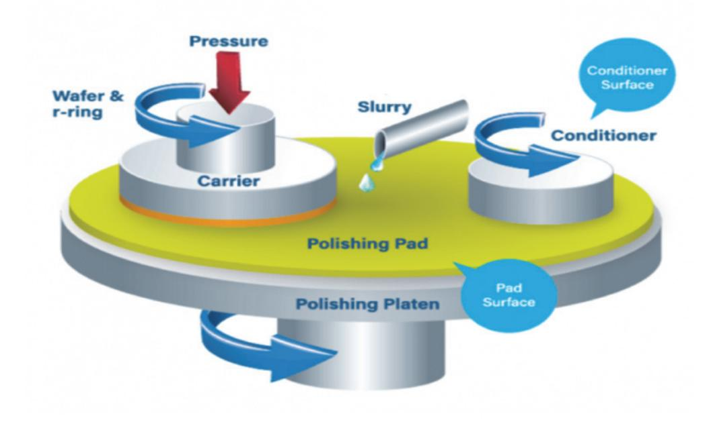

출처: 집필진 제작(2024) [그림 1-1] CMP 장비의 기본 구조와 슬러리 공급 방식

#### 숕 반도체 공정 기술 및 기술 노드 발전에 따른 CMP 공정의 확대

1. 반도체 CMP 공정의 주요 대상

반도체 제조 공정에서 유전체의 CMP 공정은 일반적으로 얕은 도량 소자 격리(STI: Shallow Trenech Isolation)와 층간 절연체(ILD: Inter Layer Dielectric) 평탄화에 대수 사용된다. 생산 기술이 발전하고 기술 노드가 진보됨에 따라 새로운 집적화 방법들이 적용되었다. 이에 따라 반도체 CMP 공정의 적용 수가 증가하였다.

2. 반도체 CMP 공정과 디바이스 성능의 상관성

트랜지스터 게이트의 높이는 디바이스의 성능과 수율을 결정한다. 이는 CMP 공정을 통해 트랜지스터 게이트를 직접 제작하고 게이트의 높이를 조절할 수 있게 되었다. 기 노드가 28nm 공정에서 14nm 공정으로 발전하면서, 전 공정(FEOL)과 중간 공정(MOL)에서 CMP 공정의 적용 수가 4배 이상 증가하였다.

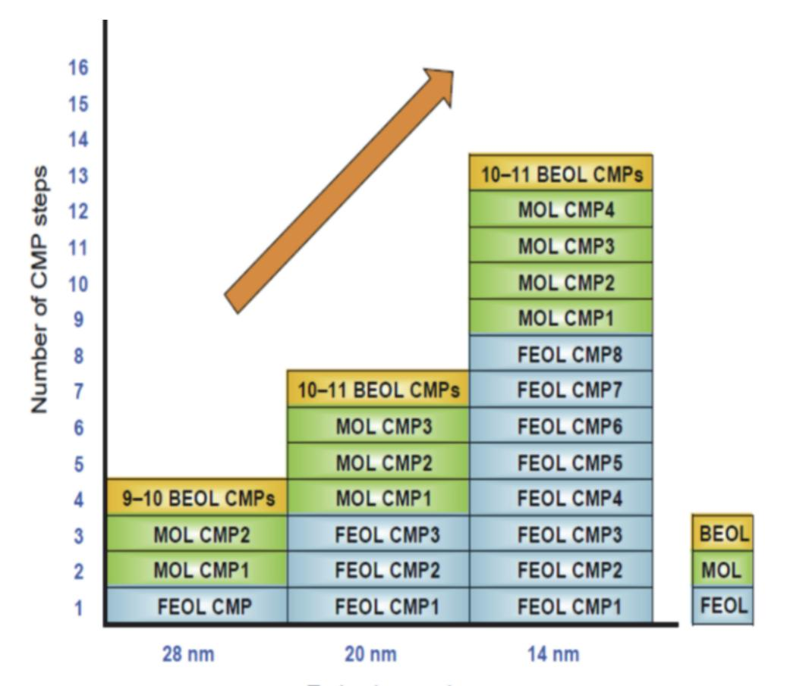

출처: 집필진 제작(2024)

[그림 1-2] 기술 발전에 따른 CMP 공정 수의 변화

#### 숖 반도체용 CMP의 슬러리의 종류 및 기능에 따른 분류

반도체 제조 공정에서 CMP 슬러리는 콜로이드 용액으로서, 수십에서 수백 나노미터(nm) 크기 의 연마제와 각종 화학적 첨가제(Additvies)를 포함한다. 이때 CMP 슬러리의 주요 성분은 물 이며, 물은 90~99%를 차지하고 있다. 슬러리 내의 첨가제(Chemicals)는 박막 표면과 화학적 반응을 하고, 이를 통해 막질(레이어)를 형성하여, 이 레이어가 쉽게 제거될 수 있다. 연마제는 이 레이어를 기계적으로 제거하는 역할을 한다. 슬러리의 종류에는 막질의 종류에 따라 텅스텐 슬러리(Tungsten Slurry), 산화물 슬러리(Oxide Slurry), 구리 금속 슬러리(Copper Metal Slurry)등이 있으며, 그 외 특수 응용 슬러리(Application Specific Slurry) 등이 있다.

1. 제품 분류 관점의 슬러리

반도체 공정용 CMP 슬러리는 제품군 분류의 기준으로 보면 절연 박막(Dielectric)용 슬러 리와 금속 박막(Eleetric)용 슬러리로 구분할 수 있다.

- (1) 절연 박막용 슬러리
  - (가) Oxide용 슬러리
    - 1) SiO2 박막을 효과적으로 연마할 수 있는 슬러리이다.
    - 2) 수유 화보를 위한 고성능, 고연마율의 기술 확보가 필요하다.
  - (나) STI 공정용 슬러리
    - 1) 연마 입자 특성만으로는 슬러리 성능을 유지할 수 없으므로 추가적인 첨가제가 필요 하다.
    - 2) SiO2와 Si3N4 막의 중간에서 고 선택비를 유지할 수 있는 첨가제가 필요하다.
    - 3) 경계면 단차 생성의 방지 기술을 확보해야 한다.
  - (다) ILD 공정용 슬러리
    - 1) Gate 또는 금속막의 절연체의 도포를 진행한 후 평탄화를 실시한다.
    - 2) Under polishing 또는 Over polishing 방지 기술이 필요하다.
- (2) 금속 박막용 슬러리
  - (가) Cu 슬러리(Cupper Slurry)
    - 1) 효과적인 연마를 위한 산화제, 억제제, 계면 활성제, 킬레이트제 등 다양한 첨가제의 조성 최적화 기술이 필요하다.
    - 2) Corrosion 방지를 위한 첨가제 조성의 최적화가 필요하다.
    - 3) 유기 결함(Organic Defect), 스크래치(Scratch) 개선을 위하여 슬러리 성분의 최적 화 가술 확보가 필요하다.
  - (나) W 슬러리(Tungsten Slurry)
    - 1) Plug(via) 포는 line용 배선의 금속 residue 제거에 이용된다.
    - 2) Erosion, dishing 등에 대한 방지 기술이 필요하다.

- (다) Barrier 금속 슬러리(Barrier Metal Slurry)
  - 1) 금속 박막과 실리콘 옥사이드 막 사이에 존재한다. 이로써 두 접합 면이 파괴되는 현상을 방지할 수 있다.
  - 2) 금속 박막 별로 적합한 barrier 소재의 선정 기술이 필요하다.
- 2. 슬러리의 사용 및 공급 방식

슬러리(Slurry)는 슬러리 드럼(Drum) 원액을 슬러리 공급 장치를 통해서 초순수 또는 캐미 컬과 혼합되어 CMP Polishing 장치의 POU(Point of Use) 단에 공급된다. 공급된 슬러리 는 슬러리 용액 유량 제어 시스템을 거쳐서 슬러리 공급 노즐을 통해서 패드와 웨이퍼 사 이 공간에 침투된다. 잉여 슬러리는 회수 라인(Return Line)을 거쳐 다시 슬러리 공급 장 치로 들어가서 재사용(Reclaim)하게 된다.

숖 반도체용 CMP 공정 대상에 따른 CMP 슬러리의 연마 입자와 화학 약품 종류

반도체 CMP 공정은 크게 Oxide CMP와 Metal CMP 공정으로 나눌 수 있다. 이에 따라 분 류와 구성을 정리할 수 있다.

- 1. Oxide CMP 공정용 슬러리 Oxide CMP 공정은 얕은 도량 소자 격리(STI: Shallow Trenech Isolation) 공정과 층간 절연체(ILD: Inter Layer Dielectric) 공정으로 구분할 수 있다.
  - (1) 도량 소자 격리 공정용 슬러리 구성 및 화학품 예시
    - (가) 연마제(Abrasive)

연마제로 사용되는 화학품은 SiO2, CeO2, MnO2, Al2O3 등이 있다.

- (나) 분산제(Dispersion)
- (다) 버퍼액(Buffer)
- (라) 반응제(Reactant) Trench 반응제로 사용되는 화학품은 산성 물질(Acid) 또는 알칼리 물질(Alkaline) 등이다.
- (마) 순수(D.I.Water: Deionized Water)
- (2) 층간 절연체(ILD: Inter Layer Dielectric) 공정용 슬러리 구성 및 화학품 예시
  - (가) 연마제

연마제로 사용되는 화학품은 SiO2, CeO2, MnO2, Al2O3 등이 있다.

- (나) 분산제
- (다) 버퍼액
- (라) 반응제

반응제로 사용되는 화학품은 산성 물질(Acid) 또는 알칼리 물질(Alkaline) 등이 있다.

- (마) 순수
- (바) 계면 활성제(Sufactant)
- 2. Metal CMP 공정용 슬러리

Oxide CMP 공정은 텅스텐(W) 공정과 구리(Cu) 공정으로 구분할 수 있다.

- (1) 텅스텐(W) 공정용 슬러리 구성 및 화학품 예시
  - (가) 연마제

연마제로 사용되는 화학품은 SiO2, CeO2, MnO2, Al2O3 등이 있다.

- (나) 분산제
- (다) 버퍼액
- (라) 반응제

반응제로 사용되는 화학품은 산성 물질(Acid) 또는 알칼리 물질(Alkaline) 등이 있 다.

- (마) 순수
- (바) 산화제(Oxidizer)

산화제로 사용되는 화학품은 H2O2, Fe(CN)3- 등이 있다.

- (2) 구리(Cu) 공정 용 슬러리 구성 및 화학품 예시
  - (가) 연마제

연마제로 사용되는 화학품은 SiO2, CeO2, MnO2, Al2O3 등이 있다.

- (나) 분산제
- (다) 버퍼액
- (라) 반응제

반응제로 사용되는 화학품은 산성 물질(Acid) 또는 알칼리 물질(Alkaline) 등이 있다.

- (마) 순수
- (바) 산화제

산화제로 사용되는 화학품은 H2O2, Fe(CN)3- 등이 있다.

(사) 계면 활성제

계면 활성제로 사용되는 화학품은 –amine 그룹, -amide 그룹 등이 있다.

- (아) 착화제(Complexing Agent) 착화제로 사용되는 화학품은 –amine 그룹, -COOH 그룹 등이 있다.
- (자) 부식 억제제(Corrosion Inhibitor)

착화제로 사용되는 화학품은 BTA(Benzotriazole, 벤조트리아졸), ATA(Aurintricarboxy

| 공정           | 분류               | 구성성분                            | 화학품 예                                                                                     |
|--------------|------------------|---------------------------------|-------------------------------------------------------------------------------------------|
| Oxide CMP |                  | 연마제(Abrasive)                   | SiO 2 , CeO 2 , MnO 2 , Al 2 O 3 등 |
|              | STI (도량 소자격리) | 분산제(Dispersion)                 | -                                                                                         |
|              |                  | 버퍼액(Buffer)                     | -                                                                                         |
|              |                  | 반응제(Reactant)                   | Acid 또는 Alkaline                                                                          |
|              |                  | 순수(D.I.Water,)                  | -                                                                                         |
|              |                  | 연마제(Abrasive)                   | SiO 2 , CeO 2 , MnO 2 , Al 2 O 3 등 |
|              |                  | 분산제(Dispersion)                 | -                                                                                         |
|              | ILD              | 버퍼액(Buffer)                     | -                                                                                         |
|              | (층간 절연체)         | 반응제(Reactant)                   | Acid 또는 Alkaline                                                                          |
|              |                  | 순수(D.I.Water,)                  | -                                                                                         |
|              |                  | 계면활성제(Sufactant)                | -                                                                                         |
|              | 텅스턴(W)           | 연마제(Abrasive)                   | SiO 2 , CeO 2 , MnO 2 , Al 2 O 3 등 |
|              |                  | 분산제(Dispersion)                 | -                                                                                         |
|              |                  | 버퍼액(Buffer)                     | -                                                                                         |
|              |                  | 반응제(Reactant)                   | Acid 또는 Alkaline                                                                          |
|              |                  | 순수(D.I.Water,)                  | -                                                                                         |
| Metal CMP |                  | 산화제(Oxidizer)                   | H 2 O 2 , Fe(CN) 3- 등                                    |
|              | 구리(Cu)           | 연마제(Abrasive)                   | SiO 2 , CeO 2 , MnO 2 , Al 2 O 3 등 |
|              |                  | 분산제(Dispersion)                 | -                                                                                         |
|              |                  | 버퍼액(Buffer)                     | -                                                                                         |
|              |                  | 반응제(Reactant)                   | Acid 또는 Alkaline                                                                          |
|              |                  | 순수(D.I.Water,)                  | -                                                                                         |
|              |                  | 계면활성제(Sufactant)                | –amine 그룹, -amide 그룹 등                                                                    |
|              |                  | 산화제(Oxidizer)                   | H 2 O 2 , Fe(CN) 3- 등                                    |
|              |                  | 착화제 (Complexing agent)       | -amine 그룹, -COOH 그룹 등                                                                     |
|              |                  | 부식 억제제 (Corrosion Inhibitor) | BTA(Benzotriazole), ATA (Aurintricarboxylic acid) 등                                    |

출처: 집필진 제작(2024)

[그림 1-3] 반도체 CMP 공정의 종류 및 구성성분에 따른 화학품의 예시

## 수행 내용 / CMP 슬러리 재료 요구 사항 파악하기

#### 재료·자료

- 웨이퍼(Wafer)
- 슬러리(Slurry)
- 캐미컬 용액(Chemical Solvent)
- 초순수(DI Water)

#### 기기(장비 ・ 공구)

- 연마 장치(Polisher)
- 세정 장비(Cleaning Equipment)
- 검사 및 측정 장비(Inspection and Measurement Equipment)
- 박막 두께 측정 장치
- 평가, 분석 및 계측 장비
- 광학 현미경(Optical Microscope)
- 전자 현미경(SEM: Scanning Electron Microscope)
- 공구류
- 실험 및 보호용 도구
- 방진복, 마스크, 고무장갑 등
- 안전 도구, 안전화, 안전모, 마스크, 장갑, 고글, 방진복
- 컴퓨터, 프린터, 복사기

#### 안전 ・ 유의 사항

- 화학 물질을 취급 주의 사항인 MSDS(Material Safety Data Sheet)를 참조하여 안전 정보 를 숙지하고 사고 예방에 노력한다.
- 장갑, 보호안경, 실험복, 호흡기 등 적절한 개인 보호 장비(PPE: Personal Protective Equipment)를

착용하여 개인 안전에 주의한다.

- 환기가 잘 되는 작업 공간에서 작업해야 하며, 필요시에는 후드(Fume Hood) 사용을 권장 한다.
- 화학 물질은 지정된 안전 용기에 보관하고, 라벨을 명확히 부착한다.
- 화학 물질을 혼합하거나 처리할 때는 정확한 절차와 비율을 준수해야 하며, 무작위로 혼합 하지 않는다.
- 모든 기계 장비는 사용 전에 충분히 이해하고, 사용자 매뉴얼을 준수해야 한다.
- 장비의 유지 보수 및 수리는 반드시 훈련된 전문가가 수행해야 한다.
- 기계적 장비를 사용할 때는 작업 환경을 청결하게 유지하고, 주변에 장애물이 없도록 정리 정돈을 한다.
- 장비 사용 중에는 항상 안전장치를 활성화하고, 비상 정지 버튼의 위치를 숙지한다.
- 전기 장비를 사용할 때는 정기적으로 장비의 상태를 점검하고, 전기적 결함이 없는지 확인 해야 한다.
- 전기 장비는 반드시 접지된 콘센트에 연결하고, 과부하를 방지하기 위해 적절한 전력 용량 을 사용한다.
- 전기 장비를 다룰 때는 젖은 손으로 만지지 않으며, 물기가 있는 환경에서는 사용하지 않는 다.

수행 순서

숔 반도체 재료의 개발 과제의 주요 내용을 이해한다.

반도체 CMP 공정을 비롯한 반도체 제조 장비와 재료 기술 간에는 상호 의존적 관계가 성립된 다. 이에 주요 재료, 재료의 핵심 요소, 재료의 물성 평가, 주요 부분(부품)의 분류, 가공 방법 등의 영역에서 새로운 기술 개발 과제가 요구되고 있고, 주제별 주요 내용에 대해 정확히 이해 하는 것이 필요하다.

- 1. 주요 재료의 분류를 확인하고 이해한다.
  - (1) 금속 재료
  - (2) 복합 재료 및 코팅 재료
  - (3) 석영 재료
  - (4) 플라스틱 재료

- (5) 세라믹 재료
- (6) 그래파이트 재료
- (7) 고무 재료
- (8) 오일 그리스 등 윤활유 재료
- 2. 주요 재료의 핵심 요소를 이해한다.
  - (1) 반응 체임버 내의 재료
  - (2) 가스
  - (3) 약품이 접촉하는 부분에 이용되는 재료

  - (4) 웨이퍼 반송에 관계되는 부분의 재료
- 3. 재료의 물성 평가에 대한 특성과 유의점을 이해한다.
  - (1) 내열성
  - (2) 내약품성
  - (3) 내부식성
  - (4) 내수성, 내습성
  - (5) 내플라즈마성
  - (6) 내마모성
  - (7) 순도
  - (8) 평활도
  - (9) 비발진성
  - (10) 경도
  - (11) 열전도도
  - (12) 전기 전도도
  - (13) 비대전성
  - (14) 광투과성
  - (15) 가스의 비흡착성
- 4. 주요 부분(부품)의 분류 특성을 이해한다.
  - (1) 웨이퍼 픽업 및 반송 부품 재료
  - (2) 체임버 재료
  - (3) 가스 배관 및 진공 배관, 급배수 배관 재료
  - (4) 센서 재료

- (5) 히터 재료
- (6) 서셉터 재료
- (7) 전극 재료
- (8) 패킹 및 실링 재료
- (9) 웨이퍼 캐리어 및 홀더 재료
- (10) 윤활유 재료
- (11) 열 및 광 보호 재료
- (12) 진공 내 매커니즘 재료
- 5. 재료의 가공 방법에 대한 특성과 유의점을 이해한다.
  - (1) 절단
  - (2) 절삭
  - (3) 연마(기계, 화학, 전해 방식 등)
  - (4) 용접
  - (5) 성형
  - (6) 코팅(도금, 이온 플레이팅, CVD, 증착, 함침 방식 등)
  - (7) 소성
  - (8) 핫 프레스
  - (9) 레이저 가공
  - (10) 방전 가공
- 숕 반도체 CMP 공정의 주요 내용을 이해한다.

반도체 CMP 공정의 요구 사항 파악을 위해서는 CMP 공정의 단계별 주요 내용에 대해 정확 히 이해하는 것이 필요하다.

- 1. 폴리셔(Polisher, 연마) 모듈의 주요 특성과 유의점을 이해한다.
  - (1) 연마 대상 공정에 대한 정보를 확인한다.
    - (가) CMP 대상 공정을 확인한다.
    - (나) 웨이퍼의 특성에 대해 확인한다.
    - (다) 폴리셔 모듈의 주기적 PM 활동을 확인한다.
    - (라) 폴리셔 모듈의 PM 중에 진행되는 주요 활동에는 해당 소재 및 장비에 대한 전문가 및 운영 경력자들의 지원을 받는다.

- 2. 클리너(Cleaner) 모듈의 주요 특성과 유의점을 이해한다.
  - (1) 브러시의 품질 기준에 합당하는 적절한 성능을 유지하도록 주기적으로 관리한다.
  - (2) 브러시의 교체 주기를 확인한다.
  - (3) 클리너 모듈의 주요 관리 요소를 확인한다.
- 3. E.P.D.(End Point Detection) 모듈의 주요 특성과 유의점을 이해한다.
  - (1) 장비에 적용된 E.P.D. 모듈에 사용되는 센서들의 종류와 특성을 이해한다.

숖 CMP 슬러리 재료와 변수에 따른 품질 변화의 특성을 확인한다.

반도체 CMP 공정은 대상 막질 및 적용 구조에 따라 적절한 슬러리를 적용한다. 적절한 CMP 용 슬러리를 활용한 CMP 공정에는 다양한 변수에 영향을 받으며, 이들 변수는 공정 변수, 연 마 입자, Slurry Chemical, 기판 변수, 연마 패드, 출력 변수 등이 있다.

- 1. 공정 변수 관련 특성 요인을 확인한다.
  - (1) 압력
  - (2) 전도도
  - (3) 슬러리 pH
  - (4) 유속량
  - (5) 온도
- 2. 공정 변수 관련 특성 요인을 확인한다.
  - (1) 입자 Size
  - (2) 강도
  - (3) 모양
- 3. Slurry Chemical 관련 특성 요인을 확인한다.
  - (1) 분산제
  - (2) 산화제
  - (3) 촉매제
- 4. 기판 변수 관련 특성 요인을 확인한다.
  - (1) 필름 강도
  - (2) 웨이퍼 굴곡
  - (3) 패턴 밀집도

- 5. 연마 패드 관련 특성 요인을 확인한다.
  - (1) 거칠기
  - (2) 강도
  - (3) 캐미컬 반응
  - (4) Conditioning
  - (5) Dressing
- 6. 출력 변수 관련 특성 요인을 확인한다.
  - (1) 연마율
  - (2) 균일도
  - (3) 선택비
  - (4) 표면 상태

숗 CMP 슬러리 재료의 특성을 고려한 슬러리의 구성 요소를 파악한다. 반도체용 CMP 슬러리 중 중요 공정인 텅스텐(W) CMP 슬러리의 구성 및 역할을 통해 슬러리 의 구성 및 역할을 파악할 수 있다.

- 1. 지르코니아(Zirconia 25nm) nano-crystalline의 연마제 역할을 한다.
- 2. 분산제(Dispersant) 지르코니아의 분산 특성을 조절을 한다.
- 3. 촉매(Catalyst) 텅스텐(W)의 연마율(Polishing Rate)을 상승시킨다.
- 4. 부식 억제제(Corrosion Inhibitor) 표면의 부식을 억제시킨다.
- 5. 제타 포텐셜 컨트롤러(Zeta Potential Controller) 입자의 흡수를 방지한다.
- 6. 안정제(Stabilizer) 2차 분산을 관리하고, pH의 완충 작용을 관리한다.
- 7. 산화제(Oxidizer) 텅스텐(W)의 연마율을 상승 시킨다.
- 8. 질산(HNO3)

pH의 적정하는 역할을 하며, 적정(滴定)은 정량 분석의 양적 화학 분석의 한 실험 방법으로 써 대상 용액의 농도를 결정하기 위해 쓰인다.

9. 순수

슬러리의 용제 역할을 한다.

### 학습 1 교수·학습 방법

#### 교수 방법

- 반도체용 CMP 공정의 개요와 세부 내용을 공정별로 알기 쉽게 설명한다.
- 현장에서 적용할 수 있는 공정 매뉴얼과 관련 공정 재료 관련 자료 내용 등을 정리하여 프 레젠테이션, 워드 프로세서 등의 자료로 제시한 후에 이를 설명한다.
- CMP 슬러리의 재료에 대한 학습자의 이해를 도울 수 있는 시청각 자료나 관련 교보재 등 을 활용하여 지도한다.
- 제조 현장에서 사용하는 사례를 수집하여 자료를 준비하고, 해당 관련 자료를 사전에 학습 자들에게 배포하도록 노력한다.
- CMP 슬러리 제조 재료 요구 사항에 필요한 내용을 확인하고 관련 자료를 제시한다.

#### 학습 방법

- 반도체 시장 환경 및 기술 동향에 관현 산업 현황 자료를 관련 기관에서 확인하도록 하고, 관련된 다양한 자료를 조사하고 분류하여 문서로 정리한다.
- 반도체용 CMP 슬러리 재료 요구 사항을 작성해 본 후, 해당 자료의 종류와 기록 내용 전 반을 숙지한다.
- 반도체 CMP 슬러리 재료의 요구 사항을 만족하는 생산에 필요한 목표를 설정하고 분류된 자료를 활용하여 생산성을 예측한다.
- 반도체용 CMP 재료 선택에서 예상되는 품질 관리 문제점을 파악하고 피드백한다.

## 학습 1 평 가

#### 평가 준거

- 평가자는 학습자가 학습 목표를 성공적으로 달성했는지 여부를 평가해야 한다.
- 평가자는 다음 사항을 평가해야 한다.

| 학습 내용                         | 학습 목표                                                            | 성취수준 |   |   |
|-------------------------------|------------------------------------------------------------------|------|---|---|
|                               |                                                                  | 상    | 중 | 하 |
| CMP 슬러리 재료 제조 요구 사항 파 악 | - 생산 관련 부서로부터 CMP 슬러리 재료 제조 사양서를 입 수할 수 있다.                   |      |   |   |
|                               | - CMP 슬러리 재료 제조 사양서를 바탕으로 제품명, 품질 기 준, 제품 사양, 납기 등을 파악할 수 있다. |      |   |   |
|                               | - 파악된 내용을 바탕으로 CMP 슬러리 재료 제조 시 발생할 수 있는 문제점을 검토할 수 있다.        |      |   |   |

#### 평가 방법

서술형 시험

| 학습 내용                         | 평가 항목                                                                     | 성취수준 |   |   |
|-------------------------------|---------------------------------------------------------------------------|------|---|---|
|                               |                                                                           | 상    | 중 | 하 |
| CMP 슬러리 재료 제조 요구 사항 파 악 | - 반도체 CMP 재료 제조 사양서를 작성하고 세부 내용을 검 토할 수 있는 능력                          |      |   |   |
|                               | - 반도체 CMP 재료 제조 사양서를 바탕으로 제품명, 품질 기 준, 제품 사양, 납기 등에 대한 내용을 검토할 수 있는 능력 |      |   |   |
|                               | - 파악된 내용을 바탕으로 CMP 재료 제조 시 발생할 수 있 는 문제점의 대처 방안을 작성할 수 있는 능력           |      |   |   |

사례 연구

| 학습 내용           | 평가 항목                               | 성취수준 |   |   |
|-----------------|-------------------------------------|------|---|---|
|                 |                                     | 상    | 중 | 하 |
| CMP 슬러리 재료      | - 반도체용 CMP 재료 요구 사항 항목 사례 조사 능력     |      |   |   |
| 제조 요구 사항 파 악 | - 반도체용 CMP 재료 요구 사항 항목별 기준 사례 조사 능력 |      |   |   |
|                 | - 반도체용 CMP 재료 요구 사항 합격 사례 조사 능력     |      |   |   |

평가자 질문

| 학습 내용                         | 평가 항목                            | 성취수준 |   |   |
|-------------------------------|----------------------------------|------|---|---|
|                               |                                  | 상    | 중 | 하 |
| CMP 슬러리 재료 제조 요구 사항 파 악 | - 반도체용 CMP 재료 요구 사항 항목 파악 능력     |      |   |   |
|                               | - 반도체용 CMP 재료 요구 사항 항목별 기준 확인 능력 |      |   |   |
|                               | - 반도체용 CMP 재료 요구 사항 합격 기준 파악 능력  |      |   |   |

피드백

- 1. 서술형 시험
- CMP 슬러리 재료 제조 및 관련 사항을 검토하여 발생 가능한 문제점을 파악하고 이에 대한 대 처 방안에 관련된 지식에 대해 평가한 후 요구 기준에 미달할 경우 부족한 부분을 추가로 재학습 하도록 한다.
- 반도체용 CMP 슬러리 재료 제조의 요구 사항에 대해 구체적 실례를 들어 학습자가 이해할 수 있도록 지도한다.
- 서술형 시험을 통해 평가한 후 이해가 부족한 경우에는 추가적인 사례와 예시를 통해 충분히 설 명해 준다.
- 2. 사례 연구
- 반도체 CMP 재료 관련 성취수준이 낮은 학습자에게는 반도체 CMP 재료에 사용되는 재료의 요 구 사항의 구체적인 사례를 조사하게 한다.
- 반도체 CMP 재료 관련 성취수준이 높은 학습자에는 반도체용 CMP 슬러리 재료 제조의 핵심 사항이 재료 제조의 품질에 어떤 영향을 주는지 사례를 조사하게 한다.
- 3. 평가자 질문
- 반도체용 CMP에 사용되는 재료의 요구 사항에 대해 평가한 후 성취수준이 낮은 학습자에게는 관련 내용을 보충 설명해 준다.
- 반도체용 CMP 슬러리 재료 제조 시에 대한 이해가 부족할 경우 재료의 요구 사항을 실례로 들 어서 추가적인 설명을 해 준다.

| 학습 1 | CMP 슬러리 재료 제조 요구 사항 파악하기 |
|------|--------------------------|
| 학습 2 | CMP 슬러리 재료 준비하기          |
| 학습 3 | CMP 슬러리 재료 제조하기          |

## 2-1. CMP 슬러리 재료 준비

|       |  CMP 슬러리 재료 제조에 필요한 원재료의 종류를 파악할 수 있다.      |
|-------|----------------------------------------------|
| 학습 목표 |  CMP 슬러리 재료 원재료의 제조사별 규격 및 장단점을 파악할 수 있다.   |
|       |  반도체 제조 공정에 적합한 CMP 슬러리 재료 제조 재료를 준비할 수 있다. |

## 필요 지식 /

숔 CMP 슬러리 재료 성분에 따른 분류 및 기능

슬러리의 종류에는 주요 성분의 종류에 따라 실리카(Silica)계 슬러리, 세리아(Ceria)계 슬러리, 알루미나(Alumnina)계 슬러리 등이 있다.

1. 실리카(Silica)계 슬러리

사염화 규소(SiCl4)를 불꽃 내 열처리로 산화시킨 연마 입자 Fumed Silica(SiO2) 또는 규산 (NaSiO2)을 이온 교환하여 만든 Colloidal Silica를 초순수(DIW) 에 분산시켜 사용한다. 산화막(Si02) CMP에 있어서 pH의 조절이 중요하다. 통상 pH 8~11의 KOH나 NH, OH 같은 염기 수용액을 써서 전기적으로 안정된 현탁 상태로 공정을 진행한다.

2. 세리아(Ceria)계 슬러리

CeO2 입자를 가지며 연마 중 분쇄되면서 미소한 입자로 되어 연마가 진행되며 pH는 7 정 도의 중성에서 공정을 진행한다.

세리아계 슬러리는 산화막과 질화막의 가공 선택비가 좋기 때문에 주로 STI(Shallow Trench Isolation) CMP 공정에 사용한다.

연마 선택비(Selectivity)의 향상을 위해 슬러리 내에 화학 첨가제를 추가할 수 있다.

3. 알루미나(Alumnina)계 슬러리

Al203 입자를 가지며 H2O2, Fe(N03)2. KIO3 등 산화제를 혼합한 pH 2~4 정도의 산성 용 액에 분산시켜 사용한다.

텅스텐(W), 구리(Cu), 알루미늄(AI) 등의 배선용 금속의 CMP 공정에 사용된다. 실리카 입자보다 경도가 높은 알루미나 입자를 사용하여 금속막의 연마 속도를 향상시킬 수 있다.

높은 경도 때문에 발생할 수 있는 웨이퍼 표면의 스크래치에 주의해야 한다.

#### 숕 반도체용 CMP 슬러리 재료의 화학적 성분

CMP 슬러리 재료 내에 함유된 화학적 성분들은 다음의 몇 가지로 나누어 볼 수 있다.

- 1. 화학적 성분 및 기능에 따른 분류
  - (1) 분산제

슬러리 내부의 연마 입자의 분산성을 높여 준다.

(2) 현탁액

슬러리 내의 화학액이 매우 고르게 혼합될 수 있도록 하는 기능을 가지고 있다.

(3) 소포제

가공시 발생되는 기포를 억제시켜 균일한 제거를 돕는다.

(4) 버퍼액

완충제로 가공 중의 pH 쇼크를 shock를 방지하며, 일정한 pH를 유지해 준다.

(5) 벌크액

일반적인 화학 반응을 유도해 주는 성분이다.

(6) 산화제

Metal 공정에 사용되는 CMP용 슬러리에 있어서 산화제는 매우 중요한 요소이며, 산화 제의 선정하고 활용함에 따라 Metal CMP 공정의 성과가 큰 영향을 받는다.

(7) 반응 억제제

Metal CMP 진행 시 발생할 수 있는 금속의 부식을 막아 주는 역할을 한다.

2. 화학적 성분의 기능성

위의 다양한 화학적 성분들이 반도체용 CMP 슬러리의 내부에 존재하며, 그 역할을 수행하 고 있다. 이러한 각종 화학 성분들은 슬러리의 분산, 현탁, 세정성, pH 안정성 등의 슬러리 의 특성 및 기능성을 증가시키거나 안정적 운영을 돕고 있다.

3. 화학적 성분의 함유량의 최소화

화학적 성분들은 슬러리 내에서 다양한 역할을 수행하지만, 일종의 첨가제 및 불순물 일수 있다. 이에 슬러리의 순도를 높이고, 가공 후의 오염을 감소시키기 위해서는 첨가제(불순물) 의 특성을 개선하고 함유량을 감소시켜야 한다.

## 수행 내용 / CMP 슬러리 재료 준비하기

#### 재료·자료

- 웨이퍼(Wafer)
- 슬러리(Slurry)
- 캐미컬 용액(Chemical Solvent)
- 초순수(DI Water)

#### 기기(장비 ・ 공구)

- 연마 장치(Polisher)
- 연마 후 세정 장치(Post CMP Cleaner)
- 박막 두께 측정 장치
- 공구류
- 방진복, 마스크, 고무장갑 등
- 검사 및 측정 장비(Inspection and Measurement Equipment)
- 세정 장비(Cleaning Equipment)
- 평가, 분석 및 계측 장비
- 광학 현미경(Optical Microscope)
- 전자 현미경(SEM: Scanning Electron Microscope)
- 안전 도구, 안전화, 안전모, 마스크, 장갑, 고글, 방진복
- 컴퓨터, 프린터, 복사기

#### 안전 ・ 유의 사항

- 화학 물질의 MSDS(Material Safety Data Sheet)를 참조하여 취급에 유의한다.
- 화학 물질을 취급할 때에는 장갑, 보호안경, 실험복, 호흡기 등의 개인 보호 장비(Personal Protective Equipment)를 착용한다.

- 화학 물질을 사용 시에는 퓸 후드(Fume Hood) 사용을 권장한다. 또한 환기가 잘되는 작업 공간에서 작업해야 한다.
- 화학 물질을 사용 할 때는 정확한 절차와 비율을 준수해야 하고, 무작위로 혼합하지 않는다.
- 기계 장비는 사용 전에 충분히 이해하고, 장비 매뉴얼의 운영 절차와 규정을 준수해야 한다.
- 기계적 장비를 사용할 때는 주변에 장애물이 없도록 주변을 정리한다. 또한 작업 환경을 청 결하게 유지해야 한다.
- 장비 사용 중에는 항상 안전장치를 활성화하고, 비상 정지 버튼의 위치를 숙지한다.
- 전기를 사용하는 장비는 접지된 콘센트에 연결한다.
- 장비의 전기 과부하를 방지하기 위해 규정된 안전율 이하의 전력 용량을 사용한다.
- 전기 장비를 사용할 때에는 젖지 않은 손으로 운영한다.
- 전기 감전의 가능성이 있는 물기가 있는 환경에서는 사용하지 않는다.
- 화학 폐기물은 분리수거할 경우 관련된 환경 규정을 준수하여 처리한다.
- 폐기물 배출 전에 적절한 처리를 거쳐야 한다. 이를 위해 전문 업체를 통해 관련 실무 업무 를 진행해야 한다.
- 오염된 기구 및 재료는 지정된 운영 및 폐기 절차를 준수하여 처리한다.
- 자원을 절약하고, 재사용 가능한 재료를 최대한 활용한다.

#### 수행 순서

숔 반도체용 CMP 슬러리의 연마재 재료 실리카의 제조 방법과 특성을 파악한다.

CMP 슬러리는 여러 가지의 구성 성분을 가지고 있으며, 그 중 하나인 실리카는 CMP 공정에 서 연마재로 널리 사용된다.

- 1. 슬러리 연마제 실리카의 제조 방법을 파악한다.
  - (1) 건조법

일반적으로 실리카 전구체인 실리카 겔을 사용하는 건조법을 통해 제조될 수 있다. 실리 카 겔은 균일한 입자 크기와 분산도를 가지고 있으며, 유기 용매에서 건조시킴으로써 실 리카 입자를 얻을 수 있다.

(2) 수화법

실리카를 수화법으로 제조할 수도 있다. 수화법을 이용할 경우, 실리카 전구체를 수화시 킨 후 여러 단계의 처리 과정을 거쳐 실리카 입자를 형성한다. 이러한 수화법을 통해 입자 크기와 분산도를 더욱 정교하게 조절할 수 있다.

(3) 열분해법

열분해법을 사용하여 실리카 입자 생성이 가능하다. 이 열분해 과정에서 실리카 전구체 가 고온에서 열분해되어 실리카 입자로 변화한다.

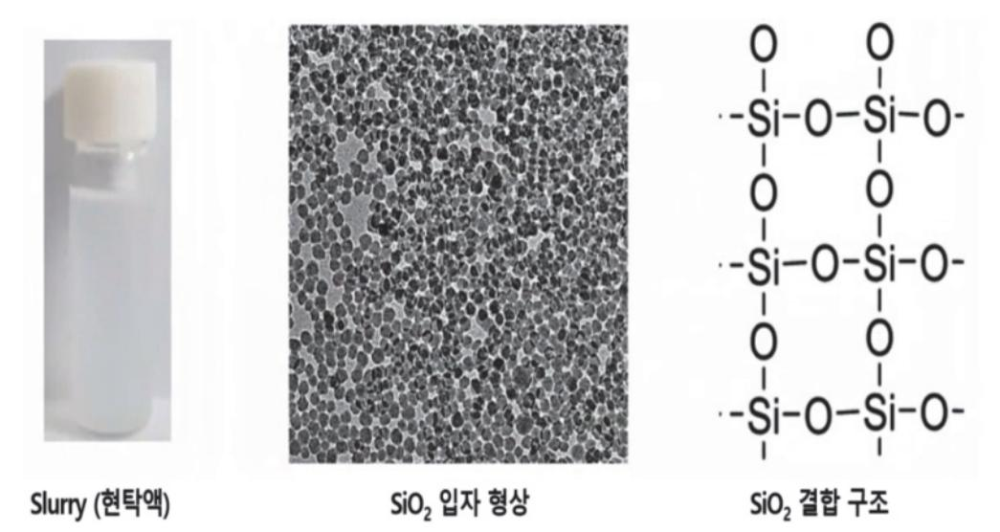

출처: 집필진 제작(2024) [그림 2-1] Slurry의 SiO2 입자 형상과 결합 구조

2. 슬러리 연마제 실리카의 특성을 파악한다.

실리카는 다양한 제조 방법을 통해 제조되며, 입자 크기, 분산도, 경도, 화학적 안정성, 표 면 특성 등의 특성을 지니고 있다. CMP 슬러리에서 실리카의 특성은 반도체 웨이퍼의 표 면 평탄화 및 마무리에 중요한 역할을 수행하며, 고품질의 CMP 슬러리 제조에 핵심적인 역할을 한다.

(1) 입자 크기

실리카의 입자 크기는 제조 방법과 공정 조건에 따라 조절할 수 있다. 입자의 크기는 일반적으로 수십 나노미터에서 수백 나노미터의 크기를 가지도록 제조된다. 고밀도 연마 에는 작은 입자 크기가 적합하며, 빠른 연마에는 큰 입자 크기가 적합하다.

(2) 분산도

실리카의 슬러리에서 잘 분산될 수 있는 좋은 분산도의 특성이 있다. 이러한 좋은 분산 도 특성은 실리카 입자가 균일하게 분산되고, 클러스터링이나 집적 현상을 방지하여, 일 관된 연마 특성을 유지하는 데 좋은 영향을 끼친다.

(3) 경도

실리카의 경도는 중간 정도를 가지고 있어 다양한 재료를 연마할 수 있다. 실리카의 중 간 경도는 고경도 재료를 연마하는 데 적합하며, 동시에 낮은 경도 재료에 대해서도 효 과적으로 사용될 수 있다.

(4) 화학적 안정성

실리카는 화학적으로 안정하며 다른 화학 물질과의 반응성이 낮다. 이러한 특성으로 인 해 실리카가 슬러리에서 안정한 상태로 존재하여 오랜 시간 동안 사용할 수 있다.

(5) 표면 특성

실리카의 표면은 균일하고 매끄럽다. 이에 따라 반도체 웨이퍼의 표면을 부드럽고 평탄 하게 연마하는 데 이상적이다. 실리카 입자는 웨이퍼 표면과 좋은 접촉을 형성하여 웨이 퍼의 표면 특성을 개선할 수 있다.

- 숕 반도체용 CMP 슬러리의 연마재를 제조 실험을 수행한다.
  - 1. 슬러리 연마제의 특성 파악을 위해 다음과 같이 실리카 제조 실험을 진행한다.
    - (1) 슬러리 연마제인 실리카의 제조를 위해 졸-겔 합성법을 이용하여 실험할 수 있다.
    - (2) 전구체인 TEOS(Tetraethyl Orthosilicate)의 가수화 및 축합(탈수) 반응이 발생한다.

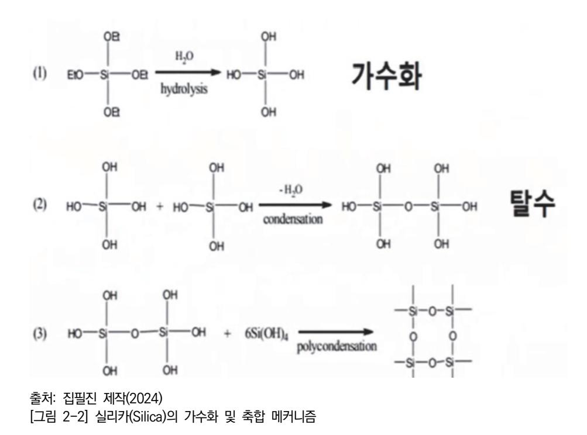

(3) 전구체의 졸이 겔로 바뀌는 과정을 졸-겔 합성법 이라고 한다.

(4) 연속적인 가수화 및 축합 반응의 반복으로 구형의 실리카 입자가 성장한다.

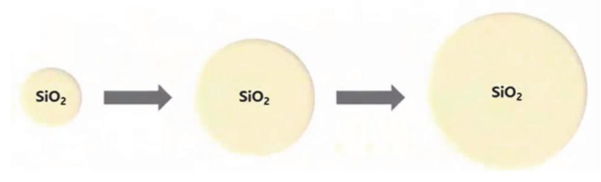

출처: 집필진 제작(2024) [그림 2-3] 가수화 및 축합의 반응의 반복과 실리카(Silica) 입자의 성장

- 2. 실리카 제조를 위해 다음과 같은 재료를 사용할 수 있다.
  - (1) 에탄올(Ethanol, 99.9%),
  - (2) 암모니아수(Ammonium Hydroxide, 38% NH3 in H2O, 99.99%)
  - (3) 탈이온수(이하 DI, Deionized Water, 저항 18.2MΩ)
  - (4) 전구체 TEOS(Tetraethyl Orthosilicate, 95%)

3. 다음과 같은 순서로 졸겔 합성법을 수행한다.

실리카(Silica)의 합성의 조건에는 목표하는 실리카의 코어 크기 및 특성에 합성 조건 및 투 입 재료 조성이 달라질 수 있다.

| Dartiala Tura | Eth                | AM   | DI    | TEOS |  |  |
|---------------|--------------------|------|-------|------|--|--|
| Particle Type | Silica Core Growth |      |       |      |  |  |
| Green, 20 nm  | 25                 | 0.25 | 0.788 | 1.05 |  |  |
| Green, 50 nm  | 25                 | 0.5  | 1.575 | 1.15 |  |  |
| Green, 90 nm  | 25                 | 0.75 | 2.363 | 1.15 |  |  |
| Red, 20 nm    | 25                 | 1.0  | 3.15  | 1.15 |  |  |
| Red, 90 nm    | 25                 | 2.0  | 1.0   | 2.5  |  |  |

출처: 집필진 제작(2024) [그림 2-4] 실리카(Silica) 합성 실험 조건표 예시

(1) 메스실린더를 이용하여 에탄올 50mL를 정량한다.

- (2) 교반기가 작동하는 합성 용기에 에탄올을 넣는다.
- (3) 암모니아 용액을 0.5mL를 추가한다.

- (4) DI Water를 1.5mL를 추가한다.
- (5) 전구체 TEOS를 2.1mL를 추가하여 교반을 계속 진행한다.
- (6) 반응 진행을 관찰하며 약 12시간 정도의 반응 시간 후에 투명했던 합성액이 뿌연 현탁액으 로 변화됨을 확인한다.
- (7) 이 뿌연 현탁액은 전구체(TEOS)가 실리카(Silica)로 성장함에 따라 더욱 흐려짐을 확인한다.
- (8) SEM 등 정밀 측정 장비 등을 이용하여 형성된 실리카의 형상 등 특성을 분석한다.

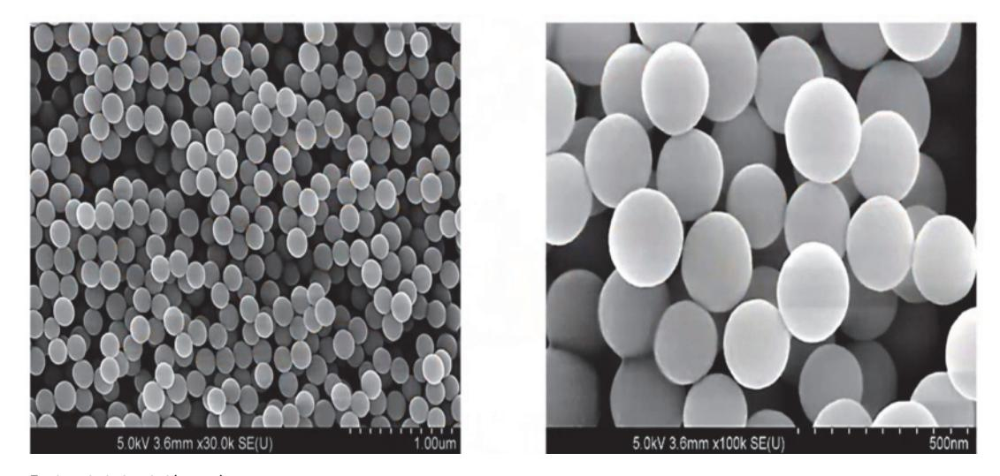

출처: 집필진 제작(2024) [그림 2-5] SEM으로 분석한 합성된 실리카(Silica) 형상(200nm), 저배율(좌) 및 고배율(우)

### 학습 2 교수·학습 방법

#### 교수 방법

- CMP 슬러리 재료 제조의 개요와 상세 내용을 공정별로 이해하기 쉽게 설명한다.
- 현장에서 적용할 수 있는 공정 매뉴얼과 관련 공정 재료 관련 자료 내용 등을 정리한다.
- 학습용 자료는 워드 프로세서 등의 문서 및 프레젠테이션 자료를 이용하여 관련 사항을 설 명한다.
- 학습자가 CMP 슬러리의 재료에 대한 이해를 도울수 있는 시청각 자료나 관련 교보재 등을 활용하여 수업을 진행한다.
- CMP 슬러리 재료 제조 사례를 수집하여 자료를 준비한다.
- CMP 슬러리 재료 제조 참고 자료는 사전에 관련 자료를 학습자들에게 배포하여 학습자가 검토할 수 있는 시간적 여유를 제공할 수 있도록 한다.
- CMP 슬러리 재료 제조 공정의 요구 사항에 필요한 내용을 확인하고, 관련 자료를 학습자 들에게 제시 후 파악 여부를 확인한다.

#### 학습 방법

- 반도체 시장 환경 및 기술 동향 등의 관련 산업 현황을 구체적으로 확인한다.
- CMP 슬러리 재료와 관련된 다양한 자료를 검색하고 분류하여 문서로 정리한다.
- CMP 슬러리 재료의 요구 사항 항목을 작성해 본 후, 관련된 자료의 종류와 기록 내용을 숙지하고 재료별로 분류한다.
- CMP 슬러리 재료의 요구 사항에 대한 핵심 사례 등을 조사, 수집하여 분석을 통해 생산에 필요한 목표를 설정한다.
- CMP 슬러리 재료의 분류된 자료를 활용하여 생산 가능성을 예측한다.
- CMP 슬러리 재료 제조 준비 과정에서 예상되는 문제점을 파악하고 바르게 대처할 수 있는 능력을 배양한다.

## 학습 2 평 가

#### 평가 준거

- 평가자는 학습자가 학습 목표를 성공적으로 달성하였는지를 평가해야 한다.
- 평가자는 다음 사항을 평가해야 한다.

|                  | 학습 목표                                           |  | 성취수준 |   |  |
|------------------|-------------------------------------------------|--|------|---|--|
| 학습 내용            |                                                 |  | 중    | 하 |  |
| CMP 슬러리 재료 준비 | - CMP 슬러리 재료 제조에 필요한 원재료의 종류를 파악할 수 있다.      |  |      |   |  |
|                  | - CMP 슬러리 재료 원재료의 제조사별 규격 및 장단점을 파 악할 수 있다.  |  |      |   |  |
|                  | - 반도체 제조 공정에 적합한 CMP 슬러리 재료 제조 재료를 준비할 수 있다. |  |      |   |  |

#### 평가 방법

문제 해결 시나리오

|                  | 평가 항목                                 |  | 성취수준 |   |  |
|------------------|---------------------------------------|--|------|---|--|
| 학습 내용            |                                       |  | 중    | 하 |  |
| CMP 슬러리 재료 준비 | - CMP 슬러리 재료 준비 시 발생하는 문제 해결 방안 파악 여부 |  |      |   |  |
|                  | - CMP 슬러리 재료 준비 시 문제 해결 능력            |  |      |   |  |
|                  | - CMP 슬러리 재료 준비 과정 중 스펙 문제 해결 능력      |  |      |   |  |

#### 서술형 시험

|                  | 평가 항목                    |  | 성취수준 |   |  |
|------------------|--------------------------|--|------|---|--|
| 학습 내용            |                          |  | 중    | 하 |  |
| CMP 슬러리 재료 준비 | - CMP 슬러리의 재료 준비 서술 능력   |  |      |   |  |
|                  | - CMP 슬러리 재료 준비 순서 서술 능력 |  |      |   |  |
|                  | - CMP 슬러리 재료 준비 스펙 나열 능력 |  |      |   |  |

평가자 질문

|                  | 평가 항목                     |  | 성취수준 |   |  |
|------------------|---------------------------|--|------|---|--|
| 학습 내용            |                           |  | 중    | 하 |  |
| CMP 슬러리 재료 준비 | - CMP 슬러리 재료 파악 여부        |  |      |   |  |
|                  | - CMP 슬러리 재료의 준비 방법 파악 여부 |  |      |   |  |
|                  | - CMP 슬러리 재료의 품질 기준 파악 여부 |  |      |   |  |

피드백

|  | 1. 문제 해결 시나리오 |
|--|---------------|
|  |               |

- 반도체용 CMP 슬러리 재료 준비를 위해 제조상의 등의 문제점이 발생할 수 있음을 이해하고 대 처할 수 있는 능력에 대해 평가한 후 주요 사항을 표시하여 피드백해 준다.
- 반도체용 CMP 슬러리 재료 준비에 대해 부족한 부분을 사례를 통해 설명해 준다.
- 반도체용 CMP 슬러리 재료를 제조하기 위한 준비 작업이 무엇인지 실례를 통해 설명해 준다.
- 2. 서술형 시험
- 파악된 내용을 바탕으로 CMP 슬러리 재료 제조 준비시 발생할 수 있는 문제점을 파악하고 그 대처 방안에 대한 지식에 대해 보충 설명을 해 주며, 이에 대한 이해가 부족하면 미비한 부분을 추가로 설명해 준다.
- CMP 슬러리 제조에 대한 준비 과정과 준비 소재들에 대한 이해가 미흡할 경우, 슬러리 소재에 대한 실례를 참고하여 재학습하도록 한다.
- 3. 평가자 질문
- 성취수준이 높은 학습자에게는 반도체 CMP 슬러리 제조에 사용되는 재료 및 제조 과정에 대한 구체적인 사례를 조사하게 한다.
- 반도체 CMP 슬러리 제조 준비 사례에 대한 이해가 부족할 경우, 슬러리 제조의 실례를 연구한다 양한 부교재 및 동영상 등을 활용하여 보완 설명을 해 준다.

| 학습 3 | CMP 슬러리 재료 제조하기       |
|------|-----------------------|
| 학습 2 | CMP 슬러리 재료 준비하기       |
| 학습 1 | CMP 슬러리 재료 요구 사항 파악하기 |

## 3-1. CMP 슬러리 재료 제조

|       |  생산 관련 부서로부터 입수한 생산 계획에 따라 장비 운용 계획을 수립할 수 있다.     |
|-------|-----------------------------------------------------|
| 학습 목표 |  작업 지시서와 장비 운용 매뉴얼에 따라 CMP 슬러리 재료를 제조할 수 있다.       |
|       |  CMP 슬러리 재료 제조 단계에서 발생한 문제점을 파악하고 해결 방안을 도출할 수 있다. |

## 필요 지식 /

| 숔 CMP 기술의 발전과 슬러리의 역할                                |
|------------------------------------------------------|
| 반도체의 발전이 급속히 이루어져 현재는 10nm대의 제품들이 양산되고 있다. 이에 따라 CMP |
| 에서 사용량이 가장 많은 슬러리의 분야에도 많은 변화가 있었다.                  |
| 슬러리는 CMP 공정 중 연마에 필요한 화학적 반응을 가속화하기 위하여 사용되는 수중의 작   |
| 은 고체 입자가 현탁질 상태로 부유하여 존재하는 물질을 말한다.                  |
|                                                      |

- 1. CMP 슬러리 기술 발전 방향
  - (1) 슬러리 입자 크기 감소

반도체의 모든 공정이 미세화되면서 슬러리의 입자 크기도 작아지고 있다. 이로 인해 이 전에는 발생되지 않았던 품질 이슈들이 발생하고 있다. 이에 대응하기 위하여 슬러리의 입자 크기도 축소 시킴으로써, CMP의 주요 결함인 스크래치를 감소시키기 위해 노력하 고 있다.

(2) 슬러리 입자 형상 개선 및 균일화

슬러리로 인한 스크래치 원인은 슬러리 slurry 입자 모서리의 날카로움과 균일하지 않은 입자 등에 있다. 이에 슬러리 입자의 형상을 개선하고 균일하게 개선해야 한다. 스크래 치에 유리한 작은 입자 크기, 균일한 입자 분포를 보유할 수 있는 제품으로 개발이 이 루어져야 될 것이다.

(3) 슬러리 연마량(Removal Rate)의 향상 CMP 슬러리의 개발 방향은 현 수준의 연마량을 상향 또는 유지해야 한다. 이를 통해 CMP 공정의 생산성을 개선할 수 있다.

숕 반도체용 CMP 슬러리의 연마 메커니즘 과 제조 방식

반도체용 CMP 공정에서는 Si wafer에 대해 화학적(Chemical) 및 물리적(Mechanical) 과정으로 연마를 진행한다. 절연 박막(Dielectric)인 STI 및 ILD 공정과 금속 박막(Eleetric)인 텅스텐(W) 및 구리(Cu) 막질의 제거에 적절한 Slurry를 적용하여 사용한다. 이러한 CMP Slurry의 실리카(SiO2)를 제조하기 위해 이온 교환법, 졸겔법, 습식법, 기층 가수 분해법 등을 이용한다.

- 1. CMP Slurry의 Si wafer 의 연마 메커니즘
  - (1) Slurry의 화학적 연마 작용

Slurry의 SiO2의 가수화 및 축합 반응에 따라 Si-O-Si의 화학적 결합이 형성되고, 이를 통해 Si wafer 표면의 연마를 가속화한다.

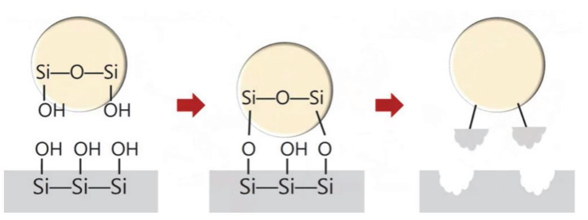

출처: 집필진 제작(2024) [그림 3-1] Slurry의 SiO2의 가수화 및 축합 반응

(2) Slurry의 물리적 연마 작용

Slurry의 SiO2의 물질 자체의 경도를 이용하여 물리적 마찰로 Si wafer 표면을 연마한 다.

2. CMP Slurry의 실리카(SiO2)의 합성 방법

슬러리(Slurry)의 실리카(SiO2)의 합성에는 다양한 합성법이 존재한다. 이는 합성법, 실리카 종류, 전구체, 특징에 따라 분류가 가능하다. 슬러리(Slurry)의 실리카(SiO2)의 합성 방법에 는 이온 교환법, 졸겔법, 습식법, 기층 가수 분해법 등이 있다.

(1) 이온 교환법

콜로이달 실리카를 합성하기 위해 이온 교환법(물유리법)이 많이 사용된다. 이때 전구체 는 물유리(Na2SiO3)가 사용되며, 합성된 Slurry는 반영구 현탁액 형태를 보인다. 비교적 비용이 적은 물유리(Na2SiO3)를 사용하기에 생산비가 저렴하여, 대량 생산 공정에 많이 사용된다.

(2) 졸겔법(Stober법)

콜로이달 실리카를 합성하기 위해 졸겔법(Stober법)이 사용된다. 졸겔법은 TEOS

(테트라에틸오소실리케이트)를 전구체로 사용한다. 합성된 Slury는 합성 조건에 따라 균 일한 입자를 생성하고 고순도를 띤다. 제조 비용은 이온 교환법(물유리법)보다 고가이다.

(3) 습식법

습식식 실리카를 합성하기 위해 습식법이 사용된다. 전구체는 물유리(Na2SiO3)가 사용되며, 저가에 생산이 가능하다.

(4) 기층 가수 분해법

표드 실리카를 합성하기 위해 기층 가수 분해법이 사용된다. 전구체는 SiCl4가 사용되며, 순도가 높은 실리카의 생산이 가능하다.

(표 3-1) Slurry SiO2의 가수화 및 축합 반응

| 합성법              | 실리카 종류         | 전구체                    | 슬러리 특성                       |
|------------------|----------------|------------------------|------------------------------|
| 이온 교환법           |                | 물유리(Na2SiO3)           | 생산비가 저렴함, 반영구 현 탁액 형태 보임. |
| 졸겔법(Stober 법) | 콜로이달 실리카(스토버법) | TEOS(테트라에틸오소실리케 이트) | 균일한 입자를 생성함, 고순 도를 가짐.    |
| 습식법              | 습식식 실리카        | 물유리(Na2SiO3)           | 저가로 생산 가능                    |
| 기층 가수 분 해법    | 퓸드 실리카         | SiCl 4      | 고순도를 가짐.                     |

#### ③ CMP 공정 장비의 품질 측정

CMP 슬러리 재료 제조 장비를 이용하여 CMP 공정을 진행하거나 진행한 후에 CMP 품질을 유지 관리하기 위해 다음과 같은 주요 장비를 활용하여 품질을 측정한다.

1. 잔막의 두께

잔막의 두께를 측정하기 위한 광학식 방식으로서 나노미터(Namometer)와 엘립소미터 (Ellipsometer)가 있다. 이 2가지 방식은 막질이나 웨이퍼를 파괴하지 않고, 빠른 속도로 측정이 가능하다는 장점이 있다.

(1) 나노미터(Namometer)

나노미터는 광학 반사식(Spectral Reflectance)의 원리를 이용하여 측정한다. 잔막에 광학 소스를 조사하면, 조사된 빛의 일부가 표면 및 잔막의 계면에서 반사를 일으킨다. 이러한 반사광을 분광 센서 등을 이용하여 측정하고, 이를 통해 측정 막질의 굴절 계수 등 광학 계수를 시뮬레이션하여 이를 토대로 잔막의 두께를 측정할 수 있다.

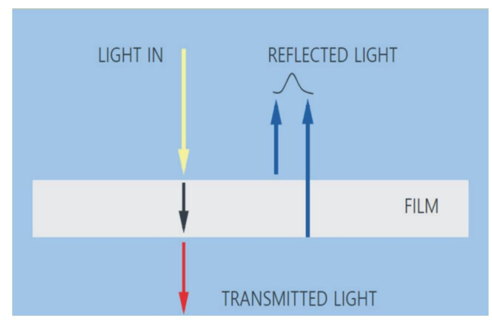

출처: 집필진 제작(2024)

[그림 3-2] 광학 반사식(Spectral Reflectance) 측정 원리

#### (2) 엘립소미터(Ellipsometer)

엘립소미터는 잔막에 편광화 된 광학 소스를 조사하는 방식이다. 이는 나노미터 방식과 유사하나, 편광화된 광학 소스와 반시된 편광 데이터를 이용하여 정밀 시뮬레이션이 가 능하다. 이를 통해 나노미터보다 더욱 미세한 박막 두께까지 측정할 수 있는 장점이 있 다. 그러나 500nm 이상의 박막을 측정할 경우 속도가 나노미터보다 상대적으로 느리 고, 시뮬레이션이 좀 더 복잡하다는 단점이 있다.

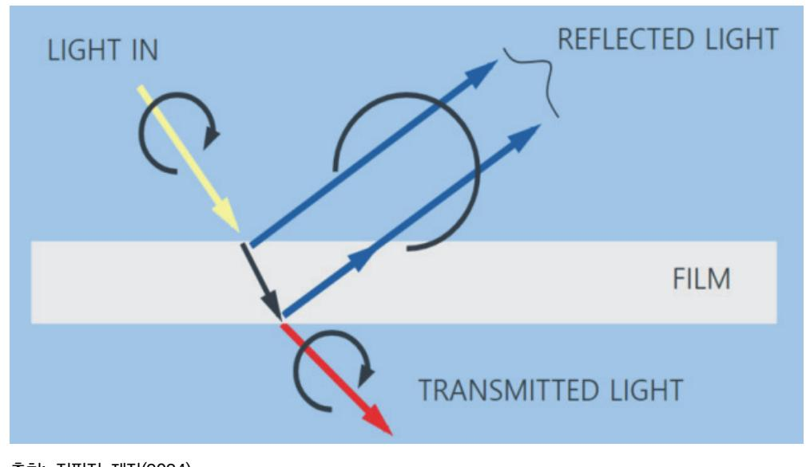

출처: 집필진 제작(2024) [그림 3-3] 광학 엘립소미트리(Spectroscopic Ellipsometry)의 측정 원리

2. 연마 후 단차

(1) 스텝 프로파일러(Step Profiler)

스텝 프로파일러는 연마 공정이 진행된 후 생성되는 단차의 깊이를 측정하는 데 이용된 다. 단차를 측정하기 위해, 깊이를 알수 있는 팁(Tip, Step)을 이용하여 표면을 접촉해 가면서 이동할 때 생기는 깊이의 변화 프로파일 자료로 단차의 깊이를 알 수 있다. 단점 은 표면에 직접 접촉하기 때문에 디바이스에 불량(Defect)을 만들 수 있다.

- 3. 파티클
  - (1) 파티클 카운터(Particle Counter)

파티클 카운터는 CMP 공정 중에 발생하거나 생성된 파티클이 얼마나 존재하는지 계측 하는 장비이다. 공정의 미세화가 진행되면서 기존의 파티클에 대한 관리 기준이 더욱 더 강화되었다.

- 4. 금속 이온
  - (1) 전반사 형광 X선 분석기(TRXRF: Total Reflection X-ray Fluorescence Analysis) TRXRF는 실리콘 웨이퍼와 같은 평탄한 시료를 일정한 각도로 X선을 입사시킨다. 이때 시료 표면 위에 전반사되어, 시료 표면의 원자만 여기되어 반사된다. 반사된 X선을 측정 하여 시료 표면의 불순물을 분석하는 방법이다. 이를 통해 반도체 공정 등의 막질의 금 속 이온에 대한 정보를 분석할 수 있다.

#### 재료·자료

- 웨이퍼(Wafer)
- 슬러리(Slurry)
- 캐미컬 용액(Chemical Solvent)
- 초순수(DI Water)

#### 기기(장비 ・ 공구)

- 연마 장치(Polisher)
- 연마 후 세정 장치(Post CMP Cleaner)
- 박막 두께 측정 장치
- 공구류
- 실험 및 보호용 도구
- 방진복, 마스크, 고무장갑 등
- 검사 및 측정 장비(Inspection and Measurement Equipment)
- 평가, 분석 및 계측 장비
- 광학 현미경(Optical Microscope)
- 전자 현미경(Scanning Electron Microscope, SEM)
- 제조 공장 인트라넷
- 안전 도구, 안전화, 안전모, 마스크, 장갑, 고글, 방진복
- 컴퓨터, 프린터, 복사기

#### 안전 ・ 유의 사항

화학 물질의 MSDS(Material Safety Data Sheet)를 참조하여 취급에 유의한다.

- 화학 물질을 취급할 때에는 장갑, 보호안경, 실험복, 호흡기 등의 개인 보호 장비(Personal Protective Equipment)를 착용한다.
- 화학 물질을 사용 시에는 퓸 후드(Fume Hood) 사용을 권장한다. 또한 환기가 잘 되는 작 업 공간에서 작업해야 한다.
- 화학 물질을 사용할 때는 정확한 절차와 비율을 준수해야 하고, 무작위로 혼합하지 않는다.
- 기계 장비는 사용 전에 충분히 이해하고, 장비 매뉴얼의 운영 절차와 규정을 준수해야 한다.
- 기계적 장비를 사용할 때는 주변에 장애물이 없도록 주변을 정리한다. 또한 작업 환경을 청 결하게 유지해야 한다.
- 장비 사용 중에는 항상 안전장치를 활성화하고, 비상 정지 버튼의 위치를 숙지한다.
- 전기를 사용하는 장비는 접지된 콘센트에 연결한다.
- 장비의 전기 과부하를 방지하기 위해 규정된 안전율 이하의 전력 용량을 사용한다.
- 전기 장비를 사용할 때에는 마른 손으로 운영한다.
- 전기 감전의 가능성이 있는 물기가 있는 환경에서는 사용하지 않는다.
- 화학 폐기물을 분리수거할 경우 관련된 환경 규정을 준수하여 처리한다.
- 폐기물 배출 전에 적절한 처리를 거쳐야 한다.
- 오염된 기구 및 재료는 지정된 운영 및 폐기 절차를 준수하여 처리한다.
- 자원을 절약하고, 재사용 가능한 재료를 최대한 활용한다.

#### 수행 순서

숔 반도체 장비 및 재료의 생산성 등의 특성을 이해한다.

반도체 공정을 진행하는 장비 및 재료 등을 어떻게 관리하고 운영하느냐의 차이에서 생산성, 소모 비용 절감, 장비 소유(운영) 비용 등에 대한 특성을 파악하는 것이 필요하다.

- 1. 장비의 운영상에 재현성, 설비 간의 차, 설비 내의 차이가 발생한다는 점을 이해한다.
  - (1) 재현성

동일한 장비에서 동일한 레시피를 이용하여 공정을 진행했음에도, 결과가 동일하지 않거 나, 점차적으로 차이가 발생하기도 한다. 재현성 불충분의 문제가 종전 검출(E.P.D.), 막 두께 모니터링, 공정 진단이 필요한 이유이다.

(2) 설비 간의 차

동일 모델의 장비를 양산 라인에 배치하고, 동일 조건(레시피)으로 처리했음에도 불구하 고, 장비별로 결과가 동일하지 않는 경우가 발생할 수 있다. 이를 보정하기 위해 장비 간의 동일화(동조화) 조치가 필요하다.

(3) 설비 내의 차

하나의 설비(장비)의 플랫폼에 동일 디자인, 동일 구조, 동일 크기의 체임버를 동일한 조 건으로 여러 모듈로 운영할 경우에도, 각 체임버 간 동일하지 않은 결과가 발생할 수 있 다. 이때 장비 내의 운영 파라미터 등으로 미세 조정 등으로 동일한 결과가 발생하도록 조치를 취해야 한다.

- 2. 장비의 가동률에 대한 전반적 사항들을 이해한다.
  - (1) 가동률

사람 또는 장비에서의 가동 시간에 대한 유효 가동 시간의 비율을 뜻한다.

유효 가동 시간이란 생산에 직접적으로 기여한 시간으로 장비의 이용 목적과 측정 방법 등을 고려하여 정할 수 있다.

(2) 반도체 공정에서의 제조 장비의 가동률

일반적으로 반도체 공정에서의 가동률은 유효 가동 시간 및 가동 시간에서 장비의 정지 시간을 제한 것으로 계산한다.

- (가) 반도체 제조 장비의 가동 시간 = 공정 전 작업 시간 예정된 정지 시간
- (나) 반도체 제조 장비의 유효 가동 시간 = 공정 전 작업 시간 모든 정지 시간

= 실제로 생산에 사용된 시간

(다) 모든 정지 시간 = 예정된 정지 시간 + 예정되지 않은 정지 시간

3. 장비의 정비(Maintenance)에 대한 전반적 사항을 이해한다.

장비의 가동률 향상을 위해서는 고장에 의해 정지하는 시간의 감소 및 수리를 위한 시간의 감소가 필요하다. 장비의 이상에 따른 정지 시간 등을 고려하여 MTBF, MTBA, MTTR 등 의 메인터넌스 특성 지표로 나타낼 수 있다.

- (1) MTBF(Mean Time Between Failure) 장비 고장에서 다음 장비 고장까지의 평균 시간을 뜻한다. 이는 평균 고장 간격을 의미 한다.
- (2) MTBA(Mean Time Between Assists) 장비 고장 시에 작업자 지원이 필요하기까지의 평균 시간을 뜻한다. 이는 평균 어시스트 간격을 의미한다.

(3) MTTR(Mean Time Between Repair)

장비 고장 수리를 위한 평균 시간을 뜻한다. 이는 평균 고장 수리 시간을 의미한다.

숕 CMP Slurry 제조 공정을 이해한다.

CMP 슬러리는 원료 물질을 이용하여, 가소(Calcination), 슬러리 크기 감소, 분산(Dispersion), 희석(Dilution) 공정 등을 통해, Slurry의 양산 및 샘플링 생산 공정을 진행한다.

- 1. 원재료(Raw Material) 준비를 이해한다.
  - (1) CMP Slurry의 제조에 필요한 필요 원료 물질 및 자재를 준비한다.
- 2. 가소(Calcination) 공정을 이해한다.
  - (1) CMP Slurry를 제조하기 위해 가소(Calcination) 공정을 통해, 파티클 크기(Particle Size)를 조절하고, 슬러리의 표면적(Surface Area)을 조절할 수 있다.
  - (2) 가소(Calcination) 공정은 고온으로 가열하여 휘발 성분을 제거하는 과정이다.
- 3. 크기 감소(Size Reduction) 공정을 이해한다.
  - (1) 형성되는 파티클의 크기가 적절하게 유지될 수 있도록 크기를 감소시킨다.
- 4. 크기 감소(Size Reduction) 및 첨가 공정을 이해한다.
  - (1) 제조 중인 Slurry에 D.I. Water를 일정량을 추가한다.
  - (2) 계면 활성제, pH 조절제 등의 첨가제 #1를 계획된 양을 추가한다.
  - (3) 형성되는 파티클의 크기가 적절하게 유지될 수 있도록 크기를 감소시킨다.
  - (4) 파티클의 크기, pH, Zeta Potential이 적절하게 유지될 수 있도록 조절한다.
- 5. 분산(Dispersion) 공정을 이해한다.
  - (1) 제조 중인 Slurry에 D.I. Water를 일정량을 추가한다.
  - (2) 첨가제 #2, #3, #4 등 계획된 양을 추가한다.
  - (3) 고형분 함량(Solids Content), pH, Zeta Potential, 전도도(Conductivity)가 적절하게 유지 할 수 있도록 조절한다.
- 6. 희석(Dilution) 공정을 이해한다. 제조된 Slurry 용액을 규정된 함량으로 희석한다.
- 7. 포장(Packing) 및 상표 표기(Labeling) 공정을 이해한다. 제조된 Slurry 용액을 판매하기 위해 규정된 형태와 용량으로 포장하고, 제품에 관련된 상 표 등을 표기한다.

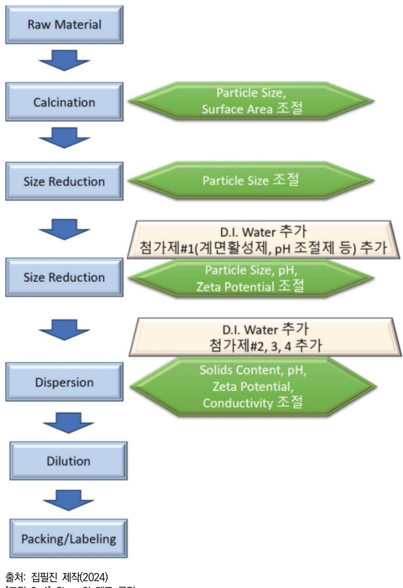

- [그림 3-4] Slurry의 제조 공정
- 숖 CMP 장비 PM의 개념과 주요활동 등에 대해 이해한다.

CMP 슬러리 재료 제조 공정을 원활히 운영하기 위해서는 CMP 장비의 PM과 재료의 교체가 주기적이고 명확한 기준에 의해 진행되어야 한다. 특히 CMP 장비의 안정적 운영을 위한 검토 사항을 아래와 같이 고려해야 한다. 반도체용 CMP 슬러리 재료를 제조하기 위해 필요한 주요 지식을 설명한다.

1. PM의 개념을 이해한다.

(1) 장비의 성능을 유지하도록 지원하고, 고장의 발생을 사전에 방지하는 활동이다. 이로써 장비

의 수명을 연장하고 생산성을 향상시킬 수 있다.

- (2) 장비의 주요 성능을 점검하고, 부품의 교체 및 수리를 진행한다. 이와 관련한 장비의 청소를 진행한다.
- (3) 장비가 원하는 성능으로 가동될 수 있도록 점검하고 정비하는 활동이다.
- 2. PM의 주요 활동을 이해한다.
  - (1) 장비에 대한 주기적인 예방 점검 항목을 결정하고, 이에 관련된 일정과 절차에 따라 정기적 으로 실시하도록 한다.
  - (2) 장비의 성능 및 부품 등에 대한 기준에 맞지 않는 사항으로 인한 고장 또는 이상 발생에 대 한 조치를 실시한다.
  - (3) 고장 또는 이상 발생에 대한 원인을 분석하고, 이로 인한 영향을 평가해야 한다.
  - (4) PM의 진행에 대한 상세한 PM일지를 작성하여 보고하고, 규정에 맞추어 보관한다.
  - (5) PM 시에 진행된 조치 사항을 검토하여 결과와 대책을 정리하여 보고서를 작성하여 보고한다.
- 3. PM의 유의점을 이해한다.
  - (1) PM 항목, 실시 방법, 주기 등에 대한 기술적으로 나은 개선 방법의 적용이 필요하다.
  - (2) 현행의 PM 방법을 수정할 필요성이 발생한 경우, ISO 등 규정된 변경 절차에 따라 진행한다.
  - (3) PM 방법 및 절차에 등 사항을 보고서로 작성하여, 내부 보고 후 필요시 규정을 수정한다.
- 4. PM의 데이터에 대한 통계적 분석의 활용 방법을 이해한다.
  - (1) PM 활동의 Data를 축적하여 통계적으로 해석하여 장비의 개선 및 유지에 활용한다.
  - (2) CMP 장비 및 슬러리 등에 대한 이상값과 추세 등을 진단하고 예측하여, 관련 정보를 공유 한다.
  - (3) 과학적이고 체계적인 장비의 유지 개선 사례 등을 발굴하고, 관련 노하우를 축적한다.

숗 CMP 장비 유지 보수 주기 및 항목을 확인한다.

- 1. CMP의 소모성 재료(부품)에 대한 PM 주기 및 항목을 확인하고 검사해야 한다. 고순도의 하기의 소모성 재료에 대한 부품들의 PM 주기 및 항목을 확인한다.
  - (1) 플레이튼 RPM
  - (2) 헤드 RPM
  - (3) 패드 RPM
  - (4) 컨디셔너 RPM
  - (5) 슬러리 유량

- (6) 다운포스 압력
- (7) 배압 압력
- (8) 디스크 압력
- (9) 구성품의 필터 수명
- 2. CMP 장비의 유지 보수 항목을 확인하고 검사해야 한다.
  - CMP 장비의 핵심 모듈에 대한 주요 유지 보수 항목을 하기 모듈별로 PM을 진행한다.
  - (1) Load/Unload Station
  - (2) Primary/Final Heat Exchange
  - (3) Primary/Final Platen
  - (4) Polish Arm
  - (5) Slurry System
  - (6) Pad conditioner system
  - (7) Fluid System
  - (8) Clean Station
  - (9) Power Distribution(High & Low Cabinet)
  - (10) Thickness Measurement(in-situ)

### 학습 3 교수·학습 방법

#### 교수 방법

- CMP 슬러리 재료 제조의 개요와 상세 내용을 공정별로 이해하기 쉽게 설명한다.
- 현장에서 적용할 수 있는 공정 매뉴얼과 관련 공정 재료 관련 자료 내용 등을 정리한다.
- 학습용 자료는 워드프로세서 등의 문서 및 프레젠테이션 자료를 이용하여 관련 사항을 설명 한다.
- 학습자가 CMP 슬러리의 재료에 대한 이해를 도울수 있는 시청각 자료나 관련 교보재 등을 활용하여 지도한다.
- CMP 슬러리 재료 제조 사례를 수집하여 자료를 준비한다.
- CMP 슬러리 재료 제조 참고 자료는 사전에 관련 자료를 학습자들에게 배포하여 학습자가 검토할 수 있는 시간적 여유를 제공한다.
- CMP 슬러리 재료 제조 공정의 요구 사항에 필요한 내용을 확인하고, 관련 자료를 제시한 후 파악 여부를 확인한다.

#### 학습 방법

- 반도체 시장 환경 및 기술 동향 등의 관련 산업 현황을 구체적으로 조사한다.
- CMP 슬러리 재료와 관련된 다양한 자료를 검색하고 분류하여 문서로 정리한다.
- CMP 슬러리 재료의 요구 사항 항목을 작성해 본 후, 관련된 자료의 종류와 기록 내용을 숙지하고 재료별로 분류한다.
- CMP 슬러리 재료의 요구 사항에 대한 핵심 사례 등을 조사, 수집하여 분석을 통해 생산에 필요한 목표를 설정한다.
- CMP 슬러리 재료의 분류된 자료를 활용하여 생산 가능성을 예측한다.
- CMP 슬러리 재료 제조 준비 과정에서 예상되는 문제점을 파악하고 바르게 대처할 수 있는 능력을 배양한다.

## 학습 3 평 가

#### 평가 준거

- 평가자는 학습자가 학습 목표를 성공적으로 달성하였는지를 평가해야 한다.
- 평가자는 다음 사항을 평가해야 한다.

|                  | 학습 목표                                                  |  | 성취수준 |   |  |
|------------------|--------------------------------------------------------|--|------|---|--|
| 학습 내용            |                                                        |  | 중    | 하 |  |
| CMP 슬러리 재료 제조 | - 생산 관련 부서로부터 입수한 생산 계획에 따라 장비 운용 계획을 수립할 수 있다.     |  |      |   |  |
|                  | - 작업 지시서와 장비 운용 매뉴얼에 따라 CMP 슬러리 재료 를 제조할 수 있다.      |  |      |   |  |
|                  | - CMP 슬러리 재료 제조 단계에서 발생한 문제점을 파악하고 해결 방안을 도출할 수 있다. |  |      |   |  |

#### 평가 방법

문제 해결 시나리오

|                  |                                                           | 성취수준 |   |   |
|------------------|-----------------------------------------------------------|------|---|---|
| 학습 내용            | 평가 항목                                                     |      | 중 | 하 |
|                  | - 반도체용 CMP 슬러리 재료 제조 사양서의 핵심 내용 파악 여부                  |      |   |   |
| CMP 슬러리 재료 제조 | - 반도체용 CMP 슬러리 재료 관련된 문제점 검토 능력                           |      |   |   |
|                  | - 반도체용 CMP 슬러리 재료 제조 사양서를 바탕으로 발생할 수 있는 문제점 파악 및 해결 능력 |      |   |   |

서술형 시험

|                  |                                                                      | 성취수준 |   |   |
|------------------|----------------------------------------------------------------------|------|---|---|
| 학습 내용            | 평가 항목                                                                |      | 중 | 하 |
| CMP 슬러리 재료 제조 | - 반도체용 CMP 슬러리 재료 제조 사양서 작성 능력                                       |      |   |   |
|                  | - 반도체용 CMP 슬러리 재료 제조 사양서를 바탕으로 제조 품질에 대한 등에 대한 내용을 검토할 수 있는 능력 |      |   |   |
|                  | - 파악된 내용을 바탕으로 CMP 슬러리 재료 제조 시 발생할 수 있는 문제점의 대처 방안 작성 능력          |      |   |   |

#### 피드백

| 1. 문제 해결 시나리오                                           |
|---------------------------------------------------------|
| - 반도체용 CMP 슬러리 재료 제조 사양서 등을 바탕으로 제조 시에 발생할 수 있는 문제점을 이  |
| 해하고 대처할 수 있는 능력에 대해 평가하고 부족한 부분을 사례를 통해 설명해 준다.         |
| - 반도체용 CMP 슬러리 재료 제조의 공정과 문제점에 대한 이해가 부족할 경우, 기술 자료, 동영 |
| 상 등의 추가적인 교보재를 이용하여 보완 학습을 진행한다.                        |
| 2. 서술형 시험                                               |
| - 파악된 내용을 바탕으로 CMP 슬러리 재료 제조 시 발생할 수 있는 문제점의 대처 방안에 대한  |
| 지식에 대해 평가한 후 미흡한 부분은 필요 지식을 이해하기 쉽게 재설명해 준다.            |
| - CMP 슬러리 제조 공정에 대한 이해가 부족할 한 학습자에게는 미비한 부분을 보충하여 설명해   |
| 준다.                                                     |
| - 성취수준이 높은 학습자에게는 반도체용 CMP 슬러리 재료 제조 공정을 전체적으로 요약하여 설   |
| 명해 주고, CMP 슬러리 제조에 관한 실제 사례 등을 참고하여 심화 학습을 할 수 있도록 해 준  |
| 다.                                                      |

- 강현구(2008.). 「Sub-micron 메모리 소자 적용을 위한 고선택비 CMP 슬러리 설계」. 『한양대학교 공학대학원 박사 학위 논문』.
- 강해령의 하이엔드 테크. CMP 슬러리 특집. 나노 알갱이 부대의 정체 (https://www.sedaily.com/New sView/26CC0TOIO0)
- 곽노열‧배병욱‧오경택‧윤태균‧이성희‧임정훈‧정용우‧진수봉‧최호승‧홍기환 (2021). 『반도체 제 조 기술의 이해』. 한올출판사
- 권장국(2019). 「STI CMP용 세리아 슬러리 조성에 따른 디싱 특성 연구」. 『성균관대학교 일반대학원 석사 학위 논문』.
- 김기출.(2023). 바이오 응용을 위한 형광 실리카 나노 입자의 최적 합성. 한국산학기술학회 논문지, 24(1). pp.351~357, 10.5762/KAIS.2023.24.1.351.
- 김윤기(2018). 「지르코니아 연마 입자 기반 슬러리의 텅스텐 화학적 기계적 연마공정에서 폴리에틸렌이 민의 부식 억제 효과」. 『한양대학교 대학원 석사 학위 논문』.
- 김형준(2000). 「구리 박막의 화학적 기계적 평탄화 공정 중 슬러리 파티클과 웨이퍼 표면의 특성 평가에 대한 연구」. 『한양대학교 대학원 석사 학위 논문』.
- 마에다 카즈오(前田 和夫)(2004). 『반도체 제조 장치 입문』. 성안당.
- 박영봉(2013). 「CMP 공정에서 웨이퍼 에지의 연마 균일도 향상」. 『부산대학교 대학원 박사 학위 논문』.
- 박인호‧이다솔‧정선호‧정해도(2018). 「Cu CMP에서 온도가 재료 제거율에 미치는 영향」. 『한국기계 가공학회지(Journal oftheKoreanSocietyofManufacturing ProcessEngineers)』. v.17. no. 6. pp. 91~97.
- 박종휘‧양우성‧정정영‧이상일‧박미선‧이원재‧김재육‧이상돈‧김지혜(2011). 『CMP 공정에서 슬 러리와 웨이퍼 형상이 SiC 웨이퍼 표면 품질에 미치는 영향」. 『한국세라믹학회지(Journal of the Korean Ceramic Society)』. 48권(4호). pp. 312~315.
- 박지희(2023). 「분산제 함량에 따른 CMP 슬러리의 분산 안정성에 관한 연구」. 『한남대학교 대학원 석사 학위 논문』.
- 박진성(2023). 『진짜 하루만에 이해하는 반도체 산업 원데이클 래스』. 티더블유아이지.
- 박창준(2004). 「혼합 연마제 슬러리의 CMP 특성에 관한 연구」. 『대불대학교 석사 학위 논문』.

- 사토준이치(2022). 『알기 쉬운 최신 반도체 제조장치의 기본과 구조』. 정학기(역). 21세기사.
- 삼성전자 반도체 뉴스룸(https://blog.naver.com/secsemicon/221102933854).
- 서용진‧이우선‧박성우‧김남훈‧고필주(2005). 「산화막 CMP 공정에서 슬러리 온도 변화에 따른 연마 특성」. 『전기전자 재료학회 논문지』. 18(3). pp. 219~225.
- 서울대학교 반도체공동연구소(2012).『반도체 공정 교육(이론)』. 서울대학교 반도체공동연구소
- 선호정(2024). 『친절한 반도체』. 한올출판사.
- 수리야데바라 바부(2021). 『CMP 웨이퍼 연마.』 장인배 번역. 씨아이알.
- 신병철(2015). 「CdTe 박막 CMP에서 슬러리 산화작용에 관한 연구」. 『부산대학교 대학원 석사 학위 논문』.
- 안진우(2005). 「CMP 슬러리 특성과 공정변수가 단차 변화에 미치는 영향」. 『고려대학교 대학원 석사 학위 논문』.
- 임준우‧홍상훈‧허영헌‧임승하‧성홍석‧김덕영(2023). 『반도체 공정 장비 개론(제2판)』. 복두출판사.
- 장수천(2018). 「패널 레벨 패키지를 위한 CMP 슬러리의 최적화」. 『부산대학교 대학원 박사 학위 논문』.
- 정영석,김형재, 최재영, 정해도(2004). 「슬러리 온도 및 유량에 따른 CMP 연마 특성」. 『Journal of the Korean Society for Precision Engineering』. 21(11), pp. 46-52.
- 정진엽(2017). 「알루미늄용 CMP 슬러리 개발에 관한 연구」. 『부산대학교 대학원 석사 학위 논문』.
- 조문성(2015). 「CMP용 세리아 슬러리 제조 및 특성」. 『한밭대학교 산업대학원 석사 학위 논문』.
- 진종문(2022). 『반도체 특강(소자편)』. 한빛아카데미.
- 최성재(2021). 『나노 반도체 소자 설계 및 제조 공정 기술』. 자유아카데미.
- 최우영 ‧ 박병국 ‧ 이종덕(2021). 『실리콘 집적 회로 공정 기술의 기초 [제5판]』. 문운당.
- 최재성(2021). 『반도체 공정 장비 공학』. 북스힐.
- 최진현(2024). 「과황산계 산화제가 Cobalt CMP 공정에 미치는 영향과 CMP 슬러리 분석을 위한 Raman 분광기 응용」. 『중앙대학교 대학원 석사 학위 논문』.
- 케이씨텍(주)(2016). 「20nm 이하 차세대 CMP 공정용 wet 세리아 슬러리 기술 개발」. 『전자정보 디바이스 산업 원천 기술 개발 최종 보고서』. 산업통상자원부.
- 한국공업화학회(2013). 『무기 공업 화학(개정판)』. 교문사(청문각).
- 한양대학교(2014). 「반도체 STI CMP용 Ceria 입자 개발 및 특성 평가」. 미래창조과학부 국가 간 협력 기반 조성(비ODA) 보고서.

- 허성녕(2022). 「초음파 분사 시스템에서 슬러리 막 두께의 변화와 CMP 재료 제거율에 미치는 영향」. 『부산대학교 대학원 석사 학위 논문』.
- 황호정(2003). 『반도체 공정 기술(개정판)』. 생능출판사.
- Daniel A. Crowl, JosephF. Louvar(2020). 『화학 공정 안전(제4판)』. 이영순‧김태옥‧박달재‧백종배 ‧ 이근원 ‧ 이창준(역). 동화기술.
- Jeong, K., & Park, M.(2017). A Progress Management based Daily Production Planning Method for Improving the Production Linearity of Semiconductor Fabs(반도체 Fab의 생산 선형성 향상을 위한 진 도관리 기반 일간 생산 계획 방법론).
- Michael Quirk, Julian Serda(2013). 『반도체 소자 공정기술』. 최성재 역. 자유아카데미.
- SKhynix newsroom(https://news.skhynix.co.kr/)
- S. Wolf, R.N. Tauber(2008). Silicon Processing for the VLSI Era. Lattice Press.

## 위해성 자료 노출 시나리오 점검 양식

| 위해성 재료 노출 시나리오 점검 양식 |                                            |                                                                    |         |
|----------------------|--------------------------------------------|--------------------------------------------------------------------|---------|
| 제품군                  | 한국표준산업 분류코드(KSIC)*                      | 물질명                                                                | CAS No. |
| pH 조절제               | 24122-냉간 압연 및 압출 제품 제조업                 | 비공개                                                                |         |
| pH 조절제               | 15110-모피 및 가죽 제조업                       | Sodium formate                                                     |         |
| pH 조절제               | 20129-기타 기초 무기 화학 물질 제조업                | 비공개                                                                |         |
| pH 조절제               | 20129-기타 기초 무기 화학 물질 제조업                | 수산화칼슘                                                              |         |
| pH 조절제               | 20499-그외 기타 분류 안 된 화학제품 제조업             | Acetic acid                                                        |         |
| 계면 활성제            | 20421-계면 활성제 제조업                           | Calcium dodecylbenzenesulfonate                                 |         |
| 계면 활성제            | 20421-계면 활성제 제조업                           | Sodium polyoxyethylene lauryl ether sulfate                     |         |
| 계면 활성제            | 20421-계면 활성제 제조업                           | 비공개                                                                |         |
| 플라스틱 첨가제          | 20119-석탄 화학계 화합물 및 기타 기초 유기화학 물질 제조업 | Phenyl Salicylate                                                  |         |
| 흡수 및 흡착제          | 20119-석탄화학계 화합물 및 기타 기초 유기화학 물질 제조업  | Glycerol                                                           |         |
| 흡수 및 흡착제          | 30399-그 외 자동차용 신품 부품 제조업                | Aluminium oxide                                                    |         |
| 접착제, 실란트          | 20493-접착제 및 젤라틴 제조업                     | Ethyl acetate                                                      |         |
| 부식 방지제            | 20499-그외 기타 분류 안 된 화학 제품 제조업            | Methylbenzotriazole; Tolyl triazole, Methyl-1H-benzotriazole |         |
| 부식 방지제            | 20129-기타 기초 무기 화학 물질 제조업                | Ammonium choloride                                                 |         |

#### ※ 「화학물질등록 및 평가에관한법률」(화평법) 시행령 화학 물질 용도 분류 체계

| 용도 분류               | 구체적 내용                                                                    |
|---------------------|---------------------------------------------------------------------------|
| 1. 흡수 및 흡착제         | 가스나 액체를 흡수 또는 흡착하는 물질                                                     |
| 2. 접착제ㆍ결합제          | 두 물체의 접촉면을 접합시키는 물질 또는 2개의 개체를 결합시키는 물질                                   |
| 3. 에어로졸 추진제         | 압축 가스 또는 액화 가스로서 용기에서 가스를 분사함으로써 내용물을 분출시키는 물질                            |
| 4. 응축방지제            | 물체의 표면에서 액체가 응축되는 것을 방지할 목적으로 사용하는 물질                                     |
| 5. 부동액              | 냉각에 의해서 고화되는 것을 방지하기 위해 사용하는 액체                                           |
| 6. 접착방지제            | 두 개체 접촉면의 접착을 방지할 목적으로 사용하는 물질                                            |
| 7. 정전기 방지제          | 정전기 발생을 방지하거나 저감하는 물질                                                     |
| 8. 표백제              | 섬유 등 착색 물체의 색깔을 화학적인 방법으로 분해ㆍ제거함으로써 백색ㆍ무색으로 하는 물질                      |
| 9. 세정 및 세척제         | 표면에 오염물이나 불순물을 제거하는 데 사용하는 물질                                             |
| 10. 착색제             | 다른 물질을 발색하도록 하는 물질                                                        |
| 11. 착화(錯化)제         | 주로 중금속 이온인 다른 물질에 배위자(配位子)로서 배위되어 착물(복합체)을 형성하 는 물질                    |
| 12. 전도제             | 섬유류와 플라스틱류의 대전 성능을 개선하기 위해서 제조 공정에서 첨가ㆍ도포하는 물질                         |
| 13. 건축용 물질 및 첨가제 | 건축물의 품격을 높이고 유지ㆍ보존을 목적으로 건축용 자재에 사용하는 물질                                  |
| 14. 부식방지제           | 공기를 비롯한 화학 물질, 옥외 노출 등으로 생기는 부식을 방지하기 위해 첨가하는 물질                       |
| 15. 화장품             | 화장품 및 세면 용품에 사용하는 물질                                                      |
| 16. 분진 결합제          | 분진의 발생ㆍ분산을 방지하기 위해 첨가하는 물질                                                |
| 17. 전기 도금제          | 금속 표면의 세척 및 세정을 위해서 쓰이는 물질 및 도금 공정에서 도금 강도를 증가 시키기 위해 첨가하는 물질          |
| 18. 화약, 폭발물         | 화학적 안전성이 있으나 화학적 변화를 거침으로써 폭발 또는 팽창을 동반한 다량의 에너지 및 가스를 매우 빠르게 발생시키는 물질 |
| 19. 비료              | 식물에 영양을 주거나 식물의 재배를 돕기 위해 흙에서 화학적 변화를 가져오게 하는 물질                       |
| 20. 충전제             | 고무, 플라스틱, 페인트, 세라믹 등에 광택, 인장, 발색 등 기능 향상을 위해 첨가하는                         |

|                      | 물질                                                                               |
|----------------------|----------------------------------------------------------------------------------|
| 21. 정착제              | 섬유의 염료와 반응하여 색이 정착하도록 하는 물질                                                      |
| 22. 내화ㆍ방연제 및         | 주로 섬유 및 플라스틱의 연소 방지ㆍ지연 효과를 위해 작업 공정 중에 첨가ㆍ반응시                                    |
| 난연제                  | 키는 물질                                                                            |
| 23. 부유제              | 광물질의 제련 공정 중에서 광물질을 농축ㆍ수거하기 위해 사용하는 물질                                           |
| 24. 주물용 융(融)제        | 광물질을 녹이는 공정에서 산화물이 형성되는 것을 방지하기 위해 첨가하는 물질                                       |
| 25. 발포제ㆍ기포제          | 주로 플라스틱이나 고무 등에 첨가해서 작업 공정 중 가스를 발생시켜 기포를 형성하 게 하는 물질                         |
| 26. 식품 및 식품 첨가물   | 식품(의약으로 섭취하는 것은 제외한다.) 및 식품을 제조ㆍ가공 또는 보존하는 과정에 서 식품에 넣거나 첨가하는 물질              |
| 27. 연료               | 연소반응을 통해 에너지를 얻을 수 있는 물질                                                         |
| 28. 연료 첨가제           | 연소 효율, 에너지 효율을 높이기 위하여 연료에 첨가하는 물질                                               |
| 29. 열 전달제            | 열을 전달하고 열을 제거하는 물질                                                               |
| 30. 유압유 및 첨가제        | 각종 압축기에 넣는 액체(기름) 및 압력 전달 효율을 높이기 위해 첨가하는 물질                                     |
| 31. 함침(含浸)제          | 가공성 제품의 품질 향상, 형태 유지 등을 목적으로 소재에 미리 처리하여 놓는 물질                                   |
| 32. 절연제              | 전기 기기에 있어서 도체 이외의 부분을 전류가 통과하지 못하도록 작용하는 물질                                      |
| 33. 중간체              | 다른 화학 물질을 합성하는 데 사용하는 물질                                                         |
| 34. 실험실용 물질          | 과학적 실험, 분석 또는 연구를 목적으로 실험실에서 사용하는 물질                                             |
| 35. 윤활유 및 첨가제        | 두 표면 사이의 마찰을 줄이기 위해 투입하는 물질                                                      |
| 36. 비농업용 농약 및 소독제 | 유해한 생물을 죽이거나 활동을 방해ㆍ저해하는 물질. 다만, 농약, 의약품ㆍ의약외품이 나 동물용 의약품ㆍ동물용 의약외품은 제외한다.      |
| 37. 향료               | 향을 내는 물질                                                                         |
| 38. 산화제              | 특수한 조건에서 산소를 쉽게 발생시켜 다른 물질을 산화시키는 물질. 수소를 제거하 는 물질 또는 화학 반응에서 전자를 쉽게 받아들이는 물질 |
| 39. pH 조절제           | 수소 이온 농도(pH)를 조절하거나 안정화하는 데 사용하는 물질                                              |
| 40. 농약               | 농작물을 균, 곤충, 응애, 선충, 바이러스, 잡초, 그 밖의 병해충으로부터 방제하는 데 사용하는 물질. 다만, 비료는 제외한다.      |
| 41. 의약품              | 의약품ㆍ의약 외품이나 동물용 의약품 및 동물용 의약 외품의 활성 성분인 물질                                       |
| 42. 사진 현상 재료 등    | 광화학물 영구적인 사진 이미지를 만드는 데 사용하는 물질                                                  |
| 43. 공정 속도 조절제        | 화학 반응 속도를 조절함으로써 공정 속도를 제어할 목적으로 사용하는 물질                                         |
| 44. 환원제              | 주어진 조건에서 산소를 제거하거나 또는 화학 반응에서 전자를 제공하는 물질                                        |
| 45. 복사용 물질           | 전자 복사기 등에 쓰여 영구적인 이미지 생성에 사용하는 물질                                                |

| 46. 반도체용 물질               | 규소 단결정체처럼 절연체와 금속의 중간 정도의 전기 저항을 가지는 물질로서 빛, 열 또는 전자기장에 의해 기전력을 발생하는 물질     |
|---------------------------|--------------------------------------------------------------------------------|
| 47. 연화제                   | 일반적으로 직물, 가죽, 종이 등을 부드럽게 하거나 고무 등의 경도를 높이기 위해 배 합해 쓰는 가교 결합 약제 등의 물질        |
| 48. 용제                    | 녹이거나 희석, 추출, 탈지를 위해 사용하는 물질                                                    |
| 49. 안정제                   | 제조 공정이나 사용 중에 열, 빛, 산소, 오존 등으로 열화가 일어나 모양, 색깔, 물성 이 변하는 것을 방지할 목적으로 사용하는 물질 |
| 50. 계면 활성제ㆍ표 면 활성제     | 한 분자 내에 친수기와 소수기를 지닌 화합물로서 액체의 표면에 부착해서 표면 장력 을 크게 저하시켜 활성화해 주는 물질          |
| 51. 탄닌제                   | 탄닌제, 가죽 마감제, 가 죽케어 등 가죽 처리 물질                                                  |
| 52. 점도조정제                 | 수지 등 고분자 화합물을 용해한 점성 재료의 농도를 안정화시켜 사용하기 쉽도록 해 주는 물질                         |
| 53. 가황(加黃)제ㆍ가 황 촉진제 | 고무와 같은 화합물에 가교반응을 일으켜 탄성을 부여하는 동시에 단단하게 하는 물질                                  |
| 54. 용접제                   | 금속류의 용접 및 납땜질을 할 때 사용하는 물질                                                     |
| 55. 기타                    | 제1호부터 제54호까지에서 규정한 물질 외의 물질                                                    |

## 안전보건자료

**페이지** 1/11 최초작성일자 2010-05-27 개정일 2024-06-09

MSDS 번호 SCE-2013 RES (개발용)

화학물질의 분류·표시 및 물질안전보건자료에 관한 기준(고용노동부고시 제2023-9호)

#### . 화학제품과 회사에 관한 정보

| 제품 설명: <u>Tetraethoxysilane</u> 제품번호 <u>14082</u> 동의어 Ethyl silicate; TEOS; Tetraethoxysilan CAS 번호 78-10-4 분자식 C8 H20 O4 Si | 제품번호 동의어 CAS 번호 | <b>14082</b> Ethyl silicate; TEOS; Tetraethoxysilane 78-10-4 |
|------------------------------------------------------------------------------------------------------------------------------------------|-----------------------|--------------------------------------------------------------------|
|------------------------------------------------------------------------------------------------------------------------------------------|-----------------------|--------------------------------------------------------------------|

#### 제품의 권고 용도와 사용상의 제한

| 권장되는 용도     | 실험실용 화학물을 | 5 |
|-------------|-----------|---|
| 제한이 권고되는 용도 | 자료없음      |   |

#### <u>공급자의 정보</u>

| <b>수입자</b> 회사명 : 한국AAA과학 주 소 : 인천광역시 중구 공항동로 | 공급자 AAA   | Scientific Chemicals, Inc. |
|----------------------------------------------------|--------------|----------------------------|
|                                                    | AAA hill, MA | 01624-2694                 |

#### Tel: +82-BBB-CCCC

Fax: +82-02-DDD-EEEE

E-mail 주소

AAA@aaa.com

#### <u>긴급 전화번호</u>

긴급전화 : 의료: +(82) 070-7686-0086 또는 +1-703-741-5970 CHEMTREC: 080 822 1374 (Local), CHEMTREC : 1-800-424-9300 또는 +1-703-527-3887

2. 유해·위험성

#### <u>유해성 · 위험성 분류</u>

| <u>물리젹 위험성</u> 인화성 액체                             | 구분 3                 |  |
|------------------------------------------------------|----------------------|--|
| 건강 유해성                                               |                      |  |
| 급성 흡입 독성 (증기) 심한 눈 손상성/눈 자극성 특정표적장기 독성 (1회 노출) | 구분 4 구분 2 구분 3 |  |
| <u>환경 유해성</u> 이용 가능한 자료에 근거할 때, 분류 기준에 충족하지 않음    |                      |  |

#### 예방조치 문구를 포함한 경고 표지 항목

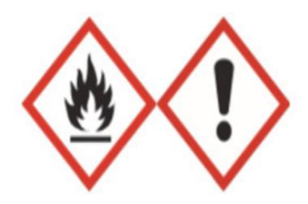

신호어

경고

#### 유해/위험 문구

H226 - 인화성 액체 및 증기 H319 - 눈에 심한 자극을 일으킴 H332 - 흡입하면 유해함 H335 - 호흡기 자극을 일으킬 수 있음 예방조치문구 예방 P210 - 열, 고온 표면, 스파크, 노출된 불꽃 및 기타 점화원으로 부터 멀리할 것. 금연 P233 - 용기를 단단히 밀폐하시오 P240 - 용기와 수용설비를 접지하시오 P241 - 폭발 방지용 전기/환기/조명/장비를 사용하시오 P242 - 스파크가 발생하지 않는 도구를 사용하시오 P243 - 정전기 방지 조치를 취하시오 P280 - 보호장갑/보호의/보안경/안면보호구를(을) 착용하시오 P261 - 분진/흄/가스/미스트/증기/스프레이의 흡입을 피하시오 P271 - 옥외 또는 환기가 잘 되는 곳에서만 취급하시오 P264 - 취급 후에는 얼굴과 손을 철저히 씻으시오 대응 P303 + P361 + P353 - 피부(또는 머리카락)에 묻으면 오염된 모든 의복은 벗으시오. 피부를 물로 씻으시오/샤워하시오 P370 + P378 - 화재 시: 불을 끄기 위해 건조모래, 건조화학제 또는 내알코올성 포말을 사용하시오 P304 + P340 - 흡입하면 신선한 공기가 있는 곳으로 옮기고 호흡하기 쉬운 자세로 안정을 취하시오 P312 - 불편함을 느끼면 의료기관/ 의사 의 진찰을 받으시오 P305 + P351 + P338 - 눈에 묻으면: 몇 분간 물로 조심해서 씻으시오. 가능하면 콘택트렌즈를 제거하시오. 계속 씻으시오 P337 + P313 - 눈에 자극이 지속되면: 의학적인 조치/조언을 받으시오 저장 P403 + P235 - 환기가 잘 되는 곳에 보관하시오. 저온으로 유지하시오 P403 + P233 - 환기가 잘 되는 곳에 보관하시오. 용기를 단단히 밀폐하시오 P405 - 잠금장치를 하여 저장하시오 폐기 P501 - (관련 법규에 명시된 내용에 따라) 내용물과 용기를 폐기하시오

#### 기타 유해성·위험성

Reacts with water and forms Ethanol (CAS: 64-17-5) 본 제품에는 내분비계 교란 물질로 알려지거나 의심되는 물질이 포함되어 있지 않음

#### NFPA\_

| 건강 | 인화성 | 불안정 | 물리적 위험성 |  |
|----|-----|-----|---------|--|
| 2  | 3   | 1   | N/A     |  |

| NCS학습모듈 개발이력 |                                      |     |                  |
|--------------|--------------------------------------|-----|------------------|
| 발행일          | 2024년 12월 31일                        |     |                  |
| 세분류명         | 반도체 재료(19030604)                     |     |                  |
| 개발기관         | 수원과학대학교 산학협력단(개발책임자: 김선희), 한국직업능력연구원 |     |                  |
|              | 최준혁(수원대학교)*                          |     | 김강복(삼성전자)        |
|              | 김대영(오산대학교)                           |     | 김한수(두원공대)        |
|              | 김영수(디이엔티)                            |     | 남승호(경기대학교)       |
|              | 김준성(오산대학교)                           |     | 손승대(제이에스이엔씨(주))  |
| 집필진          | 김현후(두원공대)                            | 검토진 | 이철오((주)한국전력안전공단) |
|              | 임희용(전 부천대학교)                         |     |                  |

\*표시는 대표집필자임 (참고) 검토진으로 참여한 집필진은 본인의 원고가 아닌 타인의 학습모듈을 검토함

| 반도체용 CMP 슬러리 재료 제조(LM1903060426_23v3)                                                                    |                   |
|----------------------------------------------------------------------------------------------------------|-------------------|
| 저작권자                                                                                                     | 교육부               |
| 연구기관                                                                                                     | 한국직업능력연구원         |
| 발행일                                                                                                      | 2024. 12. 31.     |
| ISBN                                                                                                     | 979-11-7175-780-0 |
| ※ 이 학습모듈은 자격기본법 시행령(제8조 국가직무능력표준의 활용)에 의거하여 개발하였으며, NCS통합포털사이트(http://www.ncs.go.kr)에서 다운로드 할 수 있습니다. |                   |

