# 02 반도체용 리소그래피 재료 제조

LM1903060402\_14v1

# 반도체재료 학습모듈

#### 01. 반도체용 웨이퍼 재료 제조

O5. 반도체용 습식화공약품(Wet Chemical)재료 제조

BROWN REPORT REPORT

U5 반도체용 습식화공약품 (Wet Chemical)재료 제조

9

02. 반도체용 리소그래피 재료 제조

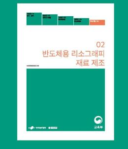

**03.** 반도체용 가스 재료 제조

**07**. 반도체용 나노 소재 제조

A BOOM MANY AND AND AND AND AND AND AND AND AND AND

07 반도체용 나노 소재 제조

9

#### 04. 반도체용 금속(Target)재료 제조

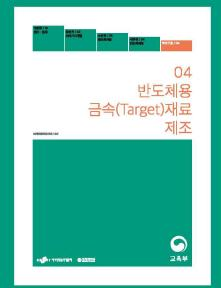

#### **08**. 반도체 재료 개발

06. 반도체용 패키지 재료 제조

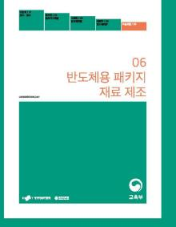

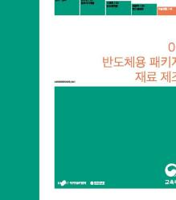

10. 반도체 재료 품질관리

**09.** 반도체 재료 생산

11. 반도체 재료 안전관리

# NCS 학습모듈의 이해

\*\* 본 하습모듈은 「NCS 국가직무능력표준」사이트(http://www.ncs.go.kr) 에서 확인 및 다운로드 할 수 있습니다.

#### (1) NCS 학습모듈이란?

- 국가직무능력표준(NCS: National Competency Standards)이란 산업현장에서 직무를 수행하기 위해 요구되는 지식·기술·소양 등의 내용을 국가가 산업부문별·수준별로 체계화한 것으로 산업현장의 직무를 성공적으로 수행하기 위해 필요한 능력(지식, 기술, 태도)을 국가적 차원에서 표준화한 것을 의미합니다.
- 국가직무능력표준(이하 NCS)이 현장의 '직무 요구서'라고 한다면, NCS 학습모듈은 NCS의 능력단위를 교육훈련에서 학습할 수 있도록 구성한 '교수·학습 자료'입니다. NCS 학습모듈은 구체적 직무를 학습할 수 있도록 이론 및 실습과 관련된 내용을 상세하게 제시하고 있습니다.

#### ● NCS 학습모듈은 다음과 같은 특징을 가지고 있습니다.

첫째, NCS 학습모듈은 산업계에서 요구하는 직무능력을 교육훈련 현장에 활용할 수 있도록 성취목표와 학습의 방향을 명확히 제시하는 가이드라인의 역할을 합니다. 둘째, NCS 학습모듈은 특성화고, 마이스터고, 전문대학, 4년제 대학교의 교육기관 및 훈련기관,

직장교육기관 등에서 표준교재로 활용할 수 있으며 교육과정 개편 시에도 유용하게 참고할 수 있습니다.

● NCS와 NCS 학습모듈 간의 연결 체제를 살펴보면 아래 그림과 같습니다.

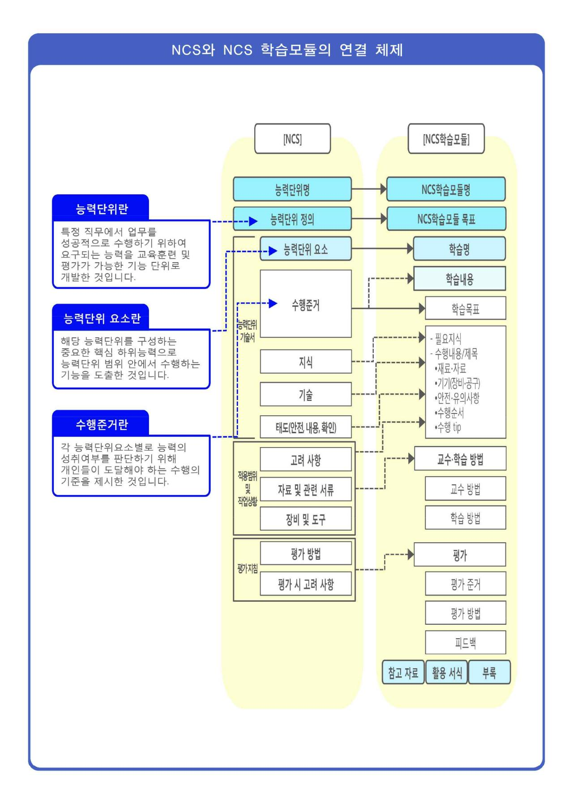

## (2) NCS 학습모듈의 체계

● NCS 학습모듈은 1.학습모듈의 위치 , 2.학습모듈의 개요 , 3.학습모듈의 내용 체계 , 4.참고 자료 ,
 5.활용 서식/부록 으로 구성되어 있습니다.

#### 1. NCS 학습모듈의 위치

NCS 학습모듈의 위치는 NCS 분류 체계에서 해당 학습모듈이 어디에 위치하는지를 한 눈에
 볼 수 있도록 그림으로 제시한 것입니다.

예시 : 이 · 미용 서비스 분야 중 네일미용 세분류

NCS-학습모듈의 위치

| 대분류 | 이용 · 숙박 · 여행 · 오락 · 스포츠 |         |  |
|-----|-------------------------|---------|--|
| 중분류 | 이・미용                    |         |  |
| 소분류 |                         | 이미용 서비스 |  |

| 세 <del>분류</del> |             |           |
|-----------------|-------------|-----------|
| 헤어미용            | 능력단위        | 학습모듈명     |
| 피부미용            | 네일 샵 위생 서비스 | 네일숍 위생서비스 |
| 메이크업            | 네일 화장물 제거   | 네일 화장물 제거 |
| 네일미용            | 네일 기본 관리    | 네일 기본관리   |
| 이용              | 네일 랩        | 네일 랩      |
|                 | 네일 팁        | 네일 팁      |
|                 | 젤 네일        | 젤 네일      |
|                 | 아크릴릭 네일     | 아크릴 네일    |
|                 | 평면 네일아트     | 평면 네일아트   |
|                 | 융합 네일아트     | 융합 네일아트   |
|                 | 네일 샵 운영관리   | 네일숍 운영관리  |

| 학습모듈은                                                                                                                                                       |  |
|-------------------------------------------------------------------------------------------------------------------------------------------------------------|--|
| NCS 능력단위 1개당 1개의 학습모듈 개발을 원칙으로 합니다. 그러나 필요에 따라 고용 단위 및 교과단위를 고려하여 능력단위 몇 개를 묶어서 1개의 학습모듈로 개발할 수 있으며, NCS 능력단위 1개를 여러 개의 학습 모듈로 나누어 개발할 수도 있습니다. |  |

#### 2. NCS 학습모듈의 개요

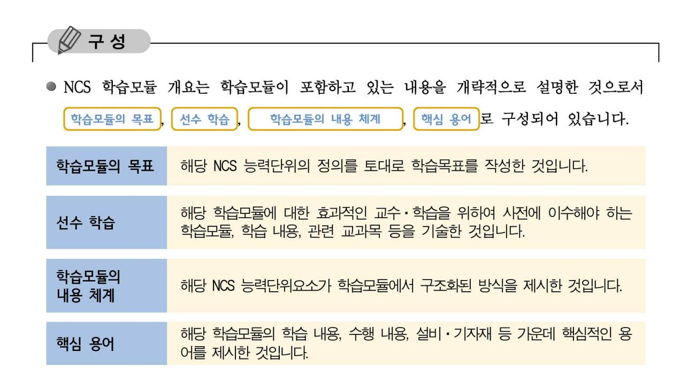

활용안내

예시 : 네일미용 세분류의 '네일 기본관리' 학습모듈

프리에지, 니퍼, 퓨셔, 폴리시, 네일 파일, 스퀘어형, 스퀘어 오프형, 라운드형, 오발형, 포인트형

#### 3. NCS 학습모듈의 내용 체계

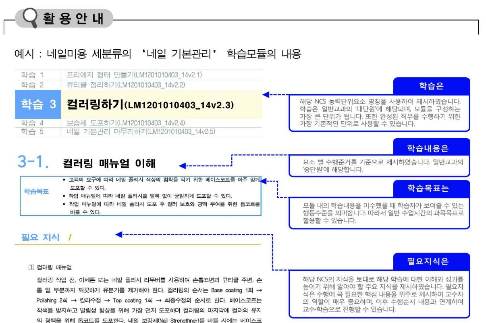

트를 도포하기 전에 사용한다.

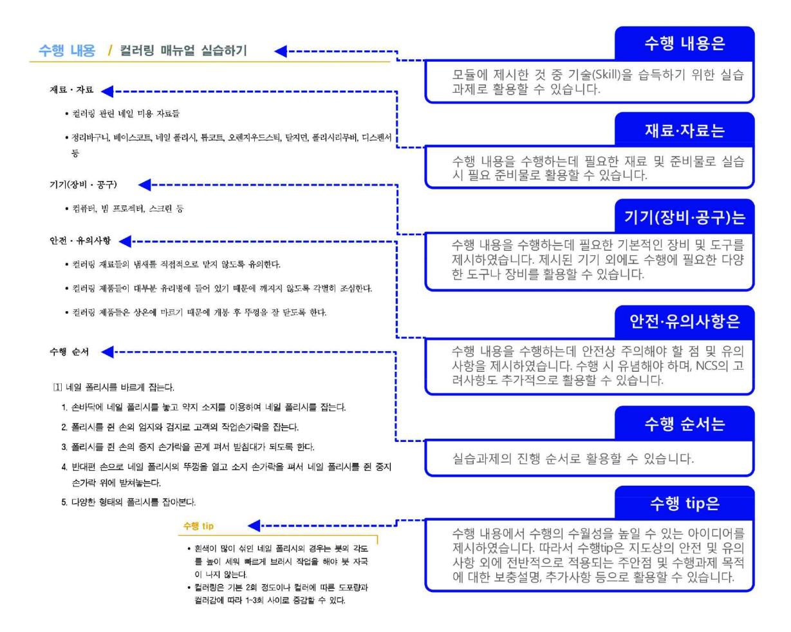

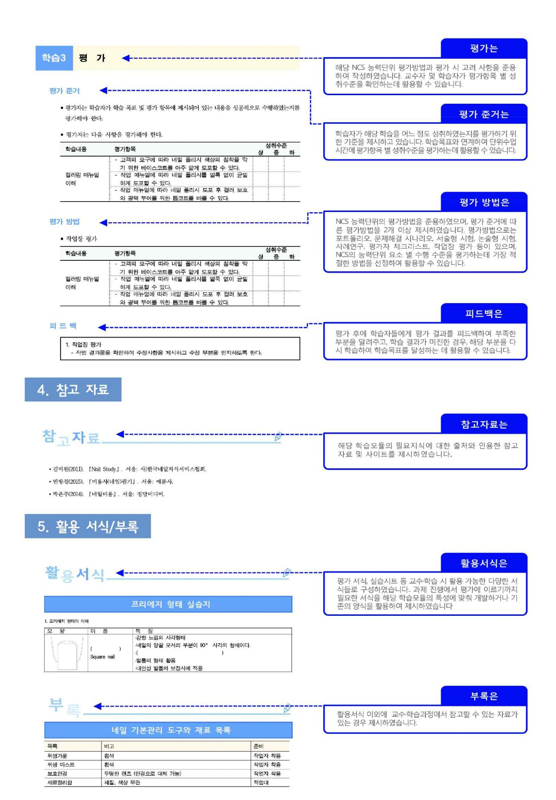

# [NCS-학습모듈의 위치]

| 대분류 | 전기・전자 |        |  |
|-----|-------|--------|--|
| 중분류 |       | 전자기기개발 |  |
| 소분류 |       | 반도체개발  |  |

| 14 | ы | 2            |
|----|---|--------------|
|    | ᅚ | $\mathbf{T}$ |

반도체개발

반도체장비

반도체재료

| 능력단위                              | 학습모듈명                             |
|-----------------------------------|-----------------------------------|
| 반도체용 웨이퍼 재료 제조                    | 반도체용 웨이퍼 재료 제조                    |
| 반도체용 리소그래피 재료 제조               | 반도체용 리소그래피 재료 제조               |
| 반도체용 가스 재료 제조                     | 반도체용 가스 재료 제조                     |
| 반도체용 금속(Target)재료 제조           | 반도체용 금속(Target)재료 제조           |
| 반도체용 습식화공약품(Wet Chemical)재료 제조 | 반도체용 습식화공약품(Wet Chemical)재료 제조 |
| 반도체용 패키지 재료 제조                    | 반도체용 패키지 재료 제조                    |
| 반도체용 나노 소재 제조                     | 반도체용 나노 소재 제조                     |
| 반도체용 재료 개발                        | 반도체용 재료 개발                        |
| 반도체용 재료 생산                        | 반도체용 재료 생산                        |
| 반도체용 재료 품질관리                      | 반도체용 재료 품질관리                      |
| 반도체용 재료 안전관리                      | 반도체용 재료 안전관리                      |

| 학습모듈의 개요                   | 1  |
|----------------------------|----|
| 학습 1. 반도체용 리소그래피 요구사항 파악하기 |    |
| 1-1. 리소그래피 공정 원리 및 재료 분석   | 3  |
| 1-2. 품질관리 문제점 분석 및 해결      | 19 |
| • 교수・학습 방법              | 27 |
| • 평가                    | 28 |
| 학습 2. 반도체용 리소그래피 재료 선정하기   |    |
| 2-1. 재료의 장점과 단점 분석         | 30 |
| 2-2. 재료의 문제점 분석 및 해결       | 38 |
| • 교수・학습 방법              | 47 |
| • 평가                    | 48 |
| 학습 3. 반도체용 리소그래피 재료 제조하기   |    |
| 3-1. 재료 제조 공정의 장점과 단점 분석   | 50 |
| 3-2. 제조 공정 파라미터 및 문제점 파악   | 56 |
| • 교수・학습 방법              | 69 |
| • 평가                    | 70 |
| 학습 4. 반도체용 리소그래피 제품특성 검증하기 |    |
| 4-1. 리소그래피 분석 및 시험 문제점 해결  | 72 |
| 4-2. 리소그래피 평가 및 검증 문제점 해결  | 78 |
| • 교수・학습 방법              | 84 |
| • 평가                    | 85 |

|   | 참고 자료 | 88 |
|---|-------|----|
|   | 활용 서식 | 89 |
| 부 | 록     | 90 |

# 반도체용 리소그래피 재료 제조 학습모듈의 개요

#### 학습모듈의 목표

반도체 제조에 필요한 리소그래피 재료의 요구사항을 파악하고 선정하고, 제조 및 검증할 수 있다.

#### 선수학습

디스플레이 패터닝 공정개발(1903070105\_14v2), 디스플레이 생산공정 관리(1903070203\_14v2), 디 스플레이 생산기술관리(1903070204\_14v1), 반도체 공정, 반도체 장비기술

## 학습모듈의 내용체계

| 학습                         | 치스 내요                                                                                    | NCS 능력단위 요소       |                         |
|----------------------------|------------------------------------------------------------------------------------------|-------------------|-------------------------|
| 역답                         | 학습 내용                                                                                    | 코드번호              | 요소 명칭                   |
| 1. 반도체용 리소그래피 요구사항 파악하기 | 1-1. 리소그래피 공정 원리 및 재료 분석 1-2. 품질관리 문제점 분석 및 해결                                  | 1903060402_14v1.1 | 반도체용 리소그래피 요구사항 파악하기 |
| 2. 반도체용 리소그래피 재료 선정하기   | 2-1. 재료의 장점과 단점 분석 2-2. 재료의 문제점 분석 및 해결                                            | 1903060402_14v1.2 | 반도체용 리소그래피 재료 선정하기   |
| 3. 반도체용 리소그래피 재료 제조하기   | <ul> <li>3-1. 재료 제조 공정의 장점과 단점 분석</li> <li>3-2. 제조 공정 파라미터 및 문제점 파악</li> </ul>   | 1903060402_14v1.3 | 반도체용 리소그래피 재료 제조하기   |
| 4. 반도체용 리소그래피 제품특성 검증하기 | <ul> <li>4-1. 리소그래피 분석 및 시험 문제점 해결</li> <li>4-2. 리소그래피 평가 및 검증 문제점 해결</li> </ul> | 1903060402_14v1.4 | 반도체용 리소그래피 제품특성 검증하기 |

#### 핵심 용어

반도체용 리소그래피 공정, 반도체용 리소그래피 재료, 리소그래피 재료 선정

| 학습 1 | 반도체용 리소그래피 요구사항 파악하기(LM1903060402_14v1.1)  |
|------|-----------------------------------------------|
| 학습 2 | 반도체용 리소그래피 재료 선정하기 (LM1903060402_14v1.2)   |
| 학습 3 | 반도체용 리소그래피 재료 제조하기 (LM1903060402_14v1.3)   |
| 학습 4 | 반도체용 리소그래피 제품특성 검증하기 (LM1903060402_14v1.4) |

# **1-1.** 리소그래피 공정 원리 및 재료 분석

| 학습 목표 | • 최종 제품의 생산에 필요한 리소그래피 공정을 파악할 수 있다. |
|-------|-----------------------------------------|
|       | • 고객의 요구사항에 의한 리소그래피 재료를 파악할 수 있다.   |

# 필요 지식 /

개요

리소그래피 공정 원리를 이해하고, 각 공정별 특징을 알아야 한다.

1. 반도체용 리소그래피 공정

반도체 공정 과정에서는 포토리소그래피(Photolithography)는 원하는 회로설계를 유리판 위 에 금속패턴으로 만들어 놓은 마스크(mask)라는 원판에 빛을 쬐어 생기는 그림자를 웨이 퍼 상에 전사시켜 복사하는 기술이며, 반도체의 제조 공정에서 설계된 패턴을 웨이퍼 상 에 형성하는 가장 중요한 공정이다.

(1) Vapor prime or 밀착향상제(HMDS) 도포 공정

회전하는 웨이퍼에 밀착향상제(HMDS, 헥사메틸디실라잔)를 도포하는 공정으로 작업 시 휘발성을 가지고 있어 노출에 주의하여야 한다. HMDS(Hexa Methyl Di Siliazane, Si2(CH3)6)는 웨이퍼나 유리 표면을 소수성으로 바꾸어주기 위해 사용한다. PR은 유 기용매 액으로 쉽게 기름과 같아 웨이퍼나 유리 표면은 쉽게 PR이 잘 붙지 않을 수 있다. 그래서 결국 HMDS는 PR과 기판의 접착력을 향상시켜주는 물질로 기판에 도포되면 PR이 기판에 도포도 잘되고 접착도 잘되는 것이다.

(2) Spin Coat or 감광제(PR) 도포 공정

반도체 웨이퍼에 감광 성질을 가지고 있는 PR을 도포 하는 공정으로 작업 시 유기용

제이기 때문에 노출에 주의하여야 한다. Spin Coating은 아주 오랫동안 박막 필름에 는 스핀 코팅이 사용되어 왔다. 이 공정에서는 보통 소량의 액체 수지를 기판의 중 앙에 증착시킨 다음 고속(약 3000 rpm)으로 기판을 회전시키는 방법을 사용한다. 구 심성 가속으로 얇은 수지가 표면에 코팅된다. 필름 두께와 특성은 수지의 속성(점 성, 건조율, 응고율, 표면 장력 등)과 공정에 매개변수에 따라 달라진다. 스핀 속도, 가속 및 가스 배출 등이 필름의 특성을 영향을 미친다. 스핀 코팅에서 중요한 요인은 반복성이다. 스핀 공정의 매개변수는 작은 변이가 코팅

된 필름에 영향을 줄 수 있다.

(3) Soft Bake 공정

반도체 웨이퍼에 PR을 도포하고 나서 115℃로 굽는 공정으로 작업 시 유기용제이기 때문에 노출에 주의하여야 한다.

(4) Alignment(정렬) and Exposure(노광) 공정

Mask의 이미지를 반도체 웨이퍼에 옮기기 위해 상호 정확한 위치에 맞추는 공정과 정 렬이 끝나면 Mask의 상이 반도체 웨이퍼에 옮겨지도록 자외선에 PR을 노출시키는 고 정을 말하며 정렬과 노광을 동시 작업으로 진행한다.

(5) Post-Exposure bake 공정

감광제(PR)가 도포된 반도체 웨이퍼를 Alignment(정렬)하고 Exposure(노광)된 웨이퍼를 110℃로 굽는 공정으로 작업 시 노출에 주의하여야 한다.

(6) Develop 공정

웨이퍼에 감광제(PR)로 도포하고 정렬 및 노광 후 현상액을 이용하여 필요한 곳과 필 요 없는 부분을 구분하여 상을 형성하기 위해 PR을 제거하는 공정으로 작업 시 노출 에 주의하여야 한다.

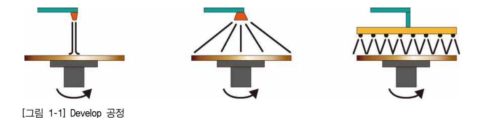

(7) Hard bake 공정

Develop 공정이 진행된 반도체 웨이퍼를 130 ~ 140℃에 Bake Oven에 굽는 공정으로 작업 시 노출에 주의하여야 한다.

#### (8) Develop inspect 공정

웨이퍼에 감광제(PR)로 도포하고 정렬 및 노광 후 현상액을 이용하여 필요한 곳과 필 요 없는 부분을 구분하여 상을 형성된 것을 정확하게 되어있는지를 검사는 작업이다.

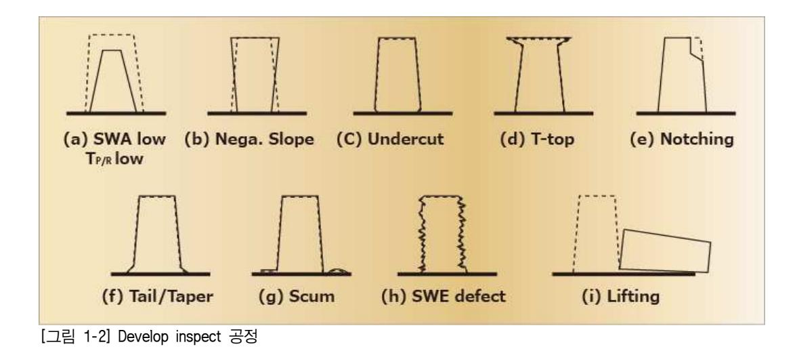

#### 반도체용 리소그래피 공정의 원리 및 분류

1. 반도체용 리소그래피 원리

리소그래피는 반도체 공정에서 집적회로로 사용되는 실리콘 웨이퍼에 감광제(PR)을 이용 하여 패턴을 형성하는 공정을 의미한다. 아래에서 보는 것처럼 [그림 1-3]은 리소그래피의 과정을 간략하게 표현한 것으로 [그림 1-3]은 마스크(mask)에 설계된 회로들을 광원을 이 용하여 웨이퍼에 전달하는 공정으로 마스크(mask)는 크롬(chromium)으로 증착한 석영기판 (quartz plate)으로 전달하여 설계된 회로들의 패턴들 원형을 웨이퍼 표면에 나타내는 것 이다. 여기서 렌즈를 통과한 빛이 웨이퍼에 도달할 때, 원하는 패턴(pattern)을 만들어지기 때문에, 마스크(mask)를 렌즈의 광학적 특성을 기반으로 정확한 계산을 하여 설계하여야 한다. [그림 1-4]부터 [그림 1-7]까지 다양한 예시들을 확인 할 수 있다.

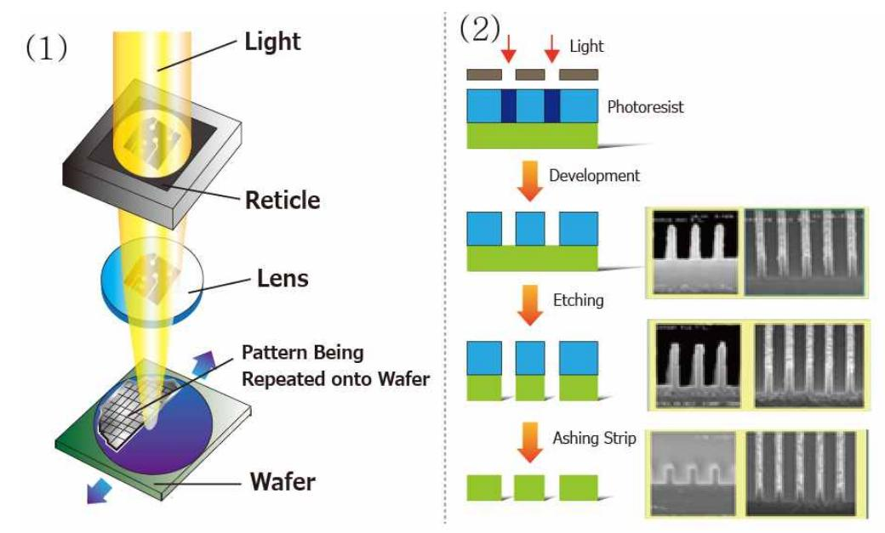

[그림 1-3] 리소그래피 원리 (1) 패터닝 공정 (2) 감광제 원리

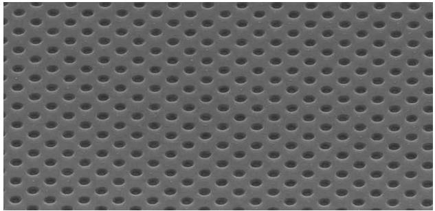

[그림 1-4] 리소그래피 원 패턴의 예시

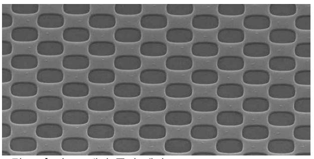

[그림 1-5] 리소그래피 공정 예시

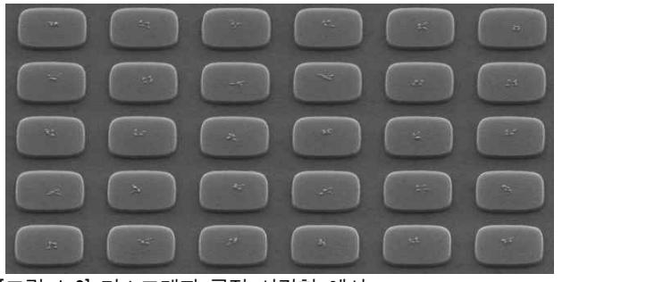

[그림 1-6] 리소그래피 공정 사각형 예시

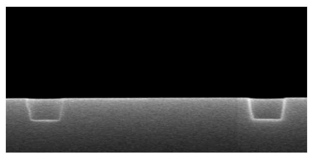

[그림 1-7] 리소그래피 공정 진행 후 식각 후 단면 예시

2. 반도체용 리소그래피 종류

반도체용 리소그래피 공정은 웨이퍼에 빛이 도달하게 되면 웨이퍼 표면에 미리 코팅한 감 광제(PR)에 화학적인 변화를 일으키게 되는데, PR의 성질에 따라 아래와 같이 두 가지 형 태로 나뉠 수 있다.

(1) Negative PR 공정

반도체 웨이퍼에 감광 성질을 가지고 있는 감광제(PR)를 도포된 곳에 패턴이 형성이 되는 형태가 빛을 받지 않는 부분이 현상 시에 제거되는 감광제(PR)을 의미한다. 작업 시 유기용제이기 때문에 노출에 주의하여야 한다.

(2) Positive PR 공정

반도체 웨이퍼에 감광 성질을 가지고 있는 감광제(PR)를 도포된 곳에 패턴이 형성되는 형태가 빛을 받은 부분이 현상 시에 제거되는 PR을 의미한다. 작업 시 유기용제이기 때문에 노출에 주의하여야 한다.

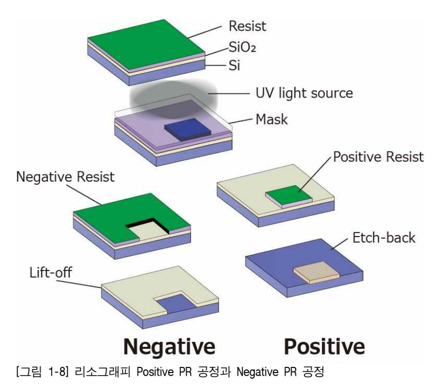

#### 반도체용 리소그래피 재료

1. 반도체용 리소그래피 재료

리소그래피 감광제 재료는 광과 전자선에 의해 반응하는 고분자 화합물로써 반도체용 리 소그래피 공정에 의한 미세가공은 PR의 광반응에 의한 결과와 고분자 극성 변화, 연결고 리 반응에 의한 용제, 특히 알칼리수용액에 대한 용해성의 변화를 이용한다.

- (1) 광화학 반응에 따른 감광제의 구분
  - (가) Photo-Active Compound (PAC) 형 감광제:

[그림 1-9]의 (a)와 같이 빛에 의해 그 화학물질 자체에 구조적인 변화가 일어나 특 정 용매에 대한 용해성이 달라지는 것이다. Positive PR에 사용되며, 빛을 받기 전 에는 알칼리 수용액(Aqueous Alkaline Solution)에 녹지 않다가 빛을 받고 나면 그 구조가 변해 수용액에 녹게 되는 것이다. 이러한 PR은 G-line (436nm) 및 I-line (365nm)의 저해상도에 많이 사용된다.

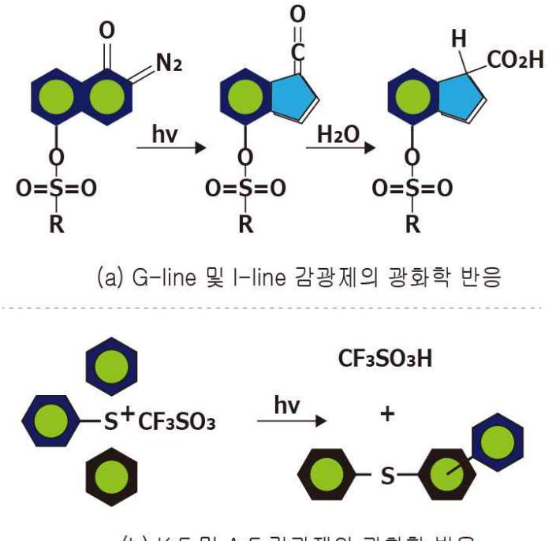

[그림 1-9] 감광제의 광화학 반응

#### (나) 화학 증폭형 감광제 (Chemically Amplified Photoresist)

[그림 1-9]의 (b)와 같은 광화학 반응이 일어나면 PR에서는 화학적인 반응 촉매가 일어난다. 이러한 반응으로 고분자의 용해성이 바뀌게 되어 특정한 용매에 용해되 므로 패턴이 형성된다. [그림 1-9]의 (b)와 파장과 같이 짧은 KrF (248nm)나 ArF (193nm)의 광원을 쓰는 PR에 널리 사용된다.

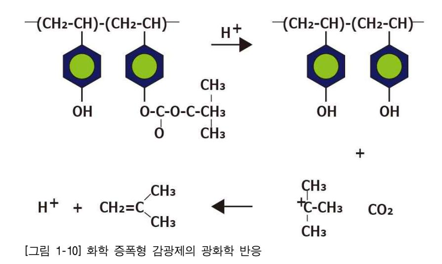

(2) 패턴 형성에 따른 감광제의 구분

Negative 형 감광제는 빛을 받으면 가교 반응이나 기능성기 (Functional Group)에 변화 가 일어나 현상액에 녹지 않게 되어 포토마스크로부터 전달된 패턴을 형성한다. [그림 1-11] 거의 모든 Negative형 PR이 Film 형성을 위한 Binder polymer와 가교제, 광활성 제 등을 조합하여 제조된다. 가교 반응을 이용한 Negative PR이 대부분이며 가교된 film의 특성상의 식각성이 좋고 PR 패턴 너비가 아래보다 윗부분이 큰 모양을 형성하 여 반도체의 Metal Lift-Off 공정 등에 널리 사용되고 있다.

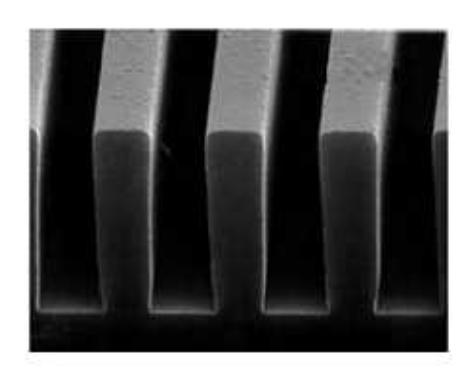

[그림 1-11] Negative 감광제의 패턴 모양

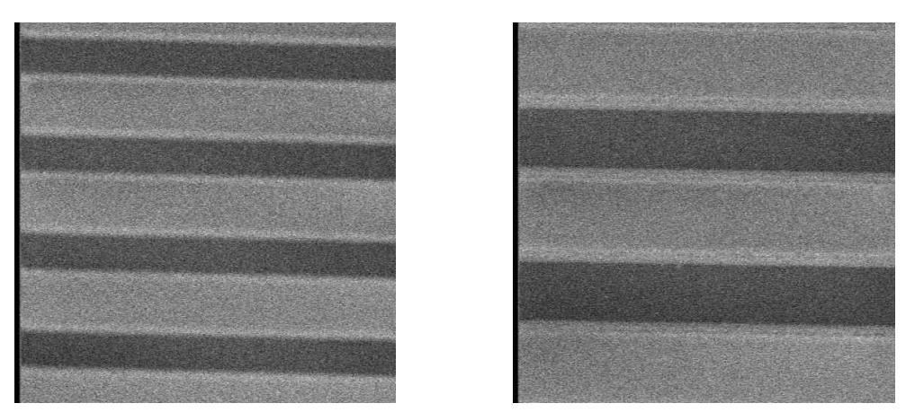

[그림 1-12] Negative 감광제의 사용후 CD-SEM

Positive 형 PR은 빛을 받은 부분이 [그림 1-13]에서와 언급한 광화학 반응을 일으켜 현상액에 잘 용해되는 구조로 현상액 처리를 하면 노광 된 부분이 녹아 패턴을 형성 하는 것이다. 현재 많이 사용되는 PR이며, ArF 공정을 사용하는 경우, 45nm 혹은 그 보다 더 작은 패턴의 형성도 가능하다.

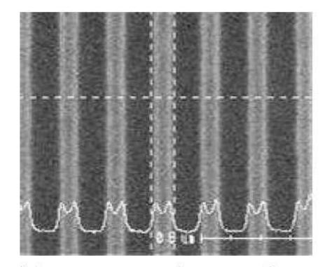

[그림 1-13] Positive 감광제의 패턴 모양

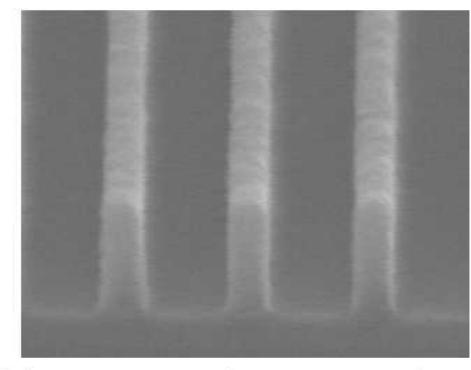

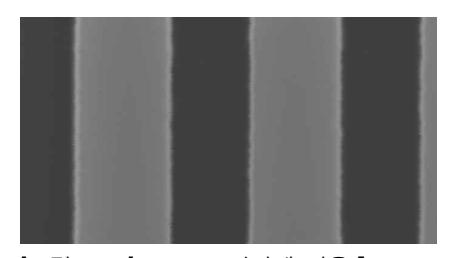

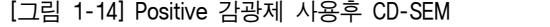

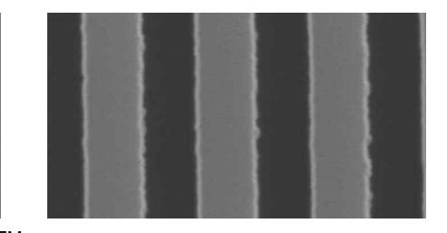

(3) 광원의 파장에 따른 감광제의 구분

감광제를 분류하는 다른 방법은 PR이 감응하는 빛의 파장을 이용하는 것이다. PR패턴 의 해상도는 사용하는 빛의 파장에 반비례하고 빛의 파장이 짧을수록 해상도는 좋다. 반도체의 집적도가 높아지면서 회로 구성을 위한 패턴 크기는 작아져야 하므로 리소

그래피 공정에 사용하는 빛의 파장도 436nm에서 193nm까지 계속 짧아지고 있다. 이에 따라 PR도 바뀐 빛의 파장에서 최고의 감도를 가질 수 있도록 변화되었다.

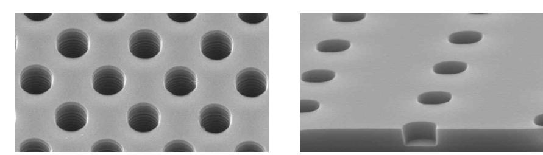

[그림 1-15] 감광제 사용 후 진행된 공정 모습

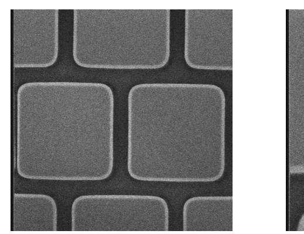

[그림 1-16] 감광제 사용 후 CD-SEM

G-line 감광제는 436nm의 빛의 파장에 감응하여 광화학적 반응을 일으켜 패턴을 형성하는 종류로 500nm의 해상력을 갖는다.

(나) I-line 감광제:

365nm의 빛에 의해 300nm의 해상력을 갖는 감광제이다. G-line 감광제와 같은 고 분자를 사용하나, 감광제는 365nm의 빛에 가장 높은 양자 효율을 가질 수 있도록 구조를 변경하여 사용한다.

(다) KrF 감광제:

I-line까지는 고압 수은등을 사용하여 수은등에서 발생하는 빛을 광학 필터로 걸러 436nm 또는 365nm의 빛을 감광제 패터닝에 이용했으나, I-line보다 더 높은 해상도 가 요구되면서 KrF 레이저를 이용한 새로운 광원이 개발되었고, 그 광원 248nm에 고감도를 갖는 새로운 감광제가 개발되었다.

특히 KrF PR부터는 화학증폭형 PR이 본격적으로 사용되기 시작하였다. 이 PR은 약 100nm의 해상도를 갖는다. ArF PR: KrF 광원으로도 불가능한 고해상도의 패턴 을 만들기 위해 적용된 광원으로 ArF 레이저를 사용하기 시작하였는데 그 레이저

의 파장인 193nm에서 높은 감도를 갖는 PR이다. 현재 기준으로 가장 높은 해상도 의 패턴이 가능하여 55nm의 해상도를 보인다. 최근에는 렌즈와 PR 사이에 공기보 다 굴절률이 높은 물을 채워 노광하는 액침 기술이 도입되어 ArF 광원을 이용한 해상도는 45nm 또는 그 이상이 될 것으로 전망되고 있다.

#### (라) EUV 감광제:

ArF 광원으로 구현할 수 있는 최소 선폭 (해상도)를 45nm 또는 32nm로 전망하고 있는데, 그 이하의 패턴을 구현하기 위해서는 광원의 파장을 바꿔야 한다. 가능한 광원으로 EUV (Extreme UV, 극자외선)이 유력하며, EUV 감광제는 EUV의 파장인 13.4nm의 빛에 감응하여 광화학적 반응을 일으킬 수 있는 화합물로 구성되어 있다.

## 수행 내용 / 리소그래피 공정 원리 및 재료 분석하기

#### 재료·자료

- Ÿ ASTM, ISO, JIS, SEMI, KS 표준화 문서
- Ÿ ITRS 로드맵 (International Technology Roadmap for Semiconductor)
- Ÿ 반도체 로드맵
- Ÿ 반도체 제조 공정도
- Ÿ 반도체 기술/시장/표준 동향 분석서
- Ÿ MSDS, RoHS, WEEE (Waste Electrical and Electronic Equipment)
- Ÿ 시험성적서
- Ÿ 리소그래피 재료
  - Immersion Photo Resist, Top Coat, BARC, Relacs/SAFIER, ArF Photo Resist, SOC, Developer
  - KrF Photo Resist, MFHM, Thinner, I-line Photo Resist, SOD

#### 기기(장비 ・ 공구)

- Ÿ 제조 공정 장비
  - 유기, 무기 합성 Pilot 설비
  - PR류 Mixing Vessel
  - 중합체 합성 Pilot 설비
  - 제조공정 이상 발생 Monitoring 설비
  - Bottle Cleaning 설비
  - 원자재 저장 창고
  - Bottle Filling 설비
- Ÿ 평가, 분석 및 계측장비
  - Arf Scanner, Elipsometer, GC
  - I-line Stepper, Microscope, HPLC
  - Track, ICP-MS,nmR
  - CD-SEM, Bath(VB-10), Viscometer(BF), FT-IR
  - Dynamic Contact Angle, Refractometer, UV
  - Coating Defect Inspection, Coulometric Titrator(831), GPC
  - Air particle counter, Automatic Titrator(DL50), DSC/TGA
  - Amine 농도 측정기, Moisture Analyzer, 전기적 특성 측정기
  - Furnace, Liquid particle counter
- Ÿ 제조공장 인트라넷
- Ÿ 안전도구, 안전화, 안전모, 마스크, 장갑, 고글, 방진복
- Ÿ 컴퓨터, 프린터, 복사기

#### 안전 ・ 유의 사항

- Ÿ 제조 공정 장비란 제품을 제조하기 위한 장비로서 규정에 따라 관리되어야 하며, 일정 주기와 방법에 따라 장비 성능이 평가되어야 한다.
- Ÿ 평가/분석/계측기란 제품의 물성이나 특성을 평가하는 검사를 실시하는 장비로서 규정에 따라 관리되어야 하며 일정 주기와 방법에 따라 검, 교정을 실시하는 장비를 의미한다.
- Ÿ 작업표준에는 공정순서 및 조건(온도, 시간, 환경)을 포함한다.
- Ÿ작업 절차서는 생산을 끝마치기까지의 절차, 순서를 체계적으로 작성한 생산행위의 계획서로서, 생산을 바르게 실시할 목적으로 생산을 위한 절차와 생산에 사용하는 재료, 장치의 준비 및 사용방법, 그리고 생산을 실시하는데 필요한 주의사항을 나타내는 문서이다.
- Ÿ CoA (Certificate of Analysis)는 가스의 순도 및 불순물 등 해당 제품의 품질 및 Specification을 나타낸다.

#### 수행 순서

반도체용 리소그래피 공정을 정확하게 파악한다.

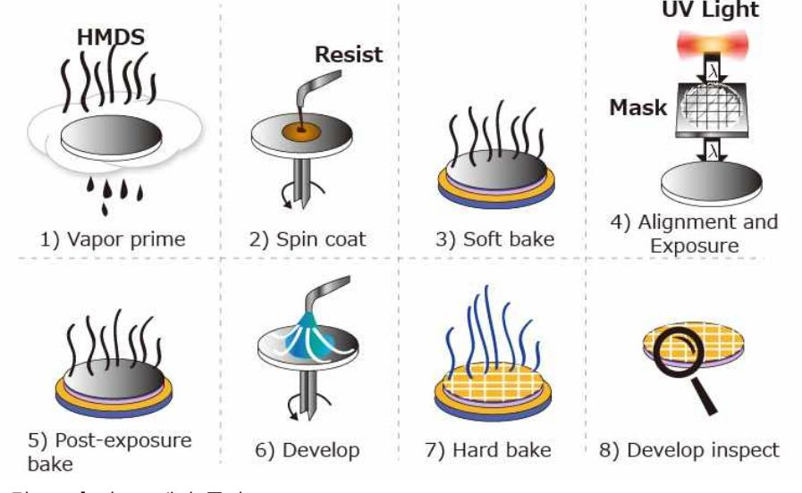

[그림 1-17] 리소그래피 공정

1. Vapor prime or 밀착향상제(HMDS) 도포 공정

회전하는 웨이퍼에 HMDS를 도포하는 공정으로 작업 시 휘발성을 가지고 있어 노출에 주 의하여야 한다.

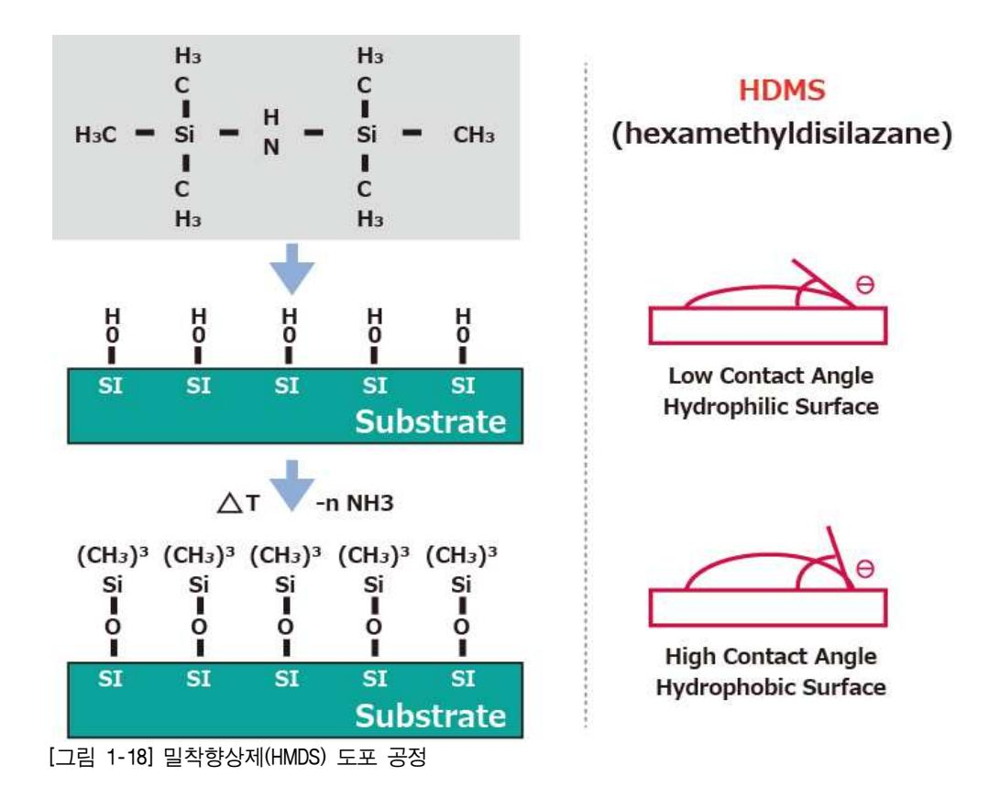

2. Spin Coat or 감광제(PR) 도포 공정

웨이퍼에 감광 성질을 가지고 있는 감광제(PR)를 도포 하는 공정으로 작업 시 유기용제이 기 때문에 노출에 주의하여야 한다.

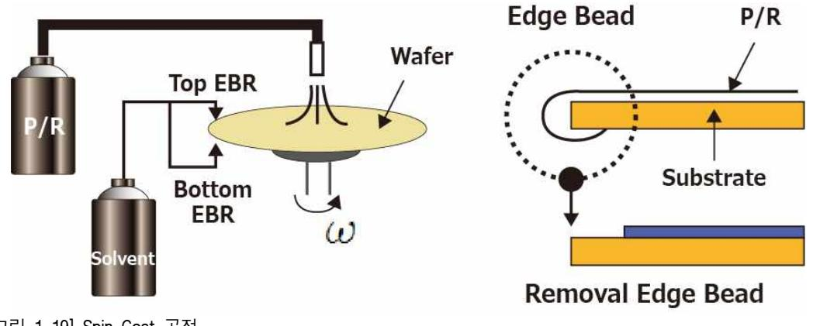

- [그림 1-19] Spin Coat 공정
- 3. Soft Bake 공정

웨이퍼에 감광제(PR)를 도포하고 나서 115℃로 굽는 공정으로 작업 시 유기용제이기 때문 에 노출에 주의하여야 한다.

#### 4. Alignment(정렬) and Exposure(노광) 공정

Mask의 이미지를 웨이퍼에 옮기기 위해 상호 정확한 위치에 맞추는 공정과 정렬이 끝나 면 Mask의 상이 웨이퍼에 옮겨지도록 자외선에 감광제(PR)를 노출시키는 고정을 말하며 정렬과 노광을 동시 작업으로 진행한다. 노광 장비가 웨이퍼에 형성된 Layer의 Alignment Mark를 사용해 웨이퍼 칩 맵을 노광 장비의 Alignment 통해 얻은 정보로 칩 Pitch, Flat zone에 위치 등을 인식해 웨이퍼 맵과 Overlap 되도록 현재 Layer를 노광하는 것이다.

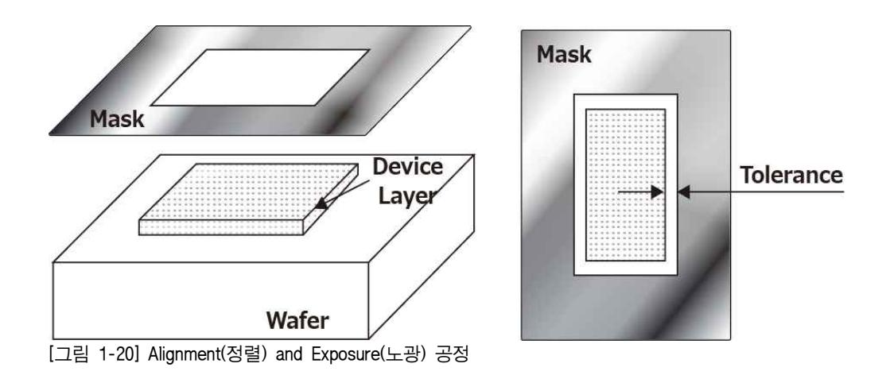

5. Post-Exposure bake 공정

감광제(PR)가 도포된 웨이퍼를 정렬하고 노광 된 웨이퍼를 110℃로 굽는 공정으로 작업 시 노출에 주의하여야 한다. 이는 다음 과정에서 PR의 저항성을 높여주고 PR에 손상을 줄 수 있는 경우, PR에 손상을 되어 역할을 다 못하는 경우와 같은 원치 않는 효과를 감 소시키기 위해, 적정한 온도에서 열처리하는 것이다. 즉 soft bake 과정에서 제거되지 못 한 solvent를 완전히 제거해 주는 과정이다. 6. Develop 공정

웨이퍼에 PR로 도포하고 정렬 및 노광 후 현상액을 이용하여 필요한 곳과 필요 없는 부 분을 형성하기 위해 PR을 제거하는 공정으로 작업 시 노출에 주의하여야 한다. 식각되어 야 할 부분에 존재하는 감광막 제거를 위해 Spray법으로 공정을 진행하는 것이다. 7. Hard bake 공정

Develop 공정이 진행된 웨이퍼를 130 ~ 140℃에 Bake Oven에 굽는 공정으로 작업 시 노 출에 주의하여야 한다.

8. Develop inspect 공정

반도체 웨이퍼에 PR로 도포하고 정렬 및 노광 후 현상액을 이용하여 필요한 곳과 필요 없는 부분의 형성이 정확하게 되어있는지를 검사는 작업이다.

반도체용 리소그래피 공정의 원리 및 분류를 정확하게 파악한다.

1. 반도체용 리소그래피 원리

리소그래피는 반도체 공정에서 집적회로로 사용되는 실리콘 웨이퍼에 PR을 이용하여 패 턴을 형성하는 공정을 의미한다. 2. 반도체용 리소그래피 종류

반도체용 리소그래피 공정은 웨이퍼에 빛이 도달하게 되면 웨이퍼 표면에 미리 코팅한 감 광제(PR)에 화학적인 변화를 일으키게 되는데, PR의 성질에 따라 아래와 같이 두 가지 형 태로 나뉠 수 있다.

(1) Negative PR 공정

반도체 웨이퍼에 감광 성질을 가지고 있는 PR을 도포된 곳에 패턴이 형성이 되는 형 태가 빛을 받지 않는 부분이 현상 시에 제거되는 PR을 의미한다. 작업 시 유기용제이 기 때문에 노출에 주의하여야 한다. 노광 된 영역은 가용성이 약하기 때문에 현상액 처리 시 PR의 패턴은 마스크와 반대로 형성된다.

(2) Positive PR 공정

반도체 웨이퍼에 감광 성질을 가지고 있는 PR을 도포된 곳에 패턴이 형성되는 형태가 빛을 받은 부분이 현상 시에 제거되는 PR을 의미한다. 작업 시 유기용제이기 때문에 노출에 주의하여야 한다. 노광 된 영역은 가용성이 강하여 현상액(develop) 처리 시 쉽 게 제거되어 마스크에 형성된 패턴과 PR에 형성된 패턴이 같아진다.

#### 반도체용 리소그래피 재료를 파악한다.

- 1. 반도체용 리소그래피 재료
  - (1) 광화학 반응에 따른 감광제의 구분

Photo-Active Compound (PAC) 형 감광제 빛에 의해 그 화학물질 자체에 구조적인 변 화가 일어나 특정 용매에 대한 용해성이 달라지는 것이다. Positive PR에 사용되며, 빛 을 받기 전에는 알칼리 수용액(Aqueous Alkaline Solution) 용액에 녹지 않다가 빛을 받 고 나면 그 구조가 변해 알칼리 수용액에 녹게 되는 것이다. 이러한 PR은 G-line (436nm) 및 I-line (365nm)의 저해상도 RP에 많이 사용된다.

(2) 패턴 형성에 따른 감광제의 구분

Negative PR은 빛을 받으면 가교 반응이나 기능성기 (Functional Group)에 변화가 일 어나 현상액에 녹지 않게 되어 포토마스크로부터 전달된 패턴을 형성한다.

(3) 광원의 파장에 따른 감광제의 구분 PR을 분류하는 다른 방법은 PR이 감응하는 빛의 파장을 이용하는 것이다. PR의 해상 도는 사용하는 빛의 파장에 반비례한다.

(가) G-line 감광제

G-line 감광제는 436nm의 빛의 파장에 감응하여 광화학적 반응을 일으켜 패턴을 형성하는 종류로 500nm의 해상력을 갖는다.

(나) I-line 감광제

365nm의 빛에 의해 300nm의 해상력을 갖는 PR이다. G-line 감광제와 같은 고분자 를 사용하나, 감광제는 365nm의 빛에 가장 높은 양자 효율을 가질 수 있도록 구조 를 변경하여 사용한다.

(다) KrF 감광제

I-line까지는 고압 수은등 (High pressure Hg lamp)를 사용하여 수은등에서 발생하 는 빛을 광학 필터로 걸러 436nm 또는 365nm의 빛을 PR 패터닝에 이용하여 왔으 나, I-line보다 더 높은 해상도가 요구되면서 크립톤-플루오라이드(Kr-F) 레이저를 이용한 새로운 광원이 개발되었고, 그 광원 (248nm)에 고감도를 갖는 새로운 PR이 개발되었다.

(라) EUV 감광제

ArF 광원으로 구현할 수 있는 최소 해상도를 45nm 또는 32nm (물보다 굴절률이 더 높은 액침용 액체를 사용하는 경우)로 전망하고 있는데, 그 이하의 패턴을 구현 하기 위해서는 광원의 파장을 바꿔야 한다. 가능한 광원으로 EUV (Extreme UV, 극 자외선)이 유력하며, EUV PR은 EUV의 파장인 13.4nm의 빛에 감응하여 광화학적 반응을 일으킬 수 있는 화합물로 구성되어 있다.

# **1-2.** 품질관리 문제점 분석 및 해결

학습 목표 • 품질관리를 위한 문제점을 파악할 수 있다.

# 필요 지식 /

개요

리소그래피 공정 원리를 이해하고, 공정에 쓰이는 리소그래피 공정용 재료의 중요한 특성 을 파악하고 그 기술을 이해해야 한다.

- 1. 감광제의 중요한 특성
  - (1) 해상력 (Resolution)

해상력이란 감광제(PR)가 얼마나 작은 크기의 패턴을 왜곡 없이 정확하게 구현해 낼 수 있는지를 나타내는 성능으로 193nm에 감응하는 PR의 경우에는 80nm 이하의 해상 력이 일반적으로 요구되고 있다. 해상력의 향상은 PR 특성 개선으로 이루어질 수 있 으나 노광 기술, 현상 기술에 의해서도 향상될 수 있다. PR의 해상력을 높이기 위해서 는 광효율 (Quantum Yield), 노광에 의해 형성된 산의 확산도 (Photo-acid Diffusivity), 및 노광 전후의 현상액에 대한 용해도 차이 (Dissolution Contrast)를 개선하여야 하며 이를 위해 다양한 형태와 특성을 갖는 고분자와 광산발생제 등이 개발된다.

(2) 내식각성 (Etch resistance)

광화학적인 반응에 의해 형성된 PR의 패턴은 그대로 사용되는 것이 아니라 식각이나 이온 주입 공정 등을 통해 기판에 패턴이 전사되는 공정을 완료되기까지 변형이나 분 해되지 않아야 한다. 이를 내식각성이라고 하는데, 내식각성은 주로 PR에 사용되는 고 분자의 내열성 및 기계적 성질에 의해 영향을 받는다. PR을 이용한 패턴의 크기가 작 아지면 PR의 두께도 낮아져야 하는데 이는 PR 패턴의 Aspect ratio (패턴의 높이를 패 턴의 폭으로 나눈 값) 가 커지면 공정 중에 패턴이 쓰러져 버리는 현상이 일어나기 때 문이다. 따라서 낮은 두께에서도 식각 공정을 견딜 수 있도록 강화된 내식각성이 고해 상력 PR이 요구되게 된다.

(3) 광감응성 ( Photosensitivity, 또는 photospeed)

일정한 크기의 패턴을 구현하기 위해 PR에 노광 되는 에너지의 양을 photospeed라고 한다. 일반적으로 photospeed가 클수록 빠른 공정이 가능해져 생산성이 향상되는데, 너 무 커지면 공정의 안정성이 떨어져 수율이 감소하게 된다. 따라서 공정마다 또는 회사 마다 적절한 photospeed를 정해놓고 사용하게 된다. PR의 photospeed는 주로 광감응성 물질에 의해 결정되며 사용되는 고분자도 영향을 미친다.

(4) 패턴 거칠기 (Line Etch Roughness)

구현된 패턴의 거칠기를 의미하는 것으로 반도체의 집적도가 급격하게 높아짐에 따라 패턴의 크기 역시 작아지게 되는데 이때 형성된 패턴이 거칠게 되면 일정 길이의 패 턴의 폭이 심하게 변화한다는 의미가 되므로 그 패턴을 통해 만들어진 회로의 전기적 인 특성이 떨어지게 된다. 패턴의 크기가 300nm 이상의 비교적 큰 패턴에서는 문제가 되지 않지만, 패턴의 크기가 작아질수록 패턴 거칠기는 엄격하게 관리되고 있다. 보통 의 경우 패턴의 크기의 10% 정도로 관리하고 있다.

(5) 패턴 안정성 (Pattern Collapse)

패턴의 크기가 작아지면서 PR 패턴과 기판과의 접촉면이 적어지게 된다. 이렇게 적어 진 접촉면으로는 일정한 두께의 패턴을 쓰러짐 없이 유지하기가 쉽지 않은데 특히 현 상 후 세정을 위해 사용하는 물의 표면장력에 의해 패턴이 쓰러지는 경우가 생기게 된다. 100nm 미만의 미세한 패턴에서 이러한 쓰러짐이 많은데 안정된 pattern의 유지 를 위해 고분자의 기계적 특성과 기판과의 친화력 및 접착력을 향상시키는 방법이 사 용되고 있다.

(6) 오염원 방지 (Contamination or Defect Control)

집적도 향상에 따른 패턴의 미세화가 가속화되면서 PR 자체나 노광 및 현상 공정 중 에 PR 패턴이 왜곡될 수 있는 오염의 방지가 중요해지고 있다. 이는 미세한 패턴 그 리고 패턴과 패턴 사이에 작은 오염이라도 생기면 이를 통해 만들어지는 반도체의 수 명이 짧아지거나 아예 작동을 하지 않는 경우가 생길 수 있기 때문이다. 엄격하게 관 리되고 있는 오염원은 금속이온, 먼지나 불용물로 인해 생기는 입자성 오염 (particle),

#### 감광제의 사양 및 품질관리 기술

- 1. 감광제의 사양
  - (1) ArF 감광제

ArF 감광제(PR)는 액침 공정 (Immersion Process)를 사용하지 않는 일반적인 PR을 의 미하며 반도체 공정에서는 55nm까지의 공정에 적용하는 것을 목표로 하고 있다. ITRS 에서 규정하고 각 반도체업체에서 설정한다.

(2) Immersion 용 ArF 감광제

Immersion 공정에서는 PR막과 노광 렌즈 사이에 물을 넣고 노광하기 때문에 일반 노 광과는 다른 문제점이 야기된다. 그중 가장 심각한 것이 물에 PR 성분 일부가 녹아 나가는 현상인데 특히 광감응성 화합물이 빠져나가는 경우가 많다. 이 경우에는 PR막 윗부분의 광감응성 화합물의 양이 적어져 노광 후에도 원활한 현상이 일어나지 않아 패턴의 폭이나 거칠기에 심한 손상을 입는다. 그뿐만 아니라 노광기가 PR막 위에서

움직일 때 크고 작은 물방울들이 PR막 위에 남아 역시 불량패턴을 만들게 된다. 이 때문에 Immerison용 PR은 발수성을 높이고 광감응성 화합물의 구조 변경과 물에 대한 용해성을 낮춤으로써 결함을 최소화하여야 한다. PR 막의 90% 이상은 고분자로 되어 있으므로 고분자의 발수성을 높여 물방울들이 남지 않도록 하는 시도가 대부분인데 이를 위해 발수성이 뛰어난 화학 구조를 갖는 단량체를 사용하거나 고분자에 발수 기 능기를 치환한다. 광감응성 화합물의 경우, 물에 의해 고분자 막을 통과하지 못하도록 그 화학 구조를 크게 만들거나 발수 기능기를 치환하여 물에 대한 용해성을 크게 떨 어뜨리는 방법이 많이 활용된다. 이외에도 계면활성제 등을 첨가제로 사용하여 발수성 을 높이기도 한다. Immersion용 ArF PR은 물을 사용하는 경우에는 45nm, 물보다 굴절 률이 더 높은 액체를 사용하는 경우에는 32nm까지 해상력이 가능하다고 예상된다.

(3) EUV 감광제

EUV는 13.4nm의 파장으로 매우 높은 해상력을 기대할 수 있는 기술이다. 하지만 13.4nm의 파장을 투과시킬 수 있는 물질이 존재하지 않기 때문에 기존의 투과형 렌즈 를 이용하는 노광기술 대신 반사형 렌즈와 포토마스크를 사용하여야 한다. 노광을 위 해서는 포토마스크를 포함하여 6 ~ 8개의 렌즈를 지나야 하는데 현재까지 반사율은 70% 정도로 EUV 광원에서 나온 빛이 PR까지 도달하면 경우 불과 10% 정도의 에너지 만 남기 때문에 EUV용 PR은 매우 높은 감광성을 가져야 한다. 그뿐만 아니라 X-ray 와 가까운 파장의 빛이므로 PR의 분자 간 결합이 끊어져 노광 중에 작은 부산물이 발 생할 수 있는데 이를 out-gassing이라고 한다. 이 out-gassing이 발생되면 노광기를 오 염시킬 수 있어 EUV용 PR은 out-gassing을 최소화할 수 있는 구조를 가져야 한다.

- 2. 감광제의 품질관리 기술
  - (1) 공정 변수 조절을 통한 PR 두께 제어 기술이 요구되며 2,000 ~ 4,000Å의 두께가 일반 적이다.
  - (2) 온도, 습도 조절을 통한 PR 두께의 균일도 제어 기술이 요구되고 있으며 ± 20Å 이 내의 균일도가 요구된다.
  - (3) Bake 온도 조절을 통한 PR 특성 제어 기술이 요구된다.
  - (4) 코너 Bead 제거 기술 적용을 통한 블랭크 마스크 부분 PR 제거 기술
  - (5) Post Coating Delay (PCD) 기술을 통한 안정적인 CAR Coating이 가능하다.
  - (6) Bake 상태의 최적화를 통한 선택비 최적화 기술
  - (7) 65nm, 45nm, 32nm 등의 CD 구현을 위해서는 마스크의 해상도 향상이 필요하며 PR 층 을 통해 해상도를 향상시키기 위해서는 PR 층의 두께가 얇은 두께가 요구되고 있다.

# 수행 내용 / 품질관리 문제점 분석 및 해결하기

#### 재료·자료

- Ÿ ASTM, ISO, JIS, SEMI, KS 표준화 문서
- Ÿ ITRS 로드맵 (International Technology Roadmap for Semiconductor)
- Ÿ 반도체 로드맵
- Ÿ 반도체 제조 공정도
- Ÿ 반도체 기술/시장/표준 동향 분석서
- Ÿ MSDS, RoHS, WEEE (Waste Electrical and Electronic Equipment)
- Ÿ 시험성적서
- Ÿ 평가/분석/검증 결과보고서
- Ÿ 리소그래피 재료
  - Immersion Photo Resist, Top Coat, BARC, Relacs/SAFIER, ArF Photo Resist, SOC, Developer
  - KrF Photo Resist, MFHM, Thinner, I-line Photo Resist, SOD

#### 기기(장비 ・ 공구)

- Ÿ 제조 공정 장비
  - 유기, 무기 합성 Pilot 설비
  - PR류 Mixing Vessel
  - 중합체 합성 Pilot 설비
  - 제조공정 이상 발생 Monitoring 설비
  - Bottle Cleaning 설비
  - 원자재 저장 창고
  - Bottle Filling 설비

- Ÿ 평가, 분석 및 계측장비
  - Arf Scanner, Elipsometer, GC
  - I-line Stepper, Microscope, HPLC
  - Track, ICP-MS,nmR
  - CD-SEM, Bath(VB-10), Viscometer(BF), FT-IR
  - Dynamic Contact Angle, Refractometer, UV
  - Coating Defect Inspection, Coulometric Titrator(831), GPC
  - Air particle counter, Automatic Titrator(DL50), DSC/TGA
  - Amine 농동 측정기, Moisture Analyzer, 전기적 특성 측정기
  - Furnace, Liquid particle counter
- Ÿ 제조공장 인트라넷
- Ÿ 안전도구, 안전화, 안전모, 마스크, 장갑, 고글, 방진복
- Ÿ 컴퓨터, 프린터, 복사기

#### 안전 ・ 유의 사항

- Ÿ 제조 공정 장비란 제품을 제조하기 위한 장비로서 규정에 따라 관리되어야 하며, 일정 주기와 방법에 따라 장비 성능이 평가되어야 한다.
- Ÿ 평가/분석/계측기란 제품의 물성이나 특성을 평가하는 검사를 실시하는 장비로서 규정에 따라 관리되어야 하며 일정 주기와 방법에 따라 검, 교정을 실시하는 장비를 의미한다.
- Ÿ 작업표준에는 공정순서 및 조건(온도, 시간, 환경)을 포함한다.
- Ÿ작업 절차서는 생산을 끝마치기까지의 절차, 순서를 체계적으로 작성한 생산행위의 계획서로서, 생산을 바르게 실시할 목적으로 생산을 위한 절차와 생산에 사용하는 재료, 장치의 준비 및 사용방법, 그리고 생산을 실시하는데 필요한 주의사항을 나타내는 문서이다.
- Ÿ 품질관리에서는 통계를 활용한 리소그래피의 품질 관리를 통하여 불량의 발생 및 불량 원인을 조사하여 개선함으로써 품질의 균일성(6-시그마)을 확보하여야 한다.

#### 수행 순서

리소그래피 공정용 재료의 중요한 특성을 파악하고 이해한다. 1. 감광제의 중요한 특성

- - (1) 해상력 (Resolution)

감광제(PR)가 얼마나 작은 크기의 패턴을 왜곡 없이 정확하게 구현해 낼 수 있는지를 나타내는 것이다.

| Resolution= |                       | 3 <del></del> | 8nm( $\lambda$ ) NA | _       |
|-------------|-----------------------|---------------|------------------------|---------|
|             | Resolution Limit (nm) |               |                        |         |
|             | k = 0.4               | k = 0.5       | k = 0.6                | k = 0.7 |
| NA = 0.5    | 200                   | 248           | 298                    | 350     |
| NA = 0.6    | 165                   | 207           | 248                    | 289     |
| NA = 0.8    | 124                   | 155           | 186                    | 217     |

[그림 1-21] 공정 상수와 렌즈 수차에 따른 패턴의 크기 변화 (k: 공정 상수, NA: 렌즈의 크기, Resolution :해상도)

(2) 내식각성 (Etch resistance)

반응에 의해 형성된 PR의 패턴은 식각이나 이온 주입 공정 등을 통해 기판에 패턴이 전사되는 공정을 의미한다.

- (3) 광감응성 ( Photosensitivity, 또는 photospeed) 일정 크기의 패턴을 구현하기 위해 PR에 노광 되는 에너지의 양을 의미한다.
- (4) 패턴 거칠기 (Line Etch Roughness) 구현된 패턴의 거칠기를 의미하는 것이다.
- (5) 패턴 안정성 (Pattern Collapse) 패턴의 접촉면으로는 일정한 두께의 패턴을 쓰러짐 없이 유지되게 하는 것을 의미한 다.
- (6) 오염원 방지 (Contamination or Defect Control) 집적도 향상에 따른 패턴의 미세화가 가속화되면서 PR 자체나 노광 및 현상 공정 중 에 PR 패턴이 왜곡될 수 있는 오염의 방지를 의미한다.

감광제의 사양 및 품질관리 기술을 이해하고 습득한다.

- 1. 감광제의 사양
  - (1) ArF 감광제

ArF 감광제는 액침 공정 (Immersion Process)를 사용하지 않는 일반적인 PR이다.

<표 1-1> ArF 감광제의 사양

| 항목              | 사양                | 비고                                                               |
|-----------------|-------------------|------------------------------------------------------------------|
| 해상력(Resolution) | 65 ~ 55nm         | - 최소선폭                                                           |
| CD Uniformity   | 2.6nm (3°〫: 표준편차) | - CD: Critical Dimension - 형성된 패턴의 균일성                        |
| PR 두께           | 100 ~ 180nm       | - 패턴 쓰러짐 없는 최대 두께                                                |
| PED Sensitivity | 1.75nm/℃          | - PEB : Post-Exposure Bake - 노광 후 가열 공정 중 온도에 따른 패턴의 크기 변화 |
| 결함수 (Defects)   | 0.04 개/㎠          | - Particle 또는 패턴 불량                                              |
| 패턴 거칠기 (LWR)    | 3.4nm (3°〫: 표준편차) | - LWR : Line Width Roughness                                     |

(2) Immersion 용 ArF 감광제

Immersion 공정에서는 PR막과 노광 렌즈 사이에 물을 넣고 노광을 하기 때문에 일반 노광과는 다른 문제점이 야기된다.

<표 1-2> Immersion 용 ArF 감광제의 사양

| 항목              | 사양                | 비고                                                               |
|-----------------|-------------------|------------------------------------------------------------------|
| 해상력(Resolution) | 45 ~ 32nm         | - 최소선폭                                                           |
| CD Uniformity   | 1.7nm (3°〫: 표준편차) | - CD: Critical Dimension - 형성된 패턴의 균일성                        |
| PR 두께           | 55 ~ 100nm        | - 패턴 쓰러짐 없는 최대 두께                                                |
| PED Sensitivity | 1.0nm/℃           | - PEB : Post-Exposure Bake - 노광 후 가열 공정 중 온도에 따른 패턴의 크기 변화 |
| 결함수 (Defects)   | 0.03 개/㎠          | - Particle 또는 패턴 불량                                              |
| 패턴 거칠기 (LWR)    | 2.1nm (3°〫: 표준편차) | - LWR : Line Width Roughness                                     |

(3) EUV 감광제

EUV는 13.4nm의 파장으로 매우 높은 해상력을 기대할 수 있는 기술이다.

&lt;표 1-3> EUV 감광제의 사양

| 항목              | 사양                        | 비고                                                               |
|-----------------|---------------------------|------------------------------------------------------------------|
| 해상력(Resolution) | 32 ~ 18nm                 | - 최소선폭                                                           |
| CD Uniformity   | 0.7nm (3°〫: 표준편차)         | - CD: Critical Dimension - 형성된 패턴의 균일성                        |
| PR 두께           | 30 ~ 60nm                 | - 패턴 쓰러짐 없는 최대 두께                                                |
| PED Sensitivity | 1.0nm/℃                   | - PEB : Post-Exposure Bake - 노광 후 가열 공정 중 온도에 따른 패턴의 크기 변화 |
| 결함수 (Defects)   | 0.01 개/㎠                  | - Particle 또는 패턴 불량                                              |
| 패턴 거칠기 (LWR)    | 2.1nm (3°〫: 표준편차)         | - LWR : Line Width Roughness                                     |
| Out-Gassing     | 2.14 X 1012 molecules/cm2 | -노광 중 발생하는 저분자 부산 물                                           |

- 2. 감광제의 품질관리 기술
  - (1) 스핀 공정 등과 공정 변수 조절을 통한 PR 두께 제어 기술이 요구된다.
  - (2) 온도, 습도 조절을 통한 PR 두께 균일도 제어 기술이 요구된다.
  - (3) Bake 온도 조절을 통한 Photoresist 특성 제어 기술이 요구된다.
  - (4) 블랭크 마스크 부분의 PR 제거 기술
  - (5) Post Coating Delay 향상 기술을 통해 안정적인 CAR Coating이 가능하다.
  - (6) Bake 상태의 최적화를 통한 선택비 최적화 기술
  - (7) 현재 적용되는 두께는 3,000 ~ 4,000Å의 두께가 적용되고 있으며 높은 해상도를 위해 2,000Å 혹은 2,500Å 이하의 두께 기술 개발이 요구되고 있다.

# 학습1 교수·학습 방법

#### 교수 방법

- 반도체 리소그래피 제조공정을 쉽게 설명한다.
- 교수 주도로 현장에서 표준화한 공정 매뉴얼과 관련 공정 재료에서 제공되는 자료 등의 내용을 PPT 자료로 제시한 후에 설명한다.
- 가능한 한 사전에 제조 현장에서 사용하는 사례를 수집하여 자료를 준비하고 이해하기 쉬운 방법을 논의하는 방식의 문제 해결식 수업을 한다.
- 최근 반도체 산업 현황(시장 환경 및 기술 동향 등)에 대하여 충분히 인지하고, 학생들이 이를 이해할 수 있는 방법을 모색하여 수업을 진행한다.
- 관련 시장 환경 및 기술 변화를 통합 검색 사이트나 한국반도체산업협회의 홈페이지 (www.ksia.or.kr) 등에서 찾아 활용할 수 있도록 지도한다.
- 반도체 리소그래피 재료 요구사항에 필요한 내용을 확인하고, 관련 자료를 확보해 학생들에게 제시 후 파악 여부를 확인한다.
- 통계소프트웨어, 문서 작성프로그램 또는 일정관리 프로그램 등의 활용은 현장에서 직접 작성토 록 하여 문제가 되는 내용이 무엇인지를 파악하고, 이를 실무에 적용할 수 있도록 지도한다.

#### 학습 방법

- 반도체 산업 현황(시장 환경 및 기술 동향 등)과 관련 기관을 구체적으로 확인하도록 하고, 이 기관과 관련된 다양한 자료를 인터넷으로 검색하고 분류하여 문서로 정리한다.
- 반도체용 리소그래피 재료 요구사항 항목이 선정된 양식에 맞추어 특정 소자에 대한 요구사항을 작성해 본 후, 여기에 첨부되는 자료의 종류와 기록 내용 전반을 숙지하고, 가능하다면 소자별로 분류해 본다.
- 반도체용 리소그래피 재료 요구사항에 대한 시장 및 기술, 비용의 조사, 수집 및 분석을 통해 생산에 필요한 목표를 설정하고 분류된 자료를 활용하여 생산 가능성을 예측해 본다.
- 생산 시 예상되는 품질관리 문제점을 파악하고 해결책을 수립하는 현장의 업무를 이해하고, 정해진 양식에 따라 보고서를 작성해 본다.

27

# 학습1 평 가

#### 평가 준거

• 평가자는 학습자가 학습 목표를 성공적으로 달성하였는지를 평가해야 한다.

#### • 평가자는 다음 사항을 평가해야 한다.

| 학습 내용                     | 평가 항목                                    |  | 성취수준 |   |  |
|---------------------------|------------------------------------------|--|------|---|--|
| 익답 네중                     |                                          |  | 중    | 하 |  |
| 리소그래피 공정 원리 및 재료 분석 | - 최종 제품의 생산에 필요한 리소그래피 공정을 파악 할 수 있다. |  |      |   |  |
|                           | - 고객의 요구사항에 의한 리소그래피 재료를 파악할 수 있다.    |  |      |   |  |
| 품질관리 문제점 분석 및 해결       | - 품질관리를 위한 문제점을 파악할 수 있다.                |  |      |   |  |

#### 평가 방법

• 문제 해결 시나리오

| 학습 내용                     | 평가 항목                    |  | 성취수준 |   |  |
|---------------------------|--------------------------|--|------|---|--|
| ㅋㅂ 네ㅎ                     |                          |  | 중    | 하 |  |
| 리소그래피 공정 원리 및 재료 분석 | - 반도체 리소그래피 제조 공정 파악     |  |      |   |  |
|                           | - 반도체 리소그래피 장비 지식 습득     |  |      |   |  |
|                           | - 반도체 리소그래피 재료 이해 및 파악   |  |      |   |  |
| 품질관리 문제점 분석 및 해결       | - 반도체 리소그래피 품질 특성 파악     |  |      |   |  |
|                           | - 반도체 리소그래피 품질 관리 문제점 파악 |  |      |   |  |

#### • 서술형 시험

|                     |                             | 성취수준 |   |   |
|---------------------|-----------------------------|------|---|---|
| 학습 내용               | 평가 항목                       | 상    | 중 | 하 |
| 리소그래피 공정            | - 반도체 리소그래피 제조 공정 작성     |      |   |   |
| 원리 및 재료 분석       | - 반도체 리소그래피 장비 이해        |      |   |   |
|                     | - 반도체 리소그래피 재료 작성        |      |   |   |
| 품질관리 문제점 분석 및 해결 | - 반도체 리소그래피 품질 특성 설명     |      |   |   |
|                     | - 반도체 리소그래피 품질 관리 문제점 제시 |      |   |   |

#### • 사례연구

|                            |                             |   | 성취수준 |   |  |
|----------------------------|-----------------------------|---|------|---|--|
| 학습 내용                      | 평가 항목                       | 상 | 중    | 하 |  |
| 리소그래피 공정 원리 및 재료 분 석 | - 반도체 리소그래피 제조 공정 논의     |   |      |   |  |
|                            | - 반도체 리소그래피 장비 발표        |   |      |   |  |
|                            | - 반도체 리소그래피 재료 제시        |   |      |   |  |
| 품질관리 문제점 분석 및 해결        | - 반도체 리소그래피 품질 특성 이해     |   |      |   |  |
|                            | - 반도체 리소그래피 품질 관리 문제점 해결 |   |      |   |  |

#### 피드백

1. 문제 해결 시나리오 - 사례연구 실습과정을 평가한 후, 그룹별로 문제점 및 개선점들을 표시하여 점검한다. 2. 서술형 시험 - 평가 결과, 일정 점수 이하인 학생들은 추가 학습 후, 결과를 제출하도록 한다. 3. 사례연구 - 학습한 내용이 효과적으로 전달되지 않은 경우에는 발표방법에 대한 추가 지도를 수행 한다.

| 학습 1 | 반도체용 리소그래피 요구사항 파악하기 (LM1903060402_14v1.1) |
|------|-----------------------------------------------|
| 학습 2 | 반도체용 리소그래피 재료 선정하기 (LM1903060402_14v1.2)   |
| 학습 3 | 반도체용 리소그래피 재료 제조하기 (LM1903060402_14v1.3)   |
| 학습 4 | 반도체용 리소그래피 제품특성 검증하기 (LM1903060402_14v1.4) |

# **2-1.** 재료의 장점과 단점 분석

| 학습 목표 | • 반도체 공정별 리소그래피 재료의 장점과 단점을 파악할 수 있다.     |
|-------|----------------------------------------------|
|       | • 반도체 집적회로 제조 공정에 적합한 리소그래피 재료를 선정할 수 있다. |

# 필요 지식 /

반도체용 리소그래피 재료의 시장성

리소그래피 공정 원리를 이해하고, 각 공정별 특징을 알아야 한다.

- 1. 반도체용 리소그래피 재료의 시장성과 장·단점
  - (1) ArF 감광제

ArF 감광제(PR)는 130nm 공정부터 일부 사용되기 시작하여 현재 100nm, 90nm, 80nm 공정 등에 적용되고 있으며 그 사용량이 점차 증가하고 있어 시장 규모는 앞으로 가 장 클 것으로 예상한다. 그러나 시장 진입 면에서 보면 이미 전 세계의 모든 감광제 회사들이 관련 기술을 보유하고 있고 개발 환경과 개발 장비 투자 면에서 앞서 있는 일본 및 미국 회사들이 시장을 선점해왔기 때문에 후발 주자인 국내 감광제 회사들은 어려움을 겪을 수밖에 없다. 반도체 공정의 특성상 이미 양산화 되고 있는 공정의 소 재를 바꾸는 것은 불가능하므로 현재 개발 단계인 22nm 이하 공정에 진입하기 위한 집중적인 노력이 필요하다.

(2) Immersion용 ArF 감광제

55nm 미만의 고해상력이 요구되는 공정부터 사용되기 시작할 Immersion용 PR은 그 시장 규모는 ArF PR에 비해 적지 않을 것으로 예상되고 있으며, 향후 32nm 공정까지 적용될 경우 시장의 상당한 부분을 차지할 수 있을 것으로 기대된다. 아직 공정이 개

발 중이므로 국내 업체에도 기회가 얼마든지 있으며 우수한 성능의 제품이 개발되고 그를 양산화할 수 있는 생산 기술이 확보된다면 시장 진입이 가능할 것으로 예상한다.

#### (3) EUV용 감광제

32nm 또는 그보다 작은 패턴을 위해 사용할 것으로 예상되는 EUV PR은 EUV 제조 기술 자체가 아직 개발 중이고 이에 적합한 PR의 개발도 초기 단계이기 때문에 개발 수준에 따라 얼마든지 시장 진입이 가능하다. EUV 공정은 진공 상태에서 진행이 되고 장비 투자비용이 ArF 공정에 비해 많이 늘어날 것으로 여겨지기 때문에 반도체 제조 공정 중에 EUV 공정을 사용하는 경우는 최소한으로 유지할 것으로 예상되어 그 시장 규모는 ArF PR이나 Immersion용 PR에 비해 작을 것으로 생각되나, PR의 단가가 매우 높을 것으로 여겨져 고부가 제품 시장이 될 가능성이 크다.

#### 반도체용 리소그래피 재료의 기술성과 장·단점

1. ArF 감광제

국내에서는 1995년부터 반도체 회사들을 중심으로 ArF 감광제(PR)에 관한 연구가 시작된 이래, 1998년부터 감광제 회사들이 적극적으로 개발에 참여하는 등 ArF PR 개발을 위한 많은 노력을 해왔다. 이에 따라 그간 축적된 기술과 경험으로 65nm 공정 급의 PR 개발이 가능할 것이다. 이미 동진쎄미캠은 80nm 공정에 ArF PR을 공급하고 있으며 동진쎄미캠과 금호 석유화학 모두 65nm 공정용 ArF PR을 개발하고 있어 그 기술 수준은 일본 및 미국 감광제 회사에 근접한 것으로 여겨진다. ArF PR과 같은 첨단 공정 재료의 국산화가 국내 관련 기술에 미치는 파급효과는 크게 두 가지로 볼 수 있다. 첫째는 국내 반도체 업체들 이 공정재료의 국외 의존도를 크게 낮출 수 있어 첨단 기술 및 소재 유출 억제 정책에 대 응 가능하다. 두 번째는 PR의 기반 산업을 육성할 수 있게 되었다는 것이다. 그동안 국내 PR 업체들은 그 핵심 소재인 고분자, 단분자 및 광감응성 화합물 등의 수급을 일본, 미국, 유럽 등에 의존했는데 이는 국내 업체들의 PR 시장 점유가 첨단 재료 보다는 i-line이나 KrF PR 등에 국한되어 왔기 때문이다. 이에 따라 고분자나 단분자, 광감응성 화합물의 국 내 산업 기반이 조성할 것으로 보이며 관련 연구도 대학과 연구소를 중심으로 이전에 비 해 활발하게 이루어질 것으로 예측된다.

2. Immersion용 감광제

ArF 감광제(PR) 개발 기술과 경험을 가진 국내 기업들이 Immersion용 ArF PR의 개발을 지난 2004년부터 진행해 오고 있으며 국내 반도체 소자 업체들도 국내 업체들과 공동개발 등을 진행하고 있는 등, PR의 국산화 의지가 강해 기술 개발 가능성은 매우 크다고 할 수 있다. ArF PR의 경우와 마찬가지로 개발이 될 경우, 첨단 공정 재료의 지속적인 국내 반 도체 업체들에 공급으로 반도체 공정 기술 개발에 큰 기여를 할 뿐만 아니라 고부가가치

의 공정 소재가 상업화될 수 있어 PR의 원재료에 대한 개발 움직임도 더욱 활성화될 것 으로 기대된다.

#### 3. EUV 용 감광제

EUV 감광제(PR)는 향후 5년 이후에 상용화 가능성을 가지고 있는 공정 소재이다. 이 소 재 개발이 이미 국내 업체인 동진쎄미켐에 의해 2002년부터 진행되어와 상용화에 대한 착 실한 준비가 이루어지고 있다. 이로 인해 2008년 이후 32nm 또는 그 이하의 공정에 EUV 공정이 도입될 경우, 초기 단계부터 시장에 진입할 가능성이 크다. 기술적인 파급효과는 ArF 및 Immersion용 ArF PR과 마찬가지로, 반도체 공정 개발에 기여 및 국내 원재료 정 밀 화학 산업 형성을 통한 산업 구조를 구축하는데 결정적인 요인으로 작용할 수 있을 것 으로 전망된다.

## 수행 내용 / 재료 및 장점과 단점 분석하기

#### 재료·자료

- Ÿ ASTM, ISO, JIS, SEMI, KS 표준화 문서
- Ÿ ITRS 로드맵 (International Technology Roadmap for Semiconductor)
- Ÿ 반도체 로드맵
- Ÿ 반도체 제조 공정도
- Ÿ MSDS, RoHS, WEEE (Waste Electrical and Electronic Equipment)
- Ÿ 리소그래피 재료
  - Immersion Photo Resist, Top Coat, BARC, Relacs/SAFIER, ArF Photo Resist, SOC, Developer
  - KrF Photo Resist, MFHM, Thinner, I-line Photo Resist, SOD

#### 기기(장비 ・ 공구)

- Ÿ 제조 공정 장비
  - 유기, 무기 합성 Pilot 설비
  - PR류 Mixing Vessel
  - 중합체 합성 Pilot 설비
  - 제조공정 이상 발생 Monitoring 설비
  - Bottle Cleaning 설비
  - Bottle Filling 설비
- Ÿ 평가, 분석 및 계측장비
  - Arf Scanner, Elipsometer, GC
  - I-line Stepper, Microscope, HPLC
  - Track, ICP-MS,nmR
  - CD-SEM, Bath(VB-10), Viscometer(BF), FT-IR
  - Dynamic Contact Angle, Refractometer, UV
  - Coating Defect Inspection, Coulometric Titrator(831), GPC
  - Air particle counter, Automatic Titrator(DL50), DSC/TGA
  - Amine 농동 측정기, Moisture Analyzer, 전기적 특성 측정기
  - Furnace, Liquid particle counter
- Ÿ 제조공장 인트라넷
- Ÿ 안전도구, 안전화, 안전모, 마스크, 장갑, 고글, 방진복
- Ÿ 컴퓨터, 프린터, 복사기

#### 안전 ・ 유의 사항

- Ÿ 제조 공정 장비란 제품을 제조하기 위한 장비로서 규정에 따라 관리되어야 하며, 일정 주기와 방법에 따라 장비 성능이 평가되어야 한다.
- Ÿ 평가/분석/계측기란 제품의 물성이나 특성을 평가하는 검사를 실시하는 장비로서 규정에 따라 관리되어야 하며 일정 주기와 방법에 따라 검, 교정을 실시하는 장비를 의미한다.
- Ÿ 작업표준에는 공정순서 및 조건(온도, 시간, 환경)을 포함한다.
- Ÿ작업 절차서는 생산을 끝마치기까지의 절차, 순서를 체계적으로 작성한 생산행위의 계획서로서, 생산을 바르게 실시할 목적으로 생산을 위한 절차와 생산에 사용하는 재료, 장치의 준비 및 사용방법, 그리고 생산을 실시하는데 필요한 주의사항을 나타내는 문서이다.
- Ÿ 품질관리에서는 통계를 활용한 리소그래피의 품질 관리를 통하여 불량의 발생 및 불량 원인을 조사하여 개선함으로써 품질의 균일성(6-시그마)을 확보하여야 한다.
- Ÿ CoA (Certificate of Analysis)는 가스의 순도 및 불순물 등 해당 제품의 품질 및 Specification을 나타낸다.

#### 수행 순서

- 반도체용 리소그래피 재료를 알고 장점과 단점을 이해한다.
  - 리소그래피 재료의 시장성과 기술을 이해하고, 각 공정에 적용이 가능하다. 최근까지 리소 그래피 재료의 공정은 130nm, 90nm 공정으로 제조됐고 2005년 후반부터는 65nm 공정에 이용하였다, 인텔의 기술 로드맵에 따르면 2015년에 20nm 선폭 기술의 상용화가 되었고, ITRS에 의하면 2010년 25nm, 2016년 13nm 게이트 길이를 사용하고 있다. 그러나 반도체 집적도의 지속적 향상 노력에는 넘어야 할 기술 장벽들이 많으며, 그중에서 가장 문제가 되는 내용으로 재료와 리소그래피 공정의 결함으로 나눈다. 실리콘 기판 반도체칩의 경우 실리콘 단결정 웨이퍼를 사용하게 되는데, 기존 공정에서는 단결정 표면의 작은 결함이 있어도 회로 선폭이 커서 소자 특성에 큰 영향을 미치지 않았으나, 선폭이 감소하면서 결 함에 의한 특성 저하가 주요한 이슈로 주목받고 있다.

| 연도   | 선폭(nm) | 노출광의 파장(nm) | 광원                     |
|------|--------|-------------|------------------------|
| 1986 | 1,200  | 436         | 수은램프(g-Line)           |
| 1988 | 800    | 436/365     | 수은램프(g-Line/i-Line)    |
| 1991 | 500    | 365         | 수은램프(i-Line)           |
| 1995 | 350    | 365/248     | 수은램프(i-Line)/KrF Laser |
| 1997 | 250    | 248         | KrF Laser              |
| 1999 | 180    | 248         | KrF Laser              |
| 2001 | 130    | 248         | KrF Laser              |
| 2003 | 90     | 248/193     | KrF Laser/ArF Laser    |
| 2005 | 60     | 193         | ArF Laser              |

<표 2-1> 노출광의 파장 감소에 따른 집적도의 향상

#### 1. 반도체용 리소그래피 재료

(1) g-Line 및 i-Line 감광제

반도체를 생산하는데 사용된 2성분계 감광제는(DNQ/Novolak resin)으로서, g-선 (436nm), i-선(365nm)에 사용되어 왔다. 0.5 μm의 가공 선폭을 갖는 i-선 공정은 16Mb RAM 생산을 가능하게 하였고 고해상력의 리소그래피 장비 개발 및 PR 재료 개발로 인해 0.26 μm 이하의 해상도를 갖는 DNQ/Novolak 시스템의 PR이 개발되었다.

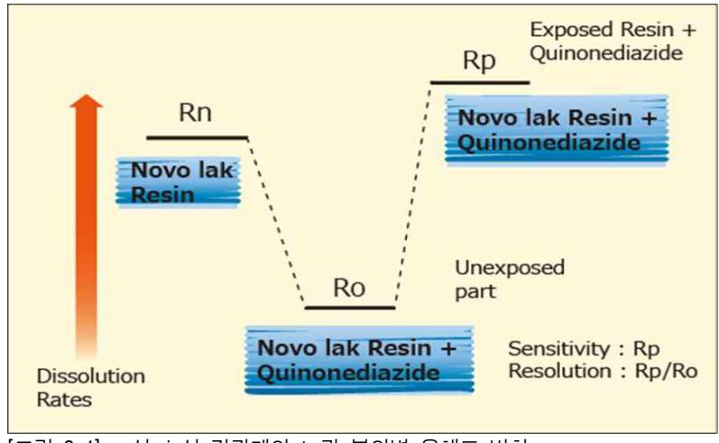

[그림 2-1] g-선, i-선 감광제의 노광 부위별 용해도 변화

#### (2) KrF 감광제

Deep UV를 광원으로 사용하는 리소그래피 법으로 발전함에 따라 PR을 화학증폭형 (chemicallyamplified) 기작을 이용하여 사용하기 시작했다. 화학증폭형 감광제는 양자 수 율이 100% 보다 큰 감광제를 의미하는 것으로 protecting-eprotecting 반응이라고도 한다.

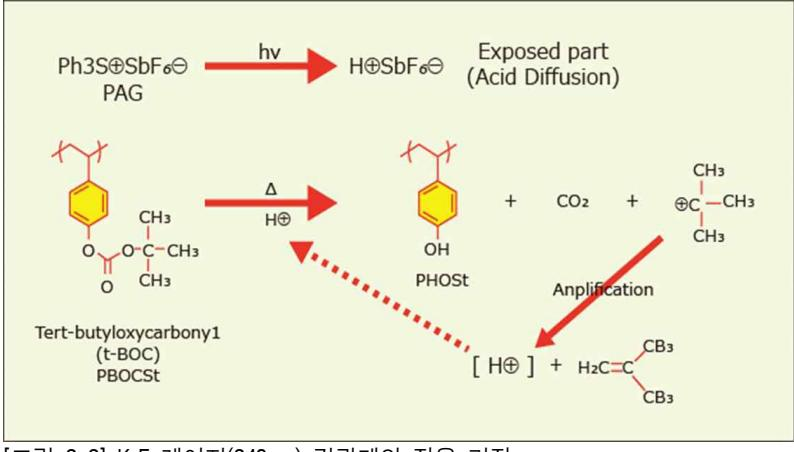

[그림 2-2] KrF 레이저(248nm) 감광제의 작용 기작

(3) ArF 감광제

KrF(248nm) 레이저를 이용한 이후에 등장한 리소그래피 방법으로 ArF 레이저(193nm) 를 사용한다. 종전의 PHS 고분자의 벤젠고리가 ArF(193nm) 영역에서 흡광을 보여 PR 로써 사용할 수가 없다는 문제가 있다. 그러므로 193nm 파장에 대해 흡광도가 낮은 PR 재료가 필요하게 되었다.

(4) Immersion용 ArF 감광제

Immersion 리소그래피는 노광 시 렌즈와 PR이 코팅된 wafer의 간극을 기존의 공기가 아닌 물, 혹은 굴절률이 높은 매질로 채운 상태로 리소그래피가 이루어지는 기술을 말 한다. 2004년 니콘사에서 ArF 레이저를 이용한 노광기를 시장에 판매하기 시작하면서 ArF immersion 기술은 32nm half pitch 구현이 가능하게 되었다. 이후 40∼50nm half pitch 패턴의 구현 또한 가능하게 되었다.

#### (5) EUV용 감광제

원자외선(DUV: 수백nm 파장) 리소그래피 기술의 연장선에서는 65nm 이하의 패턴을 구현할 수 없다는 원리적 한계가 있다. EUV(극자외선: 약 13nm 파장) 리소그래피 기 술이 65nm 이하의 나노급 반도체 소자의 양산 적용이 가능하여 1998년도부터 미국, 일본, 유럽에서 각 요소기술 개발을 위한 투자를 대폭 확대하였으며, 선점 적으로 인 텔은 EUV 리소그래피의 양산 적용하고 있었다. 수은 등의 i-line, g-line, 레이저를 광 원으로 쓰는 KrF와 ArF 장비는 대부분 렌즈계를 광학계로 사용하였다. 그러나 파장이 13.5nm의 EUV 영역에서는 EUV가 물질에 흡수되어 버리므로 이전처럼 렌즈를 사용한 굴절 광학계를 EUV 리소그래피용 광학계로 쓸 수가 없어 모두 반사경으로 광학계가 구성되어야 했다. EUV 광학계는 진공 환경에서 사용되어야 하며, 해상도를 위해 고도 의 정밀성이 요구된다. 또한, 안정적인 열적 환경에서도 열팽창이 적어야 하고 빛의 반사율이 높아야 한다.

| <표 2-2> | · 기존 | 리소그래피와 | EUV | 리소그래피의 | 차이점 |
|---------|------|--------|-----|--------|-----|
|---------|------|--------|-----|--------|-----|

| 요소기술 | EUV 리소그래피                                                  | 기존 리소그래피                                                           |
|------|------------------------------------------------------------|--------------------------------------------------------------------|
| 마스크  | · 반사형 마스크 · LTEM 기판/EUV 반사 다층막/흡수체 패턴 · 2억 원/매 이상 | · 투과형 마스크 · Quartz 기판/Cr 반사 기판 · 1억 2천 만원/매 (critical layer) |
| 광학계  | · 반사형 광학계                                                  | · 투과형 광학계                                                          |
| PR   | ·고감도, 고해상도 EUV, PR                                         | ·화학증폭형 DUV PR                                                      |
| 광원   | ·13nm 파장의 EUV ·DPP, LPP 등의 플라즈마 광원                      | · 157nm, 193nm, 248nm의 DUV 특성 파장을 내는 레이저 광원                     |

# **2-2.** 재료의 문제점 분석 및 해결

학습 목표 • 선정된 반도체 리소그래피 재료의 도출된 문제점에 대한 해결방안을 제시할 수 있다.

## 필요 지식 /

개요

리소그래피 공정 재료의 주요 구성물을 파악하고 그 기술을 이해한다면, 재료의 도출된 문제점을 해결할 수 있다. 미세한 패턴의 형성, 열적 기계적 강도가 우수한 패턴을 만들기 위해 감광제는 일반적으로 다음과 같은 구성 성분으로 되어 있다.

- 1. 감광제의 주요 구성물
  - (1) 고분자(Polymer)

감광제는 액체인 용액을 고체인 필름으로 만들기 때문에 사용되는 고분자는 필름 형 성이 뛰어난 특성이 있어야 한다.

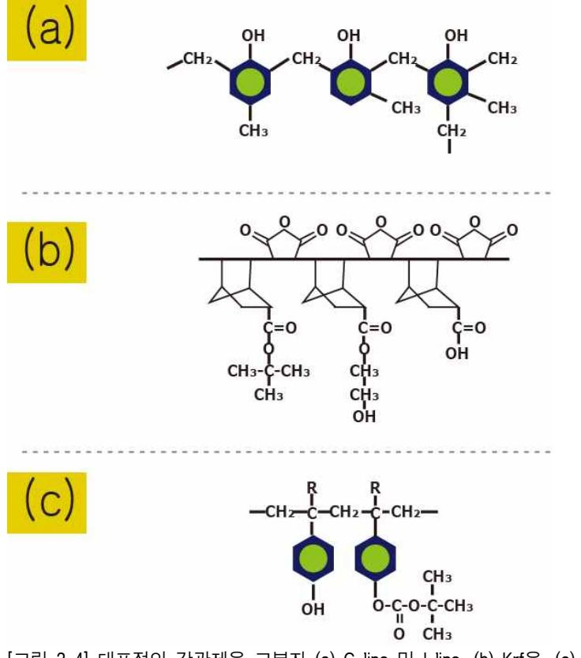

[그림 2-4] 대표적인 감광제용 고분자 (a) G-line 및 I-line, (b) Krf용, (c) ArF 용

얇은 두께로 도포되는데다 미세한 두께 변화에도 전사되는 패턴이 왜곡될 수 있기 때 문에 고른 두께의 필름을 형성하는 특성이 특히 중요하다. 또한, 필름 대부분이 고분 자로 이루어지기 때문에 이 고분자는 노광 공정에 사용되는 빛의 파장을 흡수하지 않 아야 하며, 광화학적인 반응을 통해 노광 전후에는 특정한 용매에 대하여 매우 큰 용 해도의 변화가 일어나야 한다. 이런 이유로 고분자의 주쇄뿐 아니라 주쇄에 달린 기능 기(Functional group)의 선정과 그 알맞은 조합이 매우 중요하다. 마지막으로 PR은 패 턴 형성 후에 식각이나 이온 주입 공정 중에 혹독한 조건을 견디며 설계된 패턴이 기 판에 전사될 수 있도록 해주는 기능이 필수적이기 때문에 내화학성, 내열성, 기계적 특성이 우수하여야만 한다. PR 용도로서 주로 사용되는 고분자는 [그림 2-4]과 같다.

(2) 광반응성 물질 (Photo Active Compound, 감광제)

광반응성 물질은 노광에 사용되는 빛의 파장에 의해 급격하게 광화학적인 반응을 일 으켜 PR 필름의 대부분을 차지하는 고분자의 용해 특성을 크게 변화시키는 물질이다. 빛에 의해 반응하기 때문에 특정 파장에 대한 감도와 광효율, 열 안정성, 내화학성 등 이 중요하다.

(3) 첨가제 (Additives)

감광제의 주요한 성분은 고분자와 광반응 물질이나 실제 공정에 알맞은 PR의 기능을 보완하기 위해 여러 가지 첨가제가 사용되는데 코팅을 위한 계면활성제, 용해 특성 보 완을 위한 용해 방해제 또는 촉진제 등이 널리 사용된다.

(4) 용매 (Solvent)

감광제에 사용되는 용매는 주로 유기 용매 (Organic solvent)를 사용하는데 인체에 무 해하지만 보관 중에 지나친 압력이 생기는 것을 방지하기 위해 일정 온도 이상의 끓 는점을 가져야 하며 회전 도포에 알맞은 점도 및 PR의 주요 성분인 고분자와 광반응 성 물질에 대한 용해 특성이 우수한 것을 사용한다.

#### 감광제의 사양 및 해결방안

- 1. 감광제의 사양 및 해결방안
  - (1) g-Line 및 i-Line 감광제

DNQ는 알칼리 수용액에서 불용성인 감광물질(photoactivecompound; PAC)으로서 용해 억제제(dissolutioninhibitor)로 작용하지만, 자외선에 노광되면 인덴케텐을 형성하고, 생 성된 인덴케텐은 물과 반응하여 알칼리 가용인 3-인덴칼본산으로 변하게 되어 현상액 인 알칼리 수용액에 잘 녹는 용해 촉진제로 작용하게 된다.

(2) KrF 감광제

고분자는 PHS(polyhydroxystyrene) 고분자와 photoacid generator (PAG)를 기본으로 contrast 향상 및 용해도 조절을 위한 반응 금지제를 사용한다. 화학증폭형 감광제의

작용은, 레이저 노광에 의해 PAG로부터 발생한 산이 확산하며 이후 이어지는 post exposure bake(PEB) 과정에서 알칼리 용액인 현상액에 대한 상대적 용해도가 높으므 로, 현상과정을 거치면 마스크를 통해 노광 된 모양대로 패턴 모양이 형성되게 된다. PAG로부터 생성된 한 분자의 산이 확산하면서 촉매반응을 통하여 탈 보호화 반응을 촉진시키므로 화학증폭형 감광제라고한다. 이때 PEB 온도와 시간에 따라 산의 확산이 증가하게 되며 이러한 산 확산을 조절하고 기판의 영향과 기타 오염에 의한 패턴의 망가짐을 방지하기 위해 적절한 약 염기물을 첨가해 준다. 반응에 따르는 PAG의 pKa, PAG의 확산속도, 포함된 약 염기물의 반응 억제 효과, 고분자 보호기의 탈보호반응 활 성화 에너지의 높고 낮음에 따라 PR의 성능과 pre-bake(PB), post exposure bake(PEB) 의 온도 및 기타 공정 조건이 결정된다.

(3) ArF 감광제

고분자의 형태에 있어서 아크릴레이트계 고분자는 높은 해상도, 높은 광 투과율 등의 장점으로 인해 많은 경우에 사용된다. Alicyclic계를 methacrylate 고분자에 도입하는 형태가 주를 이루며, 이들 alicyclic 화합물 중 adamantine계 화합물을 사용한 고분자로 PR을 개발하는 것이 일반적이다.

(4) Immersion용 ArF 감광제

반도체 리소그래피의 패턴 형성을 위한 해상도(resolution)와 개구율(NA)은 R=kλ/NA (k=공정 factor, λ=광원의 파장, NA=개구율), NA=nsinθ(n=매질의 굴절률, θ= wafer의 수직선과 노광 되는 광원의 최대 각)으로 표현된다. 이때 굴절률 n 값이 공기 의 1보다 큰 매질을 사용했을 때 NA값이 커지며, 이에 따라서 해상도가 증가하고 DOF 마진도 증가하게 된다. 이 기술이 적용되기 위해 해결되어야 하는 문제점은 크게 세 가지로 나눌 수 있다.

- (가) 사용되는 광원에 대해 매질이 어느 정도의 낮은 흡광도와 높은 굴절률을 갖는가?
- (나) 매질이 PR에 어느 정도가 얼마나 빠르게 침투하는가?

(다) 침투된 매질이 PR의 조성(PAG, 약염기물, additives)에 어느 정도의 영향을 주는가?

(5) EUV용 감광제

대부분의 EUV projection 광학계는 4개 이상의 반사경으로 이루어진다. 광원에서 발생한 빛은 condenser lens에 의해 집속 되어 마스크에 입사되면 반사된 빛은 projection 광학 계 시스템에 들어가게 된다. 각 반사경마다 다른 각도로 입사하게 되어 동일한 파장에 서 최적의 반사를 위해서는 각 반사경마다 다른 조건의 다층 박막이 필요하게 된다. 최 적의 결과를 얻기 위한 EUV 광학계의 반사경은 대부분 비구면을 가지도록 설계된다. 5 개 또는 6개의 반사경으로 구성된 광학계가 더 나은 성능을 보이나 흡수가 커진다.

# 수행 내용 / 재료의 문제점 분석 및 해결하기

#### 재료·자료

- Ÿ ITRS 로드맵 (International Technology Roadmap for Semiconductor)
- Ÿ 반도체 로드맵
- Ÿ MSDS, RoHS, WEEE (Waste Electrical and Electronic Equipment)
- Ÿ 리소그래피 재료
  - Immersion Photo Resist, Top Coat, BARC, Relacs/SAFIER, ArF Photo Resist, SOC, Developer
  - KrF Photo Resist, MFHM, Thinner, I-line Photo Resist, SOD

#### 기기(장비 ・ 공구)

- Ÿ 제조 공정 장비
  - 유기, 무기 합성 Pilot 설비
  - PR류 Mixing Vessel
  - 중합체 합성 Pilot 설비
  - 제조공정 이상 발생 Monitoring 설비
  - Bottle Cleaning 설비
  - 원자재 저장 창고
  - Bottle Filling 설비
- Ÿ 평가, 분석 및 계측장비
  - Arf Scanner, Elipsometer, GC
  - I-line Stepper, Microscope, HPLC
  - Track, ICP-MS,nmR
  - CD-SEM, Bath(VB-10), Viscometer(BF), FT-IR
  - Dynamic Contact Angle, Refractometer, UV

- Coating Defect Inspection, Coulometric Titrator(831), GPC
- Air particle counter, Automatic Titrator(DL50), DSC/TGA
- Amine 농동 측정기, Moisture Analyzer, 전기적 특성 측정기
- Furnace, Liquid particle counter
- Ÿ 제조공장 인트라넷
- Ÿ 안전도구, 안전화, 안전모, 마스크, 장갑, 고글, 방진복
- Ÿ 컴퓨터, 프린터, 복사기

#### 안전 ・ 유의 사항

- Ÿ 제조 공정 장비란 제품을 제조하기 위한 장비로서 규정에 따라 관리되어야 하며, 일정 주기와 방법에 따라 장비 성능이 평가되어야 한다.
- Ÿ 제조 공정 시 응급상황대처 능력이란, 반도체 리소그래피 제조 시 돌발적으로 발생하는 불량률의 급증사태를 정상으로 복구하는 능력이다.
- Ÿ 평가/분석/계측기란 제품의 물성이나 특성을 평가하는 검사를 실시하는 장비로서 규정에 따라 관리되어야 하며 일정 주기와 방법에 따라 검, 교정을 실시하는 장비를 의미한다.
- Ÿ 작업표준에는 공정순서 및 조건(온도, 시간, 환경)을 포함한다.
- Ÿ작업 절차서는 생산을 끝마치기까지의 절차, 순서를 체계적으로 작성한 생산행위의 계획서로서, 생산을 바르게 실시할 목적으로 생산을 위한 절차와 생산에 사용하는 재료, 장치의 준비 및 사용방법, 그리고 생산을 실시하는데 필요한 주의사항을 나타내는 문서이다.
- Ÿ CoA (Certificate of Analysis)는 가스의 순도 및 불순물 등 해당 제품의 품질 및 Specification을 나타낸다.

#### 수행 순서

- 리소그래피 공정용 재료의 주요 구성물을 이해하고 파악한다. 미세한 패턴의 형성, 열적 기계적 강도가 우수한 패턴을 만들기 위해 PR은 일반적으로 다
  - 음과 같은 구성 성분으로 되어 있다.

- 1. 감광제의 주요 구성물
  - (1) 고분자(Polymer)

감광제는 액체인 용액을 고체인 필름으로 만들어 사용하기 때문에 이것에 사용되는 고분자는 우선 필름 형성 능력이 뛰어난 특성이 있어야 한다.

(2) 광반응성 물질 (Photo Active Compound, 감광제)

광반응성 물질은 노광에 사용되는 빛의 파장에 의해 급격하게 광화학적인 반응을 일 으켜 감광제 필름의 대부분을 차지하는 고분자의 용해 특성을 크게 변화시키는 물질 이다.

(3) 첨가제 (Additives)

감광제의 주요한 성분은 고분자와 광반응 물질이나 실제 공정에 알맞은 PR의 기능을 보완하기 위해 여러 가지 첨가제가 사용된다.

(4) 용매 (Solvent)

감광제에 사용되는 용매는 주로 유기 용매 (Organic solvent)를 사용된다.

감광제의 사양 및 해결방안을 파악하고 이해해야 한다.

- 1. 감광제의 사양 및 해결방안
  - (1) g-Line 및 i-Line 감광제

[그림 2-5]의 광화학 반응에서 나타낸 바와 같이 나프토퀴논디야지드(NQD)를 15∼25% 의 중량%로 넣은 노볼락 수지막을 노광함으로써 노광 영역의 용해성이 증가하고 포지 티브 상이 남게 된다. NQD에 의한 용해 억제 기능에 대해서 몇 가지 기작이 발표되었 으나 명확하지는 않다.

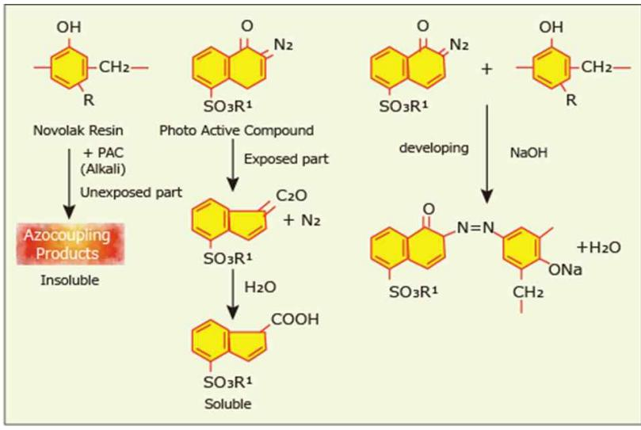

[그림 2-5] g-선, i-선 감광제 작용 기작

즉, 도포된 노볼락 수지는 알칼리 현상액에 어느 정도의 용해성이 있는데 용해억제제 (DNQ)가 배합된 PR은 용해 속도가 감소된다. 이러한 PR이 자외선에 노광 되면 DNQ 의 분해로 유기산이 생성되므로 PR의 노광부분은 이전보다 용해 속도가 빨라지고 그 에 따라 고해상도의 미세 선폭의 상이 얻어진다.

(2) KrF 감광제

KrF 레이저를 이용한 PR은 이후 ArF시스템이 개발되었음에도 꾸준히 광미세가공을 추구하는 연구 개발이 진행되고 있다. 그 이유로서는, 차세대 ArF PR의 개발이 아직 만족스럽지 못하다는 면도 있지만 KrF PR을 그대로 사용한다면 반도체 대량생산에 있 어서 원가 절감 효과가 크다는 것을 들 수 있다. 이러한 기술 개발에 대응하여 KrF PR의 성능도 향상되어야 하는데 대표적인 예를 들면 고집적화에 따라 점차 PR의 두께 감소가 요구되므로 건식식각내성이 보다 강화된 PR의 개발이 요구되고 있다. 이외에 도 요구되는 특성으로서 높은 해상도, 넓은 DOF(depth of focus) margin,무결점의 박막 형성, 기판에 대한 접착력, 높은 contrast, 빠른 감도 및 화학적 안정성 등이 있다.

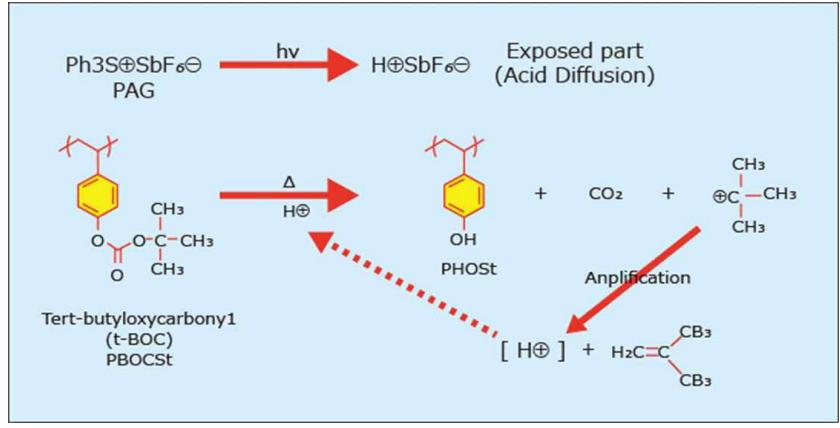

[그림 2-6] KrF 레이저(248nm) 감광제의 작용 기작

#### (3) ArF 감광제

[그림 2-7]에서 나타낸 바와 같이, 고분자의 합성이 어렵고, 가격이 높으며, 식각내성이 약하다는 단점이 있다. 또 다른 형태의 고분자로는 COMA(cyclic olefin/maleic anhydride)가 있다. 특성은 식각 내성과 CD선형성이 좋은 반면에 물에 오염 가능성이 있고, 광 투과도가 떨어지며, 해상도에 한계가 있다는 점이다. 이 두 가지 작용기들의 장점을 취합한 혼성형(hybrid type)으로 성능향상을 이루기도 한다. 일반적으로 ArF PR 용 고분자가 갖추어야 할 조건들을 살펴보면 투명성, 건식식각 내성, 좋은 접착특성 및 전형적인 현상액에 현상되어야 한다. 이외에 일반적으로 요구되는 특성으로서, 무 결점의 박막 형성, 보관 안정성, 기판에 대한 접착력 및 고감도 등이 있다.

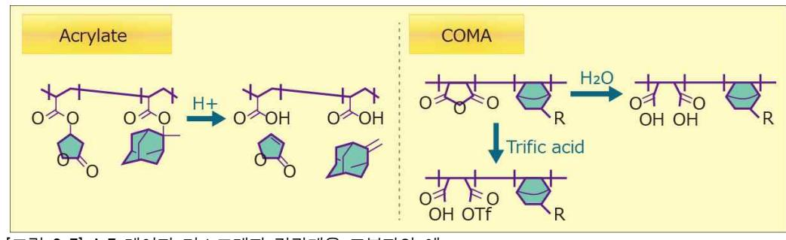

[그림 2-7] ArF 레이저 리소그래피 감광제용 고분자의 예

(4) Immersion용 ArF 감광제

화학증폭형 PR에 매질이 스며들게 되면 산 촉매 반응을 통해 PR의 고분자가 탈보호기 반응을 하게 되며, 작은 분자의 가소제 역할로 산확산 기작에 이상을 초래하게 된다. 그러므로 리소그래피 성능에 악영향을 미치며, 또한 녹아 나온 성분에 의해 렌즈에 오 염을 발생시킬 수 있다. 화학증폭형 PR에 매질이 스며들게 되면 산 촉매 반응을 통해 PR의 고분자가 탈보호기 반응을 하게 되며, 작은 분자의 가소제 역할로 산확산 기작 에 이상을 초래하게 된다. 그러므로 리소그래피 성능에 악영향을 미치며, 또한 녹아 나온 성분에 의해 렌즈에 오염을 발생시킬 수 있다. 이 문제를 해결하기 위해서 두 가 지 접근 방법이 있다. 첫 번째, 스며들지 않는 PR 또는 매질을 개발하는 일이고, 두 번째로 PR 막 위에 보호막을 도입하는 것이다.

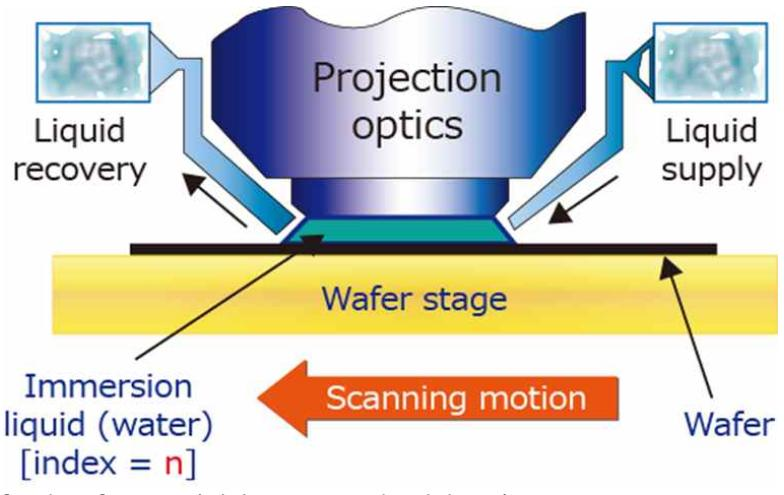

[그림 2-8] Stage 상에서 immersion 시스템의 동작

(가) 소재개발하기 위해서는 유입된 매질이 PR 조성에 어떠한 영향을 주었는가를 알아내 기 위해 조성을 극미세 분석과 표면 분석을 해야 한다. PR의 조성이 매질 또는 물 층으로 유입되는가에 대한 분석은 ppm(part per million) 이하의 분해능이 필요하다. 물속에 극미량의 유기물을 검출하는 데 사용되고 있는 방법들을 사용할 수 있다.

- (나) 소수성의 막을 PR 막 위에 도포하는 방법으로 위의 방법보다 분석에 어려움은 없 으나, PR 코팅 후 코팅공정이 다시 필요하며 노광 후 막을 현상액으로 제거하기 어려운 단점이 있다. 두 번째로 PR 상위 막을 개발하기 위해서는 소수성이면서 노광 되는 광원에 투명도를 확보하기 위하여 높은 함량의 불소 치환된 고분자를 사용한다. 상위 막은 노광 시 매질로부터 적절히 PR을 보호하는 역할을 하며 노 광 후 불소 치환된 시너를 이용하여 제거가 가능해야 한다.
- (5) EUV용 감광제

현재까지 개발된 소재가 가지고 있는 문제점은 EUV에서의 노광 시 PR 소재의 흡광 계수에 대한 것과 노광 후 현상 시 충분히 빠른 감도를 가져야 하며, 낮은 가스형성 (out gassing)으로 구현할 수 있는가에 대한 것이 있다. 대부분의 물질들에 EUV에 사용 되는 13nm 파장에 대해 높은 흡광 계수를 가지고 있다. 방향족 고리화합물은 PR의 흡 광도를 낮추어 주며, 식각내성도 증가한다. 그러므로 KrF 리소그래피에 사용되는 poly(4-hydroxystyrene)이 EUV용 박막의 단일 층 PR에 적용될 수 있다.

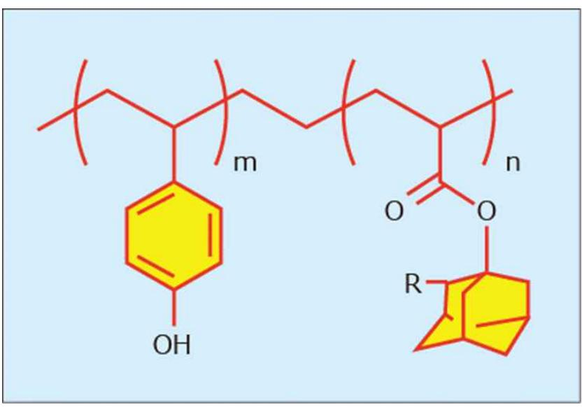

[그림 2-9] EUV 감광제 고분자의 예

PR에 요구되는 특성으로는, 낮은 흡광도와, 높은 식각내성, 충분히 빠른 감도, 기판과 의 밀착성, 가스 형성의 최소, LER(line edge roughness)의 최소화가 이루어져야 한다. 빠른 감도를 얻으면서 적은 LER과 해상도 성능에 대한 감소가 없어야 하는데, 박막으 로 시행함으로써 얻을 수 있으나, 식각내성 성능에 감소가 있다. PMMA와 poly(4-hydroxystyrene)이 EUV용 PR의 일반적인 고분자로 사용되는데, 주 사슬에 여러 가지 작용기 혹은 보호된 작용기를(아세탈, t-butoxycarbonyl, t-butyl) 사용한다. 좀 더 나은 내식각성을 위해서는 alicyclic 보호기 (2-methyl-2-adamantyl group)를 사용하면 개선될 수 있다.

# 학습2 교수·학습 방법

#### 교수 방법

- 반도체 리소그래피 제조공정을 쉽게 설명한다.
- 교수 주도로 현장에서 표준화한 공정 매뉴얼과 관련 공정 재료에서 제공되는 자료 등의 내용을 PPT 자료로 제시한 후에 설명한다.
- 가능한 한 사전에 제조 현장에서 사용하는 사례를 수집하여 자료를 준비하고 이해하기 쉬운 방법을 논의하는 방식의 문제 해결식 수업을 한다.
- 최근 반도체 산업 현황(시장 환경 및 기술 동향 등)에 대하여 충분히 인지하고, 학생들이 이를 이해할 수 있는 방법을 모색하여 수업을 진행한다.
- 반도체 리소그래피 재료 요구사항에 필요한 내용을 확인하고, 관련 자료를 확보해 학생들에게 제시 후 파악 여부를 확인한다.
- 통계소프트웨어, 문서 작성프로그램 또는 일정관리 프로그램 등의 활용은 현장에서 직접 작성토 록 하여 문제가 되는 내용이 무엇인지를 파악하고, 이를 실무에 적용할 수 있도록 지도한다.

#### 학습 방법

- 반도체 산업 현황(시장 환경 및 기술 동향 등)과 관련 기관을 구체적으로 확인하도록 하고, 이 기관과 관련된 다양한 자료를 인터넷으로 검색하고 분류하여 문서로 정리한다.
- 반도체용 리소그래피 재료 요구사항 항목이 선정된 양식에 맞추어 특정 소자에 대한 요구사항을 작성해 본 후, 여기에 첨부되는 자료의 종류와 기록 내용 전반을 숙지하고, 가능하다면 소자별로 분류해 본다.
- 반도체용 리소그래피 재료 요구사항에 대한 시장 및 기술, 비용의 조사, 수집 및 분석을 통해 생산에 필요한 목표를 설정하고 분류된 자료를 활용하여 생산 가능성을 예측해 본다.
- 생산 시 예상되는 품질관리 문제점을 파악하고 해결책을 수립하는 현장의 업무를 이해하고, 정해진 양식에 따라 보고서를 작성해 본다.

# 학습2 평 가

#### 평가 준거

• 평가자는 학습자가 학습 목표를 성공적으로 달성하였는지를 평가해야 한다.

#### • 평가자는 다음 사항을 평가해야 한다.

| 학습 내용              | 평가 항목                                              |  | 성취수준 |   |  |  |
|--------------------|----------------------------------------------------|--|------|---|--|--|
| 직답 네중              |                                                    |  | 중    | 하 |  |  |
| 재료의 장점과 단점 분석   | - 반도체 공정별 리소그래피 재료의 장점과 단점을 파 악할 수 있다.          |  |      |   |  |  |
|                    | - 반도체 집적회로 제조 공정에 적합한 리소그래피 재 료를 선정할 수 있다.      |  |      |   |  |  |
| 재료의 문제점 분석 및 해결 | - 선정된 반도체 리소그래피 재료의 도출된 문제점에 대한 해결방안을 제시할 수 있다. |  |      |   |  |  |

## 평가 방법

• 문제 해결 시나리오

| 학습 내용              | 평가 항목                      |  | 성취수준 |   |  |  |
|--------------------|----------------------------|--|------|---|--|--|
| 러급 네중              |                            |  | 중    | 하 |  |  |
| 재료의 장점과 단점 분석   | - 반도체 리소그래피 기술 및 시장 동향 파악  |  |      |   |  |  |
|                    | - 반도체 리소그래피 분석 능력 및 재료 파악  |  |      |   |  |  |
|                    | - 반도체 리소그래피 전문용어 이해        |  |      |   |  |  |
|                    | - 반도체 제조 공정 이해             |  |      |   |  |  |
|                    | - 반도체 리소그래피 재료 선정          |  |      |   |  |  |
| 재료의 문제점 분석 및 해결 | - 반도체 리소그래피 규격서 해석         |  |      |   |  |  |
|                    | - 반도체 리소그래피 재료 문제점 해결방안 제시 |  |      |   |  |  |

#### • 서술형 시험

| 학습 내용              | 평가 항목                         | 성취수준 |   |   |
|--------------------|-------------------------------|------|---|---|
|                    |                               | 상    | 중 | 하 |
| 재료의 장점과 단점 분석   | - 반도체 리소그래피 분석 및 재료 설명     |      |   |   |
|                    | - 반도체 리소그래피 전문용어 작성        |      |   |   |
|                    | - 반도체 제조 공정 작성 및 설명        |      |   |   |
|                    | - 반도체 리소그래피 재료 작성 및 설명     |      |   |   |
| 재료의 문제점 분석 및 해결 | - 반도체 리소그래피 규격서 작성         |      |   |   |
|                    | - 반도체 리소그래피 재료 문제점 해결방안 작성 |      |   |   |

#### • 사례연구

| 학습 내용              |                                  |   | 성취수준 |   |  |
|--------------------|----------------------------------|---|------|---|--|
|                    | 평가 항목                            | 상 | 중    | 하 |  |
| 재료의 장점과 단점 분석   | - 반도체 리소그래피 기술 및 시장 동향 분석     |   |      |   |  |
|                    | - 반도체 리소그래피 분석 능력 및 재료 분석     |   |      |   |  |
| 재료의 문제점 분석 및 해결 | - 반도체 리소그래피 규격서 비교 분석         |   |      |   |  |
|                    | - 반도체 리소그래피 재료 문제점 해결방안 비교 분석 |   |      |   |  |

#### 피드백

| 1. 문제 해결 시나리오 - 사례연구 실습과정을 평가한 후, 그룹별로 문제점 및 개선점들을 표시하여 점검한다. |  |
|------------------------------------------------------------------|--|
| 2. 서술형 시험 - 평가 결과, 일정 점수 이하인 학생들은 추가 학습 후, 결과를 제출하도록 한다.      |  |
| 3. 사례연구 - 학습한 내용이 효과적으로 전달되지 않은 경우에는 발표방법에 대한 추가 지도를 수행       |  |
| 한다.                                                              |  |

| 학습 1 | 반도체용 리소그래피 요구사항 파악하기                          |
|------|-----------------------------------------------|
|      | (LM1903060402_14v1.1) 반도체용 리소그래피 재료 선정하기   |
| 학습 2 | (LM1903060402_14v1.2)                         |
|      | 반도체용 리소그래피 재료 제조하기                            |
| 학습 3 | (LM1903060402_14v1.3)                         |
| 학습 4 | 반도체용 리소그래피 제품특성 검증하기 (LM1903060402_14v1.4) |
|      |                                               |

# **3-1.** 재료 제조 공정의 장점과 단점 분석

학습 목표 • 반도체 리소그래피 재료별 제조 공정의 장점과 단점을 파악할 수 있다.

# 필요 지식 /

반도체용 리소그래피 재료의 제조 공정

감광제는 제조 관련 공정은 PR의 원료인 고분자수지(Resin)와 광활성제(PAC)를 제조하는 공정, 이러한 원료를 혼합하여 PR을 제조하는 공정 등으로 구분할 수 있다.

- 1. 감광제 제조 공정
  - (1) 노블락 수지 제조

노블락 수지 제조공정의 하나인 원료로 Cresol, p-Cresol, p-Formaldehyde, 초순수, Oxalic Acid를 투입하고 교반한다. 그 후 열매체유를 이용하여 승온 후 환류 반응을 진 행한다. 반응이 종료되면 축합수를 제거하기 위해 상압에서 170℃까지 증류한다. 과량 으로 들어가는 Cresol을 제거하기 위해 열원을 가하면서 190℃까지 진공탈수를 실시 후 냉각을 시킨다. 상압 상태에서 PGMEA를 투입하여 50℃ 냉각 후 제품을 포장한다.

(2) 광활성제 제조

광활성제(PAC) 제조공정의 하나로서 반응을 위해 원료인 P-HBA(p-Hydroxy Benzoic Acid) 등을 투입하고 제품색상 변질을 막기 위해 질소 치환 및 퍼지를 하여 준다. 그 후 반응기에 톨루엔을 유량계를 조절하여 적하 투입을 해주고 스팀을 사용하여 승온 시키고, 질소는 승온 시까지 계속 투입하여 준다. 유수분리기에서 물과 톨루엔을 분리 해 주며 순환반응을 한다. 반응이 종료되면 과량으로 들어가는 톨루엔을 증류 후에 냉

각수를 이용해 40℃ 이하로 냉각을 시킨다. 냉각된 대상물질에 아세톤을 투입하여 용 해시키고 누체여과기를 사용하여 여과시킨다. 이온수를 투입하여 제품을 석출시켜 결 정화한 후 냉각시킨다. 그 후 원심분리기로 여과를 진행한 후 제품을 포장한다.

#### (3) 감광제 제조

제조 순서는 혼합탱크에 PGMEA와 노블락 수지를 투입하여 노블락 수지를 용해시키 고, PAC, 첨가제, 계면활성제 등을 추가 투입하여 혼합탱크에서 교반기를 이용하여 혼 합시킨다. 그 후에 점도 조정을 실시하고, 여러 개의 필터를 사용하여 원하는 입도까 지 여과를 실시한 후 제품을 제조한다. 이후 병 등에 충진하고 포장하여 출하한다.

# 수행 내용 / 재료 제조 공정의 장점과 단점 분석하기

#### 재료·자료

- Ÿ ITRS 로드맵 (International Technology Roadmap for Semiconductor)
- Ÿ 반도체 로드맵
- Ÿ 반도체 제조 공정도
- Ÿ 일간/주간/월간 생산계획서
- Ÿ 제조설비 점검기록서
- Ÿ MSDS, RoHS, WEEE (Waste Electrical and Electronic Equipment)
- Ÿ 평가 분석 방법론
- Ÿ 시험성적서
- Ÿ 평가/분석/검증 결과보고서
- Ÿ 리소그래피 재료
  - Immersion Photo Resist, Top Coat, BARC, Relacs/SAFIER, ArF Photo Resist, SOC, Developer
  - KrF Photo Resist, MFHM, Thinner, I-line Photo Resist, SOD

#### 기기(장비 ・ 공구)

- Ÿ 제조 공정 장비
  - 유기, 무기 합성 Pilot 설비
  - PR류 Mixing Vessel
  - 중합체 합성 Pilot 설비
  - 제조공정 이상 발생 Monitoring 설비
  - Bottle Cleaning 설비
  - 원자재 저장 창고
  - Bottle Filling 설비
- Ÿ 평가, 분석 및 계측장비
  - Arf Scanner, Elipsometer, GC
  - I-line Stepper, Microscope, HPLC
  - Track, ICP-MS,nmR
  - CD-SEM, Bath(VB-10), Viscometer(BF), FT-IR
  - Dynamic Contact Angle, Refractometer, UV
  - Coating Defect Inspection, Coulometric Titrator(831), GPC
  - Air particle counter, Automatic Titrator(DL50), DSC/TGA
  - Amine 농동 측정기, Moisture Analyzer, 전기적 특성 측정기
  - Furnace, Liquid particle counter
- Ÿ 제조공장 인트라넷
- Ÿ 안전도구, 안전화, 안전모, 마스크, 장갑, 고글, 방진복
- Ÿ 컴퓨터, 프린터, 복사기

#### 안전 ・ 유의 사항

- Ÿ 제조 공정 장비란 제품을 제조하기 위한 장비로서 규정에 따라 관리되어야 하며, 일정 주기와 방법에 따라 장비 성능이 평가되어야 한다.
- Ÿ 제조 공정 시 응급상황대처 능력이란, 반도체 리소그래피 제조 시 돌발적으로 발생하는 불량률의 급증사태를 정상으로 복구하는 능력이다.
- Ÿ 평가/분석/계측기란 제품의 물성이나 특성을 평가하는 검사를 실시하는 장비로서 규정에 따라 관리되어야 하며 일정 주기와 방법에 따라 검, 교정을 실시하는 장비를 의미한다.
- Ÿ 작업표준에는 공정순서 및 조건(온도, 시간, 환경)을 포함한다.
- Ÿ작업 절차서는 생산을 끝마치기까지의 절차, 순서를 체계적으로 작성한 생산행위의 계획서로서, 생산을 바르게 실시할 목적으로 생산을 위한 절차와 생산에 사용하는 재료, 장치의 준비 및 사용방법, 그리고 생산을 실시하는데 필요한 주의사항을 나타내는 문서이다.
- Ÿ 품질관리에서는 통계를 활용한 리소그래피의 품질 관리를 통하여 불량의 발생 및 불량 원인을 조사하여 개선함으로써 품질의 균일성(6-시그마)을 확보하여야 한다.
- Ÿ CoA (Certificate of Analysis)는 가스의 순도 및 불순물 등 해당 제품의 품질 및 Specification을 나타낸다.

#### 수행 순서

반도체용 리소그래피 재료의 제조 공정을 알고 이해한다.

감광제는 제조 관련 공정은 PR의 원료인 고분자수지(Resin)와 광활성제(PAC)를 제조하는 공정, 이러한 원료를 혼합하여 PR을 제조하는 공정 등으로 구분할 수 있다.

- 1. 감광제 제조 공정
  - (1) 노블락 수지 제조 노블락 수지 제조공정의 하나로서 제조 순서는 [그림 3-1]과 같다.
  - (2) 광활성제 제조

광활성제(PAC) 제조공정의 하나로서 제조 순서는 [그림 3-2]와 같다.

(3) 감광제 제조

제조 순서는 [그림 3-3]과 같이 혼합탱크에 PGMEA와 노블락 수지를 투입하여 노블락 수지를 용해시키고, PAC, 첨가제, 계면활성제 등을 추가 투입하여 혼합탱크에서 교반 기를 이용하여 혼합시킨다.

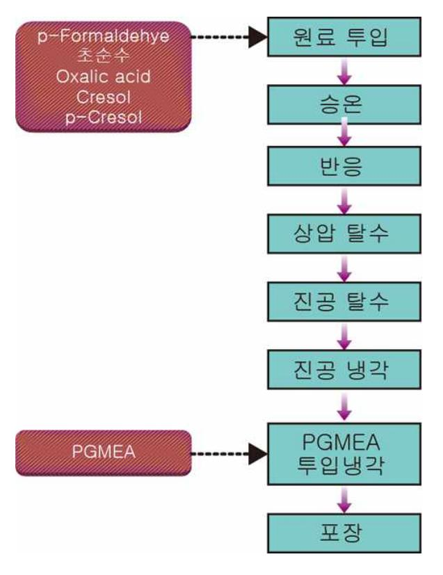

[그림 3-1] 노블락 수지 제조 공정 흐름도

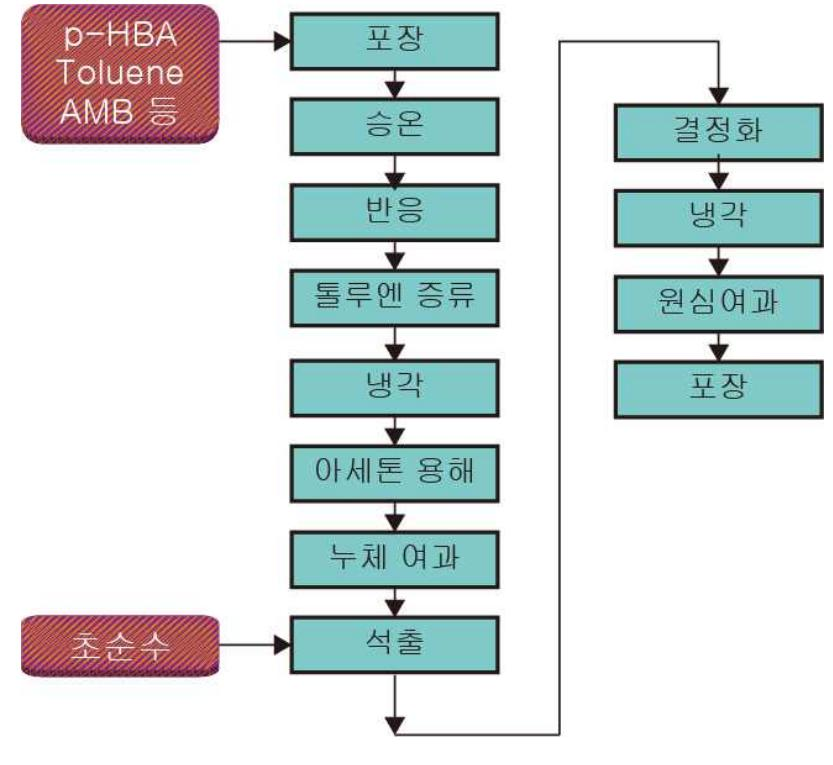

[그림 3-2] 광활성제 제조 공정 흐름도

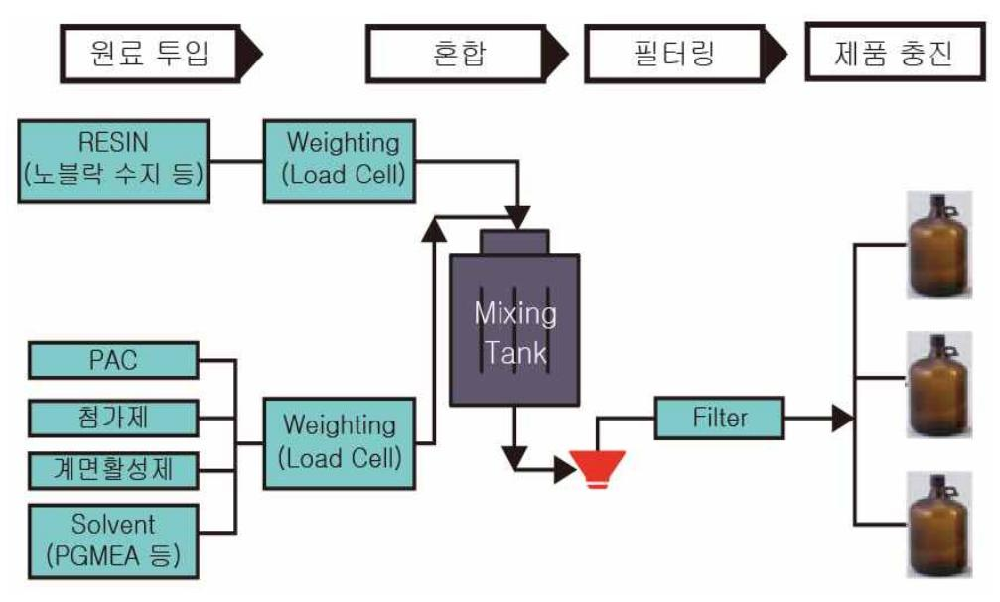

[그림 3-3] 감광제 제조 공정 흐름도

# **3-2.** 제조 공정 파라미터 및 문제점 파악

학습 목표 • 반도체 리소그래피 재료별 제조(공정/장비) 파라미터를 파악하고 적용할 수 있다. • 반도체 리소그래피 재료별 제조(공정/장비)에서 도출된 문제점에 대한 해결방안을 제시할 수 있다.

# 필요 지식 /

#### 개요

리소그래피 공정 재료 제조 공정의 주요 파라미터를 파악하고 그 기술을 이해한다면, 제 조 공정에서 도출된 문제점에 대한 해결방안을 제시할 수 있다.

1. 감광제의 주요 파라미터

#### (1) 원료투입

반응기 (RX-204)에 정제된 감광제(wet cake)를 맨홀을 통해 약 1,200kg 투입한 후, 배 관을 통해 톨루엔 3,000kg을 투입 (약 40분 소요)과 동시에 교반기로 교반시작 (약 105 RPM) 하고 그다음 물 12,000kg을 투입 (약 50분 소요)하면서 승온을 시작한다.

(2) 승온

반응기 (RX-204)의 온도를 75 ~ 82℃까지 1시간 동안에 스팀으로 승온하고 이 온도를 3시간 동안 유지한다.

(3) 냉각

냉각수로 1시간 동안 15℃까지 냉각을 실시한다.

(4) 원심분리 여과 공정

냉각에 의해 반응기의 내부 온도가 15℃로 낮아지면 원심분리기로 공급하고 질소를 투 입하여 원심분리 여과를 진행하고 작업자는 대상물질이 원심분리기에서 원하는 양의 고체상 제품(약 100kg)이 될 때까지 대상물질 공급배관의 밸브를 수시로 열어 원심분리 기로 공급(약 30∼50분 소요)한다. 원하는 양의 제품이 원심분리기로 투입되면 대상물 질 공급 밸브를 닫고 1시간 동안 회전시키고 초순수 세정(washing)은 공급 완료 후와 공급이 중단되고 회전 시작 후 30분이 경과된 시점에 30 LPM으로 2분간 실시한다.

감광제의 혼합물 특성

실험대상 혼합물로 아세톤-톨루엔, 아세톤-물, 아세톤-PGMEA의 아세톤 혼합물과 사고 당 시 재현 혼합물, PR 제조 관련 공정에서 샘플링한 혼합물을 선정하였으며, 아세톤, 톨루엔, 및 PGMEA의 주요 특성은 다음과 같다.

#### 1. 감광제의 혼합물 특성

#### (1) 톨루엔(Toluene)

톨루엔(화학식: C6H5CH3, CAS No.: 108-88-3, 분자량: 92.14)은 천연 수지인 톨루 발삼 (tolu balsam)의 건류에 의해 얻어진 "toluol"로부터 유래된 이름으로 벤젠의 수소 원 자 1개를 메틸기 (methyl group)로 치환한 화합물로 무색의 액체이며, IUPAC (International Union of Pure and Applied Chemistry)명으로는 메틸벤젠 (methyl benzene)이라고 한다. 19세기 후반에는 석탄 건류의 부산물을 이용하여 생산하였으나, 현재는 대부분이 원유 정제분류의 촉매개량(catalytic reforming)에 의해 생산되고 있다. 물에는 녹지 않지만 에탄올, 에테르, 벤젠 등 대부분의 유기용매와는 임의의 비율로 혼합하며, 상온에서 공기 중으로 쉽게 날아가는 대표적인 휘발성 유기화학물(VOC) 중 의 하나이다. 정제되지 않은 대부분 톨루엔은 옥탄가를 높이기 위하여 휘발유에 첨가 하는 BTX(Benzene, Toluene, Xylene) 혼합물의 제조용으로, 정제된 톨루엔의 50% 정도 는 벤젠을 생산하는 데 사용된다. 특히 물리 화학적인 특성이 비슷한 벤젠에 비해 톨 루엔은 독성이 낮고 가격이 저렴하기 때문에 페인트, 코팅제, 접착제, 잉크 및 청소용 제 등의 용매와 나일론, 폴리우레탄 등의 폴리머 제조 등 광범위하게 사용된다. 톨루 엔은 인화점이 4℃인 인화성액체이며 산화성 물질과 혼합 시 폭발할 우려가 있다. 2007년 환경부 유해화학물질 사고사례집에 의하면 2000년부터 2006년까지 발생한 화 학물질관련 사고 중 톨루엔이 18건으로 가장 많았고, 염산 15건, 유사휘발유 15건, 황 산 12건, 시너 12건, 휘발유 10건, 석유 9건, 암모니아 7건, 수소 7건, 솔벤트 7건의 순 으로 나타났다. 이들 화학물질에 의한 사고는 전체 사고건수의 약 36%를 차지하며, 톨 루엔이 구성성분으로 첨가되는 시너와 유사휘발유 등을 포함하면 톨루엔에 의한 사고 가 전체 화학물질 사고의 약 19.9%를 차지하는 것으로 추정할 수 있다. 톨루엔은 인체 와 동물을 대상으로 한 연구들에서 일반적으로 암을 유발하지 않는 것으로 나타났으 나, 신경계에 영향을 줄 수 있는 것으로 알려져 있다. 통상 적은 양의 톨루엔에 노출 된 경우 피곤, 무력감, 술에 취한 것 같은 행동, 기억 상실, 구토, 식욕 부진, 청력과 시력 저하 등의 증세가 나타날 수 있으며 이러한 증세들은 톨루엔에 대한 노출이 중 지될 경우 일반적으로 사라지는 것으로 알려져 있다. 짧은 시간에 과량의 톨루엔을 흡 입하게 되면 빈혈, 어지럼증, 졸림 등의 증세가 나타나며 심할 경우 의식불명, 사망에 이르게 되고 높은 농도의 톨루엔 노출은 신장에 이상을 유발하는 것으로 알려져 있다. 국내 톨루엔 중독에 관한 재해사례는 톨루엔 단독으로 노출되기보다는 다른 유기용제 와 함께 복합적으로 노출된 경우가 많으며, 환기가 불량한 사업장 환경에서 급성으로 단기 노출에 의한 질식 및 신경학적 증상의 발현이 대부분인 것으로 알려져 있다. 톨 루엔 역시 산안법에 의하여 관리대상 유해물질로 지정되어 관리되고 있다. 현재 톨루 엔의 국내 유통량을 정확히 확인할 수 없으나 2010년 환경부의 유독물 영업자 등의 실적보고에 의하면 제조량이 약 92만 톤이고 수입량이 약 36만 톤인 것으로 조사되었다.

(2) 아세톤

아세톤(화학식: CH3COCH3, CAS No.: 67-64-1, 분자량: 58.08)은 향기가 있는 무색의 액체로서 케톤2)의 가장 간단한 형태로, 양쪽에 하나씩 총 두(di)개의 메틸기(methyl)와 결합하고 있기 때문에 IUPAC 명으로 디메틸케톤(dimethylketone)이라고 부르기도 한다. 또한 탄소가 총 세 개인 프로판(propane)에서 변형된 케톤(ketone)이라는 의미에서 프 로판온 (propanone)이라고 부르기도 한다. 공업과 화학에서 중요한 유기용매이며, 물에 잘 녹으며 유기용매로서 다른 유기물질과도 잘 섞인다. 그래서 물로 세척이 되지 않는 물질을 아세톤으로 처리하면 쉽게 세척할 수 있어 일상생활에 많이 사용된다. 예를 들 어, 페인트를 지우는 데 쓰이며, 손톱에 바른 에나멜을 지우는 데에도 많이 쓰인다. 그 렇지만 인화성이 강해 불이 잘 붙으며, 폭발의 위험이 있기 때문에 화기에 가까이 두 어서는 안 된다. 2차 알코올인 아이소프로판올을 산화시키면 얻을 수 있다. 가장 단순 한 지방성 케톤인 아세톤은 공업용 용매와 화학 중간물질로 널리 이용된다. 또한, 디 아세톤 알코올, 아세틸렌, 무수아세트산, 메틸 이소부틸 알코올, 메틸 이소부틸 케톤, 메틸 이소부틸 카르비놀, 메틸 이소부틸 케톤, 메타크릴산, 메타크릴산 메틸, 비소페놀 A, 클로로포름, 요오드포름, 이소포론, 이소프렌, 브로모포름, 연기 없는 가루, 폭발물, 윤활유, 페인트, 니스, 래커, 인쇄 잉크, 방수제, 접착제, 셀룰로오스 수지, 아세트산 셀 룰로오스, 니트로셀룰로오스, 아크릴 섬유, 레이온, 인조견, 합성고무, 폴리우레탄 발포 제, 사진용 필름 등을 제조하는 데 사용된다. 그리고 아세톤의 약 24배 이상 부피의 아세틸렌 가스를 녹일 수 있으므로 아세틸렌 가스를 보관하는 데 유용하다. 아세틸렌 가스는 아세틸렌 실린더의 충전제인 다공성 물질에 녹아 있는 아세톤에 용해된다. 이 저장 방법은 70℉(21.1℃)에서 250 psig(1724 kPa)를 사용할 수 있다. 또한, 가죽 및 고 무 제조 산업에서 접합용 용매로 사용되며 정밀 기계의 청소와 건조에 사용된다. 즉, Acetone의 주요용도는 1) 화학원료 2) 상업제품에 쓰이는 용매 3) 공업용 용제의 세 가지 범주로 나누어 볼 수 있다. 독성 영향으로는 진정, 현기증, 의식소실과 같은 중추 신경계 억제작용이 흔하게 나타나고 흡입 시 오심, 구토, 두통, 흥분, 메스꺼움, 피로, 기관지 자극의 증상이 나타날 수 있다. 액체 아세톤에 장기간 또는 반복적으로 노출되 면 피부가 탈지되거나 건조해질 수 있다. 흡연 시 노출되어 호흡기계 자극을 유발할 수 있어 미국 정부는 담배 함유 유해 물질 93종 중 하나로 지정하고 있다.

(3) PGMEA(Propylene Glycol monoMethyl Ether Acetate)

PGMEA (화학식: CH3CO2CH(CH3)CH2OCH3, CAS No.: 108-65-6, 분자량: 132.16)은 IUPAC명으로 1-메톡시-2-프로판닐 아세테이트(1-Methoxy-2-propanyl acetate)라고 부 르기도 한다. PGMEA는 PR 제조, 유기 절연막 형성 등을 위한 용매로 사용되며, 알코 올계 용제에 비하여 휘발성이 매우 적으며, 인화점도 높고 유리나 박막 재료에 손상을 주지 않기 때문에 LCD뿐만 아니라 유기박막트랜지스터의 절연막에도 사용된다. 또한

프로필렌 글리콜 메틸 에테르아세테이트의 제조(PMA)의 화학 중간체, 건조공정 중에 고분자 융합을 촉진하기 위한 수성페인트 및 잉크용 유착제(Coalescing agent), 페인트, 니스, 잉크, 스트리퍼, 세척제 및 탈지제에 대한 용매, 자동차, 건축, 금속마무리에 대 한 코팅 등에 사용된다. PGMEA는 다른 용매에 비해 독성이 낮으나 눈에 들어갈 경우 예방 차원에서 두 눈을 흐르는 물로 씻고 피부와 접촉 시에는 비누와 물로 충분히 씻 어내어야 한다.

- 2. 감광제의 해결방안 기술
  - (1) 끓는점 (Boilling Point)

끓는점은 액체 물질의 증기압이 외부 압력과 같아져 끓기 시작하는 온도를 말한다. 끓 다라는 것은 물질의 운동에너지가 상대적으로 큰 분자들이 외부 압력을 이기고 기포 로 성장할 수 있는 것으로, 액체 표면에서 분자가 액면을 이탈하는 증발과는 달리 지 속적인 에너지를 열로 전달받을 수 있는 곳이 통상 기포가 발생하는 곳이 된다. 통상 MSDS상에서 끓는점은 대기압(1기압)을 말하며, 압력이 고정되는 경우 끓는점은 그 물 질의 고유한 상수가 된다. 끓는점을 측정하는 방법에는 기체-액체 평형에 의한 끓는점 측정기(Ebulliometer)를 이용하는 방법, Siwoloboff법에 의한 기포발생을 측정하는 방법 과 시차열분석을 이용하는 방법이 있다. 이 중에서 끓는점 측정기를 사용하는 경우에 는 기체-액체 평형을 이용하기 때문에 끓는점에 대한 압력의 영향을 관측할 수 있으 며, Siwoloboff법은 광전지 검출 (Photocell detection)과 접목하여 대기압 하에서 끓는점 을 비교적 쉽게 측정할 수 있다. 시차열분석을 이용하면 비교적 짧은 시간 내에 끓는 점을 측정할 수 있으나, 끓는점이 불순물에 의한 영향을 받기 때문에 시료가 순수물질 이 아닌 경우에는 결과의 신뢰성 및 재현성이 다른 두 가지 방법에 비하여 떨어질 수 있다.

(2) 비중 (Specific gravity)

일반적으로 비중은 시료의 밀도와 물의 밀도의 비로서 무차원량(dimensionless)을 갖기 때문에 단위계가 달라도 같은 수치를 얻을 수 있는 이점이 있어 상대밀도라고도 하며 많이 사용된다. 고체 및 액체 시료의 비중은 시료 및 물의 온도 조건을 나타내는 기호 를 덧붙여 나타내는데, 비중(20/20℃)은 20℃의 액체 또는 고체 시료의 밀도와 20℃에 서 물의 밀도의 비 또는 압력조건을 생략한 경우에 20℃의 기체 시료의 밀도와 20℃ 건조 공기의 밀도의 비를 의미한다.

(3) 인화점 (Flash Point)

인화점은 기체 또는 휘발성 액체에서 발생하는 증기가 공기와 섞여서 인화성(가연성) 또는 폭발성 혼합기체를 형성하고, 여기에 불꽃을 가까이 댔을 때 순간적으로 섬광을 내면서 연소하는, 즉 인화되는 최저의 온도를 말한다. 인화점을 넘어서 가열을 더 계 속하면 불꽃을 가까이 댔을 때 계속해서 연소하는 온도에 이르는데, 이 온도를 연소점

이라고 하여 인화점과 구별한다. 인화점은 물질에 따라 특유한 값을 보이며, 주로 액 체의 인화성을 판단하는 수치로서 중요하며, 경우에 따라서는 일정한 끓는점이나 녹는 점을 보이지 않는 시료의 종류를 조사하기 위해서 사용되기도 한다.

(4) 증기압 (Vapor Pressure)

액체 내부의 분자들은 일정한 에너지를 가지고 운동하고 있으며, 분자 간에는 인력이 작용하며, 일반적으로 액체 표면에 위치하는 분자들은 액체 내부에 있는 분자들에 비 해서 분자 간 인력이 약하다. 따라서 일부 더 높은 에너지를 가지고 운동하는 분자들 은 액체로부터 떨어져 나와서 기체 상태가 되기도 하는데, 이러한 과정을 증발 (vaporization)이라고 하며, 끓음(boiling)과 구분하고 있다. 증기압은 액체 또는 고체에 서 물질이 증발하는 압력으로 열역학적으로 증기가 고체나 액체와 동적 평형 상태에 있을 때의 포화증기압을 말한다. 다른 표현으로는 증발속도와 응축속도가 같아 동적 평형을 이루고 있을 때 외부의 증기가 갖는 압력을 증기압이라고 한다. 또한, 증기압 은 어떠한 액체의 증발속도와 관련이 있기 때문에, 실온 상태에서 증기압이 매우 높은 액체상태의 물질은 휘발성을 갖는 물질이라고 표현되기도 한다. 예를 들면 액체 표면 에서는 끊임없이 기체가 증발하는데, 밀폐된 용기의 경우 어느 한도에 이르면 증발이 일어나지 않고, 안에 있는 용액은 그 이상 줄어들지 않는데, 이는 같은 시간 동안 증 발하는 분자의 수와 응축되어 액체 속으로 들어오는 기체분자의 수가 같아지는 동적 평형상태가 되기 때문이며, 이 상태에 있을 때 기체를 그 액체의 포화증기, 그 압력을 증기압(포화증기압)이라 한다. 개방된 용기 속에 있는 액체가 증발을 계속하는 것은 액 체와 접하는 물질이 포화증기압에 이르지 못하기 때문이다. 증기압은 같은 물질이라도 온도가 높아짐에 따라 더욱 커진다. 증발과 증기 압력은 분자 간 인력과 온도라는 두 가지 요인에 의해 영향을 받는데, 분자 간의 인력이 강할수록 인력을 극복하기 어렵기 때문에 증발이 잘 일어나지 않지만, 온도가 높을수록 분자들의 평균 운동 에너지가 커 져서 더 쉽게 분자들 간의 인력을 극복할 수 있기 때문에 증발이 잘 일어난다. 증기 압력은 용기의 크기나 모양에 무관하고, 액체와 기체가 공존하는 한 같은 온도에서는 같은 증기 압력을 나타낸다. 증기압은 화학공학 및 석유화학 공정에서 화학물질 저장 탱크의 설계, Vent 시스템 설계와 증류와 같은 기체-액체 단위조작 등과 관련하여 공 학적으로 중요한 물리 화학적 특성 중의 하나이다.

(5) 폭발한계 (Explosion limit)

가연성가스 또는 증기와 공기의 혼합물은 특정한 농도(조성) 이상에서만 착화하여 연 소가 일어난다. 이는 점화에 의해서 가연성 혼합물의 연소가 발생해도 발생된 열량이 점화원 주변에 있는 미연소 혼합기체를 발화온도까지 가열시키지 못하면 연소가 지속 되지 않기 때문이다. 이렇게 가연성 증기와 공기에 최소점화에너지 이상의 착화원이 인가되었을 때 화염이 전파될 수 있는 가연성 혼합물을 형성할 수 있는 가연물의 농

도범위를 연소한계 (flammable limit) 혹은 폭발한계(explosion limit)라고 한다. 이러한 연소범위 중에서 화염 전파가 발생할 수 있는 혼합물을 형성하는 가연물의 가장 낮은 농도를 폭발(연소)하한계 (LFL : Lower flammable limit)라고 하고 가장 높은 농도를 폭 발(연소)상한계(UFL :Upper flammable limit)라고 한다. 일반적으로 폭발범위가 벗어나 는 경우에는 최소점화에너지 이상의 착화원이 있어도 화염전파가 일어나지 않는다.

(6) 열분석 (DSC, TGA)

열분석이란 물질의 물리적 변수(physical parameter)를 온도의 함수로 나타내는 분석 방법이다. 즉 물질 온도를 일정하게 변화시킴에 따라 나타나는 열적 특성 변화를 분석 하는 것이다. 이때 어떤 물리적 변수의 변화를 볼 것인가에 따라 여러 가지 방법들이 있다.

#### (7) 시차주사열량계 (DSC, Differential Scanning Calorimeter)

DSC (시차주사열량계)는 시료와 불활성 기준물질을 동일한 온도 프로그램에 따라 변화 시키면서 온도와 시간의 함수로서 측정된 시료와 기준물질의 열유속차이(Difference in heat flow)를 측정한다. 열유속(Heat flow)은 와트(W; Watt)나 밀리와트(mW) 단위로 전 달되는 열에너지를 말한다. 열유속을 시간으로 미분하면 에너지양으로 환산되며 mW․s 나 mJ로 나타낸다. 열에너지는 시료의 엔탈피(Enthalpy) 변화에 상당하며 시료가 에너 지를 흡수하면 엔탈피 변화는 흡열(Endothermic)이며 에너지를 방출하면 발열 (Exothermic)이라 한다. DSC는 엔탈피 변화와 전이에 의해 발생되는 열적 거동에 대한 다양한 정보를 제공하며 비열, 열적 효과, 유리전이(Glass transition), 화학반응, 녹는점 거동 등과 같은 물리적 변화량을 구할 수 있다.

#### (8) 열중량분석기 (TGA, Thermo Gravimetric Analyzer)

열중량분석기(TGA)는 일정한 속도로 온도를 변화시켰을 때의 시료의 질량 변화를 시 간이나 온도의 함수로써 측정한다. 시료의 질량 변화는 증발(vaporization)이나 가스를 생성하는 화학반응(Chemical reaction) 등에 의해 발생하게 되며, microbalance에 의해 연속적으로 측정된다. TGA에 의한 질량-온도 곡선을 이용해 온도변화에 따른 질소, 산소, 공기 등의 분위기 하에서 분해 거동을 관찰할 수 있으며, 시료의 열안정성 및 휘발성 물질이나 첨가제들의 함량 및 조성비율 등을 알 수 있다. 또한 Mass spectrometer(MS)와 연결되어 TGA에서 가스가 발생하면 MS로 주입되어 이온화된 후, Mass spectrum을 통해 질량을 분석하여 발생된 가스를 정성분석 할 수 있다.

# 수행 내용 / 제조 공정 파라미터 및 문제점 파악하기

#### 재료·자료

- Ÿ 작업 절차서 및 작업 표준서
- Ÿ 제조설비 점검기록서
- Ÿ 설비 및 장비 리스트
- Ÿ MSDS, RoHS, WEEE (Waste Electrical and Electronic Equipment)
- Ÿ 리소그래피 재료
  - Immersion Photo Resist, Top Coat, BARC, Relacs/SAFIER, ArF Photo Resist, SOC, Developer
  - KrF Photo Resist, MFHM, Thinner, I-line Photo Resist, SOD

#### 기기(장비 ・ 공구)

- Ÿ 제조 공정 장비
  - 유기, 무기 합성 Pilot 설비
  - PR류 Mixing Vessel
  - 중합체 합성 Pilot 설비
  - 제조공정 이상 발생 Monitoring 설비
  - Bottle Cleaning 설비
  - 원자재 저장 창고
  - Bottle Filling 설비
- Ÿ 평가, 분석 및 계측장비
  - Arf Scanner, Elipsometer, GC
  - I-line Stepper, Microscope, HPLC
  - Track, ICP-MS,nmR
  - CD-SEM, Bath(VB-10), Viscometer(BF), FT-IR

- Dynamic Contact Angle, Refractometer, UV
- Coating Defect Inspection, Coulometric Titrator(831), GPC
- Air particle counter, Automatic Titrator(DL50), DSC/TGA
- Amine 농동 측정기, Moisture Analyzer, 전기적 특성 측정기
- Furnace, Liquid particle counter
- Ÿ 제조공장 인트라넷
- Ÿ 안전도구, 안전화, 안전모, 마스크, 장갑, 고글, 방진복
- Ÿ 컴퓨터, 프린터, 복사기

#### 안전 ・ 유의 사항

- Ÿ 제조 공정 장비란 제품을 제조하기 위한 장비로서 규정에 따라 관리되어야 하며, 일정 주기와 방법에 따라 장비 성능이 평가되어야 한다.
- Ÿ 제조 공정 시 응급상황대처 능력이란, 반도체 리소그래피 제조 시 돌발적으로 발생하는 불량률의 급증사태를 정상으로 복구하는 능력이다.
- Ÿ 평가/분석/계측기란 제품의 물성이나 특성을 평가하는 검사를 실시하는 장비로서 규정에 따라 관리되어야 하며 일정 주기와 방법에 따라 검, 교정을 실시하는 장비를 의미한다.
- Ÿ 작업표준에는 공정순서 및 조건(온도, 시간, 환경)을 포함한다.
- Ÿ작업 절차서는 생산을 끝마치기까지의 절차, 순서를 체계적으로 작성한 생산행위의 계획서로서, 생산을 바르게 실시할 목적으로 생산을 위한 절차와 생산에 사용하는 재료, 장치의 준비 및 사용방법, 그리고 생산을 실시하는데 필요한 주의사항을 나타내는 문서이다.
- Ÿ 품질관리에서는 통계를 활용한 리소그래피의 품질 관리를 통하여 불량의 발생 및 불량 원인을 조사하여 개선함으로써 품질의 균일성(6-시그마)을 확보하여야 한다.
- Ÿ CoA (Certificate of Analysis)는 가스의 순도 및 불순물 등 해당 제품의 품질 및 Specification을 나타낸다.

#### 수행 순서

- 리소그래피 공정용 재료의 주요 파라미터를 파악한다. 1. 감광제의 주요 파라미터
  - - (1) 원료투입, 승온
    - (2) 냉각, 원심분리 여과 공정
- 감광제의 혼합물 특성에 대해 알아보고 조사한다.
  - 1. 감광제의 혼합물 특성
    - (1) 톨루엔(Toluene)

톨루엔(화학식: C6H5CH3, CAS No.: 108-88-3, 분자량: 92.14)은 천연 수지인 톨루 발삼 (tolu balsam)의 건류에 의해 얻어진 "toluol"로부터 유래된 이름으로 벤젠의 수소 원 자 1개를 메틸기 (methyl group)로 치환한 화합물로 무색의 액체이며, IUPAC (International Union of Pure and Applied Chemistry)명으로는 메틸벤젠 (methyl benzene)이라고 한다.

(2) 아세톤

아세톤(화학식: CH3COCH3, CAS No.: 67-64-1, 분자량: 58.08)은 향기가 있는 무색의 액체로서 케톤2)의 가장 간단한 형태로, 양쪽에 하나씩 총 두(di)개의 메틸기(methyl)와 결합하고 있기 때문에 IUPAC 명으로 디메틸케톤(dimethylketone)이라고 부르기도 한다. 또한, 탄소가 총 세 개인 프로판(propane)에서 변형된 케톤(ketone)이라는 의미에서 프 로판온 (propanone)이라고 부르기도 한다.

(3) PGMEA(Propylene Glycol monoMethyl Ether Acetate)

PGMEA (화학식: CH3CO2CH(CH3)CH2OCH3, CAS No.: 108-65-6, 분자량: 132.16)은 IUPAC명으로 1-메톡시-2-프로판닐 아세테이트(1-Methoxy-2-propanyl acetate)이라고 부르기도 한다. 2. 감광제의 해결방안 기술

- - (1) 끓는점 (Boilling Point)

끓는점은 액체 물질의 증기압이 외부 압력과 같아져 끓기 시작하는 온도를 말한다. 끓 는다는 것은 물질의 운동에너지가 상대적으로 큰 분자들이 외부 압력을 이기고 기포 로 성장할 수 있는 것으로, 액체 표면에서 분자가 액면을 이탈하는 증발과는 달리 지 속적인 에너지를 열로 전달받을 수 있는 곳이 통상 기포가 발생하는 곳이 된다. PR 제조 관련 공정에서 발생되는 혼합물을 구성하는 아세톤 등 3가지 순수물질에 대한 끓는점 데이터를 대표적인 국내외 MSDS DB3)를 조사하여 [표 3-1]에 나타내었으며, DB 간의 큰 차이는 나타나지 않았다.

<표 3-1> MSDS 데이터별 순수물질의 끓는점 데이터

|               | 아세톤   | 툴루엔     | PGMEA   |
|---------------|-------|---------|---------|
| KOSHA         | 56.1  | 111     | 145~147 |
| HSDB          | 56.05 | 110.6   | 146'    |
| Sigma Aldrich | 56    | 110~111 | 145~146 |
| CHRIS         | 56.1  | 110.6   | 150     |

#### (2) 비중 (Specific gravity)

일반적으로 비중은 시료의 밀도와 물의 밀도의 비로서 무차원량(dimensionless)을 갖기 때문에 단위계가 달라도 같은 수치를 얻을 수 있는 이점이 있어 상대밀도라고도 하며 많이 사용된다. KS M 0004에 의하면 액체의 밀도 및 비중 측정방법은 대표적으로 4가 지가 있으며 각 방법에 따른 특징을 살펴보면 [표 3-2]와 같다.

#### <표 3-2> 액체의 밀도 및 비중 측정방법의 종류

| 측정방법     | 방법별 특징                                                                                                                                          |
|----------|-------------------------------------------------------------------------------------------------------------------------------------------------|
| 부액계법     | 액체에 띄운 부액계의 눈금을 통해 밀도 및 비중 계산, 계량법상의                                                                                                            |
| 구극게님     | 계량기로서 측정 조작이 간단함.                                                                                                                               |
| 비중병법     | 비중병을 사용, 비중병의 부피를 교정한 후 그것에 넣은 시료의 질량을 달고, 밀도를 측정, 정밀도가 높게 측정할 수 있으나 조작이 복잡, 워든 비중, 게이뤼삭 비중병, 허버드 비중병, 눈금 피크노미터 및 오스트발트 피크노미터 법 등이 있음. |
| 진동식 밀도계법 | 관 모양 시료 셀의 고유진동 주기는 셀 내의 유체의 밀도와 상관되므로 표준물질을 사용하여 이 관계를 셀 상수로 구하고, 시료의 밀도를 측정, 측정 조작이 간단하며, 소량의 시료로 측정 가능하고 감도가 높음                        |
| 천칭법      | 밀도를 알고 있는 고체를 액체 속에 담갔을 때 받는 부력을 천칭을 측정하여 시료의 밀도를 측정                                                                                         |

#### (3) 인화점 (Flash Point)

인화점은 기체 또는 휘발성 액체에서 발생하는 증기가 공기와 섞여서 인화성(가연성) 또는 폭발성 혼합기체를 형성하고, 여기에 불꽃을 가까이 댔을 때 순간적으로 섬광을 내면서 연소하는, 즉 인화되는 최저의 온도를 말한다. 인화점의 측정 방식에는 밀폐 상태에서 가열하는 방식과 개방 상태에서 가열하는 방식 2가지가 있으며, 전자의 측정 방식으로 구한 인화점을 밀폐식 인화점, 후자의 측정 방식으로 구한 인화점을 개방식 인화점이라고 한다. 동일 시료에서는 통상 개방식 인화점이 밀폐식 인화점 보다 높은 값을 나타내며, 대표적인 인화점 시험 방법의 종류를 [표 3-3]에 요약하여 나타내었다.

#### (4) 증기압 (Vapor Pressure)

액체 내부의 분자들은 일정한 에너지를 가지고 운동하고 있으며, 분자 간에는 인력이 작용하며, 일반적으로 액체 표면에 위치하는 분자들은 액체 내부에 있는 분자들에 비 해서 분자 간 인력이 약하다. 따라서 일부 더 높은 에너지를 가지고 운동하는 분자들 은 액체로부터 떨어져 나와서 기체 상태가 되기도 하는데, 이러한 과정을 증발 (vaporization)이라고 하며, 끓음(boiling)과 구분하고 있다. 대표적인 증기압 측정법의 적용과 측정범위를 요약하여 [표 3-4]에 나타내었다. 증기압을 측정하는 방법에는, 장 치 및 측정범위에 따라서 동적방법(dynamic method), 정적방법 (static method), Isoteniscope방법, 분출방법(effusion method), 가스포화방법(gas saturation method), 회 전자방법(spinning rotor method) 등이 있으며, 동적방법처럼 온도를 변화시켜가면서 특 정 온도에서 시료의 증기압을 측정할 수도 있다.

| 인하점 종류     | 시험방법           | 적용기준                                                                                            | 적용 유종                                                                       |
|------------|----------------|-------------------------------------------------------------------------------------------------|-----------------------------------------------------------------------------|
| 밀폐식        | 태그 밀폐식      | 인화점이 93℃이하인 시료 - 40℃의 동정도가 5.5nm2/s 이상인 시료 -시험 조건에서 기름막이 생기는 시료 - 현탁 물질을 함유하는 시료 | 원유 가솔린 등유 항공 터빈 연료유                                                |
| 인화점        | 신속 평형법      | 인화점이 110℃이하인 시료                                                                                 | 원유, 등유, 경유, 증유, 항공 터빈 연료유                                                |
|            | 펜스키마텐 스 밀폐식 | - 말폐식 인화점의 측정이 필요한 시료 및 태그 - 밀폐식 인화점 시험 방법을 적용할 수 없는 시료                                | 원유, 경유, 증유, 전기, 절연유, 방청유, 절삭유제                                        |
| 개방식 인화점 | 클리블랜드 개방식   | 인화점이 80℃ 이상인 시료. 다만 원유 및 연료유는 제외                                                             | 석유, 아스팔트, 유동 파라핀, 에어필터유, 석유 왁스, 방청유, 전기 절연유, 열처리유, 절삭유제, 각종 윤활유 |

#### <표 3-3> 액체의 밀도 및 비중 측정방법의 종류

| ᄎᅒᄡ            | 물   | 질  | 긔자버의 (Do)                                |
|----------------|-----|----|------------------------------------------|
| -39            | 고체  | 액체 | - 권장범위 (Pa)                              |
| 동작방법           | 저용점 | 가능 | $10^3 \sim 2x10^3$ $2x10^3 \sim 10^5$ |
| 정적방법           | 가능  | 가능 | $10 \sim 10^{5}$                         |
| lsoteniscope 법 | 가능  | 가능 | $10^2 \sim 10^5$                         |
| 분출방법           | 가능  | 가능 | 10 -3 ~ 1                     |
| 분출방법 질량감소      | 가능  | 가능 | 10 -3 ~ 1                     |
| 가스포화방법         | 가능  | 가능 | $10^{-5} \sim 10^{3}$                    |
| 회전자방법          | 가능  | 가능 | 10 -4 ~ 0.5                   |

<표 3-4> 액체의 밀도 및 비중 측정방법의 종류

#### (5) 폭발한계 (Explosion limit)

가연성가스 또는 증기와 공기의 혼합물은 특정한 농도(조성) 이상에서만 착화하여 연 소가 일어난다. 이는 점화에 의해서 가연성 혼합물의 연소가 발생해도 발생된 열량이 점화원 주변에 있는 미연소 혼합기체를 발화온도까지 가열시키지 못하면 연소가 지속 되지 않기 때문이다. [그림 3-4]에 폭발한계를 포함하여 온도와 가연성 물질의 연소 특 성 간의 관계를 나타내었다. 그림에서 볼 수 있듯이 폭발 한계는 온도에 의해서 영향 을 받는데, 일반적으로 온도가 증가하면 UFL은 증가하고 LFL은 감소하는 것으로 알려 져 있다.

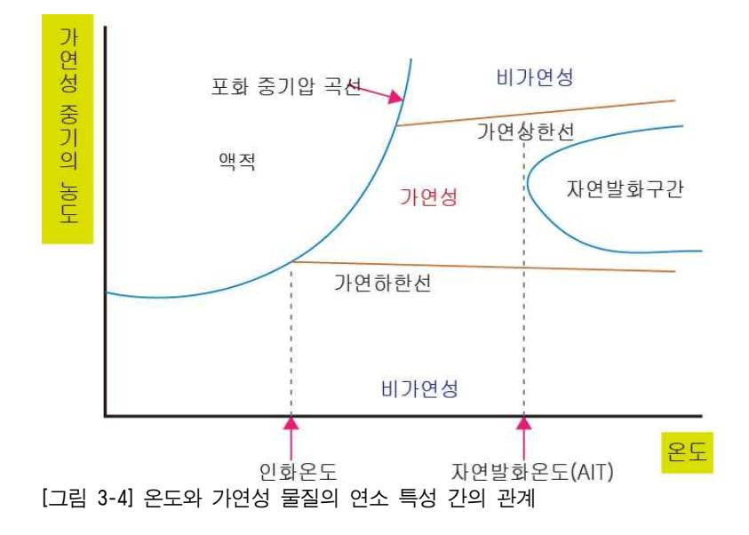

#### (6) 열분석 (DSC, TGA)

열분석이란 물질의 물리적 변수(physical parameter)를 온도의 함수로 나타내는 분석 방법이다. 대표적인 방법들은 [표 3-5]와 같다. 본 시험 평가에서는 DSC와 TGA를 이용 한 열분석을 실시하였다.

<표 3-5> 액체의 밀도 및 비중 측정방법의 종류

| 측정법                                    | 관측량 | 기호    | 단위    |
|----------------------------------------|-----|-------|-------|
| DTA(Differential Thermal Analysis)     | 온도차 | ⊿T    | K     |
| DSC(Differential Scanning Calorimeter) | 열유속 | ⊿q    | J/s=W |
| TGA(Thermo Gravimetric Analysis)       | 중량  | g(%)  | g     |
| TMA(Thermo Mechanical Analysis)        | 길이  | ⊿L(%) | m     |

(7) 시차주사열량계 (DSC, Differential Scanning Calorimeter)

DSC (시차주사열량계)는 시료와 불활성 기준물질을 동일한 온도 프로그램에 따라 변화 시키면서 온도와 시간의 함수로서 측정된 시료와 기준물질의 열유속차이(Difference in heat flow)를 측정한다.

(8) 열중량분석기 (TGA, Thermo Gravimetric Analyzer)

열중량분석기(TGA)는 일정한 속도로 온도를 변화시켰을 때의 시료의 질량변화를 시간 이나 온도의 함수로써 측정한다.

# 학습3 교수·학습 방법

#### 교수 방법

- 반도체 리소그래피 제조공정을 쉽게 설명한다.
- 교수 주도로 현장에서 표준화한 공정 매뉴얼과 관련 공정 재료에서 제공되는 자료 등의 내용을 PPT 자료로 제시한 후에 설명한다.
- 가능한 한 사전에 제조 현장에서 사용하는 사례를 수집하여 자료를 준비하고 이해하기 쉬운 방법을 논의하는 방식의 문제 해결식 수업을 한다.
- 최근 반도체 산업 현황(시장 환경 및 기술 동향 등)에 대하여 충분히 인지하고, 학생들이 이를 이해할 수 있는 방법을 모색하여 수업을 진행한다.
- 관련 시장 환경 및 기술 변화를 통합 검색 사이트나 한국반도체산업협회의 홈페이지 (www.ksia.or.kr) 등에서 찾아 활용할 수 있도록 지도한다.
- 반도체 리소그래피 재료 요구사항에 필요한 내용을 확인하고, 관련 자료를 확보해 학생들에게 제시 후 파악 여부를 확인한다.
- 통계소프트웨어, 문서 작성프로그램 또는 일정관리 프로그램 등의 활용은 현장에서 직접 작성토 록 하여 문제가 되는 내용이 무엇인지를 파악하고, 이를 실무에 적용할 수 있도록 지도한다.

#### 학습 방법

- 반도체 산업 현황(시장 환경 및 기술 동향 등)과 관련 기관을 구체적으로 확인하도록 하고, 이 기관과 관련된 다양한 자료를 인터넷으로 검색하고 분류하여 문서로 정리한다.
- 반도체용 리소그래피 재료 요구사항 항목이 선정된 양식에 맞추어 특정 소자에 대한 요구사항을 작성해 본 후, 여기에 첨부되는 자료의 종류와 기록 내용 전반을 숙지하고, 가능하다면 소자별로 분류해 본다.
- 반도체용 리소그래피 재료 요구사항에 대한 시장 및 기술, 비용의 조사, 수집 및 분석을 통해 생산에 필요한 목표를 설정하고 분류된 자료를 활용하여 생산 가능성을 예측해 본다.
- 생산 시 예상되는 품질관리 문제점을 파악하고 해결책을 수립하는 현장의 업무를 이해하고, 정해진 양식에 따라 보고서를 작성해 본다.

69

# 학습3 평 가

#### 평가 준거

- 평가자는 학습자가 학습 목표를 성공적으로 달성하였는지를 평가해야 한다.
- 평가자는 다음 사항을 평가해야 한다.

| 하스 내요                      | 평가 항목                                                       |  | 성취수준 |   |  |  |
|----------------------------|-------------------------------------------------------------|--|------|---|--|--|
| 학습 내용                   |                                                             |  | 중    | 하 |  |  |
|                            | - 반도체 리소그래피 재료별 제조 공정의 장점과 단점 을 파악할 수 있다.                |  |      |   |  |  |
| 제조 공정의 파라미터 및 문제점 파악 | - 반도체 리소그래피 재료별 제조(공정/장비) 파라미터 를 파악하고 적용할 수 있다.          |  |      |   |  |  |
|                            | - 반도체 리소그래피 재료별 제조(공정/장비)에서 도출 된 문제점에 대한 해결방안을 제시할 수 있다. |  |      |   |  |  |

## 평가 방법

• 문제 해결 시나리오

| 하스 내요                      | 평가 항목                                     |  | 성취수준 |   |  |  |
|----------------------------|-------------------------------------------|--|------|---|--|--|
| 학습 내용                   |                                           |  | 중    | 하 |  |  |
| 재료 제조 공정의 장점과 단점 분석     | - 반도체 리소그래피 재료 제조 공정 이해                   |  |      |   |  |  |
|                            | - 반도체 리소그래피 재료 장점과 단점 파악                  |  |      |   |  |  |
| 제조 공정의 파라미터 및 문제점 파악 | - 반도체 리소그래피 재료별 제조(공정/장비) 파라미터 파악      |  |      |   |  |  |
|                            | - 반도체 리소그래피 재료별 제조(공정/장비) 문제점 해 결방안 제시 |  |      |   |  |  |

#### • 서술형 시험

| 학습 내용                      | 평가 항목                                            | 성취수준 |   |   |
|----------------------------|--------------------------------------------------|------|---|---|
|                            |                                                  | 상    | 중 | 하 |
| 재료 제조 공정의 장점과 단점 분석     | - 반도체 리소그래피 재료 제조 계획 수립 능력                    |      |   |   |
|                            | - 재료 제조 계획 수행하는 능력                            |      |   |   |
| 제조 공정의 파라미터 및 문제점 파악 | - 재료별 제조(공정/장비) 파라미터 파악하고 적용하는 능력          |      |   |   |
|                            | - 제조된 반도체 리소그래피 재료별 품질 불량 및 응급 상황에 대처하는 능력 |      |   |   |

• 사례연구

|                            |                                                  | 성취수준 |   |   |
|----------------------------|--------------------------------------------------|------|---|---|
| 학습 내용                      | 평가 항목                                            | 상    | 중 | 하 |
| 재료 제조 공정의 장점과 단점 분석     | - 반도체 리소그래피 재료 제조 공정 이해                       |      |   |   |
|                            | - 반도체 리소그래피 재료 장점과 단점 파악                      |      |   |   |
|                            | - 반도체 리소그래피 재료 제조 계획 수립 능력                    |      |   |   |
|                            | - 재료 제조 계획 수행하는 능력                            |      |   |   |
| 제조 공정의 파라미터 및 문제점 파악 | - 재료별 제조(공정/장비) 파라미터 파악                       |      |   |   |
|                            | - 재료별 제조(공정/장비) 문제점 해결방안 제시                   |      |   |   |
|                            | - 재료별 제조(공정/장비) 파라미터 파악하고 적용하는 능력          |      |   |   |
|                            | - 제조된 반도체 리소그래피 재료별 품질 불량 및 응급 상황에 대처하는 능력 |      |   |   |

#### 피드백

| 1. 문제 해결 시나리오                                   |  |
|-------------------------------------------------|--|
| - 사례연구 실습과정을 평가한 후, 그룹별로 문제점 및 개선점들을 표시하여 점검한다. |  |
| 2. 서술형 시험                                       |  |
| - 평가 결과, 일정 점수 이하인 학생들은 추가 학습 후, 결과를 제출하도록 한다.  |  |
| 3. 사례연구                                         |  |
| - 학습한 내용이 효과적으로 전달되지 않은 경우에는 발표방법에 대한 추가 지도를 수행 |  |
| 한다.                                             |  |

| 학습 4 | 반도체용 리소그래피 제품특성 검증하기(LM1903060402_14v1.4)  |
|------|-----------------------------------------------|
| 학습 3 | 반도체용 리소그래피 재료 제조하기 (LM1903060402_14v1.3)   |
| 학습 2 | 반도체용 리소그래피 재료 선정하기 (LM1903060402_14v1.2)   |
| 학습 1 | 반도체용 리소그래피 요구사항 파악하기 (LM1903060402_14v1.1) |

# **4-1.** 리소그래피 분석 및 시험 문제점 해결

# 학습 목표 • 반도체 리소그래피의 분석 시 문제점에 대한 해결방안을 제시할 수 있다. • 반도체 리소그래피의 시험 시 문제점에 대한 해결방안을 제시할 수 있다.

# 필요 지식 /

리소그래피 분석 및 시험

리소그래피 공정 원리를 이해하고, 공정에 쓰이는 리소그래피 공정 분석의 문제점을 파악 하고 그 기술을 이해해야 한다. 공정/최종 성적서를 기반으로 정의되어야 한다.

1. 리소그래피 분석 및 시험

포토리소그래피 공정에 의해 형성된 패턴을 분석하는 방법, 포토리소그래피 공정을 분석 하는 방법, 및 포토리소그래피 공정과 그에 의하여 형성된 패턴과의 상관관계를 분석하기 위한 다양한 방법에 대하여 방법을 알아야 한다. 프로파일 그래프를 주파수 도메인의 주 파수 그래프로 변환하고, 저주파수 대역의 그래프와 고주파수 대역의 그래프로 분리하는 것이다. 프로파일 그래프를 분리하는 것은 퓨리어 변환 방법을 이용하여 프로파일 그래프 를 주파수 도메인(frequency domain)의 주파수 그래프로 변환하고, 밴드 패스 필터 등을 이용하여 주파수 도메인의 주파수 그래프를 저주파수 대역의 그래프 및 고주파수 대역의 그래프로 분리하는 것이다. 주파수 도메인의 그래프들을 역(inverse) 퓨리어 변환하여 위 치 도메인의 저주파수 프로파일 그래프 및 고주파수 프로파일 그래프로 변환할 수 있다. 주파수 도메인의 저주파수 대역의 그래프는 위치 도메인의 저주파수 프로파일 그래프로 변환될 수 있고, 주파수 도메인의 고주파수 대역의 그래프는 위치 도메인의 고주파수 프 로파일 그래프로 변환될 수 있다. 이후, 저주파수 프로파일 그래프 및 고주파수 프로파일

그래프를 각각 분석하는 것이다. 저주파수 프로파일 그래프는 라인 이미지의 선폭들의 거 시적(macro)인 변동 또는 선거칠기(line roughness)를 의미할 수 있고, 및 고주파수 프로파 일 그래프는 라인 이미지의 선폭들의 미시적(micro)인 변동 또는 선 거칠기를 의미할 수 있다. 따라서, 라인 이미지의 선폭들 및 선 거칠기 들이 수치적으로 정확하게 분석될 수 있고, 포토리소그래피 공정의 패턴 형성 능력이 분석, 평가될 수 있다.

#### 감광제의 분석 및 시험 해결방안

- 1. 감광제의 분석 및 시험 해결방안
  - (1) KrF 포토 리소그래프용 감광제

분석 시 요구되어야 하는 특성으로 선폭의 감소, 건식식각내성, 높은 해상도, 넓은 DOF 마진, 무결점 박막 형성, 기판 접착력, 높은 콘트라스트, 높은 감도, 화학적 안정 성 등이 있다.

(2) ArF 포토 리소그래프용 감광제

분석 시 요구되어야 하는 특성으로 193nm 광 투명성, 건식식각저항성, 접착성, 알칼리 현상액 현상성, 고감도 등이 있다.

(3) EUV 포토 리소그래프용 감광제

분석 시 요구되어야 하는 특성으로 낮은 흡광도, 높은 식각내성뿐만 아니라 충분히 빠 른 감도, 기판과의 밀착성, 가스 형성의 최소, LER(line edge roughness)의 최소화 등이 있다.

(4) 감광제의 분석

표면을 분석하기 위해 사용되는 분석방법 중에 nearedgeX-ray absorption fine structure spectroscopy(NEXAFS) 방법이 있다. 전자의 빈 분자 오비탈로 의 여기로 인 한 X-ray 흡광 혹은 투과를 측정하여 시료 표면의 원소의 종류와 결합 상태를 확인할 수 있다.

- (5) 반사형 또는 PSM(phase shift mask) 같은 포토마스크의 종류
- (6) 감광제, 현상액(developer), 에천트의 종류
- (7) 레시피(recipe) 같은 다양한 공정 조건들을 조합하는 것

# 수행 내용 / 리소그래피 분석 및 시험 문제점 해결하기

#### 재료·자료

- Ÿ ASTM, ISO, JIS, SEMI, KS 표준화 문서
- Ÿ ITRS 로드맵 (International Technology Roadmap for Semiconductor) 및 반도체 로드맵
- Ÿ MSDS, RoHS, WEEE (Waste Electrical and Electronic Equipment)
- Ÿ 리소그래피 재료
  - Immersion Photo Resist, Top Coat, BARC, Relacs/SAFIER, ArF Photo Resist, SOC, Developer
  - KrF Photo Resist, MFHM, Thinner, I-line Photo Resist, SOD

기기(장비・ 공구)

- Ÿ 제조 공정 장비
  - 유기, 무기 합성 Pilot 설비
  - PR류 Mixing Vessel
  - 중합체 합성 Pilot 설비
  - 제조공정 이상 발생 Monitoring 설비
  - Bottle Cleaning 설비
  - 원자재 저장 창고
  - Bottle Filling 설비
- Ÿ 평가, 분석 및 계측장비
  - Arf Scanner, Elipsometer, GC
  - I-line Stepper, Microscope, HPLC
  - Track, ICP-MS,nmR
  - CD-SEM, Bath(VB-10), Viscometer(BF), FT-IR
  - Dynamic Contact Angle, Refractometer, UV

- Coating Defect Inspection, Coulometric Titrator(831), GPC
- Air particle counter, Automatic Titrator(DL50), DSC/TGA
- Amine 농동 측정기, Moisture Analyzer, 전기적 특성 측정기
- Furnace, Liquid particle counter
- Ÿ 안전도구, 안전화, 안전모, 마스크, 장갑, 고글, 방진복
- Ÿ 컴퓨터, 프린터, 복사기

#### 안전 ・ 유의 사항

- Ÿ 제조 공정 장비란 제품을 제조하기 위한 장비로서 규정에 따라 관리되어야 하며, 일정 주기와 방법에 따라 장비 성능이 평가되어야 한다.
- Ÿ 제조 공정 시 응급상황대처 능력이란, 반도체 리소그래피 제조 시 돌발적으로 발생하는 불량률의 급증사태를 정상으로 복구하는 능력이다.
- Ÿ 평가/분석/계측기란 제품의 물성이나 특성을 평가하는 검사를 실시하는 장비로서 규정에 따라 관리되어야 하며 일정 주기와 방법에 따라 검, 교정을 실시하는 장비를 의미한다.
- Ÿ 작업표준에는 공정순서 및 조건(온도, 시간, 환경)을 포함한다.
- Ÿ 품질관리에서는 통계를 활용한 리소그래피의 품질 관리를 통하여 불량의 발생 및 불량 원인을 조사하여 개선함으로써 품질의 균일성(6-시그마)을 확보하여야 한다.
- Ÿ CoA (Certificate of Analysis)는 가스의 순도 및 불순물 등 해당 제품의 품질 및 Specification을 나타낸다.
- Ÿ 검, 교정계획이란 품질에 영향을 미칠 수 있는 해당 제품의 특성에 대해 측정하는 장비에 대한 측정 오차나 정밀도를 높이는 작업 계획을 말하며, 이러한 내용은 검, 교정 관리대장에 기술한다.

#### 수행 순서

 리소그래피 분석 순서를 파악한다. 리소그래피 공정 원리를 이해하고, 공정에 쓰이는 리소그래피 공정 분석의 문제점을 파악 하고 그 기술을 이해해야 한다.

1. 리소그래피 분석 순서 리소그래피 공정에 의해 형성된 패턴 분석, 공정 분석, 및 공정과 형성된 패턴과의 상관관

75

계를 분석하기 위한 다양한 방법에 대하여 알아야 한다.

[그림 4-1]은 리소그래피 공정을 분석하는 방법을 개념적으로 설명할 수 있다. 리소그래피 공정을 분석하는 방법은, 포토리소그래피 공정을 수행하여 웨이퍼 상에 패턴을 형성하고, 패턴을 SEM 등으로 촬영하여 패턴 이미지를 획득하고, 패턴 이미지를 라인 이미지를 생 성하는 것이다. [그림 4-2]에서 패턴 이미지를 나타내었다 이때 라인들을 가질 수 있다. [그림 4-2]은 라인 이미지의 선폭들을 나타낸 것이다. 라인 이미지의 선폭들을 일정한 간 격(d1)은 다양하게 설정하여 측정 설비의 최소 해상도의 정수배일 수 있다. 측정한 선폭들 을 [그림 4-3]에서 나타낸 것처럼 프로파일 그래프로 나타내면 프로파일 그래프를 선폭들 을 측정한 포인트들을 플로팅(plotting)하는 것이다. 이해하기 쉽도록 프로파일 그래프는 선폭들의 변동이 시각적으로 충분히 구분될 수 있도록 한다. 프로파일 그래프는 위치(L, location)를 X축으로 하고 크기(A, amplitude)를 Y축으로 고려한 위치 도메인(location domain)의 그래프이다.

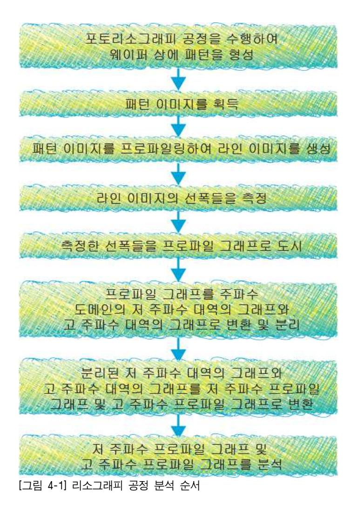

감광제의 분석 해결방안을 파악한다. 1. 감광제의 분석 해결방안

- - (1) 패턴의 선 거칠기 들을 개선코자 하는 경우, 어떠한 포토리소그래피 공정이 유용하리 라는 것을 미리 정확하게 파악할 수 있다.
  - (2) 다양한 포토리소그래피 공정들은, EUV(extremely untra violet) 같은 광원
  - (3) 스캐너(scanner) 같은 포토리소그래피 설비
  - (4) 사입사 조명(OAI, off-axis illumination) 같은 조명 방법
  - (5) 반사형 또는 PSM(phase shift mask) 같은 포토마스크의 종류
  - (6) 감광제, 현상액(developer), 에천트의 종류

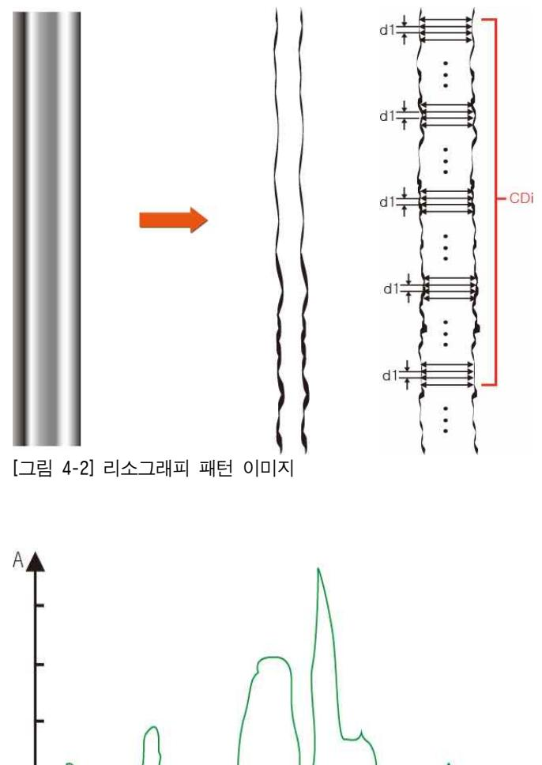

(7) 레시피(recipe) 같은 다양한 공정 조건들을 조합하는 것

[그림 4-3] 리소그래피 프로파일 그래프

# **4-2.** 리소그래피 평가 및 검증 문제점 해결

학습 목표 • 반도체 리소그래피의 평가 시 문제점에 대한 해결방안을 제시할 수 있다. • 반도체 리소그래피의 검증 시 문제점에 대한 해결방안을 제시할 수 있다.

# 필요 지식 /

리소그래피 평가 및 검증

리소그래피 공정 원리를 이해하고, 공정에 쓰이는 리소그래피 공정 평가 및 검증의 문제 점을 파악하고 그 기술을 이해해야 한다. 공정/최종 성적서를 기반으로 정의되어야 한다.

1. 리소그래피 평가 및 검증

포토리소그래피 공정에 의해 형성된 패턴을 평가 및 검증하는 방법, 포토리소그래피 공정 별 고려사항을 이해해야 한다.

(1) 패턴의 분해 능력 (Resolution)

분해능력이란 감광제가 얼마나 작은 크기의 패턴을 왜곡 없이 정확하게 구현해 낼 수 있는지를 나타내는 성능으로 193nm 체 감응하는 PR의 경우에는 80nm 이하의 해상력 이 일반적으로 요구되고 있다. 해상력의 향상은 PR 특성 개선으로 이루어질 수 있으나 노광기나 노광 기술, 현상 기술에 의해서도 향상될 수 있다. PR의 해상력을 높이기 위 해서는 PR의 광효율 (Quantum Yield), 노광에 의해 형성된 산의 확산도 (Photo-acid Diffusivity), 및 노광 전후의 현상액에 대한 용해도 차이 (Dissolution Contrast)를 개선하 여야 하며 이를 위해 다양한 형태와 특성을 갖는 고분자와 광산발생제 등이 개발된다.

(2) 왜곡 정도 (Aberration)

빛이 상의 한 점에 모이지 않고 흩어진 이유는 Exit Pupil의 파면 차이 때문이다. 점광 원에서 출발한 파면은 이상적인 구면파를 이루어야 하지만 광학계를 통과하면서 실제 로는 임의의 곡면을 이루고 있다. 이상적인 파면과 실제 파면 사이의 광경로 차가 파 면 수차로 위치에 따른 파면 함수로 나타낼 수 있다. 물체와 사이 정확히 닮은꼴이 아 닌 이유는 렌즈의 수차 때문이다.

(3) 분해능 향상 ( Resolution Enhanced Technology)

패턴이 작으면(주기가 짧으면) 회절각이 커지면서 결상을 위해서는 최소한 2개 차수 이상의 광이 간섭을 해야 한다. 이유는 큰 렌즈를 사용하고 짧은 파장의 광원을 사용 하기 때문이다.

#### (4) 패턴 거칠기 (Line Etch Roughness)

구현된 패턴의 거칠기를 의미하는 것으로 반도체의 집적도가 급격하게 높아짐에 따라 패턴의 크기 역시 작아지게 되는데 이때 형성된 패턴이 거칠게 되면 일정 길이의 패 턴의 폭이 심하게 변화한다는 의미가 되므로 그 패턴을 통해 만들어진 회로의 전기적 인 특성이 떨어지게 된다. 패턴의 크기가 300nm 이상의 비교적 큰 패턴에서는 문제가 되지 않지만, 패턴의 크기가 작아질수록 패턴 거칠기는 엄격하게 관리되고 있다. 보통 의 경우 패턴의 크기의 10% 정도로 관리하고 있다.

(5) 패턴 안정성 (Pattern Collapse)

패턴의 크기가 작아지면서 감광제 패턴과 기판과의 접촉면이 적어지게 된다. 이렇게 적어진 접촉면으로는 일정한 두께의 패턴을 쓰러짐 없이 유지하기가 쉽지 않은데 특 히 현상 후 세정을 위해 사용하는 물의 표면장력에 의해 패턴이 쓰러지는 경우가 생 기게 된다. 100nm 미만의 미세한 패턴에서 이러한 쓰러짐이 많은데 안정된 pattern의 유지를 위해 고분자의 기계적 특성과 기판과의 친화력 및 접착력을 향상시키는 방법 이 사용되고 있다. 쓰러짐의 방지를 위해 패턴의 높이와 너비의 비 (aspect ratio)가 큰 패턴의 경우 일반적으로 3:1로 관리 되었으나, 100nm 미만의 패턴에서는 2.5:1 또는 2:1로 관리되고 있다.

(6) 오염원 방지 (Contamination or Defect Control)

집적도 향상에 따른 패턴의 미세화가 가속화되면서 감광제 자체나 노광 및 현상 공정 중에 PR 패턴이 왜곡될 수 있는 오염의 방지가 중요해지고 있다. 이는 미세한 패턴 그리고 패턴과 패턴 사이에 작은 오염이라도 생기면 이를 통해 만들어지는 반도체의 수명이 짧아지거나 아예 작동을 하지 않는 경우가 생길 수 있기 때문이다. 엄격하게 관리되고 있는 오염원은 금속이온, 먼지나 불용물로 인해 생기는 입자성 오염 (particle), 그리고 PR의 균일성이 떨어져 생길 수 있는 패턴의 일그러짐 (pattern distortion or pattern defect) 등으로, 8 Giga DRAM 급인 65nm 공정에서는 평방 센티 미터 당 0.1개 이하의 규격으로 관리되고 있다.

#### 감광제의 평가 및 검증 해결방안

- 1. 감광제의 분석 및 시험 해결방안
  - (1) 패턴의 선 거칠기 들을 개선코자 하는 경우, 어떠한 포토리소그래피 공정이 유용하리 라는 것을 미리 정확하게 파악할 수 있다.
  - (2) 다양한 포토리소그래피 공정들은, EUV(extremely untra violet) 같은 광원
  - (3) 스캐너(scanner) 같은 포토리소그래피 설비

- (4) 사입사 조명(OAI, off-axis illumination) 같은 조명 방법
- (5) 반사형 또는 PSM(phase shift mask) 같은 포토마스크의 종류
- (6) 감광제, 현상액(developer), 에천트의 종류
- (7) 레시피(recipe) 같은 다양한 공정 조건들을 조합하는 것

## 수행 내용 / 리소그래피 평가 및 검증 문제점 해결하기

#### 재료·자료

- Ÿ ITRS 로드맵 (International Technology Roadmap for Semiconductor) 및 반도체 로드맵
- Ÿ MSDS, RoHS, WEEE (Waste Electrical and Electronic Equipment)
- Ÿ 시험성적서 및 평가/분석/검증 결과보고서
- Ÿ 리소그래피 재료
  - Immersion Photo Resist, Top Coat, BARC, Relacs/SAFIER, ArF Photo Resist, SOC, Developer

- KrF Photo Resist, MFHM, Thinner, I-line Photo Resist, SOD

#### 기기(장비 ・ 공구)

- Ÿ 제조 공정 장비
  - 유기, 무기 합성 Pilot 설비
  - PR류 Mixing Vessel
  - 중합체 합성 Pilot 설비
  - 제조공정 이상 발생 Monitoring 설비
  - Bottle Cleaning 설비
  - 원자재 저장 창고
  - Bottle Filling 설비

- Ÿ 평가, 분석 및 계측장비
  - Arf Scanner, Elipsometer, GC
  - I-line Stepper, Microscope, HPLC
  - Track, ICP-MS,nmR
  - CD-SEM, Bath(VB-10), Viscometer(BF), FT-IR
  - Dynamic Contact Angle, Refractometer, UV
  - Coating Defect Inspection, Coulometric Titrator(831), GPC
  - Air particle counter, Automatic Titrator(DL50), DSC/TGA
  - Amine 농동 측정기, Moisture Analyzer, 전기적 특성 측정기
  - Furnace, Liquid particle counter
- Ÿ 제조공장 인트라넷
- Ÿ 안전도구, 안전화, 안전모, 마스크, 장갑, 고글, 방진복
- Ÿ 컴퓨터, 프린터, 복사기

#### 안전 ・ 유의 사항

- Ÿ 평가/분석/계측기란 제품의 물성이나 특성을 평가하는 검사를 실시하는 장비로서 규정에 따라 관리되어야 하며 일정 주기와 방법에 따라 검, 교정을 실시하는 장비를 의미한다.
- Ÿ 작업표준에는 공정순서 및 조건(온도, 시간, 환경)을 포함한다.
- Ÿ CoA (Certificate of Analysis)는 가스의 순도 및 불순물 등 해당 제품의 품질 및 Specification을 나타낸다.
- Ÿ 검, 교정계획이란 품질에 영향을 미칠 수 있는 해당 제품의 특성에 대해 측정하는 장비에 대한 측정 오차나 정밀도를 높이는 작업 계획을 말하며, 이러한 내용은 검, 교정 관리대장에 기술한다.

#### 수행 순서

 리소그래피 평가 및 검증을 파악한다. 리소그래피 공정 원리를 이해하고, 공정에 쓰이는 리소그래피 공정 평가 및 검증의 문제 점을 파악하고 그 기술을 이해해야 한다.

1. 리소그래피 평가 및 검증

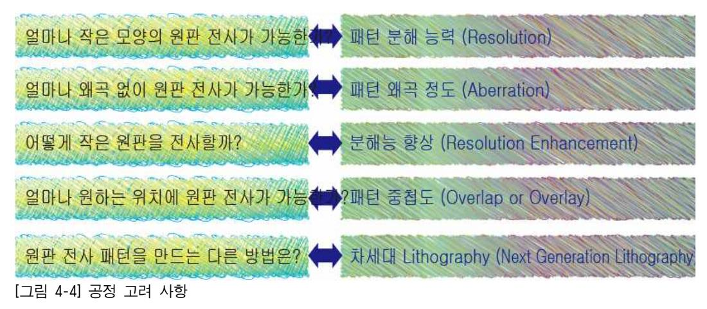

(1) 패턴의 분해 능력 (Resolution)

분해능력이란 감광제가 얼마나 작은 크기의 패턴을 왜곡 없이 정확하게 구현해 낼 수 있는지를 나타내는 성능으로 193nm 체 감응하는 PR의 경우에는 80nm 이하의 해상력 이 일반적으로 요구되고 있다.

(2) 왜곡 정도 (Aberration)

빛이 상의 한 점에 모이지 않고 흩어진 이유는 Exit Pupil의 파면 차이 때문이다. 점광 원에서 출발한 파면은 이상적인 구면파를 이루어야 하지만 광학계를 통과하면서 실제 로는 임의의 곡면을 이루고 있다.

#### (3) 분해능 향상 ( Resolution Enhanced Technology)

패턴이 작으면(주기가 짧으면) 회절각이 커지면서 결상을 위해서는 최소한 2개 차수 이상의 광이 간섭을 해야 한다. 이유는 큰 렌즈를 사용하고 짧은 파장의 광원을 사용 하기 때문이다.

(4) 패턴 거칠기 (Line Etch Roughness)

구현된 패턴의 거칠기를 의미하는 것으로 반도체의 집적도가 급격하게 높아짐에 따라 패턴의 크기 역시 작아지게 되는데 이때 형성된 패턴이 거칠게 되면 일정 길이의 패 턴의 폭이 심하게 변화한다는 의미가 되므로 그 패턴을 통해 만들어진 회로의 전기적 인 특성이 떨어지게 된다.

(5) 패턴 안정성 (Pattern Collapse)

패턴의 크기가 작아지면서 감광제 패턴과 기판과의 접촉면이 적어지게 된다. 이렇게 적어진 접촉면으로는 일정한 두께의 패턴을 쓰러짐 없이 유지하기가 쉽지 않은데 특 히 현상 후 세정을 위해 사용하는 물의 표면장력에 의해 패턴이 쓰러지는 경우가 생 기게 된다.

(6) 오염원 방지 (Contamination or Defect Control)

집적도 향상에 따른 패턴의 미세화가 가속화되면서 감광제 자체나 노광 및 현상 공정 중에 PR 패턴이 왜곡될 수 있는 오염의 방지가 중요해지고 있다.

감광제의 평가 및 검증 해결방안을 이해한다. 1. 감광제의 분석 및 시험 해결방안

- - (1) 패턴의 선 거칠기 들을 개선코자 하는 경우, 어떠한 포토리소그래피 공정이 유용하리 라는 것을 미리 정확하게 파악할 수 있다.
  - (2) 다양한 포토리소그래피 공정들은, EUV(extremely untra violet) 같은 광원
  - (3) 스캐너(scanner) 같은 포토리소그래피 설비
  - (4) 사입사 조명(OAI, off-axis illumination) 같은 조명 방법
  - (5) 반사형 또는 PSM(phase shift mask) 같은 포토마스크의 종류
  - (6) 감광제, 현상액(developer), 에천트의 종류
  - (7) 레시피(recipe) 같은 다양한 공정 조건들을 조합하는 것

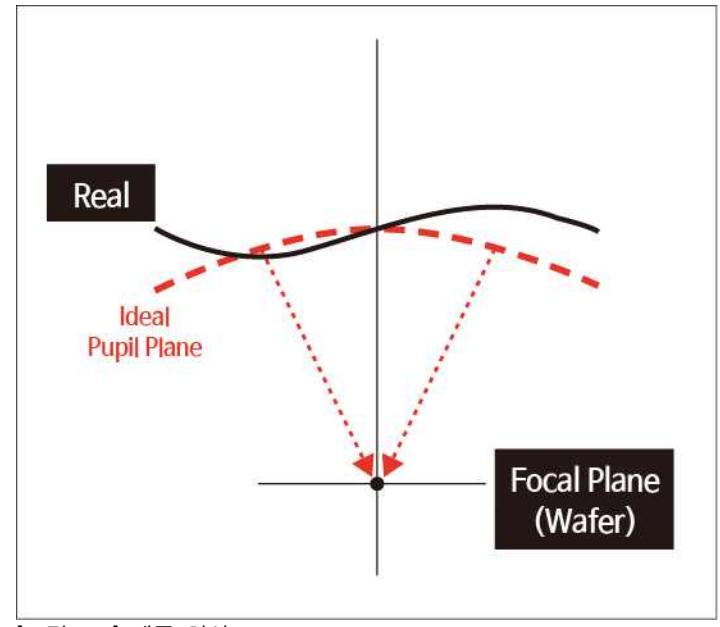

[그림 4-5] 왜곡 현상

# 학습4 교수·학습 방법

#### 교수 방법

- 반도체 리소그래피 제조공정을 쉽게 설명한다.
- 교수 주도로 현장에서 표준화한 공정 매뉴얼과 관련 공정 재료에서 제공되는 자료 등의 내용을 PPT 자료로 제시한 후에 설명한다.
- 가능한 한 사전에 제조 현장에서 사용하는 사례를 수집하여 자료를 준비하고 이해하기 쉬운 방법을 논의하는 방식의 문제 해결식 수업을 한다.
- 반도체 리소그래피 재료 요구사항에 필요한 내용을 확인하고, 관련 자료를 확보해 학생들에게 제시 후 파악 여부를 확인한다.
- 통계소프트웨어, 문서 작성프로그램 또는 일정관리 프로그램 등의 활용은 현장에서 직접 작성토 록 하여 문제가 되는 내용이 무엇인지를 파악하고, 이를 실무에 적용할 수 있도록 지도한다.

#### 학습 방법

- 반도체 산업 현황(시장 환경 및 기술 동향 등)과 관련 기관을 구체적으로 확인하도록 하고, 이 기관과 관련된 다양한 자료를 인터넷으로 검색하고 분류하여 문서로 정리한다.
- 반도체용 리소그래피 재료 요구사항 항목이 선정된 양식에 맞추어 특정 소자에 대한 요구사항을 작성해 본 후, 여기에 첨부되는 자료의 종류와 기록 내용 전반을 숙지하고, 가능하다면 소자별로 분류해 본다.
- 반도체용 리소그래피 재료 요구사항에 대한 시장 및 기술, 비용의 조사, 수집 및 분석을 통해 생산에 필요한 목표를 설정하고 분류된 자료를 활용하여 생산 가능성을 예측해 본다.
- 생산 시 예상되는 품질관리 문제점을 파악하고 해결책을 수립하는 현장의 업무를 이해하고, 정해진 양식에 따라 보고서를 작성해 본다.

# 학습4 평가

#### 평가 준거

• 평가자는 학습자가 학습 목표를 성공적으로 달성하였는지를 평가해야 한다.

#### • 평가자는 다음 사항을 평가해야 한다.

| 학습 내용          | 평가 항목                                                                 | Ş | 성취수건 |   |
|----------------|-----------------------------------------------------------------------|---|------|---|
| 획급 네ठ          |                                                                       | 상 | 중    | 하 |
| 리소그래피 분석       | - 반도체 리소그래피의 분석 시 문제점에 대한 해결방 안을 제시할 수 있다.                         |   |      |   |
| 및 시험 문제점 해결 | - 반도체 리소그래피의 시험 시 문제점에 대한 해결방 안을 제시할 수 있다.                         |   |      |   |
| 리소그래피 평가       | - 반도체 리소그래피의 평가 시 문제점에 대한 해결방 안을 제시할 수 있다.                         |   |      |   |
| 및 검증 문제점 해결 | <ul> <li>반도체 리소그래피의 검증 시 문제점에 대한 해결방</li> <li>안을 제시할 수 있다.</li> </ul> |   |      |   |

#### 평가 방법

• 문제 해결 시나리오

| 치스 미요                      | 편기 하모                        |   |   | Ē |
|----------------------------|------------------------------|---|---|---|
| 학습 내용                      | 평가 항목                        | 상 | 중 | 하 |
| 리소그래피 분석 및 시험 문제점 해결 | - 제조된 반도체 리소그래피의 품질을 분석하는 능력 |   |   |   |
|                            | - 제조된 반도체 리소그래피의 문제점 해결방안 제시 |   |   |   |
|                            | - 제조된 반도체 리소그래피의 품질을 시험하는 능력 |   |   |   |
|                            | - 제조된 반도체 리소그래피의 문제점 해결방안 제시 |   |   |   |
|                            | - 제조된 반도체 리소그래피의 품질을 평가하는 능력 |   |   |   |
| 리소그래피 평가                   | - 제조된 반도체 리소그래피의 문제점 해결방안 제시 |   |   |   |
| 및 검증 문제점 해결             | - 제조된 반도체 리소그래피의 품질을 검증하는 능력 |   |   |   |
|                            | - 제조된 반도체 리소그래피의 문제점 해결방안 제시 |   |   |   |

#### • 서술형 시험

| 학습 내용                      | 평가 항목                                    | 성취수준 |   |   |  |
|----------------------------|------------------------------------------|------|---|---|--|
| 익답 내용                      | 경기 양국                                    | 상    | 중 | 하 |  |
| 리소그래피 분석 및 시험 문제점 해결 | - 반도체 리소그래피의 품질평가를 위한 시험표준들에 대한 지식    |      |   |   |  |
|                            | - 반도체 리소그래피의 제조검증보고서 및 관련 문서를 작성하는 능력 |      |   |   |  |
|                            | - 반도체 리소그래피의 불량품을 검증하고 작업표준을 준수하는 능력  |      |   |   |  |
| 리소그래피 평가 및 검증 문제점 해결 | - 반도체 리소그래피의 품질평가를 위한 시험표준들에 대한 지식    |      |   |   |  |
|                            | - 반도체 리소그래피의 제조검증보고서 및 관련 문서를 작성하는 능력 |      |   |   |  |
| 에르                         | - 반도체 리소그래피의 불량품을 검증하고 작업표준을 준수하는 능력  |      |   |   |  |

#### • 평가자 체크리스트

| 학습 내용                      | 평가 항목                                                               | Ş | 5 |   |
|----------------------------|---------------------------------------------------------------------|---|---|---|
| 러급 네ठ                      |                                                                     | 상 | 중 | 하 |
|                            | - 반도체 리소그래피 분석, 시험, 해결 능력                                           |   |   |   |
| 리소그래피 분석 및 시험 문제점 해결 | - 반도체 리소그래피의 품질평가를 위한 시험표준들에 대한 지식과 제조검증보고서 및 관련 문서를 작성하 는 능력 |   |   |   |
|                            | - 반도체 리소그래피의 불량품을 검증하고 작업표준을 준수하는 능력                             |   |   |   |
|                            | - 반도체 리소그래피 평가, 검증, 해결 능력                                           |   |   |   |
| 리소그래피 평가 및 검증 문제점 해결 | - 반도체 리소그래피의 품질평가를 위한 시험표준들에 대한 지식과 제조검증보고서 및 관련 문서를 작성하 는 능력 |   |   |   |
| · · -                      | - 반도체 리소그래피의 불량품을 검증하고 작업표준을 준수하는 능력                             |   |   |   |

피드백

1. 문제 해결 시나리오 - 사례연구 실습과정을 평가한 후, 그룹별로 문제점 및 개선점들을 표시하여 점검한다. 2. 서술형 시험 - 평가 결과, 일정 점수 이하인 학생들은 추가 학습 후, 결과를 제출하도록 한다. 3. 평가자 체크리스트 - 학습한 내용이 효과적으로 전달되지 않은 경우에는 추가 지도를 수행한다.

- ∙ 국제반도체장비재료협회(2003). 반도체 재료 시장. http://www.semi.org/ko/node/8821에서 2016.07.22. 검색.
- ∙ 김우철 외 9명 저 (2006). 『통계학 개론』. 영지문화사.
- ∙ 김학동(2013). 『반도체 재료』. 홍릉과학출판사.
- ∙ 박문수, 김봉식, 이대수, 이진국 (2003).『고분자화학 입문』. 자유아카데미.
- ∙ 신판우, 조승래 (2011).『유기공업화학』. 보성문화사.
- ∙ 심용대·장영대(2006). 『품질검사기초』. 중소기업진흥공단 중소기업연수원.
- ∙ 염근영 저 (2012). 『플라즈마 식각 기술』. 도서출판 YOUNG.
- ∙ 윤영섭, 강성준 저 (2012). 『VLSI 공정기술』. 홍릉과학출판사.
- ∙ 이순룡 저 (2002) 『현대품질경영』. 도서출판 법문사.
- ∙ 전야창홍 저 (2002). 『생활속의 통계분석』. 윤병창 역. ㈜북스힐.
- ∙ 채재우(2010). 『소재기술백서2010』. 재료연구소.
- ∙ 한국반도체산업협회(2006). 『반도체재료기술 로드맵 조사·연구보고서』. 한국반도체산업협회.
- ∙ 화학정보센터(2011). 『2011 일본 화학산업 동향 <반도체용 화합물 산업>』. 한구화학연구원.
- ∙ 황호정 저 (2003).『반도체 공정기술』. 생능출판사.
- ∙ James E. Brady, Neil D. Jespersen, Alison Hyslop (2013).『일반화학 (Chemistry : The Molecular Nature of Matter, Sixth Edition)』. 일반화학교재연구회. 자유아카데미.
- ∙ Michael Quirk, Julian Serda 원저 (2013). 『반도체 소자 공정기술』. 최성재 역. 자유아카데미.
- ∙ S. Wolf, R.N. Tauber (20008).『Silicon Processing for the VLSI Era』. Lattice Press.
- ∙ William Beown, Thomas Poon (2011).『유기화학 입문(Introduction to Organic Chemistry)』. 유기 화학교재연구회. 자유아카데미.

# 공정/최종 검사 성적서

|          |                  | 0 D | 정/최   | 종 검사 M50EX/20 | 성적    | K    |          |    |             | 결 재 | 작성 | 검토 | 검토         | 승인     |
|----------|------------------|--------|-------|------------------|-------|------|----------|----|-------------|--------|----|----|------------|--------|
|          |                  | 모일     | 빌려:HN | 150EX/20         | )02R/ | 1001 |          |    |             |        | 1  | /  | /          | /      |
| Ser.#    | +                |        |       |                  |       |      |          | 자  | ·성일자        | L      |    | /  | /          | /      |
| 공정검사     |                  |        |       |                  |       |      |          |    | 종검사         |        |    |    |            |        |
| 모터       |                  | 벨트     |       | 합판               |       | 롤러   |          |    |             | -PCB#  |    | 풀  | 믜벨트        |        |
| 모터#      |                  | 벨트#    |       |  합판#          |       | 입고   |          |    |             | MPU #  | _  |    | 고델         |        |
|  모델   |                  |  모델 |       | 모델               |       | 롤러   |          |    |             | MPS#   | +  | -  |  조원     |        |
| 제조원      |                  | 제조원    |       | 제조원              |       | 제조   |          |    |             | /B접지   |    | -  | <u>비</u> 션 |        |
|          | 1                |        |       |                  |       |      | 7        |    |             |        |    |    |            |        |
|          | 2                |        |       |                  |       |      | 8        |    |             |        |    |    |            |        |
| 검사항 목 | 3                |        |       |                  |       |      | 9        |    |             |        |    |    |            |        |
|          | 4 5           |        |       |                  |       |      | 10 11 |    |             |        |    |    |            |        |
|          | 6                |        |       |                  |       |      | 12       |    |             |        |    |    |            |        |
|          |                  |        |       |                  |       |      |          | 공간 | 덩검 <i>사</i> |        | 최종 | 억사 | 2          | ]과     |
|          | 검 사 항목     |        | וכ    | 준 및 허용           | 치     |      |          |    |             |        |    |    |            |        |
|          | 목                |        |       |                  |       |      |          | 1  | 2           |        | 1  | 2  | 적합         | 부적합    |
|          |                  |        |       |                  |       |      |          |    |             |        |    |    |            |        |
| 검 사   |                  |        |       |                  |       |      |          |    |             |        |    |    |            |        |
|          |                  |        |       |                  |       |      |          |    |             |        |    |    |            |        |
| 기 준   |                  |        |       |                  |       |      |          |    |             |        |    |    |            |        |
| 및        |                  |        |       |                  |       |      |          |    |             |        |    |    |            |        |
|          |                  |        |       |                  |       |      |          |    |             |        |    |    |            |        |
| 결 과   |                  |        |       |                  |       |      |          |    |             |        |    |    |            |        |
|          |                  |        |       |                  |       |      |          |    |             |        |    |    |            |        |
|          |                  |        |       |                  |       |      |          |    |             |        |    |    |            |        |
|          | $\vdash$         |        |       |                  |       |      |          |    |             |        |    |    |            |        |
|          | $\left  \right $ |        |       |                  |       |      |          |    |             |        |    |    |            |        |
| 종합 판정 |                  |        |       |                  |       |      |          | 1  | 1           |        |    |    | 최종판        | l 정 |
| 특기 사항 |                  |        |       |                  |       |      |          |    |             |        |    |    |            |        |

ISO-품보-P-803-03

89

용어정리

- Ÿ 6-시그마란 제품의 품질관리를 위한 통계적 접근방법으로서 품질관리에 필요한 모든 요소를 논리적으로 관리하고, 발생 가능한 오류를 최소화하기 위한 관리기법이다.
- Ÿ표준분석법이란 ASTM, JIS, ISO, SEMI, KS와 같은 상호 공인 또는 사내의 표준분석법을 뜻하며, 전처리, 용량, 분석기기, 분석방법을 자세히 규정한 분석법을 말한다.
- Ÿ ASTM(American Society for Testing and Materials : 미국재료시험협회)란 미국의 재료 규격 및 재료 시험에 관한 기준을 정하는 기관으로 표준화와 연구업무의 추진을 목적으로한다.
- Ÿ ISO(International Standardization Organization : 국제표준화기구)란 국제간에 이용되는 규격으로 각국의 공업규격을 조정·통일하고, 물자와 서비스의 국제적 교류를 유도하며, 과학적·지적· 경제적 활동 분야의 협력을 증진하는 것을 목적으로한다.
- ŸJIS(Japanese Industrial Standards : 일본 공업 규격)란 일본에서 사용되는 국가 기술 표준으로, 많은 분야의 공업제품에 관한 규격이 제정되었다. 국제규격으로 ISO, IEC와 제휴되어 있다.
- Ÿ SEMI(Semiconductor Equipment and Material Institute)란 반도체 제조 장비 재료 협회로서 케미컬 (C), 제조 장치(하드, 소프트(E)), 재료(M), 그리고 패키징(G), 마이크로 패터닝(P) 및 안전성 부회에 서 SEMI International Standards를 간행하고 있다.
- Ÿ KS(Korean Industrial Standards : 한국 공업 규격)란 공업 표준화를 위해 제정된 공업 규격을 보급ㆍ활용하여 제품의 품질 개선과 생산능률의 향상, 거래의 단순화와 공정화의 도모 및 소비자 보호를 위해 만들어진 제도를 말한다.
- ŸRoHS(Restriction of the use of Hazardous Substances in EEE)란 전기전자제품에 납, 카드뮴, 수은, 크롬, 난연제(PBBs, PBDEs)와 같은 유해물질 사용을 제한하는 유해물질사용제한지침을 말한다.
- Ÿ WEEE(Waste Electrical and Electronic Equipment)란 폐가전제품의 의무재활용에 관한 규제로서 폐전기 전자제품의 재활용 비용을 생산자가 부담하는 제도를 말한다.
- Ÿ MSDS(Material Safety Data Sheet)란 화학물질을 안전하게 사용하고 관리하기 위하여 필요한 정보를 기재한 Sheet로서 제조자명, 제품명, 성분과 성질, 취급상의 주의, 적용법규, 사고시의 응급처치방법 등이 기입된 Data Sheet를 말한다.

#### **NCS 학습모듈 개발진**

| (대표집필자)    | (집필진)           | (검토진)            |
|------------|-----------------|------------------|
| 김관하(대덕대학교) | 강필승(메그나칩반도체)    | 권기백(대덕대학교)       |
|            | 김상용(한국폴리텍대학)*   | 김동표(케이디전자)       |
|            | 김종식(드림테크)       | 박태진(대덕대학교)       |
|            | 양민철(서울공업고등학교)   | 여순일(한국전자통신연구원)*  |
|            | 우종창(이너센서)       | 정용철(한국생산기술연구원)   |
|            | 이병철(비드앤마이크로)*   |                  |
|            | 장현경(강원대학교)*     |                  |
|            | 정재복(메이플테크)*     |                  |
|            | 제창한(한국전자통신연구원)  |                  |
|            | 홍진균((前) LG실트론)* |                  |
|            |                 |                  |
|            |                 |                  |
| (공동개발기관)   | (연구기관)          |                  |
| 권기백(대덕대학교) | 옥준필(한국직업능력개발원)  |                  |
| 김관하(대덕대학교) | 박종성(한국직업능력개발원)  |                  |
| 박태진(대덕대학교) | 나현미(한국직업능력개발원)  |                  |
|            | 최영인(한국직업능력개발원)  |                  |
|            | 구윤재(한국직업능력개발원)  | *표시는 해당 NCS 개발진임 |
|            |                 |                  |

※ 이 학습모듈은 자격기본법 시행령(제8조 국가직무능력표준의 활용)에 의거하여 개발하였으며, NCS 국가직무능력표준 통합포털사이트(http://www.ncs.go.kr)에서 다운로드 할 수 있습니다.

www.ncs.go.kr

